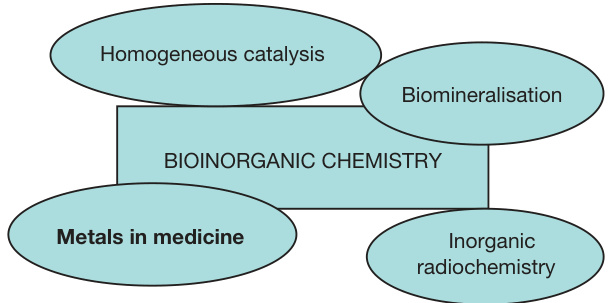

# 生物无机化学

> 警告：本文由机器翻译生成，可能导致质量不佳或信息有误，请谨慎阅读！

J Reedijk，莱顿大学，荷兰莱顿

$ \ CircledCirc2013 $ Elsevier Inc.保留所有权利。

背景
未来的发展
参考

# 背景

众所周知，金属离子在生长和新陈代谢中确实在生命系统中起着至关重要的作用。 从1960年代初开始，对金属在生物系统中的重要性的认识开始，但是自$ 1930^{\ prime} s $以来，它就已经知道了金属在酶和蛋白质中存在的金属，例如在血红蛋白，细胞染料和蛋白质中以及在 第一个结晶的酶脲酶。 从历史上看，铁作为至关重要的金属的作用已有几个世纪了，而其他元素的作用，例如碘，钴，铜，锰镁，钙和锌，自上世纪前几十年以来就一直知道。 实际上，这些关键元素过多的元素可能非常危险，并且对于每个元素，都需要最佳的浓度。 这些所谓的痕量元素（即金属和非金属）通常存在狭窄的浓度窗口。 对这些元素的分子作用的研究是生物无机化学的一部分，刚刚开始详细理解。1,3,4

In 关于协调化学的多重次数II（2003）1 1卷第8卷中的生物无机化学领域已经涵盖了许多章节。在《无机化学》中，II（2013），2个相关章节，尤其是第3卷。 这些章节的数量已包括在本模块下，在更新后的许多情况下，并且由于该领域的最新发展，在某些情况下已完全重写或作为新条目。

生物无机化学本身涉及Na，K，Mg，CA的主要组元素，以及与V，Mo，Mo，Mn，Fe，Co，Ni，$ \ Mathrm {Cu}，$ and $ and $ and $和Zn等过渡金属。 这些元素在生命中起着强烈的作用，要么与有机分子和蛋白质松散结合。 本节介绍了这些金属的系统处理，包括一些非金属，例如硒，碘，氟和氯。 对重型元素的有毒特性（如HG，CD）和$ {\ Mathrm {pb}}的理解，$通常也被视为生物无机化学的一部分，并且该主题将在医学中的金属中进行处理。 诊断剂，例如GD MRI剂和放射性TC配位化合物，也将在医学部门的金属中进行治疗。 在许多均质催化过程中，通常使用仿生或生物启发的化合物。 这些将在该节中进行处理。 最后，在本节中，就分子细节而言，将处理生物矿化的日益增长的生物矿化主题，通常处理钙或铁盐，例如骨骼和骨骼形成以及用于方向的磁铁矿颗粒。

可以在示意性地描绘出生物无机化学的位置和刚才提到的其他亚地区之间的相互关系（方案1）。

这个自由访问的主题章节将重点关注生物系统和环境中无机元素的分子角色。 在本章中，将处理生物无机化学的一些一般方面。 在过去的40年中，生物无机化学已与国际（Icbic）和地区（欧洲阿基斯语）会议一起发展到了大量的科学领域，吸引了大量代表。 来自各种学科的科学家现在有助于这一研究领域，因此本节是对该领域的新移民的适当介绍。

在所有情况下，共同的兴趣是无机元素，金属离子和金属化合物与生活系统的作用。 共同研究活动的分类是：

- 对金属蛋白，核酸，碳水化合物，膜的金属配位环境的研究；
- 研究在酶的金属中心发生的反应机理；
- 研究金属蛋白中活性位点的合成类似物（设计，合成，结构，光谱和催化反应）；
- 研究生物矿化过程。

在一个单独的领域，通常也被视为生物无机化学，但现在在“医学中的金属”中进行了处理：

- 含金属药物以治愈或预防疾病（新药的合成，作用机理）；
- 金属离子和金属化合物往返生命系统（排毒）的去除和运输。

该主题的主要方法将建立在分子方面，这一方面通常涉及将金属与配体协调。 在生物系统中，通常发现金属与生物分子或小配体协调，例如：

a）蛋白质，尤其是其侧链，例如硫醇酯，咪唑，羧酸盐；
b）在磷酸盐，糖，糖基原子的核酸，例如鸟嘌呤等核酸；
c）碳水化合物，脂质，但几乎不知道分子； d）刚性固体（骨，牙齿，沉积物）；
e）假肢，例如四吡咯和诸如FAD，PQQ等副因素；
f）小离子，例如$ \ mathrm {oh}^{ - } $，$ \ mathrm {o} _ {2}^{ - } $，$ s_ {2}^{\ mathrm {\ mathrm {〜-〜-〜}}} ，$，$，$ \ mathrm {ooh}^{ - } $，$ \ mathrm {co_ {3}}}^{2  - } $ and molecules $ \ left（\ mathrm {o} _ {o} _ {2}， } _ {2} \ mathrm {o} \ right）$。

  
方案1位于邻近无机化学区域的生物无机化学。

一些生物含量的小分子配体有毒性很大，例如 co，no，$ {\ mathrm {h}} _ {2} {\ mathrm {s}}，$ and $ and the anions：$ \ mathrm {cn}^{ - }，\ mathrm {f}^{ - }^{ - } $ 。 它们通常与例如金属结合。 假体基团（例如在金属丁丁物中），或与更容易获得的金属离子进行协调，从而阻断了该金属的适当生物学功能。 在文献中，配体概述可提供其生物存在和反应性的例子。3

了解金属和配体在体内的反应性很重要。 涉及体内金属离子和配体的反应始终是复杂的平衡反应系统的一部分。 动力学和热力学在生物反应中都起着关键作用。 金属和配体的简单存在不一定会产生所需的产物或反应。 反应要么太慢了，例如进入四吡俄系统的金属，或者与其他金属离子或配体的竞争反应数量会导致不同的产物。 因此，对反应动力学的理解取决于金属和配体至关重要。5,6

在生活系统中，金属离子的作用可以限于结构功能，例如 通过将生物分子（或部分部分）放在或多或少固定的结构中。 但是在许多情况下，金属的活性，通过协调数的变化或变化或氧化状态在其功能中至关重要。 众所周知的结构金属示例是$ \ mathrm {Ca}^{2+} $在Thermolysin中（一种在活性位点具有Zn的酶），而在超氧化物歧化酶（Cu酶）和酒精脱氢酶（在其非非氧化物中）中的Zn - 催化位点）。

需要在多个生物体中有效加工金属离子的运输和存储。 对于铁，蛋白质转铁蛋白用于人类运输，白蛋白用于铜运输。 蛋白铁蛋白以铁储存而闻名。 然而，最重要的是金属离子及其配体在催化作用中的结合。 这种催化作用只能在电子转移中，7，但在许多情况下，它是复杂的氧化还原反应。 由于金属和周围配体的特定位点激活反应的金属发生。 酶的例子是细胞色素C氧化酶，铁蛋白，碳酸酐酶和酒精脱氢酶。

酶已分类多年，分别为六个主要组，即：

1. 氧化还原酶（催化氧化还原反应的酶）
2. 转移酶（将一组从供体分子转移到受体分子）
3. 水解酶（C-O或C-N键的水解切割）
4. lyases（通过消除裂解C-N，C-O或C-C键）
5. 异构酶（分子内的几何或结构变化）
6. 连接酶（将2个或多个分子连接在一起；通常与焦磷酸水解结合）

如今，所有酶均已为所谓的EC数，由3个或4个数字组成，以点数分隔，以指示亚组和子组组。 一个例子是牛超氧化物歧化酶（EC 1.15.1.1）。

从分类的酶（3）中很明显，通常涉及金属，直接在活动中心或在SOM中间接地在另一个地方进行。 对于非常困难的反应，例如二氮固定，大自然甚至会使用金属簇。

生物无机化学在其他领域的应用将在许多章节中进行处理。 应用程序和未来的挑战性问题是：我们如何通过生物无机系统利用自然在教我们？ 我们可以了解什么关于电子传输，二氧化物的受控运输，有效的二恶英，人工二氮固定，太阳能的有效转化，以及如何与电信号之间的金属控制的通信？

当然，必须在申请之前了解，并将几章介绍给此项目。 一个重要的未来问题将是：我们的合成模型在体外有什么自然要做什么？ 其他领域也会刺激这类研究； 例如，为了更好地了解生物矿化过程，表面配位化学将非常重要。

毫无疑问，由该领域的领导者撰写的所有基本章节都将为更好的理解做出重大贡献，并有助于导致新型​​生物学化学应用。

# 未来的发展

毫无疑问，生物无机化学的发展将比迄今为止所做的更大。 关于非金属（例如SE）以及它们在例如 排毒反应和作为痕量元素同时。 还将对铝，硅和锶等元素以及其他丰富的地壳金属等元素进行详细研究。 其中一些元素的可能作用，尤其是硅和一些灯笼在农作物的生长中可能导致壮观的新发展。 已经提到的骨骼，牙齿和眼镜镜的生长中已经提到的分子途径几乎可以肯定会导致新的突破。

# 参考

1. McCleverty，J。A。; Meyer，T。J。生物协调化学； 综合协调化学II Elsevier：阿姆斯特丹，2003年； 卷。 8。
2. Reedijk，J。； Poeppelmeier，K。R.综合无机化学II Elsevier：阿姆斯特丹，2013年； 卷。 1–9。
3. Reedijk，J。； Bouwman，E。生物无机催化，其次，修订和扩展了ED； Marcel Dekker，Inc。：纽约，1999年； P 606。
4. Sigel，A。; Sigel，H。； Sigel，R。K. O.生命科学中的金属离子Springer：Dordrecht，2012年； 卷。 10,11,12。
5. Reedijk，J。Plat。 金属修订版2008，52，2-11。
6. Reedijk，J。Metallomics 2012，4，628–632。
7. 帕尔默（G。） Reedijk，J。J。Biool。 化学 1992，267，665–677。
8. Webb，E。酶命名法，IUB建议，1984年。学术出版社：纽约，1984年。
