# 空间生命科学载荷技术：从太空实验到未来探索

## 引言：当你在仰望星空时，太空实验室正在改写生命的答案

>**“如果有一天，你在火星基地吃到的第一口蔬菜，它的种子曾遨游过宇宙——你会好奇它经历过什么吗？”**  

这不是科幻小说的桥段，而是正在发生的现实。2023年，国际空间站的宇航员已经能种植新鲜生菜，而中国的“天宫”实验室里，水稻完成了从种子到种子的全生命周期实验。但太空种植的意义远不止“星际农场”——它背后藏着一场关乎人类命运的科学革命：**空间生命科学研究**。

你是否想过：  
- 为什么宇航员返回地球后会“腿软”？  
- 在太空生活一年，人的基因会发生什么变化？  
- 火星的红色土壤中，真的可能存在氨基酸这样的生命基石吗？  

这些问题的答案，都藏在那些被送上太空的“神秘盒子”里——它们叫**空间生命科学载荷**。从培养小鼠的微型生态舱到分析DNA的芯片实验室，这些设备如同“太空侦探”，在极端环境中破解生命的密码。  

以NASA著名的“双胞胎实验”为例：宇航员Scott Kelly在国际空间站生活一年后，他的基因中有7%像被按下了“永久开关”，即便回到地球也无法复原。这种变化是否会影响人类登陆火星的计划？答案或许就藏在下一代载荷技术中。

接下来，让我们一起揭开这些“太空实验室”的神秘面纱，看看它们如何重塑人类对生命的认知。
## 一、空间生命科学载荷：太空中的实验工具箱

### 什么是空间生命科学载荷？

简单来说，它们是专门设计用于在太空环境中进行生命科学实验的设备。由于太空任务对重量、体积、功耗的苛刻限制，这些设备需要高度集成化、自动化和可靠性,既要像瑞士军刀一样功能齐全，又要像防弹衣一样坚固可靠。

举个具体例子：国际空间站上的“啮齿动物栖息地模块”只有行李箱大小，却能同时养10只小鼠。它能自动投喂食物、调节温度，甚至用红外摄像头24小时监控小鼠的活动——相当于给老鼠装了“太空智能手环”。  

### 科学载荷的三大“生存法则”

#### 1. 抗揍！从火箭振动到宇宙辐射的终极考验
在
- **发射阶段**：火箭起飞时会产生比过山车强烈100倍的震动（约6-8倍重力加速度）。载荷设备必须像“抗震保险箱”一样保护内部样本。  
- **太空环境**：设备要承受-150°C到+120°C的极端温差（相当于从南极冰层瞬间跳进沸水锅），还要防御比地面强400倍的宇宙辐射。  
**真实案例**：中国的“实践十号”卫星曾用特殊合金外壳+多层隔热材料，让小鼠胚胎在穿越大气层时存活下来。  

#### 2. 智能！让实验“自己动起来”  
宇航员在太空每分每秒都价值千金，因此载荷必须实现：  
- **全自动化**：比如NASA的“生物培养系统”，能远程控制细胞培养液的温度、酸碱度，并实时传回显微镜图像。  
- **操作简单**：欧洲的“模块化培养系统（EMCS）”设计得像“太空咖啡机”，宇航员只需插入预装种子的卡槽，系统便会自动完成浇水、光照调节。  

#### 3. 精准！和微重力“斗智斗勇”  
太空微重力会让液体变成漂浮的水球，传统实验方法完全失效。科学家们发明了各种“反常识”操作：  
- **液体控制**：用毛细管原理代替泵送（类似用纸巾吸墨水），防止液滴乱飞。  
- **防干扰设计**：蛋白质结晶设备内部像“静音密室”，避免宇航员走动带来的振动影响晶体生长。  
**有趣对比**：在地面结晶需要数月且结构杂乱，而太空生长的蛋白质晶体（如抗癌抗体）往往更大更规则，就像“在无风环境中堆叠积木”。  

## 二、空间生命科学载荷技术国内外发展现状：从微生物到蛋白质的太空之旅

### 1. 研究微生物与动植物相关的空间载荷
美国、俄罗斯、欧洲及日本已经利用国际空间站开展了数千项科学实验，其中生物类相关的科学实验是各国研究的重点，并为此在空间站内配置了大量用于生物实验的设施，主要研究在医学、生物学和药物学方面有潜在应用价值的生物材料，如微生物、细菌、植物和动物等。  
#### 前苏联bion卫星
前苏联是首先开展生物个体空间载荷研究的国家之一，前苏联时期发射了一系列的生物研究卫星（Bion卫星），专注于研究空间医学。1973年10月31日，该系列的第一颗卫星Bion 1成功发射升天，携带陆龟、老鼠、昆虫以及真菌进行了为期22天的空间任务。在Bion系列卫星的其他发射任务中，卫星还携带植物、霉菌、鹌鹑蛋、鱼、蝾螈、青蛙、细胞和种子等登入太空。在俄罗斯时期，Bion卫星被Bion-M型号所取代，并于2013年首次执行了为期30天的飞行任务。2014年7月，俄罗斯联邦航天局（Russian Federal SpaceAgency, RKA）发射了Foton-M4卫星，这是一颗专注于微重力和生物科学研究的科学实验卫星，它所搭载的主要的生物实验系统涉及有动物（壁虎）以及微生物（真菌），在太空飞行中开展生物个体生长和发展的结构功能研究，详细的设备名称及研究目的如表1所示。  

表1 Foton-M4卫星载荷配置情况.  

<html><body><table><tr><td>序号</td><td>设备名称</td><td>研究目的</td></tr><tr><td>1.</td><td>壁虎F4</td><td>研究微重力对成年动物机体的影响、它们的性行为及胚胎发育，试验过程进行连续 的视频记录。</td></tr><tr><td>2.</td><td>微生物生长</td><td>研究太空飞行对来自多年冻土层的微生物综合体的影响</td></tr><tr><td>3.</td><td>微生物辐射</td><td>研究太空离子辐射的性能，及其对暴露在宇宙空间和卫星内部的生物体的影响效 果，研究对象是干燥种子，蚕卵及其他不需要在太空飞行中维持生命活动的生物体。</td></tr><tr><td></td><td>真菌学</td><td>开展纯菌类微生物、侧耳，以及叶状体蘑菇共生体（绿皮地卷）在太空飞行中的生 长和发展结构功能研究。</td></tr><tr><td>5.</td><td>生物变化</td><td>研究对象是有氧微生物培养。用微生物方法研究聚乙烯薄膜降解的过程。</td></tr></table></body></html>  

  
#### 美国的纳米卫星
为研究微生物在空间中的基因表达、抗药性及生存能力，美国研制了一系列纳米卫星。2006年发射的GeneSat-1卫星可在轨培养大肠杆菌，并利用荧光、光散射等手段检测蛋白表达；2009年发射的PharmSat卫星支持酵母菌在轨生长，并对环境进行控制，对微重力环境下微生物抗药性开展研究；2010年发射的O/OREOS三颗卫星，利用三色吸收法对两种微生物的生长及代谢进行在轨检测，同时研究有机分子在空间环境中的变化情况；2017年发射的EcAMSat卫星通过染色剂颜色变化检测细菌的活性，研究微重力环境对大肠杆菌的抗药性影响；此外还有研制中的BioSentinel卫星，通过采用微流控技术来研究深空辐射环境对微生物的影响。各个纳米卫星的任务和设计特点如表2所示。  

表2 美国研究微生物纳米卫星系列的任务描述和设计特点

<html><body><table><tr><td>序号</td><td>卫星名称</td><td>任务描述</td><td>设计特点</td></tr><tr><td>1.</td><td>GeneSat-1</td><td>在轨培养大肠杆菌，并利用荧 光、光散射等手段检测蛋白表 达。</td><td>可对温度、压力、湿度等环境进行监测， 并可测量辐射剂量、三轴加速度等数据。 实现在轨微生物培养，并进行实时测量。</td></tr><tr><td>2.</td><td>PharmSat</td><td>对微重力环境下微生物抗药 性开展研究。</td><td>可支持酵母菌在轨生长，并对环境进行控 制，可利用光学测量、染色试剂等手段对 酵母菌数量及活性实时测量。</td></tr><tr><td>3.</td><td>O/OREOS</td><td>对两种微生物的生长及代谢 进行研究，同时研究有机分子 在空间环境中的变化情况。</td><td>利用3色吸收法在轨检测，配有小型化的 紫外-可见光-近红外光谱仪，可对代谢产 物进行研究。</td></tr><tr><td>4.</td><td>EcAMSat</td><td>研究微重力环境对大肠杆菌 的抗药性影响。</td><td>通过染色剂颜色变化检测细菌的活性。</td></tr><tr><td>5.</td><td>BioSentinel</td><td>研究深空辐射环境对微生物 的影响。</td><td>采用微流控技术实现微生物深空环境下 的培养，通过测量指示剂变色的方式检测 微生物DNA的损伤及修复。</td></tr></table></body></html>  

  

Rodent  Habitat  module 是国际空间站（International Space Station, ISS）上第一个研究啮齿动物的有效载荷，该任务的主要目标是以老鼠为模型进行实验，从而更好地了解长期在轨对宇航员的视觉障碍和关节组织退化的影响，并探索能够解决这些健康问题的可能方法。啮齿动物栖息地模块（如图1所示）配有2个培养室，每个培养室可培养10只小鼠或5-6只大鼠。该模块配有四台摄像机、LED照明设备以及红外成像仪等，能够对温湿度进行监测，但不具备主动控温的能力，其自身携带电池，也可由外部连接进行供电。航天员可通过手持摄像机记录动物食物和水的消耗情况。  
  

图1 啮齿动物栖息地模块: (A) 两个通道门都打开的栖息地模块 (图片来源于NASA官网); (B) 宇航员进行啮齿动物研究实验 (图片来源于NASA官网).  

果蝇的免疫系统非常类似于人类免疫系统的第一道防线，通过在轨研究果蝇的状态将有助于我们更好地了解太空飞行对人体抵抗感染能力的损害。NASA的果蝇实验室（Fruit Fly Lab）为ISS提供了一个可用于黑腹果蝇研究的长期太空研究平台。每一个果蝇盒（Fly Cassette，如图2所示）配备有含有食物的栖息空间以及相匹配的照明及摄像系统。内置的照明系统将为果蝇创建一个类似地球的日/夜循环，摄像系统将记录果蝇的飞行行为，并可为研究人员提供高清视频，这可以表明它们的健康状况。微重力条件由NanoRacksAstrium离心机产生的人工重力所提供，这将使研究人员能够为果蝇的研究设置不同重力水平（例如地球、月球和火星等的重力水平）的条件，以此来分析重力条件对果蝇的影响。  

  

图2 Fruit Fly Lab果蝇研究平台: 左图为果蝇盒 (Fly Cassette), 右图为配备的照明及摄像设备 (图片来源于NASA官网). 

#### 欧空局的模块化培养系统
欧洲模块化培养系统（European ModularCultivation System, EMCS）是欧洲太空局（European Space Agency, ESA）致力于在微重力环境中研究植物生物学的航天载荷，它支持在受控条件下（例如温度，大气成分，供水，照明和重力等）对植物进行培养、刺激以及航天员介入等操作。在该载荷中，宇航员们进行了多代繁殖实验（种子到种子，例如拟南芥种子，如图3所示），并且研究了重力和光照对植物向性早期发育、生长、信号感知和转导等的影响。除此以外，在EMCS中还可进行针对昆虫、两栖动物和无脊椎动物等的动物实验以及细胞和组织培养的研究。  

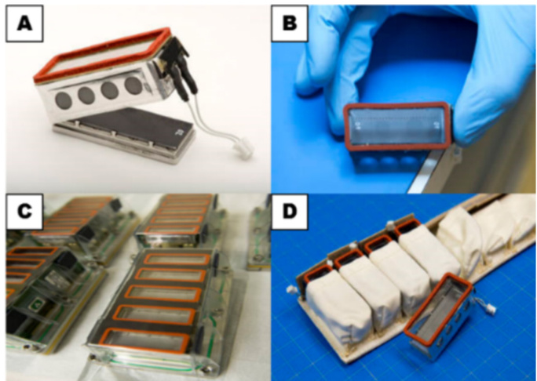  
图3 EMCS欧洲模块化培养系统: (A) ESA开发的种子盒; (B) 放入拟南芥种子的种子盒; (C) 放入冷藏箱中的种子 盒; (D)容纳五个种子盒和相关硬件的实验容器 (图片来源 于NASA官网 ).  

Veggie植物生长系统（如图4所示）是ISS上广泛应用的一种植物研究装置，它配置LED照明系统（具备红、黄以及蓝光），最高提供350$\upmu\mathrm{mol}\cdot\mathrm{m}2/\mathrm{s}.$ 光照水平，总的生长区域为 $1300\ \mathrm{cm}2$ ，可在其中加入其他大小和复杂程度不同的植物生长设施[15]。先进植物栖息地系统（Advanced PlantHabitat, APH）是由NASA研制的一名已在ISS服役的新成员，也是目前最大的在轨植物培养室，这个栖息地大小相当于一个迷你冰箱的大小，旨在测试植物在空间中所喜欢的生长条件，并为标本提供更大的根和茎空间。该系统使用红色，绿色和蓝色LED灯作为光照系统，这类似于上述的Veggie系统。同时，APH还具备有白光以及红外光的能力，另外一方面，APH装置配备有180个传感器，是Veggie照明输出的四倍。到目前为止，APH已被用于种植和研究拟南芥（如图5所示）、与卷 心菜和芥菜有关的小型开花植物，以及矮小麦等 。

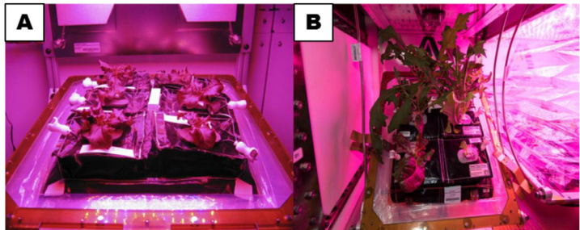  
图4 Veggie植物生长系统: (A) 红色长叶莴苣; (B)红色生 菜和东京卷心菜 (图片来源于NASA官网).  

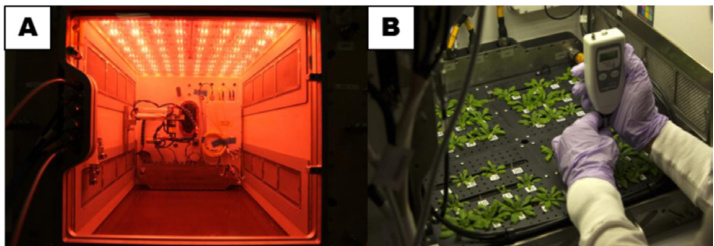
图5 APH先进植物栖息地系统: (A) APH系统实物图 (图片来源于NASA官网); (B) 测量在APH中生长的拟南芥植 物的叶绿素含量 (图片来源于NASA官网). 

#### 我国的微型培养箱
以往，我国利用返回式卫星也曾开展过多次空间搭载飞行实验，但由于在太空中时间有限，最多只能开展种子萌发、幼苗生长阶段的实验。2016年9月15日，天宫二号搭载了一个由中科院上海技术物理研究所研制的微型植物培养箱，培养箱采用空间长周期植物密闭培养、空间低功耗激发微弱荧光成像、培养环境控制等技术，实现了在培养箱内种植粮食作物的典型代表水稻和绿叶植物的典型代表拟南芥（如图6所示）。随着神舟十一号返回地面，大部分植物样品至今仍然留在天宫二号。科研人员成功地通过地面遥控，对留在太空中的培养箱进行温控和浇水，水稻和拟南芥顺利生长，并开花结果。这是我国首次在太空中完成“从种子到种子”全过程的空间植物培养实验。  

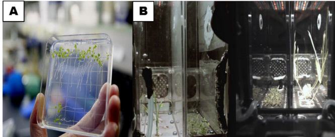  
图6 天宫二号微型植物培养箱 (图片来源于张涛等人的论文): (A) 拟南芥幼苗; (B) 高等植物培养箱. 

除了上述的微型植物培养箱以外，我国首颗微重力返回式空间科学实验卫星实践十号（SJ-10）也于2016年随长征二号丁运载火箭成功发射，实践十号卫星在太空运行15天，装载着19项科学设施，共28项实验，它是首批科学实验卫星中唯一的返回式卫星，也是单次开展空间生命科学实验项目最多的卫星（具体空间生命技术相关载荷配置如表3所示）。其中，设计的空间生命科学研究紧紧抓住国际空间生命领域发展前沿，包含有空间辐射生物效应、重力生物效应以及空间生物技术三大方面，重点探究并认识上述三个空间生命科学领域有限目标下的基本规律：（1）建立微重力环境影响植物、动物、微生物等生命体生命活动的理论基础；（2）揭示微重力及空间辐射环境影响重要生物学过程的分子机制；（3）将理论应用于动物早期胚胎发育、干细胞生长/分化、组织的三维构建，发展空间生命科学领域相关的关键技术和硬件装置。实践十号卫星任务的成功极大促进了生命科学基础研究取得突破，对于推动我国空间微重力科学和空间生命科学发展具有重要意义。  

表3 实践十号卫星空间生命技术相关载荷配置情况。
<html><body><table><tr><td>序号</td><td>设备名称</td><td>设备描述</td></tr><tr><td>1.</td><td>辐射基因盒</td><td>支持开展空间辐射对基因组的作用和遗传效应实验。设备包括小鼠细胞培养容 器和果成虫培养容器，及所需生命保障条件和辐射探测器。</td></tr><tr><td>2.</td><td>家蚕培养箱</td><td>用于空间环境对家蚕发育的影响与变异机理的研究。设备由培养实验区和测控 单元组成，可对样品进行在轨培养、在轨成像、在轨低温固定等操作。</td></tr><tr><td>3.</td><td>植物培养箱</td><td>用于微重力植物生物学效应及其微重力信号转导研究。设备包括植物培养实验 装置和测控装置，能够为植物提供温度控制、周期照度、气压和营养供给等生 长条件，并对环境进行测量。</td></tr><tr><td>4.</td><td>高等植物箱</td><td>用于空间微重力条件下光周期诱导高等植物开花研究。由培养实验区和测控单 元组成，可向样品提供空气、水分和光照等条件，能够进行可见光、荧光拍照。</td></tr><tr><td>5.</td><td>胚胎培养箱 胚胎电控箱</td><td>用于微重力条件下哺乳动物早期胚胎发育研究。设备可像小鼠胚胎提供必须的 生长发育环境，并能够进行显微成像，最终对样品进行化学+低温固定。</td></tr></table></body></html>  

目前，我国空间生命科学搭载装置的功能相对比较简单，装置自动化程度以及集成度不高，与国外的差距较大。未来中国空间站中生命科学研究应多元化发展，多任务多指标空间生命科学研究搭载装置将成为趋势，如何在有限的空间内，减小间搭载装置的体积，实现装置的高度集成与自动化，将成为我国空间生命科学研究发展需要解决的主要难题。

### 2. 细胞与组织的微观世界

在空间特殊环境下研究细胞或组织的生物学过程及规律，对探索空间特殊环境对人体的影响具有重要意义，是各空间大国在空间载荷应用中的重点。  

#### 国外的细胞/组织空间载荷研究
日本宇宙航空研究开发机构（Japan AerospaceExploration Agency, JAXA）利用细胞生物学实验设施（the Cell Biology Experiment Facility, CBEF）在ISS上进行细胞/组织实验（如图7(A)所示）。为了鉴定骨骼肌细胞中的重力传感器，M. Sokabe等人在CBEF中进行了3组细胞实验，并将培养后的细胞用能够保存遗传物质的化学物质处理后冷冻送回地球进行下一步分析，该研究旨在阐明细胞如何感知重力，有利于解释在空间或卧床不起的情况下发生肌肉萎缩这一问题。在另一项研究中，T. Morita等人从小鼠胚胎干细胞中获得生物学数据，从而推测空间辐射对人类胚胎干细胞生长发育的影响。在ISS的Columbus实验室中，Biolab和Kubik均可以用于细胞/组织研究。BioLab由培养箱、显微镜、分光光度计和两个提供人工重力的离心机组成（如图7(B)所示），用于研究微重力和空间辐射对单细胞和多细胞生物的影响，包括细菌、昆虫、原生生物、种子和细胞。而Kubik是一种小型温控培养箱或冷却器，带有可拆卸的插入装置（如图7(C)所示），用于自给式自动微重力实验，研究对象包括种子、细胞、小动物等。

2017年，欧洲航天局（European Space Agency, ESA）通过Kubik培养视网膜细胞，以探究微重力和空间辐射对视力的影响。NASA的艾姆斯研究中心开发的生物培养系统（Bioculture System）可以实时远程监测细胞/组织的培养，并控制其生长条件，旨在让科学家对不同种类的细胞和组织进行长期的细胞生物学研究（如图7(D)所示）。该系统的第一个任务成功地在ISS上培养了骨骼细胞和心肌细胞，并将其活体带回地球进行基因组分析。

2018年11月，NASA向ISS发射了Space-X 16 Dragon太空舱，其携带的BioScience-4任务通过实验来测试来自大脑和脊髓的神经系统干细胞是否能在空间的微重力环境下更快地分裂成两个子细胞。同时，科学家们能够在实验中研究决定细胞功能、增殖和分化的细胞信号通路。值得一提的是，该项目的研究成果可能成为针对神经系统疾病的细胞替代疗法中干细胞生产的突破点。  

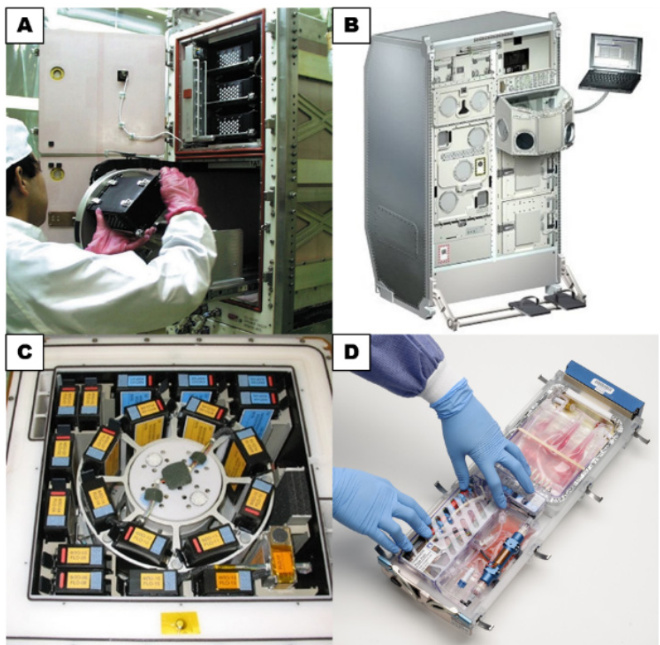  

图7 研究细胞及组织相关的空间载荷: (A) CBEF (图片来源于 JAXA官网); (B) Biolab (图片来源于ESA官网); (C) Kubik (图片来源于ESA官网); (D) Bioculture System (图片来源于 NASA官网). 

#### 我国的细胞/组织空间载荷研究
近年来，在国家的大力支持下，我国科研人员自主研制了一系列与细胞生物学相关的空间生命科学仪器，在细胞/组织空间载荷方面取得了重要研究成果。为了研究宇航员在回到地球之后的一段时间里均会出现“腿软”的原因，2016年4月，王金福团队的人骨髓间充质干细胞搭载上述的实践十号进入太空，证明了在太空微重力环境下，骨钙的形成机制会出现问题。2017年4月，王金福团队的干细胞搭载“天舟一号”货运飞船再次进入太空，证明了微重力会导致干细胞分化为骨细胞的能力降低，这对骨质疏松的预防和有效治疗具有指导意义。邓玉林团队研制的“空间微流控芯片生物培养和分析载荷”同样由“天舟一号”货运飞船送入太空，致力于研究空间微重力环境下神经细胞与免疫细胞的相互作用，有利于改善长期在轨的航天员的医疗健康保障。  

综上所述，国内外研究细胞/组织的空间载荷技术发展迅速，并在空间特殊环境下对多种细胞/组织的物理形态、基因表达和生化机制进行了探索，其研究结果不仅能够用以改进在空间中执行任务的航天员的医学保障系统，从而增强载人航天的能力，还能够解释地球上人体病理学的相关问题，为人类疾病的诊断、治疗及预后提供理论指导。

### 3. 蛋白质与核酸的太空密码
### 蛋白质晶体的“太空优势” 
空间站能为生命科学提供不同于地球的特殊研究环境如微重力、强辐射条件等。近二十年来，蛋白质载荷方面的主要研究为在微重力环境的不同条件下获得不同类高质量、大型且有序的蛋白质晶体。**微重力条件为蛋白质晶体的研究提供了极佳的研究环境，由于空间的微重力环境抑制了溶液流动（对流），并使蛋白质晶体在稳定的环境中生长，而且由于没有对流，杂质不会被输送到晶体表面，所以将会产生高质量的蛋白质晶体**。

蛋白质晶体的研究活动十分活跃，在2000至2019年期间，蛋白质结晶及其相关研究超过100项，在相关ISS蛋白晶体载荷研究中，研究主要热点为**不同类蛋白质晶体和高质量蛋白质晶体的获得**。在前者研究热点方面，以JAXA-PCG系列、Kristallizator系列以及CASIS PCG系列为首的项目，进行了数以百计质量的蛋白质晶体生长研究。在高质量的蛋白质晶体获得方面，由  NASA支持的PCG-EGN项目在2000年将气态氮杜瓦瓶送上ISS，为微重力环境下生产生物蛋白晶体提供了经济和潜在的高容量途径。同年，在1985年开展的先进蛋白质结晶设备（AdvancedProtein Crystallization Facility, APCF）的研究项目基础上，由NASA及意大利航天局（Italian SpaceAgency, ASI）合作支持的APCF（如图8(a)所示）可以支持液-液扩散，蒸汽扩散和透析三种结晶方法在ISS上的实现，成功获得了骆驼科动物蛋白（如图8(b)所示）、PPG 10（Pro-Pro Gly10）蛋白（如图8(c)所示）以及视紫红质等蛋白质的晶体，提供了不受干扰的蛋白质结晶生长环境。自2001年由NASA开展PCG-STEM系列项目使用蛋白质结晶装置（Protein Crystallization Apparatusfor Microgravity, PCAM）搭配单柜热量封闭系统（Single-locker Thermal Enclosure Systems, STES）（如图9(a)所示）进行蛋白微重力下蛋白质结晶实验，并实现了大型高品质晶体的生长（如图9(b)）。

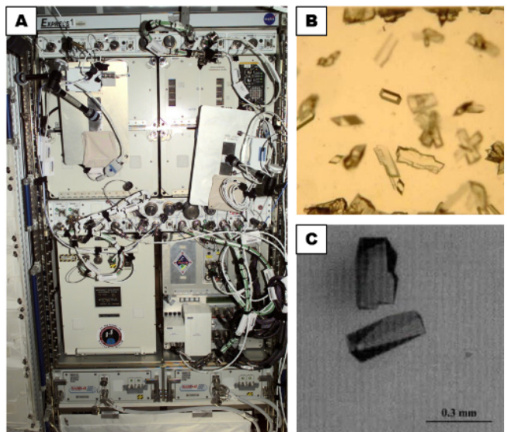  
图8 APCF先进蛋白质结晶设备: (A) 装置实物图; (B) 骆驼科动物蛋白晶体; (C) PPG 10蛋白晶体. 图片均源自于NASA官网.  

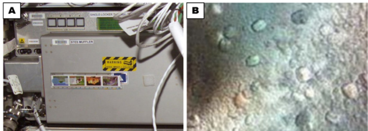  
图9 单柜热量封闭系统STEM: (A) 整机外观图; (B) 由碱性成纤维细胞生长因子复合物产生的晶体. 图片均源自于NASA官网。  

另外，在2001年由ESA支持的ESA-GCF项目以及2003年由JAXA支持的JAXA-GCF项目均利用格拉纳达结晶设施（Granada CrystallisationFacility, GCF）（如图10(a)所示）在ISS上提供用反扩散法蛋白质结晶的优质实验平台，旨在优化实验数量，减少蛋白质溶液的体积，提高成功效率，并成功获得磷酸三酯异构酶晶体等高质量的蛋白质晶体（如图10(b)以及(c)所示）。在2016-2020年期间，由JAXA开展的JAXA-PCG、JAXAModerate Temp PCG以及JAXA Low Temp PCG项目会探究在空间环境下，利用反扩散法进行蛋白质结晶的最适结晶温度条件的探究。  
  
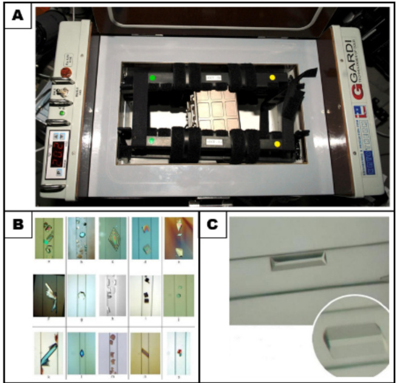  
图10 格拉纳达结晶设施: (A) 设施外观; (B) ESA-GCF项目中获得的晶体实例; (C) JAXA-GCF项目中获得的磷酸三酯异构酶晶体. 图片均源自于NASA官网  

在研究方向上，国内与国际上的主要研究热点基本相同，也主要关注蛋白质晶体生长方面的研究。中国迄今为止开展了五次蛋白质结晶空间实验。1992年、1994年两次用管式气相扩散法在卫星上成功地进行中国自己的蛋白质晶体空间生长试验，使用的装置为国内研制的管式汽相扩散结晶装置。西北工业大学仓怀兴教授团队于2011年利用德国生物培养箱（Simbox），使用气相扩散方法和液-液扩散方法，结合国内自主研制的浸入式毛细管结晶室装备搭载于飞船，并开展了相关实验，实验结果表示14种蛋白质样品的出晶率达到 $85\%$ ，实现蛋白质样品出晶率的较大幅度提升（如图9所示），为后续空间蛋白质晶体实验提供了改进方向及优化思路。  

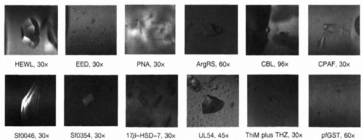  
图11搭载试验中空间生长蛋白质晶体照片 (图片源自于仓怀兴等人的论文)。

### DNA的太空之旅
国际上近二十年的空间生命科学载荷技术领域的研究主要集中在**宇宙空间环境中的强辐射、真空、紫外线等因素对于体内或体外DNA或RNA产生的影响（如DNA的损伤或突变），并针对DNA或RNA对其的反应进行研究（如DNA修复及进化）**。进而希望明确空间环境下辐射等因素对生物造成损伤的具体机制。其中对核酸的研究主要分为两类：（1）针对生物（微生物、植物或人体）体内的核酸进行体内或体外研究；（2）针对由在轨扩增获得的人工合成体外核酸序列进行研究。  

在针对微生物体内核酸进行体外研究的项目中，于2008年由ESA支持在ISS上开展的Expose-RSUBTIL项目主要是将枯草芽孢杆菌的孢子暴露于开放空间环境中，对其质粒DNA的突变光谱进行检测，通过分析该生物在极端恶劣环境所发生的变化，进而研究宇宙中生命的起源，演化和分布。同样，于2008年由ESA支持并开展于ISS的Expose-R PUR项目（Expose-R项目如图12(A)所示）主要研究了噬菌体T7、噬菌体DNA和多晶尿嘧啶对空间环境的响应，通过研究太阳紫外线辐射对病毒和RNA化合物的影响，确定它们作为测量空间环境中紫外线辐射剂量的生物剂量计的有效性。由RKA支持的项目Plazmida研究了微重力对细菌质粒迁移和动员速率的影响。改变细菌的生活环境因素（气体组成以及压力等条件），并得出微重力对R-质粒转移具有显着影响的结论。实验还证明了微生物质粒可用作生物指标，可用于评估航天因素对微生物群落的影响程度。

到目前为止，在ISS上已有几种具有分子生物学功能可用于微生物鉴定的装置。其中，由NASA在2015支持的水监测套件项目（Water MonitoringSuite）中的RAZOR EX模块就应用了聚合酶链式反应（PCR）技术，可对特定目标微生物的DNA进行检测从而达到对微生物鉴定的目的（如图12(B)所示）。而在2016年，同样由NASA支持的生物分子测序仪项目（biomolecule sequencer，又称为“MinION”，如图12(C)所示），利用DNA链穿过纳米孔时通过MinION的装置测量响应电流变化的原理，构建可以在单一分析的背景下鉴定来自一系列生物的DNA的微型测序仪，最终实现对微生物检测的目的，并为长期任务背景下的宇航员的健康状况监测及疾病诊断等方向提供了基础。该类便携式的分子生物学功能仪器促进了ISS上的科学研究，微生物鉴定、疾病诊断和实时基因组数据收集的等方面的获得了较大进步。  

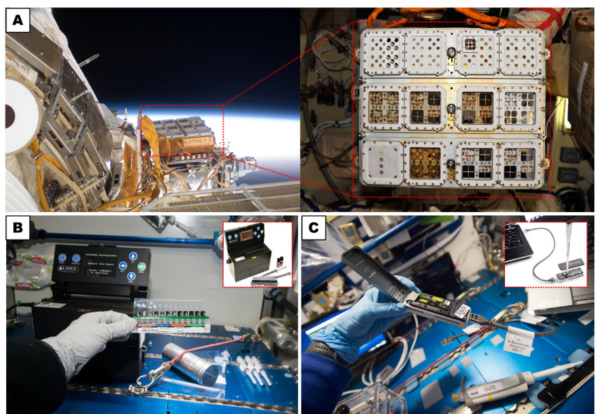  

图 1 2  检 测 微 生 物 体 内 核 酸 相 关 的 研 究 项 目 :  ( A )Expose-R项43,44]; (B) 水监测套件项目中的RAZOR EX模块; (C) MinION生物分子测序仪. 图片均源自于NASA官网.  

在针对植物体内核酸进行体外研究的项目中，由NASA支持的APEX-02-2项目，利用NGS测序技术对航天飞行期间的酿酒酵母（或称Baker酵母）的全基因组的辐射损伤进行了测定，这是科学团队首次对太空辐射损伤机制进行全基因组分析。在先前的数据基础上，从这项研究中获得的信息将使科学家以更好地了解和建立可辐射损伤的机制，并可能总结出相关的方案来改善空间的辐射损伤问题。NASA支持的BRIC-16-DNA项目通过基因表达反应深度测序和DNA阵列方法研究了空间环境对于拟南芥的影响。在该研究中，对比了两种不同形式的拟南芥作为拟南芥幼苗和空间未分化细胞转录组的协同读数。该研究表明微重力中的幼苗和细胞培养物都以不同的方式改变特定的基因表达，这种差异可能是因为幼苗使用它们的器官来感知和采样它们的环境，而未分化的细胞培养物缺乏这样的器官，因此不适当地对压力做出反应，这证实了**植物会根据太空飞行来调整它们的行为**。**在微重力条件下种植的植物所获得的基础知识将有助于解决提供和维护生物生命支持系统的及提供饮用水的问题。**  

在针对**人体内核酸进行体外研究的项目方面**，2017年由JAXA支持的ISS项目利用非侵入式的液体活检方法对人的基因组和表观基因组进行研究。在实验过程中，采集航天飞行前和飞行期间机组人员的血液样本，对其中可测量且特异性高的生物标志物cell-free DNA（cfDNA）和RNA分子利用超高通量测序方法直接测序。测序检测到的DNA突变可以作为正常DNA修复功能下人体空间辐射基因损伤的可靠指标。对于上述指标的有效分析将有助于科学家更好地了解太空飞行过程中发生的人体遗传水平变化，也将促进宇航员健康监测和对策的发展。  

在针对由**在轨扩增获得体外核酸序列的研究方面**，由NASA在2016年支持的ISS项目Genes inSpace-1、Genes in Space-2以及Genes in Space-3三个相关项目利用PCR技术结合miniPCR设备（miniPCR–The DNA Discovery System™, 如图13(A)所示）进行了一系列空间环境下体外核酸研究，在应用PCR技术的基础上进行在轨PCR仪器的搭建，并完成不同基因的在轨扩增。首先Genesin Space-1验证了空间进行PCR实验的可能性，并成功扩增了SpX-8基因，并发现在微重力环境中可检测到DNA甲基化的差异。Genes in Space-2项目在完成Genes in Space-1测试的基础上进一步验证了可利用PCR扩增高度重复的端粒序列的能力，并测试了Loop介导的等温扩增（LAMP）比色测定法在ISS上检测扩增的可行性，该技术可适用于各种其他DNA测试需求，并能看到其在作为诊断工具在深空任务中的潜力。在Genes in Space-3项目在继续沿用miniPCR装置的基础上加入了上述的MinION生物分子测序仪，以及一些额外的酶来证明DNA扩增、DNA测序的样品制备以及ISS实际样品的测序的可执行性。该实验证明了**便携式实时DNA测序可用于宇航员健康情况的评估检测，分析微生物DNA水平的变化并分析宇宙其他环境中基于DNA的生物**。另外，Genes in Space-6项目在完成对于经历CRISPR/Cas9诱导的双链断裂的相应的地球修复的细胞中提取DNA进行扩增测序的基础上，首次在空间环境中诱导两株酿酒酵母细胞DNA损伤并在空间站上使用miniPCR和生物分子测序仪工具在分子水平上评估太空中的整个过程突变和修复。2016年由NASA支持的Wetlab RNA SmartCycler项目，构建包括CepheidSmartCycler商业定量PCR仪器（如图13(B)所示），允许测量人员从空间站处理和分析的样品中获取实时基因组数据，在ISS上进行实时定量基因表达分析，**有助于研究人员更好地了解到生命是如何受到太空飞行的影响或适应太空飞行的**。  

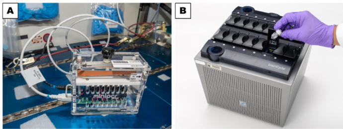  
图13 在轨扩增核酸相关的设备: (A) miniPCR设备;(B) Cepheid SmartCycler商业定量PCR仪器. 图片均源自于NASA官网.  

国内对于核酸空间生命载荷研究的方向与国际略有不同，主要集中在**集成化在轨微流控PCR芯片方向**。2011年，北京理工大学邓玉林教授团队在“神舟八号”飞船上搭载了一套基因扩增装置（如图14(A)所示），完成在轨PCR实验。该装置集成了一种多通道PCR芯片，由光学粘合反应室和小型热循环仪组成。初步建立了具有空间适应性的自动化、集成化、连续化、系统化的微流控PCR芯片，实现了中国微流控芯片太空应用技术领域零的突破，这是中国首次在空间环境下开展基因实验，并实现在轨检测。2017年6月被送上ISS的项目NanoRacks-BIT-1同样来自邓玉林教授团队（如图14(B)所示），其研究方向主要为研究暴露于空间环境的PCR反应过程中的DNA错配规律，开发了一种基于微流控PCR芯片的小型化自动反应装置，通过测序测试在轨 DNA扩增产物，并与地面对照组比较，分析DNA扩增产物突变的频率、位置和偏差的规律。该研究旨在了解**辐射如何破坏不同类型的DNA，确定人类基因组中辐射风险的关键领域，有助于在长期太空旅行中保护宇航员，并建立合理预防机制。**  

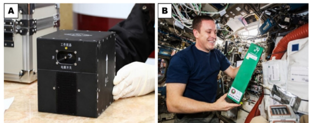  
图14 集成化在轨PCR微流控芯片载荷: (A) 微流控芯片基因扩增装置; (B) 空间环境致生物微进化规律实验载荷.  

空间生命科学技术在蛋白质及核酸的载荷实验的应用已经具有了坚实的研究基础，在蛋白质载荷方面，空间环境下高质量蛋白质晶体的获取仍为该方向的研究热点，在进行现有结晶条件及结晶技术的探索和改进之外，建立起长期有效、稳定性好、自动化程度高、兼容性、小型化和集成度高的蛋白质晶体结晶生长支持设备也是未来的研究方向之一。核酸载荷方面，现阶段对于生物体内核酸进行检测的相关研究较为广泛，但在轨扩增和体外核酸序列分析方面的研究还处于发展阶段，在保证扩增实验正常完成的前提下，如何进行小型化、高通量、高自动化的在轨扩增设备的设计及制作可作为进一步思考及研究的方向。
## 三、未来趋势：器官芯片与火星生命探测

### 1.人体器官芯片（Organs-on-Chip）
#### 为什么需要人体器官芯片？
##### 1）人体样本有限
尽管人类开展载人航天活动已经有数十年的时间，截止目前，有过飞行实践的航天员只有500多人，而我国更是只有11名进入太空飞行的航天员。类似NASA“双胞胎”实验可以从有限程度发现特定现象，但**从生物学的统计意义上看，有限的样本支撑实验结论明显不足**。同时，**囿于伦理限制，更多的实验也不可能基于航天员本身开展**。基于此，有效的替代模型技术将成为未来空间生命科学载荷技术的一项基础。  
##### 2）动物模型不准确
人体在太空环境下的生理过程研究是以活体器官系统在太空环境下的病理生理变化研究为基础。通常使用动物模型在地面上对人体生理过程进行分析，但**动物模型成本高，速度慢**，并且某些实验条件下会引发道德伦理问题，更核心的问题是**动物模型通常无法准确还原人体生理环境**。

#### 什么是人体器官芯片？
人体器官芯片是近年来迅速发展的值得在空间载荷方向继续探索的新型技术。**人体器官芯片（organs-on-chip, OOC）** 是一种基于微流控技术的多通道3D细胞培养芯片，通过细胞生物学，生物材料和组织工程学等方法，在芯片上工程性地构建人体的某个器官或多个器官的模拟生理微系统，在新药开发、疾病模拟等领域具有极大的应用价值（如图15所示）。

基于微流控技术的人体器官芯片**保留了人体原始的细胞组织结构**，具有**体积小、成本低、系统稳定**等特点，还可以通过精准控制实验条件，进行多种细胞种类的高通量实验，实现从细胞到组织，从组织到器官，从器官到系统的体内生理环境模拟，因此在体积成本限制、条件苛刻的空间舱实验环境中，器官芯片具有独特的实验条件优势，将成为关键的研究模型。  

图 1 5  ( A )  人 体 芯 片 ( 图 片 来 源 于 Off Grid  EnergyIndependence网站); (B) 各种器官芯片以及细胞、组织、器官芯片界面模拟图 (图片来源于Huh等人的研究).  

#### 太空环境对人体有诸多负面影响
长期的航天飞行中，太空的微重力和辐射环境会对人体的心血管系统、神经-内分泌系统、消化与泌尿系统、呼吸系统产生不同程度的消极影响，而针对这些系统的主要器官，如心脏、肾脏、胃、肺以及骨骼肌等在器官微流控芯片方向上也取得了一定的研究进展，这对于航天员长期在轨执行任务的医学保障具有重要意义。  

##### 心血管系统研究
**太空的微重力会使使人体下肢的血液发生头向转移，飞行的早期心脏做功增加**，目前地面进行的新型器官芯片的研究或许可以用于太空环境中人体心血管系统的模拟，如Cheah等人于2010年的研究中开发了一种微流体芯片装置用于模拟生理微环境维持心脏组织生长（如图16(A)所示），在优化心脏细胞灌注和刺激条件后，可以将来自大鼠和人心脏组织活性保持长达300分钟，有助于体外研究正常和病理性心脏功能。另外，加拿大多伦多大学的Günther及其同事 设计的动脉芯片提供了一种“阻力动脉”平台（如图16(B)所示），其多功能设计允许对动脉壁周围的微环境施加动态变化，从而可以评估异质环境变化对微血管结构和功能的影响。  

##### 神经退行性疾病
**微重力和条件应激会导致人体内分泌系统激素分泌紊乱，激素分泌受到神经系统以及多个器官的调节**。大脑和神经系统之间的结构-功能关系激发了许多以空间神经元网络形式的工程化类似物的研究，利用微流控器件可以通过电生理信号进而从头设计神经系统（如图16(C)所示），这种体系有利于研究太空环境对脑神经复杂生物电网络的影响。  

##### 肝代谢功能评估
**肝脏是人体内最重要的药物代谢器官**，如何在体外实验中长时间地维持肝细胞生物活性并研究太空环境对肝脏的影响一直是一个难题。虽然肝细胞进行大部分药物代谢，但芯片必须模拟不同细胞类型之间的相互作用，才能实现比较完整的肝功能。目前肝芯片研究主要集中于在芯片上建立多种细胞组成的功能化肝组织生理学模型。如Cho等人通过微制造模板在共培养系统中分层模拟肝细胞，增加肝细胞和成纤维细胞之间的异型界面以更好的实现肝脏代谢功能（如图16(D)所示）。  

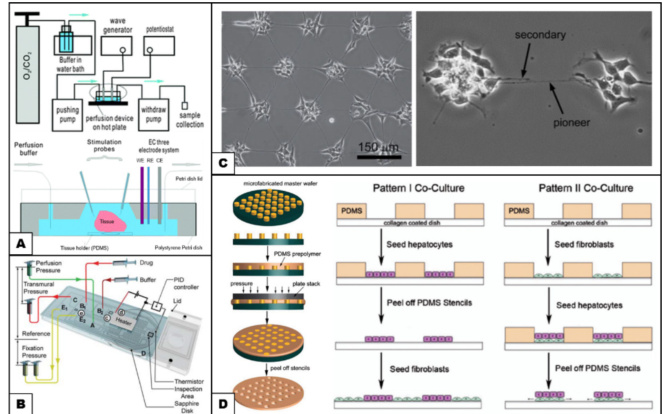  

图16 与航天医学保障相关的器官芯片研究成果: (A) 心脏组织生长芯片 (图片来源于Cheah等人的研究); (B) 动脉芯片 (图片来源于Günther等人的研究); (C) 神经网络系统芯片 (图片来源于Hardelauf等人的研究); (D) 肝脏组织芯片 (图片来源于Cho等人的研究).  

目前关于器官芯片的地面研究已经取得了一定的进展，结合了微流控技术、细胞组织工程的特点优势，应用于空间载荷得天独厚的条件，但是其发展仍面临一系列挑战：由于人体器官细胞组成多样，且受来自内分泌和免疫系统的复杂信号控制，单一种类器官芯片难以重建人体复杂的各个方面，如何构建多种类器官芯片平台进而模拟人体多个生理系统，以及器官芯片的标准化、元件化，以及空间飞行适应性等都是下一步探索的方向。

### 2.地外生命信息探测

宇宙中所有生命如何起源和进化，地外生命是否存在，以及所有生命的未来命运，是天体生物学中亟待解决的基本问题 ，同时也是人类探索太空的强烈驱动力。现在人类对于地外生命的存在形式的认识都基于地球生命。地球上的生命具有共同的生化基础和遗传历史 ，例如均可能起源于液态水、重要无机物、有机分子及能量的化学进化 。因此地外生命信息探测的常规方法是找到人类已知的地球生命标志物，包括但不限于水和氨基酸、胺、硫醇、硫酯、DNA、RNA、蛋白质、醛、酮、羧酸、脂肪酸、脂肪醇、多环芳烃等有机物 。  

**目前主要的生命标志物探测手段为原位探测，需要能够对包括多种有机分子在内的复杂混合物进行灵敏的化学分析的仪器**。相比与地面应用仪器，地外生命探测环境对探测仪器具有较大的限制，这导致仪器的设计与集成要求更为严苛。在飞行期间或探测现场的恶劣条件（微重力、空间辐射、长期休眠等）下，探测仪器需要以完全自动化的方式完成多种类型的实验，并且保持稳定、灵敏、准确的特性。  

光谱仪 、 气相色谱 - 质谱 （ gaschromatography-mass spectrometry, GC-MS）、高效液相色谱 （high performance liquid chromatography, HPLC）等技术和仪器均被应用于原位探测中。其中，毛细管电泳（capillary electrophoresis, CE）技术具有广阔的应用前景。CE可以与多种检测方法结合，例如激光诱导荧光（laser-induced fluorescence, LIF）检测，以实现灵敏检测。同时，可以使用与CE具有相同分离原理的微流控芯片电泳（microchip electrophoresis,ME）的微流控平台将CE小型化（microchipcapillary electrophoresis, $\mu\mathrm{CE}$ ），以提高其便携性。Creamer等人 利用两种CE方法区分在生物过程和非生物过程中形成的17种氨基酸，为空间的生命信息探测任务提供了氨基酸生物印迹识别的理论基础。  

根据比较行星学的研究结果，太阳系内具备可能孕育生命的环境条件的地外天体包括火星、木卫二、土卫二、土卫六等 。其中，火星与地球具有相似的内部结构，环境也与早期地球类似 ，是地外生命信息探测的重点天体。因此，早在1976年，“海盗号（Viking）”登陆器（如图17(A)所示）就搭载了3个空间生命载荷以探测火星表面及亚表面数厘米厚的土壤中是否存在与地球上类似的微生物，然而其实验数据无法表明火星是否存在生命 。2003年“勇气号（Spirit）”、“机遇号（Opportunity）”和“火星快车（Mars Express）”（如图17(B)(C)所示）的联合探测结果表明火星早期有表面水活动，佐证了火星过去的环境可能更适宜生命的产生和演化 。2008年，“凤凰号（Phoenix）”（如图17(D)所示）确认了火星上水的存在，并且证实了火星土壤的强氧化性适宜生命存在。2014年，“好奇号（Curiosity）”（如图17(E)所示）返回的数据表明，大约在38至33亿年前，火星上可能存在水循环系统，盖尔陨石坑可能多次变成湖泊又多次蒸发，其沉积物形成了现在的夏普山 。基于“好奇号”设计的“火星2020号”将于2020年6月登陆火星，接替“好奇号”继续在火星上寻找过去生命留下的证据，将成为第一个采集火星表面样本并送回地球的航天器，为后续的载人火星任务铺平道路 。“火星2020号”将搭载多种空间载荷进入太空 ，其中，基于 $\mu\mathrm{CE}$ -LIF技术的火星有机分析仪（the Mars Organic Analyzer,MOA）能够确定火星样品中多种有机分子的特性和浓度，包括胺、氨基酸、醛、酮、有机酸、硫醇和多环芳烃，检测限为十亿分之一（如图18所示），这种分析灵敏度是表征环境的可居住性，表征生物印迹的保存潜力，寻找过去生命的证据，分析返回地球的样本，以及测量和表征任何可能的前向污染所必需的 。  

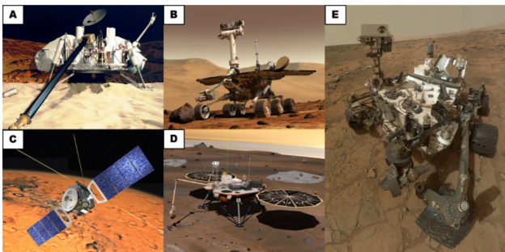  
图17 火星生命探测器: (A) 海盗号 (图片来源于NASA官网 );(B) 勇气号和机遇号 (图片来源于NASA官网 ); (C) 火星快车(图片来源于ESA官网 ); (D) 凤凰号 (图片来源于NASA官网 ); (E) 好奇号 (图片来源于NASA官网 ).  

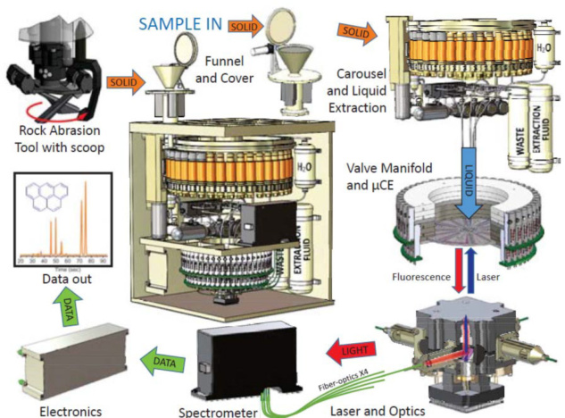  

图18 MOA分析过程 (图片来源于Mathies等人的研究 ): 样品细粉通过漏斗进入萃取杯, 含水溶剂在压力的作用下与之混合以提取有机分子. 将该提取物转移至可编程的微流控样品处理 系统或PMA进行荧光标记, 随后在微制造的毛细管电泳通道上进行注射、分离和高灵敏度检测, 得到各种有机分子的特性和浓度.  

**除在太阳系中探测生命标志物，人类也有其他寻找地外生命信息的方向**：
* （1）发射带有“地球名片”的探测器，希望地外智慧生命能够识别并主动联系我们，例如“先驱者号（Pioneer）”和“旅行者号（Voyager）”两个探测计划；
* （2）发展太空天文望远镜技术以在太阳系外找到地外生命存在的环境，例如ESA与法国国家空间局（FrenchNational Space Agency, FNSA）合作的COROT计划，以及NASA发射的开普勒（Kepler）探测器等。  
* 
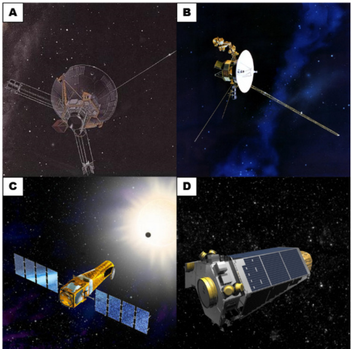  
图19 地外生命探测器: (A) 先驱者10号探测器(图片来源于NASA官网 ); (B) 旅行者号探测器(图片来源于NASA官网 ); (C) COROT探测器(图片来源于ESA官网 ); (D) Kepler探测器(图片来源于NASA官网 ).  

至今为止，人类已经针对探测地外生命做了许多工作和努力，并取得了部分具有重大意义的数据与结果，正如Astronomer所说的“寻找外星生命的进程正在加速中” 。随着生命科学、深空地学、天文学、深空探测技术等科学与技术的发展，以及各个国家地区之间更加紧密的合作，非接触式的探测已经无法满足人类的好奇心，进行原位直接探测的载荷在地外生命信息探测中的作用将日益显著。

## 四、结语：太空中的生命科学，人类文明的新边疆

空间生命科学载荷技术的发展，不仅是科技的竞赛，更是人类对自身与宇宙关系的终极追问。当我们通过器官芯片解析太空疾病的机制，或在火星土壤中发现氨基酸的痕迹时，我们不仅在探索生命的可能性，也在重新定义“生命”本身。

未来，随着中国空间站的建成与深空探测计划的推进，自主创新的载荷技术将助力我国在这一领域走向前沿。从一粒种子在太空发芽，到人类足迹踏上火星，空间生命科学的每一次突破，都在书写着文明的新篇章。

## 参考文献  

> **笔者注**：本文基于《空间生命科学载荷技术发展与未来趋势》论文整理，部分案例与数据已做通俗化处理。想了解更多专业细节，可查阅原文或相关航天机构官网。