## 一、行星形成与岩浆洋演化
### 地球早期演化的重要节点
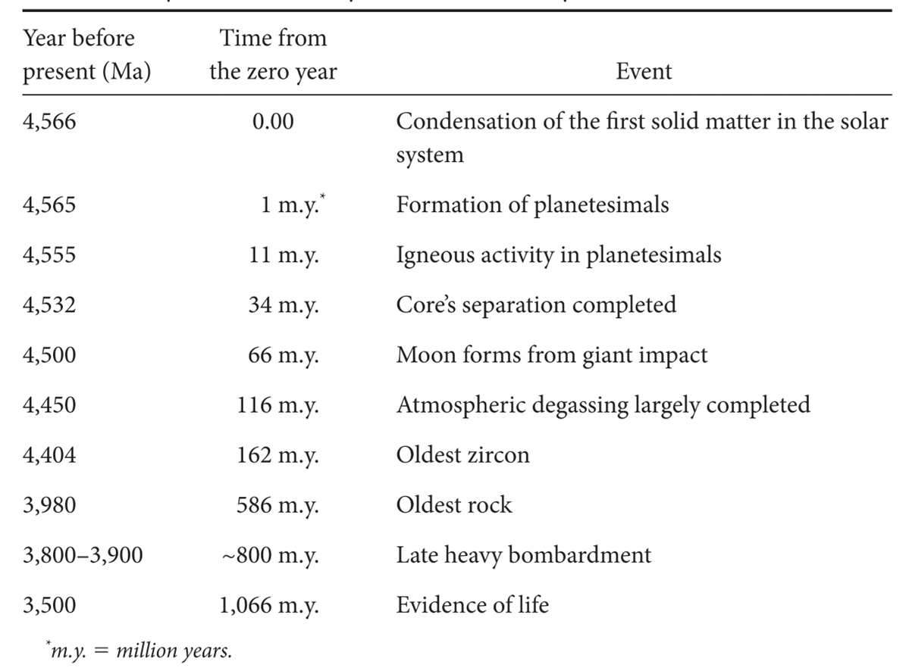
>早期地球演化重要节点

### 太阳系形成与行星演化
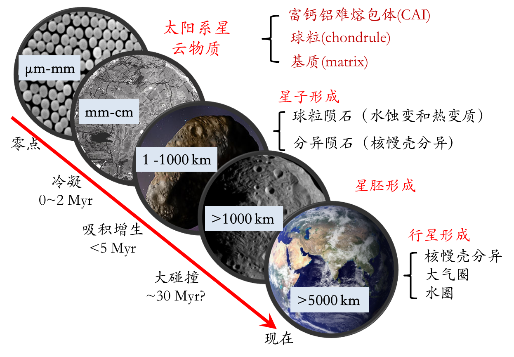
太阳系的形成始于星云物质的聚集，这些物质在引力作用下逐渐形成星子，星子通过碰撞和吸积成长为星胚，星胚继续吸积物质最终形成原行星。在这个过程中，物质的冷凝、吸积增生等作用至关重要。行星的形成涉及核幔壳的分异，大气圈和水圈的形成，以及大碰撞等事件。这些过程共同塑造了行星的早期面貌。
### 月球结构的二分性

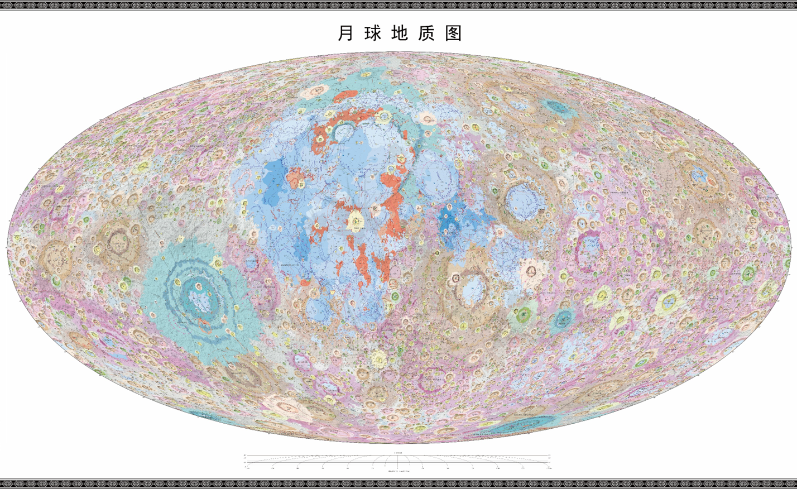
>月球地质图（颜色代表着--）

月球的结构呈现出明显的二分性，月海主要由玄武岩组成，而月球高地则以斜长岩为主。这种结构差异反映了月球地幔的分异过程。月球玄武岩的存在表明月球的地幔经历了长石的分异，而斜长岩的结晶年龄约为436亿年，为研究月球的地质历史提供了重要线索。

#### 岩浆洋模型

月球表面广泛分布的斜长岩地壳可以用岩浆洋模型来解释。岩浆洋是一层大约均匀深度的熔融岩石层，从流变学角度看，它像液体一样流动，全球分布且构成行星体的相当一部分体积。岩浆洋模型为理解月球早期地质演化提供了理论基础。

阿波罗任务的发现是表明月球上存在岩浆海洋的第一篇证据。 从任务中获得的样本中的岩石被发现由一种称为钙钛矿的矿物组成。钙长石主要由各种斜长石组成，其密度低于岩浆。 这一发现提出了一个假设，即岩石是在月球的早期生命阶段通过上升到岩浆海洋表面而形成的。 月球岩浆海洋存在的其他证据包括母马玄武岩和 KREEP（K 代表钾，REE 代表稀土元素，P 代表磷）。 这些成分存在于月球的大部分非正态地壳中，这与月球岩浆海洋的凝固是同义词。 此外，月壳中微量元素铕的丰富表明它是从岩浆海洋中吸收的，在月壳的玄武岩源中留下了铕的缺口。月球岩浆海洋最初有 200-300 公里厚，岩浆的温度约为 2000 K. 在月球吸积的早期阶段之后，岩浆海洋受到行星内部对流引起的冷却。[^1]

#### 岩浆洋的能量来源

地幔大量熔融所需要的能量主要来自于：
- 行星聚合时释放的重力能（温度增加38000K）
- 核幔分异释放的重力能（温度增加1500K）
- 地球内部元素放射性衰变所释放的能量
	  $^{26}\text{Al}\rightarrow ^{26}\text{Mg}$（半周期0.75 myr）增加温度9500K
	  $^{60}\text{Fe}\rightarrow ^{60}\text{Ni}$（半周期1.5 myr）增加温度6000K

#### 岩浆洋固结与月球演化

岩浆洋的固结过程涉及热量向太空的传输，主要通过对流和传导实现。行星尺寸越大，越不可能形成固态的传导盖，因此冷却速度相对较慢。岩浆洋的固结还与颗粒沉降能力有关，这决定了岩浆洋是否能够发生分异结晶。在岩浆洋固结过程中，低密度的斜长石等矿物会上浮形成浮选盖，而高密度矿物则下沉，导致月球表面物质的分异。

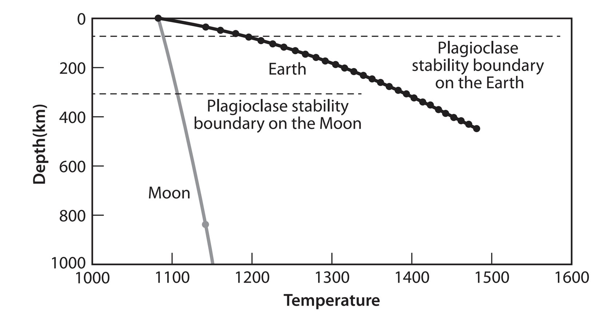
>地球的斜长岩稳定边界远高于月球，所以地球形成没有斜长岩地壳

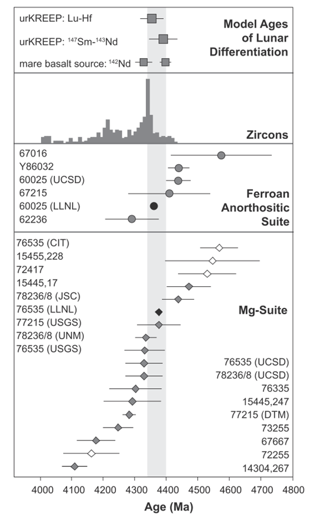
>月球主要岩石类型的结晶时间

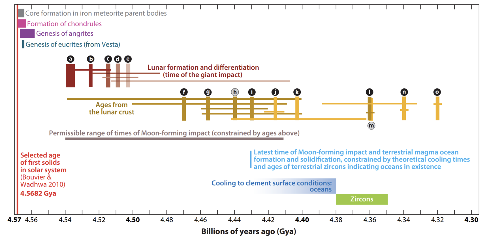
>月球岩浆洋的结晶年龄

棕色标识指示月球形成和分异的时间节点，由大型撞击坑定年约束出来；黄色标识指示月壤样品测得年龄，根据这些样品年龄约束了一个月球形成撞击的允许时间范围(灰褐色标识)
### ==行星早期宜居性演化的重大科学问题-1== 
#### 岩浆洋冷却对行星宜居性的影响
- 最早的玄武岩地壳与洋壳诞生？
- 最早的花岗岩地壳：大陆如何起源？花岗岩成因问题？
- 最早的海洋：海洋（水圈的主体）如何起源？
- 原始大气圈成分及其演化？
#### 与岩浆洋相关的天体生物学科学问题
- 岩浆洋冷却过程造成了行星表层物质的分异：初始“大陆”地壳？
- 分异结晶过程中挥发分的释放：次生大气？初始海洋？
- 岩浆洋冷却过程和时限？
- 行星内部热量能否成解决“暗淡太阳佯谬”？

## 二、核幔分异与行星早期磁场

### 元素的分配原理
核幔分异的根本原因：金属比硅酸盐更重，重力作用导致其聚集在行星的内部
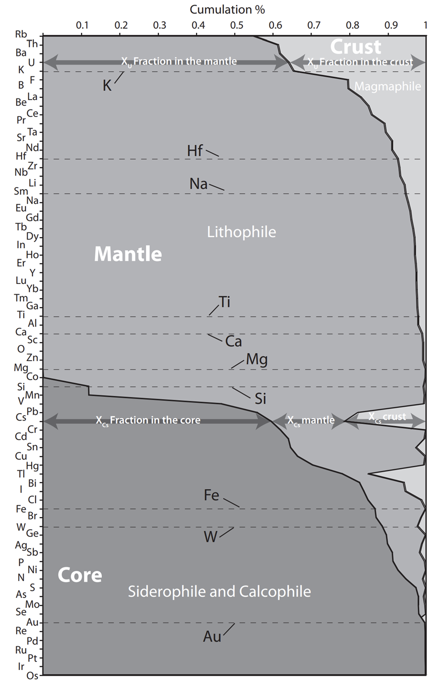
>元素在地球固体圈层间的配分
### 核幔分异
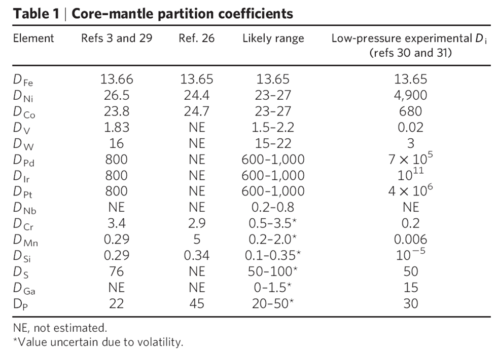
>不同元素在核幔之间分配系数。D值的大小直接体现了元素在核和幔之间的亲和性，数值越大说明对核的亲和性越大。

根据不同元素的亲和性，可以讲元素周期表里的元素分为四类：lithophile、chalcophile，siderophile，atmophile
#### 示踪核幔分异的时间

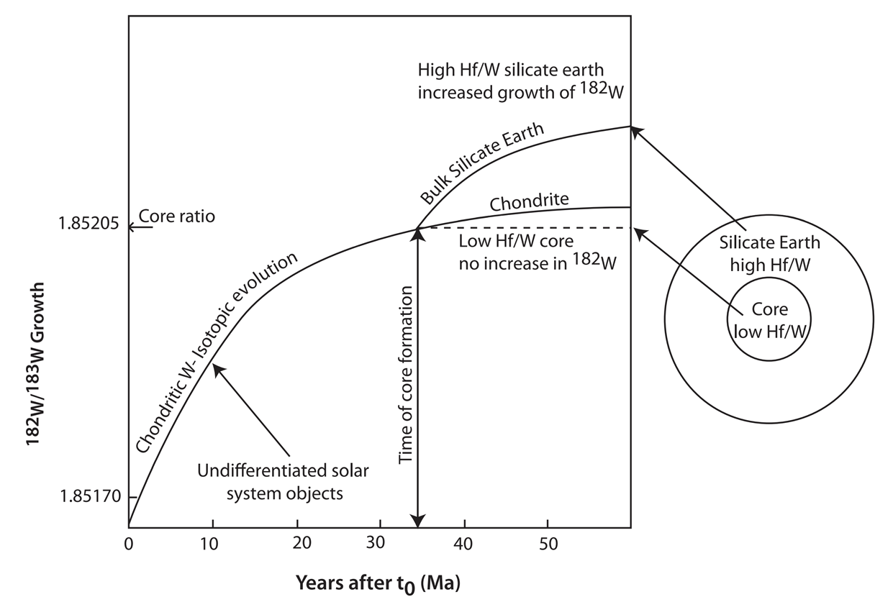
>通过Hf-W元素的分异来判断核幔分异的时间

$^{182}\text{Hf}\rightarrow^{182}\text{W}+2e$ (beta 衰变，半周期：900万年）——所有$^{182}\text{Hf}$会在6000万年以内完全消失
- 如果核幔分异发生在地球形成6000万年后在核幔分异发生时，所有的$^{182}\text{Hf}$都衰变成了$^{182}\text{W}$
- 所有$^{182}\text{W}$只能发现在地核中——地幔中不存在$^{182}\text{W}$
- 地幔中发现$^{182}\text{W}$核幔分异时有$^{182}\text{Hf}$进入了地幔中。1100-5000万年间（平均3000万年）
### ==行星早期宜居性演化的重大科学问题-2==
#### 圈层分异对地球宜居性的影响
**核幔壳分异如何造就地球的圈层结构**
- 最早的玄武岩地壳与洋壳诞生？
- 最早的花岗岩地壳：大陆如何起源？花岗岩成因问题？
- 最早的海洋：海洋（水圈的主体）如何起源？
- 原始大气圈成分？
**地球演化时期**
- 黑地球时期：地球完全由黑色玄武岩地壳包裹
- 蓝地球时期：海洋覆盖整个地球，没有陆地
- 灰地球时期：花岗岩陆地起源，地球逐渐从火山点缀的玄武岩世界转变成拥有广泛灰色花岗岩大陆的星球
	- 玄武岩：橄榄岩的部分熔融，组成矿物主要是橄榄石、辉石、长石
	- 花岗岩：玄武岩在有水的情况下部分熔融（石英、长石、辉石、角闪石、云母），密度比玄武岩小

### 核幔分异与地磁发电机Geodynamo
#### 地球磁场的产生来自于地球内核(固态)和外核(液态)的相互作用

**地磁场的产生是否与地核形成一致？**
- 岩石矿物所记录的剩余磁性上找证据，但缺少4.0Ga前的岩石证据；最早的剩余磁性记录在3.6Ga的岩石中
- 火星陨石 Martian meteorite ALH84001中记录了4.0Ga以前的剩余磁性，说明火星磁场的产生发生在4.5-4.0Ga之间
- 地磁场的形成阻止了太阳风对地球的作用
- 减少了大气气体的逃逸（太阳风的加速使得大气中的分子逃离地球的重力场）
### 全球性的地磁场：阻挡太阳风的侵蚀

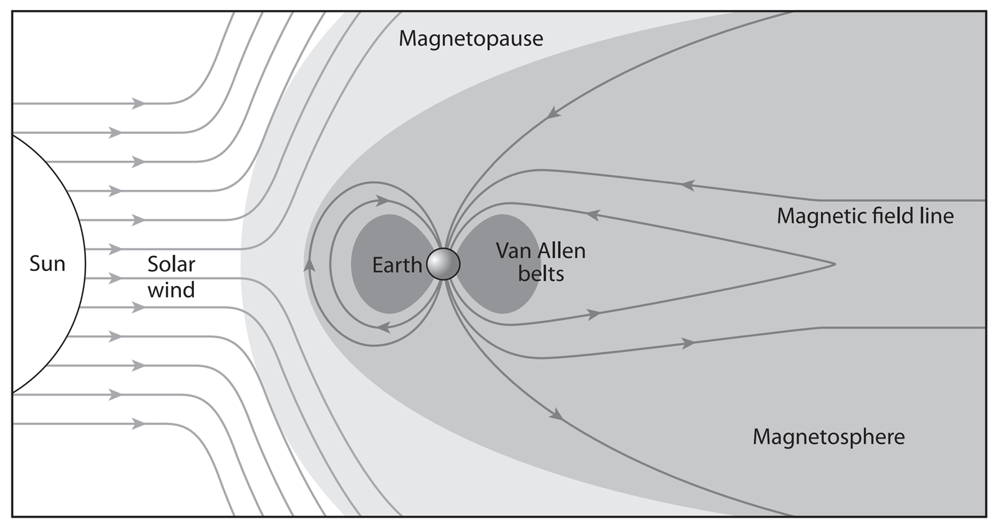
>地球全球性磁场示意图

火星是地球以外目前唯一可以进行比较行星学科学研究探索的天体，通过对火星等离子体环境的眼睛在和探索有利于我们了解地球地磁场的起源和发展。在过去二十年对火星等离子体环境近乎持续的探索之后，我们现在对不同大气层、行星等离子体和太阳风之间的相互作用的了解比地球以外的任何行星都多。

然而，火星上仍存在着很多悬而未决的有关磁场的关键科学问题，以及如何通过协调的多点任务来解决这些问题。主要的科学问题是：（i） 太阳风驱动如何影响磁层和电离层的动力学？（ii） 火星磁层尾部在所有尺度上的结构和性质是什么？（iii） 低层大气如何与高层大气耦合？（iv） 为什么我们应该在火星上安装永久的原位太空天气监测仪？每个科学问题都专门针对一个特定的等离子体区域，并包括未来几十年要研究的几个具体科学目标。此外，还提出了两个任务概念，基于来自轨道和地面平台星座的协调多点科学，专注于理解和解决当前的科学差距。

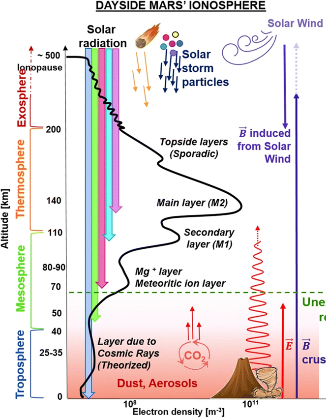
>火星等离子场环境的形成机制示意图

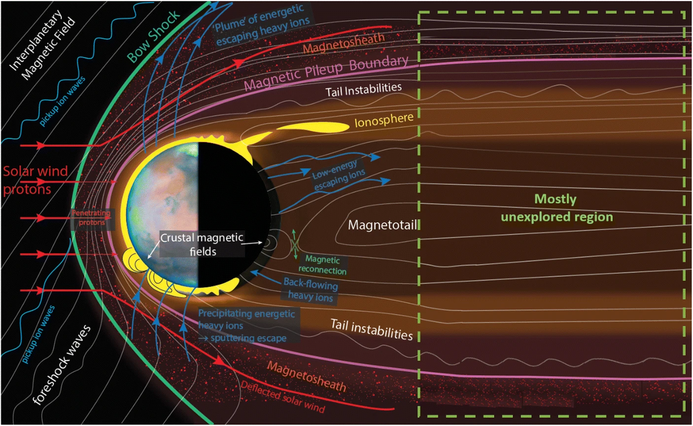
>火星等离子体系统示意图，显示火星已知的主要物理过程。 太阳在左侧。 要了解火星的整个动态系统，需要进行多点等离子体测量。
>https://link.springer.com/article/10.1007/s10686-021-09790-0

### ==行星早期宜居性演化的重大科学问题-3==
#### 地球磁场的起源对宜居性的影响
- 地磁场是地球宜居性形成和发展的重要条件，认识地球内部动力学和地球空间环境
- 地磁场由液态的外核运动诱发的电磁发电机产生，动能转化为电磁能
- 地磁场产生的必要条件：地球自转、存在导电流体、充足的热能、固体内核？
#### 地磁场领域悬而未决的重大科学问题
- 1.地核发电机何时、如何启动？
- 2.维持地核发电机运行的机制是什么？（动力学参数）
- 3.地磁极性倒转、极性漂移(真极移)和超静磁带产生的机制是什么？
- 4.地磁场的变化与气候是否有相关性？
#### 研究手段
- 深空探测（地磁卫星观测）：观测长周期变化
- 数值模拟和磁流体物理实验：利用古地磁和现代地磁观测数据，反演发电机的动力学过程和参数
- 比较行星学：研究类地行星和小天体的磁场发电机启动、运行和消亡机制

## 三、行星早期圈层分异

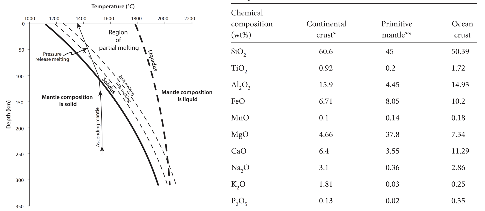
>地幔随深度温度变化的熔融曲线；陆壳、洋壳、原始地幔的元素组成成分

壳幔分异是行星早期圈层分异的重要过程，地壳主要由较轻的硅铝质岩石组成，而地幔则由较重的硅镁质岩石构成。
### 壳幔分异与大陆形成
前文提及过，地球是迄今唯一发现存在长英质陆壳的类地天体，陆壳的形成机制是地学界长期悬而未决的重大科学问题之一。**长英质的陆壳可能在冥古宙早期就已出现，但大量形成于中、新太古代**。澳大利亚Yilgarn 克拉通内年龄约为44亿年的Jack His碎屑锆石的发现表明，长英质地壳早在冥古宙早期可能就已形成。而陆壳以英云闪长岩-奥长花岗岩-花岗闪长岩(TTG)成分为主并大量形成于约27亿年之后。此外，**长英质很难从地超镁铁质岩石(橄榄岩)中直接分异，更有可能来自富含挥发分(水)的镁铁质岩的部分熔融**。因此，陆壳长英质的形成经历了“超镁铁质一镁铁质一长英质”的漫长演化路径，其中镁铁质组成的原始地壳的形成是陆壳形成和演化的关键环节之一。

由于岩石和其他地质记录稀缺，人们对镁铁质原始地壳和长英质陆壳的形成机制争议较大。现有TTG的主流成因模型主要基于洋壳的形成、冲或地柱模式。对于前者，由于地球早期可能不存在发育板块构造的条件，俯冲作用是否广泛存在仍值得商榷;而地幔柱模式虽可在短期形成大量贫挥发分的镁铁质，难以解释地表挥发分如何加入这些镁铁质地壳内部，这些挥发分是大规模形成长英质所需要的。

近四十年的持续观测表明，木卫一因剧烈的潮汐作用导致较强的**内生热作用和大规模地慢熔融**，并发育**以全球性火山作用主导内部物质-能量循环为特征的热管构造**。由于早期地球存在剧烈的内外地质作用并可能处于与木卫一类似的“高能”动力学条件下，现今的木卫一为研究早期地球的内部分异和构造体制提供了难得的参照。

基于上述思路，提出一个适用于早期地球的构造-壳幔分异模型:(1)在冥古宙早期至TTG大量形成之前的始太古宙(前TTG阶段)，地球因较高的内生热率和地幔温度，形成以大规模火山作用主导壳幔物质-能量迁移为特征的**热管构造体制**，地幔通过部分熔融大规模形成镁铁质原始地壳，且垂向主导的物质循环有利于将早期地表挥发分带入地壳深部，使基性地壳具有富挥发分特征，为TTG的后续形成提供必要的“原材料”。(2)在TTG大量形成阶段，随着地球冷却热管构造逐渐停止，以侵入作用主导岩浆作用、地壳形成高地温梯度为特征的**软盖构造”(squishy-lid tectonics)** 取而代之，为原始镁铁质地壳的熔融并形成长英质提供高地温环境条件。上述模型为前TTG时期镁铁质原始地壳的形成和后续长英质岩的形成提供了合理解释，为早期地球的壳幔分异过程和构造体制性质的研究提供了新的思路。

![[images/Pasted image 20250323160516.png]]
>[早期地球的壳幔分异模型](http://www.360doc.com/content/22/0913/20/13310692_1047774839.shtml)

### 大陆地壳演化
![[images/Pasted image 20250323162016.png]]

![[images/Pasted image 20250323162022.png]]
![[images/Pasted image 20250323162102.png]]
### 太古代与现代板块构造
![[images/Pasted image 20250323162111.png]]
### 大陆地壳的演化
### ==行星早期宜居性演化的重大科学问题-4==
#### 板块构造运动对地球宜居性影响
- 俯冲板片—地幔相互作用控制物质循环从而对地表环境产生重大影响
- 比如深部碳循环、深部水循环、深部有氧运动影响表层宜居性
#### 板块构造领域悬而未决的重大科学问题
- 板块构造这种全球尺度的运动何时起始？如何起始？
- 板块构造的动力源是什么维持的机制是什么？
- 早期板块运动范式和现代有何差异？何时发生转换？为何发生转换？
- 深部过程与表层响应：过程与机制（中科院先导专项（B）类，首席：徐义刚院士）
### 地球海洋形成的地质证据
![[images/Pasted image 20250324101939.png]]
>来自不同地点的样品中氧同位素的证据
### 地球水的来源
![[images/Pasted image 20250324102016.png]]
>不同D/H比的陨石样品数

**地球去气假说**：地球内部释放出$\text{H}_2\text{O}$，$\text{CO}_2$，$\text{H}_2\text{S}$，$\text{H}_2$，$\text{N}_2$

**陨石来源假说**：15%碳质陨石（Carbonaceous chondrites: 5-10%含水量）+85%普通陨石（Ordinary chondrites）$\rightarrow$ 50-70倍地球的水量
99.5%球粒陨石（Enstatite chondrite：0.05-0.1%含水量）$\rightarrow$ 少于地球现代的含水量

**彗星/小行星来源假说**：太阳系外层的小行星富含挥发性物质（彗星：50%含水量，形成于Kuiper Belt或者Oort Cloud）
### 地球早期大气圈

地球原始大气（Primordial atmosphere）和太阳系星云（solar nebula）一致，主要由H和He组成，但是现在的地球几乎完全丢失了原始大气
- 地球在形成早期受到大量星际物质（Planetesimals）和小行星（Meteorites）撞击，造成了气体的逃逸。但是撞击作用也会带来大量的气体，因此其总的收支平衡不得而知
- 在地球磁场形成之前（核幔分异之前），地球受到太阳风的袭扰，也可以造成气体的加速逃逸。
- 气体的重力逃逸（比如水光解形成的H2可以逃逸出地球）

## 四、行星大气圈与水圈的维持
### 大气圈-水圈是宜居性维持的关键

行星液态水的稳定存在是生命起源和宜居性维持的关键（温度维持在0-100°C之间）
- 大气圈是否会丢失？——比如月球和火星
- 水圈是否会丢失？——比如金星

### 行星大气流失的两种方式

- **中性逃逸**：分子在高温下因自身的热运动逐渐克服行星引力而飞离大气
- **离子逃逸**：带电粒子在太阳风的作用下被加速，迅速逃离行星引力束缚

![[images/Pasted image 20250324103344.png]]
>火星大气的不同逃逸机制
#### 中性组分热逃逸
![[images/Pasted image 20250324103223.png]]

金斯逃逸主要发生在外层大气，因为那里分子密度较低，分子间碰撞较少，分子有更高的概率保持高速状态。金斯逃逸对轻质分子（如氢和氦）尤为显著，因为它们的分子质量较小，更容易获得足够的动能。对于火星这样的行星，由于引力较弱且缺乏磁场保护，金斯逃逸显著影响了其大气的长期演化，导致轻质成分的流失，对行星的宜居性产生深远影响。
#### 离子逃逸

光致电离是火星高层大气中一种重要的物理和化学过程，主要由太阳高能紫外辐射驱动，在火星电离层中起着关键作用，决定了离子的密度分布，并进一步影响火星大气的演化和粒子逃逸。新生成的离子与电子会与其他分子发生碰撞和反应，形成更复杂的化学过程。此外，生成的离子可能受到太阳风和电磁场的作用，从而逃逸到太空。研究光致电离过程不仅有助于理解火星大气的化学和动力学特性，还为揭示火星从湿润宜居环境向干燥沙漠转变的历史提供了科学依据。
![[images/Pasted image 20250324103723.png]]

### 火星大气逃逸
#### 火星离子逃逸的不同区域

![[images/Pasted image 20250324103825.png]]
>火星大气的主要三种逃逸方式

**双极电场逃逸**：行星大气中的带电粒子（如离子和电子）受到行星磁场和电场的共同作用。由于电场的存在，带正电和带负电的粒子会分别受到相反方向的电场力，从而形成双极的运动模式。

**羽流逃逸**：行星大气中的物质以羽流的形式从行星表面或大气中特定区域喷射出来，并最终逃逸到太空中的过程。在行星表面的地质活动、火山喷发、陨石撞击等事件中，大量的气体、尘埃和其他物质被快速地从行星内部或表面释放出来，形成高速的羽流，当羽流的速度足够大且方向合适时，物质就可以克服行星的引力逃逸到太空中。

**磁尾逃逸**：太阳风与行星磁场相互作用时，会压缩行星磁场的昼侧部分，同时在夜侧拉伸形成一个长长的磁尾。在磁尾区域，磁场的结构和强度发生变化，带电粒子可以通过磁尾中的磁场线被携带和加速，最终逃离行星引力，进入太空。

#### 火星大气逃逸的研究方式

目前，我们对火星的观测仍然相当有限，尤其是在全球覆盖方面。为了真正理解太阳风与行星的相互作用，我们依赖三类数值模型，这些模型帮助我们解析已有的数据并探索可能发生的行星空间环境过程。在模拟中，激波位置比实际观测到的更接近火星，这表明基本气体动力学模型难以准确重现感应磁层的结构。

![[images/Pasted image 20250324104649.png]]

当前的全球模型采用**混合模型**和**磁流体力学（MHD）模型**，各有优劣。混合模型在捕捉主电离层上方的过程表现较好，在该区域中离子动力学效应可能更为重要。但该模型在表示不同离子种类方面存在困难，尤其是在光化学影响更大的低电离层中。MHD模型能够捕捉到弓形激波、磁障和电离层等重要特征。MHD模型有两种类型：单流体MHD（MS-MHD），假设所有离子种类具有相同的速度和温度，但难以反映不同离子种类的细节；多流体MHD（MF-MHD），为每种离子种类分别求解MHD方程，提供各自独立的密度、动量和能量解。
### 早期强烈的太阳等高能活动
![[images/Pasted image 20250324104818.png]]
这一推论是根据对数百个年轻太阳类似物的经验观测得出的。 该理论尚未完全成熟，但大致上恒星活动（太阳黑子、耀斑、紫外线、X 射线等）与磁场强度直接相关，而磁场强度又是由恒星旋转产生的。 随着恒星的老化，它会通过恒星风失去角动量。 孤星就像旋转的陀螺。 它们都会减速。 

https://link.springer.com/article/10.1007/s11214-007-9225-z

https://iopscience.iop.org/article/10.1086/432716/fulltext/

https://link.springer.com/article/10.1007/s11214-006-9006-0

## 五、地月系统形成与晚期大轰炸
### 阿波罗登月：大撞击模型（The big thwack）

**月球科学是美苏争霸的副产物**
美国阿波罗计划耗资200亿美元，从6个不同登月点取回840磅月球样品
•1969.07.24：阿波罗11号，45磅，第一次；1969.11.19：阿波罗12号，70磅；1972.12，阿波罗17号，240磅，最后一次

**月球观测事实**
- 1.月球公转轨道与黄道面和赤道面都不重合
- 2.月球的核很小，只占3%，地球是30%
- 3.月球是干的，缺乏挥发份（易挥发性元素H, O, K, Na, S, N等）
- 4.月球氧同位素和地球一致(O16和O18比值，与行星位置相关）
- 5.月岩年龄43亿年，与地球相当

### 月球起源的大撞击假说

![[images/Pasted image 20250324104926.png]]
大约 45 亿年前，一个火星大小的天体斜撞地球，喷射出大量物质，在地球周围形成一个圆盘。 从这个圆盘中形成了一颗巨大的卫星
### 地月系统演化——能量耗散体系

![[images/Pasted image 20250324105809.png]]

月球目前在地球轨道上，与地球的距离约为 60 个地球半径（rE）。 地球和阿波罗着陆点之间的激光测距测量结果表明，月球正以每年约 3.8 厘米的速度远离地球。 有关月球距离的其他地质线索表明，9 亿年前月球距离地球只有约 54 个地球radii（见第二幅插图）。 然而，地质记录越久远就越贫乏。 因此，人们使用其他方法来确定更远古时期的地月距离。 如果我们能很好地测量地球和月球的引力场，并能模拟它们在地质上的过去，那么我们就能计算出不同时期的相对距离。

根据克莱门汀号宇宙飞船进行的重力测量，目前估计大约 39 亿年前的地月距离只有 21 个地球radii。 如果这是真的，那么月球在天空中的大小就会增加 2.8 倍，每年的月食次数也会大大增加。 也许更重要的是，潮汐会更大，一些研究人员认为这些潮汐可能对地球生命的早期进化起到了重要作用。 地球和月球之间的近距离也可能增加了地球和月球之间通过大型撞击事件交换的物质数量。 早期地球与月球之间的距离是一个非常重要的参数，因此在获得新数据后应该对其进行重新研究。[^2] .
### ==行星早期宜居性演化的重大科学问题-5==
#### 大撞击和月球形成对地球宜居性的影响
- 地月系统角动量守恒
- 对地球自转速度的影响：潮汐制动给地球自转刹车，让地球自转从一天5小时到如今24小时
- 撞击对地球自转23°倾角有贡献：黄赤交角使得地球有一年四季的气候变化
- 早期月球离地球非常近：巨大的潮汐引力推迟了地球岩浆洋冷却（保暖？）、产生大潮汐，有利于原始汤的形成
- 月球是地球的盾牌，阻挡部分大撞击

**月球形成的整个过程大约持续了100万年；月球形成时在地球希洛极限外(15000英里)，视直径是太阳的16倍，面积是今天满月的250多倍；月球一直在远离地球，远离地球速度平均3.82cm每年**

### 晚期大轰炸事件

![[images/Pasted image 20250324110310.png]]
Late Heavy Bombardment (LHB，晚期大轰炸)是指约于41亿年前至38亿年前，即于地球地质年代中的冥古宙及太古宙前后，推断在月球上发生不成比例的大量小行星撞击的事件，在地球、水星、金星及火星亦同样发生。这个事件的证据主要是基于在月球取得的样板的测年结果，大部分陨击熔岩都是在一段相当短的时间内形成。

主要证据来自对月球陨石坑的定年
- 记录了撞击衰减的末期（a）？
- 在整体撞击降低背景下的一次事件（b）？
### NICE模型

#### NICE模型简介
NICE模型是描述太阳系巨行星动态演化的一种理论框架，其核心假设是：巨行星（木星、土星、天王星、海王星）在太阳系形成早期并非处于当前轨道位置，而是通过迁移从紧凑的初始配置逐渐演化至今日状态。该模型由法国尼斯天文台（Observatoire de la Côte d’Azur）的科学家团队于2005年首次提出，旨在解释太阳系的多重观测特征，包括：
1. **巨行星的轨道分布**：初始轨道更紧凑（约5.5–17 AU），随后因动力学不稳定向外迁移。
2. **柯伊伯带（Kuiper Belt）的结构**：尤其是其共振天体群的分布。
3. **晚期重轰炸（Late Heavy Bombardment, LHB）** ：假设的月球及内行星在太阳系形成约6亿年后经历的密集撞击事件（但后续研究对此提出质疑）。
#### NICE模型基于以下物理机制：

**1.引力相互作用与共振**：
- **行星-星子散射**：巨行星通过与外围星子盘的引力作用交换角动量，导致轨道迁移。例如，木星向内迁移，土星、天王星、海王星向外迁移。
- **轨道共振触发不稳定性**：木星与土星进入2:1平均运动共振时，轨道偏心率的增加引发系统级联不稳定。共振条件可表达为：
$$
\frac{P_{\text{木星}}}{P_{\text{土星}}} = \frac{n+1}{n}
$$
  其中$\text{P}$为轨道周期，$n$为整数。
- **动力学摩擦（Dynamical Friction）** ：剩余星子盘的引力阻尼效应使天王星和海王星的轨道偏心率降低，最终趋于圆形。

**2.混沌动力学与数值模拟**：
- 行星迁移过程涉及混沌相互作用，需通过**N体数值模拟**追踪长期演化。例如，行星与星子盘的引力摄动可能导致轨道参数的剧烈变化。
- 计算中需处理数值误差（如舍入误差、时间离散化误差），这些误差对模型的敏感性有显著影响。

**3.天体捕获与散射**：
- 模型解释海王星卫星Triton的捕获机制为**三体相互作用**（如双星系统瓦解）。
- 外盘中的冥王星质量天体会扰动巨行星轨道，导致迁移方向改变。

#### NICE模型的计算依赖以下数学工具：
**1.哈密顿系统与摄动理论**：
- 行星轨道演化可通过哈密顿方程描述，考虑主行星间的引力摄动和星子盘的扰动项：
$$
\mathcal{H} = \mathcal{H}_{\text{开普勒}} + \mathcal{H}_{\text{行星间}} + \mathcal{H}_{\text{星子盘}}
$$
  其中$\mathcal{H}_{\text{开普勒}}$为行星绕太阳的椭圆运动项，后两项为摄动项。

**2.角动量交换与迁移速率**：
- 行星迁移速率由星子散射产生的扭矩决定。对于质量为$ M_p $的行星，迁移速率可近似为：
$$
\frac{da}{dt} \propto \frac{\Sigma_{\text{星子}} M_p}{M_\odot}
$$

其中$a$为轨道半长轴，$\Sigma_{\text{星子}}$为星子盘表面密度。

**3.共振条件与稳定性分析**：
- 平均运动共振的条件由轨道周期比定义。例如，木星与土星的2:1共振导致轨道偏心率激增，进而触发系统不稳定。

**4.数值模拟技术**：
- 使用辛积分算法（Symplectic Integrators）保证长期模拟的数值稳定性。
- 统计方法分析模拟结果，例如通过蒙特卡洛抽样验证轨道分布的合理性。

#### NICE模型的局限性
1. **改进版本**：
   - **Nice 2模型**：引入长期共振与后期不稳定性解耦，降低对初始条件的敏感性。
   - **五行星模型**：假设太阳系早期存在第五颗冰巨星，后被弹出。该版本能更好匹配柯伊伯带倾角分布。

2. **未解问题与争议**：
   - **LHB的争议**：近年研究显示月球陨石坑年龄分布更符合指数衰减，而非突发峰值。
   - **木星不规则卫星的捕获机制**：原始模型未能充分解释其来源。
   - **小行星带的高倾角天体过剩**：模型预测与观测存在偏差。

NICE模型通过结合引力动力学、共振效应和数值模拟，为太阳系演化提供了统一框架。其核心贡献在于将巨行星迁移与多种观测现象（如柯伊伯带结构、行星轨道分布）关联，尽管仍需进一步改进以解决争议性观测问题。该模型的数学复杂性体现在对混沌系统的长期追踪与统计验证，而其物理基础则植根于经典力学与摄动理论。

### 行星早期宜居性演化的重大科学问题-6
#### 晚期重轰炸事件对地球宜居性的影响
- 大碰撞和晚期重轰炸事件对地球物质增生和挥发分的获取非常重要
- 外来的水和有机质可能为生命起源提供了物质基础
- 挥发分物质形成的水圈和大气圈为生命起源提供了物质和环境条件
# Reference
[^1]: 维基百科岩浆洋模型 https://en.wikipedia.org/wiki/Magma_ocean

[^2]: 地月动力学 [Earth-Moon Dynamics](https://www.lpi.usra.edu/exploration/training/illustrations/earthMoon/)
