## 一、地球生命演化史

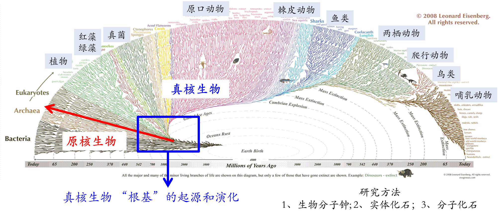
>地球生命分支树：原核生物—真核生物
### Stage1：最早的生命
#### 岩石学证据

**叠层石**
- 由光合蓝绿藻（cyanobacteria）形成，并包含了其他类型的微生物（将今论古的典型）
- 微生物过程对碳酸盐岩的诱导沉积 à 区分无机碳酸盐岩和生物诱导碳酸盐岩沉积
- 3.45 Ga出现最早的类似于叠层石沉积（左上）
- 2.7 Ga出现确凿无疑的叠层石沉积（右上）
 
 **叠层石的非生物成因**
### Stage2：早期真核生物
### Stage3：后生多细胞生命
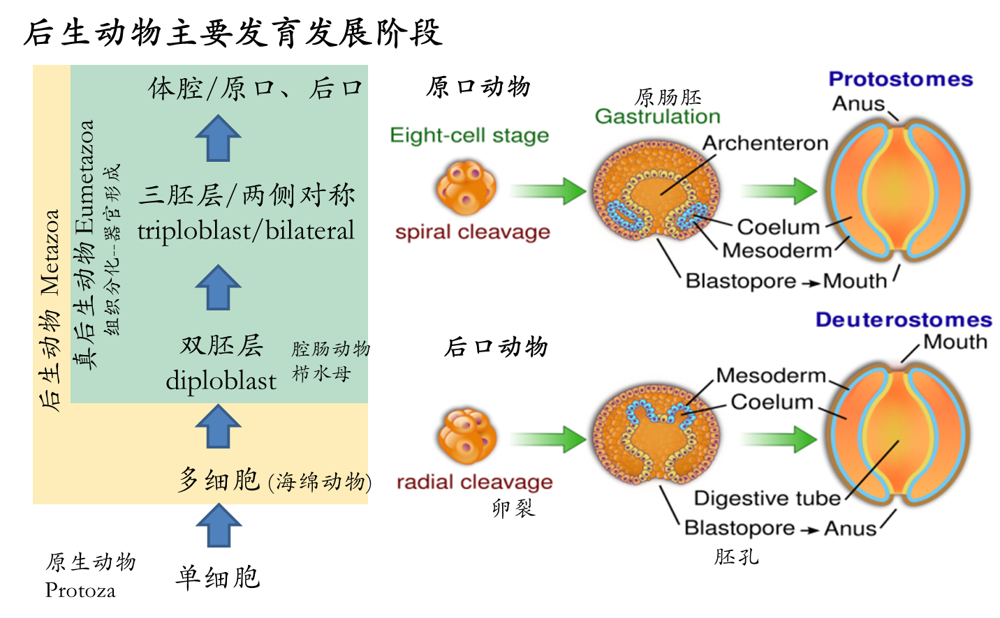
#### 蓝田生物群
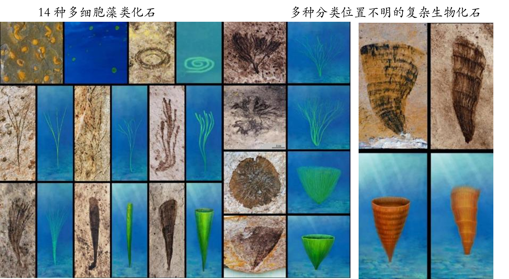
>Wan et al., 2016, 袁训来等，2016

“蓝田生物群”是迄今最古老的宏体生物群，时代属于埃迪卡拉纪早期，年龄限定在距今6．35亿—5．8亿年之间。而之前发现的最古老的宏体生物组合是在澳大利亚等地发现的“埃迪卡拉生物群”，时代距今为5．79亿－5．4亿年。[^1]

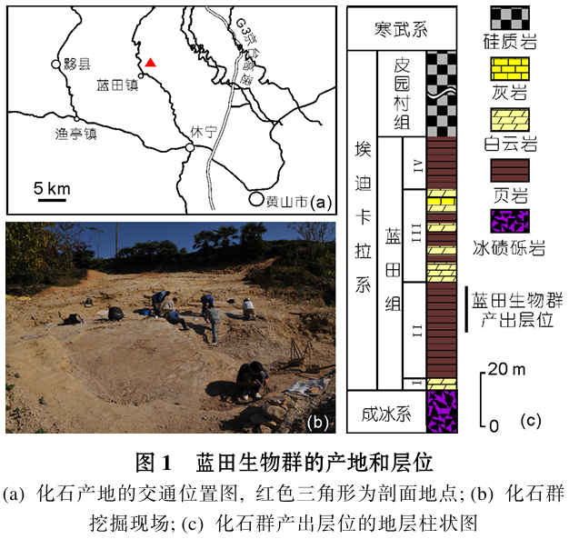
>“蓝田生物群”位于安徽省南部休宁县蓝田地区, 化石以碳质压膜形式保存在页岩层面[^2]

“蓝田生物群”不但包含了形态多样的扇状和丛状生长的海藻，也有具触手和类似肠道特征、形态可与现代腔肠动物或蠕虫类相比较的动物；根据他们的发现，至少能识别出15个不同形态类型的宏体生物。它们形态保存完整，绝大部分类型具有固着装置，表明这是一个底栖固着生长的宏体生物群。

“蓝田生物群”保存化石的页岩微细层理发育，没有发现任何水动力沉积和搬运的迹象，表明“蓝田生物群”为原地埋藏保存，它们的生活环境应该在最大浪基面之下、透光带之中。根据当时的古地理位置，以及参考现代海洋环境的标准，“蓝田生物群”应该生活在静水环境，水深在50米至200米之间。

#### 瓮安生物群
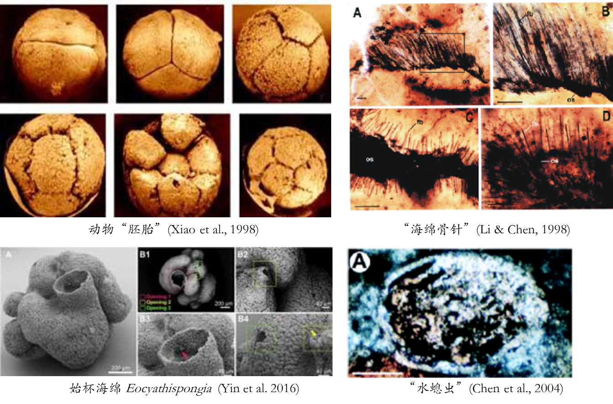
瓮安生物群产自贵州瓮安埃迪卡拉系，距今约6.1亿年，该生物群是全世界最早的动物化石，比寒武纪还早约6000万年,为新元古代全球性冰期结束后多细胞真核生物的辐射提供了关键的化石证据，尤其是揭示动物在寒武纪之前动物的“隐形演化历史”，为追溯“寒武纪大爆发”之根提供了独一无二的实证记录.

瓮安生物群的化石埋藏于磷块岩和白云岩，化石均为磷酸盐化的三维立体标本，保存了精美的细胞-亚细胞结构。化石代表如各种具复杂发育方式的胚胎、海绵和疑源类动物，具有多个目前最早的化石记录[^3]：
- 最古老的动物化石记录
- 最早的地衣化石
- 具极叶结构的动物胚胎化石
- 最早的动物休眠卵化石

#### 埃迪卡拉生物群

![[images/image-20250327134553.png]]

埃迪卡拉生物群包括一些管状、蕨叶状、盘状以及很多形态怪异的大型海洋底栖生物，这些生物都**没有发育硬骨骼，为完全的软躯体**，身体呈辐射对称或两侧对称，被认为是地球上最早出现的大型多细胞动物，但由于化石中未保存揭示它们诸如运动、捕食或取食、消化、生殖等生物学特征的信息，故它们亲缘关系仍有争议。最初发现的埃迪卡拉动物化石均以印痕或者铸模的形式保存在粗砂岩中，不过最近也发现了一些不同保存类型的化石，比如保存在黑色页岩中呈炭质压膜的类型(如江口瓮会生物群中的八臂仙母虫)，以及保存在灰岩中呈三维立体埋藏的类型(如湖北三峡地区石板滩生物群)[^4]。
#### 寒武纪大爆发

从寒武纪开始的 2千多万年时间里，现生主要后生动物（metazoa）门类的代表在化石记录中几乎同时出现的事件（现象）

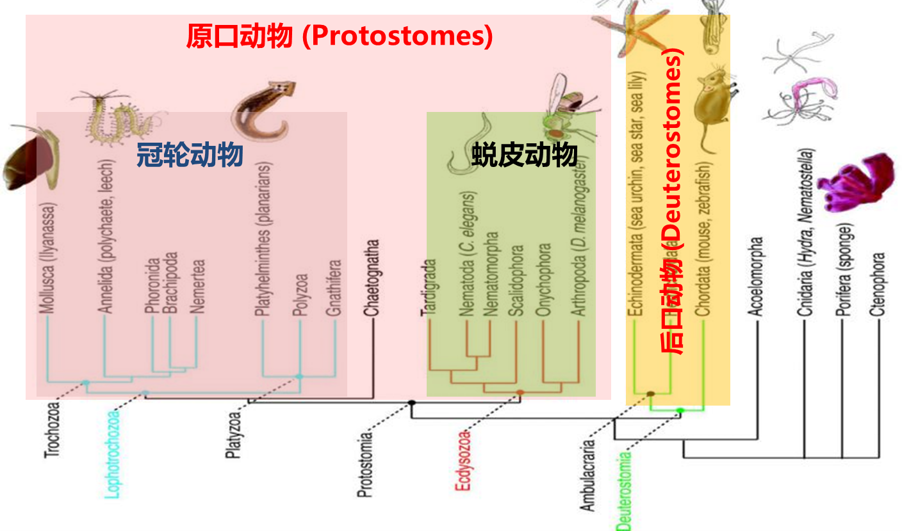
关于“寒武纪生命大爆发”的成因，目前已提出了环境变化、生态效应和基因演化等假说（张兴亮和舒德干，2014）。其中，**“寒武纪生命大爆发”呈现了前奏-序幕-主幕三阶段生物演化过程**（舒德干，2009）；但是关于前奏与序幕之间的演化关系，却存在不同的认识。部分研究认为，埃迪卡拉纪生物群与寒武纪生物群在生物特征和生态系统方面存在显著差异，前者可能只是生物进化史上一次失败的试验品，二者之间经历了彻底的生物大绝灭和生态更替事件，导致二者不具有明确的演化关系。其他研究认为，后生动物的起源和分异时间明显早于寒武纪，“寒武纪生命大爆发”与埃迪卡拉纪生物群可能存在一定的过渡和演化关系。因此，“寒武纪生命大爆发”与埃迪卡拉纪生物群到底有何关联？二者之间是否为彻底的绝灭-取代亦或渐变演化关系？同时期环境是否及如何影响生物群的演化？想了解以上的内容可以参考Rachel Wood 教授及其合作者的新成果 *Nature Ecology & Evolution*（Wood et al., 2019），以下展示一点成果中的示意图[^5]。

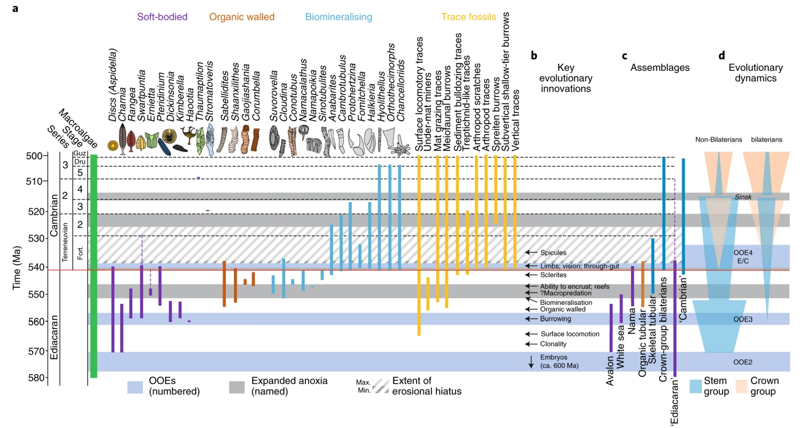
>埃迪卡拉纪-寒武纪时期生物演化进程。埃迪卡拉纪中晚期出现了一系列生物革新，包括迁移能力、生物矿化、冠群两侧对称动物和捕食行为等。注意，埃迪卡拉纪生物群与寒武纪生物群具有一定的共存时段 (Wood et al., 2019)

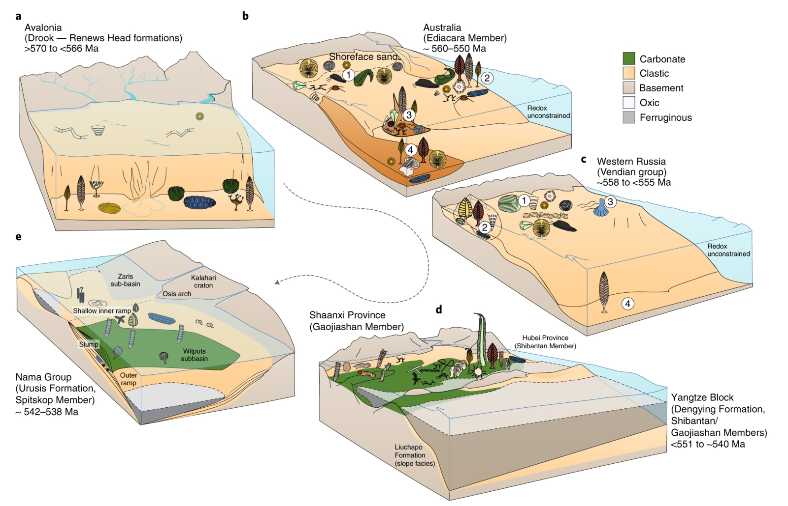
>埃迪卡拉纪生物群的产出、分布和演替模式。埃迪卡拉纪生物群的产出与沉积相有一定的关联性，并通常分布在总体缺氧背景下的局部（或间歇式）氧化海域 (Wood et al., 2019)

## 二、真核生物起源与大氧化事件(GOE)

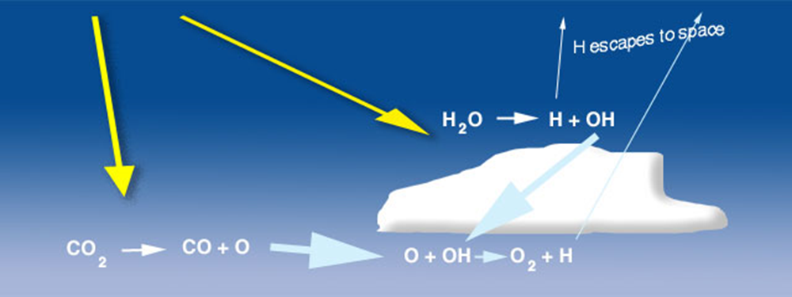
产氧光合作用出现以前，氧气主要来自于光化学反应（Photochemical reactions）: 
- CO2和H2O的光解（Photolysis）产生了 H2 and O2
- H2 逃逸到太空
- O2在还原大气中优先和还原物质反应$\rightarrow$低大气含氧量

### 1. 大氧化事件的地质证据

#### 矿物金属价态的变化
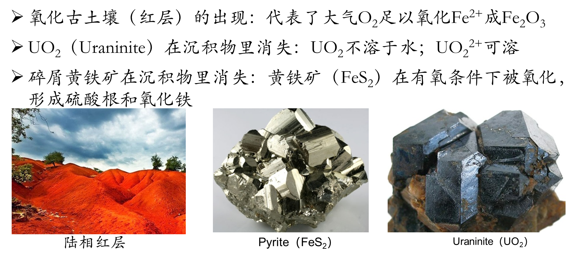
#### S同位素非质量分馏的消失

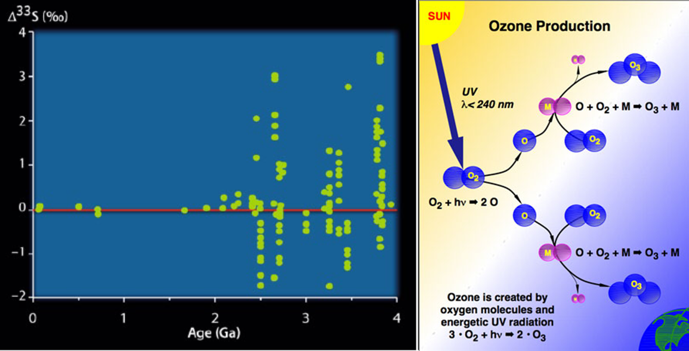

$$
\Delta^{33}\text{S}=\delta^{33}\text{S}-0.515\times\delta^{34}\text{S}
$$
质量分馏（mass dependent fractionation）:$\Delta^{33}\text{S}=0$
非质量分馏（mass-independent fractionation）:$\Delta^{33}\text{S}\neq0$

非质量分馏的发生来自于硫酸根在大气中的由于紫外线照射所造成的光化学反应

模型表明，导致S同位素非质量分馏消失所需要的大气O2浓度为现代大气氧气浓度（PAL）的$10^{-5}$，但是，地质记录中来自于黄铁矿或者硫酸盐沉积，代表了海水的信号，而海水中的硫酸根可以来自大气，亦可以来自陆地（比如对黄铁矿的氧化风化）。来自黄铁矿氧化风化的硫酸根不具有非质量分馏的特征。
- 太古宙S同位素非质量分馏表明了大气$\text{O}_2$浓度低于$10^{-5}$ PAL，同时海洋中的硫酸根主要来自大气。
- 元古宙早期S同位素非质量分馏的消失可以表明大气$\text{O}_2$浓度高于$10^{-5}$ PAL，或者海水中硫酸根主要来自陆地而非大气。

### 2. 氧气源的增加

#### 光解与氢气逃逸
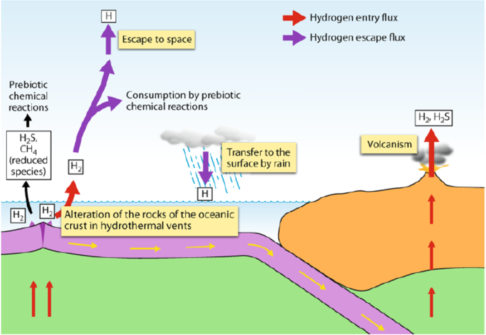
在生命出现前，地球原始大气中的氧气可能通过 **光化学反应** 产生。极紫外光（VUV）照射下，CO₂和H₂O分子可发生光解生成氧气:
- **CO₂光解**：CO₂ → CO + O，随后O原子重组为O₂
- **H₂O三体光解**：H₂O在短波长下可直接分解为O + H + H，其中O原子重组为O₂
这一过程的氧气积累依赖于 **氢气逃逸**。若H₂未逃逸到太空，氧气会通过催化循环重新生成H₂O；而H₂逃逸后，氧气得以保留。早期地球的氢气逃逸速率受对流层冷阱限制，但随着大气演化，逃逸效率提高，净氧化通量增加。

#### 产氧光合作用
**蓝细菌（Cyanobacteria）的产氧光合作用** 是GOE的核心驱动力：
- 光系统II分解H₂O产生O₂，该过程在约24亿年前高效化，--【冲破还原性物质（如H₂S、CH₄）的缓冲，导致O₂积累.
- 争议点：产氧光合作用起源时间与GOE的关系。部分研究认为其起源早于GOE（34亿年前），但受限于营养盐和生态竞争，直至24亿年前才触发O₂累积；另一观点认为两者时间接近，蓝细菌快速主导生态系统[^6]
  
#### 地球深部产氧

地球深部过程可能直接释放氧气
- **高压矿物反应**：
  当含水矿物随着俯冲作用进入深部下地幔时（> 1 800 km），金属铁或铁氧化物会和水发生如下反应生成氢化的铁超氧化物，并释放出氢气.
  $\text{Fe} + 2\text{H}_2\text{O} = \text{FeO}_2\text{H}_x +(2-0.5x)H_2$，
  $\text{FeO} + \text{H}_2\text{O} = \text{FeO}_2{H}_x +(1-0.5x)\text{H}_2$，
  $\text{Fe}_2\text{O}_3 + \text{H}_2\text{O} = 2\text{FeO}_2\text{H}_x +(1-x)\text{H}_2$，
  以上反应产生的$\text{H}_2$主体会脱离富氧的铁超氧化物系统，后者主要聚集在核幔边界，实现了氧的净积累.当这些铁超氧化物积累到一定量时，促发超级地幔柱，使得铁超氧化物中的O2释放到大气，形成大气O2的“源”。[^7]
  
- **深海“暗氧”** ：2024年研究发现，深海金属矿物（如锰结核）与水反应生成O₂，无需光照。这类非光合产氧可能在大氧化前提供局部氧化环境。[^8]
- **构造活动联动**：超级山脉风化通过机械化学作用产生活性氧（如H₂O₂），促进地表氧化
### 3. 氧气汇的减少
#### 火山模式的改变
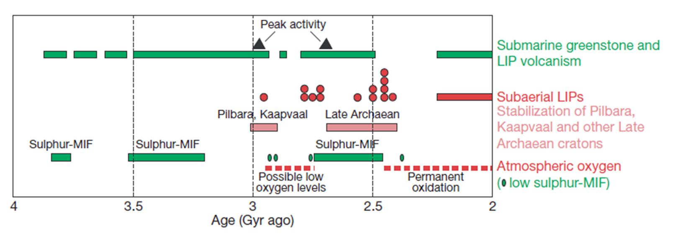

- 陆地喷发的火山气体更加氧化（$\text{H}_2{O}$，$\text{CO}_2$, $\text{SO}_2$），而海洋喷发的火山气体更加还原（$\text{H}_2$, $\text{CO}$, $\text{CH}_4$, $\text{H}_2\text{S}$）
- 古元古代火山活动从以海洋火山喷发为主向陆地-海洋混合火山喷发的转变
- 地幔氧化态（fO₂）升高：地幔柱中富氧岩浆喷发减少还原性气体排放，氧源通量（Koxy）超过氧汇，触发O₂净积累

#### $\text{Ni}-\text{CH}_4$假说

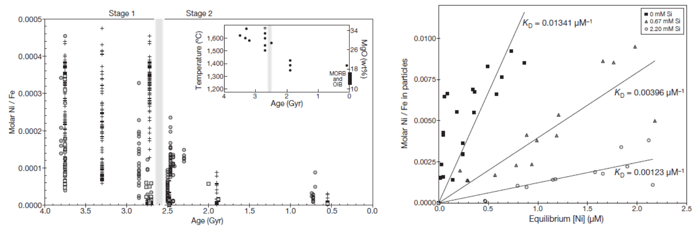
- Ni是甲烷生成菌所必须的微量元素
- 上地幔温度降低导致Ni输入减少$\rightarrow$ $\text{CH}_4$ 生成量降低$\rightarrow$降低氧气消耗
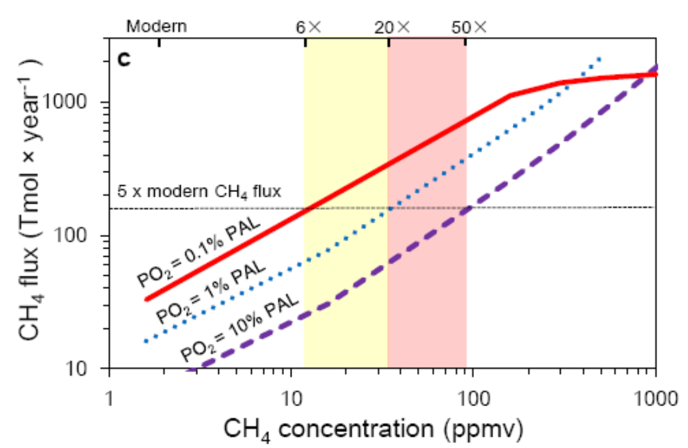
- 基于Ni是甲烷生成菌的控制性元素的假设
- 基于大气中具有高浓度甲烷的假设
- 如何在无氧条件下聚集大量甲烷的机理不明

## 三、动物起源于新元古代氧化事件(NOE)
### 1. 新元古代氧化事件（NOE）的地质证据

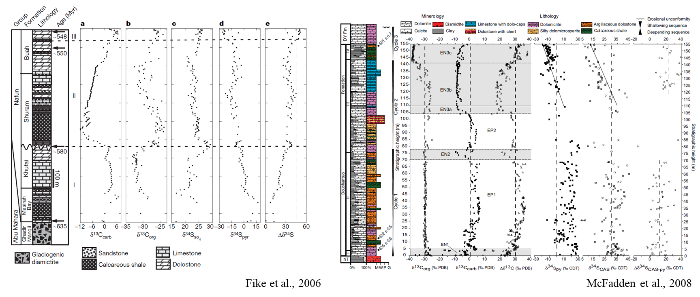
黄铁矿硫同位素与海水硫同位素的分馏值逐渐增大，反应海水硫酸根浓度逐渐升高，海水从缺氧逐步转变为氧化。

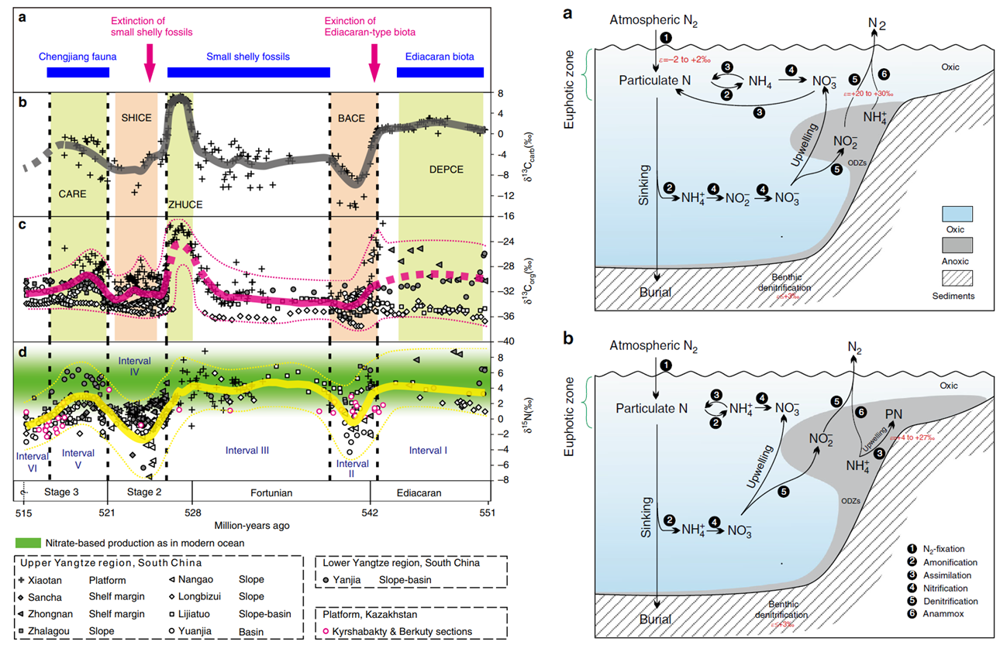
>Wang et al., 2018

N-C同位素曲线具有耦合关系
N-C同位素的漂移分别与生物的阶段性辐射和灭绝事件在时间上高度吻合
海洋N储库的增加有利于促进海洋的氧化与动物的辐射

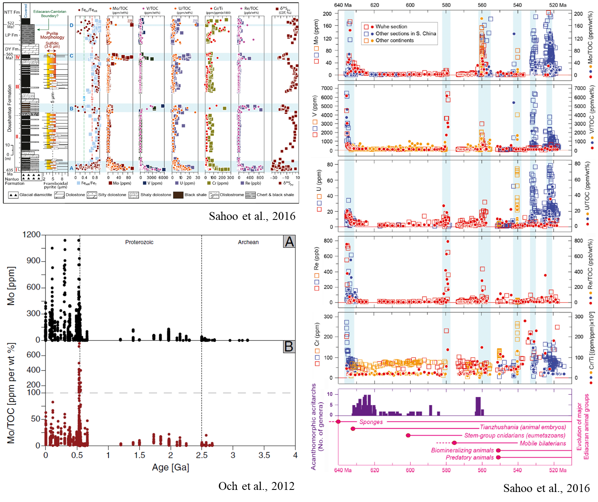
NOE期间，氧化还原敏感元素（如 Fe、Mo、V、Cr、U）的浓度多次发生富集，指示了多次氧化事件发生。

利用微量氧化还原敏感元素进行研究时，必须考虑地理限制的影响。

>为什么左上图中Mo在B时期没有漂变？地理位置问题？
>不过似乎跟左下的图对应的挺好的（）

#### 铁组分

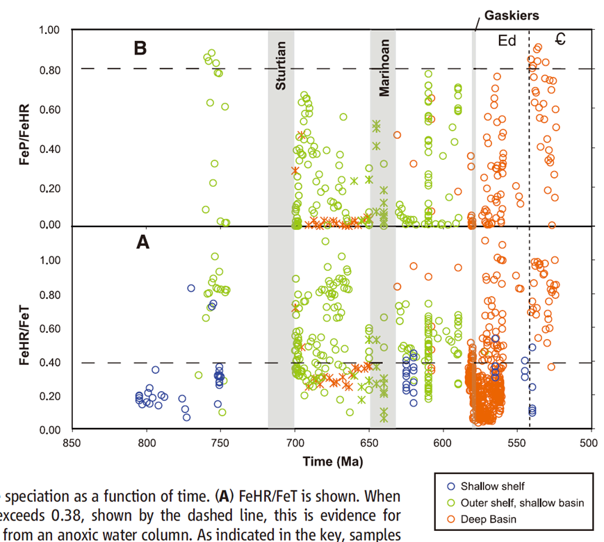
>Canfield et al., 2008

FeHR/FeT(高活性铁/总铁)常被用来反应海水氧化还原程度，以0.38为界。
全球的铁组分数据反应了大氧化事件的存在，但也说明当浅海完全氧化时，深水盆地仍多数处于缺氧环境。

#### 钼组分

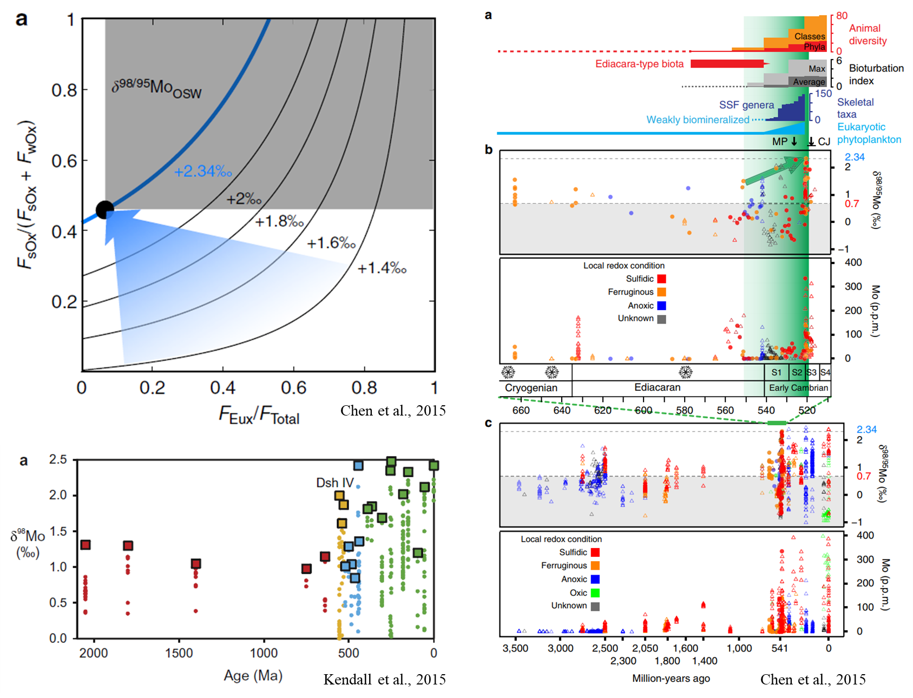
      寒武纪早期海水的Mo同位素组成与现代海水已非常相似，显生宙的海洋氧化程度较元古代有了明显的提高。
#### 铀组分

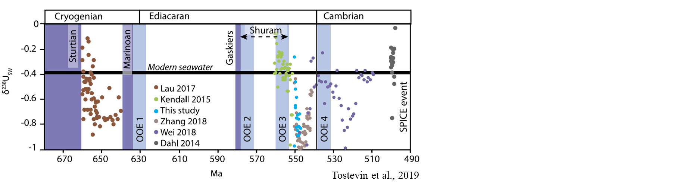
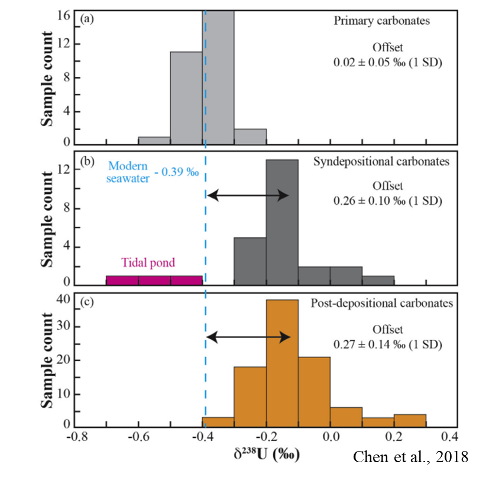
U同位素在Shuram事件发生了更加剧烈的负漂，可能代表了当时海洋缺氧程度极高。

U同位素在碳酸盐岩中发生分馏。（在文石和方解石沉积和成岩过程中固相富集较重的U同位素）

>Shuram事件是地球上最大的碳同位素负漂事件
#### 铬组分

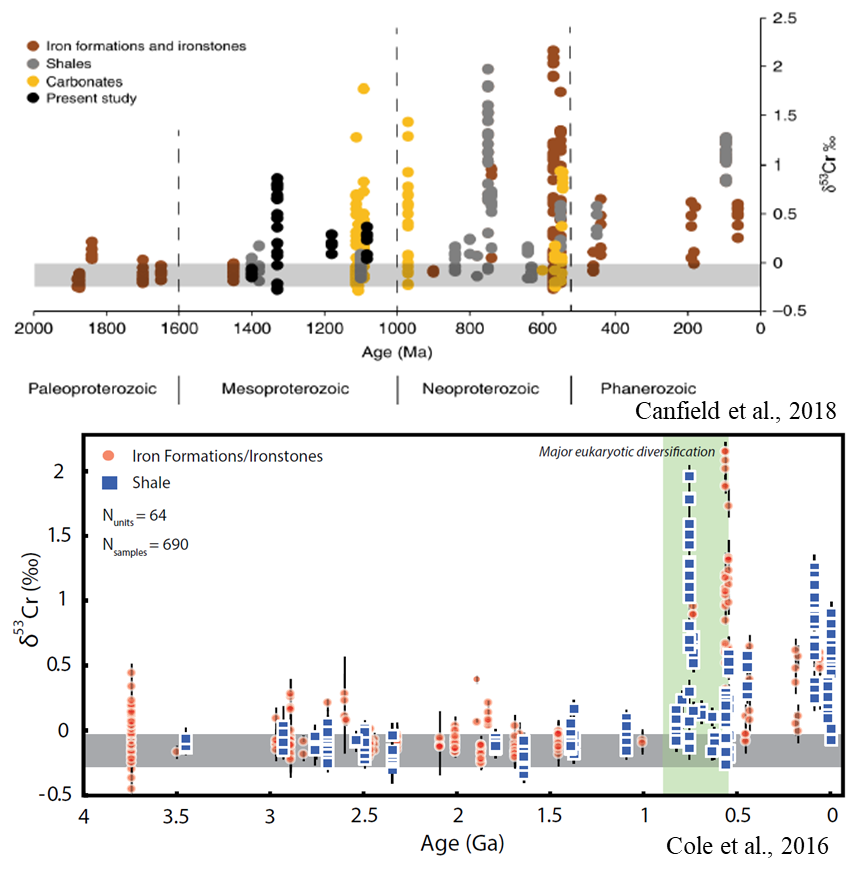
$\text{Cr}$同位素可以恢复大气$\text{O}_2$浓度 ；新元古代，$\delta^{53}\text{Cr}$的剧烈分馏，指示大气 $\text{O}_2$ 含量上升。

拉伸纪发现的 $\delta^{53}\text{Cr}$ 正漂记录，可能指示在拉伸纪大气氧含量就已经增加，发生了大气增氧过程。

### 2. 新元古代氧化事件的成因
大部分成因都是假说：
- 初级生产力组成变化？原核向真核生物的转变？
- 初级生产力增加？营养物质输入增加？
- 气候变化？雪球地球事件？
- 构造运动驱动？Rodinia超大陆解体？
- 地磁场微弱甚至消失？大量的水光解和氢气逃逸
## 参考资料

[^1]: 蓝天生物群报道 [蓝天生物群是地球迄今最早宏体生物](https://baike.baidu.com/reference/6291850/533aYdO6cr3_z3kATPSNza2lOnnNM4_67-bQB7dzzqIP0XOpRovyScYh798qsPRoGUSZ4MkzMIREzqekCExM6vYQcuk3XPZ62Suj)

[^2]: 蓝田生物群论文 [蓝田生物群: 一个认识多细胞生物起源和早期演化的新窗口](https://www.sciengine.com/CSB/doi/10.1360/csb2012-57-34-3219)

[^3]: 瓮安生物群报道 [瓮安生物群系列成果--中国科学院南京地质古生物研究所建所70周年](https://nigpas.cas.cn/sq70/sgll/202107/t20210706_6127837.html)

[^4]: 埃迪卡拉生物群百科 [埃迪卡拉生物群 - 《中国大百科全书》第三版网络版](https://www.zgbk.com/ecph/words?SiteID=1&ID=385794)

[^5]: 埃迪卡拉生物群与寒武纪大爆发 [Nature Ecology & Evolution：“寒武纪生命大爆发”的再认识](https://igg.cas.cn/xwzx/cutting_edge/201906/t20190619_5325986.html)

[^6]: GOE与产氧光合作用 [古元古代早中期大氧化事件及碳循环扰动](https://mp.weixin.qq.com/s?__biz=MjM5MDM2MzQ1MA%3D%3D&mid=2648136414&idx=1&sn=f592aa9739a4241960dbb8ed93466a31&chksm=be66008b8911899de58bdfc69d815889641187525bbf134d4ea92772ceab3ee42900786b595e&scene=27)

[^7]: “深部产氧说” [什么过程促发了古元古代大氧化事件？](https://mp.weixin.qq.com/s?__biz=MzIzNTAzODYxNQ%3D%3D&mid=2649688877&idx=1&sn=bff6bb7bfe02f6998ca84096b9c10077&chksm=f0f699d5c78110c339181e2a4ad8fd547ebcb194626da163e9cf71f463fb3efdcc385c4f7589&scene=27)

[^8]: 深海金属结核可能产氧 [Deep-ocean floor produces its own ‘dark oxygen’](https://news.northwestern.edu/stories/2024/july/deep-ocean-floor-produces-its-own-dark-oxygen/) 
