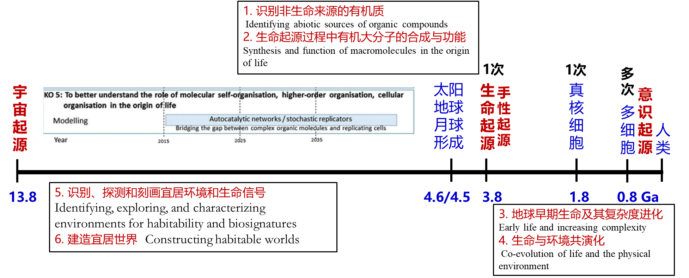
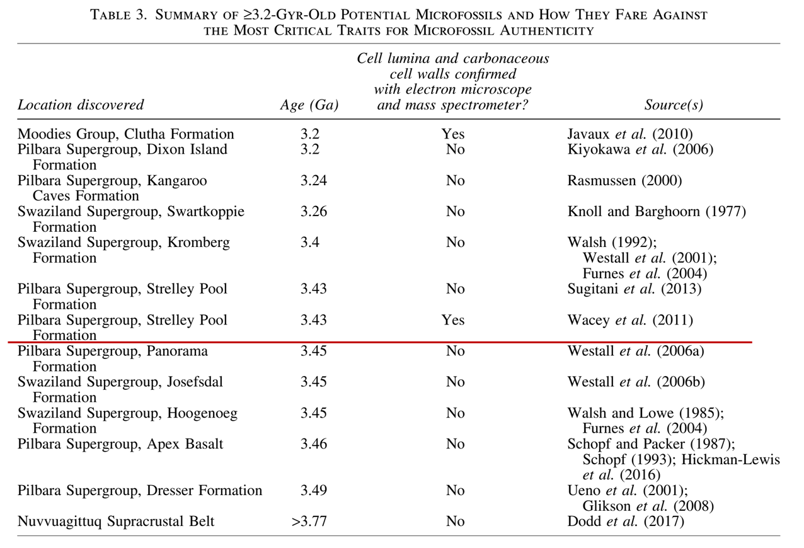
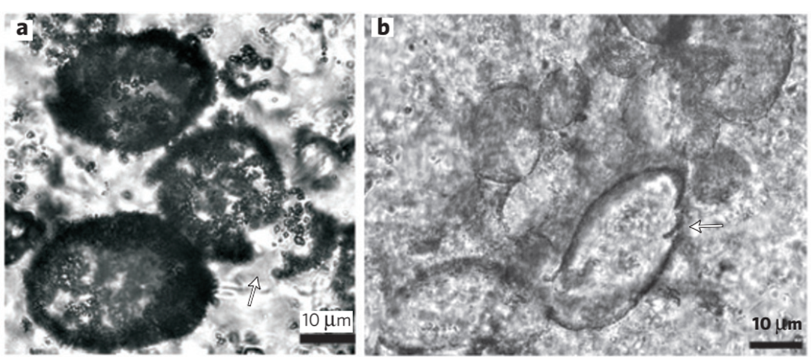
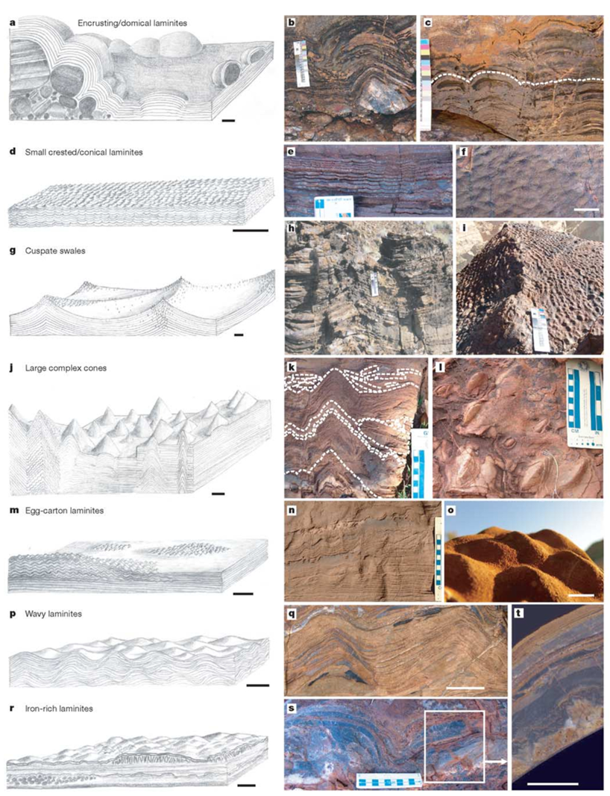
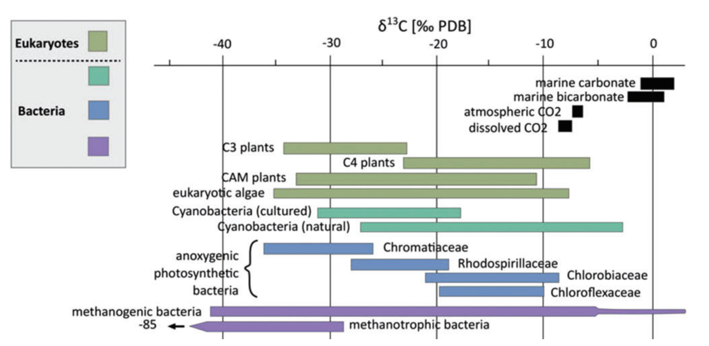
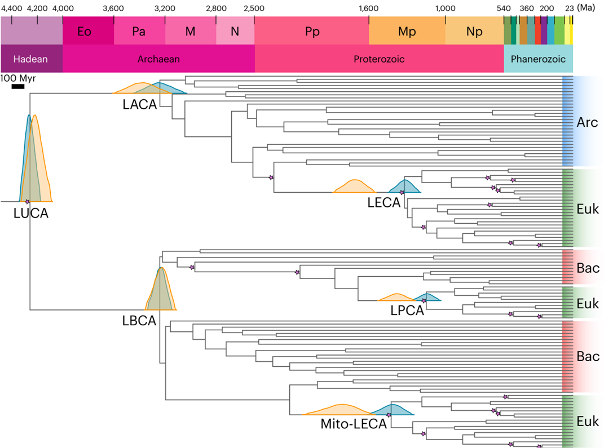
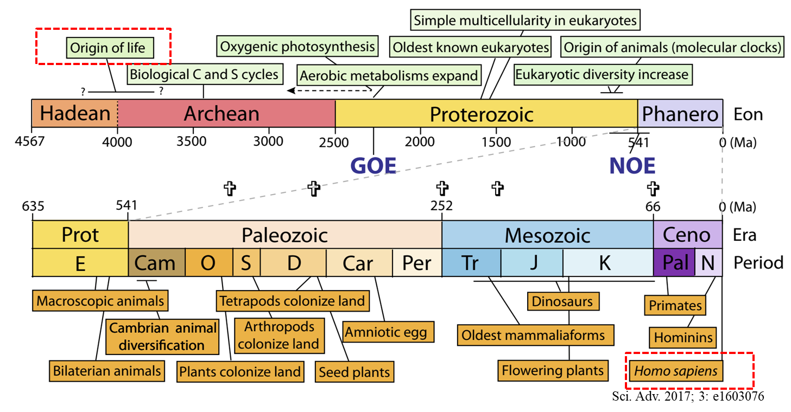
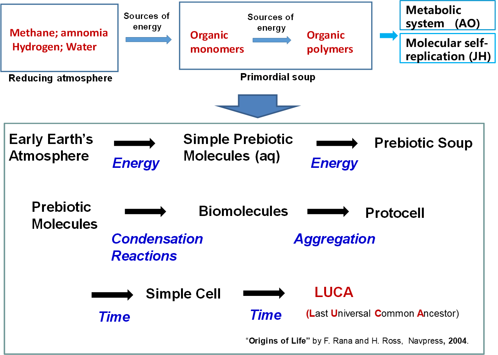
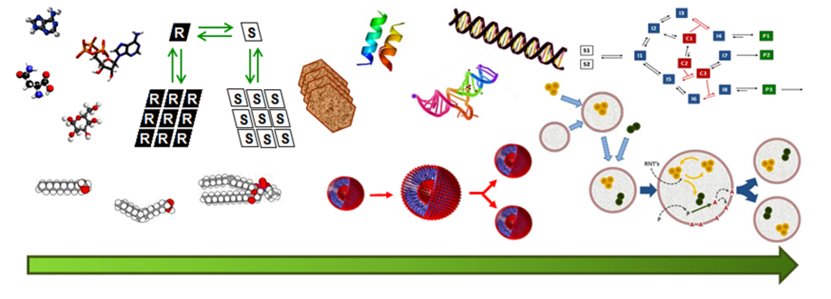

## 一、科学方法与理解层次

生命起源的研究基于科学方法中的归纳法(Induction)，即从一系列经验事实中总结出一般性结论。在理解层次上，从猜想(Conjecture)、假说(Hypothesis)，到形成共识(Concensus)，再到确立科学定律和规则(Laws and Rules)，是一个逐步深化的过程。目前，科学界对生命起源的共识是所有生命体来自一个共同的祖先。

细胞是生命的基本结构和功能单位：
1. 所有细胞都是由相同的有限元素组成的--H、O、C、N、P 等，它们都处于适当的物质状态。
2. 所有细胞都有细胞膜，细胞膜将生物体与周围环境隔离开来，化学交换可以通过细胞膜进行。
3. 所有细胞都使用同一套有机化学物质--碳水化合物、氨基酸、核酸和脂质--来执行生命的基本机制。
4. 所有细胞的氨基酸都是左旋的，核酸都是右旋的，也就是说，它们有明确的 “手性”，而不是随机的。
5. 所有细胞都有一个细胞组织，可以管理细胞内的化学循环，从而在环境变化时保持稳定的生存状态。
6. 所有细胞都有复制和代代相传信息的手段。
7. ······

## 二、生命起源的证据

### （一）微化石证据
1. **发现与挑战**：寻找古代微化石面临诸多困难，如古老岩石稀缺且易被地质作用破坏，难以确定微观结构是生物还是矿物起源。但古细菌化石的存在已形成共识，如在加拿大安大略省的Gunflint Formation中发现的距今19亿年的细菌化石(Knoll, A. H. Life on a Young Planet (Princeton Univ. Press, 2003))。
2. **具体案例**：在澳大利亚的Apex chert中发现的距今3465百万年的微化石(Schopf, J. W. Science 1993, 260, 640)，尽管存在无机过程可能导致类似结构的争议，但其细胞形态、碳同位素组成等特征仍支持其生物起源(Nature 2002, 416, 76)。

>3.2 Gyr前潜在微化石及其在微化石真实性的最关键特征；ASTROBIOLOGY, 2018, 18, 343

可以看到在上表中，最老的微体化石可以追溯到3.4Ga前：
- 中空的细胞腔
- 富含氮的碳质细胞壁
- 陶化降解、组织成链和簇
- δ13C 值为 -33‰ ~ -46‰

>David Wacey et al,Microfossils of sulphur-metabolizing cells in3.4-billion-year-old rocks of Western Australia,Nature geoscience,2011,Aug,11

### （二）叠层石证据
叠层石是由微生物垫层（如蓝细菌）形成的层状、片状堆积结构。当垫层顶部的光合微生物被沉积物和碳酸盐覆盖后，会向上迁移趋向光源，从而形成新的微生物垫层和钙质胶结的沉积岩、泥层。例如，距今343亿年的叠层石，以及在Isua超岩层带中发现的距今37亿年的叠层石，为早期光合生物的存在提供了证据，但其生物成因性仍存在争议。

>Stromatolite reef from the EarlyArchaean era of Australia（Nature 2006, 441, 741）

34.3亿年前的Strelley Pool燧石（SPC）（澳大利亚Pilbara克拉通）是一种沉积岩层，含有可能具有生物起源的层状结构（叠层石）。如何确定这些古生物化石的生物成因一直是争论不休的话题。然而，由于叠层石露头分布广泛、保存良好且形态多样，SPC在解释这些化石时克服了诸多障碍。叠层石露头提供了关于此类年龄岩石的广泛古生物信息,其规模超过了其他同龄岩石。研究者认为叠层石的多样性、复杂性和环境关联描述了在地球历史中类似的设置中存在的生物存在模式。

Ancient life from a newly exposed outcrop of 3,7Ga metacarbonate rocks in the Isua supracrustal belt that contain 1~4-cm-high stromatolites.
伊苏阿超地壳带新出露的 3,7Ga 偏碳酸盐岩中的远古生物，其中含有 1~4 厘米高的叠层石。
Three-dimensional analysis of the morphology and orientation of the structures within the context of host rock fabrics, combined with texturespecific analyses of major and trace element chemistry, show that the ‘stromatolites’ are more plausibly interpreted as part of an assemblage of deformation structures formed in carbonate-altered metasediments long after burial.
结合对主要元素和痕量元素化学性质的分析，对主岩结构的形态和方向进行了三维分析，结果表明，"叠层石 "被解释为埋藏很久之后在碳酸盐改变的变质岩中形成的变形结构组合的一部分更为合理。

### （三）同位素证据
无机碳源中碳-13占比约1.07%，而生物及其化石遗骸中碳-13占比略低。在沉积岩中测得的有机物质具有高度负的δ13C值，暗示着生物活动。例如，通过分析不同植物、原生生物和细菌的碳同位素组成，可与环境中的无机碳源进行对比，进而推断生物活动的历史。
$$
\delta ^{13}C = \left( 
\frac  
{\left(\frac{^{13}C}{^{12}C}\right)_{sample}}
{\left(\frac{^{13}C}{^{12}C}\right)_{sample}}
-1
\right)\times1000\textperthousand
$$
>碳漂变的计算公式

>植物、原生生物和细菌各主要类群的同位素碳组成与地表环境中 CO2、HCO3- 和 CO32- 的同位素碳组成的比较.(ASTROBIOLOGY, 2018, 18, 343)

但是负碳漂变不一定是生物成因，在非沉积成因岩石中存在产生轻 d13C 的高温非生物机制：
- 1.碳酸亚铁的比例失调
- 2.变质过程中的脱碳（二氧化碳的去除），同时伴有雷利蒸馏过程或蛇纹石化（即在岩石矿物的晶体结构中加入水）
- 3.费托反应
  $(2n+1) H_2+nCO → C_nH_{(2n+2)}+nH_2O$
- 4.扩散分馏
- 5.玄武岩脱气

### （四）系统发育学证据

基于核糖体RNA序列比较构建的生命系统发育树显示，最后的共同祖先（LUCA）位于细菌和古菌域的分界点。通过分子钟假设和地质校准点，可估算生命各主要分支的出现时间，如LUCA生活在约42.9亿年前，细菌和古菌域的出现时间约为34.6亿年前。

>Last universal Common ancestor (LUCA)~4.2 Ga (4.09–4.33 Ga)
>Last Archaeal Common ancestor (LACA)
>Last Bacterial Common ancestor (LBCA）
>Last eukaryotic common ancestor(LECA)
>Last common ancestor of the mitochondrial lineage(Mito-LECA)
>Last plastid-bearing common ancestor(LPCA)
>(Nature ecology & evolution 2024, 8, 1654)

>地球生物系统演化史
## 三、生命起源的研究历史阶段

### （一）神话阶段

生命起源深受创世神话影响，这些神话常涉及地球和宇宙的起源以及人类或生命的创造。例如，埃及神话中的造物神卜塔，基督教中的上帝耶和华，以及中国神话中的女娲造人和盘古开天辟地等故事。

### （二）形而上学阶段
**自然发生学说**
认为生命不仅可以由双亲产生，还能自发生成。J.B. van Helmont声称密封汗衫和小麦可生成老鼠；中国古代有“肉腐出虫，鱼枯生蠹”的说法。此外，管仲和恩培多克勒等古哲学家认为生命由水、气等基本物质产生，万物由四元素混合分离形成。

**自发生成的衰落**
17世纪后期，显微镜观察到昆虫体内复杂结构和“蛋”“精子”，Francesco Redi实验证明昆虫不能由腐肉自发生成。19世纪中叶，寄生虫生活史的发现使自然发生说逐渐被摒弃。对于微生物的自发生成，随着细胞学说的建立，争议转向实验问题，最终Louis Pasteur的实验否定了微生物的自然发生。

### （三）科学阶段

#### Oparin-Haldane假说
1924年和1929年，生物化学家Alexander I. Oparin和遗传学家J.B.S. Haldane分别独立提出了生命起源的假说。

当时生物化学领域正在崛起，新兴的胶体化学学科成为细胞表征的主要工具（原生质体作为胶体出现，酶在当时被定义为 "胶体催化"），著名化学家门捷列夫（D.I. Mendeleev）提出从矿物中形成石油。**Oparin从生化-代谢传统出发**，认为早期地球的碳化物与水蒸气反应生成碳氢化合物，进而形成氨等简单有机物，这些有机物在原始海洋中形成胶体溶液，达到一定浓度后凝聚成微观液滴（凝聚物），其中一些可吸收外界小分子有机物并进行原始代谢，通过生长和分裂实现繁殖，自然选择作用下逐渐演化。
- 步骤 1：地球早期已经含有碳化物。 当与大气中的蒸汽相遇时，碳化物形成碳氢化合物。
  $3\text{Fe}_m\text{C}_n+4m\text{H}_2\text{O}=m\text{Fe}_3\text{O}_4+\text{C}_{3n}\text{H}_{8m}$
- 步骤 2：氨也是以类似的方式在早期地球上形成的。
  $\text{FeN}+3\text{H}_2\text{O}=\text{Fe(OH)}_3+\text{NH}_3$
  $\text{CaC}_2+\text{N}_2=\text{CaCN}_2+\text{C}$
  $\text{CaCN}_2+3\text{H}_2\text{O}=\text{CaCO}_3+2\text{NH}_3$  
- 步骤 3：氨与碳氢化合物和其他简单有机物结合，形成更复杂的化合物，如糖和蛋白质。
- 步骤 4：有机化合物在原始海洋中形成一种胶体溶液。 当浓度达到一定值时，就会发生凝结，形成微小的液滴，称为凝聚物（coacervates）。
- 步骤5：原始汤中的一些凝聚态包含并从外部吸收了小的有机分子，如单糖和氨基酸，以及大的类蛋白分子，它们可能具有最初的酶的功能。  因此，原始的新陈代谢可能是在液滴中进行的。
- 步骤 6：吸入有机物质后，液滴会逐渐增大，当达到一定大小时，液滴会一分为二（繁殖）。 自然选择可能会在凝聚体中发挥作用，其中具有更 "成功 "组织的液滴会更快地生长和繁殖。
新陈代谢系统是遗传物质发育和发挥作用的必要条件，正是奥帕林开创了 "蛋白质优先"的传统。

当时遗传学领域也正在崛起，病毒的发现和E.C.C. Baly 合成了糖。**Haldane从遗传传统出发**，受病毒启发，认为在还原大气中，紫外线辐射使简单有机物积累成复杂物质，形成“热稀汤”，其中大有机分子具备繁殖能力，最终形成类似“油膜”的结构包裹分子，产生第一个细胞。
- 1.在紫外线辐射的作用下，简单的有机化合物，随后是更复杂的物质，如蛋白质，在远古海洋中积累起来，构成了 "热稀汤"。
- 2: 原始海洋是一个 "巨大的化学实验室"，产生了形成第一批 "半生物中的生物 "的材料：能够繁殖（受病毒启发）的大型有机分子"。  在某个时刻，产生了一种 "油膜"，它吞噬了繁殖分子，从而导致了第一个细胞的出现。

**Oparin的贡献与影响**
Oparin将生命起源研究从纯思辨转变为可操作的研究计划，其假说拒绝了生命与物质分离的活力论和简单等同的机械论，对众多科学家产生关键影响，推动了生命起源的科学研究。尽管存在原始大气还原性和“原始汤”有机物浓度等不确定性，但Oparin的成就在于为生命起源研究提供了理论框架和研究方向。

>原始汤起源假说示意图

>”有机小分子——>原始囊泡“示意图

## 四、总结
生命起源的研究是一个漫长而复杂的过程，从神话传说到科学探索，经历了多个阶段的转变。微化石、叠层石、同位素和系统发育学等多方面的证据为揭示生命起源的时间和方式提供了重要线索。Oparin-Haldane假说奠定了现代生命起源研究的基础，尽管仍存在一些未解之谜，但科学家们不断通过实验和理论研究，逐步接近生命起源的真相。