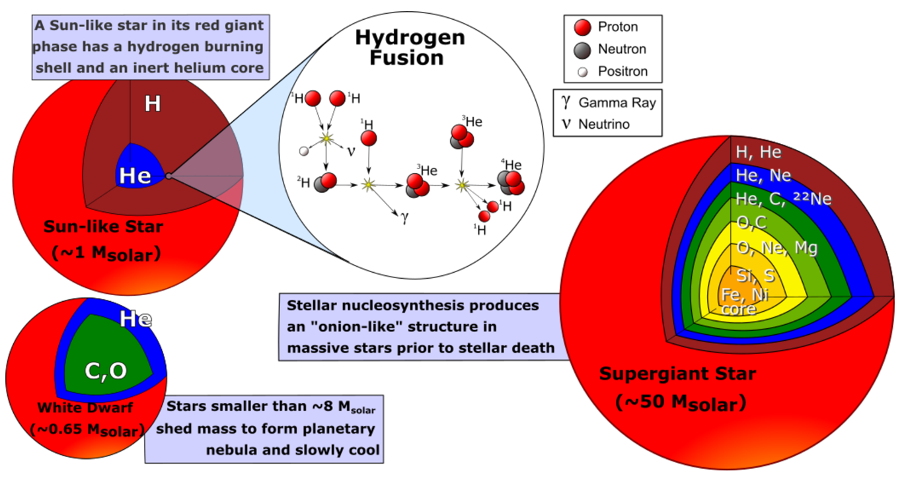
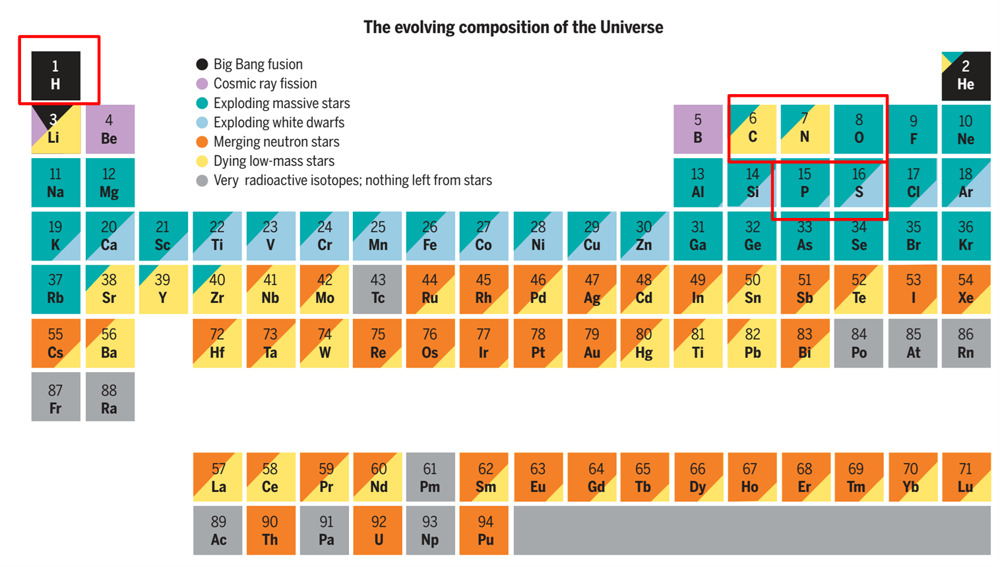
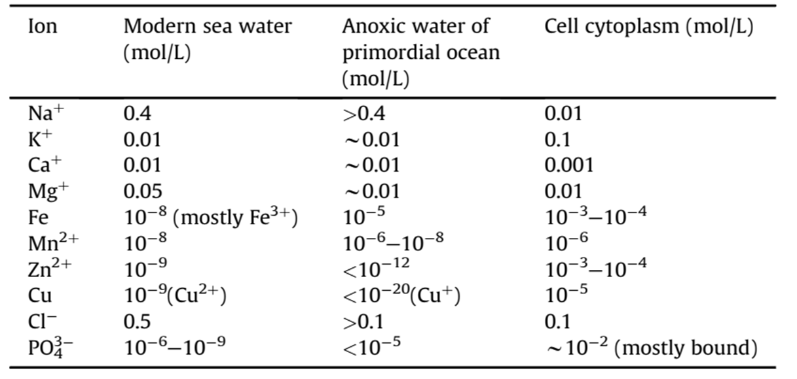
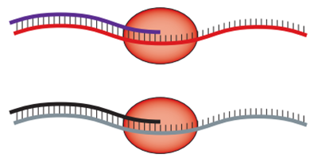
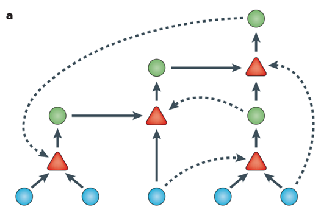
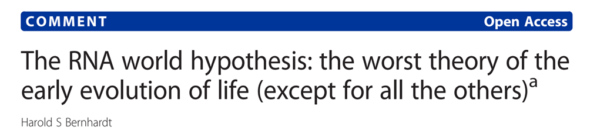
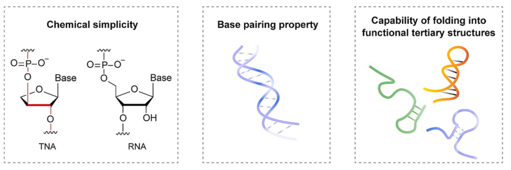
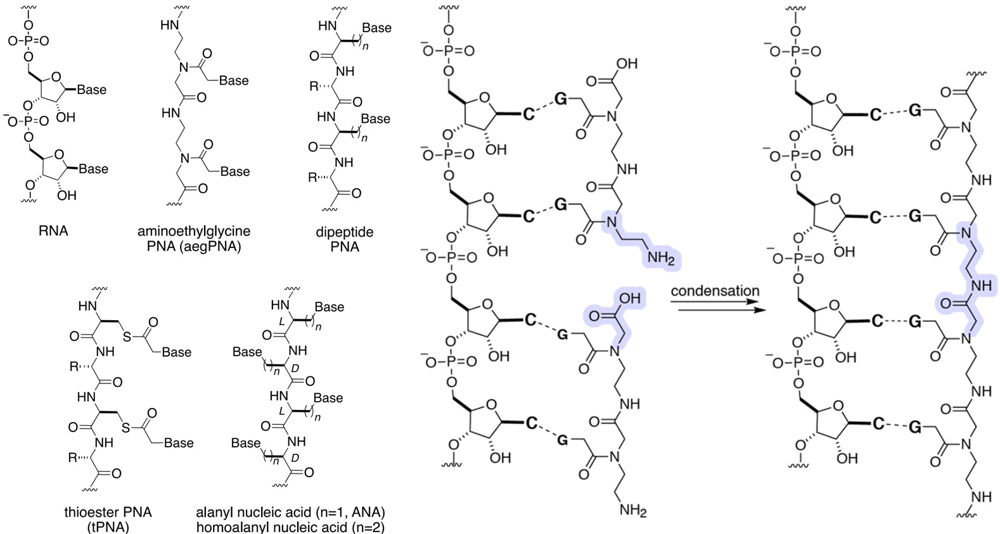

On average, it is estimated that there is at least one planet for every star in the galaxy. That means there's something on the order of billions of planets in our galaxy alone, many in Earth's size range. These planets outside of our solar system are known as Exoplanets.

据估计，银河系中平均每颗恒星至少有一颗行星。 这意味着仅银河系中就有数十亿颗行星，其中许多与地球大小相当。 这些太阳系外的行星被称为系外行星。

Highlighted stars are known to have, or have good prospects for, orbiting exoplanets. Once you click the ‘Explore Now’ button below, you will be able to select any of the highlighted stars to learn more about these confirmed planets and compare them to our solar system or navigate through the filters.

突出显示的恒星已知有系外行星或有很好的系外行星环绕前景。 点击下面的 "立即探索 "按钮后，您就可以选择任何一颗高亮显示的恒星，了解这些已确认行星的更多信息，并将它们与我们的太阳系进行比较，或者通过过滤器进行导航。

潮汐锁相系外行星的宜居性
## 一、元素起源与核合成

### 1. 宇宙大爆炸与初始元素

宇宙大爆炸后的17分钟内，通过**核合成（Nucleosynthesis）​**形成了约75%的氢（H）、25%的氦（He）（按质量计）以及微量锂（Li）。这些轻元素为后续复杂化学演化奠定了基础（Catling & Zahnle, 2020）[^1]。

### 2. 恒星核合成与重元素生成

在恒星内部，通过**核聚变（Nuclear Fusion）​**合成了铁（Fe）及更轻的元素（如碳、氧、镁）。其中，56Ni（镍）是核心核聚变的最终产物，但其半衰期仅6天，迅速衰变为56Fe（Astrobiology Primer 3.0）。

### 3. 超新星核合成与元素扩散

超新星爆发通过**核心塌缩超新星（Core-collapse Supernova）​**释放巨大能量，驱动吸热反应生成比镍更重的元素（如金、铀）。同时，爆炸产生的宇宙射线裂解重核，生成锂、铍、硼等轻元素（Astrobiology Primer 2.0）。

1: The explosive energy can drive the endothermic nucleosynthesis reactions required to form elements heavier than Ni.

2: The additional shocks accelerates some particles to close to the speed of light, making cosmic rays, which are energetic enough to break apart heavier nuclei. It is responsible for large fractions of Li，Be, B.

Eject the products of nucleosynthesis built up over the star’s lifetime. Most carbon, oxygen, and magnesium, for example, are made before the core collapse, and the explosion distributes these elements into space.

Most of the materials of our Earth was created inside stars that die before the birth of our Sun. We are “star stuff”.

**关键结论**：地球上的元素主要源于早期恒星与超新星，人类本质上是“星尘”（Star Stuff）（Science, 2019）。

## 二、生命必需元素与化学环境

### 1. 细胞中的元素组成

生命体主要由**H、C、N、O、P、S**六种元素构成（占原子数的97%），其中水（H₂O）占生物体质量的70%以上（Science, 2019）。

>S. Maruyama et al.  Geoscience Frontiers, 2019, 10,1337
>
>Mulkidjanian et al. PNAS，2012, E821
### 2. 磷酸盐问题（Phosphate Problem）

早期地球磷酸盐生物可利用性低，制约了核酸与脂质的合成。可能的解决方案包括火山活动释放磷矿物（如磷灰石）或深海热泉中的磷酸盐富集（Maruyama et al., 2019）。

### 3. 原始地球环境争议

- ​**大气组成**：早期大气可能以CO₂、N₂为主，而非传统假设的强还原性（H₂、CH₄、NH₃）。火山喷发与陨石撞击是气体来源（Catling & Zahnle, 2020）。
- ​**海洋环境**：原始海洋的pH、温度与盐度仍不明确，但可能存在局部富集有机分子的“热泉”或浅水环境（NASA Astrobiology Strategy, 2015）。

## 三、有机分子与生物大分子合成

### 1. 氨基酸的预生物合成

Miller-Urey实验（1953）模拟还原性大气，通过电火花激发自由基反应生成氨基酸（如甘氨酸、丙氨酸）。后续研究表明，氢氰酸（HCN）与醛类中间体是合成关键前体（Miller, 1953; Science, 1953）。

- ​**Strecker合成途径**：HCN与醛、氨反应生成氨基腈，水解后形成氨基酸（如丙氨酸）（Orgel, 1961）。

### 2. 碳水化合物的Formose反应

甲醛（CH₂O）在碱性条件下自催化生成糖类（如核糖、葡萄糖）。但反应非特异性，产物复杂且核糖不稳定，硼酸盐矿物（如硼砂）可稳定核糖（Benner, 2012）。

### 3. 核酸碱基的合成

- ​**嘌呤（Purines）​**：HCN四聚体缩合生成腺嘌呤（Oro, 1961）。
- ​**嘧啶（Pyrimidines）​**：丙炔腈与尿素缩合生成胞嘧啶（Orgel, 1971）。

### 4. 脂质的自组装

脂肪酸与甘油通过疏水作用形成双层膜结构，磷酸盐或磷酸酯头部基团的引入是膜功能化的关键步骤（Fiore & Strazewski, 2016）。

## 四、生物大分子聚合与RNA世界假说

### 1. 聚合反应的挑战

水环境中缩合反应需克服水解倾向。可能的解决途径包括：
- ​**热泉干燥-湿润循环**：促进氨基酸或核苷酸脱水缩合（Fox & Harada, 1958）。
- ​**矿物催化**：蒙脱石黏土催化RNA寡聚物形成（Huang & Ferris, 2006）。

### 2. RNA世界假说

- ​**核酶（Ribozymes）​**：RNA兼具遗传信息存储与催化功能（Cech, 1982; Altman, 1983）。
- ​**自我复制机制**：模板指导的非酶促聚合或RNA聚合酶核酶催化（Gilbert, 1986）。
- ​**局限性**：RNA稳定性差（易水解）、催化多样性有限，可能源于更简单的“前RNA世界”（Orgel, 2003）。

**RNA 会是最初的自我复制者吗？**
1：非酶模板定向聚合。例如，预先存在的核酸链可利用活化的单核苷酸促进互补链的合成。
2：RNA 聚合是由一般的 RNA 聚合酶核糖酶（或复制酶）催化复制模板链，从而形成模板的互补序列。
3：发展分子网络，催化网络中其他特定序列的形成，从而使整个网络相互自催化。

>这种聚合酶可以使用自身的另一个拷贝（红色）或不相关的序列（灰色）作为模板。 混合良好的利他主义复制器系统会被寄生虫破坏。 合作者可以通过两种方式抵抗寄生虫。

>自催化反应包括环境中存在的前体分子（蓝色圆圈）和循环合成的分子（绿色圆圈）。 每个反应（红色三角形）都由该集合中的一个分子催化（虚线箭头）。

RNA 是一种**太复杂的分子**，不可能在生物学之前就出现。  为实现 RNA 的前生物合成，几乎所有的尝试性解决方案都存在问题（Biology Direct 2012, 7:23）：
* 1：核糖的合成会产生一种复杂的糖类混合物，在大多数情况下，核糖只是一种次要成分。
* 2：直接从核糖和碱合成嘌呤核苷的效率很低。
* 3：核苷的磷酸化导致单磷酸异构体和多磷酸异构体的复杂混合物。
* 4：即使是纯核苷-5′-磷酸酯的聚合也会产生具有混合磷酸二酯连接的产物。
* 5：在大多数关于模板指导合成和模板无关合成的研究中使用的磷酰亚胺唑类化合物不太可能是前生物分子。

### 3. 前RNA候选分子

- ​**苏阿糖核酸（TNA）​**：更稳定且可与RNA杂交，支持遗传信息传递（Yu, 2024）。
- ​**肽核酸（PNA）​**：无手性、无磷酸骨架，可能作为早期遗传载体（Chem. Rev., 2020）。

#### TNA的特性
TNA 在早期地球上很容易找到
* TNA 可与自身形成反平行的 Watson-Crick 同双链，也可与 RNA 形成异双链。
* 在 RNA 的非酶寡聚过程中，TNA 可充当模板。 这一过程模拟了 RNA 对 TNA 的基因接管。
* 嵌合 TNARNA 序列可作为模板，促进 RNA 寡聚体的非酶连接、

#### 

## 五、原始细胞（Protocells）的起源

### 1. 分室化的重要性

膜结构（如脂质囊泡）保护内部分子，维持代谢与遗传系统的完整性。实验显示，蛋白质微球（Proteinoid Microspheres）可自组装并表现出弱催化活性（Fox & Harada, 1958）。

### 2. 能量代谢的起源

- ​**硫酯世界（Thioester World）​**：硫酯介导的能量传递可能早于ATP（de Duve, 1974）。
- ​**氧化还原反应**：铁硫矿物（如黄铁矿）催化早期电子传递（Wächtershäuser, 1988）。

## 六、未解问题与研究方向

1. ​**磷酸盐与核苷酸合成**：如何实现核苷酸的高效特异性磷酸化？
2. ​**手性起源**：生物分子同手性（如L-氨基酸、D-核糖）的选择机制。
3. ​**遗传系统与代谢的协同演化**：代谢网络如何与遗传编码耦合？

## 参考文献

- Catling, D. C., & Zahnle, K. J. (2020). _Science Advances_, 6(9), eaax1420.
- Miller, S. L. (1953). _Science_, 117(3046), 528–529.
- Fox, S. W., & Harada, K. (1958). _Science_, 128(3333), 1214.
- Cech, T. R. (1982). _Cell_, 31(1), 147–157.
- Yu, H. (2024). _Bioorganic Chemistry_, 143, 107049.

[^1]: Catling, D. C., & Zahnle, K. J. (2020). _Science Advances_, 6(9), eaax1420.
