# 第 11 章 分析基因组变异  

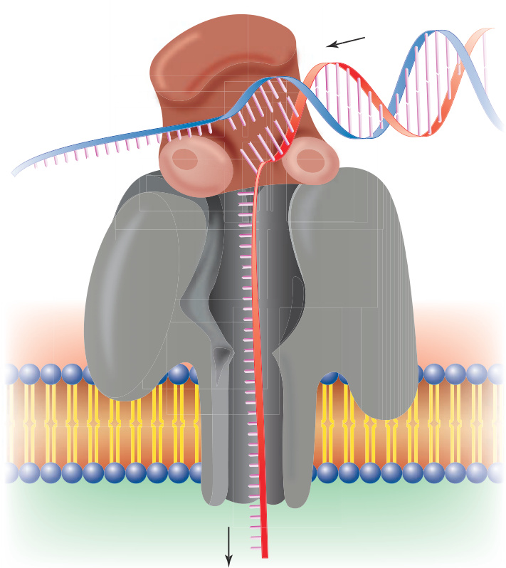  

很多伟大的创新研究促使全基因组测序时代成为可能。在一种用于大规模平行 DNA 测序的新技术中，一种酶（棕色）可以使 DNA 链穿过称为微孔（灰色）的狭窄通道。通道中的DNA 能限制（以核苷酸特异性方式）通过微孔的离子流动，通过记录时间序列函数下流过微孔的电流，可以解析相应的核苷酸序列。  

# 章 节 大 纲  

11.1 基因组变异  
11.2 基因分型：一个已知的致病突变  
11.3 在基因组中采集 DNA 变异  
11.4 定位克隆  
11.5 全基因组测序时代  

  

包括溃疡性结肠炎和克罗恩（Crohn）病在内的一组疾病席卷了全球数百万人，其特征是导致消化道慢性炎症（图11.1）。患者的免疫系统对肠道中的细菌反应过度，并开始攻击位于肠黏膜（肠壁）的细胞。虽然这些症状通常不会危及生命，但急性发作的腹痛、呕吐、腹泻、恶心和疲劳能够将人生完全打乱。目前已经发现超过100种基因的变异使个体容易患炎症性肠病（IBD）。  

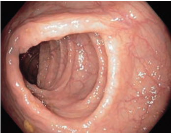  
(a)  

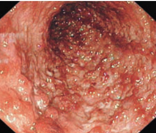  
(b)   
图11.1　正常人与克罗恩病患者的肠道。正常人（a）和克罗恩病患者（b）的结肠镜检查（使用光纤照相机的结肠内镜检查）。$\copyright$ Gastrolab/Science Source  

在2岁时，Nic Volker获得了从未报道的严重的炎症性肠病。其消化道形成的病变通过他的体腔一直延伸到皮肤外面。结果，粪便物渗入了他的循环系统，导致危险的败血症（全身性细菌感染）。不幸的是，在给予炎症性肠病常规治疗后（如免疫抑制剂或抗炎固醇类），Nic的病情没有改善。到4岁时，Nic Volker已经接受了140多次外科手术，切除了部分消化道并治愈了皮肤上的伤口，他体重只有17磅（约 $7.7\mathrm{kg}$ ）（图11.2）。显然，其远期预后是可怕的。  

Nic的父母和医生邀请了一组人类遗传学家为他的绝望案例尝试一种新方法：确定Nic基因组中所有蛋白质编码核苷酸的序列。值得注意的是，在2009年，研究小组已经发现了导致Nic疾病的突变。该突变位于与一种称为“X染色体连锁的淋巴组织增生性疾病（XLPD）”有关的已知遗传病相关基因中。因为XLPD的症状与Nic的症状完全不同，以至于之前没有人猜到这种联系。由于血液与骨髓移植对XLPD有效，因此Nic的医生决定尝试这种方法，尽管此前从未以这种方式治疗过IBD。在移植手术后的几个月内，Nic的健康状况经历了惊人的好转，使他能够享受6岁孩子的正常生活（图11.3）。  

这段病史说明了使用快速发展的DNA水平直接检测基因型技术所能产生的深远的医学成果之一。甚至不久前，科学家们仍十分受限于检测人类基因组的技术。在20世纪90年代，研究人员一次仅能检查一个人的单个基因的基因型，只有在已经确定了致病突变的少数情况下才值得去进行检测。即便这些个人遗传信息是有限的，但在帮助夫妻做出明智的生育决策方面也常常很有价值。  

到了21世纪之交，基因分型的技术进步使得科学家们检测含有许多核苷酸变化的大量样本，这些核苷酸的变化能够将不同人的基因组区分开来。例如，包括DNA微阵列的新方法允许同时检查个体基因组内不同位置（或称为基因座）的数十个甚至数百万个核苷酸变异。正如你将看到的，追踪大量核苷酸变异的技术有很多用途，即使这些变异本身与疾病无关。  

到2013年，科学家们不仅可以对一个人的基因组中的一个、两个或数千个基因座进行基因分型，而且几乎可以对一个人的二倍体基因组中的60亿个核苷酸进行基因分型。DNA测序技术的革新将测序成本迅速降低，以至于测序将很快成为医疗保健的常规部分。在这个全新未知的全基因组DNA测序时代，我们对基因组变异的了解呈指数性增长，进而前所未有地详细认识人类遗传的历史和宿命。  

# 11.1 基因组变异  

# 学习目标  

1.  举出能够区分任何两个单倍体人类基因组的DNA多态性的大概数目。  

2.  解释为什么大多数这些DNA多态性与个体的表型差异无关。  

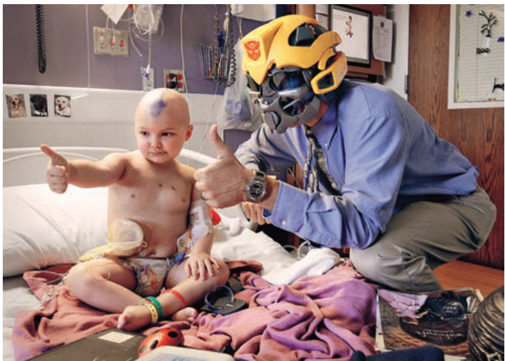  
图11.2　4岁的Nic Volker。$\copyright$ Gary Porter/Milwaukee Journal Sentinel/MCT/Newscom  

  
图11.3　6岁的Nic Volker。$\copyright$ Andy Manis/Bloomberg via Getty Images  

3.  从结构、形成机制和基因组中频率等方面对不同类型的DNA变异进行区分。  

没有所谓的野生型人类基因组，相反，任何两个人的基因组之间都存在着惊人的变异。随着本章后面将描述的全基因组测序新技术的出现，各个人类基因组之间的差异程度变得越来越明显。在这些DNA序列变异中，只有少数是表征个体特征的表型差异。即便某些DNA序列差异对表型没有影响，也可以用于标记基因和染色体。  

# 11.1.1 大量的DNA变异可用于区分物种内的个体  

来自James Watson（詹姆斯·沃森，DNA双螺旋结构的共同发现者）、J. Craig Venter（DNA测序技术的先驱）和一个匿名中国人的基因组数据，与标准人类基因组（GeneBank Refseq，参见第10章）相比，总共发现超过560万单核苷酸差异（图11.4）。每个人的二倍体基因组包含大约100万个独特的DNA多态性（即序列差异），这些多态性不会在其他人的基因组中出现。而剩余的大约260万个多态性在二者或三者的基因组中共享。  

不仅没有单一的野生型人类基因组序列存在，甚至没有野生型人类基因组长度这样的定义。DNA的缺失、插入和重复导致基因组长度在健康人群中相差多达 $1\%$ 。例如，Watson和Venter的基因组差异存在于超过100万的位点上，以插入或缺失的方式少量添加或减少遗传物质。  

# 11.1.2 大多数DNA多态性不影响表型  

在Watson和Venter基因组的数百万DNA多态性中，只有一部分与区分二者个体的表型差异有关。但实际上，仅仅这些DNA序列中的一小部分会真正影响表型。二者基因组比较中，大约5000个DNA多态性能够导致蛋白质氨基酸的序列差异。上述事实成立基于以下证据：  

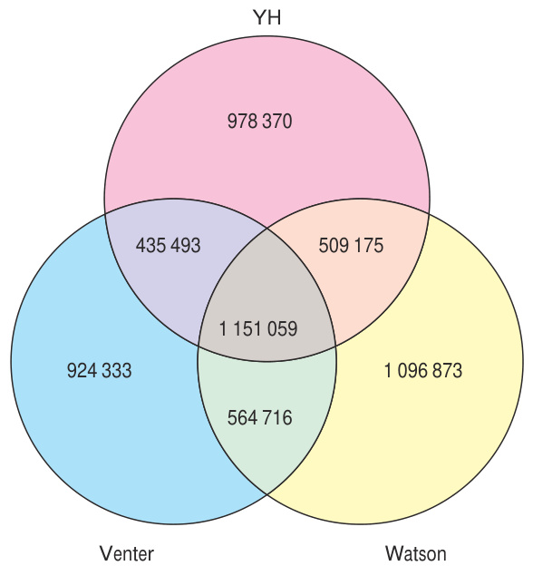  
图11.4　比较三个个体基因组。J. Craig Venter、James D. Wat-son和匿名中国人（炎黄一号，YH）基因组中相对于人类参考序列（RefSeq）的单核苷酸置换数。单核苷酸替换数是变异个数的统计，不考虑个体该变异是纯合的还是杂合的。每个人基因组中特有的置换数位于每个圈中的非重叠部分。不在参考序列中，而在三者中任意两个个体出现的变异位于双重叠区域内。三个人的共有变异数位于中央的三者共重叠区域。  

（2） 即便基因编码区存在DNA多态性，很多密码子突变也是沉默突变（不改变氨基酸类别）；  
（3） 如果一个特定的突变不是沉默的，并且具有不良影响，那么自然选择往往会导致其从人群中消失。  

除了大约5000个导致氨基酸改变的突变，这两个基因组间的几千个其他多态性可能会影响基因表达，如转录的频率或初级转录物剪接产生mRNA的效率。即使考虑到这些，我们仍然得出结论，即基因组之间的绝大多数序列差异是匿名DNA多态性，既不影响体内的任何蛋白质性质，也不影响体内任何蛋白质的含量（你将在后面看到非匿名DNA多态性会影响基因表达，从而影响表型）。  

图11.5显示了与人类参考基因组比较，在400kb区域内Watson和Venter基因组DNA多态性的实际分布。这部分基因组涵盖囊性纤维化跨膜受体（CFTR）基因和另外两个基因，CFTR内的某些突变能够导致囊性纤维化。你可以看到，两个男性基因组序列中，甚至所有的基因组中，几乎所有的多态性都位于基因之间或内含子中，这与大多数DNA变化不会改变表型的观点一致。  

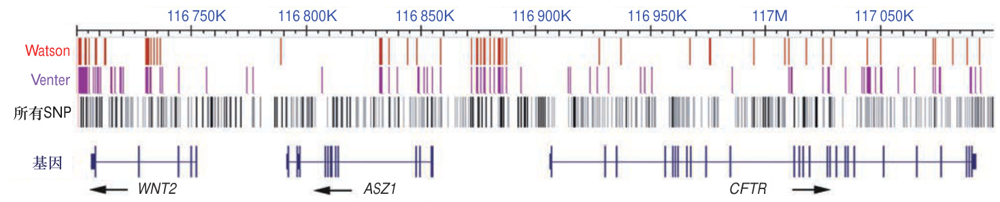  
（1）基因组中仅有不到 $2\%$ 的区域是基因编码区；  
图11.5　基因组400kb区域内的SNP分布。图示的是7号染色体的部分区域（从116 700 001到117 100 000），包含CFTR和另外两个基因。垂直标记表示与人类参考文献不同的杂合或纯合的单核苷酸多态性（SNP）基因组的位置。前两排显示了Watson和Venter的个人基因组中的单核苷酸多态性。第三排显示了人类基因组中所有分析获得的SNP位点（数据来自截止到2009年的主要的SNP数据库）。  

这样一个能够区分不同个体基因组的海量匿名DNA多态性的存在，给遗传学家带来了挑战和机遇。面临的挑战是显而易见的：我们如何能在个体DNA的几百万个多态性中筛选出与遗传疾病等性状相关的位点？面临的机会在于，即使多态性是匿名的（对表型没有影响），它仍然可作为基因组中的一个标识，即DNA标记。你会发现，研究人员可以使用匿名多态位点来辅助定位靠近实际上的遗传病致病突变的区域。  

# 11.1.3 遗传变异发生的几种类型  

遗传学家通常根据所涉及的核苷酸碱基对的数量和种类，依据表11.1将多态性DNA位点划分为四类。尽管分类之间的边界模糊并有少量重叠，但该分类能帮助研究人员描述特定的遗传变异。有效地概括起来，即某类多态性中涉及的核苷酸对的数量越小，在基因组中该类别出现的频率越高（表11.1）。  

# 1. 单核苷酸多态性（SNP）  

显然，单核苷酸多态性（SNP）是最常见的遗传变异类型。SNP是基因组中的特定碱基位置，该位置上的不同碱基能够区分某些人群。SNP占人类基因组之间总变异的绝大多数，在任何成对基因组比较中，平均每1000个碱基就有一个SNP（表11.1）。我们在第7章讨论了可以产生SNP的部分机制，包括DNA复制中的罕见错误，以及基因组暴露于环境中的诱变化学物质和辐射。  

表11.1　遗传变异的分类  

<html><body><table><tr><td></td><td>大小</td><td>频率（多少长度 范围存在一个该 类型突变）</td></tr><tr><td>单核苷酸多态性（SNP）</td><td>1bp</td><td>1kb</td></tr><tr><td>缺失插入（DIP或InDel）</td><td>1～100bp</td><td>10kb</td></tr><tr><td>简单序列重复（SSR）</td><td>1～10bp重复单元</td><td>30kb</td></tr><tr><td>拷贝数变异（CNV）</td><td>10bp ～ 1Mb</td><td>3Mb</td></tr></table></body></html>

右侧列显示，当比较任何两个单倍体人类基因组序列时，发现每类突变的平均频率。  

尽管存在许多机制可以产生SNP，但单碱基自发突变率仍然小于每世代三千万分之一（某些方法估计值可低到一亿分之一）。这个数字是如此之低，以至于大多数SNP在人类群体中以双等位的方式存在，即只涉及4种核苷酸对中的2个。SNP的低突变率使研究人员能够将每个SNP追溯到某一祖先基因组中的变化。低突变频率也意味着那些没有继承该变化的核苷酸（称为新生型等位基因）的人群具有更古老的祖先型等位基因，这种祖先型等位基因很可能早在人类物种形成之前就存在了。  

如果存在某一个SNP，遗传学家可以利用人类和黑猩猩基因组之间的密切关系来确定：哪个等位基因是古老的，哪个是由相对较近的突变事件所产生的新生型等位基因。图11.6比较了两个不同单体型人类基因组与黑猩猩参考基因组的一小段区域。该区域内存在着两个物种分歧后出现的两个单碱基变化。其中一个变化是由所有人类基因组共享的，因此在人类中不具有多态性。另一个碱基变化是从黑猩猩-人类共同祖先中的胞嘧啶（C）变化到胸腺嘧啶（T）（即新生型等位基因），这个胸腺嘧啶只存在于部分人类祖先的染色体中。这意味着，如果你和一个朋友在某一匿名SNP基因座上共享一个新生型等位基因，那么你们是从人和黑猩猩物种分歧后的同一个祖先那里得到了这个等位基因。地球上每一对随机的人类都共享着许多无关的新生型SNP等位基因，这表明所有人是来自相同的祖先。  

(a)  

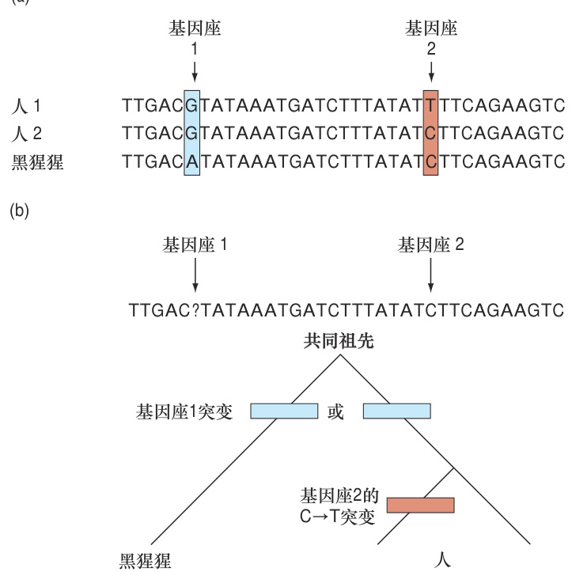  

图11.6　推断SNP的进化历史。（a）将两个人类基因组序列与黑猩猩参考基因组进行比较。在许多测序的黑猩猩基因组中，基因座1和2是不变的。（b）进化分枝图（进化谱系结构图）。基因座1（浅蓝色）在黑猩猩和人类之间不同，但所有人类都具有相同的等位基因（G）。引起基因座1差异的突变一定发生在物种分化之后，或者在黑猩猩的祖先谱系中，或者在人类的祖先谱系中，但无法确定两物种的最近共同祖先在该位置上的等位基因。在基因座2（红色），黑猩猩和某些人类之间共享的胞嘧啶（C）等位基因一定是祖先型，而其他人类中的T等位基因是新生型的（也就是说，起源于某些人类的谱系分支中的近期突变）。  

迄今为止，通过分析数千个人类基因组，已经鉴定了超过5000万个SNP，该数据收录于美国国家生物技术信息中心（NCBI）的SNP数据库（dbSNP）中。其中大约1500万SNP是人类群体中普遍存在的。这些普遍的新生型等位基因形成于人类进化史的很早时期，才能在现代人类群体中占有相当一部分的比例。SNP数据库已经包含了人类所有常见SNP的很大一部分。然而，你应该意识到，非常近期的突变事件生成罕见的SNP，存在于地球上数十亿分之一的人类中。目前只分析了整体人类群体中的一小部分人的基因组，因此在dbSNP数据库中收录了很少的这样罕见的SNP。  

上述关于SNP起源的简短讨论表明，基因组测序技术是了解人类祖先的强有力的工具。第21章介绍了一些关于人类历史的惊人发现，这些发现是通过比较现代人类的DNA序列和我们灵长类动物祖先的化石残骸所揭示的。  

# 2. 缺失插入多态性（DIP）  

遗传物质的短插入或缺失是人类基因组中第二种常见的遗传变异形式。这类变异被称为缺失插入多态性（DIP或InDel）。比较任意两个单体型基因组，SNP位点出现的频率大约是每千碱基一次；而DIP出现的频率相对较低，约为每10kb出现一次（表11.1）。DIP的长度范围可以从一个碱基对到几百个碱基对，但其出现频率相对于它们的长度急剧下降。因此，仅涉及一个或两个核苷酸的DIP是最常见的。  

几种生化过程似乎有助于DIP的形成，包括DNA复制或重组中的问题，以及当细胞试图修复诸如断裂的DNA链等损伤时发生的错误。  

需要注意的是，在蛋白质编码区中，DIP变异可能是移码突变，除非插入或删除的核苷酸对的数目是3或3的倍数。  

# 3. 简单序列重复（SSR）  

人类和高等真核生物的基因组中的某些区域被定义为简单序列重复（SSR），有时也称为微卫星。SSR位点由一个碱基到几个碱基的序列单元组成，串联重复为少于10次至100次以上。SSR位点的等位基因具有不同数量的重复单元。最常见的重复单元是一个、两个或三个碱基序列。具有较大重复单元的SSR出现频率较低，因此我们采用一个人为定义的截点值作为SSR的重复单元长度的限定范围——SSR重复单元长度的最大值为10碱基（表11.1；超过该限定的较大重复单元将被分类为CNV）。这里我们举两个SSR的例子：AAAAAAAAAAAAAAA（一个碱基重复）或CACACACACACACACACA（两个碱基重复单元）。所有类型的SSR合计约占人类基因组DNA的 $3\%$ ，其出现频率约为每30kb碱基区域出现一次。  

与所有其他多态性一样，大多数SSR都位于基因编码区之外，对表型没有影响。相反，基因内的SSR变异可能导致严重的表型后果。例如，我们之前在第7章中讨论过（回顾“快进”信息栏“三核苷酸重复疾病：亨廷顿病和脆性X染色体综合征”），长链三核苷酸重复是几种严重神经系统疾病的分子诱因，包括脆性X染色体综合征和亨廷顿病。  

SSR自发地由罕见的随机事件产生，这些随机事件最初生成具有 $4\!\sim\!5$ 个重复单元的短重复序列。然而，一旦短的SSR突变生成，它可以通过一种被称为滑动错配或滑动的错误DNA复制形式扩展成更长的序列。图7.12详细显示了这种滑动机制如何改变SSR基因座重复单元的数目，最终导致亨廷顿病。  

由于滑动错配等事件，SSR位点上的新等位基因以平均每个位点 $10^{-3}$ 个的速率出现（即每千个配子中有一个）。这一频率远远大于单核苷酸突变率（ $10^{-9}$ ），并导致群体中无关个体之间的大量SSR变异。不同于SNP（通常以双等位基因形式存在，突变生成后不发生改变），SSR在其重复单元的个数上中具有高度多态性，通常在单个SSR位点上可存在10个或更多个等位基因。SSR突变的发生率仍然很低，能够保证一个大家族的几代人中也不会发生这种变化。因此，SSR可以作为包括人类在内的许多生物的连锁研究中相对稳定、高度多态的DNA标记。  

# 4. 拷贝数变异（CNV）  

人类个体基因组也呈现DNA长度的多态性，其涉及的不仅仅是表征SSR和DIP的少数核苷酸。研究人员惊讶地发现，许多没有任何遗传疾病迹象的人，其基因组仍携带可变拷贝数的大片段遗传物质，长度最长可达1Mb。这类遗传变异被称为拷贝数变异（CNV）。基因组中CNV分布普遍，且在人类群体中的出现频率较高（见表11.1）。迄今为止，在所有人类基因组中已经鉴定出超过10 000个CNV位点，并且比较任何两个基因组，通常能鉴定出超过1000个差异位点。  

能够产生CNV位点新等位序列的最重要机制之一是不等交换（图11.7）。在减数分裂Ⅰ期，同源染色体上的串联重复单元可以不精确匹配。如果在错配的重复单元之间发生重组，则配子会比重组前增加或减少重复单元。类似不等交换的机制使CNV基因座具有高度多态性，但在系谱内的几代人基因组中CNV多态性仍然相对稳定：当前人群中超过 $99\%$ 的CNV等位序列来自遗传而非新突变。  

嗅觉受体（OR）基因家族是基因拷贝数变异的范例，该家族编码多种蛋白，使动物感知各种气味。模式动物小鼠基因组携带1400个嗅觉受体基因，分布于染色体多个位点。由于敏锐的嗅觉对人类的生存不再重要，因此人类基因组中嗅觉受体基因可以被不计后果的丢弃，平均携带不到1000个嗅觉受体基因。然而，不同个  

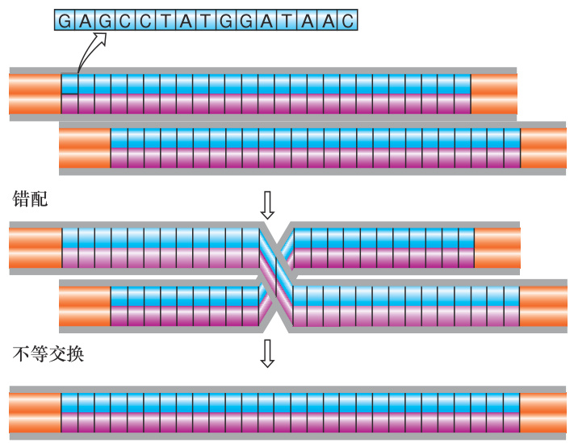  

#  

#  

图11.7　CNV具有高度多态性，因为它们具有不等交换的可能性。CNV由长度大于10bp的相同或相近重复单元序列串联组成（蓝色和紫色框是重复单元的互补链）。错配和不等交换产生的重组产物，是较任意亲本等位序列有更多或更少重复单元的新等位序列。  

体携带的嗅觉受体基因数目变化很大。图11.8显示了10个人中11个代表性嗅觉受体基因座拷贝数变异。其中，OR4K4基因在不同个体中的拷贝数从 $2\!\sim\!6$ 不等，而11个基因中有5个在某些个体中完全缺失。有些人可以比其他人多拥有数百个或更多的嗅觉受体基因，导致人们区分气味的能力差异很大。  

# 基本概念  

●  当在DNA基因座上存在两个或更多个等位基因时，该基因座是多态的，并且该变异被称为DNA多态性（DNA标记）。大多数多态性是同义性的，对表型没图11.8　嗅觉受体基因的拷贝数变异。每行代表不同的个体；每列代表不同的嗅觉受体基因。颜色表示特定个体中特定基因的拷贝数。不同人的嗅觉受体基因拷贝数差异很大，这是人们闻到某些气味的能力差异的主要原因。  

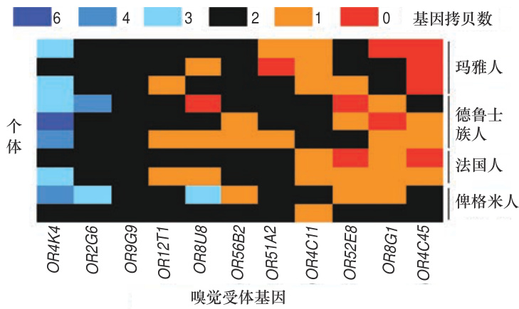  

有影响。  

●  单核苷酸多态性（SNP）是最常见的DNA多态性。SNP形成的频率较低，使研究者能够估计进化过程中发生特定SNP突变的时间。  
●  DNA序列的增加和减少也会引起遗传变异，变异类型包括DIP、SSR和CNV。在重复序列复制过程或减数分裂期的不等交换过程中，DNA聚合酶的滑动可产生上述变异。  

# 11.2 基因分型：一个已知的致病突变  

# 学习目标  

1.  概述聚合酶链反应（PCR）扩增基因组特定区域的步骤。  
2.  描述PCR产物的序列测定或长度检验如何能够确定基因型。  
3.  解释如何使用PCR技术对子宫内的胎儿或植入前的胚胎进行基因分型。  

明确个体遗传疾病的基因分型对患者生活有着重大的影响。如果一个人被诊断为罹患可治疗性遗传疾病，DNA基因分型的相关知识或许能够挽救他/她的生命。即使该病症不能被治疗，对于即将为人父母的夫妇、母亲肚中的胎儿及在体外受精的胚胎来说，基因分型能让家庭做出明智的生育决定。  

确定一个人是某个致病等位基因的纯合或杂合类型，取决于科学家是否已知某种疾病的致病相关核苷酸变化。对于某些疾病，如镰状细胞贫血，疾病基因突变的特征是明确的，因为我们知道特定的蛋白质（如血红蛋白）在疾病中是如何改变的。但在大多数情况下，疾病的表型不能提供明确的疾病基因信息。本章后面的部分将介绍更多用于寻找与各种疾病相关的基因突变的常用策略。一旦确定了突变，就可以通过我们现在讨论的方法对个体进行基因分型。  

# 11.2.1 采用聚合酶链反应（PCR）扩增基因组中的限定区域  

确定一个人的某个致病等位基因是纯合还是杂合的，或者该位点是纯化的正常等位基因，这意味着你可以从该人的基因组中分离出该基因，并通过查看纯化的DNA来分析等位基因。但基因区域占复杂基因组中极微小的一部分，例如，相较于人类基因组单倍体大小（30亿对碱基），编码血红蛋白β链的基因仅有约1400个碱基对。1985年，Kary Mullis发明了分子生物学中最强大的技术之一，称为聚合酶链反应（PCR），以解决在基因组的浩瀚海洋中，如何寻找针头一样大小的特定基因。PCR技术非常快速有效，它以微量的DNA起始  

（例如在单个精子或毛囊中发现的DNA），研究人员可以在几个小时内复制10亿或更多的短而明确的基因组片段。  

图11.9所示为PCR扩增DNA的目标区域。两个长度在 $16\!\sim\!30$ 碱基的寡核苷酸作为PCR引物，界定了靶区域的末端。研究人员根据预先知道的基因组信息合成这些引物。一个寡核苷酸与该区域某末端的一条DNA链互补；另一个寡核苷酸与该区域另一端的另一条DNA链互补。如果将这些引物绘制为带有 $5^{\prime}{\rightarrow}3^{\prime}$ 标识的箭头以指示其极性，则箭头将穿过目标区域指向彼此（图11.9）。对于DNA基因分型，PCR的目的是扩增靶区域内可能具有不同等位基因形式的序列。  

待分析的基因组DNA样本中，一个或多个变性模板DNA分子（熔解成单链）通过与合成的寡核苷酸杂交来启动扩增过程（图11.10）。以寡核苷酸作为引物，能够让DNA聚合酶启动DNA合成，新合成的DNA链分别与引物间的两条基因组DNA链互补；记住，  

DNA聚合酶在引物的3′端依次添加核苷酸分子。  

在经过足够的时间复制目标区域之后，加热反应体系，使新合成的DNA链与原始模板链熔解分离。再将反应管冷却，使得起始DNA和前一步骤中合成的拷贝成为后续复制的模板，管中的寡核苷酸仍作为引物。在重复循环中依次执行相同步骤使每个循环中的目标区域拷贝数呈指数增长：变性为单链、引物杂交和DNA聚合酶聚合（图11.10）。22次循环后将产生超过100万个目标区域的双链拷贝；在32次循环后，反应管中将具有超过10亿拷贝的基因组目的区域。  

该操作的循环步骤可以在PCR仪中自动进行，PCR仪根据预先设置的时间表加热并冷却样本。放置在机器中的反应管含有足够的核苷三磷酸盐和寡核苷酸引物，可以支持多轮DNA复制。此外，反应管中含有来自温泉嗜热菌的特殊DNA聚合酶。该DNA聚合酶可承受PCR循环过程中裂解DNA链的高温，并仍然保持活性。  

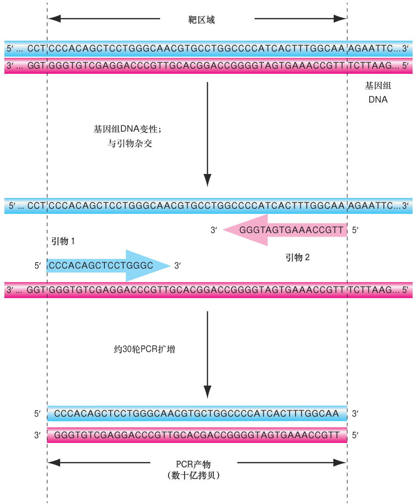  
图11.9　概述聚合酶链反应。该反应扩增基因组DNA的靶区域，由两个引物的5′端决定限定的靶区域位置并产生PCR产物。为了便于你理解PCR技术的基础，同一DNA区域内的沃森-克里克链以不同的颜色显示。  

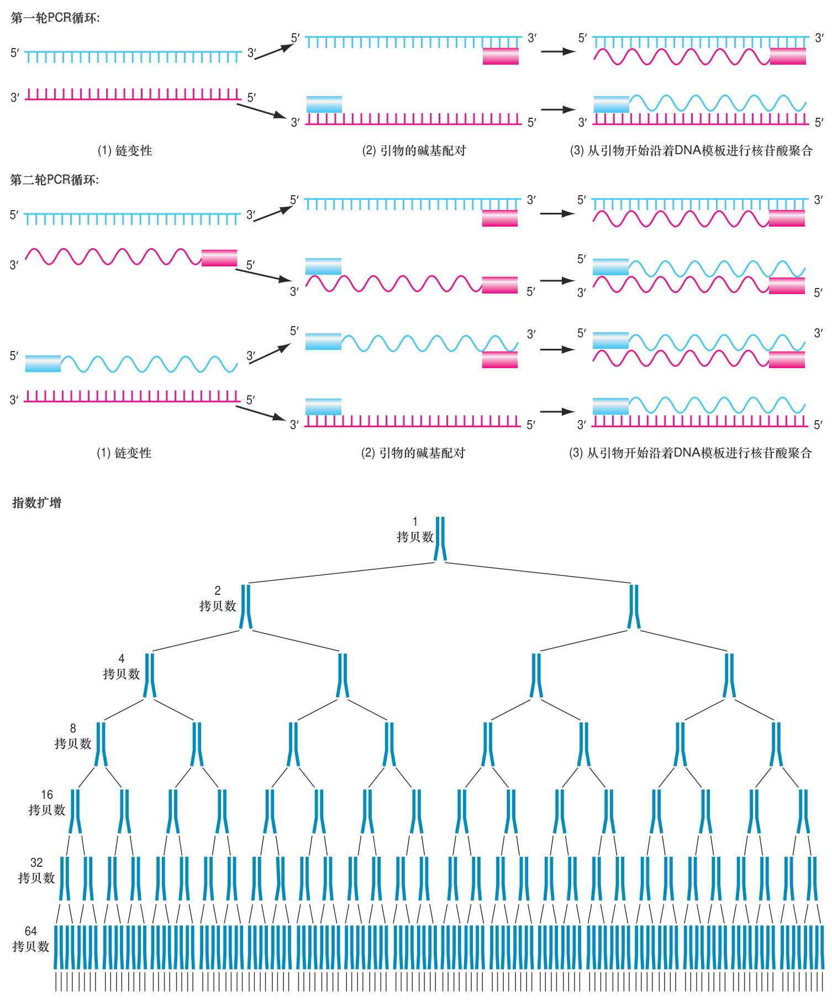  
图11.10　靶序列的PCR扩增。本例子的第一个PCR循环中，一个双链基因组DNA分子被加热并变性为单链，然后降低温度使单链与两个PCR引物杂交。热稳定的DNA聚合酶现在将新DNA聚合到每个引物的3′端。在第二个PCR循环中，使DNA在反应管中变性，并与相同的引物杂交。原始DNA链和第一轮循环中产生的DNA链作为第二轮反应的模板。因此，每轮PCR循环使靶区域中DNA的量加倍。在第三轮PCR结束后，大多数模板链的5′端位置由引物的5′端限定，进而限定了积累的PCR产物的长度。  

在图11.9中需要记住的重要一点是，两种寡核苷酸引物决定了最终PCR产物的性质。最终的PCR产物是双链DNA片段，对应的区域是其从一个引物的 $5^{\prime}.$ 端延伸到另一个引物的5′端。引物必须与对应的链互补，并具有 $5^{\prime}{\rightarrow}3$ ′极性（穿过目标区域指向彼此）。在实际操作中，如果引物相距很远，则PCR效率很低，因此该方法通常不能扩增长度大于25kb的DNA区域。  

# 11.2.2 应用测序或长度检验对PCR产物进行基因分型  

对于单个基因中仅涉及一个或几个核苷酸的变化引起的孟德尔遗传疾病，区分正常和突变等位基因的所有信息都储存于某一个特定的基因组区域，该区域可以被PCR产物所涵盖。等位基因之间的差异可以通过PCR产物的直接测序来识别。如果突变类型是在基因组中增加或减少核苷酸对，则该突变可以简单的通过查看PCR产物的大小进行鉴定。更复杂的多态性（如拷贝数变异）会影响许多碱基对，所涉及的区域远大于PCR产物能够扩增的长度，因此必须通过本书稍后将描述的其他方法进行分析。  

# 1. PCR产物的测序  

你可能还记得，导致镰状细胞贫血的突变HbβS会改变成人血红蛋白β链中的一个氨基酸（谷氨酸变为缬氨酸）。突变等位基因是一个单核苷酸置换，将β珠蛋白基因的mRNA样链（即有义链）中A变为T，因此，该突变属于单核苷酸多态性（SNP）［图11.11（a）］。通过对该SNP的等位基因进行基因分型，我们可以识别镰状细胞贫血患者或该性状的携带者。  

产物测序首先需要用PCR扩增人基因组DNA区域，引物对与实际致病突变位点两侧序列互补［图11.11（a）］。一旦生成了PCR产物，其DNA序列可以通过先前在图9.7中描述的自动化Sanger方法进行测定。两个PCR引物中的任何一个都可以作为测序反应的引物。  

如图11.11（b）所示，比较来自HbβSHbβS镰状细胞贫血患者和HbβAHbβA正常纯合子个体的PCR产物序列时，明显可以看到导致该疾病的核苷酸替代。但重要的是，当使用HbβSHbβA杂合基因组DNA作为模板时，PCR产物中的两个等位基因同时存在。从杂合子的体细胞提取的基因组DNA含有两种等位变异。由于引物与两个同源染色体无偏好的充分杂交（前提是镰状细胞突变不会改变与引物互补的基因组序列），最终PCR产物中约一半的DNA分子将含有突变序列，而另一半是野生型序列。因此，致病SNP的杂合性被视为双峰，在查看DNA序列时，该位点同时显示A和T。  

对基因组DNA的PCR扩增产物进行测序，是确定SNP基因型的直接方法。相同的方法也可用于对涉及少量核苷酸的其他多态性类型进行基因分型，例如，小的图11.11　通过对PCR产物测序检测镰状细胞突变。（a）镰状细胞贫血的致病突变是一种能够改变单个氨基酸性质的单核苷酸多态，其能够使血红蛋白β多肽上的一个谷氨酸（E）变为缬氨酸（V）。该多态性侧翼序列保守，因此可以通过互补的引物进行PCR扩增。（b）对由基因组DNA模板生成的PCR产物进行测序。注意来自杂合携带者的PCR产物的序列，在突变取代位点上同时出现正常（HbβA）和突变（HbβS）核苷酸（黑色箭头）。  

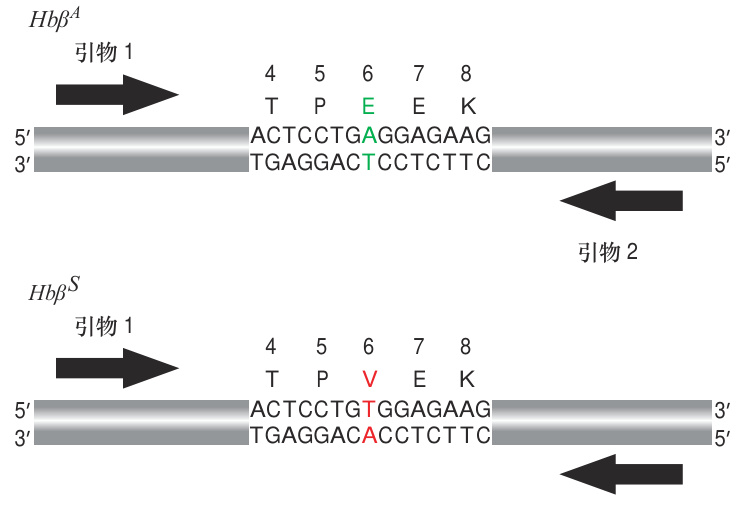  
(a)  PCR  Hbβ   
2   
(b)  

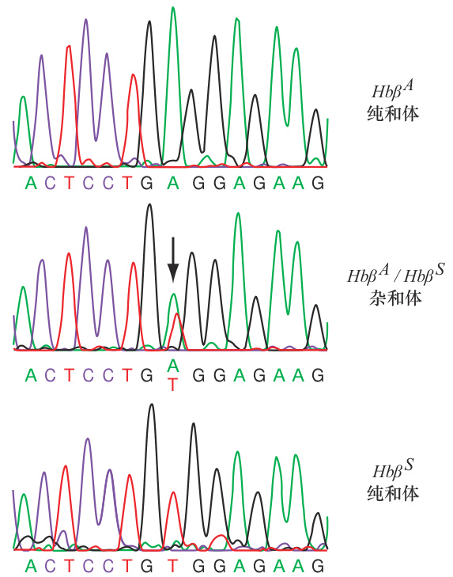  

承蒙Joshua J. Filter, Cornell University, Ithaca, New York提供缺失插入（DIP），或简单序列重复（SSR）中重复数目的扩增或收缩。  

# 2. PCR产物的片段大小差异  

在某些情况下，可以在PCR产物中对多态性进行基因分型，而无需测序。如图11.12所示，凝胶电泳可以很容易地区分由DIP或SSR导致的基因座实际大小的细  

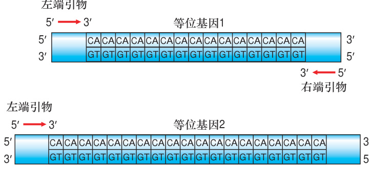  
(a)  

(b)  PCR(c)        PCR(d)图11.12　通过PCR产物的电泳检测简单序列重复（SSR）的多态性。（a）SSR等位基因长度不同。左侧和右侧引物对应于SSR基因座侧翼的独特序列。（b）用对应SSR基因座的特异引物进行PCR扩增。（c）凝胶电泳和溴化乙锭染色将等位基因彼此区分开。（d）SSR是高度多态性的并在群体中存在许多不同的等位基因，对于任意给定SSR基因座，每个人仅有最多两个相应的等位基因。  

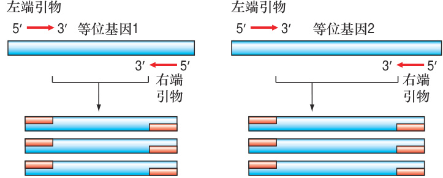  

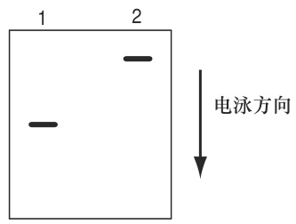  

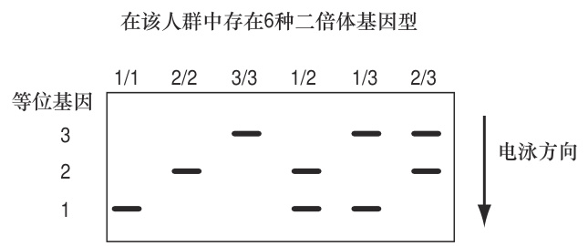  

微变化。同样，你首先使用与实际长度多态性位点末端序列互补的一对引物，利用PCR扩增个体基因组DNA中的相应区域。但与测序不同，你只需对PCR产物进行凝胶电泳，从而依据片段的大小将它们分开。用溴化乙锭染色后，每个等位基因都呈现特定的DNA条带。  

上述检测片段长度多态性的基因分型的方法，对于检测基因内部三核苷酸重复SSR引起的遗传疾病尤其重要。回顾第7章中的“快进”信息栏（三核苷酸重复疾病：亨廷顿病和脆性X综合征）：人类有大约20种三核苷酸重复疾病，亨廷顿病（HD）是其中之一。亨廷顿病是常染色体显性遗传突变。目前有超过30 000名美国人表现出一种或多种该疾病症状，包括无意识抽动、不稳定步态、情绪波动、人格改变、言语不清和判断力受损。此外，在美国有15万人带有患病父母，因此他们有$50:50$ 的概率携带并随着年龄的增长显现该疾病。该症状通常在 $30\!\sim\!50$ 岁之间发病，但病症初相可以最早出现在2岁患者身上，而最晚可以出现在83岁患者身上。  

亨廷顿病致病基因座的正常等位基因包含多达35个串联重复的CAG，而致病等位基因携带36个或更多。重复次数越多，发病年龄越早（图11.13）。遗传该致病位点的人，只要存活足够久，就一定会患有该疾病。因此，虽然发病（在这里我们指的是发病年龄）是可变(a)  

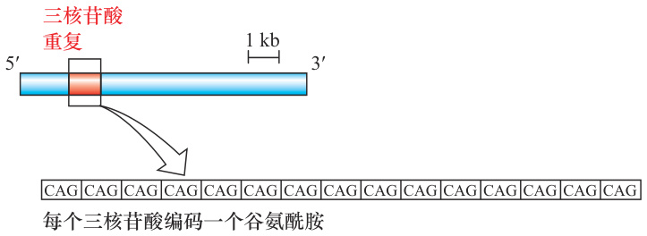  
(b)  

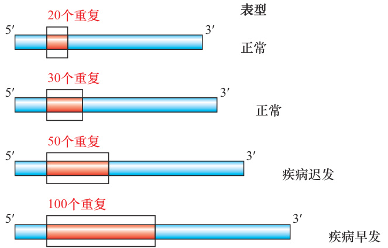  
图11.13　亨廷顿病致病位点的突变是由编码区中三核苷酸重复SSR的扩增引起的。（a）编码区的5′端附近是编码一串谷氨酰胺的重复三核苷酸序列。（b）亨廷顿病致病位点上的不同等位基因具有不同数量的重复单元。正常等位基因具有35个或更少的重复。显性致病等位基因有36个或更多重复；随着重复次数的增加，疾病的发作时间提早。  

的，其取决于三核苷酸重复的数目，但具有42或更多重复的致病等位基因都是完全外显的。具有 $36\!\sim\!41$ 个CAG的等位基因是部分外显遗传，因为它们在某些人中会引起疾病 ，但在其他人中无致病迹象。  

在决定是否要生孩子之前，一些有亨廷顿病家族史的个体想知道他们的基因型。通过扩增该个体的致病基因的CAG部分（引物在该SSR侧翼）并检测所得PCR产物的长度，遗传学家可以很容易地确定每个等位基因中发现了多少CAG重复（见图11.12）。由于获知携带该致病等位基因信息会导致极大的心理压力，某些来自亨廷顿病家庭的人选择不接受这种检测。  

# 11.2.3 胎儿和胚胎细胞可以被基因分型  

假设一对怀孕的夫妇通过对他们自己的基因组进行基因分型，获知他们都是高度有害的隐性遗传疾病（如囊性纤维化）携带者，或其中一个人携带有导致像亨廷顿病这样的迟发性疾病的显性等位基因。根据他们的个人信仰，一些准父母如果知道胎儿患有致病基因型，则更愿意终止妊娠。  

产前基因诊断涉及采用我们刚刚描述的方法对胎儿细胞进行基因分型。医生可以通过羊膜穿刺术分离胎儿细胞，该方法使用针头提取母体子宫内胎儿周围的一些羊水（详见第4章“遗传学与社会”信息栏“产前基因诊断”）。羊水中含有一些胎儿脱落的细胞，遗传学家用PCR从这些胎儿细胞中提取的基因组DNA扩增疾病相关区域，然后对PCR产物进行测序或大小分析。  

最近，体外受精和PCR技术的双重成功为生殖决策开辟了新的选择。现在，夫妇可以在将胚胎置于母亲的子宫之前确立胚胎的基因型（图11.14）。当女性注射卵泡刺激素（FSH）以刺激卵巢中约10个卵子的成熟时，可以开始进行植入前胚胎诊断。产科医生将这些卵从卵巢中取出，并在体外用伴侣的精子使它们受精。受精卵孵育数天后，通过几轮有丝分裂以产生含有 $6\!\sim\!10$ 个细胞的早期胚胎。  

接受过专门培训的技术人员使用微量移液管从这些早期胚胎中移取单个细胞（见图11.14）。这些早期胚胎细胞尚未确定成为特定细胞类型或器官；事实上，在这个阶段自然分裂的胚胎可以发育成健康的同卵双胞胎。因此，去除单个细胞不会损害胚胎，也不会妨碍它们正常发育。  

技术人员对每个胚胎中获得的单细胞进行基因组DNA提取，PCR扩增含有致病突变位点的特定区域。然后，他们通过测序或片段长度多态性来分析PCR产物。在与医生协商后，父母可以选择不含有致病基因型的健康胚胎（正常等位基因纯合子或隐性致病等位基因杂合子）。通常将两个或三个这样的胚胎放入母亲的子宫中，以提高至少一个胚胎正确植入子宫的概率。  

通过查看来自单个细胞的DNA，可以在受精后几天内对胚胎进行基因分型。尽管这在概念和技术上都是令人惊讶的，但植入前胚胎的诊断已成功应用于全球成千上万的妊娠筛查。该流程既复杂又昂贵，耗资数千美元，但对于那些孩子本可能罹患严重遗传病的夫妇来说，其所提供的信息是无价的。  

# 基本概念  

●  PCR扩增由两个寡核苷酸引物限定的DNA特定区域。合成过程中循环的重复会指数性的增加靶DNA区域地拷贝数。  
$\bullet$ 对许多多态性类型来说，PCR产物测序是一种简单的基因分型方法。DNA的小缺失插入（DIP和SSR）也可以通过检查凝胶上的PCR产物大小来进行基因分型。  
$\bullet$ 通过羊膜穿刺术获得胎儿细胞，可以对子宫内内胎儿进行基因分型。在植入前诊断中，对来自体外受精产生的早期胚胎中一个细胞进行基因分型。  

# 11.3 在基因组中采集DNA变异  

# 学习目标  

1.  解释为什么相对少量的SSR位点足以提供个体的DNA指纹。  

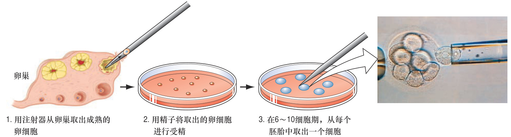  
图11.14　植入前胚胎诊断。从八细胞胚胎中取出一个细胞直接用于基因型检测。提取来自单细胞的基因组DNA，并在PCR扩增后进行基因分型。胚胎的其余部分存活并且可以植入母亲的子宫中。  

2.  描述如何构建DNA微阵列，以及如何在该微阵列上对数百万个位点进行基因分型。  

任何基因组中存在的绝大多数多态性不会引起疾病或影响表型。尽管如此，仍存在一些很好的理由来确定这些匿名基因座上的人群基因型。这些基因座的基因分型可以让人们通过DNA进行个体识别，这在法医领域十分有用，而且在研究人类进化和历史时非常有效。另外这也有实际意义，匿名基因座可以作为基因组特定区域的分子标记。即便这些DNA标记本身不会引起疾病，科学家们也可以依靠它们的遗传来定位难以发现的遗传病致病基因和其他表型相关基因。  

# 11.3.1 法医DNA指纹技术检测多个SSR基因座  

SSR基因座具有高度多态性：对于任何给定的基因座，尽管一个人只能最多携带两个等位基因，但在群体中可以存在许多重复单元数目不同的等位基因。SSR基因座的多态性为通过DNA进行个体识别提供了强大的资源。  

其优势在于可同时检查多个多态性的SSR基因座。假设在特定SSR位点上，任意两人的两个等位基因组合完全相同的可能性是 $10\%$ （0.1），对于其他独立分离的SSR基因座也是如此假设。根据独立事件的乘法规则，随机选择的两人在两个SSR基因座处具有相同等位基因的概率是 $(0.1)\times(0.1){=}0.01$ ，即百分之一。现在，如果考虑13个这样的SSR基因座，两个人在基因组中的所有13个位置具有相同的等位基因组合的概率是 $\cdot0.1^{13}$ ，相当于10万亿分之一的机会（为便于理解，这里我们仅简单计算相应概率；第21章“群体遗传学”将向你展示如何从实际数据中精确地进行计算）。鉴于目前地球只有大约70亿人类居民，你可以理解来自13个非连锁的多态SSR基因座的基因分型，可以充当除了同卵双胞胎外的任何一个人独有的DNA指纹。  

我们已经讨论过单个SSR基因座进行基因分型，该方法的一个简单扩展是对多个SSR同时进行基因分型。图11.12显示从一个SSR基因座扩增的PCR产物大小不一，对应于每个等位基因中重复单元数目。为了同时检查13个SSR位点，你可以使用不同颜色的荧光染料标记13对PCR引物，然后将所有引物对组合在同一PCR反应管中。凝胶电泳后，你可以根据PCR产物的荧光颜色和大小确定每个SSR基因座的等位变异（图11.15）。  

在美国，联邦调查局（FBI）维护着一个名为CODIS（Combined DNA Index System，DNA联合索引系统）的数据库，该数据库允许全国各地的法医实验室共享和比较DNA谱。所有这些实验室使用相同的13对引物来扩增13个SSR基因座。实验室仔细分析PCR产物的大小，并将结果提交给CODIS数据库。美国所有50个州都要求对被判犯有某些罪行的罪犯（如性犯罪者）收集CODIS的DNA指纹数据。此外，该数据库还包括失踪人员的DNA指纹信息。  

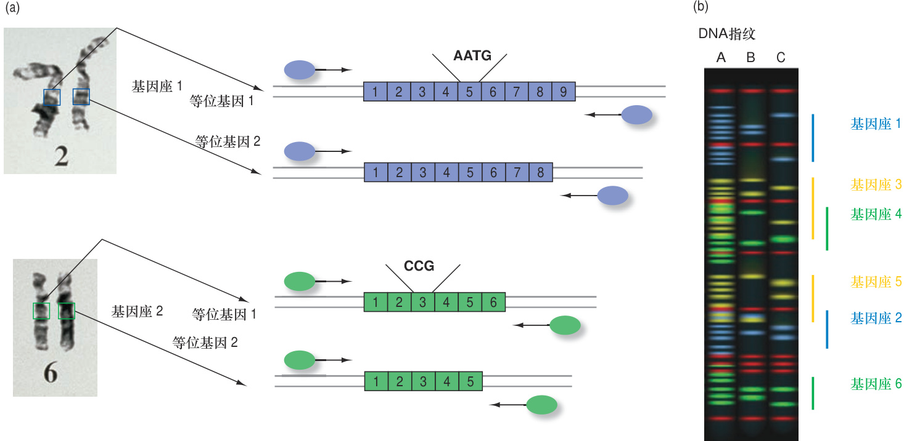  
图11.15　DNA指纹。（a）利用多重PCR实现的DNA指纹的基本原理（同时分析来自多个基因座的PCR产物）。PCR引物对（椭圆）扩增每个单独的SSR位点，这些SSR位点通常来自非同源染色体。引物对用不同的荧光分子标记（本例子中用蓝色和绿色标记两个位点）。（b）多重PCR产物的凝胶电泳。该例子显示了3个人中6个位点（ $\mathrm{A}{\sim}\mathrm{C}$ ）的分析结果，每种颜色（蓝色、绿色和黄色）标记2个位点。相同颜色的2个不同位点（例如位点1和2）的等位基因的大小差别足以分别哪个等位基因属于哪个基因座。每个泳道的红色条带是长度标准。  

截至2016年，CODIS已协助超过30万宗刑事调查。通常，法医调查人员使用数据库来匹配犯罪现场留下的证据与重刑犯的DNA图。但DNA信息也可以确定无辜：如果没有与犯罪现场证据相匹配，嫌犯可以被排除在外。事实上，一个名为Innocence Project的公共政策组织已经使用DNA指纹证据来帮助300多名被判死刑的嫌犯洗清嫌疑，其中包括几个等待死刑执行的人。  

DNA指纹技术强大到引发了许多人的担忧，主要是针对隐私和数据收集中可能存在的歧视。举个有趣的例子：假设兄弟姐妹共享 $50\%$ 的SSR等位基因；父母和孩子也是如此。因此有可能不通过与罪犯自身的DNA匹配来确定罪行，而是通过与近亲的DNA进行部分匹配来确定犯罪者。这种家庭式DNA搜索对于2010年洛杉矶“Grim Sleeper”连环杀手的逮捕至关重要。嫌疑人的儿子由于被控涉枪重罪，因此分析了他的DNA。儿子的DNA特征与Grim Sleeper受害者身上的精液和唾液的DNA指纹部分匹配。警察随之跟踪其父亲，一名扮演服务员的警探获得了带有父亲DNA的吃剩下的披萨。令人震惊的是，该DNA与犯罪现场证据完美匹配（在2016年初撰写本文时，该审判才刚刚开始）。对于未犯下任何罪行的重罪犯家庭成员，家族式搜索会导致其实际上处于终身的遗传信息监控，在这种逻辑下，是否应该允许刑事调查员进行这类家族式搜索？  

除严重刑事犯罪取证之外，DNA指纹还有许多重要的用途。DNA指纹现在已经成为亲子鉴定中最确凿的证据，其也可用于识别人类遗骸，如2001年9月11日世界贸易中心灾难的受害者鉴定。该技术的好处不仅限于人类的DNA指纹，野生动物生物学家通过对动物个体进行指纹识别来研究濒危物种的种群，以增加圈养繁殖计划的成功率或识别非法偷猎的动物。在某些情况下，有价值的驯养动物（如表演犬、纯种马或牛）的拥有者可以通过DNA指纹建立谱系。在阿根廷的一个奇怪案例中，科学家们被邀请帮助逮捕兼当偷牛贼的屠夫。挂在屠夫店里的肉，与牧羊人被偷的一头奶牛组织样本有相同的DNA图。  

# 11.3.2 DNA微阵列检测数百万个SNP基因型  

核酸杂交，即DNA或RNA的互补单链聚集形成双链分子的能力，是分子生物学中许多技术的基础。在Sanger测序和PCR技术中，我们已经讨论了寡核苷酸引物与DNA模板杂交的重要性。DNA测序和PCR都假定引物与模板中的所有核苷酸之间存在完美的互补匹配。但如果两条核酸链之间存在错配，会发生什么？  

假设一个21碱基寡核苷酸与目的DNA链进行杂交时，二者中间序列有一个碱基不同（图11.16）。与完全匹配的杂交体相比，该双链杂交体稳定性更差。原因是维持双螺旋结构的氢键强度，取决于不包含任何错配的最长距离。当两条链不完全匹配时，在一排上可能没有足够的弱氢键将它们维持在一起。因此，对于最长约40bp的小区域，研究人员可以设计杂交条件（如特定温度），在此条件下完全匹配杂交体将保持完整，而较不稳定的非完全匹配的杂交体会解开（见图11.16）。  

研究人员可以利用杂交分子的不同稳定性进行SNP基因座的基因分型。如图11.17（a）所示，将 $20\!\sim\!40$ 个碱基长的短寡核苷酸连接到一个固体支持物（如硅芯片），它们将在适当的条件下与某SNP位点的两等位基因之一进行杂交。这些寡核苷酸从逻辑上被称为等位基因特异性寡核苷酸（ASO）。研究人员现在从待分析的基因组中获得DNA，并通过片段化DNA将其转变为探针，通过加热将片段变性成单链，并将荧光染料附着到这些小片段的单链基因组DNA上。携带染料的基因组DNA现在放在硅芯片上（有时称为DNA微阵列）并调整温度，使基因组DNA探针仅与完全序列匹配ASO进行杂交。为了使杂交信号可视化，光照射在芯片上，检测器记录每个包含特定ASO的区域发出的荧光量。正如图11.17（a）中所见，可以通过荧光分布模式直接判断初始基因组DNA中任何SNP位点的基因型。  

图11.17（a）中另一个值得注意的特征是，硅芯片上特定ASO上的荧光信号强度与基因组中该等位基因的拷贝数成正比。因此，荧光强度可以提供监测拷贝数变异（CNV）的方法。我们将在本书后讨论ASO芯片的  

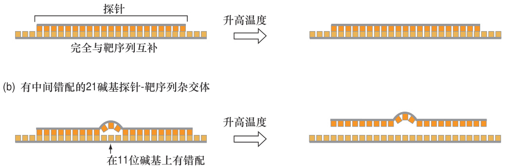  
(a)     21    -   
图11.16　短杂交探针可以区分单碱基错配。研究人员将短的21碱基探针和两个不同的靶序列进行杂交。（a）在21个碱基中，探针和靶标之间完美匹配。当温度升高时，该杂交体具有足够的氢键以保持完整。（b）当探针中间具有单碱基错配时，探针-靶序列杂交体的有效长度仅为10个碱基。当温度升高时，这种杂交体就会分开。  

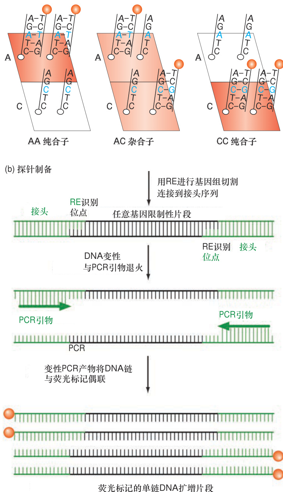  

(c)  

  

图11.17　DNA微阵列。（a）三个相同的DNA微阵列芯片，分别杂交用于区分某SNP位点上两个等位基因的ASO（ASO显示为5个核苷酸长，但实际长度为 $20{\sim}40\$ 个核苷酸）。探针（带有红色荧光标记）仅与完全互补的ASO杂交。荧光强度反映了与ASO互补的基因组DNA片段数目。（b）用于微阵列分析的基因组DNA的扩增方法。用限切酶（RE）切割基因组DNA，并将产生的末端连接到双链寡核苷酸接头上。然后用与接头序列互补的单个引物PCR扩增全部基因组片段。将得到的DNA片段变性并用荧光标记（红色）。（c）与基因组  

DNA探针杂交后的DNA微阵列的小部分区域。  

（c）来源：National Cancer Istitute  

这种用法。  

单个荧光标记的基因组DNA分子不能产生足够的荧光，使其在微阵列上被检测。因此，研究人员必须扩增基因组DNA，以便基因组各部分的许多拷贝都可以被荧光标记。图11.17（b）展示了实现这种扩增的一种巧妙方法。研究人员首先使用限制性内切核酸酶消化基因组，该酶产生具有黏性末端的片段，然后将寡核苷酸接头连接到这些限制性片段上。接头的部分区域可以与突出端退火，其余部分与PCR引物互补。连接到两条链末端的接头片段现在可以用作PCR扩增的模板。利用这种方式，可以用单个接头和单个PCR引物扩增基因组所有区域。  

DNA微阵列制造技术的快速发展使得现有芯片能承载超过400万个SNP等位基因检测位点［图11.17（c）］。在撰写本书时（2016年），分析基因组DNA样本的成本仅为几百美元，这相当于每个SNP基因分型成本不到一美分。商品化微阵列上分析的SNP基因座包括已知与遗传疾病相关的所有单核苷酸变异，但芯片上的大多数基因座很可能是没有表型效应的常见SNP。这些特定的匿名SNP的广泛出现非常有助于定位致病突变，我们将在下一节中解释其原理。  

# 基本概念  

●  在DNA指纹中，SSR等多个多态位点的基因分型提供了个体识别所需的充足信息。  
●  DNA微阵列包含数百万个SNP基因座的等位基因特异性寡核苷酸。在适当的条件下，由荧光标记的基因组DNA片段制备的探针仅与互补的ASO结合，对相应基因座进行基因分型。  

# 11.4 定位克隆  

# 学习目标  

1.  描述定位克隆的过程，以及它如何能够定位致病突变。  
2.  在提供定位克隆所需的信息时，检查谱系分析的局限性。  
3. 解释如何获得Lod分数及其所蕴含的信息。  
4.  讨论等位基因异质性、复合等位基因杂合性和基因座异质性的影响。  

在数以千计的已知人类疾病基因（其突变等位基因导致疾病表型）中，科学家只能根据异常情况的特殊性鉴定出少数基因。例如，镰状细胞贫血和地中海贫血是影响红细胞的疾病。大约 $97\%$ 的红细胞干重由血红蛋白组成，因此研究人员将注意力集中在编码这种携氧蛋白多肽的基因上，因为这些基因很可能是致病的原因。但更通常情况下，研究人员很难有根据地猜测出哪种蛋白质因致病突变而产生变化，因此需要采用另外的方法。  

# 11.4.1 应用DNA标记的连锁分析提供疾病基因在染色体上的大致位置  

确定导致遗传性疾病缺陷的常用有效策略被称为定位克隆（图11.18）。目的是通过寻找与致病突变遗传连锁的多态性位点，获得未知的疾病基因座的定位信息。因为我们从人类基因组序列中了解每个基因座的确切位置，发现与疾病基因密切相关的匿名DNA多态性，能够让研究人员集中搜索单个染色体的小范围上的突变。从该区域内的候选基因中，通过寻找在患者中一致出现的突变，可以发现导致该疾病的基因。  

# 1. 定位克隆的策略  

你在第5章中了解到，如果它们在同一条染色体上靠近在一起，那么两个基因就是遗传连锁的。如果亲代型超过配子中的重组型，则基因是处于连锁状态。两个基因座之间重组的频率提供了度量它们之间分离距离的参数，被记为厘摩（cM），也称为图距单位（m.u.），1cM等于 $1\%$ 的重组频率。  

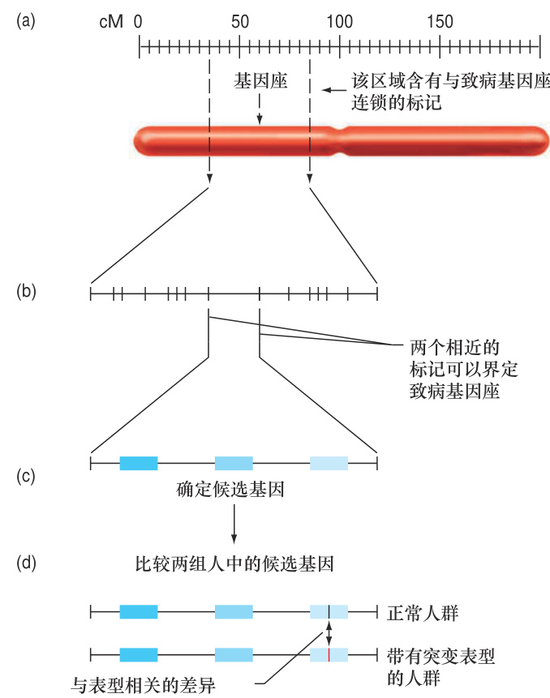  

图11.18　定位克隆：从表型到染色体位置，从染色体位置到疾病基因。（a）疾病基因与其相关的任一标记相距小于50个图距单位（约 $50\;\mathrm{Mb}$ ）。（b）研究人员通过寻找突变左右两侧最密切相关的标记来缩小目的区域。（c）候选疾病基因（不同浓度的蓝色）一定位于目的区域内。（d）比较大量患病与非患病个体中每个候选基因的结构和表达情况，确定致病突变及所属的疾病基因。  

定位克隆是这种连锁概念的直接延伸应用，但有两点重要差异。首先，连锁是直接追踪控制性状的两个基因，而定位克隆是通过表型追踪第一个基因座（表型指的是记录谱系中哪些个体受影响，哪些未受影响），再通过对每个个体直接进行基因分型来追踪第二个基因座。最终，我们以不同的方式在两个基因座中寻找相同的东西，即DNA的变异。该表型特征间接地鉴别突变，而基因分型直接鉴定突变位点。  

其次，你可以使用DNA微阵列追踪谱系中每个人的数百万个匿名基因座，而不是一次只处理两个或三个基因座（如两点或三点杂交）。你可以将这种微阵列-谱系分析简单地看成是同时进行数百万个两点杂交，每个杂交都可以检测个体DNA标记与疾病基因座之间的连锁。发现与疾病基因座连锁的DNA标记是定位克隆的首要目标。  

DNA微阵列覆盖了如此高密度的多态性基因座，以至于一定有一些基因座与任何给定的孟德尔疾病相关基因互相连锁。在两点杂交实验中，当两个基因组距离小于50cM时，两个基因座是连锁的。粗略估计，平均1cM对应于人类基因组中的1Mb（100万碱基对），因此连锁基因座通常必须在二者的50Mb范围内（见图11.18）。如果一个微阵列只包含分布于整个人类基因组中的1000个分子标记，那么它们平均相距3Mb。因此，致病突变位于微阵列上的一个多态性基因座的3Mb区域内，那么这两个位点一定是遗传连锁的。现代DNA微阵列可以同时分析人基因组中的数百万个多态性，因此这种定位克隆方法可能会更准确地映射疾病基因。  

# 2. 定位克隆的实例  

神经纤维瘤病是一种显性遗传的、完全外显的常染色体病，尽管发病很少，但仍影响超过100 000名美国人。这种疾病导致神经组织不受控制地增殖，在皮肤下形成肿瘤性肿块（图11.19）。这些肿瘤通常是良性的，但它们可以破坏神经细胞，有时会发展成恶性癌症。图11.20记录了通过定位克隆搜索该疾病致病突变的一个阶段。结果允许我们了解一个特殊的匿名SNP基因座（SNP1）是否与神经纤维瘤病基因相连锁。SNP1位于17号染色体上，有两个等位基因G和T。  

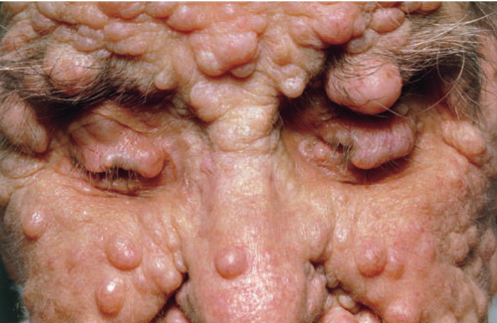  
图11.19　神经纤维瘤病。 $\copyright$ Paul Parker/Science Source  

系谱［图11.20（a）］显示神经纤维瘤病患者Ⅱ-1从其受影响的母亲Ⅰ-1处同时获得了主要的致病等位基因NF和SNP1的G等位基因。从未发病的父亲处，Ⅱ-1获得了神经纤维瘤病基因的正常等位基因 $\mathrm{NF^{+}}$ 和SNP的T等位基因。Ⅱ-2是Ⅱ-1的未患病配偶，记做 $\mathrm{NF^{+}/N F^{+}}$ ，DNA分析表明她的SNP1位点是纯合型G等位基因。因此，系谱的第三代儿童实际上相当于侧交的后代。检查每个孩子的患病情况并进行SNP基因分型，其结果将揭示孩子从其双重杂合子的父亲Ⅱ-1获得亲代型（非重组）精子，还是重组型精子。  

如图11.20（a）所示，第三代中8个后代中的7个来自亲代型精子：祖母Ⅰ-1中看到的NF和G的组合，或者祖父Ⅰ-2中看到的 $\mathrm{NF^{+}}$ 和T的组合。第三代中只有一个孩子是重组精子（Ⅲ-8，患病的男孩，带有NF和SNP的等位基因T）的产物。因此，数据强烈表明神经纤维瘤病基因和这种特定的SNP是遗传连锁的，图距为$(1/8)\times100{=}12.5\mathrm{cM}_{\circ}$ 。  

按照今天的标准，8个孩子的家庭规模很大的，但这个后代的数量仍然不够，无法达到较大的统计学显著性。尽管如此，对数据最直接的解释是神经纤维瘤病基因位于17号染色体上，位于SNP1基因座任一侧大约12.5Mb的区域内。图11.20（b）以图形方式显示了如何根据这些临时结论轻松地解释Ⅱ-1和Ⅱ-2之间的杂交。  

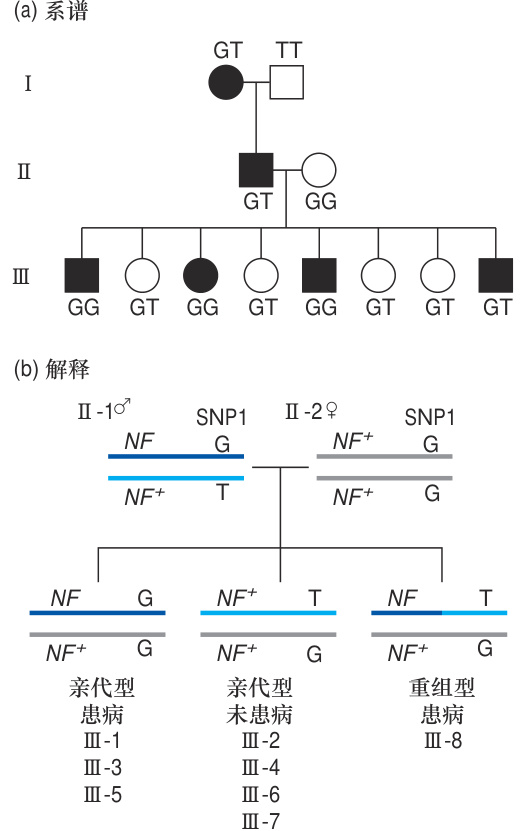  
图11.20　定位克隆实例。（a）系谱显示家族中神经纤维瘤病的遗传情况。G和T是指SNP1基因座的核苷酸等位基因。（b）基于神经纤维瘤病基因与SNP1相关的假设，对相同的系谱进行解释。  

# 3. 多位点分析  

微阵列数据不仅包括关于疾病基因与个体DNA基因座的连锁关系的两点信息，还包括关于数百万个DNA基因座之间彼此相对表现的多点信息。你在第5章中看到了果蝇中三点杂交实验的能力，而微阵列就像“打了激素”的三点杂交实验。研究人员现在可以将单个配子产生时发生的特定交换重组，定位到同一染色体上的两个多态性位点之间。正如你将在11.5节中看到的那样，这些信息反过来允许研究人员将疾病相关基因定位到由重组事件界定的短区域上。  

# 11.4.2 定位克隆的几个局限性  

对于在植物或小动物中显现的性状，研究人员可以轻松建立杂交并产生数百个后代，以便进行准确的遗传作图。但科学家不能指挥人类繁殖，因此并非两个人每次交配都能提供关于任何两个给定基因座的相对位置的可释信息。此外，人类家庭规模很小，因此难以获得足够的数据以进行精确的作图。  

# 1. 相型问题  

你应该注意到，上述的神经纤维瘤病基因和SNP1之间图位距离的计算不包括系谱中的一个杂交：Ⅰ-1和Ⅰ-2的交配（见图11.20）。原因是我们不知道患病的祖母Ⅰ-1中等位基因（或相型）的配置。她的突变型NF等位基因可能与SNP1的G等位基因位于同一条染色体上（17号染色体），但也有可能与T等位基因位于同一条染色体上。因为我们不能确定是否Ⅱ-1（她受影响的儿子）来自亲代型或重组型卵细胞，因此我们在计算图位距离时没有考虑这个配子。  

在两种情况下可以解决相型问题。首先，如果你知道一个人的父母在两个基因座上的基因型，有时你可以确定这个人的等位基因亲本来源。我们正是基于这种信息知道双杂合子父亲Ⅱ-1中的相型是NF $\mathrm{G/NF^{+}T}$ （见图11.20）。因此，如果通过此方法确定Ⅰ-1中的相型，我们需要获知其受影响的父母的基因分型信息。其次，如果两个基因座相距足够近，由于连锁的等位基因通常彼此分离，因此可以推断出可能的相型。在图11.20中，第三代中的亲代级明显多于重组体，即使没有关于其父母的信息，你也可以推断出双重杂合子Ⅱ-1中等位基因的可能排列。  

# 2. 有信息与无信息的杂交  

即使你知道双杂合亲本的相型，交配也可能无法提供关于两个基因座是否相关的任何有用信息。在图11.21（a）中可以看到一个例子，该例子再次检查了  

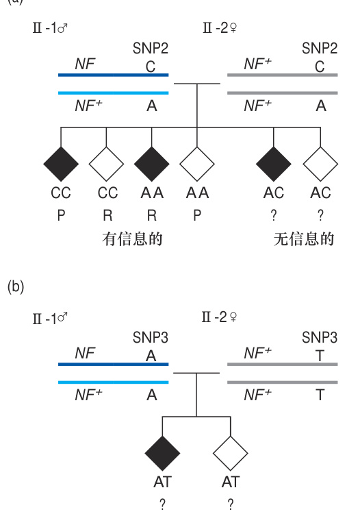  

图11.21　一些无信息的交配。（a）即使你知道NF基因和SNP2是连锁的，并且你知道父母的相型（等位基因的排列），也不确定是否交配能够提供信息。如果孩子是CC或AA纯合子，那么杂交是有信息的。如果孩子是AC杂合子，你不知道哪个等位基因来自父母的哪一方，所以杂交将是无信息的。（b）如果父母都不是双杂合子，则不可能进行连锁分析（SNP3是第三个SNP基因座）。  

患有神经纤维瘤病的男性Ⅱ-1与他未患病的伴侣Ⅱ-2之间的交配结果。这次我们查看一个不同的SNP基因座（SNP2），其父母都是等位基因A和C的杂合子。如果一个孩子也是A和C的杂合子，你将无法分辨哪一方贡献了A、哪一方贡献了C，因此无法确定孩子是亲代型还是重组配子的产物。但如果孩子是SNP2等位基因的纯合子，如基因型AA，那么你就知道卵子和精子都必须携带A等位基因。  

你应该记得第5章遗传作图的基本要求是至少有一个亲本必须是双杂合子。图11.21（b）强调了这一关键点：如果亲本都不是双杂合子，则杂交不能提供信息。  

即使交配不能提供疾病基因与特定SNP基因座的连锁信息，微阵列的多位点分析通常也能为科学家提供一种克服这种限制的解决方法。这是因为微阵列很可能包含附近其他有信息的SNP。  

# 3. 获得足够的系谱信息  

DNA芯片上有数百万个多态位点，即使某些杂交无法提供疾病基因与某DNA标记的连锁信息，理论上仍可能非常准确地定位疾病基因。然而，在实践过程中，定位克隆的解决方案总是受到人类遗传学家在疾病分离的家庭中可以追踪的人数的限制。如果科学家已将疾病基因定位到DNA多态性的1cM以内，则意味着他们已经检查了至少100个此家族成员的表型（受影响或未受影响），并且他们还在微阵列上对所有这些人进行了基因分型（请记住，1cM表示100个配子中的1个重组配子）。  

出于这个原因，当疾病存在于拥有大量儿童的大家族时，定位克隆首次成功定位疾病基因通常发生在拥有大量儿童的患病大系谱研究中。1984年，亨廷顿病（HD）基因座成为第一个通过定位克隆成功定位的人类疾病基因，因为存在有这样的大系谱。图11.22显示了拥有65个成员的七代系谱，被用于证明DNA标记G8与HD基因座之间的紧密连锁。  

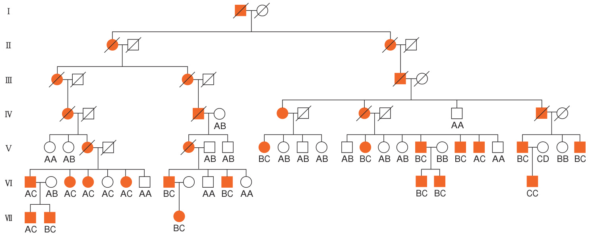  
图11.22　与亨廷顿病基因座紧密连锁的标记。检测DNA标记G8与导致亨廷顿病（HD）基因座之间的连锁关系是克隆HD基因的第一步。系谱显示了一个受到HD影响的委内瑞拉大家族。显示的是G8标记位点的等位基因（A、B、C和D），而受影响的个体用橙色标记。明显看到HD基因座的突变体和野生型等位基因与DNA标记的共转移。  

# 11.4.3 Lod分数提供了研究连锁的统计方法  

定位克隆很少像亨廷顿病中的研究那么简单。大多数人类家庭只有少数几个孩子，因此很难在系谱中获得多代的DNA和表型信息。基于这些原因，人类遗传学家开发了一种统计工具，称为Lod分数（比率的对数）。Lod分数的使用目的让人想起第5章中 $\chi^{2}$ （卡方）统计应用目的：确定数据是否足够可靠地给出疾病基因和DNA标记遗传连锁的结论。在人类遗传学中采用Lod分数而不是 $\chi^{2}$ 统计量，是因为Lod分数能更好地处理少量数据点，同时允许组合来自不同系谱的数据。  

Lod分数统计量是根据两个概率的比率计算得出的：如果两个基因座相连（假设特定的RF值），则在系谱中获得特定结果集的概率；如果基因座不连锁，则观察到相同信息的概率。Lod分数统计量是该概率比的以10为底对数（log）。人类遗传学家采用的惯例是Lod分数大于或等于3表示两个基因座连锁。Lod分数为3表示两个基因座连锁的可能性是非连锁的1000倍（因为$3{=}\mathrm{log}1000$ ）。Lod分数统计的优点在于，由于它是一个对数函数，可以简单地添加来自不同谱系的Lod分数，因此研究人员将知道他们何时有足够的数据来推断疾病等位基因与特定标记相连锁。  

题为“Lod分数统计”的“遗传学工具”信息栏以图11.20（a）中系谱为例，说明了如何计算Lod分数。正如你所看到的，这些数据的最大Lod分数（通过假设 $\mathrm{RF}{=}12.5\%$ 获得）为1.1，表明这一个数据不足以证明17号染色体上的SNP1基因座与NF基因的连锁。然  

# 遗传学工具  

# Lod分数统计  

Lod分数是该问题的数学答案：当给定重组频率（RF）小于 $50\%$ 的情况下位点之间处于连锁，那么在系谱中出现的等位基因传递模式发生的可能性较不连锁情况大多少？Lod分数，顾名思义（比率的对数）是这两个概率之间比率的对数：  

# Lod分数 $\mathop{:=}\log(12.8){=}1.1$  

P（给定重组概率情况下两个位点连锁时获得此观测数据）Lod=logP（如果位点不连锁时获得此观测数据）  

在这里，我们通过图11.20（a）中系谱分析说明Lod分数计算过程。系谱表明，NF基因与17号染色体上的特定SNP连锁。计算将使我们能够确定我们对这一初步结论的置信度。  

1.  列出哪些后代是亲代型，哪些是重组型。在图11.20（a）中，你可以看到第三代中的前7个孩子具有等位基因的亲本（P）配置，并且只有Ⅲ-8具有重组（R）配置。我们将这些数据缩写为PPPPPPPR。  

2.  计算Lod分数的分母。如果两个基因座非连锁，则任何一个孩子是P或R的概率相同（即RF $\!\!\!\!\!\!\!\!\!\!\!\!\!\!\!\!\!\!\!\!\!\!\!\!\!\!\!\!\!\!\!\!\!\!\!\!\!\!\!\!\!\!\!\!\!\!\!\!\!\!\!\!\!\!\!\!\!\!\!\!\!\!\!\!\!\!\!\!\!\!\!\!\!\!\!\!\!\!\!\!\!\!\!\!\!\!\!\!\!\!\!\!\!\!\!\!\!\!\!\!\!\!\!\!\!\!\!\!\!\!\!\!\!\!\!\!\!\!\!\!\!\!\!\!\!\!\!\!\!\!\!\!\!\!\!\!\!\!\!\!\!\!\!\!\!\!\!\!\!\!\!\!\!\!\!\!\!\!\!\!\!\!\!\!\!\!\!\!\!\!\!\!\!\!\!\!\!\!\!\!\!\!\!\!\!\!\!\!\!\!\!\!\!\!\!\!\!\!\!\!\!\!\!\!\!\!\!\!\!\!\!\!\!\!\!\!\!\!\!\!\!\!\!\!\!\!\!\!\!\!\!\!\!\!\!\!\!\!\!\!\!\!\!\!\!\!\!\!\!\!\!\!\!\!\!\!\!\!\!\!\!\!\!\!\!\!\!\!\!\!\!\!\!\!\!\!\!\!\!\!\!\!\!\!\!\!\!\!\!\!\!\!\!\!\!\!\!\!\!\!\!\!\!\!\!\!\!\!\!\!\!\!\!\!\!\!\!\!\!\!\!\!\!\!\!\!\!\!\!\!\!\!\!\!\!\!\!\!\!\!\!\!\!\!\!\!\!\!\!\!\!\!\!\!\!\!\!\!\!\!\!\!\!\!\!\!\!\!\!\!\!\!\!\!\!\!\!\!\!\!\!\!\!\!\!\!\!\!\!\!\!\!\!\!\!\!\!\!\!\!\!\!\!\!\!\!\!\!\!\!\!\!\!\!\!\!\!\!\!\!\!\!\!\!\!\!\!\!\!\!\!\!\!\!\!\!\!\!\!\!\!\!\!\!\!\!\!\!\!\!\!\!\!\!\!\!\!\!\!\!\!\!\!\!\!\!\!\!\!\!\!\!\!\!\!\!\!\!\!\!\!\!\!\!\!\!\!\!\!\!\!\!\!\!\!\!\!\!\!\!\!\!\!\!\!\!\!\!\!\!\!\$ ）。P的概率因此是1/2，并且R的概率也是1/2。如果NF基因和SNP基因座不相关，则在特定出生顺序PPPPPPPR中获得子女的概率是：  

$$
\mathrm{P}\left(\mathrm{RF}_{12.5\%}\right)=\left(\frac{7}{8}\right)^{7}\left(\frac{1}{8}\right)^{1}\approx\frac{1}{20}
$$  

计算Lod分数分子的通用公式为：  

$$
\left(1-\mathrm{RF_{obs}}\right)^{\#\mathrm{P}}\times\left(\mathrm{RF_{obs}}\right)^{\#\mathrm{R}}
$$  

其中， $\mathrm{RF_{obs}}$ 是根据数据计算的RF，#P是亲代型的数量，#R是重组子的数量。  

4.  计算概率比。步骤2和步骤3中获得的数值的比率。本示例中，  

$$
\mathrm{P}\left(\mathrm{RF}_{12.5\%}\right)\!\Bigg/\mathrm{P}\!\left(\mathrm{RF}_{50\%}\right)\!=\!\!\left(\frac{1}{2}\right)\!\Bigg/\Bigg(\frac{1}{256}\Bigg)\!=\!12.8
$$  

该概率比意味着NF基因和SNP在 $\scriptstyle\mathrm{RF}=12.5\%$ 时连锁的可能性是未连接的（ $\mathrm{RF}{=}50\%$ ）的12.8倍。  

5.  计算Lod分数。Lod分数只是概率比的以10为底的对数。对于图11.20（a）中的示例：  

顺序PPPPPPPR中7个亲本和1个重组体的概率为：  

$$
\operatorname{P}\left(\operatorname{RF}_{50\%}\right)=\left({\frac{1}{2}}\right)^{8}={\frac{1}{256}}
$$  

你可以看到这部分计算的通用公式只是： $\left(1/2\right)^{n}$ ，其中$n$ 是列表中个体的总数。  

3.  计算Lod分数的分子。如果RF的值小于 $50\%$ ，则位点间连锁，但计算要求我们假设一个重组频率值。图11.20（a）中的系谱显示了RF值为 $1/8{=}12.5\%$ ，因此我们将其用作当前最佳估计值。 $\mathrm{RF}{=}1/8$ 时，P后代的预期频率为7/8，R后代为1/8。出现特定出生  

6.  解释Lod分数。人类遗传学家的惯例是Lod分数 $\geqslant3$ （即概率比 $\geq1000$ ）时连锁结果有信心。Lod分数为1.1时表明图11.20（a）中的数据不足以断定NF和SNP1是连锁的。  

关于Lod分数的要点：  

●  根据数据推导的精确RF确定的Lod分数将始终是数据集可获得的最大Lod分数。  

●  对于单个系谱，可以计算RF值小于 $50\%$ 的情况下的Lod分数。Lod分数 $\geqslant3$ 表示所获得的数据在统计上与假设的特定距离（小于50m.u.）相兼容。  

●  概率比被转换为Lod分数，因为对于相同RF值的不同系谱，计算得到的Lod分数可以被简单地相加，以查看是否能达到数值3。  

而，如果有两个额外的谱系，每个系谱Lod分数为1.1（ $\mathrm{RF}{=}12.5\%$ 计算），三个谱系的Lod分数一起为3.3，这构成了17号染色体上NF基因与SNP1连锁的有力证据。  

# 11.4.4 遗传病可以显示等位基因或基因座异质性  

假设通过定位克隆，你已成功地将疾病基因的定位缩小到两个多态性标记之间的1Mb区域。在人类基因组中，平均基因密度为每100kb DNA约有1个基因。因此，1 Mb区域内可能有超过10个基因。怎么区分这些候选基因以找到正确的目的基因？  

在某些情况下，通过查找患者中的mRNA转录物数量或大小，或基因蛋白产物的变化，可能会找到线索（参见本章末尾的习题38）。但到目前为止，最常用的策略是使用PCR扩增所有可用患者中的所有候选基因，然后对所有这些PCR产物进行测序。如果其中一个候选基因在所有患者中都可以发现可鉴别的突变，特别是可能影响该基因蛋白质产物氨基酸序列的突变，那么该证据强烈支持该候选基因是实际的疾病基因［回顾图11.18（d）］。  

某些遗传疾病总是由单个基因中的相同单个突变引起；我们已经看到，所有患有镰状细胞贫血的患者在血红蛋白β链的编码基因中，恰好都处于相同的碱基对取代的纯合子状态。因此，DNA测序将揭示镰状细胞贫血所有患者及携带者的基因组DNA中的相同突变。  

# 1. 等位基因异质性：一个基因存在多个突变等位基因  

遗传疾病并不是总是像上面描述的那样简单。许多其他遗传疾病表现出等位基因异质性，这意味着它们可能是由同一基因中的各种不同突变引起的。一个重要的例子是囊性纤维化，这是一种隐性的常染色体遗传病，每2500个欧洲血统家庭出生的儿童中大约会有1个患病儿童。患有该疾病的儿童具有由肺、胰腺、汗腺和其他几种组织中的异常黏性分泌物引起的各种症状。大多数囊性纤维化患者在30岁之前死亡。  

定位克隆手段让研究人员将该疾病基因的搜索范围缩小到7号染色体上，定位于两个DNA标记之间的400kb区域，该区域含有3个候选基因（先前如图11.5所示）。其中一个基因是CFTR，编码囊性纤维化跨膜受体，允许氯离子穿过细胞膜（见图2.25）。值得注意的是，在所有囊性纤维化患者中的CFTR拷贝均发现含有突变，会导致蛋白质氨基酸序列变化或阻碍蛋白质以正常量进行合成。因此，正如命名的那样，CFTR显然是导致囊性纤维化的基因。  

一个称为ΔF508的突变（其从蛋白质的508位缺失了苯丙氨酸F）占全世界所有CFTR突变等位基因的约2/3。其余的等位基因由超过1500种不同的罕见突变组成（图11.23）。因此，许多患者是所谓的复合杂合子（有时称为反式杂合子），其中一条7号染色体的CFTR中具有一个突变，而另一条7号染色体的CFTR基因有不同的突变。因为7号染色体两个拷贝都不能编码正常的跨膜受体，最终导致疾病发生；实际上，两种不同的CFTR隐性突变不能相互补充。  

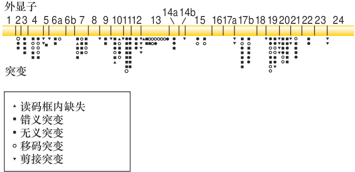  
图11.23　CFTR基因的等位基因异质性。每个囊性纤维化患者在7号染色体的两个拷贝上都有CFTR基因突变。该图列出了CFTR 24个外显子上不同位置的突变状态。复合杂合子是指患者在一个CFTR拷贝上有其中一种突变，而在另一个拷贝上有其中的另外一种突变。  

近期开发出一种仅针对少数患者的有效治疗囊性纤维化的药物，等位基因异质性的概念是理解该药物的关键。2012年，美国食品药品监督管理局批准了一种针对特定CFTR突变G551D（551位甘氨酸改为天冬氨酸）的药物Ivacaftor。由该突变等位基因编码的蛋白质能正确地组装到细胞膜中，但是G551D突变蛋白对氯离子跨膜转运的效率很低。Ivacaftor特异性地在细胞表面与CFTRG551D突变蛋白相互作用，增强其转运氯离子的能力。这种治疗在预防幼儿发生囊性纤维化症状方面非常有效，但不幸的是，G551D突变仅占人群中所有CFTR突变的约 $4\%$ 。  

2015年，研究人员开发了一种针对更为普遍的$\Delta{\mathrm{F}}508$ 突变的治疗方法。该等位基因编码的蛋白质不能正确折叠，因此不会插入细胞膜中。名为lumacaftor的新药改善了折叠问题，增加了细胞膜中CFTR分子数量。突变蛋白的氯离子转运功能仍然存在部分缺陷。值得注意的是，含有lumacaftor和Ivacaftor的复合药物可以防止许多ΔF508纯合子患者出现囊性纤维化。  

# 2. 基因座异质性：不同基因的突变导致相同的疾病  

在本章中，我们专门讨论由单个基因突变引起的孟德尔遗传疾病，但你已经知道许多其他疾病显示出基因座异质性：同一种疾病是由两个或更多不同基因的其中之一突变引起的。先前讨论的异质性病症的例子是耳聋（回顾图3.23）。在面对一种新的遗传疾病时，研究人员必须始终考虑到基因座异质性的可能性。  

在诸如高血压的复杂性状（也称为数量性状）中，许多不同的基因即使在单个人中也可以影响表型。第22章概述了遗传学家可用于研究这些复杂性状遗传基础的一些方法。  

# 基本概念  

●  定位克隆是鉴定与疾病基因相关的DNA多态性。  
●  Lod分数允许在数据有限时对连锁进行统计评估，如在人类系谱中。  
●  在对疾病基因进行近似定位后，研究人员对该区域的候选基因进行测序，以确定在受影响的个体中一致变化的基因。  
●  在等位基因异质性中，单个基因中的多种突变会导致疾病。在同一基因中，具有两种不同隐性功能丧失突变的复合杂合子可显现出突变表型。  
●  在基因座异质性中，两种或更多种不同基因之一的突变可导致相同的疾病。  

# 11.5 全基因组测序时代  

# 学习目标  

1.  描述一种可以同时对数百万个DNA模板进行测序的高通量、自动化方法。  
2. 总结一系列研究步骤，可以缩小致病突变候选范围。  
3.  解释收录许多人的序列变异的数据库如何帮助遗传病的诊断。  

具有数百万个SNP的DNA微阵列仅能覆盖人类基因组中的一小部分变异，并且仅能给出疾病基因所处的染色体的大致位置。正如我们刚才所见，疾病基因鉴定最终需要DNA测序才能将疾病表型与实际突变联系起来。现在假设我们可以在病患的基因组中廉价且准确地测序所有核苷酸，而不仅仅只针对候选基因的核苷酸。全基因组序列一定在某个位置包含致病突变。因此，与定位克隆不同（首要目标是找到与疾病基因相关的分子标记），全基因组方法的目标是直接找到致病等位基因的DNA变化。  

惊人的科技发展使得常规和费用可承担的全基因组测序变为现实。第9章和第10章描述了2003年完成的人类基因组计划以30亿美元的成本对人全基因组进行了测序。此后，研究人员发明了富有想象力的新方法，将DNA测序的成本迅速降低。2016年，人类全基因组测序（高覆盖度，但某些小区域仍无法覆盖）的费用降到了约2000美金，并且未来几年内成本无疑将降至低于1000美元。  

由于人全基因组测序费用当前仍然较高，研究人员经常通过测序基因组中编码蛋白质的外显子部分来节省成本。这通常是有用的，因为许多（尽管远非所有）致病突变会改变蛋白质的氨基酸序列。在全外显子组测序中，研究人员首先（通过与cDNA序列杂交）富集对应于所有基因外显子的基因组DNA片段，然后对这些片段进行测序。外显子组，即所有基因的所有外显子的集合，仅占全基因组的不到 $2\%$ ，因此全外显子组测序较全基因组测序需要少得多的测序读数。当DNA测序变得更加便宜时，相对于全基因组测序，富集外显子组可能不再具有成本优势。  

# 11.5.1 新技术可以并行测序数百万单个DNA分子  

能对数百万单个DNA分子同时测序，是能够快速且廉价地使用外显子组和基因组测序鉴定疾病基因的主要技术优势。目前已经发明了许多创造性方法来进行所谓的高通量或大规模并行测序。  

这些用于测序人类基因组的高通量方法中，有一些是第9章中已经学习的Sanger合成测序的直接拓展，但有三个方面是新发明的。第一，由DNA聚合酶合成的各个DNA分子锚定在一个地方。第二，这些方法在时间上控制碱基添加，以便在添加下一个碱基之前识别当前碱基。第三，在某些系统上，检测的灵敏度非常高，可以监测单个DNA分子而无需克隆或PCR扩增步骤。如图11.24所示，这三项创新的结合使得测序仪能够实时记录数百万个正在延伸的DNA分子中，每一个分子上核苷酸的连续添加过程。  

图11.24概述了目前正在开发的低成本高通量测序新技术中的一种。其他原型系统基于非常不同的概念，例如，本章开头的图片展示了一种新方法，能够让单个DNA分子穿过称为纳米孔的小通道。由于测序成本会稳步降低，目前尚不清楚哪些方法将会成为标准。但你应该毫不怀疑地认识到，全基因组测序的时代已经到来。  

# 11.5.2 致病突变藏匿在变异的海洋中  

患者的全外显子组或全基因组序列中包括导致遗传疾病的序列差异，但拥有该序列信息并不能保证遗传学家识别到该致病突变。这其中有一个技术问题：没有基因组序列 $100\%$ 准确或 $100\%$ 完整。所有测序方法在鉴定核苷酸方面具有低但真实存在的错误率，并且DNA片段的随机取样遗漏了基因组的一些区域。采用10或更高的覆盖度能够将这些问题的影响降到最低，但不能完全消除。  

更本质的问题是人类基因组之间的变异总量很大。我们在本章开头看到，任何人的基因组与标准RefSeq基因组相比，存在超过300万个不同的位点。在这数百万个DNA多态性中，我们怎样才能分辨出哪一个会导致患者的疾病？在许多情况下，我们处理全基因组序列的能力仍然非常有限，尚不能确定致病的突变。它应该湮没在序列中，并且令人沮丧地就藏在我们眼前。  

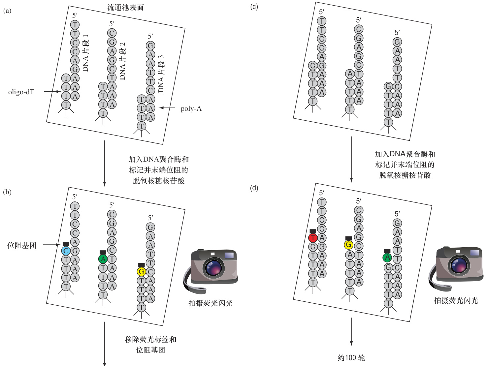  
图11.24　一种高通量、单分子DNA测序方法。（a）数百万个单链基因组DNA片段（在3′端用酶催化添加poly-A）与附着在称为流通池的特殊微阵列表面上的寡胸腺嘧啶（oligo-dT）分子杂交。（b）以基因组片段作为模板，以oligo-dT作为引物，用DNA聚合酶合成新DNA，其中含有用可发光、碱基特异荧光标签标记的核苷酸。这些核苷酸在其3′端被封闭，因此一次只能加入一个核苷酸。（c）高分辨率照相机对这些荧光进行拍摄后，填入到流通池的化学物质从刚刚添加的核苷酸中移除标签和位阻基团。（d）每个后续循环开始于给流动池注入新剂量的标记核苷酸和聚合酶，然后重复步骤（c）。在单分子DNA合成的数百万个点中，测序仪需要拍摄大约100张图片来记录一系列的彩色点变化。计算机将数据重新排列成数百万个长约100个核苷酸的短序列读数，然后组装基因组序列。  

尽管存在这些问题，研究人员已经能够整合几类数据分析的结果，在某些时候仅凭灵光一现，找到了越来越多的疾病基因。在本节中我们重点介绍遗传学家用于识别全基因组/外显子组序列中致病突变的线索类型。但是要牢记，这些方法不是总能够成功的（至少现在不是）。  

# 1. 来自疾病传播模式的线索  

进行全基因组或全外显子组测序的基本逻辑，是要求作为疾病等位基因的DNA变异在群体中是罕见的。这一基本假设使科学家能够预测患者基因组中的哪些变异可能导致疾病。这些预测取决于由系谱获得的疾病遗传信息：疾病等位基因是显性或显性？是性染色体连锁还是常染色体？外显率是完全还是不完全？这些遗传模式中，每一种仅与候选基因座的特定分子基因型一致。  

在罕见的显性病症中，患者的致病等位基因很可能是杂合的。相关患者应具有相同的罕见突变等位基因，而无关患者可能在同一基因中具有不同的突变［图11.25（a）］。如果疾病是隐性的，遗传学家首先会将注意力集中在患者基因组中纯合的罕见突变上，特别是当父母与疾病表型无关时。如果病情是隐性的并且父母无相关症状，那么患者反而可以是复合杂合子，在相同基因上有两个不同的突变等位基因［图11.25（b）］。为了检查后一种情况，基因组学家会在患者的DNA中查找受两种不同突变影响的基因。最后，如果遗传模式表现出性别连锁，候选基因将仅限于X染色体；如果是常染色体连锁，则排除X染色体。  

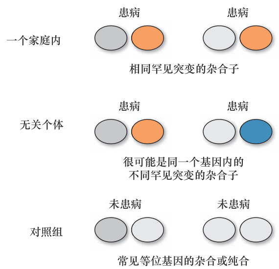  
(a)            SNP   
(b)            SNP  

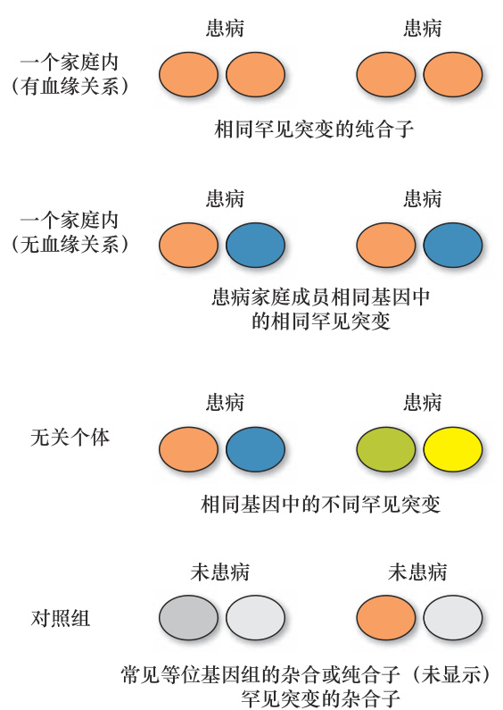  

图11.25　SNP模式与遗传性状一致。每个椭圆代表一个基因的拷贝，因此每个人对应两个椭圆。常见的突变用不同的灰色标记；橙色、蓝色、黄色或绿色表示同一基因中不同的罕见变异。（a）可能导致显性特征的变异。在一个家庭中，患病个体将是同一种罕见突变的杂合子。无关的患病个体可能是同一基因中不同罕见突变的杂合子。（b）可能导致隐性特征的变异。在血缘关系的家庭成员汇总中，受影响的个体将是纯合子，因为他们从一个最近的共同祖先的后代中继承了一个纯和突变。无遗传关系人群的患病儿童最有可能是复合杂合子，他们在同一基因中从父母处各继承了一个不同的罕见突变。在（a）和（b）中，正常对照人群可能相关也可能不相关。  

来自患者亲属的DNA序列信息在筛选候选多态性列表时特别有用。例如，本章前面所讨论的，使用微阵列对亲属进行SNP基因分型，可以将搜索范围缩小到两个已知SNP之间的区域。疾病基因鉴定方法中，定位克隆和全基因组测序并不是互斥的方法；相反，它们可以提供补充信息。一种更好的方法是，可将患者的全基因组或外显子组序列与父母和（或）同胞兄弟姐妹的序列进行比较，尽管该过程费用更高。  

最近的研究案例阐述了来自遗传相关个体的DNA序列信息在查找致病位点时的强大作用（图11.26）。一对弟弟和妹妹患有米勒综合征，这是一种影响面部和四肢发育的罕见疾病，但父母双方都没有受到影响［图11.26（a）］。这表明（但未证实）米勒综合征是一种隐性常染色体疾病，两个孩子从其杂合亲本携带者中继承突变的等位基因。为了找到米勒综合征致病基因，研究人员对父母和两个孩子的全基因组进行了测序；事实上，这是历史上第一次对核心家族所有成员的全基因组进行测序。  

图11.26（b）显示了这一庞大数据集的一部分的图形摘要，显示了在减数分裂期间，母亲和父亲仅在两条染色体上发生重组，产生配子，从而导致受影响的儿童。假设米勒综合征是隐性遗传，因此预测其致病基因将位于该区域：患病儿女与父母共享相同等位基因（图中标记为“一致”区域）。因此，研究该疾病的遗传学图11.26　第一个具有全基因组测序的家族。（a）米勒综合征系谱。（b）图谱显示患病儿童中16号染色体和17号染色体的等位基因遗传情况。在“一致”区域内，患病的同胞姐弟共享相同的母系和父系来源的等位基因。在“非一致”区域中，同胞姐弟不共享等位基因。在母供体半相合区域，同胞姐弟具有来自母亲的相同等位基因，而与父亲的等位基因不同。在父供体半相合中，兄弟姐妹与父亲共有一个共享等位基因，但与母亲的等位基因不同。如果米勒综合征是隐性的，那么致病的基因应位于“一致”区域内。当发现16号染色体上DHOD基因的突变导致该疾病时，该预测得以被证实。  

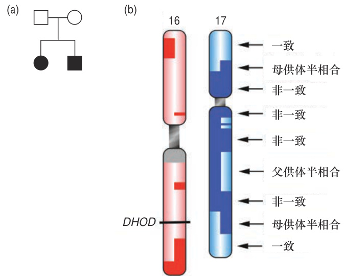  

家可能只需关注大约 $25\%$ 的基因组［图11.26（b）］。  
我们将在本章后面描述这项研究的结果。  

# 2. 通过预测变异对基因功能的影响而获得线索  

研究人员首先尝试在外显子组中的蛋白质编码区寻找引起疾病的突变，因为基因组的这些部分最容易查看：编码区域仅占总基因组的一小部分，编码区域的改变是最直接被解读的。特别是，研究人员寻找两种低频多态性：改变氨基酸序列（即导致错义突变的SNP）或改变阅读框架（引起无义或移码突变的SNP、DIP或SSR）。大多数无义突变、移码突变及一些错义突变是非同义DNA多态性，通过改变蛋白质功能进而影响表型。相反，沉默突变（改变密码子不会影响氨基酸序列）不会影响表型，因此，这些匿名SNP被丢弃。  

外显子中的突变引起的特定遗传疾病的这个假设并非总是成立。一些遗传疾病不是由氨基酸序列的改变引起的，而是由生物体产生的蛋白质的含量改变引起的。外显子组外的基因组区域中，某些突变可以降低或阻止基因的转录，或者降低或阻止其初级转录物的剪接。这两种情况都会降低基因编码的蛋白质产物的含量，甚至阻止其合成。如果研究人员只把注意力集中在外显子组上，就永远不会发现这种突变。不幸的是，我们对调控转录或剪接的DNA序列知之甚少，即使患者的全基因组序列可用，许多此类区域的突变也会被忽视。  

# 3. 来自已鉴定的基因组序列的线索  

罕见疾病不太可能由人群中常见的变异引起。因此，已经在数据库中记录为常见的变异通常不会是致病突变的候选者。相反，患有相似或至少隐约相关症状的不同患者，可能共享相同的罕见突变或在同一基因中具有不同的罕见突变。  

其他生物的基因组也为探查筛选指明正确的方向。例如，设想在进化过程中十分保守的基因，其蛋白质产物中的某些氨基酸在多物种（如人和果蝇）比较时是不变的。保守性表明这些特殊的氨基酸在蛋白质功能中起着至关重要的作用。如果你发现患者中存在一种罕见变异，能够将这种高度保守的氨基酸改变为不同的氨基酸，则该突变将是一个强有力的变异，因为它可能会影响表型。  

# 11.5.3 精确定位疾病基因需要综合使用各种方法  

本章的开头介绍了Nic Volker的病例，Nic Volker是首批通过个体外显子组测序鉴定疾病基因并成功治疗遗传性疾病的患者之一。当Nic的DNA在2009年被研究时，测序仍然相对昂贵，因此研究人员只测序了Nic的外显子组，而不是他的全基因组或他父母或同胞兄弟姐妹的外显子组/基因组。表11.2调查了遗传学家如何分析  

Nic的外显子组，并利用许多信息来源将候选突变缩减为最终的一个致病突变。  

相对于人类标准RefSeq参考序列，Nic的外显子组包含约16 000个变异（表11.2）。这些变异主要是SNP，但也发现了一些DIP和SSR。研究人员首选通过排除外显子中可能的同义突变（即密码子中的沉默突变，或位于mRNA的5′和3′UTR序列中的突变）来筛选此列表。接下来，他们将注意力集中在以前没有记录于数据库中的新突变上，这样就忽略了已知存在于正常个体基因组中的常见变异。接下来是筛选列表中与X连锁或隐性遗传一致的突变，因为这些突变最有可能只影响Nic患病而不影响其父母或其他亲属。  

此时，Nic病情的“精选”疾病基因候选名单已缩小至136个突变（表11.2）。研究人员现在采用了进化方法，查看这些变化是否会改变许多不同物种中严格保守的氨基酸的一致性。分析的倒数第二步是核对存在于数据库中已知基因的剩余候选位点，该类基因在一般人群中从不或者偶尔失活（如无义或移码突变导致）。这一步骤背后的想法是忽略许多正常个体中有缺陷的基因，因为其不太可能影响疾病表型。  

表11.2　在Nic Volker的基因组中寻找致病突变  

<html><body><table><tr><td>分析步骤</td><td>剩余候选变异</td></tr><tr><td>Nic的全外显子序列</td><td>16124</td></tr><tr><td>筛选能够导致氨基酸变化的错义突变</td><td>7157</td></tr><tr><td>筛选未被数据库报道的新变异</td><td>878</td></tr><tr><td>筛选X染色体连锁变异或在全外显子中呈现隐性 模式的变异</td><td>136</td></tr><tr><td>筛选能够改变进化保守氨基酸序列的变异</td><td>35</td></tr><tr><td>筛选基因上人群中低频发生的变异</td><td>5</td></tr><tr><td>筛选位于某些基因内的突变，该基因已知在某些 相关的其他遗传疾病中发生突变</td><td>1(XIAP)</td></tr></table></body></html>  

研究人员的目标列表中仍有5个候选变异。研究人员意识到其中一个候选突变位于一个名为XIAP的基因中。已知XIAP中的其他突变会引起称为X连锁淋巴组织增生性疾病（XLPD）的严重症状，患者血液中含有过多的淋巴细胞（免疫系统中的白细胞），挤占携氧的红细胞并损坏肝脏。这些症状与Nic的非常不同，但XLPD与Nic的病例有一些模糊的关联，因为免疫系统明显与胃肠道炎症有关。  

当注意到位于Nic的XIAP基因中的变异是错义突变，而且该突变导致一个在多物种（人、青蛙、果蝇和许多其他物种）中完全保守的氨基酸发生变化时，研究人员变得特别兴奋（图11.27）。同一基因中引起XLPD的突变反而是无义突变和移码突变，其可以阻止全长蛋白质的合成，这可能解释了为何Nic的症状与XLPD患者不同。  

<html><body><table><tr><td></td><td colspan="9">195 200</td><td colspan="7">205 210</td></tr><tr><td>Nic的XIAP蛋白</td><td>G</td><td>D</td><td>Q</td><td></td><td>Q</td><td>C</td><td>F</td><td>C Y</td><td>G</td><td>G</td><td>K</td><td>L</td><td>K</td><td>N</td><td>W</td><td>E</td></tr><tr><td>人</td><td>G</td><td>D</td><td>Q</td><td></td><td>Q</td><td>C</td><td>F</td><td>C C</td><td>G</td><td>G</td><td>K</td><td>L</td><td>K</td><td>N</td><td>W</td><td>E</td></tr><tr><td>黑猩猩</td><td>G</td><td>D</td><td>Q</td><td>V</td><td>Q</td><td>C</td><td>F</td><td>C</td><td>C</td><td>G G</td><td>K</td><td>L</td><td>K</td><td>N</td><td>W</td><td>E</td></tr><tr><td>小鼠</td><td>D</td><td>D</td><td>Q</td><td></td><td>Q</td><td>C</td><td>F</td><td>C</td><td>C</td><td>G G</td><td>K</td><td>L</td><td>K</td><td>N</td><td>W</td><td>E</td></tr><tr><td>狗</td><td>D</td><td>D</td><td>Q</td><td></td><td>Q</td><td>C</td><td>F</td><td>C</td><td>C</td><td>G</td><td>G K</td><td>L</td><td>K</td><td>N</td><td>W</td><td>E</td></tr><tr><td></td><td>D</td><td>D</td><td>Q</td><td></td><td>Q</td><td>C</td><td>F</td><td>C</td><td>C</td><td>G</td><td>G</td><td>K</td><td>L K</td><td>N</td><td>W</td><td>E</td></tr><tr><td>牛鸡</td><td>D</td><td>D</td><td>Q</td><td></td><td>Q</td><td>A</td><td>F</td><td>C</td><td>C</td><td>G</td><td>G</td><td>K</td><td>L K</td><td>N</td><td>W</td><td>E</td></tr><tr><td>斑马鱼</td><td>D</td><td>D</td><td>N</td><td></td><td>Q</td><td>C</td><td>F</td><td>C</td><td>C</td><td>G</td><td>G</td><td>G</td><td>L S</td><td>G</td><td>W</td><td>E</td></tr><tr><td>青蛙</td><td>R</td><td>D</td><td>H</td><td></td><td>K</td><td>C</td><td>F</td><td>H</td><td>C</td><td>D</td><td>G G</td><td></td><td>L R</td><td>N</td><td>W</td><td>E</td></tr><tr><td>果蝇</td><td>L</td><td>D</td><td>H</td><td>V</td><td>K</td><td>C</td><td>V</td><td>W</td><td>C</td><td>N</td><td>G</td><td>V</td><td>I A</td><td>K</td><td>W</td><td>E</td></tr></table></body></html>  

图11.27　XIAP蛋白中保守氨基酸的突变。XIAP蛋白的  
$195\!\sim\!211$ 位氨基酸以单字母代表。与人RefSeq 中XIAP蛋白序  
列（第二行）相比，Nic Volker的XIAP（第一行）在第203位  
的半胱氨酸（C）被酪氨酸（Y）取代。在检查的所有其他物  
种中，在该位置仅发现半胱氨酸，表明Nic基因组中的该突变可能改变XIAP功能。  

虽然这些大量的生物信息学分析并未证明XIAP变异导致Nic的症状，但该突变是符合表11.2中检验的所有标准的最好的候选突变。更重要的是，如果这种鉴定是正确的，Nic的疾病可能是可治疗的，这意味着可以做些什么来缓解他的病情。也许可以采用一种已知用于帮助XLPD患者的方法进行治疗，即用新生儿脐带血进行骨髓移植。理论上，这种治疗可以使Nic具有自我更新的干细胞，并连续产生正常的淋巴细胞。在移植手术的一年内，Nic的病情明显改善（见图11.3）。  

# 11.5.4 人类遗传学研究是一项持续进行的尝试  

基于从全外显子组/基因组测序中收集到的信息使得越来越多的患者的病症得以改善，Nic Volker的例子正是其中之一。但这些研究的结果并不总是如此有帮助。例如，采用类似于Nic案例中的生物信息学过滤器，研究人员能够确定导致米勒综合征的突变，这些突变影响了先前在图11.26中显示的兄弟姐妹。该姐弟从他们的母亲那里继承了DHOD基因中的一个突变，并从他们的父亲那里继承了DHOD基因的一个突变，即他们是复合杂合子。遗憾的是，米勒综合征致病基因的鉴定在提示任何治疗方面都起不到作用。然而，DHOD是米勒综合征致病基因的这一知识，可以在未来帮助这些患者做出生殖决策。如果他们的伴侣没有携带DHOD突变，他们的孩子将不会受到影响。  

许多其他情况下，全基因组序列甚至还无法让研究人员识别致病突变。也许这种突变位于序列中测序覆盖不好的区域；也许突变位于编码蛋白质的外显子组之外的区域，其功能尚未确定；也许研究人员在其生物信息学分析的某个步骤中做出了不正确的（即使是合理的）假设。  

从Nic的故事中得到的一个体会是数据库和共享信息的重要性。鉴定其致病突变的关键步骤取决于对来自许多其他人基因组中的变异的了解，包括未患该疾病的对照人群和受其他遗传症状影响且与目的患者几乎无表型相似性的个体。因此，人类遗传学的实践是一个巨大的“自展开”的操作：测序的基因组越多，可用于帮助分析所有新基因组的信息就越多。因此，人类遗传学的进步要求数据库保持最新，并且使用常用的归档方法允许所有研究人员访问其中的大量信息。允许这种程度的访问，同时维护收编的个体全基因组信息的机密性，是未来的重大挑战。  

用于研究人类遗传学的最重要的数据库之一被称为人类孟德尔遗传在线数据库（OMIM；www.omim.org）。OMIM是人类基因及其控制性状的目录。该数据库列出了与特定疾病或其他性状相关的人类基因中的已知变异，并提供了关于这些变异的已发表研究文章的链接。由于每天更新最新的研究结果，对于类似尝试找出Nic Volker症状的遗传致病因素的研究人员来说，OMIM数据库是一个非常宝贵的资源。这个在线数据库非常有用且易于使用，我们鼓励你自己探索它。  

# 基本概念  

●  高通量技术允许对数百万个DNA分子进行平行测序。这些新方法正在迅速降低全外显子组和全基因组测序的成本。●  从区分个体基因组的许多DNA变异中发现致病突变的过程，涉及信息的有序过滤。这些步骤可能涉及：推测可能的传播模式，亲属基因组分析，相似遗传疾病的知识，预测变异对蛋白质功能的影响。  

# 接下来的内容  

在本章及第9章和第10章中，我们研究了基因组中的核苷酸含量，特别是在每个正常人二倍体细胞中组成46条染色体的60亿个核苷酸。在接下来的几章中，我们将研究染色体的特征，这些特征允许DNA序列正常发挥作用，并从一代传给下一代。  

我们从考虑DNA序列的巨大复杂性开始，DNA实际上只占染色体总质量的1/3。染色体的其余部分由成千上万种不同类型的蛋白质组成，这些蛋白质帮助组装和管理DNA携带的信息。这些蛋白质有许多作用。某些蛋白质有助于使染色体紧贴细胞核，一些蛋白质确保染色体DNA在每个细胞周期中被适当复制，而另一些则控制染色体在子细胞中的分布。此外，其他蛋白质负责调节基因对转录机制的可用性，从而使基因可以被表达为蛋白质。在第12章中，我们研究蛋白质如何与DNA相互作用以发挥染色体的复杂功能。  

Ⅰ.  一个来自女性血液细胞的基因组DNA，通过一对代表基因组中独特基因座的引物进行PCR扩增。然后使用PCR引物中的一个作为测序引物对PCR产物进行Sanger法测序。下面的峰图显示了部分读取序列。  

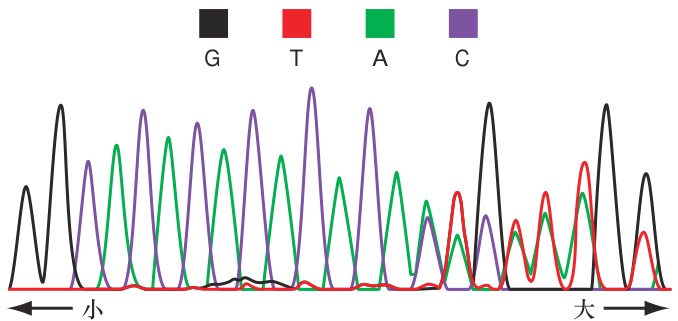  

a. 哪种多态性最有可能被表示出来？  
b.  根据你对题目a的回答，确定该女性在这个基因座的基因型。指出所有可以从等位基因及其 $S^{\prime}{\longrightarrow}3^{\prime}$ 方向读取的核苷酸。  
c. 什么样的分子事件可能产生这种多态性？  
d.  如何知道在基因组的哪个位置可以找到这个基因座？  
e.  还有什么方法可以分析PCR产物来对这个基因座进行基因分型？  
f.  假设你想根据图9.24所示的单分子DNA全基因组测序对这个基因座进行基因分型。用这种方法进行基因分型，只测一遍就够了吗？  

# 解答  

为了解决这个问题，你需要明白PCR将同时扩增一个基因座的两个拷贝（一个在母系衍生的染色体上，另一个在父系衍生的染色体上），只要引物能像通常情况一样与两个同源基因杂交。DNA序列追踪发现在几个位置有两个核苷酸。这一事实表明，该妇女应该是一个杂合子，PCR扩增了这两个等位基因的基因座。  

a.  注意，这两个等位基因包含多个 CA 重复序列。因此，关于多态性最有可能的解释是，该基因座包含 SSR 多态性，其等位基因具有不同数量的CA 重复。一个等位基因有 6 个重复，第二个等位基因必须有更多的 CA 重复。  

b.  写出两个等位基因的前 14 个核苷酸是很简单的。如果题目 a. 的假设是正确的，那么一个等位基因应该有超过 6 个的 CA 重复。追踪显示在一个等位基因的 $15\sim18$ 位有 2 个额外的 CA 重复，因此共 8 个 CA 重复。  

然后，你可以通过从 $15\!\sim\!18$ 位减去CACA来确定短等位基因中重复序列以外的核苷酸。在这些位置的剩余峰对应于ATGT。值得注意的是，ATGT也可以在较长的等位基因中发现，但现在是核苷酸 $19\!\sim\!22$ 位，刚刚经过两个额外的CACA重复。你可以通过从 $19\!\sim\!22$ 位减去ATGT来确定短等位基因的最后四个核苷酸，这就得到了TAGG。这样的SSR基因座的两个等位基因的序列（仅指示一条DNA链）是这样的：  

等位基因1：5′...GGCACACACACACAATGTTAGG...3′等位基因2：5′...GGCACACACACACACACAATGT...3′c.  大多数SSR多态性的发生机制被认为是DNA聚合酶在DNA复制过程中的残留痕迹。  

d.  你甚至在开始实验之前就知道了这个基因座的位置。这是因为你基于对整个人类基因组序列的认识设计PCR引物。  

e.  多态性涉及重复单元数目的差异，因此这两个等位基因会产生长度不同的PCR产物。你可以通过PCR产物的凝胶电泳对该基因座进行基因型，如图11.12所示。  

f.  从基因组DNA中直接对PCR产物进行桑格测序，可以得到包含两个等位基因的峰图。单分子DNA测序技术并非如此。如果一个人是杂合子，你需要从单个基因组DNA分子中获得足够的序列来确保你能同时看到两个等位基因。  

Ⅱ.  由于家庭规模小，很难获得准确的人类重组频率。一个有趣的方法能绕过这个问题，通过研究个体基因型的精子细胞，以获得大数据集的连锁研究。下表显示了一名男子为这项研究提供的20个单精子的4个SNP基因座的基因型。通过PCR扩增的4个SNP基因座的微阵列分析确定基因型。表中A、C、G、T为SNP的等位基因（即单链上的核苷酸），短线（—）表示从样本中没有扩增出与该基因座对应的DNA。  

<html><body><table><tr><td>SNP 精子数量</td><td>基因座1</td><td>基因座2</td><td>基因座3</td><td>基因座4</td></tr><tr><td>1</td><td>G</td><td>C</td><td>一</td><td>T</td></tr><tr><td>2</td><td>G</td><td>A</td><td>G</td><td>C</td></tr><tr><td>3</td><td>G</td><td>C</td><td>G</td><td>C</td></tr><tr><td>4</td><td>G</td><td>C</td><td>G</td><td>T</td></tr><tr><td>5</td><td>G</td><td>A</td><td>一</td><td>C</td></tr><tr><td>9</td><td>G</td><td>C</td><td>一</td><td>T</td></tr><tr><td>7</td><td>G</td><td>A</td><td>G</td><td>C</td></tr><tr><td>8</td><td>G</td><td>A</td><td>一</td><td>C</td></tr><tr><td>6</td><td>G</td><td>A</td><td>G</td><td>T</td></tr><tr><td>10</td><td>G</td><td>C</td><td>一</td><td>T</td></tr><tr><td>11</td><td>G</td><td>C</td><td>一</td><td>T</td></tr><tr><td>12</td><td>G</td><td>C</td><td>D</td><td>T</td></tr><tr><td>13</td><td>G</td><td>A</td><td>一</td><td>C</td></tr><tr><td>14</td><td>G</td><td>A</td><td>一</td><td>C</td></tr><tr><td>15</td><td>G</td><td>C</td><td>D</td><td>T</td></tr><tr><td>16</td><td>G</td><td>A</td><td>D</td><td>C</td></tr><tr><td>17</td><td>G</td><td>C</td><td>一</td><td>T</td></tr><tr><td>18</td><td>G</td><td>A</td><td>一</td><td>T</td></tr><tr><td>19</td><td>G</td><td>A</td><td>G</td><td>C</td></tr><tr><td>20</td><td>G</td><td>C</td><td>G</td><td>T</td></tr></table></body></html>  

a. 哪些SNP基因座可以被X连锁？  
b. 哪些SNP基因座在Y染色体上？  
c. 哪些SNP基因座一定在常染色体上？  
d.  对于任何常染色体SNP基因座，捐献者的精子在体细胞组织中的基因型是什么？  
e. 是否有SNP基因座相互连锁？  
f. 任何两个相连的SNP基因座之间的距离是多少？  

# 解答  

PCR的SNP分析是非常敏感的，单个精子细胞中存在的单个等位基因可以被检测出来，这为研究人员提供了相当多的信息。还需记住，一个人的体细胞有两个常染色体副本，一个X染色体，一个Y染色体。每个精子都有一个常染色体和X或Y染色体的副本。  

a.  对于任何与X染色体连锁的SNP基因座，一半的精子细胞将携带相同的SNP等位基因，但另一半精子将没有X染色体，因此不会产生PCR产物。3号基因座显示了这种模式。  
b.  类似地，Y染色体上的一个基因座只会在一半的精子中找到，而且所有这些精子都有相同的等位基因。3号基因座同时也是Y连锁SNP的候选基因座。这些数据使得我们不能对3号基因座的X染色体或Y染色体位置进行区分。  
c.  对于常染色体SNP基因座，所有的精子都有一个基因座的拷贝。基因座1、2和4是常染色体。  
d.  如果一个人是一个常染色体SNP基因座的单一等位基因纯合子，那么他产生的所有精子都会有这个等位基因。如果他是两个不同等位基因的杂合子，大约一半的精子将有一个等位基因，而另一半的样本将携带另一个等位基因。那么，这个人的常染色体基因型是：SNP基因座1，GG（纯合子）；SNP基因座2，CA（杂合）；SNP基因座4，CT（杂合性）。  
e.  连锁基因座的等位基因在超过 $50\%$ 的情况下会一起分离（最终形成同一个精子）。这适用于SNP基因座2的C等位基因和基因座4的T等位基因。互反等位基因（A代表基因座2，C代表基因座4）在分离过程中也常常在一起。SNP基因座2和4是连锁的。  
f.  精子3、9和18在2号和4号基因座有等位基因重组的迹象。20个或 $15\%$ 的精子中有3个是重组的。因此，2号基因座和4号基因座之间的距离为15cM。  

# 习题  

# 词汇  

1. 从右列中选择与左列中的术语最匹配的短语。  

a. DNA多态性 1. 由短串重复序列组成DNA  
b. 相位 2.  来自不同个体的两个不同的核苷酸出现在基因组DNA的同一位置  
c. 可获信息杂交 3.  二倍体中两个连锁基因的等位基因的排列  
d.  等位基因特异性 4.  染色体上的位置寡核苷酸分析法  
e. 单核苷酸多态性 5.  以两种或两种以上形式出现的DNA序列  
f. DNA指纹 6.  一个短的寡核苷酸，在选择的SNP基因座上只与一个等位基因杂交  
g. 简单序列重复 7.  在一些非连锁高度多态性基因座的基因型检测  
h. 基因座 8.  识别一个配子是重组的还是非重组的鉴定  
i. 复合杂合子 9. 基因组中的所有外显子  
j. 外显子组 10. 同一基因有两种不同突变的个体  

# 11.1节  

2.  你认为匿名DNA多态性的遗传模式是隐性的、显性的、不完全显性的还是共显性的？  

3.  是否更容易在蛋白质编码或人类基因组的非编码DNA中发现单核苷酸多态性（SNP）？  

4.  最接近对SNP基因座碱基替换率的估计是每个配子$1\times{10}^{-8}$ 个核苷酸对。a.  根据这个估计，你自己的基因组中有多少新基因突变（也就是说，在你父母的基因组中没有发现的突变）？b.  你的基因组最有可能在何时何地发生这些从头到尾的突变？c.  据计算，25岁男性体内的每一个精子从受精卵的第一次有丝分裂开始都进行了平均300次的细胞分裂。相比之下，在一个5个月大的女性胎儿体内发现每个成熟的卵母细胞从受精卵的第一次有丝分裂开始都进行了大约25次分裂。这些对人类碱基替换率的估计对于你回答题目b有什么影响？  

5.  如果你仔细观察图11.5，你会注意到在某些区域，如核苷酸116 870K和116 890K之间，James Watson和Craig Venter共享相同的SNP，而这些区域周围的其他区域中，这两个人没有共享任何SNP。这个事实说明了这两个人之间的关系，你认为这种共享和未共享SNP的模式是如何产生的？  

6.  迄今为止，在对数千个人类基因组进行测序之后，大约记录了5000万个SNP。a.  在这几千人的基因组中有多少碱基对是相同的？b.  你认为在人类中还有其他的SNP吗？如果是这样，为什么它们还没有被找到？c.  迄今发现的SNP多态性几乎都是双等位的；也就是说，在迄今为止所研究的种群中的所有基因组中，只能找到两个可能的等位基因（例如，A和C）。提供可在同一组人群中发现的三等位基因SNP基因座数量的粗略估计（即具有三种不同等位基因的基因座数量——例如，A、C和T）。在迄今为止研究的人类基因组中，所有四种可能的核苷酸能找到多少个基因座？  

7.  简单序列重复（SSR）基因座的突变频率为每个配子每个基因座为 $1\times{10}^{-3}$ ，远远高于SNP基因座的碱基替换率（其频率约为每个配子 $1\times{10}^{-8}$ 个核苷酸对）。  

a. SSR多态性的本质是什么？  
b. 这些SSR多态性可能是通过什么机制产生的？  
c.  拷贝数变异（CNV）的变异频率也相对较高。这些突变是通过与产生SSR相同还是不同的机制发生的？  
d.  SSR突变率远远高于新SNP的突变率。那么，为什么遗传学家在人类基因组中记录了超过5000万个SNP基因座，而只有大约10万个SSR基因座呢？  

8.  人类和大猩猩在1000万年前拥有共同的祖先。人类和黑猩猩上一次拥有共同的祖先是在大约600万年前。下表显示了两个大猩猩配子、三个黑猩猩配子和三个人类配子的基因组区域。a.  如图11.6（b）所示，画一个与图11.6（b）相似的图，以显示三个物种之间的进化关系。b.  这些数据揭示了这8个基因组中的6个多态性，在位置2（A或G）、3（A或T）、4（G或T）、7（C或T）、8（C或T）和9（G或T）。在你的基因分型图上，注明产生这些多态性突变大概发生的时间。对于每一个等位基因，说明它是祖先的，衍生的，还是你不能分辨的。c.  推断 $\cdot\mathbb{O}$ 人类和黑猩猩最后的共同祖先， $\textcircled{2}$ 三个物种最后的共同祖先。使用问号（？）来表示任何不确定性。  

<html><body><table><tr><td>基因组 （单倍体）</td><td>大猩猩</td><td>黑猩猩</td><td>人</td></tr><tr><td>1</td><td>CATGTCCTGA</td><td>CGAGTCCTGA</td><td>CAAGTCCTGA</td></tr><tr><td>2</td><td>CATGTCCTTA</td><td>CAAGTCCTGA</td><td>CAATTCCTGA</td></tr><tr><td>3</td><td></td><td>CAAGTCCCGA</td><td>CAATTCTTGA</td></tr></table></body></html>  

9.  在2015年，一个国际科学家小组收集了两种不同长毛猛犸象的完整基因组序列。两个标本都被发现埋藏在西伯利亚冻土区，这里是地球上最冷的地方。通过放射性碳年代测定法，在西伯利亚海岸弗兰格尔岛上发现的猛犸象之一死于4000年前；在奥米亚康镇发现的另一头猛犸象死于大约45 000年前。  

分析表明，这两种动物的基因组序列在碱基对的分布上存在显著差异，在碱基对上它们是纯合子或杂合子。弗兰格尔岛长毛象的纯合性（ROH）极其过剩，在这些区域中，长毛象的所有碱基对都是纯合的。弗兰格尔岛大约 $23.4\%$ 的动物基因组是由长度超过500kb的ROH组成的；其中一些ROH的长度超过了5Mb。相比之下，只有 $0.83\%$ 的奥米亚康动物的基因组由超过500kb的ROH组成。  

a.  解释在测序基因组时如何检测多态性。研究人员如何知道，对于任何特定的碱基对，基因组是否是纯合的或杂合的。  
b.  弗兰格尔岛猛犸象基因组中过量的ROH表明了什么？  
c.  弗兰格尔岛的猛犸象被认为是地球上最后一个物种，在4000年前灭绝。题目b的答案为猛犸象的灭绝提供了一个可能的原因。请解释一下。  

# 11.2节  

0.  使用PCR扩增技术，你想从一个患有常染色体隐性遗传苯丙酮尿症（PKU）的患者的基因组DNA中，扩增一个大约1kb的常染色体基因外显子，该基因编码苯丙氨酸羟化酶。a.  在人类基因组序列已经确定的情况下，为什么要首先进行PCR扩增呢？b.  计算模板分子的数量，如果你建立一个PCR反应，使用从血细胞中提取的1ng（ $1\times10^{-9}\mathrm{g}$ ）的染色体DNA作为模板。假设每个单倍体基因组只包含一个苯丙氨酸羟化酶基因，一个碱基对的分子量是 $660\mathrm{g/mol}$ 。单倍体人类基因组包含 $3\times10^{9}$ 个碱基对。c.  计算进行25个PCR循环，你将获得的PCR产物分子的数量，每个循环的产量正好是前一个循环的两倍。这些PCR产物加在一起的质量是多少？  

11.  下列哪一组引物可以用来扩增以下靶DNA序列，  

CFTR基因的最后一个蛋白编码外显子是哪一部分？$5^{\prime}$ GGCTAAGATCTGAATTTTCCGAG ... TTGGGCAATAATGTAGCGCCTT $3^{\prime}$ $3^{\prime}$ CCGATTCTAGACTTAAAAGGCTC ... AACCCGTTATTACATCGCGGAA $5^{\prime}$ a. $5^{\prime}$ GGAAAATTCAGATCTTAG $3^{\prime}$ ；$5^{\prime}$ TGGGCAATAATGTAGCGC $3^{\prime}$ b. $5^{\prime}$ GCTAAGATCTGAATTTTC $3^{\prime}$ ；$3^{\prime}$ ACCCGTTATTACATCGCG $5^{\prime}$ c. $3^{\prime}$ GATTCTAGACTTAAAGGC $5^{\prime}$ ；$3^{\prime}$ ACCCGTTATTACATCGCG $5^{\prime}$ d. $5^{\prime}$ GCTAAGATCTGAATTTTC $3^{\prime}$ ；$5^{\prime}$ TGGGCAATAATGTAGCGC $3^{\prime}$  

12.  前面的问题提出了几个关于PCR引物设计的有趣问题。  

a.  你怎么能确定你选择的两个18个核苷酸长度的引物只会扩增CFTR基因的一个外显子，而不会扩增来自人类基因组DNA样本的其他区域？  
b.  PCR引物一般至少有16个核苷酸组成。为什么你认为下限大约是16？  
c.  假设你的习题11答案中的一个引物与某个特定个体的基因组DNA中的一个碱基不匹配。如果错配发生在引物的5′端或3′端，你更有可能从这个基因组DNA中获得PCR产物吗？为什么？  

14.  你从一个人的基因组中扩增出一个PCR产物，然后你看到一个双峰，如图11.11（b）所示。大多数情况下，这个结果表明这个人在那个位置的SNP是杂合子。但也有可能是由于PCR过程中DNA复制的错误造成的扩增，DNA聚合酶错误地掺入了错误的核苷酸。  

a.  如果你在序列图中看到一个人为的双峰，那么错误是发生在前几个循环PCR扩增中还是最后几个循环？  
b.  但也有可能是由于DNA聚合酶在PCR扩增过程中的错误，DNA聚合酶错误地掺入了错误的核苷酸。  
c.  不管你是否看到双峰，在PCR扩增的前几个循环中或鉴于PCR扩增过程中可能出现的错误，你能做些什么来确定一个人的基因型，如果你做胚胎植入前基因分型，为什么这种程度的确定性难以实现？  
d.  PCR依赖于生长在温泉中的嗜热细菌的热稳定性DNA聚合酶。最初用于PCR的DNA聚合酶来自水草杆菌，缺乏在其他DNA聚合酶（如大肠杆菌）中发现的 $3^{\prime}{\rightarrow}5^{\prime}$ 的外切酶（参见图7.9）。为什么科学家们现在最常使用来自另一种嗜热细菌的DNA聚合酶（火球菌），其含有核酸外切酶功能吗？  

13.  你想要制造一个重组DNA，其中从人类基因组扩增出的PCR产物被插入质粒载体。该载体的多聚体包括酶EcoRI（ $5^{\prime}$ G^AATTC $3^{\prime}$ ）和BamHI（ $5^{\prime}$ G^GATCC$3^{\prime}$ ）的识别位点（^代表DNA中的切割部位）。扩增DNA片段的PCR引物为： $5^{\prime}$ GCTACTTCGCGTATTCCA3′和5′ CCCAAGTCCTAGCCGATA $3^{\prime}$ 。  

a.  详细描述这些引物需要如何修改，以创建一个人类基因组片段，其两侧是EcoRI黏性末端，以便该片段可以轻松地克隆到质粒载体上。你需要考虑的事实是，大多数限制性内切核酸酶，包括EcoRI，如果限制酶酶切位点直接位于DNA分子的末端则不能切割DNA；限制性内切核酸酶识别位点必须距离末端至少有6个碱基对。  

b.  请描述人类基因组中PCR扩增区域的一个潜在特征，该特征可能阻止你使用（a）部分中描述的策略。  

15.  习题8显示了同一常染色体在人群中的三个不同的序列。这些序列都来自单个染色单体。你知道这是真的，因为PCR扩增来自于单个的单倍体配子。如果你想从体细胞中通过PCR扩增基因组DNA来获得相同的信息，问题可能会更复杂一些，因为起始细胞是二倍体。因此，每一个要测序的PCR产物实际上都是从两条同源染色体中扩增出来的。通过分析最少两个人的体细胞基因组DNA（如果他们碰巧是正确的人），你仍然可以验证习题8中所示的三种不同的单倍体序列的存在性。  

a.  指出两个人的二倍体基因型，你可以从他们身上识别出这三种不同的单倍体序列。占序列中所有10个核苷酸的比例。有三个可能的正确答案，你只需要展示一个。  
b.  如果你从一个具有特定基因型的人的体细胞基因组DNA中利用PCR扩增出DNA，你将不能得出他们的基因组包含这三个序列中的任何一个的结论。这个人的基因型是什么？解释为什么你不能得出这个结论。  

16.  通过PCR扩增6例亨廷顿病患者基因座（ $H D$ ）的三核苷酸重复区，并进行凝胶电泳分析，如下图所示；右边的数字表示中PCR产物的大小，单位为bp。每个被分析DNA的人都有一个受影响的父母。  

a.  哪些人最有可能受到亨廷顿病的影响，哪些人的亨廷顿病的发病可能最早？  

b.  哪些人最不可能受到这种疾病的影响？  

c.  考虑两种用于扩增三核苷酸重复区域的PCR引物。如果其中一个引物的5′端位于第一个CAG重复序列上游70个核苷酸，那么在最后一个CAG重复序列下游 $\mathit{{\cdot5}^{\prime}}.$ 端可以找到的最大距离是多少？［假设该图显示了最大的 $H{D}^{+}$ 等位基因（即35个CAG重复）］。  

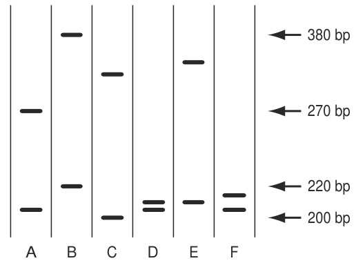  

17.  精子标本取自两名刚开始显示受亨廷顿病影响的男性。通过PCR技术对这些样本中的单个精子进行HD基因座中三核苷酸重复区长度的分析。如下图所示，水平轴代表每个精子中CAG重复的数目，垂直轴表示特定大小的精子总数的比例。第一张图显示了突变的HD等位基因（如体细胞测量）中含有62个CAG重复序列；第二张图中的精子具有突变的HD等位基因。  

a.  两名患者的 $H D$ 等位基因的近似CAG重复数是多少？  
b.  假设这些结果表明了一种趋势，你能对产生突变的HD等位基因的过程得出什么结论？这些过程发生在什么样的细胞中？  
c.  这些结果如何解释约 $5\%\!\sim\!10\%$ 的亨廷顿病患者没有家族病史？  

d.  如果你对每名患者的皮肤细胞而不是单个精子进行相同的PCR分析，请预测结果。  

# 11.3节  

18.  1993年美国，法院首次接受植物DNA作为谋杀案审判的证据。被告拥有一辆小货车，警察在里面发现了一些种子荚，这些种子来自亚利桑那州的一棵叫Palo Verde的树。被谋杀的妇女被发现被遗弃在亚利桑那州的沙漠里。检察官如何利用种子荚的DNA建立一个强有力的证据来针对被告呢？  

19. a.  利用单核苷酸多态性（SNP）而非SSR作为DNA标记进行DNA指纹识别是可能的，但一般来说，你需要检查比CODIS数据库中使用的13个SSR更多的SNP标记来确保匹配。请解释为什么。b.  DNA指纹技术已经被用来验证一些有价值的动物的血统，比如观赏狗、竞赛狗和纯种马。然而，这项技术在这些案例中的应用要比在人类的法医应用中困难得多。特别是，必须在家养动物中检测更多的DNA标记，以确定两个DNA样本的身份或密切的家族关系。为什么你需要在这些动物身上观察比在人类身上更多的多态基因座呢？  

20.  1918年7月17日，沙皇尼古拉斯二世（Tsar NicholasⅡ），他的妻子Tsarina Alix，他们的女儿Olga、Tatiana、Maria和Anastasia，他们的儿子沙皇长子（王储）Alexei，以及4位忠诚的保护者被反对者杀害。多年来，这些尸体一直没有被找到，这助长了安娜·斯塔西娅（Anastasia）大公夫人逃跑的传言，也让一个名叫安娜·安德森（Anna Anderson）的女人声称自己是安娜·斯塔西娅。1991年和2007年，在俄罗斯乌拉尔山脉的叶卡捷琳堡发现了两个集体墓穴，共出土了9具遗骸。下表显示了这些骨骼的部分DNA指纹分析（仅使用5个SSR基因座和性染色体标记Amel）。用逗号分隔的条目表示等位基因  

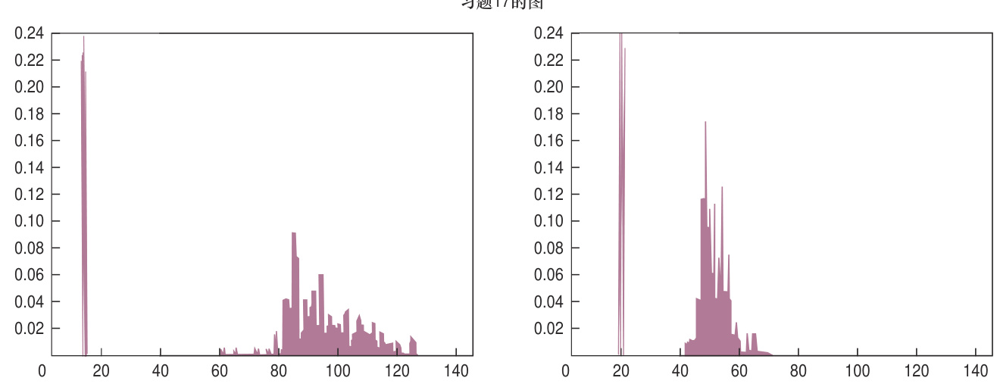  

（重复单位的数量）。  

a.  每具骨架最可能的身份是什么？（注意：仅凭此信息无法区分任何子节点。）  

<html><body><table><tr><td>位点</td><td>A</td><td>B</td><td>C</td><td>D</td><td>E</td><td>F</td><td>G</td><td>H</td></tr><tr><td>Amel</td><td>XX</td><td>XX</td><td>XY</td><td>XX</td><td>XX</td><td>XX</td><td>XY</td><td>XX</td></tr><tr><td>D3S1358</td><td>17,18</td><td>17,18</td><td>14,17</td><td>16,17</td><td>16,18</td><td>13,15</td><td>14,16</td><td>17,18</td></tr><tr><td>D5S818</td><td>12,12</td><td></td><td>12,12</td><td>12,12</td><td>12,12</td><td>11,12</td><td>12,12</td><td>12,12</td></tr><tr><td>D13S317</td><td>11,11</td><td>11,11</td><td></td><td>11,11</td><td>11,11</td><td>10,14</td><td>11,12</td><td>11,11</td></tr><tr><td>D16S539</td><td>11,11</td><td>11,11</td><td>11,14</td><td>11,14</td><td></td><td>10,12</td><td>11,14</td><td>9,11</td></tr><tr><td>D8S1179</td><td>13,16</td><td>15,16</td><td>13,15</td><td>13,16</td><td>16,16</td><td>13,14</td><td>15,16</td><td>15,16</td></tr></table></body></html>  

b.  三次PCR反应均未产生PCR产物。如果反应正常，你希望在每种情况下看到什么等位基因？  
c.  这些女儿中有同卵双胞胎吗？  
d.  你能从骨骼中得到什么证据来区分这些女儿呢？  
e.  这些DNA指纹是如何否定安娜·安德森的说法的呢？  

表中的DNA指纹数据当然与其中一些骨架是沙皇家族成员的观点相一致，但它们并不能证明这一假设。为了进一步调查，法医学家从菲利普亲王（英国女王伊丽莎白二世的配偶）身上提取了血液样本，并将他的DNA指纹与俄罗斯的遗骸进行了比对。这里提供了一份家谱。结果证实了沙皇的家庭成员确实埋葬在这些坟墓里。  

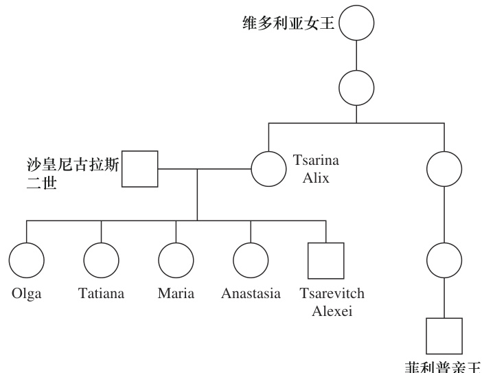  

f.  对于常染色体DNA标记，Tsarina Alix的骨骼中有多少比例的等位基因应该与菲利普亲王的基因组中的等位基因相匹配？  
g.  对于常染色体DNA标记，沙皇的骨架中有多少比例的等位基因应该与菲利普亲王的基因组中的等位基因相匹配？  
h.  对家谱迷们来说有一个问题：菲利普亲王与Tsari-na Alix是什么关系？  

21.  下图显示了对与强奸相关的精液（\*\*\*）和 $1\!\sim\!4$ 个人的口腔拭子（体细胞）的基因组DNA的DNA指纹分析。该分析涉及6个SSR基因座的PCR扩增，每个基因座来自不同的（非同源）染色体。PCR引物均为20个核苷酸长；每个基因座的引物都有荧光标记，荧光标记为基因座特异性颜色。在凝胶中，一些条带较厚，因为得到的相应PCR产物相对较多。图的两边都有对齐的点，你可以用一张纸的边缘作为指引，找到关键的条带。  

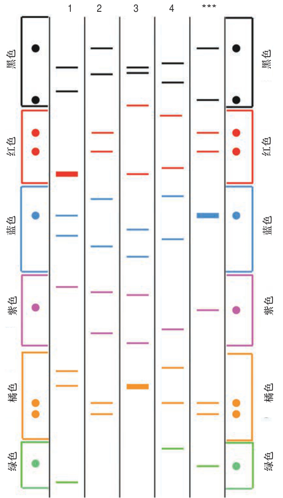  

a.  精子为单倍体，但精液样本中某些基因座的PCR产物大小不同。这怎么可能呢？  
b.  X染色体上有什么基因座吗？如果是，那就识别它。  
c.  Y染色体上有什么基因座吗？如果有，是哪一个？  
d.  解释为什么这些结果表明这四个人中没有一个是强奸犯。通过分析强奸犯的口腔拭子DNA，你希望得到什么样的结果？  
e.  尽管如此，这些结果是否提供了任何有助于抓捕强奸犯的信息呢？如果是的话，尽量具体。  
f.  从精液中PCR扩增出两个橙色条带，长度分别为200bp和212bp。在强奸犯的基因组DNA中，有多少个SSR重复单元的串联重复出现在该基因座的两个等位基因中？（假设PCR产物最短，该基因座的重复单位为TCCG。）  

22.  利用微阵列技术对7个体外受精胚胎的镰状细胞性贫血进行基因型分析。附图中的每一对方块代表两个ASO，一个特定的 $H b\beta^{A}$ 等位基因（A），另一个用于 $H B\beta^{S}$ 等位基因（T）连接到芯片的硅和杂化荧光标记PCR产物从一个细胞的胚胎。杂交分别在 $80\,^{\circ}\mathrm{C}$ 、$60\,^{\circ}\mathrm{C}$ 和 $|40^{\circ}\mathrm{C}$ 三种不同温度下进行，如下图所示。  

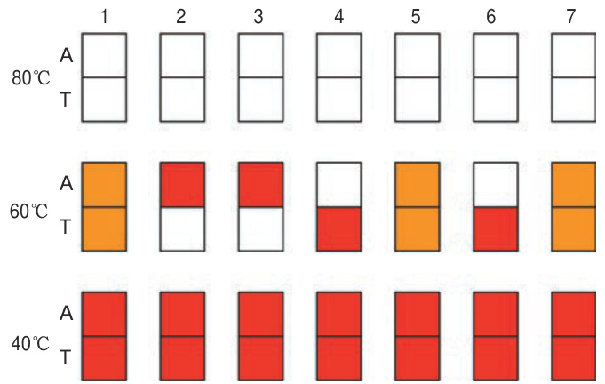  

a.  为什么你认为这个芯片分析需要PCR步骤？  

b.  绘制与镰状细胞突变相关的PCR引物在基因组DNA中的位置草图。指出所有DNA分子的 $5^{\prime}{\rightarrow}3^{\prime}$ 极性。  
c.  为什么在 $80\,^{\circ}\mathrm{C}$ 时没有杂交？  
d.  为什么你会在 $40\,^{\circ}\mathrm{C}$ 时发现所有的基因组DNA探针与两个ASO都有很强的杂交？  
e.  这7个胚胎的基因型是什么？你会选择哪种胚胎植入母亲的子宫，以避免孩子患镰状细胞性贫血的可能性？  

23.  野生型 $H b\beta^{A}$ 等位基因的部分序列所示（上侧链为RNA样编码链，致病突变的位置是下划线）：$5^{\prime}$ ATGGTGCACCTGACTCCTGAGGAGAAGTCGCCG $3^{\prime}$ $3^{\prime}$ TACCACGTGGACTGAGGACTCCTCTTCAGCGGC $5^{\prime}$ 镰状细胞性等位基因HBβS序列是：$5^{\prime}$ ATGGTGCACCTGACTCCTGTGGAGAAGTCGCCG $3^{\prime}$ $3^{\prime}$ TACCACGTGGACTGAGGACACCTCTTCAGCGGC $5^{\prime}$ 设计两个21个核苷酸长度的ASO，可以连接到一个硅片上，用于习题22中进行的微阵列分析。每  

个ASO都存在两种可能性；你只需要为每种情况显示一种可能性。  

24. a.  在图11.17（b）中，进行PCR扩增基因组DNA以对微阵列进行基因分型。这种PCR反应只需要一个引物，但正常情况下，PCR需要两个引物。为什么在这种情况下只有一个引物就足够了？b.  同样在图11.17（b）中，在PCR扩增之前，用限制性内切核酸酶切割基因组DNA。哪种限制性内切核酸酶最有效：它会产生黏性末端还是钝性末端？它能识别由4bp、6bp或8bp组成的位点吗？  

25.  下图显示了一个核心家庭成员的部分微阵列分析结果。所检测的8个SNP基因座在4号染色体上以大约10Mb的间隔均匀分布，它们在微阵列上以实际顺序显示在这条染色体上。目前，你的注意力只集中在父母双方，忽略他们是否受到影响或不受影响。  

a.  写出双亲中所有DNA标记的完整基因型。  
b.  微阵列数据表明，一个SNP基因座在该家族中有三个等位基因，是哪一个？  
c.  你怎么知道这些基因座实际上在4号染色体上，相距大约10Mb？  
d.  在DNA标记1和8之间的区域，4号染色体总长度的百分比是多少？（4号染色体191Mb长；它是人类基因组中的第四大基因。）  

26.  科学家们最近惊奇地发现绒猴，一种猴子，通常是嵌合的——它们的细胞来自于两个不同的受精卵。绒猴嵌合体发生在异卵双胞胎中。在母亲的子宫里，这对双胞胎可以通过血液供应分享细胞，因为他们的胎盘融合在一起。任何器官或组织，包括生殖系，都可能是嵌合的。  

为了确定一个特定的雄性是否从三个不同的母亲那里生下了四个绒猴宝宝中的任何一个，使用毛发的基因组DNA对四个SSR基因座进行了DNA指纹分析。在附图中，条带的厚度与DNA的数量相关。  

你可以使用图表两边的点，以及尺子或纸的边缘，来帮助比较条带的位置。  

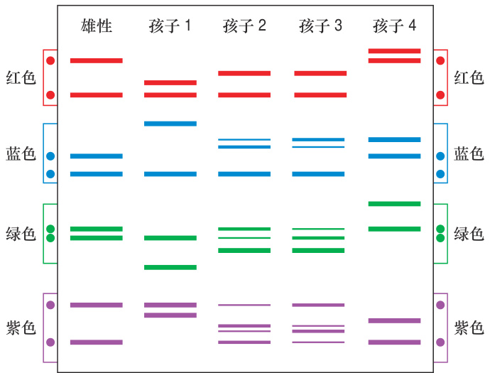  

a.  任何一只狨猴的毛发细胞可能拥有的任一SSR基因座的不同等位基因的最大数量是多少？  
b.  这四个狨猴宝宝中的哪一个可能是其DNA指纹显示的雄性所生？  
c.  确定一对嵌合的异卵双胞胎。  
d.  双胞胎的父亲是否存在嵌合现象？母亲存在吗？  
e.  解释为什么小狨猴的生母可能是它遗传学上的叔叔。（注意：图中的绒猴宝宝不一定是现在这种情况。）  

# 11.4节  

27.  习题25所示的微阵列分析了一个核心家庭的基因组DNA，该核心家庭的父亲、一个儿子和一个女儿患有罕见的晚发性多囊肾病；而母亲、二儿子、二女儿则不受影响。如习题25所述，所检测的8个SNP基因座在4号染色体上以大约10Mb的间隔均匀分布，它们在微阵列上以实际的顺序显示在这条染色体上。  

a.  与野生型相比，该等位基因是显性的还是隐性的？这种疾病的基因是常染色体的还是X染色体的？  
b.  对于这四个兄弟姐妹中的每一个，都要标明他们所产生的精子的基因型。对于每一个精子，把4号染色体上的8个基因座的等位基因按顺序写下来。  
c.  识别该家族中不具信息性的两个SNP基因座（也就是说，你无法确定这两个基因座是否与疾病基因相关）。  
d.  为了简单起见，假设显示的四个孩子是完全有代表性的，即使父母有100个孩子，图中的数据表明一个基因座与疾病基因无关，是哪一个？  
e.  微阵列结果表明，在父亲的减数分裂过程中，该区域发生了两个不同的交叉，包括疾病基因和与之相关的SNP基因座。绘制4号染色体的图谱，  

显示疾病基因、相关的SNP基因座和两个交叉的位置。你的图谱应该指出这些位置的任何不确定性。f.  在父亲的二倍体基因组中，位于两条染色体上的所有基因的所有等位基因的位置和排列（相位）。  

28.  下面的图显示了一个家系的系谱，其中一个完全外显的常染色体显性遗传疾病通过三代人传播，同时对每个个体进行了双等位基因SNP基因座的微阵列分析（等位基因为C和T）。  

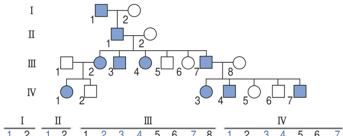  

a.  数据是否表明SNP基因座与疾病基因座之间存在遗传连锁？如果是，两个基因座之间的估计遗传距离是多少？  
b.  计算该家系SNP与疾病基因座间连锁的最大Lod值。Lod分数的这个值表示什么？  

29.  人类遗传学家面临的困难之一是，在进行配种时并没有一个科学的目标，所以系谱可能并不总是提供所需的信息。例如，考虑以下交配（W、X、Y和Z）：  

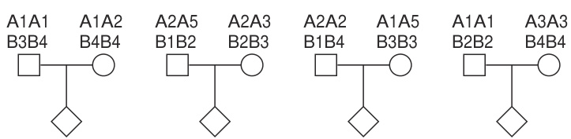  

a.  在测试匿名基因座A和B之间的连锁时，哪些配对是提供信息的，哪些是不提供信息的？（A1和A2是基因座A的不同等位基因，B1和B2是基因座B的不同等位基因，等等）解释你每次交配的答案。  
b.  基因座A更可能是SNP还是SSR？基因座B呢？请解释。  

30.  现在考虑一个涉及隐性遗传疾病的近亲间的交配。下面的图显示了这两个人在4个SNP基因座（ $1\!\sim\!4$ ）的基因型。  

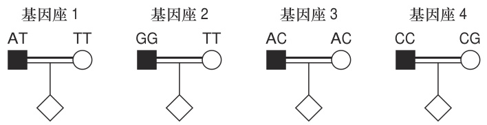  

a.  在这些基因座中，哪一个有可能获得SNP与疾病基因的连锁信息？解释你对每个信息的理解，并描述可能适用的任何特殊条件。  
b.  对于任何一个具有潜在信息性的基因座，你如何判断该子是重组子还是非重组子的产物？（也就是说，如何解决相位问题？）尽可能具体。  

31.  图11.22所示的家系是鉴定位于4号染色体上的亨廷顿病HD基因的关键。  

a.  数据显示DNA标记G8与HD明显相关。对于大多数亨廷顿病谱系中的人来说，他们从受影响的父母那里遗传了哪一个G8型等位基因（A、B、C或D），以及主要致病的HD型等位基因？  
b.  在谱系中有多少人是亲代或重组配子的产物，而不做任何假设（包括连锁假设）？  
c.  如果你现在假设G8和HD是有联系的，那么在这个谱系中有多少人是来自他们受影响的父母的重组配子的产物？  
d.  仅根据这一谱系的数据，G8和HD之间的图距的最佳估计值是多少？  
e.  考虑题目 $\mathbf{b}\!\sim\!\mathrm{d}$ 的答案，计算最大Lod分数。家系包括47个人，他们都是通过信息配对得到的（注意： $\boldsymbol{0}^{0}{=}1$ ）。这个Lod分数表示什么？  

32.  你已经鉴定了一个SNP标记，它在一个大家庭中没有与引起罕见遗传常染色体显性遗传疾病基因座的重组。此外，你会发现家族中所有患病个体的突变染色体上都有一个G碱基在这个SNP上，而所有野生型染色体在这个SNP上都有一个T碱基。你可能会认为你已经发现了疾病的基因座和致病突变，但是你意识到需要考虑其他的可能性。  

a.  对结果的另一种可能的解释是什么？  

b.  你将如何获得额外的基因信息来支持或消除你的假设，即碱基对差异是导致疾病的原因？  

习题33和34表明，即使不直接检查致病突变，也可以通过基因分型链接标记对儿童的基因型进行预测。该方法可用于高度等位基因异质性的疾病，特别是连锁关系非常紧密的疾病。  

33.  这里所示的系谱是由三个不相关的家庭获得的，这些家庭的成员表达了由完全显性等位基因引起的相同疾病。该疾病等位基因与SSR标记基因座的距离为10cM，三个等位基因分别为1、2和3。每个人的基因型中存在的SSR等位基因在谱系符号下面表示。新生的标记个体——A、B、C和D的表型是未知的。  

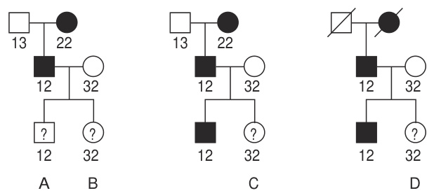  

a.  每个新生儿的疾病发生的概率是多少？b.  为什么人类遗传学家不可能使用这种SSR标记来诊断遗传疾病？  

34.  大约 $3\%$ 的人携带CFTR基因的突变等位基因，该基因导致隐性疾病囊性纤维化。一位基因顾问正在检查一个家庭，该家庭的父母都是已知的CFTR突变携带者。他们的第一个孩子出生时就患有这种疾病，他们的父母已经来咨询顾问，以评估母亲子宫内的新胎儿是否也患病，是携带者，还是CF基因座上的纯合野生型。每个家庭成员和胎儿的DNA样本通过PCR和凝胶电泳检测其中一个CFTR基因内含子内的SSR标记。得到以下结果：  

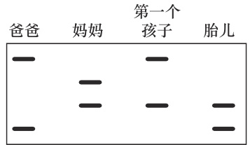  

a.  从这个胎儿发育而来的孩子患这种病的概率是多少？  
b.  当这个孩子长大后，她自己的孩子被这种疾病折磨的概率是多少？  
c.  囊性纤维化基因表现出广泛的等位基因异质性:超过1500种不同的CFTR基因突变已被证明与囊性纤维化有关。考虑到这一事实，为什么人类遗传学家会选择用这个问题中描述的间接方式来检测胎儿，而不是直接关注导致第一个孩子患病的突变呢？  

35.  药物ivacaftor最近被开发用于治疗CFTR罕见的G551D突变等位基因的儿童囊性纤维化。  

a.  你认为ivacaftor只对G551D突变的纯合子患者有效吗？或者它在一个带有G551D的7号染色体副本和另一个带有CFTR的不同等位基因副本的复合杂合子中也能起作用，例如等位基因 $\Delta\operatorname{F}508$ 更普遍？（G551D编码的蛋白质可以折叠并插入细胞膜，但在氯离子转运方面效率较低。ivacaftor提高了G551D离子转运的效率。但是由于ΔF508蛋白发生了不正确折叠，因此不能被插入到细胞膜中。）  

b.  为什么你认为ivacaftor对儿童比老年囊性纤维化患者更有效？  

c.  开发ivacaftor的科学家建立了囊性纤维化的模型：在培养中生长的细胞系是G551D的纯合子。这些细胞在其表面积聚黏液，以防止纤毛（细胞外的微小毛发）的摆动。解释科学家如何使用这种疾病模型来筛选对G551D相关的囊性纤维化有效的药物。  
d.  ivacaftor结合使用一个新的名为lumacaftor的药物来治疗最常见的 $C F$ 等位基因纯合子个体， $\Delta{\,\mathrm{F}}508$ 。lumacaftor帮助检测 $\Delta\operatorname{F}508$ 突变的CFTR蛋白是否正确折叠，以便它可以插入细胞膜。当这两种药物的组合用药是有效的时，你认为lumacaftor还是ivacaftor单独治疗 $\Delta$ F508更有效？为什么？  

# 11.5节  

a.  将poly-A添加到单链基因组DNA片段的目的是什么？为什么将poly-A添加到这些片段的3′端？  
b.  为什么在每个合成周期结束时，你需要移除嵌合在核苷酸上的荧光标记？  
c.  为什么嵌合的核苷酸有一个保护基，为什么这个保护基需要在每个循环中移除？  

37.  一名研究人员对一名患有Usher综合征的患者的整个外显子组进行测序，Usher综合征是一种罕见的常染色体隐性遗传疾病，尽管如此，它仍然是导致同时性耳聋和失明的主要原因。对于任何不同于人类RefSeq的多态性，外显子组序列不显示纯合性。a.  假设基因序列是准确的，研究人员如何检查已经收集的数据来寻找疾病基因呢？b.  如果题目a描述的尝试不成功，研究人员可能会考虑对患者的整个基因组测序。这种策略的潜在缺陷是什么？  

38.  正如文中所解释的，许多遗传疾病的病因还不能通过分析整个外显子组/基因组序列来识别。但在这些看似棘手的病例中，重要的线索可以通过观察mRNA或蛋白质而不是DNA来获得。  

a.  正如你将在后面的章节中看到的更详细的内容，使用单分子方法从任何特定的组织中廉价的对数百万个mRNA分子的cDNA拷贝进行测序是可能的。有时你怎么能利用这些信息来发现一种疾病基因呢？什么时候这些信息是无信息性的？  

b.  一种叫做蛋白质印迹（Western blotting）的技术可以让你检测任何你有抗体的蛋白质；我们有可能看到这种蛋白质在大小或数量上的差异。有时你怎么能利用这些信息来发现一种疾病基因呢？什么时候这些信息是无信息性的？  

39.  图11.26通过对4个完整基因组的测序描绘了米勒综合征的分析：他们的兄弟姐妹和父母都患有这种疾病。a.  研究人员假设米勒综合征是一种隐性性状。相反米勒综合征可能是由于显性突变引起的吗？如果是这样，什么样的情况会使这种假设成为可能？b.  为什么米勒综合征在这个家庭中不可能是发生在母亲，或父亲，或父母双方中的新突变？请描述一个基于你对人类卵巢或睾丸细胞分裂的理解的情景（见图4.18和图4.19），该情景使新基因突变假说至少在理论上是可能的，即使是非常不可能的。c.  图11.26（b）显示了米勒综合征患者父母之一在减数分裂过程中离DHOD基因最近的16号染色体位置。这种重组发生在哪个亲本？d.  你在图11.26（b）中看到的交叉点的数量是否符合先前的估计，即在人类基因组中，1cM相当于大约1Mb？16号染色体大约90Mb长；17号染色体大约有81Mb长。e.  研究人员如何利用这个家族的所有序列数据来估计人类的单核苷酸变异率？  

40.  2012年夏天发表的一篇研究论文提出了一种获取胎儿全基因组序列的方法，无需任何侵入性操作，比如羊膜穿刺术，这种操作在极少数情况下会导致流产。这项新技术是基于这样一个事实：一些胎儿细胞渗入到母亲的血液中，然后分解，释放出它们的DNA。假设母亲血清中 $10\%$ 的DNA片段来自胎儿，而血清中剩余 $90\%$ 的DNA片段来自母亲的基因组。  

研究人员从一名孕妇的血液中采集了无细胞DNA，并对其进行了先进的高通量测序。在这个问题末尾的表格中可以看到7个非连锁基因基因座；并给出了特定等位基因（用希腊字母标记）所在DNA片段的测序数量。为了简单起见，你应该假设所有的数值差异在统计上都是显著的（即使实际数据从未如此清晰）。  

a.  确定每个基因座是常染色体、X染色体还是Y染色体。  
b.  用希腊字母描述母亲和胎儿的二倍体基因组，如果没有合适的希腊字母，就用短线（—）代替。  
c. 胎儿是男性还是女性？  
d.  在第8个基因座，发现了1500个单一类型的序列。对这个结果提供一个尽可能具体的解释。  

<html><body><table><tr><td>基因座</td><td>序列</td><td>读取数</td></tr><tr><td>1</td><td>α:TCTTTGGTAAACGCAAG</td><td>1000</td></tr><tr><td>2</td><td>α:GTACCGGAGGCAGCCTC</td><td>500</td></tr><tr><td rowspan="3">3</td><td>β:GTACCGGCGGCAGCCTC</td><td>500</td></tr><tr><td>α:AGCCATTGCGGATCCGA</td><td>950</td></tr><tr><td>β:AGCTATTGCGGATCCGA</td><td>50</td></tr><tr><td>4</td><td>α:GGGGCCTTATGATAAGG</td><td>50</td></tr><tr><td>5</td><td>α:CAGTTCCTGGAGTTGTA</td><td>550</td></tr><tr><td rowspan="3">6</td><td>β:CAGTTCATGGAGTTGTA</td><td>450</td></tr><tr><td>α:GCAGCCCGTGCTGTTAA</td><td>500</td></tr><tr><td>β:GCAGCCCGTGCTGTCAA</td><td>450</td></tr><tr><td rowspan="3">7</td><td>α:CACTCAGTCCTACGGAC</td><td>500</td></tr><tr><td>β:CACTCGGTCCTACGGAC</td><td></td></tr><tr><td>y:CACTCAGTCCTAAGGAC</td><td>450 50</td></tr></table></body></html>  

41.  表11.2和图11.27共同描绘了对导致Nic Volker的严重炎症性肠病突变的研究。Nic的父母都没有这种情况，所以遗传学家们缩小了他们的研究范围，把注意力集中在表现出隐性模式的罕见变异和X染色体上的变异上。  

a.  对于常染色体上的候选变异体，研究人员会只寻找Nic是纯合的变异体吗？解释一下。  
b.  除了隐性和X连锁的假设外，Nic的情况还有其他可能的解释吗？  
c.  只分析Nic的外显子组就能确定致病突变，因为在这些研究中，对他父母进行全基因组或全外显子组测序太昂贵了。怎样才能以低廉的检测成本确定这种突变是否来源于他的父亲或者母亲的生殖细胞（也就是说，突变发生在形成尼克的特定卵子或精子中）？你的回答不应该涉及全基因组或全外显子组测序。  

42.  人类对Brugada综合征（一种以心电图异常和突发性心力衰竭风险增加为特征的心脏疾病）的一个基因的第一个外显子的序列为：  

$5^{\prime}$ CAACGCTTAGGATGTGCGGAGCCT $3^{\prime}$  

对4人（ $1\!\sim\!4.$ 人）的基因组DNA（其中3人患有这种疾病）进行了单分子测序。下面的序列表示从每个人那里获得的所有序列。与RefSeq不同的核苷酸用下划线标出。  

1号： $5^{\prime}$ CAACGCTTAGGATGTGCGGAGCCT $3^{\prime}$ 和$5^{\prime}$ CAACGCTTAGGATGTGCGGAGACT $3^{\prime}$   
2号： $5^{\prime}$ CAACGCTTAGGATGTGAGGAGCCT $3^{\prime}$   
3号： $5^{\prime}$ CAACGCTTAGGATGTGCGGAGCCT $3^{\prime}$ 和$5^{\prime}$ CAACGCTTAGGATGGCGGAGCCT $3^{\prime}$   
4号： $5^{\prime}$ CAACGCTTAGGATGTGCGGAGCCT $3^{\prime}$ 和$5^{\prime}$ CAACGCTTAGGATGTGTGGAGCCT 3′  
a.  该基因RefSeq拷贝的第一个外显子包括起始密码子。尽可能多地写出编码蛋白的氨基酸序列，表明其从N端到C端的极性。  
b.  这些个体中有纯合子吗？如果是，是哪个人的哪个等位基因？  
c.  这些个体间Brugada综合征的遗传是显性的还是隐性的？  
d.  Brugada综合征是否与等位基因异质性有关？  
e.  这些个体中是否有复合杂合子？  
f.  数据是否显示了基因座异质性的证据？  
g.  哪个人有正常的心脏功能？  
h.  对于RefSeq中的每个变体，描述： $\textcircled{\scriptsize{1}}$ 该突变对编码序列的影响是什么； $\textcircled{2}$ 该变体是一个失去功能的等位基因，一个获得功能的等位基因，还是一个野生型的等位基因。  
i.  对于每一种变体，请指出下列哪个术语适用：无效、亚等位基因、超等位基因、无义、移码、错义、沉默、SNP、DIP、SSR、无特征。  
j. 这个基因的功能是单倍体不足的吗？请解释一下。  

43.  人类HPRT1基因突变导致至少两种临床综合征。通过查询HPRT1参考OMIM（www.omim.org）；你只需要简单地查看前三个匹配记录（文档#300322、300323和308000）。a.  HPRT1酶的全称是什么？b. HPRT1基因位于哪条染色体上？c.  HPRT1的突变与两种不同的综合征有关。这些综合征是什么？对于每一个问题，回答以下问题： $\textcircled{\scriptsize{1}}$ 与该综合征有关的病征有哪些？ $\textcircled{2}$ 与正常等位基因相比，导致综合征的突变等位基因是显性、隐性、共显性或不完全显性，还是存在特殊情况？ $\textcircled{3}$ 该综合征是否与功能丧失或功能获得的疾病等位基因有关？ $\ensuremath{\mathcal{Q}})$ 该综合征是否存在等位基因异质性？ $\textcircled{5}$ 该综合征是否存在基因座异质性？（注意：你不需要理解OMIM条目中的所有内容来回答这些问题。）  

44.  我们认为人类有两个基因组（一个来自母亲，另一个来自父亲），它们在每个体细胞和生殖细胞前体中都是相同的。然而，随着DNA的每一次复制和细胞的每一次分裂，基因组都有机会发生变异。当一个细胞发生突变时，该细胞的所有有丝分裂后代都会产生体内其他细胞所没有的突变。从这个意义上说，人类是由不同基因型的细胞拼凑而成的。解释人类嵌合现象是如何通过位置克隆或基因组测序来确定隐性或显性致病突变的。  