# 第四部分 基因如何在染色体上传播  

# 第 12 章 真核染色体  

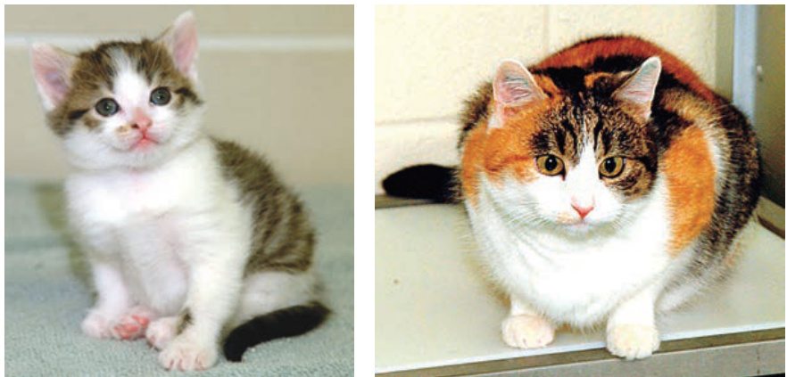  

CC 是一只克隆猫（左），为 CC 提供细胞核的猫咪彩虹（右），虽然共享相同的染色体，但是却有不同的表征。（左）： $\copyright$ Texas A&M University/AP Photo（右）： $\copyright$ Alpha/ZUMAPRESS/Newscom  

# 章 节 大 纲  

12.1 染色体的 DNA 和蛋白质  
12.2 染色体结构和收缩  
12.3 染色体组装和基因表达  
12.4 真核生物染色体的复制  
12.5 染色体分离  
12.6 人造染色体  

2001年12月，兽医通过剖腹产接生了世界上第一个克隆宠物，小猫CC（名字来源于“Copy Cat”和“Carben Copy”的简称，附图）。CC的诞生是一项核转移实验的结果，在这个实验中，一只名为彩虹（右）的雌性花猫的细胞核被注射到一个细胞核已经被移除的卵子中（来自一只未命名的捐赠猫），然后将重组后的卵细胞植入代孕母亲的子宫内。事实证明，CC是一只非常正常的猫，它活过了12岁，并养育了三只正常的小猫。  

人们看到的CC和彩虹的所有细胞都具有相同的细胞核DNA，因为它们是单个细胞有丝分裂的后代：成为彩虹的受精卵。尽管所有这些细胞的细胞核DNA都是相同的，但显然并非所有的细胞都是相同的。有些细胞分化成眼睛，有些细胞分化成胡须，另一些则与皮肤的形成有关，等等。尽管有相同的DNA，但CC和彩虹的许多染色体表型是不同的，从皮毛的颜色到它们的性格都不同。  

DNA在染色体上的组装构成了照片中这些生物的表型。猫细胞核中的基因组是通过数十亿的碱基对组装而成的。而基因组组装是基因组通过细胞的无数次有丝分裂进行复制和分离的必要条件。在这个过程中，染色体上的一些蛋白质通过控制基因表达的开关，进而影响细胞的分化。而与染色体相关的一些其他生物大分子（如蛋白质和DNA）与X染色体的失活有关。上述这些都是彩虹和CC的皮毛颜色有明显差异的原因。  

在这一章中，我们研究了真核染色体的结构和功能，这也是一个被大家普遍讨论的问题。染色体通过自身多功能的动态结构，实现对单链DNA分子进行组装、复制、隔离和信息表达等功能的调控。  

# 12.1 染色体的DNA和蛋白质  

# 学习目标  

1. 绘制一条染色体的DNA成分，包括链的极性。  
2. 对比组蛋白和非组蛋白的结构与功能。  

我们通过光学显微镜观察到，染色体会随着细胞周期的变化而发生形状、特征和位置的改变。在间期，它们看起来就像一团纠缠在一起的意大利面条。在有丝分裂中期，它们又在纺锤体的中间分离成两条单链（两条姐妹染色单体）。在这一节中，我们描述了染色体是由什么组成的。而且，在这一章的后续部分，我们将会解释这些染色体的组成是如何通过相互作用来产生上述观察到的这些结构变化的。  

# 12.1.1 每条染色体都由单一的DNA分子组成  

研究人员从物理分析中了解到，在细胞核内的每条染色体（或复制后的每一条染色单体）都含有一个长的线性双链DNA分子。在一项早期的研究中，科学家将染色体DNA放在两个圆柱体之间，通过旋转一个圆柱体来拉伸DNA，并测量DNA的反冲速度，结果显示较短的分子比较长的分子反冲速度更快。当研究人员将这种技术应用到果蝇细胞中的DNA时，最长的DNA分子的长度与最大染色体中DNA的长度是一致的。因此得出，每条染色体都包含一个单一的线性DNA分子。  

在第11章中已提到过典型的真核生物的染色体基因是沿着DNA分子排列的。除此之外，染色体也显示了另一个重要的组织特征：含有大量的非编码重复DNA序列，如简单序列重复（SSR），以及集中在特定染色体区域的转座因子，特别是在着丝粒和端粒的位置。这些位置的重复序列对于将在本章后面进行讨论的染色体生物学的某些方面是至关重要的。  

# 12.1.2 染色体中的组蛋白和非组蛋白  

就DNA本身而言，其并没有能力折叠到足够小的体积来适应细胞核。对于是否能进行足够的收缩，取决于组蛋白和非组蛋白两类染色体蛋白的相互作用。染色质通常是指细胞核中复杂的DNA和蛋白质的复合物。染色体与染色质是同一物质在细胞分裂间期和分裂期的不同表现形态。  

尽管染色质大约包含1/3的DNA、1/3的组蛋白，以及1/3的非组蛋白，但它也含有大量的RNA。虽然目前与染色体相关联的RNA分子的作用还没有被科学家完全研究清楚，但是在这一章的后面，我们将描述一个叫做Xist的特定RNA分子在控制基因表达上的作用。  

# 1. 组蛋白  

组蛋白在1884年被发现，是相对较小的蛋白质分子，其主要由赖氨酸和精氨酸等碱性氨基酸组成。组蛋白的强正电荷使它们能够在染色质中结合并中和带负电荷的DNA。组蛋白占所有染色质蛋白的一半，并被分为5种类型的分子：H1、H2A、H2B、H3和H4。后面四种类型（H2A、H2B、H3和H4）构成了最基本的DNA包装单元——核小体的核心，因此被称为核心组蛋白（我们将在近期研究这些组蛋白在核小体结构中的作用）。  

这五种类型的组蛋白几乎出现在所有二倍体真核细胞的染色质中，而且在所有的真核生物中都非常相似。例如，在植物豌豆和小牛犊的H4蛋白中，102个氨基酸的多肽序列中只有2个氨基酸是不同的。在整个进化过程中，由于这些组蛋白很少发生变化，所以就能很好地解释它们在构建染色质结构时的重要性了。  

# 2. 非组蛋白  

真核细胞染色质中有一半的蛋白质不是由组蛋白组成的；相反，它由成千上万种不同种类的非组蛋白型蛋白质组成。二倍体基因组的染色质中包含从$200{\sim}200\,000$ 个分子不等的多种非组蛋白。  

毫无疑问，这些大量的蛋白质可以完成许多不同的功能。一些非组蛋白发挥着纯粹的结构作用，把DNA组装到更复杂的结构中，构成结构骨架蛋白或支架蛋白（图12.1）。其他非组蛋白，如DNA聚合酶，在复制中是活跃的。还有一些对染色体分离至关重要的非组蛋白，例如，运动蛋白有助于沿着纺锤体移动染色体，从而加快在有丝分裂和减数分裂期间染色体传递给子细胞的过程（图12.2）。  

到目前为止，最大的一类非组蛋白发挥着控制基因转录、调节基因表达的作用。哺乳动物体内携带超过5000种不同的非组蛋白。通过与DNA的相互作用，这些蛋白质会影响基因转录的时间、地点和频率。  

# 基本概念  

●  每个真核生物的染色体（在其复制之前）都包含一个没有突变或发生极性改变的线性双链DNA分子。●  组蛋白负责将DNA组装到染色质中；非组蛋白则是在染色体结构、复制和分离，以及基因表达的调控中起作用。  

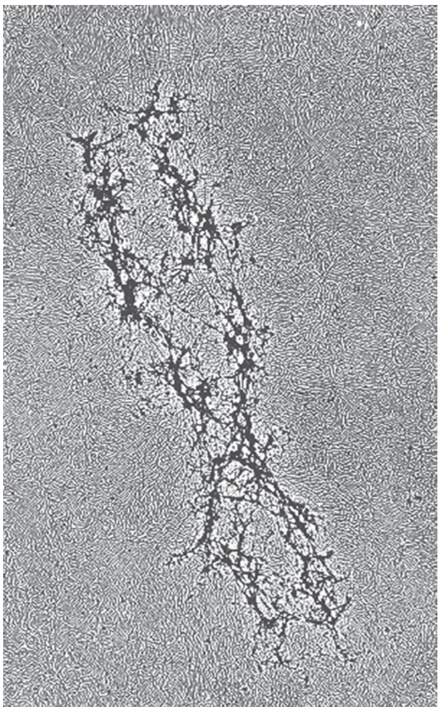  
图12.1　染色体支架。当用温和洗涤剂去除人类染色体中的组蛋白和一些非组蛋白时，两条姐妹染色单体中维持非组蛋白结构的黑色支架就会显现出来。通过洗涤剂的处理，围绕在支架周围的DNA环被释放出来。  

$\copyright$ Dr. Don Fawcett/J.R. Paulson, U.K. Laemmli/Science Source  

# 12.2 染色体结构和收缩  

# 学习目标  

1. 绘制一个核小体的结构。  

2.  描述核小体超螺旋及其与染色质修饰放射环-骨架模型的关系。  
3.  总结染色体中G条带的形成过程，以及这些条带是如何用于基因定位的。  
4.  描述FISH分析及其在染色体中寻找特定DNA序列的应用。  

如果将单个细胞的DNA拉成一条细而直的直线，长度可达6英尺（约 $2\mathrm{m}$ ）。当然，这比包含基因组的细胞核要长得多；人类细胞核的平均直径大约只有 $6\upmu\mathrm{m}$ （ $6\times10^{-6}\mathrm{m}$ ）。所以，DNA需要几级足够的压缩才能够适应细胞核的体积（表12.1）。首先，核小体由DNA缠绕在组蛋白周围而形成。接着，DNA紧密卷绕将核小体聚集成高阶结构。除此之外，在显微镜下观察中期染色体时，研究人员还发现了新的收缩现象。  

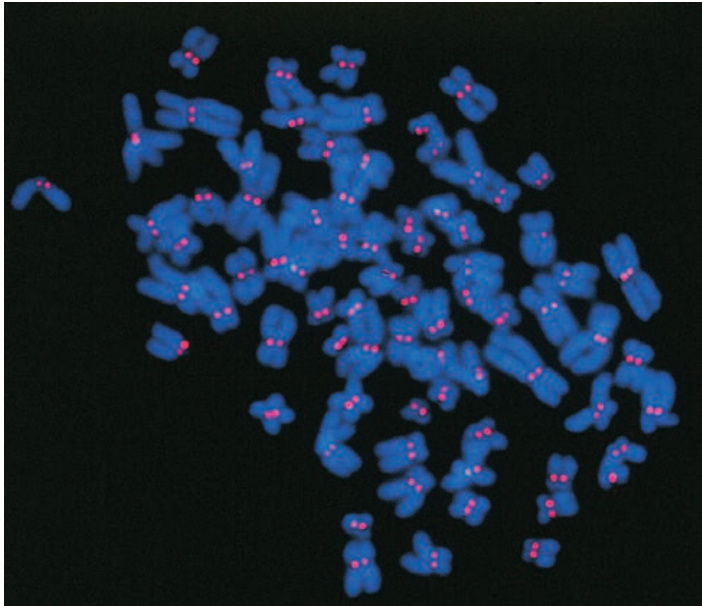  
图12.2　动粒蛋白。在细胞分裂过程中，一些非组蛋白在染色体沿着纺锤体的运动中是必不可少的。在这里，染色体被染成蓝色，而非蛋白CENP-E染成红色。在细胞分裂后期，位于动粒的CENP-E分子帮助姐妹染色单体移向纺锤体。$\copyright$ Daniel A. Starr/University of Colorado  

表12.1　染色体压缩水平  

<html><body><table><tr><td>机制</td><td>状态</td><td>完成的结果</td></tr><tr><td>核小体</td><td>晶体结构的证实</td><td>将裸露的DNA压缩7倍至 100A纤丝</td></tr><tr><td>DNA超螺旋</td><td>假设模型（模型预测的 300A纤丝已经在电子 显微镜中观察到）</td><td>再进行6倍的压缩，相当于 将裸DNA进行40～50 倍的压缩</td></tr><tr><td>放射环-骨架 模型</td><td>假设模型（该模型的初 步实验支持）</td><td>通过对300A纤丝的渐进式 压缩，将DNA浓缩成有 丝分裂的染色体，相比裸 DNA浓缩了近1万倍</td></tr></table></body></html>  

# 12.2.1 核小体是染色体的基本结构单位  

图12.3中染色质的电子显微图显示了从人类血细胞的细胞核中喷出的长而有刺的纤维。这些核小体像串珠上的珠子，直径约为 $100\mathring\mathrm{A}$ ，而串线的直径约为20Å（ $1\mathring{\mathrm{A}}{=}10^{-10}\mathrm{m}{=}0.1\mathrm{nm}$ ）。图12.4（a）展示了DNA是如何包裹在组蛋白核心从而形成染色质的串珠状结构的。每一个珠子都是一个核小体，它包含大约160个DNA分子，被包裹在一个由8个组蛋白（H2A、H2B、H3和H4各2个）组成的核中，如图12.4（a）所示。160bp的DNA围着这个核心组蛋白八聚体缠绕了两圈。另外还有40个碱基对形成了接头DNA，它将相邻的两个核小  

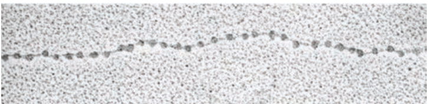  
图12.3　核小体。在电子显微镜下，核小体看起来就像串在DNA链上的珠子。$\copyright$ Dr. Barbara a.Hamkalo  

(a)  

  
(b)  

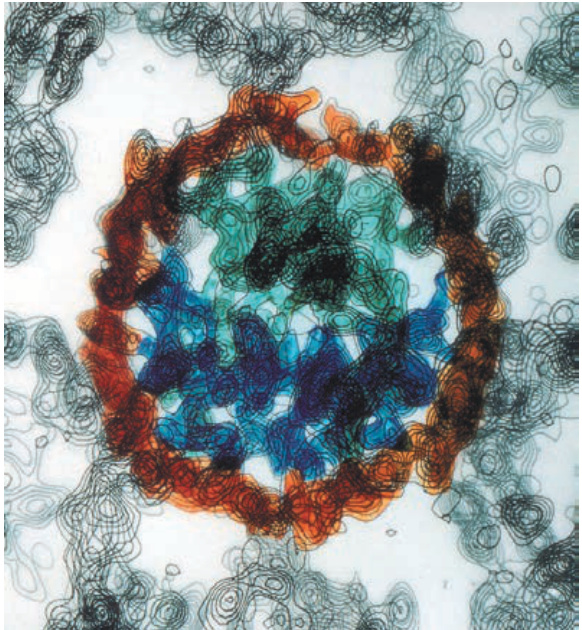  

图12.4　核小体的结构。（a）每个核小体由DNA缠绕组蛋白八聚体两圈而成，每个组蛋白八聚体都是由双倍的H2A、H2B、H3和H4组成的。组蛋白H1进入或离开核小体时都与DNA相关。（b）X射线晶体学所揭示的核小体结构。DNA（橙色）在几个地方剧烈地弯曲，因为它环绕着核心的组蛋白八聚体（蓝色和绿松石色）。  

（b）： $\copyright$ Dr. Gerard J Bunick, Oak Ridge National Laboratory  

体连接起来。  

组蛋白H1位于核外，它进入或离开核小体时都与DNA相关［图12.4（a）］。当研究人员使用特定的化学试剂将组蛋白H1从染色质中移除时，一些DNA会从核小体中脱离出来，但是核小体不会分裂，仍然被140bp的DNA包裹。  

科学家们可以将核小体的核心结晶，并对晶体进行X射线衍射分析。图12.4（b）展示了核小体结构的模型，DNA并没有在组蛋白核心周围形成光滑的卷曲。相反，DNA在某些位置会急剧弯曲，而在其他位置则几乎没有。可能是由于剧烈的弯曲只发生在其中一些DNA序列中，这些碱基序列有助于确认染色体上核小体的位置。  

核小体基础结构的复制与DNA的复制相结合。四种基础组蛋白的合成成分会在细胞周期的S期增多，以便在新复制的DNA上合成组蛋白。其余的蛋白质负责调控核小体的组装。特殊的调控机制将DNA和组蛋白的合成紧密结合在一起，使两者都发生在适当的时间。  

核小体的间距和结构与遗传功能相关。虽然每个染色体的核小体不是均匀分布的，但是它们在染色质上有特定的排列。这种排列在不同的细胞类型中是不同的，当条件发生改变时，它甚至可以在单个细胞中发生变化。染色体上核小体的间距与启动表达、复制和进一步压缩的蛋白质之间的相互作用有关，因为核小体之间的DNA比核小体中的DNA更容易获得。  

包裹在核小体中的裸露DNA被压缩了7倍。有了这种压缩，在一个二倍体人类基因组中，2m的DNA可缩短到大约 $0.25\mathrm{m}$ （略低于1英尺）。但是即使是在最大的细胞中，这种长度对于适应核小体的体积还是太长，仍然需要进行进一步的压缩。  

# 12.2.2 高聚体加强了染色体的进一步压缩  

许多关于染色体浓缩的细节仍不为人知，但研究人员提出了几种模型来解释不同的压缩程度（详见表12.1）。  

# 1. 核小体的超螺旋  

除了缠绕核小体之外，还有另外一种压缩模型：将100Å的核小体染色质超螺旋，进行6倍的压缩，压缩为300Å的超螺旋。对这种模型的证实来自于电子显微镜的观察，可以看到每转300Å的螺旋包含了6个核小体［图12.5（a）］。100Å是一个核小体的宽度，而300Å则是3个核小体的宽度。组蛋白H1可能在超级螺旋的形成过程中扮演着特殊的角色，因为移除一些H1会导致300Å的螺旋体解螺旋到100Å，而增加H1则会逆转这个过程。  

虽然，通过电子显微镜科学家可以看到300Å螺旋体，但不能观察到它的确切结构。那么，更高的压缩程度就更不容易被理解了。  

# 2. 放射环-骨架模型  

该模型中，若干非组蛋白每隔 $60\!\sim\!100\mathrm{kb}$ 便结合一次染色质，将超螺旋的、缠绕核小体的300Å螺旋体系放在环状结构中［图12.5（b）］。这些蛋白质可以将这些环状物聚集成类似于雏菊样的花瓣，然后将花瓣中心压缩成一个紧凑的束［图12.5（c）］。因此，这个模型被称为放射环-骨架模型，也对染色体包装解释得一目了然。染色体收缩过程包括核小体的形成，核小体超螺旋成300Å螺旋体，超螺旋形成环状结构，环状结构聚集成花瓣状，而花瓣状的压缩有可能产生高度浓缩，我们把浓缩得到的棒状结构认为是进行有丝分裂的染色体。  

一些生物化学和显微图像的资料证实了放射环-骨架模型。例如，实验者提取所有中期染色体的组蛋白，发现它们仍然保持着相似的X型（见图12.1）。蛋白质骨架依然保持着DNA的缠绕（回顾图6.23），是由于它  

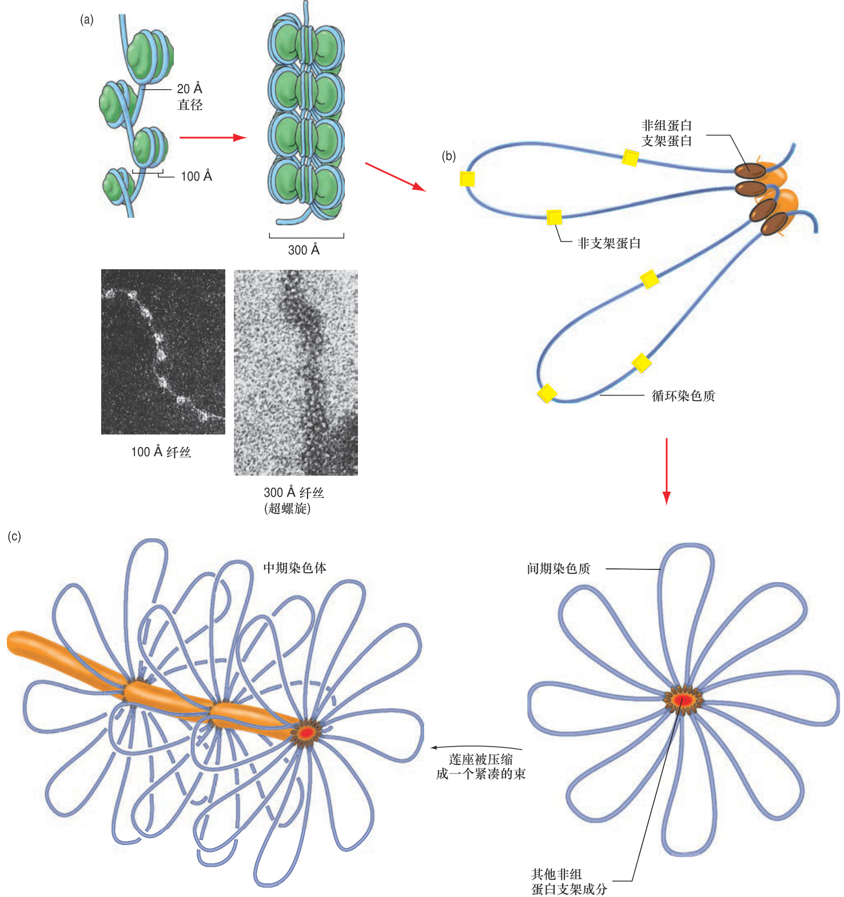  
图12.5　高阶染色体包装模型。（a）概念化的图形（上）和电子显微图（下）对比了100Å螺旋体（左）和300Å螺旋体（右）。（b）放射环-骨架模型——高压实度的支架模型。根据这个模型，300Å螺旋体首先被拖入由非组蛋白支架（棕色和橙色）连接的 $60{\sim}100\mathrm{kb}$ 的DNA（蓝色）环。（c）其余的非组蛋白可能会将多个环状结构聚集成类似于雏菊样的花瓣状结构，然后将花瓣压缩成束状，形成中期染色体。  

（a，左）： $\copyright$ Dr. Barbara Hamkalob/University of California-Irvine, Department of Biochemistry；（a，右）： $\copyright$ Dr. Don Fawcett/H. Ris and A. Olins/Science Source  

含有解旋酶、拓扑异构酶Ⅱ，以及被称为凝缩蛋白的蛋白质复合体，这些蛋白质有助于将间期染色体浓缩为中期染色体。此外，正如模型所预测的那样，以这种方式提取的有丝分裂染色体在电子显微下可观察到染色体边缘的染色质环（图12.6）。  

尽管有一些零散的实验证据，但还没有发现直接证实或反对放射环-骨架模型的依据。因此，高阶压缩染色质的放射环-骨架模型概念仍然是一个假设。研究人员经过详细具体的分析后得出，这种高阶压缩染色质的放射环-骨架模型与核小体形成了鲜明的对比。  

# 12.2.3 Giemsa染色显示可复制的染色体带型  

不同程度的包装将人类中期染色体的DNA浓缩了近10 000倍（见表12.1）。通过这种浓缩，每个染色体的着丝粒和端粒就会显露出来。本书第4章提到过，不同的染色技术揭示了中期染色体不同核型的带型特征、大小和形状。例如，G带技术是将染色体温和加热后进行Giemsa染色，这种DNA染料会优先使某些区域变暗，从而产生明暗交替的G波段。每一个G带都是一个非常大的DNA片段，长度可从 $1\!\sim\!10\mathrm{Mb}$ 不等，包含着许多重复序列。通过高分辨率的G带技术可观察到，一个标准的二倍体人类染色体组型图中的46条染色体中包含数百个明暗相间的G带（图12.7）。  

目前还不清楚显带技术的生化基础。大多数分子遗传学家认为，由Giemsa染色产生的条带可能反映了一种不均匀的环状结构的包装形式，这种环状结构在某种程度上是由染色体上短而重复的DNA序列的间隔和密度决定的。不管潜在的原因是什么，每次染色体复制时，它的带型都会被稳定地复制。而且，带型从一代到下一代都是具有可遗传性的，这一事实表明，带型是由DNA序列本身决定的染色体的固有属性。这种带型的可复制性意味着遗传学家可以通过说明其与特定染色体上的短臂p（短，法语单词“petit”的缩写）或长臂q（长，与短臂相对应，Q紧挨着字母P）的位置关系来描述某个基因的位置。为此，短臂p和长臂q被细分为多个区域，在每个区域内，明暗带被分别连续编号。图12.8中显示的带型图被称为染色体组型图。举个例子，与色盲相关的X染色体基因位于q27-qter上，这表明它们位于X染色体的长（q）臂上，介于第7条带第二个区域的开始和端粒末端之间（端粒，或端粒酶；图12.8）。  

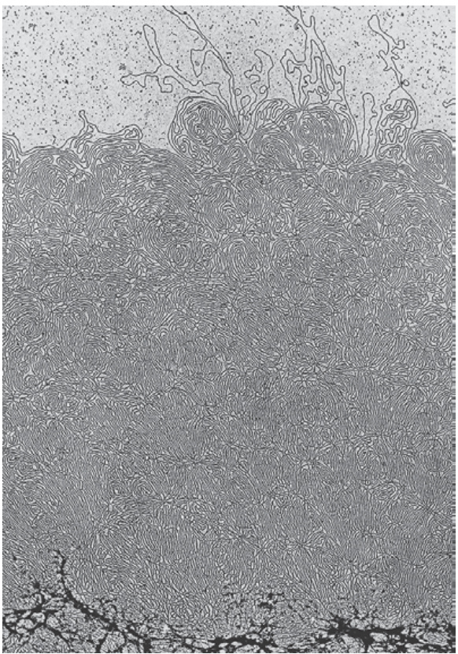  
图12.6　放射环-骨架模型的实验支撑。图12.1中部分图像的特写，这张电子显微照片显示了从图片底部的蛋白质骨架上放射出的长长的DNA环。  

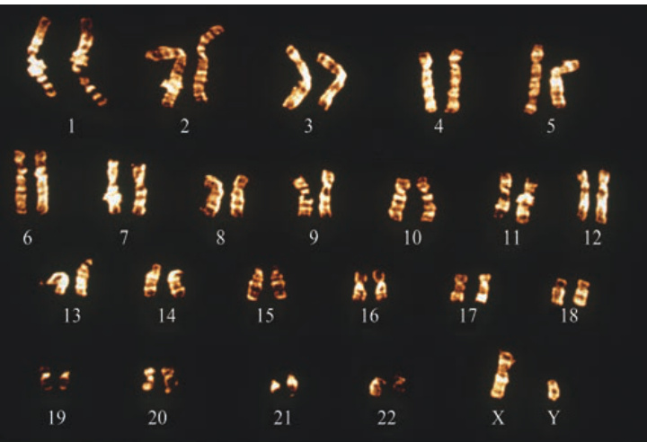  
图12.7　通过高分辨率G带技术检测人类染色体。$\copyright$ Scott Camazine & Sue Trainor/Science Source  

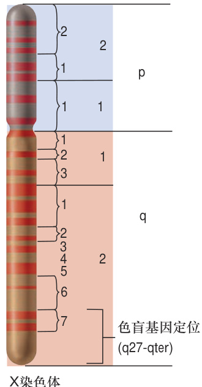  
图12.8　人类X染色体的组型图。人类的色盲基因位于X染色体长臂（q）尖端附近的一个小区域。  

# 12.2.4 遗传学家使用荧光原位杂交 （FISH）技术描述基因组的特征  

科学家们在理解特定DNA序列和整个基因组的关系时，常常面临着一个问题，那就是虽然核型包含整个基因组染色体的G带，但很明显，它的分辨率远低于单个核苷酸对。相反，科学家却可以从全基因组序列中获取大量信息来预估全基因组结构。一种被称为原位荧光杂交（FISH）的技术在核型的低分辨率和全基因组序列的超高分辨率之间提供了一个方便的桥梁。从本质上说，研究人员利用FISH技术可以找到核型中染色体的特定DNA序列的位置。  

正如名字所暗示的，FISH技术的基础依据是核苷酸固有的互补特性。研究人员首先在有丝分裂中期获得细胞，然后将细胞放入玻璃显微镜载玻片上。对这些细胞进行一系列的处理后，细胞和细胞核发生破裂，染色体分开，将染色体固定在载玻片上，并对染色体DNA进行变性处理。变性步骤是在保持整体染色体结构不受影响的情况下使双螺旋体在许多点上分离成单链。然后，研究人员用荧光标记物标记了一个纯化的DNA序列，形成一个DNA探针。通过加热，将 DNA探针变性成单链并应用到染色体上。通过探针与染色体上核苷酸序列互补配对进行杂交，使研究人员可以在荧光显微镜下观察到这些区域。  

在FISH技术中，利用一段短的特定DNA序列做探针，如cDNA克隆序列。可以通过荧光点观察基因组中相应基因的位置［图12.9（a）］。值得一提的是，这种方法在验证人类基因组计划的草图中起了非常重要的作用。  

在另一种被称为光谱核型分析（SKY）的FISH技术中，探针是由多个DNA序列混合组成的，这些DNA序列分散在人类染色体的不同位置上。1号染色体的探针由只发一种颜色光的荧光标记物（染料或萤石）组成，2号染色体的探针由不同颜色的光的荧光标记物混合而成，依此类推，人类24条染色体的核型能够通过光谱分析呈现的不同颜色的荧光而被清晰地分辨出来［图12.9（b）］。本书第13章将会提到，这两种FISH技术广泛用于观察染色体的重组，比如删除、复制、倒位和可能导致遗传性疾病的易位。  

# 基本概念  

●  核小体是DNA缠绕在由H2A、H2B、H3和H4组蛋白组成的八聚体上近两圈而组成。组蛋白 H1控制着DNA的进出。  
●  高阶压缩模型表明，核小体被卷曲压缩成更短但更宽的螺旋体。非组蛋白将这种螺旋体固定在染色体支架上，形成环状结构，然后聚集在一起，使DNA更加浓缩。  

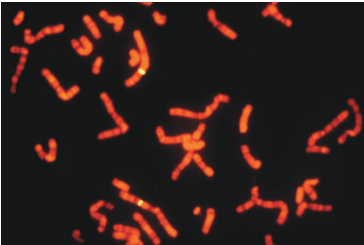  
(a) FISH   
(b) SKY  

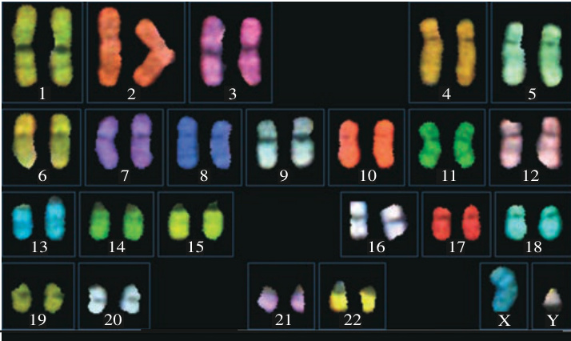  
图12.9　荧光原位杂交。（a）分析人类细胞染色体的FISH技术。黄色的亮点显示了一个由单个基因组成的探针分别杂交到两个同源染色体的两条姐妹染色单体上。由于这两条姐妹染色单体在这个过程中距离非常接近，所以每个同源染色体中只显示出了一个黄色的亮点。（b）光谱核型分析（SKY）。探针的DNA序列在染色体上被不同颜色的荧光标记物标记为不同的颜色。  

（a）： $\copyright$ Patrick Landmann/Science Source；（b）：承蒙Dr. Thomas Ried.Head, Cancer Genomic Section, Genetics Branch/CCR/NCI/NIH提供，图片由Dr. Hesed Padilla-Nash制作  

●  Giemsa染色在中期染色体中产生G带。G带具有高度专一和可复制的特性，可以据此来识别染色体和基因的位置。  
●  FISH技术使研究人员能够将特定的DNA序列定位于染色体组上，或者将整个染色体可视化，以此来进行核型分析。  

# 12.3 染色体组装和基因表达  

# 学习目标  

1. 描述染色质重组复合物如何使基因发生表达。2.  区分常染色质和异染色质基因表达的不同。3.  概述科学家如何利用花斑位置效应研究异染色质的形成机制。  

4.  概述组蛋白甲基化和乙酰化对染色质结构与基因表达的影响。5.  总结在哺乳动物细胞中Xist基因的作用。  

将DNA压缩到染色质中会给蛋白质带来一个问题：这些蛋白质必须先识别DNA序列，才能实现转录、复制和分离等功能。这些蛋白质是如何进入那些隐藏在复杂染色质结构中的特定核苷酸序列的呢？答案是，染色质结构是动态的，在适当的时候会发生结构的变化以支持蛋白质进入到染色体中。这些变化会促使产生不同的染色体功能所需的结构变化。  

在本节中，我们将重点讨论染色质结构与基因转录之间的关系：首先描述了染色质在通过RNA聚合酶识别启动子并开始转录时发生的变化；接下来讨论了一种叫做异染色质的染色质结构，它与没有转录的染色体区域有关。异染色质的形成是许多重要遗传现象的分子基础，其中包括了哺乳动物中X染色体的失活。  

# 12.3.1 转录过程需要染色质结构和核小体位置的改变  

有关真核生物基因表达的一个重要概念是，一个DNA片段被转录的频率越低，它就越紧凑。例如，当染色体解螺旋时，细胞会在细胞周期的间期进行基因的表达。小基因的转录发生在高度致密的中期染色体上。但是，即使是相对没有被浓缩的真核生物间期染色质，也需要进一步解螺旋，以暴露核小体内部的DNA才能进行转录。因为当启动子DNA被包裹在核小体的组蛋白核心时，基因启动子被隐藏在RNA聚合酶和转录因子中［图12.10（a）］。  

对染色质结构的研究表明，大多数不活跃的基因启动子确实被包裹在核小体中。在一些研究中，科学家通过使用可以裂解DNA中磷酸二酯键的DNA酶Ⅰ来处理核染色质，以达到在分子水平上研究核小体位置的目的。虽然核小体中的序列不受DNA消化酶的影响，但核小体中被消除的染色体区域则可以通过对DNA酶的超敏性来进行识别。  

先前不活跃的基因在细胞分化的后期阶段准备转录时，启动子区域由一个抗DNA酶位点转变为一个DNA酶敏感位点。原因是转录调节蛋白（转录因子）能与增强子附近的DNA结合，并吸收重组染色质附近的蛋白质。尤其是，这些新的结合蛋白会移除阻断启动子的核小体，或者重新定位它们与基因的关系［图12.10（b）］。一种染色质调节剂是由多个亚单位重构复合物组成的，利用ATP水解的能量来改变核小体的定位。其他染色质调节剂在核小体中进行组蛋白的尾部修饰（稍后将会解释）。这两种机制所完成的染色质变化暴露了先前隐藏的启动子，使其被RNA聚合酶识别，从而促进基因的  

(a) (c)  

  
(b)  

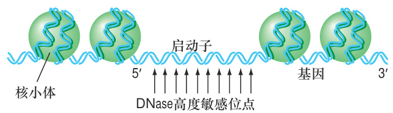  

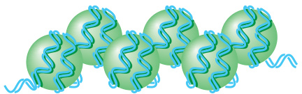  

图12.10　核小体包装和基因表达。（a）围绕核小体的基因启动子不能被RNA聚合酶和转录因子所接受。（b）染色质重组复合物可以通过将其置于对DNA酶高度敏感的核小体无核区域，从而暴露出启动子。（c）异染色质中的DNA结构非常紧密，导致它在转录上是不活跃的。  

转录激活［图12.10（b）］。  

当分化细胞分裂时，结合DNA并建立染色质结构的转录调节蛋白被分配到两个子细胞中。在DNA复制之后，这些蛋白质重新结合DNA，重新建立在母细胞中存在的染色质结构。因此，分化细胞在细胞进行有丝分裂后，依然维持染色质特有的形态结构和基因表达。  

# 12.3.2 异染色质区域的大多数基因都表现为沉默  

有一种染色质在基因组中很普遍，并与基因表达的强烈抑制有关。这种染色质通过光学显微镜就能观察到，因为它包含很长的DNA片段：在被能够结合DNA的化学物质染色的细胞中，有些染色体区域比其他染色体更暗。遗传学家把这些深染区域称为异染色质；他们把染色比较浅的区域称为常染色质。在电子显微镜下，可以观察到异染色质和常染色质之间的区别，即异染色质似乎比常染色质更浓缩。这一结果也说明了异染色质区核小体的包装更加紧密［图12.10（c）］。  

显微镜学家首先发现了深染的异染色质存在于细胞分裂间期，一般存在于细胞核的外围。即使是高度致密的中期染色体，也可以通过差异染色法观察到异染色质与常染色质（图12.11）（这种染色技术不同于之前描述的核型的G带技术，也不应该与之混淆）。在高度浓缩的染色体中，大部分的异染色质都存在于着丝粒的两侧，但在某些动物中，异染色质位于染色体的其他区域。果蝇的整个Y染色体和人类Y染色体的大部分都是异染色质。通常，科学家将所有细胞中保持高度浓缩的异染色质区域称为结构异染色质。  

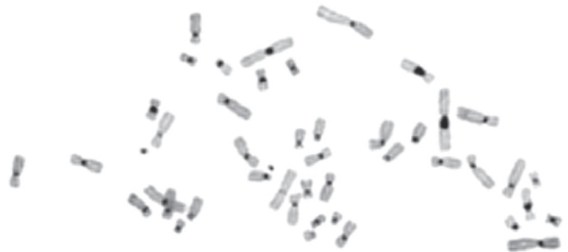  
图12.11　结构异染色质。使用一种特殊的技术对人类中期染色体染色，这种技术会使结构异染色质变暗，其中大部分是在着丝粒周围的区域。$\copyright$ Doug Chapman, University of Washington Medical Center CytogeneticsLaboratory  

放射自显影技术（一种用摄影胶片检测放射性物质的方法）能显示在基因表达活跃的细胞中，放射性的RNA前体几乎结合了常染色质区域的所有RNA。这一现象表明，常染色质几乎包含了全部基因大部分的转录位点。相比之下，异染色质的转录在大多数情况下似乎是不活跃的；由于浓缩得太过紧密，导致异染色质中含有的少量转录基因所需的酶无法获得正确的DNA序列［图12.10（c）］。  

在结构异染色质区域的DNA中，有很大一部分是由像SSR这样的简单序列重复组成的片段。这里储存着许多转座因子——在基因组周围移动的DNA片段。SSR和转座因子很可能在结构异染色质中发生累积，因为它们在这里被转录成沉默子。这些重复的DNA片段和转座因子占据了大多数基因中一半以上的序列长度；它们在转录失活的异染色质中的隔离作用为生物体清除垃圾DNA、减少对正常细胞生理学的影响提供了有力条件。  

我们现在讨论两个特殊的现象——果蝇的花斑位置效应和哺乳动物中的巴氏小体，这两者清楚地解释了基因的失活与异染色质形成之间的关系。这些现象也有助于科学家研究异染色质和常染色质之间的生物学差异。  

# 12.3.3 异染色质可以沿染色体传播并使附近常染色质基因发生沉默  

果蝇的白眼（ $w^{+}$ ）基因通常位于X染色体的端粒附近，这是一个相对不饱和的常染色质区域。当染色体发生重组时，例如，当DNA片段发生倒位到靠近着丝粒端的高度致密的异染色质旁时， $w^{+}$ 基因的表达可能就会停止（图12.12）。抑制 $w^{+}$ 基因表达的重组只是发生在部分细胞中，而且这种重组会产生花斑位置效应（PEV）。  

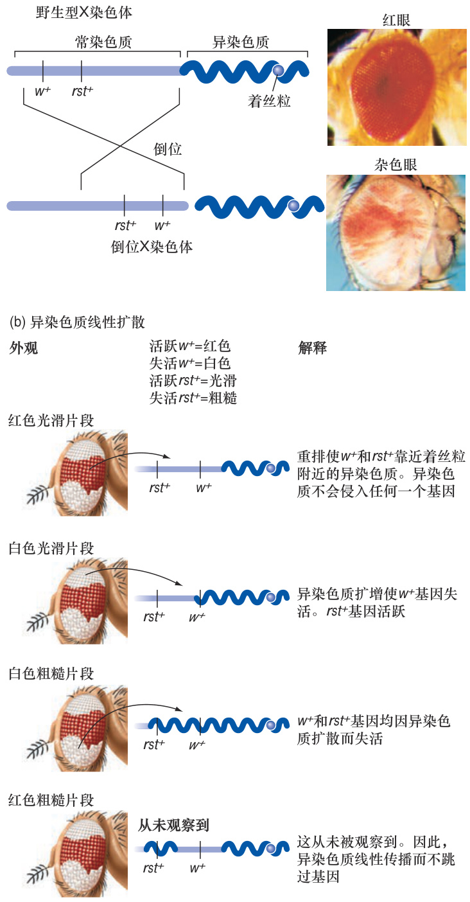  
(a)   
图12.12　在果蝇中产生的花斑位置效应。（a）当 $w^{+}$ 基因通过染色体易位被带到一个异染色质区附近时，果蝇的复眼呈现红白嵌合的花斑。（b）花斑位置效应的模型是假设异染色质可以从围绕着丝粒的正常位置通过线性扩散移到邻近的基因，从而导致基因失活而发生表型的改变。  

（a，两图）： $\copyright$ Dr. Clinton Bishop, Department of Biology, West VirginiaUniversity  

在携带野生型 $w^{+}$ 等位基因的果蝇中，带有活跃的 $w^{+}$ 基因的细胞表型是红眼，而携带不活跃的 $w^{+}$ 基因的细胞表型是白眼。很明显，当正常的像 $\boldsymbol{w}^{+}$ 这样的全色基因进入异染色质附近时，异染色质可以扩散到全染色质区域，从而抑制这些细胞的基因表达。在这种情况下，虽然基因的DNA没有发生改变，但是基因易位已经改变了一些细胞的基因表型。因此，花斑位置效应反映了兼性异染色质的存在：在同一生物体中，同样的一段染色体区域（甚至整个染色体）在有些细胞中是异染色质，而在有些细胞中可能是常染色质。  

在果蝇中，红眼和白眼的花斑位置效应使眼睛呈现出红色和白色斑块相间的马赛克［图12.12（a）］。但在每个眼睛中，斑块的数量、位置和大小各不相同。这表明，异染色质是否会扩散到特定细胞的 $w^{+}$ 基因上是随机发生的。由于许多相邻细胞的斑块具有相同的颜色，所以这种表型可能是在眼睛发育的早期就已经形成了。表型一旦确定，就会被细胞通过有丝分裂的方式延续给后代。这些后代细胞占据眼睛的特定区域，就形成了红色或白色细胞的斑块。  

# 1. 异染色质的影响范围  

花斑位置效应的一个有趣现象是，异染色质可以扩散到1000kb以外的常染色质区域。例如，通过基因重组可以将 $\cdot w^{+}$ 基因易位到附近的异染色质区域，同时将粗糙眼（roughest ）基因也易位到附近相同的区域，尽管离异染色质［图12.12（a）］稍远一点。野生型的粗糙眼（ $.\,r s t^{+}$ ）基因通常会产生光滑的表面。在携带重组基因的果蝇中，一些白眼斑块有光滑的表面，而另一些则有粗糙的表面［图12.12（b）］。后一种表型中，异染色质使白眼 $w^{+}$ 和粗糙眼rst 基因失活。但是，粗糙红眼的表型永远不会出现，这也说明了异染色质不会跳过基因，只能沿着染色体进行线性扩散。  

如果异染色质能扩散，正常情况下异染色质和常染色质之间的界限是如何形成的？研究证明，被称为边界元件的DNA片段阻止了异染色质的扩散。虽然边界元件存在的确切机制尚不清楚，但目前的研究表明，这些DNA元素会启动修改组蛋白的酶，这将在本章后面解释。  

# 2.  使用PEV来识别异染色质的组成成分  

科学家们利用果蝇中花斑位置效应的现象来探索异染色质的组成成分。通过研究大量斑块的变化，研究人员发现了改变斑块效应的基因突变。斑块效应增强（眼睛更白）时，大量细胞处于基因失活状态； 斑块效应抑制（眼睛更红）时，少数细胞处于基因失活状态。  

研究人员后来分离出了一些改变斑块性状的等位基因的突变，并研发了针对基因突变蛋白产物的抗体。通过这种方式，他们发现一些影响异染色质形成的基因编码蛋白有选择性地位于异染色质上。下一节将会讲到，对这些蛋白质的识别为研究染色质结构的生物学控制提供了重要线索。  

# 12.3.4 异染色质和常染色质的组蛋白修饰  

几个互相影响的互动机制导致了活跃（或潜在活跃）的常染色质和沉默的异染色质之间的区别。这些机  

制中最重要的一种是核小体中组蛋白的共价修饰。染色质修饰蛋白与调节基因表达的转录因子之间的相互作用将在第17章中进行讨论。  

# 1. 组蛋白尾部修饰  

四个核心组蛋白（H2A、H2B、H3和H4）的N端区域形成了从核小体向外延伸的尾部（图12.13）。有些酶可以沿着氨基酸的末端添加多种不同的化学基团（其中包括甲基、乙酰基、磷酸基团和泛素；见图8.26），而一些酶可以去除先前添加的这些基团。这些组蛋白尾部的修饰可以影响核小体的包装，并且修饰后的尾部可以作为染色质修饰蛋白结合的平台。核小体核心的组蛋白尾部修饰可能有100种以上的方式（图12.13）。  

对于组蛋白尾部修饰的最佳解释是对特定赖氨酸的乙酰化和对特定赖氨酸及精氨酸的甲基化（图12.14）。由组蛋白乙酰转移酶（HAT）完成的赖氨酸乙酰化，通过阻止核小体的高度浓缩来打开染色质。组蛋白乙酰化有利于常染色质区域的基因表达，因为它们的启动子可以被RNA聚合酶及其相关蛋白质所结合。有趣的是，组蛋白上乙酰化的赖氨酸作为帽子酶的结合位点，促进组蛋白乙酰化向相邻核小体的扩散。组蛋白脱乙酰化酶（HDAC）去除乙酰基，导致染色质的闭合和转录的抑制。  

组蛋白尾部的甲基化修饰更为复杂，可能会根据特定氨基酸的甲基化而关闭或打开染色质。组蛋白尾部氨基酸进行甲基化的酶是组蛋白甲基转移酶（HMTase），而逆转组蛋白甲基化的酶叫做组蛋白去甲基化酶。  

果蝇体内存在一种通过等位基因突变导致功能失活的PEV抑制因子，其主要功能是编码HMTase酶，通过在组蛋白H3的特定赖氨酸中添加甲基（K9）来实现抑制作用。这种特殊的甲基化作用是通过为异染色质蛋白提供结合位点，将染色质标记为异染色质。组蛋白H3-K9的甲基化是染色体区域表现为转录沉默的共同特征（见图12.14）。  

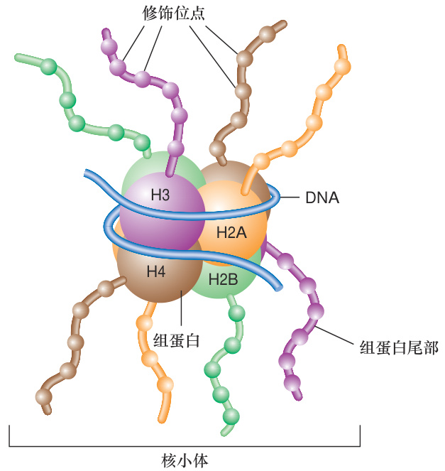  
图12.13　组蛋白尾部修饰。核心组蛋白的N端从核小体向外延伸。这些氨基酸的末端都是修饰的目标，如改变染色质结构的甲基化和乙酰化。  

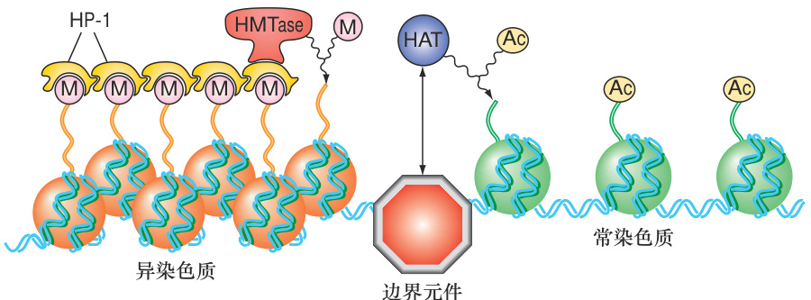  
图12.14　组蛋白尾部修饰改变染色质结构。在异染色质（橙色）中，核小体的K9-甲基（M）与HP1蛋白相结合，K9-甲基会吸引在核小体附近进行甲基化的HMTase酶，从而促进不活跃区域的扩散。在常染色质区（绿色），HAT酶对核心组蛋白的乙酰化（Ac），导致离核小体足够远的染色质开放区域能够进行转录。阻止异染色质扩散的边界很可能是一种能吸引HAT酶的DNA序列，或者是逆转K9甲基化的去甲基化酶（未显示）。  

# 2. 异染色质特异蛋白  

果蝇体内存在一种名为HP1的花斑位置效应抑制编码基因，这是一种重要的异染色质蛋白，它与含有甲基化K9的组蛋白 H3的尾部结合在一起。HP1蛋白有两种方式促进染色质与异染色质尾部的结合（见图12.14）。首先，它会自我关联，这有助于将相邻的核小体更紧密地结合在一起。其次，HP1可以与其他蛋白质相结合，研究最多的是与HMTase酶的结合，它能将甲基化基团加入到组蛋白 H3的K9中，帮助相邻核小体进行组蛋白H3-K9的甲基化。这种自催化效应也可以帮助科学家解释在花斑位置效应中观察到的异染色质的线性扩散现象。  

如图12.14所示，异染色质和常染色质之间的选择与组蛋白尾部进行甲基化或乙酰化修饰有关。一旦常染色质和异染色质中的一种在一组核小体中占主导地位，它们就会一直扩散到附近的核小体，直到它们到达边界。阻止异染色质扩散的边界是一种特殊的DNA序列，它可以结合组蛋白乙酰转移酶（HAT）和组蛋白去甲基化酶，使受影响的染色质区域倾向于形成常染色质。  

# 12.3.5 异染色质抑制雌性哺乳动物细胞中X 染色体的激活  

在第4章中讲到，由于在雌性体细胞中，两条X染色体中的一条被随机激活，因此在哺乳动物中，雌性个体和雄性个体的X染色体中发生表达的基因数量是相同的。在一些细胞中，从母系遗传的X染色体是失活的；也有可能，从父系遗传的X染色体是失活的（回顾图4.25）。不活跃的X染色体（或巴氏小体）是兼性异染色质的例子：X染色体在一些细胞中几乎完全是异染色质，而在有些细胞中可能是常染色质。X染色体中的大部分基因只能在常染色质细胞中进行转录；相反，只有在少数的异染色质的巴氏小体中，X染色体基因（主要是在伪常染色体的区域）可以转录。  

我们把人类X染色体中一个包含了450kb的DNA区域称为X去活化中心（XIC），它可以调节剂量补偿［图12.15（a）］。XIC的作用是通过将一个XIC复制体转移到常染色体中，使常染色体成为巴氏小体。在XIC中有一个最重要的基因叫做Xist（X染色体失活特异性转录物）。Xist基因的产物是一种超长（17kb）的非编码RNA（ncRNA），与大多数转录物不同，它从不离开细胞核，也不会被转化成蛋白质。  

Xist是由不活跃的X染色体稳定转录得来的，而且正是Xist ncRNA触发了它被转录的X染色体的失活。Xist是一种重要的基因，它可以调解失活，因为如果Xist被从一个X染色体中删除后，另一个X染色体就会变成巴氏小体。相反地，如果把Xist的副本添加到常染色体中，那么染色体就会自动成为巴氏小体。研究人员目前正在探索将Xist添加到唐氏综合征患儿的三条染色体中的一条染色体上的可能性。从理论上讲，这种策略可以作为一种基因治疗，通过关闭多余的21号染色体的基因表达来改善唐氏综合征的症状。  

使用荧光分子探针的研究表明，Xist ncRNA能够覆盖产生它的X染色体［图12.15（b）］。然后，XistncRNA就会在这条X染色体上结合组蛋白修饰酶。由此触发位于核小体组蛋白尾部的甲基化酶和脱乙酰化酶将染色体进一步浓缩成巴氏小体。不活跃的X染色体也显示了沉默子的一些其他的特征，例如，DNA中某些核苷酸的甲基化作用，这将在本书第17章中进行叙述。  

尽管图12.15显示了迄今为止已经确定的一些关于X染色体失活的分子细节，但仍有一些待解的谜团。第4章提到，受精大约2周后，在染色体为XX的女性胚胎中，每隔 $500\!\sim\!1000$ 个细胞就会发现一个将两条X染色图12.15　X染色体去活化。（a）X去活化中心的调控基因为Xist，其基因产物是非编码的ncRNA。Xist是编码导致X染色体上大部分基因失活的特异转录因子。Xist ncRNA与这条染色体上的许多位点结合；然后，Xist ncRNA会激活使DNA沉默的组蛋白修饰蛋白。（b）对雌性小鼠体细胞的研究显示，Xist ncRNA（红色）只与未激活的X染色体结合（Xi；巴氏小体），而不与激活的X染色体（Xa）结合。DNA显示为蓝色；X染色体上的Xist基因显示为黄色。  

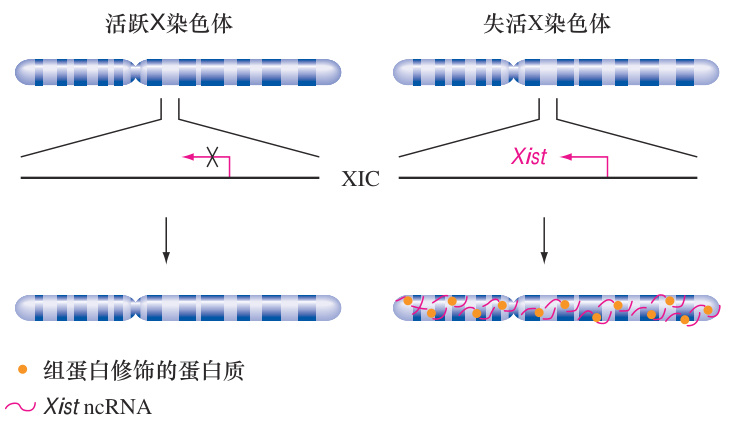  
(a) Xist     X   
(b)  Xist ncRNA  

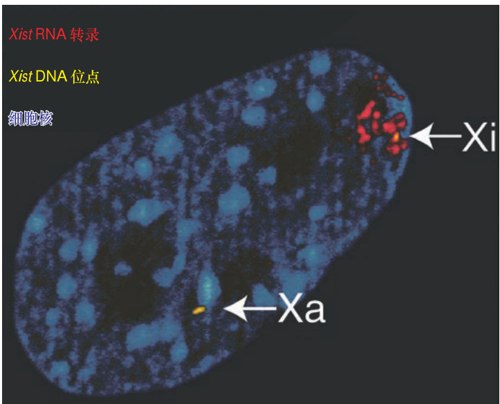  

（b）引自：B. Reinius et al (2010), “Female biased expression of long noncoding RNAs in domains that escape X-inactivation in mouse,” BMC Genomics, 11:614, Fig. 5 $\copyright$ Reinius et al. Licensee BioMed Central Ltd. 2010  

体中的一条浓缩为巴氏小体的细胞。目前还不清楚，细胞是如何选择将哪条X染色体进行失活的。此外，为什么Xist ncRNA只与被选定用来转录成Xist的X染色体相结合？  

另一个热门的研究领域是，体细胞中X染色体的失活是可以遗传的：一旦发生失活，这种现象就会被遗传下去，这样，由一个特定的胚胎细胞通过有丝分裂产生的数百万个细胞，都会将同样的X染色体浓缩成一个巴氏小体。科学家们目前正在探索细胞是如何记住分裂后将哪条X染色体浓缩成巴氏小体的。  

# 基本概念  

●  重建复合体利用ATP水解的能量改变核小体的位置，暴露启动子并进行基因转录。  
●  在异染色质区，启动子被紧紧包裹在核小体中，阻止其转录的发生，从而使这些基因表现为沉默。  
●  花斑位置效应是指位于常染色质区的基因经过染色体重排转移到异染色质附近的着丝粒区域时，表现出不稳定的表型效应。异染色质的扩散会使基因沉默，抑制其转录的发生。  
●  在组蛋白H3中，特定赖氨酸（K9）的甲基化是沉默子区域的特征。与此相反，组蛋白尾部发生的乙酰化修饰打开染色质并激活了基因表达。  
·Xist基因用来调控X染色体的失活。Xist基因的非编码RNA（ncRNA）覆盖产生它的X染色体，并通过与组蛋白修饰酶结合来灭活染色体，从而产生巴氏小体。  

# 12.4 真核生物染色体的复制  

# 学习目标  

1.  解释在真核细胞中DNA如何在短时间内发生复制。  
2.  总结在复制过程中重新形成核小体的过程。  
3.  讨论端粒的结构及其在维持染色体完整性方面的  
作用。  
4.  描述端粒酶的作用，并识别出后续形成的细胞类型。  

就像转录一样，染色体的复制也需要读取它们的DNA。科学家们已经能够在光学显微镜下观察到染色体复制并分化成子细胞的过程。然而，其分子水平机制直到近来才被发现。在本节中，我们回顾了目前已知的关于真核生物染色体复制的内容。  

在第6章中，我们讨论了微生物细胞中DNA聚合酶与其他因素合作进行DNA复制的过程。在真核生物中，尽管DNA复制的许多方面都是与微生物细胞相似的，但这些细胞也面临着其他的挑战。首先，真核细胞的DNA比原核细胞要多得多，所有这些细胞都需要在细胞周期的短时间内完成复制。其次，真核细胞中DNA的复制必须由DNA包裹在核小体周围进行。最后，真核生物的染色体是线性的，而不是环状的，但线性染色体的末端很难复制。我们在这一节中讨论了真核细胞如何处理染色体复制中的这些特殊问题。  

# 12.4.1 染色体中的DNA复制起点  

一个典型的人体细胞中发生DNA复制时，DNA聚合酶会根据DNA模板以每秒钟连接50个核苷酸的速度组装一个新的核苷酸序列。按照这个速度，聚合酶只需要一个复制的起点，经过大约800h（比一个月多一点）的时间，就能完成人体正常细胞染色体上1.3亿个碱基对的复制。但是，在增生活跃的组织中，这个完成复制的周期要短得多，大约只需要24h，而且S期（DNA复制的周期）只占这段时间的1/3。真核生物的染色体通过触发多个可同时发挥作用的复制起点来确保在这么短的时间内完成DNA的复制。  

大多数哺乳动物细胞的染色体上存在大约10 000个复制起始点。正如在第6章中提到的，每一个复制起始点都与解开双螺旋链的蛋白质结合在一起，将双螺旋结构的两条链分开，产生两个镜像复制叉，然后复制分别从两个方向（双向地）进行。当开始复制一个染色体的DNA时，在电子显微镜中可观察到每个复制起始点都有一个复制泡，因此可以在染色体上看到许多泡的出现（图12.16）。这些泡的体积会逐渐增加，直到与相邻的泡相互融合，最终整个染色体被复制完成。  

DNA的两条单链以相反的方向从复制的起点到终点同时进行复制，并与相邻的复制叉进行DNA合并，称为复制单元或复制子。但是到目前为止，复制起点的数量与S期的时间相关的原因还未发现。例如，在果蝇中，早期胚胎细胞在不到 $10\mathrm{min}$ 的时间内复制了它们的DNA。为了在短时间内完成S期，染色体比在正常的S期时激活了更多的复制起点。  

因此，并非所有的复制起点都必须在生物体有丝分裂的分裂期出现。实际上，在每个哺乳动物细胞核的染色质中散布着上万个复制起点，这些复制起点由长度$30{\sim}300\mathrm{kb}$ 不等的DNA序列分隔开来，这也确保每一个染色质循环中至少有一个复制起点。  

酵母的复制起点（称为自主复制序列，简称ARS） 能够被同时复制的质粒所隔离。ARS能够与启动复制 $\copyright$ H. Kreigstein and D.S. Hogness, “Mechanism of DNA Roplication in Drosophila Chromosomes: Structure of Replication Forks and Evidence of Bidiretionality”，PNAS, 71(1974): 135-139  

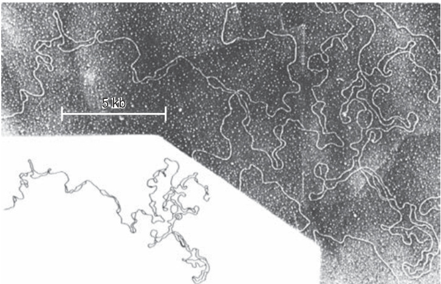  
图12.16　真核生物的染色体存在多个复制起点。通过电子显微镜观察，从果蝇胚胎中复制的DNA。许多复制起点是活跃的，可以创建多个复制子。  

的酶结合。几乎所有的ARS都包含一个11bp的富含AT的序列5′ T/ATTTAYRTTTT/A $3^{\prime}$ ，其中Y是嘧啶，R是嘌呤。其他几个相邻的序列也有助于ARS作为复制起点。通过消化间期染色质的DNase I，研究人员发现复制起点位于缺少核小体的DNA区域。DNase I是存在于不被相关核小体保护的DNA区域内的染色体片段。  

# 12.4.2 新的核小体必须在DNA复制过程中形成  

DNA复制只是染色体复制的一个步骤。这个复杂的过程还伴随着组蛋白和非组蛋白的合成与整合，以此促进核小体和染色质结构的再生。虽然上述结论的某些方面是有争议的，但研究人员已经获得了相关证据，来解释这个过程发生的现象：  

●  组蛋白的合成和转录与DNA的合成是密切相关、相互协调的，因为新生的DNA在其形成的几分钟内就被包入核小体中。  
●  当DNA复制发生时，核小体就会迅速地聚集在新形成的子DNA分子上。新的核小体是由旧的（可循环的）和新形成的组蛋白混合而成的，并随机分布在两个子代DNA分子上（图12.17）。  
●  在某种程度上，通过自我繁殖，可以在复制叉上保留一些组蛋白的修饰，原因是通过组蛋白尾部氨基酸修饰可以激活修饰酶（见图12.14）。然而在某些情况下，这种功能的遗传是无效的。原因是只有新生的组蛋白可以进行修改，而新复制的DNA中只有一半的组  

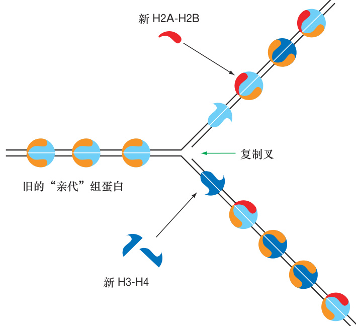  
图12.17　在DNA复制后产生的核小体。复制叉分解了它在亲代染色体中遇到的核小体。在复制叉经过后，新的核小体立即进行组装。首先，一种含有H3和H4两种分子的四聚物与DNA相结合形成半个核小体，然后与两个二聚体相结合，每一个二聚体中都含有一个H2A和一个H2B分子。新的核小体可以包含多种H3/H4四聚体和H2A/H2B二聚体的随机组合，这些组合要么是新合成的，要么是已经存在于亲代核小体中的。  

蛋白是新生的。此外，组蛋白的修饰是不稳定的，所以并不是所有新生的组蛋白都保留了原来的标记。  

如果在DNA复制过程中没有稳定的机制来复制组蛋白标记，为什么在分化细胞发生有丝分裂后，染色质结构通常会重组呢？答案是，在复制之后，由新的核小体组成的染色质结构是开放的，这为细胞核内的转录调控蛋白与子代DNA分子结合在一起提供了机会。尽管在DNA复制时，组蛋白的修饰现象可能会暂时消失，但是这些转录调控蛋白还是会在适当的时机结合组蛋白修饰酶，重建亲代染色体的染色质结构。  

# 12.4.3 端粒能够稳定线性染色体末端的结构并调控染色体的复制  

端粒是存在于真核细胞线性染色体末端起保护作用的特殊的“帽”结构（图12.18）。端粒由与特定蛋白质相关的特殊DNA序列组成，这些“帽”结构虽然是不编码蛋白质的DNA序列，但对保护每条染色体的结构完整性至关重要。  

# 1. 端粒和染色体末端的复制  

线性染色体末端的复制是细胞分化的一个难题。正如你在第6章中看到的，复制机制的关键因素——DNA聚合酶只在 $5^{\prime}{\longrightarrow}3^{\prime}$ ′的方向上运行，它可以将核苷酸添加到现有链的 $3^{\prime}.$ 端。由于这个限制，酶本身就不可能在两条DNA链的 $5^{\prime}$ 端复制核苷酸（其中一种是在染色体末端的端粒上，另一种是在另一条染色体的端粒上）。因此，DNA聚合酶可以重建染色体上每一个新生成的DNA链的3′端，而不是5′端（图12.19）。  

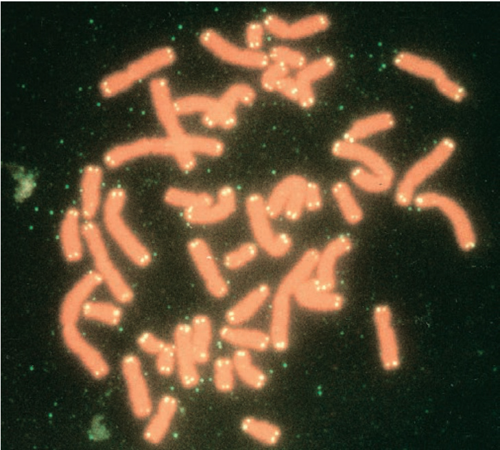  
图12.18　端粒保护真核生物染色体的末端。FISH技术下人类的端粒是探针可以识别的重复碱基序列TTAGGG的黄色荧光体。  

$\copyright$ Dr. Robert Moyzis/University of California-lrvine, Department of Biochemistry  

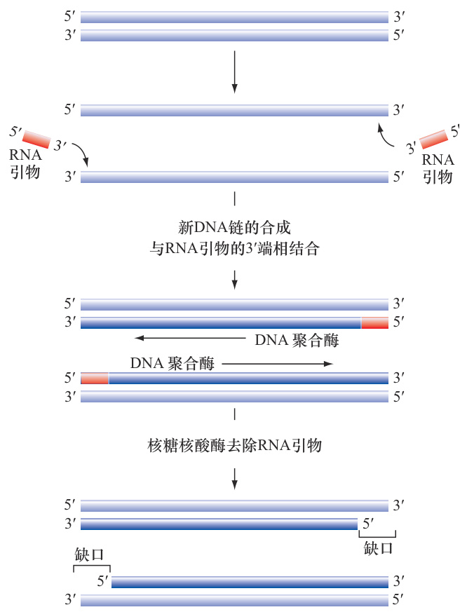  
RNA  

图12.19　染色体末端的复制。即使5′端的RNA引物（红色）可以合成一条新链，但是当核糖核酸酶最终将引物移除时，缺口仍将存在。DNA聚合酶不能在没有引物的情况下填补这一空白，所以新合成的DNA链（暗蓝色）将比亲代短（亮蓝色）。  

我们在第5章中了解到，由于DNA聚合酶不能在新链的5′端开始合成，而且它需要依赖于RNA引物来完成合成工作，但是这些RNA引物最终被移除。因此，每次DNA被复制的时候，在真核细胞每一个新合成的染色体链的5′端都会缺失一个RNA引物长度的序列。最终，经过连续几代的细胞分裂，随着DNA的减少而最终导致失去关键基因，由此染色体也会变得越来越短。  

端粒和端粒酶能够对抗DNA聚合酶的这种局限性。端粒是由不编码蛋白质的重复DNA序列组成的。人类的端粒由碱基序列 $5^{\prime}$ TTAGGG $3^{\prime}$ （在一条链上读取）重复 $250\!\sim\!1500$ 次组成。重复的次数随细胞类型不同而存在差异，其中精子的端粒是最长的。同样的TTAGGG序列存在于所有哺乳动物的端粒中，也存在于鸟类、爬行动物、两栖动物、骨鱼和许多植物物种中。一些亲缘关系较远的生物体的端粒中也有重复序列，但序列稍有不同。例如，四膜虫染色体上端粒的重复序列是TTGGGG。不同物种间这些重复序列的高度相似性表明，端粒在真核生物进化的早期阶段发挥了至关重要的作用。  

端粒酶是一种不寻常的酶，由蛋白质与RNA结合组成。由于这种组合，它被称为核糖核酸蛋白。这种酶的RNA部分包含 $3^{\prime}$ AAUCCC 5′的重复序列，这与端粒中5′TTAGGG 3′的重复序列互补，它们是端粒末端添加新的TTAGGG的模板（图12.20）。新的重复序列的增加可以平衡DNA的丢失，而DNA的丢失是线性DNA分子被复制时必然发生的。  

# 2. 端粒酶的活性和细胞的增殖  

些类型的细胞充分利用了在细胞分裂期端粒维持染色体结构稳定性的优势，但也有少数类型的细胞在细胞分裂时染色体会缩短。在人类中，大多数分化的体细胞属于后一种类型。尽管这些细胞在其基因组中有端粒酶基因，但并不表达这种酶的活性，所以端粒在每个细胞分裂时都会略微缩短。经过 $30\!\sim\!50.$ 次的细胞分化后，染色体末端开始失去重要的基因，由此，这些细胞开始显示衰老的迹象，直至死亡。因此，端粒酶的缺乏导致了分化的体细胞具有有限的生命周期。  

相比之下，生殖细胞能够表达端粒酶，从而确保在DNA的复制过程中，染色体末端不会丢失基因（如果不是这样，我们的物种早就灭绝了）。显然，生殖细胞具有某种反馈机制，能维持端粒的最佳复制次数，从而使染色体在每一次细胞分裂中既不会缩短，也不会延长。  

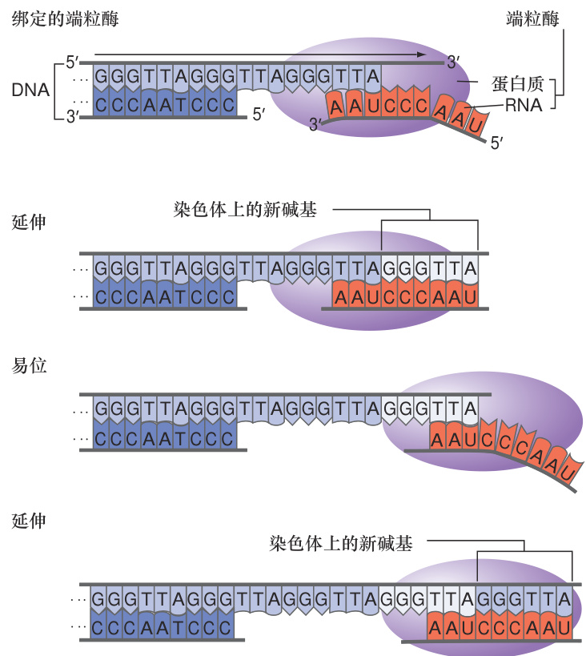  
人体中有两类体细胞也可以产生端粒酶，因此具有  
图12.20　端粒酶如何延长端粒。端粒酶RNA（红色）中3′AAUCCC 5′的重复序列与端粒 $5^{\prime}$ TTAGGG 3′的重复序列互补。端粒酶RNA作为一种模板，可以将TTAGGG重复添加到端粒末端。在添加了一个新的重复序列之后，端粒酶将转移（易位）到新合成的端粒上，进行更多的延伸。  

繁殖后代的能力。其中一类细胞是确保组织再生的干细胞，如造血干细胞。第二种类型是肿瘤细胞——体细胞发生错误的分裂机制，可以进行无限分裂的细胞。基于端粒酶的高度活性是许多肿瘤细胞的特征，制药公司正在开发能够抑制这种重要酶的癌症治疗药物。  

# 3. 端粒和染色体的完整性  

染色体的破坏（例如，暴露在X射线下）和端粒的脱离对细胞构成了许多危害。其中一个问题是，细胞中含有能从破裂的末端降解DNA的核酸酶。第二个问题来自于图7.18中描述的非同源末端结合（NHEJ）的酶系统。如果两种不同的染色体被破坏了，这些NHEJ酶可以将染色体结合在一起，则这种断裂染色体头尾相连的融合产生了两个中心体。在有丝分裂的后期，如果两个着丝粒被拉向相反的方向，它们之间的DNA就会破裂，导致染色体发生破坏并最终从子细胞中消失。这些例子表明，正常的端粒对于稳定染色体结构和维持细胞遗传具有重要的作用。  

不同于端粒酶，端粒的保护作用是由蛋白质引起的，它能与染色体末端的TTAGGG相结合。这些蛋白质形成了一种叫做端粒蛋白复合体的物质，它将端粒折叠成一个结构，避免单链TTAGGG序列与核酸酶和NHEJ酶（图12.21）的结合。  

# 基本概念  

●  在真核细胞中，DNA复制几乎同时发生在数千个复制起点上。  
●  在复制过程中，新的核小体聚集在子代DNA分子上。调节蛋白质与DNA相结合，并与组蛋白修饰酶相结合来重建亲代染色质结构。  
●  因为DNA聚合酶不能复制线性DNA分子的5′端，导致染色体在每次复制时都会缩短，进而造成基因缺失和细胞死亡。为了避免这种现象，端粒包含了可以通过端粒酶延长的重复序列。  
●  由于大多数体细胞不表达端粒酶，因此细胞寿命有限。但是，包括生殖细胞、干细胞和肿瘤细胞在内的一些细胞则可以表达端粒酶。  

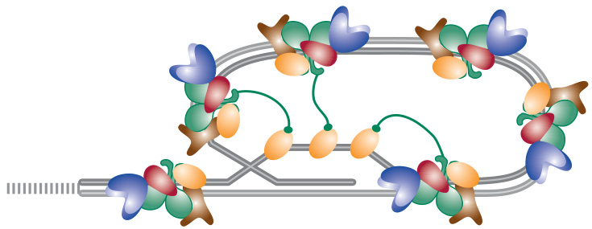  
图12.21　防护层保护端粒。在DNA尾部的折叠区（灰色），端粒蛋白复合体（有颜色的区域）的蛋白质与端粒结合，这样它们既不会被核酸酶攻击，也不会与非同源染色体的末端结合。  

# 12.5 染色体分离  

# 学习目标  

1.  对比DNA序列，描述在酵母和高级真核生物中着丝粒的组成。  

2.  描述细胞分裂中期的纺锤体，以及动粒在染色体分离时的作用。  

3.  比较在有丝分裂、减数分裂Ⅰ和减数分裂Ⅱ时的黏连蛋白的作用。  

在细胞有丝分裂或减数分裂Ⅱ期，每一个复制的染色体中的两条染色单体在后期从染色体中分离，分别进入两个子细胞中去。与此相反，在减数分裂Ⅰ期，同源染色体分离，这样每个子细胞中有且只有一条同源染色单体。真核生物的着丝粒作为分离中心确保了不同分离机制下的准确分离。着丝粒区域是姐妹染色单体结合最紧密的地方；此外，着丝粒结构中的动粒是染色体与纺锤丝结合的位置（图12.22）。  

# 12.5.1 特殊的DNA序列促进着丝粒的形成  

在酵母中，着丝粒由两个高度保守的核苷酸序列组成，每一个都只有 $10\!\sim\!15\mathrm{bp}$ ，被大约90bp长的富含AT的DNA序列隔离（图12.23）。显然，生物体中，大约120个核苷酸的一小段序列足以在这个生物体中指定一个着丝粒。不同酵母染色体的着丝粒序列非常相似，以至于一个染色体的着丝粒可以替代另一个染色体的着丝粒。这一事实表明，所有的着丝粒在染色体分离中起着相同的作用，它们并不能帮助区分两条染色体中的一条。  

高级真核生物的着丝粒比酵母的着丝粒要大得多，也复杂得多。这些更复杂的着丝粒被包裹在某些重复的、非编码的序列中，被称为卫星DNA。卫星DNA存在许多不同种类，每一种都由 $5\!\sim\!300\mathrm{bp}$ 不等的短序列组成，并且可以重复串联成千上万次，形成大的卫星阵列。人类着丝粒的主要卫星序列——α卫星序列是含有大约170bp的非编码序列，它存在于一个串联重复序列中，在每条染色体的着丝粒区域内延伸超过1Mb的DNA。许多人类着丝粒也包含了与卫星无关的重复序列，这些序列将异染色质特征传递给着丝粒，如图12.11所示。  

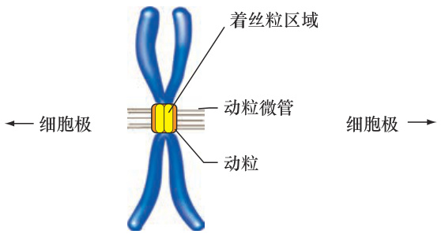  
图12.22　着丝粒。着丝粒（黄色）的黏连蛋白使姐妹染色单体结合在一起。着丝粒也包含了一些动粒（橙色）的结构信息，这些结构负责调控染色体与纺锤丝的结合。  

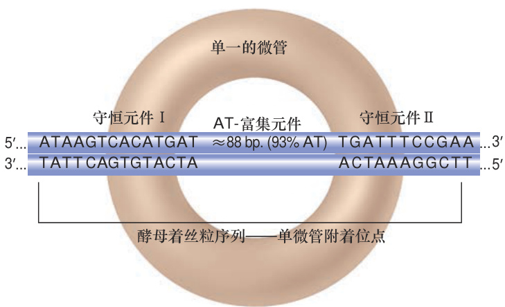  
图12.23　酵母着丝粒DNA序列。每个酵母着丝粒有两个短的、保守的DNA元件，并通过动粒蛋白（未显示）与一个纺锤体微管（棕褐色）结合，显示其大小以供比较。  

# 12.5.2 动粒控制着染色体与纺锤体的结合  

着丝粒与染色体的正确分离与动粒密切相关：动粒是由DNA和蛋白质组成的特殊结构，是染色体附着在纺锤丝上的部位。在酵母细胞中，每一个动粒都与单独的一根纺锤丝相连（见图12.23）；但在高级的真核生物中，动粒与许多纺锤体微管相连（图12.24）。研究人员认为，这些复杂的动粒可能是由许多重复的结构子单元组成的，每个子单元负责与一根纺锤丝相连。  

动粒DNA序列，如人类α卫星序列，与其他染色体相比，有不同的染色质结构和不同的高阶包装（图12.24）。在这种特殊的染色质中，核小体的核心正常的H3组蛋白被一种叫做CENP-A的组蛋白取代。CENP-A组蛋白与C端区域的组蛋白H3非常相似，但与N端的组蛋白H3不同。具有这种组蛋白变体的核小体可以作为支架，将其他的蛋白质组装到动粒上。  

在有丝分裂期，动粒形成于姐妹染色单体形成的前期，并附着于着丝粒的两端。在有丝分裂前期和中期，两个姐妹染色单体的动粒附着在细胞两端中心体的纺锤丝上，通过动粒蛋白将两条姐妹染色单体拉向两极。  

在分裂中期，当姐妹染色单体被拉向相反的方向时，就会产生张力，但它们仍然附着在动粒上。此时，某些其他的动粒蛋白，协助这种张力建立一个细胞周期检测点：只有在细胞内的所有活动都处于拉伸状态时（即所有的染色体都附着于纺锤体上），这些蛋白质才会产生一个分子信号，使姐妹染色单体相互分离。在分裂后期，染色单体可以移动到各自的极点。  

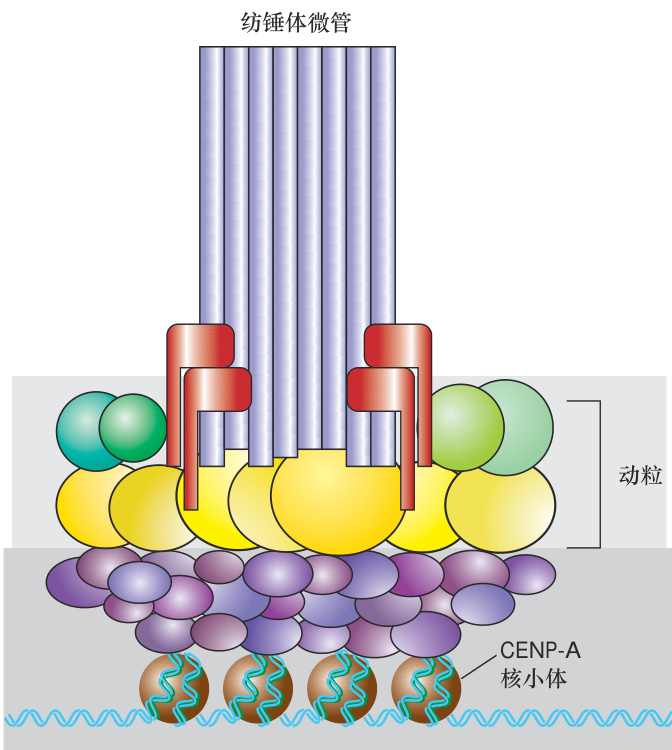  

图12.24　动粒。在高等的真核生物中，着丝粒DNA由重复的序列组成，这些序列被组装到包含CENP-A蛋白的核小体中，CENP-A蛋白是组蛋白 H3的一种变体。含有数十种蛋白质的动粒围绕着这些核小体。其中一些蛋白质控制动粒的组装（紫色），一些结合微管（黄色）；有些推动染色体沿着纺锤体移动（红色）；还有一些（绿色）确保姐妹染色单体（有丝分裂，减数分裂Ⅱ）或同源染色体（减数分裂Ⅰ）在染色体被正确地附着在纺锤丝上之前不会分离。  

# 12.5.3 黏连蛋白复合物使姐妹染色单体结合在一起  

黏连蛋白是指在有丝分裂和减数分裂期间像胶水一样将姐妹染色单体黏连在一起的一种高度保守的、多亚基的蛋白质复合物。当染色体在细胞周期的S期被复制后，通过黏连蛋白将姐妹染色单体连接在一起并附着在着丝粒区域。黏连蛋白的这种结合是通过包围姐妹染色单体的两个双螺旋结构实现的。图12.25显示了目前存在争议的一种模型：黏连蛋白与两个DNA分子结合的拓扑关系模型。这种黏连蛋白环沿着染色体的长度分布，但它们在着丝粒异染色质区域附近的浓度特别高。  

在有丝分裂中期，黏连蛋白复合物与将两条染色单体拉向两极的动粒的力相抵抗，于是就产生了刚才提到的染色体张力。在后期，一种叫做分离酶的蛋白水解酶将黏连蛋白复合物分解，使姐妹染色单体分开并移动到两极的纺锤体上［图12.25和图12.26（a）］。为了支持这个观点，分裂细胞表达一种不会被水解酶分解的黏连蛋白，导致染色体分离错误的发生。  

在减数分裂期，存在一个特殊的问题：姐妹染色单体在第一次减数分裂期仍然结合在一起，但在第二次减数分裂时分开了。细胞通过产生含有特定亚基的黏连蛋白（取代图12.25中的紫色亚基）与一种叫做shugoshin［日语中“守护神”的意思；图12.26（b）］的蛋白质相互作用来解决这个问题。Shugoshin保护着丝粒免于分离酶的裂解。在进入减数分裂Ⅱ期时，shugoshin被移除，从而水解酶分解黏连蛋白，促使姐妹染色单体分离移至两极。  

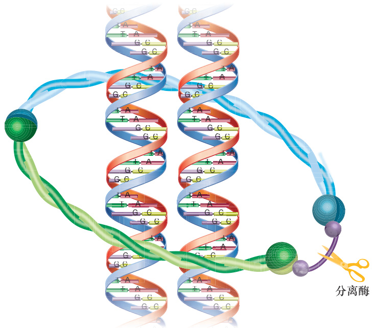  
图12.25　内聚蛋白的分子模型。内聚蛋白复合物有蛋白质亚基（绿色、湖绿色和紫色），它们一起围绕着两个姐妹染色单体（两个DNA分子，蓝色和红色的链）。当分离酶（金）分裂紫色内聚蛋白亚基时，姐妹染色单体可以分离，释放两个DNA分子。  

有趣的是，shugoshin并没有在姐妹染色单体的臂上保护黏连蛋白；目前还不清楚着丝粒上的黏连蛋白与染色体臂上的黏连蛋白之间分子机制的区别。因此，在减数分裂Ⅰ期的后期，姐妹染色单体臂上的黏连蛋白被分解，而着丝粒上的则没有。这一现象非常重要，因为正如将在本章末尾的习题30中了解到的，在染色体臂上的黏连蛋白是将同源染色体结合在一起的黏合剂，而纺锤体则试图在第一个减数分裂的中期将它们分开。因此，在减数分裂Ⅰ期的后期，染色体臂上黏连蛋白的分解是促使同源染色体分离并附着于两极纺锤体的必要条件。  

# 基本概念  

●  酵母菌的着丝粒由较短的DNA序列组成。但高等真核生物中，着丝粒要复杂得多，而且包含重复的DNA序列。●  在着丝粒上的动粒是纺锤丝附着在染色体上的位置。细胞周期检测点确保染色单体在所有动粒与纺锤体结合之前不会被分离。  

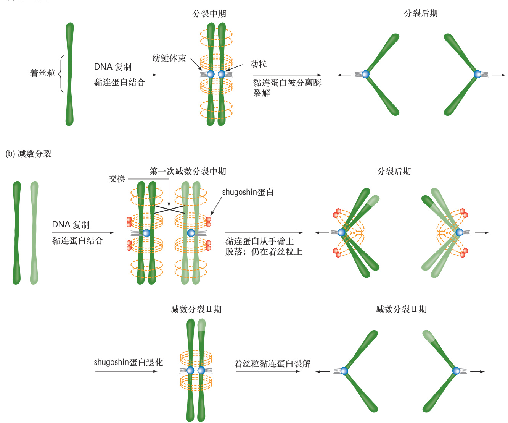  
(a)  

图12.26　黏连蛋白在有丝分裂和减数分裂中的作用。（a）在有丝分裂期，黏连蛋白将姐妹染色单体连接在一起。在分裂后期，分离酶将黏连蛋白分解促使姐妹染色单体分离。（b）在减数分裂Ⅰ期的后期，染色体臂上的黏连蛋白分解，但着丝粒上的黏连蛋白被shugoshin蛋白保护而免于分解。着丝粒上的黏连蛋白保持姐妹染色单体的结合直到减数分裂Ⅱ期的后期。  

●  直到在分裂后期被分离酶分解前，黏连蛋白复合物维持染色单体的结合。在减数分裂Ⅰ期，shugoshin保护着丝粒上的黏连蛋白不被分解，从而保持姐妹染色单体结合在一起；在减数分裂Ⅱ期，shugoshin被移除，导致分离酶在后期将黏连蛋白分解。  

# 12.6 人造染色体  

# 学习目标  

1. 列出人造染色体中的必要组成元素。  
2. 讨论科学家制造人造染色体的原因。  

在20世纪80年代，分子遗传学家构建了第一个人造真核生物染色体，即酵母人工染色体（YAC），是将本章中描述的三个关键的染色体元素（着丝粒、端粒、DNA复制起点）结合到仅含有一个DNA分子的酵母中（酿酒酵母菌）形成的（图12.27）。2014年，约翰霍普金斯大学的一组科学家报道了这一完整的简单生物的人造染色体构造。在这一节中，我们讨论了YAC和人造染色体的区别，并讨论了这两种DNA分子的用途。  

# 12.6.1 酵母人工染色体可以用来帮助描述DNA进行染色体复制和转录的原理  

在第9章中，我们描述了通过克隆基因组片段进行的“全基因组测序”的测序方法。当使用这种方法时，基因组被切成2Mb长的片段，随后被分离、扩增和鉴定。其中有两种类型的载体可以克隆出如此长的DNA片段，它们是BAC（细菌人工染色体）和YAC（酵母人工染色体）。我们在这里详细描述了YAC，不仅因为它们对克隆大量的基因组DNA很有用，而且通过这些载体分子的作用，科学家观察到了许多染色体的功能。  

图12.27说明了着丝粒、端粒和复制起点是如何组合成一个YAC的。一旦科学家们使用DNA重组技术并加入这些元素，就可以将YAC转化为酵母细胞，用来作为染色体的宿主。研究人员通过使用一个可选择性的标记来追踪YAC的存在，例如， $T R P^{+}$ 基因能够使营养缺陷型细胞在缺少色氨酸的生长介质中持续存活。  

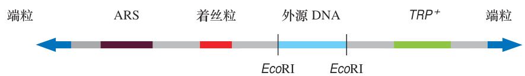  
图12.27　酵母人工染色体（YAC）。为了有效地发挥人工染色体的功能，含有ARS（酵母复制起点）、着丝粒序列和末端端粒的YAC载体需要通过EcoRI位点连接，插入长度超过100kb的外源DNA（未按比例绘制）。如果载体有一个选择性标记，如$T R P^{+}$ 基因，用YAC转化的酵母细胞可以被识别。  

YAC的研发过程具有历史性的意义，因为它帮助遗传学家根据酵母复制起点（ARS）和着丝粒对染色体进行分离和研究。试验中，只含有复制起点但缺少着丝粒或端粒的质粒虽然能够进行复制，但不能正确地进行分离。含有复制起点和着丝粒但没有端粒的圆形质粒，则能够很好地进行复制和分离；如果它们是线性的，就会被降解并最终从细胞中消失。  

有趣的是，携带这三种元素的小DNA分子复制并分离成独立于正常酵母染色体的线性染色体，但由于缺少足够的DNA，它们并不能精确地分离。YAC可以将携带11 000bp的片段随机插入到DNA中，这也导致了细胞分裂中 $50\%$ 的分离错误的发生。当插入的基因片段为55 000bp时，有 $1.5\%$ 机会发生错误分离。由于人造染色体中含有超过10万bp的插入片段，所以分离错误率下降到 $0.3\%$ 。这个错误率仍然是大小相等的正常酵母染色体的200倍，这表明染色体结构和功能的一些微妙变化仍值得去研究。  

研究人员根据YAC相关的研究成果来开发人造染色体。他们希望能够将人造染色体作为一种载体来治疗相关的遗传疾病。  

# 12.6.2 人造染色体可能有助于合成最小基因组  

染色体无疑包含许多对于生物体的生存不必要的DNA序列。这些序列包括转座因子、重复的脱氧核糖核酸序列（DNA）、基因之间的一些DNA和许多内部序列。此外，在实验室条件下，研究人员发现在大约6000个酵母基因中，只有大约1000个对酵母细胞的生长是至关重要的。换句话说，删除其余的5000个基因中的任何一个都可以让酵母继续存活下来。但是，在一些特殊的生长条件下，这5000个非必需基因中有许多实际上是必不可少的，或者当一个基因被移除时，另一个特定的基因就变得至关重要。那么，酵母细胞生存所需的最小的DNA序列是什么呢？  

为了回答这个问题，分子生物学家研发出含有16条合成染色体的酵母细胞。在这种方法中，合成染色体与人造染色体是不同的，类似于YAC有两种方式。首先，合成染色体中的所有DNA都是由DNA合成仪人工合成的，与此相反，YAC是通过将原本在酵母染色体中的DNA元素拼接而成的；第二，合成染色体包含了（在进行后续试验之前）目前酵母染色体中已知的所有基因。相比之下，YAC载体通常含有一个单一的蛋白质编码酵母基因— — —一个可选择的标记，如图12.27的 $T R P^{+}$ 基因。  

在2014年，科学家们报道了第一个合成的真核染色体——酵母3号染色体（SynⅢ）。尽管SynⅢ比正常的3号染色体（ $317\,000\mathrm{bp}$ ）缺少了大约50 000bp（主要是转座因子和其他基因间隔区序列）的片段，但是含有SynⅢ的酵母细胞代替了维持生物体外观和生长正常的3号染色体。正如你们将在习题37中看到的，SynⅢ也包含特殊的短序列，在将来，研究人员可以利用这些短序列对染色体的不同区域分别进行删除，以确定哪些基因或基因组合是必需的或非必需的。  

科学家现在正在研发其他15条酵母菌染色体的合成版本，从而获得含有最少基因组的16条酵母合成染色体。如果实验成功，研究人员不仅可以通过化学方法合成整个基因组，而且他们能够合成支持生命的最小酵母基因组。  

# 基本概念  

●  人造线性酵母染色体（YAC）的稳定传代需要包含复制起点（ARS）、着丝粒和端粒；由于未知的原因，能够稳定传代的染色体必须包含超过100kb的DNA序列。  
●  人造染色体被用作克隆载体，并在研究中确定自然染色体的功能区域；可能在未来可以利用它们治疗人类遗传疾病。  
●  缺乏大多数基因间隔序列的合成染色体能够正常地行使功能。这样的合成染色体可能有助于合成最小的酵母基因组。  

# 接下来的内容  

真核生物的染色体通过染色质模块化设计来管理DNA中的遗传信息，可以灵活地进行组装和浓缩的自由转换。染色质结构的这些可逆变化稳定地维持着染色体的各种功能，例如，细胞核的组装、细胞分裂过程中的复制和分离，以及基因表达的调控。  

尽管染色体稳定的复制和传代功能是每个物种生命得以延续的基础，但染色体确实会发生变化。我们在前面已经描述了两种变化机制：单个核苷酸的突变（第7章）和发生同源序列间的同源重组（第4、5和6章）。在第13章，我们研究了更广泛的染色体重组，它们产生大量不同的染色体，例如，非同源染色体之间的基因重组、单个染色体基因的重组。这些大规模的重组对物种的进化具有重要的意义。  

# 习题精讲  

Ⅰ.  科学家可以构建基因片段长度从15kb到1Mb不等的YAC。根据DNA的长度，与500kb的YAC相比，你能预测出50kb的YAC的染色体浓缩水平是什么样的？  

# 解答  

要回答这个问题，就需要获取大量DNA进行不同水平染色体浓缩的相关信息。  

500kb的YAC可能比50kb的YAC更紧凑，这是因为它的尺寸更大。YAC的DNA会围绕着组蛋白形成核小体结构（在核心区域有160bp，在链接区域有40bp）。该DNA将被进一步浓缩成每圈螺旋缠绕6个核小体的300Å的纤丝。 $500\mathrm{kb}$ 的YAC将被浓缩更高的水平，大概在每 $60{\sim}100\mathrm{kb}$ 的染色体上就会产生一个放射环结构，但是由于50kb的YAC浓缩水平不够高，还没产生这种结构。  

Ⅱ.  CBF1蛋白是存在于酵母中的着丝粒结合蛋白。在酵母细胞分裂过程中，CBF1蛋白对染色体进行正确的分离至关重要。我们已经从人类基因组中识别出了一种基因编码蛋白，它与酵母CBF1蛋白有相似的氨基酸序列。  

a.  如何确定由人类基因编码的蛋白质是否与人类的着丝粒区域有关（假设可以制成一种抗体，这种抗体可以与这种蛋白质结合）。为什么不用FISH试验进行测试呢？  

b.  可以通过两种方法测试这种人类蛋白质是否与着丝粒的功能有关（而不仅是存在于着丝粒上）。对于第一种方法，假设通过人类组织细胞或是整只小鼠的细胞培养可以很容易地在目的基因上获得突变点。  

第二种方法，使用两种不同的重组YAC。YAC-1含有酵母CBF1+基因和酵母URA3+基因，它能够使缺失URA3–基因的酵母在缺乏尿嘧啶的情况下生长。YAC-2含有野生型人类CBF1相关基因和$T R P^{+}$ 基因，它可以使缺失TRP基因的酵母细胞在缺乏色氨酸的情况下生长。还可以使用5-FOA，它是一种与URA3酶的正常基质密切相关的化学物质。产生URA3蛋白的酵母不能在5-FOA中生长，因为这种蛋白酶可以将5-FOA转化为致命毒素。  

# 解答  

我们需要了解确保细胞分裂时染色体进行正确分离的着丝粒的结构和功能。  

a.  分子探针与和酵母CBF1相关的人类蛋白质相结合。这种探针是一种与人类蛋白质发生反应的抗体，就像被标记为荧光标记的探针。这个试验中，研究人员需要先提纯出大量的人类CBF1相关蛋白（第16章讨论了如何利用重组DNA技术轻松完成这项工作），然后将这种蛋白质注射到兔子或其他实验动物体内。这只动物体内会产生对抗蛋白的抗体（类似于人类在疫苗中制造对抗病毒蛋白质的抗体）。接下来，科学家从兔子的血液中获得这些抗体，并给它们标上荧光标记。最后，把标记的抗体放在载玻片上，通过显微镜就可以观察到人类的染色体。如果人类CBF1相关的蛋白质与人类的着丝粒有关，你会看到一种类似于图12.2所示的荧光模式。实验结果显示，这种实验使用的是针对不同中心蛋白的抗体，而不是FISH实验中使用的能够与染色体上的DNA序列杂交的核酸探针。本试验使用的是一种抗体，这种抗体可以和一种可能与中枢DNA有关的蛋白质结合。b.  两种实验方法都可以验证人类蛋白质是否与着丝粒功能有关。  

首先，消除或减弱人类细胞或像小鼠等其他哺乳类动物细胞中这种蛋白质的基因编码功能，然后确定在细胞分裂时，是否会发生较高频率的分离错误。第18章讨论了破坏哺乳动物基因或干扰它们表达的各种方法。  

其次，明确人类蛋白质的表达是否可以取代酵母CBF1基因的功能。用YAC-1（酵母CBF1+和$U R A3^{+}$ ）对发生三倍体突变的酵母细胞（ $C B F I^{-}$ $U R A3^{-}T R P^{-}$ ）进行转化。发现转化后的酵母细胞在有色氨酸存在的环境中可以继续成活。接下来，需要验证是否可以用YAC-2（人类CBF1+和 $T R P^{+}$ ）替换YAC-1。使用YAC-2转化细胞，并且在缺乏色氨酸（在YAC-2中选择 $T R P^{+}$ 基因）但有5-FOA（选择YAC-1中的 $U R A3^{+}$ 基因）的环境下培育酵母。实验结果显示，只有在人类CBF1蛋白替代酵母CBF1+基因的情况下，才会获得含有YAC-2而非YAC-1的酵母细胞。  

# 习题  

# 词汇  

1.  在右列中选择与左列中的术语最匹配的短语。  

a. 端粒 1.  将姐妹染色单体连接在一起直到分离的蛋白质复合体  
b. G 带 2. 酵母的复制起点  
c. 动粒 3.  在高等真核生物细胞的着丝粒附近发现的重复 DNA 片段  
d. 核小体 4.  线性染色体末端的特殊结构  
e. ARS 5.  真核生物细胞核中的 DNA、蛋白质和RNA 的复合体  
f. 卫星 DNA 6.  接头 DNA 和核小体核心的小分子基础蛋白  
g. 染色质 7.  使纺锤丝附着在染色体上的 DNA 和蛋白质的复合体  
h. 黏连蛋白 8.  由 DNA 缠绕在组蛋白上的串珠结构  
i. 组蛋白 9.  保护端粒不受降解和发生端到端 - 端融合的蛋白质复合体  
j.  端粒蛋白复 10.  通过染色的差异来区分染色体的区域合体  

# 12.1节  

2.  除了组蛋白以外，许多蛋白质都与染色体有关。这些非组蛋白的作用是什么？为什么染色体中非组蛋白比组蛋白要多？  

# 12.2节  

3.  在中期和间期发生的染色体收缩有什么差异？至少列举一个理由说明这种差异存在的必要性。  

4.  与组蛋白H1的角色相比，核心组蛋白的作用是什么？  

5. a.  假设核小体之间的平均间隔为 $200\,\mathrm{bp}$ ，在S期结束后，一个典型的人类细胞中需要多少个组蛋白H2A？b.  细胞周期的哪个阶段是合成新的组蛋白的关键时期？c.  人类基因组中包含60个组蛋白基因，每种类型的蛋白质有 $10\!\sim\!15$ 个基因（H1、H2A、H2B、H3和H4）。为什么每种组蛋白基因中包含多种基因组副本？  

6.  这种微球菌核酸酶可以在单链DNA或双链DNA上裂解磷酸二酯键，但与蛋白质结合的DNA则不会受到微球菌核酸酶裂解的影响。当从真核细胞中提取染色质时，用微球菌核酸酶进行短时间的处理，然后通过电泳和溴化乙锭染色法提取和分析DNA，通过凝胶电泳法会观察到泳道A。较长时间的处理会观察到泳道B，继续延长处理时间，会观察到泳道C。  

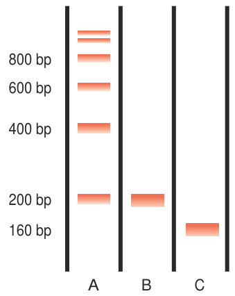  

7. a. 哪些字母被用来表示人类染色体的短臂和长臂？b.  画出一个3号染色体的模型示意图，其中，每个短臂上有3个区域2条带，每一个长臂上有5个区域3条带。此外，用臂、区域和条带信息标记基因在3p32上的位置。  

8.  在单倍体人类基因组的30亿碱基对的高分辨率核型中，可以观察到大约2000个G条带。如果基因组包含大约27 000个基因，那么通过核型分析检测到的DNA的缺失中，会有多少基因被移除呢？  

9.  假设在一个人类细胞的染色体上进行一种荧光原位杂交实验（FISH），这种试验使用的探针是位于4号染色体q臂端粒附近的一个基因。  

a.  在接下来的染色体组型图中，所有荧光信号只在这个二倍体细胞中 $1\!\sim\!5$ 号染色体上显示。  

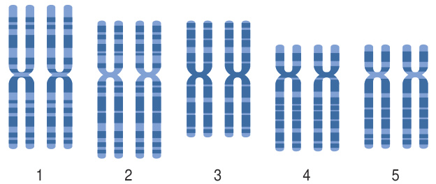  

b.  将自己的染色体组型图与图12.9（a）中所示的FISH实验结果进行比较。为什么染色体分散在图12.9（a）中，而不是像在染色体组型图中那样排列整齐的同源染色体？你认为在人类21号染色体的q臂上发现的DNA可以当作探针吗？  

# 12.3节  

10. 下列哪一项是与DNase超敏位点有关？a.  在染色体的这一区域没有转录发生。b.  没有高敏位点的染色质区域处于更开放的状态。  

11. 对于下列各组染色质，哪一种是最浓缩的？  

a. 100Å纤丝或300Å纤丝  
b. 300Å纤丝或附着在支架上的DNA环  
c. 常染色质和异染色质  
d. 间期染色体或中期染色体  

12. 给出结构异染色质和功能异染色质的例子。  

a. 果蝇属b. 人类  

13.  在许多物种中，普遍存在的组蛋白修饰是在H4蛋白中加入乙酰基。如果你是一个从事酵母研究工作的遗传学家，并且有一个H4的克隆基因，能通过什么方法来确定特定赖氨酸的乙酰化对染色质的功能是否必要？  

14.  最近，科学家们构建了果蝇组蛋白H3突变的转基因模型，组蛋白尾部的27号赖氨酸被修饰成了甲硫氨酸（H3K27M）。由于许多基因的表达不当，H3K27M转基因的表达导致了果蝇的异常发育。请解释这一现象。  

15.  果蝇遗传学家已经分离出许多引起花斑位置效应的变异。通过基因重组，花斑效应的显性抑制基因很少引起异染色质附近的基因失活，但花斑效应的显性增强基因则会很容易引起这些基因的失活。  

a.  这两种花斑位置效应的突变对果蝇白眼基因的表达有什么影响（也就是说，这种基因会让眼睛会更红还是更白）？  
b.  假设这些 $\mathit{S u}$ （var）和 $E$ （var）突变导致相应基因的等位基因功能缺失（null），你认为这些基因会编码什么类型的蛋白质？  

16.  在以下数据中，基因A和B位于X染色体上（蓝色），两者都不受X失活的影响，而基因C和D位于17号染色体上（常染色体；红色）。F和S是指那些可以通过电泳识别的、与负责编码和调控快速及缓慢迁移的蛋白质相关的等位基因。  

接下来的表格中，女性2和3显示了四种蛋白质所有可能存在的形式，这些蛋白质在含有一个或多个巴氏小体的不同个体细胞的克隆体中表达。举个例子，正常女性1的一些克隆体可以表达 $A^{F}$ 、 $B^{F}$ 、$C^{F}$ 、 $C^{s}$ 、 $D^{F}$ 和 $D^{s}$ 蛋白，而其他克隆体则可以表达$A^{s}$ 、 $B^{s}$ 、 $C^{F}$ 、 $C^{s}$ 、 $D^{F}$ 和 $|D^{S}$ 蛋白。女性1中的任何一个克隆体都不能同时表达蛋白质A或B的慢速和快速两种形式。女性2是一个XIC丢失的杂合子。女性3是X染色体和17号染色体发生部分位置互换的易位杂合子。  

1 2 3  

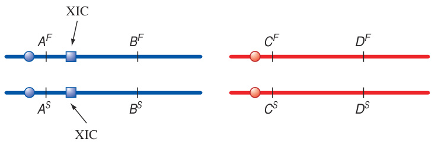  

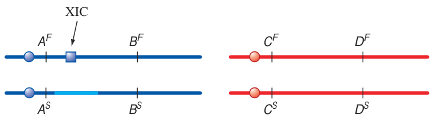  

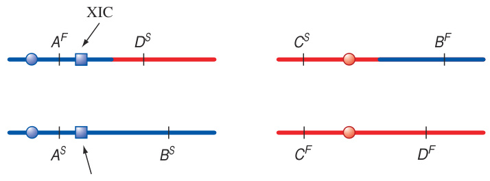  
XIC  

17.  X染色体如何选择性地表达Xist是未知的。这种选择机制的一个线索是在XIC中存在另外一种叫做Tsix的基因，它只能在活化的X染色体上进行转录。Tsix是Xist的反义序列，并以相反的方向转录，如下图所示。Tsix产生了一个长的ncRNA，其序列是与Xist互补的（反义），这也恰好解释了它的名字（Xist向后是Tsix）。Tsix在去活化作用发生以前，同样会在每条染色体上微弱表现。当X去活化启动之后，Tsix将会停止表达。  

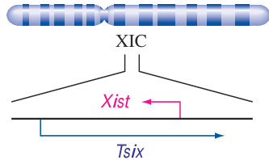  

a.  假设一只雌性哺乳动物有一个正常的X染色体和一个发生了突变的X染色体，而且这个突变会阻止Tsix RNA的表达，但是允许Xist RNA的表达。那么，在这个雌性的细胞中，哪个X染色体更有可能变成巴氏小体？  
b.  提出一个或多个假设，这也许可以解释为什么X染色体上Tsix的转录可能会干扰来自同一条X染色体上的Xist的表达。概述实验来验证上述假设。  
c.  为什么Tsix转录物的存在仍然不能解释细胞如何决定哪些X染色体通过异染色质化失活的问题？  

18.  这一章的第一页展示了“彩虹”和她的克隆体“CC”的照片。两只猫都是虎纹花斑猫（它们的彩色皮毛上有斑点），在它们的肚子和腿上都有白色的斑块。然而，它们的外表却有很大的不同。彩虹是一只彩色的小猫，身上有黑色和橙色的斑点，这些性状是由X连锁基因的等位基因控制，其显性性状是黑色（ $O^{-}$ ），隐性性状是橙色（oo）。然而，彩虹的克隆体CC是一只缺少橙色斑点的黑条纹小猫。  

CC是科学家把彩虹的一个正常的二倍体体细胞的细胞核转移到一个无核的卵母细胞中培育出的。这种二倍体卵母细胞，被作为受精卵植入到代孕母亲的子宫内。体细胞核移植的克隆过程将在第18章有详细地描述。  

a. 彩虹（和CC）的基因型是什么？  
b.  CC的基因组是由彩虹的体细胞核提供的，解释CC和彩虹的外观之间存在差异的原因。  
c.  彩虹的每一个克隆体都是像CC一样的黑条纹吗？还是存在其他的可能性？如何解释？  

# 12.4节  

19.  人类基因组大约含有30亿个碱基对。在人类胚胎受精后的第一个细胞分裂中，S期大约为 $3\mathrm{h}$ 。假设在整个S阶段的DNA聚合酶平均速率为50核苷酸/秒，那么在人类基因组中预估复制起点的最小数量是多少呢？  

20.  在果蝇D早期胚胎细胞中有丝分裂发生得非常快（每8min一次）。a.  如果在每条染色体的中间有一个双向复制起点，在8min的胚胎细胞周期中DNA聚合酶需要每秒增加多少核苷酸才能复制最长染色体（66Mb）中的所有DNA（假设复制发生在细胞整个分裂周期中）？b.  事实上，在早期的胚胎分裂期间，染色体上许多复制起点都是活跃的，间隔大约是7kb。假设染色体的情况和题目a相同，计算出DNA聚合酶在果蝇早期胚胎中加入互补核苷酸的平均速率（每秒）。  

21.  2014年发表在Cell杂志上的一项实验中，AmnonKoren和Steven McCarroll从生活在世界不同地区的两个不相关的人身上分离出了两种生长组织的细胞。其中一个人的细胞群都由在细胞周期G 期的数百万个细胞组成； 另一组是相同数量的处于S期不同阶段的细胞。然后，科学家们对这些细胞进行了高通量DNA测序。  

下面的两个图表显示了这两个个体数据。在每个图中， $x$ 轴表示基因在染色体上的位置（8号染色体），y轴表示的是在从S期样本的给定区域中获得的基因组的读数，以及从 ${\bf G}_{1}$ 样本中获得的相同区域的读数之间的比率。每个小的紫色圆点代表染色体上2kb的长度；黑线是紫色圆点的移动平均值。  

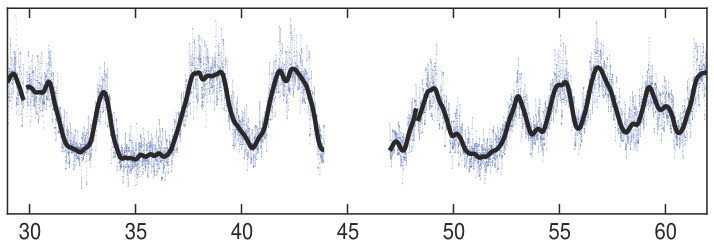  
8  /Mb  

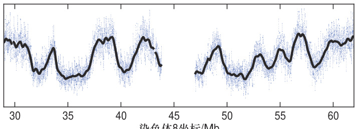  

Amnon Koren, Dept. of Molecular Biology and Genetics, Cornell University  

a.  在染色体坐标33Mb处，y轴的值比坐标35Mb处高得多。说明在这两个位置的DNA复制的时间各是多少？  
b.  科学家们仍然对DNA序列或染色质结构的性质不太了解，这些结构定义了人类细胞中的复制起点。能在哪里找到复制起点呢？  
c.  假设你做了一个类似的实验，使用两个种群数量相同的细胞，一个是 ${\bf G}_{1}$ ，另一个是 $\mathrm{\bfG}_{2}$ 。如果你以类似的方式绘制数据， $y$ 轴表示的是 $\mathrm{G}_{2}$ 样本中读取的数量与 ${\bf G}_{1}$ 样本中读取的数量的比率，那么这个图会是什么样子？  
d.  没有任何关系的两个人，但外貌几乎是一样的，这个事实说明了什么？  
e.  这些科学家后来给出的解释是，他们可以通过高通量测序的方法从每个人那里获得同种类型的信息，而不需要分离出在不同细胞周期阶段的细胞群。对于细胞分析和可用的数据类型，哪个才是正确的呢？为什么要对这些数据做大量的人群分析？  

22. a. 在人类染色体的端粒中发现了什么DNA序列？b.  两个与端粒相关的复合物——端粒酶和端粒蛋白复合体，在染色体末端修饰过程中的作用分别是什么？  

23. a.  缺失编码端粒酶蛋白基因表达的小鼠生长速度比正常小鼠快得多，但是寿命也缩短了。当小鼠的端粒酶蛋白表达在过早衰老的小鼠体内被逆转时，由衰老引起的许多负面影响也迅速而显著地发生了逆转。为这些结果提供一个可能的解释。  

b.  研究人员根据小鼠实验的这些结果提出，导致端粒酶基因过度表达的治疗方法可能会成为“青春之泉”，从而实现人类的返老还童。但为什么我们应该对这样的治疗持谨慎态度？能否解释为什么大多数体细胞不表达端粒酶对于多细胞生物来说是有好处的？  

24. a.  在荧光原位杂交（FISH）实验中，如果使用含有$3^{\prime}$ AATCCC 5′的DNA作为探针，会看到什么？相关结果已在习题9中显示。b.  在FISH实验中，你将用什么DNA序列探针来追踪一条特定染色体的一端？在相同的染色体组型图上，你预计结果会是什么样子的？  

25.  如果你正在比较下面列表中每个条目的两个端粒，在这种情况下，你会认为两个端粒总是有完全相同数量的TTAGGG重复吗？  

a.  一个端粒在染色体的一端，另一个端粒在非同源染色体的一端。  
b.  一个端粒在染色体的一端，另一个端粒在同源染色体的相应末端。  
c.  一个端粒在染色体的一端，另一个端粒在同一条染色体的另一端。  
d.  一个端粒在一条染色单体的一端，另一个端粒在姐妹染色单体的相应位置上。  

26.  与大多数在经过 $30\!\sim\!50$ 代的分裂后衰老的正常体细胞相比，癌细胞的一个特点是它们有无限分裂的能力。我们在这一章中看到，导致这种差异的一个原因是许多癌细胞表达了端粒酶，进而可以调节端粒的延长。  

有趣的是，大约 $15\%$ 的肿瘤细胞不表达端粒酶。相反，它们通过另一种途径延长了它们的端粒。这种类型的肿瘤细胞似乎在长度上有高度异质性；一些端粒有更多的TTAGGG的重复序列。  

a.  同源重组促使这些细胞中的一些端粒变得更长。端粒的哪些特征使这样的同源重组成为可能？b.  这种重组是否必须在同源染色体的端粒（也就是同一条染色体的同一臂的端粒）之间发生？c. 几乎所有发生这种端粒延长现象的细胞都有t型圈：环状DNA的小分子几乎完全由端粒序列组成。图示这些t型圈是如何参与端粒延长的。  

# 12.5节  

27. a.  在人类的着丝粒区域通常能够发现什么样的DNA序列？b.  在染色体力学中，两个与端粒相关的复合体—黏连蛋白和动粒发挥着什么样的功能？  

28.  习题21给出的图表中，8号染色体的坐标44和坐标47之间的区域没有可用的数据。这一区域染色体的特征是什么？（提示：计算机程序很难从含有大量重复DNA的区域中收集DNA序列）  

29.  Rec8蛋白是一种黏连蛋白复合物的亚基，通常只在减数分裂期间才会产生；它代替了图12.25中所示紫色的、存在于有丝分裂过程中的黏连蛋白复合物。在减数分裂Ⅰ期，Rec8没有被裂解，但是在减数分裂Ⅱ期的早期就被裂解了，促使姐妹染色单体在减数分裂Ⅱ期后期中发生分离。  

科学家推测，在减数分裂Ⅰ期的过程中，shu-goshin蛋白可以避免Rec8蛋白的分裂和降解。为了识别shugoshin蛋白，研究人员首先在有丝分裂的酵母细胞中找到了Rec8蛋白。在这些细胞中，Rec8在有丝分裂期间被裂解，但细胞没有受到任何有害影响。然后，研究人员在表达Rec8的有丝分裂细胞中加入了正常存在于减数分裂期的特定蛋白。科学家们能够识别出shugoshin作为一种蛋白质，可以保护Rec8的裂解。  

你认为shugoshin蛋白对细胞有丝分裂期间表达的Rec8有什么影响？细胞的表型是什么？  

30.  在下面的图中，每一行代表一个双链DNA分子。  

a.  图中是什么类型的细胞分裂，两张图显示了细胞分裂的哪个阶段？在相同的蓝色阴影中画出的线之间是什么关系？在不同蓝色阴影之间的线又是什么关系？  
b.  在S期后，黏连蛋白被立刻添加到染色体中。黏连蛋白复合物大部分集中在着丝粒上，但一些黏连蛋白复合物则分散在染色体臂上。图形的副本显示，染色体上分布着黏连蛋白复合物。区分在着丝粒和染色体臂上的黏连蛋白复合物。你的图示应该展示出黏连蛋白如何将DNA分子结合在一起。  
c.  仔细观察图，在细胞的分裂中期，即使力在向相反的方向拉着着丝粒运动，是什么原因使所有的蓝线仍然在一起？  
d.  图中，在所描述的细胞分裂的类型中，关于shugoshin蛋白的功能你能得出什么结论？阻止shugoshin蛋白发挥功能的酶是什么？它的作用是什么？  

31.  在20世纪20年代，Barbara McClintock在通过使用X射线观察小麦细胞中染色体的行为时发现了转座因子，因而获得诺贝尔奖。在G1期她注意到X射线使染色体断裂，而在随后的S期染色体复制之后，两条姐妹染色单体的断裂末端可以结合在一起，形成的融合染色体比原染色体更大。在有丝分裂中期和早期，融合的两条姐妹染色单体会形成一个不同寻常的桥梁结构，在这种结构中，染色质被拉伸到两个纺锤体之间，最终发生断裂。她把这种现象称为“断裂—融合—桥循环”。每一张图片（a）和（b）中都显示了有丝分裂后期的细胞中含有两个这样的染色质桥。  

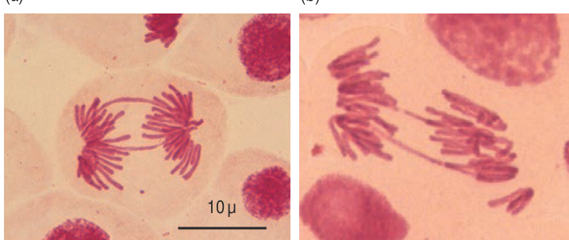  

承蒙Dr. Marin-Morales, São Paulo State University (UNESP)提供, Ventura  
Camargo BC, Maltempi PPP, Marin-Morales MA (2011), “The use of the   
cytogenetic to identify mechanisms of action of an azo dye in Allium cepa meristematic cells,” J Environment Analytic Toxicol, 1: 109. doi: 10.4172/2161-0525. 1000109  

a.  是什么确保正常染色体的末端就像姐妹染色单体在破裂后的末端一样不会融合在一起？  

b.  下图显示了带有基因 $A{\sim}G$ 的染色体；箭头表示X射线诱发的断裂的位置。画出由此产生的就像在有丝分裂后期一样的桥（即大的融合染色体），并标记出桥所包含的所有基因和重要的染色体结构。用箭头来表示在这个染色质桥上的纺锤体所施加的力。  

  

c.  如果两条姐妹染色单体发生融合，为什么在有丝分裂期间融合染色体的行为必须像桥一样？（想想在题目b部分的答案中所描述的染色质桥上的拉力）d.  在有丝分裂的后期，染色质桥可能会发生什么？在有丝分裂后产生的两个子细胞中又可能发生什么？为什么呢？（提示：McClintock对这个现象的命名意味着它是一个循环）  

32.  在调节染色质结构的机制的影响下，至少给出一个染色体结构或功能的例子：a.  在核小体中发现的正常组蛋白在转录翻译后的变化。b.  含有由特定基因编码的多种组蛋白的核小体。  

33.  科妮莉亚德兰格综合征（CdLS）是一种罕见的人类疾病，它是由至少5种不同基因中的任何一种基因突变引起的，所有这些基因都参与编码了黏连蛋白复合物的成分或调节因子。患有CdLS的人表现为形态异常、发育迟缓和精神障碍等多种症状。对CdLS患者的分析表明，除了在细胞分裂期间染色体的错误分离，他们的异常表型还可能与在错误分离过程中对基因表达的调控失误有关。黏连蛋白可能在染色质环中发挥作用，这是染色质环维持正确的转录调控的必要条件（在第17章中，你将了解更多关于这个主题的信息）。  

a.  在不同的家庭中，CdLS可以表现为常染色体显性遗传或X染色体显性遗传。这是如何发生的呢？b.  解释在编码黏连蛋白的基因中，缺失功能表达的等位基因是如何支配野生型的配对基因的。c.  CdLS通常是由发生在配子的新突变引起的。原因是什么？  

# 12.6节  

34. a.  在有丝分裂期，至少给出三个因基因突变而导致染色体发生错误分离的例子；或者说，解释一下在发生染色体错误分离的突变中，存在什么样的DNA结构或编码相关蛋白质的基因。b.  如何使用酵母人造染色体（YAC）在酿酒酵母的S期产生突变？  

35.  在圆形细菌质粒pBR322中加入了许多酵母衍生的元素。这些需要尿嘧啶来维持生长的酵母（表达Ura的细胞）是通过添加修饰过的质粒和在缺乏尿嘧啶的培养基中添加生长发育所需的Ura+克隆体转录而成。对于包含了a～c中列出的所有元素的质粒，你是否期望质粒通过重组整合到染色体中，还是质粒可以独立存在？如果质粒是独立存在的，那么当不再选择Ura+细胞（也就是说，在含有尿嘧啶的培养基中培养酵母）时，它会稳定地遗传给后代的所有子细胞吗？  

a. URA+基因b. URA+基因, ARSc. URA+基因, ARS, CEN（着丝粒）  

d.  为了使这些序列在酵母细胞中稳定地维持，需要在线性的人造染色体中添加什么呢？  

36.  把一个含有酵母着丝粒的DNA片段克隆进 $T R P^{+}$ ARS质粒或YRp7中，从而使质粒的有丝分裂变得非常稳定（也就是说，质粒是在有丝分裂成每个子细胞的过程中传播的）。对有丝分裂稳定性的分析包括在没有选择质粒的情况下生长转化的细胞，并确定在对质粒没有选择的情况下，经过20代繁殖生长后的Trp+菌落数量。  

为了识别包含着丝粒DNA片段的克隆区域，需要将最初的片段切割成小片段，将这些小片段重新克隆到YRp7中，并测试有丝分裂的稳定性。基于此图和有丝分裂稳定性分析的结果，着丝粒DNA在哪个区域？（图中B、H和S指的是三种不同限制性内切核酸酶的识别位点；图上的数字代表kb单位的片段大小。）  

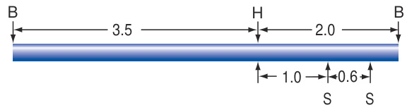  

有丝分裂稳定性测定结果  

<html><body><table><tr><td>质粒DNA</td><td>Trp*菌落百分比：20代后</td></tr><tr><td>YRp7</td><td>0.9</td></tr><tr><td>YRp7+5.5kbBamH I (B)</td><td>68.1</td></tr><tr><td>YRp7+3.5kbBamH I -Hind Ⅲl (H)</td><td>0.5</td></tr><tr><td>YRp7+2.0kbBamHI-HindIⅢ</td><td>80.3</td></tr><tr><td>YRp7+0.6kbSau3A(S)</td><td>76.2</td></tr><tr><td>YRp7+1.0kbHindm-Sau3A</td><td>0.7</td></tr></table></body></html>  

37.  在酵母人工三号染色体（SynⅢ）每个基因的3′UTR中都包含一个loxP位点，这对酵母的生存来说可能是不必要的。正如第6章中所描述的，loxP位点是发生特异性重组的特定位置。构建了SynⅢ的研究人员将这些loxP位点作为一种干扰染色体的方法，这意味着染色体的某些部分很容易被删除或重组。研究这些的目的是推动SynⅢ的进化，从而找出一个能够支持这种有机体存活的最小基因组。为了确定这个最小的基因组，研究人员将进行干扰SynⅢ的试验。  