# 第 14 章 细菌遗传学  

  

有些种类的细菌可以生活在像温泉这样恶劣的环境中（如怀俄明州黄石国家公园的这个美丽的“游泳池”）。水池中除了中间的蓝色以外的颜色，都是由细菌群中的色素造成的，细菌群在水的边缘密集生长。对生活在不寻常环境中的细菌进行比较基因组分析，将增进我们对在不同生态环境中生存的适应性的理解。  

$\copyright$ Werner Van Steen/The Image Bank/Getty Images  

# 章 节 大 纲  

14.1 细菌惊人的多样性  
14.2 细菌基因组  
14.3 细菌作为实验生物  
14.4 细菌基因转移  
14.5 利用遗传学研究细菌的生命  
14.6 综合实例：淋球菌如何对青霉素产生耐药  

淋病是由淋球菌引起的男性和女性泌尿生殖道的性传播感染疾病。这种疾病很少致命，但它可能导致两性不育症。直到20世纪70年代末，少量注射青霉素是治疗淋病的有效方法，但到1995年，超过 $20\%$ 的从全世界患者体内分离出的淋球菌对青霉素耐药。  

遗传学家现在知道，这种令人震惊的耐药性增加的原因是DNA从一种细菌转移到另一种细菌。根据流行病学家的说法，耐青霉素的淋球菌最早出现在20世纪70年代的亚洲，当时一名接受青霉素治疗的淋病患者正在与另一种细菌流感嗜血杆菌引起的感染作斗争。患者的一些流感嗜血杆菌显然携带了一种破坏青霉素的青霉素酶基因质粒。当双重感染的患者对降解这些细胞的流感嗜血杆菌产生特异性免疫应答，破碎的细菌释放出它们的质粒。一些游离的DNA环进入淋球菌细胞，将其转  

化为抗青霉素的细菌。  

然后，转化的淋病细菌繁殖，并连续暴露于青霉素，选择耐药细菌。结果，患者将抗青霉素的淋球菌传染给随后的性伴侣。因此，虽然青霉素治疗不会产生耐药性的基因，但它会加速这些基因的传播。如今在美国，许多淋球菌同时对青霉素和其他两种抗生素（奇霉素和四环素）耐药。  

在这一章中，我们首先关注细菌的显著多样性，以及基因组分析如何极大地增加了我们对细菌世界的了解。接下来，我们研究细菌在同一物种的细胞之间甚至在远缘物种的细胞之间，转移基因的机制，以及科学家如何利用这些基因转移机制来绘制和鉴定具有重要功能的细菌基因。最后，我们探讨淋球菌如何对多种药物产生抗性，以及社会对多药耐药病原体的问题可以做什么。  

我们对细菌遗传学的探索可以发现一个主题：单细胞或单一物种的DNA和基因既不可变，也不完全孤立地存在。不仅像转座元件这样的DNA片段在基因组内迁移，而且DNA和基因也能够在一个物种的不同细胞之间迁移，甚至在同一细菌群落中不同物种的细胞之间迁移。细胞间基因的转移一直是微生物世界进化的一个关键特征。  

# 14.1 细菌惊人的多样性  

# 学习目标  

1. 列出原核细胞的主要特征。  
2. 讨论细菌生境如何影响细菌代谢。  
3. 总结某些细菌对人体致病的特性。  

淋球菌和流感嗜血杆菌等细菌构成了三种主要的生物进化谱系之一（图14.1）。另外两种谱系是真核生物（细胞有细胞核包裹在膜内的生物）和古菌（往往生活在极端条件下，如高盐、高温或厌氧环境中）。细菌和古菌都被归类为原核生物，因为它们缺少真核生物中膜包裹的真正的细胞核。虽然它们都是原核生物，但细菌和古菌在形态及生物化学上是不同的。我们将本章局限于细菌，因为它们是更常见的实验室生物，因此更容易被理解。然而，从细菌身上学到的关于基因组组织和细胞间基因转移的许多经验，也与它们的远亲——古菌有关。  

  
图14.1　生物谱系图。生物的三个主要进化谱系是细菌、古菌（都是原核生物）和真核生物。DNA测序结果表明，所有的生命形式都起源于35亿年前共同的原核祖先。  

理解细菌遗传学对人类有着深远的影响，原因有很多，包括我们的生活与细菌的关系如此密切。一个成年人携带大约30万 $\mathord{\sim}50$ 万亿个细菌，这相当于人类细胞的数量。这些细菌大多生活在肠道中，但皮肤、口腔、牙齿和呼吸道也是细菌生态系统的家园。细菌在许多方面有助于人类健康，如合成所需的维生素、帮助消化我们的食物，但某些细菌也是疾病的病原体。  

# 14.1.1 细菌的大小和形状各不相同  

最小的细菌直径约为 $200\mathrm{nm}$ （ $1\mathrm{nm}{=}10^{-9}\mathrm{m}$ ），最大的约 $500{\mu\mathrm{m}}$ 长（ $1\,\mu\mathrm{m}{=}10^{-6}\mathrm{m}$ ），这使得它们的体积和质量比最小的细菌细胞大100亿倍。这些大的细菌在显微镜下是可见的。杆状菌的主要实验室研究对象大肠杆菌（E.coli）是细菌中较小的一类：它的直径约 $0.5\mu\mathrm{m}$ ，长约 $2\mu\mathrm{m}$ （图14.2）。  

尽管细菌的形状和大小各不相同，但它们都没有明确的核膜和膜结合的细胞器，如在真核细胞中发现的线粒体和叶绿体（图14.3）。细菌的单条染色体折叠形成致密的拟核。在大多数种类的细菌中，细胞膜由碳水化合物和多聚体物组成的细胞壁支撑。有些细菌除了细胞壁外，还有一层厚的黏液样外壳，称为荚膜，有助于抵抗免疫系统的攻击。尽管在图14.2中不可见，许多细菌，包括大肠杆菌，有鞭毛促使它们趋向于食物或光（图14.3）。  

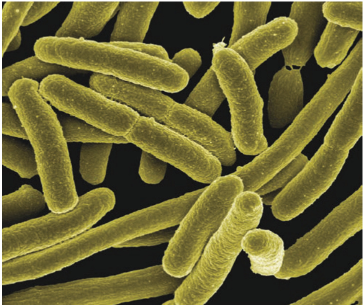  
图14.2　大肠杆菌。大肠杆菌的扫描电子显微照片（ $14000\times$ ）。几个细胞正在通过二分裂进行分裂，正如在靠近中间的收缩部分所见。$\copyright$ Mediscan/Alamy  

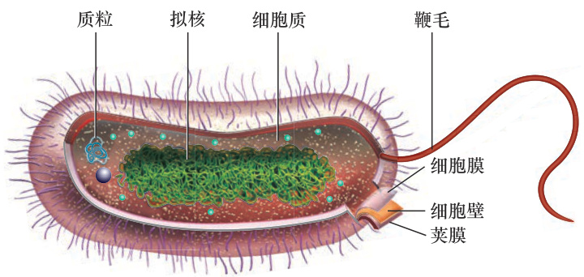  
图14.3　细菌结构。细菌染色体（拟核）位于细胞质中，细胞质被一层可渗透的细胞膜所包围。细胞膜周围的细胞壁渗透性较差，在许多物种中，整个细菌都被包裹在一个保护性的荚膜中。  

# 14.1.2 细菌具有不同的代谢途径  

细菌已经进化到可以生活在各种各样的栖息地。一些细菌在陆地上独立生存，另一些则在水生环境中自由漂浮，还有一些细菌在其他生命形式中以寄生或共生体的形式生存。细菌的新陈代谢必须适应其特定的环境。一些土壤细菌从化学氨中获取能量以促进其生长，而另一些光合细菌则从阳光中获取能量。由于细菌代谢途径的多样性，它们在许多自然过程中发挥至关重要的作用，如分解养分循环所必需的物质。微生物的平衡是这些生态过程成功的关键，这有助于保持环境。  

例如，在氮的循环中，分解细菌分解富含氮的植物和动物物质并产生氨（ $\mathrm{NH}_{3}$ ）。然后硝化细菌使用氨作为能量源并释放硝酸盐（ $\mathrm{NO}_{3}^{-}$ ），其中一些植物可以直接用它作为氮源。反硝化细菌将未被植物利用的硝酸盐转化为大气氮（ $\mathbf{N}_{2}$ ），而生活在豌豆和其他豆科植物根部的固氮菌（如根瘤菌）将 $\mathbf{\nabla}N_{2}$ 转化为宿主植物可以利用的铵（ $\mathrm{NH_{4}^{+}}$ ）。  

一些海洋细菌具有惊人的食油能力。像食烷菌（Alcanivorax borkumensis）这样分解石油中的碳氢化合物以用作能源的物种被称为生物修复细菌，因为它们在石油泄漏后大量繁殖，并有助于清理油污。在2010年墨西哥湾的“深水地平线”（Deepwater Horizon）灾难发生后，以石油为食的细菌数量在泄漏的石油中迅速增加。通过食烷菌（Alcanivorax）的基因组测序，科学家们已经确定了一些基因，这些基因赋予了这些细菌特殊的食油能力。这些基因的工程化可能最终导致产生食油能力更强的菌株，从而有助于石油泄漏的清理。  

# 14.1.3 一小部分细菌是病原体  

病原体是在宿主体内引起疾病的传染源。大多数生活在人体中的细菌不是无害的就是有益的；只有少数是具有致病性的。致病菌获得了使它们能够侵入组织的基因，在某些情况下还能产生毒素和蛋白质，这些被细菌释放出来的蛋白质能够破坏细胞膜或干扰宿主细胞的基本功能。例如，破伤风毒素［由破伤风杆菌（Clostridium tetani）产生］是一种蛋白酶，可以抑制神经和肌肉之间的交流，导致瘫痪。在第二个具有临床重要性的例子中，白喉杆菌（Corynebacteriumdiphtheriae）产生白喉毒素，这是一种酶，可以修饰翻译所需的蛋白质，从而抑制人类细胞中的蛋白质合成。在同一种细菌中，有些菌株可能是无害的，而另一些菌株则是病原体。在这一章的后半部分，你会看到这种种内多样性的一个主要原因是细菌以惊人的频率在它们之间转移基因。  

# 基本概念  

●  细菌是原核细胞，没有膜包围的细胞核，也没有其他膜结合的细胞器。●  细菌能够快速进化，因此这些生物在大小、形状、新陈代谢和它们适应的栖息地上有很大的不同。●  一个典型的人体携带30兆 ${\sim}50$ 兆个细菌，其中大多数是无害的或有益的，但少数是致病的，从而导致疾病。  

# 14.2 细菌基因组  

# 学习目标  

1. 描述在细菌基因组中基因是如何组织的。  
2. 区分一个物种的核心基因组和泛基因组。  
3. 区分细菌中的IS和Tn转座因子。  
4.  描述赋予细菌多重耐药性的质粒是如何进化的。  
5.  解释宏基因组学研究如何可能产生实际益处。  

典型的细菌基因组的基本组成部分是细菌染色体：单个双螺旋DNA分子排列成一个圆环（图14.4）。在大多数常见的研究物种中，染色体长 $.4\!\sim\!5\mathrm{Mb}$ 。大肠杆菌的环状染色体，如果在某一点断裂并排成一条直线，就会形成一个宽 $2.4\mathrm{nm}$ 、长 $1.6\mathrm{mm}$ 的DNA分子，几乎是大肠杆菌细胞的1000倍长（图14.5）。在细胞内，长的环状DNA分子通过超螺旋凝结并成环进入致密的拟核（图14.3）。  

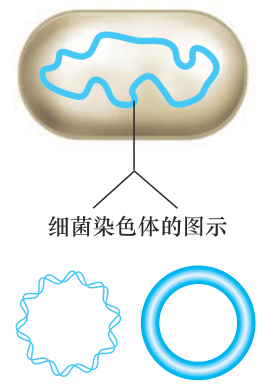  
图14.4　细菌染色体为环状双链DNA。  

在细菌细胞周期中，每个细菌复制其环状染色体（回顾图6.24），然后通过二分裂分裂成两个相同的子细胞，每个子细胞都有自己的染色体，从一个细胞产生两个生物体。虽然大多数细菌只含有一个环状染色体，但也有例外。基因组分析表明，一些细菌，如霍乱弧菌（Vibrio cholerae，霍乱的起因），携带着两种不同的环状染色体，这对生存能力至关重要。某些细菌含有线性DNA分子。  

# 14.2.1 基因在细菌基因组中紧密排列  

1997年，分子遗传学家完成了对大肠杆菌K12菌株的460万个碱基对基因组测序（图14.6）。接近 $90\%$ 的大肠杆菌DNA编码蛋白质；平均而言，染色体每千碱基（kb）就包含一个基因。这与人类基因组形成鲜明对比。在人类基因组中，编码蛋白质的DNA不到 $5\%$ ，大约每100kb就有一个基因存在。造成这种差异的一个原  

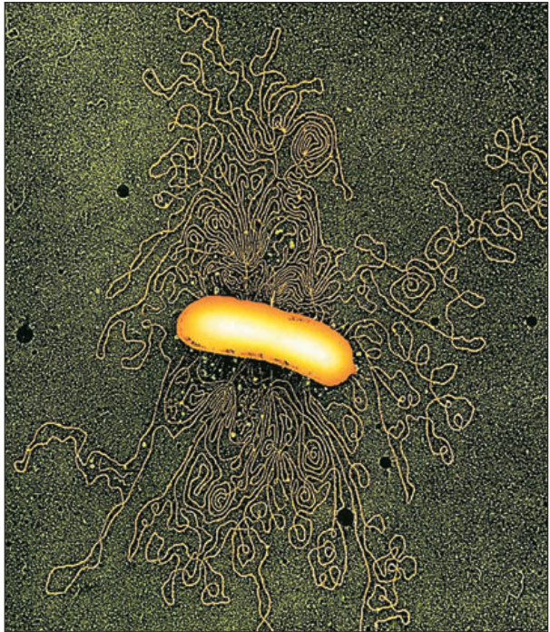  
图14.5　大肠杆菌染色体DNA。大肠杆菌细胞的电子显微图，已被溶解，使其染色体得以脱离。$\copyright$ Dr. Gopal Murti/SPL/Science Source  

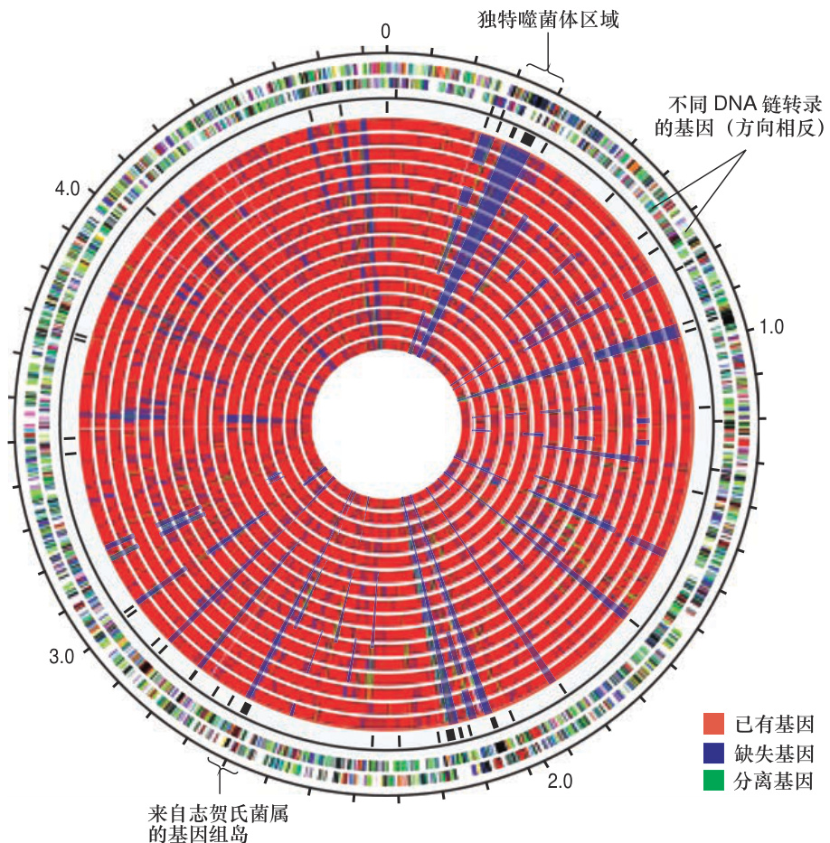  

图14.6　大肠杆菌基因组比较。图的外部两环显示了大肠杆菌K12菌株的4288个基因，颜色各异。从一条基因组DNA转录出的基因位于外环，而从另一条DNA相反方向转录出的基因位于下一个环。16个内环中的每一个都显示了在其他16个大肠杆菌菌株中发现的K12基因。红色表示K12基因存在于环中所示的菌株中；蓝色表示K12基因缺失；绿色表示另一个基因组与K12基因相关，但与之分离。请注意，K12菌株中的许多基因并不在一个或多个其他菌株中发现，因此这些基因不是大肠杆菌核心基因组的一部分。数字显示DNA的Mb（兆碱基）。  

因是大肠杆菌基因没有内含子。此外，细菌中存在少量重复DNA，基因间区域往往很小。从图14.6可以看出，有些基因是从细菌DNA的一条链转录而来的，有些基因则是从另一条链转录来的。从一个或另一个方向转录的基因在整个基因组中相互穿插。  

大肠杆菌K12菌株基因组的完整序列揭示了4288个基因。其中427个基因被认为具有将分子运入或运出细胞的功能，它们构成了最大的一类基因。其他大类包括用于翻译、氨基酸生物合成、DNA复制或重组的基因。大约 $20\%$ 的基因仅被识别为可读框，其功能目前仍是一个谜。  

大肠杆菌K12菌株基因组的另一个有趣特征是噬菌体基因组残留物的存在，包括图14.6所示的独特噬菌体区域。这些序列的存在暗示了这些细菌的进化，包括病毒的几次入侵。  

# 14.2.2 单个大肠杆菌菌株仅含有大肠杆菌泛基因组的一个亚组  

截至2016年撰写本文时，除了K12菌株之外，数百种不同大肠杆菌菌株的基因组已被测序。当科学家比较大肠杆菌基因组序列时，他们惊讶于发现的变异数量（见图14.6）。所有的大肠杆菌菌株只有大约1000个基因是相同的，这意味着大约 $80\%$ 的大肠杆菌基因组在不同菌株中是可变的。  

所有大肠杆菌菌株共有的大约1000个基因被称为核心基因组。除了核心基因组之外，每个菌株都有特定的基因，或者只与特定的其他菌株共享的基因。大肠杆菌的核心基因组加上在某些菌株中发现而在其他菌株中没有的所有其他基因统称为该物种的泛基因组（图14.7）。到目前为止，约有15 000个基因构成了大肠杆菌的泛基因组，但随着对更多菌株的基因组进行测序，这个数字可能会越来越大。大肠杆菌泛基因组约15 000个基因，核心基因组约1000个基因，平均大肠杆菌有4700个基因。  

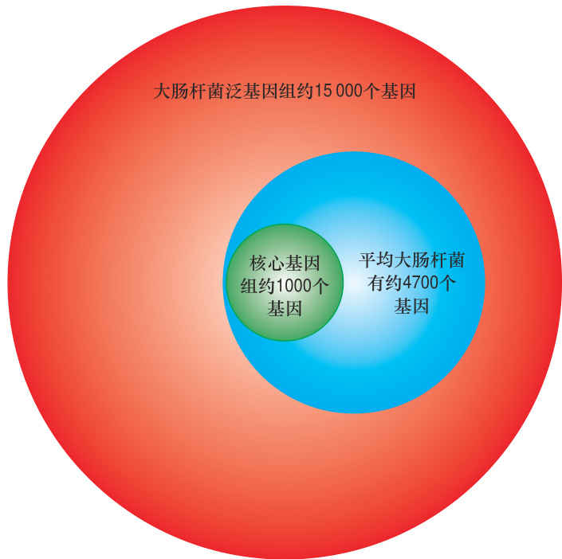  
图14.7　大肠杆菌核心和泛基因组的维恩图。  

核心基因组包括定义大肠杆菌种类的代谢功能基因，如合成脂质、细胞壁和细胞膜、核苷酸、维生素和辅助因子的基因。虽然核心基因提供基本的功能，但大肠杆菌基因组高度可变的性质使不同的菌株适应不同的环境。例如，不同的大肠杆菌可以分解不同的碳水化合物作为碳源。  

大肠杆菌遗传变异的显著程度是细菌种类的一般特征。这些比较基因组研究为同一物种和不同物种之间的基因转移的极高发生率提供了证据。  

# 14.2.3 细菌基因组含有转座子  

细菌基因组的DNA序列分析也揭示了一些被称为插入序列（IS）的小转座因子的位置。研究人员已经确定了几个长度为 $700{\sim}500001$ p的不同元件；他们将元件命名为IS1、IS2、IS3等，数字表示发现的顺序。与真核细胞中DNA转座子的末端一样（见第13章），IS元件的末端是相互反向重复的［图14.8（a）］。每个IS元件都包含一个编码转座酶的基因，转座酶通过识别这些镜像末端并切割那里的DNA来启动转座。因为IS元件在转座时可以移动到细菌染色体上的其他位置，所以它们在单个细菌物种的不同菌株中的分布是不同的。就像真核转座因子一样，IS元件可以在基因内产生突变。此外，两个同类IS元件的重组（例如，两个IS1元件）可以通过DNA的缺失或倒位来重新排列细菌基因组，正如我们在第13章看到的真核生物转座因子。  

细菌基因组也有所谓的复合转座因子，即Tn元件。除了携带转座酶基因外，Tn元件还含有对抗生素或有毒金属具有耐药性的基因。被称为Tn10的一个Tn元件由两个IS10元件组成，它们位于编码四环素抗性基因的两侧［图14.8（b）］。  

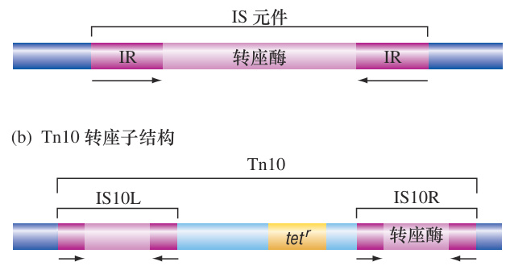  
(a)  IS   
图14.8　细菌转座因子。（a）IS元件显示转座酶基因两端的反向重复序列（IR）。（b）复合转座子Tn10，其中两个略有不同的IS10（IS10L和IS10R）位于7kb DNA的两侧，包括一个四环素抗性基因。由于其两侧是IS10反向重复序列，因此可以通过IS10转座酶调动Tn10。  

# 14.2.4 质粒除了携带细菌染色体上的基因外，还携带其他基因  

细菌在它们巨大的圆形染色体上携带着它们的基本基因：那些生长和繁殖所必需的基因。此外，一些细菌在正常情况下携带的基因，在称为质粒的环状双链DNA中是不需要的（图14.9）。回忆一下第10章，细菌质粒已经被科学家进行了基因改造，用作基因克隆载体。天然质粒大小不一，最小的长 $1000\mathrm{bp}$ ，最大的长几兆碱基。细菌通常只包含一个非常大的质粒，但它们可以容纳几个甚至数百个更小的DNA环状拷贝。一组重要的质粒叫做F附加体，它允许携带它们的细菌细胞与另一种细菌接触，并将质粒和细菌的基因转移到第二个细胞。我们将在本章后面的章节中描述这种细胞间的交配，称为接合。  

质粒携带的基因可能在一定条件下对宿主细胞有益。例如，许多细菌中的质粒携带保护宿主免受有毒金属（如汞）伤害的基因。各种土壤假单胞菌的质粒编码蛋白质，使细菌能够代谢诸如甲苯、萘或石油产品等化学物质。此外，许多致病性基因存在于质粒中，如由痢疾致病因子痢疾志贺菌产生的毒素编码基因。指定抗生素抗性的基因也经常位于质粒上；20世纪70年代首次在志贺氏杆菌中发现对多种药物产生抗性的质粒。多重耐药性通常是由于质粒上存在复合物IS/Tn元件（图14.10）。  

如后所述，质粒在自然界中可以从一种细菌转移到另一种细菌，有时甚至跨物种。质粒对医学有着巨大的影响。如果将抗性质粒转移到新的病原菌菌株，新的宿主可以在一个步骤中获得对许多抗生素的抗性。我们在关于耐抗生素淋病的开篇故事中就遇到了这种可能性的一个例子。  

# 14.2.5 宏基因组学探索微生物群落的群体基因组  

很少（实验室除外）有单个细菌物种是孤立地存在的；细菌通常生活在由成百上千种不同物种组成的群落  

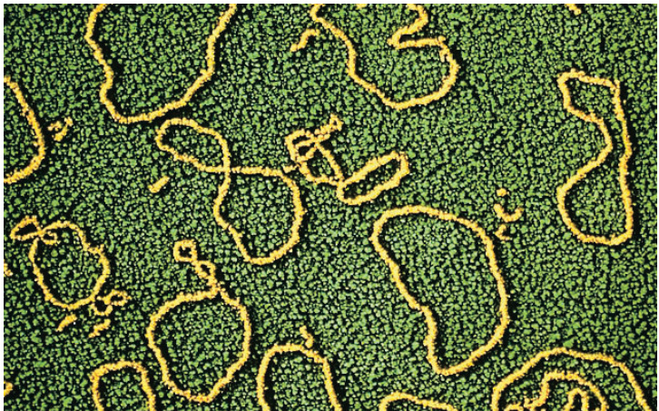  
图14.9　质粒。电子显微照片显示的环状质粒DNA分子。$\copyright$ Dr. Gopal Murti/Science Source  

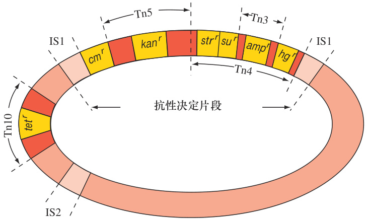  
图14.10　耐药质粒。有些质粒包含多种抗生素耐药基因（黄色部分显示：氯霉素为cm 、卡那霉素为kan 、链霉素为str 、  

磺胺酰胺为 $s u^{r}$ 、氨苄青霉素为ampr、汞为 $h g^{r}$ 、四环素为tetr）。转座子（IS和Tn元件，分别用淡橙色和红色表示）促进了抗生素抗性基因在质粒上的移动。注意，许多抗生素抗性基因位于两个IS1元件之间，允许它们作为一个单位转座。  

中。在这些群落中，各种细菌可以相互影响，如通过交换代谢产物或基因。为了更好地了解这些复杂细菌群落的性质，科学家现在可以从大量细菌中分离出总DNA进行测序。通过对序列数据的计算机分析，研究人员可以确定样本中所代表的所有物种、群落中每个物种的个体相对比例，以及在所有这些物种中发现的基因。从正常环境取样的微生物群落中的基因组DNA的集体分析被称为宏基因组学。  

宏基因组学研究的一个巨大优点是，它可以鉴定新的细菌种类，这些细菌以前从未被发现过，因为它们不能在实验室条件下生长。2016年，由宏基因组学发现的1000多个新细菌种类增加了生命树的细菌分支（见图14.1），它们生活在泥土和草甸土壤中。  

美国国立卫生研究院对生活在人体上的细菌进行了宏基因组分析——人类微生物组计划。在这个项目的第一个实验中，细菌样本取自242个健康个体身上的不同组织，如肠道和皮肤。这项分析显示，总共有超过10 000种不同的细菌种类，单个个体的细菌种类多达1000种。到目前为止，这项研究得出的最引人注目的结论是，个体携带的细菌种类差异很大。  

微生物组项目的未来目标之一是跟踪微生物群落随时间的变化，并将细菌宏基因组的变化与疾病、饮食和药物治疗联系起来。例如，研究发现了微生物的变化与肥胖有关：一些肥胖人群中的细菌群体缺乏来自一种叫做拟杆菌门的细菌，而这些个体的微生物组富集了参与碳水化合物和脂质代谢有关的基因。“遗传学与社会”信息栏“人类微生物组计划”更详细地讨论了这方面的进展。  

科学家们还分析了生活在极端环境中的细菌（极端微生物）的宏基因组，因为它们含有大量在不同寻常的  

# 遗传学与社会  

# 人类微生物组计划  

人类微生物组计划（HMP，图A）成立于2008年，由美国国立卫生研究院资助，是旨在了解人体与生活在人体中的数万亿微生物之间复杂关系的几个国际合作体之一。  

HMP已经实现了第一个目标，即描述构成人类微生物组的生物多样性。研究人员分析了全球250多名人体内不同部位的微生物宏基因组。研究的重点是这些细菌核糖体小亚基的16S rRNA编码基因序列，因为这些序列在不同的细菌物种中存在很大差异，因此可以作为这些物种的标记物。结果表明，一个人可以携带多达1000种不同的细菌种类，但人们在组成微生物群的细菌种类上存在很大差异。因此，似乎全世界有超过10 000种不同的细菌在人类体内寄生。HMP的研究人员已经对许多这类细菌的完整基因组进行了测序。  

HMP的第二阶段始于2014年，其最终目标是确定微生物群的变化是否是人类疾病或其他重要特征的原因或影响。可能与微生物组有关的疾病包括癌症、痤疮、牛皮癣、糖尿病、肥胖症和炎症性肠病；一些研究人员认为，微生物的组成也可能影响宿主的心理健康。这些研究的第一步将是确定特定种类的微生物群落与疾病状态之间是否存在统计相关性。例如，目前正在进行的一项HMPⅡ期项目是对怀孕期间阴道宿主细胞和微生物的分析。将对大约2000名孕妇进行研究，并记录她们的出生结果。这个项目的目标是确定微生物种群的变化是否与早产或其他妊娠并发症有关。  

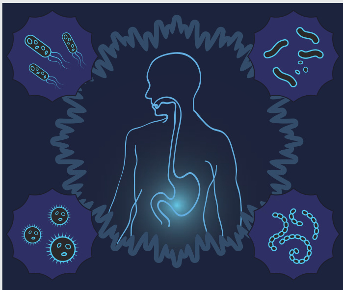  
图A$\copyright$ Anna Smirnova/Alamy RF  

当然，在微生物群落和疾病之间发现的任何相关性都不能证明因果关系。但即使与疾病状态相关的细菌不会导致疾病，这种相关性的存在也可能有助于诊断某些疾病。尽管如此，HMP最令人兴奋的潜在结果将是指出微生物体内的细菌是导致复杂疾病的因子。这些细菌将成为治疗药物的明显靶标，例如，针对这些由微生物专门制造的蛋白质的药物。  

研究人员如何确定微生物群落与疾病之间的统计相关性是否反映了原因或影响？一种方法是详细调查微生物组和寄主的生物学特性是如何通过细菌和它们所定植的人类的相互作用而改变的。因此，科学家将鉴定细菌和人体细胞的转录组及蛋白质组是否、如何通过人体器官的细菌定植而发生改变。这些研究将进一步深入我们对代谢组学（表征人类血液中的代谢产物）的了解。  

另一种更有效的确定微生物群变化因果关系的方法是使用在无菌环境中培养的无菌小鼠。令人惊讶的是，无菌小鼠虽然不正常，却能存活下来：它们的免疫系统发生了改变，皮肤状况很差，它们需要比正常的小鼠多吃一些热量才能保持正常的体重。研究人员可以用一种细菌或一个复杂的微生物群落在无菌小鼠体内繁殖，从而确定微生物群落如何影响生理状态。在本章最后的习题8将允许你通过讨论最近在无菌小鼠身上进行的一项实验来探索这种方法，该实验询问微生物组是否与肥胖有因果关系。  

如果微生物群落确实对人类的疾病状态有贡献，那么未来的治疗可能旨在改变常驻微生物组。因此，HMP的另一方面是研究人类干预可能如何改变细菌群落。饮食变化或膳食添加剂（如益生菌）对微生物体内持久变化的影响有多大？如果用抗生素治疗急性感染，细菌群落如何随时间变化？一些HMP项目已经在探索这些重要问题。  

条件下工作的蛋白质基因。这些蛋白质有时在实验室中有用。例如，Taq DNA聚合酶是用于PCR的酶，因为它能承受使DNA变性的高温，它来自于细菌物种Thermusaquaticus，最早是在黄石国家公园温泉中发现的（见本章开头的照片）。  

对这些极端微生物群落宏基因组的随机DNA片段进行测序可以揭示赋予异常代谢能力的基因。在一个商业上重要的例子中，嗜碱细菌在高pH条件下生长良好，是添加到洗衣液中的酶的来源。这些酶可以降解蛋白质、脂类或碳水化合物；这种酶在肥皂泡沫的碱性环境中能有效工作，在这种环境中，它们会使化学物质或引起染色和气味的微生物失去活性。  

# 基本概念  

●  细菌染色体中的基因排列紧密，没有内含子和非常短的基因间区。  
●  核心基因组由细菌物种的所有成员共享的基因组成，核心基因组加上所有的菌株特异性基因被称为物种的泛基因组。  
●  细菌基因组中的转座子可以携带基因，包括那些赋予耐药性的基因。  
●  质粒是自主复制的环状DNA分子，可以在细胞之间转移，它们通常含有耐药或致病基因，或具有专门的代谢功能。  
●  宏基因组学是对特定环境中的群体细菌基因组的分析。宏基因组学研究可以阐明细菌在人体健康中的作用，并且可以识别具有独特性质的细菌基因。  

# 14.3 细菌作为实验生物  

# 学习目标  

1.  描述细菌的特性，特别是大肠杆菌，使它们成为有用的实验室生物。2.  描述不同种类的细菌突变体和鉴定它们的方法。  

细菌的研究对遗传学的发展至关重要。20世纪40年代到70年代被认为是经典细菌遗传学的时代，研究人员对基因结构、基因表达和基因调控的几乎所有了解都来自对细菌和感染它们的噬菌体（细菌病毒；通常缩写为噬菌体）。重组DNA技术在20世纪70年代和80年代的出现依赖于对细菌中的基因、染色体和限制酶的理解。许多来自其他生物的DNA重组过程仍然需要细菌来生成所需的基因分子。  

# 14.3.1 细菌在液体培养物中或在培养皿表面生长  

研究人员在液体培养基［图14.11（a）］或琼脂固化的平板（称为培养皿）上培养细菌［图14.11（b）］。在液体培养基中，通常研究菌种（如大肠杆菌）的细胞，在一天内可以生长到每毫升 ${10}^{9}$ 个细胞的浓度。在琼脂固化的培养基上，在不到一天的时间内能培养出$10^{7}$ 个或 ${10}^{8}$ 个细胞的可见菌落。细菌，尤其是大肠杆菌，具有快速生长大量细胞的能力，是对基因研究如此有吸引力的一大优势。然而，应该注意的是，在实验室里培养的细菌种类很少；大多数种类细菌只能在其自然环境中生存。  

细菌的遗传研究需要技术来计数这些大量的细胞并分离出感兴趣的单个细胞。研究人员可以使用固体培养基来计算液体培养中细胞的数量。他们从液体介质中细胞的连续稀释开始（如图7.24所示）。然后他们在琼脂培养基上涂布少量的稀释溶液样本，并计算形成的菌落数量。尽管单个细菌细胞很难工作，但组成一个菌落的细胞包含了创建菌落的一个细菌细胞的基因完全相同的后代。  

# 14.3.2 大肠杆菌是一种多用途的模式生物  

研究最多也最深入的细菌种类是大肠杆菌，它是温血动物肠道的常见寄生菌。许多经典实验和大多数现代重组DNA技术都使用大肠杆菌作为模式生物。科学家(a) (b)  

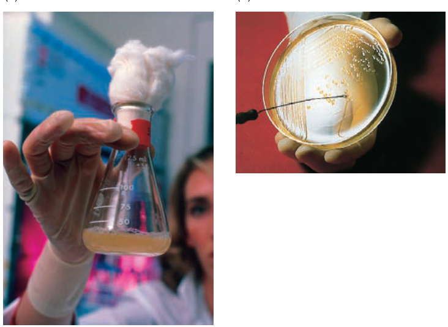  

图14.11　细菌培养。细菌可以在实验室中以悬浮的形式在液体培养基（a）中生长，或以菌落在固体营养琼脂培养皿上生长（b）。  

（a）： $\copyright$ Hank Morgan/Science Source；（b）： $\copyright$ Jeremy Burgess/SPL/Science Source  

发现，大肠杆菌细胞可以在肠道内完全缺氧或有空气的情况下生长。在实验室中研究的大肠杆菌菌株不具有致病性，但该物种的其他菌株可导致各种肠道疾病，其中大多数是轻度的，少数危及生命。  

大肠杆菌通常编码氨基酸和核苷酸生物合成所需的所有酶。因此，它是一种能在基本培养基中生长的原生生物，这种培养基含有单一的碳和能量来源，如葡萄糖和无机盐，以供应构成细菌细胞的其他元素。在基本培养基中，大肠杆菌细胞每小时分裂一次，一天24次，数量翻倍。在含有多种糖类和氨基酸的更丰富、更复杂的培养基中，大肠杆菌细胞每 $20\mathrm{min}$ 分裂一次，每天产生72代。如果不受任何限制因素的制约，以这种对数增长的速度持续两天，就会产生相当于地球质量的大量细菌。  

细菌快速繁殖使得在相对较短的时间内生长出大量的细胞成为可能，从而获得并检查罕见的遗传事件。例如，野生型大肠杆菌细胞对链霉素敏感，通过在含有链霉素的琼脂培养基上铺展10亿个野生型细菌，有可能分离出在 $10^{9}$ 个细胞中偶然出现的几个极其罕见的抗链霉素突变体。对于非微生物生物来说，发现和检测这种罕见的事件并不容易；在多细胞动物中，这个任务几乎是不可能的。  

# 14.3.3 遗传学家通过特定生长条件下菌落的存在或表型鉴定突变细菌  

大多数细菌基因组携带每个基因的一个拷贝，是一倍体。因此，基因突变与表型变异之间的关系是相对直接的，即在每个基因没有第二种野生型等位基因的情况下，所有的突变都表现出它们的表型。  

细菌是如此之小，以至于检验它们的唯一实用方法就是观察它们在培养皿中形成的细胞群。在这个限制条件下，仍然可以鉴定许多不同种类的突变。  

# 1. 细菌突变的种类  

细菌突变体可以根据鉴定它们的方法进行分类。突变种类包括以下几种。  

（1） 影响菌落形态的突变，即菌落是大或是小、发亮或暗淡、圆形或不规则。  
（2） 对抗生素或噬菌体等杀菌剂产生抗性的突变。  
（3） 产生营养缺陷的突变不能在基本培养基上生长和繁殖。营养缺陷型不能从简单的材料合成关键的复杂化合物。  
（4） 影响分解代谢的突变，影响细胞在环境中分解和使用复杂化学物质的能力。大肠杆菌中的一个例子是由于LacZ基因的突变而无法分解复合糖乳糖；这种突变对于研究基因表达如何被控制是非常有用的，这将在第16章中描述。  

（5） 必需蛋白质的突变，其蛋白产物是生长所必需的。因为在一个必需基因中的一个无效突变会阻止任何环境中的菌落生长，所以细菌学家必须处理条件致死突变，如温度敏感（TS）突变——允许在低温下生长但不允许在高温下生长的低形态突变。  

# 2. 筛选与选择  

细菌学家用不同的技术来分离罕见的突变。由于突变对特定药物具有耐药性，研究人员可以进行直接的选择，也就是说，建立条件使得只有所需的突变体才能生长。例如，如果野生型细菌在含有抗生素链霉素的培养皿中划线，那么唯一出现的菌落将是对链霉素有抗性的（Str ）。通过在基本培养基琼脂上简单地接种细胞，也可以选择带有营养缺陷型突变的菌株的原养型回复突变体，这种培养基不包含生长所需的复合营养缺陷型。  

因为刚描述的大多数其他类型突变体的关键特征是它们在特定条件下不能生长，通常不可能直接对它们进行选择。相反，研究人员必须通过基因筛选来识别这些突变：对特定表型的群体中的每个群体进行检查。例如，科学家可以使用复制平皿培养法（回顾图7.6）将生长在含有甲硫氨酸的基本培养基平板上的每个菌落的细胞转移至不含甲硫氨酸的基本培养基的培养皿中。菌落在未补充培养基上生长的失败将表明在原始板上的相应菌落是对甲硫氨酸营养缺陷。  

特定细菌基因的自发突变非常罕见，根据基因的不同， $10^{6}{\sim}10^{8}$ 个细胞中有1个发生自发突变。因此，几乎不可能通过在100万到1亿个菌落中筛选特定表型来识别这种罕见的突变。使用诱变剂治疗可增加基因突变在人群中的出现频率（回顾图7.14）。细菌中的突变筛和突变基因鉴定将在后面的章节中进一步讨论。  

# 3. 细菌等位基因的命名  

研究人员首先用三个小写字母来确定细菌的基因，斜体字母表示基因的功能。例如，突变导致不能合成氨基酸亮氨酸的基因是leu基因。在大肠杆菌中，有四种leu基因——leuA、leuB、leuC和leuD，对应于从其他化合物合成亮氨酸所需的三种酶（每种酶由两种不同的多肽构成）。任何一个leu基因的突变都将细菌变成亮氨酸的营养缺陷型，也就是说，变为不能合成亮氨酸的细胞。这种细胞只能在添加亮氨酸的培养基中生长。糖分解所需的基因突变（如lacZ基因）产生的细胞不能生长在仅含有糖（乳糖）作为碳源的培养基中。其他类型的突变引起抗生素耐药性； $s t r^{r}$ 是产生链霉素抗性的突变株。为了确定野生型细菌中存在的基因的等位基因（基因型），研究者使用了一个上标 $^{+}$ ：leu+、 $s t r^{+}$ 、LacZ+。为了指定突变等位基因，它们使用上标–，如在leuA–和lacZ–中；或上标描述，如在 $s t r^{r}$ 中。  

一个特定基因的野生型或突变型细菌的表型由指定基因的三个字母来指示的。然而，这些字母的首字母大写，没有斜体字，上标为负号，或加上一个字母缩写：Leu （需要亮氨酸用于生长）；Lac （生长在乳糖上）； $\mathrm{Str}^{\mathrm{r}}$ （抗链霉素）。Leu 大肠杆菌菌株不能增殖，除非它生长在含有亮氨酸的培养基中；如果乳糖取代了培养基中的普通葡萄糖，Lac 菌株可以生长；Str菌株可以在链霉素的存在下生长。  

# 基本概念  

●  一个单一的细菌细胞分裂成数百万个基因相同的后代。●  有助于遗传研究的细菌的特征是一倍体，这有利于突变体鉴定和快速指数生长，从而可以恢复稀有突变体。●  细菌突变体可通过筛选或选择进行鉴别。在筛选中，单个菌落被检测为特定的表型。在选择中，只有具有所述表型的细菌作为菌落恢复，才能鉴定极为罕见的突变体。  

# 14.4 细菌基因转移  

# 学习目标  

1.  比较细菌中基因转移的三种机制：转化、接合和转导。  

2.  解释这三种基因转移方法各自是如何用于绘制细菌基因图的。  

3.  探讨水平基因转移在细菌进化中的作用。  

基因从一个个体转移到另一个个体对自然界中新变异的进化起着重要的作用。例如，垂直基因转移发生在一代到下一代，在有性繁殖的生物体中尤为重要。相反，水平基因转移意味着所涉及的性状不是从父母遗传到后代，而是从无关个体或不同物种引入。通过最近的分子和DNA测序分析，许多水平基因转移的案例已经显现出来。  

不同细菌物种中的许多不同基因的比较基因组分析揭示了物种的基因相似性，认为只有远距离相关。此外，在早先报道的各个物种中，核心基因组和泛基因组的存在表明，基因丢失和增加在大肠杆菌和其他物种中经常发生。这些发现最简单的解释是细菌在整个进化过程中发生了显著的DNA转移。仔细研究已知的DNA转移机制有助于阐明水平基因转移是如何发生的。此外，你会发现研究者可以使用各种基因转移的方法来绘制基因图，并构建有用的细菌菌株。  

细菌可以通过三种不同的机制将基因从一个菌株转移到另一个菌株：转化、接合和转导（图14.12）。在所有三种机制中，一个细胞（供体）为转移提供遗传物质，而第二个细胞（受体）接收物质。在转化过程中，来自供体的DNA被添加到细菌生长培养基中，然后由受体从该培养基中提取。在接合过程中，供体携带一种特殊类型的质粒，允许其与受体接触并直接转移DNA。在转导过程中，供体DNA被包装在噬菌体的蛋白质外壳内，当噬菌体颗粒感染受体时，其被转移到受体。基因转移的受体被称为转化子、接合后体或转导子，这取决于DNA转移的机制。  

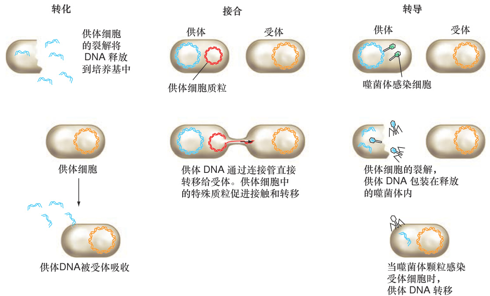  

图14.12　细菌基因转移概况。在这个图中，在这一章中，供体的染色体是蓝色的，而受体的染色体是橙色的。在转化过程中，释放到培养基中的供体DNA片段进入受体细胞。在接合过程中，供体细胞中的一个特殊质粒（如图红色所示）促进与受体的接触并启动DNA的转移。在转导过程中，来自供体细胞的DNA被包装成噬菌体颗粒，可以感染受体细胞，将供体DNA转移到受体。  

所有细菌的基因转移都是不对称的：首先，从供体到受体，转移只在一个方向上进行；其次，大多数受体获得供体DNA的 $3\%$ 或更少，只有一些接合子含有更大比例的供体材料。因此，进入受体的供体DNA相对于受体染色体是小的，并且受体保留大部分自身的DNA。我们现在详细研究每种类型的基因转移。  

# 14.4.1 在转化过程中，受体摄取改变其基因型的DNA  

少数细菌在自然转化过程中自发地从周围环境中提取DNA片段。然而，大多数细菌种类只能通过实验室程序使其细胞壁和膜在人工转化过程中对DNA具有渗透性后，才能吸收DNA。  

# 1. 自然转化  

研究人员已经研究了几种自然转化的细菌，包括：肺炎链球菌，这种病原体是Frederick Griffith在转化过程中发现的，并导致了人类的肺炎（见第6章）；枯草杆菌，一种无害的土壤细菌；流感嗜血杆菌，一种引起人类多种疾病的病原体；淋球菌，淋病的微生物制剂。  

在一项自然转化的研究中，研究人员分离出枯草芽孢杆菌，其中两个突变trpC–和hisB–使它们成为Trp–His–的双营养缺陷型。这些双营养缺陷型作为本研究的受体，野生型细胞（ $\mathrm{Trp}^{+}\mathrm{His}^{+}$ ）是供体［图14.13（a）］。实验人员提取和纯化供体DNA，并在合适的培养基中生长$t r p C^{-}h i s B^{-}$ 受体，直到细胞成为感受态细胞，即能够从培养基中提取DNA。  

当受体通过自然转化获得DNA时，供体DNA片段中只有一条链进入细胞，而另一条链被降解［图14.13（b）］。当受体细胞分裂时，进入的链与受体的染色体组合重组，产生转化子。  

为了观察和计数Trp+转化子，研究人员将新转化的受体细胞涂布到含有组氨酸的基本培养基的培养皿中。不接受供体DNA的受体细胞不能生长在这种培养基上，因为它缺乏色氨酸，但Trp 转化子可以生长并被计数。为了选择His 转化子，研究人员将转化混合物倒入含有色氨酸的基本培养基中，代替组氨酸。在这项研究中，Trp+和His+转化子的数目是相等的。在枯草芽孢杆菌处于高度感受态的条件下， $10^{9}$ 个细胞将产生大约 $10^{5}$ 个Trp+转化子和 $10^{5}$ 个His+转化子。  

为了确认Trp 转化子是否也是His ，研究人员使用无菌牙签将Trp 转化子转移到既不含色氨酸也不含组氨酸的基本培养基中。每100个Trp+转移的菌落中有40个在这种基本培养基上生长，表明它们也是His 。同样，对His+转化子的测试表明，大约 $40\%$ 也是 $\mathrm{Trp}^{+}$ 。因此，在被分析的菌落中，有 $40\%$ 的 $t r p C^{+}$ 和 $h i s B^{+}$ 基因被共转化。共转化是两个或两个以上基因的同时转化。  

因为供体DNA在受体转化过程中只占受体染色体  

(a) (b)  

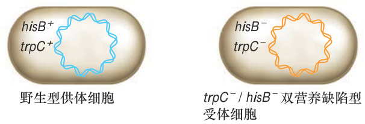  

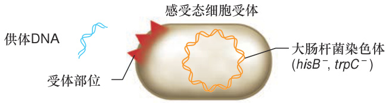  

DNA  

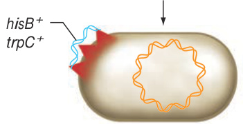  

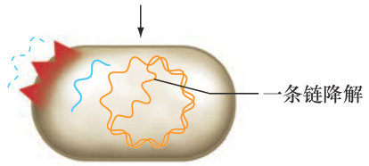  

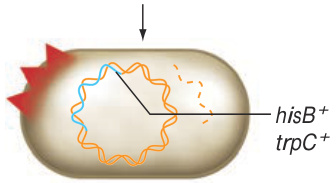  

的一小部分，所以这两种枯草芽孢杆菌基因以如此高的频率共转化似乎是令人惊讶的。解释是，trpC和hisB基因在染色体上非常紧密地结合在一起，因此是遗传联系的。枯草芽孢杆菌染色体长约 $4700\mathrm{kb}$ 。只有在同一染色体附近的基因可以共同转化；基因越紧密地结合在一起，它们就越频繁地发生共转化。因此，供体染色体在提取过程中被分割成约20kb的小片段，野生型 $t r p C^{+}$ 和hisB 等位基因非常接近（相距约7kb），它们常在同一供体DNA分子中。相距足够远的基因无法同时出现在供体DNA的一个片段上，它们几乎永远不会进行共转化，因为转化效率非常低，受体细胞通常只吸收一个DNA片段。  

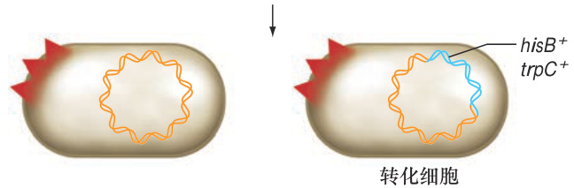  
图14.13　枯草芽孢杆菌中的自然转化。（a）野生型供体和trpC− hisB−双重营养缺陷型。选择Trp 和（或）His 表型可以识别转化子。（b）枯草芽孢杆菌自然转化的机制。一条供体DNA片段进入受者体内，而另一条则被降解。进入的链与受体染色体重新结合，最初产生在异双链DNA的一个区域，其中一个双螺旋链来自一个亲本，另一个来自另一个亲本。当受体细胞分裂时，其中一个子细胞与供体基因发生了转化。  

转化也描述了质粒转移；也就是说，如果供体DNA是质粒，受体细胞可以摄取整个质粒并获得质粒基因所赋予的特性。细菌学家怀疑，在本章的引言中描述的耐青霉素的淋病奈瑟菌是通过质粒转化产生的。质粒的供体是双重感染患者的免疫防御系统所破坏的流感嗜血杆菌细胞。质粒携带青霉素酶基因，而由质粒转化的受体淋病奈瑟菌对青霉素获得抗性。  

# 2. 人工转化  

刚刚所描述的研究是一个实验室改造自然转化，研究人员已经设计了许多方法来转化不经历自然转化的细菌物种。人工转化的存在对于第10章中描述的基因克隆技术的发展至关重要。所有的方法包括破坏受体细胞壁和细胞膜的处理，使供体DNA可以扩散到细胞中。在大肠杆菌中，最常见的处理方法是在低温下将细胞悬浮在高浓度的钙溶液中。在这些条件下，细胞变得对单链甚至双链DNA具有渗透性。  

另一种人工转化技术是电穿孔法，研究人员将一种受体细菌悬浮液与供体DNA混合，然后让这种混合物受到非常短暂的高压电击。这种冲击很可能导致细胞膜上形成孔洞。在适当的电击条件下，受体细胞能有效地吸收供体DNA。电穿孔转化对大多数细菌都有效。  

# 14.4.2 在接合中，供体直接将DNA转移到受体  

20世纪40年代末，Joshua Lederberg和Edward Tatum分析了两种多营养缺陷型大肠杆菌菌株。他们得出惊人的发现：基因似乎从一种大肠杆菌细胞转移到另一种类型（图14.14）。两种菌株都不能在基本培养基上生长。菌株A需要补充甲硫氨酸和生物素（维生素H）；菌株B需要补充苏氨酸、亮氨酸和硫胺素（维生素 ${\bf B}_{1}$ ）。Lederberg和Tatum使这两个菌株在完全添加培养基上一起生长。当他们随后将两种菌株的混合物转移到基本培养基时，每 $10^{7}$ 个转移细胞中约有1个增殖到可见的菌落。这些克隆是什么？它们是如何产生的？  

超过10年的进一步实验证实，Lederberg和Tatum观察到的现象被称为细菌接合（图14.15）：从供体到受体的单向DNA转移，需要细胞与细胞的接触，并且由供体菌株中的接合质粒启动。这些质粒可以启动接合，因为它们携带基因，使它们能够将它们自己（有时是供体的一些染色体）传递给受体。  

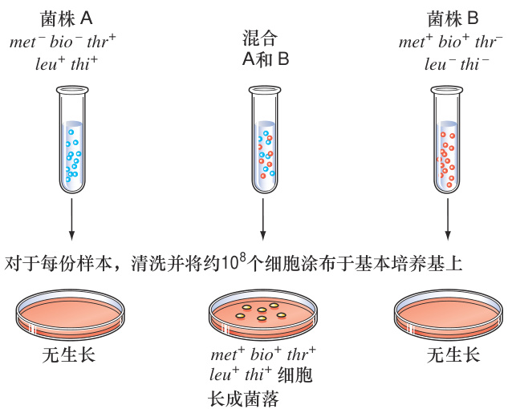  
图14.14　接合。Lederberg和Tatum分析的两种不同的营养缺陷菌株都没有在基本培养基上形成菌落。当两种菌株的细胞混合后，基因转移产生了一些在基本培养基上形成菌落的原养型细胞。  

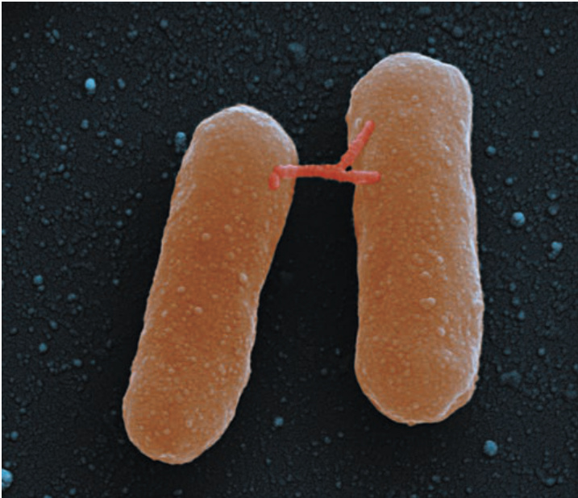  
图14.15　细菌细胞偶联。$\copyright$ Eye of Science/Science Source  

# 1. F质粒与接合  

图14.16示出了由第一个被发现的接合质粒所引发的细菌接合的类型——大肠杆菌F质粒。携带F质粒的供体细胞被称为F 细胞，没有质粒的受体细胞是F 。F质粒携带许多DNA转移所需的基因，包括形成附属物的基因（称为纤毛，供体细胞通过它与受体细胞接触）和一个编码内切核酸酶的基因（这种内切酶在称为转移起点的特定位点切断F质粒的DNA）。  

一旦F 供体（带有F质粒）通过菌毛接触F 受体细胞（缺少F质粒），菌毛的收缩将供体和受体拉拢在一起。然后通过限制性内切核酸酶切割F质粒DNA，质粒的单链在两个细胞之间的桥上移动。F质粒DNA进入受  

# 特色插图14.16  

# F质粒和接合  

a.  F 质粒含有合成供、受体细胞连接的基因。F质粒是一个长100kb的双链 DNA环。F细胞一般有一个拷贝的质粒。研究人员认为F细胞是雄性细菌，因为该细胞可以将基因转移到其他细菌。约 $35\%$ F质粒DNA由控制质粒转移的基因组成。这些基因大多编码与构建F菌毛有关的多肽：一种从细菌细胞伸出的硬而细的蛋白质链。质粒的其他区域携带IS和参与DNA复制的蛋白质的基因。  

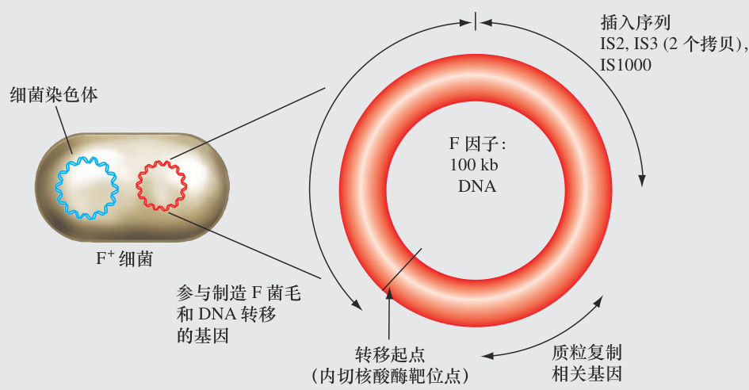  

b. 接合的过程。  

1.  菌毛。一个平均菌毛的长度为 $1\mu\mathrm{m}$ ，几乎和普通大肠杆菌细胞一样长，菌毛的远端尖端由一种蛋白质组成，这种蛋白质能特异性地与不携带 F质粒的F–大肠杆菌的细胞壁结合。  

2.  附着于F–细胞（雌性细菌）。因为它们缺乏F因子，F–细胞不能制造菌毛。F+细胞的菌毛与F–细胞接触后缩回到F+细胞内，使F–细胞更接近。 一条狭窄的通道穿过两个细胞膜。  

3.  基因转移：一条DNA单链从雄性到雌性细胞。内切核酸酶在特定的位点（转移的起点）切断F质粒DNA的一条链。F+细胞将切断的链通过通道挤入F 细胞。当F 细胞接受F质粒DNA的单链时，它合成一条互补链。以前的F 细胞含有双链F质粒，现在是F 细胞。  

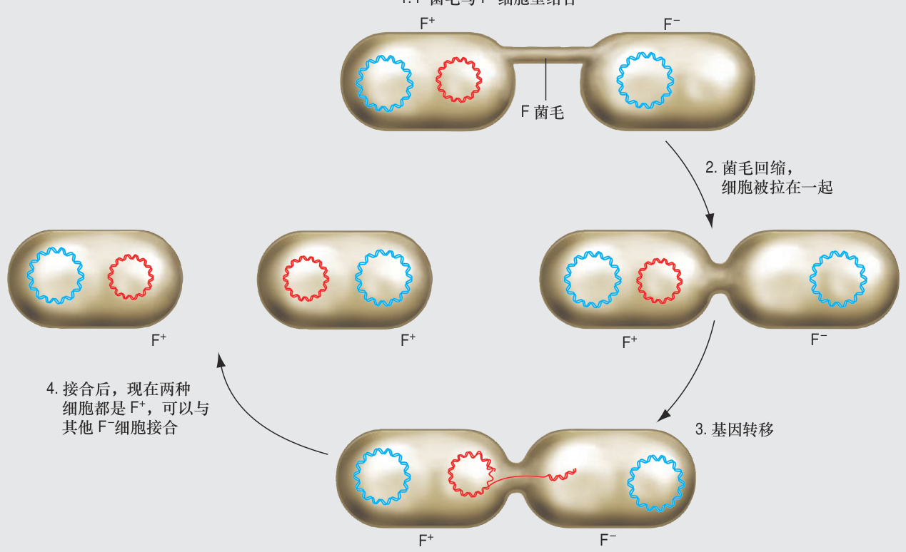  
1. F     F–  

体细胞的运动伴随着另一个正在离开的供体DNA链拷贝的合成。当供体DNA进入受体细胞时，它重新形成一个圆形，受体合成互补的DNA链。在F+×F–交配中，受体成为F ，供体保持F 。  

通过启动和进行接合，F质粒在细菌群体中的作用就像性传播疾病在人类群体中的作用一样。当通过一些供体细菌导入不携带质粒的大型培养细胞时，F质粒很快就会在整个培养过程中传播开来，所有的细胞都变成了F+。  

# 2. 染色体基因的接合转移  

F质粒包含三种不同的IS元件：IS2的一个拷贝，IS3的两个拷贝，以及一个特别长的IS1000拷贝。F质粒上的这些IS序列与在细菌染色体的不同位置发现的相同IS元件的拷贝是相同的。在每100 000个F 细胞中大约有1个，质粒上的IS与染色体上的相同IS同源重组（即交换），将整个F质粒整合到大肠杆菌染色体中（图14.17）。染色体携带一个整合的质粒的细胞被称为Hfr细菌，因为我们将看到，当它们与F 株交配时，它们产生了染色体基因的高频重组体。  

由于导致F质粒插入细菌染色体中的重组事件可以在F质粒上的任何一个IS元件和细菌染色体中的任何一个相应的IS元件之间发生，遗传学家可以分离超过30个不同的Hfr细胞株（图14.18）。像F质粒这样的质粒，可以整合到基因组中被称为附加体。不同的Hfr菌株通过相对于细菌染色体的外膜体的位置和方向（顺时针或逆时针方向）来区分。  

在细菌繁殖过程中，Hfr细胞的整合质粒与细菌染色体的其余部分复制。因此，由细胞分裂产生的子细胞中的染色体包含一个完整的F质粒，其位置与最初整合到亲本细胞染色体上的质粒的位置完全相同。因此，所有的Hfr细胞的后代是相同的，F质粒插入相同的染色图14.17　Hfr染色体的发生。在这个图中，条形图代表了两条DNA链。F质粒上的IS和细菌染色体上同类IS重组产生了Hfr染色体。在接合过程中，DNA将从Hfr供体转移到受体，从转移的起点（箭头）开始，所以细菌基因将按A B C的顺序转移。  

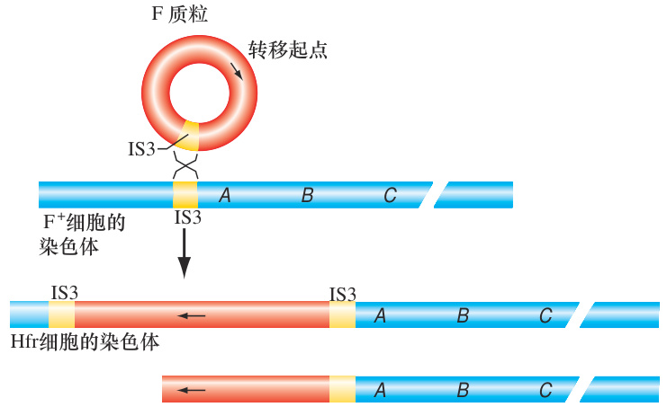  
F –  

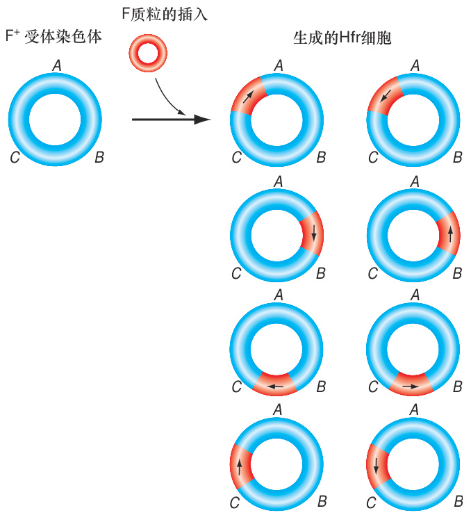  
图14.18　不同的Hfr染色体。在F质粒上的任意一个IS和细菌染色体上的任意一个相应的IS之间可以发生重组，从而产生许多不同的Hfr菌株。根据染色体上IS元件的初始定位，重组可以产生一些顺时针转移基因的Hfr菌株和逆时针转移基因的Hfr菌株。  

体位置和相同的方向。整合的F质粒仍然具有通过接合启动DNA转移的能力，但现在它是细菌染色体的一部分，它也能促进某些供体染色体的转移（图14.19）。  

从融合到F 细胞的Hfr细胞中转移DNA起始于在转移起点的整合F质粒中部的单链缺口（图14.20）。一旦供体DNA被转移到受体，供体DNA和受体染色体之间就会发生重组。  

# 3. 接合过程中通过基因转移定位基因  

因为Hfr染色体中的基因以一致的顺序转移到受体中，研究人员意识到他们可以用 $\mathrm{Hfr}\times\mathrm{F}^{-}$ 杂交来定位基因。在大肠杆菌基因组的早期研究中，例如，Elie Woll-man和Francois Jacob使用了一种Hfr株，即 $\mathrm{Str}^{\mathrm{s}}$ （链霉素敏感）、 $\mathrm{Thr}^{+}$ （能够合成苏氨酸）、Azir（叠氮化物抗性）、Tonr（抗噬菌体T1）、Lac+（能够在乳糖上生长）、 $\mathrm{Gal^{+}}$ （能够在半乳糖上生长）和另一种类型的F菌株（ $\mathrm{Str}^{\mathrm{r}}$ 、Thr 、Azi 、Ton 、Lac 、Gal ）。研究人员使用这两种菌株能够分离和分析基因转移及重组时的外接物。  

Wollman和Jacob在丰富的非选择性液体培养基中混合这两种菌株，使其接合。接下来，每隔1min，他们在厨房搅拌器中搅拌交配混合物的样本，打断交配（这就是为什么这个实验被称为中断交配实验）。终止配对的样本被涂布到含有链霉素的培养皿中，链霉素杀死了最初的Hfr细胞。该平板也缺乏苏氨酸，无法交配的F−细胞图14.19　Hfr供体和F−受体之间的基因转移。在一个Hfr $\times\,\mathrm{F}$ 交配中，单链DNA从整合的F质粒上的转移起点转移到受体上。在受体细胞内，这种单链DNA被复制到双链DNA中。如果交配中断，受体细胞将包含DNA的双链线性片段和自己的染色体。来自供体的基因只有在重组到受体的染色体中时，才能保留在脱位基因中。重要的是，为了确保受体的染色体保持环状，使细胞保持存活，需要偶数次交换。  

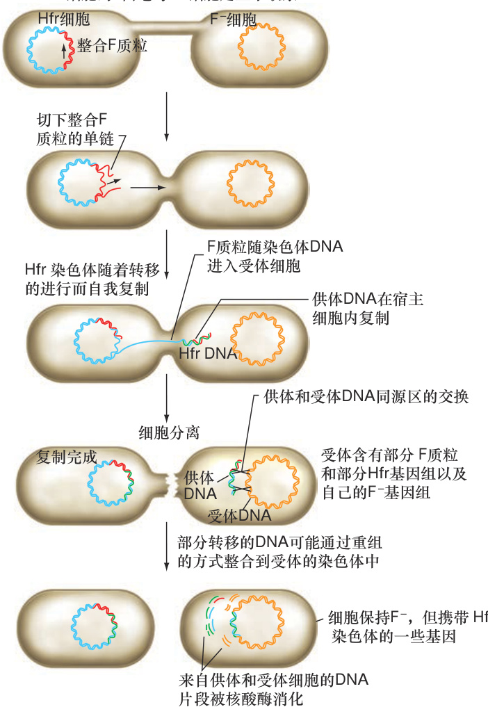  
Hfr    F    F –  

进行选择；任何Thr F 细胞必须获得Hfr的Thr 基因。StrThr+接合后体成长的平板被复制培养，以检测其他四个标记物是否从Hfr转移到F−受体中［图14.20（a）］。  

图14.20（b）显示了从Hfr菌株中包含各种等位基因的非接合体菌落的频率作为时间的函数，从接合开始到中断。在交配进行了8min后，一小部分重组体是Azi ，但没有一个携带其他供体等位基因。在大约$10\,\mathrm{min}$ 时，一些重组体也具有供体的 $t o n^{r}$ 等位基因。$15\,\mathrm{min}$ 时，lac 等位基因出现在外接合子菌落； $17\mathrm{min}$ 时，gal+到达。含有Hfr特定基因的重组菌落的百分比随着时间的增加而增加，直到达到该基因的平台特性。第一个Hfr基因（ $a z i^{\prime}$ ）进入 $\boldsymbol{\mathrm{F}}^{-}$ 细胞具有最高的平台期（ $90\%$ ），最后一个基因（ $g a l^{+}$ ）具有最低的平台期（ $20\%$ ）。  

在Hfr菌株中存在一个整合的F附加体，解释了中断交配实验中每个转移基因的两个特征：基因转移的首次出现时间，以及携带供体基因的外接合子的平台百分比。每个基因首先出现在特定时间的外接合子中，因为所有Hfr供体细胞在其染色体的相同位点和相同方向携带F因子，转移总是从F因子转移起点的同一位置开始（回顾图14.17）。因此，一个基因首次进入受体细胞的时间反映了该基因与转移原点的距离。这种解释不仅可以预测大肠杆菌染色体上基因的顺序，还可以大致绘制出基因之间的距离。距离单位定义为染色体转移的分钟数，每分钟约为47 000bp［图14.20（c）］。  

用于携带每个转移基因的克隆部分的平台来源于新的转移不断引发的事实，也来自接合桥和被转移DNA的固有脆弱性。如果细胞分离或转移染色体断裂，Hfr供体和F 受体之间的转移可能会自发中止。因此，并不是所有的外接合子都能重新获得早期到达的基因，如$a z i^{\prime}$ 。此外，转移标记所需的时间越长，交配对在转移发生之前分离的机会就越大。换句话说，在没有搅拌器的情况下，接合自然会发生中断。结果，接收后到达基因的接合后体的每一个百分数依次变小。  

从图14.20（b）中可以看出，基因的顺序可以简单地从在 $20\mathrm{min}$ 的接合后携带不同标记的外接合子的百分比确定，而不需要中断间隔1min的交配。这种接合性质，其中一个基因与F因子原点的距离决定了携带该标记的外接合子的比例，称为转移梯度。  

一旦来自Hfr供体的基因到达F–受体，受体与供体等位基因的稳定替换需要偶数次交换，最简单的情况是两次交换。两个最简单的情况：图14.20（d）显示了在中断的交配实验中，一个特定种类的稳定外接合子是如何产生的。因为外接合子被选择为 $\mathrm{Tr}\mathrm{p}^{+}$ ，两个交换中的一个必须发生在转移的原点和thr基因之间（事实上，这个实验的成功是基于Wollman和Jacob的先验知识，即thr+标记是从这个特定的Hfr菌株转移的所有标记中的第一个）。第二个交换必须发生在thr基因的另一侧。例如，如图14.20（d）所示，从Hfr到F–受体的thr+和azir等位基因（但不是任何其他标记物）的共同转移需要azi和ton基因之间的第二次交换。  

本章末尾的问题集突出了接合实验的两个附加特征。第一，如习题23所示，利用不同的Hfr供体菌株将不同方向的F附加体插入到大肠杆菌染色体的不同位置的接合实验提供了第一个证据，即细菌染色体实际上是环形的。第二，习题20和习题21强调稳定的外接合子的形成会产生偶数个交换。这一事实为科学家提供了一种从接合实验中获得高度精确的基因图的方法。  

# 4. 使用F′附加体进行互补研究  

我们在前面看到，F质粒插入细菌染色体中，大约每100 000个F+细胞中产生一个Hfr细胞。在大致相同比例的Hfr细胞中，切除事件导致Hfr细胞回复到F 细胞。  

  

图14.20　中断交配实验。（a）Hfr（ $t h r^{+}$ 、azir、tonr、lac+、 $g a l^{+}$ 、 $s t r^{s}$ ）和 $\mathrm{\Delta}\left|\mathrm{F}\right|$ （thr–、azis、tons、lac–、gal–、 $s t r^{\prime}$ ）细胞混合交配。样本在厨房搅拌器中每隔1min搅拌一次，以干扰基因转移。细胞接种到含有链霉素（杀死Hfr供体细胞）和缺乏苏氨酸（防止没有交配F 细胞的生长）的培养基上。利用复制平板技术建立了其他标记物的外源接合子的基因型。（b）中断交配实验的结果。（c）根据数据确定的基因顺序，其位置由供体基因第一次出现在外源接合子的时间决定。（d）Hfr基因转移到F受体。为了出现在外接物中，Hfr DNA必须与F–染色体交换2次（或偶数次）。当 $\mathrm{Thr}^{+}.$ 外接合子被选择时，两个交换（黑线）必须在thr基因的侧翼。azi右侧的交换位置（本例中为azi和ton之间）决定了 $t h r^{+}$ 和azir都转移到F−染色体。  

在这些切除事件的一小部分中，重组中的错误产生了含有大部分F质粒基因的质粒，加上一个小区域的细菌染色体，该区域与整合的F附加体相邻。新形成的质粒携带F质粒的大部分基因加上一些细菌DNA，被称为F′质粒或F′附加体［图14.21（a）］。  

F′质粒在大肠杆菌细胞内以离散的环状DNA复制。它们以F质粒转移的相同方式转移到受体（ $\mathrm{~\,~F~}^{-}$ ）细胞。不同的是，一些染色体基因总是作为F′质粒的一部分而被转移。F′附加体在一个能够独立于细菌染色体复制的分子上转移染色体基因的能力使其成为互补分析的有用工具。  

从第7章回忆，互补测试依赖于被分析基因的二倍体细胞。虽然细菌是一倍体，但携带细菌基因的F′质粒可以产生部分二倍体的特定区域。例如，一些F′质粒携带控制色氨酸生物合成的trp基因。携带这些基因的F′质粒被称为F′ trp质粒。  

为了利用F′质粒在细菌细胞中产生部分二倍体，研究人员必须将F′质粒转移到不被F′质粒携带的基因所缺失的染色体上。这是通过将F′携带细胞与F 细胞配对来实现的［图14.21（b）］。这些交配中的外接合体含有部分细菌基因的两个拷贝，其中一个在F′上，另一个在细菌染色体上，被称为部分二倍体。  

作为使用部分二倍体的互补研究的一个例子，考虑影响色氨酸生物合成的突变的分析［图14.21（c）］。所有这些突变图彼此非常接近。首先，必须通过将带有一个特异性trp突变（ $\left(\begin{array}{l}{{t r p}^{-}x}\end{array}\right)$ ）的整个trp区的F′质粒引入到染色体中携带不同的 $t r p$ 突变（trp–y）的细菌菌株中，构建一个部分二倍体。在不含色氨酸的基本培养基上生长  

(a)  F′  

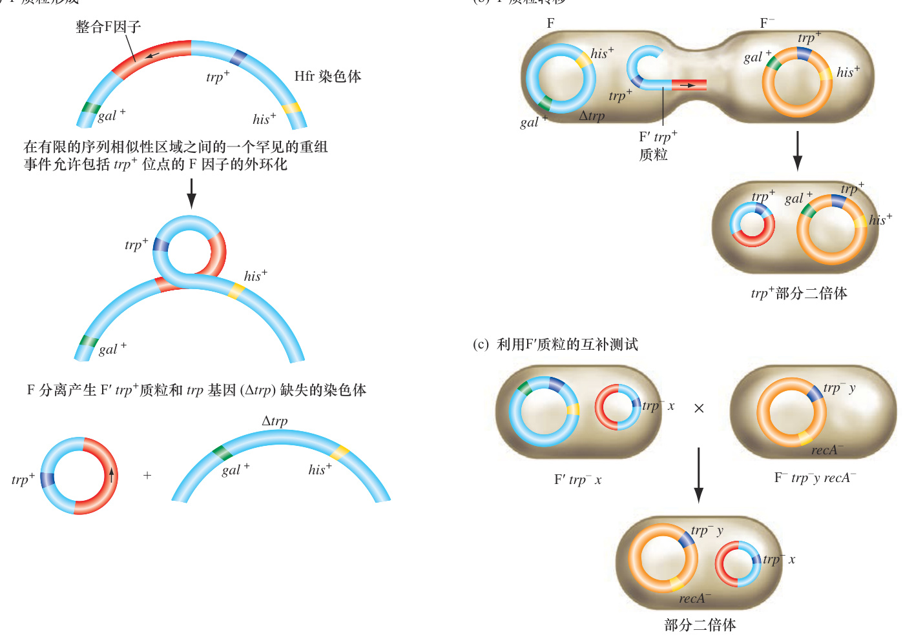  
(b)  F′   
图14.21　F′附加体。（a）很少情况下，当一个F质粒从细菌染色体中出来时，它需要一些相邻的细菌基因组DNA，生成一个F′附加体。（b）转移F′的接合过程可以生成部分二倍体。（c）部分二倍体可用于涉及F′附加体上细菌基因的互补分析。trp–x和trp y是两个独立的trp 突变。  

一个特定的二倍体将证明突变互补，因此在不同的基因中，如果细胞不生长，突变必须在同一个基因中。利用F′ trp部分二倍体的互补研究表明，大肠杆菌基因组有5种不同的trp基因（A、B、C、 $D$ 和 $E$ ），每一个都对应于色氨酸生物合成所需的5种酶之一。  

# 14.4.3 在转导过程中，噬菌体将DNA从供体转移到受体  

感染、繁殖和杀死各种细菌的噬菌体在自然界中广泛分布。大多数细菌对一种或多种这种病毒很敏感。在感染过程中，一个病毒颗粒可以合并入一段细菌染色体，并在随后的几轮感染过程中将这一段细菌DNA引入其他宿主细胞。病毒颗粒将病毒DNA从一个宿主细胞转移到另一个宿主细胞的过程称为转导。  

# 1. 噬菌体增殖的裂解周期  

当噬菌体将其DNA注入细菌细胞时，噬菌体DNA接管细胞的蛋白质合成和DNA复制机制，迫使其表达噬菌体基因，产生噬菌体蛋白，并复制噬菌体DNA（见图7.24）。新产生的噬菌体蛋白和DNA组装成噬菌体颗粒，然后感染细胞破裂或裂解，释放 $100\!\sim\!200$ 个新病毒颗粒，准备感染其他细胞。导致细胞裂解和子代噬菌体释放的周期被称为噬菌体增殖的裂解周期。在裂解周期结束时，从宿主细菌释放的噬菌体颗粒被称为裂解物。  

# 2. 普遍性转导  

许多噬菌体编码酶来分解宿主细胞的染色体。通过这些酶消化细菌染色体，有时会产生与噬菌体基因组相同长度的细菌DNA片段，并且这些噬菌体长度的细菌DNA片段有时会并入噬菌体颗粒中取代噬菌体DNA（图14.22）。在宿主细胞裂解后，噬菌体颗粒可以附着并注入它们携带的DNA到其他细菌细胞。通过这种方式，噬菌体将基因从第一个菌株（供体）转移到第二个菌株（受体）。注入的DNA和新宿主的染色体之间的重组完成了转移。这一过程可以导致任何细菌基因在相关细菌株之间的转移，称为普遍性转导。  

# 3. 普遍性转导的基因定位  

与共转化一样，细菌染色体上的两个靠近的基因可能是共转导的。共转导的频率直接取决于两个基因之间的距离：它们越接近，就越有可能出现在同一个短的图14.22　普遍性转导。将来自供体的随机细菌DNA片段整合到噬菌体颗粒中，产生了普遍性转导噬菌体。当这些噬菌体颗粒感染受体时，供体DNA被注入受体细胞。供体DNA片段与受体染色体的重组产生转导因子需要偶数次交换。  

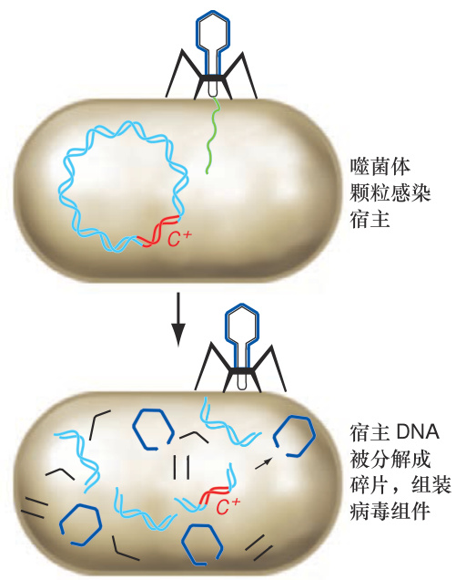  
C    DNA  

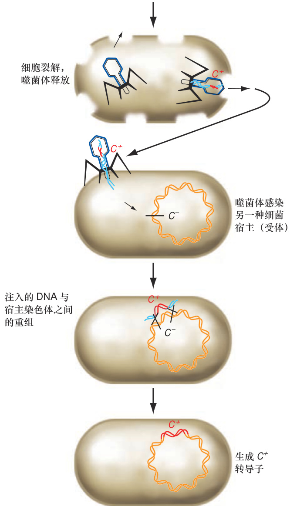  

DNA片段上，并被包装成相同的转导噬菌体。两个与DNA长度相距较远的基因，可以被包装成单个噬菌体颗粒，绝不能被共转导。对于噬菌体P1，一种通常用于大肠杆菌的普遍性转导实验，允许共转导最大分离约为90kb的DNA，其约相当于细菌染色体的 $2\%$ 。  

例如，考虑三个基因thyA、lysA和cysC，它们都是通过中断交配实验定位到大肠杆菌染色体的相似区域。它们位于彼此的哪个位置？通过利用野生型菌株的P1普遍性转导裂解物感染thyA–、lysA–、cysC–株，然后选择Thy 或Lys 表型的转导子。在复制平板后，测试每种类型选择的转导子的两个非选择基因的等位基因。如图14.23（a）中的表型数据表明，thyA和lysA彼此接近，但远离cysC；lysA和cysC相距甚远，它们从未出现在相同的转导噬菌体颗粒中；最后，thyA和cysC很少被共转导。因此，三个基因的顺序必须是lysA thyA cysC（图14.23）。  

# 4. 温和噬菌体  

迄今为止讨论的噬菌体的类型是有毒性的：感染宿主后，它们总是进入裂解循环，迅速繁殖并杀死细胞。其他类型的噬菌体是温和的：虽然它们可以进入裂解周期，但它们也可以进入另一种溶原循环，在此期间，它们的DNA整合到宿主基因组中并与其一起繁殖，对宿主没有伤害（图14.24）。温和噬菌体DNA的整合拷贝被称为原噬菌体，含有原噬菌体的细菌被称为溶原菌。一旦整合到染色体中，噬菌体基因组是染色体DNA的被动伴侣。整合的原噬菌体与染色体一起复制，但不产生导致更多病毒颗粒的蛋白质。生活方式（裂解或溶原性的选择）发生在温和噬菌体将其DNA注入细菌细胞，它取决于环境条件。正常情况下，当温和噬菌体将它们的DNA注入宿主细胞时，一些细胞经历裂解循环，而其他细胞经历溶原性周期。研究中常用的一种温和噬菌体是λ噬菌体（图14.25）。  

P1 $t h y A^{-}\:l y s A^{-}\:c y s C^{-}$  

  
(a) $t h y A^{+}\;l y s A^{+}\;c y s C^{+}$   
图14.23　通过共转导频率绘制基因图。（a）P1的裂解产物$t h y A^{+}l y s A^{+}c y s C^{+}$ 供体感染thyA−lysA−cysC−受体。选择Thy+或Lys+细胞，然后检测未选择的标记。（b）基因图。thyA和cysC基因的共转导频率较低，因此它们必须比lysA和cysC更接近，而后者从未共转导过。  

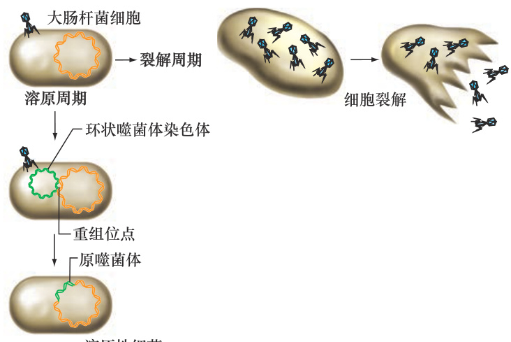  

图14.24　裂解和溶原性繁殖模式。受温带噬菌体感染的细胞进入裂解或溶原循环。在裂解周期中，噬菌体通过形成新的噬菌体颗粒进行繁殖，噬菌体颗粒可以溶解宿主细胞并感染新的宿主。在溶原周期中，噬菌体染色体（绿色）成为与宿主染色体（橙色）整合的原噬菌体。  

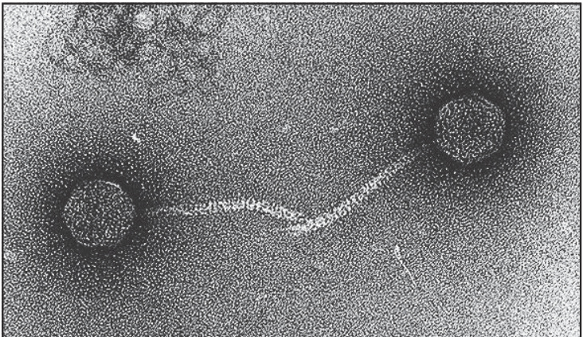  
图14.25　λ噬菌体。温和噬菌体——λ噬菌体的两个粒子的电子显微照片。$\copyright$ Jack D. Griffith/University of North Carolina Lineberger ComprehensiveCancer Center  

在某些条件下，有可能诱导整合的病毒基因组从染色体上切除，进行复制，并形成新病毒［图14.26（a）］。在一小部分切除中，一些与噬菌体整合的位点相邻的细菌基因可能与病毒基因组一起被切割并被包装成基因组的一部分。溶源性病毒从细菌基因组中的错误切除产生的病毒被称为特异性转导噬菌体［图14.26（b）］。在这些噬菌体的生产过程中，细菌基因与病毒DNA可以共存。当特殊的转导噬菌体感染其他细胞时，这些少数细菌基因可能被转移到感染的细胞中。噬菌体介导的一些细菌基因被称为特异性转导基因。温和噬菌体被认为是一个重要的载体，从一个细菌菌株到另一个细菌菌株，甚至从一个物种到另一个物种的水平转移。  

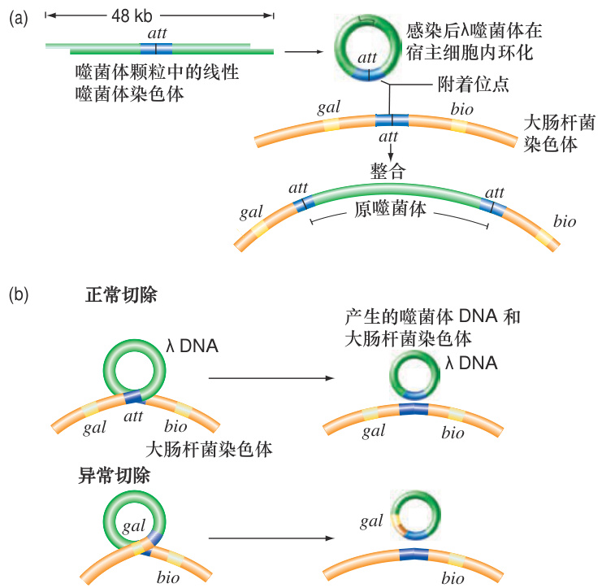  
图14.26　溶原性和切除。（a）噬菌体λDNA的整合启动溶原性周期。噬菌体和细菌染色体上att位点的重组使噬菌体整合成为可能。（b）原噬菌体切除的错误会产生特殊的转导噬菌体。正常切除产生只包含λDNA的圆环。原噬菌体和细菌染色体的不合理重组导致不准确的切除。该产物是一个缺乏噬菌  

体基因但已获得邻近gal基因的DNA环。  

# 14.4.4 水平基因转移具有重要的进化和医学意义  

刚刚描述的基因转移机制（转化、接合、转导）发生在许多细菌物种中。水平基因转移的广泛证据表明，这些机制对于细菌快速适应不断变化的环境是至关重要的。  

不同细菌种类之间的水平基因转移是在许多称为基因组岛的大片段DNA（ $10\sim200\mathrm{kb}$ 大小）的细菌基因组中存在的原因，其性质表明它们起源于外源DNA转移到细菌细胞中。大肠杆菌K12图谱中的一个这样的基因组岛较早在图14.6中显示。这个岛显然是从志贺氏菌的基因组中获得的；注意到在图中所描绘的大肠杆菌的其他菌株中没有看到这个岛。一些迹象表明，将基因组岛整合到受体细胞的染色体上的机制与温和噬菌体（如 $\lambda$ 噬菌体）形成原噬菌体的机制有关。例如，许多基因组岛含有编码与已知噬菌体整合酶相关的酶的基因。基因组岛携带许多不同类型的基因，这些基因可以促进受体细菌在新环境中的适应性，如编码新的代谢酶或介导抗生素抗性的蛋白质的基因。  

在致病性细菌中，致病性决定因子通常聚集在基因组岛的一个亚型中，称为毒力岛。有了这样的安排，一组基因从一个物种水平转移到另一个物种，可以把非致病性菌株变成致病性菌株。引起霍乱的霍乱弧菌株中发现了重要的例子。这些菌株的毒力岛包括：干扰宿主细胞功能的肠毒素基因，可使细菌入侵肠道的黏液蛋白质基因，使细菌黏附宿主细胞的蛋白质类基因，与噬菌体相关的整合酶基因，等等（图14.27）。霍乱的流行是由霍乱弧菌的特定菌株引起的，对其中几种疾病菌株的基因组分析显示，尽管所有菌株都含有毒素基因，但在毒力岛的基因存在变异。流行病的严重程度取决于菌株中存在的基因。  

  
图14.27　毒力岛。细菌基因组内的毒力岛可包含许多导致疾病的基因。  

称为整合和接合元件（ICE）的毒力岛引起了人们的特别关注。除了具有其他毒力岛的特征外，ICE还具有类似于F附加体的接合质粒的特征。因此，ICE元件编码了接合所需的元件，包括介导两个细胞之间的连接并传递DNA的基因。ICE引发的接合通常是混杂的，使毒力岛DNA在许多不同物种之间随时转移。  

# 基本概念  

●  细菌之间的水平基因转移通过三种机制发生：转化、接合和转导。  
●  在转化过程中，生长培养基中的供体DNA进入受体细胞。  
●  接合依赖于供体F+携带接合质粒（F质粒）或整合接合元件（如在Hfr菌株中）的细胞与细胞间的直接接触，以及缺乏这种元件（ $\mathrm{F}^{-}$ ）的受体。  
●  在转导过程中，包装在噬菌体蛋白外壳中的细菌DNA是基因转移的载体。  
●  对于相近的基因，共转化或共转导的频率与基因之间的距离呈反比关系。  
●  在 $\mathrm{Hfr}\!\times\!\mathrm{F}^{-}$ 接合中，基因可大致由Hfr供体中的不同等位基因首次在F–外接合子中出现的时间粗略定位，并且更精确地通过计算每个表型类的接合后体来定位。  
●  细菌的快速进化是由于基因水平的传递，包括细菌物种之间被称为毒力岛的基因包。  

# 14.5 利用遗传学研究细菌的生命  

# 学习目标  

1.  解释如何利用重组质粒的转化从分子上鉴定突变基因。  

2.  讨论转座子在细菌中作为诱变剂的用途。  

3.  描述如何通过基因打靶在任何大肠杆菌中产生任何特定的突变。  

细菌遗传学的主要目标之一是基因的鉴定，其基因对细菌的生命具有重要的作用。通过这种方式，研究人员可以研究细菌代谢的各个方面，如氨基酸或核苷酸的生物合成、细菌对抗生素或噬菌体等药物的抗性或敏感性、由某些细菌引起的发病机制或细菌行为。  

科学家可以通过两种途径的任何一种将基因型和表型联系起来。首先，他们可以发现影响感兴趣特性的突变，然后识别突变所影响的基因。另外，研究者可以从一个已知的、疑似与该过程有关的基因开始，然后在该基因中进行突变，最后询问该突变是否引起与正在研究的过程相关的异常表型。我们在这一节中描述了遗传学家正在使用的有效的技术来鉴定重要的细菌基因。  

# 14.5.1 重组质粒文库简化基因鉴定  

细菌基因组DNA文库通常是用于基因鉴定的常用资源。举个例子，假设科学家已经鉴定出一种诱变剂诱导的精氨酸营养缺陷型（ $a r g^{-}$ ），并希望鉴定突变基因。用一个基因组文库将arg 细菌转化，其中野生型大肠杆菌菌株的片段被克隆到以氨苄西林抗性基因标记的质粒载体上。研究人员将寻找产生抗氨苄青霉素的转化子克隆，并能在不添加精氨酸的情况下生长（图14.28）。这样的菌落包含来自文库的质粒，该质粒“拯救”Arg突变表型到 $\mathrm{Arg^{+}}$ ，因此应该包含突变基因的野生型拷贝。这一过程将导致快速感兴趣的基因的识别，因为它图14.28　质粒文库转化鉴定突变基因。在这个例子中，突变体营养缺陷型的细菌细胞（ $a r g^{-}\$ ）用野生型大肠杆菌基因组DNA制成的重组文库进行转化。在不添加精氨酸补充的基本培养基上生长的菌种纯化的质粒，含有缺陷型突变基因的arg等位基因。  

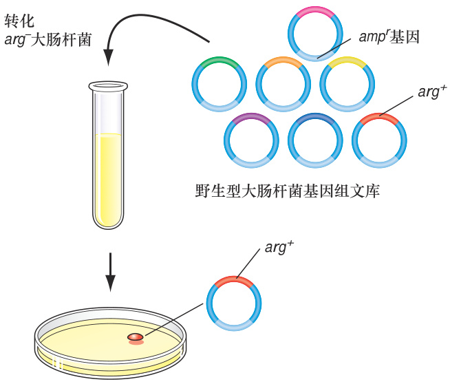  
$^{\cdot+}$  

的序列将发现在所有拯救精氨酸营养缺陷型的克隆中。  

为了验证基因的鉴定，可以通过PCR扩增arg−大肠杆菌染色体中的相应基因，并对其序列进行分析。如果确定正确的基因，arg−基因组中的拷贝应该有一个失活突变。  

# 14.5.2 转座子可用作基因标签诱变剂  

正如你在第13章中看到的，转座因子可以在移动和进入基因时引起突变。转座子相对于其他突变体的优势在于其作为一个分子标签，帮助研究人员快速识别突变基因。  

遗传学家巧妙地设计了一种来自果蝇的DNA转座子，称为Mariner，在大肠杆菌等细菌中作为基因标签诱变剂（图14.29）。含有两个基因的质粒转化细菌：卡那霉素抗性（kanr）基因，其两侧有Mariner元件反向重复序列，并且还具有Mariner转座酶的基因，该基因识别反向重复以催化含有kan 的工程转座子的运动。质粒没有复制起点，因此kanr基因在细胞分裂过程中被细胞所保留，它必须从质粒转移到大肠杆菌染色体上。通过将转化的细菌涂布到含卡那霉素的培养皿上，选择发生了转座的细胞；每个卡那霉素抗性（kan ）菌落在大图14.29　转座子作为诱变剂。携带卡那霉素抗性基因（绿色）的基因工程果蝇转座子可以从含有转座酶基因的质粒跳跃到大肠杆菌染色体。在含有卡那霉素的培养基上生长，选择基因组包含随机整合的Mariner元件的细胞。黑色箭头是由Mariner转座酶识别的反向重复序列。  

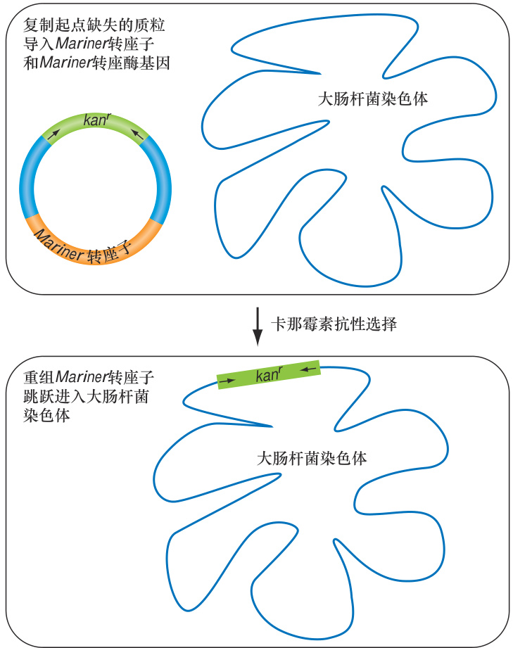  

肠杆菌染色体中的不同位置包含转座子。研究人员可以筛选出所感兴趣的突变体表型的菌落。  

真核生物Mariner转座子的使用与细菌转座子相比有两个优势。首先，当质粒不能复制时，Mariner转座酶的来源就丢失了，转座酶就不能再次动员，它引起的突变将保持稳定。其次，因为每个被选中的kan 细菌菌落只包含移动的单转座子，而且大肠杆菌基因组没有与Mariner相关的DNA序列，所以很容易找到被转座子破坏的基因。图14.30展示了一种叫做反向PCR的方法，这种方法可以很容易地识别标记转座子附近的基因组DNA序列。  

# 14.5.3 基因打靶提供了一种诱变特定基因的方法  

细菌基因组序列的分析已经导致了许多基因的鉴定，这些基因的功能尚不清楚。一种确定这些基因功能的方法是利用重组DNA技术和同源重组技术使它们发生无效突变。如图14.31所示，这种方法被称为基因打靶。  

为了对X基因进行无效突变，研究人员将体外构建的线性DNA片段导入细菌细胞中，其中X基因的$5^{\prime}$ 端和3′端的50个或更多个碱基位于耐药基因的侧面（图14.30）。只有在片段的两端通过同源重组将细菌基因整合到细菌染色体中，才能将耐药基因保留在分裂的细菌细胞中。这些同源重组事件将用耐药标记取代野生型基因X，产生无效突变（图14.31）。在培养基中加入抗生素，选择发生融合的菌落。然后，这些细胞可以被分析以揭示突变表型。  

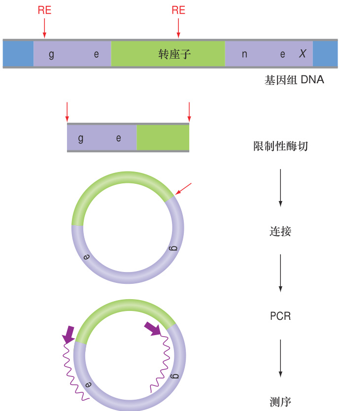  
图14.30　反向PCR鉴定转座子插入的基因。带有转座子插入（绿色）基因X（紫色）的细菌基因组的DNA被识别转座子位点的限制性内切核酸酶（RE）切割。所产生的片段通过DNA连接酶环化；一个环包含一些转座子DNA及邻近的基因组DNA直到下一个RE位点。在转座子（紫色箭头）内的一对PCR引物分别扩增了包含部分基因X的圆圈（曲  

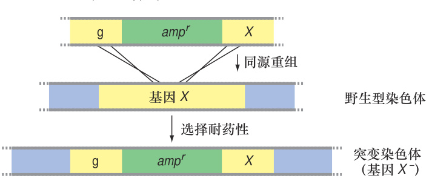  
DNA   
图14.31　基因打靶。引入大肠杆菌的线性DNA片段（使用PCR产生）与该片段自由端同源的细菌染色体序列重组。在这里，DNA片段的结合用氨苄西林抗性基因取代了大部分基因X，产生了基因X无效突变体。在含有氨苄西林的培养基上生长可以选择已经进行基因X替换的细胞。  

# 基本概念  

●  为了鉴定突变基因，利用质粒中野生型细菌基因组文库对突变菌株进行转化。一种转化的细菌，其中突变表型被拯救到野生型，可能携带含有相应基因的野生型拷贝的质粒。  
●  转座子作为诱变剂是有用的，因为它们作为基因组DNA序列的分子标签，可以通过反向PCR快速鉴定。  
●  在基因打靶中，细菌染色体和体外合成的线性DNA构建体之间的同源重组可以在任何基因中产生无效突变。  

# 14.6 综合实例：淋球菌如何对青霉素产生耐药性  

# 学习目标  

1. 解释青霉素是如何杀死细菌的。  
2.  描述青霉素抗性的机制，以及淋球菌是如何产生抗性的。  
3. 讨论全球耐药病原体问题的潜在解决方案。  

正如本章一开始所讨论的，通过性传播的淋球菌对包括青霉素在内的许多抗生素产生耐药性。淋病是世界范围内最普遍的性传播细菌感染之一，目前无有效的治疗药物。下面我们将探索抗生素如何杀死细菌，重点是青霉素对淋球菌的作用。然后，我们将以淋球菌对药物产生耐药性为例，研究细菌如何对药物产生耐药性。需要加强对耐药机制的理解，以帮助避免耐多药细菌即将到来的危机。  

# 14.6.1 青霉素干扰细菌细胞壁的合成  

由可渗透细胞膜围绕，细菌具有较低渗透性细胞壁（回顾图14.3）。因为细菌细胞质含有许多溶质，没有细胞壁，细菌会通过渗透吸收大量的水，以至于它们会破裂。细胞壁的一个主要组成部分是肽聚糖，由两个糖分子组成： $N\cdot$ -乙酰葡糖胺（NAG）和N-乙酰胞壁酸（NAM）。细菌合成交替的NAG和NAM分子的长链，通过被称为转肽酶的酶交联到NAM的短肽上（图14.32）。青霉素通过结合转肽酶防止交联并抑制其酶活性，因此，转肽酶也被称为青霉素结合蛋白（PBP）。  

随着细菌细胞的生长和分裂，细胞壁不断地被重新建模。青霉素存在时，细胞分裂后不能重建细胞壁，因此细胞死亡。因为人类细胞没有肽聚糖，青霉素的致死作用对细菌是特定的。  

# 14.6.2 淋球菌通过多种机制对青霉素耐药  

抗抗生素致死作用的细菌有时具有直接灭活药物分子的能力；或者，可以改变细菌的生理，以便阻止药物进入细胞内的靶位。细菌通过染色体基因的自发突变或通过其他细菌的基因转移、接合或转导获得耐药性。在本章的开头，你看到淋球菌对青霉素耐药的一种途径是从携带青霉素抗性基因的流感嗜血杆菌中获得一个质粒。青霉素抗性基因（ $.p e n^{r}$ ）编码一种名为青霉素酶的酶，它切割青霉素分子的β-内酰胺环，使药物不起作用（图14.33）。  

淋球菌变为耐青霉素的另一种途径是通过几种不同的染色体基因的突变，包括penA、penB和mtr，这些细菌突变的基因越多，对青霉素的抗性就越大。  

●  PBP（转肽酶）是青霉素的主要靶标［图14.34（a）］，由penA基因编码。penA错义突变降低PBP对青霉素的亲和力［图14.34（b）］。  

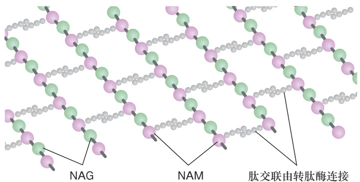  
图14.32　肽聚糖。细菌细胞壁的主要成分是肽聚糖，其中的糖链与多肽交联。NAG（绿色）是N-乙酰葡糖胺，NAM（紫色）是N-乙酰胞壁酸。  

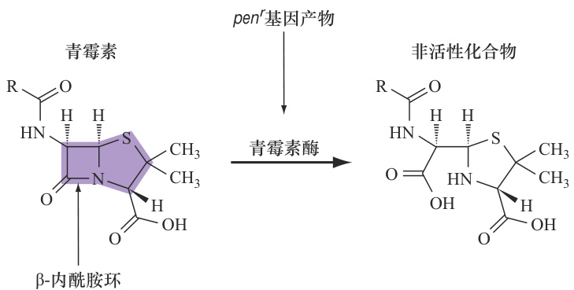  
图14.33　青霉素酶作用。penr基因编码青霉素酶， 这种酶裂解青霉素的β-内酰胺环，从而使其失去活性。  

●  penB基因编码一种孔蛋白，这是细胞壁外膜中的一种蛋白质，它调节分子进入细胞周质，周质是细胞壁的一部分，包括肽聚糖［图14.34（a）］。这种孔蛋白的特定氨基酸改变降低青霉素的进入［图14.34（b）］。●  mtr基因的产物是一种称为MtrR的蛋白质，它抑制多肽的基因转录，从而形成外排泵，将青霉素等分子从周质中排出［图14.34（a）］。突变引起的mtr活性丧失导致外排泵的数量增加，细菌细胞内的青霉素减少（图14.34）。  

# 14.6.3 对于耐药问题我们该怎么办？  

抗生素的使用导致了耐药致病菌株的选择，最终降低甚至消除了挽救无数生命的药物的有效性。减缓这一过程的一个重要途径是通过减少抗生素的使用来降低病原体的选择压力。然而，这种策略本身不能成为长期解决办法，因为许多感染最终需要抗生素治疗。  

毫无疑问，科学家和制药公司需要开发新的抗菌药物和新的方法来使我们的抗菌药物更有效。必须找到针对细菌细胞中许多不同分子的新型抗生素。从许多不同环境中分离的微生物种群的宏基因组分析为新型抗生素的研究提供了一种新的、令人兴奋的方法。  

目前正在开发其他的解决耐药性问题的富有想象力的方法。一个有趣的想法是开发药物，随着时间的推移，自我降解，从而减少抗生素在环境中积累。一个不同的研究途径是探索阻断或规避细菌耐药机制的化学物质。例如，科学家正试图寻找抑制外排泵活性的药物，这会增加对广泛抗生素的敏感性。在第16章中，你将看到一个被称为群体感应现象的研究结果，这是一种机制，细菌用来相互交流，这给科学家们提供了创造抗生素的新想法。  

发现新的抗生素是昂贵和困难的，因此，药物公司经常将他们的研究经费指向别处。抗生素研究的公共资助可能是解决日益增长的耐药性问题的答案之一。  

# 基本概念  

●  一些耐药淋球菌菌株获得了携带青霉素酶基因的质粒，青霉素酶可破坏青霉素；其他耐药菌株已累积突变，阻止青霉素在细胞内累积。  

●  减少抗生素的使用可以减缓耐药菌株的产生。科学家还在开发具有不同化学结构或靶向病原体内不同分子的新抗生素。  

(b)  

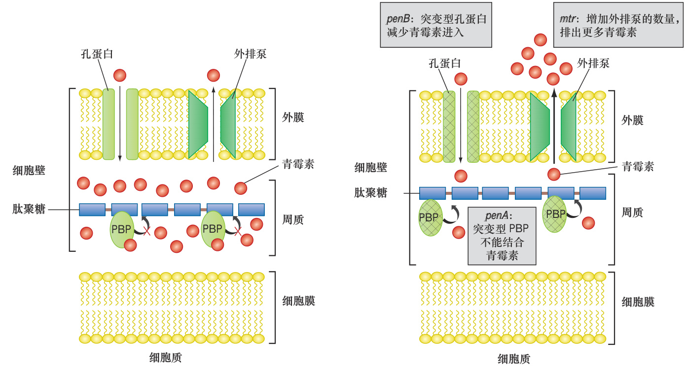  
(a)               PBP   
图14.34　淋球菌基因突变导致青霉素抗性。（a）在革兰氏阴性菌如淋球菌中，细胞壁由外膜和含有肽聚糖的周质空间组成。孔蛋白允许青霉素（红色圆圈）进入胞质间隙，而外排泵蛋白则将青霉素泵出。青霉素结合蛋白（PBP）催化肽聚糖之间的交联。青霉素抑制PBP的酶活性。（b）三种基因突变如何导致青霉素抗性。  

细菌遗传学的研究强调了所有生物的遗传现象的统一。双链DNA作为细菌的遗传物质就像在真核生物的核基因组中一样。然而，我们也看到了生物过程中机械细节的显著多样性。虽然细菌不会产生融合成受精卵的配子，但它们可以通过转化、接合和转导在不同菌株之间交换基因。这三种基因转移模式增加了原核遗传物质进化的潜力。事实上，一些细菌物种的泛基因组可能比人类基因组还要大。  

我们在这一章学习了人类和细菌之间的亲密关系。在细胞数量上，我们人类等同于细菌和真核生物。尽管这一事实值得注意，但它实际上低估了这种关系的程度。我们不仅在肠道和其他地方携带大量细菌，而且每个真核细胞都有重要的细胞器，这些细胞器具有原核起源。  

生物学家认为，线粒体（为代谢过程提供能量的细胞器）和叶绿体（植物细胞的光合细胞器）是最早与有核细胞融合的细菌的后代。线粒体在大小和形状上与今天的有氧细菌相似，并且有自己的DNA，它独立于细胞的核遗传物质进行复制。叶绿体在形状和大小上与某些蓝细菌类似，它们也有携带细菌样基因的自我复制DNA。基于这些观察，内共生学说提出，叶绿体和线粒体是由原始核细胞吞噬自由活菌而形成的。第15章研究了细胞器遗传现象——生物体核基因组外的基因如何影响表型并以非孟德尔方式遗传。  

# 习题精解  

Ⅰ.  使用噬菌体P22对伤寒沙门氏菌进行了三因子杂交。这个杂交是在 $\mathrm{Arg^{-}\ L e u}^{-}$ His−受体菌和噬菌体P22之间，这个噬菌体是生长在一个Arg Leu His 菌株上。你选择了1000种Arg+转导子，并通过复制平板在几种选择性培养基上进行了测试。你得到了以下结果：  

Arg+Leu− His− 585   
Arg+Leu− His+ 300   
Arg+Leu+His+ 114   
Arg+Leu+His− 1  

a. arg与his或leu的共转导频率是多少？  

b.  arg与his关系比与leu关系更近吗？或者arg与leu关系比与his关系更近吗？相对图距是多少？  
c.  为什么不能从提供的数据中得到his和leu的准确共转导频率？  
d. 这三个标记的顺序是什么？  
e. 画出仅用一次转导就能产生该类别的交换。  
f.  估计包含这三个基因的 $4.9\,\mathrm{Mb}$ 伤寒沙门菌基因组的比例。假设噬菌体P22可以包含与大肠杆菌P1相同数量的DNA。  

# 解答  

a.  共转导频率是接受两个标记的细胞的百分比。对于arg和his的共转导子Arg Leu− His 细胞 （300）和Arg Leu His 细胞（114），arg和his的共转导频率为 $414/1000{=}41.4\%$ 。arg和leu的共转导频率为114+1或115/1000=11.5%。  

b.  由于arg与his的共转导频率大于arg与leu的共转导频率，arg更接近于his而不是leu，arg与leu之间的图距约为arg与his之间的图距 $41.4/11.5{=}3.6\$ 倍。  

c.  所有的转导子都被选为 $\mathrm{Arg^{+}}$ ，所以你不能检测到实验中必须产生的Arg− Leu+His+转导子。  

d和e.  上面题目b的答案与两个可能的基因顺序一致：要么是arg-his-leu，要么是his-arg-leu。为了区分这些可能性，你需要考虑来自供体的线性片段（通过噬菌体转导到受体）和能够形成稳定的每一类转导子的环状受体染色体之间的交换。单个交换（或任何奇数数量的交换）将产生一个大的线性染色体，而这在细菌中是无法复制的，因此这将是致命的（不会形成菌落）。另一方面，两个交换（或者任何偶数个交换）会成功地用供体的DNA替换受体染色体的一部分。  

注意，到目前为止，最小类型的转导是Arg+Leu ，这意味着恢复这类转导需要四个而不是两个交换。因此，这些基因的顺序是arg-his-leu。下图显示了涉及的四个交换。你应该自己制作一个图表来展示所有其他三种类型的转导子在这个基因顺序下都可以只通过两个交换得到，这就解释了为什么这些类型会更大。  

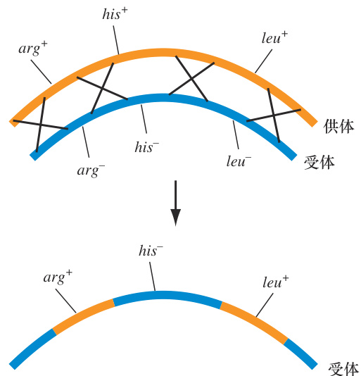  

f.  噬菌体P22可以包装大约90kb长的基因组DNA片段。基因arg、his和leu可以进行共转导，所以外源基因（arg基因和leu基因）之间的距离必须小于90kb。这个区域代表了不到 $90/4900\times100\%{=}1.8\%$ 的鼠伤寒沙门氏菌基因组；这些基因在基因组图上非常接近。  

Ⅱ.  在仔细研究大肠杆菌K12基因组序列时，你会发现一个没有已知功能的基因。该基因蛋白质产物的氨基酸序列与已知的孔蛋白有微弱的相似之处，孔蛋白是穿过细胞膜让氨基酸或糖营养物质（或青霉素等药物）等分子通过的蛋白质。一些孔蛋白是非特异性的，任何溶质都可以在一定大小的范围内进入细胞。其他蛋白是特异性的，允许某些糖的转运，但不允许其他物质的转运。你能做什么遗传实验来确定这个新基因是否有特殊的功能让细菌细胞从环境中清除麦芽糖？描述可能使你的实验方法复杂化的场景。  

# 14.1节  

# 解答  

你可以尝试通过基因打靶在基因中产生无效突变（见图14.31）。使用重组DNA技术，你可以创建一个DNA结构，其中一个耐药基因的一侧是相关基因的5′端序列，另一侧是该基因的3′端序列。你可以将这些线性DNA片段引入野生型大肠杆菌中，通过在培养基中培养含有耐药基因的细胞，选择含有耐药基因的菌落。出现在板上的菌落在基因中有无效突变；它们来自一种细菌，这种细菌通过同源重组，将耐药性基因替换成感兴趣的基因。  

2.  单细胞杆状的大肠杆菌，长约 $2\mu\mathrm{m}$ ，宽 $0.8\mu\mathrm{m}$ ，由一个基因组组成的一个4.6Mb环状DNA分子。单细胞的太古代甲烷八叠球菌属Methanosarcina acetivorans是球形（球菌状），直径 $3\,\mu\mathrm{m}$ ， $5.7\,\mathrm{Mb}$ 环形基因组。单细胞真核生物酿酒酵母为粗大的球形，直径$5\!\sim\!10\mu\mathrm{m}$ ，它有一个12Mb的单倍体基因组，被分割成16条线性染色体。有了这些描述，你怎么能确定一种新的、未表征的微生物是细菌、古细菌还是真核生物呢？  

为了了解基因的功能，你可以使用复制平板来检查这些菌落的表型。特别是，如果你的假设是，基因编码一个孔蛋白，允许麦芽糖进入细胞，那么你的预测是，与野生型相比，这些突变细胞会变得很糟糕，在只有麦芽糖的培养皿上形成小菌落或没有菌落。这些相同的突变细胞会在含有其他糖的培养基上形成正常的菌落，这些糖可以用来为细胞提供能量。一个潜在的并发症是，如果基因对于细菌在任何条件下生存或复制都是至关重要的，你将无法恢复任何耐药菌落，因为基因中无效突变的细菌将无法存活。  

# 14.2节  

3.  现在已经知道了整个大肠杆菌K12菌株基因组的序列（大约5Mb），你可以通过测序一些碱基并将这些数据与基因组信息相匹配来确定基因组中克隆的DNA片段来自哪里。a.  你需要多少个序列信息的核苷酸来确定片段的确切位置？b.  如果你从大肠杆菌细胞中纯化了一种蛋白质，你大概需要知道多少氨基酸来确定蛋白质的编码基因？c.  你从不同的大肠杆菌菌株中测定了基因组DNA的100个核苷酸序列，但你无法在大肠杆菌K12基因组序列中找到匹配。这怎么可能呢？  

4.  像大肠杆菌这样的细菌基因组通常只有一个复制起点，从这个起点复制就双向进行。负责复制大肠杆菌染色体的DNA聚合酶Pol Ⅲ以每秒1000个核苷酸的速度合成DNA。  

a.  从这些信息中，估计大肠杆菌的最小产生时间。b.  在最佳条件下，大肠杆菌被观察到仅在 $17\mathrm{min}$ 内分裂。根据你对题目a的回答，推测这是如何发生的。  

# 习题  

# 词汇  

1. 在右列中选择与左列中的术语最匹配的短语。  

a. 转换 1.  需要在培养基中补充以促进生长  
b. 接合 2.  一种在细菌基因组中诱变基因的方法  
c. 转导 3.  可以整合进染色体的小的环状DNA分子  
d. 裂解周期 4.  定义一个细菌物种的核心基因加上个体菌株特有的所有基因  
e. 溶原性 5.  需要直接物理接触的DNA转移  
f. 附加体 6.  噬菌体DNA整合到染色体中  
g. 营养缺陷型 7.  由噬菌体感染，细胞裂解释放新的病毒颗粒  
h. 泛基因组 8. 裸DNA转移  
i. 基因打靶 9.  通过病毒颗粒在细菌间转移DNA  

5.  列出至少三个在细菌基因组中没有发现的真核基因组特征。  

6.  描述一种机制，通过这种机制，一个基因可以从细菌基因组转移到同一个细胞中的质粒，反之亦然。  

7.  高浓度的盐容易引起蛋白质的聚集。提出一种方法来鉴定通常表达于特定细菌物种的蛋白质，这种蛋白质在高盐条件下仍能保持其溶解性。  

8.  最近，科学家们测试了人体肠道细菌在决定体重中作用的可能性。研究对象是四组双胞胎（一组是同卵双胞胎，三组是异卵双胞胎），其中一组体重正常，其他组肥胖。他们的肠道细菌样本被采集并移植到无细菌的小鼠体内。接受不同细菌移植的小鼠都被喂食相同的食物，并在大约一个月的时间里接受监测。对于这四对双胞胎中的每一对，携带肥胖双胞胎细菌的小鼠比携带正常双胞胎细菌的小鼠，体重和脂肪含量明显增加。  

a.  你认为人体肠道菌群与体重之间的关系是什么？  
b.  为什么研究中使用双胞胎？  
c.  这项研究的结果是否意味着人类基因（人类细胞细胞核中的基因）对体重和脂肪含量没有影响？解释一下。  
d.  小鼠是食粪动物，意思是它们吃粪便。你如何测试一种与消瘦或肥胖相关的某个细菌物种是否能成功侵入一种动物的肠道微生物群，而这种微生物群以前在这种动物中从未被发现过？  
e.  在这样的实验中使用无细菌小鼠的一个问题是，作为细菌宿主，小鼠的肠道并不等同于人类的肠道：不同的细菌物种在小鼠和人类体内繁衍生息。解释这个事实如何影响这个问题中讨论的实验。  

9.  最近的一项宏基因组研究分析了纽约市整个地铁系统表面存在的微生物。研究人员在地铁中发现了大量的细菌，其中大部分都是非致病性的。有趣的是，在地铁中发现的所有DNA中，几乎有一半不匹配已知的生物体。  

a.  科学家们发现不同的地铁站有其特有的微生物群落。这一观察结果对警方有何帮助？  
b.  因为大多数地铁DNA可以被识别为细菌，研究人员推测大多数无法与已知生物体匹配的DNA片段是细菌的。为什么你认为这么多的细菌物种对我们来说是未知的？这些未知细菌的什么特性可能阻止我们研究它们？  

# 14.3节  

10.  利奈唑胺是一种新型的抗生素，通过与核糖体的50S亚基结合，抑制其参与翻译起始复合物形成的能力，从而抑制多种细菌中蛋白质的合成。内科医生对这种抗生素特别感兴趣，因为它可以治疗由耐青霉素的肺炎链球菌（又称肺炎球菌）引起的肺炎。要探索肺炎球菌对利奈唑胺产生耐药性的机制，首先要确定耐利奈唑胺的菌株。接下来，用这些菌株中的一种作为起始原料，你想要鉴定这些突变体的衍生物，它们不再能耐受利奈唑胺。  

a.  概述用于识别这些突变体的耐利奈唑胺突变肺炎球菌和利奈唑胺敏感衍生物的技术。在不同情况下，你的技术是否包括直接选择、筛选、复制平板、诱变剂处理或检测可见表型？  

b.  建议两种可能导致你将要识别的表型的突变。细菌细胞中哪些类型的事件会因突变而改变？你认为这些突变是功能缺失还是功能获得？解释一下。  

11.  液体培养的大肠杆菌以 $2\times{10}^{8}$ 个细胞/毫升的浓度连续稀释，如以下图所示，并将最后两个试管的 $0.1\mathrm{ml}$ 的细胞涂布在包含丰富的培养基的琼脂平板。你希望在这两个平板上分别生长多少菌落？  

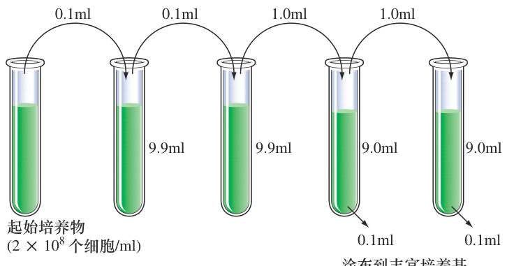  

12.  挑出用于将细胞从Lac− Met−大肠杆菌培养物中涂布的培养基（i、ii、iii或iv）：  

a. 选择Lac+细胞  
b. 筛选出Lac+细胞  
c. 选择Met+细胞i. 基本培养基 $\cdot+$ 葡萄糖 $^+$ 甲硫氨酸ii. 基本培养基 $^{\ast+}$ 葡萄糖（无甲硫氨酸）iii. 丰富培养基 $\mathrel{+}\mathbf{X}.$ -galiv. 基本培养基 $\cdot+.$ 乳糖 $^{\div}+$ 甲硫氨酸  

# 14.4节  

13.  这个问题与图14.14有关，它展示了Lederberg和Tatum进行的首次表明细菌接合存在的实验。a.  A菌株有两个基因突变，B菌株有三个基因突变。原因是Lederberg和Tatum想要确保他们研究的现象不涉及突变的逆转。假设一个基因的回复突变率是一千万分之一（ $1/10^{7}$ ），解释他们实验设计背后的逻辑。这些研究人员如何知道他们在混合两种培养基后发现的细胞确实不是由于回复而产生的呢？b.  图14.14所示的实验没有告研究者哪种菌株是供体，哪种菌株是受体。描述一种他们可以通过修改实验来回答这个问题的方法。  

14.  在一个新细菌的两个分离株中（一个对氨苄青霉素有抗性，另一个对氨苄青霉素有敏感性），你发现编码氨苄青霉素抗性的基因正在转移到敏感菌株中。  

a.  你怎么知道基因转移正在发生？  

b.  为了确定基因转移是转化还是转导，你用DNA酶处理混合培养的细胞。为什么这种治疗能区分这两种基因转移模式？描述基因转移是转化还是转导的预测结果。  

c.  为了确定基因转移是否涉及转化、接合或转导，你可以用一种孔比细菌小，但比噬菌体或DNA片段大的膜来分离耐氨苄青霉素和氨苄青霉素敏感菌株。如果仍然观察到基因转移，可能涉及哪些机制，排除哪些机制？  

15.  大肠杆菌细胞通常每个细胞只有一个F质粒的拷贝。你已经分离了一个细胞，在这个细胞中，一个突变将F的拷贝数增加到 $3\!\sim\!4\!\cdot$ 个细胞。你如何区分拷贝数变化是由于F质粒的突变还是染色体基因的突变？  

16.  在大肠杆菌中，基因purC和pyrB位于染色体的中间位置。这些基因从来没有共转化过，为什么？  

17.  整个流感嗜血杆菌基因组的DNA测序于1995年完成。当非致病性流感嗜血杆菌菌株H. infuenzae Rd的DNA与致病性b菌株的DNA进行比较时，非致病性菌株完全缺失了参与细菌与宿主细胞黏附的菌毛基因簇（位于purE和pepN基因之间）的8个基因。从非致病性菌株和致病性菌株中分离出的DNA对purE和pepN基因的共转化有什么影响？  

18.  编码毒素的基因通常位于质粒上。最近一次暴发的疫情刚刚发生，一种通常非致病性的细菌正在产生一种毒素。质粒DNA可从该新致病菌株中分离出来，并与染色体DNA分离。为了确定质粒DNA是否包含编码毒素的基因，你可以确定整个质粒的序列，并寻找一个与之前鉴定的其他毒素基因相似的序列。存在一种更简单的方法来确定质粒DNA是否携带该毒素的基因；这种策略不涉及DNA序列分析。描述这个更简单的方法。  

19. a.  你需要对大肠杆菌Hfr菌株进行中断杂交定位，该菌株为Pyr+、Met+、Xyl+、Tyr+、Arg+、His+、Mal+和 $\mathrm{\Delta}\mathrm{Str}^{\mathrm{s}}$ 。描述一种合适的菌株作为另一配偶进行交配。  

b.  在Hfr $\times\,\mathrm{F}^{-}$ 杂交中，pyrE基因在 $5\mathrm{min}$ 内进入受体，但在这个时间点没有Met+、 $\mathrm{Xyl^{+}}$ 、 $\mathrm{Tyr}^{+}$ 、 $\mathrm{Arg^{+}}$ 、His+或Mal+外接合子。交配现在允许进行 $30\mathrm{min}$ ，并选择Pyr+外接合子。在Pyr+细胞中， $3\,2\,\%$ Met+、 $94\%$ Xyl+、 $7\%$ Tyr+、 $59\%$ Arg+、 $0\%$ His+、$71\%$ Mal+。关于基因的顺序你能得出什么结论？  

习题 $20\!\sim\!23$ 要求你绘制重组事件图，这些事件可以用从供体细胞导入的基因拷贝取代受体细胞染色体上的特定基因。正如在解决习题精解Ⅰ的方案中所看到的，只有偶数个交换才能产生可行的重组染色体。如果你还记得由四个杂交产生的子代类比需要两个杂交的子代类少得多，那么基因定位就会简化。  

20.  在习题19中，你认为大多数 $\mathrm{Pyr^{+}A r g^{+}}$ 外接合子都是Xyl 和Mal 吗？通过考虑重组事件解释你的答案，需要生成 $\mathrm{Pyr^{+}A r g^{+}X y l^{+}M a l^{+}}$ 克隆和生成那些$\mathrm{Pyr^{+}A r g^{+}X y l^{-}\,M a l^{-}}$ 克隆。  

21.  习题19中的中断杂交实验的一个问题是，如果基因靠近，基因顺序可能是模糊的。另一个缺点是这样的实验不能提供精确的图距。原因是研究人员选择第一个Hfr标记转移到受体，但是用后来的Hfr标记恢复的F 接合后体是复杂的，取决于标记转移到细胞，也取决于将标记转移到受体染色体的交换。  

为了绘制更精确的图谱，细菌遗传学家经常以不同的方式进行 $\mathrm{Hfr}\times\mathrm{F}$ 杂交：他们选择的外接合子包含后面的Hfr标记，然后筛查前面的标记的存在。这种方法可以确保所有的标记已经进入了F 细胞，所以相对基因距离仅由交换频率决定。此外，通过考虑对每一类外接合子负责的交换，明确了基因的顺序。  

例如，假设你执行了与习题19相同的交换操作，但是你选择了Arg+外接合子，然后对它们进行筛选，以获得较早的Hfr标记Mal+Xyl+和Pyr+。你获得了以下数据：  

<html><body><table><tr><td>外接合子类型</td><td>外接合子数量</td></tr><tr><td>Arg*Mal'Xyl'Pyr'</td><td>80</td></tr><tr><td>Arg*Mal'Xyl'Pyr</td><td>40</td></tr><tr><td>Arg*Mal'Xyl"Pyr</td><td>20</td></tr><tr><td>Arg*Mal"Xyl"Pyr</td><td>20</td></tr><tr><td>Arg*Mal"Xyl'Pyr</td><td>1</td></tr><tr><td>Arg'Mal"Xyl"Pyr</td><td>1</td></tr></table></body></html>  

a.  解释为什么四种外接合子类型比另外两种更频繁。  
b.  关于这四个基因之间的相对距离，你能得出什么结论？  
c.  这些数据允许你估计另一个相关的遗传距离。解释一下。  

22.  假设你有两个Hfr菌株大肠杆菌（HfrA和HfrB），来自一个完全原养型的链霉素敏感（野生型）F 菌株。在单独的实验中，你允许这两个Hfr菌株与具有链霉素耐药和营养缺陷型的甘氨酸（Gly ）、赖氨酸（Lys−）、烟酸（Nic−）、苯丙氨酸（Phe−）、酪氨酸（ $\mathrm{Tyr}^{-}$ ）和尿嘧啶（Ura−）F–受体菌株（Rcp）接合。通过使用中断杂交方案，你可以确定在交配后的最早时间，在链霉素耐药受体菌株中可以检测到每个标记，如下所示：  

<html><body><table><tr><td></td><td>Glyt</td><td>Lys</td><td>Nic*</td><td>Phe</td><td>Tyr*</td><td>Ura</td></tr><tr><td>HfrA x Rcp</td><td>3</td><td>*</td><td>8</td><td>3</td><td>3</td><td>3</td></tr><tr><td>HfrB × Rcp</td><td>8</td><td>3</td><td>13</td><td>8</td><td>8</td><td>8</td></tr></table></body></html>

（\*表示实验60min内未恢复Lys+细胞）  

a.  从这些数据中尽可能绘制出最佳图谱，显示标记的相对位置，以及HfrA和HfrB菌株中转移的起源。尽可能显示距离。  

b.  为了解决前面图谱中的歧义，你研究了普遍性转导噬菌体P1的标记物的共转导。你在菌株HfrB上培养噬菌体P1，然后用裂解液感染菌株Rcp。你选择了1000个Phe+克隆，并检测它们是否存在未选择的标记，结果如下：  

表型  

<html><body><table><tr><td rowspan="2">转导子数量</td><td colspan="6"></td></tr><tr><td>Gly</td><td>Lys</td><td>Nic</td><td>Phe</td><td>Tyr</td><td>Ura</td></tr><tr><td>600</td><td></td><td></td><td></td><td>+</td><td></td><td></td></tr><tr><td>300</td><td></td><td></td><td></td><td>+</td><td></td><td>+</td></tr><tr><td>100</td><td></td><td></td><td></td><td>+</td><td>十</td><td>+</td></tr></table></body></html>  

c. 根据前面的共转导数据，尽可能地画出基因的顺序。  

d.  假设你想使用普遍性转导来绘制 $g l y$ 基因相对于一些其他标记物的图谱。你会如何修改刚才描述的共转导实验来增加你成功的机会？描述你将使用的培养基的组成。  

23.  从一个原养型的F−菌株（即没有营养缺陷型的突变）和Str 开始，几个独立的Hfr菌株被分离。这些Hfr菌株与F−菌株 $\mathrm{Str^{\prime}\,A r g^{\prime}\,C y s^{\prime}\,H i s^{\prime}\,I l v^{\prime}\,L y s^{\prime}\,M e t^{\prime}\,N i c^{\prime}}$ $\mathrm{Pab}^{-}\,\mathrm{Pyr}^{-}\,\mathrm{Trp}^{-}$ 杂交。中断杂交实验表明，Hfr菌株按照下表列出的顺序将野生型等位基因作为时间的函数传递。括号内标记的输入时间无法相互区分。  

<html><body><table><tr><td>Hfr菌株</td><td>传递顺序一</td></tr><tr><td>HfrA</td><td>pabilvmetargnic(trppyrcys)hislys</td></tr><tr><td>HfrB</td><td>(trppyrcys)nicargmetilvpablyshis</td></tr><tr><td>HfrC</td><td>hislyspabilvmetargnic(trppyrcys)</td></tr><tr><td>HfrD</td><td>argmetilvpablyshis(trppyrcys)nic</td></tr><tr><td>HfrE</td><td>his(trppyr cys)nicargmetilvpablys</td></tr></table></body></html>  

a.  从这些数据，得到了这些标记在细菌染色体上相对位置的图谱。用带标记的箭头表示每个Hfr菌株整合F质粒的位置和方向。  

b.  为了确定trp、pyr和cys标记的相对顺序及它们之间的距离，HfrB与F−菌株杂交了足够长的时间以允许转移nic标记，之后选择trp+重组体。在Trp+重组体中对未选择的标记物pyr和cys进行评分，  

得到如下结果：  

<html><body><table><tr><td>重组体数量</td><td>Trp</td><td>Pyr</td><td>Cys</td></tr><tr><td>790</td><td>+</td><td>+</td><td>+</td></tr><tr><td>145</td><td>+</td><td>+</td><td></td></tr><tr><td>60</td><td>+</td><td></td><td>+</td></tr><tr><td>5</td><td>+</td><td></td><td></td></tr></table></body></html>  

绘制 $t r p$ 、pyr和cys标记相互关联的图谱（请注意，你不能使用这些数据确定nic或his基因的相对顺序）。将相邻基因之间的图距表示为它们之间的交换频率。  

24.  你可以通过在一个平板上的一小块混合两种细胞类型，然后复制到选择性培养基中进行Hfr和F−菌株的交配。这种方法被用来筛选数以百计的不同细胞重组缺陷型recA 突变体。为什么这是对RecA功能的分析？你如何使用本方案筛查F 或Hfr菌株中的recA 突变体？解释一下。  

25.  基因组序列显示，一些致病菌含有与最初来自噬菌体的基因相邻的促进疾病的致病基因。为什么这个结果提示基因水平转移？转移的机制是什么？  

26.  普遍性和特异性转导都涉及噬菌体，这两种转导有什么不同？  

# 14.5节  

27.  这个问题突出了图14.28所示的质粒转化过程中基因鉴定的一些有用变体。  

a.  假设你已获得了一个新的具有感兴趣表型的细菌突变菌株。为了确定受影响的基因，你对突变菌株的整个基因组进行测序，并与野生型菌株进行比较。发现的差异之一是一个无义突变，看起来是很好的候选。如何使用质粒文库来验证这种无义突变是导致突变表型的原因？  

b.  图14.28显示了质粒文库如何用于识别功能缺失突变的基因，这些突变导致了特定的异常表型。如何使用质粒库来识别受功能获得突变影响的基因？  

28.  研究人员在大肠杆菌的Trp 营养缺陷型菌株中发现了一个基因突变。为了鉴定这个突变基因，她使用了一个由同一菌株的野生型基因组成的基因组文库来寻找拯救突变表型的质粒。结果令人惊讶。她恢复了10个提供Trp+表型的质粒，但是其中6个质粒含有基因X，而另外4个含有基因Y，我们的科学家遇到了一种叫做多拷贝抑制的现象，这与质粒通常以每个细菌几个拷贝的形式存在有关。由于质粒中的基因在细菌染色体中超过了通常的单一拷贝，因此从质粒中产生的蛋白X或蛋白Y也超过了通常数量。有时，一种蛋白质的过表达可以挽救因失去另一种蛋白质而引起的突变表型。建议至少两种方式，我们的科学家提出至少两种方法来确定基因X或基因Y这两个基因，实际上与引起Trp–表型的突变是一致的。  

29.  副血链球菌是一种细菌，通过附着在牙齿上引发牙菌斑。为了研究消除斑块的方法，研究人员构建了一个质粒，如图所示，诱变S. parasanguis。该质粒的主要特征包括 $r e p A^{t s}$ （一种对温度敏感的复制起点）、kan （一种对抗生素卡那霉素耐药的基因）和转座子 $I S256$ 。该转座子包含对抗生素红霉素耐药的ermr基因。S. parasanguis中有IS256转座子，这得益于一种基因编码转座酶的基因，该酶使位于转座子反向重复序列（IR）之间的所有DNA序列移动。  

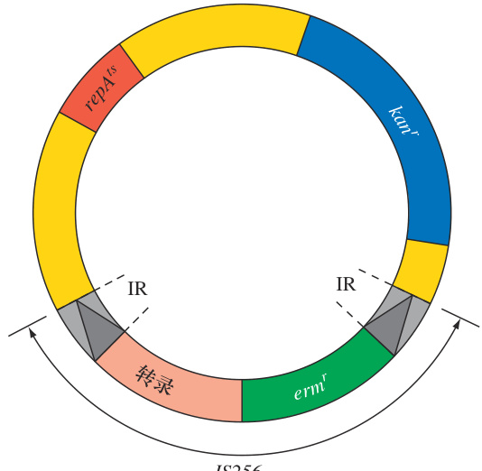  
IS256  

a.  研究人员如何使用这种质粒作为诱变剂？考虑他们如何将转座子导入到细菌中，以及他们如何识别将新的IS256插入S. parasanguis基因中的菌株。你的答案应该能解释为什么质粒有两种不同的抗生素抗性基因，以及一个温度敏感的复制起点。b.  为什么研究人员会使用这种质粒作为诱变剂？c.  如果研究人员发现了一种变异的副血链球菌菌株，这种菌株在斑块形成方面存在缺陷，那么他们如何能识别出受影响的基因呢？  

30.  果蝇转座子Mariner一条链一端的序列如下图所示（点表示转座子内的序列）：  

$5^{\prime}$ TTAGTTTGGCAAATATCTCCCTTCCGCCTTTTTGATCTTATGT... 3′你获得一个携带Mariner转座子标签的突变菌株，将这株的基因组DNA用限制性内切核酸酶MboI（其识别位点为^GATC）酶切，并通过通过稀释限制性内切核酸酶消化物和添加DNA连接酶使产生的DNA片段环化。  

a.  设计两个17bp的PCR引物，你可以用它来识别（通过反向PCR）转座子插入的基因。b.  什么DNA序列会从突变基因组的环化片段中被扩增？在突变菌株的基因组图上显示这种DNA序列的范围，表明转座子插入的位置和MboI酶的任何相关位点。  

31.  科学家不仅可以利用基因打靶技术敲除基因（如图14.31所示），还可以将非细菌基因导入细菌染色体中。其中一个广泛使用的基因是水母编码绿色荧光蛋白的基因。在这个策略的一个例子中，假设你想把大肠杆菌制成一个生物传感器来检测高毒性金属镉。大肠杆菌基因组中有一个叫做yodA的基因，它只在镉存在的情况下被转录（和它的mRNA被翻译）。你想用基因打靶技术制造出一种大肠杆菌，当环境中存在镉时，它会发出明亮的绿色荧光。  

a.  绘制一个DNA结构，你可以用它来交换水母绿色荧光蛋白的yodA编码序列。你会从基因组DNA，还是从cDNA克隆中获得水母的DNA？  
b.  解释为什么在有镉的情况下，yodA在发绿光的细菌中不再起作用。  
c.  你能想出一个办法来改变这个方法，让yodA继续发挥作用吗？  

# 14.6节  

32.  研究氨基酸生物合成途径的科学家希望分离出营养缺陷的细菌。一种叫做青霉素浓缩的技术使这项工作变得更容易。这个过程开始于将生长在丰富（完全）培养基中的野生型（原养型）细菌液体培养到化学诱变剂中。在此处理后，细胞离心除去液体和诱变剂。离心管底部的细胞颗粒现在重新悬浮在缺少一种氨基酸（在本例中是半胱氨酸）但含有青霉素的培养基中。随后，细菌被倒入滤器中，滤器将细菌浓缩，使其不含青霉素。滤过器上残留的活菌高度富集半胱氨酸营养缺陷型。  

a.  根据你对青霉素作用的了解，解释为什么会发生这种富集。  
b.  青霉素浓缩不是一种选择，因为这种药物不能杀死 $100\%$ 的原营养体。因此，过滤器上的细胞需要筛选半胱氨酸营养缺陷型。科学家们将如何执行这个筛选？  
c.  如果起始菌株在质粒上含有pen 基因，那么这个方案是否还能富集营养缺陷型？解释一下。  

33.  假设你可以得到放射性标记的青霉素。你怎么能用这种化合物来区分青霉素抗性细菌是否携带青霉素酶基因，或者细菌是否获得了penA、penB或mtr突变？  

34.  科学家们正在利用宏基因组学来解决影响人类的最重要问题之一：许多病原菌对目前可用的抗生素的耐药性。解决这个问题的一个方面是开发不同的杀菌药物。为了做到这一点，研究人员正在利用几个细菌物种合成毒素，使它们能够捕食其他细菌。值得注意的是，这些科学家发现，在合成过程中产生这种毒素的酶通常具有特定的结构，因此在其氨基酸序列中具有特征模式。  

描述土壤、海洋或人体微生物群落的宏基因组分析如何使研究人员能够发现对人类病原体有效的新抗生素。  

35.  一些科学家正试图设计噬菌体来治疗人类的细菌感染，当感染对化学抗生素没有反应时：a.  噬菌体治疗可能比抗生素治疗有什么优势？b.  描述噬菌体治疗成功需要克服的潜在困难。c.  研究人员如何才能最好地面对细菌细胞对噬菌体产生耐药性的问题，就像它们对抗生素产生耐药性一样？  