# 第 15 章 细胞器遗传  

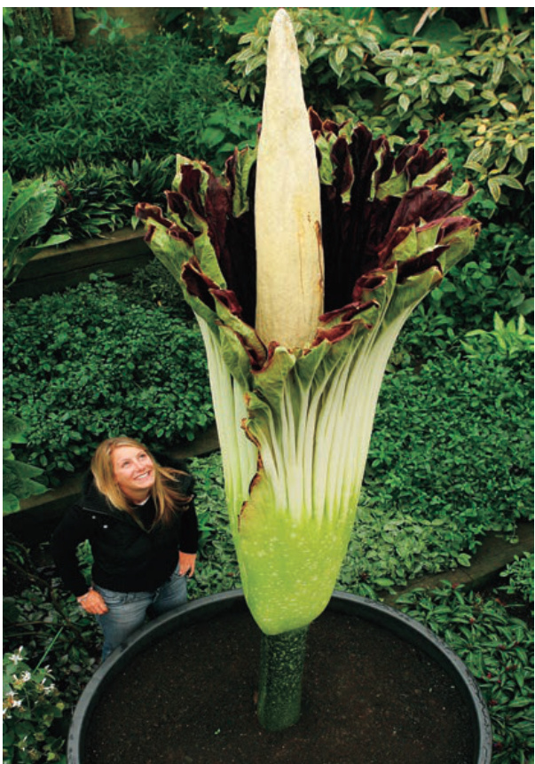  

泰坦魔芋（Amorphophallus titanum）的花。泰坦魔芋被一些人称为世界上最臭的植物，它释放出能吸引昆虫授粉的气味分子。线粒体在产生这种有害信号中起着关键作用（详见本章末尾接下来的内容。）  
©Scott Barbour/Getty Images  

# 章 节 大 纲  

15.1 线粒体及其基因组  
15.2 叶绿体及其基因组  
15.3 细胞器和核基因组之间的关系  
15.4 线粒体和叶绿体的非孟德尔遗传  
15.5 线粒体突变和人类疾病  

就在孟德尔定律被重新发现9年后，植物遗传学家Carl Correns报道了一个令人费解的现象，它挑战了孟德尔的一个基本假设。在1909年的一篇论文中，Correns描述了利用相互杂交分析开花植物紫茉莉叶片颜色遗传的结果。大多数紫茉莉都有绿叶，但是有个别个体的叶片是杂色的，只有一些叶片或部分部位是绿色的，其他部分则是白色的（图15.1）。  

用绿叶植物的花粉与有杂色叶片的植物的卵进行受精，会产生杂色后代。令人惊讶的是，如果母本的叶片是绿色的，父本的叶片是杂色的，这样的杂交并不会导致同样的结果；与之相反，这种杂交所有后代叶片都是绿色的。从这些结果来看，似乎后代只从母本那里遗传了它们的杂色特征。这种类型的传递，被称为母系遗传，其挑战了孟德尔的假设，即母系和父系配子对遗传的贡献是相等的。遗传学家因此认为，该性状属于非孟德尔遗传。  

我们现在知道，紫茉莉叶片颜色的非孟德尔遗传，是由于控制叶片颜色的基因并不存在于细胞核的染色体上，是在被称为叶绿体的非核细胞器的基因组中发现的。这些细胞器有自己的基因组，以环形小染色体的形式存在，称为叶绿体DNA（cpDNA）。在紫茉莉中，叶绿体和cpDNA只能从卵子获得；花粉对胚胎植株没有贡献任何叶绿体或cpDNA。  

叶绿体在动物中是不存在的，但是植物和动物都有另一种被称为线粒体的细胞器，它们也拥有自己的线粒体DNA（mtDNA）基因组。由于mtDNA与细胞核内的染色体是分离的，并独立传递，因此mtDNA上控制性状的基因也表现出非孟德尔遗传。  

在我们对线粒体和叶绿体的基因和基因组的详细讨论中，有三个重要的主题。第一，与控制核基因传递的规则不同，在不同的生物中，细胞器基因组的传递规则可能不同。在许多生物中，如紫茉莉和人类，只有母系将细胞器传给下一代；但在一些物种中，细胞器只能从父系那里遗传；而在另一些物种中，细胞器则可以来自双亲。第二，细胞器的维持和功能发挥，需要细胞器基因组和同一细胞中细胞核基因组共同作用。第三，细胞器的基因组和生化过程与真核细胞的其他部分相比，更接近于细菌。这些观察形成了内共生学说的基础，该理论认为细胞器是细菌的进化残余，它们与最早真核生物的古老前体存在共生关系。  

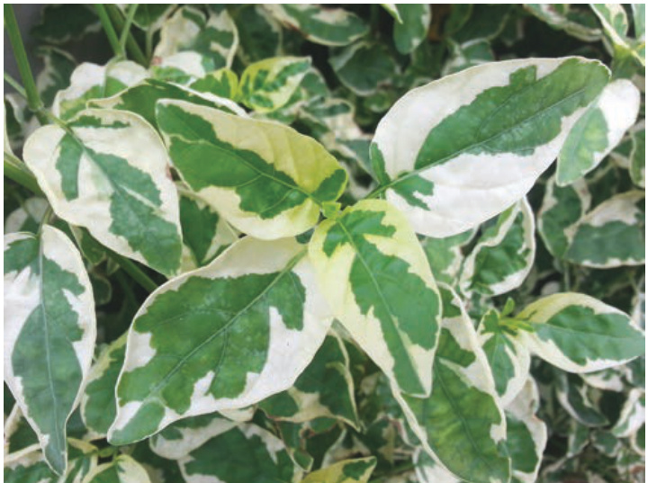  
图15.1　紫茉莉。已知的第一个非孟德尔遗传的例子是紫茉莉的叶片变异。$\copyright$ MomoShi/Shutterstock RF  

# 15.1 线粒体及其基因组  

# 学习目标  

1. 描述典型线粒体的结构和功能。  
2. 列出不同物种间线粒体基因组变化的方式。  
3. 概述线粒体中的RNA编辑。  
4. 讨论在线粒体中发现的通用遗传密码的例外情况。  

线粒体是在大多数真核细胞中发现的有膜细胞器，它将从葡萄糖和其他营养分子中获得的能量转化为ATP。研究人员已经证明，线粒体有自己的DNA，独立于核基因组。线粒体基因组编码一部分能量转换所需的蛋白质，但不是全部。其余的蛋白质由核基因组编码，并导入细胞器。  

每个真核细胞都有许多线粒体［图15.2（a）］，其确切数量取决于细胞的能量需求，以及细胞分裂过程中线粒体的随机分布。在人类中，神经、肌肉和肝细胞每一个都携带超过1000个线粒体；人类的卵母细胞大约有10万个线粒体。  

线粒体不是静态结构。细胞中的线粒体可以生长、融合或分裂。粗略地说，线粒体大小加倍，复制其DNA，然后在每一代细胞中分裂成两半。当细胞分裂时，线粒体随机分布到子细胞中。这些线粒体的变化，在很大程度上独立于细胞中其他地方发生的过程，这导致单个细胞中线粒体和mtDNA分子数量的巨大变化。  

# 15.1.1 线粒体产生ATP  

图15.2（b）揭示了细胞器的基本结构：未起皱的外膜包围着被称为嵴的内膜。内膜包围着一个称为基质的区域。  

线粒体分两个阶段产生能量（ATP）包。首先，基质中的酶催化Krebs循环，代谢丙酮酸（细胞质中葡萄糖分解的产物）生成高能电子载体NADH和FADH2。在第二阶段，一系列嵌入线粒体内膜的多亚基酶复合物，利用这种能量进行氧化磷酸化。一些酶复合物形成电子传递链，将电子从NADH和FADH2转移到最终的电子受体——氧。这些电子传递过程中释放出的能量被用来将质子从基质中抽离到内外膜之间的空间中，从而在内膜  

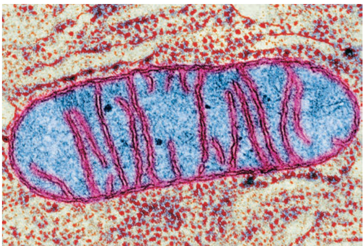  

(b)  

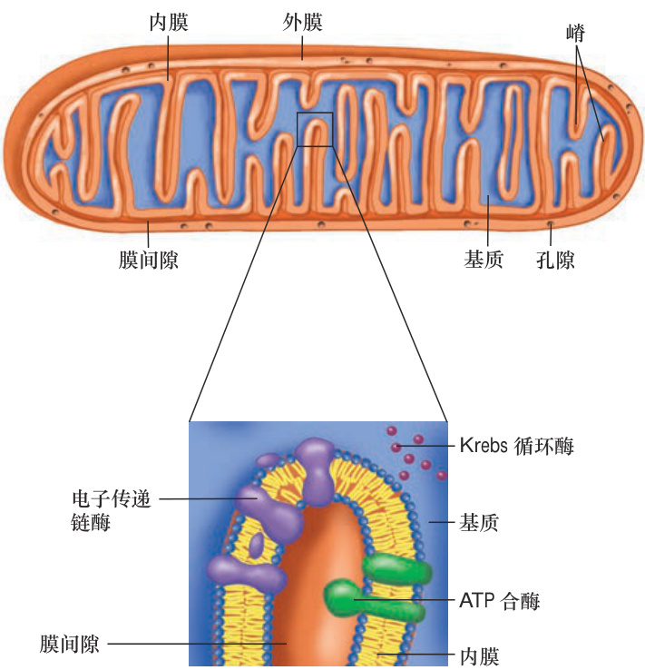  

图15.2　线粒体解剖。（a）线粒体假彩色显微图  
（ $62\,800\times\,)$ 。（b）单个线粒体的组织和结构。完全封闭在  
内膜内的区域称为基质（蓝色）。基质中含有Krebs循环的线  
粒体DNA和酶。内膜折叠被称为嵴。将单个的嵴放大，以显示电子传递链的酶是如何进行氧化磷酸化的。$\copyright$ CNRI/Science Source  

上产生电势。然后质子通过一种叫做ATP合酶的酶复合物流回基质，这种酶被嵌入到嵴中。ATP合酶利用质子回流释放的能量使ADP磷酸化，从而形成ATP。  

# 15.1.2 线粒体基因组因物种而异  

单个线粒体的基质中通常包含多个基因组拷贝；细胞器中基因组的拷贝数可以根据细胞的能量需求而变化，但通常在 $2\!\sim\!10$ 之间。我们将首先以人类线粒体基因组为例，但正如你将看到的，在不同物种中，线粒体基因组的大小和形式会有惊人的差异。  

# 1. 人类线粒体DNA  

人类线粒体基因组长度为 $16.5\mathrm{kb}$ ，这仅为人类配子中单倍体基因组长度的十万分之一，它是一个携带37个基因的环状DNA分子（图15.3）。其中13个基因编码构成氧化磷酸化蛋白复合体的多肽亚基。线粒体基因组还编码22种不同的tRNA基因，以及线粒体核糖体中大、小两个rRNA的基因。  

人类线粒体基因组的一个显著特征是其基因排列的紧密性。相邻的基因要么紧邻，要么在少数情况下，甚至有轻微的重叠。它们之间几乎没有核苷酸，内部也没有内含子，因此基因被紧密地包裹着。  

# 2. 线粒体基因组  

线粒体DNA的大小和基因含量因物种而异。疟原虫（Plasmodium falciparum）的mtDNA长度只有6kb；甜瓜（Cucumis melo）的mtDNA长度则有2400kb之大。这些mtDNA大小的差异并不一定反映了基因含量的差异。虽然高等植物的大mtDNA确实比其他生物的小mtDNA含有更多的基因，但是面包酵母75kb的mtDNA上，针对呼吸链的蛋白质编码基因比人类 $16.5\mathrm{kb}$ 的mtDNA要少。酵母线粒体基因组较大，一个原因是酵母线粒体基因中存在内含子，另一个原因是基因之间存在较大的间隔区。  

甚至mtDNA的形状也有相当大的差异。生化分析和绘图研究表明，人类和其他动物的mtDNA是环形的。然而，大多数真菌和植物的mtDNA是线性的。很难从一些生物中分离完整的mtDNA分子，因此难以确定这些mtDNA在体内的形状。  

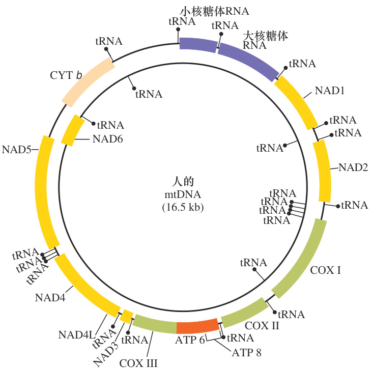  
图15.3　人类线粒体基因组。人mtDNA中的37个基因所示如下：绿色基因编码细胞色素氧化酶蛋白；红色基因编码ATPase亚基蛋白；黄色基因编码NADH复合体蛋白；棕褐色基因编码细胞色素复合蛋白；紫色表示核糖体蛋白或核糖体RNA基因。每个tRNA基因都由一个黑色的球和棍表示。外圈和内圈的基因转录方向相反。  

锥虫属和利什曼原虫属的原生动物寄生虫的mtDNA具有高度不寻常的组织形式。这些单细胞真核生物携带一种被称为动基体的线粒体。在这种结构中，mtDNA以一种大网状形式存在， $10{\sim}25\,000$ 个长度为 $0.5{\sim}2.5\mathrm{kb}$ 的微环，连接着 $50\!\sim\!100$ 个长度为 $21\!\sim\!3\,1\mathrm{kb}$ 的大环（图15.4）。下一节将描述大环和微环的不同角色。  

# 15.1.3 线粒体基因表达具有不同寻常的特点  

线粒体基因表达为其蛋白产物的过程具有独一无二的特点。这包括一种特殊的转录过程，叫做RNA编辑。此外，线粒体的翻译机制则需要通用遗传密码的某些例外。  

# 1. 线粒体基因转录物的RNA编辑  

研究人员在锥虫的线粒体（动基体）中发现了意想(a)  

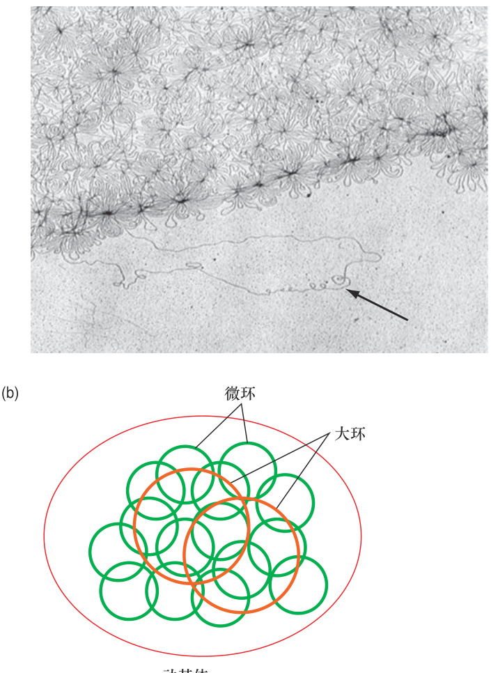  

图15.4　动基体DNA网络。在某些原生动物寄生虫中，单个线粒体（或称动基体）包含一个巨大的DNA微环和大环连接网络。（a）部分动基体的电子显微照片。箭头指向一个单一的大环。（b）图示说明这些环状DNA分子如何相互连接。  

（a）：Electron micrograph by Dr. Stephen Hajduk/University of Alabama at Birmingham  

不到的RNA编辑现象。对大环DNA、微环DNA和来自动基体mRNA的cDNA进行测序，结果令人大吃一惊。微环DNA没有任何编码蛋白质的基因。大环包含的基因序列与编码蛋白的mRNA对应的cDNA明显相关，但是序列却并不相同。对大环的研究结果表明，大环被转录成前体mRNA（pre-mRNA），然后才转化为成熟的mRNA。  

将前体mRNA转化为成熟mRNA的过程称为RNA编辑。没有RNA编辑，前体mRNA就不能编码多肽。一些前体mRNA缺乏适合翻译起始的第一个密码子；另一些则缺乏终止翻译的终止密码。RNA编辑可以创造这两种类型的位点，以及基因中许多新的密码子。  

在锥虫中，RNA编辑机制会添加或删除尿嘧啶，将前体mRNA转化为成熟的mRNA。如图15.5所示，在酶组装成一种叫做编辑体结构的阶段，尿嘧啶编辑才发生，这种结构使用一条RNA模板作为引导，来校正前体mRNA。引导RNA是从微环上的一小段DNA转录而来，这解释了为什么动基体既具有微环又具有大环。  

RNA编辑是一种不寻常的现象，但它并不局限于锥虫。黏菌（Physarum）的线粒体转录物也经历了一种RNA编辑过程，在此过程中添加了胞嘧啶。在植物线粒体和叶绿体中，发生了一种不同的编辑，前体mRNA中的胞嘧啶在成熟的mRNA中改变为尿嘧啶。这些RNA编辑的机制尚不清楚。  

# 2. 线粒体含有通用遗传密码的例外密码  

线粒体有自己独特的翻译装置，因为mtDNA携带自己的rRNA和tRNA基因（见图15.3）。与真核生物中进行的核基因转录mRNA的细胞质翻译相比，线粒体翻译大不相同；事实上，线粒体翻译系统的许多方面与原核生物的翻译相似。例如，在细菌中，N-甲硫氨酸和tRNAfMet在线粒体中启动翻译。此外，抑制细菌翻译的药物，如氯霉素和红霉素，对真核蛋白合成没有影响，却是线粒体蛋白合成的有效抑制剂。  

我们在第8章说过，基因密码几乎是通用的，但不图15.5　锥虫的RNA编辑。前体mRNA序列的一部分显示在顶部。这种前体mRNA通过标准的沃森-克里克A-U和G-C碱基配对及非典型的G-U碱基配对，与引导RNA形成双链杂交。引导RNA中未配对的G和A碱基启动了在前体mRNA序列中插入U碱基（蓝色），而前体mRNA中的未配对的U碱基被删除（红色），形成了最终编辑的mRNA。  

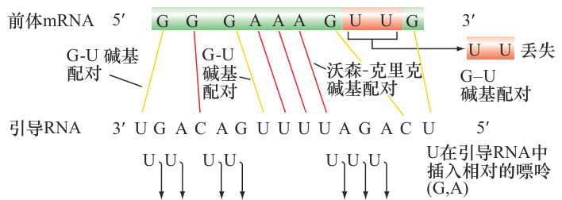  

完全是通用的。“通用”密码的许多例外涉及线粒体。例如，在人类mtDNA中，五种三联体密码的使用方式与在细胞核中的使用方式不同（表15.1）。没有单一的线粒体遗传密码在所有生物中起作用，高等植物的线粒体使用通用密码。因此，某些线粒体的遗传密码可能在细胞器成为真核细胞的组成部分后的某一段时间内发生一系列突变，从而偏离了通用密码。  

表15.1　人类的通用线粒体遗传密码的差异  

<html><body><table><tr><td>三联体</td><td>通用</td><td>mtDNA</td></tr><tr><td>UGA</td><td>终止</td><td>Trp</td></tr><tr><td>AGG</td><td>Arg</td><td>终止</td></tr><tr><td>AGA</td><td>Arg</td><td>终止</td></tr><tr><td>AUA</td><td>Ile</td><td>Met</td></tr><tr><td>AUU</td><td>Ile</td><td>Ile-延长 Met-起始</td></tr></table></body></html>  

# 基本概念  

●  线粒体通过氧化丙酮酸产生ATP，丙酮酸是糖酵解的产物。ATP生成包括电子传递链和ATP合酶，它们嵌入线粒体的内膜。  
●  无论mtDNA是线性还是环状，以及是否存在内含子，从基因组长度的角度来说，不同生物的线粒体基因组变化很大。  
●  线粒体中的前体mRNA，通过RNA编辑转化为成熟的mRNA，这样才可能进行转录物的翻译。  
●  线粒体的翻译与细菌有许多相似之处。虽然有些线粒体使用通用DNA密码，但在其他生物中，有些三联体密码在线粒体中的使用方式与在核DNA中的使用方式不同。  

# 15.2 叶绿体及其基因组  

# 学习目标  

1. 描述一个典型叶绿体的结构和功能。  
2. 对比物种间叶绿体基因组与线粒体基因组的变异。  
3. 描述转基因叶绿体产生的过程。  

叶绿体通过光合作用捕获太阳能，并将其储存在碳水化合物的化学键中。每当鸟飞行、人说话、蠕虫转动或花朵绽放时，生物体的细胞正在利用叶绿体从阳光中捕获到的能量，然后通过线粒体的功能释放出来。玉米是许多善于进行光合作用的作物之一，每个叶片细胞含有 $40\!\sim\!50$ 个叶绿体［图15.6（a）］，每平方毫米的叶片表面携带着50多万个这样的细胞器。  

(a)  

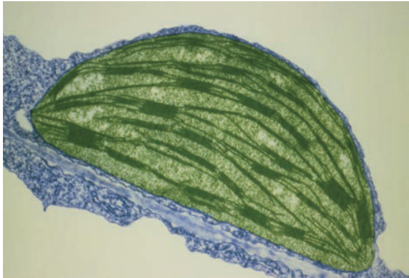  

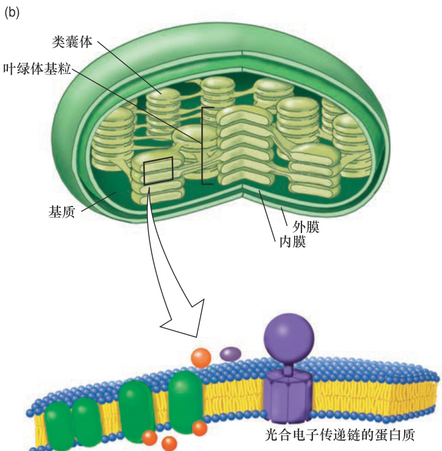  

图15.6　叶绿体解剖。（a）从烟叶细胞（Nicotiana  
tabacum）分离出的叶绿体的电子显微照片（11 000倍）。  
（b）内部结构。叶绿体具有外膜和内膜。内膜以内的空间  
（包含叶绿体DNA和光合成酶）被称为基质。在基质中有一  
种叫做类囊体的囊泡，它们排列成柱状，称为基粒。光合作用发生在类囊体表面。  

（a）： $\copyright$ Dr. Jeremy Burgess/Science Source  

# 15.2.1 叶绿体是光合作用的场所  

图15.6（b）展示了叶绿体的结构。在膜中，称为类囊体的内部结构嵌入了光吸收色素叶绿素和光吸收蛋白质，以及光合作用电子传递系统的蛋白质。在光合作用的光 捕获阶段，来自太阳光子的能量将叶绿素中的电子提升到更高的能量水平。被激发的电子随后被传送到电子传递系统，该系统利用能量将水转化为氧和质子。  

光合作用电子传递形成NADPH，并通过类似于线粒体的ATP合酶驱动ATP的合成。在光合作用的第二个阶段，即光合作用的糖合成阶段，卡尔文循环中的酶利用ATP和NADPH将大气中的二氧化碳转化为碳水化合物。储存在这些营养分子键中的能量，可以为植物和以植物为食的动物的活动提供燃料。  

# 15.2.2 叶绿体基因组相对一致  

叶绿体存在于植物和藻类中。它们携带的基因组在大小上比线粒体基因组要一致得多。虽然叶绿体DNA（cpDNA）的大小在 $120\!\sim\!217\mathrm{kb}$ ，但大多数都在$120\!\sim\!160\mathrm{kb}$ 。而且cpDNA包含的基因比mtDNA多得多。与细菌和人类mtDNA的基因相似，这些基因的排列紧密，相邻的编码序列之间核苷酸相对较少。与酵母（但非人类）mtDNA的基因相似，它们含有内含子。虽然有些是环形的，但多数cpDNA以线性和分支形式存在。和线粒体一样，叶绿体也含有一个拷贝以上的基因组，通常是 $15\!\sim\!20$ 个拷贝。  

图15.7所示为第一个完整测序的cpDNA——地钱（M. polymorpha）的叶绿体基因组。cpDNA编码的蛋白质包括许多进行光合作用电子传递和光合作用其他方面的分子，以及RNA聚合酶、翻译因子、核糖体蛋白和其他活跃于叶绿体基因表达的分子。叶绿体RNA聚合酶类似于多亚基的细菌RNA聚合酶。抑制细菌翻译的药物，如氯霉素和链霉素，可以抑制叶绿体的翻译，就像线粒体一样。  

# 15.2.3 科学家可以创造转基因叶绿体  

在重组DNA技术的早期，研究细胞器的研究人员因无法将克隆基因和突变的DNA片段转移到细胞器基因组中而受挫。20世纪80年代后期，基因枪和一种被称为基因枪转化的基因传送方法的发展解决了这个问题（图15.8）。正如我们在这里所描述的，这项技术对于研究叶绿体基因组特别重要。科学家们也成功地用同样的方法将酵母（S. cerevisiae）的线粒体与外源DNA进行了转化，但在多细胞生物中，线粒体的稳定转化仍是一个难以实现的目标。  

基本思想是用DNA包被小的（ $1\upmu\mathrm{m}$ ）金属颗粒，然后将这些携带DNA的“子弹”射入细胞（图15.8）或叶片中。射入植物细胞的DNA可以进入叶绿体并通过同源重组整合到cpDNA的特定位置。引入的DNA中的耐药基因可以选择转化的细胞，这些细胞可以被培育成含有转基因叶绿体的转叶绿体植株。奇放线菌素抗性基因通常用于基因枪转化。奇放线菌素干扰叶绿体基因mRNA的翻译，因此不含转基因的叶绿体将是无功能的。具有未转化叶绿体的植物细胞在药物筛选后若存活，将是白色的，且长势很弱。  

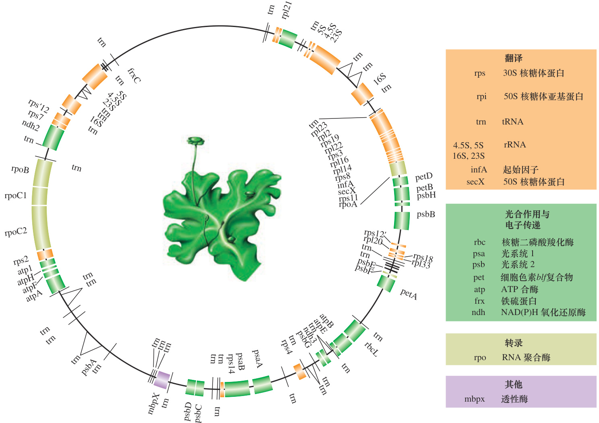  
图15.7　地钱（M. polymorpha）的叶绿体基因组。图中指出了128个基因中一部分的相对位置和标志。基因根据功能进行颜色编码。  

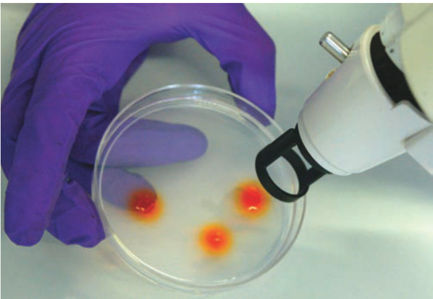  
图15.8　基因枪。该枪用于将DNA包被的珠子推进植物细胞，从而实现叶绿体转化。$\copyright$ Winfried Rothermel/AP Photo  

为了将转基因插入到cpDNA中，引入到植物细胞中的DNA具有基因打靶结构，在这个结构中克隆的cpDNA序列定位到内源性染色体的位置，在那里转基因将通过同源重组进行整合（回顾图14.31）。通常，该转基因与一个奇放线菌素耐药基因一起存在，这两个基因被用于靶向的cpDNA序列包围。当构建体的5′端和3′端的这些cpDNA序列与叶绿体基因组中的对应序列进行交换时，将会发生转基因整合。  

叶绿体基因组的转化具有相当大的潜力，可以改变作物具有商业价值的特性。例如，一个目标可能是生产抗除草剂的植物。将抗除草剂基因引入到叶绿体DNA，而不是核DNA，这种操作的主要优势是叶绿体中的外源DNA是通过母系遗传的，而不是花粉。因此，引入的基因传播到邻近植物种群的风险很低。  

就像在细菌中（见图14.31），叶绿体中的基因打靶也提供了一种方法来确定ORF（可读框——其功能还未知）的功能。为了探索一个ORF的功能，构造了一个DNA分子，将一个奇放线菌素耐药基因克隆到ORF中。该DNA分子整合到叶绿体基因组中，用突变的ORF取代野生型ORF。针对一些植物叶绿体基因编码的光合作用酶，研究人员使用这种方法来鉴定其新的亚单元。  

# 基本概念  

●  在叶绿体中，阳光激活电子传递链，从而产生ATP和NADPH。随后使用这些高能分子将二氧化碳和水转  

化为碳水化合物。  

●  叶绿体基因组通常含有比线粒体更多的基因；叶绿体基因的产物是细胞器内光合作用和基因表达所必需的。●  基因枪转化，将微金属颗粒上的DNA射入细胞，使得能够产生含有转基因叶绿体的植物株系。  

# 15.3 细胞器和核基因组之间的关系  

# 学习目标  

1. 描述细胞器和核基因组之间的合作。  
2. 总结细胞器起源的内共生学说。  
3. 解释基因从细胞器基因组转移到细胞核的意义。  

功能性线粒体和叶绿体的维持与组装，依赖于细胞器自身和核基因组的基因产物。这种合作安排不是在一夜之间发生的，而是在进化过程中发展起来的。有证据表明，这些细胞器和包含它们的细胞的远古祖先，两者都是自由生活的有机体，后来它们进入了共生关系。  

# 15.3.1 细胞核和细胞器基因组相互合作  

一些生化过程同时需要细胞器和细胞核的成分。例如，细胞色素c氧化酶是线粒体电子传递链的末端蛋白，在大多数生物中由7个亚基组成。其中3个亚基由线粒体基因编码，其mRNA在线粒体的核糖体上被翻译。其余4个亚基由核基因编码，其信息在细胞质中的核糖体上被翻译；这些蛋白质必须被导入线粒体。  

在所有生物中，核基因编码线粒体和叶绿体中基因表达所需的大部分蛋白质。例如，尽管线粒体基因组携带rRNA基因，但核基因组携带线粒体核糖体蛋白质的大部分（在酵母和植物中）或全部（在动物中）的基因。由于线粒体和叶绿体不携带其发挥功能和繁殖所需全部蛋白质的基因，这些细胞器必须不断接受从细胞的其他部分供应的分子。因此，线粒体和叶绿体不能独立于它们所在细胞而存在。  

# 15.3.2 线粒体和叶绿体起源于细菌  

叶绿体在大小和形状上，与今天的某些光合细菌非常相似。尽管由于线粒体遗传系统的多样性，难以一概而论，但至少有一些线粒体类似于某些当今的有氧细菌。这些相似性表明，线粒体和叶绿体最初是自由存活的细菌，它们与现代真核细胞的祖先融合在一起，形成了一个细胞群落，宿主和寄宿者在这种安排下均受益。  

# 1. 内共生学说  

20世纪70年代，在提出线粒体和叶绿体起源于远古真核细胞前体，与某些细菌建立共生关系并最终被吞噬观点的生物学家中，林恩·马古利斯（Lynn Margulis）是最早的之一。携带类线粒体或类叶绿体的细菌细胞的原始细胞，会在能源生产的激烈竞争中获得优势，最终进化成复杂的真核生物。现在有太多的证据支持这个假说，因此作为内共生学说被普遍接受。  

内共生学说的分子证据包括以下事实：  

（1） 线粒体和叶绿体都有自己的DNA，独立于核基因组进行复制。  
（2） 与细菌的DNA一样，mtDNA和cpDNA也不是由组蛋白组织成核小体的。  
（3） 线粒体基因表达采用N-甲硫氨酸和tRNAfMet进行翻译。  
（4） 细菌翻译的抑制剂，如氯霉素和红霉素，阻断线粒体和叶绿体的翻译，但对细胞质中真核蛋白的合成没有影响。  
（5） 细胞器和细菌rRNA基因序列的比较表明，线粒体基因组来源于现今革兰氏阴性无硫紫色细菌的共同祖先，而叶绿体基因组来自蓝细菌（以前称为蓝绿藻）。  

科学家估计产生线粒体的内共生事件发生在20亿年前，而产生叶绿体的内共生事件则是在线粒体内共生事件发生之后的5亿年。这些事件是如此古老，以至于人们对其中的确切过程知之甚少。一些科学家推测，第一个真核细胞可能是由古细菌和细菌共生产生的，而不是原始真核细胞吞噬细菌产生的。  

# 2. 细胞器和细胞核之间的基因转移  

从最初产生线粒体和叶绿体的内共生事件开始，一些基因可能从细胞器基因组转移到了细胞核。例如，我们看到一些氧化磷酸化和光合作用所需的基因存在于核基因组中，它们可能是从细胞器基因组转移到那里的。编码细胞器核糖体蛋白的基因可能也是如此。  

基因可以从细胞器转移到细胞核的观点具有重要的意义。首先，一旦这些基因的拷贝合并到核染色体中，细胞器中的拷贝就会变得多余，而可能丢失掉。如果该基因最初是内生的共生菌独立生长所必需的，那么原细胞器就无法在宿主细胞之外存活。其次，不同真核生物进化谱系可能会将不同的细胞器基因亚群转移到细胞核中，导致了今天的细胞器基因组有极大的多样性。  

研究人员对细胞器和细胞核之间基因转移的机制有了一定的了解。在许多植物中，线粒体基因组都有线粒体电子传递链上的COXII基因。在另外一些植物中，该基因则是由核DNA编码的。在一些植物中，核COXII基因是有功能的，同时mtDNA仍然包含一个该基因的拷贝，它虽可识别但无功能（即COXII假基因）。值得注意的是，mtDNA的基因含有一个内含子，而核基因没有。遗传学家将这一发现解释为，利用反转录酶通过RNA中间体的形式，COXII基因从mtDNA转移到核DNA上。内含子被从COXII转录物中剪切出去，当mRNA通过反转录酶被复制到DNA中，并整合到细胞核中的染色体上时，产生的核基因也将没有内含子。在细胞器和细胞核之间，以不涉及RNA中间体的形式转移DNA的其他机制似乎也存在。  

# 基本概念  

●  细胞器和细胞核之间需要合作，因为细胞器发挥功能所需的许多蛋白质，都是由核DNA编码，而其他蛋白质则由细胞器DNA编码。  
●  内共生学说认为，线粒体和叶绿体是通过细菌样的细胞和吞噬它们的真核细胞前体之间建立共生关系，进化而来的。  
●  基因从细胞器基因组转移到细胞核基因组之后，细胞器由于丢失原先的细胞器基因，从而无法在宿主细胞外生存。  

# 15.4 线粒体和叶绿体的非孟德尔遗传  

# 学习目标  

1. 描述证明细胞器通常是母系遗传的实验方法。2.  解释在同一物种中不同cpDNA混合存在，将如何导致植物的多样性。3. 遗传学研究表明酵母线粒体是双亲遗传。  

细胞器基因的突变通常会产生很容易检测到的、可影响整个生物体的表型变化，因为它们编码的蛋白质和RNA发生突变之后，会扰乱细胞能量的产生。例如，mtDNA突变会导致单细胞生物群落生长缓慢，或者多细胞生物组织异常脆弱。cpDNA的突变会使产生叶绿素（光合作用所需的绿色色素）所必需的蛋白质失去活性，从而改变植物叶片的颜色。另一种追踪细胞器基因组突变的方法，是通过测序直接追踪DNA多态性。  

不同物种的细胞器传递方式差异很大。遗传学家对任何特定物种提出的一个问题是，其杂交后代是从双亲获得细胞器（双亲遗传），还是从单亲获得细胞器（单亲遗传），后一种情况下，细胞器既可以是母系的（如果所有的细胞器都来自母亲），也可以是父系的。所有这些可能性都存在于自然界中。  

# 15.4.1 在许多生物中，细胞器及其DNA是从父母一方遗传而来的  

对于许多真核生物，特别是动物而言，细胞器的遗传是单亲的。当单亲遗传发生时，子代一般都是从母系继承细胞器（母系遗传），但也存在许多例外。例如，在香蕉中，叶绿体基因组是母系遗传，而线粒体基因组是父系遗传。在紫花苜蓿中情况正好相反；而在红杉中，叶绿体和线粒体DNA都是父系遗传。我们在这里关注一个更常见的母系模式的经典例子。  

# 1. 链孢菌mtDNA突变体的母系遗传  

在第5章中，我们讨论了粗糙链孢菌（Neurosporacrassa）的遗传学。回想一下，链孢菌菌落是单倍体（n），且含有两种不同的交配类型，每一种都可以产生特殊的细胞，可以与相反交配类型的细胞交配（融合）［回顾图5.19（b）］。每一种交配类型都能产生雄性和雌性的交配细胞，雄性细胞比雌性细胞小得多。在一种类型的雄性细胞与另一种类型的雌性细胞交配后，细胞核融合形成二倍体（ $2n$ ）细胞，经过减数分裂和有丝分裂后产生8个单倍体孢子。如果原单倍体细胞在核染色体上有一个基因的不同等位基因，孟德尔遗传决定了8个孢子中，有一半包含一个等位基因，另一半包含另一个等位基因（ $4:4$ 分离）。  

1952年，Mary和Herschel Mitchell分离出了一种名为poky的突变型链孢菌菌株，这种菌株生长缓慢。他们将poky突变株的一种交配型，同时也是基因ad+（可以合成腺嘌呤）的野生型，与正常生长菌株（poky+）的另一种交配型进行交配，后者同时也是ad （需要腺嘌呤补充剂）。核基因标记ad 和ad 按照预期的结果，将会产生 $.4:4$ 分离。然而，令人吃惊的是，实际上所有的孢子要么全是ad ，要么全是ad ；因此，慢生长表型的分离比为 $\mathrm{~\textit~{~8~}~:~}0$ 。此外，孢子表型总是与提供雌性交配细胞的菌落相同（图15.9）。因此，poky性状表现出非孟德尔遗传，因为母系和父系配子对子代表型的贡献并不相等。  

合理的解释是，poky−是mtDNA的突变。poky基因编码一个线粒体的核糖体RNA，在poky−突变体中增长是缓慢的，因为翻译效率低下。较大的雌性交配细胞，为短暂的二倍体细胞的细胞质和所有的8个孢子提供所有的线粒体。因此，在链孢菌中线粒体遗传是单亲遗传，也是母系遗传。  

# 2. 细胞器母系遗传的形成机制  

配子大小的差异有助于解释在粗糙链孢菌等物种中的母系遗传，在这些物种中，雄性配子比雌性配子小得多。因此，受精卵接收到非常多的母系细胞器，而父系细胞器的数量则非常少。同样的情况也可以解释许多多细胞生物的单母系遗传，包括紫茉莉的叶绿体和人类的线粒体，我们将在下一节探讨这些内容。  

然而，受精卵大小并不是导致细胞器母系遗传的唯一机制。在一些物种中，父系细胞器被主动排除或破坏。在一些植物中，受精卵的早期分裂将大部分或全部父系细胞器基因组，分配给那些注定不会成为胚胎的细胞。在某些动物中，受精的过程阻止了父系细胞向受精卵提供细胞器。例如，在被囊动物（原脊椎动物脊索动物门）中，受精过程只允许精子核进入卵子，这种物理方式排除了父系线粒体。另一种机制发生在许多动物中，受精后的受精卵会破坏父系的细胞器。  

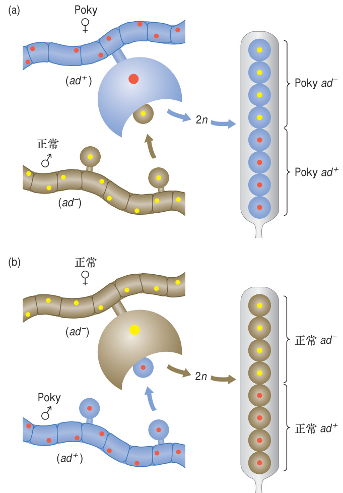  
图15.9　链孢菌Poky表型的母系遗传。（a）在Poky ad （蓝色细胞质，红核）雌性配子和正常的ad （棕色细胞质，黄核）雄性配子交配产生的8个孢子中，一半孢子是ad +，另一半孢子是ad –。所有的孢子都是Poky表型，因为这种表型由一个线粒体基因控制，所有的线粒体都由较大的雌性配子提供。（b）互交得到的二倍体，会产生一半为ad +、一半为ad−的孢子。然而，所有的孢子都是正常的（非Poky表型）。  

“遗传学与社会”信息栏“阿根廷法庭用线粒体DNA测试作为亲属关系的证据”，讲述了阿根廷的一个人权组织，如何使用mtDNA序列作为被绑架儿童与其生物学家庭团聚的法律基础。人类线粒体的母系遗传使得比较和匹配祖母与孙子的DNA成为可能。  

由于只发生在相对较少的物种中，所以目前尚不清楚细胞器的单父系遗传基础。  

# 15.4.2 细胞器基因组的变异在细胞分裂时发生分离  

一个真核细胞可能包含数千个线粒体，一个植物细胞可能有几十个叶绿体。而且，这些细胞器中的每一个都可能含有多个细胞器基因组的拷贝。这些情况对于由细胞器染色体上基因决定的性状遗传具有重要影响。  

# 1. 紫茉莉的杂色  

在这一章的开头，我们提到了植物遗传学家Carl  

# 遗传学与社会  

# 阿根廷法庭用线粒体DNA测试作为亲属关系的证据  

在 $1976\!\sim\!1983$ 年期间，阿根廷的军事独裁政府绑架、监禁和杀害了1万多名大学生、教师、工会成员和其他不支持该政权的人。许多非常年幼的儿童和年轻的成年人一起失踪，也包括拘留中心的妇女生下的将近120个婴儿。1977年，这些失踪婴儿和幼儿的一些祖母在布宜诺斯艾利斯的中央广场守夜，证明并且告诉大家，她们的孩子和孙子失踪了（图A）。她们很快组成了一个人权组织——五月广场的祖母（theGrandmothers of the Plaza de Mayo）。  

祖母们的目标是，找到她们怀疑还活着的200多名孙辈，并让他们与自己的亲生家庭团聚。为此，她们从助产士和前狱卒等目击者那里收集资料，并建立了一个网络，监测进入幼儿园儿童的证件。她们还联系了国外组织，包括美国科学促进会（AAAS）。  

这些祖母们要求美国科学促进会帮助提供能在法庭上站得住脚的遗传分析。当民主制度取代了军事政权，祖母们可以在公正的法庭上为自己的法律案件辩护时，这些被绑架时只有两三岁或刚刚出生的孩子，现在都已经 $7\!\sim\!10$ 岁了。尽管孩子们的外在特征发生了变化，但他们的基因能明确地把他们和他们的亲生家庭联系起来，这些基因并没有改变。一些知晓遗传测试可能性的祖母们，寻求帮助来获取和分析这样的测试。从1983年开始，法院同意接受他们的测试结果作为亲属关系的证明。  

  
图A　五月广场的祖母（1977）。$\copyright$ Horacio Villalobos/Corbis  

1983年，能确认或排除两个或两个以上个体亲缘关系的最佳方法，是比较被称为人类淋巴细胞抗原（HLA）的蛋白质。人类白细胞(或淋巴细胞)上携带一组独特的HLA标记，这些标记的多样性足以形成一种分子指纹。即使孩子的父母已经不在人世，也可以进行HLA分析，因为对于每一个HLA标记，孩子从外祖父母那里继承一个等位基因，从祖父母那里继承另外一个等位基因。统计分析可以确定孩子与祖父母或外祖父母共享基因的可能性。在某些情况下，HLA分析足以有力地证明，一个经过测试的孩子属于申请家庭。但是有时候，无法通过HLA分型得到可靠的匹配。  

美国科学促进会让祖母们与当时在加州大学工作的Mary Claire King取得联系。King和两个同事—C. Orrego和A. C. Wilson开发了一种mtDNA测试方法，该测试基于当时的两种新技术，即PCR扩增和对线粒体基因组高度可变非编码区域进行直接测序。由于mtDNA是母系遗传和缺少重组，这意味着即使只有一个母系亲属可以进行匹配，该方法也可以解决存在争议的亲缘关系。非编码区域存在极度多态性，这使得孙辈的mtDNA可以直接匹配到某一个人，这个人可以是他们的外祖母，或他们母亲的姐妹或兄弟，这样就可以识别孙辈，而不需要统计计算。  

为了验证他们的方法，King和他的同事在不知道谁和谁有亲戚关系的情况下，对三个孩子和他们的三个外祖母的序列进行了扩增。mtDNA测试清楚地将孩子和他们的外祖母进行了配对。因此，1989年后，祖母们将mtDNA数据纳入了她们的档案。  

今天，他们的孙子们——失踪者的孩子们——已经成年并获得了法律上的独立。尽管他们的祖母大部分去世了，孙辈们仍然可以通过祖母们留下的mtDNA数据，来发现他们的生物学身份，并知道他们的家庭发生了什么。  

Correns，他对紫茉莉（Mirabilis jalapa）颜色变异遗传模式进行的里程碑式研究。杂色的植物通常有杂色的树枝，部分是绿色的，部分是白色的，还有一些是纯绿色或纯白色的树枝（图15.10）。Correns进行了所有9种可能的雄性（花粉）和雌性（卵子）配子的配对杂交，这些配子来自于每一种树枝上的花朵：杂色、绿色或白色。由于植物细胞的颜色是由母系遗传的cpDNA控制的，所以子代表型与雌性配子的来源相似（表15.2）。  

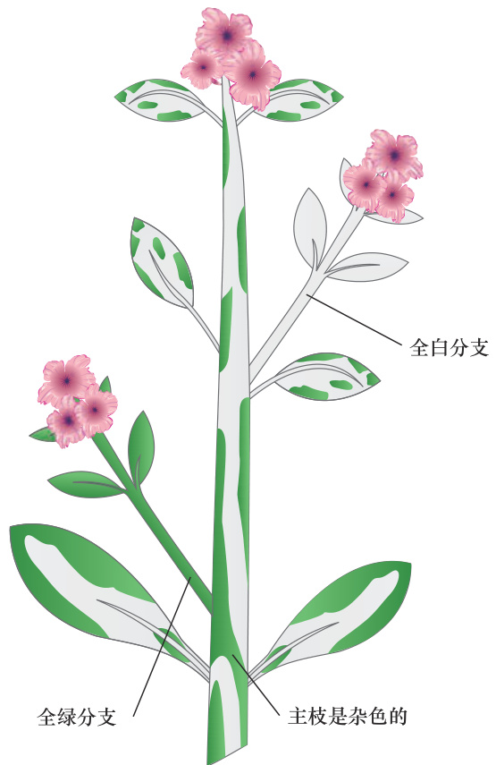  

图15.10　杂色的紫茉莉植物。杂色的植物通常有杂色的、纯绿色的和纯白色的枝条（部分）。主茎通常是杂色的。  

表15.2　Correns的紫茉莉杂交结果  

<html><body><table><tr><td>提供卵子的植物 分支</td><td>提供花粉的植物 分支</td><td>后代表型</td></tr><tr><td>绿色</td><td>绿色</td><td>绿色</td></tr><tr><td>绿色</td><td>白色</td><td>绿色</td></tr><tr><td>绿色</td><td>杂色</td><td>绿色</td></tr><tr><td>白色</td><td>绿色</td><td>白色</td></tr><tr><td>白色</td><td>白色</td><td>白色</td></tr><tr><td>白色</td><td>杂色</td><td>白色</td></tr><tr><td>杂色</td><td>绿色</td><td>绿色或白色或杂色</td></tr><tr><td>杂色</td><td>白色</td><td>绿色或白色或杂色</td></tr><tr><td>杂色</td><td>杂色</td><td>绿色或白色或杂色</td></tr></table></body></html>  

杂色表型是因为杂色的紫茉莉有两种叶绿体：野生型和突变型。突变的cpDNA上，合成绿色色素所需基因的等位基因存在缺陷；没有叶绿素的细胞是白色的。一个细胞器基因组有一个以上基因型的细胞或生物体称为异质的（图15.11）。杂色植物作为一个整体可以认为是异质的，因为它来自一个含有野生型和突变型叶绿体的异质卵。该植物也含有同质的细胞，其中只含有一种cpDNA（图15.11）。例如，植物的纯白色区域是同质的突变型叶绿体。为什么有些细胞是异质的，而另一些是同质的呢？  

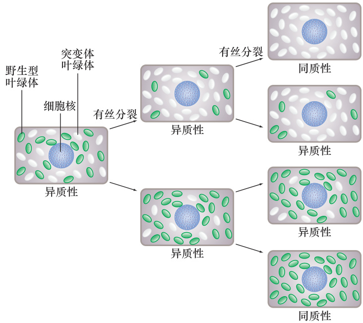  
图15.11　叶绿体的细胞质分离。杂色植物既含有野生型（绿色），又含有突变型（白色）叶绿体。当异质细胞（突变型和野生型cpDNA）分裂时，可以产生同质细胞（全突变型或全野生型cpDNA）。叶绿体的不均匀分布可能发生，并偶然产生一个只有一种cpDNA的子细胞。  

# 2. 细胞器基因组的细胞质分离  

当一个细胞经历有丝分裂时，大约有一半的叶绿体最终进入两个子细胞。但这种分布并不精确，因此异质细胞的两个子代无法得到完全相同比例的野生型和突变型叶绿体。从图15.11可以看出，经过多次细胞分裂后，这种随机的细胞质分离可以产生一个仅含有一种cpDNA的同质后代细胞。  

一个细胞一旦变成了同质的，它就不能再变成异质的（除非通过新的突变），因此从那时起它的所有后代都是同质的。叶绿体的随机细胞质分离至少部分解释了一种植物的野生型为何是异质的，以及突变型叶绿体为何可能混合有异质、同质野生型和同质突变细胞。  

# 3. 细胞质分离与杂色的关系  

杂色植物通常具有含绿色和白色组织斑块的杂色主茎，以及纯绿色或纯白色的枝条（见图15.10）。在杂色区域，绿色斑块主要包含异质细胞（图15.12）。在有丝分裂期间，可以产生突变型叶绿体的同质细胞，并且它们产生了白色斑块和白色枝条。同时还会出现野生型叶绿体的同质细胞，并产生纯绿色枝条。  

在紫茉莉中，异质细胞是绿色的，因为即使在少量野生型叶绿体中，叶绿素的量也足以产生绿色。这种现象称为阈值效应，在这种现象中，特定比例的野生型细胞器足以实现正常的表型。为了避免突变表型，野生型细胞器所需的确切比例，将取决于特定的基因和突变。  

现在我们可以理解Correns杂交实验的结果了（见表15.2）。白色枝条上花的雌性配子是突变叶绿体的同质性配子；它们总是会产生纯白色植物（这些植物最终因为无法进行光合作用而死亡）。绿色枝条上的花为野生型叶绿体提供同质卵子，因此产生纯绿色（非杂色）子代。最后，来自杂色枝条的花可以有三种卵子中的任何一种（见图15.12）。图15.10所示的植物来自于杂色枝条上一朵花的异质卵。  

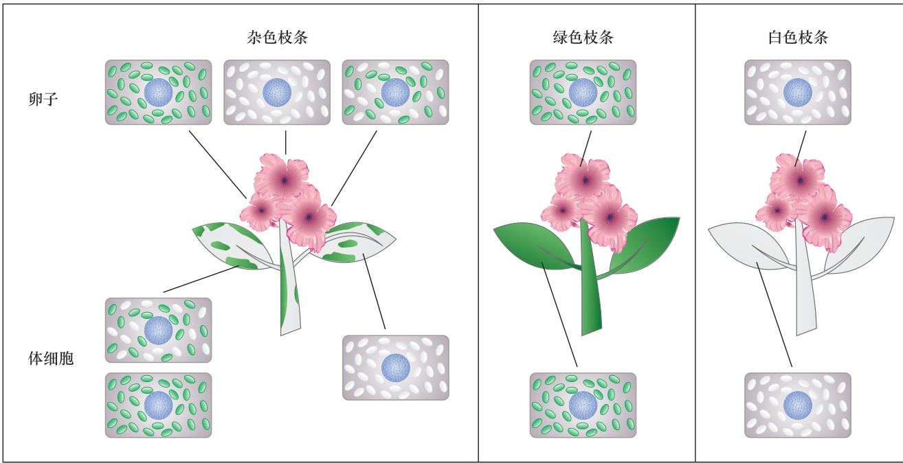  
图15.12　杂色紫茉莉的三种卵子类型。在杂色枝条中，绿色部分主要由异质细胞组成。细胞质分离产生了一些能形成白色区域的同质突变细胞，以及形成绿色区域的一些同质野生型细胞。与体细胞一样，杂色枝条的卵子可以是同质性的（野生型叶绿体，或者是突变的叶绿体），也可以是异质的。纯绿色枝条和纯白色枝条的所有卵细胞和体细胞，分别是同质野生型叶绿体或突变型叶绿体。  

# 4. 单个细胞器的异质性  

每个叶绿体和线粒体可能有几份基因组拷贝，因此对于野生型与突变型DNA，单个细胞器本身可以是异质的或同质的。有两种事件可以导致原异质细胞器内基因组的细胞质分离。第一，当细胞器分裂时，子代细胞器的基因组拷贝数分布是随机的，因此可能会发生一种cpDNA的随机细胞质分离。第二，不是细胞器中的所有DNA分子都进行复制，哪些DNA分子会进行复制是随机的。因此，一些基因组复制了很多次，而另外一些基因组根本不复制。  

单个细胞器能正常工作（野生型）或不能正常工作（突变型），都可能受到阈值效应的影响。因此，就像它们居住的细胞一样，单个细胞器的表型（无论是功能上的野生型还是突变型）受到其野生型和突变型基因组拷贝相对比例的影响。  

# 15.4.3 有些生物拥有细胞器基因组的双亲遗传  

虽然在大多数后生动物和植物中，细胞器的单亲遗传是普遍现象，但某些单细胞酵母和一些植物的细胞器  

基因组遗传自双亲，即双亲遗传。在本节中，我们会介绍出芽酵母（酿酒酵母，Saccharomyces cerevisiae）的例子。  

# 1. 研究酵母线粒体基因遗传  

抑制细菌mRNA翻译的药物，如氯霉素和红霉素，是线粒体（但不是正常的细胞质）蛋白质合成的有效抑制剂。这个现象是在20世纪60年代初被发现的，当时研究人员发现，在含有不可发酵的碳源（甘油或乙醇）的培养基上，氯霉素会抑制野生型酵母的生长；但是这种药物在含有葡萄糖（一种可发酵的碳源）的培养基上，并不抑制酵母的生长。由于厌氧发酵产生ATP不依赖于线粒体，这些科学家认为，氯霉素作用于线粒体基因组编码的线粒体翻译机制。  

这些研究人员意识到，在甘油或乙醇上培养酵母菌，可以使细胞依靠线粒体生长，从而分离线粒体基因中的突变体。这个过程很简单：他们筛选与野生型酵母菌表现不同，在一种抑制线粒体蛋白合成的药物作用下，仍然可以在甘油中生长的酵母菌突变体。第一个有用的突变体对氯霉素有抗性（ $C^{\mathrm{{r}}}$ ），它们来自于对该药物敏感的野生型细胞（Cs）。  

回忆第5章，酿酒酵母细胞是单倍体，有两种交配类型：a或α［见图5.19（a）］。相反，交配类型的细胞融合，可以形成二倍体（出芽生长），因此酵母杂交可以产生二倍体细胞的培养物。酵母是一种同形配子的物种，因为配子（相反交配型的单倍体细胞）具有相似的大小和形态。  

# 2. 酵母中线粒体的双亲遗传和细胞质分离  

为了分析酵母中mtDNA的遗传模式，研究人员混合了相反交配型的C和C 亲代细胞，并利用亲本菌株中的核营养缺陷型标记来筛选分离二倍体。它们允许二倍体细胞分裂几个营养生长世代，然后通过将细胞接种到含有氯霉素甘油培养基的培养皿上，对C或C 表型的单个二倍体后代进行评分。研究人员发现一些二倍体是Cr，其他的则是Cs（图15.13）。这一结果表明，父母双方都向后代传递了细胞器。  

实验还表明，不同交配类型亲本细胞的细胞器，在营养生长的有丝分裂过程中会发生分离。交配后，二倍体将包含两种线粒体，二倍体细胞将都是Cr表型，因为等位基因是显性的。但是经过几轮的分裂，一些细胞只含有C 线粒体，因此是C 表型。显然，C 和C型mtDNA发生了随机细胞质分离（图15.13）。  

酿酒酵母的生物学特性，使得mtDNA的细胞质分离过程如此迅速，以至于通常只需要几轮有丝分裂就能实现。你会记得，这种酵母通过出芽的过程进行有丝分裂，从一个较大的母细胞产生一个小芽［回顾图5.19（a）］。由于这种大小上的不平均，只有少量图15.13　酿酒酵母（Saccharomyces cerevisiae）双亲线粒体遗传。在酵母中，对氯霉素的抗性或敏感性是由线粒体基因控制的。氯霉素抗性（C）和氯霉素敏感（C）的单倍体酵母杂交结果表明，二倍体从这两个单倍体细胞中都继承了线粒体。当二倍体细胞通过有丝分裂分离时，这些mtDNA变异体随后发生细胞质分离。  

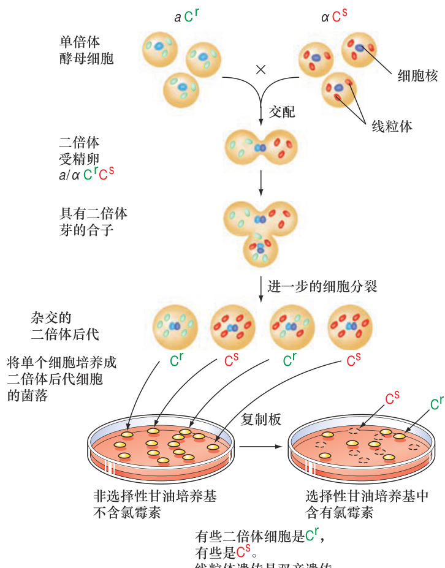  

的mtDNA分子被转移到新形成的芽中，使得芽中大部分是一种mtDNA，或只有一种mtDNA的可能性更大。  

# 基本概念  

●  在许多生物中，细胞器编码性状的传递是单亲的和母系的。所有子代的表型都与母体相似。  
●  细胞器的母系遗传通常是相较于雄性配子，雌性配子较大的结果。其他的机制也可以破坏或排除来自雄性配子的细胞器。  
●  线粒体在一些生物（如酵母菌）中是双亲遗传的，两个配子的大小相似。  
●  细胞可能携带多种细胞器DNA。这些异质细胞的细胞器基因组，可以在几轮有丝分裂后相互分离，产生只有一种细胞器DNA的同质细胞。细胞质分离可导致不同表型组织的杂色斑。  

# 15.5 线粒体突变和人类疾病  

# 学习目标  

1. 认识人类系谱中的线粒体疾病。  
2. 解释异质性对线粒体疾病表现的影响。  
3.  讨论为什么一些科学家认为线粒体和衰老之间存在联系。  
4.  描述如何使用卵母细胞核转移来防止线粒体疾病的传播。  

正如所有染色体一样，人类mtDNA中也会发生突变。因此，今天的人类线粒体基因组，拥有各种各样的多态性，这可以用来区分彼此。遗传学家可以分析人类mtDNA的序列，探索我们的进化历史。线粒体基因组是母系遗传，这为这些进化研究提供了独特的视角。“快进”信息栏“线粒体祖先”，解释了mtDNA序列的比较表明今天所有人类的祖先是一名生活在20万年前的非洲妇女。  

mtDNA中的某些多态性具有明显的表型影响。特别是，人类神经系统的一些衰弱性疾病，是由线粒体基因组突变引起的。这些疾病基因从母亲传给女儿和儿子，受影响的女儿又传给孙女和孙子，通过母系的方式传承下去。由于异质性，这些疾病的症状在家庭成员之间有很大的差异。线粒体基因治疗的发展，将使患有线粒体疾病的妇女生育孩子时不传递突变mtDNA，这也许很快将成为可能。  

# 15.5.1 在LHON中，受影响的人通常是同质的  

莱伯遗传性视神经病变（LHON），是指线粒体电子传递链的缺陷导致的视神经变性和失明。家族谱系显示，LHON仅从母亲传给后代（图15.14）。LHON是  

# 线粒体祖先  

线粒体的严格母系遗传，提供了一个独特的机会来推断我们的进化史。通过这些研究，遗传学家AllanC. Wilson和他的同事得出了一个惊人的结论：当今所有人类的线粒体DNA，都可以追溯到大约20万年前生活在非洲的一位女性的mtDNA。  

原始mtDNA的携带者被称为线粒体祖先，可能生活在一个1万 ${\sim}5.$ 万人的群体中，他们在同一地区生活并交配。  

虽然今天所有人类的线粒体都可以追溯到很久以前的一个女性身上，但是我们的线粒体DNA并不完全相同。事实上，正是由于在过去20万年中发生的随机突变，导致了线粒体基因组碱基序列的差异，使得科学家能够追踪线粒体的历史到这个线粒体祖先上。  

Wilson和他的同事，分析了约250人的线粒体DNA序列，这些人代表了世界上所有居住大陆的人。他们发现，非洲个体之间的序列差异，比亚洲或欧洲个体之间的差异更大。由于突变是随时间而发生的，非洲人口积累变异的时间肯定是最长的。结论很简单：现代人类起源于非洲。  

研究人员可以通过假设mtDNA中突变积累的速率相对恒定，来估算线粒体祖先的存在时间。科学家们知道，大约500万年前，黑猩猩和人类从一个共同的祖先分化而来，人类与黑猩猩的mtDNA约有 $15\%$ 的差异。调整这些数据来解释在同一碱基对上的多重置换，他们估计人类和黑猩猩的mtDNA以平均每百万年$13.8\%$ 的速度分化。  

为了确定线粒体祖先的生存时间，Wilson和他的同事们认为人类mtDNA变异最多，约占细胞器DNA的 $2.8\%$ 。然后，研究人员简单地将这个数字除以黑猩猩和人类基因组比较得出的比率，以估算有分歧的现存人类最后一次共享一个共同母系祖先的时间：  

$2.8\%$ bp 变化  

$13.8\%$ bp 变化 /100 万年  

虽然对于构成这一分析基础的统计方法和假设存在一些争议，但大多数遗传学家现在同意这样的结论：携带我们古老的mtDNA的妇女，生活在大约20万年前的撒哈拉以南的非洲地区。  

线粒体祖先是谁？答案是，她是唯一一个现今人类所有mtDNA可以追溯到的女性。图A说明了这个概念。  

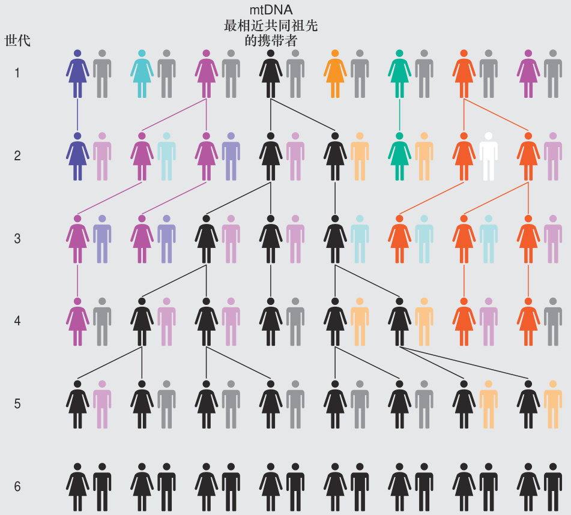  

图A　mtDNA最近的共同祖先（MRCA）。现今所有人（第6代）的mtDNA都可以追溯到一个女人（第1代，黑色），即mtDNA最相近共同祖先的携带者。早期世代中的其他女性的mtDNA（黑色以外的颜色）在第5代之前的某一段时间内丢失了。由于mtDNA是母系遗传，所以雄性携带的mtDNA变异不会影响下一代mtDNA的分布。一旦所有的雌性携带MRCA变异，所有的雄性在下一代也会携带该变异。  

你可以看到，尽管她的名字是线粒体祖先，但肯定不是第一个女人；同时存在许多其她的妇女，也有许多其他妇女先于她而存在。但是其他女性的mtDNA并没有遗传给今天的人类。在过去的20万年里，这些妇女或者她们存活的母系后代，没有孩子或者只有儿子。通过图A的彩色谱系可以想象这个概念在这一代之前就结束了。  

相似的祖先踪迹决定了，携带着与当今所有Y染色体最相近的共同祖先的男人（也就是所谓的Y染色体祖先），也生活在撒哈拉以南的非洲，但很可能是在不同的时间（大约20万 $\sim\!30$ 万年前）。在第21章，你将更详细地了解科学家如何比较个体的DNA序列来推断人类进化史。  

由三个线粒体基因中的任何一个（nd1、ND4或nd6）减效突变引起的，这三个基因每个编码一个NADH脱氢酶的不同亚基［NADH脱氢酶是电子传递途径中的第一种酶，如图15.2（b）所示］。呼吸传递链上电子减少降低了线粒体ATP的产量，导致细胞功能的逐渐下降，并最终导致细胞死亡。视神经细胞对能量的需求相对较高，所以遗传缺陷在影响其他生理系统之前，先影响了视觉。  

由于致病等位基因是弱突变体，大多数LHON患者的视神经细胞为同质性疾病突变（所有线粒体均为突变体）；通常这意味着该患者整体都含有同质突变线粒体。由于这个原因，LHON常常（但并不总是）显示出线粒体疾病最简单的遗传模式（图15.14）：所有受影响的女性卵子中的mtDNA都是突变体，所以她们的所有子代——男性和女性——都含有同质突变线粒体。LHON系谱并不总是像图15.14所示那样清晰；在一些家族中，遗传是不完全渗透的，可能是由于异质性的原因。  

# 15.5.2 在MERRF中，受影响的个体是异质的  

患有罕见的遗传性肌阵挛性癫痫和不规则红纤维疾病（MERRF）的人有一系列症状：不受控制的抽搐（肌阵挛性癫痫的一部分）、肌肉无力、耳聋、心脏问题、肾脏问题和进行性痴呆。受影响的患者通常在骨骼肌区域有一种不寻常的“参差不齐”染色模式，这可以解释这种疾病的部分名称（图15.15）。  

MERRF是由线粒体tRNA基因功能缺失突变引起图15.14　线粒体疾病特征系谱。患病母亲的所有子女都受到影响，但是患病父亲的子女则不受影响。虽然一些LHON系谱表现出这种理想化的遗传模式，但由于一些LHON患者是异质性的，而且该性状可能受到核基因各种等位基因的影响，因此该性状可能表现出不完全外显率和可变表达率。  

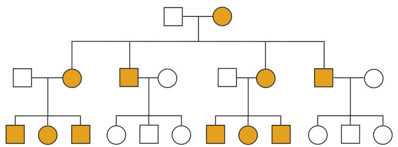  

的； $90\%$ 的MERRF患者在 $t R N\!A^{L y s}$ 中携带突变。由于这些突变影响所有线粒体mRNA的翻译，它们对ATP的产生有重大的有害影响。携带这些突变mtDNA的人，对于突变体和野生型线粒体来说总是异质性的，因为这种突变DNA的同质性细胞会死亡。异质性导致了疾病症状外显率和表达率的广泛差异。  

# 1. 卵子中突变线粒体比例的变化  

如图15.16所示系谱，家庭成员从他们的母亲那里继承MERRF；受影响的雄性后代没有一个表现出疾病症状。家族史还揭示了症状严重程度的个体差异，这些差异与突变线粒体的总体比例大致相关。在图15.16中发现，突变线粒体在母亲及其后代中的比例并不总是相同的，突变线粒体在兄弟姐妹中的比例也不相同。这是由于MERRF突变而产生异质性细胞的女性，其卵子中野生型和突变型tRNALys基因的相对比例是不同的。确切的组合取决于，在有丝分裂产生生殖细胞系的过程中线粒体的随机划分。  

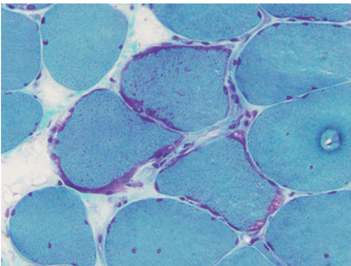  
图15.15　MERRF患者肌纤维横断面。线粒体呈红色，细胞质呈蓝色。在这种偶然发生的、含有大量突变mtDNA的异质个体的肌纤维中，线粒体的功能很差。为了弥补这一缺陷，这些参差不齐的红色纤维产生了更多的线粒体（从而显示出更多的红色染色）。尽管有这样的补偿，参差不齐的红色纤维  

产生的能量很少，因此比正常纤维更弱。  

承蒙 $\copyright$ Dimitri P. Agamanolis, M.D.提供  

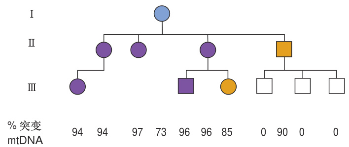  
图15.16　MERRF的母系遗传。尽管这一系谱显示了线粒体突变的母系传递，但异质个体细胞中，突变mtDNA的总体比例各不相同（见底部），且与病情的严重程度一致（通过不同的颜色编码显示）。  

# 2. 突变线粒体组织分布的变化与其表型  

在含有引起MERRF线粒体的个体中，突变型与野生型mtDNA的比例，在组织与组织之间有显著差异，这是有丝分裂期间的随机细胞质分离造成的。由于每个组织都有自己的能量需求，即使是相同的比例也会在不同程度上影响不同的组织（图15.17）。肌肉和神经细胞在所有类型的细胞中有最高的能量需求，因此最依赖于氧化磷酸化。突变mtDNA随机分离到这些组织后，产生了MERRF的特征。  

# 15.5.3 线粒体突变可能影响人类衰老  

mtDNA中的一些突变是通过生殖系遗传的，而另一些突变则是在体细胞中偶然发生的，如暴露于辐射或化学诱变。事实上，在人类体内，体细胞的线粒体DNA突变率要比核DNA高得多。原因之一是线粒体氧化磷酸化系统，在细胞器内产生了大量破坏DNA的自由基。  

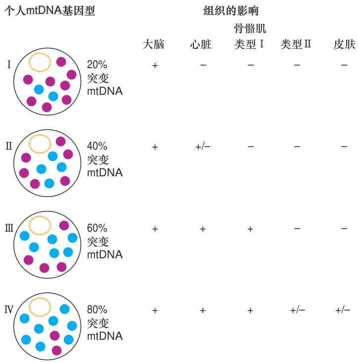  
图15.17　MERRF症状及突变体与野生型mtDNA的比值。突变线粒体（蓝色）的比例和受影响组织的性质，一起决定了MERRF症状的严重程度。对能量要求较高的组织（如大脑）对突变线粒体的耐受性最低。只有当野生型线粒体（紫色）的比例大大降低时，低能量需求的组织（如皮肤）才会受到影响。  

一些关注衰老遗传学的研究人员认为，人一生中mtDNA突变的积累会导致与年龄相关的氧化磷酸化水平下降。这种下降反过来也解释了衰老的一些症状，比如心脏和大脑功能的下降。支持这个假设的一个证据是，患有阿尔茨海默病（AD）的人，其大脑细胞会出现一种异常低的能量代谢。有趣的是，在大多数AD患者脑细胞中， $20\%\!\sim\!35\%$ 线粒体的三个细胞色素c氧化酶基因中，有两个基因发生了突变，这可能会损害大脑的能量代谢。线粒体损伤是否对衰老过程有重要影响，这还需要进一步的研究。  

# 15.5.4 卵母细胞核移植可以避免线粒体疾病的传播  

线粒体疾病相对少见，但仅在美国，每年就有几千名婴儿出生时患有mtDNA突变引起的疾病。受影响的母亲应避免将线粒体疾病传染给孩子。新技术很快将会使其成为可能。  

这项技术（线粒体基因治疗）的目的，是去除含有正常线粒体的供体卵子的细胞核，用患有线粒体疾病的准妈妈卵子中的细胞核替代（图15.18）。产生的卵子，其图15.18　线粒体基因治疗。将线粒体突变的卵子的卵母细胞核，转移到线粒体正常的卵子中，会产生一个胞质杂种卵。这项技术有可能防止线粒体疾病的传播。  

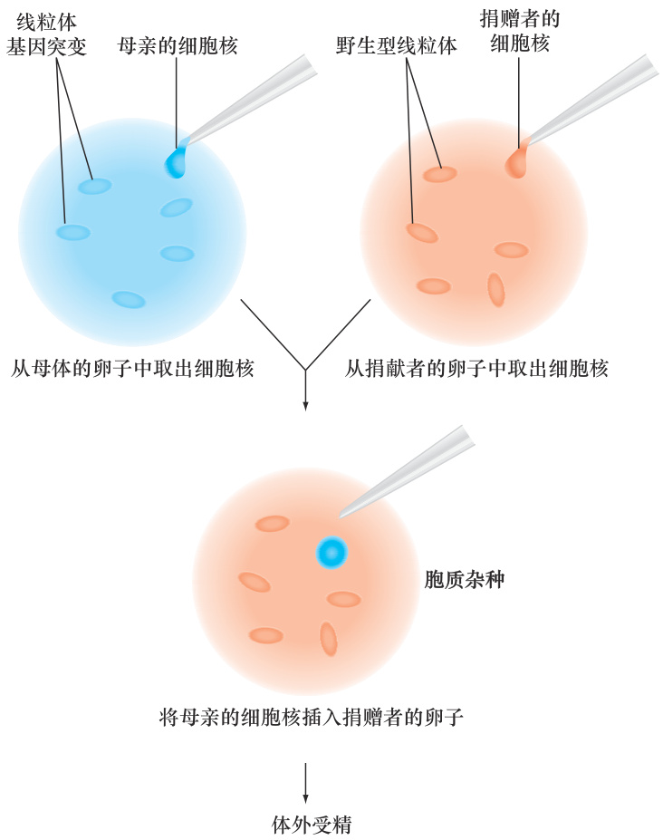  

细胞核和线粒体的来源并不相同，被称为胞质杂种。  

体外受精后，受精卵可以植入子宫。由此产生的孩子将拥有他或她父母的核基因，以及卵子捐赠者的正常mtDNA。这个过程的一个至关重要的方面，是母亲的细胞核需要进行无线粒体干扰的清洁转移，否则产生的受精卵将是异质的。  

2009年，一组研究人员将恒河猴卵子的细胞核移植到去核供体卵子中，并在体外与恒河猴精子受精。受精卵被植入代孕母亲的子宫。显然，正常的异卵双胞胎出生了，它们是Mito和Tracker（图15.19），分子分析显示他们只有来自细胞质供体的mtDNA。  

猴子实验的成功，促使英国政府在2015年批准了人类线粒体基因治疗的临床试验。截至2016年撰写本文时，美国政府仍在争论这项新技术的伦理问题。  

# 基本概念  

●  人类mtDNA突变引起的疾病被确认为母系遗传的模式。  
●  线粒体疾病等位基因的异质性，使得表型表现出差异，甚至在一个患病母亲的孩子之间，也会有差异。  
●  随着时间的推移，体细胞mtDNA突变的积累可能在衰老过程中发挥作用。  
●  将含有突变mtDNA卵子的卵母细胞核，移植到带有正常mtDNA的去核供体卵子中，可能有助于人们避免线粒体疾病的传递。  

# 接下来的内容  

这一章开头的照片展示了泰坦魔芋（Amorphophallustitanum）罕见的绽放，它拥有世界上最大的无分枝花序（花簇）。通常情况下，植株每隔10年开花，花期只持续2天左右。泰坦魔芋以恶臭闻名，由于具有腐肉特有  

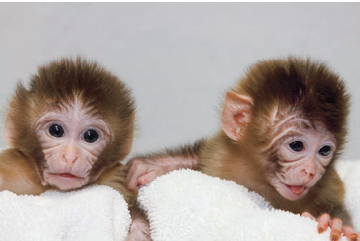  
图15.19　Mito和Tracker：灵长类卵母细胞核转移成功案例。这两只恒河猴是卵母细胞核转移和体外受精的产物。它们的细胞含有来自父亲和卵母细胞核供体的核DNA，而它们的mtDNA仅来自于细胞质供体的去核卵母细胞。  

的气味，俗称尸草。  

在泰坦魔芋花期的几天里，线粒体活动的周期性爆发增加了花期内的温度，因此花的某些部分周期性地变得比正常人体温度高。线粒体活动产生的热量使气味分子挥发，加热和冷却的循环产生对流，使这些分子从植物中飘出。这些气味的释放会吸引传粉者，确保泰坦魔芋能够繁殖。  

即使在泰坦魔芋所有细胞中都存在相同的核基因和线粒体基因，这些基因的使用方式也会对生物产生影响。某些基因在特定细胞中的表达，确保各种细胞发育成植物不同的结构，如根或花。基因的表达也可以随着时间的不同而不同，引起类似泰坦魔芋开花时周期性加热和冷却的现象。  

在接下来的两章中，我们将探索生物体控制其基因表达的分子机制——基因调控的过程。在第16章，我们将讨论细菌中基因调控的机制。然后，在第17章，我们将探讨真核生物中的核基因调控。我们将看到，基因调控不仅控制着所有细胞的代谢活动，而且还控制着多细胞生物细胞的分化。  

# 习题精解  

Ⅰ.  20世纪70年代初，Igor Dawid和Antonie Blackler进行了经典实验，首次直接揭示了脊椎动物mtDNA的母系遗传。他们的研究使用了两种亲缘关系密切的蛙类——非洲爪蟾（Xenopus laevis）和北爪蟾（Xeno-pus borealis）之间的杂交，这两种蛙类的mtDNA有许多核苷酸变异。他们当时使用的技术不够灵敏，无法检测到少量的父系DNA。如今可用的对少量DNA高度敏感的技术是什么？如何使用这些技术来确定父系线粒体DNA是否存在于物种杂交的后代中？  

# 解答  

聚合酶链反应（PCR）是一种检测少量DNA的敏感技术。两种不同物种中，每个线粒体DNA的特异性寡核苷酸引物，可以用来确定父系DNA是否存在于物种间杂交的后代中。例如，你可以从几个蝌蚪身上提取DNA，这些蝌蚪是由X. laevis雌性和X.borealis雄性杂交得到的，然后用PCR检测。如果这是纯的母系遗传，那么就只能得到X. laevis特异的PCR产物。作为对照，你可以检测X. laevis雄性和X.borealis雌性杂交产生的蝌蚪，在这里你只会看到X.borealis特异的PCR产物。  

另一种方法是高通量DNA测序。如果你从蝌蚪中纯化总DNA，然后测序随机片段，你不仅可以确定核基因组的序列，还可以确定线粒体基因组的序列。如果你进行足够多的测序反应，你就能检测到后代中是否存在少量的父系mtDNA。  

Ⅱ. a. 下列系谱是否为线粒体遗传？为什么？  

b. 是否有其他的遗传模式与这些数据一致？  

c.  你如何区分线粒体遗传和与数据一致的其他可能模式？  

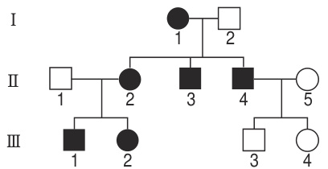  

# 解答  

a.  本系谱中的数据与线粒体遗传一致，因为该性状是由女性遗传的；这个家庭中受感染的男性没有传递这种特性，且所有的女性后代都有这种特性。b.  这种遗传模式也与常染色体显性性状的遗传一致。根据这个假说，个体Ⅰ-1和Ⅱ-2将显性等位基因传给了所有的孩子，但是Ⅱ-4没有将显性等位基因传给任何一个孩子。c.  受影响个体表现出的症状提供了一条线索。如果这种疾病是线粒体疾病，你可能会看到与LHON或MERRF等已知患有线粒体疾病的患者相似的症状。然而，这些证据并不是决定性的，因为一些影响线粒体的疾病是由核基因突变引起的。你最终需要检查受影响个体的mtDNA，看是否存在任何可能破坏线粒体基因组结构或基因表达的改变。  

# 习题  

# 词汇  

1. 在右列中选择与左列中的术语最匹配的短语。  

a. 细胞质分离 1.  仅通过母体配子传递基因  
b. 异质的 2.  仅具有一种基因型的 mtDNA 或cpDNA 的细胞  
c. 同质的 3.  具有相似大小的配子  
d. 母系遗传 4.  含有不同 mtDNA 混合物的细胞只产生一种子代细胞  
e. 单亲遗传 5.  野生型表型需要野生型细胞器 DNA的特定部分  
f. 同形配子的 6.  具有不同基因型的 mtDNA 或 cpDNA的细胞  
g. 阈值效应 7.  通过母系或父系配子传递基因，但不能同时通过母系或父系配子传递  

# 15.1节  

2.  假设人类细胞平均含有1000个线粒体，那么从人体组织中分离出来的总DNA中，mtDNA的重量百分比是多少？  

3.  反向翻译是一个术语，用于推导可以编码特定蛋白质的DNA序列。如果你遇到氨基酸序列Trp His IleMet：  

a.  编码这些氨基酸的人类核DNA序列是什么？（包括所有可能的变体）  
b.  编码这些氨基酸的人类线粒体DNA序列是什么？（包括所有可能的变体）  

4.  人类核基因组用32种不同的反密码子编码tRNA（不包括图8.22所示的tRNASec）。线粒体基因组只编码22种不同的tRNA，足以翻译所有的线粒体mRNA。细胞核和线粒体遗传密码的差异（见表15.1）还不足以解释在每种情况下所需tRNA数量的差异。那么这种区别如何解释呢？［提示：参考图8.21（b）中所示的摆动规则。］  

5. 人类线粒体基因组中没有tRNA合成酶基因。a. 线粒体tRNA是如何与氨基酸结合的？b.  根据你给出的题目a的答案，解释AUA如何在线粒体中特异结合Met，而在细胞核中结合Ile。  

6.  你怎么知道你在超市买的大比目鱼是不是真的大比目鱼？为了确定生物样本的来源，科学家们进行PCR扩增，然后对已知在不同物种间存在差异的DNA区域进行测序。对于动物来说，这个DNA区域是线粒体细胞色素氧化酶Ⅰ基因的一个648个碱基对的部分。这个mtDNA区域的序列被称为DNA条形码，因为有一个数据库包含了这个mtDNA区域的序列，该序列在成千上万的动物物种中是独一无二的。  

a.  你觉得为什么线粒体DNA区域被用于动物条形码，而不是细胞核基因组DNA区域？  
b.  一对PCR引物可用于识别任何鱼的品种。解释这是如何实现的。  
c.  列举科学家们在确定哪段线粒体DNA序列用于识别动物时必须考虑的标准。  

# 15.2节  

7. 这些关于叶绿体或线粒体基因组的陈述都成立吗？  

a. 含有tRNA基因b. 编码参与电子传递途径的蛋白质c. 细胞器功能需要的所有基因都存在d. 不同的生物在大小上有很大的差异  

8.  假设你研究的是一种之前从未被分析过的二倍体植物的DNA。你从幼苗中分离纯化了所有的DNA，然后用这些DNA进行高通量测序，涉及数百万随机DNA片段的读取。  

a.  如果一个给定的单拷贝核DNA平均得到100条序列，你会获得多少条mtDNA的序列？多少条cpDNA的序列？（假设每个线粒体有10个基因组，每个叶绿体有20个基因组。假设这种植物的细胞平均含有1000个线粒体和50个叶绿体）b.  除了序列数，还有什么其他的标准可以确定一个特定的序列是核DNA、mtDNA，还是cpDNA？  

9.  下图所示的是一个基因打靶DNA质粒载体，通过基因枪转化将转基因插入叶绿体DNA的例子。质粒DNA可以在大肠杆菌中大量制备，然后用基因枪注射到植物细胞中。用功能匹配重组基因成分（RE1、RE2和RE3是质粒载体特有的不同的限制性内切核酸酶识别位点）。  

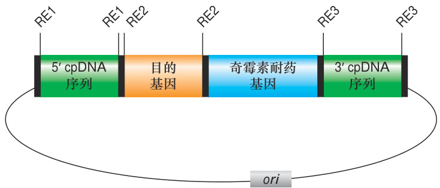  

a.  奇放线菌素耐药基因 1.  调节整合的 DNA  
b. cpDNA 序列 2.  筛选叶绿体转化子的基因  
c. RE2 3.  大肠杆菌中用于质粒复制的序列  
d. 起始位点 4.  靶向叶绿体 DNA 可以插入到载体中的位点  
e. RE1 和 RE3 5.  转基因插入载体的位点  

# 15.3节  

10.  下列哪一种特性使叶绿体和（或）线粒体看起来更像细菌细胞而不是真核细胞？  

a. 翻译对氯霉素和红霉素敏感。  
b. 线粒体基因使用可变密码子。  
c. 内含子存在于细胞器基因中。  
d. 细胞器中的DNA不在核小体中排列。  

11.  酿酒酵母核基因ARG8编码一种酶，催化精氨酸生物合成的关键步骤。这种蛋白质通常在细胞质核糖体上合成，然后被运输到线粒体中行使其功能。1996年，Fox和他的同事们构建了一个酵母菌株，将编码Arg8蛋白的基因导入线粒体，使得线粒体核糖体能合成功能性蛋白。  

a.  这些研究人员如何将ARG8基因从细胞核转移到线粒体中，同时允许活性酶的合成？ 研究人员需要以何种方式改变ARG8基因，使其在线粒体而不是细胞核中发挥作用？  

b.  为什么这些研究人员最初希望将ARG8基因转移到线粒体中呢？  

# 15.4节  

12.  人类线粒体基因组中所谓的高变区（HV1和HV2）有时被用于法医分析。它们是线粒体基因组的两个非编码区域，每个约300 bp，分布在复制起点的两侧；这些DNA序列的功能尚不清楚。然而，mtDNA的这两个区域在不同的人群中表现出最多的变异（SNP和InDel）。HV1和HV2中的DNA以10倍于核基因组DNA序列的速度积累突变。a.  在什么情况下人类mtDNA会比核DNA更好地识别个体？b.  与核DNA相比，使用mtDNA识别个体的缺点是什么？  

13.  假设线粒体基因组产生了一个新的突变。请解释怎样才能使突变表现出自己的表型。  

14.  请描述至少两种方式，在不同物种的后代中，来自父本的线粒体基因组的贡献被阻止。  

15.  为什么严重的线粒体或叶绿体基因突变通常出现在异质细胞中而不是在同质细胞中？  

16.  假设你正在检测一个新发现的植物物种，你希望确定mtDNA的遗传是母系的、父系的还是双亲的。你发现，在群体中存在两种mtDNA变异体，它们可以通过使用特定引物的PCR扩增产物的大小差异来区分。首先，你要对从每一株植物的叶片上提取的DNA进行PCR分析。然后将1号植株的卵子与2号植株的花粉杂交，得到4株幼苗，然后用每株幼苗的DNA进行PCR分析。结果如下所示。  

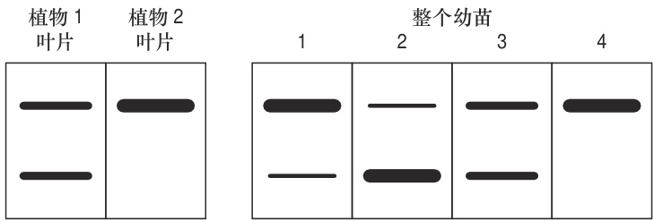  

a.  假设2号植株是同质的，那么这些结果是否排除了该物种mtDNA遗传三种可能模式中的任何一种（母系、父系或双亲）？  
b. 你能利用什么实验来区分剩下的模式？  
c.  你能做什么实验来验证2号植株实际上是同质性的？为什么需要这样的实验来得出该物种mtDNA遗传模式的结论？  
d.  说明4株幼苗中2种mtDNA的不同比例。尽可能具体。  

7.  玉米有一种雄性不育是由母系遗传的。Marcus Rhoades首先描述了这种细胞质雄性不育。通过将雄性不育植株的雌配子与雄性可育植株的花粉杂交，由此产生的子代植株是雄性不育的。a.  绘制杂交图，使用不同的颜色和形状来区分细胞核（线条）和细胞质（环状）基因组，包括雄性不育植株（一种颜色）和雄性可育植株（另一种颜色）。b.  雄性不育子代的雌配子与第一次杂交的相同雄性不育亲本的花粉进行回交。这个过程重复了很多次。绘图表示接下来的两个世代，包括可能的交换事件。c.  这一系列回交的目的是什么？（提示：看看你对目b的回答，思考核基因组发生了什么变化）为什么Rhoades会将这些结果解释为细胞质雄性不育的表现？  

18.  植物育种家很早就认识到杂交优势或杂种优势的现象。在这种现象中，两个自交系之间形成的杂交品种相对于两个亲本植株，具有更高的活力和作物产量。从20世纪30年代开始，种子公司利用习题17中描述的玉米细胞质雄性不育（CMS）现象，以低成本生产杂交玉米种子，卖给农民。这种CMS是由线粒体基因突变引起的，线粒体基因突变阻止了花粉的形成。  

a.  CMS如何帮助种子公司生产杂交玉米种子？一种被称为恢复系的核基因的显性Rf等位基因抑制CMS表型，因此含有突变线粒体基因组的Rf植株是雄性可育的。  
b.  描述一种杂交产生的杂交玉米种子，它将长成能自体受精的植物（种植杂交种子的农民想要可育的植物，因为玉米粒是由受精胚珠产生的）。  
c.  通过CMS生产的杂交玉米商业化面临的历史挑战之一，是维持含有CMS线粒体的植株：如果这些植物本身从不产生花粉，种子公司如何持续生产雄性不育玉米？提出一种策略，可以让种子公司在每个繁殖季节持续获得雄性不育植株。  
d.  使用杂交玉米有什么潜在的缺点吗？如果有，会出现什么问题？  

19.  一种名为cox2-1的酿酒酵母单倍体突变菌株，被发现不能在仅含有甘油作为碳源和能量的的培养基中生长（甘油是酵母不可发酵的底物）。然而，这种菌株可以在可发酵的葡萄糖底物上生长。研究人员发现，cox2-1细胞缺乏一种叫做细胞色素c氧化酶的线粒体蛋白。  

a.  解释为什么cox2-1细胞可以在含有葡萄糖的培养基上生长，而不能在甘油培养基上生长。  

b.  当cox2-1与野生型酵母菌株杂交产生的二倍体细胞能够有丝分裂生长时，人们发现大约一半的二倍体克隆能够在甘油中生长，而另一半则不能。可以在甘油中生长的二倍体克隆被诱导成孢子，它们产生的四个孢子都能在甘油培养基上生长。在所有这些四分体中，两个单倍体的子代交配类型为a，另两个交配类型为α。不能在甘油中生长的二倍体菌株不能产生孢子。对于cox2-1突变的位置，交配的结果说明了什么？  

c.  另一种名为pet111-1的酵母突变株也无法在甘油培养基中生长，但能在葡萄糖培养基上生长。这些突变细胞同样缺乏细胞色素c氧化酶。当pet111-1突变株与另一交配类型的野生型单倍体菌株杂交时，产生的二倍体能够在甘油中生长并产生子囊，无论是否能在甘油中生长，二倍体细胞都表现出 $2:2$ 的分离。根据题目b的答案解释这些结果。  

20.  在20世纪40年代末，法国研究员Boris Ephrussi在酿酒酵母（Saccharomyces cerevisiae）中发现了第一个非孟德尔遗传的例子。他发现了不能呼吸的突变体（即不能进行氧化磷酸化）。当生长在含有糖和葡萄糖作为碳源的培养皿中时，这些突变细胞会形成一个小的菌落（petite）。如果唯一的碳源是不可发酵的，如甘油或乙醇，这些小的细胞根本无法生长。相比之下，野生型（grande）细胞在两种培养皿上都生长良好。  

Ephrussi发现，在所有grande和petite型酵母单倍体菌株之间的杂种中，每个子囊中的四个孢子都是野生型的；也就是说，grande∶petite的比值总是$4:0$ ，显示为单亲遗传。  

a.  以细胞从环境中获得能量的方式（氧化磷酸化和发酵）来解释grande和petite型酵母细胞的表型（即它们在两种介质中生长的能力）。  

b.  图15.13显示酿酒酵母线粒体为双亲遗传。结果表明，grande和petite酵母菌株之间的差异仅仅是mtDNA的一个特性，但在这种情况下，遗传是单亲的。这些看似矛盾的说法如何能同时成立呢？（提示：酿酒酵母细胞不需要mtDNA进行发酵）  

# 15.5节  

21.  人类系谱中的哪些特征揭示了影响性状的突变是来自线粒体？  
22.  在系谱图中，家族第一个出现线粒体疾病MERFF症状的人是Ⅱ-2。  
a.  为什么母亲Ⅰ-1没有受到影响而女儿Ⅱ-2受到影响，列举两种可能的原因？  
b. 你如何区分这两种可能的原因？  

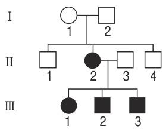  

23.  1988年，澳大利亚的神经学家报道说，有一对同卵双胞胎在他们十几岁时患上了肌阵挛性癫痫。双胞胎中有一个受到这种情况的轻微影响，但另一个后来出现了完全MERRF的症状，包括耳聋、参差不齐的红色纤维和运动失调（失去控制肌肉的能力）。解释这对同卵双胞胎表型不同的原因。  

24.  如果你是一名遗传咨询师，有一个患有MERRF症的患者想要一个孩子，关于孩子仍患此病的概率，你有什么样的建议？有何可以在产前进行的测试来确定胎儿是否会受到MERRF的影响？  

25.  Kearns-Sayre综合征（KSS）、皮尔逊综合征和进行性外视丘麻痹征（PEO）是罕见疾病，其线粒体基因组被删除了 $7.6\mathrm{kb}$ 。KSS影响中枢神经系统、骨骼肌和心脏；患者通常在成年早期死亡。皮尔逊综合征的特点是严重贫血和胰腺功能障碍。这种情况通常在婴儿时期是致命的，但少数幸存者经常发展出KSS的症状。PEO患者眼睑下垂，四肢无力，但寿命正常。  

a.  考虑到这三种情况下的患者都有大段的mtDNA缺失，如何解释受影响组织的变化和症状的严重程度差异？（假设删除片段的大小不影响表型差异）  
b.  假设mtDNA从一个单一的起点开始复制，你能从这些疾病中得出关于复制起点位置的什么结论？  
c.  虽然这些综合征是由于mtDNA缺失引起的，但它们通常不是母系遗传的，而是在个体中以新的突变形式出现。例如，患有PEO的母亲通常不会将这种性状遗传给后代。为这个惊人的发现提供一个解释。  

26.  许多临床相关的线粒体疾病都是由影响tRNA的线粒体基因突变引起的。例如，MELAS（线粒体肌病、脑病、乳酸中毒和中风样发作）的一种形式是由编码线粒体 $t R N A^{L e u}$ 基因的一个点突变引起的，其反密码子识别密码子的5′UUA和5′UUG。突变使这种tRNA的氨基酰化效率降低。  

a.  在MELAS细胞中，大多数线粒体蛋白的合成速度不受影响，或略有下降，但一种名为NAD6的线粒体蛋白的合成速度仅为正常速度的 $10\%$ 。这种单一线粒体蛋白质的翻译怎么会受到特别的影响呢？b. 为什么该蛋白质的翻译减弱引起病理变化？c.  研究人员目前正在研究治疗MELAS患者症状的方法。一种策略涉及核基因的改变。研究人员的目标核基因可能是什么？（假设你可以对核基因做任何想要的改变；我们将在第18章描述改变基因组的方法）  

27.  Leigh综合征的特征是心理运动退化，即智力和运动能力的逐渐丧失。患者还患有乳酸性酸中毒，这是一种线粒体呼吸不足的状况，因此他们的组织以厌氧方式代谢葡萄糖，导致乳酸的积累。一些Leigh综合征患者线粒体基因MT-CO3发生突变，MT-CO3编码电子传递复合体细胞色素c氧化酶的亚基。其他被诊断为Leigh综合征的患者在核基因SURF1中存在功能缺失突变，该基因编码同一个酶复合体组装所需的一个因子。  

a.  线粒体基因突变和核基因突变为何导致相同的症状？  
b.  所示系谱是否提供了足够的证据来区分这个家族的Leigh综合征是源于线粒体基因突变还是核基因突变？（请记住，许多疾病无论源于核DNA突变或mtDNA突变都是不完全的，或表现为可变的表达性）  

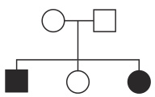  

c.  哪种有效的方法可以帮助该家族的成员区分这两种可能的遗传模式？  

28.  线粒体基因的所有突变最终影响（直接或间接）线粒体的重要功能，即产生ATP。那么，为什么不同基因的突变会导致具有特定症状的不同的疾病呢？（注意：这个问题的答案还不清楚，但是你的推测会帮助你思考这一章的内容）  

29.  研究人员是如何确定恒河猴Mito和Tracker（见图15.19）没有来自核供体母亲的线粒体DNA呢？  