# 第五部分 基因是如何调控的  

# 第 16 章 原核生物中的基因表达调控  

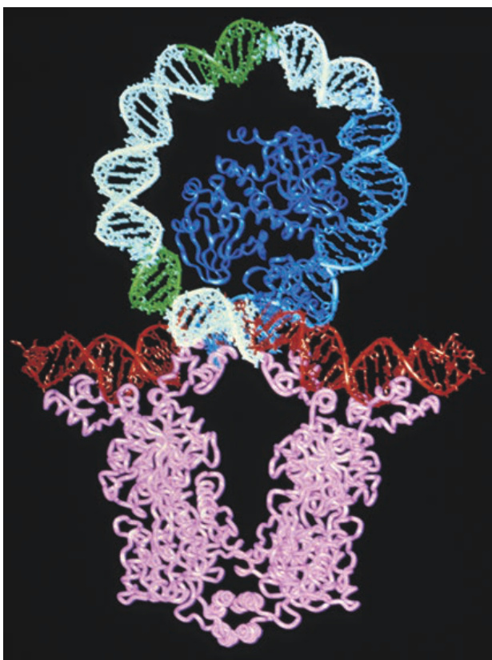  

大肠杆菌中，乳糖阻遏蛋白（紫色）与 DNA 中的特定位点结合阻止乳糖操纵子的表达。阻遏物是一个四聚体，其中两个亚基分别结合到操纵基因的两个位点上，使 DNA 形成一个环（蓝色和绿色）。每个操纵基因位点（红色）存在旋转对称现象，因此形成二聚体的两个亚基以相反的方向存在于染色体上。这个模型还展示了CRP 蛋白（深蓝色）结合 lacDNA 的位点。$\copyright$ SPL/Science Sourc  

# 章 节 大 纲  

16.1 原核基因表达的元件  
16.2 DNA 结合蛋白对转录起始的调控  
16.3 RNA 介导的基因调控机制  
16.4 细菌基因调控机制的发掘和应用  
16.5 综合实例：群体效应对生物发光的调控  

细菌会利用一种称为群体感应的通讯系统，根据群体的密度调整它们的行为。群体感应最早是在费氏弧菌中发现的，这是一种能进行生物发光的细菌，生活在夏威夷短尾乌贼的发光器官中（图16.1）。发光器官会将乌贼伪装起来与月光融为一体来躲避天敌的追捕，否则它们身体的轮廓会清晰地显现在水里。科学家们观察到这种细菌在乌贼的发光器官里达到一定的密度时才能发光。这种行为充分表明：单个细菌不能产生足够的光来照亮乌贼，细菌需利用能量来进行发光。  

费氏弧菌是如何“知道”在乌贼发光器官里它们的种群达到足以产光密度的时间点？研究者们为解开这个神奇的生物学问题，利用强大的细菌遗传学技术解析生物发光路径。在本章中可以看出，费氏弧菌合成并释放调控因子到外界环境中，进而控制编码发光蛋白基因的转录。只有在高密度菌群状态下调控分子，才足以激活发光基因的转录。  

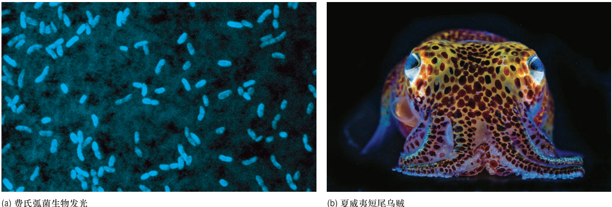  
图16.1　发光细菌保护乌贼躲避捕食者。（a）费氏弧菌产光。（b）这些细菌栖身于夏威夷短尾乌贼的发光器官里。（a）：荧光蛋白标记的费氏弧菌细胞图片，承蒙Vibrio fscheri Genome Project of L. Sycuro and E.G. Ruby提供。单个细胞约为 $0.7\upmu\mathrm{m}\times1.5\upmu\mathrm{m}$ ；（b）：承蒙 $:\!\!\copyright$ Mattias Ormsestad and Eric Roettinger/Kahi Kai提供  

费氏弧菌生物发光的现象阐明了原核单细胞生物生命中两个关键点：第一，这些生物体经常直接与它们生存的外界环境接触；第二，细菌需要通过改变基因表达来应对环境的变化。费氏弧菌基因表达的协调控制是原核生物基因调控的一个具体例子，也是这章的主题。原核生物通过激活、增强、衰减、阻遏某些特定基因的转录和（或）来自于这些基因的mRNA的翻译来调控基因表达。  

从我们的讨论中显现出一个重要的主题：为了在不断变化的环境中适应和生存下去，细菌必须以协调的方式调控许多基因的表达，以便让细胞面临多种不同的生活环境时做出恰当的反应，同时不浪费能量生产无用的蛋白质。  

# 16.1 原核基因表达的元件  

# 学习目标  

1.  了解原核生物转录过程中，RNA聚合酶核心酶、sigma（σ）因子和rho（ρ）因子的功能。2.  解释为什么原核生物中mRNA分子转录和翻译过程可同时进行。3. 列举基因表达过程中可能被调控的步骤。  

在第8章中我们看到，基因表达是依据DNA的编码信息产生RNA和蛋白质的过程。在表达过程中，DNA信息会转录成RNA，RNA信息会被翻译成一连串的氨基酸。转录和翻译为细胞提供了调节RNA和蛋白质合成量的机会，以便生产出细菌需要它们的数量。  

# 16.1.1 RNA聚合酶是转录过程中的关键酶  

原核生物基因表达的起始过程中，RNA聚合酶将一个基因的DNA转录成RNA。RNA聚合酶参与转录的三个阶段：起始、延伸和终止。转录过程的三个阶段中RNA聚合酶行驶的功能细节在之前的图8.10中已经具体体现，我们在这里简短地回顾下重点。  

你应该记得，起始阶段需要RNA聚合酶一个特殊的亚基——sigma（σ）亚基。除此之外，其他亚基组成了核心酶。当与核心酶结合时，σ亚基在启动子区域内识别并结合特定的DNA序列。当结合到启动子上，RNA聚合酶全酶（核心酶加上σ）作为一个复合体，通过解开DNA双螺旋启动转录，同时招募互补碱基配对DNA模板链。  

从起始阶段到延伸阶段的转换需要RNA聚合酶移出启动子区并释放σ因子。延伸过程一直持续到RNA聚合酶在RNA序列中遇到信号触发终止过程。原核生物中存在两种不同形式的终止信号：依赖于Rho的终止信号和不依赖于Rho的终止信号。在Rho-依赖型终止方式中，被称为Rho（ρ）的蛋白质因子是一种解旋酶，会将mRNA从DNA模板上解离出来，并帮助RNA聚合酶脱离DNA模板。在不依赖于Rho型终止方式中，RNA中的一段序列会形成二级结构，即发夹结构，令RNA聚合酶从完整的RNA上释放出来（回顾图8.10）。  

# 16.1.2 原核生物中蛋白质翻译起始阶段早于转录终止过程  

细菌染色体由于没有核膜的包裹，转录过程中，mRNA就开始被翻译成多肽。核糖体结合RNA阅读框5′端特定起始位点（核糖体结合位点）的时候，RNA下游的转录过程还在继续。翻译的起始和终止信号与转录的起始和终止信号是不同的。图8.25显示了核糖体、tRNA及翻译因子如何调控mRNA的翻译过程，即依据mRNA密码子的信息，按照N端到C端的顺序生成多肽链。  

原核生物基因表达另一个特点是核糖体可以在一个mRNA不同的位点开始翻译。许多细菌的mRNA是多顺反子，因此它们含有几个不同蛋白质的可读框。你将会看到，这对基因调控产生了重要影响。  

# 16.1.3 基因表达的调控可发生在多个步骤上  

细菌细胞中，在任何时间，许多层面上的调控都会决定某一条多肽的含量。一些调控会影响转录过程中的某一方面，例如，RNA聚合酶与启动子的结合，从转录起始阶段到延伸阶段的转换，或者转录终止阶段mRNA的释放。另一些调控是转录后调控，这些调控可以决定mRNA合成之后是否能稳定存在，核糖体识别mRNA上的不同翻译起始位点的效率，或者是多肽产物的稳定性。  

正如我们接下来要看到的，调控众多细菌基因的关键一步是RNA聚合酶与DNA启动子区的结合。在本章稍后的部分，我们将讨论转录终止和转录后机制如何在许多细菌基因表达调控中起到重要作用。  

# 基本概念  

●  RNA聚合酶是原核生物转录过程中的关键酶。Sigma（σ）因子引导酶识别启动子区，而Rho（ρ）蛋白终止某些基因的转录。  
●  细菌染色体无膜包裹，因此转录的过程中会发生mRNA开始翻译成多肽的现象。  
●  许多细菌的mRNA是多顺反子；在转录物中每一个可读框都拥有自己的核糖体结合位点。  
●  原核基因表达调控可发生在许多层面上：转录的起始、延伸，或者终止；mRNA的稳定性；翻译的起始；蛋白质的稳定性或者活性状态。  

# 16.2 DNA结合蛋白对转录起始的调控  

# 学习目标  

1. 比较分解代谢途径和合成代谢途径中的调控因子。  
2. 以乳糖操纵子为例概括操纵子学说。  
3.  从遗传学角度论述lacI编码一个变构体的阻遏蛋白结合操纵基因的DNA。  
4.  解析多体及成簇的结合位点有利于转录调节蛋白的原因。  

5. 比较启动子区正负调控蛋白的作用。  

6.  解析阻遏蛋白如何在分解代谢和合成代谢操纵子的调控中起到重要作用。  

转录的起始是基因表达的第一步，因此调节蛋白与靶基因启动子区或其附近结合调控转录的模式成为多数基因表达调控的基本模型之一是有道理的。这些结合DNA的调控蛋白可以抑制或提高RNA聚合酶在转录起始阶段的效率。  

在我们的讨论中，我们认为对RNA聚合酶活性的抑制属于负调控，反之为正调控。  

# 16.2.1 分解代谢和合成代谢途径需要不同类型的调控因子  

研究人员通过对大肠杆菌多种代谢途径进行研究，第一次描绘出基因调控的基本原则。这些途径中许多都是分解代谢途径，将复杂的分子降解后供细胞利用；举个分解代谢途径的例子，糖降解为能量和碳原子供细胞利用。细胞内另外一些途径为合成代谢途径，合成细胞所需的分子产物，如单纯的小分子成分合成氨基酸和核苷酸。  

分解代谢和合成代谢途径遵循的调控法则是完全不同的。分解代谢途径遵循诱导调节，这意味着，只有当存在于细胞环境中的复杂分子需要被分解时（分解产物），也就是被诱导物诱导，通路才会被开启。例如，当细胞不能利用某一种糖类的时候，细胞会消耗资源，合成可以降解这种糖类的酶。相反的，合成代谢途径遵循阻遏调节，也就是说，只有当细胞没有足量的必需最终产物，如一种特定的氨基酸时，通路才会被开启。如果最终产物的数量足够多，那么这个路径会被关闭（被阻遏），因此细胞不会浪费资源去生产已经足够的分子。  

在本节剩下的部分，我们首先将关注点放在大肠杆菌特有的分解代谢途径的可诱导调节上：允许这些细菌利用乳糖作为碳和能量的来源。从这个模型中得到的很多经验也会对我们稍后要讨论的一个特有的合成代谢途径——必需氨基酸色氨酸合成途径很有帮助。  

# 16.2.2 大肠杆菌对乳糖的利用提供了一个基因调控的模型  

增殖的大肠杆菌可以利用几种糖类中的任何一种作为碳和能量的来源。其中一种是乳糖，即由葡萄糖和半乳糖两种单糖组成的复合糖。乳糖透性酶是一种膜蛋白，可将培养基中的乳糖输送到大肠杆菌细胞中。在细胞内， $\upbeta.$ -半乳糖苷酶将乳糖水解成半乳糖和葡萄糖（图16.2）。这就是将乳糖分解为更简单的小分子的分解代谢途径。  

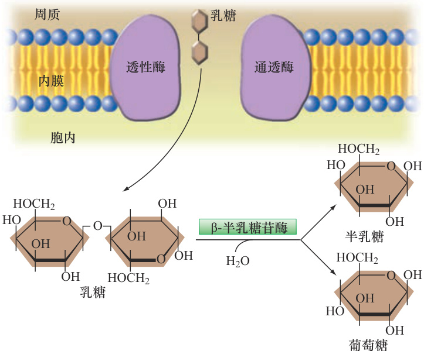  
图16.2　大肠杆菌细胞中乳糖的利用。乳糖透性酶将细胞膜打开一个缺口，乳糖经由此缺口进入膜内。在细胞中， $\upbeta.$ -半乳糖苷酶将乳糖水解成半乳糖和葡萄糖。  

# 1. 乳糖诱导协调基因表达  

细胞在没有乳糖的环境中生长时，水解乳糖所需的透性酶及β-半乳糖苷酶表达量极低。在没有乳糖存在的条件下，细胞不需要这些蛋白质中的任何一种。当乳糖加入了细菌培养基之后，这些蛋白质的表达量会增长1000倍。特定分子刺激指定蛋白质的合成过程称为诱导。负责刺激蛋白质生产的分子称为诱导物。在调控系统的调节下，乳糖会被改造成异乳糖作为诱导物，诱导乳糖利用基因的表达。  

在20世纪50年代和60年代，大部分研究工作的主题是乳糖在培养基中是如何诱导其利用所需的蛋白质同时表达的，这一时期被称为细菌遗传学的黄金时代。  

# 2. 大肠杆菌中乳糖体系的研究优势  

将大肠杆菌对乳糖的利用作为模型来研究基因调控是一个明智的选择。大规模培养细菌的可行性使分离稀有突变体变得简单。一旦分离出突变体，可通过比对技术观察变异的表型。另一个优势是，乳糖利用基因对生存来说不是必需的，因为细菌可以利用其他糖类作为碳源进行生长。另外，正如刚才提到的，在诱导和非诱导细胞中，乳糖利用蛋白含量存在显著的1000倍差异。这个现象令我们很容易观察突变体和野生型状态的差异，并且令突变体的鉴定拥有部分（不仅仅是或者不是）的效果。  

对于许多实验来说，能够测量表达水平是至关重要的。为了达到这个目的，化学家合成了除乳糖以外的化合物，如邻硝基苯-半乳糖苷（ONPG），可通过β-半乳糖苷酶水解成易于测量的产物。ONPG水解后会产生一种黄色的物质，其颜色会随着产物数量的增多而加深，进而反映了 $\upbeta.$ -半乳糖苷酶的活性水平。分光光度计可以很容易地测量样本中黄色产物的数量。另一个会因β-半乳糖苷酶水解变色的底物是X-gal，水解产物是一种蓝色物质。正如本章后续将要描述的那样，研究人员发现在培养皿中加入X-gal是非常有意义的，因为如果在培养皿中生长的菌落变成了蓝色，就说明这些细胞正在表达β-半乳糖苷酶（图16.3）。  

# 16.2.3 操纵子学说解释了一个诱导物是如何调控几个基因簇的  

一个拥有广泛兴趣的科学家——Jacques Monod（图16.4）是研究调控乳糖利用的推动者。他是一名政治活动家，并且是第二次世界大战期间法国抵抗运动的领袖，同时他也是一位优秀的音乐家和受人尊敬的科学哲学作家。在巴黎巴斯德研究所，Monod牵头组织了一项研究工作，来自世界各地的科学家集聚于此研究酶诱导。Monod和他亲密的合作伙伴Francois Jacob根据众多遗传学研究结果提出了一个基因调控的模型，被称为操纵子学说，也就是一个单一的信号可以同时调控一条染色体上参与同一途径的相邻几个基因的表达。他们推断，由于这些基因形成了一个簇，它们可以被转录成一条mRNA，因此任何调控这个mRNA转录的物质都将会影响簇里所有的基因。以这种形式被调控的基因簇被称为操纵子。我们首先对这个理论进行概述，然后描述受Jacob和Monod思想影响的关键实验。  

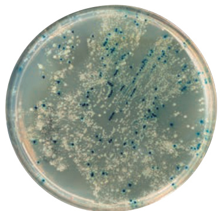  
图16.3　含有X-gal培养基中大肠杆菌菌落。表达β-半乳糖苷酶的菌落呈蓝色；不表达的为白色。$\copyright$ anyaivanova/Getty Images RF  

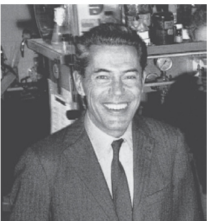  
图16.4　Jacques Monod在探索基因表达调控的研究中起到重要作用。$\copyright$ Bettmann/UPI/Corbis  

图16.5展示了该理论中的分子调控者以及它们之间如何互作，实现对乳糖利用基因的协同调控。如图所示，编码利用乳糖的蛋白质的三个结构基因（lacZ、lacY和lacA）与两个调控元件［启动子（ $P$ ）和操纵基因（ $o$ ）］组成了乳糖操纵子：应对环境变化时可同时调控该DNA单元上的三个结构基因。与操纵子互作的分子包括上阻遏物（与操纵子的操纵基因结合）、诱导物（异乳糖）（当它与阻遏物结合时，会阻止阻遏物与操纵基因的结合）。阻遏物是一种变构蛋白，当与其他分子结合时，这种蛋白质会发生可逆的构象改变（在这里是诱导物异乳糖）。  

Jacob和Monod的理论是令人瞩目的，因为作者们是凭借细菌细胞里抽象的分子概念进行研究的：8年前沃森和克里克才创建了DNA结构模型，mRNA的概念  

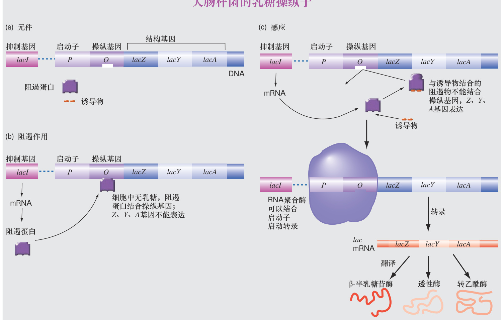  
特色插图16.5  

# a. 功能元件  

多种元件的协作促使细菌以节能的途径利用乳糖。这些元件包括：  

（1） 三个邻接的结构基因（lacZ、lacY和lacA）编码水解乳糖为葡萄糖和半乳糖的酶。  
（2） 启动子位点（P），RNA聚合酶启动多顺子mRNA转录的起始位点。启动子作用于顺反子，影响到同一DNA分子上lac下游结构基因的表达。  
（3） 顺式作用因子操纵基因位点（O），位于同一条DNA分子上紧邻乳糖操纵子启动子的位置。  
（4） 反式作用阻遏蛋白，与操纵基因结合。由lacI基因编码，独立存在于操纵子之外并且不受调控。阻遏物一旦产生，将在细胞质中扩散并与靶基因结合。  
（5） 诱导物，阻止阻遏物与操纵基因结合。早期研究表明乳糖是诱导物，不过现在我们知道乳糖的变构体——异乳糖才是诱导物。  

# 元件如何互作调控乳糖利用基因的表达  

b. 抑制  

在没有乳糖存在的条件下，阻遏蛋白与操纵基因结合，阻止转录。阻遏物为负调控元件。c. 诱导  

（1） 当乳糖存在时，诱导物异乳糖会结合阻遏物。这种结合会改变阻遏物的结构，不能与操纵基因结合。  
（2） 当阻遏物从操纵基因上解离下来时，RNA聚合酶会获得进入乳糖操纵子启动子区域的机会，并将三个结构基因转录成一条多顺反子mRNA。  

仅刚刚被定义，转录过程的具体过程还没有被发现。在1961年，从DNA到RNA再到蛋白质的中心法则研究还在进行中，细胞中对于蛋白质功能的认识还十分有限。例如，尽管Monod是一名生物化学家，专注于变构及其作用的研究，但是阻遏物本身仅仅只是个概念。在发表的时候，阻遏物还没有被分离出来，也不知道它是RNA、蛋白质或是其他分子。因此，Jacob和Monod发挥了他们巨大的想象力提出了操纵子学说。  

现在我们明白了这个理论的一个关键性的概念蛋白质与DNA结合来调节基因表达，乳糖操纵子同时体现了正、负调控两方面。除乳糖操纵子外，蛋白质与DNA结合也是调控许多原核基因的主要方式，包括一些分解代谢基因的可诱导调节和合成代谢基因的抑制调节，并且真核生物基因调控也存在这种方式。  

# 16.2.4 遗传学分析成为Jacob和Monod创建操纵子假说的基础  

在提出操纵子学说的过程中，Monod和他的同事分离出许多不同的突变体，有的是细胞不能利用乳糖的突变体，还有的不论培养基中是否有乳糖存在，细胞会持续合成水解乳糖的酶。  

# 1. Lac–突变体互补及比对分析  

Lac–突变体为一群无法利用乳糖的细菌。利用互补分析大群lac 突变体发现，细胞无法利用乳糖是因为两个基因的突变：编码β-半乳糖苷酶的lacZ基因和编码Lac透性酶的lacY–基因。他们同时发现lac基因中的第三个基因lacA，它编码一种乙酰基转移酶，可将乙酰基（ $\mathrm{CH}_{3}\mathrm{CO}$ ）转移到乳糖或其他糖类上。基因比对发现，在染色体上三个基因紧邻一起成一簇，顺序为lacZ-lacY-lacA（图16.5）。由于LacA蛋白在乳糖水解过程中不起作用，因此解析乳糖利用机制时lacA基因不作为重点进行研究。  

# 2. 阻遏蛋白存在的依据：lacI 突变体的作用  

lacI–基因紧邻乳糖操纵子（图16.5），该基因功能缺失的突变体是组成型突变体，即在乳糖不存在的条件下依然合成β-半乳糖苷酶和Lac透性酶。在任何环境条件下，组成型突变体会持续合成某种酶。这些组成型突变体的存在表明，lacI编码一种负调节蛋白，或者叫阻遏物。在没有诱导物存在的条件下，细胞需要这种阻遏物来阻止lacY和lacZ的表达。在组成型突变体中，不管怎样，突变的lacI基因都会生成具有缺陷的阻遏蛋白，进而阻止它执行负调控功能。  

历史悠久的PaJaMo实验［以Arthur Pardee（第三个合作者）、Jacob和Monod三人名字命名］进一步提供了证据，证实lacI的确编码了之前假设的负调节蛋白。将Hfr供体细胞的染色体DNA转入到F–受体细胞形成的融合细胞是PaJaMo实验研究的基础。研究人员将lacI和lacZ+等位基因导入到无乳糖培养基培养的细菌细胞中，此类细菌不生产LacI和LacZ蛋白（图16.6）。在转入基因不久后发现细菌开始合成β-半乳糖苷酶，但是不到1h，合成就停止了。  

Pardee、Jacob和Monod就实验结果做出了以下解释：当供体DNA刚刚转入受体中，无阻遏蛋白（LacI蛋白）在受体细胞质中，因为受体细胞的染色体为lacI–。在缺少阻遏物的情况下，lacZ+基因表达。随着时间推移，受体细胞由于融合了lacI 基因，开始生产Lac阻遏蛋白，因此lacZ+表达受到了抑制。  

基于这些实验，Monod及其同伴提出了阻遏蛋白会与假设的操纵基因位点结合阻止lacZ基因的转录，猜想位点是一段靠近乳糖利用基因启动子的DNA序列。他们的研究表明，阻遏蛋白与操纵基因位点的结合会覆盖启动子，并且在培养基中无乳糖存在的情况下才会出现这种结合（见图16.5）。他们进一步推测，尽管一部分lacI 等位基因为无效突变，不产生蛋白质，但是另一些lacI基因突变体依然会产生阻遏蛋白，但是不能与操纵基因相结合（图16.7）。  

# 3. 诱导物如何触发酶合成  

在PaJaMo实验的最后一步中，研究人员将乳糖——诱导物的前体——添加到培养基中。加入后，细菌恢复了β-半乳糖苷酶的合成（见图16.6）。他们对这个结果的解释是，诱导物与野生型阻遏物结合。这种结合改变了阻遏蛋白的形状，使其不再与DNA结合。当诱导物从环境中移除时，阻遏物，无诱导物的结合，就会恢复到可结合DNA的形状（见图16.5）。因此，诱导图16.7　阻遏物突变体（lacI–）。在一些lacI 突变体中，阻遏物不能结合操纵基因位点，因此不能抑制操纵子。另一些lacI –突变体为不能产生蛋白质的无效突变体（没有显示）。  

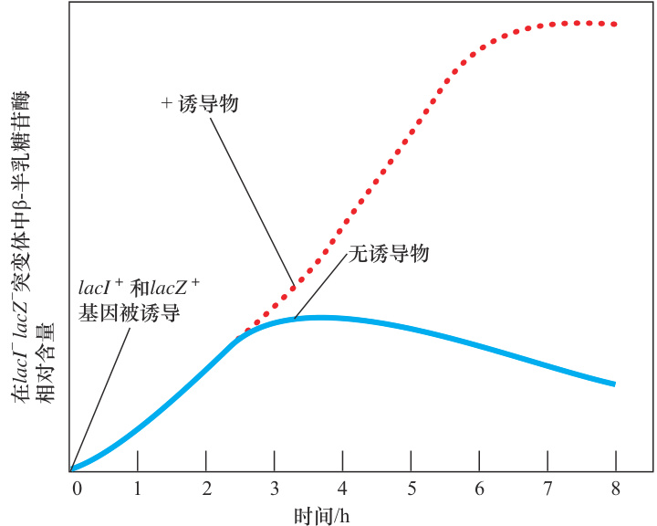  
图16.6　PaJaMo实验。lacI+和lacZ+基因（共轭）的DNA转入到lacI–lacZ –细胞中。在受体细胞中，最初β-半乳糖苷酶由引入的lacZ+合成的，但是随着阻遏物的增加（来自于引入的lacI ）， $\upbeta.$ -半乳糖苷酶会停止合成。如果添加诱导物（虚线），则会重新合成β-半乳糖苷酶。  

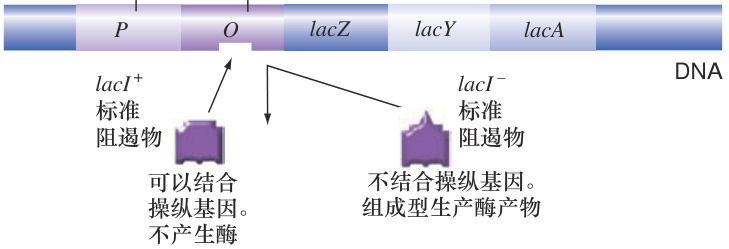  

物与阻遏物的结合产生了一种变构效应，抑制阻遏物结合操纵基因。在这一系列事件中，诱导物作为一种效应物，不通过自身结合DNA的方式来消除阻遏调节。  

# 4. 操纵基因突变体  

调节基因lacI –突变可使阻遏蛋白失活，与阻遏物结合的操纵基因特定核苷酸序列的突变也会产生相同的效果（图16.8）。当操纵基因核苷酸序列发生突变时，阻遏物无法识别并结合该位点，由此产生的表型是乳糖利用蛋白会持续合成。研究人员已分离出此类突变体，这些突变体的突变位点都在乳糖操纵子上，紧邻lacZ基因。他们称操纵基因DNA的突变为oc突变。  

# 5. 超阻遏物（lacIs）突变  

如果诱导者与阻遏蛋白结合阻止了阻遏物与操纵基因的结合，那么如果产生了阻遏阻遏物与诱导物相互作用的突变，你预测会发生什么样的结果呢？很明显，你会认为这样的突变会导致细胞不能启动操纵子，即使是培养基中加入了诱导物。研究人员在阻遏基因中分离出了这种不可诱导的突变，并称为lacI （图16.9）。lacI突变体虽然不能结合诱导物，但仍然可以与DNA结合并抑制操纵子的转录。这种抑制状态与乳糖或异乳糖是否存在无关。  

# 6. 蛋白质为反式作用因子，DNA位点为顺式作用因子  

细菌中乳糖操纵子突变及lacI基因突变表型在表16.1中列出。这个表所示的重要发现之一是，具有两种类型的突变，即诱导物不存在的情况下，乳糖操纵子依然表达，分别是组成型操纵基因（ $o^{c}$ ）突变体（基因型4，$(o^{c},$ )  

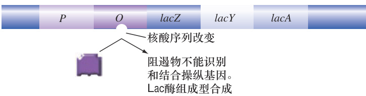  
  
图16.8　操纵基因突变体。在lac $o^{c}$ 突变体中阻遏物不能识别改变的DNA序列，因此阻遏物不能结合操纵基因，抑制操纵子的转录。  

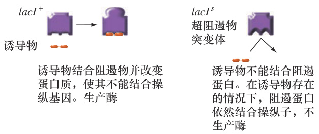  
图16.9　超阻遏物突变体lacIs。在超阻遏物突变体中，lacIs结合操纵基因但是不能结合诱导物，因此阻遏物不能从操纵基因上移除，基因表达会被一直抑制。  

表16.1）和组成型lacI 突变体（基因型2，表16.1）。考虑到两者都能抑制阻遏物功能，你怎么区分这些突变呢？答案是利用顺反实验来区分。  

表16.1　乳糖操纵子表型的总结   

<html><body><table><tr><td rowspan="2">基因型</td><td colspan="2">lacZ 激活状态</td><td colspan="2">lacY 激活状态</td><td rowspan="2">结论</td></tr><tr><td>无诱 导物</td><td>有诱 导物</td><td>无诱 导物</td><td>有诱 导物</td></tr><tr><td>(1)I*o*Z+y+</td><td></td><td></td><td></td><td></td><td>乳糖操纵子为可诱 导型</td></tr><tr><td>(2) I-o*Z+y+</td><td></td><td></td><td></td><td></td><td>I编码阻遏蛋白</td></tr><tr><td>(3) Io*Z+y+</td><td></td><td></td><td></td><td></td><td>I"编码超阻遏物</td></tr><tr><td>(4) IoZ*y+</td><td></td><td></td><td></td><td></td><td>o*为结合阻遏物的 DNA位点</td></tr><tr><td>(5) Io*Z*Y-/ F'(I*o*Z-Y+)</td><td></td><td></td><td></td><td></td><td>r相对于「为显性， 阻遏物为反式作 用因子</td></tr><tr><td>(6) I*o*Z+Y-/ F'(I"o*Z-Y+)</td><td></td><td></td><td></td><td></td><td>I"相对于r为显性， 超阻遏物为反式 作用因子</td></tr><tr><td>(7) I*0Z+Y-) F'(I*o*Z-Y+)</td><td></td><td></td><td></td><td></td><td>o*和o为顺式作用 因子</td></tr></table></body></html>  

反式作用因子在细胞质中扩散，并在细胞内任意DNA分子的目标位点上发挥作用。顺式作用因子只能影响同一DNA分子上邻近基因的表达。对携带外源lac基因的部分二倍体进行研究，可帮助区分突变是作为顺式作用因子的操纵基因位点的突变（ $o^{c}$ ），还是可编码反式作用因子蛋白的lacI基因的突变。  

部分二倍体是由具有几个细菌染色体基因的F′质粒构建的。当F′质粒进入细菌时，细胞会拥有两套乳糖利用基因和lacI基因，一套在质粒上，一套在细菌染色体上。利用F′（lac）质粒，Monod团队制备了各种突变菌株，如调节基因突变菌株（ $o^{c}$ 和lacI）和结构基因突变菌株（lacZ和lacY）。这些部分二倍体细胞的表型可使Monod及其同事判断这些特别的组成型突变是编码反式作用因子的基因突变，还是顺式作用因子的位点突变。  

表16.1中基因型（5） $\sim$ （7）概述了部分二倍体实验的结果。  

反式作用因子基因lacI+对lacI 呈显性　在我们的实验中，Monod和他的同事构建了lacI− lacZ+lacY−菌株，由于其不合成阻遏物，此菌株会持续合成 $\upbeta$ -半乳糖苷酶（图16.10，表16.1基因型5）。当F′质粒（lacI lacZ$l a c Y^{+}$ ）入侵到此菌株中，会制造β-半乳糖苷酶和透性酶为野生型表型的部分二倍体：lacZ+和lacY+的表达会在乳糖缺失的时候被抑制，在乳糖存在的时候被诱导。部分二倍体的野生型表型显示了lacI 对lacI 呈显性。此外，lacY+（与lacI+来自于质粒上）和 $l a c Z^{+}$ （来自于细菌染色体）的诱导表达意味着，来自于质粒lacI 基因编码的LacI蛋白不仅可以结合自身染色体上的操纵基因，也可结合细菌染色体上的操纵基因。因此，lacI基因编码的产物是一种反式作用蛋白，游离存在于细胞中，可结合它遇到的任何操纵基因，不论是来自于哪里的操纵基因。  

反式作用因子基因lacIs对lacI +呈显性　在第二个实验中，细菌同时存在阻遏调节和可诱导调节，当lacIs质粒导入到lacI 菌株，细菌的阻遏调节依然存在，但失去了可诱导调节（图16.11，表16.1基因型6）。这种现象发生的原因是，LacI阻遏蛋白的突变，虽然能够与操纵基因结合，却不能结合诱导物。编码非诱导超阻遏物的等位基因对编码野生型阻遏物的等位基因是显性的，因为一段时间后，阻遏物突变体不能结合诱导物，所有操纵基因位点被阻遏物结合，阻止了所有lac基因的转录。  

$\pmb{o}^{c}$ 和 $\pmb{o}^{+}$ 为顺式作用因子　在第三组实验中，研究人员利用了lacI+oc lacZ+lacY−细菌，这种细菌会持续合成 $\upbeta.$ -半乳糖苷酶，因为阻遏物不能结合在突变的操纵基因上（图16.12，表16.1基因型7）。 $\mathrm{F^{\prime}}$ （ $\mathit{l a c I}^{+}o^{+}\mathit{l a c Z}^{-}$ lacY ）质粒导入到该细菌中不会改变这种状态，细胞图16.10　LacI+蛋白为反式作用因子。来自于质粒lacI +生产的阻遏蛋白可游离存在于细胞质中，并可结合质粒和细菌染色体上的操作基因（表16.1基因型5）。F′质粒（lacI lacZ$l a c Y^{+}$ ）在 $l a c I^{-}\:l a c Z^{+}l a c Y^{-}$ 菌株中。  

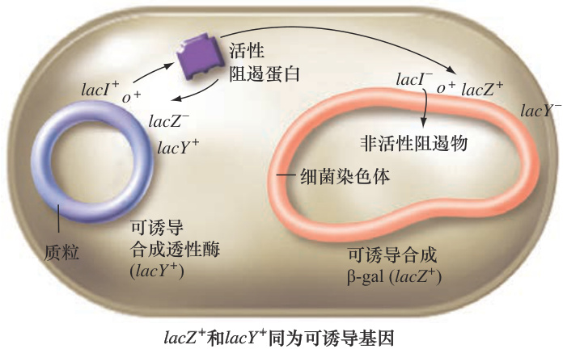  
F′ $(l a c I^{+}\,o^{+}\,l a c Z^{-}\,l a c Y^{+})$ lacI– $o^{+}l a c Z^{+}$ lacY –  

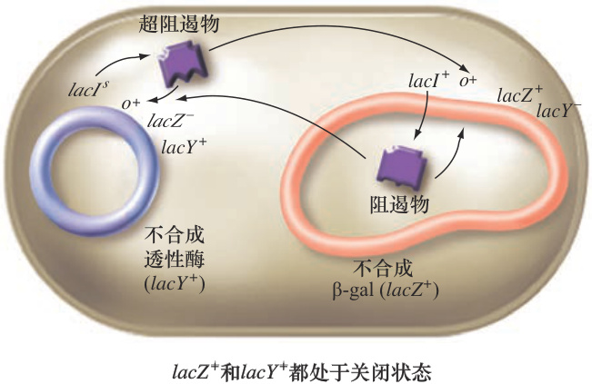  
F′  (lacIs o+ lacZ – lacY +)  lacI– $o^{+}l a c Z^{+}$ lacY –   
图16.11　LacI 蛋白为反式作用因子。来自于质粒lacI 生产的超阻遏蛋白可游离存在于细胞质中，在诱导物存在的条件下依然可结合质粒和细菌染色体上的操纵基因抑制乳糖操纵子（表16.1基因型6）。F′质粒（ $l a c I^{s}\,l a c Z^{-}\,l a c Y^{+}$ ）在lacI+o+lacZ+lacY−菌株中。  

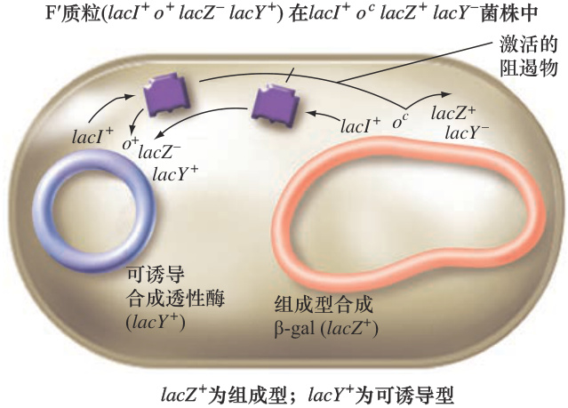  
图16.12 $o^{c}$ 和 $|o^{+}$ 为顺式作用因子。 $o^{\prime}$ 组成型突变和 $|o^{+}$ 野生型操纵基因只影响它们自身存在的操纵子的表达。在这种细胞中，只有细菌染色体上的操纵子基因会持续被转录（表16.1基因型7）。F′质粒（ $.l a c I^{+}o^{+}l a c Z^{-}\:l a c Y^{+}$ ）在lacI+oclacZ+lacY −菌株中。  

会依然持续合成β-半乳糖苷酶，尽管透性酶的合成变成了可诱导型。这个现象的解释是 $\cdot o^{+}$ 操纵基因在质粒上，不影响 $l a c Z^{+}$ 基因的转录，因为操纵基因DNA只是顺式调控元件。它只影响lacZ 和lacY 基因的表达，质粒上的野生型操纵基因不能覆盖细菌染色体上突变的操纵基因，阻止其持续表达。相反的，由于 $\cdot o^{c}$ 也是顺式作用因子， $o^{c}$ 突变体的操纵基因不能影响质粒lacY 基因的表达，因此透性酶的合成变成了可诱导的。  

从这些实验中总结出一条规律：如果一个基因可编码一种能游离存在的成分（通常是蛋白质），能与细胞中任何DNA分子的靶位点结合，细胞中基因的显性等位基因的表型会覆盖这个基因其他的等位基因的表型（因此显性等位基因是反式作用因子）。如果顺式作用元件发生了突变，它只会影响同一DNA分子上邻近基因的表达；这种突变通常改变DNA位点序列，如蛋白质结合位点序列，而不是改变编码蛋白质的基因序列。  

# 16.2.5 生化实验支持操纵子学说  

随着20世纪70年代克隆技术、DNA测序技术、DNA-蛋白质互作分析技术的发展，研究人员在特定大分子的分离、分子结构的解析、分子间互作分析方面的研究能力大幅提高。这些研究证实了Jacob-Monod操纵子学说的基本原理，补充了乳糖操纵子分子结构的细节部分，并揭示了这些理论如何应用于转录起始阶段许多其他基因调控的例子。  

# 1. 一条多顺反子mRNA上lacZYA基因协同表达  

你会记得，Monod和他的同事发现lacZ、lacY和lacA基因无论被抑制或诱导都是同时进行的。为了解释结构基因协同表达的现象，他们猜想这三个基因被转录在同一条mRNA上，如图16.5所示。表16.1中所示的结果与这个想法非常吻合，尽管这些结果本身并不能证明这三个编码序列在同一转录物上。  

生化研究最终证明，RNA聚合酶确实从单一的启动子处启动了lac基因簇的转录。转录过程中，聚合酶生产出一条多顺反子mRNA，包含了5′-lacZ-lacY-lacA-3′顺序的基因簇信息。因此，启动子区的突变（必须位于lacZ的上游）影响所有三个基因的转录。你应该记住，在细菌细胞中，每一个基因都要被翻译成多顺子mRNA，每个可读框必须有它自己的独立核糖体结合位点。  

将具有相似功能的基因成簇组成操纵子是实现协同基因表达的一种简单而有效的方法。因此，细菌基因组中许多操纵子发生了进化一点也不意外。举个例子，大肠杆菌基因组大约有400个经过验证的操纵子，每个操纵子至少有两个基因，大肠杆菌近5000个基因中的很大一部分都被组成了操纵子。  

# 2. 纯化的Lac阻遏物结合操纵基因  

当科学家们可以纯化Lac阻遏物蛋白后，他们证实了阻遏物实际上与操纵基因的DNA结合。研究人员将放射性标记的阻遏蛋白与含有乳糖操纵子的噬菌体DNA混合。当他们利用甘油密度梯度离心法离心混合物时，标记蛋白与DNA一起沉淀［图16.13（a）］。如果病毒DNA上的乳糖操纵子基因含有 $o^{c}$ 突变，那么标记蛋白就不会与DNA共沉淀，因为它不能与突变的操纵基因位点结合［图16.13（b）］。  

# 3. Lac阻遏蛋白的结构域  

纯化的阻遏蛋白是由lacI编码的两个相同的亚基组成的二聚体；在一些情况下，Lac阻遏物的两个二聚体会组成一个四聚体。重要的是，每一个亚基含有三个不同的结构域（图16.14）。其中一个会结合诱导物，第二个会识别并结合操纵基因位点（注意：我们将执行蛋白功能的部分叫做结构域，位点是一段DNA序列，与蛋白质-DNA结合功能域互作）。  

  
图16.13　乳糖阻遏物结合操纵基因DNA。实验中，将Lac阻遏蛋白与一个放射性标签连接，这样可检测蛋白质的位置。（a）来自于lacI 细胞的阻遏蛋白纯化后与含有lac操纵基因的DNA混合（在噬菌体染色体上），蛋白质与DNA共沉淀。（b）来自于野生型细胞的阻遏蛋白与含有突变的操纵基因的DNA混合式，沉淀物中只能检测到DNA。  

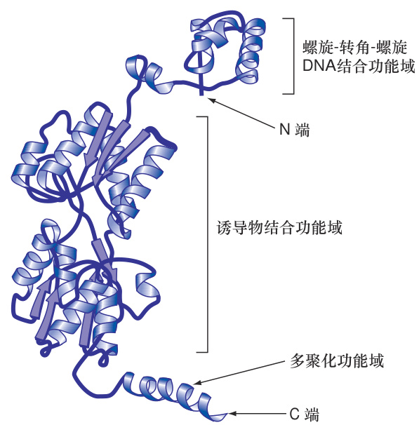  
图16.14　乳糖阻遏蛋白结构域。X射线晶体研究数据建立了阻遏物的亚基结构模型，展示了与操纵基因DNA结合的区域、与诱导物结合的区域。第三个结构域靠近羧基端，可将亚基结构聚合成二聚体和四聚体。  

当研究者们探索突变影响阻遏物功能的分子机制时，研究的结果完整地描绘了阻遏物亚基的结构。lacI突变基因编码的蛋白质不能结合操纵基因，是由于蛋白质-DNA结合功能域中的氨基酸受到了突变的影响。相反，lacI超阻遏物突变聚集在编码与诱导物结合结构域的密码子中，致使翻译的蛋白质不能与诱导物结合。  

乳糖阻遏物的第三个结构域存在于多肽链的羧基端（图16.14），可与其他乳糖阻遏物第三结构域相互作用，将二聚体阻遏物组合成四聚体阻遏物蛋白。这种多聚化现象的意义将在本节稍后讨论。  

# 4. 螺旋-转角-螺旋蛋白  

X射线晶体学研究表明，Lac阻遏物亚基的DNA结合结构域具有一个典型的三维结构：两个α螺旋转折成一定角度相连接（图16.14）。蛋白质中这种螺旋-转角-螺旋（HTH）超二级结构会完美地嵌入到DNA的深沟上（图16.15）。  

HTH超二级结构存在于数百个DNA结合蛋白中，不仅在细菌中，也在真核细胞中。这些蛋白质的结构相似性表明它们是从同一个祖先基因进化而来的，祖先基因经过复制和分化衍生出一个转录阻遏蛋白家族，这个家族蛋白具有相似的DNA结合结构域。然而，含有HTH结构的转录因子中，α螺旋都具有特定的氨基酸来识别DNA中特定的核苷酸序列。因此，不同的HTH-蛋白质可结合唯一的DNA序列。在细菌中，这意味着不同的含HTH结构的转录因子与不同的操纵基因结合，进而调节不同的基因和操纵子。  

# 5. 操纵基因序列的特性  

在20世纪70年代，研究基因调控的遗传学家开发了新的体外研究技术来确定调节蛋白与DNA结合的位置。与DNA片段结合的纯化蛋白保护了结合的DNA区域免于酶切，类似的酶如DNaseⅠ，破坏核苷酸间的磷酸二酯键。如果在一个结合纯化蛋白的DNA样本中，将一条链的末端进行标记后利用DNaseⅠ酶进行部分消化，消化酶将任意切割DNA分子上的磷酸二酯键，除了那些受结合蛋白保护的区域中的磷酸二酯键。DNA的凝胶电泳和放射自显影（将凝胶曝光于放射性感光胶片中）显示除了结合蛋白保护DNA的区域外，其他酶切条带的位置都是相同的。将凝胶没有带的部分通过足迹检测，发现DNA片段的核苷酸受到了结合蛋白的保护（图16.16）。  

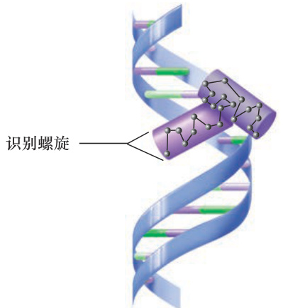  
图16.15　螺旋-转角-螺旋超二级结构识别特定DNA序列。含有螺旋-转角-螺旋超二级结构的蛋白质会嵌合到DNA的深沟中。蛋白质螺旋区域中特定的氨基酸会识别DNA上特定的碱基序列。  

操纵基因和启动子区域的重叠　DNA足迹法实验显示乳糖操纵子操纵基因的一些核苷酸同时也是操纵子启动子（RNA聚合酶最初结合位点）的一部分（图16.17）。实际上，当启动操纵子时，操纵基因上的一些核苷酸会被转录成mRNA。这些现象表明如果操纵基因位点被阻遏物侵占（野生型细胞在无乳糖的情况下的正常现象），RNA聚合酶不能识别并结合启动子。这些发现解释了为何阻遏物与操纵基因的结合会阻止乳糖操纵子基因的表达。  

操纵基因旋转对称现象　利用Lac阻遏蛋白的DNA足迹法，发现乳糖操纵基因序列显示出旋转对称性。也就是说，沿着 $5^{\prime}{\rightarrow}3^{\prime}$ 端顺序，操纵基因的两条DNA链具有几乎相同的序列，如图16.17所示，操纵基因的回文序列用紫色标出。  

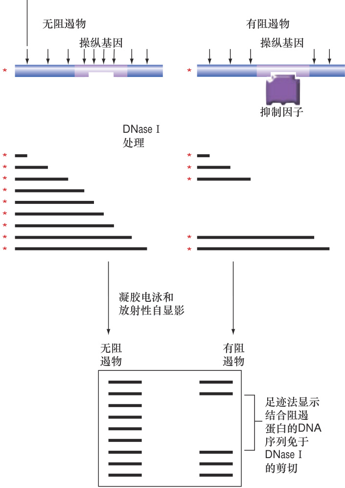  
图16.16　DNase足迹显示蛋白结合DNA的位置。一段DNA末端进行放射性标记（红色星号）。DNaseⅠ部分消化后产生一系列DNA片段。酶不能消化与蛋白结合的DNA序列。消化后的DNA凝胶电泳显示哪个片段没有产生，意味着这段DNA与蛋白质结合。  

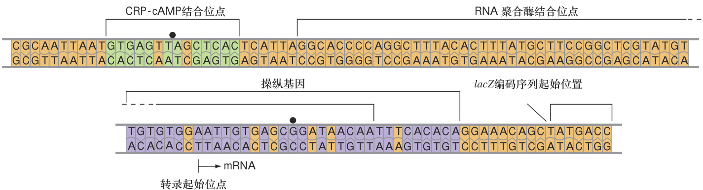  
图16.17　调节蛋白结合位点部分重叠。Lac阻遏物结合操纵基因阻止RNA聚合酶结合启动子。RNA聚合酶和阻遏物的结合位点（DNase消化实验确定位点）显示操纵基因和启动子存在部分重叠现象。注意操纵基因（紫色）核苷酸序列具有旋转对称性，以及以黑圆圈为中心的CRP-cAMP（绿色）结合位点。  

当你考虑到Lac阻遏蛋白是二聚体时，这种旋转对称现象就变合理了。二聚体的一个亚基与碱基紧密结合，占据了操纵基因的一条链。另一个亚基会转向相反的方向，并与另一半旋转对称的操纵基因序列结合。  

旋转对称似乎并不仅仅存在于乳糖操纵基因上，许多与其他类型转录因子结合的DNA序列也存在这种现象。这种对称性说明了许多转录因子是由相同或相似的亚基组装而成的。  

# 6. 结合的协同效应  

如前所述，Lac阻遏蛋白的两个二聚体可以组成一个四聚体。用四聚体Lac阻遏蛋白及包括启动子上游区域更大范围的乳糖操纵子DNA序列进行的DNA足迹实验证明，Lac阻遏蛋白实际上可与操纵子附近的三个位点结合。其中一个位点称为 ${\bf\nabla}_{0}{\bf\rho}_{1}$ （o代表操纵基因；最初由 $o^{c}$ 突变识别位点，如图16.17所示）；另外两个位点为$\mathbf{0}_{2}\vec{\boldsymbol{\mathfrak{F}}}\lbrack\mathbf{l}_{0_{3}}$ （图中未显示）。  

位点 $.\mathbf{O}_{1}$ 对阻遏物具有最强的结合力，组成四聚体的其中一个二聚体总是与该位点的旋转对称序列结合。另一个二聚体结合 $\mathbf{\nabla}\mathbf{O}_{2}$ 或者 $\mathbf{\sigma}_{0_{3}}$ 位点（图16.18）。 ${\bf0}_{2}$ 或者 ${\bf0}_{3}$ 位点的突变对阻遏作用的影响非常小。相比之下， ${\bf0}_{2}$ 和 $0_{3}$ 位点同时突变可使阻遏作用效果降低50倍。为了最大效果地发挥阻遏作用，两个二聚体（四聚体阻遏物的四个亚基）必须同时结合在DNA上。  

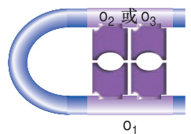  

图16.18　Lac阻遏物四聚体的两个结合位点。Lac阻遏物为同一种亚基组成的四聚体。其中的两个亚基以二聚体的形式结合在一个操纵基因位点上 $\mathbf{\Pi}_{\cdot}\mathbf{o}_{1}$ ），另外两个亚基结合在第二个位点上（ ${\bf0}_{2}$ 或者 $\mathbf{\sigma}_{0_{3}}$ ）。  

${\bf0}_{1}$ 位点距离 $\mathbf{\widetilde{o}}_{2}$ 位点约400个碱基，距离 $0_{3}$ 位点100个碱基。四聚体阻遏物同时结合 ${\bf O}_{1}$ 位点和 $\mathbf{\sigma}_{0},$ 或者 $\textbf{O}_{3}$ 位点时，这些距离足够令操纵基因两个位点形成一个DNA环状结构（图16.18）。与识别的四个序列的结合（每个操纵基因位点有两段序列）会增加DNA-蛋白质互作的稳定性，进而稳定维持DNA环状结构。实际上，与DNA结合的Lac阻遏物是非常有效的，在无乳糖的存在下，每个细胞中10个阻遏物四聚体足以抑制乳糖操纵子转录。  

本章开始所示的图显示了与乳糖操纵子结合的阻遏物四聚体的实际结构；结合处形成的环清晰可见。你应该相当详细地检查这幅图，看看你是否能识别出阻遏物的两个二聚体、阻遏物亚基上多聚结构域的位置、与DNA结合的四个螺旋-转角-螺旋结构域。该图阐明了为何每个操纵基因位点存在旋转对称结构：一个二聚体中的两个DNA结合结构域是反向定位于细菌染色体上的。  

不论原核生物还是真核生物，大多数调节蛋白都使用类似的策略与DNA结合。由于许多DNA结合蛋白都是多体的，每个亚基都具有DNA结合结构域，因此作为多体的转录因子会含有多个DNA结合结构域。如果多体蛋白能够结合的位点聚集在一个基因的调控区内，调控区域和蛋白质之间会建立多种联系。为了增加蛋白质-DNA互作的稳定性，这些结合结构域共同产生维持调控转录所需的结合力。  

# 16.2.6 乳糖操纵子也会受正调控调节  

乳糖是细菌能利用作为能源和碳源的糖类之一。事实上，如果有选择的话，大多数细菌都倾向于葡萄糖。例如，在含有葡萄糖和乳糖的培养基中，生长的大肠杆菌在利用乳糖前会先耗尽葡萄糖。当葡萄糖存在时，即使培养基有乳糖的存在，细菌细胞也不会令Lac蛋白表达。  

为何乳糖在这些条件下不起诱导作用呢？这是因为乳糖操纵子的转录起始是一件复杂的事情。为了解离阻遏物，转录起始需要一个正调控蛋白帮助RNA聚合酶起始转录。没有这个蛋白质，聚合酶不能有效地解开DNA双螺旋链。正如下述，葡萄糖的存在间接地阻止了正调控蛋白的作用。  

# 1. CRP蛋白及对葡萄糖的应答反应  

在细菌细胞内，被称为cAMP（环腺苷酸）的小核苷酸与cAMP受体蛋白结合，简称CRP蛋白。cAMP-CRP复合物可结合在乳糖操纵子邻近启动子的调控区域DNA上（图16.17）。当与DNA结合时，CRP通过与聚合酶的接触帮助招募RNA聚合酶到启动子区上；本质上，CRP与DNA的结合增强了RNA聚合酶启动lac基因转录的能力（图16.19）。CRP作为正调节蛋白提高了RNA聚合酶在lac启动子上起始转录的能力，cAMP是一种效应物，结合在CRP上令其结合在启动子区附近的DNA上并发挥它的调节作用。效应物是一种结合变构蛋白或RNA的小分子，会引起构象变化（诱导物，如异乳糖，是一种类似于cAMP的激活基因表达的效应物；我们很快会研究抑制操纵子基因表达的效应物）。  

cAMP-CRP作为二聚体与DNA结合（图16.19）。正如乳糖操纵子的情况一样，CRP-cAMP复合物结合的DNA序列具有旋转对称性（可观察图16.17回文序列）。CRP结合位点由两条方向相反的识别序列组成，每一条结合CRP二聚体的一个亚基。这个例子再次强调了DNA结合蛋白亚基的多聚性及启动子区附近结合位点聚类的重要性。  

葡萄糖通过降低腺苷酸环化酶的活性间接控制细胞中cAMP的含量，这个酶可将ATP转化为cAMP（图16.20）。因此，当葡萄糖存在时，cAMP的含量很低；当葡萄糖不存在时，cAMP合成增加。其结果是，当培养基中存在葡萄糖时，几乎没有cAMP与CRP结合，因此不能诱导乳糖操纵子的转录，即使培养基中也存在乳糖。葡萄糖阻止乳糖操纵子转录的整体效应被称为分解代谢抑制，因为优先利用的分解代谢产物（葡萄糖）的存在抑制了操纵子的转录。  

# 2. CRP蛋白的全局调控  

除了作为乳糖操纵子的正调节蛋白外，CRP-cAMP复合物还可提高其他几种分解代谢途径中的基因转录，图16.19　乳糖操纵子的正向调节。乳糖操纵子的高表达需要正向调控因子（即CRP-cAMP复合物）与邻近启动子区的位点结合。这个复合物是二聚体，结合位点序列为回文序列。CRP-cAMP复合物招募RNA聚合酶帮助起始转录。  

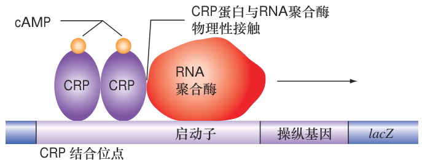  

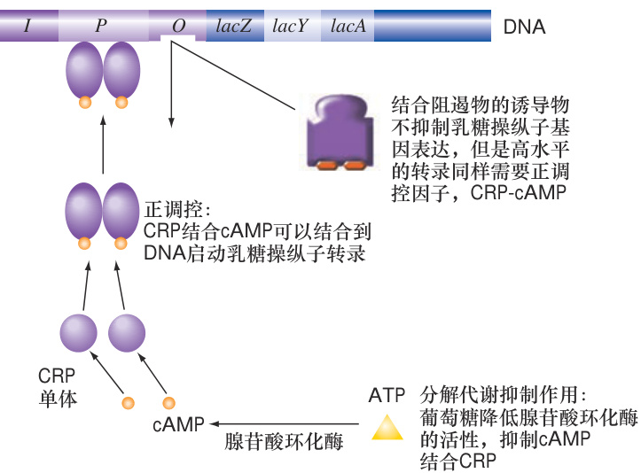  
图16.20　分解代谢的阻遏机制。葡萄糖调控合成cAMP的腺苷酸环化酶的活性。当葡萄糖含量高时，腺苷酸环化酶激活，cAMP含量非常低，因此正向调控蛋白CRP不能与乳糖操纵子结合。结果就是，当细胞中葡萄糖存在时，乳糖操纵子转录效率很低。  

包括半乳糖操纵子（生产的蛋白质可水解半乳糖）和阿拉伯糖操纵子（水解阿拉伯糖）。正如预期的，这些分解代谢操纵子对葡萄糖的存在也很敏感，当葡萄糖存在时cAMP含量很低，这些分解代谢基因的表达量很低。编码CRP蛋白质的基因突变会改变蛋白质的DNA结合结构域，从而降低乳糖操纵子和其他分解代谢操纵子的转录。CRP-cAMP复合物与许多操纵子的结合是响应环境中有限底物（如葡萄糖）进行全局调控的一个例子。  

# 3. 正负调控因子  

你可以看到操纵子的调节依赖于两种不同的调控因子（乳糖操纵子中为Lac阻遏物和CRP蛋白）来响应不同环境条件，从而扩大基因调控范围。大肠杆菌细胞可以精确地调控基因表达，时刻从周围的糖源和其他营养物质的混合物中汲取自身所需的能量和营养。虽然正负调控因子对转录起相反的作用，但你要知道，这两种类型的大多数调控因子都是通过他们对RNA聚合酶的调节来发挥作用的。正如我们看到的，许多负调控因子，如Lac阻遏物，通过阻断RNA聚合酶与启动子的结合来阻止转录。相反，正调控因子通常与RNA聚合酶接触，招募聚合酶结合到启动子区，或者延长RNA聚合酶与DNA结合的时间，从而频繁地启动转录。  

# 16.2.7 阻遏物/效应物互作抑制转录起始  

细菌中，分解代谢和合成代谢途径中的许多基因都会聚集成簇，在操纵子中被协同调控。我们已经看到分解代谢途径的乳糖操纵子通过诱导lac基因表达来响应环境中乳糖的存在。相反，合成代谢途径的操纵子通过阻止合成最终产物的结构基因的表达来响应环境中最终产物的存在。换句话说，合成代谢途径需要抑制性调节。  

细菌中多种合成代谢操纵子参与氨基酸的合成。一个典型的例子是大肠杆菌色氨酸（trp）操纵子，共5个基因（trpE、trpD、trpC、trpB和trpA）参与色氨酸的合成（图16.21）。正如预期的一样，当培养基中不存在色氨酸时，trp基因开始大量表达。  

色氨酸操纵子通过trpR基因编码的阻遏蛋白来调控其转录。色氨酸是变构蛋白TrpR阻遏物的效应物。色氨酸与TrpR蛋白结合导致TrpR蛋白构象改变，变构的蛋白质结合在操纵基因上抑制色氨酸操纵子的转录。trpR基因的突变可改变蛋白质的色氨酸结合结构域或者改变DNA结合结构域，从而破坏蛋白质与DNA结合的能力，这两种类型的突变都会导致trp基因变为组成型表达基因，不论色氨酸是否在培养基中。  

值得注意的是，分解代谢和合成代谢途径的调控取决于同一种调控因子：与启动子旁的操纵基因结合的阻遏蛋白，阻止RNA聚合酶识别启动子。两者差异非常简单但是非常重要：在诱导物异乳糖存在的情况下，Lac阻遏物不能与乳糖操纵子结合；然而TrpR阻遏物只在色氨酸效应物存在的情况下才能与操纵基因结合。再一次，当我们考虑到合成代谢和分解代谢背后的生物学现象时，这些都变得有意义了。在分解代谢所需的底物（乳糖操纵子分解乳糖）存在的情况下才需要开启分解代谢途径；当最终产物（色氨酸操纵子合成色氨酸）存图16.21　色氨酸为作为效应物。（a）当色氨酸存在时，它会结合TrpR阻遏物，改变TrpR构象，从而结合色氨酸操纵子的操纵基因，阻止转录。（b）当色氨酸不存在时，阻遏物不能结合操纵基因，色氨酸合成基因表达。前导序列和衰减位点将在下节描述。  

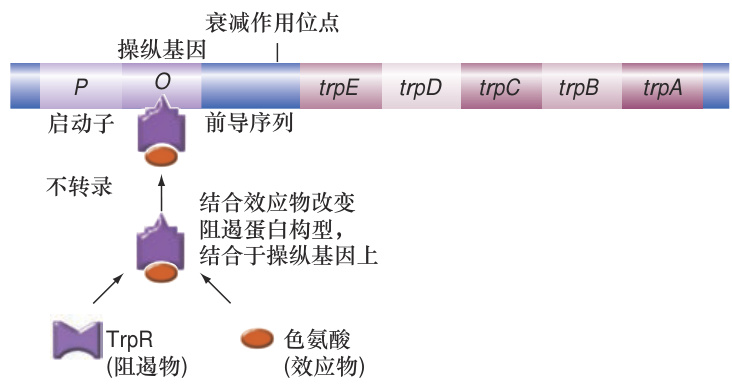  
(a)   
(b)  

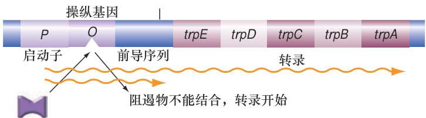  

在的情况下，分解代谢途径需要关闭。  

虽然由TrpR介导的抑制调节是调控色氨酸操纵子表达的关键的第一步，但是我们将在本章的稍后部分看到，在转录起始后其他调控机制会调控该操纵子。  

# 基本概念  

●  当被分解的底物存在时，分解代谢途径被诱导；当最终产物存在时，合成代谢途径被抑制。  
●  在乳糖操纵子中，Lac阻遏蛋白与操纵基因的DNA结合阻止转录。诱导物异乳糖结合阻遏物，将阻遏物从操纵基因上解离下来，促进转录。  
●  突变的调节蛋白为反式作用因子，突变的DNA结合位点为顺式作用因子。  
●  Lac阻遏蛋白具有螺旋-转角-螺旋结构的DNA结合功能域，诱导物结合功能域。第三个功能域为多聚化功能域，令阻遏蛋白紧密地结合在操纵基因簇上。  
●  cAMP调节蛋白（CRP）与乳糖启动子区结合，在无葡萄糖存在的情况下，cAMP含量非常高，能最大限度地刺激转录。  
●  负调控因子如Lac阻遏蛋白阻止RNA聚合酶结合启动子；正调控因子如CRP-cAMP促进RNA聚合酶与启动子的结合。  
●  在合成代谢（生物合成）操纵子中，只有当效应物存在的情况下，阻遏蛋白才与操纵基因结合。效应物一般都是最终产物。  

# 16.3 RNA介导的基因调控机制  

# 学习目标  

1.  解释RNA引导装置如何调控基因表达响应周围环境。  
2.  列举反式作用小RNA（sRNA）调控靶基因表达的两种不同方式。  
3.  描述基因的启动子和它的反义RNA之间的关系。  

我们刚刚看到了许多细菌基因，如乳糖操纵子和色氨酸操纵子中的基因，在转录起始阶段就被调控，如被作为反式作用因子的阻遏物调控，或者结合在如操纵基因的顺式作用位点（CRP结合位点）的CRP蛋白调控。调节蛋白的变构效应（即当它们结合一些小分子，如异乳糖或是氨基酸时，它们的形状会发生改变）通过调控基因表达与否来响应细胞质环境。  

细菌已经进化出许多其他精细重要的机制调控基因表达来响应不断变化的外部环境。这些机制中有许多都是在转录开始后发挥作用；例如，一些机制调控转录终止反应，另一些调控mRNA的翻译过程。近年来人们发现，许多控制细菌细胞基因表达的机制依赖于RNA分子，这些RNA分子也会在形状上出现变构效应。在一些情况下，转录物本身会充当顺式调控元件调控自身表达；另一些情况下，RNA分子可以充当反式调控因子影响其他RNA的表达。  

# 16.3.1 多种RNA引导装置作为顺式调控元件调控基因表达  

所有的细菌mRNA起始部位为非翻译区的5′UTR区，或者称为RNA前导序列。通过互补碱基配对，许多RNA前导序列会形成一个二级结构，称为茎环（或发夹环）。茎环结构可以提前终止mRNA剩余部分的转录，或者它们可以通过阻止mRNA进入核糖体结合位点来终止翻译。这些RNA前导序列是变构的，它们可以改变茎环的结构，从而响应各种各样的外界环境。  

# 1. 衰减子  

第一个被发现的RNA引导机制参与了色氨酸操纵子对细胞可用色氨酸含量响应的微调控。你应该记得图16.21，当培养基中不存在色氨酸时，色氨酸基因大量表达：由于效应物色氨酸的缺乏TrpR阻遏蛋白，因而不能结合操纵基因。TrpR介导的色氨酸操纵子抑制确实是关键的第一步，但是它不是唯一的大肠杆菌trp基因表达调控机制。  

如果TrpR与阻遏物的结合是唯一重要的调控机制，你将预期trpR 突变体会表现出trp基因组成型表达的现象。不论培养基中是否有色氨酸，如果没有阻遏物结合操纵基因，RNA聚合酶始终可与trp的启动子结合。令人惊讶的是，实验证明当培养基中存在色氨酸时，trpR–突变体中的trp基因没有完全脱离被抑制状态（即最大量地表达）。当从培养基中移除色氨酸时，trp基因的表达量比之前高了三倍。显然，色氨酸可以通过其他机制而不是TrpR阻遏蛋白来影响色氨酸操纵子的表达。  

在一系列简明的实验后，Charles Yanofsky和他的同事发现不依赖于阻遏蛋白的调控色氨酸操纵子表达的机制包括调控另一种色氨酸操纵子转录物的产生。有时启动子启动转录会生成一个约140个碱基的截短的mRNA，只包括RNA前导序列但是不包括结构基因。另一些时候会转录包括结构基因的完整操纵子转录物［图16.21（b）］。在分析为何有些转录物是完全转录物，另一些是截短的转录物时，研究人员们发现了衰减作用：由RNA前导序列介导的提前终止转录调控基因表达机制包括了前导序列部分的异常翻译。转录是否终止取决于翻译机制如何与RNA前导序列即衰减子相互作用。  

TrpRNA前导序列可以折叠成两种不同的稳定构象，每一种都基于同一RNA分子上的互补碱基配对［图16.22（a）］。第一种构象包含两个茎环结构：区域1与区域2配对形成一个茎环，区域3和区域4配对形成一个茎环。3-4茎环构象被称为终止子，因为当它在色氨酸转录物形成后，RNA聚合酶遇到此结构会终止转录，形成一条短的衰减RNA。第二种RNA结构称为抗终止子，由区域2和区域3形成茎环结构。这种构象，RNA前导序列不能形成终止子（由于区域3和区域4无法序列配对），因此，转录会继续，形成一条完整的、含有trp结构基因序列的mRNA。  

RNA前导序列前端一小部分的提早翻译（前导序列剩余部分的转录还在继续）决定形成两种RNA结构中的哪一种。RNA前导序列的关键部分含有一个短的、含有14个密码子的可读框，这14个密码子中有两个是色氨酸密码子［图16.22（b）］。当色氨酸存在时，核糖体迅速移动，通过前导序列中的色氨酸密码子，进入到前导序列密码子的末端，形成终止子［图16.22（b）］。当色氨酸不存在时，由于细胞中缺少tRNATrp核糖体会滞留在RNA前导序列的两个密码子上。抗终止子形成，阻止了终止子的形成［图16.22（c）］。因此，转录会从前导序列过渡到结构基因。  

为什么细菌会进化出如此复杂的系统来调控色氨酸操纵子及其他生物合成途径？即使TrpR阻遏物在色氨酸存在的情况下阻止转录，不存在的情况下开启转录，衰减作用机制依然提供了这个通路开启/关闭的微调方式。这种机制会令细胞避免浪费能量合成不必要的产物；细胞会感知tRNATrp的含量，从而相应地调整色氨酸mRNA的含量。在大肠杆菌中，类似的衰减作用机制还存在于其他几个氨基酸生物合成操纵子中，包括组氨酸、苯丙氨酸、苏氨酸和亮氨酸。  

# 2. 核糖开关  

在Yanofsky和同事阐明衰减作用分子机制后的几年里，清楚地发现基于RNA的调控机制远远不止用于几种操纵子表达的微调控。事实上，RNA分子不同构象之间的切换对许多基因的调控起主要作用。其中一种广泛的调节机制为核糖开关：可变构的RNA前导序列结合小分子效应物来调控基因表达（图16.23）。  

在衰减作用中，色氨酸的含量间接控制着前导序列的构象（通过相应的tRNA和核糖体），但是当前导序列作为核糖开关时，它拥有一个被称为适配体的区域，可直接与特定的效应物结合。核糖开关同时拥有第二个区域，称为表达平台，通过响应适配体结构改变自身茎环结构来控制基因表达。  

在一些核糖开关中，表达平台控制着转录终止［图16.23（a）］。例如，一个最简单的核糖开关通过应答鸟嘌呤控制转录。当适配体结合鸟嘌呤时，表达平台变构为最稳定的构象形成终止子；当适配体不结合鸟嘌呤核苷酸时，表达平台切换构象形成抗终止子。在这种调控方式中，适配体是鸟嘌呤含量的传感器：当鸟嘌  

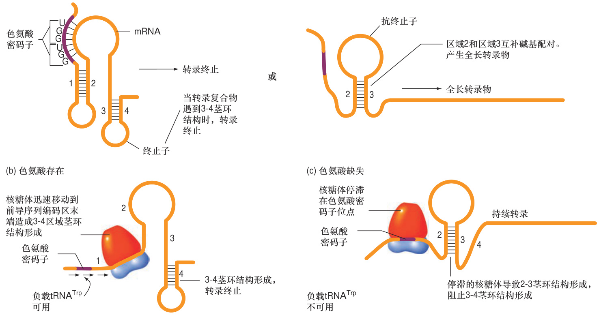  
(a)  

图16.22　大肠杆菌色氨酸（Trp）操纵子中的衰减子。（a）色氨酸RNA前导序列中通过互补碱基配对形成的茎环结构。两种不同构象：一种包含终止子，引导RNA聚合酶停止转录，另一种为抗终止子促进操纵子结构基因的转录。前导序列还包含一个小的可读框，其中包含两个色氨酸密码子UGG。（b）当色氨酸存在时，核糖体会迅速通过转录物，终止子结构形成。（c）当色氨酸不存在时，核糖体滞留在色氨酸密码子上，促进形成抗终止子。  

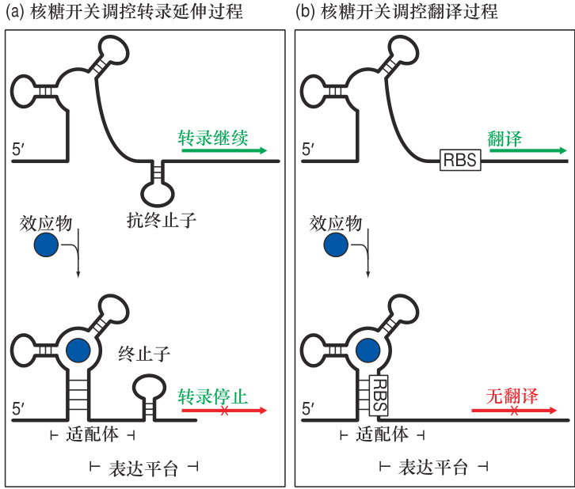  
图16.23　核糖开关。许多细菌基因和操纵子的mRNA前导序列作为核糖开关，通过响应效应物调控基因表达。一个核糖开关包含一个可变构的结合效应物的适配体和响应构象变化的表达平台。  

呤含量高时，核糖开关会阻止参与鸟嘌呤合成的基因表达；当鸟嘌呤含量低时，启动这些基因的表达。  

另一些核糖开关中，表达平台通过封闭/开放核糖体结合位点的方式调控翻译［图16.23（b）］。在合成代谢途径中，结合效应物（最终产物）的适配体会转换前导序列的构象导致封闭核糖体结合位点，通过阻止暂时不需要的蛋白产物的合成节约细胞能量。  

目前，大肠杆菌基因组中有17个不同的核糖开关适配体已被鉴定，每一个适配体都结合特定的效应物，如辅酶因子、核苷酸衍生物、氨基酸、糖类、 $\mathrm{Mg}^{2+}$ 离子。由于任何一类适配体都可以被连接到不同基因或操纵子的不同表达平台上，因此细菌细胞可以协同响应多种环境变化。  

# 16.3.2 调节小RNA作为反式作用因子调控mRNA翻译过程  

细菌基因组编码许多小RNA分子，即sRNA作为反式作用因子与mRNA结合，调控翻译过程（图16.24）。调节sRNA通常为 $50{\sim}400\mathrm{n}$ 长，序列中包含一段区域可与几个不同的目标mRNA互补配对。大多数sRNA为抑制物，意味着它们通过与目标mRNA的核糖体位点结合来阻止mRNA的翻译［图16.24（a）］。然而，一些sRNA会阻止mRNA前导序列形成封闭核糖体结合位点的茎环结构来启动目标mRNA的翻译［图16.24（b）］。另一些sRNA会促进mRNA的降解，影响特定靶基因的表达：sRNA结合到mRNA上形成双链RNA区域，致使核糖核酸酶降解mRNA（未显示）。  

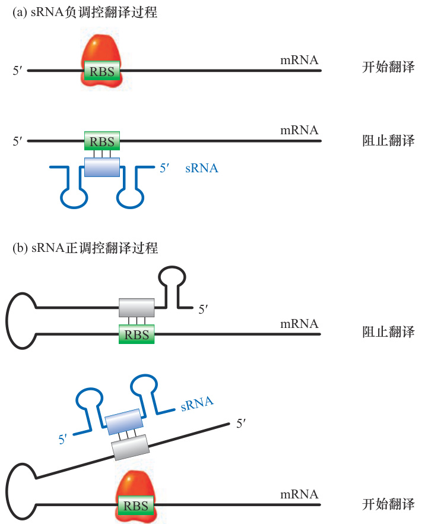  
图16.24　反式作用因子sRNA的调控机制。（a）sRNA与前导序列的互补配对隐藏核糖体结合位点（RBS），抑制mRNA的翻译。（b）sRNA可以通过与前导序列的互补配对阻止封闭核糖体结合位点的茎环结构的形成，促进mRNA的翻译。  

你应该注意，大多数sRNA不结合效应物，因此sRNA通常不直接响应环境变化。反而，sRNA的转录和稳定性通常被其他分子调控机制所控制，例如，转录因子与sRNA基因启动子区的互作引起细胞中sRNA含量的增加或降低。这大体意味着，sRNA通常在调节级联中处于中间位置，即一个调控因子影响另一个调控因子的表达。你将在本章后面部分看到这种调控循环的例子。  

# 16.3.3 反义RNA也可调控基因表达  

刚刚提到的调节sRNA的编码基因与它们的靶mRNA的编码基因距离很远。相反，一些细菌基因可被自身转录的RNA调控，由于这些RNA的转录模板是这些基因DNA的反义链，因此RNA与这些基因编码的mRNA互补配对。这些调节RNA被称为反义RNA；被调控的mRNA是正义RNA（图16.25）。反义RNA通常长 $10{\sim}1000\mathrm{nt}$ ，由反义链编码，与部分或全部mRNA序列互补配对。注意，启动mRNA和反义RNA转录的启动子位于编码区的两侧（图16.25）。  

一些反义RNA的功能类似反式作用因子sRNA：它们通过与mRNA互补配对抑制翻译，封闭核糖体结合位点，类似于图16.24提到的调控机制。在另一些例子中，mRNA与反义RNA互补形成的双链RNA可以被核糖核酸酶降解。还有一些情况下，不是反义RNA自身起作用，而是转录反义RNA时会抑制正义链基因的表达；也就是说，反义链的转录可以干扰正义链基因的转录起始过程。  

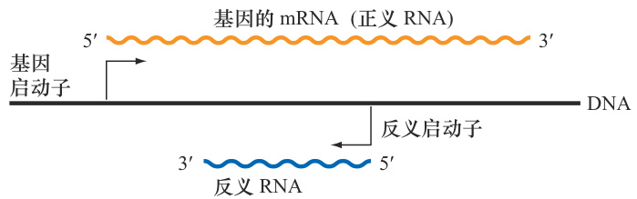  
图16.25　反义RNA阻止基因表达。反义转录物与正义mRNA序列部分或全部互补配对，并由附近的反义启动子启动转录。  

通常，当mRNA编码的蛋白质在高浓度下对细胞具有毒性时，反义RNA会时常被转录，确保毒性蛋白的mRNA保持低水平含量。在其他基因上，反义启动子由一个调节级联分子调控，根据环境条件调整反义RNA的转录（间接调控正义RNA）。  

# 基本概念  

●  原核生物RNA前导序列可作为顺式调控元件调控转录和翻译过程，通过折叠形成茎环结构响应环境条件。  
●  小RNA（sRNA）作为反式作用因子，通过与mRNA互补配对，隐藏或暴露核糖体结合位点从而调控mRNA的翻译。  
●  反义RNA由DNA反义链转录形成，通过减少mRNA的翻译、稳定性和转录来调节基因表达。  

# 16.4 细菌基因调控机制的发掘和应用  

# 学习目标  

1.  描述科学家利用lacZ报告基因来研究基因调控的方法。  
2.  解析乳糖操纵子的调控区域如何用于药物蛋白的生产过程。  
3.  探讨RNA-Seq技术在细菌响应热休克机制研究中的应用。  
4.  列举两种有助于遗传学研究的转录组计算机分析方法。  

假如你是一个遗传学家，致力于研究细菌响应环境变化的机制，例如，细菌如何在环境温度升高的条件下生存、病原菌如何躲避机体防御机制，或者是与植物共生的细菌如何引发固氮作用（将氮气转为植物可利用的含氮分子）。当环境变化时，什么样的基因会表达或者沉默？这一章中描述的一般机制，或尚未发现的新机制，是否涉及基因调控？  

在本节，我们将描述现阶段一些可以回答上述问题的方法。我们也将描述科学家及遗传工程师如何将细菌基因调控理论用于实际应用，特别是合成大量重要药物蛋白的制药工程领域。  

# 16.4.1 lacZ报告基因帮助解析一些基因的调控机制  

我们早先发现了乳糖操纵子一个重要的优点，可以通过简单的实验方法测量一个样本中β-半乳糖苷酶的含量： $\upbeta$ -半乳糖苷酶可以将无色的底物水解为可溶的黄色化合物，此酶也可以将无色的X-gal水解为不可溶的蓝色沉淀物。由于这种方法非常容易测量出β-半乳糖苷酶的含量，因此编码此酶的lacZ基因可以充当报告基因检测受到任何调控元件影响的转录物的含量。  

为了达到这个目的，研究人员利用DNA重组的方法构建了lacZ编码区与任何其他基因（基因X）的顺式调控元件（包括启动子和操纵基因）融合的DNA分子。合成的报告基因克隆在质粒上可以被转导到细菌细胞中。通常，含有此融合基因的细胞表达该X基因时也会生产 $\upbeta.$ -半乳糖苷酶（图16.26）。进而，科学家可以通过检测β-半乳糖苷酶在细胞内的含量来评估X基因调控元件的活跃状态。  

LacZ报告基因的实用性使得我们有可能鉴定出必要的DNA调控位点，以及参与调控的基因和信号。例如，通过体外突变基因X的调控区域，然后将改造后的基因X-lacZ融合基因转入细菌细胞，鉴定重要的顺式调控元件位点。另一种方法是，你可以诱变具有融合报告基因结构的细菌，鉴定出编码与X基因的调控区DNA序列互作的反式作用因子的基因。这两种方法，你都可以通过测量含有X-gal的琼脂培养基里的蓝白菌落来观察lacZ的表达量的变化。  

报告融合基因也可以帮助鉴定环境刺激后被调控的基因。为此，研究人员利用转座子将无调控区的lacZ基因随机插入到细菌染色体上（图16.27）。由于缺少启动子区域，这个lacZ基因本身无法生产 $\upbeta$ -半乳糖苷酶。然而，在一些细胞中，无启动子的lacZ报告基因插入到其他基因的启动子及调控区域附近。在适当的条件下，被转座子插入的基因会表达，相应的细胞中也会检测到$\upbeta.$ -半乳糖苷酶。利用这个方法，研究人员们鉴定了一系列当DNA受到紫外线等外界因素损害时活跃表达的基因（图16.27）。  

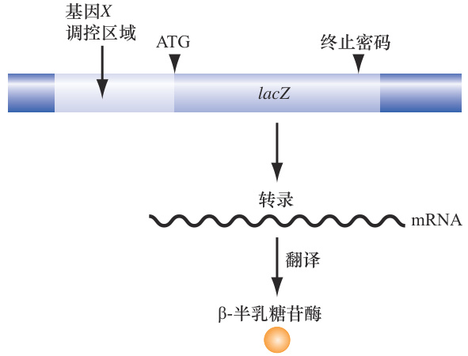  
图16.26　lacA报告基因。lacZ编码序列与基因X的调控区域融合。 $\upbeta.$ -半乳糖苷酶的表达依赖于影响lacZ融合的调控区域的信号。  

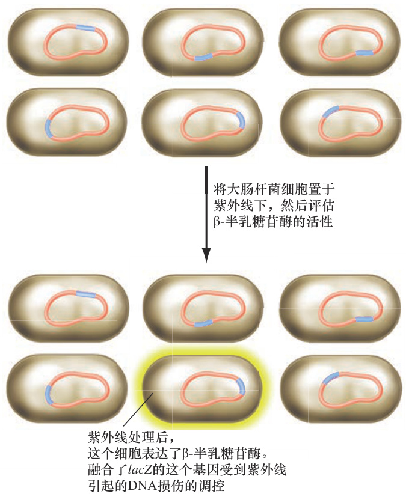  
lacZ   
图16.27　利用无启动子区的lacZ基因。无启动子区的lacZ基因的转座制造了一群随机插入染色体位点的大肠杆菌。如果lacZ基因以转录的方向整合到一个基因上，lacZ的表达会受到该基因调控区的控制。研究人员对克隆的文库进行筛选，鉴定出受到同一信号调控的基因。  

# 16.4.2 乳糖操纵子调控区帮助细菌生产制药蛋白  

构建的报告基因中最关键的部分是乳糖操纵子lacZ基因的编码序列。然而，遗传学家开发了乳糖操纵子其他部分，即调控转录物高表达的调控区域，这一举措具有重要的实际应用价值：将细菌变成一个小型工厂，生产大量药用蛋白。这些蛋白质包括：激素（如糖尿病所需的胰岛素），血友病所需的凝血因子，制成疫苗的多肽抗原。  

改造的基本思路就是构建一个重组质粒，将乳糖操纵子的调控区DNA与编码蛋白的可读框融合。当乳糖加入培养基后，含有此质粒的大肠杆菌细胞将生产大量的药用蛋白（图16.28）。如果外源蛋白对大肠杆菌的生长有毒害作用，那么控制重组基因的表达能力就显得尤为重要。在缺少诱导物的存在下，培养细菌达到高密度状态，加入乳糖后蛋白产量就会达到很高的水平。  

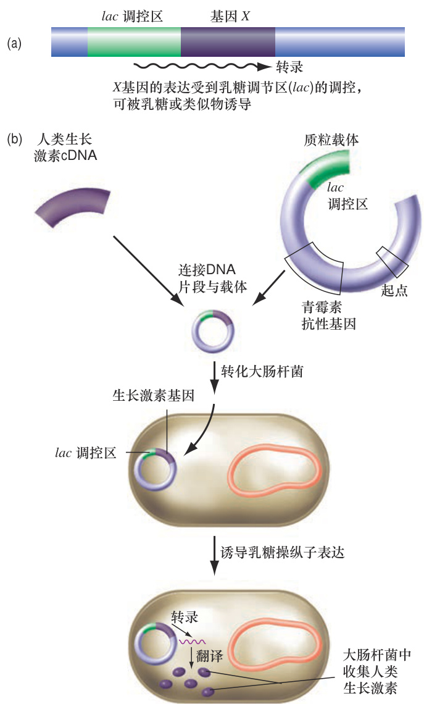  
图16.28　将大肠杆菌改造成蛋白生产工厂。（a）乳糖调节区融合X基因调控基因表达。（b）在本例中，在lac调控区附近克隆了一个编码人类生长激素的cDNA，并将其转化进入大肠杆菌。条件性诱导乳糖转录进而诱导生长激素表达，并从细胞中纯化出来。  

# 16.4.3 RNA-Seq是解析转录组和它们的调控机制的一种常用手段  

转录组是一个细胞在特定的条件下产生的所有转录物序列的集合。转录组测序需要构建cDNA文库，然后对文库中的cDNA进行测序，整个过程称为RNA-Seq或是cDNA深度测序。目前在一次实验中，RNA-Seq技术可以让研究人员们获得约10亿条cDNA序列读长，每一条读长长度约150个核苷酸。一个细胞中特定的mRNA拷贝数越多，那么对应此RNA的cDNA被测量的次数也越多。深度测序可以让研究者通过测算单个mRNA占总cDNA读长的比例，对特定mRNA的相对表达水平进行量化。  

通过比较不同生长环境的细菌细胞群体的转录组，研究者可以确定当环境变化时，基因组中哪些基因的表达量上升，哪些基因表达量下降。利用这种技术方法，研究者还可以比较同一物种野生型和调节基因或者调控DNA序列有缺陷的突变体的转录组变化，进而确定基因组中的哪些基因依赖这些调控。  

与真核生物mRNA比较，polyA尾不是原核生物mRNA的特征。因此，细菌细胞的cDNA文库必须用不同于真核生物的方法构建，真核生物文库构建的方法基于polyA尾的存在，如图10.4所示。研究者利用RNA连接酶将细菌RNA片段与寡核苷酸接头相连接来替代polyA尾（图16.29）。由于一些基因正反链同时被转录，cDNA文库构建时必须确定cDNA的哪条链是先被拷贝的，由此可以确定cDNA的哪条链序列与RNA一致，哪条是互补链。保存这种信息构建的cDNA文库如图16.29所示，被称为定向cDNA文库。  

为了分析RNA-Seq实验的数据，计算机将每一条cDNA测序读长与细菌基因组序列进行比对。图16.30展示了比对到一个细菌基因组一小部分序列的数据。这些数据显示了基因组中的哪些序列被转录，哪条DNA链作为模板。另外，基因组中每个核苷酸出现的频率都在cDNA读长中被计算，显示了不同的mRNA相对表达水平。图16.30的结果证明在特定的实验条件下，基因如ybhC、ybhE和galM被强力转录，其他如hutC、hutI和t2110基因不表达。  

应用RNA-Seq的一个重要的例子是将大肠杆菌暴露于极高温度环境下（ $45\,^{\circ}\mathrm{C}$ ）研究大肠杆菌的热激反应。RNA-Seq显示高温会特定地诱导一类编码热休克蛋白的基因转录，令细胞存活下来。这些热休克蛋白中和了高温趋势，防止细胞中大部分其他蛋白质变性和聚合。一些被诱导的热休克蛋白识别和降解异常的蛋白质，另一些充当分子伴侣帮助其他蛋白质重新折叠并阻止它们聚合。大肠杆菌蛋白的诱导对抗热休克是一种极其保守的应激反应。不同的生物体（如细菌、果蝇、植物）对抗高温环境时都会诱导类似蛋白质的表达。  

# 16.4.4 计算机分析展示了基因调控的多种形式  

后基因组学科的一个主要目标是鉴定出生物体中全部调控转录的反式作用因子（蛋白质和RNA）、所有与这些因子结合的顺式调控元件，最后列出各式因子与元件如何互作调控基因组上的每个基因。这个目标理所当然非常宏大并且难以实现，但是进展的速度正在快速增加，并且这些研究已经提供了有价值的信息，既包括我们对细胞如何工作的基本理解，也包括对这些知识的实际应用。进展很大一部分取决于对细菌基因组和转录组的计算机分析。我们在这里简单介绍计算机帮助解析海量数据的一些方法。  

  
cDNA  

图16.29　RNA-Seq定向cDNA文库构建。细菌RNA被RNase片段化，片段化的RNA 5′端通过酶作用脱磷酸化。RNA连接酶将合成的一段短序列单链RNA（接头A）与片段化的RNA $3^{\prime}$ 端连接［接头不能与RNA片段5′端相连，因为5′端无磷酸基团（黄色圆点）］。5′端脱磷酸化后，利用激酶将第二个序列与接头A不同的接头（接头B）特异性连接到RNA片段的5′端。在这些模板基础上合成cDNA，两个接头序列A和B分别标记  

了原始RNA的3′端和5′端。  

# 1. 操纵子的发现  

揭示细菌调控机制的一个关键点就是操纵子的鉴定。基因组DNA序列关联潜在的可读框是非常容易的，但是怎么才能找到共转录成一个mRNA的基因呢？一种途径是通过RNA-Seq技术和相关方法来检测转录组信息，来确定对应由同一种类细菌产生的所有转录物的cDNA的碱基序列。计算机程序可以鉴定一个操纵子的共转录基因，简单来说相当于一个转录物包含了几个可读框。计算机专家进一步开发了算法来查找紧邻已知启动子的几个紧密相连的基因及转录终止信号。  

这些预测可以通过物种比较分析进一步评估。如果两个差异较大的物种基因组上具有同源基因集，并且基因集里的基因都彼此紧邻，那么这些基因很可能一直在一起，因为它们作为一个操纵子被共转录。  

# 2. 转录因子及其结合位点的发现  

通过搜索基因组上编码已知DNA结合模体的序列，如乳糖阻遏蛋白的螺旋-转角-螺旋区序列，来鉴定新的反式作用调控蛋白。一些情况下，通过分析同一外界环境条件刺激下一组存在类似调控机制的基因的DNA序列，计算机可以找到与反式作用调控蛋白结合的顺式作用位点。例如，如果几个基因或操纵子受到相同阻遏蛋白的调节，你可能会在这些基因或操纵子的上游发现类似的或相关的操纵基因DNA序列。  

这种技术的一个有趣的应用是在之前提到的大肠杆菌细胞响应高温刺激的全局调控的分析中发现的。你应该记得，高温会诱导热休克基因的转录，产生的蛋白质保护细胞免受这种极端环境带来的有害后果。通过对热休克基因编码区上游的DNA序列进行分析表明，热休克基因的启动子与在正常温度下表达的持家基因的启动子区明显不同。原因是，两种σ因子允许RNA聚合酶识别两种不同的启动子（图16.31）。正常的持家σ因子$\upsigma^{70}$ ，在正常的生理条件下是活跃的，高温条件下，它会变性失活；相反，另一种σ因子 $\cdot\upsigma^{32}$ ，在高温条件下发挥作用，它会识别不同于 $\upsigma^{70}.$ 识别的启动子区序列。  

许多被热激反应诱导表达的基因启动子区都含有$\upsigma^{32}$ 识别序列。 $\upsigma^{32}$ 因子通过与RNA核心酶结合响应热激反应，从而允许聚合酶启动编码热激蛋白基因的转录。  

# 3. 新型调控RNA的鉴定  

调节RNA很难被发现。即使RNA前导序列如核糖开关拥有相似的二级结构特征，由于几乎没有保守序列的存在，计算机很难单纯从基因组序列上鉴定调节RNA。然而，对转录组数据的深度挖掘为RNA前导序列、sRNA和反义RNA的鉴定提供了有用线索。RNA前导序列会定位到转录物的5′端与基因的可读框相连。sRNA具有至少与mRNA序列部分互补的短区域（回顾图16.24）。互补配对的区域将在反义RNA中更加明显  

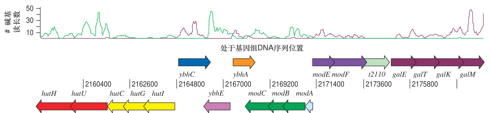  

图16.30　RNA-Seq结果。图的下半部分为鼠伤寒沙门氏菌基因组的部分示意图：数字代表碱基对，彩色箭头代表基因并指向基因转录的方向。相同颜色的相邻基因很可能在同一个操纵子中。图的上半部分绘制了RNA-Seq数据。绿线代表基因组序列的每个碱基在来自于从右到左转录的RNA上形成的cDNA序列中被读取的次数。紫色线表示来自于从左到右转录的cDNA的每个碱基的读长数。  

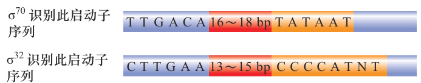  

图16.31　σ因子识别序列。 ${\upsigma}^{70.}$ 识别正常温度下表达的持家基因的启动子区。抗热σ因子 $\cdot\upsigma^{32}.$ 识别编码热激蛋白基因的启动子区（N代表此位置为随机碱基）。  

（回顾图16.25），正义转录物和反义转录物的极性可以通过相应的cDNA方向来判断。  

通过对编码σ因子 $\upsigma^{32}$ 的mRNA进行信息分析，结果显示mRNA中存在一个特定的RNA前导序列装置，称为RNA温度计，被看成是核糖开关的雏形。低温时，这种RNA温度计通过互补碱基配对将含有核糖体结合位点的区域折叠成茎环结构，阻止mRNA的翻译。高温时，茎环结构变得不稳定并被打开，释放了核糖体结合位点（图16.32）。 $\upsigma^{32}$ 的mRNA利用这种机制完美感知外界温度，你应该记得 $\upsigma^{32}$ 因子只有在高温时被转录，结合RNA聚合酶转录热激蛋白。 $\upsigma^{32}$ 的mRNA前导序列里的RNA温度计阻止了σ因子（和热休克蛋白）在低温时被转录，因为它们的蛋白质可能对细胞造成损害。  

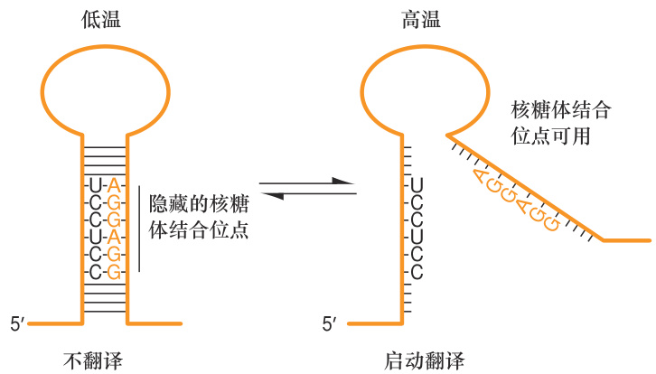  

图16.32　RNA温度计。一些细菌mRNA含有前导序列响应温度变化来调控翻译。低温条件下，茎环结构覆盖了核糖体结合位点；高温时，茎环结构打开，mRNA被翻译。  

# 基本概念  

●  用lacZ编码序列构建的报告基因可以通过β-半乳糖苷酶的产生来检测转录。随机插入基因组位点的不含有lacZ调控区的转座子可以精确定位特殊条件下活跃的启动子。  
●  将乳糖调节区与其他基因的编码序列融合可以在细菌中生产医用蛋白。  
●  RNA-Seq是测序转录组的一种手段，并可以测量不同环境条件下所有基因的相对表达量。  
●  计算机分析推进了操纵子、转录因子及其结合位点和调节RNA的发现。  

# 16.5 综合实例：群体效应对生物发光的调控  

# 学习目标  

1.  解析科学家如何利用大肠杆菌鉴定费氏弧菌发光基因。2. 描述费氏弧菌通过群体感应调控发光的分子机制。3. 讨论群体感应蛋白作为抗菌靶向蛋白的潜在优点。  

在本章开头，我们描述了一个令人惊奇的现象：费氏弧菌不仅能发光，而且只有当种群数量足够大时才发光，这使得它们栖息的乌贼在夜间看起来在发光。费氏弧菌的生物发光调控是群体感应的第一个典型的例子，群体感应是一种通讯机制，普遍被细菌所利用，细菌会利用这种机制来调控基因表达从而响应群体密度。我们在这里描述一些关键的实验，揭示群体感应机制如何在基因和基因产物水平上发挥作用。  

# 16.5.1 重组的费氏弧菌基因使得大肠杆菌发光  

不同于费氏弧菌，大肠杆菌正常情况下不会发光。科学家们利用这个事实，分离了费氏弧菌的发光基因。  

具体方法是：确定费氏弧菌基因组的一段区域通过转基因，转入到大肠杆菌中，令大肠杆菌发光。研究人员在质粒中构建了费氏弧菌基因组文库，利用质粒转到大肠杆菌。显然，一部分大肠杆菌克隆菌落开始发光。更加显著的是，这些产光的细菌在菌落细胞达到高密度时开始发光。因此，大肠杆菌中的重组质粒包含了全部的费氏弧菌发光基因和群体感应所需的所有调控元件。这个质粒只包含了9kb的费氏弧菌DNA。  

为了确定在克隆的9kb费氏弧菌基因组DNA中有多少发光基因，研究人员利用化学药物诱导发光的大肠杆菌株系突变，筛选不再产光的突变体菌落。科学家们对质粒中费氏弧菌基因的突变进行了分类，并分成了互补组。为了做到这一点，他们将成对不同的质粒转入到大肠杆菌中，每一个质粒都含有9kb的片段，但是每个质粒9kb片段上阻止发光的突变是互不相同的。如果双转细胞产光，那么这两个重组质粒是互补的，意味着每个质粒上不同的费氏弧菌基因存在突变。如果两个质粒因为在同一个V. fscheri基因上发生了突变而不能互补，菌落就不能发光。  

这次试验在费氏弧菌DNA片段上产生了7对互补组（7个基因）。DNA测序和其他分子实验手段显示这七个基因由两个不同的启动子启动转录。一个启动子启动luxR转录，产生一个单独的蛋白质（LuxR）；另一个启动子启动转录形成一个多顺反子的mRNA，产生的蛋白质包括LuxI、LuxC、LuxD、LuxA、LuxB和LuxE［图16.33（a）］。  

基因luxA和luxB编码萤光素酶的亚基，催化产光。基因luxC、luxD和luxE编码蛋白用于合成和循环利用萤光素酶的底物及辅酶因子。  

# 16.5.2 LuxI和LuxR是费氏弧菌的群体感应蛋白  

费氏弧菌中，9kb的基因组DNA片段同时包含了两个介导群体感应的基因：luxI和luxR［图16.33（a）］。LuxR蛋白是转录激活蛋白，被称为受体，用于激活luxICDABE基因的mRNA转录。LuxI蛋白是一种合酶，会生成一种叫做自诱导物的分子。自诱导物是效应物——它结合LuxR蛋白并让受体结合DNA。  

自诱导物被释放到细胞外环境中，它也可重新进入细胞。当细菌群体达到一定密度时，细胞质中充满了自诱导物，并与LuxR结合。因此，生物发光基因高表达令细菌发光［图16.33（b）］。  

当只有少部分细菌存在时，自诱导物的浓度非常低，不能重新返回细胞质中。生物发光基因转录水平非常低，并不能产光。本章结尾处的习题43会说明科学家如何通过lacZ报告基因与费氏弧菌DNA的融合发现群体感应调控机制。  

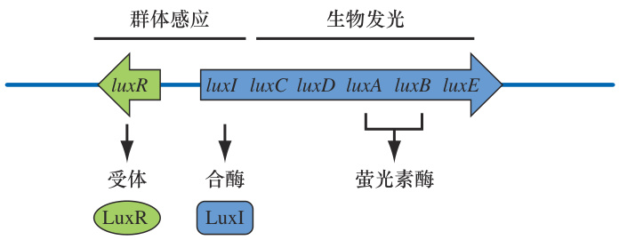  
(a)   
(b)  

  
图16.33　群体感应控制费氏弧菌生物发光。（a）费氏弧菌产光需要luxR和luxICDABE基因的转录。基因luxR和luxI编码群体感应蛋白（受体和合酶）。另外的lux基因编码生物发光蛋白，包括萤光素酶的亚基LuxA和LuxB。（b）LuxI生产自诱导物——一种可以被细胞释放到环境中，也可重新回到细胞中的分子。当它的浓度达到阈值，自诱导物会结合LuxR蛋白，而后  

与生物发光操纵子的启动子结合激活操纵子的转录。  

# 16.5.3 群体感应提供了开发抗生素的新方法  

群体感应机制不仅限于生物发光细菌；实际上，几乎全部的细菌物种都存在群体感应通路。例如，一些病原菌利用群体感应配合毒素的释放对宿主产生最大的影响。群体感应的发现给科学家们提供了利用干扰群体感应的药物阻止致病菌释放毒素的思路。  

靶向群体感应机制的药物会有几种潜在的优点帮助内科医生解决耐抗生素病原菌生长的问题。这种新策略特别有效果，因为相比抗生素杀死细胞来说，细菌更难进化出靶向群体感应机制的耐药性。而且，单个细菌不会在对抗靶向群体感应的药物时获得选择优势或者生存优势。另一个潜在的优势是，群体感应蛋白与人类任何蛋白质都不相似，因此靶向药物不太可能会引起干扰人类正常生理机能的副作用。这个有趣的想法是否会成为新的治疗细菌病原菌引起的疾病的基本思路仍有待考察。  

# 基本概念  

●  通过费氏弧菌DNA转化大肠杆菌细胞，分离发光的克隆菌落来鉴定生物发光和群体感应基因。  

●  费氏弧菌利用群体感应机制感知菌群达到一定密度时，细胞才发光。群体感应的基本原理是：只有一大群细胞积累了足够浓度的自诱导物才能激活生物发光操纵子高水平的转录。  

●  由于对单个细胞来说免疫力不会提供选择优势，因此群体感应蛋白可作为抗菌药物的首选靶向目标。  

# 接下来的内容  

大多数细菌调控基因的方法在真核生物中也同样适用。例如，两种类型的生物体都可以利用扩散性的调节蛋白来提高或降低转录起始过程。另外，在原核生物和真核生物中，转录和翻译启动后也受到sRNA的调节。  

然而，真核生物特有的几个特征决定了这些生物体的调控基因表达机制不能与原核生物的完全相同。在真核生物中，由于核膜的存在，转录过程发生在细胞核内，而发生在核糖体上的翻译过程则在细胞质中进行。因此，真核生物不能依赖转录和翻译过程的偶联来利用衰减机制。另一种与细菌相反的情况是，真核生物mRNA的5′端和3′端必须经过剪接和修饰后，才能从细胞核运输到细胞质中进行翻译。另外，真核生物的染色体是由染色质高度螺旋形成的。你将在第17章看到，在真核生物中，所有的这些过程及多细胞生物本身，都需要并且提供额外的途径来调节基因表达。  

# 习题精解  

Ⅰ.  在大肠杆菌半乳糖操纵子中，galR基因编码的阻遏蛋白结合操纵基因位点galo，调控三个结构基因galE、galT和galK的表达。培养基中存在半乳糖时诱导表达。列出每种菌株细胞表现为组成型表达、诱导性表达，还是不表达结构基因？  

a. galR−galo+galE+galT+galK+ b. galR galo galE galT galK c. galR galo\* galE+ galT\* galK / galR+galo+galE−galT+galK+ d.  galR−galoc galE+galT+galK−/ galR+galo+galE−galT+galK+  

# 解答  

这个问题需要了解调控位点和结合这些位点的蛋白质如何互作。首先关注野生型结构基因的菌株，提问这些基因的表达如何被同一染色体上特定的调控元件调控。对于题目c和d，你还需要考虑一个结构基因的表达是否会被不同染色体上的调控元件调控。  

a.  galR基因编码阻遏蛋白，因此缺乏GalR蛋白会引起galE、galT和galK基因的组成型表达。  

b.  galo 突变是操纵基因位点上的突变。与乳糖操纵子类似，galoc表示与阻遏物不能结合，因此组成型表达galE、galT和galK基因。  

c.  操纵子列出的第一个拷贝为galR–突变，但是另一个拷贝为野生型galR基因。野生型等位基因生产阻遏物作为反式作用因子作用于操纵子的两个拷贝，抵消了galR 突变的影响。三个gal基因都为可诱导表达基因。GalE蛋白由第一个拷贝操纵子合成，GalK蛋白由第二个拷贝合成，GalT蛋白由两个拷贝同时合成。  

d.  第一个操纵子的拷贝含有galoc突变，导致组成型合成galE和galT；另一个拷贝为野生型操纵基因，为可诱导的，但是两个拷贝上的操纵基因互不影响。因此，组成型表达galE和galT，诱导型表达galK。  

Ⅱ.  回忆一下大肠杆菌的色氨酸操纵子，在缺乏TrpR阻遏蛋白的trpR 突变体中，培养基中无色氨酸时操纵子的表达量为培养基中含有色氨酸时操纵子表达量的三倍，由此发现了衰减作用。  

a.  研究者们制造了缺少RNA前导序列色氨酸操纵子的菌株。如果这个缺陷型菌株同时为trpR–，那么色氨酸含量变化时色氨酸操纵子的表达是否改变？请解释。  
b.  构建含有trpR 突变，同时RNA前导序列区域4存在点突变的菌株（图16.22）。这个点突变是否会影响操纵子的表达？描述可以逆转这种影响的RNA前导序列的第二个突变位点。  
c.  假设色氨酸RNA前导序列中AUG密码子的A转换为C。如果这个菌株同时为trpR–，这个点突变会对操纵子的调控有什么影响？  
d.  如果菌株如题目a中无前导序列，但是为trpR+会产生什么现象？  

# 解答  

为了解决这些问题，记住衰减作用涉及色氨酸操纵子mRNA前导序列的两种构象。其中一种构象形成转录终止子阻止结构基因的表达；另一种为抗终止子，允许操纵子的剩余部分继续转录。如果色氨酸存在，核糖体翻译前导序列中小ORF的两个Trp密码子，导致终止子的形成。如果色氨酸不存在，核糖体会在此位点停止翻译，形成抗终止子。  

a.  如果前导序列全部缺失，就不存在提早终止操纵子转录的机制。另外，如果此菌株为 $t r p R^{-}$ ，色氨酸不能影响操纵子的表达。因此，操纵子的结构基因在有/无色氨酸的情况下都会高表达。  

b.  如果区域4中的核苷酸改变，它就不能与终止子茎环结构中的另一个核苷酸配对。这个点突变会破坏终止子结构，因此如果色氨酸存在时，此操纵子的表达量要高于野生型的。色氨酸不存在时，  

RNA前导序列突变不会影响表达量（表达量与野生型相同），因为终止子在这种情况下不会形成。如果前导序列存在第二个突变，两个突变核苷酸刚好互补，那么终止子的功能将正常行使。  

c.  如果前导序列缺少AUG，核糖体将不会翻译Trp密码子。前导序列会折叠成最稳定的构象，即含有最大数量的分子内互补配对。在这个最稳定的构象中，区域1和区域2配对、区域3和区域4配对，形成终止子茎环。这个结果导致不论色氨酸是否存在的情况下，色氨酸操纵子都会低表达。  

d.  如果TrpR蛋白存在，但是色氨酸操纵子的RNA前导序列缺失，色氨酸作为TrpR的效应物调控操纵子表达。因此，在无色氨酸的情况下操纵子高水平转录，有色氨酸的情况下低水平转录。在缺少色氨酸的情况下，很可能此菌株操纵子的表达水平会比野生型菌株的表达水平略高。原因是野生型菌株的前导序列有时会形成终止子构象，但是在突变菌株中这个现象完全消失。  

# 习题  

# 词汇  

1. 在右列中选择与左列中的术语最匹配的短语。  

a. 诱导 1.  葡萄糖阻遏分解代谢操纵子的表达  
b. 阻遏物 2.  蛋白质或RNA经历可逆的构象变化  
c. 操纵基因 3.  反式作用因子调控mRNA的翻译  
d. 变构效应 4.  RNA前导序列响应小分子或离子调控基因表达  
e. 操纵子 5.  阻遏蛋白结合位点  
f.  分解代谢抑 6.  响应翻译过程终止转录延伸过程制作用  
g. 报告基因 7.  一组基因转录成一条mRNA  
h. 衰减作用 8.  负调控蛋白  
i. 小RNA 9.  一个基因的调控区融合另一个基因的编码区生产容易被检测的产物  
j. 核糖开关 10.  特殊分子刺激蛋白合成  

# 16.1节  

2.  下述语句出现在本章的前面部分：“……调控许多细菌基因关键的步骤是RNA聚合酶结合DNA的启动子区。”为什么这个特殊步骤对于细菌调控它们基因的表达来说是有利的？  

3.  本章主要的课程之一就是几个细菌基因通常由一个启动子转录成一条含有多基因的（多顺反子）的转录物。DNA上包含这套共转录的基因，以及调控这些基因的所有调控元件的区域称为操纵子。  

a.  下述列表中哪一个机制可以解释不同操纵子表达不同含量的mRNA？  
b.  下述列表中哪一种机制可以解释同一个操纵子中不同基因的蛋白表达量不同？i.  不同的启动子具有不同的DNA序列ii.  不同的启动子可能被不同类型的RNA聚合酶识别iii.  mRNA的二级结构可能不同以致影响核糖核酸酶降解它们的效率iv.  在一个操纵子中，一些基因与启动子的距离比其他基因与启动子的距离远很多v.  一个操纵子中不同可读框的翻译起始序列可能导致不同的翻译效率vi.  一个操纵子中不同基因编码的蛋白质可能会有不同的稳定性  

4.  大肠杆菌中所有致使Rho终止蛋白功能消失的突变都为条件性突变；没有任何Rho编码基因的无效突变细胞被分离出来过。关于rho基因及其产物，从这个现象中你能得出什么结论？  

# 16.2节  

5.  本章开始的图展示了Lac阻遏物四聚体和CRP-cAMP复合物结合乳糖操纵子调控区。a.  调控蛋白如Lac阻遏物或者CRP调控假定的特定基因或者操纵子的主要特征是什么？b  在这个图上，展示了以下结构的位置：（i）Lac阻遏物单体；（ii）Lac阻遏物二聚体；（iii）所有四个Lac阻遏物四聚体DNA结合域；（iv）一个螺旋-转角-螺旋模体；（v）乳糖操纵子O1部分和O2/O3部分（假定图上的操纵子从右到左转录）；（vi）四个Lac阻遏物单体多聚化结构域；（vii）诱导物结合结构域；（viii）CRP-cAMP复合物；（ix）DNA环。c. 图中显示DNA环形成的物理基础是什么？d.  图中显示了DNA序列两条对称轴的位置。只根据图，没有精确的DNA序列的信息，你怎么知道两条对称轴可能存在于DNA中，对称轴周围的序列为旋转对称？  

6.  操纵子的启动子为RNA聚合酶结合位点并启动转录。启动子某个碱基的改变导致位点的突变，RNA聚合酶无法结合。你认为细胞中阻止RNA聚合酶结合的启动子突变是作为反式作用因子作用于质粒上另一个操纵子拷贝，还是作为顺式作用因子只作用紧邻突变位点的拷贝？  

7.  你正在研究一个操纵子，含有三个共转录的基因，转录的顺序是hupF、hupH和hupG。画出此操纵子的mRNA结构图，标出5′端及3′端的位置、所有可读框、翻译起始位点、终止密码子、转录终止信号和其他可能存在mRNA但是不行使这些功能的区域。  

8.  你要分离一个结合sys基因启动子序列上游区域的蛋白质。如果这个蛋白质是正调节蛋白，下述哪个观点正确？  

a.  编码DNA结合蛋白的基因功能缺失突变会引起sys组成型表达。  
b.  编码DNA结合蛋白的基因功能缺失突变会引起sys基因无表达或少量表达。  

9.  你分离了两个不同的引起emu操纵子组成型表达（emu1emu2）的突变体（reg1和reg2）。一个突变体为DNA结合位点缺陷，另一个为编码结合此位点的蛋白基因突变。a. DNA结合蛋白是正调控蛋白还是负调控蛋白？b.  为了确定哪个突变体是位点突变体，哪个是结合蛋白突变体，你决定利用F′质粒进行鉴定。假定你可以检测Emu1和Emu2蛋白的含量，对于下述两个菌株预测会得到什么样的结果（i和ii，如下描述）？如果reg2编码调节蛋白，reg1为调控位点呢？i. $F^{\prime}$ （reg1−reg2+emu1−emu2+）/$r e g I^{+}r e g2^{+}e m u l^{+}e m u2^{-}$ ii. $F^{\prime}$ （reg1+reg2−emu1−emu2+）/$r e g I^{+}r e g2^{+}e m u l^{+}e m u2^{-}$ c.  如果reg1编码调控蛋白，reg2为调控位点，对于这两个菌株你预测会得到什么样的结果？  

10.  噬菌体λ感染细胞后，如果阻遏蛋白cI立即结合并关闭噬菌体转录，那么噬菌体可以整合到细胞染色体上（染色体整合噬菌体DNA的菌株成为溶原菌）。细菌的一种命运是体内病毒大量增殖，溶解细胞。杂交时，作为溶原菌的供体细菌与溶原性的受体细胞杂交，无噬菌体产生。然而当溶源菌供体菌株转导DNA到无溶原性的受体细胞中时，受体细胞被溶解，释放新一代噬菌体。  

a.  为什么杂交一个无溶原性的受体菌会导致噬菌体的生长和释放，但是感染溶原性的受体菌没有这种现象？  
b.  解释这种现象与图16.6中的PaJaMo实验的关系。  
c.  解释这种现象与第13章习题29描述的杂种不育的关系。  

11.  分离lacI错义突变组成型表型被抑制的突变体。也就是说，操纵子为可诱导型操纵子。这些抑制突变比对到操纵子，而不是lacI基因。这些突变是什么突变呢？  

12.  假设你有6种大肠杆菌菌株，一种是野生型，其他5种都分别含有一种突变： $l a c Z^{-}$ 、 $l a c Y^{-}$ 、lacI –、 $o^{c}$ 、lacI 。根据下述试验，描述每一种你能观察到的菌株的表型［注意： $\textcircled{\scriptsize{1}}$ IPTG是无色的合成物诱导乳糖操纵子表达，但是不能作为细菌生长需要的碳源，因为它不能被β-半乳糖苷酶水解； $\textcircled{2}$ X-gal不能作为碳源； $\textcircled{3}$ 大肠杆菌需要激活的乳糖透性酶（lacY基因的产物）让乳糖、X-gal或者IPTG进入细胞］。  

a. 生长在以乳糖作为唯一碳源的培养基中。  
b.  X-gal、IPTG及甘油作为唯一碳源加入培养基中，克隆菌落的颜色。  
c.  X-gal及作为唯一碳源的甘油加入培养基，无IPTG，克隆菌落的颜色。  
d.  作为唯一碳源的高含量的葡萄糖，X-gal和IPTG加入培养基中，克隆菌落的颜色。  
e.  作为唯一碳源的高含量的葡萄糖，X-gal加入培养基中，无IPTG，克隆菌落的颜色。  

13. 上一个问题产生了一些有趣的问题：  

a.  在大多数利用乳糖操纵子的实验中，研究者利用合成的诱导物IPTG启动操纵子的转录，代替了乳糖和异乳糖。利用IPTG有什么优点？  
b.  科学家最初对称之为乳糖悖论的现象困惑不已。为了启动乳糖操纵子的表达，诱导物（不论是IPTG或是乳糖/异乳糖）需要进入细胞。运输此诱导物进入细胞需要细胞膜Lac透性酶的存在（图16.2）。但是如果乳糖操纵子在诱导物加入前被抑制，没有Lac透性酶的存在，因此没有诱导物被运输到细胞内，诱导作用不会出现。但是诱导作用显然出现了，这怎么可能呢？  

14.  针对下列含有乳糖操纵子等位基因的大肠杆菌株 系，指出每种株系是可诱导型、组成型，或是不表 达β-半乳糖苷酶和透性酶。 a. $I^{+}o^{+}Z^{-}~Y^{+}/\;I^{+}o^{c}~Z^{+}Y^{+}$ b. $I^{+}o^{+}Z^{+}Y^{+}/\bar{\emph{I}}o^{c}~Z^{+}Y^{-}$ c. $I^{+}o^{+}Z^{-}~Y^{+}/\bar{\emph{I}}o^{c}~Z^{+}Y^{-}$ d. $I^{-}P^{-}\ o^{+}Z^{+}Y^{-}/\ I^{+}P^{+}o^{c}\ Z^{-}\ Y^{+}$ e. $I^{s}\;o^{+}Z^{+}Y^{+}/\;I^{-}\;o^{+}Z^{+}Y^{-}$  

15.  针对下列生长条件，哪些蛋白质会结合乳糖操纵子DNA（列举蛋白质，不包括RNA聚合酶）？a. 葡萄糖  

b. 葡萄糖 $^+$ 乳糖 c. 乳糖  

16.  针对下列大肠杆菌突变株系，根据以下条件绘出$30\mathrm{min}$ 内 $\upbeta$ -半乳糖苷酶、透性酶和乙酰基转移酶的浓度变化图：前 $10\mathrm{min}$ ，无乳糖存在； $10\mathrm{min}$ 时，加入乳糖并且为唯一碳源。 $y$ 轴表示浓度， $x$ 轴代表时间（忽略y轴每种蛋白质的确切单位）。  

a. $I^{-}\:P^{+}o^{+}Z^{+}Y^{+}A^{+}/\:I^{+}P^{+}o^{+}Z^{-}\:Y^{+}A^{+}$   
b. $I^{-}\:P^{+}o^{c}\:Z^{+}Y^{+}A^{-}\:/\:I^{+}P^{+}o^{+}Z^{-}\:Y^{+}A^{+}$   
c. $I^{s}\;P^{+}o^{+}Z^{+}Y^{+}A^{+}/\;I^{-}\;P^{+}o^{+}Z^{-}\;Y^{+}A^{+}$   
d. $I^{-}\;P^{-}\;o^{+}Z^{+}Y^{+}A^{+}/\;I^{-}\;P^{+}o^{c}\;Z^{+}Y^{-}\;A^{+}$   
e. $I^{-}\:P^{+}o^{+}Z^{-}\:Y^{+}A^{+}/\:I^{-}\:P^{-}\:o^{c}\:Z^{+}Y^{-}\:A^{+}$  

17.  大肠杆菌利用麦芽糖需要三个不同操纵子基因编码的蛋白质。其中一个操纵子包含malE、malF和malG基因；第二个操纵子包含malK和lamB；第三个操纵子包含malP和malQ。MalT蛋白作为正调控蛋白调控三个操纵子；malT基因自身为分解代谢物敏感基因。  

a.malT基因突变导致功能丧失，你预计会产生什么样的表型？  

b.  你认为三个麦芽糖操纵子是否包含CRP结合位点（cAMP受体蛋白）？为什么？  

为了感染大肠杆菌，噬菌体λ结合细菌细胞外膜的麦芽糖运输蛋白LamB（也称为λ受体蛋白）。如上所述通过MalT蛋白的表达，培养基中的麦芽糖诱导LamB的合成。  

c.  列举野生型大肠杆菌对噬菌体λ感染敏感的培养基条件。  

d.  分离出可以抵御噬菌体λ的感染的大肠杆菌细胞。列出包含抗λ突变体的麦芽糖调控区域（由麦芽糖调控的所有基因的集合）突变的类型。  

18.  分离出7个大肠杆菌突变体。当细胞培养在不同碳源培养基中，测量含有单突变或者多突变细胞产生的$\upbeta{}_{\cdot}$ -半乳糖苷酶活性。  

<html><body><table><tr><td></td><td>甘油</td><td>乳糖</td><td>乳糖+葡萄糖</td></tr><tr><td>野生型</td><td>0</td><td>1000</td><td>10</td></tr><tr><td>突变体1</td><td>0</td><td>10</td><td>10</td></tr><tr><td>突变体2</td><td>0</td><td>10</td><td>10</td></tr><tr><td>突变体3</td><td>0</td><td>0</td><td>0</td></tr><tr><td>突变体4</td><td>0</td><td>0</td><td>0</td></tr><tr><td>突变体5</td><td>1000</td><td>1000</td><td>10</td></tr><tr><td>突变体6</td><td>1000</td><td>1000</td><td>10</td></tr><tr><td>突变体7</td><td>0</td><td>1000</td><td>10</td></tr><tr><td>来自于突变体1/突变体3</td><td>0</td><td>1000</td><td>10</td></tr></table></body></html>  

续表  

<html><body><table><tr><td></td><td>甘油</td><td>乳糖</td><td>乳糖+葡萄糖</td></tr><tr><td>来自于突变体2/突变体3</td><td>0</td><td>10</td><td>10</td></tr><tr><td>的F乳糖基因座</td><td></td><td></td><td></td></tr><tr><td>突变体3+7</td><td>0</td><td>1000</td><td>10</td></tr><tr><td>突变体4+7</td><td>0</td><td>0</td><td>0</td></tr><tr><td>突变体5+7</td><td>0</td><td>1000</td><td>10</td></tr><tr><td>突变体6+7</td><td>1000</td><td>1000</td><td>10</td></tr></table></body></html>  

假设7个突变中的每一个都代表下面列表中的基因缺陷其中的一个。确定每个突变的类型。  

a. 超阻遏物  
b. 操纵基因缺失  
c.  无义（琥珀）抑制型tRNA基因（假定抑制型tRNA百分之百有效抑制琥珀突变）  
d. CRP-cAMP结合位点缺陷  
e. $\upbeta.$ -半乳糖苷酶基因无义（琥珀）突变  
f. 阻遏物基因无义（琥珀）突变  
g. crp基因缺陷（编码CRP蛋白）  

19.  含有crp基因（编码正调控蛋白CRP）错义突变的细胞为Lac–、Mal–、Gal–等。为了挑选抑制型crp突变的细胞（细胞含有crp突变，但是表型为crp+），筛选表型同时为Lac 和Mal 的细胞。  

a.  你认为与筛选表型仅为Lac 的细胞相比，上述筛选条件获得的细胞会是什么类型的抑制型突变？  

b.  所有抑制型突变为RNA聚合酶α亚基突变。基于这个事实你能提出什么假设？  

20.  分离出具有以下类型突变（ $\mathrm{i}\!\sim$ vi）影响乳糖操纵子的大肠杆菌6个株系（突变体 $1\!\sim\!6$ ）。  

iii. lacZ错义突变v. 超阻遏物突变  

b.  六个大肠杆菌株系的整个乳糖操纵子（包括lacI基因和它的启动子）克隆到含有抗青霉素基因的质粒载体中。将每一个重组质粒转入到每个株系中获得部分二倍体。对这些株系进行分析，突变体1为lacY缺失型，相当于上述列表里的突变体i。在这些部分二倍体中其他类型突变的哪一个可以互补突变体1以便利用乳糖？  

c.  在题目b中，每一种菌株在乳糖作为唯一碳源并且含有青霉素的培养基中培养（加入青霉素确保质粒的存在）。转化株的生长状态记录在下（a符合表示生长，a–符号表示不生长）。在此培养基上生长需要合成 $\upbeta$ -半乳糖苷酶和透性酶。部分二倍体的分析结果如下。哪个菌株（ $1\!\sim\!6$ ）突变体含有上述列表里的每种突变（i～vi）？  

<html><body><table><tr><td></td><td>1</td><td>2</td><td>3</td><td>4</td><td>5</td><td>6</td></tr><tr><td>1</td><td></td><td>+</td><td></td><td>+</td><td></td><td>+</td></tr><tr><td>2</td><td>+</td><td></td><td></td><td>+</td><td></td><td>+</td></tr><tr><td>3</td><td></td><td></td><td></td><td>+</td><td></td><td>+</td></tr><tr><td>4</td><td>+</td><td>+</td><td>+</td><td>+</td><td></td><td>+</td></tr><tr><td>5</td><td></td><td></td><td></td><td></td><td></td><td>+</td></tr><tr><td>6</td><td>+</td><td>+</td><td>+</td><td>+</td><td>+</td><td>+</td></tr></table></body></html>  

21. a.  乳糖操纵子中原始的组成型操纵基因突变都是在${\bf O}_{1}$ 上碱基突变。你认为为什么 ${\bf0}_{2}$ 或 $\mathbf{O}_{3}$ 的突变不能在此背景下分离？b.  解释诱变剂如何引起小片段插入形成 $\cdot^{c}$ 突变。c.  在题目b中描述的具有 $o^{c}$ 突变同时也有lacIs突变的菌株在有或没有诱导物的情况下是否能够产生 $\upbeta$ -半乳糖苷酶？请解释。  

22.  为了确定负调控基因作用操纵基因位点的位置，你在调节区内制造了一系列缺失片段。缺失片段在图中序列下面用直线表示出来，并且操纵子是否表达也进行了标注（i表示诱导型，c表示组成型；–表示不表达）。...GGATCTTAGCCGGCTAACATGATAAATATAA......CCTAGAATCGGCCGATTGTACTATTTATATT...  

1  i   
2   
3  c   
4  –  

a.  关于操纵基因位点的位置，从这些数据中你可以得出什么结论？b.  为什么片段缺失2和4显示此基因不表达？  

23.  图16.17显示在乳糖操纵子中，操纵基因（ $0_{1}$ ）和CRP-cAMP的结合位点显示出旋转对称性。但是启动子并不是这种结构（RNA聚合酶结合位点）。为什么启动子不存在旋转对称性？  

24.  图16.16描述的足迹法依赖一段双链DNA片段，并且对片段中的一条链单端进行了放射性标记。  

a.  如何标记DNA片段？以两个PCR引物和一些基因组DNA为基础列出步骤。你可以选择使用DNA $5^{\prime}$ 端添加磷酸基团的激酶、放射性ATP和限制性内切核酸酶。你还可以利用磷酸酶，用于移除DNA5′端磷酸基团。  

b.  为什么足迹实验只需要一条链单端标记的DNA片段？换句话说，对DNA双链的5′端进行标记或者对DNA每一个磷酸二酯键都进行磷酸放射性标记，那么这些实验结果与图16.16所展示的实验结果会有什么不同？  

# 16.3节  

25. 为什么色氨酸衰减作用机制只存在于原核生物？  

26. a.  从色氨酸操纵子的单个转录物上翻译trpE和trpC需要多少核糖体（最低量）？b.  RNA前导序列两个色氨酸密码子的缺失会如何影响trpE和trpC基因的表达？  

27.  下述序列为鼠伤寒沙门氏菌组氨酸操纵子mRNA的前导序列。当培养基中缺乏组氨酸时（组氨酸含量极低），序列中的哪些碱基可以导致核糖体暂停工作？  

$5^{\prime}$ AUGACACGCGUUCAAUUUAAACACCACCAUC AUCACCAUCAUCCUGACUAGUCUUUCAGGC $3^{\prime}$  

28.  在色氨酸存在或者不存在的情况下，阐述每种大肠杆菌菌株基因型对trpE和trpC基因表达情况的影响。［野生型（ $\AA^{+}R^{+}P^{+}o^{+}a t t^{+}t r p E^{+}t r p C^{+}$ ），trpC和trpE在色氨酸存在的情况下被抑制，在色氨酸不存在的情况下表达］$R{=}$ 阻遏基因； $R^{n}$ 产物不能结合色氨酸； $R^{-}$ 产物不能结合操纵基因$o\!=$ 色氨酸操纵子的操纵基因； $o$ –不能结合阻遏物$a t t{=}$ 衰减子；att 为衰减子缺失$P\!=$ 启动子； $P$ –表示色氨酸操纵子启动子缺失trpE 和trpC 为无义（功能缺失）突变a. $R^{+}P^{-}O^{+}a t t^{+}t r e E^{+}t r p C^{+}$ b. R–P+O+att+treE+trpC+c. Rn P+O+att+treE+trpC+d. R–P+O+att–treE+trpC+e. R+P+O–att+treE+trpC–/ R–P+O+att+treE–trpC+f. R+P–O+att+treE+trpC–/R–P+O+att+treE–trpC+g. R+P+O–att–treE+trpC–/R–P+O–att+treE–trpC+  

29.  反义RNA作为负调节因子调控基因表达的一种机制是通过与mRNA序列上的核糖体结合位点互补碱基配对来阻止翻译。另一种调控机制——反义RNA的转录会阻止RNA聚合酶识别同一基因正义链的启动子。设计一个实验方案来区分反义RNA在一个特定基因上的两种作用模式（提示：如果质粒上从一个基因转录出高水平的反义RNA，那么两种不同机制产生的结果分别是什么）。  

30.  阐述下表中的每一个元件的分子构成（DNA、RNA、蛋白质、小分子），是正调控因子还是负调控因子，影响基因表达的哪一过程，是顺式作用因子还是反式作用因子（一般情况下，顺式作用因子只影响包含它的分子的功能，反式作用因子会影响其他分子的功能）。  

a. Lac阻遏蛋白  
b. 乳糖操纵子  
c. CRP  
d. CRP-结合位点  
e. 色氨酸阻遏物  
f.  负载tRNATrp（就其在色氨酸操纵子上的功能而言）  
g. 色氨酸操纵子的抗终止子  
h. 核糖开关表达平台的终止子  
i. 阻止mRNA翻译的sRNA  

31.  结构上最简单的核糖开关是两个所谓的嘌呤核糖开关，其中一个响应鸟嘌呤，另一个响应腺嘌呤。附图展示了鸟嘌呤核糖开关。游离的鸟嘌呤和适配体中特定的胞嘧啶残基互补配对决定了核糖开关的构象。  

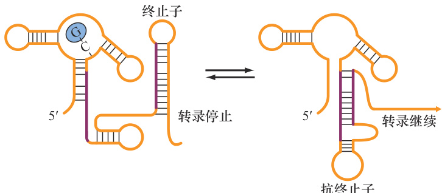  

a.  每种核糖开关构象的形成需要什么条件的细胞质环境？  
b.  在枯草芽孢杆菌中，鸟嘌呤核糖开关定位到包含17个不同基因的5个不同的转录单元上。基于图表，请回答题目a，什么样的生物学过程需要17个基因参与？解释你的推论。  

32.  RNA介导的基因调控机制存在很大的差异。下图展示的是最近一个发现的示例，基因CsrA和CsrB全局调控参与碳原子利用途径的基因集。CsrA的产物为CsrA蛋白，结合靶基因mRNA的核糖体结合位点（RBS），阻止靶基因的表达。CsrB基因的产物是CsrB RNA，包含与CsrA蛋白结合的22个位点。CsrBRNA可以与靶标mRNA竞争结合CsrA蛋白。当存在高浓度CsrB RNA时，CsrA蛋白不能结合mRNA位点，因此靶基因开始表达。  

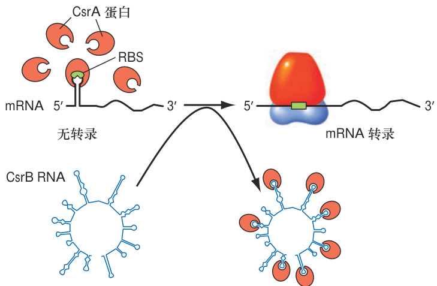  

a.CsrA和CsrB基因产物是什么分子（DNA、RNA、蛋白质、小分子）？是正调控因子还是负调控因子？影响基因表达的哪一过程？是顺式作用因子还是反式作用因子？（将你的答案与习题30的答案进行对比会很有趣）  
b.  CsrA/CsrB调控糖原合成和分解；糖原是葡萄糖的聚合物，是人类储存能量的主要来源。CsrA/CsrB是糖原合成的负调控因子、糖原分解的正调控因子。你认为CsrA/CsrB体系最可能响应什么样的环境因子？提出一个抑制该体系的合理的方式，再提出一个诱导该体系的不同的假设（两种情况下都假定CsrB的表达被调整）。你的哪种假设最符合参与糖原合成的靶基因（合成代谢途径），哪种假设符合参与糖原降解的靶基因（分解代谢途径）？请解释。  

# 16.4节  

33.  由于DNA损伤引起表达的基因许多都已被分离出来。lexA基因的功能缺失突变引起许多基因的表达，即使没有DNA的损伤。你猜想LexA蛋白是正调节因子还是负调节因子？为什么？  

34.  在2005年，Frederick Blattner和他的同事发现大肠杆菌细胞具有一个能够帮助它们寻找更好碳来源的整体性转录程序。  

许多基因，包含细菌运动所需的基因在碳源不足的情况下会启动表达，以便细菌可以寻找更好的营养环境。你现在想要搜寻调控这种响应机制的基因。你怎样利用lacZ融合基因鉴定这种调控基因？  

35.  大肠杆菌MalT蛋白是几个麦芽糖操纵子的正调控因子，麦芽糖存在时诱导表达此操纵子。编码MalT的基因是在组成型表达麦芽糖操纵子的突变体中鉴定出来的；在麦芽糖不存在时，此操纵子依然被转录。此突变体含有lacZ转录融合报告基因，即麦芽糖诱导操纵子的调节区融合lacZ的编码序列。  

a.  报告基因转入lacZ 突变细菌并将细菌涂抹在含有$\upbeta.$ -半乳糖苷酶底物X-gal的培养皿上。如果平板上同时含有麦芽糖，菌落会呈现什么颜色？如果平板只有X-gal没有麦芽糖，菌落是什么颜色？  

b.  此突变背景下，在导入报告基因之前，科学家诱变了lacZ 细菌，然后将导入后的细菌涂抹在含有X-gal但没有麦芽糖的平板上。除了一个菌落是蓝色的外，其余菌落都是白色的。对于这些菌落的分析，科学家们不能确定蓝色菌落的基因突变体是否编码了一个正向或是负向调节麦芽糖操纵子的调节因子。  

首先假设基因编码正向调节因子：（i）野生型蛋白如何响应麦芽糖？（ii）突变如何影响蛋白质功能？（iii）在分子水平上描述基因突变的性质。  

假设基因编码麦芽糖操纵子的负调节因子，请回答上述同样的三个问题。  

c.  你认为科学家如何发现MalT为正调节因子而不是阻遏物？（提示：回顾图14.28。如果研究者尝试利用来自于野生型菌株基因组构建的质粒文库和突变体菌种构建的质粒文库分别进行malT突变体鉴定，思考每种情况下会发生什么）  

36.  红细胞生成素是一种人类蛋白激素，促进红细胞的生成。想象一下你是一个制药公司的研究者，你想要在细菌中生产这种激素，用来治疗贫血症患者。你将构建一个具有以下元件的重组DNA分子，一些元件的重要性会在该问题的稍后部分解释：（i）人类红细胞生成素的编码序列；（ii）乳糖操纵子的调控序列；（iii）编码大肠杆菌麦芽糖结合蛋白的序列（MBP）；（iv）编码5个氨基酸的序列（单字母密码DDDDK）。制药公司的工程师将含有这些序列的重组质粒转入到大肠杆菌中，诱导被标记的融合蛋白N MBP-DDDDK-红细胞生成素C表达。  

a.  绘制重组质粒图，标出四段序列在质粒载体上的位置。  
b.  四个元件中的哪一个编码mRNA上的核糖体结合位点来制造此融合蛋白？  
c.  四个元件中的哪些元件需要安排在同一阅读框中？  
d.  你从人类基因组DNA上还是从人类cDNA上克隆获得红细胞生成素的编码序列？请解释。  
e.  你将利用什么化合物来诱导融合基因的表达？在培养基中加入此化合物后培养大肠杆菌合适，还是培养细胞到高密度后再将化合物加入培养基中合适？请解释。  
f.  表达此融合蛋白的细胞也同时表达其他大肠杆菌蛋白质。对于药物的使用，纯化药物剔除污染物非常重要。假定MBP紧密结合麦芽糖，麦芽糖可以吸附在不可溶的树脂上。解释你如何从大肠杆菌的蛋白质中提纯融合蛋白。  
g.  为了产生药效，人类红细胞生成素必须不能附带其他氨基酸序列。一个称为肠激酶的蛋白酶剪切蛋白质C端到DDDDK位点的部分。解释你将如何利用肠激酶将红细胞生成素与融合蛋白的其他部分分离，纯化所需的药物。  

37.  为了找到响应渗透压（溶质在溶液中的总浓度）变化的基因，你分别在高渗透压和低渗透压的培养基中培养大肠杆菌。你利用RNA-Seq技术对两种培养环境的细菌进行分析。渗透压的变化很可能会诱导一般的应激反应，此类应激反应在其他刺激下也会产生（如热激）。你如何区分参与一般应激反应的基因和参与响应渗透压变化的基因？（提示：你需要额外的细菌培养基培养细菌）  

38. 关于图16.30，提出以下问题：  

a.  图中标出了多少个基因？多少个操纵子？展示的区域平均基因密度是多少？这个数值能代表大多数细菌基因组吗？  
b.  图中完全没有发现t2110的转录物。这些数据能代表t2110是无功能基因吗？如果检测到了这个基因的转录物，科学家如何确定它转录的方向？  
c.  图中什么样的证据能够证明导致操纵子转录提前终止的衰减作用或是核糖开关机制的存在？根据环境条件分析，是否存在可被这种机制调控的操纵子？  
d.  图16.30的数据不能提供任何证据证明标出的基因或是操纵子被反义转录物调控。反义机制调控一个基因或者操纵子的数据是什么样子的？  
e.  尽管galM基因是含有galETK基因操纵子的一部分，是否有可能galM基因的转录实际上是由其他启动子完成的。图中什么样的数据支持这种可能性？  
f.  图16.30的数据能否显示sRNA封闭核糖体结合位点调控机制的存在？  

39.  在许多种类细菌中，调控sRNA通过转录组测序（RNA-Seq）被鉴定出来。科学家如何了解通过cDNA测序被鉴定的小RNA类型是调控sRNA而不是mRNA的片段？  

40.  许多参与氨基酸的合成途径的细菌基因被RNA前导序列调控，间接响应特定氨基酸的含量。类似衰减子或是一些核糖开关，这些变构的RNA前导序列被称为T-box前导序列，可以形成终止子或是抗终止子。T-box的名字泛指一个存在于所有RNA前导序列中的14个核苷酸序列；T-box含有5′UGGU3′序列与tRNA保守3′端互补（ $5^{\prime}\mathrm{ACCA}3^{\prime}$ ）。  

首次在枯草芽孢杆菌的tyrS基因中发现了T-boxRNA装置，该基因编码酪氨酰tRNA合成酶，该酶将酪氨酸负载到tRNATyr上。如下图所示，T-box前导序列结合反密码子，同时也结合空载tRNATyr的3′端（左侧）。当结合上空载tRNATyr，会在前导序列上形成抗终止子，否则形成终止子（右侧）。  

a.  枯草芽孢杆菌中，大多数tRNA合成酶基因都被T-box RNA前导序列调控响应特定的空载tRNA。解释这种调控机制的合理性。  
b.  如何改变枯草芽孢杆菌tyrS T-box碱基序列以便它响应空载tRNAPhe而不是tRNATyr？  
c.  T-box负责几乎tryS基因表达的所有调控。如果RNA前导序列中与tRNATyr反密码子互作的5′UAC3′变成5′CUA3′，那么你预计tryS基因的表达会发生什么变化？  
d.  通过不同于tyrS的基因的特定突变，题目c中描述的T-box突变体会恢复正常功能，由此实验证明T-box RNA前导序列结合tRNA。什么样的特殊细菌基因突变会令突变体的T-box RNA前导序列恢复正常功能？  

tyrS-lacZ报告基因的实验结果显示tyrS T-box前导序列直接响应有空载tRNA的相对水平而不是酪氨酸的含量。实验涉及各种tRNATyr突变体的表达。这些突变位于反密码子或者是 $3^{\prime}.$ 端四碱基对之外，但还是阻止了tRNA合成酶负载tRNA。  

e.  另一种野生型枯草芽孢杆菌菌株转入含有T-boxRNA前导序列的tyrS-lacZ报告基因。比较酪氨酸  

含量低时和酪氨酸含量高时，菌株内β-半乳糖苷酶的表达量。  
f.  现在假设题目e中的菌株内 $t R N\!A^{T y r}$ 基因替换为之前描述的阻止tRNA负载的突变 $t R N A^{T y r}$ 基因。比较新的菌株在酪氨酸含量低时和酪氨酸含量高时， $\upbeta.$ -半乳糖苷酶的表达量。解释这个实验如何区分这两个假设突变体。  
g.  利用计算机算法，T-box调控因子在许多其他种类细菌中被鉴定出来。你认为计算机程序鉴别的关键点是什么？  

# 16.5节  

41.  描述如何利用RNA-Seq分析来发掘费氏弧菌群体感应途径的元件。图16.33显示途径的中的元件是否存在不是计算机鉴定出来的？请解释。  

42.  研究生物发光和群体感应的科学家们发现转入含有费氏弧菌9kb DNA片段质粒的大肠杆菌菌群达到一定密度时会发光。他们诱变处理了这些大肠杆菌并分离出许多在9kb片段上突变阻止细胞发光的突变体。然后他们对这些突变进行了互补测试，同时转入两个质粒进入大肠杆菌细胞，每一个质粒上述突变中的一个。为了确保大肠杆菌同时转入两个质粒，其中一个质粒携带抗青霉素的基因，另一个质粒携带抗四环素的基因，在含有两种抗生素的平板上筛选细胞。  

a.  为验证下述9个突变设计一个 $9\times9$ 互补测试表格， $^+$ 代表细胞生长，–代表细胞不生长（你只需要填充一半的表格）。  

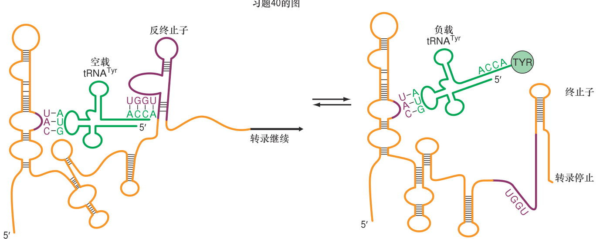  

突变5：编码不能结合DNA的LuxR蛋白突变6：编码不能与自诱导物结合的LuxR蛋白突变7：luxR启动子区阻止转录的突变突变8：luxICDABE启动子区阻止转录的突变突变9： luxICDABE启动子区阻止LuxR蛋白结合的突变  
b. 这9个突变中存在多少个互补组？  
c.  你回答题目b的个数是否也是不同基因的个数？请解释。  

43.  了解群体感应的分子机制的实验包括对两个转录的融合报告基因的利用，每个基因都含有习题42描述的费氏弧菌9kb的DNA片段。其中一个报告基因中（luxR/lacZ），luxR调控区域调控lacZ转录（即luxR编码序列被lacZ编码序列代替）。另一个报告基因（luxICDABE/lacZ），luxICDABE操纵子调控序列调控lacZ表达（即操纵子结构基因被lacZ编码序列代替）。图16.33显示了费氏弧菌的luxR的结构和luxICDABE区域。含有其中一个报告基因（luxR/lacZ或者luxICDABE/lacZ）的大肠杆菌菌落（lacZ–染色体）呈现白色。当纯化的自诱导物分子加入培养基后，luxR/lacZ菌落依然呈现白色，但是随着时间变化luxICDABE/lacZ菌落变为蓝色。  

a.  请解释为什么在缺少自诱导物时，luxR/lacZ菌落为白色。  

b.  请解释为什么在缺少自诱导物时，luxICDABE/lacZ菌落为白色。  
c.  请解释为什么加入自诱导物后，luxR/lacZ菌落依然为白色。  
d.  请解释为什么加入自诱导物后，luxICDABE/lacZ菌落变为蓝色，并且需要时间。  
e.  关于luxR基因的转录这些结果能说明什么？  

44.  群体感应调节许多病原菌中毒性蛋白的表达。通常，病原菌表达毒性蛋白来响应细胞高密度时被配体结合激活的受体。霍乱弧菌（引起霍乱病）正好相反，由于它的群体感应受体被结合的配体抑制，因此只有在低细胞密度时才表达毒性蛋白。这种不寻常的激活霍乱弧菌致病基因“相反的”机制令科学家想出一个简单的办法生产新型抗生素来治疗霍乱。请解释。  

45.  目前，科学家正在筛选小分子化合物文库，作为费氏弧菌响应高密度细胞时生物发光的抑制剂。选择的小分子具有潜在结合LuxR蛋白的能力。a.  结合LuxR蛋白的分子如何抑制生物发光？b.  数以百计的不同种类的细菌利用类似于费氏弧菌的群体感应机制，编码类似于LuxI和LuxR的蛋白质。根据这些信息，你认为为什么科学家想要鉴别题目a描述的分子？  