# 第六部分 遗传学应用  

# 第18章 操纵真核生物的基因组  

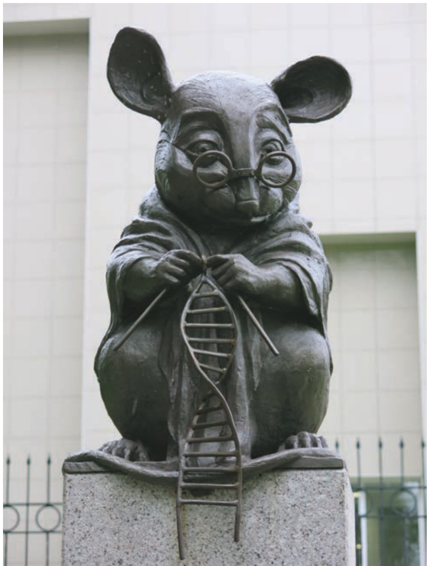  

俄罗斯新西伯利亚细胞学和遗传学研究所门前的一尊雕像向实验室鼠致敬。  
$\copyright$ Michael Goldberg, Cornell University, Ithaca, NY  

# 章节大纲  

18.1 创建转基因生物  
18.2 转基因生物的用途  
18.3 定向诱变  
18.4 人类基因治疗  

直到最近，由于一种名为Leber先天性黑朦（LCA）的遗传疾病而出生的视力不佳的儿童，注定要在成年早期完全失明。现在，对于这些孩子中的许多人来说，基因治疗试验的成功不仅为停止这种疾病的视网膜变性提供了希望，甚至为恢复正常视力提供了希望。  

LCA的一种形式是由RPE65基因的隐性功能丧失等位基因的纯合性引起的。该基因编码视网膜色素上皮（视网膜下方的细胞层）中发现的一种蛋白质，对光感受器的功能至关重要。RPE65酶在视觉周期一一视网膜探测光线的过程中起作用。LCA患者失去对光的敏感性，最终导致用于视觉处理的大脑皮层量减少（图18.1）。  

基因治疗是对基因的操控一一在基因组中添加DNA或者改变基因的DNA，以期治愈疾病。这种形式的LCA的实验性基因治疗策略很简单：科学家将RPE65基因的正常拷贝递送到患者的视网膜色素上皮细胞，只需通过眼睛将包装在病毒颗粒中的DNA注人这些细胞中。自2008年首次报道RPE65基因治疗临床试验结果以来，已有30多名患者接受了该手术，几乎所有患者的视力至少部分得到了恢复，有几个人不再被视为法定盲人。  

在本章中，你将了解改变基因组的两个一般策略：创建转基因生物和定向诱变。这些令人兴奋的技术的发展依赖于DNA可以在基因组内转移的自然过程的知识，以及在个体之间和物种之间转移，并被保护免于改变或降解。  

本章总的主题是，通过使用重组DNA技术，科学图18.1大脑皮层对光的反应激活。正常狗（上）和因RPE65基因突变导致Leber先天性黑朦（LCA）的狗（下）的大脑皮质被绘制成灰色阴影。每只狗的右图和左图是不同角度的视图。黄色和橙色信号表示响应于照射到这些动物眼睛上的受控量的光的皮质激活的幅度。LCA狗参与视觉处理的皮层区域比正常狗要少得多。  

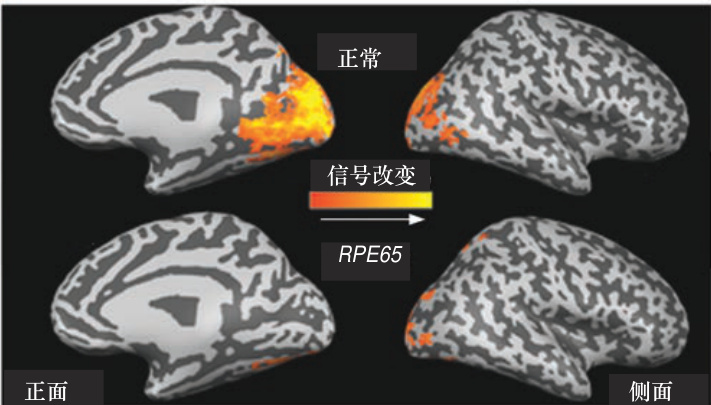  

Aguirre GK, Komaromy AM, Cideciyan AV, Brainard DH, Aleman TS, et al. (2007), "Canine and Human Visual Cortex Intact and Responsive Despite Early Retinal Blindness from RPE65 Mutation," PLoS Med, 4(6): e230. doi:10.1371/ journal.pmed.0040230  

家们可以利用这些自然过程，开发出创造性的、强大的方法来改变基因组，不仅是为了治疗疾病，也是为了改善药物和粮食作物的生产，以及增强现代生物学研究能力。  

# 18.1 创建转基因生物  

# 学习目标  

1.总结科学家如何用原核注射建立转基因小鼠。  
2.描述P元件如何用于生产转基因果蝇。  
3.解释研究人员如何利用来自农杆菌的Ti质粒将基因插入植物基因组。  

转基因生物的基因组含有来自同一物种或不同物种的另一个个体的基因，这种基因称为转基因。在本节中，我们将讨论研究人员可以制造转基因生物的一些途径。然后在下一节中，我们将仅探讨转基因技术的一些可能用途，这些用途实际上仅仅受限于科学家的想象力。  

# 18.1.1 科学家利用天然基因转移机制创造转基因生物  

可以使用第9章中描述的重组DNA技术在体外制备转基因。但要制造转基因真核生物，研究人员需要将转基因DNA导人一个或多个细胞。这个目标可以根据生物体以多种方式完成。一些单细胞真核生物，如酿酒酵母（S.cerevisiae），可以进行破坏细胞壁的处理，然后DNA就可以非常类似于大肠杆菌（E.coli）的人工转化方式进人细胞［见图9.5（b）］。对于许多其他生物来说，将DNA转移到细胞中最有效的手段就是将DNA溶液直接注射到细胞或胚胎中（图18.2）。在其他情况下，转基因DNA可以被整合人病毒颗粒甚至细菌中，然后可以用来感染细胞（稍后描述）。  

一旦导人细胞，随着细胞分裂，转基因必须被复制和保留。在大多数情况下，这些目标是通过将转基因整合到宿主细胞基因组中的随机位置来实现的。然而，在一些物种中，转基因可以在宿主染色体之外维持，也可以作为宿主染色体（秀丽隐杆线虫）或质粒（酵母）的一部分染色体外阵列。最后，为了使转基因在多细胞生物的世代之间繁殖，含有转基因的细胞有能力最终发育成配子是至关重要的。在动物中，这一要求意味着必须将转基因整合到生殖系细胞中。相反，在植物中，几乎任何细胞都可以携带转基因，因为可以从独立的细胞再生出来整株植物。  

我们在这里描述了创建转基因小鼠、果蝇和植物的方法的很多要点。这些技术在很大程度上是基于我们对自然中基因转移机制的了解。  

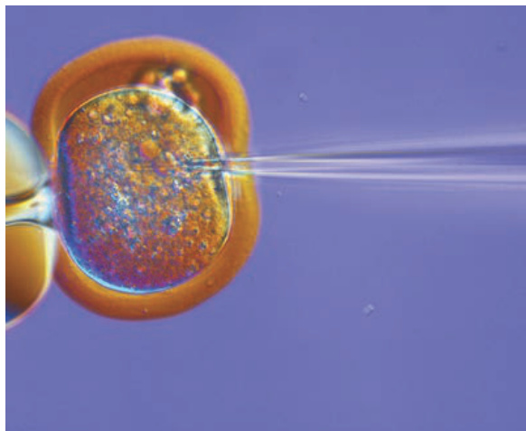  
(a)将转基因注射到新近受精的小鼠卵子中  
(b)向果蝇胚胎注射转基因   
配子小鼠  

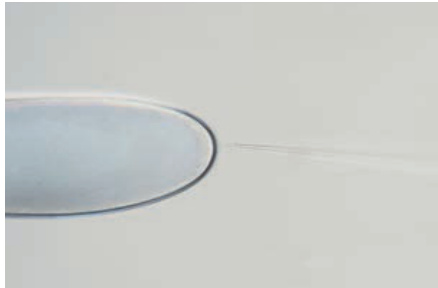  

图18.2将转基因注人细胞。（a）研究人员正在将DNA注射到受精后不久的小鼠胚胎中两个原核之一。（b）DNA被注入早期果蝇胚胎的后端，其为一个单一的多细胞核合胞体细胞。  

(a）： $\copyright$ Martin Oeggerli/Science Source; （b） : $\copyright$ Solvin Zankl  

# 18.1.2 DNA注入原核产生转基因小鼠  

受精的小鼠卵子（合子）含有两个单倍体原核一个来自母系，一个来自父系。两个原核靠近在一起，它们的核膜破裂，母系和父系来源的染色体混合在一起，使它们的姐妹染色单体在同一个纺锤体上分离，进行第一次有丝分裂。在这种有丝分裂结束时，两细胞胚胎的每个细胞都有一个二倍体细胞核。  

为了通过原核注射制造出携带染色体整合的外源DNA序列的转基因小鼠，如图18.3所示，研究人员将雄性和雌性小鼠交配，从雌性小鼠生殖道中收获刚刚受精的卵子，随后将外源DNA的线性拷贝注人受精卵的任一原核中［见图18.2（a）］，再将注人外源DNA的受精卵植人假孕雌性小鼠的输卵管中，在那里它可以继续发育为胚胎。  

注人的DNA有 $25\%\!\sim\!50\%$ 的概率会整合到一个随机的染色体位置。整合可以发生在第一次有丝分裂之前，在这种情况下，转基因将出现在成体的每个细胞中。或者整合可能会发生得稍晚一些，比如在胚胎完成一次或两次细胞分裂之后，在这种情况下，小鼠将形成一个嵌合细胞形式，一些细胞具有转基因，一些细胞则没有。  

只要转基因存在于生殖系细胞中，就会传递给下一代。将来源于含有转基因配子的小鼠与其他小鼠交配，就可以建立稳定的转基因动物品系。  

随机转基因整合的确切机制尚不清楚，但它显然依赖于寻找和修复DNA断裂末端的DNA修复酶，可能与非同源末端连接相关（NHEJ，回顾图7.18）。通常，转基因的多个串联拷贝会整合到基因组中的相同随机位点（见图18.3）。  

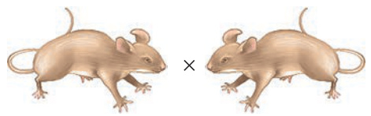  

从供体雌性中获得的合子受精卵转移到含有培养基的凹玻片上图18.3用原核注射法制造转基因小鼠。  

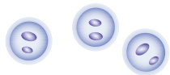  

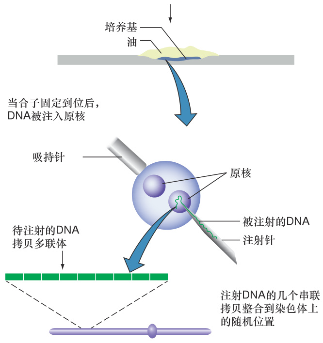  
将几个注射后的胚胎放入受体雌性的输卵管中  

  
检测它们的尾部细胞以判断注射DNA的存在  

# 18.1.3 重组P元件可以转化果蝇  

$P$ 元件是果蝇中的一类DNA转座子[回顾图13.23(b)］。自主的P元件含有转座酶蛋白的基因，且转座子末端为反向重复序列。转座酶结合反向重复序列后，从基因组中将转座子剪切出来，然后粘贴到了一个新的位置。果蝇遗传学家利用 $P$ 元件作为载体将基因转入生殖系细胞一一这一过程称为 ${\bf\nabla}P$ 元件转化。  

$P$ 元件载体是含有 $P$ 元件末端但不含转座酶基因的质粒（图18.4）。利用重组DNA技术，科学家将转座酶基因替换为转基因和一个标记基因，标记基因用来检测带有转基因的果蝇。一种广泛使用的标记基因是野生型白眼基因 $\left(\begin{array}{l}{\psi^{+}}\end{array}\right)$ ，它可以使得内源白眼基因突变（ $w^{-}$ 的果蝇恢复正常的红色眼睛。  

图18.4显示了用 $P$ 元件载体产生转基因果蝇的常用程序。研究人员在发育早期阶段将两种质粒注人 $w^{-}$ 胚胎中，此时最多存在数百个细胞核［见图18.2（b）］。将转基因克隆到载体中制成一个质粒，该质粒含有转基因和 $w^{+}$ 标记基因，均位于 $^{\cdot}P$ 元件反向重复序列之间。另一个质粒称为辅助质粒，含有转座酶基因，但没有P元件反向重复序列（见图18.4）。  

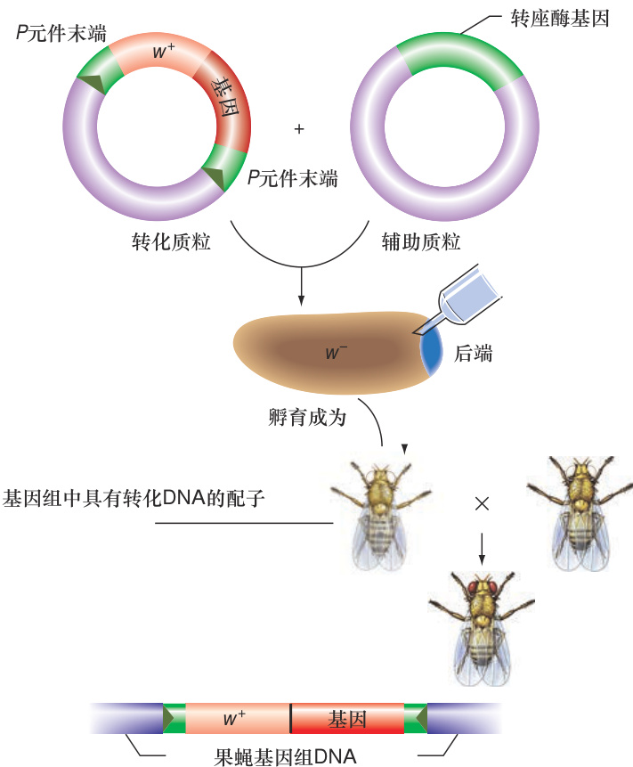  
图18.4通过 $^P$ 元件转化构建转基因果蝇。首先将转基因（基因）与载体上 $P$ 元件反向重复序列（绿色）之间的白眼基因$\stackrel{\cdot}{w}^{+}$ ）连接。研究人员将这种质粒连同含有 $^P$ 元件转座酶基因的辅助质粒一起注射到 $\nu^{-}$ 宿主胚胎中，在一些生殖细胞中发生转座。当带有这些生殖细胞的成虫与 $\bar{w^{\bigstar}}$ 果蝇交配时，一些后代就会拥有红眼和整合的转其因  

当将这两种质粒注射到胚胎中时，辅助质粒产生的转座酶蛋白可以启动重组 $P$ 元件，将其从另一个质粒中切出，并将该元件粘贴到果蝇宿主染色体中的随机位点（见图18.4）。  

注射后的胚胎成熟为成虫后，研究人员将每个成虫与 $\boldsymbol{w}$ 果蝇杂交。如果重组 $P$ 元件整合到生殖前体细胞的染色体中，注射动物产生的一些配子将携带有重组 $P$ 元件的染色体。研究人员可以识别出转基因后代（含有重组 $P$ 元件的果蝇），因为它们会有红色（ $w^{+}$ ）的眼睛。这些红眼果蝇可通过杂交方案建立稳定的转基因果蝇品系。含有转基因的重组 $P$ 元件随后不会在这一稳定品系的果蝇染色体内启动和转移，因为果蝇的实验室品系不含P元件而不会有转座酶存在。  

# 18.1.4 通过农杆菌Ti质粒载体完成植物转基因  

从根瘤农杆菌（Agrobacterium tumefaciens）介导的肿瘤诱导质粒（Ti）中获得的载体是将转基因引人植物体内的有效方法的基础——农杆菌介导的T-DNA转移（图18.5）。根瘤农杆菌感染植物细胞，在感染过程中，细菌可以将DNA转移到宿主细胞中，这一过程让人联想到细菌中的接合，因为它涉及形成根瘤农杆菌供体和植物细胞受体的菌毛连接。  

这种转移DNA称为T-DNA，它是存在于根瘤农杆菌Ti质粒DNA的一部分。T-DNA整合到植物细胞基因组中。由于T-DNA含有导致细胞过度生长的基因，含有T-DNA的细胞的后代会形成一种叫做冠瘿的肿瘤。T-DNA转移依赖于称为左边界和右边界（LB和RB）的T-DNA两端的25个碱基对序列，以及正常存在于Ti质粒上的vir基因编码的几种蛋白质。  

我们可以发现，T-DNA整合到宿主染色体在很多方面类似于DNA转座子的启动，vir基因蛋白是作用于边界上LB和RB序列的转移活性酶。因此，使用T-DNA将基因转人植物基因组中的方法与刚刚描述的果蝇P元件流程有一些内在的相似性。  

研究人员用两种不同质粒转化根瘤农杆菌（图18.5）。一种是含有vir基因但没有边界序列的辅助质粒。另一种质粒是T-DNA载体，经改造后含有要转移的基因和标记基因（通常是潮霉素抗性基因），两者都位于LB和RB序列之间。研究人员向整株植物或植物细胞上喷洒转化后的根瘤农杆菌实现感染。接下来在培养物中培养单个感染的植物细胞或在土壤中种植感染的种子以生成胚胎植物，并通过向生长培养基中添加潮霉素来选择重组T-DNA转化的胚胎或幼苗（图18.5）。  

这些用于构建转基因生物的方法实例展示了科学家如何利用自然过程来改变基因组。研究人员实际是“劫持”了根瘤农杆菌产生冠瘿的过程来实现将外源DNA图18.5使用T-DNA质粒载体产生转基因植物。研究人员用含有两种质粒构建体的根瘤农杆菌细菌感染植物。T-DNA质粒含有转基因（基因）和潮霉素抗性的标记基因，两者都在T-DNA末端LB和RB内。辅助质粒含有vir基因，这是T-DNA转移到植物细胞所必需的。感染后，重组T-DNA整合到宿主植物的体细胞和生殖细胞的基因组中。研究人员通过在潮霉素的存在下培养细胞或种子来选择具有转基因插人的单细胞或种子。然后他们将选定的细胞或幼苗培育成一个完整的转基因植物。  

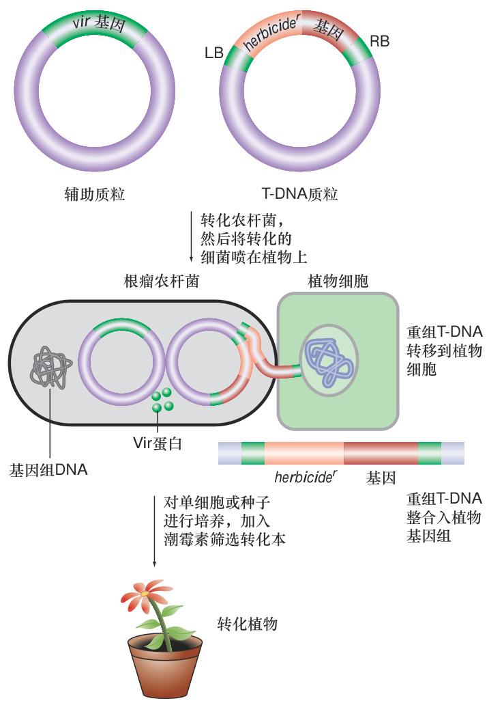  

导人植物。因此，天然存在的酶促过程，无论是用于DNA修复还是用于启动转座子或T-DNA，都是将外源DNA整合到宿主染色体中的基础。  

# 基本概念  

·转基因小鼠是通过将外源DNA注入受精卵的原核而产生的。  
·果蝇的转化依赖于插入转基因到P元件转座子载体的构建。  
·研究人员通过用携带转基因的Ti（肿瘤诱导）质粒的农杆菌感染植物细胞来制造转基因植物。  
·这些创建转基因生物的方法产生转基因在宿主基因组中随机位置的整合。  

# 18.2 转基因生物的用途  

# 学习目标  

1.描述转基因如何能够明确哪个基因导致突变表型。  
2.总结转基因报告构建体在基因表达研究中的应用。  
3.讨论转基因生物如何产生人类健康所需蛋白质的  
实例。  
4.列举转基因生物的例子，并讨论其生产的利弊。  
5.解释利用转基因动物模拟人类功能获得性遗传疾病。  

我们创建转基因生物的能力对生物学研究产生了重大影响，对日常生活的很多方面也越来越重要。研究转基因模式生物可以使研究人员更好地了解特定基因的功能及其调控，并利用动物对某些人类疾病进行建模。此外，科学家还设计了转基因植物及动物来生产药物和更好的（也是更受争议的）农产品，甚至是颜色鲜艳的宠物（图18.6）。  

# 18.2.1 转基因确定了基因与表型的关系  

在许多遗传学研究中，现有的信息可能无法让科学家精确定位某一特定表型的基因。转基因生物的构建常常让研究人员能够解决含糊不清的问题。  

举个例子，假设一个对果蝇眼晴如何发育感兴趣的遗传学家分离出一个隐性突变（ $m^{-}$ ）纯合导致眼睛畸形的突变果蝇品系［图18.7（a）］，分子分析揭示突变是两个不同基因5'位置产生的一个小的缺失［图18.7（b）］。那到底是基因A的缺失还是基因B的缺失导致了眼睛的缺陷呢？  

我们可以通过创建含有基因A或基因B野生型基因组DNA的重组P元件构建体来回答这个问题［图18.7（c）］，然后来测试每个转基因恢复正常眼睛的能力。例如，如果携带野生型基因A转基因的纯合子m/m果蝇眼晴是畸  

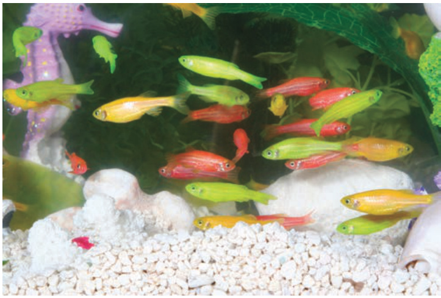  
图18.6Glofish?。表达GFP和RFP的不同颜色变体的转基因斑马鱼（Danio rerio），是第一种转基因宠物。$\copyright$ CB2/ZOB/WENN/Newscom  

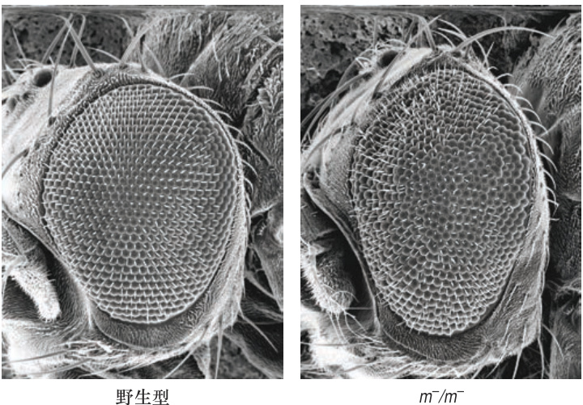  
(a)隐性突变的纯合子眼睛有缺陷   
(b)基因组DNA中的缺失去除了两个基因的一部分  

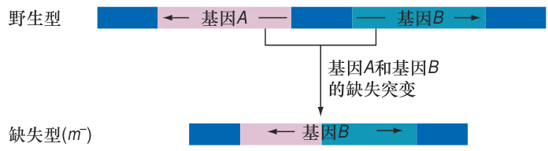  

(c)转基因拯救检测  

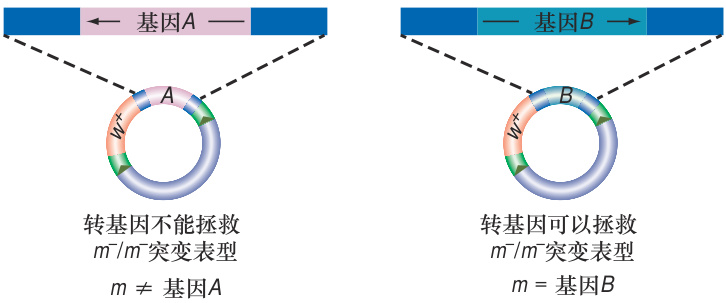  

图18.7利用果蝇转基因将突变表型与基因进行关联。（a）扫描电镜照片显示m基因活性缺失导致畸形的果蝇眼睛。（b） $m^{-}$ 突变是两个相邻基因的部分缺失：基因A和基因B。（c）含有基因A转基因（左）的m/m果蝇仍然具有畸形眼晴，而含有基因B转基因（右）的m/m果蝇具有野生型眼晴。因此，畸形的眼晴是由于基因B的丢失，而不是基因A的丢失（质粒载体见  

图18.4）。(a) : $\copyright$ Janice Fischer, The University of Texas at Austin形的，但携带野生型基因B转基因的m/m果蝇眼睛是正常的，你就会得出结论：基因B的缺失是突变表型的原因。换句话说， $m{=}$ 基因 $B$ O  

我们以前在第4章中看到了一个类似逻辑的重要例子。我们会记得，一只含有SRY转基因XX小鼠发育成雄性（“快进”信息栏“转基因小鼠证明SRY是雄性因子”）。这个实验举例说明了转基因技术可用于理解特定基因功能的另一种方式：在这里，SRY基因在不寻常的背景下（在有两条X染色体而没有Y染色体的生物体中）的表达表明，SRY控制类似于小鼠和人类的哺乳动物的雄性发育。  

# 18.2.2 转基因是分析基因表达的关键工具  

在第17章中，我们描述了科学家如何使用报告构建体来研究真核生物中基因表达调控的许多方面，其含有可以产生易于检测的蛋白产物的外源基因［例如，来自水母基因的GFP（绿色荧光蛋白）或来自大肠杆菌lacZ基因的半乳糖苷酶」。这样的报告构建体帮助研究人员识别增强子，这些增强子在发育的特定时间和特定组织中指令基因的转录（回顾图17.3）。报告构建体在寻找编码增强子的编码转录因子基因方面也很有价值（回顾图17.13）。在此，我们提醒大家，这些报告构建体的功能只有作为转基因导人真核生物中时才能被用于监测。  

# 18.2.3 转基因细胞和生物作为蛋白质工厂  

在第16章中，我们看到一些用作药物的人类蛋白质可以在用融合基因构建体转化的细菌中生产。在这些构建体中，人类蛋白的编码序列受细菌启动子和核糖体结合位点序列的控制，以确保高水平基因表达（回顾图16.28）。制药公司通过这种方式生产人生长激素和胰岛素。然而，并非所有的人类蛋白质都能在细菌中以功能形式产生。细菌无法进行许多重要的翻译后操作，包括某些多肽的正确折叠或切割，以及糖基化和磷酸化等修饰。  

为了规避这样的问题，制药公司有时可以在液体培养物中悬浮培养经过转基因的哺乳动物细胞或植物细胞。已经有几种药物蛋白质以这种方式生产。一种是Ⅲ因子蛋白，这种凝血因子在一些血友病患者中是缺乏的。另一种是促红细胞生成素（EPO），这是一种刺激红细胞生成的激素，也曾经被一些臭名昭著的运动员为了提高成绩而滥用。然而，细胞培养只能产出低产量的重组蛋白，且比较昂贵。  

# 1.医药农场  

利用转基因农场化动物和植物生产人类蛋白质可以为替代细胞培养提供一种成本低、产量高的方式。应用转基因动物和植物生产蛋白质药物有时被称为医药农场，这一词汇意味着农业和制药的结合。医药农场技术还处于起步阶段，到目前为止（2016年），只有一个“农场”药物可供患者使用，但更多的药物正在开发中。  

在转基因动物中最常用于生产人类蛋白质药物的方法是在乳腺中进行蛋白质表达，因为分泌到乳汁中的蛋白质可以得到高产率纯化。通过原核注射（如图18.3），编码人类蛋白的转基因已经转移到山羊、猪、绵羊和兔子身上。2009年，美国食品药品监督管理局（FDA）批准了第一个在转基因动物乳汁中生产的人类蛋白药物一一血液因子抗凝血酶Ⅲ。正常表达于乳腺的山羊基因的调控序列与人类抗凝血酶Ⅲ（一种抑制凝血的血浆因子）基因编码区的融合基因被转化进山羊来生产这种药物（图18.8）。只有一个抗凝血酶Ⅲ基因功能性拷贝的人倾向于发生血凝，特别是手术后或分娩时，该药物目前被批准用于患有静脉血栓栓塞症的遗传病患者。  

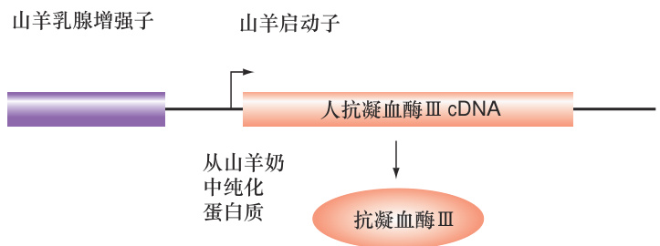  

图18.8在转基因山羊乳汁中生产人抗凝血蛋白的基因构建体。  

通过原核注射产生的单个转基因动物将具有可变数量的转基因拷贝，并且转基因的排布也处于基因组上不同的随机位置，这些变化导致每只注射动物中人类蛋白质产量的巨大差异。一种提高稀有的高产动物数量的方法是通过生殖克隆：利用成年转基因动物的体细胞核培育具有相同基因组的群体。毫不奇怪，同样正在开发在转基因动物中生产药物技术的制药公司积极资助开发动物克隆技术。“遗传学工具”信息栏“体细胞核移植克隆”介绍了最常用的生殖克隆技术。  

# 2.转基因植物生产疫苗  

类似于转基因动物，携带转基因的植物也可以用于生产人类蛋白质药物。转基因植物具有制造疫苗的特别优势，疫苗是一种致病因子的抗原，可以刺激对该特定外来物质的免疫应答。烟草、向日葵、菠菜、马铃薯、水稻、大豆、玉米或番茄等转基因农作物产生的疫苗蛋白可以储存在叶片或种子中。这些植物可以通过简单地被食用，以保护个体免受病原体的侵害。可食用疫苗可能对发展中国家特别有利：种子运输不需要冷藏，植物可以在当地种植，不需要针头、注射器或医疗专业人员。  

尽管理论上有望在转基因植物中生产疫苗，但迄今为止的试验只取得了部分成功，在这些疫苗中的任何一种能够上市之前，还需要克服许多问题。一个主要的困难是控制抗原的剂量：单株植物产生的抗原量可能不同，并且抗原太少会导致疫苗无效。另外，食用的疫苗对抗原剂量的要求要高于注射的方式。即使科学问题能够克服，在将这些植物生产的疫苗提供给人类之前，制药公司也会遇到许多监管障碍。由于相关法规不那么严格，近来相当多的注意力放在了给家畜喂食转基因疫苗制造植物上，以保护它们免受病原生物引起的各种疾病的侵害。  

# 18.2.4 转基因生物广泛应用于现代农业  

截至2016年，已经创建了100多个性状改良的不同转基因植物品种并被农民种植。现在这种转基因（GM）作物在许多物种中都有存在。转基因赋予的改进包括提高营养价值、延长保质期、增加产量或增加植株大小，以及抵抗压力、除草剂、植物病毒或昆虫的侵袭。我们在这里讨论目前被广泛应用的两种最具商业重要性的转基因作物。  

在美国种植的大豆 $90\%$ 以上是抗草甘麟的转基因植物，草甘膦是Roundup?除草剂中的主要活性成分。草甘麟会干扰一种叫做EPSPS的酶，这种酶是植物合成几种氨基酸所需要的。所谓的Roundup Ready?大豆携带一种转基因，其编码一种细菌来源的抗草甘膦的EPSPS。农民们在种植抗除草剂大豆的田间喷洒Roundup，可以杀死杂草而不伤害大豆，从而节省大量的劳动力和时间。草甘麟本身随后在环境中通过自然过程迅速降解。  

另一种非常成功的转基因植物是玉米，它能产生一种叫做Bt蛋白的天然有机杀虫剂，这种杀虫剂能保护植物不被玉米蛾幼虫吃掉。这种蛋白质是由苏云金芽孢杆菌（Bacillus thuringiensis）天然制造的，以保护自己不被毛虫吃掉。Bt蛋白对摄取它的昆虫幼虫是致命的，但对包括人类在内的其他动物没有作用。因为这种基因工程玉米能够自己产生天然杀虫剂，农民就可以避免使用可能损害农场工人和环境的昂贵化学农药。表达Bt蛋白的转基因植物在1996年首次商业化种植，目前在美国种植的玉米中至少1/3含有 $B$ 转基因。全世界有超过100亿英亩（1英亩 $\approx\!4046.86\mathrm{m}^{2}$ ）的土地用于种植表达Bt的作物，除了玉米，还有油菜、棉花、木瓜、马铃薯、水稻、大豆、南瓜、甜菜、番茄、小麦和茄子等。  

2015年，第一个转基因动物—AquaBountyTech-nologies?公司生产的大西洋鲑鱼，被美国食品药品监督管理局批准供人食用。大西洋鲑鱼通常需要3年的时间才能长到9磅左右的全长体形，它们的生长激素基因在食物匮乏的最冷月份被关闭，因此它们在一年中仅生长8个月左右。而转基因大西洋鲑鱼，则含有一种常年表达的生长激素转基因，使得它们用一半的时间就可以达到完整体重。  

转基因作物在美国和超过25个其他国家种植，在这些国家里，这些转基因生物被认为是能够帮助解决由大规模农业引起的限制环境问题和满足日益增长的世界人口粮食需求的重要工具。然而，其他国家限制甚至完全禁止转基因生物的进口。现在很少有科学家还认为，摄入由转基因生物制成的食物对人类会造成直接危害。但是，仍然需要考虑到对于转基因生物的一些反对意见。转基因作物的广泛使用可能会扰乱农民和农场社区的生活，并给少数跨国农业综合企业带来相当大的影响。也可能存在一些潜在的环境后果，例如，转基因生物向其他野生物种传递不必要的性状。这些问题在未来几年内仍然可能存在争议。  

# 遗传学工具  

# 体细胞核移植克隆  

在第12章，我们介绍了世界上第一只克隆猫“CC”。在这个意义上的克隆是指生殖克隆，也就是说来自于一个个体的单个体细胞的基因组成为不同个体中每个体细胞的基因组。  

研究人员通过一种被称为体细胞核移植的方案创建生殖克隆。科学家从一个个体身上取出一个体细胞的二倍体细胞核，将其注人一个已被移除自身细胞核的卵细胞中（图A）。经过几天的生长，研究人员将被操纵的胚胎植入代孕母体的子宫内，当胚胎发育至足月后，就诞生了克隆动物。图A底部的克隆猫可以被认为有三个不同的母亲：体细胞核供体，卵母细胞供体，提供子宫的代孕体。如果体细胞核来自于雄性，也可以克隆雄性动物。  

尽管克隆动物的所有细胞中的所有核染色体均来源于体细胞核供体，但克隆动物和该供体在各方面并不完全相同，原因如下： $\textcircled{\scriptsize{1}}$ 克隆动物的线粒体基因组来自卵母细胞供体，而不是核供体； $\textcircled{2}$ 对于雌性克隆，克隆动物中和母体中的X染色体失活模式不尽相同，因为决定哪个X染色体的失活是在动物早期发育过程中的单个细胞随机产生的； $\textcircled{3}$ 代孕体与供体母本的子宫环境并不完全相同。  

进行克隆CC的工作是由一家名为遗传储蓄与克隆的生物技术公司资助的，该公司的使命是为那些可能想在宠物死后复制它们的主人提供商业克隆服务。这家公司并没有最终取得成功。很少有人能够承担克隆程序的高昂成本，而且，一些不太懂的客户因为发现对他们收到的克隆动物实际上并不完全是他们所了解的宠物而感到失望。  

尽管如此，克隆某些动物仍然有很好的理由。对克隆动物的研究使科学家能够更好地理解基因印记等基本过程。制药公司正在投资生殖克隆技术，他们着眼于能够产生大量的高产转基因动物。事实上，早在克隆CC之前，从成体细胞中克隆出来的第一个动物是1996年的一只叫做“多莉”的绵羊。多莉是由苏格兰的科学家克隆出来的，部分资助来源于一家制药公司。  

在2003年多莉去世之前，她生下了5只存活的后代。最后，为了实现物种保持的目的，多个濒危物种已经得到了克隆。  

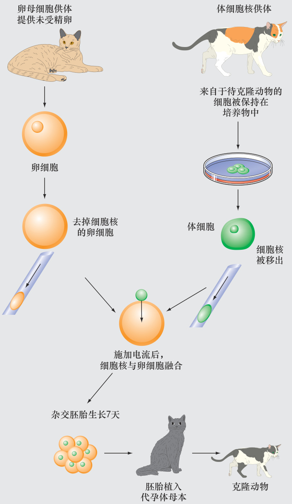  
图A通过体细胞核移植克隆一只猫。  

# 18.2.5 人类功能获得性遗传疾病的转基因动物模型  

几十年来，人类遗传疾病的动物模型一直是科学家试图了解疾病生物化学原理从而设计和测试新药及其他治疗方法的重要工具。人类单基因疾病动物模型的想法很容易实现一一建立具有相应突变和类似疾病表型的动物。  

我们可以注意到，因为转基因被添加到其他野生型基因组中，用刚才描述的技术制造的转基因动物就能够作为显性的功能获得性突变的模型（我们在本章的后续章节中讨论由功能缺失型突变引起的疾病动物模型）。  

由于许多原因，小鼠是最常用于作为人类遗传疾病模型的动物。小鼠是哺乳动物，而且它们的基因组中大多数基因与人类相似。另外，小鼠是小型且相对经济的实验动物。但遗憾的是，对于人类神经系统疾病的研究，小鼠无法复制一些基因突变对脑功能和行为的复杂影响。取而代之的是，科学家们最近开始用转基因猴子（恒河猴）来模拟人类疾病。  

人类神经系统疾病的第一个转基因灵长类动物模型是亨廷顿病。我们还记得亨廷顿病是由HD基因的显性等位基因引起的，特征为该基因编码区内CAG三核苷酸重复区数量的扩大（可以回顾第7章中信息栏“三核苷酸重复疾病：亨廷顿病和脆性X综合征”的部分）。突变的等位基因编码出亨廷顿蛋白产物的一种形式，在其所谓polyQ区域中的谷氨酰胺残基超过正常数量。模拟亨廷顿病的恒河猴携带有一个转基因，该转基因包含了一个带有扩大CAG重复区数量的HD基因突变拷贝。这些猴子表现出类似于亨廷顿病患者的疾病症状，从而帮助科学家了解这种病症并开发更有效的疗法。  

对灵长类动物的实验引起了许多人的高度伦理关注，因此人类遗传疾病灵长类动物模型的未来尚不清楚。直到2016年本书完成，美国国立卫生研究院正在逐步淘汰大多数（尽管不是全部）涉及灵长类物种的侵人性研究。  

# 基本概念  

·野生型转基因可以插入到隐性突变等位基因纯合的胚胎中。如果恢复正常表型，那么转基因就会鉴定出发生突变的基因。  
·报告构建体的创建可以轻松检测出真核生物中基因何时、在哪些组织中被开启或关闭。  
·转基因生物可以生产医学上重要的人类蛋白质，包括胰岛素、凝血因子和促红细胞生成素等，转基因植物作物可以制造可供摄入的疫苗。  
·转基因大豆对除草剂草甘麟具有抗性。许多作物，如玉米、大豆、油菜和棉花都经过了基因改造，以表达阻止昆虫侵害的Bt蛋白。  
·将携带致病、功能获得性的等位基因的转基因添加到非人类动物模型中，可以让研究人员观察疾病进展并测试可能的治疗干预措施。  

# 18.3 定向诱变  

# 学习目标  

1.描述ES细胞如何用于生成基因敲除小鼠。  
2.解释为什么研究者可能想要创建一个条件性基因敲除小鼠。  
3.讨论科学家如何利用噬菌体位点特异性重组系统生成敲入小鼠。  
4.描述CRISPR/Cas9及其如何用于修饰基因组。  

在上一节中，我们看到基因可以很容易地转移到许多动物和植物基因组中的随机位置。在这里，我们将探索更先进的技术，使科学家能够以几乎任何期望的方式改变特定的基因，即定向诱变。  

研究人员只需要知道期待改变的基因的DNA序列，因为现在实验室通常使用的所有模式生物的基因组序列都已经确定，这些物种中的任何基因都可以随意突变。  

我们在这里主要关注改变小鼠特定基因的方法，因为小鼠是许多与人类生物学相关研究的首选动物。然而，在本节最后，我们将描述一种激动人心的新技术，它刚刚被广泛使用，而且适用于许多不同的物种。  

# 18.3.1 具有特定基因的功能缺失突变的基因敲除小鼠  

同源重组为DNA序列精确插人基因组特定区域提供了一种方法。实际上在第14章中我们就已经看到，通过同源重组的方式进行基因转移可以突变特定的细菌基因一一被称为基因打靶的过程（回顾图14.31）。通过基因打靶，科学家在体外诱变一个特定的基因，然后将突变的DNA导人细菌细胞中，再通过同源重组用突变拷贝取代细菌基因组中基因的正常拷贝。虽然同源重组事件概率很低，但研究人员可以很容易地培养大量细菌，然后通过筛选转移DNA中存在的耐药标记物来识别含有靶向突变的少量细胞。酿酒酵母等单细胞真核生物的基因打靶采用同样的方法已是相当常规的手段。  

小鼠遗传学家利用小鼠胚胎干细胞（ES细胞）克服了在多细胞生物中基因打靶的两个主要障碍。首先，对于含有要传递给子代的靶向基因的染色体，基因打靶必须发生在生殖系细胞中。其次，鉴于同源重组的效率较低，研究人员需要对大量的生殖系细胞进行筛选，以获得一个具有所需突变的细胞。小鼠ES细胞在培养皿中生长，因此就像细菌或酵母一样，研究人员可以筛选出含有靶向突变的少量细胞。这一过程的一个关键点是，将具有靶向染色体的ES细胞从细胞培养皿移动到发育中的胚胎，在那里它们可以发育成所有不同的细胞类型，包括生殖系细胞。  

# 1.在ES细胞中基因打靶以生成基因敲除小鼠  

小鼠ES细胞是来源于称为囊胚的早期胚胎内细胞团的未分化细胞（图18.9）。这些ES细胞尚未形成如皮肤、骨骼或血液等特定类型细胞所特有的基因表达模式。因为它们是未分化的，小鼠ES细胞可以在含有专用培养基的培养皿中分裂许多代。最重要的是，培养生长的ES细胞是全能的，这意味着它们保留了在发育的胚胎中受到恰当信号刺激时成为任何细胞类型的能力，包括生殖系细胞和配子。  

图18.9展示了通过培养的ES细胞进行基因打靶的细节。研究人员创建了DNA构建体，其中通过插人耐药标记来诱变特定的基因，然后他们将这种DNA添加到ES细胞正在生长的培养基中。一些细胞会从培养基中摄取DNA。一段时间后研究者将药物加人到培养基中，只有将外源DNA掺人其基因组的少量细胞能够存活并分裂。科学家们随后利用PCR来鉴定那些染色体通过同源重组获得了耐药基因而存活的细胞品系，这些细胞是目标基因功能缺失突变的杂合子。  

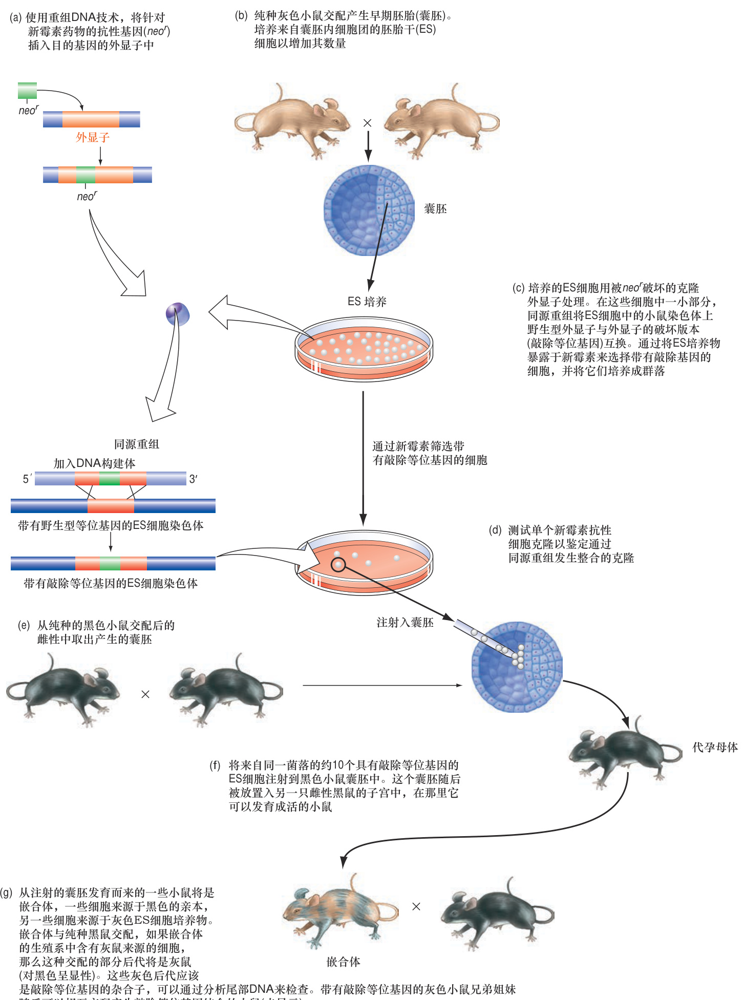  

基因打靶方案的下一步就是利用ES细胞具有进入早期胚胎并发育成任何类型细胞的能力。将具有所需突变的ES细胞注人宿主囊胚，然后将其植人代孕母体内（图18.9）。出生的小鼠被称为嵌合体，这意味着它们是由来自两种不同来源的细胞组成的：这些动物中源自ES细胞的细胞是靶基因突变的杂合子，而宿主细胞是该基因座野生型等位基因的纯合子。遗传学家将嵌合型小鼠与野生型小鼠交配产生非嵌合的杂合子代，这些后代被称为基因敲除小鼠，因为它们含有一条带有目标基因的无效（敲除）等位基因的染色体。遗传学家随后将杂合基因敲除小鼠相互交配，产生纯合突变体。  

# 2.小鼠基因敲除的用途  

第一个基因敲除小鼠创建于1989年，8年后开发这项技术的三位科学家被授予诺贝尔奖。由于几乎每个人类基因在小鼠中都有相同或相似功能的对应物，因此基因敲除小鼠可用于研究由基因功能缺失引起的各种人类疾病。  

在基因敲除小鼠中建模的首批单基因疾病之一是囊性纤维化。回想一下，CF基因编码调节氯离子流动进出肺细胞的膜蛋白CFTR（回顾图2.25）。利用CF基因敲除小鼠，研究人员发现囊性纤维化是由于肺部黏液堆积造成的结果，导致至少部分不能清除的肺细胞中的细菌。目前科学家正在CF基因敲除小鼠身上测试囊性纤维化的新的实验疗法。  

从更广泛的意义上讲，基因敲除小鼠对于帮助研究人员理解哺乳动物体内任何基因的功能都是非常宝贵的。简单地说，遗传学家可以制造完全缺失任何指定基因功能的纯合基因敲除小鼠，然后观察对生物体表型的影响。认识到这一方法的重要性，美国国立卫生研究院资助了基因敲除小鼠项目，这是学术、政府和工业实验室之间的合作，目标是为小鼠基因组中的每一个基因创建一个含有基因敲除突变的ES细胞系。  

# 18.3.2 条件性基因敲除小鼠揭示必需基因的功能  

对于一些基因来说，不可能产生纯合基因敲除小鼠。这些所谓的必需基因可能是动物发育的早期阶段所必需的，也可能是对所有细胞生存至关重要的一些过程所必需的。为了研究生物体中某种必需基因产物的作用，研究人员可以利用基因打靶来创建嵌合个体，其大多数细胞中该基因是纯合的野生型等位基因，只有某些细胞是纯合的突变等位基因。在同一技术的另一种应用中，整只动物可以保持纯合的野生型等位基因直到成年，之后研究者可以操纵其部分甚至全部细胞成为纯合的突变等位基因。  

这些策略的关键是科学家在一定条件下将DNA序列添加到目标基因中，导致一个外显子从基因组DNA中被消除。当研究者改变环境条件时，具有可特异性失活基因的小鼠就是条件性基因敲除小鼠。为了实现基因外显子条件性缺失，遗传工程师利用了一种天然存在的位点特异性重组系统，即噬菌体P1感染大肠杆菌时对其生长非常重要的一套机制。  

# 1.Cre蛋白和loxP位点  

在正常的DNA复制过程中，噬菌体P1产生含有许多P1基因组拷贝的大DNA环。为了产生可包装进单个噬菌体颗粒的单个基因组，Cre重组酶引起大环上的称为loxP位点的两个特定DNA序列之间发生交换（图18.10）（回顾第6.6节中对位点特异性重组的细节描述）。科学家是如何利用Cre/loxP重组系统在动物的特定组织和（或）特定时间内使得特定的小鼠基因产生缺失突变的呢？  

# 2.进行条件性基因敲除  

第一步，利用重组DNA技术构建一个如图18.11（a）所示的基因打靶构建体，该构建体含有两个内含子和一个有待条件性敲除的基因外显子。一个内含子内有一个loxP位点，而另一个内含子含有一个两侧为两个loxP位点的耐药基因。构建体中外显子的基因功能是必需的，如果是蛋白质编码基因的情况，则选择的外显子通常含有部分可读框（ORF）。  

第二步，研究人员使用我们刚刚在图18.9中描述的程序来生成ES细胞，其中靶向构建体中的序列替换了小鼠基因组中内源野生型基因中的相应DNA序列。这些实验中使用的特殊ES细胞先前被修改为含有可以诱导方式表达Cre蛋白的转基因，例如，该转基因可具有与Cre蛋白的编码序列融合的热休克激活的小鼠启动子。  

第三步，去除耐药基因。在高温下培养ES细胞启动Cre表达，促使两个loxP位点之间发生重组。可能发生的结果是如图18.11（a）底部所示的染色体，这个外图18.10Cre/loxP重组系统。噬菌体P1通过Cre重组酶蛋白介导，在34个碱基对的loxP位点之间发生位点特异性重组，以产生其基因组的单拷贝。  

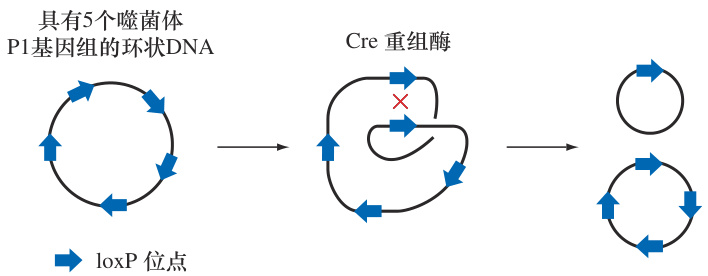  

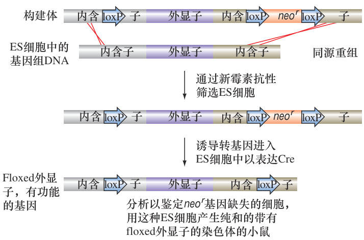  
(a)给一个小鼠基因两端连上loxP位点  
(b)利用floxed基因条件性敲除  

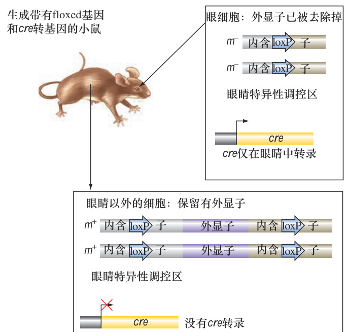  
图18.11条件性基因敲除小鼠。（a）用一个两端连有loxP位点的foxed外显子置换ES细胞中部分基因的多步骤过程。这些ES细胞被整合到小鼠生殖系中。（b）在这个例子中，纯合的floxed基因转基因小鼠也带有只在眼晴中表达Cre的转基因。只有在眼细胞中（而不是在身体的其他地方），Cre介导的loxP位点特异性重组才会从两个拷贝的floxed转基因中去除外显子。  

# 显子（或基因）被称为floxed（两侧连接loxP）位点。  

现在具有杂合floxed基因的ES细胞已经获得，研究人员将它们注人宿主囊胚并生成杂合小鼠，就像前面图18.9所描述的那样。最后，遗传学家进行一系列的杂交，生成一个floxed基因纯合的小鼠，同时还携带一个在特定时间或特定组织中表达Cre的转基因。为了方便起见，我们在这里讨论一个cre转基因仅在眼中转录的例子［图18.11（b）］。  

因为loxP位点被放在不干扰RNA剪接的内含子中的位置，所以floxed基因正常发挥功能。然而，在表达Cre的眼细胞中，Cre介导的loxP位点之间的交换从靶向基因的两个拷贝中去除了一个外显子［图18.11（b）］。因此，眼细胞（且只有眼细胞）实现了纯合的基因敲除。  

我们可以看到为什么floxed等位基因被称为条件性敲除：这些等位基因在所有组织中都正常发挥作用，除了那些产生Cre并从基因中删除序列的细胞。  

# 3.条件性基因敲除的应用  

条件性基因敲除小鼠能提供给科学家们什么样的信息？举个例子，假设图18.11中的靶向基因是所有细胞存活所必需的，如果是这种情况，很可能在Cre表达后，带有floxed等位基因的动物会失明。或者另一种情况，靶向基因只对于眼睛以外的组织是必需的，那么其眼晴（甚至整只动物）都将是正常的。还有一种可能性是，该基因在眼晴中是特定功能所需要的，比如形成视网膜，那么纯合floxed基因中的Cre表达会导致视网膜畸形。  

有趣的是，基因敲除和野生型细胞在嵌合体动物中的并置，可以让科学家确定一个细胞中表达的基因产物是否会影响邻近细胞的功能。这个被称为嵌合分析的主题将在第19章讨论。  

# 18.3.3 通过基因敲入将特定突变引入特定基因  

科学家利用ES细胞技术不仅可以破坏小鼠基因的功能，还可以通过其他更特殊的方式改变基因。例如，研究者可能想要创建一种小鼠，该小鼠具有一种特定的错义突变，该突变会将某个蛋白质中的一种氨基酸改变为另一种不同的氨基酸。图18.12描述了研究人员可以很容易地修改我们刚才描述的创建条件性基因敲除小鼠的技术，从而以任何所需的方式改变指定的基因。这种引I人新的DNA（比如这个例子中改变了DNA序列的外显子）的技术，就是所谓的基因敲人。突变基因纯合的基因敲入小鼠只会产生突变形式的蛋白质，但是当突变具有显性效应时，杂合的敲人突变小鼠也是具有价值的。  

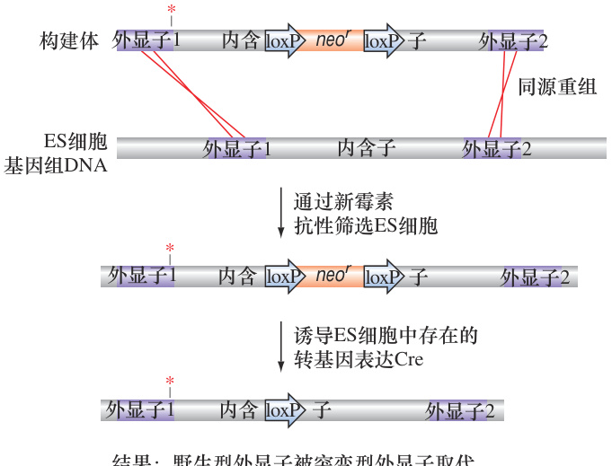  
  
图18.12通过敲入使基因产生特定突变。遗传工程师可以使用带有点突变（红色星号所示）的构建体来替换含有诱导型Cre转基因的ES细胞中的相应序列。通过Cre表达去除耐药基因后，保留在内含子中的loxP位点不会干扰剪接。  

这种将任何目的位点的工程化改造等位基因替换小鼠基因组中基因的能力，对于创建人类某些遗传疾病的小鼠模型非常重要。许多遗传性疾病并不能与一个基因的完全无效等位基因相关联，而是与编码特定氨基酸的错义突变有关，这些突变可能具有亚效等位基因、超形态等位基因或新形态等位基因。  

软骨发育不全（也叫侏儒症）的小鼠模型就是一个这样的例子。回顾一下第8章，人类短肢侏儒症是由人类FGFR3基因错义突变引起的，产生功能获得性持续表达的FGF受体蛋白（见图8.31）。研究人员利用基因敲入技术对小鼠进行了工程化改造，在其同源FGFR3基因中实现了完全相同的点突变。显然，这种突变基因在小鼠体内产生了与人类软骨发育不全相同的显性侏儒症表型（图18.13）。  

# 18.3.4 CRISPR/Cas9允许在任何生物体中进行靶向基因组编辑  

利用刚才描述的ES细胞技术，研究人员几乎可以任何方式移除、添加或改变小鼠基因组中的任何DNA序列。直到最近，只有小鼠基因组能够以这种精确度被改变。现在一些新开发的基因编辑技术能够让科学家改变几乎任何生物体的基因组，从而即使不使用ES细胞也能实现敲除或敲入。这类新技术让科学家们能够更有效地创建突变小鼠。更重要的是，研究人员可以对小鼠以外的动物，甚至是培养的细胞中采用相同的工具，为基因功能的研究和建立人类疾病的新模型开辟许多可能性。  

在所有这些技术中，无论是蛋白质还是RNA分引自： Wang et al. (1999), "A mouse model for Achondroplasia produced bytargeting fibroblast growth factor receptor 3, PNAS, 96(8): 4455-4460. $\copyright$ 1999National Academy of Sciences, U.S.A.  

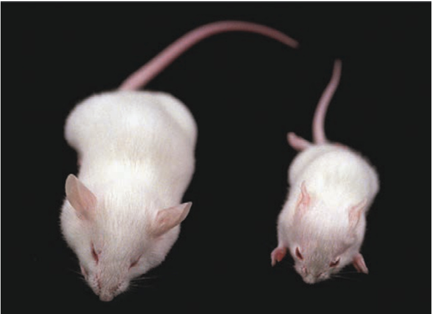  
图18.13小鼠软骨发育不全性侏儒症。右侧的侏儒小鼠是FGFR3等位基因的杂合子，其氨基酸序列与引起人类软骨发育不全的序列相同。左边是同窝出生的野生型小鼠。  

子，都可以作为将DNA裂解酶带到特定基因组位置的向导。断裂位点的DNA修复会导致点突变（一个碱基对改变，或者插人或缺失一对或几对碱基）或特定DNA序列的敲人。我们在这里描述最新和最有效的基因组编辑系统CRISPR/Cas9。  

CRISPR是规律成簇间隔短回文重复的缩写。许多细菌基因组含有一个CRISPR区域，该区域起到抗病毒免疫系统的作用。CRISPR免疫同时也依赖于细菌基因组编码的称为Cas蛋白（CRISPR相关蛋白）的内切核酸酶，这些酶可以在DNA中制造双链断裂。“遗传学工具”信息栏“细菌如何用CRISPR/Cas9为自己接种抵抗病毒感染的疫苗”详细描述了细菌如何利用这种机制来抵御噬菌体的感染。当研究人员意识到他们可以将这种系统用于任何生物体时，科学界的注意力就集中在CRISPR/Cas9上。  

基因工程CRISPR/Cas9系统有两个组成部分。第一个是研究者设计的称为sgRNA（单一向导RNA）的单链RNA。在sgRNA的5'端是一个20bp的序列，与待改变基因组中目的靶点序列互补；SgRNA的3'端与Cas9蛋白特异性结合（顺便一提，“遗传学工具”信息栏中描述的sgRNA的5'和3'区域分别与crRNA和tracrRNA一致）。第二个组分是一种Cas9多肽，这种多肽经过了改造，使得它包含一段构成细胞核定位信号的短氨基酸片段，从而允许蛋白质被输送到细胞核中，在那里它可以对DNA产生作用。  

在细胞核中，Cas9/sgRNA复合物寻找并与其指定的基因组DNA靶标结合。随后复合物内的Cas9酶在靶DNA中制造双链的断裂（图18.14）。通过非同源末端连接（NHEJ，回顾图7.18）修复断裂，常常导致断裂处出现少量几个碱基对的插人或缺失。如果突变对应于可读框中的移码突变，这样的突变就可以实现敲除基因的功能。  

或者，如果将与DNA断裂侧相对应的DNA分子与Cas9/sgRNA同时导人细胞，通过同源重组进行双链断裂修复可以将该DNA整合到断裂位点的基因组中，产生一个基因敲人（图18.14）。双链断裂是重组剂（也就是说，它们促进了重组作用），我们会记得第6章中，双链断裂的形成实际上是减数分裂过程中基因重组的第一步。因此，在没有引人目标基因组中双链断裂的情况下，使用CRISPR/Cas9的基因敲人方式比同源重组有效得多（如图18.9所示）。  

研究人员以多种不同的方式将sgRNA和Cas9导人细胞或生物体。例如，培养中的细胞可以用含有产生sgRNA和Cas9的基因的质粒转化，经过基因组改造后的细胞可用于克隆生物体（参考“遗传学工具”信息栏“体细胞核移植克隆”）。或者，科学家可以将sgRNA和Cas9基因（DNA）或转录物（RNA）或sgRNA/Cas9复合物注人新受精卵中，随后生长成具有改造后的基因组的整个生物体。  

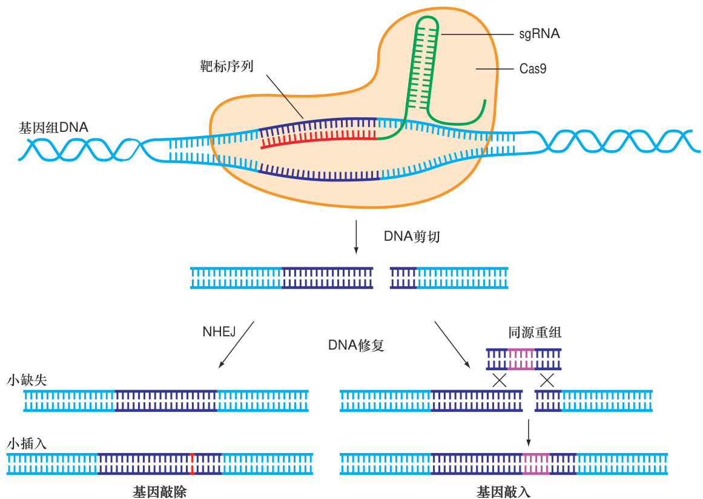  
图18.14通过CRISPR/Cas9进行基因组编辑。sgRNA序列旨在将Cas9内切核酸酶带到基因组中的特定目标。Cas9剪切后的修复会引起基因敲除或敲入，这取决于是否引人了适合同源重组的DNA片段。NHEJ，非同源末端连接。  

这些技术非常高效，使得研究人员可以同时突变二倍体基因组中靶基因的两个拷贝，立即产生突变纯合体。而且，如果将两个以上的sgRNA同时导人正在制造Cas9的细胞或卵子中，就会产生一个双突变体，在两个以上不同的基因中实现工程改造。这样的效率消除了繁琐和耗时的遗传杂交步骤，从而创造出基因组含有多个修饰基因的植物或动物。  

在科学家将CRISPR/Cas9系统引I人研究界的几年中，它已被用于编辑每个模式生物，以及许多其他植物和动物的基因组。CRISPR/Cas9的一个令人兴奋的潜在用途是纠正人类体细胞中的致病基因突变。基因治疗，即利用基因治愈疾病，是我们接下来要讨论的课题。  

# 基本概念  

·利用胚胎干（ES）细胞进行基因打靶，可以让小鼠遗传学家对生殖细胞系进行突变，从而创造出基因敲除突变小鼠的稳定系谱。  
·条件性基因敲除小鼠对于分析必需基因的功能是有用的，因为这类小鼠可以制成野生型和突变型细胞的嵌合体。  
·研究人员可以任何期望的方式通过基因打靶产生基因敲入小鼠，包括可能对应于人类遗传性疾病的单碱基  

对错义突变。  

·基因工程CRISPR/Cas9可以在研究人员指定的特定位置改变任何生物体的基因组。该技术的关键步骤是引入可以通过非同源末端连接或同源重组修复的双链断裂位点。  

# 18.4 人类基因治疗  

# 学习目标  

1.解释治疗基因如何作用于患者。  
2.描述利用病毒载体将治疗基因导入细胞或患者的相关问题。  

在本章讨论的所有例子中，最终目标一直是改变生殖系细胞的基因组，从而创建稳定的实验生物系谱。但是，通过可能传递给下一代的改变基因的方法来改变人的基因，存在很多伦理学难点，而且目前大部分国家认为这是不符合伦理的。“遗传学与社会”信息栏“我们是否应该改变人类生殖系基因组？”讨论了一些这方面的争议。  

医学家开发的基因治疗方法（用DNA治病）转而专注于改变患者体细胞的基因组。截至2016年，已开展了基因治疗临床试验2200余项。虽然人类的基因治疗仍是实验性的，但最近还是获得了一些成功的希望。  

# 遗传学工具  

# 细菌自身如何用CRISPR/Cas9预防病毒感染  

早在1987年，研究人员就在细菌基因组中发现了成簇序列重复（CRISPR）。当2005年发现其中一些序列起源于噬菌体基因组时，几位机敏的科学家就推测CRISPR可能介导细菌中的病毒免疫系统。在这种抵抗机制明确之前，这些想法在很大程度上被忽略了好几年。最终在 $2012\!\sim\!2013$ 年，包括张锋、JenniferDoudna和EmmanuelleCharpentier等在内的研究人员开发的一些能够使这种病毒免疫系统适应细菌细胞和真核生物的基因组工程方法，被称为CRISPR的热点技术达到了全盛时期。  

在细菌基因组的CRISPR位点，短的正向重复序列被独特的间隔区序列以规则性间距中断（图A）。间隔区序列是宿主细胞捕获的噬菌体基因组片段，通过两种细菌编码的Cas蛋白（Cas1和Cas2）的作用整合到宿主基因组中。CRISPR阵列内的重复序列在捕获和整合过程中被这些内切核酸酶添加进去。  

病毒免疫由从CRISPR阵列转录成称为crRNA前体的长RNA分子开始的步骤所引起，这些分子被加工成短的（ $24\!\sim\!48\mathrm{nt}$ ）所谓CRISPRRNA（crRNA）。在酿脓链球菌（Streptococcus pyogenes）中，这种大RNA的切割需要另一种称为tracrRNA（trans-actingCRISPR RNA，反式作用CRISPR RNA）的小RNA,其从宿主基因组中的一个基因转录而来（图A）。tracrRNA与crRNA前体中的重复序列形成互补碱基对。这些双链RNA区域成为内切核酸酶RNaseⅢ的底物，在这些位置的切割产生与Cas9蛋白复合的短crRNA。  

当人侵的病毒将其双链DNA染色体注人宿主细胞时，一种特殊的crRNA、tracrRNA和Cas9酶复合物协同剪切病毒基因组（图A）。crRNA的5'端与噬菌体染色体中的靶DNA碱基配对，而crRNA的3'端与tracrRNA碱基配对形成可结合Cas9的茎环。于是，crRNA和tracrRNA一起把Cas9酶重组到病毒基因组中的靶序列。Cas9剪切掉噬菌体染色体，防止了感染。  

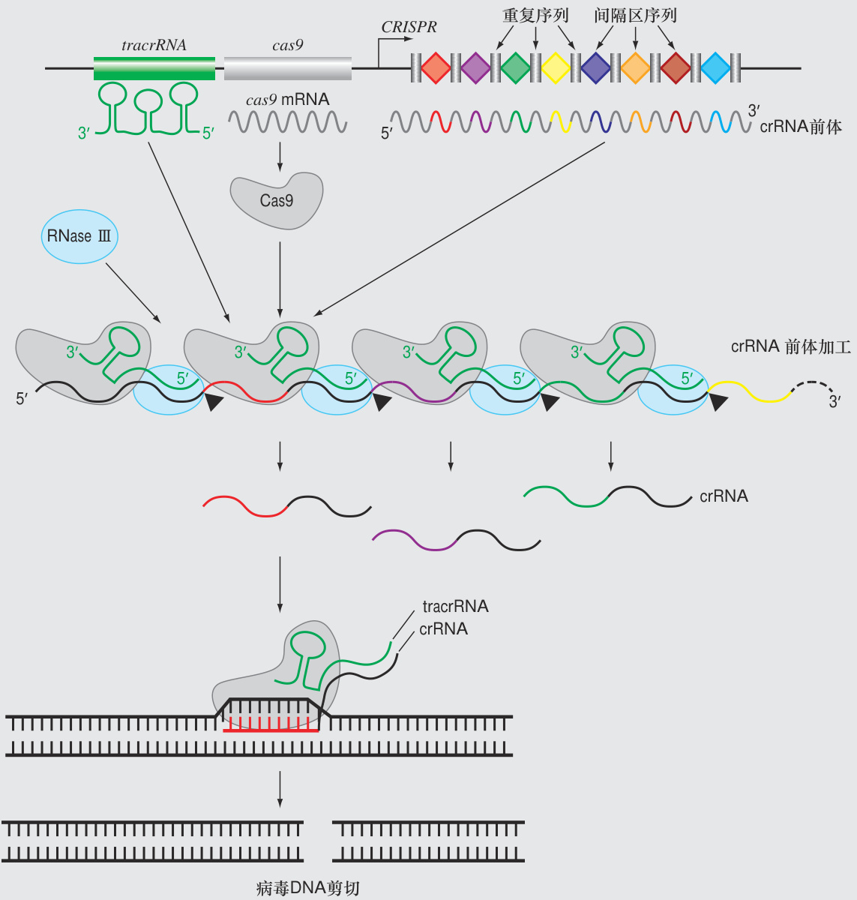  
图ACRISPR/Cas9基因座给细菌接种疫苗以抵御病毒。  

为了编辑真核生物的染色体，研究人员发现他们可以将crRNA和tracrRNA连接成一个单一的RNA分子（sgRNA），sgRNA可以将Cas9带到真核生物基因组中的目标位点（图18.14）。  

# 18.4.1 不同的疾病需要不同的基因治疗  

基因治疗的想法很简单：向患者的体细胞中导人一种治疗基因一一这种基因的表达可以对抗疾病。然而，没有一种单一的基因治疗策略能够对所有疾病起作用。  

# 1.选择治疗基因  

特定疾病的分子性质决定了何种类型的基因可用于治疗。对于一种由基因功能缺失引起的疾病，如囊性纤维化，治疗基因将仅仅是功能缺失基因的野生型拷贝。需要一种不同的策略来对抗功能获得性疾病（如亨廷顿病）因表达突变蛋白（或在其他案例中正常蛋白的过表达）而引起的异常表型。在这种情况下，治疗基因需要以某种方式使疾病基因或其蛋白产物失活。  

最后，对于癌症等具有复杂遗传起源的疾病，最有效的策略可能是更为间接的方法。例如，癌症基因治疗可能靶向导致细胞增殖的生化通路所需的基因或蛋白质，即使该基因或蛋白质在患者的癌细胞中是正常的。  

# 2.治疗基因传递的方法  

在一位医学研究人员选择使用什么治疗性DNA之后，下一个问题是决定如何将这种DNA输送到能发挥最优效能的体细胞中。例如，将DNA导人视网膜细胞治疗先天性失明、导人肺细胞帮助囊性纤维化患者，或导人血细胞前体治疗贫血，这些都是有意义的。  

如果医生能轻易接触到组织却无法从患者体内取出细胞，应选择的技术是体内基因治疗，即把基因直接递送到体细胞，例如，治疗基因可以注人视网膜细胞或吸人肺部。这些类型的传递方式很容易执行，但它们只能将DNA导人一小部分受作用的细胞中。对于其他可以将受作用的细胞从体内移出的疾病，可以采用更有效的体外基因治疗。在这里，研究人员从患者骨髓中取出血液前体细胞等组织，在细胞在短暂培养的同时暴露于大量的治疗基因中，然后将细胞送回患者体内。  

无论是体内还是体外方法，外源DNA都需要包装在某种载体中，这样就可以被足够的细胞摄取，从而成功实现治疗。大多数基因治疗试验是用两种病毒载体中的任一种进行的：反转录病毒载体或腺相关病毒载体（AAV载体）。在这两种情况下，专门的细胞系将治疗  

值得注意的是，操纵DNA分子的两项主要技术一一利用限制性内切核酸酶进行DNA克隆和利用CRISPR/Cas9进行基因组编辑，都是从细菌免疫机制的研究中发现的。这些细菌细胞降解病毒染色体方式的例子证明了基础科学研究的重要性：一开始可能看起来模糊不清的课题，一旦被理解，就可能会有巨大的实际应用。  

性DNA包装成病毒样颗粒（图18.15）。这些细胞系带有表达组成病毒颗粒的所有蛋白质的辅助DNA，但细胞系本身并不产生活性病毒，因为来自辅助DNA的转录物缺少可使其包装成病毒颗粒的序列。治疗性DNA被克隆到缺失病毒基因但具有包装序列的改造后的缺陷病毒基因组中。因此，当用克隆的治疗性DNA转染细图18.15将重组DNA包装成反转录病毒颗粒。（a）正常反转录病毒RNA基因组。长末端重复序列（LTR）是将病毒cDNA整合人宿主染色体所需的元件；顺式作用序列（Y）是将反转录病毒RNA包装到衣壳中所需的元件。（b）制造重组反转录病毒。在重组反转录病毒基因组中，治疗基因取代了gag、pol和env基因。在包装细胞中，缺陷的辅助病毒基因组提供gag、pol和env，但辅助RNA缺乏甲，所以不能包装成病毒颗粒。这些细胞产生含有治疗基因的病毒样颗粒，但病毒不能在细胞内自行复制。  

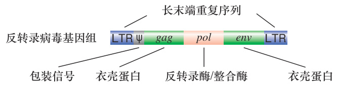  
(a)反转录病毒RNA基因组  
(b)将重组反转录病毒基因组包装入病毒颗粒  

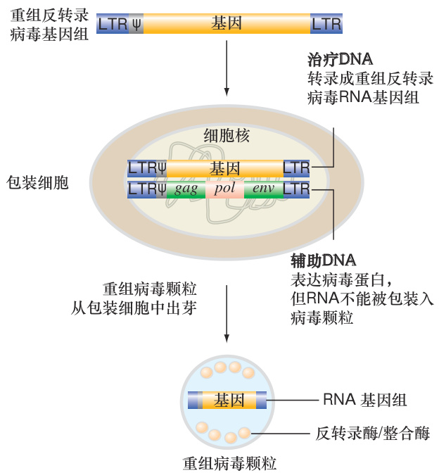  

胞时，它被包装成病毒样颗粒，可以感染细胞但缺少几乎整个病毒基因组。  

一旦制成，研究人员就可以在体内或体外用重组病毒样颗粒感染患者细胞。在带有RNA基因组的重组反转录病毒的情况下，治疗基因可以整合到患者体内的基因组中，然后转录mRNA产生治疗性蛋白［图18.16（a）］。与反转录病毒载体相关的一个问题是，它们的整合会导致基因组突变，在某些情况下可能导致患者发生癌症。  

由于反转录病毒载体的这种副作用，其他一些基因治疗试验采用了AAV载体。AAV具有单链DNA基因组，感染宿主细胞后成为双链。含有治疗基因的缺陷双链AAV基因组通常不会整合到宿主细胞染色体中，然而它们仍然可以产生治疗蛋白［图18.16（b）」。尽管AAV载体的使用缓解了载体整合人人类染色体中引起的严重问题，但染色体外的AAVDNA最终会被降解。这意味着AAV介导的基因治疗需要定期重复，以提供治疗蛋白的持续供应。  

# 18.4.2 人类基因治疗未来充满希望  

基因治疗的第一个令人鼓舞的结果出现在2000年，当时几个X连锁严重联合免疫缺陷（SCID-X1）的患者  

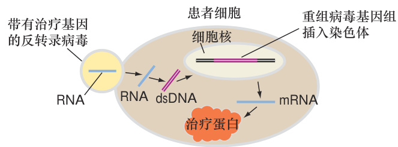  
(a)利用反转录病毒载体进行基因治疗  

(b)利用AAV载体进行基因治疗  

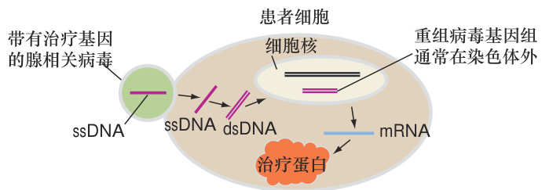  
图18.16利用病毒载体进行基因治疗。（a）重组反转录病毒基因组整合人患者基因组中。（b）重组AAV基因组通常保持在染色体外。  

被基本治愈。SCID-X1俗称气泡男孩病，因为该病患儿没有免疫系统功能而被迫生活在无菌环境中以避免感染。  

# 遗传学与社会  

# 我们是否应该改变人类生殖系基因组？  

2015年4月，中国科学家报道了在人类胚胎中利用CRISPR/Cas9纠正了导致β地中海贫血的β珠蛋白基因突变。尽管这些胚胎从未被放置到子宫内，但这篇论文却开启了一场争议风暴，因为胚胎细胞的一些后代最终会变成精子或卵子，并可能传递给后代。换句话说，这些研究有力地证明了基因编辑技术正变得足够强大，足以让人类很快能够改变自己的进化命运。  

针对这份报告，美国、英国和中国三国政府在华盛顿特区举办了人类基因编辑国际峰会。2015年12月，来自20个国家的500多名科学家、伦理学家和法律专家出席了这次会议。峰会的强烈共识是，对妊娠性人类胚胎进行基因组编辑尚为时过早，因为它的安全性无法确保，但与会者对改变人类生殖系目标的伦理性和合理性存在着分歧。截至2016年本书完成时，英国和中国政府可能仍在继续资助涉及非妊娠性人类胚胎基因组编辑的研究，但在美国只有私人机构资助此类研究。  

对体细胞进行基因编辑以治疗疾病症状是相对没有争议的，但改变生殖系基因组引发了许多问题，其中一些问题是技术上的。例如，CRISPR/Cas9技术很强大，但它会导致多余的改变基因组中其他地方序列的脱靶效应。这些脱靶突变在多代人之间传播的后果是不可预测的，这就是为什么国际峰会认为该方法还为时过早。  

但是即使这些技术能够完善，我们是否应该利用它们来改变卵子、精子或胚胎中的人类生殖系？有些人认为整个想法是不合伦理的，因为现在做出的决定会在未经我们后代同意的情况下影响他们。因为可以想象的是，进行基因组改造最终可以实现增强类似智力等特质，有人争辩说，生殖系编辑技术将不可避免地导致进一步的社会阶层化：很可能只有富人才能够支付得起获得这些增强特质的“定制婴儿”的费用。但在这个问题的另一面，一些科学家认为，如果基因编辑能够被证明是安全的，没有脱靶效应，不使用这种技术才是不合伦理的，至少可以在不改善人类特质的情况下根除疾病。  

基因组编辑方法的发展如此之快，以至于这些问题很快将超越有趣的理论争论，而直面对于人们及其后代的生活所产生的真正影响。如果人类有意改变其自身的进化，我们最好确信，这些决定可能产生的巨大潜在影响已经得到了彻底的考虑。  

SCID-X1的病因是一种叫做IL2-RG的基因的功能缺失突变，该基因通常编码一种促进几种不同种类的免疫系统细胞生长的蛋白质。研究人员采用了一种体外方法，他们从患者的骨髓内获得了免疫系统前体细胞，然后用含有IL2-RG野生型拷贝的重组反转录病毒感染这些细胞。接受细胞改造的患者恢复了免疫系统功能并能够抵抗感染。当时接受治疗的9名儿童中有8名仍然活着，并成功抵抗了许多感染。然而，其中4名患者最终发展为白血病，因为反转录病毒载体插入到与细胞增殖有关的基因附近，其中一个孩子已经因癌症去世。  

由于有时会出现由反转录病毒插人引起的问题，最近的基因治疗尝试使用AAV载体。在本章的开头，我们讨论了一种先天性失明是如何被基因治疗部分治愈的。医生们将含有患者基因组中缺失的RPE65基因正常拷贝的重组AAV载体注射入他们的视网膜上皮细胞。在大多数情况下，患者至少恢复了一些视力，并且没有受到基因治疗的不良影响。当导人的染色体外DNA降解或丢失时，这些人在将来的某个时候可能需要延续的治疗。  

基因治疗还是实验性的，我们可以看到，基因治疗要成为标准的医疗实践，还需要跨越许多技术问题。尽管如此，迄今为止的结果足够令人鼓舞，以至于世界各地的研究人员正在测试新的想法，以便用基因治疗更多的病症。例如，对于患者因基因组中功能获得性突变导致的疾病，科学家们正在研究合成能够表达小干扰RNA（siRNA）的治疗基因。如第17章中所讨论的，细胞中siRNA的存在可能潜在地阻断从突变基因转录来的mRNA的翻译或导致其降解（回顾图17.33）。一个特别有趣的可能性是在基因治疗研究人员中引起了极大的兴奋，那就是利用基因组编辑，如CRISPR/Cas9技术，来修复人类细胞中的突变等位基因，无论是功能获得性还是功能缺失性。  

# 基本概念  

·治疗基因可以在重组病毒载体中通过体内或体外的方式递送至患者体细胞里。  
·反转录病毒载体可以将治疗基因插入人类染色体，但这种方法可能导致基因突变和癌症。  
·通过腺相关病毒载体引入的DNA仍然保留在染色体外，需要定期重复治疗。  
·科学家们正在摩拳擦掌，准备利用CRISPR/Cas9等基因组编辑方法修复人类体细胞中的突变基因。  

# 接下来的内容  

基因组的操作是我们将在第19章中描述的许多实验策略的基础，我们将讨论基因分析如何成为阐明发育过程（单细胞合子成为复杂的多细胞生物体）生化通路的  

重要工具。转基因技术是克隆突变筛选中鉴定的，对调节发育至关重要的基因，也是操纵这些基因以了解它们在生物体中精确功能的关键。  

# 习题精解  

如果你想为以下任何一种人类遗传条件（ $\mathrm{a\!\sim\!d}$ )制作小鼠模型，指出下列哪种类型的小鼠（ $\mathrm{i}\!\sim\!\mathrm{vi}$ ）对你的研究有用。如果不止一个答案适用，说明哪种类型的小鼠能最成功地模拟人类疾病：（i）过表达正常小鼠蛋白的转基因小鼠；（ii）表达正常量的突变人类蛋白的转基因小鼠；（ii）表达显性失活形式蛋白的转基因小鼠；（iv）基因敲除小鼠；（v）条件性基因敲除小鼠；（vi）正常等位基因被最多只有部分功能的突变等位基因取代的基因敲入小鼠。在所有情况下，转基因、被敲除或敲人的基因都是导致所述疾病的基因的一种形式。  

a.马凡综合征（FBNI基因单倍体不足引起的显性疾病）；  
b.由PLCG2基因中的超形态等位基因错义突变引起的显性遗传性自身炎症性疾病；  
c.釉原蛋白基因缺失导致隐性X连锁的状况，表现为患者牙齿牙釉质减少；  
d.由于纯合性隐性突变而导致耳聋的遗传形式，它阻止了针对TRIOBP基因的初级转录物的耳特异性可变剪接的表达。该基因的其他剪接形式在所有细胞生长过程中表达，而且是必需的。  

# 解答  

a.虽然马凡综合征是一种显性遗传病，但它是由于单倍体不足的功能缺失突变所致。转基因小鼠不能提供功能缺失，除非转基因小鼠表达该蛋白质的显性失活形式。然而，后者使用起来会非常棘手，因为你不知如何获得问题中需要的那种正好只有一半蛋白功能的转基因小鼠。最简单的方法是构建马凡综合征基因敲除小鼠（iv）。可能不需要条件性基因敲除，因为一个简单基因敲除杂合小鼠可能存活下来，其症状与人类马凡综合征患者相似。  

b.对于这种功能获得性的状况，（i）或（ii）类转基因小鼠可能有适当的疾病症状。然而，与人类疾病最接近的情况是建立杂合等位基因敲人的小鼠，将其PLCG2基因替代为突变人类基因或携带类似突变的小鼠基因（vi）。  

c.这种称为釉质发育不全症的疾病是由釉原蛋白基因的无效等位基因的半合性或纯合性引起的。这种情况有可能被表达显性失活形式蛋白质（ii）的转基因所模拟，但这种蛋白质必须非常有效地破坏基因组中正常等位基因表达的蛋白质。所以，最好的小鼠模型是釉原蛋白基因敲除的纯合体（iv）。  

d.这种情况是由一种基因的功能缺失突变引起的，在所有细胞中都需要该基因具有常规活性，但其中一种可变剪接产物所翻译的蛋白质在听力中起着特定的作用。简单的基因敲除是行不通的，因为这种基因的纯合敲除小鼠很可能在出生前就已经死亡了。条件性基因敲除小鼠在耳朵中移除掉该基因的功能可能也不完全合适，因为这种突变会阻止所有选择性mRNA剪接产物的表达，包括所有细胞存活所必需的剪接产物。因此，最好的选择是重建在耳聋患者中发现的相同突变，然后建立纯合的基因敲入小鼠（vi）。  

# 习题  

# 词汇  

1.在右列中选择与左列中的术语最匹配的短语。  

a.转基因 1.输送治疗基因的遗传工程病毒基因组  
b.原核注人 2.通过基因打靶使得含有额外的或改造的DNA  
c.floxed基因 3.可用于制造条件性基因敲除  
d. T-DNA 4.可以发育成任何细胞类型  
e.AAV载体 5.携带转基因的植物或动物  
f.包装细胞 6.在loxP位点引起交换  
g. Cas9 7.科学家把基因转移到一个生物体的基因组中  
h.基因敲除小鼠 8.用于构建转基因植物的细菌来源的载体  
i.基因敲入小鼠 9.用于很多脊椎动物的DNA输送方法  
j.Cre重组酶 10.用于与sgRNA一起进行基因组编辑的内切核酸酶  
k.ES细胞 11.通过基因打靶实现功能缺失突变  
1.GM生物体 12.产生用于基因治疗的病毒颗粒  

# 18.1节和18.2节  

2.小鼠通常是灰色的，但小鼠遗传学家有一个纯种的白毛品系，它是隐性突变的纯合子。分子分析表明，下图中用星号表示的突变是毛囊中表达的基因的三种可变剪接形式共有的外显子中的错义突变。  

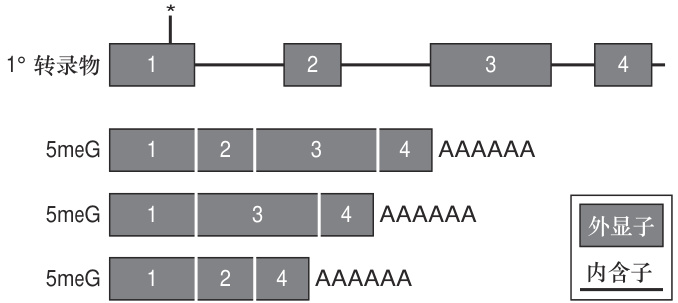  

a.提出一种使用转基因动物的实验方法，来确定当发生突变时哪种剪接形式引起白色皮毛表型。  

b.绘制为实验创建的基因构建图。  
c.这种方法的潜在问题涉及从转基因转录的mRNA的量，解释这个问题。  

3.有时，通过原核注射转入小鼠基因组的基因会在（随机）整合位点破坏基因而导致突变。在一个这样的案例中，研究人员确定了一种导致转基因小鼠肢体畸形的隐性突变。  

a.突变表型可能是由于转基因插人特定的染色体位点，或者是由于小鼠基因组中某处与整合位点不同位置的偶发性点突变。怎么区分这两种可能性？  
b.这个例子中的突变实际上是由转基因插人引起的。怎么利用这个转基因插入作为标签来鉴定负责畸变肢体表型的突变基因？  
c.该插入突变被定位到小鼠的2号染色体上，此前该区域已经鉴定出一种叫做肢体畸形（ld）的隐性突变。携带这种突变的小鼠可从一个专业小鼠研究实验室获得。怎么判别ld突变和转基因插人突变是否在同一个基因中？  

4.在小鼠中，一组所谓的Hox基因编码控制动物脊柱构型的转录因子。例如，颈椎（下图中标记为C1和C2）同时表达HoxA1和HoxD4蛋白，而动物头骨底部的枕骨（下面标记为E）仅表达HoxA1。  

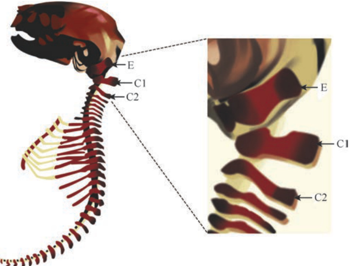  

科学家假设控制在转录起始水平的HoxD4表达是  
使枕骨中C1和C2发育不同的原因。  
a.设计一个用于检验这个假设的通过原核注射导人的基因构建体。  
b.如果假设是正确的，在转基因小鼠中会得到什么结果？  

5.图18.7所示的果蝇眼晴是畸形的，因为它们缺少一种称为fatfacets基因的功能性拷贝，而这种基因是眼睛发育所必需的。人类基因组编码一种叫做Usp9的蛋白质，其氨基酸序列与果蝇Fat facets（Faf）蛋白相  

似。同样，小鼠基因组编码一种名为Fam的蛋白质，  
与Faf和Usp9相似。  
a.如何确定人类Usp9蛋白能否替代果蝇Faf蛋白?  
b.如何确定，像果蝇中的Faf一样，小鼠的Fam蛋白对于小鼠眼晴发育是否必需？  

6.这个问题涉及一种叫做增强子捕获的技术，科学家们首先在果蝇中开发了这种技术。该技术的目的是寻找基因组中的增强子，从而鉴定在特定细胞类型中有活性的基因。利用增强子捕获，创建了数千个果蝇品系，每个品系都有一个通过P元件介导的基因转移而整合到基因组中随机位置的转基因拷贝。请注意，转基因有一个启动子，但没有增强子（粗的水平箭头表示P元件末端的反向重复序列）。  

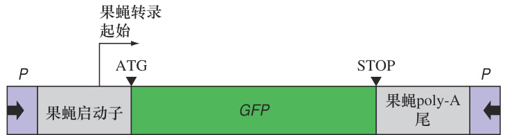  

a.如何识别出转基因整合在增强子旁边的果蝇品系？  
b.描述如何使用这种技术来鉴别在果蝇翅膀中特异性表达的基因。  
c.是否每个纯合的转基因插人都会产生一个突变表型？为什么？  

7.生活在北极的鱼类和其他生物表达一种抗冻蛋白，防止零度以下的温度破坏它们的细胞。科学家已经培育出可以表达鱼类抗冻蛋白的转基因草莓和番茄。然而，这两种作物都没有被商业化。  

a.解释产生转基因作物植物的步骤。是什么使这些植物能够制造鱼类蛋白质？  
b.这两种作物都不在市场上销售的原因是抗冻蛋白没有产生期待的保护水果免受冻害的效果。提供了一个可能的假说，解释为什么鱼类抗冻蛋白不能在植物中起作用。  

8.a.描述两种用转基因在转基因生物体中抑制特定基因功能的可能方法（提示：对于其中的一种技术，回顾一下第17章中关于RNA干扰的讨论）。b.讨论如何使用这两种方法中的任何一种来构建与功能缺失相关的隐性人类遗传疾病（如囊性纤维化）的小鼠模型。  

9.图18.6展示了能够表达GFP、RFP及其衍生物的转基因斑马鱼（Danio rerio）Glofish?的照片，这是第一种转基因宠物。利用一种来自青鱼（Oryziaslatipes）的名为To12的转座元件可以将基因转人斑马鱼基因组。To12转座子以类似于图18.4所示的果蝇P元件的方式作为基因转移的载体。为了使用Tol2载体，研究人员给两细胞阶段的斑马鱼胚胎注射两种DNA：一种DNA表达Tol2转座酶基因，而另一种重组转座子含有转基因。如果转座子跳入生殖系细胞的染色体，就可以建立稳定的转基因鱼品系。  

科学家们合成了几种不同的编码GFP和RFP衍生物的基因。这些衍生物是通过氨基酸的变化改变其颜色的，因此在许多宠物商店中可以看到鱼长成绿色、红色、橙色、蓝色或紫色。  

a.图解产生荧光鱼所需的两种重组DNA构建体。  

b.为什么用的是青鱼的转座子而不是斑马鱼的转座子？  

10.丙烯酰胺是炸土豆（天冬酰胺含量高）这类食物的副产品，一些人担心吃到丙烯酰胺可能带来的健康后果。美国FDA最近批准了可供人类食用的转基因土豆，其天冬酰胺含量比普通土豆要少。这些马铃薯表达RNA干扰（RNAi）转基因以降低天冬酰胺合成途径中称为StAs1和StAs2的两种酶的表达量。a.图解可用于减少StAs1和StAs2基因表达的转基因，并解释它们是如何工作的（回顾第17章中RNAi由双链RNA启动的部分）。b.为什么通过RNAi转基因重要的是降低StAs1和StAs2基因表达水平，而不能完全消除二者之一的表达？c.科学家们最近制造出表达一种RNAi杀虫剂的转基因马铃薯，可以杀死科罗拉多马铃薯甲虫这种作物害虫。推测可能涉及的转基因种类和这种方法的优点。  

# 18.3节  

11.基因敲除小鼠项目的目标是生成一组ES细胞系，每个细胞系带有一个单基因中的敲除突变，最终实现突变覆盖小鼠基因组中的每个基因。a.每个基因都有可能产生一个杂合敲除ES细胞系吗？为什么？b.每个杂合敲除ES细胞系都有可能产生一个杂合基因敲除小鼠吗？为什么?c.事实上，研究人员制备习题5中描述的Fam基因敲除的ES细胞的尝试失败了。那么这些研究人员应该如何使用ES细胞技术来确定小鼠眼睛发育是否需要Fam呢？图解一个可供研究人员研究这一课题的能导人ES细胞的构建体。d.描述在题目c中可能获得的各种实验结果，以及在每种情况下可以得出的结论。  

12.酵母中的基因打靶和细菌中一样进行（回顾图14.31）。  

因为酵母基因组的序列是已知的，所以研究人员可以很容易地利用基因打靶的方法，对任何基因建立敲除突变的酵母菌株。  

a.绘制一个可导人酵母，能生成一个带有组蛋白亚基H2A基因敲除菌株的基因打靶构建体。这个构建体应含有卡那霉素抗性（kan"）的基因。  
b.列出生成突变酵母的步骤。  
c.回想一下，酵母可以作为二倍体或单倍体生长。应该在单倍体还是二倍体菌株中进行基因打靶？为什么？  
d.假设你在二倍体菌株中敲除H2A基因产生杂合子并形成二倍体孢子，发现所有4个单倍体孢子都是存活的（它们产生了单倍体菌落），能得到什么结论？是不是对H2A基因期望的结果？如何解释这个结果？  

13.回想一下在基因两侧加loxP序列的构建方法，在这个基因的内含子中的新霉素抗性基因两侧连接上loxP位点［图18.11（a）］。一个loxP位点只有34个碱基对长，如下图所示。  

ATAACTTCGTATAATGTATGCTATACGAAGTTAT 反向重复序列 间隔区 反向重复序列  

解释如何使用PCR从含有neo'基因的质粒开始制备侧接loxP位点的新霉素抗性基因。如果有质粒载体上的目的基因内含子克隆，如何把PCR产物插人到内含子中？  

14.a.哪种基因组操作适用于建立本章开头提到的人类先天性黑朦（LCA）小鼠模型？为什么？b.应该使用哪种程序来生成脆性X综合征的小鼠模型？脆性X综合征是由FMR-1基因的突变等位基因引起的三核苷酸重复疾病（回顾第7章中题为“三核苷酸重复疾病：亨廷顿病和脆性X综合征”的“快进”信息栏）。为什么？c.应该使用哪种程序来建立亨廷顿病的小鼠模型？  

15.a.图解用于创建如图18.13所示的软骨发育不全小鼠模型的敲人构建体。b.解释在这种情况下CRISPR/Cas9是如何被用来产生小鼠模型的。  

16.在习题6中我们已经了解了果蝇研究中使用的增强子捕获方法。报告转基因随机整合到果蝇基因组中,它们的表达可以识别增强子，从而以特定的模式表达基因。  

在小鼠中，也存在一种被称为基因捕获的类似的基因识别技术。基因捕获技术，即编码类似GFP等报告蛋白的外显子（见附图）被整合到ES细胞染色体中的随机位置（当将DNA构建体导人小鼠ES细胞时，大多数重组事件发生在随机位点；同源重组相对较少）。具有随机整合转基因的ES细胞系被用来生成小鼠。  

3'剪接受体位点  

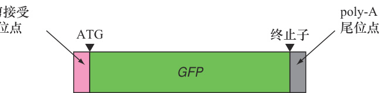  

a.为了让ES细胞表达GFP，基因捕获构建体必须整合到基因组的什么地方？  
b.是否所有表达GFP的转基因小鼠都按照题目a中描述的途径进行整合？为什么？  
c.增强子捕获和基因捕获都能识别以特定模式表达的基因。使用这两种技术获得的基因信息是哪些不同的？  
d.这两种方法中，哪一种更有可能创建一个整合位点附近基因的突变等位基因？  

17.从Burkitt's淋巴瘤（一种免疫系统B细胞的癌症）患者获得的肿瘤细胞中，myc基因常常出现在接近8号和14号染色体之间相互易位的断点之一。在这个易位位置myc高水平表达。科学家假设B细胞中Myc蛋白过表达促进淋巴瘤形成。  

a.解释如何使用原核注射产生的转基因小鼠检验这一假设（假设你之前克隆了一个基因调控区，且在小鼠整个生命过程中都在B细胞中特异性地具有活性）。  

b.假设你只想在小鼠的免疫细胞中过表达Myc，从一周龄开始，为了在空间上限制Myc转录，将使用题目a中描述的相同启动子。为了在时间上限制Myc转录，将使用表达受热休克控制的转基因（hs-cre）。描述为实现此目标而创建的小鼠及其制备方案（提示：在Cre介导的同一DNA分子中两个互相反向的loxP位点之间的重组过程中会发生什么）。  

18.转录因子Pax6在小鼠（或人类）的生命过程中因为用于视网膜的发育和维持而长期需要。纯合Pax6基因敲除小鼠在出生后不久就会死亡，因为Pax6蛋白在如胰腺这样的基础器官中也是必需的。  

不表达GFP时更容易看到Pax6-眼细胞的形状。图解可以进行这个实验的Pax6基因构建体。  

19.人类遗传疾病的小鼠模型是帮助遗传学家了解异常表型的原因并开发新的治疗措施的潜在有力工具。然而，这样的小鼠并不总是像初看起来那样对研究者有用。假设有一个某基因由于无效等位基因纯合而引起的人类疾病的小鼠基因敲除模型，讨论以下情况如何可能使基于这种小鼠模型的人类疾病调查复杂化。  

a.小鼠的生命周期比人类缩短了。  
b.某些纯合基因敲除突变的小鼠在子宫内死亡。  
c.小鼠基因组可能具有突变导致人类疾病的基因的额外拷贝。  
d.来自同一纯合基因敲除的不同自交系的小鼠在表型的外显率和表达性方面有所不同。  
e.创建基因敲除小鼠的操作，比如由于一个用于筛选基因敲除细胞的耐药基因的存在（见图18.9），不仅破坏了靶基因，还破坏了其他附近基因的表达。  

20.确定细胞内某种蛋白质（蛋白X）通常定位在何处的一种方法是制备报告基因构建体，其包含： $\textcircled{\scriptsize{1}}$ 基因X调节区和编码序列； $\textcircled{2}$ 融合在基因X编码序列 $3^{\prime}$ 端和终止子表达框中的GFP编码序列。带有这种转基因的小鼠只会在基因X正常表达的那些细胞中表达杂交蛋白X-GFP。a.所描述的X-GFP融合基因可以通过敲入GFP编码序列而不是通过随机插人转基因来产生。图示可用于此目的的敲人构造体。b.敲人策略与转基因策略相比有何优势？  

21.在第17章的习题5中，我们看到毛囊中位于人类KITLG基因的增强子上的一个SNP与金发和黑发的区别有关。金发的人拥有A等位基因的概率很高，而黑发的人倾向于拥有G等位基因的SNP。a.以上给出的信息并不能证明A等位基因的SNP引起金发表现，为什么？b.人和小鼠毛囊的KITLG基因的增强子DNA序列极其相似，小鼠增强子通常具有G等位基因的SNP。用小鼠设计一个基因敲入实验检测人类金发相关的等位基因SNP是否真的有助于金发表型。图解所有用于设置实验的构建体（假设等位基因A和G属于不完全显性）。  

22.科学家们现在通常使用CRISPR/Cas9产生一个从基因组上移除几kb的DNA的可定义的基因删除。这种方法即使在同源重组缺陷的细胞中也是可行的，只要细胞仍能进行非同源末端连接（NHEJ）。  

a.研究人员如何进行这样的删除？  
b.到本书出版时，通过失活肌生成抑制蛋白基因制造的转基因动物“超级强壮”猪可能会被批准用于人类消费。在正常发育过程中，肌生成抑制蛋白可以防止肌肉过度生长。根据题目a中的回答，超级强壮猪是如何产生的？  

23.遗传学家目前正在考虑利用本章描述的技术去复活业已灭绝了大约4000年的猛犸象。a.在西伯利亚的冻土中发现了猛犸象的冷冻标本。如果完整的话，可以从这些样本中获得活细胞，如何尝试用这些细胞和与之近缘种的亚洲象的卵母细胞来复活这种早已灭绝的动物？b.科学家已经从冷冻标本中确定了猛犸象的基因组序列。这些研究人员现在试图了解这种生物对极端寒冷中生存的适应性。例如，猛犸象的毛比任何大象都厚。如何在理论上利用CRISPR/Cas9来研究猛犸象和大象之间毛发厚度差异的遗传基础？c.理论上如何扩展CRISPR/Cas9技术使复活猛犸象成为可能？这种方法中涉及哪些技术挑战？为什么有人会认为这种复活已灭绝生物的想法是不合伦理的？  

24.a.图18.9和图18.12分别展示了产生小鼠基因敲除和基因敲入的方法。CRISPR/Cas9可以进行同样的敲除和敲入，现在大多数小鼠遗传学家会选择使用这种新技术替代其他方法。解释为什么CRIS-PR/Cas9是在小鼠中进行定向诱变更容易和更有效的方法。b.如何利用CRISPR/Cas9技术获得仅在多细胞生物特定组织中起作用的条件性基因敲除？  

25.双链断裂的非同源末端连接（NHEJ）几乎总能对DNA的损伤进行完美修复而不造成核苷酸对的丢失或增加。然而，产生双链断裂的CRISPR/Cas9是一种在目标位点产生小的缺失或插入的高效方法。怎样解决这个明显的矛盾？  

26.研究人员在用CRISPR/Cas9编辑基因组时偶尔会遇到的一个问题是，一个或多个预期靶点外的位点也会被Cas9/sgRNA识别并剪切。部分原因是靶位点与sgRNA5'端的一多半由于单碱基对错配形成20bp的DNA/RNA杂交，而不能防止Cas9对靶位点的剪切。科学家应该如何利用生物信息学来避免这种脱靶效应？  

27.加州大学圣地亚哥分校的研究人员设计了一种称为诱变链式反应（mutagenic chain reaction，MCR）或者基因驱动的策略，可以在整个杂交群体内的几乎所有染色体中快速引人设计的突变。他们的想法惊人的简单，它依赖于如下图所示的质粒。在这些MCR构建体中，能够高水平表达Cas9蛋白（灰色）和针对基因组中特定靶标的sgRNA（绿色）的基因，两侧连接有基因组中靶位点周围的序列（蓝色）。  

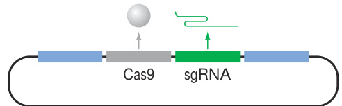  

假设制备了一个重组MCR质粒，其中带有果蝇中X连锁黄色体色基因的序列。质粒中的Cas9基因和sgRNA基因取代了黄色基因功能所需的黄色基因蛋白编码外显子。SgRNA特异于野生型黄色基因内的一个位点。  

a.研究人员将这种质粒注射到野生型雄性胚胎中，通过同源重组将其整合到一些生殖系细胞中，从这些生殖系细胞发育而来的精子使一个野生型卵子受精。令人惊讶的是，从这些受精卵发育而来的雌性是黄体，因为黄色的功能缺失等位基因对野生型等位基因是隐性的。解释（包括图解）这些黄体雌性的起源（提示：想想诱变链式反应这个名字）。  

b.当一只这样的黄体雌性被放人100只野生型果蝇的种群中，几乎几代之内的每只果蝇都是黄体。解释这个结果。  

c.研究人员现在正试图利用基因驱动系统来阻止斯氏按蚊传播疤疾。疤疾是由一种寄生于蚊子和人类中被称为疤原虫的原生动物引起的疾病。这项技术的使用是基于来自抗疤疾小鼠中编码中断疤原虫生命周期的抗体的DNA序列的效能。描述这个系统如何控制疤疾的传播。  

d.2016年，由美国国家科学工程医学院召集的专家小组发布了一份报告，警告不要向环境中释放题目c中设计的按蚊。为什么这个小组这样对待利用MCR来控制疤疾的问题？  

习题28和习题29是关于CRISPR/Cas9的，并且与下图有关，该图显示了一个sgRNA与其靶向的基因组位点形成的复合体，以便Cas9能够在所示的位置剪切基因组DNA。应该能够注意到，所谓的前间区序列邻近基序（protospacer adjacent motif，PAM）位点紧邻于目标位点。PAM位点（一条链上的5'-NGG- $.3^{\prime}$ ，N可以是任何碱基）必须存在于指定发生剪切的位置。这种情况可以理解为sgRNA将Cas9酶带到相邻的PAM位点启动切割。  

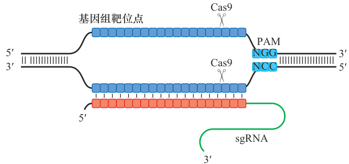  

28.如同在“遗传学工具”信息栏“细菌如何用CRIS-PR/Cas9为自己接种抵抗病毒感染的疫苗”中讨论过的，细菌中进化来的CRISPR/Cas9系统提供了一种抵抗噬菌体感染的免疫形式。  

a.sgRNA的一部分对应于crRNA，而另一部分对应于tracrRNA（CRISPR/Cas9系统用于基因组工程的效用很大程度上是由于这两个组分被汇集成一个RNA分子）。在上图中，SgRNA的哪一部分对应于crRNA？哪一部分对应于tracrRNA?  

b.酿脓链球菌等细菌基因组中的CRISPR位点不含任何PAM位点。为什么这个事实很重要？如果不在CRISPR位点中，PAM位点如何在细菌免疫中实现功能？  

29.英国剑桥大学的F.Port和S.Bullock设计了在果蝇中表达sgRNA的简化质粒载体 $p C F D3$ ，下图显示了这个载体的一部分。橙色序列是强启动子的一部分（从这个启动子的转录从左向右起始于必须存在的粗体的G）。紫色序列是sgRNA中tracrRNA组件的一部分。用限制性内切核酸酶BbsI（其识别位点见图下方）切割pCFD3质粒后，就可以将表达靶向果蝇NiPpl基因的sgRNA序列替换图中的蓝色序列。  

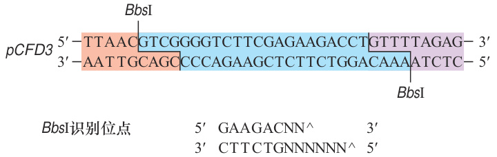  

拼图的最后一部分是下面的序列，它显示了NiPp1基因的一部分，包括了与起始密码子相对应的三碱基。大写字母是在基因编码区（蓝色标识）的第一个外显子中，小写字母是在第一个内含子中。NiPp1蛋白长383个氨基酸。通过诱导Cas9在这个基因内产生双链断裂，通过非同源末端连接  

（NHEJ）不精确修复，从而产生该基因的等位基  
因敲除。  
a.标识此序列中的两个PAM站点。这些PAM位点中的哪一个适合来产生NiPpl基因的无效等位基因？为什么选择这个位点？  
b.如果将Cas9靶向到NiPp1基因中的适当位置，并且由此产生的双链断裂被NHEJ不精确地修复（通常在这个位置产生≤6bp的删除或插人），大约有百分之多少的这种不精确修复基因能成为可信的无效等位基因？为什么？  
c.图示BbsI酶切后的pCFD3载体。不必考虑被去除的蓝色小片段，这里的重点是展示产生的5'黏性末端。  
d.设计两个24nt的寡核苷酸DNA，可以退火并克隆到BbsI切过的pCFD3载体中，这样重组质粒就可以表达一个sgRNA，用于在NiPpl基因中制造无效突变。  
e.指出Cas9切割NiPpl基因的确切位置。  
f.简要概述如何使用重组质粒在果蝇NiPpl基因中制造无效突变。  
g.简要概述如何修改此技术以生成敲入等位基因，将NiPp1蛋白启动Met后的第一个氨基酸（即Thr）变成Ala。  

30.在图18.14中，找出PAM位点并确定sgRNA的5'和3端。  

# 18.4节  

31.与本章描述的动植物基因组操作不同，人类基因治疗是直接特异性地改变体细胞的基因组而非生殖系细胞基因组。为什么医学家不能也不会试图改变人类生殖系细胞的基因组？  
32.a.比较反转录病毒和AAV载体将治疗基因传递给人类细胞的方法。b.说明这两种病毒载体各自的优缺点。  
33.回想一下，先天性黑朦（LCA）是人类先天性失明的一种形式，可由纯合的RPE65基因隐性突变引[起。最近，RPE65中一种罕见的显性突变被认为是一种称为视网膜色素变性的眼病的原因之一，其特征是视网膜变性并可进展为失明。显性RPE65突变是一种错义突变，导致多肽中第447位氨基酸由Asp变为Glu，对于这种突变蛋白的本质知之甚少。a.这种显性等位基因更可能是功能缺失性突变还是功能获得性突变？b.如本章所述，LCA的基因治疗至少获得了部分成  

功。同样的基因治疗能否用于RPE65显性突变等位基因引起的视网膜色素变性患者？为什么？  

34.通过基因治疗纠正显性功能获得性突变效应的一个潜在策略是表达小干扰RNA（siRNA），可以造成显性突变等位基因产生的mRNA降解。siRNA可以被传递到患者细胞中，通过合成的基因编码发夹RNA并被Dicer处理后，然后就可将RISC复合物靶向到突变等位基因的mRNA（回顾图17.32和图17.33）。  

a.这种基因治疗策略的主要问题是设计一种siRNA，既可以特异性阻止突变等位基因的表达，又不影响正常等位基因。解释为什么这是一个问题？b.设计亨廷顿病siRNA治疗基因的一个特殊问题是突变等位基因的特异性。解释这个问题，并提出一个可以使用RNAi的可行解决方案。c.纠正亨廷顿病突变等位基因的另一个潜在策略是在重复序列中间切断DNA。存在于细胞核中的外切核酸酶在NHEJ修复之前会降解许多重复序列。能否用这种方法，利用CRISPR/Cas9技术纠正亨廷顿病突变（提示：见习题28和29）。  

35.最近，科学家们利用杜氏肌营养不良症小鼠模型（称为mdx小鼠）来测试Cas9和一种sgRNA是否能有效治疗这种疾病。肌营养不良的原因是X连锁Dmd基因中纯合或半合的功能缺失性突变。mdx小鼠在Dmd的外显子23（一共有79个外显子）中有一个无义突变。研究人员测试了一种叫做外显子跳跃的技术，他们的想法是利用CRISPR/Cas9删除mdx小鼠中突变Dmd基因的外显子23。将带有表达Cas9和两种不同sgRNA基因的AAV载体注射到成年小鼠的肌肉中,在大约 $10\%$ 的肌肉细胞中，外显子23被去除，并能检测到具有功能的肌营养不良蛋白。一部分肌肉功能得到恢复，虽然仅仅是在很小的范围内。  

a.绘制外显子23及其两侧内含子的图。在图中，画出sgRNA将与基因组DNA杂交的位置。解释外显子23的去除是如何发生的。  
b.设计PCR检测方法以确定是否从细胞克隆的基因组DNA中去除了外显子23、PCR引物在哪里杂交，以及如何判断外显子已经被去除了。  
c.跳过外显子23至少部分恢复了肌营养不良蛋白的功能。这对于外显子23编码的氨基酸说明了什么？  
d.就题目c的回答，外显子跳跃策略是否适用于所有引起肌肉萎缩症的Dmd点突变。  
e.研究人员考虑采用这种外显子跳跃策略来操作的外显子22、23和24必须符合什么样的条件（提示：见习题28和习题29）？  