# 第 19 章 发育的遗传分析  

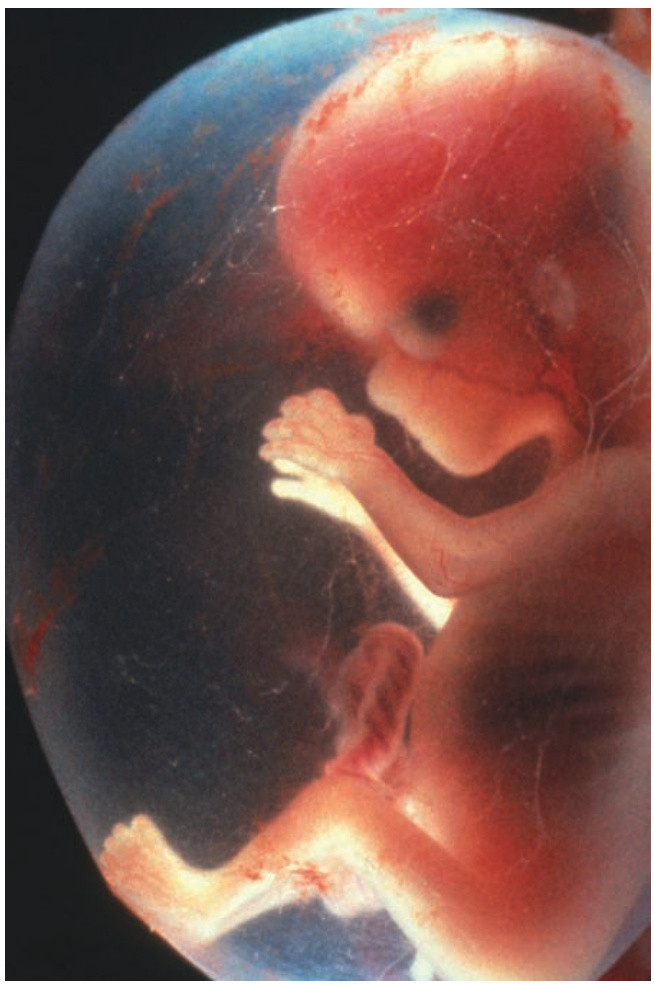  

受精后三个月的人类胎儿。$\copyright$ Claude Edelmann/Science Source  

# 章 节 大 纲  

19.1 模式生物：发育遗传学的原型  
19.2 诱变筛选  
19.3 决定基因在何时何地起作用  
19.4 在通路中排序基因  
19.5 综合实例：果蝇身体计划发育  

人类精子和卵子的结合（图19.1）启动了一个惊人的发育过程，其中单个细胞——受精卵，经过有丝分裂形成数以万亿计的基因相同的细胞。这些细胞在胚胎发育过程中相互分化，形成数百种不同的细胞类型。各种类型的细胞组装成奇妙的复杂但精心构造的器官系统，包括两只眼睛、一个心脏、两个肺和一个错综复杂的神经系统。在3个月的时间内，人类胚胎发育成胎儿（见照片），胎儿的形态预计为6个月后出生的婴儿。出生时，婴儿已经能够哭闹、呼吸和进食；而且婴儿的发育并没有停止在那里，新细胞在人的生长、成熟、甚至衰老过程中不断地形成和分化。  

生物学家现在接受基因指导发育的细胞行为，但就在20世纪40年代，这个想法还存在争议。许多胚胎学家无法理解，如果基因是发育的主要决定因素，那么具有相同染色体组、相同基因的细胞如何能够形成如此多不同类型的细胞呢？我们现在知道，这个问题的答案很简单：并非所有基因都在所有组织中被“开启”。细胞调节其基因的表达从而使每个基因的蛋白质产物只出现在需要的时间和地点。研究发育的科学家面临的两个核心挑战是确定哪些基因对特定细胞类型或器官的发育至关重要，以及弄清楚这些基因是如何协同工作的，以确保每一个基因都在正确的时间、正确的地点，进行正确的数量表达。  

发育遗传学家是以遗传学为工具，研究多细胞生物的受精卵如何成为成年人的科学家。像其他遗传学家一样，他们分析突变，而且主要是研究产生发育异常的突变。对此类突变的了解有助于阐明基因的野生型等位基因如何控制细胞生长、细胞通讯及特化细胞、组织和器官的出现。重大的伦理和实践限制阻碍了人类发育遗传学的大多数研究，导致大多数现代发育遗传学家是在研究影响果蝇等模式生物的发育突变。  

在本章中，我们概述了科学家们用来研究发育生物学的基本问题的实验策略：受精卵或合子的单细胞如何分化为数百种细胞类型？我们可以探索发育遗传学中发现的两个关键的现象。其中令人惊讶的一个现象是，许多控制发育的基因通过进化保持高度保守。因此，对果蝇中一个过程的研究就可以揭示包括人类在内的许多其他物种的发育过程。第二个现象是参与重大发育决策的基因往往在层级中起作用，其中一个基因的产物控制下一个基因的表达。这种分级模式确保了多细胞生物中的细胞能够发育成先后更多的特化类型。  

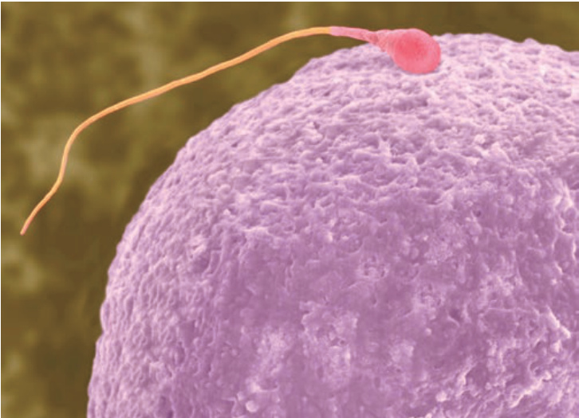  
图19.1　受精。精子对卵子的受精产生合子，合子经过多轮分裂和细胞分化产生胎儿。$\copyright$ Dennis Kunkel Microscopy, Inc./Phototake  

# 19.1 模式生物：发育遗传学的原型  

# 学习目标  

1. 解释为什么遗传学家使用模式生物来研究发育。2.  引用证据证明所有生物体都是相关的，但却是独一无二的。  

发育遗传学家将研究工作集中在少数生物，包括（但不限于）：  

●  酵母［酿酒酵母（Saccharomyces cerevisiae）］  
$\bullet$ 植物［拟南芥（Arabidopsis thaliana）］  
●  果蝇（Drosophila melanogaster）  
●  线虫（蛔虫）［秀丽隐杆线虫（Caenorhabditis ele-gans）］  
●  斑马鱼（Danio rerio）  
●  小鼠（Mus musculus）  

这些模式生物很容易培养，它们会迅速产生大量的后代。遗传学家通过连续几代研究它们的行为，因此可以找到罕见的突变。每个有机体都吸引了一批专门的研究人员，他们共享信息、突变体和其他材料。每个模式生物的基因组都已完成测序，这使得遗传学家更容易鉴定出由于其发生突变等位而对生物体发育具有表型影响的基因。  

# 19.1.1 所有的生命形式都是相关的……  

生物学家已经认识到生命形式在许多层面上是相关的。例如，所有真核生物的细胞都有许多共同的结构特征，如细胞核和线粒体。细胞制造或降解有机分子的代谢途径在所有生物体中几乎完全相同，几乎所有细胞都使用相同的遗传密码来合成蛋白质。在单个蛋白质的氨基酸序列中甚至可以看到生物体的相关性。举例来说，大约20亿年来，进化保存了组蛋白H4的序列，因此广泛分歧物种的H4蛋白发现除了几个氨基酸外，其他都是相同的。大多数其他蛋白质并不像H4那样不变，但尽管如此，科学家们通常可以通过不同物种的同系物的氨基酸相似性来追踪蛋白质的进化过程。  

许多基本的发育机制在多细胞真核生物中是保守的，甚至在组织结构看起来完全不同的生物体中也是如此。在果蝇、小鼠和人类眼睛发育的遗传控制研究中可以看到一个图解的例子。无眼基因（ey）突变纯合的果蝇要么完全没有眼睛，要么充其量只有非常小的眼睛［图19.2（a）］。小鼠Pax-6基因突变也有类似的影响［图19.2（b）］。无虹膜基因（AN）中功能丧失突变杂合子的人缺乏虹膜［图19.2（c）］。  

当研究人员克隆出ey、Pax-6和AN基因时，他们发现所有三种编码蛋白的氨基酸序列都密切相关。这一结果令人惊讶，因为脊椎动物和昆虫的眼睛是如此不同：昆虫的眼睛由许多被称为小眼的小面组成，而脊椎动物的眼睛是一个单一的、相机一样的器官。生物学家因此早就假定这两种眼睛是独立进化的。然而，ey、Pax-6和AN的同源性反而暗示了昆虫和脊椎动物的眼睛是由一个单一的原型光感应器官进化而来的，它的发育需要一个与ey及其小鼠和人类同源物祖先的基因。  

# 19.1.2 ……但所有物种都是独一无二  

虽然发育途径的保守性使得人们很容易断定人类只是大型果蝇，但这显然不是真的。进化不仅保守，而且具有创新性。机体有时使用不同的策略来实现相同的发育目标。  

一个例子是在合子中完成第一次有丝分裂时在线虫和人类中形成的两细胞胚胎之间的差异。如果在这个阶段的线虫胚胎中移除或破坏两个细胞中的一个，就不能发育出完整的线虫。因为两个细胞中的每一个都已经接受了一套不同的分子指令来指导发育，其中一个细胞的后代可以分化为只有某些细胞类型，而另一个细胞的后代则分化为其他类型。人类的情况大不相同：如果两个胚胎细胞彼此分开，两个完整的个体（同卵双胞胎）就会发育。  

因此，蠕虫和人类胚胎在早期阶段的发育方式存在内在差异。秀丽隐杆线虫合子经历细胞分裂，每个子细胞已经被赋予了特定的命运；这种发育模式通常被称为嵌合体决定。相反，早期人类胚胎的细胞可以根据环境改变或调节它们的命运，例如，弥补缺失的细胞，这被称为调控决定。  

嵌合体和调控决定之间的区别只是在进化过程中创造的多细胞生物发展的无数策略的无数例子之一。在一个章节的范围内描述这种巨大的多样性是不可能的。相反，我们选择将本章的讨论集中在黑腹果蝇发育的两个方面：眼睛的结构是如何确定的（19.2节 $\sim\!19.4$ 节），身体是如何沿其长度分成一系列片段的（19.5节）。这些研究揭示了指导许多不同物种不同器官发育的一些一般性机制。但更重要的是，我们希望你能对各种基因分析能够帮助科学家获得关于发育生物学中具体问题的见解方式有所领悟。  

# 基本概念  

●  科学家使用模式生物，因为它们容易生长，产生大量的后代，而且代时相对较短。  
●  生命形式相关性的证据可以在保守的基因序列中找到，这些基因序列在许多不同的动物群体中发挥相似的作用，例如，分别控制果蝇、小鼠和人类眼睛发育的ey，Pax-6和AN基因。  
●  进化为从单个受精卵发育成复杂的多细胞生物的问题创造了许多不同的解决方案。  

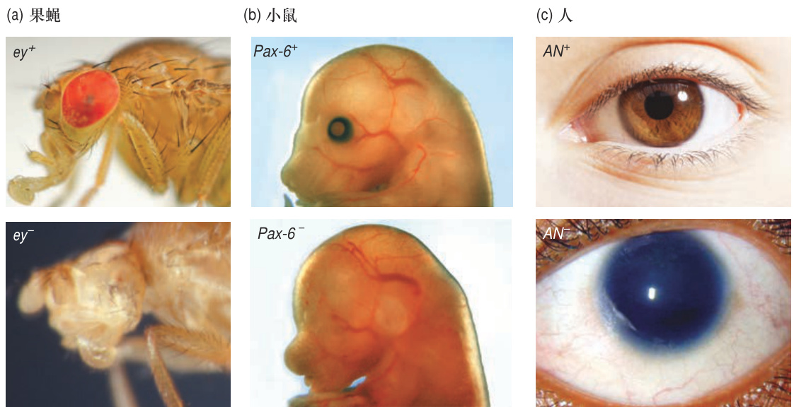  
图19.2　eyeless/Pax-6/AN基因对眼睛发育至关重要。（a）eyeless基因中的亚形态或无效突变的纯合性减少了成年果蝇的眼睛大小或完全消除它们。（b）同源小鼠Pax-6基因中功能缺失突变的纯合性具有相似的效应。（c）AN功能缺失突变的杂合性破坏了人虹膜的发育。  

（a，上）： $\copyright$ Solvin Zankl；（a，下）：Courtesy of Dr. Walter Gehring；（b，两图）： $\copyright$ Helen Pearson, Western General Hospital/MRC Human GeneticsUnit；（c，上）： $\copyright$ Anthony Lee/Getty Images RF；（c，下）：引自：G. Neethirajan et al. (16 April 2004),“PAX6 gene variations associated with aniridia insouth India,” BMC Medical Genetics, 5:9, Fig. 1D. $\copyright$ Neethirajan et al. Licensee BioMed Central Ltd. 2004  

# 19.2 诱变筛选  

# 学习目标  

1.  讨论初级突变筛选如何识别特定发育过程所需的基因。  

2.  解释筛选具有形态表型的突变体的局限性，并讨论敏化修饰筛选如何帮助克服这些问题。  

3.  描述研究人员如何利用RNA干扰来鉴定在特定发育途径中起作用的多效性基因。  

遗传学家理解发育过程本质的方法就是简单地问：过程所需的基因是什么？研究人员检查了大量的诱变生物，并鉴定出具有感兴趣表型的罕见个体，如眼睛发育的特定缺陷。发育遗传学家在模式生物中进行了数以千计的突变筛选，导致了对指导植物和动物发育机制的错综复杂（但仍然不完整）的理解。  

# 19.2.1 遗传筛选鉴定特定发育过程所需的基因  

发育遗传学家对指导果蝇复眼发育的分子机制进行了深入研究［图19.3（a）］。这种选择的一个原因是突变表型很容易简单地通过在显微镜中观察眼睛来分析。复眼包含大约800个相同的小眼或小面，每个小眼由少量细胞组成，这些细胞在每个小眼中以完全相同的顺序逐步组装。在一个装配过程被破坏的突变体中，缺陷将在每只眼睛中重复800次，这使得识别突变表型的性质变得简单。  

在每个小眼中组装的第一批细胞是8个感光细胞，而这些细胞中的最后一个被募集到小面中的是名为R7的感光细胞［图19.3（b）］。R7的独特之处在于它含有能使果蝇检测紫外线的视紫红质蛋白；这种能力对于果蝇在实验室以外的现实世界中的生存非常重要。研究人员对眼睛有缺陷的果蝇突变体进行了筛选，科学家们将注意力集中在几个表现出非常特定缺陷的品系上，其中眼睛中的每个小眼都缺少一个R7，但拥有所有其他感光细胞［图19.3（c）］。  

# 1. 将突变分成互补组  

在筛选出有趣的突变体之后，下一步是确定该集合中代表的不同突变基因的数量。该目标通过将突变分选成互补组来实现，每个互补组含有相同基因的不同突变等位基因。当研究人员在许多隐性功能丧失突变之间进行成对杂交时，他们发现这些突变只能分解为两个互补组（基因），他们称之为sevenless（sev）和bridge-of-sevenless（boss）［图19.3（b）和（c）］。  

# 2. 突变基因鉴定  

每个模式生物的基因组序列的可用性通常使得研究人员能够在几个月的时间内鉴定出与突变表型相对应的  

  
(a)   
(b)  

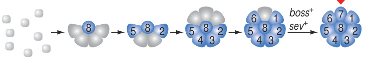  
(c)  

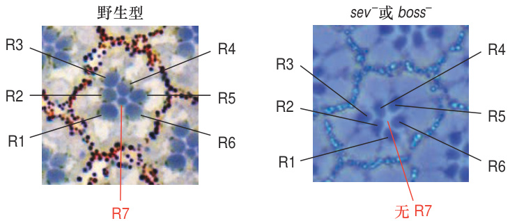  
(d) Sev/Boss        R7  

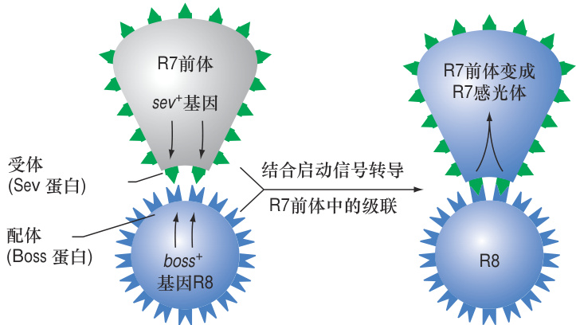  

图19.3　果蝇发育过程中细胞信号转导。（a）扫描成年果蝇眼睛的电子显微照片，显示个别小面或小眼。（b）8个感光细胞依次被招募到每个小眼。蓝色表示细胞对感光细胞敏感。sev 和boss 基因产物有助于指定R7。（c）视网膜切片的光学显微照片。R7在每一个sev 或boss 眼睛的小眼中都不见了（请注意，R8存在但不可见，因为它位于R7下方，因此位于截面的平面之下）。（d）Boss蛋白是在R8表面表达的配体。 Boss与R7前体细胞表面的Sev受体结合激活一条信号通路，导致R7命运。  

（a）： $\copyright$ Kage-Mikrofotografie/agefotostock；（c，左）： $\copyright$ JaniceFischer；（c，右）： $\copyright$ Michael Abbey/Science Source  

基因。为此目的选择的方法取决于用于产生突变体的诱变剂及研究者可用的资源（图19.4）。例如，sev和boss菌株具有化学诱变剂改变单核苷酸对的点突变；如第13章（见图13.6）所述，这些突变使用含有分子定义断点的缺失的染色体作图。  

通过P元件转座子标签和反向PCR鉴定了对眼睛发育重要的其他基因（综述见图14.30）。最后，由于全基因组测序的成本迅速下降，研究人员越来越能够使用类似于第11章中描述的用于寻找人类疾病基因的基因组测序和分析技术鉴定模式生物中的突变基因。  

科学家们有时会被误导，将错误的基因鉴定为突变表型的原因。因此，验证基因分配非常重要（图19.4）。验证的一种方法是将野生型推定基因的转基因拷贝加回到突变生物体中，以查看是否产生野生型表型。通过基因打靶或CRISPR/Cas9等新技术（见图18.14），另一种方法成为可能，即在其他野生型生物体中诱变候选基因，以确定突变表型是否重演。  

# 3. 从所编码的蛋白质的性质得出线索  

一旦研究人员确定了一个对发育过程重要的基因，该基因编码的蛋白质的氨基酸序列往往可以提供关于该过程分子性质的关键信息。在果蝇眼睛的小眼中进行  

R7细胞测定的情况下，sev和boss基因编码的蛋白质都具有疏水结构域，表明这两种蛋白质穿过细胞膜以便它们会在特定细胞的表面被发现。  

连同从其他方法中获得的信息一同描述，科学家们能够制定一个关于这两种蛋白质如何在招募R7细胞到复眼中起作用的简单假说。Sev是存在于R7前体细胞表面的跨膜受体蛋白，而Boss是存在于R8表面的跨膜配体。当R7前体接触R8时，Boss结合Sev。这种接触启动R7前体细胞内的信号转导级联（一系列分子事件，通常包括磷酸化），导致决定R7细胞命运的基因表达［图19.3（d）］。  

# 19.2.2 初级突变筛选可能会遗漏关键基因  

筛选具有特定形态缺陷的功能缺失突变体可以鉴定专用于特定发育途径的基因，其中许多基因的产物合作产生特定的结果，如小眼中R7细胞的规格。然而，对于几乎任何一个过程，编码重要通路组分的基因的突变都将不可能用这样的初级筛选来恢复。在这里我们讨论遗传学家可以用来寻找这些缺失成分的原因和替代方法。  

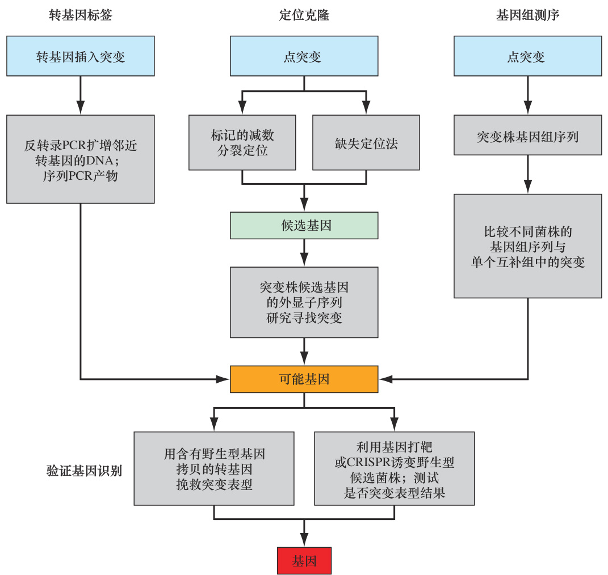  
图19.4　鉴定模式生物中负责突变表型的基因。由转座因子或转基因的插入引起的突变，可以通过其与插入DNA的接近程度来识别。科学家可以通过遗传作图（定位克隆）或通过对突变动物的整个基因组进行测序并寻找关键多态性来发现导致突变表型的点突变。任何这些技术的基因分配都需要进行验证，如图的底部所示。  

# 1. 多效或冗余基因的问题  

图19.3（d）表明Sev和Boss在细胞表面的相互作用引发了一系列事件，这些事件最终影响R7细胞核中基因的表达。为什么R7缺失的筛选没有揭示任何其他基因的突变，而这些基因的产物参与了信号级联反应？答案是这些基因在筛查中被遗漏，因为它们是多效的，也就是说，它们不仅仅适用于R7规范，还需要一种以上的发育途径。特别是，这些基因的许多功能是果蝇生存所必需的：如果缺乏基因功能，生物体甚至会在你看到它的眼睛之前死亡。  

在决定R7细胞命运的形态学表型的筛选中也会遗漏冗余基因的突变。如果两个基因发挥相同的功能，任何一个基因的丢失都不会导致突变表型。多效性和冗余基因的存在是遗传筛选成功的主要限制因素。研究人员有时可以通过遗传技巧克服这些问题，其中一些我们接下来会描述。  

# 2. 致敏突变表型的显性调节剂  

科学家经常尝试通过修饰筛选来鉴定参与发育途径的多效性基因。该想法是由于多效基因的杂合突变可以改变由在特定发育途径中具有专门作用的不同基因的亚形态突变引起的表型。如果亚形态突变产生的敏感表型可能受到在同一途径中起作用的其他蛋白质水平的微小变化的影响，则该方法最有可能成功。  

研究人员试图通过这种方法找到他们推测的多效基因也可能参与确定R7细胞的命运。为了鉴定这些假定的基因，研究人员设计了一种遗传背景，其具有由sev亚形态突变引起的高度敏感的突变眼表型。该等位基因编码具有受损活性的Sevenless蛋白；在这些果蝇的眼睛发育过程中，只有大约一半的小眼病会招募R7。因为这些突变体中的Sevenless蛋白几乎不起作用，降低能够促进Sevenless发挥功能的蛋白质水平可以完全阻断R7的募集途径，导致所有的小眼病缺乏R7（类似于sev无效表型）。另一方面，减少抑制Sevenless功能的蛋白质的量也可以增加阻断R7募集的信号转导通路的强度，最终成功地促使R7的募集（类似于正常表型）。  

图19.5显示了致敏sev突变体表型的修饰物的筛选。科学家们创造了对于亚形态sev突变纯合的果蝇（图中的 $s e\nu^{h y p o}$ ）和随机突变原诱导突变的杂合子。这些随机突变中的一些在基因中产生无效等位基因，因此对于这种突变而言，杂合的动物仅具有相应基因产物的一半量。然后，研究人员寻找与纯合sev亚等位基因不同的眼睛。导致sev亚等位基因眼睛出现更多突变的突变称为显性增强子（ $E^{-}$ ）；导致sev亚形眼看起来更像野生型的突变被称为显性抑制因子 $(\:S^{-}$ ）。在其他野生型背景中，杂合增强子和抑制子突变不会引起突变表型。只有在敏感背景中（即在sev亚等位基因中）发生的突变才会对眼睛形态产生影响。  

在通过该筛选鉴定的突变体中，信号通路的几个组分如图19.6所示。Ras 和Sos 突变表现为sev亚等位基因的显性增强子，表明Ras和Sos蛋白帮助Sevenless募集R7细胞进入小眼。相反，称为Gap的不同基因中的功能丧失突变充当了sevhypo表型的显性抑制因子，研究人员因此推断，Gap蛋白拮抗Sevenless促进R7细胞命运的作用。  

由于所有三种基因（Ras、Sos和Gap）都是多效的，因此在原始筛选中没有一种突变体被鉴定为其眼睛缺乏R7的纯合子。由这些基因编码的蛋白质不仅传递来自Sevenless跨膜受体的信号，还传递来自早期胚胎发育期间细胞-细胞信号转导所必需的许多其他跨膜受体的信号。结果，纯合的Ras–、Sos–或Gap–突变体在胚胎发生的早期就会死亡，早于成年眼睛形成之前。  

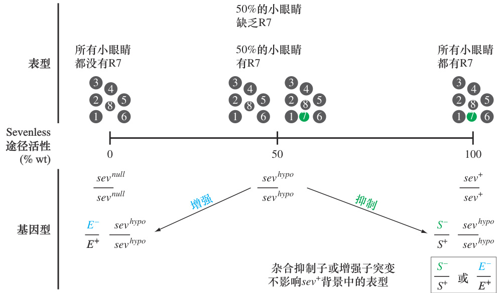  
图19.5　sev–突变体表型的显性修饰物。sev–亚等位基因的眼睛既有表型野生型，也有突变体复眼。显性抑制突变导致所有小眼都出现野生型（存在R7），而显性增强子使它们全部出现突变（R7缺失）。在另外的野生型细胞中，抑制子或增强子突变对眼睛形态没有影响（右下方的框）。  

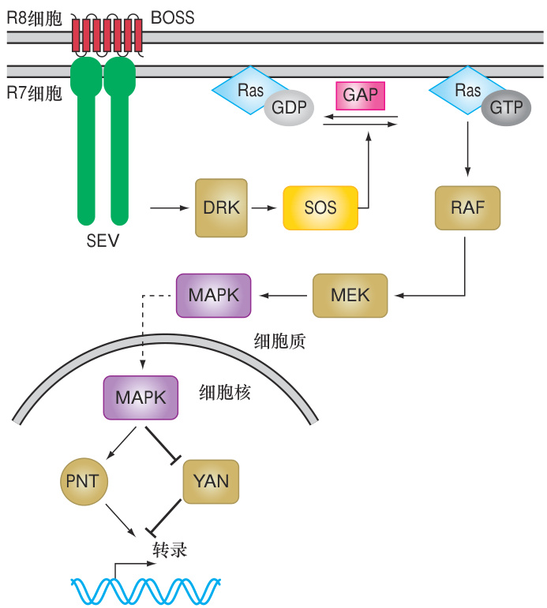  
图19.6　Sevenless信号通路。当Boss与细胞表面的Seven-less（Sev）结合时，信号级联中的一些蛋白质被激活。最终的结果是一种名为MAPK的蛋白质进入细胞核，在那里它激活转录因子Pnt并抑制转录因子Yan。一种导致R7产生的转录过程。  

# 3. 在修饰筛选中使用转基因  

研究人员认为Sev、Boss、Ras、Sos和Gap不是参与R7细胞规格途径的唯一因素。为了找到其他可疑蛋白质，研究人员希望使用致敏表型进行其他修饰筛选，例如，与Ras中的突变相关。然而，正如刚刚提到的，Ras基因是多效的，因此对于亚型Ras 变异纯合的动物或对于变形Ras等位基因的杂合子，在它们发育之前即死亡。为了避免这个问题，研究人员构建了一个转基因，该转基因产生了一种超变形Ras突变体表型，但仅在眼组织中出现。  

在该转基因中，sev的转录调节区与超变性Ras等位基因 $R a s^{G l2V}$ 的编码区融合［图19.7（a）］。当转化为果蝇时，sev调节区域使 $R a s^{G l2V}$ 仅在眼睛中表达，并且仅在眼睛中的某些细胞中表达。这些是与每种正在发育的小眼相关的5种前体细胞，它们通常表达Sevenless，因此有能力成为R7［图19.7（b）］。在野生型眼中，这5种前体细胞中只有一种与R8接触（其表面上具有Boss）并成为R7。其他4个细胞不会成为光感受器，而是发展成分泌晶状体的非神经元细胞。  

然而，在具有转基因的果蝇中，情况是不同的，因为RasG12V中的氨基酸变化导致该突变蛋白起结构性的作用，这意味着即使在Sevenless不受Boss结合的细胞中它也是活跃的。  

此外，RasG12V蛋白中的氨基酸变化导致该突变蛋白即使在Boss未激活Sevenless时也具有结构性功能。结果是图19.6中所示的Sevenless信号通路在所有表达转基因的5个小眼前体细胞中始终有活性［图19.7（b）］。即使这5个细胞中只有一个与R8接触（其表面上有Boss），这些细胞中的五个前提细胞也都能成为R7［图19.7（c）］。在携带sev-RasG12V转基因的果蝇中，额外的R7细胞的募集导致在眼睛外侧可见的形态学畸变［图19.7（d）］。  

因为RasG12V仅以低水平在转基因中表达，所以转基因果蝇的眼缺陷是对其他基因中杂合子功能丧失突变导致的修饰敏感。用于该眼表型的修饰物的突变筛选鉴定了眼中Ras途径中的几种不同的信号蛋白，有助于填充图19.6中所示的方案。  

(a)  sev-RasG12V       Ras  

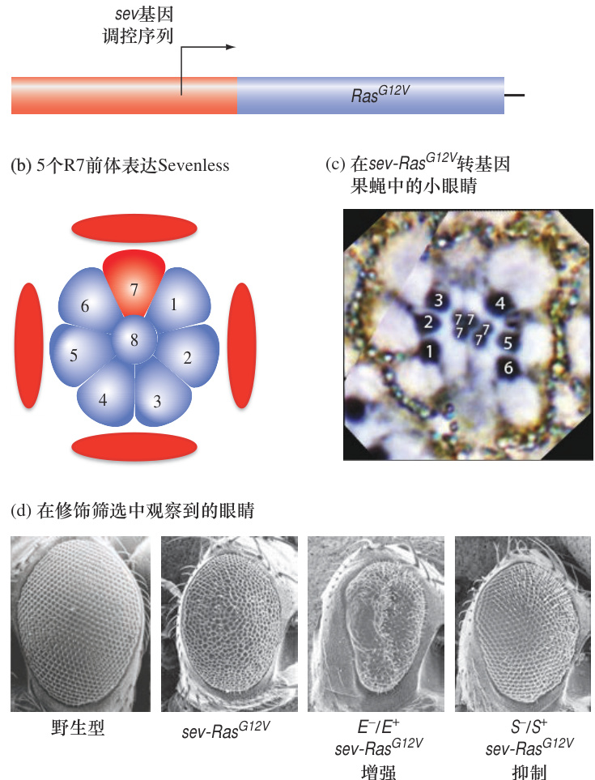  

图19.7　在修饰物筛选中使用表达变形Ras的转基因。（a）含有转基因的果蝇在5个R7前体细胞中表达RasG12V。（b）在野生型动物中，在表达Sev蛋白的5种R7前体（红色）中，不接触R8的4种前体成为分泌晶状体的非神经锥细胞。（c）表达RasG12V的所有5种R7前体细胞都成为R7。（d）在（a）中含有转基因的果蝇具有异常的眼睛形态，通过显性增强子突变（ $E^{-}/E^{+}$ ）变得更糟，并且通过显性抑制突变（ $S^{-}/S^{+}$ ）变得更正常。  

所有照片：承蒙Andrew Tomlinson, Columbia University Medical Center提供  

# 19.2.3 基因库和基因组序列允许系统筛选突变  

诱变剂会增加突变的频率，但它们也会随机改变基因组。因此，传统的诱变筛选效率低且不完整：在任何突变体集合中，一些基因将由许多相似的突变所代表，而该集合可能也会缺乏许多其他基因的突变。现代遗传学家可利用的资源允许更系统的方法来发现参与发育过程的基因。  

对于本章开头提到的模式生物，集中式中心维护着数千种库存的集合，每种库存都有特定基因的突变。这些集合代表基因组中的许多（以及一些生物体的全部）已知基因。研究人员可以从库存中心获得这些突变菌株，因此他们可以逐个筛选每个已知基因对特定表型的影响。  

对于一些模式物种，如果蝇或小鼠，经典的功能缺失突变还不能用于所有的基因。在特定过程中筛选单个基因功能的另一种方法是使用RNA干扰。你将从第17章回忆起真核细胞具有导致双链RNA（dsRNA）触发互补序列mRNA特异性降解的细胞机制（综述见图17.32和图17.33）。为了应用这种RNAi策略，研究人员可以在体外合成dsRNA，然后将其递送到发育中的生物体的细胞中。使用秀丽隐杆线虫的研究人员可以使用简单而优雅的方式将dsRNA传递到细胞中：它们只是将大肠杆菌细胞喂养幼虫，其中含有质粒，其质粒如图19.8所示。含有这种质粒的大肠杆菌细胞内的RNA聚合酶将合成所需的dsRNA，然后随着细菌在蠕虫肠中被消化，其被秀丽隐杆线虫幼虫细胞摄取。  

用RNAi进行遗传筛选的另一种更普遍的方法是构建转基因，使转基因生物能够合成dsRNA。研究人员制造了类似于图19.8所示的转基因，但转基因构建体中包含的启动子是针对被调查物种而非大肠杆菌的。如果转基因中包含的转录调控区域具有组织特异性增强子，dsRNA将仅在那些细胞类型中表达。RNAi方法为避免多效性问题提供了一种方便的方法：研究人员可以创建图19.8　用于RNA干扰（RNAi）筛选的双链RNA（dsRNA）的合成。转录发生在克隆两个启动子之间的cDNA的两条链上。互补的RNA转录物彼此退火以产生导致细胞中相应mRNA降解的dsRNA。  

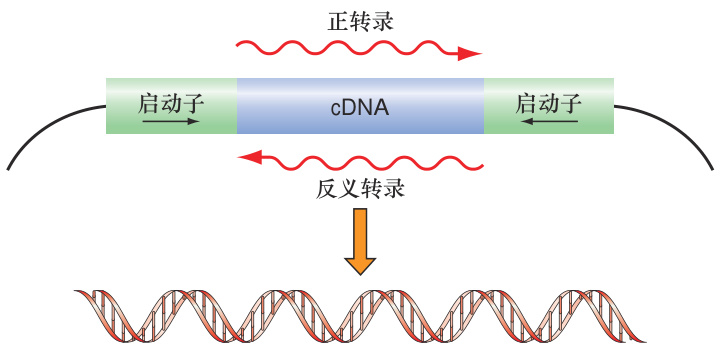  
dsRNA  

一种动物，其中只有被研究组织中的细胞缺乏特定基因的功能，而生物体中的所有其他细胞都保留该基因的野生型功能。  

RNAi筛选的一个缺点是，对于不同的基因，敲低的效率可能会有所不同，完全消除表达很少能实现。然而，CRISPR/Cas9等新的基因组编辑工具效率如此之高，以至于在不久的将来，很可能会建立模式生物基因组中每个基因的无效等位基因集合。  

# 基本概念  

●  研究人员可以通过进行突变筛选来鉴定发育过程所需的基因，其中对具有随机功能缺失突变的菌株进行特定表型的检查。  
●  多效或冗余基因的突变往往不能在突变筛选中恢复。科学家有时可以通过寻找致敏突变表型的显性修饰物来规避这一问题。  
●  在RNA干扰（RNAi）中，将双链RNA分子导入细胞引起互补序列mRNA的降解。研究人员可以在特定组织中诱导基因特异性RNAi来检测多效基因的功能。  

# 19.3 决定基因在何时何地起作用  

# 学习目标  

1. 总结特定基因mRNA和蛋白质产物的监测方法。2. 讨论基因马赛克如何帮助确定基因的作用焦点。3.  解释研究人员如何使用温度敏感的等位基因来确定基因在发育过程中何时起作用。  

为了从整体上理解任何发育途径，研究者首先必须尽可能多地了解组成该途径的每个基因。具体而言，关于基因表达的位置和时间，以及蛋白质产物在特定组织甚至单个细胞内的位置和功能的细节，有助于科学家建立一个理论框架来指导进一步的分析。  

# 19.3.1 基因表达模式为发育功能提供线索  

各种各样的方法使科学家们能够监测整个生物体中或显微镜载玻片上组织切片中特定mRNA或蛋白质的表达。定义基因表达的组织可以帮助研究人员提出有关该基因在发展中的作用的假设。例如，如果基因中的突变影响除转录基因之外的组织或细胞的发育，你可能会假设该基因编码信号分子。在这种情况下，boss基因在R8细胞中转录，但其编码的配体影响具有Sev受体的邻近R7细胞前体的命运（回顾图19.3）。  

# 1. 示踪mRNA表达  

确定基因转录物在生物体中累积的位置和时间的一种方法是进行RNA原位杂交。为此，首先标记对应于基因mRNA的cDNA序列。接下来，使用标记的cDNA作为mRNA的探针，用于薄切片组织的制备，或者在某些情况下用于整个生物体或组织的制备。保留探针的地方的信号表明细胞中含有该基因的mRNA。我们将在本章后面介绍RNA原位杂交实验的结果。  

确定哪些细胞高水平转录特定mRNA的另一种方法是确定细胞中发现的所有mRNA的序列。我们之前已经在第16章中描述了这种深度测序（或RNA-Seq）策略（见图16.29和图16.30）。实质上，研究人员制造与组织样本中的mRNA相对应的cDNA，然后获得数百万这些cDNA的序列数据。找到特定cDNA的频率表明该组织中mRNA的丰度。现代RNA-Seq技术非常高效和敏感，研究人员可以表征单个分离细胞中存在的mRNA。  

# 2. 示踪蛋白表达  

从技术上来说，通过跟踪基因的蛋白质产物而不是通过观察基因的mRNA来评估基因表达的组织通常更容易。在许多情况下，蛋白质方法也提供了更准确的基因表达视图，因为细胞具有调节某些mRNA翻译的功能；因此，组织可能具有大量特定的mRNA但仅有少量相应的蛋白质。因此，蛋白质在细胞内的定位常常为其功能提供线索。例如，细胞核中蛋白质的浓度与转录因子的作用一致。  

监测蛋白质的一种方法是产生抗体，抗体与蛋白质的一部分紧密结合。我们之前在第16章中描述了使用重组DNA技术将大肠杆菌细胞用作制备大量任何给定多肽的微型工厂（综述图16.28）。研究人员可以将这种大肠杆菌制造的蛋白质注射到兔子或其他动物体内。蛋白质在注射动物的血流中充当免疫原，其免疫系统将合成针对外来蛋白质的抗体。科学家获得这些抗体并用荧光标签对其进行标记，使研究人员能够跟踪标记的抗体，因为它们与组织和细胞制剂中的目标蛋白结合。图19.9显示了这种方法的一个特别丰富的例子。  

追踪蛋白质的另一种方法是构建编码用水母绿色荧光蛋白（GFP）标记的蛋白质的融合基因。研究人员合成了一个可读框，不仅可以编码整个感兴趣的蛋白质，还可以在蛋白质的N端或C端编码构成GFP的氨基酸［图19.10（a）］。该构建体还含有正确表达该基因所需的启动子和增强子序列。当将该重组基因导入基因组时（例如，通过P元件介导的果蝇转化），该生物体将使GFP融合蛋白在相同的位置和时间产生正常的未标记蛋白质。研究人员可以通过跟踪GFP荧光来跟踪融合蛋白［图19.10（b）］。这种方法的一个主要优点是研究人员可以使用它来跟踪活细胞或动物中GFP标记的蛋白质；由于技术原因，标记的抗体无法在活性物质中进行跟踪。  

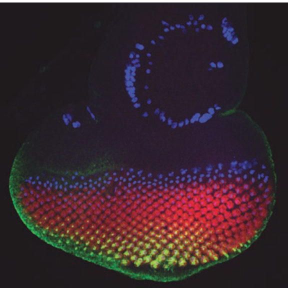  
图19.9　使用抗体监测蛋白质定位。发育中的果蝇眼用抗几种蛋白质的抗体标记，每种蛋白质在特定的感光细胞中表达。  

每种抗体都标有染料，该染料以特定颜色发荧光。  

承蒙Helen McNeill, Lunenfeld-Tanenbaum Research Institute Mount Sinai Hospital, Toronto提供  

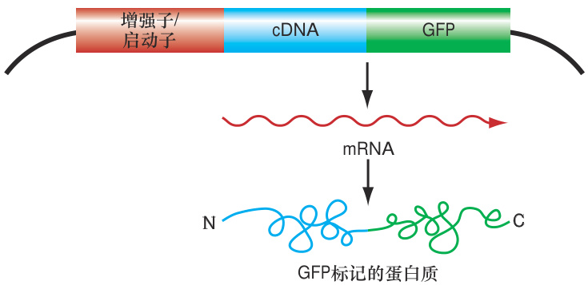  
(a)   GFP   
(b)     GFP  

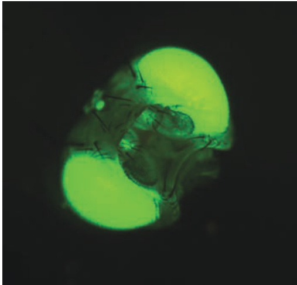  
图19.10　用GFP标记的可视化蛋白质。（a）所示的融合基因编码在其C端含有GFP融合蛋白。（b）该果蝇含有仅在其眼睛中表达GFP标记的融合蛋白的转基因。  

（b）：承蒙Malcolm J. Fraser, Jr., University of Notre Dame提供  

# 19.3.2 嵌合体分析可以确定基因作用的焦点  

遗传嵌合体是由多于一种基因型的细胞组成的个体。通过对嵌合体的研究，发育遗传学家能够解决一个重要问题：必须在哪些特定的细胞中表达才能使发育过程发生？这些细胞被认为是该基因作用的焦点。正如第18章所讨论的，根据物种的不同，研究人员可以使用几种不同的技术来生成嵌合体实验生物。  

在果蝇中，嵌合体通常通过使用FLP/FRT重组系统在有丝分裂期间通过非染色单体之间的特异性重组来产生。通过来自酵母的称为FLP的重组酶实现组合，其催化在称为FRT的特定重组靶标上的交换（回顾图6.31）。研究人员将FLP基因克隆到热休克启动子的下游，因此在其控制下，该表达在升高的温度下开启，并且他们使用P元件载体将该构建体引入果蝇。研究人员还将FRT位点插入到果蝇染色体中，他们收集菌株，每个菌株都在靠近着丝粒的位置插入FRT至特定的染色体臂上。如果FRT存在于两个同源物上的相同位置，则FLP重组酶（其合成由热休克诱导）催化它们之间的重组。在突变体和野生型等位基因杂合的细胞中，有丝分裂重组可以产生纯合突变体子细胞，从而产生纯合突变体子代细胞的克隆。  

科学家们使用蝇眼中的嵌合体分析来提问：为了让R7被招募到小眼中，需要在哪些细胞中表达sevenless和boss基因？为了回答这个sevenless基因的问题，研究人员用标记的（白色）细胞产生了嵌合体，这些细胞是white和sevenless基因的突变体，其他细胞（红色）携带每个基因的至少一个显性野生型等位基因［图19.11（a）］。一些面包含红色和白色感光细胞的混合物。但是在R7细胞的每个面，R7细胞都是红色的（即同时具有w 和sev 基因），即使同一小眼中的所有其他感光细胞都是白色的（纯合的 $\Bar{w^{+}}$ 和 $s e\nu^{-}$ ）［图19.11（b）］。R7细胞在白色的小眼从未出现过。这些结果表明对sev 基因产物的需求存在于R7细胞本身。为了正确发育，R7前体细胞必须产生Sevenless蛋白，并且蛋白质是否在相同小眼的任何其他光感受器中产生无关紧要。Sevenless蛋白仅影响其产生的细胞。  

# 19.3.3 温度敏感的等位基因有助于确定基因作用的时间  

许多对生物体发育至关重要的事件发生在相对时间重要的序列中。例如，特定蛋白质的作用可能仅在狭窄的时间窗口内是重要的。如果蛋白质与其他分子或结构相互作用，那么在存在这些分子或结构之前，蛋白质的存在将不起作用。相反，在做出决定之后，帮助细胞做出发育决定的蛋白质的表达将不起作用。  

研究人员经常使用温度敏感（ts）突变作为工具来确定特定蛋白质产物的功能何时对发育过程很重要。这些等位基因产生的蛋白质在较低的许可温度下起作用，但在较高的限制温度下不起作用。相反，野生型蛋白质在两种温度下都起作用。在使用这种方法的一个实验中，如图19.12所示，研究人员使用Sevenless基因的ts等位基因来确定在假定的R7细胞内需要几小时的时间才能使Sev受体蛋白接受R7的命运。如果Sev蛋白在这段时间内没有被Boss连续激活，那么细胞就会致力于另一种命运（例如，成为分泌透镜的锥状细胞，如图19.7所示）。  

你可以看到几种类型的实验的结果已经汇总，以提供Sevenless受体蛋白在指定R7细胞中的功能的清晰视图。使用Sevenless和Boss蛋白的抗体，研究人员观察到几种细胞产生Sevenless蛋白，但只有其中一种（假定的R7细胞）与R8接触。sev基因的作用焦点是推定的R7细胞（图19.11）。而且，在该细胞的表面，Sevenless受体必须被来自R8细胞的Boss配体连续激活数小时，以确保假定的R7细胞确实呈现R7细胞命运（图19.12）。  

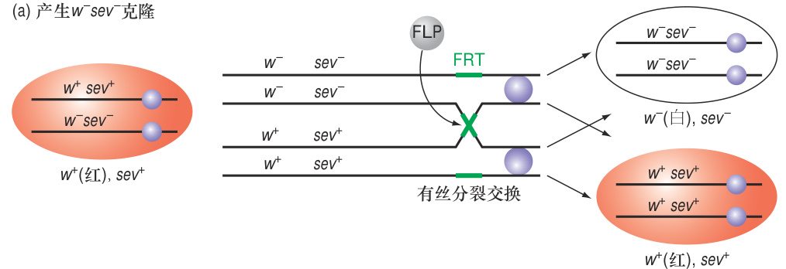  
(b) $(\mathsf{R}7^{+})$  

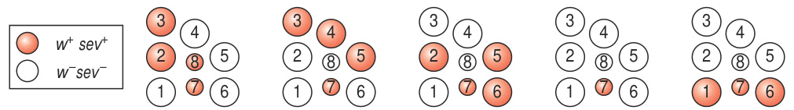  

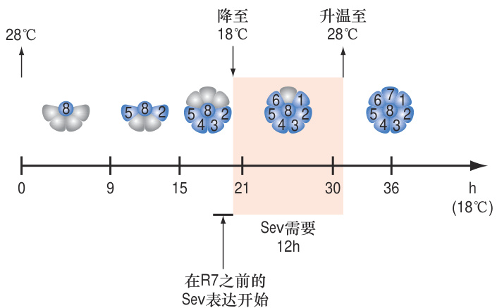  
图19.12　使用温度敏感等位基因进行功能时间分析。sev 幼虫在 $18\,\mathrm{{^\circC}}$ （允许温度）下生长不同的时间长度。只有当Sev蛋白首次出现后，幼虫在 $18\,\mathrm{{^\circC}}$ 环境下至少12h时，成虫眼中才出现野生型小眼（含有R7）。  

# 基本概念  

●  追踪mRNA表达的时间和位置可以通过RNA原位杂交或通过组织特异性RNA-Seq来完成。可以通过使用特异性抗体或通过改造编码GFP标记蛋白的基因来监测蛋白质表达。  
●  嵌合体组织可以指示哪些细胞构成基因的作用焦点，即需要基因表达的细胞或组织。  
●  温度转换实验抑制或允许温度敏感等位基因的功能，使研究人员能够确定何时需要基因产物进行发育过程。  

# 19.4 在通路中排序基因  

# 学习目标  

1.  解释如何通过监测基因表达来确定通路中基因的顺序。  

2.  讨论两个基因中发生突变的等位基因之间的相互作用如何可以帮助确定通路中的基因顺序。  

到现在为止，你已经看到了如何利用遗传学来识别发育途径中的基因、如何确定单个基因在何时何地起作用，以及它们需要在哪些细胞中表达。有时也可以对突变体进行分析，帮助确定通路中基因作用的顺序，即哪些基因或基因产物激活或失活哪些其他基因或基因产物。在这里我们提出两种不同的排序基因功能的方法。  

# 19.4.1 一个基因对另一个基因表达的影响可以揭示作用的顺序  

一旦你确定了一个基因的mRNA或蛋白质的组织分布和细胞内定位，你就可以探究不同基因的突变如何影响这种分布或定位。例如，一种名为Prospero的转录因子对于果蝇眼中R7感光细胞的发育至关重要。Prospero的表达依赖于Sevenless通路的激活。在sev–无效突变体中，Prospero不存在于R7前体中（图19.13）。当用sev-$R a s^{G l2V}$ 转基因在果蝇的R7前体中，不适当地激活Ras时，在所有5种R7前体中均检测到Prospero（图19.13）。相反，Sevenless和Ras的表达都不受prospero基因突变的影响（无图片）。因此，在R7细胞中Sevenless通路的激活在prospero的上游（在这里开启表达）。  

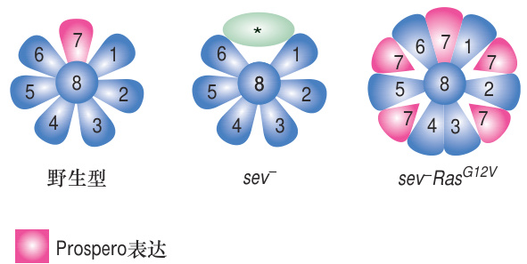  
图19.13　一个基因的突变可以影响另一个基因的表达。­Prospero蛋白（粉红色）通常在发育小眼的R7中表达。在研究sev 型研究的过程中，已经成为R7的细胞变成分泌透镜的锥细胞（\*），并且在其中没有检测到Prospero。在研究转基因眼睛的过程中发现，每个复眼中表达组成活性的RasG12V的5个R7前体，都有Prospero的表达。  

在这个例子中证明的一般原则是，如果基因a功能的丧失或过度活跃影响基因b的表达而不是相反，那么基因a可能在调节基因b表达的途径中在基因b的上游起作用。  

# 19.4.2 双突变表型可以帮助确定基因作用的顺序  

研究人员在通路中建立基因顺序的另一种方法是制造双突变体。这个想法是从两个突变开始，每个突变位于不同的基因（基因a和基因b）。尽管与它们各自相关的突变表型是不同的，但这两个基因在同一通路中起作用。研究人员构建了一个具有两种突变的生物体，并验证一个突变是否对另一个突变是上位性的。换句话说，a b 双突变体是否具有 $\bar{\alpha^{\th}}$ 表型或 $b^{-}$ 表型？如果观察到明显的上位性的相互作用，则结果可以指示在通路中哪个基因是另一个的上游。  

上位性分析在研究发育过程中起重要作用的开关/调控通路时特别有用。在这样的通路中，信号控制着一个开关，可以在任何特定的细胞中进行开启或关闭。如果开关开启，它会启动一系列事件，线性通路中的基因依次受到调控（激活或失活），导致细胞发生变化。因此通路的结果是两种发育状态之一，具体是哪一种取决于开关是开还是关。  

考虑图19.14中的例子，其显示R7细胞的命运由开关调控途径决定。信号Boss在一个细胞中启动Sevenless的开关，开启表达Sevenless并触及R8。在与R8不相邻的其他4个无表达细胞中，开关处于关闭状态，因为这些细胞中的Sevenless受体从未与Boss接触过。该途径的结果是R7开启开关（开启）或不开启开关（关闭）［图19.14（a）］。  

回想一下，在果蝇sev-null突变体中，复眼缺乏R7感光细胞。含有转基因的果蝇 $\mathbf{\nabla}^{G I2V}$ ）在产生Seven-less受体的5个R7前体细胞中表达组成型活性Ras蛋白；结果，所有5个前体细胞都变成R7［回顾图19.7（b）］。含有sev-RasG12V的双突变体的眼睛中，所有5种前体细胞都成为R7［图19.14（b）］。因此， $s e\nu{-}R a s^{G I2V}$ 对sev–是图19.14　上位性分析。（a）R7细胞的状态取决于一个开关/调节通路，该通路的开关是Sevenless，信号为Boss。在表达Sevenless并接触R8的R7前体细胞中，开关打开（Sevenless被激活），这启动了导致R7发育的信号级联。（b）sev–和$s e\nu{-}R a s^{G I2V}$ 的双突变体显示sev-RasG12V突变体表型。（c）这种上位相互作用仅与Ras上游的Sevenless（阴影行）的作用一致，而不是相反（底行）。绿色表示蛋白质有活性； 红色代表蛋白质无活性。  

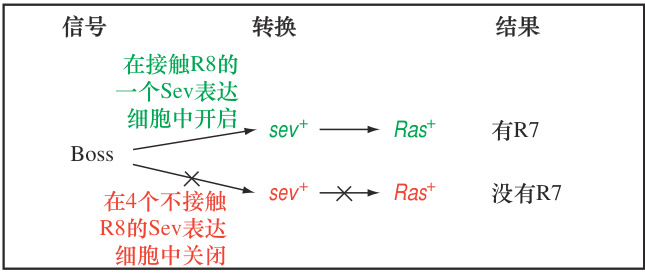  
(a) Sevenless       /  

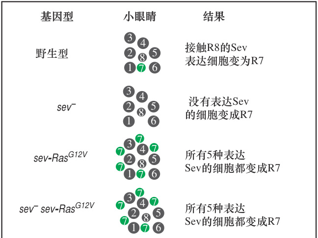  

(b) $R a s^{G12V}$ sev–   
(c)  Ras+ $S e V^{+}$   

<html><body><table><tr><td>野生型</td><td>Sev Ras</td><td>R7</td></tr><tr><td>sev-</td><td>Sev Ras</td><td>No R7</td></tr><tr><td>sev-RasG12V</td><td>Sev RasG12V</td><td>R7</td></tr><tr><td>sev sev-RasG12V</td><td>Sev RasG12V</td><td>R7 YES</td></tr><tr><td>或</td><td></td><td></td></tr><tr><td>seV sev-RasG12V</td><td>RasG12v Sev</td><td>No R7 NO</td></tr></table></body></html>  

上位性的，这意味着双突变体与仅具有sev-RasG12V突变的果蝇具有相同的表型。  

观察到的上位互作与基于生化实验的模型一致，即Ras在信号通路中处于Sevenless的下游（综述见图19.6）。尽管在野生型Sevenless蛋白中（与Boss结合后）激活Ras，但组成型活性突变体Ras对sev 无效突变是上位的，因为激活的Ras不需要Sevenless蛋白就能生成R7细胞［图19.14（c）］。如果激活的Ras仍然需要Sevenless才能发出信号，则会观察到相反的上位相互作用。这个不正确的模型预测sev–sev-RasG12V双突变体将具有sev–表型，因为信号将在双突变体中被阻断，并且不会产生R7［图19.4（c），最下面一行］。  

上位性分析可以提供信息，但要解释结果，必须满足几个条件。例如，在两个单突变体中看到的表型必须彼此不同，并且所考虑的突变等位基因必须是空的或组成型的。即使满足这些条件，从上位性分析得出的通路中关于基因顺序的结论也应始终被视为需要用生化实验进行验证的假设。  

# 基本概念  

●  在一个发育途径中，如果基因a的表达在基因b突变体中发生改变，但基因b的表达在基因a突变体中未发生改变，那么基因b就必须在基因a的上游发挥作用。●  在一个开关调控途径中，双突变体的表型可以揭示上位互作，帮助确定两个基因的作用顺序。  

# 19.5 综合实例：果蝇身体计划发育  

# 学习目标  

1.  描述果蝇早期发育中的关键事件，这些事件发生在分节明显之前。  
2.  定义了母源基因，并解释了为什么其中一些基因的蛋白质产物被称为形态发生。  
3.  总结合子分割基因的层次结构。  
4.  讨论同源基因在确定片段同一性中的作用。  

对果蝇基本身体计划的遗传控制研究已经彻底改变了我们对发育的理解。在这里，我们专注于这项工作，解释了果蝇的身体如何沿着前后（AP）轴分化和特化，这条线从动物的头部延伸到它的尾部。  

我们所描述的研究是基于这样的观察，即一个受精的果蝇卵子被细分为一个胚胎，其中有几个明确界定的片段，每个片段最终都具有特定的外观和功能。有些部分成为头部的一部分，其他部分成为胸部的一部分，还有一些部分成为腹部的一部分。科学家设计了实验来回答关于分割的两个基本问题。首先，动物如何发育适当数量的身体节段？其次，每个身体节段如何知道它应该形成什么样的结构？结果显示，在发育的早期，甚至在转录开始之前，母体效应基因（其产物由母体沉积到她的卵子中）有助于在胚胎中建立区域差异，从而导致合适的节段数目。接下来，一大组基因的作用，称为合子分割基因，由合子基因组表达，将身体细分为一系列基本相同的身体片段。在发育后期，同源基因（一组编码转录因子的基因）的表达为每个身体区段赋予一个独特的身份。  

# 19.5.1 果蝇胚胎划分为几个部分  

要了解母体效应、分割和同源基因如何发挥作用，考虑果蝇发育最初几个小时内发生的一些重大事件是有帮助的（图19.15）。卵子在排卵的过程中受精，此时卵母细胞核恢复了此前减数分裂中期Ⅰ。在单倍体雄性和雌性原核融合后，胚胎的二倍体合子核以非常快的速率经历13轮核分裂，有丝分裂周期 $2\!\sim\!9$ 的平均时间仅为$8.5\mathrm{min}$ 。  

与大多数有丝分裂不同，早期果蝇胚胎中的核分裂不伴有细胞分裂，因此早期胚胎变成多核合胞体。在前图19.15　早期果蝇发育：从受精到细胞囊胚。合子核在单个合胞体中经历13次快速有丝分裂。后端的一些细胞核成为种系极细胞。在合胞体囊胚阶段，卵表面被单层细胞核覆盖。在第13次分裂循环结束时，细胞膜将皮层的细胞核包围成分  

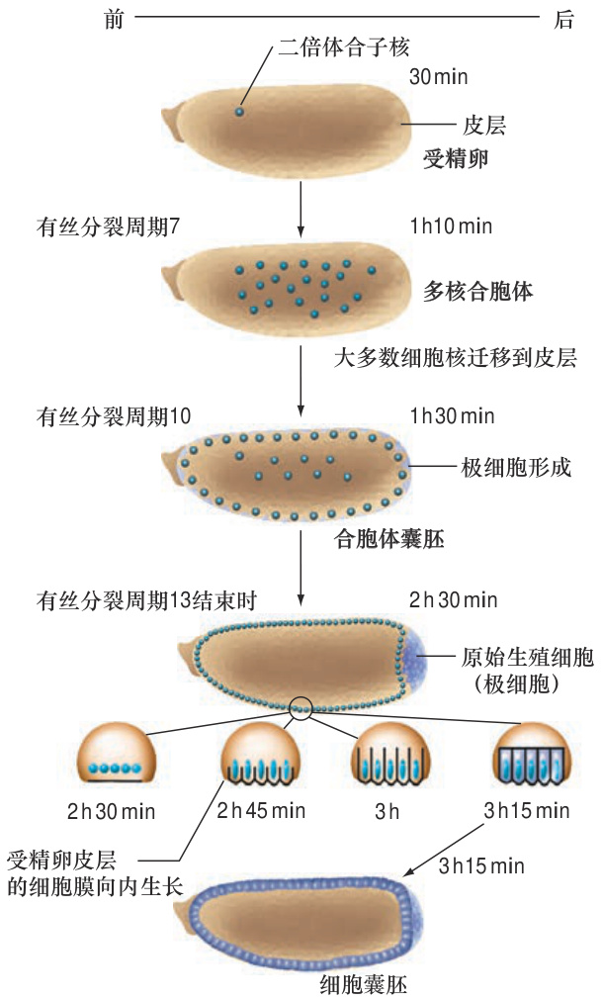  

开的细胞以产生细胞囊胚。  

8个分裂周期中，多个核心位于卵中心。在第9次分裂期间，大部分细胞核迁移到正好在胚胎表面下的皮层，产生合胞体囊胚。在第10次分裂期间，卵子后极的细胞核被包裹在从卵细胞膜内陷形成第一胚胎细胞的膜中；这些极细胞是原始的生殖细胞。在第13个分裂周期结束时，卵子皮质上存在约6000个细胞核。  

在第14周期的间期期间，卵子皮层中的膜在这些核之间向内生长，形成称为细胞囊胚的上皮层（图19.15）。胚胎在受精后约3h完成细胞囊胚的形成。在细胞囊胚阶段，除了后端的极细胞，细胞形状或大小没有明显的区域差异［图19.16（a）］。然而，分子研究表明，大多数分割和同源基因在细胞囊胚阶段期间甚至在细胞囊胚期之前起作用。  

在细胞化后，称为原肠胚形成的折叠过程立即开图19.16　细胞囊胚形成后果蝇发育。（a）细胞囊胚的扫描电子显微照片。胚胎周围可见单个细胞，后端较大的极细胞（箭头）也是如此。（b）受精后大约4h在原肠胚形成期间形成沟的腹面观：vf，腹沟；cf，头颅沟。（c）受精后10h，将胚胎细分为片段。Ma、Mx和Lb是三个头部。CL、PC、O和D是头部的非分段区域。三个胸段（T1、T2和T3）分别是前胸、中胸和气胸，而腹部标记为A1～A8。  

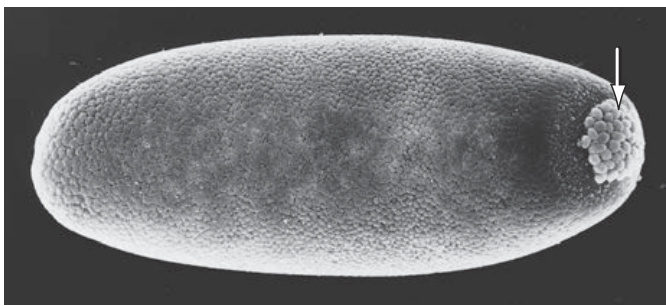  
(a)   
(b)  

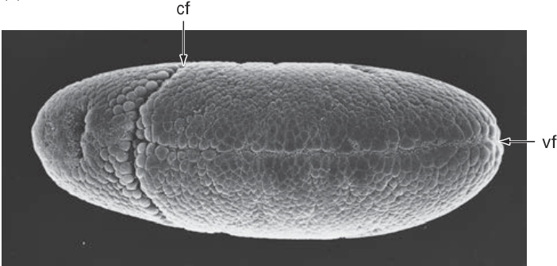  
(c)  

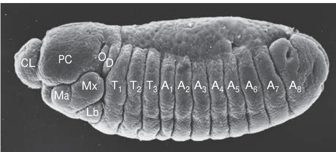  

$\copyright$ Dr. Rudi Turner and Dr. Tom Kaufman, Indiana University始建立胚胎细胞层。中胚层通过内脏细胞的内陷形成，其延伸大部分胚胎的长度。这种折叠［腹侧沟；图19.16（b）］产生内管；管细胞分裂并迁移以产生中胚层。内胚层通过腹侧沟前后的不同内陷形成，其中一个内陷是图19.16（b）中所见的头部皱纹。内胚层包裹的细胞在卵黄上迁移以产生肠道。最后，神经系统起源于位于腹侧外胚层两侧横向的成神经细胞。  

最早可见的分裂迹象是中胚层的周期性隆起，在原肠胚形成开始后约40min出现。在原肠胚形成的数小时内，胚胎被分成清晰的体节，将成为幼虫的3个头节、3个胸节和8个主要腹节［图19.16（c）］。即使动物最终经历变态成为成虫，但在成虫阶段也保存了相同的基本身体计划（图19.17）。  

# 19.5.2 母体效应基因帮助指定片段编号  

在受精时间和13个快速合胞体分裂结束之间的胚胎细胞核中很少发生基因转录。因为几乎（但不是完全）没有转录，发育生物学家怀疑基本身体计划的形成最初需要母体提供的成分在卵子发生过程中沉积到卵子中。他们如何鉴定编码这些母系供应成分的基因？Chris-tianeNüsslein-Volhard和Eric Wieschaus意识到由这些基因决定的胚胎表型不依赖于胚胎自身的基因型；相反，它取决于母亲的基因型。他们设计了遗传筛选，以识别影响胚胎发育的母体基因的隐性突变。这些隐性突变称为母体效应突变。  

为了进行筛选，Nüsslein-Volhard和Wieschaus建立了数以千计的诱变处理染色体的个体平衡库，然后他们检查了从纯合突变母亲获得的胚胎。他们将注意力集中在纯合突变体雌性不育的种群上，因为他们预计，在早期发育阶段缺乏母系供应的成分会导致胚胎缺陷，从而无法成长为成年人（图19.18）。通过这些大规模的筛  

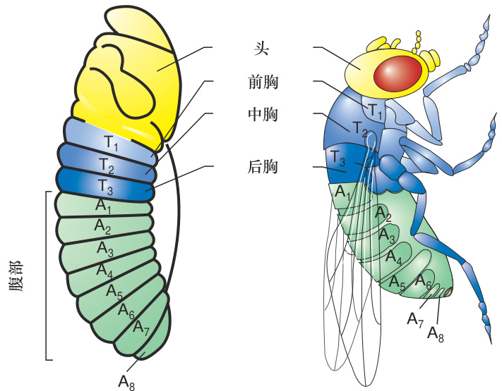  
图19.17　在整个发育过程中保留了节段标识。胚胎节段（左）的特征在幼虫阶段被保留，并通过变态过程保留到成体（右）。  

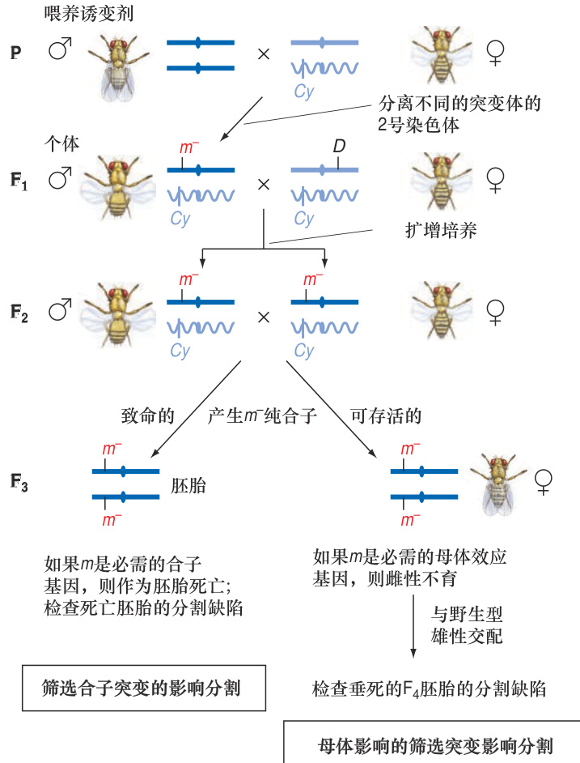  

图19.18　诱变筛选母体效应和合子致死突变。Nüsslein-  
Volhard和Wieschaus如何在果蝇2号染色体上发现影响分割的隐性突变？诱变的2号染色体在F1雄性中恢复，其也具有显  
性Cy标记的平衡染色体（波浪线）。这些F 雄性个体分别与  
Balancer/D雌性杂交（ $D$ 是不同的显性标记）。将卷曲的F2后  
代杂交以在F 后代中产生纯合突变体（m–/m–）。如果这些动  
物死于具有分割缺陷的胚胎，则2号染色体携带有趣的合子致  
死突变。将活的纯合F3雌性与野生型雄性杂交以鉴定影响F4后代分割的雌性不育突变。  

选，Nusslein-Volhard和Wieschaus发现了大量的母体效应基因，这些基因是身体正常模式所必需的。因为这一发现和其他的贡献，他们在1995年与Edward B. Lewis分享了诺贝尔生理学或医学奖，我们之后描述他们的工作。  

我们将重点放在Nüsslein-Volhard和Wieschaus发现的两个母体效应基因上。胚胎前部的正常模式需要一个基因；另一个是正常后部图案化所必需的。这两个基因与联合母体效应基因一起启动了确定片段数的过程。  

# 1. 双足类：前鞭毛原  

来自母体纯合子的双胚胎基因（bcd）的无效等位基因的胚胎缺乏所有头部和胸部结构（图19.19）。bcd的蛋白质产物是转录因子，其mRNA位于卵细胞质的前端［图19.20（a）］。bcd转录物的翻译在受精后进行。新制造的Bcd蛋白从其前端的来源扩散，产生从高到低的前-后浓度梯度，其延伸超过早期胚胎的前2/3  

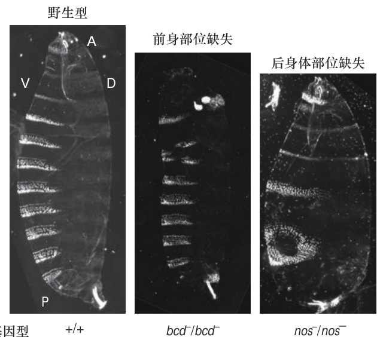  
AP  

图19.19　母体效应突变体影响AP轴图案。在野生型母亲（左）的胚胎中，头部（前）和尾部（后）之间的身体被分成具有特定图案的毛发的区段，所述毛发在其腹面上呈齿状。未能在其卵子中沉积Bcd蛋白质的母体的胚胎（ $b c d^{-}$ ；中间）缺乏前段，而未能沉积Nos蛋白（nos ；右）的母体的胚胎缺乏腹部节段。A，前；P，后；D，背；V，腹侧。  

承蒙Christiane Nuesslein-Volhard, Max Planck Institute for  Developmental Biology提供  

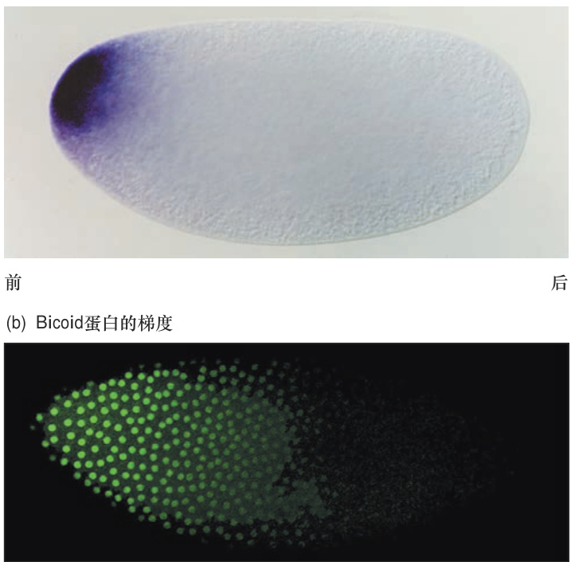  
(a)     mRNA  

图19.20　Bicoid是前部形态发生素。（a）bicoid mRNA（通过紫色的原位杂交可视化）集中在胚胎的前端。（b）Bicoid（Bcd）蛋白（通过绿色抗体染色看到）以梯度分布：在前端高并且向后移动。Bcd是在合胞体囊胚胚胎的细胞核中积累的转录因子。  

（a）： $\copyright$ Steve Small, New York University；（b）： $\copyright$ David Kosman andJohn Reinitz  

［图19.20（b）］。这种梯度决定了头部和胸部发育的大多数方面。因此，Bcd蛋白起到形态发生素的作用，该物质以浓度依赖性方式定义不同的细胞命运。  

Bcd蛋白本身以两种方式起作用：作为一种转录因子，帮助控制更远离调控途径的基因的转录（稍后讨论），以及作为翻译阻遏物。其阻遏活性的靶标是caudal（cad）基因的转录物，该基因也编码一种转录因子。cad mRNA在受精前均匀分布于卵子中，但由于Bcd蛋白的翻译抑制，这些转录物的翻译产生了与Bcd梯度互补的Cad蛋白梯度。也就是说，高浓度的Cad蛋白存在于胚胎的后端，较低浓度朝向前部（图19.21）。Cad蛋白在激活分割通路后期表达的基因以产生后部结构中发挥重要作用。  

# 2. Nanos：未来的决定因素  

来自nanos纯合无效母体的胚胎缺乏腹节（见图19.19）。nanos（nos）mRNA通过由其他母体基因编码的蛋白质定位于后卵细胞质。与bcd mRNA一样，nos转录本在早期核分裂阶段被翻译。翻译后，扩散产生一个从后到前的Nos蛋白浓度梯度（图19.21）。  

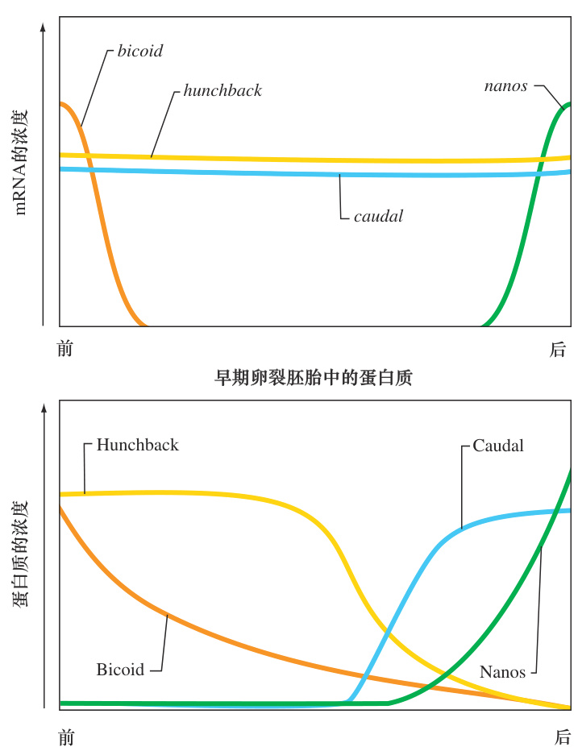  
mRNA   
图19.21　早期胚胎内母体效应基因的mRNA和蛋白质产物。上图：在受精前的卵母细胞中，bicoid mRNA集中在前端附近，而nanos mRNA集中在后端，驼背和尾部mRNA均匀分布。下图：在卵裂早期胚胎中，Bicoid和Hunchback蛋白的浓度梯度由前向后是越来越低（A至P），而Nanos和Caudal蛋白的浓度梯度则相反（P至A）。  

与Bcd蛋白不同，Nos蛋白不是转录因子；相反，Nos蛋白仅作为翻译阻遏物发挥作用。其靶标是母本提供的hunchback（hb）基因的转录物，该基因在卵子发生过程中沉积在卵子中，受精前均匀分布（图19.21）。然而，与Bcd梯度不同，Nos梯度对Nos功能并不重要；重要的是在胚胎后期存在高水平的Nos。  

为了使发育正常发生，必须使胚胎后部不存在Hb蛋白（另一种转录因子）。Nos蛋白在后部以高浓度存在，抑制hb母体mRNA的翻译，从而消除胚胎后极的Hb蛋白（图19.21）。  

# 19.5.3 合子基因决定片段数目和极性  

母系决定的Bcd和Cad蛋白梯度控制着合子分割基因的空间表达。与母系基因的产物不同，母系基因的mRNA在卵子发生过程中被置于卵子中，合子基因的产物由胚胎细胞核中的DNA转录和翻译而来，后者来自原始的合子核。合子分割基因的表达开始于合胞体囊胚阶段，在细胞化之前的几个分裂周期。  

大多数合子分割基因都是在20世纪70年代后期由Christiane Nüsslein-Volhard和Eric Wieschaus进行的第二个突变筛选中鉴定出来的。在这次筛选中，果蝇遗传学家将单个诱变染色体放入平衡的种群中，然后检查来自的纯合突变体胚胎。这些种群是胚胎分割模式中的缺陷（见图19.18）。这些胚胎非常异常，无法成长为成年人，因此，引起这些缺陷的突变将被归类为隐性致死。  

Nüsslein-Volhard和Wieschaus在为每个果蝇染色体筛选了数千种这样的种群后，确定了三类合子分割基因：间隙基因（9种不同的基因）；成对规则基因（8个基因）；片段极性基因（约17个基因）。这三类合子基因符合基因表达的等级。  

# 1. 间隙基因  

间隙基因是第一个被转录的合子分割基因。对于间隙基因突变纯合的胚胎在分割模式中显示出“间隙”，这是由于缺少对应于每个基因表达位置的特定区段［图19.22（a）和（b）］。  

母体转录因子梯度如何确保各种间隙基因在其广泛区域中于胚胎的适当位置表达？部分答案是间隙基因增强子中的结合位点对母体转录因子具有不同的亲和力。例如，一些间隙基因被Bcd蛋白（前形态发生素）激活。具有低亲和力Bcd蛋白结合位点的间隙如hb仅在大多数前部区域被激活，其中Bcd的浓度最高；相反，具有高亲和力位点的基因具有进一步向后极延伸的激活范围。  

答案的另一部分是间隙基因本身编码可以影响其他间隙基因表达的转录因子。例如，Krüppel（ $K r$ ）间隙基因似乎被其表达带前端的大量Hb蛋白关闭，在其表达带内被Bcd蛋白和较低水平的Hb蛋白激活，并且通过knirps（kni）间隙基因的产物在其表达区的后端关闭［图19.22（b）］（请注意，hb基因通常被归类为间隙基因，尽管母体提供了一些hb RNA，但科学家们已经发现，只有从合子细胞核的转录本中翻译出来的蛋白质才在模式形成中起作用）。  

  
(a)   
(b)  

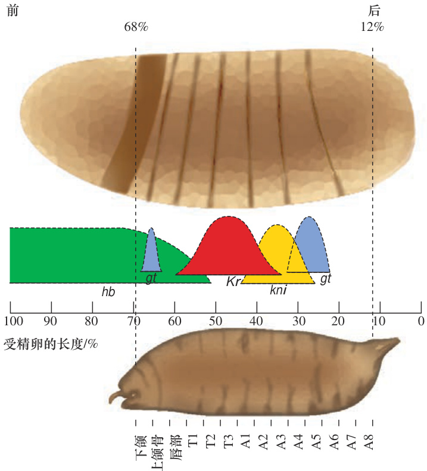  
图19.22　间隙基因。（a）在晚期合胞体囊胚胚胎中表达4个间隙基因［驼背（hb），Kruppel（ $\left(\;K r$ ），knirps（kni）和giant（gt）］的区域，用荧光染色的抗体可视化。（b）显示了胚胎中间隙基因表达的区域。特定间隙基因的突变导致对应于该间隙基因表达区的区段的丢失。（a）： $\copyright$ David Kosman and John Reinitz  

# 2. 成对规则基因  

在间隙基因将体轴划分为粗糙的广义区域之后，成对规则基因的激活产生更清晰的片段。这些基因编码转录因子，而这些转录因子在成胚前期和成胚期胚胎中以7条条带的形式表达［图19.23（a）］。条纹具有两段周期性；也就是说，每两个段存在一个条带。成对规则基因中的突变导致从每个替代片段中删除相似的模式元素。例如，fushi tarazu的幼虫突变体（日本缺陷区段）缺少腹部A1、A3、A5和A7的部分；偶数跳跃的突变导致偶数腹节的丢失。  

存在两类成对规则基因：初级和二级。三个初级对规则基因的条纹表达模式取决于母本基因和合子间隙基因编码的转录因子。每对规则基因的上游调节区内的特定元件驱动该对基因的特定表达。例如，如图19.23（b）和（c）所示，负责激活第二条带中even-skip（eve）表达的DNA区域包含Bcd蛋白和间隙基因Kruppel、giant（gt）、hb编码的蛋白的多个结合位点。胚胎的这条纹中的eve转录由Bcd和Hb激活，而它被Gt和Kr抑制。只有在条带2区(a)  

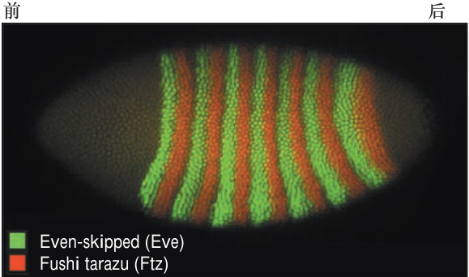  
(b)    eve  

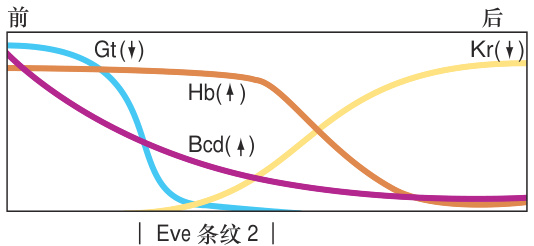  

(c) eve –1500bp  

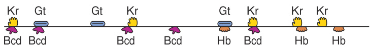  

图19.23　成对规则基因。（a）由细胞囊胚中的成对规则基因fushi tarazu（ftz）和evenskipped（eve）编码的蛋白质的表达区域。每个基因以7条带表达。Eve条纹2是左起第二条绿色条纹。（b）Eve条纹2的形成需要通过Bcd和Hb蛋白激活eve转录，并且不存在Gt和Kr蛋白的抑制。（c）指导Eve条纹2的eve基因上游 $800{\sim}1500\mathrm{b}\mathrm{}$ p之间的增强子含有部分（b）中所示的4种蛋白质的多个结合位点。  

（a）： $\copyright$ David Kosman and John Reinitz域，Gt和Kr水平足够低，Bcd和Hb水平足够高，才能激活驱动eve表达的增强子。  

与初级成对规则基因相反，二级的5对成对规则基因的转录由其他成对规则基因编码的转录因子控制。  

# 3. 片段极性基因  

许多片段极性基因以条带表达，以单个片段周期重复；也就是说，一个条带存在于14个区段的每一个中［图19.24（a）］。区段极性基因中的突变导致每个区段的一部分被删除，通常伴随着剩余部分的镜像复制。因此，片段极性基因用于确定在每个片段中重复的某些模式。  

指导每个区段中单个条带的区段极性基因表达的调节系统非常复杂。通常，由成对规则基因编码的转录因子通过直接调节某些区段极性基因来启动该模式。然后，各种细胞极性基因之间的相互作用在发育后期保持这种周期性。值得注意的是，片段极性基因的激活发生在胚胎细胞化完成后，因此转录因子在合胞体内的扩散停止发挥作用。相反，区段内图案化主要由细胞间分泌蛋白的扩散决定。  

两个片段极性基因——hedgehog（hh）和wingless（ $w_{\boldsymbol{\xi}}$ ），编码分泌蛋白。这些蛋白质与由engrailed（en）段极性基因编码的转录因子一起，负责节段图案化的许多方面［图19.24（b）］。该对照的关键组分是分泌Wg蛋白的细胞的一个细胞宽度的条纹与表达En蛋白和分泌Hh蛋白的细胞的条纹相邻。这两种细胞类型的表面是自我增强的往复循环。由两个相邻细胞条带的前部分泌的Wg蛋白是在相邻条带后部继续表达hh和en所必需的。由更多后部细胞条带分泌的Hh蛋白维持前部条带中wg的表达。表达En和Hh的细胞与表达Wg的细胞之间的界面形成区室边界。细分的前房和后房内的细胞不会混合。  

由这些相邻的细胞条带制成的Wg和Hh蛋白的梯度控制了该区段其余部分中图案化的许多方面。 $w g$ 和hh的产物都是形态发生素；也就是说，响应细胞根据它们所暴露的Wg或Hh蛋白的浓度接受不同的命运。  

其他区段极性基因编码参与由Wg和Hh蛋白与细胞表面上的受体结合引发的信号转导途径的蛋白质。信号转导途径使得从细胞表面上的受体接收的信号能够转化为最终的细胞内调节反应，通常是特定靶基因的激活或抑制。由Wg和Hh蛋白启动的信号转导途径决定了每个区段的部分细胞中分化成这些位置特征的特定细胞类型的能力。  

分段极性基因的同源物是脊椎动物中许多重要模式事件的关键参与者。例如，鸡sonic hedgehog基因（与果蝇hh相关）对于早期鸡胚中左右不对称的起始，以及确定肢芽产生的足趾数量和极性的过程是至关重要的。哺乳动物sonic hedgehog的同源基因与鸡具有相同的保守功能。  

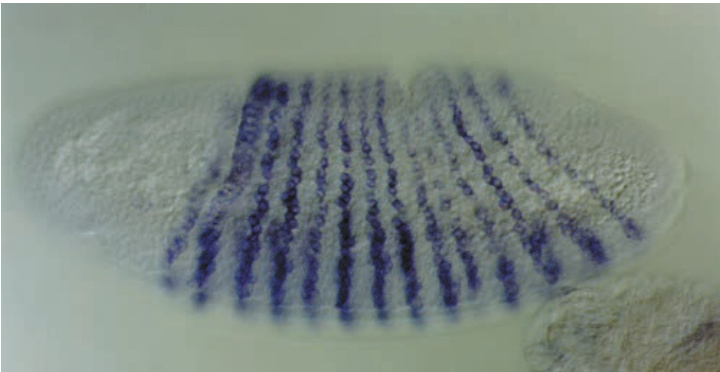  
(a)  Engrailed   
(b)  

图19.24　片段极性基因。（a）野生型胚胎表达14个条纹的片段极性基因。（b）一个节段的前半部分或节段之间的边界由engrailed（en）、wingless（ $w g$ ）和hedgehog（hh）节段极性基因控制。后室中的细胞表达en。En蛋白激活hh的转录，其编码分泌的配体。Hh蛋白与相邻前细胞中的Patched受体的结合启动信号转导途径（通过Smo和Ci蛋白），导致wg转录。 $\mathrm{Wg}$ 是一种分泌蛋白，与后部细胞中的受体结合，由frizzled编码。Wg与Frizzled蛋白受体的结合启动了不同的信号转导途径（包括Dsh、Zw3和Arm蛋白），其刺激en和hh的转录。结果是一个往复循环稳定边界（区室边界）处相邻单元的交替命运。  

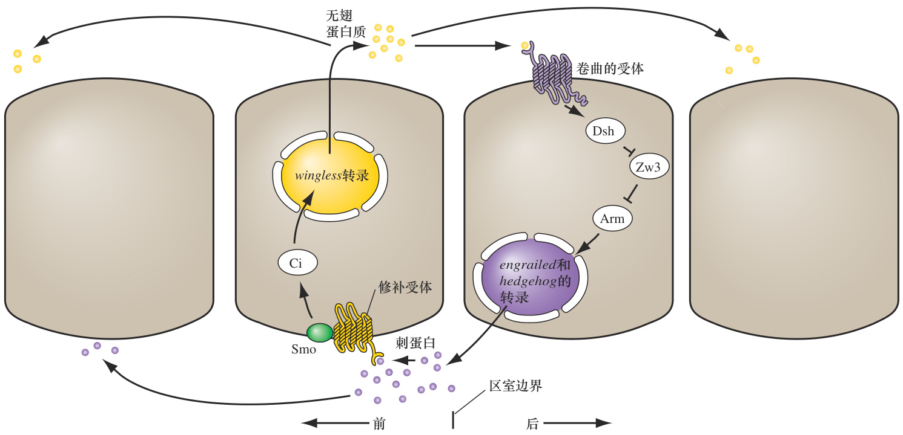  
（a）： $\copyright$ Steve Small, New York University  

# 4. 片段编号规范摘要  

每个分割基因类成员的表达模式都由层次结构中较高的基因或同一类的成员控制，而不是由较低级别的基因控制（图19.25）。在这种调节级联中，母体基因控制间隙和成对规则基因，间隙基因控制自身和成对规则基因，成对规则基因控制自身和片段极性基因。在层次结构的连续较低部分的基因表达，在胚胎内空间上越来越受限制。  

细胞囊胚从外面看起来像一层均匀的细胞［如图19.16（a）所示］，但分割基因的协调作用实际上已经将胚胎分成了细胞原基。在原肠胚形成后几个小时，这些原基变得可以区分为明确的区段［图19.16（c）］。  

# 19.5.4 同源转化基因指定副体节身份  

在分割基因将身体细分为精确数目的片段后，同源基因有助于为每个片段分配唯一的同一性。每个同源基因控制一个称为副体节（PS）的单位，该单位是一个片段的后室和该片段后面片段的前室。同源基因通过作为“主调节因子”起作用来控制负责细胞特异性结构发育的基因簇的转录。同源基因本身受间隙基因、成对规则和片段极性基因调节，因此在细胞囊胚阶段或之后不久，每个同源基因在特定的分段子集内表达。然后，大多数同源基因在整个发育过程中保持活跃状态，持续发挥作用。  

同源基因中的突变（称为同源突变）导致特定的整个副体节或特定的个体区室发展，好像它们位于身体的其他位置。由于一些同源突变体表型相当壮观，研究人员在果蝇研究中很早就注意到它们。例如，在1915年，Calvin Bridges发现了一种叫做bithorax（ $b x$ ）的突变体。在该突变的纯合子中，第三胸段（T3）的前室像第二胸段（T2）的前室一样发展；换句话说，这种突变将T3的一部分转化为T2的相应部分。 $b x$ 突变体表型是戏剧性的，因为前部T3通常仅产生称为halteres的小的球杆状平衡器官，而前部T2产生翅膀（图19.26）。  

另一种同源异常突变是postbithorax（pbx），它仅影响T3的后室，导致其转变为T2的后室（图19.26）（请注意，在这种情况下，果蝇遗传学家使用术语转换来表示身体形态的变化）。在bx pbx双突变体中，所有图19.25　导致果蝇分割的遗传层次结构。（a）层次结构中连续较低部分的基因以胚胎内较窄的条带表示。（b）分割基因的突变导致对应于表达基因的区域（黄色）的片段丢失。牙齿带（深棕色）是帮助研究人员识别细分的特征。  

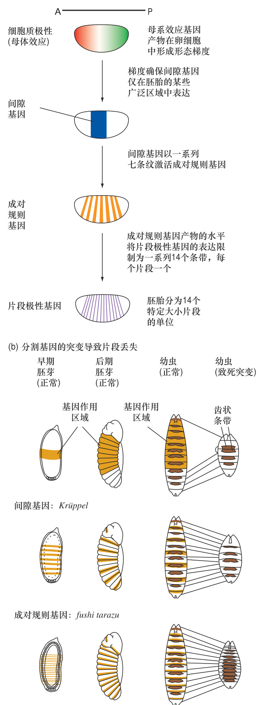  
(a)   
engrailed  

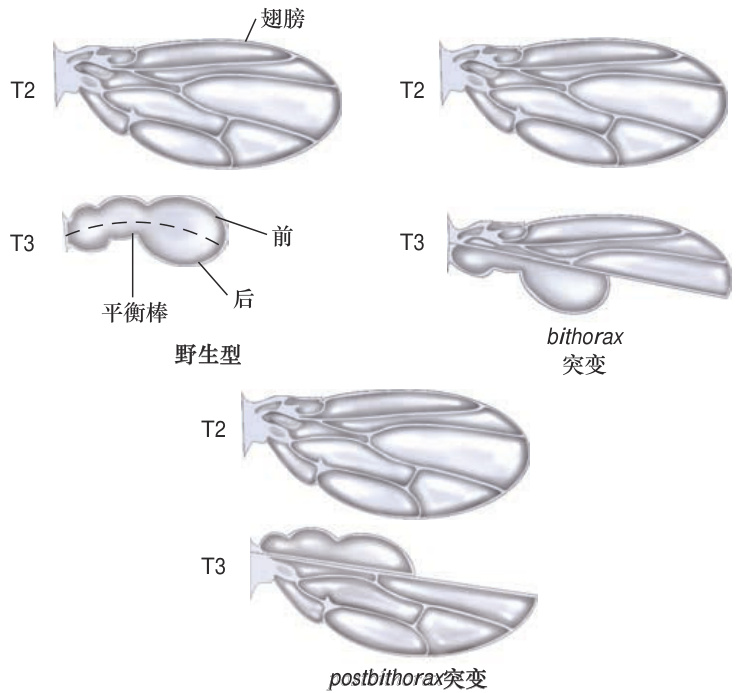  
图19.26　同源变换。在突变bithorax（ $b x$ ）纯合子的动物中，T3的前室（产生haltere的第三胸段）转变为T2的前室（构成翅膀的第二胸段）。postbithorax（pbx）突变将T3的后室转变为T2的后室。  

T3都发育为T2，以产生第1章所示的现在著名的四翅果蝇（见图1.9）。  

在20世纪后半叶，研究人员分离出许多其他同源突变，其中大多数突变位于两个基因簇中。影响腹部和后胸部分段的突变位于称为双胸复合体（BX-C）的簇内；影响头部和前胸部段的突变位于触角足复合体（ANT-C）（图19.27）。  

# 1. 双胸复合体  

因为Edward B. Lewis对BX-C进行了广泛的遗传学研究，他与Christiane Nüsslein-Volhard和Eric Wieschaus分享了1995年诺贝尔生理学或医学奖。在他的工作中，Lewis分离出BX-C突变，如bx和pbx，影响后胸部；他还发现BX-C突变导致8个腹节中每一个的前向定向转换。Lewis将影响腹部下段的突变命名为（iab）突变，并根据它们影响的主要部分对它们进行编号。例如，iab-2突变导致A2向A1的转化，iab-3突变导致A3向A2的转化，等等。后来的研究人员发现这些突变实际上正在改变副体节（图19.27）。因此，iab-2将PS7变换为PS6，iab-3将PS8变换为PS7。  

研究人员在20世纪80年代早期开始对双胸复合物进行分子研究，15年来，他们不仅在分子水平上广泛表征了BX-C中的所有基因和突变，而且还完成了整个315kb区域的测序。图19.28总结了复合体的结构。BX-C的一个显著特征是突变在染色体上以与每个突变影响的节段的前/后顺序相同的顺序映射。因此，影响后部PS5的bx图19.27　同源选择基因。果蝇3号染色体上的两个基因簇—触角复合体和双胸复合体，决定了节段同一性的大部分方面。有趣的是，这些复合体中基因的顺序与每个基因控制的节段顺序相同。  

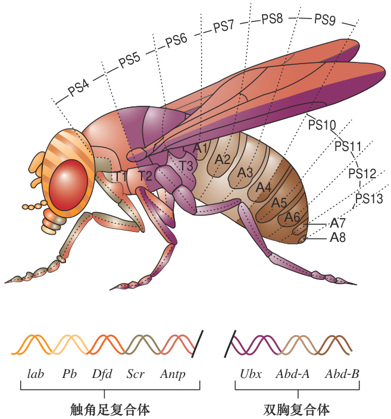  

突变位于复合物的左端附近，而影响前部PS6的pbx突变位于其右侧。反过来，影响PS7的iab-2位于pbx的右侧，但位于决定PS8的iab-3的左侧。  

因为bx、pbx和iab元素是独立可变的，所以Lewis认为每个元素都是一个独立的基因。然而，该区域的分子特征显示BX-C实际上仅含有三种蛋白质编码基因：Ultrabithorax（Ubx），控制PS5和PS6的特征；Abdominal-A（Abd-A），控制PS7-PS9的特征；Abdominal-B（Abd-B），控制PS10-PS13的特征（图19.28）。  

这些基因的表达模式与其作用一致（图19.29）。沿AP轴，Ubx表达在PS5开始，Abd-A表达在PS7开始，Abd-B表达在PS10开始。由Lewis研究的bx、pbx和iab突变影响大的顺式调节区，其控制这些基因在特定区段内的复杂空间和时间表达。  

# 2. 触角足复合体  

20世纪80年代早期的遗传研究表明，第二个同源基因簇，即触角足复合体（ANT-C），指出了果蝇头部和前胸部的节段的身份。ANT-C——labial（lab）、proboscipedia（ $p b$ ）和Deformed（Dfd）的5个同源异型基因中的3个控制头部副体节PS1和PS2。性梳减少（Scr）控制头部和胸部副体节（PS2和PS3），并且Antennapedia（Antp）控制胸段副体节PS4［图19.16（c）显示了这些头部和胸部节段，而图19.27显示了ANT-C中同源基因的顺序］。与BX-C一样，ANT-C中基因的顺序（Pb除外）与每个对照组的节段的顺序相同。  

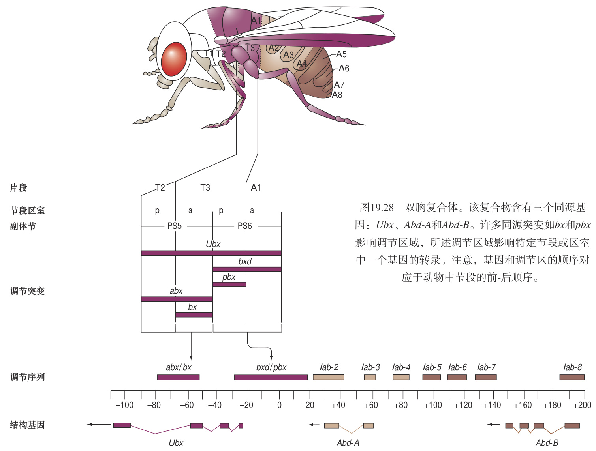  

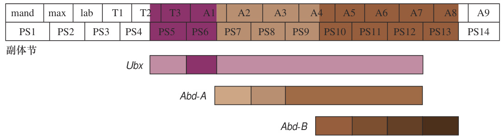  
图19.29　双胸复合基因的表达模式。每个BX-C基因的表达始于沿着AP轴的位置，在该位置首先需要它。由每个基因控制的区段和区段标识用颜色表示：Ubx（紫色）；Abd-A（浅棕色）；Abd-B（深棕色）（PS14不受BX-C控制）。对于每个基因，其颜色较深的阴影表明其蛋白质的总体水平较高。  

# 3. 发育和进化中的同源域  

随着研究人员开始在分子水平上表征ANT-C和BX-C的基因，他们惊讶地发现所有这些基因都包含一些密切相关（尽管不相同）的DNA序列。在许多其他对于发育很重要的基因中也发现了类似的序列，例如，位于同源基因复合体之外的类双体和无眼基因。序列同源性区域称为同源框，长约180bp，位于蛋白质中——编码每个基因的一部分。由同源框编码的60个氨基酸构成同源域，每个蛋白质的区域可以与DNA结合（图19.30）。  

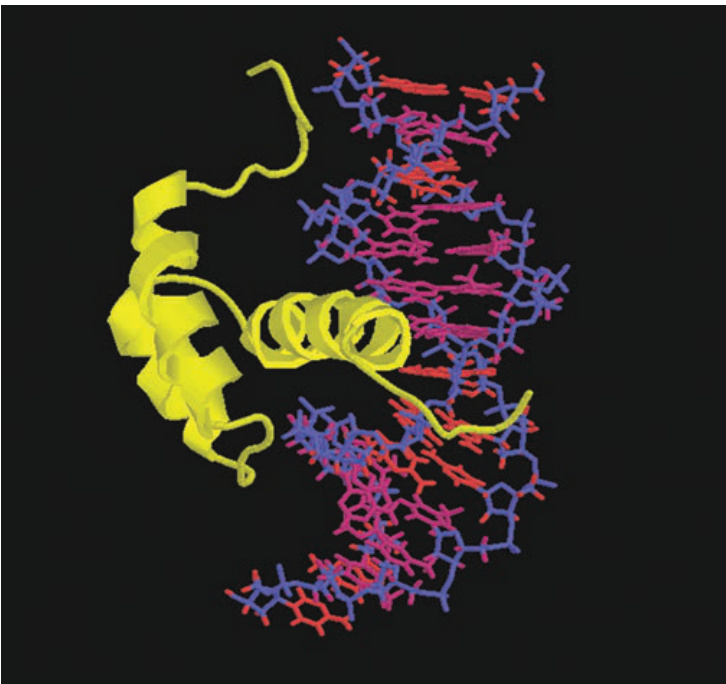  
图19.30　同源域：在许多调节发育的转录因子中发现的DNA结合基序。同源域内的氨基酸（黄色）与DNA双螺旋（红色和蓝色）中的特定序列相互作用。  

由Thomas R. Bürglin建模，数据基于 Otting et al. (1990), “Protein – DNA contacts in the structure of a homeodomain – DNA complex determined by nuclear magnetic resonance spectroscopy in solution,” EMBO J, 9(10): 3085-3092  

我们现在知道，几乎所有含有同源结构域的蛋白质都是转录因子，其中同源域负责蛋白质与它们调节的基因的顺式作用控制位点的序列特异性结合。  

同源框的发现是发育生物学史上最重要的进步之一，因为它允许科学家通过同源性鉴定许多其他基因在果蝇和其他生物的发育中的作用。在20世纪80年代末和90年代，生物学界惊讶地发现小鼠和人类基因组包含称为Hox基因的成簇同源框基因，与果蝇中的ANT-C和BX-C基因具有明显的同源性（图19.31）。值得注意的是，在迄今为止研究的所有哺乳动物中，这些簇内的基因以线性顺序排列，反映了它们在发育中的哺乳动物胚胎脊柱特定区域的表达（图19.31）。换句话说，小鼠和人类中的这些基因簇排列在基因组中并沿着前-后轴调节，其方式几乎与果蝇ANT-C和BX-C复合物相同。  

事实证明，所有动物基因组，甚至是海绵中最原始的动物，都含有Hox基因，因此这些基因是古老的，并且在所有动物的发育模式中发挥了重要作用。通常，身体计划越复杂，Hox基因就越多：人类和其他哺乳动物有4个Hox簇，它们共同包含38个Hox基因（见图19.31）。在一个证明Hox基因介导果蝇以外的动物体内特定区域的发育命运的证据中，人类手指畸形的形成称为“ synpolydactyly”，是由HoxD13的突变引起的，而HoxD13是38个Hox基因之一（图19.32）。  

# 基本概念  

●  通过进行突变筛选并分析突变体，果蝇遗传学家已经确定了一种基因层次结构，它确定了沿动物AP轴的身体模式（分割）。●  母体效应基因从母体基因组中表达，并且它们的产物沉积在卵中。这些基因产物中的一些以浓度依赖性方式影响胚胎的分割，因此被称为形态发生素。●  在果蝇中，三类合子分割基因（间隙基因、成对规则基因和片段极性基因）以层次结构表达，最终将胚胎细分为14个相同的片段。这些基因中的许多是转录因子，其控制基因在同一类别或下一级较低级别中的表达。  

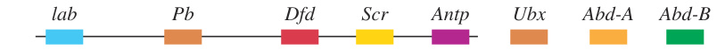  
ANT-C BX-C  

<html><body><table><tr><td>HoxA</td><td></td><td></td><td></td><td></td><td></td><td></td><td></td><td></td><td></td><td></td><td></td><td></td><td></td></tr><tr><td rowspan="2">HoxB</td><td>1</td><td>2</td><td>3</td><td>a-4</td><td>a-5</td><td>9-D</td><td>a-7</td><td></td><td>a-9</td><td>a-10</td><td>a-11</td><td></td><td>a-13</td></tr><tr><td></td><td></td><td></td><td></td><td></td><td></td><td></td><td></td><td></td><td></td><td></td><td></td><td></td></tr><tr><td>HoxC</td><td></td><td>2</td><td>3</td><td>b-4</td><td>b-5</td><td>b-6</td><td>b-7</td><td>b-8</td><td>b-9</td><td></td><td></td><td></td><td></td></tr><tr><td rowspan="2"></td><td></td><td></td><td></td><td></td><td></td><td></td><td></td><td></td><td></td><td></td><td></td><td></td><td></td></tr><tr><td></td><td></td><td></td><td></td><td>C-5</td><td>C-6</td><td></td><td>8-5</td><td>C-9</td><td>c-10</td><td>c-11</td><td>C-12</td><td>C-13</td></tr><tr><td>HoxD</td><td>d-1</td><td></td><td>d-3</td><td>d-4</td><td></td><td></td><td></td><td>d-8</td><td>d-9</td><td>d-10</td><td>d-11</td><td>d-12</td><td>d-13</td></tr></table></body></html>  

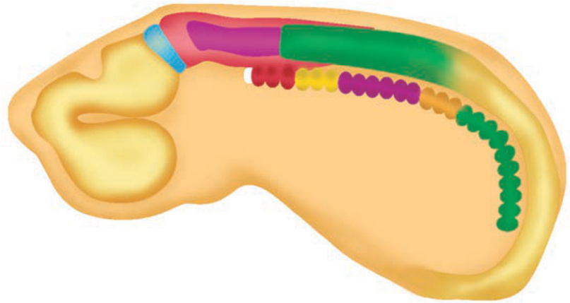  
(b)  

图19.31　哺乳动物Hox基因被组织成四个簇。（a）哺乳动物基因组包含果蝇中每个ANT-C和BX-C同源框基因的多个同源物。（b）正如在果蝇中一样，每个簇中的哺乳动物（小鼠）Hox基因按照它们沿着胚胎的AP轴表达的顺序排列。彩色圆盘代表体节、椎骨的前体和其他结构。颜色代表在该组织中表达的Hox基因。  

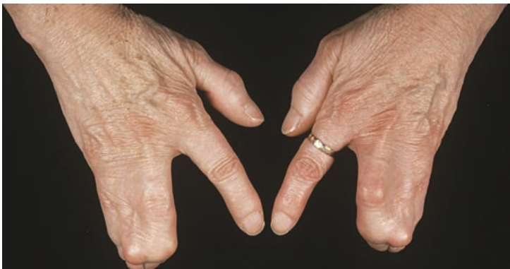  
图19.32　由人HoxD13基因突变引起的并指。 $\copyright$ St. Bartholomew Hospital/Science Source  

●  果蝇同源基因编码表达于不同片段的同源框转录因子，使每个片段具有各自的特性。模拟果蝇AP轴的同源框基因在所有动物中都是保守的，它们在体图计划中起作用。  

# 接下来的内容  

将单细胞受精卵发育成复杂的多细胞生物取决于细胞分裂的精确协调。通常，早期胚胎中的有丝分裂快速发生以向发育中的生物体提供大量未分化细胞，其随后可分化为形成各种器官系统的多种细胞类型。在胚胎成长为成体生物体后，动物体内的大多数体细胞（除了干细胞，其分裂需要补充丢失的细胞）分裂得更少，以确保一个组织不会过度生长。  

极少数情况下，细胞分裂的这些控制会中断，导致我们称之为癌症的不受控制的细胞生长。在第20章中，我们讨论的证据表明，癌症代表了由蛋白质产物促进或抑制细胞生长的各种基因突变积累引起的许多不同疾病。科学家越来越能够识别导致每位患者发现特定类型癌症的关键突变。这些激动人心的新发现有望成为更有效的治疗方法，因为它们现在可以针对个体癌症。  

# 习题精解  

Ⅰ.  利用重组DNA技术，科学家们可以在异常的地方或时间创造出异位表达基因的转基因。这里显示的果蝇，在眼睛或腿上有眼组织，含有一个转基因，其中果蝇无眼基因的cDNA［综述图19.2（a）］融合到热休克基因的控制区域，其转录在高于正常温度的任何组织都会被打开。无眼蛋白质通常仅在发育中的眼睛中表达，但携带这种在高温下生长的融合基因的动物使无眼蛋白质遍布其体内。  

a.  关于无眼基因功能你能得出什么结论？  
b.  鼠Pax-6或人类Aniridia基因在相同的热休克基因启动子控制下在果蝇中表达时，也会出现异位眼。这个结果意味着什么？  
c.  在异位表达实验中，我们希望在一个特定组织中而不是在整个生物体中表达基因。为什么？你怎么能只在果蝇的腿上表达无眼？  

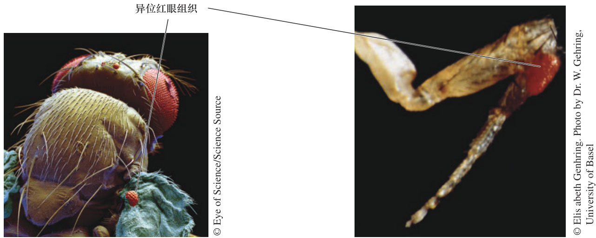  
  
DNA: $\copyright$ Design Pics/Bilderbuch RF  

# 解答  

a.  编码主调节器，使表达它的细胞成为眼睛。b.  这一结果意味着该主开关的氨基酸序列和实际功能在整个动物进化过程中都是保守的。c.  球异位基因表达通常对生物体是致命的。为了仅在腿部表达无眼，你可以将无眼cDNA融合到特征性的基因调控区域，该区域特异性地激活腿上的转录。  

Ⅱ.  Gal4/UAS系统使研究人员能够仅使用一种cDNA转基因以数千种模式中的任何一种表达基因。Gal4是一种酵母转录因子，可以激活携带称为UASG的酵母增强子的基因的转录（回顾第17章“遗传学工具”信息栏“ $G a l4/U A S_{G}$ 二元基因表达系统”）。  

你怎样才能用Gal4/UAS系统专门用腿表达无眼蛋白？解释使用Gal4/UAS系统代替解决习题精解Ⅰ题目c中产生的融合基因类型的优点。  

# 解答  

首先，你将用P元件构建体转化果蝇，其中$U\!A S_{G}$ 位于无眼cDNA的上游。然后，你将穿过 $U\!A S_{G}$ 无眼果蝇到一条驱动系，该驱动系在注定成为腿的细胞中表达Gal4蛋白。  

使用二进制系统的优点是，一个 $U\!A S_{G}$ -eyeless构造可以与已经可用并且特定于不同组织的各种不同Gal4驱动器一起使用。因此，通过将具有 $U\!A S_{G}$ 无眼构造的果蝇与具有不同驱动因子的品系杂交，你可以制造在任何给定组织中（无论是腿还是翅膀，甚至在内部器官中）使无眼蛋白异位生长的果蝇。此外，科学家不需要定义特定的基因调控区域以实现组织特异性基因表达。  

# 习题  

# 词汇  

1. 在右列中选择与左列中的术语最匹配的短语。  

a. 上位相互作用 1.  把身体分成相同的单位（片段）  
b. 规范性决定 2.  通过配体与受体的结合引发  
c. 修饰筛选 3.  具有多于一种基因型的细胞的个体  
d. RNA 干扰 4.  早期胚胎细胞的命运可以被环境改变  
e. 异位表达 5.  为身体部分分配身份  
f. 同源域 6.  浓度决定细胞命运的物质  
g. 绿色荧光蛋白 7.  通过双链 RNA 抑制基因表达  
h. 遗传嵌合体 8.  鉴定多效性基因的方法  
i. 分节基因 9.  在某些转录因子中发现的 DNA 结合基序  
j. 同源基因 10.  编码在未受精卵中积累并且是胚胎发育所需的蛋白质  
k. 形成素 11.  双突变体具有两种突变体之一的表型  
l. 母体效应基因 12.  基因在不适当的组织中或在错误的时间开启  
m. 信号转导途径 13.  用于跟踪活细胞中蛋白质的标签  

# 19.1节  

2. a.  如果你对特定基因在人类心脏胚胎发育中的作用感兴趣，为什么你可能会在模式生物体中研究这种作用？你会选择哪种模式生物体？  

b.  如果你有兴趣寻找人类心脏发育可能需要的基因，你会选择哪种模式生物？描述你可以使用的两种不同的实验方法。  

3.  早期秀丽隐杆线虫胚胎显示马赛克测定，而早期小鼠胚胎表现出调节性测定。  

如果对这两个物种中的每一个四细胞胚胎进行以下处理，则预测结果是你所期望的（假设这些操作实际上可以进行）：  

a.  激光被用来去掉四个细胞中的一个（这种技术被称为激光烧蚀）。  

b.  将胚胎的四个细胞彼此分开并使其发育。  

c.  将来自两个不同的四细胞胚胎的细胞连接在一起以制备八细胞胚胎。  

4.  果蝇无翅基因的同形突变导致动物缺乏翅膀。  

a.  从一组无翅突变开始，研究人员如何在果蝇基因组序列中鉴定出无翅基因？b.  由无翅基因的ORF编码的部分氨基酸序列是：(N)...EAGRAHVQAEMRQECKCHGMSGSCTVKTCWMRL...(C)  

在以下网站进行蛋白质比对，询问人类基因组是否有与无翅相关的基因：https://blast.ncbi.nlm.nih.gov/Blast.cgi?PROGRAM $\equiv$ blastp&PAGE_TYPE $\fallingdotseq$ Blast-Search&LINK_LOC $\fallingdotseq$ blasthome  

输入Homo sapiens（taxid：9606）作为有机体。将所有其他设置保留为默认状态，然后点击页面底部的蓝色BLAST按钮。数据库搜索的结果将在几分钟后出现。搜索结果将告诉你，与飞翼无基因同源的人类基因的存在是什么？  

# 19.2节  

5.  纯合的sevenless（sev）或bride-of-sevenless（boss）基因隐性零突变的果蝇具有相同的突变表型：它们眼中的每一个复眼（facet）都缺少光感受器细胞7（R7）。R7细胞使果蝇能够探测紫外线。a.  鉴于果蝇通常会向光线移动，建议采用筛选方法，使你能够识别R7测定所需的其他基因的突变。b.  你能用你的方法恢复R7开发所需的每个基因的突变吗？请说明。c.  你如何判断你在筛选中发现的任何新突变是sev或boss的等位基因？d.  假设你发现了一个先前未知与眼睛发育有关的基因的隐性突变等位基因，你怎么能在新的诱变筛选中使用这个等位基因来找到这个基因的其他等位基因？为什么你需要额外的突变等位基因来研究这个过程？  

习题6涉及一种名为rugose（rg）的果蝇基因。该基因中隐性突变的纯合子成虫具有粗糙的眼睛，其中小眼睛（小关节）的规则模式被破坏。小眼模式的破坏是由于来自小眼的一个或多个所谓的锥细胞的缺失引起的；在野生型中，每个小球都有四个锥状细胞。  

6.  1932年，H.J. Muller提出了一项基因测试，以确定某种特定突变的表型效应是否为野生型隐性遗传是一种无效（无定形）等位基因，还是一种基因的亚型等位基因。Muller的测试是将隐性突变体等位基因的纯合子表型与杂合子的表型进行比较，其中一条染色体携带有问题的隐性突变，同源染色体携带包含该基因的区域的缺失。  

在一项使用Muller检验的研究中，研究人员检查了两个隐性的，功能丧失的突变等位基因，命名为$r g^{4l}$ 和 $r g^{\gamma3}$ 。由几种基因型的果蝇显示的眼睛形态在下表中显示。 $D f(I)J C7O$ 是一个大的删除，去除其两侧的皱纹和几个基因。  

<html><body><table><tr><td>基因型</td><td>眼表型</td><td>每个小眼的锥细胞</td></tr><tr><td>野生型</td><td>平滑的</td><td>4</td></tr><tr><td>rg41/1rg 4</td><td>有点粗糙</td><td>2~3</td></tr><tr><td>rg*/Df(1)JC70</td><td>适度粗糙</td><td>1～2</td></tr><tr><td>rg"3/rg'3</td><td>非常粗糙</td><td>0～1</td></tr><tr><td>rg "²/ Df(1)JC70</td><td>非常粗糙</td><td>0～1</td></tr></table></body></html>  

a.  哪个等位基因（ $r g^{4l}$ 或 $r g^{\gamma3}$ ）更强（即导致更严重的突变表型）？  
b.  哪个等位基因指导产生更高水平的功能性Rugose蛋白？  
c.  Muller的测试将如何区分无效等位基因和同态等位基因？建议对Muller的测试进行理论解释。根据表中显示的结果，这两个突变中的任何一个可能是皱纹的无效等位基因吗？如果是这样，应该是哪一个？  
d.  解释为什么研究者想要知道特定的 $r g$ 等位基因是无定形的还是亚型的。  
e.  假设存在一个超级 $r g$ 等位基因（ $r g^{h y p e r}$ ），由于过量的锥细胞导致眼睛粗糙。你可以使用Muller的遗传方法来确定显性等位基因是否是超变态吗？请说明。  
f.  假设存在一个反态 $r g$ 等位基因（ $r g^{a n t i}$ ）。你能想出一种方法来确定显性突变是否是反变态的吗？（提示：假设除了具有删除rg的染色体外，还可以获得包含野生型rg基因的重复染色体。）  

习题7和习题8涉及称为myo-2::GFP的重组DNA构建体，线虫发育遗传学家已将其转化为蠕虫。含有这种结构的蠕虫在咽部表达绿色荧光蛋白（GFP），咽部是位于口腔和肠道之间的一个器官，它将线虫作为食物来源（见图）。在myo-2::GFP构建体中，水母GFP的可读框被连接到myo-2的启动子和增强子的下游，myo-2是在咽部肌肉细胞中特异性表达的基因。  

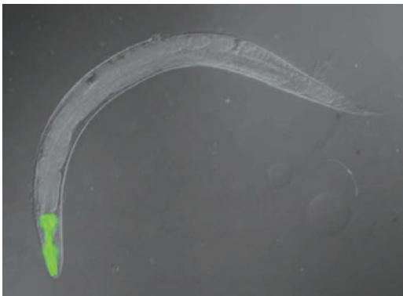  
图片由John M. Kemner提供  

7. a.  解释如何使用myo-2::GFP转化的蠕虫来发现破坏咽部结构的突变。转基因的存在如何促进突变筛选？b.  在称为pha-4的基因中，功能丧失突变纯合的线虫没有可检测到的咽结构。你怎么才能用myo-2::GFP来确定pha-4是否是一种主要的调节基因，以类似于Pax-6/eyeless控制眼睛发育的方式指导咽部的发育？（提示：回顾已解决的习题精解Ⅰ）  

8.  假设你想确定一个特定的基因X是否对咽部的规格很重要，但同一基因的突变在咽部结构出现之前就会破坏胚胎发育。如何使用 $m\mathrm{y}o{-}2{\mathrel{\mathop:}}{\mathrel{\mathop:}}G F P$ ，即myo-2启动子，基因X的DNA序列，以及你对RNA干扰（RNAi）的知识，以产生在咽部缺乏基因X表达的蠕虫，但在野生型秀丽隐杆线虫中表达的所有其他组织中表达基因X？  

9.  Sevenless是一种不寻常的受体蛋白，因为它仅在一种非必需细胞类型——R7前体细胞中需要。也就是说，sev （无效突变体）的眼睛中缺乏R7细胞，但它们在实验室条件下是完全可行和可育的。相反，表皮生长因子受体（EGFR）在开发早期开始的各种细胞类型中是必需的。由于EGFR的多效功能，缺乏这种蛋白质的果蝇在胚胎发生过程中死亡。  

a.  将Sevenless信号传递至细胞核的Ras/MAPK途径（图19.6）也在EGFR的下游起作用。解释为什么用于鉴定Ras/MAPK途径组分的sev突变修饰物的筛选（图19.5）不能用于Egfr突变。  
b.  设计一个修饰筛选，可以识别EGFR途径中基因的突变（提示：使用转基因）。  

10.  假设你生成了含有转基因（ $s e\nu{-}R a s^{S I7N}$ ）的果蝇，该转基因使用野生型sevenless调控序列来驱动编码Ras蛋白的显性失活形式的编码序列的表达。a.  你是否期望这些果蝇具有突变表型？请说明。b.  假设你在修饰筛选中使用这些转基因果蝇。对于图19.6中的每种蛋白质，说明相应基因中的功能丧失突变是否已被鉴定为突变表型的增强子或抑制子。  

c.  如果果蝇含有 $s e\nu{-}R a s^{G l2V}$ sG12V（高度Ras）转基因，则回答题目b。  

11.  果蝇研究人员收集了许多携带单个重组 $P$ 元件的菌株，该重组 $P$ 元件含有插入已知基因组位置的野生型白色基因 $\left(\boldsymbol{P}\left[\boldsymbol{w}^{+}\right]\right)$ 转基因）。这些菌株可用于绘制果蝇基因组中任何突变基因的位置。  

研究人员进行了一项杂交测试，将导致眼睛粗糙的隐性突变rough（ro）与3号染色体上的 $P\ [\ w^{+}\ ]$ 序列进行比对。在一条染色体3上 $P\ [\ w^{+}]$ 杂合的雌性和在该染色体上的一个 $^{r o}$ 突变。另外，同源染色体3与ro–/ro–雄性杂交，获得以下列表中的后代。在亲本和后代中，内源白基因是无功能的——只有当它们含有 $P\ [\ w^{+}\ ]$ 转基因时，果蝇才会有红眼。  

145 红色光滑（野生型）的眼睛  
152 白色粗糙的眼睛  
2 白色光滑的眼睛  
1 红色粗糙的眼睛  

a. $r o$ 和 $P\ [\ w^{+}\ ]$ 是否相关？如果是这样，有多少图距单位将它们分开？  
b.  题目a的数据并未表明 $r o$ 基因位于 $P\ [\ w^{+}\ ]$ 的哪一侧（朝向着丝粒或端粒）。如何修改实验以揭示该信息？  
c.  假设你将 $r o$ 突变映射到两个相距5000bp的不同 $P$ $\left[\begin{array}{l}{w^{+}}\end{array}\right]$ 元素之间的基因组区域。描述一些实验方法，可以让你在分子水平上识别 $r o$ 基因。  
d.  你怎么能用 $r o$ 基因的DNA序列来确定它编码的蛋白质的功能？  

12.  作为随机诱变的替代方法，科学家们可以通过使用RNAi系统地敲除单个基因功能来筛选突变表型。a.  建议构建转基因的方法，在果蝇中表达RNAi以敲低基因。b.  如何使用RNAi对翅膀发育所需的果蝇基因进行突变筛选？ 这个筛选怎么能避免多效的问题？  

13.  称为par-1的秀丽隐杆线虫（线虫）基因有助于在发育早期确定动物的AP轴。科学家们确定par-1是多效的——后来发现它在形成成年动物的外阴方面也具有功能。研究人员如何规避par-1 突变体的致死性以观察par-1基因的后期功能？（提示：秀丽隐杆线虫幼虫可以吃掉表达任何基因的细菌）  

# 19.3节  

14.  已经建立了习题6中描述的果蝇rugose基因的分子身份。现在可获得对应于rugose基因mRNA的cDNA克隆和识别Rugose蛋白的抗体。  

a.  你怎么用这些试剂来确定rugose基因在哪些组织中表达？这个基因在任何特定组织中的表达是否证实了Rugose蛋白在哪里起着重要作用？  

b.  这些相同的材料如何帮助你确定新发现的rugose隐性等位基因是无效还是亚型变异？如果一个新的等位基因对野生型具有显性作用，mRNA克隆或抗体可以帮助你确定等位基因是否具有反形等位基因、超形态等位基因或新形态等位基因？  

15.  为了确定boss 的作用焦点，研究人员进行了如图19.11所示的嵌合体实验：使用FLP/FRT通过有丝分裂重组产生了用于 $w^{+}b o s s^{+}$ 和w–boss–光感受器的小眼嵌合体。  

a.  描述具有野生型表型（存在R7）并且具有凸起突变体表型（R7不存在）的嵌合体小眼（哪些细胞是 ${\boldsymbol{w}}^{+}$ 且哪些是 $w^{-}$ ）的外观。boss 基因的作用焦点是什么？  
b.  虽然boss基因位于3号染色体上，但仍然可以使用$w^{+}$ 基因作为boss 细胞的标记。这是通过使用其中X染色体上的内源性白色基因是突变体并且在染色体3上携带 $P\ [\ w^{+}\ ]$ 转基因的果蝇来实现的。图中使用的染色体，包括在图中FRT的位置、 $P$ $\left[\begin{array}{l}{w^{+}}\end{array}\right]$ 、boss–和boss+等位基因，以及有丝分裂交换。还要展示染色体如何分离成子细胞以产生马赛克。  

16.  假设特定基因是早期发育所需的，也是后来发育特定组织所必需的，如成人神经系统。通过在杂合子的组织中产生纯合突变体克隆，研究人员可以避免整个动物由于该基因中的功能丧失突变成纯合子而导致的致死率。  

一种名为MARCM（具有可抑制细胞标记的嵌合体分析）的技术，能够帮助果蝇遗传学家进行纯合突变细胞克隆，其特征在于存在报告蛋白如GFP。标记表达使研究者能够清楚地观察突变细胞克隆中的突变表型。该技术依赖于称为Gal80的酵母蛋白，其是先前在解决习题精解Ⅱ中描述的Gal4蛋白的负调节物。Gal80与Gal4结合并阻止其激活转录。MARCM的想法是 $\mathrm{Gal}4/U A S_{G}$ 驱动的GFP表达在整个果蝇中被Gal80阻断，除了在纯合子突变体克隆中，其中表达Gal80的转基因通过有丝分裂重组而丧失。  

a.  绘制染色体和有丝分裂交换，产生由GFP表达标 记的纯合 $m^{-}$ 突变体克隆。  

b.  如何能将克隆限制在成人神经系统？  

17.  研究人员利用Minute突变来研究与隐性致死突变相关的表型（ $l^{-}$ ），这种突变降低了细胞分裂的速度，因此只能制造难以分析的非常微小的纯合突变体克隆。许多不同的果蝇品系在编码核糖体蛋白亚基的多种基因中携带显著的功能丧失的Minute（M）突变。 $M$ 基因单倍体不足；只有一个野生型$M^{+}$ 基因拷贝的果蝇细胞分裂速度较慢，因此导致发育迟缓和形态异常。  

为了避免微小的克隆问题，研究人员在l–/l+和$M^{-}/M^{+}$ 的果蝇中产生GFP标记的纯合l –/l –克隆，其也是 $M^{+}/M^{+}$ 。仅在细胞内的细胞中失去Minute突变。克隆使l /l 细胞比其邻居具有生长优势，使突变体克隆能够长到足以进行研究。图中的染色体可以用来产生这样的克隆。  

18.  一些ts等位基因在蛋白质合成过程中对温度敏感：如果在限制性温度下发生翻译，则新形成的蛋白质不能正确折叠。其他ts等位基因对温度敏感：当温度升高时，现有的、正确折叠的蛋白质展开，不能再发挥作用。对于确定蛋白质何时起作用的温度变化实验（如图19.12中的那个），哪种ts等位基因更好？ 解释你的答案。  

19.  下图显示了来自zyg-9基因的温度敏感等位基因纯合子母体的秀丽隐杆线虫胚胎的温度变化分析，这有助于确定早期胚胎的极性。每个点代表经受短暂（5min）高温脉冲的单个胚胎。绿点表明胚胎最终存活并成为正常的蠕虫，而红点表示极性异常的动物最终死亡。  

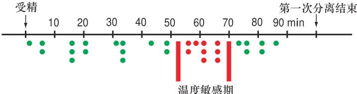  

a.  受精后的什么时间是秀丽隐杆线虫正常发育所需的zyg-9基因？  
b.  无论用于受精的精子是否具有zyg-9的野生型或突变等位基因，都获得了相同的结果。这个事实说明了在需要的狭窄时间窗口内存在的Zyg-9蛋白来源？  

20.  编码Notch蛋白的基因（ $N^{t s}$ ）的温度敏感等位基因帮助研究人员了解该蛋白质在果蝇眼发育中的许多作用。Notch是一种跨膜受体，当与配体结合时，将信号传递给细胞核。在一个实验中，允许野生型和$N^{t s}$ 纯合发育的眼睛在许可温度下在幼虫中生长数小时，然后将温度转移到限制温度。4h后，从幼虫切下眼睛，用在所有光感受器中表达的蛋白质的抗体标记光感受器（下图中的蓝细胞用抗体标记）。黑点表示未在图中显示出的更高级开发阶段的小眼图。  

眼睛发育发生在幼虫中存在的称为眼睛成像盘的结构中。小眼在称为形态发生沟的压痕后面发展（图中的mf）。沟槽在椎间盘后部形成并向前移动；每隔2h，一排新的小眼就会在沟槽后面开始发育，而那排后面的行则会连续成熟到下一个装配阶段（图中只显示了一个小眼图，而不是整行）。因此，在单眼视盘中，存在所有发育阶段的小眼。正如你在图19.3中看到的，加入小眼的第一个细胞是光感受器R1～R8，它们按特定顺序进行。  

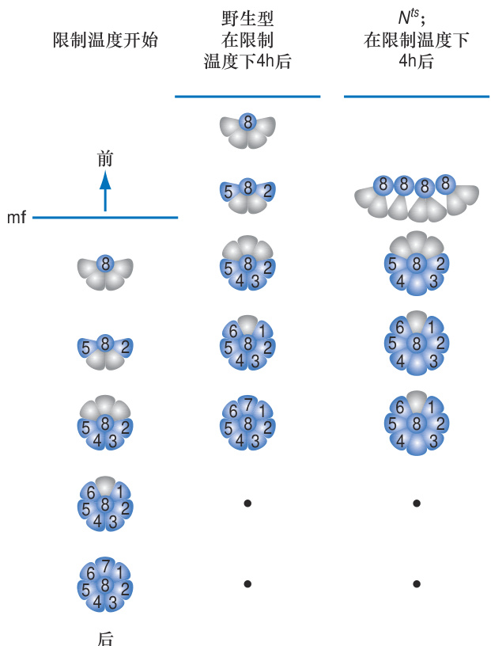  

描述Notch蛋白在小眼组装的不同阶段的不同作用。  

21.  早期发育所必需的多效基因的同形等位基因有时可以为生物体提供足够的基因活性以在早期发育中存活。在这种情况下，突变表型可以揭示该基因的后期功能。  

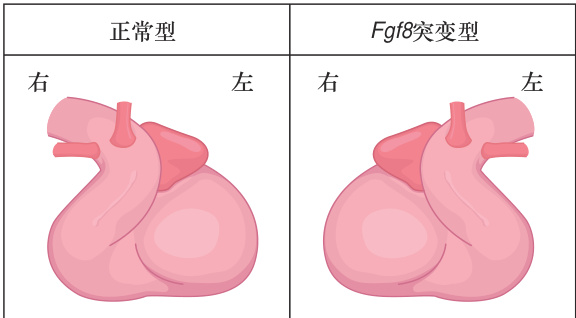  

在早期胚胎发生期间，Fgf8（成纤维细胞生长因子8）的无效等位基因纯合的小鼠死亡，模糊了Fgf8在建立器官左/右不对称性中的后期作用。然而，对 $F g f8$ 等位基因是纯合体的小鼠的进一步研究并揭示了Fgf8蛋白是左撇子的决定因素。  

这些Fgf8亚型突变等位基因如何产生？（可能有多个答案）  

22.  除了在果蝇胚胎中建立前/后极性的母体效应基因（如bicoid和nanos），其他母体效应基因，包括dorsal、pelle和Toll，独立地确定背/腹侧极性。dorsal基因编码最初沉积在卵细胞质中的转录因子（Dorsal），其以浓度依赖性方式确定腹侧。如下图（野生型）所示，早期胚胎中存在Dorsal定位的梯度：Dorsal蛋白浓度最高的细胞核成为腹侧最多的细胞，没有Dorsal蛋白的细胞核成为Dorsal最多的细胞，外侧细胞通过细胞核中特定的中间背侧蛋白水平“得知”自己的位置和命运。该图显示了通过囊胚胚胎的切片，其中D $\lvert=$ 背侧， $\mathrm{V}{=}$ 腹侧。  

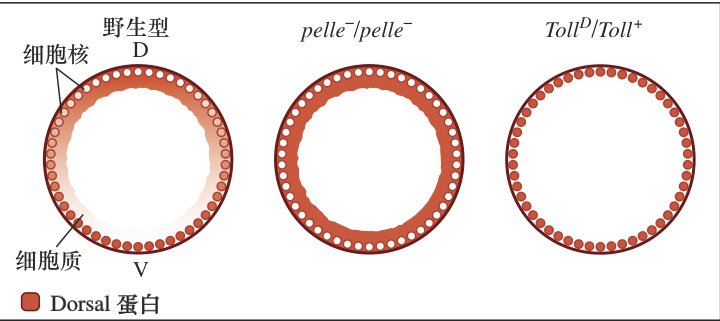  

来自Dorsal无效突变纯合子母体的胚胎被背部化——沿着背/腹轴的每个细胞“认为”它是腹侧最多的细胞。来自功能丧失的纯合子母体的胚胎或功能获得的杂合子（组成型活性）TollD突变显示背部蛋白定位的改变模式，如图所示。Pelle和Toll表达在背侧功能丧失突变体中未改变（未显示）。  

a.  描述由pelle–/pelle–或TollD/Toll+突变母体产生的胚胎中Dorsal蛋白定位的改变。  
b.  根据给出的信息，在背景中对dorsal、pelle和Toll基因进行排序。  
c.  题目a中描述的两种胚胎在孵化前死亡。描述它们的形态突变表型。  

# 19.4节  

23.yan基因编码一种转录因子，在表达Sevenless的5个细胞中抑制R7的发育，因此能够成为R7。在无效的突变体中，每个小眼中的所有5个细胞都可以成为R7［正如 $s e\nu{-}R a s^{G l2V}$ 转基因果蝇一样；见图19.7（b）］。sev–yan–双无效突变体的眼睛显示yan 突变体表型。  

a.  描述sev–和yan–突变体之间的上位性关系。b.  根据你对Sevenless和Yan蛋白在信号通路中的作用的了解（图19.6），这是你预期的上位相互作用吗？请说明。  

c.  只有当同一途径中的基因中的两个突变体具有不同的突变表型时，才能进行上位性分析。R7信号通路中的两个不同的无效突变（sev和yan）如何引发不同的突变表型？  

d.  组成型活性 $R a s^{G I2V_{\mathrm{f}}}$ 突变对于sev–无效突变是上位性的，因此是yan 无效突变；但Ras和Yan在信号通路中的Sevenless的下游起作用。考虑到你对题目c部分的回答，解释为什么这是有道理的。  

e.  假设研究人员鉴定了具有显性组成型活性突变等位基因yan（ $){{\mathrm{y}}a}n^{D}$ ）的果蝇，即使在Sevenless途径被激活的细胞中也能表达yan。预测果蝇的突变表型。你是否期望yanD对于sev–是上位的？对RasG12V呢？请说明。  

24.  回忆第17章，在果蝇中，性别决定取决于X染色体的数量：XX果蝇是雌性，而XY果蝇是雄性。雌性形态的细化取决于由XX胚胎中 $S x I$ 基因的表达引发的级联基因调控（图17.35和图17.36）。Sx1以允许Tra蛋白翻译的方式引起tra基因转录物的剪接。Tra蛋白反过来导致dsx mRNA的雌性特异性剪接和转录因子Dsx-F蛋白的表达。Dsx-F激活雌性形态基因的转录并抑制雄性形态学基因表达。ix基因产物Ix蛋白是Dsx-F抑制雄性形态基因表达所必需的。  

a.  果蝇性别决定是一种转换/调节途径。定义此路径中的信号和开关。开关打开的是什么单元？关闭呢？  
b.  描述XX蝇和XY蝇中的tra 和ix 突变体表型。  
c.  预测tra–ix–缺失的双突变体的突变表型。你希望哪种突变是上位的？  
d.  在先前讨论的关于眼睛发育研究中的上位性分析的两个例子中，在文本中描述的sev–和RasG12V，以及习题23中的sev 和yan ，上位突变定义了该途径中的下游基因。你能解释为什么在这个例子中性别决定途径并非如此吗？  

# 19.5节  

25. a.  解释细胞器DNA的母系遗传与母体效应遗传之间的差异。b.  线粒体基因引起的表型遗传模式与母体效应基因的遗传模式有何不同？  

26.  20世纪20年代，Arthur Boycott通过对蜗牛Limnaeaperegra的研究工作，发现了第一个母体效应表型。像大多数腹足动物一样，Limnaea peregra的壳和内脏通常向右旋转，称为右旋的表型。Boyco发现了一个突变体，它的身体与野生型镜像对称：突变体的壳体和内体盘绕到左侧，称为左旋的表型。  

最近的研究表明，左旋和右旋由一种称为s的常染色体母体效应基因控制；显性 $s^{+}$ 等位基因导致右旋，而隐性功能丧失的s 等位基因导致左旋。  

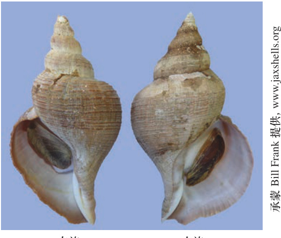  

a.Limnaea是雌雄同体或雄性；雌雄同体可以自体受精，也可以与雄性交配。假设一个纯粹的Limistea雌雄同体的繁殖系与纯种繁殖右旋线的雄性杂交。后代的表型是什么？  
b.  若在相反方向进行杂交，即右旋雌雄同体与左撇子雄性杂交，然后如何回答题目a部分？  
c.  如果来自题目a和题目b的F1自体受精，则分别描述后代表型。  
d.  假设你现在从题目a和题目b中自我完成 $\mathrm{~\cal~F~}_{2}$ 。在每种情况下，你对F 的期望是什么？  

27.  图19.18右侧所示的果蝇突变筛选受到限制；它只能识别母体效应基因中的突变，这些基因的功能在雌性组织中不需要，而不是它们产生的卵。a.  筛选的哪个方面强加了这个限制？b.  你如何确定所鉴定的任何突变是否存在于雄性所需的基因中？c.  为什么筛选时需要Balancer染色体？  

28.  一些基因在声学上和母体上都是必需的。研究这些基因的一种实验方法依赖于 $o\nu o^{D}$ 的存在， $o\nu o^{D}$ 是卵子基因的显性雌性不育突变，位于着丝状的果蝇 $X$ 染色体中间的附近。 $o\nu o^{D}/o\nu o^{+}$ 的雌性是无菌的；含ovoD的种系细胞不能产卵。a.  基因 $X$ 中的突变是隐性致死，因此这些突变的纯合子不会发育成成人。解释研究人员如何在有丝分裂重组实验中使用 $o\nu o^{D}$ 突变来确定： $\textcircled{\scriptsize{1}}$ 雌性是否可以将基因X的RNA或蛋白质产物提供给它们在卵巢中产生的卵； $\textcircled{2}$ 这种母系供应的产物需要适当发展它们的后代。在基因组中，基因X需要定位才能使这种方法起作用？b.  已经克隆了 $o\nu o^{D}$ 突变基因，因此可以获得该突变基因的基因组DNA。你如何使用这种克隆的DNA来确定位于基因组中任何位置的胚胎致死突变是  

否是母体效应基因的等位基因？  
c.  无论它的染色体位置如何，你怎么能在这样的实验中区分出所讨论的基因是否是一个母体效应基因，而不是一个基因？其产物是雌性卵子发生所必需的？  
d.  如果携带这些突变的雌性不育，如何维持含有ovoD突变的果蝇品系？  

29.  一个母体效应基因突变的人如何最有可能被识别出来？  

30.  Bicoid是一种前部决定因素的一个重要证据，这出自于一种类似于早期胚胎学家所进行的注射实验。这些实验涉及通过直接注射到卵中引入诸如来自蛋的细胞质或体外合成的mRNA的组分。描述注射实验，证明Bicoid是前决定因素。  

31.hunchback含有5'转录调节区、5'UTR、结构区（编码序列）和3′UTR。a.  控制hunchback表达所需的重要序列存在于hunch­back的转录调控区域？b.  编码特定蛋白质结构域的序列元素是在hunchback的结构区域中发现的？c.  另一种重要的序列位于hunchback mRNA的3′UTR中。这个序列可能做什么？  

32.  在由nanos 母体产卵产生的果蝇中，腹部的发育受到抑制。从没有母系供应的hunchback mRNA的卵发育的果蝇是正常的。由nanos–母体产下的卵发育的果蝇也没有母系供应的hunchback mRNA是正常的。如果过多的Hunchback蛋白积聚在卵后部，则可防止腹部发育。a.  这些发现对Nanos蛋白和驼背母体提供的mRNA的功能有何影响？b.  这些发现对于进化的生物过程的效率有何影响？  

33.  缺乏间隙基因knirps（kni）的野生型胚胎和突变体胚胎在合胞体囊胚阶段用荧光抗体处理以检查Hunch-back蛋白和Krüppel蛋白的分布。结果如下图所示。  

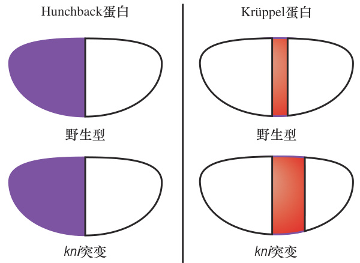  

a.  基于这些结果，你能对这三个基因之间的关系得出什么结论？  
b.  来自nanos 突变母体的胚胎中的Hunchback蛋白模式是否会与所示的不同？如果是，请描述差异并解释原因。如果没有，请解释原因。  

34.  果蝇的even-skipped（eve）基因有4种不同的增强子，以7条条纹的模式控制其转录［其中一个条带2增强器如图19.23（c）所示］。  

a.  为什么条带2增强器仅在与条带2对应的单元中有效？  
b.  其他三个增强器各自在对应于两个不同（不相邻）条带的单元中工作。这是怎么做到的？  
c.  像ftz这样的二级成对规则基因只有一个增强子，它在所有7条条纹中都有效。这是怎么做到的？描述一个可以让科学家得出这个结论的实验。  
d.  你是否期望片段极性基因engrailed具有2个增强子或14个增强子，其中一个在每个增强子中都表现活跃？  

35.  在具有影响Ubx基因的功能丧失突变的果蝇中，身体节段的转变总是在前向方向上。也就是说，在bx突变体中，T3的前室转变为T2的前室，而在pbx突变体中，T3的后室转变为T2的后室（图19.26）。在野生型中，Ubx基因本身在后部T2-前部A7（PS5-PS12）中表达，并且在后部T3-前部A1（PS6）中最强烈地表达（见图19.29）。  

a.Abd-B基因在腹部parasegments $10\!\sim\!13$ 中转录。假设Abd-B的功能模式与Ubx的功能模式相同，那么Abd-B的无效等位基因纯合子的可能后果是什么（即你希望看到哪些节段或段落转换）？b.  因为Abd-A在第 $7\!\sim\!12$ 段的parase中表达，所以BX-C的三个基因（Ubx、Abd-A和Abd-B）都在$10\!\sim\!12$ 段的转录中转录（见图19.29）。为什么腹部parasegments10，11和12在形态上是可区分的？c.  你期望在BX-C（Ubx、Abd-A和Abd-B）的所有三个基因删除的动物中看到什么样的节段转换？d.  BX-C中的某些Contrabithorax突变导致翅膀转变为平衡棒。基于Ubx基因特别是副体节的转录，提出对这种表型的解释。您是否预期Contrabitho-rax突变会对野生型具有显性或隐性？请说明。  

36.  对果蝇的发育至关重要的是，Hox基因不仅必须在它们应该表达的位置，而且它们必须在它们不应该被表达的地方消失。因此，除了增强子之外，Hox基因由消音器控制，如仅结合阻遏物的增强子。这个事实是由约30个所谓的Polycomb group（PcG）  

基因的合子突变发现的。任何一个PcG基因失去功能突变的纯合子胚具有相似的突变表型：如附图所示，其身份由BX-C基因控制的节段全部转化为最后腹部的节段（PS13）：  

a. 你认为PcG基因编码的蛋白质类型是什么？b. 解释缺乏PcG蛋白的胚胎的突变表型。  

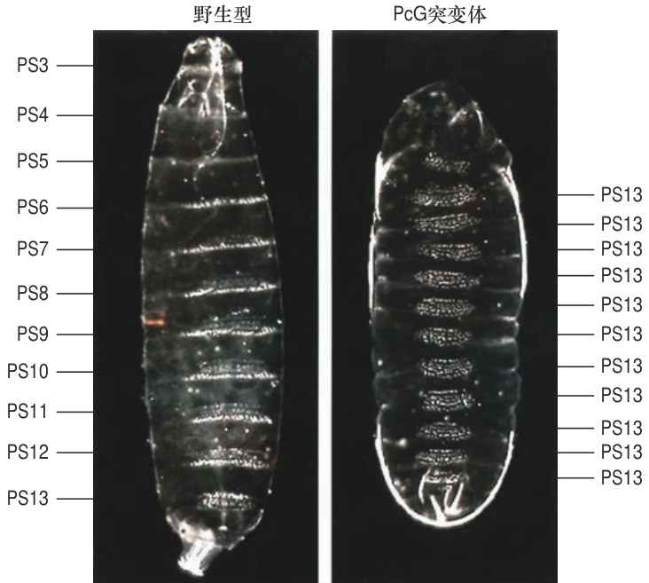  
图片由Jeffrey Simon, Ph.D.提供，引自：Joyce Ng et al. (Nov. 1997), “Evolutionary Conservation and Predicted Structure of the Drosophila extra sex combs Repressor Protein,” Molecular and Cellular Biology, 17(11): 6663-6672, Fig. 2A-B. $\copyright$ by the American Society for Microbiology  

37.  在植物拟南芥（Arabidopsis thaliana）中，每朵花由4个同心轮的修饰叶构成。第一轮螺纹（螺纹1）由4片绿色叶状萼片组成，螺纹2由4个白色花瓣组成，螺旋3由6个雄蕊组成，花粉中含有雄性配子（精子），而螺纹4含有2个心皮，其中包含雌性配子（卵）的胚珠。如下图所示，野生型花卉图案的简写描述为：萼片，花瓣，雄蕊，心皮。  

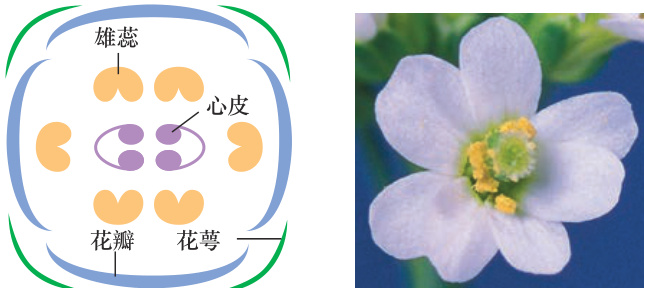  
来源：USDA/Peggy Greb拍摄  

科学家们想要了解这种轮生模式是如何产生的。他们为随机诱导的突变产生了纯合的拟南芥植株，并筛选出具有异常顺序或选择花器官的突变花。确定的有趣突变体分为三种表型： $\textcircled{\scriptsize{1}}$ 心皮，雄蕊，雄蕊，心皮； $\textcircled{2}$ 萼片，萼片，心皮，心皮；$\textcircled{3}$ 萼片，花瓣，花瓣，萼片。  

研究人员发现，所有1类突变体都是同一基因的等位基因，他们称之为APETELA2（AP2）。2类突变体是两个基因之一的等位基因，命名为APETE-LA3（AP3）和PISTILLATA（PI）。最后，3类突变体代表单个基因AGAMOUS（AG）。分子分析显示所有四种基因都编码转录因子。  

基于AP2、AP3、 $P I$ 和A $G$ 突变体（均为无效等位基因）的表型，以及所有四种基因产物均为转录因子的事实，研究人员制定了以下模型，用于区分4种花轮与4种等同螺旋的分化。前体细胞群：AP2蛋白决定萼片； $\mathrm{AP2+AP3+PI}$ 决定花瓣；$\mathrm{AP3+PI+AG}$ 确定雄蕊；AG确定心皮。此外，AP2和AG蛋白抑制彼此的转录。  

a.  完成下面的图表，以显示模型如何预测四种基因中每种基因突变纯合的花的表型。在图表中，彩色框表示表达的基因；白框是未表达的基因。  

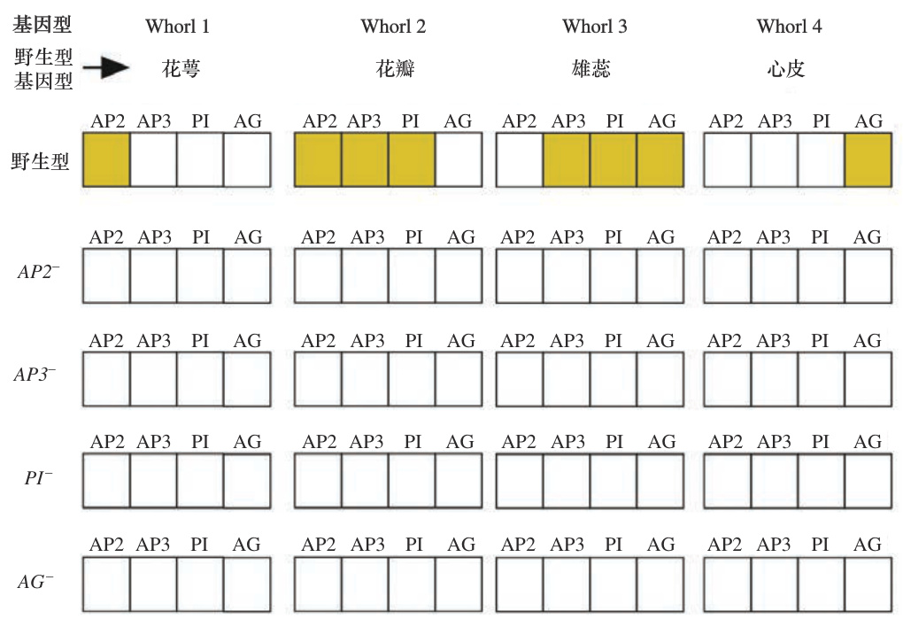  

b.  科学家使用RNA探针对四种基因中的每一种进行RNA原位杂交实验，测试了花形图案模型。目标是观察每个基因的mRNA是否在四个轮生中的每一个的前体细胞中表达。你对每种探针对野生型花的预测结果如何？AP2突变体呢？AG突变体呢？  

c.  研究人员测试花图案模型的另一种方法是制作双突变体。模型预测6种双突变体组合中的每一种都有哪些表型？［提示：为每个可能的双突变体扩展题目a所示的图表将会有所帮助］d.  这个问题中描述的四个基因的作用是否与分割基因或本文中描述的果蝇同源基因的作用更相似？  