# 第一部分 基本原理：性状如何传播  

# 第 2 章 孟德尔遗传法则  

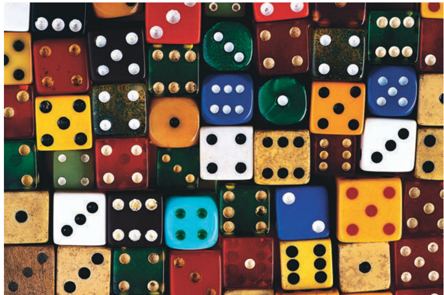  

尽管孟德尔遗传定律可以预测个体拥有特定基因型的概率，但雄性配子和雌性配子的随机结合决定了该个体的实际遗传命运。  

$\copyright$ Lawrence Manning/Corbis RF  

# 章 节 大 纲  

2.1 遗传之谜  
2.2 孟德尔遗传学分析  
2.3 人类的孟德尔遗传  

浏览全家福的时候很容易发现，孩子的特征往往和父母中的一位相似或者与父母特征的组合相似（图2.1）。还有些孩子和祖父母甚至曾祖父母相似，而和父母几乎没有相似点。是什么原因导致了外貌的异同和隔代相似的出现呢？  

答案就在我们的基因及遗传之中。基因是生物信息和遗传的基本单位，遗传则是基因将生理特征、解剖学特征及行为特征等从亲代传递给后代的现象。我们每个人都是从单个的受精卵通过分裂、分化发育而来的。成年人体内共有约 $10^{14}$ （100万亿）个细胞，这些细胞行使不同的功能，控制着我们的外表。基因在世代间的传递形成了可遗传的特征，这些特征多种多样，包括：随年龄增长的脱发趋势，头发、眼睛及皮肤的颜色，甚至对于某些癌症的易感性，等等。所有这些特征在家庭中都以可预测的形式进行遗传，这种遗传形式会导致遗传性状的出现或缺失。  

遗传学是研究遗传的科学，致力于精确地解释生物结构及遗传的相关机制。在某些情况下，基因与性状之间的关系是非常简单的，例如，镰状细胞贫血症，这是由单个细胞中单个基因的改变所造成的红细胞血红素缺陷疾病。而在另一些情况下，基因与性状之间的关系则是异常复杂的。以面部特征的遗传为例，我们认知中的面部特征是由众多基因调控大量分子共同作用而形成的。  

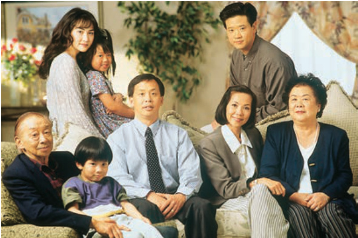  
图2.1　全家福。这是一个拥有四代人的大家庭。$\copyright$ Bruce Ayres/Getty Images  

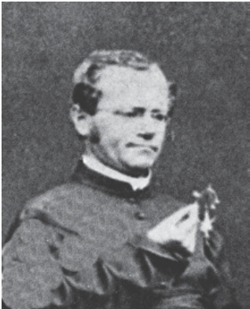  
图2.2　格雷戈尔·孟德尔。拍摄于1862年，手上拿的是他的实验植株。$\copyright$ Science Source  

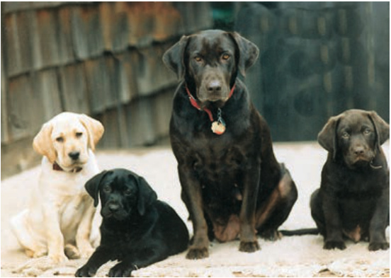  
图2.3　同物种父子间的相似与不同。一只拉布拉多犬和幼崽。$\copyright$ Saudjie Cross Siino/Weathertop Labradors  

格雷戈尔·孟德尔（Gregor Hendel，1822—1884；图2.2）是一位健壮的、戴眼镜的奥古斯丁修道士和植物育种专家，于19世纪中叶发现了经典的遗传学规律。他将他的发现于1866年公开发表，而这距离达尔文的《物种起源》刊印仅仅过去了7年。孟德尔生活和工作都在奥地利的布隆城（现捷克共和国的布尔诺），在这里他对豌豆的明显相对性状进行了研究，如花的紫色和白色、豌豆的绿色和黄色，通过这些研究，他总结出了遗传学规律，这使得他可以预测哪些性状在世代间会出现、消失以及重新出现。  

孟德尔定律基于这样一个假设：可观察到的性状是由肉眼看不见的独立遗传单位决定的。我们现在称这些单位为基因。随着研究的深入和完善，基因的概念不断发生变化。目前，基因被认为是编码某一蛋白质或某些RNA的DNA片段。但在最初，基因是抽象的概念，它是想象中的以未知机制控制可见性状的无实体颗粒。  

我们通过详细地介绍孟德尔遗传定律及其发现过程开始学习遗传学。在接下来的章节中，我们主要讨论孟德尔遗传定律的逻辑延伸，以及科学家后来是如何将遗传单元（基因）定义到实际的生物分子（DNA）之上的。  

针对孟德尔的工作，我们提出了四个主题。第一，变异在自然界中广泛存在，如同一特征的不同表现形式，这种遗传多样性为生命的丰富多样提供了原材料。第二，可观察的变异对于基因在世代之间的传递十分重要。第三，变异并不是偶然发生的，相反，它是根据解释产生相似或不同的遗传规律而遗传的。例如，狗只能生狗，而现在已知的狗就有数百种，即便在同一个品种（比如拉布拉多）之内，遗传变异也是存在的。两只黑色的狗也可能诞下黑色、棕色及金色的幼犬（图2.3）。孟德尔的遗传见解可以帮忙解释这种现象。第四，孟德尔遗传定律对于包括原核生物、豌豆及人在内的所有有性生殖生物均适用。  

# 2.1 遗传之谜  

# 学习目标  

1.  将孟德尔的实验方法与现代科学探究的过程相联系。  
2.  描述孟德尔豌豆杂交和自交实验。  
3.  理解孟德尔通过可控豌豆杂交育种实验所获得的结论的重要性。  
4.  预测孟德尔利用具有离散、互斥性状的纯种豌豆品系杂交的后代类型。  

几个步骤可以帮助人们理解遗传现象：对生物群体进行长期的观察，如家族、牛群及玉米或者番茄的群体；将观察到的信息进行系统地记录和严格地分析；发展新的解释遗传现象起源及其关系的理论框架。19世纪中叶，孟德尔在研究过程中第一次将观察数据记录、分析，与理论相结合，并成功地探索到了遗传学的基础。在这之前的数千年里唯一的遗传实践是对驯化的植物和动物进行选择性培育，而这并不能确定每一次交配会产生怎样的后代。  

# 2.1.1 人工选择是第一个应用的遗传学技术  

遗传学的基本应用是人类文明重大转变背后的驱动力，猎人和采集者在村庄定居，并以牧羊人和农民的身份生存。甚至在有记载的历史之前，人们就已经在驯养植物和动物以供自己使用时实践了应用遗传学。以半驯化的狼为例，人们灭杀凶残的、难驯化的狼，而将机警的、友好的狼留下驯化并使之相互交配。通过这样的人工选择（即有目的地控制产生后代的亲本交配），驯化的狗（Canis lupus familiaris）逐渐从祖辈野生狼（Canislupus）中分化出来。最早确认的狗骨是由在阿拉斯加出土的20 000年前的头骨确认的。在人工选择的指导下，数千年的进化中产生了大型犬大丹麦、小型犬吉娃娃及数百种其他品种的狗。早在10 000年前，人们就开始使用类似的遗传手段挑选培育具有经济价值的驯鹿、绵羊、山羊、猪和牛，从而为人们提供维持生命所需的肉、牛奶、兽皮及羊毛等。  

农民们也对植物进行了人工选择：将种子从最强壮、最美味的个体中挑选并储存起来，在下一季种植中使用，最终获得了生长得更好、产量更高、更容易种植和收获的植株。通过这种方式，人们在亚洲的野生植物中逐渐筛选出了亚洲水稻、小麦、大麦、小扁豆及枣椰树；在美洲筛选出了玉米、南瓜、番茄、土豆及胡椒；在非洲筛选出了洋芋、花生及葫芦。之后，植物育种者在植物中发现了雄性和雌性的生殖器官从而开始了人工授粉。图2.4展示的是雕刻于公元前9世纪的亚述弗里兹雕塑，这也是人工授粉最早、最直观的记录。雕刻中表现的是牧师用选定的雄花花粉刷在枣椰树的雌花之上。通过这种人工选择的方法，早期的实践遗传学家培育了数百种不同的枣椰树，每种都有不同的可观察性状，包括果实的大小、颜色及味道等。1929年，一项对埃及三个绿洲的植物调查中发现了400种不同的枣椰树，20世纪的证据表明这些树的变异来源于自然和人工选择。  

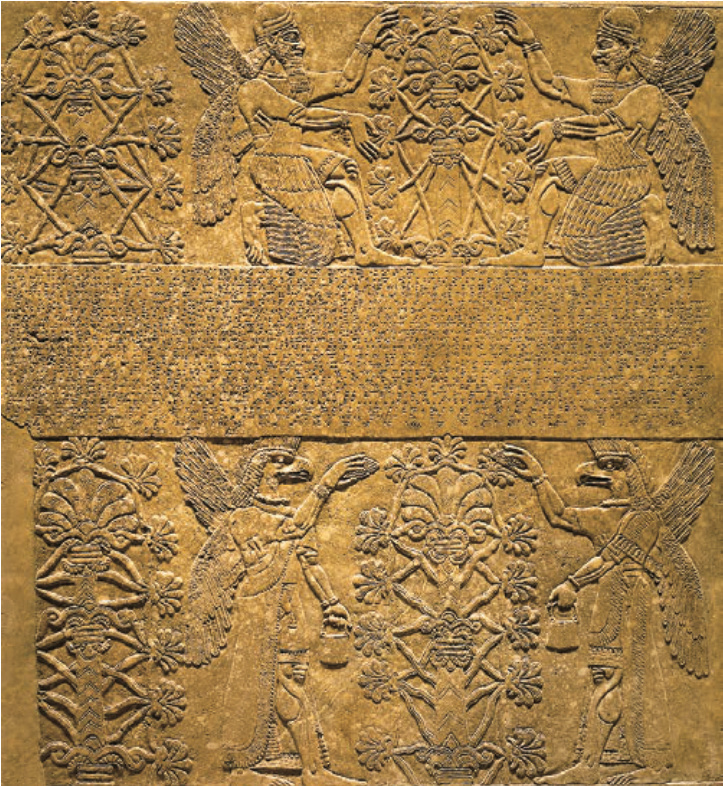  
图2.4　应用遗传学已知的最早记录。这件有2800年历史的雕塑出土于亚述纳西帕尔二世（公元前883年到公元前859年）的西北宫殿，展示的是戴着鸟面具的牧师为枣椰树的雌株人工授粉的场景。  

# 2.1.2 目标性状的消失和再现  

在孟德尔出生的1822年，奥地利人对遗传学的理解与古亚述人的理解差别并不大。在19世纪之前，植物和动物育种学家经常培育出具有亲本优势性状的品种。利用这些优质品种，他们可以培育生产出具有目标特性的食物和纤维。但是他们并不能理解这些优势性状为什么会消失，偶尔又会在部分子代中重新出现。  

例如，选择育种实践中产生了一种有价值的美利奴绵羊，这种羊能够产生大量柔软、纤细的羊毛。但在1837年摩拉维亚羊饲养协会年会上，一位育种家的困惑反映了上面提到的情况。他拥有一只杰出的公羊，如果它的优势是由它的后代继承的，那这只羊是无价的；但“如果它们没有被遗传，那么它的价值就不超过羊毛、羊肉和羊皮的成本”，“那究竟是哪种情况呢？”根据会议的记录，当时的育种实践没有给出明确的答案。在这次羊饲养协会的会议上的总结发言中，Abbot CyrilNapp指出了一种可能的方向。他认为育种者可以通过解决以下三个基本问题来提高他们预测在后代出现的性状的可能性：遗传的是什么？它是怎样遗传的？偶然性在遗传里扮演什么样的角色？  

这也是1843年21岁的孟德尔进入Abbot Cyril Napp主持的修道院时面临的困惑。尽管孟德尔在修道院接受的是神学训练，但在科学上，他并不是一个业余的爱好者。布隆城所在的摩拉维亚省是当时的学习和科学活动中心。孟德尔在1863年达尔文的《物种起源》被翻译成德语后不久就获得了一本。Abbot Napp非常认可孟德尔的能力，全资将他送到了他自己开课的维也纳大学。孟德尔选的课是混合课程：物理、数学、化学、植物学、古生物学和植物生理学。Christian Doppler——多普勒效应的发现者，也是他的老师之一。来自几个学科的思想交叉在孟德尔后来的发现中扮演了重要的角色。他回到布隆城一年后开始了生殖遗传实验。图2.5显示的是孟德尔的工作场地和使用过的显微镜。  

# 2.1.3 孟德尔设计的新的方法  

在孟德尔之前，错误的概念混乱了人们对遗传的思考，其中有两个错误概念特别具有误导性：其一是亲本之一对于后代的遗传特征影响最大，如1694年最早的显微学家Nicolaas Hartsoeker声称男性的精子中最先完全形成了一个小矮人（图2.6）；另一个极具欺骗性的概念是融合遗传，即亲本性状在后代中是混合且持续变异的，就像画家在画板上将蓝色和黄色混合成绿色一样。融合理论可能是由父母在他们的后代身上看到他们自己的性状的自然倾向而发展起来的。混合遗传理论虽然可以解释后代和亲本相似的现象，但无法解释兄弟姐妹之间生物学的明显差异，也无法解释大家庭中存在的持续性变异。  

  
图2.5　孟德尔的花园和显微镜。（a）花园位于布隆城，是他所在的修道院的一部分。（b）孟德尔用这个显微镜检查植物的生殖器官，并对自然史产生了浓厚的兴趣。  

（a）： $\copyright$ Biophoto Associates/Science Source；（b）： $\copyright$ James King-Holmes/Science So  

孟德尔设计的实验将为Abbot Napp于15年前提出的问题提供精准、可验证的答案：遗传的是什么？它是怎样遗传的？偶然性在遗传里扮演什么样的角色？孟德尔突破性研究的一个关键部分就是他的实验设计。  

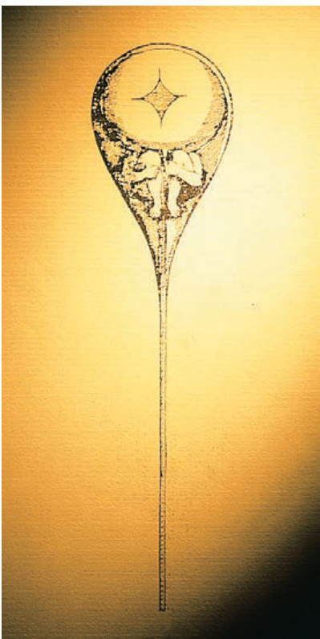  
图2.6　小矮人：一种误解。19世纪，许多著名的显微镜学家坚信他们看到一个完全成形的微型胎儿蜷缩在一个精子的头部。$\copyright$ Klaus Guldbrandsen/SPL/Science Source  

孟德尔的实验和他之前的人们有什么不同？第一，他选择了豌豆（Pisum sativum）作为实验物种［图2.7（a）和（b）］，豌豆在布隆城长势良好，在同一朵花中拥有雄性和雌性生殖器官，并且通常是自体受精；在自体受精（自交）中花粉和卵细胞都来源于同一株植物。正是这种豌豆花的特殊结构使得以异体受精（杂交）替代自体受精变得容易了。异体受精（杂交）是将一株植株的花粉刷到另一株植株的雌蕊上的过程，如图2.7（c）所示。豌豆还有另一个优势，即孟德尔可以在一个相对短的生长周期内，在每个连续的世代中都可以获得大量的个体。相对而言，如果他选择羊作为研究对象，那每一代他只能获得极少个体，并且世代间隔可能是数年的时间。  

第二，孟德尔选择了几组特殊性状作为研究对象——花的紫色和白色、豌豆的黄色和绿色。由于这种“非此即彼”的性状没有中间形式，使得孟德尔能够分辨出每个性状在世代间的传递（和这些离散性状相对应的是连续性状，如身高、人的肤色等，连续性状存在多  

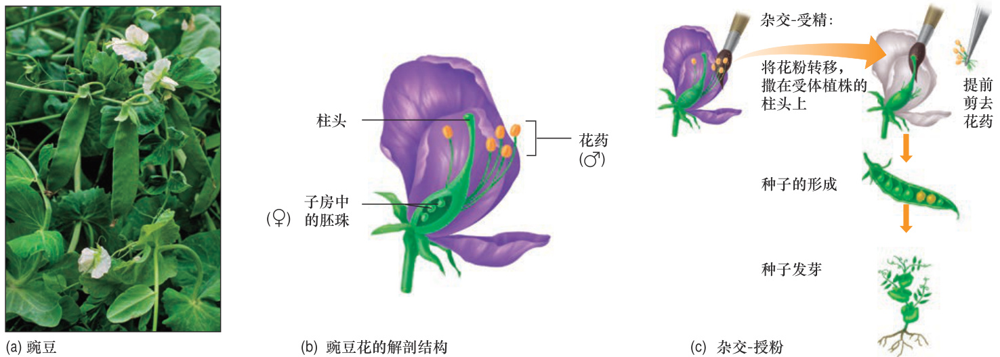  
图2.7　孟德尔的实验物种：豌豆。（a）开白花的豌豆。（b）花粉在花药中发育成熟后落在连接着子房的柱头上，子房后来发育为豆荚。落在柱头上后，花粉开始沿着柱头生长花粉管，使花粉进入子房和胚珠结合，从而发生受精。（c）为了防止自交，育种家将在母本（此处的白花）产生成熟的花粉之前去除花药。用刷子将父本（紫花）的花粉刷在母本的柱头上。每一个受精的胚珠会发育成单个的豌豆（成熟的种子），之后能够发育成新的豌豆植株。发育自不同的花粉和胚珠的豌豆都在同一个豆荚中。  

（a）： $\copyright$ Andrea Jones Genetics-FG2G_6ed_Chapter-2_images/Alamy种中间形式性状）。  

第三，孟德尔收集并培育了纯种的豌豆。这些纯种繁育系豌豆杂交产生的后代都带有亲本的特定性状，并且在世代的遗传中会持续出现。这些品系由于在数代之间只进行彼此间的交配，所以也称为同系杂交。孟德尔最多连续观察了纯种品系植株8个世代。开白花的植株往往产生开白花的后代；开紫花的植株也只产生开紫花的后代。孟德尔称稳定且互斥的特征（如紫色和白色的花、黄色和绿色的种子）为“相对性状”，并为他的研究确定了7个这样的组合（图2.8）。在实验中，他不仅为每对性状保留了纯种种子，也通过杂交产生与亲本性状不同的杂种。图2.8展示了孟德尔杂交实验中研究的品种表型。  

第四，作为一名育种学家，孟德尔精确地控制了他的交配实验，并确保他观察到的性状来源于他进行的授粉实验。因此，他不辞辛苦地阻止任何外来花粉入侵，并确保了实验植株符合实验所要求的自花或异花授粉。这不仅使他可以针对所选性状进行可控繁殖，也可以进行正反交。在正反交中，他通过反转目标性状的父本和母本，从而确定目标性状是通过雄蕊的花粉还是雌蕊的卵细胞进行遗传。例如，他会利用紫花的花粉为白花雌蕊进行授粉，也可以利用白花的花粉给紫花的卵细胞受精。由于这些反转前后产生的后代性状分布是相似的，所以孟德尔得出亲本双方对于遗传的贡献率是相同的。他认为“无论亲本哪一株提供花粉，对于杂交品系的形成是无关紧要的”。  

第五，孟德尔研究了大量的植株，对所有的后代进行计数，并对其进行了数据分析，然后将他的计算结果与基于他的模型的预测结果进行了比较。孟德尔是第一位采用此方法进行遗传研究的人，无疑，他大学主修的物理和数学对于他的数量统计方法起着重要的作用。孟德尔对数据进行了仔细的分析，发现了遗传规律。  

最后，孟德尔是一名杰出的实验学家，例如，在比较高植株和矮植株时，他确保矮植株充分远离高植株，使得矮植株的生长不会受到阻碍。最终，他将注意力移到了种子自身的性状，如颜色和形状，而非种子生成的植株的性状。通过这样的方式，他可以在修道院有限的花园空间观察更多个体，对一个生长周期杂交结果进行评估。  

总之，孟德尔有意识地建立了一套“黑-白”的试验系统，并分析了该系统的工作原理。他没有研究培育优质羊的大规模变量，也没有关注种间差异的起源。相反，他将注意力放在仅拥有两种表型的相对性状，并提出了可以通过观察和计算来回答的问题。  

# 基本概念  

●  人类在不理解遗传原理的情况下，在农作物种植和动物驯化方面进行了数千年的人工选择。  
●  孟德尔培育了纯种品系的豌豆，这些豌豆的某些特征会在世代之间持续存在。  
●  孟德尔发现豌豆在与具有其他性状的纯系杂交时，杂种后代通常具有双亲的特征。  
●  在孟德尔实验中，互交受精产生的杂种后代具有相同的性状；这与亲本是父本还是母本无关。  

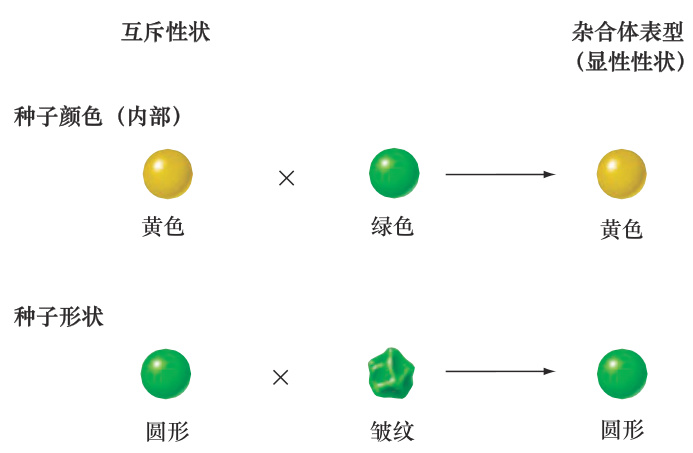  

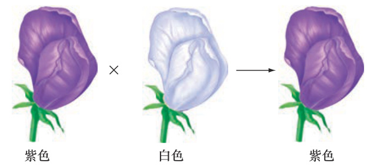  

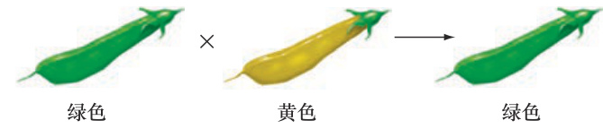  

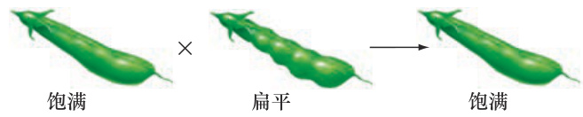  

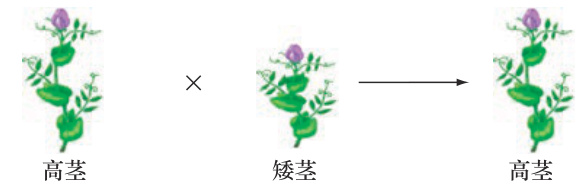  

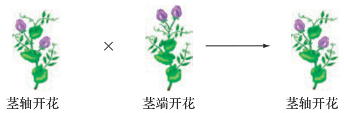  

图2.8　由互斥性状亲本杂交产生后代性状。孟德尔实验用的7对互斥性状。每对杂交产生的杂合体只表现亲本中的一个。杂合体表现的亲本性状称为显性性状。  

# 2.2 孟德尔遗传学分析  

# 学习目标  

1.  解释孟德尔分离定律及单基因杂种杂交体系的F2中表型出现的显隐性比为 $3:1$ 的原理。  
2. 区分单基因杂种杂交和测交。  
3.  解释孟德尔自由组合定律，以及双杂交 $\mathrm{F}_{2}$ 中 $9:3:$ $3:1$ 的表型比率如何为这一定律提供证据。  
4.  解释后代的表型比率，从而推断出特定的性状是如何遗传的。  
5.  利用简单的概率规则预测复杂多因子杂交后代的基因型和表型比率。  
6.  理解最常见的显性和隐性等位基因的分子解释。  

1865年，43岁的孟德尔在布隆城自然科学协会发表了名为“Experiments on Plant Hybrids”（植物杂交实验）的论文。尽管题目简单，但它却是一份非常清晰简洁的科学论文，论文中总结了孟德尔长达十年的原始观察和实验结果。在这篇论文中，孟德尔详细地描述了豌豆中可见性状的传播，定义了不可见但可用于逻辑推理的单元（基因），它们决定了这些可见性状的出现时间和频率，并通过简单的数学术语分析基因的行为，揭示以前未知的遗传原理。  

在发表之后，这篇论文成为了现代遗传学的基石。它的目的是验证是否有一种“一般适用的规律能够控制杂交品系的形成和发展”。让我们来理解一下。  

# 2.2.1 单基因杂种杂交揭示分离定律  

分离出纯种品系的植株后，孟德尔对仅有一种性状不同（种子颜色或者茎长）的植株进行了一系列的杂交实验。在杂交中，亲本的一方表现出该性状的一种形式，另一方携带该性状的相对性状。图2.9显示了其中一种杂交的方案。例如，1854年早春，孟德尔种下了纯种的绿色豌豆和纯种的黄色豌豆植株，并成长为亲代（P）；春天开花后，利用黄色豌豆植株的花粉为绿色豌豆植株的雌蕊柱头授粉；也进行了反交，即利用绿色豌豆植株的花粉为黄色豌豆植株的雌蕊柱头授粉。秋天收获后，孟德尔将两种杂交产生的后代分别收集并统计分析。他发现两种杂交的后裔都是黄色的豌豆。  

这些亲代（P）的后裔黄色豌豆被称为子一代（ $\mathbf{F_{1}}$ ）。为了研究绿色性状究竟是彻底消失还是仍然存在但是在 $\mathrm{F}_{1}$ 中被隐藏了，孟德尔种植黄色豌豆，获得 $\mathrm{\nabla{F_{1}}}$ 成熟体并进行自交。这种只涉及一种单一性状杂交体的实验通常被称为单基因杂种杂交。他之后收获并统计了子一代（ $\mathrm{F}_{1}$ ）产生的子二代（ $\mathbf{F}_{2}$ ）的性状。在子一代图2.9　单基因杂种杂交分析。纯种亲代植株通过异花授粉杂交产生了F1杂交体，且性状与亲本之一相同。F1植株自交产生了 $\mathrm{~\vec{F}}_{2}$ ， $\mathrm{F}_{2}$ 的表型中出现了亲本中的两种表型，且比例是 $3:1$ 。为简单起见，本图不展示结豌豆的植株及豌豆长成的植株。  

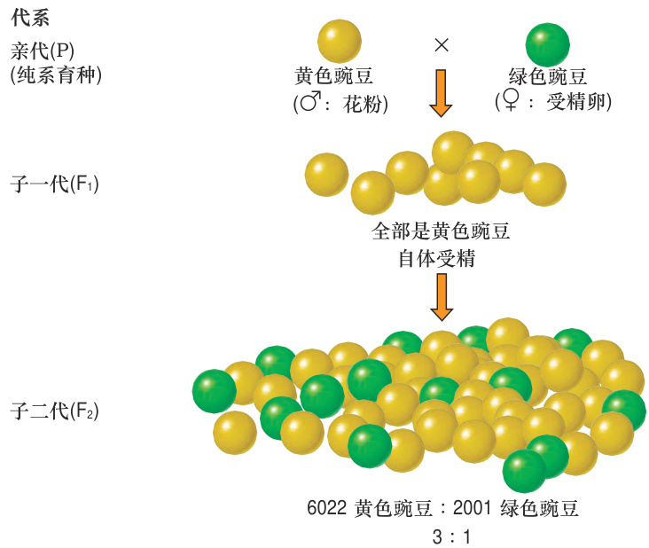  
第一部分　基本原理：性状如何传播  

（ $\mathrm{F}_{1}$ ）自交产生的后代（ $\mathrm{F}_{2}$ ）中，共获得了6022个黄色的豌豆及2001个绿色豌豆，接近3黄∶1绿的比例；反交产生的 $\mathrm{F}_{1}$ 自交的结果比例与之相似。  

# 1. 隐性性状的再现  

在 $\mathrm{F}_{2}$ 中出现绿豌豆是证明融合遗传没有发生的直接证据。如果融合遗传发生的话，绿色性状会在杂交产生$\mathrm{F}_{1}$ 的时候出现不可再现的丢失。相反，这些信息仍旧保存完好，并在F2形成的时候重新出现并且产生了2001个绿色豌豆。这些绿色的豌豆和它们的祖辈绿色豌豆并没有不同。  

孟德尔总结：黄色豌豆应该有两种，一种是亲本P，可以产生纯系后代；另一种是可以通过杂交产生绿色豌豆后裔的F1。第二种豌豆中隐藏着绿色豌豆的信息。孟德尔将F 表现的性状（在这个例子中为黄色种子）称为显性性状（见图2.8）；在F1中隐藏又在 $\mathrm{F}_{2}$ 中重新出现的性状称为隐性性状。但如何解释 $\mathrm{\Delta{F}}_{2}$ 中的 $3:1$ 的比例呢？  

# 2. 基因：遗传的独立单位  

为了解释所观察到的现象，孟德尔提出对于每种性状，每个植株都包含两份遗传单元的拷贝，其中一份来自于父本，另一份来自于母本。我们现在称之为基因。每份拷贝都决定着特定特点的表型。孟德尔收集的豌豆植株，每株都有两份控制种子颜色的基因拷贝、两份控制种子形状的基因拷贝、两份控制茎长的基因拷贝等。  

孟德尔进一步提出，每一种基因都有不同的形式，而这些不同形式的组合决定了他所研究的不同特征。现在我们将这些不同形式的基因称为等位基因。举例来讲，豌豆种子的黄色和绿色是等位基因；种子的圆粒和皱粒是等位基因。在孟德尔单基因杂种杂交实验中，等位基因中的一个是显性基因，另一个是隐性基因。在亲本P中，对于同一性状，一方携带两个显性等位基因；另一方携带两个隐性等位基因。在子一代（ $\mathrm{F}_{1}$ ）中，对于同一性状，则携带了一个显性基因和一个隐性基因。将同一性状同时携带两种不同等位基因的个体称为单基因杂种。  

# 3. 分离定律  

如果一株植株每个基因都含有两份拷贝，为什么只向后代传递一份呢？子代又是如何实现从两个亲本获得两个拷贝呢？孟德尔的植物生理学背景帮助他构建了繁殖背后的两个生物学机制：配子的形成和受精时配子的随机结合。  

配子是在世代之间携带基因的特殊细胞，包括在雌性母本的胚珠形成的卵子和花粉粒内的精子细胞。孟德尔假设，在卵细胞和精子的形成过程中，亲本的每个基因的两份拷贝分离（或隔离）进入两个配子中。因此，每个配子都接受每个性状的一份等位基因［图2.10（a）］。所以每个卵子和每个精子只包含豌豆颜色的一份拷贝（或者是黄色，或者是绿色）。  

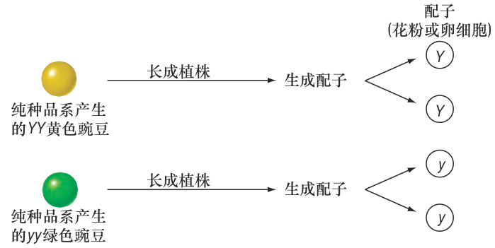  
(a)   
(b)  

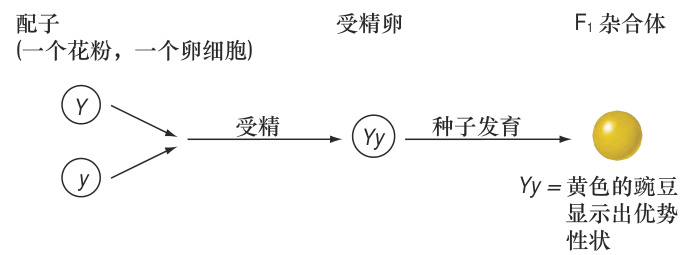  
$Y=$ $y=$  

图2.10　分离定律。（a）在配子形成过程中，纯种品系的植物的两个完全相同的等位基因相互分离（隔离），所以每个花粉和卵细胞都只包含亲本等位基因中的一个。（b）具有互斥性状的亲本异花授粉和受精产生对该性状杂合的F 杂合子。对于豌豆颜色，Yy杂合子受精卵发育为黄色种子。  

在受精的过程中，携带一个等位基因的精子与携带另一个等位基因的卵细胞随机结合，重新将每个性状的两份等位基因储存在受精卵细胞（合子）中［图2.10（b）］。如果携带黄色等位基因的精子和携带绿色等位基因的卵细胞结合，会生成杂合黄色豌豆，如具有相反性状纯种的亲本P杂交产生的F1单杂合体；如果携带黄色等位基因的精子和携带黄色等位基因的卵细胞结合，则会产生黄色豌豆，这些黄色豌豆可以发育为与只产生黄色豌豆的亲本P相同的植株；最后，如果携带绿色等位基因的精子和携带绿色等位基因的卵细胞受精，则会产生且只产生与绿色豌豆的亲本P相同的植株。  

孟德尔分离定律概括了遗传学的一般原理：每个性状的两个等位基因在形成配子的过程中相互分开，并在受精的过程中由两个来自父母双方的配子重新随机结合。本书中，分离是均等分离，即每个配子针对每个基因有且仅有一份拷贝。注意，分离定律将含有两份基因拷贝的生物体体细胞和只有一个基因拷贝的配子进行了明确的区分。  

# 4. 庞纳特方格  

图2.11展示了在配子形成过程中等位基因的分离和受精过程中等位基因的随机结合。孟德尔发明了一种符号系统，使他能够以同样的方式分析所有的杂交体系。他将所有的显性基因用大写字母A、B、C等表示，隐性基因用对应的小写字母a、b、 $c$ 等表示。现代遗传学也采用这样的命名习惯来为豌豆和其他生物的等位基因命名，但是在命名的过程中，通常选用对目标性状有指向性的字母，例如，Y是指yellow（黄色）或者R是指round（圆粒）。在本书中，基因符号统一使用斜体表示。在图2.11中，我们用大写的Y来表示显性性状黄色，用小写的y表示隐性性状绿色。纯种亲本的基因型是YY（黄色）或者yy（绿色）。YY型亲本只能产生Y配子，yy型亲本只能产生y配子。你可以从图解中看到，无论亲本哪一方提供等位基因，结果都是一样的，都只产生Yy型杂合体。  

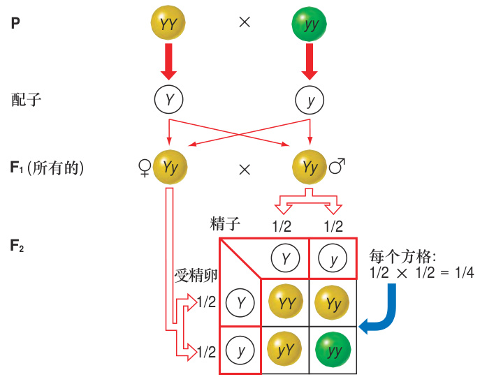  
图2.11　庞纳特方格：杂交的可视化。这个庞纳特方格展示了$\mathrm{F}_{1}$ 自交时的配子形成和受精的结果。F 代黄色和绿色的比例应该是 $3:1$ 。  

为了更好地展示Yy型的杂合体自交过程，我们使用了庞纳特方格（庞纳特方格是英国数学家Reginald Pun-nett于1906年引入的；图2.11）。该方格直观简洁地展示了配子的形成可能以及受精过程中可能发生的结合。如庞纳特方格第一行和第一列所示，每个杂合体按照$1:1$ 的比例产生两种配子Y和y，因此一半的花粉和卵细胞携带Y，另一半携带y。  

庞纳特方格的每个方格中，都有一个有色豌豆代表一次受精实践。受精时产生的后代是1/4的YY、1/4的Yy、1/4的yY及1/4的yy。由于孟德尔研究的性状的等位基因（卵细胞或花粉）的配子来源对等位基因的作用没有任何影响，所以Yy和Yy是等价的。这意味着产生的后代中1/2是Yy黄色杂合体，1/4是YY黄色纯和体，1/4是yy绿色纯合体。这张图解释了在配子形成的过程中等位基因的分离、受精过程中的重新结合，以及在 $\mathrm{F}_{2}$ 中产生黄绿比 $3:1$ 的原因。  

# 2.2.2 孟德尔的研究结果反映了概率的基本规则  

人们可能没有意识到，庞纳特方格反映了概率的基本规则——乘法规则和加法规则。这是遗传杂交分析的核心。这些规则预测了特定结合发生的可能性。  

# 1. 乘法规则  

乘法规则是指两个相互独立的事件同时发生的概率等于两个事件独立发生概率的乘积：  

事件1和事件2同时发生的概率 $\equiv$ 事件1的概率 $\times$ 事件2的概率  

连续抛硬币显然是独立事件；一个人掷一个硬币的结果，既不会增加也不会减少下一次掷硬币结果的概率。同时抛两枚硬币结果仍然是独立的，抛一枚硬币的结果并不会影响抛另一枚的结果。因此，给定组合发生的概率是它们独立发生概率的乘积。例如，两枚硬币同时朝上的概率是：  

$$
1/2\times1/2{=}1/4
$$  

与之类似的，卵细胞和精子的形成也是相互独立的；在杂合体植株生成配子的时候，配子有1/2的可能携带Y、1/2的可能携带y。由于受精是随机发生的，所以在同一受精卵中同时集中父本和母本等位基因的概率是两个目标基因独立进入精子概率的乘积。因此，求Y型卵细胞（一个事件产生）和Y型精子细胞（另一个独立事件产生）结合的概率，只需要 $1/2\times1/2$ 即可，这与图2.11庞纳特方格中YY的概率一致，这表明庞纳特方格是乘法规则的另一种表现形式。重要的是，庞纳特方格中每个方格代表一种等概率杂交结果（等概率受精事件），因为精子和卵子的两种类型的产生概率都是相等的。  

# 2. 加法规则  

我们可以将随机受精的时刻描述为两个独立事件的同时发生，也可以说，两种不同的受精事件是互斥的。例如，如果Y和Y结合了，那在该合子中就不可能和y结合。概率的另一规则——加法规则，是指两件互斥事件发生的概率是单独发生概率之和。对于互斥事件：  

事件1或2发生的概率 $\fallingdotseq$ 事件1的概率 $^{+}$ 事件2的概率  

计算Yy杂合体自交后代的可能性，用1/4（母本Y和父本y）加上1/4（互斥事件母本y和父本Y）得到1/2，与庞纳特方格中的结果一致。  

加法规则还可以用来预测子二代（ $\mathrm{F}_{2}$ ）中的黄色和绿色的比例。 $\mathrm{F}_{2}$ 中黄色豌豆种子的频率是1/4（YY型产生的概率） $+1/4$ （Yy型产生的概率） $+1/4$ （ $y Y$ 型产生的概率） $=\!3/4$ ，剩下1/4是绿色豌豆的概率，因此黄绿比$=\!3/4$ 比1/4，即 $3:1$ 。  

# 2.2.3 分离定律的进一步实验验证  

分离定律可以解释单基因杂种杂交实验中获得的数据，但孟德尔仍需要进一步的实验来验证该定律的准确性。孟德尔的假设（如图2.11总结），对F2作了可检验的预测，即 $\mathrm{F}_{2}$ 中应该有两种黄色豌豆（YY和Yy）和一种绿色豌豆（yy），且F2中YY型豌豆和Yy型豌豆的比例应该是 $1Y Y:1Y y$ 。  

为了确认这些期望值，他让所有的 $\mathrm{F}_{2}$ 植株自交并统计了所产生的后代 $\mathrm{F}_{3}$ （图2.12）。他发现 $\mathrm{.F}_{2}$ 的所有绿色植株产生的后代F3都是绿色种子，而这些F3代自交产生的下一代F4也全是绿色（图中未标明）。这正是我们和孟德尔所期待的携带有两份隐性基因拷贝的纯种品系。而黄色品系不同，在512株黄色种子发育而来的 $\mathrm{F}_{2}$ 植株中，有166株（约1/3）植株经过数个世代的检验，证明是纯种品系，剩下的352株（黄色种子的F 植株的2/3）是杂合体，因为它们自交后仍产生黄绿比为 $3:1$ 的比例。因此，如孟德尔所预期，518株 $\mathrm{F}_{2}$ 黄色豌豆植株中，YY型和Yy型的比例确实是 $1:2$ 。  

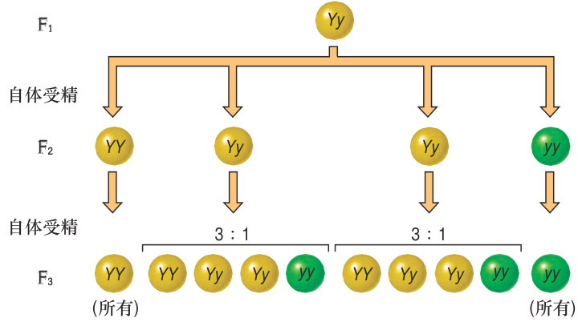  
尽管针对豌豆7组性状的实验耗费了孟德尔数年时  
图2.12 $\mathrm{F}_{2}$ 黄色豌豆有两种：纯合体和杂合体。经过两代的自交后，一对等位基因（Y和y）的分布。每一代的纯合个体都能繁殖，而杂交个体则不能。  

间，但他最终总结出了配子形成时，显性和隐性等位基因相互分离，又在受精的时候随机结合的规律，从而解释了他观察到所有杂合体自交都是 $\cdot3:1$ 比例的原因。他的研究结果也提出了对于未来植物和动物育种者十分重要的问题。植物表现的显性性状，如黄色的种子，可能是纯种品系YY，也可能是杂合体品系Yy，那如何区分它们呢？对于自交植物来讲，可以通过观察其自交后代的表型来确认。那么，对于无法自交的物种，要如何区分纯种品系和杂合体品系呢？  

# 测交：确定基因型的方法  

在揭示孟德尔的答案之前，我们先定义几个新的概念。表型是指在一定环境条件下，所表现出来的性状特征，如豌豆种子的黄色和绿色；表型对应的个体内的等位基因被称为基因型。YY或者yy基因型称为纯合子，因为决定指定性状的两个基因拷贝是相同的；相反，具有两个不同等位基因组成的基因型为杂合子，换句话说，它是该性状的杂合品系（图2.13）。拥有纯合子基因型的个体称为纯合体，拥有杂合子基因型的个体称为杂合体。  

杂合子（即杂种）的表型决定了哪种等位基因是显性的：因为Yy型豌豆是黄色，黄色等位基因Y相对于绿色等位基因y是显性的。知道基因型和等位基因之间的显性关系之后，就可以准确地预测表型。相反，知道表型并不能预测基因型，因为同一个表型可能对应不止一个基因型，例如，黄色的豌豆对应的基因型可能是YY，也可能是Yy。  

了解了这些区别，我们可以看看孟德尔为破译未知基因型而设计的实验方法。首先将显性性状对应的基因型称为Y–，横线代表另一个未知的等位基因，可能是Y，可能是y。孟德尔的方法称之为测交，即将拥有显性性状的个体和隐性性状的个体进行杂交，例如，将黄色种子发育来的植株（Y–）和绿色种子发育来的植株（yy）进行杂交。如图2.14所示，如果显性性状来源于纯合子YY基因型，那所有的后代都表现显性性状，即黄色；但如果基因型未知植株的基因型是杂合子Yy，那子代的表型应该是1/2的黄色种子和1/2的绿色种子。通图2.14　如何通过测交确定基因型。一个基因型未知，表现显性性状的个体与隐性纯合子杂交。如果该未知个体是纯合体，那所有的后代都表现显性性状（杂交A）；如果是杂合体，则后代中一半表现显性性状，另一半表现隐性性状（杂交B）。  

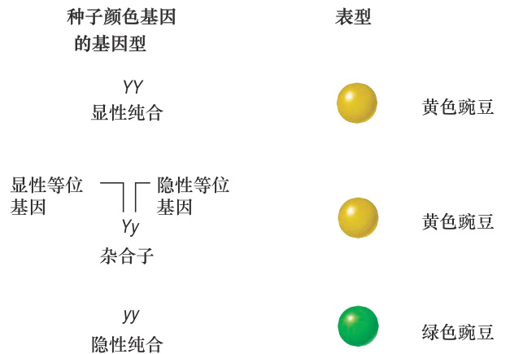  
图2.13　纯合体与杂合体的表型和基因型。基因（Y）和等位基因 $(\,y$ ）是完全显性，本图展示的是基因型和表型的关系。  

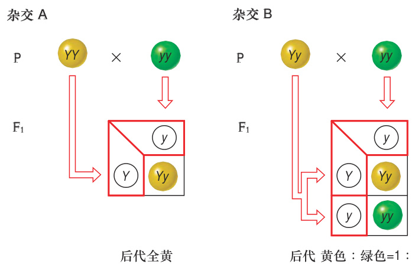  

过这样的方法，测交可以确定显性性状对应的基因型，排除不确定性。  

正如前面提到的，孟德尔有意地简化了遗传问题，关注只有两种形式的性状。他也成功地在玉米、大豆及紫茉莉（管状、开白色或亮红色花植物）中重复了他的单基因杂种杂交实验。这说明他关于基因的概念及分离定律几乎适用于所有有性生殖的生物。  

# 2.2.4 双因子杂交实验解释自由组合定律  

在通过单基因杂种杂交实验确定了基因遗传遵循分离定律后，孟德尔将注意力转移到了研究豌豆彼此无关联的多个性状的共同遗传问题上。他提出这样的问题：双因子杂种个体中两对等位基因是如何分离的，特别是两对等位基因都是杂合体的情况下。  

为了构建双因子杂交体系，孟德尔将黄色圆粒（YYRR）纯合品系植株与绿色皱粒 $\left(\l_{y y}\,r r\right)$ 纯合品系植株进行杂交，之后获得了仅表现两个显性性状的双杂交子一代 $\mathrm{F}_{1}$ （ $Y y\ R r$ ），即黄色圆粒（图2.15）。之后F1进行自交获得 $\cdot\mathrm{F}_{2}$ ，孟德尔也无法预测此次杂交后代 $\mathrm{F}_{2}$ 的表型是会和最原始亲本相同的黄色圆粒或者绿色皱粒，还是会出现亲代型中完全没有的新组合，如黄色皱粒豌豆和绿色圆粒豌豆呢？这种表型重新组合的现象被称为重组型。  

孟德尔对一次实验的 $\mathrm{F}_{2}$ 进行统计，共获得了315个黄色圆粒豌豆、101个黄色皱粒豌豆、108个绿色圆粒豌豆及32个绿色皱粒豌豆。这其中出现了黄色皱粒和绿色圆粒这样的重组性状，充分说明不同基因的等位基因发生了变化。  

# 1. 自由组合定律  

通过观察到的比例，孟德尔总结了发生这种改变的生物学机制——配子形成时不同基因对的等位基因发生了自由组合。因为调控豌豆颜色和豌豆形状的基因是独立分离的，所以携带Y的配子分配到调控形状的等位基因 $R$ 或 $r$ 的可能性是相等的。因此，一个基因中特定等位基因的存在（如调控豌豆颜色的显性Y基因），并不能提供关于第二个基因中等位基因的任何信息。所以F1代的每一个双基因杂合体可以产生4种配子：YR、$Y r$ 、yR和yr。在众多的配子中，这4种的比例完美接近$1:1:1:1$ ，换句话说，每种重组的等位基因类型在花粉和卵细胞中都占1/4。“不同种类的生殖细胞（卵细胞或花粉）的平均产量是相同的”，这是孟德尔的另一种深刻见解。  

在之后的受精过程中，4种卵细胞会和4种精子中的任意1种结合，共产生16种可能的受精卵。庞纳特方格是展现过程的一种简单明了的方法（图2.15）。与之前单基因杂交的庞纳特方格的应用逻辑相同（回顾图2.15　双杂交体系产生亲本性状和重组性状。在这个双杂交实验中，纯种品系亲本杂交产生单一基因型的 $\mathrm{F}_{1}$ ， $\mathrm{F}_{1}$ 自交或者异花授粉产生的 $\mathrm{F}_{2}$ 中表型比为 $9:3:3:1$ 。  

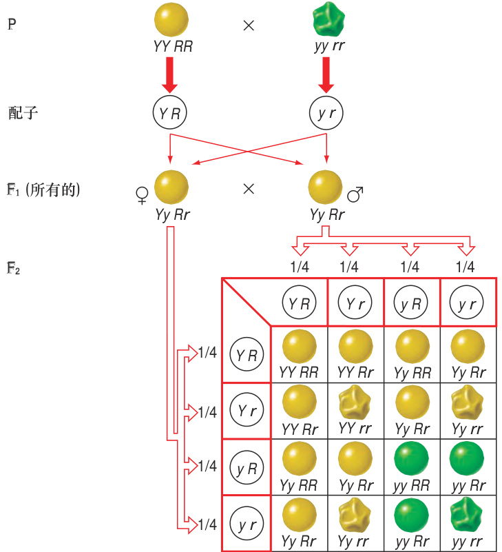  
$=11/4\times1/4=1/16$  

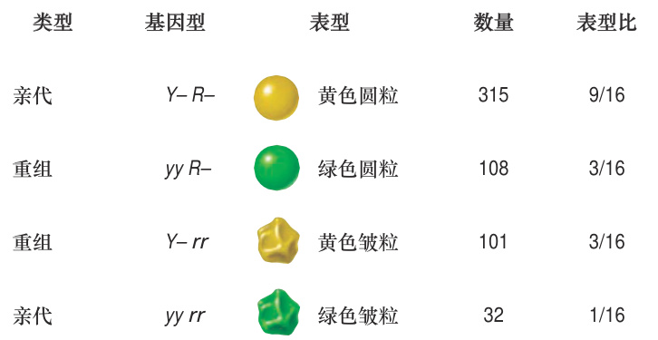  
(  )   (  ) $=12:4$ $3:1$ (  )   (  ) $=12:4$ $3:1$  

图2.11），图2.15中双基因杂交的庞纳特方格中有彩色豌豆的16个框中的每一个都代表了一个等概率的受精事件。每个方格概率相同，因为每个亲本产生的不同类型的配子的概率是相同的。因此，由乘法规则可知，每个方格代表的后代类型的概率是 $1/4\times1/4{=}1/16.$ 。  

根据图2.15，你会发现16种潜在的等位基因组合的概率是相同的。事实上，表中只有9种基因型： $Y Y R R$ 、$Y Y\;R r$ 、Yy RR、 $Y y\ R r$ 、yy $R R$ 、yy $R r$ 、 $Y Y\;r r$ 、Yy $r r$ 及yy $r r$ ，因为等位基因的来源（卵细胞或精子）并不会影响结果。而观察这9种基因型所对应的特征，你会发现只有4种表型：黄色圆粒、黄色皱粒、绿色圆粒及绿色皱粒，且其概率分布为 $9:3:3:1$ 。但如果只观察其中一种特征的话，你会发现他们完全符合孟德尔分离定律所预测的 $3:1$ 的比例。在庞纳特方格中，颜色上是12个黄色对应4个绿色，形状上是12个圆粒对应4个皱粒。换句话说，每种特征的显性性状（黄色、圆粒）和隐性性状（绿色、皱粒）的比例都符合 $12:4$ 或者 $3:1$ 。这说明豌豆颜色基因的遗传并不会被形状基因所影响，反之亦然。  

前面的分析成为孟德尔第二种一般遗传原理的基础，即自由组合定律：在配子形成过程中，不同等位基因的分离是相互独立的（图2.16）。它们的独立分离和受精过程中，配子的随机结合产生了实验中所观察到的表型。利用乘法规则可以计算独立事件发生的概率，使用数学的方法，根据两个分离比 $3:1$ ，从而推导出试验中所观察到的 $19:3:3:1$ 的表型比例。由于两组等位基因独立分离，所以黄绿比是 $3/4:1/4$ ，同理，圆皱比也是 $3/4:1/4$ ，为了计算两个独立事件在同一株植株中发生的概率，需要以下公式：  

黄色圆粒的概率： $3/4\times3/4{=}9/16$ 黄色皱粒的概率： $3/4\times1/4{=}3/16$ 绿色圆粒的概率： $1/4\times3/4{=}3/16$ 绿色皱粒的概率： $1/4\times1/4{=}1/16$  

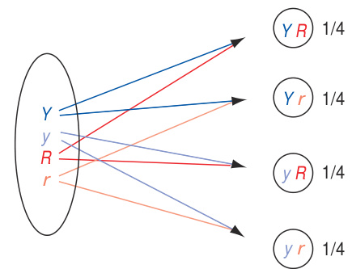  
  
图2.16　自由组合定律。在双基因杂交体系中，每对等位基因在形成配子时的分离都是独立的。在配子中，Y和R或r分配到同一配子的概率是相同的（ $Y R{=}Y r$ ）， $y^{.}$ 也是一样（ $y R{=}y r$ ）。最终在群体中会产生4种比例相同的配子（ $Y R$ 、  

Yr、yR和yr）。  

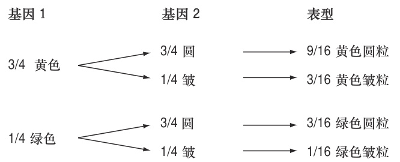  

图2.17　用分支线图表示杂交体系。分支线图用一列代表一个基因，从而对结果中每种结果出现的可能性进行有依据的预测。此图展示双杂交体系的表型和比例与图2.15的庞纳特方格中的结果相同，所以这两种方法是等效的。  

因此在 $\mathrm{F}_{2}$ 中，会出现9黄色圆粒∶3黄色皱粒∶3绿色圆粒∶1绿色皱粒的比例。  

# 2. 分支线图  

另一个追踪遗传过程中潜在表型出现概率的便捷方法是绘制分支线图（图2.17）。分支线图的每一列都展示了一种基因的基因型和表型出现的概率。在图2.17中，第一列显示了两种可能的豌豆色表型；第二列是每种颜色对应的不同形状的比例。最终结果展示了表型比例为 $19:3:3:1$ 。在后续学习中，你会发现在多基因杂种杂交中，分支线图比庞纳特方格更加便捷。  

# 3. 双杂交体系的测交  

双杂交体系可以应用于众多方面。例如，假如你在苗圃批发城工作，该批发城有三种纯系豌豆：黄色皱粒、绿色圆粒、绿色皱粒。你的任务是培育纯种的黄色圆粒豌豆。怎么办呢？  

一个可行的办法是杂交纯种品系（ $Y Y r r\ \times\ y y R R$ ）产生双杂合子（YyRr）；之后双杂合子进行自交，仅对产生的黄色圆粒豌豆进行种植，获得成熟植株。但是这里面只有1/9基因型是YYRR的纯种品系能够满足你的要求。为了获得这些目标种子，需要将这些黄色圆粒植株和绿色皱粒（yyrr）植株进行测交，如图2.18所示。如果测交的结果全是黄色圆粒（测交A），那么这些亲本的黄色圆粒植株正是纯合体，符合你的要求，可以进行售卖；如果测交结果是1/2的黄色圆粒和1/2的黄色皱粒（测交B），或者1/2的黄色圆粒和1/2的绿色圆粒（测交C），那么这些测交实验的植株在一个性状上是纯合体，在另一个性状上是杂合体，可以舍弃；如果测交的结果是1/4的黄色圆粒、1/4的黄色皱粒、1/4的绿色圆粒及1/4的绿色皱粒的话，那这些植株在豌豆颜色和豌豆形状两个性状上都是杂合体。  

# 2.2.5 利用孟德尔遗传定律计算概率并进行预测  

孟德尔进行了一系列的双基因杂交，也进行了多基因杂种杂交：对于由具有三个或者多个无关联特征的亲本产生的F1进行杂交。在这些实验中，他观察到数量和比例都无限接近他根据自己发现的两个生物遗传规律所预测的结果。这两个规律是：同一基因的等位基因在形成卵细胞或精子的过程中相互分离；不同基因的等位基因彼此自由组合。孟德尔的遗传定律及结合概率的数学法则，为遗传学家提供了预测和解释基因杂交结果的有效工具。但是所有的工具都有自己的局限性。下面我们分析孟德尔分析的优势和局限性。  

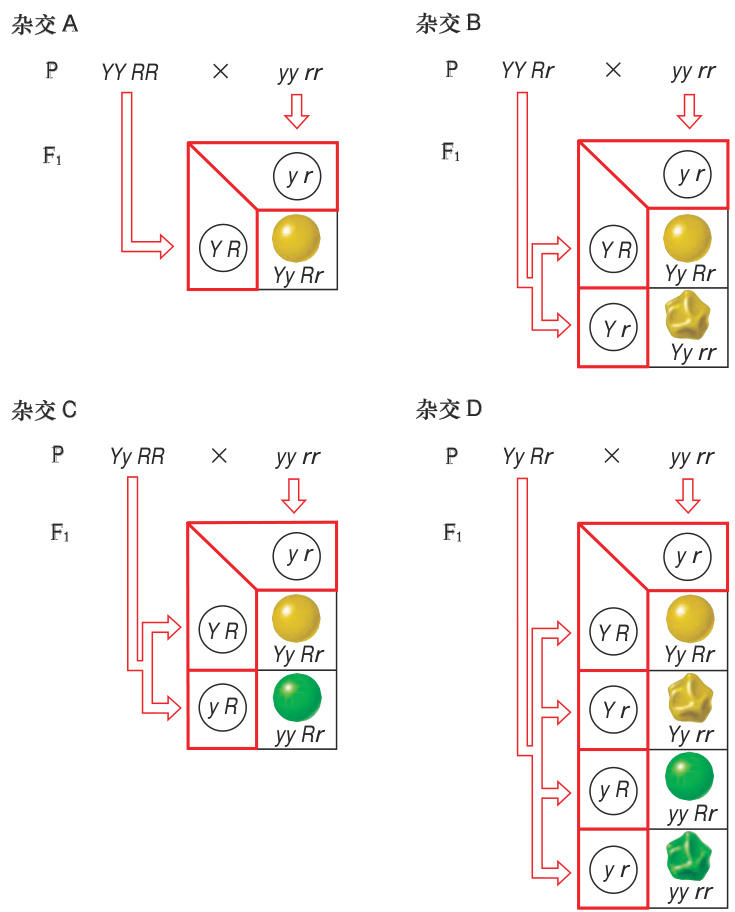  
图2.18　双基因测交。涉及两对独立分离的等位基因的测试杂交产生了不同的、可预测的结果，这取决于被测试个体中两个相关基因的基因型。  

首先分析孟德尔分析的优势。利用简单的孟德尔分析方法可以对复杂杂交体系的后代表型进行准确的预测。例如，可以预测一个特定的基因型在一个包含几个独立的基因杂交体系中出现的概率。如果要预测四杂合体AaBbCcDd自交后代中AAbbCcDd出现的概率，可以使用庞纳特方格帮忙解决这个问题。由于每个特征都有两个不同的等位基因，所以精子和卵细胞的类型数等于2的特征数次方（ $2^{n}$ ， $n$ 是特征的数目）。在这个四特征杂交体系中，经过计算，一共会产生 $2^{4}{=}16$ 种配子。用庞纳特方格表示这个杂交体系，就会出现256（ $16\times16$ ）个方格。  

你如果住在修道院并且有空闲时间的话，画庞纳特方格是可行的，但如果你在参加一小时的考试的话，这种方法就不可行。如果将这个四种等位基因杂交分成四个独立的单性状杂交的话，事情就简单多了。之前的单体杂交后的基因型比例为1显性纯合子∶2显性杂合子∶1隐性纯合子 $=\underline{{1}}/4:2/4:\underline{{1}}/4$ 。所以由多特征杂交体系产生AAbbCcDd的概率等于四个独立事件：AA（Aa杂交后代的1/4）、bb（1/4）、 $C c$ （2/4）及 ${\cal D}d$ （2/4）的乘积：  

$$
1/4\times1/4\times2/4\times2/4{=}4/256{=}1/64
$$  

庞纳特方格的答案与此一致，但是更费时间。  

在基因型之外，你可能还想预测特定表型的出现比例。只要知道杂交体系中每对等位基因产生的表型比例后，就可用乘法规则来计算。例如，在多特征杂交体系中 $A a B b C c D d\times A a B b C c D d$ 的后代中有多少同时表现显性特征A（基因型AA或 $A a{=}1/4{+}2/4$ ，或3/4）、隐性特征 $b$ （基因型 $b b$ ：1/4）、显性特征 $C$ （基因型CC或$C c{=}3/4$ ）及显性特征 $D$ （基因型 $_{D D}$ 或 $D d{=}3/4$ ），你只需要将几个概率相乘：  

$$
3/4\times1/4\times3/4\times3/4{=}27/256
$$  

通过这种方法，利用概率规则可以预测每一种复杂杂交体系后代的可能性。  

从这些例子中可以看出，遗传学中的特定问题适用特定的分析模式。根据以往的经验，庞纳特方格在只包含几个基因的简单杂交体系中比较适用，但会随着杂交体系的复杂化而变得笨拙。例如，之前的两个例子中，想知道复杂杂交体系中一个或多个后代的基因型或表型，直接计算是最有效的；但对于想要展示复杂杂交体系所有后代的组成，最适用的则是分支线图，分支线图能够有条理地追踪每一种可能性。  

下面来解释孟德尔分析的局限性。如果和孟德尔一样去培育豌豆、玉米或者其他生物，你对每一代性状的观察计数发现和你的期望值都会有所偏差。怎么解释这种现象呢？一个很重要的因素就是偶然性，如同一般抛硬币实验中所观察到的。在每次抛硬币的过程中，正面朝上的概率与反面朝上的概率应该是相等的。但在现实中，你抛10次硬币，可能得到 $30\%$ （3次）的正面和$70\%$ （7次）的反面，或者相反。当你抛100次的时候，才更可能得到 $50\%$ 正面和 $50\%$ 反面的结果。试验次数越多，偶然性对实验数据的影响越小。统计优势也是孟德尔对大量的豌豆植株进行实验的原因。  

事实上，孟德尔遗传定律对生物群体的预测更加有效，但不会对单个个体进行预测。例如，对于占据整个苗圃的单杂合体杂交后代 $\mathrm{F}_{2}$ ，我们可以预测 $\mathrm{F}_{2}$ 中有3/4表现显性性状，1/4表现隐性性状，但针对某一特定的 $\mathrm{F}_{2}$ 植株的表型则是无法预测的。在第5章，我们会讨论用数学方法来评估群体内个体样本中观察到的机会变异是否与遗传假设相一致。  

# 2.2.6 在1900年之前孟德尔的工作并没有被重视  

孟德尔对遗传工作的见解是具有里程碑意义的突破。通过对豌豆杂交的结果进行计数分析，他指出了基因（控制遗传中特定表型特征形成的独立单元）的存在。他的工作解释了隐藏性状的重新出现，反驳了融合遗传学说，更指出了父本和母本对于后代的遗传贡献率是相等的。他所建立的遗传模型是可实现的，以至于他可以通过观察和实验来检验基于它的预测。  

除了Abbot Napp之外，孟德尔同时期的人都没有意识到孟德尔工作的重要性。孟德尔没有在著名的大学教书，在布尔诺之外也不为人所知。即便在布尔诺，当孟德尔将论文“Experiments on Plant Hybrids”呈交到自然科学协会时，会员们对他的发现也很失望。他们想要审阅和讨论的是有趣的变异体和可爱的花朵，而对他的数字分析置之不理。孟德尔的研究似乎远远领先于他所处的时代。但可悲的是，尽管孟德尔写信要求其他人重复自己的实验，但依旧没有人重复。在 $1866\!\sim\!1900$ 年期间只有几篇引用了他的文章的文献，但只提及了他作为植物育种学家的专业，对他提出的定律只字未提。此外，在孟德尔发表他工作的时代，从没有人见过细胞的内部结构，更没有看到过携带基因的染色体，而这些都是之后几十年的事了（我们将在第4章介绍）。如果当时的科学家们见到过这些结构的话，那接受孟德尔的观点就容易多了，因为染色体是客观存在的，行为模式也与孟德尔预测的相同。  

如果孟德尔的理论被更重视一点的话，可能就会对进化论的争论产生重要的影响。查尔斯·达尔文（Charles Darwin，1809—1882）由于对于生物变异的持续存在解释不足，在晚年饱受批评家的批评。达尔文将这种变异视为进化论的基石，他认为自然选择在给定的环境中会倾向于特定的变异。如果被选择的特征组合遗传到子代的话，这种变异的传递就会推动进化。但是他却不能解释这种传递是怎样进行的。如果达尔文了解孟德尔的理论的话，可能就不会陷入这样的境地。  

孟德尔的理论被束之高阁长达34年，不被检验，不被承认，也不被应用。直到孟德尔去世16年以后的1900年，Carl Correns、Hugo de Vries及Erich von Tschermak各自独立地重新发现和解读了孟德尔的工作（图2.19）。最终科学界终于追上了孟德尔的脚步。十年间，研究者创造了一系列我们现在仍在使用的术语：表型、基因型、纯合子、杂合子、基因、遗传等，这些足以作为20世纪遗传学的标签。孟德尔的论文为新学科奠定了基础。他的原理和分析技术在今天依然被使用，指导着遗传学家和进化生物学家对基因变异的研究。  

# 2.2.7 分子对表型的影响决定了等位基因是显性的还是隐性的  

现在我们了解了基因编码细胞中产生的蛋白质（及RNA），这些蛋白质决定着细胞的结构和功能。最近人们确认了两种调控孟德尔实验中豌豆种子颜色和性状的基因。豌豆形状基因编码名为Sbe1的酶（淀粉分支酶1），该酶可以催化直链淀粉转化为支链淀粉［图2.20（a）］。显性等位基因R编码能够发挥活性的Sbe1酶，相对的，由隐性等位基因r导致酶缺失。所以RR纯合型豌豆产生了大量的支链淀粉，从而使豌豆能保持圆形。 $r r$ 纯合型豌豆由于无法将直链淀粉转化为支链淀粉，从而合成大量的蔗糖。蔗糖累积导致渗透压升高，从而使幼种吸水。当豌豆成熟后开始失水、收缩、褶皱。显然，Rr杂合子能够产生足够的Sbe1来防止种子起皱。  

豌豆颜色基因调控名为Sgr（Stay green）的酶。Sgr会在豌豆成熟时叶绿素Ⅱ的降解过程中发挥作用［图2.20（b）］。显性等位基因Y编码Sgr，而隐性等位基因y则不编码。纯合子YY和杂合子Yy型豌豆都是黄色，是因为它们能够产生足够的Sgr从而将所有的叶绿素Ⅱ分解；而纯合子yy型豌豆由于缺乏Sgr，无法降解叶绿素Ⅱ，所以呈绿色。  

从这些分子发现中可以总结两个一般规律：第一，特定的基因决定着特定的蛋白质（这些案例中的酶），  

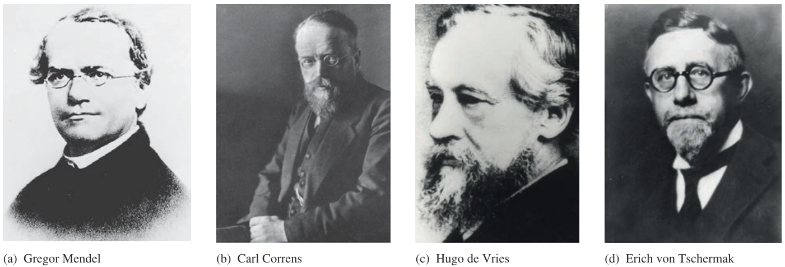  
图2.19　遗传学开始于孟德尔定律的重新发现。在20世纪早期Correns、de Vries 和 von Tschermak各自独立得出了与孟德尔定律相同的结论。  

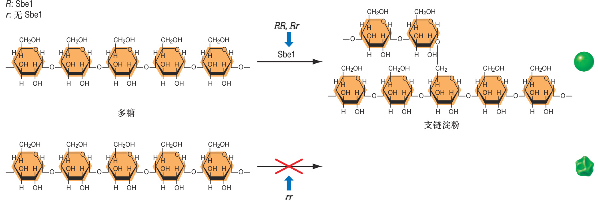  
(a)   
(b)  

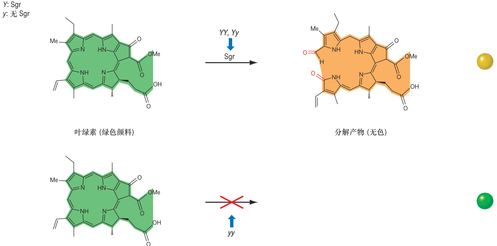  

图2.20　孟德尔豌豆颜色和形状基因的分子解释。豌豆形状的R等位基因编码Sbe1酶，可以将直链淀粉转化为支链淀粉。r等位基因不产生Sbe1。在rr型豌豆中，直链淀粉的累积会造成豌豆起皱。豌豆颜色的Y等位基因编码Sgr酶，可以在豌豆成熟时叶绿素Ⅱ的降解过程中发挥作用，形成黄色豌豆。y等位基因不产生Sgr酶，所以叶绿素Ⅱ没有分解，豌豆仍然是绿色。  

这些蛋白质依赖于各种生化通路发挥活性，并影响豌豆植株表型；第二，这些例子中可以看到一个共同模式，即显性基因编码正常功能的蛋白质，而隐性基因不编码功能蛋白。在第3章中，你会发现事实并非总是如此。这里的分子解释是一个基因对另一个基因（隐性）呈显性的一般原因。孟德尔实验所用的茎长和花色两个性状的基因最近也被确认。在这两个案例中，显性等位基因都编码正常的功能蛋白，而隐性基因不编码功能蛋白或编码的蛋白质功效低下。  

# 基本概念  

●  被称为基因的离散单元控制着遗传性状的出现，导致同一基因相对性状的基因称为等位基因。  
●  有性生殖生物的体细胞中每个基因都有两份等位基因；这两份等位基因可能相同（纯合子），也可能不同（杂合子）。  
●  基因型是指个体拥有的等位基因；表型是指个体表现出来的特征。  
●  显性等位基因控制杂合子的性状表型；杂合子中的另一个等位基因是隐性的。在单基因杂种杂交中，显性性状和隐性性状在后代中的表型比例是 $3:1$ 。  

●  等位基因会在生成配子的时候彼此分离，使得每个配子中只包含等位基因中的一个；在受精过程中，雄性配子和雌性配子会随机地结合。孟德尔将该过程称为分离定律。  

●  基因间等位基因的分离都是相互独立的，孟德尔将这个过程称为自由组合定律。根据该定律，AaBb的$\mathrm{F}_{1}$ 双杂交产生的表型比为9 $(A-B-):3\ (A-b b):3$ (aa$B-):1\;(\;a a\;b b)_{\circ}$ 。  

●  通常，显性等位基因编码有功能的产物（蛋白质）；而隐性等位基因编码功效低或无功能蛋白，或者不编码蛋白。  

# 2.3 人类的孟德尔遗传  

# 学习目标  

1.  分析人类系谱图，确定遗传疾病是显性遗传还是隐性遗传。  
2.  解释为什么亨廷顿病是显性等位基因引起而囊性纤维化是隐性等位基因引起的。  

尽管人类群体中存在众多可遗传性状，但这些性状并不符合简单的孟德尔模式。例如，你的眼睛是褐色的，但你的父母都是蓝色的眼睛；通常认为蓝色相对于褐色为隐性性状。那么仅凭这一点，是否就说明你是被领养的，或者你的父亲并不是你真正的父亲呢？这显然是不可能的，因为人眼睛的颜色是由多个基因共同调控的。  

和眼睛颜色类似，大多数常见和明显的人类表型都是由多基因相互作用产生的。相对应的，人的单基因性状通常是一些能够导致残疾或危及生命的异常性状。例如，亨廷顿病会导致进行性智力缺陷和其他神经损伤，囊性纤维化可能会引起肺堵塞和呼吸衰竭。单个基因的缺陷等位基因会导致亨廷顿病；不同基因的等位基因缺陷是囊性纤维化的原因。表2.1列出了截至2016年人类已知的单基因或孟德尔法则的大约6000种特征中的一些。如你所见，导致亨廷顿病的等位基因是显性，而该基因的正常（无疾病）等位基因为隐性；相反，引发囊性纤维化的等位基因是隐性的，正常（无疾病）等位基因是显性的。  

# 2.3.1 家族系谱图有助于家族遗传性状研究  

确定遗传缺陷的遗传模式并不容易，因为人类的遗传活动是不稳定的。人类的世代时间太长且家族规模较小，这使得统计分析变得困难；人们对于伴侣的选择不纯是基于遗传的考量。因此，人类中没有纯种品系，也无法控制交配。而且在人类中几乎找不到真正的子二代$\mathrm{F}_{2}$ （孟德尔观察到的 $3:1$ 比例的那一代，也是这一代使孟德尔推出了分离定律），因为亲兄弟姐妹之间几乎从不交配。  

遗传学家通过与大量家庭或几代人组成的大家庭合作来解决这些难题。通过这种方式他们能够研究大量遗传相关的个体，从而建立特定遗传性状的遗传模式。家族史，亦称系谱，是一个家庭相关遗传特征的有序图，至少要追溯到两方的祖父母，而且最好是尽可能囊括多代人。通过孟德尔定律对系谱进行系统的分析，遗传学家可以判断一个性状是否由单个基因的等位基因决定，以及单基因性状是显性的还是隐性的。由于孟德尔定律的简单和直接，人们可以使用逻辑推理来判定该性状在人类中的遗传模式。  

图2.21显示的是如何解读系谱图。方框（□）代表男性，圆圈（○）代表女性，菱形（ $\diamondsuit$ ）代表性别未知；如果家庭成员拥有特定性状，则用实心形状表示（如■），配偶间用短线相连（ $\boxed{V}$ ），近亲交配则用双横线连接（ $\boxed{\bigstar}=\bigcirc$ ）；同一对夫妻的孩子按出生顺序从左到右依次用分支线连接（ ），在左侧用罗马数字标明世代。  

为了研究某种性状在人类家族的遗传模式，人类遗传学家必须使用能够提供充足信息的系谱图。例如，仅根据图2.21底部的系谱图所提供的信息，遗传学家无法确定造成该疾病的等位基因究竟是显性还是隐性。这两种可能都存在。如果该性状是显性，那么父亲和患病的儿子都是杂合体，而母亲和健康的儿子则是隐性纯合体；相反，如果该性状是隐性的，那么父亲和患病的儿子都是隐性纯合体，而母亲和健康的儿子则是杂合体。  

表2.1　人类中常见的单基因遗传疾病  

<html><body><table><tr><td>疾病</td><td>效果</td><td>疾病的发生率</td></tr><tr><td colspan="3">隐性遗传疾病</td></tr><tr><td>地中海贫血症（16或11号染色体）</td><td>血红蛋白减少；贫血；骨头和脾肿大</td><td>意大利人中1/10</td></tr><tr><td>镰状细胞性贫血（11号染色体）</td><td>血红蛋白异常；镰状红细胞；贫血，循环阻塞；疤疾抗性提升</td><td>非裔美国人中1/625</td></tr><tr><td>囊性纤维化（7号染色体）</td><td>细胞膜蛋白异常：黏液分泌过多；消化系统和呼吸系统衰竭</td><td>白人中1/2000</td></tr><tr><td>泰-萨氏病（15号染色体）</td><td>酶缺失；大脑脂肪堆积；累积破坏心理发育</td><td>东欧犹太人中1/3000</td></tr><tr><td>苯丙酮尿症（PKU，12号染色体）</td><td>酶缺失；心智缺陷</td><td>白人中1/10000</td></tr><tr><td colspan="3">显性遗传疾病</td></tr><tr><td>高胆固醇（19号染色体）</td><td>缺失从血液中移除胆固醇的蛋白质；50岁患心脏病</td><td>法国白人中1/122</td></tr><tr><td>亨廷顿病（4号染色体）</td><td>进行性精神和神经损伤；40～70岁间出现神经功能障碍</td><td>白人中1/25000</td></tr></table></body></html>  

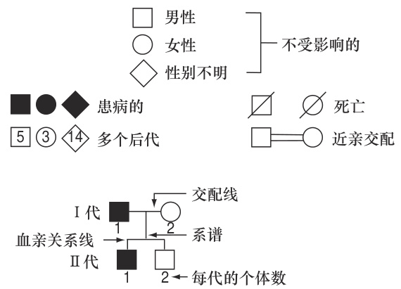  
图2.21　系谱图中用的符号。在上面的系谱图中，Ⅰ-1是父亲；Ⅰ-2是母亲；Ⅱ-1和Ⅱ-2是他们的两个儿子；这位父亲和第一个儿子都是疾病患者。  

更多的额外信息可以帮助消除这种不确定性。人类遗传学家尤其想知道，在这个家庭所处人群中，这个性状出现的频率是多少。如果这个性状在人群中很罕见，那控制该性状的等位基因在这个家庭里也就很罕见，而且最有可能的假设是有遗传不相关的人携带着这个等位基因。在图2.21中，只有父亲携带着一个显性致病等位基因，或者父母双方都携带隐性致病等位基因（父亲携带两份拷贝，母亲携带一份拷贝）。但是即便是“该性状是罕见的”这个信息也不足以让我们明确该性状是显性遗传的结论。图中系谱图的信息实在有限，我们也不能确定两个亲本是否是遗传无关的个体。稍后我们会详细地讨论，遗传相关的个体可能都从他们的共同祖先获得罕见的隐性等位基因。这个例子也解释了为什么人类遗传学家在收集信息的时候通常收集数代人的信息。  

现在我们研究的是显性遗传疾病亨廷顿病和隐性遗传疾病囊性纤维化的家族系谱图。这两个疾病的遗传模式为系谱图提供了更丰富的线索，也使得遗传学家可以确定其他家庭成员的基因型。  

# 2.3.2 垂直遗传模式通常是罕见的显性遗传特征  

亨廷顿病是由纽约医生George Huntington命名的，他也是第一个描述亨廷顿病病例的人。亨廷顿病通常于中年发病，并逐渐摧残患者的身体和精神，主要症状包括智力衰退、严重抑郁和行动混乱，这些都是由神经细胞的逐渐死亡引起的。如果父母一方出现这样的症状，那他或她的孩子在成年后会有 $50\%$ 的概率患病。因为亨廷顿病在孩子出生时并没有迹象，直到成年后才发病，所以亨廷顿病也是迟发性遗传疾病。  

如图2.22的亨廷顿病系谱，如何为每个家庭成员确定基因型呢？首先，需要确定致病的等位基因是显性还是隐性。一些线索显示亨廷顿病是单基因显性遗传病。每一位患者的父母至少有一方患有亨廷顿病，而且在几个世代中患者的比例大约在一半。患者的遗传通常是垂直的：追溯患者的祖先，往往每代人都至少有1人患病，从而使家庭成员中出现持续患病。当一种疾病在群体中是罕见的，垂直的遗传模式是该性状由显性等位基因控制的强有力的证据；它的相对性状的表现要求其他无相关人员携带有隐性等位基因（常见隐性性状也可能在每一代中出现，我们将在课后第40题计算该问题）。  

在系谱图中追踪显性等位基因，可以将每一对患者和健康人的结合看成类似于测交。如果后代没有患病，那亲本中的患者为杂合体。作为练习，你可以根据图2.21的结果核对自己的基因型。  

需要注意的是图2.22的图注部分，人类遗传学家使用的性状代表符号与孟德尔等位基因使用的符号不同。在人类基因型中，所有的等位基因都是大写。如果等位基因编码的是正常功能的基因产物，那在符号后加上标“ $\because$ ”；等位基因不编码基因产物或产物功能异常，有时候不加上标（如图2.22），有时候会用除了 $^+$ 以外的符号上标表示异常的等位基因（更多基因标注参见信息栏“遗传学与社会：发展遗传筛查指南”）。  

与孟德尔豌豆基因一样，亨廷顿病的基因也已经确认，并且在分子水平开展了研究。事实上，这是第一个用来在分子层面确认致病基因的方法，该方法将在第11章中介绍。亨廷顿病基因产生的蛋白质称为Huntingtin或者Htt，是神经细胞正常生理功能必需的蛋白质。但该蛋白质在细胞中的确切作用还不为人知。显性致病基因（HD）编码缺陷Htt蛋白，会随着时间推移损伤神经细胞（图2.23）。  

致病等位基因对正常等位基因是显性，因为正常功能的Htt蛋白的存在并不能阻止缺陷Htt蛋白损伤细胞。  

  
图2.22　亨廷顿病：罕见的显性疾病。所有填充符号所代表的个体都是杂合体（除了Ⅰ-1以外，对于显性的HD疾病等位基因来说，它可能是纯合子）；所有无填充符号表示的个体都是隐性的 $H D^{+}$ 正常等位基因的纯合子。在这14个血亲的孩子中，DNA检测显示有些是 $H D\,H D$ ，有些是 $H D\,H D^{+}$ ，有些是$H D^{+}H D^{+}$ 。菱形掩盖了个人细节，以保护隐私。  

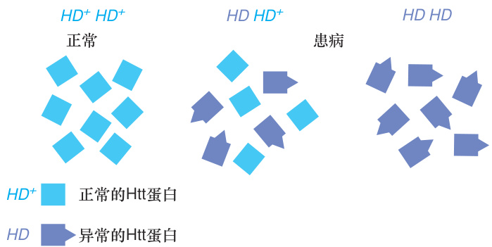  
图2.23　为什么亨廷顿病的致病基因是显性。基因型为HDHD或 $H D\,H D^{+}$ 的人们患有亨廷顿病，因为HD等位基因产生的异常Htt蛋白会损伤神经细胞。正常等位基因的纯合体（ $H D^{+}H D^{+}$ ）只产生正常的Htt蛋白，所以不会患病。致病基因 $H D$ 之所以是显性，是因为在杂合体（ $H D\,H D^{+}$ ）中即便产生了正常的蛋白质，异常蛋白也会损伤神经细胞。 $H D\,H D$ 纯合体存活也是可能的，因为异常蛋白保留了正常蛋白的部分功能。  

值得注意的是，这种对亨廷顿病致病基因的解释只是众多能够解释致病基因对正常基因呈显性的分子机制中的一种。  

亨廷顿病现今依然没有有效的治疗措施。而且由于亨廷顿病的迟发性，在20世纪80年代之前，亨廷顿病父母的孩子在中年（通常是成长到生育年龄）之前都无法确认自己是否携带亨廷顿病的基因（ $H D$ ）。大部分患病的人们都是 $H D\ H D^{+}$ 杂合体，所以他们的孩子在诊断之前有 $50\%$ 的概率遗传到 $H D$ ，并有 $25\%$ 的概率将HD基因遗传给自己的孩子。  

在20世纪80年代中期，伴随着基因等新知识的发展，分子遗传学家发展出了检测一个个体是否携带HD基因的DNA检测技术（该技术将在第11章介绍）。由于对该病缺乏有效的治疗手段，一些父母死于亨廷顿病的年轻人不愿接受检测，这样他们就不会过早地了解自己的命运。但是另一些高危群体使用这项技术检测HD基因，从而决定是否生孩子。如果检测结果显示亨廷顿病父母的孩子没有携带HD基因，那他或她就不可能患病或者将HD基因遗传给自己的后代；如果检测显示存在HD，那高危人群和他/她的伴侣可能会选择通过体外受精（IVF）技术，这项技术可以在胚胎早期确定胚胎基因型。通过IVF，只有缺少HD致病基因的胚胎被移植到母亲的子宫。  

信息栏“遗传学与社会：发展遗传筛查指南”讨论了从家族谱系和分子检测中获得的信息所引发的社会和伦理问题。  

# 2.3.3 罕见的隐性遗传病通常是水平的遗传模式  

与亨廷顿病不同的是，大多数人体内的单基因疾病是隐性的。这是因为，除了迟发性性状之外，有害的显性等位基因不太可能传递给下一代。例如，如果所有患有亨廷顿病的人群在10岁之前死亡，那这个疾病就会在人群中消失；相反，隐性疾病基因的携带者不会出现任何症状。  

图2.24展示了三个囊性纤维化（CF）的系谱图。CF是美国白人儿童中常见的隐性遗传疾病。双份的隐性CF等位基因（即缺少 $C F^{+}$ 等位基因）会引发致命的疾病，在这种疾病中，肺、胰腺和其他器官会被一种黏稠的、干扰呼吸和消化的黏液堵塞。每2000个美国白人中会有一个生来就患有囊性纤维化疾病，他们中只有 $10\%$ 能够活到30多岁。  

CF系谱有两个显著的特征。家族中患病的患者通常是平辈人，即患有CF的患者的父母、祖父母及曾祖父母都没有出现这种疾病，而在他们的兄弟姐妹之间可能会出现患者。所以这种平行模式是隐性遗传系谱的特征。未患病的父母都是杂合的携带者：他们携带显性正常基因，从而掩盖了隐性缺陷基因的作用。据估计，美国有1200万人都是隐性缺陷基因CF的携带者。表2.2总结了从系谱图中获得的线索，可以帮助你确定一个性状究竟是显性还是隐性遗传。  

CF系谱另一项特征是，许多生育患病儿童的夫妇都是血亲，也就是他们的结合属于近亲（双横线连接）。在图2.24（a）中，第五代的近亲婚配属于第三代表亲之间的婚配。当然，患者的父母也可能是两个  

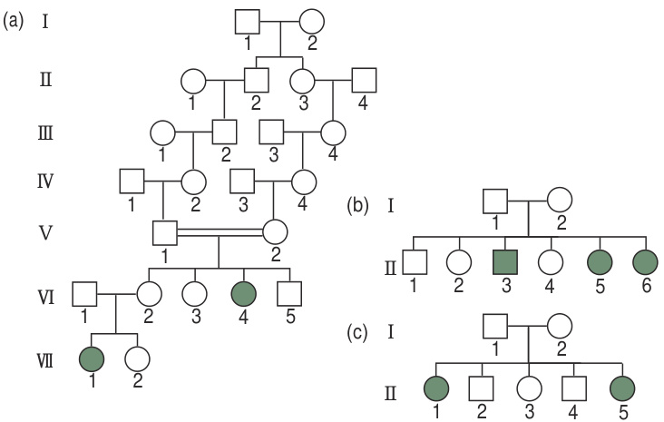  
图2.24　囊性纤维化疾病：隐性疾病。在（a）中，两个患病的个人（Ⅵ-4和Ⅶ-1）是 $C F\,C F$ ；也就是隐性疾病等位基因的纯合子。他们不受影响的父母必须是携带者，所以Ⅴ-1、Ⅴ-2、Ⅵ-1和Ⅵ-2都必须是 $C F\,C F^{+}$ ，个人Ⅱ-2、Ⅱ-3、Ⅲ-2、Ⅲ-4、Ⅳ-2和Ⅳ-4可能也是携带者。我们无法确定哪位祖先  

（Ⅰ-1或Ⅰ-2）是携带者，因此我们将他们的基因型指定  
为 $C F^{+}.$ –。由于 $C F$ 等位基因相对较少，很可能Ⅱ-1、Ⅱ-4、  
Ⅲ-1、Ⅲ-3、Ⅳ-1和Ⅳ-3是 $C F^{+}C F^{+}$ 纯合子。剩下的未受影响  
的人（Ⅵ-3、Ⅵ-5和Ⅶ-2）的基因型是不确定的（ $C F^{+}-$ ）。  
（b）和（c）这两个家庭展示了横向的遗传模式。如果没有  
进一步的信息，每个血统中未受影响的儿童都必须被视为拥有一个 $C F^{+}$ –基因型。  

# 遗传学与社会  

# 发展遗传筛查指南  

在20世纪70年代早期，美国发起了一项全国性的镰状细胞性贫血病的携带者筛查项目，这是一种隐性遗传疾病，大约每600名非裔美国人就有1名患者。这种疾病是由β-globin基因的HbβS的等位基因引起的；显性的正常等位基因是 $H b\beta^{A}$ 。由 $\upbeta$ -globin基因决定的蛋白质是携氧血红蛋白分子的组成部分。HbβS HbβS纯合体的氧气供应不足，容易疲劳，而且经常会因循环系统的压力而导致心力衰竭。  

这项全国筛查项目只是基于对血红蛋白迁移率的测试：健康人和“患者”的血红蛋白在凝胶中的移动速率不同。参与筛选项目的人可以通过测试结果来做出明智的生育决定。例如，一个健康的人，他知道自己是一个携带者（也就是说，他是HbβS HbβA型杂合子），如果他的配偶是非携带者，他就不必担心会有一个患病的孩子。  

最初的镰状细胞筛查计划，是基于异常血红蛋白的检测，但这项计划并不是很成功，其原因在很大程度上是由于缺乏足够的教育宣传。许多知道自己是携带者的人误以为自己得了这种病。此外，由于雇主和保险公司在获得了这些信息后，会使一些携带HbβSHbβA型杂合子的人被剥夺工作或医疗保险，这是不可接受的。因此，公共关系和教育方面的问题使得一种可靠的筛选测试成为了存有争议和相互疏离的源头。  

当今，由于能够直接评估基因型，高危家庭可能被筛查出的遗传疾病越来越多。因此，建立遗传筛选准则的需要变得越来越紧迫。几个相关的问题揭示了这个问题的复杂性。  

1.  为什么要进行基因筛选？筛查的第一个原因是可以获得对个人有益的信息。举个例子，如果你在很小的时候就知道你有心脏病的遗传倾向，你就可以改变你的生活方式，从而提高你保持健康的机会。你也可以利用基因筛选的结果来做出明智的生育决定。  

2.  基因筛查的第二个原因，往往与第一个原因相冲突，是为了使社会群体受益。例如，保险公司和雇主想知道谁会因各种遗传疾病而面临保险风险。  

3.  有条件的话我是否应该进行基因筛查？目前对于大多数遗传性疾病，还没有治愈的方法。得知自己患有一种没有治疗手段的致命的迟发性疾病的心理负担可能是毁灭性的，所以一些人会选择不去检测；还有一些人可能由于宗教或身份的原因而拒绝检测。  

4.  如果启动一项筛查项目，那谁应该接受检测？这个答案取决于测试的目的和花销。而且，该过程的成本必须与测试所提供的结果的有用性一起核算。在美国，白人和非裔美国人中有1/10的人患有囊性纤维化，而亚洲人中几乎没有人患病，那是所有种族都要接受测试还是仅仅测试白人？  

5.  是否应该允许私人雇主和保险公司对他们的客户及雇员进行检测？一些雇主提倡通过基因筛查来减少职业病的发病率，他们认为可以利用基因检测的数据来确保员工不会被分配到可能会给他们造成伤害的环境中。反对者批评称，筛查侵犯了工人的权利，包括隐私权、增加工作场所的种族歧视，以及会为保险公司提供拒绝保险的借口。2008年，美国总统乔治·布什签署了《基因信息非歧视法》，该法案禁止美国保险公司和雇主根据从基因测试中获得的信息进行歧视（通过减少保险覆盖或不利的就业决定）。  

6.  最后，人们应该如何接受测试结果的意义呢？在一个小社区的筛选项目中，当人们被确认是隐性的、威胁生命的血液疾病携带者，即β地中海贫血症，也会被排斥；结果，携带者最终彼此联姻。这只会使医疗问题变得更糟。相比之下，在意大利的费拉拉，每年都有30个新的β地中海贫血症病例报告，广泛的筛查结合密切的教育模式是很成功的，在20世纪80年代很少有新病例出现。  

考虑到所有这些因素，你希望建立什么样的指导方针来确保在正确的时间将基因筛查提供给正确的人，并将从这种筛查中获得的信息用于正确的目的？  

表2.2　如何区分系谱中的显性和隐性性状  

<html><body><table><tr><td>显性性状</td><td>隐性性状</td></tr><tr><td>1.患病子女的父母至少一个是患者</td><td>1.患病个体可能是两个健康携带者的子女，特别是可能存在近亲关系</td></tr><tr><td>2.显性遗传疾病表现出垂直遗传模式，在每一代人中都会出现</td><td>2.两个患病个体的孩子一定患病</td></tr><tr><td>3.两位患者如果都是杂合体的话，可能生育出健康的孩子</td><td>3.罕见的隐性性状表现出一种水平的遗传模式：这种特征首先出现在一 代人的几位成员中，而在前几代人身上则看不到</td></tr><tr><td></td><td>4.人群中的常见隐性遗传疾病可能表现垂直遗传模式</td></tr></table></body></html>  

无关的携带者，但近亲之间基因相同，他们后代获得两份少见的等位基因的可能性比平均的可能性要高很多。无论他们是否相关，携带者父母都是杂合体。因此他们的后代中健康者和患者的比例是 $3:1$ 。从另一个角度来看，两个杂合携带者的后代中有1/4的孩子可能是纯合的CF患者。  

你可以通过为图2.24中每个人确定基因型来评估你对这种遗传模式的理解，然后根据标签检查你的答案。注意，对于个别个体，如图2.24（a）中的子一代的个体，虽然无法确定完整的基因型，但可以确定的是他们之间一定有携带者，从而能够提供最原始的CF基因，但是无法确定究竟是男性还是女性。和豌豆显性性状基因型一样，第二个不确定的等位基因用–表示。  

在图2.24（a）中，无关的携带者Ⅵ-1和Ⅵ-2生下了患有CF的孩子。隐性遗传疾病出现不相关的携带者之间的这种婚姻有多大可能？答案取决于所涉及的基因和一个人出生的特定人群。如表2.1所示，遗传病的发病率（及其携带者的频率）在人群中存在显著的差异。这种差异反映了不同群体的遗传发展历程。遗传学中研究群体间差异的领域称为群体遗传学，对这一领域我们将在第21章进行介绍。请注意，在图2.24（a）中，一些无关的、未患病的人，如Ⅱ-1和Ⅱ-4，有考虑地嫁入了这个家庭。尽管她们很可能都是显性正常基因的纯合体（ $C F^{+}C F^{+}$ ），但她们中也有很小的可能（大小取决于她们来源的人群）出现携带者。  

1989年，基因研究员在发现了亨廷顿病基因不久之后，发现了囊性纤维化基因。正常的显性等位基因 $C F^{+}$ 产生被称为囊性纤维化跨膜调节因子（CFTR）的蛋白质，该蛋白质在细胞膜上形成离子通道，能够控制氯离子进出细胞膜。隐性致病基因CF无法产生CFTR，或产生的蛋白质无功能或功效低下（图2.25）。由于渗透压的存在，水流在没有CFTR的条件下进入肺细胞。所以CF CF纯合体没有有功能的CFTR（或蛋白量不足），进而发展成为囊性纤维化。基因治疗——在患者肺细胞中插入正常等位基因 $C F^{+}.$ ——已经被用来尝试缓解该疾病的症状，但还没有取得成功。  

尽管基因治疗失败了，但对囊性纤维化的基因的确定最近使得对特定等位基因突变患者可进行有效治疗。例如，在2015年，美国食品药品监督管理局批准了一种名为Orkambi 的鸡尾酒药物，它可以辅助这些等位基因之一特定缺陷的CFTR正常发挥功能。治疗囊性纤维化和其他遗传性疾病的方法将在后面的章节中讨论。  

# 基本概念  

●  在一个垂直的传递模式中，出现在受影响个体身上的一种性状也出现在父母双方中的一方，以及受影响父母的父母一方，依此类推。如果该性状是罕见的，那么具有垂直模式的系谱通常表明致病的等位基因是显性的。  

●  在一个水平的传递模式中，出现在受影响个体中的特征可能不会出现在任何祖先中，但它可能出现在这些人的兄弟姐妹中。具有水平模式的系谱通常预示一种罕见的隐性致病基因。受影响的个体通常是近亲结婚的后代。  

●  各种各样的生化事件可以解释为什么某些疾病的等位基因是显性的。在亨廷顿病的案例中，致病的HD等位基因编码了异常、有害的蛋白质，与正常的隐性等位基因所产生的蛋白质不同。  

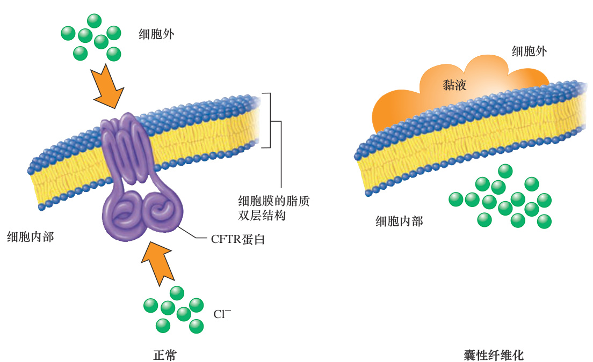  
$C F^{+}\,C F^{+}$ CF  CF +   
CF CF   
图2.25　为什么囊性纤维化的致病基因是隐性的。CFTR蛋白调控氯离子（绿色小球）通过细胞膜的跨膜运输。囊性纤维化基因的纯合子（CF CF）由于隐性基因或者不编码CFTR蛋白，或者编码异常蛋白（无功能或功效低下，图中未表示）而患病。致病基因CF是隐性基因，因为 $C F\,C F^{+}$ 杂合体能够通过 $C F^{+}$ 产生CFTR蛋白，从而使肺功能保持正常。  

●  隐性疾病等位基因，就像导致囊性纤维化的CF等位基因一样，通常编码无功能或功效低下的蛋白质，而正常蛋白质是正常的显性等位基因所产生的。  

# 接下来的内容  

孟德尔回答了之前提出的三个问题。对于“遗传的是什么？”，孟德尔的答案是“等位基因”；对于“它是怎样遗传的？”，孟德尔的答案是“遗传遵循分离定律和自由组合定律”；对于“偶然性在遗传里扮演什么样的角色？”，他的答案是“对于每个个体来说，遗传是由偶然性决定的，但是在一个种群中，偶然性会在严格的概率下发挥作用”。  

孟德尔在20世纪进行的长达10年的大量育种研究表明：孟德尔定律不仅适用于豌豆的7对互斥性状，而且对于众多有性生殖的植物和动物的大量性状都适用。但也有一些新的育种研究对遗传学提出了挑战。在某些物种的某些性状上，研究中出现了意料之外的比例，或者F1和F2后代中出现了与纯种品系亲本相似的新的表型。  

这些现象并不能用孟德尔“性状是由两个等位基因（其中一个是完全显性，另一个是隐性）来决定的”这样的理论来解释。现在我们都知道，大多数常见性状包括人类的肤色、眼睛的颜色及身高等都是由两个或多个基因共同作用所决定的；我们也知道，在给定的群体中，某一基因的等位基因可能不只有2个。在第3章中我们将详细介绍如何对由复杂基因相互作用引发的性状或基因和环境相互作用产生的性状进行遗传分析，并对孟德尔定律进行扩展，而非否定。  

# 习题精解  

# 解决遗传问题  

评估和提升对章节里的材料的理解，最好的办法就是将学到的知识运用到解题中去。遗传词汇的问题就像一个谜，你要慢慢地去解决它而不是被他所吓到。通过确认问题中的有效信息，再根据这些信息推导出更多的信息，利用遗传学原理和逻辑推理来找到答案。处理的问题越多，处理起来越得心应手。在处理问题的过程中，你不仅能巩固对遗传学概念的理解，还可以提升能够运用到其他科目中的分析技巧。  

注意章节后的部分题目是用来引入补充的重要概念的，从而扩充内容。尽管如此，你还是可以通过阅读的逻辑推理来回答这些问题。  

解决遗传学问题需要的不仅仅是把数字代入公式。每个问题都是独特的，需要对题目所提供的线索和所提出的问题进行有深度的评估。下面是在处理这些问题时  

可以遵循的一般指导原则：  

a. 仔细阅读问题，了解相关概念。  

b. 回归题目本身，标记题目提供的所有线索。例如，题目中可能会提供或暗示子代或亲代的基因型或表型。用符号表示已知信息，即为等位基因确定代表符号，用这些符号代表基因型；为题目中的杂交过程画图，标注基因型和表型。确保同一基因的两个等位基因的代表字母一定是相同的，不然的话会造成混乱。仔细区分字母的大小写，如S（s）或C（c）。  

c. 重新评估问题并利用已知信息进行解题，确保答即所问。  

d. 答题结束后进行检查，保证答案是正确的。常用的检查方法是逆推法，即根据答案往回逆推题目。  

e. 解题和检查结束后，稍稍思考题目中涉及的是哪个概念，这对加深理解很有帮助。  

在每一章节中，都会提供两三个问题的解题思路。Ⅰ.  猫的白斑是由显性基因 $P$ 决定的， $p p$ 是纯色的。短毛是由显性基因S决定的， $s s$ 是长毛。一只长毛、白斑猫（母亲是纯色短毛猫）和一只短毛、纯色猫（母亲是纯色长毛猫）交配，求它们的后代可能的表型和比例。  

# 解答  

解这道题需要理解杂交中的显性和隐性、配子形成，以及两对等位基因的自由组合。  

首先对已知信息进行整理：  

母亲： 纯色、短毛 纯色、长毛杂交： Cat1 Cat2白斑、长毛 $\times$ 纯色、短毛  

能确定基因型吗？所有表现隐性性状的猫一定是隐形纯合子，所以所有的长毛都是ss型，所有的纯色都是pp型。Cat1是长毛，所以一定是 $s s$ ；它是白斑，那隐性可能是 $P P$ 或 $p p$ ；但它的母亲是纯色 $p p$ ，只能形成 $p$ 型配子，所以它的基因型只能是 $P p$ ；综合以上信息，Cat1的全基因型是 $P p~s s$ 。与之类似，Cat2是纯色，所以它一定是隐性纯合 $p p$ ；它是短毛，可能的基因型是SS或 $S s$ ；又因为它母亲是长毛ss，所以只能产生携带隐性等位基因s的配子，所以它的基因型一定是 $\mathit{\Delta}_{S S}$ ；综上，Cat2的全基因型pp Ss。  

所以杂交体系为 $P p$ ss（Cat1）和pp Ss（Cat2）杂交。为了预测子代基因型，首先确定两只猫所能产生的所有的配子基因型，然后利用庞纳特方格确定后代的所有基因型。Cat1（Pp ss）产生 $P s$ 和ps两种配子，且产生的概率相同。Cat2（pp Ss）产生 $p S$ 和ps两种配子，概率也相同。所以它们交配产生四种等可能的后代： $P p$ Ss（白斑、短毛）、 $P p$ ss（白斑、长毛）、pp Ss（纯色、短毛）及pp ss（纯色、长毛）。  

Cat1   

<html><body><table><tr><td>ps</td><td>Pp Ss</td><td>ppSs</td></tr><tr><td>ps</td><td>Pp ss</td><td>ppss</td></tr></table></body></html>  

你也可以用乘法规则替代庞纳特方格来解决这个问题。原理是相同的：父母产生的配子的概率是相同的，且结合是随机的。  

<html><body><table><tr><td>Cat1</td><td>Cat2</td><td></td><td>后代</td></tr><tr><td>配子 1/2 P s</td><td></td><td>配子 1/2 p S</td><td>1/4PpSs白斑、短毛</td></tr><tr><td>1/2 P s</td><td></td><td>1/2 p s</td><td>1/4Ppss白斑、长毛</td></tr><tr><td>1/2 p s</td><td></td><td>1/2 p S</td><td>1/4ppSs纯色、短毛</td></tr><tr><td></td><td></td><td></td><td></td></tr><tr><td>1/2 p s</td><td></td><td>1/2 p s</td><td>1/4ppss纯色、长毛</td></tr></table></body></html>  

Ⅱ.  番茄的红色对于黄色是显性性状；紫茎对于绿茎是显性性状。有一个杂交体系产生了305个红色、紫茎植株；328个红色、绿茎植株；110个黄色、紫茎植株；97个黄色、绿茎植株。请问杂交系亲本可能的基因型是什么？  

# 解答  

解决这道题需要理解双杂交品系的自由组合定律及单杂交的概率计算。  

确定等位基因的代表字母：  

$R{=}$ 红色， $r{=}$ 黄色  

$P{=}$ 紫茎， $p{=}$ 绿茎  

在遗传问题中，子代的比例能够反映亲代的基因型。你通常需要计算出后代的数量，并大致估算出每一个不同种类的后代的比例。对于这道题中涉及的两个遗传性状可以分别考虑。在果实颜色上，840株后代中结红色果实的有 $305\substack{+328\,=633}$ 株，（633/840）的比值接近3/4。接近1/4的植株结黄色果实［ $(110\!+\!97\!=\!207)$ ) / 840］。从孟德尔的工作中可以知道 $3:1$ 的表型比例是由同一个基因的杂合体植株杂交产生的。所以亲本关于颜色的基因型一定是 $\cdot R r$ 。  

对于茎的颜色来讲，840株中有（ $305\!+\!110\!=\!415$ 株）是紫茎。紫茎（415株）和绿茎（ $328\!+\!97\!=\!425$ 株）各占一半。而 $1:1$ 的表型比例来源于杂合子和隐性纯合子的杂交体系（也叫测交）。  

亲本关于茎的颜色的基因一个是 $P p$ ，另一个是$p p$ 。所以亲本的基因型是Rr $P p\times R r\,p p$ 。  

Ⅲ.  泰-萨氏病是一种隐性致命疾病，会导致早期的神经退化。这种病在人类总体上来讲很罕见，但在德系犹太人中出现的频率很高。一位舅舅患病的母亲试图确定她和丈夫的孩子患病的概率。已知她的父亲没有患病，所处的人群也不是高危人群；她丈夫的妹妹患此病早逝。  

a.  为题目中涉及的任务绘制系谱图，并尽可能标出基因型；  

b. 计算该夫妻第一个孩子患病的概率。  

# 解答  

这个问题涉及显隐性及概率。首先绘制系谱图，然后用指定的字符尽可能多地确定个体基因型：  

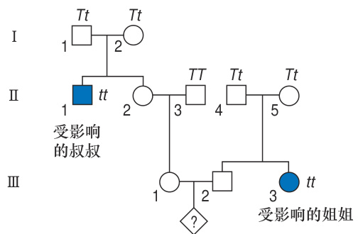  
$T\!=$ 正常等位基因； $t{=}$ 泰-萨氏病等位基因  

两位患者：母亲舅舅（Ⅱ-1）和父亲妹妹（Ⅲ-3）的基因型是tt。因为母亲的舅舅是患者，所以他的父母一定是杂合子。  

这位丈夫（Ⅲ-3）有个妹妹患此病去世，所以他的父母（Ⅱ-4和Ⅱ-5）一定是杂合体。最后，由于Ⅱ-3个体来源是非高危人群，所以他最可能的基因型是 $\mathbf{\nabla}\cdot T T_{\mathrm{c}}$ 。  

接下来需要确定的是Ⅲ-1和Ⅲ-2的孩子（即Ⅳ-1）患病（ $t t$ ）的概率。要做到这一点，二人必须都是 $T t$ ，不能是 $t t$ 。若Ⅲ-1是 $T t$ ，那Ⅱ-2必须是$T t$ 。计算Ⅱ-2是 $T t$ 的概率比较麻烦。首先，两个杂合子（ $T t$ ）的女儿是 $T t$ 的概率是1/2，后代的比例是1$T T:2\ T t:1\ t t_{\circ}$ 。但是在这个案例中，你需要考虑额外的信息：Ⅱ-2是健康者，所以基因型 $t t$ 被排除。只剩1 $T T:2\ T t$ ，即Ⅱ-2有2/3的概率是 $T t$ 。在这种情况下，Ⅱ-2将t传递给Ⅲ-1的概率是1/2。所以Ⅲ-1是 $T t$ 的概率为 $1/2\times2/3{=}1/3$ 。  

Ⅲ-2是 $T t$ 的概率是多少呢？他的父母都是杂合体，且他没有患病。所以利用相似的逻辑可以推出Ⅲ-2是Tt的概率为2/3。  

所以Ⅲ-1和Ⅲ-2都是 $T t$ 的概率是： $2/3\times1/3{=}$ 2/9。两个 $T t$ 父母的孩子基因型是 $^{t t}$ 的概率是1/4。所以这对夫妻（Ⅲ-1和Ⅲ-2）第一个孩子（Ⅳ-1）是患者的概率是： $2/9\;\times\;1/4{=}1/18\,,$ 。  

# 词汇  

1.  在右列中选择与左列中的术语最匹配的短语。  

a. 表型 1. 给定基因有两个确定的等位基因  
b. 等位基因 2.  杂合体表现的表型对应的等位基因  
c. 自由组合 3. 基因的不同形式  
d. 配子 4. 观察到的特征  
e. 基因 5. 两个基因杂合体的交配  
f. 分离 6.  一种基因的等位基因与其他基因的等位基因随机分离  
g. 杂合体 7.  每个基因只有一份拷贝的生殖细胞  
h. 显性 8.  在杂合子中不表现性状的对应的等位基因  
i. $\mathrm{F}_{1}$ 9.  不确定的基因型个体与隐性纯合体杂交  
j. 测交 10.  同一基因有两份不同的等位基因的个体  
k. 基因型 11. 决定一个性状的可遗传实体  
l. 隐性 12. 单个个体含有的等位基因  
m. 双因子杂交 13.  等位基因分开进入两个不同的配子  
n. 纯合体 14. 亲代 P 的后代  

# 2.1节  

2.  在数千年的育种实践中，育种学家们为什么没有发现性状是由离散单元（基因）支配的原理？  

3.  描述孟德尔发现遗传原理所用的豌豆的特点及优势，并考虑根据之前所提属性在人类中进行类似的遗传实验是难还是简单。  

# 2.2节  

4.  白化的玉米锦蛇和正常颜色的玉米锦蛇交配，后代是正常颜色。如果这些子代互相交配产下了32条正常色的玉米锦蛇和10条白化蛇。a. 如何确定这些蛇的颜色是由单基因控制的？b. 哪一个表型是由显性等位基因控制的？c.  一条正常色的雌蛇进行测交。杂交产生了10条正常色的蛇和11条白化后代。求亲本和后代的基因型。  

5.  两只短毛猫交配产生了6只短毛猫和2只长毛猫。这些信息反映了毛的长度是怎样的遗传特征？  

6.  斑疹是在人类身上发现的一种疾病，有一小块皮肤缺乏色素沉着。这种情况是由于色素产生细胞在发育过程中无法正常迁移引起的。两个患有斑疹的成年人生了两个孩子，一个患有斑疹，另一个是正常肤色。  

a.  斑疹是显性还是隐性性状？凭什么线索进行这样的判断？  
b. 亲本基因型是什么？  

7.  作为一名果蝇遗传学家，你可以保留具有特定基因型的果蝇。现在你有一只正常翅（显性性状）的果蝇。短翅果蝇的翅长基因是隐性纯合子。为了确定正常翅果蝇的翅长基因是纯合还是杂合，请设计杂交品系，并确定杂交过程中产生的后代的基因型。  

8.  变异的黄瓜植株在成熟时花朵不能开放。杂交可以通过人工授粉用其他植株的花粉为它授粉。当闭花 $\times$ 开花杂交时，所有的F1后代都是能开放的。 $\mathrm{F}_{2}$ 植株有145株开放，59株闭花。闭花 $\times\,\mathrm{F}_{1}$ 的杂交结果是81株开花和77株闭花。请问闭花性状是怎样遗传的？说明理由。  

9.  在特定的小鼠群体中，某些个体表现出“短尾”表型，这是种显性遗传的性状。一些个体表现出“疏尾”的隐性性状，这种特征会影响皮毛的颜色。哪个性状更容易通过选择育种从群体中消除？为什么？  

10. 在人类群体中，酒窝属于单基因控制的显性性状。  

a.  一个没有酒窝的男性和有酒窝的女性结合，该女性的母亲没有酒窝，问：他们的孩子有酒窝的概率是多少？  
b.  一个有酒窝的男性和一个没有酒窝的女性生了一个没有酒窝的孩子，问：该男子基因型是什么？  
c.  一个有酒窝的男性和一个无酒窝的女性生了8个孩子，且都有酒窝，问：能否确定该男子基因型？为什么？哪种基因型的可能性更大？为什么？  

11.  野草植株中，一些拟南芥品系在生长季早期开花，另一些品系则在晚期开花。四种不同品系的拟南芥（ $1\!\sim\!4\;)$ ）杂交，由此产生的后代列表如下：  

<html><body><table><tr><td>杂交</td><td>后代</td></tr><tr><td>1×2</td><td>77晚期：81早期</td></tr><tr><td>1×3</td><td>134晚期</td></tr><tr><td>1× 4</td><td>93晚期：32早期</td></tr><tr><td>2×3</td><td>111晚期</td></tr><tr><td>2 × 4</td><td>65晚期：61早期</td></tr><tr><td>3×4</td><td>126晚期</td></tr></table></body></html>  

a.  解释不同开花时期的遗传学基础。你怎么知道在这群植物中，开花的时间特征会受到单个基因的影响？哪个等位基因是显性，哪个是隐性？b. 为四种植株确定基因型。c. $1\!\sim\!4$ 植株自交后代的表型和比例是什么？  

12.  美国原住民中，耳垢有两种形式：干性和黏性。有遗传学家通过观察不同的性状之间的婚配及其后代的性状，对该性状进行了研究。他的观察如下：  

后代  

<html><body><table><tr><td>亲代</td><td>配对数</td><td>黏性</td><td>干性</td></tr><tr><td>黏性× 黏性</td><td>10</td><td>32</td><td>6</td></tr><tr><td>黏性 干性</td><td>8</td><td>21</td><td>6</td></tr><tr><td>干性× 干性</td><td>12</td><td>0</td><td>42</td></tr></table></body></html>  

a. 耳垢的遗传模式是什么？b. 表中数据为什么没有 $3:1$ 或者 $1:1$ 的比例？  

13.  假设你刚买了一匹基因型未知的黑色种马，和红色母马交配后，母马生下了一对双胞胎，一匹是红色，一匹是黑色。假设马的毛色是单基因遗传，能否根据以上交配结果判断毛色的遗传方式？你能设计什么样的交配方案来解决这个问题？  

14.  如果掷一次骰子，掷出以下结果的可能性是多少：（a）一个6；（b）一个偶数；（c）一个可以被3整除的数；（d）掷两个骰子，出现两个6的可能性是多少；（e）两个骰子一个偶数一个奇数的可能性多少；（f）两个数一致的可能性；（g）两个数都大于4的可能性是多少？  

15.  一套标准的扑克牌有四种花色（红色有红桃和方块，黑色有黑桃和草花）。每种花色都有13张牌：A、2、3、4、5、6、7、8、9、10及人头牌（J、Q和K）。单独抽一张牌：抽到人头牌的概率多大？红色牌的概率？红色人头牌的概率？  

16. 以下基因型的女性能产生多少种遗传不同的卵子？  

a. Aa bb CC DD b. AA Bb Cc dd c. Aa Bb cc Dd d. Aa Bb Cc Dd  

17.  在以下四种杂交体系中，产生性状和父母一方或两方相同的孩子的概率是多少？每种杂交产生的后代有多少不同的表型？  

a. Aa Bb Cc $D d\,\times$ aa bb cc dd b. aa bb cc dd $\times$ AA BB CC DD $\therefore A a\,B b\;C c\,D d\,\times\,A a\;B b\;C c\,D d$ d. aa bb cc dd $\times$ aa bb cc dd  

18.  一个基因型为a $B\ C\ D\ E$ 的精子和基因型为a b c D e的卵子结合受精，受精卵的基因型是什么？受精卵发育成成鼠后产生的精子或卵细胞的基因型是什么？  

19.  你的朋友怀了三胞胎，她认为三个孩子都是儿子、都是女儿、2个儿子1个女儿和2个女儿1个儿子的概率相等。她的想法是否正确？请解释（假设三胞胎来自于三个受精卵，男孩和女孩的概率相等）。  

20.  半乳糖血症是一种人类隐性遗传疾病，可以通过限制饮食中的乳糖和葡萄糖来治疗。Susan Smithers和她的丈夫都是半乳糖血症基因的杂合携带者。  

a.  Susan怀了一对双胞胎，如果是异卵双胞胎，那两个孩子都是患病女孩的概率是多少？  
b.  如果是同卵双胞胎，那两个孩子都是患病女孩的概率是多少？  
接下来的c～g部分，假设孩子中没有双胞胎。  
c.  如果Susan和她丈夫生了四个孩子，这些孩子都没有患病的概率是多少？  
d.  如果夫妻生了四个孩子，至少有一个孩子患病的概率是多少？  
e.  如果夫妻生了四个孩子，前两个孩子患病、后两个孩子不患病的概率是多少？  
f.  如果夫妻生了三个孩子，其中两个患病、另一个健康的概率是多少（无论长幼）？  
g.  如果夫妻生了四个患病孩子，下一个孩子患病的概率是多少？  

21.  白化病是色素缺乏的疾病，在人类中的表现是白头发、白皮肤及粉色的眼睛。该性状是隐性基因控制的。两个健康的父母生了一个白化病的孩子。父母的基因型是什么？下一个孩子患病的概率是多少？  

22.  两株黄色圆粒豌豆长成的植株进行杂交，产生了以下种子：156个黄色圆粒和54个黄色皱粒。请问亲本基因型是什么（黄色和圆粒都是显性性状）？  

23.  一个三年级的学生决定为她的学校科学课培育豚鼠。她在宠物商店买了一只皮毛光滑的黑色雄鼠和已知皮毛粗糙的白色雌鼠。她想观察这些性状的遗传模式，但在第一胎只有8只皮毛粗糙的黑色豚鼠；令她沮丧的是，第二胎是7只皮毛粗糙的黑色豚鼠。很快第一胎开始生F2代，它们的皮毛开始多样了。不久获得了125只F 豚鼠，其中8只是皮毛光滑的白色豚鼠，25只是皮毛光滑的黑色豚鼠，23只是皮毛粗糙的白色豚鼠，69只是皮毛粗糙的黑色豚鼠。  

a.  皮毛颜色和质感是怎样遗传的？请说明理由。b.  如果这个女生将 $\cdot\mathrm{F}_{2}$ 中的白色光滑皮毛的雌鼠和雄鼠杂交，后代可能的表型比例是什么？  

24.  纯种黄色皱粒植株和绿色圆粒植株杂交产生的 $\mathrm{F}_{1}$ 自交，产生了一个有7个F2豌豆的豆荚（黄色和圆粒是显性性状）。7个豌豆都是黄色圆粒的可能性是多少？  

25.  阿丘综合征（对强光的反应）和下巴颤栗（由焦虑引起）都是人类的显性性状。  

a.  两个基因都是杂合子的父母的第一个孩子是患有阿丘综合征但没有下巴颤栗的可能性是多少？b.  第一个孩子没有阿丘综合征也不患下巴颤栗的可能性是多少？  

26.  一株高茎、绿豆荚、顶生紫花的植株和一株矮茎、黄豆荚、腋生白花的植株杂交，F1代都是高茎、腋生紫花，豆荚都是绿色。  

a. $\mathrm{F}_{2}$ 的表型是什么？  

b. $\mathrm{F}_{1}$ 植株和亲本中的矮茎植株杂交，后代的表型和比例如何？  

27.  下表中展示了不同品系曼陀罗的杂交结果。这些曼陀罗主要涉及紫花或白花，以及多刺豆荚或光滑豆荚。请确定这些性状中的显性性状及每组杂交品系亲本的基因型。  

<html><body><table><tr><td rowspan="2">亲代</td><td colspan="4">后代</td></tr><tr><td>紫花多刺</td><td></td><td>白花多刺紫花光滑白花光滑</td><td></td></tr><tr><td>a.紫花多刺×紫花多刺</td><td>t6</td><td>32</td><td>28</td><td>11</td></tr><tr><td>b.紫花多刺×紫花光滑</td><td>40</td><td>0</td><td>88</td><td>0</td></tr><tr><td>c.紫花多刺×白花多刺</td><td>34</td><td>30</td><td>0</td><td>0</td></tr><tr><td>d.紫花多刺×白花多刺</td><td>89</td><td>92</td><td>31</td><td>27</td></tr><tr><td>e.紫花光滑×紫花光滑</td><td>0</td><td>0</td><td>36</td><td>11</td></tr><tr><td>f.白花多刺×白花多刺</td><td>0</td><td>45</td><td>0</td><td>16</td></tr></table></body></html>  

28.  对于株高、豆荚形状及花的颜色都是杂合子的豌豆进行自交。后代中包含：272个高茎、豆荚饱满及开紫花的植株；92个高茎、豆荚饱满及开白花的植株；88个高茎、豆荚扁平及开紫花的植株；93个矮茎、豆荚饱满及开紫花的植株；35个高茎、豆荚扁平及开白花的植株；31个矮茎、豆荚饱满及开白花的植株；29个矮茎、豆荚扁平及开紫花的植株；11个矮茎、豆荚扁平及开白花的植株。在该体系中的显性基因是哪些？  

29. 在黑腹果蝇中，以下基因及变体是已知的：  

翅形： 小翅是隐性等位基因t；正常翅是显性等位基因T。  

眼睛性状： 窄小眼睛是隐性等位基因n；正常（卵形）眼睛是显性等位基因N。  

确认以下杂交品系中亲本的基因型。  

<html><body><table><tr><td colspan="3">雄性</td><td colspan="3">雌性</td><td rowspan="2">后代</td></tr><tr><td></td><td>翅膀</td><td>眼睛</td><td>翅膀</td><td>眼晴</td><td></td></tr><tr><td>1</td><td>小</td><td>卵形</td><td></td><td>小</td><td>卵形</td><td>78只小翅，卵形眼睛 24只小翅，窄小眼睛</td></tr><tr><td rowspan="2">2 3</td><td>正常</td><td>窄小</td><td>×</td><td>小</td><td>卵形</td><td>45只正常翅，卵形眼睛</td></tr><tr><td rowspan="5">正常</td><td rowspan="5">窄小×正常</td><td rowspan="5"></td><td rowspan="5"></td><td></td><td>40只正常翅，窄小眼睛</td></tr><tr><td></td><td>38只小翅，卵形眼睛</td></tr><tr><td></td><td>44只小翅，窄小眼睛</td></tr><tr><td>卵形</td><td>35只正常翅，卵形眼睛</td></tr><tr><td></td><td>29只正常翅，窄小眼睛</td></tr><tr><td rowspan="5">4</td><td rowspan="2"></td><td rowspan="2"></td><td rowspan="2"></td><td rowspan="2"></td><td></td><td>10只小翅，卵形眼睛</td></tr><tr><td></td><td>11只小翅，窄小眼睛</td></tr><tr><td rowspan="2">正常</td><td rowspan="2">窄小×正常</td><td rowspan="2"></td><td>卵形</td><td>62只正常翅，卵形眼睛</td></tr><tr><td></td><td>19只小翅，卵形眼睛</td></tr></table></body></html>  

30. 根据27题中获得的信息，回答以下问题：  

a.  基因型Tt nn的雌性果蝇与基因型Tt Nn的雄性果蝇交配，它们产生两种性状都是正常性状的后代的概率是多少？  
b.  这个杂交体系的后代的表型有哪些？如果获得200个子代，每种表型有多少？  

31.  回顾孟德尔对于豌豆的黄色和绿色表型，回答以下问题：  

a.  由控制豌豆颜色表型的基因所编码的蛋白质的生化功能是什么？  

b.  一个基因的无效基因不编码任何正常基因所编码的正常生化功能的蛋白质。那么Y和y两个等位基因哪个是无效基因？  

c.  从生物化学的角度解释，为什么Y基因对y基因是显性？  

d. 为什么yy型豌豆是绿色的？  

e.  基因所编码的蛋白质的总量大致与细胞或个体所携带的基因拷贝数呈正相关。那么根据纯合子YY、杂合子Yy及纯合子yy进行推断，产生黄色豌豆所需要的Sgr酶（豌豆颜色基因产生）的数量是多少？  

f.  Sgr酶不是豌豆植株生长所必需的，但生物的基因组中包含大量的个体生存所需要的必需基因。对于这类基因，正常基因和无效基因的杂合体可以生存，但无效基因的纯合体会在含有无效基因的雌雄配子结合受精后不久就会死去。结合e的答案，思考生物每个基因都有两份拷贝的优势。  

g.  你认为同一个豆荚中的豌豆是否会有不同的表型？为什么？  

h.  你认为豆荚和其中的豌豆的颜色是否会出现不同？为什么？  

32.  如果豌豆颜色基因（Y， $y$ ）和豌豆形状基因（R，$r$ ）不进行自由组合，相反，等位基因自亲本遗传时是作为一个单元进行遗传的，那么图2.25所示的孟德尔双因子杂交中的 $\mathrm{F}_{2}$ 的基因型和表型的比例会是什么？  

33.  回顾孟德尔获得的高茎和矮茎的纯系豌豆植株，其杂交后代全部为高茎植株（图2.8）。单基因杂种杂交的 $\mathrm{~\vec{F}}_{2}$ 中出现高茎和矮茎 $3:1$ 的比例，说明豌豆茎长性状是由单基因控制的。控制该性状的基因已经确认，该基因编码G3βH酶，能够催化附图中的反应。该反应的产物是一种生长激素，能够促进植株长高，该激素称为赤霉素。能够解释显性基因（L）和隐性基因（l）的最可能的解释是什么？  

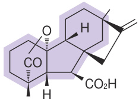  

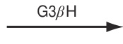  

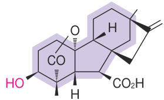  

34.  控制孟德尔豌豆植株花色（紫色或白色）的基因也已经确认。花色基因编码一种名为bHLH的蛋白质。该蛋白质是细胞合成三种酶（DFR、ANS及3GT）所必需的。这三种酶如附图所示，在紫色花青素的合成通路中发挥功能。  

a.  请解释控制豌豆花色的显性基因（ $P$ ）和隐性基因（ $\boldsymbol{p}$ ）出现不同的原因？  

b.  根据图中所给的生化通路，是否还存在其他基因可以控制豌豆的花色？  

# 2.3节  

35.  根据以下系谱图，确定遗传模式是显性遗传还是隐性遗传，说明判断理由。确定所有患病者和携带者的基因型。  

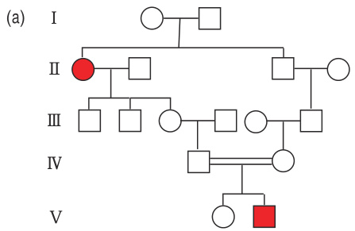  

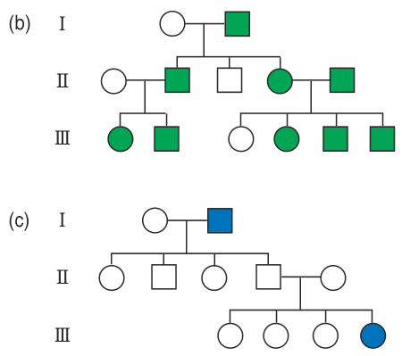  

36.  观察以下皮肤松弛症系谱图。皮肤松弛症是由于结缔组织紊乱导致皮肤被褶皱覆盖的疾病。  

a.  假设该性状属于完全外显且十分罕见，那么该病的遗传模式是什么？  
b. 个体Ⅱ-2是携带者的概率为多少？  
c. 个体Ⅱ-3是携带者的概率为多少？  
d. 个体Ⅲ-1是患者的概率为多少？  

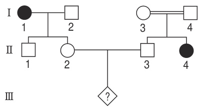  

37.  一对年轻的夫妇去看基因咨询师，因为他们每个人都有一个患有囊性纤维化疾病的兄弟姐妹（囊性纤维化疾病是隐性疾病，且两人及其父母都没有患病）。a. 这对夫妻中女性是携带者的概率为多少？b. 他们的孩子患有囊性纤维化的概率为多少？c.  他们的孩子携带囊性纤维化基因的概率为多少？  

38.  亨廷顿病是一种罕见的、致命的神经退行性疾病。这种疾病的患者，通常在40多岁时开始出现症状。亨廷顿病是由显性等位基因造成的。Joe在20岁的时候得知他父亲患有亨廷顿病。a.  Joe也患病的概率是多少？b.  Joe和他的新婚妻子一直渴望建立一个家庭。他们第一个孩子患病的概率是多少？  

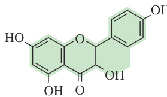  

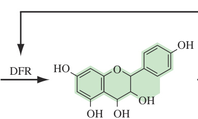  

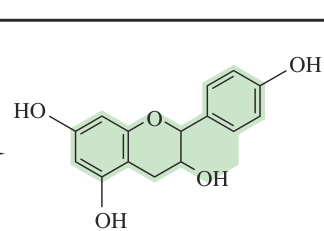  

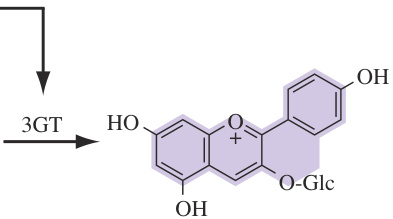  

39.  下面系谱图中的疾病是显性还是隐性？为什么？根据系谱图的信息，判断该疾病是罕见疾病还是常见疾病？为什么？  

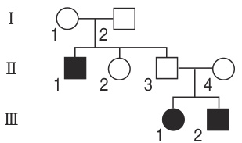  

40.  图2.22展示了一个亨廷顿病系谱图，该家族来源于委内瑞拉马拉开波湖附近的一个小村庄。这个村庄是由一小群移民建立的，他们的后代仍然聚集在这个村庄里。亨廷顿病基因在这个村子里仍然很普遍。  

a.  为什么仅根据系谱图无法最终确认亨廷顿病究竟是显性还是隐性基因造成的？b.  你能从家族的历史中收集到任何可能暗示这种疾病是由显性基因而不是隐性等位基因造成的信息吗？  

41.  回顾图2.24（a）的囊性纤维化系谱图，回答以下问题：a.  假设第Ⅰ代中某个个体是CF携带者，而所有外来人员都不是携带者，请问第Ⅴ代近亲结婚的夫妻的孩子患有囊性纤维化的概率是多少（假设二人还没有生孩子，所以不知道Ⅵ-1是患者）？b.  假设第Ⅰ代中某个个体是CF携带者，且人群中携带者的比例是1/1000，且已知Ⅵ-4是患病者，请问Ⅶ-1患病的概率是多少？  

42.  两个近亲的共同祖父有遗传性血色素沉着症，这是一种隐性的疾病，会导致体内铁的异常积聚。但这两个表亲及其亲戚都没有患病。a.  如果这两个表亲结婚并生下了一个孩子，这个孩子患病的概率是多少？假设这两个表亲的父母是无关且不患病的。b.  如果你知道每10个健康人（包括两个表亲的父母）中就有1个是携带者，你的计算会发生什么变化？  

43.  患有甲髌综合征的人，往往膝盖骨或者指甲发育不良或缺乏。患有黑尿症的人往往有患有关节炎，而且尿液在空气中会发黑。甲髌综合征和黑尿症都是罕见表型。在下面的系谱图中，红色竖线代表患有甲髌综合征，绿色横线代表患有黑尿症。  

a.  甲髌综合征和黑尿症可能的遗传模式是什么？图中有确定表型的个体的基因型是什么？b.  Ⅳ-2和Ⅳ-3的孩子同时患有甲髌综合征和黑尿症的概率是多少？只患甲髌综合征的概率是多少？  

只患黑尿症的概率是多少？两者都不患的概率是多少？  

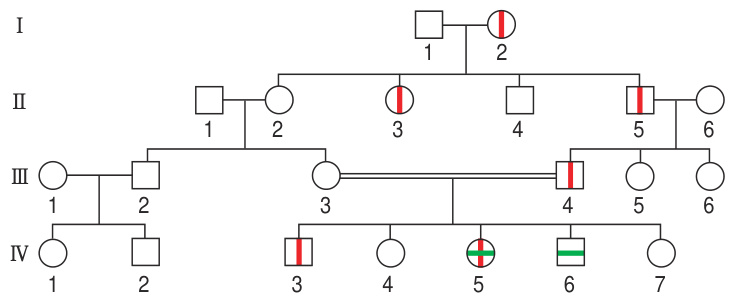  

44.  中指毛发（手指中间的毛发）是由显性等位基因M造成的。隐性纯合体（mm）的手指中间是没有毛发的。在1000个父母手指中间都有毛发的家庭中，1853个孩子表现了这一性状，而209个没有。请解释这个结果。  

45.  一位亨廷顿病的男性患者（杂合体HD $H D^{+}$ ）和一位正常女性生下两个孩子，a. 只有第二个孩子患病的概率是多少？b. 两个孩子中只有一个患病的概率是多少？c. 两个孩子都不患病的概率是多少？d.  假设夫妻二人生下10个孩子，重新回答 $\mathrm{a}^{\sim}\mathrm{c}$ 。e. 10个孩子中有4个是患者的概率为多少？  

46.  请解释为什么囊性纤维化致病基因（ $C F$ ）对正常基因（ $C F^{+}$ ）呈隐性，而亨廷顿病致病基因（HD）对正常基因（ $H D^{+}$ ）呈显性？  

47.  以下系谱展示的是苏格兰红发遗传家庭。红发是由纯合隐性基因MC1R引起的。尽管红发在世界范围内是很罕见的，但在苏格兰却是十分常见的。事实上，苏格兰无红发的人群中 $40\%$ 都是红发基因携带者。  

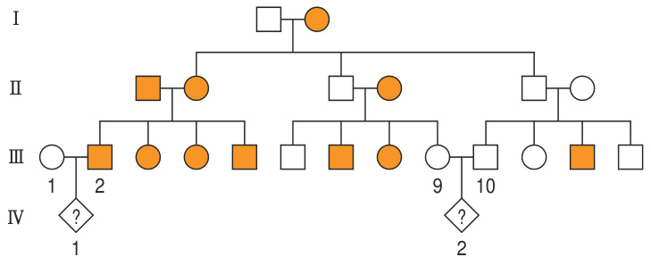  