# 第 20 章 癌症遗传学  

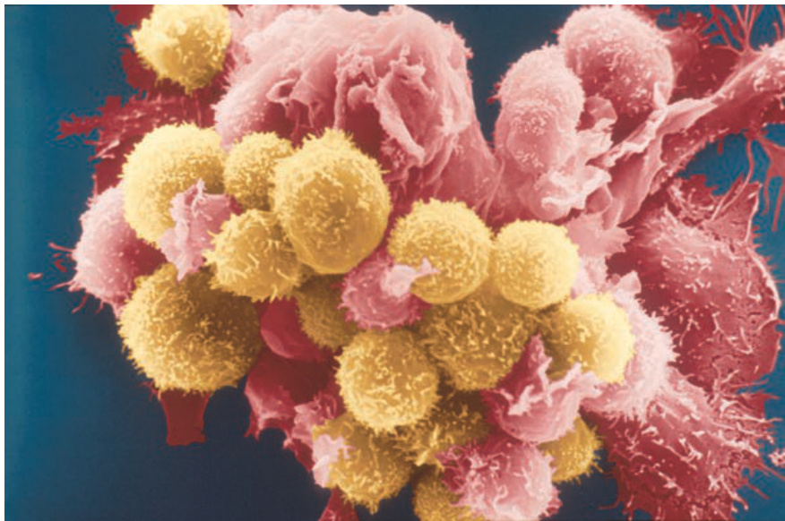  

免疫系统的杀伤细胞（黄色）攻击一个大型癌细胞（粉红色）$\copyright$ Jean Claude Revy, ISM/Phototake.com  

# 章 节 大 纲  

20.1 癌细胞的特征  
20.2 癌症的遗传学基础  
20.3 细胞分裂通常是如何控制的  
20.4 突变是如何导致癌症表型的  
20.5 个性化的癌症治疗  

在生殖细胞系中发生的突变通过配子传递到后代。这些生殖细胞系突变是遗传疾病的原因，也是自然选择进化的基础。但是那些没有传递到下一代的体细胞的突变呢？遗传学家对它们感兴趣吗？在这一章中，你会看到体细胞突变确实会对生物体产生深远的影响，尤其是因为它们是引起癌症的潜在原因。  

癌症不是一种单一的疾病，而是一种具有庞大多样性的疾病，其特征都是细胞不受控制地生长和分裂。有两个原因导致了这种庞大的多样性。第一，引起癌症的体细胞突变可以发生在不同组织的细胞中，产生肺癌、皮肤癌、乳腺癌等（图20.1）。不同的细胞类型对相同的致癌突变有不同的表型反应。第二，不同基因的突变编码不同的蛋白质，这些蛋白质调节细胞分裂，有助于产生癌症。因此，两种肺癌实际上可能是非常不同的疾病，因为它们是由不同的突变引起的。  

人们认识到任何癌症都可能代表一种独特的情况，这就加大了医学科学面临的挑战。然而，在即将到来的廉价、大规模并行的核酸测序时代，癌症治疗将变得更加个性化，从而更加有效。这个想法在概念上很简单：将肿瘤细胞的全基因组序列与同一患者正常细胞的全基因组序列进行比较，可以确定导致这种特定癌症的明显突变。这样的信息可以帮助医生选择现有的药物，或者设计专门针对患者独特的癌症中的缺陷蛋白或生化途径的新药。  

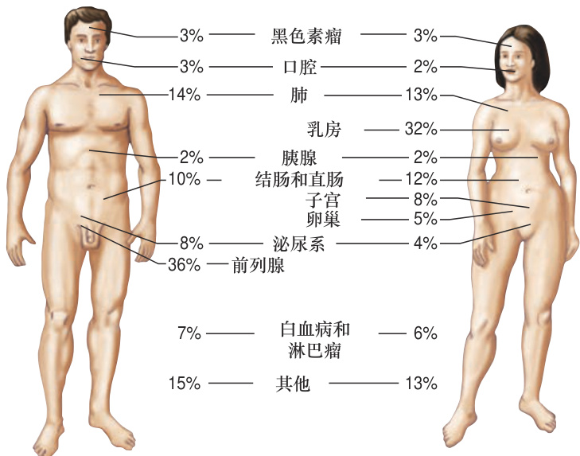  
图20.1　在美国发生在身体不同部位的癌症百分比。影响相同组织的癌症可能有非常不同的起源和效果；例如，不同患者的乳腺癌通常具有独特的性质。  

这一章围绕一个统一的主题进行组织，即癌症实际上是一组具有一些共同特征的遗传疾病。在所有的癌症中，体细胞在多种基因中积累突变，其中许多基因的产物在正常细胞中起着“加速器”或“刹车”的作用。引起癌症的突变要么踩下加速器，要么放松刹车，因此癌细胞以一种快速且不受控制的方式分裂。由其他癌症相关基因编码的蛋白质通常有助于保护细胞DNA，这些基因的突变通过增加加速器或刹车基因的突变率而导致癌症。肿瘤细胞中特定的突变不仅决定了其特定的癌变性质，还决定了肿瘤对特定药物的敏感性。因此，由个性化癌症遗传学这门新科学带来的深刻见解，正在越来越多地指导研究人员针对个别癌症进行治疗。  

# 20.1 癌细胞的特征  

# 学习目标  

1.  讨论癌细胞的行为，区分它们的生长与正常细胞有哪  
些不同。  
2.  解释端粒酶的表达如何有助于癌细胞的永不凋亡。  
3. 列出可能导致癌症的人类基因组的变化类型。  
4. 描述肿瘤如何长到很大并扩散到身体的其他部位。  

肿瘤细胞有许多区别于正常细胞的特性。然而，并非所有的癌细胞都表现出相同的表型变化。  

# 20.1.1 癌细胞逃避细胞的正常生长控制  

从一个细胞（受精卵）形成人体，需要数百万次细胞分裂。这些分裂受到控制，以确保细胞正确地分布到独立的器官和组织中。许多对细胞分裂的控制与在细胞间传递的信号有关。例如，大多数细胞只有在遇到生长因子时才会分裂，如遇到在体内其他部位产生的激素。在另一个例子中，大多数细胞在与其他细胞接触时停止分裂，这种特性称为接触抑制。然而，对细胞分裂的其他控制实际上就是细胞死亡。特别是，大多数细胞通过一个被称为细胞凋亡（或程序性细胞死亡）的过程死亡，当基因组DNA被破坏时，这个过程就会被激活。  

图20.2概述了癌细胞逃避这些控制的方式。有些癌细胞会产生自己的分裂刺激信号——自分泌刺激，或者失去接触抑制。许多癌细胞不会在它们的DNA被破坏时死亡，但是DNA被破坏会引起正常细胞的凋亡。  

# 20.1.2 癌细胞通常具有长生不老的潜力  

除了少数例外（如罕见的干细胞），正常的体细胞要么在培养基中不易生长，要么经历有限的几轮分裂（ $20\!\sim\!50$ ）然后死亡。相反，肿瘤细胞不仅在培养基中生长良好，而且其中许多肿瘤细胞可以无限分裂（图20.3）。这些特征使科学家们相对容易地培育出有用的癌细胞系，这些癌细胞系可以被世界各地进行研究。  

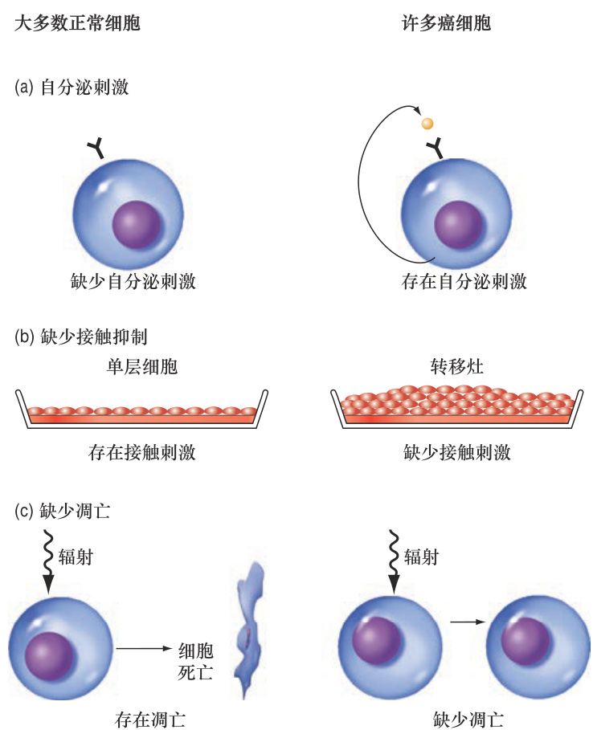  
图20.2　表型变化导致癌细胞不受控制地生长。（a）许多肿瘤细胞在没有正常细胞增殖所需的外部生长信号的情况下可以分裂。（b）正常细胞在相互接触时停止生长，最终它们在培养时形成一个单细胞层。肿瘤细胞失去了这种接触抑制，互相攀附形成了多细胞堆，被称为转化灶。（c）当正常细胞受损时，它们会死于一种叫做程序性细胞死亡或凋亡的过程。许多癌细胞在受到同样程度的破坏时却不会死亡。  

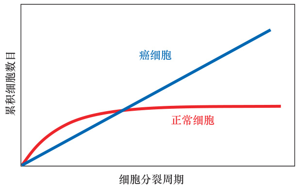  
图20.3　许多癌细胞是永不凋亡的。大多数正常的体细胞在特定数量的细胞分裂后会自动停止生长（红线）。相比之下，肿瘤细胞可以无限分裂（蓝线）。造成这种差异的一个原因是，癌细胞通常会表达端粒酶，而正常细胞则不会。  

肿瘤细胞永不凋亡的原因之一与端粒酶的表达有关。正如第12章讲述的内容，端粒酶可以防止染色体复制时端粒的收缩。大多数正常的体细胞不会产生端粒酶，所以每一个细胞周期，染色体就会从末端失去DNA序列。经过几轮分裂，基本的基因丢失了，所以细胞老化和死亡。相反，大多数癌症细胞表达端粒酶，这一特征与生殖细胞系细胞及一些罕见的干细胞相同。端粒酶在端粒上再生重复序列的新副本，使癌细胞端粒在许多细胞分裂周期中保持大约相同的长度。  

# 20.1.3 一些变化改变了肿瘤与身体的相互作用  

肿瘤的快速生长会抑制周围组织的功能。肿瘤生长需要很多营养物质，但是对癌细胞的营养输送受到局部血液供应的限制。有些肿瘤通过分泌一些物质引起血管向它们生长，进而规避这种潜在的生长限制。对分泌信号做出反应的血管细胞生长称为血管发生［图20.4（a）］。新的血管作为供应线，肿瘤可以通过它来获取新的营养来源。  

许多癌症的致命性在于它们可以扩散到体内的许多部位，从而破坏许多不同的组织。正常细胞被组织或器官周围的膜屏障限制在一个区域内。但肿瘤细胞往往能获得突破这种膜的能力［图20.4（b）］。癌细胞随后可以通过血液循环到远处的组织中，这一过程被称为转移。通过血管发生形成的新血管为转移细胞提供了逃生途径。  

癌细胞与身体相互作用的另外一个不同之处是它们可以逃避免疫监视。人类的免疫系统通常会识别出癌细胞是外来的并攻击它们，从而帮助消除肿瘤，甚至在肿瘤大到足以被检测到之前就被消除（见本章开头的照片）。然而，成功的肿瘤细胞却以某种方式发展出一种能力，可以将自己从免疫系统中屏蔽掉，从而绕过这种保护机制。  

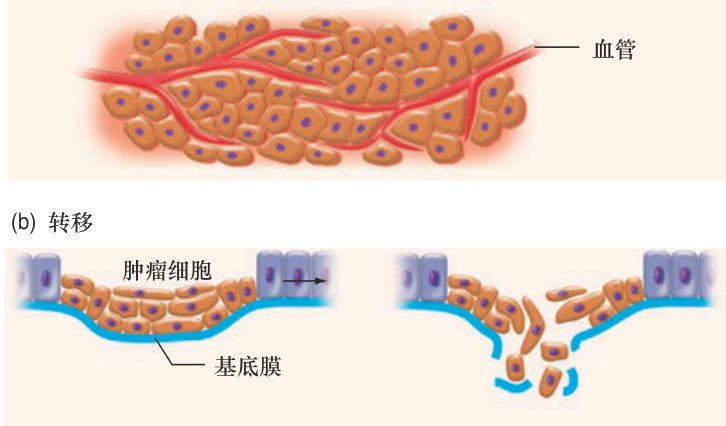  
(a)   
图20.4　使肿瘤生长并侵袭远端组织的变化。（a）肿瘤通过分泌一些物质引起血管向它们生长，为肿瘤提供新的营养物质。（b）有些癌细胞可以穿透特定组织的膜，然后通过血流拓殖远端组织。  

# 20.1.4 大部分癌细胞具有不稳定的基因组  

对于同一个人，许多癌细胞的突变率比正常细胞要高得多。一个主要的原因是，癌细胞修复DNA损伤的酶系统或错配修复系统常常存在缺陷，修复DNA损伤的酶系统是修复由辐射或紫外线等外部介质造成的DNA损伤，错配修复系统是纠正DNA复制过程中核苷酸掺入错误［图20.5（a）］。  

基因组不稳定性的另一个表现是许多癌细胞有主要的染色体畸变［图20.5（b）］。肿瘤细胞的核型通常表现出明显的异常，例如，染色体重排（缺失、复制、反转、易位）、非整倍体，甚至是多倍体。染色体重排就像点突变一样，是DNA复制和修复机制问题的结果。非整倍体和多倍体可能是由有丝分裂装置（如构成中心体的蛋白质、丝粒或纺锤体）的缺陷造成的，这些缺陷会在细胞分裂时导致染色体分配错误。  

某些癌细胞的高突变率不仅是癌症的结果，而且它还加速了导致其他癌症表型的基因突变的发生。在本章后面，我们将讨论在癌细胞中发生突变的基因类型。  

# 基本概念  

$\bullet$ 癌细胞不会对限制正常细胞分裂的控制做出反应，如接触抑制、凋亡信号或生长因子缺失。  
●  由于端粒酶的表达，许多癌细胞可以无限分裂。  
●  晚期肿瘤可刺激血管发生，逃避机体正常免疫防御，转移至其他组织。  
●  许多癌症细胞表现出高度的基因组不稳定性，导致新的突变积累和染色体异常增加，从而导致癌症的其他特征。  

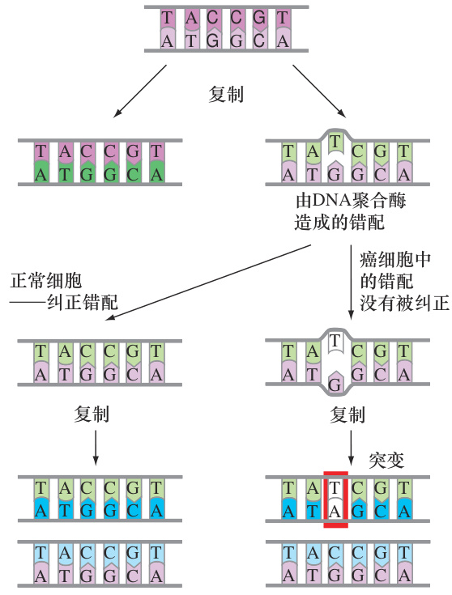  
(a)       DNA   
(b)  

图20.5　癌细胞基因组不稳定性。（a）在许多癌细胞中，修复DNA损伤的酶系统被破坏。结果细胞的突变率大大增加。（b）癌细胞往往具有显示染色体数目异常和许多染色体重排（如易位）的核型。这些核型变化是由缺陷DNA损伤和染色体隔离机制造成的［将这个光谱核型分析与图12.9（b）：Jonathan Landry et al., “The genomic and transcrip-tomic landscape of a HeLa cell line,” G3: Genes, Genomes,Genetics, March 11, 2013, Fig. 3A reprinted courtesy GeneticsSociety of America  

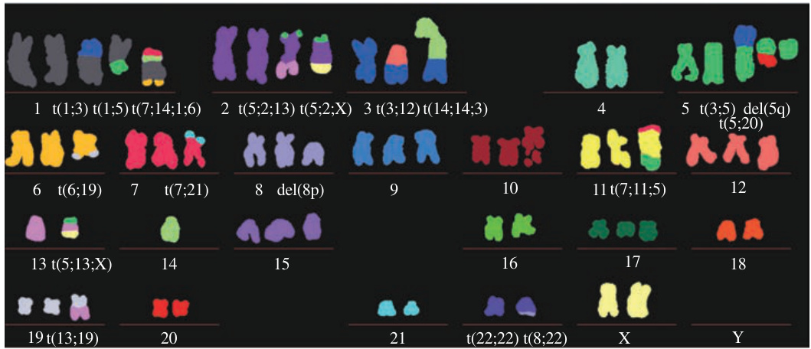  

# 20.2 癌症的遗传学基础  

# 学习目标  

1. 描述目前癌症发生的模型。  
2.  总结癌症是一种遗传性疾病的证据，需要在体细胞谱  
系中获得几个关键基因的突变。  
3. 解释为什么有些人对某些癌症有遗传倾向。  
4.  分析癌细胞增殖与基因组不稳定性之间的反馈循环。  

图20.6总结了我们目前对最终导致癌症恶性细胞事件序列的理解。第一种罕见的突变发生在单个体细胞的基因组中。这种突变可能会带来生长优势，或者它可以使细胞与细胞分裂的正常约束分离，也可能破坏DNA修复机制，从而增加细胞基因组的突变速率。第二种突变发生在这个细胞的有丝分裂后代中。其他具有附加癌变性质的突变相继发生在后代细胞中。一旦这个家族中的一个细胞获得了足够的这种突变，它就会产生一个增殖癌细胞的克隆，这种癌细胞生长和分裂的速度非常快，以至于吞噬了周围的正常组织。随着时间的推移，随着这个克隆体中的一些细胞获得了增加肿瘤恶性程度的其他突变，癌症可能会发展。  

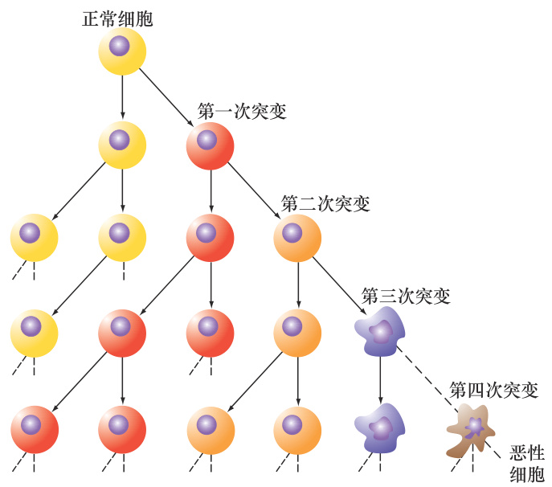  
图20.6　癌症的遗传基础模型。癌症被认为是由增殖细胞克隆中关键基因的连续突变引起的。  

我们现在讨论了几条证据来支持图20.6中概述的假设，即癌症是由细胞谱系中突变的积累导致的，从而产生癌细胞克隆的祖细胞。  

# 20.2.1 癌症包括细胞克隆的增殖  

对女性杂合细胞的X连锁等位基因的检测提供了癌症起源于单个体细胞的证据（图20.7）。从以前的章节可以得知，在雌性哺乳动物中X染色体的失活导致在任何给定的细胞中只表达一个X染色体两个等位基因中的一个。正常体细胞组织的样本几乎总是包含一些母系X染色体被失活的细胞，以及其他一些父系X染色体被灭活的细胞。原因在于，大多数体表组织是由许多克隆细胞组成的，这些细胞来自于个体的早期胚胎细胞，这些细胞随机地灭活了两个X染色体中的一个。一旦形成这种局面，就会通过多轮细胞分裂而得以延续。  

与正常组织相比，女性肿瘤总是只表达一个X连锁基因的等位基因。这一发现表明，每个肿瘤的细胞都是图20.7　肿瘤克隆起源的证据。由于X染色体失活，雌性的每一个细胞只表达一个多态X连锁基因的等位基因。正常的组织通常包含一些表达一个等位基因的细胞，以及另一些表达另一个等位基因的细胞。肿瘤的所有细胞都表达相同的一个等位基因，表明肿瘤起源于单个细胞。电泳区分了基因蛋白产物的两种等位形式。  

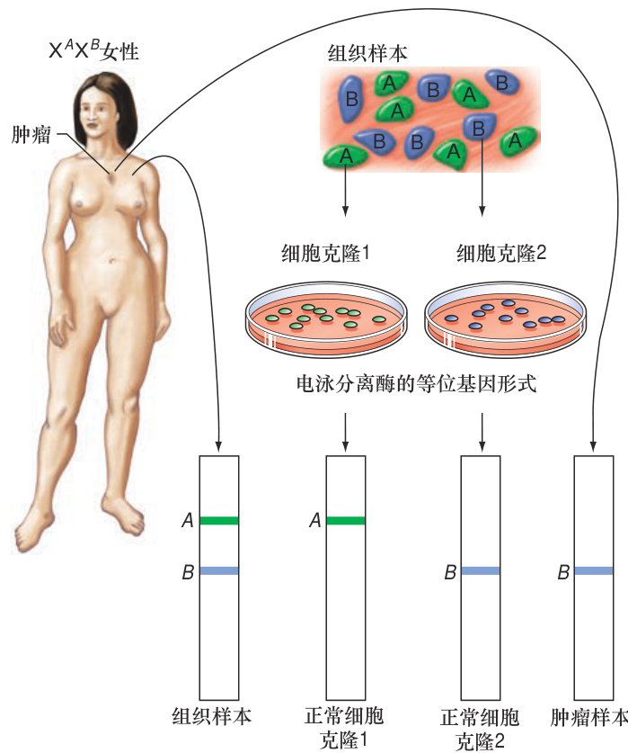  

一个体细胞的无性后代，这个体细胞已经灭活了它的X染色体中的一个，然后又经历了一种罕见的突变，开始了致癌过程。  

# 20.2.2 癌症通常是一种老年疾病  

癌症的发病率随年龄而急剧上升（图20.8）。癌症在老年人中的流行支持了癌症随时间发展的观点，以及一个体细胞的无性繁殖后代中许多突变积累的观点。  

# 20.2.3 环境诱变剂增加了癌症的可能性  

流行病学调查显示，许多环境因素增加了癌症发病率；这些环境因素大部分是诱变剂，由图7.15所示的Ames试验所建立。其中一个如上所述的诱变剂是香烟烟雾。吸烟多年的人比不吸烟的人患肺癌的风险更高，而且他们患病的风险随着香烟的数量和吸烟时间而增加。美国肺癌死亡率的图表显示了吸烟的风险（图20.9）。20世纪40年代，男性肺癌发病率开始急剧上升，但女性肺癌发病率仅在20世纪60年代才开始上升，这反映了吸烟在女性中流行之前就已经在男性中流行了。自1990年以来，男性肺癌发病率显著下降，女性的发病率也有所下降，这反映了公共卫生运动抵制吸烟的有效性。  

图20.9中的数据反映了一个令人关注的的现象：从20世纪20年代男性开始频繁吸烟到40年代肺癌急剧上升之间存在了20年的滞后。暴露于诱变剂和癌症发生之间的延迟是一种常见的现象。这些观察结果表明，必须发生若干突变才能产生癌症，这与之前在图20.6中提出的模型是一致的。  

# 20.2.4 一些已知的突变增加了癌症的易感性  

在大多数疾病中，一级亲属，如兄弟姐妹，甚至同卵双胞胎患同一类型癌症的概率较低。如果一个兄弟姐妹或双胞胎得了癌症，另一个通常不会。产生这些癌症的突变不是通过显性或隐性的生殖系遗传的；相反，它图20.8　随年龄增长的癌症发病率。大多数癌症的发病率随着年龄的增长而急剧增加，这与体细胞突变的积累是一致的。  

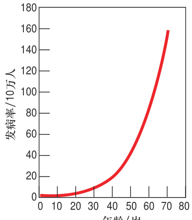  

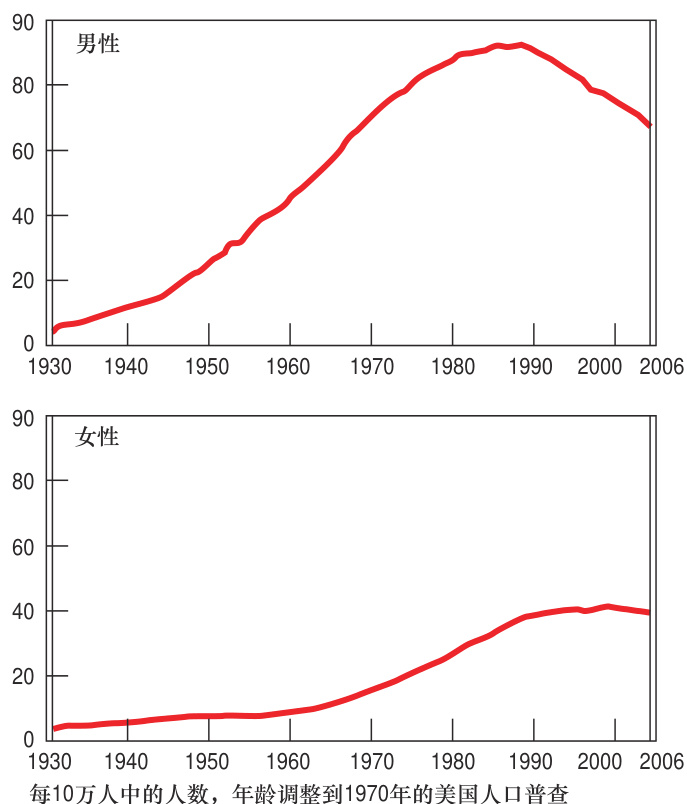  
$1930\!\sim\!2006$   
图20.9　吸烟的致癌作用。美国的男性和女性肺癌死亡率的急剧上升分别开始于20世纪20年代和40年代。这一差异反映了一个事实，即吸烟在男性中流行的时间比女性早大约20年。  

们是由体细胞的随机突变引起的。  

这条规则有一些重要的例外。在一些家庭中，一种特定类型的癌症在许多成员中复发，表明通过生殖系遗传了一种易感性。视网膜母细胞瘤是这类癌症的一个例子，在第5章的“遗传学与社会”信息栏“有丝分裂重组和癌症形成”中描述视网膜母细胞瘤与被称为RB的突变型等位基因相关。  

有趣的是，一些（但不是全部）参与遗传形式癌症的基因编码DNA修复蛋白。例如，携带BRCA1或BRCA2基因突变等位基因的女性患乳腺癌和卵巢癌的风险很高。野生型BRCA1和BRCA2蛋白是修复DNA双链断裂机制的组成部分。  

我们将在本章后面更详细地探讨这些家族性癌症，但是目前可以从一个简单的层面上理解为什么在特定的基因中，遗传突变，如RB、BRCA1或BRCA2会导致个体患上癌症。原因是这些人体内的细胞在癌症发展的过程中已经有了一个开端。这些人的细胞已经在一个与癌症相关的基因中有了突变，所以他们的体细胞在癌变过程中需要的突变积累更少。  

这种遗传倾向的存在清楚地表明，癌症基本上是遗传性疾病。遗传突变等位基因的个体通常不是天生患有癌症，而是随着时间的推移而发展，这一事实再次强调，细胞获得癌症表型需要多个基因的改变。  

# 20.2.5 肿瘤基因组测序揭示了癌细胞的多 重突变  

人类基因组测序技术的最新进展使得对癌症和正常体细胞个体进行基因组测序成为可能。对这些基因组序列的比较揭示了许多在正常细胞中没有发现的癌细胞突变。个体癌症在其基因组积累的突变数量上差别很大，从数百个到数十万个。  

癌症基因组中的绝大多数突变是乘客突变，是由于癌症细胞的突变率增加而产生的，但不会导致癌症。癌细胞基因组中只有少数突变是导致癌症表型的驱动突变。举个例子，一个典型的结肠癌有上千种突变，而这些突变在同一患者的正常细胞中没有发现。只有 $60\!\sim\!70$ 种突变改变了基因的可读框，其中只有 $3\!\sim\!10$ 个可能是驱动突变。  

这些驱动突变有两个关键点。首先，单一的驱动突变本身不足以引起癌症；相反，不同基因中的几个驱动突变必须累积。其次，根据每个癌症的独特性质，来自不同患者的同一组织（如结肠）的癌症积累不同的驱动突变。  

稍后将在此章节中描述各种驱动突变的分子性质，但在这个阶段，你可以猜测其中一些驱动基因会破坏编码DNA修复蛋白的基因的功能。有缺陷DNA修复的细胞增加了突变和其他基因不稳定性的概率，使它们的基因组更有可能在其他基因中积累驱动突变。  

# 20.2.6 细胞增殖和基因组不稳定性之间的反 馈是肿瘤进展的基础  

癌细胞总是在变化，获得越来越多的特性来区分它们和正常细胞。因此，肿瘤进展的现象是：随着时间的推移，肿瘤的生长速度越来越快，对其他组织的侵袭性也越来越强。这一过程是通过某些基因的突变（比如编码DNA修复酶的基因）来加速的，这些突变会导致基因组的不稳定性，从而增加其他基因的突变率。肿瘤细胞中积累的突变和染色体异常的一小部分可以增加细胞增殖的速度，使细胞扩散到身体的其他部位，促进血管生成，并帮助癌细胞逃避免疫监视。  

增加的细胞增殖率和基因组不稳定性通过一个对患者具有破坏性的反馈回路紧密地联系在一起。单是增殖的增加，没有其他变化，只会产生无害的生长，不会危及生命，可以通过手术切除。增殖增加的真正危险在于它提供了大量的细胞克隆，在这种克隆中可以发生进一步的突变，而这些进一步的突变可能导致更快的增殖和最终的恶性肿瘤。克隆体中存在的细胞越多，克隆体中发生罕见突变的可能性就越大——克隆体本身就具有迅速繁殖的潜力。  

# 基本概念  

●  癌症是由于在有丝分裂的体细胞克隆中某些关键基因（驱动突变）的突变积累造成的。  
●  观察结果支持了癌症发生模型，即癌症发病率是随着患者年龄的增长、暴露在诱变剂下，以及随着罕见的遗传突变增加。  
●  细胞增殖和基因组不稳定性的增加形成了一个反馈回路，从而获得额外的癌症促进特性。  

# 20.3 细胞分裂通常是如何控制的  

# 学习目标  

1.  描述以下分子在信号转导途径中的作用：生长因子、生长因子受体、激酶级联和转录因子。  
2.  解释细胞周期蛋白依赖性激酶在调控细胞周期中的作用。  
3.  以p53蛋白为例，总结细胞周期检查点是如何确保基因组稳定性的。  

了解体细胞突变的积累如何导致癌症，首先需要了解正常细胞中细胞周期调控的分子基础。原因在于，与癌症进展有关的突变常常发生在一些基因中，这些基因的蛋白产物控制正常细胞增殖。其中一些蛋白质提供信号告诉细胞何时分裂，另一些则允许从细胞周期的一个阶段进展到一切正常的下一个阶段，当细胞基因组受损需要修复时，一些信号会导致细胞机制放慢。对控制细胞分裂的分子机制的全面阐述超出了这本书的范围，但是我们在这里将讨论一些与本章其余部分相关的要点。  

# 20.3.1 生长因子通过信号转导级联启动细胞分裂  

细胞之间必须相互发出信号，以确保整个身体的协调功能。这些信号告诉单个细胞是分裂、代谢（也就是说，按照程序生成分子），或者死亡。影响细胞增殖和分裂的分子信号称为生长因子。在这一章中，我们关注的是促分裂原——刺激细胞增殖的生长因子。然而，一些生长因子抑制增殖，其他生产因子也可以产生其他效果，这取决于细胞环境。  

当生长因子与在细胞表面发现的生长因子受体接触时，一系列的生化反应，即所谓的信号转导级联发生在细胞内。信号转导级联最终到达细胞核，在那里它激活编码转录因子的基因。转录因子反过来调节一组基因，这些基因的蛋白质产物最终导致细胞分裂或停止分裂。  

# 1. 生长因子  

启动细胞分裂的两种基本信号是细胞外信号和细胞结合信号。  

以类固醇、多肽和蛋白质的形式存在，长或短的距离作用的细胞外信号，统称为激素［图20.10（a）］。例如，大脑脑垂体产生的促甲状腺激素（TSH）会通过血液流向甲状腺，刺激细胞产生另一种激素——甲状腺素，反过来影响新陈代谢。  

细胞结合信号，需要细胞间的直接接触来传递信号［图20.10（b）］，例如，区分个体细胞与所有外来细胞和分子的组织相容性蛋白。免疫系统的细胞通过与其结合的信号来获得关于存在病毒颗粒、细菌和毒素的信息。  

# 2. 生长因子与受体结合  

大多数生长因子，无论是细胞外激素还是细胞结合信号，都是通过结合在接收细胞的细胞膜上的特定受体图20.10　细胞外信号可通过扩散或细胞间接触传递。（a）垂体分泌促甲状腺激素（TSH），通过血液循环进入甲状腺。甲状腺细胞产生另一种激素——甲状腺素，作用于全身的许多细胞。（b）杀伤T细胞通过细胞间的直接接触识别其受病毒感染的目标细胞。T细胞上的受体与一种复合物结合，这种复合物由病毒抗原和受感染细胞表面组织相容性蛋白形成。  

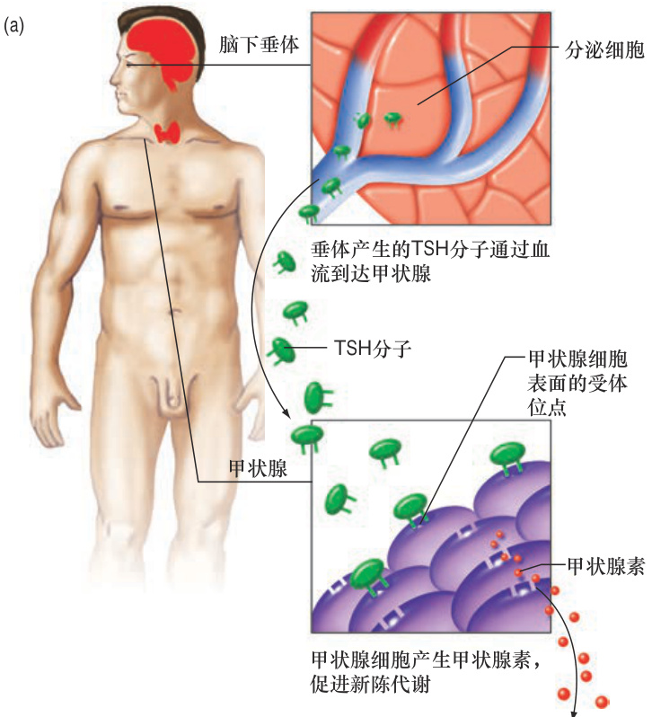  

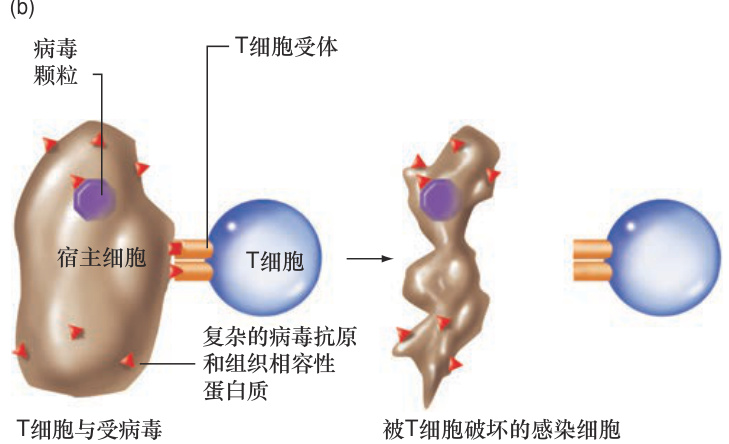  

来传递信息的，这些信息就是细胞会被诱导生长或停止生长［图20.11（a）］。生长因子受体是由三部分组成的蛋白质：细胞外的信号结合位点，穿过细胞膜的跨膜段，将信号（即生长因子结合）传递给细胞内其他蛋白质的区域。  

# 3. 信号转导级联  

负责传递细胞内信号的细胞质蛋白被称为信号转导器。通常，在生化级联中，有几个不同的信号转导器被连接在一起，每个分子通过激活或抑制另一个分子［图20.11（b）］来传递受体的生长因子信号。  

信号转导系统的众多例子之一就是第19章中介绍的Ras蛋白。Ras存在两种形式的分子开关:一种是与鸟苷二磷酸（Ras-GDP）结合的非活性形式，另一种是与鸟苷三磷酸结合的活性形式（Ras-GTP）。一旦生长因子激活了受体，受体的胞内区域通过GTP交换GDP来打开Ras开关（图20.12）。接下来，Ras-GTP激活了一系列称为蛋白激酶的三种酶，它们可以向其他蛋白质添加磷酸基团。链中的第一激酶激活第二激酶，而第二激酶又激活第三激酶。这个由Ras-GTP启动的三重奏被称为MAP（丝裂原激活蛋白）激酶级联。  

# 4. 细胞周期基因的转录调控  

大多数生长因子启动的信号转导级联的最终成分是细胞核中的转录因子，其激活或抑制特定基因的表达，这种基因的产物可以促进或抑制细胞增殖［图20.11（b）和图20.12］。在RAS介导的信号转导中，转录因子与信图20.11　生长因子与受体结合启动信号转导级联。（a）生长因子与嵌入细胞膜受体的胞外结构域结合。（b）这种结合将信号传送到受体的胞内域，而该域又与其他信号分子相互作用。在信号转导级联的末端是转录因子，可以激活或关闭基因的表达。最终的结果是刺激细胞分裂。  

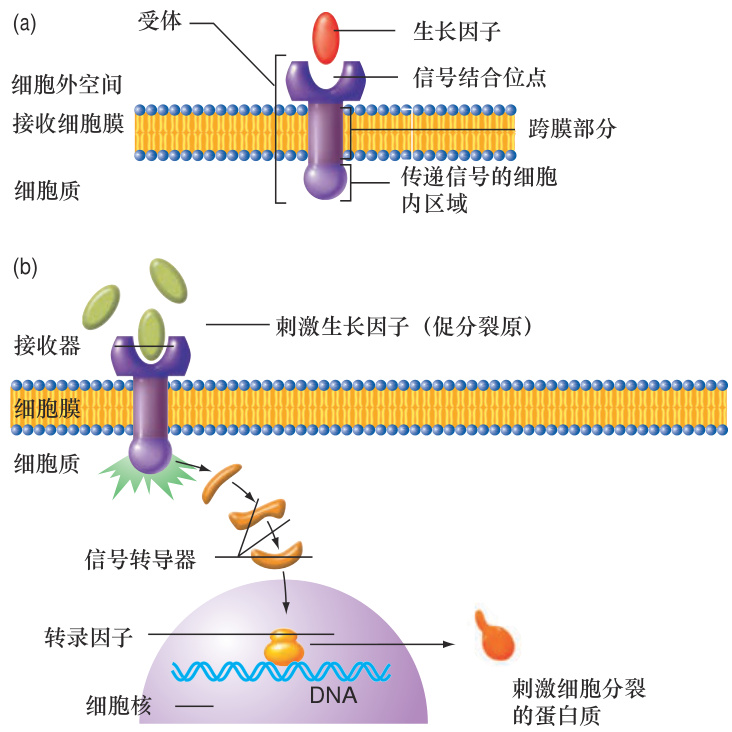  

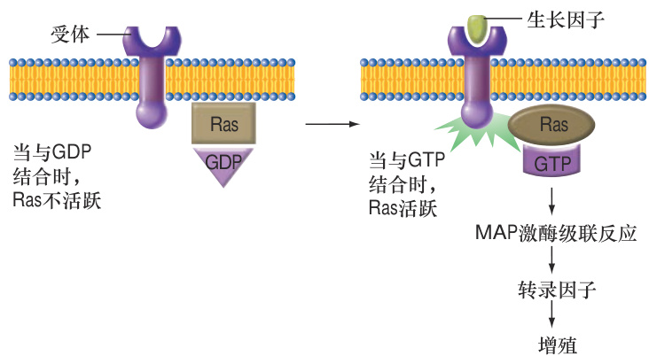  
图20.12　RAS介导的信号转导级联。RAS蛋白是一种细胞内信号分子，当生长因子和与Ras相互作用的细胞受体结合时，它被诱导将结合的GDP（不活跃的）交换成结合的GTP（活跃的）。  

号转导级联之间的联系是：在转录因子被磷酸化后，链中的最终MAP激酶从细胞质转移到细胞核。在细胞核中，MAP激酶磷酸化特定的转录因子，这些转录因子影响细胞周期基因表达。响应生长因子转录激活的重要细胞周期基因类别是下一节中描述的细胞周期蛋白和细胞周期蛋白依赖性激酶。  

# 20.3.2 细胞周期蛋白和细胞周期蛋白依赖性激酶是细胞周期事件的基本驱动力  

细胞分裂需要染色体的复制，以及将复制的染色体精确地划分为两个子细胞，见第4章所述。细胞将这些事件编排为细胞周期的四个连续阶段： ${\bf G}_{1}$ 、S、 $\mathrm{G}_{2}$ 和M（参见图4.9）。简而言之， ${\bf G}_{1}$ 是有丝分裂末期和下一个有丝分裂之前的DNA合成之间的间隙期。在 ${\bf G}_{1}$ 过程中，细胞的体积增大，将材料导入细胞核，并以其他方式准备DNA复制。S是DNA合成或复制的周期。 $\mathrm{G}_{2}$ 是DNA合成和有丝分裂之间的间隙。在 ${\bf G}_{2}$ 期间，细胞准备分裂。M是有丝分裂的阶段，包括核膜的破坏、染色体的浓缩、它们与有丝分裂纺锤体的结合及染色体在两极的分离。在有丝分裂完成时，通过胞质分裂完成细胞分裂。  

蛋白质激酶家族，称为细胞周期蛋白依赖性激酶（CDK），是引导细胞周期从一个阶段过渡到下一个阶段的主要控制元素。顾名思义，CDK只有在与被称为细胞周期蛋白的蛋白质结合后才能发挥作用。CDK-cyclin复合物通过使数百个靶蛋白磷酸化而起作用，这些靶蛋白在细胞周期的特定时间执行特定的功能。这些磷酸化可以激活某些目标蛋白或使其他蛋白失活［图20.13（a）］。CDK-cyclin复合物的cyclin部分指定哪一组蛋白质特定的CDK磷酸化，而复合物的CDK部分则进行实际的磷酸化。  

例如，考虑一个CDK-cyclin复合物在核纤层蛋白上的作用，核纤层蛋白是核膜的内表面蛋白质，并为细胞核提供结构支持［图20.13（b）］。在细胞周期的大部分时间里，核纤层蛋白形成一个不溶性的结构基质。然而，在有丝分裂时，核纤层蛋白变得可溶，从而使核膜溶解。核纤层蛋白溶解度需要磷酸化，抗磷酸化的突变体不溶于有丝分裂。一种特殊的CDK-cyclin复合物，仅在前中期核纤层蛋白磷酸化开始时才被激活。因此，一个关键的有丝分裂事件（核膜的溶解）是由核纤层蛋白的CDK磷酸化触发的。  

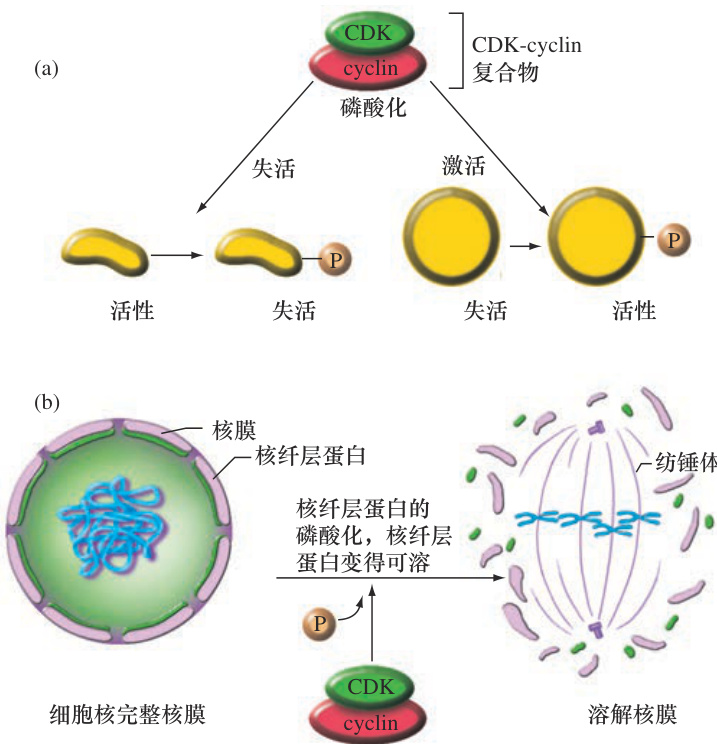  
图20.13　细胞周期蛋白依赖性激酶（CDK）通过磷酸化其他蛋白质来控制细胞周期。（a）CDK与cyclin结合，获得使目标蛋白磷酸化的能力。蛋白质的磷酸化可以使其失活或激活。（b）称为层蛋白的CDK磷酸化负责在前后期溶解核膜。  

“遗传学工具”信息栏“酵母细胞周期突变体分析”讨论了细胞分裂缺陷酵母细胞的研究如何提供了大量证据，证明高度保守的CDK-cyclin复合物是所有真核生物细胞周期进展的关键控制因子。  

# 不同的CDK-cyclin复合物用于不同的细胞周期转换  

不同的CDK-cyclin复合物在细胞周期的特定时间出现（图20.14）。例如，一种CDK-cyclin复合物激活所需的靶蛋白用于在S期开始时的DNA复制；而在M期开始时，如上所述，不同的CDK-cyclin激活核纤层蛋白溶解所必需的蛋白质。  

这些复合物中的cyclin在细胞周期的特定阶段出现。当它们与合适的CDK结合并指出合适的蛋白靶点后，它们就会消失，为后续的cyclin组让路。cyclin出现和消失的周期是两个机制的结果：启动和关闭特定cyclin合成的基因调控，以及在不再需要cyclin时将其降解。cyclin降解是细胞周期调节中最有趣的特性之一，因为导致cyclin降解的分子机制本身被CDK-cyclin激活。因此，细胞周期具有内在的棘轮机制，确保下一个阶段被激活之后当前阶段不可逆结束。  

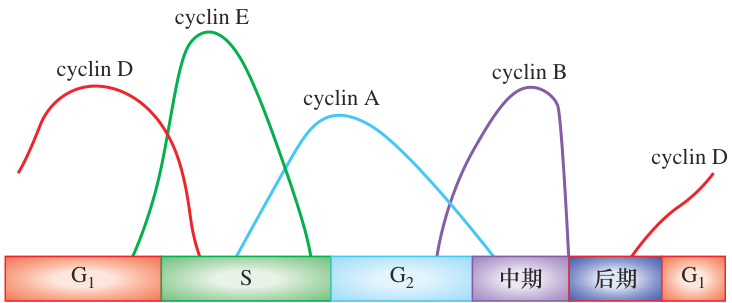  
图20.14　不同的CDK-cyclin复合物控制着不同的细胞周期转换。由各种CDK和cyclin组成的复合物出现在特定的细胞周期阶段，促使细胞进入下一阶段。这些配合物的定期出现和消失是由于在特定的时间合成了特定的cyclin，以及在不再需要它们时cyclin的破坏。  

# 20.3.3 细胞周期检查点确保基因组的稳定性  

对细胞基因组的破坏会导致严重的问题。因此，复杂的机制已经进化到给细胞时间来修复DNA损伤或纠正潜在的隔离错误。这些额外的控制被称为检查点，因为它们在允许细胞继续进入细胞周期的下一个阶段之前检查基因组的完整性。  

在第4章讨论了几个细胞周期检查点的存在。例如，在有丝分裂（M期）期间，一个检查点监视有丝分裂纺锤体的形成和所有姐妹染色单体的适当结合。即使只有一条染色体不能连接到纺锤体上，细胞也不会开始姐妹染色单体的分离或后期染色体的移动，直到正确的连接完成。这个纺锤体装配检查点对于防止有丝分裂子细胞间的非整倍性非常重要。  

在本节中，将重点讨论不同系统的分子机制，即$\mathrm{{G}_{1}}$ -S检查点，确保细胞在破坏了DNA后不会进行 ${\bf G}_{1}$ -S转换。  

# 1. ${\bf G_{1}}$ 期到S期检查点  

当辐射或化学诱变物在G1期中破坏DNA后，DNA复制被延迟。这种延迟给细胞进行DNA合成之前修复DNA留下时间；否则，未修复的DNA复制可能会有许多危险的后果。在讨论检查点过程之前，首先需要了解细胞从G1期正常过渡到S期的一些关键分子信息。  

通过细胞表面生长因子与相应受体结合， ${\bf G}_{1}$ 期中的休眠细胞进入S期。如前所述，细胞表面的这种相互作用引发了信号转导级联，激活转录因子，转录因子激活下游基因组的表达。下游基因编码两个cyclin，即cyclin D和E。因此，在人类细胞 ${\bf G}_{1}$ 期中出现的第一类CDK-cyclin复合物是CDK4-cyclin D和CDK2-cyclin E（图20.15）。  

# 酵母细胞周期突变体分析  

芽殖酵母（酿酒酵母）在识别用来控制细胞分裂的基因方面起着重要作用。三种性质使芽殖酵母对研究细胞周期特别有用。首先，它可以作为单倍体或二倍体生长。隐性突变可以在单倍体细胞中被识别出来，然后可以构建包含两个不同突变的二倍体细胞，从而使科学家能够确定这些突变导致的互补组的数量。  

其次，酵母细胞的形态表明了它的细胞周期状态。在 ${\bf G}_{1}$ 的末端，一个新的子细胞以母细胞表面的芽的形式出现。随着母细胞在分裂周期中的进展，芽的大小也在增加，它在S期小，在有丝分裂期大。因此，芽的大小可以作为细胞周期进展的标志。一个正常的、不同周期生长中的酵母细胞群体包括非出芽细胞以及所有大小的芽的细胞。  

最后，研究人员可以分离出具有基本细胞周期基因突变的芽殖酵母，即使这种突变体是致命的。关键在于找到对温度敏感的细胞周期缺陷突变体。在较低的许可温度下，细胞分裂所需的蛋白质能够正常生长。当温度升高时，突变体中对温度敏感的蛋白质就会失去功能；然后，研究人员可以研究其损失对细胞周期的影响。  

研究人员将注意力集中在对温度敏感的突变体上，这些突变体在允许的温度下生长，得到无芽细胞的种群和各种大小芽的细胞（图A），但是当相同的种群被转移到限制性温度时，这些细胞就有了统一的外观。例如，在图B所示的突变群体中，所有细胞都图A-B： $\copyright$ Lee Hartwell, Fred Hutchinson Cancer Research Center有一个大的芽，表明细胞在有丝分裂过程中被抑制。其他的细胞周期突变体会以不同但统一的形态停止，例如，所有未发芽的细胞。因此，在限制性温度下获得统一的与细胞有关的形态的突变体在细胞周期的特定阶段都有缺陷。  

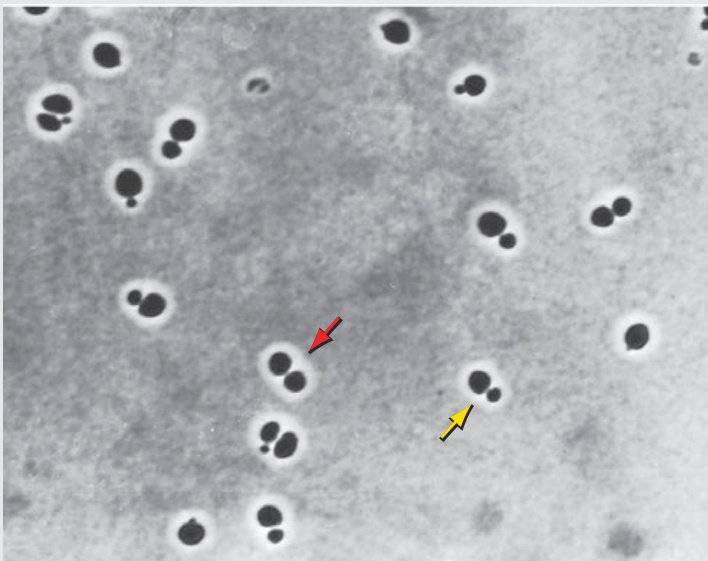  
图A　在允许温度下生长的酵母细胞周期突变体。这些细胞显示各种大小的芽，包括小芽（如黄箭）和大芽（如红箭）。  

酵母菌遗传学家以这种方式鉴定了超过100个细胞周期基因，当遗传学家在其他生物体中鉴定出相关基因时，其中许多基因的显著性就显现出来了。例如，他们发现一种由酵母细胞周期基因编码的被称为CDK1的细胞周期蛋白依赖性激酶。在裂殖酵母（粟酒裂殖酵母）、非洲爪蟾（光滑爪蟾）以及人类身上发现了同源基因。在酿酒酵母和裂殖酵母两种酵母中，CDK1控制一个步骤，使细胞开始新一轮的分裂。青蛙CDK1蛋白参与了CDK-cyclin复合物控制有机体的快速早期分裂。  

值得注意的是，基因交换实验表明，萌芽酵母和分裂酵母的CDK1基因可以在任何一种生物体中相互替代，这表明它们可以编码进行同样活动的蛋白质。非洲爪蟾蜍和人类CDK1编码基因也可以在任何一种酵母中发挥作用。因此，在四种非常不同的生物中，似乎是细胞周期的中心控制元件的基因编码高度保守、功能同源的蛋白激酶。  

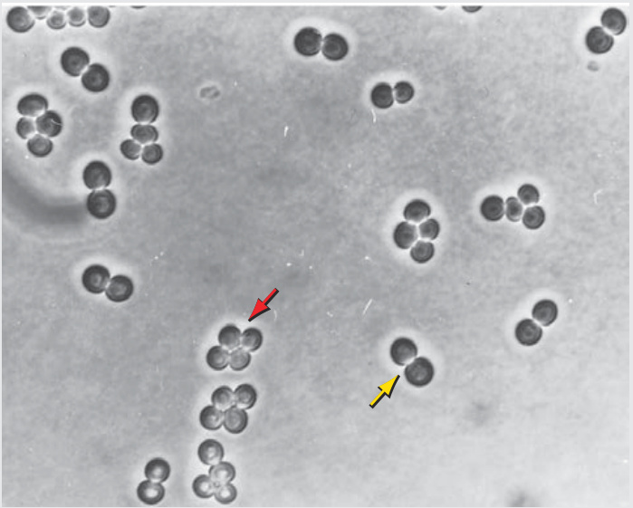  
图B　在限制性温度下生长的酵母细胞周期突变体。在限制性温度下孵育后拍摄的细胞，细胞与图A相同。这些细胞都有一个大的芽（其他细胞周期突变体可能在不同大小的芽或根本没有芽的情况下停止生长）。在细胞周期早期的细胞（图A中的小芽）在第一个细胞周期的温度变化时停止生长（黄色箭头）。在细胞周期后期的细胞（图A中有较大的芽）在易位时完成第一个细胞周期，在第二个细胞周期停止，产生两个大芽细胞团块。  

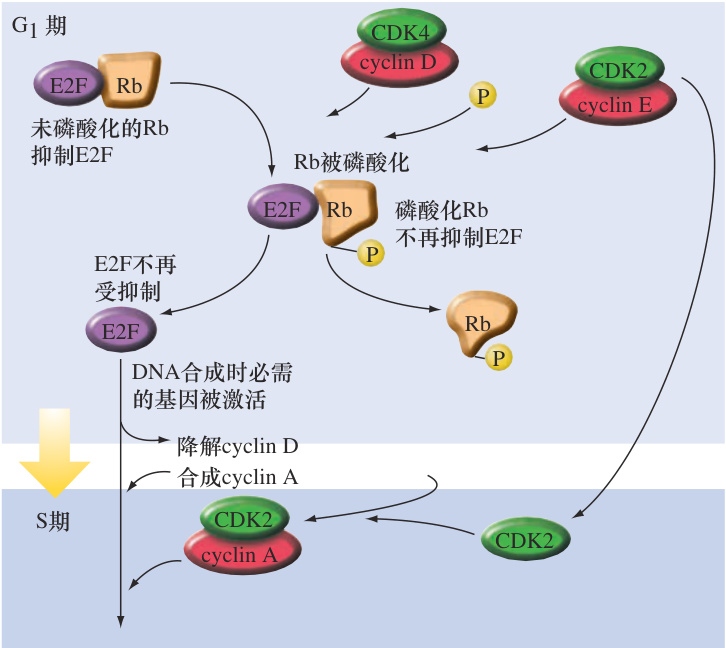  
图20.15　CDK-cyclin复合物如何介导G1期到S期的转变。CDK4复合物与cyclin D结合，CDK2复合物与cyclin E结合，使Rb蛋白磷酸化，促使其与E2F转录因子分离，并激活E2F转录因子。E2F刺激DNA复制所需的许多基因的转录，包括cyclin A的基因。当细胞进入S期时，cyclin D被破坏，形成CDK2-cyclin A复合物并激活DNA复制。  

这两个CDK-cyclin复合物在很大程度上通过磷酸化视网膜母细胞瘤基因（RB）的蛋白产物来启动向S期的转变。未磷酸化的Rb蛋白抑制一种叫做E2F的转录因子，但磷酸化的Rb不能再抑制E2F。当E2F不再受抑制时就可以启动DNA合成所需各种基因的表达。事件链是复杂的，但是从中可以看出，在整体方案中，由于可以产生DNA复制所需要的酶，激活生长因子受体的丝裂原引发细胞从G 期到S期。  

既然已经了解了G1期到S期转换的基础，那么现在就可以讨论确保当细胞损坏DNA时不会发生这种转换的检查点。在哺乳动物中，当细胞暴露于电离辐射或紫外线时，通过激活p53通路在G1期中延迟进入S期（图20.16）。  

p53蛋白是一种转录因子，以多种方式参与 ${\bf G}_{1}$ -S检查点（图20.16）。首先，p53激活CDK抑制剂p21的转录。p21蛋白与CDK-cyclin复合物结合并抑制其活性；具体来说，p21通过抑制CDK4-cyclin D复合物的活性来阻止进入S期。p53的第二个功能是激活编码DNA修复酶的几个基因的表达。  

当细胞在G1期被p21阻滞时，这些酶可以修复DNA损伤。一旦完成，p53通路被关闭，细胞可以进入S期。  

# 2. p53通路和凋亡  

如果DNA损伤足够大，野生型细胞不仅会在 ${\bf G}_{1}$ 中被捕，还会在被称为程序性细胞死亡或细胞凋亡的过程中自杀。在细胞凋亡过程中，细胞DNA降解，细胞核浓缩。垂死的细胞发出信号，吸引吞噬细胞吞噬并破坏它（图20.17）。p53转录因子如果被大量的DNA损伤充分激活，就会激活其蛋白产物，参与细胞凋亡各个方面的基因表达。这个功能构成了p53参与 ${\bf G}_{1}$ 到S检查点的第三种方式（图20.16）。  

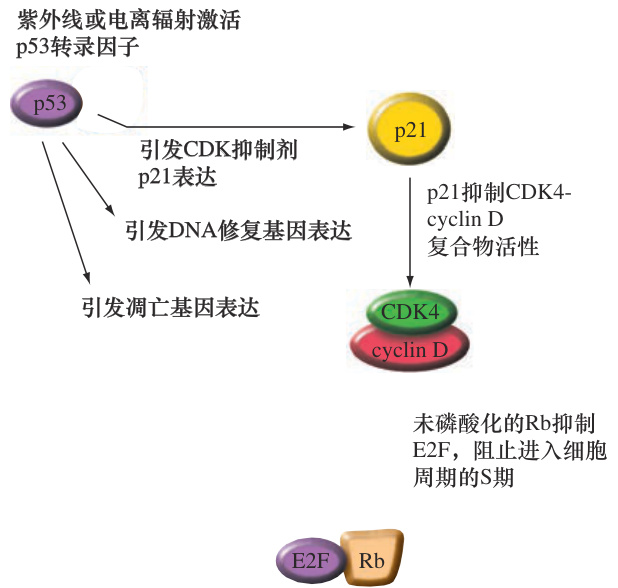  
图20.16　p53通路是G1到S检查点的一部分。DNA受损后激活p53转录因子，进而诱导 $p2I$ 基因的表达。p21蛋白抑制CDK-cyclin复合物，导致G1期停止。激活的p53蛋白也诱导许多DNA修复和凋亡基因的表达。  

对多细胞生物来说，有一种机制可以消除那些遭受了太多染色体损伤的细胞，因为这些细胞的存活和繁殖可能有助于产生癌症。因此，多细胞动物体内，从蛔虫到果蝇再到人类，保存了参与细胞凋亡的蛋白质。  

# 3. 检查点的必要性  

检查点对于细胞分裂本身并不是必不可少的，但是它们对于生物体的健康是必需的。在小鼠和其他动物身  

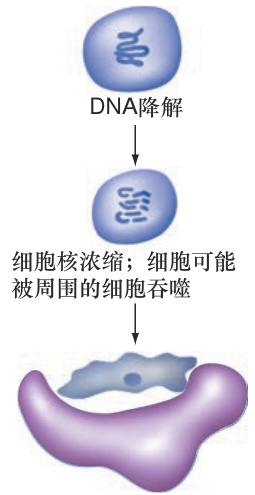  

图20.17　细胞凋亡。如果正常细胞的DNA严重受损，无法修复，细胞将经历程序性细胞死亡（细胞凋亡）。DNA被降解，细胞核浓缩，受损细胞发出信号，吸引吞噬细胞“吞噬”垂死的细胞。许多凋亡蛋白只在p53转录因子活跃时表达上的实验表明，具有缺陷检查点的突变细胞是可以存活的，并以正常速度分裂。然而，这些突变细胞比正常细胞更容易受到DNA损伤。  

检查点有缺陷的细胞的一个共同特征是它们基因组的不稳定性。以G1到S检查点为例，由氧化或其他类型的DNA损伤引起的单链刻痕经常发生。在 ${\bf G}_{1}$ 进入S期之前，细胞通常会修复这样的刻痕。如果协调修复的G1到S检查点不能正常工作，那么复制过程中的单链断裂将产生双链断裂，从而导致点突变和染色体重新排列，如易位。  

在具有缺陷的G1到S检查点的细胞中，染色体不稳定性的另一个表现是基因扩增的倾向：从正常的两个拷贝增加到数百个拷贝。这种放大往往用显微镜都可以观察到，在染色体中被称为同源染色区域（HSR）的放大区域，包含了许多串联重复序列的基因，或缺少着丝粒和端粒的小染色体状体（由于其体积小而被称为双微粒；图20.18）。正常的人类细胞在培养过程中不会产生基因扩增，但p53突变细胞具有很高的扩增率。  

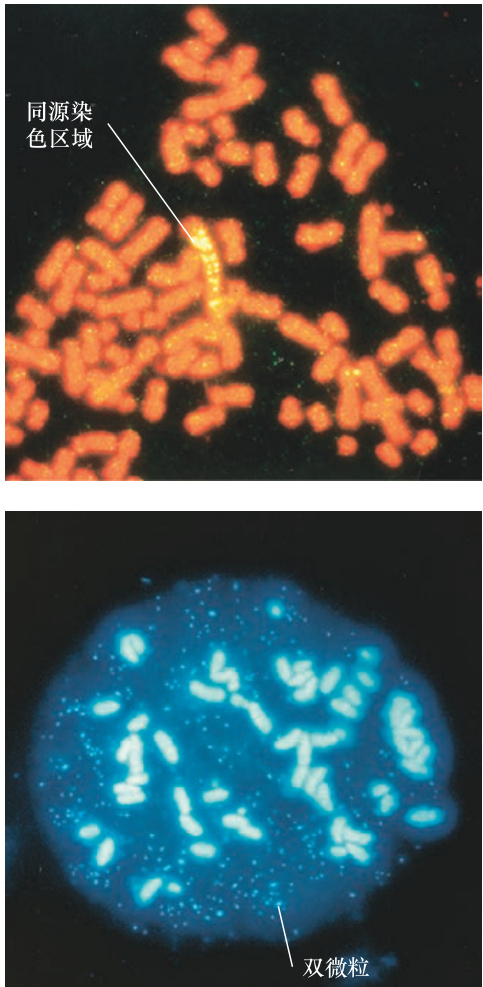  
图20.18 ${\bf G}_{1}$ -S检查点缺陷细胞的基因扩增。带有缺陷检查点的肿瘤细胞常常显示出DNA的放大区域。这些可以表现为同源染色区域（HSR），其中包含一个或多个基因的基因重复序列（左）；或者双微粒，也就是染色体外DNA的小片段（右）。  

# 基本概念  

●  细胞分裂是由生长因子与细胞表面受体蛋白结合而引发的。这种结合引发信号转导级联，信号转导级联激活转录因子控制细胞周期基因的表达。  
●  不同的CDK-cyclin复合物的形成和随后的降解驱动了细胞周期不同阶段之间的转变。  
●  如果DNA受损， ${\bf G}_{1}$ -S检查站阻止细胞染色体复制。p53蛋白是这个检查点的关键组成部分。  

# 20.4 突变是如何导致癌症表型的  

# 学习目标  

1. 区分原癌基因和肿瘤抑制基因。  

2.  解释肿瘤抑制基因的突变如何在细胞水平上是隐性的，但会导致癌症显性遗传倾向。  

导致癌症的突变等位基因通常被称为癌症基因，但这个术语并不恰当，因为所有的癌症基因实际上都是正常基因的突变等位基因。科学家已经发现了100多个基因，这些基因的突变可以促使癌症的发展。  

癌症基因及其相关突变可细分为两个重要的类别。突变等位基因以主导的方式促进癌症的发生被称为癌基因；在二倍体细胞中，一个突变的致癌等位基因足以引起与癌症相关的表型［图20.19（a）］。肿瘤抑制基因中的突变等位基因对癌症发展起到逆行作用。在二倍体细胞中，肿瘤抑制基因的两个拷贝必须是突变体，才能使细胞异常［图20.19（b）］。癌基因和肿瘤抑制基因之间的区别，或许可以理解为类似于控制汽车运动的脚踏板（分别是加速器和刹车）。  

正常的、非突变的癌基因等位基因称为原癌基因，它经常编码细胞周期进展所需的蛋白质［图20.19（a）］。这样，原癌基因就像推动汽车前进的加速器。致癌突变增加了基因表达或提高了基因产物的效率，在给定的时间内，细胞将经历更多的有丝分裂细胞周期。因此，可以把致癌突变看成是对加速器施加更大压力的等效。因此，单个致癌突变在加速细胞分裂方面具有显性的、获得功能的效果（或获得其他恶性特性）。  

相比之下，每一个肿瘤抑制基因的正常拷贝都编码一种蛋白质，这种蛋白质要么减缓细胞分裂，要么防止基因组不稳定，因此，可以将二倍体细胞类比为一辆有两个冗余刹车的汽车。肿瘤抑制基因的突变可能导致癌症，这是功能突变，相当于把脚从刹车上移走［图20.19（b）］。如果一只脚被移开，一个刹车仍然在原地，汽车不会移动；除非双脚都离开刹车，否则什么都不会发生。肿瘤抑制基因的突变在细胞水平上是隐性的，因为肿瘤抑制基因的正常拷贝必须是失活的才能产生效果。当两个等位基因都没有功能时，细胞要么增殖更快，要么以更快图20.19　两种致癌突变。（a）原癌基因（浅绿色DNA）通常编码促进细胞增殖的蛋白质（浅绿色圆圈）。野生型原癌基因的主要功能突变产生癌基因（深绿色DNA）。突变型致癌等位基因是指产生异常蛋白（深绿色星形）或过量正常蛋白（未显示）的超形态等位基因或新效基因。（b）野生型肿瘤抑制基因（红色DNA）编码抑制细胞增殖的蛋白质（红色八角形）或防止基因组不稳定性的DNA修复蛋白。肿瘤抑制基因的隐性功能缺失突变（非晶型或轻型，黑色DNA）在杂合细胞中没有突变表型，而杂合细胞也有野生型等位基因。然而，当第二次突变失活野生型等位基因时，细胞增殖失控或迅速累积突变。  

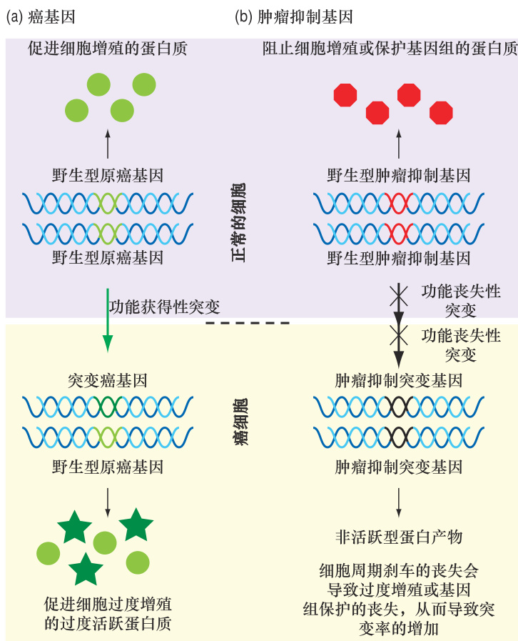  

的速度积累突变，要么两者兼而有之。  

大多数癌症都需要在癌基因和肿瘤抑制基因中积累多种突变。细胞以一种越来越不受控制的方式分裂，加速器越难踩下去，刹车越少。癌基因和肿瘤抑制基因突变被称为癌症的驱动因素，因为它们引发了导致恶性肿瘤增殖和突变的恶性循环。  

# 20.4.1 致癌突变加速了细胞周期  

我们怎样才能找到癌基因的候选者呢？什么样的突变将原癌基因转化为癌基因？原癌基因在正常细胞中起什么作用？致癌突变是如何导致癌症的？我们在这里讨论这些重要问题的最新研究。  

# 1. 通过与肿瘤病毒的联系发现癌基因  

肿瘤病毒是研究癌基因的有用工具，首先是因为这些病毒本身携带的基因很少，其次是因为它们感染培养的细胞，并将其转化为肿瘤细胞，这使得在体外研究它们成为可能。许多在动物体内产生肿瘤的病毒是反转录病毒，它们的RNA基因组在感染细胞后被复制到cDNA中，然后与宿主染色体融合（回顾第8章的“遗传学与社会”信息栏“HIV和反转录”）。偶然的机会，病毒cDNA融合的位点位于宿主细胞基因组的原癌基因附近。罕见的缺失事件可以使病毒cDNA和原癌基因更紧密地结合在一起［图20.20（a）］。之后，当cDNA从宿主染色体转录时，产生的病毒RNA就可以获取宿主原癌基因的拷贝［图20.20（b）］。  

RNA肿瘤病毒至少可以通过三种方式导致癌症。第一，当携带原癌基因的病毒传播时，在原癌基因中可能发生功能突变，将其转化为癌基因。当携带癌基因的病毒感染新的宿主细胞时，癌基因被表达，其异常蛋白产物导致新的宿主细胞异常增殖。第二，原癌基因或纳入病毒基因组的癌基因被置于病毒染色体上强大启动子和增强子的转录控制之下。结果，原癌基因或癌基因以异常高的速率转录，导致蛋白质产物的过度合成［图20.20（b）］。第三，当病毒cDNA在宿主染色体中与原癌基因［如图20.20（a）所示］结合时，同样强大的启动子和增强图20.20　癌基因和反转录病毒。（a）双链病毒cDNA很少与宿主基因组中的原癌基因结合。cDNA中强大的启动子导致原癌基因过度表达。（b）高度致癌的反转录病毒的例子。偶尔，一个相邻的原癌基因（如src、myb、fes或rel）会被“捕获”——也就是被整合到病毒基因组中，成为一个癌基因。U3、R、U5、gag、pol（反转录酶基因）和env是反转录病毒染色体的一般特征，包括上图中没有癌基因的弱致癌病毒。  

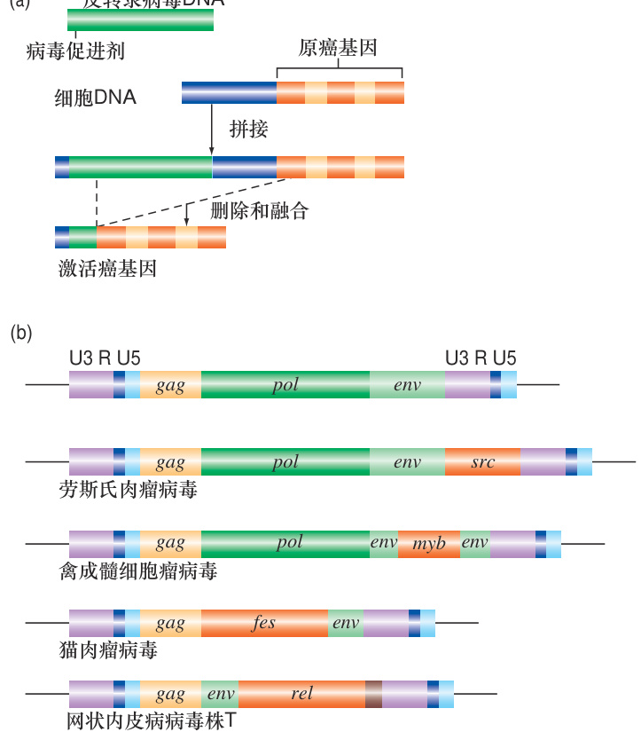  
(a) DNA  

子会提升原癌基因的转录，再次导致原癌基因编码蛋白的过量。  

对引起各种动物肿瘤的反转录病毒的分析导致了许多已知的癌基因的发现。科学家们只是简单地寻找携带在小病毒基因组中的癌基因，或者在病毒cDNA整合位点旁观察反转录病毒诱发的肿瘤基因组。  

# 2. 通过细胞转化法发现癌基因  

科学家们还使用了另一种非常不同的策略来识别其他癌基因。研究人员从肿瘤细胞中分离出DNA，并将培养中的非癌细胞暴露在肿瘤DNA中。如果非癌变细胞获得含有完整癌基因的肿瘤DNA片段，其中一些将转化为能够产生肿瘤的细胞。这种效应是由于癌基因在原非癌细胞基因组中的正常原癌基因中占主导地位。  

图20.21展示了这种方法是如何被用于识别人类癌症中的癌基因的。科学家们从人类肿瘤中分离出基因组DNA，将DNA分割成基因大小的片段，然后将DNA添加到非癌变的小鼠细胞中。这些细胞中有一些吸收一个癌基因，失去接触抑制，并在培养皿中形成转化灶。转化灶的细胞在注射到小鼠体内时，通常会产生肿瘤。然后，研究人员通过发现转化灶中的人类DNA，确定了负责小鼠细胞转化的人类癌基因。这可以通过寻找被称为Alu序列的邻近转位因子（SINE）来实现，该序列只出现在人类基因组中，而不出现在小鼠基因组中。通过这种方式识别的癌基因，就像在肿瘤病毒研究中发现的那样，癌基因是正常细胞原癌基因突变的变异等位基因，这些基因突变为异常活跃的形式。  

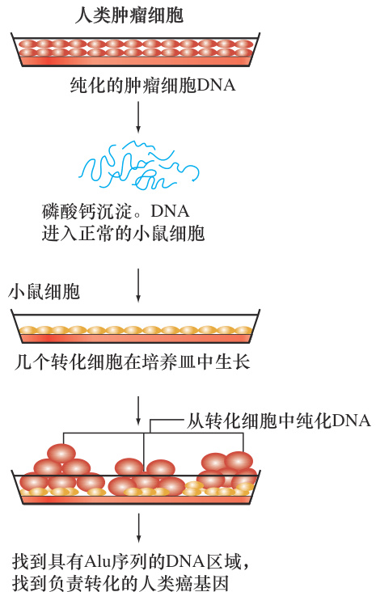  

图20.21　肿瘤细胞DNA中的癌基因。从一些人类癌症中分离出来的DNA将正常的小鼠细胞转化为癌细胞，失去接触抑制，形成转化的病灶。通过寻找与癌基因相邻的人类特异性Alu序列，可以从转化细胞的DNA中识别出人类癌基因。  

# 3. 癌基因如何导致癌症  

从刚才讨论的两种实验方法中我们知道了几十种癌基因。在大多数情况下，相应的原癌基因在正常细胞增殖所需的信号转导通路中发挥作用。许多不同类型的诱变事件可以将正常的原癌基因转化为促进癌症的癌基因，但所有这些突变都具有某种功能获得、显性（多态或新形态）效应。  

在这里讨论三个重要的例子来说明这些观点。  

Ras　Ras基因的几个致癌等位基因是编码Ras蛋白的点突变体，这些突变体经常（从构成上讲）以GTP激活的形式存在。其中一个这样的突变等位基因就是$R a s^{G I2V}$ ，在第19章讨论过（图19.7）。携带结构活性Ras癌基因的细胞通过自己产生的自分泌信号来区分是否存在生长因子［图20.22（a）］。  

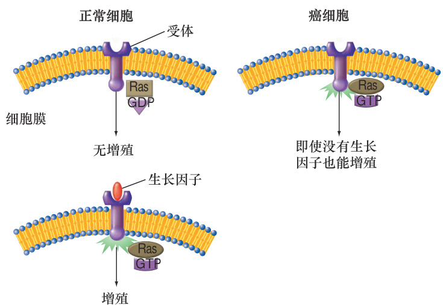  
(a)   Ras   
(b) Her2  

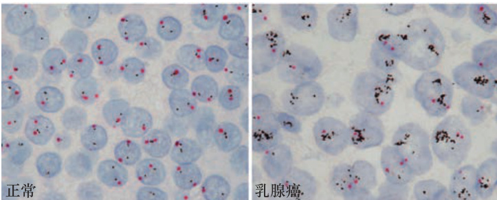  

图20.22　癌基因突变的例子。（a）Ras基因中的某些位点突变编码了被锁定在GTP激活形式中的Ras蛋白。（b）Her2基因在乳腺癌细胞中（右）多重双叶神经元染色体上扩增，而在正常细胞中（左）没有扩增。在FISH的分析中，红点表示17号染色体中丝粒（正常细胞和大多数肿瘤细胞中有两个），而黑点表示Her2基因（正常细胞中有两个，肿瘤细胞中有很多）。  

（b）引自：Nitta et al. (2008), “Development of automated brightfeld double In Situ hybridization (BDISH) application for HER2 gene and chromosome 17 centromere (CEN 17) for breast carcinomas and an assay performance comparison to manual dual color HER2 fluorescence In Situ hybridization (FISH),” Diagnostic Pathology, 3:41, Fig. 3A-B. $\copyright$ Nitta et al. Licensee BioMed Central Ltd. 2008. http://diagnosticpathology.biomedcentral.com/articles/10.1186/1746-1596-3-41  

c-Abl　关于染色体重排的第13章描述了许多患有慢性粒细胞白血病的患者的癌细胞基因组是如何包含了染色体9和染色体22之间的一个易位，这个易位融合了一个被称为c-abl的基因和另一个被称为bcr的基因（见图13.16）。融合基因是编码混合蛋白的癌基因。蛋白质的c-Abl部分是酪氨酸激酶，它在其他蛋白质的酪氨酸中添加磷酸基。这种酶参与某些生长因子诱导的信号转导通路。  

正常细胞密切调控c-Abl蛋白的活性，大部分时间能阻断其功能，但在环境中生长因子的刺激下激活其功能。相比之下，bcr/c-abl编码的融合蛋白在携带易位的细胞中不容易受到调控。与致癌Ras蛋白类似，Bcr/c-Abl蛋白即使是在没有生长因子的情况下也始终是活跃的。  

Her2　大约 $20\%$ 的乳腺癌患者会过度表达人类表皮生长因子受体2（Her2）。顾名思义，这种蛋白质是生长因子受体家族的成员，但目前它被称为孤儿受体，因为激活它的生长因子尚不清楚。细胞膜中Her2蛋白的拷贝过多的细胞会激活信号转导通路，从而导致不恰当的分裂。  

在某些Her2阳性细胞中，蛋白质的过度表达反映了Her2基因拷贝数的大幅增加。如图20.22（b）所示，Her2的额外拷贝通常出现在微小的双微粒染色体上。这一发现强烈地表明，癌细胞的有丝分裂祖先必须首先在编码DNA修复酶的基因中或者像p53这样的DNA损伤检查点的组成部分积累突变。这样的突变可以放大基因组的某些区域，偶尔放大其中一个包括Her2基因的区域。  

这些Her2阳性的乳腺癌特别具有侵袭性，但是我们将在后面的章节中看到，针对Her2蛋白本身的药物可以有效地治疗许多这样的癌症。  

# 20.4.2 肿瘤抑制基因的突变会释放细胞周期的制动，或者破坏基因组的稳定性  

一些突变的肿瘤抑制基因是隐性等位基因，这些基因的正常等位基因有助于细胞分裂，如在晚期分化细胞或DNA损伤的细胞中。这些基因的一个野生型拷贝显然产生了足够的蛋白质来调节细胞分裂。只有当两种野生型拷贝丢失时，才会释放出对扩散的抑制（制动）［图20.19（b）］。其他肿瘤抑制基因编码DNA修复蛋白，失去这两个正常等位基因可以增加突变率，并在其他癌症基因中产生驱动突变。  

# 1. 通过系谱和基因组分析发现肿瘤抑制基因  

研究人员通过对具有特定类型癌症遗传易感性的家族进行基因组分析，或通过分析特定的染色体区域（在特定的肿瘤类型中可重复删除），识别出数十个肿瘤抑制基因。  

视网膜母细胞瘤提供了这样一个识别过程的例子。  

视网膜母细胞瘤是视网膜中感知颜色的视锥细胞癌，在发生侵袭之前很容易诊断和切除［图20.23（a）］。视网膜母细胞瘤是可以在人类家族遗传中占主导地位的几种癌症之一［图20.23（b）］。大约一半的父母患有视网膜母细胞瘤的孩子会患上这种疾病。  

许多患有视网膜母细胞瘤的人的正常、非癌组织的核型显示在13号染色体的长臂上存在杂合性缺失；也就是说，患者携带一个正常的和一个部分删除的13q拷贝。这些患者癌变的视网膜细胞对于相同的13号染色体缺失是纯合子，在非癌细胞中是杂合子。尽管不同患者缺失的13q大小和位置不同，但它们都缺失了13q14条带。  

这些观察结果表明，13q14条带包含一个基因，这个基因可以抑制视网膜母细胞瘤的发展。 $R B$ 是这个基因的符号。患者正常组织中的杂合细胞携带一个野生型等位基因（ $R B^{+}$ ）的拷贝，这个拷贝阻止细胞癌变。但是，缺失的肿瘤细胞纯合子不携带任何 $R B^{+}$ 的拷贝，没有它，肿瘤细胞就开始了失去控制的分裂。  

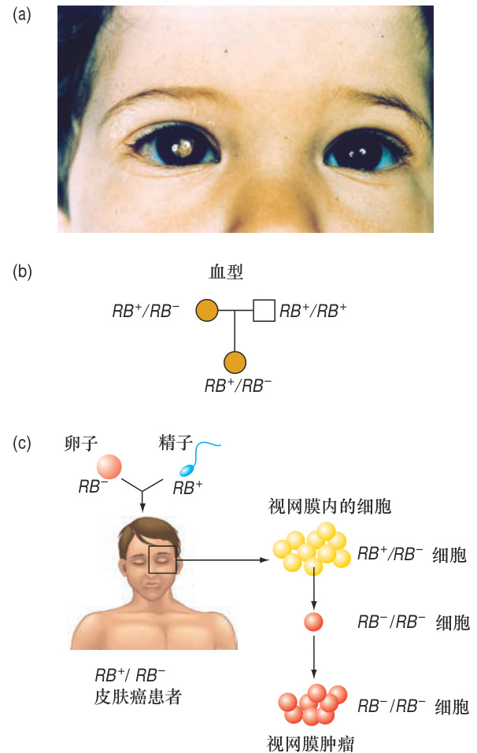  

图20.23　肿瘤抑制基因的突变在细胞水平上是隐性的，但在机体水平上是显性的。（a）患有视网膜母细胞瘤的儿童。（b）表明单个 $R\!B^{-}$ 等位基因的遗传主要导致个体发生视网膜母细胞瘤的谱系。（c）对于一个RB+/RB–的人，单个视网膜细胞的基因组失去剩余的 $R B^{+}$ 会导致视网膜母细胞瘤。像这样第二次失去 $\cdot R{B}^{+}$ 的事件是罕见的，但是视网膜包含了如此多的细胞，以至于这样的事件可能会发生在其中的一个或多个细胞中。  

遗传学家利用他们对视网膜母细胞瘤遗传的理解找到了RB基因。他们通过寻找与遗传条件相关的所有缺失中丢失的13q14的DNA序列来定位携带该基因的总体区域。然后他们通过表征一个非常小的缺失来识别特定的基因，这个缺失只影响到一个转录单元——RB基因本身。这个基因编码调控细胞周期中的许多蛋白质中的一个，如图20.15所示。因此，RB符合我们对肿瘤抑制基因的定义：这个基因决定的蛋白质有助于防止细胞癌变。当一个RB缺失的杂合细胞失去剩余的RB基因拷贝时，癌症就会发生。  

视网膜母细胞瘤遗传学的这幅图提出了一个令人困惑的问题：如果RB基因的缺失对野生型 $R B^{+}$ 等位基因是隐性的，那么视网膜母细胞瘤的性状如何以显性方式遗传？答案是，在生物体水平，RB缺失是显性的。原因是，在成千上万的视网膜细胞中，其中至少一个细胞缺失RB的可能性非常大，随后的遗传事件将禁用剩余的单个 $\cdot R B^{+}$ 等位基因，导致一个含有肿瘤抑制基因的突变细胞［图20.23（c）］。然后这个细胞失控地增殖，最终产生一个癌细胞的克隆（参见第5章的“遗传学与社会”信息栏“有丝分裂重组和癌症形成”）。  

在杂合细胞中，许多不同种类的罕见事件会破坏剩余的 $R{B}^{+}$ 等位基因。所有这些事件都产生了杂合性丢失，因为它们把 $R B^{-}/R B^{+}$ 细胞变成了 $R B^{-}/R B^{-}$ （图20.24）。$R B^{+}$ 拷贝本身可能会被删除或遭遇失活点突变。携带$R B^{+}$ 的染色体可能会因为不分离而丢失。有丝分裂重组或基因转换可将从父母遗传的同源染色体中的 $R B^{+}$ 等位基因替换为 $R B^{-}$ 突变或删除。  

一个假说认为癌症需要两个独立的攻击来破坏肿瘤抑制基因的等位基因的功能，这一假说得到了一个事实的有力支持，这个事实是诸如视网膜母细胞瘤之类的癌症具有散发性和非遗传性的形式。与遗传性视网膜母细胞瘤相比，散发性视网膜母细胞瘤通常发生在生命的后图20.24　导致 $R B^{+}/R B^{-}$ 个体体细胞杂合性丢失的事件。 $R B^{+}$ 作为常染色体隐性突变，通过生殖系遗传。在体细胞分裂过程中， $R B^{+}$ 等位基因的后续变化会产生一个克隆的细胞纯合子或半合子的非功能性RB 等位基因。单亲二倍体指的是细胞中染色体的两个拷贝来自单亲。产生具有单亲二倍体的细胞需要两个事件：第一个事件可能是一条染色体的丢失，第二个事件可能是另一条染色体的重复。  

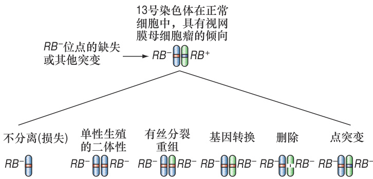  

期。此外，大多数散发性视网膜母细胞瘤患者的一只眼睛中只有一个肿瘤，而许多遗传型的患者有多个肿瘤可以影响两只眼睛。散发性视网膜母细胞瘤是罕见的（而且发展过程比遗传性疾病要长得多），因为它们在细胞克隆过程中需要两个连续的、独立的攻击。相比之下，具有遗传 $R B^{-}$ 突变的人的细胞只需要一次额外的攻击就可以失去这个肿瘤抑制基因的功能。为什么RB的缺失比其他肿瘤抑制因子的缺失对眼睛的影响更大还不清楚。然而，暴露在紫外线下可能是 $R B^{-}/R B^{-}$ 杂合子发展成视网膜母细胞瘤的原因之一。  

$R B^{+}$ 的两个拷贝的丢失是一个关键的驱动步骤，它可以启动导致癌症的恶性循环。在这个循环中，随后发生的基因变化会产生癌基因或破坏其他肿瘤抑制基因的功能，增加克隆细胞的致癌潜能。  

# 2. 肿瘤抑制基因突变是如何导致癌症的  

肿瘤抑制基因的正常拷贝编码具有三种相互关联功能的蛋白质：  

●  一些肿瘤抑制基因产物蛋白质作为基本细胞增殖机制的固有部分，尽管它们的作用是消极的（也就是说，减缓细胞分裂）。  
●  某些肿瘤抑制基因产物，作为细胞周期检查点的组成部分。  
●  其他野生型肿瘤抑制基因编码酶，参与DNA损伤修复或当DNA损伤太大时促进细胞凋亡。  

下面的例子说明了一些分子机制，从肿瘤抑制基因的功能缺失突变到癌症易感性的增强。  

Rb　图20.15表明，未磷酸化的野生型Rb蛋白通过抑制E2F转录因子，将细胞周期进展延迟到S期。在RB /$R B^{-}$ 细胞中没有Rb功能，E2F不能被抑制。因此，细胞在准备好生长因子之前或没有生长因子的情况下进入S期。  

p53　我们之前看到p53蛋白对于 ${\bf G}_{1}$ 到S的检查点是必不可少的（见图20.16）。p53蛋白，也就是检查点，在野生型细胞中被应激条件激活，如DNA中存在单链断裂（缺口）。p53的活化诱导了基因组合的表达，其产物： $\textcircled{\scriptsize{1}}$ 阻断了CDK-cyclin复合物的作用； $\textcircled{2}$ 帮助修复DNA损伤； $\textcircled{3}$ 促进细胞凋亡。  

在 $p53^{-}/p53^{-}$ 细胞中，这些事件都不会发生（图20.25）。带有 DNA 损伤的细胞继续进入 S 期。当染色体复制时，单链断裂转化为双链断裂，从而导致了许多染色体重排的发生。带有这些受损基因组的细胞不会像它们应该的那样死于凋亡。  

BRCA1和BRCA2　BRCA1和BRCA2（乳腺癌1和乳腺癌2）编码修复DNA双链断裂机制的蛋白质成分。这些突变中的任何一种女性杂合子在她们一生中患乳腺癌或卵巢癌的风险都远远高于平均水平。如果一个细胞失去了BRCA1或BRCA2的剩余正常拷贝，突变率就会增加，最终产生新的驱动突变，从而导致恶性肿瘤。科学家们还不明白为什么这种特殊的DNA修复系统的缺失会比其他组织对乳腺和卵巢细胞的影响更大。  

  
图20.25　失去p53功能导致基因组不稳定。p53转录因子可以维持细胞DNA中的单链断裂，在没有p53转录因子的细胞中：$\textcircled{\mathrm{1}}{\mathrm{p}}21$ 没有被诱导，因此细胞进入S期； $\textcircled{2}$ DNA修复酶的基因没有转录，因此，在DNA复制时，单链断裂被转化为双链断裂，从而导致突变和染色体不稳定； $\textcircled{3}$ 未诱导凋亡基因，因此DNA损伤的细胞不会像它们应该的那样死于凋亡（未显示）（与图20.16对比）。  

# 基本概念  

●  通常原癌基因编码的蛋白质参与依赖生长因子的信号转导通路。癌基因是原癌基因的主要功能突变等位基因，即使在没有生长因子的情况下也能激活这些通路。●  肿瘤抑制基因的正常等位基因编码的蛋白质在细胞周期中具有制动器的作用，进而维持基因组的稳定。  

肿瘤抑制基因的功能缺失突变在细胞水平上是隐性的，因为只有当两个正常的拷贝都丢失时才能导致癌症的发生。具有肿瘤抑制基因突变拷贝的个体具有癌症的显性遗传倾向，因为肿瘤抑制基因的剩余野生型拷贝极有可能在至少一个细胞中丢失。  

# 20.5 个性化的癌症治疗  

# 学习目标  

1.  解释药物如格列卫®和赫赛汀®如何选择性识别癌基因的产物。  
2.  讨论如何生产抗癌药物来抵消肿瘤抑制基因突变的影响。  
3.  总结目前针对个体化癌症治疗的方法。  

癌症一直困扰着人类；图20.26显示在古埃及保存的木乃伊中发现了前列腺癌。古老的纸莎草卷轴中显示，早在公元前1500年，埃及医生们不仅发现了癌症，而且还试图通过手术或将热火棍刺入肿瘤中来切除肿瘤。如今，外科手术仍是治疗癌症的主要方法，而放射治疗则是现代版的“热火棍”杀死癌细胞的方法。这些技术可能是有效的，但是它们有很大的局限性。有些肿瘤位于身体非常危险且无法触及的部位。不是所有的癌细胞都可以被杀死或移除，尤其是当肿瘤已经转移到其他组织时。  

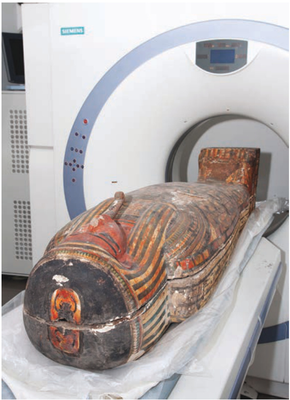  
图20.26　2000年前木乃伊的X射线断层摄影所发现的前列腺癌。Science Press Picture, $\copyright$ Siemens AG, Munich/Berlin  

20世纪40年代，医学科学家开始探索化疗，也就是说，用杀死癌细胞的药物来治疗患者。这些化学物质直接作用于细胞增殖所需的生化途径。一些化学疗法破坏DNA复制，而另一些则阻止有丝分裂纺锤体的形成。这种方法已经取得了显著的成功，但是存在一个主要的问题，因为我们的身体一直需要细胞更新，正常分裂的细胞对于化疗试剂的易感程度可能只是略弱于快速分裂的癌细胞。因此，化疗需要一种微妙的剂量平衡来杀死癌细胞，而不是杀死患者。即使治疗成功，对患者的副作用也可能是严重的。  

# 20.5.1 大多数新的抗肿瘤药物针对的是癌基因的产物  

我们对癌症分子基础的日益了解表明，新的、特异性更好的治疗方法的副作用更小。将原癌基因转化为癌基因的转变意味着癌症细胞具有独特的分子特性，可能成为药物的靶标。癌基因的蛋白产物要么不同于相应的原癌基因产物，要么是癌基因表达了更多的相同蛋白。  

因此，生物化学家可以设计出专门与致癌驱动蛋白结合的药物，使其失活，从而减缓癌细胞的增殖，与人体免疫系统一起或动员人体免疫系统杀死表达这些蛋白质的细胞。我们在这里通过描述药物说明这两种策略。  

# 1. 致癌蛋白失活：格列卫®  

如前所述，融合bcr/c-abl基因是一些慢性骨髓性白血病的重要原因，因为它编码的异常蛋白酪氨酸激酶在没有生长因子的情况下始终是活跃的。制药公司已经开发出一种叫做格列卫 的药物，特异性抑制融合蛋白酪氨酸激酶部分（ $c$ -abl编码的部分）的酶活性。要使激酶发挥作用，它必须与ATP结合，从ATP获得一个磷酸基，并将其转移到其他蛋白质。格列卫 被设计为与Bcr / c-Abl激酶的ATP结合位点相结合，阻止ATP与其结合，从而灭活致癌蛋白（图20.27）。  

在临床试验中， $98\%$ 的癌症患者携带了融合基因，他们的白血病血细胞完全消失，正常白细胞恢复。在这些患者中，只有 $5\%$ 在试验开始5年后死于白血病。这种药物现在是治疗慢性粒细胞白血病的标准治疗方法，也是一种新型癌症治疗的模式，这种治疗方法在不伤害健康细胞的情况下应用于癌症细胞。  

# 2. 生长因子受体的单克隆抗体：赫赛汀®  

相当一部分乳腺肿瘤在细胞表面过度表达Her2生长因子受体。在细胞外的Her2蛋白的位置使得攻击这种癌症的策略成为可能。科学家开发出了一种叫做赫赛汀 的单克隆抗体，可以紧密结合细胞外Her2蛋白的一部分。  

赫赛汀®与Her2的结合根据推测可以有两个效果（图20.28）。首先，Her2受体结合到赫赛汀®，不能开始信号级联，该步骤正常是由Her2与相应的生长因子的相互作用启动，结果，赫赛汀®治疗的Her2阳性细胞不会扩散。其次，赫赛汀®与Her2受体的结合动员被称为杀伤T细胞的免疫系统细胞针对癌细胞并最终摧毁它们。  

在大规模临床试验中，赫赛汀®对于Her2阳性乳腺癌有相当好的疗效，手术后或经过标准化疗的癌症复发可能性减少为 $25\%\!\sim\!50\%$ 。药物不是绝对有效的一个原因是，癌细胞可以很容易获得新的突变让它们对赫赛汀®具有耐药性，例如，不适当的突变激活了同一个信号转导通路的后续步骤。  

  
图20.27　格列卫®：作用机制。bcr/c-abl融合基因的产物是一种蛋白酪氨酸激酶，将磷酸基从ATP转移到许多底物蛋白。格列卫®与酶的ATP结合位点紧密结合，阻止了激酶功能。  

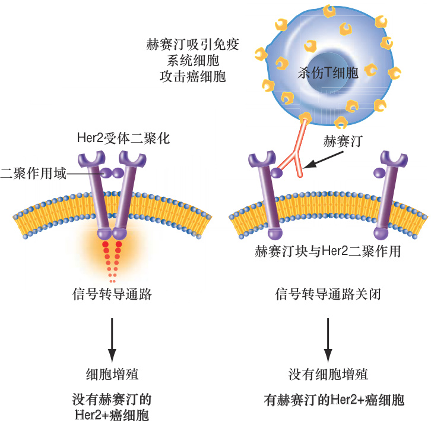  
图20.28　赫赛汀®：可能的作用方式。这种药物是一种与某些癌细胞表面的Her2蛋白结合的单克隆抗体。赫赛汀 与Her2结合阻止受体亚单位二聚化，从而阻断生长因子启动的信号级联。赫赛汀®与Her2的结合也将杀伤T细胞导向癌细胞。  

# 20.5.2 针对没有功能性肿瘤抑制基因细胞的一些化学疗法  

药物开发更多地关注癌基因而不是肿瘤抑制基因。原因是癌细胞缺乏一种或多种肿瘤抑制基因的功能拷贝，因而缺少DNA修复或有丝分裂的检查点所需的因素。因此，没有一种蛋白质可以被药物直接靶向。此外，科学家还没有设计出有效的基因替换方法，将肿瘤抑制基因的野生型拷贝添加到没有这些基因的癌细胞中。  

然而，如前所述： $\textcircled{\scriptsize{1}}$ 许多肿瘤抑制基因产物参与DNA修复机制和DNA损伤检查点； $\textcircled{2}$ 在许多细胞中，过度的DNA损伤导致程序性细胞死亡（凋亡）。这些事实表明了一个自相矛盾的观点：许多癌细胞应该对增加DNA损伤的分子非常敏感，因为肿瘤细胞不能有效地修复这种损伤，因此更有可能死于凋亡。  

这个假设似乎是正确的，至少对某些癌症是如此。例如，PARP抑制剂阻断了一种叫做聚ADP核糖聚合酶（PARP）的作用。这些抑制剂可以有效地治疗许多乳腺癌，这些乳腺癌在肿瘤抑制基因BRCA1中出现功能缺失突变。PARP酶是用来治疗DNA中单链断裂的。如果断裂缺口没有修复，当DNA在S期复制时，它们就会变成双链断裂。BRCA1蛋白有助于修复双链断裂。  

当使用PARP抑制剂治疗时，BRCA1阴性乳腺癌细胞比正常细胞更容易死亡，因为这种药物会产生单链断裂，在高增殖的癌细胞中，单链断裂会转化为双链断裂。这些双链断裂将在缺乏BRCA1蛋白的细胞中积累。如果这些BRCA1阴性癌症细胞的基因组有足够的双链断裂，它们就会通过细胞凋亡自我毁灭。  

你可能已经意识到，对于某些肿瘤，PARP抑制剂可能是完全错误的治疗方法。这些药物增加了基因组的不稳定性，因为它们阻止细胞修复单链断裂，这种不稳定性将导致新的癌症相关突变的积累。关键问题是导致细胞凋亡的生化途径能否在肿瘤细胞中发生。如果这些通路仍然运行，过量的DNA损伤将导致癌细胞死亡。如果没有，DNA损伤可能会增加基因组的不稳定性，并可能恶化临床结果。因此，医生们需要知道很多关于特定癌症的具体突变。正如我们在下一节看到的，癌症基因组测序提供了这类关键信息。  

# 20.5.3 未来的治疗方法将针对个体癌症量身定制  

对于某些癌症，相当简单的测试可以预测（尽管有些不完美）肿瘤是否可以用现有的化疗药物治疗。例如，慢性粒细胞性白血病患者癌症细胞的细胞遗传学分析可以表明bcr/c-abl融合基因的存在，表明癌症可能会对格列卫 有反应。类似地，如果乳腺肿瘤的分析结果表明，细胞表面含有过量的Her2蛋白，那么医生可能会用赫赛汀®治疗患者。  

# 1. 肿瘤细胞的全基因组测序：一个案例研究  

不幸的是，这种简单的测试往往会对许多癌症患者产生负面影响。下一步要做什么？这就是全基因组测序的意义所在。如果你能确定一个肿瘤中细胞基因组的整个DNA序列，并将其与同一患者的正常细胞的完整基因组序列进行比较，你就可以精确地确定癌基因中的一个或多个驱动突变，和（或）与癌症有关的肿瘤抑制基因。这些知识反过来可能会让医学科学家了解治疗患者特定癌症的可能方法。我们在这里描述一个案例研究，展示了癌症基因组测序的前景和潜在缺陷。  

这种方法的首批临床试验之一涉及一位名叫BethMcDaniel的妇女，她患有严重的Sezary综合征，这是一种罕见的T细胞淋巴瘤（一种特定免疫系统细胞的癌症），对标准治疗没有反应。科学家们对麦克丹尼尔女士唾液中的正常细胞和肿瘤细胞进行了全基因组测序，发现了大约18 000个差异。其中大部分不太可能对细胞增殖产生任何影响。然而，一个突变揭示了一个有希望的候选者。在癌症基因组中，两个基因CTLA4和CD28融合在一起。这两个基因的产物都是免疫细胞表面的受体蛋白。配体与CTLA4受体的结合激活了抑制细胞生长和分裂的信号转导通路，而不同配体与CD28受体的结合激活了其他信号转导通路，这些信号转导通路对于刺激细胞增殖具有反作用。  

科学家们假设融合的CTLA4/CD28基因可能逆转了正常的信号转导模式。指导正常的T细胞停止生长的抑制信号将与融合蛋白的CTL4A部分结合，但这种结合将通过蛋白质的CD28部分激活细胞增殖，从而导致癌症表型。如果是这样，那么阻断抑制配体和融合受体的CTLA4部分之间的相互作用的治疗可能会阻止癌细胞的生长。  

针对CTLA4受体的被称为Yervoy®的单克隆抗体已经被开发用来治疗黑色素瘤（皮肤癌）。医生指导Mc-Daniel太太服用Yervoy®，最初的结果非常好。几周后，癌症的许多迹象消失了，她开始恢复正常生活的各个方面。不幸的是，缓解时间很短，几周后，癌症复发，她很快就去世了。  

癌症基因组测序的成本正在迅速下降，因此这种个性化癌症研究正越来越多地为患者所接受。在最近的几个病例中，癌症细胞中关键突变的识别所提示的药物治疗效果已被证明更为持久，但正如后续章节所解释的那样，即使在这些病例中，癌症复发仍然是一个严重的威胁。  

# 2. 寻找驱动突变和可使用药物的目标  

考虑到癌症通常会导致肿瘤抑制基因的功能突变，破坏DNA修复机制，因此癌症细胞累积数千甚至数万个基因突变，将其基因组与同一个人的正常细胞区分开来并不令人惊讶。研究人员如何确定导致癌症表型的特定驱动突变？  

一些关键的突变可能会从癌症基因组序列中立即显现出来，而在成千上万种可能性中仍然很难发现其他突变。影响氨基酸序列的已知癌基因和肿瘤抑制基因是最明显的候选者。截止到本书撰写的2016年，已经发现了47个癌基因和70个肿瘤抑制基因。然而，由于这些列表无疑是不完整的，因此必须考虑改变任何基因编码序列的突变（错义、无义、移码、重新排列），即使基因的功能尚不清楚。  

增加癌基因转录或降低肿瘤抑制基因转录的调控突变显然也具有潜在的重要性，但在癌细胞的全基因组序列中还很难找到。“编码”项目（参见第17章）绘制了人类基因组中的增强子和绝缘体等调控元件，在某些情况下，研究人员能够精确定位改变癌症基因转录的调控突变。目前更普遍有用的是cDNA的深度测序（即RNA-Seq），它可以帮助发现癌症相关基因，这些基因的表达受到调控突变的影响，即使突变本身没有被识别出来。  

全基因组测序并不是能够立即治愈所有癌症的万灵药。从苹果电脑公司创始人史蒂夫·乔布斯（Steve  

Jobs）和著名作家兼记者Christopher Hitchens那里获得的癌症细胞基因组，没有显示出任何能有效治疗癌症的线索。在这些病例中，研究人员没有发现他们癌症基因组中的驱动突变。但是，即使在癌症基因组中发现了感兴趣的突变，许多突变都是无成药性，这意味着对抗突变影响的药物策略还没有被开发出来。  

# 3. 癌症缓解和复发  

Beth McDaniel的病例研究表明，缓解中的癌症可以重新出现，有时会很快出现。有些癌细胞可能会逃避治疗，无论是外科手术还是新的靶向化疗。即使只有少数这样的细胞存活下来，它们的增殖潜力也非常巨大，以至于癌症可以重新出现。  

最近观察了来自同一肿瘤不同区域的细胞的全基因组序列的研究工作表明了癌症复发的一个重要原因。有些肿瘤是异质的，因为肿瘤内的不同细胞有不同的基因组。肿瘤基因或肿瘤抑制基因中的某些突变对肿瘤中的所有细胞都很常见，而有些则不然。  

根据癌症涉及细胞克隆中突变积累的假设，这些发现是有意义的。常见的突变是在克隆的有丝分裂增殖早期发生的突变，而特定于癌细胞亚群的突变是最近发生的。显然，最有效的癌症治疗方法将针对常见突变，但如果不对肿瘤中许多细胞的基因组进行测序，就很难判断哪些突变是常见的。  

# 4. 癌症景象和未来展望  

几个大型项目，包括由美国国家卫生研究院（NIH）资助的癌症基因组图，目前正在表征数千种癌症的整个基因组/外显子。这些研究发现了复发的突变模式，将癌症细分为临床可能相关的组。例如，2012年发表的一项研究将乳腺癌分为四类，它们的性质非常不同。然而，这些癌症基因组计划的结果也强调了每个肿瘤基因组如何包含一组独特的突变。  

图20.29总结了178例肺鳞癌的基因组与来自同一病人的正常DNA相匹配的结果。有些基因，如p53抑癌基因，在这些癌症中有很高的比例是突变的，但不是全部。某些其他肿瘤抑制基因和某些癌基因的突变在这些癌症中出现的频率相对较高。但图20.29只说明了一部分。在178例癌症病例中，表中没有显示的其他癌症相关基因突变只出现在少数病例中。此外，许多鳞状癌的基因组含有染色体重排，包括肿瘤抑制基因的缺失和肿瘤基因的扩增。  

这些大规模测序项目揭示的癌症领域的一个重要教训是，影响不同组织的特定癌症可能比同一组织的两种癌症更具有潜在的突变相似性。例如，某些乳腺癌的突变模式比其他类型的乳腺癌更类似于许多卵巢癌。这些发现意味着，用于治疗一种癌症的药物有时可能对治疗不同器官的癌症非常有效。事实上，之前的案例研究图20.29　对178例肺鳞癌的分析。每一行都代表来自不同患者的肿瘤。这些彩色矩形表示特定基因的碱基置换（列），对基因的编码区域或拼接有不同的影响（颜色）。特定基因突变的患者的百分比在最底层（例如， $81\%$ 的人在编码 $p53$ 的TP53基因中有突变）。所有显示的基因都是肿瘤抑制基因，除了PIK3CA和NFE2L2（癌基因）、NOTCH1（一些肿瘤中是癌基因，在其他肿瘤中是抑制基因）和HLA-A（帮助调节肿瘤免疫监测）。未列出的是在这178个肿瘤中仅有一两个发现的已知癌症相关基因的罕见突变。  

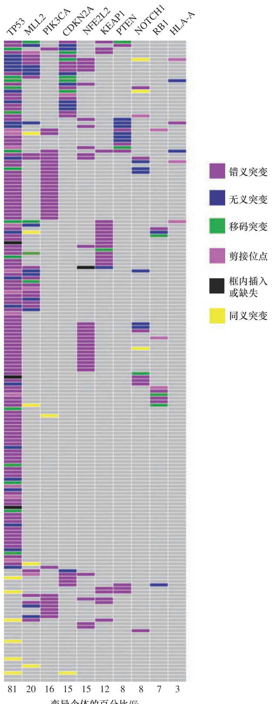  

恰恰说明了这一点。Yervoy®是一种针对皮肤癌症的药剂，但它对McDaniel太太的T细胞淋巴瘤有显著的效果（即使是临时的）。  

这对未来是一个充满希望的消息。癌基因和肿瘤抑制基因的数量是有限的，相对少数的（几十个）基因的突变显然是导致许多被认为是完全不同的癌症的原因。靶向化疗如格列卫®、赫赛汀®和Yervoy®，如果它们被适当地用于通过其肿瘤突变特征选择的患者，则可能比以前想象的更有用。  

# 基本概念  

●  以癌基因编码的突变蛋白为靶点的几种抗癌药物。●  其他药物利用了许多癌细胞对DNA损伤特别敏感的事实，这种损伤是由缺乏检查点或DNA修复蛋白造成的。●  癌细胞的全基因组测序有助于确定个体肿瘤中特定突变组的治疗方法。  

# 接下来的内容  

本章的遗传学工具证明，编码CDK1的基因是最重要的细胞周期控制蛋白之一，在酵母、青蛙和人类不同的生物体中高度保守。在第19章中，你看到eyeless/Pax-6/Aniridia基因，其产物是眼睛发育的主要调节因子，在许多不同的分类群中也是非常保守的。在这两种情况下，基因保守的证据不仅限于核苷酸对和氨基酸的相似性，而且还包括交换实验的结果，表明一个物种的基因可以在功能上替代不同物种的相应基因。  

尽管这两个基因的保守性很强，但酵母、青蛙和人类无疑是非常不同的生物体，表现出高度不同的形态和行为。在进化过程中，一些基因的变化必然比Cdk1或eyeless/Pax-6/Aniridia更多。进化创造并保留了生物体在其环境中发现的问题或机会的遗传解决方案，但进化也使得这些解决方案能够产生新的结果。  

进化不是发生在个体生物体中的个体基因水平上，而是发生在多代变化的群体环境中，以及由许多基因的相互作用决定的表型。为了理解推动最终产生不同物种的遗传变化的进化力量，我们将重点转移到本书的下一部分，从调查一个生物体中一个基因的活性到长期研究整个群体中的基因传递（第21章），以及分析由多个基因支配的复杂性状（第22章）。  

# 习题精解  

Ⅰ.  一种验证特定基因是癌基因还是肿瘤抑制基因的常见方法是使用基因工程来改变小鼠的基因组，并确定基因工程改造过的小鼠是否会患上肿瘤并死于癌症。接下来的两个图显示了这些实验的结果。在实验1中，小鼠有一个基因A或基因B的单基因拷贝，或两个基因的单一基因拷贝。在实验2中，小鼠为纯合子或杂合子，用于基因C的敲除。  

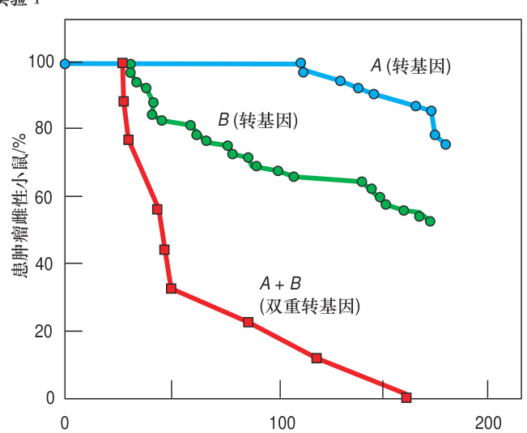  
1   
/d  

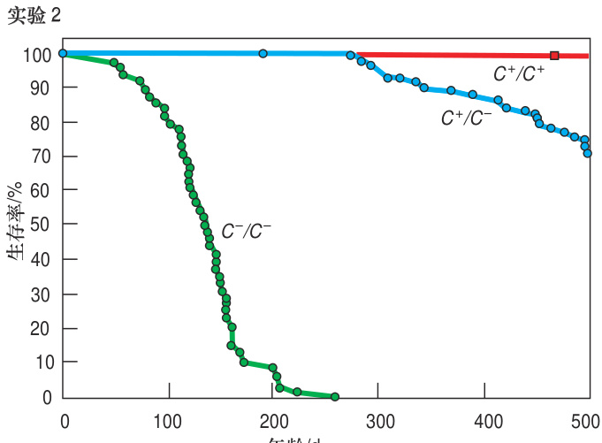  
/d  

a.  A、 $B$ 、 $C$ 基因，哪些是癌基因，哪些是肿瘤抑制基因？解释你的推理。  
b.  你能从A和B的双重转基因小鼠对肿瘤特别敏感的结果中推断出什么？  
c.  为什么C基因敲除的杂合子小鼠的存活率比 $C^{+}/C^{+}$ 小鼠低，但敲除的存活率却比纯合子高得多？  
d.  纯合子敲除小鼠如何在出生后存活？  
e.  你对两只携带了A转基因小鼠的后代有什么预测？（注：雌性小鼠在出生后6周左右性成熟，雄性小鼠在8周左右性成熟）  
f.  对两只敲除了C基因的杂合子小鼠的后代，你有什么预测？  

# 解答  

回答这个问题需要知道，将原癌基因转化为癌基因的突变在促进癌症方面具有显性作用，而肿瘤抑制基因中的癌相关突变在细胞层面是隐性的，但在生物体层面是显性的。  

a.  基因A和B是癌基因。任何一个基因的单一转基因拷贝都能促进肿瘤的生长，所以转基因具有显性作用。基因C是一种肿瘤抑制基因。当基因C的两个野生型拷贝被敲除时，癌症的易感性就特别明显。  

b.  这两个转基因癌基因具有协同效应的事实，与癌症的产生涉及多个基因突变的积累这一观点是一致的。  

c.  按前面所述，只有当肿瘤抑制基因的两个副本都被灭活时，癌的性质才会出现。敲除的纯合子没有功能拷贝，因此会在生命的早期发展成癌症。敲除的杂合子会产生一个剩余的 $C^{+}$ 拷贝，但是这些杂合子最终会在第二次敲除一个或多个细胞的拷贝后死于癌症。注意，后一个结果表明，单个敲除等位基因的遗传在生物体水平上是诱发癌症的主要方式。  

d.  纯合子敲除后的小鼠在出生后仍然存活，因为突变必须在几个癌基因和肿瘤抑制基因中积累，才能产生癌症，而不仅仅是在这个肿瘤抑制基因中积累。注意，这种肿瘤抑制基因对于细胞的存活不是必要条件。  

e.  1/4的后代不会遗传任何跨基因的拷贝，所以它们在正常的生命周期中不会出现或出现很少的肿瘤。有一半的后代遗传了一份转基因的基因，因此它们的肿瘤发展速度与它们的父母相同（实验1中的蓝线），1/4的后代将是纯合子基因。这些动物可能表现出和它们的父母一样的肿瘤发生率，或者根据跨基因的分子特性表现出更快的肿瘤发生率。  

f.  1/4的后代不会遗传任何基因敲除的拷贝，所以它们会正常存活。一半的小鼠会继承一份基因敲除，所以它们的生存能力应该像实验2中的蓝线。剩下的1/4是转基因纯合子，因此它们的存活率与实验2中的绿线相似。  

Ⅱ.  本文描述了几种带有RNA基因组（反转录病毒）的致癌病毒。一些致癌病毒反而有DNA基因组；其中一种病毒叫做SV40。感染SV40病毒的小鼠组织培养细胞失去正常生长控制，并发生转化。如果转化后的细胞转移到小鼠体内，它们就会长成肿瘤。负责这种转化的SV40蛋白被称为T抗原，它被发现与细胞蛋白p53相关。如果融合到高表达（强）启动子的p53基因转染到组织培养细胞中，细胞就不会再被SV40感染而转化。  

a.  提出一个假说来解释p53的高表达是如何阻止细胞被T抗原转化的。  

b.  你已经决定检测p53蛋白的功能域，通过对cDNA进行诱变，将其融合到强启动子，并将其转化为细胞。每一种突变都会改变一种氨基酸，这种氨基酸对于p53蛋白的一个功能域的活性至关重要。结果如下表所示。如何解释突变1和2对p53功能的影响？  

c.  突变3对p53功能的影响是什么？  

形态   

<html><body><table><tr><td>p53组成</td><td>未感染细胞</td><td>SV40感染细胞</td></tr><tr><td>没有</td><td>正常</td><td>转移</td></tr><tr><td>野生型</td><td>正常</td><td>正常</td></tr><tr><td>突变1</td><td>正常</td><td>正常</td></tr><tr><td>突变2</td><td>正常</td><td>正常</td></tr><tr><td>突变3</td><td>正常</td><td>转移</td></tr></table></body></html>  

# 解答  

a.  p53蛋白被T抗原结合后失活。通过从强启动子中提供多余的p53，细胞中已经有足够的p53蛋白与所有的T抗原结合，仍然有很多未结合的p53来调节细胞周期。因此，T抗原的作用被最小化。  
b.  突变体1和2表达了大量改变的p53蛋白，但它们不再受到T抗原的影响。因此突变体1和2可能是功能缺失突变，阻止p53结合T抗原的能力。即使在T抗原存在的情况下，这种突变的p53蛋白仍能正常调控细胞周期。另一种可能是突变体1和2不能在细胞周期控制中发挥作用，但可以结合足够的T抗原，使内源性p53发挥作用。  
c.  突变体3无法将细胞从T抗原的致癌作用中拯救出来，因此这种突变必须影响到与T抗原结合的功能域，或者使p53成为细胞周期基因转录因子的功能域。作为几种可能性之一，p53有一个专门帮助它调节凋亡（而不是细胞周期）基因的域。正常生长的细胞不需要进行细胞凋亡，对这个区域的破坏可能没有影响。  

# 习题  

# 词汇  

1. 在右列中选择与左列中的术语最匹配的短语。  

a.  促有丝分裂的增长 1.  这些基因的突变是癌症形成的主要因素  
b.  肿瘤抑制基因 2.  程序性细胞死亡  
c.  细胞周期蛋白依赖 3.  传递消息的一系列步骤性激酶  
d.  细胞凋亡 4.  在细胞周期中周期性活跃的蛋白质  
e.  癌基因 5.  控制细胞周期的进展以应对DNA 损伤  
f.  生长因子受体 6.  这些基因的突变在细胞水平上对于癌症的形成是隐性的  
g.  信号转导 7.  向细胞发出离开 ${\mathrm{G}}_{0}$ 期进入 ${\bf G}_{1}$ 期的信号  
h.  检查点 8.  使蛋白质磷酸化的细胞周期酶  
i.  细胞周期蛋白 9.  结合激素的蛋白质  

# 20.1节  

2.  描述肿瘤细胞和正常细胞之间的区别如下。在癌症细胞，这些特性如何有助于肿瘤恶化？  

a. 接触抑制  
b. 自分泌抑制  
c. 细胞凋亡  
d. 端粒酶表达  
e. 端粒缩短引起的衰老  
f. 基因组稳定性  
g. 血管发生  
h. 转移  
i. 易受免疫监视  

# 20.2节  

3.  美国的结肠癌发病率是印度的30倍。两种人群的饮食和（或）遗传差异可能有助于这些统计数据。你如何评估这些因素的作用？  

4.  一些种系突变使个体更容易罹患癌症，但通常环境因素（化学物质、辐射）被认为是发展癌症的主要风险。这些关于癌症起因的观点是冲突的，还是可以调和的？  

5.  在近交实验室小鼠的皮肤上放置一种致癌化合物。在化学物质不能被检测到的几个月后，在这些小鼠中，皮肤肿瘤发生在暴露的地方。为什么不是所有的小鼠都患了肿瘤？为什么肿瘤不更早出现？  

6.  研究与结肠癌相关的遗传因素。一个来自摩洛哥的大家庭，疾病在很小的时候就出现在家庭成员中，（系谱在附图中显示）在这个家庭里，人们要么在16岁之前得结肠癌，要么根本就没得过。  

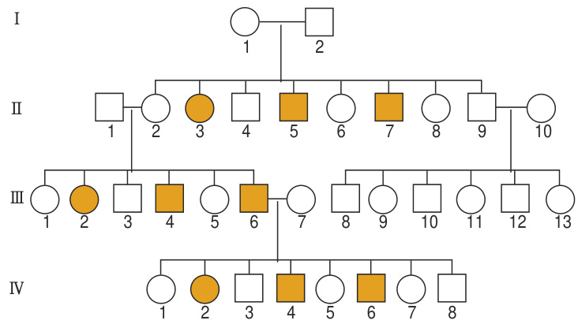  

a.  根据你所获得的信息，有什么证据表明是遗传因素导致了这种疾病的发展？b.  根据谱系中所列的33个人的病史记录，发现有很大一部分人每天都喝一种特殊的咖啡，而其他人则不喝。唯一不喝咖啡的是Ⅰ-1、Ⅱ-2、Ⅱ-4、  

Ⅱ-9、Ⅲ-7、Ⅲ-13、Ⅳ-1和Ⅳ-3。喝这种特殊的咖啡可能对结肠癌有影响吗？解释你的答案。  

7.  B细胞是专门分泌抗体的血细胞。正常情况下，人类血液中有数百万种不同类型的B细胞，产生数百万种不同的抗体分子。这种多样性的出现是因为，正如第13章“快进”信息栏“程序性DNA重组和免疫系统”中所描述的那样，抗体基因在B细胞的前体中进行重组。个体B细胞前体以不同的方式重新排列抗体基因。在被称为B细胞淋巴瘤的癌症患者的血液中，几乎所有的抗体分子都是一种类型，但是这种单一类型的抗体在不同的淋巴瘤患者中是不同的。  

a.  基于这些信息，简要描述B细胞淋巴瘤的发生，重点关注过量增殖的细胞。  
b.  细胞淋巴瘤的性质如何支持图20.6所示的肿瘤克隆理论？  

# 20.3节  

8.  细胞内外的分子调节细胞周期，使其开始或停止。a. 调节细胞周期的外部分子的例子是什么？b. 细胞内参与细胞周期调控的分子的例子是什么？  

9.  将以下步骤按正确的顺序排列  

a. 激酶级联  
b. 转录因子的激活  
c. 激素结合跨膜受体  
d. 目标基因在细胞核中的表达  
e.  Ras分子开关  

10. a.  如果一个细胞是一个对温度敏感的Ras突变体，其蛋白产物在非许可的温度下以GTP结合的形式固定，那么它会在非许可的高温下继续分裂还是停止分裂？b.  如果有一个对温度敏感的突变体，Ras蛋白在高温下保持在GDP结合的形式，这样会发生什么？  

11.  两种不同的蛋白复合物SCF和APC向细胞周期素蛋白中以共价键合的方式加入一种叫做泛素的小多肽。将泛素添加到蛋白质目标中，这种蛋白质被另一种称为蛋白酶体的蛋白质复合物降解。SCF复合物在S期被激活，APC复合物在M期被激活。a.  SCF和哪种细胞周期蛋白（A 、B、D、E，图20.14）结合泛素？APC如何？b.  细胞如何在正确的时间激活SCF和APC ？  

12.  有丝分裂后期的标志之一是姐妹染色单体的分离。一种叫做黏连蛋白的蛋白质复合体将姐妹染色单体连接在一起，如图12.25所示。根据习题11的答案，提出一种机制，允许姐妹染色单体在后期分离。M期可以防止在所有的染色体都与有丝分裂纺锤体正确连接之前姐妹染色单体的分离，运用习题11的答案中的机制如何解释M期的检查点工作原理？  

13. 关于酵母细胞周期突变体的遗传学分析工具：  

a.  描述如何使用诱变的单倍体酵母细胞的培养物识别酵母生长和生存所需的基本基因中的温度敏感突变（ts）。  
b.  在题目a中发现的众多ts突变中，如何区分细胞周期进展所需的基因突变和酵母生命其他方面所需的基因突变？  
c.  在大量的酵母细胞周期突变体中，如何确定哪些突变在同一个基因中，哪些突变在不同的基因中？  
d.  遗传学分析工具中的图A和图B展示了单个酵母细胞周期突变体的培养。这两个图显示的是同一种细胞在不同时间被检测的培养皿：图A为转移到限制温度前的培养皿，图B为温度变化后的培养皿。图A中具有小芽的细胞作为图B中的单个大芽细胞停滞（黄色箭头指向一个例子）。相比之下，图A中有大芽的细胞停滞为图B中的两个大芽细胞（红色箭头）这些观察结果告诉你，在细胞周期中，所讨论基因的蛋白质产物通常起作用。  
e.  详细描述一项实验，表明周期蛋白依赖性激酶CDK1的人类基因可以替代酵母中同源基因的功能。  

# 20.4节  

14.  基因组和核型不稳定性是癌症的后果还是原因？  

15. 以下哪个事件不太可能与癌症相关？  

a.  正常二倍体细胞中原癌基因的突变  
b.  在细胞原癌基因附近有一个断点的染色体易位  
c.  细胞原癌基因的缺失  
d.  带有肿瘤抑制基因缺失的细胞中的有丝分裂不分离  
e.  细胞癌基因与反转录病毒染色体的结合  

16.  为什么在细胞层面上隐性的所有功能缺失突变不能在组织层面上表现为显性呢？这种特性是否仅限于肿瘤抑制基因突变？  

17.  染色体破碎是一种罕见的现象，首次在癌症细胞中发现，单个染色体“粉碎”成许多片段，并通过DNA修复机制重新组合在一起 （根本原因尚不清楚）。大约 $2\%$ 的癌症包含有染色体破碎的细胞。解释一下染色体破碎是如何导致癌症的。  

18.  与慢性粒细胞白血病（CML）相关的9/22染色体易位被称为费城（Philadelphia）染色体，它是于1960年首次在美国费城发现，因此以城市名命名。CML患者不会遗传这种发生在体细胞中的染色体易位。为什么这种融合了bcr和abl基因的特殊易位在不同人的体细胞中是独立发生的？  

19.  一名19岁的女性患者，其症状是贫血和内出血，由于大量的白细胞积累，被诊断为慢性粒细胞性白血病（CML）。核型分析显示，该患者的白血病细胞涉及9号和22号染色体杂合子的相互易位。然而，该患者的正常、非白血病细胞中没有一个包含易位。下列哪一种说法是对的？哪一种是错的？  

a. 易位导致肿瘤抑制基因失活（丧失功能）。  
b. 易位导致癌基因失活（丧失功能）。  
c.  该患者的任何孩子都有 $50\%$ 的可能患上CML。  
d.  该患者在核型方面是一个体细胞的嵌合体。  
e.  从该患者的白血病细胞中提取的DNA，如果被正常的小鼠组织培养细胞吸收，可能会将小鼠细胞转化为能够引起肿瘤的细胞。  
f.  在易位断点处，受影响的肿瘤抑制基因或原癌基因的正常功能可能会阻碍细胞周期蛋白的功能。  
g.  在白血病细胞的易位断点处，已经发生两个罕见的事件来破坏肿瘤抑制基因或原癌基因的两个副本。  
h.  一种可能的治疗白血病的方法是使用一种药物，在白血病细胞的易位断点处激活肿瘤抑制基因或癌基因的表达。  

20.  描述一项分子测试，以确定给习题19中描述的患者进行化疗是否完全成功。也就是说，设计一种方法来确保患者的血液中没有白血病细胞。尽可能详细地描述需要的试剂、实验步骤，以及不同的结果会显示什么。  

21.  下图显示了一个通用的信号级联。生长因子（GF）与生长因子受体结合，激活生长因子受体细胞内域的激酶功能。生长因子受体激酶的一个底物是另一个激酶——激酶A，只有当它本身被GF受体激酶磷酸化时才具有酶活性。活化的激酶A向转录因子中添加磷酸。当没有被磷酸化时，转录因子是不活跃的并停留在细胞质中。当被激酶A磷酸化时，转录因子进入细胞核并帮助激活有丝分裂因子基因的转录，该基因的产物刺激细胞分裂。  

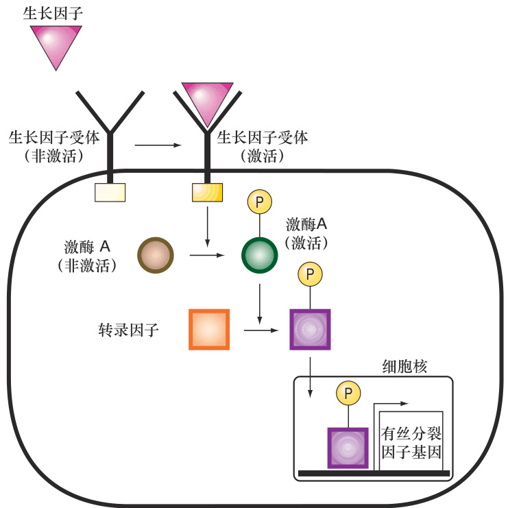  

a.  下面的列表包含编码相应蛋白质的基因的名称。其中哪一种可能作为原癌基因？ 哪个可能是肿瘤抑制基因？  

i. 生长因子  
ii. 生长因子受体  
iii. 激酶A  
iv. 转录因子  
v. 有丝分裂因子  

图中细胞有一个磷酸酶（图中没有标出），能够从蛋白质中去除磷酸，在这个例子中，是从转录因子中去除磷酸。这种磷酸酶本身受激酶A的调节。  

b.  当激酶A在磷酸酶中加入一个磷酸基团时，会有什么影响？这会激活磷酸酶还是抑制它？请解释。  

c.  磷酸酶基因是原癌基因，还是抑癌基因，或两者都不是？  

d.  以下列出了几种突变。对于每一种突变，如果突变的细胞是纯合子，或突变的杂合子和野生型等位基因，那么突变是否会导致细胞过度生长或细胞生长减少。假设所有这些基因的正常活动的$50\%$ 对正常细胞生长是足够的。  

i. 磷酸酶基因的零突变ii. 转录因子基因的零突变iii. 激酶A基因的零突变iv. 生长因子受体的零突变v.  一种突变，能产生一种本构活性生长因子受体，这种受体的激酶功能即使在没有生长因子的情况下也是活跃的  

vi. 产生本构活性激酶A的突变vii.  将转录因子基因置于强增强子下游的一种互易位  

viii. 阻止磷酸酶磷酸化的突变  
ix.  使磷酸酶产生的突变，其作用就好像磷酸化一样  

22.  神经纤维瘤病1型（NF1，也被称为雷克林霍曾病）是一种遗传的显性疾病。表型（见图11.19）通常涉及许多皮肤神经纤维瘤（覆盖神经的纤维细胞的良性肿瘤）的产生。  

a.NFl可能是肿瘤抑制基因还是癌基因?b.  从父母遗传的NF1神经纤维瘤突变是否可能是功能丧失或功能恢复突变？  

c.  神经纤维瘤素是NF1的蛋白产物，已被发现与Ras蛋白有关。Ras与来自生长因子的细胞外信号转导有关。Ras的活性形式（启动信号转导级联引起增殖的形式）与GTP复配；Ras的非活性形式与GDP相结合。野生型神经纤维瘤蛋白是否有利于Ras-GTP或Ras-GDP的形成？  

d.  在遗传了神经纤维瘤等位基因的一个人的正常细胞中，下列事件中，哪一种会导致该细胞的后代生长成神经纤维瘤？  

i.  从受影响的父母继承的NF1等位基因中的第二点突变  
ii.  从正常父母遗传的NF1等位基因点突变  
iii.  从受影响的父母遗传的染色体中去除NF1基因一个大的缺失  
iv.  从正常亲本遗传的染色体中去除NF1基因的大型缺失  
v.  有丝分裂染色体不分离或染色体丢失  
vi.  在NF1基因和携带NF1的染色体着丝粒之间的区域有丝分裂重组  
vii.NF1基因与染色体端粒之间的有丝分裂重组  

23.BRCA7或BRCA2基因突变家族通常表现为遗传性乳腺癌和卵巢癌（HBOC）。附图显示了BRCA2谱系。  

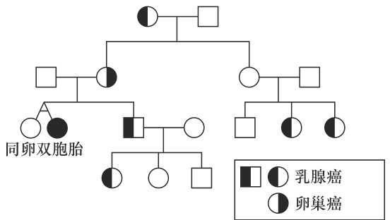  

a.BRCA1和BRCA2是肿瘤抑制基因；由于缺失DNA修复机制，任何一个基因中的功能丧失突变的细胞纯合子都可以变成癌细胞。请解释为什么谱系显示HBOC的显性遗传模式。  
b.  能否从谱系图中看出HBOC是否完全覆盖整个谱系？  

c.  HBOC能表现出不同的表达能力吗？d.  根据当前癌症起源模型解释题目b和c的答案。  

24.  该文中解释说，反转录病毒可导致癌症。一些具有DNA基因组的病毒也可能导致癌症。例如，疱疹乳头状瘤病毒（HPV）会导致宫颈癌。HPV基因组编码一种叫做E6的蛋白质可以干扰p53的功能，另一种叫做E7的蛋白质可以抑制Rb蛋白的功能。请解释HPV如何导致癌症。病毒E6和E7蛋白的功能是否与癌基因或肿瘤抑制因子更相似？  

# 20.5节  

25.  肝细胞癌是最常见的肝癌形式。在患有可遗传性肝细胞癌的患者中，肿瘤的形成与影响两种不同癌基因和三种不同肿瘤抑制基因的8种遗传改变相关。这些改变是：  

i. 有丝分裂重组  
ii. 删除染色体区域  
iii. 三染色体细胞  
iv. 染色体区域的重复  
v. 单亲二体（见图20.24）  
vi. 点突变  
vii. 另一点突变  
viii. 又一点突变  

对于下面的a～c部分，请提供前面列表中所有可能的正确答案。请记住大多数点突变是功能丧失突变。  

a.  前面列表中的哪些突变可能会影响原癌基因？  
b.  前面列表中哪些突变可能涉及肿瘤抑制基因？  
c.  前面列表中的哪些突变涉及拷贝中性杂合性丢失（即杂合性丢失，其中癌细胞的基因组仍然有两个相关基因的拷贝，无论这些拷贝是否有功能）？  

基因组DNA是由正常的白细胞和肿瘤活检样本制备的。这些基因组DNA作为荧光探针，与人类基因组中的一种ASO微阵列多态性杂交（参见图11.16和图11.17）。染色体14、15、16和17的SNP $a\!\sim\!z$ 的结果如图所示。红色和橙色代表不同水平的荧光。  

d.  基于微阵列数据，提供了列表中前5种基因改变的最精确定位（ $\mathrm{i}\!\sim\!\mathrm{v}$ ）。例如，如果改变涉及15号染色体的 $a{\sim}e$ 标记，写成 $15a\!\sim\!e$ 。  
e.  尽可能精确地指出与癌症发生有关的有丝分裂重组事件的位置。  
f.  基于这些数据可以绘制三种致癌点突变中的任何一种，请提供最精确的突变位点。  
g.  在所有的基因突变i～viii中，是否能看到明确的证据表明从得病的父母那里遗传的突变或其他症状。  

25  

# 14  

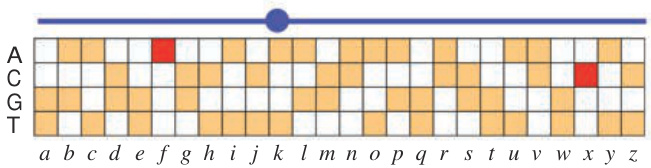  

# 15  

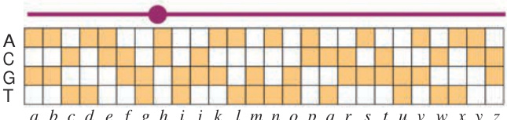  

# 16  

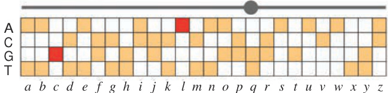  

# 17  

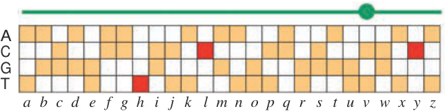  

# 14  

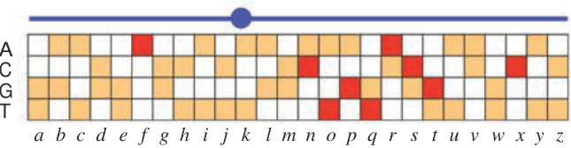  

# 15  

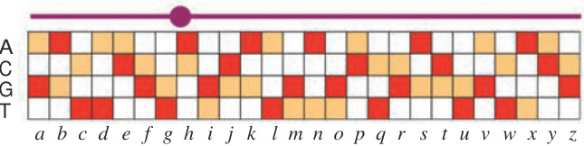  

# 16  

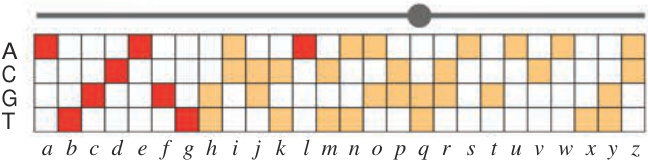  

# 17  

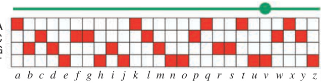  

h.  对于在癌症中发挥作用的肿瘤抑制基因，通常肿瘤细胞中的两个拷贝都必须是非功能性的。对于在该患者中导致癌症的三个肿瘤抑制基因中的每一个，提供一个场景，解释哪两个位点（列表中的i～viii，与vi $\sim$ viii等价）致病，位点发生的必然顺序是什么，以及所涉及的位点是可遗传的还是可发生的。  

26.  假设是通过全基因组测序分析的习题25中所描述的患者的正常和癌组织，而不是通过微阵列。如何在整个基因组序列数据中找到表明列表中8个基因改变的存在和位置的证据？  

27.  假设通过对患者的癌细胞和正常细胞（RNA-Seq）中的RNA进行深度测序来分析习题25和习题26中描述的患者的正常和癌组织。你可以从参与肿瘤发生的新的癌基因组或肿瘤抑制基因（这些基因很难从全基因组序列中找到）中获得哪些证据？  

28.  多形性胶质母细胞瘤（GBM）是人类最常见的恶性脑癌。如果不进行任何治疗，平均存活率约为3个月。即使采用外科切除、放疗和化疗等标准治疗，平均生存率也在 $7\!\sim\!14$ 个月。GBM肿瘤在其遗传变化谱上存在差异，这些变化可能影响特定治疗的效果。回答以下关于特定突变与特定治疗结果的相关性的问题。  

a.  GBM中约 $20\%$ 的活检显示了EGFR（表皮生长因子受体）蛋白的一种突变体EGFRvIII的表达。这些GBM的相同癌细胞也表现出正常的、野生型EGFR的表达。基因编码EGFR是肿瘤抑制基因还是原癌基因？  

b.  很难诱导表达EGFRvIII的细胞发生凋亡。如果你是一名放射学家，用GBM来治疗一个带有EGFRvIII表达的患者，相对带有正常EGFR蛋白的GBM的患者，你会使用更高或更低剂量的X射线吗？  

c.  EGFR是一种通过细胞膜延伸的蛋白，其N端胞外部分（氨基酸 $1\!\sim\!500$ ）与表皮生长因子（EGF）结合，胞内C端激酶部分（氨基酸 $501\!\sim\!1000$ ）通常在EGF与EGFR结合时被激活。活性激酶磷酸化（增加磷酸基）其他蛋白质，触发信号转导级联，促进细胞生长和分裂。EGFRvIII是一个删除氨基酸 $6\!\sim\!273$ 的EGFR蛋白。这种突变蛋白是如何导致癌症的?  

d.  易瑞沙TM是一种阻断EGFR激酶活性的药物。你认为易瑞沙 会成为表达EGFRvIII的GBM的一种潜在治疗手段吗？还是你认为这种药物会使肿瘤  

生长得更快？  

e.  顺铂是一种铂化合物，它与DNA结合并破坏DNA，最终导致细胞死亡。ERCC1是一种编码DNA修复蛋白的基因。GBM显示出比正常情况高得多的ERCC1转录水平。与肿瘤中ERCC1 mRNA含量正常的患者相比，你会用高剂量或低剂量的顺铂来治疗这种GBM吗？  

29. a.  图20.29的图例确定了哪些被分析的基因是癌基因，哪些是肿瘤抑制基因。如果没有图例，请解释你如何通过查看数据来完成大部分的作业。b. 图20.29中哪些突变最有可能是乘客突变？  

30.  CBioPortal网站（http://www.cbioportal.org）是一个非常有用的项目，可以将数千名不同癌症患者的肿瘤基因和基因组可视化，这些癌症基因和基因组已经通过全基因组测序和RNA-Seq进行了分析。  

进入CBioPortal网站，点击Select Cancer Study下的All，在Enter Gene Set中输入PTEN，然后点击Submit。在返回的页面上，你将看到在不同的研究中，在肿瘤中PTEN基因的编码区域是如何改变的。点击标签Mutations可以让你看到与PTEN蛋白相关的这些突变的细节，同时标签Expression可以让你看到基因的表达（从cDNA的解读来看）是如何在单个肿瘤样本中被改变的。  

a.PTEN是癌基因还是抑癌基因？什么样的证据能让你得出这个结论？b.  哪些癌症最有可能涉及PTEN的改变？c.  如何识别一些患者，这些人的肿瘤细胞特别有可能在编码区域之外的PTEN基因中发生体细胞突变，但仍然通过影响基因调控而导致癌症？  

现在回到CBioPortal主页。再次，选择All（在Select Cancer Study下），但这次在Enter Gene Set中输入ERBB2，然后点击Submit。  

d.ERBB2是癌基因还是肿瘤抑制基因？什么样的证据能让你得出这个结论？  
e.ERBB2基因中列出的任何一种突变都是乘客突变而不是驱动突变，是这样吗？如果是乘客突变代表什么意思？  
f.  如果你正在寻找ERBB2基因的调控突变，但这些突变并不在编码序列中，而是与癌症有关，那么你会在Expression标签下面寻找哪些属性呢？  
g.  在将你的结果与PTEN和ERBB2基因进行比较时，这些基因的错义突变在这些突变对癌症表型的可能贡献方面有多大的重要性？  