# 第七部分 个体基因和基因组之外  

# 第 21 章 群体的突变与选择  

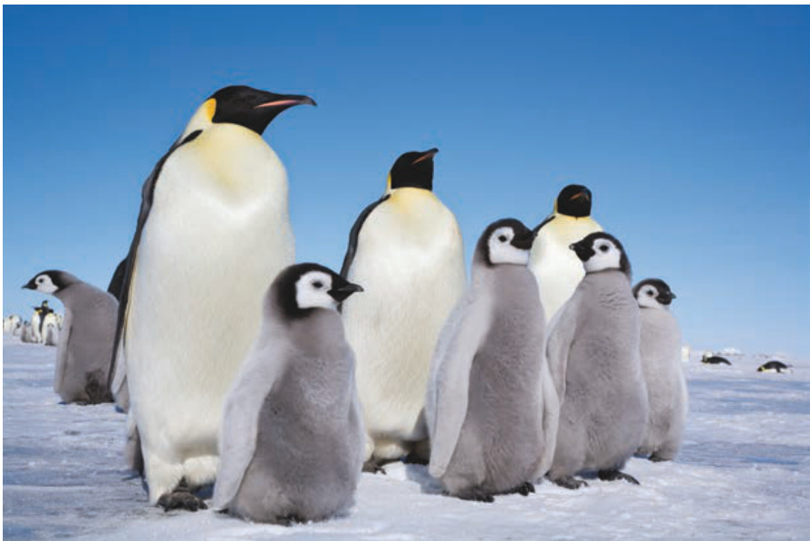  

“牛奶是给婴儿喝的。当你长大后你必须喝啤酒。”——阿诺德·施瓦辛格群体是家庭的集合。$\copyright$ Sue Flood/Oxford Scientific/Getty Images  

# 章 节 大 纲  

21.1 哈迪 - 温伯格定律：预测“理想”群体的遗传变异  
21.2 是什么造成了实际群体等位基因频率的改变？  
21.3 现代人类的祖先与进化  

  

美国的广告宣传中，牛奶是蛋白质和钙的极佳摄取来源。但是，一些青少年和成年人在喝完牛奶后会有不舒服的症状，包括腹泻、恶心、腹部绞痛。这些不舒服的反应通常是小肠内壁缺乏乳糖酶的现象。  

在我们的灵长类亲缘动物和其他哺乳动物中，乳糖酶只在新生儿体内表达，这样他们就可以通过分解乳糖来从母乳中获得营养。在这些物种的新生儿断奶后，乳酸编码基因的转录便停止了。早期人类从他们的祖先那里继承了乳糖酶编码基因，该基因以相同的方式运作。  

东亚、非洲部分地区的现代人类，以及北美、南美和澳大利亚的土著居民，仍然拥有乳糖酶基因，这些基因在儿童后期被关闭。这些人成年后乳糖不耐受，所以在他们的日常饮食中，很少喝牛奶或根本不喝牛奶或其他奶制品。  

那么，为什么其他民族的人长大后还能喝牛奶呢？原因在于，欧洲和撒哈拉以南非洲牧区人类种群的偶然突变导致了乳糖酶等位基因的独立发生，这种等位基因在成年后仍能表达。在饲养家畜的群体中，成年人从牛奶中获取营养的能力可能为具有这些突变的个体提供了生存和（或）繁殖优势［图21.1（a）］。这一优势导致了在成年后乳糖酶持续表达的变异频率迅速增加。所以这些等位基因的频率现在在欧洲和撒哈拉以南的非洲中部超过 $90\%$ ［图21.1（b）］。  

群体遗传学是研究世代遗传变异之间的传递，如那些决定乳糖耐受或不耐受的人群：生活在同一时间和地点的同一物种的一个种群。群体遗传学的逻辑是我们之图21.1　人类种群中乳糖耐受情况的世界范围变化。（a）来自非洲撒哈拉沙漠的塔西利·恩阿耶尔山脉的岩画，描述了早期人类在一个时期（公元前3000年至公元前1900年）内进行家畜放牧，当时该地区是一个大草原，而不是今天的沙漠。（b）现在，绿色代表的种群中耐乳糖个体的比例较高；红色所代表的种群中大多数个体都为乳糖不耐受。最早的人类种群是乳糖不耐的。乳糖耐受是由两种独立突变引起的，这两种突变为能够从家养动物的奶中获得营养的个体提供了选择优势。其中一个突变发生在欧洲或西亚，第二个是在撒哈拉以南的非洲  

  
(a)   
(b)  

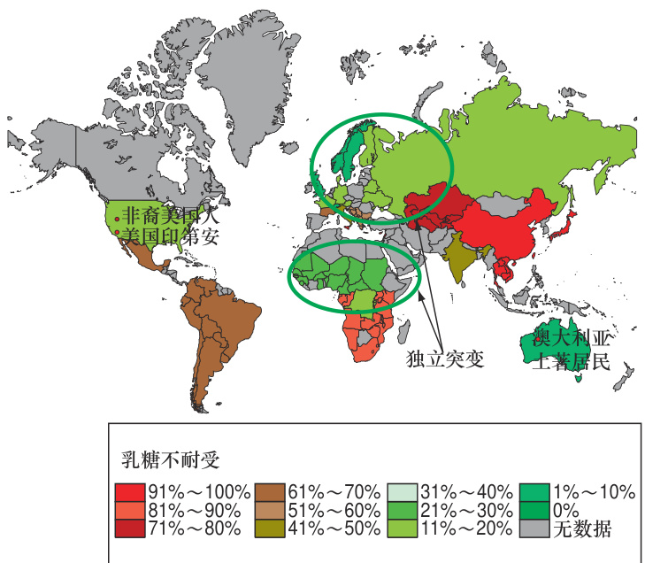  

（绿色圈）。  

（a）： $\copyright$ Ian Gri ths/Robert Harding World Imagery/Getty Images前在这本书中看到的一个简单的延伸，从中我们追寻在单代杂交中，从父母传给下一代的遗传变异。在群体遗传学最新的研究中，随着时间和空间上的推移，群体中的个体也发生着变化，这些个体之间的联系非常疏远，我们追寻并研究这些个体中所发生的突变。群体遗传学家建立了等位基因和基因型频率如何变化的模型，然后他们将预测的结果与在真实种群中发现的变异模式进行比较。  

本章的材料以两个主题为基础。第一，由于群落是家族的简单组合，群体遗传学家扩展了孟德尔的家庭性状传递的基本原则，并预测群体中遗传变异的变化。第二，群体遗传学不仅仅是抽象的集合；相反，它是一个重要的工具，可以让科学家深入了解生物功能、进化机制，甚至人类历史。  

# 21.1 哈迪-温伯格定律：预测“理想” 群体的遗传变异  

# 学习目标  

1. 计算在给定群体中基因型频率的等位基因频率。2.  给定等位基因频率，确定在哈迪-温伯格平衡下，种群中预测的基因型比例。3.  描述法医如何确定群体中一个随机的人的DNA图与在犯罪现场发现的样本相匹配的可能性。  

杰弗里·哈迪（Geoffrey H. Hardy）和威廉·温伯格（Wilhelm Weinberg）早在1908年就意识到，要理解自然界中种群内部和种群之间形成遗传变异模式的力量，最简单的方法就是从一个满足几个假设的、简单的、随机交配的 “理想”种群开始。以这个假想的种群为起点，遗传学家可以检查当每个假设都被违反时发生了什么。通过这种方式，科学家们可以建立真实的模型来描述自然种群中遗传变异在时间和空间上是如何变化的。  

# 21.1.1 群体遗传学家测量描述群体的频率  

为了遵循哈迪和温伯格的推理，我们首先需要定义一些术语，这些术语将为我们提供变异的明确测量。种群是生活在同一时间、同一地点的同一物种的个体集合；如果生物体是有性别区分的，那么种群中的个体必须有彼此交配的能力，例如，1990年旧金山湾天使岛上所有的白尾鹿，或者海湾口所有的岩石鳕鱼。种群中所有成员所携带的所有等位基因的总和称为种群的基因库。每个个体最多携带两个等位基因拷贝。因此，种群中若有N个个体，对于常染色体基因来说，基因库则由该基因的2N个等位基因拷贝组成。虽然我们几乎从来没有检查过种群中每个个体的等位基因，但是我们往往会取一个样本：利用有限数量的个体来推断整个种群。通常，科学家并不考虑个体的基因型或表型，而是随机抽取个体样本。  

等位基因一词描述的是特定基因位点、基因、区域或基因组的核苷酸位置的变异。如果样本在核苷酸位置只显示出一个等位基因，那么该位点是单态的；如果一个位点存在多个等位基因或变体，则该位点是多态的。同时，我们的个体样本也允许我们确定在任何时刻种群所存在的不同变异的相对频率（或分离）。  

# 1. 基因型和表型频率  

基因型频率是指携带特定基因型的个体总数在种群中所占的比例。为了确定基因型频率，只需要简单地计算每个基因型个体的数量，然后除以种群中个体的总数（图21.2）。对于像蓝色眼睛这种隐性性状，则无法区分带有黑色眼睛等位基因的纯合子与包含黑色眼睛和蓝色眼睛等位基因的杂合子；这两种基因型都会产生黑色眼睛的个体。因此，对于这样的基因来说，直接确定基因型频率的唯一方法是使用一种分子检测法，在DNA水平上区分不同眼睛颜色的等位基因。  

考虑一个20个人的样本，其中16个人都有黑色眼睛，意味着他们要么是带有两个决定黑色眼睛的显性基因A的纯合子，要么是带有显性基因A和带有决定蓝色眼睛的隐性基因a的杂合子。其他4人都有蓝眼睛，因此为aa的纯合子（图21.2）。该样本有两个表型——黑色眼睛和蓝色眼睛个体，它们的相对比例（表型频率）分别为 $16/20{=}80\%$ 和 $4/20{=}20\%$ 。假设DNA分析显示，在这20个个体中，12个属于基因型AA，4个属于 $\cdot A a$ ，4个属于aa。在本样本中，AA基因型频率为 $12/20{=}0.6$ ；Aa基因型频率为 $4/20{=}0.2$ ；aa基因型频率也是0.2。注意，这三个频率（ $0.6\substack{+0.2\,+0.2}$ ）之和为1，即样本中这个位点上的所有基因型的总和，由此推断，在整个种群中也是如此。  

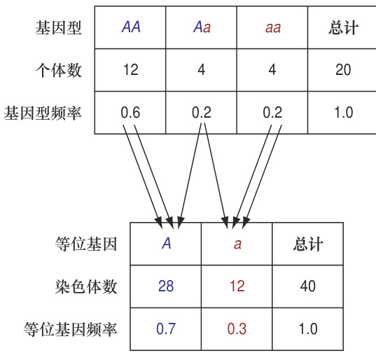  
图21.2　种群中基因型频率和等位基因频率的描述。  

# 2. 等位基因频率  

等位基因频率是指给定的等位基因型的拷贝数在种群中所占的比例。因为种群中的每个个体都有两个染色体拷贝，所以基因拷贝（基因库）的总数是个体数量的两倍。因此，对于我们假设的20个人，那么会存在40个常染色体拷贝基因。当然，纯合子和杂合子都与等位基因的频率有关。但在计算时，纯合子对特定等位基因的频率计数两次，而杂合子只计数一次（图21.2）。  

要找到A和a的频率，首先要针对每个基因型的人数来计算A和a等位基因的数量。  

对于等位基因A来说，  

$12\,A A\longrightarrow24$ 个A基因 $4\,A a\longrightarrow4$ 个A基因 $4\:a a\longrightarrow0$ 个A基因  

样本包含 $24\!+\!4\!+\!0\!=\!28$ 个等位基因A的拷贝数。  

同样的，对于等位基因 $a$ 来说，  

$12\,A A\longrightarrow0$ 个 $^{a}$ 基因 $4\,A a\longrightarrow4$ 个 $^a$ 基因 $4\:a a\longrightarrow8$ 个a基因  

样本中一共包含 $0{+}4{+}8{=}12$ 个等位基因a的拷贝数。  

接下来，将28个 $\boldsymbol{A}$ 等位基因与12个 $a$ 等位基因相加，得到取样的染色体拷贝总数（40）；正如所料，这是样本中人数的两倍。最后，将每个等位基因的拷贝数除以基因拷贝数，得到每个等位基因的比例或频率。  

对于等位基因A来说，等位基因频率为 $28/40{=}0.7$ 。  

对于等位基因a来说，等位基因频率为 $12/40{=}0.3$ 。  

再次注意到，频率的总和为1，代表了基因库中的所有等位基因。  

可使用以下基于基因型频率的公式来计算任何等位基因频率：  

等位基因A的频率 ${\it=}A A$ 的频率 $+1/2A a$ 的频率 （21.1）  

等位基因a的频率 $\equiv$ aa的频率 $+1/2A a$ 的频率  

将图21.2上部表格中的基因型频率代入这些公式将产生与图下部表格相同的等位基因频率，这些等位基因频率是通过计算单个基因拷贝来确定的。  

# 21.1.2 哈迪-温伯格定律与等位基因和基因型频率  

在20世纪之前，当特征的混合仍然被认为是遗传的基础时，许多人认为如自然的金发和红发这些隐性特征会注定随着时间的推移在人类种群中消失：当发色较浅的人与发色较深的人交配时，后代不会出现金色或红色的头发颜色，这类人便渐渐消失了。1908年，英国数学家杰弗里·哈迪根据新近发现的孟德尔分离法则，探索了这一主张。哈迪表明，如果满足一定的假设，等位基因频率、基因型频率和表型频率将在时间和世代之间保持不变。同年，德国内科医生威廉·温伯格得出了同样的结论。  

# 1. 哈迪-温伯格定律的假设  

简化的假设使得哈迪和温伯格得以提出这一理论，该定律包含了种群的性质和正在调查的遗传变异的性质：  

（1） 种群是由很多二倍体个体组成的，为了简单起见，假设它们是无限的。  
（2） 所关注的基因型对个体选择配偶没有影响——也就是说，交配是随机的。  
（3）在基因库中没有出现新的突变。  
（4）种群中不发生个体的迁移，包括迁入或迁出。  
（5） 所关注的基因型对适合度没有影响——生存到繁殖年龄并把基因传给下一代的能力。  

正如我们将要看到的，如果一个种群在感兴趣的位点上相当符合前面的假设，那么等位基因频率便不会随着时间的推移而改变，只有基因型频率可能会暂时改变，达到预测的比例构成，该比例构成由组成每个基因型的等位基因的频率所预测得到，那么种群便符合哈迪-温伯格平衡（HWE）。在这里，平衡意味着该位点的等位基因和基因型频率不会改变，除非其中一个假设被违反。  

当然，对于一个理想的种群来说，没有一个实际的种群是完全符合这些假设的。所有的种群中的个体数量都是有限的；不同基因型的个体可以在交配时也并不一样；突变不断发生；种群的迁入和迁出是很常见的；许多感兴趣的基因型，例如那些引起疾病的基因型，会影响生存或繁殖的能力。尽管如此，即使许多假设都不适用，哈迪-温伯格平衡仍然非常可靠，能够在有限的繁育后代中提供真实种群的基因型和表型频率的估计值。此外，与哈迪-温伯格平衡不一致的频率的发现，有时能让科学家更好地了解特定基因和种群的特殊生物学特性。  

# 2. 从一代到下一代的基因型和表型频率预测  

在二倍体有性群体中，等位基因频率通过交配系统转化为基因型频率。在这样的群体中，种族隔离和随机交配的规律有两个重要的结果。  

第一，单倍体配子是由一代二倍体成体根据孟德尔的分离定律产生的，这样二倍体成体的每个等位基因都出现在一半的配子中。如果产生配子的可能性不依赖于配子的基因型，那么种群中成体的等位基因频率应该与成体产生的所有配子中的等位基因频率相同。例如，如果 $\boldsymbol{p}$ 是等位基因A的频率， $q$ 是成人等位基因a的频率，那么 $p$ 和q也是这一代成体所产生的配子中两个等位基因的频率。  

第二，如果随机交配发生，并且种群数量足够大，那么配子中的等位基因频率就可以用来预测下一代受精卵的基因型频率。我们可以使用一种特殊类型的庞纳特方格来观察这是如何发生的，它提供了一种系统的方法来考虑所有可能的结合配子的组合（图21.3）。  

如果携带A的精子使携带A的卵子受精，就会形成一个AA受精卵。因为精子的基因型是独立于它所受精的卵子的基因型，我们可以应用乘法法则，一个A型精子（ $p$ ）的频率乘以一个A型卵细胞（ $\cdot\,p$ ）的频率得到AA型受精卵的频率： $p\times p{=}p^{2}$ 。同样，后代中aa型受精卵的频率，即受精卵必须由携带 $a$ 的精子（频率为 $q$ ）使携带 $a$ 的卵细胞（频率同样为 $q$ ）受精得到，频率为是$q\times q\!=\!q^{2}$ 。最后， $A a$ 受精卵为A的卵细胞与 $a$ 的精子结合，受精卵的基因型频率为 $p\times q{=}p q$ ；或 $a$ 的卵细胞与A的精子结合，受精卵的基因型频率同样为 $q\times p{=}p q$ 。 $A a$ 合子的总频率为 $p q\!+\!p q\!=\!2p q$ 。  

图21.3所示的哈迪-温伯格正方形与我们在第2章中形式遗传学的视觉表征中首次遇到的庞纳特方格的相似性并非巧合。这些图的相似性是由于种群只是由简单的数组家庭组成。在原始的庞纳特方格中，杂合子之间的杂交（见图2.11），顶部和左侧被分成两个相等的分区，分别代表两个单独父母产生的基因不同的精子或卵子频率是相同的。  

如果我们将由两个单独的父母个体产生的配子更换成整个种群的雌性和雄性视为整体所产生的配子，那么图21.3中，左侧栏是雄性繁殖产生的精子的表征，顶栏是雌性繁殖产生的卵细胞的表征。换句话说，种群中不同基因型之间的随机交配等同于种群中所有个体产生配子的随机组合。但同时应该注意到与经典庞纳特方格的一个重要区别：分区的大小不一定必须相等；相反，两个带有等位基因的配子的比例，与所考虑的种群中两个等位基因的频率一致。  

由图21.3所示的分析得出的关键结论是，在一个满足所有哈迪-温伯格假设的、足够大的随机交配的有性生殖二倍体生物种群中，AA型受精卵的基因型频率为$p^{2}$ ， $A a$ 型受精卵的基因型频率为 $2p q$ ，aa型受精卵的基因型频率为 $q^{2}$ 。这些基因型频率被称为哈迪-温伯格比例。因为这些基因型频率代表种群中基因型的总和，所以它们的总和必须是1。因此，哈迪-温伯格比例可表示为以下二项方程：  

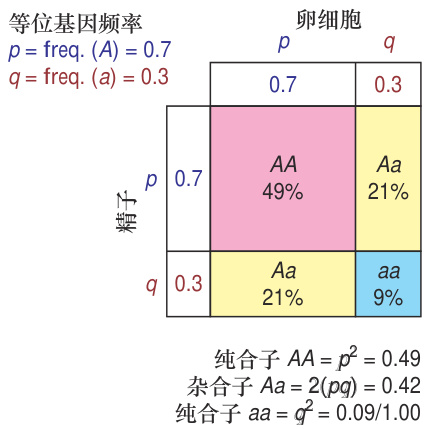  
图21.3　预测由于种群内随机交配而产生的后代的基因型频率。  

$$
p^{2}{+}2p q{+}q^{2}{=}I
$$  

应该注意到 $p^{2}\!+\!2p q\!+\!q^{2}\!\!=\!(p\!+\!q)^{2}$ ；这是有道理的，因为 $(p\!+\!q)$ 代表了所有的精子，也代表了所有成体产生的所有卵细胞。哈迪-温伯格正方形的结构恰恰说明了这一点。以这种方式考虑群体中的精子和卵细胞，可以将公式（21.2）扩展到具有两个以上等位基因的基因的哈迪-温伯格预测。记得在图3.5中，ABO血型是由单个基因的三个等位基因所决定的： $I^{A}$ 、 $I^{B}$ 和i。如果我们把这三个等位基因在种群中的频率分别记为$p\,,\ \,q\,,\ \ r$ ，根据哈迪-温伯格平衡预测的基因型频率将为 $(p\!+\!q\!+\!r)^{2}\!\!=\!\!p^{2}\!+\!q^{2}\!+\!r^{2}\!+\!2p q\!+\!2p r\!+\!2q r\!=\!1$ ，等式右侧根据$I^{A}I^{A}$ 、 $I^{B}I^{B}$ 、ii、 $I^{A}I^{B}$ 、 $I^{A}{}_{i}$ 和 $\boldsymbol{\lvert{I^{B}i}\rvert}$ 的秩序分别为该基因型的频率。  

在哈迪-温伯格比例中，种群的基因型频率处于平衡状态，这意味着，只要假设仍然有效，等位基因和基因型的频率在代间将保持不变。可以使用通过基因型频率来计算等位基因频率［等式（21.1）］。这一规律用代数方法计算下一代等位基因的频率，并证明它们不会改变。通过哈迪-温伯格方程，针对一个拥有两个等位基因的基因，可知 $|p^{2}$ 代表的AA基因型的个体，他们所有等位基因均为A， $2p q$ 代表的 $A a$ 基因型的个体，他们等位基因一半为A。因此，由于 $\gamma\!+\!q\!=\!1$ （因此 $\scriptstyle q=1\,-p$ ），初代的后代中等位基因A的频率将会是：  

$$
p^{2}\!+\!(1/2)[2p(1\!-\!p)]\!=\!p^{2}\!+\!p(1\!-\!p)\!=\!p^{2}\!+\!p\!-\!p^{2}\!=\!p
$$  

同样的， $p\!=\!1\!-\!q$ ，在下一代种群中，等位基因 $a$ 的频率为：  

$$
q^{2}\!+\!(1/2)[2q(1\!-\!q)]\!=\!q^{2}\!+\!q(1\!-\!q)\!=\!q^{2}\!+\!q\!-\!q^{2}\!=\!q
$$  

可知，后代的等位基因频率与父母的相同，仍然是$p$ 和q。  

对于隐性特征如金发和红发的头发颜色消失的问题，平衡的潜力给出了一个答案。如果没有健康上的差异或其他与哈迪-温伯格假设重大的偏差，这两种表型都不会因为它们的表型是由隐性等位基因引起而消失。相反，产生这些头发颜色的等位基因和基因型的频率会随着时间的推移而保持不变。  

如图21.4所示，对于一组特定的等位基因频率 $p$ 和 $q$ ，有且只有一个HWE存在，但是不同的 $p$ 和q值意味着不同的HWE。图21.4在从等位基因频率 $\cdot p{=}0{\sim}1$ 的全区间范围内对三个基因型的频率进行了划分（因为$q{=}1\!-\!p$ ，因此 $q{=}1\!\sim\!0$ ）。作为一个例子，如果 $q{=}0.2$ ，然后在HWE中， $A A$ 基因型在三种可能的基因型是最常见的：AA纯合子的频率为 $p^{2}{=}0.64$ ，Aa杂合子的频率为 $2p q{=}0.32$ ，aa纯合子的频率为 $\stackrel{?}{q}=\stackrel{0.04}{{}}$ 。  

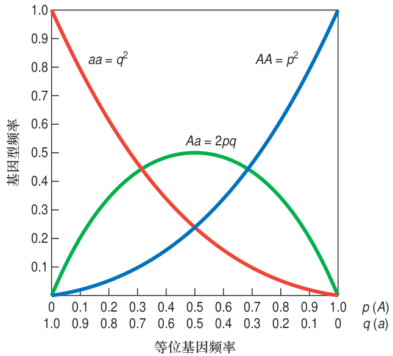  
图21.4　对于任何一组等位基因频率，只有一组基因型频率符合哈迪-温伯格平衡。  

注意到在图21.4中，当q很小的时候，大部分的等位基因是由杂合子携带的。在本章的后面部分，当我们在研究引起人类遗传疾病的罕见的隐性有害等位基因时，这一点将变得非常重要。同样值得注意的是，当$p{=}q{=}0.5$ 时，杂合子的频率最高（ $50\%$ ）。  

# 3. 随机交配在形成基因型频率中的作用  

即使一个种群目前不在HWE中，单代的随机交配也足以建立平衡。考虑以下极端的例子：假设一个岛屿同时被来自大陆的两个不同地点各1000个具有繁殖能力的成虫入侵，成虫为同一种群（其中雄性和雌性中平均分配）。1000个殖民者中来自某一个位置的个体都是纯合子AA；来自另一个位置的碰巧都是纯合子aa。因此，在新成立的种群中，最初的基因型频率是 $50\%$ 的AA纯合子和 $50\%$ 的aa纯合子。为了预测下一代基因型的频率，首先需要计算出岛上新种群的父母的等位基因频率。  

1000个AA的个体，没有Aa的个体，1000个aa的个体 $\longrightarrow2000$ 个等位基因A，2000个等位基因a。  

由于一共存在4000个等位基因，等位基因A的频率为 $\mathrm{~2000~/~4000{=}0.50}$ ，因此 $_{p=0.50}$ ；等位基因 $a$ 的频率为$2000\mid4000{=}0.50$ ，因此 $_{q=0.50}$ 。  

因为所有的成虫之间的交配是随机的，可以用精子和卵细胞的数量反映等位基因的频率。如图21.3所示，这种观察配子库的方式预示着岛上的下一代昆虫将以哈迪-温伯格比例分布：  

$$
p^{2}{+}2p q{+}q^{2}{=}1
$$  

$$
(0.50)^{2}{+}2(0.50{\times}0.50){+}(0.50)^{2}{=}1
$$  

$$
0.25+0.50+0.25\mathrm{=}1
$$  

假设产生1000个后代，结果为： $1000\times0.25{=}250\,A A$ 个体 $1000\times0.50{=}500\,A a$ 个体 $1000\times0.25{=}250$ aa个体  

这个结果是很明显的：一个种群最初是分层的，因为它是由两个或两个以上不同群体的个体组成的，这些个体在一个常染色体位点上具有不同的等位基因频率。但该种群通过一代的自由交配便可恢复到哈迪-温伯格基因比例。  

当种群从第一代殖民者到第二代殖民者（殖民者的后代）时，等位基因频率是否也发生了变化？答案是否定的。使用公式（20.1），可以通过现在这1000个个体中每个基因型的数量来计算后代产生的等位基因频率，从而：  

$q{=}$ 等位基因a的频率 $={\frac{2\left(250\right)+500}{2\left(1000\right)}}\!=\!1000/2000{=}0.5$  

这些频率与前一代的频率相同，因此，即使基因型频率从第一代到下一代发生了巨大的变化，等位基因频率却没有变化。注意，显性等位基因和隐性等位基因都是如此。等位基因比例保护的原则从每一代一直延续到下一代，只要种群足够大且随机交配，等位基因就不会因突变或选择而丧失，等位基因也不会因突变或个体迁入或迁出而获得。  

已知，在HWE到达之前，具有相同等位基因频率的群体不一定具有相同的基因型或表型频率。原因是单等位基因可以存在于纯合子或杂合子基因型中，但隐性性状只能在纯合子中表达。在另一个极端的假设例子中，如果群体中的每个人都是杂合子，那么一个群体的蓝色眼睛等位基因频率可能为0.5，而没有任何蓝色眼睛的人。即使在这第二个例子中，哈迪-温伯格平衡告诉我们，在随机交配和常染色体基因中，由 $p^{2}$ 、 $2p q$ 和q2所表述的哈迪-温伯格基因型频率将在下一代中出现。因此， $25\%$ 的下一代人的眼睛是蓝色的。  

# 4. 哈迪-温伯格平衡与连锁基因  

如果等位基因的频率在雌性和雄性之间不同，基因型的频率最初不是遵循哈迪-温伯格比例（图21.5），那么伴性基因，如人类X染色体上的基因，需要几代人才能到达HWE。需要额外几代才能到达HWE是由于雄性只有一个X染色体而雌性有两个。因此，下一代男性的等位基因频率等于当前一代女性的等位基因频率，因为男性从母亲那里得到X。下一代女性的等位基因频率将等于当前一代男性和女性的平均频率，因为女性从父母那里各得到一个X。  

可以通过想象在另一个荒岛上引入一个新的种群来理解这些原因，这个荒岛由100个 $^{a\mathrm{Y}}$ 雄性和100个AA雌性组成。如果等位基因A的频率为 $p$ ，则最初的 $p_{\nparallel\overleftarrow{\varepsilon}}\mathbf{=}$ 0， $p_{\mathrm{{\scriptscriptstyle4/4}}}\mathrm{{=}}1.0$ 。如图21.5所示，下一代等位基因频率为 $p_{\mathbb{k}}\!=$ 1.0， $p_{\parallel\oplus}{=}(1.0{+}0)/2{=}0.5$ 。在接近HWE之前，两种性别的频率将继续变化数代。需要超过6代的随机交配才能获得雌性中所有3种可能的基因型的哈迪-温伯格比例；应该自己发现这一规律。当达到HWE时，等位基因频率在雄性和雌性会相等，任一个等位基因的频率为最初的雌性等位基因频率的2/3加上最初的雄性等位基因的1/3，所以在这个例子中，当达到HWE时， $p_{\scriptscriptstyle{\mathtt{H E}}}{=}p_{\scriptscriptstyle{\mathbb{H E}}}{=}0.67$ （我们现在可以称为 $p$ ）。  

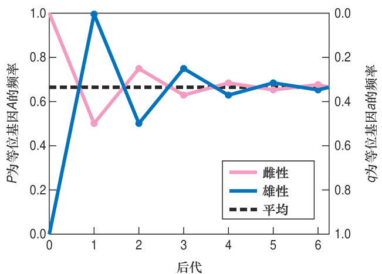  
图21.5　X连锁基因可能需要几代的随机交配才能达到平衡。所示的模型种群是由AA雌性和aY雄性建立的。当HWE经过几代后建立，雄性和雌性中的等位基因频率将相等；这个值是雌鼠初始等位基因频率的2/3加上雄鼠初始频率的1/3。  

因为当达到HWE时，种群的男性和女性中等位基因A和a的频率分别为 $p$ 和q，那么AY和aY的男性频率将分别为 $p$ 和 $q$ ，因为Y染色体没有该基因的拷贝。当达到HWE时，我们认为有三种频率为 $p^{2}$ 、 $2p q$ 和 $q^{2}$ 的雌性（AA、Aa、aa），就像常染色体位点一样。  

事实上，等位基因频率在男性和女性中是相同的，而基因型频率不同，这就说明了一个常见的现象：更多的男性是红绿色盲，而不是女性。如果我们称色盲的等位基因为a，那么色盲男性的频率（ $a\mathrm{Y}$ ）将等于 $q$ ，而色盲女性的频率（aa）将是 $q^{2}$ 。当q小于1时， $q^{2}$ 总是小于 $q$ 。例如，美国男性色盲的频率约为 $7\%$ 。 $q$ 的值为0.07， $q^{2}$ 的值为 $(0.07)^{2}{=}0.0049$ ，即 $0.49\%$ 。  

为了方便，表21.1总结了目前为止讨论的场景中，当达到HWE时的基因型频率。  

表21.1　哈迪-温伯格平衡时的各基因型频率  

<html><body><table><tr><td></td><td>雌性</td><td>雄性</td></tr><tr><td>具有两个等位基因的常染色体基因</td><td></td><td></td></tr><tr><td>AA</td><td></td><td></td></tr><tr><td>Aa</td><td>2pq</td><td>2pq</td></tr><tr><td>DD</td><td></td><td></td></tr></table></body></html>  

续表  

<html><body><table><tr><td></td><td>雌性</td><td>雄性</td></tr><tr><td>带有两个等位基因的X连锁基因</td><td rowspan="3">p² 2pq</td><td rowspan="9"></td></tr><tr><td>AA</td></tr><tr><td>Aa</td></tr><tr><td>pD AY</td><td>q²</td></tr><tr><td>AY</td><td>P q</td></tr><tr><td>具有三个等位基因的常染色体基因</td><td></td></tr><tr><td>A'A'</td><td>d</td></tr><tr><td>A²A2</td><td></td></tr><tr><td>A3A3</td><td></td></tr><tr><td>A'A2</td><td>2 2pq</td></tr><tr><td></td><td>2pq</td></tr><tr><td>A'A3</td><td>2pr 2pr</td></tr><tr><td>A²A3</td><td>2qr 2qr</td></tr></table></body></html>  

# 21.1.3 人类种群中的许多位点都接近哈迪-温伯格比例  

一旦已知一个种群处于哈迪-温伯格平衡，研究者就可以很容易地从基因型频率中预测等位基因频率，再从等位基因频率中预测基因型和表型频率。乍一看来，随机交配似乎对人类来说是一个特别不现实的假设，因为人类的择偶选择受到许多因素的影响，包括地理邻近性、文化规范及可能的配偶的特征。然而，从群体遗传学的观点来看，重要的是对研究中的特定基因型进行随机交配。我们将在下一章进一步探讨，基因型和表型之间的联系是如此复杂，以至于我们很少以任何被调查的某种基因型为基础来选择配偶。基于这个原因，对人类大多数基因位点的研究表现出了与哈迪-温伯格预测惊人的符合，特别是在观察不影响表型的匿名位点时。这一简单的观察结果在解决犯罪，以及在诸如大规模灾难和飞机坠毁等悲剧中识别人类遗骸方面有助于提高DNA变异的有效性。  

# 1. 使用哈迪-温伯格分析DNA指纹  

在法医调查中，哈迪-温伯格平衡对于解释DNA指纹证据至关重要，这项技术在第11章中已经讨论过（参见图11.15）。假设谋杀受害者的指甲下的血液和一个嫌疑犯完美匹配。法医科学家可利用群体遗传学够精确地回答这个问题：在受害者身上发现的DNA是嫌疑犯的DNA的可能性比来自另一个（随机的）人的DNA的可能性大多少？  

如第11章所述，法医分析中最有用的DNA标记是多态匿名位点，其在人类种群中具有高度可变性。为了能够对DNA样本进行比较，美国和许多其他国家的执法机构将重点放在人类基因组中发现的13个无链、简单序列重复（SSR）位点上。获得的结果被存入一个名为“联合DNA索引系统（CODIS）”的数据库中（图21.6）。从实际的角度来看，刑事调查人员和陪审团需要理解嫌疑犯和受害者指甲下的样本之间的13个CODIS位点的完美匹配不仅仅是偶然匹配。换句话说，在构成潜在嫌疑犯群体的所有人群中发现这特殊的13个位点的基因型的可能性有多大？  

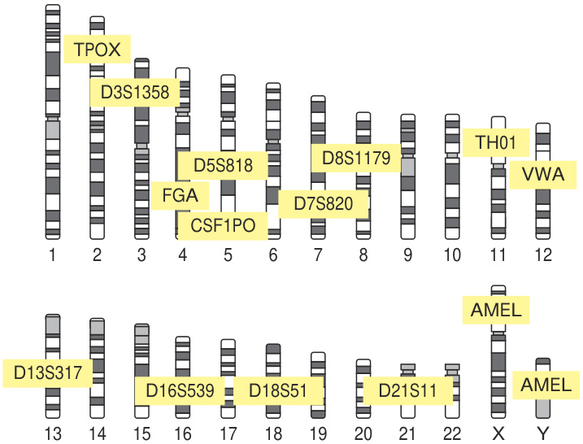  
图21.6　13个CODIS核心常染色体SSR位点的染色体位置。因为在X染色体和Y染色体的PCR产物中AMEL基因（牙釉蛋白）的扩增结果差异很大，所以它可以作为测定样本性别的额外标记。  

选择SSR作为CODIS是因为它们是互不相连的，并且从对数千个个体的调查中发现它们具有高度的可变性并达到HWE。这些调查的关键数据包括13个位点的等位基因频率。从这些等位基因频率中，研究人员可以使用哈迪-温伯格方程来计算任意一个位点二倍体基因型匹配的可能性。因为CODIS位点是不相连的，每个位点上的等位基因在统计学上独立于另一个位点上的等位基因，法医学家只需将每个独立位点预期的基因型频率相乘，就可以得到观察到的任何13位点基因型的预期频率。  

# 2. 计算匹配概率  

假设犯罪现场样本和嫌疑人的DNA谱上，在一个CODIS位点上的两个等位基因都是杂合的，等位基因频率分别为0.05和0.03，对于第二个位点的等位基因来说是纯合的，频率为0.04。尽管对于每个CODIS SSR来说，存在超过20多个等位基因可以区分所用，对于任何特定的杂合基因型来说，其基因型频率还是 $2\times$ 等位基因1的频率 $\times$ 等位基因2的频率，而纯合基因型的频率为等位基因频率的平方。因此，人群中任意某个人的匹配概率拥有特定两个位点基因型出现在犯罪现场样本的概率是 $2(0.05)(0.03)\times(0.04)^{2}{=}0.000\,004\,8{=}4.8\times10^{-6}$ 。换句话说，这种特殊的双位点基因型的频率是0.000 004 8或1/208 334。  

对于任何给定的13位点CODIS基因型，匹配概率变得非常小，因为这些多态位点中的任何一个等位基因的频率都很低。假设犯罪受害者指甲下的DNA样本的13位点的匹配概率是 $7.7\times{{10}^{-15}}$ ，在法医调查中，这一概率比较有代表性。通过比较，如果DNA来自犯罪嫌疑人，获得完美匹配的可能性为 $100\%$ 或1；如果DNA来自其他的随机的一个人，获得完美匹配的可能性为$7.7\times{{10}^{-15}}$ 。因此，DNA来自嫌疑犯的可能性为来自其他的随机某个人的可能性的 $1/(7.7\times10^{-15}){=}1.3\times10^{14}$ 倍。换句话说，130万亿人口中只有一个人会拥有嫌疑人特有的CODIS等位基因。考虑到世界总人口（2016年）约为 $7.4\times10^{9}$ （约74亿）人，DNA指纹结果将为连接嫌疑人（或他或她的同卵双胞胎）与受害者的指甲下的DNA提供强有力的证据。  

# 基本概念  

●  给定一个特定种群的基因型频率，可以通过将给定等位基因的纯合子频率加上该等位基因的杂合子频率的1 / 2来计算出等位基因频率。  
●  在哈迪-温伯格平衡的种群中，等位基因频率和基因型频率从一代到下一代保持不变。对于具有两个等位基因的常染色体基因，其平衡时的基因型频率按照公式 $\scriptstyle{p^{2}+2p q+q^{2}=1}$ 分布，其中p和q为等位基因频率。  
●  法医科学家将每个独立位点的基因型频率相乘，并利用哈迪-温伯格比例从已知的等位基因频率中计算确定DNA图的匹配概率。  

# 21.2 是什么造成了实际群体等位基因频率的改变？  

# 学习目标  

1.  解释为什么哈迪-温伯格模型在短期预测等位基因和基因型频率方面比长期预测更准确。  
2.  讨论为何有限的种群大小意味着新的突变最终会丢失或固定。  
3.  描述种群中的自然选择如何促进等位基因的丢失、扩散或维持。  
4.  解释为什么当不再喷洒杀虫剂时，蚊子种群中耐杀虫剂的等位基因频率降低。  

如图21.7（a）所示，不同的人类种群蓝色眼睛的个体数有着巨大的比例差异。这些差异反映了OCA2基因上游SNP的等位基因频率的变化，而OCA2基因是导致这种隐性表型的原因［图21.7（b）］。人类基因组中的许多其他基因位点，如导致乳糖耐受/不耐受的基因位点，在等位基因频率上也表现出地理上的差异［回顾图21.1（b）］。这些观察到的种群之间等位基因频率的差异与哈迪-温伯格理想模型假设对真实人群的适用性之间有什么关系呢？  

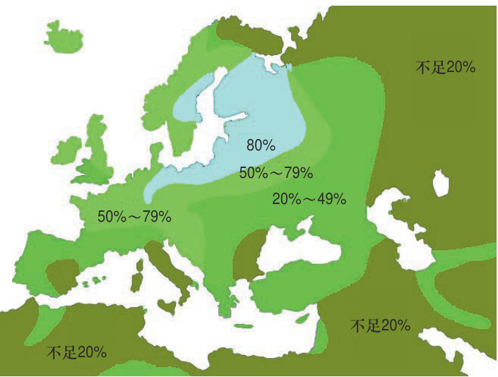  
(a)   
(b) SNP  rs12913832  

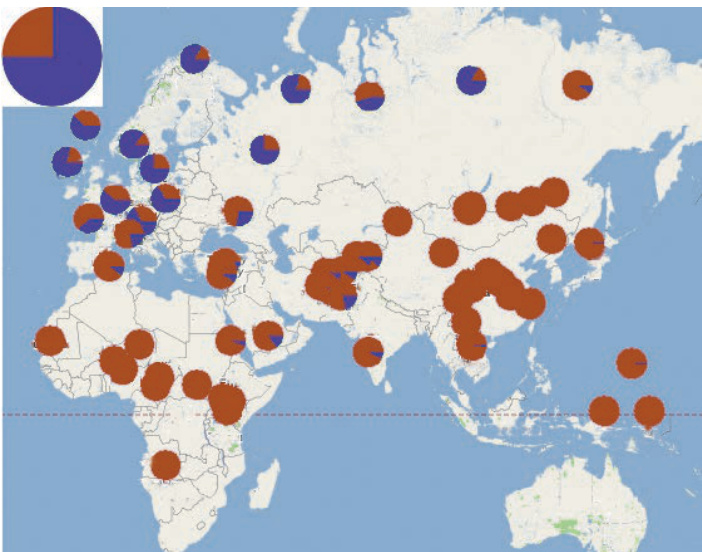  
图21.7　人类眼睛颜色相关基因之一的表型和等位基因频率图。（a）欧洲不同区域拥有蓝眼睛的人口比例。（b）饼图描述了在SNP位点 $r s I29I3832$ 处等位基因G（蓝色）和A（棕色）的频率。这种多态性位于OCA2基因的增强子中，OCA2基因的蛋白质产物参与黑色素的产生。  

# 21.2.1 哈迪-温伯格为实际种群建模提供了一个起点  

在自然种群中，情况总是或多或少地偏离哈迪-温伯格假设。每个位点上的新突变偶有发生，没有种群的规模是无限大的，小的个体群有时从主体迁移到成为新种群的初代，独立的人群可以合并在一起，个体并不总是随机交配的，并且不同基因型之间也会存在生存和繁殖率的差异。这些对于哈迪-温伯格条件的例外情况会随着时间的推移而改变种群的基因组成，因此对生命形式的进化至关重要。  

尽管这些与哈迪-温伯格假设的偏差始终存在，但哈迪-温伯格方程仍然提供了在短期内对等位基因、基因型和表型频率非常好的估计，也就是说，在大种群一代或少数几代的繁殖内仍然有效。从长期来看，自然种群的现实情况表明，哈迪-温伯格方程本身无法预测遗传频率在许多代的过程中是如何变化的。尽管如此，哈迪-温伯格观点仍然为提供数学模型的基础发挥了作用，这些数学模型包含了导致偏离平衡条件的因素，允许群体遗传学家成功地模拟实际种群的动态。  

# 21.2.2 在有限的种群中，机遇起着至关重要的作用  

哈迪和温伯格通过推广孟德尔的第一分离定律，推导出了他们著名的方程。应该记住孟德尔第一定律并不能决定一个杂合的父母会把哪个等位基因传给一个特定的孩子。相反，它告诉我们等位基因遗传就像抛硬币一样:一个孩子可能得到正面也可能反面（也就是说，从杂合子父母那里得到的常染色体基因上的每个等位基因），其概率是相等的。孟德尔定律确实预测了大批后代将继承某一特定等位基因的大致比例；种群越大，预测越准确。  

哈迪-温伯格方程建立在子代等位基因频率与亲代相同的基础上。换句话说，等位基因构成了配子库，最终以与亲代基因型相同的频率出现在受精卵中。但是这个想法只有当一个种群的大小，以及构成下一代的配子的数量接近无穷大时才有效（同样地，也无法预测任何有限数量的抛硬币都会恰好出现1/2次正面和1/2次反面）。因为没有一个种群是无限的，所以没有一个种群真正遵守哈迪-温伯格均衡条件。  

# 1. 种群机会的计算机模拟  

为了模拟有限种群中在很长时间内等位基因频率的变化，哈迪-温伯格方程的等位基因频率输入必须考虑随机机遇对每一代所选择使用的配子的影响。研究人员使用蒙特卡罗模拟对这些所谓的抽样误差的影响进行建模，蒙特卡罗模拟是一种计算机程序，它使用随机数生成器为每个概率事件选择一个结果。蒙特卡罗项目所研究的种群，其纯合子和杂合子的个体数量都是确定的。很快就会发现，种群的大小是一个关键变量。该程序利用随机数字发生器决定个体之间的交配。如果一个被选中的亲代是杂合子，这个程序也会抛硬币（打个比方）来决定哪个等位基因会传给孩子。  

蒙特卡罗模拟通常会调整出生率，使各代之间的种群数量保持不变，而不允许不同代之间的交配。因此，一旦第一代父母被淘汰，他们的孩子就会成为下一代的祖先。这个程序按照研究者的要求将这个过程进行了好几代。记录数据后，计算机模拟以相同初始条件开始新运行。有了足够数量的独立蒙特卡罗模拟，研究人员就能知道什么结果是可能的、概率为多少。  

# 2. 遗传漂变  

在图21.8（a）所示的示例中，计算机运行了6个蒙特卡罗模拟，初始化时只有10个个体，且均被设置为杂合子。每个种群因此有 $2\times10{=}20$ 个总基因拷贝（两个个体有两个），并且每个等位基因（A或 $a$ ）最初的频率为0.5。由于这个例子的构造方式，第一代蒙特卡罗模拟在数学上等同于抛硬币20次的结果。如图21.8（a）所示，在第一代的实际模拟中， $A$ 等位基因的频率范围从0.25（5个正面和15个反面）到0.65（13个正面和7个反面），平均为0.48。  

虽然种群的等位基因概率的平均值与哈迪-温伯格方程算出的值（0.5）之间差距不大，但每个单独的实验指导的个体所得到的结果模拟了种群沿着不同方向的遗传漂变发展，这是由亲代到子代的采样误差所导致的遗传随机性而引起的等位基因频率的改变。遗传漂变的发生是因为任何一代的等位基因频率都为下一代可能的等位基因频率提供了基础。举个例子，如果一个等位基因已经漂移到一个高频率，它有 $50\%$ 的可能性会在下一代中变得更高。  

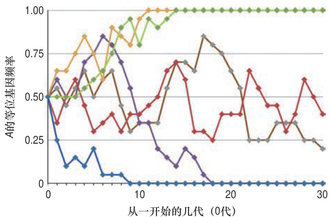  
在图21.8（a）所示的6个模拟结果中，有4个基因(a)  
(b)  

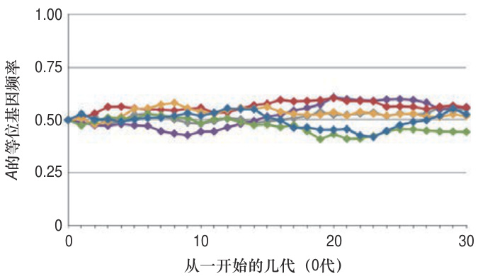  

图21.8　不同大小的种群中蒙特卡罗种群模型的漂变情况。（a）种群大小 $\mathord{\sqrt{-10}}$ 。（b）种群大小 $\mathord{\sqrt{=}}500$ 。在这两种情况下，初始条件都是相同的：位点上两个等位基因的数量相同，没有自然选择。每个彩色的线条表示不同的模拟结果。  

漂移最终导致了第18代的两个原等位基因中的一个或另一个的丢失或灭绝。在每一种情况下，等位基因频率从一代到下一代的变化形成的累积效应导致一个等位基因的灭绝，以及剩下的等位基因的固定。遗传学家认为，当只有一个等位基因存活下来，并且所有个体对该等位基因都是纯合子的时候，种群就固定在一个位点上。此时，等位基因频率不会发生进一步的变化（在没有迁移或突变的情况下）。  

如图21.8（a）所示，进行的6组实验中，最初的种群个体数为500个杂合子，通过与10个个体的群体进行对比［图21.8（b）］，发现群体大小对等位基因频率动态变化有显著影响。如果我们沿着代表每一个后代种群的数据线，我们可以看到等位基因频率的单代中的变化总是相对较小。由于等位基因频率的变化很小，传统的哈迪-温伯格方程可以对大种群中较少代数的个体的等位基因频率和基因型频率进行很好地估计。但是，从长远来看，一系列的小变化仍然会带来巨大的后果，因此，与图21.8（b）所示的结果相比，这些种群中的等位基因中的一个或另一个在许多代以后都可能最终固定。  

# 3. 建立者效应和种群瓶颈  

当种群变得非常小时，遗传漂变可以由两个相关的过程加速：建立者效应和种群瓶颈。当少数个体从更大的群体中分离出来，并建立一个新的种群，并与原种群隔离时（图21.9），建立者效应就产生了。在新群体中，一小部分创始个体只携带了原始群体的一小部分基因副本。通过随机的抽样误差，与他们来自的原种群相比，初代的等位基因频率可能出现差异；一些等位基因甚至可能无法转移到新的种群中。如果种群在建立后的一段时间内仍保持较小的数量，那么额外的遗传漂变将迅速改变等位基因频率，进一步加剧建立者效应。  

在18世纪早期，大约有200个人从德国移民到宾夕法尼亚州东部的阿米什人社区。由于这一初始族群的个体与欧洲完全隔绝，而且只在族群内部结婚，所以它受到基因漂变的影响。如今，美国的阿米什人总数超过15万，但与留在德国的阿米什人相比，在美国的阿米什人患躁郁症的概率要高得多，很可能是因为几个初代携带了产生这种病症的等位基因。  

植物和动物的种群经常受到种群瓶颈的影响，在很大一部分个体死亡时会发生这种情况，通常是环境干扰或疾病的结果。存活下来的个体本质上相当于一个创始者群体，只要种群规模保持较小，遗传漂变就会进一步加速。在德系犹太人中，某些BRCA1和BRCA2突变导致乳腺癌和卵巢癌风险升高被认为是 $600\!\sim\!800$ 年前的种群瓶颈或建立者效应造成的。  

# 21.2.3 突变引入新的遗传变异  

虽然遗传漂变最终会导致有限种群中基因多样性的图21.9　建立者效应和瓶颈效应可以迅速改变等位基因频率。由于抽样误差的关系，一个岛屿上的一小部分初代的等位基因频率可能与初代所来自的种群的频率有很大的不同。一个后果是遗传变异的丧失；注意，在岛上，黄色等位基因不再存在。此外，只要岛上的人口仍然很少，基因漂移就会加速。  

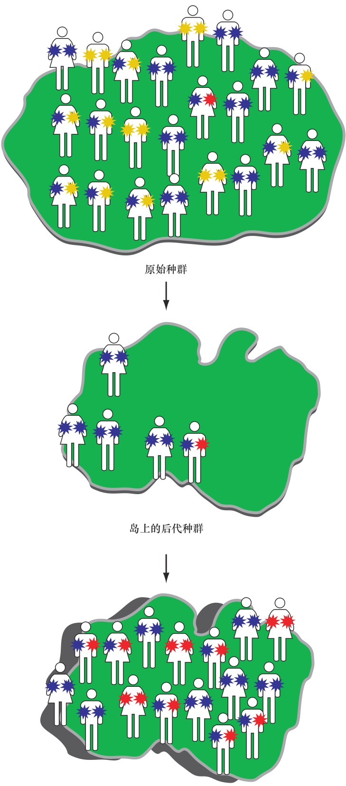  

丧失，但新的变异会不断地以新的突变或者通过迁移（从邻近种群引入）的方式出现。在这个讨论的背景下，突变指个体基因组中的一种变异DNA序列，在父母双方的基因组中都不存在。自发突变通常在单个基因中非常罕见（每10万 $\sim\!100$ 万个后代中有一个基因发生突变），因此在短期内，它们对改变群体中任何一个基因的等位基因频率的影响可以被忽略。但是突变仍然是所有基因位点产生所有新等位基因的来源，这意味着从长远来看一些突变是重要的。  

有害突变破坏了生命体的重要功能，如基因编码的酶的活性。相比之下，为生物体或种群提供选择优势的有益突变相对罕见。但许多突变属于第三类：它们产生的多态性对生物体几乎或根本没有益处或有害。后一类突变为中性突变；也就是说，由于原等位基因和突变等位基因具有选择的等价性，它们的命运——无论是新的突变、最初的DNA序列将被维持，还是最终从种群中消失，将仅由随机的、偶然的事件决定。  

在一个新的、有选择地中性等位基因发生突变的种群中，蒙特卡罗模拟显示，突变固定下来所需的代数的平均数大约等于繁殖个体的基因拷贝总数的两倍（4N，其中N是种群中二倍体繁殖个体的数量）。种群规模为10个个体时，平均固定时间为40代；规模为500个个体时，平均固定时间是2000代；对于一个2亿的繁殖个体来说，这将是8亿代，或者说160亿年（假设每代出生到生育下一代的时间是20年）。  

随着种群的增加，任何特定的新突变进入固定状态的可能性都会降低。然而，在大种群中会发生更多的突变。结果表明，在选择性中性变异中这两个因素正好相互抵消，因此DNA序列随时间的平均变化速率将简单地等于通过突变（以每代每个基因位点的突变量来衡量）输入的速率。这个比率与种群数量无关。  

随着时间的推移，许多生物的突变率似乎相对稳定。这意味着，对于遗传学互相隔离的不同种群来说，单独的中性遗传漂变会导致依赖时间的DNA差异的积累，其积累速度大致是恒定的。这一事实为进化遗传学家提供了一个分子钟，意味着他们可以通过检测这些生物的DNA序列彼此之间的差异来预测过去不同种类的生物从同一个祖先分化的时间。我们将在本章后面更详细地讨论分子钟的概念。  

# 21.2.4 自然选择表现出来的适应性差异改变等位基因频率  

与哈迪-温伯格假设相反，对于许多性状，包括遗传疾病，基因型确实影响生存和繁殖能力。因此，在实际的种群中，并不是所有的个体都能活到成年，而且总有一些个体可能活不到生育年龄。结果，随着个体成员从受精卵到成年，实际种群的基因型频率发生了变化。  

# 1. 适应性和自然选择  

对于群体遗传学家来说，个体的适应性是指个体生存并将基因遗传给下一代的相对能力。虽然适应性是与每个基因型相关的属性，但它不能在单个个体中测量；原因是每一种具有特定基因型的动物生存和繁殖能力在很大程度上受到偶然性环境的影响。然而，通过将某一特定基因型的所有个体作为一个群体来考虑，就有可能衡量该基因型的相对适应性。因此，对于群体遗传学家来说，适应性仅仅是一种统计测量。然而，适应性的差异可能会对群体内的等位基因频率产生深远的影响。  

适应性有两个组成部分：生存能力和繁殖能力。在不断变化的环境中，具有能够帮助它们生存和繁殖的变异个体的适应性相对较高；没有这些合适的变异的个体的适应性相对较低。在自然界中，逐渐淘汰适应性较低的个体，选择适应性较高的个体生存并成为下一代的父母的过程被称为自然选择。  

野外研究表明，自然选择作用于所有自然种群的性状。一个直接的例子是生活在新墨西哥州沙漠中的囊鼠的皮毛颜色。在土壤和岩石颜色较浅的地区，囊鼠的皮毛是浅色的，而在黑色火山岩地区则是深色的囊鼠。研究表明，如果囊鼠的颜色与它们生活的土壤和岩石颜色不匹配（图21.10），捕食者更容易找到和吃掉囊鼠。这一进程导致了在这两种土壤上生活的种群之间影响毛色的潜在遗传变异的强烈变化。在本节中，我们将考虑选择是如何改变由哈迪-温伯格模型预测得到的等位基因频率和基因型频率的。  

# 2. 为哈迪-温伯格的预测添加选择  

通过分析从哈迪-温伯格比例开始的受精卵群体中的特定基因，我们可以发现如何将哈迪-温伯格方程应用到正在进行选择的种群中。在这个种群中，AA、Aa引自：Nachman et al. (2003), “The genetic basis of adaptive melanism in pock-et mice,” PNAS, 100: 5268-5273. 2003 National Academy of Sciences, U.S.A.  

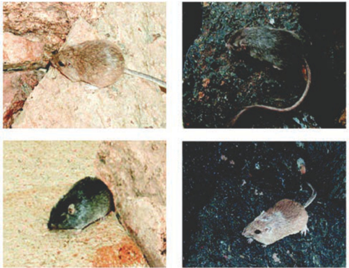  
图21.10　遗传变异可导致自然选择的适应性存在显著差异。生活在沙质土壤或黑色火山岩上的来自新墨西哥州的囊鼠，通过自然选择，其毛色与它们生活的环境色（上一行）相匹配。当它们的皮毛颜色出现在错误的环境中时，很容易被捕食者发现（并吃掉）。  

和aa的基因型频率分别为 $\cdot p^{2}$ 、2pq和 $q^{2}$ 。为了简单起见，我们假设适应性的两个组成部分——生存能力和繁殖能力，都以同样的方式依赖于基因型。如果我们分别将这三种基因型的相对适应性（W）定义为 $W_{A A}$ 、 $W_{A a}$ 和 $W_{a a}$ ，那么这三种基因型在成年期的相对频率分别为$p^{2}W_{A A}$ 、 $2p q W_{A a}$ 和 $q^{2}W_{a a}$ （图21.11）。通常，遗传学家通过为 $W_{A A}$ 、 $W_{A a}$ 和 $W_{a a}$ 赋值，并将其中最大的标记为1.0，因此，不太适合的基因型的相对适应性将小于1.0。  

当对相对适应性进行归一化后，让方程中的每一项都表示一个实际的而不是相对的基因型频率时，适应性修正的哈迪-温伯格方程是最有用的。归一化是通过两步计算完成的。首先，我们将修改后的方程中的各项之和设为一个新的变量 $\big(\,\bar{W}\,\big)$ ，即平均适应性，它表示每种基因型对下一代的相对贡献之和。  

$$
p^{2}W_{A A}{+}2p q W_{A a}{+}q^{2}W_{a a}{=}\overline{{{W}}}
$$  

当基因型适应性不同时， $\bar{W}_{\cdot}$ 小于1，因为不是所有初代的配子都能传递给给下一代。  

为了继续归一化过程，我们接下来将等式（21.3a）的每一边除以W，这样后代中成体的新方程变为  

<html><body><table><tr><td>等位基因</td><td>A</td><td>a</td></tr><tr><td>频率</td><td>p</td><td>q</td></tr></table></body></html>  

<html><body><table><tr><td>基因型</td><td>AA</td><td>Aa</td><td>aa</td></tr><tr><td>受精卵频率</td><td>02</td><td>2pq</td><td></td></tr><tr><td>相对适应性</td><td>WAA</td><td>WAa</td><td>Waa</td></tr><tr><td>自然选择后 的相对频率</td><td>p2WA</td><td>2pqWAa</td><td>q2Wa aa</td></tr><tr><td>归一化的成体 频率</td><td>P2WAA W</td><td>2pqWAa W</td><td>g?wa aa W</td></tr></table></body></html>  

<html><body><table><tr><td>等位基因</td><td>A</td><td>a</td></tr><tr><td>频率</td><td>(p²WAA + pqWAa) W</td><td>(q²w aa +pqWAa) q W</td></tr></table></body></html>

$\overline{{{W}}}=p^{2}W_{A A}+2p q W_{A a}+q^{2}W_{a a}$  

图21.11　由自然选择引起的等位基因频率的变化。为了计算自然选择后的基因型频率（成体），首先将随机交配形成的受精卵基因型频率乘以它们的相对适应度性。最后，利用等式（21.1）计算成年子代基因型频率所产生的受精卵的等位基因频率。  

$$
\frac{p^{2}W_{_{A A}}}{\bar{W}}\!+\!\frac{2p q W_{_{A a}}}{\bar{W}}\!+\!\frac{q^{2}W_{_{a a}}}{\bar{W}}\!=\!1
$$  

这个归一化方程中的每一项都代表了用于初始计算群体的下一代的每种基因型的实际频率。  

等式（21.3a）和（21.3b）的一个重要结果是，在存在选择的情况下，可以预测得知种群W 的平均适应性将在一代一代之间发生变化，并随着时间的推移使其值趋近于1。例如，W 小于1的值意味着，不是所有最初一代的个体都会繁殖下一代；原始种群的平均适应性低于所有基因型均为最优适应性的情况。然而，选择将导致下一代有利的基因型的频率增加，因此下一代的平均适应性W 将比上一代更高（更接近1）。  

为了研究这些方程是如何允许我们计算随着时间的推移选择对等位基因频率的影响，使用变量 $p^{\prime}$ 和q′来表示等位基因A和a在下一代中的频率（即图21.11的子代）。在原始种群产生的配子中，等位基因 $a$ 的频率是由整个种群中 $A a$ 和aa的成体数量所决定。如果 $\cdot q^{\prime}$ 代表下一代成体的等位基因的频率，那么  

$$
q^{\prime}\!=\!\frac{q^{2}W_{a a}+\!\frac{1}{2}2p q W_{a a}}{\bar{W}}\!=\!\frac{q\!\left(q W_{a a}+p W_{A a}\right)}{\bar{W}}
$$  

因此，经过一代的选择，等位基因 $a$ 的频率的从q改变为q′。  

了解等位基因频率在一代的选择中发生的变化是很有用的。我们可以估计这个变化为 $\Delta q{=}q^{\prime}{-}q$ 。用等式（21.4）代替q′增益（一些代数后）：  

$$
\Delta q=\frac{p q\Big[q\big(W_{a a}-W_{A a}\big)-p\big(W_{A A}-W_{A a}\big)\Big]}{\bar{W}}
$$  

等式（21.5）表明，选择可以导致一个等位基因的频率在一代到下一代之间发生变化，这种变化既取决于两个等位基因的频率，也取决于这三个基因型的相对适应性。注意，如果基因型的适应性都是一样的，当种群达到HWE后，然后 $\Delta q{=}0$ 。换句话说，如果不存在与基因型相关的适应性差异，就不可能进行选择，等位基因频率只会受到遗传漂变的影响。  

我们可以使用等式（21.5）来检验隐性遗传病（如囊性纤维化）的有害影响是如何随着时间影响种群中突变等位基因（称为 $d$ ）的频率。如果疾病通过降低存活到成年的概率来降低适合性，那么 $.D D$ 和 ${\cal D}d$ 个体的适合性是相同的，而dd个体的适合性则降低。由于只有适应性的相对值是关键因素，我们设置 $W_{D D}{=}1$ ， $W_{D d}\!\!=\!\!1$ ，$1\!\ge\!W_{d d}\!\!\ge\!0$ 。  

对于具有有害影响的基因型，适应性 $W_{d d}$ 可以从刚刚小于1（对于dd的最小选择淘汰）变化到0（dd是致命的，所以没有dd个体能存活到成年）不等。如果选择趋向于淘汰dd的纯合子， $\Delta q$ 总是负的，每一代的 $d$ 等位基  

因频率都会降低。  

当 $W_{d d}$ 小于1时，可以通过等式（21.5）推测， $q$ 随时间减小的速率会随着 $q$ 变小而减小。出现这种推测是因为 $\Delta q$ 随q2变化，并且q总是小于1， $q^{2}{<}q$ 。  

为了理解这种影响，考虑一种致命的隐性疾病的特殊情况， $W_{d d}{=}0$ 。图21.12中的虚线显示了等位基因频率从最初的0.5开始，按等式（21.5）预测的趋势下降。等位基因频率的下降速度开始时很迅速，然后减慢。10代以后，隐性疾病等位基因的预测频率仍接近 $10\%$ ，即使纯合子隐性基因型是致命的。图21.12中的实线绘制了大量黑腹果蝇常染色体隐性致死等位基因频率降低的实际数据；预测和观察到的等位基因频率变化非常接近。  

为什么当隐性致死等位基因的频率接近于零的时候，选择的有效性会降低？答案是，因为纯合的携带疾病等位基因的纯合个体（ $q^{2}$ 的频率）是罕见的，且Dd杂合子（2pq的频率）并没经历选择淘汰，大多数d等位基因的拷贝均来自杂合子Dd。在数学术语中，当q小于1时， $q^{2}$ 与q的比值以指数形式递减。在接下来的几代中，等位基因频率q应该会继续下降，尽管随着时间的推移， $q$ 越来越接近于0，下降的速度会越来越慢。  

# 3. 有限种群中的自然选择  

用相对适应性修改哈迪-温伯格方程克服了原来方程的一个限制：所有可能的基因型的假设在适应性上都是相等的。但是用这个修正方程的解析来确定Δq仍然受到种群数量为无限大这一假设的影响。然而，我们可以使用修正的哈迪-温伯格方程来开发蒙特卡罗模拟，以探索自然选择对有限种群的影响。  

作为一个例子，让我们考虑种群为500个个体，其中499个为等位基因 $b$ 的纯合子，1个为染色体上有B突变的杂合子的情况。生存能力方面仅有一个轻微的主导优势的情况。相对适应性的值： $W_{B B}{=}1.0$ ， $W_{B b}{=}1.0$ ，$W_{b b}{=}0.98$ 。可以用蒙特卡罗方法对这些条件建模，该方法可以随机地消除每一代产生的 $2\%$ 的 $b b$ 个体，并用亲图21.13　自然选择加上遗传漂变的影响。每条颜色线代表一个种群大小为 $\cdot N{=}500$ 的独立的蒙特卡罗模拟，在初始时刻，其中一个新的突变等位基因具有轻微的适应性优势出现。在三个模拟实验中，当等位基因的频率非常低时，由于基因漂移，突变等位基因在少于100代的时候就灭绝了。剩余的逃脱了灭绝的有利突变，其模拟结果不可避免地转向固定。  

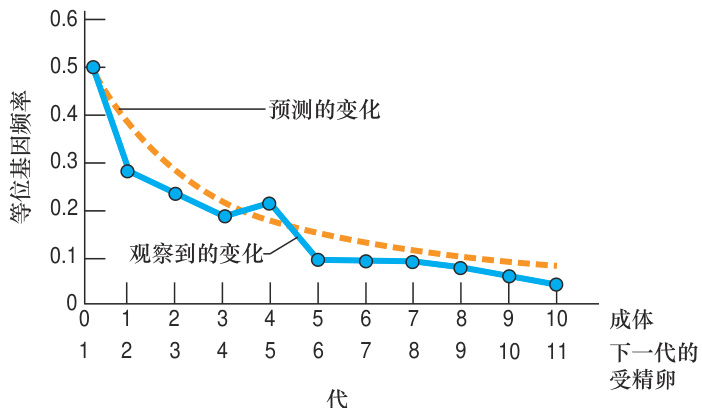  
图21.12　随着时间的推移，隐性致死等位基因的频率降低。虚线表示数学预测。蓝色的线代表从实验中获得的一个常染色体隐性致死等位基因的实际数据。  

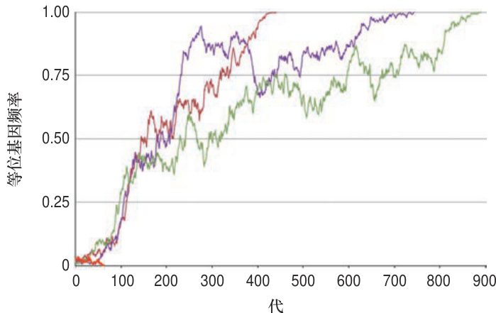  

代新交配的后代替代它们。  

图21.13显示了这个种群模型的6个模拟结果。首先要注意的是，在其中3种模拟结果中，新的B等位基因频率从未上升，在65代之内就灭绝了。但在B等位基因频率增加到0.10左右的种群中，它不可避免地会倾向于固定。  

一个小的、有实际适应性优势的、新的突变等位基因能够繁殖成一个种群，这个例子说明了两个重要方面。首先，尽管新的等位基因提供了一种选择性优势，但由于在最初几代繁殖的偶然事件，它往往也会灭绝。其次，如果有利的等位基因达到了保证其生存的阈值频率水平，那么其频率将一直增加直到最终固定，即使个体水平上的小适应性优势是难以察觉的。  

# 4. 自然选择对人类的影响  

从6万 ${\sim}8.$ 万年前开始，当人们从智人起源的东非地区迁移出来时（本章稍后将讨论），始创群体在欧洲和亚洲遇到了与非洲不同的环境条件。结果，一些基因上的替代等位基因的相对适应性发生了逆转。最明显的变化是决定皮肤色素沉着的等位基因频率的差异。  

太阳的紫外线可以同时给人们带来好处和坏处。一个好处是促进维生素D的产生；它的危害是在我们的皮肤中诱导突变，从而导致皮肤癌。接近赤道时，太阳的光线最强烈。导致皮肤变黑的等位基因在热带地区是有利的，因为它们可以防止皮肤癌，同时允许足够的紫外线通过皮肤来产生维生素D。在高纬度地区，阳光的强度较低，皮肤癌的问题也比较小，而使皮肤变亮的等位基因允许足够的紫外线穿透以产生足够的维生素D。  

正如第3章所述，皮肤色素沉着是由许多基因的等位基因决定的一种复杂的数量性状，但大约有6个最重要的。关于我们作为一个物种的历史，一个有趣的问题是，欧洲人和亚洲人的皮肤色素沉着是来自于共同的祖先，还是在两个大陆上分别进化而来。通过在旧大陆不同地理位置的土著居民的多重色素位点上测量等位基因频率，得到了一个复杂的答案。  

KITLG是少数几个在皮肤色素沉着中起重要作用的基因之一。在图21.14中可以看到，欧洲人和亚洲人共享一个公共的KITLG SNP变体来负责减少色素沉着，表明他们来自共同的祖先，这些人生活在人类从非洲迁移到阿拉伯半岛之后及向西北部和东北部分离之前。相反，在决定色素沉积的另外两个位点上，欧洲人和亚洲人存在着变异［SLC24A5和MC1R；图21.14（b）和（c）］。因此，虽然在这两个种群中都同样存在减少日照的选择压力，但这种选择作用于人类历史上不同时期发生的不同突变。  

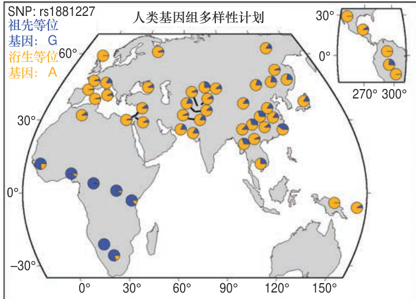  
(a)  KITLG   
(b)  SLC24A5  

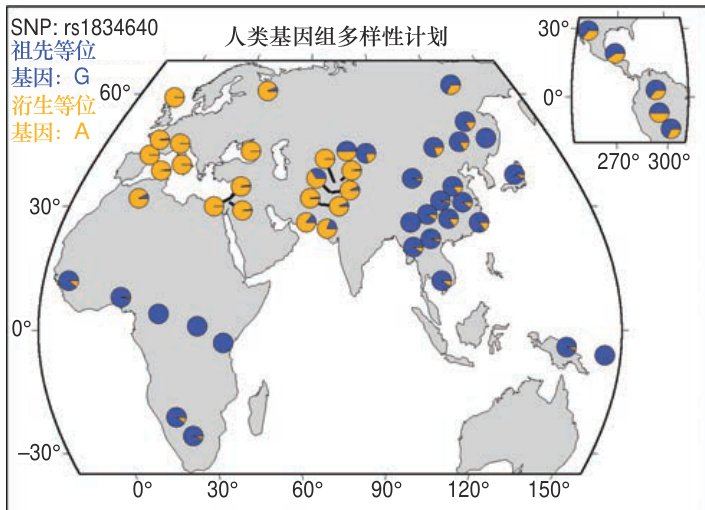  
(c)  MC1R  

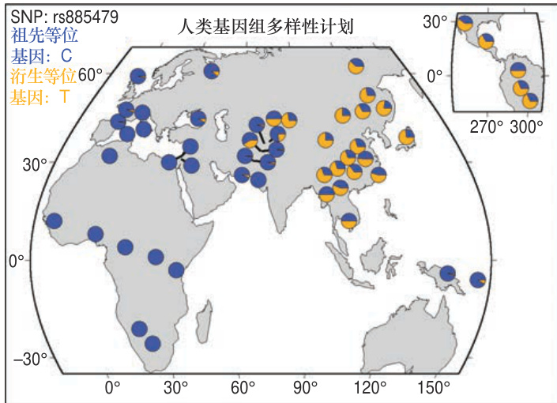  
图21.14　皮肤色素沉着位点的等位基因频率的地理分布。  

另一个最近在不同人群中强烈地自然选择改变等位基因频率的例子是乳糖酶的持久性，我们在本章的开头介绍了它（回顾图21.1）。在这里，选择不是通过接触不同的环境来实现的，而是通过人类农业的发展和牛的驯养来实现的，牛可以提供牛奶作为营养来源。在编码乳糖消化酶的基因上游区域发生的偶然突变，消除了所有哺乳动物都会表现出的断奶后基因表达中断这一现象。那些在青少年和成年时期仍能消化牛奶的人，在食物匮乏的情况下，可以活得更好，或有更多的后代，这导致了世界某些地区持久性乳糖酶突变存在适应性优势。  

# 21.2.5 平衡选择的影响可以维持种群中的等位基因  

镰状细胞贫血是β珠蛋白基因（Hbβ）上的镰状细胞等位基因的两个拷贝所决定的一种隐性疾病，病症包括情节严重的疼痛、严重贫血，并有一定的概率会造成过早死亡。令人惊讶的是，这种疾病等位基因并没有从几个非洲种群中消失，在那里它似乎已经存在了很长一段时间。  

有一条线索表明，观察发现，在人类 $/H b\beta^{S}$ 上的镰状细胞等位基因的等位基因频率最高的地区是非洲的疟疾流行的地方（图21.15）。第二个线索是正常基因和镰状细胞等位基因的杂合子（ $:H b\beta^{A}\;H b\beta^{S}$ ）个体可以抵抗疟疾。某种程度上，这种抵抗性是由于含有镰状细胞等位基因的红细胞在被疟原虫感染后会破裂，破坏疟原虫和红细胞本身。相比之下，在有两个正常血红蛋白等位基因的红细胞中，疟疾寄生虫会大量繁殖。因此，在疟疾传染地区，与其他纯合子相比，基因型为HbβA HbβS的个体有杂合子优势：与HbβA HbβA的纯合子相比，杂合子的携带者不易感染疟疾，且不受贫血的影响。杂合子优势是平衡选择的几个过程之一，有效维护了基因多态性。  

为了从数学角度上解释杂合子优势，假设 $H b\beta^{A}$ HbβS杂合子的最大相对适应性为1，相对适合HbβA HbβA纯合子的相对适应性为 $W_{A A}$ ， $H b\beta^{s}\ H b\beta^{s}$ 相对适应性为$W_{a a}$ （为了简化下面的方程，我们暂时重命名等位基因HbβA为A，频率是 $p$ ，重命名等位基因HbβS为a，频率是$q$ ）。只有 $q$ 为 $0\!\sim\!1$ 之间的某个值，且 $\Delta q{=}0$ 时，自然选  

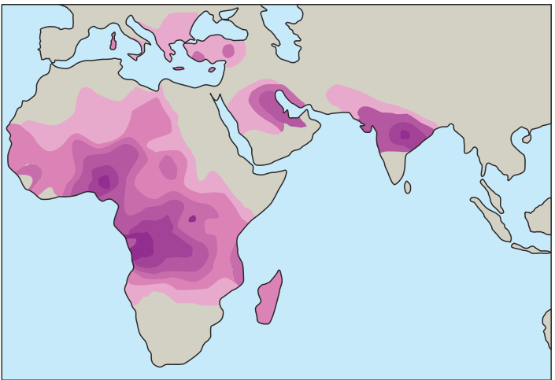  
(a) $H\!b\beta^{\mathcal{S}}$   
(b)  

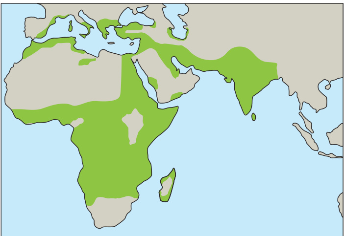  

(c) Hbβ   
HbβAHbβA    Hbβ AHbβS    HbβSHbβS   
0.8 1.0 0   
$H\!b\beta^{S}$ $=0.17$  

图21.15　镰状细胞等位基因HbβS在疟疾流行的非洲地区的频率较高。（a）HbβS的地理分布。（b）引起疟疾的恶性疟原虫的地理分布。（c）HbβA HbβS杂合子降低了对疟疾的易感性，因而与完全受疟疾影响的HbβA HbβA纯合子和患有镰状细胞性贫血的HbβS HbβS纯合子相比，HbβA HbβS杂合子具有自然选择优势。  

择才能保持种群中的两个等位基因。 $\Delta q{=}0$ 时， $q$ 值被称为等位基因的平衡频率。当等式（21.5）括号内的项为0时，求得q值，即为  

$$
[q(W_{a a}-W_{A a}){-}p(W_{A A}{-}W_{A a})]{=}0
$$  

用 $1\!-\!q$ 替 $\updownarrow p$ 并求解等式（21.6），得出HbβS的平衡频率 $\cdot q$ ，即 $q_{e}$ ，  

$$
q_{e}=\frac{W_{A d}-W_{A a}}{\left(W_{a a}-W_{A a}\right)+\left(W_{A d}-W_{A a}\right)}
$$  

因此，为了找到种群中存在的两个等位基因的平衡频率，也就是说， $\Delta q{=}0$ 时 $q$ 的值，由于 $W_{A a}$ 被设置为1.0，所以只需要知道有两种纯合子的相对适应性即可。  

另一方面，如果已经知道一个纯合子的平衡频率和相对适应性，可以用等式（21.7）来估计另一个纯合子的相对适应性。例如，我们可以假定由于自然选择作用于β珠蛋白基因，使得镰状细胞贫血流行的非洲种群大致达到了平衡状态。一些领域的研究显示，热带种群中等位基因HbβS的平均频率是0.17，所以我们用这个值标定平衡频率 $q_{e}$ 。由于在有疟疾的地区，杂合子HbβAHbβS拥有最高的适应性，我们假定 $W_{A a}{=}1$ 。进一步，如果假定HbβS HbβS的纯合子不会繁殖，在进步医学使得患有镰状红细胞性状的儿童生存之前，这一假设是真实存在的，即 $W_{a a}{=}0$ 。当 $W_{a a}{=}0$ 、 $W_{a a}{=}1$ 时，可以重新排列等式（21.7），可估算由 $q_{\epsilon}$ 得到的野生型 $W_{A A}$ 的相对适应性：  

$$
W_{A d}=\frac{1-2q_{e}}{1-q_{e}}=\frac{1-2\big(0.17\big)}{1-0.17}=0.8\
$$  

要理解 $q$ 的变化和平衡频率 $q_{e}$ 之间的关系，可以使用等式（21.5）和等式（21.7）为Δq推导一个新的方程：  

$$
\Delta q=\frac{-p q\Bigl[\bigl(1-W_{A A}\bigr)+\bigl(1-W_{a a}\bigr)\Bigr]-\bigl(q-q_{e}\bigr)}{\bar{W}}
$$  

从等式（21.8）中可以看到，当 $q$ 大于 $q_{e}$ 时， $\Delta q$ 是负的。在这种情况下， $q$ （即等位基因 $H\!b\beta^{s}$ 的频率）将向着平衡状态降低。相比之下，当q小于 $q_{e}$ 时， $\Delta q$ 为正值，HbβS的频率将向着平衡状态增加。因此，等位基因频率在平衡状态下是稳定的，因为从平衡状态改变后总是会回到平衡状态。  

# 21.2.6 一个广泛的例子：人类的行为可以影响害虫的进化  

在第14章中，我们讨论了针对人类开发出的为了保护我们免受感染的药物，病原体细菌的种群是如何进化出对药物的耐药性的。像感染性细菌一样，许多威胁人类健康和农业的昆虫由于繁殖时间短和繁殖速度快而大量繁殖。通过对具有抗性的突变进行自然选择，这些快速繁殖的二倍体昆虫对化学杀虫剂产生了耐药性。  

20世纪40年代，DDT（二氯二苯三氯乙烷）和其他合成有机杀虫剂的大规模商业使用，最初成功地减少了农业害虫（如棉铃象甲、传播疟疾和黄热病的蚊子这类传病昆虫）对作物的破坏。然而，在几年内，在目标昆虫种群中发现了对这些杀虫剂的耐药性。事实上，在商业化引入的10年内，每一种已知杀虫剂的耐药性都发生了进化。由于一个物种内的不同种群可以独立于其他种群而产生耐药性，自引入杀虫剂以来，杀虫剂耐药性可能在许多昆虫物种中分别出现过多次。  

遗传研究表明，几种不同基因的突变可能导致杀虫剂抗性。例如，DDT是昆虫中的一种神经毒素，因为它与钠通道蛋白结合，因此破坏了该蛋白质在神经传递中的功能。一些昆虫通过基因编码渠道的隐性突变产生DDT抗性，这种基因产生的渠道蛋白不能很好地与DDT结合。家蝇和某些蚊子通过其他基因的显性突变对DDT产生耐药性，突变结果造成基因编码的酶可以为DDT解毒，使DDT对昆虫无害。在某些情况下，这些显性等位基因发生在基因的调控区域，并使得解毒酶过表达。  

对害虫的控制来说，引起DDT耐药的隐性和显性突变都是我们应关注的重点，但在这里我们更关注的是显性突变，正如我们所看到的，它可以在种群中迅速传播。例如，假设显性突变R（杀虫剂抗性）最初在群体中发生频率较低，突变出现后不久，大部分的R等位基因都在Rr杂合子中（其中 $r$ 是野生型易感性等位基因）。随着杀虫剂的应用，对 $R r$ 杂合子的强烈选择将迅速增加种群中耐药等位基因的频率。  

在泰国曼谷进行的一项关于使用DDT控制埃及伊蚊（黄热病的传播媒介）的实地研究表明了耐药性的迅速演变。1964年开始喷洒杀虫剂，对控制蚊子非常有效。然而，在一年内，显性的DDT抗性突变等位基因（ $R$ ）出现且频率迅速增加。到1967年中期，RR纯合子的耐药性个体的频率接近 $100\%$ （图21.16）。  

由于DDT耐药等位基因几乎固定，DDT在曼谷减少蚊子数量的效果不佳，因此停止了杀虫剂喷洒计划。蚊子种群对停止喷洒的反应是耐人寻味的： $R$ 等位基因的频率迅速下降，到1969年，RR基因型几乎消失（图21.16）。  

$R$ 等位基因频率的急剧下降，表明在没有DDT的情况下，RR基因型的适应性低于 $r r$ 基因型。换句话说，纯合子抗性基因型给个体带来了适应性成本，在没有杀虫剂的情况下，抗性会受到负性选择的影响，从而降低种群中R的频率。这种个体基因型适应性对环境的依赖与携带导致镰状细胞性贫血突变的人在世界上疟疾流行的部分地区的杂合子优势情况非常相似。  

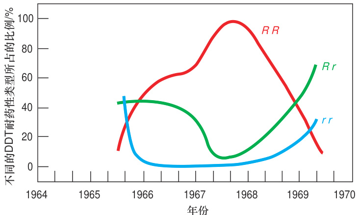  
图21.16　埃及伊蚊种群的基因型频率如何随杀虫剂的施用而变化。从1964年开始到1968年结束，泰国曼谷郊区使用DDT杀虫剂后观察到的结果。  

# 基本概念  

●  虽然哈迪-温伯格方程在几代生命体的进程中几乎总是能够精确地估计等位基因频率和基因型频率，但由于实际的种群不符合哈迪-温伯格假设，所以从长远来看，它并不总是有效的。  
●  在小种群中，由于对有限的配子库进行随机抽样而产生的遗传漂变可以迅速地改变等位基因的频率，直到它最终丢失或固定。  
●  由于不同的基因型可能表现出不同的适应性，随着时间的推移，自然选择可能会增加或减少等位基因频率。  
●  相对于存在不同类型基因型，某种基因型在一种环境下更适合，但在另一种环境下不适合。例如，镰状细胞突变的杂合子对疟疾具有抵抗性，这解释了这种等位基因在热带种群中的高频率。  
●  昆虫针对杀虫剂耐药性的适应性优势往往与适应性成本并存的；因此，当人类施用或停止施用杀虫剂时，耐药性等位基因频率会迅速改变。  

# 21.3 现代人类的祖先与进化  

# 学习目标  

1. 区分个体的生物学祖先与遗传学祖先。  
2. 总结现代人类起源于非洲的证据。  
3.  解释DNA测序是如何阐明古代人类与现代人类的血缘关系的。  

在这一章的开头，我们看到地球上不同地区的人类在乳糖耐受或不耐受的等位基因频率上有很大的差异。这些等位基因频率当今的变化反映了人类历史进程中发生的许多过程。最早的人类几乎可以肯定都是乳糖不耐受患者，其他灵长类动物也是如此。在人类历史上，至少有两次，并且是在不同的地理位置上发生了基因突变，使得乳糖酶的表达能够持续到成年。在饲养奶牛的种群中，突变等位基因的频率迅速增加，因为从奶制品中获取营养提供了选择性优势。在较小的奶牛场牧民的种群中，遗传漂变也可能是这些等位基因传播的原因之一。之后突变等位基因通过携带等位基因的个体迁移进入其他种群。  

这个例子说明了特定DNA变异的存在，以及这些变异在不同人类群体中出现的频率，作为分子化石，可以为科学家对塑造人类历史事件提供帮助。我们在此探讨群体遗传学如何为人类学、人类研究提供重要的工具。  

# 21.3.1 共有等位基因表示共同的遗传祖先  

人类个体有两种祖先：生物学祖先和遗传祖先。生物学祖先只是简单地描述谁生谁：你有2个生物父母，4个祖父母，8个曾祖父母，等等［图21.17（a）和（b）］。假设每一代的祖先均不相关，那么现在活着的个体在k代以前可能拥有 $2^{k}.$ 个生物学祖先。因此，20代之前（大约400年前）你可能有超过100万的生物学祖先，30代之前（大约600年前）这个数超过10亿。后一个数字远高于历史上那个时期（中世纪）地球上的人类数量，所以前几代人的一些祖先肯定是有血缘关系的。但尽管如此，在不久以前，你仍然有大量的生物学祖先。事实上，你几乎可以肯定和某个名人有关系，也和某个臭名昭著的人有关系。  

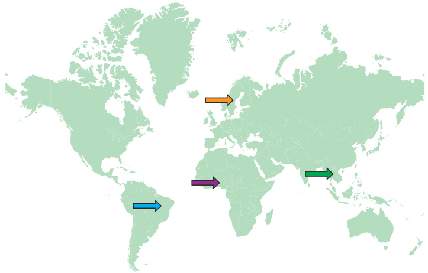  
(a)   
(b) Dion  Ana  

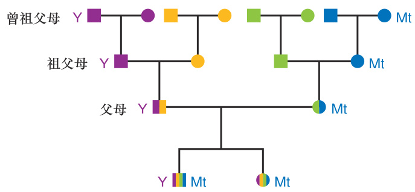  

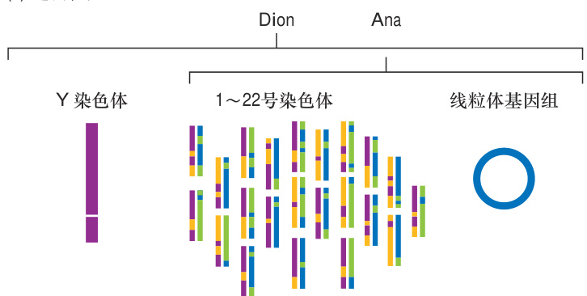  
图21.17　生物学祖先和遗传祖先。（a）Dion和Ana的曾祖父母来自世界4个不同的地区。（b）追溯Dion和Ana与生物学祖先在Y染色体、常染色体和线粒体（Mt）上的关系。（c）Y染色体DNA变异追踪父系谱系，mtDNA追踪母系谱系。常染色体（染色体 $1\!\sim\!22$ ）发生重组，因此必须分别追踪单个染色体片段的祖先。  

# 1. 最近共同祖先（MRCA）  

遗传祖先是指从生物学祖先的那里实际继承到的基因组片段［图21.17（c）］。对比图21.17（b）和（c）可知，对于人类基因组的二倍体区域，我们的生物学祖先要比遗传祖先多得多。原因是我们每个人都有两个父母，每个父母一个二倍体常染色体位点上都有两个等位基因，但是我们只能从每个父母那里继承一个等位基因。正如我们刚刚看到的，一个人的生物学祖先的数量在过去的每一代都呈指数增长。但在过去的任何一代中，某个人的基因组中的任何一个给定的基因位点，只有两个遗传祖先存在。  

描述遗传祖先的一个非常有用的术语是最近共同祖先（MRCA），即两个或两个以上特定人群共有特定的基因组区域的最近共同祖先［图21.18（a）］。MRCA描述了一个存在于上一代DNA位点的最新序列，该序列以一条完整的线传递给两个或两个以上的当前个体。重要的是，要明白尽管当前个体的某些共同祖先一定在他或她的基因组中藏有MRCA，但MRCA是DNA区域的过去序列，而不是过去某个特定的个体。  

  
(a)       (MRCA)   
(b)        MRCA  

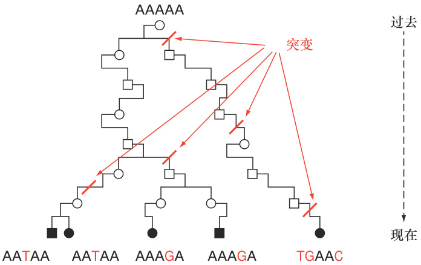  

图21.18　追寻遗传祖先。（a）对于单个基因组位点，活在当下的5个人的遗传谱系可以合并到一个祖先型等位基因上，即最近共同祖先（MRCA）。（b）对共享突变的分析使科学家能够追溯谱系到MRCA。  

例如，在图21.18（a）中，在今天活着的5个人中，携带一个特定常染色体区域的等位基因的最近共同祖先的个体在7代之前就已经存在。  

由于重组，两个今天的近亲基因组的不同区域可能有MRCA，这些MRCA存在于不同的共同祖先中。事实上，在他们的基因组中，两个亲属之间的MRCA起源于过去的许多个体。这种说法反映了这样一个事实，即任何一个特定的人都从他或她的许多生物学祖先（但不是全部）那里继承了基因组的片段［见图21.17（c）］。  

对于基因组的任何特定区域，所有人类的MRCA是最近的等位基因，该等位基因来自目前所有人通过一条未断过的血缘线得到的DNA序列。携带这一特定基因位点的MRCA的个体，与那些只将自身的基因给了如今的部分（或者没有）人类的那些个体同时存在。  

与我们基因组中重组的二倍体部分相比，线粒体DNA（mtDNA）是直接从母亲传给后代，与父亲没有任何关系［图21.17（b）和（c）］。同样，排除由X和Y染色体共享的小PAR区域，Y染色体上的DNA是直接从父亲传给儿子，女儿不会继承Y染色体［图21.17（b）和（c）］。因此对于mtDNA或Y染色体DNA，我们每个人每一代只有一个遗传祖先。这些序列不可能来自同一个人，因为mtDNA是母系的，Y DNA是父系的。由于缺乏重组，对所有人类来说，整个mtDNA和几乎整个Y染色体都只有单一MRCA。  

# 2. 由突变揭示的遗传谱系  

通过遗传祖先的视角来观察人类的历史是解释当今人类DNA序列变异的一种强有力的方法。当我们随着时间往回追溯时，会发现不同的等位基因谱系会与MRCA结合到一起［图21.18（a）］。因此，MRCA提供了一个分析的起点：某种祖先的等位基因，其后代的该基因序列在地球上的所有人身上都能找到。  

即使一个完整的系谱可以将MRCA与所有现代人的基因序列联系起来，这并不意味着所有与MRCA相关的基因序列都是相同的。原因在于，在连接现代人类和MRCA的谱系中，基因突变可能偶然发生，在我们从MRCA中分离出来的那几代遗传祖先的基因中留下痕迹［图21.18（b）］。  

研究人员通过分析当今个体共有的突变来确定这些谱系。因为突变随着时间的推移而积累，如今两个个体的等位基因之间的祖先分支长度越长，他们的DNA序列就越不同。可以在图21.18（b）中看到这个事实的含义，正如我们所看到的，目前活着的5个个体的等位基因可以追溯到7代以前的一个MRCA。MRCA的DNA序列为AAAAA。随着这个序列被代代相传，它可能发生种系突变，产生新的后代等位基因。注意图21.18（b）中个体的等位基因与家族病史（如在左下角的兄弟姐妹）是密切相关的，其等位基因的序列（AATAA）完全相同，但与右侧的个体（TGAAC）相比，他们的5个核苷酸位置上的核苷酸中有4个与这个个体不同，尽管其等位基因来自一个不同的家庭血统，但是仍然来自顶部的MRCA。  

在第11章中，我们看到了这张经过修饰的后代图，群体遗传学家利用这张图解释从许多不同人类种群的大量个体身上获得的DNA序列数据（回顾图11.6）。如果SNP等位基因既存在于今天的人类中，也存在于其他灵长类物种的某些物种（如黑猩猩）中，那么该等位基因就是祖先，并且必须直接从人类和黑猩猩的共同祖先那里遗传下来，而不发生突变。相比之下，在某些人群中发现的新生型SNP等位基因，在其他人群或在黑猩猩中都没有发现，突变肯定发生在特定的人类子代MRCA之后的某个世代。与DNA序列差异较大的种群相比，存在更多共有等位基因的种群一定是最近才分离的。  

如图21.17所示，追踪mtDNA和Y染色体序列的变异特别有价值，因为通过这些序列，分别可以清晰地估计母系和父系遗传。常染色体也提供祖先信息，但由于二倍体遗传和重组，这些数据需要更复杂的分析。  

# 21.3.2 现代人类起源于非洲  

廉价的DNA测序技术的迅速发展，使得从唾液等容易获得的样本中收集数据成为可能，极大地促进了对当代人类的基因谱系和关系的研究。  

# 1. 线粒体夏娃和Y染色体亚当  

正如之前在第15章“快进”信息栏“线粒体祖先”中讨论的那样，最初的思考来自于对母系遗传的mtDNA分子的研究。这些调查证实，来自撒哈拉以南非洲、东南亚、欧洲的种群的人，与澳大利亚土著和新几内亚土著居民都拥有最近的共同祖先mtDNA，它们来自于一种生活在不大于20万年前的雌性——线粒体夏娃。结合产生差异后的样本的独立考古学和地质学年代评价，并通过样本中mtDNA突变积累速率来做出了这个时间的估量。对于许多谱系和基因组来说，这个速率是非常恒定的，因此它构成了一个分子钟。  

科学家进一步得出结论——线粒体夏娃生活在非洲。这一说法的证据是，非洲种群的mtDNA序列多样性远远超过世界其他地区的人口。也就是说，在历史上，与在其他大陆上发现的任何种群的谱系分化的分支点相比，当今差异最大的非洲人的谱系分化的分支点更早。  

对父系遗传Y染色体的研究也得出了类似的结论。导致所有现代人类Y染色体的谱系都与一种MRCA结合，这种MRCA一定是由生活在20万 $\sim\!30$ 万年前的雄性——Y染色体亚当携带的。非洲人在Y染色体序列上的多样性比世界其他地区的人之间的多样性要大得多。这些观察表明Y染色体亚当也是非洲人。虽然线粒体夏娃和Y染色体亚当有可能同时存在，但它们的生活更有可能在数万年之后分离。  

# 2. 追踪地球上的人类种群  

这些关于mtDNA和Y染色体DNA变异的研究，再加上最近的调查显示，常染色体区域的MRCA也由生活在非洲的个体携带，非常一致地揭示了一幅关于人类起源和人类在全球传播的画面（图21.19）。现代人类都起源于大约20万年前的撒哈拉以南的非洲地区。这些人后来分散在非洲各地。然后，在不多于6万年前，一群非洲人离开非洲大陆，沿着南亚分散，接着是最近一批的种群从非洲分散到中东定居。从亚洲和中东这些最初的种群开始，人类在几次移民潮中进一步扩展到全球。  

非洲以外的种群比非洲人的遗传多样性更少的原因是，非洲以外的人在所有基因组区域都有一个更近的共同祖先。另一种理解这种现象的方法是建立者效应，即6万 $\sim\!8$ 万年前离开非洲的小种群只是在非洲发现的遗传多样性中的一个子集（图21.20）。  

DNA测序调查揭示了许多关于人类祖先的惊人而有趣的故事。例如，现在从里海到太平洋的广大亚洲地区中 $8\%$ 的男性体内发现了大约在1000年前起源于蒙古的一种Y染色体谱系；这个世系大约占当今世界男性总数的 $0.5\%$ 。在如此大的区域内如此迅速地扩散不可能是偶然发生的。更确切地说，这种血统的传播伴随着成吉思汗和他的男性亲属所建立的庞大帝国。他们杀死了遇到的雄性，并生下了许多孩子，这些孩子的后代现在广泛分布在南亚。  

# 21.3.3 欧洲和亚洲的现代人与其他人类混交  

人类学中一个长期存在的问题是解剖学上的现代人与化石之间的关系，这些化石显然与现代人十分相似，但在形态学上，一些关键部分也有很大的不同。尤其令人感兴趣的是尼安德特人，他们的化石可追溯到3万年前，在欧洲南部和中亚的洞穴中被发现。这些标本显示出非常粗壮的体格、大眉骨和重头骨［图21.21（a）］。灭绝的尼安德特人是一个完全独立的人属谱系吗？或者，假设尼安德特人与其他人种共存了可能有10 000年左右的时间，而其他人种与我们有更明显的联系，那么是否可以想象尼安德特人与其他人种的人一起繁殖，从而在今天的人类中发现了一些尼安德特人的基因？  

# 1. 尼安德特人和丹尼索瓦人基因组DNA序列  

最近，科学家们通过将现代人的基因组序列与保存特别完好的尼安德特人骨骼［如图21.21（a）所示］的基因组序列进行比较，解决了有关智人与尼安德特人关系的问题。引人注目的是，例如，研究人员已经能够从在克罗地亚的一个洞穴中发现的尼安德特人股骨（一种腿骨）的碎片中测序完整核基因组，这些股骨可以追溯到大约38 000年前。序列检测发现尼安德特人的DNA与现代人之间的差异比任何两个现代人类之间的差异高好几倍，同时多方面的证据表明，可能尼安德特人与智人的谱系分化发生在 $800\,000{\sim}500\,000$ 年前。  

从这个尼安德特人的股骨和另外几个尼安德特人的骨头中获得的DNA序列使科学家能够描述尼安德特人的某些形态学特征。在图21.21（b）所示的重建图中，这个尼安德特人的头发是红色的，皮肤颜色是浅色的。这些特征并不是艺术家想象出来的，而是对黑色素1受体基因（MC1R）序列的具体预测。一些尼安德特人的标本拥有这一基因的变体，在现代人类中并没有发现，但这与一些现代人类的一种等位基因相似，这种等位基因编码了一种MC1R蛋白，而这种蛋白质功能效率低下。拥有这种MC1R基因等位基因的人拥有红头发和白皙皮肤的概率高于平均水平。  

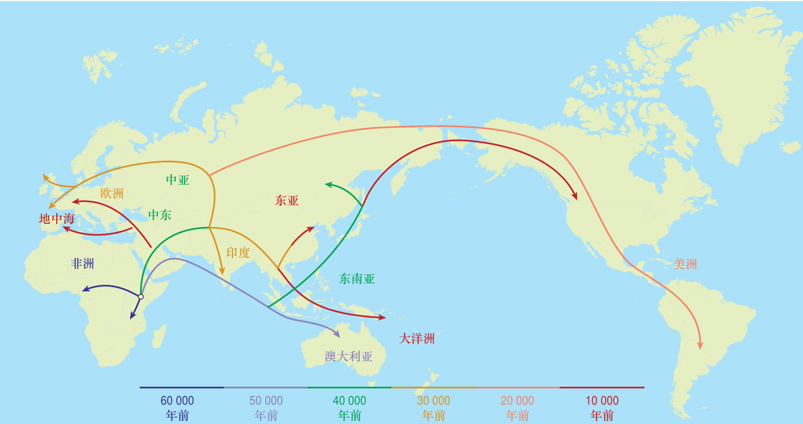  
图21.19　展示了现代人类是如何分布到整个地球上的。种群中的一部分人离开了非洲老家，越过红海进入了南亚，然后进入了澳大利亚；之后，该种群的其他成员从非洲移居到中东。然后人们通过主要的迁徙路线传播到地球的其他地方。这张地图不仅包含了遗传数据，还包含了人类学、文化、语言和古生物学方面的信息。  

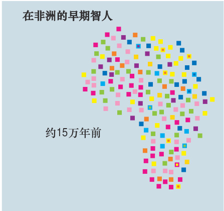  

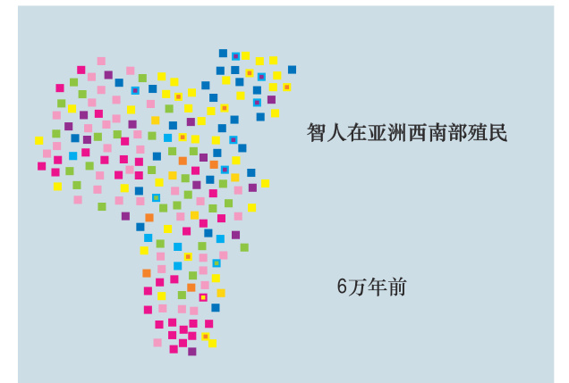  

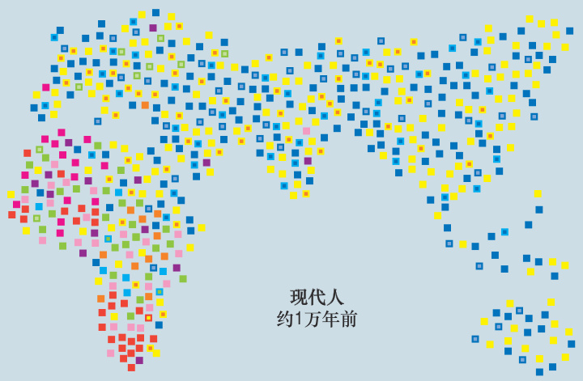  
图21.20　为什么非洲人的遗传多样性比世界上其他地方的人都大。人类在不多于6万年前走出非洲，这些人只是当时非洲大陆上人类种群的一小部分，只包含了当时非洲人类种群遗传多样性的一小部分。不同颜色代表对于特定基因组区域的不同等位基因（现代人是智人的亚种）。  

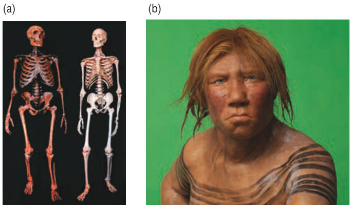  
图21.21　尼安德特人：古老的人类。（a）尼安德特人（左）和现代人（右）完整骨骼的比较。（b）艺术家对尼安德特人面部的重建。（a）： $\copyright$ EPA/American Museum of Natural History/Newscom；（b）： $\copyright$ Mark Thiessen/National Geographic Society/Corbis  

成功研究从欧洲洞穴中获得的尼安德特人骨骼碎片的古代样本，激励了人类学家从亚洲寻找更多的骨骼样本。在蒙古北部西伯利亚的一个山洞里发现了一名在这里生活并死亡的小女孩，对她手指尖端的一小块骨头碎片进行DNA分析发现了意想不到的结果。DNA变异的模式表明，她代表了一种以前不为人知的人种，他们可能在60万年前与尼安德特人发生谱系分离，而在大约80万年前与现代人类发生谱系分离。这个家族中的个体被称为丹尼索瓦人；化石记录表明，丹尼索瓦人大约在3万年前就灭绝了，在此期间，现代人类已经在亚洲大部分地区蔓延开来。  

# 2. 人类杂交和人类历史  

考虑到现代人可能与尼安德特人和丹尼索瓦人共存了几千年，我们的祖先是否至少在某种程度上与其他的人类种群杂交？尼安德特人和丹尼索瓦人在他们的谱系灭绝之前交配过吗？通过对许多现代人的DNA序列、各种非人灵长类动物（如黑猩猩）、多个尼安德特人，以及现在少数的丹尼索瓦人的DNA序列的比较，研究人员得以得出结论：所有这些人类群体间的混种繁殖实际上都发生了。  

群体遗传学家通过一种简单的统计方法来判断不同遗传谱系祖先之间的杂交。例如，他们比较两个不同的人类（ $H_{1}$ 和 $H_{2}$ ）分别与尼安德特人和一只黑猩猩（ $C$ ）的某些基因位置上的序列差异。然后，科学家们将注意力集中在尼安德特人与黑猩猩不匹配的位点上［也就是说，并没有从三个谱系（ $H_{\textrm{\tiny>}}$ N和C）的共同祖先那里继承派生的变异；图11.6中已经说明了这个想法］。如果 $H_{1}$ 和 $H_{2}$ 与尼安德特人在这些位点的序列匹配的百分比有显著差异，那么今天的一些人从尼安德特人那里继承了变异，而其他人没有。  

引人注目的是，在尼安德特人而非黑猩猩身上发现的变异中，约有 $2\%$ 的变异存在于生活在非洲以外的现代人的基因组中，而在非洲土著居民身上却很少或根本没有发现尼安德特人特有的变异。这项测试在丹尼索瓦人序列上的应用显示了一种不同的模式，丹尼索瓦人的祖先主要局限于东南亚和南太平洋（大洋洲）。  

这些对过去杂交的见解，以及对当代和古代人类谱系的DNA序列关系的推断［使用图21.18（b）所示的血统修正（descent with modification）的逻辑］，提出了图21.22所示的现代人类进化的假想时间表。在智人开始出现在非洲之后，尼安德特人与现代人谱系的基因交换在8.5万 ${\sim}3$ 万年前的中东和欧洲发生过几次。从那以后，尼安德特人的DNA变异伴随着人类移民进入非洲以外的世界。在亚洲，现代人类的祖先和丹尼索瓦人的祖先在同一时期也进行了杂交。从丹尼索瓦人身上获得的DNA变异随后随着现代人迁移到东南亚和大洋洲，这些变异在今天的人群中仍然存在。  

# 基本概念  

●  由于突变率随时间的推移是恒定的，相同或不同物种的基因组之间的中性DNA序列变化充当了分子钟。  
●  随时间向前追溯，基因谱系与最近的共同祖先（MRCA）结合在一起。通过血统修正的逻辑来检查DNA序列，科学家可以推断出谱系的历史。  
●  非洲人的DNA序列的多样性比非洲以外的人的DNA序列的多样性更大，这一事实表明现代人类最初是在非洲进化的，后来有一部分非洲人移民到地球其他地方。  
●  现代人与尼安德特人和丹尼索瓦人共享等位基因，这表明在非洲出现智人后，这些谱系之间存在某种程度的杂交。  

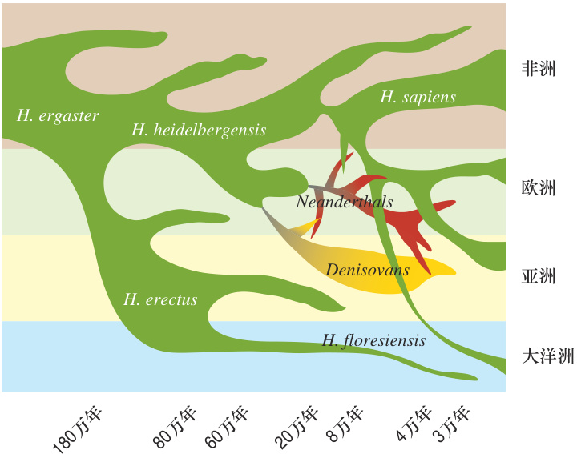  
图21.22　从现代人、尼安德特人和丹尼索瓦人的基因组DNA序列中推断出的进化关系的假设。不同颜色的分枝重叠表示不同人族通过杂交实现基因转移。  

# 习题精解  

Ⅰ.  在一个遥远的岛屿上建立了一个被称为创始代的种群，由2000个AA个体、2000个Aa个体和6000个aa个体组成。群体内的交配是随机发生的，三种基因型均为自然选择性中性的，突变发生的速度可以忽略不计。  

a.  该种群中等位基因A和a的等位基因频率分别是多少？  
b.  该种群是否处于哈迪-温伯格平衡？  
c.  第二代中等位基因A的频率是多少（也就是说，创始代的之后一代）？  
d.  第二代中AA、Aa、aa的基因型频率分别为多少？  
e.  第二代是否处于哈迪-温伯格平衡？  
f.  第三代中AA、Aa、aa的基因型频率分别为多少？  

# 解答  

这个问题需要计算等位基因频率和基因型频率并理解哈迪-温伯格平衡的原理。  

a.  为了计算等位基因频率，需要计算每个基因型个体的等位基因总数，然后除以总等位基因数。  

<html><body><table><tr><td>个体数</td><td>等位基因A的数目</td><td>等位基因a的数目</td></tr><tr><td>2000 AA</td><td>4000</td><td>0</td></tr><tr><td>2000Aa</td><td>2000</td><td>2000</td></tr><tr><td>Dp0009</td><td>0</td><td>12000</td></tr><tr><td>合计</td><td>6000</td><td>14000</td></tr></table></body></html>

等位基因A的频率 $\left(\,p\,\right)=\!6000/20\,000{=}0.3$ 等位基因a的频率（ $\textit{q})=\!6000/20\,000{=}0.3$  

b.  如果种群处于哈迪-温伯格平衡，那么基因型频率为 $\boldsymbol{p}^{2}$ 、2pq和 $q^{2}$ 。在题目a中，我们计算出这个总体中的 $p{=}0.3$ 、 $q{=}0.7$ 。因此，  

$$
p^{2}{=}(0.3)^{2}{=}0.09
$$  

$$
2p q{=}2(0.3)(0.7){=}0.42
$$  

$$
q^{2}{=}(0.7)^{2}{=}0.49
$$  

对于10 000个个体的种群，如果种群处于平衡状态，且等位基因频率为 $p{=}0.3$ 、 $q{=}0.7$ ，则每个基因型的个体数量应为： $A A$ ，900； $A a$ ，4200； $a a$ ， $4900_{\circ}$ 。因此，创始种群并不处于哈迪-温伯格平衡。  

c.  在随机交配的条件下，选择性中性等位基因，没有新的突变，等位基因频率不会在下一代之间改变， $f(A){=}p{=}0.3$ ， $f(a){=}q{=}0.7$ 。  

d.  第二代的基因型频率将是题目b中计算得到的频率，因为第一代种群将向平衡发展。  

$A A{=}p^{2}{=}0.09$ ； $A a{=}2p q{=}0.42$ ； $a a{=}q^{2}{=}0.49$ e.  答案是肯定的，如果交配是随机的，没有自然选择，也没有重大的突变的话，处于不平衡状态的第一代种群将在第二代达到平衡。  

f.  第三代的基因型频率将和第二代是一样的。  

Ⅱ.  在加利福尼亚的一个果蝇种群中，发现了在X染色体上，磷酸葡萄糖酶基因（Pgm）上存在两个等位基因。 $P g m^{A}$ 等位基因的频率为0.25， $P g m^{B}$ 等位基因的频率为0.75。假设种群处于哈迪-温伯格平衡，雄性和雌性的预期基因型频率是多少？  

# 解答  

这个问题需要将等位基因和基因型频率的概念应用到与X染色体连接的基因上。对于与X染色体相连的基因，雄性（XY）只有一个X染色体的拷贝，所以基因型频率等于等位基因频率。因此，$p{=}0.25$ ， $q{=}0.75$ 。  

基因型为 $\boldsymbol{X}^{P g m A}\boldsymbol{\Upsilon}$ 的雄性果蝇频率为0.25；基因型为 $\boldsymbol{\mathbf{X}}^{P g m B}\boldsymbol{\mathbf{Y}}$ 的雄性果蝇频率为0.25；存在三种不同基因型的雌性果蝇群体： $\boldsymbol{X}^{P g m A}\ \boldsymbol{X}^{P g m A}$ 、 $\boldsymbol{X}^{P g m A}\boldsymbol{\ X}^{P g m B}$ 和$\boldsymbol{X}^{P g m B}\boldsymbol{\ X}^{P g m B}$ ，对应的频率为 $p^{2}$ 、2pq和 $q^{2}$ 。三种不同基因型的雌性果蝇的基因型频率分别为(0.25)2、2(0.25)(0.75)和 $\left(0.75\right)^{2}$ ；即0.0625、0.375和0.5625。  

Ⅲ.  三个不同的基因（红、蓝、绿）每个都有两个等位基因；每个基因的隐性等位基因都有有害的影响。其中一个基因的隐性纯合子的相对适应性是0.9，另一个是0.8，第三个是0.7。下面的图表描述了这些等位基因在无限大小的种群中随时间的频率变化；在每种情况下，该等位基因（q）的频率在实验开始时都是0.7。  

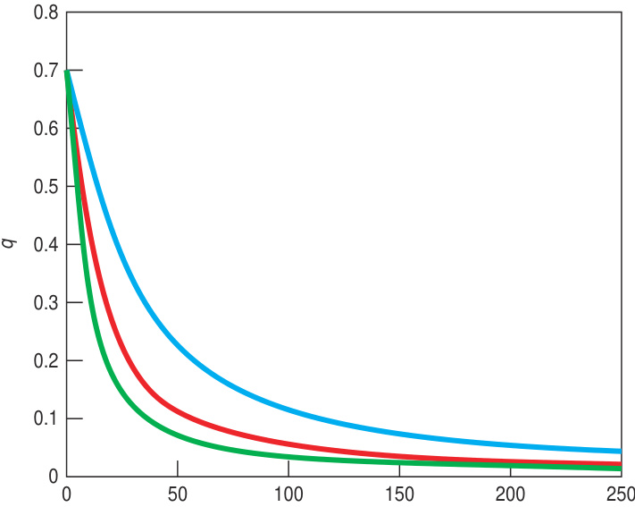  

a.  对每个基因（由隐性纯合子的标识），计算亲代与第一代之间的 $\Delta q$ （ $q{=}$ 隐性有害的等位基因的频率）。假设显性等位基因的杂合子和纯合子的相对适应性为1.0。然后计算 $q^{\prime}$ （第一代的隐性等位基因的频率）。不需在意图中的哪个颜色对应于哪个基因。  

b.  确定三种基因（蓝色、红色和绿色）与三个不同的相对适应性0.9、0.8、0.7之间的对应关系。  

c.  简要解释为什么这三个基因对应的每一代中，Δq是一个越来越小的负数。  
d.  简要解释为什么在这些无限大的种群中q永远不会等于0。  
e.  等位基因在实际种群中有的会消失，但是在图中的实验种群中并没出现这种情况，这是为什么？  

# 解答  

a.  对其中的某个基因（我们暂时称之为基因A），$W_{A A}\!=\!1\,.0$ ； $W_{A a}\!\!=\!1\.0$ ； $W_{a a}{=}0.9$ 。对于基因 $B$ ，$W_{B B}{=}1.0$ ； $W_{B b}{=}1.0$ ； $W_{b b}{=}0.8$ 。剩下的基因 $C$ ，$W_{C C}{=}1.0$ ； $W_{C c}{=}1.0$ ； $W_{c c}{=}0.7$ （也就是说，所涉及的有害影响都是完全隐性的）。要进行所需的计算，需要将这些适应性值代入到等式（21.5）中。基因 $\overset{\cdot}{A}$ ： $\Delta q{=}{-}0.0154$ 和 $q^{\prime}{=}0.684$ 。基因 $B$ ： $\Delta q{=}{-0.0326}$ 和 $q^{\prime}{=}0.667$ 。基因C： $\Delta q{=}{-}0.0517$ 和 $q^{\prime}{=}0.648$ 。  
b.  绿色所代表的基因， $q$ 的变化时最陡峭的，这意味着在任何给定的一代中， $\Delta q$ 是绝对值最大的负数。因此，绿色代表的基因的隐性纯合子适应性为0.7（即为基因C），红色代表的基因为C，其适应性为0.8，蓝色代表的基因（基因A）为0.9。  
c.  每一代基因的变化率都在下降，因为每一代的隐性等位基因的纯合子比例都在下降，而纯合子的比例会受到自然选择的影响。  
d.  无限大的种群中总会有杂合子个体，这些杂合子个体会保留有害的等位基因，但不会被自然选择淘汰。  
e.  实际的种群数量不可能是无限的。因此，遗传漂变最终会导致种群中有害等位基因的丢失。  

# 习题  

# 词汇  

1. 在右列中选择与左列中的术语最匹配的短语。  

a. 适应性 1.  杂合子基因型拥有最高的适应性  
b. 基因库 2.  等位基因频率的偶然波动  
c. 适应性成本 3.  突变以相对恒定的速度累积  
d. 等位基因频率 4. $p{=}1.0$   
e. 杂合子优势 5.  生存与繁殖的能力  
f. 平衡频率 6. p和q  
g. 遗传漂变 7.  使N大幅度降低的事件  
h. 分子始终 8.  某种特定基因型在一种情况下可能是优势，但在另一种情况下是劣势  
i. 种群瓶颈 9.  当 $\Delta q{=}0$ 时某等位基因的频率  
j. 人属 10.  由种群中所有成员所携带的等位基因的集合  
k. 固定 11.  智人、尼安德特人和丹尼索瓦人  

# 21.1节  

2.  当一个等位基因显性基因时，为什么它在种群中的频率并不总是增加，形成一个 $\cdot3:1$ （3/4为显性∶1/4为隐性）的表现型比例？  

3.  等位基因频率（ $p$ ）为0.5、基因型频率（ $p^{2}$ ）为0.25的种群处于平衡状态。如何解释等位基因频率（ $\cdot\,p$ ）为0.1和基因型频率（ $p^{2}$ ）为0.01的群体也可以处于平衡状态？  

4.  在一定数量的青蛙中，120只是绿色的、60只是棕色的、20只是棕色的。棕色的等位基因为 $G^{B}$ ，绿色的等位基因为 $G^{G}$ ，这两个等位基因并不完全是显性的。  

a. 种群中的基因型频率是什么样的？  
b. 种群中 $G^{B}$ 和 $G^{G}$ 的等位基因频率为多少？  
c.  如果种群处于哈迪-温伯格平衡，基因型的预期频率是多少？  

5. 下列的哪个种群处于哈迪-温伯格平衡？  

<html><body><table><tr><td>种群</td><td>AA</td><td>Aa</td><td>aa</td></tr><tr><td>I</td><td>0.25</td><td>0.50</td><td>0.25</td></tr><tr><td>Ⅱ</td><td>0.10</td><td>0.74</td><td>0.16</td></tr><tr><td>Ⅲ</td><td>0.64</td><td>0.27</td><td>0.09</td></tr><tr><td>IV</td><td>0.46</td><td>0.50</td><td>0.04</td></tr><tr><td>V</td><td>0.81</td><td>0.18</td><td>0.01</td></tr></table></body></html>  

6.  果蝇中一种叫做Delta的显性突变会导致Delta $^{\prime}+$ 杂合子的翅膀形态发生变化。这种突变的纯合子（Delta/Delta）在成虫阶段之前便会死掉。在150只果蝇中，有60只翅膀正常，90只翅膀异常。  

a.  这一种群的等位基因频率是多少？  

b.  利用题目a中计算出的等位基因频率，计算这个群体必须产生多少受精卵才能在下一代中出现160个成虫？  

c.  假设交配是随机的，并且没有迁移、没有突变，忽略了遗传漂变的影响，如果计算题目a中种群的160个可存活的后代，那么下一代中不同基因型的预期数量是多少？  

d.  下一代是否处于哈迪-温伯格平衡？为什么？  

7.  在一个巨大的、随机交配的种群中，其中个体的血型比例如下：  

0.5 MM  
0.2 MN  
0.3 NN  

该血型基因在常染色上，等位基因M和N共显性的。  

a. 这一种群是否处于哈迪-温伯格平衡？  

b.  假设在哈迪-温伯格平衡条件下，一代后的等位基因和基因型频率是多少？  

c.  假设在哈迪-温伯格平衡条件下，两代后的等位基因和基因型频率是多少？  

8.  一种被称为Q的基因有两个等位基因（ $\boldsymbol{Q}^{F}$ 和 $Q^{G}$ ）编码了红细胞蛋白质的不同形式，用于血型的分类。另一种独立分离的基因 $R$ 也有两个等位基因 $R^{c}$ 和 $R^{D}$ ，同样用于血型分型。对一群具有代表性的球迷进行随机调查，根据他们的血型，推断出如下基因型分布（所有基因型在男性和女性之间的分布都是均等的）：  

QFQF RCRC 202   
QFQG RCRC 101   
QGQG RCRC 101   
QFQF RCRD 372   
QFQG RCRD 186   
QGQG RCRD 186   
QFQF RDRD 166   
QFQG RDRD 83   
QGQG RDRD 83  

这一样本一共包含1480个个体。  

a.  对于 $Q$ 和 $R$ 基因中的任意一个或同时针对两个基因来说，种群是否处于哈迪-温伯格平衡状态？b.  在这一样本群体中随机交配一代之后，下一代球迷中 $Q^{F}Q^{F}$ 占多少比例（与R基因型无关）。c. 在这一样本群体中随机交配一代之后，下一代球迷中 $R^{C}R^{C}$ 占多少比例（与 $Q$ 基因型无关）。d. $\mathcal{Q}^{F}\mathcal{Q}^{G}\,R^{C}R^{D}$ 的母亲与 $\mathcal{Q}^{F}\mathcal{Q}^{F}R^{C}R^{D}$ 的父亲生出的第一个孩子是 $\mathcal{Q}^{F}\mathcal{Q}^{G}\,R^{D}R^{D}$ 的男孩的概率为多少？  

9.  尿黑酸尿症是一种隐性常染色体遗传病，与尿黑有关。在美国，大约每25万人中就有1人患有尿黑酸尿症。  

a.  假设哈迪-温伯格平衡，估计该等位基因的频率？  

b.  在美国有多少人是这种特质的携带者？在这个人群中，受黑尿酸症影响的个体与携带者的比例是多少？  

c.  如果一个没有黑尿酸症的女性与丈夫生出一个黑尿酸症孩子，该女子然后再婚，她所生的孩子有多大的可能性表现出黑尿酸症？  

d.  黑尿酸症是一种相对良性的疾病，因此对任何基因型的个体都没有什么选择性优势。在题目a中假设哈迪-温伯格平衡是合理的。是否也可以使用哈迪-温伯格平衡假设来估计更严重的隐性常染色体疾病（如囊性纤维化）的等位基因频率和携带者频率？解释一下。  

10.  假设在亚利桑那州沙漠中一座山的两面发现两个蜥蜴种群，这两个种群在基因A上有两个等位基因$(\boldsymbol{A}^{F},\ \boldsymbol{A}^{s})$ ，种群具有以下三个基因型频率  

<html><body><table><tr><td></td><td>A'AF</td><td>AFAS</td><td>ASAS</td></tr><tr><td>种群1</td><td>38</td><td>44</td><td>18</td></tr><tr><td>种群2</td><td>0</td><td>80</td><td>20</td></tr></table></body></html>  

a. 两个种群中 $\boldsymbol A^{F}$ 的等位基因频率是多少？  

b. 这两个种群有处于哈迪-温伯格平衡状态的吗？  

c.  一场巨大的洪水在将种群1和2分开的山脉中开辟了一条峡谷。然后，大小相等的两个种群通过迁移和随机交配，完全混合在一起。在新一代蜥蜴种群中，这三种基因型（ $A^{F}A^{F}$ 、 $A^{F}A^{s}$ 和 ${\cal{A}}^{s}{\cal{A}}^{s}$ ）的频率是多少？  

11.  1998年，美国“美迪斯科尔赏金号”（MedischolBounty）上的男女水手（人数相当）在南太平洋发生了叛乱，并在巴厘岛定居下来，在那里他们与当地的波利尼西亚人接触。在登陆该岛的400名水手中，324人是MM血型，4人是NN血型，72人是MN血型。岛上已经有600名年龄在 $19\!\sim\!23$ 岁之间的波利尼西亚人。在波利尼西亚人中，M等位基因的等位基因频率为0.06，N等位基因的等位基因频率为0.94。在接下来的10年里，没有其他人来这个岛。  

a.  叛变船员中等位基因N的频率是多少？  

b.  2008年，巴厘岛诞生了1000名儿童。如果1998年岛上1000名混合人群的年轻人随机交配，而不同血型的表型在生存能力方面没有影响，那么1000个孩子中有多少人会有MN血型？  

c.  事实上，50个孩子是MM血型，850个是MN血型，100个是NN血型。在儿童中观察到的等位基因N的频率是多少？  

12. a.  X染色体上的等位基因也可以处于平衡状态，但在哈迪-温伯格假设下的平衡频率必须对两种性别分别计算。对于频率分别为p和q的两个等位基因A和a的基因，分别写出描述男女所有基因型的平衡频率的表达式。  

b.  在美国，大约每10 000名男性中就有1人患有血友病，这是一种与X染色体相关的隐性疾病。如果假设人口处于哈迪-温伯格平衡，那么美国女性中血友病患者的比例是多少？在美国生活的1.7亿女性中，预期找到多少女性血友病患者？（假设所有患有血友病的女性的等位基因都是纯合的）  

13.  1927年，眼科医生George Waaler在挪威奥斯陆测试了9049名小学男生的红绿色盲，发现其中8324名男生是正常的，725名是色盲。他还对9072名小学女生进行了测试，发现9032名女生有正常的色觉，40名是色盲。  

a.  假设性染色体上相同的隐性等位基因 $c.$ 导致所有形式的红绿色盲，从男生的数据中计算出c和C（正常视力的等位基因）的等位基因频率（提示：请参阅习题12a的答案）。  

b.  Waaler的样本中，这个等位基因处于哈迪-温伯格平衡？通过描述与这一假设一致或不一致的观察结果来解释你的答案。  

通过对这些小学生的进一步分析，Waaler发现在他的样本中实际上有不止一个导致色盲的 $c$ 等位基因：一个是prot型（ $c^{p}$ ），另一个是deuter型（ $c^{d}$ ）（红色盲和绿色盲的表现形式略有不同）。重要的是，Waaler的研究中一些正常的女性很可能是基因型 $c^{\,p}/c^{d}$ 。通过对40名女性色盲的进一步分析，他发现3名是prot（ $\chi^{\,p}/c^{\,p}$ ），37名是deuter $(\ c^{d}/c^{d}\ ]$ ）。  

c.  基于这些新的信息，Waaler检测的人群中 $c^{p}$ 、 $c^{d}$ 和$C$ 等位基因的频率是多少？假设频率符合哈迪-温伯格平衡，计算这些值（注意：请再次参考习题12a的答案）。  

d.  假设该群体处于平衡状态下，计算男性和女性中预期的所有基因型的频率。  

e.  根据这些结果，奥斯陆地区的人群红绿色盲确实处于平衡状态的可能性更大还是更小？解释你的推理。  

14.  当一个种群中某个基因只有两个等位基因时，可用代表哈迪-温伯格比例的方程 $p^{2}{+}2p q{+}q^{2}{=}1$ 来检验该基因。  

a.  推导出一个相似的方程，该方程能够描述具有三个等位基因的基因型平衡比例［提示：注意哈迪-温伯格方程可以写成二项展开式 $\left(p\!+\!q\right)^{2}$ ］。  
b.  一个带有三个等位基因（ $I^{A}$ 、 $I^{B}$ 和i）的基因负责ABO血型。A型血的基因型可以是 $I^{A}I^{A}$ 或 $\textit{\textbf{I}}_{i}$ ；B型血可以是 $I^{B}\boldsymbol{\mathrm{~\,~}}I^{B}$ 或 $I^{B}$ i型血；AB型血的人是 $I^{A}\;I^{B}$ ，O型血的人是 $i i$ 。在亚美尼亚人中， $I^{A}$ 的频率为0.360， $I^{B}$ 的频率为0.104，i的频率为0.536。假设在哈迪-温伯格平衡的情况下，计算在这一种群中四种可能血型的个体的表型频率。  

在习题 $15\!\sim\!17$ 中，会发现因为在哈迪-温伯格平衡下种群内个体之间的交配是随机的，所以预测交配频率是可能的，即种群中在特定基因型或表型个体之间所有交配的比例。  

15.  某个基因有两个等位基因A（频率为 $p$ ）和 $a$ （频率为q）。假设某个种群处于哈迪-温伯格平衡，用 $p$ 和$q$ 建立数学表达式，预测下列的交配频率：  

a. AA的纯合子之间  
b. aa的纯合子之间  
c. Aa的杂合子之间  
d. AA的纯合子与aa的纯合子之间  
e. AA的纯合子与Aa的杂合子之间  
f.  aa的纯合子与Aa的杂合子之间  
结合a～f的结果：  
g.  列出的6种可能性能解释所有可能的配对吗？怎么确定这在数学上是否正确？通过将 $p$ 设置为$0\!\sim\!1$ 之间的任意数来演示，如0.2。  
h.  能否想出一个简单的通用规律来计算相同基因型个体之间的交配频率和不同基因型个体之间的交配频率？  
i.  如果种群在雄性和雌性之间平均分配，那么AA雄性和AA雌性之间的交配比例是多少？在AA男性和Aa女性之间的交配比例是多少？在AA男性和aa女性之间的交配比例是多少？  

16.  有些人能尝到苦味的化合物苯硫脲，有些人却不能。这种性状由一个常染色体的基因控制；相对于不能尝到该苦味的的味觉等位基因来说，能尝到该苦味的的味觉等位基因是完全显性的。在1707年夏威夷人的味觉测试中，发现了1326个个体具有该味觉。假设种群处于这个基因的哈迪-温伯格平衡状态并且交配完全是随机的：  

a.  有味觉等位基因 $T[=\!(p)]$ 与无味觉等位基因 $t[{=}(q)]$ 的等位基因频率分别为多少？  
b. 种群的不同基因型频率分别为多少？  
c.  在种群所有的交配中，无味觉的个体之间的交配所占的比例是多少？  
d.  在种群所有的交配中，有味觉的个体与无味觉的个体之间的交配所占的比例是多少？  
e.  在种群所有的交配中，有味觉的雄性个体与无味觉的雌性个体之间的交配所占的比例是多少？  
f.  有味觉的雄性个体与无味觉的雌性个体之间的交配产生的后代中，无味觉的个体所占的比例是多少？  
g.  在种群所有的交配中，有味觉的个体之间的交配所占的比例是多少？  

17.  雄激素性脱发（男性型脱发）是一种由多种基因控制的人类复杂特征，但假设存在一个人类种群，其中一个常染色体的等位基因决定了模式秃顶。这种等位基因在男性中是显性的，在女性中是隐性的。人口处于哈迪-温伯格平衡， $51\%$ 的男性秃顶。a. 秃顶等位基因在男性中的频率是多少？  

b. 秃顶等位基因在女性中的频率是多少？  
c. 种群中表现出秃顶的女性的比例有多少？  
d.  假设交配是随机的，那么秃顶的男性与不秃顶的女性交配所占的比例是多少？  
e. 种群中的杂合子秃顶男性所占的比例是多少？  
f.  如果都不秃顶的父母生出一个秃顶的儿子，那么他们的第二个儿子仍是秃顶的可能性有多少？  
g.  如果一个母亲患有雄激素性脱发，但是父亲的情况未知，他们育有一个女儿，这个女儿秃顶的可能性有多少？  

18.  下图是对10个人（ $1\!\sim\!10$ ）的DNA基因组进行的FBI-style分析，以及所发现的凶犯在犯罪现场留下的头发的分析。该分析涉及SSR位点的PCR扩增，每个位点来自不同的（非同源的）染色体。每个SSR位点的PCR引物都有一个独特的荧光分子标记。部分条带较粗，因为相应的PCR产物相对较多。图上的点在两边对齐，有助于找到关键的条带；它将有助于使用直边作为指导。右边的数字是11个样本中SSR位点拷贝数的总数。  

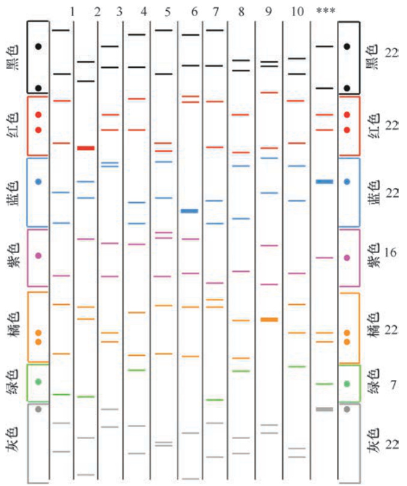  

手吗？如果有，哪 个是？  
b.  所有的位点中，有在X染色体上的吗？如果有，指出这些位点的颜色。  
c.  所有的位点中，有在Y染色体上的吗？如果有，指出这些位点的颜色。  
d. $1\!\sim\!10$ 人中有人可能是凶手的亲属吗？如果有，指出是哪一个，并描述其与罪犯的关系。  
e. $1\sim10$ 个个体中有一个是非整倍体，指出这个人，并识别其性别（M或F），以及所涉及的非  

整倍的类型，这个人的母亲或父亲是否发生了不分离（或者不能区分），以及不分离是发生在第一次减数分裂还是第二次减数分裂（或者不能分辨）。  

f.  任何随机的美国男性与凶手拥有相同基因型的概率是多少（匹配概率）？假设图中分析的所有11个DNA样本一起代表了整个美国人群。写出进行这一计算所用到的各项乘数分别是多少。  

g.  解释为什么题目f中关于样本具有代表性的假设并不完全准确。这个假设的不准确性如何影响匹配概率？  

# 21.2节  

19.  与在小种群中相比，为什么在大种群中通过自然选择消除一种完全隐性的有害等位基因很难？  

20.  特里斯坦达库尼亚是大西洋中部的一群小岛。1814年，15名英国殖民者在这些岛屿上建立了殖民地。1885年，岛上19名男性中有15名在海难中丧生。在20世纪60年代末，在岛上的240名移民的后代中发现了4例由于视网膜色素变性逐渐导致的失明的病例。在英国，色素性视网膜炎的发病率约为1/6000。解释相对于在英国看到的，为何在特里斯坦达库尼亚的这种疾病的发病率很高？  

21.  由于不同等位基因从亲代传递到子代的过程存在随机抽样，所以种群规模较小会导致遗传漂变。我们可以用二项式抽样统计数据来预测对于给定的种群大小，遗传漂变发生了多少。对于规模为N的种群，对每一代中2N个等位基因进行随机采样的前提下，我们可以估计，下一代 $95\%$ 的时间的等位基因频率（ $p$ ）将在置信区间 $p\pm1.96\Biggl(\sqrt{\frac{p\left(1-p\right)}{2N}}\Biggr)$ 内，其中， p(1− p) 是亲代到子代的等位基因频率的统计方差估计值。  

a.  当 $N{=}10000$ ， $p{=}0.5$ 时，置信区间是多少？b. 当 $N{=}10$ ， $p{=}0.5$ 时，置信区间是多少？c.  题目a和b中的结果与种群瓶颈之间有什么样的关系？  

22.  种群中的遗传漂变的三个基本预测： $\textcircled{\scriptsize{1}}$ 只要种群规模有限，就会发生一定程度的遗传漂变；因此，如果没有新的突变，所有的变异都将转向固定或丢失； $\textcircled{2}$ 小种群中的漂变速度比大群体快； $\textcircled{3}$ 一个等位基因被固定（频率变为1.0）的概率等于它在种群中的初始频率（ $p$ ），由于遗传漂变，它从种群中消失的可能性等于 ${1\!-\!p}$ 。鉴于这三个预测：  

a.  在 $N{=}100\,000$ 的二倍体种群中，一个新的常染色体突变发生后，其等位基因频率是多少？  
b.  在 $N{=}10$ 的二倍体种群中，一个新的常染色体突变发生后，其等位基因频率是多少？  
c.  在哪一个种群中，新突变由于遗传漂变更有可能被偶然地固定下来？  

23.  不完全显性的小鼠突变（ $t{=}$ 无尾）导致杂合子（t /t）的个体表现出短尾。相同的突变为隐性致死的，会导致纯合子（t/t）在子宫内死亡。在150只小鼠中，60只是 $t^{+}/t^{+}$ ，90只是杂合子。a. 这一种群中的等位基因频率是多少？b.  假设小鼠之间的交配是随机的，没有迁移、没有突变，并且忽略了随机遗传漂变的影响，如果有200个后代出生，那么这一后代中不同基因型的预期数量是多少？c.  两个种群（称为种群1和种群2）的小鼠接触并随机杂交。这些群体最初由以下数量的野生型纯合子（ $t^{+}/t^{+}$ ）和无尾（ $\left(\!\!\begin{array}{c}{{t^{+}}/{t}}\end{array}\!\!\right)$ 杂合子组成：  

<html><body><table><tr><td></td><td>种群1</td><td>种群2</td></tr><tr><td>野生型</td><td>16</td><td>48</td></tr><tr><td>无尾</td><td>48</td><td>36</td></tr></table></body></html>  

那么在下一代中这两种基因型的频率是多少？  

24.  在果蝇中，退化翅膀的隐性等位基因vg会使得翅膀很小。一名遗传学家将一些正常繁殖的野生雄性与一些退化的原始雌性杂交。产生的雄性和雌性后代（ $\mathrm{F}_{1}$ ）果蝇均是野生型。然后他让F 果蝇之间交配，发现1/4的雄性和雌性果蝇有退化的翅膀。他把退化的 $\mathrm{F}_{2}$ 果蝇剔除掉，让野生型的F2代果蝇交配并繁殖出F3代。  

a.  给出 $\mathrm{F}_{2}$ 代野生型果蝇的基因型概率和等位基因概率。  
b. $\mathrm{F}_{3}$ 代果蝇中野生型和退化型果蝇的概率分别是多少？  
c.  假设遗传学家对退化的F3代果蝇自然选择（也就是说，他把它们剔除掉，让野生型F3代果蝇随机交配），那么在F 代中野生型频率和突变等位基因的频率是多少？  
d.  现在，遗传学家让所有的F4代果蝇随机交配（即野生型和退化型果蝇都交配）。 $\mathrm{F}_{\xi}$ 代果蝇中野生型和退化型的频率是多少？  

25.  在无限大的种群中，三个位点A、 $B$ 和C各有两个等位基因。在某一特定时间在种群的 $1\%$ 的个体中发现发现等位基因 $A^{l}$ 、 $B^{l}$ 和 $C^{l}$ ，与该位点的其他等位基因（分别为 $A^{2}$ 、 $B^{2}$ 和 $C^{2}$ ）相比，每一个等位基因都对生物体的适应性有有利的影响。三种可能的基因型在每个位点的相对适应性为：  

<html><body><table><tr><td>WA'A!</td><td>WA2</td><td>WA2A2</td></tr><tr><td>1.00</td><td>0.99</td><td>0.99</td></tr><tr><td>WB'B</td><td>WB'B2</td><td>WB²B2</td></tr><tr><td>1.00</td><td>1.00</td><td>0.90</td></tr><tr><td>Wdcl</td><td>Wcc</td><td>Wc2C</td></tr><tr><td>1.00</td><td>1.00</td><td>0.99</td></tr></table></body></html>  

经过数千代的后，等位基因 $A^{l}$ 、 $B^{l}$ 和 $C^{I}$ 的频率如下图所示，  

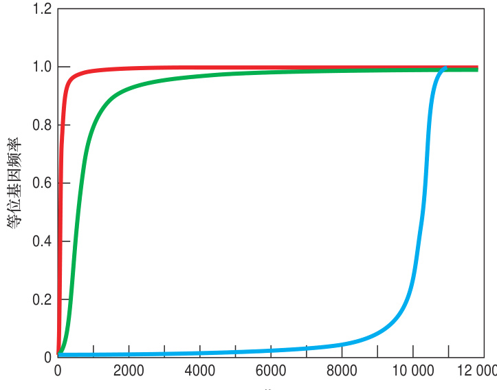  

a.  在最初的种群中（在动物被放置在三个水箱之前）， $25\%$ 的雄性有小尾巴。假设雄性和雌性的等位基因频率相同，计算原种群中 $B$ 和b的频率。  
b. 计算每个水箱中的 $\Delta q$ 。  
c. 如果 $W_{B B}{=}1.0$ ，计算每个水箱中的 $W_{B b}$ 。  
d.  如果 $W_{B B}{=}1.0$ ，每个水箱中的 $W_{b b}$ 是大于、等于、还是小于1.0？  

27.  在欧洲，引起隐性常染色体疾病囊性纤维化的 $C F^{-}$ 等位基因的频率是0.04。在几乎所有的病例中，囊性纤维化导致病体在能进行繁殖前便会死亡。  

a.  假设杂合子的疾病等位基因没有选择优势，分别确定基因型为未受影响的人群、携带者人群和受影响的人群的相对适应性值（W）。  
b.  根据题目a中的答案，当下一代出生时，计算当前整个种群的平均适应性，考虑到囊性纤维化特征（W）和等位基因频率在一代中的预期变化，将其视为一个整体。  
c.  由于一些杂合子优势存在，假设欧洲种群中 $C F^{-}$ 等位基因的频率处于一个均衡状态。在此假设下，重新计算三种基因型的相对适应性。  
d.  CF基因编码的CFTR蛋白是一个氯离子通道。患有霍乱的人会把水和氯离子从小肠中泵出引起腹泻。利用这些事实来解释为什么CF基因可能存在杂合子优势。  
a. $A^{l}$ 、 $B^{l}$ 、 $C^{l}$ 对应的曲线（蓝色、红色和绿色）分别是哪条？  
b.  与绿色的曲线相比，为什么红色曲线代表的等位基因可以更快地被固定？  
c.  与绿色或红色的曲线相比，为什么蓝色曲线代表的等位基因可以固定的速度非常得慢？  
d.  假设种群中有1000个个体，讨论种群的大小变化对三条曲线的形状可能造成的影响。  

26.  已知在雄性古比鱼身上发现了一种常染色体基因，这种基因与它们的尾巴大小有关，主要表现为：显性等位基因B代表大尾巴，隐性等位基因b代表小尾巴。雌性古比鱼所有的基因型尾巴的大小都差不多。已知雌性古比鱼通常和尾巴最大的雄性交配，但是没有研究过种群密度和性别比例对这种偏好的影响。因此，假设将相等数量的雄性放入三个水箱中。在水箱1中，雌性的数量是雄性的两倍。在水箱2中，雄性和雌性的数量是相等的。在水箱3中，雌性的数量是雄性古比鱼的一半。交配后，发现后代中有以下比例的小尾巴雄性：水箱 $1,16\%$ ；水箱$2{,}25\%$ ；水箱 $3{,}30\%$ 。  

28.  G6PD基因的等位基因以隐性方式造成对蚕豆过敏，在食用蚕豆后引起溶血反应（红细胞溶解）。同样的等位基因也具有抗疟疾的优势。杂合子在疟疾流行的地区具有优势。非洲和北美国家的平衡频率是否相同？什么因素影响 $q_{e}$ ？  

29.  解释为什么进化生物学家监测具有选择性的中性基因多态性作为分子钟。  

30.  小狐狸生活在南加州海岸外的海峡群岛上；成年狐狸的体重不到3磅。这些所谓的岛狐（滨水尾狐）来自大陆灰狐（Urocyon cinereoargenteus）。对基因组序列的分析表明，与大陆狐狸不同，在孤岛上的狐狸的遗传多样性少得惊人。  

a.  每个岛上只有一只狐狸的基因组被测序。在单个基因组序列中，遗传多样性的缺失是如何表现的？b.  每个岛上的狐狸数量都很小，低多样性是如何发生的？c. 为什么低遗传多样性可能会导致物种灭绝？d.  尽管缺乏基因组序列的多样性，假设为什么海峡岛狐在没有人类帮助的情况下可以繁荣发展。  

# 21.3节  

31.  在分子水平上，支持现代人是在非洲首次出现的最直接的证据是什么？  

32.  2013年3月，《美国人类遗传学》（American Journalof Human Genetics）杂志发表了一篇报告，称一名非洲裔美国人将自己的基因组提交给商业系谱分析，结果发现他的Y染色体的序列与此前发现的其他Y染色体的序列非常不同。研究人员随后发现，Mbo（喀麦隆的一个民族）中的某些男性与这个非洲裔美国人有许多相同的多态性。你认为这些发现会如何改变对“当某个人携带人类Y染色体MRCA，那么他肯定在地球上生存过”这一理解？  

33. 如果追溯到你40代以前的生物祖先：  

a. 你预测可能会有多少祖先？  
b.  如何把这个预测和现在世界人口大约是70亿这一事实放在一起解释呢？  

34.  在图21.17中，Dion的线粒体DNA最近追踪到了世界的哪一部分？是否他的Y染色体和常染色体 $1\!\sim\!22$ 最近可以追溯到这个世界的同一区域吗？可以或不可以的原因是什么？  

35.  预测图21.18（b）分枝图上四个节点（分枝点）的DNA序列。  

36.  这里显示了一个用于人科的家庭分类的进化分枝图（不是按比例绘制的）。数字 $1\!\sim\!10$ 代表进化谱系或事件。字母A～F表示下列列表中的条目：  

尼安德特人  
黑猩猩  
智人（非洲班图人）  
丹麦智人（欧洲）  
智人（美洲土著霍比人）  
智人（亚洲维吾尔族）  

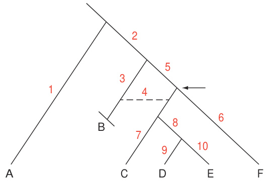  

a.  将前面列表中的条目与分支线图中的适当字母匹配。列表中的两组种群在这个图上是相等的；任意一个的可能性都是正确的。  

b.  用一个小箭头表示一个进化上的差异。根据图21.19描述这种差异并估计它发生在多少年前。  

c.  对6组当中的几个个体的6个单核苷酸多态性（α、β、γ、δ、Ɛ和ζ）进行测序；等位基因频率如下表所示。在表中每一列的底部，写一个从$1\!\sim\!10$ 的数字（与图中红色的数字相对应）来表明沿着进化分枝图，将所有人类和黑猩猩共同祖先的等位基因改变为新生型等位基因的突变发生在哪里。一个空可以用两个数字中的任何一个来填充；你只需要展示一个。也要在底部的最后一行指出在共同祖先中发现的等位基因，或者标记无法辨别。  

<html><body><table><tr><td></td><td>SNPα</td><td>SNPβ</td><td>SNPy</td><td>SNP8</td><td>SNPe</td><td>SNP</td></tr><tr><td>尼安德特人</td><td>A 1.0</td><td>C0.4AC1.0</td><td></td><td>T1.0</td><td>T 1.0</td><td>T 1.0</td></tr><tr><td>黑猩猩</td><td>G 1.0</td><td>0.6</td><td>C 1.0</td><td></td><td></td><td></td></tr><tr><td></td><td></td><td>A 1.0</td><td></td><td>T 1.0</td><td>G 1.0</td><td>T 1.0</td></tr><tr><td>智人（非洲班图）</td><td>G 1.0</td><td>A 1.0</td><td>C 1.0</td><td>0.3</td><td>A0.7TT1.0</td><td>C 1.0</td></tr><tr><td>欧洲丹麦智人</td><td>G 1.0</td><td>C0.25</td><td>C1.0</td><td>T 1.0</td><td>T 1.0</td><td>C1.0</td></tr><tr><td></td><td></td><td>A 0.75</td><td></td><td></td><td></td><td></td></tr><tr><td>美洲土著霍比人</td><td>G 1.0</td><td>C0.8A A1.0 0.25</td><td></td><td>T 1.0</td><td>T1.0</td><td>C1.0</td></tr><tr><td></td><td></td><td></td><td></td><td></td><td></td><td></td></tr><tr><td>亚洲维吾尔族人</td><td>G 1.0</td><td>C0.5AA0.6 0.5</td><td>C 0.4</td><td>T 1.0</td><td>T 1.0</td><td>C1.0</td></tr></table></body></html>

祖先等位基因  

37.  如图21.22所示，目前生活在大洋洲的人类（如在美拉尼西亚、密克罗尼西亚、波利尼西亚和澳大利亚）代表了人类从非洲起源，之后传播到世界各地的一个早期分支。  

a.  考虑到这些人口规模和历史，你认为大洋洲的种群样本与非洲相比会出现更多还是更少的遗传变异？解释一下。  
b.  解释为什么丹尼索瓦人DNA的变异只在生活在东南亚和大洋洲的现代人身上发现，而在地球上其他地方却找不到。  

38.  截至2016年撰写本文时，在现代人类中还没有发现尼安德特人的Y染色体或线粒体DNA序列。请提出两种可能的假说。  