# 第 22 章 复杂性状的遗传学  

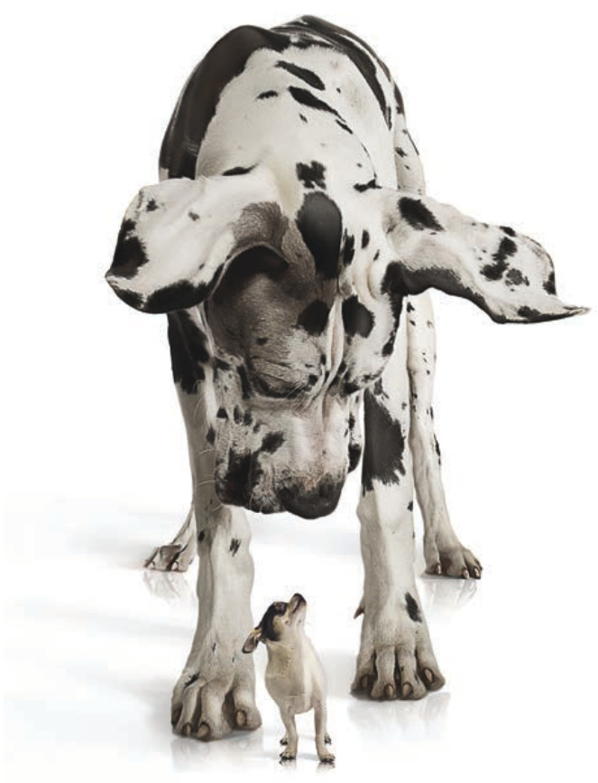  

狗饲养者的人工选择导致了犬种间的大小差异。群体遗传学家发现只有6个基因导致了超过一半的犬种体型差异。$\copyright$ Gandee Vasan/Getty Images  

# 章 节 大 纲  

22.1 遗传力：遗传与环境对复杂性状的影响  
22.2 数量性状基因座（QTL）定位  

  

现在（2016年），整个人类基因组的测序成本大约为1000美元。在这样的价格下，你为自己的基因组，或你和你的伴侣所孕育的胎儿获取此信息是否值得？  

答案对于不同的人来说会有所不同，但对于每个人来说，权衡成本和收益的一个主要因素是基因组序列数据可以被解释为关于特定性状的预测程度。我们已经看到，全基因组序列可以几乎肯定地揭示一个人是携带者还是会受到诸如镰状细胞贫血或囊性纤维化等孟德尔疾病的折磨，其中性状受单个基因的等位基因控制，外显率基本上是完整的。  

然而，你花在你（或你孩子的）全基因组序列上的数千美元，至少在不久的将来，几乎不会提供关于智力或个性等许多其他特征的线索。原因在于这些是受许多因素影响的复杂性状，包括多个基因、不同基因的等位基因之间的相互作用、环境的变化、基因与环境之间的相互作用，以及偶然事件。  

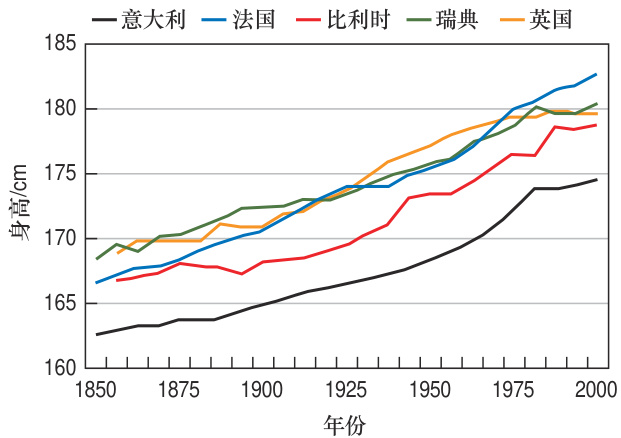  
图22.1　不同欧洲人群的成年男性出生身高队列。  

成年人的身高是一个如此复杂的特征。身材高大的父母往往有高个子的子女，这表明遗传对身高有贡献。科学家最近已经确定数百种基因影响人类身高，其中许多基因尚未确定。除了导致软骨发育不全（侏儒症）的特殊情况外，任何一种特定多态性对身高的贡献都很小，几乎没有预测能力。  

基因型信息不能轻易预测成人身高的另一个原因是关键的环境因素——营养，对这种特性有很大的影响。图22.1表明20世纪欧洲许多国家平均身高都有显著增加。由于时间过短，在这期间等位基因频率发生大的变化并不太可能，所以，可以肯定的是由于饮食进步带来的变化。  

在本章中，我们通过探讨科学家们对于一个给定的性状如何区分基因的影响还是环境的影响来开始我们对于复杂性状的讨论。之后我们会关注两种不同的方法来鉴定对复杂形状产生影响的特殊基因，或被称为数量性状基因座（QTL）。无论出于理论还是现实原因，揭示对某个表型重要的各种因素始终是未来遗传学研究重要的目标。对复杂性状的研究有助于了解退行性状态如关节炎和冠状动脉疾病的发病原因并且开发相应的疗法。改善农业上有经济价值的动植物需要我们掌握控制复杂性状，如产量、干旱、抗热及营养价值的诸多因素。  

本章的主题是研究复杂性状，需要科学家们将个体与大量群体进行比较。关于复杂性状研究得出的结论只适用于研究中该环境下的特定群体，并不能适用于其他条件和群体。  

# 22.1 遗传力：遗传与环境对复杂性状的影响  

# 学习目标  

1. 总结表型变异的含义。  
2.  概述实验，使你能够区分遗传和环境对表型变异的影响。  
3.  解释遗传力这一术语，以及为什么它适用于群体而非个体。  
4.  通过研究同卵双胞胎和异卵双胞胎，描述科学家如何通过比较父母及其后代或人类群体来估计野生动物种群的遗传力。  
5. 图解植物育种者如何使用截断选择来改良农作物。  

许多复杂性状是数量性状，其表型可以在称为表型值或性状值的数量范围内测量。许多这样的特征显示出群体中表型值大致呈钟形正态分布。人体高度提供了一个很好的例子（图22.2）。有些人非常高，有些人非常矮，但大多数人的身高都集中在该群体的平均水平附近。这种钟形分布中高度的明显连续分布由基因和环境的贡献决定（这里的环境一词包括偶然事件）。  

正如我们在第3章中所看到的，参与特性表达的基因越多，任何给定环境中表型变异的可能性就越大，潜在表型就越像正态分布（回顾图3.28）。此外，任何一种基因型的个体表现出的表型实际上分布在以该基因型的平均表型为中心的较窄的钟形曲线中，而不是相同的。  

原因是具有相同基因型的个体会受到略微不同的微环境的影响（图22.3）。因此，对于整个群体而言，环境的影响叠加在仅少数基因的变异上可以很容易地接近钟形曲线的表型值。  

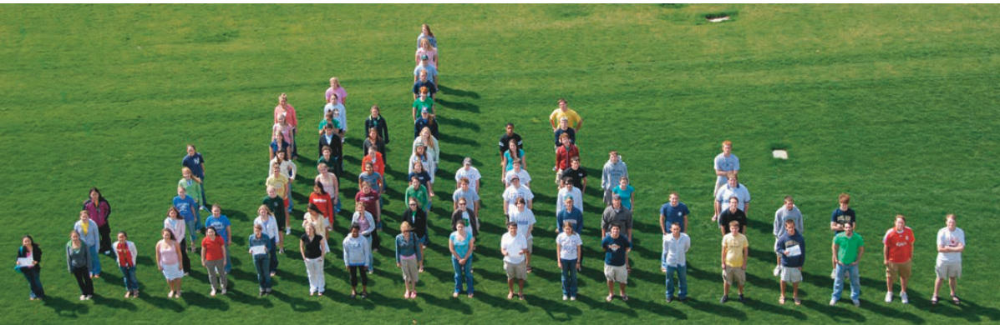  
图22.2　美国圣母大学一节遗传学课上学生的身高分布。大致呈钟形，大部分人身高处于平均水平。$\copyright$ McGraw-Hil Education, Photo by David Hyde and Wayne Falda  

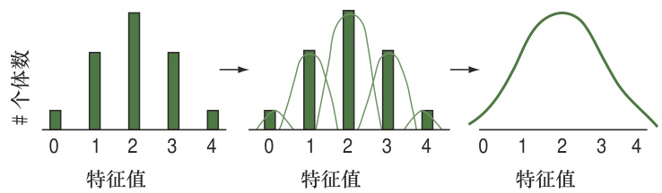  
图22.3　遗传与环境对一个数量性状的影响可以呈正态分布。正如在图3.28中提到的，两个基因座的遗传突变，如果每个都有一个不完全显性等位基因对性状有相同影响，可以形成左图中所示的5个表型分类。每个性状值因为环境影响变得边界模糊而使得群体中每个个体的性状值形成一个连续的钟状分布。  

科学家如何评估表型的分布以估计复杂性状的遗传力——基因（与环境相对）对特定人群中观察到的表型差异的贡献？正如你将看到的，这个问题的答案不仅仅有理论上的意义。  

# 22.1.1 方差是群体变异量的统计量度  

为了估计遗传力，科学家们首先需要获得所研究群体中性状分布的曲线（通常为钟形）的数字描述。研究人员通过比较群体中每个个体的表型值与整个群体的平均表型值来追踪变异量。统计学上，该分析的结果被称为总表型方差（ $V_{\mathbf{P}}$ ），并且其被计算为每个个体性状值与平均值之间的平均平方差。  

例如，让我们考虑蒲公英种群中茎长的特征，蒲公英是北美常见的杂草植物［图22.4（a）］。群体中的茎长呈钟形正态分布。如图22.4（b）所示，你可以通过将所有茎长度的值相加并除以茎的数量来找到平均茎长度。然后通过将每个茎长度表示为与平均值的正或负偏差，将这些偏差平方，将平方相加，并将总和除以测量的茎数来找到茎长度的变化（该性状的 $V_{\mathrm{P}}$ ）。方差提供了这种分布的数学描述；相对于峰值的曲线越窄，方差的值越低。  

一旦确定了性状的总方差，科学家就可以开始询问这种方差的哪个部分是由于个体生物携带的基因的差异，哪些部分是由于这些个体受到的微环境差异的影响。  

# 22.1.2 遗传变异从环境变异中分离  

为了区分环境和遗传对表型变异的影响，你需要改变两者中的一个（如环境），同时控制另一个（即保持遗传贡献稳定）。这种特殊的实验在蒲公英的例子中很容易实现，因为大多数蒲公英种子来自有丝分裂而非减数分裂。结果，来自单一植物的所有种子在遗传上是相同的。你可以先在草地山坡上种植遗传上相同的种子，  

(a)  

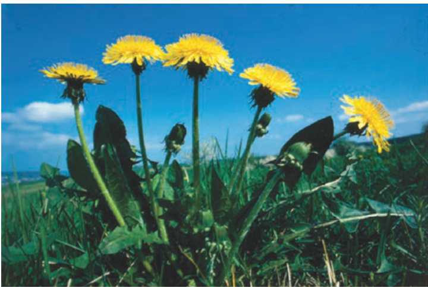  
(b)  

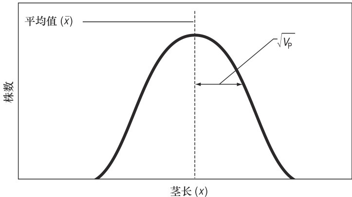  

$$
\begin{array}{r l}{\overline{{\boldsymbol X}}}&{{}=\frac{\displaystyle\sum_{j=1}^{N}\boldsymbol x_{j}}{\displaystyle N}}\end{array}
$$  

VP  

$$
V_{\mathsf{P}}~=~\frac{\sum_{i=1}^{N}(x_{i}-\overline{{x}})^{2}}{N}
$$  

图22.4　表型变异。（a）常见的蒲公英。（b）方差是每个值与平均值的差的平方的平均值。在图中，为了与茎长统一单位，显示的是方差的平方根（统计学理论表明钟形曲线下$95\%$ 的观察点会处于平均值加减1.96倍方差的平方根之间）。  

（a）： $\copyright$ Dr. Eckart Pott/OKAPIA/Science Source让它们不受干扰地生长直到开花。然后测量每品系开花植物茎的长度，并确定该蒲公英种群中该性状的值分布的均值和方差［图22.5（a）］。  

因为这一群体的所有成员在遗传上是相同的（如果我们忽略罕见的突变），任何观察到的个体茎长度的变化应该是环境变化的结果，例如，山坡上不同位置的不同水量和阳光。当表示为与平均值的变化时，这些观察到的环境确定的茎长度差异称为环境方差（ $V_{\mathrm{{E}}}$ ）。  

为了检验遗传差异对茎长的影响，你可以从许多不同地点生产的许多不同蒲公英植物中采集种子，然后将它们种植在受控温室中［图22.5（b）］。由于你在相对均匀的环境中培育遗传多样性植物，因此观察到的茎长度变化主要是遗传差异促进遗传方差（ $V_{\mathbf{G}}$ ）的结果。  

现在，为了说明对基因和环境变异表型的总体影响，你可以从许多不同的位置（因此使用不同的遗传变异）获取许多不同植物的种子，并在具有各种微环境的山坡上种植它们［图22.5（c）］。对于从这些遗传(a) $(V_{\mathsf{E}})$  

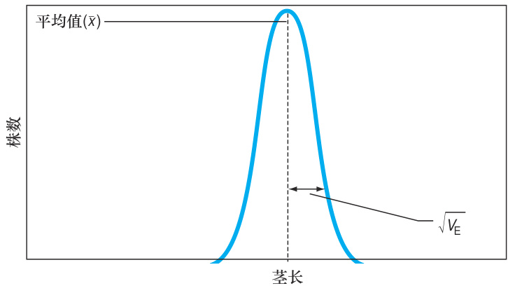  
  
  
(b) $(V_{\odot})$  

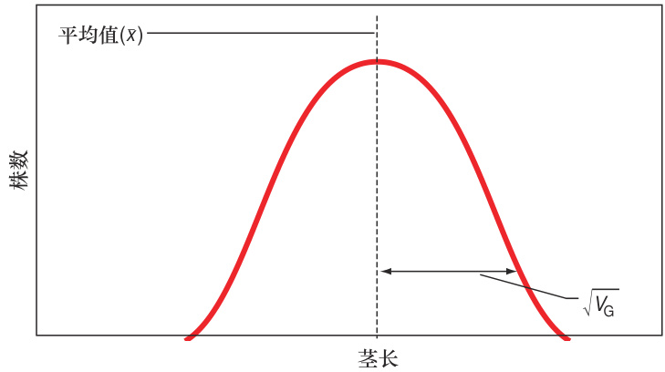  
(c) $(V_{\mathsf{P}})\,=\,V_{\mathsf{G}}\,+\,V_{\mathsf{E}}$  

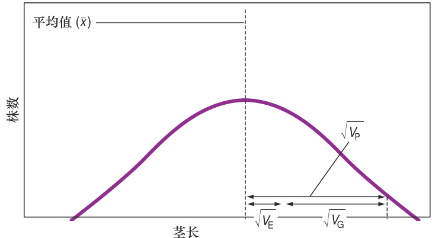  
图22.5　表型变异中的环境与遗传组分。（a）生长在坡地等不同环境中的遗传上完全相同的植物的表型差异完全来自于环境方差 $V_{\mathrm{E}^{\circ}}$ （b）在温室这样相同环境中生长的遗传上有差异的植物，它们的表型差异完全来自于遗传方差 $V_{\mathrm{G}}$ 。（c）对于生长在自然环境中的随机自然个体，总的表型方差 $V_{\mathrm{P}}$ 是遗传方差与环境方差的和（ $V_{\mathrm{G}}\mathrm{+}V_{\mathrm{E}}$ ）  

多样性种子中长大的蒲公英群体，茎长的总表型方差（ $V_{\mathrm{P}}$ ）将是遗传方差（ $V_{\mathrm{G}}$ ）和环境方差（ $V_{\mathrm{{E}}}$ ）的总和：  

$$
V_{\mathrm{p}=}V_{\mathrm{G}}{+}V_{\mathrm{E}}
$$  

请注意，图22.5（c）中蒲公英茎长度的钟形曲线比山坡上的遗传相同个体［图22.5（a）］或在受控温室中生长的遗传变异个体更宽［图22.5（b）］。对于蒲公英的自然种群，个体间的遗传变异和每种植物所经历的环境条件的变化都会导致总的表型变异。  

# 22.1.3 遗传力是遗传变异引起的表型变异中所占比例  

遗传学家将表型性状的遗传力定义为仅由遗传方差（ $V_{\mathrm{G}}$ ）引起的总表型方差（ $V_{\mathrm{P}}$ ）的比例。在形式上，以这种方式定义的遗传性称为广义遗传力，按惯例缩写为$H^{2}$ ，因为方差是特征的均值的平均平方偏差：  

理解广义遗传的意义，有助于了解遗传方差本身细分的三个组成部分。其中第一个是 $V_{\mathrm{{A}}}$ ，或加性遗传效应 $V_{\mathrm{A}}$ 的变异（例如，如果等位基因 $a$ 对特性值贡献一个单位、 $A$ 两个单位、 $b$ 三个单位和 $B$ 四个单位，那么AaBb杂合子将具有 $1{+}2{+}3{+}4{=}10$ 个特征值单位）。对遗传方差的另外两个贡献是由于优势效应（ $V_{\mathrm{D}}$ ）引起的方差，以及由于遗传基因座（ $V_{\mathrm{{I}}}$ ）之间的相互作用引起的方差。优势增加了方差的另一个组成部分，例如，显性等位基因的杂合子具有与该等位基因的纯合子相同的表型，但这些个体不具有相同的基因型。类似地，不同基因座的等位基因之间的非加性相互作用（如上位性）可以导致一个基因的等位基因具有不同的表型值，这取决于存在于第二个基因的等位基因。总遗传方差是其三个组成部分的总和：  

$$
V_{\mathrm{G}}{=}V_{\mathrm{A}}{+}V_{\mathrm{D}}{+}V_{\mathrm{I}},
$$  

$$
V_{\mathrm{{p}}}{=}V_{\mathrm{{A}}}{+}\mathrm{{V}}_{\mathrm{{D}}}{+}V_{\mathrm{{I}}}{+}V_{\mathrm{{E}}}
$$  

使用这些条件，我们可以更准确地定义广义遗传力：广义 $H^{2}\!\!=\!\!(V_{\mathrm{A}}\!\!+\!\!V_{\mathrm{D}}\!\!+\!\!V_{\mathrm{I}})/(V_{\mathrm{A}}\!\!+\!\!V_{\mathrm{D}}\!\!+\!\!V_{\mathrm{I}}\!\!+\!\!V_{\mathrm{E}})\!\!=\!V_{\mathrm{G}}/V_{\mathrm{P}}$ （22.5）  

你将在下一节中看到，在遗传亲属的研究中可以估计特定性状的遗传性。广义遗传力通常仅在比较同卵双胞胎的研究中进行测量。原因是同卵双胞胎在所有基因座上共享相同的等位基因，因此两个双胞胎中遗传变异的所有三个组成部分都是相同的。这一事实意味着在双胞胎研究中测量的 $V_{\mathrm{{G}}}$ 不仅包括 $V_{\mathrm{A}}$ ，还包括 $V_{\mathrm{D}}$ 和 $V_{\mathrm{I}\circ}$  

相反，父母和后代之间的表型值的比较不能测量广义遗传力，因为在任何一个后代和任何一个亲本之间只有任何个体基因座中的一个等位基因共享，并且因为不同基因座之间的等位基因组合也不同，在父母和后代之间共享的每个基因座的等位基因必须被认为是以简单、相加的方式起作用的遗传因子。父母和后代的比较仅代表整体遗传方差（ $V_{\mathrm{G}}$ ）的加性（ $V_{\mathrm{A}}$ ）成分，因为 $V_{\mathrm{I}}$ 和 $V_{\mathrm{D}}$ 在被分析的群体上随机化，因此无法测量它们的影响。在父母和后代的研究中估计的遗传力值被称为狭义遗传力$\left(\,h^{2}\,\right)$ ）——特定于加性遗传成分的方差的总变异的比例：狭义 $h^{2}{=}V_{\mathrm{A}}/(V_{\mathrm{A}}{+}V_{\mathrm{D}}{+}V_{\mathrm{I}}{+}V_{\mathrm{E}}){=}V_{\mathrm{A}}/V_{\mathrm{P}}$ （22.6）  

因为遗传效应的附加成分最准确地预测了杂交后代中预期的表型值的范围，所以植物和动物育种者通常计算感兴趣性状的狭义遗传力。正如你将看到的，狭义遗传对于育种者来说也很重要，原因如下：它决定了特定性状对特征值选择的反应有多强。虽然为了准确起见，我们将在后面的讨论中区分 $\cdot H^{2}$ 和 $h^{2}$ ，但对于本章的大部分目的而言，这种区别相对较小。  

在一种极端情况下，遗传性为0（无论是广义还是狭义）意味着没有可遗传的变异影响群体中的性状，并且所有观察到的表型变异都是由于环境影响。  

在另一个极端，遗传力为1意味着所有观察到的种群中的表型变异都是由于遗传变异而没有一个是由于环境影响。需要记住的一个重要事实是，任何意义上的遗传力都是特定的群体概念，而不是个体的。因此，需要说明的是，即对酒精中毒的易感性等特征的遗传力为0.4，并不意味着 $40\%$ 的特定人的易感性是由于基因，而$60\%$ 是由于环境造成的；相反，该值表明在群体中观察到的该性状中 $40\%$ 的表型变异可归因于该特定群体中个体之间的遗传差异。  

由于遗传、环境和表型变异的数量可能因性状、种群间和不同环境之间的不同而不同，因此特征种群的遗传性总是针对特定种群和一组特定的环境条件进行定义。对于具有不同的遗传变体和（或）环境的不同群体，任何性状的遗传力可能不同。  

人体身高的分析再次提供了一个很好的例子。在具有现代食品生产标准的富裕人口中进行测量时，人体身高显示出非常高的遗传力，大于0.9；也就是说，在该群体中看到的高度变异的 $90\%$ 是由于等位基因差异。相比之下，在一个不是每个人都能获得足够营养的贫穷国家，身高的遗传度会低得多。解释来自于一个人的基因组确定其最大身高潜力。如果他们的营养充足，他们就会发挥这种潜力；过多摄入食物也将没有任何区别。然而，在不发达国家，个人在可以消费的营养量方面存在很大差异时，环境差异对于身高变化的影响就会显著增加。  

# 22.1.4 遗传力研究检验遗传亲属的表型变异  

亲属（如父母和后代）共享基因，因此我们期望它们在表型上与其基因相关的程度相似，并且特征是可遗传的。如果遗传相似性有助于特征的表型相似性，那么期望一对亲密的遗传亲属在表型上比从群体中随机选择的一对个体更相似是合乎逻辑的。因此，通过将明确定义的一组遗传亲属之间的表型变异与整个群体在某些环境中的表型变异进行比较，可以估计性状的遗传力。  

我们首先需要定量地将两个个体的遗传相关性定义为个体所共有的所有遗传基因座的等位基因的平均分数，因为它们是从共同的祖先遗传来的。对于常染色体基因，亲本和儿童的遗传相关性为0.5，因为对于任何给定的基因座，儿童基因组中的两个等位基因中的一个来自该亲本。换句话说，父母和孩子分享其等位基因的一半。两个兄弟姐妹的遗传相关性也是0.5，因为如果你假设一个兄弟姐妹从 $A^{1}A^{2}$ 杂合亲本那里得到了等位基因 $A^{1}$ ，那么第二个兄弟姐妹得到相同等位基因的概率是0.5。扩展同样的分析，我们可以看到阿姨和侄女的遗传相关性为0.25，而第一代表亲之间的相关性为0.125。  

虽然遗传性在理论上可以使用甚至是远房亲属来确定，但是首先研究可能的最近亲属是有意义的，即遗传相关性为0.5或更高的个体。原因很简单，在共享大多数等位基因的情况下，基因对特性的贡献最为明显。在本节的其余部分，我们将讨论估算近亲遗传性的两种方法。第一种方法比较了父母和后代的表型值，重点是一项著名的实地研究，涉及达尔文首先研究的鸟类；第二种方法是比较人类双胞胎的特征。  

# 1. 通过比较父母和后代来估计遗传力  

图22.6说明了遗传力对父母及其后代和整个群体的平均表型值的影响。通过量化后代表型与亲本表型的相似程度，可以估计狭义遗传力。如果子代的平均表型值始终与总体的表型值相似，无论父母的表型如何，那么遗传力为0，因为表型方差中没有一个是由于父母遗传的等位基因的加性遗传效应。然而，如果后代与其父母的群体平均值相差 $25\%$ ，则遗传率为0.25。如果子代与群体均值的偏离程度与亲代相同，则遗传率为1.0，因为亲代遗传的等位基因与子代的表型密切相关。  

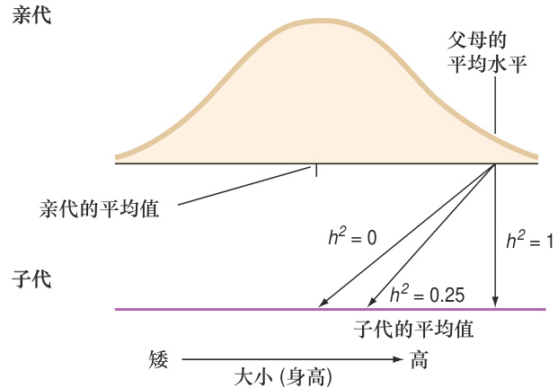  

图22.6　通过父母子代比较确定遗传力。母代的表型分布是以tan表示的，选择的一对父母位于曲线分布的右侧。下面的粉线代表子代表型的范围。如果 $h^{2}{=}1$ ，则表示子代的平均值等于母代的平均值，因为从母代继承的等位基因完全决定该表型。如果 $h^{2}{=}0.25$ ，则子代的均值是母代父母的均值与母代群体均值的差的1/4。如果 $\!\cdot\!h^{2}\!\!=\!\!0$ ，则子代的均值与母代群体的均值相同，这时，选择的这对父母的基因型完全没有影响子代。  

达尔文在加拉帕戈斯群岛观察到的雀类（通常被称为达尔文雀）提供了一个群体的例子，遗传学家通过比较父母和后代的表型，在田间自然条件下测量了数量性状的遗传力。科学家研究了喙地雀（Geospiza fortis）。在Daphne Major岛上，将种群中的许多个体雀进行了绑定［图22.7（a）］，然后研究人员测量了岛上每个巢中母代、父代和后代的喙深度，并计算了后代的喙深度是否与母代和父代的平均喙深度有统计学相关性［中间值；图22.7（b）］。  

图22.7（b）表示的是亲本及其后代的性状值的散点图。红色和蓝色线是两个数据集的相关线（也称为最佳拟合线）。散点图显示父母与子女之间存在明显的正相关（相关线的斜率为正数）；有较深喙的父母的后代有更深的喙，而喙深度较小的父母的后代则有较小的喙深度。  

由于暂时变得明显的原因，当存在正相关时，与后代相关的相关线的斜率与中间值——称为相关系数（r），是对喙深度的狭义遗传力的估计。在该图中，由与中间喙深度和后代喙深度相关的线相关性的斜率表示的喙深度的遗传力是0.82。这意味着达尔文雀类种群中喙深度的大约 $82\%$ 的变化可归因于种群中个体之间的加性遗传变异；另外 $18\%$ 来自环境变化和非加性遗传效应。  

在图22.7（c） $\sim$ （d）中，我们检查了极端情况，以说明为什么相关系数（ $r$ ，相关线的斜率）提供了狭义遗传力 $h^{2}$ 的估计。首先假设环境对特性完全没有影响［图22.7（c）］。在这种情况下，父母的喙深度与后代的喙深度相关的相关线的斜率将是1.0［图22.7（c）；左］。在该图的右侧，我们显示了4个配对的结果，这些配对与先前在图22.6中使用的相同方  

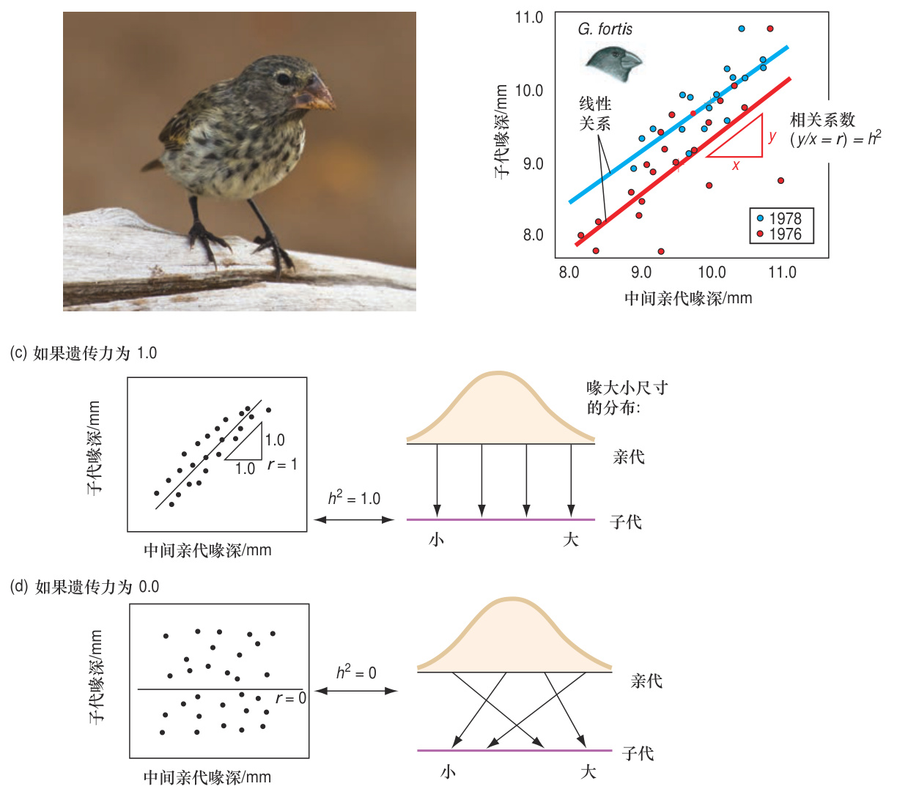  
(a)   
(b)  

图22.7　估算达尔文雀类喙深度的遗传力。（a）图中喙地雀是加拉帕戈斯群岛特有的以种子为食的鸟。（b）散点图展示的是1976年和1978年子代鸟嘴大小与它们的母代喙深度的平均值。相关线的斜率（蓝色和红色），即相关系数，被用来估算遗传力。通过自然选择引起的喙深度的增加与1977年的一场干旱有关，这场干旱使得原来又小又软的种子变为又大又硬的种子。相关系数并不随着年份发生太大变化，说明该性状基本不受环境影响并可以维持高遗传力。（c）如果遗传力为1的图。（d）遗传力为0的图。在图（c）和（d）中，右边的图表示四个交配对及它们的子代的表型平均值，正如图22.6中所示；右边的每个  

箭头代表对应的左边图中的一个点。  

式显示。你可以看到这两种表示形式基本相同。  

现在考虑一个群体，其中父母及其后代的喙深度平均而言，与从群体中随机选择的任何一对个体的喙深度相比没有或多或少相似［图22.7（d）］。在这样的种群中，父母和后代的喙深度特征之间不存在相关性，中间和后代喙深度的图形产生点“云”，中间和后代喙深度之间没有相关性［图22.7（d），左图］。图22.7（d）的右图显示了同一情况的等效替代表示。你可以看到，通过图22.7中使用的两种方法中的任何一种，分析追踪父母，其子代和整个群体的表型值的数据，使研究人员能够估计遗传力。  

从这些例子中，你可以得出结论，遗传相关个体之间的表型相似性为特征的遗传性提供了证据。然而，将遗传亲属之间的表型相似性转换为遗传力的度量取决于一个关键假设：遗传亲属的分布对于群体所经历的环境条件是随机的。在雀科的例子中，我们假设父母及其后代没有经历与无关个体环境更相似的环境。  

然而，在自然界中，遗传亲属可能通过居住在类似的环境中而违反这一假设。以雀类为例，在繁殖季节由母代和父代生产的所有后代通常孵化并在一个巢中生长，在那里他们从父母那里获得食物。由于喙深度影响雀类觅食的能力，因此巢中饲喂量可能导致后代喙深度与父母喙深度部分相关，原因与遗传相似性截然不同。  

研究达尔文雀类的研究人员无法轻易处理遗传关系和环境可能交织在一起的问题。原因是加拉帕戈斯群岛是厄瓜多尔的国家公园，因此研究人员禁止以任何方式操纵鸟类，除了将它们绑定以进行识别和测量它们的物理属性（如喙大小）。但研究驯化物种的科学家可以尝试通过从一对父母的巢中取出卵并将其随机放置在雀群中其他父母建造的巢中来减少混淆环境问题；这种随机重新定位的蛋被称为交叉抚养。在接受父母照顾的动物的遗传性研究中，交叉抚养有助于随机化环境条件。  

# 2. 用双胞胎估计人类复杂的性状遗传力  

通过比较亲密遗传亲属（通常是母亲和孩子、父亲和孩子或兄弟姐妹）的特征值来估计人类特征的遗传性。在这些研究中，遗传力是相关系数（r）除以个体的遗传相关性。对于父母和孩子或兄弟姐妹，相关性为0.5，因此 $h^{2}{=}r\mathrm{~/~}0.5{=}2r$ 。这种方法存在问题，因为它高估了遗传力。  

在人类社会中，家庭成员不仅分享相似的基因，而且分享相似的物理和文化环境。因此，遗传亲属之间的表型相似性可能来自遗传相似性或来自类似环境，或者最常见的是来自两者共同的影响。你如何区分遗传相似性的影响与共享环境的影响？  

在像人类这样的胎盘哺乳动物中存在同卵双生（MZ）双胞胎，为研究人员提供了遗传性研究的有力工具。MZ双胞胎是受精后受精卵分裂造成的。它们在遗传上是相同的，因为它们来自单个精子和单个卵子；它们共享所有位点的所有等位基因［图22.8（a）］。因此，同卵双胞胎之间的表型差异不能归因于遗传变异。  

双胞胎可用于研究定量复杂性状的遗传性，其中表型值在连续范围内变化，或仅具有两个表型值的离散复杂性状：要么具有性状，要么不具有。由于在定量和离散复杂性状的研究中产生的数据种类本质上是不同的，我们将分别讨论这些方法。  

# （1）定量复杂性状的双重研究  

偶尔，MZ双胞胎会进行无意的交叉抚养实验：它们在出生后不久就被放弃抚养，并在不同的家庭中长大。在这样一对同卵双胞胎中，任何表型相似性在理论上必须是遗传相似性的结果。因此，研究人员可以通过对不同夫妇收养的MZ双胞胎的性状值的散点图估计由基因控制的表型变异的比例（广义遗传力 $H^{2}$ ）［图22.9（a）］。相关线的斜率（相关系数）估计遗传力： $H^{2}{=}r$ 。  

只有相对较少的一对MZ双胞胎被分开抚养，使得这些研究难以进行，并限制了数据集。但是MZ双胞胎可以用另一种方法来估计遗传力，即通过比较它们与异卵双生（DZ）双胞胎的表型差异。这种DZ双胞胎是一个父亲的不同精子使两个不同的卵子受精的结果［图22.8（b）］。就像兄弟姐妹在不同的时间出生一样，DZ双胞胎在所有基因位点上平均分享 $50\%$ 的等位基因。将不同基因亲缘度为1.0的MZ双胞胎的性状值与不同基因亲缘度为0.5的DZ双胞胎的性状值进行比较，有助于区分基因与环境的相对贡献。  

图22.9（b）展示了这种通过比较MZ和DZ双胞胎来估计遗传力的方法。实质上，您比较两种类型双胞胎的相关线（相关系数）的斜率。MZ双胞胎的相关系数（ $r_{\mathrm{MZ}}$ ）应始终大于DZ双胞胎（ $r_{\mathrm{DZ}}$ ）的相关系数，因为MZ双胞胎的基因（ $100\%$ ）是DZ双胞胎（ $50\%$ ）的两倍。假设MZ和DZ双胞胎遇到的环境影响是等效的，散点图上斜率的差异越大，遗传力越大。在数学术语中：  

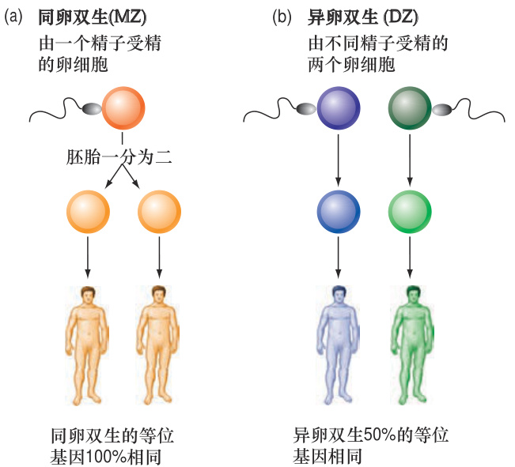  
图22.8　不同类型的双胞胎。（a）同卵双胞胎遗传相关度为1.0。（b）异卵双胞胎遗传相关度为0.5。  

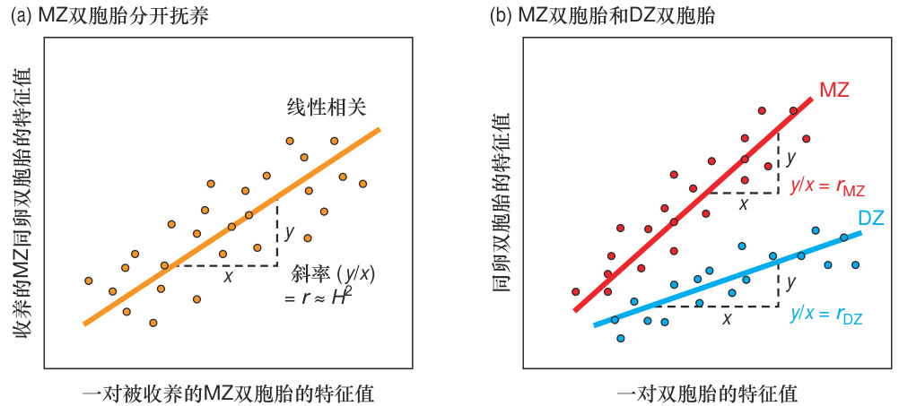  
图22.9　通过同卵双胞胎估算遗传力。（a）一对被不同家庭领养的同卵双胞胎的性状值的散点图，相关系数 $\left(\textit{r}\right)$ 是相关性的斜率（橙色）， $r$ 是遗传力（ $H^{2}$ ）的估算值。（b）针对同一性状同卵双胞胎（红色）与异卵双胞胎（蓝色）的性状值。遗传力可以估算为2 $(r_{\mathrm{MZ}}{-}r_{\mathrm{DZ}})$ 。  

为了理解为什么 $r_{\mathrm{MZ}}$ 和 $r_{\mathrm{DZ}}$ 之间的差异估计遗传性，你应该意识到MZ双胞胎之间的所有表型变异都是由于环境因素，而DZ双胞胎之间的表型变异同时具有遗传和环境成分。等式中的因子“2”是必要的，因为DZ双胞胎仅共享其基因的一半。本章末尾的习题8鼓励你更详细去探索等式（22.7）。  

表22.1列出了从双胞胎研究中估计的定量人类性状的遗传力。虽然了解这些特征的相对遗传性是有用的，但你应该谨慎地解释这些数字。如前所述，遗传力估计仅适用于研究在特定时间被研究的特定人群。此外，表22.1中列出的调查可能会出现并发症，这往往会导致高估实际的遗传性。例如，当不同的家庭采用MZ双胞胎时，这些家庭可能比随机选择的一对家庭更相似。这两个家庭本身可能是相关的，或者收养机构可能会将这对双胞胎安置在两个具有相似性较高社会经济背景的家庭中，以确保孩子的经济安全。  

表22.1　通过对数量性状的双项研究估算遗传力  

<html><body><table><tr><td>特性</td><td>遗传力</td></tr><tr><td>身高</td><td>0.68~0.90</td></tr><tr><td>体质指数</td><td>0.64~0.84</td></tr><tr><td>出生体重</td><td>0.64~0.84</td></tr><tr><td>脑额叶体积</td><td>0.90~0.95</td></tr><tr><td>体育参与</td><td>0.48~0.71</td></tr><tr><td>膳食结构</td><td>0.41~0.48</td></tr></table></body></html>

\* 可遗传性评估是对某一特定时间种群的特殊估计。  

# （2）离散复杂性状的双重研究  

人类的一些复杂性状是离散的，只有两种可能的表型状态，而具有一系列可能的表型值的连续性状则相反。许多离散性状在某种意义上是复杂的，它们受多种基因和环境的控制，例如，你是否患有心脏病、患上癌症或成为酒鬼。双胞胎研究也可用于估计离散性状的遗传力。由于获得的数据的性质，这些研究不能测量相关系数，而是比较他们在MZ双胞胎和DZ双胞胎之间的特征一致性——当其中一个双胞胎中的一个具有以下特征时，另一个双胞胎具有特征的频率。  

考虑一个特征，其中人群中个体的表型差异完全来自每个人所经历的环境差异，也就是说，遗传力为0.0的特征［图22.10（a）］。对于这个特性，你会发现MZ双胞胎有相同表型的可能性与DZ双胞胎相同。事实上，对于被收养到同一家庭的遗传无关的兄弟姐妹而言，特征分享的可能性也是相同的。如果一个孩子表达遗传力为0.0的特征，那么影响兄弟姐妹表现出相同表型的机会的唯一因素是所研究的环境范围可以产生表型的概率；孩子之间的遗传关系程度没有影响。  

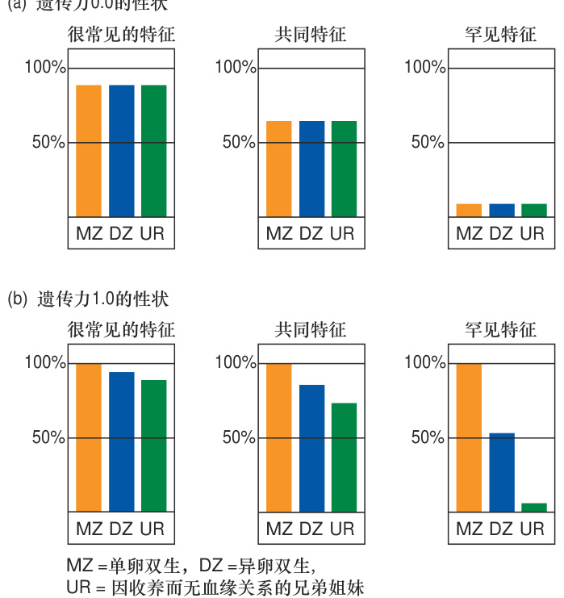  
(a)     0.0   
图22.10　第二个孩子会与第一个孩子具有相同显性性状的概率。  

现在考虑一个特征，其中群体中个体之间表型的差异完全来自遗传差异，即遗传力为1.0的特征［图22.10（b）］。因为MZ双胞胎在遗传上是相同的，所以它们在表达中表现出 $100\%$ 的一致性：如果一个表达特征，另一个也表达特征。不相关个体之间性状表达的一致性根据性状的共性而变化。也就是说，人群中的特征越常见，两个不相关的人都有这种表型的可能性越大［图22.10（b）］。无论性状的共性如何，DZ双胞胎因为它们共享一半的等位基因，将始终显示出比遗传无关个体更大的一致性，但是当遗传力 $^{=1}$ 时，MZ双胞胎的一致性低于 $100\%$ 。  

表22.2显示了在人类的一些复杂离散性状的双胞胎研究中测量的一致性。MZ一致性与DZ一致性的比率越高，该性状的遗传力越高。请注意，在所有情况下，MZ一致性小于1.0。这个结果告诉我们环境在某种程度上会影响所有这些特征。MZ和DZ一致性的值可用如下公式估计遗传性：  

遗传力 $=$ (MZ一致性-DZ一致性)/(1-DZ一致性) （22.8）  

表22.2　MZ和DZ双胞胎复杂离散性状的一致性  

<html><body><table><tr><td rowspan="2">特性</td><td colspan="2">一致性</td></tr><tr><td>MZ双胞胎</td><td>DZ双胞胎</td></tr><tr><td>1型糠尿病</td><td>0.43</td><td>0.074</td></tr><tr><td>2型糖尿病</td><td>0.34</td><td>0.16</td></tr><tr><td>精神分裂症</td><td>0.41</td><td>0.053</td></tr><tr><td>自闭症</td><td>0.94</td><td>0.47</td></tr><tr><td>阿尔茨海默病</td><td>0.32</td><td>0.087</td></tr><tr><td>帕金森病</td><td>0.16</td><td>0.11</td></tr><tr><td>多发性硬化症</td><td>0.25</td><td>0.054</td></tr><tr><td>克罗恩病</td><td>0.38</td><td>0.02</td></tr><tr><td>结直肠癌</td><td>0.11</td><td>0.05</td></tr><tr><td>乳腺癌</td><td>0.13</td><td>0.09</td></tr><tr><td>前列腺癌</td><td>0.18</td><td>0.03</td></tr></table></body></html>  

考虑到两个极端情况将帮助你理解等式（22.8）。如果性状的所有方差都是由环境控制而没有基因控制，那么MZ和DZ双胞胎的一致性预计是相等的，因为我们假设它们在同一家族中一起成长的效果是相等的。因此，等式（22.8）的分子为0，遗传力 $=\!0$ 。  

在另一个极端，所有表型变异都是由基因引起的，MZ一致性将是1。DZ一致性将始终是1的一小部分，但这一部分取决于性状的稀有性，该特征是否通过显性或隐性等位基因受到控制，以及有多少基因控制这种特性。假设我们将等式（22.8）应用于孟德尔性状最简单的情况，由一个单一的、罕见的、 $100\%$ 渗透的显性等位基因控制。在这个简化的例子中，MZ一致性为1，DZ一致性为0.5，等式（22.8）的遗传性为1。  

# 22.1.5 特征的遗传性决定了它的进化潜力  

我们在第21章中看到，预先存在的突变的选择如何产生进化变化。由于复杂性状的遗传性是其变异的遗传成分的量度，因此遗传力量化了选择的可能性，从而量化了从一代到下一代的进化潜力。具有高遗传性的性状通过选择具有很大的进化潜力，无论该选择是天然的还是人工的。这个想法对于理解表型如何随时间演变非常重要。  

遗传在进化中的作用对于改良农业上重要的植物和动物物种的育种计划也具有相当大的实际意义。如果特征的遗传力很低，那么这样的计划几乎没有成功的机会：改变作物或牧群养殖的环境，或者远程搜索同一物种的其他代表，对在全球范围内增加变异的遗传成分会更有意义。  

图22.11说明了植物育种者如何利用高遗传力的情况，通过人工选择来改良作物。在这个例子中，饲养员想要选择更大的可食用豆类，他将采用一种简单但功能强大的策略，称为截断选择。这种方法的本质是他将种植具有高于某个截止值的特征值的豆类（在这种情况下，选择最小尺寸的豆）来生产下一代。  

在图22.11中，S代表选择差异，测量为所选亲本的平均性状与整个亲本群体（即育种和非繁殖个体）的平均性状值之间的差异。在所选父母的后代中，平均特图22.11　截断选择的策略。狭义的遗传力h2预测一个数量性状的选择的反应。整个母代表型性状呈现一个钟型分布，但是只有超过一定数值才允许生育（阴影部分）。被选择的群体与全体之间的表型值差异为S，即选择差异。如果 $h^{2}$ 遗传力较高，那么这些被选择的父母的子代的表型值的均值依然会大于母代群体的均值；两个值之间的差即为R。  

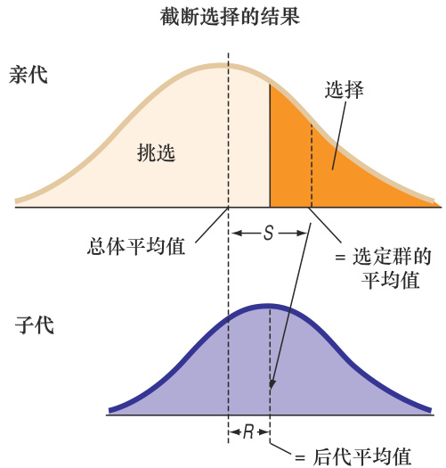  

征值将高于整个父母一代的平均特征值。在图中，R表示这种差异。以这种方式使用， $R$ 表示对选择的响应，即由育种者应用的选择产生的进化量或平均性状值的变化。  

遗传力对育种者的重要性来自这样的事实：对选择（R）的响应及育种计划的有效性通过所谓的特征的实际遗传力与选择差异（S）直接相关。如果表型值的分布符合正常的钟形曲线，则实际遗传力等于狭义遗传力（ $h^{2}$ ）。因此，类似于图22.7（b），其中中间性状值和后代性状值之间的相关线的斜率估计为 $h^{2}$ ：  

实现 $h^{2}{=}R/S$ 重新排列以解决 $\cdot R$ ：  

$$
R{=}h^{2}S
$$  

换句话说，选择的强度（S）和性状的遗传力$\left(\begin{array}{l}{h^{2}}\end{array}\right)$ 直接决定了每一代中性状的进化量或进化速率（如对选择R的响应所示）。遗传力越大，育种计划改善作物的可能性就越大。  

# 基本概念  

●  围绕正态分布均值的分布越窄，方差越小。  
●  群体中复杂性状的总表型变异具有遗传和环境成分。  
●  遗传力描述了在特定环境、特定人群中遗传变异导致的总表型变异的比例。  
●  遗传性可以通过检查近亲的性状比不太相关的个体更为相似的程度来估算。  
●  特征的遗传性决定了它的进化潜力。  

# 22.2 数量性状基因座 （QTL） 定位学习目标  

1.  解释研究人员如何通过建立回交系来鉴定QTL，然后通过基因渗入对QTL进行精细定位。  
2.  讨论连锁不平衡（LD）对人类QTL关联作图的重要性。  

有两种主要方法可用于数量性状基因座（QTL）定位，即有助于定量性状基因。第一种方法，我们称之为直接QTL定位，要求研究人员在具有不同表型值的个体之间进行感兴趣特征的杂交；这种技术只能用于通过控制杂交繁殖的物种。第二种方法称为关联映射，利用了前几代种群中发生的事件。关联作图甚至可以应用于不能进行受控育种实验的人类等物种。  

正如你将看到的，两种方法背后的想法是相同的，并且它依赖于重组来产生具有不同遗传组成的个体。在直接QTL作图中，重组发生在由研究人员控制的一系列杂交的几代中。相比之下，在关联作图中，重组已经发生在随机繁殖群体的历史中。在这两种情况下，研究人员最终测试基因组不同区域中标记之间的统计相关性及感兴趣性状的特定表型值。这些相关性通常可以确定导致表型变异的突变。  

# 22.2.1 研究人员通过分析育种计划获得的重组体来定位QTL  

为了在实验生物中进行直接QTL定位，研究人员对个体进行杂交分析，发现个体对兴趣特征表现出两种极端的表型值（例如，大小；非常大和非常小），并检查分布在整个生物体基因组中的性状值和遗传标记的联合分离。标记显示它们的存在/缺失与性状值（本例中的大小）之间有很强的相关性，很可能与影响性状的一个或多个基因有关。  

研究人员通过检查选择的DNA序列变体（SNP、InDel或SSR）来跟踪原始双亲中特定基因组区域的存在，因为它们在作图群体中不同，并且分布在整个基因组中。随着基因芯片和DNA测序方法的成本持续下降，研究人员可以筛选越来越多的标记物，从而提高所得QTL图谱的分辨率。  

# 1. 通过粗略映射鉴定QTL  

直接QTL定位的一些最重要的应用涉及农业植物和动物。如果研究人员能够找到与QTL相关的标记物以获得具有商业价值的性状，那么他们就可以开发出有用的品系，通过找到含有几种QTL等位基因特定组合的重组体来最大化该性状的表达。在这些应用中，研究人员不一定要确定导致特性值的特定基因。相反，他们只需要找到与QTL密切相关的多态性，以便DNA分析能够识别最可能具有理想表型的品系。  

为了说明鉴定QTL的一般方法，我们研究了20世纪90年代末进行的番茄果实大小的一项具有里程碑意义的研究。超过两千年的驯养繁殖使得今天的美食中会使用番茄。一些驯养番茄的果实比其野生祖先的果实大数百倍，而野生祖先最初来自墨西哥（图22.12）。导致今天大型驯化番茄的大小增加是通过数千代选择中许多不同基因的突变积累而发生的。  

为了鉴定相关基因，研究人员开始研究两种密切相关的物种，这些物种易于交配，表现出相对于果实大小的极端特征值：Solanum lycopersicum（大）和Solanumpennellii（小）（图22.12）。将两个起始品系中的每一个近交几代，使得每个品系基本上对于其每个基因的每个等位基因变为纯合。诸如这些全球纯合品系，其中所有个体在所有基因上具有相同的等位基因，被称为等基因系。与影响所述性状的等位基因纯种（纯合）的孟德尔品系一样，同源小或大品系对于影响番茄大小的每个QTL是纯合的。正如你将看到的，同基因起始品系对于实验的成功至关重要，因为它们简化了后面的分析。研究人员将大型和小型同基因品系杂交产生 $.\mathrm{F}_{1}$ ，这是中等大小的番茄［图22.13（a）］。  

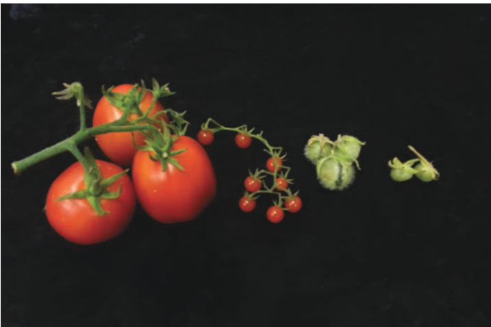  
图22.12　家养番茄与野生番茄在大小上的差异。家养番茄果实Solanum lycopersicum（左边）与三种野生番茄（S. pimpi-nellifolium、S. habrochaites和S. pennellii）的果实（右边）。承蒙Brad Townsley, UC Davis提供  

接下来，研究人员将F 植物回交到大的同基因亲本品系（S. lycopersicum）以产生 $\mathrm{{BC}_{1}}$ （回交1）代。由于几种不同的基因控制番茄大小，而小型和大型亲本具有不同的等位基因，因此BC1代的单品系植物显示出多种大小［图22.13（a）］。然后研究人员对数百个单独的BC 番茄进行称重和基因分型，以回答以下问题：任何给定标记基因座的 $\boldsymbol{p}$ （pennellii）或l（lycopersicum）等位基因与番茄大小相关吗？  

因为S. pennellii和S. lycopersicum的起始品系是同基因的，我们可以将它们表示为两种品系不同的每个基因或标记基因座的p/p或l/l。因此，F1在这些基因座中的每一个基因上是遗传相同的和杂合的（p/l），而每个 $\mathbf{\cdot}\mathbf{B}\mathbf{C}_{1}$ 番茄是纯合的l/l或杂合的p/l。在这一点上，你可以看到从同基因品系开始的优势：BC1后代将继承不同的单一已知S. pennellii或S. lycopersicum特有的分子标记等位基因，可以轻松追踪。  

然后研究人员计算出每个标记的纯合子和杂合子的平均重量。在大多数这些标记基因座的情况下，纯合子和杂合子的平均重量是相同的。但对于与相关QTL相关的标记，平均权重不同［图22.13（b）］（为了确定计算的差异是否显著，科学家们使用了第11章遗传学工具箱中描述的Lod分数映射统计数据）。使用这种方法，研究人员发现了28个影响番茄大小的QTL。  

作为直接Q T L 定位技术的一个例子，假设S .pennellii的起始品系对于特定标记的等位基因 $A^{l}$ 是纯合的，同基因S. lycopersicum品系对于等位基因 $A^{2}$ 是纯合的，并且是杂合 $p/l$ （ $\left.A^{1}/A^{2}\right.$ ） $\mathbf{B}\mathbf{C}_{1}$ 番茄明显小于l/l纯合（ $\langle\boldsymbol{A}^{2}/\boldsymbol{A}^{2}$ ） $\mathbf{B}\mathbf{C}_{1}$ 番茄。因此，标记与番茄大小的QTL相关联。然后，植物育种者可以预测具有 $\cdot A^{2}$ 等位基因的番茄可能比具有该标记的 $|A^{1}$ 等位基因的番茄更大。这种预测不要求该标记是负责该性状的多态性，只要标记差异与  

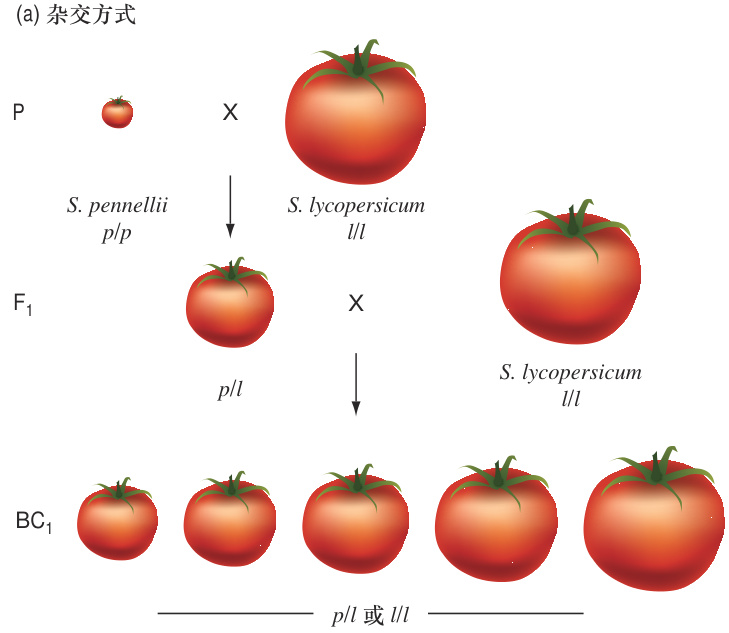  
(b)    QTL  

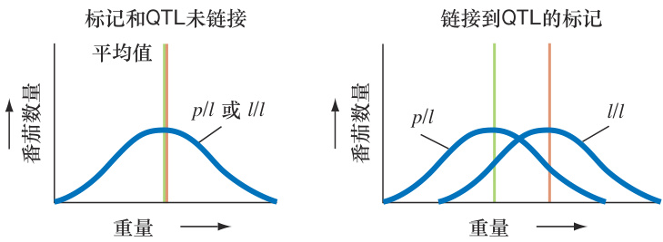  
图22.13　影响复杂性状的数量性状座位（QTL）的遗传定位策略。（a）同基因不同表型S. pennellii（ $p/p$ ）与S. lycopersicum（l/l）进行杂交。子一代F1再与母代S. lycopersicum进行回交，产生BC1代。（b）BC1代个体根据重量进行分型。如果标记物的S. pennellii和S. lycopersicum等位基因的杂合子与S.lycopersicum等位基因的纯合子之间存在显著的性状值（这里是重量）差异，则该标记物与影响表型的QTL相关。  

负责的多态性相关联。  

# 2. QTL与近等基因（同基因）系的精细定位  

正如你刚才所见，粗略映射不能识别QTL的致病基因，而是建立一个染色体片段，其中基因可以位于其中，并且其边界由最近的连锁分子标记定义。在大多数此类研究中，该区域长度在 $1\!\sim\!10\mathrm{cM}$ 之间，可能包含100多个基因。虽然成功的育种计划可能不需要科学家找到致病基因，但是通常有充分的理由来扩展研究以实现这一目标。在刚刚描述的研究中，对大小影响最大的QTL称为fw2.2（果重2.2）； $f_{W}2.2$ 的S. lycopersicum等位基因可使果实重量增加高达 $30\%$ 。为了了解决定番茄大小的分子因素，研究人员希望通过一种称为精细定位的过程来识别 $f_{W}2.2$ 致病基因。  

这种精细定位程序的第一步是进行一系列回交和杂交，从图22.13中讨论的BC1后代开始，产生称为NIL（近等基因系）或同类系的品系。在图22.14（a）所示的例子中，同类系基本上是S. lycopersicum，除了每个系在QTL区域具有不同的S. pennellii基因组的小区域，称为基因渗入。  

第二步是测量每个NIL的性状值，并对分子标记进行基因分型，以确定每个S. pennellii渗入的精确边界。这一观点认为，所有小番茄（pennellii表型）同类系所共享的以及所有大番茄（lycopersicum表型）同类系所缺少的潘尼利基因区域必须包含致病 $\hbar\nu2.2$ 基因。如果这个区域足够小（当出现一些独立的渐渗时就是这种情况），研究人员可以通过分析S. pennellii和S. lycopersicum基因组中该区域的DNA序列来寻找致病基因。区分两种起始同源菌株的多态性［图22.14（b）］。  

精细绘图过程的最后一步是验证基因分配，在这种情况下，通过表型拯救来完成。研究人员从pennellii基因组中克隆了可疑的fw2.2基因，并将其作为转基因导入了lycopersicum。结果如图22.14（c）所示，转基因使番茄显著变小。这种表型拯救试验是可能的，因为pennellii fw2.2等位基因（导致较小的果实大小）对lyco-persicum fw2.2等位基因（导致较大的果实大小）具有显著性。  

在过去几年中引入的新技术允许使用其他方法来验证可疑的QTL基因，例如，使用CRISPR/Cas9（如图18.14所示）等技术可使研究人员直接将一个等位基因改为另一个等位基因，以验证这一变化是否会改变所考虑的特征。  

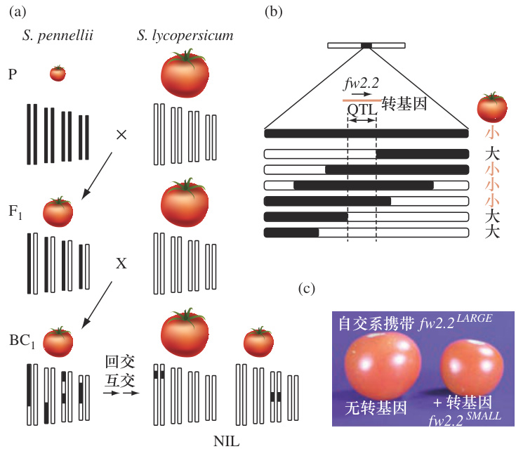  

图22.14　通过建立与分析近等基因（同基因）系来进行QTL的精细定位。（a）通过不断回交以产生近等基因系，其基因组几乎全部来自于S. lycopersicum（染色体为空心），但是仍有小片段来自S. pennellii的片段（渗入实心的部分）。（b）研究人员通过比较渗入基因有交集的近等基因系的性状值来定位  

QTL。（c）使用转基因来验证QTL定位的准确性。  

（c）：承蒙Stephen D. Tanksley, Cornell University提供  

研究发现fw2.2基因编码的蛋白质是细胞分裂的负调节物。事实上，这种基因的产物与肿瘤抑制蛋白有关，当在人体内发生突变时，会导致癌症的细胞生长不受控制（见第20章）。此外，发现 $f_{W}2.2$ 的隐性S.lycopersicum等位基因是低态的——也就是说，它相对于S. pennellii等位基因具有降低的功能。这些结果有助于解释为什么S. lycopersicum番茄比S. pennellii番茄小；减少细胞生长的负调节因子的功能应导致更大的果实。  

研究人员在整个20世纪90年代研究了10年，以确定fw2.2 QTL中的致病基因。现在，通过高密度标记图谱，用于基因分型的微阵列工具，以及低成本、高通量的DNA测序，时间线显著缩短。已经在酵母、玉米、拟南芥、水稻、果蝇、小鼠、猪和牛中鉴定了数百种控制多种性状的QTL基因。  

# 22.2.2 关联映射可以识别人群中的QTL  

刚刚描述的标准QTL作图方法需要对表型不同的个体进行受控交配；但对于包括人类在内的许多生物而言，这些实验既不实用也不符合道德。此外，在实验性杂交中发生的重组事件的数量限制了标准QTL作图的分辨率。  

幸运的是，大自然已经提供了一种映射QTL的替代方法：遗传学家可以使用一种称为关联作图的方法来利用当前个体祖先中过去发生的重组事件。关联映射实际上只是链接映射的扩展［图22.15（a）］，其中重组不仅仅发生在一代，而是累积了很多代。  

如图22.15（b）所示，关联映射背后的想法非常简单。假设一个影响特征的新突变发生在很多代以前。这种突变（图22.15中的红色）可能发生在特定个体的特定染色体上，如图所示的蓝色染色体。在接下来的几代中，这条染色体将与分散在染色体长度上的不同变体的多态标记的其他副本重新组合。通过多轮重组，现今种群中的所有染色体都是种群祖先中存在的染色体类型的拼凑。  

在关联作图中，科学家们测试了大量现代个体的遗传变异，以找到那些在统计学上与表型差异相关的变异。例如，如果性状是诸如冠状动脉疾病的病症，那么目标是找到一种标记物，其在患者群体中的频率显著大于非患病对照群体中的频率。如果研究人员发现与病情密切相关的变异，这些标记必须与影响人们是否会患上冠状动脉疾病的QTL密切相关。  

# 1. 连锁不平衡：两个位点变异之间的统计相关性  

为了理解遗传学家如何进行关联作图，我们首先需要研究基因组中不同位点的变体如何在自然群体中相互组织。基本问题是，一个位点的替代变体是否与其他位点的变体随机关联，或者它们是否具有统计相关性。  

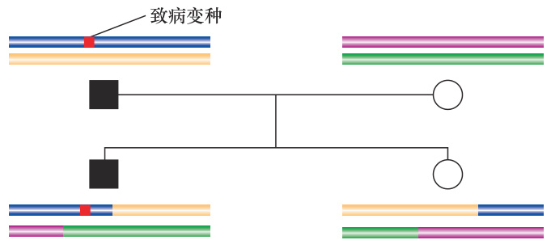  
(a)   
(b)  

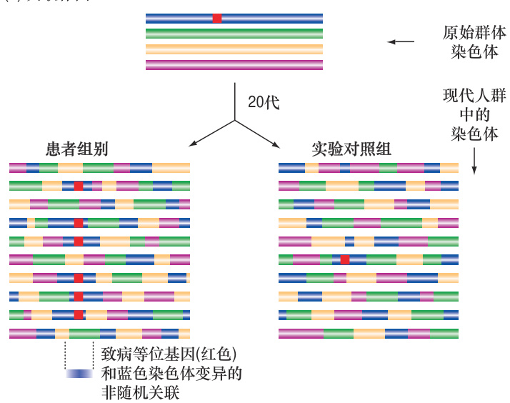  
图22.15　关联映射是链接映射在更长时间段上的简单延伸。（a）在链接映射中，遗传学家通过检查重组事件来寻找特定基因组区域与不连续性状之间的联系。（b）在关联映射中，重组事件已经在人群中，因为重组已经在之前很多代祖先中出现过。研究者们通过比较患者中该标记位点的频率是否明显高于正常对照组来鉴定QTL。这样，当与疾病相关联的突变（红色标记）出现在相同染色体上时，该标记等位基因仍然会在这段蓝色的染色体上。  

例如，在假设群体中，染色体1上的核苷酸位置300 500具有相同频率的两个变体（A和T），而同一染色体上的核苷酸位置300 600具有两个变体（G和C），也具有相同的频率。通过位点之间的自由重组，我们期望在该群体中由亲本产生的配子中具有4种不同的双位点单倍体类型（单倍型）：A-G、A-C、T-G和T-C各自的频率为 $25\%$ 。在这种情况下，位点1处A的存在不提供关于位点2处的变体的任何信息，其同样可能是G或C。在这种情况下，两个位点的等位基因之间不存在相关性，然后我们会说这两个位点的变异处于连锁平衡状态。因此，单倍型只是附近变异基因座上特定的等位基因集合。  

随即发生的配对仅存在两种单倍型，例如，A-G和T-C，每种单倍型的频率为0.5。在后一种情况下，两个位点的变体之间存在完美的正相关：当我们在位点1找到A时，我们可以肯定地预测我们将在第二个位点看到  

G。变体T和C也彼此完全正相关。当两个基因座的变体相关时，我们说变异是连锁不平衡（LD）。  

LD测量范围从0（在连锁平衡的情况下没有相关性）到1（表示两个位点处变化之间的完全相关性）。当我们沿着一条染色体比较越来越远的位点时，它们之间具有更大的遗传图距，LD逐渐衰减到0，因为存在更多可能性来进行基因重组以破坏等位基因关联。遗传学家经常通过成对LD值的图来说明这个概念，其中SNP在三角图的顶部列出，其组成元素是菱形。每个菱形的颜色阴影表示SNP之间的LD强度。图22.16通过类比显示了如何制作和解释这些图表；在图中，不同颜色表示美国西海岸6个城市之间的距离，而不是LD值。  

人类中的重组率在相邻碱基对之间每代产生平均约$1\times{10}^{-8}$ 个杂交事件。然而，重组往往聚集成遗传交换的热点。这种重组的不连续性，以及在进化时间内发生重组的时间和地点的随机性，导致人群中染色体上LD的不连续性。这些不连续性可以通过三角图上LD块（或单倍型块）的存在来跟踪（图22.17）。LD块之间的边界可能对应于重组热点。  

# 2. GWAS：使用LD在种群中绘制基因图  

基因组中LD的存在使得科学家有可能在染色体上的不同位置测定随机多态性的变异，然后测试变体和感兴趣的性状之间的统计相关性。当在全基因组范围内进图22.16　类比连锁不平衡图：加利福尼亚州不同城市间地理距离矩阵。不同颜色代表不断增加的距离。将图a进行翻转使城市名都在顶部横向排列就会变成类似于图22.17中SNP的连锁不平衡图的三角形的样子（图b）。  

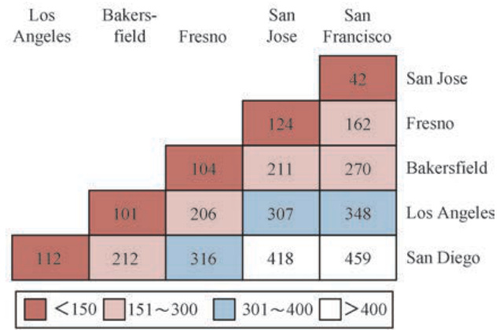  
(a)城市之间的距离   
(b)城市间距离的三角形图  

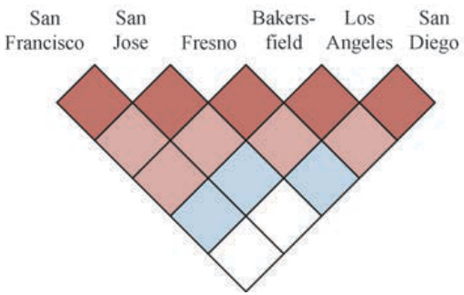  

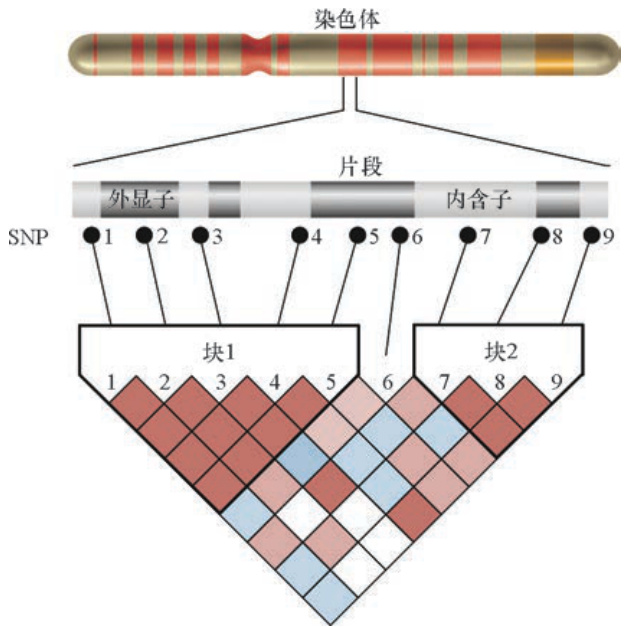  
图22.17　人类基因组的SNP中连锁不平衡簇。第二行中一小段基因组被放大，里面有9个SNP。底部是一个三角形的图形，方格中的颜色代表不同SNP两两比对的统计相关度（从强到弱颜色依次为深褐色、浅褐色、蓝色和白色）。  

行时，这种调查被称为全基因组关联研究（GWAS）。理想情况下，你需要检测基因组中的每个DNA变体，以发现最可能的表型差异的致病变异。然而，对该分辨率的基因分型将需要全基因组测序，并且在2016年撰写本文时，高质量全基因组测序的成本对于涉及数万个所需个体的研究而言仍然太高。因此，迄今为止进行GWAS的研究人员通常使用DNA微阵列（见图11.17），该微阵列分析了数百万标记基因组不同区域的常见SNP。  

独立的卡方检验　为了进行GWAS分析，科学家们评估了大样本实验组（具有该特征的个体）和对照（没有该特征的个体）的基因组中分布的变异频率。然后，他们使用卡方检验来定位其频率与感兴趣的特征正相关的变体（图22.18）。换句话说，为了鉴定QTL，紧密连锁变体的卡方检验需要显示患者和对照群体中该变体的频率之间的显著差异；零假设没有差异存在。  

我们不能使用第5章“遗传学工具”信息栏中描述的方法，该方法题为“独立的卡方检验”，以评估SNP与人类特征之间的联系，因为根据无关联的零假设，我们不知道预期的后代频率。其中一个原因是我们不知道群体中任何一对备用SNP等位基因的频率，第二个原因是我们不知道样本群体亲本中SNP和疾病等位基因的相位。相反，我们可以针对零假设测试数据，即备用SNP等位基因的分布在实验组和对照中是相同的。所需的统计方法称为独立的卡方检验。  

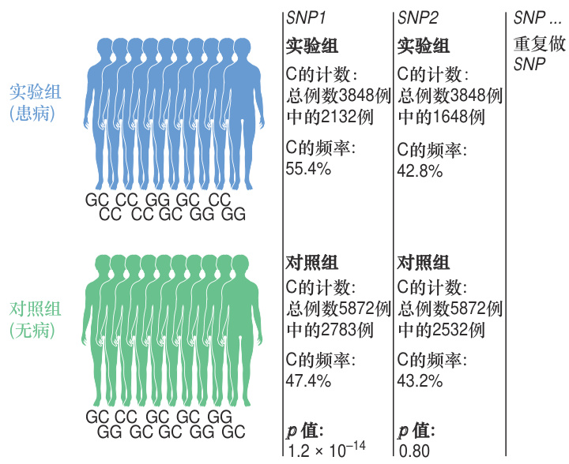  
图22.18　人类疾病GWAS分析中疾病组与对照组的比较。如果一个特定的SNP等位基因的频率在疾病组中显著高于对照组，则预示此为QTL。卡方独立检验得出每个SNP在两组中差异的显著性。在该例子中，SNP1是一个与疾病发生风险相关的QTL，而SNP2不是。  

为了说明这个测试是如何工作的，让我们使用图22.18中的SNP1的例子。我们需要询问实验组和对照组中等位基因C的频率之间的差异是否具有统计学意义。零假设中疾病和等位基因 C的发生是独立的；换句话说，SNP1（G和C）的两个等位基因的分布相对于两个群体是随机的。  

为了计算 $\chi^{2}$ 值，我们使用图22.18中的数据来构建列联表（图22.19）。首先，我们输入观察值（O），它只是在实验组和对照中观察到每个SNP1等位基因（C  

<html><body><table><tr><td>SNP1</td><td>实验组</td><td>对照组</td><td></td></tr><tr><td>G</td><td>O=1716 E=[(4805/9720)]×3848=1902 x² =[(1716 - 1902)2/1902] = 18.2</td><td>O=3089 E=[(4805/9720)]×5872=2903 x² = [(3089 - 2903)2/2903] = 11.9</td><td>总G=4805</td></tr><tr><td>C</td><td>O=2132 E=[(4915/9720)]×3848=1946 x² = [(2132 - 1946)2/1946] = 17.8</td><td>O=2783 E=[(4915/9720)]×5872=2969 x² = [(2837 - 2969)2/2969] = 11.7</td><td>总C=4915</td></tr><tr><td></td><td>总实验组数=3848</td><td>总对照组数=5872</td><td>总基因数=9720</td></tr></table></body></html>  

$$
\boxed{\ x^{2}=18.2+11.9+17.8+11.7=59.6;\operatorname{df}=1;p=1.2\times10^{-14}}
$$  

图22.19　卡方独立检验关联表。该表中列出SNP1中的C等位基因频率与心脏病的关联在统计学上是否显著。O是观察值，E是期望值， $\chi^{2}\!\!=$ （O-E） $^2/\mathrm{E}$ ，df是自由度， $p$ 是概率。  

# 遗传学工具  

# 独立的卡方检验  

当询问人类基因组中的特定SNP等位基因是否与疾病相关时，使用卡方独立性检验。这种卡方检验的版本在遗传分析的其他几种情况下是有用的，其中，基于零假设，使用孟德尔实验传递遗传学的简单逻辑无法预测个体的预期频率。  

在进行独立的卡方检验时，第一步是构造一个列联表，使你能够计算数据集的卡方值。使用SNP等位基因与人类特征的关联示例，我们在下面概述如何构建列联表及如何评估结果。  

在下面的实施例中，特定SNP基因座G和C的两个等位基因在实验组（具有所述性状的个体）和对照（不具有该性状的个体）的基因组中不均匀地分布。假设G在实验组中更频繁地出现，并且C在对照中更频繁地出现。我们要问的问题是：G与特征的关联是否具有统计学意义？  

请注意，因为在这个例子中我们计算等位基因（不是基因型），列联表中的每个观察数字代表基因组，而不是人。因此，实验组或对照的数量意味着基因组的数量。对于常染色体SNP，实验组或对照的个体数量是基因组数量的一半。  

1.  画一张列联表。在我们的示例中，该表有四列四行（图A）。标记中央两列实验组和对照组，以及中央两行G和C。  

2.  填写观察值（O）。使用你的数据，在四个中央框中的每一个中填写O的数值。  

3.  在行和列中添加“观察”值。这些总和是总G、总C、总案例和总控制的数值。  

4.  为总基因组框分配数值。此框包含上面的行总和（总 $^{\mathrm{G+}}$ 总C），它等于两行的总和（总案例数 $^{+}$ 总控制数）。  

5.  制定零假设。在该实施例中，零假设是G等位基因和表型之间不存在关联。  

6.  计算期望值（E）。基于零假设为真的假设，对于表中的四个中心框中的每一个，计算E，如图A所示。  

7.  计算数据集的 $\chi^{2}$ 值。首先，如图A所示，对四个观察中的每一个计算 $\cdot\chi^{2}$ 。这四个 $\cdot\chi^{2}$ 值中的每一个的总和是数据集的总χ2统计量。  

8.  确定自由度（df）。通过检查图A中的E值计算，你可以看到如果设置了一个E值，则确定其他三个。因此， $\mathrm{df}{=}1$ 。  

9.  找出概率（ $p$ ）。使用互联网上的表，找到对应于 $\chi^{2}$ 和df值的 $p$ 值。 $p$ 值是指预测值的偏差至少与实验中观察到的偏差一样大的概率。  

10.  评估 $p$ 值的显著性。对于具有单个SNP的实验，按照惯例， $p$ 值的阈值为0.05。也就是说，只有当p$<\!0.05$ 时才能拒绝所讨论的SNP等位基因和疾病的发生是独立的零假设。然而，在使用许多SNP的GWAS实验中， $p$ 值的阈值是0.05（检查的SNP的数量）。数据表明仅当 $p$ 值低于该数值时，SNP与疾病显著相关。  

<html><body><table><tr><td>SNP等位基因</td><td>实验组</td><td>对照组</td><td></td></tr><tr><td rowspan="2">G</td><td>Ocac=G的实验 EcaG=(Ocac/个体总和）×总实验</td><td>OcoG=G的对照 Ecoc=(OcoG/个体合计）×总对</td><td rowspan="2">总G=OcaG+OcoG</td></tr><tr><td>组数 xCaG=(EcaG-OcaG)/ECaG</td><td>照组数 xcoc=(EcoG-OcG)/EcoG</td></tr><tr><td rowspan="3"></td><td>Ocac=C的实验 Ecac=(Ocac/个体总和）×总实验</td><td>Ococ=C的对照 Ecoc=(Ococ/个体合计）×总对</td><td rowspan="3">总C=0cac+OcoC</td></tr><tr><td>组数</td><td>照组数</td></tr><tr><td>xcac=(Ecac-Ocac)²/Ecac</td><td>xcoc=(Ecoc-Ococ)/Ecoc</td></tr><tr><td></td><td>总实验组数=OcaG+OcaC</td><td>总对照组数=0coG+Ococ 总x²=xcaG+xcac+xcoG+xcoc</td><td>总基因组数=OcaG+Ocac+OcoG+OcoC</td></tr></table></body></html>  

或G）的次数。我们还输入实验组、对照、G等位基因和C等位基因的总数。接下来，考虑零假设的独立性，我们计算四个观察类中每一个的期望值（E）。例如，如果SNP1的C等位基因在实验组和对照组中以相同的方式分布，则实验组中等位基因C的E值仅仅是观察到的所有基因组中C的发生频率（4915/9720）倍增案例总数（3848）（图22.19，左下角蓝色矩形）。相同的逻辑允许我们计算列联表中的其他3个E值（图22.19）。  

对于四个类别中的每一个， $\chi^{2}{=}(\mathrm{O{-}E})^{2}/\mathrm{E}$ ，与拟合优度的测试相同。然后，我们添加4个单独的 $\chi^{2}$ 值以获得整个数据集的χ 统计量。请注意，在列联表中，只存在一个自由度（ $\mathrm{df}{=}1$ ）。原因是当设置E的一个值时，确定其他3个值。  

对于SNP1， $\chi^{2}$ 值为59.6（图22.19），这意味着$(\mathrm{df}{=}1)p{=}1.2\times10^{14}$ 。（回想第5章，给定的χ2和df值的 ${\boldsymbol p}$ 值可以从表格或算法中在互联网上获得）。这个 $p$ 值意味着如果SNP1的等位基因C实际上与疾病无关，那么你会发现观察到的结果只有83万亿分之一 $[1/(1.2\times10^{-14}){=}$ $8.3\times10^{15}]$ 的实验类似于图22.18中的实验。  

名为“卡方独立性检验”的遗传学工具信息栏概述了构建列联表并解释χ 结果的过程。  

曼哈顿图　在GWAS实验的背景下，由于数百万个SNP正在被检查，导致 $p$ 值的解释变得复杂，导致误报的问题。有了这么多的基因座，即使这些差异只反映出机会抽样误差，大量的SNP在受影响的实验组和对照之间的频率也可能不同。回想一下，单个卡方检验被认为具有统计学意义的典型阈值是 $p$ 值小于0.05，这意味着我们观察到的偏差与实验组和对照组之间的预期等比例相差很大，或更大的概率是 $5\,\%$ 。因此，如果我们在全基因组研究中对所有100万个SNP重复卡方检验，我们预计其中 $1\,000\,000\times0.05{=}50\,000$ 个似乎只是偶然与该特征相关。  

为了解决这个假阳性问题，研究人员认为GWAS分析中的个体检验不具有统计学意义，除非观察到与零假设的预期偏差的概率（即卡方检验中的 $p$ 值）少于0.05/$(1\,000\,000)\,\uparrow\,\mathrm{SNP}){=}5\times10^{-8}$ 。这种情况需要非常大的实验组和对照样本。在我们的例子中（图22.18和图22.19）可以得出结论：SNP1与疾病的关联具有统计学意义。  

2007年，人类疾病的首次大规模GWAS探索之一检测了大约2000名患者中的近100万个SNP，以及针对7种复杂疾病（包括冠状动脉疾病）的每一个的3000名对照个体。最重要的关联被偶然观察到的概率非常小（如 $1\times10^{-14}$ ）。因此，研究人员绘制 $-\mathrm{log_{10}}$ （ $p$ 值）［例如， $-\mathrm{log}_{10}(1\times10^{-14}){=}14\;]$ 用于卡方检验的统计显著性，以说明实验组（如患有心脏病的人）与对照组（无心脏病的人）之间各个SNP的频率差异的统计学意义（图22.20）。  

这种表示数据的方式通常被称为曼哈顿图，因为它看起来有点像纽约市曼哈顿的天际线。罕见的$-\mathrm{log}_{10}(5\times10^{-8}){=}7.7$ 或更高的峰表明在该研究中存在100万个SNP的该疾病QTL。  

如果我们放大9号染色体上红点的峰值，我们会发现一组显著相关的SNP［图22.21（a）］。德国心肌梗塞患者（心脏病发作）的后续研究也显示该地区的SNP与60岁以前心脏病发作之间存在强烈关联［图22.21（a）］。图22.18和图22.19中的SNP1，其与心脏病的关系非常密切，实际上是后一项研究的SNP之一［在图22.21（a）中称为rs 1333049］。  

优势比　值得注意的是，rs 1333049只是几个具有强烈疾病关联的SNP中的一个，它们聚集在两个相邻的LD区中［图22.21（b）］。由于这些多态性的等位基因之间的连锁不平衡，我们不能说它们中的哪一个是冠状动脉疾病的致病突变。事实上，该区域可能包含一个以上的致病突变。这些LD块中的任何一个都发生了很少的重组，并且它们之间只有很少的重组，因此我们无法区分增加疾病风险的实际突变位于该区域的位置。此外，由于没有发现明显的基因位于这些LD区域内［图22.21（a）］，基因组区域的性质为研究人员提供了关于致病变异体特定位置的明确线索。  

然而，即使我们无法识别相关突变，该区域缺乏重组也意味着具有强烈疾病关联的SNP等位基因可以帮助医生识别可能具有升高的冠状动脉疾病可能性的个体。我们可以通过计算等位基因优势比来量化与特定SNP等位基因相关的平均风险增加［图22.22（a）］。在SNP  

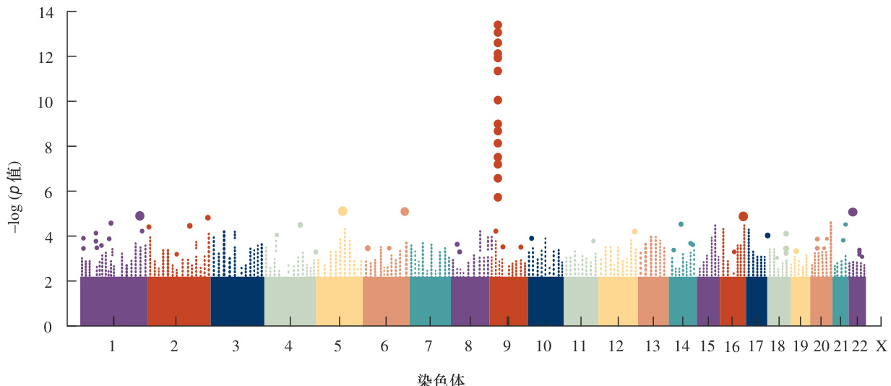  
图22.20　人体冠状动脉疾病GWAS分析的曼哈顿图。9号染色体上红点的峰代表一些SNP的–logp值很高，代表该位置上的SNP与心脏病具有显著关联性。  

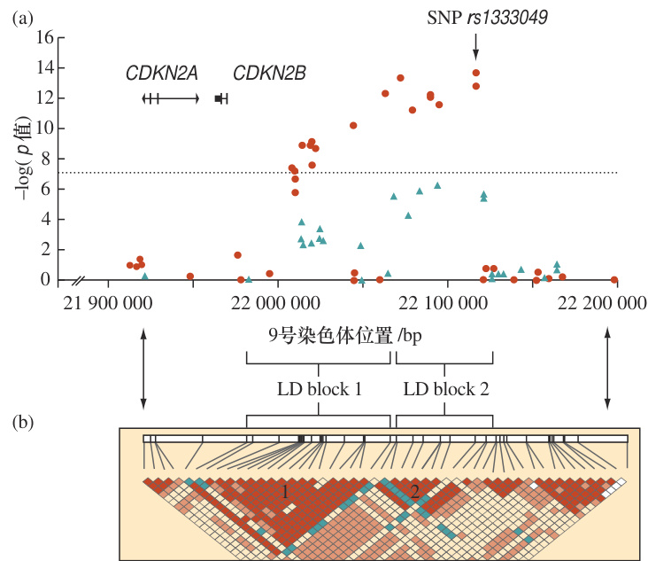  

图22.21　人类9号染色体300kb区域中的SNP与冠状动脉疾病的关联性。（a）图22.20放大的曼哈顿图显示22 010 000到22 120 000个碱基之间在两个不同的GWAS分析中（红点与蓝色三角）表现出与疾病较高的相关性。研究中对于50万个SNP给出的统计显著的阈值为– $-\mathrm{log}_{10}$ （ $p$ 值） $=7$ （图中虚线所示）。该区域中的两个注释基因（CDKN2A与CDKN2B）与疾病都没显示很强的相关性。（b）图a中的SNP的连锁不平衡三角图。有几块显示明显很强的连锁不平衡性（深褐色代表最强，浅褐色其次，蓝色更弱，白色代表没有连锁不平衡）。LD块1和2中的许多SNP（如rs 1333049）与冠状心脏疾病有很强的关联性。  

rs 1333049的情况下，该区域中具有最强疾病关联的SNP之一，基因组中C存在赋予冠状动脉疾病的风险比G存在的风险高1.38倍。  

我们还可以通过比较实验组和对照组的风险等位基因纯合子或杂合子基因型频率来计算基因型优势比—与特定SNP基因型相关的风险增加［图22.22（b）］。重要的是要认识到，即使是具有最大风险基因型的人也不能保证在60岁之前心脏病发作；这种事件的可能性比其他基因型的人高。  

# 22.2.3 QTL反映了种群历史  

根据定义，QTL是一种遗传变异体，其以可检测的方式贡献特定群体中的特定数量性状。该定义对QTL检测提出了两个主要挑战。首先，QTL的数量取决于种群的变异量，而变异量反过来反映了种群的历史。例如，如果你正在检查遗传相同植物的近交种群，那么你将永远无法找到影响干旱等胁迫条件下的生存能力的QTL，因为群体中不存在遗传变异。必须存在大量编码蛋白质的基因，这些蛋白质可能在干旱期间影响植物的存活，但这些基因中没有一个会在这个种群中构成QTL，因为  

（a）计算等位基因优势比  

给定实验组的C等位基因的几率=C等位基因的频率/G等位基因的频率  
给定控制组的C等位基因的几率=控制组C等位基因的频率/G等位基因的频率实验组C/实验组G 2132/1716优势比= =138控制组C/控制组G 2783/3089  

（b）计算基因型优势比  

<html><body><table><tr><td></td><td>CC N (%)</td><td>CG N (%)</td><td>GG N (%)</td><td>x² (2 df)</td><td>p值</td></tr><tr><td>实验组</td><td>586 (30.5)</td><td>960 (49.9)</td><td>378 (19.6)</td><td>59.6</td><td>1 × 10-13</td></tr><tr><td>控制组</td><td>676 (23.0)</td><td>1431 (48.7)</td><td>829 (28.2)</td><td></td><td></td></tr></table></body></html>

纯合子（CC）优势比（相对于GG） $=$ (586/378)/(676/829)=1.91杂合子（CG）优势比（相对于GG）=(960/378)/(1431/829)=1.47  

图22.22　关联 $\boldsymbol{p}$ 值与等位基因优势比的计算。（a）等位基因优势比代表被检测的SNP的风险度大小（图22.18和图22.19中的SNP1）。该研究中比值是1.38表示携带C等位基因的个体是携带G等位基因的个体的患病风险的1.38倍。（b）基因型优势比代表被检测的SNP中特定基因型的风险度。  

所有植物都具有所有这些基因的相同等位基因。换句话说，理论上可以通过实验找到的QTL集取决于先前在群体中发生的突变的存在。  

研究QTL的第二个挑战是我们发现任何QTL的能力取决于群体中特定QTL等位基因的频率及其对该性状贡献的强度。如果等位基因很少，那么只有在包括数十万个体的大规模研究中才能获得表明存在QTL的统计学意义。当群体中存在许多不同性状的QTL时，问题就会变得更加扑朔迷离，每个QTL对该性状的贡献很小。  

在人类和驯养动物（如狗和马）的GWAS分析中观察到的鲜明对比说明了QTL如何反映种群历史。  

# 1. 最近人口爆炸的影响  

人体身高为遗传学家研究人类许多复杂性状和疾病所面临的挑战提供了一个指导性的例子。在大多数人群中，人类身高的遗传度（ $h^{2}$ ）超过 $80\%$ ，但是第一次小型GWAS调查发现人类没有主要的身高基因（除了侏儒症等明显稀有和不寻常的状态）。对超过180 000人进行的一项更为庞大的近期GWAS调查发现了180个影响身高的QTL。正如所料，这些基因富含那些涉及影响成年身高的生长相关过程的基因。然而，这些QTL中的每一个仅对表型值产生非常小的贡献，并且所有这些180个QTL组合在一起仅解释了成年人身高总变异的约$10\%$ 。换句话说，地球上的人类群体必须具有包含许多其他突变的基因组，这些突变尚未被检测为也可能有助于高度的QTL。  

以类似的方式，已经发现越来越多的GWAS“位点”在医学上的重要特征。（图22.23）。然而，正如在高度上所看到的，鉴定的单个基因在大多数情况下对性状的总变异或对疾病的易感性的贡献非常小。  

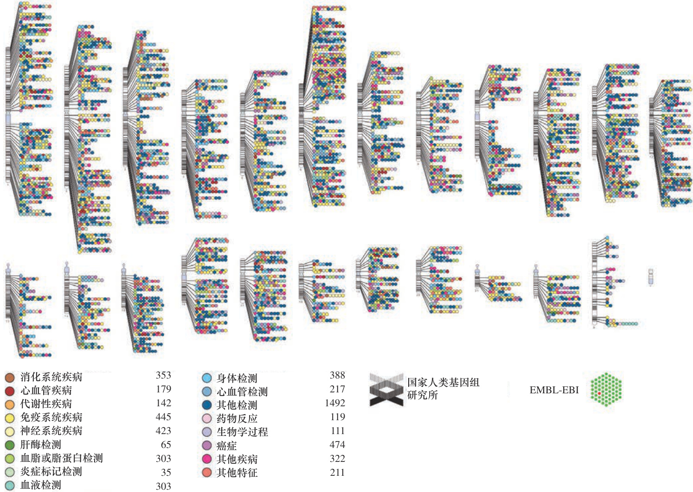  
图22.23　已报道的GWAS分析中23个染色体上与17个医学重要性状的关联性。如图中所示， $p\!<\!5\times10^{-8}$ 为显著。该图最后更新于2015年底。图例中分类旁边的数字代表研究的个数。  
来源：Welter, D., MacArthur, J., Morales, J., Burdett, T., Hall, P., Junkins, H., Klemm, A., Flicek, P., Manolio, T., Hindor , L., and Parkinson, H. (2014) The NHGRI GWAS Catalog, a curated resource of SNP-trait associations Nucl. Acids Res. 42 (D1): D1001–D1006 (www.ebi.ac.uk/fgpt/gwas & www.genome.gov/gwastudies.)  

这些结果令遗传学家感到失望，他们预计GWAS分析能够解释人类总体特征差异的更多变化。这些科学家寄希望于常见疾病是由于常见变异的观点，因此GWAS将提供关于疾病易感性等重要性状的遗传基础的更多信息。  

到目前为止，为什么利用GWS技术分析人类基因组的愿望一直没有实现？答案在很大程度上取决于人类在地球上的近期历史。特别是自1750年左右工业革命开始以来，人口已经爆炸（图22.24）。此外，正如你所知，配子越多，新突变的可能性就越大。这些事实意味着当前人口中的许多突变仅在最近几百年内发生。最近这种突变还没有机会在全球广泛传播。由于人口爆炸，复杂的性状通常会受到许多基因中的大量突变的支配。这些QTL很难找到，因为这些最近的突变大多数都存在于地球上很少一部分人的基因组中。此外，鉴于大量基因影响大多数数量性状，大多数个体QTL对表型的影响很小。  

# 2. 动物驯化过程中人工选择的影响  

家养动物在数量性状（如成人身高）上的遗传模式与人类存在明显不同。狗是特别有趣的动物，因为今天存在大量形态多样的品种（见本章开头的照片）。比较大型和小型犬种之间全基因组SNP频率的研究表明，单个基因胰岛素样生长因子1（IGF1）解释了狗大小变异的 $10\%\!\sim\!15\%$ 。值得注意的是，只有6个基因（包括IGF1）解释了 $50\%$ 的观察到的犬体型变异。对大型和小型马进行的类似研究发现，只有4个基因解释了这些驯养动物体重变异的 $83\%$ 。此外，研究人员发现只有少数基因座（通常是4个或更少）解释了狗的其他形态特征的大部分变异，如平均体形和耳朵直立性。  

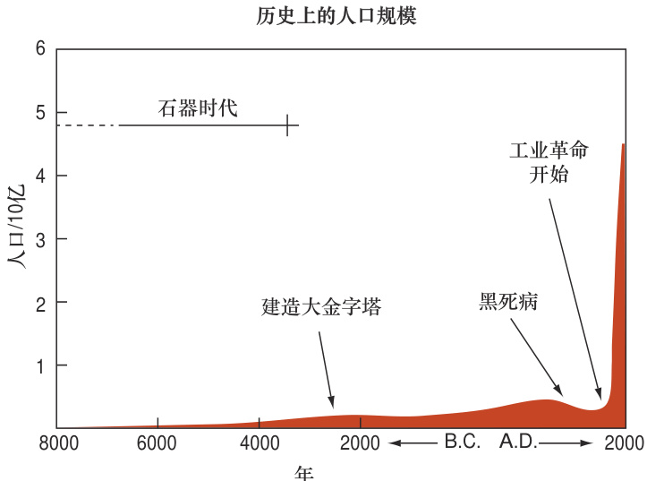  
图22.24　地球上的人口数量。工业革命后的人口爆炸为许多复杂性状的遗传变异奠定基础。  

我们如何解释家养动物（通常只涉及少数QTL）和人类（许多性状的数百个QTL）在主要基因数量上的显著差异？答案再次涉及这些种群的历史。人类在相对较短的时间内驯养了狗和马，从大约15 000年前开始驯养狗，而且大概在6000年前开始驯养马匹。在驯化过程中，人类对所需特征施加了非常强烈的人工选择。只有少数狗经历了驯化，因此这种人工选择只有少数变种。  

# 3. 人类复杂性状分析的未来  

显然，人类的复杂性状受到大量遗传变异的影响，每种遗传变异只能在少数人身上发现，并且可能只有很小的影响，这使我们对这些特征的理解变得复杂。解决这些问题需要获取大量数据。例如，现在正在努力获得来自世界不同地区的数万个人的全基因组序列。此外，研究人员正在详细测量这些人的许多复杂特征，以便将它们放入实验组和对照组进行关联作图。  

需要开发新的方法来解释这些大量的信息。一个重要的目标是评估变体的组合（而不是一次考虑一个变体）如何促成特定的特征。GWAS分析的第二种新方法将通过询问同一基因内的不同稀有非匿名SNP（而不是目前的个体匿名SNP）是否与疾病相关来提高该方法的统计灵敏度。下一代遗传学家所做的所有这些努力的成功对于我们使用个体基因组信息的能力至关重要，这些信息正变得越来越便宜，成为未来预防和诊断医学的基础。  

# 基本概念  

●  QTL定位扩展了基本的杂交概念，通过使用更多的遗传标记和统计检验来确定等位基因与表型值之间的相关性。●  全基因组关联研究（GWAS）利用了当前人群祖先中发生的重组事件。研究人员比较实验组和对照组亚群中的等位基因频率，以检验特定变异与特征的关联。●  复杂特征的变化反映了种群的历史。在驯养动物中，最近强烈的人工选择意味着只有少数位点的多态性是所观察到的大部分变异的原因。在人类中，最近的人口爆炸意味着许多基因座各自对复杂的性状变异贡献很小。●  虽然很难分析人类复杂性状的遗传基础，但这些信息对于预防和诊断医学的未来发展至关重要。  

# 习题精解  

Ⅰ.  植物育种者有兴趣选择大型食用豆。豆类大小分布的上限范围内的豆类（即下图顶部分布的深橙色区域）被选为下一代的亲本。这些选定亲本的后代中，豆大小的分布在图的底部以紫色显示。分布上方的数字表示整个亲代（403.5）的豆类，选择用于生产下一代（691.7）的豆类和后代豆类（609.1）的平均重量。  

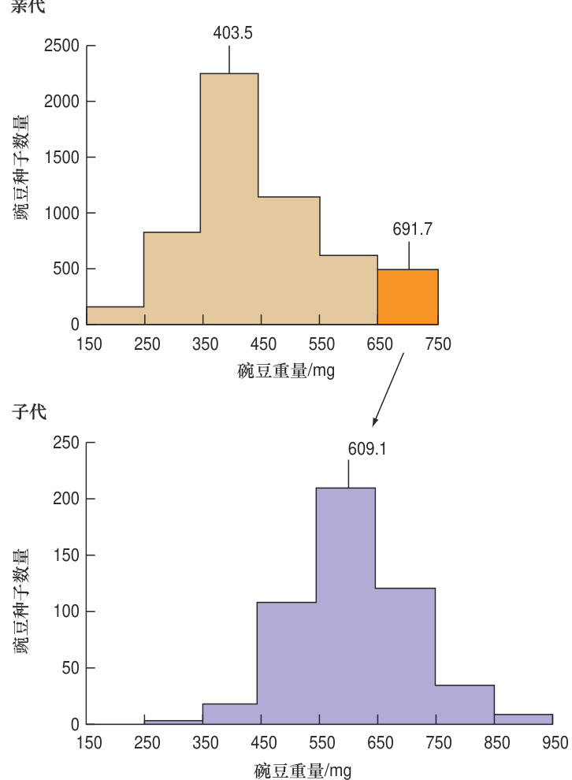  

a.  对于这个实验，什么是选择差异（S）？  
b.  在这个实验中对选择 $\textbf{(}R\textbf{)}$ 的反应是什么？  
c.  根据这些数据计算豆重的遗传力。  
d.  你在题目c中计算的遗传度是对狭义或广义遗传力的估计吗？请说明。  
e.  育种者在应用人工选择方面有多成功？育种者是否已经改进了这个实验，以便在同一生长期内获得更大的豆类？  

# 解答  

a.  选择差 $S{=}691.7\mathrm{mg}{-}403.5\mathrm{mg}{=}288.2\mathrm{mg}$ 。该值是选择用于育种的亲本代的豆类的平均重量与整个亲代（包括所有植物，无论它们是否被选择用于育种）的平均重量之间的差异。  

b.  对选择的响应 $!R{=}609.1{-}403.5{=}205.6\mathrm{mg}.$ 。该值是后代的平均重量与整个亲代的平均重量之间的差异。  

c.  来自这些数据的遗传力计算为 $h^{2}{=}R/S{=}205.6/288.2{=}$ 0.713。  

d.  以R/S计算的遗传力是实际遗传力的量度，当表型值正态分布时，其等于狭义遗传力。由于只测量了加性遗传变异，因此该估计值较窄且不具有广泛的遗传力。后代豆只与父母豆中发现的两个等位基因中的一个共享，并且在后代中，等位基因与不同亲本中的等位基因配对。因此，可能影响表型的优势和基因相互作用在父母和后代中是不同的。广义遗传力将包括这种优势和相互作用遗传效应以及加性效应。  

e.  该育种计划非常有效：育种者从父母种群开始，其平均豆重为 $403.5\mathrm{mg}$ ，并且在一代中获得平均体重为 $609.1\mathrm{mg}$ 的后代。该方案的成功反映了高选择差异和高遗传力。育种者有可能通过在绝对高值范围内选择极少的亲本，从而获得更大平均重量的子代豆，但这样可获得的子代就会更少。  

Ⅱ.  系统性红斑狼疮（SLE）是一种慢性自身免疫性疾病，可导致身体任何部位的炎症和组织损伤甚至死亡。对这种情况进行了大规模的GWAS分析；该研究涉及超过1000例实验组（患者）和3000例欧洲血统对照组的超过500 000个SNP基因座的基因分型。数据揭示了与5个遗传基因座的显著关联，其名称和位置显示在随后的曼哈顿图中。  

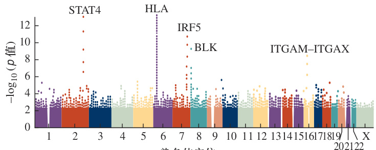  

a.  这5个基因座中的任何一个都是基因连锁的吗？  
b.  这5个峰的高度是否反映出具有相应基因座特定基因型的人会发病的相对风险？  
c.  在曼哈顿图中，似乎在基因组中的每个染色体位置存在具有约3的 $-10\mathrm{g}_{10}$ （ $p$ 值）的SNP。解释为什么这种印象会产生误导。此外，解释曼哈顿图的外观如何与 $\boldsymbol{p}$ 值阈值相关，该阈值表明患者群体中和对照群体中等位基因频率之间的差异是显著的。  
d.  鉴于本研究在鉴定与SLE相关的基因座方面所取得的成就，为什么在其他人群中进行类似研究仍然值得？  

# 解答  

a.  这5个位点都是不相关的，因为它们位于不同的染色体上。STAT4位于2号染色体上；6号染色体上的HLA；7号染色体上的IRF5；8号染色体上的  

BLK16号染色体上的ITGAM-ITGAX。  

b.  不，峰的高度显示了疾病与个体SNP的关联的重要性。相对风险只是关联重要性的一个组成部分；另一个重要组成部分是等位基因频率。因此，如果患者组中只有一小部分人中具有该特定突变，那么与可能对该性状具有非常高影响的稀有突变（即高风险比）密切相关的SNP等位基因可能不会记录为显著关联。  

c.  如果你扩展曼哈顿图的 $x$ 轴以显示所检查的所有500 000个SNP，则大多数的 $-10\mathrm{g}_{10}$ （ $p$ 值）将接近于零，如图22.21所示。由于曼哈顿图中的 $x$ 轴被压缩，因此你的注意力集中在SNP的相对较小部分，其中随机采样误差使得 $p$ 值约为0.001。曼哈顿图显示，由于随机抽样误差，500 000个SNP中有数千个 $\mathrm{-log_{10}}$ （ $p$ 值）高于3个，数百个 $-\mathrm{log}_{10}$ （ $p$ 值）高于4个，而且数十个有 $-\mathrm{log}_{10}$ （ $p$ 值）这个事实提供了为什么大多数研究人员将该实验的 $p$ 值阈值设为 $(0.05/500\,000){=}1\times10^{-7}$ 或 $-\mathrm{log}_{10}$ （ $p$ 值） $=7$ 的图示。  

d.  这种复杂性状背后的QTL可能在具有不同遗传历史的种群中不同。这项针对欧洲血统的人的研究结果可能对其他群体没有特别的信息。此外，GWAS对其他人群的调查可能会发现除了这四种基因之外的其他基因可能会导致这种特征，而对这些其他基因的研究可能会帮助研究人员更好地理解SLE疾病的生物学基础。  

# 习题  

# 词汇  

1. 在右列中选择与左列中的术语最匹配的短语。  

a. 等基因系 1. 异卵双生的  
b. QTL 2.  不同基因座的变体之间的关联块  
c. 对选择的反应 3.  归因于遗传变异的总表型变异的比例  
d. 关联作图 4.  所有基因组区域的纯合子  
e. MZ双胞胎 5.  导致复杂性状的基因  
f. DZ双胞胎 6.相同  
g. 同类系 7.  进化的衡量标准  
h. 连锁不平衡 8. 0.5为同卵的  
i. 遗传力 9.  在种群历史的过程中利用重组  
j. 遗传相关性 10. 包含基因渗入  

# 22.1节  

2.  假设你在像温室这样的受控环境中种植基因相同的蒲公英种子。a.  简述你所期望看到的与图22.5（a）和22.5（b）所  

示的分布相关的茎长表型类别的分布。b.  为什么对于在恒定环境中生长的这些遗传上相同的蒲公英，你会期望看到大于零的表型变异？c.  你如何使用此信息来优化图22.5（b）中最初显示的遗传方差估计？  

3.  如何将以下各项用于确定遗传和（或）环境因素在不同生物的表型变异中的作用？a. 遗传克隆b. 人类同卵双胞胎与异卵双胞胎c. 杂交培养  

4.  研究地松鼠稀有性状的两个不同的科学家小组报告了非常不同的遗传性。影响遗传力值的哪些因素使得两个结论都有可能是正确的？  

5.  对于在一个国家的人口中具有高遗传性的人类特征，下列哪一项陈述是正确的？a.  单卵双胞胎内的表型差异与异卵双胞胎成员之间的表型差异大致相同。b.  在同卵双胞胎之间存在很少的表型变异，但在异卵双胞胎之间存在高度的变异性。c.  该特征在另一个国家的人口中具有相同的遗传性。  

6.  研究表明，对于在同一家族中产生的双胞胎，同卵双胞胎（MZ）的环境相似性与异卵（双卵双生或DZ）双胞胎的环境相似性没有显着差异。为什么这个事实对于计算遗传力很重要？  

7.  1937年发表的一项研究检验了双胞胎［单卵双生（MZ）或异卵双生（DZ）］和三对不同数量性状的兄弟姐妹之间的平均差异：身高、体重和通过斯坦福-比奈试验测试智商（IQ）（智商的概念极具争议性，因为尚不清楚智商测试在何种程度上测量天生的智力，但对于这个问题，即使其重要性未知，也要认为智商是一种可测量的特征）。一些MZ双胞胎在同一家庭（RT）长大，而其他MZ双胞胎在不同家庭（RA）中分开长大。本研究的结果显示为平均差异，如下：  

<html><body><table><tr><td></td><td>MZ(RT)</td><td>MZ(RA)</td><td>DZ</td><td>兄弟姐妹</td></tr><tr><td>身高</td><td>1.7cm</td><td>1.8cm</td><td>4.4cm</td><td>4.5cm</td></tr><tr><td>体重</td><td>1.86kg</td><td>4.49kg</td><td>4.54kg</td><td>4.72kg</td></tr><tr><td>IQ</td><td>5.9</td><td>8.2</td><td>9.9</td><td>9.8</td></tr></table></body></html>  

a.  这三个特征中哪一个似乎具有最高的遗传力？哪一个遗传率最低？  

（注意：你没有足够的数据来计算遗传性的数值。你应该以一般的数量术语来考虑这一点）  

b.  美国国立卫生研究院疾病控制和预防中心（CDC）最近报告说，在 $1960{\sim}2002$ 年期间，美国一名15岁男孩的平均体重从135.5磅（ $61.46\mathrm{kg}$ ）增加到150.3磅（ $68.17\mathrm{kg}$ ）。在同一时期，一名15岁男孩的平均身高从67.5英寸（ $171.5\mathrm{cm}$ ）增加到68.4英寸（ $173.7\mathrm{cm}$ ）。这些统计数据与题目a中的相对遗传度估计值相匹配的程度如何？  

8.  这个问题是关于等式（22.7），它将遗传性与MZ和DZ双胞胎的数量性状相关系数之间的差异联系起来：遗传力 $\scriptstyle=2(r_{\mathrm{MZ}}-r_{\mathrm{DZ}})$ 。a.  解释为什么等式（22.7）适用于所有表型变异都是由基因引起的极端情况。b. 对于基因没有表型变异的情况也这样做。  

9.  表22.2列出了MZ和DZ双胞胎相对于许多离散复杂性状的一致性值。  

a.  你如何一眼就知道所有这些特征的遗传力都小于1.0？b.  为了估计这些特征的遗传性，你会使用等式（22.7）或等式（22.8）吗？解释为什么。c.  使用表22.2中的数据计算每种性状的遗传力估计值。对于哪种特性，遗传方差对总表型方差的贡献比表中的任何其他方差更大？  

10.  1959年，俄罗斯遗传学家Dmitri Belyaev开始了一项实验，他在试验中培育出温顺的银狐。他从野生狐狸开始，选择繁殖对人类最少恐惧和最少侵略的后代。到1999年，经过30代的近亲繁殖和近亲繁殖，Belyaev和他的同事们获得了一群基本上像家养狗一样的狐狸：它们摇着尾巴，舔着它们的人类看护者。  

a.  这个实验说明了狐狸温顺行为的遗传力有哪些？解释一下。  

b.  值得注意的是，正如这里的照片所示，随着行为的变化，形态发生了变化，包括斑点皮毛、松软的耳朵和卷曲的尾巴。  

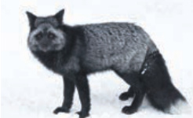  

$\copyright$ Lee H. Rentz/Photoshot/   
Newscom  

  

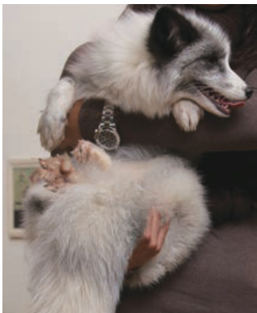  
© Vincent J. Musi/National Geographic/Getty Images  

$\copyright$ Michael Goldberg, Cornell University, Ithaca, NY  

在以类似方式饲养和选择的其他动物中观察到类似的驯化表型。你是否认为这一结果必然意味着相同的基因控制行为和外观？请说明。  

11.  群体中存在两种具有相似表型变异的性状。第一个性状具有影响表型值的2个主要基因和6个次要基因座；第二个性状具有12个次要基因座，并且没有影响表型值的主要基因。这些信息是否可以告诉我们哪种特征对选择的反应最一致？解释为什么会这样或没有。  

# 22.2节  

12.  一个基因座上的两个等位基因产生三种不同的表型。两个基因的两个等位基因导致5种不同的表型。6个基因的两个等位基因导致13种不同的表型。（这些陈述假设任何一个基因座上的等位基因是共显性或不完全显性的，并且每个基因对表型的贡献相等。）a.  推导出一个公式来表达这种关系（设 $n$ 等于基因数）。b.  在一个基因座中由两个等位基因确定的性状的每种最极端表型在 $\mathrm{F}_{2}$ 代中以1/4的比例出现。如果两个基因的两个等位基因决定性状，则每个极端表型将作为群体的1/16存在于 $\mathrm{F}_{2}$ 中。在普通小麦（Triticum aestivum）中，籽粒颜色从红色变为白色，控制颜色的基因相加作用，即每个基因的等位基因不完全显性，每个基因对颜色的贡献相同。真正繁殖的红色品种与真正繁殖的白色品种杂交， $\mathrm{F}_{2}$ 中的1/256具有红色籽粒，1/256具有白色籽粒。在这个杂交中有多少基因控制核心颜色？  

13.  在某种植物中，叶片大小由4个基因决定，这些基因的等位基因独立地分配并且相加作用。因此，等位基因A、 $B$ 、C和 $|D|$ 各自使叶长增加4cm，等位基因$A^{\prime}$ 、 $B^{\prime}$ 、 $C^{\prime}$ 和 $D^{\prime}$ 各自使叶长增加 $2\mathrm{cm}$ 。因此，AA BBCC DD植物的叶长 $32\mathrm{cm}$ ， $A^{\prime}A^{\prime}\;B^{\prime}B^{\prime}\;C^{\prime}C^{\prime}\;D^{\prime}D^{\prime}$ 植物的叶长16cm。  

a.  如果具有 $32\mathrm{cm}$ 长叶片的真正繁殖植物与具有16cm长叶片的真正繁殖植物杂交，则F1将具有 $24\mathrm{cm}$ 长的叶片和基因型 $A A^{\prime}\;B B^{\prime}\;C C^{\prime}\;D D^{\prime}$ 。列出这些F1植物产生的 $\mathrm{~\vec{F}}_{2}$ 代中所有可能的叶长和它们的预期频率（提示：回忆第2章中的习题45e）。  

b.  现在假设在随机交配的群体中出现以下等位基因频率：频率 $A{=}0.9$ 频率 $A^{\prime}{=}0.1$ 频率 $B{=}0.9$ 频率 $B^{\prime}{=}0.1$  

频率 $C{=}0.1$ 频率 $C^{\prime}{=}0.9$ 频率 $D{=}0.5$ 频率 $D^{\prime}{=}0.5$  

分别计算四种基因中每种基因的三种可能基因型群体中的预期频率。  

c.  题目b中描述的种群中有多少比例的植物将有$32\mathrm{cm}$ 长的叶片？  

14.  比较和对比 SNP 基因分型的使用：（i）孟德尔疾病基因的定位克隆；（ii）直接 QTL 定位；（iii）GWAS。  

15.  解释用于通过控制杂交的QTL的粗略绘图和精细绘图的程序之间的相似性和差异，正如与番茄相关的QTL所完成的那样。  

16.  在图22.14（c）中，通过将S. pennellii版本的基因导入S. lycopersicum来验证f $\nu2.2$ 致病基因。为什么实验以这种方式完成，而不是相反？  

17.  影响人类的最普遍的病症是心脏病，它可能对生活质量产生严重影响，甚至可能导致过早死亡。虽然心脏病主要折磨那些年龄较大的人，但 $30\%$ 的人中有 $1\%$ 或 $2\%$ ，甚至20多岁的人患有这种疾病。存在该疾病的遗传和环境成分。你可以使用什么策略选择家庭来参与心脏病基因的GWAS？解释你的推理。  

18.  人类遗传学家发现芬兰人口对于各种条件的研究非常有用。人口很少；芬兰人有丰富的教堂记录记录血统；很少有人迁移到芬兰。芬兰人口中某些隐性疾病的发生率高于世界其他地区，而芬兰人群中并未出现其他地方常见的PKU和囊性纤维化等疾病。a.  人口遗传学家如何解释疾病发生的这些变化？b.  芬兰人口也是数量特征研究的信息来源。精神分裂症的遗传基础是可以在该人群中探索的一个问题。基于芬兰人口结构研究复杂特征，你能想象出哪些优势和劣势？  

19.  由隐性等位基因的纯合性引起的Canavan病是一种严重的神经退行性综合征，通常导致婴儿在18个月大的时候死亡。在犹太人群中，Canavan病的发病率特别高。为了绘制导致这种情况的基因图，研究人员观察了5个受影响的犹太患者（实验组）和4个未受影响的犹太个体（对照组）中沿着17号染色体间隔大约100kb距离的10个SNP（ $1\!\sim\!10$ ）。在附表中，每行描绘单个单倍型（每个个体都是二倍体，因此有两个单倍型，尽管表中只显示了一个）。G、C、A和T代表指定SNP位置的实际核苷酸。  

实验组 SNP1 SNP2 SNP3 SNP4 SNP5 SNP6 SNP7 SNP8 SNP9 SNP10  

<html><body><table><tr><td>1</td><td>G</td><td>T</td><td>G</td><td>T</td><td>T</td><td>T</td><td>C</td><td>A</td><td>G</td><td>T</td></tr><tr><td>2</td><td>A</td><td>T</td><td>G</td><td>T</td><td>T</td><td>T</td><td>C</td><td>A</td><td>G</td><td>T</td></tr><tr><td>3</td><td>G</td><td>T</td><td>G</td><td>T</td><td>T</td><td>T</td><td>C</td><td>A</td><td>G</td><td>C</td></tr><tr><td>4</td><td>A</td><td>A</td><td>G</td><td>T</td><td>T</td><td>T</td><td>C</td><td>T</td><td>C</td><td>C</td></tr><tr><td>5</td><td>G</td><td>A</td><td>G</td><td>C</td><td>C</td><td>T</td><td>G</td><td>A</td><td>C</td><td>C</td></tr></table></body></html>  

# 控制组  

a.  引起疾病的突变是否与任何SNP等位基因发生连锁不平衡？如果有，是哪些？  
b.  Canavan疾病基因最可能的位置在哪里？你可以把该基因归到多长的区域？  
c.  这些数据表明Canavan基因有多少独立突变？  
d.  假设 $_{2\sim9}$ 个人是德系犹太人（在20世纪70年代犹太人被驱逐出Judea后，他们的祖先居住在德国和法国的莱茵河流域），而个体1是Sephardic（非Ashkenazic犹太人）。这些事实是否会提供有关导致Canavan病的突变历史的任何信息？  
e.  为了通过单倍型关联来定位基因，为什么关注某些亚群常常有帮助？这种策略有什么缺点吗？  
f.  人类17号染色体是常染色体，因此每个人沿着染色体具有每个区域的两个拷贝。考虑到这一点，解释确定单倍型的实际困难（提示：考虑杂合性）。鉴于这种困难，研究人员如何确定任何单个单倍型，如表中所示的任何单倍型？  

20.  在GWAS分析中，由于LD块（或单倍型块）的存在，没有必要对5000万个已知SNP中的每一个进行基因分型。单倍型区块是含有特定SNP变体的DNA片段，这些变体倾向于一起遗传（作为区块），因为该区域内的重组是罕见的。在附图中，顶部显示了三个不同的SNP基因座（SNP10、SNP11和SNP12），每个基因座在世界人类种群中具有两个等位基因。  

20   

<html><body><table><tr><td>6</td><td>A</td><td>A</td><td>G</td><td>T</td><td>T</td><td>T</td><td>C</td><td>A</td><td>G</td><td>T</td></tr><tr><td>7</td><td>G</td><td>T</td><td>G</td><td>G</td><td>C</td><td>T</td><td>G</td><td>A</td><td>G</td><td>T</td></tr><tr><td>8</td><td>A</td><td>T</td><td>C</td><td>T</td><td>C</td><td>G</td><td>C</td><td>T</td><td>C</td><td>C</td></tr><tr><td>9</td><td>G</td><td>T</td><td>C</td><td>G</td><td>T</td><td>G</td><td>G</td><td>A</td><td>C</td><td>T</td></tr></table></body></html>  

在人类基因组中仅发现了这些SNP等位基因的所有可能组合中的四种，如图中所示的四种染色体类型所示。这三个SNP是20个SNP的一个较大的块，其通常以四种构造之一或单倍型遗传，如图所示。因为这20个SNP作为单倍型模块遗传，所以对于三个所谓的标签SNP（以粗体显示的SNP4、SNP8和SNP15）对任何个体进行基因分型应该足以预测其他17个SNP的个体等位基因。  

a.  图表顶部显示的三个SNP（SNP 10、11和12）中有多少种构造在理论上是可行的？  
b.  考虑到单倍型区块中的所有20个SNP，并且假设它们中的每一个都具有两个可能的等位基因，理论上可以有多少单倍型变体？  
c.  鉴于人类是二倍体，每个个体都有两个拷贝的每个（常染色体）单倍型区块，每个同源物一个。单倍型区块的杂合性是否会干扰使用图中所示标签SNP对个体进行基因分型？请说明。  
d.  在题目c中，你看到图中显示的三个Tag SNP足以为该特定单倍型区域键入任何个体。这是唯一可以使用的三个Tag SNP吗？  

21.  在图22.15中：  

a.  为什么疾病组中的一些染色体不携带以红色显示  

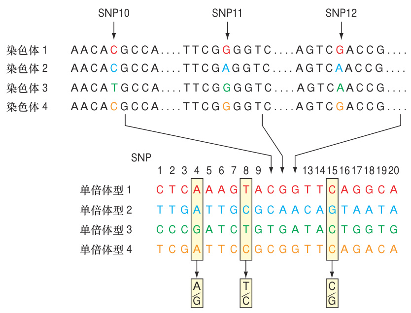  

的致病变异体？  

b.  为什么对照组中的一些染色体携带显示红色的变体？  
c.  讨论科学家如何评估关联作图研究的数据，以找到导致该疾病的QTL。研究人员会寻找什么？在图的底部，为什么根据蓝色等位基因特别讨论了疾病的非随机关联？  
d.  假设研究人员确定了基因组的两个不同区域，其中SNP与所讨论的疾病具有统计学上显著的关联。在1区，延伸超过200kb DNA的SNP显示出这种相关性。在2区，含有疾病相关SNP的区域长2Mb。如果你假设这两个区域中的每一个都只有一种引起疾病的变异，那么这两种突变中的哪一种很可能是在人类历史的早期发生过的？请说明。  
e.  鉴于你对题目d的回答，解释为什么含有与疾病相关的SNP的区域的长度仍然不是人类历史中发生致病突变的时间的完美指标。  

22. 考虑图22.17所示的三角图。  

a.  基因组的哪些特征可能位于两个LD区块之间，这使得科学家可以将它们视为单独的区块？  
b.  尽管该图分析了8种不同的SNP，但仅对这些SNP中的两种进行基因分型将允许你预测群体中几乎每个人的基因型。解释为什么这种有限的基因分型具有预测价值。  
c.  当研究人员获得使他们能够构建三角图的数据时，他们通常会对常见的SNP或稀有SNP进行基因分型吗？请说明。  
d.  考虑到你对题目c的回答，为什么人类群体遗传学家对获得完整的全基因组序列感兴趣，而不是只对预测性SNP的一小部分进行基因分型？  

23. 在图22.18中：  

a.  为什么有的患者是GG基因型，有的患者是GC基因型，有的患者是CC基因型？也就是说，为什么并非所有患者都具有相同的基因型？讨论至少两个原因。  
b.  有多少人参加了这项研究？他们中有多少人是患者（实验组）？多少人在对照组？  

24.  你进行实验组/对照组研究，比较单个SNP（具有等位基因C和T）的频率与发生高血压的个体，相似年龄的对照个体没有显示出这种情况的迹象。你获得以下结果：  

<html><body><table><tr><td></td><td>实验组</td><td>控制组</td></tr><tr><td>C</td><td>1025</td><td>725</td></tr><tr><td>T</td><td>902</td><td>922</td></tr></table></body></html>  

a.  如果这是你检测的唯一SNP，那么该SNP与发生高血压的风险之间是否存在统计学上显著的关联？  
b.  如果这是你在研究中测试的100万个SNP中的一个，那么这种关联是否仍然重要？请说明。  
c.  哪个等位基因（C或T）与发生高血压的风险较高有关？  
d.  计算风险等位基因优势比。等位基因优势比对于一个人患高血压的概率意味着什么？  

25.  在图22.21中，SNP rs 1333049与冠状动脉疾病的关联在一个GWAS中为– $-\mathrm{log}_{10}$ （ $p$ 值）大于7的截止值，但在第二个这样的研究中没有。假设该SNP确实与该病症相关，则提供两个可能的原因，即第二项研究中的–log10（ $p$ 值）小于截止值。  

26.  肌萎缩侧索硬化症（ALS）是一种罕见的、致命的神经退行性疾病，具有遗传复杂性。在过去几年中，使用GWAS分析和其他方法，已经鉴定了11种被认为与ALS相关的不同基因。最近发现的这些基因，TBK1的鉴定是通过分析几千例实验组和对照组的全外显子组序列。回忆一下第11章，外显子组是与外显子相对应的人类基因组的大约 $1\%$ 。每个人的外显子组序列在逐个基因的基础上评估是否存在可能改变基因功能的SNP变体。TBK1基因在以前的GWAS分析中未被鉴定，该分析为常见SNP的相似数量的个体进行基因分型。引用这两个实验的不同结果的可能解释。  

27.  通过GWAS探索，科学家已经确定了与生活在美国的人群中肥胖相关的几个SNP。其中一个SNP位于一个名为FTO的基因内。有趣的是，一种常见的FTO变异与肥胖相关，但仅限于1945年以后出生的人。此外，出生年份越晚，与这种FTO变体相关的肥胖风险就越高。为什么肥胖的遗传风险因素会因出生年而异？  

28.  在驯养的狗中，大小具有高遗传力，并且性状仅由少数基因决定。相比之下，超过180个QTL的遗传变异只能解释人类高度遗传率的很小一部分。什么可以解释人类缺失的遗传性？你怎么能测试你的假设解释？  

29.  假设GWAS调查发现特定的LD块与人们对巧克力或香草冰淇淋的偏好有关。你如何识别基因组区域内的特定基因，其等位基因有助于确定这种偏好吗？  

30.  2008年，《时代》杂志将23andMe公司开发的个人基因组学服务评为年度发明。客户将唾液样本寄给该公司，该公司随后对位于整个基因组的大约100万个SNP进行基因型分析，并将数据与客户进行在线交流，同时还对各种特征的潜在风险进行了所谓的“仅供参考”的评估。然而，2013年11月22日，美国食品药品监督管理局（FDA）命令23andMe停止营销其个人基因组学服务，因为其SNP基因分型和风险预测尚未被证实在医学上有足够的准确性。FDA担心人们可能会根据未经临床批准的测试信息做出严肃的医疗决定。这项禁令的一些内容在2015年和2017年得到了缓解，但DNA检测服务仍然受到限制，不能向客户提供禁令前的所有预测。定义这  

a.  你从个人基因组服务获得的信息能否告诉你是否患有孟德尔遗传病？请说明。  
b.  你从个人基因组服务中获得的信息能否告知你患有某种复杂特征的疾病的可能性？请说明。  
c.  2013年12月，《纽约时报》的一名记者报道，她将自己的DNA样本送到三家不同的公司（其中一家是23andMe），但这三家公司对各种复杂特征的风险估计差异很大。这些估计差异的可能原因是什么？  
d.  你是否认为新的科学发展有助于在不久的将来解决这些问题？  