# 第 3 章 孟德尔定律的扩展  

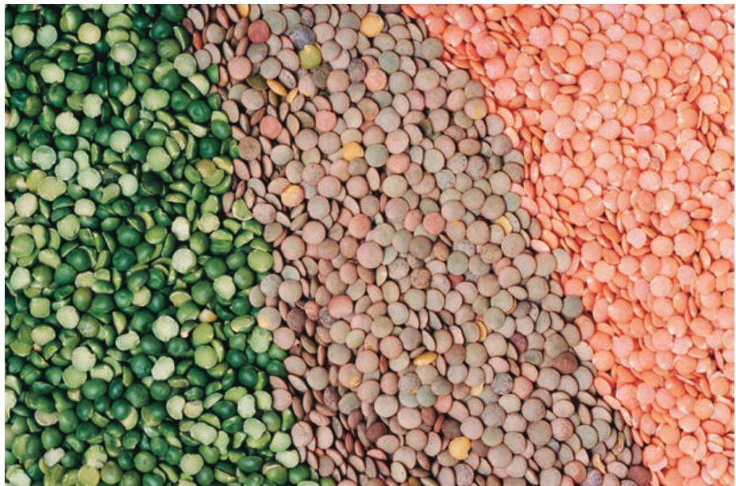  

在这一组绿色、棕色和红色的扁豆中，有的种子有斑点，有的则没有。$\copyright$ PhotoLink/Getty Images RF  

# 章 节 大 纲  

3.1 单基因遗传的孟德尔定律   
3.2 双基因遗传的孟德尔定律   
3.3 多因子遗传的孟德尔定律  

大部分人类特征与孟德尔所考察的豌豆性状不同，它们无法被简单归纳为两组相对表型。这些复杂的性状，如肤色和发色、身高、运动能力等，似乎与孟德尔的分析背道而驰。世界上很多粮食作物所表现出的性状同样如此，它们的大小、形状、肉质和营养成分有天壤之别。  

扁豆（Lens culinaris）为这一差异做出了形象的说明。扁豆是一种豆科植物，生长在世界上的许多地方，富含蛋白质和碳水化合物。成熟的扁豆植株能够结出含有两颗小种子的小型豆荚，这些种子可以磨粉食用，或用来做汤、沙拉和炖肉。扁豆颜色和图案的变化之大令人叹为观止（图3.1），而商人们总是力图培育出各式各样的扁豆，以适应不同文化的菜肴。但纯种扁豆之间相互杂交的结果是惊人的。例如，纯黄褐色和纯灰色的扁豆杂交会产生全棕色的子一代 $\mathrm{\dot{\nabla}F_{1}}$ ，当这些杂交自体受精时，F2植株不仅产生棕褐色、灰色和棕色的小扁豆，而且还产生绿色的小扁豆。  

从20世纪初的十年开始，遗传学家就在孟德尔 $3:1$ 表型比率的指导下，利用大量的动植物进行育种试验。如果试验中表现出的性状符合孟德尔定律，则可以假定它们是由单基因决定，且该基因有显性和隐性等位基因。然而，许多性状却并不符合这一定律。一些性状无法观察到确定的显性和隐性，或者在某个特别的杂种中能发现两个以上的等位基因（见图3.1）。一些性状是  

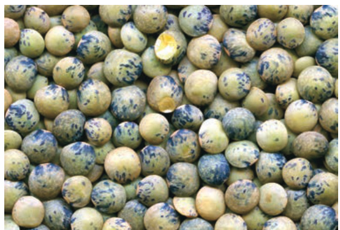  
图3.1　一些表型变异对孟德尔的分析形成挑战。扁豆呈现出复杂的斑点图型，这些图型是由含两对以上等位基因的基因控制的。  

$\copyright$ Jerry Marshall  

由两个基因决定的；还有一些性状是多因素的，即由数个不同的基因或基因与环境的相互作用决定。扁豆种子的颜色就是一个多因子性状，因为颜色受多个基因控制。  

性状是在错综复杂的相互作用中产生的，所以它们不会总是完全符合孟德尔比率。但是对孟德尔假说的简单扩展则能说明基因型和表型之间的关系，对观察到的偏差做出解释，且不会对孟德尔的基本定律构成挑战。  

育种研究的一个普遍问题是：为了厘清生命世界中数量庞大的表型变异，遗传学家通常需要控制单次观察研究中变量的数量。孟德尔就是通过采用一个或数个性状不同的纯种同系豌豆来实现这一目的的，这样才能观察到单个基因的作用。20世纪的遗传学家同样利用同系的果蝇、小鼠和其他实验生物来研究特定的性状。当然，遗传学家不能用这种方法研究人类。由于人类避免了近亲繁殖，研究人员无法在人类身上进行合乎伦理的繁殖实验。因此，许多人类变异的遗传基础至今仍是个迷。20世纪70年代出现的分子生物学为遗传学家解开人类性状的复杂谜团提供了新的工具，这在以后的章节中将有所涉及。  

# 3.1 单基因遗传的孟德尔定律  

# 学习目标  

1.  将等位基因的相互作用分为完全显性、非完全显性或共显性。  
2.  确认子代性状比例，可以推测隐性致命等位基因的存在形式。  
3.  从杂交结果预测一个基因在群体中是多态的还是单态的。  

William Bateson是孟德尔的早期拥护者，他对这一理论进行过注释，并创造了一些术语，如遗传学（genetics）、等位基因（allelomorph，后简写为allele）、纯合子和杂合子。Bateson在1908年的一次讲座中呼吁观众“珍惜你们的异常特征！……不要掩盖这些特征，要时常关注它们。异常特征就像盖大楼时砖砌得很粗糙的那部分，它会提醒你这样的情况还有很多，而且哪儿需要修补。”简单的孟德尔比率如果出现稳定的例外情况，则这些情况反映出可能存在单基因遗传以外的模式。Bateson和其他早期遗传学家捕捉到了这些模式的重要性，将孟德尔分析的范围进行了扩展，并对基因型和表型之间的关系有了更深的理解。现在我们来看看20世纪对孟德尔分析的主要扩展。  

# 3.1.1 显性并非总是完全的  

对显性和隐性普遍认可的操作定义取决于两个纯种交配产生的子一代 $\mathrm{J}_{1}$ 。如果子一代被研究的性状与一个亲本相同，则该亲本携带的这一等位基因相对另一个亲本未在子一代中表现出来的基因而言是显性的。例如，当纯种白色和纯种蓝色交配时，如果产生白色的子一代$\mathrm{F}_{1}$ ，则基因中的白色等位基因对蓝色等位基因就是显性的；如果产生蓝色的子一代 $\mathrm{\dot{\P}_{1}}$ ，则蓝色等位基因就对白色等位基因是显性的（图3.2）。  

孟德尔在得出其比率和定律时，描述和依赖的是完全显性，但这不是他所观察到的唯一一种显性。在图3.2所示的两种情况下，一个基因中没有一个等位基因是完全显性的。如图所示，纯和品系杂交得到的后代可有与亲本双方都不同的表型。现在我们来说明这些表型是如何产生的。  

# 1.  不完全显性：杂合子 $\mathbf{\nabla}\cdot\mathbf{F}_{1}$ 与两个纯种亲本都不相同  

纯种晚开花与纯种早开花的豌豆杂交得到开花时间处于这两个极端之间的子代 $\mathrm{F}_{1}$ 。这只是诸多不完全显性实例中的一个，在这些实例中，杂合子不同于纯种亲本中的任何一方。不同于纯种亲本的子代F1所显现的表图3.2　不同的显隐性关系。杂合子的表型表明同一个基因中两个等位基因间的显隐性关系（图中标记为 $\backslash A^{l}\mathcal{\vec{A}}^{\vert\vert}A^{2}$ ）。当杂合子与两个纯种亲本之一相同时，是完全显性。当杂合子与亲本中任何一个都不同时，是不完全显性，新表型通常介于两个亲本之间。当杂合子同时具有两个亲本的性状时，是共显性。  

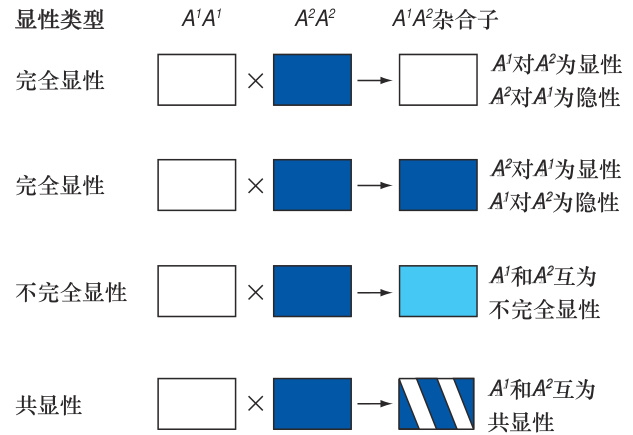  

型通常具有介于双方之间的性状。这样，在不完全显性遗传时，亲本的等位基因彼此间既不是显性，也不是隐性，两者都对F1的表型产生影响。孟德尔观察到，当他为杂交研究培育各种类型的纯种豌豆时，一些植物在两个纯种之间开花，但他没有探究其中的含义。花期不在他详细分析的7个性状之列，因为对豌豆来说，什么时候开花不像种子大小或花朵颜色那样是容易区分的性状。  

很多植物种类的花色都可以用来作为不完全显性的显著实例。以小花金鱼草为例，纯种红花植株和纯种白花植株杂交的后代会开出粉色的花朵，就好像画家把红色和白色颜料混合而得到粉色［图3.3（a）］。如果让粉花 $\mathrm{{.F_{1}}}$ 自交，则产生的子代F2有红花、粉花和白花，其比例为 $1:2:1$ ［图3.3（b）］。这是普通单基因F1自交常见的基因型比率。需要注意的是，因为杂合子不同于任何一个纯合子，表型比率是基因型比率的精确反映。  

  
(a)     (Antirrhinum majus)   
(b)  

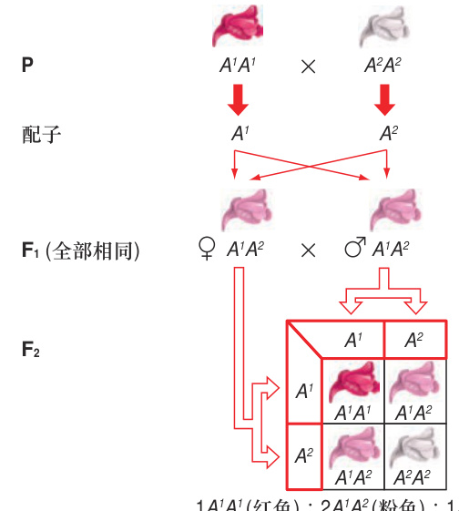  
1A1A1 (  ) 2A1A2 (  ) 1A2A2 (  )  

图3.3　粉花是不完全显性的结果。（a）金鱼草的不同花色反映出一对等位基因的活动。（b）纯种红色和白色的金鱼草杂交产生的子代F1开粉花。F2的花色中，红色、粉色和白色的比例为 $1:2:1$ 。这一比例意味着一个基因的等位基因决定着三  

种花色。  

（a）： $\copyright$ Henry Hemming/Getty Images RF  

对不完全显性这一类型最简单的生化解释是，基因中的每个等位基因都在红色形成的过程中指定了某种形式的具有酶作用的蛋白质分子。白色等位基因（ $\left(A^{2}\right)$ 不产生功能酶，而红色等位基因（ $A^{l}$ ）产生功能酶。这样，若金鱼草每个细胞有两个红色等位基因（ $\langle A^{l}A^{l}\rangle$ ，能产生双倍数量的红色酶，得到足够的红色素使花朵呈全红色。在杂合子（ $\left(A^{l}A^{2}\right)$ ）中，每个细胞复制了一个红色等位基因，结果，产生的色素只够使花朵呈粉色。在白色等位基因的纯合子 $(\,A^{2}A^{2}\,)$ 中，由于没有功能酶，也就没有红色素，所以花朵呈白色。  

# 2. 共显性：子代F 表现出亲本双方的性状  

纯种斑点扁豆和纯种麻点扁豆杂交产生的杂合子既有斑点，又有麻点［图3.4（a）］。这些子代F1是不符合完全显性的第二个重要实例。后代同时具有亲本双方的特征，这意味着斑点和麻点等位基因之间既非显性，也非隐性关系。因为杂合子均等地呈现出两种性状，这些等位基因被定义为共显性。斑点/麻点 $\mathrm{F}_{1}$ 自交产生的后代F2中，斑点、斑点/麻点和麻点的比例为 $1:2:1$ 。这些后代F2中的孟德尔比率（ $1:2:1$ ）确定了斑点和麻点性状是由一个基因中的等位基因依次决定的。因为杂合子能够区别于两个纯合子，所以表型和基因型比率相吻合。  

就人类而言，一些用来区分红细胞类型的膜结合型分子显示出共显性。例如，基因（I）决定着能从红细胞产生薄膜的糖聚合物的存在，它含有等位基因 $I^{A}$ 和$I^{B}$ 。每个等位基因对一个形式略有不同的酶进行编码，这些酶能够产生形式略有不同的复合糖。在杂合子个体中，红细胞表面既有I 决定的糖，也有I 决定的糖，然而纯合子个体的细胞却只表现出 $I^{A}$ 产物或 $\boldsymbol{I}^{B}$ 产物中的一个［图3.4（b）］。如此例所示，当两个等位基因都产生功能性基因产物时，它们通常在分子水平上分析的表型中是共显性的。  

图3.2归纳了在颜色变化上所反映出的表型的完全显性、不完全显性和共显性之间的区别。显隐性关系的决定因素在于子代F 所呈现的表型。在完全显性的情况下，子代F 与纯种亲本中的一个相同。如第2章所述，完全显性使得 $\operatorname{F}_{2}$ 的表型比率为 $3:1$ 。在不完全显性的情况下，子代与任何一个亲本都不像，因此不呈现纯种性状。在共显性的情况下，亲本双方的表型同时出现在子代F1上。不完全显性和共显性都产生 $1:2:1$ 的比率。  

# 3. 孟德尔分离定律依然成立  

一个基因中等位基因的显隐性关系不影响等位基因的传递。一个基因中的等位基因之间究竟是完全显性、不完全显性还是共显性，取决于等位基因所决定的蛋白质种类和这些蛋白质在细胞中的生化功能。但是，这些表型的显隐性关系与配子形成时等位基因的分离无关。  

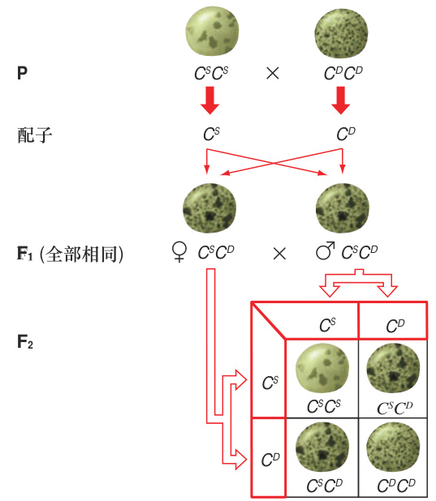  
$|C^{s}C^{s}$ (  ) $:2C^{s}C^{D}$ (     ) $1\,C^{D}C^{D}$ (  )  

(b)  

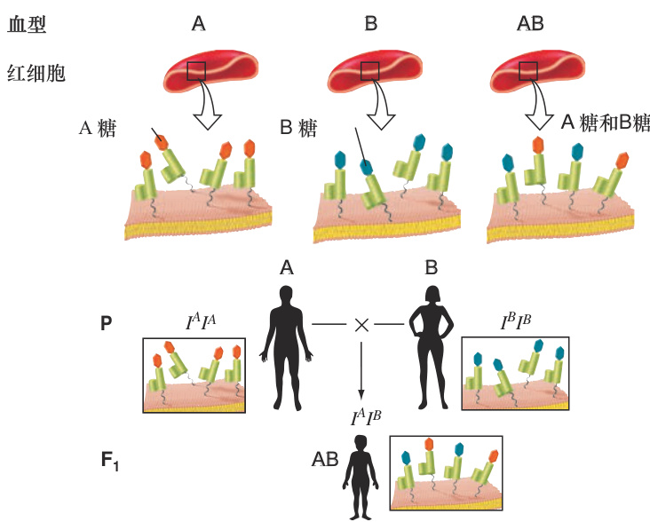  
图3.4　子代F1表现出亲本双方的性状。（a）纯种斑点扁豆和纯种麻点扁豆杂交得到的杂合子既有斑点，又有麻点。每个基因型都有其相应的表型，所以 $\mathrm{F}_{2}$ 比率为 $1:2:1$ 。（b）血型等位基因IA和IB是共显性的，因为杂合子 $\boldsymbol{I}^{A}\boldsymbol{I}^{B}$ 的红细胞表面有两种糖。  

正如孟德尔所提出的那样，细胞仍然携带每个基因的两个副本，且这些副本是一对相同或不同的等位基因，它们在配子形成时分离。无论这两个等位基因是否相同，受精过程都会将两个等位基因还原到每个细胞。这样，显隐性关系的变化并不背离孟德尔分离定律。确切地说，它们反映出基因产物控制表型产生的不同方式，提高了对可见的基因传递结果进行解释和根据表型推断基因型的复杂程度。  

# 3.1.2 含有两个以上等位基因的基因  

孟德尔所分析的二者之一的性状是由包含两个等位基因的基因所控制的。但对很多性状来说，存在两个以上的可能性。这里，我们来看以下三个性状：人类的ABO血型、扁豆种子的表皮图案和人类的组织相容性。  

# 1. ABO血型  

一个A型血的人和一个B型血的人所生的孩子在一些情况下可能既不是A型或B型血，也不是AB型血，而是第四种血型——O型。原因何在？ABO血型的基因含有三个等位基因： $I^{A}$ 、 $I^{B}$ 和i［图3.5（a）］。等位基因$I^{A}$ 决定催化A糖的酶，故而产生A型血；等位基因IB编码催化B糖的酶，故而产生B型血；i不产生功能性的糖催化酶。等位基因 $I^{A}$ 和 $I^{B}$ 都对i显性，因此O型血是等位基因i的纯合性结果。  

由图3.5（a）可见，A型血来自两种基因型IAIA或IAi。B型血与此类似，由 $I^{B}I^{B}$ 或 $I^{B}i$ 产生。AB型血来自两个等位基因 $I^{A}I^{B}$ 的结合。  

<html><body><table><tr><td>基因型</td><td>相应的表型： 细胞的分子类型</td></tr><tr><td>IAIA IAi</td><td>A</td></tr><tr><td>IBIB IBi</td><td>B</td></tr><tr><td>IAIB</td><td>AB</td></tr><tr><td>ii</td><td>O</td></tr></table></body></html>  

<html><body><table><tr><td>血型</td><td>血清中的抗体</td></tr><tr><td>A</td><td>对B型血的抗体</td></tr><tr><td>B</td><td>对A型血的抗体</td></tr><tr><td>AB</td><td>对A型血或B型血都没有抗体</td></tr><tr><td></td><td>对A型血和B型血都有抗体</td></tr></table></body></html>  

(c)  

<html><body><table><tr><td rowspan="2">受体的血型</td><td colspan="4">供体的血型 （红细胞）</td></tr><tr><td>A</td><td>B</td><td>AB</td><td>o</td></tr><tr><td>A</td><td>+</td><td>一</td><td>一</td><td>+</td></tr><tr><td>B</td><td>-</td><td>+</td><td></td><td>+</td></tr><tr><td>AB</td><td>+</td><td>+</td><td>+</td><td>十</td></tr><tr><td></td><td>一</td><td>一</td><td>一</td><td>+</td></tr></table></body></html>  

图3.5　ABO血型由一个基因中的三个等位基因决定。（a）6种基因型产生4种血型的表型。（b）血清中含有外来红细胞分子的抗体。（c）如果一个受体的血清对供体红细胞中的糖有抗体，则受体和供体的血型是不相容的，且在输血的过程中会发生红细胞凝血。在这个表格中，加号 $(\,+\,)$ 代表相容，减号（-）代表不相容。供体血液中的抗体通常不会造成问题，因为输入的抗体数量很小。  

我们可以从这些观察中得出一系列结论。第一，如前文所述，一个已知基因可能有两个以上的等位基因或复等位基因；在我们所举例子中，这一系列等位基因用$I^{A}$ 、 $I^{B}$ 和i表示。  

第二，尽管ABO血型基因有三个等位基因，每个人只携带其中两个—— $-I^{A}I^{A}$ 、 $I^{B}I^{B}$ 、IAIB、IAi、 $I^{B}i$ 、ii。这样，就存在6种可能的ABO血型。因为每个个体携带的基因中不超过两个等位基因，无论一个序列中有多少等位基因，孟德尔分离定律都不受影响，因为在有性繁殖的生物体中，一个基因中的两个等位基因在配子形成的过程中分离。  

第三，一个等位基因是显性还是隐性并不是与生俱来的，而是取决于第二个等位基因。换句话说，显隐性关系对一对等位基因来说是唯一的。在我们的例子中，$I^{A}$ 对i完全显性，但与IB共显性。鉴于这些显隐性关系，$I^{A}$ 、 $I^{B}$ 和i可能的6种基因型可以产生4种不同的表型，即A型血、B型血、AB型血和O型血。在此背景下就不难理解为何A型血和B型血的父母会生出O型血的孩子：父母必定是杂合子IAi和IBi，孩子从双方都得到一个i等位基因。  

对ABO血型系统遗传学的理解已经产生了深远的医学和法律影响。血型匹配是成功输血的先决条件，因为人们会对外来血细胞分子产生抗体。例如，一个细胞中只有A分子的人对B分子产生抗体；只有B细胞的人对A分子产生抗体；AB型血的人对两种分子都没有抗体；O型血的人对A分子和B分子都有抗体［图3.5（b）］。这些抗体可导致人体对外来分子产生凝血［图3.5（c）］。因此，O型血的人历来被认为是万能献血者，因为他们的红细胞不携带会激起受体抗体攻击的表面分子。相反，AB型血的人被认为是万能受血者，因为他们既没有A抗体，也没有B抗体，如果这些抗体存在，会进攻输入的血细胞表面分子。  

关于ABO血型的信息还可以在法庭上用作法律依据，用来排除亲子关系或有罪的可能性。例如，在亲子关系中，如果母亲是A型血，而孩子是B型血，按照逻辑，孩子的IB等位基因一定来自父亲，而父亲的基因型可能是 $\cdot I^{A}I^{B}$ 、 $I^{B}I^{B}$ 或IBi。1944年，女演员琼·巴里（JoanBarry，A型血）起诉查理·卓别林（Charlie Chaplin，O型血），要求他抚养一个孩子（B型血），并声称他是孩子的父亲。科学证据表明查理不可能是孩子的父亲，因为他明显是ii，不可能携带等位基因 $I^{B}$ 。这一证据被法庭采纳，但陪审团却不相信，查理被判赔付抚养费。今天，DNA分子基因分型（“DNA指纹识别”见第11章）为亲子关系、有罪或无罪判定提供了更有力的工具，而陪审团仍常常很难评价此类证据。  

# 2. 扁豆种子的表皮图案  

扁豆为复等位基因提供了另一个例子。种子表皮图案的基因有5个等位基因：斑点、麻点、光洁（无图案）和两种大理石纹。所有图案的纯种之间相互杂交（大理石纹- $-1\times$ 大理石纹-2，大理石纹- $-1\times$ 斑点，大理石纹- $-2\times$ 斑点，等等）厘清了可能的成对等位基因的显隐性关系，并发现了等位基因从最强显性到最强隐性的一个优势系列。例如，大理石纹-1和大理石纹-2杂交，或大理石纹-1与斑点或麻点或光洁杂交，能在F1中产生大理石纹-1表型，且在 $\mathrm{F}_{2}$ 中对其他任何一个表型产生一定比例的大理石纹-1。这些结果说明大理石纹-1等位基因对其他4个等位基因中的每一个都是完全显性。  

其他4个表型的类似杂交所揭示的优势系列见图3.6。只有在将两个等位基因进行比较时谈及显隐性关系才有意义。因为一个等位基因，如大理石纹-2，可图3.6　如何确定复等位基因间的显隐性关系。有不同表皮图案的纯种扁豆种子成对杂交，且子代F1自交以产生F2代。这些杂交所产生的F2单因子杂合体的 $3:1$ 或 $1:2:1$ 比率说明一个基因的不同等位基因决定着所有这些性状。子代F1的表型确定了显隐性关系（如图中所示）。斑点和麻点等位基因是共显性的，但它们都对大理石纹隐性，且对光洁显性。  

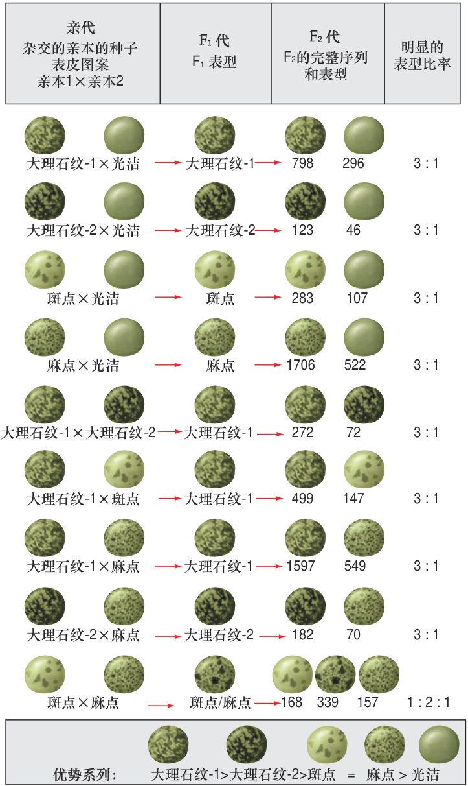  

对第二个等位基因（大理石纹-1）隐性，但对第三个和第四个显性（麻点或光洁）。所有被测试的关于扁豆种子表皮图案的成对等位基因都在 $\mathrm{F}_{2}$ 中产生 $3:1$ 的比率（除产生共显性才有的 $1:2:1$ 表型比率的斑点 $\times$ 麻点外），说明这些扁豆表皮图案都是由相同基因的不同等位基因决定的。  

# 3. 人类的组织相容性  

在一些复等位基因系列中，每个等位基因都与其他各个等位基因共显性，这样，每个独特的基因型就会产生一个独特的表型。分子水平决定的性状尤其如此。一个极端的例子是一组被称为组织相容性抗原的三个主要基因，他们对人类和其他哺乳动物的一系列相关的细胞表面分子进行编码。除红细胞和精子外，所有的人体细胞都携带组织相容性抗原，它在促进适当的免疫反应方面发挥着至关重要的作用，这种免疫反应能在消灭入侵者（如病毒或细菌）的同时保持自身组织完好无损。因为这三个主要的组织相容性基因（在人体中被称为HLA-A、HLA-B和HLA-C）每个都有 $400\!\sim\!1200$ 个等位基因，每个个体中不同的等位基因组合能产生大量的细胞表面分子的表型变异。除同卵双胞胎（即单卵）外，没有两个人的细胞表面携带同一系列的组织相容性抗原。  

这些蛋白质的极端变异具有重要的医学意义，因为人体可以产生出不同于自身组织相容性抗原的抗体，而这些抗体可以导致对移植器官的排异反应。因此，医生试图将移植供体和受体的组织相容性抗原匹配到最接近的程度。患者家属通常是最好的器官供体，因为两个人之间的基因关系越近，他们拥有相同HLA等位基因的可能性就越大。  

# 3.1.3 突变是新等位基因的来源  

一个等位基因片段中的多个等位基因是如何产生的？答案是，遗传物质的随机变化，即突变，这在自然界中是自然发生的。一旦突变发生在配子细胞中，它们就会被稳定地遗传。产生表型的突变是可以被统计到的，统计结果表明它们的发生率很低。配子携带一个特定基因新突变的概率从万分之一到百万分之一不等。这一变化幅度是由不同基因的不同突变比率导致的。  

突变是基因遗传过程中的正常现象。例如，如果一个突变使一个在正常情况下产生黄色酶的基因发生改变，转而产生绿色酶，新表型（绿色）使我们能够识别出新突变的等位基因。事实上，至少需要两个不同的等位基因，即一定量的变异，才能“看到”基因的传递。这样，在分离研究中，基因学家只能通过变异来分析基因，他们无法跟踪研究一个只有一种形式的基因。如果所有的豌豆都是黄色的，孟德尔就无从解释种子颜色性状的基因传递模式。我们将在第7章中详细讨论突变。  

# 1. 等位基因频率和单态基因  

因为每个生物体都会携带单个基因的两个副本，所以可以通过将个体数量乘以2来计算给定种群中某个基因的副本数量。基因中一个等位基因在基因副本总数中占有的百分比称为等位基因频率。一个群体中最常见的等位基因通常被称为野生型等位基因，常用一个上标的加号表示（+）。如果一个等位基因在群体中出现的频率大于 $1\%$ ，这个等位基因就被认为是野生型的。同样，群体中的罕见等位基因被称为突变型等位基因（请注意，野生型和突变型等位基因的定义并不是静态的。一个由新诱发的突变导致的突变型等位基因可能数量增多，并在一段时间后成为野生型）。  

以鼠类为例，决定体表颜色的主要基因之一是agouti基因。野生型等位基因（A）使每根毛发呈现黄色和黑色的混合色，这样混合色的皮毛从远处看上去是深灰色，或agouti色。研究人员在实验室中为agouti基因确定了14种可分辨的突变基因，其中的一个基因型（ $a^{t}$ ）是野生型隐性，产生黑色的背部皮毛和黄色的腹部皮毛；另一个基因型（a）也是隐性的，产生纯黑色的被毛（图3.7）。在大自然中，野生型agouti（AA）容易存活并繁殖，而黑色背毛或纯黑色的突变（ $a^{t}a^{t}$ 或aa）却很少能存活下来，因为黑色皮毛使它们很难逃过捕食者的眼睛。因此，A的存在频率高达 $99\%$ ，而且是鼠类的agouti基因中唯一的野生型等位基因。这种只有一个常见野生型等位基因的基因是单态的。  

# 2. 等位基因频率和多态基因  

与此相反，一些基因有不止一个常见的等位基因，这些基因是多态的。例如，在ABO血型系统中，三个等位基因 $I^{A}$ 、 $I^{B}$ 和i在大部分人群中都有相当可观的比例。尽管这三个等位基因都可以被看成是野生型，遗传学家却通常将一个多态基因的高频率等位基因称为常见变异。一些罕见基因是多态的，且在群体中能找到数以百计的等位基因变体。我们在前文中讨论过人类的HLA组织相容性基因，它对蛋白质表面进行编码，以帮助免疫系统对抗细菌和病毒等致病入侵者。我们暴露在许多病原体中，一些科学家认为进化过程有利于新HLA基因的出现，这样，单个病原体才无法消灭整个人类。也就是说，至少一些有独特HLA基因的个体可以抵抗任何病原体的侵入。  

# 3.1.4 一个基因可能决定多个特征  

孟德尔定律源于一个基因决定一个性状的研究，但是他在细致的观察中，也注意到了不同情况的存在。在列举用来进行豌豆试验的性状时，孟德尔指出特定的种子表皮颜色通常与特定的花色有关。  

这种一个基因决定一系列互不相同且看上去毫不相关的特征的现象称为多效性。现在的遗传学家已知一个图3.7　鼠类的agouti基因：一个野生型等位基因，多个突变基因。（a）黑背，黄腹（左上）；黑色（右上）；深灰色（下）。（b）agouti基因中等位基因的基因型和相应的表型。（c）纯种系之间的杂交产生优势种系。F1代（图中未显示）纯种之间交配产生的表型比率为 $3:1$ 的F2代，说明A、 $a^{i}$  

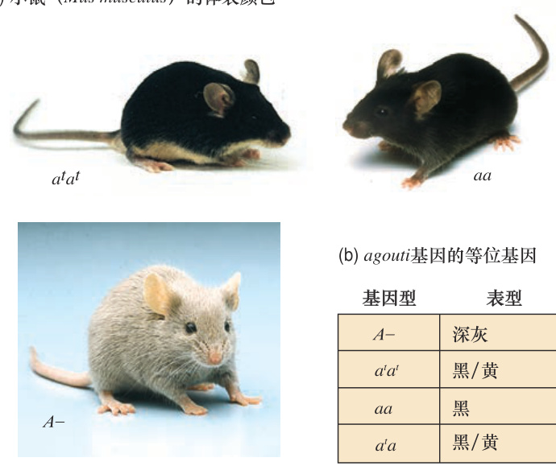  
(a)    Mus musculus   
(c)  

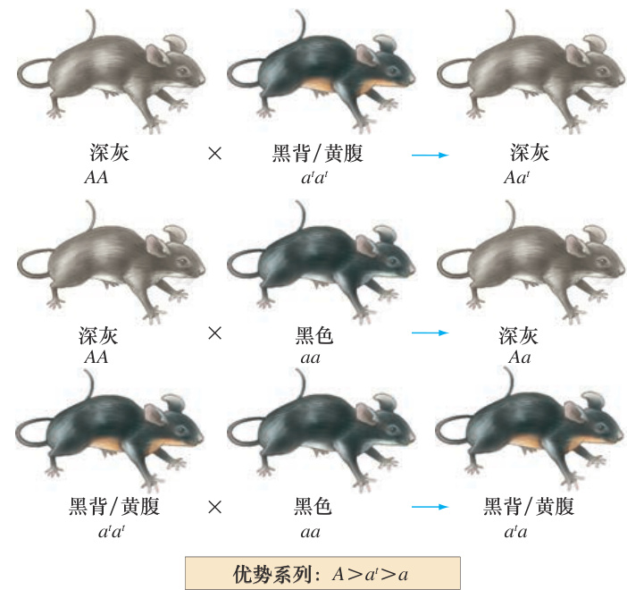  

（a，左上）： $\copyright$ McGraw-Hill Education. Jill Birschbach拍摄.Arranged by Alexandra Dove, McArdle Laboratory, University of Wisconsin-Madison；（a，右上、下）： $\copyright$ Charles River Laboratories  

基因决定一种特定的蛋白质（或RNA），而且一个基因产物能对一个有机体产生一连串的影响，所以我们能够理解多效性是如何产生的。以新西兰的毛利人为例，许多有呼吸问题的人同时也有生殖问题。这些人表现出一种综合征，即一组常常同时出现的问题。研究人员发现问题的根源在于一个基因的隐性等位基因。这个基因的正常显性等位基因决定纤毛和鞭毛（它们是一些细胞表面延伸出的毛发状结构）活动所需的蛋白质。对于隐性等位基因纯合型的人，在正常情况下本该清理气管的纤毛和本该推动精子的鞭毛都不能发挥有效作用。这样，一个基因决定一种蛋白质，而这种蛋白质既影响呼吸系统，也影响生殖系统。大部分蛋白质在不同组织中活动，可以影响多种生化过程，所以几乎任何一个基因的突变都会产生多种效应。  

# 1. 隐性致死等位基因  

在等位基因中发生的一种重要变异不仅产生一个可见的表型，而且影响生存能力。孟德尔认为所有的基因型都有同样的生存能力，也就是说，它们存活的可能性是相同的。如果所有基因型的生存能力都不同，而且某个等位基因的大部分纯合子在发芽或出生前死亡，就无法统计它们。这种致命性会改变 $\mathrm{F}_{2}$ 预期的 $1:2:1$ 基因型比率和 $3:1$ 表型比率。  

以鼠类体表颜色的遗传为例。如上文所述，携带野生型agouti基因（AA）的小鼠有带黄色条纹的黑色皮毛，看上去是深灰色。 $A^{Y}.$ 是agouti基因14个已知的突变等位基因之一，它使小鼠的颜色更浅，几乎呈黄色。纯种AA小鼠与黄色小鼠交配，其后代中两种体表颜色的比例通常为 $1:1$ ［图3.8（a）］。由此，我们能得出三个结论： $\textcircled{\scriptsize{1}}$ 所有的黄色小鼠尽管没有表现出agouti表型，但都携带野生型A等位基因； $\textcircled{2}$ 黄色对agouti显性； $\textcircled{3}$ 所有的黄色小鼠都是 $A^{Y}\!A$ 杂合子。  

需要再次注意的是，显性和隐性是针对每一对等位基因来定义的。尽管如此，如前文所述，agouti（A）对黑色皮毛的突变at和a显性，它依然可以对黄色皮毛的等位基因隐性。在前面的杂交种，黄色小鼠是 $A^{Y}\!A$ 杂合子，而深灰色小鼠是AA纯合子。迄今尚无例外。但两只黄色小鼠杂交却产生一个不对等的表型比例，即黄色和深灰色为 $2:1$ ［图3.8（b）］。在这些后代中，深灰色小鼠交配说明所有的深灰色都是纯种，所以能产生AA纯合子。但是，后代中没有出现纯种的黄色小鼠。当黄色小鼠互相交配时，它们总是不断产生2/3的黄色和1/3的灰色后代，其比例为 $2:1$ ，所以黄色小鼠一定是杂合子（ $A^{Y}\!A$ ）。简言之，我们不可能得到纯种黄色小鼠（ $(A^{Y}\!A^{Y}$ ）。  

我们该如何解释这一现象？图3.8（b）的庞纳特方格给出了答案。 $A^{Y}$ 等位基因的一个副本产生黄色皮毛，而两个副本对携带它们的动物来说是致命的。这意味着$A^{Y}$ 等位基因影响两个不同的性状：在决定体表颜色时对$A$ 显性，但在产生致命性方面对A隐性。像 $A^{Y}$ 这样对纯合子的生存有消极影响的等位基因被称为隐性致死等位基因。请注意，同样的两个等位基因（ $A^{Y}$ 和A）从不同的表型角度看时，可以表现出不同的显隐性关系，我们将在后文中对此再次进行讨论。  

因为AY等位基因的黄色皮毛是显性，所以可以很容  

(a)  

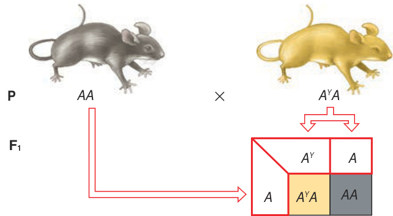  
(b)    AY  

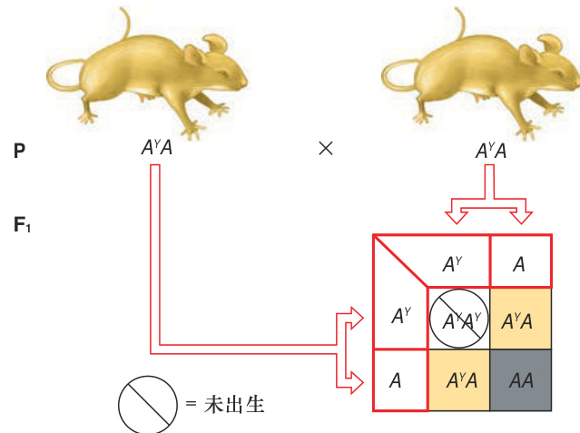  
图3.8 $A^{Y}$ 是一个多向性隐性致死等位基因。（a）同系深灰色小鼠和黄色小鼠交配产生的后代中黄色和深灰色的比例为$1:1$ 。因此，黄色小鼠是 $A^{Y}\!A$ 杂合子，而且对体表颜色这一性状来说， $A^{Y}$ （黄色）对A（深灰色）显性（请注意，我们假定如果 $A^{Y}\!A^{Y}.$ 小鼠存活，它们的体表颜色同 $|\boldsymbol{A}^{Y}\boldsymbol{A}$ 小鼠）。（b）黄色小鼠不能繁殖。在黄黄杂交中，黄色和深灰色后代2∶1的比例说明 $\boldsymbol{A}^{Y}.$ 等位基因是隐性致死的。  

易在小鼠中发现特定隐性致死等位基因的携带者。但是对大量的隐性致死突变来说却并非如此，因为它们通常不在其他性状方面同时表现出可见的显性表型。致死突变可产生于许多不同的基因，因此大部分动物，包括人类，都携带一定的隐性致死突变。除在近亲婚配（即在近亲属之间的婚配）时产生一些罕见的纯合性情况外，这些突变一般不会显现出来。如果一个突变产生的等位基因阻碍重要分子的产生，纯合子个体就无法获得这些至关重要的分子，也就无法存活。与此相反，携带一个有害突变副本和一个野生型等位基因的杂合子能产生正常分子野生型数量的 $50\%$ ，通常足以维持正常的细胞过程，也就能维持生存。  

# 2. 延迟的致死性  

在前文中，我们讨论了导致纯合子在产前，即在子宫内死亡的隐性等位基因。但是在一些突变下，纯合子在出生时可能存活，却随后死于基因缺陷导致的有害结果。患有泰-萨氏病（家族黑蒙性白痴）的人类婴儿就是一个例子。看起来正常的新生儿到五六个月时仍很健康，但随后却出现失明、麻痹、精神损伤和神经系统恶化等症状。这些疾病通常会导致婴儿在6岁时死亡。泰-萨氏病的原因是缺乏一种叫做己糖胺酶A的活性溶酶体酶，结果导致神经细胞内有毒排泄物的积聚。在全球范围内，泰-萨氏病的发病率约为1/35 000，但在东欧血统的犹太人中发病率却为1/3000。在美国，对携带者的可靠检测、遗传咨询和教育项目已几乎消灭了这一疾病。  

导致产前死亡或儿童早期死亡的隐性等位基因只能通过杂合携带者传递给后代，因为被这一基因影响的纯合子早在能够婚配前就死亡了。但是，对于导致成年人死亡的晚发性疾病，纯合患者可以在病情恶化前将致死等位基因传递下去。退化病弗里德赖希共济失调就是一个例子：一些纯合子先是在 $30\!\sim\!35$ 岁时表现出共济失调（肌肉协调的丧失）的症状，然后约5年后死于心脏衰竭。  

导致晚发致命性的显性等位基因也可以被遗传给后代。图2.22对亨廷顿病作了解释说明。相比之下，如果一个显性等位基因导致的致死性发生于胎儿发育期或儿童早期，这一等位基因就不会被遗传下来，所以所有的显性早期致死突变等位基因都一定是新的突变。  

表3.1总结了孟德尔关于显性、一个基因的等位基因数量和生存能力，以及每个基因对表型影响的基本假定，并将这些假定与后世学者在20世纪对他的扩展进行了比较。通过仔细进行可控的单基因杂种杂交，后辈遗传学家分析了单个基因的等位基因的传递模式，这对分离定律先是挑战，后又给予了肯定。  

表3.1　由一个基因决定的性状：关于3∶1单基因杂种比率的表型对比  

<html><body><table><tr><td>孟德尔的描述</td><td>扩展</td><td>扩展对杂合子表型的影响</td><td>扩展对F×F杂交结果比率的影响</td></tr><tr><td>完全显性</td><td>不完全显性 共显性</td><td>不同于任何一个纯合子</td><td>表型比率同基因型比率，为1：2：1</td></tr><tr><td>两个等位基因</td><td>复等位基因</td><td>表型的多样性</td><td>一系列3：1或1：2：1比率</td></tr><tr><td>所有等位基因的生存能力 相同</td><td>隐性致死等位基因</td><td>杂合子存活，但很多有可见的表型</td><td>2：1而不是3：1</td></tr><tr><td>一个基因决定一种性状</td><td>多向性：一个基因影响多个性状</td><td>被不同方式影响的数个性状，取决于 显隐性关系</td><td>取决于各个性状间显隐性关系的不同比率</td></tr></table></body></html>  

# 3.1.5 一个综合实例：镰状细胞病可以解释对孟德尔单基因遗传观点的数个扩展  

镰状细胞病是由非正常的血红蛋白分子导致的。血红蛋白由两种多肽链——α珠蛋白和β珠蛋白组成，它们分别由不同的基因决定：Hbα决定α珠蛋白，Hbβ决定β珠蛋白。正常红细胞包含数以百万计的血红蛋白分子，它们能将肺里的氧气传到全身各个组织。  

# 1. 复等位基因  

β 珠蛋白基因有一个正常的野生型等位基因（ $H b\beta^{A}$ ）来产生功能完善的β珠蛋白，且目前明确的突变等位基因有近400个。一些突变等位基因使血红蛋白无法携带足够的氧气，还有一些阻碍β珠蛋白的产生而导致一种叫做β地中海贫血的溶血疾病。我们将在此讨论β珠蛋白基因最常见的突变等位基因 $H\!b\beta^{s}$ ，它造成一种不正常的多肽，导致红细胞的镰型化［图3.9（a）］。  

# 2. 多效性  

受β珠蛋白基因的等位基因HbβS影响的性状不止一个［图3.9（b）］。纯合 ${\cdot}H b\beta^{s}H b\beta^{s}$ 个体红细胞中的血红蛋白分子在释放氧气后会经历一个异常的转化过程。它们在细胞质中本应是可溶的，却因聚合而形成长纤维，使红细胞扭曲变形成镰状，而非正常的双面凹陷的圆形［图3.9（a）］。变形的红细胞阻塞小血管，减少流入身体组织的氧气，并造成肌肉痉挛、呼吸急促和疲劳。这些镰状细胞同时也是脆弱而易破碎的。破碎的细胞会被起吞噬作用的白细胞消耗，导致红细胞数量过低，这种情况被称为贫血。  

从积极方面看，纯合HbβSHbβS不会患疟疾，因为导致这种疾病的有机体——镰状疟原虫能在正常红细胞中迅速繁殖，却无法在镰状细胞中繁殖。镰状疟原虫感染会导致镰状细胞在疟疾有机体开始繁殖前就破碎。  

# 3. 隐性致命性  

隐性HbβS等位基因纯合的人通常因循环系统的压力而导致心脏衰竭。许多镰状细胞患者在儿童期、青春期或成年早期死亡。  

# 4. 不同的显隐性关系  

将镰状细胞等位基因的杂合携带者（细胞中含有一个HbβA和一个 ${\mathcal{H}}b\beta^{s}$ 等位基因的个体）与纯合 $H b\beta^{A}$ $H b\beta^{A}$ （正常）个体和 $H b\beta^{S}\,H b\beta^{S}$ （患病）个体进行比较，可以区分镰状细胞不同表型时不同的显隐性关系［图3.9（b）］。  

在分子水平，即β珠蛋白产生时，两个等位基因表现为Hbβ 和 $H b\beta^{s}$ 共显性。在细胞水平，即它们对红细胞形状的影响，等位基因Hbβ 和Hbβ 表现为完全显性或共显性，取决于海拔。在正常氧气条件下，大部分杂合  

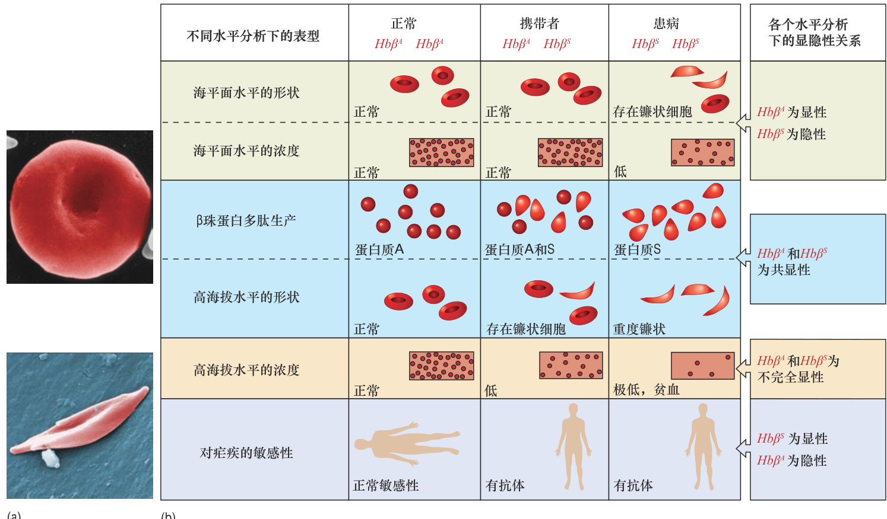  

图3.9　镰状细胞性贫血的多向性：显隐性关系随表型变化。（a）在扫描电镜照片中，一个正常的红细胞（上）可以很容易地区别于镰状细胞（下）。（b）不同水平的分析确定不同的表型。Hbβ基因的等位基因Hbβ 和Hbβ 之间的显隐性关系随表型变  

子的红细胞呈正常的双面凹陷的性状（HbβA对HbβS显性）；但是当氧气水平下降时，一些HbβA HbβS细胞中出现镰状（Hbβ 和Hbβ 为共显性）。第二次世界大战期间，一些是杂合携带者的士兵在乘飞机跨越太平洋时就因此表现出了镰状细胞贫血症的症状。  

考虑到疟疾的抗性特点，等位基因HbβS对等位基因HbβA显性。原因在于像前文介绍过的 $H b\beta^{S}\,H b\beta^{S}$ 细胞一样，被感染的HbβA HbβS细胞在疟疾有机体开始繁殖前就已破碎，所以它们对疟疾有抗体。但对杂合子而言，幸运的是，在贫血或死亡的表型方面，HbβS对HbβA隐性。这一观察的必然结果是，在正常环境条件下对总体健康的影响和对红细胞数量的影响方面，等位基因HbβA对HbβS显性。  

这样，对β珠蛋白及其他基因而言，显性和隐性是特定于每一对等位基因和考察表型的生理学水平，而不是在孤立情况下等位基因的固有性质。因此，在讨论显隐性关系时，必须定义好针对这一分析的特定表型。  

等位基因HbβA和HbβS之间复杂的显隐性关系有助于解释本来有害的等位基HbβS为何广泛存在于一些人群中。在疟疾流行的地区，杂合子比任何一种纯合子都能更好地生存，并把他们的基因传递下去。 $H b\beta^{s}\,H b\beta^{s}$ 个体通常死于镰状细胞病，而基因型为HbβA HbβA的个体常常死于疟疾。但是相对而言，杂合子对这两种疾病都是免疫的，所以在疟疾流行的热带环境下，两个等位基因同时存在的概率很高。我们将在第21章关于人口遗传学的内容中对这一现象进行大量详细的探讨。  

# 基本概念  

●  单个基因的两个等位基因可以表现出完全显性，这时杂合子与显性纯合子亲本相同；也可以表现为不完全显性，这时杂合子呈现出介于两个亲本之间的表型；还可以表现为共显性，这时杂合子呈现两个纯合子亲本的表型。  
●  突变使单个基因产生新的等位基因。一个等位基因在群体中的频率大于 $1\%$ 时为野生型等位基因；频率低的等位基因为突变型等位基因。  
●  当单个基因存在两个及以上的野生型等位基因（常见变异）时，该基因为多态基因。只有一个野生型等位基因的基因为单态基因。  
●  在多效性方面，一个基因决定多个性状。两个等位基因之间的显隐性关系因性状不同而变化。  
●  携带导致无法产生关键功能的隐性致死等位基因的纯合子将死亡。如果一个隐性致死等位基因对一个可见性状有显性作用，纯合子杂交后2/3的存活后代将表现出这一性状。  

# 3.2 双基因遗传的孟德尔定律  

# 学习目标  

1.  从杂交结果判断一个性状是由单个基因还是两个基因控制的。  

2.  从杂交结果推断不同基因的等位基因之间是否存在相互作用，包括相加、上位、冗余和互补。  

两个基因能以多种方式相互作用来决定一个性状，如花色、种子表皮、鸡的羽毛、狗的皮毛或植物叶片的形状。在与孟德尔相似的双因子杂种杂交中，每种类型的相互作用产生其特有的表型比率。在下文的例子中，每两个基因的等位基因是完全显性（如A和B）和隐性（a和b）的。为简单起见，我们有时用显性等位基因的符号来称呼一个基因，如基因A。此外，我们把等位基因A的蛋白质产物称为蛋白质A（非斜体字），且在适当时把等位基因a的蛋白质产物称为蛋白质a（非斜体字）。  

# 3.2.1 控制单个性状的两个基因之间的相加作用可以产生新的表型  

在第1章中，我们讨论了黄褐色和灰色扁豆的杂交，其F1代全是棕色，F2代有棕色、黄褐色、灰色和绿色的扁豆种子。实验结果显示， $\mathrm{F}_{2}$ 代四种颜色种子的比例为9棕色∶3黄褐色∶3灰色∶1绿色［图3.10（a）］，由此不难理解F2代为何会产生四种颜色。回顾第2章可以发现这一比例与孟德尔在观察两个独立基因的双因子杂合体杂交时对其F2代的分析相同。在孟德尔的研究中，四组植物都由表现出两个无关性状的植物组成。但对于扁豆，我们只观察一个性状，即种子的颜色。对平行比率最简单的解释为，两个不同类型基因的基因型组合起来并以相加的方式相互作用，从而产生扁豆种子颜色这一表型。  

不同类型扁豆植株的F2代自交得到的结果支持双基因解释。F2代绿色个体通过自交说明它们是纯种的，产生的F3代全是绿色。黄褐色个体产生的后代或者全是黄褐色，或者是黄褐色和绿色的混合。灰色产生全灰色后代，或者灰色和绿色混合。棕色F2代个体自交可产生四种可能的结果：全棕色、棕色加黄褐色、棕色加灰色，或四种颜色都有［图3.10（b）］。双基因假说解释了以下问题：  

● 只存在一种绿色基因型：纯种aa bb；  
●  存在两种黄褐色基因型：纯种AA bb，以及黄褐色和绿色产生的Aa bb；  
●  存在两种灰色基因型：纯种aa BB，以及灰色和绿色产生的aa $B b$ ；  

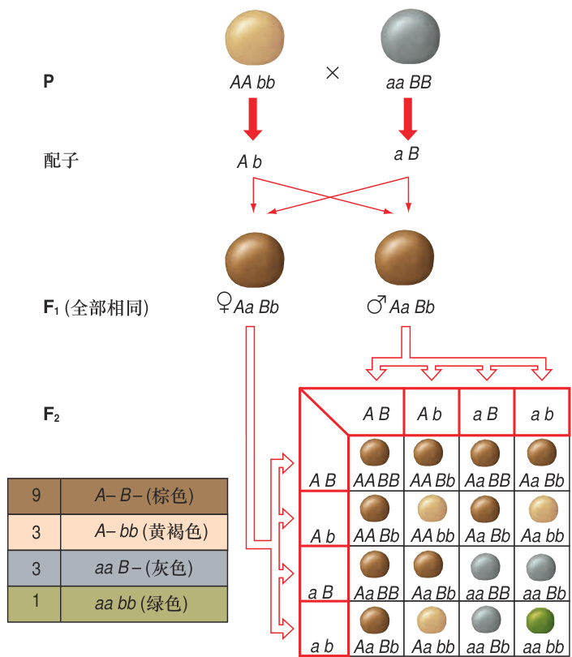  
(a)   
图3.10　两个基因如何相互作用来产生扁豆的种子颜色。（a）纯种黄褐色和灰色扁豆杂交，所有的F1代都是棕色，但F2子代中出现了四种不同的表型。 $\operatorname{F}_{2}\sharp\!\!\stackrel{\!}{\cdot}\!\!\!\mathfrak{J}\!\!\!^{}\!\!\!^{}\!\!\!\cdot\!\!\!\ 3:3:3:1$ 的表型比率表明种子表皮颜色是由两个不同类型的基因决定的。（b）指定表型的 $\mathrm{F}_{2}$ 植株自体受精产生F3的预期结果。第三列表示能够产生预期中的F3表型所需的F2群体的比例。（c）包括纯种亲本系在内的其他两代杂交也支持双基因假说。在此表中， $\mathrm{F}_{1}$ 代被省略。  

<html><body><table><tr><td>F2个体的表型</td><td>观察到的F3表型</td><td>F2群体的预期比例</td></tr><tr><td>绿色</td><td>绿色</td><td>1/16</td></tr><tr><td>黄褐色</td><td>黄褐色</td><td>1/16</td></tr><tr><td>黄褐色</td><td>黄褐色、绿色</td><td>2/16</td></tr><tr><td>灰色</td><td>灰色、绿色</td><td>2/16</td></tr><tr><td>灰色</td><td>灰色</td><td>1/16</td></tr><tr><td>棕色</td><td>棕色</td><td>1/16</td></tr><tr><td>棕色</td><td>棕色、黄褐色</td><td>2/16</td></tr><tr><td>棕色</td><td>棕色、灰色</td><td>2/16</td></tr><tr><td>棕色</td><td>棕色、灰色、黄褐色、绿色</td><td>4/16</td></tr></table></body></html>

\*F2 $(1:1:2:2:1:1:2:2:4)$ F2 (9   3    3   1  )  

(c)   

<html><body><table><tr><td>纯种亲本的种子 表皮颜色</td><td>F2表型和频率</td><td>比率</td></tr><tr><td>黄褐色×绿色</td><td>231黄褐色，85绿色</td><td>3 : 1</td></tr><tr><td>灰色 ×绿色</td><td>2586灰色，867绿色</td><td>3 : 1</td></tr><tr><td>棕色 ×灰色</td><td>964棕色，312灰色</td><td>3 :1</td></tr><tr><td>棕色 ×黄褐色</td><td>255棕色，76黄褐色</td><td>3 :1</td></tr><tr><td>棕色 ×绿色</td><td>57棕色，18灰色 13黄褐色，4绿色</td><td>9:3:3:1</td></tr></table></body></html>  

●  存在四种棕色基因型：纯种 $A A\ B B$ ，棕色和黄褐色产生的 $A A\;B b$ ，棕色和灰色产生的 $A a\;B B$ ，以及能产生四种颜色的扁豆的双因子杂种Aa $B b$ 。  

总之，对于决定种子颜色的两个基因，必须同时存在两个显性等位基因才能产生棕色（ $A^{-}\ B^{-}$ ）；一个基因的显性等位基因产生黄褐色（A- bb）；另一个基因的显性等位基因产生灰色（aa $B^{-}$ ）；完全没有显性等位基因时（即两个都是隐性）产生绿色（aa bb）。这样，四种基因型类别分别产生四个颜色表型，这些基因型类别是根据是否存在两个基因的显性等位基因来定义的： $\textcircled{\scriptsize{1}}$ 两个都存在 $\left(\ A-\ B-\ \right)$ ； $\textcircled{2}$ 存在一个（A- bb）；$\textcircled{3}$ 存在另一个（aa $B^{-}$ ）； $\ensuremath{\mathcal{Q}}$ 都不存在（aa bb）。注意，符号 $\cdot A-$ 表示这个基因的第二个等位基因可以是A或$a$ ，而符号 $B^{\cdot}$ -表示第二个等位基因是B或 $b$ 。只有在双基因系统下，且两个基因的等位基因之间的显隐性关系是完整的， $\mathrm{F}_{2}$ 代9个不同的基因型才能被分为4个表型分类。对不完全显性或共显性而言，就不能这样简单地对$\mathrm{F}_{2}$ 的基因型进行分类，因为它们产生的表型不止4个。  

不同颜色的扁豆继续杂交证明了双基因假说［图3.10（c）］。纯种黄褐色和纯种灰色扁豆产生F2的表型比率为9棕色∶3黄褐色∶3灰色∶1绿色，这说明不仅两个基因的显性和隐性等位基因能独立组合和通过相互作用产生种子颜色，而且每个基因型类别（ $\underline{{A}}\mathrm{-}\ B^{\underline{{\ldots}}}$ 、$A-b b$ 、aa $B$ -和aa bb）决定一个特定的表型。  

如何用这两个基因蛋白质产物的相互作用来解释$9:3:3:1$ 表型比率呢？我们无法对这一问题给出确切的答案，因为尚未在分子水平确定控制扁豆种子颜色的基因，且它们发挥作用的生化途径也是未知的。但是关于其他植物种子颜色遗传机制方面的知识可以让我们为扁豆的这一系统建立一个合理的模型（图3.11）。这一模型解释了 $9:3:3:1$ 比率的一个重要含义：两个控制同一性状且独立归类的基因可能以独立的生化途径相互作用，所以在这一实例中，黄褐色（一个生化途径的产物） $^+$ 灰色（另一个生化途径的产物） $\r=$ 棕色。  

# 3.2.2 上位性：一个基因的等位基因可以掩盖另一个基因的等位基因的表型效应  

当两个基因控制一个性状时，四个孟德尔基因型类别却产生不足四个能被观察到的表型，因为一个基因掩盖了其他基因的表型效应。一个基因的等位基因隐藏另一个基因等位基因效应的这种基因间的相互作用叫做上位性。起掩盖作用的等位基因对被掩盖的基因（下位基因）起上位作用。  

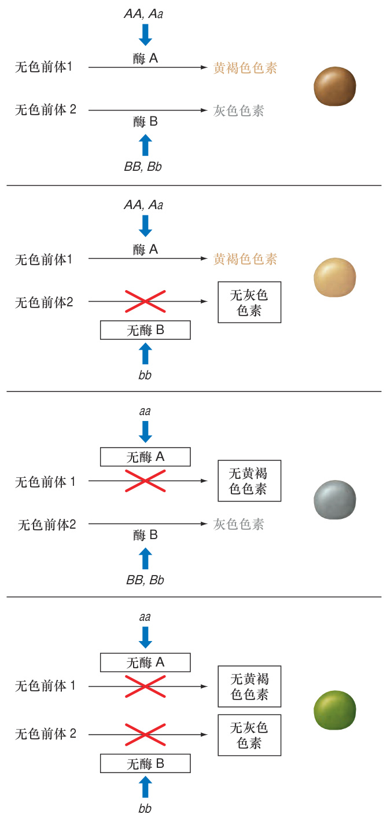  

图3.11　扁豆种子颜色遗传的生化模型。种子有一个不透明的外层（种皮）和一个内层（子叶）。如果种皮有颜色，子叶中的绿色叶绿素是看不到的。等位基因A编码酶A，等位基因$a$ 不产生这种酶。另一个基因的等位基因 $B$ 编码另一种酶， $b$ 不产生这种酶。如果黄褐色和灰色色素同时存在，种子看起来是棕色。如果两种酶都不存在（aa bb），则种皮无色素，所以子叶中的绿色叶绿素能透过种皮显现出来。 $9:3:3:1$ 比率表明基因A和基因B以独立的生化途径发挥作用。  

# 1. 隐性上位  

我们将在此列举三个例子来解释隐性上位，即一个基因的隐性等位基因的纯合性掩盖另一个基因的作用。换言之，当一个个体是第一个基因的上位隐性等位基因纯合型时，其表型不受第二个基因（下位）的等位基因的影响。本节最后一个例子将描述一种惊人的现象，即决定性状的两个基因之间的隐性上位性是相互的。  

黄色拉布拉多犬　拉布拉多犬的光滑、短毛体表有黑色、巧克力色和黄色［图3.12（a）］。最终呈现的颜色取决于两个不同类别的体表颜色基因的等位基因之间的组合［图3.12（b）］。当第一个基因的显性等位基因 $E$ 存在时，第二个基因的显性等位基因B决定黑色，且隐性bb纯合体是巧克力色。但是，两个隐性等位基因（ee）掩盖了黑色和巧克力色等位基因的任何组合而呈现黄色。这样，隐性ee纯合基因型对第二个下位基因B的任意等位基因组合都起上位性。  

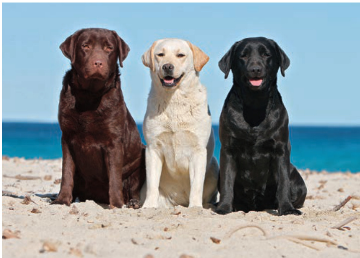  
(a)   
(b)  

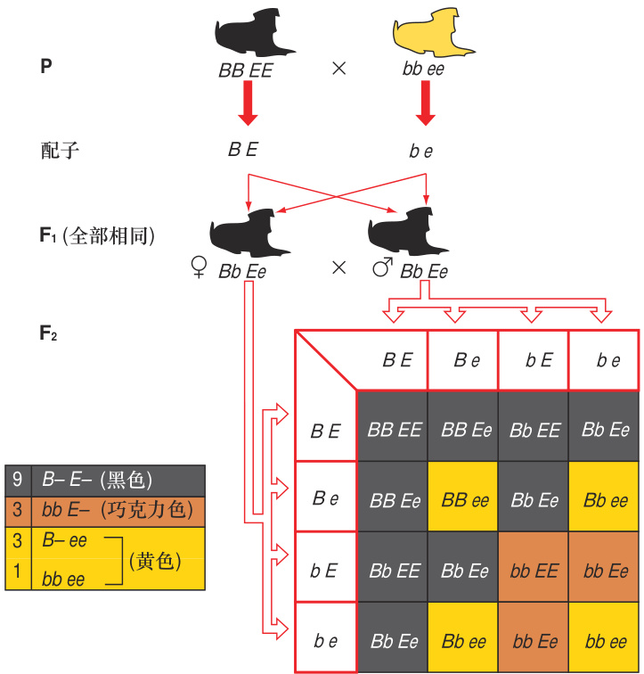  

图3.12　隐性上位决定拉布拉多犬的体表颜色。（a）拉布拉多犬的颜色。（b）黄色拉布拉多犬是隐性等位基因e纯合体，等位基因e掩盖了第二个体表颜色基因的等位基因B或b的作用。对于含有等位基因E的拉布拉多犬，B-基因型产生黑  

色，而bb基因型产生棕色。（a）： $\copyright$ Vanessa Grossemy/Alamy  

让我们深入观察这一现象。纯种黑犬（ $B B~E E$ ）和一种纯种黄犬（ $b b~e e$ ）杂交产生的双因子杂种F1代是黑色的。双因子杂种F 代之间杂交产生的 $\mathrm{F}_{2}$ 代中黑色（ $B^{-}$ $E^{-}$ ）、棕色（ $b b\,E^{-}\,;$ ）和黄色（-- ee）的比例为 $9:3:4$ ［图3.12（b）］。注意，只有三种表型类别，因为不含显性等位基因 $E$ 的两个基因型类别（三个B- ee和一个$b b~e e$ ）都产生黄色表型。这样， $\mathrm{F}_{2}$ 代隐性上位的比例为$9:3:4$ ，4是3（ $B^{-}~e e$ ） $+1$ （ $b b~e e$ ）组合。因为ee基因型掩盖了其他体表颜色基因的影响，我们无法根据黄色拉布拉多的外表判断它的 $B$ 基因座上的基因型究竟是 $B^{-}$ （黑色）还是 $b b$ （巧克力色）。  

科学家能够比较精确地解释基因 $B$ 和 $E$ 不同等位基因发挥作用的生化途径（图3.13）。犬类的体表颜色来自一个共同前体合成的两个色素：叫做真黑素的深色色素和叫做褐黑素的浅色色素。当拉布拉多犬有等位基因$E$ 的至少一个副本时，生成的蛋白质E就会使这些犬只有真黑素，而没有褐黑素。真黑素的合成及其在毛发中的沉着需要等位基因B生成的蛋白质，而等位基因b生成的蛋白质效率不足。因此，巧克力色的E- bb犬毛发中的真黑素比拥有至少一个等位基因 $B$ 的黑犬 $\left(\ E^{-}\ B^{-}\ \right)$ 少。但在缺少蛋白质E（在ee犬身上）时，由于只合成了褐黑素，犬只呈现黄色。在图3.13中可以很容易地看到为什么ee对基因B的两个等位基因都是上位：ee犬没有真黑素，所以无论这些犬只是B-还是bb，它们都是黄色的。  

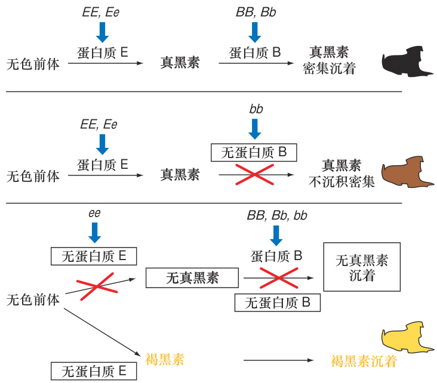  

图3.13　拉布拉多犬体表颜色的生化解释。蛋白质E刺激一种从无色前体生成真黑素的酶。当蛋白质E存在时，只产生真黑素。蛋白质B使真黑素密集沉着，所以毛发呈黑色。没有蛋白质B时色素沉着不密集，则产生棕色（巧克力色）毛发。当没有蛋白质E时，合成的不是真黑素，而是褐黑素（黄色色素）。纯合ee犬总是黄色，无论基因 $B_{.}$ 是哪种基因型。其原因在于蛋白质B只作用于真黑素，而ee犬没有真黑素。  

人类的孟买血型　对隐性上位的理解有助于我们解开人类遗传学的有趣难题。在一些罕见情况下，都是O型血的父母，其后代却既可能是A型血（基因型I i），也可能是B型血（基因型 $I^{B}i$ ）。这一现象发生的原因在于一种叫做孟买表型（因其发现于印度孟买）的极端罕见性状，表面上看起来像O型血。如图3.14（a）所示，孟买表型产生于第二个基因的突变隐性等位基因（hh）间的纯合，这一突变等位基因掩盖了ABO等位基因任何可能存在的作用。  

它在分子水平的作用如下［图3.14（a）］。在决定血型的红细胞表面分子的构建中，A型个体产生一种将多糖A添加到被称为H物质的糖聚合物上的酶；B型个体产生另一种形式的酶，将多糖B添加到糖聚合物H上；O型个体既不产生A添加酶，也不产生B添加酶，所以它的H物质暴露在其红细胞膜中。所有的A、B或O型血的人都携带至少一种第二个基因的显性野生型H等位基因，因此能产生一些H物质。与之相反，罕见的孟买表型个体第二个基因的基因型是hh，根本不产生H物质。这样，即使这些人产生添加A或B到多糖基的酶，他们也没有能够被添加的H物质。因此，孟买表型个体表面上是O型血。由于这一原因，H物质基因的隐性h等位基因纯合会掩盖ABO基因的作用，使基因型hh对等位基因 $I^{A}$ 、 $I^{B}$ 和i（除ii外）的任何组合都是上位的。  

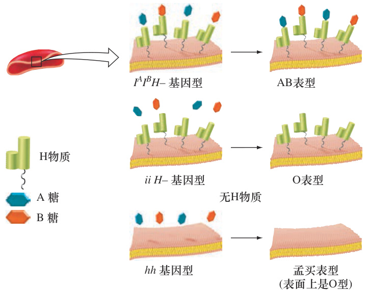  
(a)   
(b)        ABO  

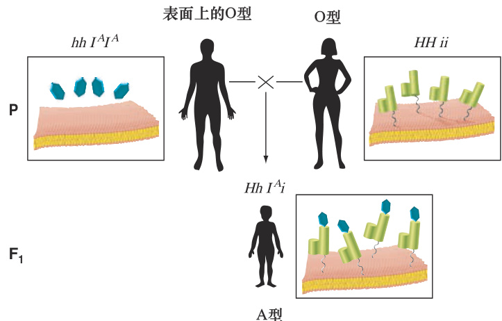  
图3.14　人类的隐性上位导致一种罕见的血型。（a）孟买等位基因h的纯合体对决定ABO血型的I基因上位。hh个体无法产生在红细胞表面添加A或B糖的H物质。（b）因为h对I上位，罕见个体尽管有等位基因 $I^{A}$ 或 $I^{B}$ ，也可能看上去是O型血。当被掩盖的等位基因I在Hh后代中表现出来时，这些人可能会对孩子的血型感到惊讶。  

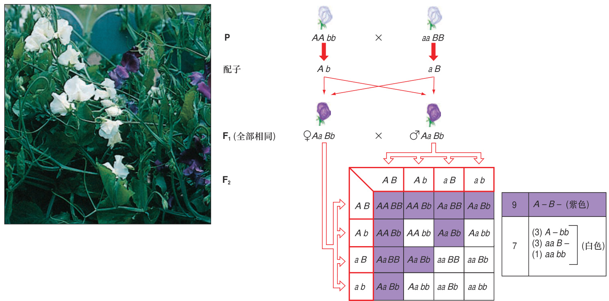  
(b)   
图3.15　香豌豆紫色花朵所需的两个基因的显性等位基因。（a）白色和紫色香豌豆花。（b）F2植株紫色和白色 $9:7$ 的比率说明，至少需要每个基因的一个显性等位基因才能产生紫色。$\copyright$ William Allen/National Geographic Creative  

一个携带 $I^{A}$ 、 $I^{B}$ ，或同时携带 $I^{A}$ 和 $I^{B}$ ，但又是H物质基因hh纯合的人可能在表面看来是O型血，但他/她能够在精子或卵子中传递等位基因 $I^{A}$ 或 $I^{B}$ 。例如，一个后代有ABO基因的一个等位基因 $I^{A}$ ，同时从父亲遗传的H物质基因的隐性等位基因h，从母亲遗传的等位基因i和显性等位基因 $H$ ，那么这个后代是A型血（基因型IAi Hh），尽管双亲中没有一个是A或AB型血［图3.14（b）］。  

白色香豌豆花　William Bateson在20世纪最初十年中对两种纯种百花香豌豆进行了杂交［图3.15（a）］。令人颇为意外的是，所有的F1代都开紫色的花［图3.15（b）］。新的杂种自交产生的 $\mathrm{F}_{2}$ 代中，紫色和白色的比例为$9:7$ 。如何解释这一现象？两个基因共同作用产生紫色的香豌豆花，且每个基因一定存在一个显性等位基因来产生相应的颜色。  

图3.16是对上述结果简单的生化假说。因为需要两个酶来催化连续的生化反应才能把一个无色前体变为紫色色素，所以只有能产生两种所需酶的活化形式的A-  

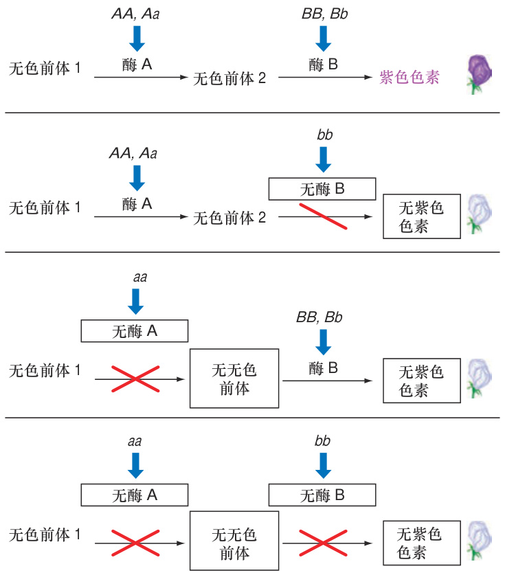  
图3.16　香豌豆后代颜色交互隐性上位的生化解释。由两个基因的显性等位基因所产生的酶都是产生色素所必需的。这两个基因的隐性等位基因都不产生酶。在aa纯合体中没有产生中间的前体2，所以即使有酶B也不能产生紫色色素。  

$B^{-}$ 基因型类别才能产生彩色的花朵。其他三种基因型类别（ $\mathit{\check{\Psi}},A^{-}\mathit{b}b$ 、aa $B^{-}$ 和aa bb）在表型方面被归为一类，因为它们缺少一种能够促使形成任何表型功能的酶，也就不能产生彩色，而同白色是一样的。显而易见， $9:7$ 比率中的7包含 $\mathrm{~\vec{F}}_{2}$ 白 ${\mathrm{5p}}:3:3:1$ 比率中的 $3:3:1$ 。  

$9:7$ 比率是这种交互隐性上位的表型特征，两个基因的显性等位基因共同作用（ $\left(A^{-}\;B^{-}\right)$ ）来产生颜色或其他性状，而其他三组基因型类别（ $.A^{-}~b b$ 、aa $B^{\cdot}$ -和aabb）不产生性状［图3.15（b）］。考虑到与等位基因A或等位基因B有关的表型是紫色，我们可以说aa对B上位，且bb对A上位。如果香豌豆是aa或 $b b$ ，那么无论它是否含有另一个基因的显性等位基因，花都会是白色的。  

# 2. 显性上位  

显性等位基因也可以造成上位性。显性上位取决于相关生化过程的细节，并可以表现为两个不同的表型比率中的一个。  

南瓜的果实颜色　有两个基因影响南瓜的果实颜色［图3.17（a）］。其中一个基因的显性等位基因（A-）决定黄色，而隐性等位基因纯合体（aa）是绿色的。第二个基因的显性等位基因（B-）决定白色，而bb果实可能是黄色或绿色，最终结果取决于第一个基因的基因型。两个基因相互作用， $B$ 的存在掩盖A-或aa的作用而产生白色果实，所以B-对基因A的任何基因型都是上位。隐性等位基因 $b$ 对基因A影响的果实颜色不起作用。一个基因的显性等位基因掩盖另一个基因作用的上位性叫做显性上位。白色F1双因子杂种杂交产生的F2的表型比率为12白∶3黄∶1绿［图3.17（a）］，其中12包含两个基因型类别： $9A^{-}\,B^{.}$ -和3aa $B^{-}$ 。  

南瓜的基因A和基因 $B$ 尚未在分子层面被确定，而且它们相互作用的生化途径未知。但是，基于对其他植物相似现象的了解，可以得出支持 $12:3:1$ 表型比率的可能的生化途径，见图3.17（b）。  

鸡的羽毛颜色　在一些鸡类的羽毛颜色上可以观察到明显的显性上位的不同比率［图3.18（a）］。白色来亨鸡有一个决定羽毛颜色的双显性的基因型AA BB；白色怀安多特鸡是两个基因隐性等位基因（aa bb）的纯合体。这两种纯种白色的鸡杂交产生全白色的双因子杂种（Aa Bb）F 代，但F 代中就出现了彩色的鸡，而且白色和彩色的比例是 $13:3$ ［图3.18（a）］。我们可以通过假设B对A上位的这种显性上位来解释这一比例。等位基因A只在没有B时才产生颜色，且等位基因a、 $B$ 和b不产生颜色。这一相互作用的特点是 $13:3$ 的比率，因为基因型类别9A- $B^{-}$ 、3aa $B$ -和1aa bb都产生同一个表型——白色。支持鸡羽毛颜色 $13:3$ 比率的生  

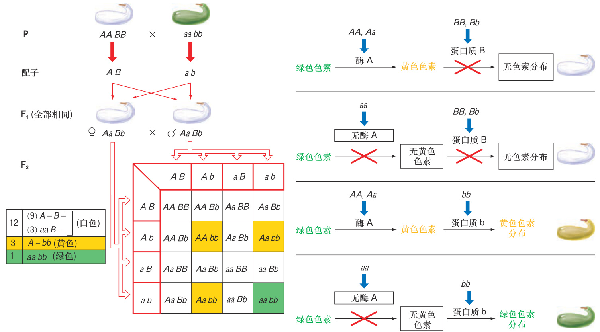  
(b)   
(a) B A a  

图3.17　显性上位可能形成 $12:3:1$ 的表型比率。（a）南瓜的显性等位基因B产生白色果实，并足够掩盖等位基因A和a任何组合的作用。因此，黄色 $\ L A-$ ）或绿色（aa）只能在 $b b$ 个体中表现出来。（b）等位基因A编码酶A，而等位基因a不编码酶。所以，A-南瓜有黄色色素，aa南瓜有绿色色素。这两种色素的分布都由被第二个基因的正常（野生型）等位基因b编码的蛋白质b决定。但是，突变显性等位基因 $B$ 编码这个蛋白质非正常的形式B，即使有正常的蛋白质b存在，也能阻止色素的分布。所以，南瓜必须有蛋白质b而不是蛋白质B（基因型bb）才能显示颜色。  

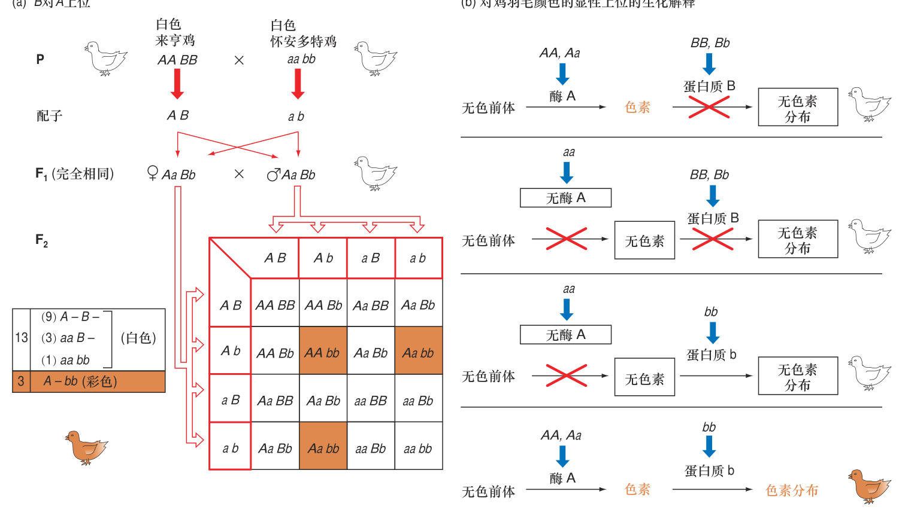  

图3.18　显性上位也可能产生 $13:3$ 的表型比率。（a）白色来亨鸡和白色怀安多特鸡的双因子杂种杂交产生的F2代中，白色和彩色的比例为 $13:3$ 。出现这一比率的原因在于产生颜色需要至少一个A副本和没有B副本的情况。（b）合成色素需要等位基因A编码的酶A。等位基因a不编码酶。羽毛中的色素分布取决于第二个基因的正常（野生型）等位基因b编码的蛋白质b。但是，即使有正常的蛋白质b存在，突变显性等位基因B也会编码阻碍色素分布的非正常形态的蛋白质。  

化途径见图3.18（b）。  

# 3. 上位性的重点  

我们讨论过的隐性和显性上位的实例中有以下重点：  

●  上位性是不同基因的等位基因间的相互作用，而不是相同基因的等位基因间的作用。●  在双因子杂种杂交中，上位性导致的F2表型比率取决于特定等位基因的功能和基因参与的特殊生化途径。  

在拉布拉多犬和香豌豆的隐性上位实验中，两个基因的完全显性等位基因产生正常发挥作用的蛋白质，而隐性等位基因无功能或产生功能微弱的蛋白质。尽管如此，在拉布拉多犬和香豌豆两个实验中，双因子杂种杂交的F 代的表型比率也不同，这是因为它们经过的生化过程不同。同理，两个显性上位实验（南瓜和鸡的颜色）由于不同的生化过程而产生了不同的F2代表型比率。  

●  隐性上位通常表明两个基因的显性等位基因以同样的途径发挥作用来达到共同的结果。在拉布拉多犬实验中，B和E共同作用来产生黑色毛发。  

●  显性上位通常表明两个基因的显性等位基因有相反的功能。在南瓜和鸡颜色的实验中，基因B的显性等位基因阻碍色素的分布，而色素的合成取决于基因A的显性等位基因。  

# 3.2.3 冗余：一个过程中有一个或多个基因是多余的  

玉米有两个基因A和B控制叶片的发育。植株只要有显性等位基因A或显性等位基因B中的一个（A- B-、A- bb或aa B-），就能长出正常的宽叶。但是两个显性等位基因都没有的植株（aa bb）的叶片是窄的，因为它含有的细胞很少［图3.19（a）］。考虑到只有在同时缺少A和B基因时（aa bb）叶片才会畸形，表明冗余基因作用的F2的表型比率是 $15:1$ ［图3.19（b）］。  

由显性等位基因编码的蛋白质（A和B）通过复杂的过程使特定细胞成为叶片的一部分（图3.20）。也就是说，只要其中一个过程发挥作用，就会长出正常的宽叶。  

在这种情况下，冗余基因通常会产生几乎一样的蛋白质来发挥发挥同样的作用。有机体为何会有两个基因在起同样的作用？一种回答是，冗余基因是在基因复制的进化过程中偶然产生的，这一点将在第10章进行解释。  

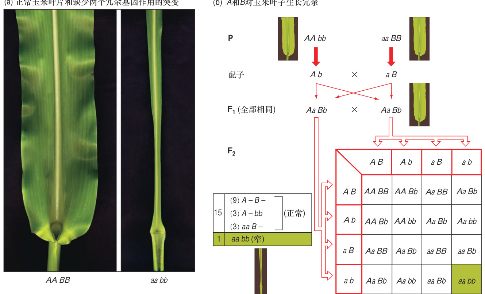  
  
  
图3.19　冗余基因造成 $15:1$ 的表型比率。（a）正常玉米叶片（ $A A\,B B$ ）和同时缺少显性等位基因A和B的叶片（aa bb）。（b）对玉米而言，显性等位基因A或B中的一个就能满足正常叶片的生长。只有同时缺少两个等位基因（aa bb）才会导致畸形的窄叶，其在双因子杂种杂交F2代中的比率为 $15:1$ 。（a）： $\copyright$ Dr. Michael J. Scanlon, Cornell University  

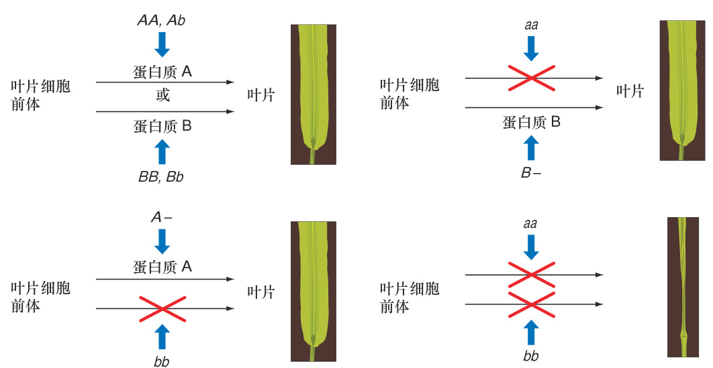  
图3.20　冗余基因作用的生化解释。等位基因A和B控制的蛋白质以独立的过程发挥作用来使细胞成为叶片的部分。隐性等位基因a和b不控制蛋白质。因为任何一个过程都是足够的，只有同时缺少两个等位基因的植株才会长出窄叶。  

# 3.2.4 总结：不同的生化过程可以产生孟德尔比率的任何变式  

到此为止，我们了解了两个独立归类的基因相互作用来决定一个性状时， $\mathrm{F}_{2}$ 代四个孟德尔基因型的$9:3:3:1$ 比率可以产生不同的表型比率，具体取决于基因作用的性质。其结果可能是四个基因型类别组合形成四个、三个或两个表型。表3.2总结了其中一些可能的情况，将表型比率与其所反映的基因现象相关联。  

如表3.2所示，基因的野生型和突变等位基因以许多不同的生化过程参与作用而产生特定的F 表型比率，如9∶7或 $12:3:1$ ，理解这一点是非常重要的。因此，当在一个杂交中观察到特定的比率时，尽管能排除一些可能性，也无法推断它所经历的生化过程。反过来讲，正如你将在本章最后看到的习题部分，如果生化过程已知，你可以准确预测包含决定性状的基因杂交所产生的后代中的表型比率。  

表3.2　二基因作用总结  

<html><body><table><tr><td rowspan="2">基因作用</td><td colspan="5">双因子杂种杂交F，代产生F代的基因型比率</td><td rowspan="2">F2表型比率</td></tr><tr><td>实例</td><td>A-B-</td><td>A-bb</td><td>aaB-</td><td>aabb</td></tr><tr><td>相加：四个明显的F2表型</td><td>扁豆：种子表皮颜色［见图3.10（a）]</td><td></td><td>3</td><td>3</td><td>1</td><td>9:3:3:1</td></tr><tr><td>隐性上位：纯合型一个基因的隐性等位基因掩盖了 另一个基因的两个等位基因</td><td>拉布拉多犬：体表颜色［见图3.12（b）]</td><td>9</td><td>3</td><td>3</td><td>1</td><td>9:3:4</td></tr><tr><td>交互隐性上位：纯合型一个基因的隐性等位基因掩 盖了另一个基因的显性等位基因</td><td>香豌豆：花色［见图3.15（b）]</td><td>9</td><td>3</td><td>3</td><td>1</td><td>9:7</td></tr><tr><td>显性上位】：一个基因的显性等位基因隐藏了另一 个基因两个等位基因的作用</td><td>西葫芦：颜色［见图3.17（a）]</td><td></td><td>3</td><td>3</td><td>1</td><td>12:3:1</td></tr><tr><td>显性上位Ⅱ：一个基因的显性等位基因隐藏了另一 个基因显性等位基因的作用</td><td>鸡的羽毛颜色［见图3.18（a）]</td><td>9</td><td>3</td><td>3</td><td>1</td><td>13:3</td></tr><tr><td>冗余：只需要两个基因之一的显性等位基因来产生 表型</td><td>玉米：叶片发育［见图3.19（b）]</td><td></td><td>3</td><td>3</td><td>1</td><td>15 :1</td></tr></table></body></html>  

# 3.2.5 不完全显性或共显性可以扩展表型变化  

我们确定了双基因遗传的多个变化：  

●  不同基因的等位基因能以相加的形式相互作用来产生新的表型；  
●  一个基因的等位基因能够掩盖另一个基因等位基因的作用（上位）；  
●  不同基因可能有冗余作用，所以任一基因的一个显性等位基因都足够产生一个特定的正常表型。  

除第一个外，不同基因所有的相互作用都可能使四个孟德尔基因型类别中的两个或以上基因型合并表现为一个表型类别。例如，当基因冗余时，A- B-、A- bb和aa $B$ -有同样的表型。为简便起见，在研究这些类别时我们选取的例子中每对基因的一个等位基因对另一个完全显性。但是，对基因相互作用的任何类型而言，一个或两个基因的等位基因可能显示出不完全显性或共显性，且这些可能的情况增加了表型的多样性。例如，图3.21显示双因子杂种杂交两个基因的不完全显性不会导致数个基因型类别重叠为一个，而是造成扩展，即双因子杂种杂交 $\mathrm{F}_{2}$ 的9个基因型分别与不同的表型相符合。  

对图3.21表型的简单生化解释与图3.3（b）的不完全显性相同，在后者中所产生的红色素的量与酶的量是成比例的。这里的不同之处在于，紫色的色素沉着需要A和B两种酶的作用，其中一种酶比另一种酶更有效，导致一个基因（在本例中是A基因）比另一个基因对紫色表型的贡献更大。  

尽管变异的可能性是多种多样的，但没有一个观察到的偏离孟德尔表型比率的现象与孟德尔的分离和独立分类的遗传规律相矛盾。根据他的理论，每个基因的等位基因仍然是分离的。多个基因的等位基因之间的相互作用使人们更难以解开基因型与表型之间的复杂关系。  

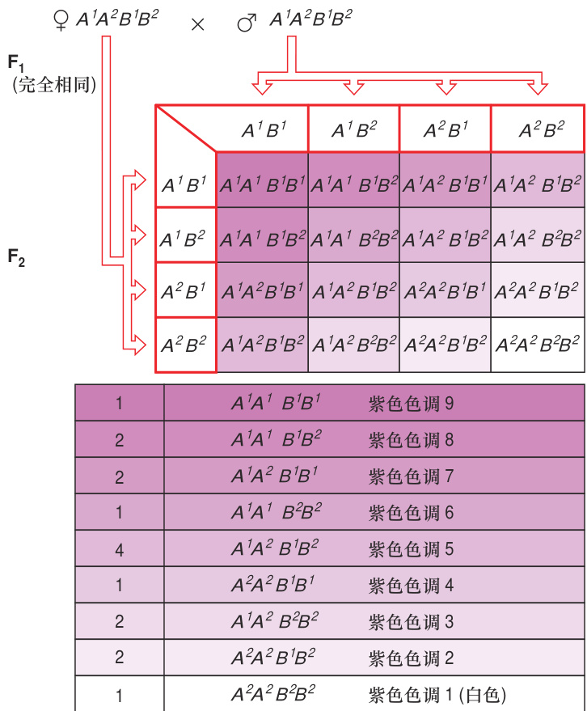  

图3.21　不完全显性时，两个基因间的相互作用可以产生一个性状的9个不同表型。在此例中，两个基因产生紫色色素。第一个基因的等位基因 $A^{l}$ 和A2呈不完全显性，第二个基因的等位基因 $B^{l}$ 和 $|B^{2}.$ 也是如此。每个基因的两个等位基因可以产生三个不同表型，所以双杂合体能产生9种（ $3\times3$ ）不同颜色，其比率为 $1:2:2:1:4:1:2:2:1.$ 。  

# 3.2.6 育种研究帮助遗传学家确定究竟是一个或两个基因决定一个性状  

遗传学家是如何确定某个特定性状是由一个基因的等位基因造成的，还有由两个基因以某种方式相互作用而造成的？育种试验通常可以解决这一问题。来自某种遗传模式的表型比率（例如， $9:7$ 或 $13:3$ 比率说明有两个基因在相互作用）可以提供第一条线索并支持一些假设。进一步的育种研究能够表明哪种假设是正确的。  

例如，纯种白色的白化病小鼠与纯种棕色小鼠交配产生黑色杂种；黑色F1杂交产生90个黑色、30个棕色和40个白化病后代。这些表型的遗传结构是什么？我们可以假定看到的是隐性上位的 $9:3:4$ 比率，并假设两个相互作用的基因（称它们为 $B$ 和 $C$ ）在控制颜色。在这一模式中，每个基因有完全显性和隐性的等位基因，且一个基因的纯合型隐性对另一个基因的两个等位基因都是上位［图3.22（a）］。这一想法是行得通的，但这不是与数据一致的唯一假设。  

我们可以用一个基因的活动［图3.22（b）］来解释这一数据，即比率为 $90:30:40$ 的160个后代。根据这一单基因假设，白化病是一个等位基因的纯合体（ $B^{I}B^{I}$ ），棕色小鼠是第二个等位基因的纯合体（ $B^{2}B^{2}$ ），而黑色小鼠是拥有新表型的杂合体（ $B^{l}B^{2}\,)$ ，因为 $B^{I}$ 和 $B^{2}$ 是不完全显性。在这一体系下，黑色（ $B^{l}B^{2}\;,$ ）和黑色（ $B^{l}B^{2}\;)$ 交配应该产生1 $B^{2}B^{2}$ 棕色∶2 $B^{I}B^{2}$ 黑色∶1 $B^{I}B^{I}$ 白化病，或40个棕色∶80个黑色∶40个白化病。单个基因遗传可能获得30个棕色、90个黑色和40个白化病吗？直观地讲，答案是肯定的，因为 $40:80:40$ 和 $30:90:40$ 两个比率的差别不是很大。众所周知，抛100次硬币的结果并不总是50次正面∶50次反面，有时偶然会出现 $60:40$ 的情况。所以，我们该如何区分双基因和单基因模式？  

答案是我们可以用其他类型的杂交来证实或反驳这些假设。例如，如果单基因假设是正确的，与亲代交配相同的 $\mathrm{F}_{2}$ 白化病和纯种棕色小鼠的交配能够产生全部都是黑色的纯合体［棕色（BB） $\times$ 白化病（bb） $=$  

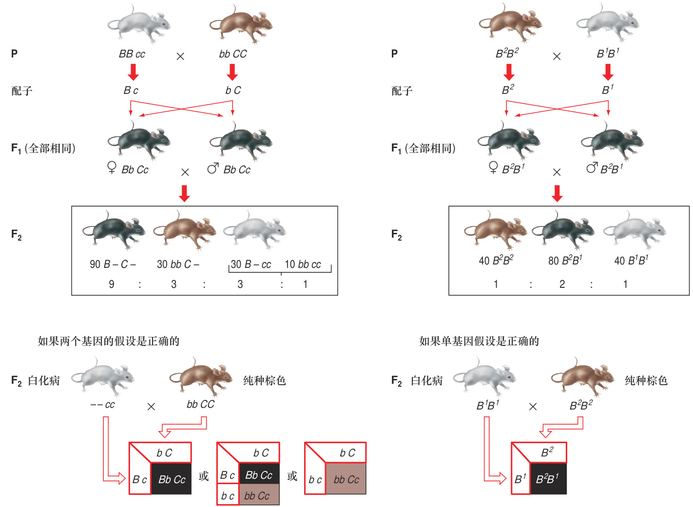  
(a)    1   
(b)    2  

图3.22　特定的育种试验有助于证实假设。这两种模式都可以解释观察小鼠体表颜色这一实验所得到的结果。（a）在一个假设中，具有隐性上位的两个基因相互作用产生 $9:3:4$ 的比率。（b）在另一个假设中，等位基因之间呈不完全显性的一个基因产生所观察到的结果。在这些模型之间做出选择的一种方法是将数只白化F2小鼠与真正繁殖的棕色小鼠杂交。双基因模型根据$B$ 基因上cc白化病的基因型预测了几种不同的结果。单基因模型预测所有杂交的后代全部都是黑色。  

全部黑色（Bb）］［图3.22（b）］。但如果双基因假设是正确的，且白化病基因的隐性突变（称为C）对基因 $B$ 的所有表达都是上位时，纯种棕色（bb CC）和 $\mathrm{F}_{2}$ 白化病（-- cc）的不同交配会产生不同的结果：所有后代都是黑色；后代一半黑色、一半棕色；所有后代都是棕色。具体结果取决于白化病在基因B上的基因型［图3.22（a）］。事实上，在实际进行实验时，实验结果的多样性证实了双基因假设。  

# 3.2.7 基因座异质性：几个基因中任何一个的突变都可能导致相同的表型  

近50个含有突变等位基因的不同基因可能导致人类耳聋。许多基因控制产生听力的发育途径，这个途径中任何一部分，如中耳的一小块骨头的功能丧失都可以导致耳聋。换句话说，需要具备这50个基因中每一个的显性野生型等位基因来产生正常听力。这样，耳聋是一种异质性状，即数个基因中任何的一个突变都可以导致同样的表型。在前文中［图3.15（b）］我们了解到香豌豆花的白色也是一种异质性状；AA bb和aa BB等不同基因的隐性、无功能等位基因的杂合体都是白色。  

# 1. 人类系谱中基因座异质性的证据  

基因座异质性是指两个或以上基因中任何一个突变都导致同样突变表型的一种性状性能。对许多家族系谱的深入研究可以揭示基因座异质性是否能够解释一个性状的遗传模式。以耳聋为例，某个耳聋男性和某个耳聋女性如果有孩子，就可以确定他们携带的是同一个基因的突变还是不同基因的突变。如果他们只有听力正常的孩子，父母则非常可能携带两个不同基因的突变，且孩子分别有这两个基因的一个正常野生型等位基因［图3.23（a）］。与之相反，如果他们所有的孩子都耳聋，则他们的父母可能都是同一个基因突变的纯合体，而且他们所有的孩子也都是同一突变的纯合体［图3.23（b）］。  

# 2. 互补和互补测试  

图3.23所示的方法用于说明某一特定表型是由相同基因还是不同基因的突变所决定，这一方法是一种实验性遗传工具自然产生的形式，称为互补测试。简单来说，当两个分离育种系出现相同的隐性表型时，遗传学家想要知道这两个系的表型是否是由同一个基因的突变导致的。为了解答这一问题，他们分别选取两个种系被影响的个体进行交配，如果得到两个突变的（从父母双方各得一个）后代表现出野生型表型，则发生了互补。对互补的观察意味着原始突变影响两个不同的基因，且对这两个基因来说，一个亲本的正常等位基因可以提供另一个亲本相同基因的突变等位基因所不能提供的功能。注意，互补的发现意味着我们所谈论的性状必图3.23　人类的基因座异质性：很多基因的突变都可能导致耳聋。（a）双方耳聋的父母可能有听力正常的后代，如果父母是不同基因隐性突变的纯合体。（b）双方耳聋且有同一基因突变的父母生育的孩子可能全部都耳聋。  

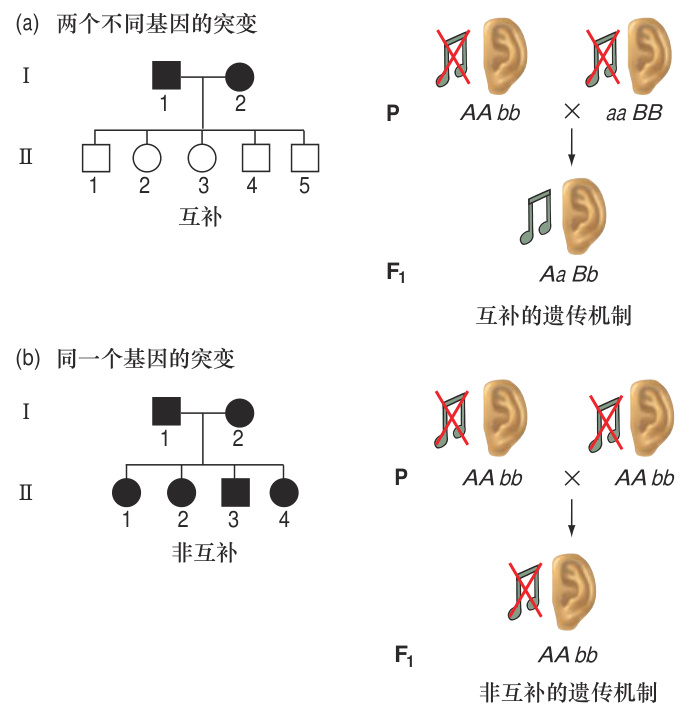  

须是异种的。  

我们在前文的图3.15（b）中看到了互补的例子。其中，白色亲本植株是合成紫色色素所必需的不同基因无功能等位基因的纯合体。F 是紫色的，因为每个亲本的配子都提供了另一方所缺少的野生型等位基因。在图3.23（a）中的耳聋系谱中，耳聋父母的所有孩子都有正常的听力，这是对上述现象的另一个例证。与之相反，如果被影响的亲本所产生的后代表现出突变表型，则没有发生互补。每个后代都得到了同一个基因的两个隐性突变等位基因——从父母双方各得一个［图3.23（b）］。没有互补不能排除一个性状是异种的可能性，只能说明某个杂交中的亲本拥有同一个基因的突变等位基因。  

你可以通过一种被称为眼皮白化病（OCA）的白化病来考察对基因座异质性和互补性这两个相关概念的理解。遗传了这一条件的人的皮肤、毛发和眼睛里没有色素，或只有很少量的色素［图3.24（a）］。图3.24（b）所示的水平遗传模式表明OCA是由一个基因的隐性等位基因决定的，而白化病家族成员是这一等位基因的纯合体。在1952年的一篇关于白化病的论文中，一个家庭中父母都有白化病，但三个孩子有正常的色素［图3.24（c）］。你将如何解释这一现象？  

答案是，白化病是基因座异质性的又一个实例：数个基因中任何一个的突变等位基因都可以导致这一疾病。论文中这对父母的婚配实际上无意中成为了一个互补测试。观察到的互补表明白化病父母中的一方是基因  

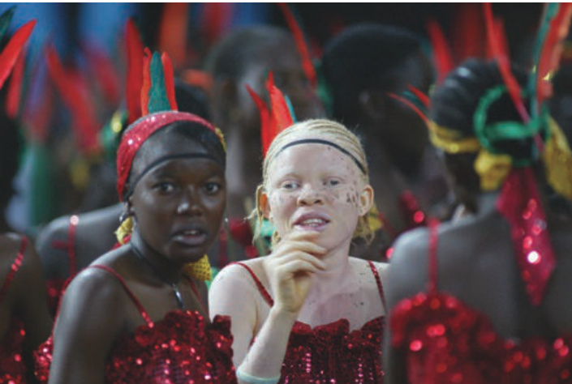  
(a)        OCA   
(b)  OCA  

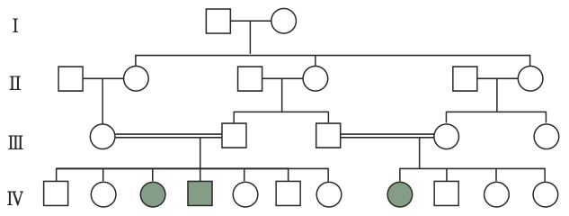  
(c)  

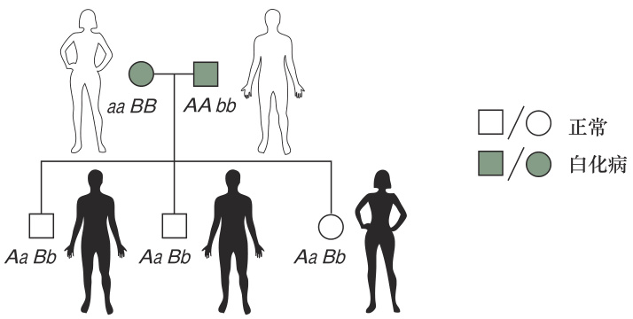  
图3.24　家族系谱有助于解开眼皮白化病（OCA）的遗传基础。（a）一个患有白化病的尼日利亚女孩和她的姐姐正在庆祝全非运动会。（b）一个家庭中OCA遗传的跟踪系谱表明这一性状是隐性的。（c）一个白化病父母和非白化病孩子的家庭说明任一基因的一个隐性等位基因纯合体都可以导致OCA。（a）： $\copyright$ Radu Sigheti/Reuters  

A中OCA所致突变的纯合体，而另一方是另一个基因B中的OCA所致突变的纯合体。  

# 基本概念  

●  两个基因可以相互作用来影响一个性状；这些相互作用可以通过根据孟德尔原则预测的比率来考察。  
● $9:3:3:1$ 表型比率通常表明两个基因以独立的生化过程发生作用，且它们的等位基因以相加的形式相互作用。  
●  在上位性中，一个基因的等位基因能够掩盖另一个基因的等位基因所导致的性状。  

●  当基因对一个性状表现出冗余时，任一基因的一个显性且功能正常的等位基因就足够产生正常的表型。●  许多基因表现出基因座异质性，这时数个基因中任何一个突变的纯合体都可以产生相同的突变表型。●  互补发生在有相同突变表型的纯种亲本的后代身上，且这些亲本是不同基因的隐性、无功能等位基因的纯合体，这些基因的产物以共同的途径发生作用。  

# 3.3 多因子遗传的孟德尔定律  

# 学习目标  

1.  探讨导致拥有相同基因型的不同个体表现出不同表型的因素。  

2.  解释孟德尔遗传学是如何与许多特征相符的，例如，人类的身高和肤色表现出持续的变异。  

许多性状的遗传事实上是非常复杂的，无法简单地用一个或两个基因以符合孟德尔原则的模式发挥作用来解释。当然，这一复杂性的原因之一是影响特定性状的基因不止两个。但第二个原因在于基因不是唯一的参与者，环境和偶然事件有时可以对本来由基因决定的性状产生重大影响。我们将在本节讨论多因素性状，即由数个不同基因，或基因与环境相互作用来决定的性状。  

# 3.3.1 相同基因型并不总产生相同的表型  

在对基因相互作用的讨论中，到目前为止我们研究了确定由一个基因型造成一个表型的例子。但实际情况并非总是如此。有时一个基因型完全没有被表现出来，也就是说，即使存在这个基因型，也没有出现预期的表型。有时，一个基因型导致的性状在不同个体上以不同的程度或不同的方式表现。改变基因型的表型表达的因素包括修饰基因、环境和机遇。这些因素提高了解释育种试验的难度。  

# 1. 外显率和表现度  

眼部癌症最大的恶性肿瘤之一——成视网膜细胞瘤，是由一个基因的显性突变导致的，但携带这一突变等位基因的人中只有 $75\%$ 会患病。遗传学家用外显率这一术语来描述拥有特定基因型的个体中表现出预期表型的个体比率。外显率可以是完全的（ $100\%$ ），如孟德尔所研究的性状；或不完全的，如成视网膜细胞瘤，后者的外显率约为 $75\%$ 。  

一些患有成视网膜细胞瘤的人只有一只眼睛受影响，而另一些有这一表型的个体双眼都患病。表现度是指特定基因型表现为表型的程度或强度。表现度是可变的，如成视网膜细胞瘤（单眼或双眼患病）；或恒定的，如豌豆颜色（所有的yy豌豆都是绿色）。成视网膜细胞瘤的不完全外显率和可变表现度主要是机遇造成的，但在其他情况中，是其他基因和（或）环境造成了图3.25　表型可以在外显率和表现度上呈现出变化。当拥有一个基因型的个体有同样的表型（绿色）时，这个基因型是完全外显的。一些基因型是不完全外显的，即有相同基因型的个体中一些表现出表型，而另一些则没有。基因型也可能呈现出不同的表现度，即具有相同基因型的个体可能表现出不同程度的性状。  

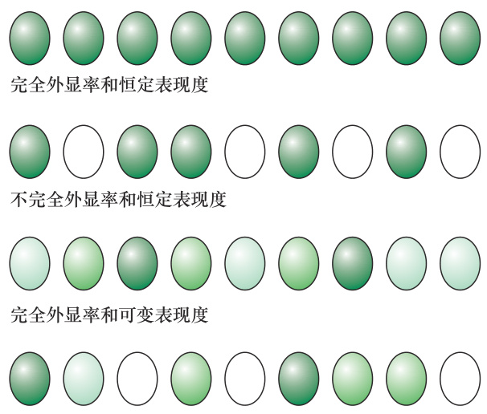  

表型变化。图3.25以图形形式总结了完全外显率、不完全外显率、可变表现度和恒定表现度的区别。  

# 2. 修饰基因  

并不是所有影响性状外观的基因对表型的贡献都是一样的。主要基因有很大的影响，而修饰基因具有更细微的次要影响。修饰基因可以改变其他基因的等位基因所产生的表型。主要基因和修饰基因之间没有正式区别，而是在两者之间存在一个连续统一体，且断点是随机的。科学家有时把影响已知基因作用的未知修饰基因称为遗传背景。  

在影响小鼠尾巴长度的修饰基因中，决定尾巴长度基因的突变等位基因T导致正常的野生型长尾变短。但不是所有携带突变T的小鼠都有相同的尾巴长度。从几个近亲系的比较可以得出这一可变表现度是由修饰基因导致的。在一个近亲系中，携带突变T的小鼠尾巴长度约为正常尾巴长度的 $75\%$ ；在另一个近亲系中，小鼠尾巴长度是正常长度的 $50\%$ ；在第三个近亲系中，小鼠尾巴长度只有野生型尾巴的 $10\%$ 。无论环境如何（如食物、笼子的温度或草垫），一个近亲系中每一个个体都有相同长度的尾巴，因此基因学家得出的结论是突变小鼠尾巴的长度是由基因，而不是环境或机遇决定的。不同近亲系极可能携带修饰基因的不同等位基因，而正是修饰基因在突变T存在时决定尾巴会有多短，也就是说，这些近亲系有不同的遗传背景。  

# 3. 环境对表型的作用  

温度是环境对表型产生可视作用的因素之一。例如，温度对暹罗猫独特的体表颜色模式有影响（图3.26）。  

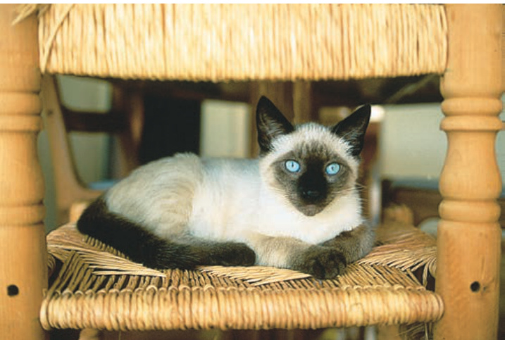  
(a)  

  
(b)   
图3.26　温度影响暹罗猫的体表颜色。（a）一只暹罗猫。（b）黑色素只在温度较低的身体末梢产生。发生这种现象是因为暹罗猫是一种突变的纯合体，这种突变所决定的产生黑色素的酶对温度变化很灵敏。（a）： $\copyright$ Renee Lynn/Science Source  

这些家猫是一个基因的众多等位基因中的一个纯合体，而这个基因编码一种能催化黑色素产生的酶。不同的Siamese等位基因产生的酶的形式在猫的正常体表温度下不产生功能，它只在猫身体末梢体温较低的部分变得活跃，从而促进黑色素的产生，使猫的耳朵、鼻子、爪子和尾巴变黑。所以，这种酶对温度变化很灵敏。在气候温和的正常环境条件下，暹罗表型在不同的猫身上从表现度方面看变化不大。但我们可以想象一种与众不同的表型的表达（没有黑色的身体末梢）出现在近赤道沙漠中，那里四周的温度等于或高于正常体温。  

温度也可以影响存活能力。在一种实验室培育的果蝇（Drosophila melanogaster）中，一些个体在$18-29^{\circ}\mathrm{C}$ 下正常发育和繁殖；但如果温度高于这一范围，在短时间内它们会发生可逆性麻痹；如果保持高温数小时，它们会死亡。这些昆虫携带shibire基因的一个感温等位基因，这个等位基因影响神经细胞传递的一个关键性蛋白质。这种等位基因被称为条件致死，因为它只在特定条件下才致死。昆虫能够存活的温度范围被称为允许条件；高于这一范围的致死温度被称为限制条件。这样，在一个温度下，等位基因产生一个与野生型没有区别的表型，而在另一个温度下，同样的等位基因产生一个突变（这里指的是致死）。携带野生型shibire等位基因的果蝇即使在较高温度下也能存活。一些突变只有在特定条件下才致死这一事实是环境可以影响一个表型外显率的例证。  

即使在基因正常的个体中，暴露于化学物质或其他环境因素也可能产生与特定基因的突变等位基因引起的表型类似的结果。以这种方式产生的表型变化被称为拟表型。从定义上看，拟表型不是遗传现象，因为它不是基因变化的结果。在人类中，20世纪60年代因孕妇摄取镇静剂萨利多胺而出现一种称为短肢畸形的罕见显性性状拟表型。这种药物阻碍原本正常胎儿的四肢发育，其结果与短肢畸形导致的突变相似。这一问题被发现后，萨利多胺退出了市场。  

某些类型的环境变化可能对生物体的生存能力有积极的影响。在下面的例子中，医学科学的直接应用人为地降低了突变表型的外显率。患有苯丙酮尿症（PKU）这种隐性疾病的儿童，除非进行特殊的饮食，否则会出现一系列神经系统问题，包括抽搐、癫痫和精神障碍。突变PKU等位基因纯合体，使编码苯丙氨酸羟化酶的基因失去活性。这种酶能正常地将氨基酸苯丙氨酸转化为氨基酸酪氨酸。这种酶的缺乏使苯丙氨酸积聚，导致神经系统问题。当今，一种可靠的血液检测技术可以检测到新生儿的这一问题。只要发现了携带PKU的新生儿，医生就会开具不含苯丙氨酸的保护性食谱。这一食谱必须同时提供足够的热量来防止婴儿体内蛋白质的分解，从而释放体内的有害氨基酸。这样的食疗只是环境的一个简单变化，却使许多PKU婴儿成长为健康的成年人。  

最后，美国的两大头号杀手疾病——心血管疾病和肺癌也同样能够解释环境是如何通过影响外显率和表现度来改变表型的。人们可能因遗传而具有罹患心脏病的倾向，但饮食和锻炼等环境因素也能影响这一疾病的发病率（外显率）和严重度（表现度）。而且，一些人生来就在遗传学上倾向于罹患肺癌，但他们是否会患病（外显率）在很大程度上取决于他们是否选择了吸烟。  

因此，生物体环境的各个方面，包括温度、饮食和运动，都与其基因型相互作用，从而产生表型。表型是决定植物或动物外貌及其行为方式性状的最终组合。  

# 4. 随机事件对外显率和表现度的作用  

携带视网膜母细胞瘤突变的患者是否会有这种表型的早期症状，或癌症影响单眼还是双眼，取决于随机发生的其他影响遗传的因素。如果这些影响遗传的因素改变特定体细胞的第二个等位基因，就会罹患视网膜母细胞瘤。引发这种疾病的随机事件包括宇宙射线(人类经常暴露于其中)，它会改变视网膜细胞的遗传物质，或导致视网膜细胞分裂时发生错误。偶然事件提供了使正常视网膜细胞变为癌细胞所必需的第二个因素，即成视网膜细胞瘤基因第二个副本的突变。因此，成视网膜细胞瘤这一表型是特定基因中的特定遗传突变的结果，但这一疾病的不完全外显率和可变表现度取决于影响某些细胞中另一个等位基因的随机基因事件。我们将在第20章正式讨论基因型和表型之间的关系，以及它们对癌症的作用。  

修饰基因、环境和机遇通过作用于不完全外显率和可变表现度来产生表型变化。外显率的可能性和表现度的水平无法从原始的孟德尔关于分离和自由组合的原则中得出，它们是通过观察和计数以经验的方式确立的。  

# 3.3.2 孟德尔原则也可以解释连续变异  

在孟德尔的试验中，豌豆植株高度是由一个基因的两个分离等位基因决定的（野生豌豆的植株高度是由许多基因决定的，但在孟德尔的自交群体中，除一个例外，所有这些基因的等位基因都是不变的）。这些等位基因造成的各种表型能够明确区分高矮。因此，豌豆植株高度被称为不连续性状（或离散性状）。与之相反，人类群体不是近亲繁殖的，人的身高由许多不同基因的等位基因决定，这些基因之间及它们与环境的相互作用产生连续的表型变异；因此，人类身高是连续性状（或定量性状）的一个实例。对人类群体而言，个体身高在一个范围内变化，并在图表上呈钟形曲线［图3.27（a）］。事实上，包括身高、体重和肤色在内的许多人类性状都呈现连续变异，而非孟德尔所分析的非此即彼的性状。  

连续性状通常是融合和非融合的。试想一下肤色，例如，非洲人和北欧人结婚所生孩子的肤色通常是其父母肤色的融合。这些F1个体后代的肤色变化范围很大：一些可能像其原始北欧父辈一样浅，一些像原始非洲父辈一样深，但大多数介于这两者之间［图3.27（b）］。正由于此，早期基因学家才不太容易接受孟德尔的分析。因为他们研究的是远交群（在许多基因的等位基因方面都有区别的个体所组成的群体），这些科学家在正常的健康人身上很难找到非此即彼的孟德尔性状的例子。  

但是到1930年，对玉米和烟草的研究确切证明可以通过增加影响表型的基因数量来对连续变异进行孟德尔解释。基因越多，表型类别越多，且呈现为连续的变异就越多。  

假设这样一个例子：有一系列影响架菜豆高度的基因（A、B、C……），每个基因有两个等位基因：一个对高度没有影响的等位基因0和一个使植株高度增加一个单位的等位基因1。所有等位基因都对同一基因的另一个等位基因不完全显性。所有基因决定的表型图3.27　人类的连续特征。（a）在纽约市第五大道一英里赛跑开始时，女运动员证明身高是一种不断变化的特征。  

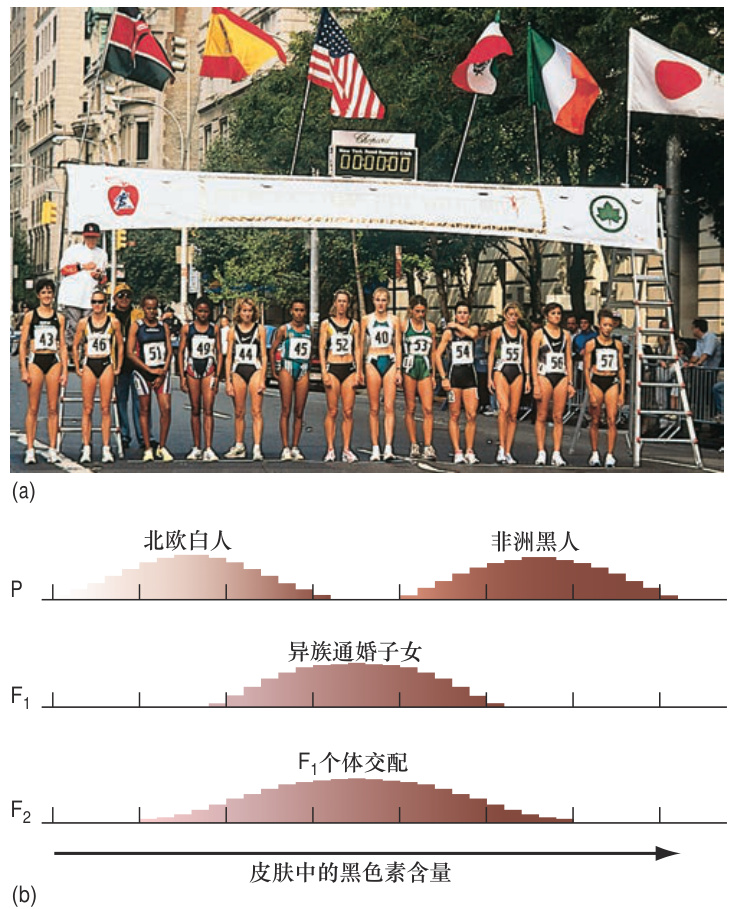  

（b）大多数F1代后代的肤色通常介于亲本的极端之间，而 $\mathrm{\DeltaF}_{2}$ 代表现出更广泛的连续变异分布。  

都是相加的。只携带每个高度基因中等位基因0的纯种植株和只携带每个高度基因中等位基因1的纯种植株进行两代杂交后会产生什么结果？如果只有一个基因负责高度，且环境作用可以被忽视， $\mathrm{F}_{2}$ 群体可以被分为三类：高度为0的纯合 $A^{o}A^{o}$ 植株（它们俯卧在地面上）、高度为1的杂合 $A\,^{o}A\,^{I}$ 植株、高度为2的纯合 $A\,^{I}A\,^{I}$ 植株［图3.28（a）］。高度在三个表型类别中的分布无法形成一个连续的曲线。但对两个基因而言， $\mathrm{F}_{2}$ 代中出现5个表型类别［图3.28（b）］；对三个基因而言，出现7个表型类别［图3.28（c）］；对四个基因而言，出现9个表型类别（图中未显示）。  

因此，由三或四个基因产生的分布开始接近连续变异，如果我们再加上环境变化这一影响因素，就会出现一条更平滑的曲线。毕竟我们希望豌豆植株在肥沃的土壤、充足的阳光和水分条件下茁壮成长。环境因素通过增加每个基因类别表现度的变化，使阶梯式的柱状图变为连续的曲线。此外，一些有两个以上等位基因的基因［图3.28（d）］、不同基因对表型的不同影响率、与修饰基因的相互作用和机遇都可能导致更多变化。因此，从我们已知的基因型和表型之间的关系来讲，可以看出依据孟德尔原则发挥作用的少量基因如何能够轻易产生连续变异。  

连续（或定量）性状在一定范围内变化，并可以被测量，如用毫米测量烟草花、用公升测量一头牛每天的产奶量，或用米测量一个人的身高。连续性状通常是多基因的，即由多个基因控制，而且表现出很多等位基因  

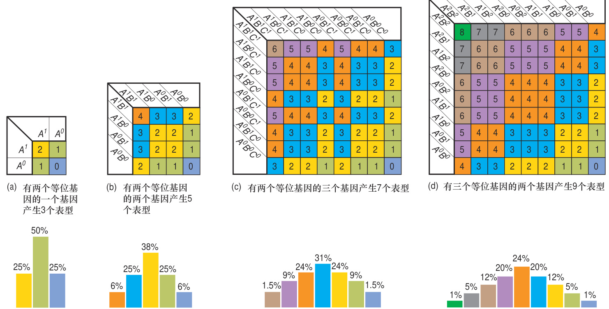  

图3.28　连续变异的孟德尔解释。基因或等位基因越多，可能的表型类别就越多，也就越类似于连续变异。在这些例子中，几对不完全显性的等位基因有相加作用。下图中的百分比表明每个基因型出现的频率，即它在整个群体中所占的比例。  

# 遗传学与社会  

# 疾病预防和隐私权  

在所收集到的最庞大的一个人类系谱中，一组研究人员从一些有亲属关系的个体与他们的祖先—对于1459年死于法国北部小镇的夫妻之间追踪到了一种跨越5个世纪的失明遗传系谱。现在有至少30 000名法国人是那对15世纪夫妻的后代，而且在法国少年型青光眼的患者中将近一半的人属于这一直系血统。这一性状的庞大家谱［贴在办公室的墙上超过100英尺（1英尺 $=\!0.3048\mathrm{m}$ ）长］表明基因缺陷符合由一个基因的显性等位基因决定的简单的孟德尔遗传模式（图A）。这一系谱同样表明显性基因缺陷表现为不完全外显。不是所有得到这一显性等位基因的人都会失明；这些视力正常的携带者可能会在不知不觉中把导致失明的等位基因遗传给孩子。  

不幸的是，人们直到视力恶化时才会知晓他们患有这种疾病。那时他们的视纤维已在经受不可逆的损害，失明是不可避免的。令人惊奇的是，阻止神经恶化的药物治疗在20世纪80年代晚期却造成了一个困境。由于需要在即将发生的失明症状表现出来之前开始有效的治疗，所以关于家族系谱的信息就能够帮助医生锁定高危人群，即使他们的父母都没有失明。因此，对庞大的家庭历史数据进行汇编的研究人员希望给医生提供其所在地区的高危个体的名单，这样，医生就能对他们进行检测并提供必要的医疗建议。但法国一部确立已久的保护个人隐私的法律禁止向公众发布基因系谱中的人名。法国政府机关在解释这部法律时声称，如果公开青光眼系谱中的人名，这一疾病的潜在携带者可能在求职或投保方面遭遇歧视。  

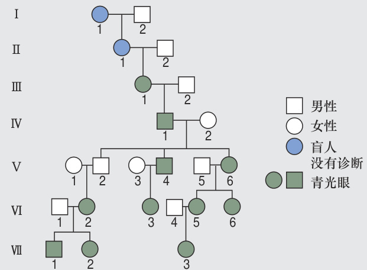  
图A　显示少年型青光眼遗传的系谱。家族系谱中的一小部分：七代人以上的水平遗传模式表明一个基因的显性等位基因导致少年型青光眼。Ⅴ-2没有患青光眼，紧随其后的Ⅵ-2又患有这一疾病，这说明该性状是不完全外显的。  

这样，法国面临一个严重的伦理问题：一方面，公布名单可以拯救数以千计的人，使他们免于失明；另一方面，为保护个人隐私而制定的法律阻止这些人名的散布。当时，法国政府采取的解决方案是一个公众教育项目，旨在警示公众关注这一问题，使得相关家庭可以寻求医疗建议。这一方法解决了法律问题，却在医学问题的处理方面成效甚微，因为许多被这一基因影响的个体没有参与教育项目。  

到1997年，分子遗传学家已经确定了导致幼年青光眼的显性突变等位基因。这种基因形成一种叫做肌钙蛋白的蛋白质，其在眼睛中的正常功能目前还不清楚。突变等位基因编码一种肌纤蛋白，它会错误地折叠并在眼液进入血液流动的狭窄通道中非正常积聚。错误折叠的肌纤蛋白阻碍过剩玻璃体的流出，并导致眼压升高（青光眼），最终损害视神经，造成失明。  

近期，关于肌纤蛋白基因中特定致病突变的研究促使基于对基因型直接分析的诊断测试得到发展（我们将在第11章中介绍直接基因型分析的方法）。这些基于DNA的测试不仅可以锁定高危个体，还能够推动病害治理，在视神经永久损害前发现突变等位基因使及时治疗成为可能。将来如果这样的治疗足够廉价，法国的伦理困境将得到解决。医生可以将其列为常规测试，并对所有新生儿采用，这样就能立即发现几乎所有受影响的儿童，也就不再需要系谱中的个人信息了。  

的相加作用，这就在群体中形成了变化的可能性。单个群体所遇到的不同环境甚至会造成更多的变化。我们将在第22章详细讨论定量的多因素性状。  

# 3.3.3 一个综合实例：数个基因的多个等位基因决定狗的体表颜色  

驯养犬有不同的颜色和斑纹。前文介绍过的拉布拉多犬的基因E和B（回顾图3.13）只是控制狗的体表颜色和斑纹的至少12个基因中的2个。这些基因中7个基  

因（E、B、A、K、D、S和M）的作用是被研究得最多的。表3.3列举了这些基因编码的蛋白质，以及在驯养犬身上发现的不同等位基因的性质。  

# 1. 基因A、 $E$ 和K控制从产生真黑素到产生褐黑素的转换  

被称为黑素细胞的皮肤细胞使色素沉积在狗的每一根毛发中。黑素细胞能产生一个黑色色素（真黑素）或一个浅色色素（褐黑素）。基因E编码的MC1R蛋白跨越细胞膜，并进行一个转换来决定黑素细胞产生哪种色素［图3.29（a）］。只有当MC1R被激活时，黑素细胞才会产生真黑素；在MC1R未激活时产生褐黑素。附近皮肤细胞的两个蛋白质通过将MC1R固定在细胞表面来控制MC1R的激活与否。ASIP与MC1R的结合（由基因A指定）导致了MC1R的失活，但是当β-防御素（由基因K指定）成功地阻断ASIP与MC1R的结合时，MC1R被激活。在不同犬种中发现的基因E、A和K的不同等位基因形成不同的毛发颜色和不同的色素分布模式。  

表3.3　一些影响驯养犬体表颜色和斑纹的基因  

<html><body><table><tr><td>基因</td><td>蛋白质</td><td>等位基因的显隐性序列</td><td>表型</td></tr><tr><td colspan="4">色素类型转换基因</td></tr><tr><td>基因A（Agouti）</td><td>Agouti标志的蛋白质（ASIP）</td><td>A" >a" >a' >a</td><td>A"：浅黄褐色（毛发上有很多浅色色素） α"：灰色（深色毛发上有浅色条纹） α'：黄褐色腹部（只有腹部毛发有一些浅色色素）</td></tr><tr><td>基因E（Extension）</td><td>黑素皮质素受体（MC1R）</td><td>E">E>e</td><td>a：黑色或棕色（毛发中没有浅色条纹） E"：浅黄褐色或斑纹上的黑条纹 E：真黑素（黑色）和褐黑素（黄色）色素 e：只有褐黑素（奶白色、黄褐色、红色）</td></tr><tr><td>基因K（Kurokami）</td><td>β-防御素</td><td>K>Kr>K</td><td>K：单色 K"：斑纹 K"：基因A 的斑纹正常表现</td></tr><tr><td colspan="4">稀释基因 D>d</td></tr><tr><td>基因D（Dilute） 基因B（Brown）</td><td>黑素亲和素（MLPH） 与酪氨酸有关的蛋白质（TYPR1）</td><td>B>b</td><td>D：颜色不稀释 d：颜色稀释 B：黑色：真黑素密集沉着 b：棕色：真黑素沉着不密集</td></tr><tr><td colspan="4">色素细胞发育和存活基因</td></tr><tr><td>基因S（Spotting）</td><td>小眼相关转录因子（MITF）</td><td>S>S$</td><td>S：无白色斑纹 S"：白底色上有彩色斑点</td></tr><tr><td>基因M（Merle）</td><td>前黑素体蛋白质（PMEL）</td><td>M'=M²</td><td>M'：体表颜色稀释（纯合体有各种健康问题） M²：正常颜色</td></tr></table></body></html>  

如前文所述，拉布拉多犬有两个不同的基因 $E$ 的等位基因，基因E影响MC1R，而基因e无功能。所有的拉布拉多犬都是影响不活跃的ASIP蛋白的基因A的等位基因a的纯合体，也是产生功能性 $\beta^{-}$ 防御素的基因 $K$ 的等位基因 $K^{b}$ 的纯合体。基因型为 $E^{-}$ 的拉布拉多犬产生真黑素，因为MC1R存在并被 $K^{b}\beta$ -防御素蛋白质激活［图3.29（b）］。这些 $E$ -犬是黑色还是巧克力色，取决于其基因B的等位基因（如后文所述）。与之相反，ee拉布拉多犬的黑素细胞没有MC1R，所以无法激活MC1R；只能产生褐黑素，所以犬是黄色（ee犬的特定黄色是从奶白色到红色的变化，这一颜色是由其他没有在分子水平得到确认的基因控制的）。  

其他犬种有基因A、 $E$ 和K的不同等位基因。基因A的四个不同等位基因形成一个显性序列（表3.3）。如前文所述，等位基因a产生一个无功能蛋白质。其他三个等位基因产生的蛋白质通过不同的效率或在犬的不同身体位置控制色素开关。尽管狗的基因A与小鼠的基因  

A相同（回顾图3.7），但等位基因 $A^{Y}$ 的表型各异。与小鼠不同，狗可能是 $A^{Y}\!A^{Y}$ 纯合体，全身呈一种称为浅黄褐色的棕色，因为它们的毛发在真黑素的基础上有很多褐黑素。等位基因 $a^{W}$ （像小鼠的等位基因A）使狗全身呈灰色（agouti）。在agouti狗（或小鼠）身上，毛发主要是黑色兼有一条黄色条纹。在这两个物种中，等位基因$a^{t}$ 在腹部产生浅色毛发，在背部产生纯黑色毛发。  

基因型ee对 $\cdot A^{Y}$ 、 $a^{w}h$ 和 $a^{\dag}$ 上位，因为这些基因A表型需要毛发有黑色色素。一些犬种有基因E的等位基因 $E^{m}$ ，它对 $E$ 和 $e$ 都是显性，并形成黑色的掩盖色（图3.30）。等位基因 $E^{m}$ 编码一种形式的MC1R来产生比正常情况更多的真黑素，且鼻口附近的黑素细胞对真黑素增多的这一作用最敏感。  

基因 $K$ 有三个等位基因来决定基因A的斑纹是否可见，在此我们将探讨其中的两个。拉布拉多犬的等位基因 $K^{b}$ 编码一种所有黑素细胞都会产生的β-防御素，并超过等位基因A产生的所有不同的ASIP蛋白质。因此，在$K^{b}$ -犬身上无论是否存在ASIP，都总是产生真黑素。如果一只 $E^{.}$ -犬同时也是 $K^{b}$ -犬（如黑色或巧克力色的拉布拉多犬），则这只犬是纯黑色，与基因A的等位基因无关，因为 $K^{b}$ 对基因A的所有等位基因上位。与之相反，等位基因 $K^{\nu}$ 产生的 $\beta-$ 防御素有时使ASIP抑制MC1R，这时产生褐黑素。所以 $K^{\nu}K^{\nu}$ 纯合体表现出与基因A的等位基因 $A^{Y}$ 、 $a^{w}$ 或 $a^{i}$ 相对应的浅黄褐色、灰色或黄褐色。  

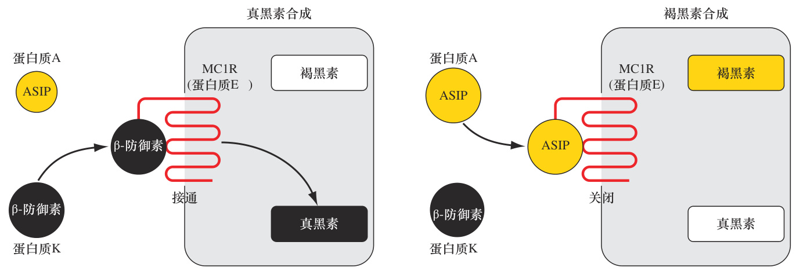  
(a)   
(b)  

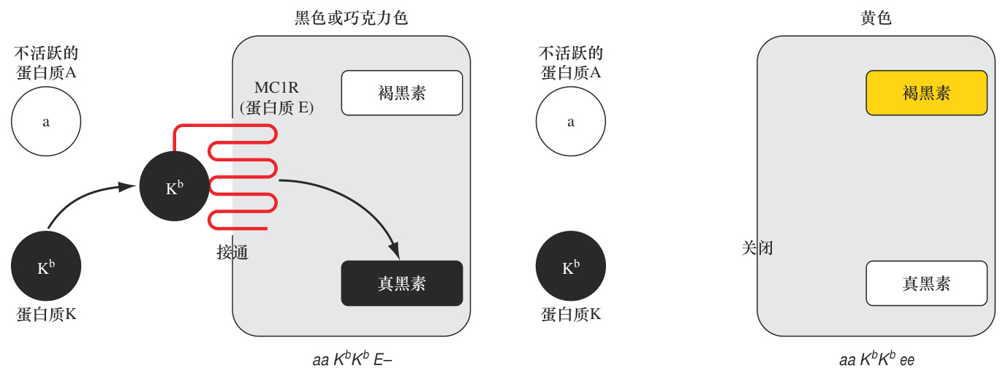  

图3.29　基因 $E$ 、A和K控制黑素细胞中浅色和深色色素合成之间的转换。MCR1被基因E影响。（a）左图： $\beta.$ -防御素（由K基因指定）在与MC1R结合中击败了ASIP，并激活了MC1R；黑素细胞产生真黑素（深色色素）。右图：当ASIP（由基因A编码）在MC1R固定上超过β-防御素时，黑素细胞产生褐黑素（浅色色素）。当被ASIP固定时，MCR1不表达。（b）左图：拉布拉多犬的等位基因 $K^{b}$ 所产生的β-防御素总是固定MC1R，因其表达强于等位基因a产生的ASIP。所以，真黑素被合成，且狗是黑色或巧克力色（取决于其基因B的等位基因）。右图：黄色拉布拉多犬的黑素细胞缺少MC1R（它们的等位基因ee无功能），所以只能产生褐黑素。  

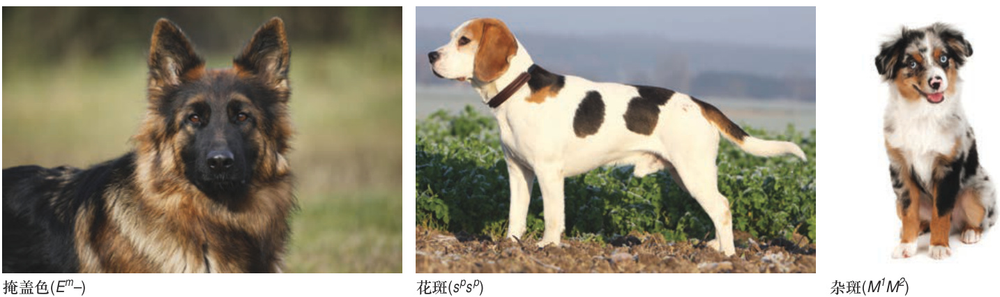  
图3.30　犬类体表颜色模式是一个多基因性状。决定三种犬类体表颜色模式的主要等位基因。（左）： $\copyright$ Tierfotoagentur/Alamy；（中）： $\copyright$ Vanessa Grossemy/Alamy；（右）： $\copyright$ Martin Rogers/Getty Images  

# 2. 基因B和D控制所有色素的沉着  

基因 $B$ 编码TYRP1——真黑素合成和黑素细胞中色素沉着所需的一种多功能蛋白质。等位基因B产生全功能的TYRP1，而等位基因b编码一种活性较弱的TYRP1。如前文所述， $E^{-}\;B^{.}$ -拉布拉多犬是黑色，因为真黑素密集沉着；而E- bb犬是棕色，因为产生的真黑素少且沉着不密集。因为TYRP1的作用取决于是否存在MC1R（由基因 $E_{.}$ 产生），ee对B和b都是上位（回顾图3.12和图3.13）。  

基因 $D$ 编码黑素亲和素（MLPH）——色素沉着所需的另一种蛋白质。基因 $D$ 的隐性等位基因编码一种形式的MLPH，其功能效率低于显性等位基因编码的MLPH。dd纯合体中MLPH活性较低，这使色素沉着更少，并因此导致其他基因编码的颜色被弱化。显性（正常）等位基因（ $D$ ）不弱化颜色。例如， $E^{-}\ B^{-}\ D^{.}$ -犬是黑色的，而E- B- dd犬是浅黑色。  

# 3. 基因S和M控制斑点  

基因S隐性等位基因的纯合犬（即 $S^{p}S^{p}$ ）是白色并伴有大块其他颜色的斑点，这种模式被称为花斑（图3.30）。犬只要有一个显性等位基因S就不会是花斑。基因S控制一种称为MITF的蛋白质，它是一种转录因子，用于表达（转录）控制色素产生所需酶的各种基因。等位基因 $S^{p}$ 产生一种比正常形式活性低的MITF。只有低水平MITF的黑素细胞前体细胞死亡，导致皮肤上出现白色部分，那里没有黑素细胞，也就没有色素。有时，黑素细胞前体细胞偶然有充足的MITF而存活，从而产生有颜色的斑点；这些颜色是由除S以外的其他基因决定的。  

第二个基因称为M，同样控制色素沉积的模式，并有共显性的等位基因 $M^{l}$ 和 $M^{2}$ 。等位基因 $M^{2}$ 是正常的，它编码真黑素沉积所需的一种称为PMEL的蛋白质。等位基因 $M^{I}$ 产生非正常的蛋白质，它干扰真黑素沉积并因此弱化颜色。 $M^{l}M^{2}$ 杂合体（被称为杂斑犬）表现为被弱化颜色的斑点（ $M^{l}$ 表型）和正常颜色的斑点（ $M^{2}$ 表型）（图3.30）。繁育人员无法将两只杂斑犬交配，因为基因 $Mww$ 是多向性的。等位基因 $M^{l}$ 导致隐性症状，即所谓的双杂斑犬（ $M^{l}M^{l}$ ）有包括听力和视力缺陷在内的严重健康问题。产生这些视力和听力问题的原因在于非正常的PMEL蛋白导致视网膜和耳内色素细胞死亡。  

犬类体表颜色的这个例子说明了变异的可能性，而这些基因只占已知的影响体表颜色的基因数量的一半。令人惊奇的是，这只是冰山的一角。犬类和人类都有约27 000个基因，在表型表现上将这些基因的各种等位基因联系起来的相互作用的数量如果不是数以亿计，也有百万之众。个体之间变异和多样性的可能性确实令人惊讶。  

# 基本概念  

●  在不完全外显时，一个表型在有相同基因型的个体中表现率不足 $100\%$ 。  
●  一个连续性状可以有两个极端表达之间的任意程度。这种类型的性状大多是多基因的，即由多个基因相互作用来控制。  
●  环境和偶然事件可以与基因相互作用来影响许多所谓的多因子性状的表达。  

# 接下来的内容  

孟德尔从简单但基础的现象中发现遗传机制，他的成功在于通过以小见大的实验来研究变异的遗传基础。孟德尔研究的只是一个物种中同系群体的几个性状。他针对每一个性状采取一个基因，该基因由一个完全显性和一个完全隐性等位基因来决定两种能够彼此区分或不连续的性状。显性和隐性等位基因都显示出完全外显率，其在表现度方面的区别可忽略不计。  

在20世纪的最初十年，许多生物学家质疑孟德尔分析的普遍适用性，因为它似乎并不能很好地解释大部分动植物性状遗传模式的复杂性或产生连续变异的机制。但将其稍加扩展就能证明连续变异的遗传基础，并为本章中所描述的看起来不符合孟德尔分析的情况提供了解释。每个扩展都对孟德尔分析的范围有所扩大，并加深了我们对变异的遗传基础的理解，且无论观察范围有多广，孟德尔体现在其第一分离定律中的基础结论总是成立的。  

那么关于基因独立组合的孟德尔第二定律呢？事实证明，其应用范围不像分离定律那么广泛。许多基因确实独立组合，但有些基因并非如此；更确切的说，是两个基因结合起来，并同时遗传给下一代。对这一事实的理解来自于将孟德尔的遗传单位［基因锁定为特定细胞器（染色体）］的研究。为了介绍研究人员如何推论出基因由染色体传递，第4章将确立包括等位基因分离在内的遗传的物理基础，并将解释为何一些基因独立组合，而另一些基因却并非如此。  

# 习题精解  

Ⅰ.  假设你在宠物店购买了一只白化病小鼠（基因型cc）。等位基因c对其他体表颜色基因上位。你如何确定这只小鼠的棕色基因座上的基因型？（在有色小鼠身上，BB和Bb是黑色，bb是棕色）  

# 解答  

这一问题需要了解基因相互作用，特别是对上位的正确理解。我们可以通过设计能够找出答案的杂交实验来解释。为了确定是否存在基因B的等位基因，需要排除基因型cc的障碍作用。因为只有隐性的c等位基因是上位的，当C等位基因存在时，不会发生上位。为了在交配中引入等位基因C，你用来与白化病小鼠交配的实验小鼠的基因型可以是CC或 $C c$ （如果小鼠是 $C c$ ，一半后代将是白化病并无法提供有效信息，但这一杂交中的非白化病小鼠能够提供很多信息）。实验小鼠的基因B携带什么等位基因？为了弄清楚这一点，需要用每个可能的基因型来评估预期结果。  

<html><body><table><tr><td>实验小鼠基因型</td><td>白化病小鼠</td><td>预期的非白化病后代</td></tr><tr><td rowspan="3">BB</td><td>X</td><td>BB 全是黑色</td></tr><tr><td>X Bb</td><td>全是黑色</td></tr><tr><td>bb</td><td>全是黑色</td></tr><tr><td rowspan="3">Bb</td><td>BB</td><td>全是黑色</td></tr><tr><td></td><td>Bb 3/4黑色，1/4棕色</td></tr><tr><td>bb</td><td>1/2黑色，1/2棕色</td></tr><tr><td rowspan="3">bb</td><td></td><td>BB 全是黑色</td></tr><tr><td></td><td>Bb 1/2黑色，1/2棕色</td></tr><tr><td>bb</td><td>全是棕色</td></tr></table></body></html>  

你可以从这些假设的杂交中发现基因型为Bb或$b b$ 的实验小鼠会对三种可能的白化病小鼠基因型产生确切结果。但bb实验小鼠更有用，且不确切的结果更少。首先，确定基因型为bb的小鼠更容易，因为棕色小鼠一定是这种纯合隐性基因型。其次，当你使用bb实验小鼠时，三种可能的基因型产生的结果完全不同（与之相反，无论白化病小鼠是Bb还是bb，Bb实验小鼠都能同时产生黑色和棕色后代，唯一有区别的特征是表型比率）。为了确定白化病小鼠的全部基因型，你需要将其同棕色小鼠（可能是CC bb或Cc bb）杂交。  

Ⅱ.  在一种特殊的观赏花卉中，野生花的颜色为深紫色，属纯合体。一种纯种突变植株的花朵色素沉积减少，呈淡紫色。另一种纯种突变植株的花朵没有色素沉积，呈白色。当第一种突变的淡紫色花朵植株与第二种突变的白色花朵植株杂交时，所有的 $\mathrm{F}_{1}$ 植株都开紫花。然后F1植株自交产生F2代，277个 $\mathrm{\Delta{F}}_{2}$ 植株中紫色、白色和淡紫色的比率为 $157:71:49$ 。a.  解释花色是如何遗传的。这一性状是由单一基因的等位基因控制的吗？b.  如果淡紫色的F2植株自交会产生什么样的后代？  

# 解答  

a.  单基因遗传的模式中有与这些数据相符的吗？可以观察到 $\mathrm{F}_{1}$ 植株与亲本双方都不同， $\mathrm{F}_{2}$ 代由三种不同表型组成，由此可以排除完全显性。 $\mathrm{F}_{2}$ 植株中三种表型的比率类似共显性和不完全显性所预期的 $1:2:1$ 比率，但该结果说明紫色植株是杂合体。这与所给信息，即紫色植株是纯种相矛盾。现在来考虑两个基因的可能性。两个基因杂合的植株杂交（W和 $P$ ）， $\mathrm{F}_{2}$ 代中基因型W- $P-$ 、 $W-$ $p p$ 、ww $P-$ 和ww $p p$ 的比率应为 $9:3:3:1$ （其中连字符号表示等位基因既可以是显性，也可以是隐性）。 $9:3:3:1$ 比率的任何组合中有与此例中 $\mathrm{F}_{2}$ 代的比率相近的吗？数字与 $9:4:3$ 比率最接近。什么假设能够支持两个基因型的合并（3+1）？如果 $\boldsymbol{w}$ 对基因 $P$ 上位，则基因型类别ww$P$ -和ww $p p$ 有相同的白色表型。根据这一解释，淡紫色F2中有1/3是 $W W p p$ ，其余2/3是 $W w\,p p$ 。  

b.  自交时WW $p p$ 植株只产生淡紫色（WW pp）后代，而Ww pp植株产生的后代中淡紫色（ $W^{-}\,p p$ ）和白色（ww pp）的比率是 $\cdot3:1$ 。  

Ⅲ.  亨廷顿病是人类的一种罕见显性遗传疾病，会导致神经系统产生不可逆的发育迟缓。该疾病显示了所谓的年龄依赖外显率，也就是说，亨廷顿病基因型的人表达该表型的概率随年龄而变化。假设遗传有亨廷顿病等位基因的人中有 $50\%$ 在40岁时表现出症状。苏珊是一位年龄为35岁的女性，其父患有亨廷顿病。她目前没有表现出症状。苏珊在5年内表现出症状的概率是多少？  

# 解答  

这一问题包含概率和外显率。苏珊表现出疾病症状需要两个条件。她有一半的概率（ $50\%$ ）从父亲遗传突变等位基因，如果她真的遗传到了该疾病的等位基因，又有一半的概率（ $50\%$ ）在40岁时表现出这一表型。因为这些是独立事件，概率是单个概率的乘积，或者说是1/4。  

# 习题  

# 词汇  

1. 在右列中选择与左列中的术语最匹配的短语。  

a. 上位 1.  影响不止一个表型的一个基因  
b. 修饰基因 2.  一个基因的等位基因掩盖另一个基因的等位基因的作用  
c. 条件致命 3.  两个亲本的表型都表现在 $\mathrm{F}_{1}$ 杂种中  
d. 允许条件 4.  一个基因中可继承的变化  
e. 降低的外显率 5.  一个基因，其等位基因改变由其他基因的作用而产生的表型  
f. 多因素性状 6.  拥有某个特定基因型的个体只有不足$100\%$ 表现出该表型  
g. 不完全显性 7.  使条件致命得以存活的环境条件  
h. 共显性 8.  由至少两个基因的等位基因相互作用或基因与环境相互作用产生的性状  
i. 突变 9.  由相同基因型的个体表现出强度不同的相关表型  
j. 多向性 10.  在一些情况下（如高温）致命，但在其他情况下可存活的基因型  
k. 可变表现度 11.  与所有纯合体都不同的杂合体  

# 3.1节  

2.  在紫茉莉花中，红花等位基因对白花等位基因不完全显性，所有杂合体开粉花。下列杂交的后代中花朵颜色成什么比例：（a）粉 $\times$ 粉，（b）白 $\times$ 粉，（c）红 $\times$ 红，（d）红 $\times$ 粉，（e）白 $\times$ 白，（f）红 $\times$ 白？如果你特别想产生粉花，这些杂交中哪一个最有效？  

3.  图3.3中金鱼草的Aa杂合体是粉色，而AA纯合体是红色。但孟德尔的豌豆花中 $P p$ 杂合体与PP纯合体一样都是紫花（图2.8）。假设等位基因A与等位基因 $P$ 编码功能酶，等位基因a和 $|p|$ 不编码蛋白质，请解释为什么基因A的等位基因和基因 $P$ 的等位基因相互作用如此不同。  

4.  回顾第2章（图2.20），孟德尔的基因R控制一种称为Sbe1的形成支链淀粉的酶。显性等位基因（R）产生蛋白质，隐性等位基因（r）无功能。当研究圆形或褶皱豌豆的表型时， $R$ 对r完全显性：RR和Rr豌豆都是圆形，rr豌豆是褶皱的。假设所述表型是豌豆中Sbe1蛋白分子的平均值。你如何描述这里R和r之间的显隐性关系？  

5.  在果蝇（Drosophila melanogaster）中，黑色体表（ebony）由等位基因 $e$ 决定。等位基因 $e^{+}$ 产生正常野生型、蜂蜜色体表。在两个等位基因的杂合体（但不是 $e^{+}e^{+}$ 杂合体）中，可以在胸部看到被称为三叉戟的黑色斑纹，但身体其他部分是蜂蜜色的。因此e 和e是不完全显性。  

a.  当雌性 $e^{+}e^{+}$ 果蝇与雄性 $e^{+}e$ 果蝇杂交，其后代有黑色三叉戟斑纹的概率是多少？b.  有三叉戟斑纹的果蝇互相交配，300个后代中有几个三叉戟、几个ebony体表，以及几个蜂蜜色体表？  

6.  两个有黄色花朵的植物杂交产生80个后代，其中，38个开黄花，22个开红花，20个开白花。如果假设花色的这一变异是单基因座上的遗传，与各个花色相应的基因型是什么？如何描述花色的遗传？  

7.  在萝卜中，颜色和形状各由一个单基因座控制，每个单基因座上有两个不完全显性的等位基因。颜色可能是红色（RR）、紫色（ $R r\_$ ）或白色（ $r r$ ），而形状可以是长（ $L L$ ）、椭圆 $\ (L l)$ 或圆（ll）。两个基因座杂合体的两个植株杂交产生的后代会有怎样的表型类别和比例？  

8.  两个野生豆科类植物杂交，其中一个有白花和长豆荚，另一个有紫花和短豆荚。F1代自交，F2代有301个长紫、99个短紫、612个长粉、195个短粉、295个长白和98个短白。这些性状是如何遗传的？  

9.  假设下列情形不涉及孟买表型（如果你已提前阅读了3.2节）：  

a.  如果一个女孩是O型血，她父母的基因型和相应的表型是什么？  
b.  如果一个女孩是B型血，且她的母亲是A型血，她父亲的基因型和相应的表型是什么？  
c.  如果一个女孩是AB型血，且她的母亲也是AB型血，不可能是该女孩父亲的男性的基因型和相应的表型是什么？  

10.  除ABO基因（I）之外，人类的数个基因在红细胞表面产生可识别抗原。基因MN和Rh就是其中两例。基因座Rh上有一个积极等位基因或一个消极等位基因，其中积极等位基因对消极等位基因显性。M和N是基因MN的共显性等位基因。下表列出了几位母亲和她们各自的孩子，请在右列的男性中为每对母子选择相应的父亲，假设每个男性都只有一个孩子。  

<html><body><table><tr><td>母亲</td><td></td><td>孩子</td><td>父亲</td></tr><tr><td>a.</td><td>OMRh（积极）</td><td>BMN（消极）</td><td>OMRh（消极）</td></tr><tr><td>b.</td><td>BMNRh（消极）</td><td>ONRh（消极）</td><td>AMRh（积极）</td></tr><tr><td>C.</td><td>OMRh（积极）</td><td>AMRh（消极）</td><td>OMNRh（积极）</td></tr><tr><td>d.</td><td>ABNRh（消极）</td><td>BMNRh（消极）</td><td>BMNRh（积极）</td></tr></table></body></html>  

11.  决定扁豆种子表皮图案的基因的等位基因有以下显隐性序列：大理石纹 $>$ 斑点 $\equiv$ 麻点（共显性等位基因） $>$ 光洁。大理石纹等位基因的纯合植株与斑点等位基因的纯合植株杂交，麻点纯合植株与光洁纯合植株杂交。第一个杂交产生的F1代与第二个杂交产生的F2代交配。  

a.  这两种F 交配后产生的表型及其比例是什么？b.  两个原始亲本杂交产生的F 代有什么表型？  

12.  一名同学告诉你无法知道图3.4（a）中的斑点和麻点扁豆图案是否由于单个基因的共显性等位基因（ $C^{s}$ 和 $C^{D}$ ）产生。他说斑点是由基因S控制的，该基因的完全显性等位基因S控制斑点的产生，隐性等位基因s不控制斑点。他还说麻点是由另一个基因 $D$ 控制的，其中的完全显性等位基因 $D$ 控制麻点，隐性等位基因d控制无麻点。如果他是正确的，图3.4（a）中的信息是否符合他的观点？请说明理由。  

13.  在一个野兔群体中，你发现三种不同的体表颜色表型：chinchilla（C）、himalaya（H）和Albino（A）。为研究体表颜色的遗传，你将每个野兔个体杂交，并将结果记录在了下表中。  

<html><body><table><tr><td>杂交编号</td><td>亲本表型</td><td>后代表型</td></tr><tr><td>1</td><td>HxH</td><td>3/4 H:1/4 A</td></tr><tr><td>2</td><td>H×A</td><td>1/2 H:1/2A</td></tr><tr><td>3</td><td>CxC</td><td>3/4C:1/4H</td></tr><tr><td>4</td><td>C×H</td><td>全部都是C</td></tr><tr><td>5</td><td>CxC</td><td>3/4C:1/4A</td></tr><tr><td>6</td><td>Hx A</td><td>全部都是H</td></tr><tr><td>7</td><td>CxA</td><td>1/2 C:1/2A</td></tr><tr><td>8</td><td>A ×A</td><td>全部都是A</td></tr><tr><td>6</td><td>CxH</td><td>1/2C:1/2H</td></tr><tr><td>10</td><td>CxH</td><td>1/2C:1/4H:1/4A</td></tr></table></body></html>  

a.  关于这一野兔群体的体表颜色遗传你能得出什么结论？  
b.  确定这10个杂交中每个亲本的基因型。  
c.  如果将杂交9和10的chinchilla亲本再次杂交，会得到怎样的后代，其比例又是什么？  

14.  在苜蓿中，叶片形状是由单基因决定的，该基因有数个相关的等位基因，它们呈一定的显隐性序列，该基因不是多向性的。这一基因的7个等位基因已知；决定一种形状缺失的一个等位基因对其他6个等位基因隐性，这6个等位基因各自产生一种不同的形状。等位基因的所有杂合体组合都显示出完全显性。  

a.  7个等位基因都存在的苜蓿群体中有多少种可能的叶片形状（包括形状缺失）？  
b.  最多有几个基因型与一个表型对应？有只能被一个基因型代表的表型吗？  
c.  在一片土地上尽管能找到少量植株代表了所有可能的形状，但你发现大部分苜蓿植株的叶片缺少一种形状。请解释这一现象。  

15.  有一个卷曲翅膀等位基因（ $C y$ ）和一个正常翅膀等位基因（ $C y^{+}$ ）的果蝇有卷曲的翅膀。当两个卷曲翅膀的果蝇杂交时，产生203只卷曲翅膀和98只正常翅膀的果蝇。事实上，卷曲翅膀果蝇的所有杂交几乎都产生同样的卷曲，这是后代的正常比率。  

a. 这些后代中的大致表型比率是多少？b. 请解释这一数据。c.  如果一只卷曲翅膀果蝇与一只正常翅膀果蝇杂交，产生的180只后代中两种类型的数量各有多少？  

16.  在一些植物，如番茄和矮牵牛花中，有100多种已知等位基因的高度多态不亲和性基因S阻碍自交，且促进远系繁殖。在这种形式的不相容中，一个植株无法接受携带同它的任一不亲和性等位基因相同的等位基因的精子。例如，当花粉携带不亲和性基因的等位基因Sl的精子，并落在同样携带等位基因Sl的植株的柱头（雌性器官）上时，该精子无法使这一植株的任何卵细胞受精（出现这一现象的原因在于柱头上的花粉颗粒无法长出花粉管使精子与卵细胞结合）。指出下列杂交是否能产生后代，如果能，则列出这些后代所有可能的基因型。a. $\delta\;S^{l}\;S^{2}\;\times\;\;\mathcal{Q}\;\;S^{l}\;S^{2}$ $\mathbf{b.}~\mathcal{J}~S^{I}~S^{2}~\times~\mathcal{G}~S^{2}~S^{3}$ c $.\;\mathcal{S}\;S^{I}\;S^{2}\;\times\;\mathcal{G}\;\;S^{3}\;S^{4}$ d. 解释这一不亲和性机制如何阻碍植物自交。e.  这一不亲和性系统如何确保所有的植株都是基因S不同等位基因的杂合体？f. 如何得知豌豆不受这种不亲和性机制的影响？g.  解释进化为何有利于新的不亲和性等位基因的出现，从而使番茄和矮牵牛花群体中的基因更加多态。  

17.  在一种热带鱼中出现了一种称为蒙特苏马的橙色和黑色品种。当两个蒙特苏马杂交时，后代中2/3是蒙特苏马，1/3是野生型深灰绿色。蒙特苏马是一个单基因性状，且蒙特苏马鱼从不是纯种的。  

a.  解释这里的遗传模式，并证明你的解释如何说明所给的表型比率。  
b.  在同样的物种中，鱼鳍形态细胞被一个名为f的隐性等位基因纯合体从正常变为褶皱。当正常鱼鳍纯合体的蒙特苏马鱼与绿色褶皱鱼鳍的鱼杂交时，会得到什么样的后代？其比例是什么？  
c.  题目b中的两个蒙特苏马后代杂交后产生的后代中表型比率是什么？  

18.  基因SMARCAD1的正常和无功能突变等位基因杂合的人患有一种被称为皮纹病的疾病。皮纹病有时也被称为移民延迟疾病，因为没有指纹的人在取得护照时会遭遇困难。不存在无功能突变等位基因的杂合体，因为他们从未出生。请描述SMARCAD1的突变和野生型等位基因的显隐性关系。  

19.  一位血液学家在20世纪60年代根据福格特（Fugate）家庭圣经和肯塔基州佩里县的历史记录建立了Trou-blesome Creek的蓝色人种系谱。Fugate家族的许多成员有蓝色皮肤，这是一种罕见但无害的疾病，被称为高铁血红蛋白症。这一系谱中的其他人嘴唇和指尖是蓝色的，但他们身体的其他部位正常。蓝色是由于缺乏心肌黄酶NADH的功能，这种酶可以修复被氧化损坏的血红蛋白。未被修复的血红蛋白积聚产生蓝色色素。  

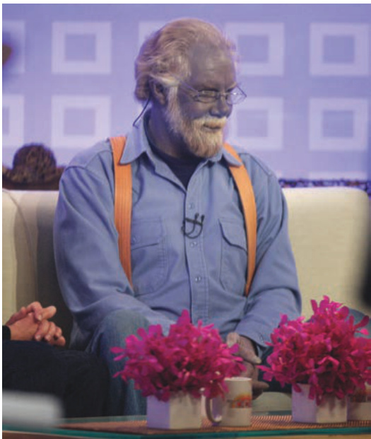  
$\copyright$ James Devaney/Getty Images  

a.  在该系谱的基础上描述心肌黄酶NADH基因的野生型和突变等位基因之间的显隐性序列。  
b.  该系谱列出了有蓝色嘴唇和指尖的人，但这一历史记录是不完整的。图表中有这一表型的人还有哪些？对存在的可能性进行解释（如果你已读过3.3节，假设蓝色嘴唇和指尖的表型是完全外显的）。  
c.  这一系谱中的一对婚配可能是同族婚姻，在图中用一条水平虚线和一条水平实线表示。之所以不确定，是因为历史记录未说明第一行左面的Martin Fugate的妻子Mary［Mary（？）］姓Ritchie  

还是Smith，或者都不是。请解释基因学家为何认为Mary可能姓Ritchie或Smith。  

d.  该系谱中所有的蓝人（患有高铁血红蛋白症的人）都姓Fugate，但蓝色突变并不是起源于Fugate家族。是哪些（个）人将突变的心肌黄酶NADH等位基因带进了Fugate家族？  

# 3.2节  

20.  一只有walnut鸡冠形态的公鸡与一只有single鸡冠形态的母鸡杂交，后代F1都有walnut鸡冠。当F1的雄性和雌性彼此交配时， $\mathrm{F}_{2}$ 代中有93个walnut鸡冠和11个single鸡冠，但也有29只鸡有一种称为rose的新型鸡冠，32只鸡有另一种称为pea的鸡冠。  

a. 解释鸡冠形态是如何遗传的。  
b.  有rose鸡冠的纯合体母鸡和有pea鸡冠的纯合体公鸡杂交会产生什么后代？ $\mathrm{F}_{2}$ 代的表型及其比率如何？  
c.  一只walnut公鸡和一只pea母鸡杂交，其后代由12只walnut鸡、11只pea鸡、3只rose鸡和4只single鸡组成。其亲本可能的基因型是什么？  
d.  另一只walnut公鸡和rose母鸡杂交，所有的后代都是walnut。其亲本可能的表型是什么？  

21.  一匹黑色母马与一匹栗色公马杂交产生红棕色的公马和母马。这两个后代进行数次交配，产生的后代有四种体表颜色：黑色、红棕色、栗色和肝色。将第三代的一匹肝色公马与第一代黑色母马杂交产生一匹黑色马驹，将第三代的一匹肝色母马与第一代栗色公马产生一匹栗色马驹。请解释体表颜色是如何在这些马匹中遗传的。  

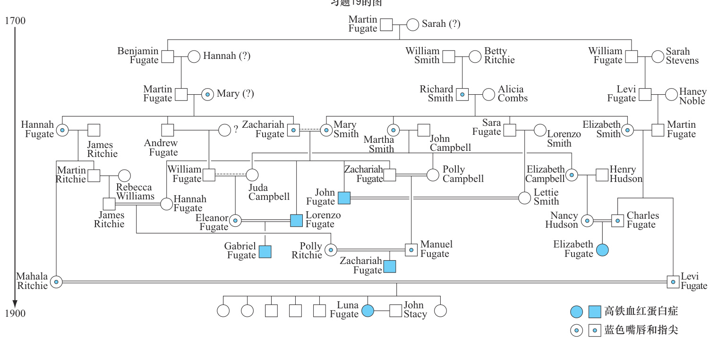  

22. 用有颜色填充的形状图案表示耳聋个体。  

a. 研究该系谱并解释耳聋是如何遗传的。b.  第Ⅴ代个体的基因型是什么？他们为什么不耳聋？  

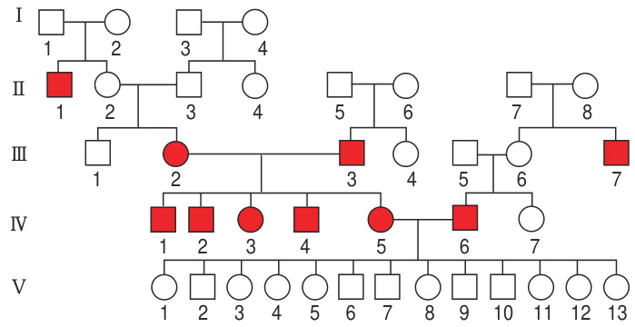  

23.  你将两种纯种意大利青瓜进行杂交，其中一个有绿色果实，另一个有黄色果实。 $\mathrm{F}_{1}$ 全是绿色的，但当它们杂交时， $\mathrm{F}_{2}$ 中绿色和黄色的比率为 $9:7$ 。  

a. 请解释这一结果。两个亲本基因型是什么？  
b. 说明F1植株测交后代的表型及其比率。  
c. 描述观察到的上位互动。  
d.  假设显性等位基因编码功能酶，且隐性等位基因无功能。请给出能够解释基因相互作用的生化过程。  
e.  将两种不同的纯种黄色意大利青瓜杂交能得到全部为绿色的后代吗？亲本和后代的基因型是什么？  
f.  假设野生型意大利青瓜是绿色的，如何解释题目e的F 中出现的现象？  

24.  两种纯种白花（Illegitimati noncarborundum）植株交配，所有的F1都是白花。 $\mathrm{F}_{1}$ 自交得到126个白花和33个紫花植株。a.  你如何描述花色的遗传？请描述特定等位基因如何互相影响并因此影响表型。b.  将白花F2植株自交，后代中有3/4是白花，1/4是紫花。白花F2植株的基因型是什么？c.  将紫花F 植株自交，后代中有3/4是紫花，1/4是白花。紫花F2植株的基因型是什么？d.  将两个白花F2植株杂交，后代中有1/2是紫花，1/2是白花。两个白花F2植株的基因型是什么？  

25.  假设图3.16所示的生化过程中的中间物无色前体2是蓝色，而不是无色。a. $\mathrm{F}_{2}$ 的表型比率是什么？（蓝色与紫色有明确的区分）b.  请描述与这一新的表型比率相应的基因相互作用的类型。  

26.  请解释上位和显性之间的区别。二者分别涉及几个基因座？  

27.  显性等位基因H减少果蝇身体上刚毛的数量，从而产生无毛表型。在纯合体中， $H$ 是致命的。显性等位基因S不影响刚毛的数量，除非存在 $\mathcal{H}$ ，这时单个等位基因S抑制无毛表型并因此恢复刚毛数量。但是S也对纯合体致命。  

a.  两个都携带被抑制的等位基因H的正常果蝇杂交，其存活的后代中有正常刚毛的个体和无毛个体的比率是什么？  
b.  当上一杂交中的无毛后代与题目a中的正常亲本果蝇（即携带被抑制的等位基因H的果蝇）杂交，后代将有怎样的表型比率？  

28.  分泌腺（基因型SS和Ss）在唾液和其他体液中分泌A型血和B型血抗原，而非分泌腺（ss）无此功能。如果以唾液分类时，IAIBSs女性与IAIASs男性的后代中各种血型的表型比率是什么？  

29.  正常情况下，紫罗兰有带深棕色斑纹的黄色花瓣和笔直的茎。假如你发现了一个植株有白色花瓣、无斑纹和俯卧的茎，你要进行怎样的实验才能确定这一非野生型表型是由数个不同的突变基因决定，还是由单个基因座上等位基因的多向性作用决定？请解释你的实验如何解决这一问题。  

30.  一名B型血的女性有一个A型血孩子，她的丈夫是O型血。愤怒的父亲认为孩子不是自己的，尽管他的妻子声称自己是无辜的。你认为妻子犯有通奸罪吗？请解释。  

31.  下表显示一个系谱中个体的血样对抗A血清和抗B血清的反应。抗A这一行的一个加号 $\left(\;+\;\right)$ 表示该个体的红细胞被抗A血清凝结，所以该个体有A抗原；一个减号（-）表示没有凝结。同样的符号也被用于说明对B抗原的试验。  

-1 -2 -3 -4 -1 -2 II-3 -1 -2 A $^+$ + + + + B $^+$ + + +  

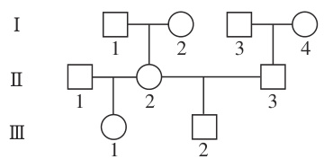  

a. 根据表中的数据推断每一个个体的血型。b.  根据这些数据尽可能精确地指出各血型匹配的基因型，并解释系谱所示的遗传模式。假设所有的基因型关系都如系谱所示（即没有错误的亲子关系）。  

32.  三种产生白粒玉米穗的纯种玉米互相杂交，每个杂交产生的F1都是红粒，而F2代中观察到的红粒和白粒的比率为 $9:7$ 。杂交结果见下表。  

<html><body><table><tr><td></td><td>F</td><td>F2</td></tr><tr><td>白-1x 白-2</td><td>红</td><td>9红：7白</td></tr><tr><td>白-1x 白-3</td><td>红</td><td>9红：7白</td></tr><tr><td>白-2x 白-3</td><td>红</td><td>9红：7白</td></tr></table></body></html>  

a. 有几种基因决定这三个品种的玉米穗颜色？  

b.  定义一种符号，并指出纯种白-1、白-2和白-3基因型。c.  用图表解释白-1和白-2的杂交，并指出F1和 $\mathrm{F}_{2}$ 的基因型和表型。解释所观察到的 $y:7$ 比率。  

33.  小鼠的基因agouti的等位基因 $A^{Y}$ 是一个隐性致死等位基因，但它是显性并决定黄色体表。基因agouti杂合（基因型 $A^{Y}\!A$ ）和基因albino杂合（ $C c$ ）的小鼠，与基因agouti杂合（基因型 $A^{Y}\!A$ ）的albino小鼠（ $c c$ ）杂交的后代有怎样的表型及比率？  

34.  一名爱好钓鱼的学生从卡尤加湖中钓出了一条不寻常的鲤鱼——这条鱼身上没有鱼鳞。她决定调查一下这种奇怪的无鳞表型是否有遗传基础。因此，她找了一些有野生型鱼鳞表型（鱼身被排列整齐的鱼鳞覆盖）的纯种近交鲤鱼，并将它们与无鳞鲤鱼杂交。令她感到惊奇的是，F 后代由两种比率为 $1:1$ 的鲤鱼组成，一种是野生型鲤鱼，另一种鲤鱼的身体两侧各有呈线状排列的一条鱼鳞。  

a.  有两个等位基因的单个基因能导致这一结果吗？为什么？  

b.  继第一次杂交之后，该学生将 $\mathrm{F}_{1}$ 的线型鱼鳞鲤鱼互相杂交，其后代由4种表型组成：线型鱼鳞、野生型鱼鳞、无鳞和分散鱼鳞（即少量鱼鳞不规则分布于体表）。这些表型相应的比率为$6:3:2:1$ 。这些表型是由几个基因决定的？  

c.  同时，该学生将 $\cdot\mathrm{F}_{1}$ 代有野生型表型的鲤鱼互相杂交，并观察到其后代中野生型鱼鳞和分散鱼鳞的比率为 $3:1$ 。有几个基因及其等位基因来决定野生型鱼鳞和分散鱼鳞的区别？  

d.  该学生通过将这些分散鱼鳞的鲤鱼同纯种野生型鲤鱼杂交来证实题目c中的结论。请用图表说明该杂交中的亲本、 $\mathrm{F}_{1}$ 和 $|\mathrm{F}_{2}|$ 的基因型及表型，并指出观察到的比率。  

e.  该学生试图通过育种来产生纯种无鳞鲤鱼，但她发现这是不可能的。每当她将两条无鳞鲤鱼杂交时总是得到无鳞和分散鱼鳞的后代，其比率为$2:1$ （这些杂交中的分散鱼鳞鲤鱼是纯种的）。  

请用图表说明无鳞 $\times$ 无鳞杂交中该基因的表型和基因型，并解释这一变化了的孟德尔比率。  

f.  现在该学生认为她能够解释所有的实验结果。请用图表说明该学生在题目b中所进行的线型 $\times$ 线型杂交的基因型。给出在其后代中所观察到的4种表型的基因型，并解释 $\cdot6:3:2:1$ 比率。  

35.  假设一种植物的蓝色花朵是由两个基因A和 $B$ 控制的。显性等位基因A和B编码的蛋白质通过以下过程发挥作用。从一个无色前体产生蓝色色素同时需要蛋白质A和B。蛋白质A和B还分别独立抑制从另一个无色前体产生蓝色色素，也就是说，蛋白质A或B其中的一个就足以抑制从前体2产生蓝色色素。隐性突变等位基因a和b不编码蛋白质。两种不同的纯种突变白花植株杂交时可以观察到互补，所以所有的$\mathrm{F}_{1}$ 都是蓝色。  

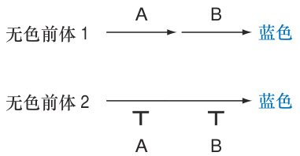  

a. 每种白花突变和F1的基因型是什么？b. 如果 $\mathrm{{.F_{1}}}$ 自交， $\mathrm{F}_{2}$ 将有怎样的表型比率？  

36.  该问题旨在考察孟德尔 $9:3:3:1$ 比率变化的可能的生化解释。除有特别说明外，化合物1、2、3、4及其混合物都有不同的颜色，A和B是生化过程中催化所指步骤的酶。等位基因A和 $B$ 分别编码功能酶A和B，它们对不编码任何相应酶的等位基因a和b完全显性。如果存在功能酶，则假设箭头左面的化合物能被完全转化为箭头右面的化合物。每个生化过程中A $\textit{u B b}\times A a\textit{B b}$ 形式的双因子杂种杂交的后代会产生怎样的表型比率？  

a. 独立的生化过程b. 冗余过程  

酶A 化合物1 化合物2 酶B  

c. 连续过程  

化合物 $1\xrightarrow{\sharp\sharp\mathrm{\tiny.A}}$ 化合物 $2\xrightarrow{\sharp\sharp\mathrm{\tiny~B}}$ 化合物3d. 同时需要酶A和B来催化所指的反应化合物1 酶A+酶B 化合物2e.  分支过程（假设有足够进行两个过程的化合物1）  

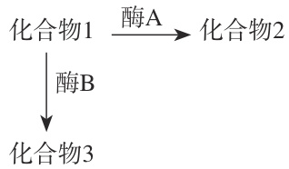  

f.  现在请思考与题目a类似的独立生化过程，但化合物2的存在掩盖了其他所有化合物产生的颜色。  
g.  接下来请思考题目c的连续过程，但化合物1和2的颜色相同。  
h.  最后请思考以下过程。这里的化合物1和2有不同的颜色，A编码的蛋白质阻碍化合物1向化合物2的转化。 $B$ 编码的蛋白质阻碍蛋白质A的作用。  

  

37.  请思考你对第36题的答案， $\mathrm{F}_{2}$ 代中 $9:3:3:1$ 比率的特定变化能让你推断出决定这些表型的特定生化机制是如何运行的吗？与之相反，如果已知基因相互作用的一种生化机制，你能预测 $\mathrm{F}_{2}$ 代的表型比率吗？  

# 3.3节  

38.  你抓到了两只从动物设施的实验兽笼中逃跑的小鼠（一雌一雄），一只是黄色，另一只是棕色agouti（agouti毛发有带状的黄色，而非agouti毛发是单色的）。你已知这批小鼠只有三种决定体表颜色的基因及其等位基因：基因A的agouti（A）或非agouti（a）或黄色等位基因（ $A^{Y}$ ）（ $A^{Y}{>}A\!>\!a$ ； $A^{Y}$ 是隐性致死）；基因 $B$ 的黑色（ $B$ ）或棕色（b）等位基因（ $B\!>\!b$ ）；以及基因 $C$ 的白化病（c）或非白化病（ $C$ ）等位基因（ $C\!>\!c$ ； $c c$ 对其他所有表型上位）。但你不知道自己抓到的小鼠携带的具体是哪个基因的哪种等位基因，为了决定基因型，你将这两只小鼠进行交配。第一次生育产生了三只小鼠：一只白化病，一只棕色（非agouti），第三只是黑色agouti。  

a.  你抓到的两只小鼠有基因 $A$ 、 $B$ 和 $C$ 的哪些等位基因？  
b.  两只亲本生育了几次后得到了很多后代。这些后代群体会有多少种不同的体表颜色表型（总数）？这些表型及其基因型是什么？  

39.  图3.21和图3.28（b）都显示了由两个基因控制的性状，每个基因都有两个不完全显性的等位基因。但图3.21中的基因相互作用产生了9种不同的表型，而图3.28（b）所示的情况只产生了5种可能的表型类别。如何解释表型变化数量的这一区别？  

40.  果蝇的三个基因影响一个特定的性状，产生野生型表型需要每个基因的一个显性基因。a.  如果你将三重杂合果蝇杂交，其后代中会产生什么表型比率？b.  你将某个特定的野生型雄性果蝇依次与三个实验品种杂交，在与一个实验品种（ $A A\ b b\ c c$ ）的杂交中只有1/4的后代是野生型，在与另外两个实验品种（aa BB cc和aa bb CC）的杂交中有一半的后代是野生型。该野生型雄性的基因型是什么？  

41.  园艺花卉蛾蝶花（Salpiglossis sinuata）有很多不同的颜色。将纯种亲本进行数次杂交来产生 $\mathrm{{F}_{1}}$ ，然后将 $\mathrm{F}_{1}$ 自交来产生 $\mathrm{F}_{2}$ 。  

<html><body><table><tr><td>亲本</td><td>F表型</td><td>F2表型</td></tr><tr><td>红×蓝</td><td>全红</td><td>102红、33蓝</td></tr><tr><td>淡紫×蓝</td><td>全淡紫</td><td>149淡紫、51蓝</td></tr><tr><td>淡紫×红</td><td>全青铜色</td><td>84青铜色、43红、41淡紫</td></tr><tr><td>红×黄</td><td>全红</td><td>133红、58黄、43蓝</td></tr><tr><td>黄×蓝</td><td>全淡紫</td><td>183淡紫、81黄、59蓝</td></tr></table></body></html>  

a. 提出一种假设用来解释蛾蝶花的花色遗传。b. 给出5个杂交的亲本、F 代和F 代的基因型。c.  纯种黄色和纯种淡紫色植株杂交，所有的F 后代都是青铜色。如果用这些F 来产生 $\mathrm{F}_{2}$ ，会得到什么表型及其比率？有没有一种基因型能产生一种无法从之前的实验中预测的表型？如果有，它是如何改变F2的表型比率的？  

42.  毛地黄有三种不同的花瓣表型：白色红点（WR）、深红（DR）和浅红（LR）。通过纯种DR和LR品种两代杂交可以区分出两种不同的纯种WR品种（WR-1和WR-2）：  

<html><body><table><tr><td rowspan="2"></td><td rowspan="2">亲本</td><td rowspan="2">F</td><td colspan="3">F2</td></tr><tr><td>WR</td><td>LR</td><td>DR</td></tr><tr><td>1</td><td>WR-1 xLR</td><td>全是WR</td><td>480</td><td>39</td><td>119</td></tr><tr><td>2</td><td>WR-1 × DR</td><td>全是WR</td><td>99</td><td>0</td><td>32</td></tr><tr><td>3</td><td>DR x LR</td><td>全是DR</td><td>0</td><td>43</td><td>132</td></tr><tr><td>4</td><td>WR-2 × LR</td><td>全是WR</td><td>193</td><td>64</td><td>0</td></tr><tr><td>5</td><td>WR-2xDR</td><td>全是WR</td><td>286</td><td>24</td><td>74</td></tr></table></body></html>  

a.  关于毛地黄的花瓣表型遗传你可以得到什么结论？b.  将基因型分别对应于与4种纯种亲本（WR-1、WR-2、DR和LR）。c.  杂交1的 $\mathrm{~\vec{F}}_{2}\mathrm{~\stackrel{.}{}~}$ 代中的WR植株与LR植株杂交，产生的500个后代中有253个WR、124个DR和123个LR植株。该 $\mathrm{WR}\times\mathrm{LR}$ 杂交中亲本的基因型是什么？  

43.  在一种果蝇中，任意两个有多毛翅膀的果蝇（翅膀边缘非正常地长有额外的细小绒毛）交配总是产生多毛翅膀和正常翅膀的果蝇，且其比例为 $2:1$ 。现在，你将这种多毛翅膀的果蝇同4种正常翅膀的果蝇杂交，其结果见下表。假设只存在多毛翅膀基因的两个等位基因（一个是多毛翅膀，另一个是正常翅膀），4种正常翅膀果蝇的基因型是什么？  

与多毛翅膀果蝇杂交所得的后代  
  

<html><body><table><tr><td>正常翅膀果蝇的类型</td><td>正常翅膀的比例</td><td>多毛翅膀的比例</td></tr><tr><td></td><td>1/2</td><td>1/2</td></tr><tr><td>2</td><td>一</td><td>0</td></tr><tr><td>3</td><td>3/4</td><td>1/4</td></tr><tr><td>4</td><td>2/3</td><td>1/3</td></tr></table></body></html>  

44.  如下图所示，拟南芥（Arabidopsis thaliana）在正常情况下有4种不同的器官：萼片（叶片）、花瓣、花粉囊（雄性性器官）和心皮（雌性性器官）。右图所示的突变品种呈非正常的花朵形态——这种花朵全部由萼片组成！三个基因（分别为SEP1、SEP2和SEP3）在生化过程中冗余地发生作用来产生萼片、花粉囊和心皮。正常的花朵形态只需要这些基因的一个显性且功能正常的等位基因：SEP1（A）或SEP2（B）或SEP3（ $C$ ）。这些基因的隐性突变等位基因（a、b或 $c$ ）不编码蛋白质。  

a.  下图中突变植株的基因型是什么？  
b.  在AA bb $c c\times a a$ BB CC三基因杂种杂交中，所有的 $\mathrm{F}_{1}$ 代都是Aa Bb Cc， $\mathrm{F}_{2}$ 代中正常植株的比例是多少？  
c.  请提出一种模式来解释阿拉伯芥的基因组如何获得了三种冗余基因。  

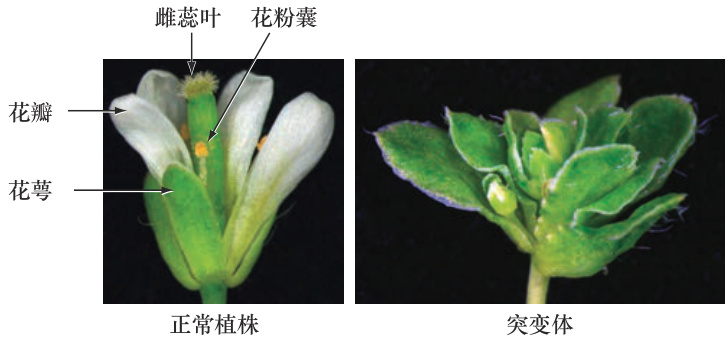  
$\copyright$ ©SSaanndrdar a BBieiewweresr,s ,wwwwww..ssyyssfflloo..eedduu  

45.  一对夫妻想要知道他们未出生的孩子患有手裂畸形的概率，这位准父亲患有该疾病，他在下文所示的系谱中由一个箭头指出（该箭头表明他是一名渊源者——一个家庭中首先引起医护工作者注意该疾病的人）。下图所示的这种性状在人群中非常罕见，且这对准父母之间没有亲属关系。  

a.  该性状的遗传模式是什么？  

b.  该性状的外显率有多大［即一个系谱中表现出该性状的个体（分子）在该系谱中无论是否有该性状但已知确实携带决定这一性状的基因型的个体（分母）中的比例？］  

c.  根据上述题目b的答案，你会如何告知这对父母关于他们未出生的孩子患有手裂畸形的概率？  

d.  为什么孩子被影响的概率实际上低于你对题目c的答案？你需要指出与数据相符合的最低概率。  

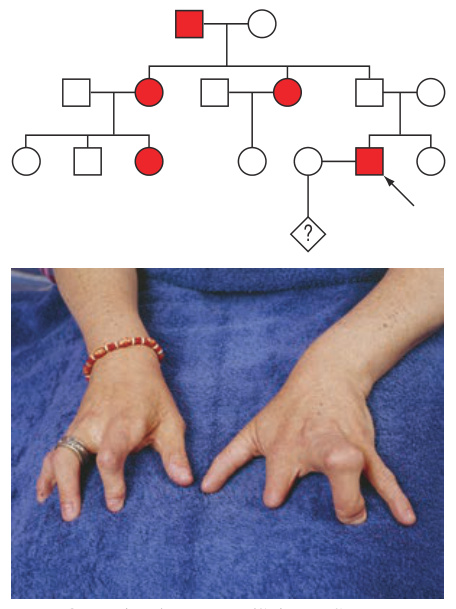  
$\copyright$ Maria Platt-Evans/Science Source  

46.  该问题说明了为什么经典基因学家在DNA分析出现之前通常需要研究表现出完全外显率的性状。图3.15所示的香豌豆的基因型类别A- $B$ -在正常情况下产生紫花，且其他所有基因型类别都产生白花。  

a.  如果亲本是AA $b b\times a a\ B B$ ，假设完全外显，则 $\mathrm{F}_{2}$ 的表型比率是多少？  
b.  现在假设只有 $75\%$ 的A- $B^{\prime}$ -个体有紫花（即该性状的外显率是 $.75\%$ ），则 $\mathrm{F}_{2}$ 的表型比率又是多少？  
c.  在进行这些杂交时，什么样的结果（除意外的$\mathrm{F}_{2}$ 比率以外）可以说明紫花表型的外显率是不完全的？  

47.  球形红细胞症是一种遗传性血液疾病，它使红细胞呈球形，而不是两面凹形。这一疾病由显性等位基因遗传，ANK1（无功能突变等位基因）对ANK1+显性。患有球形红细胞症的人的脾脏会将球形红细胞当作有缺陷的细胞，并将其从血液流动中移除，从而导致贫血。不同人的脾脏移除球形红细胞的效率不同。有球形红细胞的人中一些有严重的贫血，而一些人的贫血则较轻，还有一些人的脾脏功能很差以至于根本没有贫血症状。在考察2400个有基因型ANK1 ANK1+的人时，发现他们所有人都有球形红细胞，2250人有不同程度的贫血，150人没有症状（假设不存在ANK1 ANK1纯合型的人）。  

a.  对球形红细胞携带者的这一描述说明了不完全外显，还是可变表现度，或是两者都有？请解释你的答案。你能从这些数据中得到测量外显率或表现度的数值吗？  
b.  请为球形红细胞症提供一种治疗建议，并描述该疾病的不完全外显率和（或）可变表现度如何影响这种治疗。  

48.  家族性高胆固醇血症（FH）是一种遗传性的人类疾病，它会导致高于正常值的血清胆固醇水平［测量单位是每分升血液中的胆固醇毫克数（mg/dl）］。血清胆固醇水平两倍于正常值的人患心脏病的可能性比胆固醇正常的人高25倍。血清胆固醇水平三倍于正常值甚至更高的人动脉严重阻塞，而且几乎都会在20岁前去世。以下系谱显示了4个日本家庭中FH的发生情况：  

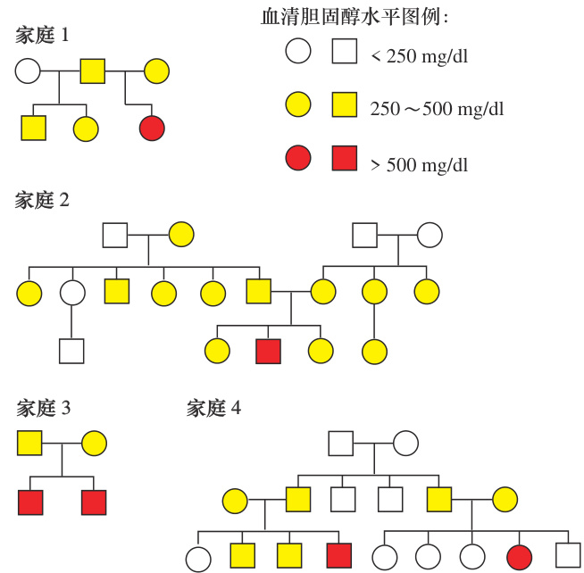  

a.  基于这些数据，FH最可能的遗传模式是什么？这些系谱中存在不符合你的假设的个体吗？哪些特殊情况能够解释这些个体的存在？b.  为什么相同表型类别（无色、黄色或红色符号）中的个体表现出如此不同的血清胆固醇水平？  

49.  你与两名无亲属关系的患者取得了联系，他们表现出一种你认为是非常罕见的表型——足底有一个黑点。根据一项医学报告，该表型在每100 000人中才能发现一例。这两名患者给你提供了家庭历史数据，你据此得出了如下系谱。  

a.  考虑到这一性状是罕见的，你认为它的遗传是显性  

还是隐性？会出现哪些作用于遗传的特殊情况？  
b.  哪些未表现出性状的家庭成员一定携带这一突变等位基因？  
c.  如果该性状在人群中是非常常见的，你能为该遗传提出哪种另外的解释？  
d.  基于题目c中的新解释，哪些未表现出性状的家庭成员一定携带本该导致该性状的基因型？  

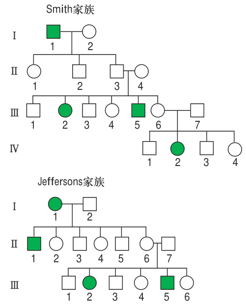  

50.  多囊性肾病是一种导致肾脏中出现大量囊肿的显性性状，该疾病会最终引起肾衰竭。一对都没有多囊性肾病的夫妻生下了一个患有该疾病的孩子。哪种可能性能够解释这一结果？  

51.  同卵（单卵）双胞胎有相似但不完全相同的指纹。考虑到同卵双胞胎所有基因的所有等位基因都相同，请解释这一结果如何成为可能？  

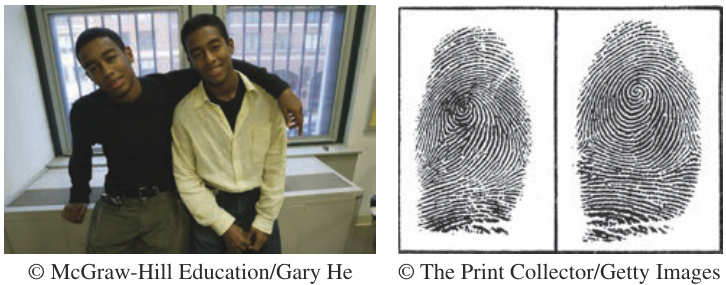  

52.  根据文中所介绍的7个体表颜色基因（见表3.3）为图3.12（a）中的每一种拉布拉多犬各给出一种可能的基因型。请注意拉布拉多犬是纯种单色的，没有斑点或眼圈。请解释你在确定基因型时遇到的不明情况。  