# 第 4 章 遗传的染色体学说  

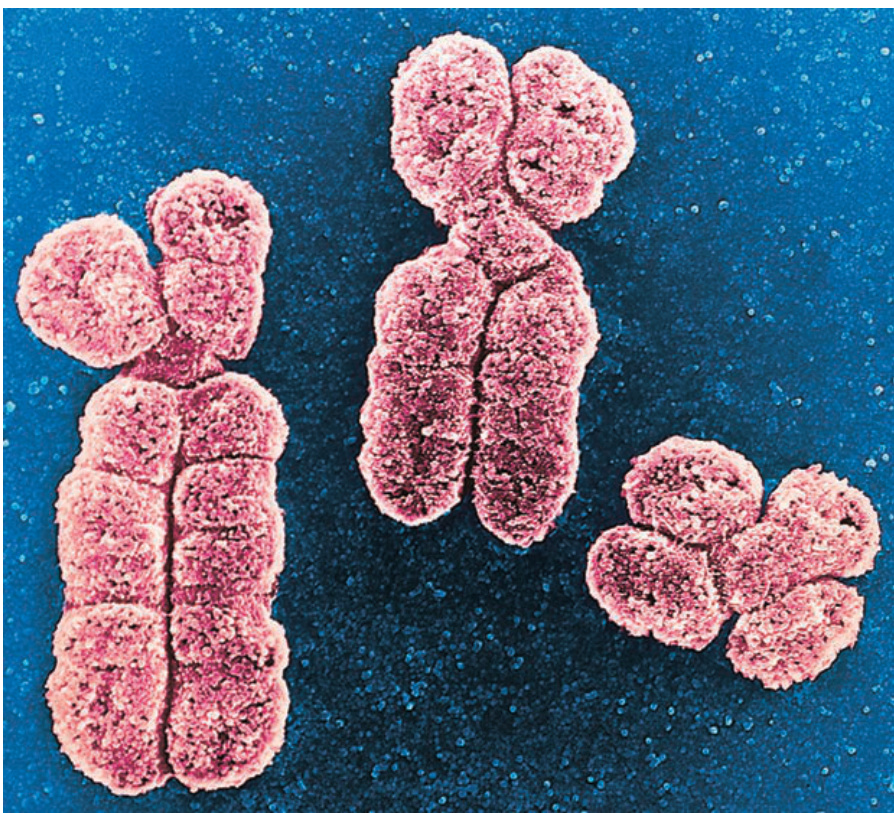  

这三条人类染色体中的每一条都携带着数百个基因。$\copyright$ Adrian T. Sumner/Stone/Getty Images  

# 章 节 大 纲  

4.1 染色体：基因的载体   
4.2 性染色体与性别决定   
4.3 有丝分裂：维持染色体数目的细胞分裂   
4.4 减数分裂：染色体数目减半的细胞分裂   
4.5 配子形成   
4.6 染色体理论验证   
4.7 人类的性别连锁和双性性状  

把植物和动物的球形细胞放置在显微镜下观察，染色体看起来像颜色鲜艳的线状体。正常人类细胞的细胞核携带23对染色体共46条。在这23对染色体中存在明显的大小和形状差异，但在每一对中，两条染色体似乎完全匹配（唯一的例外是男性的一对性染色体，分别为X和Y，它们构成了差异很大的一对）。  

唐氏综合征是第一个发现的不是由基因突变引起的，而是由于染色体数目异常引起的人类遗传疾病。患有唐氏综合征的儿童在每个体细胞核中含有47条染色体，由于多了一条非常小的21号染色体，因此称为21三体综合征，引起了异常的表型，包括比正常人更扁平的枕骨、异常大的舌头、由海马和一些大脑其他区域异常发育引起的学习障碍，以及更容易患呼吸道感染、心脏病、快速衰老和白血病的倾向（图4.1）。  

一个正常大小和形状的染色体的额外拷贝如何导致如此广泛的表型效应？答案分为两部分。首先，染色体是负责传递遗传信息的细胞结构。在本章中，我们描述了遗传学家如何得出结论——染色体是基因的载体，这一概念被称为遗传的染色体学说。答案的第二部分是，正确的发育不仅取决于遗传物质的存在类型，还取决于遗传物质的含量。因此，在细胞分裂过程中控制基因传递的机制必须警惕地保持每个细胞的染色体数目。  

细胞分裂通过精确的染色体分配机制进行，有丝分裂（用于体细胞）和减数分裂（用于配子——卵子和精子）。当这套机制不能正常运作，染色体分布的错误会对个体的健康和生存产生严重影响。例如，唐氏综合征是减数分裂过程中染色体分离失败的结果。减数分裂误差导致携带额外染色体21的卵子或精子，如果是在受精时掺入受精卵，则通过有丝分裂传递给发育中胚胎的每个细胞。三体染色体（三个染色体而不是两个染色体）  

  
图4.1　唐氏综合征：一条额外的21号染色体具有广泛的表型后果。21三体综合征通常会导致身体外观和学习潜力的变化。许多患有唐氏综合征的儿童，如照片中心的五年级学生，可以充分参与定期活动。  

可以与其他染色体一起出现，但在几乎所有这些情况下，该病症会产前致死并导致流产。  

关于减数分裂和有丝分裂的讨论中出现了两个主题。首先，在配子形成过程中对染色体的直接显微观察，使得20世纪早期的研究人员认识到染色体行为与孟德尔基因的行为相互印证，染色体可能携带遗传物质。这种染色体遗传理论于1902年提出，并在接下来的15年中，主要通过利用果蝇进行巧妙的实验得到证实。其次，染色体理论将基因的概念从抽象粒子转变为物理现实——一部分的染色体，可以被看到且可被操纵。  

# 4.1 染色体：基因的载体  

# 学习目标  

1.  根据染色体的数量和来源，区分体细胞、配子和受精卵。  
2. 区分同源和非同源染色体。  
3.  列出姐妹染色单体和非染色单体之间的差异。  

婴儿出生时被问到的第一个问题——是男孩还是女孩？人们的认知里承认男性和女性通常是相互排斥的特征，如孟德尔豌豆的黄色与绿色。更重要的是，在人类和大多数其他有性繁殖的物种中，两性之间存在大约为$1:1$ 的比例。雄性和雌性都产生专门用于繁殖（精子或卵子）的细胞作为下一代的物理连接。在弥补世代之间的差距时，这些配子必须各自贡献一半的遗传物质来繁殖正常、健康的儿子或女儿。无论配子的哪一部分携带这种材料，它的结构和功能必须能够解释决定男女性别的功能，以及通常观察到的男女比例为 $1:1$ 的情况。性别决定的这两个特征是最早发现细胞遗传的线索之一。  

# 4.1.1 基因驻留在细胞核中  

性别和生殖之间特定联系的性质一直是一个谜，直到1667年，最早和最精明的显微镜专家之一Antonvan Leeuwenhoek发现精液含有精子（字面上是精子动物）。他想象这些微观生物可能会进入卵子并以某种方式实现受精，但是过了200年后才确认了这个假设。  

然后，在1854年开始的20年间（大约在同一时间孟德尔开始了他的豌豆实验），研究青蛙和海胆受精的显微镜学家观察了雄性和雌性配子的结合，并在一系列图纸中记录了该过程的细节。这些图纸及后来的显微照片（通过显微镜拍摄的照片）清楚地表明，卵子和精子核是母体和父体共同形成的配子细胞产生的。这一观察意味着细胞核中的某些东西含有遗传物质。在人类中，配子的核心直径小于 $2\upmu\mathrm{m}$ 。确实值得注意的是，世代之间的遗传联系被包装在如此小的空间内。  

# 4.1.2 基因驻留在染色体中  

一些依赖于显微镜技术创新的进一步研究表明，核内较小的离散结构是遗传信息的储存库。例如，在19世纪80年代，一种新发现的有机和无机染料的组合揭示了细胞核内长而明亮的染色线状体，我们称之为染色体（字面上是被染色的物体）。在不同种类的细胞分裂过程中跟踪染色体的运动已经可能实现了。  

在胚胎细胞中，染色体线在细胞分裂之前纵向分裂成两个，并且两个新形成的子细胞中的每一个接收每个分裂线的一半。细胞分裂后的核分裂导致两个子细胞含有与原始亲本细胞相同数量和类型的染色体，称为有丝分裂（来自希腊语mitos的意思是丝，-osis的意思是形成或增加）。  

在产生雄性和雌性配子的细胞中，构成每对配子的染色体相互分离，因此得到的配子仅从每个染色体对接收一条染色体。产生卵子或精子细胞的核分裂称为减数分裂（来自希腊语diminution，意思为缩减）。  

# 1. 受精：单倍体配子结合产生二倍体受精卵  

在20世纪的第一个十年，细胞学家——用显微镜研究细胞结构的科学家，发现受精卵中的染色体实际上由两组配对的染色体组成，一组由母系配子提供，另一组由父系配子提供。相应的母系和父系染色体的大小及形状相似，形成一对（有一个例外，即性染色体，我们将在后面的部分讨论）。  

仅携带一组染色体的配子和其他细胞称为单倍体（来自希腊语single）。受精卵和其他携带两组配对染色体的细胞是二倍体（源自希腊语double）。正常单倍体细胞的染色体数目用简写符号 $n$ 表示。正常二倍体细胞的染色体数目为 $2n$ 。图4.2显示了果蝇的二倍体细胞及其产生的单倍体配子，其中 $2n{=}8$ ， $n{=}4$ 。在人类中，$2n{=}46$ ； $n{=}23$ 。  

你可以看到，在减数分裂和配子形成过程中染色体数目减半，然后在受精时两个配子的染色体结合，通常使一个物种的所有个体的染色体数目保持在 $2n$ 。每对染色体在减数分裂过程中必须彼此分离，这样单倍体配子才会有一套完整的染色体。受精形成受精卵后，有丝分裂的过程确保发育个体的所有体细胞具有相同的二倍体染色体组。  

# 2. 物种的染色体数量和形状的变化  

科学家会在细胞生长和分裂的特定时刻分析一个细胞的染色体组成，此时是在细胞核分裂之前染色体最明显的时候。此时称为中期（后面详细描述），单个染色体已经从细线复制并浓缩成紧凑的棒状结构。现在，每条染色体都由两条完全相同的染色体组成，这两条染色体被称为姐妹染色单体（图4.3）。  

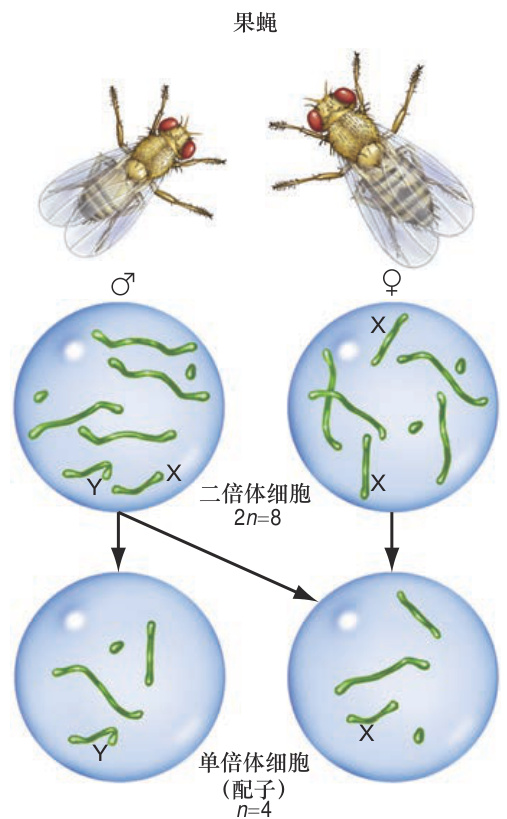  

图4.2　二倍体与单倍体 $:2n$ 与 $\boldsymbol{n}$ 。果蝇体细胞是二倍体：它们携带着每条染色体的母本和父本。减数分裂产生单倍体配子，每个染色体只有一个拷贝。在果蝇中，二倍体细胞有8条染色体（ $2n{=}8$ ），配子有4条染色体（ $n{=}4$ ）。注意，这张图中的染色体是在它们复制之前绘制的。X染色体和Y染色体决定个体的性别。  

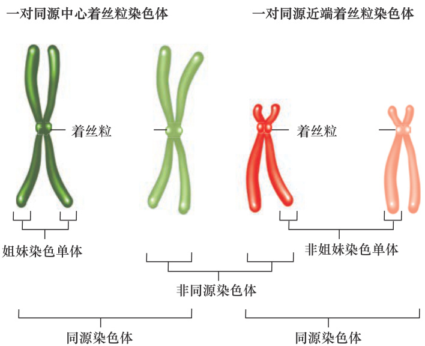  

图4.3　中期染色体可按着丝粒位置进行分类。在细胞分裂之前，每个染色体复制成两个姐妹染色单体，在它们的着丝粒上连接。在高度浓缩的中期染色体中，着丝粒可以出现在中间（中心染色体）附近，非常接近末端（近端染色体），或者介于两者之间。在二倍体细胞中，每对染色体中的一条同源染色体来自母本，另一条来自父本。  

姐妹染色单体彼此连接的具体位置称为着丝粒。每个姐妹染色单体都有自己的着丝粒（图4.3），但在复制的染色体中，两个姐妹着丝粒被拉得很紧，以至于它们形成一个收缩区，在这个收缩区中它们无法相互分辨，即使在扫描电子显微镜中获得的图像中也是如此（见本章开头的图片）。  

遗传学家经常根据着丝粒的位置描述染色体（图4.3）。在中着丝粒染色体中，着丝粒或多或少位于中间；在近端染色体中，着丝粒非常靠近一端。因此，染色体总是具有由着丝粒分开的两个臂，但是两个臂的相对大小可以在不同的染色体中变化。  

中期细胞可以固定，并用几种染料中的一种染色，这些染料突出染色体并突出着丝粒。染料还产生由较亮和较暗区域组成的特征条带图案。在大小、形状和条带上匹配的染色体被称为同源染色体或同源物。每对中的两个同源物含有相同的基因组，尽管其中一些基因可能携带不同的等位基因。等位基因之间的差异发生在分子水平，并且不会在显微镜下显示。  

图4.3介绍了本书中使用的符号系统，使用颜色表示染色体之间的相关程度。因此，相同重复的姐妹染色单体出现在相同颜色的相同阴影中。同源染色体携带相同的基因，但可能在特定等位基因的识别上有所不同，它们被标注成同一颜色的不同深浅（浅色或深色）。携带完全不相关的遗传信息集的非同源染色体以不同的颜色出现。  

为了研究单个生物的染色体，遗传学家将染色的染色体的显微照片排列在尺寸逐渐减小的同源对中以产生核型。核型装配现在可以通过计算机图像分析来加速和自动化。图4.4为人类男性的核型，46条染色体排列在22对配对染色体和1对非配对染色体中。配对的44对染色体称为常染色体。在这个男性核型中，有两条不匹配的染色体被称为性染色体，因为它们决定了个体的性别（我们将在后面的章节中更详细地讨论性染色体）。  

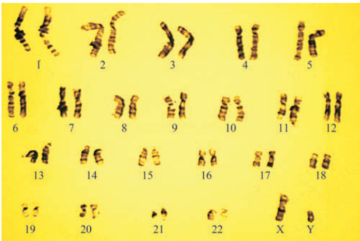  
图4.4　人类男性的核型。中期人类染色体的照片是成对的，按大小递减排列。在一个正常的人类男性核型中，存在22对常染色体，以及一个X染色体和一个Y染色体（ $2n{=}46$ ）。同源染色体具有相同的暗带和亮带特征。  

现代DNA分析方法可以揭示同源染色体对的母源染色体和父源染色体之间的差异，从而可以追踪导致个别患者唐氏综合征的额外21号染色体的起源。在 $80\%$ 的情况下，第三条染色体21来自卵子； $20\%$ 来自精子。在“遗传学与社会”信息栏“产前基因诊断”中描述了医生如何使用核型分析及一种称为羊膜穿刺术的技术，在受孕后的三个月时诊断唐氏综合征。  

通过对成千上万正常个体的核型分析，细胞学家已经证实，每个物种的细胞都携带着一个独特的二倍体染色体数目。例如，孟德尔豌豆在每个二倍体细胞中含有7对（14条）染色体，果蝇（Drosophila melanogaster）携带8条染色体（4对），通心粉小麦有28条（14对），巨型红杉树22条（11对），金鱼94条（47对），狗78条（39对），人46条（23对）。染色体的大小、形状和数量的差异反映了组装的遗传物质的差异，这些差异决定了每个物种的特征及功能。如这些图所示，染色体的数量并不总是与生物体的大小或复杂性相关。  

在下一节中，你将看到染色体携带着关于个体性别的信息，这一发现使我们认识到染色体携带着决定所有特征的基因。  

# 基本概念  

●  染色体是专门用于遗传物质储存和传播的细胞结构。  
●  基因位于染色体上，在细胞分裂和配子形成过程中随染色体一起传递。  
●  体细胞携带精确数目的同源染色体对，这是该物种的特征。  
●  在二倍体生物中，一对同源染色体中的一个是母系同源，另一个是父系同源。  

# 4.2 性染色体与性别决定  

# 学习目标  

1.  通过X染色体和Y染色体的不同组合方式预测人的性别。  
2. 描述人类性逆转的基础。  
3. 比较不同生物的性别测定方法。  

Walter S. Sutton是20世纪初哥伦比亚大学的一名年轻的美国研究生，他是最早意识到特定染色体携带着决定性别信息的细胞学家之一。在一项研究中，他从大腹杆蚱蜢（Brachystola magna；图4.5）体内获得细胞，并观察到它们通过进行减数分裂产生精子。他观察到，在减数分裂之前，大腹杆蚱蜢睾丸内的前体细胞总共含有24条染色体。其中，22条配对染色体是常染色体。剩下的两条染色体是不匹配的，他称其中较大的为X染色  

# 遗传学与社会  

# 产前基因诊断  

利用观察染色体和基因DNA的新技术，现代遗传学家可以直接定义个体的基因型。医生可以使用这种基本策略在出生前诊断婴儿是否会在出生时具有遗传病。最初用于产前诊断的方法是获得可以分析DNA和染色体的基因型的胎儿细胞。获得这些细胞最常用的方法是羊膜穿刺术（图A）。为了执行这个程序，医生将针穿过孕妇的腹壁插入胎儿正在生长的羊膜囊中；这个程序是在女性最后一次月经后约16周进行的。通过超声成像来引导针头的位置，医生将胎儿悬浮在注射器中的羊水抽出一部分。这种液体含有被称为羊膜细胞的活细胞，是由胎儿分泌脱落的。当置于培养基中时，这些胎儿细胞会经历几轮有丝分裂并增加数量。一旦有足够的胎儿细胞可用，临床医生就会观察这些细胞中的染色体和基因。在后面的章节中，我们描述了能够直接检测构成特定疾病基因的DNA的技术。  

羊膜穿刺术还可以通过染色体核型分析诊断唐氏综合征。由于唐氏综合征的风险随着母亲年龄的增长图A　通过羊膜穿刺术获得胎儿细胞。医生将针插入羊膜囊（超声成像辅助），并将含有胎儿细胞的羊水提取到注射器中。  

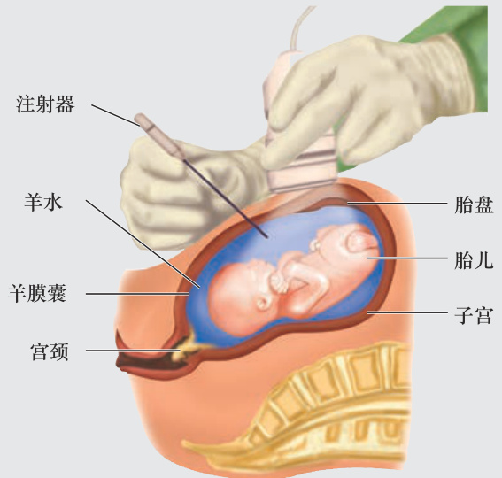  

而迅速增加，北美超过一半的35岁以上孕妇目前正在接受羊膜穿刺术。虽然这种核型分析的目的通常是了解胎儿是否为21号染色体的三体，但在检查核型时可能会发现染色体数目或形状上的许多其他异常。  

最近，科学家已经能够从母亲的血液中分析胎儿的基因型，而不需要获取胎儿细胞。这一过程之所以成为可能，是因为母亲的血液中含有无细胞的胎儿DNA。胎儿细胞渗入母亲的血液，然后分解，释放出DNA。现代DNA测序技术使遗传学家不仅可以对特定疾病相关的等位基因进行基因型分析，甚至可以确定胎儿的整个基因组序列。从母亲血液中提取胎儿DNA的分析仍处于实验阶段，但在不久的将来，它可能会取代羊膜穿刺术，因为从母亲血液中提取血液既便宜又无创。妊娠16周时流产的正常风险为 $2\%\!\sim\!3\%$ ，而羊膜穿刺术会将这一风险提高约 $0.5\%$ （平均每200次穿刺术中发生1次手术风险）。相反，从母亲的血液中分析无细胞DNA不会对胎儿造成伤害。  

羊膜穿刺术和无细胞胎儿DNA分析用于产前诊断的可行性与流产的个人和社会问题密切相关。大多数羊膜穿刺术的实施都是基于这样一种理解，即如果胎儿的基因型表明他患有唐氏综合征等遗传病，那么他将被流产。一些反对堕胎的准父母仍然选择进行羊膜穿刺术，以便更好地为受影响的孩子做准备，但这种情况很少见。  

堕胎辩论的伦理和政治方面影响产前诊断的许多实际问题。例如，父母必须决定哪些基因条件足够严重，他们才愿意堕胎。从经济的角度来看，社会必须决定谁应该为产前诊断程序买单。在目前的实践中，羊膜穿刺术的风险和成本通常限制了其应用，仅适用于35岁以上的妇女或由于家族史而使胎儿具有可检测遗传条件的高风险的母亲。然而，在不远的将来，决定产前检查频率的个人和社会方式可能需要进行彻底的改革，因为诸如无细胞胎儿DNA分析等技术进步将把成本和风险降到最低。  

体，较小的为Y染色体。  

减数分裂后，这些睾丸内产生的精子有两种类型：其中一半有11条常染色体加X染色体，而另一半有11条常染色体加Y染色体。相比之下，该物种的所有雌性所产的卵子都携带一组 $11+\Chi$ 染色体，就像在第一类精子中发现的染色体一样。当一个带有X染色体的精子与一个卵子受精时，就会产生一只雌性蝗虫；当含有Y的精子与卵子融合时，就会产生XY雄性。因此Sutton认为X染色体和Y染色体决定性别。  

几位研究其他生物体的研究人员很快证实，在许多有性繁殖的物种中，两种截然不同的染色体，即性染色体，提供了性别决定的基础。一种性别携带同一染色体的两个副本（配对），而另一种性别携带每种类型的性染色体中的一种（不配对）。例如，正常人类女性的细胞含有23对染色体。每对染色体的两条染色体，包括决定性别的X染色体，它们在大小和形状上几乎是相同的。然而，在男性中，有一对不匹配的染色体，其中较大的是X染色体，较小的是Y染色体图4.6　X染色体和Y染色体决定人类的性别。（a）这张彩色显微图显示了左边的人类X染色体和右边的人类Y染色体。（b）儿童只能从母亲那里得到X染色体，但他们可以从父亲  

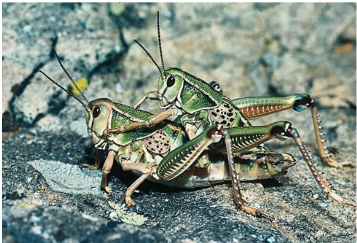  
图4.5　大腹杆蚱蜢。在这对交配伴侣中，较小的雄性跨在雌性身上。©L. West/Science Source  

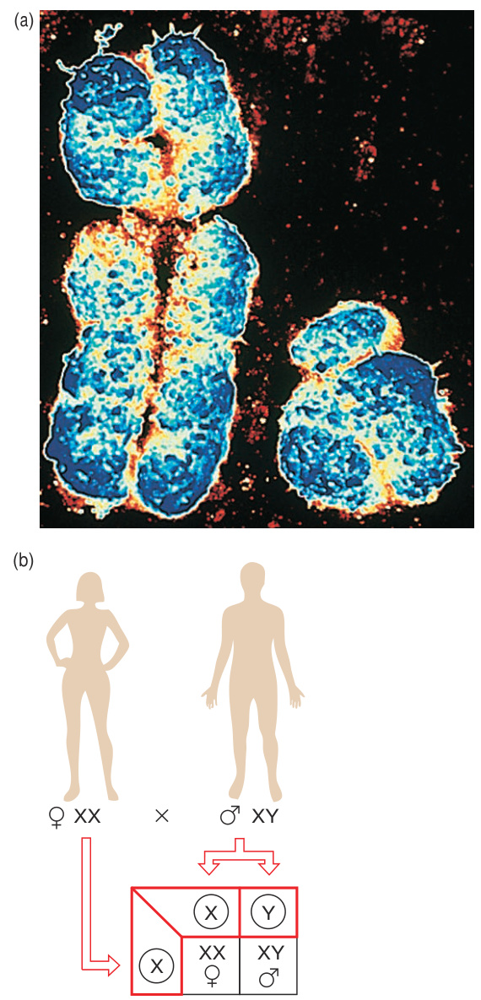  

那里继承X或Y染色体。  

［图4.4和图4.6（a）］。除了在性染色体上的这种差异，这两种性别在任何一对染色体上都是无法区分的。因此，遗传学家可以将女性指定为XX，男性指定为XY，并将有性生殖表示为XX和XY之间的简单杂交。  

如果性别是由一对在配子形成过程中分裂到不同细胞的性染色体决定的遗传特征， $\operatorname{XX}\times\operatorname{XY}$ 杂交既可以解释性别的互斥性，也可以解释男女比例接近 $1:1$ ，这是性别决定的特征［图4.6（b）］。如果染色体携带的信息定义了两种截然不同的性别表型，我们可以很容易地推断，染色体也携带着指定其他特征的遗传信息。  

# 4.2.1 在人类中SRY基因决定雄性  

正如刚刚看到的，人类和其他哺乳动物的一对性染色体在雌性（XX）身上是相同的，但在雄性（XY）身上是不同的。研究表明，在人类中，Y的存在与否才是真正起作用的因素；也就是说，任何携带Y染色体的人看起来都像男性。例如，拥有两个X染色体和一个Y染色体（XXY）的罕见人类是男性，他们表现出某些统称为克兰费尔特综合征的异常。克兰费尔特综合征的雄性通常又高又瘦，不育，有时表现出智力迟钝。这些个体是男性，说明在Y染色体存在的情况下，两条X染色体对女性的发育是不够的。  

相反，携带X染色体和非第二性染色体（XO）的人类是患有特纳综合征的女性。特纳女性通常不育，缺乏第二性征（如阴毛），身材矮小，颈部和肩部之间有皮肤褶皱（有蹼的颈部）。尽管这些个体只有一条X染色体，但它们同样发育成雌性，因为它们没有Y染色体。  

直到1990年，研究人员发现，并不是整个Y染色体，而是一个名为SRY（Y染色体性别决定区）的Y染色体特异性基因才是决定男性性别的主要因素。暗示SRY的证据来自所谓的性逆转：XX男性和XY女性的存在（图4.7）。在许多性逆转的XX男性中，两条X染色图4.7　性逆转。性逆转的XX男性的X染色体上有一部分Y基因，包括SRY基因。性逆转的XY女性在Y染色体上缺少SRY基因，要么是因为它已经被X染色体的一部分取代，要么是因为它已经被突变灭活。  

  

体中的一条携带着Y染色体的一部分。虽然在不同的XX雄性中，Y染色体的不同部分在X染色体上被发现，但始终存在一个特定的基因——SRY。相反，性逆转的XY女性总是有一个Y染色体缺乏功能SRY基因；包含SRY的Y染色体部分要么被X染色体的一部分替换，要么包含SRY的非功能性突变体拷贝（图4.7）。后来的小鼠实验证实，SRY确实决定雄性。在“快进”信息栏中利用转基因小鼠实验进行了说明，证明SRY是雄性因子。  

SRY是Y染色体上约110个蛋白编码基因之一。Y染色体的两端称为假常染色体区（PAR），因为同源  

DNA序列存在于X染色体的两端（图4.8）。这两个PAR（PAR1和PAR2）总共包含大约30个基因，在X和Y染色体上都发现了它们的副本。  

然而，大多数Y染色体被称为男性特异性区域（MSY）（图4.8）；只有部分MSY基因的功能被了解。MSY包括4个Y特异性（因此也包括男性特异性）基因：SRY和3个精子形成所需的基因。MSY这个名字有点误导人，因为MSY中的8个基因也存在于X染色体上，但与PAR基因不同的是，它们并不在X或Y的一个区域内组合在一起。这8个MSY基因影响着全身细胞和  

# 快进  

# 转基因小鼠证明SRY是雄性因子  

几乎所有哺乳动物的Y染色体上都已鉴定出与人类SRY基因相似的基因。1991年，研究人员利用小鼠转基因技术，明确表明SRY基因是决定雄性的关键因素。转基因小鼠的基因组中含有来自另一个个体甚至是另一个物种的基因副本。这样的基因被称为转基因。基因工程的一个重点是转基因的操作和插入技术。  

为了确定SRY基因是否有助于雄性小鼠的成活率，研究人员想要将小鼠SRY基因的拷贝体导入雌性（XX）染色体小鼠的基因组中。如果SRY基因是雄性的决定性因素，那么含有SRY基因的XX只小鼠仍然是雄性。  

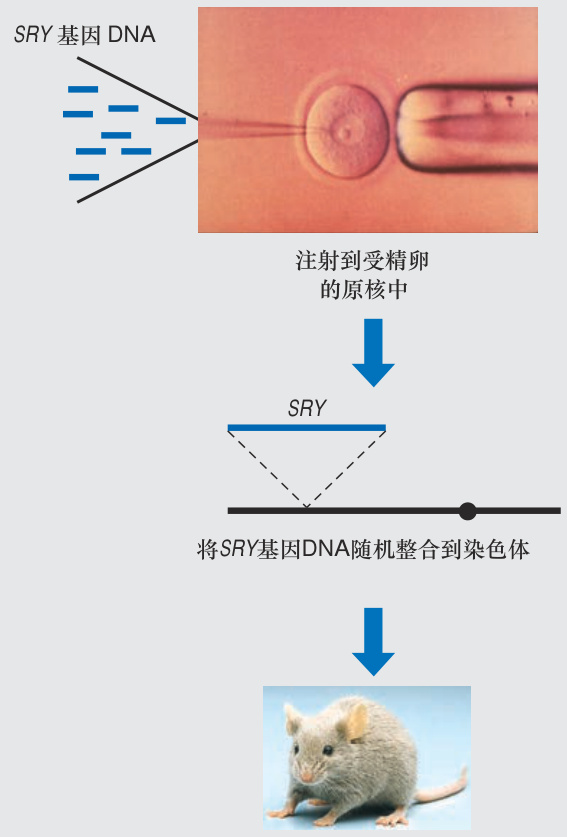  
SRY   
图A　使用原核注射法产生小鼠SRY基因转基因。（1）： $\copyright$ Brigid Hogan, Howard Hughes Medical Institute, VanderbiltUniversity；（2）： $\copyright$ Charles River Laboratories  

首先，科学家们利用克隆技术分离出小鼠SRY基因的DNA，这将在后面的章节中讨论。接下来，使用一种称为原核注射的方法，在它们的一个常染色体上产生含有SRY基因的转基因小鼠。为了进行原核注射，研究人员从已交配的雌性小鼠体内收集了许多受精卵，并将数百份SRY基因DNA（图A）注入精子或卵核（受精卵中称为原核）。原核中的酶将DNA整合到基因组中的随机位置（图A）。  

在被注射的受精卵发育成早期胚胎后，它们被植入代孕母亲体内。当小鼠出生时，从它们的尾巴上取下细胞，用分子生物学技术检测SRY转基因的存在。  

图B右侧为本研究获得的转基因小鼠（SRY转基因）。虽然它的染色体是XX，但它的表型是雄性。这一结果最终证明，SRY基因是决定雄性的重要因素。  

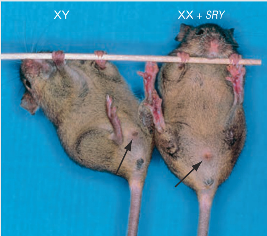  
图B　一只XX小鼠SRY转化为表型雄性。右边的转化XX小鼠和左边的正常XY同窝出生的小鼠都有正常的雄性生殖器。箭头指向阴茎。$\copyright$ Medical Research Council/Science Source  

  
图4.8　人类性染色体既有共同的基因，也有独特的基因。PAR1和PAR2（黑色）是X染色体和Y染色体的同源区域，共包含约30个基因。MSY区域包含男性自身所需的基因（SRY）、男性生育所需的基因，以及与X共享的必需基因是男性生存所需的，因为仅使用它们的X连锁的对应基因不能产生足够的蛋白质。  

组织的功能。事实上，这些与X共享的MSY基因中有几个对男性的生存能力至关重要，因为如果没有Y连锁拷贝，X染色体上的单个基因拷贝就不能提供足够的蛋白质（女性通常同时表达这8个基因的X连锁拷贝的等位基因，因为这些基因逃避了本章后面描述的现象）。  

X染色体包含约1100个基因，其中大部分与性别无关；它们调节男性和女性所需蛋白质的合成。  

为什么拥有SRY基因意味着你是男性，而没有SRY基因意味着你是女性？受精后大约6周，SRY蛋白激活XY（或性逆转的XX）胚胎的睾丸发育。胚胎睾丸分泌激素，刺激男性性器官的发育，阻止女性性器官的形成。在缺乏SRY蛋白的情况下，卵巢代替睾丸发育，而其他女性性器官则是自然发育的。  

# 4.2.2 物种在性别决定机制上差异很大  

其他物种在这种XX染色体对XY染色体的性别决定策略上表现出变异。例如，在果蝇中，虽然正常的雌性是XX，正常的雄性是XY（见图4.2），但最终决定性别的是X染色体的数量（而不是Y的存在与否）。人类和果蝇对相同的性别染色体异常互补的不同反应（表4.1）表明，果蝇和人类的性别决定机制不同。XXY果蝇是雌性的，因为它们有两条X染色体；而XXY人类是雄性的，因为它们有一条Y染色体。相反，因为它们有一个X染色体，XO果蝇是雄性的；而因为它们缺少一个Y染色体，XO人类是雌性的。  

性别决定的 ${\mathrm{XX}}\!=$ 女性 $/\mathrm{~XY=}$ 男性策略绝不是普遍的。例如，在某些种类的蛾子中，雌性是XX，而雄性是XO。在秀丽隐杆线虫（线虫的一种）中，雄性也类似于XO，但XX个体不是雌性；相反，它们利用的是同时产生卵子和精子的雌雄同体。在鸟类和蝴蝶中，雄性有匹配的性染色体，而雌性有一组不匹配的；在这类物种中，遗传学家将性染色体表示为男性的ZZ和女性的ZW。具有两种不同性染色体的性别称为异配子性别，因为它产生两种不同类型的配子；相反，具有两个相似性染色体的性别是同配子性别。异配子性别的配子在雄性的情况下可能包含X或Y，在雌性的情况下可能包含Z或W；同性配子只包含X（人类）或Z（鸟类）。其他的变异包括蜜蜂和黄蜂复杂的性别决定机制，其中雌性是二倍体，雄性是单倍体；此外，某些鱼类的系统，性别是由环境的变化决定的，如温度的波动。表4.2总结了一些惊人的多样性，不同的物种解决了个体性别分配的问题。  

尽管物种之间存在许多差异，早期的研究人员得出结论：染色体可以携带指定性别特征的遗传信息，也可能携带许多其他特征。Sutton和其他染色体理论的早期追随者认识到，生命本身的延续因此依赖于染色体在细胞分裂过程中的适当分布。在接下来的章节中，你将会看到染色体在有丝分裂和减数分裂过程中的行为，正是携带基因的细胞结构所期望的。  

# 基本概念  

●  许多有性繁殖的生物体都具有决定性别的特定染色体。●  在人类中，男性的性别决定是由一种叫做SRY的Y连锁基因触发的；女性性别决定在XX各胚胎中默认发生。●  性别决定机制差异显著；在一些物种中，性别是由环境因素决定的，而不是由特定的染色体决定的。  

表4.1　果蝇和人类的性别决定  

<html><body><table><tr><td colspan="8">性染色体补体</td></tr><tr><td></td><td>XXX</td><td>XX</td><td>XXY</td><td>XO</td><td>XY</td><td>XYY</td><td>OY</td></tr><tr><td>果蝇</td><td>死亡</td><td>正常的雌性</td><td>正常的雌性</td><td>雄性不育</td><td>正常的雄性</td><td>正常的雄性</td><td>死亡</td></tr><tr><td>人类</td><td>近正常雌性</td><td>正常的雌性</td><td>克兰费尔特综合征的雄 性（不育）；高，瘦</td><td>特纳女性（无菌）；短， 蹼颈</td><td>正常的雄性</td><td>正常或接近正常的 雄性</td><td>死亡</td></tr></table></body></html>

注：人类能够比果蝇更好地忍受额外的X染色体（如XXX），因为在人类中，除了一条X染色体外，所有的X染色体都变成了巴氏小体，本章稍后将对此进行讨论。完全缺失X染色体对果蝇和人类都是致命的。在这两种物种中，额外的Y染色体几乎没有影响。虽然果蝇的Y染色体不能决定Y是否像雄性，但它对雄性的生育能力是必要的，因此XO果蝇是不育的雄性。  

表4.2　性别决定机制  

<html><body><table><tr><td></td><td></td><td></td></tr><tr><td>人类和果蝇</td><td>XX</td><td>XY</td></tr><tr><td>飞蛾和秀丽隐 杆线虫</td><td>XX（秀丽隐杆线虫中的雌雄同体）</td><td>XO</td></tr><tr><td>鸟和蝴蝶</td><td>ZW</td><td>ZZ</td></tr><tr><td>蜜蜂和黄蜂</td><td>二倍体</td><td>单倍体</td></tr><tr><td>蜥蜴和鳄鱼</td><td>凉爽的温度</td><td>温暖的温度</td></tr><tr><td>龟和海龟</td><td>温暖的温度</td><td>凉爽的温度</td></tr><tr><td>小丑鱼</td><td>老龄</td><td>成龄</td></tr></table></body></html>

注：在前三排的物种中，性别是由性染色体决定的。排在后四行的物种有两种性别相同的染色体，而性别是由环境或其他因素决定的。小丑鱼（最下面一排）随着年龄的增长会经历从雄性到雌性的性别转变。  

# 4.3 有丝分裂：维持染色体数目的细胞分裂  

# 学习目标  

1. 描述有丝分裂过程中的关键染色体行为。  
2. 图示有丝分裂过程中决定染色体运动的力和结构。  

受精卵是一个单一的二倍体细胞，它通过100多代细胞的不断分裂来保持其遗传特性的稳定，从而保证婴儿的足月出生。随着新生儿成长为蹒跚学步的幼儿、青少年和成年人，更多的细胞分裂促进了持续的生长和成熟。有丝分裂是一种细胞机制，它通过细胞的传代来保存遗传信息，细胞核的分裂以相等的方式将染色体分配给两个子细胞。通过所有这些代细胞保存遗传信息。在本节中，我们将仔细研究有丝分裂的核分裂如何与细胞生长和分裂的整体计划相适应。  

如果通过显微镜观察一个细胞的历史，你会发现，在观察的大部分时间里，染色体就像一团被核膜包裹着的极其精细的、缠绕在一起的线，此时的状态叫做染色质。染色质的每条螺旋线主要由DNA（携带遗传信息）和蛋白质组成（如第12章所述，它作为打包和管理该信息的框架）。你还能分辨一两个染色质较暗的区域，称为核仁（单个核仁，字面意思是小核）；核仁在核糖体的制造中起着关键的作用，核糖体是一种在蛋白质合成中起作用的细胞器。在细胞分裂之间的这段时间内，染色质核内存在着细胞生长和存活所必需的大量不可见的活动。这种活动的一个特别重要的部分是所有染色体物质的精确复制。  

如果继续观察，你会发现在细胞生命历史上很短的一段时间内，核环境发生了巨大的变化：染色质浓缩成离散的线，然后每条染色体进一步浓缩成双棒，在它们的着丝粒处夹在一起，可以在核型分析中识别（回顾图4.3）。双峰中的每根杆状体称为染色单体，如前所述，它是与之相连的另一个姐妹染色单体的完全复制。继续观察将会发现，双染色体开始在细胞内部相互竞争，最终在细胞的中央排列。在这一点上，每条染色体的姐妹染色单体分离到现在正在伸长的细胞的相对两极，在那里它们成为相同的染色体组。这两组完全相同的细胞最终都被包裹在一个单独的细胞核中。因此，这两个被称为子细胞的细胞在基因上是相同的。  

细胞生长（体积增大）和分裂（一个细胞分裂成两个）的重复模式称为细胞周期（图4.9）。细胞周期只有一小部分在分裂（或M期）中度过，分裂之间的时期称为间期。  

# 4.3.1 在间期，细胞生长和复制染色体  

间期由三个阶段组成： ${\bf G_{1}}$ 期（间期1）、S期（合成期）和 $\mathbf{G}_{2}$ 期（间期2）（图4.9）。 ${\bf G}_{1}$ 期从一个新细胞的诞生一直持续到染色体复制的开始；对于遗传物质来说，这是一个染色体既不重复也不分裂的时期。在这段时间里，细胞通过利用来自基因的信息来制造和组装正常运作所需的材料，从而实现了大部分的生长。G1期的长度变化比细胞周期的任何其他阶段都要大。例如，在人类胚胎细胞的快速分裂中，G1期只有几个小时。相比图4.9　细胞周期：间期与有丝分裂的交替。（a）染色体在合成期间（S期）复制形成姐妹染色单体；姐妹染色单体在有丝分裂期间（M期）与子细胞分离。大多数细胞生长发生在S期和M期之间的间隙，称为G1期和 $|\mathbf{G}_{2}|$ 期。在多细胞生物中，一些最终分化的细胞在 $\mathrm{\bfG}_{0}$ 期停止分裂并停止生长。（b）间期由G1期、S期和 $|\mathbf{G}_{2}$ 期共同组成。  

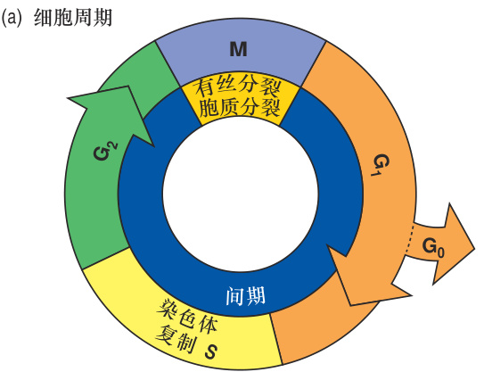  
(b)      S  

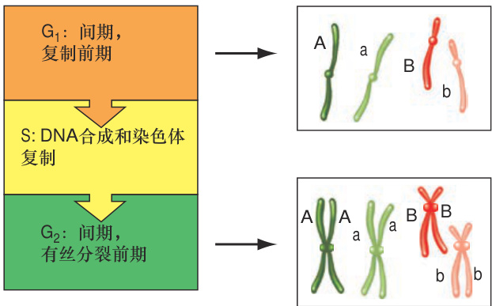  

之下，成熟的脑细胞在静止状态G1期即 ${\mathrm{G}}_{0}$ 期中停止分裂，在人的一生中通常不会再分裂。  

S期是细胞通过合成DNA来复制其遗传物质的时间。在复制过程中，每条染色体都产生双倍的、相同的姐妹染色单体，当染色体在有丝分裂期浓缩时，染色单体就会变得可见。这两条姐妹染色单体在着丝粒处保持着连接（注意，只要姐妹染色单体之间的连接保持不变，这种连接结构就被认为是单个染色体）。染色体在S期的复制是关键的；遗传物质必须精确复制，以便两个子细胞都能接收到相同的染色体组。  

$\mathrm{G}_{2}$ 期是染色体复制到有丝分裂开始之间的间隔。在此期间，细胞可能生长（通常小于G1期）；它还合成对有丝分裂的后续步骤至关重要的蛋白质。  

此外，在间期，许多生化过程中至关重要的微管阵列在细胞核外可见。微管从一个称为中心体的单一组织中心向细胞质辐射，通常位于核膜附近。在动物细胞中，每个中心体的可辨认核心是一对被称为中心粒的黑色小染色体［图4.10（a）］；植物的微管组织中心不含中心粒。在间期的S期和 $\mathrm{G}_{2}$ 期，中心体复制，产生两个仍然非常接近的中心体。  

# 4.3.2 在有丝分裂过程中，姐妹染色单体分离，形成两个子细胞核  

虽然核分裂和细胞分裂事件作为一个动态和连续的过程发生，科学家在分析过程中，以可见的细胞学事件为标志划分了不同的阶段。图4.10中艺术家的草图展示了蛔虫的这些阶段，蛔虫的二倍体细胞只包含4条染色体（2对同源染色体）。  

# 1. 前期：染色体浓缩［图4.10（a）  

在整个间期，细胞核保持完整，染色体是染色质难以分辨的聚集体状态。在前期（源自希腊语pro-的意思），单个染色体从未分化的染色质中逐渐出现或浓缩，标志着有丝分裂的开始。每一个浓缩染色体已经在间期复制成两条姐妹染色单体，姐妹染色单体分别附着在它们的着丝粒上。因此，在蛔虫细胞的这一阶段，共有4条染色体和8条染色单体。  

单个染色体阵列的逐渐出现是一个真正令人印象深刻的事件。间期DNA分子长可达 $34\mathrm{cm}$ ，可浓缩成离散染色体，其长度以微米（百万分之一米）为单位。这个过程相当于把一根 $200\mathrm{m}$ 长的细绳（相当于两个足球场那么长）压成一个 $\cdot8\mathrm{mm}$ 长、 $1\mathrm{mm}$ 宽的圆柱体。  

另一个可见的染色质变化也发生在前期：染色较深的核仁开始分解消失，导致核糖体的制造停止了，这提供了一个迹象，表明一般的细胞新陈代谢停止了，因此细胞可以把能量集中在染色体运动和细胞分裂上。  

前期的一些重要事件发生在细胞核外的细胞质中。  

在复制的间期，光学显微镜下可以清楚地观察到中心体分离为两个独立的个体。与此同时，间期起支撑作用的长而稳定的微管消失了，取而代之的是一组动态微管，这些微管从中心体组织中心迅速生长和收缩。中心体继续分开，围绕着核膜向细胞核的两端移动，这显然是由两个中心体延伸出来的相互交错的微管之间施加的力推动的。  

# 2. 前中期：纺锤体形态［图4.10（b）］  

前中期（中期之前）开始于核膜的破坏，这使得微管从两个中心体延伸到细胞核。染色体通过动粒附着在这些微管上，是在染色单体的着丝点区域起运输作用的一种结构。每个动粒都含有蛋白质，这些蛋白质起着分子马达的作用，使染色体能够沿着微管滑动。当染色单体的动粒在前中期最初与微管接触时，基于动粒的运动将整个染色体向微管放射的中心体移动。从两个中心体生长出来的微管通过首先连接到随机选择的两个姐妹染色单体之一的动粒来捕获染色体。因此，有时可以观察到在每个中心体附近聚集的染色体群。在前中期的这个早期阶段，对于每个染色体，一个染色单体的动粒与一个微管相连，但姐妹染色单体的动粒保持不相连。  

在前中期，三种不同类型的微管纤维共同形成有丝分裂纺锤体。所有这些微管都起源于中心体，中心体作为纺锤体的两极。在染色单体的动粒和动粒之间延伸的微管称为动粒微管，或着丝粒纤维。每个中心体指向细胞中央的微管是极性微管；极性微管起源于相对的中心体，在细胞赤道附近交叉。最后，短的星状微管从中心体向细胞外周延伸。  

在前中期结束之前，每条染色体之前未连接的姐妹染色单体的动粒与从相反的中心体延伸出来的微管相关联，使一个姐妹染色单体面对细胞的一个极点，另一个面对相反的极点。实验操作表明，如果两个纺锤体都附着在同一极的微管上，则构型不稳定；其中一个动粒从纺锤体分离出来，直到与另一极的微管相结合。连接姐妹染色单体的两个纺锤体方向相反是唯一稳定的排列方式。  

# 3. 中期：染色体在细胞赤道处排列［图4.10（c）］  

在中期，姐妹染色单体与反向的两个纺锤体之间的连接启动了一系列的相互挤压的运动，导致染色体向假想的赤道移动，赤道位于两极之间。假想的中线称为中期板。当染色体沿着中期板排列时，将姐妹染色单体拉向相对两极的力处于平衡状态，这种平衡是由染色体之间的张力维持的。张力来自于姐妹染色单体被拉向相反的方向，而它们仍然通过着丝粒的紧密结合相互连接。张力通过将染色体恢复到两极之间等距离的位置，来平衡任何从中期板移开的机会。  

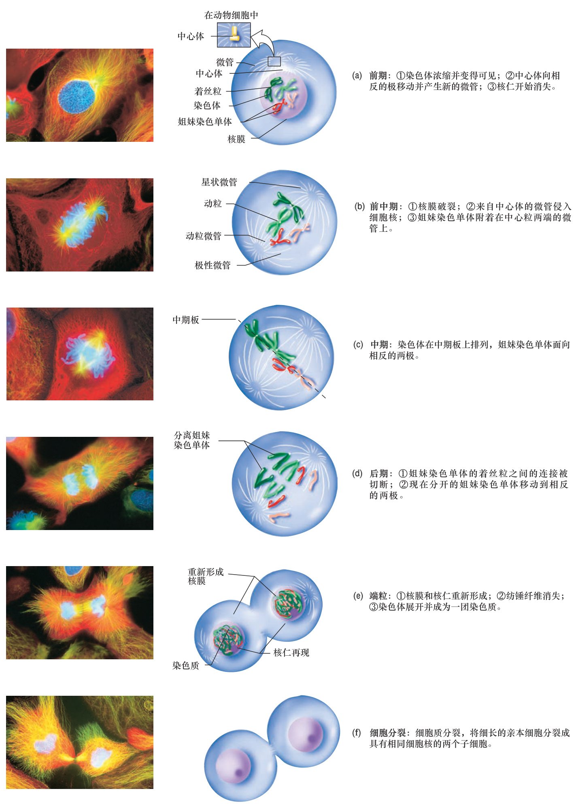  

图4.10　有丝分裂维持了两个子细胞核与母细胞的染色体数目相等。在蝾螈肺细胞左边的显微照片中，染色体呈蓝色，微管呈绿色或黄色。注意，图中是蛔虫细胞（ $2n{=}4$ ）。  

# 4.  后期：姐妹染色单体向相反的纺锤体极移动［图4.10（d）］  

几乎同时切断所有染色体的姐妹染色单体之间的着丝粒连接，表明正在进行细胞分裂的后期（希腊语ana-意思是“向上”，此处是向两级移动）。姐妹染色单体的分离允许每个染色单体被拉向纺锤体极，纺锤体通过动粒微管与之相连；当染色单体向两极移动时，它的动粒微管缩短。由于染色单体的臂部落后于动粒，具有中心动粒的染色单体在后期具有V型特征。姐妹染色单体与从相反纺锤体极点发出的微管的连接意味着向一个极点迁移的基因信息与向相反极点迁移的对应基因信息完全相同。  

# 5.  末期：两个细胞核中包含相同的染色体组［图4.10（e）  

有丝分裂过程中染色体和细胞核的最终转化发生在末期（来自希腊语的telo-，意为“结束”）。末期就像前期的倒带。纺锤体纤维开始分散；在每一极的染色单体群周围形成核膜；一个或多个核仁重新出现。以前的染色单体现在作为独立的染色体发挥作用，它浓缩（散开）并溶解成一团缠结的染色质。此时，一个细胞核分裂成两个相同细胞核的有丝分裂过程结束。  

# 6. 细胞分裂：细胞质分裂［图4.10（f）  

在细胞分裂的最后阶段，在末期出现的子细胞核被包裹在两个独立的子细胞中。分裂的最后阶段称为胞质分裂（字面意思是细胞运动）。在胞质分裂过程中，拉长的母细胞分裂成两个较小的独立子细胞，具有相同的细胞核。胞质分裂通常开始于后期，但直到末期才完成。  

细胞完成胞质分裂的机制在动物和植物中是不同的。在动物细胞中，胞质分裂依赖于一个收缩环，这个收缩环将细胞挤压成两半，类似于拉动一根绳子使一袋弹珠的开口闭合［图4.11（a）］。有趣的是，一些形成收缩环的分子也参与了肌肉收缩的机制。在细胞被刚性细胞壁包围的植物中，靠近赤道的细胞内形成一个膜状的圆盘，称为细胞板，然后迅速向外生长，从而将细胞一分为二［图4.11（b）］。  

在胞质分裂过程中，大量重要的细胞器和其他细胞成分，包括核糖体、线粒体、膜结构（如高尔基体）和叶绿体（在植物中），必须被分配给新生的子细胞。完成这一任务的机制似乎并没有预先决定哪个细胞器将用于哪个子细胞。相反，由于大多数细胞含有这些细胞质结构的许多副本，每个新细胞必然会接收到每个组成部分中的至少几个。这种原始结构的补体足以维持细胞，直到合成活动可以用细胞器重新填充细胞质。  

有时胞质分裂并不会立即跟随细胞核分裂，其结果是一个细胞包含一个以上的细胞核。有两个或两个以上细胞核的动物细胞称为合胞体。就像人类和许多其他（a）： $\copyright$ Don W. Fawcett/Science Source；（b）： $\copyright$ McGraw-Hill Educa-tion/Al Telser  

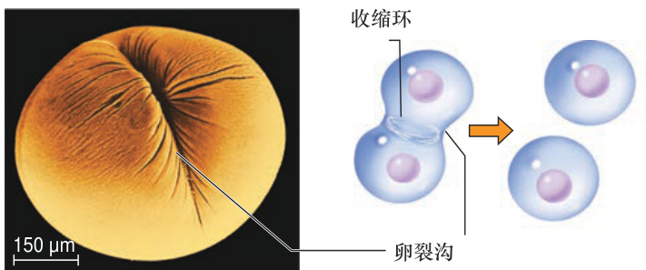  
(a)  

(b)  

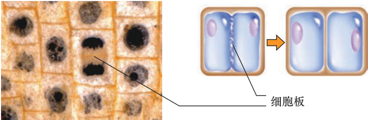  
图4.11　胞质分裂：细胞质分裂，产生两个子细胞。（a）在分裂青蛙受精卵的过程中，细胞外围的收缩环收缩形成一条沟，最终将细胞挤压成两半。（b）在这个分裂洋葱根细胞的过程中，在细胞赤道附近开始形成的细胞板向外围扩展，将两个子细胞分开。  

动物精子的前体一样，果蝇的早期胚胎是多核合胞体（图4.12）。多核植物组织称为共核细胞；椰奶是一种由辅细胞组成的营养丰富的食品。  

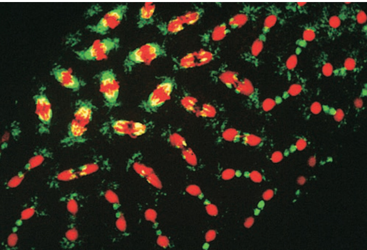  

图4.12　如果细胞分裂不伴随有丝分裂，一个细胞可能含有许多细胞核。在已受精的果蝇卵中，有丝分裂发生了13轮，但没有细胞分裂。其结果是一个含有数千个细胞核的单细胞合胞体胚胎。这张照片显示了一个分裂细胞核的胚胎的一部分；染色体是红色的，纺锤体是绿色的。左上核为中期核，右下核为后期核。细胞膜最终围绕这些细胞核生长，将胚胎© Dr. Byron Williams/Cornell University  

# 4.3.3 调控检查点确保染色体的正确分离  

细胞周期是一系列精确协调的复杂程序。在高等生物中，细胞分裂的决定取决于两个内在因素，一个是细胞内部的条件（细胞内有足够大小的细胞进行分裂），另一个是来自环境的信号（激素信号或与邻近细胞的接触），这些信号鼓励或抑制分裂。通常是在G1期间期，细胞启动分裂的程序之后就会正常按照程序进行。许多程序的检查点（细胞评估前一步结果的时刻）调控细胞周期按照顺序进行（图4.13）。例如，在检查点中起作用的一种酶监视DNA复制，以确保细胞在所有染色体完成复制之前不会开始有丝分裂。如果这个关键点不存在，每个细胞周期至少有一个子细胞会丢失DNA。  

在检查点的分子基础的第二个例子中，即使一个没有附着在纺锤体纤维上的动粒也会产生一个分子信号，阻止所有染色体的姐妹染色单体在着丝粒处分离。这个信号使分裂后期的启动依赖于所有染色体在中期之前的正确排列。由于这种细胞周期检查点，每个子细胞都可靠地接收到正确数目的染色体。  

有丝分裂机制的崩溃会产生分裂错误，对细胞产生至关重要的后果。例如，染色体分离不当会导致严重的功能障碍，甚至导致子细胞的死亡。破坏有丝分裂结构的基因突变，如纺锤体、着丝点或中心体，是不恰当分离的一个来源。其他问题发生在细胞分裂失常的细胞中，如检查点。这些细胞可能无休止地进行分裂，导致肿瘤。我们将在第20章详细介绍细胞周期调控、检查点调控和癌症形成。  

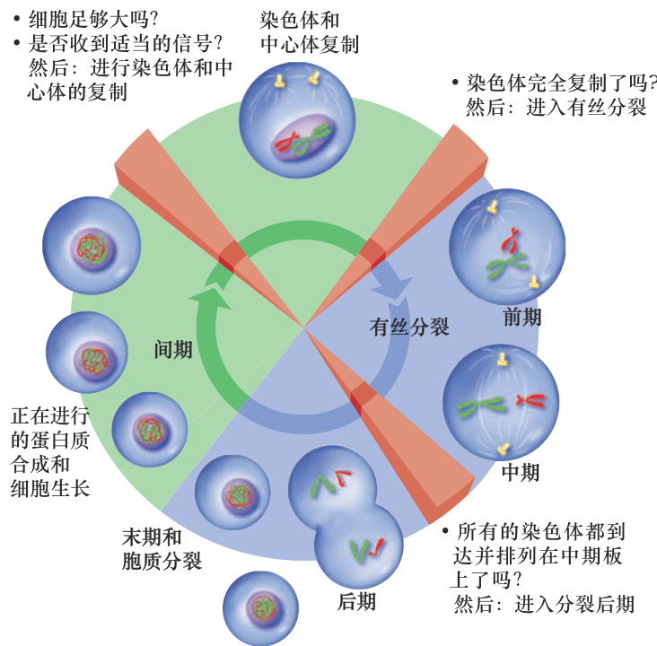  
图4.13　检查点有助于调节细胞周期。细胞检查点（红色楔）确保细胞周期中的重要事件以适当的顺序发生。在每个检查点上，单元格确定之前的事件是否已经完成，然后才能继续单元格周期的下一个步骤（为了简单起见，我们只显示每个细胞的两条染色体）。  

# 基本概念  

●  二倍体细胞通过有丝分裂产生相同的二倍体后代细胞。$\bullet$ 在中期，姐妹染色单体被它们的动粒拉向相反的纺锤体极；这些向极的力是平衡的，因为染色单体在它们的着丝粒上是连接的。●  在后期开始，姐妹着丝粒之间的连接被切断，因此姐妹染色单体分离并向相反的纺锤体两极移动。●  细胞周期检查点有助于确保染色体的正确复制和分离。  

# 4.4 减数分裂：染色体数目减半的 细胞分裂  

# 学习目标  

1.  描述导致单倍体配子的减数分裂过程中的关键染色体行为。2. 比较有丝分裂和减数分裂期间的染色体行为。3.  解释同源染色体的独立排列，以及在第一次减数分裂过程中的交叉是如何促进配子的遗传多样性的。  

在胚胎细胞分裂的多轮过程中，大多数细胞要么通过刚才描述的有丝分裂细胞周期生长和分裂，要么停止生长并进入 ${\bf G}_{0}$ 停滞期。这些有丝分裂和 ${\bf G}_{0}$ 停滞期的细胞就是所谓的体细胞，其后代在个体的一生中继续构成每个有机体组织的绝大部分。然而，在动物胚胎发育的早期，有一组特殊形式的细胞，即生殖细胞：在配子的产生过程中具有特殊作用的细胞。生殖细胞在植物中出现较晚，是在花的发育过程中，而不是在胚胎发生过程中。生殖细胞形成生殖器官——动物的卵巢和睾丸或开花植物的子房和花药，在那里最终经历减数分裂，形成两种特殊类型的细胞，即配子（卵子和精子），配子含有其他体细胞一半的染色体。  

单倍体配子在受精时结合产生二倍体后代，携带双亲的遗传组合。因此有性生殖需要单倍体和二倍体细胞世代交替。如果配子是二倍体而不是单倍体，每一代的染色体数目就会加倍。以人类为例，如果每个细胞的亲代有92条染色体，子代就有184条，依此类推。减数分裂阻止了这种致命的染色体指数级积累。  

# 4.4.1 在减数分裂期间，染色体只复制一次，而细胞核分裂两次  

与有丝分裂不同，减数分裂由两个连续的核分裂组成，称为减数分裂Ⅰ和减数分裂Ⅱ。每一轮，细胞都经历一个前期、中期、后期和末期。在减数分裂Ⅰ期间，母核分裂成两个子核；在减数分裂Ⅱ期间，两个子核各自分裂，形成四个核（图4.14）。这四个核是减数分裂的最终产物，由于细胞分裂发生在两轮分裂之后，它们被分裂成四个独立的子细胞。染色体在减数分裂Ⅰ开始时复制，但在减数分裂Ⅱ时不复制，这就解释了为什么配子包含体细胞染色体数量的一半。仔细观察每一轮减数分裂揭示了配子接收完整的单倍体染色体的机制。  

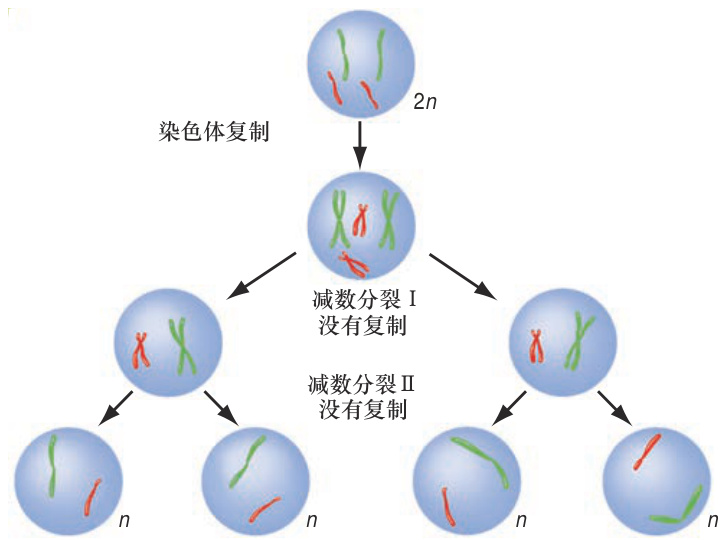  
图4.14　减数分裂概述：染色体复制一次，细胞核分裂两次。在这幅图中，每个染色体对的所有4条染色单体都显示在相同颜色的同一阴影中。注意，染色体在减数分裂Ⅰ之前复制，但在减数分裂Ⅰ和减数分裂Ⅱ之间不复制。  

# 4.4.2 在减数分裂 $\mathrm{I}$ 期间，同源染色体配对、交换部分，然后分离  

减数分裂事件在核分裂中是独特的（图4.15，减数分裂Ⅰ）。这个过程开始于染色体的复制，之后每个染色体由两个姐妹染色单体组成。减数分裂Ⅰ的一个关键是观察到这些姐妹染色单体的着丝粒在整个分裂过程中保持连接，而不是像有丝分裂那样彼此分离。  

随着减数分裂Ⅰ的进行，同源染色体在细胞赤道上排列，形成一种耦合，确保在分裂后期染色体正确分离。此外，在同源染色体穿过赤道面对面的时间里，每一对同源染色体的母本和父本染色体可以部分交换，沿着染色体在不同的基因上创造新的等位基因组合。随后，两条同源染色体被拉到纺锤体的相对两极，每条染色体仍然由两条姐妹染色单体组成，它们在着丝粒处相连。因此，在第一次减数分裂结束时，同源染色体（而不是有丝分裂中的姐妹染色单体）分裂成不同的子细胞。有了这个概述，为了更仔细地观察减数分裂Ⅰ的具体事件，科学家分析了一个动态的、持续的细胞过程，并分解成容易描绘的、传统的几个阶段。  

# 1. 前期Ⅰ：同源体凝聚成对，发生交换  

前期Ⅰ的关键事件之一是染色质的浓缩、同源染色体的配对，以及这些配对的同源染色体之间遗传信息的相互交换。图4.15为前期Ⅰ的概念图；然而，研究表明，在不同的物种中，减数分裂的顺序可能有所不同。这些复杂的过程可能需要几天、几个月甚至几年的时间才能完成。例如，在包括人类在内的几个物种的雌性生殖细胞中，减数分裂在前期Ⅰ阶段暂停多年，直到排卵（我们将在4.5节进一步讨论）。  

细线期（leptotene，来自希腊语，意思是瘦而纤细）是前期Ⅰ的第一个可定义的子阶段，是长而细的染色体开始变粗的时间［图4.16（a）］。每个染色体在前期Ⅰ（如有丝分裂）之前已经复制，因此有两个姐妹染色单体附着在它们的着丝粒上。然而，在这一点上，这些姐妹染色单体是如此紧密地结合在一起，以至于它们不能作为单独的个体。  

偶线期（zygotene，希腊语中意为“接合”）开始于每条染色体寻找它的同源染色体时，匹配的染色体在一个称为联会的过程中被压缩在一起。“拉链”本身是一种复杂的蛋白质结构，称为联会复合体，它以惊人的精确度排列同源染色体，并列排列染色体对的相应基因区域［图4.16（b）］。  

粗线期（pachytene，希腊语中意为“厚”或“脂肪”）开始于联会的完成，此时同源染色体沿着它们的长度联会在一起。每一对联会染色体都被称为二价染色体（因为它包含两条染色体），或者四价染色体（因为它包含四条染色单体）。二价染色体的一半是来自母体的染色体，另一半是来自父体的染色体。因为X染色体和Y染色体不完全相同，所以它们不能完全匹配。然而，图4.8所示的假常染色体区域提供了X染色体和Y染色体之间的一小段相似性，使它们能够在雄性减数分裂Ⅰ期相互配对。  

在粗线期，称为重组节的结构开始沿着联会复合体出现，并在这些结节处发生非姐妹染色单体（即母系和父系）之间的部分交换［详见图4.16（c）］。这样的交换被称为交换，它导致遗传物质的重组。由于交换，染色单体可能不再是纯粹的母本或父本；但是，由于没有遗传信息增加或失去，所以所有染色单体保持其原始大小。  

二倍体（源自希腊语，意为“两倍的”或“双倍的”）的信号是联会复合体的逐渐溶解和同源染色体区域的轻微分离［见图4.16（d）］。尽管如此，每一个二价染色体的同源染色体排列紧密，沿着它们的长度间隔称为交叉，这代表交换发生的位置。  

终变期（源自希腊语，意为“双重运动”）伴随着染色单体的进一步浓缩。由于染色单体的增粗和缩短，现在可以清楚地看到，每个四分体由四个单独的染色单体组成；或者从另一个角度来看，一个二价染色体的两条同源染色体都是由两个姐妹染色单体在着丝粒处结合而成［见图4.16（e）］。已经历交换的非姐妹染色单体仍然保持密切相关的交叉。发育末期类似于有丝分裂的前中期：核膜破裂，纺锤体的微管开始形成。  

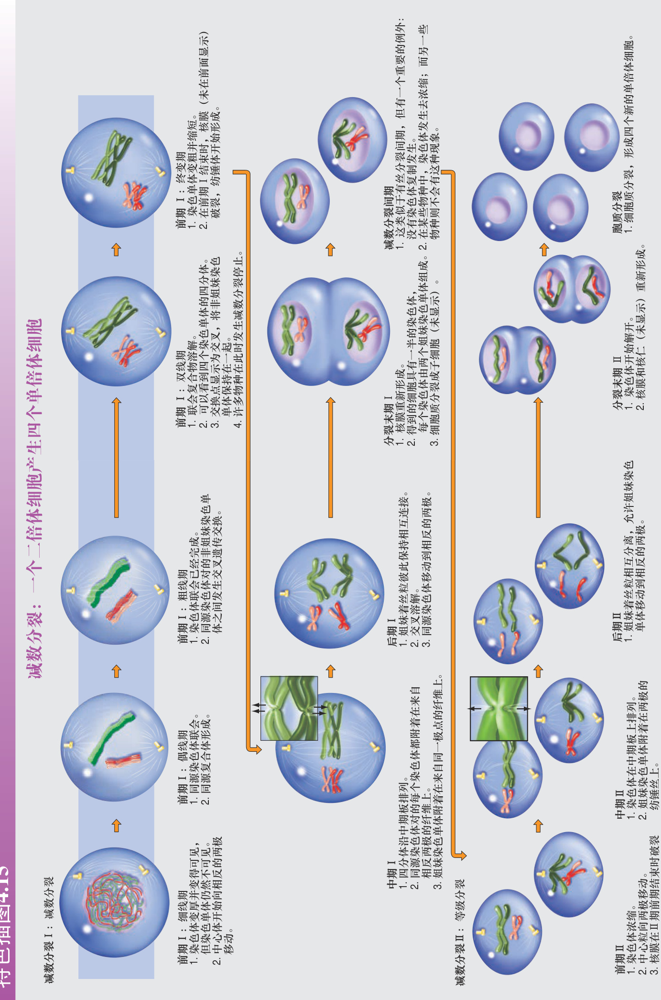  

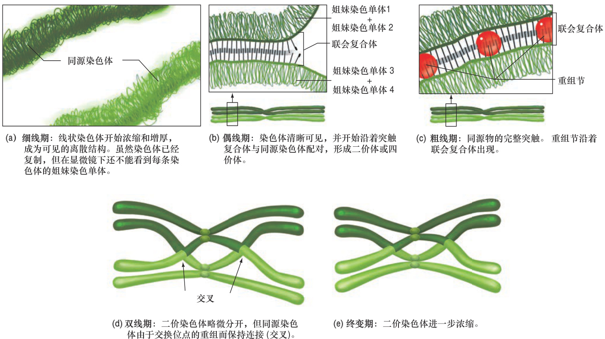  
图4.16　非常高倍下减数分裂前期Ⅰ。  

# 2. 中期Ⅰ：成对的同源体从相对的两极附着在纺锤体上  

在有丝分裂过程中，每条姐妹染色单体都有一个着丝点，这个着丝点与从相反的纺锤体极发出的微管相连。在减数分裂Ⅰ，情况是不同的。姐妹染色单体的着丝粒融合，所以，每个染色体只包含一个功能的着丝粒。在中期Ⅰ（见图4.15，减数分裂Ⅰ），同源染色体的着丝粒从相反的纺锤体极附着在微管上。因此，在中期排列的染色体中，母源性和父源性染色体的着丝点受到来自相反纺锤体极的拉力，而在交叉纺锤体上的同源体之间的物理连接平衡着这一拉力。每一个二价染色体的排列和连接独立于每一个其他二价染色体，所以面对每一极的染色体是母系和父系起源的随机组合。  

# 3. 后期Ⅰ：同系物向相反的纺锤体极移动  

在后期Ⅰ开始时，连接同源染色体的交叉体溶解，这使得母系同源体和父系同源体开始向相反的纺锤体极移动（见图4.15，减数分裂Ⅰ）。注意，在第一次减数分裂后期，姐妹着丝粒不像有丝分裂时那样分离。因此，每一对同源染色体中，有一条染色体由两条姐妹染色单体组成，在它们的着丝粒处连接，并分离到每一个纺锤体极上。  

交换重组在第一次减数分裂中对同源染色体的正确分离起着重要作用。交叉体将同源体维系在一起，从而确保它们的着丝点在整个中期始终附着在相反的纺锤体上。当二价染色体内没有发生重组时，连接和运输中的错误可能导致同源染色体移动到同一极，而不是分离到相反的极。然而，在一些生物体中，非重组染色体的适当分离仍然通过其他配对机制发生。研究人员还没有完全理解这些过程的性质，他们目前正在评估几个模型，以此来解释这些过程。  

# 4. 末期Ⅰ：核膜重新形成  

第一次减数分裂的末期，称为末期Ⅰ，发生在染色体向两极移动时，开始形成核膜。每一个早期的子核包含原母核染色体数目的一半，但每条染色体由两个姐妹染色单体在它们的着丝粒处连接而成（见图4.15，减数分裂Ⅰ）。由于染色体数目减少到正常二倍体数目的一半，第一次减数分裂常被称为减数分裂。  

在大多数物种中，细胞分裂遵循末期Ⅰ，子细胞核被包裹在单独的子细胞中。一个短暂的中间阶段随后发生。在这段时间里，染色体通常会变得稀疏，在这种情况下，它们必须在随后的第二次减数分裂的前期重新浓缩。然而，在某些物种中，染色体只是保持浓缩。最重要的是，在减数分裂Ⅰ和减数分裂Ⅱ的中间期不存在S期；也就是说，染色体在减数分裂间期不复制。减数分裂Ⅰ和减数分裂Ⅱ之间相对较短的时期称为分裂间期。  

# 4.4.3 在减数分裂 $\mathbb{I}$ 期，姐妹染色单体分离产生单倍体配子  

第二次减数分裂（减数分裂Ⅱ）的过程与有丝分裂非常相似，但由于每个分裂细胞核中的染色体数目已经减少了一半，因此产生的子细胞是单倍体。在减数分裂Ⅰ产生的两个子细胞中，每一个都发生同样的过程，在第二轮减数分裂结束时产生4个单倍体细胞（见图4.15减数分裂Ⅱ）。  

# 1. 前期Ⅱ：染色体浓缩  

如果染色体在前一间期发生浓缩，则在前期Ⅱ也发生浓缩。在前期Ⅱ结束时，核膜破裂，纺锤体组织重新形成。  

# 2. 中期Ⅱ：染色体排列在中期板上  

姐妹染色单体的着丝点附着在纺锤体的相对两极所发出的微管纤维上，就像在有丝分裂中期一样。然而，中期Ⅱ的两个显著特征将其与有丝分裂区分开来。第一，染色体数目是同一物种有丝分裂中期染色体数目的一半。第二，在大多数染色体中，两个姐妹染色单体不再完全相同，因为在减数分裂Ⅰ期间发生交换重组。姐妹染色单体仍然含有相同的基因，但它们可能携带不同的等位基因组合。  

# 3. 后期Ⅱ：姐妹染色单体向相反的纺锤体极移动  

就像在有丝分裂中，姐妹着丝粒之间的连接断开，使得姐妹染色单体在后期Ⅱ向相反的纺锤体两极移动。  

# 4. 末期Ⅱ：核膜重新形成，细胞分裂随之发生  

在末期Ⅱ中，每个子核周围都形成膜，细胞分裂将每个核置于一个单独的细胞中。结果是4个单倍体配子。注意，在减数分裂Ⅱ结束时，每个子细胞（即每个配子）的染色体数目与分裂开始时的亲本细胞相同。因此，减数分裂Ⅱ被称为均等分裂。  

# 4.4.4 减数分裂中产生的有缺陷的配子  

任何减数分裂过程中的分离错误都会在下一代中导致异常，如三体综合征。例如，如果染色体对的同源体在减数分裂Ⅰ期没有分离（这一错误称为不分离），它们可能一起存在到同一个极点，最终成为同一个配子的一部分。这样的错误可能在受精过程中产生许多的三体。正如我们已经提到的，大多数人体内的常染色体三体在子宫内是致命的；一个例外是21号染色体三体，它是唐氏综合征的遗传基础。和21号染色体三体一样，额外的性染色体也可能是存在的，会导致各种精神和身体上的异常，如克兰费尔特综合征（见表4.1）。  

# 4.4.5 减数分裂有助于遗传多样性  

一个物种中不同基因组合的范围越广，个体携带等位基因组合的可能性就越大，这些基因组合能够在不断变化的环境中生存。减数分裂的两个方面有助于种群的遗传多样性。首先，由于在第一次减数分裂过程中，随机决定哪一个父系同源体或母系同源体迁移到两极，不同的配子携带着不同的母系和父系染色体组合。图4.17（a）显示了同源迁移的不同模式如何在配子中产生不同的亲本染色体混合。这种随机的独立组合所产生的潜在变异量随染色体数目的增加而增加。例如，在蛔虫中， $n{=}2$ ［染色体补体如图4.17（a）所示］，随机组合的同源体只能产生 $2^{2}$ 或4种配子。然而，在 $n{=}23$ 的人体中，仅这个机制就可以产生 $2^{23}$ ，或者超过800万种基因不同的配子。  

减数分裂的第二个特征，是基因信息在前期Ⅰ阶段通过交换重组，确保配子具有更丰富的遗传多样性。由于交换重组的母源和父源基因，每个不同配子中的每条染色体都可能由不同的母源和父源等位基因组合而成［图4.17（b）］。  

当然，有性繁殖增加了另一种产生遗传多样性的方式。在受精过程中，大量基因多样化的精子中的任何一个都可以使具有其独特基因结构的卵子受精。因此，除了同卵双胞胎之外，世界上60亿人的基因都是独一无二的，这并不奇怪。  

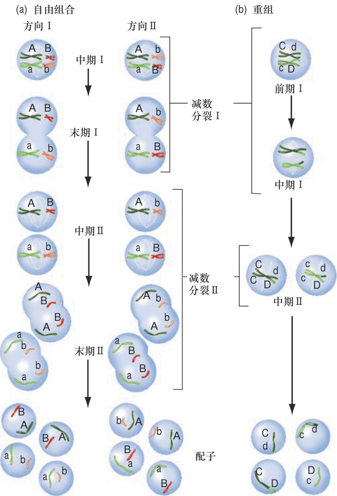  
图4.17　减数分裂如何促进遗传多样性。（a）非同源染色体的独立分类引起的变异随基因组中染色体数目的增加而增加。（b）同源染色体之间的交换确保每个配子是唯一的。  

# 4.4.6 有丝分裂和减数分裂：一个比较  

有丝分裂发生在所有类型的真核细胞（即细胞核有膜的细胞）中，是一种保持遗传现状的保守机制。有丝分裂后的细胞分裂通过增加细胞数量来生长。它还促进植物的根、茎和叶不断替换，促进动物的血细胞、肠组织和皮肤的再生。  

另一方面，减数分裂只发生在有性繁殖的生物体中，也就是生殖器官中产生单倍体配子的少数特殊生殖细胞中。它不是一个保守的机制；相反，减数分裂引起的广泛组合变化是促进进化的遗传变异的一个来源。表4.3显示了这两种细胞分裂机制的显著差异。  

# 基本概念  

●  减数分裂，染色体复制一次（减数分裂前），但细胞核分裂两次（减数分裂Ⅰ和Ⅱ）。  
●  在中期Ⅰ，同源染色体连接到相反的纺锤体极点。每对同源染色体的独立排列确保了不同染色体上携带的基因的独立分类。  
●  在第一次减数分裂过程中，交换维持同源染色体之间的连接，直到后期Ⅰ，并有助于配子的遗传多样性。  
●  姐妹染色单体在减数分裂Ⅱ期间彼此分离，因此配子只有每个染色体的一个副本。  
●  受精：卵子和精子的结合——使染色体的二倍体数目（2n）恢复到受精卵时的数目。  
●  减数分裂过程中的错误可能产生染色体缺失或增加的配子，这通常对后代是致命的。  

# 4.5 配子形成  

# 学习目标  

1. 比较人类卵子和精子的形成过程。  
2.  在配子发生的不同阶段，区分人类生殖系细胞的性染色体互补。  

在所有有性繁殖的动物中，胚胎生殖细胞（统称生殖系）经历一系列有丝分裂，产生一系列特殊的二倍体细胞，然后通过减数分裂产生单倍体细胞。与其他生物学过程一样，人们已经观察到这种普遍模式的许多变化。在一些物种中，减数分裂产生的单倍体细胞是配子本身；而在另一些物种中，这些细胞必须经过特定的分化才能实现这一功能。此外，在某些生物体中，一次减数分裂的4个单倍体产物并不都变成配子。因此配子的形成（或配子发生）产生单倍体配子，不仅以减数分裂事件本身为标志，而且以减数分裂之前和之后的细胞事件为标志。在这里，我们通过对人类卵子和精子形态的描述来说明配子发生。本书中对其他几个生物体配子形成的细节进行了具体的实验研究讨论。  

# 4.5.1 人类的卵子发生过程是由每个原始卵母细胞产生一个卵子  

人类卵子形成的最终产物是一个巨大的、营养丰富的卵子，其储存的资源可以维持早期胚胎的发育。这个过程被称为卵子发生（图4.18），开始于卵巢中的二倍体生殖细胞，称为卵原细胞，通过有丝分裂迅速繁殖，产生大量的初级卵母细胞，然后进行减数分裂。  

对于每一个初级卵母细胞，减数分裂Ⅰ导致两个大小不同的子细胞的形成，因此这种分裂是不对称的。这些细胞中较大的是次级卵母细胞，接受 $95\%$ 以上的细胞质。另一个小的姐妹细胞被称为第一极体。在减数分裂Ⅱ期间，次级卵母细胞经历另一次不对称分裂，产生一个大的单倍体和一个小的单倍体的第二极体。第一极体通常会阻碍它的发育。这两个小的极体显然没有任何功能，并最终解体，留下一个大的单倍体卵子作为功能配子。因此，在一次减数分裂的三个（或偶尔四个）产物中，只有一个作为雌性配子。一个正常的人类卵子携带22条常染色体和1条X染色体。  

卵子发生始于胎儿。怀孕6个月后，胎儿卵巢完全形成，包含约50万个初级卵母细胞，这些卵母细胞在前期Ⅰ的二倍体亚期被捕获。这些细胞的同源染色体固定在结合处，几十年来一直被认为是雌性能产生的唯一卵母细胞。如果是这样的话，一个女孩生来就拥有她所拥有的所有卵母细胞。值得注意的是，最近的研究对这一长期存在的理论提出了质疑。科学家已经证明，从成年卵巢中取出的生殖系前体细胞可以在培养皿中产生新的卵子。然而，目前还不清楚这些卵子是否具有功能，也不知道这些生殖系细胞是否能在成年人体内产生正常卵子。  

从12岁左右的青春期开始，到 $35\!\sim\!40$ 年后的更年期，大多数女性每个月释放一个初级卵母细胞（来自备用卵巢），大约相当于在生殖年龄释放480个卵母细胞。剩余的初级卵母细胞在更年期解体。排卵时，释放的卵母细胞完成减数分裂Ⅰ，并一直持续到减数分裂Ⅱ的中期。如果卵母细胞受精，也就是被精子细胞核穿透，它就会迅速完成减数分裂Ⅱ。精子和卵子的核膜溶解，使它们的染色体形成合子的单倍体细胞核，受精卵通过有丝分裂产生一个功能胚胎。相反，未受精的卵母细胞在月经周期的月经期排出体外。  

30多岁、40多岁和50多岁女性卵子减数分裂完成前的很长一段时间，可能有助于观察到母亲年龄与减数分裂错误之间的相关性，包括产生三倍体的情况。例如，25岁左右的女性患21号染色体三体的风险非常小；在这个年龄段出生的孩子中，只有 $0.05\%$ 患有唐氏综合征。然而，在生育后期，风险迅速上升；35岁时，这一比例为 $0.9\%$ ，45岁时为 $3\%$ 。如果减数分裂在母亲出生之前就完成了，你就不会想到这种与年龄相关的风险增加。  

  
表4.3　比较有丝分裂和减数分裂  

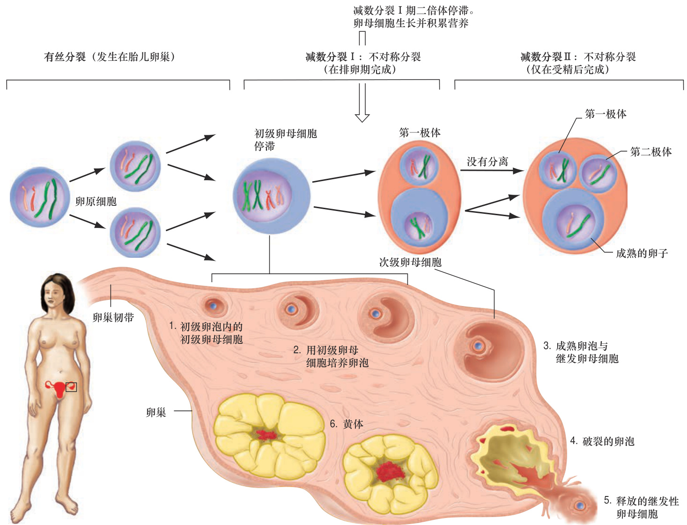  
图4.18　在人类，卵子的形成始于胎儿卵巢，在减数分裂Ⅰ的前期停止。在减数分裂Ⅰ的二倍体亚期，胎儿卵巢中含有约500 000个初级卵母细胞。如果卵子在月经周期中受精，减数分裂就完成了。减数分裂产生的三个细胞中，只有一个是功能配子，即卵子。  

# 4.5.2 人类精子发生过程中，每个原始精母细胞产生四个精子  

精子的产生，或精子发生（图4.19），开始于男性睾丸的生殖细胞（称为精原细胞）。精原细胞有丝分裂产生许多二倍体细胞，即初级精母细胞。与初级卵母细胞不同，初级精母细胞经历对称减数分裂Ⅰ，产生两个次级精母细胞，每个次级精母细胞经历对称减数分裂Ⅱ。在减数分裂结束时，每个原始精母细胞产生四个等价的单倍体精子细胞。然后，这些精子细胞发育成具有鞭状特征的尾巴，并将所有的染色体物质集中在一个头部，从而成为有功能的成熟精子。人类精子比受精卵小得多，含有22个常染色体和X或Y染色体。  

精子产生的时间与卵子形成的时间有很大的不同。减数分裂允许原代精母细胞转变为精子细胞，这种分裂只在青春期开始，但减数分裂会持续整个人的一生。整个精子形成过程需要 $48\!\sim\!60$ 天：减数分裂Ⅰ需要 $16\!\sim\!20$ 天，减数分裂Ⅱ需要 $16\!\sim\!20$ 天，精子细胞成熟为功能齐全的精子需要 $16\!\sim\!20$ 天。在青春期后的每个睾丸中，总是有数百万精子在产生，而一次射精就能含有多达3亿个精子。在一个人的一生中，可以产生数十亿个精子，这些精子几乎均等地分布在带有X染色体和Y染色体的精子中。  

# 基本概念  

●  二倍体生殖细胞前体通过有丝分裂增殖，然后进行减数分裂产生单倍体配子。●  人类女性出生时卵母细胞处于减数分裂前期Ⅰ。减数分裂在排卵时恢复，但直到受精后才完成。精子的形成从青春期开始，并持续到人类男性的一生。  

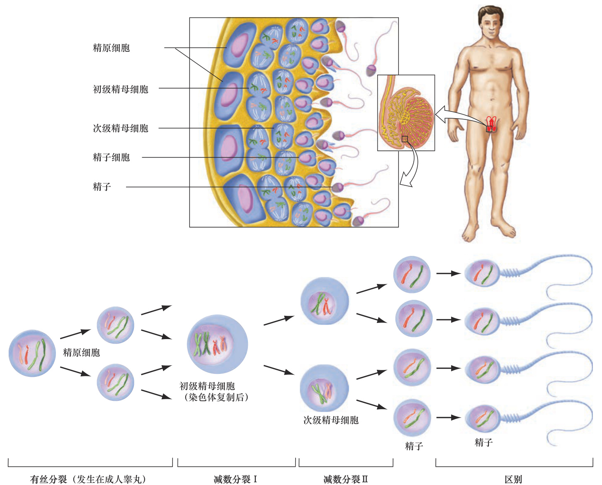  
图4.19　青春期后人类精子在睾丸中不断形成。精原细胞位于人类睾丸中精小管的外部。一旦它们分裂产生初级精母细胞，随后的精子发生阶段（精母细胞的减数分裂和精子细胞成熟为精子）依次发生在更靠近小管中央的地方。成熟的精子被释放到射精管的中心腔。  

●  卵子发生的两个减数分裂是不对称的，因此初级卵母细胞产生一个卵子。精子发生的两个减数分裂是对称的，所以一个初级精母细胞产生四个精子。  

●  所有人类卵母细胞都含有一条X染色体；人类精子要么含有X染色体，要么含有Y染色体。  

# 4.6 染色体理论验证  

# 学习目标  

1.  描述解释孟德尔第一定律和第二定律的减数分裂的关键事件。  
2. 从杂交的结果中推断一个特征是否与性别有关。  
3. 预测与性染色体不分离相关的表型。  

到目前为止，我们已经提出了两条支持染色体遗传理论的间接证据。第一，性形态的表型与特定染色体的遗传有关。第二，随着时间的推移，有丝分裂、减数分裂和配子发生的事件确保了一个物种所有成员体细胞中的染色体数目是恒定的；人们期望遗传物质表现出这种稳定性，即使在繁殖方式非常不同的生物体中也是如此。对染色体理论的最终接受依赖于研究人员在间接证据之外，对两个关键点进行严格的论证： $\textcircled{1}$ 基因的遗传与染色体的遗传在每个细节上是一致的； $\textcircled{2}$ 特定染色体的传播与性别决定以外的特定性状的传播是一致的。  

# 4.6.1 孟德尔定律与减数分裂过程中的染色体行为有关  

Walter Sutton在 $1902\!\sim\!1903$ 年首次概述了染色体遗传理论，建立在德国的Theodor Boveri、美国纽约的E.B. Wilson等人的理论思想和实验结果的基础上。在1902年的一篇论文中，Sutton推测，“在减数分裂（即减数分裂Ⅰ）过程中，父本染色体和母本染色体成对组合以及随后的分离……可能构成孟德尔遗传定律的物理基础”。1903年，他提出染色体携带孟德尔的遗传单位，原因如下：  

1.  每个细胞包含两种染色体的拷贝，以及两种基因的拷贝。  
2.  与孟德尔的基因一样，染色体的补体在代代相传的过程中似乎没有发生变化。  
3.  在减数分裂过程中，同源染色体配对，然后分离到不同的配子，就像每个基因的替代等位基因分离到不同的配子一样。  
4.  每一对染色体的母本和父本不考虑任何其他同源染色体对的组合而移动到相反的纺锤体极，就像不相关基因的替代等位基因独立排列一样。  
5.  在受精过程中，一个卵子的染色体组与随机遇到的精子的染色体组结合，就像从父母一方获得的等位基因与来自另一方的等位基因随机结合一样。  
6.  在所有受精卵来源的细胞中，一半的染色体和一半的基因来自母体，另一半来自父体。  

表4.4的两部分说明了遗传的染色体学说与孟德尔分离和自由组合定律之间的密切关系。如果孟德尔的豌豆形状和豌豆颜色的基因被分配到不同的染色体上（即非同源染色体），染色体的行为与基因的行为是平行的。Sutton对这些相似之处的观察使他提出染色体和基因在某种程度上是物理连接的。减数分裂确保每个配子只包含一个二价染色单体，因此该染色单体上的任何基因只有一个等位基因［表4.4（a）］。减数分裂过程中两个二价染色体的独立行为意味着不同染色体上携带的基因将会独立地组合成配子［表4.4（b）］。  

从图4.17（a）可以看出，在减数分裂的过程中，有两对不同的染色体对，你可能想知道，交换是否废除了孟德尔定律和染色体运动之间的明确对应关系。答案是否定的。同源染色体对的每条染色单体只包含一个给定基因的副本，每对同源染色体中只有一条染色单体被合并到每个配子中。由于替代等位基因即使在交换发生后仍然存在于不同的染色单体上，所以根据孟德尔第一定律，替代等位基因仍然分离到不同的配子上。  

此外，由于在减数分裂过程中，非同源染色体的方向是完全随机的，正如孟德尔第二定律所要求的那样，即使发生交换，不同染色体上的基因也会独立排列。在图4.17（a）中，你可以看到，如果不进行重组，非同源染色体的两种随机比对都只产生四种配子类型中的两种：AB和ab代表一个方向，Ab和aB代表另一个方向。通过重组，图4.17（a）中等位基因的每一个排列实际上可能产生所有四种配子类型［设想在图4.17（a）中交换切换a和非姐妹染色单体的位置］。因此，非同源染色体的随机排列和交换都导致了独立的分类现象。  

# 4.6.2 特定的性状通过特定的染色体传播  

一个理论的命运取决于它的预测能否被证实。因为基因决定性状，染色体携带基因的预测可以通过育种实验来验证，这将显示特定染色体的传播是否与特定性状的传播相一致。细胞学家知道，一对染色体，即性染色体，决定了一个人是男性还是女性。其他性状是否也存在类似的相关性？  

# 1. 果蝇X染色体上决定眼睛颜色的基因  

托马斯·亨特·摩尔根（Thomas Hunt Morgan）是一位接受胚胎学训练的美国实验生物学家，他领导的研究小组的发现最终为染色体理论奠定了坚实的实验基础。摩尔根之所以选择黑腹果蝇作为研究对象，是因为它非常多产，而且繁殖时间非常短，从受精卵发育成能够产生数百个后代的成熟成体只需要12天。摩尔根给他的果蝇喂香蕉泥，把它们放在空牛奶瓶里，空牛奶瓶的盖子上盖着棉絮。  

1910年，一只白眼睛的雄性出现在一群有着砖红色眼睛的果蝇中间。一种基因突变明显改变了决定眼睛颜色的基因，使其从正常的野生型红色等位基因变成了产生白色的新等位基因。当摩尔根让白眼雄果蝇和它的红眼姐妹交配时，所有F1代果蝇的眼睛都是红色的；红色等位基因明显优于白色等位基因（图4.20，杂交A）。  

摩尔根为果蝇遗传学家建立了一套命名模式，他将导致白色眼睛的异常性状的基因命名为白色基因，因为突变揭示了它的存在。白色基因的正常野生型等位基因（简写为 $w^{+}$ ）代表砖红色的眼睛，而对应的突变型 $\boldsymbol{w}$ 等位基因则代表白色的眼睛。上标 $^{+}$ 表示野生类型。通过将基因名称和缩写写成小写，摩尔根表示突变的 $\boldsymbol{w}$ 等位基因对野生型 $w^{+}$ 是隐性的。如果果蝇突变导致显性非野生型表型，则基因名称的第一个字母或其缩写大写；因此，被称为Bar的眼睛突变对野生型 $B a r^{+}$ 等位基因占主导地位（参见附录中“基因命名指南”）。  

然后，摩尔根将F 代的红眼雄性与它们的红眼姐妹杂交（图4.20，杂交B），得到预测的红眼与白眼比例为 $3:1$ 的F2代。但这一模式中有个奇怪的地方：在红眼的后代中，雌性与雄性的比例是 $.2:1$ ，而所有的白眼后代都是雄性。这一结果与第2章和第3章中讨论的孟德尔性状在两性间的平等传播显著不同。在这些果蝇中，雄性后代和雌性后代的眼睛颜色比例并不相同。  

通过将F2红眼雌性与它们的白眼兄弟交配（图4.20，杂交C），摩尔根获得了一些白眼雌性，然后他将一只白眼雌性与一只红眼野生型雄性交配（图4.20，杂交D），结果只有红眼雌性后代和白眼雄性后代。在杂交D中看到的图案被称为交叉遗传，因为雄性从它们的母亲那里继承眼睛的颜色，而雌性从它们的父亲那里继承眼睛的颜色。注意图4.20中红色雌性 $\times$ 白色雄性（杂交A）与白色雌性 $\times$ 红色雄性（杂交D）的互交结果并不相同，这与孟德尔的发现再次形成对比。  

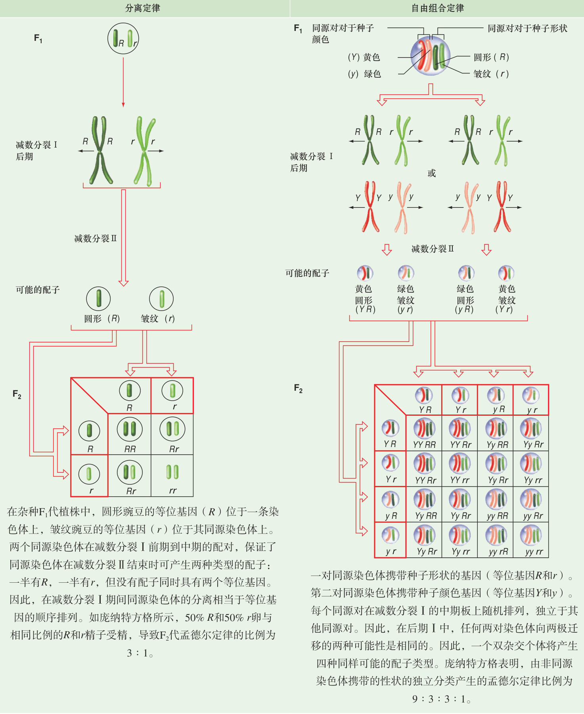  

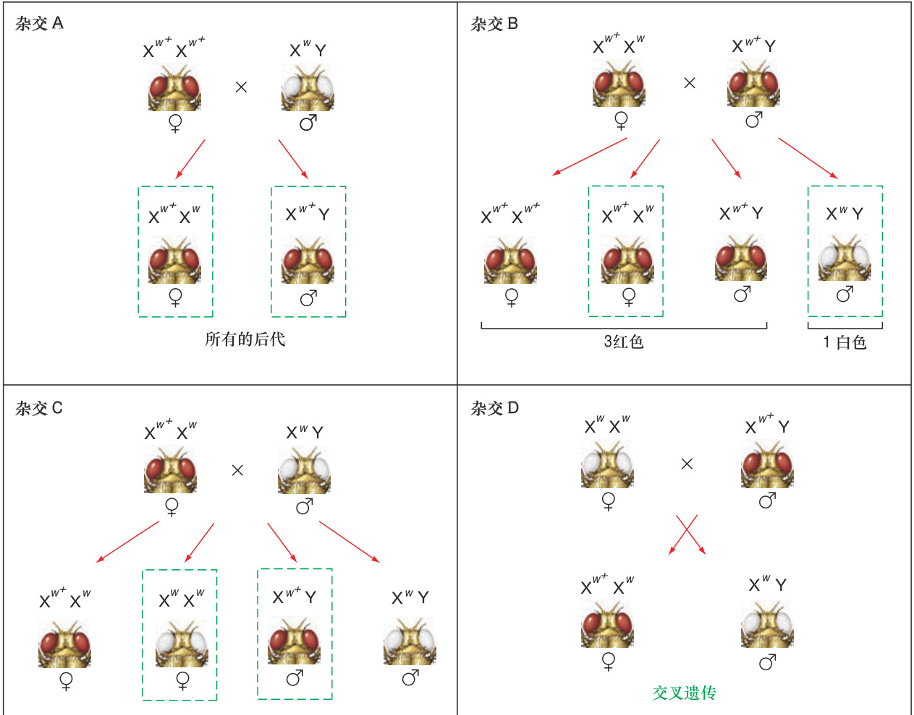  
图4.20　果蝇眼睛颜色基因位于X染色体上。在托马斯·亨特·摩尔根的这一系列杂交中，X连锁解释了白色基因等位基因的遗传。用绿色点框标出的A、B和C的后代是本系列下一个杂交的亲本。  

从这些数据中，摩尔根推断出果蝇眼睛颜色的白色基因是X连锁的，也就是说，由X染色体携带（注意，基因和等位基因的符号是斜体的，但染色体的符号不是）。Y染色体不携带这种眼睛颜色基因的等位基因。因此，雄性只有一个基因副本，它们从它们的母亲那里继承，连同它们唯一的X染色体；它们的Y染色体一定来自它们的父亲。因此，雄性的眼睛颜色基因是半合子的，因为它们的二倍体细胞有一半的等位基因由雌性携带在她的两条X染色体上。  

如果雄性X染色体上的单一白色基因是野生型的$w^{+}$ 等位基因，那么它就会有红色眼睛和一个可以写成$\mathbf{X}^{w^{+}}\mathbf{Y}$ 的基因型［这里我们指定染色体（X或Y）及其携带的等位基因，以强调某些基因是X连锁的］。与 $\mathbf{X}^{w^{+}}\mathbf{Y}$ 雄性相比，半合子的 $\mathbf{X}^{w}\mathbf{Y}$ 雄性会有白色的眼睛。有两条X染色体的雌性可以是三种基因型之一： ${\bf X}^{w}{\bf X}^{w\mathrm{~(~}}$ （白眼）， $\mathbf{\boldsymbol{X}}^{w}\mathbf{\boldsymbol{X}}^{w^{+}}$ （红眼，因为 $w^{+}$ 对 $\boldsymbol{w}$ 占优势），或 ${\boldsymbol{X}}^{w^{+}}{\boldsymbol{X}}^{w^{+}}$ （红眼）。如图4.20所示，摩尔根认为眼睛颜色的基因与X染色体有关，这一假设解释了他的育种实验的结果。例如，交叉遗传发生是因为白眼母亲（ ${\bf X}^{w}{\bf X}^{w}$ ）的雄性后代中唯一的X染色体必须携带 $\boldsymbol{w}$ 等位基因，这样雄性后代就会是白眼。相反，因为红眼父亲（ $\mathbf{X}^{w^{+}}\mathbf{Y}$ ）的雌性后代必须从父亲那里得到一个带有 $w^{+}$ 的X染色体，所以它们的眼睛都应该是红色的。  

# 2. 从不分离性分析验证染色体理论  

虽然摩尔根的研究有力地支持了眼睛颜色的基因存在于X染色体上的假设，他自己也一直在质疑染色体理论的有效性，直到他的一名优秀学生Calvin Bridges，发现了另一个关键证据。Bridges重复了摩尔根在白眼雌性和红眼雄性之间的杂交实验，但这次他做的实验规模更大。不出所料，这个杂交后代主要由红眼雌性和白眼雄性组成。然而，大约每2000名雄性中就有1名眼睛是红色的，而雌性中有一小部分眼睛是白色的。  

Bridges假设，这些例外是由于在雌性减数分裂过程中X染色体无法分离的罕见事件而产生的。他称这种染色体分离的失败为不分离。导致不分裂的错误可能发生在减数分裂Ⅰ或减数分裂Ⅱ期间，但在任何一种情况下，不分离都会导致一些卵子有两个X染色体，而另一些则没有。如图4.21（a）所示，这些染色体异常的卵子受精可以产生四种类型的受精卵：XXY（两个X染色体来自卵子，一个Y染色体来自精子），XXX（两个X来自卵子，一个X来自精子），XO（精子中唯一的性染色体，卵子中没有性染色体），OY（唯一的性染色体来自精子）。  

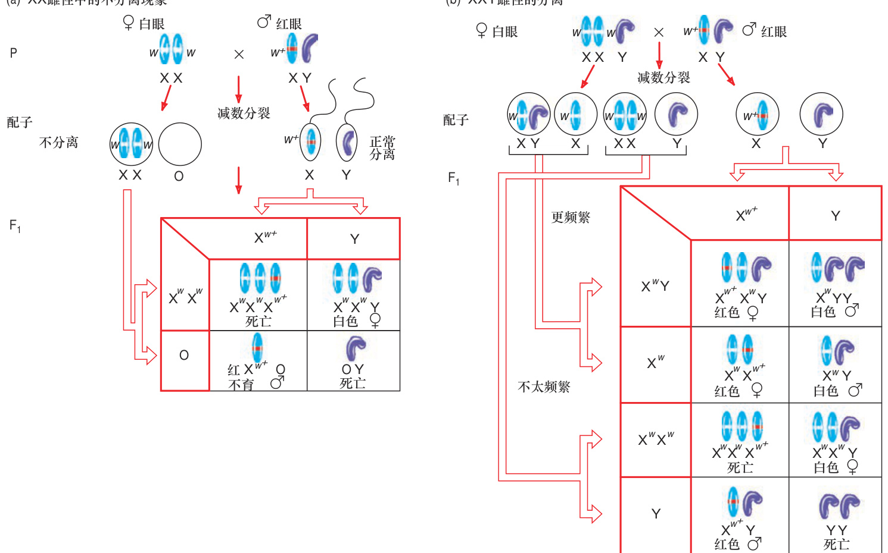  
(a)  XX   
图4.21　不分离连接蛋白：减数分裂中罕见的错误有助于证实染色体理论。（a）XX雌虫不分离的罕见事件产生XX和O卵。正常分离的结果在雌性没有显示。XO雄性果蝇是不育的，因为缺失的Y染色体是雄性果蝇繁殖所必需的。（b）在XXY雌性中，这三条性染色体可以以两种方式配对和分离，产生具有不同寻常的性染色体互补的后代。  

当Bridges在他的大型杂交中检测了罕见的白眼雌性的性染色体时，他发现它们确实是XXY个体，它们一定从白眼的X X 母亲那里得到了两条X染色体和两个 $\mathcal{w}$ 等位基因。杂交后代中出现的特殊红眼XO雄性个体；它们的眼睛颜色表明它们一定是从它们Xw Y父亲那里获得了唯一的性别染色体。在这项研究中，白色基因等位基因的传递遵循了X染色体在罕见减数分裂错误中的预测行为，表明X染色体携带眼睛颜色的基因。这些结果也表明，含有两个不正常的性染色体核型（XXX和OY）的受精卵在胚胎发育过程中死亡，因此不会产生后代。  

因为XXY白眼睛雌性有三条性染色体，而不是正常的两条，Bridges推断它们会产生四种卵子：XY和X，或XX和Y［图4.21（b）］。你可以想象这四种卵子的形成，当三条染色体配对并在减数分裂过程中分离时，两条染色体必须走到一极，另一条染色体必须走到另一极。对于这种分离，只有两种结果可能：一个X和  

Y走向一个极点，另一个X走向另一个极点（产生XY和X配子）；或者两个X走到一个极点，Y走到另一个极点（产生XX和Y配子）。这两种情况中的第一种更常见，因为当两个相似的X染色体配对时，确保它们在第一次减数分裂时到达相反的两极。第二种可能性较小，只有当两条X染色体不能配对时才会发生。  

Bridges下一步预测，这四种卵细胞通过正常精子从雌性XXY受精卵受精，将在后代中产生一系列与特定眼睛颜色相关的性染色体核型。Bridges分析了大量后代的眼睛颜色和性染色体，证实了他的所有预测。例如，他在细胞学上表明，图4.21（b）中所有从十字架上出现的白眼雌性都有两条X染色体和一条Y染色体，而一半的白眼雄性有一条X染色体和两条Y染色体。Bridges的艰苦观察提供了令人信服的证据，证明特定的基因确实存在于特定的染色体上。  

# 4.6.3 染色体理论整合了基因行为的许多方面  

孟德尔假设基因位于细胞中。染色体理论将这些基因分配到细胞内一种特定的结构中，并将替代等位基因解释为同源染色体的物理匹配部分。在此过程中，该理论解释了孟德尔定律。减数分裂的机制确保了同源染色体的匹配部分会分离到不同的配子上（除非在罕见的不分离的情况下），解释了孟德尔第一定律预测的等位基因分离。由于每个同源染色体对在减数分裂Ⅰ中独立于其他染色体对排列，不同染色体上携带的基因将独立排列，正如孟德尔第二定律所预测的那样。  

染色体理论也能够解释通过突变产生新等位基因，这是一种特定基因（即染色体的特定部分）的自发变化。如果一个突变发生在生殖系中，它可以传给后代。  

最后，通过胚胎和出生后的有丝分裂细胞的分裂，多细胞生物中的每个细胞都接收到与受精卵受精时从卵子和精子获得的相同的染色体，因此，每个基因都具有相同的父、母等位基因。这样，一个人的基因组（染色体和他或她携带的基因）在一生中保持不变。  

# 基本概念  

●  同源染色体在减数分裂时进入子细胞的分离解释了孟德尔第一定律。  
●  解释了孟德尔第二定律：在减数分裂过程中，同源染色体相互独立排列，非姐妹染色单体相互交换。  
●  在性别决定为XX/XY的生物体中，男性的X连锁基因是半合子，而女性有两个副本。  

# 4.7 人类的性别连锁和双性性状  

# 学习目标  

1. 通过系谱分析确定人类性状是X连锁还是常染色体。2.  解释人类细胞如何补偿X连锁基因在XX和XY细胞核中的剂量差异。  

一个不能分辨红色和绿色的人，几乎不可能分辨出花园花束中的玫瑰是鲜红还是洋红，以及树叶中精致的绿色，或者通过把红色的金属线和绿色的金属线连接起来来完成一个复杂的电路。这样的人很可能遗传了某种形式的红绿色盲，这是一种家族遗传的隐性疾病，主要影响男性。在北美和欧洲的白种人中， $8\%$ 的男性有这种视力缺陷，而只有 $0.44\%$ 的女性有这种视力缺陷。图4.22向具有正常色觉的读者展示了红绿色盲患者实际看到的东西。  

1911年，E. B. Wilson——遗传染色体理论的贡献者，将色盲遗传的家族研究与当时关于X染色体和Y染色体在性别决定中的作用的知识结合起来，首次将人类基因分配给特定的染色体。他说，红绿色盲的基因存在于X染色体上，因为这种疾病通常由外祖父通过未受感染的母亲传给大约 $50\%$ 的外孙。  

在Wilson完成基因分配的几年后，系谱分析证实了各种形式的血友病或出血病（血液不能正常凝结）也源于X染色体的突变，从而产生一种相对罕见的隐性特征。在这种情况下，罕见的意思是在人群中不常见。通过正在审查的家族史，包括英国维多利亚女王的后代［图4.23（a）］，表明相对罕见的X连锁性状在男性中出现的频率比在女性中出现的频率要高，而且往往会跳过几代人。表4.5总结了系谱中X连锁隐性遗传的线索。  

  
(b)   
图4.22　红绿色盲是人类的一种X连锁隐性遗传疾病。对于一个拥有正常色觉（a）或一种红绿色盲（b）的人来说，世界是什么样子的？  
两图：承蒙Vischeck提供色差模拟(www.vischeck.com)；承蒙NASA提供图片  

与色盲和血友病不同，X染色体上已知的罕见突变中，有一些（尽管很少）是野生型等位基因的显性突变。在这种显性的X连锁突变中，表现出异常表型的女性多于男性。这种现象的发生是因为受影响男性的所有女儿都患有这种疾病，但没有一个儿子会有这种情况，而受影响女性的一半儿子和一半女儿将获得显性等位基因，因此显示出表型（见表4.5）。维生素D抵抗性佝偻病，或低磷血症，是一个与X染色体相关的显性遗传特征的例子。图4.23（b）显示了受该疾病影响的一个家庭的谱系。  

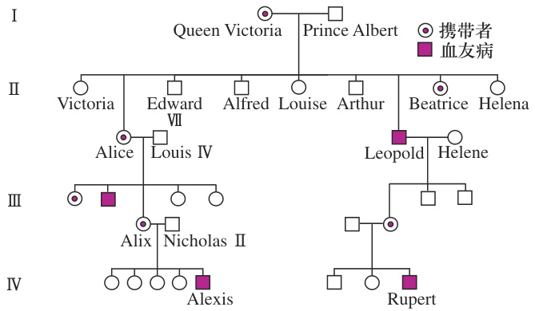  
(a)  X   
(b) X  

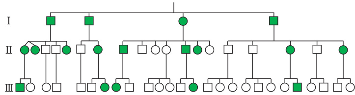  
图4.23　X连锁性状可能是隐性的，也可能是显性的。  

（a）显示维多利亚女王家族中隐性X连锁血友病遗传的谱系。（b）显示显性X连锁特性低磷血症遗传的谱系，通常称为维生素D抵抗性佝偻病。  

表4.5　谱系模式表明性别相关的遗传  

<html><body><table><tr><td>X连锁隐性特征</td></tr><tr><td>1.这种特征出现在男性身上的数量要多于女性，因为女性必须获得两份 这种罕见缺陷等位基因的副本才能显示这种表型，而只有一个拷贝的 半合子雄性即会显示出来。</td></tr><tr><td>2.这种突变永远不会从父亲传给儿子，因为儿子只能从父亲那里得到一 条Y染色体。</td></tr><tr><td>3.受感染的男性会将这种与X染色体相关的突变基因传给他所有的女 儿，而这些女儿也是携带者。这些雌性携带者的每一个儿子都有一半 的机会继承有缺陷的等位基因，从而获得这种特性。</td></tr><tr><td>4.当基因突变从祖父传给携带者的女儿，再传给孙子时，这种特征往往 会跳过一代人。</td></tr><tr><td>5.当受感染雄性的姐妹是携带者时，这种特征会在后代中出现。如果她 是，她的每个儿子都有一半的机会被选中。</td></tr><tr><td>6.对于罕见的受感染（纯合子）的雌性，她所有的儿子都将受到影响， 她所有的女儿都将成为携带者。</td></tr><tr><td>X连锁显性特征</td></tr><tr><td>1.女性比男性表现出更多的异常特征。</td></tr><tr><td>2只要受影响的男性有女儿时，这种特征就会在每一代人身上体现出来。 3.患病男性的所有女儿都会受到影响，但是儿子都不会被影响。这一</td></tr><tr><td>标准是区分X连锁显性性状和常染色体显性性状的最有效的标准。</td></tr><tr><td>4.受影响女性的儿子和女儿各有一半的机会受到影响。 5.对于不完全显性的X连锁性状，携带这种基因的女性可能比携带有</td></tr><tr><td>缺陷等位基因的男性表现得不那么极端。</td></tr><tr><td>Y连锁特征 1.这种特征只出现在男性身上。</td></tr><tr><td></td></tr><tr><td>2.受影响男性的所有男性后代都会表现出这种特征。</td></tr><tr><td>3.雌性不仅没有表现出这种特征，而且也无法传播。</td></tr></table></body></html>  

# 4.7.1 在XX人类女性中，有一个X染色体是失活的  

性别决定的XX和XY系统给人类细胞带来了一个奇怪的问题，需要一种叫做剂量补偿的解决方案。如前所述，X染色体包含大约1100个基因，它们所指定的蛋白质需要在男性和女性细胞中以相同的数量存在。为了补偿雌性细胞有两个X连锁基因副本而雄性细胞只有一个，XX细胞使其两条X染色体中的一条失活。失活的X染色体上几乎所有的基因都是关闭的，因此无法产生基因产物。X染色体失活发生在受精后两周左右，此时XX人类胚胎仅由 $500\!\sim\!1000$ 个细胞组成。每个细胞随机选择一个X染色体浓缩成所谓的巴氏小体，从而使其失活。巴氏小体是以发现它们的细胞学家Murray Barr的名字命名，在经DNA染色处理的间期细胞中呈黑色的小染色体，该染色体在光学显微镜下可见（图4.24）。  

每个胚胎细胞独立地“决定”哪个X染色体将不被激活——从母亲那里继承的X染色体还是父亲那里继承的X染色体。一旦做出了决定，它就会以无性繁殖的方式延续下去，这样，一个特定胚胎细胞有丝分裂所产生的数百万个细胞都会将同一条X染色体浓缩成一个巴氏小体［图4.25（a）］。因此，人类女性是由细胞拼凑而成的，一些细胞含有来自母体的活性X染色体，另一些细胞含有来自父方的活性X染色体［图4.25（b）］。在“快进”信息栏中，转基因小鼠中可视化X染色体失活的实验解释了科学家最近如何在小鼠体内外开发可视化技术，表达X染色体上的基因的克隆细胞块。  

X染色体失活现象可能对X连锁基因控制的性状产生有趣的影响。当女性在一个X连锁基因上杂合时，她们身体的一部分实际上是一个等位基因的半合子，而另一个等位基因的部分在基因功能上是半合子的。此外，对于一个等位基因或另一个等位基因，哪些身体部位在功能上是半合的是随机的；即使是拥有所有基因相同等位基因的同卵双胞胎，也会有不同的X染色体失活模式。在图4.25（b）中，X连锁隐性性状无汗性表皮发育引自：Hong et al. (17 July 2001), “ldentification of an autoimmune serumcontaining antibodies against the Barr body,” PNAS, 98(15): 8703-8708, Fig1A-B. ©2001 National Academy of Sciences, U.S.A.  

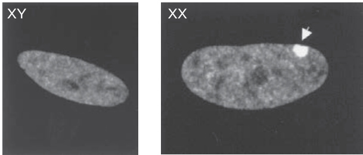  
图4.24　XX核型细胞中的密集染色颗粒是巴氏小体。箭头所指的是经过DNA染色处理的XX细胞核中的巴氏小体。在这张图片中，巴氏小体呈明亮的白色。与其他染色体不同，巴氏小体高度浓缩并附着在核膜上。XY细胞没有巴氏小体。  

# 快进  

# 在转基因小鼠中观察X染色体失活  

科学家们最近利用分子技术和转基因技术（类似于前面的“快进”信息栏“转基因小鼠证明SRY是雄性因子”）来可视化小鼠X染色体失活的模式。研究人员制造了XX只含有两种不同转基因的小鼠（在这种情况下，是来自不同物种的基因）。其中一个转基因是水母基因，它产生绿色荧光蛋白（GFP）；另一个是来自红珊瑚的基因，它能产生红色荧光蛋白（RFP）（图A）。  

在XX小鼠中，GFP基因位于母系X染色体上，RFP基因位于父系X染色体上。细胞的克隆斑块可以是绿色的，也可以是红色的，这取决于形成斑块的原始细胞中哪个X染色体变成了巴氏小体（图B）。  

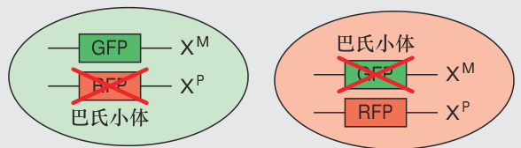  

图A　转基因小鼠细胞在X染色体失活时发出绿色或红色的反应。小鼠携带一个绿色（GFP）转基因插入母系X染色体（ $X^{\mathrm{M}}$ ），以及父系X染色体上的一个红色（RFP）转基因（ $X^{\mathrm{P}}$ ）。 $X^{\mathrm{P}}$ 被灭活的细胞（顶部）发出绿色；当XM失活时，细胞会发出红色（底部）。  

不同的XX小鼠呈现不同的绿色和红色拼接模式，清楚地显示了X染色体失活的随机性。这些拼接图案反映了每个克隆斑块的创始人细胞中X染色体失活的细胞记忆。目前，遗传学家使用这些转基因小鼠来破译细胞如何“记住”每个细胞分裂后要灭活哪个X的基因细节。  

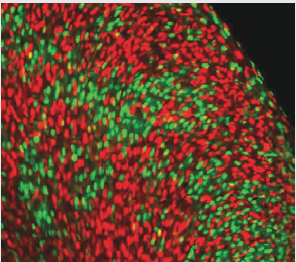  

图B　转基因小鼠心脏细胞显示X失活的克隆拼接图。红色或绿P色细 P胞斑M块代表M初始M细胞的M后代，P它们随P机灭活了其中的一个X染色体。  

$\copyright$ Hao Wu and Jeremy Nathans, Molecular Biology and Genetics, Neuroscience, and HHMI, Johns Hopkins Medical School  

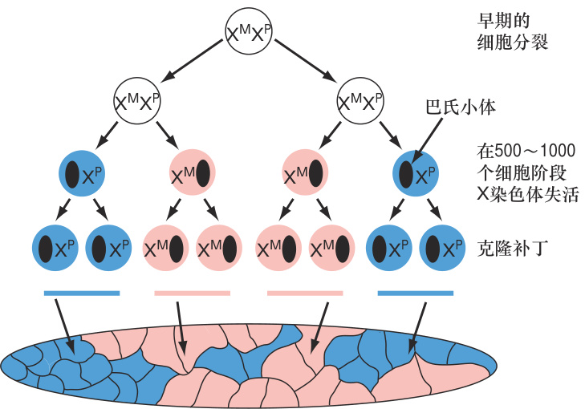  
(a)      X  

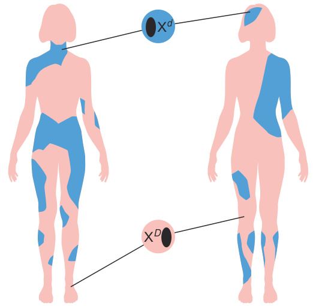  
(b) X  

图(4b.)2 5X　 X 染  色 体 剂 量 补 偿  使 人 类 女 性成为X连锁基因表达的完整产物。（a）在胚胎发生的早期，每个XX细胞将随机选择的X染色体浓缩成巴氏小体（黑色椭圆形），使其失活。相同的X染色体在每个细胞的所有后代中仍然是巴氏小体。 $\boldsymbol{X}^{\mathrm{M}}\!=\!$ 母亲的X染色体； $\mathbf{X}^{\mathrm{{P}}};$ =父亲的X染色体。（b）此处显示的双胞胎是X连锁隐性无汗性外胚层发育不良的杂合子（ $\lfloor O d\,\rangle$ ，阻止汗腺的发育。蓝色皮肤上的斑点缺少汗腺，因为带有野生型等位基因（ $D$ ）的染色体是失活的，而隐性的d等位基因是无功能的。  

不良的杂合子中，有缺失汗腺的皮肤斑块与正常皮肤斑块点缀；斑块的表型取决于哪条X染色体失活。每个贴片都是皮肤细胞的克隆，这些细胞来自于一个胚胎细胞，这个胚胎细胞决定使X染色体中的一条失活。在第二个例子中，X连锁隐性血友病等位基因杂合的女性被称为疾病等位基因的携带者，即使她们可能有一些血友病的症状。病情的严重程度取决于灭活疾病等位基因的细胞和灭活正常等位基因的细胞的特定随机模式。在第3章中，我们讨论了偶然事件如何通过基因影响表型；X失活就是这样一个事件的完美例子。  

回想一下，X染色体的两个顶端，即假常染色体区（PAR），也包含存在于Y染色体顶端的基因（图4.8）。为了平衡这些基因在XX和XY细胞中的剂量，巴氏小体X染色体上的PAR基因逃脱失活。剂量补偿的这一特征至少可以部分解释为什么XXY雄性（克兰费尔特综合征）和XO雌性（特纳综合征）具有异常的形态学特征。虽然XXY雄性的两条X染色体中的一条变成了巴氏小体，但是Klinefelter雄性在PAR区域有三种（而不是正常的两种）基因。XO细胞中的单个X染色体并没有变成巴氏小体，但是这些细胞只有一个PAR基因（而不是女性的两个XX）。  

X染色体失活在哺乳动物中很常见，我们将在后面的章节中介绍这一过程的分子细节。尽管如此，重要的是要认识到，其他生物体以其他方式补偿性别染色体的差异。例如，果蝇会使XY（雄性）细胞中的单个X染色体极度活跃，因此大多数X染色体基因产生的蛋白质是雌性X染色体的两倍。相反，秀丽隐杆线虫（C.elegans）降低了XX雌雄同体中每条X染色体相对于XO雄性中单个X染色体的基因活性水平。  

# 4.7.2 男性特征和男性生育能力是人类唯一已知的Y型关联特征  

理论上，由Y染色体突变引起的表型也应该通过谱系分析来识别。这些特征会从一个受影响的父亲遗传给他所有的儿子，并从他们遗传给所有未来的男性后代。雌性既不表现也不传播Y连锁表型（见表4.5）。然而，除了确定男性本身，以及对精子形成和男性生育能力的贡献之外，在人类身上还没有发现明确的与Y连锁相关的可见特征。已知Y连锁性状的缺乏反映了一个事实，正如前面提到的，小的Y染色体包含很少的基因。事实上，人们认为Y染色体对表型的影响有限，因为正常的XX女性在没有Y染色体的情况下表现得非常好。  

# 4.7.3 常染色体基因有助于两性性状的形成  

并不是所有产生两性差异的基因都位于X染色体或Y染色体上。一些常染色体基因控制出现在一种性别而不是另一种性别的性状，或在两种性别中表达不同的性状。  

限性性状影响一种结构或过程，这种结构或过程只存在于一种性别中，而不存在于另一种性别中。限性性状的基因突变只能影响表达这些结构或过程的性别的表型。限性性状的一个生动例子发生在纯合的雄性果蝇身上，这种果蝇具有常染色体隐性突变，这影响了变异雄性在交配时收缩阴茎和释放握在雌性生殖器上的螯的能力。突变的雄性在交配后很难与雌性分开。在极端的情况下，两只果蝇会一同死去。由于雌性缺乏阴茎和螯，纯合的黏着突变体雌性可以正常交配。  

从性性状在两性中都有表现，但由于激素的差异，这些性状在两性之间的表达可能有所不同。斑秃是一种头发过早地从头顶脱落而不是从两侧脱落的情况（图4.26），是一种从性性状的人类特征。虽然斑秃是一种复杂的特征，可以受到许多基因的影响，一个常染色体基因似乎在某些家庭发挥重要作用。在这些家族中，因秃顶等位基因杂合的男性在20多岁时就会脱发，而杂合的女性则没有明显的脱发现象。相反，两性的纯合子都变成秃顶（尽管纯合子女性的秃顶通常比纯合子男性晚得多）。这种从性性状在男性中占主导地位，而在女性中则是隐性的。  

# 4.7.4 性别决定通路基因突变可导致中间性障碍  

我们之前已经看到，Y染色体上的SRY基因对雄性是至关重要的，因为它在胚胎发生的早期就开始了睾丸的发育。但是许多基因的功能是睾丸发育所必需的，或者是依赖于睾丸中产生的激素来发育性器官的后续事件所必需的。这些基因有些是常染色体的，有些是X连锁  

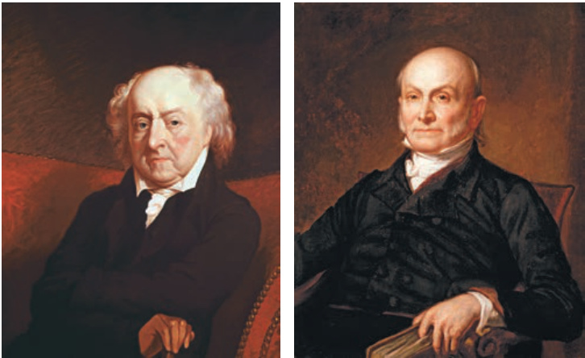  
(a) (b)  

图4.26　男性型秃发，从性性状。（a）约翰·亚当斯（1735—1826），美国第二任总统，约60岁。（b）约翰·昆西·亚当斯（1767—1848），约翰·亚当斯之子，美国第六任总统，年龄相仿。父子遗传表明，亚当斯家族男性型秃发  

可能是由一种常染色体基因的等位基因决定的。（a）： $\copyright$ Bettmann/Corbis；（b）： $\copyright$ The Corcoran Gallery of Art/Corbis的；在这两种情况下，XY个体中任何一种基因的等位基因突变都可能具有不寻常的两性间表型。  

在一个重要的例子中，雄激素受体的X连锁AR基因的等位基因发生非功能突变的XY人群患有一种称为完全雄激素不敏感综合征（CAIS）的疾病。这些XY个体的睾丸产生荷尔蒙睾丸酮，但是如果没有雄激素受体，雄激素就没有作用。没有雄激素受体，这些人既不能发育男性生殖器（阴茎和阴囊），也不能发育男性内部管道系统（输精管、精囊和射精管）；相反，他们的外生殖器假设默认的女性状态（阴唇和阴蒂）。然而，睾丸会产生另一种激素，阻止女性体内管道系统的形成（包括输卵管、子宫和阴道）。其结果是，患有CAIS的人外表上是女性，但由于缺乏内部管道系统，他们没有任何性别。  

# 基本概念  

●  与性别相关（X染色体相关）的性状表现出性别特异性的遗传模式，因为儿子总是继承父亲的Y染色体，而女儿总是继承父亲的X染色体。  
●  随机失活的母亲或父亲的X染色体在XX细胞，确保男性和女性哺乳动物细胞表达相同数量的蛋白质编码的大多数X连锁基因。  
●  基因的突变（无论是常染色体的还是X染色体连锁的）在男性和女性身上都有不同的表现。  

# 接下来的内容  

摩尔根和他的学生（被统称为果蝇组）承认孟德尔遗传学可以独立于染色体而存在。“我们经常被问到，为什么会把染色体拖进来？我们的答案是，因为染色体提供了孟德尔定律所要求的机制，由于越来越多的信息表明染色体是孟德尔定律的载体，对如此明显的关系视而不见是愚蠢的。此外，作为生物学家，我们对遗传感兴趣的主要不是数学公式，而是关于细胞、卵子和精子的问题。”  

果蝇组继续发现除了白眼睛外，还有几个X连锁突变。一种使身体变黄而不是棕色，另一种使翅膀变短，还有一种使身体的鬃毛变弯而不是笔直。这些发现提出了几个引人注目的问题。第一，如果所有这些特征的基因在X染色体上都是物理上联系在一起的，这种联系会影响它们独立排序的能力吗？第二，每个基因都有一个确切的染色体吗？如果有，这个特定的位置会影响它的传播吗？在第5章中，我们描述了如何根据已知的果蝇群体和其他物种等减数分裂期间染色体的运动，分析同一染色体上基因的传播模式，以及它们如何利用获得的信息将基因定位到特定的染色体位置。  

# 习题精解  

Ⅰ.  在人类，16号染色体有时在靠近着丝粒的长臂上有一个严重染色的区域。这种特征可以通过显微镜看到，但对携带这种特征的人的表型没有影响。当这种“斑点”存在于16号染色体的一个特定副本上时，它是该染色体的一个不变的特征，并且是可遗传的。  

一对夫妇怀上了一个孩子，但胎儿出现了多种异常并流产了。当对胎儿的染色体进行研究时，发现它有三个16号染色体副本（16号染色体是三体的），三个16号染色体中有两个有大的斑点。母亲的两个16号染色体同源体都没有斑点，但父亲的斑点是杂合的。哪个亲本经历了非正常分离？是在哪个减数分裂期发生的？  

# 解答  

这个问题需要对减数分裂过程中不分离的现象有所了解。当单个染色体包含一些能使同源染色体区别于另一个同源染色体的特征时，通过减数分裂可以遵循这两个同源体的路径。因为胎儿有两条带有斑点的16号染色体，我们可以得出结论，即额外的染色体来自父亲（唯一有斑点染色体的亲本）。  

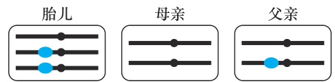  

因此减数分裂过程中肯定发生了染色体的非正常分离，正常的减数分裂会产生只有一个染色体16的配子；胎儿也只能有一个带有斑点的16号染色体。  

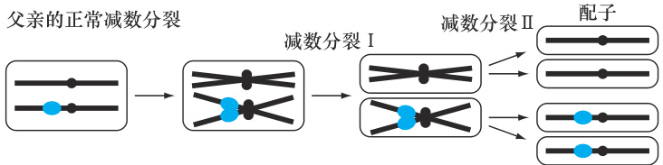  

在哪个减数分裂过程中发生了非正常分离？当减数分裂Ⅰ发生不分离时，同源染色体不能分离到相对的两极。如果这种情况发生在父亲身上，带有斑点的染色体和正常的16号染色体就会分裂成同一个细胞（次级精母细胞）。减数分裂Ⅱ发生后，由该细胞产生的配子将携带两种类型的染色体。如果这样的精子使一个正常的卵子受精，受精卵将有两个正常16号染色体的副本和一个带有斑点的染色体副本。  

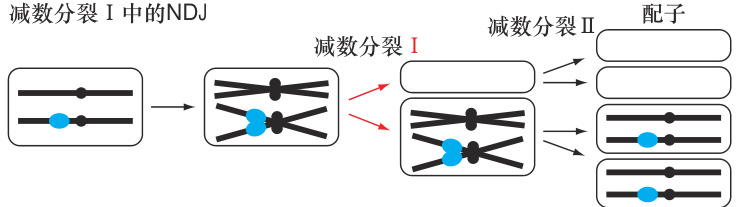  

另一方面，如果父亲在含有斑点16号染色体的次级精母细胞减数分裂Ⅱ期间不发生分离，则会产生带有两个斑点染色体副本的精子。与正常卵子受精后，结果将是在这种自然流产中看到的合子类型。  

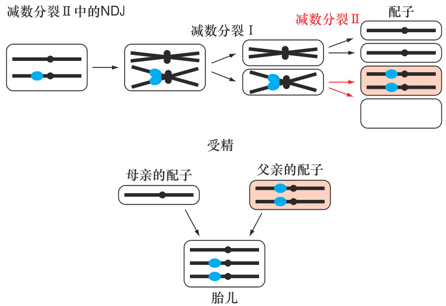  

因此，不分裂发生在减数分裂Ⅱ的父亲。  

Ⅱ.  （a）对于隐性X连锁致死基因，正常雄性小鼠和雌性小鼠杂合而成的后代，你希望它们的性别比例是多少？（b）对于隐性Z连锁致命等位基因，正常母鸡和公鸡杂合的杂交后代的期望性别比是多少？  

# 解答  

这个问题涉及与性别有关的遗传和性别决定。  
a.  小鼠性别决定系统为 $\mathrm{XX=}$ 雌性， $\mathrm{XY=}$ 雄性。正常雄性小鼠（ $\mathbf{X}^{R}\mathbf{Y}$ ） $\times$ 杂合雌性小鼠（ $\mathbf{X}^{R}\mathbf{X}^{r}$ ）会产生 $\boldsymbol{X}^{R}\boldsymbol{X}^{R}$ 、 $\mathbf{X}^{R}\mathbf{X}^{r}$ 、 $\mathbf{X}^{R}\mathbf{Y}$ 和XrY小鼠。 $X^{r}\mathbf{Y}$ 会导致小鼠死亡，所以雌性和雄性的比例是 $.2:1$ 。  
b.  鸟类的性别决定系统为 $Z Z=$ 雄性， $Z\mathrm{W}\!=$ 雌性。一只正常的母鸡（ $Z^{R}\mathbf{W}$ ） $\times$ 一只杂合公鸡（ $Z^{R}Z^{r}$ ）会产生 $Z^{R}Z^{R}$ 、 $Z^{R}Z^{r}$ 、 $Z^{R}\mathbf{W}$ 和ZrW鸡。因为ZrW后代不能存活，雌性和雄性的比例是 $1:2$ 。  

Ⅲ. 父亲是色盲的女性与父亲是色盲的男性交配。  

a. 他们的后代有什么表型？b. 如果一个正常人的父亲是色盲，你会怎么想？  

# 解答  

这个问题涉及与性别有关的遗传。  

a.  该女子的父亲具有 $\mathbf{X}^{c b}\mathbf{Y}$ 基因型。因为这个女子必须从她父亲那里继承一个X，她一定有 $\boldsymbol{X}^{c b}$ 染色体，但因为她有正常的色觉，她的另一条X染色体一定是 $\boldsymbol{X}^{C B}$ 。与她交配的男性具有正常的色觉，因此具有 $\boldsymbol{\mathrm{X}}^{C B}\boldsymbol{\mathrm{Y}}$ 基因型。他们的孩子可能是 $\mathbf{X}^{C B}\mathbf{X}^{C B}$ （正常女性）、 $\boldsymbol{X}^{C B}\boldsymbol{X}^{c b}$ （携带者女性）、 $\boldsymbol{\mathrm{X}}^{C B}\boldsymbol{\mathrm{Y}}$ （正常男性）或 $\mathbf{X}^{c b}\mathbf{Y}$ （色盲男性）的概率相同。b.  如果一个有正常色觉的人的父亲是色盲， $\boldsymbol{X}^{c b}$ 染色体不会传给他，因为男性不会从父亲那里继承X染色体。该男子具有 $\mathbf{X}^{C B}\mathbf{Y}$ 基因型，不能将色盲等位基因遗传。  

# 习题  

# 词汇  

1. 在右列中选择与左列中的术语最匹配的短语。  

a. 减数分裂 1.X和Y  
b. 配子 2.没有性别差异的染色体  
c. 染色体组型 3.复制染色体的两个完全相同的部分之一  
d. 有丝分裂 4.纺锤体极上的微管组织中心  
e. 间期 5.经历减数分裂的睾丸细胞  
f. 合胞体 6.胞质分裂细胞质的分裂  
g. 结合 7.受精时结合的单倍体生殖细胞  
h. 性染色体 8.含有一个以上细胞核的动物细胞  
i. 胞质分裂 9.同源染色体的配对  
j. 后期 10.一个二倍体细胞产生两个二倍体细胞  
k. 染色单体 11.染色体在一个细胞中的排列  
l. 常染色体 12.细胞周期中染色体不可见的部分  
m. 着丝粒 13.一个二倍体细胞产生四个单倍体细胞  
n. 中心体 14.减数分裂产生的不形成配子的细胞  
o. 极体 15.有丝分裂时姐妹染色单体分开的时间  
p. 精母细胞 16.姐妹染色单体之间最紧密连接的部位  

# 4.1节  

2. 人类每个体细胞有46条染色体。a. 孩子从父亲那里得到多少染色体？b. 每个体细胞中有多少常染色体和多少性染色体？c. 人类卵子中有多少染色体？d. 人类卵子中有多少性染色体？  

# 4.2节  

3.  下图显示了一个特定物种雄性的中期染色体。这些决定核型的染色体，还没有形成一定大小的染色体对。a. 有多少条染色体？b. 有多少染色单体？c.  有多少着丝粒？（将每一个姐妹着丝粒分开计数）d. 显示了多少对同源染色体？e.  图上有多少条染色体是具中间着丝粒的？近着丝粒端吗？f.  在这个物种中，性别决定的可能模式是什么？你认为这个物种中雌性的核型会有什么不同？  

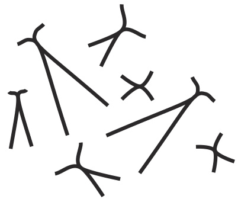  

4.  由于X染色体突变而发生性逆转的XX男性，如图4.7所示，当他们想要孩子时，往往会了解到自己的情况，并发现自己不育。你能解释一下为什么它们是不育的吗？  

5.  研究人员最近发现，SRY蛋白的唯一功能是激活假定性腺中的一种名为Sox9的常染色体基因（在它“决定”成为睾丸或卵巢之前）。a.  对于Sox9的非功能性突变等位基因，XY个体纯合子的性别是什么？请解释一下。b.  根据你对题目a的回答，为什么SRY而不是Sox9被认为是男性的决定因素？（提示：如果你做了一个实验，就像在“快进”信息栏“转基因小鼠证明SRY是雄性因子”，如果你用的是Sox9转基因而不是SRY，你认为会发生什么？）  

# 4.3节  

6.  一个有14条染色体的橡树细胞发生有丝分裂，形成了多少子细胞？每个细胞的染色体数目是多少？  

7.  指出编号为i $\sim$ v的细胞分别与有丝分裂的哪个阶段相匹配：  

a. 后期  
b. 前期  
c. 中期  
d. $\mathrm{G}_{2}$   
e. 末期/胞质分裂  

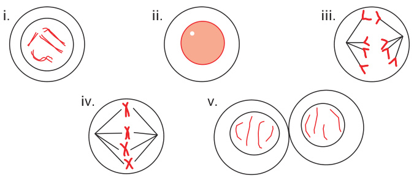  

8. a. 细胞周期的四个主要阶段是什么？b. 间期包括哪些阶段？c. ${\mathrm{G}}_{1}$ 、S和 $\mathrm{G}_{2}$ 的区别是什么？  

9.  回答细胞周期每个阶段（ ${\bf G}_{1}$ 、S、 $\mathrm{G}_{2}$ 、前期、中期、后期、末期）的问题。如果需要，使用箭头指示在特定的细胞周期阶段发生的改变（例如， $1\!\longrightarrow\!2$ 或yes→no）。  

a.  在这个阶段，每条染色体由多少条染色单体组成？  
b. 有核仁吗？  
c. 有丝分裂纺锤体是组织吗？  
d. 核膜存在吗？  

10.  你能想出什么方法来防止基因组是单倍体的细胞发生有丝分裂吗？  

# 4.4节  

11.  一个有14条染色体的橡树细胞经历减数分裂，这个过程会产生多少个细胞？每个细胞的染色体数目是多少？  

12.  哪一种细胞分裂（有丝分裂、减数分裂Ⅰ、减数分裂Ⅱ）使染色体数目减少一半？细胞分裂的哪一种类型是还原性的？细胞分裂的哪一种类型是等分的？  

13.  在适当的情况下，尽量使用下列词语完成下列陈述：有丝分裂，减数分裂Ⅰ（第一次减数分裂），减数分裂Ⅱ（第二次减数分裂），没有（不是有丝分裂或减数分裂Ⅰ或减数分裂Ⅱ）。  

a. 纺锤体组织存在于细胞的  
b. 染色体复制发生在  
c.  单倍体细胞中由 产生的细胞的染色体数是n。  
d.  二倍体细胞中由 产生的细胞的染色体数是n。  
e. 同源染色体配对经常发生在 期间。  
f. 非同源染色体配对经常发生在 期间。  
g. 在 时期物理重组导致了重组子代的产生。h. 姐妹着丝粒的分离发生在 期间。  
i. 在 时期非姐妹染色单体存在于同一细胞中。  

14.  图a～e所示的5个细胞均来自同一个体。区分每个细胞是在有丝分裂、减数分裂Ⅰ，还是减数分裂Ⅱ。下列情况分别处于细胞分裂的哪个阶段？这个有机体中的n代表什么？  

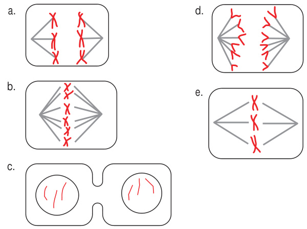  

15.  1905年，Nettie Stevens发表了对细胞分裂中染色体的首次微观观察。由于当时很难复制照片，她将这些观察用素描的形式记录了下来。图中显示的是黄粉虫完全正常的细胞分裂。以今天的标准来看，当时的技术相对简单，还不能观察到确定存在的染色体结构。  

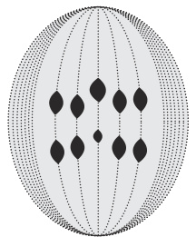  

a.  尽可能详细地描述图中所示的细胞分裂的种类和阶段。  
b.  图中不能解答关于染色体结构的什么问题？  
c. 正常黄粉虫配子中有多少条染色体？  

16.  一个人同时具有两种常染色体遗传特征。一种是白化病的隐性条件（等位基因A和 $a$ ），这种白化病基因在离中心体长臂的着丝粒附近被发现。另一个特征是显性遗传性亨廷顿病（HD和 $H D^{+}$ 等位基因）。亨廷顿病基因位于一个具有中间着丝粒的常染色体臂的端粒附近。画出这个人的两个相关染色体的所有拷贝，因为它们将出现在：（a）有丝分裂中期，（b）减数分裂Ⅰ，（c）减数分裂Ⅱ。在每张图中，假设没有发生重组，在每个染色单体的两个基因的等位基因上标记位置。  

17.  假设：（i）每个同源染色体对中的两条染色单体携带某些基因的不同等位基因；（ii）不发生交换，那么一对人类夫妇可能生育多少个不同基因的后代？这两个假设（i或ii）哪一个更现实？  

18.  在多毛苔藓群落中，单倍体染色体数为7。单倍体雄性配子与单倍体雌性配子融合形成二倍体细胞，分裂并发育成多细胞孢子体。孢子体的细胞经过减数分裂产生单倍体细胞，称为孢子。单个孢子包含一组所有的染色体都来自雄性配子的染色体的概率是多少？（假设没有发生重组）  

19.  你能想到在基因组总是单倍体的生物体中有什么能阻止减数分裂发生吗？  

20.  姐妹染色单体在有丝分裂中期通过内聚蛋白复合物结合在一起，形成橡皮筋样的环，将两个姐妹染色单体捆绑在一起。内聚素环既存在于着丝粒，也存在于沿着染色体长度分布的许多位置。环在有丝分裂后期开始时被蛋白酶破坏，使姐妹染色单体分离。  

a.  姐妹染色单体之间的内聚蛋白复合物也负责维持同源染色体在一起，直到减数分裂Ⅰ后期。基于这一点，下面的两个图（i或ii）中哪个正确地表示了减数分裂i的前期到中期染色单体的排列？解释一下。  

b.  你对题目a的回答能否推断出着丝粒内聚蛋白复合物与沿着染色体臂的内聚蛋白复合物的性质？提出一个分子假说来解释你的推论。  

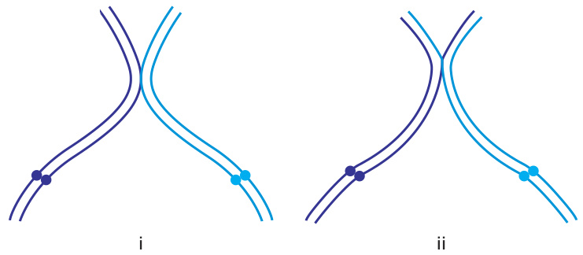  

21.  在雄性减数分裂过程中，X染色体和Y染色体的假常染色体区（PAR）使性染色体配对和结合。考虑到SRY基因在PAR1附近的位置，你能否提出一种机制来解释图4.7中突变的X和Y染色体（X的一部分在Y上，Y的一部分在X上）是如何在减数分裂过程中出现的？  

22.  值得注意的是，鸭嘴兽有10条性染色体，是所有哺乳动物中数量最多的。雌性鸭嘴兽有5对不同的X染色体（ $X1\!\sim\!\mathrm{X}5$ ），而雄性鸭嘴兽有5条（ $X1\!\sim\!\mathrm{X}5$ ）X染色体，还有5条不同的Y染色体（ $\Upsilon1{\sim}\Upsilon5$ ）。在雄性减数分裂过程中，5条X染色体总是在一个配子中，而5条Y染色体总是在另一个配子中。为了实现正常分离，在减数分裂前期，性染色体形成一条长链，其排列顺序为X1 Y1 X2 Y2 X3 Y3 X4 Y4 X5 Y5，其中染色体通过假常染色体区（PAR）结合在一起。  

# 4.5节  

23. 黑猩猩的体细胞含有48条染色体。  

有多少染色单体和染色体存在于：（a）有丝分裂的后期，（b）减数分裂Ⅰ后期，（c）减数分裂Ⅱ后期，（d）有丝分裂 ${\bf G}_{1}$ 前期，（e）有丝分裂 $\mathrm{G}_{2}$ 前期，（f）减数分裂Ⅰ的 ${\bf G}_{1}$ 前期，（g）减数分裂Ⅰ前期？  

有多少染色单体或染色体存在于：（h）在S期之前的卵母细胞，（i）精子细胞，（j）在排卵前被抑制的初级卵母细胞，（k）受精前抑制的次级卵母细胞，（l）第二极体，（m）黑猩猩的精子细胞？  

24. 在人类：  

a.  有多少精子是由100个初级精母细胞发育而来的？b.  有多少精子是由100个次级精母细胞发育而来的？c.  有多少精子是由100个精子单体发育而来的？d.  有多少卵子是由100个初级卵母细胞发育而来的？e.  有多少卵子是从100个次级卵母细胞发育而来的？f.  100个极体发育出多少卵子？  

25.  女性有时会患上卵巢的良性肿瘤，称为卵巢畸胎瘤或皮样囊肿。这种肿瘤通常开始于初级卵母细胞，从它的前期Ⅰ停止并在卵巢内完成减数分裂Ⅰ（正常情况下，减数分裂Ⅰ直到排卵时初级卵母细胞从卵巢排出后才会消失）。次级卵母细胞就像胚胎一样发育。然而，发育的紊乱导致了肿瘤的发生，并且在肿瘤内发现了分化的二倍体组织，如牙齿、头发、骨骼、肌肉和神经等。如果一个基因型为Aa的女性形成了一个皮样囊肿，假设没有重组，囊肿可能的基因型是什么？  

26.  在某些火鸡品种中，未受精的卵子有时会发育成孤雌生殖，产生二倍体后代（女性有ZW、男性有ZZ性染色体。假设WW细胞无法存活）。根据下面关于孤雌生殖如何发生的各个模型，预估在孤雌生殖后代中看到什么性别分布？a.  卵子是由从未经历减数分裂的卵母细胞发育而来。b.  卵子经过减数分裂，然后复制染色体成为二倍体。c.  卵子经过减数分裂Ⅰ，染色单体分离形成二倍体。d.  卵子经历减数分裂，然后随机地与它的三个极体中的一个融合（这个场景假设第一个极体经历减数分裂Ⅱ）。  

# 4.6节  

27.  想象一下，你有两种纯种金丝雀，一种长着黄色的羽毛，另一种长着棕色的羽毛。在这两个品系的杂交中，黄色的雌性 $\times$ 棕色的雄性只生出棕色的子代，而棕色的雌性 $\times$ 黄色的雄性只能生出棕色的雄性和黄色的雌性。提出一个假设来解释种现象。  

28.  在蜜蜂中发现了一种被称为单倍体-二倍体的性别鉴定系统。雌性是二倍体，雄性（雄蜂）是单倍体。雄性后代是未受精卵发育的结果。精子是由雄性的有丝分裂和雌性的受精卵产生的。象牙眼是蜜蜂的隐性特征；野生型眼睛是棕色的。  

a.  象牙眼的蜂王和棕色眼的雄蜂会生出什么后代？为受精卵和非受精卵所产生的后代提供基因型和表型。b.  题目a中与棕色眼睛的雄蜂交配时，产生的雌性后代是什么表型？  

29.  在果蝇中，常染色体隐性棕色眼睛颜色突变与X染色体隐性朱红突变和常染色体隐性猩红突变均表现出相互作用。纯合子为褐色，半合子或纯合子为朱红色的果蝇有白色眼睛的后代。同时，纯合子果蝇的棕色和鲜红色突变体也能产生白色眼睛的后代。预测与下列亲本杂交的F1和F2后代：  

a. 朱红色的雌性 $\times$ 棕色的雄性b. 棕色的雌性 $\times$ 朱红色的雄性c. 鲜红色的雌性 $\times$ 棕色的雄性d. 棕色的雌性 $\times$ 鲜红色的雄性  

30.  棒状羽毛是鸡的Z连锁显性特征。  

a.  棒状羽毛的母鸡与非棒状羽毛的公鸡杂交，会有什么样的后代？  
b.  通过题目a杂交产生的F1公鸡的姐妹之一是什么表型？  

31.  当Calvin Bridges观察到大量白眼雌性果蝇和红眼雄性果蝇杂交的后代时，他在这些后代中发现了非常罕见的白眼雌性和红眼雄性。他证明这些异常是由于不分离造成的，这样，白眼的雌性从卵子中得到两个X、从精子中得到一个Y，而红眼的雄性则没有从卵子中得到性染色体、从精子中得到一个X。如果这些不分离事件发生在雄性亲代身上，会产生什么后代呢？它们的眼睛会是什么颜色？  

32.  在一小瓶果蝇中，一名做研究的学生注意到有几只雌性果蝇（但没有雄性果蝇）有袋状翅膀，每个袋状翅膀都由一个充满液体的大水泡组成，而不是通常光滑的翅膀叶片。当袋翅雌虫与野生型雄虫杂交时，后代中1/3为袋翅雌虫，1/3为正常翅雌虫，1/3为正常翅雄虫。解释这种结果产生的原因。  

33.  1919年，Calvin Bridges开始研究一种引起果蝇眼睛呈伊红的X连锁隐性突变。在一种真正的红眼睛果蝇繁殖环境中，他注意到一些罕见的变种，它们的眼睛颜色比红眼睛浅得多。通过将这些变种杂交，他能够培育出真正的奶油眼品种。现在，这种奶油色眼睛的雄性与真正繁殖的野生型雌性之间进行了杂交。所有 ${\mathrm{F}}_{1}$ 代均为红（野生型）眼。当F1果蝇杂交时， $\mathrm{F}_{2}$ 后代有104只红眼雌性果蝇、52只红眼雄性果蝇、44只伊红眼雄性果蝇和14只奶油眼雄性果蝇。假设这些数字是 $8:4:3:1$ 的比例。  

a.  制订一个假设来解释 $\mathrm{\nabla{F_{1}}}$ 和 $\mathrm{F}_{2}$ 的结果，将表型分配给所有可能的基因型。b.  如果是纯种的红眼雄性和纯种的白眼雌性亲代之间的杂交，你对F1代和F2代有什么预测？  

c.  如果是纯种的红眼雌性和纯种的白眼雄性亲代之间的杂交，你对F1代和F2代有什么预测？  

34.  在果蝇中，一个黄体雄性果蝇和一个野生型的雌性果蝇之间杂交。F1代由野生型雄性和野生型雌性组成。将F1雄性与雌性杂交， $\mathrm{F}_{2}$ 后代由16只黄体残翅雄性、48只黄体残翅正常雄性、15只棕体残翅雄性、49只野生型雄性、31只棕体残翅雌性和97只野生型雌性组成。根据这些结果解释这两个基因的遗传。  

35.  正如我们在本章中学到的，托马斯·亨特·摩尔根研究的果蝇白色突变体与野生型呈X连锁隐性遗传。当携带该突变的纯种白眼雄性与纯种紫眼雌性杂交时，所有 $\mathrm{F}_{1}$ 后代都具有野生型（红色）眼睛。当F1代杂交时， $\mathrm{F}_{2}$ 代出现的比例为3/8野生型雌性∶1/4白眼雄性∶3/16野生型雄性∶1/8紫眼雌性∶1/16紫眼雄性。a. 提出一个假说来解释这些眼睛颜色的遗传。b.  如果亲代杂交发生逆转，预测F1和F2后代（如果亲代是纯种白眼雌性和纯紫眼雄性之间的杂交）。  

# 4.7节  

36.  下面是一个家族的谱系，其中发现了一种罕见的色盲遗传（填充符号）。尽可能多地标出系谱中所有个体的基因型。  

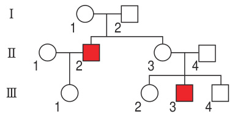  

37.  接下来的四个谱系中的每一个都代表了一个人类家族，在这个家族中，一种基因疾病正在分离。受影响的个体用填充符号表示。其中一种疾病为常染色体隐性遗传，一种为X连锁隐性遗传，一种为常染色体显性遗传，另一种为X连锁显性遗传。假设这四种性状在种群中都是罕见的，并且完全外显。  

a.  说明下列谱系的遗传模式，并给出你的解释。  

b.  对于每一个谱系，他们的孩子（由六边形表示）患这种疾病的概率是多少？  

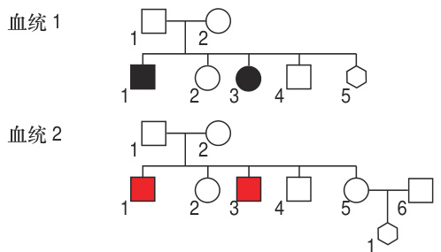  

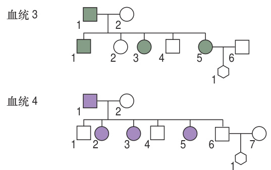  

38.  接下来的谱系表明，在一群霍皮印第安人中，白化病的发生非常频繁。假设该性状是完全外显的（所有携带可能导致白化病的基因型的个体都会表现出这种情况）。  

a.  白化病是由隐性等位基因还是显性等位基因引起的？  
b.  基因是与性别相关的还是与常染色体相关的？下列个体的基因型是什么？  
c. 个人Ⅰ-1  
d. 个人Ⅰ-8  
e. 个人Ⅰ-9  
f. 个人Ⅱ-6  
g. 个人Ⅱ-8  
h. 个人Ⅲ-4  

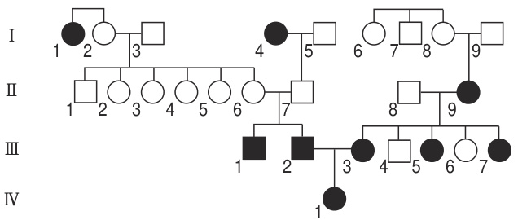  

39.  杜氏肌营养不良（DMD）是由一种相对罕见的X连锁隐性等位基因引起的。它引起进行性肌肉萎缩，通常导致患者在20岁前死亡。在这个疾病中，受影响的患者是由导致DMD的等位基因的杂合型或纯合型引起的。  

a.  如果一个未患病女人的哥哥患有此种疾病，那么这个女人的第一个儿子患病的概率是多少？  
b.  如果她的第一个儿子患病，那么她第二个儿子患病的概率是多少？  
c.  一个未患病男人的兄弟患有此种疾病，那这个男人的孩子患病的概率是多少？  
d.  一个患病的男人与未患病的表妹结婚；而且该家族没有任何DMD病史。如果这名男子的母亲和他妻子的母亲是姐妹，那么这对夫妇的第一个孩子患病的概率是多少？患病女孩的概率呢？未患病孩子的概率呢？  
e.  如果题目d所述夫妇的双亲为兄妹（而非姐妹），  

这对夫妇的第一个孩子是患病男孩的概率是多少？患病女孩的概率呢？未患病孩子的概率呢？  

40.  负责DMD的X连锁基因编码一种叫做抗肌萎缩蛋白的蛋白质，这种蛋白质是肌肉功能所必需的。抗肌萎缩蛋白不被分泌，而是留在产生它的细胞中。根据你对巴氏小体的了解，你认为携带隐性DMD疾病等位基因杂合子的女性可能在身体的哪些部位患病，哪些部位不患病？  

41. 当男性携带了凝血因子Ⅷ的一种X连锁基因的非功能性隐性突变等位基因时，会患有血友病。因子Ⅷ通常由骨髓细胞（和其他专门细胞）产生并分泌到血清中。a.  你认为携带血友病等位基因的女性杂合体是在身体的某些部位有血友病而在其他部位没有吗？b.  如果这样一个女性血友病携带者被割伤，她的血液凝结（形成血块）的速度是快还是慢？还是与正常的因子Ⅷ等位基因纯合体的凝结时间差不多？在雌性杂合体中，凝血速度会有显著的差异吗？  

42.  在观察转基因小鼠X染色体失活的“快进”信息栏中，假设研究人员观察了早期小鼠胚胎中少于500个胚胎细胞的绿色和红色荧光蛋白的表达。他们观察到什么模式？（假设转基因使基因产物处于早期发展阶段）  

43.  以下是五代患有先天性多毛症的家族谱系，这种罕见的疾病会导致个体出生时面部和上半身的毛发异常丰富。谱系中的两个小黑点表示流产。  

a.  假设这个家族中多毛症的遗传完全外显，你能得出什么结论？  
b.  在什么基础上可以排除其他遗传模式？  
c.  Ⅲ-2和Ⅲ-9有多少个亲本有孩子？  

44.  考虑以下来自人类家庭的血统，其中包括一名患有克林费特综合征的男性（携带XXY异常染色体的个体；用阴影方块表示）。其中，A和B分别为X连锁G6PD基因的共显性等位基因。每个个体（A、B或AB）的表型都显示在谱系上。说明三个例子中，克兰费尔特综合征患儿的父亲或母亲是否发生不分离。你能分辨出不分离发生在第一次分裂还是第二次分裂吗？  

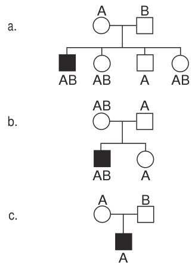  

45.  几种不同的抗原可以在血液检测中检测到。对每个个体进行了以下四个特征测试：  

ABO 类型 （IA和IB共显性，i隐性）Rh 类型 （ $R h^{+}$ 优于 $R h^{-}$ ）MN 类型 （M和N共显性）$\mathrm{Xg^{(a)}}$ 类型 $[\;X g^{(a+)}\{\!\!\!\!\slash\}\bar{\mathrm{L}}\bar{\mathcal{F}}X g^{(a-)}\;]$  

所有这些血型基因都是常染色体的，除了$\mathrm{Xg^{(a)}}$ ，它是X连锁的。  

妈妈 AB Rh– MN Xg(a+)女儿 A $\mathrm{Rh}^{+}$ MN Xg(a–)所谓的父亲 1 AB $\mathrm{Rh}^{+}$ M Xg(a+)所谓的父亲 2 A Rh– N Xg(a–)所谓的父亲 3 B $\mathrm{Rh}^{+}$ N Xg(a–)所谓的父亲 4 O $\mathrm{Rh}^{-}$ MN Xg(a–)a.  如果有的话，这些所谓的父亲中谁是真正的父亲？b.  如果女儿患有特纳综合征（XO个体中出现的异常表型），你对题目a的回答会发生变化吗？如果是这样，你的答案是什么？  

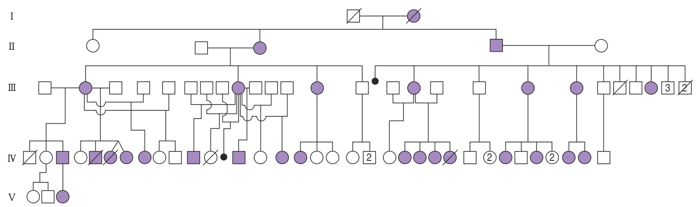  

46.  在题目e的谱系中描述了在城市动物园繁殖的白虎的祖先。白虎用不加阴影的符号表示（正如你所看到的，在这个谱系中有相当多的近亲繁殖。例如，白虎Mohan和他的女儿交配）。在回答以下问题时，假设白色是由单个基因的等位基因差异决定的，并且该特征是完全外显的。通过引用谱系中的相关信息来解释你的答案。  

a.  白色的被毛颜色可能是由一个Y连锁等位基因引起的吗？  
b.  白色的被毛颜色可能是由显性的X连锁等位基因引起的吗？  
c.  白色的被毛颜色可能是由显性常染色体等位基因引起的吗？  
d.  白色的被毛颜色可能是由隐性的X连锁等位基因引起的吗？  
e.  白色的被毛颜色可能是由隐性常染色体等位基因引起的吗？  

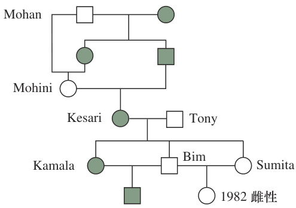  

47.  下面的谱系显示了一个特定家族中各种癌症的遗传。分子分析（在后面的章节中描述）表明，除了一个例外，这个谱系中发生在患者身上的癌症与一种名为BRCA2的罕见基因突变有关。a.  哪个个体是与BRCA2突变无关的特殊癌症患者？b.  就其致癌作用而言，BRCA2基因突变是显性的还是隐性的？c.BRCA2基因可能存在于X染色体、Y染色体还是常染色体？你能确定携带BRCA2的染色体的分配吗？d.  癌症表型的外显率是完整的还是不完整的？e.  癌症表型的表达是不变的还是可变的？f.  与BRCA2突变相关的表型是限性性状还是从性性状？  

g.  你如何解释第一代和第二代没有出现癌症患者的现象？  

48.  1995年，医生报告了一个中国家庭，其中色素性视网膜炎（视网膜进行性变性导致失明）只影响男性。受影响男性的6个儿子都受影响，但受影响男性的5个女儿（以及这些女儿的所有孩子）都未受影响。  

a.  这种遗传模式的视网膜色素变性是由出完全显性的常染色体突变引起的可能性有多大？b.  还有什么其他的可能性可以解释这个家族遗传性视网膜色素变性吗？你认为这些可能性中哪一个最有可能？  

49.  在猫身上，X连锁橙色基因的显性 $o$ 等位基因产生橙色皮毛；该基因的隐性 $o$ 等位基因产生黑色皮毛。玳瑁色猫的皮毛有橙色斑纹和黑色斑纹交替出现。大约 $90\%$ 的玳瑁猫是雌性。  

a. 解释为什么玳瑁色猫几乎都是雌性的。b. 什么类型的杂交会产生雌性玳瑁色猫？c. 提出一种假说来解释雄性玳瑁色猫的起源。d.  斑点猫（大多数是雌性）有白色、橙色和黑色的皮毛。提出一种关于斑点猫来源的假说。  

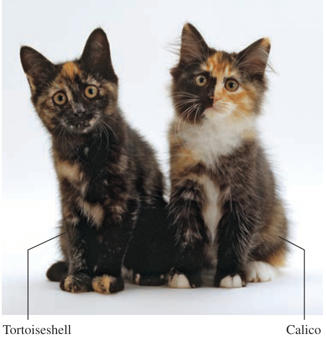  
$\copyright$ naturepl/SuperStock  

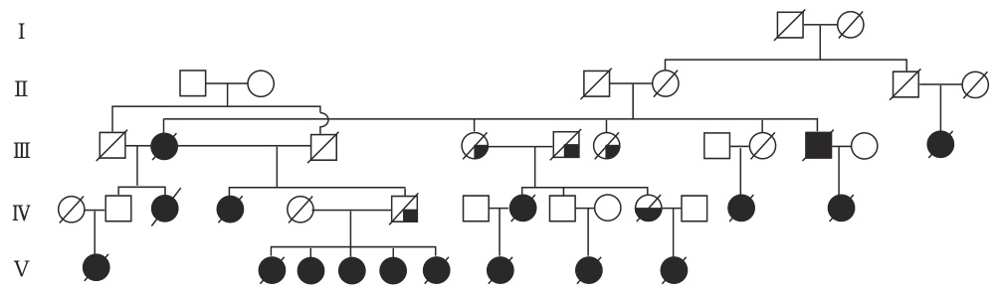  
47  

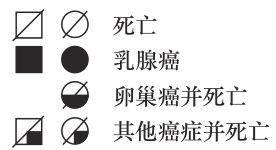  

50.  在有袋类动物中，如负鼠或袋鼠，X失活选择性地使父亲的X染色体失活。a.  如果一个雌性有袋动物的纯合子与一个雄性的杂合子交配产生一个控制皮毛颜色的X连锁基因的突变等位基因，那么就可以预测两性后代可能的皮毛颜色。b.  如果一个雄性有袋动物的半合子与一个雌性纯合子交配产生了该基因的另一种野生型等位基因，则可以预测其后代可能的两性被毛颜色。c.  为什么隐性和显性这两个术语在描述有袋类动物的控制被毛颜色的X连锁基因等位基因时没有被提及？d.  为什么有袋类动物杂合子的X连锁皮毛颜色基因的两个等位基因没有出现与前面问题中描述的玳瑁猫一样的两种不同颜色呢？  

51.  下面的系谱图显示了一个家族，其中许多个体受到一种叫做Leri Weill软骨发育不良（LWD）的疾病的影响。LWD患者由于腿骨畸形导致身材矮小；一些人的臂骨也是畸形的。导致LWD的突变基因在1998年被鉴定为SHOX，是位于X染色体和Y染色体的假常染色体区（PAR1）的基因。  

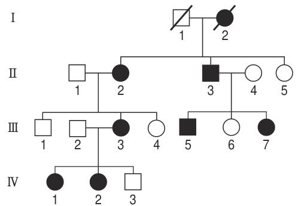  

a.  引起LWD的SHOX等位基因是显性的还是隐性的？解释一下（注：不涉及性逆转）。  
b.  尽管SHOX位于X染色体上，但对于X连锁等位基因来说，该谱系是不典型的。该谱系的哪些特征与X连锁不相容？  
c.  对于系谱中已被分离的个体，确定SHOX病等位基因是在X染色体上还是在Y染色体上。  
d.  解释系谱中SHOX（疾病）等位基因和 $S H O X^{+}$ （正常）等位基因的遗传规律。  
e.  图Ⅲ-5个体中显示了Y染色体的交换事件。通过图表可以确定单个Ⅱ-3的生殖系细胞中X和Y染色体上的SHOX（疾病）和SHOX （正常）等位基因的位置，以及Y上的SRY 等位基因的位置。  