# 第 5 章 染色体上基因的连锁、重组和作图  

  

地图绘制物体的空间关系，比如地铁沿线的地铁站位置。遗传图描绘基因在染色体上的位置。  
$\copyright$ Rudy Von Briel/PhotoEdit  

# 章 节 大 纲  

5.1 基因连锁和重组  
5.2 重组：减数分裂过程中染色体交换的结果  
5.3 作图：基因在染色体上的定位  
5.4 卡方检验和连锁分析  
5.5 真菌的四分体分析  
5.6 有丝分裂重组和遗传嵌合体  

1928年，医生们完成了一个四代谱系来追踪两种已知的X连锁性状：红绿色盲和A型血友病（一种更为严重的X连锁形式的出血性疾病）。此家族的外祖父同时具有这两种性状，这意味着他的单个X染色体携带两个相应基因的突变等位基因。正如所料，他的儿子和女儿都没有出现色盲和血友病，但是两个孙子和一个曾孙遗传了这两种X连锁的病症［图5.1（a）］。实际上，没有任何一个后代只表现出单独的性状，说明这两个突变等位基因在减数分裂期间不能自由组合。相反的，它们在一代配子形成过程中一起传递，然后进入形成下一代的配子中，产生具有同时携带色盲和血友病基因X染色体的孙子和重孙子。一起传递的基因往往表现出遗传连锁。  

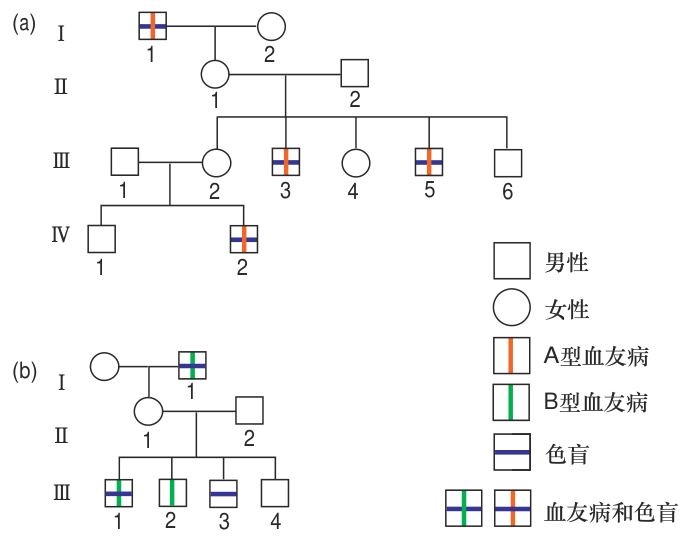  
图5.1　谱系表明色盲和两种类型的血友病是X连锁性状。（a）红绿色盲和A型血友病的传递。这些性状通过谱系传递，表明它们的遗传连锁。（b）红色绿色盲和B型血友病的传递。尽管两个基因都是X连锁的，但Ⅲ代的4个孙子中仅有一个同时遗传了两个突变等位基因。这两个谱系表明，色盲基因接近A型血友病基因，但远离B型血友病基因。  

相反，另外一个追踪色盲和B型血友病（同由X染色体上的突变引起的）的谱系则揭示了不同的遗传模式。患有B型血友病和色盲的祖父有4个孙子，但只有其中一个同时患两种疾病。在这个家族中，色盲和血友病的基因似乎是自由组合的，在男性后代中以大致相同的概率产生了两种特征的所有4种可能的组合：正常视力和正常血液凝固，色盲和血友病，色盲和正常凝血，以及正常视力和血友病［图5.1（b）］。因此，尽管这两个基因的突变等位基因在祖父的同一条X染色体上，但它们必须分开以产生孙子Ⅲ-2和Ⅲ-3。这种同一染色体上的基因分离是重组的结果，即在后代中产生上一代中未见到的新基因组合（注意重组子代可以有两种方式：本章即将讨论的在配子形成过程中同一染色体上基因重组，或在第4章中描述的非同源染色体上的自由组合基因）。  

当我们追踪连接在同一染色体上的基因的传递时，我们应该牢记两个主题。首先是两个基因分离得越远，通过重组分离的可能性就越大。从这个一般规则可以推断A型血友病的基因可能非常接近红绿色盲的基因，因为如图5.1（a）所示，两者很少分开。相比之下，B型血友病的基因必须远离色盲基因，因为如图5.1（b）所示，这两个基因的等位基因的新组合经常出现。第二个主题是遗传学家可以使用有关基因在传递过程中分离频率的数据来映射基因在染色体上的相对位置。这种映射是整理和追踪复杂遗传网络组成部分的关键；遗传学家在分子水平上分离和表征基因的能力也至关重要。  

# 5.1 基因连锁和重组  

# 学习目标  

1. 定义关于基因座和染色体的连锁。  
2. 区分亲代配子和重组配子。  
3. 从双杂交后代中子代的比例推断两个基因是否连锁。  
4. 解释如何用测交提供证据来推断基因是否连锁。  

如果人类约有27 000个基因，但只有23对染色体，则大多数人类染色体必须携带成百上千个基因。正如第4章所述，人类X染色体的确包含约1100个蛋白质编码基因。当人们认识到很多基因位于同一条染色体时，就引发了一个重要问题：如果不同染色体上的基因因为非同源染色体在减数分裂过程中在纺锤体上独立排列而自由组合，那么同一染色体上的基因如何分配？  

# 5.1.1 同一染色体上的基因不能自由组合，而是相互连锁  

我们首先用X连锁的果蝇基因进行分析，因为它们是第一个被定位到特定染色体的基因。在我们概述各种杂交时，请记住雌性携带两个X染色体，因此每个X连锁基因有两个等位基因。相反的，雄性只有一个X染色体（来自母本），因此这些基因只有一个等位基因。  

我们首先看决定果蝇眼睛颜色和体色的两个X连锁基因。这两个基因被认为是同线基因，因为它们位于同一染色体上。第4章介绍了白色基因，即显性野生型等位基因 $w^{+}$ 显示红色眼睛，而隐性突变等位基因 $\boldsymbol{w}$ 赋予白色眼睛。黄体色基因的等位基因是y （褐体色的显性野生型等位基因）和y（黄体色的隐性突变等位基因）。为避免混淆，请注意小写的y和y 表示黄色基因的等位基因，而大写的Y表示Y染色体（不携带任何眼睛或身体颜色的基因）。另需注意斜线符号（/），该符号用于分隔位于一对染色体的基因（在本例中为X和Y染色体，或者一对X染色体或同源常染色体）。因此wy/Y表示具有携带 $\boldsymbol{w}$ 和y的X染色体以及Y染色体的雄性基因型；在表型上这个雄性有白色的眼睛和黄色的身体。  

# 1. 通过分析双因子杂合子检测连锁  

携带突变型白眼和野生型褐体色 $\left(\,w\ y^{+}/\ w\ y^{+}\,\right)$ 的雌性与携带野生型红眼和突变型黄体色 $(\,w_{\mathrm{~}y}^{+}\,/\mathrm{~Y~}$ ）的雄性的杂交中， $\mathrm{F}_{1}$ 后代为正常红眼的褐色雌性 $(\boldsymbol{w^{+}}\boldsymbol{y^{+}}/\boldsymbol{\ w^{+}}\boldsymbol{y})$ ）和突变白眼的褐色雄性（ $\textrm{\textmu}_{w}\,y^{+}/\textrm{Y}$ ）（图5.2）。请注意雄性后代看起来像它们的母亲，因为雄性的表型直接反映了它们从母本那里得到的单个X染色体的基因型。与此不同的是F1雌性从母本那里接受了 $\boldsymbol{w}$ 和y ，从父本那里接受了 $x^{+}$ ，因此是双因子杂合子。这些F1雌性的每个X连锁基因都有两个等位基因，分别来源于亲本，每对等位基因的优势关系决定雌性表型。  

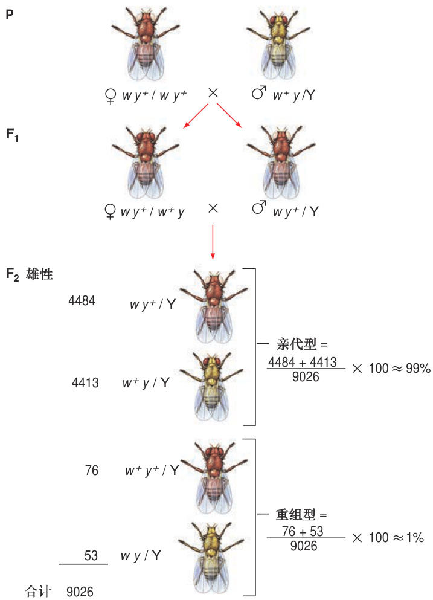  
图5.2　当基因连锁时，亲本组合数量超过重组型。双杂合子w y / $w^{+}$ y的F1雌性产生四种类型的雄性后代。看起来像F1雌性的父亲（ $\,w^{+}y\,/\,\mathbf{Y}$ ）或母亲 $\left(w\,y^{+}\right)\mathbf{Y}$ ）的F2雄性是亲代型。剩余的 $\mathrm{F}_{2}$ 雄性（w y / Y或 $.w\,y\,/\,\mathrm{Y}$ ）是重组型。紧密连锁的基因产生了比重组型更多的亲代型。  

现在来讨论与同一染色体上基因分配问题相关的重要交叉。如果果蝇的这两个决定眼睛和身体颜色的基因如孟德尔第二定律预测的那样自由组合，双杂交F 雌性应该产生四种配子，在X染色体上具有四种不同的基因组合——w $y^{+}$ 、 $w^{+}y$ 、 $w^{+}y^{+}$ 和 $w\ y$ 。这四种类型的配子应该以相同的频率出现，即比例为 $1:1:1:1$ 。如果以这种方式发生，大约一半的配子将是两种亲代型，携带有P代原始雌性的 $w\ y^{+}$ 等位基因组合或P代原始雄性的 $w^{+}\mathbf{Y}$ 等位基因组合。其余一半的配子将是两种重组型，其中重组产生 $w^{+}y^{+}$ 或wy等位基因组合，这在F1代雌性的P代亲本中未出现。  

我们可以通过计算F2代中不同类型的雄性后代来观察这四种配子是否是 $1:1:1:1$ 的比例，因为这些雄性从它们的母本配子中获得了唯一的X连锁基因。图5.2的底部描述9026只F 雄性的育种研究结果。通过双杂合子$\mathrm{F}_{1}$ 雌性配子传递的4个X连锁基因组合的相对数目与预期自由组合的 $1:1:1:1$ 比率具有显著偏差。到目前为止，最大数量的配子携带亲本组合w y 和w y。在所有被统计的9026只雄性蝇中，有8897只或几乎 $99\%$ 具有这些基因型。相比之下，新组合 $w_{\gamma}^{+}y^{+}$ 和 $\vert w\,y$ 只占稍多于总数的$1\%$ 以上。  

我们可以以两种方式解释基因为什么不能自由组合。 $w\,y^{+}$ 和 $\vert w_{y}^{+}y$ 为优选组合可能是因为在这些特定等位基因之间存在一些固有的化学亲和力。或者，这些等位基因组合可能最常出现，因为它们是亲代型。也就是说，$\mathrm{F}_{1}$ 雌性从其P代母亲继承了 $\boldsymbol{w}$ 和y ，从其P代父亲继承了$w^{+}$ 和y，那么F1雌性更可能将这些等位基因的亲本组合而不是重组组合传递给自己的后代。  

# 2. 连锁：亲本类配子的优势  

第二组涉及相同基因但具有不同分配方式等位基因的杂交解释了为什么双杂交F 雌性不能产生四种比例为$1:1:1:1$ 的配子类型（参见图5.3中的杂交系列B）。在第二组杂交中，最初的亲代包括红眼棕体雌性（ $w^{+}y^{+}/$ $w^{+}y^{+}$ ）和白眼黄体雄性（ $w y\mathrm{~/~Y~}$ ），所得到的F1雌性全部是 $\boldsymbol{w}^{+}\boldsymbol{y}^{+}/w\boldsymbol{y}$ 双杂合子。为了找出这些 $\mathrm{F}_{1}$ 雌性产生的配子种类和比例，我们需要看看能说明问题的F2雄性。  

如图5.3中的杂交系B所示， $w_{\textrm{}y}^{+}\,/\textrm{Y}$ 和 $\boldsymbol{w}\,\boldsymbol{y}^{+}/\boldsymbol{\textsf{Y}}$ 是占比为略微超过总数 $1\%$ 的重组体，而wy / Y和 $w^{+}y^{+}/\ ^{.}$ Y是父母组合，累计占比接近总数的 $99\%$ 。我们可以看到在这个杂交系中 $w^{+}$ 和y或者y+和 $\boldsymbol{w}$ 并不是优选关联。相反，比较这两个特定的X染色体基因的杂交实验表明，所获得的各种后代的频率取决于F 雌性中等位基因的原始排列。为了更加直观地比较，我们将图5.2重新绘制为图5.3中的杂交系A。在这两个实验中都需要注意到的是，在F 代中最常出现的是最初出现在P代中的亲代级，重组级出现的次数较少。重要的是要认识到，亲本配子和重组配子或双杂合子F1雌性后代的指定是可控的，即由其从每个亲本获得的特定等位基因组决定。  

当基因自由组合时， $\mathrm{F}_{2}$ 子代中亲本和重组型的数目是相等的，因为双重杂合F 个体产生所有四种类型配子具有相等数目。通过比较，当具有亲本基因型的F2子代的数目超过具有重组基因型的 $\mathrm{F}_{2}$ 子代的数目时，两个基因被认为是连锁的。大多数时候基因表现为就像彼此连接一样，而不是自由组合。位于果蝇X染色体上的眼睛和身体颜色的基因是连锁概念的极端例证。这两个基因结合太紧密，以至于等位基因的亲本组合——w y 和$w^{+}y$ （图5.3交叉系列）或w y 和wy（交叉系列B），每形成100个配子中才产生1个重组型。换句话说，这两个紧密连锁的亲本等位基因组合在100次遗传中有99次是共同遗传的。  

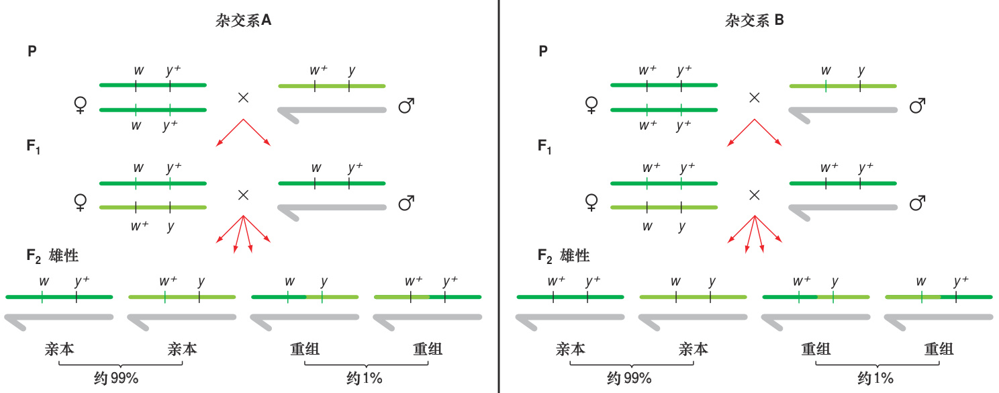  
图5.3　亲本和重组的指定与过去的历史相关。图5.2已在此重新绘制为杂交系A，以便于与杂交系B比较，其中双杂合子F1雌性接受白色和黄色基因的不同等位基因组合。注意两个杂交系中的亲代级和重组级彼此相反。尽管如此，重组型和亲代型的百分比在两个实验中都是相似的，表明重组的频率与等位基因的排列无关。  

# 3. 连锁程度的基因对特异性变异  

连锁并非总是如此紧密。人们在果蝇的X染色体上还发现了微型翅膀（ $m$ ）的突变。正常翅膀（ $w^{+}m^{+}/$ $w^{+}m^{+}$ ）的红眼雌性和微型翅膀的白眼雄性（ $\mathrm{~\textit~{~w~}~}m\mathrm{~/~Y~}$ ）杂交产生的 $\mathrm{F}_{1}$ 代都具有红眼正常翅膀。双杂合子 $\mathrm{F}_{1}$ 雌性的基因型为 $w^{+}m^{+}/\ w\ m$ 。在F 代雄性中， $67.2\%$ 是亲代型（ $w^{+}m^{+}$ 和 $w\ m$ ），而其余 $32.8\%$ 是重组体（ $w\ m^{+}$ 和$w^{+}m$ ）。  

在F2基因型中，亲本组合的优势表明这两个基因是连锁的：等位基因的亲本组合经常一起传递。但与眼睛颜色 $w$ 基因和身体颜色y基因之间 $99\%$ 的连锁相比， $\boldsymbol{w}$ 与$m$ 的联系并不那么紧密。颜色和翅膀大小的亲本组合在每100个配子中大约有33个（而不是1个）重组。  

# 4. 常染色体性状连锁  

每个常染色体连锁基因都有一个完全显性和一个完全隐性等位基因，不会如孟德尔比值 $9:3:3:1$ 的比例那样进行无相互作用的独立遗传分配。由于四个可能的配子类型（A B、A b、 $A\emph{B}$ 和a $b$ ）由亲本双方以相同频率产生，孟德尔在双杂交实验的 $\mathrm{F}_{2}$ 中观察到 $9:3:3:1$ 的表型比。相同数量的四个配子类型（自由组合）意味着庞纳特方格16个格子中的每一个F 都具有1/16的相同受精频率（见图2.15）。  

如果孟德尔的两个基因连锁，由于亲本配子的频率比重组配子更高， $\mathrm{F}_{2}$ 中的表型比将不再是 $\cdot9:3:3:1$ 。图5.4显示了如果F1双杂合子均为连锁基因 $\mathrm{~\normalfont~{~1~}~}B\mathrm{~/~}a\mathrm{~}b$ 的结果：9/16和1/16表型的F2数量升高；3/16表型的F2数量降低。相反，如果父母的等位基因配置不同（ $\langle\,A\ b\,/\,A\ b\times a$ $B\mathrm{~/~}a\mathrm{~}B$ ），并且F 因此是 $\cdot A\ b\ /\ a\ B$ ，那么两个3/16基因型类别将增加，9/16和1/16表型将降低（未显示）。因此，连锁解除了 $9:3:3:1$ 表型比的基础。亲本产生不同数量的四种配子类型，因此图5.4庞纳特方格中的每个格子将不再代表相同的受精机会。  

# 5.1.2 测交简化连锁检测  

20世纪早期的遗传学家很难解释如图5.4所示涉及常染色体基因的杂交，因为很难追踪等位基因来自哪个亲本。例如，图5.4中具有基因型A–B–的所有F2将具有相同的表型，但它们可能来自两个亲本配子（深蓝色方块）、两个重组配子（浅蓝色方块），或者一个亲本配子和一个重组配子（中蓝色方块）。然而，通过建立包含其一为隐性纯合亲本的两个基因的测交（下一章详述），遗传学家可以很容易地分析由双杂合亲本配子导致的基因重组。  

例如，果蝇携带的常染色体的体色基因（除了X连锁的y基因外）野生型呈棕色，该基因的隐性突变导致黑色 $\left(\textit{b}\right)$ 。同一常染色体上的第二个基因有助于确定果蝇翅的形状，野生型具有直边，隐性突变（c）产生弯曲。图5.5描绘了两个纯种繁殖品系之间的杂交：具有直翅膀的黑体雌性 $(\textit{b c}^{+}/\textit{b c}^{+})$ ）和具有弯曲翅膀的褐体雄性 $(\boldsymbol{b}^{\dagger}\boldsymbol{c}\boldsymbol{\ I}\boldsymbol{\ b}^{\dagger}\boldsymbol{c}\ )$ ）。所有的 $\mathrm{F}_{1}$ 子代都是双重杂合子（b$c^{+}/\,b^{+}c$ ），并且是表型上的野生型。  

在F1雌性与 $b\;c\;/\;b\;\epsilon$ c雄性的测交中，所有后代接受来自其父本的隐性等位基因b和c。因此，后代的表型表明从母本获得的配子种类。例如，具有正常翅膀的黑蝇将是基因型 $b~c^{+}/~b~c$ ，因为其从父本获得 $b c$ 组合，所以必须从母本获得 $b c^{+}$ 。如图5.5所示，约有 $77\%$ 的测交后代获得了亲本基因组合（即通过其父母的配子传递给F1雌性的等位基因组合），而其余 $23\%$ 为重组体。由于亲本图5.4　基因A和B的连锁改变 $9:3:3:1$ 的表型比。对于连锁基因， $\mathrm{F}_{2}$ 基因型类别最常出现亲代型频率的增加和其他类型频率的降低。图中所示的 $\left|A B\right|/a b$ 双杂交中， $\mathrm{F}_{2}$ 中的A–B–和aabb类具有比较高的频率，而另外两个类别（A–bb和aa $B\mathrm{-}$ ）的频率低于 $9:3:3:1$ 比率。注意庞纳特方格中蓝色的深浅和框的相对大小，表示特定基因型类别在 $\mathrm{F}_{2}$ 代中出现的频率。  

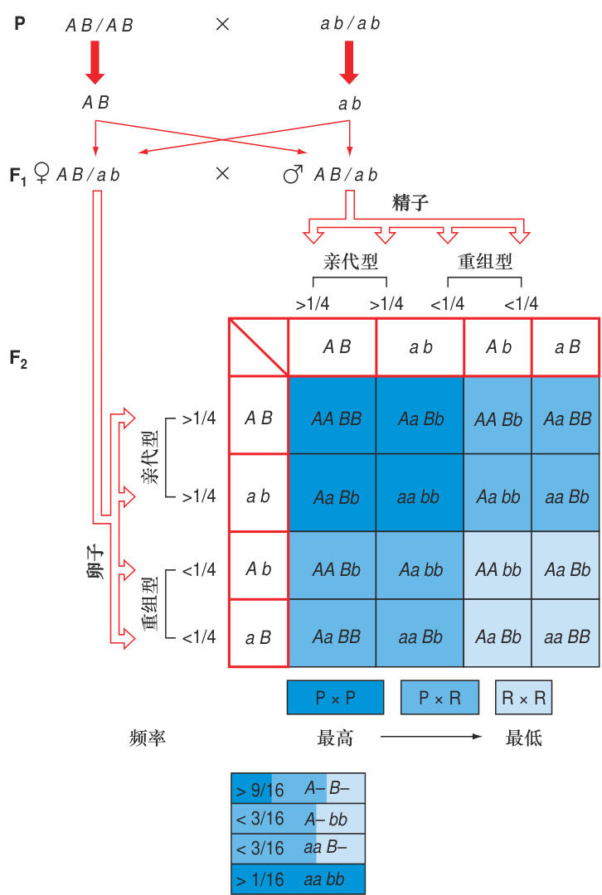  

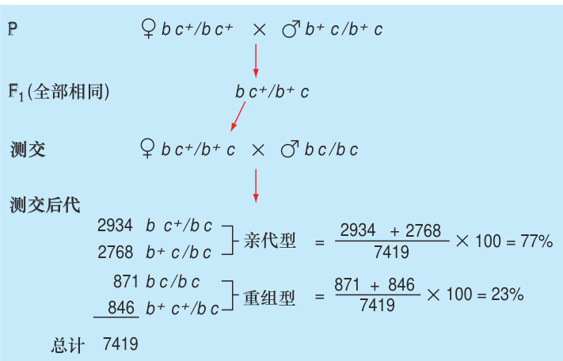  

图5.5　常染色体基因连锁。测交实验显示果蝇体色 $\left(\textit{b}\right)$ 和翅型 $(\ c\ ]$ ）基因的重组频率是 $\cdot23\%$ 。由于亲代型数量超过重组型， $b$ 基因和c基因遗传连锁且位于同一条常染色体。  

型的数量超过了重组型，可以推测常染色体黑体基因和弯曲翅膀基因是连锁的。  

# 基本概念  

●  同一染色体上的非自由组合基因被认为是连锁的。  
●  亲本配子包含从祖父或祖母一起遗传的等位基因；重组配子包含从祖父和祖母遗传的等位基因。  
●  连锁的标志是双杂合子产生的亲本配子比重组配子更多，因此涉及连锁基因的双杂交的后代比例不是$9:3:3:1$ 。  
●  测交利用子代表型和基因型的唯一对应关系阐明基因连锁。  

# 5.2 重组：减数分裂过程中染色体交换的结果  

# 学习目标  

1. 解释重组发生的物理过程。  
2. 描述减数分裂染色体分离时相互交叉的作用。  
3.  讨论重组频率与染色体上分离两个基因座的图距之间  
的关系。  
4.  解释为什么任何两个基因之间的重组频率都低于 $50\%$ 。  

理解同一染色体上具有物理连接的基因如何一起传播并显示遗传连锁是非常容易的，而理解为什么所有连锁基因总是在足够大的样本群体中显示一些重组则并不容易。染色体是否参与一个物理过程进行连锁基因的重新组织，导致了我们所谓的重组？这个问题的答案不仅仅是基因的传递倾向，更提供了衡量染色体上基因对之间相对距离的基础。  

1909年，比利时细胞学家Frans Janssens描述了他在光镜中观察到的第一次减数分裂前期的结构。他称这些结构是交叉，如第4章所述，似乎代表同源染色体的非姐妹染色单体交换的区域（见图4.16）。摩尔根结合遗传和细胞学数据推断，通过光学显微镜观察到的交叉是导致基因重组的染色体断裂和交换位点。  

# 5.2.1 同源染色体之间的相互交换是重组的物理基础  

摩尔根认为减数分裂过程中染色体的物理断裂和重新接合是遗传重组的基础，这似乎是合理的。尽管Janssens的交叉可以被解释为这一过程的标志，但在1930年之前没有人能够看到实际发生的同源染色体之间的交换。鉴定物理标记或细胞学可见的异常使得从一代到下一代跟踪特定的染色体部位成为可能，也使得研究人员能够将关于重组的逻辑推论转化为来自实验证据的事实。  

1931年，研究玉米的Harriet Creighton和Barbara Mc-Clintock以及研究果蝇的的Curt Stern发表了实验结果，证明基因重组确实取决于母本和父本染色体之间的部分相互交换。例如，Stern培育的雌性果蝇具有两条不同的X染色体，每条染色体在其一端附近含有一个独特的物理标记。这些雌性果蝇同时也是两个X连锁的遗传标记的双重杂合子。该X连锁基因的等位基因可以作为参考点来确定特定的后代是否为基因重组的结果。  

图5.6显示了这些杂合子雌性的染色体。一个X染色体携带可产生肾形（Bar）康乃馨色眼睛（深红宝石色，简称car）的突变，并且具有物理可见的由于X染色体的末端断裂，附着于常染色体导致的不连续性标记。另一条X染色体对于car和Bar基因都具有野生型等位基因 $(\,+\,)$ ，其物理标记由连接到X染色体着丝粒的部分Y染色体组成。  

图5.6阐明了这些car Bar / car+bar+雌性的染色体是如何遗传给雄性后代的。根据实验结果，所有显示由一种或另一种亲本基因组合（car bar或car Bar ）确定的表型的儿子具有与母亲中的原始X染色体之一在结构上无法区分的X染色体。然而在那些表现出康乃馨色眼睛颜色和正常眼睛形状（car Bar / Y）的重组子代雄性中，标记同源X染色体的末端异常特征的可识别交换伴随着基因重组。因此，这些证据将基因重组实例与特定染色体的特殊标记部分的交换联系起来。该实验完美地证明了遗传重组与减数分裂期间同源染色体之间的片段相互交换有关。  

# 5.2.2 为什么重组？  

在第4章中，我们讨论了重组的一个优势是为地球上的生物提供可测量的进化时间：重组通过改变同图5.6　证据表明基因重组来自于同源染色体互相交换。在果蝇X染色体上的car和Bar基因之间的遗传重组伴随着在显微镜中可观察到的物理标记的交换。注意，这仅是对交换的简化描述，因为基因重组实际上发生在每个染色体复制成姐妹染色单体之后。  

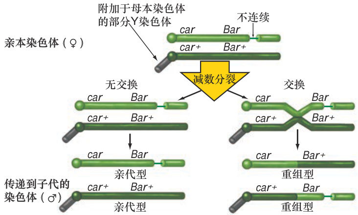  

源染色体之间基因的等位基因来促成遗传多样性（见图4.17）。然而，交换还会发挥另一种更重要的作用，即确保染色体在父母及其后代之间进行传播时可以正确分离。正如你所看到的，如果没有发生重组，那么在减数第一次分裂过程中染色体不分离将是经常发生的，而且物种不能在连续的世代中保留相同数量的染色体。  

问题在于正确的染色体分离需要将同源染色体拉到纺锤体的相反两极，这要求同源染色体不仅在前期彼此配对，而且要在中期过程中具有相互的物理连接，直到后期分离。只有当同源染色体被拉向相反方向时仍然具有物理连接，减数第一次分裂的纺锤体才能对染色体施加张力。如果没有张力，同源染色体不会“知道”它们连接到相反的纺锤体极点。因此，在没有张力的情况下，两条染色体通常被来自于纺锤体同一极点的纺锤丝连接，并且发生染色体不分离。那么，在减数分裂Ⅰ的后期之前，同源染色体之间是如何物理连接的呢？  

根据图4.16，联会复合体或重组节可能会被认为是同源染色体之间的必要物理连接。图5.7（a）显示了这些结构在前期Ⅰ（粗线期子阶段）中间的实际荧光显微照片。红色表示帮助同源染色体彼此配对的联会复合体。尽管染色体的DNA未在此图中显示，但每条红线代表已被复制为姐妹染色单体的两条同源染色体组成的二价体（四分体）。嵌在联会复合体间隔中的是包含催化染色体交换的酶的重组节，其中一种蛋白质被标记为绿色。然而，与预期相反的是，联会复合体和重组节都不能将同源染色体连接直到后期Ⅰ开始，原因在于这些结构会随着前期Ⅰ结束而消失。  

图5.7（b）和（c）说明即使在联会复合体和重组节已经解体时，同源染色体仍然彼此连接。正如第4章所讨论的，交叉标记着发生在前期Ⅰ的实际重组位点（来自同源染色体的非姐妹染色单体相互交换的位置）。然而，交换本身不足以将同源染色体连接在一起。如图5.7（c）所示，同源染色体之间的物理连接包含被称为黏连蛋白的分子复合物，其在染色体复制后不久后即连接姐妹染色单体。一旦交换发生，交换点远端的黏连蛋白复合体（即比交换点离着丝粒更远）使同源染色体排列在中期赤道板两侧，从而确保染色体分离正确。  

黏连蛋白在染色体生物学中具有多种作用。例如，它不仅沿染色体臂存在，也是着丝粒的关键组成部分。我们将在第12章详细讨论黏连蛋白如何在有丝分裂和减数分裂期间连接姐妹染色单体。  

图5.7（a）和（b）中所示的每个二价体至少含有一个重组节或交叉的事实强调了交换对染色体正确分离的重要性。实际上，几乎所有有性繁殖的生物体中都会发生被称为干涉的机制来确保每对染色体至少进行一次  

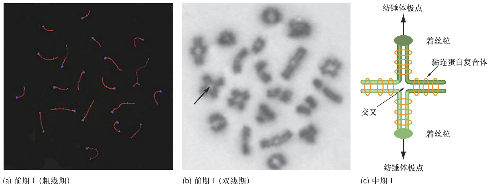  

图5.7　重组有助于确保染色体在减数分裂Ⅰ期的正确分离。（a）减数分裂Ⅰ中期的小鼠初级精母细胞染色体。红色表示联会复合体的蛋白质成分，绿色表示重组节成分，蓝色表示着丝粒成分。尽管很难观察到，每个二价体都具有至少一个重组节。（b）减数分裂Ⅰ后期的小鼠染色体（终变期）。请注意每个二价体至少有一个交叉（箭头指向一个示例），表示交换发生的时间较早。（c）减数分裂Ⅰ中期沿二价染色体臂形成的黏连蛋白复合体（橙环）的示意图；未标记着丝粒处的黏连蛋白。远离交叉点的黏连蛋白复合体将姐妹染色单体连接在一起。指向极点的箭头表示拉开同源染色体的力。  

（a）： $\copyright$ Dr. Paula Cohen & Dr. Miguel Angel Brieño-Enríquez, The Cohen Lab, Center for Reproductive Genomics, Cornell University, Ithaca, NY；（b）： $\copyright$ Dr. Paula Cohen & Dr. Kim Holloway, The Cohen Lab, Center for Reproductive Genomics, Cornell University, Ithaca, NY  

交换，从而防止非罕见错误下的任何染色体不分离。我们将在本章后面更详细地讨论干涉。  

# 5.2.3 重组频率反映两个基因之间的距离  

摩尔根认为交叉代表染色体之间物理交换位点，并认为这种交换可能导致重组，这使他提出下列逻辑推论：因为基因沿着染色体线性排列，所以不同的基因对呈现出不同的连锁频率。两个基因在染色体上越接近，它们被染色体切割和重组事件所分离的机会就越小。换言之，如果我们假定交叉可以在染色体上的任何地方以相同的概率形成，那么两个基因之间发生交换的概率随着它们之间距离的增加而增加。因此，基因重组的频率也将随着基因之间的距离的增加而增加。  

为了说明这一点，想象一下在墙上钉一根10英寸（ $25.4\mathrm{cm}$ ）长的带有小黑点的色带，然后反复掷飞镖来看切割色带的位置。你将发现实际上每一个飞镖都会将色带两端的黑点分开，而很少有飞镖能将几个彼此相邻的特定点分开。  

摩尔根的学生之一Alfred H. Sturtevant将此想法更深入一步。他提出重组型占总后代数量的百分比，即重组频率（RF），可用于衡量同一染色体上任何两个基因之间的物理距离。Sturtevant任意定义一个RF百分点为沿着染色体的度量单位，另一位遗传学家继摩尔根之后将该单位命名为厘摩（cM）。遗传图绘制者通常将一个厘摩作为一个图距单位（m.u.）。尽管这两个术语是可以互换的，但研究人员根据他们的实验生物体倾向于使用其中一个。例如，果蝇遗传学家使用图距单位，而人类遗传学家使用厘摩。在Sturtevant的系统中，$\scriptstyle1\%\mathrm{RF}=1\mathrm{cM}=1\mathrm{m.u.}$ 。  

前面分析的果蝇的两对X连锁基因可展示Sturtevant的方案如何工作。因为决定眼睛颜色（ $\boldsymbol{w}$ ）和体色（y）的X连锁基因在 $\mathrm{F}_{2}$ 子代中有 $1.1\%$ 发生重组，所以它们距离1.1m.u.［图5.8（a）］。相反，决定眼睛颜色（w）和翅膀尺寸（ $m$ ）的X连锁基因具有32.8的重组频率，因此距离 $32.8\mathrm{m.u.}$ ［图5.8（b）］。  

当我们思考双杂合体的生殖细胞个体进行减数分裂时，很容易理解为什么重组配子的比例是一个能衡量两个基因之间距离的指标。如果基因A和B在染色体上紧靠在一起，通常将进行如图5.9（a）所示的无交换减数分裂（NCO减数分裂）。一个双杂合子（如A $B\mathrm{~/~}a\mathrm{~}b$ ）的NCO减数分裂将产生四个亲本配子［图5.9（a）］。有时两个基因会在减数分裂期间发生单交换（SCO减数分裂），产生两个重组和两个亲本配子［图5.9（b）］。由于染色体的大部分长度位于基因A和 $B$ 之间的区域之图5.8　重组频率是遗传图的基础。（a）基因 $\boldsymbol{w}$ 和y的雌性双杂合子产生的 $1.1\%$ 配子是重组的。因此，重组频率（RF）为 $1.1\%$ ，并且基因相距约1.1个图距单位（m.u.）或1.1厘摩（cM）。（b） $w$ 和 $m\angle$ 基因之间的距离更长： $32.8\mathrm{m.u}$ .（或32.8cM）。  

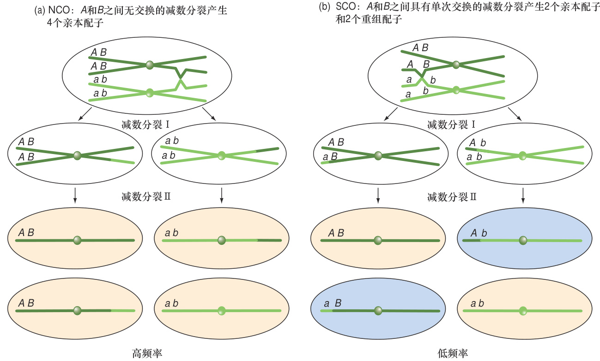  
图5.9　两个连锁基因产生的重组配子频率低于亲本配子。（a）大多数减数分裂在紧密连锁的基因A和B之间没有交换，产生4个亲本配子（橙色）。（b）减数分裂时，A和B之间有时会发生单次交换，产生2个重组配子（蓝色）和2个亲本配子（橙色）。  

外，因此这些交换很少见。随着两个基因之间的距离增加，SCO减数分裂的频率和重组配子的比例都会增加。  

图5.9还可以解释为什么两种类型的亲本配子（本例中为A B和a b）以大致相同的频率产生，以及为什么两种类型的重组配子（ $\textit{A b}$ 和 $\mid a\;B$ ）出现的数量也是大致相等的。只要两个非姐妹染色单体不在基因A和B之间交换，就会产生两种亲本染色体。同样，每当两个非姐妹染色单体在两个基因之间进行交换，也会同时产生两种重组型。  

作为度量单位，地图单元仅是重组概率指标，用于反映基因间的距离。根据这个指标， $y$ 和w基因比m和 $\boldsymbol{w}$ 基因更接近。遗传学家使用这一逻辑将数以千计的遗传标记映射到果蝇的染色体上，用紧密连锁的标记逐步构建重组图。  

# 5.2.4 两个基因之间的重组频率总是低于 $50\,\%$  

如果连锁的定义是重组型的比例小于亲代型，则小于 $50\%$ 的重组频率表示连锁。但是如果存在大致相同数量的亲代型和重组型后代，我们如何得出基因的相对位置？是否曾经发生过重组体是大多数的情况？  

我们已经知道一种可以产生 $50\%$ 重组频率的情况。位于不同（即非同源）染色体上的基因由于下述两个原因将服从孟德尔独立分类法。首先，两个染色体在减数分裂Ⅰ期间以相同的概率排列在纺锤体上。因此，当对许多减数分裂的产物进行统计时，亲本和重组配子的数量将是相等的［图5.10（a）］。其次，如果在基因和着丝粒之间发生交换，那么减数分裂将产生两个亲本和两个重组配子［图5.10（b）］。因此，如果基因A和B在非同源染色体上，双杂合子将产生频率大致相等的所有四种可能类型的配子（A B、A b、a B和a b）。  

重要的是，实验已经证实位于相同染色体上相距很远的基因也具有约 $50\%$ 的重组频率。为了理解上述观点的真实性，我们需要考虑在测交实验中参与配子池计数的不同的减数分裂。当两个基因在同一条染色体上非常接近时，可能只发生两种减数分裂：没有交换的减数分裂［图5.9（a）和图5.11中的NCO减数分裂］和较少的SCO减数分裂［图5.9（b）和图5.11中的SCO减数分裂］。NCO减数分裂只产生亲本配子，而SCO减数分裂产生 $50\%$ 重组配子。这些间隔很小的基因是连锁的，因为一些减数分裂（NCO）不能制造任何重组型配子。  

当两个基因距离较远时，SCO变得更加频繁，并且在一些减数分裂中也可能发生A与B之间的双交换（DCO减数分裂）（图5.11）。DCO减数分裂可以是四种不同类型之一；两个、三个或全部四个非姐妹染色单体都可以交换。由于四个DCO减数分裂概率相同，DCO产生的重组配子的平均比例为 $50\%$ （见图5.11底部的等式）。三重交换、四重交换等也是如此（未显示）。因此，即使两个基因在相同的染色体上分离得足够远以至于在每次减数分裂中它们之间至少发生一次交换，由双杂合子产生的配子库仅有 $50\%$ 重组型。现在你可以看到，如果同一染色体上的两个基因相距甚远以至于没有NCO减数分裂发生，那么这些基因的等位基因（a）非同源染色体相对于彼此随机排列，使得减数分裂产生的所有亲本配子（左）或所有重组配子（右）具有相同的频率。（b）在基因和着丝粒之间发生一次交换的减数分裂生成具有相同频率的所有四种配子类型。  

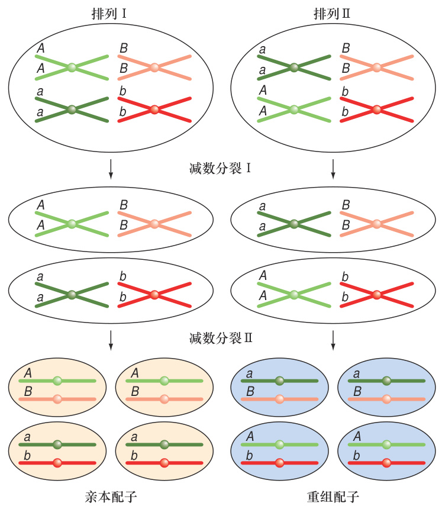  
(a)   
(b)  

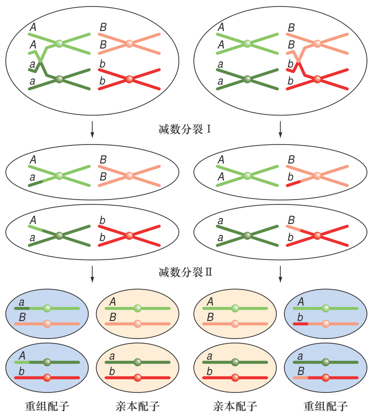  
图5.10　为什么非同源染色体上的基因双杂交 $\scriptstyle\mathrm{RF}=50\%$ 。  

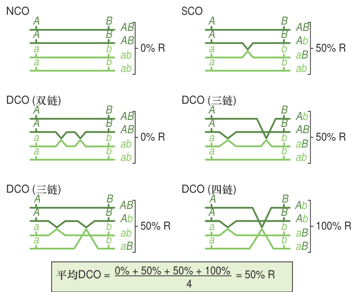  

图5.11　位于同一染色体的双基因杂交的减数分裂可能性。在A和B之间没有交换（NCO）的减数分裂产生所有亲本染色体。在A和B之间的SCO减数分裂产生一半亲本和一半重组（R）染色体。同样有可能进行四种DCO类型的减数分裂，并且它们总计产生一半亲本和一半重组配子（下图）。在双链DCO事件中，一对非姐妹染色单体经历两个交换。在任一种三链DCO中，一种同源染色体的单个染色单体与另一种同源染色体的两个染色单体中的每一个进行交换。在四链DCO中，每对非姐妹染色单体重组。  

将自由组合，就好像它们位于不同的染色体上一样。  

尽管在染色体上相距很远的两个基因之间的杂交可能根本不显示任何连锁，但是如果可以将每个广泛分离的基因与一个或多个常见中间体联系起来，则可以证明它们位于同一染色体上。表5.1总结了两个基因的相对位置与通过重组频率估算出是否存在连锁的关系。  

表5.1　连锁基因和非连锁基因的属性  

<html><body><table><tr><td>连锁基因</td></tr><tr><td>亲代型>重组型（RF<50%）</td></tr><tr><td>连锁基因必须在同一染色体上同线并且足够靠近在一起，因此它们不 能独立地分配。</td></tr><tr><td>非连锁基因</td></tr><tr><td>亲代型=重组型（RF=50%）</td></tr><tr><td>当两个基因位于不同的染色体上，或当它们在同一染色体上相距足够 远且每个减数分裂中它们之间至少发生一次交换。</td></tr></table></body></html>  

# 基本概念  

●  当同源染色体的染色单体在减数分裂Ⅰ前期进行部分交换时发生重组。  
$\bullet$ 交换有助于建立需要分离的同源染色体之间的物理连接。  
●  重组频率（RF）表示两种基因一起传播的频率。对于连锁基因， $\mathrm{RF}{<}50\%$ 。  

●  如果两个连锁基因距离足够接近，则减数分裂时不进行交换。  

●  当两个基因位于不同的染色体上或者两个同线性基因相距甚远，且每个减数分裂中至少存在一个交换时，则最大RF为 $50\%$ （独立分类）。  

# 5.3 作图：基因在染色体上的定位  

# 学习目标  

1. 使用两点杂交数据建立相对基因位置。  
2. 根据三点测交数据对遗传图进行优化。  
3.  解释遗传图（图距单位）如何与实际物理距离  
（DNA碱基对）相关。  
4. 描述连锁群与染色体之间的关系。  

地图是空间中物体相对位置的图像。无论是描绘纽约大都会艺术博物馆的平面布局、罗马广场的布局，还是欧洲铁路提供的城市分布，地图都将测量结果转化为空间关系模式并在原始数据的基础上增加新层次的距离含义。将基因分配到特定染色体上称为基因座的遗传图也不例外。通过将遗传数据转化为空间排列，遗传图提高了我们预测特定性状遗传模式的能力。  

遗传学家一直痴迷于基因定位，因为了解基因的位置就能鉴定与基因相对应的染色体DNA片段。在本书后面的章节中，你将了解如何使用基因的位置来分离它的DNA，以及分子遗传学家如何使用基因的DNA来了解基因的功能。  

我们已经知道重组频率（RF）是两个基因沿染色体分开的距离的量度。我们现在将研究如何对来自一次两个和三个基因的多杂交数据进行编译并比较，以及生成准确和全面的基因/染色体图。  

# 5.3.1 两点杂交的比较建立了相对的基因位置  

摩尔根的学生A.H. Sturtevant在他的高年级本科毕业论文中提出疑问，从大量的两点杂交（每次追踪两个基因的杂交）获得的数据是否支持基因沿着染色体形成特定的线性序列这一观点？Sturtevant从果蝇中的X连锁基因开始验证。图5.12（a）列出了他的几个两点杂交的重组数据。回想一下，产生 $1\%$ 重组子代的两个基因之间的距离（RF为 $1\%$ ）为1m.u.。  

使用三个基因 $\boldsymbol{w}$ 、y和 $|m|$ 来作为Sturtevant推理的一个例子。如果这些基因排列成一行（而不是更复杂的分支结构），则其中一个基因必须位于中间，两侧各有另外一个。最大的遗传距离应该属于最外侧的两个基因，并且这个值应该大致等于中间基因与每个外部基因的距离之和。Sturtevant获得的数据与此设想一致，意味着 $\mathcal{W}$ 位于y和m之间［图5.12（b）］。请注意这张遗传图从左到右的方向是随机选择的，如果将图5.12（b）中的遗传图描绘为y在右侧而m在左侧，也是同样正确的。  

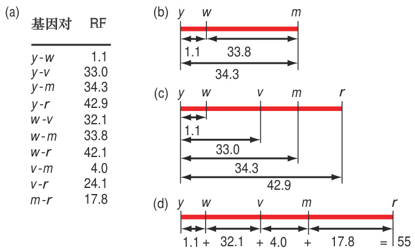  
图5.12　通过比较两点杂交来定位基因。（a）Sturtevant关于果蝇中X连锁基因对之间的距离数据。（b）因为y和m之间的距离大于w和m之间的距离，所以基因的顺序必须是y-w-m。（c）和（d）果蝇X染色体上5个基因的图谱。从左到右的方向是随机的。注意，r基因的位置取决于它的计算方式。最好的遗传图是通过将（d）中的许多小的中间距离相加得到的。  

Sturtevant按照上述同样的方法对每组3个基因进行分析，建立了其研究过的果蝇X染色体上所有基因的自洽顺序［图5.12（c）；从左到右的排列仍是任意选择］。检查三种基因的每种组合的数据后，我们可以断定这种排序是合理的。使用重组数据获得基因位置的简单线性图的事实支持基因沿染色体以特定的线性顺序存在的观点。  

# 两点杂交的局限  

尽管基因的成对作图非常重要，但其仍然存在一些缺点限制了其应用。首先，在一次只涉及两个基因的杂交中，可能难以确定某些非常靠近的基因对的顺序。例如，在y、 $\boldsymbol{w}$ 和 $m$ 作图时， $34.3\mathrm{m.u.}$ .分离外部基因y和$m$ ，而中间基因 $\boldsymbol{w}$ 和外部基因 $m$ 几乎具有同样大的距离（ $33.8\mathrm{m.u.}$ ）［图5.12（b）］。在能够确信y和m真正的距离更远之前，即排除34.3和33.8之间的小差异不是取样误差之前，必须检查大量的果蝇并对数据进行统计检验，如将在下一节中进行讨论的卡方检验。  

Sturtevant作图方法的第二个问题是其遗传图中的实际距离与应有距离不相符，甚至不能达到近似相符。举一个例子，假设位于地图最左侧的y基因的基因座被视为位置0［图5.12（c）］。然后， $\boldsymbol{w}$ 基因位于位置1m.u.附近， $m$ 位于 $34\mathrm{m}$ .u附近。但是能产生退化（非常小的）翅膀的 $r$ 基因突变又位于哪里呢？根据图5.12（a）中其与y 的距离数推断，我们将它放在位置4 2 . 9［图5.12（c）］。然而，如果我们将它的位置计算为从图5.12（a）中显示的所有中间距离的加和，也就是说，即 $\leftrightarrow w$ 、 $\scriptstyle w\longleftrightarrow\nu$ 、 $\nu{\longleftrightarrow}m$ 和 $m{\leftrightarrow}r$ 的总和，r的位置变为$1.1{+}32.1{+}4.0{+}17.8{=}55.0$ ［图5.12（d）］。如何解释这种差异，以及这两个位置的哪一个更接近事实？三点杂交能帮助解答上述问题。  

# 5.3.2 三点杂交提供更快和更准确的作图  

通过同时分析三个标记，可以从一组杂交中获得足够的信息来定位三个基因的相互关系。为了描述这个过程，我们看一下果蝇的常染色体上连接的三个基因。  

将具有退化翅膀（vg）、黑体（b）和紫色眼睛 $(\,p r\,)$ 突变的纯合雌性与野生型雄性交配［图5.13（a）］。所有的三重杂合子F 后代都具有正常表型（无论雄性和雌性），表明突变是常染色体隐性。在 $\mathrm{{F_{1}}}$ 雌性与具有退化翅膀、黑体和紫色眼睛的雄性测交中，后代具有代表8种不同基因型的8种不同表型。图5.13（a）中所列出的每种表型分类中的基因顺序是完全随机的。因此，可以用b vg pr或vg pr b来代替相同的基因型。请记住，一开始我们不知道基因顺序，推测此顺序是作图研究的目的。  

在分析数据时，我们一次查看两个基因（重组频率总是一对基因的函数）。对于vg和b这对基因，亲本组合是 $\nu g~b$ 和 $\nu g^{+}b^{+}$ ；重组体是vg $b^{+}$ 和 $\nu g^{+}b$ 。为了确定某一特定类别的后代是否为vg和 $b$ 的亲本或重组体，我们不关心果蝇是 $p r$ 还是 $\cdot p r^{+}$ 。因此，对于图距单位最接近的110 ，vg ↔ b距离是（根据子代总数中重组体百分比计算）  

(a) (b)  

<html><body><table><tr><td colspan="2">vgbpr/vgbpr × vg+ b+ pr+ /vg+ b+ prt F1 (所有相同) vgbpr/vg+b+pr+</td></tr><tr><td colspan="2">测交 vg b pr / vg+ b+ prt × vg bpr/vgbpr</td></tr><tr><td colspan="2"></td></tr><tr><td>测交子代 1779 vg b pr</td><td></td></tr><tr><td>1654 vg+ b+ pr</td><td>三个基因的亲本组合</td></tr><tr><td></td><td></td></tr><tr><td>252 vg+ b pr</td><td></td></tr><tr><td>241 vg</td><td>b+prt vg的重组体相对于b和pr的亲本组合</td></tr><tr><td>131 vg+ b 118 vg</td><td>b+pr b的重组体相对于vg和pr的亲本组合</td></tr><tr><td>13 vg b 9 4197</td><td>prt vg+b+pr pr的重组体相对于vg和b的亲本组合</td></tr></table></body></html>  

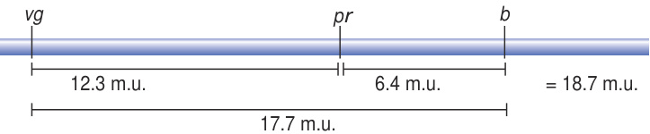  

图5.13　三点杂交的分析结果。（a） $\mathrm{F}_{1}$ 雌性vg、 $b$ 和pr基因同时杂交的三点测交的结果。（b）中间的基因必须是pr，因为最长的距离在另外两个基因vg和b之间。通过将较短的中间距离相加来计算可获得最准确的图距，因此 $18.7\mathrm{m.u.}$ 比 $17.7\mathrm{m.u}$ .  

更准确地判断了vg和b之间的遗传距离。  

类似的，由于 $\nu g\!-\!p r$ 基因对的重组体是 $\nu g\ p r^{+}$ 和$\nu g^{+}p r$ ，此对基因之间的距离是  

$b{-}p r$ 基因对之间的距离是  

这些重组频率显示vg和 $|b\ a r|$ 相隔最大距离（ $17.7\mathrm{m.u.}$ ，与12.3和6.4相比），因此必须是外侧基因， $p r$ 基因位于中间［图5.13（b）］。但就像Sturtevant分析的X连锁的y和r基因一样，分离外部vg和b基因（17.7）的距离不等于两个中间距离的总和（ $12.3\substack{+6.4=18.7}$ ）。在下一节中，我们将知道这种差异的原因是发生了罕见的双交换。  

# 1. 双交换更正  

图5.14描绘了F1雌性的vg、 $p r$ 和b三个基因杂合的同源常染色体。仔细检查染色体可知产生可观察到的后代种类和数量所必须发生的交换种类。在该图和随后的图中，当每对同源染色体有四个染色单体时，所描绘的染色体处于减数分裂Ⅰ的晚前期/早中期。正如我们先前所提出并在第6章中更加严格证明的，前期Ⅰ是重组发生的阶段。请注意，区域1是vg和pr之间的空间， $p r$ 和 $b$ 之间的空间是区域2。  

回想一下我们早期进行测交，其后代可分为8组（参见图5.13）。果蝇的两个最大的群体携带与P代中它们的祖父母相同的基因配置：vg b pr和 $\nu g^{+}b^{+}p r^{+}$ ，因此它们代表了亲代型［图5.14（a）］。接下来的 $\nu g^{+}b\,p r$ 和vg b pr 两组由vg和pr之间的区域1交换产生的互逆产物重组体构成［图5.14（b）］。类似地，包含 $\nu g^{+}b~p r^{+}$ 和 $\nu\,g\,b^{+}p r$ 的两个组则必须是由 $p r$ 和b之间的区域2中的重组产生的［图5.14（c）］。  

但是，由罕见的vg b pr+和 $\nu g^{+}b^{+}p r$ 重组体组成的两个最小的群体呢？什么样的染色体交换可以解释它们？最有可能的是，它们是由两个不同的交换事件同时发生的，一个在区域1中，另一个在区域2中［图5.14（d）］。尽管在它们之间发生了两次而不是一次交换，由这样的双交换产生的配子仍然具有亲本配置的外部基因vg和b。  

由于双交换的存在，在前面章节中计算的结果$\nu g\!\leftrightarrow\!b$ 距离为 $17.7\mathrm{m}$ .u.并不能反映出产生所观察到的后代配子的所有重组事件。为纠正这种疏漏，有必要通过增加双交换来调整重组频率，因为双交换组中的每个个体都是vg和b之间两次交换的结果。修正的距离是  

$$
\frac{252+241+131+118+13+13+9+9}{4197}{\times100\,}{=}18.7\mathrm{m.u.}
$$  

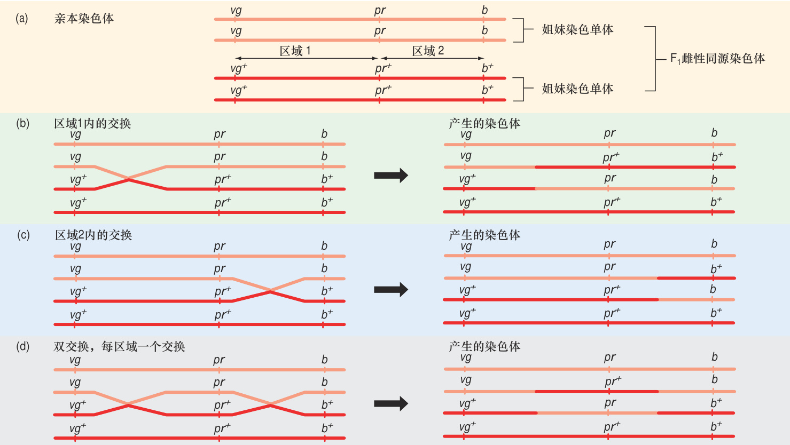  
图5.14　推断交换事件的位置。一旦确定了三点杂交中涉及的基因顺序，就很容易确定哪些交换事件会产生特定的重组配子。注意，需要双交换来产生配子，其中，中间的基因相对于末端基因的亲本组合已经重组。这些事件包括部分（d）图中的双链DCO及三链DCO（未显示）。  

因为你已经考虑了区域1中发生的所有交换及区域2中的所有交换，因此这个值是有意义的。结果证明，现在vg和b之间的修正距离 $18.7\mathrm{m.u.}$ .与vg和pr（区域1）之间、pr和b（区域2）之间的距离之和完全相同。  

如前所述，当Sturtevant最初通过两点杂交将几个X连锁基因定位在果蝇中时，翅（r）基因的基因座是不明确的。涉及y和r的两点杂交给出了重组频率42.9，但所有基因的中间距离之和为55.0（请查阅图5.12）。这种差异是因为两点杂交忽略了可能发生在y和r基因之间的大区间中的双交换。这些较小中间距离的总和数据可捕获y和r基因对之间的至少一部分双交换重组。此外，每个较大的距离比较小的距离更可能包含双交点，因此较小距离本质上更准确。  

请注意，即使像vg、pr和b这样的三点杂交也忽略了在区域1中发生两个重组事件的可能性。为了获得最大的准确性，最好使用多个距离较近的基因构建一个图谱。  

# 2. 干涉：比预期更少的双重交换  

在三个连锁基因杂交产生的8个可能的基因型类别中，两个亲代级包含最大数量的子代，而由双交换产生的两个双重组级数量总是最小的（参见图5.11）。通过观察它们发生的可能性，我们可以理解这种双交换子代是最罕见的原因。如果染色体区域1中的交换不影响区域2中交换的概率，则两者同时发生的概率是它们各自概率的乘积（回顾第2章中的乘法规则）。例如，如果仅由区域1中的重组产生的子代占总后代的 $10\%$ （即如果区域1为 $10\mathrm{m.u.}$ ），并且单独区域2中由重组产生的后代占 $20\%$ ，则可能存在双交换（区域1中的一个事件，区域2中的第二个）的概率是 $0.10\times0.20{=}0.02$ 或 $2\%$ 。这是有道理的，因为两个罕见事件同时发生的可能性甚至比单独发生的罕见事件的可能性小。  

如果用三点杂交获得8类后代，则包含最少后代的两类必然由双交换产生。然而，观察到的双交换的数字频率几乎从未与预测相符。我们来看看我们讨论的杂交的实际数字。vg和pr之间单交换的概率是0.123（对应于$12.3\mathrm{m.u.}$ ）， $p r$ 和b之间单交换的概率是0.064（ $6.4\mathrm{m.u.}$ ）。双交换的概率是  

$$
0.123\,\times\,0.064{=}0.0079{=}0.79\%
$$  

但是实际观察到的双交换概率（见图5.11）是  

$$
\frac{13+9}{4197}{\times}100=0.52\%
$$  

如果两次交换是独立事件，则观察到的双交换数量少于预期数量这一事实表明，一次换的发生降低了在染色体的邻近部分发生另一次交换的可能性。这种交换并非独立发生的现象，称为染色体干涉。  

如图5.7所示，干涉的存在可能是为了确保每对同源染色体经历至少一次交换。至关重要的是，每一对同源染色体都进行一个或多个交换，因为这样的事件有助于染色体在第一次减数分裂期间在赤道板上正确地定向。事实上，没有交换的同源染色体对经常分离不当。如果在每个减数分裂过程中只有有限数量的交换可以发生，并且干涉降低了大染色体上交换的数量，那么剩余的交换更可能发生在小染色体上。这增加了每个同源对上至少发生一次交换的概率。虽然干涉的分子机制尚不清楚，但最近的实验表明干涉是由联会复合物介导的。  

干涉不均匀，即使对同一染色体的不同区域也可能有所不同。研究人员可以通过首先计算并发系数来定量测量不同染色体间期的干涉量，其定义为实验中观察到的双交换的实际频率与基于独立预期的双交换的实际频率之间的比值。  

实际频率 并发系数＝ 预期频率 对于vg、 $p r$ 和b参与的三点杂交，并发系数是  

$$
\frac{0.52}{0.79}{=}0.66
$$  

干涉本身的定义为：  

干涉 $=1-$ 并发系数  

此例中，干涉为  

$1{-}0.66{=}0.34$  

为了理解干涉的含义，有必要对比有无干涉进行时发生的事件。如果干涉为0，则观察到的双交换的频率等于期望值，并且染色体的相邻区域中的交换互相独立发生。如果干涉是完全的（即干涉 $^{=1}$ ），则实验后代中不会发生双交换，因为一次交换有效地防止了另一次交换。例如，在小鼠的特定三点杂交中，左侧（区域1）的基因对的重组频率为20，而右侧（区域2）的基因对的重组频率也是20。没有干涉时，在这个染色体区间中双交换的预期概率是  

# $0.20~\times~0.20{=}0.04$ 或 $4\%$  

但是当调查人员观察到这个杂交体的1000个后代时，他们没有发现双重组体，而不是预期的40个。  

# 3. 一种确定中间基因的方法  

三点杂交中8种可能类型后代中比例最小的是含有由双交换产生的双重组的两种。即使不计算任何重组频率，也可以使用这些双交换类别中的等位基因组合来确定三个基因中的哪一个位于中间。  

再次思考vg、 $p r$ 和b基因的三点测交的后代。 $\mathrm{F}_{1}$ 雌性是 $\;\nu g\;p r\;b\;/\;\nu g^{+}p r^{+}b^{+}.$ 。如图5.14（d）所示，在F1代的三杂交雌性中，由双交换产生的测交子代从其携带等位基因组合 $\nu g\,p r^{+}\mathbf{b}$ 和vg+pr $b^{+}$ 的母本接受配子。在这些个体中，vg和 $^b$ 基因的等位基因保留其亲代关系（ $\nu g~b$ 和$\nu g^{+}b^{+}$ ），而 $\dot{p}r$ 基因已经与其他基因（ $p r\,b^{+}$ 和 $p r^{+}b$ ， $\nu g\,p r^{+}$ 和 $\nu g_{\;\;p r}^{+}$ ）重组。在所有三点杂交中也是如此：在由双交换形成的配子中，相对于其他两个基因的亲本配置，进行重组的等位基因必须是中间的配子。  

# 5.3.3 三点杂交：一个综合的例子  

用于查看双重组体以发现哪个基因与其他两个基因重组的技术，即使在存在其他困难的情况下也能立即说明基因顺序。思考Sturtevant在其原始测绘实验中发现的三个X连锁基因y、 $\boldsymbol{w}$ 和m（见图5.12）。由于y与m之间的距离（ $34.3\mathrm{m.u.}$ ）略大于 $\mathcal{W}$ 与 $\boldsymbol{m}$ 之间的距离（ $33.8\mathrm{m.u.}$ ），因此他推断w是中间的基因。但由于这两个数字之间的差别很小，他的结论受统计显著性的影响。但是，如果我们观察y、 $\boldsymbol{w}$ 和m后面的三点杂交，这些问题就会消失。  

图5.15列出了y、 $\boldsymbol{w}$ 和m基因杂合子雌性所产生的雄性子代的类别和数量。由于这些雄性后代从它们的母亲获得它们唯一的X染色体，因此它们的表型直接指示了杂合雌性产生的配子。在图表的每一行中，基因都是随机列出，并不代表实际距离信息。正如你所看到的，表格顶部列出的两类后代数量超过了其余六类，这表明所有三种基因都相互关联。此外，这些最大的群体，即亲代级显示杂合雌性的两条X染色体是 $w^{+}y^{+}m$ 和 $w\,y\,m^{+}$ 。  

在图5.15中的雄性后代中，代表双交换的两个最小类别具有携带 $w^{+}y\ m^{+}$ 和 $\stackrel{.}{w}y^{+}m$ 组合的X染色体，其中 $\boldsymbol{w}$ 等位基因相对于y和 $|m|$ 的组合重新组合。因此 $w_{\ast}$ 基因必须位于y和 $m$ 之间，从而验证Sturtevant的原始评估。  

根据 $\boldsymbol{w}$ 、 $y$ 、 $m$ 的三点杂交来完成作图， $y$ 和m之间的距离（区域1）可计算为  

$$
{\frac{49+41+1+2}{6823}}{\times}100\,{=}1.3\mathrm{m.u.}
$$  

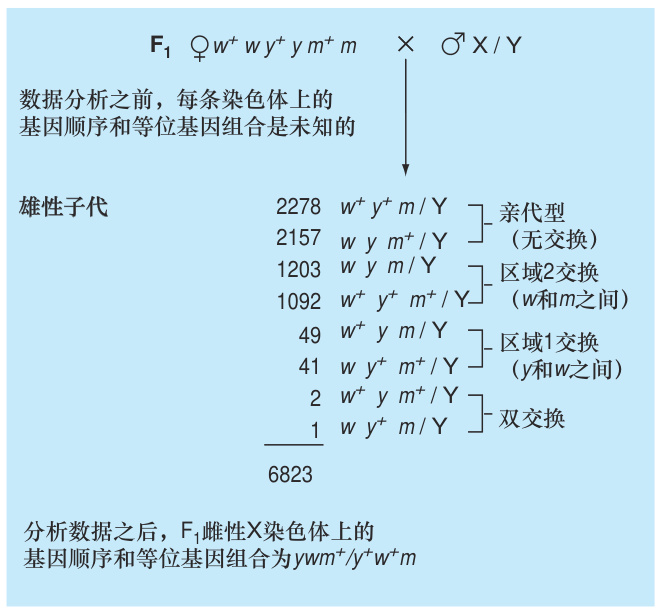  

图5.15　三点杂交如何验证Sturtevant的果蝇X染色体图。亲代型对应于F 雌性中的两条X染色体。双重组型的基因型显示w必须是中间的基因。  

$\boldsymbol{w}$ 和m之间的距离为  

$$
\frac{1203+1092+2+1}{6823}{\times}100\,{=}33.7\mathrm{m.u.}
$$  

y和m之间的遗传距离是二者之和：  

$$
1.3\substack{+33.7}{=}35.0\mathrm{m.u.}
$$  

请注意，你还可以通过两次双交换直接计算y和 $m$ 之间的距离，以说明这两个基因之间检测到的重组事件总数。  

R $\mathrm{F}{=}(1203{+}1092{+}49{+}41{+}2{+}2{+}1{+}1)/6823\times100{=}35.0\mathrm{m.u}.$  

该方法与两个中间距离（区域 $1+$ 区域 2）的总和相同。  

# 5.3.4 遗传图如何与物理现实相关联？  

在本书中通篇介绍的许多类型的实验令人震惊地发现，通过重组作图显示的基因顺序总是反映这些基因沿着染色体DNA分子的顺序。相反，基因之间的实际物理距离（即分离它们的DNA的量）并不总是与遗传图距离线性对应。  

# 1. 通过重组频率低估基因间的物理距离  

你已经看到，两个基因之间的DCO可能在测交实验中未被发现，导致两个基因之间的交换数量计数不足，因此低估了它们之间的距离。如果两个基因足够接近以至DCO不经常发生，这并非大问题。然而，随着两个基因之间的距离增加，双重交换和多重交换发生的频率足以影响重组频率与图距之间的关系。这种关系不能是线性的，因为正如我们已经看到的那样，无论两个基因在同一染色体上相距多远，两点杂交的RF不能超过$50\%$ 。  

再看图5.11，可以很容易地看出DCO如何因RF低估基因距离。当基因A和B靠得很近时，大多数减数分裂都是NCO，偶尔的减数分裂是SCO。每个SCO恰好产生两个重组配子，因此在交换数和重组配子数之间存在完美的线性对应关系（1个交换∶2个重组子）。然而，当基因A和B分开时，会出现DCO。四个同样频繁的DCO（四链）中只有一个保留了交换和重组配体之间的线性关系：两个交换发生在四链DCO和四个重组配子（2个交换∶4个重组）中。相反，其他三种类型的DCO导致少于四个重组配子。  

图5.16显示了作为分离两种基因的DNA量的函数：实际交换数（绿线）和观察到的RF（紫线）之间的差异。正如你所看到的，这两幅图对于5m.u.及其以下的距离几乎是相同的。在遗传距离这样小的情况下，在两点杂交看到的RF是对物理距离的精确测量。两条曲线随着距离越来越远，所以RF在遗传距离大于5m.u.时变得不太精确。  

遗传学家已经开发了称为映射函数的数学方程，以补偿相关重组频率与物理距离相关的不准确性。然而，对于大距离的修正顶多是不精确的，因为映射函数是基于不完全正确的简化假设。因此，创建精确地图的最佳方式是将许多较小的间隔相加，通过与共同中间体的连接来定位广泛分离的基因。随着越来越多的新发现的基因被包括在内，地图可以不断细化。  

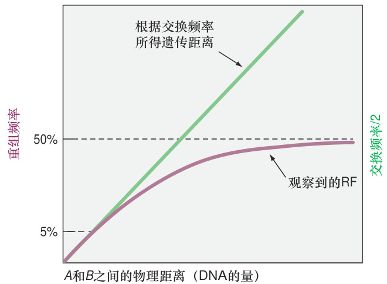  
图5.16　重组频率低估了交换频率。当基因A和B靠近在一起时，实际观察的测交RF（紫色）和交换频率（绿色）的曲线几乎是重合的。随着两个基因相距甚远，RF值越来越低估实际的交换频率；最终不会发生NCO，并且将观察到 $50\%$ 的最大RF。绿线代表交换频率的一半，因为每个SCO产生1/2亲本和1/2重组染色体。  

# 2. 非均匀交换频率  

尽管迄今为止我们已经假定交换在染色体上的任何两个碱基对之间发生的可能性相同，但重组实际上并不是随机的。例如，在人类DNA中，大多数交换发生在所谓的重组热点中——DNA重组的频率远高于平均值的小区域。如图5.17所示，在之间有热点的基因对（A和B）在遗传图上（以m.u.为单位）比另一个没有热点的基因对（B和C）相距更远，尽管分离每个基因对的物理距离（以bp为单位测量）是相同的。由于热点相对比较频繁（人类染色体中每50 000bp出现一个热点），重组频率仍然是大多数基因之间物理距离的合理估计。  

重组频率也可能具有物种差异性。最近对几种生物基因组的完整DNA序列的阐明，使得研究人员能够比较基因与遗传图距之间的物理距离。他们发现在人类基因组中，图距单位平均对应约100万个碱基对。然而，在酵母中，每段DNA长度的重组频率比人类高得多，因此一个图距单位大约为2500个碱基对。虽然图距单位可用于估计生物体基因之间的相对距离，但 $1\%$ RF可以反映不同生物体中具有极大不同DNA的范围。  

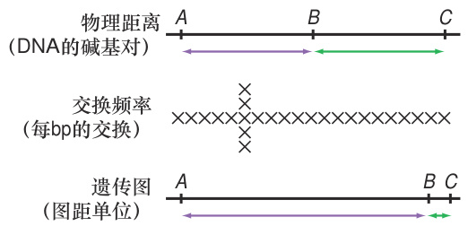  
图5.17　重组热点。基因A和B、基因B和C由相同数量的碱基对分开。因为A和B位于重组热点的侧翼，它们看起来比遗传图上的基因B和C更远。  

重组频率有时甚至在一个物种的两性之间也会变化。人类女性生殖系的交换频率比男性高出两倍。这一事实意味着相同的两个基因通过测量雌性减数分裂中的RF而产生的遗传图距大约是测量男性减数分裂期间的交换得到的距离的两倍。“快进”信息栏“产生单个人类精子染色体的交换作图”解释了新技术如何分析个体人类精子基因组的DNA序列。研究人员现在可以直接在单个精子的每条染色体上检测交换。这些分析的结果显示，人类精子中的大多数染色体仅经历了一次交换。  

果蝇提供了一个极端的例子：在雄性减数分裂期间没有发生重组。如果你回顾本章已经讨论的例子，你会发现它们都测量双重杂合果蝇雌性后代之间的重组。本章末尾的问题19显示了遗传学家如何利用果蝇雄性中不存在的重组来快速确定在相同染色体上相隔很远的基因确实是同线性的。  

# 5.3.5 多因素杂交有助于建立连锁群  

通过连锁关系链接在一起的基因统称为连锁群。当足够的基因被分配到特定的染色体时，术语“染色体”  

# 快进  

# 产生单个人类精子染色体的交换作图  

使用将在第 $9\!\sim\!11$ 章中描述的DNA分析技术，科学家现在可以检查单个精子的整个基因组的碱基对序列。在一项此类研究中，通过比较男性体细胞中每对同源染色体的DNA序列与同一男性产生的单个精子的DNA序列，研究人员可以找到男性初级精母细胞中发生的特定重组事件。  

任何人从他或她的父亲或母亲遗传的同源染色体在每1000个碱基对中约有1个不同。不同基因组中的碱基对差异称为SNP（单核苷酸多态性）。通过比较许多个体的基因组序列，已经鉴定了基因组中大约50 000 000个位置通常可以发生SNP。SNP的不同碱基对序列被认为是SNP基因座的不同等位基因（图A）。研究人员可以对SNP基因座进行归零，并确定基因组中存在数百万个SNP的等位基因。  

为了绘制重组位点，首先科学家开发出新的技术来从二倍体体细胞中分离出单个染色体。一旦分离，可以确定各个同源物的SNP等位基因（图A）。  

接下来，研究人员确定了哪些SNP等位基因存在于个体精子基因组中。然后，通过比较单个精子中每个染色体上存在的SNP等位基因与人体细胞的每个同源物上的相应SNP等位基因（在减数分裂期间交换之前）来显示交换的位置（图B）。通过分析91种不同精子的交换，研究人员发现每个配子中每个染色体发生约1次交换，并检测到交换热点。  

从这项研究中获得的信息和其他类似信息对于研究重组生物化学的科学家是有用的。此外，你将在本书后面的章节中看到，确定单个染色体和单个配子基因组的碱基对序列的能力在突变和人类进化的研究中具有广泛的应用。  

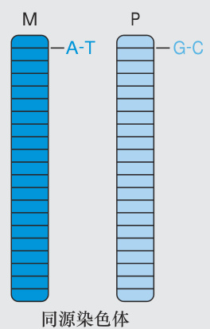  

图A　同源物的DNA序列显示SNP基因座。在特定的SNP基因座处，母本（M）和父本（P）同源物可以具有不同的等位基因（例如，A-T碱基对或G-C碱基对）。  

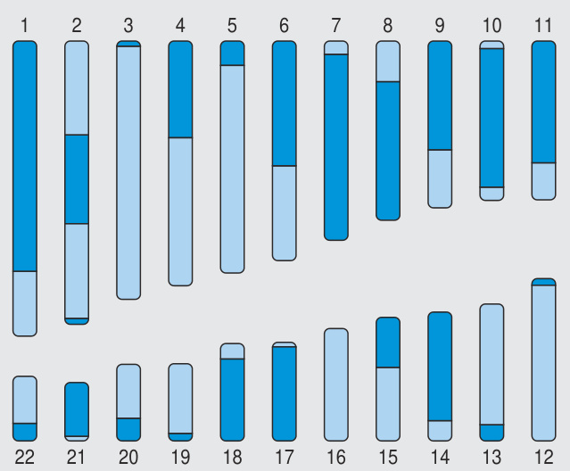  

图B　单个精子常染色体的交换图。描绘了精子的常染色体（染色体 $1\!\sim\!22$ ），其中深蓝色和浅蓝色区域对应于人体细胞中的不同同源物（参见图A）。大多数染色体是单交换的产物；在这个例子中，染色体2和染色体10是例外。  

和“连锁群”成为同义词。如果你能证明基因A与基因B、 $B$ 到 $C$ 、 $C$ 到 $\boldsymbol{D}$ 、 $D$ 到 $E$ 有关，你可以得出结论：所有这些基因都是同线性的。当基因组的遗传图变得如此密集以至于有可能显示染色体上的任何基因与同一染色体上的另一基因连锁时，连锁群的数量等于该物种中同源染色体对的数量。人类有23个连锁群，小鼠有20个，果蝇有4个（图5.18）。  

沿着染色体的总遗传距离可能远远超过 $50\mathrm{m.u.}$ ，该数据通过在基因之间增加许多短距离而获得。例如，两个长的果蝇常染色体都略高于 $100\mathrm{m.u.}$ .（图5.18），而最长的人类染色体约为 $270\mathrm{m.u.}$ 。然而，回想一下，即使是最长的染色体，位于两端的基因之间的成对杂交也不会产生超过 $50\%$ 的重组后代。  

连锁作图具有非常重要的实际应用。例如，“快进”信息栏“基因定位可能导致囊性纤维化的治愈”描述了研究人员如何利用连锁信息为这种重要的人类遗传疾病基因定位。  

# 基本概念  

●  通过成对分析重组频率，一系列两点杂交可确定连锁基因的顺序及它们之间的距离。  
●  三点测交可以改善图距并揭示交换干涉的存在，这种现象在所有染色体之间分布，在每一次减数分裂中出现有限数量的交换。  

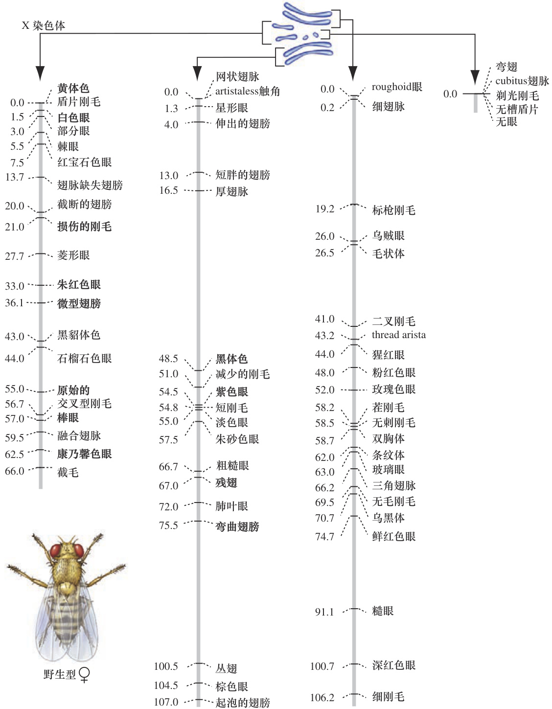  
图5.18　果蝇（Drosophila melanogaster）有四个连锁群。果蝇的遗传图显示影响身体形态的许多基因的位置，包括本章中用作示例的那些（以粗体突出显示）。因为已经绘制了如此多的果蝇基因，所以四条染色体中的每一条都可以表示为单个连锁群。  

# 快进  

# 基因定位可能导致囊性纤维化的治愈  

在1938年首次描述囊性纤维化症状之后的40年中，没有分子线索（没有可见的染色体异常伴随着疾病传递，患病个体没有携带可识别的蛋白质缺陷）表明该疾病的遗传原因。因此，对于2000年出生患有这种疾病的白种美国人来说，没有有效的治疗方法，其中大多数人在30岁之前就已经死亡。然而，在20世纪80年代，遗传学家能够将最近发明的直接观察DNA的技术与连锁分析构建的图谱结合起来，以确定囊性纤维化基因的精确染色体位置或基因座。  

囊性纤维化基因的绘制者面临着巨大的任务。他们正在寻找一种编码未知蛋白质的基因，这种基因甚至尚未被分配到染色体上。它可能位于人类细胞中23对染色体中的任何位置。  

$\bullet$ 对许多家族谱系的综述证实，囊性纤维化最有可能由单个基因（CF）决定。调查人员收集了来自47个家庭的两名或更多受影响儿童的白细胞，从106名患者、94名父母和44名未受影响的兄弟姐妹中获取遗传数据。  

●  研究人员接下来试图发现是否有任何其他特征可靠地传播囊性纤维化。易于获得的血清酶对氧磷脂酶的分析表明其基因（PON）确实与CF连锁。起初，这种知识并没有那么有用，因为PON还没有被分配到染色体上。  

●  然后，在20世纪80年代早期，遗传学家基于新技术开发了大量DNA标记，使他们能够识别遗传物质的变异。DNA标记是代表特定基因座的DNA片段，其具有可识别的变异。根据孟德尔定律，这些等位基因变异是分离的，这意味着你可以像任何基因一样跟随它们的传播。第11章更详细地解释了DNA标记的发现和使用；目前，重要的是要知道它们存在并且可以被识别。  

●  到1986年，数百种DNA标记的连锁分析显示，一种称为D7S15的标记，已知位于7号染色体的长臂上，与PON和 $C F$ 连锁。研究人员计算了重组频率，发现从DNA标记到 $C F$ 的距离为15cM；从DNA标记到PON的距离为 $5\mathrm{cM}$ ；从PON到 $C F$ 的距离为$10\mathrm{cM}$ 。他们得出结论：三个基因座的顺序是D7S15-PON-CF（图A）。因为 $C F$ 可以在DNA标记的两个方向中的任何一个15cM处，所以研究区域大约为 $30\mathrm{cM}$ 。此外，因为人类基因组由大约3000cM组成，所以这一连锁分析步骤将搜索范围缩小到人类基因组的 $1\%$ ，在7号染色体的一个小区域内。  

●  最后，研究人员发现了与7号染色体长臂上的其他几种标记的连锁，称为J3.11、βTR和met。结果发现两个标记与 $C F$ 分开的距离仅为1cM。现在可以将CF置于7号染色体长臂（带7q31，图A）的带31中。到1989年，研究人员利用这种作图信息，根据其位置识别和克隆CF基因。  

●  1992年，研究人员发现CF基因指定了一种细胞膜蛋白，可调节氯离子流入和流出细胞（参见图2.25）。这种知识已成为开辟离子流的新药物治疗，以及将CF基因的正常拷贝引入CF患者细胞的基因疗法的基础。尽管只是在发展的早期阶段，这种基因治疗仍然有希望最终治愈囊性纤维化。  

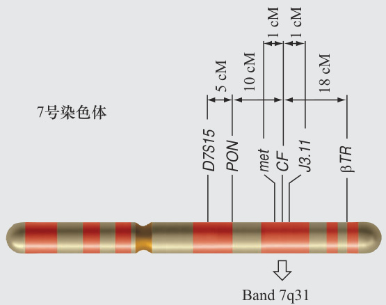  
图A　分子标记如何帮助定位囊性纤维化（ $C F$ ）基因。  

●  虽然遗传图提供了染色体上基因排列的准确图像，但基因间测得的距离可能会有误差。  

●  连锁群中的基因根据定义是同线性的。当具有足够的定位基因后，整个染色体将成为一个单一的连锁群。  

# 5.4 卡方检验和连锁分析  

# 学习目标  

1. 解释卡方检验的目的。  
2. 讨论零假设的概念及其在数据分析中的应用。  

3. 根据卡方检验评估实验数据的显著性。  

你如何从一个特定的实验中知道两个基因是自由组合还是连锁？乍一看，这应该不是问题。区分这两种可能性涉及的直接计算基于由观察结果充分支持的假设。为了独立地分配基因，双杂交F1雌性产生相同数目的四种类型的配子，因此一半的F2子代是亲本类，另一半是重组类。相反，对于连锁基因，根据定义，两种类型的亲代级总是超过F 代中的两种类型的重组级。  

问题在于，因为实际的遗传传播是基于偶然事件的，所以在一项甚至是无连锁的特定研究中，自由组合基因产生的比例可能会与 $1:1:1:1$ 有偏差，就像抛硬币10次一样，可能很容易得到6头和4尾（而不是预测的5和5）。因此，如果分析两个基因传递的育种实验，具有不同于自由组合基因所具有的亲本和重组体的相等比率，那么我们是否可以肯定这两个基因是连锁的？相反，结果也可能是统计学上可接受的基于自由组合非连锁基因的预期平均值的机会波动？这些问题在连锁不是那么紧密的情况下变得更加重要，因此即使基因是连锁的，重组级的百分比也接近 $50\%$ 。  

# 5.4.1 卡方检验评估预测值与观察值之间差异的显著性  

为了回答这些问题，统计学家设计了几种不同的方法来量化实验观察到的偏离特定假设预测值的偏差可能仅仅偶然发生的可能性。其中一种概率方法被被称为拟合优度的卡方检验。该测试测量观察结果与预测结果的符合程度，其目的是说明实验人群的大小（样本大小）是统计显著性的重要组成部分。为了理解样本量的作用，让我们先回顾一下投掷硬币的方法，然后再考察卡方检验的细节。  

在投掷10次硬币时，受概率的影响，6头（ $60\%$ ）和4尾（ $40\%$ ）的结果并不出乎意料。然而，如果投掷硬币1000次，600头（ $60\%$ ）和400尾（ $40\%$ ）的结果在直觉上是不太可能的。在第一种情况下，一次抛硬币结果的变化会改变预期的 $5:5$ 比率与观察到的 $_{\ 6:\ 4}$ 比率。在第二种情况下，需要产生100次从尾部变为头部抛掷才能产生与预测的 $500:500$ 比率所述的偏差。概率事件可以合理地（甚至可能的）导致一个偏离预测的数字，但不是100。  

这个简单的例子中出现了两个重要的概念。首先，单独比较百分比或比率绝不会让你确定观测数据是否与预测值显著不同。其次，获得的绝对数量很重要，因为它们反映了实验的规模。如果假设是正确的，则样本量越大，观察到的百分比就越接近实验假设所预测的值。因此卡方检验总是用数字（实际数据）而不是百分比或比例来计算。  

卡方检验不能证明一个假设，但它可以让研究人员拒绝假设。出于这个原因，卡方检验的一个关键先决条件是构建一个零假设——一个可能被测试驳斥并导致明确的数值预测的模型。尽管当代遗传学家使用卡方检验来解释许多种基因实验，但他们最常使用它来证明从育种实验中获得的数据是否支持两个基因连锁的假设。然而基因A和B连锁的一般假设存在一个问题，那就是在育种数据方面没有准确的预测结果。原因如我们所见，重组体的频率随着每个连锁基因对而变化。  

相反，基因A和B没有连锁的另一种假设产生了一个精确的预测：不同基因的等位基因将自由组合，并在测交中产生 $1:1:1:1$ 的子代类型比例。因此，无论何时遗传学家想要确定两个基因是否连锁，他或她实际上都会测试观察到的数据是否与无连锁的零假设一致。如果卡方检验显示观察到的数据与自由组合所期望的数据显著不同，即它们的差异不能合理地归因于偶然的机会，那么研究人员可以拒绝无连锁的零假设并接受这是两个连锁基因的替代方案。  

“遗传学工具”信息栏“拟合优度的卡方检验”中提出了这种分析的一般方案。计算的最终结果是确定数值概率（即p值），即观察到的一组特定的实验结果显示与特定假设预测的值有偏差。如果概率很高，那么被测试的假设很可能解释了数据，观察到的与预期结果的偏差被认为是不重要的；如果概率很低，则观察到的与预期结果的偏差变得很大，发生这种情况时，所考虑的假设不太可能解释数据，并且该假设可能被拒绝。  

理解为什么使用无连锁（ $\mathrm{RF}{=}50\%$ ）的零假设而不是特定程度的连锁（特定RF $<\!50\%$ ）的零假设是非常重要的。如前所述，卡方检验可以允许拒绝零假设，但不能证明这一点。这个事实解释了为什么遗传学家测试$\mathrm{RF}{=}50$ 的零假设，而不是假设RF等于50以下的某个特定数字，比如38，尽管两种模型都提供了具体的数值预测。如果实验值的偏差相对于被测试的假设是微不足道的（高 $p$ 值），那么结果可能与该模型一致，但它们也可能与另一个未经测试的假设（ $\mathrm{RF}{=}50\%$ ）一致。因此，非显著性的结果是无效的。现在假设实验值与$\mathrm{RF}{=}38$ 的预测的偏差是显著的（低 $p$ 值），以便你可以拒绝该假设。这些信息同样没有用处，因为除了图距不是38m.u.以外，你不会得到任何关于这两个基因的相对位置的信息。只有一个结果具有实际价值：如果你可以拒绝两个基因不相关的零假设（ $\mathrm{RF}{=}50\%$ ），那么你已经了解到它们必须是同线的，并且足够接近才能进行遗传连锁。  

# 5.4.2 卡方检验应用于连锁分析：一个例子  

图5.19描绘了如何将卡方检验应用于从测交实验获得的两组数据，证明基因A和 $\boldsymbol{B}$ 是否连锁。标记为 $o$ 的列包含来自每个实验的实际数据——四种后代类型中的每一种的数量。在第一个实验中后代的总数是48，所以基于非连锁的零假设，每个后代类别的期望值（ $E$ ）可以简单地计算为 $48/4{=}12$ 。现在，对于每个后代类别，将其观测值与预期值的偏差的平方除以期望值，并将计算结果列在（ $O{-}E$ ） $^2/E$ 栏中。所有四个商都相加得到卡方值 $(\,\chi^{2}\,)$ 。在实验1中， $\chi^{2}{=}6.17$ 。  

接下来确定此实验的自由度（df）。自由度是一个考虑了独立变化参数数量的数学概念。在这个例子中，图5.19　应用卡方检验确定两个基因是否连锁。零假设是指这两个基因是不连锁的。对于实验1， $p{>}0.05$ ，因此不可能拒绝原假设。对于实验2，数据集大小为两倍， $p{<}0.05$ ，因此大多数遗传学家会拒绝原假设，并以超过 $95\%$ 的置信度确定基因是连锁的。  

<html><body><table><tr><td rowspan="2">子代类型</td><td rowspan="2"></td><td colspan="3">实验1</td><td rowspan="2"></td><td colspan="2">实验2</td></tr><tr><td></td><td>E (O-E)²/E</td><td></td><td>E</td><td>(O-E)/E</td></tr><tr><td rowspan="2">亲代型 重组型</td><td>AB ab Ab</td><td>18 14</td><td>12 12</td><td>36/12 4/12</td><td>36 28</td><td>24 24</td><td>144/24 16/24</td></tr><tr><td>aB</td><td>7 6</td><td>12 12</td><td>25/12 9/12</td><td>14 18</td><td>24 24</td><td>100/24 36/24</td></tr><tr><td colspan="2">总计 df=3</td><td>48</td><td>48</td><td>74/12 x² = 6.17 p>0.10</td><td>96</td><td>96</td><td>269/24 x² =12.3 p<0.01</td></tr></table></body></html>  

后代分为四类。对于其中三个类别，后代的数量可以是任何值，只要它们的总和不超过48个。然而，一旦这些值中的三个固定，第四个值也是固定的，因为所有四个类别中的总数必须等于48。因此，四个类别的自由度要比类别的数量少一个，即df $\leftrightharpoons3\rightleftharpoons$ 。接下来，查阅卡方表（表5.2） $\chi^{2=}6.17$ 和df $\mathrel{\stackrel{\cdot}{=}}3$ 。你发现相应的 $p$ 值大于0.10。从大于0.05的任何 $\dot{p}$ 值可以得出结论，在这个实验的基础上不可能拒绝零假设，这意味着这个数据集不足以证明A和 $\boldsymbol{B}$ 之间的连锁。  

如果你使用相同的策略计算总共有96个后代的第二个实验中观察到的数据的 $p$ 值，你会发现 $p$ 值小于0.01（图5.19）。在这种情况下，你可以考虑观察值与预期值之间的差异。因此，你可以拒绝自由组合的零假设，并得出结论：基因A和B可能是连锁的。  

统计学家已经任意选择0.05的 $p$ 值作为显著性和非  

# 遗传学工具  

# 拟合优度的卡方检验  

使用卡方检验拟合优度和评估其结果的一般方案可以在一系列步骤中说明。在实际卡方计算之前有两个准备步骤。  

1. 使用从育种实验中获得的数据来回答以下问题：  

a. 分析的后代（事件）总数是多少？  

b. 有多少种不同的后代（事件）？  

c.  在每个类型中，观察到的后代（事件）的数量是多少？  

2.  如果零假设（此处为非连锁）正确，则计算每个类型预期的后代（事件）数量。为此，将由零假设预测的分数（此处为每种可能后代类型的1/4）乘以后代的总数。你现在已准备好进行卡方计算。  

3.  为了计算卡方，从一类后代开始。从观察到的数字中减去预期数量，以获得与类别的预测值的偏差。将结果平方并将此值除以预期数。对所有类型执行此过程，然后对各个结果求和。最终结果是卡方$(\,\chi^{2}\,)$ 值。该步骤由以下等式总结：  

期望值  

式中，Σ代表所有类型的总和。  

4.  接下来考虑自由度（df）。df是实验中独立变化参数数量的量度（见文本）。自由度的值比类型的数量少一个。因此，如果N是类型的数量，那么自由度（df） $=N{-}1$ 。如果有四个类，则有三个df。  

5.  将卡方值与df一起使用以确定 $p$ 值：期望值与实验观察值的偏差是偶然发生的概率事件的可能性。虽然 $p$ 值是通过数值分析得出的，但遗传学家通常通过快速搜索不同自由度的临界 $\chi^{2}$ 值表来确定该值，如表5.2所示。  

6.  评估 $\boldsymbol{p}$ 值的显著性。你可以将 $p$ 值视为零假设为真的概率。大于0.05的值表明，即使零假设实际为真，重复相同大小的实验20次（或超过 ${5\%}$ ），也可能偶然获得一次观察值与预测值的偏差；因此，数据对于拒绝零假设并不重要。统计学家任意选择0.05的 $\boldsymbol{p}$ 值作为拒绝或不拒绝零假设之间的界限。 $p$ 值小于0.05意味着你可以认为偏差是显著的，你可以拒绝零假设。  

表 5.2　临界卡方值  

<html><body><table><tr><td rowspan="3">自由度</td><td colspan="6">p值</td></tr><tr><td colspan="4">不能拒绝零假设</td><td colspan="3">拒绝零假设</td></tr><tr><td>0.99</td><td>0.90</td><td>0.50</td><td>0.10</td><td>0.05</td><td>0.01</td><td>0.001</td></tr><tr><td></td><td colspan="7">x值</td></tr><tr><td>1</td><td></td><td>0.02</td><td>0.45</td><td>2.71</td><td>3.84</td><td>6.64</td><td>10.83</td></tr><tr><td>2</td><td>0.02</td><td>0.21</td><td>1.39</td><td>4.61</td><td>5.99</td><td>9.21</td><td>13.82</td></tr><tr><td>3</td><td>0.11</td><td>0.58</td><td>2.37</td><td>6.25</td><td>7.81</td><td>11.35</td><td>16.27</td></tr><tr><td>4</td><td>0.30</td><td>1.06</td><td>3.36</td><td>7.78</td><td>9.49</td><td>13.28</td><td>18.47</td></tr><tr><td>5</td><td>0.55</td><td>1.61</td><td>4.35</td><td>9.24</td><td>11.07</td><td>15.09</td><td>20.52</td></tr></table></body></html>

注：位于该表的绿色区域的 $\chi^{2}$ 值允许以 ${>}95\%$ 的置信度拒绝零假设，并且假设重组实验是连锁的。  

显著性之间的界限。低于这个数值表明，如果零假设为真，那么100个样本中通过随机抽样获得相同结果的机会将少于5个。因此，小于0.05的 $|p$ 值表明数据显示与预测值的显著重大偏差足以拒绝具有超过 $95\%$ 置信度的零假设。更保守的科学家通常将显著性边界设置为$p{=}0.01$ ，因此只有当他们的置信度大于 $99\%$ 时才会拒绝零假设。  

相反，大于0.01或0.05的 $p$ 值不一定意味着两个基因非连锁，这可能只意味着样本量不足以提供答案。随着更多的数据出现，如果非连锁的零假设是正确的， $p$ 值通常会上升；如果存在连锁，则 $p\angle$ 值会下降。  

请注意在图5.19中，第二组数据中的所有数字都是第一组数据中的数字的两倍，并且比例保持不变。因此，通过将样本量从48人增加到96人，观察值与期望值之间可能从无显著性差异变为有显著性差异。换句话说，样本量越大，与预期结果发生一定百分比的偏差的可能性就越小。根据这一点即可知道，在分析少于10个的小样本时使用卡方检验是不恰当的。这个问题一直困扰人类遗传学家，因为人类家庭只生育少量的儿童。为了在人类中获得合理的连锁研究样本量，科学家通常汇集来自大量家庭谱系的数据，并使用另外一种称为Lod得分的统计分析（见第11章）。  

我们再次强调，卡方检验并非证明是否连锁。它所做的是定量衡量实验数据可以用特定假设来解释的可能性。因此，卡方检验是对显著性的一般统计的检验；它可以用于许多不同的实验设计和假设，而不是用于证明是否连锁。只要有可能提出一个零假设，以及具有定义了预测值的一组数据类别集合，就可以很容易地确定观察到的数据是否与假设一致。  

当实验导致拒绝零假设时，你可能需要确认一个替代方案。例如，如果你正在测试两个相反的性状是否由单个基因的两个等位基因分离而产生，那么你会期望$\mathrm{F}_{1}$ 杂合体和隐性纯合子之间的测交产生后代中两个性状的比率为 $1:1$ 。相反，如果你观察到比例为 $^{\,\cdot\,}6:4$ ，并且卡方检验产生的 $|p\angle$ 值为0.009，则可拒绝零假设（ $1:1$ 比率）。但你仍然面临一个问题：缺乏 $1:1$ 的比率意味着什么？存在两种选择： $\textcircled{1}$ 具有两种可能基因型的个体不具有同等存活率； $\textcircled{2}$ 不止一个基因影响该性状。卡方检验不能告诉你哪种可能性是正确的，你必须进一步研究这个问题。本章最后的问题说明了与遗传有关的卡方检验的几个应用。  

# 基本概念  

●  零假设是导致离散数值预测的模型。  
●  拟合优度的卡方检验有助于通过比较不同类别子代数量的观察值与期望值之间的差异来帮助确定两个基因是否不连锁并因此自由组合。  

●  概率值（ $p$ ）衡量的是单独偶然发生偏离预测值的可能性；当 $p{<}0.05$ 时，零假设被拒绝。  

# 5.5 真菌的四分体分析  

# 学习目标  

1.  解释术语四分体在适用于特定真菌产生子囊时的含义。  
2.  区分亲代双型（PD）、非亲代双型（NPD）或四型（T）。  
3. 描述如何使用PD和NPD的相对数量来建立连锁。  
4.  解释有序和无序四分体分析如何映射基因和（有序四  
分体）着丝粒的位置。  

对于果蝇、小鼠、豌豆、人和其他二倍体生物，每个个体只代表每个亲本在单一减数分裂事件中产生的四种潜在配子中的一种。因此，到目前为止，我们关于连锁、重组和映射的介绍取决于通过检查由大量减数分裂产物（即大群体中的随机联合）产生的二倍体后代的表型而得出的推论。对于这样的二倍体生物，我们不知道哪些（如果有的话）父母的其他后代产生于在相同减数分裂中产生的配子。由于这种限制，二倍体生物中减数分裂随机产物的分析必须基于大量种群的统计抽样。  

相比之下，各种真菌为遗传分析提供了独特的机会，因为它们将每种减数分裂的所有四种单倍体产物置于子囊中。这些单倍体细胞或子囊孢子（也称为单倍孢子或简单孢子）可以作为有活力的单倍体个体发芽并存活，这些单倍体个体通过有丝分裂自我延续。这种单倍体真菌的表型是它们基因型的直接表现，没有显性的并发症。  

图5.20显示了两种真菌物种在囊内保存减数分裂产物的生命周期。一种是通常在超市销售并有助于面包的质地、形状和风味的单细胞面包酵母（Saccharomycescerevisiae）；它在每个减数分裂中产生4个子囊孢子。另一种霉菌是使面包不可食用的粗糙链孢菌（Neuros-pora crassa）；它在每个减数分裂中也产生4个子囊孢子，但是在减数分裂完成时，4个单倍体子囊孢子中的每一个立即通过有丝分裂分裂产生4对总共8个单倍体细胞。因为它们来自有丝分裂，每对链孢菌子囊孢子中的两个细胞具有相同的基因型。  

酵母和链孢菌属的单倍体细胞通常通过有丝分裂繁殖（即无性繁殖）。然而，有性生殖是可能的，因为单倍体细胞有两种交配类型，相反，交配类型的细胞可以融合形成二倍体合子（图5.20）。在酵母中，这些二倍体细胞是稳定的，并且可以通过连续的有丝分裂周期繁殖。诸如由基本营养素稀缺等所引起的压力将诱导酵母的二倍体细胞进入减数分裂。在面包霉菌中，二倍体合子立即进行减数分裂，因此二倍体状态只是短暂的。  

单倍体酵母和霉菌的突变影响许多不同的性状，包  

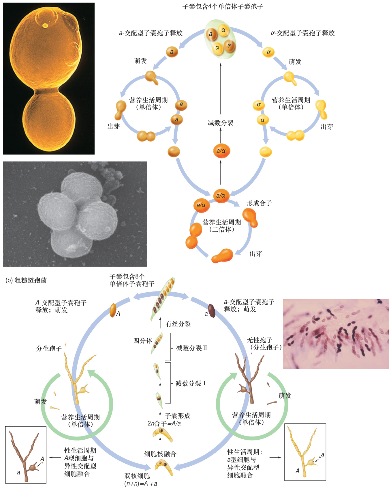  
(a)  

图5.20　酿酒酵母（Saccharomyces cerevisiae）和面包霉菌（Neurospora crassa）的生命周期。酿酒酵母和粗糙链孢菌都具有两种交配类型，可以融合形成经历减数分裂的二倍体细胞。（a）酵母细胞可以作为单倍体或二倍体无性生长。二倍体细胞中的减数分裂产物是4个单倍体子囊孢子，其在无序的酵母子囊中随机排列。（b）链孢菌中的二倍体状态仅存在一小段时间。在链孢菌的减数分裂之后是有丝分裂，在子囊中产生8个单倍体子囊孢子。链孢菌子囊中孢子的有序排列反映了减数分裂和有丝分裂纺锤体的几何形状。图（a）中显示出芽酵母细胞（有丝分裂，顶部）和酵母四分体（底部）的照片的放大倍数远大于图（b）中显示脉孢菌子囊的照片。  

（a，上）： $\copyright$ J. Forsdyke/Gene Cox/SPL/Science Source；（a，下）：承蒙 $\copyright$ Dr. Aaron Neiman, Stony Brook University提供；（b）： $\copyright$ Robert Knauft/Biology Pics/Science Source  

括细胞的表型和它们在特定条件下生长的能力。例如，具有his4突变的酵母细胞在不存在组氨酸的情况下不能生长，而具有trp1突变的酵母在没有外源氨基酸色氨酸的情况下不能生长。专门从事酵母研究的遗传学家设计了与果蝇和小鼠的基因略有不同的基因展示系统。他们使用大写字母（HIS4）来指定显性等位基因，使用小写字母（his4）来表示隐性等位基因。对于我们将要讨论的大多数酵母基因的野生型等位基因是占显性的，也可以用速记 $^{+}$ 替代表示，而隐性等位基因的符号仍然是小写缩写（his4）（请参阅基因命名准则）。但请记住，显性或隐性只与二倍体酵母细胞有关，而与仅携带一个等位基因的单倍体细胞无关。  

# 5.5.1 一个子囊包含一次减数分裂的所有产物  

在单个子囊中组合4个子囊孢子（或4对子囊孢子）称为四分体。请注意，这是术语四分体的第二个含义。在第4章中，四分体是在减数分裂Ⅰ的前期和中期期间的四个同源染色单体（每个染色体中有两个）。在这里，它是单个减数分裂的四个产物在囊中结合在一起。由于二价的四种染色单体产生了四种减数分裂产物，四分体的两种含义指的是几乎相同的物体。酵母制造无序四分体；也就是说，四种减数分裂产物（孢子）随机排列在子囊内。粗糙链孢菌产生有序四分体，四对或八个单倍孢子排成一行。  

为了分析无序和有序四分体，研究人员可以释放每个子囊的孢子，在适当条件下诱导单倍体细胞发芽，然后分析所得单倍体培养物的基因组成。他们以这种方式收集的数据使他们能够确定单一减数分裂的四种产物，并将它们与许多其他不同减数分裂的四种产物进行比较。有序四分体提供了另一种可能性。借助解剖显微镜，研究人员可以按照子囊内发生的次序恢复子囊孢子，从而获得对作图有用的附加信息。我们首先看看酵母四倍体中随机排列的孢子分析。然后我们使用链孢菌作为的模式生物来描述从有序四分体的微量分析中收集附加信息。  

# 5.5.2 四分体可以分为亲代双型（PD）、非亲代双型（NPD）或四型（T）  

当双杂合的二倍体酵母细胞被诱导进行减数分裂时，无论这两个基因是否位于同一染色体，都可以产生三种四分体类型。考虑图5.21中的杂交，其中相反交配类型的单倍体细胞（a对α）和两个基因的交替等位基因交配形成Aa Bb二倍体。一种可能性是所得四分体中的全部四种孢子将具有亲本配置的等位基因，这样的四分体被称为亲代双型（PD）。第二种四分体称为非亲代双型（NPD），含有四种重组孢子，每种类型有两种。最后一种可能性是四型（T）四分体，它包含四种不同的孢子——两种重组体（每种类型之一）和两种亲本（每种类型之一）。请注意，每个酵母菌中的孢子没有按照任何顺序排列（图5.21）。将四分体分类为PD、NPD或T，仅基于子囊中亲本和重组孢子的数目。  

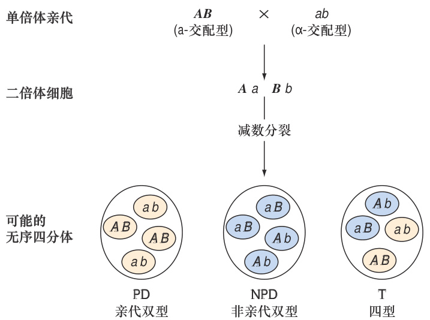  
图5.21　通过双杂合酵母的减数分裂产生的三种四分体类型。无论基因A和B是否在同一染色体上、它们是否连锁，都可以产生所有三种类型。亲本孢子是橙色，重组孢子是蓝色。  

# 5.5.3 通过计算每个四分体类型的数量来确定重组频率  

为了确定图5.21中两个基因之间的RF，你可以先释放出所有孢子，合并孢子并分析它们以确定哪些是亲本，哪些是重组体。在这种情况下，RF等于重组孢子的数量除以计数的孢子总数（亲本加重组体）。  

或者，当你确定每个孢子的基因型时，你可以跟踪哪些孢子来自相同的子囊，并计数每种类型的四分体（PD、NPD或T）的数量。当使用后一种方法时，重组频率仅仅是NPD型四分体的数量（它们中的所有孢子都是重组的；图5.21）加上T型四分体数量的一半（其中一半的孢子是重组的；图5.21）除以计数的四分体总数。  

# $\scriptstyle\mathrm{RF=}\left[\mathrm{NPD+}1/2\right]$ (T)]/四分体总数  

任何一种方法都将计算出相同的RF值。然而，将真菌杂交产物分析为四分体具有几个优点。其中一些是技术性的；例如，在某些真菌中，四分体分析使你能够确定基因与着丝粒之间的距离。但更重要的是，对四分体的分析可以让你更深入地了解减数分裂事件。理解四分体分析的最好方法是研究当双杂合体中的两个基因位于不同染色体上以及它们在同一染色体上时，如何产生不同的四分体类型。  

# 1. 位于不同染色体的非连锁基因： $\scriptstyle\mathbf{PD}=\mathbf{NPD}$  

当诱导杂合二倍体酵母细胞位于不同染色体上的两个基因进行减数分裂时，会产生什么样的四分体？考虑携带突变型his4和野生型TRP1等位基因的a-交配型的单倍体酵母菌株，与具有HIS4 trp1基因型的相反交配型α菌株之间的交配。如图5.22（a）所示，将得到的a/α二倍体细胞是his4 / HIS4；trp1 / TRP1［基因型中的分号（；）将非同源染色体上的基因分开］。  

可以发生三种不同类型的减数分裂，其中每种产生不同的四分体类型。在减数分裂Ⅰ期间，同源染色体的两个随机排列之一会产生一个PD四分体［图5.22（b）］。另一种具有相同概率的染色体排列产生一个NPD四分体  

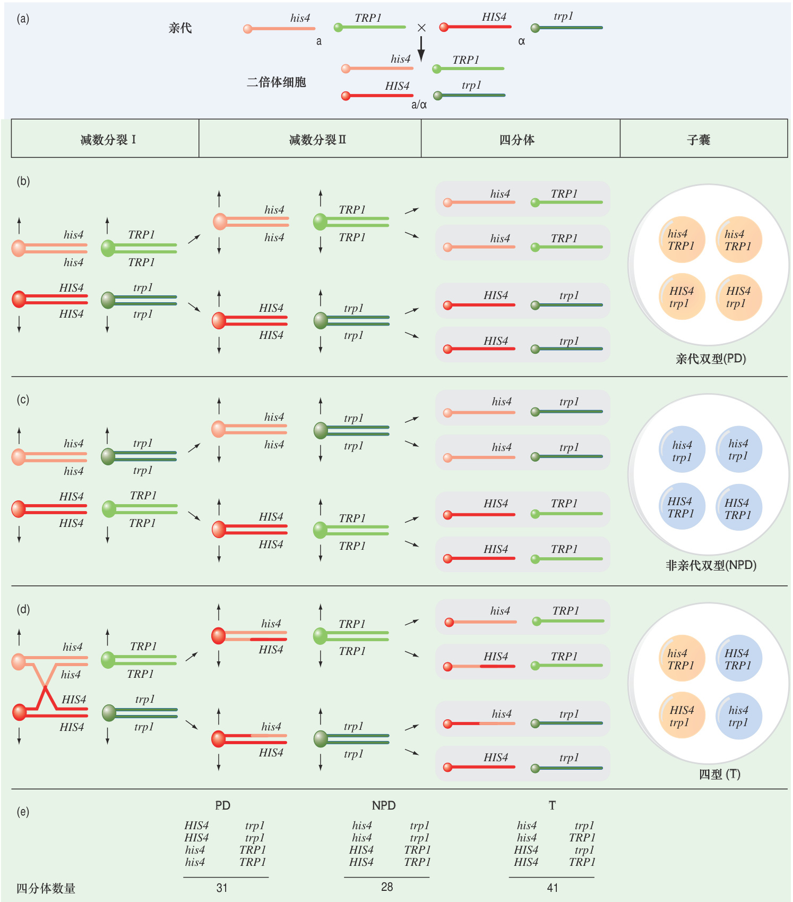  

图5.22　当两个基因位于不同的染色体上时，减数分裂如何产生三种四分体。（a）亲代杂交。（b）和（c）是在没有重组的情况下，两对染色体的相同概率的两种排列方式产生PD或NPD四分体。只有当基因与其相应的着丝粒重组时才产生T四分体，如（d）中所示。（e）中的数值数据显示两个基因非连锁时PD四分体的数量约等于NPD四分体的数量。在 $\mathbf{\Sigma}(\mathbf{\lambda})\sim\mathbf{\Sigma}(\mathbf{\lambda})$ 中，亲代型孢子是橙色的，重组型孢子是蓝色的。  

［图5.22（c）］。T四联体仅由一个基因和着丝粒之间的交换产生［图5.22（d）］。  

这些结果揭示了关于四分体的两个重要事实。首先，由于图5.22（b）和（c）中显示的减数分裂事件具有相同的可能性，因此当两个基因位于不同染色体上时，PD的数量将等于NPD的数量。T的产生［图5.22（d）］不会影响PD和NPD的数量平等，因为两种染色体排列发生T的概率相同。因此，T减数分裂同样地消耗PD和NPD产量。  

其次，正如对不同染色体上的等位基因所预期的那样， $\mathrm{RF}{=}50\%$ 。其中所有孢子都是亲本的PD的数量与所有孢子都是重组的NPD的数量是相等的。剩余的四分体类型T包含一半重组体和一半父母体。  

图5.22（e）显示了使用his4 / HIS4；trp1 / TRP1二倍体的实验数据（请注意，PD、NPD和T的列标题是指四分体而不是单个单倍体细胞）。从这些数据中，你可以看到PD和NPD的数量几乎相同。卡方分析表明，结果与本实验中 $\scriptstyle\mathrm{PD=NPD}$ 的假设没有显著性差异。  

# 2. 连锁基因： $\mathbf{PD}>>\mathbf{NPD}$  

如前所述，如果双杂合二倍体酵母细胞中的两个基因位于不同的染色体上（非连锁），PD四分体的数量将近似等于NPD四分体的数量。这与连锁基因的结果不同。当连锁基因杂交形成孢子（即经历减数分裂）时，产生的PD的数量远远超过NPD的数量。通过分析涉及连锁基因的实际杂交，我们可以看到此推论与减数分裂过程的相关性。  

将含有arg3和ura2突变的单倍体酵母菌株与野生型ARG3 URA2单倍体菌株交配。当产生的二倍体被诱导形成孢子时，所产生的200个四分体具有图5.23所示的分布。正如你所看到的，127个PD四分体远远超过3个NPD四分体表明这两个基因是连锁的。  

图5.24展示了如何根据各种减数分裂类型解释观察到的特定四分体类型。如果两个基因之间没有发生交换，则所得的四分体将是PD［图5.24（a）］。ARG3和URA2之间的单交换会产生T四分体［图5.24（b）］。  

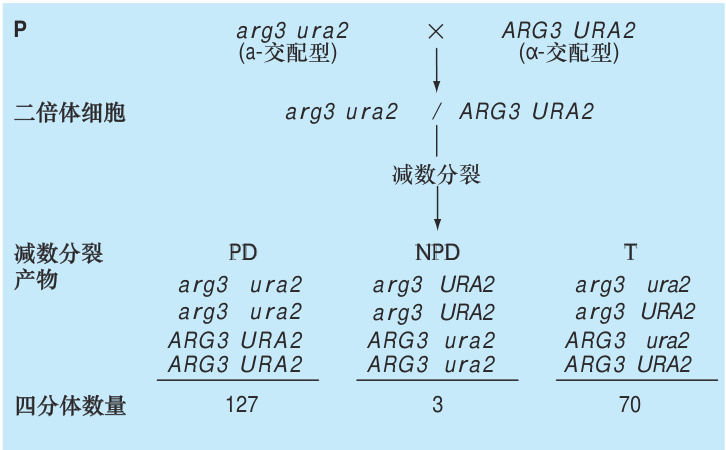  
图5.23　当基因连锁时，PD超过NPD。  

但是双交换呢？正如你前面所看到的（图5.11），根据所参加交换的染色单体，实际上有四种不同的可能性，并且每一种应该以相同的频率出现。只涉及两个染色单体的双交换生成一个PD四分体［图5.24（c）］。三链双交换可以按图5.24（d）和（e）所示的两种方式出现并都将生产一个T四分体的结果。最后，如果所有四种染色单体参与两个交换（一个交换涉及两条链，而另一个交换是另两条链），则所得四分体是NPD［图5.24（f）］。因此，如果两个基因连锁，产生NPD四联体的唯一方法是通过四链双交换。当两个基因在一条染色体上紧靠在一起时，发生四种任一类型双交换的减数分裂数量远少于将产生PD和T四分体的非交换或单交换减数分裂的数量。这就解释了为什么如果两个基因连锁，PD的数量必须大大超过NPD的数量。  

[NPD+(1/2)T]如果我们使用公式 RF= 来计算图四分体总量5.23中数据的RF，我们发现  

$$
\mathrm{RF}{=}[3{+}(1\mathrm{~/~}2)\mathrm{~}70]\mathrm{~/~}200\,\times\,100{=}19\mathrm{m.u.}
$$  

然而，对图5.24的观察表明，当两个基因分离得足够远以至于出现DCO并出现NPD时，RF的这个等式不能准确反映交换事件的实际数量。例如，即使DCO减数分裂生成一些PD，该方程也不计算分子中的任何PD［图5.24（c）］。本章末尾的习题44可以帮助你推导出RF的校正方程。校正后的RF方程考虑到因PD ＞＞NPD但NPD大于零的交换而产生四分体的所有DCO减数分裂。  

# 3. 在单个染色体上相距很远的两个基因： $\scriptstyle\mathbf{PD}=\mathbf{NPD}$  

在四分体分析中，就像集体连锁分析一样，两个基因在同一染色体上可能分开很远，以至于它们与不同染色体上的两个基因没有区别：在以下两种情况下， $\mathrm{PD}=$ NPD。如果两个基因在染色体上分离得足够远，每次减数分裂期间至少有一次交换。在这种情况下，没有减数分裂是NCO，因此所有PD四分体和所有NPD四分体都来自同样频率的DCO［图5.24中的事件（c）和（f）］。因此，无论两个基因是位于不同染色体上而自由组合，或者位于相同染色体上但相距很远，最终结果是相同的： $\scriptstyle\mathrm{PD=NPD}$ 和RF $\!\!\!\!\!\!\!\!\!\!\!\!\!\!\!\!\!\!\!\!\!\!\!\!\!\!\!\!\!\!\!\!\!\!\!\!\!\!\!\!\!\!\!\!\!\!\!\!\!\!\!\!\!\!\!\!\!\!\!\!\!\!\!\!\!\!\!\!\!\!\!\!\!\!\!\!\!\!\!\!\!\!\!\!\!\!\!\!\!\!\!\!\!\!\!\!\!\!\!\!\!\!\!\!\!\!\!\!\!\!\!\!\!\!\!\!\!\!\!\!\!\!\!\!\!\!\!\!\!\!\!\!\!\!\!\!\!\!\!\!\!\!\!\!\!\!\!\!\!\!\!\!\!\!\!\!\!\!\!\!\!\!\!\!\!\!\!\!\!\!\!\!\!\!\!\!\!\!\!\!\!\!\!\!\!\!\!\!\!\!\!\!\!\!\!\!\!\!\!\!\!\!\!\!\!\!\!\!\!\!\!\!\!\!\!\!\!\!\!\!\!\!\!\!\!\!\!\!\!\!\!\!\!\!\!\!\!\!\!\!\!\!\!\!\!\!\!\!\!\!\!\!\!\!\!\!\!\!\!\!\!\!\!\!\!\!\!\!\!\!\!\!\!\!\!\!\!\!\!\!\!\!\!\!\!\!\!\!\!\!\!\!\!\!\!\!\!\!\!\!\!\!\!\!\!\!\!\!\!\!\!\!\!\!\!\!\!\!\!\!\!\!\!\!\!\!\!\!\!\!\!\!\!\!\!\!\!\!\!\!\!\!\!\!\!\!\!\!\!\!\!\!\!\!\!\!\!\!\!\!\!\!\!\!\!\!\!\!\!\!\!\!\!\!\!\!\!\!\!\!\!\!\!\!\!\!\!\!\!\!\!\!\!\!\!\!\!\!\!\!\!\!\!\!\!\!\!\!\!\!\!\!\!\!\!\!\!\!\!\!\!\!\!\!\!\!\!\!\!\!\!\!\!\!\!\!\!\!\!\!\!\!\!\!\!\!\!\!\!\!\!\!\!\!\!\!\!\!\!\!\!\!\!\!\!\!\!\!\!\!\!\!\!\!\!\!\!\!\!\!\!\!\!\!\!\!\!\!\!\!\!\!\!\!\!\!\!\!\!\!\!\!\!\!\!\!\!\!\!\!\!\$ 。  

# 5.5.4 有序四分体有助于对比着丝粒进行基因定位  

对有序四分体的分析，如面包霉菌粗糙链孢菌（Neurospora crassa）产生的四分体，可以让你将染色体的着丝粒与其他遗传标记进行比对，这些信息通常无法从无序酵母四分体中获得。如前所述，不同交配类型的单倍体链孢菌细胞（A和a）在受精融合后，二倍体合子在狭窄的子囊内进行减数分裂［见图5.20（b）］。在减数分裂完成时，四个单倍体产物中的每一个都进行  

<html><body><table><tr><td>复制</td><td>减数分裂I</td><td>减数分裂Ⅱ</td></tr><tr><td>(a)无交换(NCO)</td><td></td><td>arg3 ura2</td></tr><tr><td>arg3 ura2</td><td>arg3 ura2</td><td>arg3 ura2</td></tr><tr><td>arg3 ura2</td><td>arg3 ura2</td><td></td></tr><tr><td>ARG3 URA2</td><td>ARG3 URA2</td><td>ARG3 URA2</td></tr><tr><td>ARG3 URA2</td><td>ARG3 URA2</td><td>ARG3 URA2</td></tr><tr><td></td><td></td><td>亲代双型</td></tr></table></body></html>  

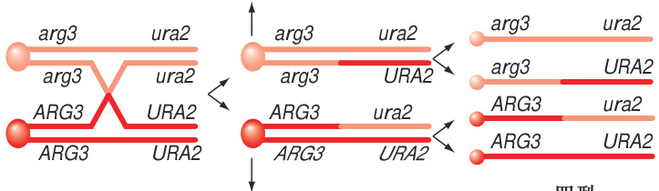  

(c)       (DCO)  

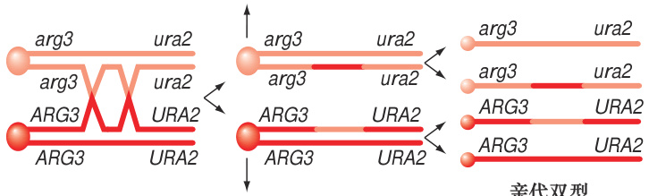  
(d)   DCO  

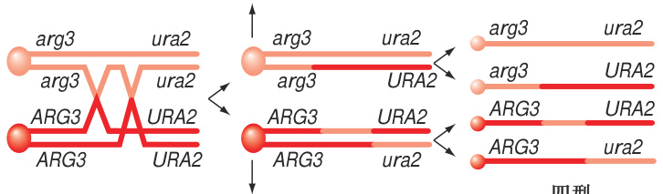  

(e)   DCO  

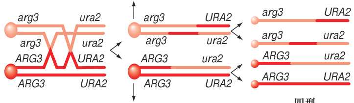  
(f)    DCO  

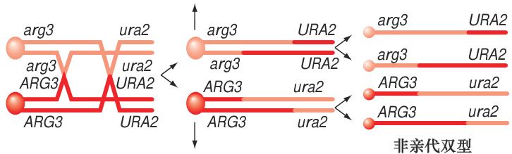  

图5.24　连锁基因之间的杂交产生不同的四分体。（a）无杂交时PD数量升高。（b）两个基因单交换产生四型（T）。  

（c）取决于参与交换的染色单体，连锁基因之间的双重交换可以产生PD、T或NPD四分体。  

一次有丝分裂产生包含八分体单倍体的子囊孢子。在此时间点解剖子囊可确定八个单倍体细胞中的每一个的表型。  

子囊的横截面直径非常小，细胞不能相互滑动。此外，在受精后的每一次分裂中，心轴的微管纤维从平行于子囊长轴的中心体向外延伸（图5.25）。这有两个重要的影响。首先，当四种减数分裂产物中的每一种产生一次有丝分裂时，产生的两种基因相同的细胞彼此相邻。由于这一特征，从子囊的两端开始，可以将八分体子囊孢子的细胞计算为四个细胞对，并将其分析为四分体。其次，从子囊内四个子囊孢子对的精确定位，可以推断出在两个减数分裂期间每个同源染色体对的四个染色单体的排列。  

考虑单个基因的等位基因分离所产生的四分体有助于理解子囊孢子几何形状的遗传因果关系（在下面的讨论中，你会看到链孢菌遗传学家使用类似果蝇符号的等位基因，详见《基因命名指南》）。突变型白色等位基因（ws）将野生型黑色的子囊孢子颜色改变为白色。由于着丝粒的分离，在不存在重组的情况下两个等位基因（ $w s^{+}$ 和ws）在第一次减数分裂时彼此分开。第二次减数分裂和随后的有丝分裂产生子囊，其中前四个子囊孢子具有一种基因型（如 $w s^{+}$ ），后四个孢子基因型为ws。前四位是 $w s^{+}$ 还是最后四位为ws（反之亦然），取决于中期I中随机排列的携带该基因的同源染色体相对于发育着的子囊的长轴方向。  

因此，在第一次减数分裂中单个基因的两个等位基因的分离可由子囊指示，其中划在子囊第四个和第五个孢子之间的假想线清楚地分离带有两个等位基因的单倍体产物。这种子囊显示第一次分裂（MI）分离模式［图5.26（a）］。  

现在假设在减数分裂Ⅰ期间，交换发生在白孢子基因和着丝粒之间的杂合子中。如图5.26（b）所示，这图5.25　有序四分体的形成。纺锤体平行于链孢菌的长轴生长，并且细胞不能彼此滑动。因此，子囊孢子的顺序反映了减数分裂纺锤体的几何形状。在减数分裂后，每个单倍体细胞经历有丝分裂，产生八细胞的子囊（八分体）。八分体由四对细胞组成； 每对中的两个细胞是遗传相似的。  

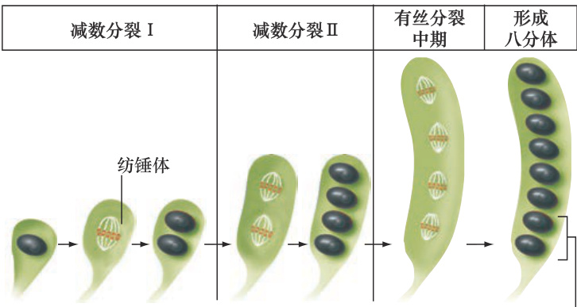  

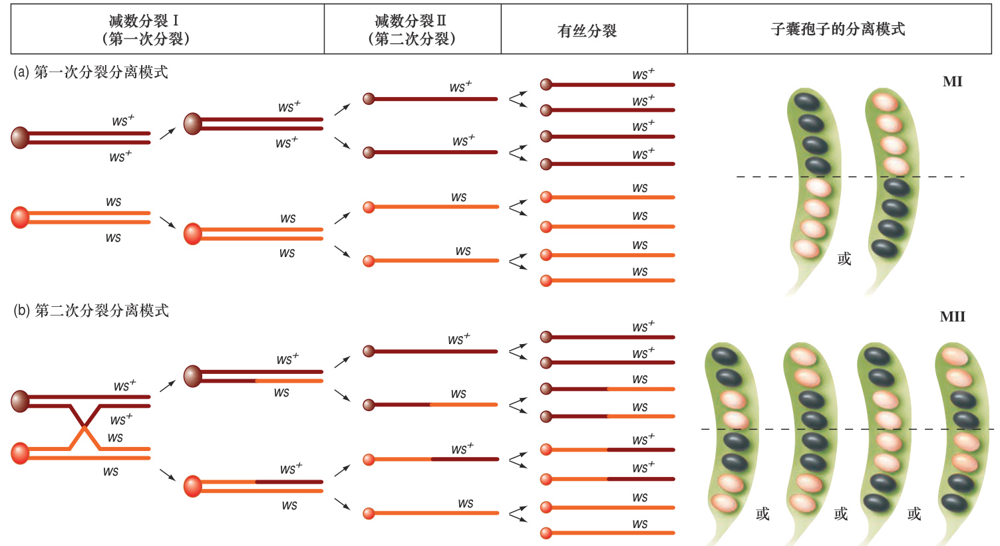  
图5.26　有序子囊中的两种分离模式。（a）在基因和着丝粒之间没有交换的情况下，基因的两个等位基因将在第一次减数分裂时分离。结果是MI分离模式，其中每个等位基因出现在仅位于通过子囊中部的假想线一侧的孢子中。（b）基因和着丝粒之间的交换产生MII分离模式，其中两个等位基因出现在中线的同一侧。  

可能导致四种同样可能的子囊孢子排列，每种排列取决于两个减数分裂期间四种染色单体的特定取向。在所有四种情况下， ${w.s^{+}}$ 和ws孢子都位于子孢子4和5之间的假想线的两侧，因为仅有一种等位基因的细胞直到第二次减数分裂结束才出现。携带这种孢子构型的八分体显示第二次分裂（MII）分离模式。  

因为MII分离模式是由基因和着丝粒之间发生交换的减数分裂引起的，所以具有这种模式的子囊的相对数量可以用来确定基因与着丝粒的距离。在显示MII分离的子囊中，一半的子囊孢子来源于已交换部分的染色单体，而另一半来自未参与交换的染色单体［图5.26（b）］。为了计算基因与着丝粒之间的距离，可简单地将MII八分体的百分比除以2：  

基因 $\leftrightarrow$ 着丝粒距离 $\scriptstyle{\left\langle{=(1/2)}\right.}$ MII /总四分体数 $\times\,100$ 。  

# 5.5.5 四分体分析：一个数值例子  

在一个实验中，将链孢菌属的thr+arg+野生型菌株与thr arg双突变体杂交。在没有氨基酸苏氨酸的情况下，thr突变体不能生长，而arg突变体不能在没有氨基酸精氨酸来源的情况下生长；携带两种基因的野生型等位基因的细胞可以在不含有两种氨基酸的培养基中生长。从这个杂交中，获得了105个八分体，此处作为四分体。如图5.27（a）所示，这些四分体分为7个不同的组——A、B、C、D、E、F和G。对于这两个基因中的每一个，我们现在都可以找到基因和着丝粒之间的距离。  

为了对thr基因进行此操作，我们计算该基因的MII分离模式的四分体数量。通过四分体中间画出一条假想的线，我们看到B、D、E和G组中的四分体是MII分离的结果，而其余的则显示MI分离模式。thr与着丝粒距离是：  

MII分离模式比例的半数 $\leftrightharpoons$  

$$
{\frac{(1/2)\big(16+2+2+1\big)}{105}}\!\times\!100\!=\!10\mathrm{m.u.}
$$  

类似地，arg基因的MII四分体在C、D、E和G组，因此arg和着丝粒的距离是：  

$$
{\frac{(1/2)\big(11+2+2+1\big)}{105}}\!\times\!100\!=\!10\mathrm{m.u.}
$$  

为了确定thr和arg基因是否连锁，我们需要以不同的方式评估7个四分体组，查看两个基因的等位基因组合，以查看该组中的四联体是否是PD、NPD或T。之后我们推断是否P $\mathrm{D}>>\mathrm{NPD}$ 。再次参考图5.27（a），我们发现A和G组是PD，因为所有的子囊孢子都显示亲本组合，而具有四个重组孢子的E和F组是NPD。PD因此是 $72\!+\!1\!=\!73$ ，而NPD是 $1+2{=}3$ 。从这些数据中我们可以得出结论：两个基因是连锁的。  

thr和arg之间的遗传距离是多少？我们需要获得T和NPD四分体的数量才能进行计算。在B、C和D组中发图5.27　有序四分法的遗传作图：一个例子。（a）在有序四分体分析中，四分体的分类不仅根据PD、NPD或T，而且还根据它们是否显示MI或MII分离模式。该表中的每个条目代表实际链孢菌八分体中的一对相邻的遗传相同孢子。红点表示子囊的中间。（b）源自（a）部分数据的遗传图。有序四分体分析可以确定着丝粒的位置及基因之间的距离。  

(a)   

<html><body><table><tr><td>四分体群体</td><td>A</td><td>B</td><td>C</td><td>D</td><td>E</td><td>F</td><td>G</td></tr><tr><td>分离模式</td><td>thr arg thr arg thr+ arg+ thr+argt</td><td>thr arg thr+ arg thr+ arg+ thr arg+</td><td>thr arg thr arg+ thrt arg thr+arg+</td><td>thra arg+ thrt +arg thr+ arg+ thr arg</td><td>thr arg+ thrt arg thrtarg thra argt</td><td>thr arg+ thr arg+ thrt arg</td><td>thr arg thrt argt thrt argt</td></tr><tr><td>群体数量</td><td>72</td><td>16</td><td>11</td><td>2</td><td>2</td><td>thr+arg 1</td><td>thr arg 1</td></tr></table></body></html>  

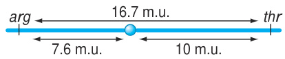  
(b)  

现四型，并且我们已经知道E组和F组携带NPD。使用前述用于酵母图距的同一公式，  

$$
\mathrm{RF}=\frac{\mathrm{NPD}+1/2\mathrm{T}}{\lvert\underline{{\mathrm{{\it}}}}\rvert\,\stackrel{\mathrm{\it}}{\mathrm{\it}}\subset\lvert\underline{{\mathrm{\it}}}\rvert\stackrel{\mathrm{\it}}{\mathrm{\it}}\stackrel{\mathrm{\it}}{\mathrm{\it}}\rangle}\times100\
$$  

我们得到：  

$$
\mathrm{RF}{=}\frac{3\,{+}\,{\left(1/2\right)}{\left(16\,{+}11\,{+}\,2\right)}}{105}{\times}100\,{=}16.7\mathrm{m.u}.
$$  

由于 $t h r$ 和arg之间的距离大于从着丝粒和任一基因的距离，因此着丝粒必须位于thr和arg中间，产生图5.27（b）所示的图谱。由于该公式并未考虑所有双交换，由上式计算的两个基因之间的距离（ $16.7\mathrm{m.u.}$ ）小于两个基因 $\leftrightarrow$ 着丝粒距离（ $10.0{+}7.6{=}17.6\mathrm{m.u.}$ ）。与往常一样，通过添加更短的间隔来计算地图位置会生成最准确的遗传图。基因 $\leftrightarrow$ 着丝粒距离更短时，则会比本例中所计算的thr / arg距离更准确。  

表5.3总结了在产生有序和无序四分体的真菌中定位基因的程序。  

表5.3　四分体分析法则  

<html><body><table><tr><td>无序和有序四分体</td></tr><tr><td>一次考虑两个基因，区分PD、NPD和T四分体</td></tr><tr><td>如果PD>>NPD，则基因连锁</td></tr><tr><td>如果PD≈NPD，则基因自由组合（非连锁）</td></tr><tr><td>若连锁，则两个基因的图距</td></tr><tr><td>NPD+(1/2)T ×100 四分体总数</td></tr><tr><td>有序四分体</td></tr><tr><td>基因和着丝粒之间的遗传距离</td></tr><tr><td>(1/2)MII ×100 四分体总数</td></tr></table></body></html>  

# 基本概念  

●  四分体是由真菌单次减数分裂形成的一个子囊中的四个单倍体孢子组。  

●  在亲代双型（PD）中，四分体有四个亲本孢子；在一个非亲代双型（NPD）中，四分体含有四个重组孢子；在四分体（T）中，子囊含有两种不同的亲本孢子和两种不同的重组孢子。  

●  当双杂交产生孢子时，如果PD四分体与NPD四分体相等，则所讨论的基因是不连锁的；当PD远超过NPD时，这些基因就是连锁的。  

●  无序四分体分析揭示了连锁基因和它们之间的图距；有序四分体的分析可进一步确定基因和着丝粒之间的距离。  

# 5.6 有丝分裂重组和遗传嵌合体  

# 学习目标  

1. 解释有丝分裂重组如何形成称为孪生斑的嵌合体条件。2.  描述酵母中的扇形菌落及其在评估有丝分裂重组中的意义。  

遗传物质的重组是减数分裂的关键特征。因此，真核生物表达特异性启动减数分裂重组的各种酶（将在第6章中描述）并不令人惊讶。重组也可能发生在有丝分裂期间。然而，与减数分裂中发生的不同，有丝分裂交换是由染色体复制错误或偶然暴露于破坏DNA分子的辐射引发的，而不是由明确定义的细胞程序引发的。因此，有丝分裂重组是一种罕见的事件，在一百万个体细胞分裂中发生频率不会超过一次。尽管如此，酵母细胞群的生长或复杂多细胞生物体的发育涉及很多细胞分裂，遗传学家可以常规地检测这些罕见的有丝分裂事件。  

# 5.6.1 孪生斑标示有丝分裂重组引起的镶嵌 现象  

1936年，果蝇遗传学家Curt Stern通过观察果蝇中的孪生斑推断存在有丝分裂重组。孪生斑是指是邻近的组织岛，彼此以及与周围的组织都不同。独特的斑块产生于具有隐性表型的纯合细胞中，该细胞在显示显性表型的普通杂合细胞群体中生长。在果蝇中，黄色（y）突变将体色从正常的棕色变为黄色，而焦刚毛（sn）突变导致身体鬃毛变短而卷曲，而不是长而直的。这两个基因都是X连锁的。  

在他的实验中，Stern检查了基因型为y sn / y sn的XX果蝇雌性。这些双杂合子在外观上一般都是野生型的，但Stern注意到有些果蝇携带黄体色斑块，其他一些具有小面积的焦刚毛，甚至还有一些显示出孪生斑：  

相邻的黄体色斑块细胞和带有焦刚毛细胞（图5.28）。他认为伴随果蝇发育的有丝分裂中错误可能导致这些嵌合体动物含有不同基因型的组织。单个黄色或焦刚毛的斑块可能由染色体丢失或有丝分裂不分离产生。这些有丝分裂的错误将产生仅含有 $y$ （但不包含y ）或sn（但图5.28　孪生斑：一种遗传镶嵌现象。在y $s n^{+}/\nu^{+}s n$ 果蝇雌性中，大部分身体是野生型，但有时会出现呈现黄色或有焦刚毛的异常斑块。在某些情况下，黄色和焦刚毛彼此相邻，这种现象称孪生斑。  

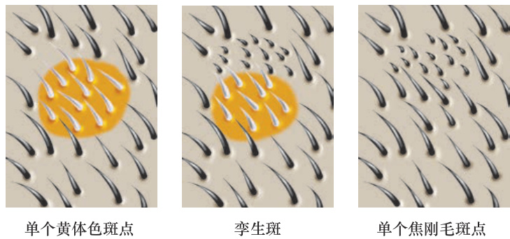  

不包含 $s n^{+}$ ）等位基因的XO细胞；这种细胞会显示出一种隐性表型。  

孪生斑必须有不同的起源。Stern推断它们代表了sn基因和着丝粒之间有丝分裂交换的相互作用产物。其机制如下：在二倍体细胞的有丝分裂期间，极少的同源染色体在染色体复制后彼此配对。当染色体配对时，非姐妹染色单体进行了部分交换。配对是短暂的，并且同源染色体很快恢复其在有丝分裂中期平板上的独立位置。在那里，两条染色体可以以两种方式相对排列［图5.29（a）］。其中一种取向会产生两个对两个基因都保持杂合的子细胞，因此与周围的野生型细胞没有区别。然而，另一个方向将产生两个纯合的子细胞：一个是y $s n^{+}/\ y\ s n^{+}$ ，另一个是 $,^{+}\!s n~/~y^{+}\!s n$ 。因为两个子细胞彼此相邻，因此随后的有丝分裂会产生y和sn组织的邻近斑块（即孪生斑）。请注意，如果在sn和y之间发生交换，可能会形成黄色组织的单个斑点，但不能以这种方式生成相互交错的斑点［图5.29（b）］。  

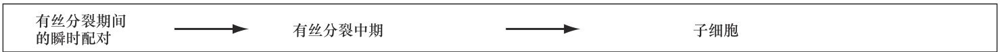  
(a) sn  

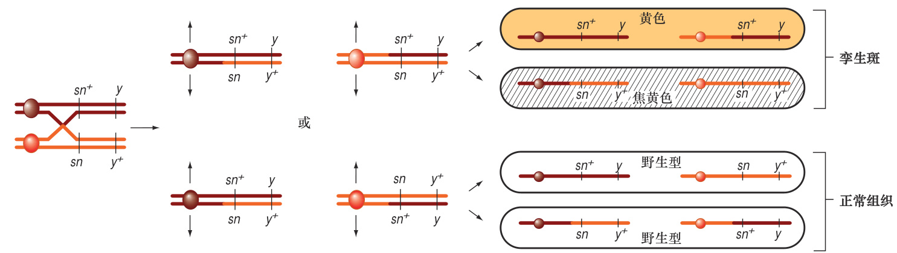  

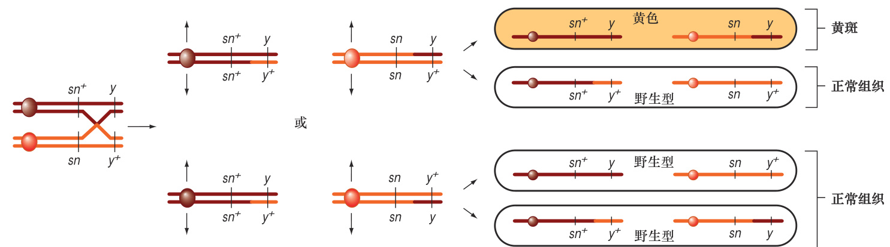  

图5.29　有丝分裂交换。（a）在y $s n^{+}/\nu^{+}s n$ 雌性果蝇中，着丝粒和sn之间的有丝分裂交换可以产生两个子细胞，一个是y纯合子，另一个是sn纯合子，可以发展成相邻的异常斑块（孪生斑）。这一结果取决于后期染色单体的特定分布（上图）。如果染色单体以相同概率的相反方向排列，则仅产生表型正常的细胞（底部）。（b）sn和y之间的交换可以产生单个黄色斑块。然而，如果sn基因比y基因更接近着丝粒，那么这些雌性中的单个有丝分裂交换不能产生单个焦刚毛斑点。  

# 5.6.2 扇形酵母菌可起源有丝分裂重组  

对一个或多个基因杂合的二倍体酵母细胞以扇形表现出有丝分裂重组，即菌落的部分基因型与本菌落其他细胞的基因型不同。如果将基因型为ADE2 / ade2的二倍体酵母细胞置于培养皿上，其有丝分裂后代将生长成菌落。通常，这样的菌落会呈现白色，因为显性野生型ADE2等位基因指定该颜色。然而，许多菌落将包含二倍体ade2 / ade2细胞的红色扇区（图5.30）。这些细胞是红色的，因为腺嘌呤生物合成途径中的一个区域导致它们积累红色色素。红色扇区起因于ADE2基因与其着丝粒之间的有丝分裂重组（纯合ADE2 / ADE2细胞也会同时产生，但因为两种细胞都是白色的，所以无法区分其与杂合子）。  

相对于整个菌落大小的红色扇区的大小表明何时发生有丝分裂重组。如果红色扇区相对较大，在细胞分裂早期阶段发生有丝分裂重组，从而导致子细胞长时间增殖。如果红色扇区很小，则重组发生在后期。  

# 5.6.3 有丝分裂重组具有显著的结果  

本章末尾的习题51说明了遗传学家如何使用有丝分裂重组来获得关于基因相对于彼此和着丝粒位置的信息。有丝分裂杂交在发育研究中也具有重要价值，因为它可以产生不同细胞，具有不同基因型的动物（见习题52和第19章）。最后，正如“遗传学与社会”信息栏中对“有丝分裂重组和癌症形成”的解释那样，有丝分裂重组可以对人类健康产生重大影响。  

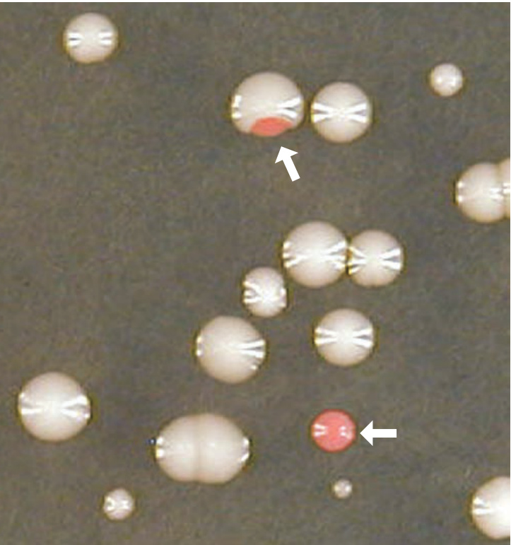  
图5.30　二倍体酵母菌落生长过程中的有丝分裂重组可以产生多个扇区。箭头指向由ADE2 / ade2杂合子形成的大的红色ade2 / ade2扇区。  

# 基本概念  

●  孪生斑是一种遗传镶嵌现象；当有丝分裂重组产生具有互惠突变基因型和表型的两个细胞克隆时，这些斑点发生。  

●  有丝分裂重组也可在二倍体酵母中产生扇形菌落，其中部分菌落具有可识别的突变表型。  

# 接下来的内容  

医学遗传学家利用他们对连锁、重组和映射的知识来理解本章开头所示的家谱图（见图5.1）。红绿色盲的X连锁基因必须与A型血友病的基因非常接近，因为两者紧密结合。事实上，这两个基因之间的遗传距离只有3m.u.。图5.1（a）中的样本量非常小，以至于谱系中的个体都不是重组型。相反，即使B型血友病基因座也位于X染色体上，它与红绿色盲位点相距足够远，以致两个基因经常重组。色盲和B型血友病基因在小样本中似乎是遗传上不相关的［如图5.1（b）］，但分离两个基因的实际重组距离约为36m.u.。家谱图指出两种不同形式的血友病，一种与色盲密切相关，另一种几乎没有联系，提供了表明血友病是由多种基因决定的线索之一（图5.31）。  

连锁和重组在生命形式中是普遍的，因此必须赋予生物体重要的优势。遗传学家认为，连锁提供了将完整  

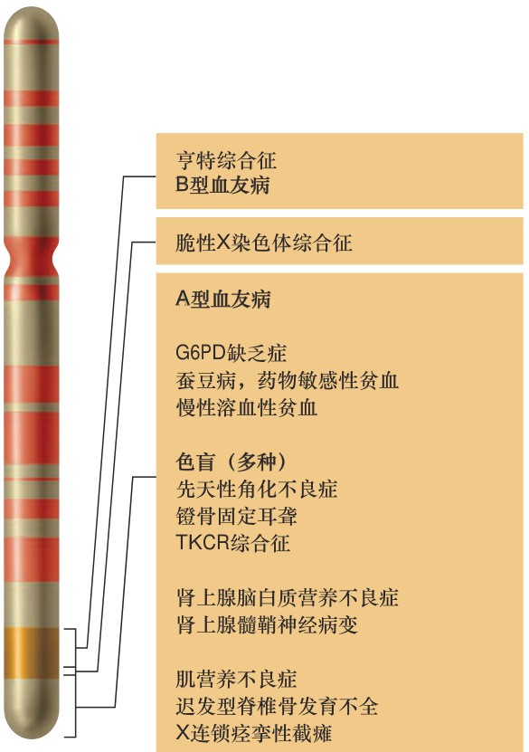  
图5.31　人类X染色体的部分遗传图。  

# 遗传学与社会  

# 有丝分裂重组和癌症形成  

人类的一些肿瘤可能由于有丝分裂重组而出现，如视网膜母细胞瘤。回顾第3章关于外显率和表现力的讨论，视网膜母细胞瘤是一种眼癌。视网膜母细胞瘤基因（RB）位于13号染色体上，其中正常的野生型等位基因（ $R B^{+}$ ）编码调节视网膜生长和分化的蛋白质。眼睛中的细胞需要至少一个正常野生型等位基因的拷贝以维持对细胞分裂的控制。因此，正常的野生型 $R B^{+}$ 等位基因被称为肿瘤抑制基因。  

具有视网膜母细胞瘤遗传倾向的人出生时只有正常 $R B^{+}$ 等位基因的一个功能性拷贝；它们的第二个13号染色体上要么携带一个无功能的 $R B^{-}$ 等位基因，要么完全不携带RB基因。如果诱变剂（如辐射）或基因复制或分离中的错误破坏或移除任一眼睛视网膜细胞中剩余的单个正常基因拷贝，则视网膜母细胞瘤肿瘤将在该部位发生。在一项对视网膜母细胞瘤具有遗传易感性的人的研究中，从眼肿瘤中取出的细胞是 $R B^{-}$ 纯合子，而来自同一人的白细胞是 $R B^{+}/\ R B^{-}$ 杂合子。如图A所示， $R B$ 基因与携带该基因的染色体着丝粒之间的有丝分裂重组提供了一种机制；通过该机制，$R B^{+}/\ R B^{-}$ 个体中的细胞可以变成 $\mathcal{R}B^{-}/\ R B^{-}$ 。一旦产生纯合 $R B$ 细胞，它就会不受控制地分裂，导致肿瘤形成。  

只有 $40\%$ 的视网膜母细胞瘤病例遵循上述情况，另外 $60\%$ 发生在出生时具有两个正常拷贝的RB基因的人中。在这样的人中，需要两个突变事件才能导致癌基因的有利组合传递给后代的可能性，而重组产生新的等位基因组合的灵活性。一些新的组合可以帮助物种适应不断变化的环境条件，而成功测试的组合则通过遗传保留下来。  

迄今为止，这本书已经研究了基因和染色体是如何传播的。尽管这些知识非常重要且有用，但仅包含很少量的关于遗传物质的结构和作用模式的知识。在后面的章节（第 $6\!\sim\!8$ 章）中，我们进行遗传分子—DNA水平的分析。  

# 习题精解  

Ⅰ.  人类X染色体上的XG基因座具有两个等位基因$X G^{+}$ 和 $X G$ 。 $X G^{+}$ 等位基因导致红细胞上出现Xg表面抗原，而隐性XG等位基因不会出现抗原。XG基因座与STS基因座相距10m.u.。 $S T S^{+}$ 等位基因产生正常活性的类固醇硫酸酯酶，而隐性STS等位基因会导致症。其中第一个必须将 $\cdot R B^{+}$ 等位基因转换为 $R B^{-}$ ，而第二个可能是有丝分裂重组，产生成为癌细胞的子细胞，因为它们对于新突变的非功能性等位基因是纯合的。  

有丝分裂重组在视网膜母细胞瘤形成中的作用有助于解释该疾病的不完全外显率和可变表达性。出生及具有 $R B^{+}/\ R B^{-}$ 杂合子的人可能会也可能不会发展为该病症（不完全外显率）。如果像往常一样，它们可能会在一只或两只眼睛中出现肿瘤（可变表现力）。这一切都取决于是否发生以及在身体的哪些细胞中发生有丝分裂重组（或影响13号染色体的一些其他“纯合”事件）。  

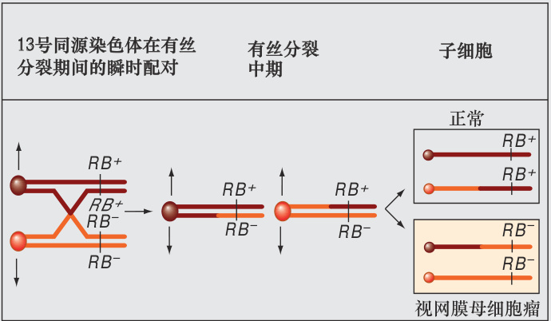  

图A　有丝分裂交换如何导致癌症。在 $R B^{-}/\,R B^{+}$ 杂合子中视网膜生长期间的有丝分裂重组可以产生 $R B^{-}/\,R B^{-}$ 子细胞，其缺乏功能性视网膜母细胞瘤基因并因此分裂失控。RB基因与其着丝粒之间必须发生交换。此图仅显示了产生该结果的染色单体的排列。  

缺乏类固醇硫酸酯酶活性和鱼鳞病（鳞状皮肤）。患有鱼鳞病且无Xg抗原的男性有一个Xg抗原的正常女儿。该女儿怀孕了。  

a.  如果孩子是男孩，他缺少Xg抗原并患有鱼鳞病的概率是多少？  
b.  这个男孩患有抗原和鱼鳞病的概率是多少？  
c.  如果男孩患有鱼鳞病，那么他患Xg抗原的概率是多少？  

# 解答  

a.  这个问题需要了解连锁如何影响配子的比例。减数分裂过程中的重组影响等位基因的传递，需首先指定该受影响的个体（本问题中的女儿）的基因型。她从父亲遗传的X染色体（患有鱼鳞病，没有Xg抗原）必须是STS XG（因为她父亲只有一条X染色体，所以在减数分裂期间没有重组可以分离基因）。因为女儿是正常的并且具有Xg抗原，所以她的另一条X染色体（遗传自她的母亲）  

必须包含 $S T S^{+}$ 和 $X G^{+}$ 等位基因。她的X染色体可以表示为：  

因为STS和XG基因座在染色体上相距 $10\mathrm{m.u.}$ ，重组频率为 $10\%$ 。 $90\%$ 的配子将是亲本： $S T S\ X G$ 或 $S T S^{+}X G^{+}$ （每种类型 $45\%$ ）； $10\%$ 将是重组：STS$X G^{+}$ 或 $S T S^{+}X G$ （每种类型的 $5\%$ ）。儿子的表型直接反映了他母亲的X染色体的基因型。因此，他缺乏Xg抗原并患有鱼鳞病（基因型：STS XG / Y）的概率是45/100。  

b.  他将获得抗原和鱼鳞病（基因型： $S T S\,X G^{+}/\,\mathrm{Y}$ ）的概率是5/100。  

c.  存在两类含有鱼鳞病等位基因的配子：STS XG（ $45\%$ ）和STS $X G^{+}$ （ $5\%$ ）。如果配子总数为100个，那么50个将具有STS等位基因。在那些配子中，5个（或 $10\%$ ）具有 $X G^{+}$ 等位基因。因此，具有STS等位基因的儿子将具有Xg抗原的概率为1/10。  

Ⅱ.  具有野生型外观但三个常染色体基因杂合的果蝇雌性与显示下列三种相应常染色体隐性性状的雄性交配：玻璃状眼睛、煤色体和条纹胸部。这种杂交的1000个后代分布在以下表型类别中：  

野生型 27  
条纹胸部 11  
煤色体 484  
玻璃状眼睛，煤色体 8  
玻璃状眼睛，条纹胸部 441  
玻璃状眼睛 煤色体 冬纹购部 oC  

a. 根据这些数据绘制遗传图。  

b.  绘制雌性亲本中两条同源染色体上等位基因的排列。  
c.  外观正常且具有与上述杂交中的雌性相同染色体的雄性与显示玻璃状眼睛、煤色体和条纹胸部的雌性交配。在产生的1000个后代中，指出将获得的各种表型类别的数量。  

# 解答  

下述一种处理三点杂交的逻辑方法。  

a. 指定等位基因：  

$t^{+}{=}$ 野生型胸部 $t{=}$ 条纹胸部$g^{+}{=}$ 野生型眼睛 $g{=}$ 玻璃眼睛$c^{+}{=}$ 野生型体色 $c{=}$ 煤色体  

在解决三点杂交时，指定产生每组个体的事件类型和从母亲获得的配子的基因型［父本配子只包含这些基因的隐性等位基因（ $t\ g\ c\;,$ ）。这些来自父亲的等位基因允许与隐性母体等位基因相关  

的特征出现在后代中］。  

<html><body><table><tr><td>子代</td><td>数量</td><td>事件类型</td><td>基因型</td></tr><tr><td>1.野生型</td><td>27</td><td>单交换</td><td>tg*c*</td></tr><tr><td>2.条纹胸部</td><td>11</td><td>单交换</td><td>tg*c+</td></tr><tr><td>3.煤色体</td><td>484</td><td>亲本</td><td>tg*c</td></tr><tr><td>4.玻璃状眼晴，煤色体</td><td>8</td><td>单交换</td><td>tgc</td></tr><tr><td>5.玻璃状眼睛，条纹胸部</td><td>441</td><td>亲本</td><td>tgct</td></tr><tr><td>6.玻璃状眼睛，煤色体，条纹 胸部</td><td>29</td><td>单交换</td><td>tgc</td></tr></table></body></html>  

挑选亲代型很容易。如果所有其他类别都很少，那么两个最丰富的类别是那些未经过重组的基因组合。接下来，应该存在两组表型，一组对应于第一和第二基因之间的单一交换，另一组对应于第二和第三基因之间的单一交换。最后，应该有一对包含由双交换产生的小类。在这个例子中，在双交换类中没有发现果蝇，这可能是两个缺失的表型组合：一个是玻璃状眼睛，另一个是煤色体和条纹胸部。  

观察最丰富的类别，以确定雌性杂合亲本中每条染色体上的等位基因。一个亲本类具有煤色体的表型（484只果蝇），因此雌性中的一条染色体必须含有 $t^{+}$ 、 $g^{+}$ 和 $c$ 等位基因（请注意，等位基因的顺序是未知的）。另一个亲代型是玻璃状眼睛和条纹胸部，对应于具有 $t$ 、 $g$ 和 $c^{+}$ 等位基因的染色体。  

为了确定基因的顺序，将 $t^{\dagger}g\ c^{+}$ 双交换类（在数据中未见）与最相似的亲本型（ $\left(\textit{t g c}\right)$ 进行比较。g和c的等位基因保留其亲本关联（ $g\ c^{+}$ ），而t基因已经与双重组中的其他基因重组。因此，t基因在g和c之间。  

为了完成作图，计算中间基因和末端每个基因之间的重组频率。对于g和t，等位基因的非亲本组合在2类和4类中，因此RF=(11+8) $/\ 1000{=}19/1000$ ，或 $1.9\%$ 。对于t和 $c$ ，1类和6类是非父母的，因此$\mathrm{RF}{=}(27{+}29)\,/\,1000{=}56/1000$ ，或 $5.6\%$ 。  

基因图如下：  

  

b.  确定了每条染色体上的等位基因（c、 $g^{+}$ 、 $t^{+}$ 和 $c^{+}$ 、g、t）之后，现在也可确定基因座的顺序。等位基因的排列可以表示如下：  

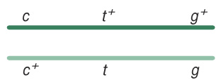  

c.  因为没有发生重组，具有与初始雌性相同基因型的雄性 $\left(\,c\ t^{+}g^{+}/\ c^{+}t\ g\,\right)$ ）仅产生两种类型的配子：亲代型c $t^{+}g^{+}$ 和 $c^{+}t\ g$ 。因此，与纯合隐性雌性交配所预期的后代是500个煤色体和500个玻璃状眼睛的条纹胸部果蝇。  

Ⅲ.  当野生型链孢菌株（ad leu ）与无腺嘌呤或亮氨酸（ad leu ）则不能生长的双突变菌株杂交时，获得以下子囊。仅显示由最终有丝分裂产生的每个孢子对中的一个成员，因为一对中的两个细胞具有相同的基因型。总子囊 $_{=120}$ 。  

<html><body><table><tr><td>孢子对</td><td colspan="5">子囊类型</td></tr><tr><td>1~2</td><td>adleu*</td><td>adleu</td><td>ad*leu</td><td>adleu</td><td>adleu*</td></tr><tr><td>3~4</td><td>ad'leu</td><td>adleu</td><td>adleu</td><td>adleu</td><td>ad'leu</td></tr><tr><td>5~6</td><td>adleu</td><td>adleu*</td><td>adleu*</td><td>adleu</td><td>adleu</td></tr><tr><td>7~8</td><td>adleu</td><td>adleu</td><td>adleu</td><td>ad'leu</td><td>ad'leu</td></tr><tr><td>总计</td><td>30</td><td>30</td><td>40</td><td>2</td><td>18</td></tr></table></body></html>  

b.  为两个基因和相关的着丝粒提供最佳可能的图谱。  

# 解答  

这个问题需要了解四分体分析和产生有序子囊中所见模式的过程（减数分裂）。  

a.  基因和着丝粒之间的交换引起第二次减数分裂时等位基因的分离。交换事件本身发生在减数分裂的前期Ⅰ。  

b.  使用有序四分体（或有序八分体），你可以确定两个基因是否连锁、两个基因之间的距离，以及每个基因与基因所在染色体着丝粒之间的距离。首先指出所示的五类子囊。第一类是PD；第二类是NPD；最后三类是T型子囊。接下来确定这些基因是否连锁。PD的数量 $\mathrm{\Gamma=NPD}$ 的数量，因此基因没有连锁。当基因非连锁时，T型子囊由基因和着丝粒之间的交换产生。观察leu基因，在第三和第四种子囊类型中存在该基因的MII模式。因此，MII子囊的分数是：  

$$
\frac{40+2}{120}{\times}100{=}35\%
$$  

因为产生这些T型子囊的减数分裂中只有一半的染色单体参与交换，所以leu和着丝粒之间的图距是35/2或 $17.5\mathrm{m.u}$ .第四种和第五种类型的子囊显示了ad基因的MII模式：  

$$
\frac{2+18}{120}{\times}100{=}16.6\%
$$  

将 $16.6\%$ 除以2得到 $^{a d}$ 基因 $\leftrightarrow$ 着丝点图距为$8.3\mathrm{m.u.}$ 这两个基因图如下：  

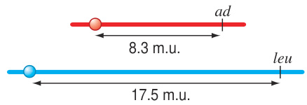  

# 习题  

# 词汇  

1. 从右列中选择与左列中的术语最匹配的短语。  

a. 重组 1.  用于测试观察结果与预期结果之间拟合的统计方法  
b. 连锁 2.  含有四种不同基因型孢子的子囊  
c. 卡方检验 3.  沿着染色体的一次交换使得附近的第二次交换概率降低  
d. 交叉 4.  当两个基因座在少于 $50\%$ 的配子中重组时  
e. 四型 5.  基因在染色体的相对位置  
f. 基因座 6.  观察到的双交换与预期的双交换的比率  
g. 并发系数 7.  由具有不同基因型的细胞组成的个体  
h. 干涉 8.  通过同源物之间的部分交换形成新的遗传组合  
i. 亲代双型 9.  当基因的两个等位基因在第一次减数分裂时分离到不同的细胞  
j. 子囊孢子 10.  只含有两种非重组孢子的子囊  
k. 第一次分裂分离 11.  在同源物之间发生交换的位置形成的结构  
l. 嵌合体 12.  囊中包含的真菌孢子  

# 5.1节  

2. a.  一只来自粗糙眼睛种群真实遗传后代的雄性果蝇与一只来自标枪刚毛种群真实遗传后代的雌性果蝇交配。粗糙眼睛和标枪刚毛都是常染色体隐性突变性状。F 后代都有正常的眼睛和刚毛。该杂交的F 雌性与同时具有粗糙眼睛和标枪刚毛的雄性交配。写下所有可能的后代表型类别，并指出每个类别是重组型还是亲代型。b.  题目a中的杂交产生了以下后代：77只粗糙眼睛和正常刚毛；76只野生型（正常眼睛和刚毛）；74只普通眼睛和标枪刚毛；73只粗糙眼睛和标枪刚毛。控制这些特征的基因是否可能连锁，或者它们是否自由组合？为什么？c.  假设你将题目a中杂交得到的F1雌性与野生型雄性交配。为什么这个杂交不能获得两个基因的连锁信息？d.  假设你将来自标枪刚毛种群真实遗传后代的雌性果蝇与粗糙眼睛且标枪刚毛的雄性交配。为什么这个杂交不能获得两个基因的连锁信息？  

3.  利用现代分子方法，现在可以从非常少量的组织（如毛囊或甚至单个精子）中检查DNA序列中的变  

异（参见“快进”信息栏“产生单个人类精子染色体的交换作图”）。你可以将这些变异视为染色体上特定位点的等位基因（基因座）。例如，在不同精子中的同源常染色体上的相同位置（称为 $B$ ）的AAAAAAA、AAACAAA、AAAGAAA和AAATAAA可称为基因座 $B$ （ $B^{l}$ ， $B^{2}$ 等）的等位基因1、2、3和4。John的两个基因座 $B$ 和 $D$ 的基因型是 $B^{l}B^{3}$ 和 $D^{l}D^{3}$ 。John的父亲是 $B^{I}B^{2}$ 和 $D^{I}D^{4}$ ，而他的母亲是 $B^{3}B^{3}$ 和$D^{2}D^{3}$ 。  
a.  John可以产生的父母型精子的基因型是什么？  
b.  John可能产生的重组型精子的基因型是什么？  
c.  在100个精子样本中，约有51个精子被发现为 $B^{I}$ 和$D^{1}$ ，而剩下的49个精子是 $B^{3}D^{3}$ 。你能否断定 $B$ 和 $D$ 基因座是连锁或自由组合的？  

4.  图5.4中的棋盘图显示了如果两个基因（A和 $B$ ）连锁并且P代杂交为A $\textit{B}/\ A\ B\times a\ b\ /\ a\ b$ ，那么孟德尔的双杂交结果将如何改变。a.  如果F 生产的配子中有 $80\%$ 是亲本，那么 $\mathrm{F}_{2}$ 每个表型的频率是多少？b.  假设原始的P代杂交为A $\textit{b}/A\textit{b}\times a\textit{B}/\ a\textit{B}$ ，重新回答题目a。  

# 5.2节  

5.  在小鼠中，X连锁基因Greasy的显性等位基因 $G s$ 产生有光泽的毛皮，而隐性野生型 $G s^{+}$ 等位基因决定正常毛皮。X连锁的Broadhead基因的显性等位基因Bhd引起骨骼异常，包括宽头和口鼻，而隐性野生型Bhd 等位基因产生正常骨骼。将两个基因的两个等位基因杂合的雌性小鼠与野生型雄性交配。在该杂交的100个雄性后代中，49个具有光泽的毛皮，48个具有骨骼异常，2个具有光泽的毛皮和骨骼异常，1个是野生型。a. 图解杂交描述并计算两个基因之间的距离。b. 如果此杂交有100个雌性后代，结果又将如何？  

6.  在果蝇中，来自真实繁育种群具有覆盆子色眼睛的雄性与来自真实繁育种群具有紫貂色身体的雌性交配。在F1代中，所有雌性都有野生型眼睛和身体颜色，而所有雄性都有野生型眼睛但是有紫貂色身体。当 $\mathrm{F}_{1}$ 雄性和雌性交配时， $\mathrm{F}_{2}$ 代由216只具有野生型眼睛和身体的雌性，223只有野生型眼睛和紫貂色身体的雌性，191只有野生型眼睛和紫貂色身体的雄性，188只有覆盆子色眼睛和野生型身体的雄性，23只具有野生型眼睛和身体颜色的雄性，27只有覆盆子色眼睛和紫貂色身体的雄性组成。通过绘制杂交图并计算任何相关的图距来解释这些结果。  

7.  如果人类a和b基因座距离 $20\mathrm{m.u.}$ ， $\textit{A B/a b}$ 女性与一个 $a\ b\ /\ a\ b$ 男性交配所得的第一个孩子是A $b\,/\,a\ b$ 的可能性是多少？  

8.  CC DD和cc dd个体彼此杂交，并且F 代与cc dd亲本回交。得到997 Cc Dd、999 cc dd、1 Cc dd和3 cc Dd后代。  

a. c和d基因座相隔多远？  
b. $C C\,d d{\times}c c\,D$ D杂交产生的 $\mathrm{F}_{1}$ 与cc dd回交产生的后代类型和频率分别是多少？  
c.  在典型的减数分裂中，基因C和D之间发生了多少次交换？  
d.  假设C和 $D$ 基因座位于同一染色体上，但题目b所描述的测交后代是 $498\ C c\ D d$ 、502 cc dd、504 Cc dd和 $496\ c c\:D d$ 。你对题目c部分的回答如何变化？  

9.  在小鼠中，编码血红蛋白β珠蛋白链的常染色体基因座与白化病基因座相距1m.u.。假设目前在人类中也是如此。镰状细胞贫血症是β珠蛋白基因中特定突变的纯合性的结果。a.  患有白化病的男性和患有镰状细胞贫血症的女性生育一个儿子。儿子会形成什么样的配子？比例是多少？b.  正常男性和女性生育的女儿患有白化病和镰状细胞性贫血。女儿会形成什么样的配子？比例是多少？c.  如果题目a中的儿子长大后与题目b中的女儿结婚，那么他们的孩子同时患有白化病和镰状细胞贫血病的概率是多少？  

10.  在一个特定的人类家庭中，John和他的母亲都有短指症（罕见的常染色体显性等位基因导致短指）。John的父亲患有亨廷顿病（另一种罕见的常染色体显性遗传等位基因）。John的妻子表型正常且已怀孕。继承亨廷顿病等位基因（HD）的人中有2/3在50岁时出现症状，John已50岁并且没有任何症状。短指病是 $90\%$ 外显率。  

a. John父母的基因型是什么？  
b.  John有哪些可能的基因？John有多大可能拥有这些基因型？  
c.  如果这两个基因没有连锁，孩子在50岁时表达短指症和亨廷顿病的概率是多少？  
d.  如果这两个基因连锁且相距 $20\mathrm{m.u.}$ ，你对题目c部分的答案将如何变化？  

11.  白化兔（缺乏色素）对于隐性c等位基因是纯合的（C允许色素形成）。对于隐性b等位基因纯合的兔  

子产生棕色色素，而具有至少一个B拷贝的兔子产生黑色色素。真实繁育种群的棕色兔子与还是BB的白化病兔子杂交。将全部为黑色的F1兔子与双隐性（ $b b\;c c$ ）杂交，获得的后代是34黑色、66棕色和100白化。  
a.  如果 $b$ 和c基因座没有连锁，那么表型的比例是多少？  
b.  这两个基因座有多远？  

12.  在玉米中，等位基因A允许花青素（蓝色）色素沉积在籽粒（种子）中，而aa植物具有黄色籽粒。在第二个基因中，W-产生光滑的籽粒，而ww籽粒则起皱。将具有蓝色光滑籽粒的植株与具有黄色皱纹谷粒的植株杂交，后代由1447蓝色光滑、169蓝色皱纹、186黄色光滑和1510黄色皱纹组成。a.  a和w基因座是否连锁？若连锁，距离多远？b.  蓝色光滑亲代的基因型是什么？包括等位基因的染色体排列。c.  如果将从蓝色皱纹后代种子生长的植株与从黄色光滑的F1种子生长的植株杂交，预期得到哪种种类的玉米？它们的比例是多少？  

13.  如果a和b基因座相距 $^{40\mathrm{cM}}$ ，且AA BB个体和aa bb个体交配：a.  F1个体会以什么比例生产哪些配子？在 $\mathrm{F}_{2}$ 代中预期的比例是什么样的表型（假设两个基因完全显性）？b.  如果原来的杂交是AA $\textit{b b}\times a a\textit{B}$ ， $\mathrm{F}_{1}$ 会出现什么配子比例？F2代的结果是什么？  

14.  对于下述一个或两个基因（即Aa或Aa Bb）是杂合的个体之间的F1交配产生大量后代，写出不同种类表型的数量，不包括性别。没有基因相互作用意味着由一个基因确定的表型不受另一个基因的基因型的影响。  

a. 一个基因；A对于a完全显性。  
b. 一个基因；A和a共显性。  
c. 一个基因；A对于a不完全显性。  
d.  两个非连锁基因且无基因相互作用；A对于a完全显性，B对于b完全显性。  
e.  两个连锁基因相距 $10\mathrm{m.u.}$ ；无基因相互作用；A对于a完全显性，B对于b完全显性。  
f.  两个非连锁基因且无基因相互作用；A和a共显性，B对于b不完全显性。  
g.  两个连锁基因相距10m.u.，A对于 $^a$ 完全显性， $B$ 对于b完全显性；并且aa和基因B的等位基因之间存在隐性上位性。  
h.  两个非连锁的重复基因（即A和B执行相同的功能）；A和B分别对a和b完全显性。  
i.  两个连锁基因相距0m.u.；无基因相互作用；A对于a完全显性， $B$ 对于b完全显性（存在两种可能的答案）。  

15.  已知某DNA变异与人类中罕见的常染色体显性疾病相关，因此可以用作跟踪疾病等位基因遗传的标记。在信息家族中（其中一个亲本是已知染色体排列的疾病等位基因和染色体上DNA标记的双杂合子，并且他或她的配偶不具有与相同的DNA突变等位基因），这种作为胎儿疾病预测因子的标记物的可靠性与DNA标记物和引起疾病的基因之间的图距有关。  

想象一下，患有该疾病男性（基因型 ${\cal D}d$ ）对于DNA 变异的 $V^{I}$ 和 $V^{2}$ 形式是杂合的，在与 $D$ 等位基因相同的染色体上形成 $V^{l}$ 并且在与 $d$ 相同的染色体上形成 $V^{2}$ 。他的妻子是 $V^{3}V^{3}\,d d$ ，其中 $V^{3}$ 是 DNA标记的另一个等位基因。通过羊膜穿刺术对胎儿进行分型显示胎儿具有 DNA 标记的 $V^{2}$ 和 $V^{3}$ 变体。如果在 D 基因座和标记基因座之间的两点杂交处测量的距离是：（a）0m.u.，（b）1m.u.，（c）5m.u.，（d） $10\mathrm{m.u.}$ ，（e） $50\mathrm{m.u.}$ ，胎儿有多少可能遗传疾病等位基因 $D$ ？  

16.  图5.7（a）显示了小鼠初级精母细胞中减数分裂Ⅰ前期的染色体。a.  你怎么会立刻知道这个图显示的是小鼠的减数分裂，而不是人类？（提示：在小鼠中， $n{=}20$ ）b.  大多数小鼠染色体是中间着丝粒还是近端着丝粒？解释说明。c. 总共有多少染色单体在图5.7（a）中表示？d.  图5.7（a）中的X-Y二价体在哪里（注意：小鼠性染色体只有一个假常染色体区域，而不是像人类中的两个）？请绘图显示此二价体（X和Y染色体）、这些染色体着丝粒的位置及假常染色体区域。e.  解释哺乳动物性染色体的假常染色体区域在减数分裂期间确保适当的性染色体分离的重要性。  

17.  图5.7（b）显示了已发生过重组事件的小鼠初级精母细胞中的二价体，通过出现单个交叉来表示。图5.7（c）中的示意图形象描绘了黏连蛋白复合物如何参与将同源染色体保持在二价内。使用绘图解释为什么连接同源染色体的关键黏连蛋白复合物是位于交叉远端（即远离着丝粒）的那些，而不是位于交叉近端的那些（即着丝粒和交叉之间）。  

# 5.3节  

18.  朱砂眼（cn）和残刚毛（rd）是果蝇的常染色体隐性性状。将纯合的野生型雌性与残刚毛朱砂眼雄性杂交，然后将F 雄性与F 雌性杂交以获得F 。在获得的400个F 后代中，292个为野生型，9个为朱砂眼，7个为残刚毛，92个为残刚毛和朱砂眼。解释这些结果并估计cn和rd基因座之间的距离。  

19.  果蝇的常染色体隐性dp等位基因（dumpy）产生短而弯曲的翅膀，常染色体隐性等位基因bw导致棕色眼睛。使用具有两种杂合基因的雌性的测交中，获得以下结果：  

野生型翅膀，野生型眼睛 178   
野生型翅膀，棕色眼睛 185   
短化的翅膀，野生型眼睛 172   
短化的翅膀，棕色眼睛 181  

在使用这两种基因杂合的雄性的测交中，获得  
了一组不同的结果：野生型翅膀，野生型眼睛 247短化的翅膀，棕色眼睛 242  
a. 你能从第一次测交中得出什么结论？  
b. 你能从第二次测交中得出什么结论？  
c.  如何协调题目a和题目b中显示的数据？ 你能利用这两组数据之间的差异来设计对果蝇同线性的一般测试吗？  
d.  短化与褐色之间的遗传距离为 $91.5\mathrm{m.u.}$ ，如何衡量这个数值？  

20.  从一系列两点杂交，获得了豌豆中同线性基因A、B、C和 $|D|$ 的以下图距：  

$B{\leftrightarrow}C$ $23\mathrm{m.u.}$ .   
$A{\leftrightarrow}C$ $15\;\mathrm{m.u.}$ $C{\leftrightarrow}D$ 14m.u.   
$A{\leftrightarrow}B$ 12m.u.   
$B{\leftrightarrow}D$ 11m.u.   
$A{\leftrightarrow}D$ 1m.u.  

卡方检验不能拒绝基因 $E$ 与任何其他四个基因无连锁的零假设。  

a. 绘制一个杂交方案，可以确定 $B{\leftrightarrow}C$ 图距。b. 绘制可以从该组数据获得的最佳遗传图。c. 解释地图中的任何不一致或未知的信息。d.  哪些额外的实验可以解释这些不一致或含糊之处？  

21.  酿酒酵母（Saccharomyces cerevisiae）染色体Ⅲ上的四种不同基因（MAT、HIS4、THR4和LEU2）的图距已确定：  

HIS4↔MAT 37cMTHR4↔LEU2 35cMLEU2↔HIS4 23cMMAT↔LEU2 16cMMAT↔THR4 20cM染色体上基因的顺序是什么？  

22.  在毛地黄的管状花中，野生型为红色，而称为白色突变的植株产生白色花；一种叫做异常花的突变导致茎顶端的花朵很大（盆状花）；另一种矮化突变会影响茎长。你将一种白花植物（否则表型为野生型）转变为矮化和盆状花植物，但具有野生型红花色。所有的F1植物都很高，有正常的白色花朵。你将一个F1植株与矮化和盆状花的亲代回交，你会看到图表中显示的543后代（仅显示突变特征）。  

矮化，盆状花 172  
白色花 162  
矮化，盆状花，白色花 56  
野生型 48  
矮化，白色花 51  
盆状花 43  
矮化 6  
盆状花，白色花 5  

a. 哪些等位基因占优势？  

b. 原始杂交中父母的基因型是什么？  
c.  绘制一张遗传图，显示这三个基因座的连锁关系。  
d.  数据是否提供干涉证据？如果是，则计算并发系数和干涉值。  

23.  在果蝇中，一个基因的隐性等位基因mb导致刚毛缺失，第二个基因的隐性等位基因 $e$ 导致乌木体色，第三个基因的隐性等位基因k导致肾形眼睛（所有三个基因的显性野生型等位基因用 $+.$ 上标表示）。在随后的表格中进行三个不同的P代杂交，然后将来自每个杂交所得的F1雌性与所涉及的两个隐性等位基因的纯合雄性进行测交。下表列出测交后代的表型。绘制解释所有数据的最佳遗传图。  

<html><body><table><tr><td>亲代杂交</td><td>F,雌性的测交后代</td><td></td></tr><tr><td rowspan="3">mb*mb*，e*e*xmbmb，ee</td><td>正常刚毛，正常体色</td><td>117</td></tr><tr><td>正常刚毛，乌木体色</td><td>11</td></tr><tr><td>刚毛缺失，正常体色</td><td>15</td></tr><tr><td rowspan="4">k*k*,eexkk,e*e*</td><td>刚毛缺失，乌木体色 正常眼晴，正常体色</td><td>107 11</td></tr><tr><td>正常眼晴，乌木体色</td><td>150</td></tr><tr><td>肾形眼晴，正常体色</td><td></td></tr><tr><td>肾形眼睛，乌木体色</td><td>144 7</td></tr></table></body></html>  

续表  

<html><body><table><tr><td>亲代杂交</td><td>F,雌性的测交后代</td><td></td></tr><tr><td rowspan="3">mb*mb+，kk+xmbmb，kk</td><td>正常刚毛，正常眼晴</td><td>203</td></tr><tr><td>正常刚毛，肾形眼睛</td><td>11</td></tr><tr><td>刚毛缺失，正常眼睛</td><td>15</td></tr><tr><td></td><td>刚毛缺失，肾形眼睛</td><td>193</td></tr></table></body></html>  

24.  带有粉红色花瓣、黑色花药和长茎的金鱼草可自我繁殖。从得到的种子中获得650株成年植物。这些后代的表型列于此处。  

78 红色 长 棕褐色  
26 红色 短 棕褐色  
44 红色 长 黑色  
15 红 短 黑色  
39 粉红色 长 棕褐色  
13 粉红色 短 棕褐色  
204 粉红色 长 黑色  
68 粉红色 短 黑色  
5 白色 长 棕褐色  
2 白色 短 棕褐色  
117 白色 长 黑色  
39 白色 短 黑色  

a.  用P表示一个等位基因， $p$ 表示另一个等位基因，指示花的颜色是如何遗传的。  
b.  这650种植物中红色∶粉红色∶白色的理论比值是多少？  
c. 花药颜色和茎长度如何遗传？  
d. 初始植物的基因型是什么？  
e. 这三个基因中的哪些显示出独立的分配？  
f.  对于任何连锁的基因，指出原始金鱼草中同源染色体上等位基因的排列，并估计基因之间的距离。  

25. 果蝇的3个常染色体基因具有如下的遗传图：  

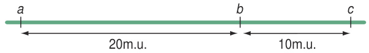  

a.  当a+b+c+/ a b c雌性与a $b~c~/~a~b$ c雄性杂交时，提供以下表型分类中预期的果蝇数量。假设计数1000只果蝇，并且该区域不存在干涉。  

$a^{+}$ $b^{+}$ $c^{+}$ $a$ $b$ $c$ $a^{+}$ $b$ $c$ $a$ $b^{+}$ $c^{+}$ $a^{+}$ $b^{+}$ $c$ $a$ $b$ $c^{+}$ $a^{+}$ $b$ $c^{+}$ a $b^{+}$ $c$  

b.  如果杂交反转，a+b+c+/ a b c雄性与雌性a $b~c~/~a$ b c杂交，你会在相同的表型分类中看到多少只 果蝇？  

26.  对具有独立表型效应的三个常染色体隐性突变［螺纹触角（th）、毛状体（h）和猩红眼（st）］中的每一个杂合的雌性果蝇与显示所有三种突变表型的雄性测交。这个测交的1000个后代是：  

螺纹触角，毛状体，猩红眼 432  
野生型 429  
螺纹触角，毛状体 37  
螺纹触角，猩红眼 35  
毛状体 34  
猩红眼 33  

a.  展示三重杂合雌性中相关染色体上等位基因的排列。  
b. 绘制解释这些数据的最佳遗传图。  
c. 计算任何相关的干涉值。  

27.  将表达常染色体隐性突变sc（scute，盾片刚毛）、ec（echinus，棘眼，眼睛面积特大）、cv（cross­veinless，翅上横脉缺失）和b（黑色）的雄性果蝇与表型野生型雌性杂交，并获得列出的3288个后代（仅显示突变特征）。  

653 黑色，盾片刚毛，棘眼，翅脉缺失  
670 盾片刚毛，棘眼，翅脉缺失  
675 野生型  
655 黑色  
71 黑色，盾片刚毛  
73 盾片刚毛  
73 黑色，棘眼，翅脉缺失  
74 棘眼，翅脉缺失  
87 黑色，盾片刚毛，棘眼  
84 盾片刚毛，棘眼  
86 黑色，翅脉缺失  
83 翅脉缺失  
1 黑色，盾片刚毛，翅脉缺失  
1 盾片刚毛，翅脉缺失  
1 黑色，棘眼  
1 棘眼  

a. 绘制母本基因型。  
b. 绘制基因座遗传图。  
c. 数据是否提供干涉证据？计算证明。  

28. a.  在果蝇中，基因型为A b / a B的F1杂合子之间的杂交总是产生相同的 $\mathrm{F}_{2}$ 后代表型比例，而不管两个基因之间的距离（假设两个常染色体基因完全占优势）。这个比例是多少？如果F 杂合子是A B /a $b$ ，情况也是如此吗？（提示：请记住，在果蝇中，在精子发生过程中不会发生重组）  

b.  如果基因型为A $\mathrm{{~\vert~}~}b\mathrm{~/~}a\mathrm{~}B$ 的 $\mathrm{|F_{1}.}$ 小鼠杂合子进行杂交，则F2后代中的表型比率将随着两个基因之间的图距而变化。有没有一种简单的方法来估计基于 $\mathrm{\Delta{F}}_{2}$ 表型频率的图距（假设重组率在雄性和雌性中是相等的）？如果小鼠F1杂合子是A $B\mathrm{~/~}a\mathrm{~}b$ ，你能以相同的方式估计图距吗？  

29.  弗吉尼亚烟草的纯种育种植株具有确定叶形态（M）、叶色（ $C$ ）和叶大小（S）的显性等位基因。卡罗莱纳植株对于这三种基因的隐性等位基因是纯合的。这些基因在同一染色体上排列如下：  

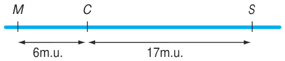  

现在两种植株之间的F 杂合子与卡罗莱纳植株回交。假设没有干涉：  

a.  对于所有三种性状，有多少比例的回交后代与弗吉尼亚植株相似？  
b.  在这三种性状中，有多少比例的回交后代与卡罗莱纳植株相似？  
c.  什么比例的回交后代将具有弗吉尼亚植株的叶形态和叶片大小，以及卡罗莱纳植株的叶色？  
d.  什么比例的回交后代将具有弗吉尼亚植株的叶形态和叶色，以及卡罗莱纳植株的叶片大小？  

30.  在人类中，重组频率和DNA序列长度之间的相关性平均为每 $1\%$ RF对应100万bp。在绘制亨廷顿病基因（ $H D$ ）的过程中，发现HD与称为G8的DNA标记物连接，RF为 $5\%$ 。令人惊讶的是，当最终鉴定出HD基因时，发现其与 $G8$ 的物理距离约为 $500\,000\,\mathrm{bp}$ ，而不是预期的500万bp。如何解释观察到的这种现象？  

31.  以下列出四个果蝇突变，包含突变的符号、基因名称和突变表型：  

<html><body><table><tr><td>等位基因符号</td><td>基因名称</td><td>突变表型</td></tr><tr><td>dwp</td><td>dwarp</td><td>矮小的身体，扭曲的翅膀</td></tr><tr><td>rmp</td><td>rumpled</td><td>皱巴巴的鬃毛</td></tr><tr><td>p</td><td>pallid</td><td>苍白的翅膀</td></tr><tr><td>rv</td><td></td><td>黑眼睛和身体</td></tr></table></body></html>  

进行以下杂交并获得相应后代：  

杂交#1:  矮小，皱巴巴雌性 $\times$ 苍白，黑眼睛和身体雄性$\longrightarrow$ 矮小，皱巴巴雄性和野生型雌性  

杂交 #2:   苍白，黑眼睛和身体雌性 $\times$ 矮小，皱巴巴雄性  

$\longrightarrow$ 苍白，黑眼睛和身体雄性和野生型雌性  

杂交#1的雌性F1代被杂交到一个真正繁殖的矮小的、皱巴巴的、苍白翅膀的雄性身上。获得的1000个后代如下：  

苍白 3   
苍白，黑眼睛和身体 428   
苍白，黑眼睛和身体，皱巴巴 48   
苍白，皱巴巴 23   
矮小，黑眼睛和身体 22   
矮小，黑眼睛和身体，皱巴巴 2   
矮小，皱巴巴 427   
矮小 47  

绘制这四个基因的最佳图谱，包括所有相关数据。在适当的情况下计算干涉值。  

32. a.  从定性的角度解释图5.7（a）如何表明小鼠染色体上存在干涉。b.  如果你可以检查许多类似于图5.7（a）的照片，你将如何应用统计数据来提供小鼠减数分裂过程中存在干涉的证据？（无需方程式；只需概述所涉及的逻辑）  

33.  小鼠雄性遗传图的总长度为1386cM，但在雌性中测量为1817cM。如果图5.7（a）显示代表所有初级精母细胞的前期Ⅰ，你期望在有代表性的前期Ⅰ初级卵母细胞中发现多少重组节？  

34.  “快进”信息栏“产生单个人类精子染色体的交换作图”描述了科学家如何使用来自同一个人的约100个单精子的全基因组DNA测序来定位参与这些精子生成的交换。为了确定在人的初级精母细胞中发生重组的亲本染色体的序列，这些研究人员分离并测序了来自人体细胞的单个染色体的DNA。然而，虽然这最后一步提供了有用的证据数据，但实际上对于确定该男性遗传的每条染色体的两个DNA序列（一个来自他的母亲，一个来自他的父亲）并不是必需的。相反，正如你将要证明的那样，这些信息可以从约100个单精子的DNA序列中推断出来。  

a.  绘制该同源的常染色体SNP基因座，其中男性是杂合的，并且假设中间SNP基因座与其侧翼的每一个分开 $25\mathrm{m.u.}$ 。对图中三个基因座中的每一个使用你选择的等位基因。  

b.  为简单起见，假设干涉 $^{=1}$ 。现在，仅考虑这三个基因座，你会看到多少种不同类型的精子？频率是多少？  

c.  鉴于“快进”信息栏中显示的结果，解释为什么在这种情况下干涉 $^{=1}$ 的假设是合理的。d.  解释如何设计一个计算机程序，可以重建人体细胞中每条染色体的DNA序列，给出其产生的100个单精子的DNA序列。  

# 5.4节  

35.  孟德尔获得的数据是否符合他的假设？例如，孟德尔从Yy $R r$ 个体的自交中获得315个黄色圆形、101个黄色皱纹、108个绿色圆形和32个绿色皱纹种子（总共556个）。他的隔离和自由组合的假设预测在这种情况下比例为 $9:3:3:1$ 。使用卡方检验确定孟德尔的数据是否与他预测的显著不同（在孟德尔时代，卡方检验并不存在，因此他无法根据自己的假设检验自己的数据）。  

36.  两个基因控制玉米蛇的颜色如下：O-B-蛇为棕色，O-bb蛇为橙色，oo $B$ -蛇为黑色，oo bb蛇为白化。一只橙色蛇与黑色蛇交配，获得了大量的F1后代，所有这些都是棕色的。当F1蛇相互交配时，它们产生了100个棕色、25个橙色、22个黑色和13个白化后代。a. F1蛇的基因型是什么？b.  如果这两个基因座自由组合， $\mathrm{F}_{2}$ 蛇中会有多少比例的不同颜色？c.  如果发生自由组合，观察到的结果是否与预期显著不同？d.  观察值和期望值之间的差异是偶然发生的概率是多少？  

37.  将表现为正常步态的纯种小鼠与表现为舞蹈步态的小鼠杂交。F1小鼠，均表现出正常的步态。  

a.  如果舞蹈步态是由单个基因的隐性纯合等位基因引起的，那么 $\mathrm{F}_{2^{\prime}}$ 小鼠中表现为舞蹈步态的小鼠的比例是多少？  
b.  如果小鼠必须是两个不同基因的隐性等位基因纯合子才能具有跳舞表型，那么如果这两个基因没有连锁， $\mathrm{F}_{2}$ 中表现为舞蹈步态的比例是多少？（假设步态正常的群体中的所有小鼠都是显性等位基因的纯合子）  
c.  当获得F2小鼠时，观察到42只表现为正常步态，8只表现为舞蹈步态。使用卡方检验确定这些结果是否更适合单基因模型。  

# 5.5节  

38.  基因型 $_{a+c}$ 的链孢菌与基因型 $+b+$ 的链孢菌杂交（这里， $^+$ 是野生型等位基因的简写）。获得以下四分体（注意列出了子囊中四个孢子对的基因型，而不是  

列出所有八个孢子）：  

a. 有多少细胞发生减数分裂以产生这些数据？  
b.  给出最好的遗传图来解释这些结果，表明基因之间、每个基因与着丝粒之间的所有相关遗传距离。  
c.  绘制可以产生列表中最右边的三个四分体的减数分裂图。  

<html><body><table><tr><td>3+D</td><td>abc</td><td>3++</td><td>+b c</td><td>+q D</td><td>3+D</td></tr><tr><td>+D</td><td>abc</td><td>3+D</td><td>abc</td><td>+q D</td><td>abc</td></tr><tr><td>+b+</td><td>+++</td><td>+b+</td><td>+++</td><td>3++</td><td>+++</td></tr><tr><td>+b+</td><td>+++</td><td>a b+</td><td>++12</td><td>3++</td><td>+b+</td></tr><tr><td>137</td><td>141</td><td>26</td><td>25</td><td>2</td><td>3</td></tr></table></body></html>  

39.  在具有基因型a $f$ g的一个单倍体酵母菌株和具有基因型 $\mathrm{{~a~}~}f^{*}g^{+}$ 的另一个单倍体菌株之间进行杂交（a和$\mathfrak{a}$ 是交配型）。将得到的二倍体形成孢子，并分析101个所得单倍体孢子的随机样品。发现以下基因型频率：  

α f g 31   
a f g 29   
a $f$ g 14   
α $f^{+}$ g 13   
a $f^{+}$ g 6   
α $f$ g+ 6   
a $f^{+}$ g 1   
α $f$ g 1  

a. 绘制杂交中涉及的基因座。  

b.  假设所有三个基因都位于同一染色体臂上，特定的子囊可能含有 $\mathfrak{a}$ fg孢子而不是 $\mathrm{a}f\!\!+\!g^{+}$ 孢子吗？ 如果是这样，请绘制可能产生这样一个子囊的减数分裂图。  

40.  将需要甲硫氨酸和赖氨酸才能生长的酵母菌株（met–lys–）和另一种酵母菌株 $\left(\!\!\begin{array}{c}{{m e t^{+}l y s}}\end{array}\!\!\right)$ ）进行杂交。解剖了100个子囊，并从每个子囊中的四个孢子都生长成菌落。测试来自这些菌落的细胞在含有基本培养基（min）、 $\mathrm{min+}$ 赖氨酸（lys）、 $\mathrm{min+}$ 甲硫氨酸（met）或min+lys+met的培养皿上生长的能力。根据此分析，子囊可分为两组：  

第1组：在89个子囊中，来自四个孢子菌落中的两个的细胞可以在所有四种培养基上生长，而另外两个孢子菌落只能在min+lys+met板上生长。  

第2组：在11个子囊中，来自四个孢子菌落之一的细胞可以在所有四种培养皿上生长。来自四个孢子菌落中的第二个的细胞可以仅在min+lys板和min+lys+met板上生长。来自四个孢子菌落中的1/3的细胞只能在min+met板和min+lys+met板上生长。来自剩余菌落的细胞只能在min+lys+met板上生长。  

a. 在两组子囊中，每个孢子的基因型是什么？  

b.  lys和met基因是否连锁？如果是这样，它们之间的图距是多少？c.  如果你可以将这个分析扩展到更多的子囊，你最终会发现一些具有不同模式的子囊。对于这些子囊，描述四种孢子的表型。将这些表型列为解剖孢子在四种培养皿上形成菌落的能力。  

41.  在链孢菌（Neurospora）中进行两次杂交，涉及交配型基因座和ad或 $\scriptstyle{p}$ 基因。在两种情况下，交配型基因座（A或 $a$ ）是其分离得分的基因座之一。一个杂交是a $d A\,\times\,a d^{+}a$ （杂交i），另一个是 $)\,A\,\times\,p^{+}a$ （杂交ii）。杂交i可以得到10个亲本双型、9个非亲代双型和1个四型子囊。杂交ii的结果是24个亲本双型、3个非亲代双型和27个四型子囊。a.  交配型基因座与其他两个基因座之间的连锁关系是什么？b.  尽管这两个杂交是在链孢菌中进行的，但你不能使用给出的数据来计算任何这些基因的着丝粒与基因距离。为什么？  

42.  表明在以下基因型的酿酒酵母a /α二倍体形成孢子后具有0、1、2、3或4个活孢子的四分体的百分比：a.  真实育种系的野生型菌株（在生存所必需的任何基因中没有突变）。b.  具有单个必需基因的无效（完全失活）突变的杂合菌株。对于该问题的其余部分，考虑 $a\times b$ 的酵母菌株之间的杂交，其中a和b都是由不同基因突变而成的温度敏感突变株。杂交在许可（低温）条件下进行。指出随后在限制性（高温）条件下测量的具有0、1、2、3或4个活孢子的四分体的百分比。c. a和b是不连锁的，相距着丝粒都是 $0\mathrm{m.u.}$ .。d.  a和b是不连锁的；a距着丝粒是0m.u.，而b距着丝粒是10m.u.。e. a和b相距0m.u.。f. $a$ 和b相距10m.u.。假设a和b之间的所有交换都是SCO（单交换）。g.  在题目f中，如果在a和b之间发生四链DCO（双交换），那么所得到的四分体中有多少孢子在高温下会存活？  

43.  a、 $b$ 和c基因座都在酵母的不同染色体上。当 $a b^{+}$ 酵母与 $a^{+}b$ 酵母杂交并分析所得的四分体时，发现非亲代双型四分体的数量等于亲代双型的数目，但根本没有四型子囊。另一方面，在 $a c^{+}.$ 与 $a_{\ c}^{+}$ 杂交后形成的四分体中观察到许多四型子囊，并且在b $c^{+}$ 与 $b^{+}c$ 杂交后观察到许多四型子囊。解释这些结果。  

这个问题将引导你在酵母四分体分析中推导出RF  
的校正方程，该方程考虑了双交换（DCO）减数分  
裂。缺乏组氨酸（his ）无法生长的酵母菌株与缺乏  
赖氨酸（ $l y s^{-}$ ）无法生长的酵母菌株交配。交配所得  
的400个无序四分体中有233个是PD、11个是NPD、  
156个是T。  
a. PD、NPD和T四分体中有哪些类型的孢子？  
b. his和lys基因是否连锁？如何获知？  
c.  用简单的等式 $\mathrm{RF}{=}100\times\mathrm{[NPD+}(1/2)$ T] /四分体总数，计算his和lys基因之间的图距单位距离。  
d.  如果考虑可能发生的所有类型的减数分裂事件（参见图5.24），你可以看到你在题目c中所做的计算可能会大大低估RF。什么类型的减数分裂（NCO、SCO或DCO）在这个杂交中产生了每种四分体类型？  
e.  你在题目c中使用的简单RF方程对于产生每种类型四分体的减数分裂事件有什么不正确的假设？这些假设何时才能正确？  
f.  使用你对题目d的答案来确定产生400个四分体的NCO、SCO和DCO减数分裂的数量。  
g.  使用你对题目f的答案写出一个将DCO减数分裂的数量与各种四分体类型的数量联系起来的一般方程式。然后编写另一个通用方程，计算以各种四分体类型的数量为函数的SCO减数分裂的数量。  
h.  根据你对题目f的答案，计算his和lys之间每个减数分裂（ $m$ ）的平均交换数。  
i.  使用你对题目h答案，写出 $m$ 与NCO、SCO和DCO减数分裂的关系等式。  
j.  RF和m之间有什么关系？  
k.  使用你对题目j的答案，根据SCO、DCO和NCO减数分，写出RF的校正公式。  
l.  使用你对题目g的答案，根据各种四分体类型的数量，重写题目k中的校正RF方程。  
m.  你刚才在题目l中写的公式是RF的校正公式，它考虑了双交换，否则就会被忽略。使用这个改进的公式重新计算比题目c中更准确的his和lys基因之间的距离。  

45. a.  在有序四分法分析中，你可以在基因和着丝粒之间观察到的最大RF是多少？［提示：如果基因与着丝粒距离足够远，你会在基因和着丝粒之间观察到什么样的RF，以便在每次减数分裂中它们之间至少发生一次交换（通常不止一次交换）］b. 是否存在一个基因和着丝粒不连锁？请说明。c.  假设在有序四分体分析中，你观察到基因和着丝粒之间的RF为 $30\%$ 。鉴于你对题目a的回答，请考虑 $30\mathrm{m.u}$ . 是基因和着丝粒之间距离的准确估计吗？  

46.  一个研究小组选择了三个独立的链孢菌Trp–单倍体菌株，每个菌株在没有氨基酸色氨酸的情况下都不能生长。他们首先将这三种菌株与相反交配型的野生型菌株交配，然后分析所得的八分体。对于所有三个交配，每个八分体中的四个孢子对中的两个可以在基本培养基上生长（即在没有色氨酸的情况下），而另外两个孢子对不能在该基本培养基上生长。  

a. 你能从这个结果中得出什么结论？  

在突变菌株1和2与野生型的交配中，一些八分体最顶层的两对中的一个具有可以在基本培养基上生长的孢子，而该八分体最顶层的两对中的另一个则具有不能在基本培养基上生长的孢子。在突变菌株3与野生型的交配中，最顶层的两对中的所有孢子都可以在基本培养基上生长，或者所有孢子都不能在基本培养基上生长。  

b. 你能从这个结果中得出什么结论？  

研究人员接着为每种突变菌株制备了两种不同的培养物：这些培养物中的一种是交配型A，另一种是交配型a。他们以成对的方式交配这些菌株，解剖得到的八分体，并确定有多少个体孢子可以在基本培养基上生长。结果显示在这里。  

交配 具有 $\scriptstyle\mathbf{\dot{\boldsymbol{x}}}$ 个可在基本培养基生长的孢子的八分体的比例 $\%$   

<html><body><table><tr><td></td><td>x=0</td><td>2</td><td>4</td><td>6</td><td>8</td></tr><tr><td>1×2</td><td>78</td><td>22</td><td>0</td><td>0</td><td></td></tr><tr><td>1×3</td><td>46</td><td>6</td><td>48</td><td>0</td><td>0</td></tr><tr><td>2×3</td><td>42</td><td>16</td><td>42</td><td>0</td><td></td></tr></table></body></html>  

c.  对于表中三个交配中的每一个，100个八分体中有多少是PD、NPD及T？  

d.  绘制解释所有前述数据的遗传图。假设样本量足够小，以至于没有八分体是双交换的结果。  

e.  尽管这个问题描述了链孢菌的杂交，但这种情况无助于将表中的交配呈现为有序的八分体，为什么？  

f.  为什么你可以从表中的交配获得基因 $\leftrightarrow$ 着丝粒距离，即使数据没有呈现为有序的八进制数据？  

# 5.6节  

47.  置于固体琼脂上的单个酵母细胞通过有丝分裂产生约包含 $10^{7}\cdot$ 个细胞的菌落。具有ade2基因突变的单倍体酵母细胞将产生红色菌落；ade2+是白色菌落。由具有ade2 / ade2 基因型的二倍体酵母细胞形成的一些菌落在白色菌落内含有红色区域。a. 如何解释该现象？  

b.  尽管白色菌落的大小大致相同，但一些白色菌落内的红色区域的大小差别很大。为什么？你是否预计大部分红色区域相对较大或相对较小？  

48.  图5.29显示有丝分裂重组导致在细胞周期的 $\mathrm{G}_{2}$ 阶段（染色体复制后）发生单斑点或孪生斑。然而，因为它通常由染色体断裂的罕见随机事件引发，所以有丝分裂重组也可以在S期之前的 ${\bf G}_{1}$ 中发生。当有丝分裂重组发生在 ${\bf G}_{1}$ 而不是 $\mathrm{\bf G}_{2}$ 的情况下，重新绘制图5.29，并说明为什么任何此类事件不能产生单个斑点或孪生斑。  

49.  二倍体酵母菌株具有野生型表型，但具有以下基因型：  

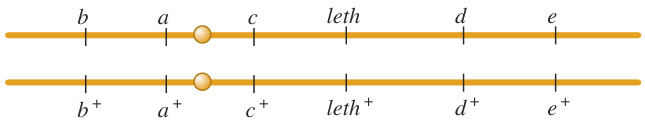  

a、 $b$ 、 $c$ 、 $d$ 和e均表示产生可见表型的隐性等位基因，而leth表示隐性致死突变。所有基因都在同一条染色体上， $a$ 与着丝粒紧密（用小圆圈表示）相连。在该细胞中有丝分裂重组导致的扇区中可以发现以下哪种表型？ $\textcircled{\scriptsize{1}}a$ ； $\textcircled{2}b$ ； $\textcircled{3}c$ ； $\textcircled{4}d$ ； $\textcircled{5}e$ ；$(6)b\ e$ ； $\textcircled{7}c\ d$ ； $\textcircled{8}c\ d\ e$ ； $(\boldsymbol{\Phi}d\ e$ ； ${\textcircled{10}}a\ b$ 。假设双重有丝分裂交换太罕见而无法观察到。  

50.  在果蝇中，黄色基因 $(\,y\,)$ 靠近近端着丝粒X染色体长臂的端粒，而损伤的刚毛（ $s n$ ）基因位于同一X染色体臂的中间附近。在基因型y $s n\mathrm{~/~}y^{+}s n^{+}$ 的雌性果蝇的翅膀上，很少能找到其中一小部分细胞具有损伤的刚毛的黄色组织斑块。  

a. 你怎么解释这个现象？  

b.  你会在基因型为y $^{,+}s n\ /\ y\ s n^{+}$ 的雌性翅膀上发现类似的斑块吗？  

51.  神经纤维瘤是当基因型为NF1 / NF1 的皮肤细胞失去 $N F I^{+}$ 等位基因时可能出现的皮肤肿瘤。这种野生型等位基因编码功能性蛋白质（称为肿瘤抑制因子），而NF1 等位基因编码非功能性蛋白质。  

基因型NF1 / NF1 的患者在皮肤的不同区域中具有20个独立的肿瘤。从该患者的正常非癌细胞以及来自20个肿瘤中的每一个的细胞中取样。通过称为凝胶电泳的技术分析这些样品的提取物，该技术可以检测四种不同蛋白质（A、B、C和D）的变体形式，所有蛋白质均由与NF1位于同一常染色体上的基因编码。每种蛋白质具有由不同等位基因编码的慢（S）和快（F）形式（例如， $A^{s}\pounds\Pi A^{F}$ ）。在正常组织的提取物中，发现了所有四种蛋白质的慢速和快速变体。在肿瘤的提取物中，12个样本仅具有蛋白A和D的快速变体，但是同时具有蛋白B和C的快速和慢速变体；6个具有蛋白A的快速变体，但是具有蛋白B、C和D的快速和慢速变体；剩下的2个肿瘤提取物只有蛋白A的快速变异体、蛋白B的慢速变体、蛋白C的快速和慢速变体、蛋白D的快速变体。  

a.  假设所有肿瘤都是由相同的机制产生的，本章描述的哪种遗传事件可能导致所有20个肿瘤？  
b.  绘制描述这些数据的遗传图，假设这个小样本代表了可能由该患者中相同机制形成的所有类型的肿瘤。显示哪些基因是位于两条同源染色体上的等位基因。指示可以估计的所有相对距离。请注意，NF1是你可以通过这种方式绘制的基因之一。  
c.  在该患者中可导致神经纤维瘤的另一种机制是产生具有45个而不是正常46个染色体的细胞的有丝分裂错误。这种机制如何导致肿瘤？从上述结果来看，你怎么知道这20个肿瘤中没有一个是由这种有丝分裂错误形成的？  
d.  你能想到可能产生所述结果的任何其他类型的错误吗？  

52.  理解发育遗传基础的两个重要方法是有丝分裂杂交和利用能使水母在黑暗中发光称为GFP（用于绿色荧光蛋白）的水母基因。通过本书后面描述的重组DNA技术，你可以将水母GFP基因插入到生物体的基因组中，基因将在显微镜中发绿光，而没有GFP基因的那些将不会发绿光。  

小细胞（smc）隐性突变纯合子小鼠死于早期胚胎，因为它们的细胞在达到正常大小之前过早分裂。  

你想设计一个携带一个拷贝GFP基因的smc杂合子的小鼠，在其中可以通过有丝分裂重组在成年小鼠中产生克隆。所设计的这个小鼠，每个克隆中不显示绿色的每个细胞对于smc突变来说都是纯合的。下图显示了你设计的小鼠中的上皮细胞区域。你将看到一些正常大小的单元格和其他小单元格。你还将看到三种不同颜色的细胞：空白、弱发光细胞（浅绿色）和明亮发光细胞（深绿色）。该小鼠上皮细胞中的大多数细胞具有正常大小和微弱发光。上皮还含有三个细胞克隆（1、2和3），由于有丝分裂重组的发生而具有不寻常的外观。  

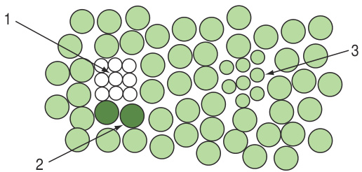  

a.  在你设计的小鼠中显示染色体和着丝粒，等位基因smc 和smc，以及 $G F P^{+}$ （GFP基因存在）和$G F P^{-}$ （GFP基因缺失）。（提示，这只小鼠携带GFP基因的一个拷贝，并且对于smc是杂合的。通过有丝分裂重组产生的每个克隆中非绿色的每个细胞应该是smc突变的纯合子）  
b.  为什么需要使用有丝分裂重组来研究成年小鼠中smc+的功能？  
c. 为什么你会看到三种不同颜色的细胞？  
d. 为什么克隆1和2彼此相邻？  
e.  在题目a的遗传图上，放置一个箭头以显示可能产生克隆1和2的有丝分裂重组事件的位置。  
f. 为什么克隆1中存在的细胞多于克隆2中的细胞？  
g.  在题目a的遗传图上，放置一个箭头以显示可能产生克隆3的有丝分裂交换的位置。  