# 第三部分 遗传信息分析  

# 第 9 章 DNA 数字化分析  

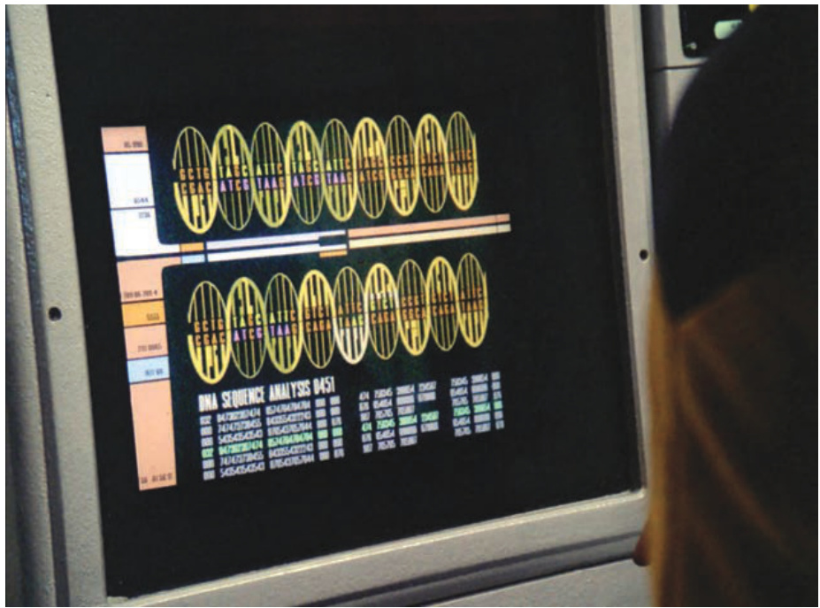  

1989年，当《星际迷航：下一代》（Star Trek: The Next Generation）中的一集在虚拟的电脑屏幕上展示了这张DNA序列的照片时，测定人类基因组的序列似乎是科幻小说领域的一个遥远梦想。令人惊讶的是，第二年启动的人类基因组计划在不到15年后实现了这个目标。  

$\copyright$ CBS Photo Archive/Getty Images  

# 章 节 大 纲  

9.1 DNA 片段化  
9.2 DNA 片段克隆  
9.3 DNA 测序  
9.4 基因组测序  

自19世纪中叶以来，三大进步从根本上改变了遗传学领域：孟德尔在19世纪60年代发现的遗传学基本原理；沃森和克里克在1953年阐明的DNA结构；从1990年到现在的人类基因组计划。在这一章和接下来的一章中，我们将会讨论人类基因组计划和基因组学领域（基因组研究）。  

启动人类基因组计划是为了测序和分析人类基因组，并与几个模式生物的基因组协同分析。基因组是一个生物染色体DNA序列中包含的全部数字化信息。单倍体人类基因组包含约30亿个核苷酸对。  

在人类基因组计划开始之前，基因组的巨大规模使许多生物学家将对其测序的目标视为科幻小说，只有在遥远的未来才能实现。尽管如此，一些科学家还是可以预见到非常快速和可靠的自动化（高通量）DNA测序方法的出现，以及捕获、存储和分析涉及的海量数据所需的计算工具。在这些论点的推动下，美国政府机构于  

1990年同意在预期的15年时间内投入30亿美元，以完成人类基因组测序。一些国际组织也加入了这个计划。  

值得注意的是，到2001年2月，研究人员已经能够确定人类基因组的框架序列。在这个草图中，序列上有一些空白，并且还没有达到适当的准确度（错误率为1/10 000或更低）。其后不久的2003年得到了覆盖 $97\%$ 基因组的准确序列，比原计划提前了两年。1998年，私人公司Celera承诺用更低的成本在三年内完成基因组草图，并采用一种新的测序策略，推动了前期工作的完成。国际社会对基因组计划的支持将时间表提前了几年。  

人类基因组计划项目开发的技术和方法也促进了对人类以外的许多物种的基因组测序工作的开展。到2016年，已经完成了8100多个不同物种的全基因组测序，在微生物学和植物生物学等许多领域的研究中都发生了革命性的变化。这些生物基因组序列的可用性反过来通过鉴定在进化系中保守的基因和其他DNA元件，对于理解人类基因组有重要益处。  

在本章中，我们描述了科学家为确定人类基因组序列而开发的方法。基因组测序背后的思路其实并不十分复杂。首先，基因组的研究人员将基因组分割成更小的片段，然后通过制作所谓的重组DNA分子来分离和扩增（即克隆）单个片段。接下来，科学家们确定基因组中单个纯化的、片段很小的DNA序列。最后，计算机程序分析数以百万计的这些片段的序列，以重建这些片段起源的全基因组序列。  

# 9.1 DNA 片段化  

# 学习目标  

1.  区分限制性内切核酸酶消化的DNA和机械剪切的DNA。  
2.  描述某些限制性内切核酸酶如何产生具有黏性末端的DNA片段，而另一些限制性内切核酸酶产生平端片段。  
3.  根据给定的限制性内切核酸酶，计算消化人类基因组DNA所产生的DNA片段的平均大小和数量。  
4.  总结凝胶电泳分离DNA片段的过程。  

每一个完整的二倍体人类细胞，包括红细胞的前体，都携带着两组几乎相同的30亿个碱基对的信息，当它们解链时，长度可达 $2\mathrm{m}$ 。这些大量的材料和信息，很难作为一个整体来研究。为了降低它的复杂性，研究人员首先将基因组切成可以单独分析的小碎片。实现这一目标的一种策略是使用酶在特定的DNA序列上切割基因组；另一种技术是利用机械力剪切基因组DNA，在基因组随机位置上进行片段化。这两种方法都有各自的用途。  

# 9.1.1 限制性内切核酸酶在特定位点切割基因组  

研究人员使用限制性内切核酸酶在特定位置切割细胞核中释放的DNA。这种特定的切割产生适合于操作和表征的片段。限制性内切核酸酶识别基因组中所有位置的特定碱基序列，然后在该序列处切断两个磷酸二酯键，即每条链的糖-磷酸骨架。由限制性内切核酸酶切割产生的片段被称为限制性片段，而切割DNA的行为通常被称为消化。  

限制性内切核酸酶来源于细菌细胞，并可从细菌细胞中纯化。正如“遗传学工具”信息栏“科学中的意外发现：限制性内切核酸酶的发现”中所解释的：这些酶消化病毒DNA以保护原核细胞免受病毒感染。细菌通过选择性地将甲基（ $\langle\mathrm{-CH}_{3}$ ）添加到其基因组DNA的限制性识别位点来保护它们自己的基因组免受限制酶的消化。在试管中，细菌的限制性内切核酸酶能够识别从任何其他生物体中分离的DNA中的 $4\!\sim\!8$ 个碱基对的靶序列，并在这些位点处或位点附近切割DNA。表9.1列出了近300种常用限制性内切核酸酶中仅10种的名称、识别序列和微生物来源。  

表9.1　十个常用的限制性内切核酸酶  

<html><body><table><tr><td>酶</td><td>识别位点序列</td><td>微生物来源</td></tr><tr><td>TaqI</td><td></td><td>水生栖热菌YTI</td></tr><tr><td>Rsal</td><td></td><td>球形红假单胞菌</td></tr><tr><td>Sau3AI</td><td></td><td>金黄色葡萄球菌3A</td></tr><tr><td>EcoRI</td><td></td><td>大肠杆菌</td></tr><tr><td>BamHI</td><td></td><td>芽孢杆菌</td></tr><tr><td>HindII</td><td></td><td>流感嗜血杆菌</td></tr><tr><td>KpnI</td><td></td><td>肺炎克雷伯菌</td></tr><tr><td>Clal</td><td></td><td>阔显核菌</td></tr><tr><td>BssHII</td><td></td><td>芽孢杆菌</td></tr><tr><td>Notl</td><td></td><td>诺卡氏菌属</td></tr></table></body></html>  

# 科学中的意外发现：限制性内切核酸酶的发现  

大多数克隆和分析DNA片段的工具与技术都来自对细菌和感染它们的病毒的研究。例如，分子生物学家观察到，病毒能在一种细菌中大量繁殖，而在另一种亲缘关系密切的菌株上却生长得很差。在研究这种差异的原因时，这些科学家发现了限制性内切核酸酶。  

要了解这个故事，必须知道，研究人员会根据“平板效率”来比较病毒增殖率：病毒颗粒进入宿主细菌并复制，导致细菌溶解并释放病毒后代的比例。这些后代继续感染邻近的细胞，而这些细胞又分解并释放更多的病毒颗粒。当一个培养皿被一层连续的细菌细胞所覆盖时，活跃的病毒感染就会形成一个明显的斑点或菌斑，代表此处的细菌被清除了（见图7.24）。在大肠杆菌C株上生长的λ病毒的平板效率接近1.0（图A.1）。这意味着100个原始病毒颗粒会在大肠杆菌平板上造成近100个菌斑。  

同一病毒在大肠杆菌K12上的平板效率仅为$1/10^{4}$ ，或者说0.0001。这种一个菌株阻止感染病毒复制的能力被称为限制。  

限制很少是绝对的。尽管生长在大肠杆菌K12上的λ病毒几乎不会产生子代（病毒会感染细胞，但无法在细胞内复制），但少数细胞内的一些病毒颗粒确实会成功增殖。如果继续在大肠杆菌K12上检测这些子代病毒，平板效率接近1.0。在限制宿主上生长可以改变一种病毒，使其后代在同一宿主上更高效地生长，这种现象被称为修饰。  

限制和修饰的机制是什么？对细菌感染后的病毒DNA的追踪研究发现，在限制过程中，病毒DNA断裂和降解（图A.2）。科学家发现最初进行断裂的酶是一种内切核酸酶，这是一种破坏磷酸二酯键的酶，通常在病毒染色体的特定位置上进行双链切割。由于这种断裂限制了病毒DNA的生物学活性，研究人员称这种酶为限制性内切核酸酶。  

随后的研究表明，在宿主细胞中复制时，少量的病毒DNA逃脱了消化，继续产生新的病毒颗粒，并通过添加甲基的方式进行了修饰（图A.3）。研究人员将这种在特定DNA序列上添加甲基的酶命名为修饰酶。  

生物学家已经在许多菌株中发现了互补的限制性修饰系统。该系统的纯化成为重组DNA技术的支柱：用于在体外克隆、绘图和链接时，切割DNA所用的限制性内切核酸酶的动力（见表9.1）。  

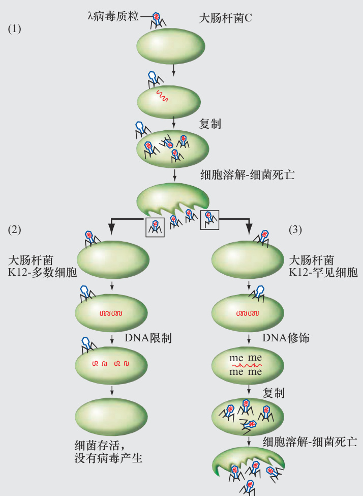  
图A　自然界中限制性内切核酸酶/修饰系统的运作。  

（1）大肠杆菌C菌株没有限制性内切核酸酶/修饰系统，易受λ噬菌体感染。（2）与此相反，大肠杆菌K12菌株通常能抵抗曾感染大肠杆菌C菌株产生的病毒颗粒的感染。大肠杆菌K12的细胞能产生EcoRI限制性内切核酸酶，这种酶在λDNA基因表达之前就能将其剪切。（3）在极少的K12细胞中，修饰酶在λDNA中添加甲基基团（me），保护DNA不受限制性内切核酸酶的影响。修改后的λDNA可以复制，当甲基化标记在DNA复制过程中被复制时，容易在K12细菌上形成菌斑的子代病毒就产生了。  

这个科学上意外发现的例子揭示了分配与监督研究经费的管理者与开展研究的科学家之间的争论。  

研究人员并没有着手寻找限制性内切核酸酶；他们不可能知道这些酶会是他们的发现之一。相反，他们试图了解病毒在细菌中感染和增殖的机制。在此过程中，他们发现了限制性内切核酸酶及其工作原理。政府的经费管理人员通常希望将研究经费直接用于紧迫的健康或农业问题，而科学家往往呼吁将资金广泛分配给所有研究新颖的生物学现象的项目。这两种观点的有效性表明，需要一种平衡的方法对待研究活动的资助。  

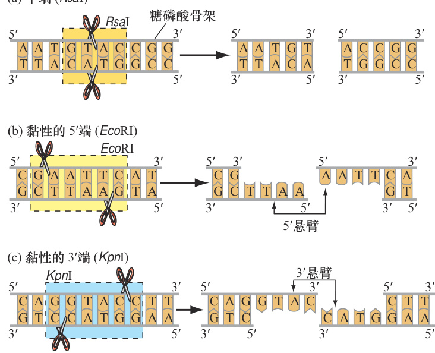  
(a)    (RsaI)   
图9.1　限制性内切核酸酶在特定位置切割DNA分子，产生平末端或黏性末端的限制性片段。（a）限制性内切核酸酶RsaI会产生平末端限制性片段。（b）EcoRI产生含有5′突出的黏性末端。（c）KpnI产生含有3′突出的黏性末端。  

对于大多数这些酶，识别位点由 $4\!\sim\!6$ 个碱基对组成，并表现出一种回文对称性，两条DNA链中的碱基序列在从 $5^{\prime}{\rightarrow}3^{\prime}$ 方向阅读时是相同的。由于这个事实，中心对称线两侧的碱基对是彼此的镜像。每种酶总是在相对于其特定识别序列的相同位置切割，且大多数酶的切割方式有两种：要么直接穿过对称线上的两条DNA链产生平端的片段；要么由一个或多个碱基在对称线的相反方向上均匀位移，产生单链端的片段（图9.1）。遗传学家通常把这些突出的单链称为黏性末端。因为具有黏性，它们能与来自相同限制性内切核酸酶切割的任何生物的DNA互补序列发生配对。  

# 9.1.2 限制性内切核酸酶作用于大的识别位点产生较大的DNA片段  

研究人员经常需要产生特定长度的DNA片段，较大的DNA片段用来研究一个染色体区域的组织结构，较小的DNA片段用于检查一个完整的基因，还有更小的片段用于DNA序列分析（即确定一个DNA片段中碱基的精确序列）。为了制造这些不同大小的片段，科学家们可以用识别不同序列的限制性内切核酸酶切割DNA。  

如果做两个简化的假设，可以估计出一个特定的限制性内切核酸酶产生片段的平均长度：第一，四个碱基中的每一个都以相同的比例出现，使得基因组由 $25\%$ 的A、 $25\%$ 的T、 $25\%$ 的G和 $25\%$ 的C组成；第二，在DNA序列中这四种碱基是随机分布的。这些假设使得能够利用通用公式4n估计任意长度的识别位点之间的平均距离，其中 $n$ 是位点中的碱基数［图9.2（a）］。  

根据4n公式，识别四碱基序列 $5^{\prime}$ GTAC 3′的RsaI将平均每隔44个碱基切割一次，即每隔256bp切割一次，产生平均长度为256bp的片段。相比之下，识别六碱基序列 $5^{\prime}$ GAATTC 3′的EcoRI将平均每隔 $4^{6}.$ 个碱基或每隔4096bp切割一次；由于 $1000\mathrm{bp}\!=\!1\mathrm{kb}$ ，所以研究人员通常将这个大数近似表示为 $4.1\mathrm{kb}$ 。类似地，识别八碱基序列 $5^{\prime}$ GCGGCCGC 3′的NotI，平均每 $\cdot4^{8}\mathrm{bp}\ddot{}$ 或每 $65.5\mathrm{kb}$ 切割一次。然而，需要注意的是，由于任何酶的限制位点之间的实际距离相差很大，所以这里提到的三种酶产生的片段中，很少有片段长度精确到256bp、4.1kb或 $65.5\mathrm{kb}$ 。  

一旦知道用特定的限制性内切核酸酶产生片段的平均长度，还可以估计通过用该酶处理基因组可以得到的片段数量。例如，已知RsaI平均每隔 $4^{4}$ （256）bp切割基因组，如果在适当条件下，将单倍体人类基因组的30亿个碱基暴露给RsaI足够的时间，就能确保基因组中的所有识别位点都被切割，并且将得到：  

3 000 000 000bp  

$=$ 约12 000 000个平均约256bp的片段约 256bp  

相比之下，EcoRI平均每隔 $4^{\,6}$ （4096）bp切割DNA，或每4.1kb切割DNA。如果将单倍体人类基因组的30亿个碱基暴露给EcoRI切割，就会得到：  

如果将同一单倍体人类基因组暴露于八碱基切割的NotI，其平均每 $4^{8}$ （65 536）bp或65.5kb切割DNA，就会得到：  

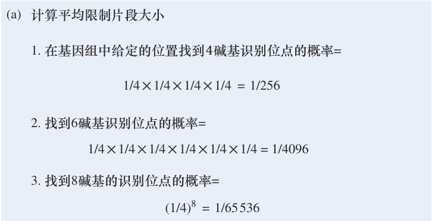  

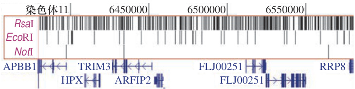  

3 000 000 000bp$=$ 约46 000个平均约65.5kb的片段约 65 500bp  

图9.2（b）总结了这些关系，描述了用这三种不同的限制性内切核酸酶切割人类基因组的一小部分（仅包含7个基因）的结果。显然，与识别较小位点（如RsaI识别的4bp位点）的酶相比，识别较大位点（如NotI的8bp位点）的酶产生数量较少且平均长度更大的片段。  

# 9.1.3 机械剪切力在随机位置破坏DNA  

在本章的后面部分将看到，某些类型的实验需要随机切割DNA，以便在给定的样本中，不同的基因组拷贝将在不同的位置被破坏，而不是像限制性内切核酸酶一样，总在相同的位置切割。DNA的随机切割可以通过使分子经受机械应力来实现，例如，在高压下让样本通过非常细的针，或通过超声（即超声波能量的应用）实现。通过将DNA分子的不同部分拉向不同的方向，这些机械力可以在随机位置上破坏磷酸二酯键，从而使样品中的DNA片段化。研究人员可以通过改变机械应力的大小来获得不同长度的片段，例如，高能超声可产生更小的片段。  

机械剪切产生的DNA片段的末端有时是平的，或者可能有突出的单链区。即使是后者，这些突出的单链与限制性内切核酸酶产生的黏性末端也是不同的，因为它们由随机序列组成，因此与其他单链不互补。尽管如此，分子生物学家已经开发出了更简便的技术，可以将任何类型的DNA末端转换成任何所需类型的末端。因此，通过任何过程获得的所有DNA片段最终都可以以类似的方式使用。  

# 9.1.4 凝胶电泳根据大小分离DNA片段  

为了分析样本中的DNA，生物学家采用了一种叫做电泳的技术，即带电分子在电场中的运动。生物学家利用电泳分离许多不同类型的分子，例如，不同长度的DNA、DNA与蛋白质，或者不同的蛋白质。在这一部分中，我们将重点讨论其在不同长度DNA片段凝胶分离中的应用（图9.3）。  

为了进行这种分离，首先，将含有DNA分子的溶液加入多孔凝胶状基质的一端，即样品孔中，然后将凝胶放入缓冲液中，并把两端分别连接到电源的正负极之间建立电场。电场使样品孔中的所有带电分子向相反电荷的电极方向迁移。因为DNA骨架中的所有磷酸基团在接近中性pH的溶液中携带净负电荷，所以DNA分子被拉向带有正电荷的方向。  

几个变量决定了DNA分子（或任何其他分子）在电泳过程中移动的速率，分别是：在凝胶上施加电场的强度；凝胶的组成；单位体积DNA分子的电荷（称为电荷密度）；分子的物理尺寸。这些变量中唯一不同的是在特定凝胶中迁移的线性DNA片段的大小。原因是所有的DNA分子都受到相同的电场和凝胶基质的作用，它们都具有相同的电荷密度（因为所有核苷酸对的电荷几乎相同）。因此，只有大小差异会导致不同的线性DNA分子在电泳过程中以不同的速度迁移。  

线性DNA分子越长，它的无规卷曲所占的体积就越大。一个分子占据的体积越大，在凝胶基质中找到一个大到足以挤过去的孔的可能性越小，它就会越频繁地撞到基质中。分子撞击基质的频率越高，其迁移率就越低（也称为移动性）。因此，在任何给定的电泳时间内，较小的DNA比较大的DNA离样品孔的距离更远。  

电泳完成时，将凝胶与DNA结合荧光染料溴化乙锭孵育。当未结合的染料被冲走后，将凝胶放置在紫外线下，很容易使DNA可视化，结合到DNA片段上的染料发出橙色的光。可以通过比较它们的迁移距离与在凝胶的相邻孔道上进行电泳的已知标记片段的迁移距离，确定DNA分子在凝胶上的实际大小。  

图9.3（步骤5）展示了通过分析不同的DNA样本得到的结果的类型。如果一个基因组很小，如构成细菌λ噬菌体的染色体长 $48.5\mathrm{kb}$ ，那么EcoRI限制性内切核酸酶消化该DNA后将产生少量的、可以通过凝胶电泳很容易彼此区分的离散带，其总长度为 $48.5\mathrm{kb}$ 。相比之下，当用相同的酶处理人类基因组DNA的样本时，对产生的数十万个不同片段进行电泳，将得到以平均片段大小为中心的弥散带（如前所述，EcoRI约为4.1kb）。通过机械力随机打断DNA也会产生一种片段的分布，片段的平均大小将反映出施加到样品上的剪切力的强度（未显示）。  

DNA分子的大小范围从小于10bp的小片段到平均长度为130 000 000bp的整个人类染色体。没有一种分离方法能在这么大的范围内分离分子。为了检测不同大小范围内的DNA分子，研究人员使用的各种方案主要基于两种凝胶：聚丙烯酰胺凝胶（由丙烯酰胺单体之间的共价键形成），有助于区分较小的DNA片段（小于1kb）；琼脂糖凝胶，适合于如图9.3中观察到的小于20kb的较大片段（由琼脂糖聚合物非共价联结而成）。  

# 基本概念  

●  限制性内切核酸酶在特定的序列位置剪切DNA分子；机械剪切在随机位置打断DNA。  
●  当切割基因组DNA时，酶产生的片段会更大。  
$\bullet$ 某些限制性内切核酸酶可以产生具有相同黏性末端的片段。  
●  凝胶电泳根据大小分离DNA片段。片段越小，它在凝胶中迁移得越远。  

# 特色插图9.3  

# 凝 胶 电 泳  

1.将加热融化的琼脂糖倒入一个透明的丙烯酸板中，上面有夹子固定的梳子，然后，让琼脂糖冷却硬化。  

3.电泳槽内装有沿凝胶两端放置的电极丝。把这些电极接到电源上。当打开电流时，每个样本中带负电荷的DNA分子会沿着橙色箭头所示的路径向盒子的“ $^+$ ”端移动。较小的DNA分子会比较大的DNA分子更快地向“ $^{\,\cdot}+$ ”端移动。  

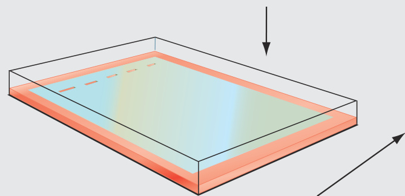  

4.从电泳槽中取出凝胶。在含有溴化乙锭（与DNA结合）的溶液中孵育，然后用水洗去凝胶中多余的染料。  

2.取走梳子；凝胶中会留下浅孔。将凝胶从丙烯酸板转移到含有缓冲溶液的电泳槽中。用微量移液器将不同的DNA样本加载到凝胶的每个孔中。每个样品都含有一种蓝色染料，以便于观察。一个包含已知长度的DNA样本作为长度的分子对照标记。  

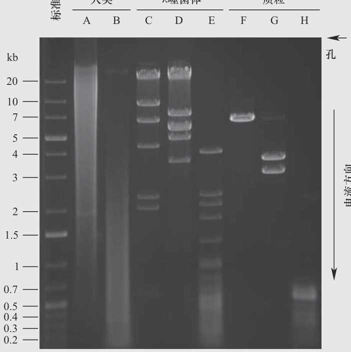  
$\copyright$ Lee Silver, Princeton University  

5.把凝胶暴露在紫外线下。DNA分子会发出橙色的荧光，因为与DNA结合的溴化乙锭会吸收紫外线光子并发出可见红色光范围内的光子。可以通过比较凝胶中DNA分子的迁移和最左边通道中DNA大小标记（标准）的迁移估计未知样本中DNA分子的大小。  

琼脂糖凝胶电泳根据片段大小分离DNA分子。为了给样品制备带孔的琼脂糖凝胶，需要按照步骤1中所示的方法将凝胶倒入板子中，然后将凝胶转移到含有缓冲液的电泳槽中（缓冲液中的离子允许电流通过），并将DNA样品加入孔中（步骤2）。将电泳槽连接到电源上，让电泳可以运行$1\!\sim\!20\mathrm{h}$ （取决于DNA的大小和电压；步骤3）。当凝胶与荧光染料溴化乙锭共同孵育后（步骤4），将凝胶暴露于紫外线下（步骤5）。DNA分子与荧光染料结合，呈现橙色条带。  

步骤5显示凝胶电泳的实际结果；由于使用的是黑白胶片，DNA呈现白色而非橙色。左边的标准通道有已知大小的DNA片段。A道和B道分别显示用EcoRI和RsaI切割的人类基因组DNA。弥散带含有数十万个片段，其中EcoRI片段的平均大小约为4.1kb，RsaI片段的平均大小为256bp。C道、D道和E道分别代表被HindIII、EcoRI和RsaI切割的λ噬菌体的染色体。任何一个通道的片段大小加起来就是 $.48.5\mathrm{kb}$ ，也就是病毒基因组的大小。在总长度6.9kb的F、G、H质粒DNA中，用相同的三种酶进行切割。需要注意的是，分析的基因组越大，产生的片段越多；而且限制性内切核酸酶识别位点的碱基越多，产生片段的平均长度越大。  

# 9.2 DNA片段克隆  

# 学习目标  

1.  绘制用限制性内切核酸酶和DNA连接酶制备重组DNA分子的过程。  
2.  描述科学家如何制备重组DNA分子的细胞克隆。  
3.  对比质粒载体与BAC或YAC载体的用途（细菌或酵母人工染色体）。  
4.  解释为什么基因组DNA文库需要比单个基因组等价物包含更多的菌落。  

图9.3中，EcoRI切割人类DNA产生的成千上万的不同DNA片段弥散带表明，动物、植物，甚至像大肠杆菌这样的微小生物的基因组都非常复杂，以至于只能通过一次研究一小块来理解它们。理想情况下，只希望从这些片段中纯化出一个小片段，然后继续扩增这个特定的DNA片段——也就是说，制作许多相同的DNA拷贝。扩增可以获得足够的DNA用来研究，最明显的一类分析是确定构成这一特定片段的核苷酸序列。如果可以分别对成百上千个片段进行测序，最终可能找出基因组的整个DNA序列。  

使用活细胞从复杂混合物中分离出DNA的单个片段，并对该片段进行许多精确复制的过程称为分子克隆。这项技术是人类基因组计划早期成功的关键。最近开发了一些成熟的方法，以避免在确定基因组序列时需要进行分子克隆，其中一些技术将在后面的章节中介绍。然而，分子克隆在今天仍然是许多重要的DNA分析和操作方法的组成部分。  

分子克隆由两个基本步骤组成。首先，DNA片段被插入到称为克隆载体的特殊染色体载体中，这确保了单个DNA插入片段的运输、复制和纯化。在第二步中，载体和插入片段的结合体被转运到活细胞中，然后细胞对这些分子进行复制。因为给定片段的所有拷贝都是相同的，所以被复制的一组DNA分子称为DNA克隆。DNA克隆可以被纯化并马上用于研究，也可以作为克隆的文库储存在细胞或病毒中以备将来分析之用。现在介绍分子克隆的每个步骤。  

# 9.2.1 将插入片段连入载体产生重组DNA分子  

人类基因组DNA的小片段不能在细胞中自我复制。为了使复制成为可能，需要将每个片段拼接到一个载体上。载体必须包含两种特殊的DNA序列：一种是为载体和插入其中的外源DNA提供复制手段；另一种是通过赋予宿主细胞可检测的特性来向研究者提供载体存在的信号。载体还必须具有明显的物理特征，如大小或形状，通过这些特征可以从宿主细胞的基因组中纯化出来。有几种类型的载体正在使用，每一种载体都像一条小染色体，能够接受外源DNA插入片段并独立于宿主细胞的基因组进行复制。载体与插入片段（来自两个不同来源的DNA）的切割和连接，产生了一个重组DNA分子。  

# 1. 黏性末端和碱基配对  

黏性末端的两个特征为高效地产生载体-插入片段重组体提供了基础：第一，单链突出部分可用于碱基配对；第二，无论DNA的来源是什么（细菌或人类），用相同的酶产生的两个黏性末端总是相容的，即在序列上是互补的。  

为了制备重组DNA分子，需用产生基因组DNA片段的相同的限制性内切核酸酶切割载体，然后在DNA连接酶存在的情况下将酶切后的载体和基因组DNA混合在一起（图9.4）。互补的黏性末端将形成碱基配对，连接酶通过在相邻核苷酸之间形成磷酸二酯键来稳定该分子（一个来自载体，另一个来自基因组DNA插入物）。  

实验室技术可以提高分子克隆的效率和通用性。例如，某种程序可以阻止两个或更多的基因组片段相互连接而不是与载体相连。其他方法是将载体分子在不插入基因组DNA的情况下使自身重新连接的概率降至最低。然而，也可以进行其他操作，将没有黏性末端的基因组DNA片段连接到载体上。这些技术确保了研究人员能够可靠地制备他们想要的分子克隆。  

# 2. 载体选择  

现有的载体在生物学特性、携带能力及可感染的宿主类型上各不相同。不同类型的载体具有不同的实验用途。  

最简单的载体是被称为质粒的双链环状DNA，它可以进入多种细菌细胞内并独立于细菌染色体进行复制［图9.4（a）］。最常用的质粒含有一个多位点人工接头，它是一个短的、合成的DNA序列，包含许多不同的限制性内切核酸酶的限制位点［图9.4（a）］。每个位点在多位点人工接头中只存在一个，但在质粒载体的其他地方不存在。该多位点人工接头在酶的选择上提供了灵活性。暴露于任何一个多位点人工接头上的限制性内切核酸酶可以在相应的识别位点打开载体，允许用同一酶切割的外源DNA片段插入，同时不会将质粒分裂成许多碎片［图9.4（b）和（c）］。质粒载体只能携带小于20kb长度的相对较小的外源DNA片段。  

每个质粒载体携带一个复制起点和特定抗生素的抗性基因［图9.4（a）］。复制起点使质粒能够在细菌内独立复制。抗性基因赋予宿主细胞在含有特定抗生素的培养基中生存的能力，因此，抗性基因使得实验者能够只选择含有质粒的细菌细胞后代。抗生物抗性基因和其他载体基因，使得有可能挑选出含有特定DNA分子的细胞，这被称为选择性标记。质粒还满足了载体的最终要求——易于纯化。利用大小和其他差异的优势，有几种技术可以从细菌宿主基因组DNA中纯化出质粒。  

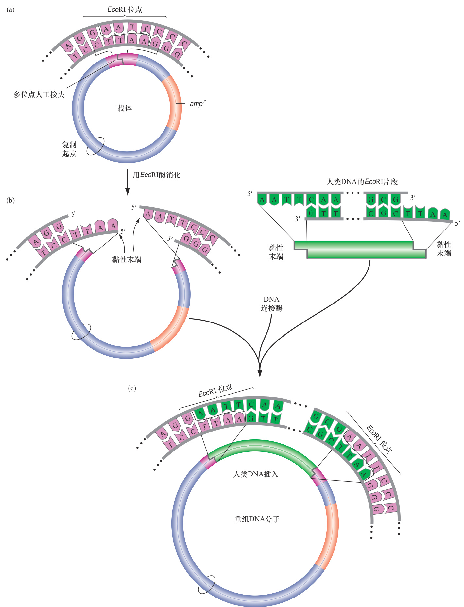  
图9.4　用质粒载体构建重组DNA分子。（a）质粒载体包括三个主要特征： $\textcircled{1}$ 复制起点； $\textcircled{2}$ 对氨苄青霉素（橙色）等抗生素具有耐药性的可选择标记基因； $\textcircled{3}$ 一个合成的多位点人工接头（紫色），含有质粒特有的限制酶酶切位点，如EcoRI。（b）EcoRI在其单个识别位点切割质粒载体，打开质粒圆环。EcoRI在许多位点切割人类基因组DNA，产生一组混合片段，图中仅显示了一个片段（绿色）。载体和人类基因组片段都有相同的黏性末端。（c）酶切质粒和人类基因组DNA片段在DNA连接酶的存在下混合在一起，DNA连接酶将它们缝合，形成环状重组DNA分子。注意，重组DNA现在有两个EcoRI的位点。  

最大容量的载体是人造染色体，即结合了复制和分离元件的重组DNA分子，当进入宿主细胞时，它们表现得像正常染色体一样。一个细菌人工染色体（BAC）可以容纳300kb的插入片段。酵母人工染色体（YAC）可以容纳更大的DNA片段（最多2Mb）。除了在分子克隆方面的应用，YAC还可以帮助研究者分析染色体的功能元件，如着丝粒。因此，我们将会在关于真核染色体的第12章中更详细地讨论YAC。  

# 9.2.2 宿主细胞接受并扩增重组DNA  

虽然每种类型的载体以略微不同的方式发挥作用并进入特定的宿主，但是进入宿主细胞并利用细胞环境进行自我复制的方式对于所有载体来说都是相同的。图9.5揭示了科学家如何获得含有重组DNA分子的大肠杆菌细胞，在重组DNA分子中，人类DNA片段被连接到质粒载体中。该过程开始于用相同的限制性内切核酸酶切割载体和人类基因组DNA，然后在DNA连接酶的存在下将它们混合在一起，产生成千上万个不同的重组DNA，每个重组DNA含有不同的人类基因组片段［图9.5（a）］。然后，研究人员必须将这些分子引入大肠杆菌中，这样每个细胞只含有单一类型的重组DNA。  

# 1. 宿主细胞转化  

转化，是一个细胞或有机体吸收外来DNA分子，改变该细胞或有机体的遗传特征的过程。现在描述的方法类似于Avery和他的同事所做的转化实验，即确定DNA是遗传分子（回顾图6.4），但是这里提出的方法更有效。  

首先将重组DNA分子添加到对抗生素氨苄青霉素敏感的特制大肠杆菌的悬浮液中。在有利于进入的条件下，例如，将菌液悬浮在冷的 $\mathrm{CaCl}_{2}$ 溶液中，或用高压电击处理后的溶液（一种称为电穿孔的技术），约1000个细胞中就有一个会有质粒进入［图9.5（b）］。这些操作增加了细菌细胞膜的渗透性，本质上是形成临时的穿孔，允许DNA进入。由于任何一个质粒随机进入一个细胞的概率很低（0.001），因此两个质粒同时进入一个细胞的概率是微不足道的（ $0.001\times0.001\,{=}$ 0.000 001）。  

# 2. 转化细胞的识别与分离  

为了识别含有质粒的 $0.1\%$ 的细胞，将细菌-质粒混合物倒入含有琼脂、营养素和氨苄青霉素的平板上。只有被含有氨苄青霉素耐药性的质粒转化的细胞才能在抗生素的作用下生长和繁殖［图9.5（b）］。质粒的复制起点使它能够独立于细菌染色体在细菌细胞中复制；事图9.5　重组DNA分子克隆。（a）重组DNA结构。用限制性内切核酸酶切割基因组DNA可产生许多片段，每个片段都能形成不同的重组DNA分子。（b）获得含有重组质粒的细菌细胞克隆。重组DNA[来自（a）部分]被添加到对氨苄青霉素敏感的大肠杆菌细胞中。只有重组质粒转化的细胞（或者比较罕见的是没有外来DNA插入的自连载体）才能在含有氨苄青霉素的培养皿上生长。平板上的每个菌落都含有数百万个相同的后代，它们来自用单个重组DNA分子转化而来的单个细菌细胞。  

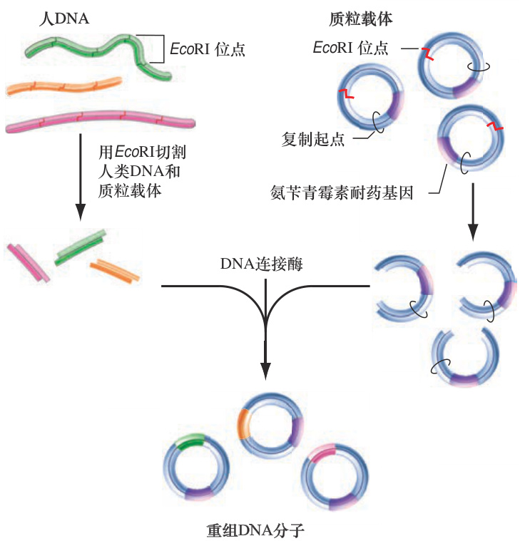  
(a)     DNA   
(b)重组DNA转化大肠杆菌细胞  

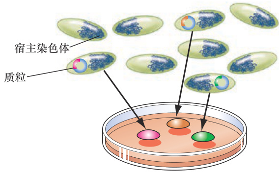  

实上，大多数质粒复制得非常好，以至于单个细菌细胞最终可能产生数百个相同拷贝的质粒。  

每一个含有质粒的活的细菌细胞会在琼脂平板上繁殖并产生一个独特的斑点，由几千万个基因相同的细胞组成。整体菌群被认为是一个细胞克隆。这样的克隆生长到直径约1mm的时候就可以被识别。一个菌落中的几百万个相同的质粒分子组成了一个DNA克隆［图9.5（b）］。  

# 9.2.3 文库是克隆片段的集合  

从任何生物的DNA一步一步得到单个纯化的DNA片段是一个漫长而乏味的过程。幸运的是，科学家们不必每次从相同的生物体中纯化新的基因组片段时都回到第一步。相反，他们可以构建一个基因组文库——一个长寿命的细胞克隆集合，它将整个基因组中的每个序列插入到一个合适的载体中（图9.6）。与传统的书籍库一样，基因组文库存储了大量的信息以供检索。当重组DNA构建的最初步骤完成时，剩下的唯一困难的任务是确定文库中的众多克隆中哪个包含感兴趣的DNA序列，这使得在晚期阶段开始一个新的克隆项目成为可能。一旦正确的细胞克隆被识别出来，它可以被扩增以产生大量所需的基因组片段。  

如果用一种限制性内切核酸酶消化一个细胞的基因组，并且以 $100\%$ 的效率将每个片段与载体相连，然后把所有这些重组DNA分子以 $100\%$ 的效率转化到宿主细胞中，所产生的克隆集将代表整个基因组（以一种片段的形式）。一个假设的细胞克隆集合，仅包含整个基因组每条序列的一个拷贝，这将是一个单独的、完整的基因组文库。  

在这个假设的文库中有多少个克隆？如果从一个单倍体人类精子的 $3\ 000\ 000\mathrm{kb}$ 的DNA开始，并可靠地将其切割成一系列150kb的限制性片段，将产生$3\,000\,000/150{=}20\,000$ 个基因组片段。如果把这些片段中的每一个放入BAC克隆载体中，然后将其转化到大肠杆菌宿主细胞，将创造出一个含有20 000个克隆的完美文库，它们一同携带了基因组中的每个基因座。这个完美文库中的克隆数定义了一个基因组当量。为了找到构成任何文库的一个基因组当量的克隆数，只需将基因组的长度（这里是 $3\,000\,000\mathrm{kb}$ ）除以文库载体所携带的插入片段的平均大小（在本例中是150kb）。  

  
图9.6　人类基因组DNA文库的一部分。这些平板上的每个菌落都含有由不同的人类基因组片段组成的不同的重组质粒。$\copyright$ McGraw-Hill Education. Lisa Burgess拍摄  

在现实生活中，不可能获得完美的文库。克隆的每一步都远没有达到 $100\%$ 的效率，单个细胞的DNA不能为该过程提供足够的原材料。因此，研究人员必须从一个特定组织或生物体的数百万个细胞中获取DNA。如果用这些DNA只收集一个基因组当量的克隆（BAC载体的人类文库中的20 000个克隆）来制作基因组文库，那么一些人类DNA片段将出现不止一次，而其他的DNA片段根本不会出现。如果包含 $4\!\sim\!5$ 个基因组当量，那么基因组的每个区域（基因座）平均会产生 $4\!\sim\!5$ 个克隆，任何单个基因座至少出现一次的概率将为 $95\%$ 。  

# 基本概念  

●  为了形成重组DNA分子，DNA连接酶将限制性内切核酸酶切割的具有相同黏性末端的载体和基因组DNA片段连接在一起。  
●  载体包括一个DNA复制起点和一个可选择的标记，如抗生素抗性基因。质粒载体用于小DNA片段插入（ $<\!20\mathrm{kb}$ ），而BAC或YAC载体可以携带更大的插入片段。  
●  重组DNA被转化到宿主细胞内。当一个转化细胞长成一个细胞克隆时，克隆中的每个细胞都有相同的重组DNA。  
●  基因组文库作为一个随机DNA片段的集合，包含了一个物种的整个基因组；需要建立多个基因组当量文库来确保基因组所有部分的代表性。  

# 9.3 DNA测序  

# 学习目标  

1.  解释DNA聚合酶、模板和引物在Sanger测序反应中的作用。  
2.  描述双脱氧核糖核苷酸在产生DNA片段用于分析中的作用。  
3.  将DNA测序过程中获得的荧光峰图解析为具有适当极性的核苷酸序列。  

在图9.6中，可以看到数千个独立克隆的平板，这些克隆中含有部分人类基因组测序文库。每个克隆含有不同的重组DNA分子，每个重组DNA分子的质粒载体连接着一个不同的人类基因组DNA片段。注意，菌落在平板上是随机分布的，因此它们在平板上的排列与它们在基因组中的相对顺序没有对应关系。那么，怎样才能分辨出哪个克隆包含了哪个人类DNA片段呢？  

随着技术的发展，回答这个问题最简单的方法就是对每个克隆中的人类DNA插入片段进行测序。目前应用最广泛的DNA测序技术是基于Fred Sanger在20世纪70年代中期开发的一种原始方法。Sanger获得的两项诺贝尔奖之一就是因为该工作（另一项是因为他测定了胰岛素的氨基酸序列）。桑格的方法很容易实现自动化，满足人类基因组中30亿个核苷酸的测序需求。  

# 9.3.1 Sanger测序依赖于DNA聚合酶  

Sanger的测序技术是基于他对DNA在细胞中复制方式的了解。大家应该还记得第6章讲过DNA聚合酶催化DNA的复制。如图9.7（a）所示，该酶的最低要求是：$\textcircled{1}$ 一个模板，即一条需要复制的单链DNA； $\textcircled{2}$ 脱氧核糖核苷三磷酸（dATP、dCTP、dGTP和dTTP），是合成新DNA的基本构建单元； $\textcircled{3}$ 一个引物，即一种短的单链DNA分子（一个寡核苷酸），它与模板的一部分互补，并提供DNA聚合酶以连接新核苷酸的游离3′端。  

用Sanger的方法对DNA进行测序，需要一个模板，它的部分序列是已知的，但其余的序列是未知的（因为这正是需要确定的）。重组质粒DNA的一条链可以充当这样的模板：载体的DNA序列已知（在文库的所有克隆中都是相同的），但不知道基因组DNA插入片段的序列（这在不同的克隆中是不同的）［图9.7（a）］。  

接下来，需要一个短的寡核苷酸引物，该引物与未知的人类DNA插入片段相邻的载体上的已知序列互补［图9.7（a）］。引物是在DNA合成仪中定制的，这些机器可以制造大量长达100个碱基的任何给定的DNA寡核苷酸。用户只需将期望的核苷酸序列键入控制DNA合成仪的计算机中，然后机器利用化学反应将这些核苷酸按适当的顺序串在一起。可以设计引物，因为已经知道了载体的序列，它是由另一种化学技术决定的（这里没有描述），不需要先验知识。  

Sanger测序允许图9.7（a）中的模板和引物通过杂交的过程相互作用：单链DNA或RNA分子倾向于通过碱基对互补产生双螺旋。为了制作模板，可以简单地从一个特定的克隆中繁殖并纯化双链重组DNA，然后通过提高温度将DNA融化成单链，从而破坏原本使得双链聚合在一起的氢键。虽然DNA片段的两条链都存在于一个典型的DNA样本中，但是只有一条被用作测序的模板。这时加入大量预先制作的引物，随着混合物温度的逐渐降低，引物和重组DNA模板链的互补核苷酸之间会形成氢键。在DNA合成仪中制造的引物必须足够长，以确保它只与模板中的一个互补序列形成稳定的双链区域（即退火）。通常引物长度为 $7\!\sim\!25$ 个碱基。引物和模板的相互作用为DNA聚合酶发挥功能创造了底物［图9.7（a）］。  

# 9.3.2 Sanger测序产生单链DNA片段的嵌套集  

为了揭示分离的DNA分子中碱基的顺序，Sanger测序利用DNA聚合酶产生一系列的单链片段，其中每个片段的一部分与DNA模板的未知部分互补［图9.7（b）］。每个片段与前后片段之间只有一个核苷酸的差异，这样的一组分级片段被称为嵌套阵列。这些片段的一个关键特征是每个片段都可以根据其末端的3′碱基来区分。因此，每个片段有两个特征属性——相对长度和4个可能的终止核苷酸之一。  

创建嵌套阵列的测序程序开始于在退火后的模板和引物中加入DNA聚合酶，同时加入校准后的8种核苷三磷酸的混合物［图9.7（b）］。其中4个是正常的脱氧核糖核苷三磷酸——dATP、dCTP、dGTP和dTTP。其他4种是不常见的，并以较低的浓度添加，它们是双脱氧核糖核苷三磷酸（有时仅仅称为双脱氧核苷酸）—ddTAP、ddCTP、ddGTP和ddTTP［图9.7（c）］。在DNA聚合过程中，这些双脱氧核苷酸缺少形成磷酸二酯键的3′羟基（回顾图6.21）。此外，每个双脱氧核苷酸都用一种不同颜色的荧光染料标记，例如，ddATP可以携带一种绿色荧光染料，ddCTP携带紫色染料等。  

测序反应管中含有数十亿个来源相同的杂交DNA分子，其中寡核苷酸引物已经杂交在模板DNA链的同一位置上。在每个分子上，引物为DNA聚合酶延伸提供了3′端。聚合酶将核苷酸添加到与样品的模板链互补的生长链中。核苷酸会持续加入，直到偶然地，一个双脱氧核苷酸替代一个正常核苷酸加入到生长链中。双脱氧核苷酸的3′羟基的缺失阻止了DNA聚合酶与任何其他的核糖核苷酸形成磷酸二酯键，结束了对该新DNA链的合成［图9.7（b）］。  

当反应完成时，通过高温变性，新合成的链从模板链中释放出来。结果是产生了一组嵌套的片段，它们都具有相同的5′端（引物的5′端），但有不同的3′端。这组片段中每个片段的长度和荧光颜色由最后一个结合的核苷酸决定，即片段中的终止单链的双脱氧核苷酸［图9.7（b）］。  

# 9.3.3 DNA片段的荧光显示核苷酸序列  

生物学家们通过聚丙烯酰胺凝胶电泳分析测序反应产生的DNA片段混合物，该凝胶可以分离长度只差一个核苷酸的DNA分子［图9.7（b）、（d）和（e）］。凝胶由一台DNA测序仪检测，该测序仪配有激光（激活双脱氧核苷酸的荧光标记）及一种灵敏的检测器（可以分辨所产生的彩色荧光）。当每一个DNA片段经过激光照射时，它就会发出4种荧光颜色中的一种，这种荧光颜色是由附着在链3′端的双脱氧核苷酸上的染料决定的。每个连续的荧光信号代表比前一条链长一个核苷酸的链。  

检测器将信号相关的信息传送给计算机，计算机将它们显示为一系列不同颜色的峰图［图9.7（f）］。DNA测序仪中的计算机具有碱基读取软件，可将峰图  

# 特色插图9.7  

# 自动化Sanger测序  

（a）模板与引物杂交。克隆的重组DNA变性（融解成单链），利用热量将连接两条链的氢键分开。其中一条链作为模板。重组DNA与一个寡核苷酸引物混合（提前由DNA合成仪产生），引物序列与模板链载体部分约20个互补碱基。随着温度的降低，模板和引物退火（杂交）在一起。（b）产生一套嵌套的聚合产物。模板-引物杂交物现在与DNA聚合酶、大量的四种脱氧核苷三磷酸（dNTP）和少量的四种双脱氧核苷三磷酸（ddNTP）混合。每个ddNTP都有不同颜色的荧光标记。DNA聚合酶通过在引物的3′端依次加入核苷酸，合成与模板互补的DNA新链。当一个双脱氧核苷酸加入链中时，合成终止。该反应生成了一组嵌套的产物，每个产物都有相同的5′端和不同的3′端。3′端的双脱氧核苷酸的颜色编码了每个产物。在将新合成的DNA从模板中融解下来后，这些产物在一种特殊的凝胶上进行电泳，这种凝胶可以通过一个核苷酸的差异分离大小不同的  

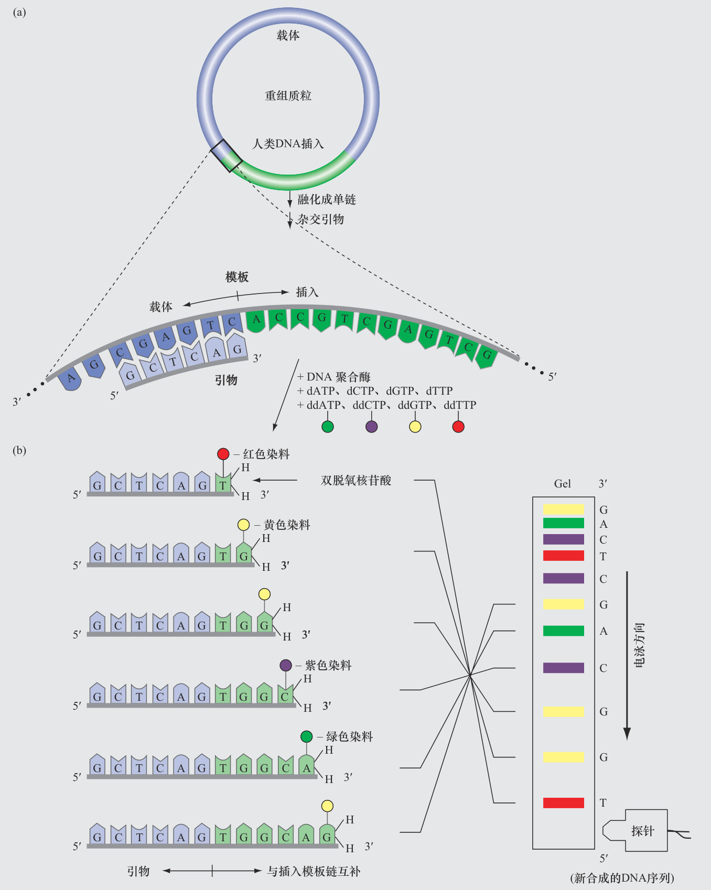  

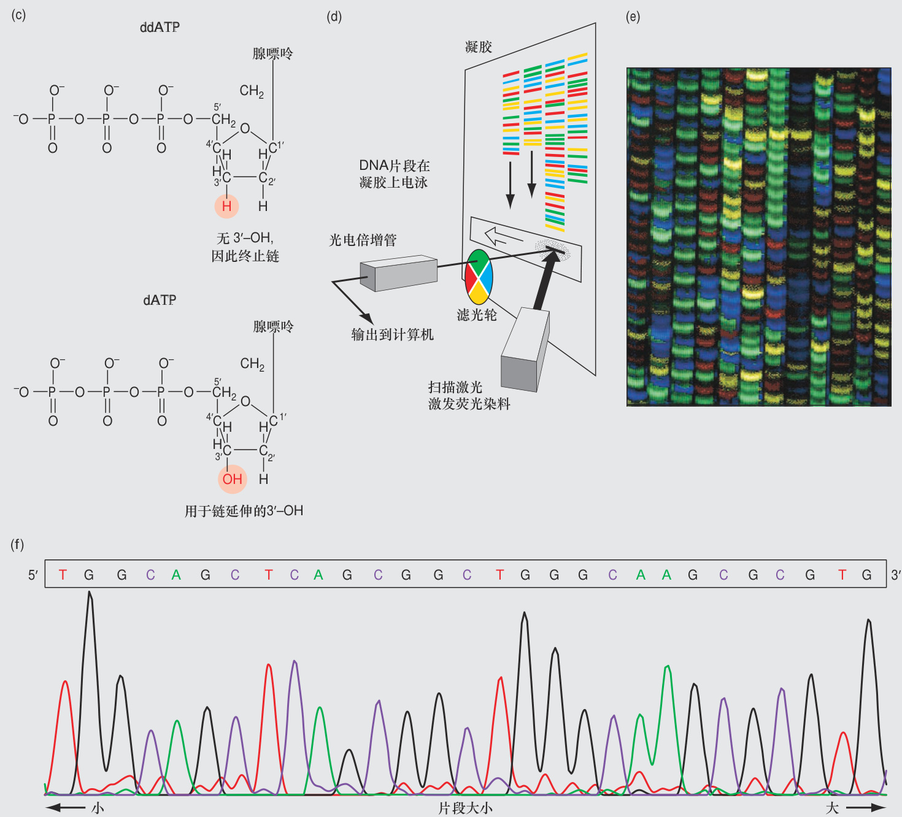  

DNA。当每个片段经过激光束时，末端碱基的颜色就会被检测并记录下来。（c）双脱氧核苷酸的结构。由于ddNTP在脱氧核糖的3′碳原子上缺少一个羟基基团，DNA聚合酶无法将任何核苷酸添加到3′端有双脱氧核苷酸的链上。（d）分析凝胶上嵌套的产物。（e）测序凝胶图像。每道显示了用不同的样本获得的序列。（f）一条凝胶道的DNA序列痕迹。原始数据由四种不同颜色的峰值表示。在这里，为了便于显示，用黑色替代黄色。碱基读取软件将新合成的DNA链生成一个文本序列。从一个反应中可以读出近1000个碱基。  

转译为特定的碱基并产生一个包含新合成的DNA中的A、C、G和T序列的数字文件，称为一个读长。当然，这个序列与所分析的模板链是互补的。  

自20世纪90年代后期以来，DNA测序仪可以从任何一个样本中测定 $700\!\sim\!1000$ 个碱基。这些机器还可以在单独的凝胶通道上同时运行数百个样本，每个样本都由单独的荧光检测器记录［图9.7（d）和（e）］。因此，一台运行数小时的机器可以确定数十万个DNA序列信息的碱基。  

# 基本概念  

●  在Sanger DNA测序中，被测序的DNA分子作为DNA聚合酶合成DNA的模板。  
●  Sanger DNA测序需要一个短的寡核苷酸引物与模板杂交。DNA聚合酶通过在3′端添加与模板互补的核苷酸来延伸引物。  
●  在自动化DNA测序中，当DNA聚合酶结合了一个有荧光标记的双脱氧核苷酸时，链合成终止。  
●  聚合反应产生的DNA片段在凝胶上按大小进行分离，  

通过检测器读取每个片段3′端的荧光标记的颜色，以确定核苷酸序列。  

# 9.4 基因组测序  

# 学习目标  

1.  解释为什么重建基因组序列需要单个DNA序列之间的重叠。2.  描述基因组测序的分级策略和鸟枪策略之间的差异。  

基因组的范围从最小的已知微生物基因组的700 000个碱基对（700kb）到分布在人类的23条染色体上的30亿个碱基对（3千兆碱基对，或3Gb），甚至更大的基因组中。表9.2给出了代表性的微生物、植物和动物的基因组大小。准确地说，人类基因组比大肠杆菌的基因组大700多倍，是巴黎粳稻的基因组的1/45。因此，基因组的信息含量不一定与生物体的复杂性成正比。  

表9.2　基因组的比较  

<html><body><table><tr><td colspan="2">微生物</td><td rowspan="2">染色体数量</td><td rowspan="2">基因数量</td><td rowspan="2">基因长度/Mb</td></tr><tr><td>类型</td><td>物种</td></tr><tr><td>细菌</td><td>大肠杆菌</td><td>1</td><td>约4400</td><td>4.6d</td></tr><tr><td>酵母</td><td>酿酒酵母</td><td>16</td><td>约6000</td><td>12.5</td></tr><tr><td>蠕虫</td><td>秀丽隐杆线虫</td><td>6</td><td>约22000</td><td>100.3</td></tr><tr><td>果蝇</td><td>黑腹果蝇</td><td>4</td><td>约17000</td><td>122.7</td></tr><tr><td>拟南芥</td><td>拟南芥</td><td>5</td><td>约28000</td><td>135</td></tr><tr><td>鼠</td><td>小鼠</td><td>20</td><td>约27000</td><td>2700</td></tr><tr><td>人</td><td>人类</td><td>23</td><td>约27000</td><td>3300</td></tr><tr><td>肺鱼</td><td>石花肺鱼</td><td>14</td><td>？？</td><td>133000</td></tr><tr><td>树冠植物</td><td>衣笠草</td><td>5c</td><td>？？</td><td>152400</td></tr></table></body></html>

a 如无特别指明，代表单倍染色体补体。b 包括非蛋白质编码基因。c 该物种为八倍体；5是基本染色体数量（见第13章）。d 大肠杆菌基因组大小不一；4.6Mb是一个具有代表性的长度（参见第14章）。  

包括人类基因组在内的一些基因组的巨大尺寸，对基因组的最终表征和分析提出了重大挑战。如果任何一次DNA测序最多可以产生1000个碱基的信息，那么需要至少300万个这样的序列来确定人类基因组的整个序列。事实上，这是一个严重的低估，因为正如之前所讨论的，需要从基因组文库中至少测定5倍于此数量的克隆，以确保有 $95\%$ 的概率使基因组的每个部分都出现一次。怎么可能做这么多的DNA测序呢？如何处理获得的海量数据？如何在完整的基因组中找出这数百万个1000碱基的片段是如何排列的？  

目前用于复杂基因组测序方法的基本概念，被称为全基因组鸟枪策略。这个概念很容易解释：确定每个长度约为1000碱基的DNA序列，这些序列来自一个基因组文库的数百万个BAC（细菌人工染色体）克隆上的随机人类基因组DNA插入片段的两端（配对末端），然后寻找序列之间的重叠，以便将其组装起来重建整个基因组的序列（图9.8）（“鸟枪”是指随机选择克隆进行测序）。理想情况下，以人类基因组为例，最终的输出将是24条核苷酸序列的线性字符串，对应每条染色体（常染色体、X染色体和Y染色体）。  

当人类基因组计划于1990年启动时，全基因组鸟枪策略被认为是不可能的。人们很早就认识到的一个问题是：正如后面将要讨论的，基因组包含多种重复的DNA序列，每个重复序列可以位于基因组中的多个位置。许多重复序列比典型的1000bp读长还长。这一事实导致不可能用随机读长组装基因组。其原因是，来自一个特定基因组位置的长重复序列一侧的唯一序列不可能出现在该重复序列另一侧的唯一序列读长中［图9.9（a）］。科学家们最终认识到，随机克隆的配对末端测序将使全基因组鸟枪策略成为可能。这里会介绍这种方法，但首先要介绍一个在这一概念突破之前研究人员使用的替代策略。  

为了绕过长重复序列存在所带来的装配问题，第一批基因组科学家尝试了一种被称为分级策略的分而治之的方法（图9.8）。他们首先通过在BAC载体中克隆$200{\sim}300\mathrm{k}$ b的片段将基因组分成大块，然后用策略（未在这里讨论）确定插入片段在原始基因组中的顺序。基因组DNA片段是用一种方法（如超声处理）产生的，该方法在不同位置上切割基因组的不同拷贝，导致重叠的片段（图9.8）。这些方法允许研究人员确定最小的一组BAC克隆，它们可以用最小的重叠量覆盖整个基因组（所谓的最小重叠区域）。科学家们随后确定了每个BAC克隆中最小重叠区域的整个插入片段的DNA序列，以便重建基因组（图9.8）。由于大多数BAC克隆只包含一个特定重复元件的单一拷贝，所以一次组装一个BAC克隆避免了图9.9（a）中的问题。  

尽管分级方法最终获得成功，但一个名为塞罗拉的私营机构却让科学界大吃一惊，它同时承担并利用全基因组鸟枪策略对人类基因组进行测序，当时很多人认为这种策略毫无希望。如前所述，塞罗拉公司成功的关键是进行配对末端测序，即它们从每个BAC克隆获得两条测序序列，分别来自插入片段的两端［图9.9（b）和（c）］。配对末端测序为赛罗拉公司的科学家提供了一个信息——每个BAC克隆的两个序列必定是来自基因组的同一个区域，而且间隔 $200{\sim}300\mathrm{kb}$ 。如图9.9（b）所示，该信息使得科学家们能够正确地排列重复元件侧翼的唯一序列。  

全基因组鸟枪策略与分级方法相比有两个重要的优点。首先，鸟枪法不需要耗时的BAC克隆比对以产生重叠区域。其次，鸟枪法的过程可以高度自动化。塞罗拉公司投资了一个包含数百个由机器人控制DNA测  

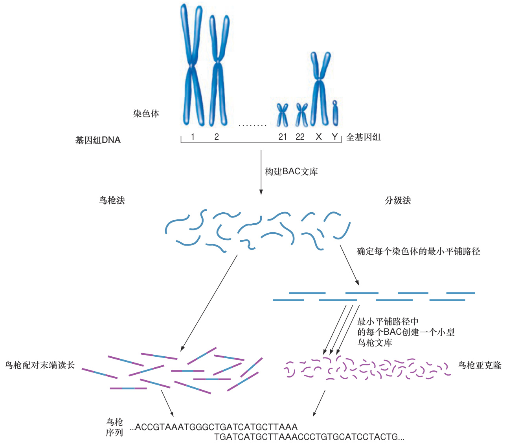  
...ACCGTAAATGGGCTGATCATGCTTAAACCCTGTGCATCCTACTG...  

图9.8　基因组测序策略。在全基因组鸟枪方法中（塞罗拉公司），BAC文库由片段化的基因组DNA构成。数百万个克隆的两端被直接测序；通过计算机寻找这些序列之间的重叠，并将基因组序列组装起来。较为系统但效率较低的分级方法采用中间步骤，对基因组文库的BAC克隆进行特征化（插入片段为 $200{\sim}300\mathrm{kb}$ ），以确定最小重叠区域。路径中的每个BAC克隆都被分割成更小的片段，形成一个小型鸟枪文库，并对小型文库中的DNA进行测序。计算机重新组装每个BAC克隆的序列，然后寻找BAC克隆之间的重叠以重新组装完整的基因组序列。  

序仪的机构，机器人首先从基因组文库的克隆中制备DNA，将这些DNA放入测序反应中，然后将反应液放入测序仪中。这种自动化使塞罗拉公司能够以相对便宜的成本获得所需的数百万条DNA序列读长，从而提供约10倍的基因组当量覆盖率。DNA测序仪将数据传输到一个中央超级计算机，其复杂的软件能将所有这些序列组装到染色体上。全基因组鸟枪法的相对效率如此之高，因此基于这种方法的改良版本已成为基因组测序的标准方法。  

# 基本概念  

●  全基因组鸟枪测序的策略是从机械剪切的基因组DNA构建的文库中随机选择成百上千个克隆，对插入片段进行测序，以确保片段之间的重叠。  

●  对DNA插入片段的两端进行测序（配对末端测序），为基因组组装提供了有用的信息。  

# 接下来的内容  

人类基因组计划并没有终止于对DNA序列的30亿个碱基对的测定。这个项目的一个重要的任务是解读所获的大量信息。在所有这些A、C、G和T中，基因在哪里？蛋白质编码基因的序列是什么？这些基因编码的RNA序列是什么？这些蛋白质和RNA潜在的功能是什么？哪些DNA序列构成了染色体的其他重要特征，如着丝粒和端粒？在下一章中，将会解释科学家们如何识别基因组的功能元件，以及他们的发现如何在DNA序列的水平上揭示人类基因组的结构。  

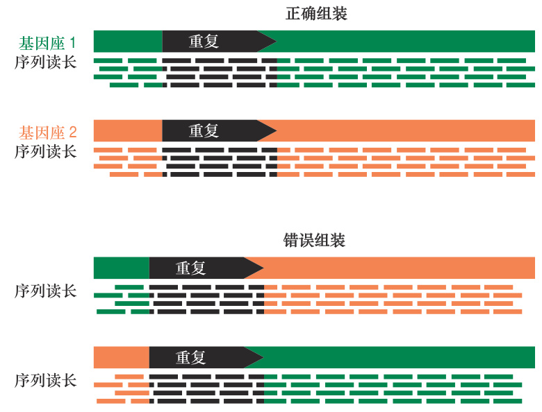  
(a)   
(c)  

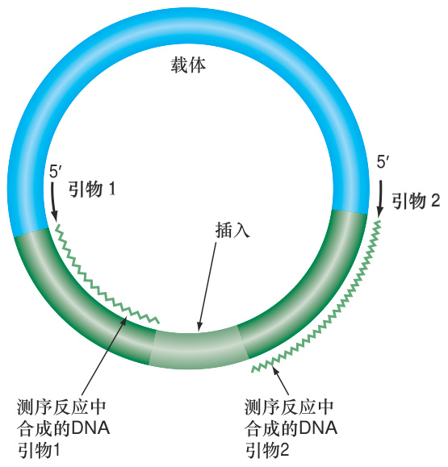  
(b)   BAC  

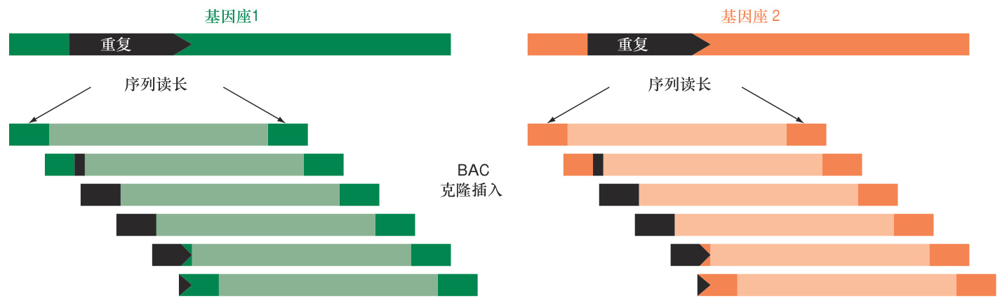  

图9.9　全基因组鸟枪测序。（a）重复元件长度超过测序读长时会阻止人类基因组鸟枪测序的组装，因为不可能知道重复序列不同拷贝两侧的哪些唯一序列（绿色或橙色）是在一起的。（b）配对末端测序法。将一个重组BAC克隆融成单链，在一个反应中与引物1杂交，在另一个反应中与引物2杂交。这些引物与载体的序列相对应，位于人类DNA插入片段的两侧。这两个引物分别与重组DNA的两条链杂交，并且是定向的，因此DNA聚合酶可以从人类DNA插入片段的两端合成DNA［注意，如（c）部分所示，插入片段的浅绿色部分实际上比深绿色部分长得多］。（c）配对末端测序允许正确组装包含重复序列的基因组，因为成对的读长将包括重复序列两侧的唯一序列。换句话说，唯一序列读长（右侧绿色或橙色的框）必须对齐，因此包含重复序列的读长（左侧绿色和黑色或橙色和黑色的框）也必须对齐。  

# 习题精解  

Ⅰ.  下图显示了质粒克隆载体pBR322的图谱，标出了氨苄青霉素（amp）和四环素（tet）抗性基因的位置，以及两个独特的限制酶识别位点（一个是EcoRI，另一个是BamHI）。用EcoRI和BamHI酶消化该质粒载体，并将大的EcoRI-BamHI载体片段纯化。同时用相同的酶消化人类基因组DNA。将质粒载体和人基因组片段混合连接后，转化一株对氨苄青霉素敏感的大肠杆菌，并选择耐氨苄青霉素的菌落。  

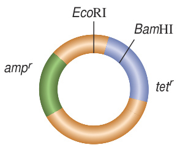  

a.  如果对所有选定的氨苄青霉素抗性菌株进行四环素抗性检测，预计结果如何？为什么？b.  为什么EcoRI位点不能位于氨苄青霉素耐药基因中？c.  绘制两个寡核苷酸引物的位置和方向示意图，用这两个引物可以对以上方法产生的任何重组DNA分子中的人类DNA插入片段的两端进行测序。  

d.  为什么用这种方式建立的文库不能代表一个基因组当量？  

# 解答  

这个问题需要理解载体，以及载体利用限制性内切核酸酶产生的黏性末端结合DNA的过程。  

a.  在大肠杆菌中复制的质粒必须是圆形的，在这种情况下，只有插入片段与切割后的载体DNA结合才能形成圆形分子。如果没有插入片段，切割后的载体是无法重新连接的，因为BamHI和EcoRI切割的黏性末端不能互补配对。因此，所有抗氨苄青霉素的菌落都含有连接到载体BamHI-EcoRI切割位点的人类DNA片段（同样含有BamHI-EcoRI末端）。在BamHI-EcoRI位点克隆的片段干扰并失活了四环素抗性基因。所有的氨苄青霉素抗性克隆都对四环素敏感。  

b.  如果氨苄青霉素抗性基因含有一个EcoRI位点，而四环素抗性基因含有一个BamHI位点，克隆的过程会同时破坏这两个基因的活性。因此，将无法选择出被重组DNA分子转化的细菌细胞。  

c.  引物必须位于人类基因组DNA插入片段的两侧（粉红色），如下图所示。  

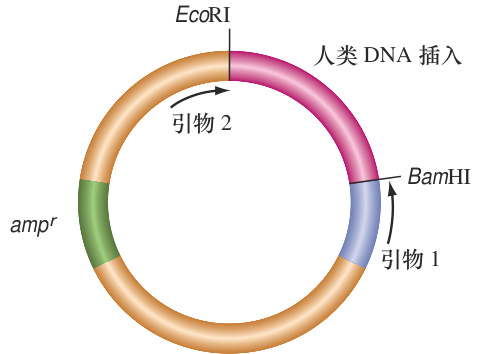  

d.  很偶然的，人类基因组的某些区域可能会连续出现两个EcoRI位点而中间没有BamHI位点，其他区域会出现两个BamHI位点而中间没有EcoRI位点。当用两种酶同时切割这些区域时，产生的片段将不会具有插入对应载体所需的两种不同的黏性末端。因此，这种方法无法将人类基因组的部分区域克隆到载体中。  

Ⅱ.  在基因组测序过程中，计算机正试图将以下6个  

DNA序列组装成重叠群（即从重叠克隆中获得的连续序列片段）：  

$5^{\prime}$ AGCAAATTACAGCAATATGAAGAGATC $3^{\prime}$ $5^{\prime}$ AAAATGCCCTAAAGGAAATGAGATTTT $3^{\prime}$ $5^{\prime}$ TGATCTCTTCATATTGCTGTAATTTGC $3^{\prime}$ $5^{\prime}$ TCCTTTTAAAAATCTCATTTCCTTTAG $3^{\prime}$ $5^{\prime}$ TACAGCAATATGAAGAGATCATACAGT $3^{\prime}$ $5^{\prime}$ AAATGCCCTAAAGGAAATGAGATTTTT $3^{\prime}$ a.  这组DNA序列代表了多少个重叠群？每个重叠群的序列是什么？  

b.  其中一些序列在重叠区域是互补的，而另一些序列虽然重叠但代表相同的DNA链。这怎么可能？  

d.  如果你有足够多的序列读长来覆盖人类基因组的所有碱基对，那么会有多少个重叠群呢？  

# 解答  

a. 有两个重叠群。  

序列1、3、5  

$5^{\prime}$ AGCAAATTACAGCAATATGAAGAGATCATACAGT $3^{\prime}$ $3^{\prime}$ TCGTTTAATGTCGTTATACTTCTCTAGTATGTCA $3^{\prime}$  

$5^{\prime}$ TCCTTTTAAAAATCTCATTTCCTTTAGGGCATTTT $3^{\prime}$ $3^{\prime}$ AGGAAAATTTTTAGAGTAAAGGAAATCCCGTAAAA $5^{\prime}$ 这些片段的编写方向并不重要。  

b.  你正在测序的是不同却重叠的DNA分子克隆。DNA克隆以随机的方向与载体连接，连接方向决定了哪条DNA链被用作模板。因此，一些序列读取相同的链但从不同的地方开始，而另一些序列读取互补链。  

c.  如果在整个30亿个碱基的人类基因组中，你只有6个短序列，那么这几个序列都随机来自基因组同一个小的区域的可能性将是微乎其微的。因此，人类基因组的6个随机序列应该不会重叠。显然，这些序列不是随机产生的，而是经过选择的（例如，这些序列可能是特定的人类DNA插入片段连接在BAC载体上制成的迷你文库中产生的）。  

d.  每个人类染色体都是一个重叠群。人类男性基因组序列有24个重叠群，女性基因组序列有23个重叠群。  

# 习题  

# 词汇  

1.  在右列中选择与左列中的术语最匹配的短语。  

a. 寡核苷酸 1. 载体上的基因用于转化体分离  
b. 载体 2. 一个给定物种的一组 DNA 片段，插入载体中  
c. 黏性末端 3. 克隆载体中的合成 DNA 元件，含有唯一的限制性位点用于外源 DNA 插入  
d. 重组 DNA 4. 单链 DNA 分子之间的紧密结合  
e. 双脱氧核糖核苷 5. 利用分子大小分离 DNA 的方法三磷酸  
f. 基因组文库 6. 在复制期间被 DNA 聚合酶延伸的寡核苷酸  
g. 基因组当量 7. 含有来自两个生物的遗传物质  
h. 凝胶电泳 8. DNA 片段的数量，其聚合长度足以包含一个特定生物体的整个基因组  
i. 可选择性标记 9. 在限制性片段末端发现的短的单链序列  
j. 杂交 10. 一个可以被仪器合成的短的DNA 片段  
k. 引物 11. DNA 链终止单元  
l. 多位点人工接头 12. 用于运输、复制和纯化 DNA 片段的 DNA 分子  

在解决本章的问题时，除非另有说明，做一个简单的假设：碱基对序列是随机的，并且A-T和G-C碱基对的数目是相等的。  

# 9.1节  

2.  下面列出的每种限制性内切核酸酶：  

（i）用以下酶消化人类基因组（ $3\times{10}^{9}$ 个碱基）约产生多少限制性片段？（ii）估算以下酶消化产生的人类基因组片段的平均长度。（iii）说明用下列限制性内切核酸酶消化产生的人类DNA片段的末端是具有5′突出的黏性末端，还是3′突出的黏性末端或平端？（iv）如果这种酶产生黏性末端，那么在人类基因组的所有片段上产生的所有末端的突出是否都是相同的？（每个酶的识别序列用括号表示，5′端写在左边。N表示四种核苷酸中的任一种；R是嘌呤，即A或G；Y是嘧啶，即C或T。^表示切割位点）。  

a. Sau3A （^GATC）b. BamHI （G^GATCC）c. HpaII （C^CGG）  

d. SphI （GCATG^C）  
e. NaeI （GCC^GGC）  
f. BanI （G^GYRCC）  
g. BstYI （R^GATCY）  
h. BslI （CCNNNNN^NNGG）  
i. SbfI （CCTGCA^GG）  

3.  图9.2中限制性片段平均大小的计算是基于假设：DNA中的四种核苷酸是均等的。然而，许多基因组在一定程度上富集了某些核苷酸。举个例子，人类基因组含有 $29.6\%$ A、 $29.6\%$ T、 $20.4\%$ C和 $20.4\%$ G。有了这些更准确的信息，对前面习题2中用酶（ $\mathrm{a\!\sim\!i}$ ）切割人类基因组所产生片段的平均大小进行重新估算。  

4.  用EcoRI完全消化以下DNA序列（ $5^{\prime}$ G^AATTC $3^{\prime}$ ）。这个反应会产生多少个DNA分子？写出所产生的DNA分子的完整序列（从 $5^{\prime}{\rightarrow}3^{\prime}$ 的方向）。与随机核苷酸序列构成的DNA相比，这个序列哪里很不寻常（尽管并非不可能）？$5^{\prime}$ AGATGAATTCGCTGAAGAACCAAGAATTCGATT $3^{\prime}$ $3^{\prime}$ TCTACTTAAGCGACTTCTTGGTTCTTAAGCTAA $5^{\prime}$  

5.  为什么在电泳过程中，较长的DNA分子比较短的DNA分子移动得慢？  

6.  需要不同平均孔径的琼脂糖凝胶来分离不同大小的DNA分子。例如，与8500bp和8600bp片段的最佳分离相比，1100bp和1200bp片段的最佳分离需要平均孔径更小的凝胶。你认为科学家们是如何制备不同的平均孔径凝胶的？（提示：琼脂糖凝胶的制作方法与果冻等凝胶甜点类似）  

7.  下图为两种不同的限制性内切核酸酶消化的两种DNA样品，凝胶电泳显示溴化乙锭染色带。其中一种是人类基因组DNA，另一种是能感染大肠杆菌的一种噬菌体（细菌病毒）的小基因组。其中一个限制性内切核酸酶是EcoRI（ $5^{\prime}$ G^AATTC $3^{\prime}$ ），另一种是HpaII（ $5^{\prime}\;{\mathrm{C}}{^{\wedge}}{\mathrm{CGG}}\;3^{\prime}$ ）。对于凝胶（ $\mathbf{A}{\sim}\mathbf{D}$ ）上的四个通道，确定所分析的是两个DNA样本中的哪一个，以及使用了哪个限制性内切核酸酶来消化该DNA。箭头表示电泳方向。  

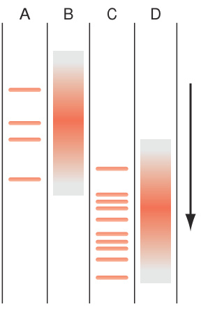  

8.  线性噬菌体λ的基因组DNA的两端各有一个20个碱基的单链延伸（这些是黏性末端，但不是由限制性内切核酸酶消化产生的）。这些黏性末端可以连接形成一个环形的λDNA。在一系列单独的试管中，线性或环形的DNA被EcoRI、BamHI或两种酶的混合物完全消化。结果显示如下。  

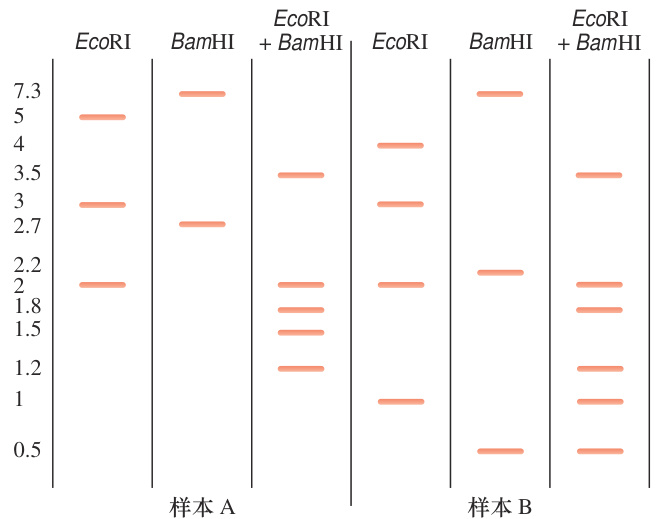  

a.  哪个样本（A或B）代表环状DNA分子？你如何知道？  
b. 线性λDNA分子的总长度是多少？  
c. 环状λDNA分子的总长度是多少？  
d.  画出环状和线性λDNA分子的示意图，标出EcoRI和BamHI位点的位置。  

9.考虑部分限制性消化的情况，基因组DNA暴露在有限数量的限制性内切核酸酶环境中一个非常短的时间内。  

a.  产生的片段是更长还是更短，还是与完全消化产生的片段大小相同？  

b.  如果你从含有数百万细胞的组织样本中制备基因组DNA，这些细胞的DNA部分消化产生的片段是相同的还是不同的？  

10.  本章提到，分子生物学家们已经开发出了高超的技术，可以将任何类型的DNA末端转换成任何其他类型的DNA末端。在这个问题中，考虑到基因组DNA被机械剪切成随机的片段。这些片段有些是平末端的，有些具有5′端突出，其他的具有3′端突出。  

a.  任何一个基因组DNA片段的两端必须是同一类型吗？  

b. 解释为什么5′或3′端的突出不是黏性末端。c.  研究人员可以使用DNA聚合酶（加上4种dNTP）或核酸酶S1将带有突出的末端转化为平末端，后者能够降解DNA的单链区域，但不能降解双链区域。DNA聚合酶可以将哪种类型的突出末端（ $5^{\prime}$ 或 $\mathbf{\omega}^{3^{\prime}}$ ）转化为平端？如果是S1核酸酶呢？  

# 9.2节  

11. a. 分子克隆的目的是什么？b. 载体中可选择标记起什么作用？c. 质粒载体中复制起点的作用是什么？d. 克隆载体为什么有多位点人工接头？  

12.  下列哪一种酶是合成重组DNA分子所必需的？ 这些酶在这个过程中的作用是什么？  

a. DNA聚合酶b. RNA聚合酶c. 限制性内切核酸酶d. DNA连接酶e. 氨酰-tRNA合成酶f. 肽酰转移酶g. 反转录酶  

13.  两种不同的限制性内切核酸酶是否有可能将人类基因组切成完全相同数量的片段，且片段大小分布也完全相同（这两种酶产生的片段末端不能被DNA连接酶连接在一起）？请解释一下。  

14.  一个质粒载体pBS281被BamHI切割（ $5^{\prime}$ G^GATCC$3^{\prime}$ ），该酶只识别DNA分子中的一个位点。人类DNA被MboI消化（ $\mathbf{\Sigma}^{5^{\prime}\,\wedge}\mathbf{GATC\}3^{\prime}$ ），该酶在人类DNA中有多个识别位点。现在将这两个被消化的DNA连接在一起。只考虑那些与人类DNA片段结合的pBS281分子。关于这两种DNA分子之间的连接，回答以下问题。  

a.  在pBS281与所有可能的人类DNA片段之间的连接中，MboI能够切割的比例是多少？  
b.  在pBS281与所有可能的人类DNA片段之间的连接中，BamHI能够切割的比例是多少？  
c.  在pBS281与所有可能的人类DNA片段之间的连接中，XorII能够切割的比例是多少？（ $5^{\prime}$ C^GATCG $3^{\prime}$ ）  
d.  在pBS281与所有可能的人类DNA片段之间的连接中，BstYI能够切割的比例是多少？（ $5^{\prime}$ R^GAT-CY 3′）（R和Y分别代表嘌呤和嘧啶）  
e.  在人类染色体DNA的切割位点不是BamHI的情况下，能被BamHI切割的比例是多少？  

15.  用一个长度为4271bp的pMBG36的质粒载体构建重组DNA分子。pMBG36质粒包含一个多位点人工接头，含有一些限制性内切核酸酶的唯一位点，包括BamHI（ $5^{\prime}$ G^GATCC $3^{\prime}$ ）和EcoRI（ $5^{\prime}$ G^AATTC$3^{\prime}$ ）。pMBG36的多位点人工接头的序列如下图所示，图中的点表示大部分没有显示的载体区域。现在用EcoRI切割pMBG36载体，然后插入之前习题4中同样用EcoRI切割的DNA片段。  

$5^{\prime}$ ...CGGATCCCCTAAGATGAATTCCGCGCGCATCGGC.. $3^{\prime}$   
3′ ...GCCTAGGGGATTCTACTTAAGGCGCGCGTAGCCG.. $5^{\prime}$   
a.  尽可能地写出合成的重组DNA分子的DNA序列。有两种可能的答案，只需要展示一个。  
b. 为什么题目a有两种可能的答案？  
c.  在题目a 答案的重组D N A 分子中，有多少个BamHI的识别位点？  
d.  如果用BamHI切割这个重组DNA分子并将切割物跑电泳，会看到多少条带？它们的大小是多少？  
e.  在题目a答案的重组DNA分子中，有多少个EcoRI的识别位点？  
f.  如果用EcoRI切割这个重组DNA分子并将切割产物跑电泳，会看到多少条带？它们的大小是多少？  

16.  假设正在使用的一个质粒克隆载体的多位点人工接头上没有EcoRI位点（ $5^{\prime}$ G^AATTC $3^{\prime}$ ），因为载体上特殊的耐药性基因中包含EcoRI位点。  

a.  如何使用以下两种寡核苷酸（和连接酶）将一段EcoRI的插入片段连接到BamHI位点（ $5^{\prime}$ G^GATCC $3^{\prime}$ ）切割的载体中？  

$5^{\prime}$ GATCCGGGGGGGGGG $3^{\prime}$ $5^{\prime}$ AATTCCCCCCCCCCG $3^{\prime}$ b.  重组DNA包含多少个EcoRI位点？包含多少个BamHI位点？  

c.  在题目a中，使用了两个寡核苷酸来产生所谓的接头。接头也可以用于将平末端插入片段与黏性末端酶切割的载体连接在一起。设计一个接头，允许将平末端插入片段连接到载体的多位点人工接头的BamHI位点上。  

（注：两个平末端的DNA片段可以连接在一起，尽管反应的效率远远低于黏性末端连接）  

17.  作为一名专门研究金鱼草的分子生物学家和园艺家，你已经决定建立一个基因组文库来描述金鱼草花色基因的特征。  

a.  你希望文库中有多少个基因组当量，能保证在$95\%$ 的可信度条件下，拥有包含你文库中每个基因的克隆？  
b.  为了筛选得到这个数量的基因组当量，如何确定独立克隆的数量？  

18.  假设你正在构建BAC载体的人类基因组文库，其中人类DNA片段平均为 $100\,000\mathrm{bp}$ 。  

a.  你需要构建的重组BAC的最小数目是多少，才能有大于零的机会拥有一个完整的文库——也就是说该文库代表整个基因组？  

下面这个简单的统计公式可以确定一个基因组文库的大小（即需要得到的独立重组克隆的数量），以确定文库代表了整个基因组的可能性。  

$$
N=\frac{\ln\left(1-P\right)}{\ln\left(1-f\right)}
$$  

式中， $N$ 为独立重组克隆数； $P$ 是基因组中任何特定部分至少出现一次的概率； $f$ 是单个重组克隆中的基因组片段（注：ln是自然对数，有时也写作$\mathrm{log_{e}}$ ）。  

b. 计算题目a中描述的基因组文库的f值。  

c.  需要多少个不同的重组BAC克隆才能有 $99\%$ 的概率代表基因组中特定的 $100\,000{\mathrm{bp}}$ 区域？如果是$99.9\%$ 的概率呢？  

e.  假设将人类DNA插入片段与BAC载体连接后转化大肠杆菌，发现只有3万个耐药克隆被重组质粒转化。基因组中任一特定的 $100\,000\,\mathrm{bp}$ 区域在重组质粒中出现的概率是多少？  

f.  如果想构建一个完整的人类基因组文库，包含尽可能少的独立重组克隆，应该调整的关键变量是什么？  

利用质粒载体进行分子克隆的一个难点是酶切载体可以在不插入基因组DNA的情况下被DNA连接酶重新封闭。接下来的两个问题探讨了解决方法。  

19.  大肠杆菌的lacZ基因编码β-半乳糖苷酶，可催化一种无色化合物X-gal转化为蓝色的产物。分子生物学家利用了这一特性，构建了包含lacZ基因的质粒载体，基因中间有一个EcoRI位点（见下图）。在用EcoRI切割这个载体后，科学家将其与EcoRI消化的人类基因组DNA连接起来，将合成分子转化到对氨苄青霉素敏感的大肠杆菌细胞中，并将这些细胞置于含有氨苄青霉素和X-gal的平板上。在这个平板上生长的一些菌落是白色的，而另一些是蓝色的，为什么？  

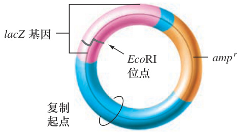  

20.  你的本科研究导师给你布置了一项任务：插入一个EcoRI消化的青蛙DNA片段到习题19所示的载体中。导师建议你用EcoRI消化质粒之后，应该用碱性磷酸酶处理质粒。这种酶去除可能位于DNA链5′端的磷酸基。然后将青蛙DNA的片段添加到载体中，并用DNA连接酶将两者连接起来。  

你不太明白导师的推理，所以你做了两个连接反应：一个是用碱性磷酸酶处理的质粒，另一个没有这样处理。除此之外，连接混合物都是一样的。连接反应完成后，用连接的一小部分产物转化大肠杆菌，并将细菌涂布在含有氨苄青霉素和X-gal的平板上。第二天，你在用碱性磷酸酶处理过的质粒平板上观察到100个白色菌落和1个蓝色菌落，在未用碱性磷酸酶处理过的质粒平板上观察到100个蓝色菌落和1个白色菌落。  

a. 解释两个平板上看到的结果。  

b. 为什么导师的建议是好的？  

c.  为什么通常用碱性磷酸酶处理质粒载体，而不是用连接的DNA片段？  

# 9.3节  

21.  下列哪种酶是DNA测序所需要的？这些酶在该过程中的作用是什么？  

a. DNA聚合酶b. RNA聚合酶c. 限制性内切核酸酶d. DNA连接酶e. 氨酰-tRNA合成酶f. 肽酰转移酶g. 反转录酶  

22.  使用引物 $5^{\prime}$ GCCTCGAATCGGGTACC 3′对质粒载体制成的重组DNA分子的部分人类DNA插入片段进行测序。这里显示了自动化DNA序列分析的结果。峰的高度并不重要。（ $\mathrm{A}{=}$ 绿色； $C{=}$ 紫色； $\mathrm{G}\mathrm{=}$ 黑色；$\mathrm{T}=$ 红色）  

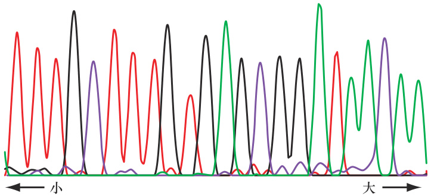  

a.  写出你能确定的所有人类DNA核苷酸的序列，指出该序列的 $5^{\prime}{\rightarrow}3^{\prime}$ 方向。b.  你在题目a中写出来的序列是测序反应中合成的  

新DNA链的一部分，还是所使用的模板链的一部分？  
c.  如何设计测序反应所需的引物？ 以图9.7为指导，绘制待测序的重组DNA分子图，说明人和载体的序列、引物的位置和方向，以及在测序反应中将合成的新DNA的位置和方向。  
d.  展示测序反应中合成的最小DNA分子的全部序列，该分子含有双脱氧鸟嘌呤（ddG），指出该分子的 $5^{\prime}{\rightarrow}3^{\prime}$ 方向和ddG的位置。  
e.  如果不小心将dATP遗漏在反应之外，那么数据将有何不同？  

# 9.4节  

23. a.  若要使基因组文库对整个基因组测序有用，为什么通常会通过机械剪切力（如超声）来分割基因组DNA，而不是用限制性内切核酸酶？b.  假设需要建立一个基因组文库来确定一个新发现的生物体基因组的完整序列，但是没有现成的超声破碎仪。解释如何使用两种或两种以上的限制性内切核酸酶来建立文库，其克隆可以被测序以便计算机组装基因组序列。c.  假设只有一种限制性内切核酸酶，想要建立一个基因组文库用于组装基因组序列。如何才能达到这个目标呢？（提示：见习题9）为了构建这个文库，最好使用识别四碱基、六碱基还是八碱基DNA序列的限制性内切核酸酶呢？  

24.  习题15展示了质粒载体pMBG36的部分序列。假设将EcoRI消化的一个基因组的片段插入到EcoRI消化的pMBG36载体中来构建一个基因组文库。写出两个不同的引物序列，可以用它们（在不同的反应中）对库中所有克隆的两端进行测序。根据所给的信息，这些引物应尽可能长。  

25.  真核生物基因组充满了重复序列，这使得用序列组装基因组变得困难。例如，CTCTCTCT... 这样的序列（双核苷酸序列CT的串联重复）存在于许多染色体区域，每个位置的CT重复单元的数量不定（n）。尽管有这些困难，科学家们仍然可以使用图9.9所示的配对末端的测序策略来组装基因组。换句话说，它们可以通过定义基因组插入片段的大小来创建文库，然后对单个克隆的两端进行测序。  

下列是在一个基因组计划中分析的来自6个克隆片段的12条DNA序列。1 A和1 B代表克隆1的两端序列，2 A和2 B代表克隆2的两端序列，依此类推。克隆 $1\!\sim\!4$ 来自一个基因组插入片段的长度约为2kb的文库，而克隆5和6的插入片段长约4kb。所有这  

些序列的5′端都在左边而3′端在右边。为了简化分析，假设这些序列一起代表了两个基因组位点（基因座、单基因座）每个位置包含一个(CT)n重复，并且这12条序列中的每一条序列仅与另外一条序列重叠。  
1A:  CCGGGAACTCCTAGTGCCTGTGGCACGATCCTATCAAC  
1B:  AGGACTCTCTCTCTCTCTCTCTCTCTCTCTCTCTCTCT  
2A:  GTTTTTGAGAGAGAGAGAGAGAGAGAGAGACCTGGGGG  
2B:  ACGTAGCTAGCTAACCGGTTAAGCGCGCATTACTTCAA  
3A:  CTCTCTCTCTCTCTCTCTCTCAAAAACTATGGAAATTT  
3B:  TAGTGATAGGTAACCCAGGTACTGCACCACCAGAAGTC  
4A:  GGCCGGCCGTTGTTGACGCAATCATGATTTAATGCCG  
4B:  TCATGGGAGAGAGAGAGAGAGAGAGAGAGAGAGAGAGA  
5A:  TAGTGCCTGTGGCACGATCCTATCAACTAACGACTGCT  
5B:  AAGGAAAGGCCGGCCGTTGTTGACGCAATCATGATTT  
6A:  CAGCAGCTAGTGATAGGTAACCCAGGTACTGCACCACC  
6B:  GGACTATACGTAGCTAGCTAACCGGTTAAGCGCGCATTa.  画出两个基因座的模式图，显示重复DNA的位置，以及12条DNA序列的相对位置和方向。b.  如果可能的话，指出两个基因座各含有多少CT重复单元。c.  这些数据是否与另一种假设相符，即这些克隆实际上代表一个基因座的两个等位基因，它们在CT重复单元数量上有何不同？  