# 第 13 章 染色体重排和染色体数目的变化  

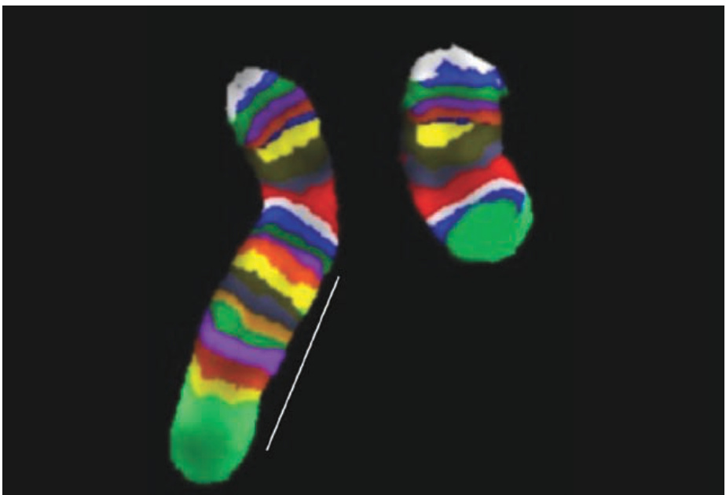  

多色染色体条带是一种 FISH 技术，形成了染色体条码，这些条码能够识别主要的染色体重排。不同颜色代表了区域特异的探针，这些探针标记了不同的荧光标签。左边是一个条码标记的正常人 5 号染色体。右边的 5 号染色体有一个很大区域的缺失，这段区域在左边染色体上旁边用白线标注。  

承蒙© Dr. Ilse Chudoba, MetaSystems GmbH提供  

# 章 节 大 纲  

13.1 染色体 DNA 重排  
13.2 重排的效应  
13.3 转座遗传元件  
13.4 染色体数目畸变：非整倍体  
13.5 染色体组数目的变异：整倍体  
13.6 基因组重组和进化  

大量物种全基因组序列的比较分析表明，染色体重排是进化的一个主要特性。例如，每个小鼠的染色体中有很多人染色体的碎片，反之，人染色体中也有鼠的片段。举一个例子，小鼠1号染色体中就有人1号、2号、5号、6号、8号、13号和18号染色体的大片段（图13.1中用不同颜色呈现）。这些片段代表了同线片段，这两个基因组上，这些同线片段的基因ID、顺序和翻译方向都几乎是一致的。原则上，科学家可以将人基因组打碎成342个片段，每个片段平均长度大约为16Mb，然后以不同的顺序再粘贴起来，从而重构小鼠的基因组。图13.1详细注明了1号染色体的这个过程；第10章中的图10.15则标注了小鼠和人整个基因组的同源关系。  

这些发现有助于我们理解复杂生命形式是如何演化的。虽然小鼠和人是大约6500万年前从同一个祖先分化而来的，但是这两个基因组许多区域的DNA序列却非常相似。这样我们就可能来假设小鼠和人的共同祖先，基因组染色体断裂，断裂的片段以新的方式重新连接起来，通过一系列（大概300个）这样的重塑事件，从而进化出了小鼠和人现在的基因组。这些染色体重排一部分发生在一个分支上，形成了小鼠；另外一个分支则形成了人。核苷酸差异和基因组结构的差异因此成为造成这两个物种间区别的原因之一。  

本章中，我们讲解了两种能够重构基因组的事件：$\textcircled{\scriptsize{1}}$ 重排，能在一个或者更多染色体中重排DNA序列；$\textcircled{2}$ 染色体数目变化，是整个染色体的丢失或者获得，或者染色体套数的变小或者增加。重排和染色体数目变化也许会通过在一个细胞内改变基因的位置、顺序或者数目，来影响基因活性或者基因的转运。这种变化经常但不总是导致遗传不平衡，这种遗传不平衡对于物种或者其后代是有害的。  

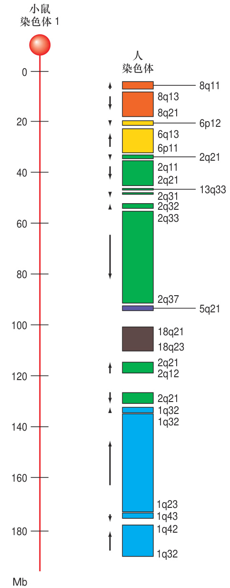  
图13.1　比较小鼠和人基因组。小鼠1号染色体包含了人1号、2号、5号、6号、8号、13号和18号染色体的大片段（不同颜色）。箭头标示序列区块在人染色体上的相对方向。  

我们可以确定染色体变化现象背后的两个主要主题。第一，染色体组型图一般在一个物种内是一致的，这并不是因为重排和染色体数目变化很少发生（事实上它们相当普遍），而是因为这些变化所产生的遗传不稳定性和不平衡通常会让个体细胞或者物种和它们的后代处于选择劣势。第二，尽管染色体变异存在选择，相关物种几乎总是有不同的染色体核型，紧密相关的物种只有有限的重排（如大猩猩和人），遗传距离更远的物种则会有更多重排区别（如小鼠和人）。这些发现表明，核型重排和新物种的进化之间存在显著的相关性。  

# 13.1 染色体DNA重排  

# 学习目标  

1. 总结四种主要的染色体重排。  
2. 解释染色体重排发生的两种主要机制。  
3. 描述研究者检测重组的方法。  

所有的染色体重排都改变了DNA序列（表13.1）。一些重排通过移除或者增加碱基对（分别对应某一特定染色体区域的缺失和重复），可以改变DNA序列。其他一些重排则是跳到染色体另外一个位置上，其间并没有改变它们内部的碱基数目（倒位，某个染色体区域的半圆旋转；相互易位，两个非同源染色体相互交换成分）。本章聚焦于可遗传的重排，即通过生殖系从一代传到下一代，但是这也说明体细胞基因组可以承受碱基数目或者顺序的改变。例如，“快进”信息栏“程序性DNA重排和免疫系统”阐述了人类免疫系统的正常发育是如何依赖于特定体细胞基因组的非遗传、程序化重排的。  

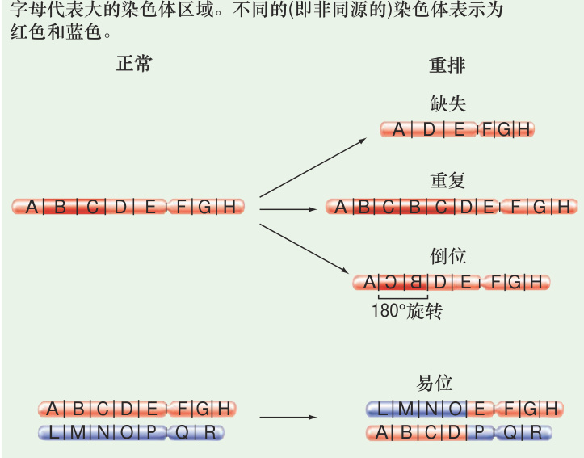  
表13.1　主要染色体重排的种类  

本节中，我们首先解释了可遗传染色体重排如何出现，以及科学家如何才能追踪到它们的存在。然后我们讨论了每一种重排如何创造突变体表型，以及如何影响染色体的行为。最后，我们阐释了遗传学家如何在遗传研究中发掘重排作为工具的存在。  

# 13.1.1 DNA断裂或者重复序列间的不合法交 换导致了染色体重排  

缺失、倒位、重复和相互易位最经常通过以下一个或者两个事件成为现实：染色体断裂（例如，第7章中提到的X射线会产生染色体断裂）；或者在重复DNA序列位置上产生的异常重组。  

假如一个染色体发生了两次双链断裂，两个断裂间的片段将会丢失，接着DNA修补会将剩下的断点接续起来，从而导致缺失的发生［例如，第7章提到过的非同源断点融合（NHEJ）］［图13.2（a）］。如果中间这段涉及的片段再粘贴回染色体，但是却旋转了 $180^{\circ}$ ，那么这时倒位就产生了［图13.2（b）］。两个同源染色体或者姐妹染色单体在不同位置上发生了断裂，如果断裂的染色体末端，在DNA修补以将它们粘到一起之前，位置发生了改变，那么将会导致一个缺失和一个重复［图13.2（c）］。最后，两个非同源染色体的断裂，如果断裂末端在修补和融合之前交换位置，那么就可以产生相互易位［图13.2（d）］。  

同一个染色体或者两个不同染色体上重复序列间发生异常交换事件是极少见的，虽然它们也可以产生重排。重复序列也许是串联重复，就像是简单序列重复（SSR）；回忆一下，SSR基因座拥有相同的重复序列，在基因组多个不同位置上都存在，它们提供了序列相似性，可以被重组酶所识别。另外，重复序列可以是转座元件。就像本章随后将会解释的那样，转座元件是DNA序列，它们的拷贝从一个地方移到另外一个地方。一个简单的基因组也许拥有这个元件数以十万计的拷贝。  

同一个染色体不同位置上，如果重复序列的方向是相同的，那么这一序列重复间的交换会导致缺失［图13.3（a）］，或者如果重复序列方向相反，就会产生倒位［图13.3（b）］。如果两个同源染色体在重复序列上错误匹配，并且发生交换，结果会产生一个缺失和一个重复［图13.3（c）］。两个非同源染色体上一个重复序列的交换会产生相互易位［图13.3（d）］。  

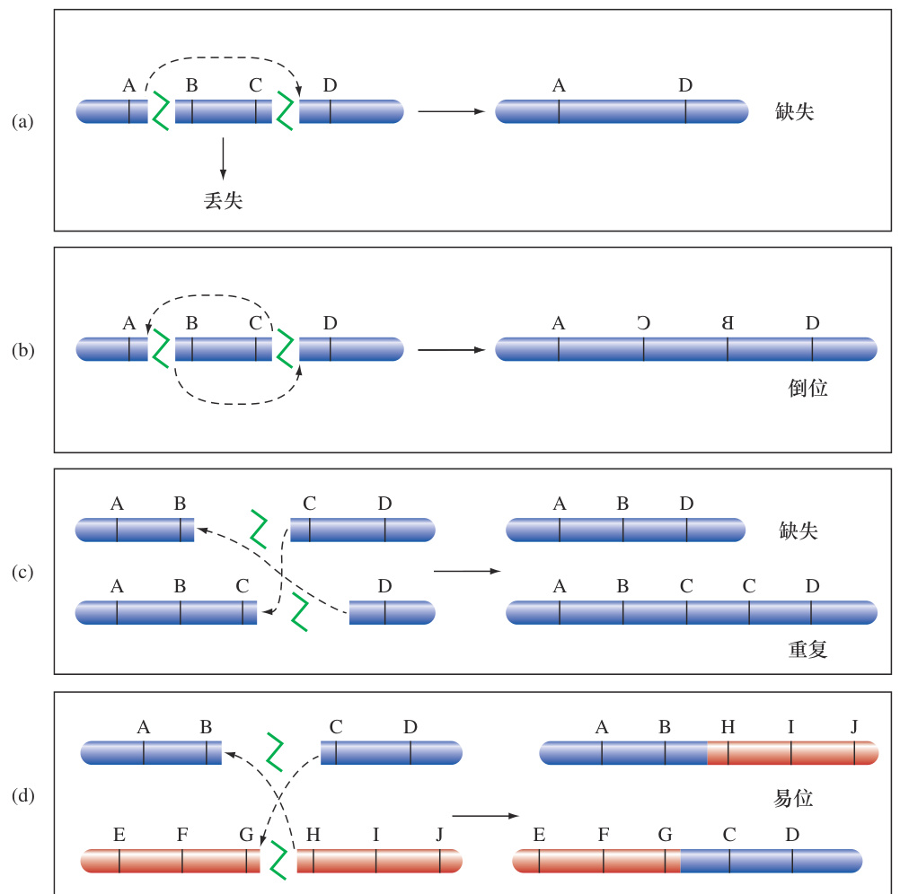  
图13.2　染色体断裂和随后DNA修补会导致各种染色体重排。（c）中的染色体可以是同源的或者是姐妹染色单体。（d）中蓝色和红色染色体是非同源的。字母标示染色体基因座。  

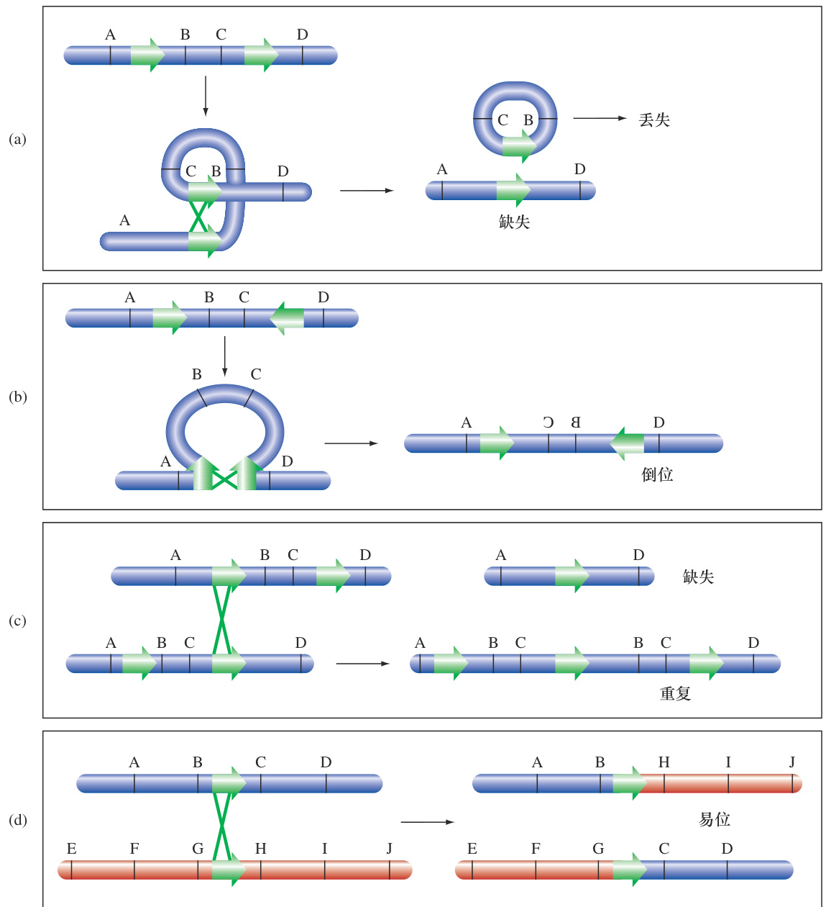  
图13.3　重复序列的异常交换也会产生重排。绿色箭头指示重复序列和其相对方向。重复DNA序列也是简单序列重复（SSR），或者是转座元件。（c）中的染色体可以是同源染色体或者姐妹染色单体。（d）中的红色和蓝色染色体是非同源的。  

# 13.1.2 几个方法可以检测染色体重排  

遗传学家需要有效的工具来确定个别基因组是否包含染色体重排，以便确切定义基因是否发生了重排，并追踪重排在细胞或者个体的各代间的传递。一些技术使得科学家可以大概知道重排的存在和粗略位置，也有其他一些技术可以在分子水平上检测重排DNA。  

荧光原位杂交（FISH）技术经常提供第一手重排存在和类型的证据。回想一下第12章的FISH，基因组DNA探针结合到荧光标签，与染色体上的互补序列杂交。其中一个FISH分析称为光谱核型分析（SKY），探针将染色体染成不同的颜色［见图12.9（b）］。图13.4呈现了一个类似的染色体染色分析，其中探针只针对两个染色体，它们之间有一个相互易位。还有一个更精细的技术，叫做多色染色体条带，染色体特定区域特异的FISH探针会产生染色体条码。本章开头那个图就  

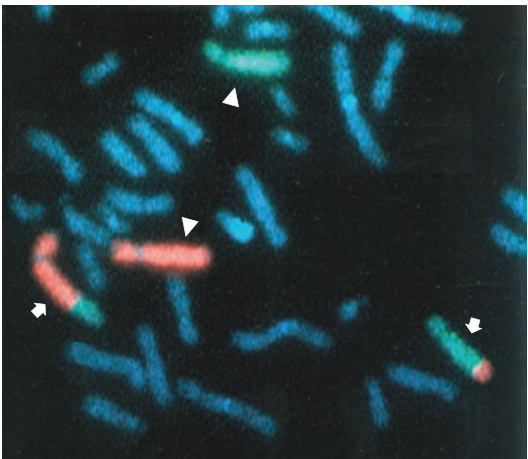  
图13.4　染色技术显示染色体的相互易位。利用FISH技术分析显示一个人的相互异位的杂合子。两个相互易位的染色体被染成红色和绿色（箭头）。两个正常的、非易位的染色体被完全染成红色或完全染成绿色（箭号）。$\copyright$ Lisa G. Shaffer, Ph.D./Baylor College of Medicine  

# 快进  

# 程序性DNA重排和免疫系统  

人类免疫系统的惊奇之处在于其特异性和多态性。它包括几乎一万亿个B淋巴细胞，特异化的白细胞产生了超过10亿种不同的抗体（也称为免疫球蛋白或者Ig）。但是，每个B细胞产生的抗体只针对一个细菌或者病毒的蛋白质（在免疫反应中称之为抗原）。抗体结合到抗原上，能够帮助身体攻击和抵消入侵的病原体。  

抗体反应的一个奇妙问题是：一个基因组只有2万 ${\sim}3$ 万个基因，但是却编码10亿种不同的抗体？答案是，程序化的基因重排，再加上体细胞突变和不同大小多肽各种配对，这样就可以大致产生10亿种特异性结合，而这都只是来自于少得多的若干基因。为了理解这种多态性的机制，有必要知道抗体是如何组装的，以及B细胞如何表达抗体编码基因，并且决定特异性抗原结合位点。  

# 抗体形成产生特异性和多态性的遗传学  

所有的抗体分子都由相同基础分子单位的一个或者多个拷贝组成。四个多肽组成这个单位：两个相同的轻链和两个相同的重链。每个轻链都跟一个重链配对（图A）。每个轻链和每个重链都有一个不变图A　抗体特异性是如何从分子结构中产生的。两个重链和两个轻链通过二硫键（–S—S–）连接在一起，构成抗体分子的基本单位。重链和轻链的N端附近都有可变（V）结构域（黄色），它们相互关联形成抗原结合位点。在抗体分子之间，V结构域内氨基酸的“高变”区段变化很大。每个链的其余部分由一个C（保守）结构域（蓝色）组成；重链还包括几个子结构域（ $\mathrm{C_{H1}}$ 、铰链区、 $\mathbf{C}_{\mathrm{H}2}\mathcal{\vec{K}}\mathbb{I}\mathbf{C}_{\mathrm{H}3}$ ）。  

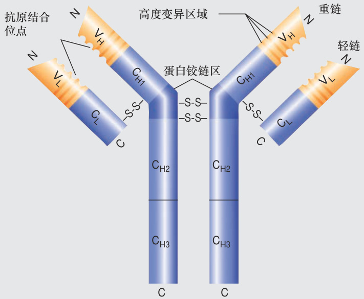  

（C）域和一个可变（V）域。重链的C域决定了抗体是5种主要种类的哪一类（特定的IgM、IgG、IgE、IgD和IgA），这影响了一个抗体在哪个地方以及如何发挥功能。例如，IgM抗体在免疫反应中很早就形成了，定位在B细胞膜上；IgG抗体随后出现，分泌到血清。轻链和重链的C域并不参与决定抗体的特异性；而轻链和重链的V域合起来，一起形成一个抗原的结合位点，这确定了抗体的特异性。  

重链所有域的DNA都在14号染色体上（图B）。这个重链基因区域由超过100个V编码片段组成，每个片段前面都有一个启动子、几个D（指向多态性）片段、若干J（指向结合）片段和9个C编码片段，这9个片段前面有一个增强子（一段短DNA片段，能帮助转录起始；更多细节参看第17章）。所有生殖细胞和大多数体细胞中，包括那些即将成为B淋巴细胞的细胞，这些不同的基因片段在染色体上相距甚远。虽然如此，但是在B细胞发育过程中，体细胞重排，随机将个别V、D和J片段排列到一起，形成特别变化的区域，随后会被转录出来。这些重排也会将新形成的变异区域放到C片段和其增强子旁边，然后进一步将启动子和增强子放到邻近位置，这样就可以转录重链基因了。RNA剪切从初级转录物中移除内含子，形成一个成熟的mRNA，其编码一个完整的重链多肽。  

体细胞重排在B细胞中随机组合V、D、J和C片段，这样就允许表达一个，而且仅仅只有一个特异的重链。没有重排，抗体基因表达无法实现。随机体细胞重排也产生真实的表达轻链的基因。体细胞重排可以表达抗体，通过基因元件的随机选择和再结合，也产生了大量结合位点的多态性。  

其他一些机制也增加了多态性。首先，每个基因的DNA元件并不是精确地结合到一起，这是由于剪切和拼接酶有时候会在片段结合处修剪DNA或者加碱基上去。这种不精确的结合能帮助创造高度变异的区域，见图A。其次，重排基因的V区中随机体细胞变异增加了抗体V域的变异度。最后，在每个B细胞，一个特异的H链的两个拷贝都来自随机DNA重排，特异L链的两个拷贝也是来自随机DNA重排，它们结合到一起形成的分子就带了一个特异的、独有的结合位点。事实上，任何轻链都可以与任何重链配对，使得抗体类型的潜在多态性呈指数型增长。例如，如果有$10^{4}$ 种不同轻链和 $10^{5}$ 种不同重链，那么将会有 $10^{9}$ 种可能的不同组合。  

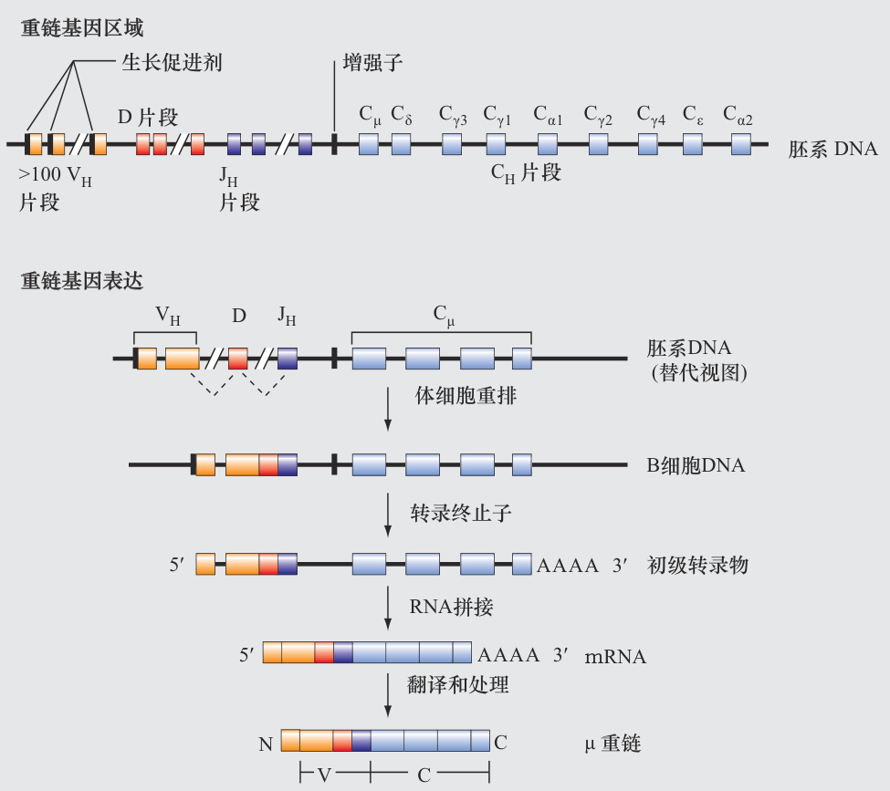  

图B　14号染色体重链基因区域。胚系细胞（以及所有不产生抗体的细胞）的DNA包含超过100个 $\mathbf{V}_{\mathrm{H}}$ 片段，大约20个D片段，6个 $\mathbf{J}_{\mathrm{H}}$ 片段和9个 ${\mathcal{{C}}}_{\mathrm{H}}$ 片段（顶行）。每个 $\mathbf{\nabla}\mathbf{V}_{\mathrm{H}}\mathcal{{K}}|\mathbf{C}_{\mathrm{H}}$ 片段由两个或多个外显子组成，如第二行相同DNA的替代视图所示。在B细胞中，体细胞将随机的、独立的 $\mathbf{V}_{\mathrm{H}}$ 、D和 $\mathrm{J_{H}}$ 片段重组在一起。从新构建的重链基因得到的原始转录本随后被剪接成成熟的mRNA。通过在IgM抗体中发现的重链mRNA翻译形成μ重链。在B细胞发育后期，其他重组（图中未显示）连接相同的V-D-J变量区域的其他 $C_{\mathrm{H}}$ 片段，如 $C_{\delta}$ 等部分，以允许其他抗体类的合成。  

# 抗体基因重排的酶创造的错误可以导致肿瘤  

RagⅠ和RagⅡ是两个酶，它们与抗体基因中的DNA序列互作，帮助催化刚刚描述的重排。虽然如此，但是在进行重排的活动中，有时候这些酶会出错，从而导致人8号和14号染色体之间发生相互的易位。发生易位之后，14号染色体重链基因的增强子正好位于8号染色体c-myc基因旁边。在正常情况下，$c$ -myc基因合成一个转录因子，在细胞周期中以适当的时间和速率激活其他在细胞分裂中活跃的基因。虽然如此，但是抗体基因增强子的易位加速了c-myc基因的表达，这导致拥有易位的B细胞的分裂失去了控制。这个不受控制的B细胞分裂导致了一种肿瘤，即伯基特淋巴瘤（图C）。  

因此，虽然程序化的基因重排对于健康的免疫系统的正常发育是很必要的，但是重排机制的失效则会促进疾病。  

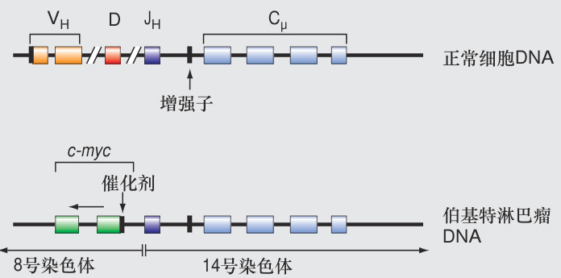  

图C　错误导向的易位会帮助导致伯基特淋巴瘤。一个特别的伯基特淋巴瘤患者的DNA中，一个易位使得 $c$ -myc基因的转录位于 ${\mathbf{\nabla}}\cdot{\mathbf{C}}_{\mu}$ 旁边的增强子。结果，B细胞产生不正常的高水平c-myc蛋白。很明显，RagⅠ和RagⅡ酶错误地将一个 $\mathbf{\nabla}\cdot\mathbf{J}_{\mathrm{H}}\,$ 片段连接到8号染色体上的c-myc基因，而不是一个D片段。  

是多色条带，呈现了一个人染色体缺失的存在和类型。  

基因组DNA的微阵列可以用于检测特别小的缺失或者重复，这些是条码技术无法找到的。科学家从一个人基因组DNA中准备了一个探针，然后将这个探针杂交到一个微阵列中，微阵列中包含了数百万的全基因的DNA片段（回顾图11.17）。根据微阵列上的特异点的杂交信号减少或者增加，就可以分别发现缺失或者重复是否存在及其大约的位置。  

基因组测序可以揭示最终分辨率水平的染色体重排：核苷酸对。一个个体拥有一个杂合的缺失，在分析基因组DNA时，与正常没有缺失的基因组相比，这个缺失的区域中会得到更少的序列。与之相反，一个个体拥有重复，与野生型没有这个重复的DNA相比，基因组DNA的重复区域会有更多序列。  

全基因组序列分析，除了序列数目，还可以提供更详细的信息，因为所有的重排型会使得DNA序列非正常连接（图13.5）。这些在结合处的不寻常序列可以从全基因组测序的一些序列中找到。这些经过摆放的DNA序列可以确定精确的重排断点——碱基对，这些断点是重排区域开始和结束的地方。这些断点的知识对于理解哪个基因可能负责一个与重排相关的突变体表型是非常关键的。  

重排断点也可以由另外一个方法确定，这个方法利用基因组DNA作为模板进行聚合酶链反应（PCR）。一旦从条码或者微阵列中得知重排的大概位置，科学家就可以设计PCR引物，从包含重排染色体的模板上扩增特异的产物（见图13.5）。扩增产物进行DNA测序，就可以确定重排断点的精确位置。  

PCR分析提供了一个非常廉价和高度敏感的方法，来跟踪一个已知重排的传代，这是非常有价值的。例  

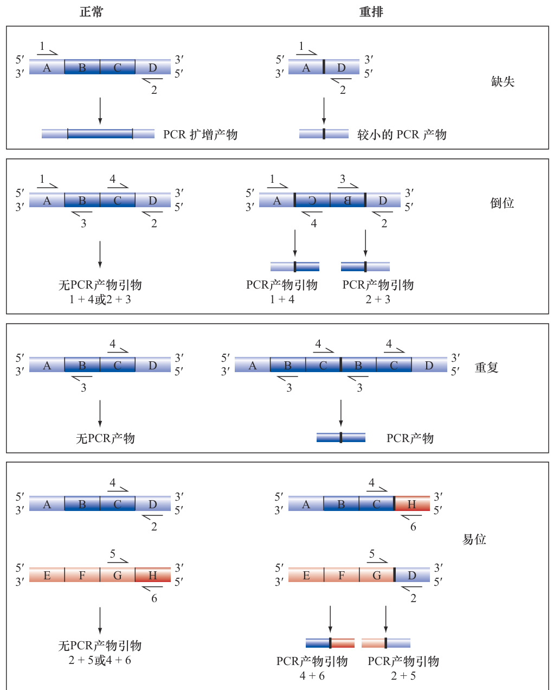  

图13.5　染色体重排断点可以由基因组测序或者PCR检测到。通过不寻常的DNA序列排列，基因组测序可以检测重排断点（黑色粗线）。PCR的碱基对（半箭头）可以从基因组DNA模板中扩增基因组DNA 模板特异产物，这些产物中包括了重排断点。  

对扩增产物的DNA测序会发现重排的确切情况。  

如，你将在本章中随后看到一种白血病（一种白细胞癌症），该病是由一种特定的相互易位导致的。医生可以针对旨在根除白血病细胞的化疗，在患者血液中开展PCR分析。易位断点特异的扩增产物发现至少有几个癌症细胞成功活下来的话，则表明需要更多治疗。  

# 基本概念  

●  染色体重排包括哪些移除碱基对（缺失）或者增加碱基对（重复），以及哪些重新定位DNA区域的情况（倒位和易位）。  
●  染色体断裂之后，如果发生染色体错配、非法交联和DNA修补，会导致缺失、重复、倒位和易位。  
●  高级FISH技术能发现染色体重排在图像条带（条码标记）上的区别，但是微阵列能检测到非常小的缺失和重复。DNA测序和PCR扩增能将重排定位到碱基对水平。  

# 13.2 重排的效应  

# 学习目标  

1. 描述纯合子和杂合子中缺失的表型效果。  
2. 解释研究者如何使用缺失来定位基因。  
3. 讨论重复对表型和不平等交换的影响。  
4. 分辨臂间倒位和臂内倒位。  
5.  解释为什么倒位的断点决定了它们是否有表型效应。  
6. 定义相互易位，讨论这些重排何时会有表型效果。  
7. 总结倒位和易位对交换和繁殖的效应。  

四种主要重排中每一种都对可见的表型，甚至生存力有重要影响。效应的存在与否和严重性通常依赖于这个个体在重排染色体上是纯合子还是杂合子。除此之外，染色体上这些不同种的变化也可以改变交换，以及个体的繁殖力。  

# 13.2.1 缺失从基因组中移除DNA  

连续核苷酸的小缺失，就像第7章所讲，通常只影响一个基因，但是大的缺失就可能让染色体失去几十个，甚至几百个基因。我们用符号Del来标定一个染色体有一个大缺失。在接下里的讨论中，如果你将Del染色体看成在缺失基因上是无条理（完全失去功能）等位基因，那将会非常有益于你的理解。  

# 1. 缺失纯合的致死效应  

因为基因组中许多基因对于个体的生存都是非常关键的，大多数拥有缺失染色体的纯合子（Del/Del）或者杂合子（Del/Y）并不能存活。虽然如此，但是在一些很少见的例子中，缺失的染色体区域中没有生存关键的基因，这个缺失的半合子或者纯合子也许会存活。缺失越小，其纯合子存活的可能性越大。例如，雄果蝇一个80kb缺失的半合子，包括白色基因 $\textbf{(}_{W}\textbf{)}$ ，在实验室中可以完美地存活；缺乏 $w^{+}$ 等位基因用于红眼色素沉着，它们的眼睛是白色的。  

# 2. 缺失杂合子的有害效应  

通常，一个生物失去了一个染色体上的多个基因，只有在同源染色体有这些基因的正常拷贝的情况下，才能存活。这样一个 $D e l/+$ 个体我们称之为缺失杂合子。即使所有的基因都至少有一个拷贝，缺失杂合子由于以下几个原因也会表现出突变体表型。  

单倍体不足　缺失杂合子有时候由于单倍体不足拥有突变体表型，即正常基因剂量（一个特定基因在基因组中的数目）的一半，无法产生足够的蛋白产物来支撑正常表型。有时候，异常表型是由缺失中一个基因的剂量降低造成的。你在第8章可以看到，一种人多指畸形（多余手指和脚趾）是由一个特别基因丧失功能等位基因的杂合子导致的（回顾图8.30）。缺失的这种效应是非典型的，因为人基因组中只有800个基因是单倍体不足的。虽然如此，但是几乎任何基因降低剂量都可能会有很小的有害效应。非常大的缺失会包含很多基因（如丢失染色体臂的一半或者更多），由于众多基因剂量的累积效应，即使在杂合子中通常都是致死的。  

发掘隐性突变体等位基因　缺失杂合子实际上是半合子，正常染色体上的基因在缺失染色体上丢失了。如果正常染色体携带一个基因的突变隐性等位基因，那么此时这个个体就会表现出突变表型。例如，在果蝇中，猩红（scarlet——译者注）颜色突变（ $s t\,\,)$ ）对于野生型来说是隐性的，但是一个动物，携带 $^{s t}$ 突变和一个移除了scarlet基因的缺失，其基因型为st/Del，将会拥有明亮的猩红眼睛，而不是野生的暗红眼睛。在这种情况下，缺失发掘出（即发现）隐性突变的表型［图13.6（a）］。  

# 3. 用缺失来定位基因  

遗传学家可以用缺失来寻找与异常表型相关的基因。基本的要求是要有一个隐性失去功能的突变m（即一个无条理或者次形态等位基因），而且能导致表型。如果m/Del杂合子的表型是突变体（就像m/m的表型），这个缺失就找到了这个突变位点；至少这个基因的一部分是位于缺失区域内的。与之相对应，如果这个基因决定的性状在杂合子中是野生型，那么这个缺失就无法发现隐性等位基因，这个基因全部都在缺失区域外面［图13.6（b）］。你可以将这个实验看成是一个突变和缺失之间的互补测试：隐性突变表型的发掘明显没有互补，因为两个染色体都无法提供野生型基因的功能。  

如果在同一个染色体区域内，有几个不同重叠的缺失，它们的断点在DNA水平上是已知的（用图13.5中所呈现的PCR或者全基因组测序技术），这种对m/Del杂  

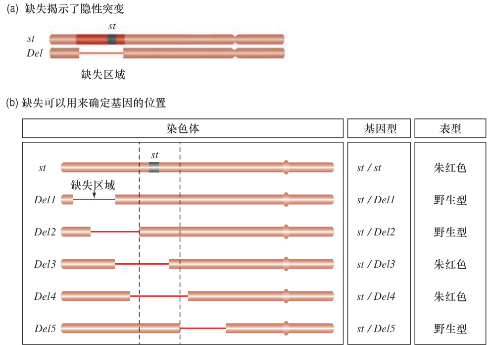  

图13.6　用缺失染色体进行基因作图。（a）缺失染色体可以发现另外一个同源染色体上的隐性突变。基因型st/Del的果蝇会有隐性猩红眼色，因为Del染色体缺乏 $s t^{+}$ 基因。（b）一条染色体是Del，另外一条是隐性猩红突变（st），如果缺乏包含st 基因，这样的杂合子会表现出猩红颜色；如果 $s t^{+}$ 基因并没有缺失，则会表现出野生型。五种不同类型的杂合子的表型表明st+基因位于虚线内。  

合子进行遗传作图的策略，可以相当精确地定位到突变，经常只有一个基因［图13.6（b）］。  

# 4. 缺失杂合体在遗传图距上的效应  

由于母系和父系同源染色体之间的重组只发生在相似的区域，用缺失杂合子中遗传重组频率所作的图距会表现异常。例如，图13.7中，基因C、 $D$ 和E之间没有重组是可能的，因为正常没有缺失染色体区域中的DNA，没有对应的区域来进行重组。事实上，减数分裂Ⅰ初期同源染色体配对期间，非缺失染色体的“孤立”区域形成了一个缺失环——正常染色体的非配对凸出部分，正好对应另外一个同源区域缺失部分。  

$D e l/+$ 杂合子的后代通常都会遗传缺失环中的标记，这些标记会成为一个整体（图13.7中的 $C$ 、 $D$ 和$E$ ）。结果，重组无法将这些基因分开，Del $^{\dagger}+$ 个体的后代中表型类型决定图距，那么这些基因间的图距将会是0。除此之外，缺失两边的染色体位点之间的遗传距图13.7　缺失杂合子的染色体中形成缺失环。在减数分裂Ⅰ前期，正常染色体的未删除区域因为没有配对的对象，形成了一个缺失环。在删除缺失环的过程中不会发生重组。每条线代表两条染色单体。  

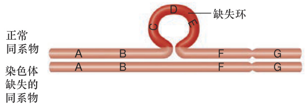  

离也会比预期的更小，因为它们之间的交换会更少。  

# 13.2.2 重复染色体有一些基因多余拷贝  

重复区域的拷贝相互之间以不同的方式排列（图13.8）。串联重复中，重复拷贝以相同的顺序或者相反的顺序相互紧挨着。在非串联（或分散）重复中，区域的拷贝数并不紧挨在一起，也许在同一个染色体上相距甚远，或者在不同染色体上。我们使用 $D p$ 标记来标示一个染色体上携带的重复。  

# 1. 重复的表型效应  

大多数重复没有明显的表型结果，因为多数基因的额外剂量并不会影响正常细胞或者组织生理。虽然如此，一些重复确实有可见的性状或者生存表型结果，这图13.8　重复染色体的类型。串联重复中，重复区域以相同顺序或者相反顺序相互紧挨在一起。非串联重复中，同一个区域的两个拷贝是分开的。  

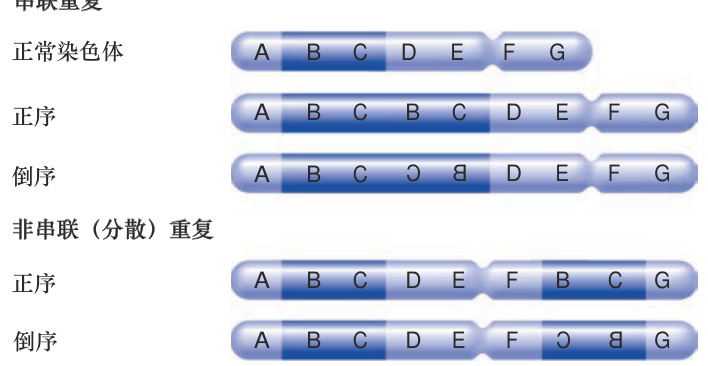  

些异常表型之所以发生至少有两个原因。第一，特定表型也许只是特别对一个或者一些特定的基因拷贝数增加敏感。第二，但是更少见，重复边界附近的基因表达改变了，因为现在它处在一个新的染色体环境中，而在一个新的野生型染色体中，并没有这样的染色体环境。  

甚至重复杂合子（ $D p/+$ ）也会表现出不寻常的表型。例如，果蝇杂合子拥有一个包含Notch 基因的重复，会表现出异常的翅膀，这是由Notch+三个拷贝特异导致的（图13.9）。Notch 基因的剂量极其敏感；Del/+果蝇只有一个Notch 基因拷贝，表现出不同的翅异常，因此这个基因也是单倍体不足（图13.9）。  

生物通常对单个基因的额外剂量并不是那么敏感；但是对于大缺失，其中包含了许多基因，这些基因的失调有额外的有害效应，这会威胁到其生存。人有一种疾病综合征与几个Mb的重复杂合子有关。甚至更大重复的杂合子（比如一个完整染色体臂的重复）大多数情况下是致死的。  

# 2. 重复之间的不等交换  

拥有串联重复的杂合子个体中，减数分裂时携带重复的同源染色体偶尔会不配对。不等交换，即这种不配对导致的重组，产生的配子，有时可以多达三个重复区域拷贝，相反有时减少到一个区域的拷贝。  

果蝇中，X染色体上有一个串联重复区域被称为16A，它会产生肾形眼睛的Bar表型［图13.10（a）和（b）］。雌性果蝇的Bar眼重复纯合子大多数情况下会产生Bar眼后代。虽然如此，但是一些后代却有野生型眼睛，其他一些后代则有双Bar眼，比Bar眼甚至更小图13.9　缺失和重复杂合子的表型结果。缺失杂合子在缺失中只有基因的一个拷贝，而重复杂合子则有三个拷贝。只有Notch 基因一个拷贝的果蝇会有缺口翅。拥有三个Notch 基因拷贝的果蝇，则会有翅脉图案缺陷。  

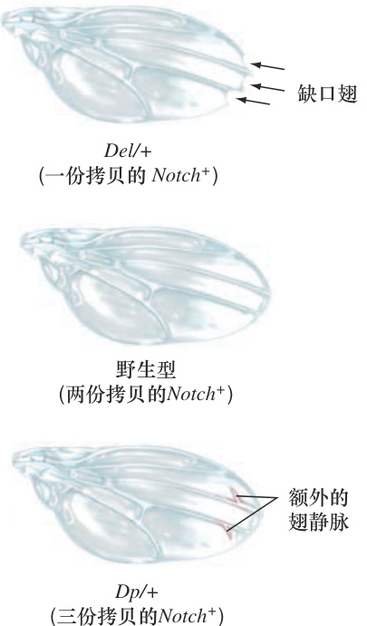  

［图13.10（a）和（b）］。遗传解释是，野生型眼睛的果蝇X染色体上携带只有一个正在研究区域的拷贝，Bar眼果蝇X染色体上携带了两个串联区域的拷贝，双Bar眼果蝇则携带了三个串联拷贝［图13.10（a）和（b）］。野生型和双Bar眼的后代所遗传的X染色体，是由不等交换所产生的［图13.10（c）］。  

双Bar染色体纯合的雌性果蝇中所发生的不等交换，可以产生甚至更极端的表型后代，这些表型与四个或者五个重复区域的拷贝相关。纯合子中的重复也会使得从一代到下一代，染色体区域拷贝数增多和减少。  

Bar眼是一个与重复相关表型的例子，其表型是由于DNA序列的重排序，而将基因放置于一个新的染色体环图13.10　不等交换可以增加或者减少拷贝数。（a）果蝇X染色体上16A区域重复导致了Bar眼；三拷贝重复会导致双Bar眼。箭头指示重复断点。（b）Bar眼比野生型更窄小，双Bar眼甚至更窄小。（c）雌性这个重复的纯合子减数分裂时的不等配对和交换，会产生16A区一个拷贝或者三个拷贝（导致更异常双Bar眼）。（d）Bar眼是由断点两边DNA序列处于异常位置，其中来自另外一个基因的转录增强子使得Bar基因过量表达。  

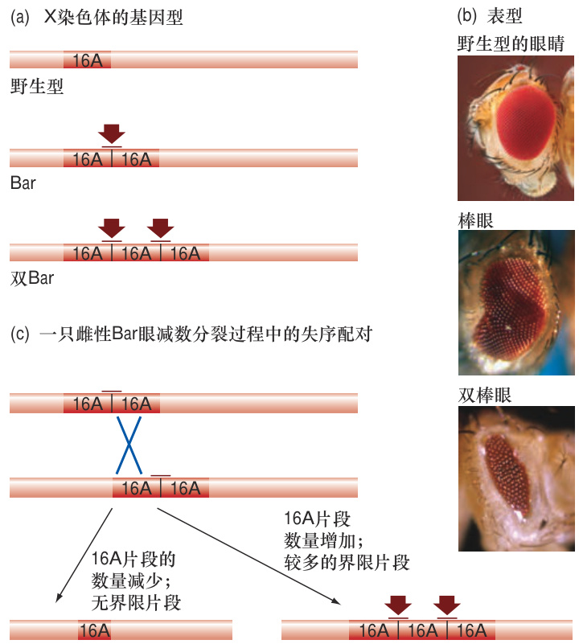  
(d)  Dp    Bar  

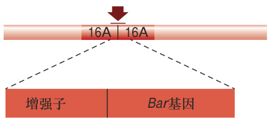  

（b，上）： $\copyright$ blickwinkel/Alamy；（b，中）：承蒙Dr. Brian R. Calvi提供；（b，下）： $\copyright$ Carolina Biological Supply Company/Phototake  

境中所造成的。在一个重复断点中，Bar基因的转录比正常水平要高得多，这导致了更小的眼睛。拥有三个16A区域拷贝的双Bar染色体拥有这个断点的两个拷贝（即异常Bar增强子基因融合），这产生了更多的mRNA，以及甚至更小的眼睛［图13.10（a）和（b）］。  

# 13.2.3 倒位改组了一个染色体的DNA序列  

倒位是染色体的一个区域发生了 $180^{\circ}$ 旋转。记住这一点是很重要的，因为染色体上的每一个DNA链从5′端到3′端必须持续地延续下去，即使其中一条链有倒位也必须如此，染色体颠倒的部分不仅仅旋转了，而且两条单链的方向也翻转了（回顾第6章解决的问题1）。  

包含着丝粒的倒位称之为臂间倒位，不包含着丝粒的倒位称之为臂内倒位，遗传学家可以将它们区分开来（图13.11）。正如本节你随后会看到的，着丝粒相对于倒位的位置会影响一个含有倒位的染色体在减数细胞分裂中的行为。  

# 1. 倒位的表型效应  

大多数倒位并不会导致异常效应，因为虽然它们改变了基因在染色体上的顺序，但是它们并没有增加或者减少DNA，因而并不会改变基因本身或者其数目。虽然如此，但是倒位可以在特定基因中创造突变，这些突变正好跨在倒位断点上。正如图13.12所示，如果一个倒位断点正好处于一个基因内，那么这个基因就会丧失功能。倒位将基因一分为二，将一部分移到了染色体很  

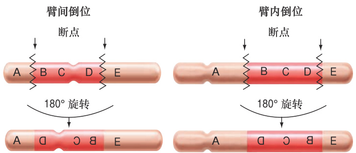  
图13.11　倒位类型。倒位就是染色体的一段 $180^{\circ}$ 旋转。当旋转的片段包含着丝粒的时候，倒位发生在臂间；当旋转片段不包含着丝粒时，倒位发生在臂内。  

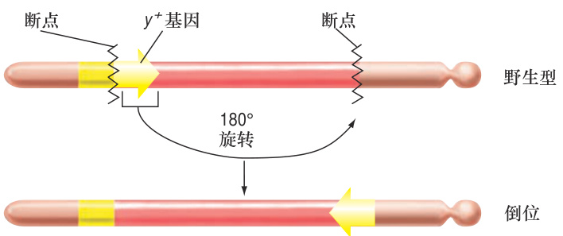  
图13.12　如果倒位破坏了一个基因，倒位就会影响表型。这个图上，一个倒位将y（黄色）基因一分为二，使得这个基因丧失了活性。  

远的一个区域上，而另外一部分仍然在原来的位置上。  
这样一个断裂会破坏基因的功能。  

倒位也可以通过将倒位断点附近的基因移到新的染色体环境中，改变了其正常表达，从而产生不寻常的表型。例如，果蝇Antennapedia基因的一个突变可以将触角变成脚（回顾图8.32），这个突变就是一个倒位，它将基因移到一个新的调控环境中，正好在增强子序列的旁边，这使得该基因正常情况下理应沉默，而这时候却在组织中表达了。还有另外一个改变调控环境的例子，基因正常情况下在染色体的常染色质上，倒位将基因移到了异染色质的一个位置上，这样在一些细胞中该基因沉默了，最终导致花斑位置效应（回顾图12.12）。  

# 2. 倒位杂合和降低的生育率  

倒位（ $I n/+\;,$ ）杂合个体就是倒位杂合子。由于在人类群体中倒位很少见的，大多数拥有倒位染色体的人实际上是倒位杂合子，倒位染色体是从双亲中的一个遗传而来的。在这些个体中，当携带倒位的染色体在减数分裂与同源染色体配对时，倒位环的形成可以使同源区域能够最紧密地排列。在一个倒位环中，一个染色体区域旋转来配合另一个同源染色体的相似区域（图13.13）。正如我们现在讨论的，在倒位环中发生交换，不论倒位是臂间还是臂内，都会产生异常重组染色单体。  

如果倒位是臂间，且在倒位环中只有一次交换发生，那么每个重组染色单体都将会有一个着丝粒，即正常数目，但是会导致一个区域的重复和另一个区域的缺失［图13.14（a）］。携带这些重组染色单体的配子中，一些基因的剂量将会是异常的。在受精之后，异常配子和正常配子的集合产生了受精卵，这些受精卵很可能会由于遗传不平衡而死亡。  

如果倒位是臂内的，且在倒位环内只发生了一次交换，那么重组染色单体的基因剂量将会不平衡，而且着丝粒也会不均等［图13.14（b）］。一个交换产物将会是一个缺乏着丝粒的无着丝粒片段，另外一个交换产物将会是拥有两个着丝粒的双着丝粒染色单体。由于这个无着丝粒片段没有着丝粒，在第一次减数分裂时无法附着到纺锤体上，细胞无法将其组装成子细胞核；结果，这个染色体丢失了，将不会包含在配子中。与之相对比，减数分裂Ⅱ的后期，相反方向的纺锤体拉力同时将双着丝粒拉到纺锤体两端，随后双着丝粒染色单体随机在染色体的一个位置上断裂了。无着丝粒片段的丢失，以及双着丝粒染色单体的断裂，将会导致遗传不平衡的配子，在受精上将会产生死亡的不平衡受精卵，它们无法发育到胚胎发育的最早期。结果，没有臂内倒位环交换的重组后代能存活下来；任何存活的后代都是没有发生重组的。  

总而言之，无论倒位是臂间的还是臂内的，倒位杂合子的倒位环中发生交换有相同的效应——重组配子的形成，这种重组配子将会在受精后阻止受精卵的发育。  

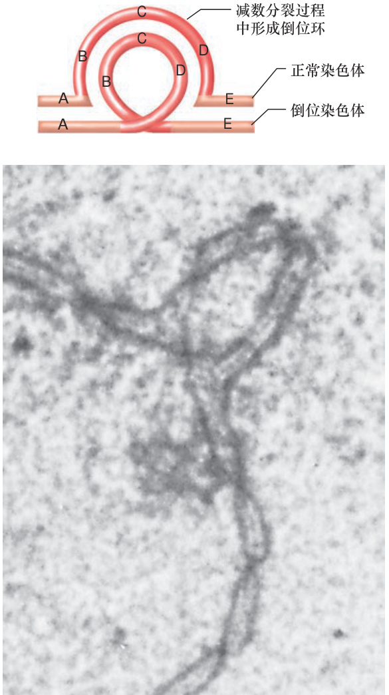  
图13.13　倒位环在倒位杂合子中的形成。在减数分裂Ⅰ初期，为了在一个倒位杂合子（ $I n/+$ ）中最大化配对，同源区域形成了一个倒位环。（上面）简化图示，一条线代表一对姐妹染色单体。（下面）一个 $I n/+$ 小鼠在减数分裂Ⅰ时，倒位环的电子扫描图。承蒙 $\copyright$ Lorinda Anderson & Stephen Stack, Department of Biology, ColoradoState University提供  

你可以参看图13.14，其中在倒位环中发生一次交换的减数分裂，都产生了两个平衡的配子（一个是正常染色体，一个拥有倒位染色体）和两个不平衡配子。倒位区域越大，交换发生在倒位环内的可能性越大，将会产生更多的不平衡配子。基于这个原因，倒位杂合子，特别当倒位区域很大的时候，经常会导致生育率的降低。  

# 3. 倒位杂合和交换抑制  

因为只有含有不与倒位环重组染色体的配子，才能产生可存活的后代，因而倒位成了交换抑制子。这并不意味着交换不能发生在倒位环中，而是倒位杂合子的可存活后代中很少有或者根本没有重组体的存在。  

遗传学家用交换抑制来创造平衡染色体（Balancer图13.14　为什么倒位杂合子产生很少的重组子代。在这张图中，每一条线代表一个染色单体，不同深浅的绿色表示两条同源染色体。（a）由臂间倒位杂合子的倒位环内重组形成的染色单体在遗传上是不平衡的。（b）在臂内倒位杂合子的倒位环内重组形成的染色单体不仅遗传上不平衡，而且还含有两个或没有着丝粒，而不是正常着丝粒。  

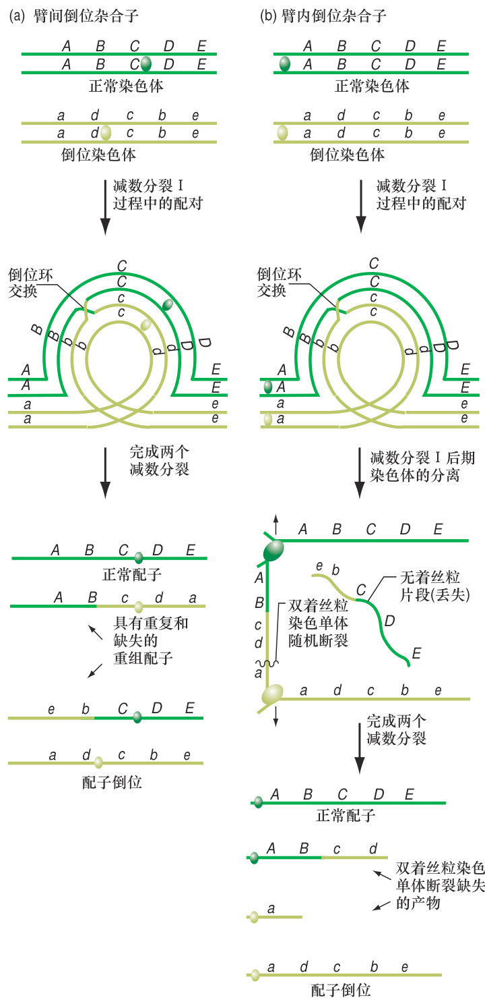  

染色体），包含多个重合的倒位（臂间和臂内），也可以作为标记突变来产生可见的显性表型（图13.15）。Balancer $\prime+$ 杂合子的存活后代只能拥有Balancer染色体或者正常顺序的染色体 $\left(\;+\;\right)$ ，但是它们无法遗传同时拥有两种染色体的重组染色体。通过识别Balancer染色体的显性标记所造成的表型有无来识别这两种存活的后代。  

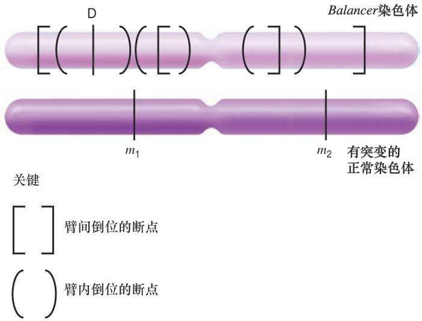  
图13.15　Balancer染色体对于遗传分析是非常有用的工具。Balancer染色体携带显性标记D和倒位（括号），这可以阻止Balancer和携带感兴趣突变（ $m_{1}\mathscr{\vec{\jmath}}[\boldsymbol{m}_{2}$ ）的染色体间重组的恢复。一个携带Balancer和实验染色体的杂合子单亲，将会传递Balancer或者双突变染色体给可存活的后代，但是无法遗传重组染色体给存活的后代。  

遗传学家经常创造Balancer杂合子，来确保正常染色体和携带感兴趣突变的染色体能够传递给下一代，而且重组也无法改变。为了帮助创造遗传材料，大多数Balancer染色体中的标记不仅仅可以创造一个显性可见的表型，也能作为一个隐性致死的突变来阻止Balancer染色体纯合子的存活。  

# 13.2.4 易位将染色体的一部分移到另外一条染色体上  

易位是大尺度变异，一条染色体的一部分粘贴到另外一条非同源染色体上。本节中，我们特别解释了最普遍存在的易位——相互易位，正如之前表13.1所示，其中两个非同源染色体相互交换位置。大多数拥有相互易位的个体，表型上是正常的，因为它们既没有丢失也没有增加遗传材料。虽然如此，但是就像倒位，如果易位断点位于一个基因附近或者基因内部，那么基因功能就可能会改变或者被破坏。就像倒位，相互易位也可能会导致生育率的降低，但是正如你将会看到的，原因并不相同。  

# 1. 易位导致癌基因  

易位对基因功能的潜在影响通过几种癌症和体细胞中易位的联结可以解释清楚。在正常细胞中，一些基因是原癌基因，可以控制细胞的分裂。重新定位这些基因的易位可以将它们转化为产生肿瘤的癌基因，即功能获得性等位基因，其蛋白质产物的结构或表达水平发生了改变，最终导致细胞的分裂失控。  

对于这个现象，举一个例子：几乎所有的慢性髓细胞性白血病患者中，特定白细胞生产过剩导致了这种癌症，白血病细胞在9号和22号染色体之间有一个相互易位（图13.16）。9号染色体上的断点正好处于一个原癌基因c-abl的一个内含子中间；22号染色体上的断点是在bcr基因的一个内含子内部。易位之后，这两个基因的一部分相互紧贴着。在转录过程中，RNA生产机器一起转录这两个基因，创造出一个长初级转录物。剪切之后，mRNA被翻译成一个融合蛋白，其中c-abl基因决定的N端25个氨基酸被bcr决定的大约600个氨基酸置换了。这个融合蛋白的活性释放了对细胞分裂的控制，从而导致了白血病。  

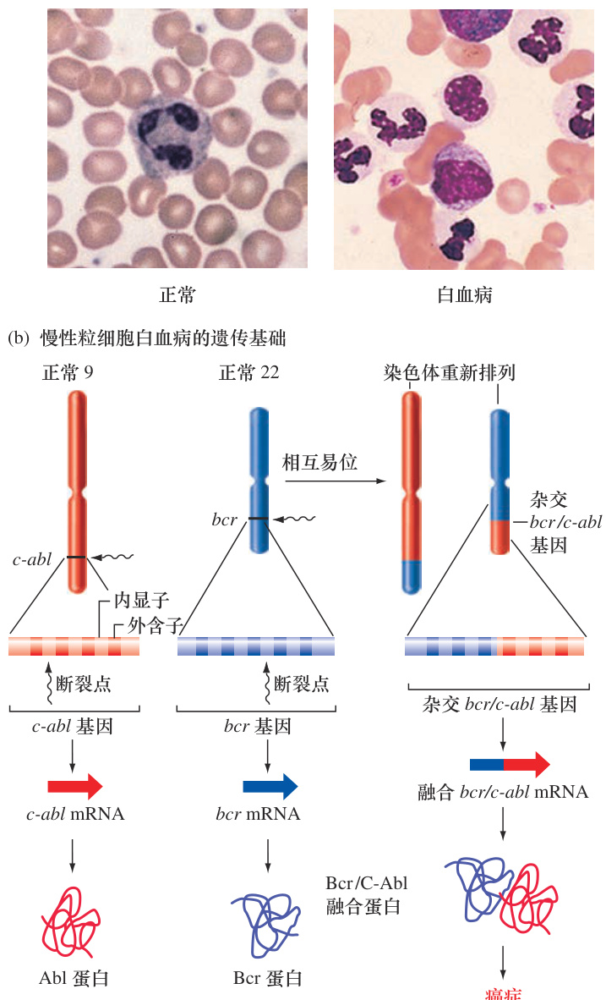  
(a)  

图13.16　相互易位如何帮助导致一种白血病。（a）在白血病患者中，未经控制的大的、深色的白细胞分裂（右图）比正常的分裂（左图）产生更高比例的白细胞或红细胞。（b）9号和22号染色体之间的相互易位促成了慢性髓细胞性白血病。这种重排产生了异常杂合基因，有一部分c-abl基因和一部分bcr基因。这个杂合基因编码一个异常的融合蛋白，破坏了对细胞分裂的控制。  

（a，左）： $\copyright$ Dr. E. Walker/SPL/Science Source；（a，右）： $\copyright$ JoaquinCarrillo-Farga/Science Source  

“快进”信息栏“程序化的DNA重排和免疫系统”描述了另外一个例子，一个易位导致的被称为伯基特淋巴瘤的癌症。  

# 2. 易位杂合子中的生育率降低  

易位，就像倒位，如果断点不干涉基因功能的话，在纯合子中并不产生显著的遗传后果。在易位纯合子减数分裂时，根据孟德尔定律，染色体正常情况下会分离［图13.17（a）］。即使基因已经重排了，个体中的两套染色体仍然有相同的重排。结果，所有的染色体减数分裂时都只有一个配对染色体，对后代也没有有害的后果。  

虽然如此，但是在易位杂合子中，减数分裂过程中，染色体分离的特定模式仍然会产生遗传上不平衡的配子，受精时对受精卵是有害的。在易位杂合子中，两套染色体并没有携带相同的遗传排列信息。结果，在第一次减数分裂初期，易位染色体和正常同源染色体假设形成了一个十字形（交叉状）构型，其中四条染色体配对，而不是正常的两条染色体，这样在相似区域来达到最大的染色体结合［图13.17（b）］。为了追踪形成十字形结构的这四条染色体，我们将携带易位材料的染色体标示为T，正常染色体标示为N。N1和T1染色体在野生型1号染色体上拥有同源着丝粒；N2和T2在野生型2号染色体上拥有同源着丝粒。  

减数分裂Ⅰ后期，在这个交叉构型中有一个将纺锤体定位到染色体上的机制，通常会确保同源着丝粒解体，将同源染色体拉到相反的纺锤体两极（即T1和N1  

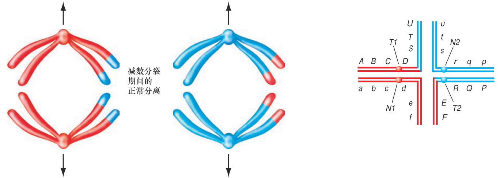  
(a)   
(b)   
(d)  

(c)   

<html><body><table><tr><td>分离方式</td><td colspan="4">相间 平衡 T1 + T2</td><td colspan="4">紧邻1</td><td colspan="4">紧邻2 (不频繁)</td></tr><tr><td rowspan="2">配子</td><td colspan="4">平衡 N1 + N2 a d b b C d S D S</td><td colspan="2">失衡的 T1 + N2 A B b</td><td colspan="2">失衡的 N1 + T2 a q Q</td><td colspan="2">失衡的 N1 + T1 a</td><td colspan="2">失衡的 N2 + T2 p</td></tr><tr><td colspan="4">e abcdef</td><td>B C R C E D S T</td><td>S f</td><td>C d e</td><td>R E F</td><td>d 无存活</td><td>B C D S</td><td>q S u</td><td>R E</td></tr><tr><td colspan="4">与正常 abcdefpqrstu 纯合子配种 的子代类型</td><td colspan="4">T ABCDEF 无存活 PQRSTU</td><td colspan="4">无存活</td><td colspan="2">无存活</td></tr></table></body></html>  

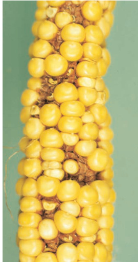  

图13.17　相互易位的减数分裂分离。本图所有部分中，柱和线都代表一个染色单体。（a）在易位纯合子中（T/T），染色体在减数分裂Ⅰ中正常分离。（b）在易位杂合子（ $T/+$ ），四个相关染色体呈现出一个十字形（交叉状）构型，以最大化配对。N1和N2染色体以原先顺序排列基因的等位基因以小写字母呈现；T1和T2易位染色体上这些基因的等位基因会以大写字母呈现。（c）在易位杂合子中可能有三种分离模式。只有相间分离模式才能产生平衡的配子。（d）玉米半不育穗是来自一个相互易位的植物杂合子。它表现出比正常情况更少的籽粒，因为不平衡的胚珠发育不全。  

去相反的两极，T2和N2也如此）。依据四条染色体在赤道板上的排列，同源染色体的正常解构分离产生了两种平等分离模式中的一种［图13.17（c）］。在相间分离模式中，两个易位染色体（T1和T2）会去到一极，而两个正常染色体（N1和N2）则去到两个相反的极。这两种配子都来自于分离（T1，T2和N1，N2），携带正确单倍体的基因数目，这些配子与正常配子结合形成的受精卵将会存活。与之相对比，在紧邻1分离模式中，同源着丝粒拆分了，因而T1和N2去到一极，N1和T2去到另外一极。结果，每一个配子都包含一个很大的重复（在那个配子中，任何一个染色体中都无法找到这个区域），这使得它们遗传上并不平衡。这些配子与正常配子结合形成的受精卵通常并不能存活。  

由于易位杂合子中存在不寻常的十字形配对构型，同源着丝粒不分离的发生虽然可以检测到，但是确实比率很低。这种不分离产生了紧邻2分离模式，同源着丝粒N1和T1去向相同的纺锤体极，但是同源着丝粒N2和T2去向不同的纺锤体极［图13.17（c）］。由此产生的不平衡遗传在受精后对含有它们的受精卵是致命的。  

在所有易位杂合子产生的配子中，只有那些由交替分离产生的配子（略少于总数的一半）在与不发生易位的个体杂交时才能产生有活力的后代。结果，大多数易位杂合子的生育率，即它们产生可存活后代的能力，减少了至少 $50\%$ 。这种情况被称为半不育。玉米诠释了易位杂合子和半不育之间的关联性。虽然籽粒可以正常出现，遗传不平衡胚珠的死亡在抽穗中产生了空缺［图13.17（d）］。  

人每500个个体中大约会有一例是某种易位的杂合子。虽然大多数这样的人表型上是正常的，但是他们的生育率很低，因为他们产生的许多受精卵都自动发育不良了。正如我们所看到的，这种半不育是源于紧邻1或者紧邻2分离模式产生的配子相关的遗传不平衡。但是这种遗传不平衡对于受精卵来说并不是必然致命的。如果重复或者缺失的区域非常小，那么由这些分离模式所产生的不平衡配子也许会产生正常孩子。  

# 3. 易位杂合子的假连锁  

易位杂合子的半不育削弱了基因在两条易位染色体上独立组合的潜力。孟德尔第二定律要求，两条染色体配对时产生了两种可能的中期排列，其所产生的所有配子都可以生产出可存活的后代。但是正如我们所见，在易位杂合子中，只有相位分离模式在远交中产生了可存活的后代；看起来一样可能的紧邻1和少见的紧邻2模式都无法产生可存活的后代。基于此，参与相互易位的两条非同源染色体上，易位断点附近的基因表现出假连锁，即它们看起来好像有关联。  

图13.17（c）展现了为什么假连锁发生在易位杂合子中。在图中，小写的 $a{\sim}f$ 代表了在正常1号染色体（N1）出现的基因的等位基因， $p\!\sim\!u$ 则是2号非同源正常染色体（N2）上基因的等位基因。在易位染色体T1和T2上，基因的等位基因则是大写的。在存在重组的情况下，孟德尔独立组合定律可以预测两条不同染色体上的基因在四种配子中拥有相同的频率，如a $p$ 、 $A\textit{P}$ 、a P和A $p$ 。但是，可以产生可存活个体的相位分离模式（在没有杂交的情况下）只产生一个 $a\ p$ 配子和一个A $P$ 配子。因而，在这样的易位杂合子中，两条非同源染色体上的基因将会表现得好像它们是互相关联的。  

# 4. 罗伯逊易位和唐氏综合征  

罗伯逊易位是在两个近端点着丝粒染色体的着丝粒上或者附近，发生了断裂（图13.18）。断裂部分相互交换，产生了一个很大的等臂染色体和一个很小的染色体，这个小染色体如果有基因的话，也是非常少的。这个微小染色体随后会从生物上丢失。罗伯逊易位是以W.R. B. Robertson的名字命名的，他在1911年首先报道在进化中，等臂染色体是由两条近端点着丝粒染色体的融合所形成的。  

对于此现象，有一个很重要的例子，正如在图13.19所示，一些个体在14号和21号染色体之间发生了罗伯逊易位杂合。  

图13.19这些表型上很正常，但是会产生一些紧邻1分离模式所形成的配子，这些配子拥有21号染色体大部分区域的两个拷贝：一个拷贝是正常的21号染色体，另外一个是罗伯逊易位所融合的14号染色体和21号染色体。受精时，如果拥有重复的配子与正常配子结合，最后的孩子将会拥有21号染色体大部分区域的三个拷贝和唐氏综合征。大约 $4\%$ 的唐氏综合征的发生是由于罗伯逊易位。在本章中，你随后会看到，大多数的唐氏综合征个体有三个正常的、全长的21号染色体拷贝。  

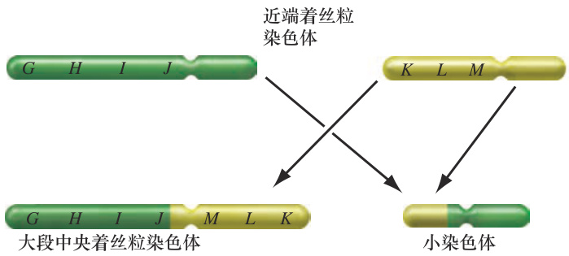  

图13.18　罗伯逊易位可以重塑基因组。在一个罗伯逊易位中，两条近端点着丝粒染色体之间的相互交换，产生了一个很大的等臂染色体和一个很小的染色体。后者也许没有携带几个基因，也许会丢失，从而不表现不良后果。  

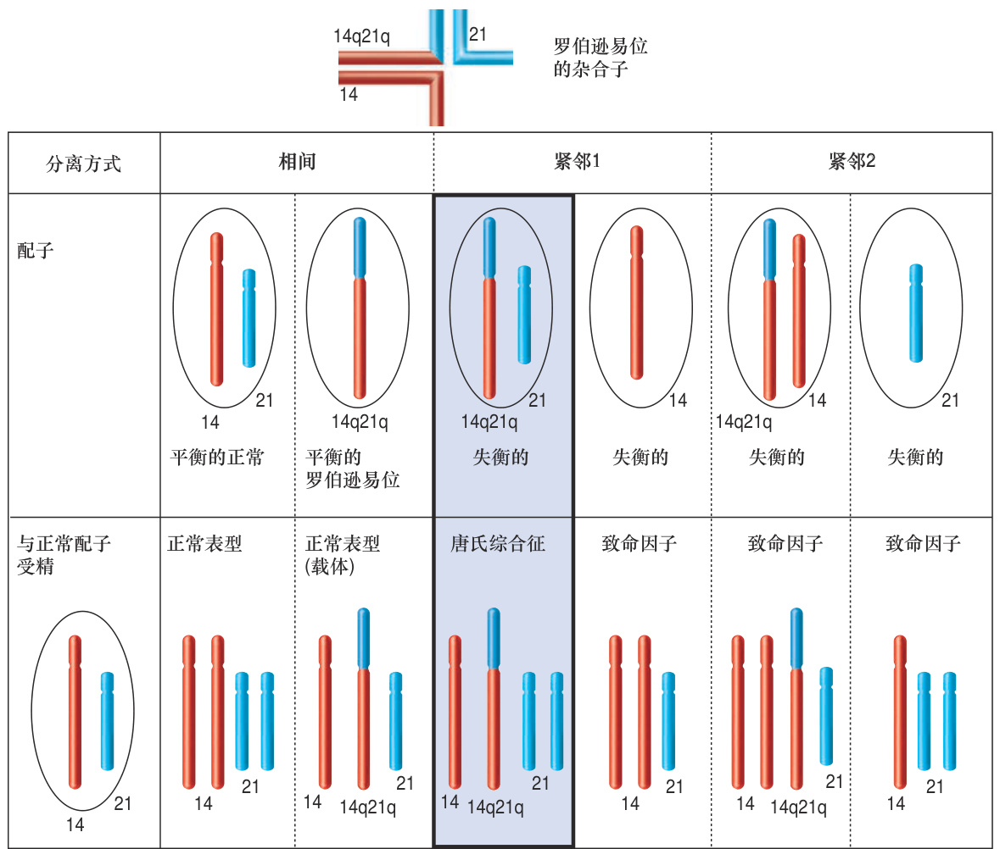  
图13.19　易位唐氏综合征如何产生的。在有关14号和21号染色体（14q21q）罗伯逊易位杂合子中，紧邻1分离可以产生21号染色体两个拷贝的配子。如果这样的配子与正常配子结合，结果受精卵将会有21号染色体部分区域的三个拷贝。根据21号染色体的哪个区域出现在三个拷贝中，这种三重化也许会导致唐氏综合征［在原先易位杂合子中，相互易位染色体（14p21p）很小，已经丢失了］。  

# 基本概念  

●  缺失从染色体上移走了DNA，主要通过基因剂量的影响，从而导致突变体表型。  

●  缺失染色体对于定位基因是很有用的。  
●  重复是将DNA加到染色体上，通过增加基因剂量或者通过改变基因在断点附近的调控，从而导致了突变体表型。  
●  倒位改变了染色体上的基因顺序，但是不改变其数量。  
●  倒位通过打断基因和破坏其功能，或者通过改变其调控，也许会影响断点或者断点附近基因的功能。  
●  倒位杂合子的生育率降低了，因为在颠倒区域中交换可以产生不平衡的配子。  
●  在相互易位中，两条染色体的一部分相互交换位置，并没有丢失或者增加DNA。易位也许会在易位断点处或者其附近改变基因的功能。  
●  易位杂合会降低生育率，因为在减数分裂中染色体配对和分离导致了许多不平衡的配子。  

# 13.3 转座遗传元件  

# 学习目标  

1. 定义转座元件。  
2. 比较反转录转座子和DNA转座子的结构与动员机制。  
3. 讨论人类基因组中的转座元件和它们的移动。  
4. 描述转座元件如何改变基因组。  
5. 解释细胞如何阻止多余的转座元件移动。  

另外一种拥有显著基因组影响的序列重排的类型是转座：小段DNA片段（被称为转座元件，TE）从一个基因组位置移到了另外一个位置上。Marcus Rhoades在20世纪30年代、Barbara McClintock在20世纪50年代，首先从玉米复杂的遗传研究中推断存在TE。科学界许多年并不认同他们的工作，因为他们的发现似乎与经典的重组作图得到的结论正好相反，后者认为基因位于染色体的固定位置上。除此之外，TE太小了，它们在相对低的染色体核型分辨率中，无法被看到。自从克隆出转座元件DNA，使对它们的研究更详细，遗传学家们不仅仅承认了它们的存在，而且在所有研究的生物基因组中，从细菌到人，都发现了转座元件。1983年，Barbara McClintock在玉米籽粒中发现造成斑点的是移动遗传元件，她因为这个富有洞察力的研究，从而获得了诺贝尔奖［图13.20（a）］。  

# 13.3.1 根据如何移动对转座元件进行分类  

任何DNA片段进化出从基因组一个位置移动到另外一个位置的能力，就可以定义为转座元件，无论它是如何起源或者功能为何。TE不需要对有机体起作用的序列；事实上，许多科学家认为它们主要是“自私的”寄生实体，只携带允许它们自我延续的信息。虽然如此，一些转座元件似乎已经进化出功能来帮助其宿主。有一个有趣的例子，转座元件维持了果蝇染色体的长度。与其他多数生物相比，果蝇端粒并没有包含TTAG-GG重复，端粒酶可以延伸它们（回顾图12.20）。虽然如此，果蝇中特定的转座元件，伴随着每轮复制，通过高频率跳入染色体末端附近的DNA，却使得染色体末端并不缩短。结果，染色体大小维持相对不变。  

大多数转座元件本质上长度范围从50bp到大约  

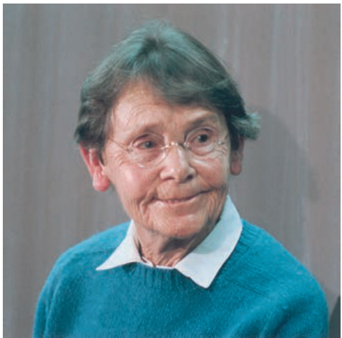  
(a)  Barbara McClintock   
(b) TE  

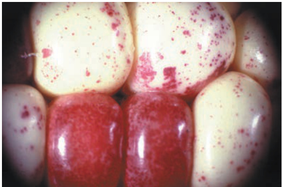  
图13.20　转座元件的发现。（a）Barbara McClintock通过玉米实验，发现了转座元件。（b）转座子跳入或者跳出可以影响色素沉淀基因，转座子的移动会让玉米籽粒出现斑点。  

10kb，一个特定的转座元件可以在基因组任何位置上出现，从一次到数十万次不等。例如，果蝇拥有大约80种不同的转座元件，每一个平均长度为 $5\mathrm{kb}$ ，每个平均出现50次。这些转座元件组成了 $80\times50\times5{=}20\,000\mathrm{kb}$ ，或者大约果蝇160 000kb基因组的 $12.5\%$ 。  

用克隆的转座元件DNA作为探针所做的FISH实验，表明了转座元件确实可以转座。例如，如果你用一个果蝇转座元件（叫做copia）得来的探针，与美国不同地理位置的两个果蝇品系进行杂交，你会在每个品系的基因组上，看到大约 $30\!\sim\!50$ 个杂交位点。一些位点在两个品系中是一致的，另外一些则不同。与之相对比，FISH使用正常基因的探针的话，将会在两个品系上呈现出一个单一标记位点。这些结果表明，自从这两个品系地理上分隔之后，一些copia序列已经以不同的方式在这两个基因组上进行移动，正常基因则仍然留在固定的位置上。  

根据转座元件如何在基因组上移动，可以将它们分成两组。反转录转座子通过一个RNA中间体的反转录来进行转座。刚刚提到的果蝇copia元件就是反转录转座子。与之相比，转座子（或者DNA转座子）是直接移动它们的DNA，并不需要RNA中间体。BarbaraMcClintock在玉米上所发现的负责籽粒斑点的遗传元件，就是转座子［图13.20（b）］。  

# 13.3.2 几乎一半的人基因组是由转座元件组成的  

人基因组包含了超过400万个转座元件，它们的长度大约占人基因组的 $44\%$ （表13.2）。人类大多数转座元件（大约 $90\%$ ）是反转录转座子。转座元件在人基因组上的移动，可以通过比较人基因组序列和我们最近缘的物种大猩猩来检测到；通过比较不同人基因组序列，可以检测到最近转座元件的活动。这些基因组序列研究揭示了，从我们与大猩猩最一致的祖先开始计算，没有人DNA转座子是活动的，只有相对少的反转录转座子移动了。人转座元件移动如此低频率，可能部分是由于转座元件DNA序列突变的累积，部分是由于其控制机制降低了它们的移动。  

# 13.3.3 反转录转座子通过RNA中间体移动  

反转录转座子的转座开始于RNA聚合酶转录成一个RNA，它编码一个反转录样的酶。第8章“遗传学与社会”信息栏“HIV和反转录”中，介绍了导致AIDS的病毒HIV生产反转录酶，这个酶就像这个反转录酶，可以将RNA拷贝进一个单链cDNA中，然后用这个单链DNA作为模板来生产双链cDNA。许多反转录转座子，除了反转录酶，也编码多肽。  

一些反转录转座子在RNA样DNA链的3′端有一个poly-A尾，让人联想起mRNA分子的结构。人有两种主要的含有poly-A的反转录转座子，分别是长散在核元件（LINE）和短散在核元件（SINE）（表13.2）。其他反转录转座子末端有长末端重复（LTR），即元件两端以相同方向出现的核苷酸重复序列。第二种反转录转座子的结构类似于反转录酶病毒（RNA肿瘤病毒）整合好的DNA拷贝，这表明反转录酶病毒是从这种反转录转座子进化而来的，或者反过来也是一样。人LTR类型的反转录转座子事实上现在被称为人内源性反转录病毒（HERV）（表13.2）。  

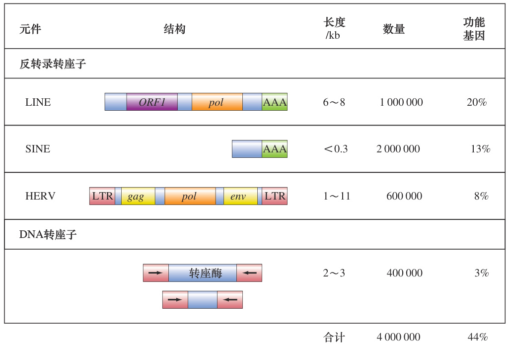  
注：LINE和SINE是poly-A型反转录转座子：LINE编码RNA结合蛋白和反转录酶（ORF1和pol基因）使其在polⅡ转录后能够动员。源于polⅢ转录物（如tRNA）的SINE依赖于LINE编码的蛋白质在polⅢ转录后移动。HERV是LTR型反转录转座子，除了pol基因外，还可以编码包括反转录病毒外壳蛋白的gag和env基因。其他生物中的DNA转座子是由于转座子末端的反向重复上的转座酶的作用而移动的。由于它们携带的基因或转座所需的末端序列发生突变，人类基因组中只有少数几条LINE和SINE能够移动；人类基因组中的HERV和DNA转座子是不可移动的遗迹。  

反转录转座子、mRNA和反转录病毒之间的结构相似性，再加上一些反转录转座子可以编码一种反转录酶（pol基因，表13.2），促使研究人员怀疑反转录转座子是否可以通过RNA中间物在基因组中移动。酵母上的实验证实了这种方式。在一个研究中，最开始在酵母质粒中找到的一个Ty1反转录转座子，含有它一个基因的内含子；虽然如此，在转座到酵母染色体上之后，内含子不存在了（图13.21）。因为内含子的移除只能发生在mRNA处理过程中，研究者认为Ty1元件在从质粒到染色体的转座过程中，是通过RNA中间体进行的。  

包含poly-A或者LTR的反转录转座子移动机制在细节上并不相同，但是相互之间在一个重要方式上是相似的，都以反转录转座子的转录为起始。图13.22描述了含有LTR反转录转座子（就像酵母Ty元件、果蝇copia元件和人HERV的移动祖先）在基因组上移动的机制。反转录转座子转录物上pol基因的翻译，产生了一个拥有反转录酶和内切酶活性的酶。该酶启动将反转录转座子RNA转变成双链cDNA的过程，也剪切一个基因组DNA目标位点，以供转座元件cDNA的插入。还有poly-A的转座元件（就像人LINE）通过一个更复杂的机制来移动（没有呈现），不仅仅需要反转录酶，也需要另外由一个不同的反转录转座子基因（被称为ORF1）所编码的蛋白质（表13.2）。  

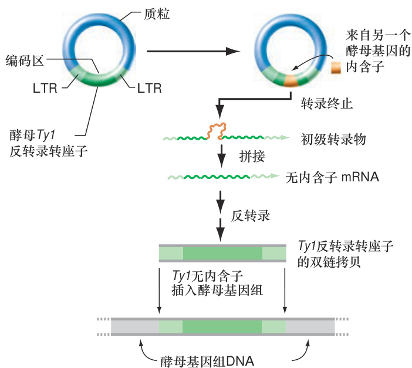  
图13.21　图示反转录转座子通过RNA中间体进行移动。研究者构建了一个还有Ty1反转录转座子的质粒，其中含有一个内含子。这个质粒转化进入酵母细胞后，新的Ty1插入到酵母基因组DNA中。这个新插入的Ty1并不含有内含子，这表明转座需要一个初级转录物的剪切，来形成一个没有内含子的mRNA。  

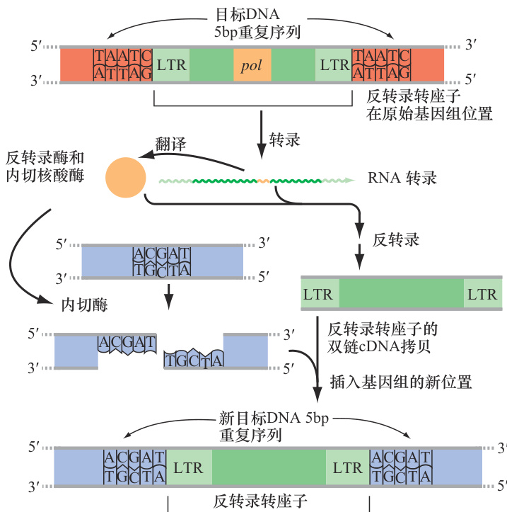  
图13.22　LRT类型的反转录转座子移动机制。为了移动，LTR类型的反转录转座子依靠它们的LTR和pol基因编码的反转录酶/内切酶。这个反转录酶合成双链反转录转座子cDNA。这个cDNA插入到一个新的基因组位置（蓝色），这需要一个令人吃惊的内切酶切开目标位点；聚合作用填补黏性末端，产生了两个5bp目标位点的拷贝。  

正如图13.22所示，通过RNA作为中间体进行的转座，其中一个后果是反转录转座子原来的拷贝仍然在原位，新的拷贝则插入到另外一个位置上。通过这种传输方式，拷贝数量潜在地随着时间可以迅速地增加。生物进化出一些精巧的机制来限制反转录转座子的移动，从而来抵制反转录转座子失控的扩散。  

# 13.3.4 转座酶催化DNA转座子的移动  

转座子的特征——转座元件移动并不需要RNA中间体，它们的末端是相互反转的重复序列，即在末端的一串碱基对在另外一个末端有相同的序列［图13.23（a）］。反向重复序列通常为 $10{\sim}200\mathrm{bp}$ 。  

转座子反向重复序列之间的DNA一般包含一个基因来编码转座酶，这个蛋白质通过识别这些重复序列来催化转座。正如图13.23（a）所示，这些转座的步骤包含转座子从原来基因组位置上切除和整合到一个新的位置上。  

转座子切除位点上发生了双链断裂，在不同例子中以不同方式进行修补。图13.23（b）呈现了两种可能性。在果蝇中，转座子P元件切除之后，DNA外切酶首先扩大缺口，然后使用一个姐妹单体或者同源染色体作为模板来修补它（通过第7章中所描述的双链断裂修补）。如果模板含有P元件且DNA复制完全正确，修补将会将P元件恢复到它被切除的位置上；这会使得看起来好像在转座过程中， $P$ 元件一直在原来的位置上［图13.23（b），左下］。如果模板不包含P元件，在转座之后，转座子会从原来的位置上丢失［图13.23（b），右下］。  

# 13.3.5 基因组经常含有转座元件有缺陷的的拷贝  

无论是转座过程本身（例如，一个反转录转座子RNA的不完整反转录）的结果，还是转座之后发生事件（例如， $P$ 元件早先切除位点的错误修补）的结果，转座元件的许多拷贝都将会维持缺失。如果一个缺失移除了反转录转座子转录必需的启动子，这个元件拷贝将无法产生RNA中间体用于将来的移动。如果缺失将DNA转座子末端的反向重复序列切除了，转座酶将无法催化该元件的转座。这些缺失创造出有缺陷的转座元件，它们无法再次转座。  

其他类型的缺失产生的有缺陷的元件无法自己移动，但是如果基因组其他地方元件的拷贝没有缺陷的话，可以提供缺失的功能，从而使得有缺陷的元件可以移动了。例如，一个反转录转座子有一个缺失，使得反转录酶基因失活了，或者转座子中转座酶基因因为一个缺失失活了，如果这个关键酶在基因组上只有这一个拷贝的话，那么这种缺失就会使得这个元件拷贝固定在一个基因组位置上。虽然如此，但是如果基因组上有相同元件的其他拷贝，可以提供反转录酶或者转座酶，那么有缺陷的拷贝就可以移动。有缺陷的转座元件必须有相同元件的非缺失拷贝提供酶活性来实现移动，它们被称为非自主元件；没有缺失的拷贝可以自己移动，称为自主元件。例如，在人基因组中，所有的SINE都是非自主元件，它们只能使用LINE编码的蛋白质才能够移动（表13.2）。  

人基因组中大多数转座元件都是遗迹，在两个方面是有缺陷的：不仅仅移动蛋白像反转录酶或转座酶这些基因被破坏了，它们的启动子或者末端都有缺陷，以至于它们根本无法移动。正如之前所述，只有LINE和SINE可以在人基因组上移动，而且只有一小部分才能移动。完全自主元件的数量甚至更少，例如，科学家估计二倍体人基因组平均只有 $80\!\sim\!100$ 个自主LINE。几乎所有300万LINE和SINE插入点在所有人中都是一致的，只有大约8000个在人类历史进程中曾经移动过，这可以通过比较不同个体的不同插入位点看出来。  

# 13.3.6 转座元件可以破坏基因和改变基因组  

遗传学家通常将转座元件看成是自私DNA片段，它们的存在只为了自己。但是，生物维持这些转座元  

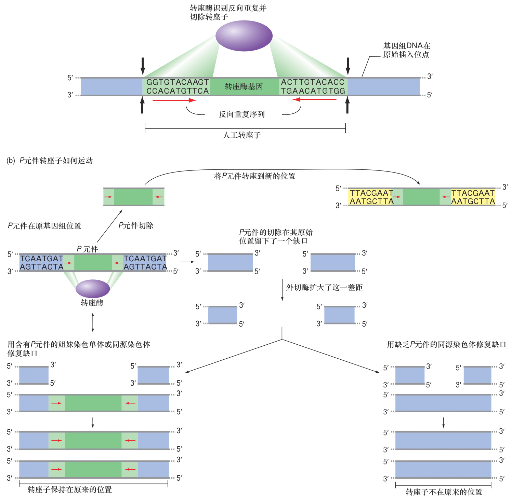  
(a)  

图13.23　DNA转座子：结构和移动。（a）大多数转座子在末端包含反向重复序列（浅绿；红色箭头），编码一个转座酶来识别这些反向重复序列。转座酶在转座子和邻近基因组DNA之间的边界进行剪切，也帮助切除的转座子整合到一个新位置上。（b）转座酶催化P元件的整合，这在新的目标位置上，产生了一个8bp的重复（黄色）。当转座子从原来的位置上被切除下来，会留下来一个缺口。外切酶扩大缺口之后，细胞使用相关DNA序列作为模板来修补这个缺口。根据该模板是否含有P元件，转座子会看起来留在原地，或者从原地被切除掉。  

件，它们的移动对于生物的基因和染色体的组织与功能有很深远的影响。  

# 1. 转座元件导致的基因突变  

转座元件插入到基因附近或者基因内，都能影响基因表达，从而改变表型。现在我们知道，孟德尔首先研究的皱缩豌豆突变可能来自于一个转座元件插入到基因Sbe1，该基因是一个淀粉分支酶。果蝇中有大量自发突变，包括摩尔根在1910年发现的 $w^{1}$ 突变，它们都是由于转座元件的插入导致的。在人中寻找活跃转座元件的一个方法是，看它们的移动何时产生疾病等位基因。反转录转座子插入突变导致了几乎100种已知的人类疾病，包括血友病A、血友病B、囊性纤维化、多发性神经纤维瘤和肌肉萎缩症。  

转座元件对于基因的影响取决于这个元件是什么元件，以及它插入在基因内或者基因附近的哪个位置上（图13.24）。如果一个元件插入到一个蛋白编码外显子内，额外DNA也许改变了可读框，或者提供了一个框内终止密码子，缩短了多肽。如果这个元件插入到内含子中，会降低剪接的效率。无论转座元件位于外显子或者内含子，也许都会提供转录停止信号，阻止插入位点下游基因序列的转录。最后，插入转录必需的区域，如启动子，可以影响基因产物在发育过程中特定组织、特定时间上的表达量。  

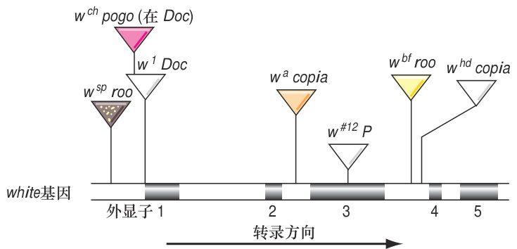  
图13.24　转座元件插入一个基因时会造成突变。果蝇white基因有许多自发突变，是由于转座元件插入造成的，如 $P$ 、copia、roo、pogo或者Doc。最后，眼色表型取决于涉及的元件和它插入white基因的位置。  

# 2. 转座元件插入突变的不稳定性  

转座元件移动的过程中，其末端被破坏了，使得这个转座元件无法移动，或者如果基因组上没有该元件编码移动的蛋白质，那么这个转座元件插入创造的突变就是稳定的。否则，转座元件插入突变可能并不稳定：转座元件可以重新移动，通常导致突变体等位基因反转回复到野生型。  

一个玉米基因（基因C）有一个由转座元件插入造成的不稳定突变，帮助Barbara McClintock发现了转座元件（图13.25）。基因C编码的蛋白质是玉米籽粒紫色色素沉淀必需的一个蛋白质。当被称为Ds（dissociator）的非自主转座子插入到基因C，从而沉默该基因，最终籽粒（玉米胚胎）是黄色的。玉米籽粒中还有一种自主转座子拷贝，也来自相同的 $|D s$ 家族，称之为Ac（activator），这使得基因C上的突变是不稳定的，即在一些细胞中非自主Ds将会跳出来，而基因C重新恢复功能。这样的籽粒将会是黄色带紫色斑点，这些紫色斑点就是Ds跳出该基因造成的。  

# 3. 转座元件造成的染色体重排  

反转录转座子和转座子可以引发自发的染色体重排，而不是以几个方式进行转座。正如早先所提到的（回顾图13.5），相同转座元件的两个拷贝可以进行异常相互配对、交换，产生各种染色体重排。重复区域两边的转座元件发生不等交换，从而很可能导致与果蝇图13.25　转座元件相关的等位基因可能是不稳定的。当基因C有活性的时候，玉米籽粒中的细胞是紫色的，当Ds元件插入突变沉默基因C的时候，玉米籽粒就会是黄色的。BarbaraMcClintock发现一些黄色籽粒有紫色细胞斑块（斑点）。她认为斑点是由于基因C突变的不稳定造成的，这时候基因组其他地方有自主Ac元件。随后分子生物学分析发现Ac元件提供转座酶，使得非自主Ds插入元件跳出基因C。  

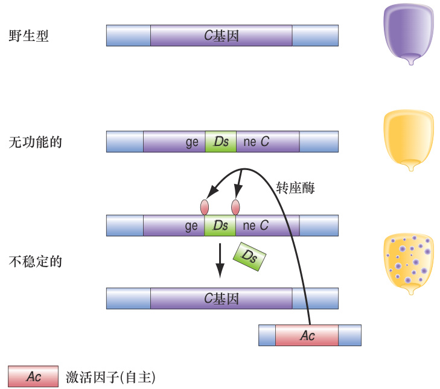  
(   )  

Bar突变相关的重复（回顾图13.12）的出现。其他染色体重排可能并不是由转座元件的重组导致的，而是由于转座过程本身造成的。有时候，转座会出错，这样就会在转座元件紧邻的染色体材料上创造缺失或者重复。  

# 4. 转座造成的基因易位  

当DNA转座子的两个拷贝在相同染色体附近但不是同一个位置上找到的时候，两个转座子（图13.26中加黑箭头）外部末端就会有反向重复序列，它们彼此之间就像一个转座子的反向重复。如果在转座时转座酶作用于这种反向重复配对，这样就会使得它们之间的全部区域移动，就像一个巨大的转座子，同时将这个区域中包含的基因进行迁移和易位。在原核生物中，两个转座元件能转移相关基因，这会帮助转移不同品系或不同品种细菌的药物抗性，这在第14章中将会进行讨论。  

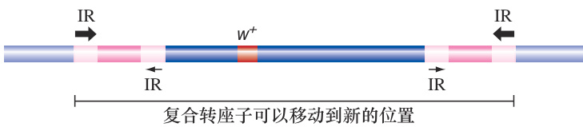  

图13.26　转座子可以将基因移动到新的染色体位置上。如果一个转座子的两个副本在同一条染色体附近，转座子可以识别最外层的反向重复序列（IR，大箭头），从而产生一个复合转座子，允许中间的基因［如w+（红色）］跳跃到新的位置。  

# 13.3.7 几种限制转座元件移动的机制  

我们刚刚看到转座元件的移动会使特定基因发生突变，使染色体发生重排。由于频繁的转座元件移动会在基因组中造成破坏，因此生物进化出来一些机制来抑制转座元件活性。  

例如，转座酶的生产，以及通过P元件RNA的可变剪接来抑制转座（图13.27），都使得果蝇P元件移动受到了限制。在繁殖细胞中，转录酶mRNA初级转录物中的一个内含子，有时候会剪切出去，有时候并不会剪切出去。移走内含子的mRNA编码转座酶，可变剪接的mRNA则保留了这个内含子，编码一个更小的抑制多肽。在繁殖细胞中，抑制蛋白通过与转座酶竞争结合到转座子反向重复序列上，从而来抑制 $P$ 元件转座。令人感兴趣的是，在体细胞中，内含子从不被剪切出去；只有阻遏物产生了（而不是转座酶生产出来）， $P$ 元件在体细胞中才不会移动。  

最近发现了一个更普遍的机制，可以抑制繁殖细胞中DNA转座子（包括P元件）和反转录转座子的活性，很可能在所有动物中都存在。这个机制涉及特别的小RNA，称之为Piwi蛋白相互作用RNA（piRNA），它们可以阻止转座元件的转录和转座元件转录物的翻译。我们将会在第17章对piRNA进行详细的讨论，其中描述了几种小RNA如何在真核生物中调控基因表达。  

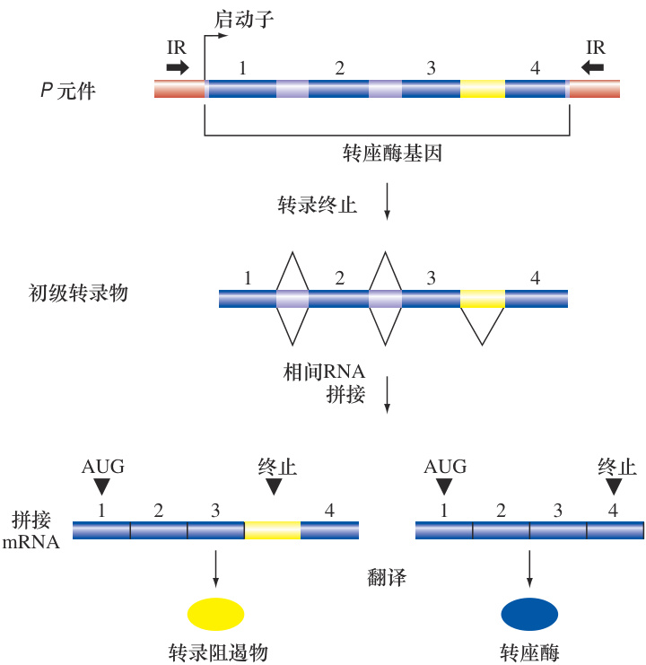  
图13.27　mRNA剪接可以调控P元件移动。 $P$ 元件初级转录物可变剪接。3号外显子和4号外显子（黄色）之间的内含子有时候被剪切出去，有时候则不会。保留内含子的mRNA编码转座阻遏物。因此，除了转座酶，细胞产生阻遏物来抑制P元件移动。  

# 基本概念  

●  转座元件是很小的DNA片段，在基因组多个位置上都能找到，且能到处移动。  
●  反转录转座子通过RNA中间体移动，反转录酶将这个中间体转变成cDNA，随后插入到基因组中。与之相对比，DNA转座子要求转座酶来识别转座子末端特征性的反向重复序列。  
●  几乎一半的人基因组都是由转座元件组成的，其中只有很少的转座元件现在能够移动。  
●  转座元件破坏基因，将基因移到新的位置或者重排染色体，从而改变了基因组。  
●  抑制转座元件活性的机制包括通过可变剪接而实现的转座阻遏物，以及阻止转座元件转录的piRNA。  

# 13.4 染色体数目畸变：非整倍体  

# 学习目标  

1. 定义非整倍体、单体和三体。  
2.  解释为什么一般常染色体非整倍体比性染色体非整倍体更加有害。  
3.  描述非整倍体和嵌合生物是如何出现的。  

我们在豌豆、果蝇和人中都看到，正常二倍体个体都携带了 $2n$ 个互补染色体， $n$ 是配子中染色体的数目。在这些二倍体生物的单倍体配子中，所有的染色体都不相同。有些个体的染色体数目并不是这些物种单倍体数目（n）的整数倍，我们称之为非整倍体（表13.3）。例如，一个正常的二倍体物种，少了一个染色体的个体就是单体（2n–1），多一个染色体的个体则是三体（ $2n\!+\!1$ ）。单体、三体和其他形式的非整倍体，都会形成遗传不平衡，对于物种来说通常都是有害的。在本节中，我们讨论了非整倍体如何出现，以及它的表型后果。  

表13.3　在正常二倍体生物中不同种的非整倍体  

<html><body><table><tr><td></td><td>1号染色体</td><td>2号染色体</td><td>3号染色体</td></tr><tr><td>整倍体 (2n)</td><td>XX</td><td>XX</td><td>XX</td></tr><tr><td>缺对染色体 (2n-2)</td><td>XX</td><td>XX</td><td></td></tr><tr><td>单体型 (2n-1)</td><td>只X</td><td>XX</td><td></td></tr><tr><td>三体型 (2n+1)</td><td>XX</td><td>XX</td><td>XXX</td></tr></table></body></html>  

# 13.4.1 常染色体非整倍体通常是致死的  

在人中，任何常染色体的单体一般都是致死的，但是医学遗传学家发现了几个单体例子，这些单体是缺少人染色体中最小的21号染色体。这些单体个体一出生就有多个严重的畸变，他们在出生之后只存活了很短的时间。与之相类似，人常染色体的三体也高度有害。更大染色体的三体，比如1号和2号染色体，拥有这些三体的个体绝大数情况下在怀孕期早期就自动流产了。三体18导致了爱德华兹综合征，三体13则造成了帕塔综合征；这两种疾病表型都包括总体发育异常，通常都会导致早期死亡（表13.4）。  

表13.4　人群中的非整倍体  

<html><body><table><tr><td>染色体</td><td>嗜酸性粒细胞增多症</td><td>出生率</td></tr><tr><td>常染色体</td><td></td><td></td></tr><tr><td>21号三体综合征</td><td>唐氏综合征</td><td>1/700</td></tr><tr><td>13号三体综合征</td><td>帕塔综合征</td><td>1/5000</td></tr><tr><td>18号三体综合征</td><td>爱德华兹综合征</td><td>1/10000</td></tr><tr><td>性染色体，女性</td><td></td><td></td></tr><tr><td>XO，单体的</td><td>特纳综合征</td><td>1/5 000</td></tr><tr><td>XXX，三倍体 XXXX，四倍体 XXXXX，五倍体</td><td></td><td>1/700</td></tr><tr><td>性染色体，男性</td><td></td><td></td></tr><tr><td>XYY，三倍体</td><td>正常</td><td>1/10000</td></tr><tr><td>XXY，三倍体 XXYY，四倍体 XXXY，四倍体 XXXXY，五倍体 XXXXXY，六倍体</td><td>克兰费尔特综合征</td><td>1/500</td></tr></table></body></html>

大约 $\mathrm{0.4\%}$ 的新生儿有可检测到的染色体异常，从而产生有害的表型。  

人常染色体三体中最常见的就是三体21，它会导致唐氏综合征。21号染色体是人染色体中最小的，只拥有人基因组DNA的 $1.5\%$ 。虽然唐氏综合征个体中有相当大的表型变异，其性状如智力缺陷和骨骼畸形，通常与其状况相关。许多唐氏综合征婴儿会在他们出生之后第一年内，死于心脏缺陷和对感染的高度敏感性。  

一些患有唐氏综合征的人其实只有部分21号染色体的三个拷贝，而不是整个21号染色体的三个拷贝。例如，你之前就看到，通过罗伯逊易位，人遗传了部分多余的21号染色体拷贝（回顾图13.19）。本章末尾的习题38讨论了这样的例子如何被用来确定特定基因，这些基因与唐氏综合征各个方面有关联。  

# 13.4.2 大多数物种可以容忍性染色体的非 整倍体  

虽然X染色体是人中最长的染色体之一，拥有基因组 $5\%$ 的DNA，X染色体非整倍体的个体，如XXY男性、XO女性和XXX女性，与更长的常染色体非整倍体相比，其存活得更好（表13.4）。对X染色体非整倍体容忍的解释是，X染色体沉默，使得拥有不同数目X染色体的个体中，大多数X关联基因的表达是相等的。在第4章中，我们看到在XX哺乳动物的两条X染色体中，X染色体沉默抑制了其中一条上大多数基因的表达；那些逃离X沉默的基因主要是在X和Y染色体上的假常染色体区域（PAR）（回顾图4.8）。在拥有超过两个X染色体的X染色体非整倍体中，所有X染色体在每个细胞中都沉默了，只有一条X染色体没有被沉默。结果，在X染色体非整倍体中，大多数X关联基因所产生的蛋白数量，与正常的XX或者XY个体是相同的。  

虽然如此，但是人X染色体非整倍体并不是没有后果。XXY男性会患克兰费尔特综合征，而XO女性则会患特纳综合征（表13.4）。患有这些综合征的非整倍体个体通常都是不能生育的，而且表现出骨骼畸形，使得XXY男性异乎寻常地高，四肢很长，XO女性则会异乎寻常地身材矮小。  

特纳综合征和克兰费尔特综合征相关的形态异常，至少部分是由于体细胞中30个PAR基因的异常剂量所造成的。XO女性只有这些基因的一个拷贝，比正常女性少，而XXY男性则比正常男性多一个拷贝［图13.28（a）］。一种名为SHOX（矮小同源异形框）的PAR基因编码了一种蛋白质，对于骨骼发育非常重要，很可能在特纳女性的身材矮小和克兰费尔特男性的异乎寻常身高中发挥了主导作用。  

患有特纳综合征或者克兰费尔特综合征的个体患有不育，很可能是与在PAR区外面X关联基因在繁殖细胞中的异常剂量有关［图13.28（b）］。原因是繁殖细胞遭受了X沉默的反转，即X染色体再激活。在女性中，X染色体再激活正常情况下发生在卵原细胞，女性繁殖细胞进行有丝分裂，其后代发育成初级卵母细胞，随后开始减数分裂（回顾图4.18）。初级卵母细胞中，之前沉默的X染色体再激活，以便每个卵子（配子）能有一个活跃的X染色体。你应该注意到了，X染色体再激活是非常必要的过程：如果没有它，一半的女性卵子将会有沉默的X染色体，这样在受精之后，它们无法进一步发育。  

有了X染色体再激活，正常XX女性的初级卵母细胞有两倍的X染色体基因剂量，但是在XO特纳女性对应的细胞中，只有这些基因一倍的剂量，因而也许会形成有缺陷的卵子［图13.28（b）］。在XXY男性中，精原细胞中发生X染色体再激活，男性繁殖细胞发生有丝分裂，发育成精母细胞，进行减数分裂产生精子（回顾图4.19），产生了两倍的X关联基因正常剂量［图13.28（b）］。结果，克兰费尔特综合征男性通常会没有精子。  

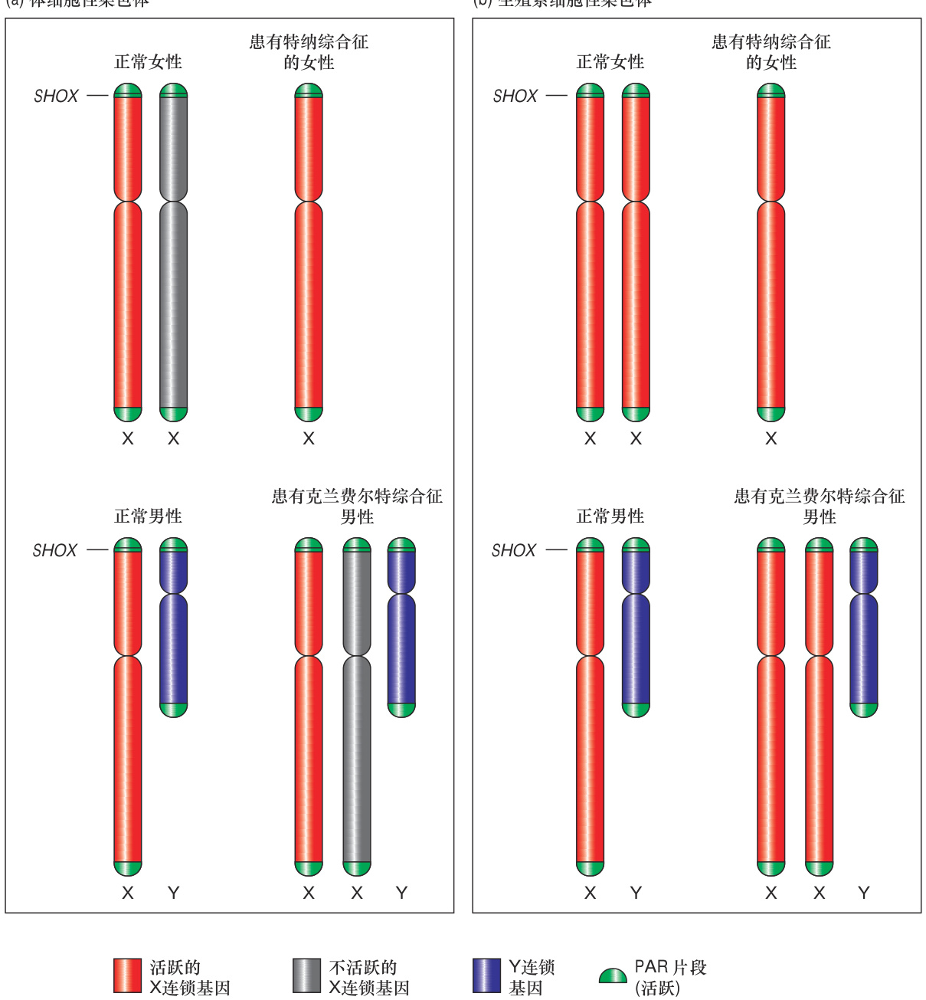  
(a)   
图13.28　为什么X染色体非整倍体可以影响外形和导致不孕。（a）体细胞中的X染色体沉默没有影响PAR（绿色）中的基因，包括SHOX。结果，在XO特纳女性中，PAR基因表达只有正常水平的一半，在XXY克兰费尔特男性中，PAR基因是过度表达的。（b）因为所有的X染色体在繁殖细胞中有活性，XO女性的繁殖细胞中所有X关联基因的剂量只有正常水平的一半，XXY男性的繁殖细胞中大多数X关联基因的剂量是正常水平的两倍（PAR基因则是正常水平的三倍）。  

# 13.4.3 减数分裂不分离产生非整倍体  

减数分裂中的染色体分离错误产生了不同种的非整倍体，这取决于错误何时发生。如果在第一次减数分裂中两条同源染色体不分离（即不分开），产生的两个单倍体配子，一个配子将会携带两个同源染色体，而另外一个配子则不携带这两个同源染色体。这样的配子与正常配子结合，将会产生非整倍体受精卵：一半会是三体，一半会是单体［图13.29（a）］。与之相对比，如果在减数分裂Ⅱ时发生减数分裂不分离，四个形成的配子中，只有两个将会是非整倍体的［图13.29（b）］。  

异常的 $_{n+1}$ 配子是来自于细胞的不分离，该细胞中，位于不分离染色体着丝粒附近基因的等位基因是杂合的。如果不分离发生在第一次减数分裂［图13.29（a）］，这些配子将会是杂合的。但是，如果不分离发生在第二次减数分裂中［图13.29（b）］，那么这些配子将会是纯合的。用这种区别有可能来确定，一个特定的不分离何时、在哪个单亲中发生。不分离事件会产生唐氏综合图13.29　减数分裂错误导致了非整倍体。（a）对于着丝粒附近的基因而言，如果三体后代从单亲遗传了两个不同的等位基因（A和a），不分离发生在分数分裂Ⅰ期。（b）如果从一个单亲中遗传的两个等位基因是相同的（A和A；或者a和a），不分离发生在减数分裂Ⅱ期。  

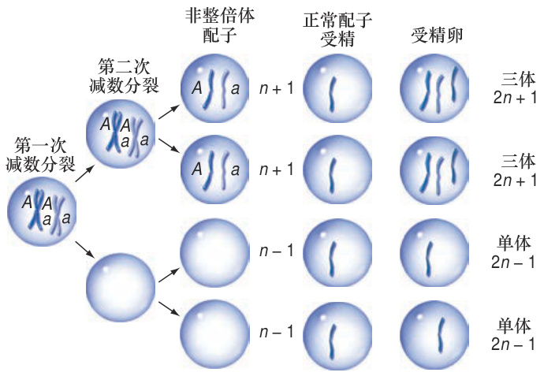  
(a)   
(b)  

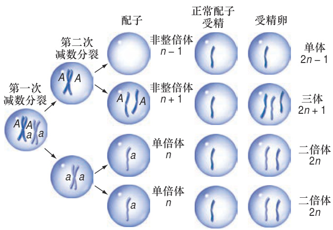  

征，例如，母亲（ $90\%$ ）中比父亲（ $10\%$ ）中发生得更频繁。令人感兴趣的是，在女性中，这些不分离事件，相对于第二次减数分裂，更多地发生在第一次减数分裂（大约 $75\%$ ）。与之相对比，当导致唐氏综合征的不分离事件发生在男性时，情况则恰恰相反。  

分子研究发现，人中许多减数分裂不分离事件都来自于减数分裂重组出现的问题。通过跟踪DNA标记，临床研究者可以确定在产生 $_{n+1}$ 配子的减数分裂过程中，重组是否发生在21号染色体上。有许多唐氏综合征的例子都是在母亲第一次减数分裂中，由不分离导致的，在有缺陷的减数分裂中，同源21号染色体之间并没有发生重组。这个结果是可以理解的，因为在染色体交换中，即与交换相关的结构，父系和母系同源染色体在第一个减数分裂的中期板上形成了一个二价体（回顾图4.15）。在发生重组和染色体交换时，没有一种机制来确保母系和父系染色体能在后期Ⅰ中被拉到相反的两极。唐氏综合征儿童病患频率增加，与母亲岁数增加是有关的，这反映了母系在减数分裂重组上的组织效力下降。  

# 13.4.4 很少有有丝分裂不分离或者染色体丢失导致了嵌合性  

受精卵分裂多次，才能变成完整的生物体，所以与发育相伴随，有丝分裂时的染色体分离一旦发生错误，在一些极端例子中，也许会增加或者降低在特定细胞中染色体完整。在有丝分裂不分离中，两个姐妹染色单体在有丝分裂后期无法分开，将会产生相互对应的三体和单体子代细胞［图13.30（a）］。也会有其他一些错误，例如，染色单体在有丝分裂后期无法被拉到纺锤体任何一极，这会导致染色体丢失，进而产生了一个单体子代细胞和一个二倍体子代细胞［图13.30（b）］。  

在多细胞生物体中，有丝分裂不分离或者染色体丢失都可以导致非整倍体细胞，这些细胞也许会存活下来，进而进行进一步的细胞分裂，产生拥有异常染色体数目的细胞克隆。不分离或者染色体丢失发生在发育早期，这会比在发育晚期发生，产生更大的非整倍体克隆。非整倍体和正常组织的共存，导致了嵌合生物体，其表型取决于什么组织拥有非整倍体、非整倍体细胞的数目，以及非整倍体染色体上特异基因的等位基因。许多嵌合体的例子都与性染色体有关。如果XX雌性果蝇在受精之后的第一次有丝分裂中，丢失一个X染色体，结果就会产生雌雄嵌合体，拥有相同的雄性和雌性组织部分［图13.30（c）］。  

许多女性特纳综合征患者都是嵌合体，同时拥有XX细胞和XO细胞。这些个体开始发育的时候是XX受精卵，但是在胚胎早期有丝分裂中丢失了一个X染色体，她们获得了XO细胞。常染色体的类似嵌合体也会发生。例如，医生发现几个中度唐氏综合征的病例，他们是由三体21的嵌合体导致的。在拥有特纳或者唐氏嵌合体的人群中，一些正常组织的存在减轻了其症状，个体表型取决于二倍体/非整倍体细胞的特别分布。  

# 基本概念  

●  非整倍体是一个或者更多染色体的丢失或者增加。●  常染色体非整倍体由于遗传不平衡通常都是致死的。●  性染色体有很好的非整倍体特性，因为只有一个X染色体是有活性的，且Y染色体上的基因比较少。●  在减数分裂中，染色体不分离会导致不平衡的配子，因而在后代中产生非整倍体。●  很少有有丝分裂不分离或者染色体丢失会导致嵌合体，即拥有正常细胞和非整倍体细胞的生物体。  

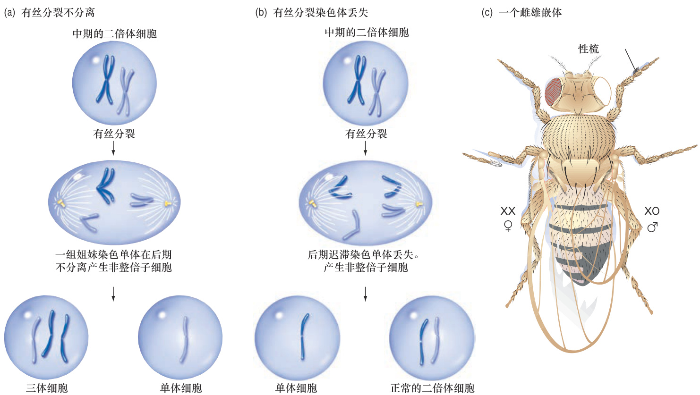  

图13.30　有丝分裂时的错误可以产生非整倍体细胞克隆。有丝分裂不分离（a）或者有丝分裂染色体丢失（b）可以产生单体或者三体细胞，它们会分裂产生非整倍体细胞克隆。（c）如果X染色体在XX果蝇受精卵第一次有丝分裂时，有一个X染色体丢失了，一个子代细胞将会是XX（雌性），但是另外一个将会是XO（雄性）。这样一个胚胎将会长成一个雌雄嵌合体。本图中，受精卵是 $\cdot w^{+}m^{+}/w m$ ，因而这个果蝇（左边）的XX这一半拥有红眼和正常翅膀。拥有 $w^{+}m^{+}$ 的X染色体丢失了，产生了另外一半XO（右边），拥有白色眼睛（ $w$ ）和变小的翅膀（ $m$ ），以及一个雄性特有的性梳。  

# 13.5 染色体组数目的变异：整倍体  

# 学习目标  

1.  区分x和n，它们对应整倍体和非整倍体中的染色体数目。  

2.  解释为什么拥有奇数染色体套数的生物体通常是不育的。  
3. 比较同源多倍体和异源多倍体。  
4.  讨论植物育种学家如何研究一倍体和多倍体的存在。  

与非整倍体相比，整倍体细胞只拥有完整的染色体套数。大多数整倍体物种都是二倍体的，但是一些整倍体物种是多倍体，拥有三个或者更多的染色体套数（表13.5）。当提到多倍体的时候，遗传学家使用 $x.$ 标记来标注染色体基数，即不同染色体的数目组成了一套完全的染色体。三倍体物种拥有三套染色体，就是 $\cdot3x$ ；四倍体拥有四套染色体，是 $4x$ ；依此类推。  

对于二倍体而言， $x.$ 与 $n$ 是相等的，其中 $n$ 是配子中染色体的数目，因为每个配子只有一套染色体。虽然如此，但是多倍体并没有 $\scriptstyle{x=n}$ ，我们会随后举例解释。商业种植面包小麦全部拥有42条染色体：6套几乎相同的染色体（并不是全部相同），每套拥有7个不同染色体。面包小麦因而是六倍体，基础数字为 $x{=}7$ ， $6x{=}42$ 。但是每个三倍体配子只有全部染色体的一半，因而 $_{n=21}$ 。这样的话，对于面包小麦来说， $x$ 和n并不相同。  

除了多倍体，一倍体（x）生物中算是另外一种整倍体，它们只有一套染色体（表13.5）。  

表13.5　整倍体变异  

<html><body><table><tr><td></td><td>染色体1</td><td>染色体2</td><td>染色体3</td></tr><tr><td>二倍体 (2x)</td><td>XX</td><td>XX</td><td>XX</td></tr><tr><td>一倍体 (x)</td><td></td><td></td><td></td></tr><tr><td>三倍体 (3x）</td><td>XXX</td><td>XXX</td><td>XXX</td></tr><tr><td>四倍体 (4x)</td><td>XXXX</td><td>XXXX</td><td>XXXX</td></tr></table></body></html>  

在动物中，很少看到一倍体和多倍体。蚂蚁和蜜蜂的一些品种中，有一些一倍体的例子，其中雄性是一倍体的，但是雌性是二倍体的。这些物种的雄性是未受精卵子经过孤雌生殖发育而来的。这些雄性一倍体通过改变的减数分裂产生配子，这个减数分裂以某些未知的方法，在减数分裂Ⅰ中将所有染色体都分配到同一个子代细胞中；姐妹染色单体在减数分裂Ⅱ期正常分离。  

动物中的多倍体正常情况下只存在于一些品种中，它们的繁殖节律并不正常，例如，雌雄同体的蚯蚓，它们同时拥有雄性和雌雄繁殖器官；还有一个例子是孤雌生殖的金鱼四倍体。在果蝇中，在特定情况下，产生三倍体和四倍体雌性是可能的，但是雄性是绝对不可能的。在人中，多倍体通常是致死的，经常在妊娠前期导致自发流产。  

# 13.5.1 一倍体植物对于植物育种学家是非常有用的  

植物学家通过对完成减数分裂、正常情况下会发育成花粉的繁殖细胞进行特殊处理，可以将二倍体物种创造成一倍体植物（注意，以这种方式得到的一倍体植物也可以被看成是一倍体，因为 $x{=}n$ ）。处理的细胞分裂成一堆组织，即胚状体。随后植物激素作用使得胚状体发育成一株植物［图13.31（a）］。一倍体植物也许是在很大的自然群体中，由罕见的自发事件导致的。  

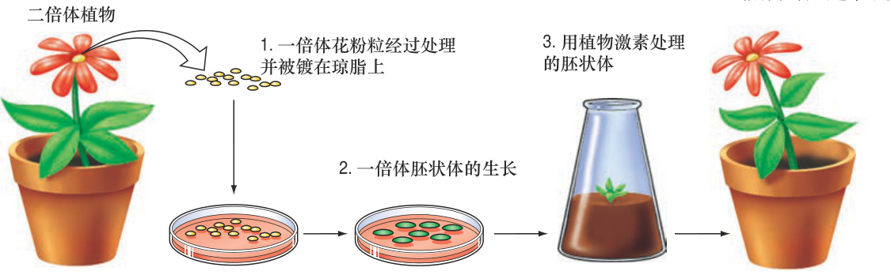  
(a)   
4.      （    ）  
(b)  

1. (c)  

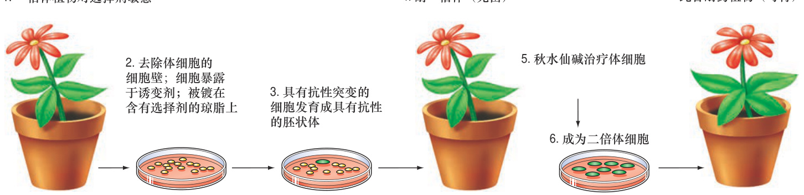  

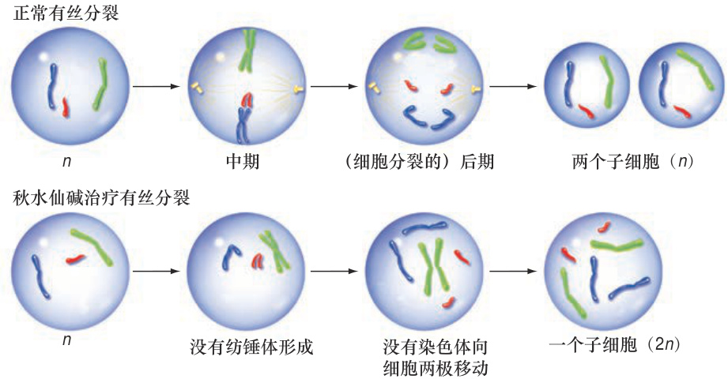  

图13.31　创造一倍体植物和其用处。（a）在特定情况下，一倍体花粉可以长成为二倍体胚状体。当用植物激素处理之后，二倍体胚状体可以长成为一倍体植物。（b）学者选择一倍体细胞来研究隐性性状，如除草剂抗性。然后选择一倍体细胞，让其长大成抗性胚状体，（在激素处理之后）最后成为成熟的抗性一倍体植物。秋水仙碱处理将染色体数目加倍，形成二倍体细胞，然后在激素处理下长大为纯合的抗除草剂的二倍体植物。（c）秋水仙碱处理阻止了减数分裂纺锤体的形成，也阻止细胞质移动，使得细胞拥有双倍的染色体。蓝色、红色和绿色标示非同源染色体。  

大多数一倍体植物，无论它们起源为何，都是不育的。因为在减数分裂Ⅰ期，没有配对的染色体，它们在分裂期间随机被分配到纺锤体的两极。很少发生所有染色体都分配到同一极的情况，如果确实没有都到一极，那么最后的配子就会有缺陷，因为它们会缺一个或者几个染色体。基因组中染色体数目越多，配子含有所有染色体的可能性越低。  

尽管存在这么多配子形成的问题，一倍体植物和组织对于植物育种学家来说是非常有价值的。一倍体使得在正常情况下直接看到隐性性状成为可能，不需要杂交来获得纯合子。植物研究学者可以将突变引入到一倍体细胞，选择需求的表型，如对除草剂的抗性，使用激素处理让选中的细胞成长为一倍体植物［图13.31（b）］。秋水仙碱是一种从秋水仙中提取的生物碱药物，育种学家通过秋水仙碱处理组织，可以将选择的一倍体转变成纯合二倍体植物。秋水仙碱可以结合到微管蛋白上来阻止纺锤体的形成，因为微管蛋白是纺锤体的主要组成蛋白。细胞没有纺锤体，姐妹染色单体在着丝粒分开之后无法分离，这样秋水仙碱处理之后，染色体加倍会经常发生［图13.31（c）］。最后的二倍体细胞可以长成为二倍体植物，会形成要求的表型和可育的配子。  

# 13.5.2 三倍体生物通常都是不育的  

三倍体（ $3x$ ）是一倍体（ $x$ ）和二倍体（ $2x$ ）配子结合而成［图13.32（a）］。二倍体配子也许是四倍体（ $4x\ .$ ）繁殖细胞减数分裂的产物，或者是二倍体减数分裂时罕见出现的纺锤体或细胞质移动失败的产物。  

三倍体生物的有性生殖是极度无效率的，因为减数分裂多数情况下产生不平衡的配子。三倍体细胞的第一次减数分裂中，三套染色体必须分离进入两个子代细胞中。无论染色体如何配对，都无法确保最后的配子会有一套完整的平衡 $x$ 或者 $2x$ 互补染色体。多数情况下，在减数分裂后期Ⅰ末尾，两个染色体其中一条移向一极，剩下的一条染色体移向另外一极。由于三个同源染色体的每一个都独立于其他两个来决定哪一极得到两个拷贝、哪一极得到一个拷贝，这样减数分裂的产物几乎都是不平衡的，一些染色体有两个拷贝，而其他一些染色体则有一个拷贝［图13.32（b）］。如果 $x$ 很大，得到平衡配子的可能性几乎是不可能的。因此，三倍体个体配子受精之后，通常并不会产生可存活的后代。虽然如此，但是如果 $x_{\mathrm{~\,~}}$ 很小，那么偶尔减数分裂就会产生平衡配子；碰巧，同源染色体的两个拷贝都进入到同一极，而同源染色体剩下的一个拷贝进入另外一极。  

通过无性生殖来繁殖一些三倍体物种是可能的，如香蕉和西瓜。三倍体植物水果是没有种子的，因为不平衡的配子受精时无法正常运作，或者如果能受精，受精卵由于遗传平衡而无法发育。无论是哪一种情况，都没  

# (a)  

（4x）  

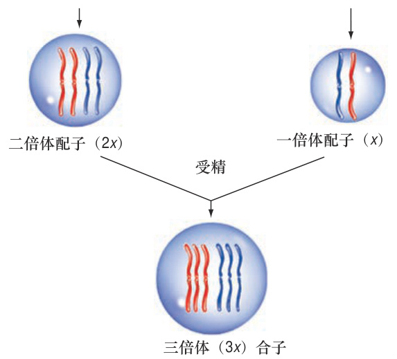  
(b)  

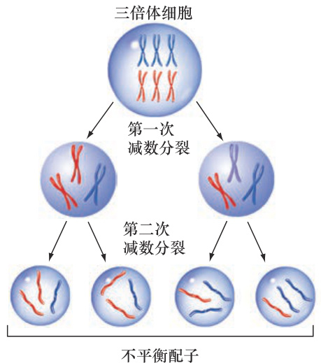  
图13.32　三倍体的遗传。（a）一倍体配子和二倍体配子受精，形成了三倍体（ $3x{=}6$ ）。蓝色或者红色是非同源染色体。（b）三倍体减数分裂一般会产生不平衡（非整倍体）配子，因为在减数分裂Ⅰ期，三个同源染色体中，每一个都随机分离进入两个子代细胞中的一个。  

有种子产生。如同三倍体一样，所有的奇数染色体套数的多倍体（如 $|5x.$ 或者 $^{7x}$ ）都是不育的，因为它们无法稳定地产生平衡的配子。  

# 13.5.3 奇数染色体套的多倍体可以成为新物种  

在减数分裂中，如果二倍体组织中的染色体在复制之后无法分离，其子代细胞将会是四倍体［ $4x$ ；图13.33（a）］。如果这样一个四倍体细胞在繁殖组织中出现，随后的减数分裂将会产生二倍体配子。二倍体配子间罕见地发生结合，就产生了四倍体生物。新出现的四倍体生物自体受精，将会产生一个完全全新的物种，这是因为四倍体和原先二倍体生物之间的杂交将会产生不育的三倍体（回顾图13.32）。这种方式产图13.33　四倍体的遗传。（a）减数分裂时二倍体染色体无法分离进入两个子代细胞，从而产生了四倍体。（b）在成功的四倍体中，染色体配对形成了二价体，产生了遗传平衡的配子。（c）AAaa杂合四倍体有一个着丝粒相关的基因，其有两个等位基因，其二价体配对是有序的，进而产生配子。四个染色体配对，以三种可能的方式，产生了两个二价体。对于每个配对计划而言，染色体以两种不同的方向来进行。如果所有的可能性都均等，在一群配子中，预期基因型频率将会是$1(A A):4(A a):1(a a)_{\circ}$  

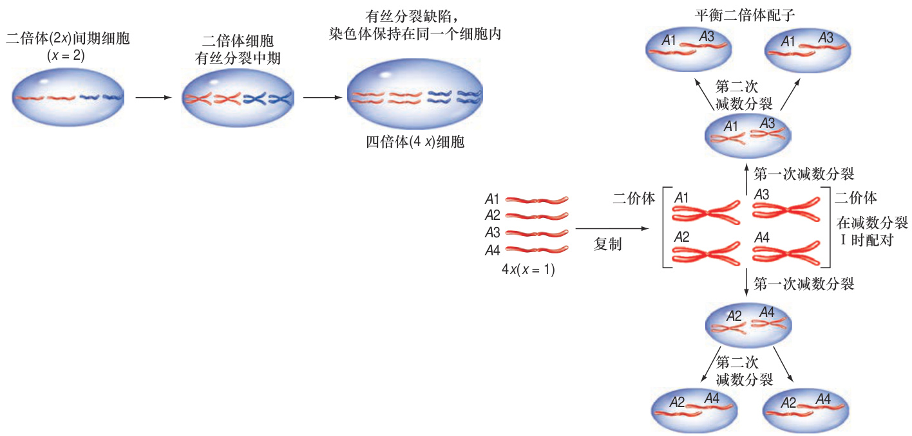  
(b)  

(c)   AAaa   

<html><body><table><tr><td>染色体</td><td colspan="5">配对和排列</td></tr><tr><td>2. 3 4</td><td>3 2 4 2 3 4 A 2 4 3</td><td>或 2 或 3 或 4</td><td>4 2 A 3 2</td><td>1+3Aa 2+4Aa 1+ 2AA 或 3+4aa 1+2AA 或 3+4aa</td><td>配子的产生 或</td><td>1+4Aa 2+3Aa 1+4Aa 2+3Aa 1+3Aa 2+4Aa</td></tr></table></body></html>

\*      A   
$\begin{array}{c}{2(A\,A):8(A\,a):2(a\,a)}\\ {=1\,(A\,A):4(A\,a):1\,(a\,a)}\end{array}$  

生的四倍体就是同源多倍体（在这个例子中是同源四倍体），是一种同一个物种所有套染色体产生的多倍体。  

能否维持四倍体物种，这取决于配子是否拥有平衡的染色体套数。大多数成功的四倍体都进化出机制来确保每一组同源染色体的四个拷贝，可以以 $2\times2$ 的方式来配对，进而形成两个二价体，即同源染色体的联会配对［图13.33（b）］。因为每个二价体中的染色体在减数分裂Ⅰ期被拉向相反的纺锤体两极，减数分裂就会产生携带两套完整染色体的配子。  

四倍体的基因都有四个拷贝，这会形成不寻常的孟德尔比例。例如，一个基因即使只有2个等位基因（假设是A和a），可能会有5个不同的基因型：AAAA、  

AAAa、AAaa、Aaaa和aaaa。如果表型取决于A的剂量，那么就会有5个表型，每个都对应一个基因型。  

与之相类，四倍体减数分裂时，等位基因的分离也是很复杂的。假如有一个AAaa杂合子，其中A等位基因是完全显性的。问题是，aaaa基因型所产生的后代拥有隐性表型的机会有多大呢？正如图13.33（c）所示，如果在减数分裂Ⅰ期，拥有这个基因的四个染色体在赤道板上二价体中随机配对，配子预期比例为2（ $A A~)~:~8$ $(\;A a\;)\;:2\;(\;a a\;)=1\;(\;A A\;)\;:4\;(\;A a\;)\;:1$ （aa）。在自体受精时，得到aaaa后代的机会是 $1/6\times1/6{=}1/36$ 。换句话说，由于A是完全显性的，显性与隐性表型的比例是$35:1$ ，这是因为A−−−和aaaa基因型的比例就是如此。  

新的多倍体水平可能是多倍体基因组的加倍产生的。这样一种加倍在自然界很少发生；用秋水仙碱或者其他药物来进行可控处理，破坏减数分裂的纺锤体，也可以创造这样的加倍。四倍体基因组加倍则可以产生八倍体（ $8x$ ）。持续的基因组加倍所产生的高水平多倍体是同源多倍体，因为所有的染色体都来自于同一个物种。  

粗略计算，开花植物中每三个已知物种就有一个是多倍体，因为多倍体经常会增加植物大小和活力，许多可食用的多倍体植物都被选育用以农业种植。大多数商业上种植的苜蓿、咖啡和花生都是四倍体（ $4x$ ）。马氏苹果树和巴氏梨树都能产出巨大水果，也是四倍体。商业种植的草莓是八倍体（ $8x$ ）（图13.34）。  

多倍体植物在进化上是成功的，这源于多倍性提供了额外的基因拷贝，如基因重复。当一个拷贝行使原来的功能时，该基因的其他拷贝可以进化出新的功能，从而获得优势。虽然如此，正如你看到的，多倍体物种的生殖需要偶数套染色体。  

# 13.5.4 异源多倍体是两个不同物种全套染色体的杂合  

多倍体可以来自于染色体加倍，也可以来自于不同物种间的杂交，即使这些物种拥有不同的染色体数目。两个或者更多远缘但是相关的物种，其整套染色体所形成的杂合体，称之为异源多倍体。  

可育的异源多倍体极少，因为两个不同物种间的染色体通常DNA序列和数目都不同，因而它们很难相互配对。这导致不规则的分离，从而创造出遗传不平衡的配子，以至于杂交后代是不育的。虽然如此，但是繁殖细胞染色体加倍，每个染色体都产生了可配对的对象，这样就可以恢复其生育。如果两个亲本是二倍体，那么这种方式产生的异源多倍体，称之为双二倍体；双二倍体包含两个二倍体基因组，每个都来自于一个亲本。正如后面将会呈现的，想要预测双二倍体或者其他异源多倍体的特性是很难的。  

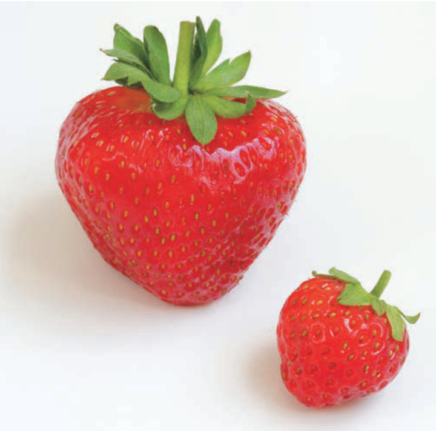  
图13.34　多倍体植物比二倍体更大。八倍体（左）和二倍体（右）草莓的比较。$\copyright$ Rosemary Calvert/Getty Images RF  

例如，二倍体卷心菜和二倍体小萝卜杂交，产生了双二倍体，称之为萝卜甘蓝（Raphanobrassica）。这两个亲本的配子都有9个染色体；杂交F1是不育的，拥有18个染色体，都不是同源染色体。用秋水仙碱处理繁殖细胞之后，其染色体就加倍了，然后两个配子结合产生了一个新的物种——可育的萝卜甘蓝双二倍体，其拥有36条染色体，完全互补的18条（9对）来自卷心菜，完全互补的另外18条（9对）来自小萝卜。不幸的是，这个双二倍体的根是卷心菜的根，叶片则类似于小萝卜的叶片，因此农业上并没有什么用处。  

与之相对比，四倍体（或者六倍体）小麦和二倍体黑麦之间的杂交产生了几个异源多倍体杂种，拥有来自两个物种的农业上所需求的性状（图13.35）。一些杂种既有小麦的高产，也有黑麦对不利环境的适应能力；还结合了小麦高水平的蛋白质和黑麦高水平的赖氨酸。小麦蛋白中的赖氨酸含量不高，而赖氨酸是人类饮食中非常关键的成分。小麦和黑麦之间的不同杂种形成了一种新的作物，称之为小黑麦。一些小黑麦品系能产生有营养的谷物，可以用于面包的制作，在健康食物商店中有售卖。植物育种学家现在正在评估不同小黑麦品系在大规模农业中的用处。  

# 基本概念  

●  整倍体生物包含整套染色体。一倍体只有一套染色体，而多倍体有超过两套染色体。  
●  在多倍体生物中， $x$ 代表了组成一套完整染色体的基本染色体数目，而 $n$ 则代表了配子中的染色体数目。对于二倍体生物而言（ $2x$ 体细胞）， $n{=}x$ 。对于六倍体而言（ $6x$ 体细胞）， $n{=}3x$ 。  
●  一倍体就像多倍体一样，含有奇数套染色体，通常是不育的，因为染色体在减数分裂时无法分离来产生平衡配子。  
●  同源多倍体含有一个物种的所有染色体；异源多倍体的染色体则是来自不同物种。  
●  细胞分离时的错误导致了染色体加倍，导致所有的染色体都有一个配对对象，因而生物是可育的。  

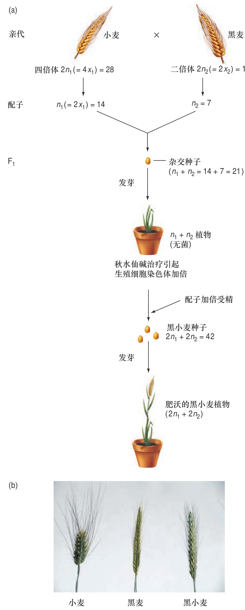  

图13.35　农业中的异源多倍体。（a）植物育种学家将小麦和黑麦杂交，创造出了异源多倍体小黑麦。因为小麦品系是四倍体， $x_{1}$ （小麦基本染色体的数目）是 $n_{1}$ （小麦配子染色体数目）的一半。对于二倍体黑麦而言， $n_{2}{=}x_{2}$ 。注意小麦和黑麦之间F 代杂种是不育的，因为黑麦染色体没有配对对象。秋水仙碱处理F 代杂种，使得染色体数目加倍，就可以配对了。（b）小麦、黑麦和小黑麦谷穗比较。  

# 13.6 基因组重组和进化  

# 学习目标  

1.  描述不同染色体重排如何改变基因表达模式或者产生新的基因产物。  
2.  讨论重复产生的多余基因拷贝如何帮助燃料进化。  
3. 解释为什么易位有助于物种形成。  

在本章开始的时候，我们就看到大约300个染色体重排可以重塑人基因组，使得其类似于小鼠的基因组。小鼠和人基因组的直接DNA序列比较表明，自从人和小鼠6500万年前从共同祖先开始分开之后，缺失、重复、倒位、易位和转座在这两个分支中都有发生。本章讨论了各种基因组重组，这里我们认为有三个普遍存在的方式，它们使得这些基因组重组有助于进化。  

# 13.6.1 染色体重排和转录是基因组变异的重要来源  

进化过程完全依赖于DNA序列变异的存在。变异体使得生物在特定环境中生存和繁殖，进而通过群体扩散，而对生物适应产生负效应的变异则会消失。没有变异，就没有自然选择和进化。  

虽然之前的章节已经强调了单碱基变化相关的变异，如SNP，本章想要说明的是，大尺度重排和转座元件的移动也是非常关键的DNA变异贡献者，自然选择可以作用其中。在重排断点处或者附近的基因也许会获得新的表达模式，这会增加或者减少在特定组织中的表达。在一些例子中，重排断点通过将两个之前分开的基因融合到一起，从而创造了新的基因功能［回顾图13.16（b）］。TE进入基因可以改变基因表达，甚至完全破坏一个基因，从而产生无效突变（如图13.24所示）；甚至基因沉默可能在新环境中是有利的，因为在新环境中该基因的功能可能是有害的。  

# 13.6.2 重复提供额外的基因拷贝可以获得新功能  

如果一个基因对于生物生存是非常关键的，那么这个生物正常情况下无法忍受其突变，但是重复将会为该基因提供两个拷贝。如果一个拷贝一直是完整的，可以行使其重要功能，那么另外一个拷贝可以自由进化出新的功能。事实上，大多数高等植物和动物的基因组都包含大量基因家族，即紧密相关的基因，其功能略微有些区别，这些基因家族最可能是来自于基因重复事件的自然演替。在脊椎动物中，一些基因家族拥有成百上千个成员。第10章讨论了这些基因家族的一些例子，如人中血红蛋白和味觉受体基因。  

如果一些基因的重复提供了新的原材料，分化和自然选择可以作用其中，从而形成基因家族，你就可以想象全部基因组的重复也会发生相同情况，会对于成千上万的基因产生额外的拷贝。事实上，多倍化对于植物物种分化是特别重要的。例如，植物生物学家认为，大约9000万年前，一个古老的二倍体物种拥有5条不同染色体（ $x{=}5$ ），发生了全基因组重复。重复的染色体开始相互分化，也发生了断裂和罗伯逊易位。所有发生的这些变异的结果是，形成了一个新的二倍体物种，其拥有12条染色体（ $x{=}12$ ），它是现在所有禾本科牧草的共同祖先，包括水稻、小麦、大麦、高粱和玉米。  

古代全基因组重复的假设是有证据的，在当代谷物如水稻（Oryza sativa）的基因组序列中就有证据（图13.36）。正如在图中间彩线所标示的那样，许多同源基因序列组块在两个不同染色体上被发现。在这些组块中，基因的顺序大多是保守的。虽然如此，但是这些基因的两个拷贝并不相同：一些基因拷贝可能获得了新功能；另外一些发生突变，无法识别，因而也丢失了。  

多倍化的普遍策略是提供多余的基因拷贝，这在产生变异上是非常成功的，许多植物的基因组都有迹象，它们在过去不同时间上经历了多轮基因组重复或者三倍化。  

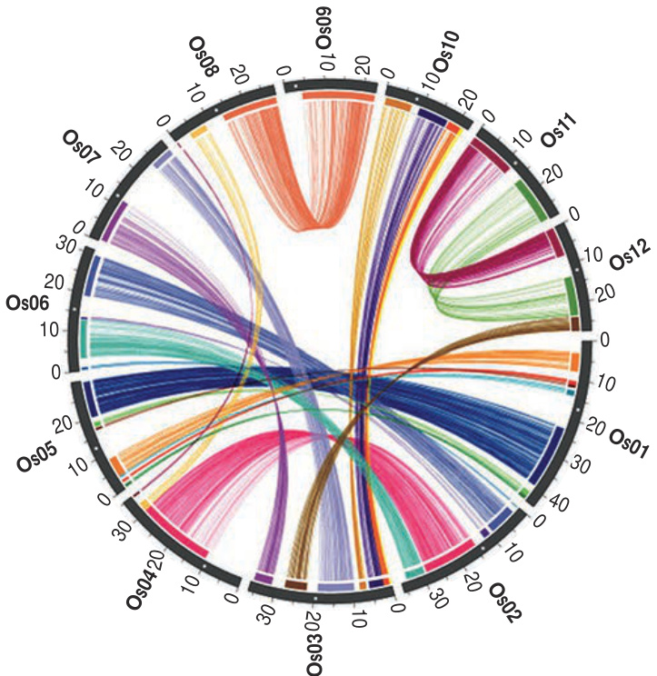  
图13.36　一个古代重复在当代水稻基因组中仍然可见。所有禾本科牧草的古代共同祖先，被认为有5个不同的染色体。在染色体加倍和重排之后，原先染色体的两个拷贝现在O. sativa的12条染色体中分布，称之为Os1和Os12。彩线标示不同水稻  

染色体上的同源基因，展现了其进化历史。  

引自：T. Thiel et al. (2009), “Evidence and evolutionary analysis of ancient whole-genome duplication in barley predating the divergence from rice,” BMC Evolutionary Biology, 9:209, Fig. 1. $\copyright$ Thiel et al. Licensee BioMed Central Ltd. 2009. http://bmcevolbiol.biomedcentral.com/articles/10.1186/1471-2148-9-209  

# 13.6.3 易位有助于物种形成  

大西洋葡萄牙海岸外有一个马德拉小火山岛，在上面有两群普通小家鼠（Mus musculus）正变成隔离的品种，因为易位有助于产生生殖隔离。小鼠生活在几个狭窄山谷中，这些山谷被陡峭的大山隔开。遗传学家发现，大山障碍的两边生活的两群小鼠，拥有不同套的染色体，因为它们累积了不同的罗伯逊易位（图13.37）。例如，一个马德拉群体中的小鼠是二倍体（ $2x$ ），拥有22条染色体；另外一群小鼠则有24条染色体；对于世界上大多数小鼠， $2x{=}40$ 。  

这两群隔离的群体间进行配对，其杂交后代是不育(a)  

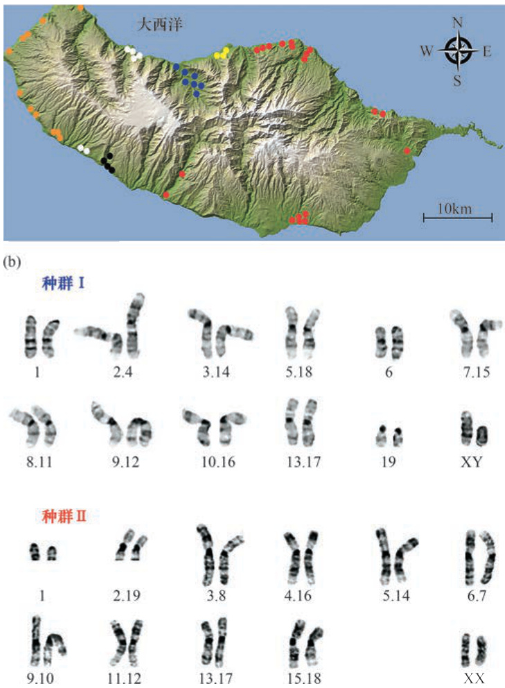  
图13.37　在马德拉岛上小鼠的快速染色体进化。（a）拥有不同罗伯逊易位的小鼠（不同颜色标示）在岛上的分布。（b）两个不同群体雌性小鼠染色体核型。上面的核型Ⅰ是来自（a）中蓝点标示的群体；下面的核型Ⅱ是来自红点标示的群体。罗伯逊易位由逗号分开的数字来识别（例如，2，19就是一个小鼠标准  

（a）来源：NASA Earth Observatory image created by Jesse Allen, using a digital elevation model from the Direcção Regional de Informação Geográ ca e Ordenamento do Território （DRIGOT） of Madeira and the   
Telecommunication Advanced Networks for GMES Operations （TANGO）. Special thanks to Pedro Soares and Antonio de la Cruz （European Union   
Satellite Centre）；（b）： $\copyright$ Janice Britton-Davidian, Institut des Sciences de l’Evolution Montpellier  

的，因为染色体互补是不同的，无法恰当地进行配对和减数分裂时的分离。因而，生殖隔离加强了已经存在的地理隔离，这两群小鼠接近成为两个不同物种了。这个物种形成的例子中，最引人注目的是，葡萄牙移民仅仅在15世纪将小鼠引入到马德拉岛。这个结果意味着，对于物种形成有帮助的不同的复杂罗伯逊易位，在不到600年内就在不同群体中固定下来了。  

# 基本概念  

●  在重排断点处，新的基因表达模式或者新的基因产物的产生，提供了服从于自然选择的变异。  
●  重复产生了额外的基因拷贝，可以相互独立地突变，从而产生新功能。  
●  易位有助于物种形成，因为易位的杂合会产生不育；大多数成功的配对只在拥有相同染色体互补配对的个体间才能发生。  

# 接下来的内容  

染色体组织和数目的变化，多数都是有害的，给人类带来很大痛苦（回顾表13.4）。每1000个个体中，大约有4个人有与异常染色体组织或者数目相关的异常表型。多数疾病源于X染色体的非整倍体或者三体21。与之相对比，每1000个人中，大约10个人患有严重的单基因突变导致的遗传疾病。如果不是许多有异常染色体核型的胚胎或者胎儿在妊娠早期就自发流产了，否则人染色体不正常的发生率会高得多。 $15\%{\sim}20\%$ 的可识别的流产是可以可发觉的自发流产；自发流产的胎儿中，有一半有染色体异常，特别是三体、性染色体单体和三倍体。这些数字几乎肯定是低估了异常染色体变异导致的自发流产发生率，因为胚胎如果携带更大染色体异变，如单体2或者三体5，也许很早就流产了，使得妊娠都可识别。  

尽管染色体重排和染色体数目变化有负面效应，一些偏离正常基因组组织的变异仍然存活下来，变成了自然选择的进化工具。  

正如我们在下一章所见，细菌中也能像真核生物一样，发生染色体重排。在细菌中，转座元件在染色体组织中催化了许多变化。令人注意的是，相同细胞中不同DNA分子间发生的基因漂流，会帮助加速遗传信息从一个细菌细胞转移到另外一个。  

# 习题精解  

Ⅰ.  用X射线照射纯种野生型的雄性果蝇，然后与携带下面X染色体隐性突变的雌雄果蝇配对：黄色身体（y），翅脉缺失翅膀（ $c\nu$ ），截断的翅膀（ct），损伤的刚毛（ $s n$ ），微型翅膀（ $m$ ）。这些标记已  

知是按照这个顺序排列的：  

y-cv-ct-sn-m  

这个杂交的雌性后代多数表型上都是野生型的，但是一个雌性拥有ct和sn表型。这个例外的ct sn雌性果蝇与一个野生型的雄性果蝇配对之后，在后代中雌性果蝇是雄性的两倍。  

a.  在这个例外的雌性果蝇中，X射线诱导的突变到底是什么？  
b.  画出ct sn雌性果蝇中X染色体在减数分裂中的配对。  
c.  如果将这个例外ct sn雌性果蝇与正常雄性果蝇配对，你预期在其后代中将会看到什么样的表型？分别列出雄性和雌性。  

# 解答  

为了回答这些问题，你需要先想想不同种染色体突变的影响，从而推断突变的本质。然后，你可以评估突变对遗传的影响。  

a.  有两个发现表明X射线诱导出一个缺失突变。两个隐性突变在例外雌性果蝇中有表达，这表明它的一条X染色体有缺失，从而暴露了另外一条X染色体上的突变体等位基因（ct和sn）。  

其次，这个例外雌性的后代中，雌性是雄性的二倍，这与缺失突变是相符的。雄性从其母亲遗传了缺失X染色体，将会是致死的（因为在这个区域上的其他关键基因现在也丢失了）。但是遗传非缺失X染色体的雄性子代将会存活。另一方面，这个例外雌性的所有雌性后代都能存活：即使它们从其母亲遗传了缺失X染色体，它们也可以从其父亲处遗传一条正常的X染色体。结果，例外雌性和野生雄性果蝇杂交，产生的雄性子代果蝇只有雌性子代果蝇的一半。  

b.  配对时，正常X染色体上的DNA将会形成环状结构，因为缺失染色体上没有同源区域。在下面减数分裂Ⅰ的简化图中，每条线代表两条同源染色单体。  

  

c.  这个例外雌性果蝇的所有雌性后代都是野生型的，因为父亲贡献了所有野生型的基因。每一个存活的雄性子代都必须从这个特殊的雌性果蝇那里继承一条未被删除的X染色体。一些减数分裂产生的X染色体没有发生重组，但是另外一些X染色体则存在重组。雄性果蝇可以拥有这里所有的基因型，以及相应的表型。所有类型都包含ctsn重组，因为同源染色体之间，在这个缺失区域上可能并没有发生重组。一些基因型需要在母亲中发生多次减数分裂交换，这其实相对是很少发生的。  

y cv ct sn m$^+$ + ct sn +$^+$ cv ct sn m$y$ + ct sn +$y$ cv ct sn ++ + ct sn m$^+$ cv ct sn +$y$ + ct sn m  

Ⅱ.  玉米三体中， $_{n+1}$ 花粉并不能存活。如果B基因座中有一个显性等位基因，会产生紫色，而不是隐性表型青铜色，同时Bbb三体玉米是由 $B B b$ 玉米授粉而来，三体后代拥有青铜色的比率是多少？  

# 解答  

为了解决这个问题，思考一下产生三体青铜色后代需要什么：受精卵中有三个 $b$ 染色体。母本必须贡献两个 $b$ 等位基因，因为来自父本的 $_{n+1}$ 花粉并不能存活。  

三体Bbb紫色母本会产生什么样的配子？其比率是多少？为了囊括所有可能性，将这个基因型写为$B b_{1}b_{2}$ ，无论 $b_{1}$ 和 $b_{2}$ 是否对表型拥有相同的影响。在三体雌性中，携带这些等位基因的染色体，可以三种方式，在第一次减数分裂时配对形成二价体，因而它们将会分离到相反的两极： $B$ 和 $b_{1}$ 、 $B$ 和 $b_{2}$ ，以及$b_{1}$ 和 $|b_{2}|$ 。在全部三个例子中，剩余的染色体将会移到任意一极。将所有的可能性画成下面的分支线图：  

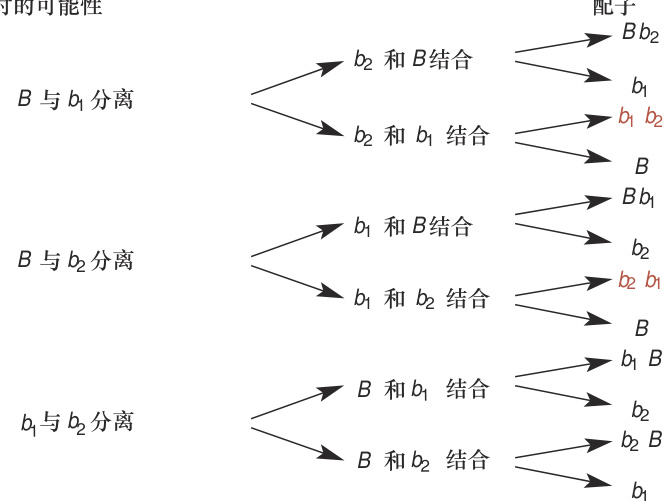  

这些不同分离产生的12种配子类型中，只有两种用红色标示出来，包含了两个 $^{\cdot}b$ 等位基因，可以产生青铜色（bbb）三体受精卵。得到这样配子的机会是 $1/12{=}1/6$ 。  

虽然BBb父本中发生的分离是均等的，记住雄性无法产生可存活的 $_{n+1}$ 花粉。唯一存活的配子将会是B和b，比例为 ${}^{2/3\ B}$ 和 $1/3\ B b$ ，这必需反映出它们在父本基因组中相对的普遍性。母本产生适当的bb配子的可能性为1/6，父本产生的b花粉可能性为1/3，那么这种杂交所产生三体青铜色后代的可能性为： $1/6\times1/3{=}1/18$ 。  

Ⅲ.  本章开始处的图呈现了由DNA条形码所揭示的染色体缺失。  

假设一个人缺失杂合，去做他的全基因测序，基因组序列将会揭示缺失区域的范围，以及缺失断点的确切序列吗？再思考一下还可以得到这两种数据： $\textcircled{\scriptsize{1}}$ 任何特定序列中，测序序列的数量； $\textcircled{2}$ 是否在野生型中找到之前没有发现的新序列。  

# 解答  

为了回答这个问题，你需要理解基因组测序数据是如何展现断点和缺失范围。下面画了一张图，来描述正常和拥有缺失的5号染色体；q臂上（长臂）有一个很大的区域（DEF）在缺失染色体上丢失了。  

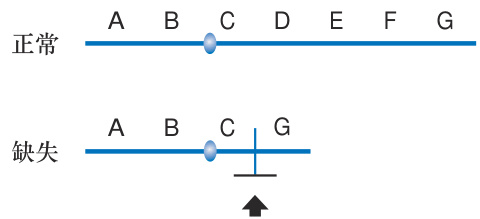  

$\textcircled{\scriptsize{1}}$ 缺失区域（DEF）中的测序序列，将会是基因组中其他序列频率的 $50\%$ 。 $\textcircled{2}$ 除此之外，缺失杂合体的基因组序列，可以展现缺失断点（箭头），因为特有的序列将会横跨这个断点。  

# 习题  

# 词汇  

1. 在右列中选择与左列中的术语最匹配的短语。  

a. 相互易位 1.  缺乏一个或者更多染色体，或者多一个或多个染色体  
b. 雌雄嵌合体 2.  小DNA元件的移动  
c. 臂间 3. 拥有多于两套的染色体  
d. 臂内 4.  两个非同源染色体部分区域的精确交换  
e. 整倍体 5.  排除着丝粒  
f. 多倍体 6.  包含着丝粒  
g. 转座 7.  拥有整套染色体  
h. 非整倍体 8.  雄性和雌性组织的嵌合组合  

# 13.1节  

2.  人1号染色体是一个很大的、中部着丝粒的染色体。一个学者决定利用多色条带技术来给1号染色体，在几个不同人染色体组型图中进行条码化。下面的图展示了1号染色体中端粒附近区域。这个区域中有三种条码探针DNA（A、B和C），每个都用不同的荧光素标记，不同基因型个体提取的细胞，制取了人有丝分裂中期染色体，然后用这些荧光素来进行荧光原位杂交（FISH）。这个区域中，染色体重排的断点也在这个图中标示出来。缺失（Del）1和2用黑杠标示。倒位（Inv）1和2在这个图中并没有显示，其断点很接近，但是并不在着丝粒上。  

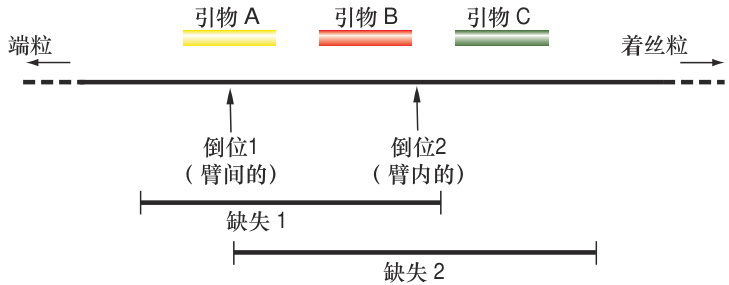  

对于下面基因型而言，画三种探针FISH中的1号染色体。下面图中展示了一个例子，将黄色探针A杂交到野生型中（ $+/+$ ）1号染色体的两个拷贝。  

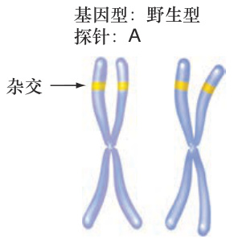  

a. Del1/Del2 b. Del1/+ c. Inv1/+ d. $I n\nu2/+$ e. Inv2/Inv2  

# 13.2节  

3.  对于下面染色体异变类型，请讲述： $\textcircled{\scriptsize{1}}$ 是否异变杂合生物的染色体，将会在减数分裂初期Ⅰ中形成环状结构； $\textcircled{2}$ 在杂合子的减数分裂后期Ⅰ中，是否可以形成一个染色体桥； $\textcircled{3}$ 如果形成了，需要哪些条件； $\circledast$ 是否异变可以抑制减数分裂重组； $\textcircled{5}$ 导致染色体畸变的两个染色体是否在同一条着丝粒的同侧或相反侧发生，或者这两个断裂发生在不同的染色体上。  

a. 相互易位b. 臂内倒位c. 小串联重复d. 罗伯逊易位e. 臂间倒位f. 大缺失  

4.  对于下面的染色体重排，理论上获得一个完美重排的恢复是可能的吗？如果可能，这种反转是很少发生，还是相对地普遍发生  

a. 一个区域缺失包含5个基因  
b. 一个区域的串联重复包含5个基因  
c. 一个臂间倒位  
d. 罗伯逊易位  
e.  转座元件移到一个基因的蛋白编码外显子中，创造了一个突变  

5.  一个特殊雌性果蝇，其中一条X染色体拥有正常的基因顺序，但是携带了隐性等位基因，这些基因为黄体色（y）、朱红眼色（v）和交叉体毛 $(\boldsymbol f)$ ，也包含显性X关联的Bar眼突变（ $B$ ）。它的另外一条X染色体携带了这四个基因的野生型等位基因，但是这个拥有 $\mathrm{~\dot{y}^{+}}$ 、 $\nu^{+}$ 和f+的区域（没有 $B^{+}$ ）中，基因顺序却颠倒了。正如下面图中所示，这个雌性果蝇与野生型雄性果蝇杂交。  

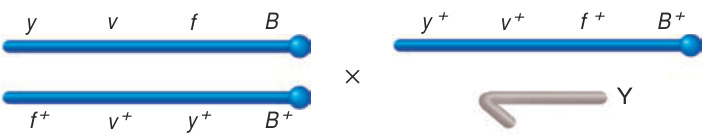  
这个杂交产生了下面的雄性后代：  

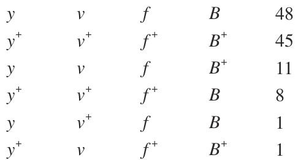  

a.  为什么没有雄性后代拥有等位基因组合 $y\nu f^{+}$ 、$y^{+}\nu^{+}f,\ y\nu^{+}f^{+}$ 或者 $y^{+}\nu f$ （无论Bar基因如何）？b.  yvf $\mathbf{\nabla}\cdot\mathbf{\mu}=\mathbf{\nabla}B_{}^{+}$ 和 $\nu^{+}y^{+}f^{+}B$ 后代会产生何种交换？你能从其后代类型中来推断其遗传距离吗？c. $y^{+}\nu f^{+}B^{+}$ 和 $\vert y\nu^{+}f B$ 后代会产生何种交换？  

6.  将 $w^{-}$ 、 $x^{-}$ 、 $y^{\mathsf{-}}$ 和 $\bar{z}$ 一倍体品系与这四个基因都是野生型的一倍体品系进行配对，就产生了一个酵母二倍体品系。这个二倍体品系表型上是野生型。四个X射线诱导的不同二倍体突变体，就是来自于这个二倍体酵母品系。假设一个新的突变发生在这个品系中。  

<html><body><table><tr><td>品系1</td><td>M</td><td>x</td><td>y</td><td>Z 十</td></tr><tr><td>品系2</td><td>M +</td><td>x</td><td>y</td><td>Z</td></tr><tr><td>品系3</td><td>M</td><td>x 十</td><td>y</td><td>Z</td></tr><tr><td>品系4</td><td>M</td><td>x +</td><td>y</td><td>Z 十</td></tr></table></body></html>  

当这些突变二倍体品系通过了减数分裂，每个子囊都只包含了两个可存活的一倍体孢子。  

a.  X射线诱导形成了什么样的突变，从而产生了罗列的二倍体品系？  
b. 为什么每个子囊中两个孢子都死了？  

c.  四个基因w、x、y或z都位于同一个染色体上吗？d. 给出同一个染色体上找到的基因顺序。  

7.  下面两个图展示了两个猩红眼色果蝇的基因组序列数据。每个果蝇都是一个正常基因顺序和隐性scarlet（st）突变的3号染色体，与另外一个重排的3号染色体的杂合体；在两个果蝇中，重排是不同的。图中，3号染色体位置开始的100bp序列（ $x$ 轴）中，用圆圈来代表测序序列的数量（y轴）。  

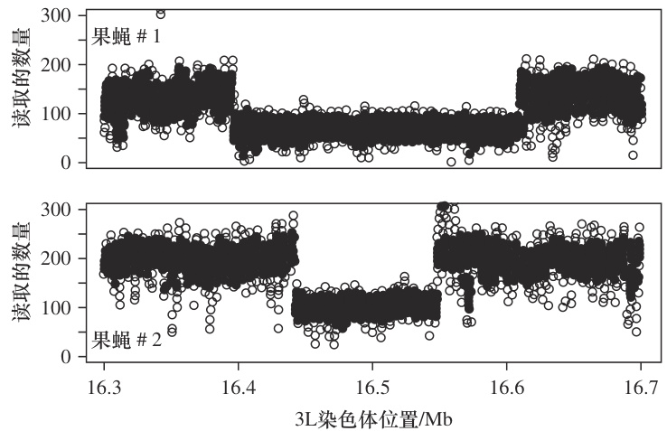  
Tawny Cuykendall, Cornell University, Ithaca, New York  

a.  每个果蝇中，重排染色体本质上是什么？重排断点的大约位置在哪？你如何找到断点处的确切核苷酸？  
b.  你能推断出，至少 $^{s t}$ 基因的一部分是位于3号染色体的特定区域吗？如果能推断出来，请尽可能给出这个区域的坐标。  
c.  基因st的蛋白编码外显子中，有可能有一个或者多个位于你在题目b中确定区域的外面吗？请解释。  
d.  基于这些数据，你可以将st基因定位出来，这显示出它是一个重组测试，还是一个互补测试？  

8.  果蝇中一系列的染色体突变，被用来定位javelin基因和henna基因，第一个基因可以影响体毛性状，而第二个基因可以影响眼睛色素沉淀。对于野生型来说，这两个基因的突变等位基因都是隐性的。染色体突变都是3号染色体上的重排。下面是3号染色体的图：3L是左臂，3R是右臂。3L上碱基从1bp排序到24 598 654bp，3R上则是从1bp排序到27 929 329bp。  

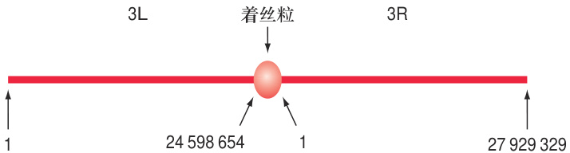  

在下面表格中，罗列出来6个3号染色体重排的断点。每个染色体突变的确切断点是用PCR和DNA测序来确定的。例如，缺失A有一个断点在3号染色体左臂上6 000 587bp后面，另外一个断点在6 902 063bp后面。  

染色体 3L 上的断点  

<html><body><table><tr><td>缺失</td><td>A</td><td>6000587;</td><td>6902063</td></tr><tr><td rowspan="4"></td><td>B</td><td>6703444;</td><td>7220113</td></tr><tr><td>C</td><td>6880255;</td><td>7325787</td></tr><tr><td>D</td><td>6984866;</td><td>7311104</td></tr><tr><td colspan="3">断点在3L；3R</td></tr><tr><td>染色体倒位</td><td>A</td><td>6110792 (3L);</td><td>40272 (3R)</td></tr><tr><td></td><td>B</td><td>6520488 (3L);</td><td>23350 (3R)</td></tr></table></body></html>  

果蝇一条染色体上拥有这六个重排（缺失或者倒位）中的一个，与javelin和henna基因纯合的果蝇配对。杂合后代（即重排/javelin，henna）的表型罗列如下。  

$\mathbf{F_{1}}$ 果蝇的表型  

<html><body><table><tr><td>缺失</td><td>A</td><td>javelin，henna</td></tr><tr><td rowspan="4"></td><td>B</td><td>henna</td></tr><tr><td>C</td><td>野生型</td></tr><tr><td>D</td><td>野生型</td></tr><tr><td>A</td><td>javelin</td></tr><tr><td>染色体倒位</td><td>B</td><td>野生型</td></tr></table></body></html>  

a.  用这些数据，你能确定javelin和henna在3号染色体上的位置吗？  

b.  对于每个染色体重排而言，画一个3号染色体的图，在上面标出PCR引物对的位置和 $5^{\,\prime}{\longrightarrow}3^{\,\prime}$ 的方向，这个PCR可以用来扩增大约100bp的区域，这个区域上包含重排断点。  

9.  下图呈现了一个人基因组DNA的两个野生型片段，它们来自两个非同源近端着丝粒染色体的长臂上。在这两个片段上，着丝粒到端粒方向是从左到右。标示1、2和3的红线是断点的位置，它们可能是由电离辐射造成的。这些特定断裂的重排，如果其断裂的片段由DNA修复系统缝合回去的时候，可能会产生染色体重排。  

你用PCR可以看到重排的存在。在下面每个例子中，你用的PCR引物是引物A，其序列为：  

$5^{\prime}$ TCGATTCCGGAAAGCT $3^{\prime}$ a. 哪两个断点可以产生一个缺失？  

b.  结合引物A，写一个16bp引物的序列和方向，让你判断一个患者基因组DNA中是否有缺失。证据应该是阳性的，而不是阴性的（即你将会看到一个PCR产物，其存在、大小对于缺失来说是特异的；没有条带无法确定任何结果）。  

c. 哪两个断点可以产生一个倒位？  

d.  结合引物A，写一个16bp引物的序列和方向，让你判断一个患者基因组DNA中是否有倒位。你的答案应该包含可能产生最长PCR产物的引物。你的引  

9  

5′   TCGATTCCGGAAAGCT TAGTTTCCCGGGACGTATTGCCAACC TAGGTAAGCGCCGAATATCCATGGGCACC  3′ $3^{\prime}$ AGCTAAGGCCTTTCGAATCAAAGGGCCCTGCATAACGGTTGGATCCATTCGCGGCT TATAGGTACCCGTGG  5′ 1 2  

5′   GGCAATAGCCTAGGAACTTTTAGGCCAATTAA  3′   
3′   CCGTTATCGGATCCTT GAAAAT CCGGT TAAT T  5′  

物不能与任何红线交叉。  

e.  哪两个断点可以产生相互易位？（有两个可能答案；你需要仅仅写一个）  

f.  结合引物A，写一个16bp引物的序列和方向，让你判断一个患者基因组DNA中是否有相互易位。这个相互易位可能稳定遗传自减数分裂，没有丢失任何染色体破裂的片段。证据需要是阳性的，而不能是阴性的。  

g.  在题目e和f中你提到的易位是罗伯逊易位吗？回答是或者否，然后解释。  

10.  指明四种主要重排中，哪些最可能与下面表型相关。每个例子中，请解释其效应。  

a. 半不育  
b. 致死  
c. 易受突变影响d. 改变遗传图  
e. 单倍剂量不足f. 新形态突变  
g. 超形态突变  
h. 交换抑制  
i. 非整倍体  

11.  果蝇zeste（z）基因的隐性X关联 $Z^{I}$ 突变，只在拥有两个或者更多野生型white（ $\boldsymbol{w}$ ）基因的果蝇中，可以产生黄色（zeste）眼色。利用这种特性，鉴定出$w^{+}$ 基因的串联重复，称之为 $w^{+R}$ 。基因型 $y^{+}z^{I}w^{+R}s p l^{+}/$ Y的雄性果蝇，因而拥有橙黄色眼。这些雄性果蝇与基因型 $y z^{l}w^{+R}s p l/y^{+}z^{l}w^{+R}s p l^{+}$ 的雌性果蝇杂交（这四个基因与X染色体紧密关联，在给定基因型的顺序中，着丝粒在所有这几个基因的右边： $y=$ 黄色身体； $y^{+}\!=$ 棕褐体色； $s p l{=}$ 分裂体毛； $s p l^{+}{=}$ 正常体毛）。这些雌性果蝇产生了81 540个雄性后代，其中发现了下面的例外：  

A类　2430个黄色身体，橙黄眼睛，野生型体毛B类　2394个棕褐体色，橙黄眼睛，分裂体毛C类　23黄色身体，野生型眼睛，野生型体毛D类　22棕褐体色，野生型眼睛，分裂体毛a.  第一个杂交产生的81 540个雄性，它们的表型如何？  

b. 什么事件会产生A类和B类后代？  
c. 什么事件会产生C类和D类后代？  
d. 基于这些实验，y和spl之间的遗传距离为何？  

12.  在玉米高度自交系1中，基因a和b的距离为21m.u.；在玉米高度自交系2中，二者距离也是 ${\cdot21}\mathrm{m.u.}$ 。但是在1系和2系杂交F 子代进行测交，这两个基因只有$1.5\mathrm{m.u.}$ .。何种基因a和b重排，以及其潜在的重排断点会解释这些结果？  

13.  在下面这些图中，粉红线标示染色体的区域相对于正常基因顺序（黑线）发生了颠倒。 $1\!\sim\!4$ 个个体的二倍体染色体组成也在图中展示出来。将这些个体与下面恰当的描述匹配起来。下面的描述也许对应多个图，一个图也许是多个问题的正确答案。  

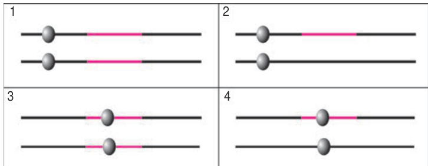  

a. 倒位环会在减数分裂Ⅰ中形成。  
b.  在染色体倒位区域和另一条染色体同源区域中，发生一次单交换，这会产生遗传不平衡的配子。  
c.  在染色体倒位区域和另一条染色体同源区域中，发生一次单交换，这会产生没有着丝粒的片段。  
d.  倒位区域发生一次单交换，这将会产生四个可存活的配子。  

14.  一个特别染色体有三个不同形式，在三个果蝇品系（Bravo、X-ray和Zorro）中都是纯合的。染色体核型分析发现这三种品系都没有丢失任何染色体部分。当在Bravo系中进行遗传定位时，得到了下面的图谱（图距单位）。  

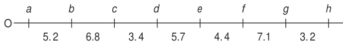  

Bravo和X-ray果蝇现在进行配对，形成了Bra-vo/X-ray $\mathrm{F}_{1}$ 子代；Bravo果蝇也与Zorro果蝇配对，形成了Bravo/Zorro $\mathrm{F}_{1}$ 子代。  

在随后的杂交中，下面的遗传距离在杂种中分离开各种不同基因：  

<html><body><table><tr><td></td><td>Bravo/X-ray</td><td>Bravo/Zorro</td></tr><tr><td>a-b</td><td>5.2</td><td>5.2</td></tr><tr><td>b-c</td><td>6.8</td><td>0.7</td></tr><tr><td>c-d</td><td>0.2</td><td><0.1</td></tr><tr><td>d-e</td><td><0.1</td><td><0.1</td></tr><tr><td>e-f</td><td><0.1</td><td><0.1</td></tr><tr><td>f-g</td><td>0.65</td><td>0.7</td></tr><tr><td>g-h</td><td>3.2</td><td>3.2</td></tr></table></body></html>  

a.  做一个图，来显示X-ray和Zorro品系中基因a到h相对的顺序。不要显示基因间的距离。  
b.  在原先X-ray纯合子中，基因c和d之间的物理距离，与原先Bravo纯合子中基因物理距离相比，更大、更小，还是大约是相等的？  
c.  在原先X-ray纯合子中，基因d和e之间的物理距离，与原先Bravo纯合子中基因物理距离相比，更大、更小，还是大约是相等的？  

15.  将两个酵母品系配对，产生孢子（可以进行减数分裂）。一个品系是单倍体，拥有正常染色体，关联遗传标记ura3（生长需要尿嘧啶）和arg9（生长需要精氨酸）排列在着丝粒两边。另外一个品系是这两个标记的野生型（URA3和ARG9），但是染色体这个区域中有一个倒位，在这里显示为粉红色。  

  

在减数分裂中，可能发生几个不同交换事件。对于下面事件中任何一个来说，请给出基因型和四种单倍体孢子的表型。假设任何染色体不足在单倍体酵母中都是致死的。不要考虑姐妹染色单体间的交换。  

a. 倒位区域外只有一个交换  
b. URA3和着丝粒间发生一次单交换  
c.  相同两个染色单体每次发生一次双交换，一次交换发生在URA3和着丝粒之间，另外一次发生在ARG9和着丝粒之间。  

16.  假设一个单倍体酵母品系携带有两个隐性关联标记his4和leu2，将其与HIS4和LEU2野生型的品系进行杂交，但是在染色体这个区域拥有一个倒位，下图用蓝色标示。  

  

在最后的二倍体减数分裂中，可能会发生几种不同的交换事件。对下面每个事件来说，请说出其基因型和最后四种单倍体孢子的表型。不要考虑贴附  

到同一个着丝粒上的染色单体间发生的交换事件。  
a. 标记HIS4和LEU2之间发生一次单交换。  
b.  每次相同的染色单体发生一次双交换，都发生在标记HIS4和LEU2之间。  
c. 着丝粒和倒位区起始之间发生一次单交换。  

17.  习题16中所描述的两个单倍体酵母品系之间进行配对，请描述一种情形，其中会形成一个四型子囊，所有四个孢子都可存活。  

18.  在链孢菌（Neurospora）子囊形成时，任何子囊孢子如有染色体缺失将会死亡，呈现出白色。在子囊的八个孢子中，如果它们是野生型品系与相反配对类型品系进行杂交得到的，这个相反配对品系携带了：a.  一个臂内倒位，在正常染色体和倒位染色体之间没有发生交换，有几个孢子将会是白色的？b.  一个臂间倒位，在倒位环中发生了一次单交换，有几个孢子将会是白色的？c.  一个臂内倒位，在倒位环外发生了一次单交换，有几个孢子将会是白色的？d.  一个相互易位，在易位染色体之间没有交换发生，产生的紧邻1分离，有几个孢子将会是白色的？e.  一个相互易位，在易位染色体之间没有交换发生，产生的可供代替的分离，有几个孢子将会是白色的？f.  一个相互易位，在易位染色体之间发生一次交换，产生的可供代替的分离（但是交换并不是发生在易位断点和任何染色体的着丝粒之间），有几个孢子将会是白色的？  

19.  在下图中，黑色和粉红色线代表了非同源染色体。哪些图与下面a $\therefore\sim\!{\mathrm{d}}$ 之间的描述相匹配？下面的描述也许对应多个图，一个图也许是多个问题的正确答案。  

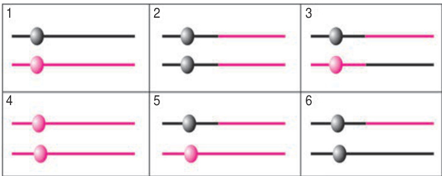  

a. 易位杂合产生的配子  
b. 易位杂合无法产生的配子  
c. 易位杂合产生的遗传平衡的配子  
d.  易位杂合产生的遗产不平衡的配子（任何频率都可以）  

20.  果蝇中，控制朱砂眼色的基因在2号染色体上，控制猩红眼色的基因是3号染色体上。拥有cinnabar和scarlet隐性等位基因纯合的果蝇（cn/cn；st/st）是白眼。  

a.  如果携带杂合cn和st等位基因的雄性果蝇，与纯合cn和st等位基因的白眼雌性果蝇杂交，预期子代表型和它们的频率如何？  
b.  一个携带杂合cn和st等位基因的奇特雄性果蝇，当与白眼雌果蝇杂交时，只产生白色和白眼的后代。请解释这个雄果蝇可能的染色体组成。  
c.  当这个奇特雄果蝇杂交产生的野生型F1代雌性果蝇，与cn/cn；st/st正常雄果蝇回交，将会得到下面的结果：  

野生型 $45\%$ 朱红 $5\%$ 猩红 $5\%$ 白色 $45\%$  

请画出减数分裂中期Ⅰ发生的一个遗传事件，其可以在野生型 ${\mathrm{F}}_{1}$ 代雌果蝇的后代中，产生少见的朱红或猩红果蝇。  

21.  玉米穗有空隙未填充好，起因是大约一半的胚珠发育不全时，玉米呈现半不育，指示这个品系是易位杂合体。通过将易位杂合体与研究基因隐性纯合的品系进行杂交，就可以将发生易位的染色体找出来。将半不育F1代回交纯合隐性亲本，产生的表型类型的比例表明了这个基因是否位于发生易位的其中一条染色体上。例如，一个半不育品系可以与9号染色体yg突变纯合品系进行杂交（这个突变体呈现黄绿色叶片，而不是野生型的绿色叶片）。半不育F1子代然后与yg纯合突变体进行回交。  

a.  如果该基因不在易位两条染色体中的一条上， $\mathrm{F}_{1}$ 回交到纯合yg突变体时，你预测会产生什么样的后代（可育或半不育，绿色或黄绿色）？b.  如果该基因位于易位两条染色体中的一条上， $\mathrm{F}_{1}$ 回交到纯合yg突变体时，你预测会产生什么样的后代（可育或半不育，绿色或黄绿色）？c.  如果yg基因位于易位两条染色体中的一条上，将会产生一些可育、绿色后代，以及一些半不育、黄绿色后代。这些相对罕见的后代类型是如何产生的？从这些罕见后代频率中，你能确定什么样的遗传距离？  

22.  有一个很有前景的生物学方法可以用于昆虫控制，该方法就是释放一些昆虫，它们能干扰正常驻地昆虫可育性。一个方法是利用不育的雄性来与当地可育的雄性竞争配对。这个策略的缺点是射线诱导的不育雄性并不强健，与可育雄性竞争时会有很多问题。另外一个方法是现在正在尝试的，即将实验培养的昆虫释放出去，它们拥有一些纯合的易位。请解释一下这个策略是如何发挥作用的。请确保提到哪些昆虫将会是不育的。  

23.  一个常染色体和Y染色体之间发生了相互易位，一个雄性果蝇是这个相互易位的杂合体。常染色体的一部分现在移到了Y染色体上，上面包含显性突变Lyra（缩短的翅膀）；同一个常染色体的另外一个拷贝（正常型）是Lyra+。这个雄性现在与一个纯育野生型雌性果蝇配对。将会得到什么样的后代？比例又如何？  

24. a.  相互易位杂合的玉米植株自交后代中，你预期子代植株中正常可育与半不育的比率为何？在这个问题中，请忽略紧邻2分离产生的罕见配子。b.  相互易位杂合的半不育玉米植株，进行特定自交产生的后代中，可育与半不育植株的比率为$1:4$ 。你如何解释这种与题目a答案之间的差别？  

25.  假肥大型肌营养不良症（DMD）是由X连锁的dys-trophin基因的隐性突变等位基因造成的。雌性有疾病症状，其严重性与隐性等位基因雄性半合子一致，这是极少见的。这些雌性是X常染色体相互易位杂合子，其中X染色体在dystrophin基因中间断裂，将其一切为二。  

a.  如果在患者细胞中，X染色体失活发生在两个X染色体失活中心（XIC；见图12.15）的可能性相等，你预期她拥有正常dystrophin基因功能的细胞比率为多少？  

b.  一些常染色体基因在这个女人一些细胞中失活，有可能吗？一些X关联基因正常情况下是要进行X失活，它们在这个女人两条X染色体都表达，有可能吗？为了回答这些问题，画一个图来呈现正常染色体和易位染色体，请标注着丝粒、潜在地失活的常染色体基因、潜在地不再进行X失活的X染色体基因、dystrophin基因和XIC。假设简化为dystrophin和XIC分别位于X染色体短臂和长臂的中间。  

c.  结果发现实际上这个女人没有任何细胞表达了dystrophin基因产物。利用你对题目a和b的答案，来解释这个有趣的结果。请考虑何种基因表达变化也许作用于细胞的存活和繁殖。  

d.  请讨论科学家如何利用X∶常染色体相互易位，来帮助定位人X染色体上的XIC。为什么你对题目c的答案说明了这个方法潜在的陷阱？  

26.  WHIM症状是一种免疫系统疾病，表现为疣和频繁的感染。这个疾病是由2号染色体上CXCR4基因的显性获得性功能突变造成的。一个终身患有WHIM症状的38岁妇女，突然神秘地被治愈了。对她的血液前体细胞（干细胞）进行了基因组分析，结果发现许多细胞发生了2号染色体拥有染色体碎裂，它是很罕见的过程（也知之甚少），其中一条染色体碎裂成小片段，然后随机粘贴到一起，最后导致了许多缺失和倒位。请解释血液干细胞中2号染色体的染色体碎裂，是如何治愈了这个女人的WHIM症状。  

# 13.3节  

27.  请解释转座元件如何造成基因的移动，这些基因并不包含在转座元件中。  

28.  正常情况下，果蝇基因组中包含了大约40个 $P$ 元件。这些DNA转座子中，有一些是自发的，而一些则是非自发的。  

复习一下P元件的结构（图13.27）。  
a.  假设一个P元件中反向重复序列中的一个丢失了。这个突变会影响P元件的移动能力吗？它会影响其他P元件的移动能力吗？  
b.  如在图13.27中黄色所示，一个自发 $P_{-}$ 元件在内含子剪切受体位点中有一个突变，因而现在这个内含子无法从初级转录物中剪切出去。这个突变会影响P元件的移动能力吗？它也会影响其他P元件吗？  
c.  假设正在研究的P元件是基因组中唯一的自发P元件，请再次回答题目b。  
d.  如图13.27中所示， $P$ 元件正常情况下在体细胞中无法移动。请描述一个突变 $P$ 元件，无法在体细胞中移动。这个突变也会影响其他P元件在相同体细胞中移动的能力吗？  

29.  果蝇P元件的发现，是因为杂种不育现象，即特定杂种后代不育。科学家在20世纪70年代将实验室果蝇品系，与实验室外自然环境中得到的同一个果蝇品种杂交，他们发现了令人惊奇的结果：杂交后代是不育的，但是只有当野外雄性与实验室雌性果蝇杂交时才会发生。野外雌性与实验室雄性杂交的后代，完全是正常的。  

DNA分析表明，野外果蝇的基因组包含P元件，实验室果蝇并没有。很明显，现在实验室品系果蝇是100多年前捕获的，之后P元件才在野生群体中扩散。a.  杂种后代是不育的，因为它们的生殖细胞突变和染色体重排（不育）的比率很高，这些突变和重排是由 $P$ 元件移动造成的。请解释P元件移动如何造成不育。  

b.  不育后代仅仅只是实验室雌性和野外雄性杂交的后代，反过来则不是这样的结果，针对这样的结果，科学家首先提出假说，认为这是由于卵质膜中P元件编码的阻遏物蛋白（见图13.27）移动造成的。请解释这个假说。为什么P元件只在一个杂交方向上移动，而在另外一个方向上并不移动？（在第17章中，你将会看到这个假说是正确的，但是它仅仅只是整个故事的一部分）  

c.  当特定野外品系的雄性果蝇与实验室雌性果蝇配对，杂种后代只有部分是不育的，而不是完全不育。基于这样的结果，杂交中P元件插入X关联果蝇基因yellow，使其失去功能，请描述这些能让你检测到这些突变的杂交（这些隐性突变等位基因会产生黄色表型，而不是野生型棕褐体色）。在分子水平，一些野外品系杂种后代都是不育的，而另外一些野外品系后代只是半不育，你如何看待这种区别？请解释。  

d.  在野生型果蝇中，研究者可以观察到罕见的身体小片，它们呈现黄色，而不是棕褐色。有趣的是，这些黄色小片的频率在野外雄性和实验室雌性杂交后代中并不增加。这个结果表明了什么样的杂种不育？  

30.  rough基因的突变等位基因纯合的果蝇，有轻微的畸形（粗糙）眼睛，而不是正常的润滑眼睛。有两种果蝇品系，每个都有一个不同P元件诱导的突变rough等位基因。在每个品系中，rough基因中的P元件是果蝇基因组中唯一的P元件。  

a.  当一个rough突变等位基因纯合子传若干代，在每一代中，果蝇要么是野生型眼睛，要么是更严重的粗糙眼睛。纯种野生型或者严重粗糙眼睛的果蝇，可能是从这些不寻常的果蝇产生的。请解释。  
b.  当另外一个rough突变等位基因纯合子传许多代，看不到野生型果蝇，也看不到更严重粗糙眼睛的果蝇。请解释。  

# 13.4节  

31.  Fred和Mary有一个孩子叫Bob。这三个人的基因组DNA用来作为探针，去做ASO微阵列，如图11.17中所示。下图中呈现出10个SNP位点（ $1\!\sim\!10$ ）沿着21号染色体排列。黄色、橙黄色和红色标示了杂交信号的增加。  

a. Bob可能会有唐氏综合征吗？请解释。b.  这个数据提供了证据，来证明一个双亲中有不分离事件发生吗？如果有的话，是双亲中的哪一个？该事件发生在哪个减数分裂时期？c.  这个数据提供了证据，来证明一个双亲中减数分裂时有重组事件发生吗？如果有的话，是双亲中的哪一个，并描述交换的大概位置。  

d.  在追踪不分离现象时，为什么要重点观察着丝粒附近的位点，请描述这个例子是如何说明这一点的。  

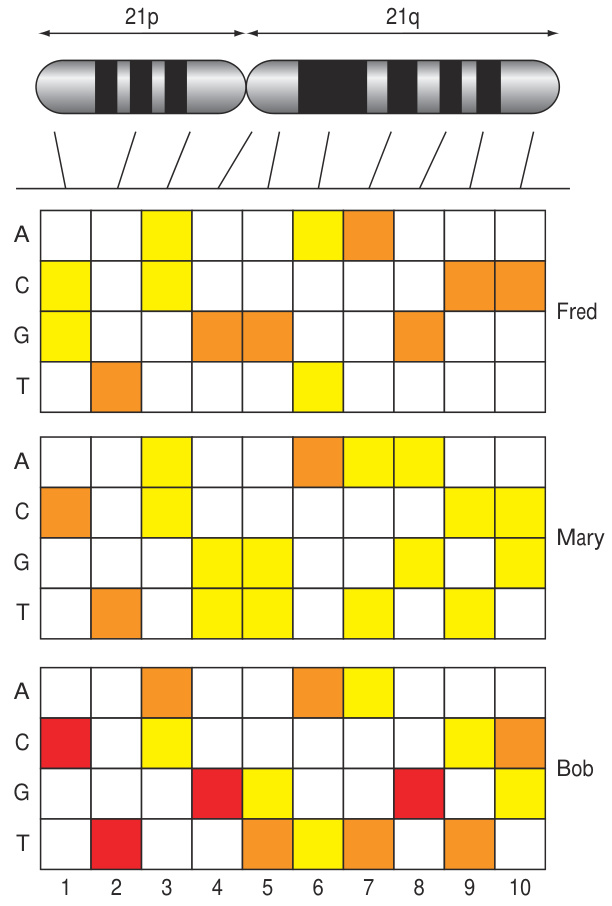  

32.  单亲二体是一种罕见的现象，儿童患病是隐性的，其双亲中只有一个携带该性状；另外一个双亲是正常纯合的。通过分析DNA多态性，很清楚这个儿童从携带者双亲中继承了两个突变等位基因，但是从另外一个双亲中没有继承该基因的任何拷贝。  

a.  画图展示至少两种单亲二体产生的方式（提示：这些机制在细胞分裂中都要求至少一个错误，这解释了单亲二体为什么如此罕见）。有没有什么方法来区别这些机制，解释单亲二体任何特定例子？  

b.  单亲二体现象如何解释一些罕见的例子，比如女孩患有罕见的X连锁隐性疾病，但是她的父亲并没有这样的疾病，或者如何解释其他一些例子，比如X连锁隐性疾病从父亲遗传给儿子？  

c.  如果你是一名人类遗传学家，相信你的一个患者有单亲二体造成的疾病症状，你能确立病因不是患者在受精卵发育早期发生的减数分裂重组吗？  

33.  在患有特纳综合征的成年人中，发现非常高的比例是遗传嵌合体。有两种类型：一些个体中，大多数细胞是XO，但是少数细胞是XY。请解释体细胞嵌合体两种模式是如何发生的。  

34.  在链孢菌（Neurospora）中，his2突变体需要组氨酸用以生长，lys4突变体需要赖氨酸用以生长。这两个基因在同一个染色体的同一个臂上，顺序为：  

着丝粒–his2–lys4。  

用his2突变体与lys4突变体配对。图示减数分裂产生的所有可能排序子囊，其中发生下面一些事件，能说明每个子囊孢子的营养需求。子囊孢子没有一条染色体的任何拷贝，将会发育不良，最后死亡，在过程中变成白色。  

a. 着丝粒和his2中间发生一次单交换  
b. 在his2和lys4中间发生一次单交换  
c. 在第一次减数分裂中发生不分离事件  
d. 在第二次减数分裂中发生不分离事件  
e.  在着丝粒和his2中间发生一次单交换，随后在第一次减数分裂中发生不分离事件  
f.  在his2和lys4中间发生一次单交换，随后在第一次减数分裂中发生不分离事件  

35.  对染色体数目变异影响感兴趣的人类遗传学家，经常会对自发流产中的组织进行染色体核型分析。这些样本中，大约 $35\%$ 会有常染色体三体，但是只有大约 $3\%$ 的样本会有常染色体单体。基于会创造非整倍体的各种错误，你预期常染色体三体和常染色体单体的发生频率会更趋于相等吗？为什么会，或者为什么不会？如果你认为频率会更趋于相等，相对于单体而言，你如何解释三体的过量？  

36.  在唐氏综合征患者的子女中，唐氏综合征的发生率是非常高的（稍微低于 $50\%$ ）。请画出唐氏综合征双亲减数分裂，解释为什么后代有这么样高风险，成为21号染色体的非整倍体。除此之外，请解释为什么唐氏综合征在这些儿童中的发生率也许会低于$50\%$ 。  

37.  果蝇4号染色体极小；实际上这个染色体上的基因之间没有任何重组发生。你有三个不同标记的4号染色体：一个有eyeless（ey）基因的隐性等位基因，能导致非常小的眼睛；一个有cubitus interruptus（ci）基因的隐性等位基因，能导致翅膀网格产生断裂；第三个携带这两个基因的隐性等位基因。有两个或者三个4号染色体拷贝的成年果蝇可以存活，但是一个或者四个拷贝的成年果蝇无法存活。  

a.  你如何利用这三条染色体，找到减数分裂有缺陷的果蝇突变体，导致不分离发生率升高？b.  你的技术能让你区别第一次减数分裂和第二次减数分裂发生的不分离吗？c.  如果一个不分离产生的配子形成的果蝇，与4号染色体上携带ey和ci纯合的果蝇配对，进行测交，你预期会产生何种后代？  

d.  遗传学家发现了所谓的4号复合染色体，其中两条完整的4号染色体贴附到同一个着丝粒上。这样的染色体如何用来鉴定能增加减数分裂不分离的突变？相比题目a你描述的方法，现在的方法有什么优势吗？  

38.  唐氏综合征通常是由一整条多余的21号染色体导致的。其病症包含许多不同性状，包括低IQ、心脏病、特有的面部特征、胃肠道异常、身材矮小、肌张力差、白血病与痴呆风险增加。一些被诊断有唐氏综合征的人仅仅表现这些异常中的一部分。这些人经常有一个正常21号染色体和另外一条包含重复的21号染色体；这个重复的21号染色体区域在个体间可能是不同的。  

一些科学家认为，21号染色体上存在一个关键区域（包含一个或者几个基因），对唐氏综合征负责。研究者利用患有重复唐氏综合征的个体，去验证这个想法。假设用基因测序，在8个患有重复唐氏综合征的个体中，科学家确定了21号染色体上哪部分是有三个拷贝的。下面表格中是数据的概括。  

<html><body><table><tr><td rowspan="2">个体</td><td colspan="6">畸形</td><td rowspan="2">重复片段 21q</td></tr><tr><td>低智商</td><td>特殊 面容</td><td>胃肠 道 狭窄</td><td>矮小症</td><td>肌张力心脏 低下</td><td>疾病</td><td>21p</td></tr><tr><td>1</td><td></td><td></td><td></td><td></td><td></td><td></td><td></td></tr><tr><td>2</td><td>X</td><td></td><td></td><td>×</td><td></td><td></td><td>■</td></tr><tr><td>3</td><td></td><td></td><td></td><td></td><td></td><td></td><td></td></tr><tr><td>4</td><td></td><td></td><td></td><td></td><td></td><td>X</td><td>口</td></tr><tr><td>5</td><td>×</td><td></td><td></td><td></td><td></td><td></td><td>口</td></tr><tr><td>9</td><td>×</td><td>X</td><td>X</td><td></td><td>×</td><td></td><td>口</td></tr><tr><td>7</td><td></td><td></td><td></td><td></td><td></td><td></td><td>口</td></tr><tr><td>8</td><td></td><td></td><td></td><td></td><td></td><td></td><td>口</td></tr></table></body></html>  

注： $\times$ 表示给定的个体受到表头中列出的特定异常的影响。  

a.  有一个假说，21号染色体只包含一个单一的唐氏综合征关键区域，这个数据支持还是驳斥这个假说？请解释。  
b.  每个唐氏综合征异常都是由21号染色体一个不同区域的过量表达导致的，数据支持这个说法吗？请解释。  

# 13.5节  

39.  普通红三叶草（Trifolium pretense）是一个二倍体，每个体细胞拥有14个染色体。下面的情况下，体细  

胞染色体数目为多少：  

a. 这个物种三体变异？b. 这个物种单体变异？c. 这个物种的三倍体变异？d. 四倍体变异？  

40.  几个燕麦（Avena）品种体细胞中染色体数目为：砂燕麦（Avena strigosa）是14条；细长野燕麦（Avenabarata）是28条；种植燕麦（Avena sativa）是42条。  

a. Avena中基本染色体数目（x）是多少？  
b.  这些不同物种中，每个物种的染色体倍数是多少？  
c.  这些燕麦品种每个产生的配子中，染色体数目是多少？  
d.  每个物种中，染色体数目n是多少？  

41.  基因组A、B和C的基础染色体数目都是9。进化历史上，一个基因组的染色体无法与其他基因组中的染色体配对，相互之间形成了足够远的分化距离，这三个基因组都起源于这样的植物。对于下面整倍体染色体互补，请： $\textcircled{\scriptsize{1}}$ 陈述其生物体中染色体的数目； $\textcircled{2}$ 提供一些名词，可以尽可能精确地描述个体的遗传组成； $\textcircled{3}$ 陈述是否有可能这个植株会是可育的；如果可育，请给出配子中染色体的数目（n）。  

a. AABBC b. BBBB c. CCC d. BBCC e. ABC f. AABBCC  

42.  一个特定二倍体植物物种的体细胞，正常情况下有14条染色体。配子中染色体排序为 $1\!\sim\!7$ 。很罕见的是，受精卵中染色体数目超过14或者少于14。对于下面的受精卵： $\textcircled{\scriptsize{1}}$ 陈述染色体互补是整倍体还是非整倍体； $\textcircled{2}$ 提供一些名词，可以尽可能精确地描述个体的遗传组成； $\textcircled{3}$ 陈述这个个体是否可能通过胚胎期的发育而成长为成年植株；如果可以，这个植株是否是可育的？  

a. 11 22 33 44 5 66 77   
b. 111 22 33 44 555 66 77   
c. 111 222 333 444 555 666 777   
d. 1111 2222 3333 4444 5555 6666 7777  

43.  双二倍体物种的基因组是由两个祖先基因组（A和B）组成的，每个的基本染色体数目（x）都是7。在这个物种中，每个祖先基因组的每个染色体都有两个拷贝，它们只有在减数分裂时才相互配对。一种病原体攻击植物的叶片， $F$ 位点上有一个显性等位基因，可以控制对其的抗性。隐性等位基因 $F^{a}$ 和$F^{b}$ 会赋予对这个病原体的敏感性，但是这两个基因组中，显性抗性等位基因稍微有不同的影响。无论$B$ 基因组的基因型为何，至少有一个 $\cdot F^{\!A}$ 等位基因的植株会对病原体种1和2有抗性；无论A基因组的基因型为何，至少有一个 $\cdot F^{B}$ 等位基因的植株会对病原体种1和3有抗性。一个植株基因型为 $F^{4}F^{a}F^{B}F^{b}$ ，其自交后代有多少会对这三种病原体都产生抗性？  

44.  你培养了单倍体烟草细胞，制成了对除草剂有抗性的转基因细胞。你能做什么来获得一个二倍体细胞系，可以用来产生一个新的可育抗除草剂的植物？  

45.  正常情况下，染色体在减数分裂Ⅰ时形成了二价体（一对联合同源染色体），因为配对染色体时，两个同源染色体相应区域会联会。虽然如此，但是图13.17（b）显示，在一个相互易位的杂合子中，染色体配对形成四价体（即四个染色体相关联系到一起）。四价体可以以其他方式产生，例如，在一些四倍体物种中，染色体配对成四价体，而不是二价体。a.  假设染色体区域配对中联会，在这些四倍体中，四价体实际上是如何形成的？为了回答这个问题，请画一个四价体。b.  如果染色体配对形成四价体，而不是二价体，这些四倍体物种如何产生整倍体配子？c.  在双二倍体物种中，四价体如何形成？请讨论。  

46.  用全基因组测序，你如何能区别同源多倍体和异源多倍体？  

47.  假设你有AAaa四倍体植物，然后自交该植物。至少需要显性等位基因A两个拷贝才能看到显性表型。拥有显性表型的后代会是什么样的频率？  

48.  本章13.5节讨论到，Raphanobrassica是一个由卷心菜和萝卜杂交而成的杂种物种。卷心菜和萝卜的配子都有9个染色体（两个物种中 $_{x=9}$ ），这对于这个杂种植物的生存能力和生育能力是如何重要？  

49.  超市中你找到的无种西瓜是三倍体， $x{=}11$ 。  

a.  三倍体西瓜产生的平衡配子频率是多少？  
b.  在三倍体西瓜中一个特定的种子可以存活的可能性多大？（回忆一下一个可存活的种子是整倍体受精卵）  
c.  在题目b中可存活的种子的倍型为多少？也许会有不止一个答案。  

50.  杂种动物的名字通常就是用杂交物种的名字来命名，雄性配子放在前面。雄性猎豹和雌性狮子杂交产生了豹狮。下面图片中的斑驴，其父亲是斑马，母亲是驴。  

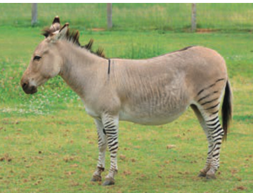  
$\copyright$ Gary Neil Corbett/SuperStock RF  

a.  并不是所有的动物杂交都是可能的。例如，狗和鸟、大象和考拉，或者猫和鲨鱼之间就不会产生可存活的后代。你认为决定一个杂种动物是否可存活，什么才是主要元素？  
b.  一些杂种动物是可育的。你认为决定一个杂种动物是否可育，什么才是主要元素？  

51.  大多数动物无法容忍多倍体，一些软体动物，如生蚝，却可以容忍。虽然野生生蚝是二倍体，养殖的生蚝一般是三倍体。三倍体的优点是生蚝是不可育的，因此它们消耗的能量本可以用来帮助增加鲜美的口感，而不是用来产生倒胃口的配子。这些肉香的三倍体生蚝在商业上比二倍体的生蚝更有价值。a.  为了生成三倍体生蚝，研究者使用细胞松弛素B，它是一种化学物质，可以在卵子发生时的减数分裂Ⅰ或者减数分裂Ⅱ中抑制细胞分裂。b.  细胞松弛素B对人类而言是有毒的，因此生蚝养殖者无法使用这种药物。你能想一个替代方法，能让生蚝养殖者产生大量的三倍体生蚝吗？  

# 13.6节  

52.  易位的何种特性让科学家相信，这些重排也许在新物种的生成中是非常重要的？  

53.  看一下图13.36中的水稻（Oryza sativa）基因组：a.  进化分支上有一个水稻的祖先植物物种，其全部基因组经历了一次重复，有什么证据来证明这一点吗？b.  如果水稻的祖先经历了一次全基因组重复，为什么水稻是二倍体，而不是四倍体？c.  植物遗传学家相信，经历全基因组重复的祖先植物物种拥有5条染色体。这些染色体中，其中一条的序列大多数可以在水稻染色体 $\mathrm{Os}02$ 、04和06中找到；第二个祖先染色体的序列现在多数可以在水稻染色体Os03、07和10中找到。哪些剩余的水  

稻染色体有起源自其他三个祖先染色体的序列？d.  有个说法，染色体Os12的起源涉及易位，其在全基因组复制时间之后的某一个时期发生在水稻分支上，在图13.36中有什么证据来支持这个说法？  

54.  在下面图中，上面和下面的线代表酵母（Saccharo-myces cerevisiae）中4号和12号染色体的区域（Scer4和Scer12）。数字指向特异基因，红色箭头代表转录的方向和范围。中间的线是另外一个不同但是相关酵母Klyuyveromyces waltii中1号染色体一个区域的序列（Kwal 1），基因用浅蓝色标示。DNA序列的相似性用连接两个物种染色体的线标示。  

a.  用暗紫色填充两个K. waltii的基因，其意义为何？b.  基于这些数据，提出一个假说来解释S. cerevisiae基因组在图中提到部分的起源。  

55.  提出两个可能的模型来解释基因重复潜在的进化优势。在第一个模型中，两个重复拷贝中一个保留了祖先基因相同的功能，而另外一个拷贝则通过突变分化出来一个新的生化功能。在第二个模型中，这两个拷贝都从祖先基因迅速分化，从而它们都获得了新的特性。考虑一下你对习题54的答案，假设S.cerevisiae和K. waltii的基因组都完全被测序了，你能确定哪一个模型能更好地代表这种进化过程吗？  

56.  右上图展示了人1号和2号染色体，以及类人猿对应染色体的染色体组型图。虽然1号染色体在这四个物种中是极度相似的，人2号染色体的带型非常类似两个不同类人猿染色体的带型。提出一个假说来解释人2号染色体和类人猿染色体之间的关系。  

57.  一些动物为了躲避捕猎者，会使用拟态伪装。例如，雌性燕尾蝶（Papilo ploytes）可以模仿有毒物种红珠凤蝶（Pachilopta aristolochiae）的颜色模式（见右下图）。正常的和拟态伪装的雌性燕尾蝶可以在一个单一群体中共存。  

最近，科学家发现，一个常染色体基因dsx的变异体可以在燕尾蝶中控制拟态伪装。该基因野生型和突变等位基因在许多氨基酸上都不同，这些累积的区别被认为是对正常雌性和伪装其他物种的雌性外形的区别负责。  

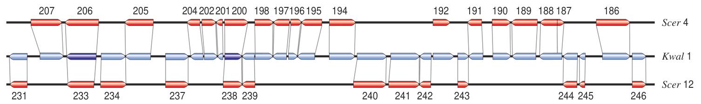  
54  

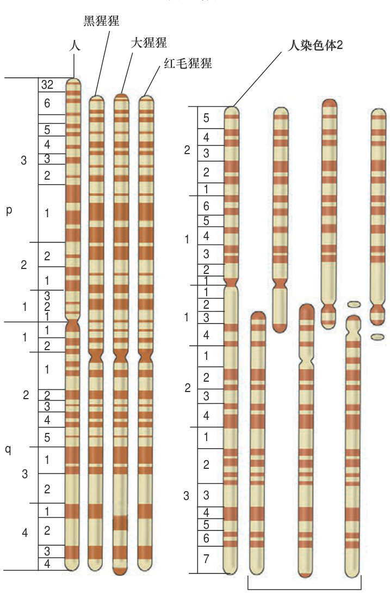  
1  

拟态伪装雌性的dsx基因是在倒位中。请解释这个倒位的存在对于燕尾蝶拟态伪装进化的重要性如何。  

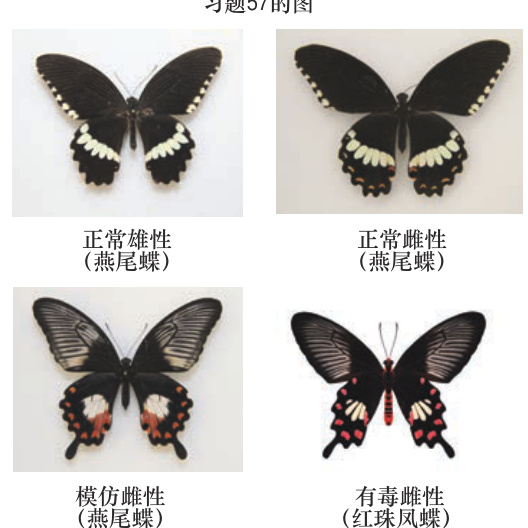  