# 第 17 章 真核生物中的基因调控  

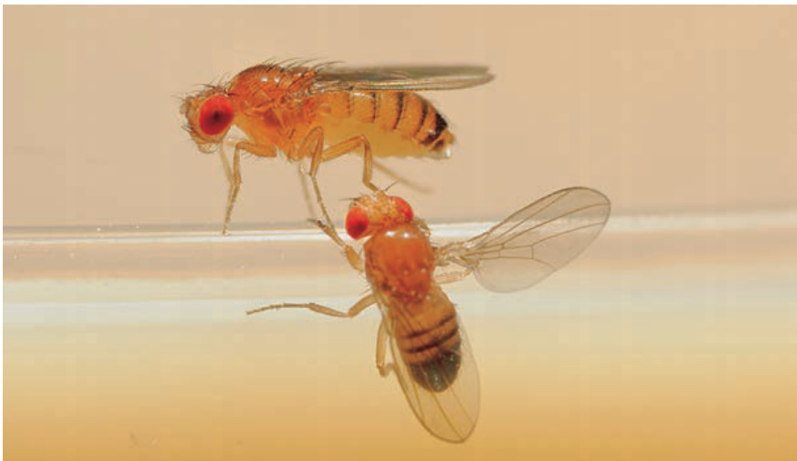  

雄性黑腹果蝇（底部）正在向雌性求偶。$\copyright$ Solvin Zankl  

# 章 节 大 纲  

17.1 真核生物基因调控概述  
17.2 通过增强子控制转录起始  
17.3 表观遗传学  
17.4 转录后调控  
17.5 综合实例：果蝇的性别决定  

当雄性果蝇向雌性求偶时，它会演唱一首古老的歌曲并跳一支仪式舞蹈。雄性果蝇利用它的前腿轻拍未来伴侣的腹部，然后通过伸展翅膀并以固定的频率震动来表演歌曲。当这首歌结束，它开始追随雌性。如果雌性果蝇愿意接受，雄性果蝇会用其喙去舔雌性果蝇的生殖器，卷曲腹部，并爬到雌性身上和它交配大约 $20\mathrm{min}$ 。  

一种叫做“无后”的基因突变会引起果蝇行为的改变，从而阻碍雄性果蝇的正常交配。例如，一些具有亚效突变等位基因的雄性不能区分出雌性和雄性，并不加以区别地向雄性和雌雄求偶。无后基因（fruitless）通过性别特异性的mRNA剪接编码了雄性和雌性特有的蛋白质；两性都产生的初级转录产物在雄性和雌性中以不同的方式被拼接。  

性别特异性的无后蛋白其本身就是调控蛋白，它们控制着许多不同目的基因的转录。雄性特异性无后蛋白仅存在于构成雄性果蝇神经系统的大约100 000个神经元的几千个中。这些表达无后基因的细胞包括：控制翅膀和腿部运动的运动神经元；控制嗅觉、味觉、视觉和听觉的感觉神经元；大脑细胞。通过控制这些细胞中目的基因的转录，雄性特异性无后蛋白控制着如上所述的仪式化的歌曲和舞蹈这类的交配行为。  

在本章，我们看到真核生物基因调控——真核生物细胞中基因表达的控制，依赖于一系列能在正确的时间和位置开启或者关闭基因且具有相互作用的调控元件。在多细胞真核生物中，基因调控不仅控制了与性有关的特征和行为，还控制了组织和器官的分化。调控可以在基因表达的多个水平上发生。例如，刚刚描述的果蝇求偶的案例，涉及了转录起始阶段的基因调控，以及转录剪接阶段的转录后基因调控。  

不同于单细胞原核生物的环境适应性主题，多细胞真核生物的主题是在不同细胞类型中特定基因表达程序的初步建立，以及对这些程序的后续维护与修改。虽然我们已经了解到的关于原核生物基因调控的许多基本原理也与真核生物有关，但真核生物中基因调控的分子间相互作用要更复杂，并且有若干独特的特征。  

# 17.1 真核生物基因调控概述  

# 学习目标  

1. 列出基因表达过程中可能被调控的步骤。2.  列举真核生物和原核生物之间影响基因调控的关键差异。  

当你探索真核生物基因调控的复杂性时，请记住真核生物与原核生物间的关键相同点和不同点。在两者中，转录调节主要是通过DNA结合蛋白附着在转录单位自身附近的特定DNA序列上发生的。然而，由于以下几个原因，真核生物需要更复杂层次的基因调控是可能的，也是必要的：  

●  染色质结构经常使DNA不能用于转录机制；  
●  额外的RNA加工事件的发生；  
●  转录发生在细胞核中，而翻译发生在细胞质中；  
●  基因调控需要控制细胞分化为数百种特异的细胞类型。  

像在原核生物中一样，真核生物的基因表达可以在转录的起始阶段被调节，即当RNA聚合酶开始作用产生初级转录产物时。此阶段确实是决定细胞中重要基因产物数量的关键点。然而，产生活性基因产物的基因表达过程中的许多步骤存在于转录起始之外（图17.1）。转录加工（包括剪接）、mRNA从细胞核中输出、信使的转录能力和稳定性、蛋白质产物在特定细胞器中的定位，以及改变蛋白质功能或稳定性的修饰都是可以调控的活动，并影响最终活性产物的量。  

# 基本概念  

●  真核生物基因表达调控发生在许多水平上，包括：转录起始，转录加工，mRNA稳定性，mRNA翻译，蛋白质修饰，蛋白质稳定性。●  真核生物的基因调控机制比原核生物更为复杂，这是因为真核生物具有染色质，真核生物的转录产物需要更多加工过程，而且转录产物是从细胞核被转运到细胞质来进行翻译的。在多细胞真核生物中，复杂的基因调控指导着多种细胞类型的发展。  

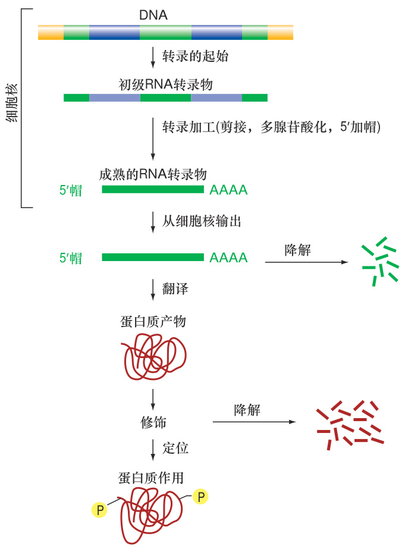  
图17.1　真核生物的基因表达。基因表达首先涉及细胞核中的转录和mRNA的加工。随后mRNA被转运到细胞质中，在那里被翻译成蛋白质。转录后的修饰，如磷酸化（P），会影响蛋白质产物的活性、稳定性或定位。非转录DNA，橙色；外显子，绿色；内含子，蓝色。  

# 17.2 通过增强子控制转录起始  

# 学习目标  

1.  描述控制真核生物蛋白质编码基因的组织特异性转录的顺式作用因子。  
2. 比较转录激活因子和阻遏物的结构及功能。  
3.  解释增强子的工作机制，以及它们是如何被识别的。  
4. 描述绝缘子的功能，以及科学家是如何定位它们的。  
5.  讨论计算机程序和ChIP-Seq技术是如何识别转录因子及它们的目标位点的。  

真核生物中用于转录基因的RNA聚合酶有三种。RNA聚合酶Ⅰ（polⅠ）转录编码核糖体主要RNA组分（rRNA）的基因。RNA聚合酶Ⅱ（polⅡ）转录所有编码蛋白质的基因。RNA聚合酶Ⅲ（polⅢ）转录编码tRNA及其他一些小分子RNA的基因。在这一章，我们集中讨论产生蛋白质的主要转录活动：RNA聚合酶Ⅱ转录。  

一些由RNA聚合酶Ⅱ所表达的基因，像核糖体蛋白基因，是所谓的持家基因，这些基因在几乎所有时间内、所有细胞类型中都会发生转录。其他由RNA聚合酶Ⅱ转录的基因，就像用于构成血红细胞中血红蛋白的多肽的基因，它们只在一种或几种细胞类型中被转录。我们首先关注以细胞类型特异的方式进行基因转录调控的机制。在本章的后面，我们将提出一个涉及DNA甲基化的机制，这是持家基因组成型转录的关键，并且对于某些细胞类型特异性的基因调控也很重要。  

# 17.2.1 启动子和增强子是主要的顺式作用因子  

尽管在真核生物的基因组中，成千上万的由RNA聚合酶Ⅱ转录的基因的调节区域都是独一无二的，但是以细胞类型特异的方式转录的基因都包含两种必要的DNA序列。第一个序列是启动子序列，它总是非常接近基因的蛋白质编码区域。启动子通常包含一个TATA框（或起始框），由大约7个核苷酸的T—A—T—A—（A或T）—A—（A或T）序列组成，位于转录起始位点的上游。由于TATA框本身只能微弱地吸引RNA聚合酶（没有增强子的情况下），所以TATA框允许一个低水平的，也就是所谓基础水平的转录。  

第二种DNA序列元件对于真核生物的转录很重要，它被称为增强子，是一个可以距离启动子数万个核苷酸之远的调节位点。在特定的细胞类型中，蛋白质与增强子的结合可以增强或抑制基础水平的转录。增强子可能位于5′端或3′端到转录起始位点之间（有一些增强子甚至在内含子上被发现）（图17.2），并且一个基因上可以有一个或多个增强子。如下所述，一个增强子可以与不同的转录因子有多个结合位点。  

科学家经常用水母编码绿色荧光蛋白（GFP）的基因作为在真核生物中识别增强子的报告基因，类似于lacZ基因在细菌中作为报告基因的方式（回顾图16.26）。这个想法是要构建一个重组DNA分子，在这个分子中目的基因的推定调控序列与GFP基因编码序列融合［图17.3（a）］。然后将该重组DNA用于产生其基因组包含融合体的转基因生物（你将在第18章学习转基因技术的细节）。如果DNA片段中包含在特定类型组织中引导转录的增强子，那么只有在该组织中，报告基因才会表达得到可检测水平的GFP。当GFP暴露在特定波长的光线下时，会发出绿色的荧光。因此，当转基因动物被一定波长的光线照亮时，如果组织发光，就可以检测到该组织特异性的增强子［图17.3（b）］。  

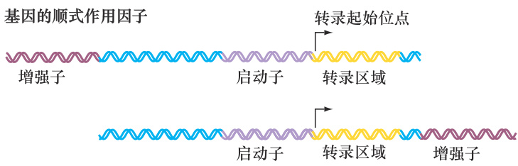  

图17.2　一个基因的顺式作用因子。顺式作用调控元件和它们所控制的基因位于相同DNA分子的DNA序列区域。启动子通常邻近于转录的起点。调节基因表达的增强子有时可以与要调节的基因相距上千个碱基对，或者位于启动子的上游（图上），或者位于启动子的下游（图下）。增强子甚至可以存在于基因的一个内含子中（图中未展示）。  

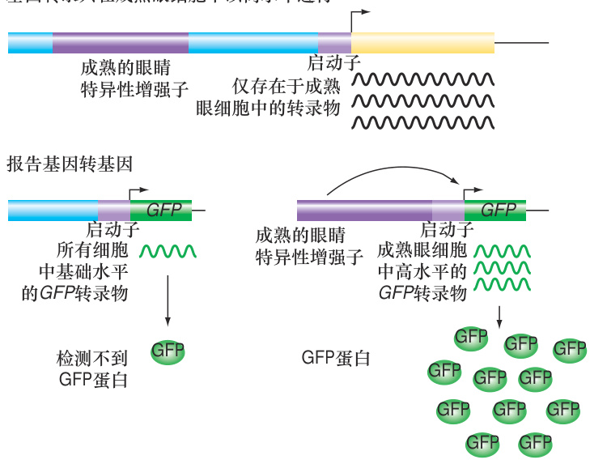  
(a)   
(b)  

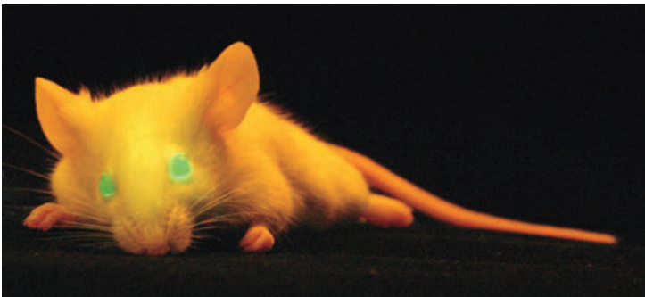  

图17.3　利用GFP报告基因识别增强子。（a）通过将来自基因附近的不同DNA片段融合到一个无增强子的水母绿色荧光蛋白（GFP）报告基因上，可以找到增强子，如图中所示的眼睛特异性增强子。当报告基因被引入一个生物体的基因组时，只有那些与增强子融合在一起的基因才能在恰当的组织中产生大量的绿色荧光蛋白。（b）一只含有眼特异性小鼠基因增强子的GFP报告基因转基因小鼠。  

（b）：承蒙 $\copyright$ John H. Wilson, Baylor College of Medicine提供  

研究人员可以在GFP报告基因构建体的控制区中制造突变，然后用突变DNA构建转基因动物。如果在相同组织中不再能看到GFP的荧光，那么突变必定影响到了组织特异性的增强子。利用这种方式，科学家可以找出构成特定增强子的DNA序列。此类实验的一个有趣的结果是发现，如果增强子的方向或位置相对于启动子（上游或下游）发生改变，它们仍可以发挥其功能。这一结果产生的原因将在本节后面讨论。  

# 17.2.2 蛋白质反式作用控制转录起始  

蛋白质与基因的启动子和增强子（或多个增强子）结合控制转录起始的频率（图17.4）。不同类型的蛋白质与每个顺式作用调控区域结合：基础因子与启动子结合，而激活因子和阻遏物与增强子结合。在本书中，我们将所有具有序列特异性的、影响转录的DNA结合蛋白称为转录因子（无论它们是基础因子、激活因子，还是阻遏物）。一旦转录因子与DNA结合，它们就向基因中募集额外的蛋白质，这些蛋白质也会影响转录。  

# 1. 基础因子  

基础因子有助于RNA聚合酶Ⅱ与启动子的结合。在大多数启动子上形成的基础因子复合物的关键成分是TATA框结合蛋白，或者TBP。该蛋白质在有序的装配途径中，募集被称为TBP结合因子或TAF的其他蛋白质到启动子上（图17.5）。一旦基础因子复合物形成，RNA聚合酶就可以启动一个低水平的转录（基础转录）。在从酵母菌到人类的所有真核生物中，基础因子的主要序列和三维结构都是高度保守的。  

# 2. 中介体复合物  

许多真核生物基因转录需要一个叫做中介体的多亚基复合物，它包含了20多种蛋白质。中介体并不直接结合DNA，而是作为启动子上的RNA聚合酶Ⅱ复合物与结合在增强子上的激活蛋白或阻遏蛋白之间的桥梁［图17.6（a）］。  

# 3. 激活因子  

尽管类似的基础因子复合体与真核生物基因组成千上万个基因的启动子结合，但不是所有细胞类型中的所有基因都被转录。巨大范围的转录调控是通过不同转录  

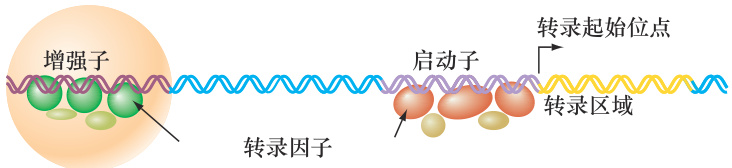  

图17.4　反式作用因子。转录因子是通过DNA结合的方式直接与顺式作用因子（增强子和启动子）相互作用的反式作用蛋白。还有其他一些反式作用蛋白通过与转录因子相互作用间接地与DNA结合。  

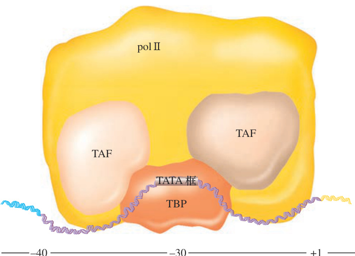  

图17.5　基础因子与蛋白质编码基因启动子结合在一起。TATA框结合蛋白（TBP）与DNA启动子结合、TBP结合因子（TAF）与TBP结合、RNA聚合酶（聚合酶Ⅱ）与这些基础因子结合的示意图。一旦RNA聚合酶与启动子相关联，它就可以开始低水平（基础水平）的基因转录。  

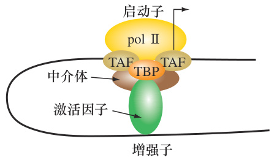  
(a)       RNA  

(b)  

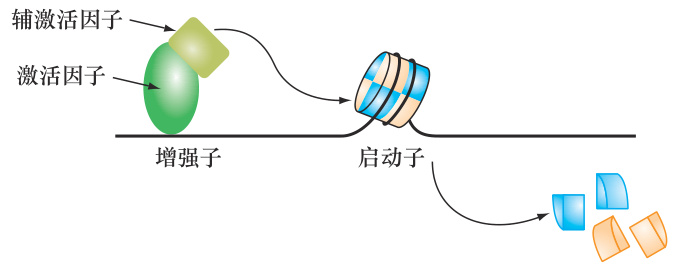  

图17.6　转录激活因子的功能。（a）与增强子DNA相关的激活因子结合基础因子（在某些情况下，间接通过中介体）以稳定聚合酶Ⅱ与启动子DNA之间的相互作用。（b）激活蛋白还能募集辅激活蛋白——例如，修饰组蛋白尾部以清除核小体启动子DNA的酶。如果增强子与启动子相距很远，激活因子发挥功能的两个机制都需要DNA环化。  

因子与不同基因的不同增强子元件结合而发生的。当与增强子元件结合时，转录激活因子使转录水平增加到由启动子单独作用发生的转录基础水平之上。激活因子可以直接或间接地与蛋白质/DNA三维复合物中启动子的基础因子相互作用，从而使转录活性增加。  

由于增强子可能远离启动子，因此增强子和启动子之间的DNA由于基础因子、中介体和激活因子（或抑制因子）的相互作用而成环状［图17.6（a）］。长链DNA可以很好地解释如果将增强子序列移动到相对于启动子不同的位置时，增强子仍能起作用的原因。  

激活因子的功能　在机械水平上，转录激活蛋白结合在DNA的靶位点上，然后通过以下一点或两点来促进RNA的合成。  

1.  通过直接与该复合物的组分相互作用，激活因子有助于将基础因子和polⅡ募集到核心启动子序列上，如图17.6（a）所示。这一功能类似于细菌中的大多数转录激活因子；像CRP等细菌中的正调节因子可以稳定RNA聚合酶与启动子的结合。  

2.  激活因子募集辅激活因子；这些是打开局部染色质结构以允许基因转录的蛋白质［图17.6（b）］。回顾第12章，染色体DNA缠绕在核小体组蛋白上。基础因子不能接近被核小体覆盖的启动子DNA（见图12.10）。因此，为了使基因能够正常转录，启动子DNA必须远离核小体。  

如果增强子DNA被核小体所覆盖，激活因子如何首先与增强子结合呢？科学家们认为，有时激活因子与增强子DNA的结合，就在DNA复制之后、核小体组装之前。此外，即使增强子DNA缠绕在核小体中，一些激活因子也能够与它们结合。  

激活因子的结构　转录激活蛋白必须以序列特异的方式与增强子DNA结合，在结合后，它们必须能够与其他蛋白质（一个基础因子或辅激活因子）相互作用来激活转录。激活蛋白的两个结构域——DNA结合结构域和激活结构域，调节着这两种生化功能（图17.7）。  

转录因子属于几个具有相似DNA结合结构域的蛋白质家族。两个具有显著特征的DNA结合域是螺旋-转角-螺旋和锌指（图17.8）。锌指结构基序主要存在于真核生物蛋白中，但螺旋-转角-螺旋也存在于原核生物中。例如，Lac阻遏物是一个螺旋-转角-螺旋结构的蛋白质（回顾图16.15）。DNA结合结构域与DNA的大沟相匹配。同一家族的激活因子由于氨基酸序列的微妙差别，使得这些蛋白质可以在不同的增强子元件中识别特图17.7　激活因子和阻遏物的模块化结构。一些激活因子和一些阻遏物可由单体形式与DNA结合（左），而其他一些则以二聚体形式与DNA结合（右）。激活结构域和阻遏结构域与辅激活因子/辅阻遏物、中介体或基础启动子复合物相互作用（图中未展示）。  

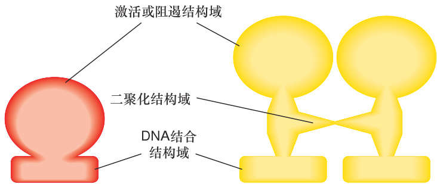  

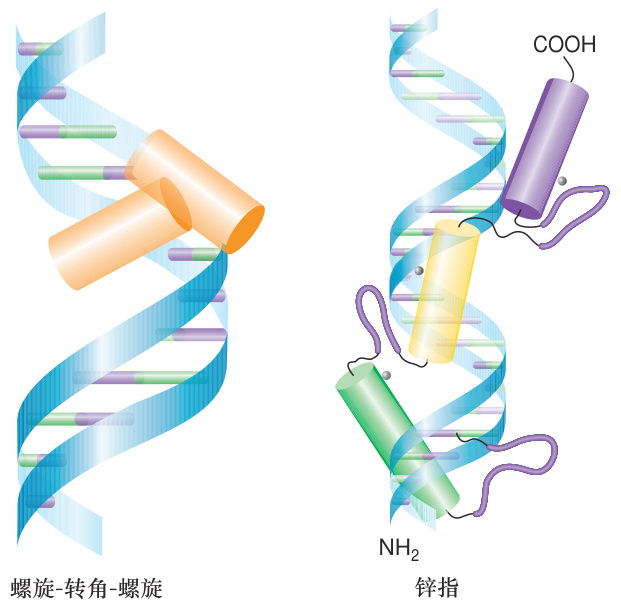  
图17.8　激活因子蛋白家族。在激活因子中发现的两种常见DNA结合基序是螺旋-转角-螺旋和锌指。彩色圆柱代表DNA结合结构域的螺旋区域。  

定的DNA。  

转录因子的激活结构域相比于DNA结合结构域，其特征更少，而且可能结构更简单。激活结构域的氨基酸序列取决于激活因子是与基础复合物相互作用，还是与一个或多个辅激活因子相互作用。  

许多激活因子多肽还有第三个结构域——二聚结构域（图17.7），使它们能够与相同多肽的其他拷贝或其他转录因子亚基相互作用形成多体蛋白，就像在细菌中的几个调节蛋白（如Lac阻遏物）的情况一样（回顾图16.18）。在许多二聚体结构域中的结构基序是亮氨酸拉链，它是一个亮氨酸以规律间隔出现的螺旋。两个亮氨酸拉链之间的连锁能力取决于处于两个亮氨酸之间的特定氨基酸。  

在具有亮氨酸拉链的转录因子中 ，最具特征的是Jun，它是一个在细胞增殖和其他过程中很重要的蛋白质，例如，哺乳动物月经周期中子宫内膜的缺失和再生过程。Jun蛋白可以与自身形成二聚体，成为Jun-Jun同源二聚体；或者与另一个叫做Fos的蛋白质形成Jun-Fos异源二聚体（图17.9）。由于Fos亮氨酸拉链不能和其本身相互作用，因此不存在Fos-Fos二聚体。Jun蛋白和Fos蛋白单体都不能与DNA结合。因此，Jun-Fos系统只能产生两种转录因子：Jun-Jun蛋白和Jun-Fos蛋白。这两种二聚体以不同的亲和力与不同的增强子序列结合。  

# 4. 阻遏物  

与一个基因附近的特定DNA位点相结合，如增强子，并阻止基因转录的起始的真核生物转录因子被称为阻遏物。  

阻遏物的功能　在原核生物中，负调控因子通常通过物理阻隔RNA聚合酶与启动子的结合来发挥作用。在真核生物中，阻遏物的主要功能是不同的：真核生物的阻遏物通常募集辅阻遏蛋白到增强子上。辅阻遏物蛋白自身不能与DNA相结合，因此它们只能在可以与之结合的阻遏物已经存在时，才能与增强子相结合。辅阻遏物有以下两个功能：  

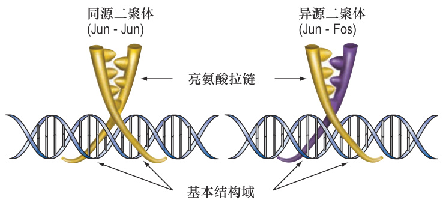  
图17.9　Jun-Jun和Jun-Fos二聚体。同源二聚体包含两个完全相同的多肽，而异源二聚体包含两个不同的多肽。两个亚基中的亮氨酸拉链基序之间紧密的相互作用，使得二聚体形成。所谓的基本DNA结合结构域是大多数含有亮氨酸拉链的转录因子特有的特征。  

（1） 一些辅阻遏物可以直接与RNA聚合酶Ⅱ基础复合物相互作用并阻止其与启动子结合［图17.10（a）］。  
（2） 其他的辅阻遏物是修饰组蛋白尾部氨基酸的酶，导致染色质封闭［图17.10（b）］。回顾第12章，这些酶是组蛋白脱乙酰酶（HDAC）和组蛋白甲基转移酶（HMT）。  

阻遏物的结构　阻遏物结构与激活因子相似：阻遏物具有DNA结合基序——与辅阻遏物相互作用的阻遏结构域（图17.9）。事实上，某些转录因子既可以作为激活因子，又可以作为阻遏物，这取决于其所处背景。例如，被称为Dorsal的果蝇转录因子，其结合于一些靶基因的增强子时是激活因子，而结合于其他基因的启动图17.10　转录阻遏物的工作机制。阻遏蛋白与DNA上增强子结合并募集辅阻遏物。（a）一些辅阻遏蛋白直接阻止基础聚合酶Ⅱ复合物与启动子结合。（b）其他辅阻遏物是组蛋白修饰酶，它们在启动子位置上关闭染色质并阻止转录。  

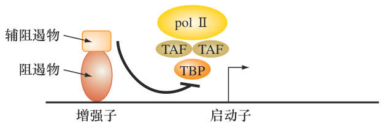  
(a)   
(b)  

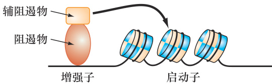  

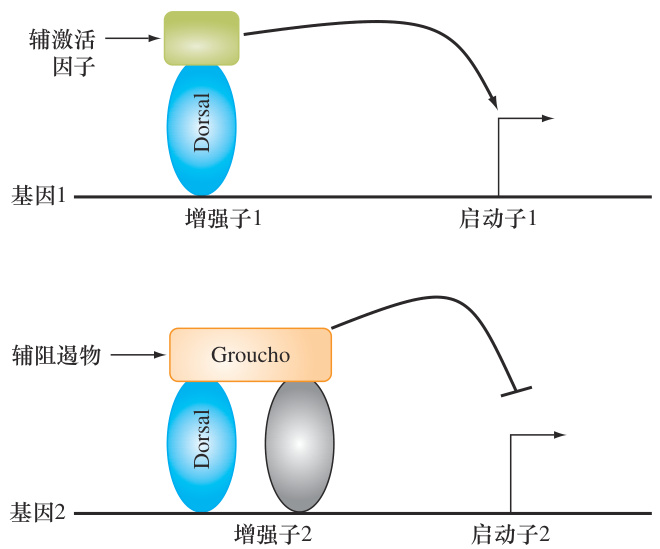  
图17.11　一个转录因子既可以是激活因子，又可以是阻遏物。果蝇的Dorsal蛋白作为基因1的激活因子。在基因2中，另一个转录因子（灰色）与增强子2结合，通过帮助Dorsal募集一种叫做Groucho的辅阻遏物，使其成为阻遏物。  

子时是阻遏物。一个蛋白质如何在转录中具有两种相反的功能呢？Dorsal本质上是与辅激活因子结合的激活因子。然而，在一些增强子中，与另一种蛋白质的相互作用导致Dorsal募集一种被称为Groucho的辅阻遏物（图17.11）。  

# 5. 间接阻遏  

许多调控蛋白被称为间接阻遏物，它们不是通过募集辅阻遏物，而是通过干扰激活因子的功能间接地阻止转录的起始。在此类机制中，由于阻遏物和激活因子的结合位点重叠，一些阻遏物可以通过与激活因子竞争来接近增强子［图17.12（a）］。另一种形式的间接阻遏叫做猝灭，蛋白质与结合在增强子上的激活因子结合，从而防止激活因子发挥作用［图17.12（b）］。一些间接阻遏物与激活因子结合，并将它们约束在细胞质中。间接阻遏物的转录后修饰使它释放激活因子，激活因子可以进入细胞核并结合它的目标增强子［图17.12（c）］。最后，一些间接阻遏物可以和激活因子形成异源二聚体。如果只有激活因子同源二聚体可以结合DNA，间接阻遏物可以滴定活化因子使得很少有同源二聚体能够形成［图17.12（d）］。  

# 6. 组蛋白修饰  

如第12章中所述，基因转录和各种共价修饰之间存在相关性，这些共价修饰可以添加到核小体中组蛋白的N端尾中的特定氨基酸上。对于转录来说，这些修饰中最重要的是乙酰化和甲基化——分别加入乙酰基和甲基。  

通过被称为组蛋白乙酰转移酶（HAT）的酶对特定赖氨酸组蛋白尾部的乙酰化，帮助清除核小体的启动子，从而有助于基因的表达。因此，许多转录因子的辅激活因子是组蛋白乙酰转移酶。组蛋白乙酰化有助于以图17.12　间接阻遏。（a）阻遏物（橙色图标）通过与激活因子（A；绿色图标）共享一个增强子上共同的或重叠的结合位点而直接或间接地起作用；阻遏物可以在与增强子结合上胜过激活因子。（b）间接阻遏物可以与激活因子结合并隐藏其激活结构域。（c）当与间接阻遏物结合时，激活因子可以被隔离在细胞质中。（d）非功能性的间接阻遏物/激活因子异源二聚体的形成可以阻止功能性的激活因子同源二聚体的形成。  

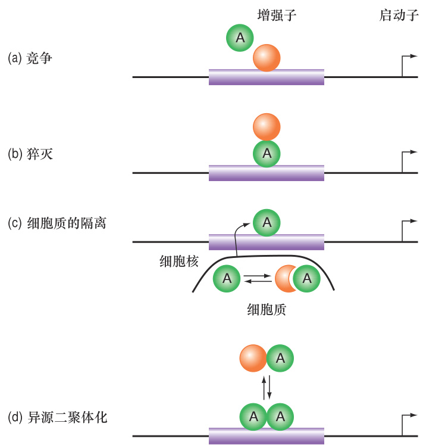  

两种方式打开染色质。首先，赖氨酸的乙酰化降低了组蛋白上的正电荷，从而减轻了其与具有带负电DNA的核小体的静电相互作用。其次，具有乙酰化赖氨酸的组蛋白尾部作为着陆点，可以将特定的蛋白质募集到核小体上。这些蛋白质可以是使相同或相邻核小体内其他组蛋白尾部赖氨酸乙酰化的组蛋白乙酰转移酶，或者是使用ATP水解能量从DNA中去除组蛋白的DNA重塑蛋白质。  

组蛋白甲基转移酶（HMTase）对组蛋白尾部某些赖氨酸（或精氨酸）的甲基化作用可以帮助激活或抑制转录，这取决于甲基化位点募集到核小体上的特定蛋白质。特定的甲基化氨基酸结合在特定基因上打开染色质的因子，而某些其他甲基化氨基酸结合区域性的关闭染色质的蛋白质。因此，一些组蛋白甲基转移酶是辅激活因子，而其他的是辅阻遏物。  

组蛋白乙酰化和甲基化是动态过程。这些修饰可以通过HAT或HMTase快速添加，或通过组蛋白脱乙酰化酶或组蛋白去甲基化酶快速脱去。但基因的转录调控本质上是动态的。你会发现，特定的转录因子与增强子相互作用可以对细胞历史（在特定时间可以获得的其他转录因子）或细胞环境（例如，类固醇激素等别构效应物的存在）的改变做出反应。  

组蛋白修饰酶不能单独与基因组上的DNA结合位点结合，记住这一点很重要。所有基因特异性或基因组区域特异性的组蛋白修饰都是由序列特异性的DNA结合蛋白（转录因子）启动的。此外，自2016年撰写本文以来，尚未知道组蛋白修饰在DNA复制叉上被复制的机制。因此，修饰的组蛋白在调节基因表达的转录因子下游起作用。  

# 7. 识别转录因子  

科学家经常使用GFP报告基因来验证所怀疑的转录因子确实起到了调节目标基因表达的作用。这种实验方法有两个要求。第一个要求是，研究人员必须构建一个转基因生物，该转基因包含与GFP报告基因（启动子加GFP编码序列）融合的目标基因的增强子。如我们在图17.3中所见，在其他的野生型动物中，GFP将在适当的细胞中以高水平表达。  

第二个要求是，编码推定的转录因子的基因突变必须是可以获得的。如果携带GFP报告基因的动物在编码推定的激活因子的基因中也具有功能丧失突变，则该激活因子实际上与特定的增强子相互作用，报告基因就不会表达（图17.13）。与之相比，在编码阻遏物的基因中的功能丧失突变可以产生比正常水平更高的GFP荧光，并且/或者导致GFP在不恰当的细胞中表达（图中未展示）。  

# 17.2.3 增强子整合细胞信息以控制基因转录  

在复杂的多细胞生物中，大部分基因被用于转录调控。在人类基因组估算的27 000个基因中，科学家估计其中超过2000个基因编码转录因子。许多蛋白质可以调节任何一个基因的转录，每个调节蛋白可以作用于许多不同的基因。调节因子可能的组合数量是惊人的，它提供了对细胞分化和多细胞真核生物的发育很重要的灵活性。  

增强子元件通常在操作上被定义为顺式作用序列，图17.13　识别转录激活因子。（a）与融合了报告基因的增强子结合，并且使转录进行，检测到GFP的表达。（b）编码激活因子的基因突变能够减少报告基因的转录，导致GFP表达的缺失。  

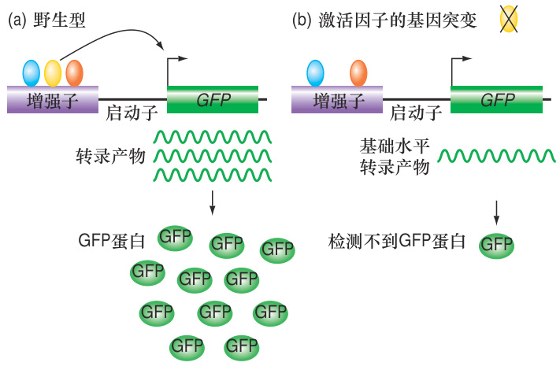  

其在特定时刻控制特定类型细胞中的基因表达。由于许多基因在一个以上的组织中表达，基因的调控区域可能包含几个增强子元件，例如，激活眼细胞转录的眼细胞增强子和激活皮肤细胞转录的皮肤增强子（图17.14）。每个增强子反过来又具有一个或多个结合位点，这些位点对几种不同激活因子和抑制因子中的每一种具有不同的亲和力。在任何时候，细胞中的几十个激活因子和阻遏物都可能竞争这些结合位点，辅激活因子和辅阻遏物也会相互竞争，与不同的激活因子或阻遏物结合。来自增强子的所有这些信息的生物化学整合，不仅指导了细胞中基因是否应该被打开或关闭的决定，而且事实上有助于细胞将转录的激活或抑制微调至对生物体中细胞作用最佳的水平。  

在单细胞真核生物酵母中，基因受一种类似于增强子的简单元件调节，称之为上游激活序列（UAS）。UAS与单个转录因子的多个拷贝结合。“遗传学工具”信息栏“ $\mathrm{^{\circ}G a l4/U A S_{G}}$ 二元基因表达系统”描述了如何利用特定的UAS在转基因生物体中以任何表达模式表达任何克隆基因。  

在多细胞生物体内，所有细胞都有相同的核DNA，所以基因的增强子元件存在于所有类型的细胞中。因此，转录的细胞类型特异性取决于与这些增强子相互作用的转录因子构型在发育过程中发生的变化（见图17.14）。在这里我们讨论一组功能性反式作用蛋白可以随着时间改变的三种方式。  

# 1. 别构相互作用  

真核生物的转录因子活性可以通过与效应物的别构图17.14　增强子控制组织和时间特异性基因表达。假设的基因包括在眼睛和皮肤中表达的增强子。增强子中的序列由转录激活因子（绿色图标）或阻遏物（橙色图标）识别，这些转录因子可能存在于一些组织中，而在其他组织中不存在。某些转录因子可以通过别构调节（例如，通过结合激素）或转录后调节（例如，通过磷酸化）。增强子整合来自所有转录因子结合的信息，以确定目标基因是否在组织中转录、在什么水平和什么细胞周期阶段转录。  

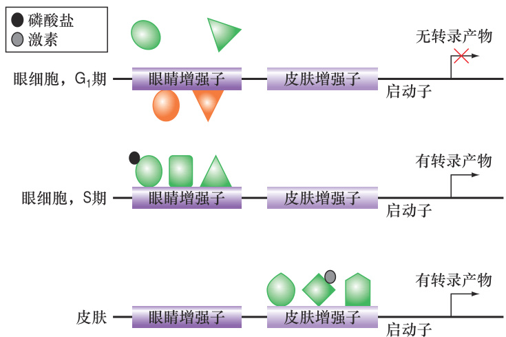  

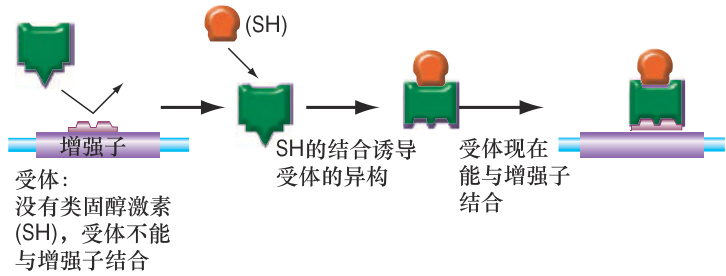  
图17.15　类固醇激素受体。类固醇激素受体的DNA结合结构域处于非活性构象，直到由激素分子与另一结构域的结合引起别构变化，允许DNA结合结构域识别增强子。  

相互作用调节，类似于你在第16章看到的异乳糖结合到Lac阻遏物上和色氨酸结合到TrpR阻遏物上。类固醇激素受体转录因子构成了真核生物中别构效应的重要实例：激素的结合导致受体蛋白发生形变，大大增加了其DNA结合结构域与其目标增强子的亲和力（图17.15）。  

在人类中，类固醇激素睾酮和二氢睾酮正是通过这种机制起作用。在男性的青春期，睾丸产生高水平的雄激素类固醇，它们与靶细胞内的雄激素受体结合，如面部毛囊中的雄激素受体。通过类固醇调节雄激素受体转录因子，控制靶细胞的基因活性，导致男性第二性征的发育，如青春期末期男孩的面部毛发生长。这个例子清楚地表明多细胞真核生物的每个细胞必须不断地修改其基因活性程序，以响应来自身体其他部位的不断变化的信号。  

# 2. 转录因子修饰  

转录因子蛋白可以在合成后被修饰，合成通过共价添加几种不同化学基团中的任何一种来完成，如之前在图8.26（b）中描述的那样。这些修饰中最重要的一种是磷酸化，即通过激酶的作用向蛋白质上添加磷酸基团。磷酸化可以通过多种方式激活或灭活转录因子：影响转录因子进入细胞核的运动，该因子的DNA结合特性，形成多聚体的能力，或与其他蛋白质（包括辅激活因子或辅阻遏物）相互作用的能力。  

细胞常常通过磷酸化来控制必须快速发生的事件，例如，对环境变化的响应或细胞周期中状态之间的转变。在第20章，你将了解到一种叫做p53的特定转录因子的磷酸化如何在保护生物体免遭癌症侵害方面发挥重要作用。  

# 3. 转录因子级联  

如图17.14所示，并非所有转录因子都始终在所有细胞中产生。显然，如果一个给定的细胞中不存在转录因子，则它将不能启动任何目标基因的转录。换句话说，各种转录因子的可用性对于细胞决定哪些基因将被转录、在何种水平上转录是至关重要的。  

转录因子和其他任何蛋白质一样，都是基因产物。因此，编码转录因子基因的表达受其他转录因子的控  

# Gal4/UAS 二元基因表达系统  

在单细胞真核生物酵母中，称为上游激活序列（UAS）的DNA元件是可结合多个转录因子的多个拷贝的简单增强子。例如，调节参与半乳糖代谢的几个基因的USAG具有四个用于结合被称为Gal4的激活蛋白的结合位点。  

研究人员利用Gal4-UASG相互作用的简单性质开发了一个实验系统，借此，转基因模式生物可以在数千种组织特异性模式的任何一种中表达任何给定的基因。图A表明了这个系统是如何在果蝇中工作的。  

研究人员首先克隆了基因的cDNA下游的一个$U\!A S_{G}$ 克隆和一个启动子，然后将这一转基因构建体引入果蝇基因组中。当携带 $\mathrm{UAS}_{\mathrm{G}}$ -cDNA的转基因果蝇与含有表达Gal4的转基因果蝇杂交时，携带两种转基因的后代在那些产生Gal4蛋白的细胞中特异性表达cDNA。  

表达Gal4蛋白的转基因被保存在称为“驱动”的果蝇品系中。每个驱动品系包含一个启动子-Gal4融合基因的拷贝，其中无增强子的果蝇启动子与编码Gal4的cDNA融合。科学家们生成了数千个品系，每一个品系都含有不同的启动子-Gal4转基因随机插入位点的果蝇基因组。启动子-Gal4插入位点附近的增强子决定了Gal4表达的模式。数千个品系都是可获得的，每个品系都以不同的组织特异模式表达Gal4。  

Gal4/UASG二元系统有许多的应用；在这里，我们简要的讨论一个例子，它使用该系统杀死（或除去）特定种类的细胞。在这个应用中，位于UASG下游的cDNA编码Reaper——一种激活细胞凋亡过程或程序性细胞死亡过程的蛋白质，表达Reaper的细胞最终将会死亡，并从动物身上移除。  

研究人员将携带 $\mathrm{\Delta UAS_{G}}$ -reaper的果蝇与含有只在大脑某些特定类别的神经元中表达Gal4的“驱动”品系杂交。用这种方法，科学家制造了缺乏不同神经元类型的不同的动物。他们发现，缺乏携带有特定种类离子通道蛋白的特定神经元的雌性果蝇，会对在本章开头描述的雄性求偶歌曲和舞蹈做出更强的反应。换句话说，虽然正常雌性在选择配偶之前可能会拒绝许多潜在的雄性伴侣，但这些突变体果蝇几乎会与任何雄性交配。这些结果表明了这些特定神经元和离子通道在这种雌性交配行为中的重要性。  

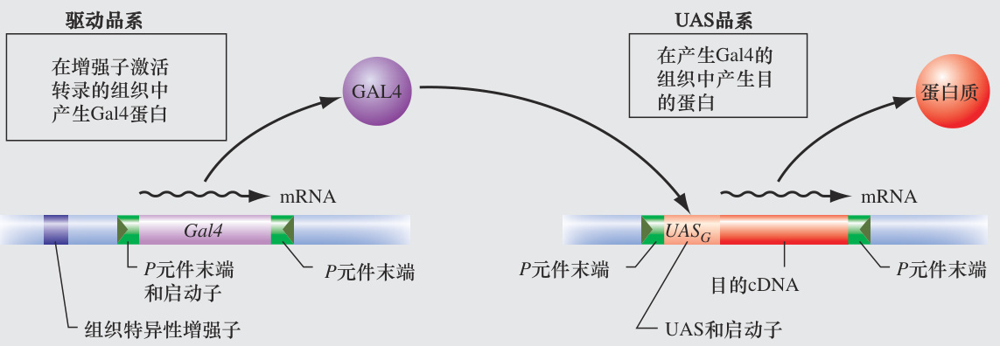  
图A　使用Gal4/UASG进行基因表达。Gal4和UASG转基因处于基因组的不同位置。 $P$ 元件末端用于将转基因整合到基因组中（在第18章详细解释）。  

制，这意味着转录因子表达的级联必定发生。一组转录因子开启或抑制另一组转录因子，这些转录因子又控制其他转录因子表达。在第19章，你会了解到这种转录因子级联对于控制多细胞真核生物发育的生物化学机制是至关重要的。  

# 17.2.4 绝缘子改变DNA结构以控制增强子/启动子相互作用  

如上所述，增强子可以位于其所调节的启动子的上游或下游，并且处于相对启动子的任一方向上。这些事实构成了一个概念性问题：一个增强子如何“知道”它位于两个基因之间的哪个才是正确的？并且因为增强子可以在距离它们调节的启动子很远的位置工作，是什么阻止染色体上的增强子影响到染色体上任何一个基因的任何一个启动子的呢？答案是，被称为绝缘子的DNA元件会改变染色质结构，因此增强子只能接近特定的启动子。  

# 1. 科学家如何识别绝缘体  

绝缘子被定义为位于启动子与增强子之间的DNA元件，其阻止增强子激活来自该启动子的转录。为了识别绝缘子，研究人员在插入基因组的重组构建体中的增强子和报告基因启动子之间插入可疑的DNA序列。如果报告基因的表达被阻断，那么这个DNA序列就被认为是绝缘子（图17.16）。  

# 2. 绝缘子是如何工作的  

人类的绝缘子结合一种称为C T C F 的蛋白质（CCCCTC结合因子）。结合不同绝缘子的CTCF蛋白之间的连接促进了DNA环的形成。如果一个绝缘子位于启动子和增强子之间，那么它们将会处于不同的环中，并且不能相互作用（图17.17）。  

最近的研究表明，绝缘子的功能可能比简单的阻断增强子要复杂得多。一些发育调节基因具有由绝缘子分开的几个增强子。这些基因的DNA环的形成是动态的，并且绝缘子可以响应随着生物体发育而改变的信号，从而向特定的启动子传递特异性的增强子。  

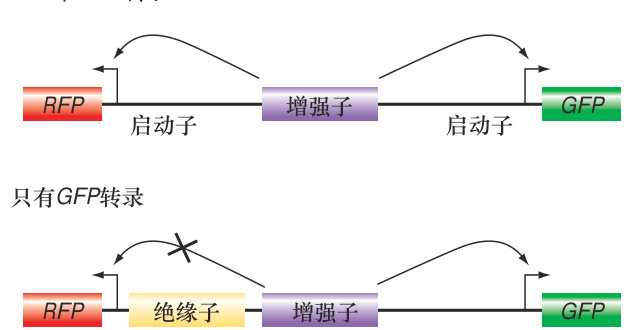  
RFP GFP  

图17.16　识别绝缘子。处于两个报告基因启动子之间的增强子将会激活两个基因的转录，除非有一个绝缘子序列位于增强子和其中一个启动子之间。RFP是红色荧光蛋白，RFP基因是从红色荧光珊瑚中克隆得到的。在上图的构建体中，转基因生物的细胞会发出红色和绿色的荧光（即黄色）；在下图的构建体中，相同的细胞只发出绿色荧光。  

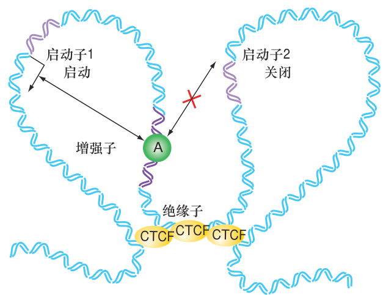  
图17.17　绝缘子是如何工作的。绝缘子使基因组DNA成环，而增强子仅从同一个环内的启动子处激活转录（ $\mathrm{A}{=}$ 激活因子）。结合不同绝缘子的CTCF蛋白（黄色）之间的相互作用促进了绝缘子之间区域DNA的成环。  

# 17.2.5 新方法提供了顺式和反式作用转录调节因子的全局视图  

最近出现的生物信息学——生物学、计算机科学和信息技术融合形成一门学科的一个科学领域，有希望促进对复杂的转录程序的理解。例如，计算机程序虚拟地将cDNA克隆的编码序列和基因组中推定的开放阅读框翻译成蛋白质的氨基酸序列。然后，计算机在这些氨基酸序列中搜索明显特征，如螺旋-转角-螺旋或锌指，这可以表明蛋白质是转录因子。通过这种方式，研究人员可以发现由生物体基因组编码的反式作用转录因子。  

为了寻找可能的顺式作用转录调控位点，如增强子，计算机比较近源物种的基因组序列。如之前在图10.3中所示，核苷酸序列在编码区域外往往不太保守，因此发现的任何保守序列都是在诸如基因调节这样的重要过程中起作用的强力候选者。  

染色质免疫共沉淀测序（ChIP-Seq）是一种强大的新技术，用于在特定类型细胞的整个基因组中寻找特定转录因子的所有靶基因（图17.18）。科学家首先从被研究细胞的细胞核中分离出染色质，化学交联染色质的DNA和蛋白质成分，然后将染色质中的DNA片段化。研究人员接下来添加了涂有抗体的微珠，这种抗体与目的转录因子特异性结合。会黏附于微珠的唯一蛋白图17.18　ChIP-Seq。针对特定转录因子（蓝色椭圆形）的抗体（Y型分子）被用于纯化与其靶基因DNA位点结合的蛋白质（通过将抗体附着于微观珠子，图中未显示）。对纯化的蛋白质-DNA复合物内的DNA片段测序，识别转录因子所调节的基因。  

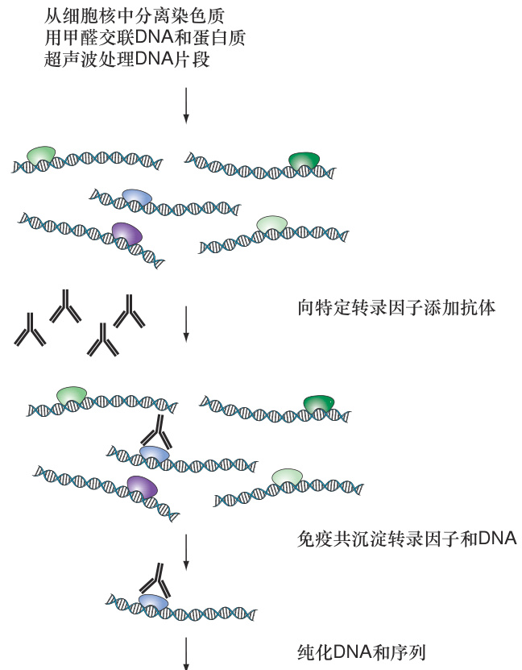  

质-DNA复合物就是那些含有转录因子，且这些转录因子和与其相互作用的增强子相交联的复合物。这些复合物可以吸取其他非特异性染色质碎片。通过抗体结合纯化与其他蛋白质或核酸结合的特定蛋白质，被称为免疫共沉淀。科学家对这些纯化的复合物的DNA片段进行测序，以便确定被分析的细胞类型中特定转录因子靶向的基因。  

作为人类基因组计划的后续行动，一个由数百名科学家组成的联盟正在试图绘制人类基因组中的所有顺式作用调控元件（启动子、增强子和绝缘子）。该计划名为ENCODE（Encyclopedia of DNA Elements），应用计算机技术和生化实验，如ChIP-Seq。庞大的ENCODE数据库对于那些寻找位于远离它们所调节基因的外显子的增强子中的致病突变的科学家尤其有用。  

# 基本概念  

●  增强子是DNA序列，它可以远离基因的启动子，在特定类型的细胞中起作用，以增加或减少相对于基础水平的转录量。  
●  转录因子是反式作用蛋白，它包括与启动子结合的基础因子，以及与增强子结合的激活因子或阻遏物。一旦与DNA结合，转录因子就可以为基因募集其他蛋白质。  
●  增强子有许多激活因子和阻遏物结合位点；增强子的这种性质使它们赋予基因转录时间和细胞类型特异性。  
●  绝缘子是组织染色质成环的DNA元件；增强子和启动子只有处于相同的环中才能相互作用。  
●  生物信息学使在基因组范围内搜索新的转录因子和它们的结合位点成为可能。染色质免疫共沉淀测序技术使用特异性抗体识别由目标转录因子所调节的基因。  

# 17.3 表观遗传学  

# 学习目标  

1. 描述CpG岛的基因调控。  
2.  讨论如何从人类谱系的遗传模式中推断出基因组  
印记。  
3. 定义表观遗传学现象。  
4. 解释DNA甲基化和基因组印记之间的关系。  

在上一节中，我们讨论了转录因子与增强子的结合如何保证许多基因只在特定发育时期的特定组织中表达。细胞可以调节转录起始的第二个方法是通过控制DNA甲基化——一种DNA的生化修饰，其中甲基基团（ $\mathrm{CH}_{3}$ ）被添加到双螺旋的一条链上 $5^{\prime}\,\mathrm{CpG}\ 3^{\prime}$ 二核苷酸对的胞嘧啶碱基的5号碳上［图17.19（a）］（CpG中的p代表磷酸盐）。被称为DNA甲基转移酶（DNMT）的酶催化CpG二核苷酸胞嘧啶的甲基化。  

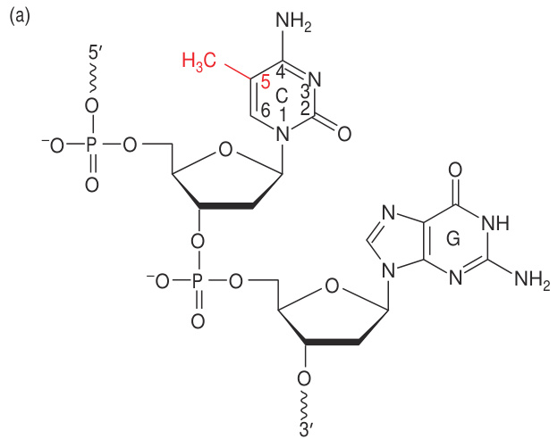  

  
CpG  

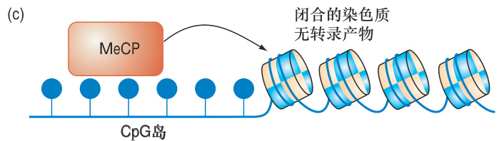  
图17.19　DNA甲基化和CpG岛。（a）CpG二核苷酸的化学结构，其中胞嘧啶是甲基化的（红色）。（b、c）一些基因的转录是由CpG岛（富含CpG残基的序列）控制的，其中包括激活因子的结合位点。（b）结合激活因子阻止胞嘧啶残基甲基化。（c）如果激活因子不再存在，CpG岛将会被甲基化；成为甲基-CpG结合蛋白（MeCP）的阻遏物与甲基化位点结合并关闭染色质。  

DNA甲基化对于控制脊椎动物管家基因的表达特别重要，尽管它也帮助调节一些细胞类型特异性的基因。在人类基因组中，CpG二核苷酸中大约有 $70\%$ 的胞嘧啶残基被甲基化。你会看到，因为DNA甲基化影响基因转录，还因为在DNA复制过程中甲基化模式被复制，所以DNA甲基化可以在不改变DNA碱基序列的情况下遗传性地改变基因的表达，从而引起所谓的表观遗传现象。甲基化是在哺乳动物（包括人类）中出现的表观遗传学的关键，被称为基因组印记。  

无脊椎动物和单细胞真核生物很少或没有DNA甲基化，而秀丽隐杆线虫和酵母没有甲基化。因此，本节的信息可能不是与所有真核生物有关的，但对人类遗传学非常重要。  

# 17.3.1 CpG岛的DNA甲基化使基因表达沉默  

CpG岛可以是几百或几千个bp的DNA序列，并且其中CpG二核苷酸出现的频率远高于其他基因组。然而，与其他哺乳动物基因组中的CpG二核苷酸不同，CpG岛中的胞嘧啶残基通常是未甲基化的。当基因启动子附近的CpG岛未甲基化时，染色质是开放的，并且该基因具有转录活性。CpG岛的甲基化关闭了染色质并抑制了转录［图17.19（b）、（c）］。  

CpG岛未甲基化的原因通常是那些通过与CpG岛结合激活转录的蛋白质阻止了DNMT对CpG岛的甲基化［图17.19（b）］。如果目的基因是在大多数细胞中表达的持家基因，那么这些转录激活因子会在许多细胞类型中被发现。  

如果不存在激活因子，CpG岛就会被甲基化。由于称为甲基CpG结合蛋白（MeCP）的阻遏物与甲基化的CpG岛结合并关闭染色质结构，使基因不能被转录。DNA甲基化对基因的抑制作用通常是长期的，这是因为甲基化模式是通过许多细胞分裂来维持的；通过DNA甲基化的长期抑制被称为沉默。DNA甲基化模式是在DNA复制期间通过存在于DNA复制叉上的特殊DNMT被复制的，该复制叉识别半甲基化的DNA（仅在一条链上甲基化的DNA，在这个例子下是亲本链）并甲基化新合成的DNA链（图17.20）。  

Rett综合征是一种导致癫痫，以及精神和身体损伤的大脑发育障碍，通过发现导致Rett综合征的突变基因，揭示了人类DNA甲基化对基因调控的潜在重要性。这种疾病显示了X连锁的显性遗传，它是由编码甲基-CpG结合蛋白的MeCP2 X连锁基因的功能丧失突变导致的。  

# 17.3.2 性别特异性DNA甲基化导致基因组印记  

孟德尔遗传学的一个主要原则是，无论是来自母本还是父本，等位基因的亲本起源并不影响其在F1代中的功能。对于绝大多数植物和动物的基因，这一原则仍然适用。然而令人惊讶的是，遗传学家发现哺乳动物中的一些基因是例外的，它们不遵循这一普遍规则。  

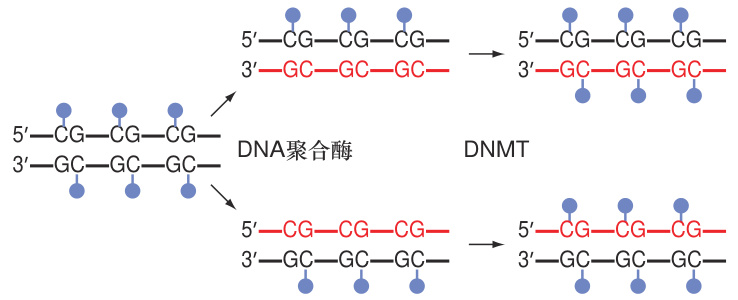  

图17.20　胞嘧啶甲基化在DNA复制过程中持续存在。专用的DNA甲基转移酶（DNMT）在复制叉上起作用；模板链上的胞嘧啶甲基化模式（蓝色圆圈）复制到新合成的DNA链（红  

一个等位基因的表达取决于传递它的亲本的异常现象，称为基因组印记。在基因组印记中，个体从一个亲本遗传的基因的拷贝是无转录活性的，而从另一个亲本遗传的拷贝是有活性的。“印记”一词表示，无论印记基因的母本或父本拷贝是否沉默，DNA的核苷酸序列都不会发生变化。相反，正如你将在本节后面看到的，“无论什么”是指某些称为印记控制区（ICR）的DNA序列的性别特异性甲基化。  

人类基因组中的约27 000个基因大概只有100个表现出印记。基因印记的数量是通过RNA-Seq实验（回顾图16.29和图16.30）估计的，它可以从杂合个体两个同源染色体中识别出基因的转录物。这100个基因中约有一半是父系印记基因，意味着从父本遗传的等位基因不被表达，而来自母本的等位基因被转录。对于母系印记基因，遗传自母本的等位基因不被转录，并且该基因的所有mRNA都是来自父本等位基因的。将印记这个术语与沉默等同起来，可能有助于你理解这个术语。  

# 1. 印记和人类疾病  

在RNA-Seq技术成熟之前，在20世纪80年代时，临床遗传学家观察到携带突变等位基因的亲本的性别决定孩子是否会表现出疾病的谱系，基因组印记的存在由此首先得到推断。这种类型的谱系模式在某些罕见病例中特别清楚，它们的病症是由除去印记基因产生的缺失导致的，因为这种缺失的遗传和疾病可以在核型上被追踪。  

如图17.21（a）所示，父系印记基因的缺失可以无影响地从父亲传递到孩子，因为孩子的野生型母系等位(a)  

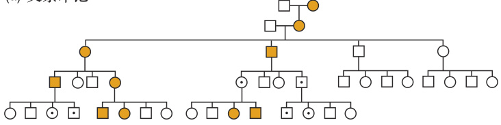  

(b)  

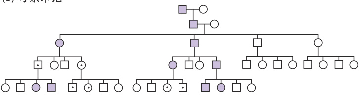  

图17.21　基因组印记与人类疾病。（a）与父系印记常染色体基因缺失有关疾病的典型谱系。父亲可以将缺失传递给他们的儿子和女儿，而子女不受影响（系谱中的圆点符号表示未受影响的缺失携带者）；母亲也可以将缺失和疾病（黄色阴影）传递给她们的孩子。（b）与母系印记基因缺失有关疾病的典型谱系。这里，母亲可以毫无影响地将缺失和疾病传递给她们的儿子和女儿（圆点）；父亲可以将缺失传递给他们的儿子和女儿，而子女将受影响（紫色）。除了缺失，两个谱系还适用于印记基因隐性功能缺失突变的遗传。  

基因将会表达。然而，一个女人因为同样的缺失而成为杂合子，她孩子中的 $50\%$ 会从她那里得到这一缺失。所有的这些杂合子的孩子都具有突变表型，因为他们从父亲遗传的基因的一个完整拷贝将是不活跃的；没有基因产物，这将会产生异常的表型。相反，母系印记基因的缺失可能不被察觉地在许多代中从母亲传递到女儿，这是因为来自父系的基因拷贝总是活跃的。然而，如果该缺失从男性传递到他的孩子，他的儿子和女儿都有 $50\%$ 的机会接收一个存在缺失的父系等位基因，并且因为从母亲身上继承的完整拷贝不活跃，这些孩子都会表达突变表型［图17.21（b）］。  

印记作为影响因素现存在于多种人类发育障碍中，具体证据包括被称为普拉德-威利综合征（Prader-Willisyndrome）和快乐木偶综合征（Angelman syndrome）的两个相关病症。患有普拉德-威利综合征的儿童手足较小，性腺和生殖器发育不全，身材矮小，有智力障碍；他们还是强迫性的过度饮食者和肥胖者。受快乐木偶综合征影响的儿童脸颊发红，下额较大，嘴较大且舌头突出；他们还表现出严重的智力和运动障碍。两种综合征通常与15号染色体q11-13区小段缺失有关。当这种缺失遗传自父亲时，孩子会发展成普拉德-威利综合征；当相同的缺失遗传来自母亲时，孩子会发展成快乐木偶综合征。  

对于这种现象的解释是，在这些缺失的区域至少有两个基因是不同的印记。一个基因是母系印记的；从他们的父亲那里接受一条缺失的染色体、从母亲那里接受一条带有该基因印记拷贝的野生型（非缺失的）染色体的孩子，因为印记的、野生型的基因是无活性的，而表现出普拉德-威利综合征。至于快乐木偶综合征，同一区域内的不同基因是父系印记的；从母亲那里接受一个缺失染色体、从父亲那里接受一个正常的印记基因的孩子会产生这种综合征。  

# 2. 印记作为表观遗传现象  

基因可以以一种不改变DNA碱基对序列，但仍以遗传方式影响基因转录的方法被修饰。如前所述，在不改变碱基对序列的情况下改变基因表达，并且通过细胞分裂直接遗传的基因修饰称为表观遗传变化。负责基因组印记的表观遗传变化的类型是位于100多个印记基因附近的特定ICR（印记控制区）中发现的CpG二核苷酸的性别特异性甲基化。  

因为甲基化模式可以在DNA复制过程中传递，所以当体细胞有丝分裂时，印记得以保留。新合成的双螺旋的一条链上存在甲基，发出DNMT甲基化酶信号，以向另一条链上添甲基（回顾图17.20）。因此，印记基因座的性别特异性甲基化通常在个体的一生中都保留在体细胞内。  

然而请注意，图17.21所示的谱系要求DNA甲基化模式必须在减数分裂期间重置，然后才能传递给下一代。如果不是这样，印记就不会是性别特异性的。图17.22显示在种系细胞中抹去（去除）甲基化，随后在基因通过种系进入下一代的每次传代期间产生性别特异性甲基化标记。一些基因在母本种系中被甲基化，其他基因在父本种系中接受甲基化标记。对于每一个受此影响的基因，印记都只发生在母系或父系中，而不是两者中都存在。这导致不同甲基化模式的雄性和雌性种系的分子差异是未知的。  

# 3. 印记如何起作用  

印记控制区的DNA甲基化控制了附近基因的转录。与CpG岛上的甲基化总是抑制转录相反，印记控制区上的甲基化可以打开或关闭印记基因。生物信息研究已经揭示了印记控制区的甲基化能够影响基因表达的两种方式。  

绝缘子机制　在这里，ICR包含一个绝缘子，其功能由DNA甲基化控制。在母系印记的小鼠基因Igf2（胰岛素样生长因子2）中可以看到ICR功能机制的一个例子。在Igf2基因座上的印记通过位于Igf2启动子与其增强子之图17.22　基因组甲基化标记在减数分裂期间被重置。母系甲基化基因显示为红色，父系甲基化基因显示为黑色。在种系细胞中，体细胞甲基化标记被消除，并建立新的性别特异性的甲基化标记。  

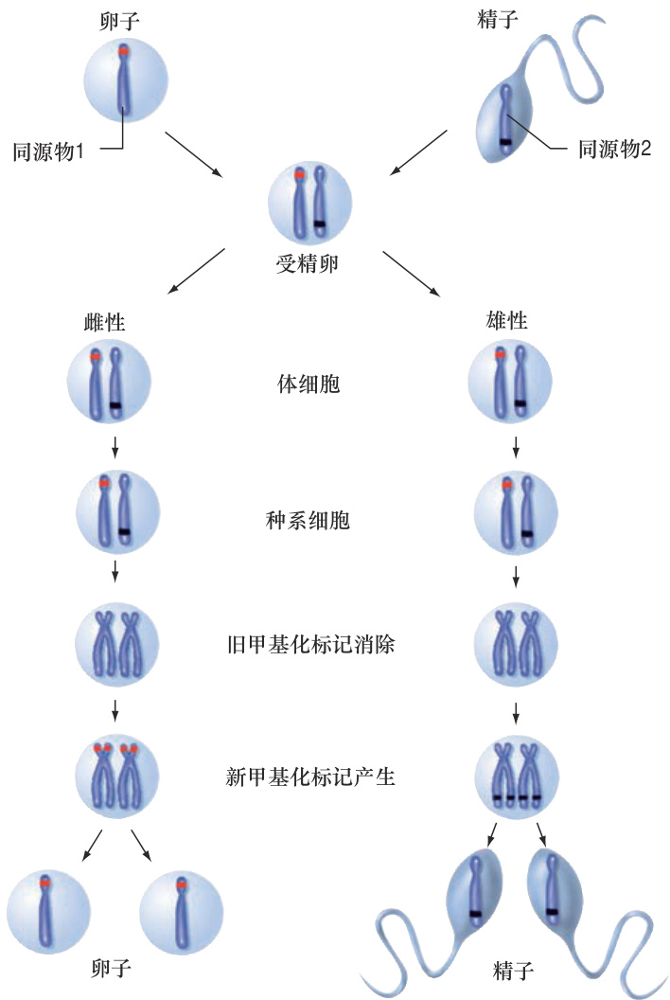  

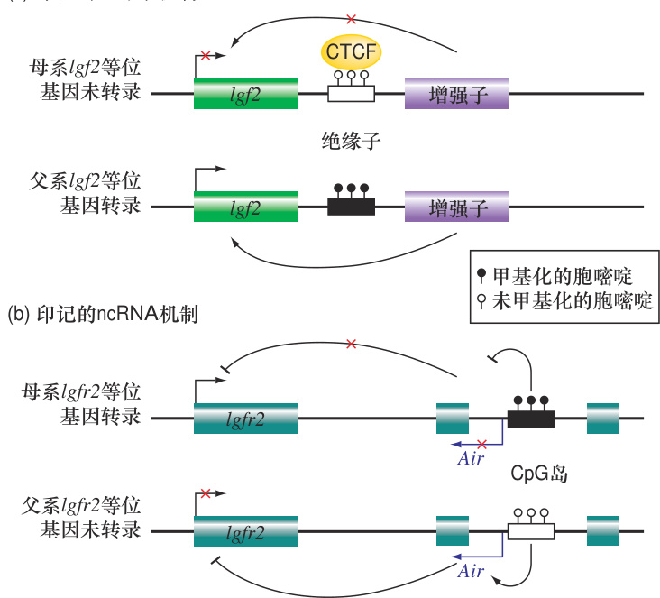  
(a)  

图17.23　基因组印记机制。（a）Igf2的母系印记由位于Igf2增强子和启动子之间的绝缘子的甲基化来控制。在母系同源物上，绝缘子未甲基化，因此是有功能的（结合CTCF）。在父系同源物上，绝缘子被甲基化且不起作用。（b）Igfr2的父系印记取决于控制“空气”ncRNA转录的CpG岛甲基化；当“空气”转录时，Igfr2不表达。母系同源物上的CpG岛被甲基化，沉默“空气”的转录并允许Igfr2表达。父系Igfr2等位基因沉默，是因为CpG岛未甲基化并且“空气”转录。  

间的绝缘子的甲基化而起作用［图17.23（a）］。母体的染色体上的非甲基化绝缘子是功能性的——它结合CTCF，正如我们之前所见，其是一种结合绝缘子使染色质形成环状结构的蛋白质。结果，母体染色体上的增强子不能激活Igf2基因的转录，因为它和基因的启动子不在同一个环中。  

相反，在父本染色体上，绝缘子被甲基化，从而阻止了它与CTCF结合。如果没有功能性绝缘子，增强子激活Igf2启动子的转录，因为这两个元件此时处于相同的环中。请注意，在这种情况下，即使父系染色体上的这个基因被甲基化，母系染色体上等位基因也被沉默（也就是说，Igf2是母系印记基因）。  

非编码RNA（ncRNA）机制　在一些印记基因附近，ICR编码ncRNA，其转录受CpG岛控制。编码Igf2的父系印记胰岛素样生长因子受体2基因（Igfr2）为这种印记机制提供了一个例子［图17.23（b）］。在父本染色体上，被称为“空气”的ncRNA从Igfr2内含子内的启动子转录，但转录方向与Igfr2相反。因此空气ncRNA是抑制Igfr2表达的反义转录物。在母体染色体上，控制“空气”转录的CpG岛被甲基化，使“空气”的转录沉默。从而允许Igfr2的表达。目前还不清楚反义的“空气”如何抑制Igfr2表达；或许“空气”转录组本身的行为会以某种方式干扰Igfr2的转录，或者“空气”和Igfr2转录物的相互作用可能导致后者受到RNA干扰破坏（稍后描述）。  

# 4. 为什么要印记？  

这个问题的答案尚不清楚，但已经提出了几个假设。一个有趣的想法涉及了印记只发生在胎盘哺乳动物中，而且大多数印记基因（如Igf2和Igfr2）控制产前生长的事实。这种所谓的双亲冲突假说认为，由于在子宫内生长的胎儿使用了大量母体的资源，为了使自己的需求和孩子的需求相平衡，让婴儿身材较小是符合母亲利益的。相反，父亲的唯一兴趣是让他的婴儿长大，从而更强壮。根据双亲冲突理论，印记可能是大自然在子宫中进行斗争的方式。例如，Igf2编码促进生长的配体，并且它是母系印记的；而Igfr2编码抑制生长的配体的受体，是父系印记的。尽管双亲冲突假说在其表面上令人信服，但许多生物学家认为其过于简单化，并且他们对基因组印记的起源有着截然不同的观点。  

# 17.3.3 受环境影响获得的性状可以在哺乳动物中遗传吗？  

当前基因研究中最活跃的和最具争议的领域之一是探究多细胞生物通过环境影响获得的性状是否可以传递给个体的下一代。很明显，环境可以影响真核生物中的基因表达。例如，引入环境中的化学物质可以通过修饰调节转录或翻译的蛋白质和RNA，通过修饰组蛋白尾部，或通过甲基化修饰DNA，从而改变基因表达模式。这些变化的影响可以不同于DNA突变，在几代人之间传播吗？  

# 1. 小鼠获得性状的代际遗传  

环境获得性状遗传的一个著名例子涉及刺豚鼠基因的 $A^{Y}$ 等位基因。回顾图3.8，尽管正常小鼠（AA）是灰色的，但 $A^{Y}\!A$ 杂合子是黄色的。 $A^{\gamma}$ 等位基因是一种功能获得性突变，导致只有黄色素褐黑素的产生，并在毛发中沉积［图17.24（a）］。图17.24（b）右侧的灰色小鼠（ $\mathrm{F}_{1}$ ）从左侧的 $|A^{Y}A$ 杂合母本（P♀）遗传了 $A^{Y}$ 等位基因，但其外皮不是黄色。为什么显性的黄色不出现呢？  

原因是 $A^{Y}\!A$ 母亲被喂食了富含甲基供体的食物（大蒜和甜菜）。在她的种系细胞中，异常高浓度的甲基在突变 $A^{Y}$ 等位基因的特异性调节区域内引起胞嘧啶的甲基化，使其转录沉默［图17.24（c）］。因为甲基化标记在DNA复制过程中被复制（见图17.20），所以F 代小鼠体细胞内的所有 $\cdot A^{Y}$ 等位基因都被甲基化并沉默，这解释了 $A^{Y}\!A$ 后代的野生型（灰色）外观。因此，雌性小鼠吃的东西会影响她后代的表型。  

图17.24展示了获得性状的代际表观遗传的明显例子，即在没有环境因素诱导它的情况下，通过配子改变一代的基因表达状态。但是F 和F 代呢？  

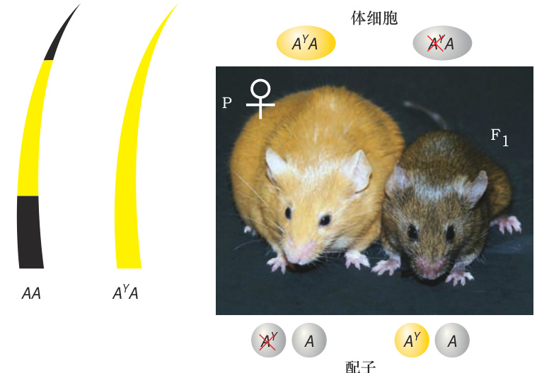  

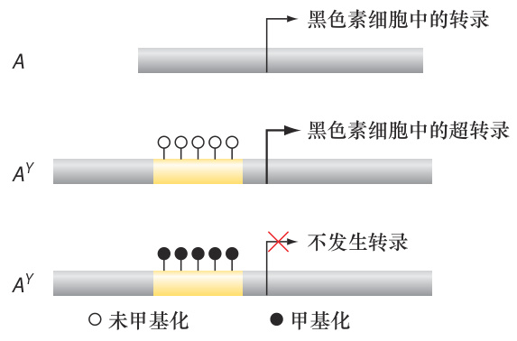  
(c) $A^{Y}!$  

图17.24　获得性状的代际遗传。（a）正常（AA）小鼠看起来是灰色的，是因为它们有带着黄色条纹的黑色毛发。黄色小鼠（ $A_{A}^{Y}$ ）的毛发完全是黄色的。（b）吃了富含甲基供体的黄色雌性小鼠的 $|\boldsymbol{A}^{Y}\!\!:$ 等位基因在她的配子和她后代的体细胞中沉默。 $A^{Y}$ 等位基因的甲基化在F1后代中被消除，因此黄色表型在F2代中表达（未显示）。（c） $A^{Y}$ 突变是由转座因子的插入引起的；转座因子的甲基化使等位基因沉默。  

# 2. 哺乳动物跨代表观遗传？  

图17.24（b）中正常外表（灰色）的 $|A^{Y}\!A$ 型F1小鼠用正常饮食喂养，它的遗传 $\cdot A^{Y}!$ 等位基因的后代（ $\mathrm{F}_{2}$ ）具有黄色的外皮，随后的遗传 $\cdot A^{Y}$ 等位基因的F 后代也是如此（未显示）。 $A^{Y}$ 等位基因不再在F2代和F3代中沉默，这表明获得性状的跨代表观遗传没有发生。换句话说，在没有环境因素的情况下，通过环境改变的基因表达不能通过多代稳定地遗传。  

缺乏 $A^{Y_{}}$ 沉默的跨代表观遗传不应令人惊讶。你之前看到（见图17.22），在哺乳动物种系中，DNA甲基化标记通常被除去，并且添加性别特异性标记。然而，对果蝇和秀丽隐杆线虫的观察表明，环境影响的跨代遗传通常发生在这些生物中。这些机制涉及基因表达的小RNA调节剂，其被称为piRNA，将在后面对其进行描述。如果这种现象确实存在于人类中，即使它还未被发现，我们仍然需要考虑我们的行为，以及我们的基因，可能会影响我们传递给后代的性状。  

# 基本概念  

●  某些阻遏物结合甲基化的CpG岛，阻断转录激活因子。细胞通过许多细胞世代维持这种抑制，因为它们在DNA复制过程中复制CpG的甲基化模式。●  大约100个人类基因的表达模式取决于它们遗传自父亲还是母亲。当从父亲遗传时，父系印记基因沉默；而当从母亲遗传时，母系印记基因沉默。●  表观遗传现象，如印记，是由DNA的变化引起的，这些变化改变基因表达的同时，不改变碱基对序列，并且在细胞分裂过程中是可遗传的。  

●  基因组印记是由控制特定基因表达的顺式作用因子（ICR）的性别特异性甲基化引起的。在减数分裂过程中，旧的甲基化标记被消除，新的性别特异性甲基化模式被建立。  

# 17.4 转录后调控  

# 学习目标  

1.  解释一个真核生物基因的初级转录物如何产生不同的蛋白质。  
2.  描述从核糖体图谱中获得的结果，其表明存在翻译起始水平上操作的调控机制。  
3.  对比三种主要类型的小调控RNA（miRNA、siRNA和piRNA）的起源和功能。  

基因调控可以在基因表达过程中的任何时刻发生，到目前为止，我们已经讨论了影响转录起始频率的机制，但是还存在许多其他调控转录后事件的系统。这些系统包括mRNA的剪接、稳定性和定位；将这些mRNA翻译成蛋白质；这些mRNA蛋白质产物的稳定性、定位和修饰。在一章中讨论所有的这些机制是不可能的，因此我们将重点放在一些关键的决定点上。  

# 17.4.1 序列特异性的RNA结合蛋白可以调控RNA剪接  

真核细胞的基因组的基因数量相比在这些细胞中表达的不同蛋白质的数量要少很多。细胞从单个基因产生多种蛋白质的方法之一是通过可变剪接，也就是说，将初级转录物剪接成不同的mRNA，产生不同的蛋白质（回顾图8.17）。  

在初级转录物的剪接位点处组装的剪接体可包含超过100种蛋白质。剪接体蛋白质执行着不同的功能，包括RNA断裂和外显子的连接。一些剪接体组分对于决定哪些外显子拼接在一起是至关重要的。这些组分包括在初级转录物中识别特定的RNA序列以促进或阻止特定剪接点序列使用的剪接体蛋白，因此它们对通过可变剪接进行的基因调节至关重要。  

我们在本章开头提到，雄性果蝇的性别特异性求偶行为受无后基因（fru）的控制。在它们的大脑中，雄性果蝇产生雄性特异性形式的fru基因产物——Fru-M，一种锌指结构的转录因子。仅存在于雄性中的Fru-M蛋白的合成需要雄性特异性的剪接，这取决于被称为性别转换（Tra）的雌性特异性RNA结合蛋白的缺失（我们稍后将会讨论为什么Tra仅在雌性中产生）。  

fru初级转录物在两性中产生。在雌性中，Tra（与存在于两种性别中的被称为Tra2的蛋白质一起）结合fru初级RNA的特定序列；Tra和Tra2阻断特定剪接受体位点的使用，从而导致fru mRNA产生雌性特异性的Fru-F蛋白（图17.25）。在雄性中，其细胞不携带Tra蛋白，fru转录物的可变剪接产生相关的Fru-M蛋白，其N端具有101个额外的氨基酸（图17.25）。  

尽管Fru-F似乎没有功能，但Fru-M引出了一个基因表达程序，该程序控制着雄性的交配舞蹈并使其倾向于雌性。具有阻止Fru-M产生的fru基因突变的雄性果蝇仍然会进行交配舞蹈，但是它们会不加分别地向雄性和雌性求偶。然而，具有导致它们表达Fru-M的fru突变的雌性果蝇具有了雄性的性行为；它们展示出雄性的求偶舞蹈并且专门追求雌性。因此，对于雄性的交配舞蹈行为来说，Fru-M是多余的，而为了使雄性的舞蹈仅仅面向于雌性，Fru-M是绝对需要的。研究人员正在尝试确定最终决定这些行为的Fru-M的转录目标。  

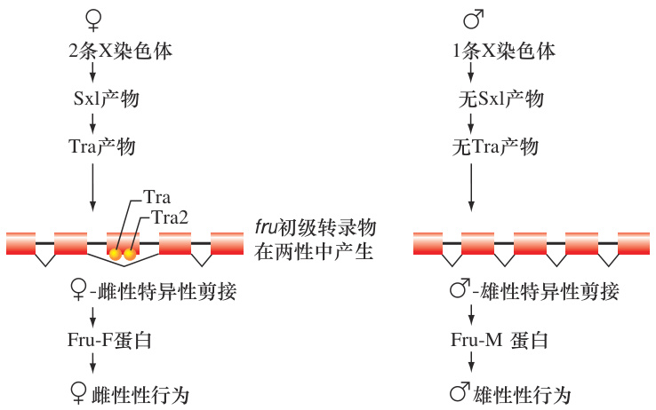  

图17.25　初级转录物的性别特异性剪接。在缺乏Tra蛋白的情况下（雄性），fru RNA的剪接产生翻译成Fru-M蛋白的mRNA。在雌性中，Tra蛋白（和Tra2）阻断了对一个外显子的使用，导致fru转录物被剪接以编码Fru-F。  

# 17.4.2 调控mRNA翻译的几种机制  

翻译的控制往往发生在这一过程的开始。你会从图8.25回忆起，在真核生物中，当核糖体小亚基结合mRNA 5′端帽时，翻译开始。然后核糖体以5′端到3′端的方向扫描mRNA以找到第一个AUG，它充当蛋白质产物N端指定甲硫氨酸的起始密码子。  

核糖体的小亚基不能单独识别5′端帽，而是识别出围绕帽结构构建的更复杂的结构（图17.26）。被称为eIF4A、eIF4E和eIF4G的三个起始因子复合物与5′帽结合，然后该复合物中的eIF4G蛋白与poly-A尾的 poly-A结合蛋白（PABP）相互作用。结果是，mRNA环化，并且正是这种具有复合起始因子的环状结构，使得小核糖体亚基识别并起始翻译。  

在本节中，我们首先描述两个控制起始因子在5′帽上组装的真核生物翻译调控机制。然后我们讨论了一种有趣的翻译调节模式，该模式是mRNA的一种特性，在真正的AUG上游有所谓的诱饵AUG。这些诱饵AUG的存在导致核糖体启动小肽的翻译而不是得到mRNA的正常多肽产物。  

# 1. 翻译起始复合物组装的调节  

核糖体在图17.26所示复合物背景下识别mRNA 5′帽的事实，使得能够通过控制复合物的组装来调节翻译。调控mRNA翻译以对营养物质做出反应　允许真核细胞对细胞外刺激做出适当反应的重要途径取决于被称为eIF4E结合蛋白1（4E-BP1）的蛋白质。顾名思义，这种蛋白质可以与起始因子eIF4E结合，这种结合阻断了5′帽上起始复合物其余部分的组装（图17.27）。  

细胞外环境中营养物和生长因子的存在激活了向4E-BP1添加磷酸基团的激酶。当4E-BP1被磷酸化时，它不能再与eIF-4E结合，因此起始复合物可以在mRNA的5′帽组装（图17.27）。当细胞需要生长并产生大量的蛋白质时，这种机制可确保全局的mRNA翻译效率显著增加。  

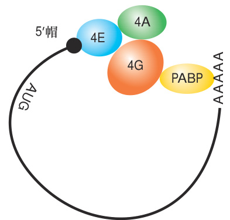  
图17.26　真核生物翻译起始复合物。小核糖体亚基在RNA /蛋白质复合物的背景下识别mRNA $5^{\prime}$ 帽（黑色圆圈）。在复合物中有eIF4A（4A）、eIF4E（4E）、eIF4G（4G）和poly-A结合蛋白（PABP）。  

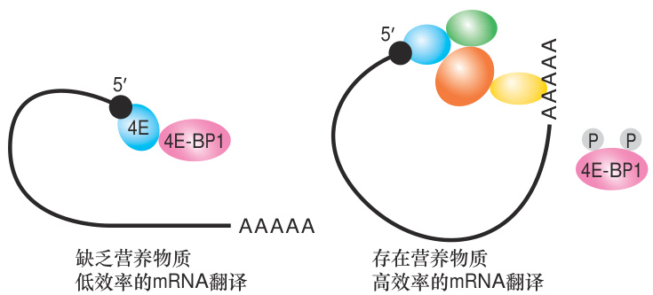  
图17.27　4E-BP1对翻译的调控。左：未磷酸化的4E-BP1（粉红色）通过与eIF4E（4E）结合，防止核糖体与mRNA 5′帽（黑色圆圈）结合。右：当磷酸化（P）时，4E-BP1不再与eIF4E结合，并且翻译起始复合物可以组装。  

mRNA翻译昼夜节律的控制　通过5′帽的起始因子和3′端poly-A尾的PABP的结合发生的mRNA环化，是通过控制poly-A尾长度间接调节翻译起始的机制的物理基础。较长的尾可以比较短的尾更有效率地募集PABP，因此poly-A尾越长，翻译越多。序列特异性RNA结合蛋白结合mRNA上的位点并募集可以添加或去除尾部腺嘌呤的酶（图17.28）。  

有趣的是，这种机制是某些蛋白质数量在一天不同时间中的昼夜节律波动的部分原因。尽管产生这些蛋白质的mRNA的量保持不变，但poly-A尾的长度，以及因此改变的mRNA翻译效率和这些蛋白质的量在深夜及清晨都达到峰值。  

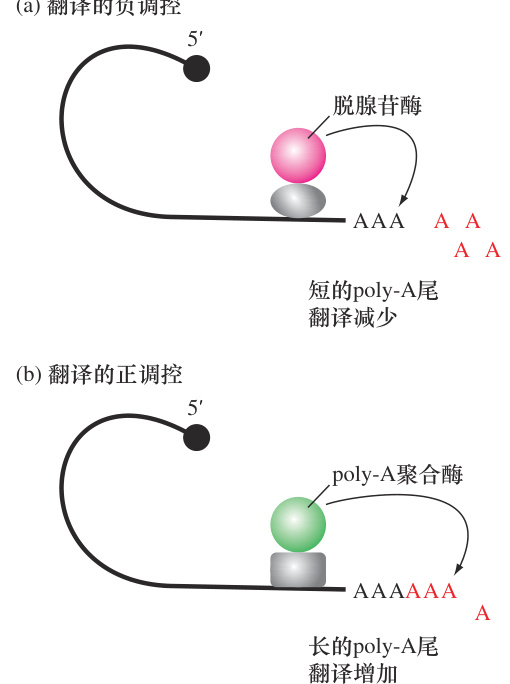  

图17.28　通过poly-A尾长度进行翻译控制。较长的poly-A尾能够更有效率地结合PABP，因此翻译起始复合物可以更有效率地形成（参见图17.26）。（a）通过序列特异性RNA结合蛋白（灰色卵型）募集脱腺苷酶（紫色）来对翻译进行负调控。（b）当序列特异性RNA结合蛋白（灰色矩形）将poly-A聚合酶募集到mRNA时，翻译被正调控。  

2. 上游的ORF  

某些mRNA具有一个或多个上游可读框（uORF），其起始于诱饵AUG并编码不具有功能的小肽。如果核糖体翻译uORF，则mRNA中主要ORF的翻译被抑制。因此，在翻译uORF还是主要ORF之间的选择是调节基因表达的一个潜在点。因为在人类细胞大约一半的转录产物中都发现了uORF，所以这种阻断翻译的机制可能很普遍。  

在果蝇性别分化途径中可以看到由uORF调控翻译的一个例子，将在本章末尾进行详细解释。目前，你只需知道一种名为性别致死（Sxl）的蛋白质仅在XX型果蝇中表达，并且需要XX型果蝇作为雌性发育。另一方面，如果雌性产生一种不同的、通常被称为Msl-2的雄性特异性的蛋白质，它们就会死亡。Sxl蛋白通过多种机制确保Msl-2蛋白不会在雌性体内合成；其中的一种机制是，Sxl蛋白阻断msl-2 mRNA的翻译（图17.29）。Sxl蛋白在特定结合位点与msl-2 mRNA结合，并且该结合促进了uORF的翻译，阻止编码Msl-2蛋白的ORF的翻译，从而使得这些XX型动物存活。  

# 17.4.3 核糖体图谱测量翻译效率  

因为基因表达可以在翻译水平上被调节，所以基因的蛋白质产物的量并不总是与mRNA的量直接相关。因此，科学家需要能够让他们确定mRNA翻译效率的方法。核糖体图谱是一项新技术，它允许研究人员在任何给定类型的细胞或组织中观察所有mRNA上核糖体的位置。  

该程序的第一部分在概念上类似于DNase足迹（回顾图16.16），其可以鉴别转录因子蛋白的DNA结合位点，这是因为结合的蛋白质保护该DNA免于被DNA酶Ⅰ消化。核糖体图谱鉴别核糖体结合在mRNA上的位置，这是因为核糖体保护这些RNA序列免于被核糖核酸酶消化。  

核糖体图谱的程序如图17.30所示。在用RNA酶纯化和消化mRNA-核糖体复合物后，被保护的RNA片段（约30nt长）以保留RNA极性信息（未展示）的方式转化为单链cDNA。然后PCR扩增这些cDNA，并进行允许对数亿，甚至数十亿随机选择的cDNA片段进行测序  

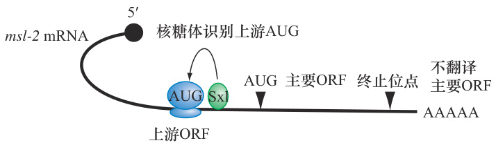  
图17.29　通过诱饵ORF的翻译调控。为了阻止雌性果蝇中msl-2 mRNA的翻译，Sxl蛋白（绿色）与mRNA结合并致使核糖体（蓝色）翻译uORF。因此，Sxl蛋白阻止了编码Msl-2蛋白的主要ORF的翻译。  

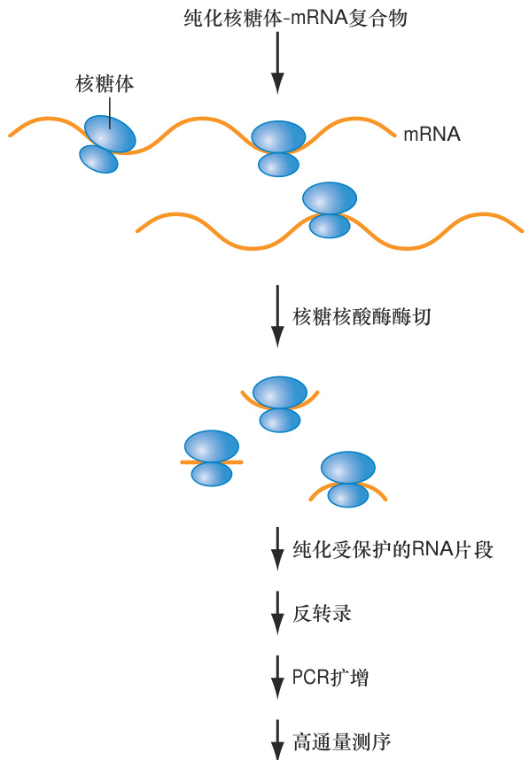  
图17.30　核糖体图谱。mRNA（橙色）-核糖体（蓝色）复合物的纯化及mRNA上RNase抗性区域的足迹，提供了关于不同mRNA翻译的频率和核糖体在mRNA上的位置的信息。  

的高通量技术。  

获得特定mRNA序列的次数揭示了在组织样本制备时mRNA种类被翻译的频率。此外，分析结果提供了核糖体沿着任何给定mRNA的位置的快照，揭示了翻译起始、终止或暂停的位置。当研究人员使用不同条件下生长的细胞进行核糖体图谱分析，然后将结果与RNA-Seq所获得的发现（正如我们所见，它表明mRNA的转录水平）进行比较时，可以证明改变翻译效率的全局调控机制的存在。  

# 17.4.4 小RNA调控mRNA的稳定性和翻译  

在21世纪的前五年，小的、特异性的RNA形式的新型基因调节因子被发现，这些RNA通过互补碱基配对阻止特定基因的表达（表17.1）。现已确定了三种小的调控RNA：小分子RNA（miRNA），小干扰RNA（siRNA），Piwi蛋白相互作用RNA（piRNA）。每种小RNA通过不同途径产生，导致产生长度略有不同但总是在 $21\!\sim\!30$ 个核苷酸范围内的单链RNA。  

为了发挥它们的功能，每类小RNA与Argonaute/Piwi蛋白家族的不同成员形成核糖核蛋白复合物。每个复合物中的小RNA被用于将复合物引导至与小RNA具有完全或部分互补性的特定核酸靶标。所有三类小RNA通过调节RNA稳定性和（或）翻译在转录后水平上调节基因活性；siRNA和piRNA还通过影响染色质结构在转录水平上起作用。  

表17.1　真核生物中的小RNA  

<html><body><table><tr><td></td><td>作用目标</td><td>作用效果</td></tr><tr><td>miRNA （小分子-RNA）</td><td>·mRNA</td><td>·阻断mRNA翻译 ·使mRNA失去稳定性</td></tr><tr><td>siRNA （小干扰RNA）</td><td>·mRNA ·注定成为异染色质 的染色体区域的初 生转录物</td><td>阻断翻译/使mRNA失 去稳定性 ·将组蛋白修饰酶募集到 DNA上，导致异染色质 形成</td></tr><tr><td>piRNA （Piwi蛋白相互」·转座因子启动子 作用RNA)</td><td>·转座因子转录物</td><td>·使转座因子mRNA降解 ·促进抑制转座因子转录 的组蛋白修饰</td></tr></table></body></html>  

# 1. miRNA  

在动物中，最丰富的小RNA种类之一是由小分子RNA（miRNA）组成的。我们很快将会看到，miRNA通常是目标mRNA的负调控因子，它导致这些mRNA的破坏或阻止它们的翻译。  

人类基因组有近1000个编码miRNA的基因。这些基因由RNA聚合酶Ⅱ转录成为长的初级转录物，称为pri-miRNA，其包含一个或多个主要以双链茎环形式存在的miRNA序列（图17.31）。pri-miRNA经过加工形成了短链和单链的活性miRNA。图17.32图解了这个多步骤过程，该过程由两种核糖核酸酶Drosha和Dicer辅助。在此过程中，miRNA序列从细胞核（它们被转录的地方）转运到细胞质（它们将起作用的地方）中。此外，miRNA被整合到称为miRNA诱导沉默复合体（miRISC）的核糖核蛋白复合物中；每个miRISC都含有Argonaute蛋白家族的特定成员。  

含有miRNA的核糖核蛋白复合物（miRISC）根据它们所拥有的特定Argonaute蛋白质，以及复合物中miRNA（被称为指导miRNA）与mRNA 3′UTR中的靶序列之间的序列互补程度介导不同的功能。miRISC的指导miRNA与目标RNA具有完美的互补性，导致了图17.31　含有小分子RNA的基因。初级miRNA转录物（pri-miRNA）可以含有一种或几种miRNA。这些初级转录物中的一些不编码蛋白质（a），但在其他情况下，miRNA可以从编码蛋白质的转录物的内含子中加工而来（b）。  

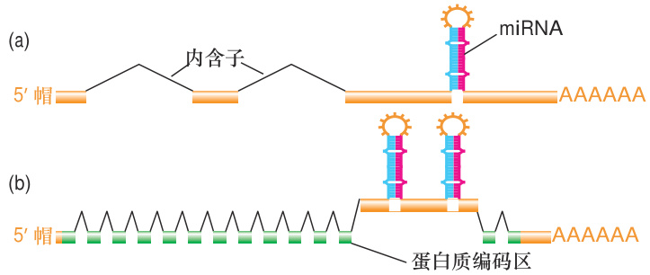  

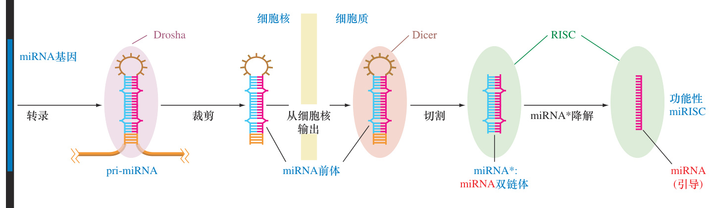  
图17.32　miRNA加工。转录后不久，pri-miRNA立即被核酶Drosha识别，后者从较大的RNA中切割miRNA前体茎环结构。pre-miRNA经历从细胞核到细胞质的主动转运，在那里被Dicer酶识别。Dicer酶将miRNA前体缩减为短寿命的miRNA\*：miRNA双链，它由RISC释放并获取。RISC通过消除与在miRISC中作为指导链的红色miRNA部分互补的蓝色miRNA\*链，成为了一种功能性和高度特异性miRISC。  

mRNA的裂解［图17.33（a）］。虽然目前尚不清楚miRISC如何调节翻译活性，但随着互补性降低，其机制通常是抑制翻译［图17.33（b）］。  

因为指导RNA和目标RNA之间不需要精确的互补，所以每种类型的miRNA最终可以控制几种不同的mRNA（平均约10个）。因此，科学家们估计所有人类基因中约有一半是由miRNA控制的。此外，每个miRNA基因在多细胞生物发育过程中根据其自身的时间和空间模式进行转录，因此任何单个miRNA都可以在不同组织中以不同方式影响基因表达。  

# 2. siRNA  

小干扰RNA（siRNA）的作用途径与刚刚描述的miRNA有许多相似之处。一个关键的区别是小RNA的来源。与miRNA的情况一样，siRNA不是由长的单链转录物加工得到的，而是由双链RNA（dsRNA）加工（也通过Dicer酶）得到的。这些dsRNA最初是通过基因组中的内源性DNA序列或外源性（如病毒）的两条链的转录而产生的。dsRNA的加工产生了单链RNA，其与Argonaute蛋白形成核糖核蛋白复合物。以单链  

RNA为指导，这些复合物可以干扰含有互补序列的基因的表达，其机制如图17.33所示。干扰含有互补序列的基因的表达。siRNA途径还可以通过破坏病毒mRNA来保护细胞免受入侵病毒的侵害。  

研究人员已经利用siRNA途径选择性地关闭特定基因的表达，以评估其功能。该想法是将对应于特定基因的dsRNA引入细胞或生物体中以关闭或敲除基因组中内源基因的表达，这种技术叫做RNA干扰。siRNA的加工途径将双链RNA转化为单链siRNA。然后，在含有Argonaute的复合物的背景下，siRNA将与该基因的互补mRNA转录产物杂交并介导该mRNA的破坏。通过这种方式，科学家们可以减弱任何感兴趣的基因的表达，并研究这种功能丧失可能导致的任何表型后果。在第19章中，我们将探索使用RNA干扰研究许多生物过程。  

siRNA的另一个重要作用是形成异染色质。回忆第12章，涉及组蛋白尾部修饰的异染色质形成，促进了被称为HP1的蛋白质的结合（回顾图12.14）。注定成为异染色质的染色体区域首先被双向转录，并且将所得的长双链RNA由Dicer酶加工成小的双链RNA。称为RNA诱导转录沉默复合体（RITS）的、类似于RISC的复合物，包含了这些双链体中的一条链，并且使用siRNA作为指导，在注定成为异染色质的DNA转录的初生转录物上结合其互补序列。RITS复合物将组蛋白修饰酶带入DNA，其结果是HP1结合、染色质关闭和转录失活。  

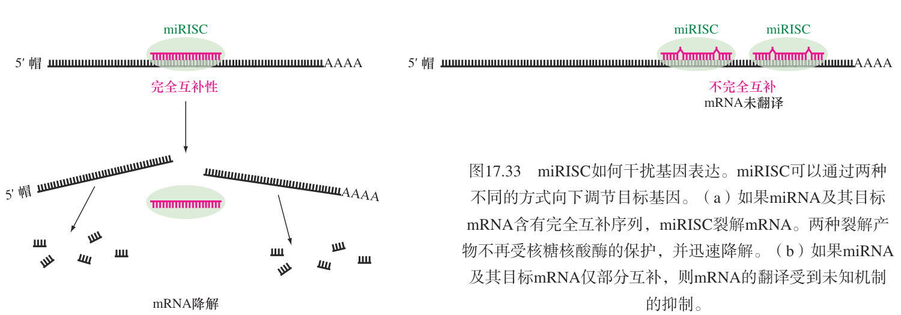  
(b)  

# 3. piRNA  

你将从前面的章节中回忆起，真核生物的基因组包含许多通过调动和转移来传播自身的转座因子（TE）。含有这些TE的生物必须限制TE运动，以防止它们的基因组被快速突变和重排破坏。生物体可以最小化TE调动的一个重要机制是通过piRNA的作用。这些piRNA阻断了基因组中TE的转录和转录得到的TE mRNA的翻译。如果没有像转座酶（用于DNA转座子）或反转录酶（用于反转录转座子）这样的酶的合成，则TE不能移动。  

piRNA是由遍布整个基因组的piRNA基因簇转录的长RNA裂解产生的，每个基因簇编码 $10\!\sim\!1000$ 个piRNA。经过处理后，piRNA被装载到含有Piwi蛋白（Argonaute蛋白的一个亚家族）的复合物上，然后piRNA主要将Piwi复合物引导至TE DNA或TE转录物。TE DNA上的Piwi复合物促进干扰TE转录的组蛋白修饰，而与TE转录物结合的Piwi复合物降解TE RNA。  

piRNA途径的许多细节仍有待解决。有趣的是，最近在诸如果蝇和秀丽隐杆线虫生物体中的观察结果表明piRNA介导某些特殊现象，其中表型响应于环境的变化而改变，并且这种改变甚至可以在环境回到初始条件后仍然跨代遗传。例如，如果新的环境条件刺激沉默靶基因的piRNA的合成，则该基因可以在没有最初刺激的情况下延续了多代的生物的后代中沉默。一个可能的原因是piRNA生物发生的机制在某种程度上是自我延续的。正如你所想，这种令人着迷的现象使得piRNA途径成为许多实验室深入研究的焦点。  

# 基本概念  

●  在真核生物中，可变剪接可以从单个转录物产生不同的蛋白质。序列特异性RNA结合蛋白可以抑制或促进特定剪接序列的使用。  
●  因为存在调控mRNA翻译的机制，通过核糖体图谱分析测量的蛋白质合成水平并不总是与通过RNA-Seq测量的mRNA水平精确相关。  
●  三类小RNA通过互补碱基配对调节mRNA稳定性、翻译或转录，它们是miRNA、siRNA和piRNA。这些小RNA起引导作用，将蛋白质复合物导入特定目标mRNA上（导致mRNA被破坏或阻止翻译），或者将复合物导入启动子附近的DNA序列上（阻断转录或促进异染色质化）。  

# 17.5 综合实例：果蝇的性别决定  

# 学习目标  

1.  解释Sxl启动子如何“计数”果蝇中X染色体的数量。2.  描述导致雌性形态和行为的、由Sxl蛋白引发的RNA剪接事件的级联。3. 讨论转录调控在果蝇性别决定中的作用。  

雄性和雌性果蝇在种系的形态学、生物化学、行为和功能方面表现出许多性别特异性的差异（图17.34）。经过几十年的研究，研究人员得出结论：在果蝇中，决定性别的是X染色体的数量，而与Y染色体的存在无关，并且性别决定首先通过 $S x l$ 基因的转录调节发生。在XX型（而非XY型）动物中， $S x l$ 的转录引发了一系列通过三种独立途径影响性别的级联事件：一种途径决定果蝇的外观和行为像雄性还是雌性；另一种途径决定生殖细胞发育为卵子还是精子；第三种途径通过将雄性X连锁基因的转录频率加倍来产生剂量补偿。  

这里我们主要关注的是提到的第一种途径：躯体性征的决定。通过分析在不同性别中影响特定性征的突变，可以对这一途径产生理解。例如，正如我们在本章开头所看到的那样，携带无后基因（fru）突变的XY型果蝇表现出异常的雄性求偶行为，而具有相同fru突变的XX型果蝇似乎表现为正常雌性。  

表17.2显示其他基因的突变也会对两性产生不同的影响。一个遗传学实验（例如，研究一种突变对于另一种突变是否是上位的）和分子生物学实验（其中研究者克隆并分析突变和正常基因）的组合，对这些突变是如何影响躯体性别决定的作出了阐明。通过这些研究，果蝇遗传学家剖析了性别决定的各个阶段，以描绘以下复杂的调控网络。  

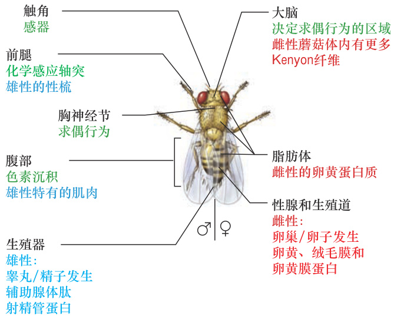  

图17.34　果蝇的性别特异性特征。以蓝色显示的器官或特征是雄性特有的。以红色显示的器官或特征是雌性特有的。以绿色显示的器官或特征在两性中以不同形式存在。  

表17.2　果蝇突变对两性产生不同影响  

<html><body><table><tr><td>突变</td><td>XY型的表型</td><td>XX型的表型</td></tr><tr><td>性别致死基因（Sxl)</td><td>雄性</td><td>死亡</td></tr><tr><td>性别转换基因（tra）</td><td>雄性</td><td>雄性 (不育）</td></tr><tr><td>双重性别基因（dsx）</td><td>雌雄同体</td><td>雌雄同体</td></tr><tr><td>间性基因 (ix)</td><td>雄性</td><td>雌雄同体</td></tr><tr><td>无后基因（fru）</td><td>求偶行为异常的雄性</td><td>雌性</td></tr></table></body></html>

所有突变等位基因都是功能丧失，且对野生型是隐性的。  

# 17.5.1 X染色体的数量决定了果蝇的性别  

在第4章中，你了解到，无论在人类还是果蝇中，XY型是雄性，XX型是雌性。然而，性别决定的潜在分子机制在人类和果蝇中是不同的。在人类中，成为男性的关键是在Y染色体上存在SRY基因；在没有SRY基因的情况下，女性是默认状态。在果蝇中，雄性是由于只存在一条X染色体而不是像雌性有两条X染色体所导致的默认状态。其原因是，在早期的果蝇胚胎发生中，激活$S x l$ 基因的转录需要两条X染色体。  

# 1. 通过 $\boldsymbol{S}\boldsymbol{x}\boldsymbol{l}$ 启动子对X染色体计数  

在早期胚胎发生过程中（性别决定和剂量补偿发生之前），XX细胞从构建启动子（ $\mathrm{~\bf~P}_{\mathrm{e}}$ ）处转录 $S x l$ 。Pe处的转录取决于4种转录激活蛋白：Scute、Runt、SisA和Upd［图17.35（a）］。因为这些激活因子的基因位于X染色体上，所以XX胚胎的这四种激活剂的含量是XY胚胎的两倍。只有在具有两条X染色体的细胞中，激活因子的浓度才足以使 $S x l$ l转录发生。  

# 2. Sxl蛋白在雌性中的作用  

Sxl是一种RNA结合蛋白，可控制特定RNA靶标，包括其自身的RNA的可变剪接［图17.35（b）］。随着胚胎发生的进展，从Pe激活 $S x l$ 转录的转录因子消失，$S x l$ 从维持启动子（ $\mathrm{\bf P}_{\mathrm{m}}$ ）转录而来。在雄性中，由维持启动子产生的初级 $S x l$ 转录物的剪接产生RNA，其包括在其阅读框内含有终止密码子的外显子（外显子3）。因此，雄性中的这种RNA不具有生产力——它不会产生任何功能性Sxl蛋白。  

然而，在雌性中，先前通过从构建启动子Pe的转录产生的Sxl蛋白，影响在维持启动子 $\mathbf{\nabla}\cdot\mathbf{P}_{\mathrm{m}}$ 处起始的初级转录物的剪接。当早期制备的Sxl蛋白与后期转录的RNA结合，这种结合改变了剪接，所以外显子3不再是最终mRNA产物的一部分。没有外显子3，mRNA可以被翻译以产生更多的Sxl蛋白。因此，在发育早期合成的少量Sxl蛋白建立了正反馈环，确保了在雌性发育后期可以更多地合成Sxl蛋白。  

# 3. Sxl突变的影响  

产生无功能基因产物的隐性 $S x l$ 突变对XY型雄性没有影响，但它们在纯合突变体XX型雌性中是致命的（见表17.2）。原因是通常不表达 $S x l$ 基因的雄性不会错过它的功能性产物，但依赖于Sxl蛋白进行性别决定的雌性则会如此。  

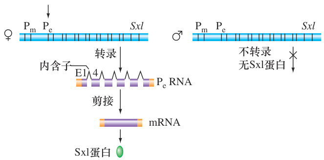  
(a)      Sxl Pe X     Scute Runt SisA Upd Sxl   
(b)      Sxl     mRNA  

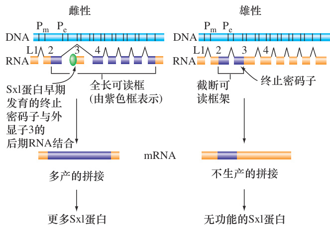  
图17.35　Sxl仅在XX型果蝇中表达。（a）在早期的雌性（而不是雄性）胚胎中，由X连锁基因编码的转录激活因子的浓度足以起始Pe启动子转录。转录所得的mRNA，它的前两个外显子是E1和4，编码Sxl蛋白。（b）在发育后期， XX型和XY型动物中同等地产生转录激活因子，激活 $\mathrm{\nabla{P_{m}}}$ 启动子的Sxl转录。L1、2、3、4表示前几个外显子。当Sxl蛋白存在时（在雌性中），它结合Sxl初级转录物以产生可以翻译成更多Sxl蛋白的剪接mRNA。结果就是维持Sxl蛋白的反馈环存在于雌性中而不存在于雄性中。  

在 $S x l$ 中具有功能丧失突变的雌性的致死性是由于某些剂量补偿基因的异常表达导致的，这些基因通常增加（特别是在雄性）X染色体上基因的转录。之前的图17.29展示了一个例子：正常雌性中的Sxl蛋白阻止这些剂量补偿基因之一msl-2的mRNA的翻译。但是， $S x l$ 突变的雌性不恰当地产生Msl-2蛋白（以及其他剂量补偿因子），这导致每个X连锁基因的转录频率是正常雌性的两倍。由于雌性有两条X染色体而不是像雄性只有一条X染色体，因此两条X染色体中基因的超转录被证明是致命的。  

# 17.5.2 Sxl蛋白触发级联剪接  

Sxl蛋白影响RNA的剪接，受影响的RNA不仅来自其自身基因，还来自其他的基因。其中包括性别转换基因（tra）。在存在Sxl蛋白的情况下（如在正常雌性中），tra初级转录物经历有效剪接，产生可翻译成功能性蛋白质的mRNA。在不存在Sxl蛋白的情况下（如在正常雄性中），tra转录物的剪接导致非功能性蛋白质产生［图17.36（a）］。  

级联继续。你在图17.25中看到，Tra蛋白（和非性别特异性Tra2蛋白）控制了fru初级RNA的剪接，使得转录因子Fru-M仅在雄性中产生；Fru-M控制雄性的性行为。Tra和Tra2蛋白也影响双重性别基因（dsx）的初级转录物的剪接。该剪接途径导致称为Dsx-F的雌性特异性Dsx蛋白的产生。在雄性中没有Tra蛋白，dsx初级转录物的剪接产生相关但不同的Dsx-M蛋白［图17.36（b）］。Dsx-F和Dsx-M蛋白的N端部分是相同的，但蛋白质的C端部分是不同的。  

# 17.5.3 Dsx-F和Dsx-M蛋白控制躯体性征的发展  

尽管Dsx-F和Dsx-M都起转录因子的作用，但它们具有相反的作用。与由间性基因（ix）编码的蛋白质结合，Dsx-F主要抑制基因的转录，其表达将产生雄性的躯体性征。然而，它也激活了促进躯体雌性特征的基因转录。独立于间性蛋白质工作的Dsx-M则相反，它主要是雄性特征基因的转录激活因子，并且它也抑制了图17.36　可变剪接的级联。（a）Sxl蛋白改变了tra RNA的剪接；雌性的转录物产生功能性Tra蛋白，而雄性转录物则不能。（b）Tra蛋白又改变了dsx RNA的剪接模式；导致在雄性（Dsx-M）和雌性（Dsx-F）中产生不同的Dsx产物。  

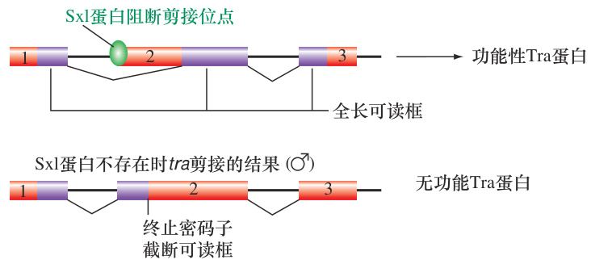  
(a) tra Sxl     tra $(\mathcal{Q})$ )   
(b) dsx  

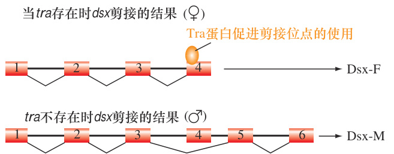  

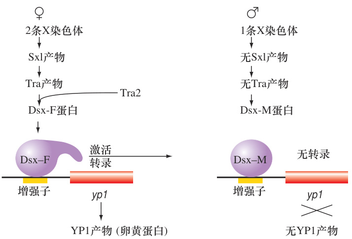  
图17.37　Dsx蛋白的雄性和雌性特异性形式。在yp1基因增强子上，Dsx-F充当转录激活因子，而Dsx-M充当转录抑制因子。  

雌性特征基因。  

有趣的是，两种Dsx蛋白可以结合相同的增强子元件，但它们的结合会产生相反的结果（图17.37）。例如，两者都与编码卵黄蛋白的yp1基因启动子上游的增强子结合；雌性在脂肪体器官中制造这种蛋白质，然后将其转移到发育中的卵子中。Dsx-F的结合刺激了雌性的yp1基因的转录；Dsx-M与相同增强子的结合有助于使雄性中的yp1转录失活。  

dsx中的突变影响两性，因为在雄性和雌性中，Dsx蛋白的产生抑制了某些特定于异性发育的基因。dsx中的无效突变使得不可能产生功能性Dsx-F或Dsx-M，导致间性个体不能抑制某些雄性特异性或某些雌性特异性基因（见表17.2）。  

# 基本概念  

·Sxl基因是果蝇性别决定的主要调节因子。 $S x l$ 的早期转录依赖于由X连锁基因编码的激活蛋白；只有在XX细胞中，活化因子的浓度才足够高，使得Sxl转录。●  在雌性中，Sxl蛋白启动剪接因子级联，最终以编码Dsx-F蛋白的dsx mRNA的合成告终。在没有Sxl蛋白的雄性中，可变剪接得到产生Dsx-M的dsx mRNA。●  Dsx-F和Dsx-M蛋白是转录因子，它们对产物影响雌性和雄性特异性形态及行为的基因的表达具有相反的影响。  

# 接下来的内容  

在阅读本书的过程中，你已经了解了基因如何控制表型、它们如何从一代传递到下一代、它们如何突变，以及基因结构如何与其功能相关。你还了解到使得科学家能够在分子水平上分析个体基因和全基因组的技术。在前两章中，我们讨论了基因及其产物是如何被调节的、如何允许单细胞生物对环境做出响应，以及允许多  

细胞生物形成不同的器官。  

在本书的下一部分——“遗传学应用”中，我们将探索科学家是如何利用这些知识来进一步了解细胞和整个生物体的运作的。在第18章中，你将看到基因可以随意地插入模式生物的基因组中或从模式生物的基因组中移除——基因组中的任何基因，实际上是任何的碱基对，都可以在分子遗传学家的一时兴起中改变。基因组操作是基因治疗的基础，基因治疗有望治愈某些人类疾病。在第19章中，我们将探讨科学家如何利用模式生物的遗传学来剖析生物学途径。特别是，对从受精卵到多细胞生物异常发育的突变体的分析帮助揭示了这一显著过程的许多细节。最后，在第20章中，你将看到用于研究基因组的新技术是如何彻底改变我们对所有遗传疾病中最重要的癌症的理解和疗法的。  

# 习题精解  

Ⅰ.  视黄酸受体（RAR）是一种与类固醇激素受体相似的转录因子。与该受体结合的物质（配体）是视黄酸。其中一个转录被视黄酸与受体结合而激活的基因是myoD。下图显示了由两个不同的12碱基双链寡核苷酸之一插入到可读框中的基因产生的RAR蛋白的示意图。与每种突变蛋白质相关的插入位点（ $\mathrm{a\!\sim\!m}$ ）用多肽图上的适当字母表示。为了得到编码蛋白质a～e的构建体，将寡核苷酸1（读出任一链的 $5^{\prime}$ TTAATTAATTAA $3^{\prime}$ ）插入RAR基因中。为了得到编码蛋白质 $\mathrm{f}\!\sim\!\mathrm{m}$ 的构建体，将寡核苷酸2（5′CCGGCCGGCCGG $3^{\prime}$ ）插入到基因中。  

$\mathrm{NH}_{2}$ f g h k m COOH a b C d e  

野生型RAR蛋白可以结合DNA，并且在不存在视黄酸（RA）的情况下弱激活转录，在RA存在的情况下强激活转录。测试每种突变蛋白结合RA和DNA的能力，并且在存在和不存在RA的情况下激活myoD基因的转录。结果如下表：  

<html><body><table><tr><td rowspan="2">突变</td><td rowspan="2">结合RA</td><td colspan="2">结合DNA</td><td colspan="2">转录的激活</td></tr><tr><td>-RA</td><td>+RA</td><td>-RA</td><td>+RA</td></tr><tr><td>a</td><td></td><td>-</td><td></td><td>-</td><td></td></tr><tr><td>b</td><td></td><td></td><td></td><td></td><td></td></tr><tr><td>C</td><td></td><td></td><td></td><td></td><td>一</td></tr><tr><td>d</td><td></td><td>+</td><td>+</td><td>+</td><td>+</td></tr><tr><td>e</td><td>+++</td><td>+</td><td>+++</td><td>+</td><td>+++</td></tr><tr><td>f</td><td>+++</td><td>+</td><td>+++</td><td>+</td><td>+++</td></tr><tr><td>g</td><td>+++</td><td>+</td><td>+++</td><td></td><td></td></tr><tr><td>h</td><td>+++</td><td>+</td><td>+++</td><td>—</td><td>一</td></tr><tr><td>i</td><td>+++</td><td></td><td></td><td></td><td></td></tr><tr><td>j</td><td>+++</td><td></td><td></td><td>一</td><td></td></tr><tr><td>k</td><td></td><td>+</td><td>+</td><td>+</td><td>+</td></tr><tr><td>1</td><td></td><td>+</td><td>+</td><td>+</td><td>+</td></tr><tr><td>m</td><td>+++</td><td>+</td><td>+++</td><td>+</td><td>+++</td></tr></table></body></html>  

a.  在ORF中的任何位置插入寡核苷酸1的影响是什么？  

b.  在ORF中的任何地方插入寡核苷酸2有什么可能的影响？  
c.  在前图的拷贝上指出RAR的三个蛋白质结构域。注意，这三个结构域是分开的——它们互相不重叠。  

# 解答  

该问题涉及蛋白质内结构域的概念，以及使用遗传密码来理解寡核苷酸插入的影响。  

a.  寡核苷酸1在其三个阅读框中都含有一个终止密码子。这意味着无论寡核苷酸1插入何处，其都将导致蛋白质在任何方向上的翻译终止。  

b.  寡核苷酸2不含任何终止密码子，其长度为12个核苷酸。因此，寡核苷酸2将仅向蛋白质添加氨基酸，并且它不会改变蛋白质的阅读框架。寡核苷酸的插入可以破坏其插入的结构域的功能，尽管不一定是这种情况。  

c.  从总体数据来看，可以注意到与RA结合的所有有缺陷的突变体，在DNA结合和转录激活中也都是有缺陷的。这一结果是有意义的，因为与RA的结合导致RAR蛋白改变形状，使得它的DNA结合结构域可用。  

使用寡核苷酸1插入a、b和c，其在插入位点截短蛋白质，所有三种活动都是有缺陷的，这意味着至少部分RA结合结构域必须在C端至c之间。DNA结合和转录激活都可以在d处突变的突变体中观察到，因此这两种活动必须比d更接近N端，并且至少部分RA结合结构域必须在C端至d之间。由于e处的截短对RA结合没有影响，因此RA结合结构域一定完全在N端和e之间。使用寡核苷酸2的转录激活被g和h位点的插入所破坏，表明该区域是激活域的一部分；i和j插入破坏了DNA结合，k和l插入破坏了RA结合。根据这些数据确定的RAR蛋白结构域的最小终点总结如下。  

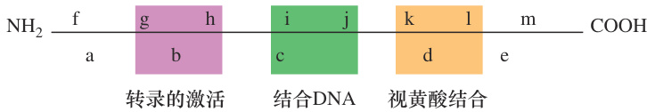  

Ⅱ.  假设用以下谱系阐明的疾病是由父系印记的常染色体基因的罕见隐性等位基因的表型表现的。你能预测下列个体的基因型：（a）Ⅰ-1，（b）Ⅱ-1，（c）Ⅲ-2。  

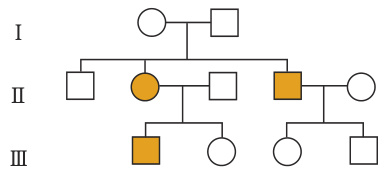  

# 解答  

这个问题要求你了解印记如何影响表型，以及印记如何在种系中重置。父系印记基因的等位基因只有在遗传自母亲的情况下才会表达。第一代的父母都没有表现出这种疾病，但他们的三个孩子中的两个会表现出疾病。乍一看，双亲中的任何一方都可以拥有该基因的突变等位基因。因为它们都没有患上这种疾病，所以第一代的每个亲本都可以从他们的父亲那里获得一个失活的突变等位基因，并从他们的母亲那里获得一个正常的转录活性等位基因。然而，进一步的考虑表明它（Ⅰ-2）不能作为突变等位基因来源的父本。他只能为第二代提供无转录活性的等位基因。表现出疾病表型的二代儿童必须从他们的母亲接受突变等位基因，因为她的基因是他们表达的唯一等位基因。在接下来的答案中，A是正常的等位基因， $a_{.}$ 是疾病等位基因。  

a.  Ⅰ-1的基因型是Aa。 $a$ 等位基因是无活性的，遗传自她的父亲。  

b.  Ⅱ-2的基因型是AA。他必须从母亲那里遗传正常的等位基因，因为这是他能够表达的唯一等位基因。我们假设他父亲的基因型是AA，因为疾病等位基因是罕见的，并且谱系中没有数据迫使我们得出Ⅱ-1或他的父亲的基因型不是AA的结论。  

c.  Ⅲ-2的基因型是AA。她必须从她的母亲（Aa型）遗传A，因为这是Ⅲ-2表达的唯一等位基因并且她不受其表达影响。由于疾病等位基因很少见，最可能的假设是Ⅲ-2的父亲基因型是AA。  

# 习题  

# 词汇  

1. 在右列中选择与左列中的术语最匹配的短语。  

a. 基础因子 1.  组织增强子/启动子相互作用  
b. 阻遏物 2.  表达模式取决于双亲中的哪个传递了等位基因  
c. CpG 3.  时间和组织特异性的激活基因转录  
d. 印记 4.  DNA甲基化位点  
e. miRNA 5.  识别转录因子的DNA结合位点  
f. 辅激活因子 6.  与增强子结合  
g. 表观遗传效应 7. 与启动子结合  
h. 绝缘子 8. 与激活因子结合  
i. 增强子 9.  阻止或减少转录后的基因表达  
j. ChIP-Seq 10.  不是由DNA序列突变引起的基因表达的可遗传变化  

# 17.1节  

2.  对于以下每种类型的基因调控，指出它是仅在真核生物中发生、仅在原核生物中发生，还是在原核生物和真核生物中都发生。a. 差异剪接  

b. 正调控  
c. 染色质浓缩  
d. 通过RNA前导序列的翻译减弱转录  
e. 负调控  
f. 小RNA的翻译调控  

3.  列出除转录起始之外的5个可以影响真核细胞中产生的活性蛋白的类型或数量的事件。  

# 17.2节  

4.  哪种真核生物RNA聚合酶（RNA聚合酶Ⅰ、聚合酶Ⅱ或聚合酶Ⅲ）转录哪些基因？a. tRNAb. mRNAc. rRNAd. miRNA  

5.  如下图所示，称为KITLG的人类基因的毛囊增强子中的单核苷酸差异与毛发颜色的特征有关。增强子中具有一个A-T碱基对的人倾向于有深色的头发，而在相同位置具有G-C碱基对的人倾向于有金色的头发。碱基对差异影响KITLG转录水平：与金发相关的等位基因的转录频率仅为黑发相关等位基因的 $80\%$ 。解释增强子序列中的单个碱基对差异如何产生这种效果。  

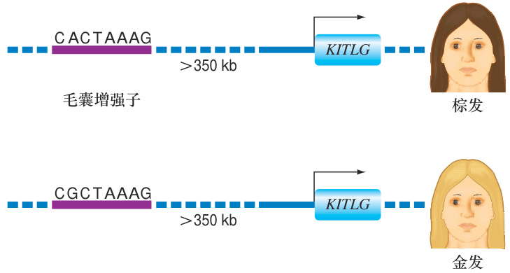  

6.  你已经合成了一种无增强子GFP报告基因，在其中，水母GFP cDNA被放置在小鼠中起作用的基础启动子的下游。现在会将无增强子报告基因融合到下列的三种序列（ $\mathbf{\nabla}_{\mathbf{X}}{\sim}\mathbf{z}\ .$ ）中。  

a.  你会将这三种类型的序列分别用于列出的三个目标（ $\mathrm{i}\!\sim\!\mathrm{iii}$ ）中的哪一个？在每种情况下，解释特定融合如何解决特定用途。与报告基因融合的序列类型：x. 随机小鼠基因组序列y. 已知的小鼠肾脏特异性增强子z. 围绕小鼠基因转录部分的基因组DNA片段用途：i. 识别基因的增强子  

ii. 组织特异性地表达GFP基因iii. 识别在神经元中表达的基因b.  为了异位地表达基因的蛋白质产物，也就是说，使基因在通常不表达的组织中表达，你会将哪个序列（ $\mathbf{X}^{\sim}\mathbf{Z}$ ）与特定的目标小鼠基因融合？为什么你一开始想要做这个实验呢？  

7.  你分离了在小鼠中分化的神经元内表达的基因。然后，将基因的各种片段（如下图所示的暗线）融合到缺乏增强子和启动子的GFP报告基因上。将所得克隆导入组织培养的神经元中，通过寻找绿色荧光来监测GFP表达水平。根据以下结果，哪个区域含有启动子并含有神经元增强子？  

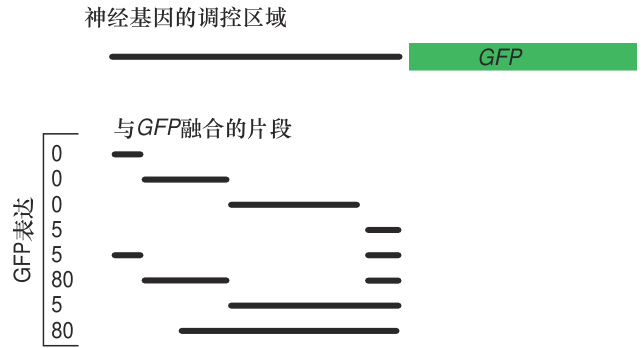  

8.  酵母基因在其启动子上游具有顺式作用因子，类似于增强子，称为上游激活序列或UAS。参与半乳糖利用的几种靶基因受一种称为 $U\!A S_{G}$ 的UAS调节，其具有四个被称为GAL4的激活因子的结合位点。由$U A S_{G}$ 调节的两个靶基因是GAL7和GAL10。GAL80蛋白是GAL7和GAL10转录的间接抑制因子：在$U\!A S_{G}$ ，GAL80与GAL4蛋白结合并阻断GAL4的激活结构域。在存在半乳糖的情况下，GAL80不再结合GAL4。  

在哪个基因（GAL4和/或GAL80）中你能够分离出在没有半乳糖的情况下允许靶基因GAL7和GAL10组成性表达的突变？在每种情况下，突变会破坏蛋白质的哪些特征？  

9.  单个 $U A S_{G}$ 调节三个基因的表达，所有基因都是相邻的：如在习题8中描述的GAL7和GAL10，以及GAL1。  

a.  你希望将这些基因转录为单个的转录物，还是将其共同转录为一个mRNA？请解释说明。  
b.  你如何通过实验确定每个基因是单独转录还是三个基因共同转录成一个mRNA？  
c.GAL1和GAL10不仅彼此相邻，而且还分开地与在它们之间的一个 $U A S_{G}$ 转录。描述使用GFP和RFP转基因的实验，这将允许你确定该 $U\!A S_{G}$ 元件中的四个GAL4结合位点中的哪一个对于GAL1和（或）GAL10的转录是重要的。  

10.  MyoD是一种转录激活因子，可以启动人体细胞中几种肌肉特异性基因的表达。Id基因产物抑制MyoD作用。  

a.  一种可能性是Id蛋白直接抑制这些肌肉特异性基因的表达。解释如果Id是一个阻遏物，它将如何发挥作用。  
b.  另一种可能性是Id通过阻止MyoD功能，间接地抑制肌肉特异性基因转录。解释如果Id作为间接阻遏物，它将如何发挥作用。  
c.  假设你知道Id蛋白的氨基酸序列，这些信息如何支持题目a或b中的假设？  

11. a.  假设在三色堇中表达蓝色色素沉着的基因需要两个转录因子（没有色素，花将是白色的）。对于编码这些转录因子的每个基因，你预计通过杂交野生型和隐性无效等位基因杂合的菌株将获得什么样的表型比例？b.  现在假设任意一个转录因子足以获得蓝色表型。你预计通过杂交相同的两个杂合菌株将得到什么样的表型比例？  

12. a.  你想要创建一种在果蝇中表达GFP的基因构建体。除了GFP编码序列之外，如果构建体整合到果蝇基因组中，为了在果蝇中表达这种蛋白质，构建体必须包括哪些DNA元件？这些DNA元件应该放在哪里？你如何确保GFP仅在果蝇的某些组织（如翅膀）中表达？  

b.  假设你将GFP编码区加上题目a答案中所需的所有DNA元件（除了增强子）插入到在特定转座因子末端发现的反向重复序列之间。因为位于这些反向重复序列之间的所有DNA序列可以在果蝇基因组中从一个地方移动到另一个地方，所以可以产生许多不同的果蝇品系，每个品系都在基因组不同位置整合了构建体。现在你检测每个品系的动物的GFP荧光。不同菌株的动物表现出不同的模式：有些在眼睛里发出绿光，有些在腿上发绿光，有些则没有发出绿色荧光，等等。解释这些结果并描述该实验的潜在用途。  

13.  在习题12中，你确定了一个可能作为眼睛特异性增强子的基因组区域。你可以进行哪些实验来验证这些DNA序列确实具有增强子的所有特征，并确定基因组DNA中增强子的准确边界？  

14.  一位研究生提出了以下想法来识别果蝇基因组中的绝缘子：进行类似于习题12中描述的实验，但不使用无增强子的构建体，而是使用含有一个增强子的构建体，并筛选不表达GFP的品系。  

a. 这个实验设计有什么问题？b. 你能想出一个不同的实验来识别绝缘子吗？  

15.  Myc是一种调节细胞增殖的转录因子；myc基因突变导致许多癌症Burkitt淋巴瘤的病例。对Myc的初步实验令人费解。Myc蛋白含有亮氨酸拉链二聚化结构域和被称为bHLH基序的特殊类型的螺旋-环-螺旋DNA结合结构域，但纯化的Myc既不能形成同源二聚体，也不能有效地结合DNA。  

Max和Mad蛋白的发现有助于解决这一难题。像Myc一样，Max和Mad都含有一个bHLH基序和一个亮氨酸拉链，但Max和Mad都不易于同源二聚体化，也不能以高亲和力结合DNA。然而，Myc-Max和Mad-Max异二聚体很容易形成并结合DNA； 事实上，它们与相同靶基因的增强子上相同的位点结合。Myc包含一个激活结构域，而Mad包含一个阻遏域，Max都不包含。  

max基因始终在所有细胞中表达。相反，mad在休眠细胞中表达（在细胞周期的G0期），而myc在休眠细胞中不转录但在细胞即将分裂时（从G1期向S期的过渡时）开始表达。Mad和Myc蛋白相对于Max蛋白不稳定；当mad或myc的表达停止时，Mad或Myc蛋白很快就会消失。  

a.  你认为增强子上含有Myc-Max结合位点的靶基因会编码阻止细胞周期的蛋白质，还是推动细胞周期向前发展的蛋白质呢？增强子上含有Mad-Max结合位点的基因呢？解释你的答案。  
b.  绘制类似于图17.14中所示的图，以显示靶基因的控制区域、与增强子结合的蛋白质，以及转录是否发生在休眠细胞（i）和即将分裂的细胞（ii）中。  
c. 简要总结这三种蛋白质如何调控细胞增殖。  
d.  myc中的致癌突变会是功能丧失或功能获得突变吗？  

16.  原核生物和真核生物中的基因都受激活因子和阻遏物的调节。  

a.  比较原核生物阻遏物（如Lac阻遏物）与典型的真核生物阻遏蛋白（直接阻遏物）的功能机制的异同。  
b. 比较原核生物激活因子（如CAP）与典型的真核生物激活蛋白的功能机制的异同。  

17.  真核生物激活蛋白的模块化特性为科学家提供了一种寻找与任何特定目的蛋白相互作用的蛋白质的方法。该想法是利用蛋白质-蛋白质相互作用将DNA结合结构域与激活结构域结合在一起，产生人工激活因子，其由通过相互作用非共价地维持在一起的两个多肽组成。  

该方法被称为酵母双杂交系统，它有三个组成部分。首先，酵母含有报告基因构建体，其中$\mathrm{UAS}_{\mathrm{G}}$ （如习题8中所述的结合激活因子Gal4的类增强子序列）驱使来自酵母启动子的大肠杆菌lacZ报告基因（编码酶β-半乳糖苷酶）的表达。其次，酵母还表达融合蛋白，其中Gal4的DNA结合结构域与目的蛋白融合；这种融合蛋白被称为诱饵。第三个组成部分是在质粒中制备cDNA文库，其中每个cDNA在阅读框内与Gal4的激活结构域融合，并且可以作为猎物融合蛋白在酵母细胞中表达。  

你如何使用含有前两种成分的酵母菌株及所述的质粒cDNA表达文库，来识别与诱饵蛋白结合的猎物蛋白？这个程序如何与寻找可能在细胞中相互作用的蛋白质的目标相关？  

18.  组蛋白H3亚基的4号赖氨酸（H3K4）在许多转录活性基因的核小体中被甲基化。假设你想确定人类基因组中核小体含有甲基化H3K4的所有位置。  

a.  从一种只与具有K4甲基化的组蛋白H3亚基尾部特异性结合的抗体开始，你将进行什么样的实验？概述该实验的主要步骤。  
b.  如果你的一个实验的起始材料是皮肤细胞，第二个实验中的材料是血液前体细胞，你认为你会得到相同的结果吗？作出解释。  
c.  描述一项后续实验，使该实验可以确定你题目a中实验的数据是否与H3K4甲基化标记仅出现在转录活性基因中的观点一致。  

19.  J.T. Lis和合作者已经开发了一种称为PRO-Seq的实验方案，它精确地确定了在基因组中所有参与转录的RNA聚合酶（即在合成RNA过程中活跃的酶分子）在特定时间的所有位置。附图显示了在Dnaj4基因附近的人类基因组的一个区域的PRO-Seq分析结果。垂直红线显示了以从左向右的方向沿着DNA移动参与转录的RNA聚合酶的位置，而垂直的蓝线显示了沿相反方向参与转录的RNA聚合酶。线的长度表示在样本中沿着基因组在该位置发现活性聚合酶的频率。  

两个样本取自在培养皿上生长的相同的人类细胞培养物。培养物在正常条件下培养，取样（热休克前）；培养物在高温下生长并在1h后（热休克后）取样。  

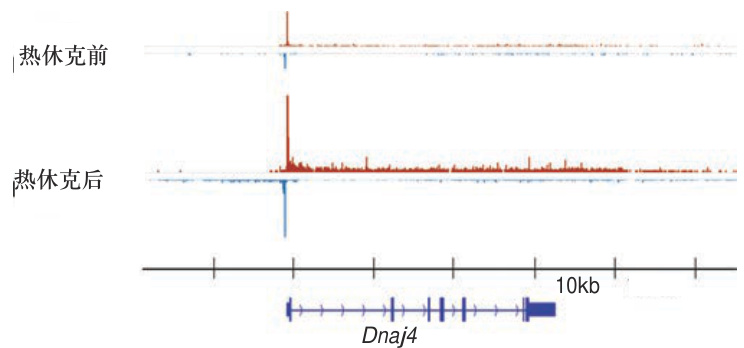  
图片来源：Digbijay Mahat and John T. Lis, Cornell University, lthaca, NY  

a.  参与转录的RNA聚合酶不均匀的沿着基因组分布，这个事实意味着什么？  
b.  这些数据以及你对题目a的答案共同表明，无论是在热休克之前还是之后，RNA聚合酶与启动子的结合并不是Dnaj4基因转录过程中唯一的限速步骤。参与其中的其他步骤是什么？哪一步似乎最直接地受到热休克调节？  
c.  当RNA聚合酶与该基因的启动子结合时，它是否知道将哪条DNA链作为模板？  
d.DNAj4基因的转录在哪里结束？数据是否清楚地表明单个的、明确定义的转录终止位点的存在？  
e.  你认为PRO-Seq方法是如何能够特异性定位参与转录的RNA聚合酶，而不是定位可能与DNA结合但不催化转录的RNA聚合酶？  

# 17.3节  

20.  葡萄胎是在子宫内形成的，由异常葡萄胎妊娠期间的未分化组织中生长而来。尽管有些可以是XY二倍体，但这些胎块通常是由XX二倍体细胞组成的。令人惊讶的是，胎块细胞核中的所有DNA都是源自父亲的。大多数葡萄胎是良性的，但由于它们有时会发展成癌症，因此当检测到这些胎块时，应该通过外科手术去除。  

a.  什么样的事件可能导致产生葡萄胎？  

b.  葡萄胎是具有正常基因和染色体数量的二倍体细胞。你认为它们为什么会发展为未分化的组织而不是正常的胚胎？  

21.  普拉德-威利综合征是由常染色体母系印记基因的突变引起的。假设性状是 $100\%$ 渗透的，将下列陈述标记为真或假。  

a.  受影响的男性的儿子有 $50\,\%$ 的机会出现这种综合征。  
b.  受影响的男性的女儿有 $50\%$ 的机会出现这种综合征。  
c.  受影响的女性的儿子有 $50\,\%$ 的机会出现这种综合征。  
d.  受影响的女性的女儿有 $50\%$ 的机会出现这种综合征。  

22.  人类IGF2基因是常染色体和母系印记的。从母亲接收的基因的拷贝没有表达，但是从父亲接收的拷贝表达。你已经发现了编码两种不同形式的，可通过凝胶电泳区分IGF2蛋白的基因两个等位基因。一个等位基因编码60kDa血液蛋白； 另一个等位基因编码50kDa血液蛋白。在对一对名为Bill和Joan的夫妇的血液蛋白质的分析中，你发现Joan的血液中只有$60\mathrm{kDa}$ 蛋白质，而Bill的血液中只有50kDa蛋白质。然后看看他们的孩子：Jill只产生50kDa蛋白质，而Bill Jr.只产生60kDa蛋白质。  

a.  仅凭这些数据，你对Bill Sr.和Joan的IGF2基因型有什么看法？  
b.  Bill Jr.和一个名叫Sara的女人有两个孩子—Pat和Tim。Pat只产生60KDa蛋白质而Tim只产生50KDa蛋白质。有了这些累积数据，你现在对Joan和Bill Sr.的基因型有什么看法？  

23.  通过遵循父系印记基因的表达的三代。指出附图中来自第一代中雄性的基因拷贝是否在所列个体的生殖细胞和体细胞中表达。  

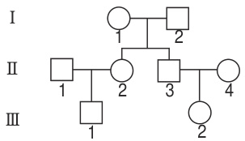  

a. 第一代雄性（Ⅰ-2）：生殖细胞b. 第二代女儿（Ⅱ-2）：体细胞c. 第二代女儿（Ⅱ-2）：生殖细胞d. 第二代儿子（Ⅱ-3）：体细胞e. 第二代儿子（Ⅱ-3）：生殖细胞f. 第三代孙子（Ⅲ-1）：体细胞g. 第三代孙子（Ⅲ-1）：生殖细胞  

24.  使用两种近交系小鼠AKR和PWD进行互交，两种小鼠具有许多多态性位点的不同等位基因。在这两个杂交组合中，来源严格、来自胎儿的胎盘组织被分离（可以通过解剖来源于母亲的胎盘组织而分离）。从胎儿的胎盘组织制备RNA，然后进行深度测序（即RNA-Seq）。由于多态性，研究人员可以比较从母本或父本等位基因转录的特定基因的mRNA读数，如下图所示（x轴显示对应于该基因的AKR等位基因的给定mRNA的读数百分比）。  

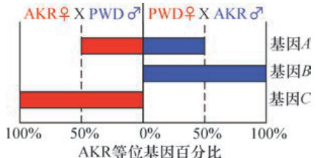  

a.  哪些基因（A、 $B$ 或 $C$ ）是母系印记的？哪个是父系印记的？哪个没有印记？  

b.  为什么说进行互交以确定是否有任何基因被印记是很重要的？  

c.  使用与指示AKR等位基因百分比的相同类型的图表，如果来自左侧杂交的雌性F1小鼠（即AKR雌性和PWD雄性之间杂交的女儿）随后与一只PWD雄性杂交，图解这些相同三个基因的预期结果。描述每个基因的两种可能结果。  

25.  有趣的是，印记可以是组织特异性的。例如，胎儿胎盘组织中母系印记的基因在胎儿心脏中完全不被印记。在图17.23（a）中的图表的指导下，提出一种可以解释印记的组织特异性的机制（提示：请记住，基因可能有多种增强子，可以在不同组织中表达）。  

26.  目前可获得的抗体将特异性结合含有5-甲基胞嘧啶的DNA片段，但不与缺少该修饰的核苷酸的DNA结合。你如何将这些抗体与图17.18中概述的ChIP-Seq技术结合使用来寻找人类基因组中的印记基因？  

27.  一种检测甲基化CpG的方法涉及一种称为亚硫酸氢盐的化学物质的使用，其将胞嘧啶转化为尿嘧啶但甲基化胞嘧啶不受影响。你想知道基因组中一个位置的特定CpG二核苷酸是否在组织样本中的一条或两条链上甲基化。含有该CpG的基因组序列是：5′...TCCATCGCTGCA...3′。你从样本组织中取出基因组DNA，用亚硫酸氢盐彻底处理，然后使用侧翼引物PCR扩增包括该CpG二核苷酸在内的区域。然后，你想要用Sanger法对扩增的PCR产物进行测序。  

a.  用亚硫酸氢盐处理基因组DNA后，两条DNA链将溶解成单链。这是为什么？  
b.  你对题目a的回答引入了潜在的复杂性，因为如果你不考虑亚硫酸氢盐处理的这种结果，PCR引物将不会扩增DNA。为该实验设计PCR引物时需要特别注意什么？一对PCR引物可以扩增两条DNA链吗？  
c.  如果扩增题中所示的DNA链并且使CpG甲基化，你会看到什么序列？如果没有甲基化呢？用亚硫酸氢盐方法，你能否判断组织样本中的这种CpG二核苷酸是半甲基化的（在一条链上甲基化）或在两条链上都甲基化？解释说明。  

28.  蜜蜂（Apis mellifera）提供了一个环境对真核基因表达以及表型影响的惊人例子。可育的蜂后和不育的工蜂都是具有相同二倍体基因组的雌性蜜蜂。然而，它们的形态和行为却是不同的。  

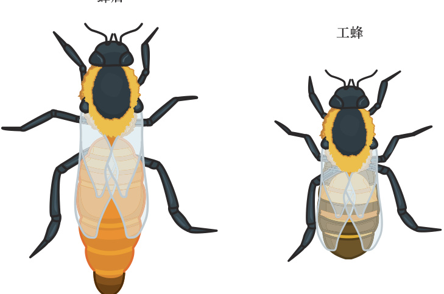  
来源：State of New Jersey, Department of Environmental Protection  

事实证明，雌性幼虫的饮食（幼虫是年轻的正在发育中的昆虫）控制着它们发育成工蜂还是蜂后。当蜂巢需要新的蜂后时，一些雌性幼虫会被喂食蜂王浆——一种由工蜂分泌的物质，而不是喂食正常饮食中的花蜜和花粉。  

研究人员确定，在幼虫阶段的工蜂中，许多基因的CpG甲基化程度高于幼虫阶段的蜂后。  

a.  描述一个你可以进行的实验，以确定DNA甲基化是否与工蜂和蜂后的基因表达差异相关。  

b.  通过敲除雌性幼虫DNA甲基转移酶DNMT3的表达，研究人员能够模仿蜂王浆的效果（敲除是通过一种被称为RNA干扰的技术完成的，这种技术在后面的问题中有所描述；在这里其细节并不重要）。值得注意的是，当给这些幼虫喂养正常饮食时，它们中的大多数都发育成了蜂后。根据图17.24中所示的刺豚鼠基因的A 等位基因的跨代沉默的描述，提出一个简单的假设，使该假设能够解释正常饮食与蜂王浆饮食相比对雌性蜜蜂幼虫发育的不同影响。  

29.  思考图17.24中的实验，其中 $A^{Y};$ 等位基因在吃了富含甲基供体（甜菜和大蒜）的饮食的雌性小鼠的F1后代中沉默。为了确定已发生跨代表观遗传，你需要多少代后代未喂食富含甲基供体饮食的小鼠，以观察 $\cdot A^{Y}$ 等位基因的沉默？（假设 $\cdot A^{Y}$ 被沉默的雌性后代总是用来生产下一代）如果最初喂食甜菜和大蒜的小鼠是雄性 $\cdot A^{Y}$ 被沉默的雄性后代总是被用来生产下一代，你的答案会改变吗？解释说明。  

# 17.4节  

30.  在转录、RNA剪接或翻译水平上反式调节基因表达的蛋白质或RNA必须对一个靶基因或一组靶基因具有特异性。解释在每种情况下如何实现特异性。  

31. a.  单个真核基因如何产生几种不同类型的mRNA分子？b.  排除可能的罕见多顺反子信息，真核细胞中的单个mRNA分子如何产生具有不同活性的蛋白质？  

32.  驼背基因是果蝇胚胎正确模式所必需的基因，在翻译过程中被调控。转录物内编码区的位置是已知的。你如何确定5′UTR或3′UTR内，或两者内的序列是否是正确调节mRNA翻译所必需的？  

33.  你已经知道，特定基因产生的mRNA和蛋白质存在于脑、肝脏和脂肪细胞中，但你只能在脂肪细胞中检测到与该蛋白质相关的酶活性。为这种现象提供一个可能的解释。  

34.  你正在研究一种转基因小鼠品系，该品系在顺式调控元件的控制下表达GFP报告基因，这些元件通常是小鼠发育早期控制基因所需的。先前来自转录组测序（RNA-Seq）的证据表明，可以在妊娠的第$8.5\!\sim\!10.5$ 天鉴定目的基因的mRNA。在你的品系中，可以从大约第8.75天到最晚第12天看到GFP荧光。  

a.  解释mRNA和蛋白质表达之间的差异。b.  你是否期望GFP蛋白表达更准确地表明该基因活动的正常开始或该基因活动的正常停止？解释说明。  

35.  通过搜索人类基因组数据库，你发现了一个编码与Argonaute具有弱同源性的蛋白质的基因，Argonaute是一种存在于与某些miRNA结合并介导其调节目标mRNA稳定性或翻译能力的复合物中的因子（回顾图17.32和图17.33）。a.  你如何确定哪些特定的miRNA可能与你发现的新蛋白质相关？（思考你如何使用图17.18中描述的ChIP-Seq技术的变化形式来探索这个问题）b.  如果可以得到的小鼠是一个与你发现的人类基因几乎相同的基因的无效突变的纯合子，你如何用这个突变小鼠来研究含有你的类Argonaute蛋白的miRNA-RISC复合物可能靶向哪些mRNA？  

36.  科学家利用siRNA途径进行了一种称为RNA干扰的技术——一种能够不必在其中产生突变就能够敲除特定基因的表达的方法。该想法是将对应于靶基因的dsRNA引入生物体；然后将dsRNA加工成siR-NA，导致靶基因mRNA的降解。将dsRNA输送至某些生物（如秀丽隐杆线虫）的一种巧妙方法是用表达dsRNA的重组质粒转化的细菌喂养它们。  

a.  绘制一个基因构建体，当细菌中的质粒表达时，它可以被用来通过RNA干扰敲除线虫X基因的表达。  
b.  如果含有构建质粒的转化细菌被蠕虫吃掉后，蠕虫中的X基因被沉默，你如何检验？  
c.  你认为在这些蠕虫中，只有基因X的表达会被影响吗？  

37.  柿子（Diospyros lotus）是雌雄异株的植物，这意味着雄性（XY型）和雌性（XX型）花存在于不同的植物上。雄性柿子花具有退化的、无功能的心皮（包括子房的雌性性器官）；而雌性花具有雄蕊和花药（雄性性器官），但不产生花粉。值得注意的是，柿子中的性别决定由称为OGI（雄性植株的日语称谓）的Y连锁miRNA基因控制，其目标mRNA由称为MeGI（雌性植株的日语称谓）的常染色体基因编码。  

a.OGI转录物碱基序列的哪些特征可能暗示研究者OGI编码miRNA？  
b.  RNA-Seq实验在雌性性器官中检测到高水平的MeGI mRNA，但在雄性性器官中检测到低水平的MeGI mRNA。提出OGI miRNA可以调节MeGI基因表达的一种分子机制。将转基因整合到柿子基因组中是困难的。因此，为了检验MeGI的功能，科学家们构建了一个过度表达MeGI的转基因，并用它来转化拟南芥（Ara-bidopsis thaliana），这是一种更适合于此类研究的植物。拟南芥具有所谓的完美花——个体的花具有雄性和雌性结构。转化子中的MeGI过度表达使花药不育，但心皮不受影响且功能正常。  
c.  如果拟南芥转化子还含有过度表达OGI的转基因，你预计将会发生什么？  
d.  MeGI蛋白是同源框转录因子。转化拟南芥的结果表明这种蛋白质在柿子性别决定中的作用是什么？  
e.  推测可以解释雄性柿子花中非功能性心皮的退化发育的可能机制。这些机制中有哪些涉及OGI和MeGI？  

38.aubergine基因功能缺失突变的纯合雌性果蝇是不育的。RNA-Seq实验表明，在这些雌性的卵巢中，多种转座因子的RNA水平比野生型卵巢中的高10倍以上。aubergine基因编码Piwi家族蛋白。a.  你认为为什么这些雌性是不育的？b.  Piwi蛋白与从piRNA基因簇转录的piRNA相互作用。鉴于在突变卵巢中多种TE的水平升高，你认为哪些DNA序列位于这些簇中？  

c.  许多研究人员认为piRNA是一种防御机制，可以保护生物免受可能被引入基因组的新转座因子（如来自其他物种）的影响。解释说明。  
d.  piRNA系统对转座因子有什么好处？  
e.  第13章中的习题29描述了一种叫做杂交不育的现象，这种现象发生在基因组具有 $P$ 元件转座子的所谓的P品系雄性与基因组缺乏 $P$ 元件的M品系雌性交配时。在杂种后代的种系中，突变和染色体重排的频率升高并且导致不育。piRNA系统如何参与杂交不育？  

39.  本文讨论了RNA-Seq技术，该技术量化了给定时间内给定细胞类型中存在的mRNA的数量。我们还描述了核糖体图谱分析的方法，其量化了给定时间内在细胞群体中活跃翻译的mRNA序列的水平。但即使进行了两种实验，数据也没有准确地告诉我们当时在细胞中这些mRNA的蛋白质产物的相对量。为什么没有呢？这些技术考虑了基因表达的哪些要素？忽略了哪些要素？  

# 17.5节  

40.  研究人员已经知道Fru-M控制果蝇中的雄性性行为，因为雌性中Fru-M不恰当的表达导致它们表现得像雄性一样——这样的雌性向其他雌性表现出雄性的行为。a.  描述雌性果蝇中能够导致Fru-M表达的fru基因突变。b.  描述一种转基因构建体，科学家可以生成并将其插入到雌性果蝇中，其具有与你在题目a中描述的突变相同的效果。  

41.  果蝇性别致死基因（ $S x l$ ）是名副其实的。某些等位基因对XY型动物没有影响，但会导致XX型动物在发育早期死亡。其他等位基因对XX型动物没有影响，但会导致XY型动物在发育早期死亡。因此，一些 $S x l$ 等位基因对雌性是致命的，而另外一些对雄性是致命的。  

a.  你认为 $S x l$ 中的无效突变会导致雄性或雌性的致死性吗？组成型活性Sxl突变呢？  
b.  为什么这两种类型的 $S x l$ 等位基因都会导致特定性别的致死性？性别转换基因（tra）的名字来自于性别的转变，因为一些tra等位基因可以将XX型动物变成雄性的形态，而其他tra等位基因可以将XY型动物变成雌性的形态。  
c.  这些性别转变中的哪些是由tra的无效等位基因引起的，哪些是由tra的组成型活性等位基因引起的？  
d.  与Sxl相反，无效tra突变无论在XX型或XY型动物中都不会导致致死性。然而， $S x l$ 蛋白调节Tra蛋白的产生。那么为什么所有的tra突变的动物都存活下来了呢？  
e.  预测tra-2中的无效突变对XX型和XY型动物的影响（回忆一下，tra-2编码一种蛋白质，在两种性别中表达，是Tra功能所必需的）。  
f.  在无后基因（fru）中携带功能丧失突变的XY雄性表现出异常的求偶行为。你能否预测具有野生型fru等位基因，但是tra功能丧失突变的XX型或XY型动物，也会反常的求偶吗？  

42.  图17.29显示了Sxl蛋白与msl-2基因的mRNA结合，抑制了mRNA正确阅读框的翻译。MSL-2蛋白是一种与XY型雄性中的X染色体结合转录因子，其使X连锁基因转录水平加倍，从而使XY型雄性和XX型雌性中的X连锁基因均衡表达。a.  在XY型雄性或XX型雌性的哪一个中，Sxl蛋白会与msl-2 mRNA结合？b.  如习题41中所讨论的，一些 $S x l$ 等位基因对雌性是致命的而另一些对雄性是致命的。 $S x l$ 在调节Msl-2蛋白合成中的作用是否足以解释性别特异性致死是由两种等位基因导致的？c.  预测msl-2中功能丧失突变对雄性和雌性生育能力和生存能力的影响。  