# 第二部分 基因是什么，它们是做什么的  

# 第 6 章 DNA 的结构、复制和重组  

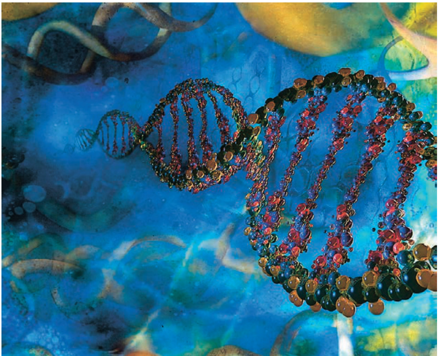  

DNA的双螺旋结构为数十亿年来遗传信息的代代相传提供了解释。$\copyright$ Adrian Neal/Getty Images RF  

# 章 节 大 纲  

6.1 DNA 作为遗传物质的实验依据  
6.2 沃森和克里克的双螺旋 DNA 模型  
6.3 核苷酸序列中的遗传信息  
6.4 DNA 的复制  
6.5 DNA 水平的同源重组  
6.6 位点特异性重组  

在将近40亿年的时间里，双链DNA分子担任着遗传信息的载体。它存在于最早的单细胞生物体中，也存在于此后的所有其他生物体中。在这么长的一段时间里，硬件——分子本身的结构没有改变。相比之下，进化过程已经形成并大大扩展了软件，即分子储存、表达和传递遗传信息的程序。  

在缺少或没有氧气的特殊条件下，DNA可以承受各种温度、压力和湿度，并且可以保持数百、数千甚至数万年的相对完整。分子侦探已经找到证据——来自38 000年前的尼安德特人骨骼的DNA（图6.1）。令人惊奇的是，这种古老的DNA仍然带有可读序列——可破译信息的碎片，它们能作为观察长期消失物种中基因的时间机器。与来自活体人群的同源DNA片段进行比较，从而确定推动进化的精确突变。  

例如，尼安德特人和人类DNA的比较工作，帮助人类学家解决了关于两者遗传关系的长期争论。证据表明，尼安德特人和我们自己的物种——智人，在60万 $\mathord{\sim}80$ 万年前拥有一个共同的祖先。尼安德特人的祖先大约在40万年前迁移到欧洲，而我们自己的祖先仍留在非洲。直到4万年前，当智人首次抵达欧洲时，这两个群体仍然没有联系。在几千年内，尼安德特人已经灭绝。然而，他们最近恢复的DNA表明，在尼安德特人与智人共同生活在欧洲的一万年中，发生了一些杂交； $1\,\%\!\sim\!4\,\%$ 的现代非非洲人的基因可以追溯到尼安德特人。  

弗朗西斯·克里克（Francis Crick）是DNA双螺旋结构的共同发现者，也是20世纪领先的分子生物学理论家，他写道：“几乎所有的生命都是在分子水平上被设计出来的，如果不认识分子，我们就只能粗略地理解生命本身。”因此，我们这一章主要是DNA作为遗传物质的研究。  

当我们将分析扩展到分子水平时，请牢记两个重要主题。首先，DNA的遗传功能直接来自其分子结构——原子在空间中的排列方式。其次，DNA的所有遗传功能都依赖于与其相互作用并读取它携带信息的特殊蛋白质，因为DNA本身是化学惰性的。事实上，DNA所缺乏的化学反应性使其能成为生物体内遗传信息长期维护的理想物理容器，以及它们的非生命遗骸。  

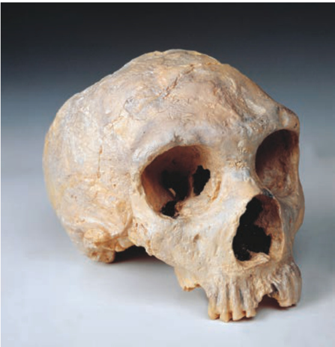  
图6.1　来自古代的DNA仍然携带信息。分子生物学家成功地从38 000年前的尼安德特人头骨中提取并确定了DNA序列。这些发现证明了DNA作为遗传分子的化学稳定性。$\copyright$ DEA Picture Library/De Agostini/Getty Images  

# 6.1 DNA作为遗传物质的实验依据  

# 学习目标  

1. 描述DNA的化学成分。  
2. 总结在染色体中定位DNA的方法。  
3.  解释Avery和他同事如何演示细菌转化，并解释这一发现的重要性。  
4.  描述赫尔希（Hershey）和蔡斯（Chase）的搅拌器实验，以及实验结果对DNA功能的揭示。  

在20世纪初，遗传学家并不知道DNA是遗传物质。50多年来相关实验所得的结果使科学界确信DNA是遗传分子。我们现在提出证据的关键部分。  

# 6.1.1 染色体中定位DNA的化学研究  

1869年，Friedrich Miescher从人体白细胞核中提取出一种弱酸性、富含磷的物质，命名为核质。它不同于之前报道的任何化合物。核质的主要成分是DNA，尽管它也含有一些污染物。DNA完整的化学名称是脱氧核糖核酸，反映了该物质的三个特征：它其中一种成分是称为脱氧核糖的糖；它主要存在于细胞核中；它是酸性的。  

通过化学方法从核质中纯化DNA后，研究人员证实DNA只包含四个不同的化学结构单元连接成的长链（图6.2）。这四种成分属于一类化合物，称为核苷酸；连接一个核苷酸与另一个核苷酸的键是共价磷酸二酯键；这些由核苷酸构成的链条是一种多聚体。  

1923年首次报道的一个方法使得有可能发现细胞DNA所在的位置，即根据其发明者命名的福尔根（Feulgen）反应，该方法依赖于一种可以将DNA染成红色的化学物质。在被染色的细胞中，染色体变红，而细胞的其他区域保持相对无色。该反应显示DNA几乎仅位于染色体内。  

DNA是染色体成分的发现本身并不能证明该分子与基因有任何关系。典型的真核生物染色体还含有更大量的蛋白质。由于蛋白质由20种不同的氨基酸构成，而DNA仅由4种不同的核苷酸构成，许多研究人员认为蛋白质更具有多样性，更适合作为遗传物质。这些科学家认为，尽管DNA是染色体结构的重要组成部分，但它很难控制基因的复杂性。  

# 6.1.2 细菌转化暗示DNA作为遗传物质  

一些研究最终促使人们认为DNA是携带遗传信息的化学物质。其中最重要的是使用单细胞细菌作为实验生物的研究。细菌将其遗传物质携带在位于细胞内的单个环状染色体中，而不被包围在核膜中。只有一条染色体，细菌不会经历减数分裂产生子细胞，它们也不会通过有丝分裂将其复制的染色体分配给子细胞；相反，它们通过一个称为二分裂的过程进行分裂。尽管存在这些明显的差异，但至少在20世纪上半叶，一些研究人员认为细菌的遗传物质可能与真核生物中的遗传物质相同。  

  
图6.2　DNA的化学成分。DNA分子的单链由一串核苷酸（蓝色框）组成。每个核苷酸由与无机磷酸盐（黄色圆圈）连接的脱氧核糖（棕褐色五边形）和四个含氮碱基（紫色或绿色多边形）中的一个组成。磷酸二酯键连接彼此的核苷酸，将一个核苷酸的磷酸基团连接到前一核苷酸的脱氧核糖上。  

与任何物种一样，对细菌进行遗传研究的一个先决条件是，在一个种群的个体中发现一种特性的替代形式。在1923年对实验室培养基中培养的肺炎链球菌细菌的研究中，Frederick Griffith区分了两种细菌形式：平滑（S）和粗糙（R）型。S是野生型，S突变产生R。从观察和生化分析中，Griffith认为S型之所以看起来光滑，是因为它们合成了围绕成对细胞的多糖荚膜，而R型作为S型的突变体自发产生，不能形成荚膜多糖，因此R型的菌落具有粗糙的表面（图6.3）。我们现在知道R型的产生是因为缺乏合成荚膜多糖所必需的酶。因为多糖荚膜有助于保护细菌免受动物的免疫反应影响，因此S型细菌具有毒性并杀死大多数接触它们的实验室动物［图6.4（a）］；相反，R型细菌不能引起感染［图6.4（b）］。在人类中，有毒的S型肺炎链球菌可引起肺炎。  

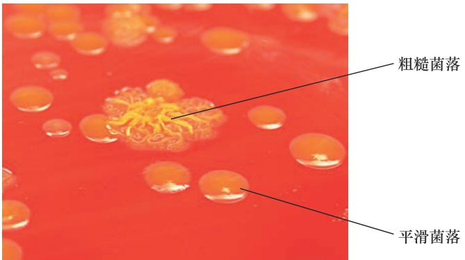  
图6.3　平滑（S）和粗糙（R）型肺炎链球菌菌落。 引自：Arnold et al., “New associations with Pseudomonas luteola bacteremia: A veteran with a history of tick bites and a trauma patient with pneumonia,” The Internet Journal of Infectious Diseases, 2005, 4(2): 1-5, Fig. $1\not\odot$ & Courtesy of Dr. Forest Arnold, University of Louisville. 使用获许可  

# 1. 转化现象  

1928年，Griffith发表了令人惊讶的发现：死细菌细胞的遗传信息可以通过某种方式传递给活细胞。他正在研究两种类型的肺炎链球菌细菌——活的R型和热灭活的S型。当注射到实验室小鼠中时，热灭活的S型和活的R型都不会产生感染［图6.4（b）和（c）］，但是两者的混合物可以杀死动物［图6.4（d）］。此外，从死亡动物的血液中回收的细菌是S型［图6.4（d）］。  

物质改变生物体遗传特征的能力被称为转化。来自热灭活的S型细菌的某种物质必然是将活的R型细菌转化为S型，且这种转化是永久的，并且很可能是遗传的，因为培养基中生长的所有后代细菌都是S型。  

# 2. DNA作为转化的活性剂  

1929年，另外两个实验室重复了这些结果，并且在1931年，Oswald T. Avery实验室的研究人员发现他们可以在不使用任何动物的情况下实现转化，只需将R型细菌在存在灭活的S型菌的组分的培养基［图6.5（a）］中培养即可。Avery接着开始了一项将近15年的工作，其重点是：“试着在复杂的混合物中找到有效成分！”换句话说，即试着在细菌提取物中找出无害R型细菌转化为致病性S型细菌的可遗传物质。Avery称他正在寻找转变因子，并花了很多年时间试图纯化它，以便能够明确地识别。他和他的同事最终准备了一个有形的、具有活性的转化因子。在程序的最后环节，从冰冷的乙醇溶液中制成了一个白色的条状物质，并在玻璃搅拌棒周围缠绕，形成几乎纯粹的转化因子——纤维团［图6.5（b）］。  

一旦纯化，就必须对转化因子进行表征。1944年，Avery与两位同事（Colin MacLeod和Maclyn McCarty）发表了旨在确定转化要素化学成分的实验的累积发现［图6.5（c）］。在这些实验中，纯化的转化因子在6亿倍的极高稀释度下仍是活跃的。研究人员将几乎是纯的DNA暴露于各种酶中，以观察除DNA之外的某些分子是否可能导致转化。能降解RNA、蛋白质或多糖的酶都对转化成分没有影响，但降解DNA的酶完全破坏了转化因子的活性。初步公布的结论是，转化因子似乎是DNA。在给兄弟的信中，Avery更进一步透露这种转化因子“可能是一个基因”。  

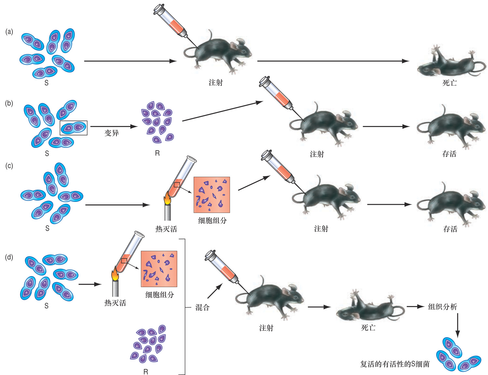  
图6.4　转化实验。（a）S型细菌具有毒性，注射入小鼠后会引起致命的感染。（b）自身注射R型突变体不会引起感染并杀死小鼠。（c）同样，注射热灭活的S型细菌不会引起致命的感染。（d）然而，注射与热灭活的S型菌株混合的活R型细菌可以导致致死性感染；死亡的宿主小鼠的血液中含有活的S型细菌。  

尽管该论文具有丰富具体的证据，但科学界的许多人仍然反对DNA是遗传分子的观点。他们认为，也许Avery的结果反映了污染物的作用； 或许遗传转化根本没有发生，相反，纯化的材料以某种方式触发了转化细菌表型的生理转换。当时不相信这些发现的科学家仍然认为蛋白质是遗传物质的主要候选者。  

# 6.1.3 DNA（而不是蛋白质）解释了病毒的传播  

不是每个人都持有这种怀疑态度。艾尔弗雷德·赫尔希（Alfred Hershey）和玛莎·蔡斯（Martha Chase）预计，他们可以通过用噬菌体病毒感染细菌细胞来评估DNA和蛋白质在基因复制中的相对重要性。  

病毒是最简单的生物体。结构和功能上，它们介于能够自我复制的活细胞和蛋白质等大分子之间。由于病毒是利用宿主细胞本身的分子机制进行自我复制和生长，所以病毒本身很小且携带很少的基因。对于多数种类的噬菌体，每个颗粒由重量大致相等的蛋白质和DNA组成［图6.6（a）］。这些噬菌体颗粒只有在感染细菌细胞后才能自我繁殖。感染后 $30\mathrm{min}$ ，细胞破裂，数百个新制造的噬菌体溢出［图6.6（b）］。问题是：什么物质含有用于产生新噬菌体颗粒的信息——DNA还是蛋白质？  

随着1939年电子显微镜的发明，人们可以看到单个噬菌体，并且令人惊讶的是，电子显微照片显示整个噬菌体不会进入它感染的细菌。相反，一种称为菌蜕的病毒空壳仍然附着在细菌细胞壁的外表面上。因为空的噬菌体外壳仍留在细菌细胞外，一名研究人员将噬菌体颗粒比作与细胞表面结合的微小注射器，并将含有病毒复制所需信息的材料注入宿主细胞。  

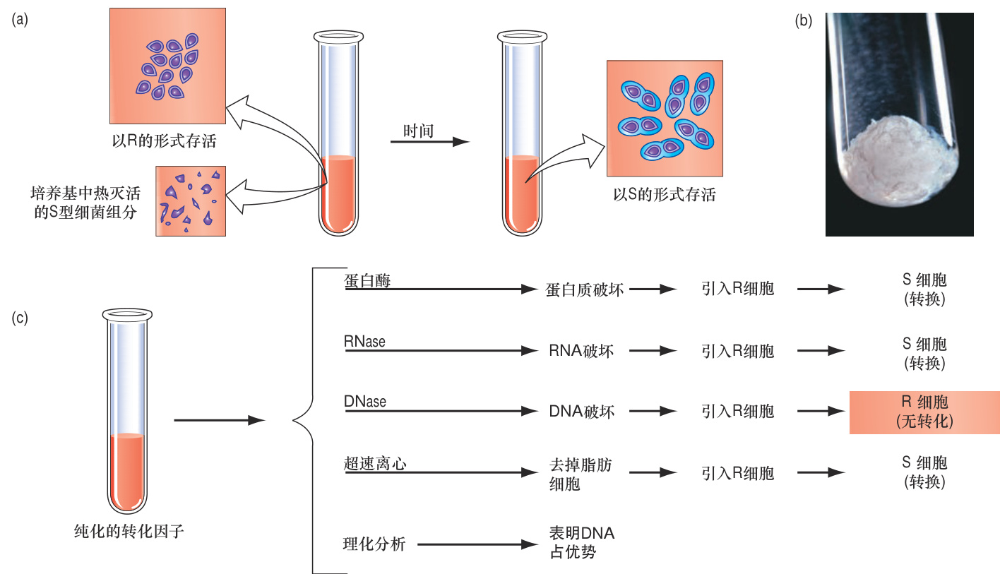  
图6.5　转化因子是DNA。（a）细菌转化发生在含有热灭活的S型细菌残余的培养基中。来自热灭活的S型细菌的一些转化因子被活R型细菌吸收，将它们转化（转变）成毒性S型菌株。（b）从人白细胞中提取的纯化DNA。（c）转化因子的化学分馏。用DNA降解酶处理纯化的DNA破坏了其引起细菌转化的能力，而用破坏其他种类的大分子的酶处理对转化因子没有影响。  

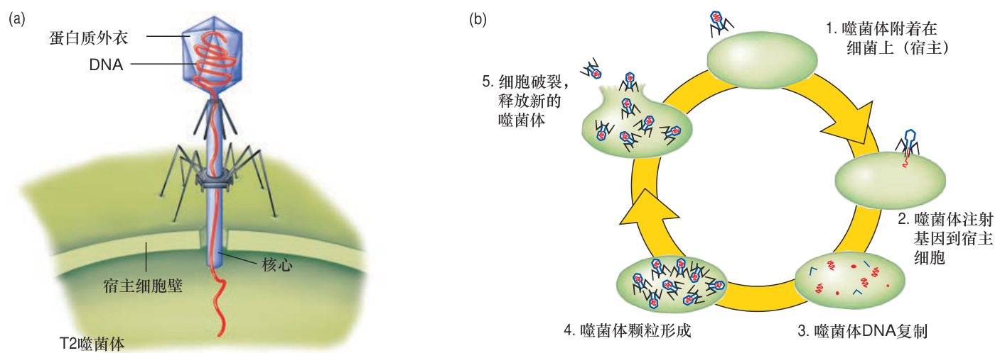  
（b）： $\copyright$ Phanie/Science Source  
图6.6　病毒实验提供了令人信服的证据，表明基因是由DNA构成的。（a）和（b）噬菌体T2的结构和生命周期。噬菌体颗粒由蛋白质外衣和DNA组成。病毒附着在宿主细胞细菌上，并通过细菌细胞壁将其基因（DNA）注入宿主细胞的细胞质中。在宿主细胞内，这些基因指导新噬菌体DNA和蛋白质的形成，这些噬菌体DNA和蛋白质组装成后代噬菌体，当细胞破裂时释放到环境中。  

在1952年著名的瓦氏高速捣碎器（Waring blender）实验中，赫尔希和蔡斯测试了这样一种观点，即细胞壁上留下的菌蜕是由蛋白质组成的，而注射的物质是由DNA组成的（图6.7）。一种称为T2的噬菌体作为它们的实验系统。赫尔希和蔡斯在细菌中生长了两套独立的T2并分别保存在两种不同的培养基中，一种注入放射性标记的磷（ $^{32}\mathrm{P}$ ），另一种注入放射性标记的硫（ $^{35}\mathrm{S}$ ）。因为蛋白质含有硫但不含磷，而DNA含有磷但不含硫，生长在 $^{35}\mathrm{S}$ 上的噬菌体会产生放射性标记的蛋白质，而生长在 $^{32}\mathrm{P}$ 上的颗粒则具有放射性DNA。当噬菌体感染具有细菌细胞的新鲜培养物时，放射性标签将作为每种材料定位的标记。  

  

图6.7　赫尔希-蔡斯瓦氏高速捣碎器实验。用32P标记的DNA（橙色）或用 $^{35}\mathrm{S}$ 标记的蛋白质（紫色）的T2噬菌体颗粒用于感染细菌细胞。短暂孵化后，赫尔希-蔡斯在瓦氏高速捣碎器中摇动培养物，并将样品在离心机中旋转，以将空病毒菌蜕与较重的感染细胞分离。大部分的 $^{35}\mathrm{S}$ 标记的蛋白质保留在菌蜕中，而大多数32P标记的T2 DNA存在于沉淀的感染细胞中。  

将一种新鲜的细菌培养物暴露于 P标记的噬菌体并将另一种培养物暴露于 $^{35}\mathrm{S}$ 标记的噬菌体后，赫尔希和蔡斯使用瓦氏高速捣碎器破坏结合体系，有效地将病毒菌蜕与携带病毒基因的细菌分开。然后将培养物离心，被分离的较重的感染细菌最后在管底部形成沉淀，被分离的较轻的噬菌体菌蜕悬浮在上清液中。大多数放射性 $^{32}\mathrm{P}$ （在DNA中）进入沉淀，而大部分放射性 $^{35}\mathrm{S}$ （在蛋白质中）保留在上清液中。该结果证实细胞外菌蜕确实主要是蛋白质，而注射的病毒材料中用于繁殖更多噬菌体的主要是DNA。含有放射性标记的噬菌体DNA的细菌的行为与正常的噬菌感染的细菌一样，产生和排出数百个子代颗粒。根据这些观察结果，赫尔希和蔡斯得出结论：噬菌体基因是由DNA构成的。  

赫尔希-蔡斯实验虽然不如Avery的方案严谨，但却产生了巨大的影响。在许多研究者的心目中，它证实了Avery的结果并将其扩展到病毒颗粒。现在的焦点是DNA。  

# 基本概念  

●  DNA是核苷酸通过磷酸二酯键连接成的多聚体。核苷酸由脱氧核糖、磷酸和四种含氮碱基中的一种组成。  
●  DNA几乎仅位于细胞核内的染色体中。  
●  Avery和他的同事表明，从S型（有毒）细菌中纯化的DNA制剂可以将R型（非毒力）细菌转化为S型；这一结果是DNA作为遗传物质的有力证据。  
●  赫尔希和蔡斯在只含有 $^{35}\mathrm{S}$ （标记蛋白）或 $^{32}\mathrm{P}$ （标记DNA）的情况下培养T2噬菌体。他们发现 $^{32}\mathrm{P}$ 标记的病毒性DNA指导产生更多病毒颗粒。  

# 6.2 沃森和克里克的双螺旋DNA模型  

# 学习目标  

1. 描述沃森-克里克DNA结构模型的主要特征。  
2.  解释双螺旋内两条DNA链的反向平行极性是什么意思。  
3. 区分DNA的不同结构形式。  

在适当的实验条件下，纯化的DNA分子可以在纤维中彼此对齐以产生有序结构。正如水晶枝形吊灯散射光线可以在墙壁上产生独特的图案一样，DNA纤维散射X射线也可以产生特有的衍射图案（图6.8）。知识渊博的X射线晶体学家可以解释DNA的衍射图案，以推断出分子三维结构的某些外貌。1951年春天，23岁的詹姆斯·沃森（James Watson）得知DNA可以产生衍射图案，他意识到它“必须有一个可以用直接方式解决的规则结构。”  

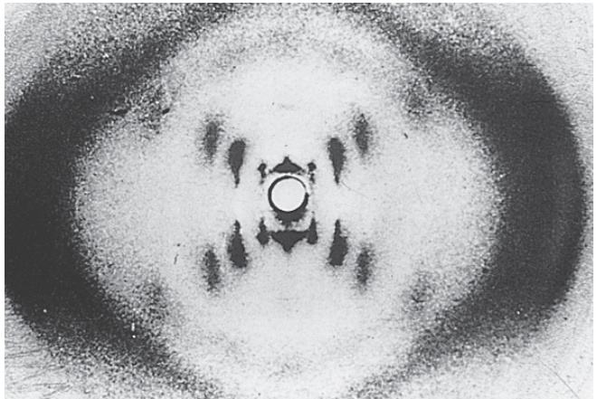  
图6.8　X射线衍射图反映了DNA的螺旋结构。由有序排列的DNA纤维产生的X射线衍射图的照片，由Rosalind Franklin和Maurice Wilkins在1952年末拍摄。X射线横向图案表明DNA是螺旋形的。  

在本节中，我们分析DNA的三维结构，首先查看核苷酸构建模块的重要细节；然后了解这些亚基如何在多核苷酸链中连接在一起；最后，两条链如何结合形成双螺旋。  

# 6.2.1 核苷酸是DNA的基本单位  

DNA是由称为核苷酸的亚基组成的长多聚体。每  

个核苷酸由一个脱氧核糖、一个磷酸盐和四种含氮碱基之中的一个组成。这些化学成分的详细知识及其结合方式在沃森-克里克模型构建中发挥了重要作用。  

# 1. 核苷酸的组成部分  

图6.9描述了脱氧核糖、磷酸盐和四种含氮碱基的化学组成和结构，这些成分如何结合形成核苷酸，以及磷酸二酯键如何将核苷酸连接成DNA链。含氮碱基的中心环结构中的每个单独的碳或氮原子被赋予数字： $1\!\sim\!9$ 表示位于嘌呤， $1\!\sim\!6;$ 表示位于嘧啶。通过使用  

# 特色插图6.9  

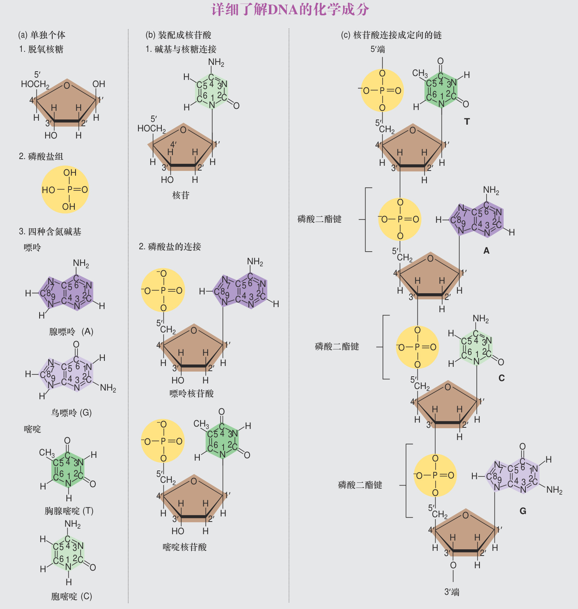  

$1^{\prime}{\sim}5^{\prime}$ 的素数，脱氧核糖的碳原子与核苷酸碱基内的原子进行区分。碱基与脱氧核糖的1′碳的共价连接形成核苷。向5′碳上添加磷酸基团形成完整的核苷酸。  

# 2. 连接核苷酸以形成DNA链  

如图6.9所示，由许多核苷酸组成的DNA链具有极性：总体方向。磷酸二酯键总是在一个核苷酸的3′碳和下一个核苷酸的5′碳之间形成共价连接。核苷酸基本单位的一致取向给出了链的总体方向，使得单链的两个末端在化学上是不同的。  

在 $5^{\prime}$ 端，末端核苷酸的糖具有游离的5′碳原子，不与另一核苷酸连接，从这点上看它是游离的。根据DNA的合成或分离方式，5′端核苷酸的5′碳可带有一个羟基或一个磷酸基团。在链的另一端——3′端，最末端核苷酸的3′碳原子是游离的。沿着两端之间的链，这种 $5^{\prime}{\longrightarrow}3^{\prime}$ 极性从核苷酸到核苷酸是保守的。按照惯例，DNA链以其碱基描述，以 $5^{\prime}{\rightarrow}3^{\prime}$ 方向从左向右书写（除非另有说明）。例如，图6.9（c）中描绘的链将是$5^{\prime}\mathrm{TACG}\,3^{\prime}$ 。  

# 3. DNA的信息内容  

信息只能按符号序列编码，符号序列的顺序根据要传送的消息而变化。没有这种序列变异，就没有携带信息的潜力。由于DNA骨架上交替的糖和磷酸对于DNA链中每个核苷酸在化学上是相同的，所以核苷酸之间的唯一区别在于含氮碱基的特性。因此，DNA中的遗传信息必须由A、G、T和C碱基序列的变异组成。从DNA碱基的四字母语言构建的信息类似于由26个字母的英语或法语或意大利语字母构建的信息。正如你可以以不同的方式组合字母表中的26个字母来生成书的单词，同样，非常长的核苷酸序列中的四个碱基的不同组合也可以编码用于构建生物体的信息。  

# 6.2.2 DNA螺旋由两个反向平行链组成  

在帮助我们对生物现象进行理解方面，沃森和克里克对DNA分子结构的发现与达尔文的自然选择进化理论和孟德尔的遗传定律的贡献是等同的。沃森-克里克结构首先体现在一个表面上类似于学龄前儿童的拆装玩具的模型中，它是基于对当时可用的所有化学和物理数据的解释。1953年4月，沃森和克里克在Nature杂志上发表了他们的研究成果。  

# 1. 来自X射线衍射的证据  

具有取向特性的DNA纤维的衍射图谱本身不包含足以揭示结构的信息。例如，由强度和位置构成X射线数据的衍射斑点的数量（见图6.8）远低于定向DNA分子中所有原子的未知坐标数。尽管如此，这些照片确实为训练有素的人们揭示了丰富的结构信息。RosalindFranklin和Maurice Wilkins拍摄的优秀X射线图像显示该分子呈螺旋状；沿螺旋轴的重复单元之间的间距为3.4Å（ $3.4\times10^{-10}\mathrm{m}$ ）；螺旋每34Å完成一次转弯；并且分子的直径为 $20\mathring{A}$ 。该直径大约是单个核苷酸宽度的两倍，表明DNA分子可能由两个并排的DNA链组成。  

# 2. 互补碱基配对  

如果DNA分子含有两个并列的核苷酸链，那么是什么力量将这些链结合在一起？Erwin Chargaff为此提供了一个重要的线索，他的数据来自不同物种的DNA的核苷酸组成。尽管碱基的相对量有很大变化，但A与T的比值与 $1:1$ 没有显著差异，并且G与C的比值在每种生物中也相同（表6.1）。沃森认为A-T和G-C大约 $1:1$ 的比率反映了分子内在结构的重要方面。  

表6.1　Chargaff关于各种生物体DNA中核苷酸碱基组成的数据  

<html><body><table><tr><td colspan="5">DNA中碱基的百分比/%</td><td colspan="2">比值</td></tr><tr><td>生物</td><td>A</td><td>T</td><td>G</td><td>C</td><td>A:T</td><td>G:C</td></tr><tr><td>大肠杆菌</td><td>24.7</td><td>23.6</td><td>26.0</td><td>25.7</td><td>1.05</td><td>1.01</td></tr><tr><td>酿酒酵母</td><td>31.3</td><td>32.9</td><td>18.7</td><td>17.1</td><td>0.95</td><td>1.09</td></tr><tr><td>秀丽隐杆线虫</td><td>31.2</td><td>29.1</td><td>19.3</td><td>20.5</td><td>1.07</td><td>0.96</td></tr><tr><td>黑腹果蝇</td><td>27.3</td><td>27.6</td><td>22.5</td><td>22.5</td><td>0.99</td><td>1.00</td></tr><tr><td>小鼠</td><td>29.2</td><td>29.4</td><td>21.7</td><td>19.7</td><td>0.99</td><td>1.10</td></tr><tr><td>人</td><td>29.3</td><td>30.0</td><td>20.7</td><td>20.0</td><td>0.98</td><td>1.04</td></tr></table></body></html>

注意，即使任何一个核苷酸的水平在不同生物中是不同的，但A的水平总是约等于T和G的水平总是类似于C。此外，嘌呤的总量（ $\mathrm{A}+\mathrm{G}$ ）几乎总是等于嘧啶的总量（ $\mathrm{C}+\mathrm{T}$ ）。  

为了用A和T之间、G和C之间的化学亲和力来解释Chargaff的比率，沃森用硬纸板剪成正常细胞环境中假设的化学形式的碱基。然后他试图以各种组合拼接它们，就像拼图游戏中的碎片一样。他知道嘌呤和嘧啶上的原子在分子相互作用中起着至关重要的作用，因为它们可以参与氢键的形成：弱的静电键导致反应基团之间部分共享氢原子（图6.10）。沃森看到A和T可以配对在一起，从而在它们之间形成两个氢键。如果G和C类似地配对，则氢键也可以容易地连接携带这两个碱基的核苷酸（沃森最初在G和C之间设置了两个氢键，但实际上有三个）。值得注意的是，两对（A-T和G-C）具有基本相同的形状。这意味着两对可以在两个糖-磷酸骨架之间以任何顺序排列而不会扭曲结构。这种互补碱基配对也解释了Chargaff比率——总是等量的A和T以及G和C。注意，这两个碱基对都由一个嘌呤和一个嘧啶组成。  

克里克将化学事实与X射线数据联系起来，认识到由于核苷酸中碱基-糖键的几何结构，只有当碱基连接到以相反方向运行的骨架时，沃森配对方案中碱基的方向才会出现。图6.11说明并解释了1953年4月提出的沃森-克里克模型：DNA双螺旋。  

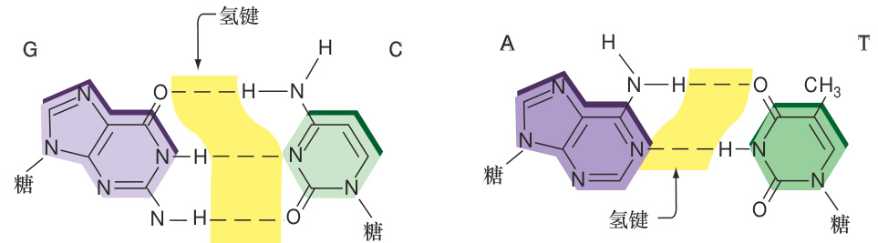  

图6.10　互补碱基配对。一条链上的A可以与另一条链上的T形成两个（非共价）氢键。一条链上的G可以与另一条链上的C形成三个氢键。A-T和G-C碱基对的大小及形状是相似的，这使得它们在双螺旋的两个主骨架之间有相同的空间。  

# 特色插图6.11  

# DNA的双螺旋结构  

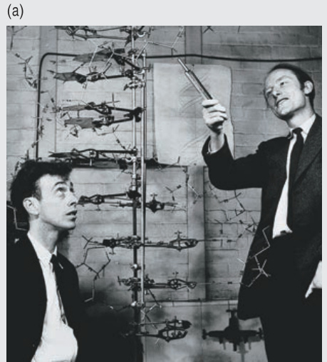  
$\circledcirc$ A. Barrington Brown/Science Source  

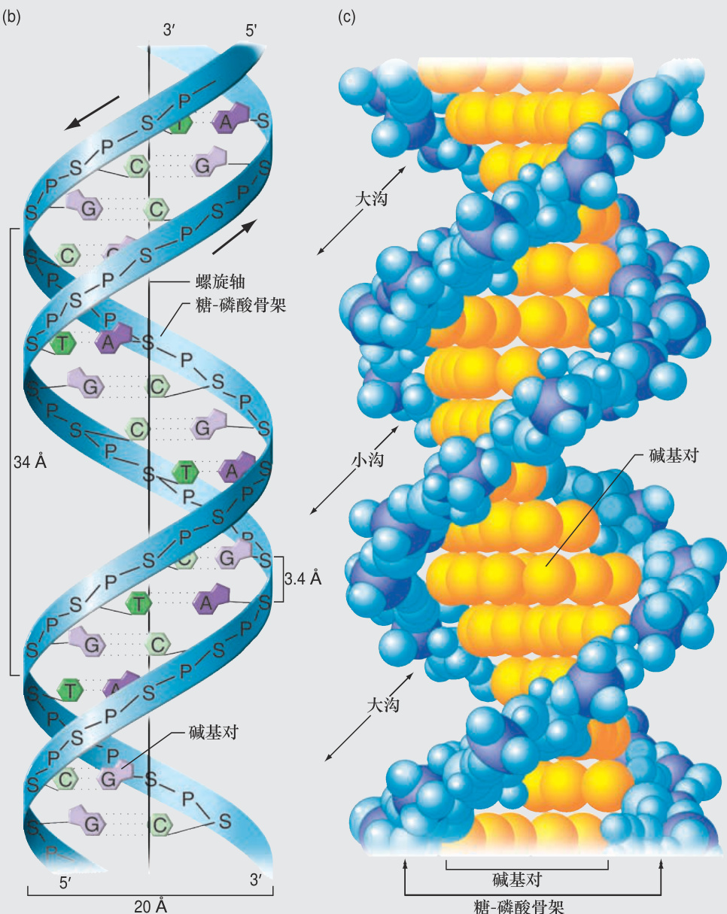  

（a）沃森和克里克根据DNA的有关化学成分及其在空间中物理排列的已知事实，构建了一个可以解释分子功能的模型。  

（b）在该模型中，两条DNA链围绕轴线旋转，外侧是糖-磷酸骨架，中间是扁平的碱基对。一条链向上从5′到3′，而另一条链向下从5′到3′的相反方向。简而言之，这两条链是反向平行的。两条链每10个碱基对彼此缠绕一次，或每隔34Å缠绕一次。结果是双螺旋看起来像一个扭曲的梯子，两个螺旋结构构件由糖-磷酸骨架和由碱基对组成的垂直梯级组成。  

（c）从空间填充来看该模型，整体形状是直径为20Å的沟槽圆柱体。骨架围绕双螺旋轴线旋转，就像螺钉上  

的螺纹一样。因为存在两个骨架，所以存在两个螺纹，并且这两个螺纹彼此垂直地移位。主干的这种位移产生两个沟槽，一个（大沟）比另一个（小沟）宽得多。  

双螺旋的两条链通过互补碱基对A-T和G-C之间的氢键结合在一起。双螺旋的空间限制要求每个碱基对必须由一个小的嘧啶和一个大的嘌呤组成，即便如此，也仅对于特定的A-T和G-C配对成立。相比之下，A-C和G-T配对不适合并且不能形成氢键。尽管任何一个核苷酸对仅形成两个或三个氢键，但由数千个核苷酸组成的长DNA分子中连续碱基对之间的这些连接的总和是该分子的巨大化学稳定性的关键。  

# 6.2.3 双螺旋可以采用其他形式  

沃森和克里克通过建立模型来得到DNA结构的双螺旋模型，而不仅仅是通过数据直接确定结构。尽管沃森写道“这般美丽的结构必须存在，”但是结构之美并不一定证明其正确性。在提出时，其正确性的最有力证据是其物理合理性、与所有现有数据的化学和空间兼容性，以及解释许多生物现象的能力。  

# 1. B型DNA和Z型DNA  

大多数天然存在的DNA分子具有沃森和克里克提出的构型。这种分子称为B型DNA；它们向右螺旋［图6.12（a）］。然而，DNA结构比最初假设的更具多态性。例如，一种核苷酸序列，其中螺旋向左螺旋并且主链呈Z字形，DNA呈现所谓的Z型。研究人员在体外观察到了多种不寻常的非B型结构（在试管里、玻璃片上）。他们推测其中一些可能至少在活细胞中短暂出现。例如，有一些证据表明Z型DNA存在于某些活体的染色体中。Z型和其他不寻常的构象是否具有任何生物学作用仍有待确定。  

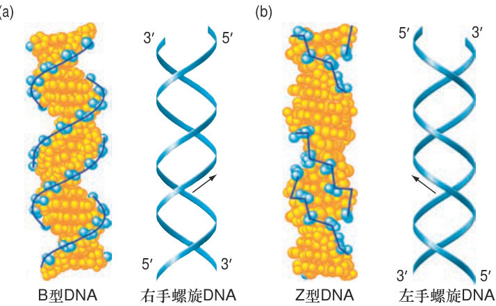  
图6.12　Z 型DNA是双螺旋的一种变体。（a）典型的沃森-克里克B型DNA形成具有光滑骨架的右手螺旋。（b）Z型DNA是左手螺旋的，并且具有不规则的骨架。  

# 2. 线性和环状DNA  

所有真核生物的核染色体都是长的线性双螺旋，但是一些较小的染色体是环状的［图6.13（a）和（b）］。这些包括原核细菌的染色体、细胞器的染色体（如在真核细胞内发现的线粒体和叶绿体），以及一些病毒的染色体（包括可以在动物和人类中引起癌症的乳多泡病毒）。这种环状染色体由共价闭合的双链环状DNA分子组成。尽管这些环状双螺旋的两条链都没有末端，但这两条链的极性仍然是反向平行的。  

# 3. 单链和双链DNA  

在一些病毒中，遗传物质由相对较小的单链DNA分子组成。一旦进入细胞内，单链就作为制备第二条链的模板（模式），然后所得的双链DNA控制更多病毒颗粒的产生。携带单链DNA的病毒的实例是噬菌体$\Phi$ X174和M13，以及哺乳动物细小病毒，其与人类的胎儿死亡和自然流产有关。在 $\phi\,X174$ 和M13中，单个DNA链呈共价闭合的环形；在细小病毒中，它是线性的［图6.13（c）和（d）］。不同的B和Z构型、分子的环化、复制和表达之前单股转换为双重的螺旋，这些都是双螺旋主题的微小变化。尽管经过实验确定的细节偏离，沃森-克里克双螺旋仍然是思考DNA结构的模型。该模型描述了通过数十亿年的进化保存的分子的那些特征。  

# 6.2.4 DNA结构是遗传功能的基础  

没有用于分析碱基序列的复杂计算工具，人们就无法区分细菌DNA和人类DNA。原因是所有DNA分子具有相同的一般化学性质和物理结构。相比之下，蛋白质是一组更加多样化的分子，其结构和功能复杂得多。在对双螺旋结构的发现的描述中，Crick提到了这种差异，他说，“DNA本质上是相比于高度进化的蛋白质不那么复杂的分子，因此我们更容易揭示它的秘密。”  

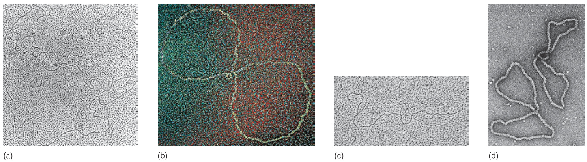  
图6.13　DNA分子可以是线性或环状、双链或单链。天然存在的DNA分子的电子显微照片：（a）长的线性双链的人染色体片段；（b）环状双链乳多泡病毒染色体；（c）线性单链细小病毒染色体；（d）环状单链噬菌体M13染色体。  

DNA的四个基本秘密体现在以下四个问题中：  

（1）分子如何携带信息？  
（2）如何复制这些信息以便传给后代？  
（3）什么机制允许信息改变？  
（4）DNA编码信息如何控制表型的表达？  

DNA的双螺旋结构为这些问题提供了可能的答案，赋予分子作为遗传材料执行所有关键功能的能力。  

在本章的其余部分，我们描述DNA的结构如何使其携带遗传信息、如何高保真度地复制遗传信息，并通过重组来组织信息。对于如何通过突变改变信息及信息如何确定表型是第7章和第8章的主题。  

# 基本概念  

●  DNA分子是由两条反向平行链组成的双螺旋，在每一条链中，核苷酸通过磷酸二酯键连接。互补碱基A与T、G与C之间的氢键将两条链连接在一起。●  反向平行是指一条链以 $5^{\prime}{\longrightarrow}3^{\prime}$ 方向取向，而另一条互补链以 $3^{\prime}{\longrightarrow}5^{\prime}$ 方向取向。●  大多数真核生物具有双链线性DNA，但原核生物、叶绿体和线粒体，以及一些病毒具有双链环状DNA。某些其他病毒含有单链DNA，可以是线性或环状的。  

# 6.3 核苷酸序列中的遗传信息  

# 学习目标  

1. 解释DNA如何储存复杂的信息。  
2. 比较蛋白质获取DNA信息的两种方式。  
3. 描述DNA和RNA之间的结构差异。  

DNA的信息内容存在于碱基序列中。每个链中的四个碱基就像字母表中的字母，它们可以以任何顺序相互连接，不同的序列拼出不同的“单词”。每个单词都有自己的含义，即它自身对表型的影响。例如，AGTCAT意味着一件事，而CTAGGT意味着另一件事。虽然DNA只有四个不同的字母或构建块，但是在核苷酸长链中不同组合和因此得到的不同信息组的可能性是惊人的。例如，一些人类染色体由2.5亿个核苷酸的链组成，由于不同的碱基可以以任何顺序延伸，所以这些链可以含有 $4^{250000000}$ 个（也就是1后面跟着150 515 000个0）潜在的核苷酸序列中的任何一个。  

# 6.3.1 大多数遗传信息从解旋的DNA链中读取  

解旋的D N A 分子从两条链上暴露出碱基序列（图6.14）。蛋白质读取单个DNA链中的信息，合成一段与该特定序列互补的RNA（称为转录的过程）或DNA（称为复制的过程）。  

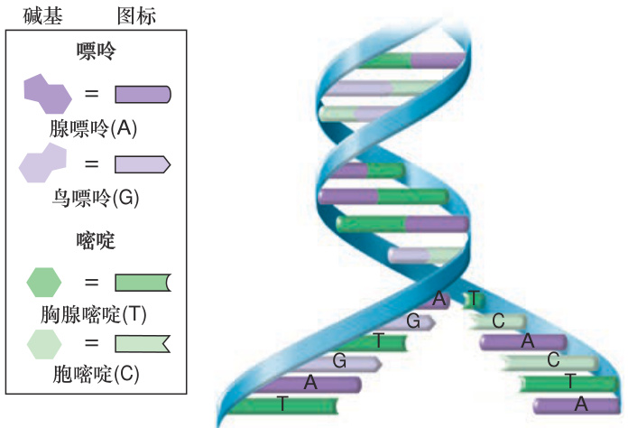  
图6.14　DNA以其碱基序列存储信息。部分解开的DNA双螺旋。注意，在分子的双链和未缠绕区域中可获得不同的结构信息。  

# 6.3.2 一些遗传信息可以从非解旋的DNA中获得  

一些蛋白质可识别并结合双链DNA中的特定碱基对序列（图6.15）。这些信息匹配主要来源于大沟和小沟中四种碱基之间的差异。在这些沟槽中，碱基周围的原子是暴露的，特别是在大沟，这些原子可以呈现出提供化学信息的空间模式。蛋白质可以在不解旋的情况下获取这些信息从而感知DNA碱基序列。序列特异性DNA结合蛋白包括打开和关闭基因的转录因子（第16章和第17章），以及在特定位点切割DNA的细菌限制酶（第9章）。  

# 6.3.3 在某些病毒中，RNA是遗传信息的储存库  

DNA携带所有细胞形式生物和许多病毒的遗传信息。原核生物如大肠杆菌（Escherichia coli）在双链、  

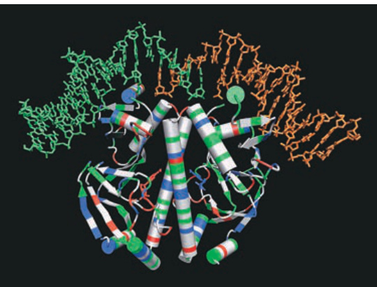  
图6.15　蛋白质与DNA中的特定序列结合。计算机图形展示大肠杆菌分解代谢基因激活蛋白（CAP）与DNA（绿色和橙色）结合。CAP的结构显示为一系列圆柱和带。CAP可以识别双螺旋DNA主要沟槽中的特定位点。  

共价闭合的环状染色体中携带它们的DNA。真核细胞将其DNA包装在双链线性染色体中。DNA病毒以单链或双链、环状或线性的小分子携带DNA。  

相比之下，反转录病毒（包括引起脊髓灰质炎和艾滋病的反转录病毒）则使用核糖核酸或RNA作为其遗传物质。  

# RNA和DNA之间的差异  

RNA与DNA有三个主要的化学差异（图6.16）。首先，RNA的名字取自核糖，而不是DNA中的脱氧核糖。其次，RNA含有尿嘧啶（U）而不是胸腺嘧啶（T）；U像T一样，与A碱基配对。最后，大多数RNA分子是单链的，含有比核染色体中发现的非常长的DNA分子少得多的核苷酸。  

在单链RNA分子内，折叠可以将两个相反方向的区域聚集在一起，所述区域携带互补的核苷酸序列以在分子内形成短的碱基配对。这意味着，与相对简单的双螺旋DNA分子相比，许多RNA具有复杂的结构，即短的双链片段中穿插着单链环（图6.17）。  

RNA具有与DNA相同的能力来携带其碱基序列中的信息，但它不如DNA稳定。除了作为一系列病毒的遗传物质外，RNA还在所有细胞中发挥几种重要功能。例如，它参与基因表达和蛋白质合成，如第8章所述。RNA在DNA复制中也起着令人惊讶的重要作用，我们现在来对此进行描述。  

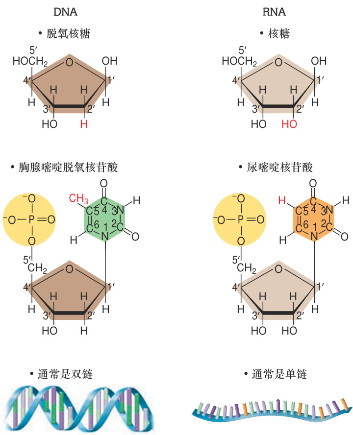  

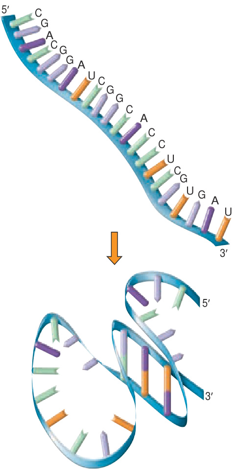  
图6.17　RNA分子的复杂折叠模式。大多数RNA分子是单链的，但是足够柔韧，使得一些区域可以折回并与同一分子的其他部分形成碱基对。  

# 基本概念  

●  DNA以四个碱基的序列携带数字化信息。●  DNA的碱基序列可以在复制或转录过程中从单个解旋的链中读取。此外，专门的蛋白质可识别并结合双链DNA沟槽中的短碱基序列。●  RNA含有核糖而不是脱氧核糖，用尿嘧啶（U）代替胸腺嘧啶（T）；它通常也是单链而不是双链。  

# 6.4 DNA的复制  

# 学习目标  

1. 描述DNA半保留复制的关键步骤。  

2.  解释Meselson-Stahl重氮试验如何表明DNA复制是半保留的。  
3. 总结DNA聚合酶复制DNA所需的关键因素。  
4.  概述DNA复制过程的步骤，以及它们与DNA聚合酶需求的关系。  
5.  讨论细胞保存DNA遗传信息准确性和完整性的三种方法。  

作为科学文献中最著名的忽略事件之一，沃森和克里克在他们1953年的论文末尾提出双螺旋结构：“我们注意到，这种特殊的碱基配对方式立刻显示出一种可能的遗传物质复制机制”。正如第4章所看到的，这种复制必须先于有丝分裂中染色体从一代到下一代的传递过程，它也必须是染色体复制的基础。在每次有丝分裂之前，允许两个子细胞接受来自母细胞的完整的遗传信息。  

# 6.4.1 概述：互补碱基配对确保半保留复制  

在由沃森和克里克假定的复制过程中，双螺旋展开以暴露每条DNA链中的碱基。然后，两条分离的链中的每一条充当模板或分子模具，用于合成新的第二条链（图6.18）。新复制的链以互补碱基的形式与原先的双链上暴露的碱基相对排列。也就是说，原始链上一个位置的A表示在新形成的链上的相应位置上添加了T；原始链上的T表示添加A； 类似地，G对应C，C对应G，如互补碱基配对所要求的那样。  

一旦适当的碱基与其互补序列对齐并形成氢键，酶通过磷酸二酯键将碱基的核苷酸与前一核苷酸连接，最终将全新的核苷酸序列连接成连续的链。这种DNA链分离、互补碱基配对和随后连接成核苷酸链的机制产生两个子双螺旋，每个双螺旋含有一条完整的原始DNA链（该链是保守的）和一条完全新的链［图6.19（a）］。由于这个原因，这种双螺旋复制模式被称为半保留复制：复制过程中每个新双螺旋的一条链从母体分子得来，而另一条链是新合成的。  

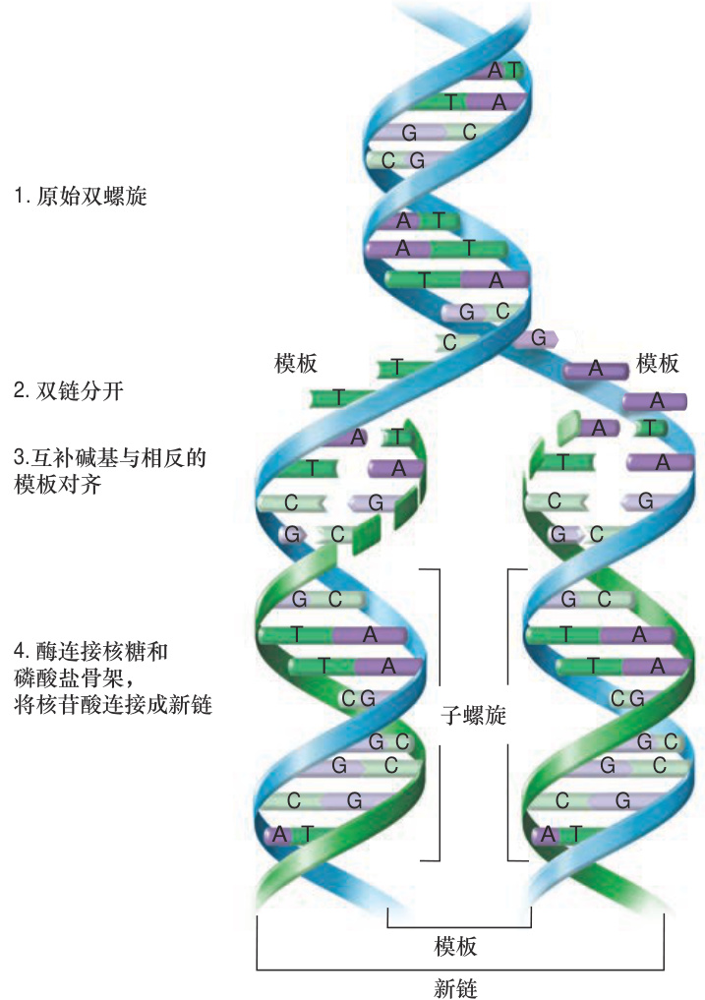  
图6.18　沃森和克里克假设的DNA复制模型。双螺旋的解旋允许两个亲本链分别作为通过互补碱基配对合成新链的模板。最终结果：单个双螺旋转化为两个相同的子双螺旋。  

沃森和克里克的提议并不是唯一可以想象的复制机制。图6.19（b）和（c）说明两种可能的替代方案。通过全保留复制，两个子双螺旋中的一个完全由原始DNA链组成，而另一个螺旋由两个新合成的链组成。通过分散复制，两个子双螺旋都将携带新合成的和原始的核苷酸片段。这些替代方案不太令人满意，因为它们没有立即在碱基序列中复制信息的机制。  

# 6.4.2 重氮实验证实了半保留复制  

1958年，Matthew Meselson和Franklin Stahl进行了一项实验，证实了DNA复制的半保守性质（图6.20）。该实验依赖于能够区分预先存在的亲本DNA和新合成的DNA。为了实现这一点，Meselson和Stahl通过利用DNA的嘌呤和嘧啶碱基含有氮原子的事实来控制掺入新形成的链中的核苷酸的同位素组成。他们在培养基上培养了多代大肠杆菌，其中所有氮都是正常同位素$^{14}\mathrm{N}$ ，以此作为对照。他们又在培养基上培养了多代其他培养物的大肠杆菌，其中唯一的氮源是重同位素$^{15}\mathrm{N}$ 。在重同位素培养基上生长几代后，这些细菌细胞的DNA中基本上所有氮原子都被标记（即含有） $^{15}\mathrm{N}$ 。然后将这些培养物中的一些细胞转移到新培养基中，其中所有氮都是 $^{14}\mathrm{N}$ 。转移后合成的任何DNA都含有较轻的同位素。  

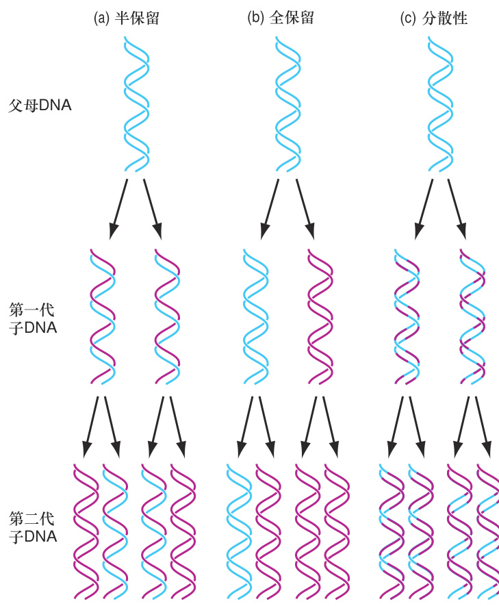  
图6.19　三种可能的DNA复制模型。来自原始双螺旋的DNA是蓝色的；新合成的DNA是品红色的。（a）半保留复制（沃森-克里克模型）。（b）全保留复制：亲本双螺旋保持完整；一对子双螺旋的两条链是新合成的。（c）分散复制：两个子双螺旋的两条链都含有原始和新合成的材料。  

Meselson和Stahl从培养于不同氮同位素培养基的细胞中分离出DNA，然后将这些DNA样品进行平衡密度梯度离心，这是他们刚刚开发的分析技术。在试管中，他们将DNA溶解在高密度氯化铯（CsCl）的溶液中，并在超速离心机中以非常高的速度（约 $50\,000\mathrm{r/min}$ ）旋转这些溶液。在 $2\!\sim\!3$ 天的时间内，在离心力（大约是 $250\,000g$ ）作用下形成稳定的CsCl浓度梯度，具有最高浓度的CsCl在管的底部。管中的DNA在其自身密度等于CsCl的密度的位置处形成一个清晰的条带。因为含有 $^{15}\mathrm{N}$ 的DNA比含有 $^{14}\mathrm{N}$ 的DNA密度更大，纯 $^{15}\mathrm{N}$ DNA将形成比纯 $^{14}\mathrm{N}$ DNA更低的条带，即更接近管的底部（图6.20）。  

如图6.20所示，当具有纯 $^{15}\mathrm{N}$ DNA的细胞转移到$^{14}\mathrm{N}$ 培养基中并允许分裂一次时，所得的第一代细胞的DNA形成的条带密度介于纯 $^{15}\mathrm{N}$ DNA和纯 $^{14}\mathrm{N}$ DNA之间。一个合乎逻辑的推论是这些细胞中的DNA含有等量的两种同位素。该发现使全保留模型无效，该模型预测的结果是仅出现纯 $^{14}\mathrm{N}$ 和纯 $^{15}\mathrm{N}$ 而没有中间的条带。相反，从 $^{14}\mathrm{N}$ 培养基中经历第二轮分裂的第二代细胞中提取的DNA产生两个可观察的条带，一个密度对应于等量的 $^{15}\mathrm{N}$ 和 $^{14}\mathrm{N}$ ，另一个密度为纯 $^{14}\mathrm{N}$ 。该结果使分散模型无效，该模型预测只有一个条带在原始生成的两个条带之间。  

Meselson-和Stahl的观察结果只能与半保留复制的推论一致。在从 $^{15}\mathrm{N}$ 转移到 $^{14}\mathrm{N}$ 培养基后的第一代中，每个子DNA分子的两条链中的一条带有重同位素标记；另一条是新合成的链，携带较轻 $^{14}\mathrm{N}$ 同位素，密度介于$^{15}\mathrm{N}$ DNA和 $^{14}\mathrm{N}$ DNA之间的条带表示该链中同位素进行了混合。在转移后的第二代中，一半DNA分子具有一条 $^{15}\mathrm{N}$ 链和一条 $^{14}\mathrm{N}$ 链，而剩余的一半携带两条 $^{14}\mathrm{N}$ 链。两个可观察的条带（一个在混合位置，另一个在纯 $^{14}\mathrm{N}$ 位置）反映了这种混合。通过确认半保留复制的预测，Meselson-Stahl实验反驳了全保留复制和分散复制的替代方案。我们现在知道DNA的半保留复制几乎是普遍存在的。让我们准确地考虑在有丝分裂细胞周期中半保留复制与真核细胞中染色体结构的关系（回顾  

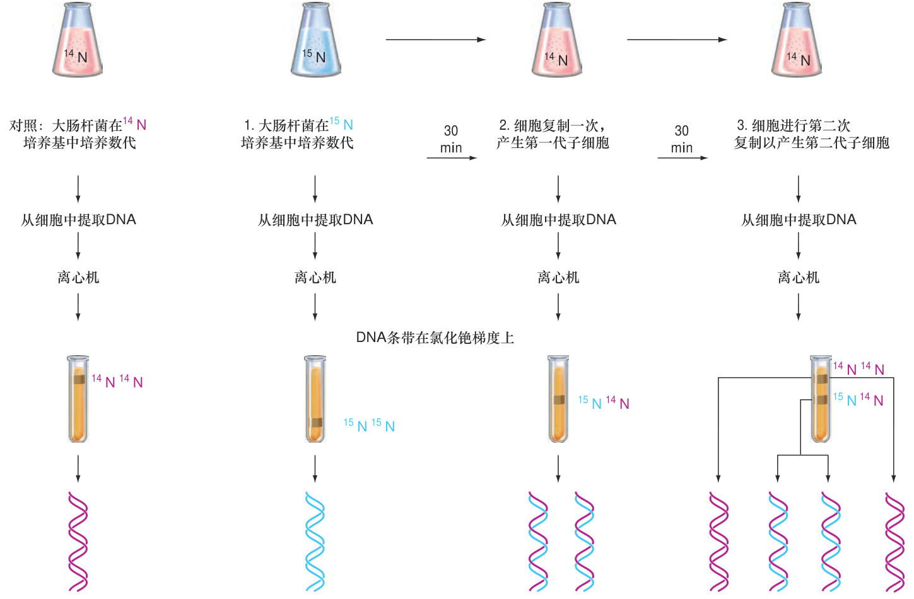  

图6.20　Meselson-Stahl实验如何证实半保留复制。（1）大肠杆菌细胞在重 $^{15}\mathrm{N}$ 培养基中生长。（2）和（3）将细胞转移到 $^{14}\mathrm{N}$ 培养基中并使其分裂一次或两次。当来自这些细胞复制产物中的每一种的DNA在氯化铯梯度中离心时，提取的DNA的密度符合半保留复制模式的预测，如图的底部所示，其中蓝色表示重DNA，品红表示轻DNA。结果与DNA复制的全保留和分散模型不一致（与图6.19比较）。  

图4.9）。在间期早期，每个真核染色体含有单个连续的线性双螺旋DNA。  

之后，在间期的S期部分，细胞半保留地复制双螺旋；在这种半保留复制之后，每个染色体由两个在其着丝粒处连接的姐妹染色单体组成。每个姐妹染色单体是DNA的双螺旋，具有一条亲本DNA链和一条新合成的DNA链。在有丝分裂结束时，每一个子细胞从母细胞接收一套姐妹染色单体。这个过程在有丝分裂细胞分裂期间保留了等数量、同一套染色体，因为两个姐妹染色单体在碱基序列上彼此相同，并且与原始亲本染色体相同。  

# 6.4.3 DNA聚合酶具有严格的操作要求  

沃森和克里克的半保留复制模型是一个很容易理解的概念，但它发生的生化过程非常复杂。任何时候将DNA和核苷酸混合，复制都不会自发发生。相反，它发生在细胞周期的一个精确时刻，取决于相互作用的调控元件网络，需要相当大的能量输入，并涉及细胞分子机制的复杂阵列，包括关键酶DNA聚合酶。这些突出的细节主要是在Arthur Kornberg的实验室中推断出来的，他因此工作而获得诺贝尔奖。Kornberg小组从大肠杆菌的复制过程中对其中的各个成分进行了纯化。值得注意的是，它们最终能够在含有纯化酶和DNA模板、引物（定义见后）和核苷三磷酸的试管中引发活细胞外特定遗传信息的复制。  

尽管DNA复制的生物化学过程在单一细菌物种被阐述明了，但其基本特征是保守的，就像所有生物体内的DNA结构一样。在自然界中发现，合成每个DNA分子所需要的能量都来自于四种为DNA链形成提供碱基的脱氧核糖核苷三磷酸（dATP、dCTP、dGTP和dTTP；或作为通用术语的dNTP）相关的高能磷酸键。如图6.21所示，这种保守的生物化学特征意味着DNA合  

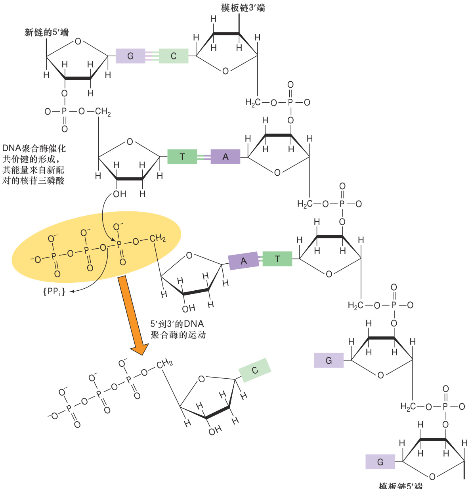  

图6.21　DNA以 $5^{\prime}{\rightarrow}3^{\prime}$ 的方向进行合成。模板链显示在右侧，与左侧合成的新DNA链反向平行。这里，dATP的游离分子与模板链上的互补胸腺嘧啶碱基形成氢键。DNA聚合酶（黄色）切割第一和第二磷酸基团之间的dATP。该裂解释放的能量用于前一核苷酸的末端3′-OH基团与dATP底物的第一个磷酸之间形成共价磷酸二酯键。焦磷酸盐（PPi）作为副产物释放  

成只能通过向现有多核苷酸的3′端添加核苷酸来进行。获得通过切断dNTP底物分子的三磷酸酯臂所释放的能量，DNA聚合酶催化形成新的磷酸二酯键。一旦形成该键，酶就继续通过互补碱基配对结合下一个核苷酸。  

除了DNA聚合酶之外，还需要许多蛋白质来参与DNA复制。但是，将在下面看到DNA复制最重要的特征反映了DNA聚合酶作用的三个严格要求（图6.22）。  

（1）四个dNTP。  

（2）单链模板。必须解开双链DNA，并且DNA聚合酶沿着模板链以 $3^{\prime}{\rightarrow}5^{\prime}$ 方向移动。  

（3）具有游离3′羟基的引物。DNA聚合酶连续向增长的DNA链的 $3^{\prime}.$ 端添加核苷酸（也就是说，DNA聚合酶仅在 $5^{\prime}{\longrightarrow}3^{\prime}$ 方向合成DNA）。然而，DNA聚合酶不能在新链中建立第一个链接。因此，聚合必须从引物开始，引物是一些短的单链DNA或RNA分子，其长度为几个核苷酸长，与模板链的一部分碱基配对。  

# 6.4.4 DNA复制是一个严格控制的复杂过程  

DNA聚合酶形成磷酸二酯键只是活细胞内发生DNA复制高度协调过程的一个组成部分。如图6.23所示，整个分子机制有两个阶段：起始，蛋白质打开双螺旋并准备进行互补碱基配对；延伸，蛋白质将正确的核苷酸序列连接成新的DNA双螺旋。由于聚合酶功能的严格生化机制，DNA复制变得复杂。DNA聚合酶只能通过向DNA链的3′羟基添加核苷酸来延长现有的DNA链，如图6.21和图6.22所示。然而，在图6.23（a）中称为复制叉的两个Y型区域，DNA的反向平行链逐渐展开。结果，一条新合成的链（前导链）可以连续生长到每个叉口处。但是另一条新的链（后随链），由同一个叉上的另一个模板链合成，只能随着越来越多的模板在叉上展开，生成被称为冈崎片段的片段［图6.23（b）］。这些片段必须在此过程的后期连接在一起。  

如图6.23所示，DNA复制依赖于许多不同蛋白质的协调活性，包括两种不同的DNA聚合酶，称为polⅠ和polⅢ（pol是聚合酶的缩写）。PolⅢ在产生新的互补DNA链中起主要作用，而polⅠ填补了新合成的冈崎图6.22　DNA聚合酶的要求。为了合成DNA，DNA聚合酶需要单链DNA模板，可以是RNA或DNA的引物，以及游离的脱氧核糖核苷三磷酸（dNTP）。DNA聚合酶按照模板中互补核苷酸的指示，依次将核苷酸添加到引物的3′端。  

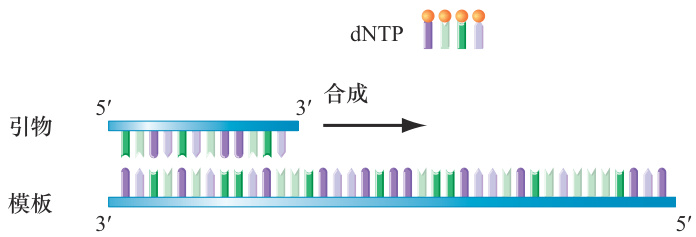  

片段之间的间隔。DNA解旋酶解开双螺旋有助于启动过程。一组特殊的单链DNA结合蛋白可以保持DNA解旋状态。称为引发酶的一种酶，产生RNA引物以启动DNA合成。在延伸期间，DNA连接酶将冈崎片段连接在一起。  

生物化学家和遗传学家花了很多年才发现许多蛋白质的紧密协作如何推动DNA复制。今天，科学家认为这种程序化的分子相互作用是细胞中许多生化过程的基础。在这些过程中，一组蛋白质中的每个蛋白质都执行特殊功能，如同装配线上的工人，合作制造复杂的大分子。  

从复制起点开始的DNA解旋产生两个叉状结构［图6.23（a）］。因此，复制通常是双向的，随着展开的进行，复制叉在相反的方向上移动。在每个分支处，聚合酶复制两个模板链，一个是连续的，另一个是不连续的冈崎片段［图6.23（b）］。  

在环状的大肠杆菌染色体中，只有一个复制起点［图6.24（a）］。当它的两个分叉以相反的方向移动时，在复制起点周围的圆圈的大约一半处的指定终止区域相遇，复制完成［图6.24（d） $\sim$ （f）］。  

毫不奇怪，复制叉上双螺旋的局部展开会影响整个染色体。在大肠杆菌里，共价闭合环状染色体上的展开部分会使分子的其余部分变形和扭曲［图6.24（b）］。过度缠绕则减少了转向B型DNA的螺旋数量。染色体通过扭转自身来适应扭曲的变形。你可以通过设想一根卷起来的电话线在使用时过度缠绕在一起来想象这种效果。DNA分子的额外扭曲称为超螺旋。复制叉的移动导致更多超螺旋。  

如果不加以控制，这种累积的超螺旋将使染色体紧紧缠绕在一起，以至于阻碍复制叉的进展。一组被称为DNA拓扑异构酶的酶有助于通过切割一条或两条DNA链来解开超螺旋，即切割连接两个核苷酸之间的糖-磷酸骨架［图6.24（c）］。就像电话线可以解开并恢复其正常的卷曲模式一样，超螺旋DNA链在解开之后，可以彼此相对旋转，从而恢复每10.5个核苷酸对一个螺旋转角的正常卷曲密度。因此，拓扑异构酶的活性通过防止超螺旋在复制叉前面积累而允许在整个染色体上进行复制。复制环状双螺旋有时会产生缠绕的子分子，其完全分离也取决于拓扑异构酶活性［图6.24（e）和（f）］。  

在更大的真核细胞线性染色体中，双向复制大致如上所述，但是开始于许多复制起点。多个起点确保在分配的时间内（即在细胞周期的S期间内）完成复制。另外，因为后随链是由冈崎片段组合形成的，所以线性染色体末端的复制也存在问题。但是真核生物染色体已经进化出了称为端粒的特殊终止结构，这确保了每个线性染色体两端的维持和精确复制（第12章介绍了真核生物染色体复制的细节）。  

# 特色插图6.23  

（a）起始：准备双螺旋以用作模板。起始开始于在称为复制起点的特定短核苷酸序列处解旋双螺旋。从起始蛋白开始，几种蛋白质与起点结合，启动子吸引DNA解旋酶，解旋双螺旋。DNA区域的开放产生两个称为复制叉的Y形区域，一个位于未缠绕区域的任一端，即复制泡。单链将作为合成新DNA链的模板。  

称为DNA聚合酶Ⅲ的酶复合物将核苷酸添加到预先存在核酸链的3′端。对现有核酸链的要求意味着必须有其他物质来启动即将构建的新核酸链。在活细胞中，其他物质是短链的RNA，称为RNA引物，由引发酶合成。  

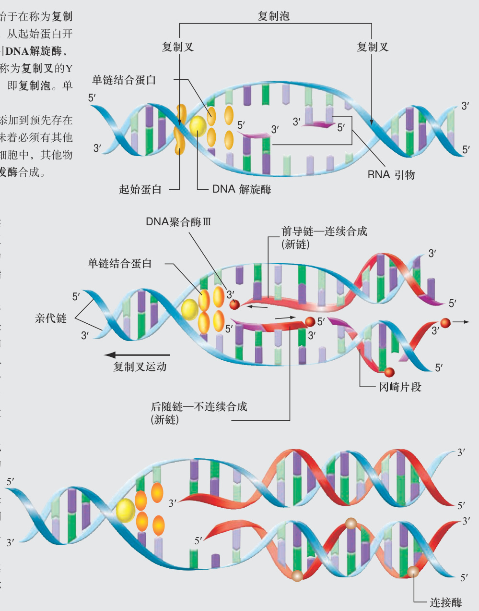  
DNA复制的机制  

（b） 延伸：将正确的核苷酸序列连接成连续的新DNA链。通过互补碱基配对，模板链中碱基的顺序指定新形成链中碱基的顺序。DNA聚合酶Ⅲ通过形成磷酸二酯键催化新核苷酸与前一核苷酸的连接，该过程称为聚合。DNA聚合酶Ⅲ首先将正确配对的核苷酸连接到RNA引物的3′羟基末端，然后继续将适当的核苷酸添加到生长链的3′端。结果，正在构建的DNA链以 $5^{\prime}{\rightarrow}3$ 方向生长，而DNA聚合酶分子实际上沿着反向平行模板链以 $3^{\prime}{\rightarrow}5^{\prime}$ 方向移动（以下三个图仅显示左复制叉中发生的事件）。  

随着DNA复制的进行，解旋酶逐渐地打开双螺旋。DNA聚合酶与叉结构的移动方向相同，以合成前导链。然而，第二个新DNA链，即后随链的合成是有问题的。后随链的极性与前导链相反，然而DNA聚合酶仅在 $5^{\prime}{\rightarrow}3^{\prime}$ 方向上起作用。那么它们是怎么工作的呢？答案是后随链在正常的 $5^{\prime}{\rightarrow}3^{\prime}$ 方向上不连续地合成大约1000个碱基的小片段，称为冈崎片段。  

# 6.4.5 必须保持遗传信息的完整性  

DNA是大多数生物体的结构和功能所需的大量信息的唯一储存库。在某些物种中，这些信息可能存在多年，或者在被要求产生后代之前可能会多次复制。在储存期间和配子产生之前，生物体必须保护信息的完整性，因为即使是最微小的变化也可能带来灾难性的后果，如引起严重的遗传疾病甚至死亡。每种生物都以三种重要方式确保其DNA的信息保真度。  

·冗余。双螺旋中的任何一条链都可以指定另一条链的序列。这种冗余为检查和修复由于存储期间的化学改变或复制机制的罕见故障引起的错误提供了基础。  

·细胞复制机制的非凡精确度。进化已经完善了DNA复制的细胞机制，使得复制过程中的错误极为罕见。例如，DNA聚合酶已获得校对能力，以防止不匹配的核苷酸加入一条新的DNA链； 因此，只有当游离核苷酸的碱基与亲本链上的互补碱基能正确配对时，游离的核苷酸才会在生长的链上黏附。我们将在第7章中研究这种校对机制。  

  

(c)                DNA  

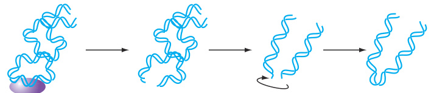  
1. 2. DNA     3.       4. DNA  

(d)  

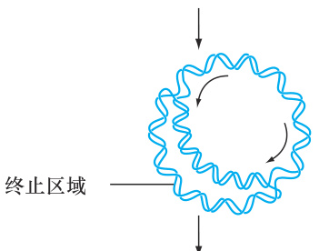  

(e)(f)图6.24　环状细菌染色体的双向复制：概述。（a）和（b）复制从单一来源向两个方向进行，产生两个复制叉，它们围绕圆圈以相反方向移动。在复制叉处局部解开DNA会在复制叉前面的DNA中产生超螺旋扭曲。（c）拓扑异构酶的作用有助于减少这种超螺旋。（d）和（e）当两个复制叉在终止区域相遇时，整个染色体完成复制。（f）拓扑异构酶分离两个子代染色体。  

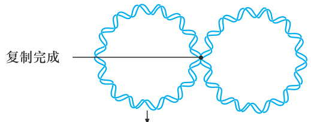  

  

·修复DNA化学损伤的酶。该细胞中有一系列用于修复几乎所有可以想象的化学损伤的酶。我们将在第7章中描述这些酶是如何进行校正的。  

所有这些保障措施有助于确保DNA中包涵的信息在一代代细胞的传递过程中完好无缺。然而，正如接下来我们看到的，现有信息的新组合会由于重组而自然产生。  

# 基本概念  

·DNA分子通过半保留复制进行复制；两条DNA链分开，每条链都可以作为合成新互补链的模板。  
·DNA聚合酶通过在生长的DNA链的 $3^{\prime}$ 端连续添加核苷酸，以 $5^{\prime}{\rightarrow}3^{\prime}$ 方向合成DNA。  
·DNA聚合酶需要： $\textcircled{\scriptsize{1}}$ 供应四种脱氧核糖核苷三磷酸；$\textcircled{2}$ 单链DNA模板； $\textcircled{3}$ 具有游离 $3^{\prime}$ 羟基的DNA或（在细胞中）RNA的引物。  
·在DNA复制叉上，DNA聚合酶连续合成一条新链（前导链），而另一条（后随链）合成为多个冈崎片段，然后通过DNA连接酶连接。  
·DNA中信息的完整性和准确性通过两条链中的冗余、合成DNA的酶的精确度，以及修复DNA损伤的酶的作用来保持。  

# 6.5 DNA水平的同源重组  

# 学习目标  

1.  总结来自四分染色体分析的证据，证实重组发生在四链阶段并涉及相互交换。  
2.  解释我们如何知道DNA在重组过程中发生的断裂和重新连接现象。  
3. 列出分子水平重组的关键步骤。  
4.  解释为什么重组事件并不总是导致染色体互换。  
5.  描述异源双链区域的错配修复如何导致真菌四联球菌中的基因转换。  

突变是所有新等位基因的最终来源，是发生在染色体上任何特定核苷酸对的罕见现象。因此，在有性繁殖物种中产生基因组多样性的最重要机制是已经存在的等位基因的新组合的产生。这种类型的多样性增加了在变化环境中生存和繁殖时，至少一些交配双亲的后代将有机会继承最适合的等位基因。  

已存在的等位基因的新组合来自两种不同类型的减数分裂事件： $\textcircled{\scriptsize{1}}$ 自由组合，其中每对同源染色体通过随机纺锤体附着而不受其他对的影响而分离； $\textcircled{2}$ 交换，其中两个同源染色体部分交换。自由组合可以产生在不同染色体上携带新基因等位基因组合的配子，但对于同一染色体上的基因，单独的自由组合将仅保留现有的等位基因组合。然而，交换可以产生连锁基因的新等位基因组合。因此，交换的进化补偿了染色体内基因连锁的显著缺点。  

历史上，遗传学家使用重组这个术语来表示通过任何方式产生新的等位基因组合，包括自由组合。但在本章的其余部分，我们更狭义地使用重组来表示通过同源染色体之间的遗传交换而产生的新等位基因组合。在本讨论中，我们将交换的产物称为重组体，亦即携带来自不同同源等位基因的混合染色体。  

在真核生物中，重组除了产生新的等位基因组合之外，还具有额外的基本功能：它有助于确保在减数分裂期间染色体正确的分离。第4章已经描述了交换与姐妹染色单体粘连相结合如何在前期Ⅰ和中期Ⅰ期间将同源染色体保持为二价体。如果同源物不能重组，它们通常不能将自己定向到减数分裂的相反极点，这将导致不分离。  

当我们在分子水平上检查重组时，我们首先看一下建立交换基本参数的实验。然后我们将描述交换事件的分子细节。  

# 6.5.1 四分染色体分析说明了重组的关键方面  

你在第5章中看到，一些真菌如酵母和脉孢菌产生的子囊在一个囊中含有单个减数分裂的所有产物，即四分染色体。对这些四分体的分析使遗传学家能够推断出关于重组的基本信息。  

# 1. 证据表明重组发生在四分体阶段  

回想一下，在四分染色体分析中，两个基因之间联系的标志是产生的NPD四分体很少：PD及T的数量总是大于NPD的数量。这一结果是有道理的，因为所有SCO和一些DCO减数分裂产生T，而只有1/4的稀有DCO产生NPD（回顾图5.23和图5.24）。  

在杂交中实际观察到的极少数NPD确定重组发生在染色体复制后，每对同源物存在4个染色单体［图6.25（a）］。如果重组在染色体复制之前发生，则每个单独的交换事件（即每个SCO）将产生四个重组染色单体并产生NPD四分体；这样用于重组的模型将不能解释任何T四分体［图6.25（b）］。  

# 2. 证据表明重组通常是相互的  

第5章的讨论假设重组是相互的，同源染色体的非姐妹染色单体交换部分是相等的。也就是说，无论如何，从一个染色单体中丢失，从另一个中获得，反之亦然。我们知道，从四分染色体分析的结果，可以看出这种假设是合理的。  

假设你在A B和a b酵母菌株的杂交中跟踪连锁基因A和 $B$ 。如果在减数分裂期间发生的重组是相互的，则具有重组子代的每个四分体应该包含相同数量的两类重组体。观察结果证实了这一预测：每个T 四分体携带一个A b和一个a B孢子，而每个NPD四分体含有两个每种类型的重组体（回想图5.24）。因此，我们可以得出结论：减数分裂重组几乎总是相互的。我们说“总是”，因为正如你将在本章后面看到的那样，很少有例外情况，其中的四分体不能被分类为PD、NPD或T。这些特殊的四分体帮助科学家理解重组机制的关键特征。  

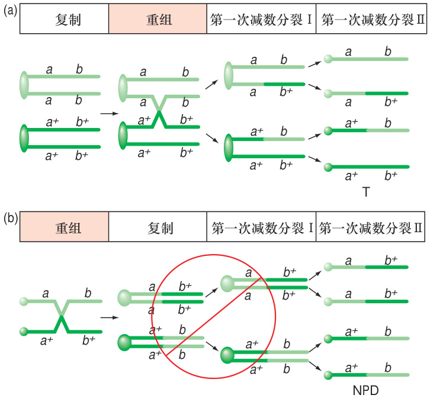  
图6.25　染色体复制后的重组。（a）因为重组在染色体复制后发生，所以含有重组孢子的大多数四分体是T。（b）经证实的模型。如果在染色体复制之前发生重组并且假设两个基因相关联，则含有重组孢子的大多数四分体将是NPD而不是T。  

# 6.5.2 重组过程中DNA分子断裂和重新连接  

当通过光学显微镜观察时，带有物理标记的重组染色体似乎是由两条同源染色体在重新连接时发生断裂和部分交换而形成的（见图5.7）。因为重组染色体与所有其他染色体一样，都是由长DNA分子组成的，合乎逻辑的期望是它们应该在分子水平上显示出这种断裂和重新连接的一些物理迹象。为了评估这一假设，研究人员选择了一种细菌病毒Lambda作为模式生物。Lambda在这项特殊研究中具有独特的实验优势：它的重量约为DNA的一半，因此整个病毒的密度反映了其DNA的密度。  

实验技术在原理上与Meselson和Stahl用于监测DNA复制过程中DNA密度变化的技术相似。然而，在这种情况下，研究人员（Matthew Meselson再次与另一位合作者Jean Weigle合作）监测了DNA密度以观察重组。他们使用了两种基因标记的细菌病毒株来跟踪重组。他们在具有碳和氮的重同位素的培养基中培养野生型菌株（ $\textit{A B}$ ），并且在含有这些原子的正常轻同位素的培养基中培养具有两个基因（ $a~b$ ）突变的菌株（图6.26）。  

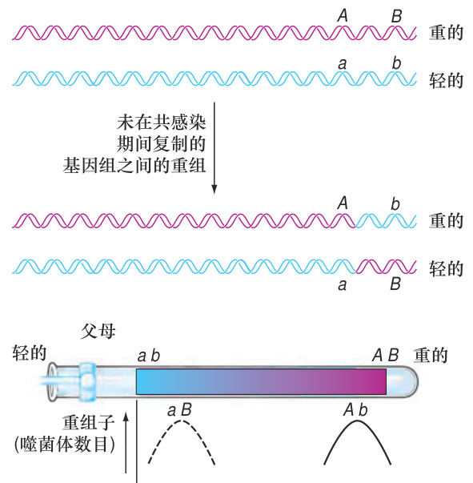  
图6.26　重组过程中DNA分子断裂并重新连接。Meselson和Weigle用两种不同的遗传标记的噬菌体 $\lambda$ 菌株感染大肠杆菌细胞，这些菌株先前在重（ $^{13}\mathrm{C}\mathcal{\vec{k}}|^{15}\mathrm{N}$ ）或轻（ ${}^{12}\mathrm{C}\mathcal{\vec{k}}||{}^{14}\mathrm{N}$ ）同位素存在下生长。在轻培养基上生长后，它们在CsCl密度梯度上旋转后代噬菌体。一些 $\mathcal{A}\,b$ 基因重组体（但几乎没有 $^{a\,B}$ 重组体）具有与A B亲本几乎相同的重密度。  

然后，Meselson和Weigle感染了在正常（轻同位素）培养基中生长的细菌细胞，每种细胞都感染了两种病毒株。在允许噬菌体复制、重组并将其重新包装成病毒颗粒后，实验者分离了从裂解细胞释放的病毒并按密度梯度来分析它们。  

对于实验设计来说，重要的是基因A和B都接近病毒染色体的一端（图6.26）。这个想法基于一些原始的噬菌体染色体在轻同位素培养基中进行复制之前会经历重组。  

例如，一些重A B染色体会与轻a b染色体重组。如果通过双链DNA分子的断裂和再结合发生交换，那么来自裂解细胞的一些A b重组噬菌体的密度几乎与A B的亲本噬菌体的密度一样重（图6.26）。相反，基因型a B的重组体几乎不由重DNA组成。  

因为噬菌体已经在轻质培养基中复制，所以可以在整个梯度中发现重组噬菌体。然而，关键结果是，确实在最重的密度附近发现了大部分A b重组体及A B亲本分子。只有当A b染色体主要由双螺旋重DNA组成时才有意义，正如图6.26所示的染色体断裂和再结合所预期的那样。  

# 6.5.3 在分子水平上交换：一个模型  

大部分在酵母中进行的生化实验使我们了解了减数分裂重组的分子机制。研究人员发现，蛋白质Spo11在启动酵母中的减数分裂重组中起着至关重要的作用，它与线虫、植物、果蝇和哺乳动物中减数分裂重组所必需的蛋白质同源。这一发现表明，图6.27中详细介绍的重组机制——称为双链断裂修复模型，在整个真核生物的进化过程中得到了保护。  

在图中，我们关注两个非姐妹染色单体，即使重组发生在四分体阶段。此外，我们使用重组事件这一术语来描述Spo11启动的分子过程，无论它是否导致交换。正如你将要看到的，重组事件的分子细节是，交换（非姐妹染色体的双链DNA的相互交换）仅在某些时候由Spo11介导的过程中产生。  

# 1. 启动重组  

当Spo11在四种染色单体中的一种中发生双链断裂时，减数分裂重组事件开始（图6.27，步骤1）。接下来，在一个叫做切除的过程中，一个外切核酸酶（一种从DNA分子末端去除核苷酸的酶）从裂解的两侧降解一条DNA链，留下3′单链尾（图6.27，步骤2）。在下一组称为链入侵的反应中，一条单链尾取代了非姐妹染色单体上的反应链（图6.27，步骤3）。链的侵入导致异源双链区的形成（来自希腊语“异构”，意思是其他或不同），其中DNA分子由来自每个非姐妹染色体的一条链组成（图6.27，步骤3）。  

在图6.27的步骤3结束时形成的分子中间体可能有两种不同的命运。步骤 $4\!\sim\!6$ 中描述的一条路径导致交换。步骤 $4^{\circ}{\sim}5^{\circ}$ 中所示的第二种途径不产生交换，但所得的染色单体之一具有异源双链区。  

# 2. 交换路径  

在步骤3中被链入侵取代的链现在与另一个3′单链尾形成第二个异源双链体（图6.27，步骤4）。DNA合成延长的两个3′尾取代了被外切核酸酶降解的DNA，DNA连接酶重新密封DNA骨架（图6.27，步骤4）。结果是两个非姐妹染色单体在两个霍利迪连接体互锁（图6.27，步骤5）。霍利迪体彼此远离，从而扩大了它们之间的异源双链——一个称为分支迁移的过程（图6.27，步骤5）。  

现在，两个非姐妹染色单体必须分开。每个霍利迪连接体，两个染色单体通过切割和连接两条DNA链而分离。如图6.27（步骤6）所示，当切割不同的DNA链并在每个连接体通过解离酶和连接酶重新连接时，产生交换（和侧翼等位基因的重组）。因为解离酶几乎总是切割所有四条DNA链，所以双霍利迪连接体处的分解通常会导致交换。  

# 3. 非交换途径  

由Spo11启动的重组也可以通过称为抗交换解旋酶的酶的作用而不产生交换。解旋酶有助于将非侵染性染色单体中的入侵链解开，从而中断霍利迪连接体的形成（图6.27，步骤4’）。注意，尽管该途径的最终结果是没有交换（步骤5’），但是所得的染色单体之一仍然包含异源双链体区域。  

# 特色插图6.27  

# 分子水平的重组模型  

步骤1     双链断裂形成。在减数分裂前期，Spo11蛋白通过切割DNA两条链上相邻核苷酸之间的磷酸二酯键，在其中一条染色单体上产生双链断裂（注意，只显示了两个正在进行重组的非姐妹染色单体）。  

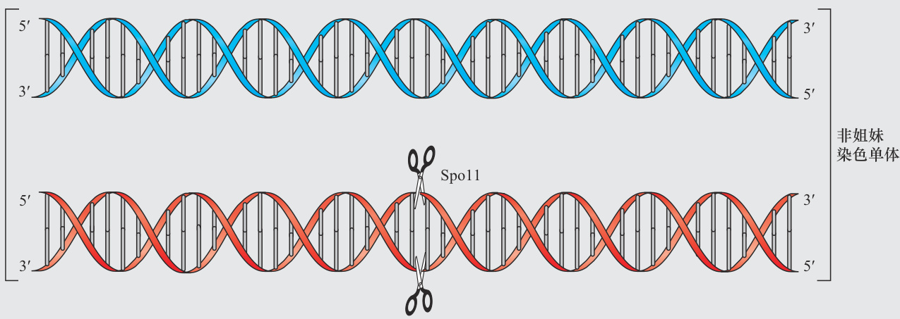  

步骤2     切除。外切核酸酶降解断裂每侧的5′端以产生两个3′单链尾。  

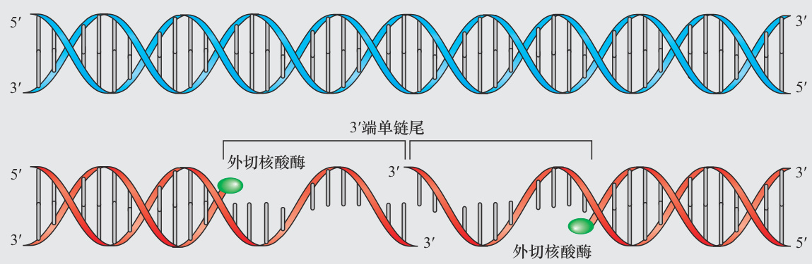  

步骤3     第一条链入侵。蛋白质Dmc1（橙色椭圆形）与其他蛋白质（未显示）合作，帮助其中一条尾侵入并打开另一条染色单体的双螺旋。然后Dmc1沿着双螺旋移动，将其打开。入侵链扫描瞬间展开的DNA双链体中的碱基序列。一旦发现足够长度的互补序列，两条链就形成由数十个氢键维持的异源双链体。被入侵尾部置换的链形成D环（用于置换环），其通过复制蛋白A（RPA）（黄色椭圆）的结合而稳定。  

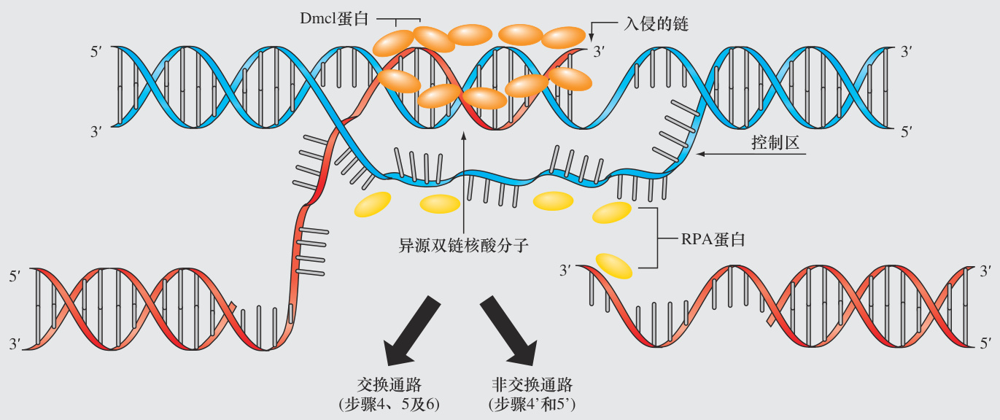  

# 特色插图6.27（续）  

# 交换途径  

步骤4     形成双霍利迪连接体。添加到入侵3′尾的新DNA（顶部的蓝点）扩大了D环，直到被置换链上的单链碱基与非姐妹染色单体上的3′尾形成互补碱基对。添加到后一尾部的新DNA（底部的蓝点）在底部染色单体上重新产生DNA双链体。在原始断裂的每一侧，新合成的DNA的3′端与切除后留下的5′端相邻，并且DNA连接酶形成磷酸二酯键以重新连接DNA链而不损失或获得核苷酸。由此产生的X形结构被称为霍利迪（Holliday）连接体，以科学家Robin Holliday的名字命名，是他首先提出X形结构作为重组的关键中间体存在。  

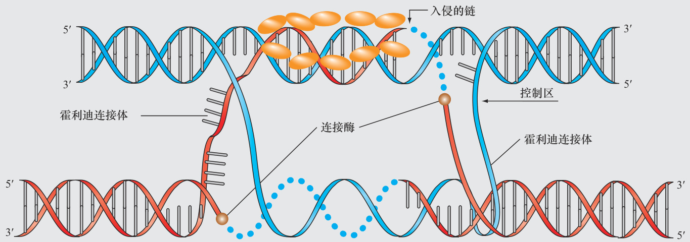  

步骤5     分支迁移。两条入侵的链倾向于通过与它们侵入的亲本双螺旋的互补链碱基配对而形成拉链。DNA双螺旋在这个双拉链动作前打开，沿着图中箭头的方向移动，两个新生成的异源双链分子在它后面重新缠绕。因此，分支迁移将两个DNA分子的异源双链区域从数十个碱基对延长至数百或数千个。  

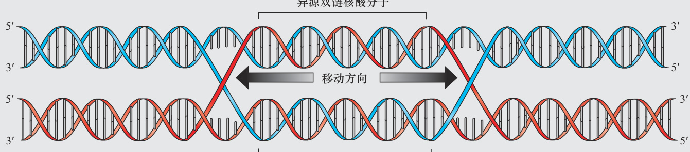  

步骤6     双霍利迪连接中间体的分解。两个互锁的非姐妹染色单体必须解开。被称为解离酶的酶（未显示）在每个霍利迪连接处通过断裂两条DNA链来实现分离； 随后通过DNA连接酶（未显示）重新连接链。每个连接处都有不同的蓝色和红色链被切割；一个连接处在由黄色箭头指示的链上被切割，并且由绿色箭头指示的链在另一个连接处被切割。在每个连接处，剪切并重新连接链，使得红色DNA连接到蓝色DNA，反之亦然。交换结果是因为四股中的每一股都被切割一次并重新加入。注意在底部的图中，两种重组染色单体都具有短的异源双链区。  

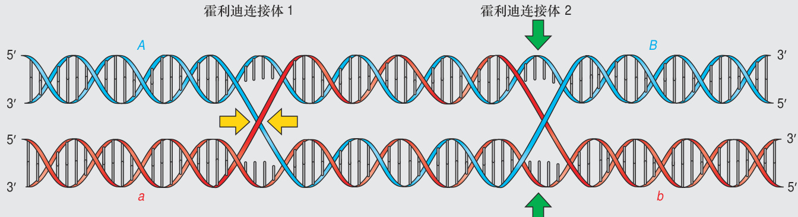  

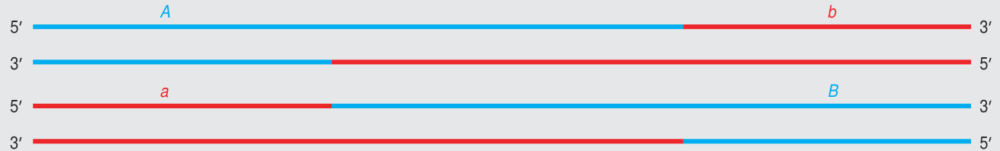  

# 特色插图6.27（续）  

# 非交换途径  

步骤4’     链位移和退火。正如在交换途径的步骤4中，使用非姐妹染色单体（蓝色）作为模板，首先通过DNA合成（蓝点）延伸入侵链（箭头）。但接下来，一种抗交换解旋酶（未显示）解开入侵链和非姐妹染色单体从而产生中间体。  

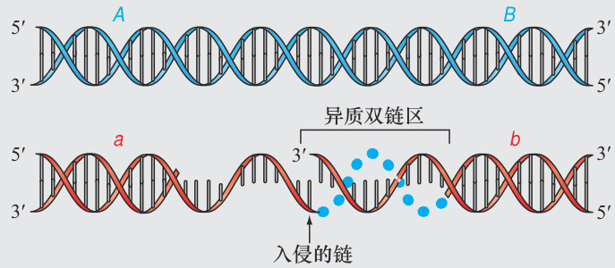  

步骤5”DNA合成和连接。通过DNA合成（红点）填充双链DNA序列中的剩余间隙，并且DNA连接酶形成磷酸二酯键以重新连接DNA链。结果是没有交换，但是异源双链区仍然保留在一个染色单体中。  

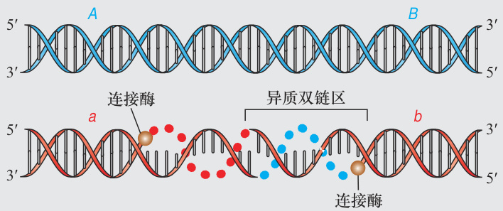  

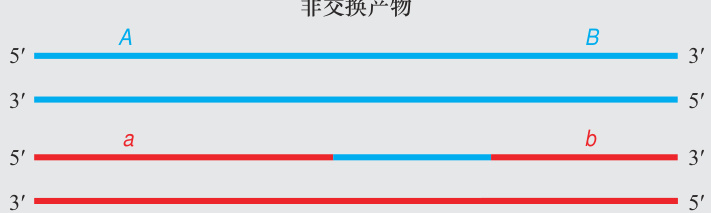  

# 4. 控制重组发生的位置和时间  

只有经过减数分裂的细胞才能表达Spo11蛋白，这是造成减数分裂的重组率比在有丝分裂中发现的高出几个数量级的原因。在酵母和人类中，已经绘制了减数分裂中双链的断裂图谱，很明显Spo11更倾向于切割某些基因组序列，从而导致交换的热点（回想图5.17）。  

与减数分裂细胞不同，有丝分裂细胞通常不会启动重组作为正常细胞周期计划的一部分；相反，有丝分裂细胞中的重组是DNA受到环境的破坏的结果。正如你将在第7章中看到的那样，例如，X射线和紫外线会导致双链断裂或单链切口。细胞的酶促机制可用于修复受损的DNA位点，而重组是该过程的副作用。  

# 5. 摘要：目前同源重组分子模型的证据  

减数分裂重组的双链断裂修复模型于1983年提出，远在任何重组中间体的直接观察之前。科学家现在已经在分子水平上看到了双链断裂的形成，这些断裂的切除产生了3′单链尾，以及双霍利迪连接体结构。已经建立的双链断裂修复模型，解释了从遗传和分子研究中获得的大部分数据，以及从遗传实验中推导出的重组的6个特性。  

（1） 同源物理断裂，部分交换并重新连接。用噬菌体λ进行的Meselson-Weigle实验为重组的这一关键方面提供了重要证据（回顾图6.26）。  

（2） DNA复制后，非姐妹染色单体之间发生交换。当连锁基因的酵母通过双杂交形成孢子时，T四分体的出现和NPD的稀有性只有重组发生在四链时才有意义，而不是双链阶段（回顾图6.25）。  

（3） 破损和修复产生重组的互逆产物。酵母和脉孢菌四分体几乎总是NPD、PD或T，因为互逆重组体存在于相同的子囊中。  

（4） 重组事件可以发生在DNA分子的任何地方。如果观察了足够多的后代，则可以在各种不同的实验生物中的任何一对基因之间观察到交换。  

（5） 交换的精确性（不获得或者丢失核苷酸对）可以防止在该过程中发生突变。遗传学家最初通过观察重组通常不会引起突变这一现象来推断交换的精确性；今天，我们通过DNA序列分析知道这是正确的。  

（6） 基因转换（杂合子中的一个等位基因转换为另一个的物理变化）有时是由于重组事件而发生。在下一节中，你将看到如何通过在重组事件期间所形成的异源双链现象来解释基因转换。  

# 6.5.4 异源双链DNA修复可导致基因转换  

正如孟德尔所预测的那样，酵母四分体分析使我们能够看到等位基因等量地分离成配子。大多数情况下，在一个特定的基因座上，二倍体杂合子产生两个含有一个等位基因的孢子，以及两个含有另一个等位基因的孢子（ $2:2$ 分离）。在一个子囊中，有了同时检测一个减数分裂过程中所有四个产物的机会，从而发现了四分体很少表现出的 $3:1$ 或 $1:3$ 的分离模式，这一现象打破了孟德尔的第一定律。这些罕见的四分体是重组过程中异源双链体形成的结果。产生这些四分体的现象被称为基因转换。  

# 1. 异源双链体中碱基错配  

用于重组的分子模型包括异源双链区的形成，这是因为重组DNA分子的两条链不会断裂并且重新加入双螺旋上的相同位置。此外，通过分支迁移，异源双链区域可以扩展到数百甚至数千个碱基对。异源双链的名称不仅因为两条DNA链来自不同的非姐妹染色单体，而且因为链的碱基配对可能产生错配，使其中的一个或几个碱基不互补。如果异源双链区域在基因内并且基因的母本和父本等位基因不同，则可能导致基因转换。  

# 2. 通过错配修复进行基因转换  

错配的异源双链分子不会持续很长时间。相同的DNA修复酶可以修复复制过程中的矩形不匹配（将在第7章讨论），也在重组过程中纠正异源双链。修复酶的工作结果取决于它们改变的链。例如，图6.28中的G-A不匹配可以变成G-C或T-A，并且T-C不匹配可以修复为G-C或T-A（斜体表示改变的碱基）。因此，对于在异源双链体处产生的两个错配，存在四种可能的修复结果。其中两个异源双链被修复以产生相同的碱基对，可能导致基因转换。如图6.28所示，假设异源双链体内的碱基对差异是两个等位基因 $B$ 和b之间的分子差异。  

一个非姐妹染色单体一开始是 $B$ ，另一个一开始是b。基因转换的结果是两个染色单体最终都具有相同的等位基因——两者都是B或 $b$ 。  

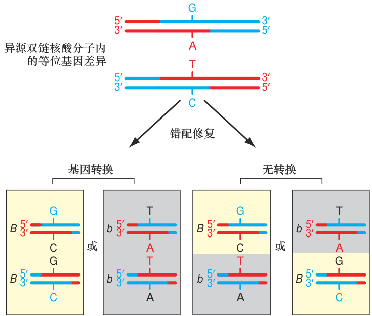  

图6.28　基因转换的发生方式。等位基因B和b的区别在于一对碱基对；其中B是G-C（黄色）， $b$ 是T-A（灰色）。如果基因 $B$ 在重组事件后在异源双链区内，则错配碱基的修复可以将B转化为b，反之亦然。当DNA修复（黑色）改变碱基时，基因转换均来自相同的染色单体。注意，蓝色和红色线是单个DNA链。  

# 3. 酵母和脉孢菌子囊中的基因转换  

在酵母和脉孢菌中基因转换是显著的，因为单一减数分裂的所有产物都保持在一个子囊里。基因转换可能被检测为异常的子囊，既不是PD，也不是NPD，也不是T。回想一下图5.22， $A B\ /\ a b$ 二倍体酵母细胞，其中$A$ 和 $B$ 是连锁基因，可以产生三种类型中任何一种的四分体。所有这三种四分体类型共有的一个关键特征是$A:a$ 或 $B:b$ 等位基因的比例总是 $2:2$ 。然而，罕见的$b$ 转化为 $B$ 导致四分体既不是PD，也不是NPD，也不是T，因为 $B:b$ 等位基因的比例是 $\cdot3:1$ （图6.29）。  

基因转换通常与侧翼等位基因的交换相关联支持了基因转换是由于重组事件期间异源双链体形成所致的观点。例如，假设在ABC / abc二倍体酵母的减数分裂过程中，在基因A和基因C之间发生重组事件，使得基因B在异源双链体区域内（图6.29）。基因 $B$ 任一侧的霍利迪连接体的分解导致侧翼基因A和C的等位基因之间的交  

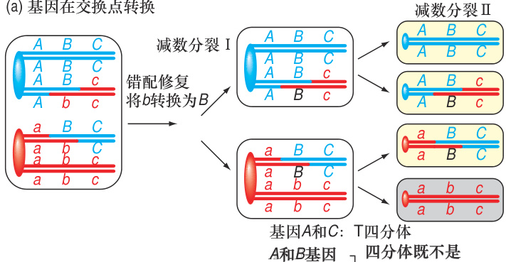  

(b)  

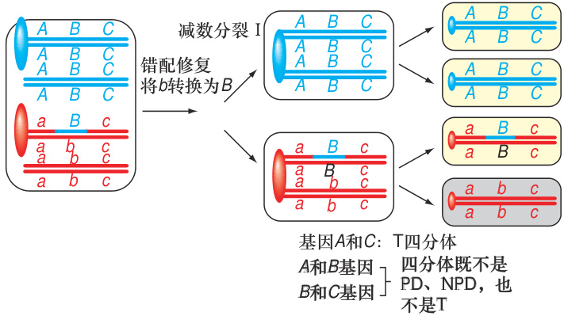  

图6.29　酵母四分体中基因转换的检测。在整个图中，蓝色和红色线代表单个DNA链。（a）ABC / abc二倍体酵母细胞在减数分裂期间的重组产生异源双链区，其中每条DNA链具有基因 $B$ 的不同等位基因。通过错配修复（黑B）将b转化为B导致异常四分体， $B:b$ 等位基因的比例为 ${}^{\cdot}3:1$ 而不是 $:2:2$ 。在这种情况下，重组事件导致侧翼基因A和C的等位基因交换并因此重组。四分体是与A和C有关的T。（b）这里，重组事件由非交换途径产生。因为不发生交换，所以得到的四分体是与基因A和C有关的PD。然而，异源双链区域的错配修复将b转化为B，因此该四分体还显示 $B:b$ 的比例为 ${}^{\cdot}3:1$ 。  

换重组。随后对含有基因 $B$ 的异源双链区域的DNA修复可导致基因转换，产生一个 $B:b$ 或 $b:B$ 显示 $3:1$ 分离比的四分体［图6.29（a）］。  

读者应该注意到，由进入非交换途径的重组事件产生的异源双链核酸分子也可以产生具有 $3:1$ 分离模式的四分体。在这种情况下，发生基因转换，但不伴随侧翼基因等位基因的重组［图6.29（b）］。  

# 基本概念  

● 在四分体分析中，T的存在和观察到的极低数量的NPD确定了重组在染色体复制后发生，此时每对同源物含有四个染色单体。T和NPD四分体表现出相同数量的两类重组体，表明相互交换。  
● 染色体部分的交换期间发生重组涉及DNA分子的破坏和重新连接。  
● 在分子水平上，减数分裂前期的交换需要在两个霍利迪连接体之间形成异源双链DNA，并通过内切核酸酶和DNA连接酶分解连接体。  
● 重组事件仅在部分时间内导致交换，因为解旋酶可以在霍利迪连接体形成之前解开染色单体。  
● 基因转换是将杂合子中的一个等位基因在物理上转变为另一个等位基因的过程，这为重组事件期间异源双链体的形成提供了证据。  

# 6.6 位点特异性重组  

# 学习目标  

1.  绘制位点特异性重组的可能结果。  
2.  列出必须引入的组件，以将位点特异性重组导入新发现的生物体中。  
3.  对比Spo11和Cas9这两种能够催化双链断裂形成的酶的功能。  

如前一节所述，同源重组从先前存在的DNA分子开始，将它们分开，然后重新连接以形成新的DNA序列。然后，自然选择测试这些新的DNA分子是否有能力帮助那些在改变了环境情况下繁殖和存活下来的生物体。在一群生物体中产生的DNA分子类型越多，后代中个体继续存在的可能性就越大。因此，同源重组几乎可以在基因组中大量位点的任何一个上随机发生，也可能在任何两个相邻的核苷酸对之间发生，这并不奇怪。通过这种方式，同源重组有助于产生具有巨大的多样性的染色体碱基序列来用于自然选择。  

# 6.6.1 重组酶催化特定DNA序列之间的重组  

与这种近乎随机的同源重组相反，在一些生物中发现有位点特异性重组系统可以在特定的DNA序列上促进DNA分子的破坏和重新连接。位点特异性重组是仅在两个通常小于200个碱基对长度的特定DNA靶位点之间发生的交换。位点特异性重组在分子水平上比在前一节中讨论的同源重组简单得多。特别地，在大多数位点特异性重组系统中，逻辑上称为重组酶的单一蛋白质足以催化该过程的所有断裂和连接步骤。如果你对此好奇，图6.30描述了一类这种重组酶的作用方式。  

生物体中包括某些种类的噬菌体，利用位点特异性重组这种方法将它们小的环状基因组整合（掺入）到宿主细菌的染色体中［图6.31（a）］。通过这种方式，噬菌体DNA与细菌染色体一起“搭便车”：当宿主DNA复制时，整合的噬菌体基因组也复制。  

位点特异性重组对于切除的逆过程也很重要，其中整合在单个染色体中的两个靶位点之间的DNA被移除后产生两个独立的DNA分子［图6.31（b）］。如果已经将噬菌体基因组整合到宿主染色体中，则使噬菌体基因组自身解脱然后并入病毒颗粒中，这个切除过程是至关重要的。  

位点特异性重组系统的第三个潜在结果是位于两个靶位点之间的DNA片段的倒位［图6.31（c）］。可以想象，这种倒位可能构成同一染色体的两种构型之间的分子转换。中间段在一个状态中朝向一个方向，在另一个状态中朝向另一个方向。  

如果在两个同源染色体的相同位置上发现靶位点，则可发生位点特异性重组的最终模式。重组酶对这些靶位点的作用将导致在非姐妹染色单体上产生区域的重排，并导致染色体重组［图6.31（d）］。据我们所知，在自然使用位点特异性重组的生物体中通常不会遇到这种情况。然而，遗传学家可以通过这种排列的靶位点生成有机体，也可以生成重组酶蛋白。该技术特别适用于在这些界定的位置以高频率发生的有丝分裂交换。  

# 1.  科学家可以利用Flp / FRT和Cre / loxP位点特异性重组系统来打开和关闭基因  

位点特异性重组仅是某些生物的特性，其在这些生物中的使用通常局限于非常特殊的过程，如噬菌体整合或切除。如果位点特异性重组不是像同源重组这样的普遍现象，为什么我们会将它告诉你？答案是，遗传学家现在可以向各种物种输出位点特异性重组，这些研究人员发现这种重组非常有用。通过将基因序列添加到基因组中，遗传学家可以精确控制基因组重组的发生位置。通过调节重组酶的产生，研究人员可以确定在什么时间点、什么组织中发生了位点特异性重组。  

本书后面的章节讨论了两个这样的系统位点特异性重组：Flp重组酶 / FRT位点（Flp / FRT），通常用于在酵母细胞中复制小环状DNA（质粒）； Cre重组酶/loxP位点（Cre / loxP），是一种叫做P1的噬菌体在生命周期的几个阶段所需要的。  

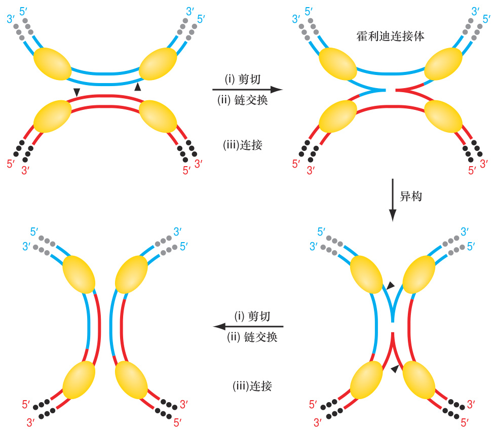  

图6.30　一个位点特异性重组机制。文中所讨论的Cre和Flp酶的功能如图所示。红色和蓝色靶DNA序列彼此相同，但为了清楚起见，以不同颜色表示。这些靶标嵌入不同的DNA分子（黑色和灰色点）。重组酶四聚体的亚基是黄色椭圆形； 这种酶催化了反应的所有步骤。黑三角形是重组酶切割单链DNA的位点。注意，霍利迪连接中间体的拆分涉及最初未切割的蓝色和红色DNA链的切割。  

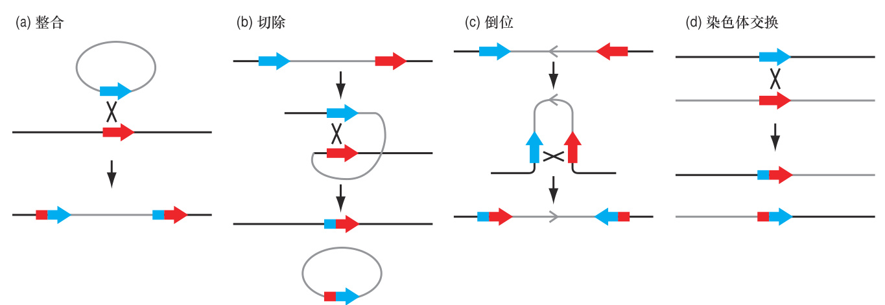  
图6.31　位点特异性重组的可能结果。蓝色和红色箭头代表相同目标的不同位置；箭头可以指向两个方向中的任何一个，因为目标位置是不对称的。嵌入靶位点的单个黑色和灰色线是双链DNA。  

基因工程的这些功能有几个目的。利用位点特异性重组，研究人员可以在特定时间或特定组织中打开或关闭生物体内特定基因的表达。此外，由于位点特异性重组可以在几乎所有细胞类型中高效发生，遗传学家可以使用该方法诱导有丝分裂重组，从而可靠地在杂合生物体内产生纯合突变细胞的克隆。通过进行这些操作，科学家现在可以提出关于特定基因在生物生命过程中所起作用的重要问题，如从单个细胞（受精卵）发育成多细胞生物；第18章和第19章将详细描述这些问题。  

# 2. CRISPR-Cas9诱导的重组是操纵基因组的有力工具  

将位点特异性重组导入新生物的一个重要限制是需要将靶序列引入基因组，但在大多数情况下，研究人员不能将这些靶位点引导到预选的基因组区域。相反，靶位点会被整合到随机位置，然后科学家们在最有利的位置搜索有目标位点的菌株。  

最近发展起来的杰出方法，使研究人员几乎可以以任何能够想象的方式精确地改变基因组。一种特别令人兴奋的技术是基于称为CRISPR的小RNA和一种叫做Cas9的酶（它是在少数细菌中产生的）。在本书的前部分详细描述这种方法还为时过早，但可以暂时告诉你，CRISPR可以将Cas9导向复杂基因组中的任何特定DNA序列。重要的是，Cas9是一种在DNA中产生双链断裂的酶。正如我们在前一节中所看到的，双链断裂的形成（通过Spo11）启动了同源重组的过程； 换句话说，双链断裂引起重组。  

因为CRISPR / Cas9在由CRISPR RNA序列确定的特定基因组位置处引起双链断裂，所以研究人员现在可以诱导在基因组的任何特定位置以高频率发生重组。如第18章所示，这种重组使科学家能够以任何所需的方式改变断点附近的DNA序列。这种新发现的改变基因组的能力的潜在意义是惊人的。仅举一个例子，这种精确的基因组编辑将允许开展基因治疗，诸如患有囊性纤维化遗传疾病的患者，可以将其体细胞基因组中的突变等位基因转变为野生型等位基因。  

# 基本概念  

●  位点特异性重组是由重组酶催化的两个短DNA靶位点之间的交换。  

●  研究人员可以将目标位点和相应的重组酶基因导入生物体的基因组中，以促进在基因组的特定位置、特定时间和特定组织中发生位点特异性重组。  

●  CRISPR / Cas9系统可以在基因组的几乎任何位置诱导双链断裂。这些双链断裂是重组的事实支持科学家进行断裂附近的基因组编辑。  

# 接下来的内容  

用于DNA结构的沃森-克里克模型是20世纪最重要的一个生物学发现，澄清了遗传物质如何实现其携带和准确复制信息的基本功能：每个DNA分子都带有大量的、有各种潜在排列可能性的四个核苷酸构件（A、T、G和C）。该模型还提出了碱基互补性如何为正确的DNA复制提供机制。我们进一步了解DNA的结构是如何能够重组母系和父系染色体的遗传信息。  

与其携带信息的能力不同，DNA 复制和重组的能力不仅仅是DNA分子本身的特性。相反，它们依赖于细胞的复杂酶促机制。但即使它们依赖于许多复杂组合的不同蛋白质，复制和重组都以极高的保真度发生——通常不会获得或丢失单个碱基对。然而，偶尔会出现的错误，提供了进化的遗传基础。基因内发生的DNA复制或重组错误有时会引起表型的显著变化。基因突变是如何产生的？我们是如何理解基因的不同等位基因通过它们指定的蛋白质产生表型效应的？  

我们在第7章开始会回答这些问题。我们首先描述导致突变的分子过程。接下来，你将看到科学家使用突变来确定基因在实际上是什么（DNA中碱基对的线性序列），以及基因的作用（它编码产生蛋白质的信息）。  

# 习题精解  

$5^{\prime}$ TAAGCGTAACCCGCTAA CGTATGCGAAC GGGTCCTATTAACGTGCGTACAC $3^{\prime}$ 3′ ATTCGCATTGGGCGATT GCATACGCTTG CCCAGGATAATTGCACGCATGTG $5^{\prime}$  

Ⅰ.  想象一下，图中显示的双链DNA分子在序列中由空格表示的位置断裂，并且在断裂被修复之前，断裂之间的11个碱基对DNA片段被反转（倒位）。修复后的分子的碱基序列是什么？解释你的推理。  

# 解答  

要回答这个问题，你需要记住所涉及的DNA链的极性。  

顶部链的极性从左到右为 $5^{\prime}{\longrightarrow}3^{\prime}$ 。反转区域必须以相同的极性重新连接。标记反转区域内链的极性。为了在顶部链上保持 $5^{\prime}{\rightarrow}3^{\prime}$ 的极性，反转的片段也必须翻转，因此以前在底部的链现在位于顶部。  

$5^{\prime}$ TAAGCGTAACCCGCTAAGTTCGCATACGGGGTCCTATTAACGTGCGTACAC $3^{\prime}$ $3^{\prime}$ ATTCGCATTGGGCGATTCAAGCGTATGCCCCAGGATAATTGCACGCATGTG $5^{\prime}$  

Ⅱ.  最近发现了一种感染人淋巴细胞的新病毒。可以使用培养的淋巴细胞作为宿主细胞在实验室中培养病毒。使用放射性标签设计一个实验，告诉你病毒是否含有DNA或RNA。  

# 解答  

利用你对DNA和RNA之间差异的了解来回答这个问题。RNA含有尿嘧啶而不是DNA中发现的胸腺嘧啶。你可以设置两种培养基，一种在培养基中添加放射性尿嘧啶，另一种培养基中添加放射性胸腺嘧啶。在病毒感染细胞并产生更多新病毒后，收集新合成的病毒。确定哪种培养物产生放射性病毒。如果病毒含有RNA，则在收集的含有放射性尿嘧啶培养基中生长的病毒将具有放射性，但在放射性胸腺嘧啶中生长的病毒将不具有放射性。如果病毒含有DNA，则从含有放射性胸腺嘧啶的培养物中收集的病毒将具有放射性，但来自放射性尿嘧啶培养物的病毒则不具有放射性。（你也可以考虑使用放射性标记的核糖或脱氧核糖来区分含RNA和DNA的病毒。从技术上讲，这不起作用，因为放射性糖在被掺入核酸之前被细胞处理，从而模糊了结果）  

Ⅲ.  如果在S期将人体细胞培养物（例如，HeLa细胞）暴露于 $^{3}\mathrm{H}\cdot$ -胸苷，那么放射性如何在中期的一对同源染色体上分布？放射性是否在：（a）一个同系物的一个染色单体中，（b）一个同源物的染色单体，（c）两个同源物中的一个染色单体，（d）两个同源物的染色单体，（e）其他一些模式？选择正确答案并解释你的推理。  

# 解答  

这个问题需要应用你对DNA分子结构和复制的了解以及它与染色单体和同源物的关系。DNA复制发生在S期，因此 $^{3}\mathrm{H}.$ -胸苷将掺入新的DNA链中。染色单体是一种复制的DNA分子，每个新的DNA分子都含有一条新的DNA链（半保守复制）。放射性将在两种同源物的染色单体中（答案d）。  

# 习题  

# 词汇  

1.  在右列中选择与左列中的术语最匹配的短语。  

a. 转化 1.  复制过程中合成的不连续的链  
b. 噬菌体 2.  DNA亚基核苷酸中的糖  
c. 嘧啶 3.  双环的含氮碱基  
d. 脱氧核糖 4.  将双螺旋的两条链维持在一起的非共价键  
e. 氢键 5.  Meselson-Stahl实验  
f. 互补碱基 6.  Griffith实验  
g. 起点 7.  真核染色体末端结构  
h. 冈崎片段 8.  两个含氮碱基通过氢键配对  
i. 嘌呤 9.  催化特异性位点重组  
j. 拓扑异构酶 10.  含一个环的碱基  
k. 半保留复制 11.  解旋双链中复制开始位置的短序列  
l. 后随链 12.  感染细菌的病毒  
m. 端粒 13.  通过一条链的不连续复制形成的短DNA片段  
n. 重组 14.  参与控制DNA超螺旋的酶  

# 6.1节  

2.  Griffith在他1928年的实验中证明，细菌菌株可以进行遗传转化。有证据表明DNA是导致这种转化现象的原因。Avery、MacCleod和McCarty进行了什么关键的实验来证明DNA是从粗糙细胞到光滑细胞的遗传变化的原因？  

3.  在细菌转化过程中，进入细胞的DNA不是完整的染色体；相反，它由随机生成的染色体DNA片段组成。在一个转化实验中，供体DNA来自细菌菌株 $a^{+}b^{+}c^{+}$ ，受体为a b c， $55\%$ 成为a 的细胞也转化为 $c^{+}$ ，但只有 $2\%$ 的 $a^{+}$ 细胞转化为 ${}^{\cdot}{b}^{+}$ 。基因b或c哪个更接近基因a？  

4.  氮和碳在蛋白质中比硫更丰富。为什么赫尔希和蔡斯在他们的实验中使用放射性硫代替氮和碳来标记其噬菌体的蛋白质部分，以确定亲本蛋白质或亲本DNA是否是后代噬菌体繁殖所必需的？  

# 6.2节  

5.  如果人类DNA中 $30\%$ 的碱基是A，（a）C的百分比是多少？（b）T的百分比是多少？（c）G的百分比是多少？  

6. 关于双链DNA，下列哪一项陈述是正确的？  

a. $\mathrm{A+C=T+G}$ b. $\scriptstyle\mathrm{A+G=C+T}$ $\therefore A+T=G+C$ d. A / $\mathrm{G}{=}\mathrm{C}$ / T e. A / G=T / C f. $\mathrm{C}{+}\mathrm{A}_{}$ ) / $'\,(\mathrm{G+T}){=}1$  

7.  想象一下，你有三个含有相同纯化的双链人类DNA溶液的试管。将管1中的DNA暴露于破坏糖-磷酸（磷酸二酯）键的试剂中。将管2中的DNA暴露于会破坏碱基与糖结合的键的试剂中。将管3中的DNA暴露于破坏氢键的试剂中。处理后，三管中分子的结构有何不同？  

8.  从X射线晶体学数据中获得了关于DNA结构的哪些信息？  

9.  引起囊性纤维化的人类基因的一条DNA链的一部分是：  

$5^{\prime}$ .....ATAGCAGAGCACCATTCTG..... $3^{\prime}$  

写下该基因的另一条DNA链的相应区域的序列，注意极性。给定序列中之前和之后的点代表什么？  

10.  当双链DNA分子暴露于高温时，两条链分开，分子失去其螺旋形式。我们说DNA已经变性了（当DNA暴露于酸性或碱性溶液时也会发生变性）。a.  随着DNA溶液的温度升高，含有许多A-T碱基对的DNA区域首先变性。考虑到DNA分子的化学结构，为什么你认为富含A-T的区域首先变性？b.  如果温度降低，原始DNA链可以再退火或复性。除了完整的双链分子外，当在电子显微镜下检查分子时，可以看到这里所示类型的一些分子。你怎么解释这些结构？  

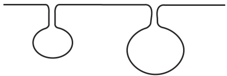  

11.  以DNA为遗传物质的特定病毒具有以下比例的核苷酸： $20\%$ A、 $35\%$ T、 $25\%$ G和 $20\%$ C。你如何解释这一结果？  

# 6.3节  

12.  DNA的基础结构非常简单，仅由四个可能的构建块组成。a.  如果DNA结构如此简单，DNA如何携带复杂的遗传信息？b.  这些构建块是什么？可以将每个块细分为更小的单元吗？如果可以，它们是什么？ 什么样的化学键连接构建块？c.  RNA的基础结构与DNA的结构有何不同？  

13.  感染植物细胞的RNA病毒在进入植物细胞后被复制到DNA分子中。第一条DNA链中的碱基序列是什么，是否与此处显示的病毒RNA部分互补？$5^{\prime}$ CCCUUGGAACUACAAAGCCGAGAUUAA $3^{\prime}$  

14.  细菌转化和噬菌体标记实验证明DNA是细菌和含DNA病毒的遗传物质。一些病毒不含DNA但在噬菌体颗粒内部具有RNA。一个例子是烟草花叶病毒（TMV），它感染烟草植物，在叶片中引起病变。存在两种不同的TMV变体，其在病毒颗粒中具有可以区分的不同形式的特定蛋白质。通过混合纯化的蛋白质和RNA，可以在体外（在试管中）重建TMV。然后，重建的病毒可用于感染宿主植物细胞并产生新一代病毒。设计一项实验，证明RNA而不是蛋白质是TMV中的遗传物质。  

15.  CAP蛋白显示与图6.15中的DNA结合。CAP结合DNA中的特定碱基对序列（ $\mathrm{N}{=}$ 任何碱基）：  

$5^{\prime}$ TGTGANNNNNNTCACA $3^{\prime}$ $3^{\prime}$ ACACTNNNNNNAGTGT $5^{\prime}$  

a.  在具有随机碱基序列和相同数量的A-T和G-C碱基对的长双链DNA分子中，CAP可以结合多少种不同的DNA序列？  
b.  在同一个DNA分子中，任何类型的CAP结合位点存在的频率如何？ 特定类型呢？  
c.  CAP蛋白以二聚体形式结合DNA；两个相同的CAP蛋白亚基彼此结合，再结合DNA。你能否发现CAP结合的DNA位点的特征，表明两个相同的蛋白质亚基结合DNA？（提示：尝试在每条链上读取 $5^{\prime}{\longrightarrow}3^{\prime}$ 方向的序列）  
d.  CAP蛋白与DNA的大沟结合。你认为CAP需要DNA解旋酶来结合DNA吗？  

# 6.4节  

16.  在Meselson和Stahl的密度转换实验中（如图6.20所示），描述在以下每种情况下你期望的结果：a. 在 $^{14}\mathrm{N}$ 上进行两轮DNA合成后的全保留复制。b. 在 $^{14}\mathrm{N}$ 上进行三轮DNA合成后的半保留复制。c. 在 $^{14}\mathrm{N}$ 上进行三轮DNA合成后的分散复制。d. 在 $^{14}\mathrm{N}.$ 上进行三轮DNA合成后的全保留复制。  

17.  当Meselson和Stahl在 $^{15}\mathrm{N}$ 培养基中培养大肠杆菌多代，然后将细胞转移到 $^{14}\mathrm{N}$ 培养基培养一代时，他们发现细菌在平衡密度离心后，DNA条带的密度介于纯 $^{15}\mathrm{N}$ DNA和纯 $^{14}\mathrm{N}$ DNA之间。当他们让细菌在 $^{14}\mathrm{N}$ 培养基中再复制一次时，他们观察到一半的DNA保持在中等密度，而另一半则是纯 $^{14}\mathrm{N}$ DNA的密度。在 $^{14}\mathrm{N}$ 培养基中进一步生长后，他们会看到什么？再经过两代呢？  

18.  如果你将人体组织培养细胞（如HeLa细胞）暴露于$\mathrm{^{3}H}.$ -胸苷，就像它们进入S期一样，然后从细胞中清洗掉这些物质并让它们经过第二个S期，再观察染色体，你认为 $\mathrm{\nabla^{3}H}$ 如何分布在一对同源染色体上？（忽略重组可能对此结果产生影响）放射性是在：（a）一个同源物的一个染色单体中，（b）一个同源物的两个染色单体，（c）两个同源物中的一个染色单体，（d）两种同源物的染色单体，（e）其他一些模式？选择正确答案并解释你的推理（这个问题扩展了习题精解Ⅲ中开始的分析）。  

19.  使用两个复制叉绘制复制泡，并标记复制起点、前导链、后随链，以及图中所示的所有链的5′端和3′端。  

20. a.  在自然界中是否存在任何链的核酸，其中部分链是DNA，部分是RNA？如果是这样，描述何时合成这种核酸链。RNA成分是5′端还是3′端？b.  冈崎片段中的RNA引物通常非常短，小于10个核苷酸，有时长度为2个核苷酸。这个事实告诉你关于引发酶的持续合成能力，即相对于酶与模板和合成分子分离，酶继续聚合的相对能力如何？哪种酶可能具有更高的持续合成能力，是引发酶还是DNA聚合酶Ⅲ？  

21.  如图6.21所示，DNA聚合酶切割核苷三磷酸（其中三个磷酸基团连接到脱氧核糖的5′碳原子上的核苷酸）中的磷酸基团之间的高能键。当将新核苷酸掺入生长链中时，该酶利用该能量催化磷酸二酯键的形成。  

a.  这些信息如何解释DNA链在 $5^{\prime}{\rightarrow}3^{\prime}$ 方向复制过程中会生长？  
b.  连接酶连接冈崎片段的作用如图6.23所示。请记住，这些片段只有在其末端的RNA引物被去除后才能连接。鉴于此信息，推断其形成由DNA连接酶催化的化学键的类型，以及是否需要能量来源来促进该反应。解释为什么需要DNA连接酶而不是DNA聚合酶来连接冈崎片段。  

22.  在该问题的最后显示了DNA复制开始区域中DNA链之一的碱基与粗体互补碱基的引物序列是什么（表示序列的5′端和3′端）。$5^{\prime}$ AGGCCTCGAATTCGTATAGCTTTCAGAAA $3^{\prime}$  

23.  可以在电子显微镜中观察DNA中的复制结构。正在复制的区域显示为气泡。  

a.  假设双向复制，这个DNA分子中有多少个复制起点？  
b.  有多少复制叉？  
c.  假设所有复制叉都以相同的速度移动，最后激活了哪个复制起点？  

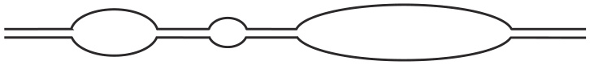  

24.  表明以下每种在DNA复制中的作用：（a）拓扑异构酶，（b）解旋酶，（c）引发酶，（d）连接酶。  

25.  绘制在双链线性染色体末端发生的复制图。用引物显示前导和后随链（表明链的5′端和3′端）。在染色体末端产生两条DNA链的拷贝会遇到什么困难？  

26.  图6.18描述了沃森和克里克关于DNA的双螺旋结构如何解释DNA复制的初步建议。根据我们目前的知识，该图包含一个由于过度简化而导致的严重错误。确定此图的问题。  

27.  研究人员发现，在动物病毒SV40的环状DNA染色体复制过程中，两个新完成的子双螺旋缠绕在一起。如果环状DNA要分开会发生什么？  
28.  DNA合成仪是一种利用自动化学合成产生任何给定序列的DNA短链的机器。你已使用该机器合成以下三种DNA分子：（DNA 1） $5^{\prime}$ CTACTACGGATCGGG $3^{\prime}$ （DNA 2） $5^{\prime}$ CCAGTCCCGATCCGT $3^{\prime}$ （DNA 3） $5^{\prime}$ AGTAGCCAGTGGGGAAAAACCCCACTGG $3^{\prime}$ 现在，你可以将DNA分子单独或组合添加到含有DNA聚合酶、dATP、dCTP、dGTP和dTTP的反应管中，缓冲溶液可使DNA聚合酶发挥作用。对于每个反应管，指示DNA聚合酶是否会合成任何新的DNA分子；如果是，则写出任何此类DNA的序列。a. DNA 1加DNA 3b. DNA 2加DNA 3c. DNA 1加DNA 2d. 只有DNA 3  

# 6.5节  

29.  用两种类型的噬菌体λ共感染细菌细胞：一种携带 $c^{+}$ 等位基因，另一种携带 $c$ 等位基因。细胞裂解后，收集子代噬菌体。当使用单个这样的子代噬菌体感染新的细菌细胞时，在极少数情况下观察到一些所得的噬菌体后代是 $c^{+}$ 而其他的是c。解释这个结果。  

30.  已经分离出具有突变体 $s p o l l^{\,-}$ 等位基因的酵母菌株。突变等位基因无功能；它不会产生Spo11蛋白。你认为这种突变株的表型是什么？  

31.  想象一下，你已经完成了两种酵母菌株之间的杂交，其中一种酵母具有基因型A $B\;C$ ，另一种具有a b$c$ ，其中字母是指按照给定顺序的三个相当紧密连锁的基因。你检查了这个杂交产生的许多四分体，你发现两个不包含预期的两个 $^B$ 和两个b孢子。在四分体Ⅰ中，孢子是A B C、A B $C$ 、a B c和 $\textit{a b c}$ 。在四分体Ⅱ中，孢子是A $B\;C$ 、A b $c$ 、a b C和a b c。这些不寻常的四分体是如何产生的？  

32.  下图显示的脉孢菌八分体来自 $a^{+}$ 和 $a^{-}$ 菌株之间的杂交。a.  这是MI还是MII八分体或两者都没有？请说明。b.  绘制这个八分体的产生图。  

c.  是否有可能观察到脉孢菌中异源双链体形成的证据，即使是基因在八分体形成过程中没有发生转换？请说明。  

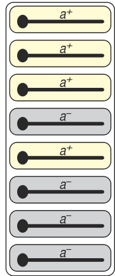  

33.  从 $e^{+}f^{+}g^{+}$ 和 $e^{-}f^{-}g^{-}$ 神经孢子菌株的杂交开始，这些连锁基因之间的重组产生了一些含有以下有序孢子组的八分体。  

$e^{+}f^{+}g^{+}$ $e^{+}f^{+}g^{+}$ $e^{+}f^{-}g^{+}$ $e^{+}f^{-}g^{+}$ $e^{-}f^{-}g^{-}$ $e^{-}f^{-}g^{-}$ $e^{-}f^{-}g^{-}$ $e^{-}f^{-}g^{-}$  

a. 重组在哪里开始？  

b.  基因e和g之间是否发生了交换？请说明。c.  为什么最终的比例是 $2\,f^{+}$ ： $6\,f^{-}$ ，而不是4 $e^{+}$ ： $4~e^{-}$ 和4 $g^{+}$ ： $4\,g^{-}?$ ？d.  你是否可以将这些不寻常的八分体描述为所涉及的三个基因中的任何一个的MI或MII？请说明。  

34.  在图6.27的步骤6中，解离酶几乎总是在两个霍利迪连接中间体（蓝色链和红色链）上切掉所有四条DNA。说明这一事实的另一种方式是酶以不同方式切割霍利迪连接体1和2处的DNA，如图中连接体1处的黄色箭头和连接体2处的绿色箭头所示。但很少情况下，解离酶反而以相同的方式切割两个霍利迪连接体的DNA（两个连接体的黄色箭头或两个连接体的绿色箭头）。换句话说，在两个连接体，切割相同的红色链和相同的蓝色链。这种罕见的解离酶行为会产生什么结果？  

# 6.6节  

35.  图6.31显示了位点特异性重组的四种潜在结果，这取决于重组酶的靶位点的相对排列。同源重组（在没有特异性靶位点和重组酶的情况下）是否也会导致所有相同类型的结果？如果是这样，遗传学家使用同源重组和位点特异性重组有何不同？  

36.  列出的用于位点特异性重组的每个底物（ $\mathrm{a{\sim}f}$ ）也是在这些底物中的不同基质上发生的位点特异性重组的产物。使每个底物（a～f）与其产物（a～f）匹配。  

a. 具有两个相同方向的靶位点的线性DNAb. 具有两个相反方向的靶位点的线性DNAc. 具有两个相同方向的靶位点的环状DNAd. 具有两个相反方向的靶位点的环状DNAe.  具有一个靶位点的环状DNA和具有一个靶位点的线性DNAf. 两个环状DNA，每个都有一个目标位点。  

37.  第5章中的习题52讨论了使用有丝分裂重组来研究小鼠发育过程中称为smc的基因的功能。该想法是在smc+/smc−杂合子的细胞中的有丝分裂重组可以产生来源于smc−突变纯合的子细胞的组织的克隆。你可以通过GFP没有绿色荧光来识别这个克隆中的细胞。  

a.  有丝分裂重组是一种罕见的事件，使研究人员很难找到smc−/smc−克隆进行研究。解释为什么科学家可能希望对同一只小鼠进行X射线检查，以增加找到所需克隆的频率。在小鼠发育的哪个阶段，研究人员会将这些动物暴露在X射线下？  

b.  诱导有丝分裂重组的更有效方式是构建包含Flp /FRT系统的小鼠（Flp是酵母细胞中的重组酶，可促进特定34碱基对长DNA序列的两个相同拷贝之间的位点特异性重组，称为FRT位点）。假设这些小鼠具有可指定Flp重组酶蛋白的转基因，那么相对于smc基因和GFP基因，FRT位点应该放在哪里？  

c.  在题目b中，为了确保小鼠的每个细胞都不会发生有丝分裂重组，你将如何处理flp编码基因？（这种预防措施是必要的，因为具有许多smc /smc−纯合子细胞的小鼠在成年之前可能会死于胚胎）  

38.  假设你可以给野生型小鼠受精卵注射特定CRISPRRNA和Cas9酶。RNA指导Cas9酶在你认为可能导致遗传性疾病的基因内产生双链断裂。粗略地画出你如何同时注射另一个核酸分子（此处为双链DNA）以利用同源重组，以便你可以将该基因的野生型等位基因转换为特定的突变等位基因。  

39.  ΦC31是一种感染链霉菌属细菌的噬菌体。噬菌体基因组中的一个基因特异于称为ΦC31整合酶的重组酶，其通过与图6.30中所示的重组酶略有不同的机制起作用。最重要的是，两个靶DNA序列彼此不同。一个名为attP，长是39个碱基对，在环状噬菌体染色体上发现；而另一个attB长34个碱基对，位于更大的环状细菌染色体上。大致在两个目标中间的两个碱基对是相同的。在发生重组的情况下，attP和attB的DNA序列彼此完全不同。  

a.  绘制ΦC31整合酶的反应图。这种反应如何对噬菌体的生命周期起重要作用？  
b.  使用你刚绘制的图表，解释为什么ΦC31整合酶不能逆转反应。  
c.  现在考虑如何利用这种特异性位点重组将来自另一物种（转基因）的基因置于果蝇等实验生物的基因组中。假设你可以制作任何你想要的DNA序列，并且可以将这些DNA序列引入果蝇中注射生殖细胞。为什么 $\Phi C31$ 整合酶介导的反应的不可逆性对于将转基因置于果蝇基因组中是有价值的？  
d.  噬菌体 $\Phi C31$ 最终必须逆转这种反应。为什么？你如何看待噬菌体能够实现这种逆转？  

40.  Cre是由噬菌体P1中的基因编码的重组酶。Cre酶促进了来自相同噬菌体的称为loxP的34bp长DNA序列的两个拷贝之间的位点特异性重组。  

研究人员使用Cre / loxP位点特异性重组系统，使小鼠纯合子仅在特定组织中删除特定基因。你将在第18章中看到，科学家首先制作了一个小鼠，其中一对loxP位点以特定方式配置，与待删除的基因相关。  

a.  绘制一个图表，显示loxP位点的配置，这些位点可以通过位点特异性重组来删除基因。  
b.  还有哪些研究人员需要将其引入小鼠基因组以产生小鼠，其中只有一个组织是基因缺失的纯合子？  
c.  你认为为什么科学家会想要产生像这样的小鼠？  
d.  与由ΦC31整合酶催化的attP和attB位点处的DNA重排不同（在习题39中描述），由Cre重组酶引起的DNA重排是可逆的。为什么？  
e.  为什么Cre / loxP介导的重组的可逆性不会干扰使用Cre / loxP系统产生缺失的小鼠组织？  

41.  与Cre / loxP重组一样，由Flp / FRT系统介导的位点特异性重组是可逆的。为什么这个事实不会干扰习题37中描述的实验？  