# 第 7 章 基因剖析与功能：利用突变研究  

  

在钢琴键盘上演奏的音阶和染色体上的基因都是一系列产生信息的简单线性元素（琴键或核苷酸对）。错误的音符或改变的核苷酸对会引起人们对音阶或基因结构的注意。  
$\copyright$ Ingram Publishing RF  

# 章 节 大 纲  

7.1 突变：遗传分析的主要工具  
7.2 改变 DNA 序列的分子机制  
7.3 DNA 修复机制  
7.4 突变对基因结构的影响  
7.5 突变对基因功能的影响  
7.6 综合示例：影响视力的突变  

人类3号染色体含有约2.2亿个碱基对，携带约1600个基因（图7.1）。染色体长臂上的某个位置存在视紫红质基因，视紫红质是一种活跃在视网膜视杆细胞中的光敏蛋白。视紫红质基因决定低强度光的感知。携带该基因的正常野生型等位基因的人在昏暗的房间和夜间的道路上看得很清楚。然而，视紫红质基因中的一个简单变化，即突变会降低光感，足以导致夜盲症。基因的其他改变导致杆细胞的破坏，致使完全失明。到目前为止，医学研究人员已经确定了视紫红质基因中超过30种突变，它们以不同的方式影响视力。  

视紫红质基因的情况说明了一些非常基本的问题。3号染色体上2.2亿个碱基对中的哪一个组成了视紫红质基因？构成该基因的碱基对如何沿着染色体排列？一个基因怎么能维持如此多的突变，导致这种不同的表型效应？  

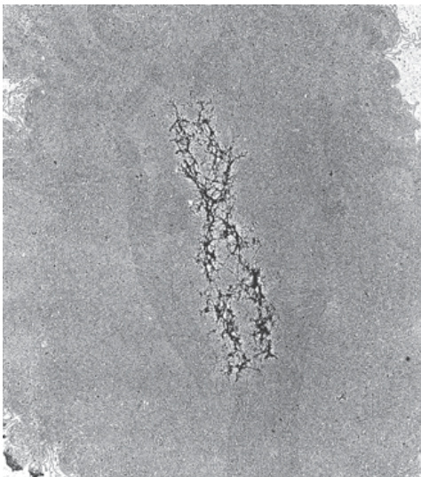  
图7.1　每个人类染色体的DNA都包含成百上千个基因。这条人类染色体的DNA被放大了5万倍。没有拓扑符号显示基因在DNA中的位置。中间较暗的染色体状结构是一组连接着DNA的蛋白质。  

$\copyright$ Dr. Don Fawcett/J.R. Paulson & U.K. Laemmli/Science Source  

在本章中，我们描述了遗传学家在20世纪50年代和60年代进行的巧妙实验，因为他们检查了突变、基因、染色体和表型之间的关系，以便在分子水平上了解基因是什么以及它们如何发挥作用。  

我们可以从这些研究人员的巧妙工作中认识到三个主题。第一，突变是碱基序列中可遗传的变化，可以影响表型。第二，是在物理上的，基因通常是染色体离散区域中特定的蛋白质编码DNA区段（我们现在知道一些基因可以编码各种不会转化为蛋白质的RNA）。第三，基因不仅仅是字符串上的一个珠子，只能作为一个整体改变，只有一种方式，正如一些人所想的那样；相反，基因是可分割的，并且每个基因的亚基，即DNA的单个核苷酸对，可以独立地突变，并且可以彼此重组。  

通过提供基因型如何影响表型的生物化学解释，了解基因是什么以及它们如何工作，加深了我们对孟德尔遗传学的理解。例如，视紫红质基因中的一个突变导致视紫红质蛋白构建中一个特定氨基酸被另一个氨基酸取代。这种单一取代改变了视紫红质的三维结构，从而改变了蛋白质吸收光子的能力，最终改变了人们感知光的能力。  

# 7.1 突变：遗传分析的主要工具  

# 学习目标  

1. 区分体细胞和种系细胞中突变的影响。  
2. 描述四种类型的点突变：转换、颠换、缺失和插入。  
3. 总结与突变率差异相关的因素。  
4.  解释波动测试和影印培养法如何表明突变是随机和自  
发产生的。  

我们在第3章中看到，具有一个共同等位基因的基因是单态的，而在自然群体中具有几个常见等位基因的基因是多态的。野生型等位基因这一术语对单态基因有明确的定义，在观察的群体中，大多数染色体上被发现的等位基因是野生型的。在多态性基因的情况下，定义不太直接。一些遗传学家认为频率大于 $1\%$ 的所有等位基因都是野生型，而另一些则认为群体中存在相当高频率的许多等位基因作为常见变异，并保留野生型等位基因仅用于单态基因。  

# 7.1.1 突变是DNA碱基序列的变化  

将基因的野生型等位基因（无论定义如何）改变为不同等位基因的突变称为正向突变。得到的新突变等位基因可以是原始野生型等位基因的隐性或显性。当突变对野生型等位基因进行隐性突变时，遗传学家通常将正向突变表示为 $A^{+}{\longrightarrow}a$ ，而当突变对野生型等位基因进行显性突变时，通常将突变表示为 ${b}^{+}{\longrightarrow}{B}$ 。突变还可以导致新的突变等位基因在称为回复突变或逆转的过程中恢复为野生型（ $a{\longrightarrow}A^{+}$ 或 $B{\longrightarrow}b^{+}$ ）。在本章中，我们使用加号 $\left(\ +\ \right)$ 指定野生型等位基因，无论是隐性还是显性突变等位基因。  

孟德尔最初通过可见的表型效应定义基因——黄色或绿色、圆形或皱纹，即它们的可替代的等位基因。事实上，他知道基因存在的唯一方法是因为7种特定豌豆基因的替代等位基因是通过突变而产生的。突变可发生在体细胞或生殖系细胞中。孟德尔豌豆植物中的突变是可遗传的，因为它们发生在植物的生殖系细胞中，因此通过配子传播。接近一个世纪之后，对DNA结构的了解澄清了这种突变是DNA碱基序列的遗传变化。因此，DNA在携带遗传信息的同一地点（其碱基序列）具有遗传变异的潜力。  

# 7.1.2 突变可以通过它们如何改变DNA来分类  

当DNA分子一条链中的某个位置的碱基被另外三个碱基中的一个取代时，称为置换［图7.2（a）］；DNA复制后，一个新的碱基对将出现在子双螺旋中。取代可以细分为：转换，指其中一个嘌呤（A或G）取代另一个嘌呤或一个嘧啶（C或T）取代另一个嘧啶；颠换，指其中嘌呤变为嘧啶，反之亦然。  

其他类型的突变重新排列DNA序列，而不仅仅是改变碱基对的身份。当一个或多个核苷酸对的区段从DNA分子中丢失时就发生缺失；插入恰好相反，是添加一个或多个核苷酸对［图7.2（b）和（c）］。缺失和插入可以像单个碱基对一样小，也可以像兆碱基一样大（即数百万个碱基对）。大的缺失和插入只是一些复杂的突变，可以通过改变染色体上基因的顺序、基因组中的基因数量，甚至生物体中的染色体数量来重组基因  

# T C C A  

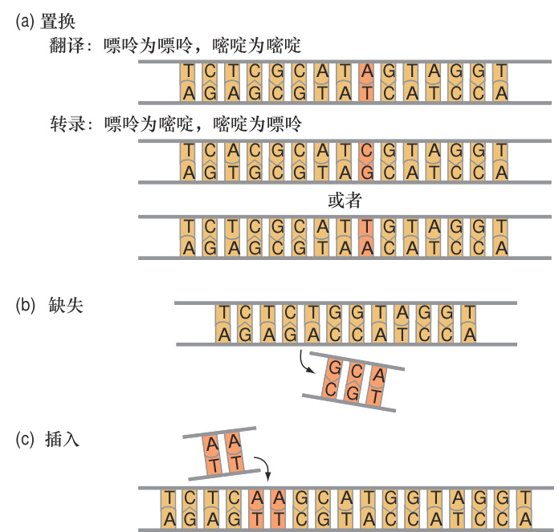  
  
图7.2　点突变按其对DNA的影响分类。  

组。我们将在第13章讨论所有这些一次影响许多基因的染色体重排。在这里，我们将重点放在影响DNA中一个或几个碱基对的点突变（转换、颠换和缺失或插入）上。因此，一次只改变一个基因。  

基因组中只有一小部分突变实际上以影响基因功能的方式改变基因的核苷酸序列。通过将一个等位基因改变为另一个，这些突变改变了基因蛋白质产物的结构或数量，并且蛋白质结构或数量的修饰可以影响表型。其他突变要么以不影响其功能的方式改变基因，要么改变基因之间的DNA。我们在第11章中讨论了没有可观察到的表型后果的突变；这种突变对于绘制基因和跟踪个体之间的差异是非常宝贵的。在本章的其余部分，我们将重点放在那些对基因功能有影响并因此影响表型的突变上。  

# 7.1.3 自发突变的发生率非常低  

修改基因功能的突变很少发生，遗传学家必须检查来自以前同源种群的大量个体，以检测反映这些突变的新表型。在一项正在进行的研究中，专门的研究人员监测了数百万只特殊繁殖小鼠的毛色，并发现，平均而言，每100万个配子中大约有11个特定基因突变为隐性等位基因（图7.3）。对其他几种多细胞真核生物的研究也得出了类似的结果：每个基因每个配子的平均自发突变率为 $2\times10^{-6}{\sim}12\times10^{-6}.$ 个。  

从不同的角度来看突变率，你可以推算出个体基因中可能存在多少突变。研究发现，你只需将每个基因每图7.3　自发突变率。（a）野生型（左）和突变型小鼠被毛颜色：白化（中）和棕色（右）。（b）5个被毛颜色基因从野生型到隐性突变等位基因的突变率。利用高自交系野生型小鼠与纯合子小鼠进行配对，获得隐性被毛颜色等位基因。具有突变被毛颜色的后代表明，近交系小鼠产生的配子中存在隐性突变。  

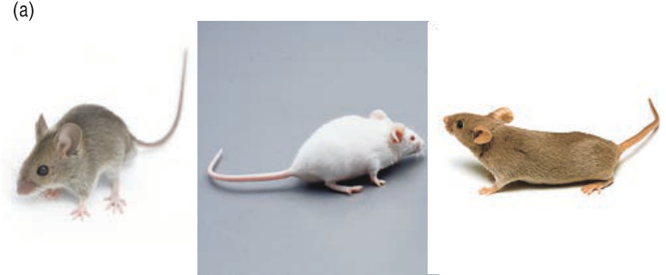  

(b)   

<html><body><table><tr><td>基因座</td><td>所测试的 配子数目</td><td>突变的数量</td><td>突变率(×10-6)</td></tr><tr><td></td><td></td><td></td><td></td></tr><tr><td>α(白色)</td><td>67395</td><td>3</td><td>44.5</td></tr><tr><td>b(棕色)</td><td>919699</td><td>3</td><td>3.3</td></tr><tr><td>c(无刺）</td><td>150391 839447</td><td>5 10</td><td>33.2 11.9</td></tr><tr><td>d(稀疏)</td><td>243 444</td><td>4</td><td>16.4</td></tr><tr><td>In(灰色）</td><td>2220376</td><td>25</td><td>11.2(平均值）</td></tr></table></body></html>

a  

（a，左）： $\copyright$ imageBROKER/SuperStock RF；（a，中，右）： $\copyright$ CharlesRiver Laboratories  

个配子 $2\times10^{-6}\mathrm{\sim}12\times10^{-6}.$ 个突变的倍数乘以27 000，即目前对人类基因组中基因数量的估计，就可以得到每个单倍体基因组有 $0.05\!\sim\!0.30$ 个突变的答案。这种非常粗略的计算意味着平均而言，每 $3\!\sim\!20$ 个人类配子中就会出现一个影响表型的新突变。  

# 1. 不同的基因，不同的突变率  

虽然每个配子的每个基因的平均突变率是 $2\times10^{-6}\mathrm{\sim}$ $12\times{{10}^{-6}}$ ，但是这个数字掩盖了不同基因的突变率的相当大的变化。许多生物的实验表明，每个基因每个配子的突变率范围，从小于 $10^{-9}$ 到大于 $10^{-3}$ 。同一生物体内不同基因突变率的变化反映了基因大小的差异（较大的基因是维持更多突变的较大靶标），以及特定基因对引起突变的各种机制的易感性的差异。  

# 2. 多细胞生物中的突变率高于细菌  

细菌的平均突变率估计在 $10^{-8}\!\sim\!10^{-7}$ 个的范围内。虽然这里的单位与用于多细胞真核生物的单位略有不同（因为细菌不产生配子），但多细胞真核生物中的平均突变率似乎仍远高于细菌。主要原因是在受精卵形成和减数分裂之间发生了许多细胞分裂，因此配子中出现的突变实际上可能在配子形成之前发生了许多细胞世代。换句话说，突变积累的机会更多。  

一些科学家推测，多细胞生物的二倍体基因组允许它们在配子中耐受相对较高的突变率，因为受精卵必须在两个配子的同一基因中接受隐性突变才能发生任何有害影响。相比之下，一种细菌只受到一个突变的影响，该突变破坏了其唯一的基因拷贝。  

# 3. 基因功能：容易破坏，难以恢复  

在小鼠毛色研究中，当研究人员允许兄弟姐妹小鼠纯合为五个突变毛色基因之一的隐性突变等位基因相互交配时，他们可以通过检查F1后代来估计回归率［图7.4（a）］。任何表达特定毛色的显性野生型表型的后代都必然携带具有回复突变的基因。基于对数百万$\mathrm{F}_{1}$ 后代的观察计算显示，每个基因每个配子的回复突变率为 $0\!\sim\!2.5\times10^{-6}$ ；从基因到基因，回归率有所不同。然而，在这项研究中，逆转率明显低于正向突变率，这很可能是因为虽然存在许多破坏基因功能的方法，但一旦中断，最多有几种方法可以恢复功能［图7.4（b）］。(a)  

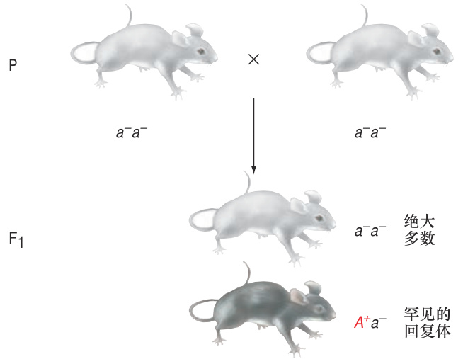  

(b)  

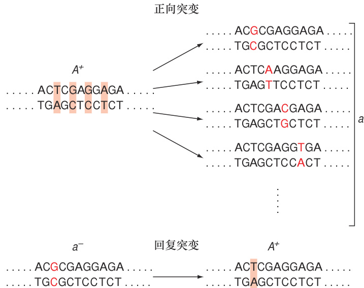  

图7.4　回复体的检测。（a）野生型等位基因（ $A^{+}$ ）隐性突变的罕见逆转株被检测为白化 $\left(\stackrel{-}{a}\!\!a^{-}\right)$ ）小鼠的野生型灰色$(\stackrel{+}{A}^{+}\stackrel{-}{a})$ ）后代。（b）正向突变率通常远高于逆转率。许多不同的突变可以破坏一个基因的功能，而最多只有少数突变可以恢复先前失活基因的功能。  

对于大多数类型的突变，回归率显著低于正向突变率的结论都适用。在一个极端的例子中，超过几个核苷酸对的缺失永远不会恢复，因为从基因组中消失的DNA信息不能自发地再现。  

# 4. 人类精子中的突变率高于人类卵子  

将在后面的章节中详细解释的新技术使研究人员能够确定成千上万人的整个基因组的DNA序列。通过比较父母及其子女的基因组序列，科学家们非常精确地测量了人类的突变率。他们发现平均值约为每个配子每亿个碱基对有一个突变。因为单倍体人类基因组大约$3\times10^{9}\mathrm{bp}$ ，每个配子平均包含大约30个突变，每个小孩包含大约60个突变（即60个碱基对与其父母基因组中的任一个不同）。你应该注意这个数字包括所有DNA变化，只有极少数影响表型。  

有趣的是，每个人中的60多个新突变中的大部分都来自精子而不是卵子。最近，基因组测序技术的进步使得对单个精子中包含的单倍体基因组进行测序成为可能（参见第5章中“快进”信息栏“绘制产生单个人类精子染色体的交换图谱”）。通过比较来自同一个人的100多个个体精子的基因组序列，发现每个碱基对的突变率为 $2\times10^{-8}{\sim}4\times10^{-8}$ ，这表明儿童中出现的大多数新突变来自精子而不是卵子。  

精子比卵母细胞携带更多突变的想法是有道理的。原因是生产人类精子比人类卵子需要更多轮细胞分裂，这为突变的发生提供了更多机会。回忆一下第4章，人类雌性生来就拥有它们所产生的所有原始卵母细胞。据估计，雌性受精卵的生殖系细胞仅需要进行24轮有丝分裂就能产生所有这些卵母细胞。另一方面，雄性生殖细胞在整个生命过程中不断地进行有丝分裂。从雄性受精卵开始，在13岁时产生精子的细胞分裂数估计为36。此后，在雄性种系中每年发生约23轮有丝分裂，这意味着在20岁时，细胞产生特定精子的谱系经历了200次分裂；30岁时430次分裂。因此，在人类中，后代中发现的大多数新突变来自精子而不是来自卵子。而且，父亲年龄越大，他的精子中就会发现更多的突变。  

# 7.1.4 自发突变来自随机事件  

因为影响基因的自发突变很少发生，所以很难研究产生它们的事件。为了克服这个问题，研究人员将细菌作为实验生物的首选。很容易培养出数百万个体，然后通过庞大的种群快速搜索，找到少数带有新突变的个体。在一项研究中，研究人员在含有足够用于生长的营养成分及大量杀菌物质（如抗生素或噬菌体）的琼脂表面，涂抹野生型细菌。尽管大多数细菌细胞死亡，但少数细菌表现出对杀菌物质的抗性，并继续生长和分裂。由多轮二分裂产生的单一抗性细菌的后代形成了一堆在遗传上相同的细胞，称为菌落。  

出现的少数杀菌剂抗性菌落令人费解。菌落中的细胞是以某种方式改变了它们的内部生物化学，从而对抗生素或噬菌体产生了救命的反应吗？或者它们是否带具有抗药性的可遗传的突变？如果它们确实带有突变，这些突变偶然发生在连续发生的随机自发事件中，甚至在没有杀菌物质的情况下，或者它们只是出现在环境信号的响应中（在这种情况下，添加了杀菌剂）？  

1943年，Salvador Luria和Max Delbrück设计了一项实验来检验细菌耐药性的起源（图7.5）。根据他们的推理，如果噬菌体抗性菌落对噬菌体的感染有直接反应，那么含有相同数量细胞的细菌悬浮液在分散的培养皿中扩散时会产生相似的、少量的抗性菌落，这些培养基充满了噬菌体。相反，如果抗性来自即使不存在噬菌体时自发发生的突变，那么当在不同的培养皿上铺展时，不同的液体培养物将产生非常不同数量的抗性菌落。原因在于，理论上，赋予抗性的突变可以在培养物生长期间的任何时间出现。如果突变早期发生，它发生的细胞将在培养前产生许多突变后代；如果它发生在以后，当平台期时间到来时，将会有更少的突变后代存在。平台期后，这些数值差异将表现为在不同培养皿中生长的抗性菌落数量的波动。  

这种波动测试的结果很清楚：大多数平板支持零到几个抗性菌落，但少数几个具有数百个抗性菌落。根据不同培养皿中抗性菌落数量的显著波动的观察结果，  

Luria和Delbrück得出结论：细菌耐药性是由暴露于噬菌体之前存在的突变引起的。然而，在暴露之后，培养皿中的杀菌剂变成选择性试剂，其杀死非抗性细胞，仅允许预先存在的抗性细胞存活。图7.6说明了研究人员如何使用另一种技术（称为影印培养法）更直接地证明在细胞遇到选择抗性的杀菌剂之前发生了赋予细菌抗性的突变。  

这些关键实验表明细菌对噬菌体和其他杀菌剂的抗性是突变的结果，并且这些突变在特定基因中不会作为对环境变化的定向反应而出现。相反，突变是随机过程自发发生的，随机过程可能随时发生并在任何地方改变基因组。然而，一旦发生这种随机变化，它们通常保持稳定。如果是Luria-Delbrück实验的抗性突变体，例如，在不含噬菌体的培养基中生长了许多代，但它们仍能对这种杀菌病毒产生抗性。  

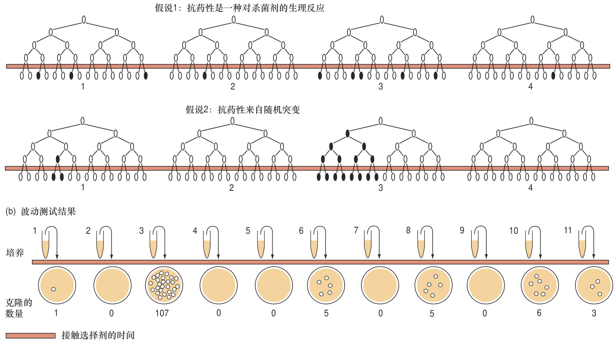  
(a)  

接下来我们将描述可能导致突变的多种随机事件。我们还讨论了细胞如何应对这些事件并最大限度地减少突变的产生。  

# 基本概念  

●突变是DNA碱基序列的遗传改变。  
● 点突变改变一个或几个碱基对；它们包括置换（转换和颠换）和缺失或插入。  
● 自发突变率较低，因不同基因和生物而异。  

图7.5　Luria-Delbrück波动实验。（a）假说1：如果只是在接触杀菌剂后才产生耐药性，则所有同等大小的细菌培养物应产生大致相同数量的耐药性菌落。假说2：如果在接触杀菌剂之前出现随机的耐药突变，那么在不同的培养中耐药菌落的数量应该有很大的差异（波动）。（b）实际结果显示，大的波动表明，细菌的突变作为自发的错误发生，与暴露于选择剂无关。  

(a) (b) $10^{7}$  

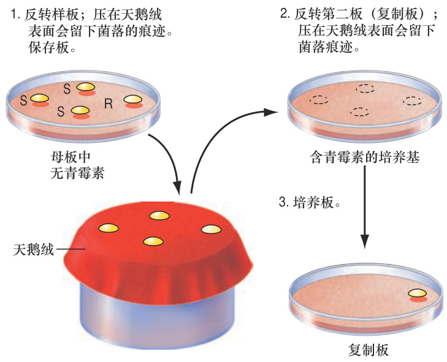  

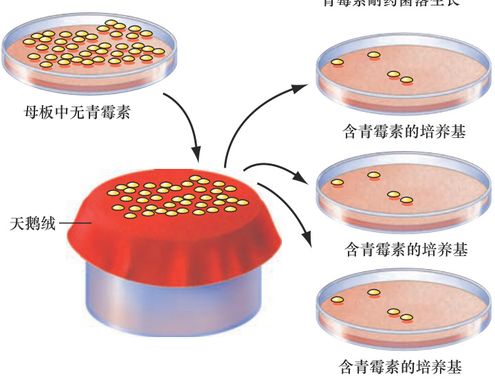  

图7.6　复制平板法验证了细菌耐药性是预先存在突变的结果。（a）将主板按压到天鹅绒的表面上，使每个菌落的细胞转移到天鹅绒表面。研究人员追踪主板上哪些菌落可以在复制平板上生长（这里，只有抗青霉素的菌落）。（b）不含青霉素的培养平板上的菌落依次转移到含有青霉素的三个复制平板中。耐药菌落在所有三个复制平板上都以相同的位置生长，这表明在接触抗生素之前，主板上的一些菌落就含有多个耐药细胞。  

● 细胞分裂越多，突变在基因组中积累的可能性就越大。● 波动测试和影印培养实验的结果显示，在杀菌剂暴露之前，细菌细胞中随机出现抗性突变。  

# 7.2 改变DNA序列的分子机制  

# 学习目标  

1. 概述可通过破坏DNA产生突变的自然过程。  
2. 解释DNA复制中的错误如何导致突变。  
3. 定义诱变剂并描述诱变剂如何用于基因研究。  
4. 描述Ames试验如何检测潜在的致癌物质。  

一个可遗传突变的产生是几个竞争过程的结果：突变、修复和复制（图7.7）。首先必须发生随机事件来改变DNA。两种不同的事件引发DNA变化：DNA可能被化学反应或辐射损坏；或者在复制过程中复制DNA时会发生错误。  

当DNA变化首次发生时，它们还不是真正的突变，而只是潜在的突变。原因是它们中的大多数被细胞内的各种酶系统快速修复。这些DNA修复机器正在进行DNA复制的持续竞赛（图7.7）。如果在下一轮DNA复制之前修复受损的DNA或错误掺入的核苷酸，则序列被校正并且不会导致突变。然而，如果修复酶在下一轮DNA复制之前没有纠正问题，则突变在双螺旋的两条链中永久地建立，并且产生了一个可遗传的突变结果。  

在本节中，我们描述了一些可以改变DNA序列的最重要的机制。本章的后续部分将讨论生物系统进化的各种生物化学途径，以最大限度地减少这些DNA改变的致突变后果。  

# 7.2.1 自然过程通过DNA损伤引起自发突变  

对DNA的化学和物理攻击非常频繁。遗传学家估计，例如，来自脱氧核糖-磷酸骨架的嘌呤碱基A或G的水解在每个人细胞中每小时发生1000次。这种DNA改变称为脱嘌呤［图7.8（a）］。因为得到的脱嘌呤位点不能指定互补碱基，DNA复制过程引入与脱嘌呤位点相对的随机碱基，导致新合成的互补链中3/4的突变。  

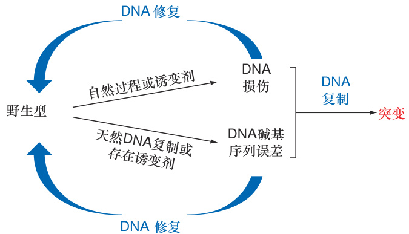  

图7.7　当DNA复制比DNA修复快时，点突变就产生了。发生在DNA中的突变只有在DNA修复不能在下一轮DNA复制前修复突变时才具有遗传性。  

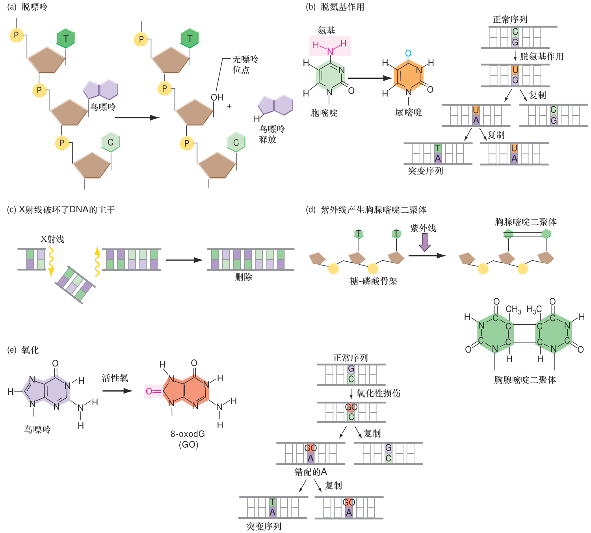  

图7.8　自然过程如何改变储存在DNA中的信息。（a）在脱嘌呤过程中，A或G碱基的水解作用会使DNA链带有未指定的碱基。（b）在脱氨过程中，从C中去除一个氨基引发了DNA复制后的转录过程。（c）X射线破坏了糖-磷酸盐的主链，从而将DNA分子分裂成更小的碎片，这些碎片可能被错误地连接在一起。（d）紫外线（UV）辐射使相邻的T形成二聚体，从而破坏基因信息的读取。（e）辐射引起自由基的形成（如带有不成对电子的氧分子），从而改变单个碱基。在这里，改变的碱基对与A的配对创造了一个转录，把G-C碱基对变成T-A碱基对。  

另一种可以修饰DNA信息含量的天然过程是脱氨作用，即去除氨基（ $\mathrm{-NH}_{2}$ ）基团。脱氨基可以将胞嘧啶（C）改变为尿嘧啶（U），尿嘧啶是在RNA中发现但未在DNA中发现。因为U与A而不是G配对，脱氨基之后的复制可能会在未来几代DNA分子中将C-G碱基对改变为T-A对［图7.8（b）］；这种C-G到T-A的变化是一种转换突变。  

其他攻击包括：自然发生的辐射，如宇宙射线和X射线，它们会破坏糖-磷酸盐骨架［图7.8（c）］；紫外线，使相邻的胸腺嘧啶残基与胸腺嘧啶二聚体化学地连接［图7.8（d）］；四个碱基中的任何一个的氧化损伤［图7.8（e）］。如果在DNA复制之前没有修复，所有这些变化都会永久地改变DNA分子的信息含量。  

# 7.2.2 DNA复制中的错误也会导致自发突变  

如果由于某种原因细胞机器在复制期间包含不正确的碱基，例如，C与A相对应而不是预期的T，那么在下一个复制周期中，其中一个子DNA将具有正常的A-T碱基对，而另一个将有一个突变体G-C。在细菌和人体细胞中仔细测量体内复制的保真度，表明这种误差非常罕见，每 $10^{9}$ 个碱基对中发生不到一次。该速率相当于输入整本书1000次，同时只输入一次打字错误。考虑到螺旋展开、碱基配对和聚合的复杂性，这种精确度令人惊讶。细胞如何避免大多数DNA复制错误，以及DNA被复制时会发生什么样的错误？  

# 1. DNA聚合酶的校对功能  

复制机器通过连续的校正阶段使错误率最小化。在试管中，DNA聚合酶以复制的每 ${10}^{6}$ 个碱基中大约一个错误的错误率复制DNA。该速率比细胞所达到的速率差1000倍。尽管如此，它的含量仍然很低，而且只有当聚合酶出错时，聚合酶分子才会以核酸酶的形式提供校对/编辑功能。所述核酸酶在聚合酶出错时变得活跃。聚合酶分子的这种核酸酶部分，称为 $3^{\prime}{\rightarrow}5^{\prime}$ 外切核酸酶，识别错配的碱基并将其切除，使聚合酶在下次尝试时正确复制核苷酸（图7.9）。如果没有核酸酶部分，DNA聚合酶在复制的每 $10^{4}.$ 个碱基中就会出现一个错误，因此这种编辑功能可以将复制的保真度提高100倍。  

体内DNA聚合酶是复制系统的一部分，复制系统包括许多其他蛋白质，它们共同将错误率提高10倍，使其达到细胞获得的保真度的约100倍。细胞100倍保真率取决于称为甲基定向错配修复的备用系统，该系统通知并纠正新复制的DNA中的残留错误。当我们描述细胞在突变发生后尝试纠正突变的各种方式时，我们将在本章后面介绍这种修复系统的细节。  

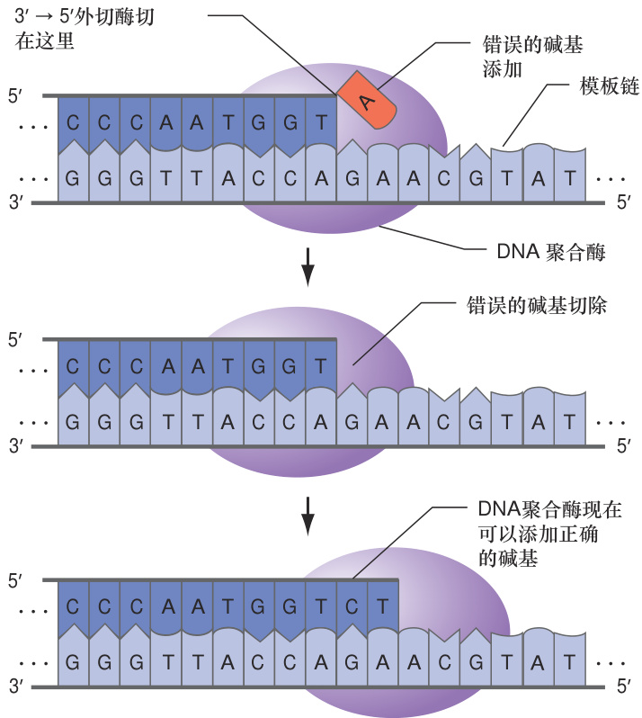  
图7.9　DNA聚合酶的校对功能。如果DNA聚合酶在其合成的链的3′端添加了一个错误的核苷酸，酶的 $3^{\prime}{\rightarrow}5^{\prime}$ 的外切酶活性就会移除这个核苷酸，使酶有第二次机会添加正确的核苷酸。  

# 2. 碱基互变异构  

DNA聚合酶可能出错的一个原因是碱基的互变异构化。四种碱基中的每一种都具有两种互变异构体，相似的化学形式不断地相互转化。互变异构体之间的平衡使得每个碱基几乎总是以A对T和G对C的形式存在。但是，如果DNA聚合酶到达时模板链中的碱基以其稀有的互变异构形式存在，则错误的碱基将被掺入新合成的链中，因为稀有的互变异构体配对与正常形式不同［图7.10（a）］。如果错误掺入的核苷酸在下一轮复制之前未通过错配修复进行校正，则会发生点突变［图7.10（b）］。  

# 3. 不稳定的三核苷酸重复  

1992年，分子遗传学家在人类中发现了一种完全出乎意料的突变类型：CGG基础三联体的过度扩增通常只连续重复几次到50次。例如，如果基因的正常等位基因携带5个连续重复的基础三联体CGG（即一条链上的  

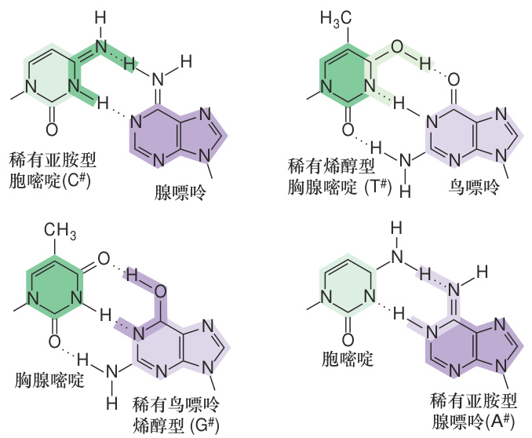  
(a)  

(b)  

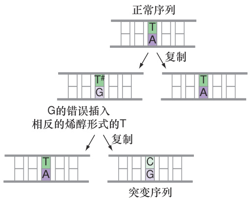  

图7.10　碱基互变异构化如何引起突变。（a）四种碱基的稀有互变异构体的配对能力不同于通常的碱基。（b）在罕见的烯醇形式中，T使DNA聚合酶在互补链中插入G。如果不匹配的T∶G碱基对在下一轮复制之前没有修复回到T∶A，则会在一个子DNA分子的两条链上建立一个T $:$ A-C $:$ G的过渡突变。  

CGGCGGCGGCGGCGG），则异常等位基因可连续携带200个重复。几种其他三核苷酸（CAG、CTG、GCC和GAA）的重复也可能是不稳定的，使得重复的数量通常在单个个体的不同体细胞中增加或减少。在配子生产过程中也会出现不稳定性，从而导致从一代到下一代的重复次数发生变化。  

现在已经在约20种不同的人基因中发现了不稳定的三核苷酸重复序列，所有这些基因都与神经退行性疾病有关。在所有情况下，重复扩增超过一定数量会导致致病等位基因。“快进”信息栏“三核苷酸重复疾病：亨廷顿病和脆性X综合征”解释了三核苷酸重复疾病可以根据重复序列相对于指定蛋白质产物的基因部分的位置细分为两组。其中一个例子是脆性X综合征，这是男孩最常见的智力残疾形式；另一组以亨廷顿病为代表，这是第2章讨论的一种神经系统疾病。  

两组三核苷酸重复疾病的一般特征是在特定位置的重复次数越多，发生扩张和收缩的可能性越大。因为较大的重复数意味着更多的不稳定性，一些具有中间数量的三核苷酸重复的等位基因表现为所谓的突变前等位基因［图17.11（a）］。例如，在脆性X综合征中，具有置换等位基因的个体具有正常表型，但扩增的重复数意味着这种突变前等位基因在复制期间极有可能扩增或收缩。因此，突变前等位基因的携带者很有可能给他们的图7.11　脆性X综合征的遗传。（a）脆性X综合征的野生型、突变前和致病等位基因在CGG三核苷酸重复数中的差异。疾病等位基因是无功能的。突变前等位基因提供正常的基因功能，但在女性生殖细胞的DNA复制过程中，它们有很高的三重重复扩增的可能性。（b）对于突变前等位基因，正常的雌性杂合子可能产生具有扩增的三重重复数的配子。  

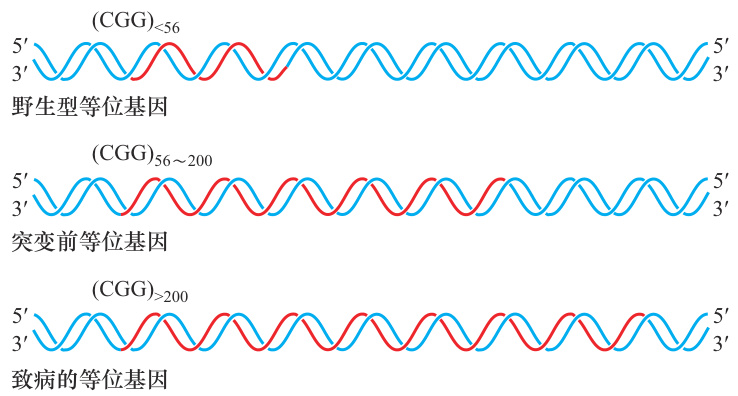  
(a)      (CGG)  

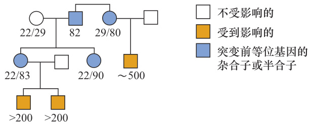  

孩子提供了新的疾病等位基因（具有更多的重复序列）［图7.11（b）］。  

研究人员并不完全了解三核苷酸重复疾病的一个奇怪特征：特定基因的突变前等位基因倾向于在雄性或雌性种系中扩展，但不是两者都扩大。例如，在图7.11（b）中，你可以看到导致脆性X综合征的等位基因是从具有突变前等位基因的母亲遗传的，但是具有突变前等位基因的父亲产生的精子中重复数量并未明显增加。奇怪的是，对于亨廷顿病而言，情况正好相反：疾病等位基因几乎总是起源于雄性（而不是雌性）种系。  

多种生化机制可能是三核苷酸重复扩增和收缩的原因。一种特别充分表征的机制是在DNA复制过程中滑动错配。DNA聚合酶经常在重复区域复制时暂停，这允许一条DNA链（新合成的链或模板链）相对于另一条DNA链滑动（图7.12）。因为序列包含重复序列，所以滑移链和另一条链不能配对，从而形成环路。在另一轮DNA复制后，这种错配可导致两条DNA链中三核苷酸重复数的扩增或收缩。  

# 7.2.3 诱变剂诱发突变  

突变使得遗传分析成为可能，但大多数突变以如此低的速率自发出现，研究人员一直在寻找可控制的方法来增加它们发生的概率。摩尔根果蝇研究组的原始成员H. J. Muller首先展示了这一点：暴露于高于天然水平的X射线剂量会增加果蝇的突变率（图7.13）。  

Muller将雄性果蝇暴露于越来越大剂量的X射线，然后将这些雄性与雌性交配，其中一条X染色体含有易于识别的显性突变，导致Bar眼。这条X染色体（称为平衡器）也进行了染色体重排，称为倒位，阻止其与其他X染色体交换（第13章解释了这种现象的细节）。这次交配的一些F1代的雌性是杂合子，从它们的父系那里携带了一个突变的X，从它们的母系那里携带了一个带有条形标记的X。如果X射线在父系衍生的X染色体上的任何地方诱导隐性致死突变，那么这些F 雌性将无法产生非Bar眼雄性。因此，简单地通过注意非Bar眼雄性的存在与否，Muller可以确定X染色体上超过1000个基因中是否发生了突变，这些基因对果蝇的生存能力至关重要。他得出结论：X射线剂量越大，隐性致死突变的频率越高。  

任何使突变频率高于自发率的物理或化学试剂称为诱变剂。研究人员使用许多不同的诱变剂来产生突变用于研究。以DNA结构的沃森-克里克模型为指导，他们可以在分子水平上理解大多数诱变剂的作用。例如，Muller用于在X染色体上诱导突变的X射线可以破坏DNA链的糖-磷酸骨架，有时断裂双螺旋的两条链上的相同位置。多个双链断裂产生DNA片段化，并且片段的不正确缝合可以导致小的缺失［综述图7.8（c）］、  

# 三核苷酸重复疾病：亨廷顿病和脆性  

# X综合征  

由具有不稳定三核苷酸（三联体）重复基因引起的大约20种已知的神经发生性疾病分为两类：polyQ疾病和非polyQ疾病（其中Q是氨基酸谷氨酰胺的符号）。在polyQ疾病基因中，重复的三联体总是CAG；而在非polyQ疾病基因中，三核苷酸重复可以是CGG、CTG、GCC或GAA。两种类型的三联体重复疾病的特征在于重复序列对基因功能的影响。在polyQ疾病中，具有过多三联体重复的疾病等位基因编码异常蛋白质。非polyQ疾病等位基因不编码蛋白质或编码的蛋白质量减少。两类三联体重复疾病的差异由两个最著名的例子说明：亨廷顿病，一种polyQ疾病；脆性X综合征，一种非polyQ疾病。  

亨廷顿病发病率全世界约为万分之一。症状通常始于40岁左右，包括肌肉协调困难、认知能力下降和精神问题。你在第2章中看到，亨廷顿病是通过常染色体显性突变等位基因（HD）遗传的。虽然正常 $H D^{+}$ 等位基因具有 $6\!\sim\!28$ 个CAG重复，但HD疾病等位基因具有扩增的重复区域，其具有36个或更多个CAG重复。HD基因中CAG运行在可读框（ORF）中，其包含从其组成氨基酸构建蛋白质的实际说明。  

每个CAG规定氨基酸谷氨酰胺（Q）应添加到HD蛋白中，因此正常蛋白质在其所谓的polyQ区域中具有连续 $6\!\sim\!28$ 个Q氨基酸（图A）。具有36个或更多重复的HD等位基因编码突变的HD蛋白，其具有对神经细胞有毒的扩展的polyQ区（由突变前等位基因编码的蛋白质正常运作但等位基因具有不稳定的重复序列）。科学家尚不了解HD在神经细胞中的正常功能或突变HD蛋白有毒的原因。  

像HD一样的PolyQ疾病等位基因被称为功能获得性突变体，因为它们指定的蛋白质的功能与相应的野生型蛋白质的功能定性不同。许多典型的功能获得突变体，polyQ疾病等位基因显示显性遗传，因为突变体polyQ蛋白即使在正常蛋白质存在下也是有毒的。  

非polyQ疾病的例子是脆性X综合征，这是遗传性智力残疾的主要原因，影响约4000名男性中的1名和8000名女性中的1名。该疾病是由称为FMR-1的X连锁基因（用于脆性X智力迟钝-1）中的CGG重复区域扩增引起的。  

FMR-1的CGG位于ORF外部的基因区域，称为$5^{\prime}$ UTR（图B）。正常FMR- $\cdot1^{+}$ 基因具有 $6\!\sim\!55$ 个CGG重复；将重复数目扩展至200个CGG或更多则导致FMR-1疾病等位基因不能产生FMR-1蛋白。没有FMR-1蛋白，神经细胞不能正确形成称为突触的连接。  

所有非polyQ疾病的共同特征是三联体位于ORF外部基因中的一部分。非polyQ疾病基因中扩增的重复序列通常会阻止蛋白质的产生，因此非polyQ疾病基因是失去功能的等位基因。因为对于疾病等位基因杂合的雌性大多数时间至少具有一些疾病症状，所以脆性X综合征显示X连锁显性遗传，具有不完全外显率和可变表达性。其他非polyQ疾病等位基因可能显示显性遗传或隐性遗传模式，这取决于是否需要两剂或一剂正常基因产物来避免疾病症状。  

三联体重复疾病说明了关于突变的两个基本原则。首先，突变可能影响基因产物的性质（polyQ疾病）或基因产物的量（非polyQ疾病）。其次，某些DNA序列在特殊情况下可以以惊人的高频率突变，如亨廷顿病或脆性X综合征的突变前等位基因。这两个原则将成为后续章节中的重要主题。  

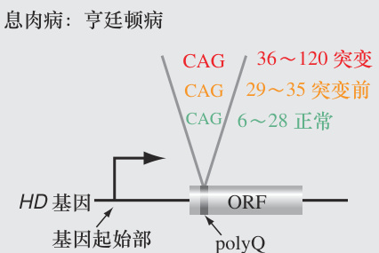  

图A　亨廷顿病：一种polyQ疾病。HD基因有一系列CAG重复序列，在可读框（ORF）中指定了谷氨酸（Q）。HD疾病等位基因通过扩增的多聚区直接合成一种突变的、有毒的HD蛋白。具有中间数量CAG的突变前等位基因产生正常功能的蛋白质，但该等位基因不稳定。  

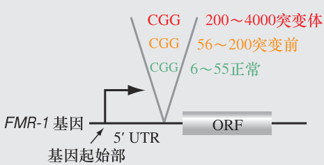  

图B　脆性X综合征：一种非polyQ疾病。FMR-1基因在ORF外的5′非翻译区（ $5^{\prime}$ UTR）有大量CGG重复。FMR-1疾病等位基因有一个扩大的重复数，这阻止了基因蛋白质产物的合成。具有中间数量CGG的突变前等位基因可以产生正常数量的蛋白质，但是这些等位基因是不稳定的  

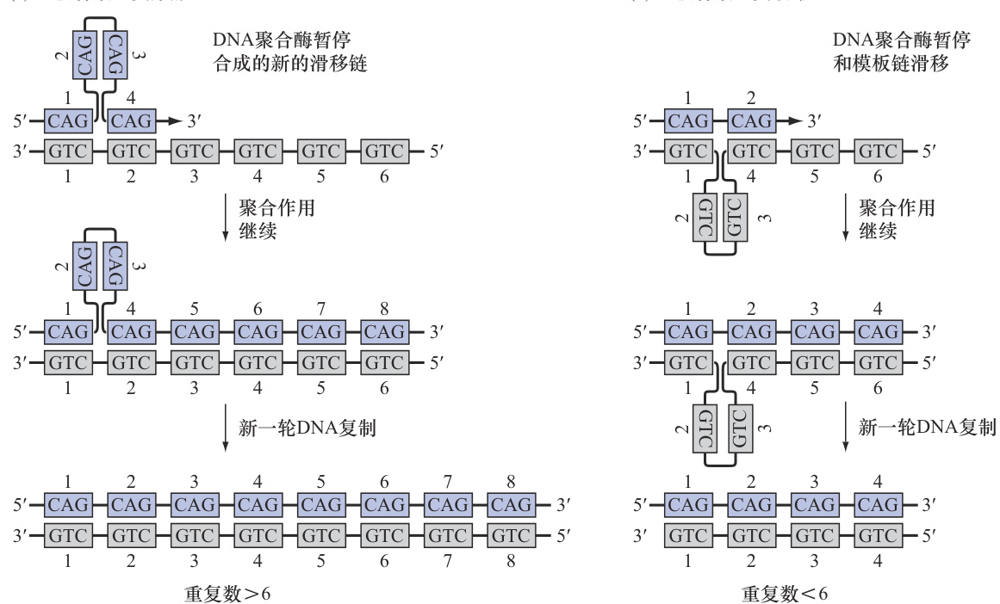  
图7.12　在DNA复制过程中三核苷酸的错配扩增。（a）在DNA复制过程中，DNA聚合酶在重复序列上的暂停允许新合成的DNA链（蓝色）相对于模板链（灰色）发生滑移。由于重复，滑移链仍然可以与模板配对，DNA聚合反应可以继续。另一轮的DNA复制将在双链DNA中建立额外的重复。（b）同样，模板链相对于新合成的DNA链的滑移也会导致重复序列的缺失。  

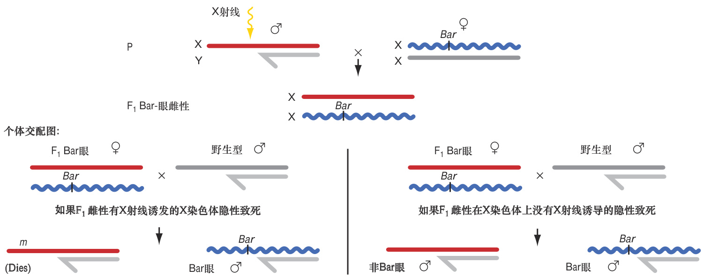  
图7.13　暴露于X射线会增加果蝇的突变率。雌性F1有一个受辐射的父系X染色体（红线）和一个含有条形标记的母系平衡器X染色体（蓝色波浪线）。这两条染色体不能重组，因为平衡器染色体阻止重组的发生。单个的F1雌性，每只都有一条来自父系的X射线暴露的X染色体，然后分别与野生型雄性交配。如果任何一个F1雌性的父系X染色体有X射线诱发的隐性致死突变（m），她只能生出Bar眼子代（左图）。如果X染色体没有这样的突变，这个F1雌性将同时生出Bar眼和非Bar眼的子代（右图）。  

大的缺失和其他重排（将在第13章中讨论）。  

诱变的另一种分子机制涉及称为碱基类似物的诱变剂，其在化学结构上与正常的含氮碱基非常相似，复制机器可以将它们掺入DNA中［图7.14（a）］。因为碱基类似物可以具有互变异构形式，其配对性质不同于它取代的碱基，所以类似物可以在下一轮DNA复制中合成的互补链上引起碱基取代。  

其他化学诱变剂通过直接改变碱基的化学结构和性质产生置换［图7.14（b）］。同样，当改变的碱基导致在随后的一轮复制过程中掺入不正确的互补碱基时，这些变化的作用在基因组中变得固定。  

另一类化学诱变剂由称为嵌入剂的化合物组成：扁平的平面分子可以将自身夹在连续的碱基对之间，破坏复制机制，产生单个碱基对的缺失或插入［图7.14（c）］。由于这个原因，嵌入剂二氨基吖啶通常用于遗传研究。  

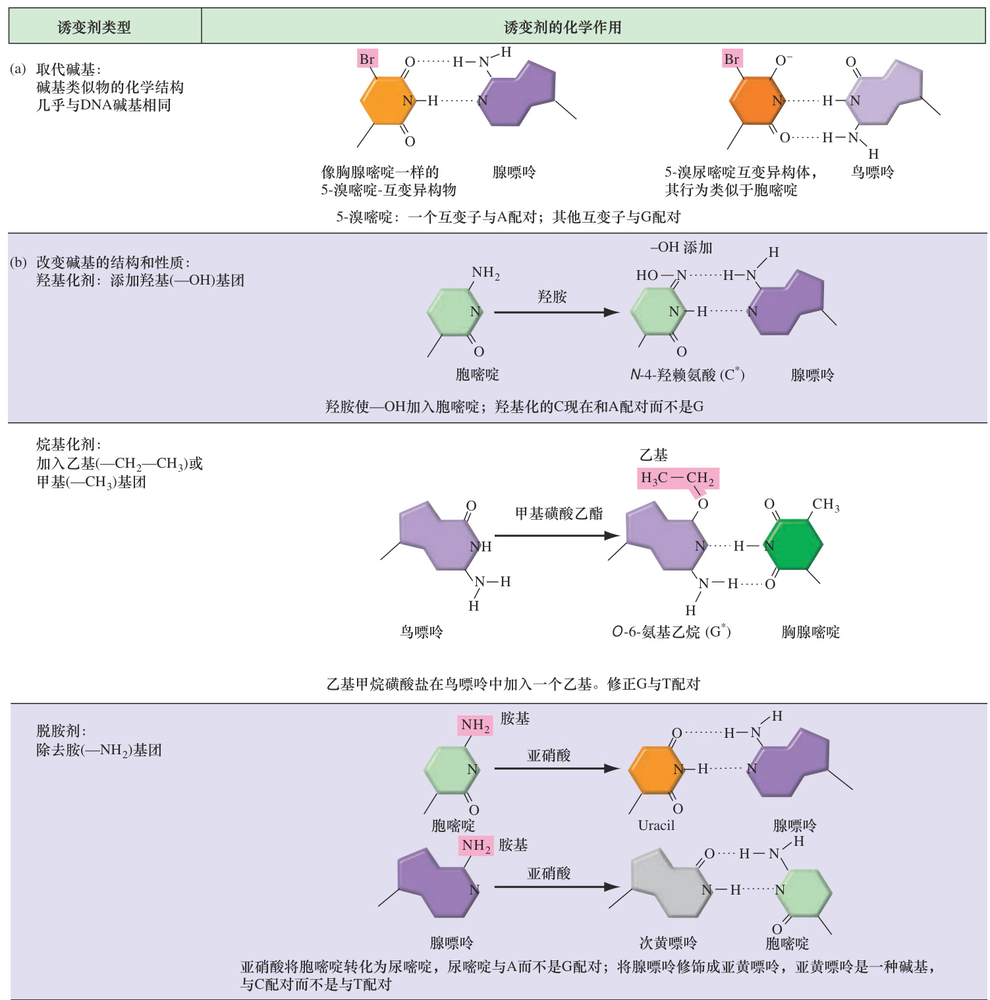  

(c)  

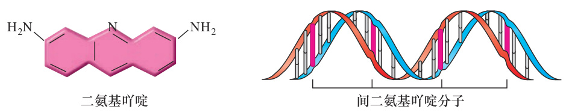  

图7.14　诱变剂如何改变DNA。（a）与DNA结合的碱基类似物可能发生异常配对，导致复制过程中错误的核苷酸被添加到相反的链上。（b）一些诱变剂改变碱基的结构，使它们在下一轮复制中不恰当地配对。（c）插入剂的大小和形状与双螺旋的碱基对大致相同。它们与DNA结合产生单碱基对的插入或缺失。  

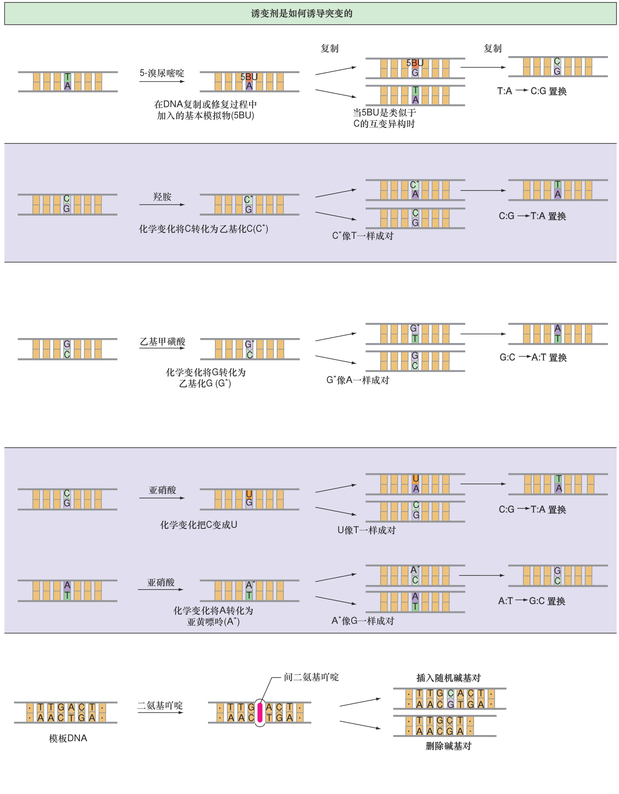  
图7.14（续） 诱变剂如何改变DNA。  

# 7.2.4 许多致突变物是致癌物质  

虽然只有在种系中发生的突变才能传递给下一代，但体细胞突变仍然可以对健康和生存产生影响。例如，有助于调节细胞周期的基因中的体细胞突变可能导致癌症。出于这个原因，许多诱变剂充当致癌物质（致癌剂）。  

美国食品药品监督管理局试图通过使用Ames试验来筛选导致细菌细胞突变的化学物质，从而识别潜在的致癌物质（图7.15）。该测试询问特定化学物质是否可以诱导细菌鼠伤寒沙门氏菌的特殊组氨酸突变株（His ）的组氨酸回复体（ $\operatorname{His}^{+}$ ）。His 回复体可以从环境中的简单化合物合成它们所需的所有组氨酸，而原始的His 突变体不能产生组氨酸，因此它们只有在提供组氨酸时才能存活。  

Ames试验的优点是只有回复体可以在不含组氨酸的培养皿上生长，因此有可能从最初的His培养物中检测大量细胞，以找到由所述化学物质诱导的稀有His 回复体。为了增加突变检测的灵敏度，在Ames测试系统图7.15　Ames试验确定了潜在的致癌物。研究人员将一种化合物与一种His 品系的鼠伤寒沙门氏菌细胞和一种大鼠肝酶溶液（有时可以将无害的化合物转化为诱变剂）混合进行测试。只有His+逆转株在没有组氨酸的培养皿中能够生长。如果这个培养皿（左下）比含有未暴露细胞的对照培养皿（同样不含组氨酸）含有更多的His 逆转株（右下），这种化合物就被认为是诱变剂和潜在致癌物。培养皿上的稀有逆转株代表了自发突变的速率。  

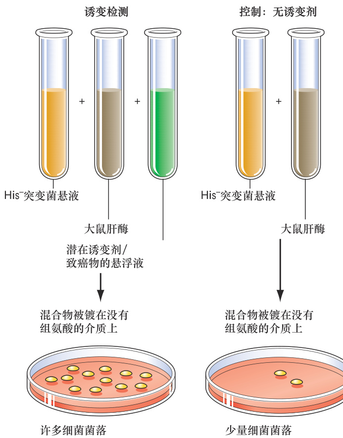  
His–      His+   
His–      His+  

中使用的His 菌株含有第二个突变，其使DNA修复系统失活（将在下一部分中描述），从而防止由潜在诱变剂引起的突变的即时修复。细菌还携带第三个突变，导致细胞壁缺陷，使受试化学品更容易进入细胞内部。因为大多数引起细菌突变的药剂也会破坏高等真核生物的DNA，任何增加细菌突变率的诱变剂都可能导致人类和其他哺乳动物的癌症。然而，哺乳动物具有能够灭活危险化学品的复杂代谢过程。另一方面，哺乳动物中的其他生物化学事件可以从非危险化学品中产生诱变物质。为了模拟哺乳动物代谢的作用，毒理学家经常通过Ames试验将大鼠肝酶溶液加入到分析的化学物质中（图7.15）。  

由于这种模拟并不完美，美国食品药品监督管理局的代理人最终会评估Ames试验鉴定的细菌诱变剂是否会通过将试剂包含在实验动物的饮食中而导致啮齿动物的癌症。  

# 基本概念  

●  某些天然药物可诱发自发突变。这些试剂包括辐射（如X射线和紫外线）和破坏DNA的化学反应（如脱氨和氧化）。  
●  DNA复制错误是自发突变的另一个来源。许多这些错误是由三核苷酸重复的碱基互变异构或扩增/收缩引起的。  
●  致突变物是将突变频率提高到自发率以上的试剂。在研究中，诱变剂可以帮助产生感兴趣的突变用于进一步研究。  

# 7.3 DNA修复机制  

# 学习目标  

1.  列出细胞可以用改变或损坏的核苷酸修复DNA的机制。  

2.  比较同源重组和非同源末端连接机制修复双链断裂的结果。  
3.  解释当发生复制错误时，甲基定向错配修复如何区分修复哪条链。  
4.  陈述为什么细胞仅使用某些DNA修复系统作为最后的手段。  
5.  描述指定DNA修复因子的基因突变对人类健康的潜在影响。  

回想一下图7.7，如果在DNA复制发生之前修复新的DNA损伤，染色体中就不会发生突变。事实上，细胞已经进化出多种酶系统，这些系统定位并修复受损的DNA，从而大大减少突变的发生。这些修复系统的组合必须非常有效，因为几乎所有基因观察到的自发突变率都非常低。  

# 7.3.1 一些DNA碱基损伤可以逆转  

细胞含有各种酶系统，可以快速直接地逆转某些种类的核苷酸改变。例如，如果错误地将甲基或乙基加到鸟嘌呤中［如图7.14（b）所示］，烷基转移酶可以除去它们以重新形成原始碱基。  

在第二个实例中，光解酶识别通过暴露于紫外线产生的胸腺嘧啶二聚体［综述图7.8（d）］并通过分裂胸腺嘧啶之间的化学键来逆转损伤。有趣的是，光解酶仅在可见光存在下起作用。在进行DNA修复工作时，它与称为发色团的小分子结合，吸收光谱可见光范围内的光；然后酶利用发色团捕获的能量来分裂胸腺嘧啶二聚体。因为它在黑暗中不起作用，所以光解酶机制被称为光修复。  

# 7.3.2 损坏的基座可以拆除和更换  

许多修复系统使用同源依赖性修复的一般策略，它们首先从含有改变的核苷酸的DNA链中去除小区域，然后使用另一条链作为模板来重新合成去除的区域。该策略利用双螺旋结构的一个巨大优势是：如果一条链维持损伤，细胞可以使用与未损伤链的互补碱基配对来重新创建原始序列。  

# 1. 碱基切除修复  

在这种类型的同源依赖性修复机制中，称为DNA糖基化酶的酶从其核苷酸的糖中切割出改变的含氮碱基，释放碱基并在DNA链中产生脱嘌呤或脱嘧啶（AP）位点（图7.16）。不同的糖基化酶切割特定的受损碱基。碱基切除修复在从DNA中去除尿嘧啶方面特别重要［回想一下，尿嘧啶通常由胞嘧啶的天然脱氨作用产生；综述图7.8（b）］。在这个修复过程中，当尿嘧啶-DNA糖化酶将尿嘧啶从糖中除去，留下AP位点后，酶AP内切酶在AP位点的DNA主链上形成一个缺口。其他酶（称为DNA外切核酸酶）攻击切口并从其附近移除核苷酸以在先前受损的链中产生间隙。DNA聚合酶通过复制未损坏的链填充间隙，在过程中恢复原始核苷酸。最后，DNA连接酶密封新修复的DNA链的骨架。  

# 2. 核苷酸切除修复  

该途径（图7.17）消除了基因切除无法修复的改变，因为细胞缺乏识别问题碱基的DNA糖基化酶。核苷酸切除修复取决于含有多于一种蛋白质分子的酶复合物。在大肠杆菌中，这些复合物由三种可能的蛋白质中的两种组成：UvrA、UvrB和UvrC。其中一个复合物（UvrA+UvrB）对DNA进行不规则性巡查，检测破坏沃森-克里克碱基配对的病变，从而扭曲双螺旋（如尚未通过光修复校正的胸腺嘧啶二聚体）。第二个复合体（ $\scriptstyle\mathrm{JvrB+UvrC}$ ）在受损侧翼的两个位置切割受损的链。  

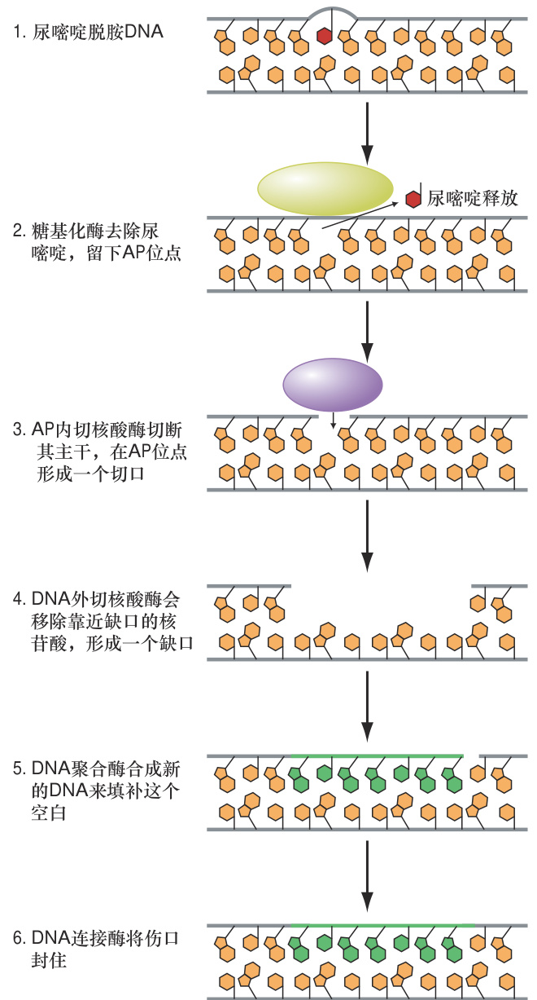  
图7.16　碱基修复移除受损的碱基。糖基化酶（浅绿色椭圆形）清除异常碱基［如胞嘧啶脱胺形成的尿嘧啶（红色）］，留下AP位点。AP核酸内切酶（紫色椭圆形）切断糖-磷酸的主链，形成一个缺口。外切核酸酶将裂口扩展成缺口，缺口由DNA聚合酶以正确的DNA链（深绿色）填充。在DNA连接酶作用下重新形成正确的DNA链。  

这种双切割切除受损链的短区域并留下间隙，该间隙将被DNA聚合酶填充并用DNA连接酶密封。  

# 7.3.3 两种重要机制可以修复双链断裂  

我们以前已经看到X射线可以引起双链断裂，其中双螺旋的两条链在附近的位置被破坏［参见图7.8（c）］。双链断裂代表一种特别危险的DNA损伤类型，因为如果不能正确修复，这种染色体断裂不仅会导致点突变，还会导致大的缺失和其他类型的染色体重排。  

生物体进化至少两种不同的修复双链断裂的方法也就不足为奇了。这些机制之一——同源重组（HR），使用互补碱基配对来精确修复断裂而不损失或获得核苷酸。第二种途径称为非同源末端连接（NHEJ），可以将甚至彼此不相邻的DNA末端聚集在一起，并且在该过程中可能丢失或添加少量碱基对。  

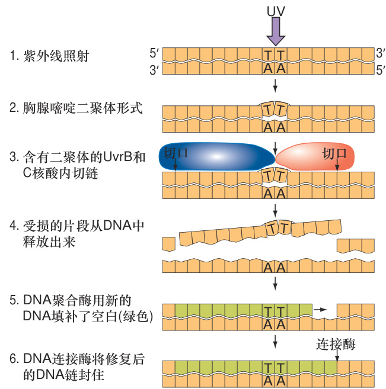  
图7.17　核苷酸切除并修复受损的核苷酸。一个由UvrA和UvrB蛋白组成的复合体（未显示）扫描DNA，寻找由DNA损伤引起的畸变，如胸腺嘧啶二聚体。在受损部位，UvrA与UvrB分离，允许UvrB（红色）与UvrC（蓝色）结合。这些酶准确地将DNA的四个核苷酸切到损伤的一边，将七个核苷酸切到另一边，释放出一小段单链DNA。DNA聚合酶重新合成缺失的DNA链（绿色），DNA连接酶再重新密封已修复的DNA链。  

用于修复双链断裂的两种系统都具有重要的实际意义，因为它们是用于基因组编辑的新的有效策略（以特定方式改变生物体基因组）的基础。我们将在第18章中描述这些用于修改基因组的令人兴奋的方法，但是在这里获得关于这些修复机制如何工作的一些想法将会有所帮助。  

# 1. 通过同源重组（HR）修复双链断裂  

你会记得减数分裂重组的第一步是双链断裂的形成，并且通过链入侵，经历重组的细胞最终使用同源染色体作为模板修复这种双链断裂（综述图6.27）。有丝分裂细胞可以使用大部分相同的酶促机制进行同源重组，以修复由X射线暴露引起的双链断裂。HR系统可以使用同源染色体或更常见的姐妹染色单体作为修复模板。如果同源染色体充当模板，则断裂的修复导致有丝分裂重组。然而，寻找同源物是低效的，因此通过重组的修复通常发生在细胞周期的 ${\bf G}_{2}$ 期（即染色体复制后）的姐妹染色单体之间。在这种情况下，断裂的修复不会产生有丝分裂重组，因为破碎的染色单体和模板染色单体碱基对序列是相同的。  

# 2. 通过非同源末端连接（NHEJ）修复双链断裂  

NHEJ机制是HR的替代物，其对于修复在细胞周期的G1期期间形成的双链断裂（即在姐妹染色单体可用作同源重组的模板之前）尤其重要。参与NHEJ的蛋白质在断裂位点与DNA末端结合并保护末端免受核酸酶的影响。NHEJ蛋白也桥接两端，允许它们通过DNA连接酶缝合在一起（图7.18）。  

你应该注意到，因为NHEJ不涉及DNA同源性，它可以将任何DNA末端（除了端粒，其受到保护免于该途径）连接在一起，即使这些末端在最初的基因组中彼此不相邻。因此，如果基因组遭受多于一个双链断裂，NHEJ可能会将错误的末端连接在一起，导致染色体重排，如倒位或大的缺失。NHEJ的另一个特性是，虽然这种机制通常是准确的，但它有时会导致断裂末端连接在一起的DNA序列发生微小变化。在NHEJ过程中，DNA外切核酸酶和DNA聚合酶可以在断裂的末端起作用，在DNA连接酶将它们密封在一起之前去除或添加一些碱基对。由NHEJ导致的错误相对较少，但是当我们在本书后面的第18章中讨论基因组编辑技术时会发现，它们确实会发生并将变得具有重要意义。  

# 7.3.4 错配修复纠正了DNA复制中的错误  

DNA聚合酶在复制DNA方面非常准确，但DNA复制系统所犯的错误仍然是大多数细胞所能容忍的100倍。称为甲基定向错配修复的备份修复系统几乎可以纠正所有这些错误（图7.19）。由于错配修复仅在DNA复制后才有效，因此该系统需要解决一个难题。假设已复制G-C对以产生两个子分子，其中一个具有正确的G-C碱基对，另一个具有不正确的G-T。错配修复系统可以很容易地识别不正确匹配的G-T碱基对，因为不正确的碱基配对会扭曲双螺旋，导致异常凸起和凹陷。但是系统如何知道是否将该对更正为G-C或A-T？  

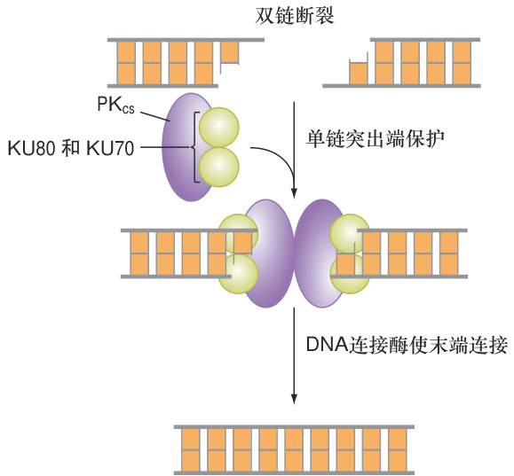  
图7.18　非同源末端连接修复断裂的双链。蛋白质KU70、KU80和PKCS（在哺乳动物细胞中）与DNA末端结合，保护它们免受降解，并把它们聚集在一起，这样DNA连接酶就可以修复磷酸二酯主链。  

细菌通过在特定位置的亲本DNA链上放置一个区别标记来解决这个问题：GATC序列发生的每个地方，腺嘌呤甲基化酶在A上放置甲基［图7.19（a）］。复制后不久，旧模板链带有甲基标记，而含有错误核苷酸的新子链尚未标记［图7.19（b）］。大肠杆菌中的一对蛋白质，称为MutL和MutS，检测并结合错配的核苷酸。MutL和MutS指导另一种蛋白MutH在最近的甲基化GATC对面的位置切割新合成的DNA链；MutH可以区分新合成的链，因为它的GATC不是甲基化的［图7.19（c）］。然后DNA外切核酸酶去除切口和刚好超出错配的位置之间的所有核苷酸，在新的未甲基化链上留下间隙［图7.19（d）］。DNA聚合酶现在可以使用旧的甲基化链作为模板重新合成信息，然后DNA连接酶密封修复的链。随着复制和修复的完成，酶用甲基标记新链，使其亲本来源在下一轮复制中显而易见［图7.19（e）］。  

真核细胞也有错配校正系统，但我们还不知道该系统如何区分模板与新复制的链。与原核生物不同，真核生物中的GATC没有用甲基标记，真核生物似乎没有与MutH密切相关的蛋白质。一个可能有趣的线索是真核生物中的MutS和MutL蛋白与DNA复制因子相关；也许这些相互作用可能有助于MutS和MutL识别要修复的链。  

# 7.3.5 易错修复系统是最后的保障  

刚刚描述的修复系统在修复DNA损伤方面非常准确，因为它们可以用未损坏的链的互补拷贝替换受损的核苷酸，或者将断裂的链重新连接在一起。然而，细胞有时会暴露于这些高保真修复系统无法处理的诱变剂水平或类型。例如，强光剂量的紫外线可能会产生比细胞更多的胸腺嘧啶二聚体。任何未修复的损伤都会对细胞分裂造成严重后果；特别是，通常用于复制的DNA聚合酶将在这种病变处停滞，因此细胞不能增殖。这些细胞可以启动紧急反应，让它们克服这些问题，从而生存和分裂，但它们在这种情况下进行的能力是以将新突变引入基因组为代价的。  

# 1. 使用sloppy DNA聚合酶  

细菌中的一种紧急修复，称为SOS系统（在莫尔斯码遇险信号之后），依赖于容易出错（或sloppy）的DNA聚合酶。这些易错的DNA聚合酶不能用于正常的DNA复制；它们仅在DNA损伤的情况下产生。损伤诱导的、易于出错的DNA聚合酶被复制叉吸引，这些复制叉已经在未修复的受损核苷酸位点处停滞。在那里，酶将随机核苷酸添加到与受损碱基相对的合成链中。  

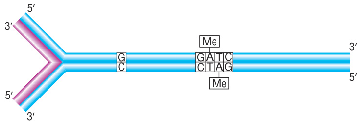  
(a)   
(b) MutS MutL    DNA  

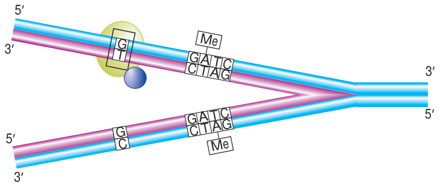  
(c)  MutL  MutH  GATC MutH (   )  

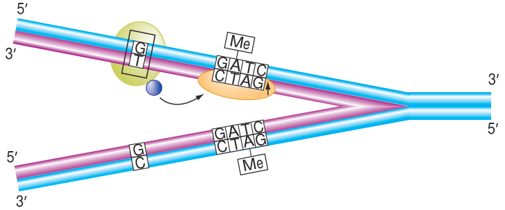  
(d)  DNA   (   )           DNA  

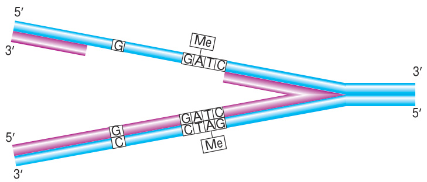  
(e)      DNA  

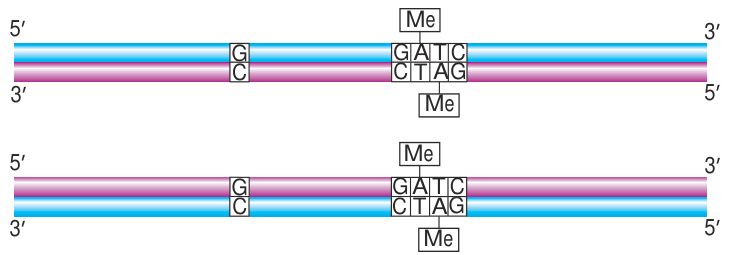  
图7.19　在细菌中，甲基定向的错配修复纠正了复制中的错误。亲本链为淡蓝色，新合成的链为品红色。MutS蛋白为绿色，MutL为深蓝色，MutH为橙色。详情见正文。  

因此，SOS聚合酶允许具有受损DNA的细胞分裂成两个子细胞，但因为在每个位置，易错的聚合酶仅在1/4的时间内恢复正确的核苷酸，所以这些子细胞的基因组携带新的突变。在细菌中，许多诱变剂的诱变作用或者取决于SOS系统，或者通过SOS系统增强。  

# 2. sloppy修复双链断裂  

另一种紧急修复系统，即微同源介导的末端连接（MMEJ），处理未通过同源重组或NHEJ校正的危险双链断裂。MMEJ的机制类似于NHEJ的机制（先前在图7.18中显示），除了在MMEJ中，断裂的DNA末端在断裂的任一侧（切除）被酶切断。切除暴露了断裂两侧的互补DNA序列（微观同源）的小单链区域，有助于将末端结合在一起。  

因为在切除期间在双链断裂的位点处去除核苷酸，MMEJ导致重新连接的DNA中数十至数百个碱基对的缺失。这些缺失比有时由NHEJ产生的少数碱基对的小缺失更长。  

# 7.3.6 编码DNA修复蛋白的基因突变影响人类健康  

DNA修复机制几乎在所有物种中以某种形式出现。例如，人类具有6种蛋白质，其氨基酸与大肠杆菌错配修复蛋白MutS的氨基酸约有 $25\%$ 相同。DNA修复系统因此非常陈旧，并且必须在35亿年前的生命出现后很快发展。一些科学家认为，当植物开始向大气中沉积氧气时，DNA修复变得至关重要，因为氧气有助于形成可以破坏DNA的自由基。  

与DNA损伤修复缺陷相关的许多已知的人类遗传性疾病揭示了这些机制对于生存的重要性。在一个实例中，患有着色性干皮病的患者的细胞缺乏进行核苷酸切除修复的能力；这些人对于编码通常在该修复系统中起作用的酶的7种基因中的任何一种的突变是纯合的。结果，不能有效地除去由紫外线引起的胸腺嘧啶二聚体。除非这些人避免全部暴露在阳光下，否则他们的皮肤细胞会开始积聚突变，最终导致皮肤癌（图7.20）。  

在另一个例子中，研究人员最近了解到，人类遗传性结直肠癌的形式与人类基因的突变有关，这些突变与编码错配修复蛋白MutS和MutL的大肠杆菌基因密切相关。在一个实例中，乳腺癌基因BRCA1和BRCA2（其中任一个的突变与女性乳腺癌的高风险相关）编码通过同源重组在双链断裂修复中起作用的蛋白质。第20章更详细地讨论了DNA修复与癌症之间的迷人联系。  

# 7.3.7 DNA修复不能 $100\%$ 高效  

“略微犯错的能力是DNA真正的奇迹。如果没有这个特殊的属性，我们仍然是厌氧菌，而且不会有现在的生活。”在这两句话中，杰出的医学家和自诩为“生物学观察者”的Lewis Thomas承认，DNA的变化背后的表型变异是自然选择已经作用数十亿年来推动进化的原材料。  

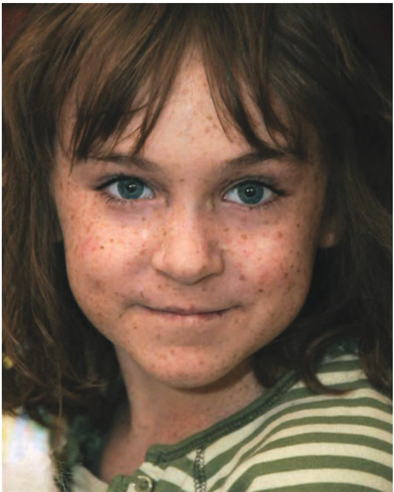  
图7.20　着色性干皮病患者皮肤病变。这种遗传性疾病是由于在核苷酸切除修复系统中缺少一种关键酶而引起的。$\copyright$ Barcroft Media/Getty Images  

正如Thomas博士的诗句所暗示的那样，突变的必要性是根本性的：没有突变，生命早就会消失，因为它无法应对环境的变化。因此DNA修复过程必须小心谨慎。它们必须足够有效，以保护基因组免受大量对DNA的攻击，这些攻击始终在发生，但生命的传播需要将一些突变传递给后代。  

# 基本概念  

●  细胞具有许多不同的酶系统，可通过修复DNA损伤或复制错误来最大限度地减少突变。  
●  对基因组特别危险的双链断裂，可通过同源重组（HR）或非同源末端连接（NHEJ）进行修复。  
●  DNA复制错误的纠正需要错配修复系统选择正确的链来改变。细菌通过用甲基标记亲本链来完成这项任务。  
●  如果正常的修复机制被过多的DNA损伤所淹没，那么细胞就可以调动容易出错的DNA修复系统。  
●  指定参与DNA修复的蛋白质的基因突变通常会导致人类疾病，包括癌症。  
●  突变是进化的“原料”。虽然许多突变是有害的，但罕见的突变可能赋予选择性优势。  

# 7.4 突变对基因结构的影响  

# 学习目标  

1.  描述互补测试及其结果如何区分单个基因的突变和不同基因的突变。  

2.  解释Benzer的实验结果如何揭示噬菌体T4中的rII区域含有两个基因，每个基因由许多核苷酸对组成。  

3. 讨论Benzer如何使用缺失来绘制rII区域的突变。  

遗传学完全依赖于突变，因为我们只能通过其突变体的表型效应来追踪杂交中的基因。在20世纪50年代和60年代，科学家们意识到他们也可以使用突变来了解染色体上的DNA序列如何构成单个基因。这些研究人员希望在单个基因中收集大量突变，并分析这些突变如何相互排列。为了使这种方法获得成功，他们必须确定各种突变事实上都在同一基因中。这不是一项简单的工作，如下列情况所示。  

早期的果蝇遗传学家发现大量的X连锁隐性突变影响了正常的红色野生型眼睛颜色（图7.21）。其中第一个被发现的是摩尔根研究小组研究的著名的白色眼睛。其他的突变导致眼睛出现了各种各样的颜色：暗色调，如石榴石色和红宝石色；朱红色、樱桃红色和珊瑚色等鲜艳的色彩；更轻的色素，包括杏色、浅黄色和康乃馨色。这些各种各样的眼睛颜色构成了一个难题：是突变导致了一个基因的多个等位基因，还是影响了一个以上的基因？  

# 7.4.1 互补测试揭示了两个突变是在单个基因还是在不同基因中  

研究人员通常将基因定义为指导分子产物外观的功能单元，而分子产物反过来又促成特定的表型。他们可以使用这个定义来确定两个突变是在同一基因中，还是在不同基因中。  

如果个体中的两个同源染色体各自带有隐性野生型突变，且突变位于不同基因中，那么个体将具有正常表型。这样的结果称为互补。正常的表型发生是因为几乎所有隐性突变都会破坏基因的功能。通过产生足够的两种基因产物以产生正常表型，两种同源物中的每一种上的显性野生型等位基因可以弥补或补充另一种染色体中的缺陷［图7.22（a），左］。  

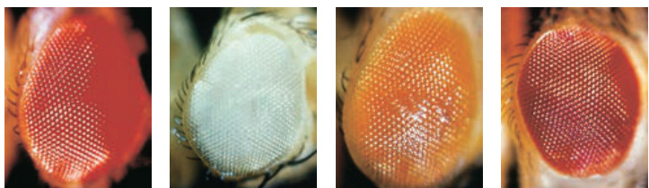  
图7.21　果蝇眼睛颜色的突变产生多种表型。携带不同X连锁眼睛颜色突变的果蝇。从左至右分别是红宝石色、白色和杏黄色；最右边的一只是野生型眼睛。（所有）： $\copyright$ Science Source  

相反，如果两个同源染色体上的隐性突变在同一基因中，则该个体中不存在该基因的野生型等位基因，并且基因的突变拷贝都不能执行正常功能。结果是不会发生互补，也不会产生正常的基因产物，因此会出现突变表型［图7.22（a），右］。具有讽刺意味的是，一组彼此不相互补充的突变被称为互补组。遗传学家经常使用互补组作为基因的同义词，因为互补组中的突变都影响相同的功能单元，因此也影响相同的基因。  

以基因作为功能单元的简单测试可以确定两个隐性突变是否是同一基因的等位基因。你只需检查杂合个体的表型，其中特定染色体的一个同源物携带一个突变，另一个同源物携带另一个突变。如果表型是野生型，则突变不能在同一基因中。这种技术称为互补测试。例如，因为同时为石榴石和红宝石（石榴石红宝石+/石榴石 红宝石）杂合的雌性果蝇具有野生型砖红色眼睛，可以得出结论：导致石榴石和红宝石颜色的突变相互补充，因此在不同的基因中。  

事实上，补体测试表明，石榴石色、红宝石色、朱红色和康乃馨色的色素沉着是由不同基因的突变引起的。但携带突变产生白色、樱桃红色、珊瑚色、杏色和浅色型的染色体不能相互补充。因此，这些突变构成单个基因的不同等位基因。在观察到第一次突变后，果蝇遗传学家将该基因命名为白色或 $w_{\ast}$ 基因；他们将野生型等位基因命名为 $w^{+}$ ，将各种突变命名为 $w^{1}$ （由T. H. Mor-gan发现的原始白眼突变，通常简称为w）、w樱桃红色、w珊瑚色、 $w$ 杏黄色和w浅黄色。例如， $w^{1}/w^{\sharp\sharp}{}^{\sharp\sharp}\mathrm{[}\hat{\Omega}$ 雌性的眼睛是稀释的杏色；因为这种杂合子的表型不是野生型，这两种突变是等位基因。图7.22（b）说明了研究人员如何在互补表中整理来自许多互补测试的数据。这样的表有助于可视化大量突变体之间的关系。  

在果蝇中， $\boldsymbol{w}$ 基因的突变在X染色体的同一区域非常接近映射，而其他与性别相关的眼睛颜色基因的突变位于染色体的其他位置［图7.22（c）］。这一结果表明，基因不是脱节的实体，部分从染色体的一端扩散到另一端；事实上，每个基因仅占据染色体的相对较小的离散区域。在分子水平上定义基因的研究表明，大多数基因由 $1000\!\sim\!20\,000$ 个连续碱基对（bp）组成。在人类中，最短基因中约有500个碱基对长基因控制着组蛋白的产生，而迄今为止最长的基因是Duchenne肌营养不良症（DMD）基因，其长度超过200万核苷酸对。所有已知的人类基因都介于这两个极端之间。为了正确看待这些数字，人类染色体长度平均约为1.3亿个碱基对。  

(a)  

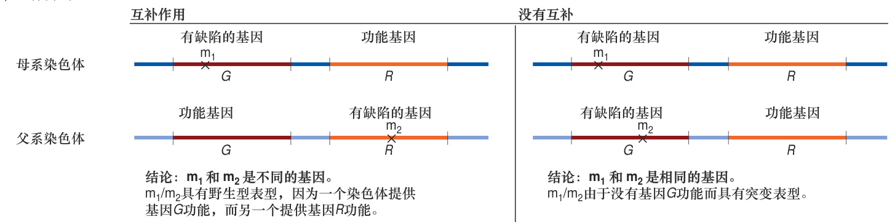  

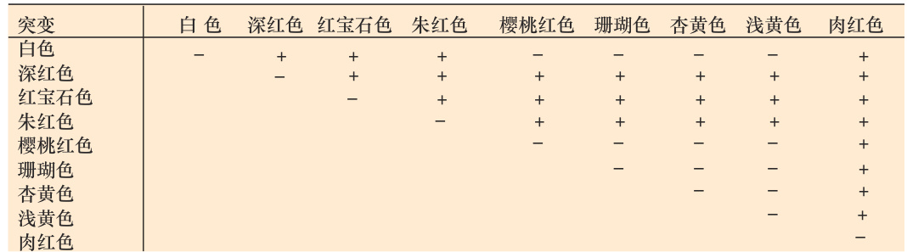  

(c)             X  

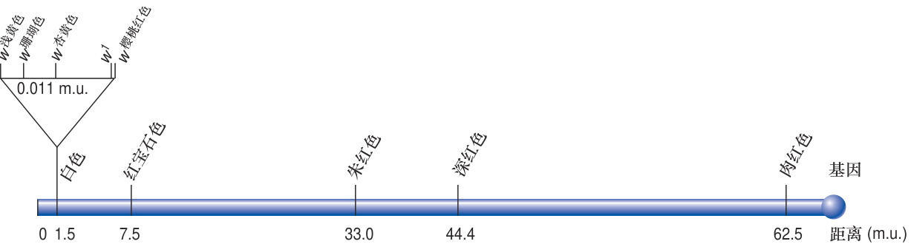  
图7.22　果蝇眼睛颜色突变的互补测试。（a）杂合子在一条染色体上有一个突变（ $\mathbf{m}_{1}$ ），在其同源染色体上有一个不同的突变（ $\mathbf{\epsilon}_{\mathrm{m}_{2}}$ ）。如果突变发生在不同的基因中，则杂合子为野生型；这些突变相互补充（左图）。如果两种突变都涉及同一基因，则表型为突变体；这些突变并不互相补充（右图）。只有当两个突变都是隐性的野生型时，互补测试才有意义。（b）本互补表显示了眼睛颜色的5个互补组（5个不同基因）。加号 $(\,+\,)$ 表示与野生型眼睛颜色的突变组合；这些突变是互补的，因此存在于不同的基因中。有些突变不能互补，因此是白色基因的等位基因。（c）重组图谱显示，不同基因的突变往往相距很远，而同一基因的不同突变却非常接近。  

# 7.4.2 基因是一组可以独立突变并相互重组的核苷酸对  

尽管互补测试可以区分不同基因中的突变和同一基因中的突变，但它并未阐明基因结构如何适应不同的突变，以及这些不同突变如何以不同方式改变表型。每个突变是否以特定方式在一次中风中改变整个基因，或者它是否只改变基因的特定部分而其他突变会改变其他部分？  

在20世纪50年代后期，美国遗传学家Seymour Ben-zer使用重组分析显示两个不相互补充的突变，因此已知在同一基因中，实际上可以改变该基因的不同部分。他推断，如果一个基因由分开的可变亚基组成，则应该有可能在这些亚基之间的基因内发生重组。因此，在同一基因中携带不同突变的同源染色体之间，理论上可以产生野生型等位基因（图7.23）。  

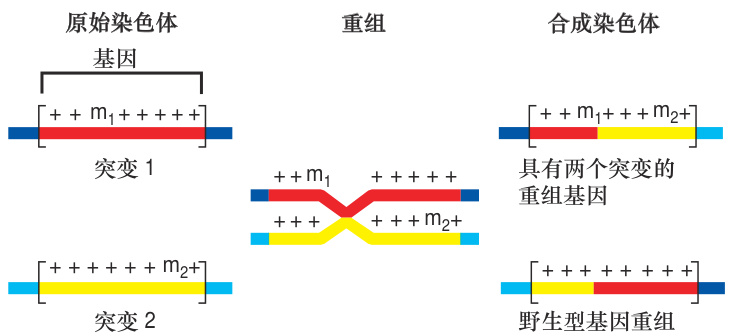  

图7.23　基因内重组如何产生野生型等位基因。假设一个基因，由括号之间的区域表示，由许多可以独立突变的位点组成。突变 $\mathbf{\dot{m}}_{1}$ 和 $|{\bf m}_{2}$ 在同一基因不同位点的重组产生一个野生型等位基因和一个包含这两种突变的互惠等位基因。  

因为影响单个基因的突变可能非常接近，所以有必要检查大量的后代，以观察它们之间的一个交换事件。因此，实验系统的分辨率必须非常高，允许快速检测罕见的遗传事件。对于他的实验生物，Benzer选择了噬菌体T4——一种感染大肠杆菌细胞的病毒［图7.24（a.1）］。因为感染细菌的每个T4噬菌体在不到1h内产生 $100\!\sim\!1000$ 个后代，因此Benzer可以很容易地产生足够的稀有重组体用于他的分析［图7.24（a.2）］。此外，通过利用某些T4突变的特性，他设计了仅允许重组噬菌体而非亲代噬菌体增殖的条件。  

# 1. 实验系统：噬菌体T4的rII–突变  

即使噬菌体太小而没有电子显微镜的帮助，也可以通过一种简单的技术用肉眼检测它们的存在［图7.24（a.3）］。为此，研究人员将一群噬菌体颗粒与更多数量的细菌混合在熔化的琼脂中，然后将该混合物倒入已经含有底层营养琼脂的培养皿中。未感染的细菌细胞在整个顶层生长，形成乳白色的活细菌菌苔。然而，如果单个噬菌体感染该菌苔某处的单个细菌细胞，则细胞产生并释放感染相邻细菌的后代病毒颗粒，其反过来产生并释放更多的噬菌体后代。随着病毒颗粒的每次释放，细菌宿主细胞死亡。顶层中的琼脂可防止噬菌体颗粒扩散到很远的位置。因此，噬菌体感染、复制和释放的几个循环在菌苔中产生圆形清除区域，称为斑块，没有活细菌细胞。将噬菌体与细菌混合以在培养皿上产生菌苔和菌斑的过程称为plating噬菌体。  

大多数斑块含有100万至1000万单一噬菌体的后代，这些噬菌体最初感染培养皿上该位置的细胞。将含有噬菌体的溶液连续稀释，使得可以测量特定斑块中噬菌体的数量并得到一定数量的病毒颗粒［图7.24（a.4）］。  

当Benzer首次寻找与噬菌体T4相关的遗传特征时，他发现，当加入大肠杆菌B菌株时，突变体产生比野生型噬菌体更清晰圆润的边界［图7.24（b）］。由于斑块形态的这些变化是由宿主细菌的异常快速裂解引起的，因此Benzer将突变r命名为快速裂解。许多r突变映射到称为rII区域的T4染色体区域，这些被称为rII–突变。  

$r I I$ –突变的另一个特性使它们成为Benzer进行遗传精细结构作图（基因内突变的定位）的理想选择。野生型rII 噬菌体在大肠杆菌B菌株和称为大肠杆菌K(λ)菌株的细胞上形成正常形状和大小的斑块。然而， $r I I^{-}$ 突变体具有改变的宿主范围；它们不能与大肠杆菌K(λ)细胞形成斑块，尽管如我们所见，它们与大肠杆菌B细胞产生大的、异常不同的斑块［图7.24（b）］。rII 突变体不能感染K(λ)株细胞的原因目前Benzer尚不清楚，但这种特性使他能够开发出一种非常简单有效的 $r I I^{+}$ 基因功能检测方法，以及一种检测罕见基因内（在同一基因内）重组事件的巧妙方法。  

# 2. rII区域有两个基因  

在他能够检查同一基因中的两个突变是否可以重组之前，Benzer必须确定他真的在研究单个基因中的两个突变。为了证实这一点，他针对噬菌体T4的两个重要特征进行了定制的互补测试：它们是单倍体（即每个噬菌体携带一条T4染色体，因此噬菌体每个基因都有一个拷贝），它们可以仅在宿主细菌中复制。因为T4噬菌体是单倍体，Benzer需要确保两个不同的T4染色体进入相同的细菌细胞以测试突变之间的互补。在他的互补测试中，他同时用两种类型的T4染色体感染大肠杆菌K(λ)细胞——一种携带一个 $r I I$ –突变，另一种携带不同的 $r I I^{-}$ 突变，然后寻找细胞裂解［图7.24（c.1）］。为了确保这两种噬菌体能够感染几乎每种细菌细胞，他添加了比细菌更多的噬菌体。  

当用Benzer的方法测试时，如果两个 $r I I^{-}$ 突变位于不同的基因中，它们将相互补充：每个突变的T4染色体将提供一个野生型 $r I I^{+}$ 基因功能，弥补其他染色体中缺乏该功能并导致裂解。另一方面，如果两个 $r I I^{-};$ 突变位于同一基因中，它们将无法补充：不会出现斑块，因为任何突变染色体都不能提供缺失的功能。  

许多对 $r I I^{-}$ 突变的不同测试表明它们分为两个互补组：rIIA和rIIB。然而，Benzer必须满足一个最终的实验要求：为了使互补测试有意义，他必须确保不能互补的rII–突变对每个都是隐性的野生型，并且彼此不相互作用产生对野生型显性的rII 表型。他通过对照试验检查了这些点，在对照实验中，他将rIIA–或rIIB–突变对重组在同一条染色体上（如下一节所述），然后用这些双重rII–突变体同时感染大肠杆菌K(λ)，用野生型噬菌体［图7.24（c.2）］。如果突变是隐性的并且彼此不相互作用，则细胞会裂解，在这种情况下，互补测试将是可解释的。  

实际互补测试和对照实验之间的显著区别在于两个rII–突变的位置。在互补测试中，一个rII–突变位于一条染色体上，而另一个 $r I I^{-}$ 突变位于另一条染色体上［图7.24（c.1）］；以这种方式排列的两个突变被认为是反式构型。在对照试验中［图7.24（c.2）］，两个突变位于同一染色体上，即所谓的顺式构型。完整的测试，包括互补测试和对照试验，被称为顺反测试。在完整的试验中，两个在反式中不产生裂解但在顺式时产生裂解的突变存在于相同的互补组中。Benzer称顺式反式测试确定的任何互补组为顺反子，一些遗传学家仍然使用这个术语作为基因的同义词。由于知道rII基因座由两个基因（rIIA和rIIB）组成，Benzer可以在同一基因中寻找两个突变，然后看它们是否重组产生野生型后代。  

# 3. 单个基因中不同突变之间的重组  

当Benzer感染大肠杆菌B株细菌时，同一基因携带不同突变的噬菌体混合物（如 $r I I A_{I}$ 和 $r I I A_{2}$ ），他确实观(a.1): $\copyright$ Science Source; (a.3): $\copyright$ McGraw-Hill Education/Lisa Burgess  

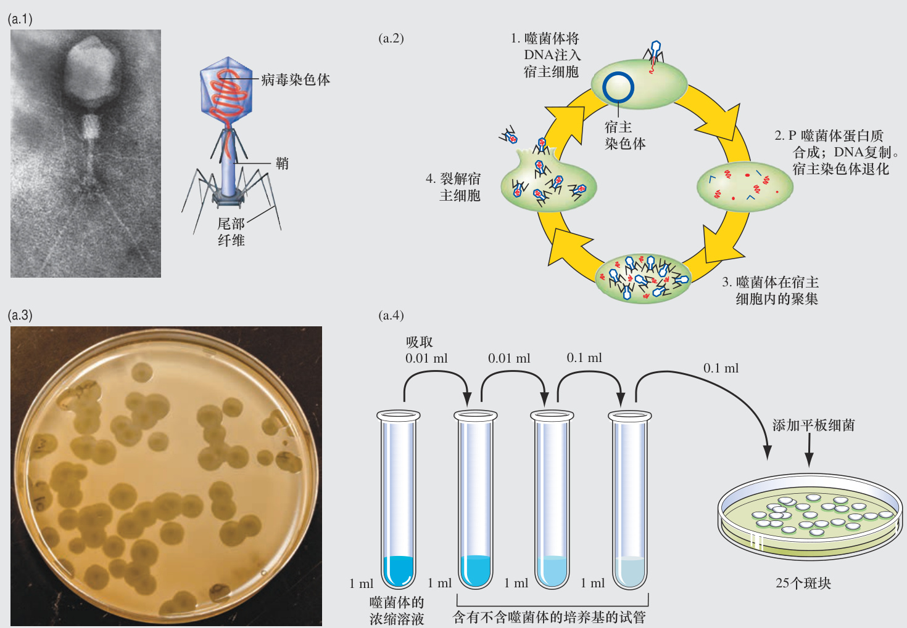  

（a）T4噬菌体研究  

1.  T4噬菌体（放大约10万倍），并进行渲染。病毒染色体包含在一个蛋白头部。噬菌体颗粒的其他蛋白质部分包括帮助噬菌体附着于宿主细胞的尾部纤维和鞘，鞘是将噬菌体染色体注入宿主细胞的导管。  

2.  T4噬菌体的裂解周期。单个噬菌体颗粒感染宿主细胞；噬菌体DNA利用宿主细胞的机制复制并指导病毒蛋白质的合成；新的DNA和蛋白质组装成新的噬菌体颗粒。宿主细胞最终裂解后，可向环境中释放多达1000个噬菌体后代。  

3.  清除细菌细胞菌苔上的噬菌体斑块。将噬菌体和大量细菌的混合物倒入培养皿中。未受感染的细菌细胞生长，产生乳白色的菌苔。被一个噬菌体感染的细菌会分解并释放出后代噬菌体，从而感染邻近的细菌。几个感染周期会形成一个空斑，这是一个圆形的清除区，包含数百万个基因相同的噬菌体。  

4.  用连续稀释法计数噬菌体。一小份浓缩的噬菌体溶液样本被转移到含有新鲜培养基的试管中，再将一小份稀释后的样本被转移到另一管新鲜培养基中。这个过程的连续重复增加了稀释的程度。当最终稀释的样品与溶化的琼脂中的细菌混合时，产生了无数的菌斑，从这些菌斑中可以推断出起始溶液中噬菌体的数量。本例中原1ml溶液中含有约 $2.5\times10^{7}$ 噬菌体。  

（b）T4噬菌体 $.r I I^{-}$ 突变体的表型特征 (b.1)  

1.  rII−突变体在大肠杆菌B细胞上形成的斑块比rII+野生型噬菌体形成的斑块更大、更清晰（边缘更锋利）。  

2.  rII−突变体对发现罕见的重组事件特别有用，因为它们的宿主范围发生了改变。相比于 $r I I^{+}$ 野生型噬菌体， $r I I^{-}$ 突变体不能在大肠杆菌菌株K(λ)宿主细菌的菌苔中形成斑块。因为 $r I I^{+}$ 重组噬菌体可以在大肠杆菌K(λ)中形成斑块，那么即使单个的 $r I I^{+}$ 重组噬菌体与数以百万计的rII−噬菌体一起裂解也可以被识别出来。  

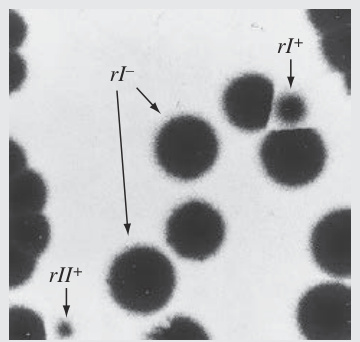  
(b.1): $\circledcirc$ Seymour Benzer  

<html><body><table><tr><td>T4菌株</td><td>大肠杆菌菌株 B K(入)</td></tr><tr><td>rII-</td><td>大，不同的 没有斑块</td></tr><tr><td>rII+</td><td>小，模糊 小，模糊</td></tr></table></body></html>  

# 特色插图7.24 （续）  

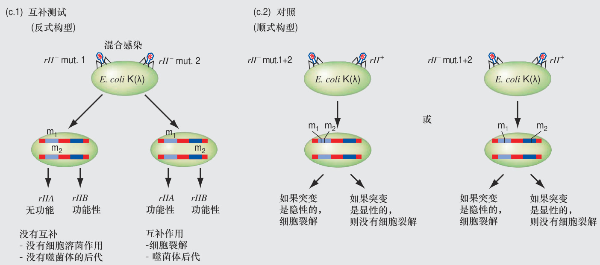  

（c）T4噬菌体 $r I I^{-}$ 突变体之间的自定义互补测试  

1.  过量的大肠杆菌K(λ)细胞同时感染两种不同 $r I I^{-}$ 突变体（ $\mathsf{m}_{1}\vec{\mathcal{k}}\mathbb{M}\mathbf{n}_{2}$ ）。在细胞内，这两个突变将是反式的；也就是说，它们位于不同的染色体上。如果这两种突变是在同一基因上，它们会产生相同的功能，不能互相补充，因此不会产生后代噬菌体。如果这两种突变发生在不同的基因（rIIA和rIIB）中，它们将相互补充，导致后代产生噬菌体和细胞裂解。  

2.  这个互补测试的一个关键点是同时感染大肠杆菌的K(λ)野生型T4，以及一个T4菌株，当 $\mathbf{m}_{1}$ 和 $\mathbf{m}_{2}$ 对不能互补时，它们被重新组合到同一条染色体上，这两种突变将是顺式的。噬菌体后代的释放表明，这两种突变都是隐性的野生型，而且突变的相互作用方式不会阻止细胞产生后代噬菌体。只有当两个突变都是隐性的野生型时，互补测试才有意义。  

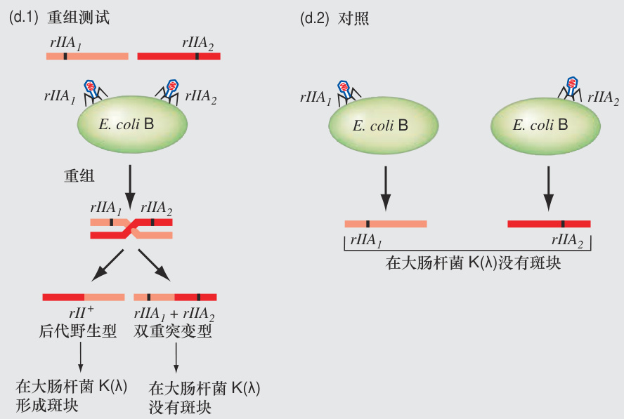  

（d）检测同一基因的两个突变之间的重组  

1.  大量的大肠杆菌B细胞感染了两种不同的 $r I I A^{-}$ –突变体（ $r I I A_{I}\mathcal{\vec{H}}\Pi r I I A_{2}$ ）。如果两种 $r I I A$ –突变之间没有发生重组，所有的后代噬菌体都将是 $r I I^{-}$ 突变。如果两个突变之间发生重组，其中一个产物将是rII+重组，而相互作用的产物将是同时含有 $r I I A_{I}$ 和 $|r I I A_{2}$ 的双突变体。随后当噬菌体后代感染大肠杆菌K(λ)细菌，只有 $r I I^{+}$ 重组能够形成斑块。  

2.  作为对照，大肠杆菌B细胞只感染了一种突变体（ $r I I A_{I}\mathcal{\vec{H}}\Pi r I I A_{2}$ ）。唯一能产生的rII 噬菌体是该突变的逆转株。这样的可逆反应是非常罕见的，在大多数重组测试中可以忽略不计。即使这两个 $\cdot r I I A$ 突变位于相邻的碱基对中，获得的 $r I I^{+}$ 重组的数量也比单个突变体感染的细胞产生的rII 逆转株的数量高出100多倍。  

察稀有 $r I I^{+}$ 后代的出现［图7.24（d.1）］。他知道这些野生型后代是由重组引起的，而不是来自回复突变，因为他观察到的 $r I I^{+}$ 噬菌体颗粒的频率（即使很少见），远远高于用单独的突变体感染B株细菌产生的后代中$r I I^{+}$ 回复体的频率［图7.24（d.2）］。  

这些实验是可能的，因为Benzer设计了稀有 $r I I^{+}$ 重组体的选择。在这种情况下，唯一的幸存者就是那些你想要确认的稀有个体。Benzer鉴定稀有 $r I I^{+}$ 重组子代的选择条件是在大肠杆菌K(λ)上铺板。Benzer可以在含有大肠杆菌K(λ)菌苔的单个培养皿上测定含有数万个噬菌体后代的噬菌体裂解物。因为裂解物中的 $r I I^{-}$ 噬菌体都不能形成斑块，所以即使其中的单个 $r I I^{+}$ 重组体也可以被鉴定为斑块。  

根据对rII基因的观察，Benzer得出了三个关于基因结构和功能的结论： $\textcircled{1}$ 一个基因由不同的部分组成，每个部分都可以发生变异； $\textcircled{2}$ 同一基因中不同可变位点之间可发生重组； $\textcircled{3}$ 基因只有在其所有成分都是野生型时才能发挥其正常功能。从我们现在所知的DNA的分子结构来看，这一切都很有意义：不同的可变单元是构成基因的碱基对。  

# 7.4.3 基因是核苷酸对的离散线性集合  

组成一个基因的多个核苷酸对是排列成连续的一排，还是以精确的模式分散在基因组周围？影响基因功能的各种突变会改变许多不同的核苷酸，还是基因中的一小部分？  

# 1. 使用缺失近似映射突变  

为了回答关于基因中核苷酸排列的这些问题，Ben-zer最终获得了成千上万的自发和诱变诱导的 $r I I^{-}$ 突变，他需要将它们相互映射。  

为了通过比较所有可能的两点杂交来映射千个突变体的位置，Benzer将不得不设置100万（ ${{10}^{3}}\times{{10}^{3}}$ ）个交配。但是通过利用具有大量缺失的噬菌体菌株，他可以以更少的杂交获得相同的信息。  

这些大的缺失是沿着DNA分子去除许多连续核苷酸对的突变。在携带突变的噬菌体和携带相应区域缺失的噬菌体之间的杂交中，不会出现野生型重组后代，因为染色体不会在突变位置携带适当的信息。但是，如果突变位于从同源染色体中缺失的区域之外，可以出现野生型后代［图7.25（a）］。无论突变是影响一个还是几个核苷酸的点突变，或者本身是一个大的缺失，都是如此。因此，任何未被鉴定的突变和已知的缺失之间的杂交，提供了一种快速找到突变的大致位置的方法，可以立即揭示该突变是否位于从其他噬菌体染色体中缺失的区域。从而提供了快速找到突变的一般位置的方法。  

使用一系列重叠缺失，Benzer将rII区域划分为一系列相对较小的区域或区间。然后，他可以通过观察点突变是否重组以在与一系列缺失杂交时产生 $r I I^{+}$ 后代，将任何点突变分配到一个区间［图7.25（b）］。  

Benzer通过重组分析在噬菌体T4的rII基因座中绘制了1612个自发点突变和几个缺失。他首先使用重组来确定缺失之间的关系。然后，他通过观察哪些缺失可以与每个点突变体重组以产生野生型后代，找到了个体点突变的大致位置。  

# 2. 确定rII 突变之间的RF以进行精确定位  

Benzer接着进行了重组测试，以测量他通过缺失定位发现的点突变对之间的遗传距离，这些突变位于染色体的同一小区域。任何两个rII 突变体之间的距离可以简单地通过计算来自噬菌体杂交的一份裂解物中的 $r I I^{+}$ 和总噬菌体的数量来测量。RF（以图距为单位）只是$r I I^{+}$ 重组体的数量［大肠杆菌K(λ)上的斑块］除以噬菌体的总数（大肠杆菌B上的斑块），乘以2以计算rII 必须存在但不易检测的双突变体互惠重组体：  

$\mathrm{RF}{=}2\times$ 大肠杆菌K(λ)斑块数/大肠杆菌B斑块数  

Benzer结合了缺失映射和RF计算的结果，生成了rII区域的精细结构作图［图7.25（c）］。请注意， $r I I A^{-}$ 互补组中的所有点突变都映射到rII区域的一侧，并且所有rIIB点突变都映射到另一侧。  

# 3. DNA核苷酸如何组织成基因  

Benzer知道T4基因组中所有定位基因之间的遗传距离加起来约为 $1500\mathrm{m.u.}$ 。他还知道T4染色体构成了大约169 000bp的DNA，所以他可以计算出噬菌体T4，1m.u.对应于 $169\,000/1500{=}113\mathrm{bp}$ 。他在任何一对rII 突变体之间测量的最低RF为 $0.02\mathrm{m}.$ u.，其代表约2bp。因此，Benzer推断突变可以由甚至单个核苷酸对的变化引起，并且重组可以在相邻的核苷酸对之间发生。根据观察到rII区域内的突变形成自洽的线性重组图，他得出结论：基因由DNA内的连续线性核苷酸对序列组成。此外，根据观察到的rIIA基因中的突变位置与 $r I I B$ 基因的突变位置不重叠，他确定构成这两个基因的核苷酸序列是分开的和不同的。因此，基因是位于染色体的离散区域内的线性核苷酸对集合，其作为一个功能单元发挥作用。  

# 4. 突变的热点  

基因中的一些位点比其他位点更频繁地自发突变，因此被称为突变热点［图7.25（c）］。热点的存在表明某些核苷酸可以比其他核苷酸更容易改变。用诱变剂处理也会出现热点，但由于诱变剂对特定核苷酸具有特异性，因此各种诱变剂出现的高度可变位点通常位于基因的不同位置而不是自发突变产生的热点。  

核苷酸在化学上是相同的，无论它们位于基因内还是位于基因之间的DNA中。此外，正如Benzer的实验所暗示的那样，负责突变和重组的分子机制不能区分基因内和基因间的核苷酸。基因内的DNA和基因外的DNA之间的主要区别在于构成基因的核苷酸阵列已经进化出决定表型的功能。接下来，我们描述遗传学家如何发现这种功能。  

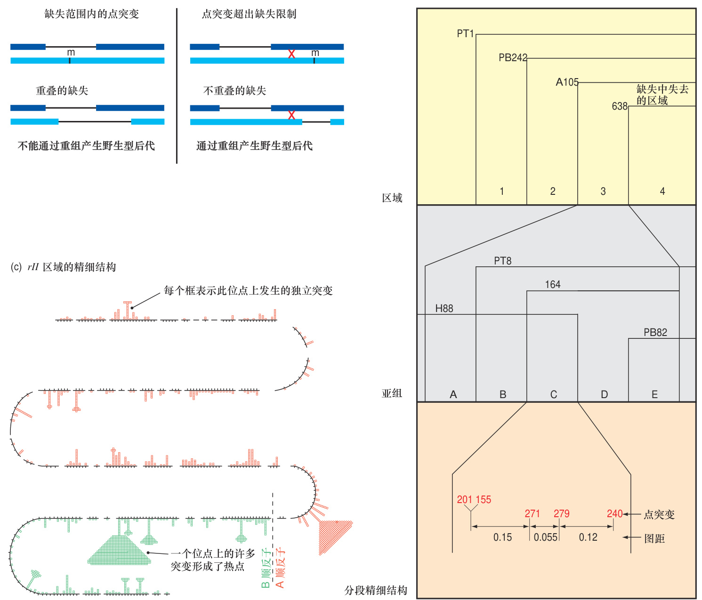  
(a)   
(b)           rIIA   
图7.25　T4噬菌体rII基因的精细结构作图。（a）点突变与缺失的噬菌体杂交去除突变处的DNA不能产生野生型重组。如果两个不同的缺失突变相互重叠，情况也是如此。（b）大量缺失将rII基因座分成区域；更精细的缺失将每个区域划分为子区域。点突变，如271（底部红色），如果不与缺失PT1、PB242或A105重组，但与缺失638（顶部）重组，则映射到区域3。点突变可以使用其他缺失（中间）映射到区域3的子区域。重组测试将点突变映射到相同的子区域（底部）。点突变201和155不能重组产生野生型重组，因为它们可以产生相同的核苷酸对。（c）Benzer精细结构图。热点是具有许多独立突变的位置，它们之间不能重新结合。  

# 基本概念  

●  互补测试确定在同一基因或不同基因中是否发生两种不同的隐性突变。  
●  在DNA水平上，基因是染色体离散区域中核苷酸对的线性序列，赋予特定的功能单位。  

●  重组可以发生在任何两个核苷酸对之间，无论它们是否在同一基因内。  

# 7.5 突变对基因功能的影响  

# 学习目标  

1.  解释精氨酸营养缺陷型分析如何暗示单个基因对应于单一酶。  
2.  描述如何使用错义突变来证明基因决定蛋白质的氨基酸序列。  
3. 区分蛋白质的一级、二级、三级和四级结构。  

孟德尔的实验证实，个体基因可以控制一个可见的特征，但他的定律并没有解释基因如何实际控制特征的外观。在20世纪上半叶，研究人员仔细研究了由突变引起的生化变化，以努力了解基因型-表型连接。  

在1902年进行的第一项研究中，英国医生ArchibaldGarrod博士表明，一种被称为尿黑酸尿症的人类遗传疾病由常染色体基因的隐性等位基因决定。Garrod分析了家族谱系，并对有或没有这种特性的家庭成员进行了生化分析。患有尿黑酸尿症的人的尿液在暴露于空气时变黑。Garrod发现，一种称为尿黑酸的物质，在接触氧气后会变黑，会在尿潴留患者的尿液中积聚。尿黑酸尿症患者能把他们摄入的均质钛酸全部排出，而没有这种疾病的人即使在摄入这种物质后也不会在他们的尿液中排出任何均质钛酸。  

根据这些观察结果，Garrod得出结论：患有尿黑酸尿症的人无法将正庚酸代谢为正常人产生的分解产物（图7.26）。由于生物细胞内的许多生化反应都是由酶催化的，因此Garrod假设缺乏分解尿酸的酶是导致尿黑酸尿症的原因。在没有这种酶的情况下，尿黑酸积聚并导致尿液在与氧气接触时变黑。他把这种情况称为天生的新陈代谢错误。  

Garrod研究了其他几种先天性代谢缺陷，并提出所有这些都是由于突变导致特定基因无法产生特定生化反应所需的酶。在今天的术语中，该基因的野生型等位基因将允许产生功能性酶（在尿嘧啶尿的情况下，该酶是纯尿酸氧化酶），而突变体等位基因则不然。因为杂合子中的单个野生型等位基因产生足够的酶以防止尿黑酸图7.26　尿黑酸尿症：先天性代谢紊乱。人体内通过均质钛酸（HA）降解苯丙氨酸和酪氨酸的生化途径。在尿黑酸尿症患者中，HA羟化酶没有作用，所以它不能催化HA转化成马来酰乙酸。结果，氧化成黑色化合物的透明质酸在尿液中积聚。  

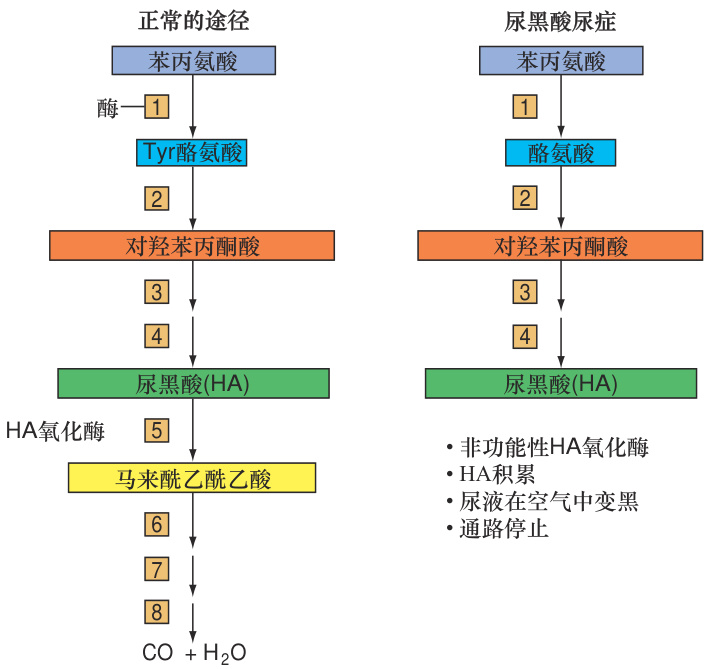  

的积累并因此阻止尿嘧啶尿的状态，所以突变等位基因是隐性的。  

# 7.5.1 基因包含产生特定酶的信息：一种基因一种酶假说  

在20世纪40年代，George Beadle和Edward Tatum对面包霉菌（Neurospora crassa）（其生命周期在第5章中描述）进行了一系列实验，证明了基因与催化特定生化反应的酶之间的直接关系。他们的策略很简单：首先分离出许多破坏氨基酸精氨酸合成的突变，精氨酸是脉孢菌生长所需的化合物。他们接下来假设不同的突变阻断了特定生化途径中的不同步骤：有序的反应系列允许脉孢菌从环境中获得简单分子并逐步转化为连续更复杂的分子，最终产生精氨酸。  

# 1. 一种基因一种酶的实验证据  

图7.27（a）说明了Beadle和Tatum为检验他们的假设而进行的实验。他们首先获得了一组诱变剂诱导的突变，阻止了脉孢菌合成精氨酸。具有这些突变中的任何一种的细胞不能制备精氨酸，因此只有在补充了精氨酸的情况下才能在含有盐和糖的基本培养基上生长。需要补充野生型菌株不需要的物质的营养突变微生物被称为营养缺陷型。刚才提到的细胞是精氨酸营养缺陷型（相比之下，不需要添加物质的细胞是该因子的原养型。更一般地说，原养型是指可以在基本培养基上生长的野生型细胞）。重组分析位于营养缺陷型基因组的四个不同区域中的精氨酸阻断突变，并且互补测试显示四个区域中的每一个与不同的互补组相关。在这些结果的基础上，Beadle和Tatum得出结论，至少有四个基因支持精氨酸合成的生化途径。他们命名了四个基因：ARG-E、ARG-F、ARG-G和ARG-H。  

他们接下来询问是否任何突变的脉孢菌菌株能够在导致精氨酸而不是精氨酸本身的生化途径中补充有三种已知中间体（鸟氨酸、瓜氨酸和精氨基琥珀酸盐）中的任何一种的基本培养基中生长。该测试将验证能够将中间化合物转化为精氨酸的脉孢菌突变体。Beadle和Tatum编制了一个表格，描述了哪些精氨酸营养缺陷型突变体能够在补充了每种中间体的基本培养基上生长［图7.27（b）］。  

# 2. 结果解释：基因编码酶  

在这些结果的基础上，Beadle和Tatum提出了一种神经孢子细胞如何合成精氨酸的模型［图7.27（c）］。在生物化学反应的线性进展中，细胞通过其基本培养基的成分构建精氨酸，每个中间体既是上一步的产物，又是下一步的底物。精确排序的序列中的每个反应都由特定的酶催化，并且每种酶的存在取决于四种ARG基因之一。  

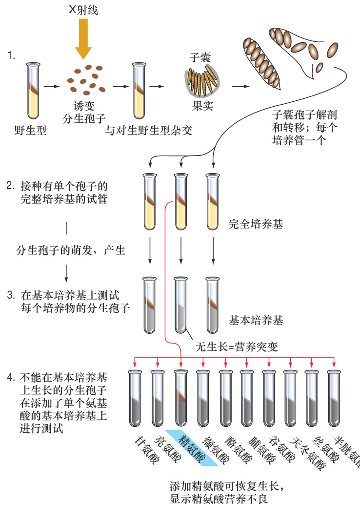  
(a)  

(b)   

<html><body><table><tr><td></td><td colspan="5">补充</td></tr><tr><td>突变株</td><td>无</td><td>鸟氨酸</td><td>瓜氨酸</td><td>琥珀酸</td><td>精氨酸</td></tr><tr><td>野生型：Arg</td><td>十</td><td>++</td><td>++</td><td></td><td>++</td></tr><tr><td>ARG-E-</td><td></td><td></td><td></td><td></td><td></td></tr><tr><td>ARG-F-</td><td></td><td></td><td>+</td><td>++++</td><td>++</td></tr><tr><td>ARG-G-</td><td></td><td></td><td></td><td></td><td></td></tr><tr><td>ARG-H-</td><td></td><td></td><td></td><td></td><td>+</td></tr></table></body></html>  

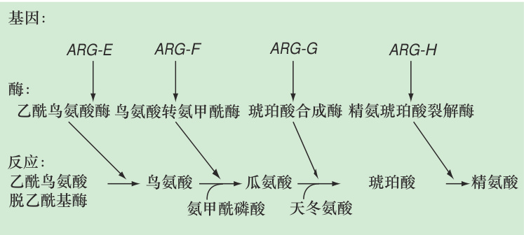  
(c)  

每个突变都会消除细胞产生能够催化某种反应的酶的能力。然后，通过推断，每个基因控制酶的合成或活性，或如Beadle和Tatum所述，“一种基因一种酶”。当然，基因和酶不是一回事；相反，基因中的核苷酸序列包含以某种方式编码酶分子结构的信息。  

一个基因中的突变在特定步骤阻断该途径，因为该细胞缺乏相应的酶，因此不能自身制备精氨酸。用封闭反应之外发生的任何中间体补充培养基可恢复突变体的生长，因为生物体具有将中间体转化为精氨酸所需的所有酶。补充缺失酶之前发生的中间体不起作用，因为突变细胞不能将中间体转化为精氨酸。  

虽然Beadle和Tatum研究的精氨酸途径分析很简单，但生化途径的研究并不总是那么容易解释。一些生化途径不是逐步反应的线性进展。例如，如果不同的酶作用于相同的中间体以将其转化为两种不同的终产物，则发生支化途径。如果细胞需要这两种终产物进行生长，则编码合成中间体所需的任何酶的基因中的突变将使细胞依赖于两种终产物的补充。第二种可能性是细胞可以使用两种独立的平行途径中的任何一种来合成所需的最终产物。在这种情况下，在一种途径中编码酶的基  

图7.27　一种基因一种酶假说的实验支持。（a）Beadle和Tatum将一株经X射线诱变的链孢霉属（Neurospora）菌株与另一株菌株配对，并分离出在完全培养基上生长的单倍体子囊孢子。不能在基本培养基上生长的培养物是营养突变体。能在基本培养基和精氨酸上生长的营养突变体是精蛋白-生长营养体。（b）野生型和突变株在精氨酸途径中添加在中间体的基本培养基上生长的能力。（c）四个ARG基因中的每一个都有一种酶，这种酶可以将代谢途径中的一个中间产物转化为下一个中间产物。  

因中的突变将没有效果。只有具有影响两种途径的突变的细胞才会显示异常表型。  

即使有这样的非线性进展，细致的遗传分析也可以基于Beadle和Tatum对基因指定蛋白质的认识来揭示生化途径的本质。  

# 7.5.2 基因指定多肽链中氨基酸的同一性和顺序  

虽然“一种基因一种酶”假说是理解基因如何影响表型的重要进展，但它过于简单化了。并非所有基因都控制着生化途径中活性酶的构建。酶只是一类蛋白质分子，细胞含有许多其他种类的蛋白质。其他类型包括为细胞提供形状和刚性的蛋白质、将细胞输入和输出细胞的蛋白质、帮助DNA折叠成染色体的蛋白质，以及充当激素信使的蛋白质。基因指导所有蛋白质、酶和非酶的合成。此外，正如我们接下来看到的，基因实际上决定了多肽的构建，并且因为一些蛋白质由多于一种类型的多肽组成，所以不止一种基因决定了这些蛋白质的构建。  

# 1. 蛋白质：通过肽键连接的氨基酸的线性多聚体  

蛋白质是由称为氨基酸的结构单元组成的多聚体。细胞主要使用20种不同的氨基酸来合成它们所需的蛋白质。所有这些氨基酸都具有某些基本特征，由 $\mathrm{NH}_{2}$ —  

CHR—COOH的通式表示［图7.28（a）］。顾名思义，—COOH组分，也称为羧酸，是酸性的；—NH2组分，也称为氨基，是碱性的。R指的是区分每种氨基酸的侧链［图7.28（b）］。R基团可以像氢原子一样简单图7.28　蛋白质是由肽键连接的氨基酸链。（a）氨基酸包含一个基本氨基 $\scriptstyle\left({-N\mathrm{H}_{2}}\right)$ ），一个酸性羧基（—COOH），以及22个不同的侧链（R）中的一个。（c）硒代半胱氨酸和吡咯赖氨酸是只在少数蛋白质或特定生物体中发现的氨基酸。（d）一个氨基酸的—COOH和下一个氨基酸的— ${\mathbf{-NH}}_{2}$ 之间形成共价氨基键（肽键）时，将失去一个水分子。多肽，如图中所示的三肽，具有极性；它们从一个N端（带有一个游离氨基）延伸到一个C端（带有一个游离羧基）。  

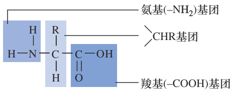  
(a)  

<html><body><table><tr><td>R基团 甘氨酸(Gly）(G)</td><td>主链</td><td>R基团 脯氨酸(Pro)(P)</td><td>主链</td></tr><tr><td>丙氨酸(Ala)(A)</td><td>H 1 H— C- COOH NH2 H</td><td>HC HC- H 苯丙氨酸(Phe)(F)</td><td>C一 HOOO H H</td></tr><tr><td>CH 氨酸(Val)(V)</td><td>C-COOH NH2</td><td>CH2-</td><td>C-COOH NH2</td></tr><tr><td>CH3 CH- CH3</td><td>H C-COOH NH2</td><td>色氨酸(Trp)(W) CH2 CH H</td><td>H C一 HOOO NH2</td></tr><tr><td>亮氨酸(Leu)(L) CH3 CH—CH CH3</td><td>H C-COOH NH2</td><td>甲硫氨酸(Met)(M) CH— S— CH— CH2— C- COOH</td><td>H 1 NH2</td></tr><tr><td>异亮氨酸(Ile)(I) CH3-CH2—CH- CH</td><td>H C-COOH NH2</td><td></td><td></td></tr></table></body></html>  

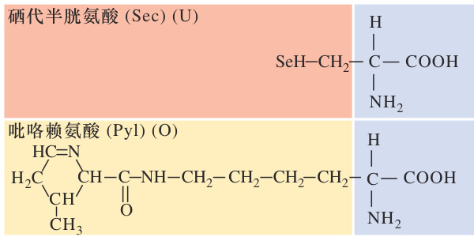  

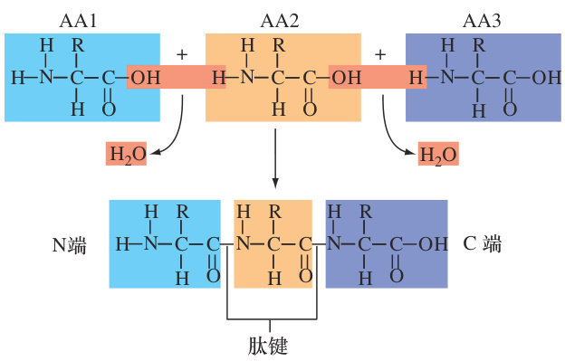  
(d)  

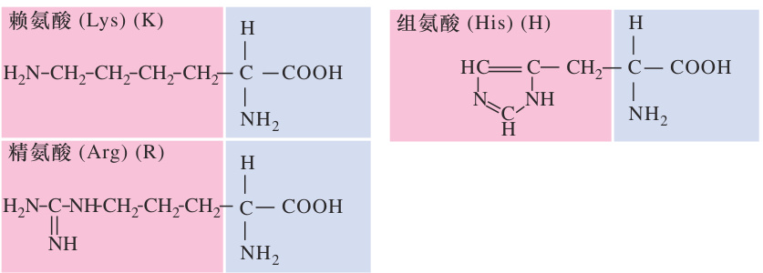  
(b)       R   
R   
R  

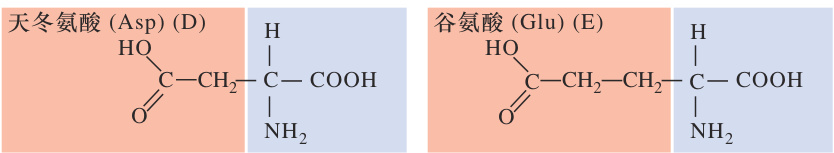  

（在氨基酸甘氨酸中），或与苯环（在苯丙氨酸中）一样复杂。一些侧链是相对中性和非反应性的，另一些是酸性的，还有一些是碱性的。  

除了20种常见氨基酸外，在特定情况下还可以将两种稀有氨基酸掺入蛋白质中［图7.28（c）］。已知极少数蛋白质（人类仅25种）含有硒代半胱氨酸。吡咯赖氨酸仅存在于某些原核生物的蛋白质中。  

在蛋白质合成过程中，细胞的蛋白质构建机制通过构建共价肽键来连接氨基酸，所述共价肽键将一个氨基酸的—COOH基团连接到下一个氨基酸的— $\cdot\mathrm{NH}_{2}$ 基团［图7.28（d）］。以这种方式连接的一对氨基酸是二肽；连接在一起的几个氨基酸构成寡肽。构成蛋白质的氨基酸链含有通过肽键连接的数百至数千个氨基酸，并且被称为多肽。因此，蛋白质是氨基酸的线性多聚体。与DNA中的核苷酸链一样，多肽具有化学极性。首先合成的多肽的末端称为N端，因为它含有不与任何其他氨基酸连接的游离氨基。多肽链的另一端是C端，因为它含有游离羧酸基团。  

# 2. 突变可以改变氨基酸序列  

每种蛋白质由独特的氨基酸序列组成。使结构蛋白赋予细胞形状或允许酶催化特定反应的化学性质是蛋白质中氨基酸的特性、数量和线性顺序的直接结果。  

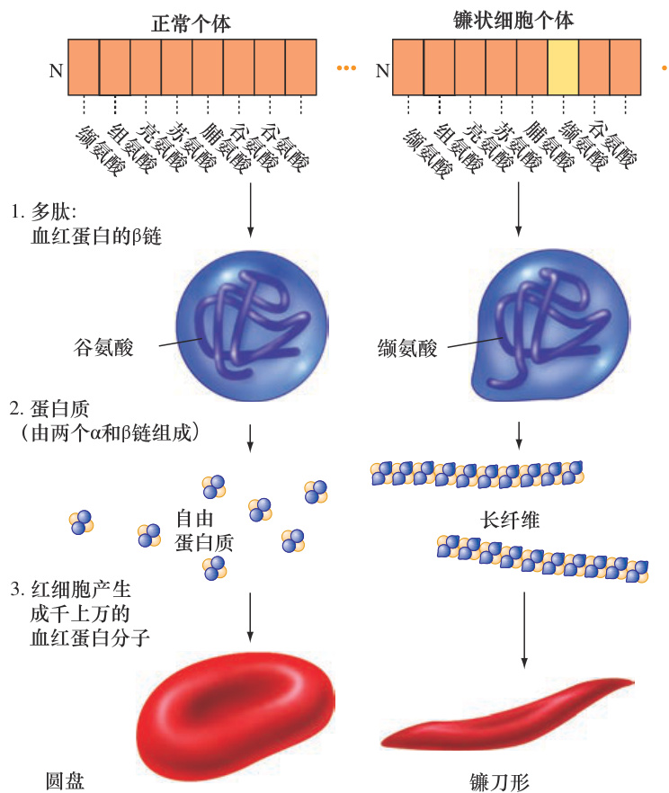  
(a)  

如果基因决定蛋白质，那么至少一些突变可能是基因的变化，这会改变该基因指定的蛋白质中正常的氨基酸序列。在20世纪50年代中期，Vernon Ingram开始确定特定突变在相应蛋白质中引起的变化。利用刚刚开发的用于确定蛋白质中氨基酸序列的技术，他将血红蛋白（HbA）的正常成人形式的氨基酸序列与导致镰状细胞贫血（HbS）的突变纯合子血液中的血红蛋白的氨基酸序列进行了比较。值得注意的是，他发现野生型和突变型蛋白之间只有一个氨基酸差异［图7.29（a）］。血红蛋白由两种类型的多肽组成：所谓的α链和β链。来自β链N端的第六个氨基酸在正常个体中是谷氨酸，而在镰状细胞患者中是缬氨酸。  

因此，Ingram证实，用一种氨基酸取代另一种氨基酸的突变有能力改变血红蛋白的结构和功能，从而改变从正常到镰状细胞性贫血的表型［图7.29（b）］。我们现在知道谷氨酸 $\longrightarrow$ 缬氨酸的变化会影响血红蛋白在红细胞内的溶解度。在低氧浓度下，溶解性较差的镰状细胞形式的血红蛋白聚集成长链，使红细胞变形［图7.29（a）］。  

因为患有各种遗传性贫血症的人也有血红蛋白分子缺陷，Ingram和其他遗传学家能够确定大量不同的突变如何影响血红蛋白的氨基酸序列［图7.29（c）］。大  

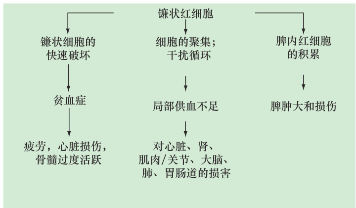  
(b)  

(c)   

<html><body><table><tr><td>正常 (HbA)</td><td>Val</td><td>His</td><td>Leu</td><td>Glu</td><td>Glu</td><td>Glu</td><td>His</td><td>Val</td><td>Glu</td><td>His</td></tr><tr><td>HbS</td><td>Val</td><td>His</td><td>Leu</td><td>Val</td><td>Glu</td><td>Glu</td><td>His</td><td>Val</td><td>Glu</td><td>His</td></tr><tr><td>HbC</td><td>Val</td><td>His</td><td>Leu</td><td>Lys</td><td>Glu</td><td>Glu</td><td>His</td><td>Val</td><td>Glu</td><td>His</td></tr><tr><td>HbGSanJose</td><td>Val</td><td>His</td><td>Leu</td><td>Glu</td><td>Gly</td><td>Glu</td><td>His</td><td>Val</td><td>Glu</td><td>His</td></tr><tr><td>HbE</td><td>Val</td><td>His</td><td>Leu</td><td>Glu</td><td>Glu</td><td>Lys</td><td>His</td><td>Val</td><td>Glu</td><td>His</td></tr><tr><td>HbMSaskatoon</td><td>Val</td><td>His</td><td>Leu</td><td>Glu</td><td>Glu</td><td>Glu</td><td>Tyr</td><td>Val</td><td>Glu</td><td>His</td></tr><tr><td>Hb Zurich</td><td>Val</td><td>His</td><td>Leu</td><td>Glu</td><td>Glu</td><td>Glu</td><td>Arg</td><td>Val</td><td>Glu</td><td>His</td></tr><tr><td>HbMMilwaukee1</td><td>Val</td><td>His</td><td>Leu</td><td>Glu</td><td>Glu</td><td>Glu</td><td>His</td><td>Glu</td><td>Glu</td><td>His</td></tr><tr><td>HbDβ Punjab</td><td>Val</td><td>His</td><td>Leu</td><td>Glu</td><td>Glu</td><td>Glu</td><td>His</td><td>Val</td><td>Gln</td><td>His</td></tr></table></body></html>  

图7.29　镰状细胞性贫血和其他贫血症的分子基础。（a）由于β链N端的第六个氨基酸谷氨酸被缬氨酸替换，影响了血红蛋白的三维结构。血红蛋白结合聚集状态的突变β链，导致红细胞呈现镰刀状。（b）镰状红细胞具有多种表型效应。（c）其他由β链基因突变引起的贫血症。  

多数改变的血红蛋白仅有一个氨基酸的变化。在患有贫血症的各种患者中，改变通常发生在不同的氨基酸中，但偶尔两个独立的突变导致相同氨基酸的不同取代。遗传学家使用术语错义突变来描述一种氨基酸替代另一种氨基酸导致的遗传改变。  

# 7.5.3 蛋白质的氨基酸序列决定了它的三维结构  

尽管蛋白质结构具有统一性——由肽键连接的一串氨基酸，但每个多肽都可以折叠成独特的三维形状。生物化学家经常区分四种蛋白质结构：一级、二级、三级和四级。这些中的前三个适用于任何一条多肽链，而第四级描述蛋白质复合物内多个多肽之间的关联。  

# 1. 一级、二级和三级蛋白质结构  

多肽内的氨基酸的线性序列是其一级结构。每个独特的主要结构限制了链如何在三维空间中自我排列。因为区分22种氨基酸的R基团具有不同的化学性质，所以当与其他氨基酸接近时，一些氨基酸形成氢键或静电键。例如，非极性氨基酸可能通过相互作用而相互关联，这种相互作用使它们在局部疏水区域不被水吸收。作为另一个实例，两个半胱氨酸氨基酸可通过其—SH基团的氧化形成共价二硫键（—S—S—）。  

所有这些相互作用［图7.30（a）］有助于使多肽稳定在特定的三维构象中。主要结构［图7.30（b）］通过生成二级结构来确定三维形状，即生成具有特征几何的局部区域［图7.30（c）］。一级结构还负责其他折叠和扭曲，其与二级结构一起产生整个多肽的最终三维三级结构［图7.30（d）］。正常的三级结构——长链氨基酸在生理条件下在三维空间中自然折叠的方式被称为多肽的天然构型。各种力，包括氢键、静电键、疏水相互作用和二硫键有助于稳定天然构型。  

值得强调的是，一级结构（多肽中的氨基酸序列）直接决定二级和三级结构。链折叠成其天然构型所需的信息是其氨基酸的线性序列所固有的。  

在该原理的一个实例中，当暴露于尿素和巯基乙醇，或增加热量或pH时，许多蛋白质展开或变性。这些处理破坏了通常稳定二级和三级结构的相互作用。当条件恢复正常时，一些蛋白质在没有其他药剂帮助的情况下自发地重新折叠成其天然构型。除了一级结构之外，不需要其他信息来实现这种蛋白质的适当三维形状。  

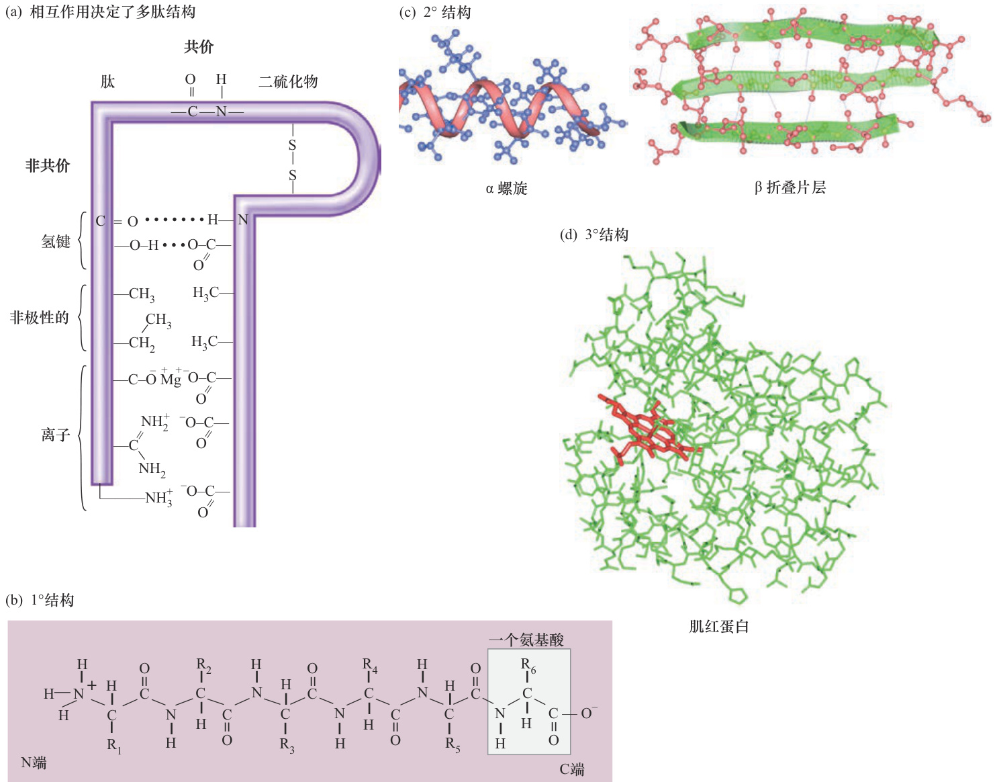  
图7.30　多肽水平的结构。（a）共价和非共价相互作用决定多肽的结构。（b）多肽的主要（ $1^{\circ}$ ）结构是其氨基酸序列。（c）局部形成二级 $\cdot2^{\circ}$ ）结构如α螺旋和β折叠。（d）三级 $\langle\,3^{\circ}$ ）结构是一个多肽的完整三维排列。在这幅肌红蛋白的图中，携带氧气的含铁血红素是红色的，而多肽本身是绿色的。  

你应该知道，一些蛋白质在变性后不能自行重新折叠成正确的三级结构。这些蛋白质的正确折叠需要其他称为分子伴侣的蛋白质，这些蛋白质有助于稳定天然构型。由于升高的温度导致蛋白质展开，许多分子伴侣是当生物体暴露于高温时产生的热激蛋白。这些热激蛋白可保护细胞免受高温条件下蛋白质错误折叠的损害。但即使对于需要伴侣来实现其天然构型的蛋白质，其氨基酸序列决定了最终的三维结构。  

2. 四级结构：多体蛋白  

某些蛋白质，如促进黑白视觉的视紫红质，由单一多肽组成。然而，许多其他的蛋白质，如晶状体蛋白，它为我们眼睛的晶状体或前面描述的血红蛋白分子提供刚性和透明性，是由两种或多种以特定方式结合的多肽链组成的［图7.31（a）、（b）］。聚集体中的各个多肽称为亚基，亚基的复合物通常称为多体。多体中亚基的三维构型是复杂蛋白质的四级结构。  

稳定多肽天然形式的作用力（即氢键、静电键、疏水相互作用和二硫键）也有助于维持四级结构。如图7.31（a）所示，在一些多体中，两个或更多个相互作用的亚基是相同的多肽。这些相同的链由一个基因决定。相比之下，在其他多体中，不止一种多肽构成蛋白质［图7.31（b）］。这些多体中的不同多肽由不同基因决定。  

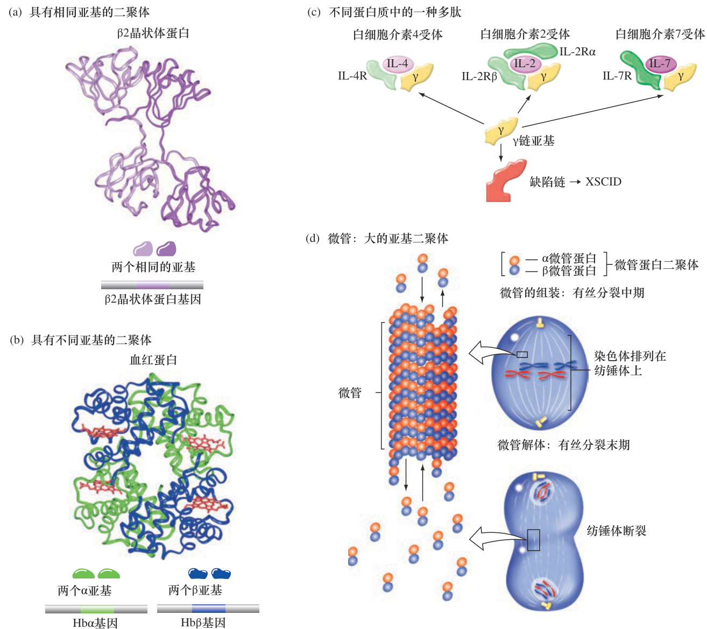  

图7.31　多体蛋白。（a）β2晶状体蛋白含有一种亚基的两个拷贝；这两个亚基是一个基因的产物。两个亚基的肽骨架以不同深浅的紫色显示。（b）血红蛋白由两种不同的亚基组成，每一种亚基由不同的基因编码。（c）免疫系统分子中称为白细胞介素（IL）的三种不同的蛋白受体，紫色）都含有一个共同的γ链（黄色），加上其他受体多肽（绿色）。突变γ链三种受体的功能导致了XSCID。（d）一个α微管蛋白（红色）和一个β微管蛋白（蓝色）多肽结合形成微管蛋白二聚体。许多微管蛋白二聚体形成一个微管。有丝分裂纺锤体是许多微管的集合体。  

由单个基因突变引起的仅一种亚基的改变可以影响多体的功能。例如，成人血红蛋白分子由两个α亚基和两个β亚基组成，每个亚型由不同的基因决定——一个用于α链，一个用于β链。Hbβ基因中的突变导致β链中第6位的氨基酸转换造成镰状细胞贫血。  

类似地，如果几种多体蛋白共有共同的亚基，则编码该亚基的基因中的单个突变可同时影响所有蛋白质。一个例子是小鼠和人类的X连锁突变，它使几种不同的蛋白质失去能力，这些蛋白质都被称为白细胞介素（IL）受体。因为所有这些受体对于抵抗感染和产生免疫力的免疫系统细胞的正常功能是必需的，所以这一突变导致危及生命的病症，称为X连锁的严重联合免疫缺陷［XSCID；图7.31（c）］。  

复杂蛋白质的多肽可以组装成能够随细胞需要而变化的极大结构。例如，在有丝分裂期间构成纺锤体的微管是主要由两种多肽组成的庞大组合： $\scriptstyle\mathbf{a}\cdot\mathbf{\phi}$ -微管蛋白和β-微管蛋白［图7.31（d）］。细胞可以将这些亚基组织成非常长的中空管，其在细胞周期的不同阶段根据需要生长或收缩。  

# 3. 一种基因一种多肽  

因为不止一种基因控制着一些多体蛋白的产生，并且因为并非所有蛋白质都是酶，所以“一种基因一种酶”假说不足以定义基因功能。更准确的陈述是“一种基因一种多肽”，每个基因控制特定多肽的构建。正如你将在第8章中看到的那样，即使这种重新配置也不包含所有基因的功能，因为所有生物中的某些基因都不能确定蛋白质的构建；相反，它们指定了未翻译成多肽的RNA。  

关于基因和多肽之间的联系的知识使遗传学家能够分析单个基因中的不同突变如何产生不同的表型。如果每种氨基酸对蛋白质的三维结构具有特定的作用，那么改变多肽链中不同位置的氨基酸可以以不同方式改变蛋白质功能。例如，大多数酶具有执行酶任务的活性位点，而蛋白质的其他部分支持该位点的形状和位置。改变活性位点氨基酸同一性的突变可能比影响活性位点外氨基酸的突变具有更严重的后果。某些种类的氨基酸取代，例如，用具有酸性侧链的氨基酸取代具有碱性侧链的氨基酸，比保留原始氨基酸的化学特征的取代更可能损害蛋白质功能。  

一些突变不影响蛋白质的氨基酸组成，但仍然产生异常表型。如将在第8章中讨论的，这种突变改变了通过破坏负责将基因解码成多肽的生化过程而产生的正常多肽的量。  

# 基本概念  

●  大多数基因指定多肽中氨基酸的线性序列；该序列决定了多肽的三维结构，从而决定了它的功能。  

●  错义突变改变多肽中单个氨基酸的身份。  

●  多体蛋白包括两种或更多种多肽（亚基）。如果这些亚基不同，它们必须由不同的基因编码。  

# 7.6 综合示例：影响视力的突变  

# 学习目标  

1. 描述人类视觉中四种光感受器蛋白的功能。2.  概述编码光感受器的基因是如何通过祖先基因的复制和分化进化而来的。3. 解释光感受器基因的突变如何导致不同的视力缺陷。  

研究人员首次描述了近200年前人类的颜色感知异常。从那时起，他们发现了大量改变人类视觉的突变。通过检查与每个突变相关的表型，然后直接观察与突变遗传相关的DNA改变，他们已经了解了很多关于影响人类视觉感知的基因和它们决定的蛋白质的功能。  

使用人类受试者进行视力研究有几个优点。首先，人们可以识别和描述他们所看到的方式的变化，从红色的细微差异，到红色和绿色之间没有看到任何差异，再到根本看不到任何颜色。其次，高度发达的精神物理学为准确定义和比较表型提供了敏感的、非侵入性的测试。最后，由于视觉系统中的遗传变异很少影响一个人的生命期或繁殖能力，因此随着时间的推移，产生许多改变视觉感知的新等位基因的突变仍然存在于人群中。  

# 7.6.1 视网膜细胞含有光敏蛋白  

人们通过眼睛后部视网膜的神经细胞（神经元）感知光线［图7.32（a）］。这些神经元有两种类型：视杆细胞和视锥细胞。这些视杆细胞占所有光接收神经元的 $95\%$ ，受到一系列波长的弱光的刺激。在更高的光照强度下，视杆细胞变得饱和，不再向大脑发送有意义的信息。当视锥细胞接管时，处理亮光的波长，使我们能够看到颜色。  

视锥细胞有三种形式：第一种专门用于接收红灯，第二种用于接收绿色，第三种用于接收蓝色。对于每个感光细胞，接收行为包括从特定波长的光吸收光子，将关于那些光子的数量和能量的信息转换成电信号，并通过视神经将信号传输到大脑。大脑整合了三种视锥细胞的信息，使人类能够区分超过100万种颜色。  

# 1. 四种相关蛋白质具有不同的光敏感性  

接受光子并触发视杆细胞信息处理的蛋白质是视紫红质。它由一条含有348个氨基酸的多肽链组成，这些氨基酸在细胞膜上来回蜿蜒［图7.32（b）］。链中的一个赖氨酸与视黄醛结合，视黄醛是一种实际吸收光子的类胡萝卜素色素分子。视网膜附近的氨基酸构成视紫红质的活性位点；通过以特定方式定位视网膜，那些氨图7.32　视觉的细胞和分子基础。（a）视网膜中的杆状细胞和锥状细胞携带膜结合的感光细胞。（b）杆状细胞的感光细胞是视紫红质。锥状细胞中的蓝、绿、红受体蛋白与视紫红质有关。彩色的点是氨基酸，在视紫红质和图示的蛋白质之间有所不同。（c）X染色体上有1个红色素基因和 $1\!\sim\!3$ 个绿色素基因。（d）视紫红质和三种颜色受体的基因可能是从一个原始的光感受器基因通过三次基因复制进化而来，随后发生复制体的分离。  

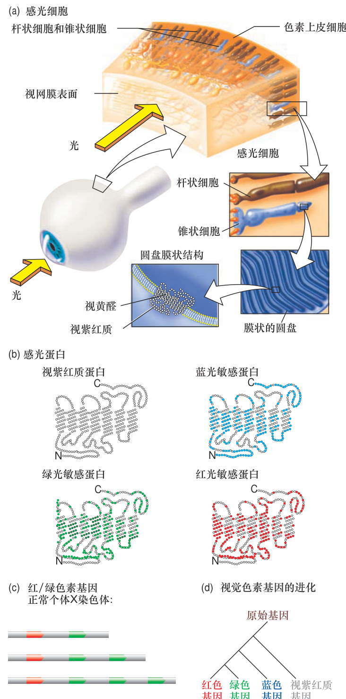  

基酸决定了它对光的反应。每个视杆细胞在其特化膜中含有大约1亿个视紫红质分子。正如你在本章开头所了解的那样，控制视紫红质生成的基因位于3号染色体上。  

接收并启动蓝色视锥细胞中光子加工的蛋白质是视紫红质的亲缘蛋白，其也由含有348个氨基酸并且还包含一个视网膜分子的单个多肽链组成。蓝色接收蛋白中348个氨基酸有不到一半与视紫红质中的相同；其余的是不同的，并解释了蛋白质的特殊光接收能力［图7.32（b）］。蓝色蛋白的基因位于7号染色体上。  

与视紫红质相似的是红色和绿色锥体中的红色和绿色接受蛋白质。这些也是与视网膜结合并嵌入细胞膜的单一多肽，尽管它们在364个氨基酸长度上都略大［图7.32（b）］。与蓝色蛋白质一样，红色和绿色蛋白质与近半数氨基酸中的视紫红质不同；它们在364个氨基酸中只有15个不同。然而，即使这些小的差异也足以区分红色和绿色视锥细胞的光谱灵敏度。红色和绿色蛋白质的基因都以串联的头对尾排列方式存在于X染色体上。大多数人的X染色体上有一个红色基因和 $1\!\sim\!3$ 个绿色基因［图7.32（c）］。  

# 2. 视紫红质基因家族的进化  

视紫红质和三种视紫红质相关的光感受器蛋白在结构和功能上的相似性表明编码这些多肽的基因是由一系列基因复制事件引起的，其中复制的拷贝随后通过突变的积累而发散。许多促进颜色能力的突变必须为其承载者提供选择性优势。  

生物学家可以从基因和蛋白质产物的相关性推断出这些重复的进化历史。红色和绿色基因是最相似的，每百个中不到5个核苷酸。这一事实表明，只有在相对较近的进化过去，它们才会相互分歧。红色或绿色蛋白质与蓝色蛋白质的氨基酸相似性不太明显，视紫红质和任何颜色感光体之间的相关性甚至更低，反映了早期的重复和发散事件［图7.32（d）］。  

# 7.6.2 视紫红质基因家族的突变如何影响我们看到的方式  

编码视紫红质和三色光感受器蛋白的基因中的突变可以通过许多不同的机制改变视觉。这些突变包括改变单个蛋白质中单个氨基酸的身份的点突变，以及可以增加或减少光感受器基因数量的较大像差。  

# 1. 视紫红质基因的突变  

视紫红质基因中至少29个不同的单核苷酸取代引起称为视网膜色素变性的常染色体显性遗传病，其开始于早期丧失杆功能，随后是周边视网膜的缓慢进行性退化。图7.33（a）显示了受这些突变影响的氨基酸的位置。这些氨基酸变化导致异常的视紫红质蛋白质不能正确折叠，或者一旦折叠就不稳定。虽然正常视紫红质是视杆细胞膜的基本结构元件，但这些非功能性突变蛋白保留在细胞体内，在那里它们仍然不能插入膜中。不能将足够的视紫红质掺入其膜中的杆状细胞最终死亡。根据视杆细胞死亡的数量，会出现部分或完全失明。  

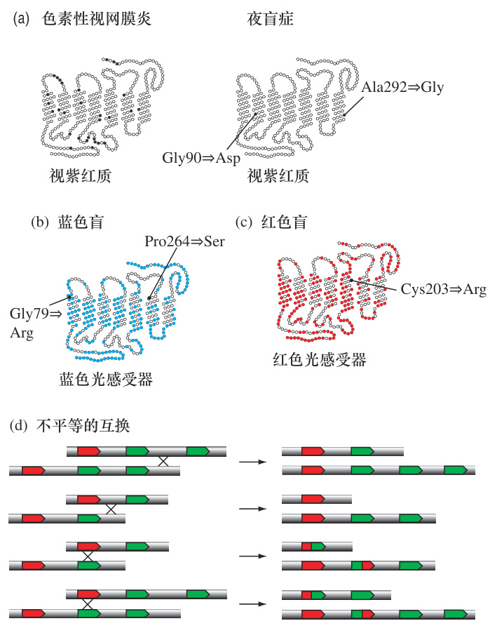  
图7.33　突变如何调节光和颜色感知。（a）氨基酸替换（黑点）破坏视紫红质的三维结构导致视网膜色素变性。其他替换作用减弱视紫红质对光的敏感性，导致夜盲症。（b）蓝色色素的替换会产生三色色盲。（c）红色色盲可由破坏红色感光细胞稳定性的特殊突变引起。（d）红色和绿色基因之间的不平等互换可以改变基因数量，并产生指定的杂交光感受器蛋白基因。  

视紫红质基因的其他突变导致严重的夜盲症［图7.33（a）］。这些突变改变了蛋白质的氨基酸序列，因此触发视觉级联所需的刺激阈值增加。随着阈值的变化，非常暗淡的光线不再足以启动视觉。  

# 2. 视锥细胞色素基因突变  

由视锥细胞色素基因突变引起的视力问题不如由视杆细胞视紫红质基因中的类似缺陷引起的视力问题严重。最有可能的是，这种差异的发生是因为视杆细胞构成一个人的光接收神经元的 $95\%$ ，而视锥细胞只占约$5\%$ 。7号染色体上的蓝色基因中的一些突变会导致三色盲，这是分辨颜色的能力缺陷，这些颜色仅在它们包含的蓝光量方面不同［图7.33（b）和图7.34］。X染色体上红色基因的突变可以改变或消除红色蛋白质功能，因此改变或消除红色视锥细胞对光的敏感性。例如，红色接收蛋白中从半胱氨酸到精氨酸间第203位核酸的改变，破坏了支持蛋白三级结构所需的一个二硫键［参见图7.33（c）］。没有这种结合，蛋白质不能稳定地保持其天然构型，并且具有突变的人有红色盲。  

  
图7.34 患有三色色盲的人眼中的世界。与图4.22对照。色差模拟由Vischeck（www.vischeck.com）提供。图片由NASA提供。  

# 3. 红色和绿色基因之间的不等交换  

色觉正常的人有一个红色基因；这些正常个体中的一些也具有单个相邻的绿色基因，而其他的具有两个甚至三个绿色基因。红色和绿色基因的DNA序列有 $96\%$ 相同；不同的绿色基因， $99.9\%$ 相同。  

它们的接近性和高度同源性使得这些基因异常容易在减数分裂重组中出现错误，称为不等交换。当同源染色体在减数分裂期间相关时，彼此相邻的两个密切相关的DNA序列，如红色和绿色光感受器基因，可以错误地彼此配对。如果在错配序列之间发生重组，则可以删除、添加或改变光感受器基因。  

各种不等交换事件产生的DNA不含红色基因、没有绿色基因、绿色基因的各种组合或杂合红绿基因［参见图7.33（d）］。如前所述，这些不同的DNA组合解释了红绿色感知中的大多数已知畸变，其余异常源自点突变。因为红色和绿色的准确感知取决于处理的红光和绿光的不同比例，没有红色或没有绿色基因的人将红色和绿色视为相同的颜色（见图4.22）。  

# 基本概念  

●  人类的视觉色素由视杆细胞中的蛋白质视紫红质，以及视锥细胞中的蓝色、红色和绿色敏感光感受器组成。●  视紫红质家族的四个基因是通过连续几轮基因复制和分化从祖先的光感受器基因进化而来的。●  视紫红质基因突变可能会破坏视杆功能，导致失明。视锥细胞光感受器基因的突变导致各种形式的色盲。  

# 接下来的内容  

对突变的仔细研究表明，基因是可变元件的线性阵列，其指导多肽中氨基酸的组装。可变元件是DNA的核苷酸构建块。  

生物学家称基因中核苷酸序列与多肽共线性中氨基酸的顺序相似。在第8章中，我们解释了共线性是如何从碱基配对、遗传密码、特定酶和核糖体等大分子组装引起的，这些组件指导信息从DNA通过RNA流向蛋白质。  

# 习题精解  

Ⅰ.  想象一下，10只独立分离的隐性致死突变 $\left(\begin{array}{l l}{l^{I}}&{l^{2}}\end{array}\right)^{\phantom{\dagger}}$ 、$l^{3}$ 等）在小鼠中定位于7号染色体。你通过交配带有这些致死突变的杂合子的所有成对组合进行互补测试，并通过检查怀孕雌性的死胎来评估缺乏互补。图表中的 $^+$ 表示两个生育补充，并且没有找到死胚胎。–表示发现了死胚胎，其发生率约为1/4（预计杂合小鼠之间的杂交会产生纯合隐性，显示1/4胚胎中的致死表型）。每个杂交的亲本杂合子的致死突变列于图表的顶部和左下方（即， $l^{l}$ 表示杂合子，其中一条染色体携带l 突变，同源染色体是野生型）。  

$l^{l}$ $l^{2}$ $l^{3}$ 4 l5 l6 l7 $l^{\vartheta}$ $l^{\boldsymbol{g}}$ $l^{l^{0}}$ l1 + + + + + + + $l^{2}$ + + + + + + $l^{3}$ + + + $l^{4}$ + + + $l^{5}$ + + + $l^{6}$ + + + $l^{7}$ + + + $l^{8}$ + $l^{9}$ + $l^{l o}$  

10 个致死突变代表了多少个基因？什么是互补组？  

# 解答  

此问题涉及将互补概念应用于一组数据。有两种方法可以分析这些结果。你可以专注于相互补充的突变，得出结论是：它们位于不同的基因中，并开始在不同的基因中创建突变列表。或者，你可以专注于彼此不互补的突变，因此是相同基因的等位基因。当涉及几个突变时，后一种方法更有效。例如， $l^{l}$ 不补充l6和l7。这三个等位基因位于一个互补组中。 $l^{2}$ 不补充 $l^{I O}$ ；他们是第二个互补小组。 $l^{3}$ 不与$l^{4}$ 、 $l^{5}$ 、 $l^{\vartheta}$ 或l9互补，因此它们形成第三个互补组。存在三个互补组（还要注意，对于每个突变体，携带相同等位基因的个体之间的杂交导致没有互补，因为产生了隐性致死突变的纯合子）。三个互补组由：$\textcircled{1}l^{l}$ 、 $l^{6}$ 、l7； $\textcircled{2}l^{2}$ 、 $l^{l0}$ ； $\textcircled{3}l^{3}$ 、 $l^{\#}$ 、 $l^{5}$ 、l8、l9组成。  

Ⅱ.  W、X和Y是生化途径中的中间体（按此顺序），其产物是Z。 $Z$ –突变体存在于5个不同的互补组中。Z1突变体将在Y或Z上生长，但不会在W或X上生长。Z2突变体将在X、Y或Z上生长。Z3突变体将仅在Z上生长。Z4突变体将在Y或Z上生长。最后，Z5突变体将生长在W、X、Y或Z上。  

a. 根据阻止的步骤对5个互补组进行排序。  

b.  这些遗传信息揭示了导致X转化为Y的酶的性质是什么？  

# 解答  

这个问题要求你了解生化途径中的互补和基因与酶之间的联系。  

a.  生化途径代表生产产品必须发生的有序反应集。该问题给出了产生产物Z的途径中的中间体的顺序。沿途缺乏任何酶将导致Z–的表型，但是该阻断可以发生在沿着途径的不同位置。如果突变体在给予中间体化合物时生长，则酶促（并因此基因）缺陷必须在产生该中间体化合物之前。在Y或Z上生长（但不在W或X上）的Z1突变体必须在产生Y的酶中具有缺陷。Z2突变体在X之前具有缺陷；Z3突变体在Z之前有缺陷；Z4突变体在Y之前有缺陷；Z5突变体在W之前具有缺陷。五个互补组可以按生物化学途径内的活性顺序放置如下：  

$$
\xrightarrow{Z S}\mathrm{{W}}\xrightarrow{Z2}\mathrm{{X}}\xrightarrow{Z I\,,\ Z4}\mathrm{{Y}}\xrightarrow{Z3}\mathrm{{Z}}
$$  

b.  突变体Z1和Z4影响相同的步骤，但由于它们处于不同的互补组中，我们知道它们位于不同的基因中。突变Z1和Z4可能在编码多亚基酶的亚基的基因中，所述多亚基酶将X转化为Y；或者，可存在X和Y之间当前未知的额外中间步骤。  

# 习题  

# 词汇  

1.  以下是突变的列表。对于所描述的每个特定突变，指出右侧列中的哪些术语适用，作为突变的描述或作为可能的原因。右列中的多个术语可以应用于左列中的每个语句。  

1.  野生型基因中的A-T碱基对变为G-C对 a. 过渡   
2.  将A-T碱基对更改为T-A对 b. 碱基替代   
3.  序列AAGCTTATCG改为AAGCTATCG   
4.  序列CAGCAGCAGCAGCAGCAG更 c. 颠换 改为CAGCAGCAGCAGCAGCAGC d. 缺失 AGCAGCAG   
5.  序列AACGTTATCG改为AATGTT e. 插入 ATCG f. 脱氨基作用   
6.  序列AACGTCACACACACATCG改为 AACGTCACATCG g. X射线照射   
7.  序列AAGCTTATCG改为AAGCTTT ATCG h. 嵌入 i. 错配  

# 7.1节  

2.  什么解释可以解释以下非常罕见的特征谱系？要尽可能具体。你怎么能区分这些解释？  

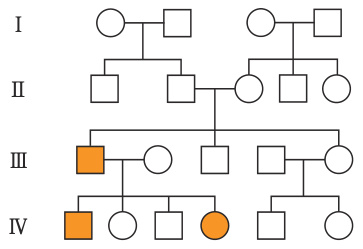  

3.  此处给出来自三个独立分离的突变体的基因的一条链的DNA序列（5′端在左侧）。利用这些信息，该地区野生型基因的序列是什么？突变体1 ACCGTAATCGACTGGTAAACTTTGCGCG突变体2 ACCGTAGTCGACCGGTAAACTTTGCGCG突变体3 ACCGTAGTCGACTGGTTAACTTTGCGCG  

4.  在哺乳动物中，常染色体隐性突变的产生速率的测量几乎完全在小鼠中进行，而在小鼠和人类中已经进行了许多显性突变产生速率的测量。你认为这种差异的原因是什么？  

5.  在几年的时间里，一家大医院跟踪记录了显示特征性软骨发育不全的婴儿的出生数量。软骨发育不全是一种非常罕见的常染色体显性疾病，导致侏儒症、身体比例异常。在出生12万人之后，有人指出27名婴儿出生时患有软骨发育不全。一位医生有兴趣确定这些矮小婴儿中有多少是由新突变导致的，以及该地理区域的明显突变率是否高于正常水平。他查看了27个矮人出生的家庭，发现4个矮小的婴儿有一个矮小的父母。这个人群中软骨发育不全基因的表观突变率是多少？是异常高还是低？  

6.  假设你想研究控制细菌细胞表面结构的基因。你决定首先通过与细胞表面结合的噬菌体分离对细菌感染具有抗性的细菌突变体。选择过程很简单：从培养皿中的敏感细菌培养物中扩散细胞，将它们暴露在高浓度的噬菌体中，并挑选生长的细菌菌落。为了建立选择，你可以： $\textcircled{\scriptsize{1}}$ 在许多不同的平板上从敏感细菌的单一液体培养物中涂抹细胞，并挑选每个抗性菌落；$\textcircled{2}$ 开始培养许多不同的培养物，每个培养物从一个敏感细菌菌落中生长，从每个培养物中扩散一个平板，然后从每个培养板中挑选一个突变体。哪种方法可以确保你分离出许多独立的突变？  

7.  在遗传学实验室中，Kim和Maria用特定的强毒噬菌体感染了大肠杆菌培养物中的样本。他们注意到大多数细胞被裂解，但有一些幸存下来。他们样本的存活率约为 $1\times{10}^{-4}$ 。Kim确信噬菌体诱导了细胞的抗性，而Maria认为抗性突变体可能已经存在于他们使用的细胞样本中。早些时候，对于不同的实验，他们将大肠杆菌的稀释悬浮液涂布在大培养皿中的固体培养基上，并且在看到大约 $10^{5}\$ 个菌落长大后，他们将该平板复制在另外三个平板上。Kim和Maria决定使用这些平板来测试他们的理论。他们将噬菌体的悬浮液吸移到三个复制板的每一个上。如果Kim正确，他们应该怎么理解？如果Maria是对的，他们应该怎么理解？  

8.  波动试验的结果（图7.5）被解释为：在11个培养管的每一个中预先存在不同数量的突变细菌，因为突变在每个培养物生长期间的不同时间自发产生。然而，另一种可能性是平板上菌落数量的差异仅仅是由于培养皿支持菌落生长的能力的差异。例如，可能选择剂或培养基中的营养物不均匀地分布在浇注到培养皿中的融化的琼脂中。你可以做些什么实验来确定培养皿中的差异是否是实验中的一个因素？  

9.  下面的谱系显示了一种完全渗透、显性特征的遗传，称为釉质发育不全，影响牙齿的结构和完整性。从受影响的个体Ⅲ-1和Ⅲ-2获得的血液的DNA分析显示，在第二代任何父母的血液DNA中都没有看到ENAM常染色体基因的两个拷贝之一中存在相同的引起疾病的突变。解释这个结果，引用图4.19和图7.5。你认为这种类型的继承模式是罕见还是常见？  

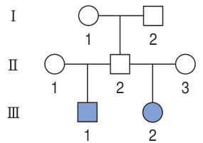  

10.  自闭症是一种神经系统疾病，被认为是由一种或多种基因的突变等位基因引起的。科学家们一直在想为什么被诊断为自闭症的孩子数量在十年内急剧增加，从2002年的1/500上升到2012年的1/88。研究人员现在认为他们可能至少找到了部分答案：男人在越来越老的年龄养育孩子。发表在2012年Nature杂志上的一篇论文显示了父亲年龄与自闭症发病率之间的相关性；母亲的年龄不是一个因素。这一观察结果如何为自闭症发病率的明显增加提供可能的解释？  

11.  与第3章中的黄色拉布拉多猎犬一样，金毛猎犬通常是纯黄色的。所示的金毛猎犬脸上有一个非常罕见的黑色标记。解释这只狗外观的遗传基础。仅考虑表3.3中列出的E和B基因（另见图3.12和图3.13）。（另请注意，黑色标记不是面具）  

  
© Sally MacBurney  

# 7.2节  

12.  记住，平衡染色体可防止平衡器与其正常同系物之间重组染色体的恢复。为什么平衡X染色体对Muller实验的设计至关重要（图7.13）？（提示：回答这个问题的最好方法是考虑没有平衡器的实验结果）  

13.  图7.14显示了诱变剂5-溴尿嘧啶、羟胺、乙基甲烷磺酸盐和亚硝酸诱导的碱基取代的实例。哪些诱变剂会导致转换？哪些引起颠换？  

14.  图7.14（a）显示诱变剂5-溴尿嘧啶（5-BU）类似于T或C，取决于其互变异构状态。该图首先显示5-BU作为T样互变异构体掺入DNA中，但随后在下一轮  

DNA复制过程中其状态变为C样互变异构体。结果是 $\mathrm{T}:\mathrm{A}{\rightarrow}\mathrm{C}:\mathrm{G}$ 取代。假设在两轮复制过程中5-BU的互变异构状态被逆转，会导致什么样的突变？  

15.  所谓的双向诱变剂可以诱导特定的突变和（当随后加入染色体携带该突变的细胞时）恢复原始DNA序列的突变逆转。相反，单向诱变剂可诱导突变，但不能诱导这些突变的确切逆转。根据图7.14，下列哪种诱变剂可分为单向和双向？  

a. 5-溴尿嘧啶  
b. 羟胺  
c. 乙基甲烷磺酸盐  
d. 亚硝酸  
e. 二氨基吖啶  

16.  1967年，J. B. Jenkins用诱变剂乙基甲烷磺酸盐（EMS）处理野生型雄性果蝇，并将它们与纯合子雌性交配产生一种称为矮胖的隐性突变，导致翅膀缩短。他发现一些F1后代有两个野生型翅，一些有两个短翅，一些有一个短翅和一个野生型翅。在第二次杂交中，当他将单个F 果蝇与两个短翅膀交配成矮胖的纯合子时，他惊奇地发现，这些交配中只有一小部分产生了所有的短翅后代。  

a. 根据图7.14所示EMS的作用机制解释这些结果。b.  第二个杂交的短翅后代是否应该有一个或两个短翅？为什么？  

17.  将通过Ames试验鉴定的特定诱变剂注射到小鼠中会引起许多肿瘤的出现，表明该物质是致癌的。将来自这些肿瘤的细胞注射到未暴露于诱变剂的其他小鼠中时，几乎所有新小鼠都会发展成肿瘤。然而，当携带诱变剂诱导的肿瘤的小鼠与未暴露的小鼠交配时，实际上所有后代都是无肿瘤的。为什么肿瘤可以水平转移（通过注射细胞）而不是垂直转移（从一代到下一代）？  

18.  当Ames试验中使用的His 沙门氏菌菌株暴露于物质X时，没有看到His 回复体。然而，如果将大鼠肝上清液与物质X一起加入细胞中，则确实会发生回复体。物质X是否是人体细胞的潜在致癌物质？请说明。  

19.  Ames试验使用回复率（His–至His+）来测试化合物的致突变性。  

a.  一种已知的诱变剂，如二氨基吖啶，是否有可能无法恢复Ames试验中使用的特定His 突变体？你如何看待Ames测试旨在解决此问题？  

b.  你能想到一种方法来使用正向突变（His+到$\mathrm{His}^{-}$ ）测试化合物的致突变性吗？（提示：考虑使用图7.6中的影印培养技术）  
c.  鉴于前向突变率远远高于回归率，为什么Ames试验使用回归率来测试致突变性？在考虑以下两个问题时，请参考三核苷酸重复疾病：亨廷顿病和脆性X综合征。  

20.  导致脆性X综合征的突变FMR-1等位基因被认为是X连锁显性的，具有不完全外显率和可变表达性。为什么大多数女性对于一个突变体和一个正常等位基因是杂合的，至少有一些这种疾病的症状？  

21.  物理学家史蒂芬·霍金因其关于黑洞的理论而闻名，他因肌萎缩侧索硬化而活到70岁，这是一种瘫痪的神经退行性疾病，通常在更年轻的时候致命。最近，遗传学家发现ALS的一个主要原因是六核苷酸重复（ $5^{\prime}.$ -GGGGCC- $.3^{\prime}$ ）的异常扩增，该重复位于基因可读框（ORF）之外的位置，称为C9ORF72。单个扩增的等位基因足以引起ALS，但疾病等位基因占优势的原因尚不清楚。一些实验结果支持等位基因产生含有扩增重复序列的毒性RNA的理论。如果这个理论是正确的，突变ALS等位基因在哪些方面类似于导致亨廷顿病的突变等位基因？它在哪些方面类似于导致脆性X综合征的突变等位基因？  

# 7.3节  

22.  黄曲霉毒素B1是一种高度致突变和致癌的化合物，由某些真菌产生，可以感染花生等作物。黄曲霉毒素是一种大而庞大的分子，与鸟嘌呤（G）化学键合形成黄曲霉毒素-鸟嘌呤加合物，如下图所示（在图中，黄曲霉毒素是橙色的，鸟嘌呤碱基是紫色的）。这种加合物扭曲DNA双螺旋并阻止复制。  

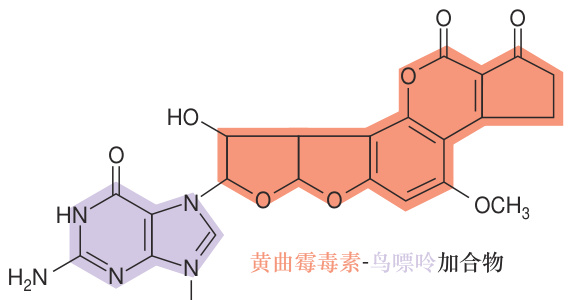  

a.  什么类型的DNA修复系统最有可能参与修复DNA暴露于黄曲霉毒素B1所造成的损害？  
b.  最近的证据表明，鸟嘌呤和黄曲霉毒素B1的加合物可以攻击连接它与脱氧核糖的键；这解放了加合基，形成了一个脱嘌呤的位点。这些新信息如何改变你对题目a的回答？  

23.  在人DNA中， $70\%$ 随后是鸟嘌呤的胞嘧啶残基（所谓的CpG二核苷酸，其中 $^{\prime}p$ 表示这两个核苷酸之间磷酸二酯键中的磷酸）被甲基化形成5-甲基胞嘧啶。如下图所示，如果5-甲基胞嘧啶进行自发脱氨，则它会变成胸腺嘧啶。  

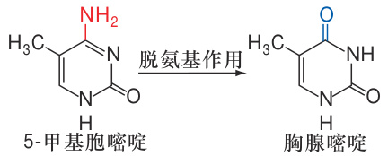  

a.  甲基化CpG二核苷酸是人类DNA中点突变的热点。你能提出一个解释原因的假设吗？  
b.  简化假设人类DNA具有相同数量的C-G和A-T碱基对，并且人类DNA序列是随机的，你期望在人类基因组中找到基因序列CpG的频率如何？  
c.  事实证明，即使考虑到人类DNA的实际GC含量（约 $42\%$ ），人类DNA中CpG的频率也远低于题目b计算的预测频率。解释为什么会出现这种情况。  

24.  溴脱氧尿苷（BrdU）是一种合成的核苷，可以掺入新合成的DNA中代替胸腺嘧啶（T）。研究人员可以将BrdU添加到细胞生长的培养基中，然后通过用BrdU特异性抗体染色，检测其在染色体中的存在。a.  左下图显示了在BrdU存在下生长一段时间的体细胞分离的中期染色体。较深的染色表明更多的BrdU。这些细胞在BrdU存在下生长了多少细胞？b.  所谓的花斑染色体（类似于图右侧的那些）可以从与左图完全相同的细胞中分离出来，如果细胞在染色体准备分析前几小时暴露在X射线中，X射线诱导DNA中的双链断裂。你在这些花斑染色体中见证了什么样的修复过程？  

c.  在细胞周期的哪个点发生了题目b所述的修复过程？请说明。  

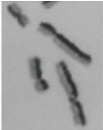  

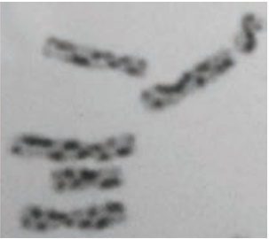  
  
$\copyright$ Maureen Sanz, Molloy College, Rockville Centre, NY  

d.  Bloom综合征是一种常染色体隐性遗传疾病，其特点是身材矮小、面部特征独特、癌症风险增加。右边的图实际上显示了Bloom综合征患者的细胞在BrdU中生长的情况，细胞的数量是适当的；即使细胞未经受X射线照射，几乎所有这些细胞都显示出花斑染色体。你认为Bloom综合征基因（称为BLM+）的野生型等位基因所指定的蛋白质的功能是什么？  

# 7.4节  

25.  动物的白化病是由合成黑色素所需的几种常染色体基因之一的隐性突变引起的，黑色素是许多皮肤和眼睛色素的化学前体。白化动物是由于基因的隐性突变而产生的，这种基因突变需要不同的途径，如产生所有皮肤色素的细胞的发育途径。假设你有两只白色的蜂鸟（一只雄性和雌性）进行交配。假设所有相关突变都是罕见的、常染色体的和隐性的野生型等位基因，你会期望它们的后代在以下条件下看起来是什么样子的：  

a. 它们都是白化病患者。  
b. 它们都是白毛的。  
c. 一个是白化病，另一个是白毛的。  

26. a.  在图7.22（b）中，你对于由a+表示的后代的表型是什么？请说明。b.  在同一图中，a–表示后代的表型怎么样？请说明。  

27.  想象一下，你在厨房里抓到了一只雌性白化小鼠，并决定把它留给宠物。几个月后，在关岛度假时，你抓到了一只雄性白化小鼠，并决定将它带回家进行一些有趣的基因实验。你想知道这两只小鼠是否因为同一基因的突变而都是白化病。你能做些什么来找出这个问题的答案？假设两个突变都是隐性的。  

28.  研究影响植物拟南芥叶片形状的基因的植物育种者发现了6个独立的隐性突变，导致植物具有锯齿状而非光滑边缘的不寻常叶片。研究人员开始用这些突变体进行互补测试，但由于温室发生事故，有些试验无法完成。可以完成的互补测试的结果显示在下表中。  

<html><body><table><tr><td></td><td>1</td><td>2</td><td>3</td><td>4</td><td>5</td><td>6</td></tr><tr><td>1</td><td></td><td>+</td><td></td><td></td><td>+</td><td></td></tr><tr><td>2</td><td></td><td></td><td></td><td></td><td></td><td></td></tr><tr><td>3</td><td></td><td></td><td>一</td><td></td><td></td><td></td></tr><tr><td>4</td><td></td><td></td><td></td><td></td><td></td><td></td></tr><tr><td>5</td><td></td><td></td><td></td><td></td><td>一</td><td>+</td></tr><tr><td>9</td><td></td><td></td><td></td><td></td><td></td><td></td></tr></table></body></html>  

a.  确切地说，在我们所做实验的表格中如何填充加号 $\left(\ +\ \right)$ 或减号（–）呢？ $^+$ 代表什么？−代表什么？为什么表中的一些框是绿色的？  

b.  假设没有并发症，你对未执行的互补测试的结果有何期望？也就是说，通过在每个空白框中放置一个a+或a−来完成表格。  
c.  在这组突变体中代表了多少个基因？哪些基因突变？  

29.  在人类中，白化病通常以常染色体隐性方式遗传。第3章的图3.24（c）显示了一个谱系，其中两个白化病父母有几个孩子，而没有一个是白化病。  

b.  很难找到人类谱系的例子，如图3.24（c），实际上代表了互补测试。原因是人类的大多数遗传条件都很罕见，因此具有相同病症的无关人群不太可能交配。在没有互补测试的情况下，可以进行哪些类型的实验来确定特定人类疾病表型是否可能由多个基因的突变引起？  

c.  互补测试要求待测试的两个突变都是野生型隐性。假设两个显性突变导致相似的表型。你怎么能确定这些突变是否会影响相同的基因或不同的基因？  

30. a.  Seymour Benzer对噬菌体T4 rII区域的精细结构分析在很大程度上取决于缺失分析，如图7.25所示。但是为了进行这种缺失分析，Benzer必须知道哪些rII 噬菌体菌株是缺失的，哪些是点突变。你认为他如何能够将rII –缺失与点突变区分开来？b.  图7.25（c）显示了Benzer在rII区域中点突变的精细结构。该图的一个关键特征是热点的存在，Benzer将其解释为特别容易发生突变的核苷酸对。Benzer怎么解释热点中的所有独立突变都是由于同一个核苷酸对的突变？  

31. a.  你有一个含有 $5\mathrm{ml}$ 噬菌体溶液的试管，你想估计试管中噬菌体的数量。假设管实际上包含总计150亿个噬菌体，设计一个连续稀释实验，可以让你估计这个数字。理想情况下，你计算的最终含有斑块的平板应包含10个以上且少于1000个斑块。  

b.  当你按照题目a中的连续稀释法计算噬菌体时，假设涂平板效率为 $100\%$ ；也就是说，培养皿上的斑块数量恰好代表了与涂平板细菌混合的噬菌体数量。有没有办法测试只有一定比例的噬菌体颗粒可以形成斑块的可能性（这样涂平板效率会低于 $100\%$ ）？为什么假设任何斑块是由一个噬菌体颗粒而不是多个噬菌体颗粒引发的？  

32.  你发现了5个不能在大肠杆菌K(λ)上生长的T4 $r I I$ 突变体。你将两种突变体的所有可能组合混合在一起（如下图所示），将混合物加入大肠杆菌K(λ)中，并评估混合物生长和产生斑块的能力（在图表中以$^{\mathrm{a+}}$ 表示）。  

<html><body><table><tr><td></td><td></td><td>2</td><td>3</td><td>4</td><td>5</td></tr><tr><td>1</td><td>一</td><td>+</td><td>+</td><td></td><td>+</td></tr><tr><td>2</td><td></td><td>一</td><td></td><td>+</td><td></td></tr><tr><td>3</td><td></td><td></td><td>一</td><td>+</td><td></td></tr><tr><td>4</td><td></td><td></td><td></td><td>一</td><td>+</td></tr><tr><td>5</td><td></td><td></td><td></td><td></td><td>一</td></tr></table></body></html>  

a. 通过这种分析确定了多少基因？b. 哪些突变体属于相同的互补组？  

33.  果蝇的玫瑰色基因（ry）编码一种叫做黄嘌呤脱氢酶的酶。ry突变纯合的果蝇表现出玫瑰色的眼睛颜色。制备杂合雌性，其在一个同源物上具有 $r y^{4l}~S b$ 而在另一个同源物上具有 $L y\ r y^{564}$ ，其中 $r y^{4l}$ 和 $r y^{564}$ 是ry的两个独立分离的等位基因。 $L y$ ［Lyra（窄）翅膀］和Sb［Stubble（短）刷毛］分别是ry左侧和右侧的基因的显性突变等位基因。这些雌性现在与 $r y^{41}$ 纯合的雄性交配。在100 000个后代中，8个具有野生型眼睛、Lyra翅膀和Stubble刷毛，而其余的则有玫瑰色的眼睛。  

a.  这两个ry突变相对于侧翼基因Ly和Sb的顺序是多少？  
b. $r y^{4l}$ 和ry564之间的遗传距离是多少？  

34.  噬菌体T4的9个 $r I I$ 突变体用于大肠杆菌K(λ)宿主的成对感染。这些噬菌体中的6个突变是点突变；其他3个是缺失。双重感染细胞大量产生子代噬菌体的能力在下表中评分。  

<html><body><table><tr><td></td><td>1</td><td>2</td><td>3</td><td>4</td><td>5</td><td>6</td><td>7</td><td>8</td><td>9</td></tr><tr><td>1</td><td>一</td><td></td><td>+</td><td>+</td><td>一</td><td>一</td><td>一</td><td>+</td><td>+</td></tr><tr><td>2</td><td></td><td></td><td>+</td><td>+</td><td>二</td><td></td><td></td><td>+</td><td>+</td></tr><tr><td>3</td><td></td><td></td><td>一</td><td>一</td><td>+</td><td>一</td><td>+</td><td>一</td><td>一</td></tr><tr><td>4</td><td></td><td></td><td></td><td>二</td><td>+</td><td>一</td><td>+</td><td></td><td></td></tr><tr><td>5</td><td></td><td></td><td></td><td></td><td>一</td><td>一</td><td>一</td><td>+</td><td>+</td></tr><tr><td>6</td><td></td><td></td><td></td><td></td><td></td><td>一</td><td></td><td></td><td></td></tr><tr><td>7</td><td></td><td></td><td></td><td></td><td></td><td></td><td>二</td><td>+</td><td>+</td></tr><tr><td>8</td><td></td><td></td><td></td><td></td><td></td><td></td><td></td><td>一</td><td></td></tr><tr><td>6</td><td></td><td></td><td></td><td></td><td></td><td></td><td></td><td></td><td>一</td></tr></table></body></html>  

然后将相同的9种突变体用于大肠杆菌B宿主的成对感染。现在对随后裂解大肠杆菌K(λ)宿主的后代噬菌体的产生进行评分。在表中，0表示后代不会在大肠杆菌K(λ)细胞上产生任何斑块；−意味着只有极少数后代噬菌体产生斑块； $^+$ 意味着许多后代产生斑块（超过−的情况下的10倍）。  

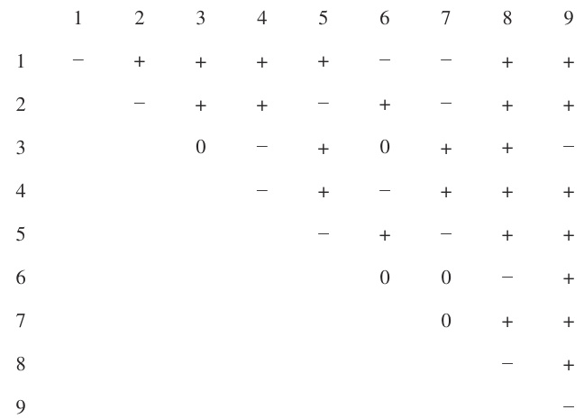  

a.  哪三个突变体是三个缺失？你使用什么标准来得出结论？  
b.  如果你知道突变9位于rIIB基因中，请绘制可能的最佳遗传图来解释数据，包括所有点突变的位置和三个缺失的程度。  
c.  你对题目b中的回答应该保留一个不确定性。你怎么能解决这种不确定性？  

35.  在单倍体酵母菌株中，发现了8个隐性突变，导致需要氨基酸赖氨酸。发现所有突变以大约 $1\times{10}^{-6}$ 的频率恢复，除了突变5和6没有恢复。在a和携带这些突变的α细胞之间进行交配。在没有赖氨酸的情况下，所得二倍体菌株在基本培养基上生长的能力如下图所示（ $^+$ 表示生长，−表示没有生长）。  

1 2 3 4 5 6 7 8   
1 + + + + +   
2 + + + + + + +   
3 + + +   
4 + + +   
5 + + +   
6 +   
7 + + +   
8 + + + + +  

a.  这些数据揭示了多少补充组？哪个点突变在哪个互补组中找到？现在诱导相同的二倍体菌株形成孢子。绝大多数产生的孢子都是营养缺陷型；也就是说，当在基本培养基（不含赖氨酸）上涂平板时，它们不能形成菌落。然而，特定二倍体可以产生稀有孢子，当在基本培养基（原养型孢子）上涂平板时，这些孢子确实形成菌落。下表显示 $(\,+\,)$ 或（−）是否在各种二倍体细胞孢子形成时形成任何原养型孢子。  

1 2 3 4 5 6 7 8   
1 + + + + + +   
2 + + + + + + +   
3 + + + + + +   
4 + + + + +   
5 + + + +   
6 + + + +   
7 + + + + + + +   
8 + + + + + + +  

b.  当刚才讨论的二倍体孢子形成期间产生原养型孢子时，你通常会在含有这种原养型孢子的任何四分体中看到营养缺陷型与原养型孢子的比例是多少？解释你期望的比例。  

c.  使用来自该问题所有部分的数据，绘制研究中的8个赖氨酸营养缺陷型突变的最佳图谱。显示所涉及的任何缺失的程度，并指出各种互补组的边界。  

36.  在习题24中，你了解到Bloom综合征是一种常染色体隐性遗传疾病，其特征在于花斑染色体的频率高（在BrdU生长后检测到）。这些染色体是由高水平的染色体断裂引起的，然后通过同源重组进行修复。在一些患者中，每个细胞都有许多花斑染色体。在其他患者中，大多数细胞具有许多花斑染色体，但是大约 $10\%$ 的细胞令人惊讶地没有。  

a.  什么类型的事件产生在某些Bloom综合征患者中$10\%$ 的细胞没有花斑染色体？（提示：想想重组。）这些缺乏花斑染色体的细胞的存在对这些患者携带的Bloom综合征基因的等位基因有什么影响？  
b.  两种类型的Bloom综合征患者以何种方式反映互补测试的结果？  
c.  为什么在题目a中描述的事件可能发生在Bloom综合征患者中？  
d.  你在题目a中描述的事件与产生花斑染色体的事件有什么不同？  
e.  你在题目a中描述的事件可能发生在细胞周期的${\bf G}_{1}$ 期间吗？ ${\bf G}_{2}$ 期间呢？  
f.  产生没有花斑染色体的细胞的事件是非常罕见的，即使在Bloom综合征患者中也发生在不到百万分之一的细胞分裂中。然而，令人惊讶的是，某些患者中大约 $10\%$ 的细胞缺乏花斑染色体。这两个陈述如何同时成立？  

# 7.5节  

37.  粗糙脉孢菌（Neurospora crassa）中精氨酸生物合成的途径涉及几种产生一系列中间体的酶。  

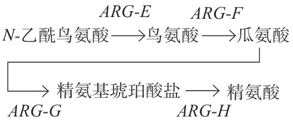  

a.  如果你在ARG- $\cdot E$ 和ARG- $\mathcal{H}$ 脉孢菌菌株之间进行杂交，那么在亲本ditype和非亲本ditype asci中Arg 和Arg 孢子的分布是什么？按照它们在子囊中出现的顺序给出孢子类型。b.  对于题目a答案中的每个孢子，你可以在培养基中提供哪些营养成分来促进孢子生长？  

38.  在玉米蛇中，野生型颜色为棕色。一个常染色体隐性突变导致蛇变成橙色，另一个突变导致蛇变为黑色。一条橙色蛇与一条黑色蛇杂交，F 后代全部变成棕色。假设所有相关基因都是不连锁的。a.  如果存在一种色素途径，则指出在该杂交的F2代中你期望的表型和比例，橙色和黑色是棕色途中的不同的中间体。b. 如果橙色色素是一种途径的产物，黑色色素是另一种途径的产物，棕色是将两种色素混合在蛇皮中的效果，请指出在F2代中你期望的表型和比例。  

39.  在具有二倍体基因组的某些开花植物物种中，有四种酶参与花色的产生。编码这四种酶的基因位于不同的染色体上。涉及的生化途径如下；该图显示两种不同的酶中的任一种都足以将蓝色颜料转化为紫色颜料。  

# 白色 $\rightarrow$ 绿色 $\rightarrow$ 蓝色 $\rightrightarrows$ 紫色  

真实遗传的绿花卉植物与真实遗传的蓝花植物交配。所得F1代中的所有植物都具有紫色花。允许 $\mathrm{F}_{1}$ 植物自体受精，产生F2代。显示P、 $\mathrm{F}_{1}$ 和 $\mathrm{F}_{2}$ 植物的基因型，并指出哪些基因指定了哪些生化步骤。确定具有以下表型F 植物的比例：白色花朵、绿色花朵、蓝色花朵和紫色花朵。假设绿色花序亲本仅在该途径的单个步骤中是突变体。  

40.  中间体A、B、C、D、E和F都存在于相同的生化途径中。G是该途径的产物，突变体 $1\!\sim\!7$ 都是 $\mathrm{G^{-}}$ ，意味着它们不能产生物质G。下表显示了哪些中间体将促进每种突变体的生长。按照它们在通路中的出现顺序排列中间体，并指示每个突变菌株被阻断的途径中的步骤。表中的 $^+$ 表示如果给出该物质，该菌株将生长，O表示缺乏生长。  

补充   

<html><body><table><tr><td>突变体</td><td>A</td><td>B</td><td>C</td><td>D</td><td>E</td><td>F</td><td>G</td></tr><tr><td>1</td><td>+</td><td>+</td><td>+</td><td>+</td><td>+</td><td>o</td><td>+</td></tr><tr><td>2</td><td>0</td><td>0</td><td>0</td><td></td><td></td><td>0</td><td>十</td></tr><tr><td>3</td><td>0</td><td>+</td><td>+</td><td></td><td>+</td><td>0</td><td>+</td></tr><tr><td>4</td><td>0</td><td>+</td><td>0</td><td>0</td><td>+</td><td>0</td><td>+</td></tr><tr><td>5</td><td>+</td><td>+</td><td>+</td><td>0</td><td>+</td><td>0</td><td>+</td></tr><tr><td>6</td><td>+</td><td>+</td><td>十</td><td>十</td><td>+</td><td>+</td><td>+</td></tr><tr><td>7</td><td>0</td><td>0</td><td>0</td><td>0</td><td>+</td><td>0</td><td>+</td></tr></table></body></html>  

41.  在以下每个杂交方案中，将两个真正繁殖的植物菌株杂交以制备F1植物，所有这些植物都具有紫色花。然后将 $\mathrm{F}_{1}$ 植物自体受精以产生 $\mathrm{~\cal~F~}_{2}$ 后代，如此处所示。  

<html><body><table><tr><td>杂交测试</td><td>亲代</td><td>F</td><td>F2</td></tr><tr><td>1</td><td>蓝×白</td><td>全紫</td><td>9紫：4白：3蓝</td></tr><tr><td>2</td><td>白×白</td><td>全紫</td><td>9紫：7白</td></tr><tr><td>3</td><td>红×蓝</td><td>全紫</td><td>9紫：3红：3蓝：1白</td></tr><tr><td>4</td><td>紫×紫</td><td>全紫</td><td>15紫：1白</td></tr></table></body></html>  

a.  对于每个杂交，解释花色的继承。  

b.  对于每个杂交，显示可以解释数据的可能的生化途径。c.  这些杂交中的哪一个与潜在的生化途径相容，仅涉及由具有两个不同亚基的酶催化的单一步骤（这两个亚基都是酶活性所需的）？d.  对于四个杂交中的每一个，如果所有相关基因紧密相关，你对F1和F2代的期望是什么？  

42.  氨基酸谷氨酰胺（Gln）和脯氨酸（Pro）的生物合成途径涉及一种或多种常见中间体。分离编号为$1\!\sim\!7$ 的营养缺陷型酵母突变体，其需要谷氨酰胺或脯氨酸或两种氨基酸用于其生长，如下表所示（ $^+$ 表示生长；−无生长）。还测试了这些突变体在中间体A～E上生长的能力。这些中间产物在谷氨酰胺和脯氨酸途径中的顺序是什么？在通路的哪一点上被突变体阻断？  

<html><body><table><tr><td>突变体</td><td>A</td><td>B</td><td>C</td><td>D</td><td>E</td><td>Gln</td><td>Pro</td><td>Gln+Pro</td></tr><tr><td>1</td><td>+</td><td></td><td></td><td></td><td>+</td><td></td><td>+</td><td>+</td></tr><tr><td>2</td><td></td><td>一</td><td></td><td></td><td></td><td></td><td>+</td><td>+</td></tr><tr><td>3</td><td></td><td></td><td>+</td><td></td><td></td><td></td><td></td><td>+</td></tr><tr><td>4</td><td></td><td></td><td></td><td></td><td></td><td>+</td><td></td><td>+</td></tr><tr><td>5</td><td></td><td></td><td>+</td><td>+</td><td></td><td></td><td></td><td>+</td></tr><tr><td>6</td><td>+</td><td></td><td></td><td></td><td></td><td></td><td>+</td><td>+</td></tr><tr><td>7</td><td>一</td><td>+</td><td>一</td><td>一</td><td>一</td><td>+</td><td>一</td><td>+</td></tr></table></body></html>  

43.  测试以下互补的大肠杆菌突变体在四种已知的胸腺嘧啶前体A～D上的生长。  

产物  

<html><body><table><tr><td>突变体</td><td>A</td><td>B</td><td>C</td><td>D</td><td>胸腺嘧啶</td></tr><tr><td>9</td><td>+</td><td></td><td>+</td><td></td><td>+</td></tr><tr><td>10</td><td></td><td></td><td>+</td><td></td><td>+</td></tr><tr><td>14</td><td>+</td><td>+</td><td>+</td><td></td><td>+</td></tr><tr><td>18</td><td>+</td><td>+</td><td>+</td><td>+</td><td>+</td></tr><tr><td>21</td><td></td><td>一</td><td></td><td>一</td><td>+</td></tr></table></body></html>  

a.  显示四种前体和最终产物胸腺嘧啶的简单线性生物合成途径。指出五个突变中的每个突变阻断哪个步骤。  

b.  在以下双突变体中会积累什么样的前体：9和10？10和14？  

44.  1952年，英国医学杂志的一篇文章报道了从几个患有X连锁隐性血友病的人中获得的血浆行为的有趣差异。当混合在一起时，来自某些个体组合的无细胞血浆可在试管中形成凝块。例如，下表显示了来自4名血友病患者的各种血浆组合中是否可形成$(\,+\,)$ 或不形成（−）血栓的情况：  

1和1 2和3 $^+$   
1和2 一 2和4 $^+$   
1和3 $^+$ 3和3 一  
1和4 $^+$ 3和4  
2和2 一 4和4  

这些数据告诉了你什么关于血友病个体遗传的情况？这些数据是否允许你排除任何控制血液凝固的生化途径的模型？  

45.  人类常染色体基因的突变导致一种称为冯维勒布兰德病（vWD）的血友病。该基因指定了一种巧妙地称为冯维勒布兰德因子（vWF）的血浆蛋白。vWF稳定因子Ⅷ，一种由野生型血友病A基因指定的血浆蛋白。需要因子Ⅷ来形成血凝块。因此，在没有vWF的情况下，因子Ⅷ被迅速破坏。  

以下哪项可能成功用于治疗血友病患者的出血事件？治疗会立即起作用还是仅在蛋白质合成需要一些延迟后才能起作用？治疗只会产生短期或长期影响吗？假设所有突变都是无效的（即突变导致基因编码的蛋白质完全缺失）并且血浆是无细胞的。  

a. 从正常血液输入血浆进入vWD患者b. 从vWD患者输入血浆到不同的vWD患者c. 从血友病A患者输入血浆到vWD患者d. 从正常血液输入血浆进入血友病A患者e. 从vWD患者输入血浆到A型血友病患者f.  从血友病A患者输入血浆到不同的A型血友病患者g. 将纯化的vWF注射到vWD患者体内h. 将纯化的vWF注射到血友病A患者体内i. 将纯化的因子Ⅷ注射到vWD患者体内j. 将纯化的因子Ⅷ注射到血友病A患者体内  

46.  制备的抗体识别6种蛋白质，这些蛋白质是秀丽隐杆线虫单细胞胚胎内复合物的一部分。母本产生的蛋白质被认为是从胚胎的内表面开始逐步组装成卵子中的结构。该抗体用于检测由突变母体产生的胚胎中的蛋白质位置（对于编码每种蛋白质的基因是纯合隐性）。秀丽隐杆线虫母本是自受精的雌雄同体，因此在受精过程中不会引入基因的野生型拷贝。在下表中，\*表示蛋白质存在且在胚胎表面，−表示蛋白质不存在， $^+$ 表示蛋白质存在但不存在于胚胎表面。假设所有突变都阻止相应蛋白质的产生。  

蛋白质生成与定位  

<html><body><table><tr><td>蛋白质基因突变</td><td>A</td><td>B</td><td>C</td><td>D</td><td>E</td><td>F</td></tr><tr><td>A</td><td></td><td>+</td><td>*</td><td>+</td><td>*</td><td>+</td></tr><tr><td>B</td><td>*</td><td></td><td>*</td><td>*</td><td>*</td><td></td></tr><tr><td>C</td><td>*</td><td>+</td><td></td><td>+</td><td></td><td>+</td></tr><tr><td>D</td><td>*</td><td>+</td><td></td><td></td><td>*</td><td>+</td></tr><tr><td>E</td><td>+</td><td>+</td><td>+</td><td>+</td><td></td><td>+</td></tr><tr><td>F</td><td></td><td>+</td><td>*</td><td>*</td><td>米</td><td>一</td></tr></table></body></html>  

完成下图，通过在每个圆圈中写下适当蛋白质的字母，显示假设蛋白质复合物的结构。用箭头标记的两种蛋白质可以彼此独立地组装成复合物，但是两者都需要向复合物中添加后续蛋白质。  

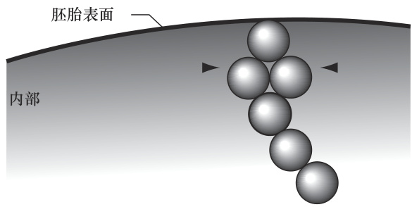  

47.  成人血红蛋白是具有四种多肽的多体蛋白，两种是α珠蛋白，其中两种是β珠蛋白。  

a. 需要多少个基因来定义血红蛋白的结构？  
b.  如果一个人的野生型等位基因是杂合的，并且等位基因将产生的氨基酸替换为α珠蛋白和β珠蛋白，那么在人的红细胞中会发现多少种不同种类的血红蛋白？假设所有等位基因都以相同水平表达。  

48.  图7.27（b）中的每个互补组（ARG-E、ARG- $.F$ 、ARG-G和ARG-H）可以在一个独特的补充子集上生长。为什么这四个子集是唯一观察到的子集？例如，为什么没有观察到互补组表现得像下表所示的四个假设？［符号如图7.27（b）： $^+$ 表示增长，−表示没有增长］  

增补物  

<html><body><table><tr><td>假设突变系</td><td>无</td><td>鸟氨酸</td><td>瓜氨酸</td><td>精氨酸琥珀酸</td><td>精氨酸</td></tr><tr><td>野生型：Arg</td><td>+</td><td>+</td><td>+</td><td>+</td><td>+</td></tr><tr><td>AGE-I-</td><td></td><td>+</td><td></td><td>+</td><td>+</td></tr><tr><td>AGR-J</td><td></td><td></td><td>+</td><td></td><td>+</td></tr><tr><td>ARG-K</td><td></td><td>+</td><td></td><td></td><td>+</td></tr><tr><td>ARG-L-</td><td>一</td><td>+</td><td>+</td><td></td><td>+</td></tr></table></body></html>  

# 7.6节  

49.  除了主要的成人血红蛋白，HbA含有两个 $\mathbf{\ddot{\alpha}}$ 珠蛋白链和两个β珠蛋白链（ ${\mathfrak{a}}_{2}{\beta}_{2}$ ），还有一个由两条α链和两条δ链（ ${\mathfrak{a}}_{2}\delta_{2}$ ）组成的微小血红蛋白 $\operatorname{HbA}_{2}$ 。β和δ珠蛋白基因串联排列并且高度同源。绘制由β和δ基因之间不等交换事件引起的染色体。  

50.  大多数哺乳动物，包括新世界灵长类动物，如mar-mosets（一种美洲产小型长尾猴），都是二色视者：它们只有两种视紫红质相关的颜色受体。人类和大猩猩等旧世界灵长类动物是具有三种颜色受体的三色视者。大约6500万年前，灵长类动物与其他哺乳动物产生差异，而旧世界和新世界灵长类动物大约相差3500万年。  

a.  使用此信息，在图7.32（d）中定义任何可以追溯事件的时间跨度。  

b.  一些新世界猴子具有常染色体颜色受体基因和单个X连锁颜色受体基因。X连锁基因具有三个等位基因，每个等位基因指定对不同波长的光响应的光感受器（三个波长都不同于常染色体颜色受体识别的波长）。在这些猴子中如何继承色觉？  

c.  人类和其他哺乳动物中约 $95\%$ 的光接收神经元是含有视紫红质的视杆细胞，视紫红质是一种对许多波长的低水平光有反应的色素。其余 ${}^{5\%}$ 的光接收神经元是具有色素的视锥细胞，其响应特定波长的高强度光。这些事实对最早的哺乳动物的生活方式有何建议？  

51.  人类通常是三色视者；我们有三种不同类型的视网膜锥体，每种视网膜锥体含有红色、绿色或蓝色视紫红质样光感受器蛋白。原因是大多数人在X染色体上有红色和绿色光感受器的基因，在常染色体上有蓝色光感受器基因。我们的大脑整合了每种锥体的信息，使我们可以看到大约一百万种颜色。一些科学家认为罕见的人可能是四色，也就是说，他们有四种不同的锥体。这些人，如果他们存在，可能会发现1亿种颜色！对于题目a和b，假设每个X染色体具有一个红色和一个绿色光感受器蛋白基因。对于所有部分，假设突变等位基因可以产生具有改变的光谱灵敏度的光感受器。  

a.  解释为什么科学家们期望比男性更多的女性是四色视者。  

b.  在X连锁的红色/绿色色盲中，红色或绿色光感受器基因的突变导致视紫红质样蛋白质具有改变的光谱敏感性。突变感光体对正常红色和绿色光感受器之间的波长敏感。为什么科学家认为一个有红色/绿色色盲的儿子的女性比一个儿子视力正常的女性更容易成为四色视者？  
c.  建议基于图7.33（d）的方案可以解释极为罕见的雄性可能是四色视者。  