# 第8章 基因表达：从 DNA 到 RNA 再到蛋白质的信息流动  

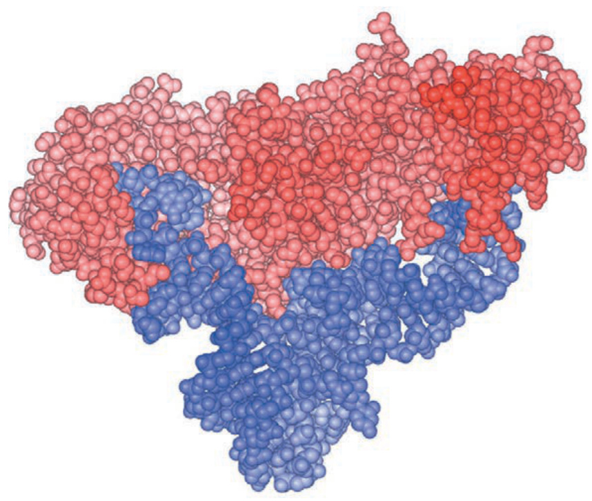  

氨酰tRNA合成酶（红色）识别特定的tRNA（蓝色）并将其与相应的氨基酸（未显示）结合的能力，是将核酸语言转化为蛋白质语言的分子机制的核心。  

# 章节大纲  

8.1 遗传密码  
8.2 转录：从DNA到RNA  
8.3 翻译：从mRNA到蛋白质  
8.4 原核生物与真核生物中的基因表达差异  
8.5 突变对基因表达和功能的影响  

自1990年以来，确定各种生物体基因组的完整核苷酸序列的工作一直在努力进行中。这一付出了巨大努力的工作比许多科学家预想的还要成功。截止到2016年写这篇文章的时候，已经有超过8100个不同物种的基因组DNA序列被存储在数据库中，另外，超过3.5万个物种的测序项目正在进行中。有了这些序列信息，遗传学家可以参考遗传密码（将核苷酸序列与氨基酸序列等同起来的密码）来确定基因组的哪些部分可能是基因。因此，现代遗传学家可以发现决定表型的所有多肽的数量和氨基酸序列。由此，DNA序列的获得为科学家探索生物体在分子水平上的生长和发育打开了新大门。  

在本章中，我们描述了进行基因表达的细胞机制，遗传信息可以被理解为表型。尽管有些细节可能看起来很复杂，但基因表达的整个过程是简洁而直接的：在每个细胞内，遗传信息从DNA到RNA再到蛋白质。这一说法是由FrancisCrick于1957年提出的分子生物学的中心法则。正如Crick解释的那样，“一旦信息传递到蛋白质中，就无法再返回。”  

中心法则认为遗传信息有两个不同的阶段(图8.1)。将DNA中的信息转换为RNA中的等同产物被称为转录。转录的产物是一个转录物，即原核生物中的信使RNA（mRNA）分子和真核生物中经过处理后成为mRNA的RNA分子。  

在基因表达的第二阶段，细胞机制将mRNA中的核苷酸序列解码成氨基酸序列（多肽），这一过程被称为翻译。它发生在称为核糖体的分子工作平台上，核糖体由蛋白质和核糖体RNA（rRNA）组成。翻译取决于被称为遗传密码的字典，它定义了每种氨基酸的三个核苷酸的特定序列。翻译也需要转运RNA（tRNA），小的RNA适配分子将特定的氨基酸放置在生长多肽链的正确位置。  

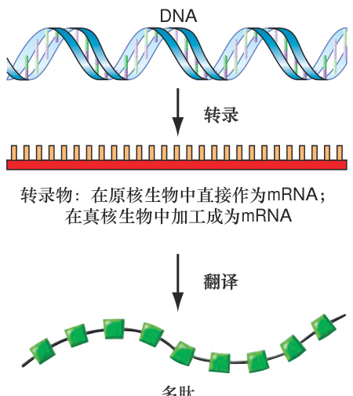  
  
图8.1基因表达：遗传信息的传递从DNA通过RNA转化为蛋白质。在转录中，RNA聚合酶复制DNA产生一组RNA转录物。在翻译中，细胞器遵循遗传密码的规则，使用mRNA的指令合成多肽。  

中心法则不能解释所有基因的行为。像Crick自已也意识到，许多基因被转录成从未翻译成蛋白质的RNA。你将在本章看到许多非翻译的RNA对基因表达的各个步骤至关重要。编码rRNA和tRNA的基因属于这一组。  

我们对基因表达的讨论一般分为四个主题。第一，从DNA到RNA、从RNA到蛋白质，互补碱基的配对是信息传递的关键。第二，极性（方向性）DNA、RNA和多肽有助于指导基因表达的机制。第三，像DNA复制和重组一样，基因表达也需要能量的输人，以及特定蛋白质、RNA和大分子复合体的参与，如核糖体。第四，改变遗传信息或者阻碍其表达传递的突变可对表型产生显著的影响。  

# 8.1 遗传密码  

# 学习目标  

1.解释建立一个由三个核苷酸组成的序列（一个三联体密码子）作为DNA与蛋白质编码基本单位的过程。  
2.总结证据表明基因中的核苷酸序列与蛋白质中的氨基酸序列是相关联的。  
3.定义阅读框，并讨论其对遗传密码的意义。  
4.描述确定哪些密码子与氨基酸相关、哪些是终止密码子的相关实验。  
5.解释如何使用突变来验证遗传密码。  
6.讨论遗传密码几乎具有普遍性的证据，并列举一些例外。  

代码是将一种语言中的信息与另一种语言中的信息等同起来的符号系统。遗传密码的一个有用的类比是莫尔斯码，它使用点和划线，通过无线电或电报线传送信息。点-划线符号的各种分组表示英语字母表中的26个字母。因为存在比两个符号（点或划线）更多的字母，所以以各种组合将一个、两个、三个或四个点或破折号分组表示单个字母。例如，C的符号是划线点划线点（一·一·），O的符号是划线划线划线（一－一），D是划线点点（一··），E是单点（·）。因为从一到四个符号中的任何一个都指定一个字母，所以莫尔斯码需要一个暂停符号（实际上是很短的时间间隔）来表示一个字母结束和下一个字母开始的位置。  

# 8.1.1 核苷酸的三重密码子代表单个氨基酸  

核酸的语言由四种核苷酸组成一一DNA语言中是A、G、C、T；RNA语言中是A、G、C、U；而蛋白质的语言用氨基酸写成。解读核苷酸序列如何确定多肽中氨基酸顺序的第一个障碍是确定存在多少个氨基酸字母。  

沃森和克里克在当地一家酒吧吃午饭时，列出了一份现已被人们接受的清单，上面列出了直接由DNA编码的20种常见氨基酸。他们通过分析多种天然存在的多肽的已知氨基酸序列创建了这份列表。仅存在于少量蛋白质或仅存在于某些组织或生物体中的氨基酸不符合标准构建模块；沃森和克里克正确地假设了当蛋白质合成后进行化学修饰时，大多数这类氨基酸都会产生。相比之下，大多数蛋白质中都含有氨基酸。接下来的问题是：四个核苷酸如何编码20种氨基酸?  

和莫尔斯码一样，这四个核苷酸通过A、G、C和T（在DNA中）或A、G、C、U（在RNA中）的特定基团编码20个氨基酸。研究人员最初通过演绎推理得出每组字母的数量，后来通过实验证实了他们的猜测。他们推断，如果只有一个核苷酸代表一种氨基酸，那么只有四种氨基酸才有信息：A编码一个氨基酸，G编码第二个氨基酸，依此类推。如果每个氨基酸都有两个核苷酸，那么就有 ${\mathrm{4}}^{2}{=}16$ 个双重态组合。  

当然，如果密码由含有一个或两个核苷酸的组组成，那么它将有 $4\!+\!16\!=\!20$ 个组，并且可以解释所有的氨基酸，但是如果没有任何氨基酸产生表示暂停，暂停是一个组结束和下一个组开始的位置所需的。连续三个核苷酸的组将提供 $4^{3}{=}64$ 个不同的三联体组合，足以编码所有氨基酸。如果代码由双联体和三联体组成，表示暂停的信号将是必要的。但是，如果三联体的机制非常可靠，那么只有三联体密码就不需要暂停符号。  

这种推理虽然产生了假说，但并不能被证明。然而，事实证明，本章后面描述的实验确实证明三个核苷酸的组代表了全部20种氨基酸。每个核苷酸三联体被称为密码子。由定义其三个核苷酸的碱基指定的每个密码子指定一种氨基酸。例如，GAA是谷氨酸（Glu）的密码子，GUU是缬氨酸（Val）的密码子。因为密码只在基因表达的翻译部分起作用，也就是说，在mRNA解码为多肽的过程中，遗传学家通常以A、G、C、U的RNA语言呈现密码，如图8.2所示。说到基因，他们可以用T代替U，在DNA语言中显示相同的密码。  

如果知道一个基因或其转录物中的核苷酸序列及相应多肽中的氨基酸序列，那么就可以推断出遗传密码，而无需了解底层细胞机制究竟是如何工作的。虽然现在已有测定核苷酸和氨基酸序列的技术，但当研究人员在20世纪五六十年代试图破解遗传密码时，情况并非如此。那时候，他们可以建立一个多肽的氨基酸序列，但不是DNA或RNA的核苷酸序列。由于无法读取核苷酸序列，科学家使用了各种遗传和生化技术来探究密码。他们从研究单个基因中的不同突变如何影响该基因多肽产物的氨基酸序列开始。通过这种方式，他们能够利用异常现象（特定突变）来理解正常现象（基因和多肽之间的一般关系）。  

第二个字母  

<html><body><table><tr><td colspan="2">U</td><td colspan="2">C</td><td>A</td><td>G</td><td></td><td>U</td></tr><tr><td>UUC U UUA UUG</td><td>n Phe Leu</td><td>UCU UCC UCA</td><td>Ser</td><td>UAU UAC UAA UAG</td><td>Tyr 终止 终止</td><td>UGU UGC UGA UGG</td><td>Cys 终止 Trp</td><td>A G</td></tr><tr><td>母</td><td>CUU CUC CUA CUG</td><td>Leu</td><td>UCG CCU CCC CCA</td><td>Pro</td><td>CAU CAC CAA</td><td>His Gln</td><td>CGU CGC CGA</td><td>Arg</td><td>U C A 第 G</td></tr><tr><td>字 第 A</td><td>AUU AUC AUA AUG</td><td>Met</td><td>CCG ACU ACC ACA ACG</td><td>Thr</td><td>CAG AAU AAC AAA AAG</td><td>Asn Lys</td><td>CGG AGU AGC AGA AGG</td><td>Ser Arg</td><td>1i1 个 U 舟 C A G</td></tr><tr><td>G</td><td>GUU GUC GUA GUGJ</td><td>Val</td><td>GCU GCC GCA GCG</td><td>Ala</td><td>GAU GAC GAA GAG</td><td>Asp Glu</td><td>GGU GGC GGA GGG</td><td>Gly</td><td>U C A G</td></tr></table></body></html>  

# 8.1.2 基因的核苷酸序列与编码多肽的氨基酸序列共线  

如你所知，DNA是一种线性分子，碱基对在错综复杂的链上延伸。相比之下，蛋白质具有复杂的三维结构。即便如此，如果展开并从N端向C端延伸，蛋白质具有一维线性结构—一氨基酸的特定一级序列。如果一个基因中的信息与其对应的蛋白质是共线的，那么从基因的开始到结束，DNA中碱基的连续顺序将编码从延伸的蛋白质的一端到另一端的氨基酸的连续顺序。  

20世纪60年代，CharlesYanofsky是第一个将基因突变图与特定氨基酸置换的图谱进行比较的人。他开始通过生成大量的Trp"大肠杆菌营养缺陷型突变体，其携带色氨酸合成酶亚单位trpA基因突变进行研究。在色氨酸合成酶的一个亚基的trpA基因中携带突变的大肠杆菌。接下来他做了这些突变的精细结构图，类似于噬菌体T4的rll区的Benzer's精细结构图，这在第7章讨论过。然后Yanofsky纯化并测定突变色氨酸合成酶亚基的氨基酸序列。  

如图8.3（a）所示，Yanofsky的数据显示，通过重组定位在基因DNA内的突变顺序确实与产生的突变蛋白中发生的氨基酸置换的位置呈共线性。通过仔细分析他的结果，Yanofsky推导出核苷酸和氨基酸之间关系的另外两个关键特征。  

# 1.密码子是由多个核苷酸组成的证据  

Yanofsky观察到，改变不同核苷酸对的点突变可能影响相同的氨基酸。在图8.3（a）所示的一个例子中，突变23将野生型多肽链211位的甘氨酸（Gly）改变为精氨酸（Arg），而突变46在相同位置产生谷氨酸（Glu）。在另一个例子中，突变78将234位的甘氨酸改变为半胱氨酸（Cys），而突变58在相同位置产生天冬氨酸（Asp）。这些都是错义突变，将一种氨基酸的密码子改变为指定不同氨基酸的密码子。  

在这两种情况下，Yanofsky发现在改变相同氨基酸一致性的两个突变之间可以发生重组；这样的重组会产生野生型色氨酸合成酶基因［图8.3（b）］。因为重组的最小单位是碱基对，所以两个能够重组的突变必须在不同的核苷酸中（尽管在附近）。因此，密码子必须包含一个以上的核苷酸。  

# 2.证明每个核苷酸只是一个密码子的一部分  

如图8.3（a）所示，Yanofsky描述的色氨酸合成酶基因中的每个点突变仅改变了一个氨基酸。在许多其他基因中检测到的点突变也是如此，如控制视紫红质和血红蛋白的人类基因（见第7章）。因为仅改变单个核苷酸对的点突变只影响多肽中的单个氨基酸，所以基因中的每个核苷酸必须只影响单个氨基酸的特性。相反，如果一个核苷酸不止是一个密码子的一部分，那么该核苷酸的突变可能会影响一个以上的氨基酸。  

# 8.1.3 不重叠的三联体密码子被设置在阅读框中  

虽然指定20个氨基酸的最有效代码要求每个密码子有3个核苷酸，但也有可能出现更复杂的情况。1955年，Francis Crick和SydneyBrenner在研究最初由SeymourBenzer描述的噬菌体T4rIIB基因突变时，获得了令人信服的证据，证明了遗传密码的三重性质。他们用原黄素诱导突变，原黄素是一种插入诱变剂，可以将自身插入堆叠在DNA分子中心的配对碱基之间［回顾图7.14（c）］。Crick和Brenner的最初假设是，原黄素会像其他诱变剂一样起作用，引起单碱基置换。如果这是真的，就有可能通过与其他可能恢复野生型DNA序列的诱变剂的治疗产生逆反应。  

令人惊讶的是，在使用已知会导致核苷酸置换的其他诱变剂治疗后，具有原黄素诱导突变的基因并没有恢复到野生型。只有进一步暴露于原黄素，才会导致原黄素诱导的突变恢复到野生型。Crick和Brenner必须先解释这一观察结果，然后才能进行他们的噬菌体实验。凭着敏锐的洞察力，他们正确猜测原黄素不会引起碱基置换；相反，它会导致单个碱基对的插人或缺失。这一假说解释了为什么碱基置换诱变剂不能引起原黄素诱导的突变逆转。  

# 1.三联体密码的证据  

Crick和Brenner用一种特殊的原黄素诱导的 $r I I B^{-}$ 突变开始他们的实验，他们称之为FCO。接下来，他们用更多的原黄素处理这种突变株，以分离出一个 $r I I B^{+}$ 回复体［图8.4（a）］。通过与野生型噬菌体T4重组，Crick和Brenner能够证明该反应物的染色体实际上包含两种不同的 $r I I B^{-}$ 突变［图8.4（b）」：一个是原来的FC0突变；另一个是新诱导的FC7。这两种突变本身都会产生突变表型，但它们同时出现在同一基因中会产生 $r I I B^{+}$ 表型。Crick和Brenner推断，如果第一个突变是单个碱基对的添加，用符号 $\left(\;+\;\right)$ 表示，那么抵消突变一定是一个碱基对的缺失，用（－）表示。通过一个突变消除同一基因中另一个突变的基因功能的恢复被称为基因内抑制。  

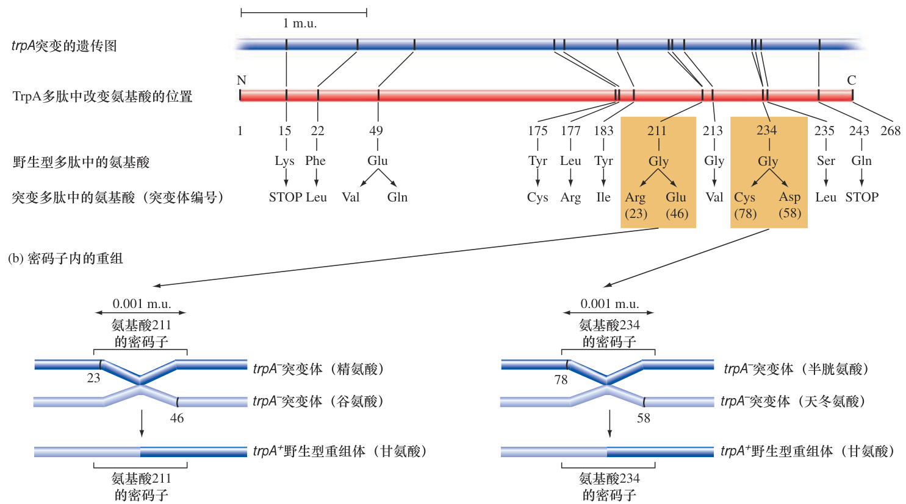  
(a)基因和蛋白质的共线性  
图8.3基因中的突变与编码多肽中的氨基酸序列呈共线性。（a）大肠杆菌的trpA基因遗传图与突变色氨酸合成酶蛋白中氨基酸置换位置之间的关系。（b）密码子必须包含两个或更多碱基对。当两个在同一位置具有不同氨基酸的突变株杂交时，重组可产生野生型等位基因。  

Crick和Brenner不仅认为每个密码子是三个核苷酸，而且每个基因都有一个单一的起始点。这个起始点建立了一个阅读框：将核苷酸按顺序分成三组，以在得到的多肽链中生成正确的氨基酸顺序［图8.4（a）］。将改变核苷酸分组为密码子的变化称为移码突变；它们将所有密码子的阅读框转移到插入或缺失点以外，几乎取消了多肽产物的功能。  

如果密码子从固定的起始点依次读取，缺失（－)可以抵消插人 $\left(\ +\ \right)$ 以恢复阅读框［图8.4（a）］。需要注意的是，只有在蛋白质功能不需要编码在两个符号相反的突变体之间的多肽片段时，该基因才会恢复其野生型的活性，因为在双突变体中，该区域会有一个不合适的氨基酸序列。此外，不正确的氨基酸不能阻止蛋白质折叠成功能构象。  

Crick和Brenner意识到他们可以在rlIB中使用 $^+$ 和一突变来检验密码子确实是核苷酸三联体的假设。如果密(b) $r I I B^{+}$ 回复体X野生型产生rIIB-重组体  

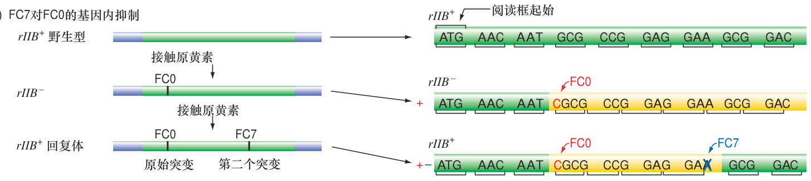  

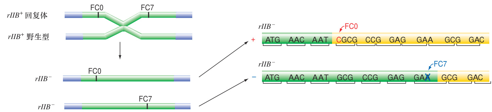  

(c）密码子是三联体  

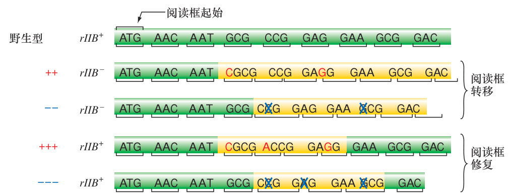  

图8.4噬菌体T4rIIB基因中移码突变的研究表明，密码子由三个核苷酸组成。（a）用原黄素处理通过插人单个核苷酸在一个位点（FCO）产生rlIB-移码突变；插人下游的所有密码子的阅读框移位（黄色）。第二次暴露导致第二次突变（FC7）、同一基因内单个核苷酸的缺失，其通过恢复正确的阅读框（绿色）来抑制FCO。（b）当反应物与野生型菌株杂交时，交换将两个rlIB-移码突变（FCO和FC7）分离到单独的DNA分子上。因此，向 $r I I B^{+}$ 表型的逆转是基因内抑制的结果。（c）当重组到单个DNA分子上时，两个添加 $\left(\ ++\ \right)$ 或两个缺失（－－）突变不提供 $\cdot r I I B^{+}$ 功能，但三个相同符号的突变（ ${+++}$ 或--－）恢复阅读框。  

码子由三个核苷酸组成，那么在同一基因中组合两个相同符号（ $^{++}$ 或--）的不同 $r I I B^{-}$ 突变不应导致基因内抑制（一种 $r I I B^{+}$ 表型）。然而，三种 $^+$ 突变或三种-突变的组合有时会导致 $r I I B^{+}$ 可逆反应。结果验证了上述预测的正确性［图8.4（c）］。  

# 2.大多数氨基酸由多个密码子组成的证据  

如图8.4（c）所示，只有在相反符号的两个移码突变之间的区域中，基因仍然决定氨基酸的出现（即使这些氨基酸与正常蛋白质中出现的氨基酸不同）时，才会发生基因内抑制。如果基因的框化部分通过引入一个不对应于任何氨基酸的三联体来编码指令用于停止蛋白质合成，那么就不可能产生功能性多肽。原因是在补偿突变可以重建正确的阅读框之前，多肽合成将停止。  

基因内抑制经常发生，这一事实表明，某些氨基酸的编码包含不止一个密码子。如前所述，有20种常见氨基酸，但有 $4^{3}{=}64$ 种不同的三核苷酸组合。如果每个氨基酸仅对应于单个密码子，那么将存在 $64{-}20{=}44$ 个可能不编码氨基酸的三联体。这些非编码三联体将充当终止信号并阻止进一步的多肽合成。在这种情况下，超过一半的移码突变（44/64）将导致蛋白质合成在突变后的第一个密码子处停止，并且延伸蛋白质的机会将随着每个额外的氨基酸指数的减少而减少，导致很少发生基因内抑制。然而，我们已经看到一个符号的许多移码突变可以通过另一个符号的突变来抵消。通过重组频率估计的这些突变之间的距离在某些情况下足够编码超过50个氨基酸，这仅在64个可能的三联体密码子中的大多数都能编码氨基酸时才是可能的。因此，Crick和Brenner的数据为遗传密码简并的观点提供了强有力的支持：在大多数情况下，两个或多个核苷酸三联体指定了20个氨基酸中的一个（参见图8.2中的遗传密码）。  

# 8.1.4 破解密码：哪些密码子代表哪种氨基酸？  

虽然刚才描述的基因实验对遗传密码的性质有了一定的验证，但它们并没有建立特定密码子和特定氨基酸之间的对应关系。mRNA的发现和合成简单mRNA分子技术的发展为研究人员可以在试管中制造简单的蛋白质提供了可能。  

# 1.信使RNA的发现  

在20世纪50年代，研究人员将真核细胞暴露于标记有放射性的氨基酸中，并观察到将放射性氨基酸结合到多肽中的蛋白质的合成发生在细胞质中，即使这些多肽的基因被隔离在细胞核中。从这一发现中，他们推断出中间分子的存在，这种中间分子在细胞核中制造并能够将DNA序列信息传递到细胞质，在那里它可以指导蛋白质的合成。RNA是这种携带中间信息的分子的主要候选者。  

由于RNA具有与DNA链碱基配对的潜力，人们可以想象细胞器以类似于DNA复制的方式将DNA链复制成RNA的互补链。使用放射性尿嘧啶（仅在RNA中发现的碱基）在真核生物中进行的后续研究表明，尽管分子在细胞核中合成，但至少其中一些分子迁移至细胞质。迁移到细胞质的那些RNA分子是信使RNA或mRNA，如图8.1所示。它们从DNA序列信息的转录起源于细胞核，然后传递（加工后）到细胞质，在那里它们决定蛋白质合成过程中氨基酸的顺序。  

# 2.使用合成的mRNA和体外翻译  

对mRNA的了解是两个实验突破的框架，导致了遗传密码的破译。首先，生物化学家获得了细胞提取物，其通过添加mRNA在试管中合成多肽。他们将这些提取物称为体外翻译系统。第二个突破是开发能够合成仅含有少量已知组成密码子的人工mRNA的技术。当添加到体外翻译系统中时，这些简单的合成mRNA指导简单多肽的形成。  

1961年，Marshall Nirenberg和Heinrich Matthaei将一种合成polyU（5'UUUUUUUUUUUUUUU... $3^{\prime}$ mRNA加人到源自大肠杆菌的无细胞翻译系统中。对于polyUmRNA，苯丙氨酸（Phe）是掺人所得多肽中的唯一氨基酸［图8.5（a）］。因为UUU是polyU中唯一可能的三联体，UUU是苯丙氨酸的唯一密码子。以类似的方式，Nirenberg和Matthaei显示CCC编码脯氨酸（Pro），AAA是赖氨酸（Lys）的密码子，GGG编码甘氨酸（Gly）［图8.5（b）］。  

化学家HarGobindKhorana后来用重复的二核苷酸制备了mRNA，如polyUC（5'...UCUCUCUC ..3'）；重复的三核苷酸，如polyUUC；重复的四核苷酸，如polyUAUC,并用它们指导合成稍微复杂的多肽。如图8.5（b）所示，他的结果限制了编码的可能性，但仍存在一些模糊性。例如，polyUC编码多肽N...SerLeuSerLeuSerLeu...C，其中丝氨酸和亮氨酸相互交替。尽管mRNA仅含有两个不同的密码子( $5^{\prime}$ UCU3'和5'CUC $3^{\prime}$ ），但是对应于丝氨酸和亮氨酸的密码子并没有明显区别。  

Nirenberg和PhilipLeder在1965年通过实验解决了这些不确定的问题，他们在实验中添加了长度仅为3个核苷酸的短合成mRNA，其中含有与氨基酸连接的tRNA的体外翻译系统，20个氨基酸中只有一个是放射性的。然后他们通过过滤器倒人合成含有mRNA和tRNA附着的放射性标记氨基酸的翻译系统的混合物（图8.6）。携带氨基酸的tRNA通常直接通过过滤器。然而，如果携带氨基酸的tRNA与核糖体结合，它将黏附在过滤器中，因为这种较大的携带tRNA的氨基酸和小mRNA的核糖体复合物不能通过。  

Nirenberg和Leder使用这种方法来观察哪种小mRNA导致包埋放射性标记的氨基酸。例如，他们从Khorana  

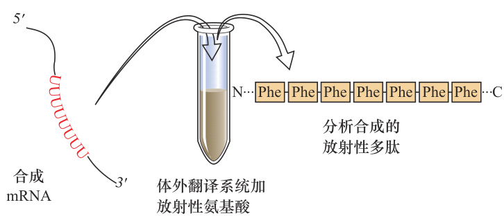  
(a）poly-U mRNA 编码聚苯丙氨酸  

(b)分析编码的可能性  

<html><body><table><tr><td>合成mRNA</td><td>多肽合成</td></tr><tr><td>poly-U UUUU ... poly-C CCCC ... poly-A AAAA ... Lys-Lys-Lys ...</td><td>含有一种氨基酸的多肽 Phe-Phe-Phe ... Pro-Pro-Pro ...</td></tr><tr><td>poly-G GGGG ... 二核苷酸重复 poly-UC UCUCUC ...</td><td>Gly-Gly-Gly ... 含有交替氨基酸的多肽 Ser-Leu-Ser-Leu ...</td></tr><tr><td>poly-AG AGAGAG ... poly-UG UGUGUG ... poly-AC ACACAC .. 三核苷酸重复</td><td>Arg-Glu-Arg-Glu ... Cys-Val-Cys-Val ... Thr-His-Thr-His 三种多肽，每种具有一个氨基酸</td></tr><tr><td>poly-UUC UUCUUCUUC ... poly-AAG AAGAAGAAG ...</td><td>Phe-Phe.... 和 Ser--Ser... 和 Leu-Leu....</td></tr><tr><td>poly-UUG UUGUUGUUG .. poly-UAC UACUACUAC ..</td><td>Lys-Lys.... 和 Arg-Arg.... 和 Glu-Glu.... Leu-Leu....和 Cys-Cys.... 和 Val-Val... Tyr-Tyr...和 Thr--Thr.... 和 Leu-Leu....</td></tr><tr><td>多核苷酸重复</td><td>具有四个氨基酸重复单元的多肽</td></tr><tr><td>poly-UAUC UAUCUAUC ... poly-UUAC UUACUUAC .. poly-GUAA GUAAGUAA ... poly-GAUA GAUAGAUA ...</td><td>Tyr-Leu-Ser-Ile-Tyr-Leu-Ser-Ile... Leu-Leu-Thr-Tyr-Leu-Leu-Thr-Tyr... 无 无</td></tr></table></body></html>  

图8.5遗传学家如何使用合成的mRNA来限制编码可能性。（a）poly-UmRNA产生聚苯丙氨酸多肽。（b）多核苷酸编码简单多肽。一些合成的mRNA，如poly-GUAA，在所有三个阅读框中都含有终止密码子，因此仅指定短肽的构建。  

早期的工作中知道CUC编码丝氨酸或亮氨酸。当他们将合成三联体CUC添加到体外系统中，其中放射性氨基酸是丝氨酸时，该tRNA附着的氨基酸通过过滤器，因此过滤器没有发出辐射（图8.6）。但当他们将相同的三联体添加到放射性氨基酸为亮氨酸的系统时，过滤器点亮了放射性，表明附着在tRNA上的放射性标记的亮氨酸与核糖体mRNA复合物结合并被卡在过滤器中（图8.6）。因此，CUC编码亮氨酸而不是丝氨酸。Ni-renberg和Leder使用这种技术来确定遗传密码表中显示的大多数密码子-氨基酸对应关系（见图8.2）。  

# 3.极致：mRNA中的 $5^{\prime}{\rightarrow}3^{\prime}$ 对应于多肽中的N端至C端  

在使用合成mRNA的研究中，当研究人员将6个核苷酸长的 $5^{\prime}$ AAAUUU3'添加到体外翻译系统时，产物N  

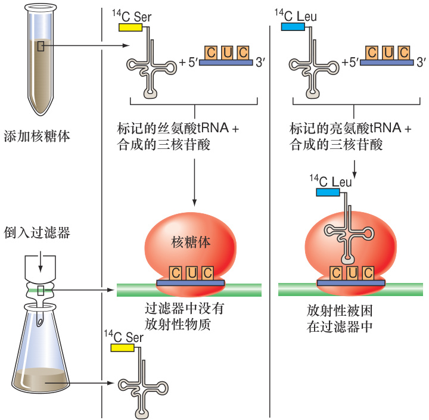  
图8.6用迷你mRNA破解遗传密码。Nirenberg和Leder将含有已知序列的三核苷酸与含有氨基酸的tRNA的混合物（其中只有一种氨基酸具有放射性）添加到含有核糖体的体外提取物中。如果三核苷酸指定了这种氨基酸，则放射性负载tRNA与核糖体形成复合物，核糖体可以被捕获在一个过滤器上。此处显示的实验表明密码子CUC指定亮氨酸而非丝氨酸。  

Lys-Phe C出现，但没有出现N Phe-Lys C。因为AAA是赖氨酸的密码子而UUU是苯丙氨酸的密码子，这个结果意味着最接近mRNA的5'端的密码子编码最接近相应多肽的N端的氨基酸。类似地，最靠近mRNA的3'端的密码子编码最接近所得多肽的C端的氨基酸。  

为了理解参与基因表达的大分子的极性如何相互关联，请记住，尽管该基因是DNA双螺旋的一部分，但两条链中只有一条作为mRNA的模板，该链称为模板链。另一条链是RNA样链，因为它具有与RNA相同的极性和序列（用DNA语言书写）。请注意，一些科学家使用术语有义链或编码链作为RNA样链的同义词；在这些备选命名法中，模板链可以是反义链或非编码链。图8.7显示了基因DNA的相应极性、该DNA的mRNA转录物和所得多肽。  

# 4.无义密码子和多肽链终止  

尽管由Khorana合成的大多数简单、重复的RNA非常长并因此产生非常长的多肽，但是少数没有。这些RNA具有停止构建多肽链的信号。事实证明，三种不同的三联体（UAA、UAG和UGA）不对应于任何氨基酸。当这些密码子出现在框架中时，翻译停止。如何确立这一事实，研究人员考虑以poly-GUAA作为一个例子［综述图8.5（b）］。该mRNA不会产生长多肽，因为在所有可能的阅读框中，它含有终止密码子UAA。  

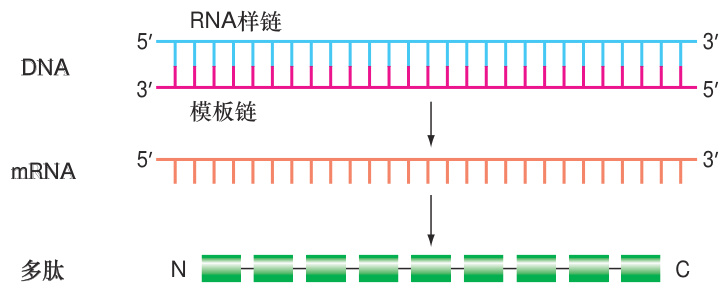  
图8.7DNA、mRNA和多肽极性的相关性。DNA的模板链与RNA样DNA链和mRNA互补。mRNA中的 $5^{\prime}{\longrightarrow}3^{\prime}$ 方向对应于多肽中的N端 $\longrightarrow$ C端方向。  

SydneyBrenner通过巧妙的实验帮助证实了终止密码子的身份，这些实验涉及一个名为m的T4噬菌体基因中的点突变，编码噬菌体头部胶囊的蛋白质成分。如图8.8（a）所示，Brenner确定某些突变等位基因$m^{1}{\sim}m^{6}\;,$ ）编码的截断多肽比野生型M蛋白短。Bren-ner发现每个截断蛋白质C端的最终氨基酸将在正常的全长蛋白质中被一个密码子指定的氨基酸所遵循，该密码子与单个核苷酸的三联体UAG不同。这些数据表明每个 $m$ 突变体都有一个点突变，它将氨基酸的密码子改变为终止密码子UAG。这种突变被称为无义突变，因为它将表示氨基酸（有义密码子）的密码子改变为不含氨基酸（无义密码子）的密码子（并非巧合的是，所有截断突变体都具有无义突变，其中密码子被改变为特定的终止密码子—一在本例中为UAG。本章末尾的习题56解释了为什么会出现这种情况）。  

Brenner后来确定突变 $m^{1}{\sim}m^{6}$ 的精细结构图以线性方式对应于截断的多肽链的大小［图8.8（b）」。例如， $m^{6}$ 编码的M蛋白比 $m^{5}$ 编码的M蛋白更短是有意义的，因为 $m^{6}$ 无义突变比m?更接近阅读框的开头。  

Brenner还分离出类似的无义突变组，将UAA和UGA定义为终止密码子。由于历史原因，研究人员经常将UAG称为琥珀密码子，UAA作为赭石密码子，UGA作为蛋白石密码子。这种命名法的历史基础是根据早期研究者之一的姓氏一一伯恩斯坦，是德语里“琥珀”的意思，赭石和蛋白石源于它们与琥珀作为次级宝石材料的相似性。  

# 8.1.5 遗传密码：概要  

遗传密码是一个完整的、未删节的字典，将核酸的四字母语言与蛋白质的20个字母的语言等同起来。以下列表总结了遗传密码的主要功能和特点：  

1.三联密码子：如图8.2所示，代码显示每个mRNA密码子中三个核苷酸的 $5^{\prime}{\rightarrow}3^{\prime}$ 序列；也就是说，所描绘的第一个核苷酸位于密码子的 $5^{\prime}.$ 端。  

2.密码子是不重叠的。例如，在 $\textrm{m R N}$ A序列$5^{\prime}$ GAAGUUGAA $3^{\prime}$ 中，前三个核苷酸（GAA）形成一个密码子；核苷酸 $.4\!\sim\!6$ （GUU）形成第二个；等等。每个核苷酸仅是一个密码子的一部分。  

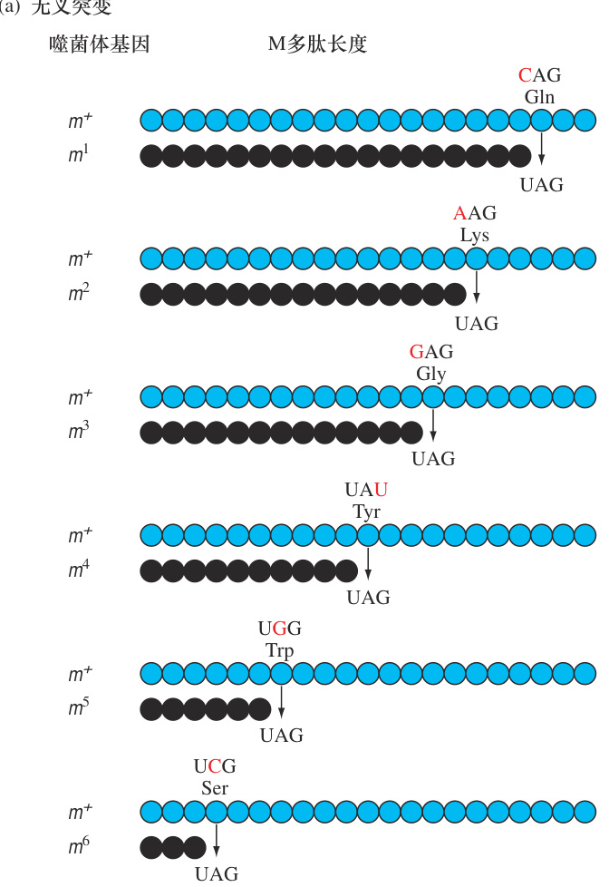  
(b)精细结构图  
图8.8SydneyBrenner的实验表明UAG是一个停止信号。（a）T4噬菌体 $m^{+}$ 基因编码多肽M，其氨基酸用蓝色圆圈表示。突变等位基因 $m^{1}{\sim}m^{6}$ 直接合成截断的M蛋白（黑色圆圈）。在每个阻遏蛋白中，紧随最终氨基酸之后的氨基酸由一个三联体编码，该三联体由一个单核苷酸从UAG中分离出来。（b） $m^{1}{\sim}m^{\epsilon}$ 突变的遗传图位置与相应截断的M蛋白的大小共线。  

<html><body><table><tr><td>m6</td><td>m5</td><td>m4</td><td>m3</td><td>m2</td><td>ml</td></tr><tr><td></td><td></td><td></td><td></td><td></td><td></td></tr></table></body></html>  

3.该代码包括三个停止或无意义的密码子：UAG、UAA和UGA。这些密码子通常不编码氨基酸，因此终止翻译。  
4.该代码是简并的，意味着不止一个密码子可以指定相同的氨基酸。然而，该代码是明确的，因为每个密码子仅指定一个氨基酸。  
5.细胞机器从建立阅读框的固定起始点扫描mRNA。正如我们稍后将看到的，核苷酸三联体AUG，其指定在阅读框中出现的氨基酸甲硫氨酸，也用作起始密码子，标记在mRNA中特定多肽开始编码的位置。  
6.密码子和氨基酸的相应极性：沿着mRNA沿 $5^{\prime}{\rightarrow}3^{\prime}$ 方向移动，每个连续密码子被顺序解码成氨基酸，从N  

端开始并向所得多肽的C端移动。  

7.突变可以以三种方式修饰在核苷酸序列中编码的信息。移码突变是通过改变阅读框改变多肽构建的遗传指令的核苷酸插入或缺失。错义突变将一个氨基酸的密码子改变为不同氨基酸的密码子。无义突变将氨基酸的密码子改变为终止密码子。  

# 8.1.6 多肽突变的影响有助于验证代码  

通过将密码子分配给氨基酸首先破解遗传密码的实验都是使用无细胞提取物和合成mRNA的体外研究。因此出现了一个逻辑问题：活细胞是否按照相同的规则构建多肽？早期的证据表明它们确实来自分析突变如何实际影响基因编码多肽的氨基酸组成的研究。大多数诱变剂改变密码子中的单个核苷酸。因此，大多数改变单个氨基酸同一性的错义突变应该是单核苷酸取代，并且这些取代的分析应该符合代码。例如，Yanofsky在大肠杆菌色氨酸合成酶基因中发现了两个trpA-营养缺陷型突变，它们在同一位置（多肽中的氨基酸211）产生两个不同的氨基酸［精氨酸（Arg）和谷氨酸（Glu）］链［图8.9（a）」。根据代码，这两种突变都可能是由GGA密码子中的单碱基变化引起的，通常在211位插人甘氨酸（Gly）。  

更具信息性的是随后由Yanofsky分离的这些突变的trpA\*回复体。如图8.9（a）所示，基因中的单碱基取代也可以解释这些回复体中的氨基酸变化。注意，这些取代中的一些将Gly恢复至多肽的211位置，而其他取代将氨基酸（如le、Thr、Ser、Ala或Val）置于色氨酸合成酶分子中的该位点。将这些其他氨基酸置换为多肽链中第211位的Gly，与酶的功能相容（即在很大程度上保留）。  

Yanofsky通过分析色氨酸合成酶基因的原黄素诱导的移码突变，获得了更好的证据，即细胞在体内使用遗传密码［图8.9（b）］。他首先用原黄素处理大肠杆菌种群以产生trpA突变体。随后用更多的原黄素处理这些突变体在后代中产生了一些 $t r p A^{+}$ 回复突变体。对于回复体最可能的解释是，它们的色氨酸合成酶基因携带单碱基对缺失和单碱基对插入 $(\ -+\ )$ 。在确定由回复菌株产生的色氨酸合成酶的氨基酸序列后，Yanofsky发现他可以使用遗传密码通过假设回复体具有特定的单碱基对插人来预测已发生的精确氨基酸改变和特定的单碱基对缺失［图8.9（b）］。  

Yanofsky的结果不仅证实了氨基酸密码子的分配，还证实了代码的其他参数。只有当密码子不重叠并且从固定的起点读取时，他的解释才有意义，没有暂停或逗号分隔相邻的三联体。  

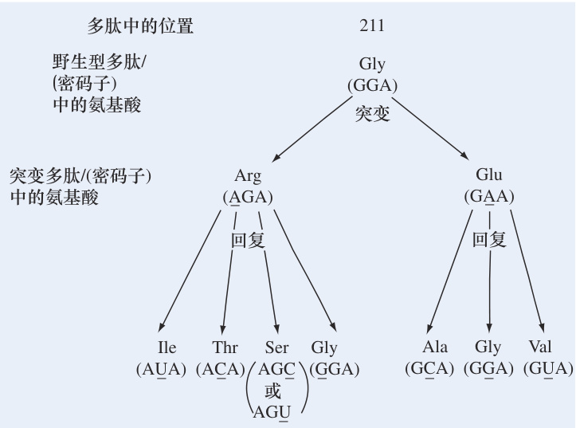  
(a）改变trpA-突变和trpA+回复体中的氨基酸  
(b）伴随基因内抑制的氨基酸改变  

  

图8.9遗传密码的实验验证。（a）单碱基取代可以解释由trpA突变和 $^{\dot{U}p A^{+}}$ 逆转引起的氨基酸取代。（b）遗传密码预测单碱基对缺失和抑制插人所引起的氨基酸改变（黄色）。  

# 8.1.7 遗传密码几乎是通用的，但不完全是通用的  

我们现在知道，今天几乎所有活着的细胞都使用相同的一套遗传密码。这种一致性的一个早期迹象是来自一种生物的翻译系统可以使用来自另一种生物的mRNA将遗传信息转换成编码的蛋白质。例如，兔血红蛋白mRNA，当注射到青蛙卵中或添加到小麦胚芽的无细胞提取物中时，指导兔血红蛋白的合成。通过对DNA和蛋白质序列的比较，我们发现几乎所有生物体中密码子和氨基酸的遗传密码都是完全一致的。  

# 1.保护遗传密码  

代码的普遍性表明它在生命历史的早期就已经进化了。这种密码一旦出现，在数十亿年的时间里保持不变，部分原因是进化中的生物体对变化几乎没有容忍度。基因密码的一个单一变化可能会破坏细胞中成百上千种蛋白质的产生，这些蛋白质从复制所需的DNA聚合酶，到基因表达所需的RNA聚合酶，再到构成有丝分裂纺锤体的丝管蛋白。  

# 2.特殊的遗传密码  

研究人员非常惊讶地发现了编码通用性的一些例外。在称为纤毛虫的单细胞真核原生动物的某些物种中，密码子UAA和UAG是大多数生物体中的无义密码子，它们指定氨基酸谷氨酰胺；在其他纤毛虫中，UGA是大多数生物中的第三个终止密码子，它指定了半胱氨酸。纤毛虫使用剩余的无义密码子作为终止密码子。  

线粒体是真核细胞内的一种半自治的自分泌细胞器，是形成ATP的场所。每个线粒体都有自己的染色体和表达基因的装置（将在第15章详细描述）。例如，在酵母的线粒体中，CUA指定苏氨酸而不是亮氨酸。密码子的另外一个特点是，某些原核生物有时使用三重UAG来指定稀有氨基酸吡咯赖氨酸的插人［参见图7.28（c）和本章末尾习题57］。  

迄今为止提供的实验证据有助于确定几乎通用的遗传密码。尽管破解了密码使人们能够理解基因和蛋白质之间信息传递的大致过程，但是这些结果并没有确切解释细胞机制是如何完成基因表达的。这个问题是我们关注的焦点，因为我们将在下一章中介绍转录和翻译的细节。  

# 基本概念  

·几乎通用的遗传密码由64个密码子组成，每个密码子由三个核苷酸组成。61个密码子指定氨基酸，而UAA、UAG、UGA三个是终止密码子。该代码是简并的，多个密码子可以指定同一个氨基酸。·密码子AUG指定甲硫氨酸；它还用作起始密码子，建立阅读框架，将核苷酸组成连续的、不重叠的密码子三联体。·错义突变改变了密码子，因此它指定了不同的氨基酸；移码突变改变了突变后所有密码子的阅读框架；无义突变将氨基酸的密码子改变为终止密码子。  

# 8.2 转录：从DNA到RNA  

# 学习目标  

1.描述转录的三个阶段：起始、延伸和终止。  
2.比较原核生物和真核生物中的转录起始。  
3.列出真核生物在转录后加工mRNA的三种方式。  

转录是核糖核苷酸在互补碱基配对引导下聚合产生基因RNA转录物的过程。RNA转录物的模板是构成该基因的DNA双螺旋中的一条链。  

# 8.2.1 RNA聚合酶合成拷贝基因的单链RNA  

图8.10描述了转录的基本组成部分，并说明了在大肠杆菌中发生的这一过程中的关键事件。这个图示将转录分为起始、延伸和终止的连续阶段，以下四点尤为重要。  

# 1.RNA聚合酶催化转录。  

2.靠近基因起始处的DNA序列，称为启动子，是RNA聚合酶开始转录信号。大多数细菌基因启动子在两个短区中的每一个中具有几乎相同的核苷酸序列［图8.11（a）］。这些是RNA聚合酶与启动子进行紧密接触的位点。  

3.RNA聚合酶在 $5^{\prime}{\rightarrow}3^{\prime}$ 的方向上将核苷酸添加到生长中的RNA多聚体中，这种核苷酸添加反应的化学机制类似于DNA复制过程中核苷酸之间形成磷酸二酯键（综述图6.21）。但有一个例外，转录使用核糖核苷三磷酸（ATP、CTP、GTP和UTP）代替脱氧核糖核苷三磷酸。每个核糖核苷三磷酸中高能键的水解提供了延伸所需的能量。  

4.给予RNA聚合酶转录终止信号的RNA产物序列称为终止子。  

当你观察图8.10时，请记住，一个基因由两条反向平行的DNA链组成，如前所述。其中一个RNA样链具有相同的极性和序列（除了T代替U），作为新出现的RNA转录物。第二个模板链具有相反的极性和互补序列，使其能够作为制作RNA转录物的模板。当遗传学家提到基因的序列时，他们通常指的是RNA样链的序列。  

# 8.2.2 真核生物和原核生物的转录起始不同  

尽管所有生物中所有基因的转录大致遵循图8.10所示的一般模式，但原核生物和真核生物在重要细节上有所不同。在真核生物中，启动子比细菌中的启动子更复杂，存在三种不同类型的RNA聚合酶可以转录不同类别的基因。其中之一是真核生物RNA聚合酶Ⅱ（polⅡ），它转录编码蛋白质的基因。图8.11（b）说明了允许polⅡ启动转录的真核基因DNA区域的一般结构。与原核生物的一个关键区别是，被称为增强子的序列可以远离启动子成千上万个碱基对，这也是真核生物基因高效转录所必需的。  

第16章和第17章将描述原核细胞和真核细胞如何利用这些变异及其他变异来控制特定基因的表达时间、地点和水平。最后，“遗传学与社会”信息栏“HIV和反转录”描述了艾滋病病毒如何利用一种特殊的转录形式（称为反转录），从RNA模板出发构建双链DNA。  

转录的结果是被称为初级转录物的单链RNA（见图8.10和图8.11）。在原核生物中，转录产生的RNA是指导蛋白质合成的实际mRNA。在真核生物中，大多数(b. 2) : $\copyright$ Professor Oscar Miller/SPL/Science Source  

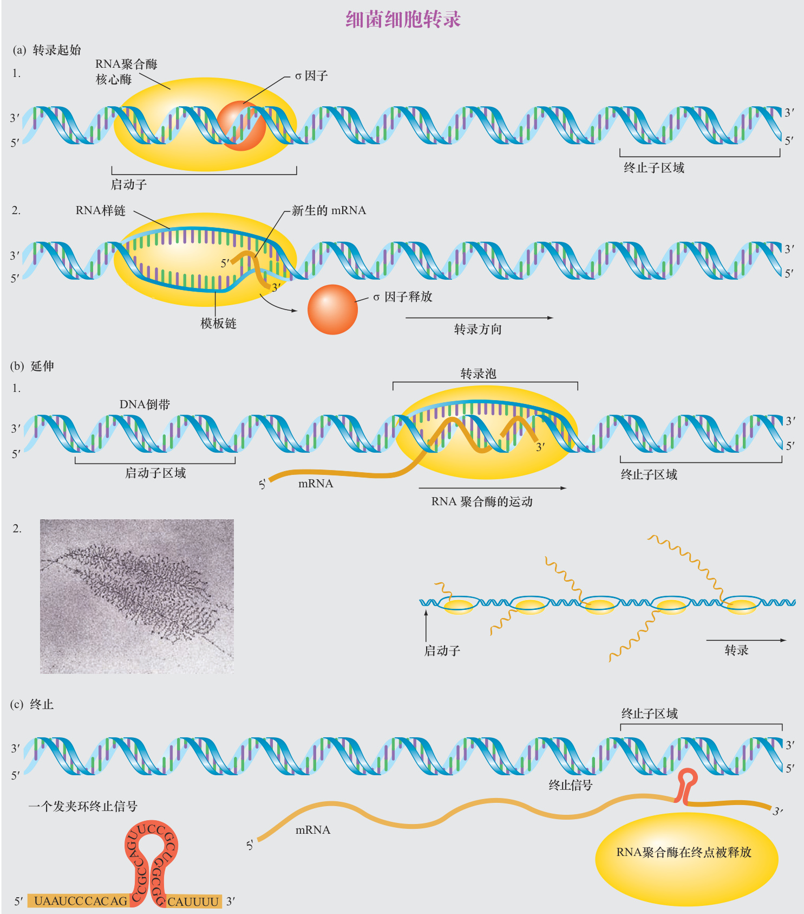  
特色插图8.10  

（a）转录起始  

1.RNA聚合酶与待复制基因起始处的双链DNA结合。RNA聚合酶识别并结合启动子，即转录起始位点附近的特殊DNA序列。虽然特定的启动子差异很大，但大肠杆菌中的所有启动子含有两个 $\because6\!\sim\!10$ 个碱基对的特征性短序列［图8.11（a）］。在细菌中，完整的RNA聚合酶（全酶）由一种核心酶加上一种只参与启动的o（Sigma）亚基构成。o亚基减少了RNA聚合酶对DNA的一般要求，但同时增加了RNA聚合酶对启动子的亲和力。2.在与启动子结合后，RNA聚合酶展开双螺旋的一部分，在模板链上暴露未配对的碱基。RNA聚合酶全酶和未缠绕的启动子之间形成的复合物称为开放启动子复合物。该酶识别模板链并选择要复制的两个核苷酸。在与这两个核苷酸碱基配对的指导下，RNA聚合酶在新RNA的5'端比对前  

# 特色插图8.10 （续）  

两个核糖核苷酸。转录为mRNA的5'端的DNA是该基因的5'端。然后RNA聚合酶在前两个核糖核苷酸之间形成磷酸二酯键。此后不久，RNA聚合酶释放o亚基，标志着起始的结束。  

（b）延伸：构建该DNA的RNA副本  

1.当释放o亚基时，RNA聚合酶失去其对启动子序列的亲和力，并恢复其对任何DNA增强的广义亲和力。这些变化使得核心酶能够离开启动子而仍然与基因结合。核心酶沿着染色体移动，展开DNA以暴露模板的下一个单链区域。该酶通过将正确的核糖核苷酸添加到生长链的3'端来扩展RNA。当酶以5'→3'方向延伸mRNA时，它沿着DNA模板链以反向平行的3'→5'方向移动。RNA聚合酶以每秒约50个核苷酸的平均速度合成RNA。  

RNA聚合酶解除的DNA区域是转录泡。在气泡内，新生的RNA链保持与DNA模板的碱基配对，形成DNA-RNA杂交体。然而，在气泡背后已经转录的那些基因部分中，DNA双螺旋重新形成，置换RNA，其作为具有游离5'端的单链悬挂在转录复合物外。  

2.一旦RNA聚合酶离开启动子，其他RNA聚合酶分子就可以进人以启动转录。如果启动子非常强，即如果它能够快速吸引RNA聚合酶，那么许多酶分子可以同时转录它。在这里，我们展示了电子显微照片和专家对几种RNA聚合酶同时转录的解释。这个基因的启动子非常接近于从DNA转录来的最短的RNA出现的地方。  

在讨论基因结构时，遗传学家经常使用RNA聚合酶的方向作为参考。例如，如果你从A点基因的5'端开始，沿基因向与RNA聚合酶相同的方向移动到B点，那么将向下游移动。相反，如果你从B点开始并向与A点相反的方向移动，那么将向上游行进。  

（c）终止：转录的结束  

表示转录结束的RNA序列称为终止子。存在两种类型的终止子： $\textcircled{1}$ 内源终止子，其导致RNA聚合酶核心酶自身终止转录； $\circledcirc$ 外源终止子，其需要额外的蛋白质（特别是称为Rho的多肽）来进行终止。所有终止子，无论是内在的还是外在的，都是mRNA中从基因转录的特定序列。终止子通常形成发夹环（也称为茎环），其中mRNA内的核苷酸与同一分子中的互补核苷酸配对。终止后，RNA聚合酶和完整的RNA链都从DNA中释放出来。  

初级转录物在迁移到细胞质以指导蛋白质合成之前在细胞核中进行RNA加工。正如我们在下一节中看到的，这种处理在复杂生物的进化中发挥了基础性作用。  

# 8.2.3 在真核生物中，转录后的RNA加工产生成熟的mRNA  

真核生物中的一些RNA加工只修饰了初级转录物的5'端或3'端，使mRNA其余部分的信息内容保持不变。其他的处理过程会从原始转录物的中间删除信息块，因(a）细菌基因中的转录起始区  

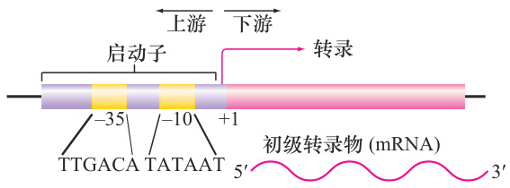  
(b）polⅡ转录真核基因中的转录起始区  

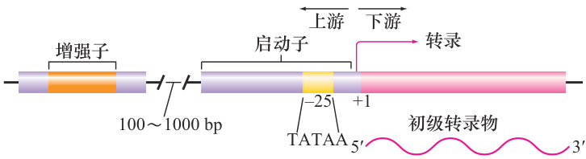  

图8.11细菌和真核基因的控制区。仅显示RNA样链的序列；编号从最初转录的核苷酸（ $+1\ .$ ）开始。（a）大肠杆菌中的所有启动子共享RNA聚合酶识别启动子所必需的两条不同的短链核苷酸（黄色）。显示了这些短区域中最常见的核苷酸共有序列。（b）由RNApolⅡ转录的真核基因有一个启动子，还有一个或多个称为增强子（橙色）的远距离DNA元件．与帮助转录的蛋白质因子结合。  

此成熟mRNA的内容与原始基因中完整的DNA核苷酸对相关，但不完全相同。  

# 1.添加5'端甲基化帽和3'端poly-A尾  

真核mRNA的 $5^{\prime}.$ 端的核苷酸是与分子其余部分反向的G；它通过三磷酸连接与初级转录物中的第一个核苷酸相连。这种“反向G”不是从DNA转录而来的。相反，在转录物的前几个核苷酸聚合后，一种特殊的加帽酶将其添加到初级转录物中。然后，称为甲基转移酶的酶将甲基（一 $\mathrm{\cdot CH}_{3}$ ）基团加到反向G和RNA中的一个或多个后续核苷酸上，形成所谓的甲基化帽（图8.12）。  

与 $5^{\prime}$ 甲基化帽一样，大多数真核mRNA的3'端不是由该基因直接编码的。在大多数真核mRNA中，3'端由$100\!\sim\!200$ 个称为poly-A尾（图8.13）的A组成。尾的添加需要两步。首先，核糖核酸酶裂解原始转录物，形成一个新的3'端；切割取决于序列AAUAAA，其在添加尾的位置上游 $11\!\sim\!30$ 个核苷酸的含polyA的mRNA中发现。接下来，polyA聚合酶将A添加到通过切割暴露的3'端。  

出乎意料的是，甲基化帽和polyA尾对于将mRNA有效翻译成蛋白质是至关重要的，尽管两者都没有帮助特定氨基酸。最近的数据表明特定的真核翻译起始因子与5'帽结合，而polyA结合蛋白与mRNA的3'端尾部结合。在许多情况下，这些蛋白质的相互作用将mRNA分子形成圆形。这种循环既加强了翻译的初始步骤，又通过延长mRNA作为信使的时间来稳定细胞质中的mRNA。  

# 2.通过RNA剪接，删除初级转录物中的内含子  

20世纪70年代后期，在研究人员开发出能够分析DNA和RNA核苷酸序列的技术之后，另一种RNA加工  

# 遗传学与社会  

# HIV和反转录  

引起艾滋病的人类免疫缺陷病毒（HIV）是历史上被最深入分析的病毒。从30多年的实验室和临床研究中，研究人员发现，每个病毒颗粒都是一个粗糙的球体，外边是一个蛋白质基质的外膜，蛋白质基质内部包裹着一个截短的锥形核心（图A）。在核心中存在着一个布满酶的基因组：两条相同的单链RNA与一种不同寻常的DNA聚合酶（称为反转录酶）的许多分子相关联。  

在感染过程中，艾滋病病毒与人类免疫系统的细胞结合并将其锥形核心注人细胞（图B）。接着，病毒利用反转录酶将其RNA基因组复制到宿主细胞的细胞质中，形成双链DNA分子。然后双螺旋进人细胞核，另一种被称为整合酶的酶把它们插人到宿主染色体中。一旦整合到宿主细胞染色体中，病毒基因组可以做两件事。它可以利用宿主细胞的蛋白质合成机制来制造数百个新的病毒颗粒，这些病毒颗粒会从母体细胞中分裂出来，带走细胞膜的一部分。这个过程有时会导致宿主细胞死亡，削弱人体的免疫系统。另外，艾滋病毒基因组可以潜伏在宿主染色体内，然后当宿主细胞分裂时，病毒基因组将被复制和传播到两个新的细胞中。  

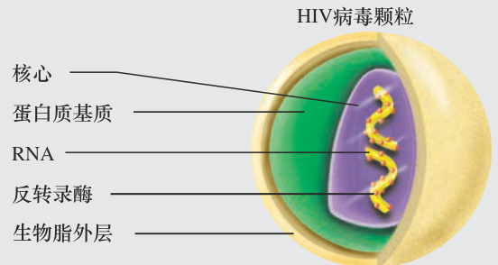  
图AAIDS病毒的结构。  

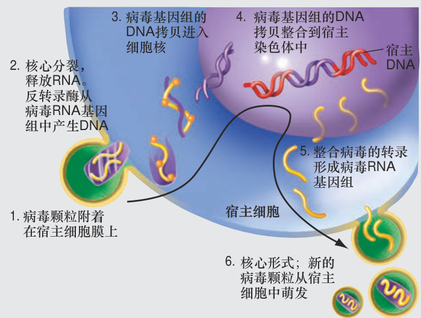  
图BAIDS病毒的生命周期。  

这一生命周期的事件使HIV成为一种反转录病毒：一种RNA病毒在感染宿主细胞后，将其自身的单链RNA复制成DNA的双螺旋，然后病毒酶（整合酶）整合到宿主染色体中。  

反转录是反转录病毒生命周期的基础，它与遗传信息的单向DNA-RNA-蛋白质流动不一致。因为它是如此的出人意料，当威斯康星大学的HowardTemin和当时在麻省理工学院工作的DavidBaltimore首次报道反转录现象时，这种观点在科学界遇到了巨大的阻力。然而，现在已是一个既定的事实。反转录酶是一种值得注意的DNA聚合酶，它可以从RNA或DNA模板构建DNA聚合物。  

反转录酶除了具有全面的复制能力外，还有一个在大多数DNA聚合酶中没有的特征：不准确。正如我们在第7章中看到的，正常的DNA聚合酶复制DNA的错误率是每复制100万个核苷酸中出现一个错误。然而，反转录酶在每结合5000个核苷酸中就会引人一个突变。  

艾滋病毒利用这种变异能力，获得了一种战术上的优势，战胜了其宿主机体的免疫反应。免疫系统的细胞通过增殖来应对病毒颗粒的增殖，从而克服艾滋病毒的人侵。这些数字令人震惊。在每个患者的感染过程中，每天会有从1亿到10亿个艾滋病毒颗粒从受感染的免疫系统细胞中释放出来。只要免疫系统足够强大，能够承受这种攻击，它就会做出反应，每天产生多达20亿个新细胞。许多新的免疫系统细胞会产生针对病毒表面蛋白质的抗体。  

但是，当免疫反应清除了携带目标蛋白的病毒颗粒时，结合了对当前免疫反应有抵抗力的新蛋白形式的病毒颗粒出现了。经过多年复杂的追踪、捕获和对免疫系统的破坏，这种变异病毒逃脱了宿主的免疫反应，占据了上风。因此，艾滋病毒反转录酶的固有变异性，在病毒的进化过程中增强了竞争能力，加强了它对人类生命和健康的威胁。  

这种固有的变异破坏了控制艾滋病的两种潜在的治疗方法：药物和疫苗。美国批准的一些治疗HIV感染的抗病毒药物——AZT（zidovudine）、ddC（dideoxycytidine）和ddI（dideoxyinosine）——通过干扰反转录酶的作用来阻止病毒的复制。每一种药物都与四种核苷酸中的一种相似，当反转录酶将其中一种药物分子而不是真正的核苷酸合并到正在生长的DNA聚合物中时，这种酶就不能进一步延伸链了。然而，高剂量的药物是有毒的，因此只能在不破坏所有病毒颗粒的低剂量下使用。由于这种限制和病毒的高突变率，突变的反转录酶很快出现，甚至在药物存在的情  

况下也能起作用。  

同样，研究人员在开发有效疫苗方面也遇到了困难。即使一种疫苗可以对一种、两种甚至几种HIV蛋白产生巨大的免疫反应，这种疫苗也可能只在短时间内有效一—直到足够的突变积累起来使病毒具有抵抗力。  

由于这些原因，艾滋病病毒很可能不会完全屈服于针对其生命周期不同阶段活性蛋白的药物或疫苗。然而，这些治疗工具的组合已被证明在延长艾滋病患者的生命方面非常有效。2013年，接受联合治疗的艾滋病患者的平均寿命达到正常寿命的三分之二。作为鸡尾酒疗法的新药物包括蛋白酶抑制剂，它可以阻止产生病毒外壳蛋白所需的酶的活性，也就是可以阻技术开始通用。使用我们在第9章中描述的这些技术，他们开始将真核基因与从中衍生的mRNA进行比较。他们的期望是，就像在原核生物中一样，基因RNA样链的DNA核苷酸序列与mRNA核苷酸序列相同（除了U取代RNA中的T）。令人惊讶的是，研究人员发现许多真核基因的DNA核苷酸序列比它们相应的mRNA序列长得多。这一事实表明RNA转录物除了接受甲基化帽和polyA尾外，还进行了广泛的内部加工。  

在人类基因 $D M D$ 中观察到一个初级转录物和mRNA之间的长度差异的极端例子，该基因是负责编码止病毒进人人类细胞及病毒整合的酶蛋白抑制剂的药物。  

由反转录酶维持的突变自我防护能力，无疑是艾滋病毒成功的主要原因之一。具有讽刺意味的是，它也可能为其被征服提供了基础。研究人员正在研究当病毒增加其突变负荷时会发生什么。如果反转录酶的误差率决定了宿主体内病毒种群的大小和完整性，那么急剧加速的诱变可能会使病毒超过允许其正常工作的错误阈值。换句话说，太多的突变可能会破坏病毒的传染性、毒性或繁殖能力。如果遗传学家能够弄清楚如何做到这一点，他们可能会给人类免疫系统带来战胜病毒所需要的优势。  

蛋白质抗肌萎缩蛋白的。DMD基因的异常是遗传性疾病杜氏肌营养不良症（DMD）的基础。DMD基因长度为250万个核苷酸或2500kb，而相应的mRNA长度约为14000个核苷酸或14kb。显然，该基因含有成熟mRNA中不存在的DNA序列。最终在成熟mRNA中的那些基因区域分散在整个2500kb的DNA中。  

外显子与内含子在基因DNA和成熟mRNA中均被发现的序列称为外显子（表达区域）。在基因DNA中发现但在成熟mRNA中没有的序列被称为内含子（干预区域）。内含子中断或分离实际上最终成熟为mRNA的  

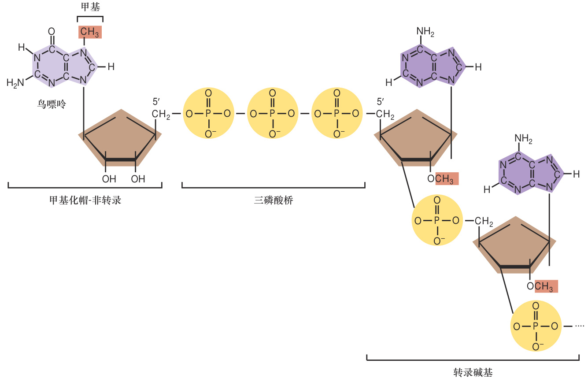  

图8.12真核mRNA的5'端甲基化帽的结构。加帽酶通过三磷酸连接将反向G连接到初级转录物的第一个核苷酸上。然后甲基转移酶将甲基（橙色）添加到该G和首先从DNA模板转录的一个或两个核苷酸中。  

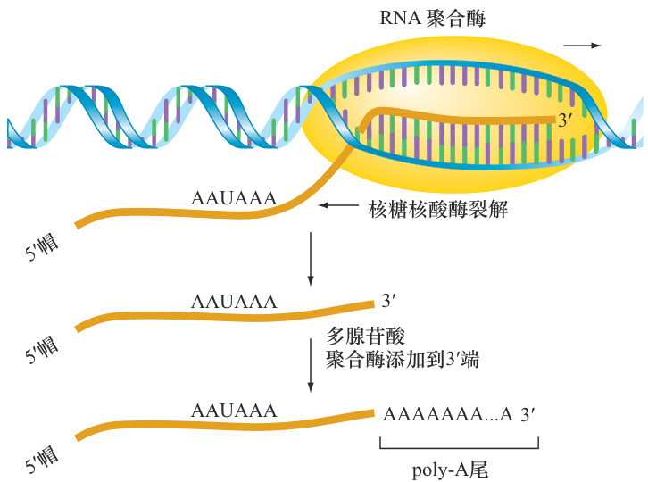  
图8.13RNA剪接如何为真核mRNA的3'端添加尾。核糖核酸酶在初级转录物的特定环境中识别AAUAAA，并在下游切割$11\!\sim\!30$ 个核苷酸的转录物以产生新的3'端。然后polyA聚合酶在这个新的3'端添加 $100\!\sim\!200$ 个A。  

外显子序列。  

图8.14所示的胶原蛋白基因（结缔组织中丰富的蛋白质）有两个内含子。相比之下，DMD基因有超过80个内含子；平均内含子长度为 $35\mathrm{kb}$ ，但其中一个内含子长达 $400\mathrm{kb}$ 。人类中的其他基因通常具有更少的内含子，而少数没有（并且内含子的范围从50bp到超过100kb）。相反，外显子的大小从大约50bp到几千碱基不等。在DMD基因中，外显子平均长度为 $200\mathrm{bp}$ 。与外显子相比，内含子中观察到的更大的尺寸变异反映了内含子不编码多肽并且不出现在成熟mRNA中的事实。结果，对内含子的大小和碱基序列的限制较少。  

成熟的mRNA必须含有翻译成氨基酸的所有密码子，包括起始密码子和终止密码子。此外，成熟mRNA在其5'端和3'端具有未翻译的序列，但是其在调节翻译效率中起重要作用。这些序列称为5'和3'非翻译区（ ${\mathsf{\Sigma}}^{\prime}$ 和3'UTR），分别位于甲基化帽后面和polyA尾之前［图8.14（a）］。除了帽和尾区域，成熟mRNA中的所有序列，包括所有密码子和UTR，都必须从基因的外显子转录。  

内含子可以在任何位置打断一个基因，甚至在构成一个密码子的核苷酸之间。在这种情况下，密码子的三个核苷酸存在于两个不同的（但连续的）外显子中。你还应该注意到，由于内含子可以中断5'和（或）$3^{\prime}$ UTR，起始密码子并不总是在第一个外显子中，终止密码子也不总是在最后一个外显子中。  

细胞如何从编码序列被内含子中断的基因中产生成熟的mRNA呢？答案是细胞首先制作含有所有基因内含子和外显子的初级转录物，然后通过RNA剪接从初级转录物中去除内含子，该过程删除内含子并将连续的外显子连接在一起形成仅由外显子组成的成熟mRNA［图8.14（a）」。因为初级转录物的第一个和最后一个外显子成为mRNA的5'端和3'端，而所有插人的内含子都被剪切出来，一个基因必须有至少一个外显子而不是内含子。为了构建成熟mRNA，剪接必须非常精确。例如，如果内含子位于密码子内，则剪接必须除去内含子并重构密码子而不破坏mRNA的阅读框。  

RNA剪接的机制图8.15说明了RNA剪接是如何工作的。初级转录物中的三种短序列一一剪接供体、剪接受体和分支位点，有助于保证剪接的特异性。这些位点可以切断一个内含子与之前和之后的外显子之间的连接，然后加人之前距离较远的外显子。  

剪接机制涉及初级转录物中的两个连续剪切，第一个切口在剪接供体部位，在内含子的5'端。在第一次剪切之后，新的内含子的5'端通过新的2',5'磷酸二酯键，与位于内含子内的分支位点处的A结合，形成所谓的套索。第二个切口在剪接受体位点，在内含子的3'端；在这个切口除去内含子。废弃的内含子被降解、相邻外显子的精确拼接最终完成了内含子去除的过程（图8.15）。  

SnRNP和剪接体剪接通常需要一个复杂的核内机器，称为剪接体，这确保了所有的拼接反应都是一致的（图8.16）。剪接体由称为小核糖蛋白或snRNP（发音为“snurps”）的四个亚基组成。每个snRNP含有一个或两个 $100\!\sim\!300$ 个核苷酸长度的小核RNA（snR-NA），与离散颗粒中的蛋白质相关。某些snRNA可以与初级转录物中的剪接供体和剪接受体序列碱基配对，因此这些snRNA在将一个内含子两侧的外显子聚集在一起时起到重要作用。  

鉴于剪接体结构的复杂性，值得注意的是，一些初级转录物可以在没有剪接体或任何其他因子的帮助下将它们自我剪接。这些罕见的初级转录物起核酶的作用：RNA分子可以作为酶并催化特定的生化反应。  

这可能看起来很奇怪，真核基因包含的DNA序列是在剪接出mRNA之前翻译，因此不编码氨基酸。目前也没有人确切知道内含子存在的原因。有一个假设提出内含子使得负责编码蛋白质功能模块的各种外显子构件的基因组装成为可能。这种类型的组装允许外显子进行改组以产生新基因，这一过程可能在复杂生物的进化中起关键作用。外显子作为模块的提议很有吸引力，因为很容易理解外显子改组潜力的选择性优势。然而，它仍然是一个没有证据的假设；内含子可能是通过科学家尚未想象的方式建立起来的。  

# 3.可变剪接：来自相同初级转录物的不同mRNA  

有时RNA剪接将剪接供体和剪接受体连接在一个内含子的两端，导致内含子被移除，两个相邻的外显子融合在一起。然而，RNA剪接在发育过程中常常受到调控，因此在某些时间或某些组织中，一些剪接信号可能(b)胶原基因的DNA、mRNA和多肽序列  

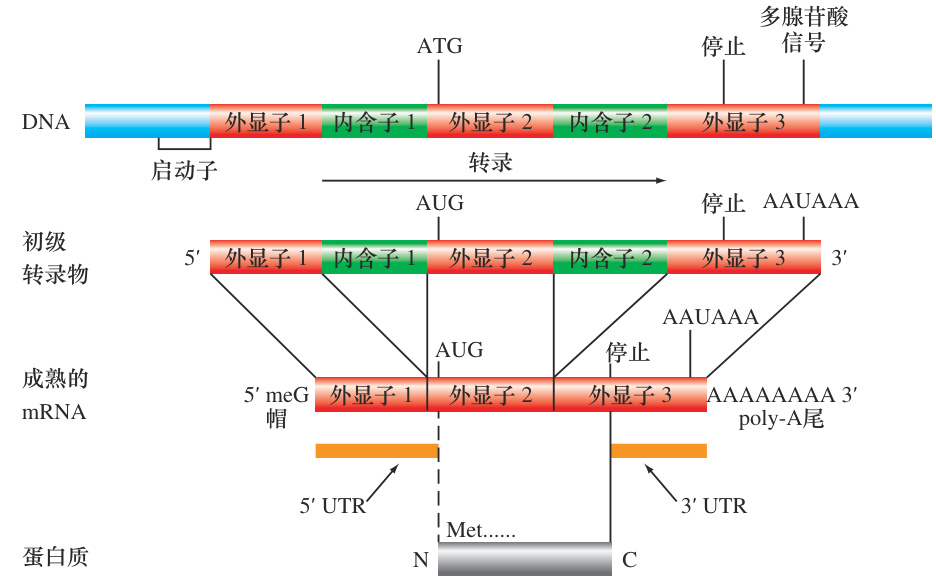  
(a)胶原基因：结构与表达  

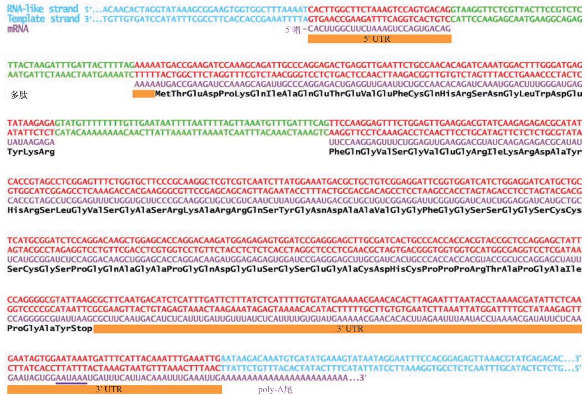  

图8.14典型真核基因的结构和表达。（a）胶原基因及其产物的标志性示意图。外显子显示为红色，内含子显示为绿色，基因的非转录部分显示为蓝色。成熟mRNA是在初级转录物处理之后得到的；将内含子剪接出来，加人5'端甲基化G帽，并在3'端加人polyA尾。 $5^{\prime}$ 非翻译区（5'UTR）位于5'端和起始密码子（AUG）之间，3'非翻译区（3UTR）位于终止密码子和mRNA的3'端polyA尾之间（橙色条）。（b）核苷酸水平上的相同基因。颜色与（a）部分相同，只是成熟的mRNA以紫色显示以强调。mRNA中的AAUAAA poly A添加信号加下划线。内含子可以发生在基因转录部分的任何地方，包括密码子或任一UTR内。  

(a)短序列决定了剪接发生的位置  

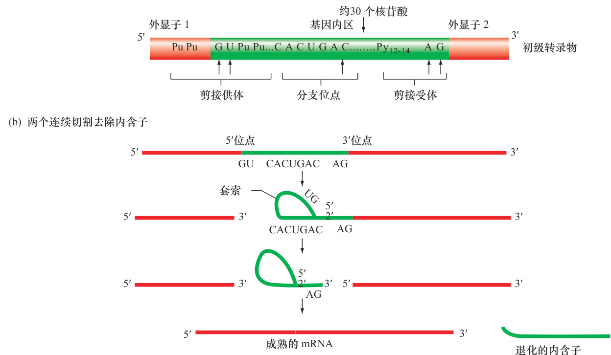  

图8.15RNA加工如何剪接内含子并连接相邻的外显子。外显子是红色，而内含子是绿色的。（a）剪接需要初级转录物中的三个短序列。 $\textcircled{\scriptsize{1}}$ 剪接供体位点发生在外显子的3'端邻接内含子的5'端的位置。在大多数剪接供体位点中，开始内含子的GU二核苷酸（箭头）在任一侧与少数嘌呤（ $\mathrm{Pu}$ ；即A或G）侧接。 $\textcircled{2}$ 剪接受体位点位于内含子的3'端，与下一个外显子连接。内含子的最终核苷酸总是AG（箭头），通常在 $12\!\sim\!14$ 个嘧啶（Py；即C或U）之前。 $\textcircled{3}$ 位于剪接受体上游约30个核苷酸的内含子内的分支位点必须包含A（箭头）并且通常富含嘧啶。（b）两个连续切割，第一个在剪接供体位点，第二个在剪接受体位点，去除内含子，允许相邻外显子的精确剪接。  

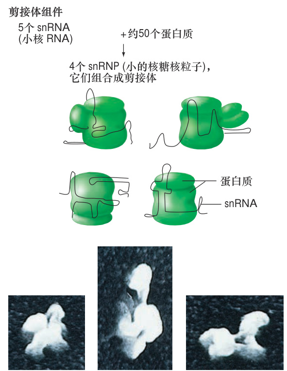  

会被忽略。例如，剪接可以发生在一个内含子的剪接供体位点和下游不同内含子的剪接受体位点之间。这种可变剪接产生不同的mRNA分子，这些mRNA分子可能编码具有不同氨基酸序列和功能的相关蛋白（尽管部分重叠）。实际上，可变剪接可以调整原始转录物的核苷酸序列，从而产生不止一种多肽。可变剪接在很大程度上解释了人类基因组中的27000个基因如何编码存在于人类细胞中的数十万种不同蛋白质。  

在哺乳动物中，编码抗体重链的基因的可变剪接决定了抗体蛋白是否嵌入B淋巴细胞的膜中，使其形成或转而分泌到血液中。抗体重链基因有8个外显子和7个内含子；6号外显子内有一个剪接供体位点。为了制备膜结合抗体，除了6号外显子的右侧部分之外的所有外显子都连接起来以产生编码疏水（疏水的，亲脂质的）C端的mRNA（图8.17）。对于分泌的抗体，仅将前6个外显子（包括6号外显子的右侧部分）拼接在一起以制备编码具有亲水C端的重链的mRNA。这两种mRNA是通过可变剪接形成的，因此它们编码的蛋白质略有不同，这些蛋白质被定向到身体的不同部位。  

（下）： $\copyright$ Dr. Thomas Maniatis, Thomas H. Lee Professor of Molecular andCellular Biology, Harvard University  

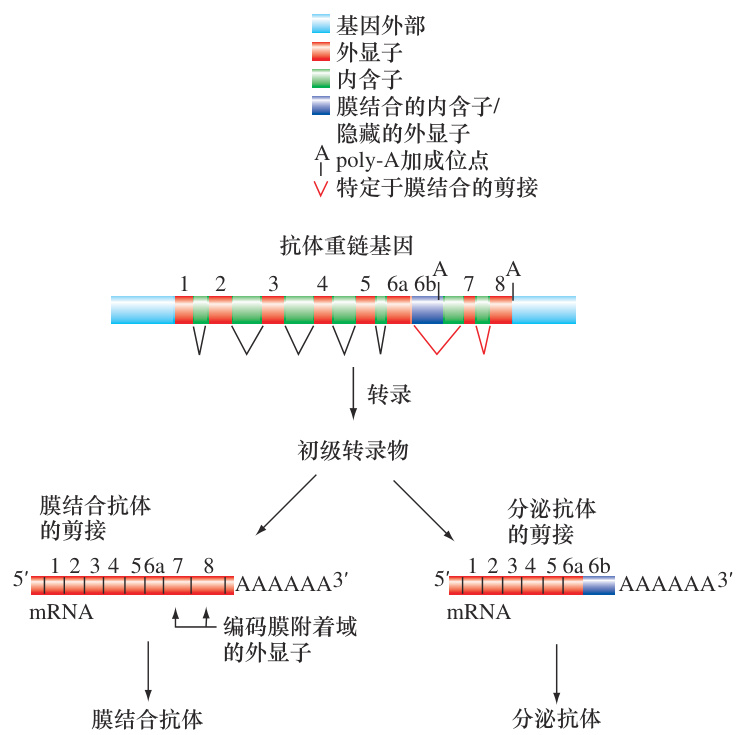  

图8.17可以从相同的初级转录物产生不同的mRNA。抗体重链的初级转录物的可变剪接产生编码不同种类抗体蛋白的mRNA。  

# 基本概念  

·转录是RNA聚合酶从DNA模板合成单链初级转录物的过程。  
·转录起始需要一个称为启动子的DNA序列，启动子发出RNA聚合酶开始复制的信号。在真核生物中，启动需要另外的DNA序列，称为增强子。  
·在转录延伸期间，RNA聚合酶以 $5^{\prime}{\rightarrow}3^{\prime}$ 方向向延长的RNA链添加核苷酸。  
·RNA转录物中的终止子控制RNA聚合酶停止转录。  
●在原核生物中，初级转录物是信使RNA（mRNA）。  
·在真核生物中，转录后的RNA加工产生成熟的mRNA；当通过剪接连接外显子时，通过添加5'帽和polyA尾以及内含子的切除来修饰RNA转录物。  
·外显子可以以其他方式拼接在一起；可变剪接产生不同的mRNA序列，因此产生来自相同初级转录物的不同多肽。  

# 8.3 翻译：从mRNA到蛋白质  

# 学习目标  

1.将tRNA的结构与其功能联系起来。  
2.描述翻译的关键步骤，并说明该过程如何依赖于核糖体。  
3.列出翻译后处理的三种类型，并提供每种类型的例子。  

翻译是mRNA中核苷酸序列指导相应多肽中正确氨基酸序列组装的过程。翻译发生在核糖体上，核糖体协调携带特定氨基酸的tRNA的运动与mRNA的遗传指令。当我们检查细胞的翻译机制时，我们首先描述了tRNA和核糖体的结构与功能；然后解释这些组件在翻译过程中是如何相互作用的。  

# 8.3.1 转移RNA介导mRNA密码子转化为氨基酸  

mRNA密码子的核苷酸三联体与它们指定的氨基酸之间不存在明显的化学相似性或亲和力。相反，转移RNA（tRNA）充当衔接分子，其介导信息从核酸到蛋白质的转移。  

# 1.tRNA的结构  

tRNA是长度为 $74\!\sim\!95$ 个核苷酸的短的单链RNA分子。tRNA中的几个核苷酸含有通过主要的A、G、C和U核苷酸的酶促改变产生的化学修饰碱基。每个tRNA携带一个特定的氨基酸，并且对于遗传密码指定的常见的20个氨基酸，所有细胞必须具有至少一个tRNA。tRNA的名称反映了它携带的氨基酸。例如，tRNA携带的氨基酸是甘氨酸。  

如图8.18所示，可以在三个水平上考虑tRNA分子的结构。  

（1）tRNA的核苷酸序列构成一级结构。  

（3）在三维空间中折叠创建了一个看起来像紧凑字母L的三级结构。  

在L形结构的一端，tRNA携带反密码子，即与mRNA密码子互补的三个核苷酸，指定tRNA携带的氨基酸（图8.18）。反密码子从不与tRNA的其他区域形成碱基对；它总是可以与互补的mRNA密码子碱基配对。与其他互补碱基序列一样，在核糖体配对期间，反密码子和密码子链彼此反向平行。例如，如果反密码子是 $3^{\prime}\,\mathrm{CCU}\,\,5^{\prime}$ ，则互补mRNA密码子是 $"5"$ GGA $3^{\prime}$ ，指定甘氨酸。在L形结构的另一端，发现tRNA链的 $5^{\prime}.$ 端和3'端（图8.18），有适当的氨基酸连接到tRNA的3'端。  

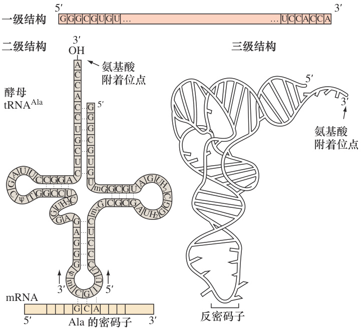  
图8.18tRNA的结构。tRNA的核苷酸序列（一级结构）折叠形成特征性的二级和三级结构。反密码子和氨基酸附着位点位于L形三级结构的相对两端。tRNA的几个不寻常的碱基，表示为I、 $\psi$ $\mathrm{UH}_{2}$ $\mathrm{mI}$ $\mathrm{m_{2}G\mathcal{\vec{H}}l\mathrm{mG}}$ ，是A、G、C和U的酶促修饰变体。  

# 2.氨酰tRNA合成酶：遗传密码的分子翻译  

氨酰tRNA合成酶将tRNA与对应于反密码子的氨基酸连接。这些酶具有非常特殊的特性，能够识别包括反密码子在内的特定tRNA的独特特征，同时也能识别相应的氨基酸（见本章开篇图）。  

事实上，氨酰tRNA合成酶是唯一能同时识别核酸和蛋白质的分子。通常，对于20种常见氨基酸中的每一种，都存在一种氨酰tRNA合成酶。每种合成酶仅对一种氨基酸起作用，但该酶可识别对该氨基酸特异的几种不同的tRNA。图8.19显示了建立氨基酸与其相应tRNA的3'端之间的共价键的两步过程。与其氨基酸共价偶联的tRNA称为负载tRNA。氨基酸和tRNA之间的键包含大量的能量，这些能量后来被用来驱动肽键的形成。  

# 3.密码子和反密码子碱基配对的关键作用  

当适当的氨基酸附着在一个tRNA上时，该氨基酸本身在决定它在一个生长的多肽链中何处结合时并没有发挥重要的作用。相反，tRNA的反密码子和mRNA图8.19氨酰tRNA合成酶将tRNA与其相应的氨基酸连接。氨酰tRNA合成酶具有氨基酸、相应的tRNA和ATP的识别位点。合成酶首先激活氨基酸，形成AMP-氨基酸。然后酶将氨基酸的羧基从AMP转移到tRNA3'端的核糖的羟基（一OH）上，产生负载tRNA。  

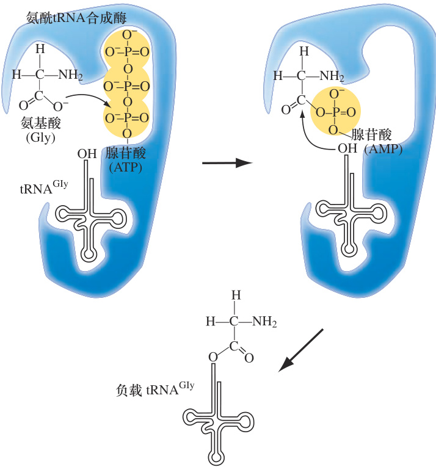  

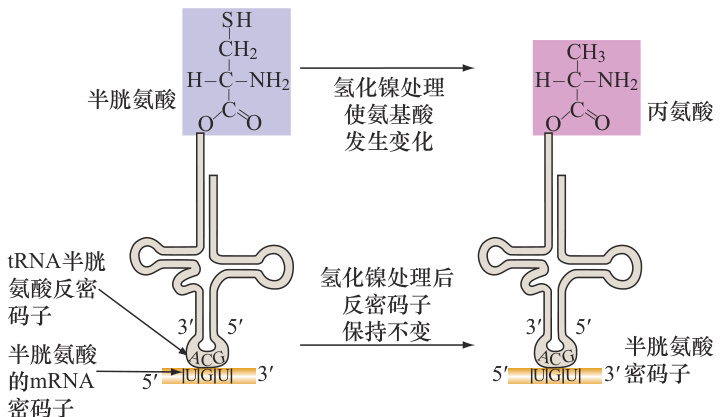  
图8.20mRNA密码子和tRNA反密码子之间的碱基配对决定了添加哪种氨基酸到正在生长的多肽中。具有半胱氨酸反密码子但带有丙氨酸的tRNA，只要出现半胱氨酸的mRNA密码子，就会添加丙氨酸。  

的密码子之间的特异性相互作用决定了这一点。一个简单的实验证明了这一点（图8.20）。研究人员可以对负载tRNA进行化学处理，在不改变tRNA结构的情况下，改变其携带的氨基酸。一种方法是利用丙氨酸取代tRNA携带的半胱氨酸。当研究人员将带有丙氨酸的tRNA"添加到无细胞翻译系统时，无论mRNA是否含有与tRNA反密码子互补的半胱氨酸密码子，系统都会将丙氨酸掺人生长的多肽中。  

# 4.摆动：一个tRNA，多个密码子  

尽管对于20种常见氨基酸存在至少一种tRNA，但是细胞不一定携带能与遗传密码中的所有61种可能的密码子三联体互补配对的反密码子tRNA。例如，大肠杆菌产生79种不同的tRNA，含有42种不同的反密码子。虽然这个集合中的79个tRNA中有几个显然具有相同的反密码子，但61个tRNA中还有 $61{-}42{=}19$ 个没有潜在的反密码子。因此，19个mRNA密码子将不会在大肠杆菌tRNA集合中找到互补的反密码子。如果其mRNA中的某些密码子无法找到具有互补反密码子的tRNA，生物体如何构建合适的多肽?  

答案是，一些tRNA可以识别出它们所携带氨基酸的多个密码子。也就是说，这些tRNA的反密码子可以与同一氨基酸的多个密码子相互作用，这符合遗传密码的退化性质。弗朗西斯·克里克（FrancisCrick）阐述了一些管理密码子和反密码子之间混杂碱基配对的规则。  

Crick首先推断，许多密码子中的3'核苷酸不会增加密码子的特异性。例如， $5^{\prime}$ GGU $3^{\prime}$ $5^{\prime}$ GGC $3^{\prime}$ $5^{\prime}$ GGA3'和 $5^{\prime}$ GGG3'都编码甘氨酸（综述见图8.2）。只要前两个字母是GG，密码子中的3'核苷酸是U、C、A还是G无关紧要。对于由四种不同密码子编码的其他氨基酸也是如此，例如，缬氨酸，其中前两个碱基必须是GU，但第三个碱基可以是U、C、A或G。  

对于由两个不同密码子指定的氨基酸，密码子的前两个碱基总是相同的，而第三个碱基必须是两个嘌呤中的一个（A或G）或两个嘧啶中的一个（U或C）。因此， $5^{\prime}$ CAA $3^{\prime}$ 和 $5^{\prime}$ CAG3'都是谷氨酰胺的密码子；$5^{\prime}$ CAU3'和 $5^{\prime}$ CAC3'都是组氨酸的密码子。如果Pu代表嘌呤，Py代表嘧啶，则CAPu代表谷氨酰胺的密码子，而CAPy代表组氨酸的密码子。  

实际上，tRNA反密码子的5'核苷酸通常可以与mRNA密码子的3'位置中的一种以上的核苷酸配对（回想一下，在碱基配对后，反密码子中的碱基反向平行于密码子中的碱基）。带有特定氨基酸的单个tRNA因此可识别该氨基酸中的几个，甚至所有密码子。密码子中3'核苷酸与反密码子中5'核苷酸之间碱基配对的这种灵活性称为摆动［图8.21（a）」。密码子的前两个位置的正常碱基配对与第三个位置的摆动的组合阐明了为什么单个氨基酸的多个密码子通常以相同的两个字母开始。  

摆动的一个重要方面是反密码子5'端某些碱基的化学修饰（摆动位置）［图8.21（b）和（c）］。tRNA的摆动位置中的A几乎总是被修饰为肌苷（I），并且摆动位置中的U总是以三种可能的方式之一被修改。相比之下，反密码子摆动位置的G总是未经修饰，而C的修饰仅发生在某些细菌物种的tRNA中。摆动碱基通过特异性酶修饰，所述特定酶在通过转录合成后作用于tRNA。  

图8.21（c）中的抖动规则界定了反密码子序列与摆动碱基的修饰保持了遗传密码的一致性。例如，甲硫氨酸（Met）由单个密码子（ $5^{\prime}$ AUG $3^{\prime}$ ）指定。因此，Met特异性tRNA必须在其反密码子的5'端具有C$5^{\prime}\,{\mathrm{CAU}}\,3^{\prime}$ ）或修饰为 $\mathrm{xm}^{5}\mathrm{U}$ 的U，因为这些是该位置上可以碱基配对的唯一核苷酸。相比之下，在反密码子的5个位置上，一个带有修饰核苷酸肌苷（I）的单一异亮氨酸特异性tRNA可以识别异亮氨酸的所有三个密码子$5^{\prime}$ AUU $3^{\prime}$ $5^{\prime}$ AUC3'和5'AUA $3^{\prime}$ ）。  

# 5.硒代半胱氨酸的特殊tRNA  

大多数mRNA仅参与含有20种常见氨基酸的蛋白质的合成。细菌和真核生物中的异常mRNA指导硒蛋白的合成，其含有氨基酸硒代半胱氨酸（Sec），有时称为氨基酸21。硒蛋白是罕见的；在人类中已知的只存在25种。  

如图8.22所示，专用的硒代半胱氨酸tRNA（tRNA"）被丝氨酸tRNA合成酶识别并带有丝氨酸。随后，修饰酶将Ser转化为Sec。带有Sec的电荷tRNA可与 $5^{\prime}$ UGA $3^{\prime}$ 三联体相互作用，这些三联体仅在含有称为Sec插人序列（SECIS）元件的特殊结构的mRNA中发现。SECIS元件是mRNA的区域，其通过分子内互补碱基配对形成特定的茎-环（发夹）结构（图8.22）。该茎环阻止在UGA三联体处终止多肽合成，否则其将充当终止密码子。带有Sec的tRNA的反密码子与mRNA中的UGA三联体结合，允许将Sec掺人多肽产物中。  

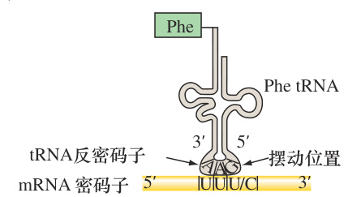  

(b)   

<html><body><table><tr><td colspan="2">摆动的规则</td></tr><tr><td>反密码子 能够 5'端 G</td><td>密码子 配对 3端 U, C</td></tr><tr><td>C 一</td><td>G U,C,A</td></tr><tr><td>xm?U xms2U x0U</td><td>G A,G</td></tr><tr><td>k²C</td><td>A, G, U, (C) A</td></tr></table></body></html>  

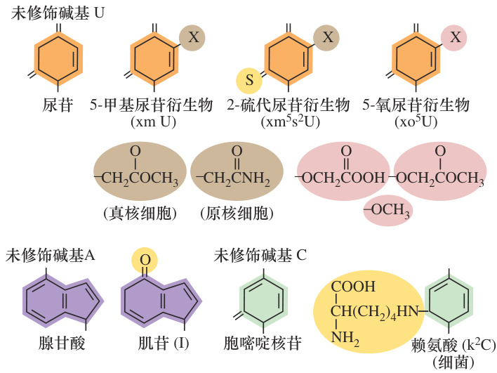  
(c)在反密码子摆动位置的修饰碱基  
图8.21摆动：一些tRNA识别相同氨基酸的多个密码子。（a）这里显示的反密码子5'端的G可以在密码子的3'端与U或C配对。（b）该表显示了反密码子5'端核苷酸的配对可能性（摆动位置）。xoU很少配对C。 $\mathrm{k^{2}C}$ 仅在某些细菌中发生。（c）反密码子中修饰碱基的化学结构。  

# 8.3.2 核糖体是多肽合成的位点  

核糖体以各种方式促进多肽合成。第一，它们识别出表示翻译起始的mRNA特征。第二，它们通过稳定tRNA和mRNA之间的相互作用，帮助确保准确解释遗传密码；没有核糖体，仅由三个碱基对介导的密码子-反密码子识别将是非常弱的。第三，核糖体提供连接增长的多肽链中的氨基酸的酶活性。第四，通过沿mRNA分子 $5^{\prime}{\rightarrow}3^{\prime}$ 移动，它们依次暴露mRNA密码子，确保氨基酸的线性添加。第五，核糖体通过从mRNA指导多肽构建和从多肽产物本身解离两方面来帮助终止多肽合成。  

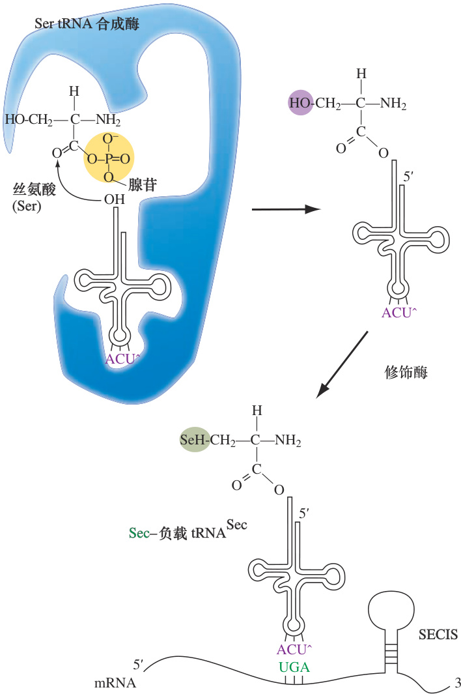  
图8.22稀有蛋白质如何掺人硒代半胱氨酸。tRNA"携带的反密码子 $"5"$ UCA3'的丝氨酸被修饰为硒代半胱氨酸（Sec）。带有Sec的tRNA仅在具有下游SECIS元件的稀有mRNA中识别三联体UGA。该tRNA的摆动位置中的U以不寻常的方式被修饰（表示为U～），因此它仅识别A。  

# 1.核糖体的结构  

在大肠杆菌中，核糖体由三种不同的核糖体RNA（rRNA）和52种不同的核糖体蛋白组成［图8.23（a）］。这些组分结合形成两个不同的核糖体亚基，称为30S亚基和50S亚基（S表示与亚基的大小和形状相关的沉降系数；30S亚基小于50S亚基）。在翻译开始之前，两个亚基在细胞质中作为单独的实体存在。翻译开始后不久，它们聚在一起重建一个完整的核糖体。真核生物核糖体比原核生物核糖体具有更多的成分，但它们仍然由两个可解离的亚基组成。  

# 2.核糖体的功能域  

小的30S亚基是最初与mRNA结合的核糖体的一部(b)核糖体的不同部分具有不同的功能图8.23核糖体：多肽合成的位点。（a）核糖体具有两个亚基，每个亚基由rRNA和各种蛋白质组成。（b）小亚基最初与mRNA结合。大亚基贡献肽酰转移酶，其催化肽键的形成。两个亚基一起形成A、P和EtRNA结合位点。  

(a）核糖体具有由RNA和蛋白质组成的两个亚基  

<html><body><table><tr><td>完整的核糖体</td><td>亚基</td><td>核苷酸</td><td>蛋白质</td></tr><tr><td rowspan="2">原核的 70S</td><td>50S</td><td>see 23SrRNA3000核苷酸 5SrRNA120核苷酸</td><td>31</td></tr><tr><td>30S</td><td>16SrRNA1700核苷酸</td><td>21</td></tr><tr><td rowspan="2">真核的 80S</td><td>60S</td><td>28SrRNA 5000核苷酸 5.8SrRNAU5SrRNA 160核苷酸 120核苷酸</td><td>~45</td></tr><tr><td>40S</td><td>18SrRNA2000核苷酸</td><td>～33</td></tr></table></body></html>  

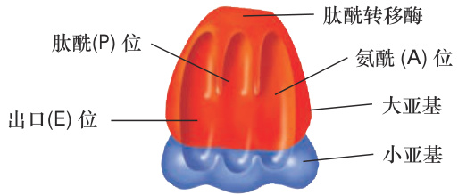  

分。较大的50S亚基贡献了一种称为肽酰转移酶的酶，它催化形成连接相邻氨基酸的肽键［图8.23（b）］。小亚基和大亚基都有助于三个不同的tRNA结合区域，称为氨酰（或A）位、肽酰（或P）位和出口（或E）位。最后，分布在两个亚基上的核糖体的其他区域充当一些在翻译中起作用的其他蛋白质的接触点。  

利用X射线晶体学和电子显微镜技术，研究人员获得了核糖体复杂结构的非常详细的视图。图8.24显示了接近完成mRNA翻译的核糖体内部；核糖体向外延伸的部分被计算去除，因此你可以更好地看到占据E位和P位的tRNA。  

通过这个例子，你可以看到rRNA占据了核糖体中心部分的大部分空间，而各种核糖体蛋白则聚集在外部。令人惊讶的是，在翻译过程中形成肽键的区域附近没有发现蛋白质。这一发现支持了生物化学实验的结论，即肽酰转移酶实际上是大亚基rRNA的功能，而不是核糖体的任何蛋白质组分。换句话说，rRNA充当将氨基酸连接在一起的核酶。  

在翻译期间，核糖体与各种蛋白质短暂结合，这些蛋白质有助于该过程的进行。如图8.24显示，翻译晚期，即当完成的多肽从核糖体释放时，名为释放因子的蛋白质与核糖体的A位结合。值得注意的是，释放因子可以与A位相关联，因为该蛋白质的一部分以模仿tRNA结构的方式在三维空间中折叠。  

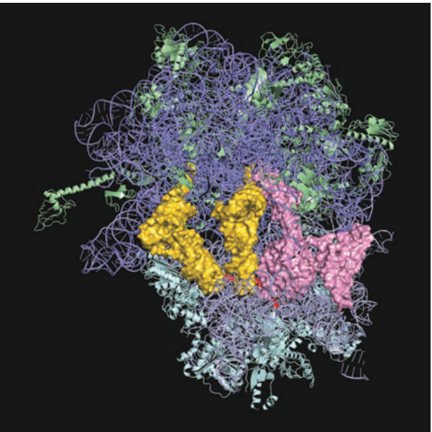  
图8.24一个活动的细菌核糖体的高分辨率视图。大的子单元位于顶部；其23S和5SrRNA成分为亮蓝色，各种蛋白质成分为亮绿色。小亚基位于底部，16SrRNA为灰色，其蛋白质成分为aqua。两个tRNA分子是金色的，其中tRNA位于E位左侧，tRNA位于P位右侧。A位被粉红色的蛋白质释放因子占据。在tRNA和释放因子的底部附近可以看到mRNA中的一些核苷酸（红色）。在图8.25（c）的左图所示的终止阶段，这个核糖体在tRNA从E位弹出之前的翻译阶段发挥作用。  

$\copyright$ Yuxin Mao, Ph.D., Cornell University, Ithaca, NY  

# 8.3.3 核糖体和负载tRNA合作将mRNA翻译 成多肽  

与转录的情况一样，翻译由三个阶段组成：起始阶段，其为多肽合成设定阶段；延伸阶段，在此过程中氨基酸被添加到正在生长的多肽中；终止阶段，使多肽合成停止并使核糖体释放完整的氨基酸链。图8.25说明了该过程的细节，重点关注细菌细胞中发生的翻译。在查看图时，请注意以下有关翻译期间信息流的要点：  

·第一个被翻译的密码子，即起始密码子，是在基因阅读框5'端的特殊环境中设置的AUG（从未精确地位于mRNA的5'端）。  
·一种特殊的起始tRNA识别起始密码子，它携带有称为甲酰甲硫氨酸（fMet）的修饰形式的甲硫氨酸。  
·核糖体以 $5^{\prime}{\rightarrow}3^{\prime}$ 方向沿着mRNA移动，逐步显示连续的密码子。  
·在翻译的每个步骤中，多肽通过添加到链中下一个氨基酸的C端进行不断生长。  
·当核糖体到达基因阅读框内3'端的UAA、UAG或UGA无义密码子时，翻译终止。  

这些点解释了共线性的生化基础，即mRNA中$5^{\prime}{\longrightarrow}3^{\prime}$ 方向与所得多肽中N端 $\longrightarrow$ C端方向之间的对应关系。  

在延伸期间，翻译机器每秒向生长链增加 $2\!\sim\!15$ 个氨基酸。原核生物的速度较快，真核生物的速度较慢。在这样的速率下，构建平均大小为300个氨基酸的多肽（来自平均长度约为1000个核苷酸的mRNA）可能需要20s或长达 $2.5\mathrm{min}$ O  

图8.25中省略了一些细节，以便你可以在翻译过程中专注于流程。但是该图未描绘蛋白质翻译因子所起的重要作用，其有助于将mRNA和tRNA移植到核糖体上的适当位置。一些翻译因子也将GTP带到核糖体上。GTP中高能键的水解有助于驱动某些分子运动，包括核糖体沿mRNA的易位。  

# 8.3.4 翻译后多肽可被修饰  

蛋白质结构在翻译完成时并不是一成不变的。几个不同的过程可能随后改变多肽的结构。切割可以从多肽中去除氨基酸，如N端fMet，或者它可以从一个较大的翻译产物中产生几个较小的多肽［图8.26（a）］。在后一种情况下，在将其切割成较小多肽之前制备的较大多肽通常称为多蛋白。此外，一些蛋白质以酶原的非活性形式合成，其通过酶促切割激活，从而消除N端前置。  

向特定氨基酸中酶促添加化学成分，如磷酸基团、碳水化合物、脂肪酸或甚至其他小肽，也可以在翻译后修饰多肽［图8.26（b）］。对多肽的这种改变称为翻译后修饰。蛋白质的翻译后变化非常重要，例如，许多酶的生化功能直接取决于磷酸基团的添加（或有时去除）。翻译后修饰可以改变蛋白质折叠的方式、与其他蛋白质相互作用的能力、稳定性、活性，或其在细胞中的位置。  

# 基本概念  

·翻译是核糖体根据mRNA中的说明合成蛋白质的过程。核糖体具有tRNA（A、P和E位）的特异性结合位点，并提供肽酰转移酶，即在氨基酸之间形成肽键的核酶。  

·转移RNA（tRNA）是将mRNA密码子与核糖体上的氨基酸连接的衔接子。氨酰tRNA合成酶将正确的氨基酸与其相应的tRNA连接。  
·每个tRNA具有与mRNA密码子互补的反密码子，其指定特定的氨基酸。由于摆动，tRNA可识别多于一个密码子。  
·当负载tRNAMet（或tRNAMet）在核糖体P位结合起始密码子AUG时，翻译起始开始。  
·在延伸期间，与P位处的tRNA连接的氨基酸同A位处与tRNA连接的氨基酸形成肽键。然后核糖体沿着mRNA以 $5^{\prime}{\rightarrow}3^{\prime}$ 的方向移动到下一个密码子。  
·当核糖体遇到mRNA中的框内终止密码子时发生终止。  
·翻译后加工酶可以切割多肽或向其中添加化学成分。  

# 特色插图8.25  

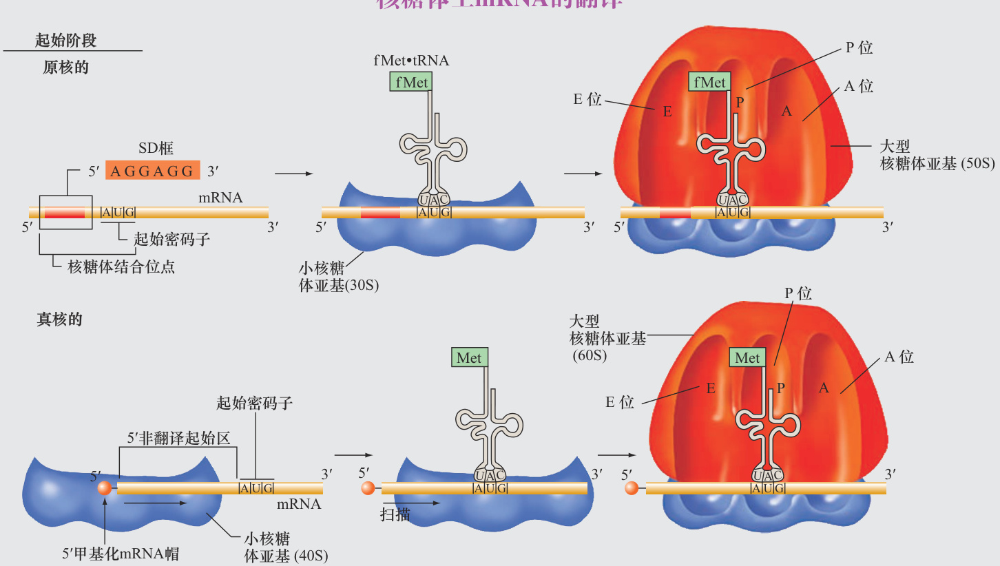  
核糖体上mRNA的翻译  

（a）起始：设定多肽合成的阶段。mRNA的前三个核苷酸不是第一个密码子。相反，一个特殊的信号表明mRNA翻译应该从哪里开始。在原核生物中，这个信号是核糖体结合位点，它有两个重要的元素。第一个是6个核苷酸的短序列，通常是5′..AGGAGG..3'，命名为SD框。mRNA的核糖体结合位点中的第二个元件是三联体5'AUG3'，其用作起始密码子。  

特殊启动子tRNA的5'CAU3'反密码子识别核糖体结合位点中的AUG。引I发剂tRNA携带N-甲酰基甲硫氨酸（fMet）一一一种修饰的甲硫氨酸，其氨基末端被甲酰基封闭。带有未修饰的甲硫氨酸的不同tRNA识别位于mRNA阅读框内的AUG密码子；这种tRNA无法启动翻译。  

在启动期间，30S核糖体亚基中16SrRNA的3'端与mRNA的SD框（未显示）结合，fMettRNA与mRNA的起始密码子结合，并且大的50S核糖体亚基与小亚基结合，使核糖体变圆。在启动结束时，fMet tRNA位于完成的核糖体的P位。称为起始因子的蛋白质（未显示）在起始过程中起暂时作用。  

在真核生物中，小核糖体亚基首先与成熟mRNA的5'端的甲基化帽结合。然后小亚基迁移到起始位点——通常是它遇到的第一个AUG，因为它以 $5^{\prime}{\longrightarrow}3$ 的方向扫描mRNA。真核生物中的起始tRNA携带未修饰的甲硫氨酸（Met）而不是fMet。  

（b）伸长率：向生长的多肽添加氨基酸。称为延伸因子的蛋白质（未显示）将合适的tRNA引人核糖体的A位。这种负载tRNA的反密码子必须识别mRNA中的下一个密码子。核糖体同时在其P位保持起始tRNA，在其A位保持第二个tRNA，使得肽酰转移酶可以催化两个tRNA携带的氨基  

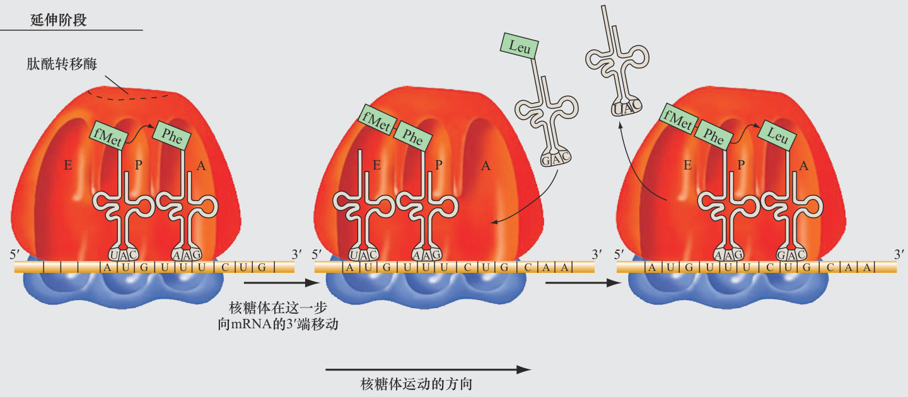  

# 特色插图8.25（续）  

酸之间的肽键的形成。结果，A位的tRNA现在带有两个氨基酸。该二肽的N端是fMet或Met；C端是第二个氨基酸，其羧基保持与其tRNA共价连接。  

形成第一个肽键后，核糖体在伸长因子的帮助下移动，暴露下一个mRNA密码子。随着核糖体的移动，不再携带氨基酸的起始tRNA转移到E位，携带二肽的另一个tRNA从A位转移到P位。  

空A位现在接收另一种tRNA，其同一性由mRNA中的下一个密码子决定。不负载的起始tRNA从E位突出并离开核糖体。然后，肽酰转移酶催化第二肽键的形成，产生在其C端与目前  

在A位中的tRNA连接的三个氨基酸链。随着每一轮核糖体运动和肽键形成，肽链延长一个氨基酸。注意，每个tRNA从A位移动到P位再到E位（除了起始tRNA，其首先进入P位）。  

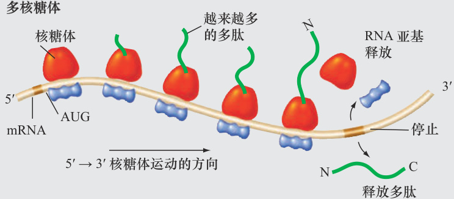  

因为核糖体将氨基酸添加到生长链的C端，所以多肽合成从N端进行到C端。结果，原核生物中的初始fMet（真核生物中的Met）将是蛋白质加工之前所有完成的多肽的N端氨基酸。此外，核糖体必须沿 $5^{\prime}{\rightarrow}3^{\prime}$ 方向沿mRNA移动，以使多肽可以在N端一C端方向上生长。一旦核糖体移动远离mRNA的核糖体结合位点，该位点就可以被其他核糖体接近。事实上，几种核糖体可以同时对相同的mRNA起作用。从相同mRNA翻译的几个核糖体的复合物称为多核糖体。该复合物允许从单个mRNA同时合成多肽的多个拷贝。  

（c）终止：核糖体释放完整的多肽。没有正常的tRNA（除了tRNA"）携带与三个无义（终止）密码子UAG、UAA和UGA中的任何一个互补的反密码子。因此，当无义密码子进人核糖体的A位时，没有tRNA可以与该密码子结合。相反，称为释放因子的蛋白质识别终止密码子并停止多肽合成。同样的tRNA及从核糖体分离出来的mRNA解离成大大小小的亚基。  

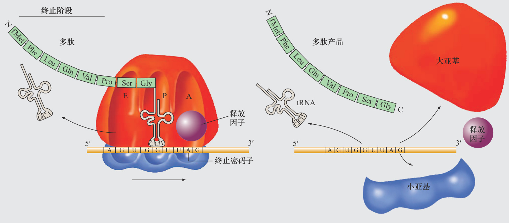  

# 8.4 原核生物与真核生物中的基因表达差异  

# 学习目标  

1.解释细胞核膜对真核生物基因表达的影响机制。  
2.讨论真核转录中增强子序列的作用。  
3.描述原核与真核生物的翻译起始差异。  
4.列举只出现在真核生物中而原核生物中不存在的  
mRNA的形成步骤。  

真核生物与原核生物中的转录和翻译过程大部分具有相似性，它们的具体差异主要表现在以下几点： $\textcircled{\scriptsize{1}}$ 真核生物中存在着细胞核膜； $\textcircled{2}$ 真核生物具有RNA聚合酶，借以识别启动子来开启转录的特异性复杂机制；$\textcircled{3}$ 翻译开始方式的变化与差异； $\circledast$ 在真核生物中需要附加的转录物处理。  

# 8.4.1 在真核生物中，细胞核膜阻止了转录和翻译过程的耦合  

在大肠杆菌和其他原核生物中，转录发生在没有核膜分隔的开放的细胞内空间。翻译过程在同一个开放空间发生，并且有时会直接与转录过程偶联发生（表8.1）。这个偶联效应的发生可能是因为当核糖体沿mRNA移动时，转录以相同的 $5^{\prime}{\longrightarrow}3^{\prime}$ 方向延伸  

# 表8.1原核生物与真核生物在基因表达细节上的差异  

概述 1.无核。转录和翻译发生在相同的细胞区室中，翻译通常与转录偶联。  

  

1.细胞核由核膜与细胞质分开。转录发生在细胞核中，而翻译发生在细胞质中。转录和翻译的直接偶联是不可能的。  

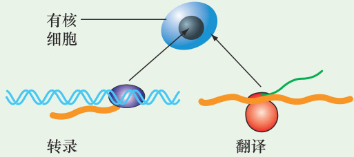  

2.基因不分为外显子和内含子。  

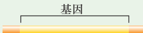  

2.基因的DNA由内含子分隔的外显子组成；外显子通过转录后剪接进行保护，从而删除内含子。  

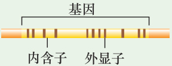  

转录 1.一种由5个亚基组成的RNA聚合酶  

1.几种RNA聚合酶，每种含有10个或更多亚基；不同的聚合酶转录不同的基因。  

2.起始所需的DNA序列位于启动子附近。  

2.转录起始通常需要远离启动子的增强子序列。  

3.启动子不在染色质中。  

  

3.转录起始需要启动子清除染色中清除以允许获得RNA聚合酶。  

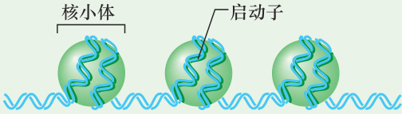  

4.初级转录物是实际的mRNA;它们在 $5^{\prime}$ 端有一个三磷酸起始，在3'端没有尾。  

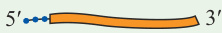  

4.初级转录物经过加工产生成熟的mRNA，其 $5^{\prime}$ 端具有甲基化帽，3端具有poly-A尾。  

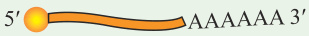  

翻译1.独特的起始tRNA携带甲酰甲硫氨酸。  

1.起始tRNA携带甲硫氨酸。  

2.mRNA具有多个核糖体结合位点（RBS），因此可以指导几种不同多肽的合成。  

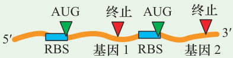  

2.mRNA只有一个起始位点，因此只能指导一种多肽的合成。  

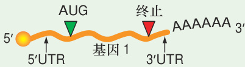  

3.小核糖体亚基立即与mRNA的核糖体结合位点结合。  

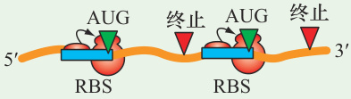  

3.小核糖体亚基首先与成熟mRNA的5'端的甲基化帽结合，然后扫描mRNA以发现核糖体结合位点。  

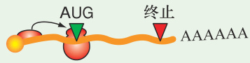  

mRNA，在DNA转录的过程中，导致核糖体在RNA聚合酶的作用下开始转录部分mRNA。  

转录与翻译的结合对原核生物基因表达的调控具有重要意义。例如，我们在第16章描述的一种叫做衰减的重要调控机制中，一些mRNA的翻译速率直接决定了相应基因转录到这些mRNA中的速率。  

这种偶联效应不能在真核生物中发生，因为细胞核膜将细胞核中的转录部位与细胞质中的翻译部位进行了物理分隔。因此，真核生物中的翻译过程只能通过一些间接的方式影响基因转录的速率。  

# 8.4.2 远程增强子序列与染色质的相互作用影响真核启动子  

真核生物中，启动子被RNA聚合酶识别转录的过程会被两种在原核生物中不存在的情况影响（见表8.1）。首先，如图8.11所示，RNA聚合酶与启动子相互作用的稳定性往往受到位于启动子远处的增强子序列的影响。在原核生物中，调控转录的DNA序列都更接近启动子。其次，真核染色体紧密缠绕在称为染色质的DNA/蛋白质复合物中的组蛋白上。为了被RNA聚合酶识别，真核基因的启动子必须首先从染色质中解开。有趣的是，从启动子中清除组蛋白是增强子的重要功能（组蛋白和染色质及其在转录中的作用将在第12章和第17章中讨论）。  

# 8.4.3 原核生物与真核生物的翻译启动不同  

在原核生物中，翻译始于mRNA上的核糖体结合位点，其由与起始AUG密码子相邻的称为SD框的短的特征性核苷酸序列限定［回顾图8.25（a）］。没有什么可以阻止mRNA具有多于一个核糖体结合位点，实际上，有很多原核信息都是多顺反子的：它们包含了几个基因的信息（有时被称为顺反子），这些基因都可以在它们自己的核糖体结合位点上开始完成独立的翻译（表8.1）。  

相比之下，在真核生物中，小的核糖体亚基与成熟mRNA的5'端甲基化帽结构结合后通过非翻译区迁移到起始位点。该位点几乎总是核糖体亚基遇到的第一个AUG密码子，因为它沿着 $5^{\prime}{\rightarrow}3^{\prime}$ 方向移动或扫描mRNA［见图8.25（a）和表8.1」。因为这种扫描机制，在真核生物中的起始仅在mRNA的单个位点发生，并且每个mRNA是单顺反子的—它包含仅翻译单一多肽的信息。  

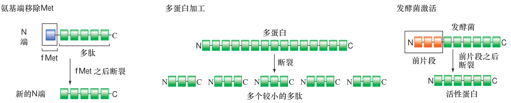  
(a)酶促切割可以去除氨基酸、分裂多蛋白或激活酶原  

原核生物和真核生物翻译之间的另一个区别在于起始tRNA的组成。前面已经提到，在原核生物中，这种tRNA携带一种被称为N-甲酰甲硫氨酸的修饰形式的甲硫氨酸；而在真核生物中，它带有未经修饰的甲硫氨酸（见表8.1）。因此，真核多肽在翻译后其N端就具有Met（而不是fMet）。然而，原核生物和真核生物通过翻译后切割通常会产生不再具有N端fMet或Met的成熟蛋白质［见图8.26（a）］。  

# 8.4.4 真核mRNA需要比原核mRNA更多的加工  

表8.1回顾了原核生物与真核生物之间基因结构和表达的重要差异。内含子中断了真核生物基因，使得初级转录物的剪接对于真核基因表达是必需的。在真核生物而不是原核生物中发生的其他类型的RNA加工分别在mRNA的5'端和3'端添加甲基化帽和poly-A尾。  

(b）添加化学成分可能会改变蛋白质结构、活性或细胞位置  

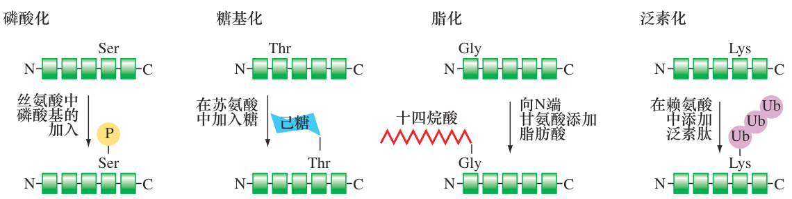  
图8.26翻译后加工可以修饰多肽结构。（a）酶促切割将许多蛋白质加工成它们的成熟形式。（b）酶向特定氨基酸添加各种官能团。  

# 基本概念  

·在原核生物中，转录和翻译同时发生。在真核生物中，核膜将转录限制在细胞核中，mRNA仅在转运到细胞质后开始翻译。  

·在真核生物中，转录起始涉及远离启动子的增强子序列。此外，真核染色体的染色质必须解开以允许RNA聚合酶进入。  

·原核mRNA是多顺反子的，使得核糖体可以从单个mRNA翻译几种不同的多肽。真核生物具有单顺反子mRNA，只能翻译单个蛋白质。  

·在原核生物中，核糖体与邻近AUG起始密码子的称为SD框的序列结合。在真核生物中，小核糖体亚基在5'帽处结合并迁移直至遇到起始位点。  

·在原核生物中，初级转录物mRNA可以直接进行翻译。在真核生物中，初级转录物需要通过添加5'帽和poly-A尾以及内含子的去除翻译成成熟mRNA。  

# 8.5 变突对基因表达和功能的影响  

# 学习目标  

1.比较沉默突变、错义突变、无义突变和移码突变，以及它们如何改变基因产物。  
2.讨论编码序列之外可能影响基因表达的突变。  
3.解释为什么大多数功能丧失等位基因（亚形态或无定形）对野生型等位基因是隐性的，但有些是不完全显性或显性的。  
4.对比超变形、新变形和反效变形的功能等位基因的作用。  
5.列举可能对基因表达产生全局影响的突变。  

我们已经看到DNA中的信息是基因表达的起点。细胞将该信息转录成mRNA，然后将mRNA信息翻译成蛋白质。改变DNA核苷酸对的突变可以修饰基因表达的任何步骤或产物。  

# 8.5.1 基因编码序列中的突变可能会改变基因产物  

由于遗传密码的性质，基因氨基酸编码外显子的突变会产生一系列反响［图8.27（a）］。  

# 1.沉默突变  

代码简并性的一个结果是，一些称为沉默突变的突变可以将密码子改变为完全相同氨基酸的突变密码子。大多数沉默突变改变了密码子的第三个核苷酸，即相同氨基酸的大多数密码子不同的位置。例如，密码子从GCA变成GCC后仍将在蛋白质产物中产生丙氨酸。因为沉默突变不改变编码多肽的氨基酸组成，所以这种突变通常既不影响基因表达也不影响表型。  

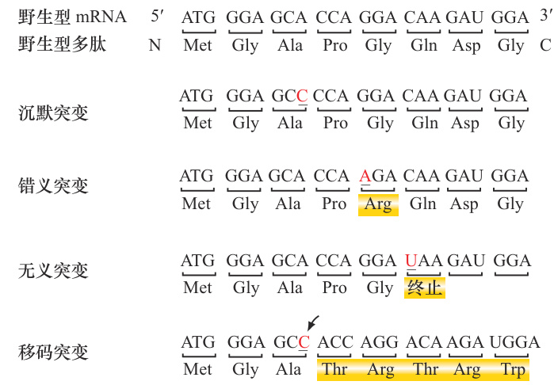  
(b）编码区外突变  

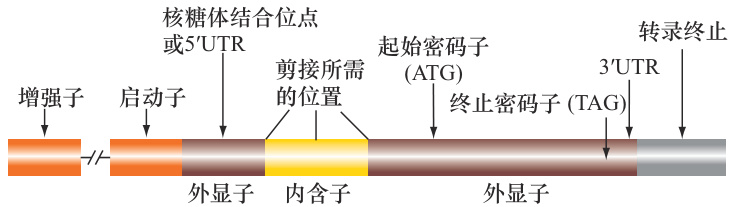  

图8.27基因突变如何影响其表达。（a）基因编码序列的突变。沉默突变不会改变蛋白质的一级结构。错义突变将一种氨基酸替换为另一种氨基酸。无义突变通过用终止信号替换密码子来缩短多肽。移码突变改变了添加或删除下游的阅读框。（b）编码区外的突变也可以破坏基因表达。  

# 2.错义突变  

将密码子改变为不同氨基酸的突变密码子的突变称为错义突变。如果被取代的氨基酸具有与其取代氨基酸类似的化学性质，那么这种变化可能对蛋白质功能几乎没有影响。这种突变是保守置换。例如，将天冬氨酸的GAC密码子改变为谷氨酸的GAG密码子的突变是一种保守置换，因为这两种氨基酸都有酸性的R基团。  

相比之下，非保守置换，即引起性质迥异的氨基酸取代的错义突变，可能会产生更明显的后果。将天冬氨酸的GAC密码子更改为丙氨酸的GCC密码子（丙氨酸是一种不带电荷的非极性R基团的氨基酸）就是一个非保守置换的例子。  

任何错义突变对表型的影响都很难预测，因为它取决于特定氨基酸替代如何改变蛋白质的结构和功能。  

# 3.无义突变  

无义突变将一个氨基酸指定密码子变为一个提前终止密码子。因此，无义突变导致突变密码子编码的氨基酸与正常多肽的C端之间缺乏所有氨基酸的截短蛋白的产生。  

# 4.移码突变  

移码突变是由编码序列内核苷酸的插人或缺失引起的。如前所述，如果插人或缺失的核苷酸的数目不能被  

3整除，则插人或缺失将使突变下游的阅读框偏离。结果，移码突变通常导致截短的蛋白质形成（因为过早出现终止密码子），其C端具有不正确的氨基酸。  

# 8.5.2 编码序列外的突变也可以改变基因表达  

产生变异表型的突变不限于密码子的改变。因为基因表达依赖于除实际编码序列之外的几种信号，所以任何这些关键信号的变化都可能破坏该过程[图8.27（b）］。  

我们已经知道基因DNA中的启动子和终止信号调节RNA聚合酶启动及停止转录。启动子序列的变化使RNA难以或不可能使聚合酶与启动子结合，从而减少或阻止转录。同样地，破坏它们不被转录因子识别的增强子中的突变也减少了真核基因的转录。终止信号中的突变可以减少产生的mRNA的量，从而减少基因产物的数量。  

在真核生物中，大多数初级转录物具有剪接受体位点、剪接供体位点和分支位点，其允许剪接以在成熟mRNA中精确地连接外显子。任何一个站点的更改都可能会阻碍拼接。在某些情况下，结果将是不存在成熟mRNA，因此没有多肽。在其他情况下，剪接错误可以产生异常剪接的编码蛋白质改变形式的mRNA。  

成熟的mRNA具有核糖体结合位点和框内终止密码子，它们指示翻译的开始和停止位置。影响核糖体结合位点的突变会降低mRNA对小核糖体亚基的亲和力；这种突变可能会降低翻译效率，从而降低多肽产物的量。停止密码子的突变会产生比正常蛋白质更长的不稳定或无功能的蛋白质。  

# 8.5.3 大多数影响基因表达的突变会降低基因功能  

突变通过改变蛋白质的氨基酸序列或产生的基因产物的量来影响表型。在前面描述的许多方式中，编码区内部或外部的任何降低或消除蛋白质活性的突变都是功能缺失突变。  

# 1.隐性功能缺失等位基因  

完全阻断蛋白质功能的功能丧失等位基因称为无效突变或无定形突变。对于蛋白质编码基因，突变阻止多肽的合成或促进不能执行任何功能的蛋白质的合成。  

很容易理解为什么无定形等位基因通常对野生型等位基因是隐性的。考虑 $A^{+}/a^{1}$ 杂合子，其中野生型 $\boldsymbol{A}^{+}$ 等位基因产生功能性蛋白质，而无效 $a^{1}$ 等位基因则不产生（图8.28）。如果由单个 $A^{+}$ 等位基因产生的蛋白质的量［通常（但不总是）在 $A^{+}/A^{+}$ 细胞中产生的量的一半］高于足以满足细胞的正常生化要求的阈值量，则 $|A^{+}/a^{1}$ 杂合子的表型将是野生型。绝大多数基因都以这种方式起作用， $A^{+}/A^{+}$ 细胞实际上能产生正常表型所需蛋白质量的两倍多。由于这个原因，孟德尔的绿豌豆颜色或皱豌豆形状的等位基因可能是无效等位基因，并且对野生型等位基因是隐性的（回顾图2.20）。  

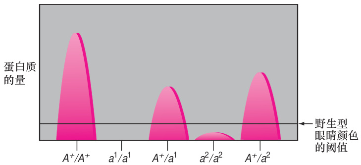  
图8.28为什么大多数功能缺失的突变等位基因相对于野生型等位基因是隐性的。粉红色椭圆表示果蝇中称为黄嘌呤脱氢酶的量。果蝇只需要野生型菌株（ $A^{+}/A^{+}$ ）中产生的酶的 $10\%$ 即可具有正常的眼晴颜色。空等位基因 $a^{1}$ 和亚型等位基因 $a^{2}$ 对野生型是隐性的，因为 $\!A^{+}\!/a^{1}$ 或 $\langle A^{+}/a^{2}$ 杂合子具有足够的酶用于正常的眼睛颜色。  

亚效突变是一种功能缺失的等位基因，它产生较少的野生型蛋白质或功能不如野生型蛋白质的突变蛋白质（图8.28中的 $\stackrel{.}{a}^{2}$ ）。由于无定形等位基因通常是隐性的，因此亚效等位基因通常对野生型等位基因是隐性的。  

# 2.不完全显性功能缺失等位基因  

一些等位基因组合产生的表型随着功能基因产物的量不断变化，导致不完全显性。例如，单一色素生成基因中的功能丧失突变可以产生红色到白色的花色谱，白色是由于生化途径中某种酶的缺乏而产生的（图8.29）。考虑编码酶R的基因的三个等位基因：$R^{+}$ 指定野生型酶的量， $R^{50}$ 产生正常量的相同酶的一半（或具有正常活性水平一半的改变形式的全部量）， $R^{0}$ 是无效等位基因。 $R^{+}/R^{0}$ 杂合子产生粉红色的花，其颜色在红色和白色之间，因为 $R^{+}/R^{+}$ 酶活性水平的一半不足以产生完整的红色。将 $R^{+}$ 或 $R^{0}$ 与 $R^{50}$ 等位基因组合产生红色和粉红色之间或粉红色和白色之间的色素沉着。  

# 3.特殊的显性功能缺失等位基因  

由于表型对产生的功能性蛋白质的量非常敏感，即图8.29当表型随蛋白质功能水平不断变化时，导致不完全显性。  

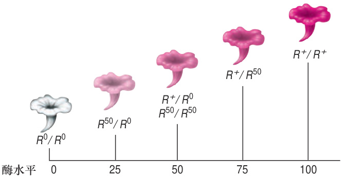  

使相对较小的两倍或更少的变化也会导致不同表型之间的转换。因此，产生低于正常量的功能基因产物的功能丧失突变杂合子可能看起来与野生型生物不同。遗传学家使用术语单倍体不足来描述相对罕见的情况，即为其中一个野生型等位基因不能提供足够的基因产物来避免表型突变。人类中单倍体不足基因的数量大约为800个。人类单倍体不足基因的一个例子是GLI3，其编码对手指足趾正常生长有重要作用的转录因子。GLI3中功能丧失突变的杂合性导致一种形式的多指畸形——额外的手指和脚趾的生长（图8.30）。  

# 8.5.4 特殊的功能获得等位基因几乎总是占主导地位  

由于有许多方法可以干扰基因产生足够数量的活性  

  

643  
正常等位基因 T K K Q R G D  
$(G L I3^{+})$ GTC ACC AAG AAG CAG CGAGGG GAC→  
突变等位基因 GTCACC AAG AAG CAG TGA GGG GAC  
(GLI3) T K K Q 终止642  

图8.30单倍体不足：一些功能丧失的突变等位基因对野生型等位基因具有显性。人类GLI3基因是单倍体不足的。GLI3/GLI3+杂合子具有额外的手指和脚趾，这种情况称为多指。一个特定的突变体GLI3等位基因是无义突变，其将密码子643从精氨酸（R）改变为停止（野生型GLI3蛋白有1580个氨基酸）（  

$\copyright$ Dinodia/agefotostock.com  

蛋白的能力，所以大多数基因中的大多数突变都是功能缺失的等位基因。然而，罕见的突变可以增强蛋白质的功能，赋予蛋白质新的活性，或作为功能获得等位基因在错误的时间或地点表达蛋白质。由于单个这样的等位基因本身通常会产生一种蛋白质，即使在正常蛋白质存在的情况下，这种蛋白质也能改变表型，所以这些不寻常的功能获得等位基因几乎总是占野生型等位基因的主导地位。许多显性突变等位基因在纯合时是致死的。  

# 1.超形态等位基因  

超形态突变是产生比野生型等位基因更正常的蛋白质产物或更有效的突变蛋白质的突变。例如，人类FGFR3基因的高度变异导致软骨发育不全，这是最常见的侏儒症形式［图8.31（a）」。FGFR3基因编码抑制骨生长的信号蛋白（成纤维细胞生长因子受体3）。FGFR3蛋白通常仅在称为FGF（成纤维细胞生长因子）的小蛋白与其结合时才被激活［图8.31（b）］。大多数患有软骨发育不全的人携带称为 $F G F R3^{G480R}$ 的突变等位基因编码FGFR3蛋白，其中精氨酸代替氨基酸序列480位置的正常甘氨酸。这种单一的氨基酸变化导致突变蛋白即使在不存在FGF的情况下也会被激活。因此，突变蛋白是一种组成型活性受体，它一直处于被激活状态［图8.31（c）］。超形态等位基因（ $F G F R3^{G480R}$ )对野生型等位基因具有显性作用，因为即使存在正常蛋白质，突变蛋白仍保持活性并继续抑制骨生长。  

# 2.新形态等位基因  

一类罕见的显性功能获得等位基因来自产生新型表型的新形态突变。一些新形态等位基因产生具有新功能的突变蛋白，而另一些则导致基因在不适当的时间或地点产生正常蛋白（异位表达）。  

显性的亨廷顿病等位基因（ $H D$ ）是产生突变蛋白的新形态等位基因的一个例子。回忆第7章中的“快进”信息栏“三核苷酸重复疾病：亨廷顿病和脆性X综合征”， $H{D}^{+}$ 是polyQ型三核苷酸重复基因。突变HD蛋白具有大量的谷氨酰胺（Q）氨基酸，并且由于未知原因，这种突变HD蛋白引I起神经变性。HD疾病等位基因对正常等位基因具有显性作用，因为正常HD蛋白（具有较少Q）的存在不会阻止突变HD蛋白损伤神经细胞。  

果蝇基因Antennapedia的Antp\*突变等位基因是一个表达正常蛋白质的新形态等位基因的明显例子。果蝇是Antp"/Antp\*杂合子，它们的头部有两条腿代替触角［图8.32（a）］。Antp基因编码一种促进腿部发育的蛋白质；相应地，野生型等位基因Antp\*在将成为果蝇腿的组织中表达。基因转录控制区内的一个突变反而导致Antp?等位基因在注定要成为触角的组织中表达正常蛋白［图8.32（b）］。Antp㎡占主导地位是因为Antp+等位基因不能阻止Antp蛋白在通常注定成为触角的细胞中异位表达。  

(a)软骨发育不全  

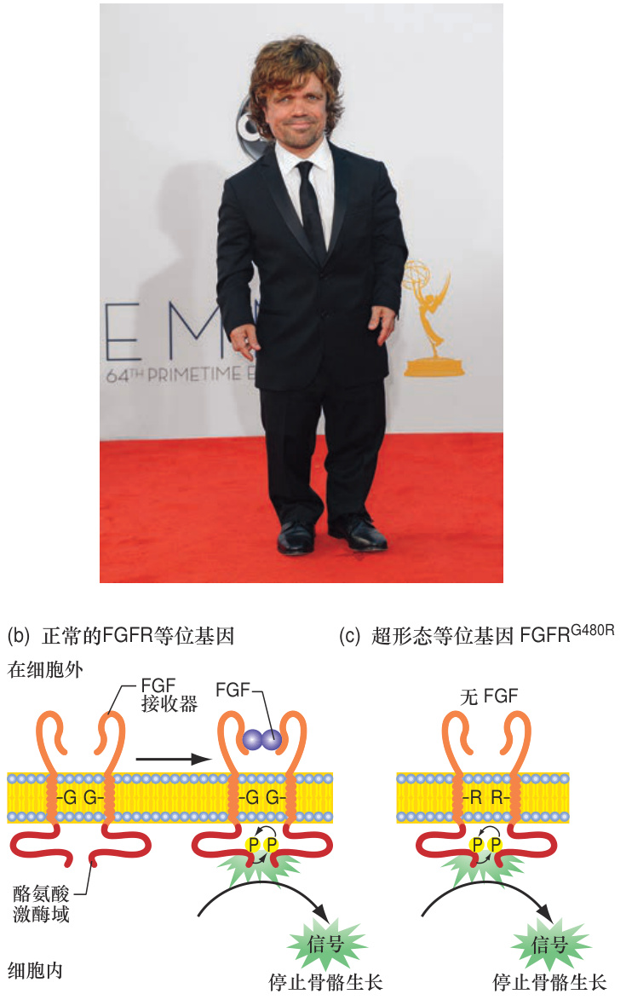  

图8.31一些超形态等位基因编码过度活跃的蛋白质。  
（a）软骨发育不全是一种侏儒症，是由FGFR3基因的显性变  
态突变等位基因 $F G F R3^{G480R}\vec{\Sigma}$ 起的。（b）FGFR3基因编码二  
聚体跨膜受体蛋白，其通常仅在与小蛋白激素FGF结合时才  
被激活。一个活化的FGFR3亚基的酪氨酸激酶结构域将磷酸  
基团（黄色圆圈中的磷酸基团）添加到另一个亚基，反之亦然。这些磷酸化作用引发了最终阻止骨骼生长的信号。  

（c）无论是否存在FGF，突变FGFR3G480R蛋白始终被激活，导致骨骼发育不良。  

(a） : $\copyright$ Frazer Harrison/Getty Images  

# 3.反效等位基因  

一些显性的突变等位基因编码的蛋白质不仅不能提供野生型蛋白质的活性，而且还阻止正常蛋白质起作用。这些等位基因被称为显性失活或反效等位基因。  

如果以一种编码多肽的基因为例，它与四亚基酶中的其他三种相同多肽相结合，四个亚基都是相同基因的产物。如果一个显性突变等位基因 $D$ 指导一个毒性亚基的合成，其存在于多聚体中，甚至作为四个亚基中的一个，废除酶的功能，那么仅由功能性野生型dr亚基组成（a,左）： $\copyright$ Eye of Science/Science Source;（a, 右） : $\copyright$ Juergen Berger/Science Source  

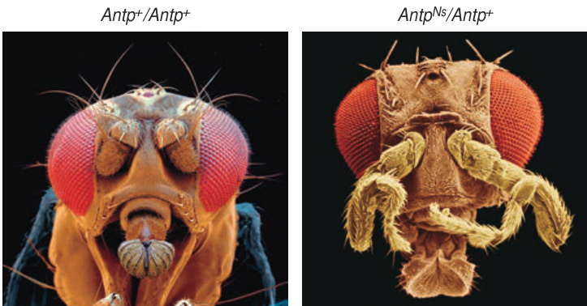  
(a）显性的新型等位基因AntpNs引起触角到腿的转换  
(b）AntpNs异位表达Antp蛋白  

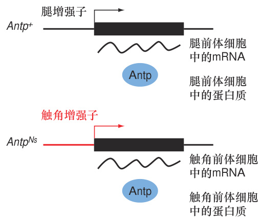  
图8.32新形态等位基因可以异位表达正常蛋白质。（a）果蝇触角足基因中的新形态显性突变（ $A n t p^{N s}$ ）产生了两条腿从头部长出的果蝇（右）；左图显示的是正常的果蝇头部。  

的活性四聚体只占所有四聚体的1/16［图8.33（a）］。因此Dld杂合子中的总酶活性远低于野生型drld纯合子中的总酶活性。小鼠中Axin基因的Kinky等位基因导致畸形（扭曲）的尾巴，就是一个具有这种作用机制的显性负突变的例子［图8.33（b）］。  

# 8.5.5 突变的影响难以预测  

如前所述，大多数突变构成功能缺失等位基因。原因是氨基酸序列的许多变化可能破坏蛋白质的功能，而且基因调控位点的大多数改变（如启动子）将使这些位点效率降低。尽管如此，基因中几乎任何位置的突变都很少导致功能的获得。  

即使你知道突变如何影响基因功能，你也不能总是预测突变等位基因是否会相对野生型等位基因显性或隐性（表8.2）。虽然大多数功能丧失突变是隐性的，并且几乎所有功能获得突变都占主导地位，但这些一般化的例外情况也确实存在。其原因在于，二倍体生物中基图8.33为什么一些显性突变基因是反效等位基因。（a）对于由单个基因编码的四个亚基组成的蛋白质，显性失活突变可以使每16个多聚体中的15个失活。（b）小鼠Axin基因（ $A x i n^{K i n k y}$ ）的Kinky等位基因是一种显性负性突变，导致尾部扭曲。Axin蛋白是蛋白质复合物的亚基； $A x i n^{K i n k y}$ 编码的蛋白质可以防止复合物发挥作用。  

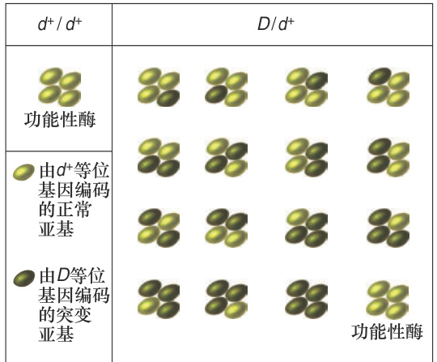  

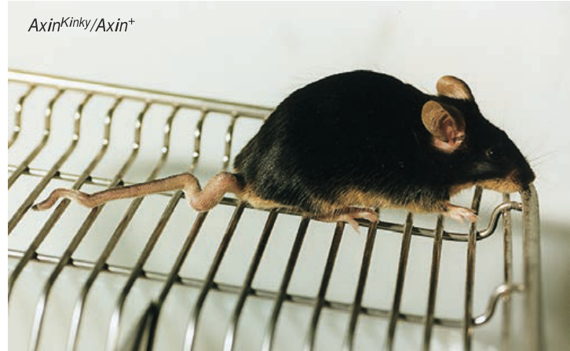  
(b）由反效等位基因AxinKinky编码的毒性亚基的表型效应  

（b）: $\copyright$ Tom Vasicek  

(a)反效等位基因D编码突变毒性亚基  
表8.2突变分类对蛋白质功能的影响  

<html><body><table><tr><td></td><td colspan="2">功能缺失</td><td colspan="3">功能获得</td></tr><tr><td>突变类型</td><td>无效等位基因（无效）</td><td>亚效等位基因（不足）</td><td>超形态等位基因</td><td>新形态等位基因</td><td>反效等位基因（显性失活）</td></tr><tr><td>发生概率</td><td>常见 单倍体不足时可能显性</td><td>常见</td><td>少见</td><td>少见</td><td>少见</td></tr><tr><td>可能的显隐性关系</td><td colspan="2">通常为隐性； 如果表型随基因产物不断变化，则可能不完全显性：</td><td>通常为显性或不完全 显性</td><td>通常为显性</td><td>通常为显性或不完全显性</td></tr></table></body></html>  

因的野生型和突变等位基因之间的显性关系取决于突变对蛋白质生产或活性的影响程度，而表型则完全取决于蛋白质的正常野生型水平。  

# 8.5.6 编码实现表达的分子的基因突变可能具有全局效应  

基因表达取决于令人惊讶的蛋白质及RNA的数量和种类，每种蛋白质和RNA由单独的基因编码。所有蛋白质（RNA聚合酶、核糖体蛋白亚基、氨酰tRNA合成酶等）的基因转录和翻译过程都相同。所有rRNA、tRNA和snRNA的基因都是转录但未翻译的非编码基因。几乎所有这些基因的突变，无论是蛋白质编码还是非编码，都会对表型产生显著影响。  

# 1.影响基因表达机制的致死突变  

编码实现基因表达的基因（如核糖体蛋白或rRNA）的功能突变缺失，在纯合子中往往是致命的，因为这种突变会对细胞中所有蛋白质的合成产生不利影响。即使基因表达所需的一些蛋白质或RNA的量减少$50\%$ ，也会产生严重的后果。例如，在果蝇中，编码各种核糖体蛋白的许多基因中的无效突变在纯合时是致死的。由于单倍体不足，杂合子中的相同突变导致显性的微小表型，其中细胞的缓慢生长延迟了果蝇的发育。  

# 2.tRNA基因中的抑制突变  

如果不止一个基因编码相同的分子在基因表达中起作用，那其中的一个突变不一定是致命的，甚至可能是有利的。例如，细菌遗传学家发现某些tRNA基因的突变可以抑制其他基因中无义突变的影响。具有这种效应的tRNA基因突变产生无义抑制因子tRNA。  

例如，在色氨酸合酶基因中具有框内UAG无义突变的其他野生型大肠杆菌群体。该群体中的所有细胞都形成截短的、无功能的色氨酸合酶，因此色氨酸营养缺陷型（ $\mathrm{Trp}^{-}$ ）不能合成色氨酸［图8.34（a）］。然而，随后将这些营养缺陷型暴露于诱变剂会产生一些带有两个突变的Trp+细胞：其中一个是原始色氨酸合酶的无义突变，另一个是编码氨基酸酪氨酸的tRNA的基因突变。tRNA基因的突变抑制了无义突变的作用，恢复了色氨酸合酶基因的功能。  

如图8.34（b）所示，这种无义抑制的基础是tRNA"突变改变了一种反密码子，该反密码子将酪氨酸密码子识别为与UAG终止密码子互补的反密码子。因此，突变tRNA可以在框内UAG无义突变的位置处将酪氨酸插人多肽中，从而允许细胞至少产生一些全长酶。类似地，其他tRNA基因的反密码子突变可以抑制UGA或UAA密码子的无义突变。  

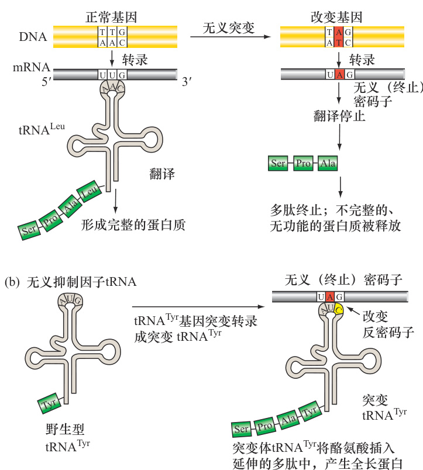  
(a)无义突变  

图8.34无义抑制。（a）无义突变会生成终止密码子导致截短、无功能多肽的产生。（b）tRNA基因中的第二个无义抑制突变导致响应终止密码子添加氨基酸，从而产生全长多肽。  

只有当突变同时满足以下两个条件时，tRNA基因中具有无义抑制突变的细胞才能存活。首先，细胞必须具有能够在突变改变其反密码子之前对同一密码子进行识别的其他tRNA。如果没有这样的tRNA，细胞就无法插人合适的氨基酸（如酪氨酸的密码子）。其次，抑制性tRNA必须仅对通常在mRNA编码区末端发现的终止密码子作无效应答。若非如此，抑制性tRNA将在细胞中造成严重破坏，产生一系列比正常情况更长的异常多肽。细胞防止这种可能性的一种方法是在许多基因的末端连续放置两个终止密码子。因为抑制tRNA在这两个密码子处插入氨基酸的机会非常低，仅会产生少量的延伸蛋白。  

# 基本概念  

·基因编码序列中的点突变可以修饰多肽产物的氨基酸序列。  
·编码序列外的突变可以通过改变蛋白质产生的数量、时间或地点来修饰基因表达。  
·功能丧失突变减少或消除基因的表达。大多数功能丧失等位基因对野生型等位基因是隐性的。当表型随基因产物的量不断变化时，功能丧失等位基因可能表现出不完全显性。在单倍体不足的情况下，基因产物正常量的一半不足以产生正常表型，因此功能丧失的突变等位基因具有显性效应。  

·罕见的功能获得型突变会增加蛋白产量、合成变异蛋白，或者在错误的环境中产生正常蛋白质。大多数功能获得等位基因对野生型等位基因是显性的。·突变对野生型是显性还是隐性的取决于蛋白质产物的改变程度以及表型对异常基因功能的敏感程度。·基因表达机制分子的突变通常是致命的，除非是产生无义抑制因子tRNA的tRNA基因突变。  

# 接下来的内容  

对基因表达的知识使我们能够重新定义基因的概念。基因不仅仅是被转录成mRNA密码子的DNA，这些mRNA密码子指定了特定多肽的氨基酸。相反，基因是作为多肽产物需要表达的所有DNA的序列。除了所有这些特征外，真核基因还含有从带有内含子的初级转录物，将内含子剪接出去才能制备成熟的mRNA。因为有内含子的存在，大多数真核生物的基因要比原核生物基因长很多。即使含有内含子，单个基因的核苷酸对也仅仅在构成基因组的染色体中占有非常小的比例。人类基因的长度平均为16000个核苷酸对。但单倍体人类基因组在23条染色体中共分布着大约30亿个核苷酸对，每个染色体平均含有1.3亿个核苷酸对。  

在第9章、第10章和第11章中，我们描述了研究人员如何分析大部分基因组染色体中的遗传信息，试图去发现DNA的哪些部分是基因以及这些基因如何影响表型。他们通过将DNA剪切成可操作的片段进行分析，同时对片段进行复制以获得足够的材料用于研究，并将片段表征到核苷酸序列的水平。然后，科学家们试图通过确定片段之间的空间关系来重建整个基因组的DNA序列。最后，他们利用这些知识来检验使个体具有独特性的基因组变异。  

# 习题精解  

1.遗传学家检查了各种大肠杆菌突变体中特定蛋白质的氨基酸序列。正常酶中第40位的氨基酸是甘氨酸。下表显示了遗传学家在六种突变形式的酶中在氨基酸位置40处发现的取代结果。  

突变1 半胱氨酸突变2 缬氨酸突变3 丝氨酸突变4 天冬氨酸突变5 精氨酸突变6 丙氨酸  

已确定每种情况下碱基置换都在DNA中发生，哪些突变体能够与突变1重组形成野生型基因？  

# 解答  

参见遗传密码表（参见图8.2）确定碱基置换。  

原始的甘氨酸可以被GGU、GGC、GGA和GGC编码。突变1使第40号氨基酸变成了半胱氨酸，它的密码子是UGU或者UGC。可以确定编码密码子中第一个位置碱基对发生了变换（G-C转换成T-A），因此原始甘氨酸密码子必须是GGU或GGC。缬氨酸（突变2）的密码子是GUN（N代表任意一种碱基）假设为单碱基突变，那么氨酸的密码子就是GUU或者GUC，碱基对的变化就一定是第二位置的G-C转换成A-T。如果只改变一个碱基使甘氨酸突变成丝氨酸（突变3），也就是密码子GGU或GGC变成AGU或者AGC，第一个位置的碱基对发生置换（G-C转换成T-A）。天冬氨酸（突变4）的密码子是GAU或GAC，所以突变4是第二个位置的碱基对G-C转换成A-T的结果。精氨酸（突变5）被密码子CGN编码，所以突变5是第一个位置的碱基对发生了G-C到C-G的颠换。丙氨酸（突变6）密码子是GCN，所以突变6是第二个位置的碱基对发生了G-C到C-G的颠换。突变2、4和6影响不同于突变1影响的碱基对，因此它们可以与突变1重组。  

总之，在该位置的野生型和突变基因的RNA样链上的核苷酸序列必须是：  

野生型 5'GG T/C 3'突变1 5'T G T/C 3'突变 2 5' G T T/C 3'突变3 5'AG T/C 3'突变4 5'GA T/C 3'突变 5 $5^{\prime}\,\mathrm{C}\,\mathrm{G}\,\mathrm{T}/\mathrm{C}\,3^{\prime}$ 突变6 $5^{\prime}\mathrm{~G~C~T~}/\mathrm{C}~3^{\prime}$  

Ⅱ.形成SV40肿瘤病毒基因组的双链环状DNA分子可以变性为单链DNA分子。因为两条链的基础组成不同，所以可以根据它们的密度将链分成两条链，分别称为W（atson）和C（rick）。  

当将单链的每种纯化制剂与来自感染病毒的细胞的mRNA混合时，在RNA和DNA之间形成杂交体。对这些杂交更仔细的分析表明，与W制剂杂交的RNA不同于与C制剂杂交的RNA。请问关于不同类别RNA的转录模板是什么？  

# 解答  

在回答这个问题之前，首先需要了解转录和双螺旋中DNA链的极性。一些基因使用DNA的一条链作为模板；其他人使用相反的链作为模板。由于DNA链的极性不同，一组基因将在圆形DNA上以顺时针方向转录（如使用W链作为模板），另一组将以逆时针方向转录（用C链作为模板）。  

ImI.对人血红蛋白感兴趣的遗传学家发现了大量的突变形式。这些突变蛋白中的一些具有正常大小（但含有氨基酸置换），而其他突变蛋白由于缺失或无义突变而变短。第一个超长实例被命名为HbConstantSpring，其中β-珠蛋白具有其所有正常氨基酸，以及在蛋白质正常C端后连接的几个额外氨基酸。  

a.对其起源最合理的解释是什么?  

b.HbConstantSpring是否有可能未能将内含子拼接而产生？  

c.估计可以在突变蛋白的C端添加多少额外氨基酸。  

# 解答  

为了回答这个问题，需要理解翻译和RNA剪接的原理。  

a.因为存在蛋白质C端的延伸，所以突变可能影响终止（无义）密码子而不影响RNA的剪接。这种改变可能是基础改变或移码或删除改变或去除终止密码子。超出正常终止密码子的mRNA中的信息将被翻译，直到达到mRNA中的另一个终止密码子。  
b.只有在终止密码子之前的位置存在内含子并且突变阻止内含子从成熟mRNA中去除时，剪接缺陷才能解释Hb Constant Spring。在这种情况下，内含子中的核苷酸将作为三联体在框内读取，直至达到终止密码子。特定位置存在内含子的必要性使得这种情况比题目a部分更不可能。  
c.无论对HbConstantSpring蛋白的解释是终止密码子的改变还是剪接的改变，都可以通过假设它们由随机DNA序列编码来估计添加到蛋白末端的氨基酸的数量。在遗传密码中，64个三联体中的3个（21个中约1个）是终止密码子。因此粗略估计，需在突变蛋白末端添加约21个氨基酸，直到阅读框遇到终止密码子。  

# 习题  

# 词汇  

1.在右列中选择与左列中的术语最匹配的短语。  

a.密码子 1.从初级转录物中去除对应于内含子的碱基序列  
b.共线性 2.UAA,UGA,UAG  
c.阅读框 3.与初级转录物具有相同碱基序列的 DNA链  
d.移码突变 4.其上附着了适当的氨基酸的 tRNA分子  
e.遗传密码的简并性5.表示一个氨基酸的一组三个mRNA碱基  
f.无义密码子 6.大多数氨基酸不是由单个密码子指定的  
g.起始密码子 7.使用 DNA 链的核苷酸序列中的信息来指定 RNA链的核苷酸序列  
h.模板链 8.将三种 mRNA 碱基分组为密码子  
i.RNA 样链 9.特定环境的AUG  
j.内含子 10.多肽中氨基酸的线性序列对应于基因中核苷酸对的线性序列  
k.RNA 剪接 11.从相同的初级转录物产生不同的成熟mRNA  
1.转录 12.在编码序列中添加或删除三个碱基对以外的多个碱基对  
m.翻译 13.基因内的碱基对序列，其不由成熟mRNA中的任何碱基表示  
n.可变剪接 14.具有与初级转录物互补的碱基序列的 DNA链  
0.负载tRNA 15.使用 mRNA分子的核苷酸序列中编码的信息来指定多肽分子的氨基酸序列  
p.反转录 16.以RNA为模板合成DNA  

# 8.1节  

2.将左栏中的假设与产生它的右栏中的观察相匹配。  

a.DNA和蛋白质之间存 1.影响相同氨基酸的两个突变在中间信使 可以重组以产生野生型  
b.遗传密码是不重叠的 2.基因中的一个或两个碱基缺失（或插人）会破坏其功能;三个碱基缺失（或插人）通常与功能兼容  
c.密码子不只含有一个 3.含有某些密码子的人工信息核苷酸 比不含这些密码子的信息产生更短的蛋白质  
d.遗传密码基于三联体 4.蛋白质合成发生在细胞质中，而 DNA 存在于细胞核中  
e.存在终止密码子来终 5.具有不同碱基序列的人工信止翻译过程 息在体外翻译系统中产生不同的蛋白质  
f.一个蛋白质的氨基酸 6.单碱基取代仅影响蛋白质链序列基于对应mRNA 中的一个氨基酸的基本序列  

3.如何根据遗传密码的下列模型读取人工mRNA？$5^{\prime}$ ...GUGUGUGU... 3'a.双碱基，不重叠b.双碱基，重叠c.三碱基，不重叠d.三碱基，重叠e.四碱基，不重叠  

4.例子中显示了 $\mathrm{T4}\;\,r I I B$ 基因的一部分序列，其中Crick和Brenner已经重组了一个“ $^+$ ”和一个“_”突变（下面已给出DNA的RNA样链）。野生型 $5^{\prime}\,\mathrm{AAA}$ AGT CCA TCA CTT AAT GCC $3^{\prime}$ 突变型 $5^{\prime}$ AAA GTC CAT CAC TTA ATG GCC $3^{\prime}$ a.突变DNA中的 $^+$ 突变和-突变在哪里?b.双突变体产生野生型斑块。这种双突变体中发生了哪些氨基酸的改变？c.如何解释双突变体中的氨基酸不同于野生型序列,而噬菌体具有野生型表型？  

5.考虑图8.4中的Crick和Brenner的实验，这表明遗传密码基于核苷酸三联体。a.Crick和Brenner获得了FCO的基因内抑制子FC7，即在FCO突变附近的rIIB基因中第二个位点的突变。描述rIIB基因中的一种不同类型的突变，是研究人员可能通过用proflavin处理FCO突变体并寻找恢复的 $r I I B^{+}$ 功能而恢复的。b.Crick和Brenner如何区分题目a中描述的事件和FC7等基因内抑制子的区别？c.当通过重组将FC7与FC0分离时，结果是两个 $r I B^{-}$ 突变噬菌体：一个是FC7，另一个是FCO。他们如何区分FC7和FC0重组体？d.解释Crick和Brenner如何获得不同的缺失（－）或添加 $(\,+\,)$ 突变，从而获得图8.4（c）所示的各种组合，如 $^{++}$ 、!1、 $+++$ 和-——？  

6.人的 $\beta$ -珠蛋白基因 $H\boldsymbol{b}\boldsymbol{\beta}^{S}$ （镰状细胞）等位基因将β-珠蛋白链中的第6个氨基酸从谷氨酸变为缬氨酸。在$H\!b\beta^{c}$ 中， $\beta.$ -珠蛋白中的第6个氨基酸从谷氨酸变为赖氨酸。 $\beta$ -珠蛋白基因图中这两个突变的顺序是什么？  

7.下图描述了噬菌体ΦX174的A基因部分和B基因起始的mRNA序列。在这种噬菌体中，一些基因在重叠阅读框中被读取。例如，A基因的编码用于部分B基因，但阅读框被一个碱基置换。这里显示的是带有所示蛋白A和B密码子的单个mRNA。  

鉴于以下氨基酸（aa）的变化，指出在mRNA中发生的碱基变化以及对其他蛋白质序列的后果。  

a.蛋白A中第10位的Asn变为Tyr。  
b.蛋白A中第12位的Leu变为Pro。  
c.蛋白B中第8位的Gln变为Leu。  

d.重叠阅读框的出现在自然界非常罕见。当它确实发生时，重叠的程度不是很长。你认为为什么是这种情况？  

8.部分蛋白质的氨基酸序列已经确定：  

N .. . Gly Ala Pro Arg Lys . . . C  

使用诱变剂proflavin在编码该蛋白的基因中诱导了突变。可以纯化得到突变蛋白并确定其氨基酸序列。突变蛋白的氨基酸序列与前面序列中野生型蛋白从蛋白N端到甘氨酸的氨基酸序列完全相同。从这种甘氨酸开始，氨基酸的序列改变为如下：  

N .. . Gly His Gln Gly Lys . . . C  

使用氨基酸序列，可以确定来自编码该蛋白的野生型基因的14个核苷酸的序列。这是什么序列?  

9.图8.5所示的结果可能让你感到不协调，因为许多缺乏AUG起始密码子的合成RNA（如poly-U）在体外被翻译成多肽。这项实验之所以可能，是因为Mar-shallNierenberg发现试管中高浓度的 $\mathrm{Mg}^{2+}$ ，远高于细胞中发现的 ${\mathrm{Mg}}^{2+}$ ，使得核糖体能够在RNA分子上的任何位置启动翻译。在高和低 $\mathrm{Mg}^{2+}$ 浓度下，用以下每种合成mRNA预测体外翻译的结果：a. poly-UG (UGUGUG . . .)b. poly-CAUG (CAUGCAUGCAUG . . .)c. poly-GUAU (GUAUGUAUGUAU . . .)  

10.识别遗传密码中的所有氨基酸指定密码子，其中点突变（单个碱基改变）可以产生无义密码子。  

11.在合成如图8.5所示的确定序列的RNA分子的技术发明之前，用未定义序列的合成mRNA进行类似的实验。例如，仅由U和G组成的RNA可以在体外合成，但它们将具有随机序列。假设在含有三倍于GTP的UTP反应混合物中合成一组随机序列RNA，并且所得RNA在体外翻译。a.RNA中存在多少个不同的密码子？b.在合成的多肽中有多少不同的氨基酸？c.为什么你对题目a和b的回答不一样？d.你希望多久能在题目a中找到每个密码子？e.你希望以何种比例找到多肽中的每个氨基酸？f.如果你做了这个实验，即合成了含有U：G比例为$3:1$ 的随机序列RNA，并且在知道遗传密码表之前对产生的多肽中每个氨基酸的量进行了定量，结果会告诉你什么？  

12.特定的蛋白质在其主要结构内具有氨基酸序列N . . . Ala-Pro-His-Trp-Arg-Lys-Gly-Val-Thr . . . C  

一位研究影响这种蛋白质的突变的遗传学家发现，其中几个突变体产生了在该区域内终止的缩短的蛋白质分子。其中之一一- -His成为末端氨基酸。  

a.什么DNA单碱基改变会导致蛋白质终止于His残基？  
b.在编码这种蛋白质的DNA序列中，你会看到哪些其他潜在的位点，其中单个碱基对的突变会导致翻译的提前终止？  

13.有多少个可能的可读框（没有终止密码子的框）存在延伸通过以下序列？$5^{\prime}$ ...CTTACAGTTTATTGATACGGAGAAGG... $3^{\prime}$ $3^{\prime}$ . . . GAATGTCAAATAACTATGCCTCTTCC .. . 5'  

14.a.在图8.3中，物理图（碱基对的数量）并不完全等同于遗传图（图距单位）。请解释这种明显的差异。b.在图8.3中，哪个区域显示重组频率最高？哪个最低？  

15.Charles Yanofsky分离出许多不同的 $t r p A^{-}$ 突变体（图8.3）。a.解释他如何使用复制平板鉴定大肠杆菌的 $T r p^{-}$ 营养缺陷型（回顾图7.6）。b.假设TrpA酶在色氨酸生物合成途径中的作用是已知的，解释Yanofsky如何在Trp-营养缺陷型中鉴定出trpA-突变体（提示：回忆第7章中Beadle和Tatum关于一种基因一种酶的实验）。  

16.这里给出了从起始密码子开始的一段mRNA的序列，以及来自几个突变株的相应序列。  
正常AUGACACAUCGAGGGGUGGUAAACCCUAAG...  
突变体1AUGACACAUCCAGGGGUGGUAAACCCUAAG...  
突变体 2AUGACACAUCGAGGGUGGUAAACCCUAAG...  
突变体 3AUGACGCAUCGAGGGGUGGUAAACCCUAAG...  
突变体 4AUGACACAUCGAGGGGUUGGUAAACCCUAAG...  
突变体 5AUGACACAUUGAGGGGUGGUAAACCCUAAG...  
突变体 6 AUGACAUUUACCACCCCUCGAUGCCCUAAG...a.指示各自存在的突变类型，并在每种情况下将序列的突变部分翻译成氨基酸序列。b.用EMS（乙基甲烷磺酸盐；见图7.14）处理可以回复哪些突变？用原黄素呢？  

17.你确定了一个基因的原黄素产生的等位基因，该基因产生110个氨基酸的多肽，而不是通常的157个氨基酸的蛋白质。在对这个突变等位基因进行广泛的proflavin诱变后，你能够在编码蛋白质N端的序列和原始突变之间找到位于基因部分的一些基因内抑制子，但是在原始突变和编码蛋白质通常C端的序列之间的区域没有抑制子。你认为这是什么原因？  

18.使用重组DNA技术（将在第9章中描述），可以从任何来源获取基因的DNA并将其置于酵母细胞核中的染色体上。当你将人类基因的DNA放人酵母细胞染色体中，改变后的酵母细胞可以制造出人类蛋白质。但是当你移除通常存在于酵母线粒体染色体上的基因的DNA，并将其放在细胞核中的酵母染色体上时，酵母细胞就不能合成正确的蛋白质，尽管该基因来自同一个生物体。你需要做些什么来确保这样的酵母细胞能够制造出正确的蛋白质？  

# 8.2节  

19.描述转录中需要互补碱基配对的步骤。  

20.第6章和第7章解释说，DNA聚合酶犯的错误要么通过DNA复制过程中的校对机制纠正，要么通过复制完成后运行的DNA修复系统纠正。DNA复制的总错误率约为 $1\times{10}^{-10}$ ，也就是1000万个碱基对中的一个错误。RNA聚合酶也有一定的校对能力，但转录的整体错误率明显更高（ $1\times10^{-4}$ ，或每10000个核苷酸中有一个错误）。为什么生物体能够忍受比DNA复制更高的转录错误率呢？  

21.基因 $F$ 的编码序列在附图中从左到右读取。基因 $G$ 的编码序列从右向左读取。DNA的哪条链（顶部或底部）作为每个基因转录的模板？  

<html><body><table><tr><td rowspan="3" colspan="2">5' 3'</td><td rowspan="3">基因F</td><td></td></tr><tr><td></td><td>3' 基因G</td></tr><tr><td></td><td>5'</td></tr></table></body></html>  

22.如果将人类基因的mRNA与同一种基因的基因组DNA混合，让RNA和DNA通过碱基互补形成杂交分子，你会在电子显微镜中看到什么？你的图片应该包括涉及DNA链（模板和RNA样）及mRNA的杂交。  

23.在研究特定人类酶的正常和突变形式时，遗传学家遇到了一种特别有趣的突变形式的酶。正常酶长227个氨基酸，但突变酶长312个氨基酸。额外的85个氨基酸在正常序列的中间作为一个区段出现。插人的氨基酸与正常蛋白质序列没有任何对应关系。对这种现象有什么可能的解释？  

24.果蝇基因Dscam1编码支配神经元连接的神经细胞（神经元）表面的蛋白质。每个神经元在其表面上都有一个存在的数万个Dscam1蛋白。神经元表达的特定Dscam1蛋白被认为是唯一标记细胞以确定它将生长的轴突和树突的路径。真核基因是单顺反子。那么单个Dscaml基因如何编码数以万计的不同蛋白质？  

# 8.3节  

25.描述翻译中需要互补碱基配对的步骤。  

26.尽可能准确地定位下图所示列出的项目。有些项目未显示。（a）DNA模板链的5'端；（b）mRNA的3'端；（c）核糖体；（d）启动子；（e）密码子；（f）氨基酸；（g）DNA聚合酶；（h）5'非编码区；（i）着丝粒；（j）内含子；（k）反密码子；（1）N端；（m）负载tRNA的5'端；（n）RNA聚合酶；（o）负载tRNA的3'端；（p）核苷酸;（q）mRNA帽；（r）肽键；（s）P位点；（t）氨酰-tRNA合成酶；（u）氢键；（v）外显子；(w) $5^{\prime}$ AUG3'；（x）潜在的摆动交互。  

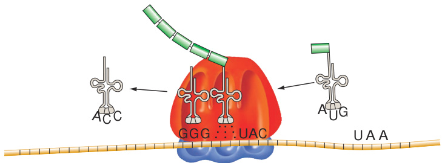  

27.关于习题26的图示：  

a.正在表示哪个进程？  
b.图中增长链中下一个要加入的构件是什么？在这个增长链的哪一端将添加这个构建模块？完成后，链中会有多少构建模块？  
c.哪些其他的构建模块具有已知的标识？  
d.你能给这个图增加什么细节吗？在真核细胞和原核细胞中会有什么不同？  

28.a.可以存在具有反密码子序列5IAA的tRNA吗？如果有，它将携带哪种氨基酸?b.针对反密码子序列 $5^{\prime}\mathrm{xm}^{5}\mathrm{s}^{2}$ UAA回答同样的问题。  

29.对于习题28的题目a和题目b，考虑编码tRNA的基因的DNA序列。tRNA基因的RNA样链与tRNA的反密码子对应的序列是什么？这些相同的三个核苷酸的基因的模板链的序列是什么？  

30.记住tRNA的摆动碱基是反密码子的5'碱基：a.在人类tRNA中，最初用A在摆动位置转录的所有可能的反密码子的序列是什么？（假设这个A总是被修改为I)  

b.在人类tRNA中，最初用U在摆动位置转录的所有可能的反密码子的序列是什么？（注：任何在摆动位置带有U的单一类型的tRNA只能以单一方式修饰）  
c.题目b中每个反密码子的摆动如何被修改并且仍然与遗传密码一致？  
d.人类基因组中必须存在的不同tRNA基因的理论最小数目是多少（假设xo"U只与A、G或U配对）。  

31.人类基因组包含大约500个tRNA基因。  

a.你认为这些tRNA基因中的每一个都有不同的功能吗？  
b.你能解释一下为什么人类基因组会进化以便容纳如此多的tRNA基因吗？  

32.编码在有丝分裂纺锤体中发现的蛋白质的酵母基因由研究有丝分裂的实验室克隆。该基因编码477个氨基酸的蛋白质。a.该酵母基因的蛋白质编码部分的核苷酸最小长度是多少？b.这里给出了含有酵母基因编码区中间的外显子中一条DNA链的部分序列。基因的这个区域的mRNA的核苷酸序列是什么？展示链的5'和3'的方向性。$5^{\prime}$ GTAAGTTAACTTTCGACTAGTCCAGGGT $3^{\prime}$ c.这部分酵母有丝分裂纺锤体蛋白的氨基酸序列是什么？  

33.这里显示了编码小蛋白Met Tyr Arg Gly Ala的完整真核基因的序列。模板链上的所有序列都被转录成RNA。  

$5^{\prime}$ CCCCTATGCCCCCCTGGGGGAGGATCAAAACACTTACCTGTACATGGC 3' $3^{\prime}$ GGGGATACGGGGGGACCCCCTCCTAGTTTTGTGAATGGACATGTACCG $5^{\prime}$  

a.哪条链是模板链？转录这个基因的时候，RNA聚合酶在哪个方向（从右到左或从左到右）沿着模板移动？  
b.该基因的加工mRNA分子中核苷酸的序列是什么？表明该mRNA的5'和3'极性。  
c.该基因中的单碱基突变导致肽Met Tyr Thr的合成。这个突变基因产生的mRNA的核苷酸序列是什么？  

34.按照它们将出现在基因组中的顺序和RNA聚合酶沿着基因行进的方向排列下面的真核基因元件列表。假设基因的单内含子打断可读框。请注意，其中一些名称是缩写的，因此不能区分DNA与RNA中的元素。例如，剪接供体位点是转录到剪接供体位点的DNA序列的缩写，因为剪接发生在基因的RNA转录物，而不是基因本身。遗传学家为简单起见经常使用这种速记，尽管它不精确。（a）剪接供体位点；（b）3'UTR；（c）启动子；（d）终止密码子；（e）添加甲基化帽的核苷酸；（f）起始密码子；（g）转录终止子；（h）剪接受体位点；（i）5'UTR；（j）poly-A添加位点；（k）剪接分支位点。  

35.关于习题34中的真核基因元件列表：  

a.列表中的哪些元素名称是缩写？（也就是说，这些元素中的哪一个实际上出现在基因的初级转录物或mRNA中，而不是基因本身中）  
b.列表中的哪些元素部分或完全存在于该基因的第一外显子（或从该外显子转录的RNA）中？哪些在第二外显子中？哪些在内含子中？  

36.β2晶状体晶体蛋白的人类基因具有下列成分。数字代表组成特定组分的核苷酸对。为简单起见，假定不涉及选择性拼接。  

$5^{\prime}$ UTR 174  
第一外显子 119  
第一内含子 532  
第二外显子 337  
第二内含子 1431  
第三外显子 208  
第三内含子 380  
第四外显子 444  
第四内含子 99  
第五外显子 546  
3'UTR 715  

回答以下有关β2晶状体晶体蛋白基因、初级转录物和基因产物的问题。应该用列表中的11个组件中的一个来回答，或者不用任何组件来回答。假设poly-A尾含有150个A。  

a.β2晶状体晶体蛋白基因有多少bp（碱基对）？  
b. $\beta2$ 晶状体晶体蛋白在碱基中的初级转录物有多大？  
C. $\beta2$ 晶状体晶体蛋白在碱基中的成熟mRNA有多大？  
d.你在哪里能找到编码起始密码子的碱基对？  
e.你在哪里能找到编码终止密码子的碱基对?  
f.你在哪里能找到编码5'帽的碱基对?  
g.你在哪里能找到构成启动子的碱基对?  
h.哪个内含子打断了3'非编码区?  
i.你在哪里能找到编码C端的序列？  
j.你在哪里能找到编码poly-A尾的序列?  
k.基因的编码区有多少bp（碱基对）？  

1.β2晶状体晶体蛋白中有多少个氨基酸？m.哪个内含子打断了一个密码子?n.哪个内含子位于密码子之间？o.你会在哪里找到指定poly-A添加位点?  

你在几个不同人的晶状体形成细胞中发现少量的多肽，其N端与正常晶状体晶体蛋白相同，但C端不同。多肽长114个氨基酸，其中94个与正常蛋白共享，其余20个是无关的部分。这种114个氨基酸的蛋白质的产生没有突变参与。  

p.概述产生这种蛋白质的过程的假设。你的假设应该解释为什么94个氨基酸与正常的β2晶状体晶体蛋白相同。  
q.解释为什么你会期望像上面描述的114-mer这样的多肽平均会有20个氨基酸的无关序列。  

# 8.4节  

37.在原核生物中，搜索DNA序列中的基因包括扫描DNA序列以获得长的可读框（即不被终止密码子打断的阅读框）。这种方法在真核生物中能看到什么问题？  

38.a.图8.2所示的遗传密码表既适用于人类，也适用于大肠杆菌。假设你已经从人类基因组中纯化了一段含有编码胰岛素的全部基因的DNA。你现在把这块DNA转化到大肠杆菌中。为什么含有人胰岛素基因的大肠杆菌细胞实际上不能制造胰岛素？b.制药公司实际上已经能够获得制造人胰岛素的大肠杆菌细胞；这样的胰岛素可以从细菌细胞中纯化出来，用于治疗糖尿病患者。制药公司如何能够制造出可生产胰岛素的细菌工厂？  

39.a.很少有真核生物基因含有连续超过25个A或T的片段，但几乎所有的真核生物mRNA都有连续超过100个A的片段。这是怎么回事呢？b.科学家们知道指导细菌基因转录终止的核苷酸序列，但他们一般对真核细胞中指导转录终止的核苷酸序列的性质知之甚少。解释此陈述的依据。  

40.解释翻译起始的差异如何表明真核mRNA是单顺反子而原核mRNA可能是多顺反子？  

# 8.5节  

41.你认为以下每种类型的突变会产生非常严重的影响、轻微的影响，还是根本没有影响？a.在编码蛋白质N端附近氨基酸的序列中发生的无义突变  

b.在编码蛋白质C端附近氨基酸的序列中发生的无义突变  
c.在编码蛋白质N端附近氨基酸的序列中发生的移码突变  
d.在编码蛋白质C端附近氨基酸的序列中发生的移码突变  
e.沉默突变  
f.保守性错义突变  
g.影响蛋白质活性位点的非保守性错义突变  
h.不在蛋白质的活性位点的非保守性错义突变  

42.无效突变是有价值的遗传资源，因为它们允许研究人员在完全缺乏特定蛋白质的情况下确定生物体发生了什么。然而，确定突变是否代表基因的无效状态往往不是一件小事。a.遗传学家有时对二倍体生物中的一个等位基因的无效性判定使用以下测试：如果在等位基因的纯合子中看到的异常表型与在杂合子中看到的异常表型相同（其中一条染色体携带有问题的等位基因，而同源染色体已知完全缺失该基因），则该等位基因为无效。这个测试的基本原理是什么？b.你能想到其他方法来确定一个等位基因是否代表一个特定基因的空状态吗？  

3.以下是在一个基因中发现的突变列表，该基因有60多个外显子，编码一个非常大的含有2532个氨基酸的蛋白质。指出每个突变是否可引起mRNA大小或量的可检测变化和（或）蛋白产物大小或量的可检测变化（大小或数量的可检测变化必须大于正常值的 $1\%$ ）。你能预料到哪种变化?a.Lys576Val（将氨基酸576从赖氨酸变为氨酸）b. Lys576Argc．AAG576AAA（将密码子576从AAG改变为AAA)d.AAG576UAGe.MetlArg（这种突变至少存在两种可能的情况）f.启动子突变g.一个碱基对插人到密码子1841中h.密码子779的缺失i. IVS18DS、G-A、 $+1$ （该突变改变了基因第18内含子中的第一个核苷酸，导致第18外显子与第20外显子拼接，从而跳过第19外显子）j.poly-A添加位点缺失k.5'端UTR中的G置换成A1.在第6个内含子中插人1000个碱基对（这种特殊的插人不会改变剪接）  

44.进一步考虑习题43中描述的突变：  

a.哪些突变可能是无效突变？  
b.哪种突变最有可能导致相对于野生型等位基因显隐性的等位基因？  
c.哪种突变可能导致等位基因相对野生型等位基因显显性？  

45.Adermatoglyphia（前面在第3章的习题18中描述）是一种极其罕见的情况，人们出生时没有指纹；地球上只有四个家庭已知有这种情况。该病以常染色体显性遗传方式遗传，是由于4号染色体上称为SMARCADI的基因发生点突变。  

下图显示，在四个家族的每一个家族中都发现了不同的点突变，均位于SMARCADI相同内含子的5'端附近。所有四种突变均阻止皮肤特异性转录物的表达，该转录物独特地包含外显子1一一该转录物的第一个外显子；没有其他SMARCAD1mRNA含有这个外显子。在该图中，外显子1的RNA样链中的最后三个碱基是阴影的，而内含子1的前5个碱基是无阴影的。  

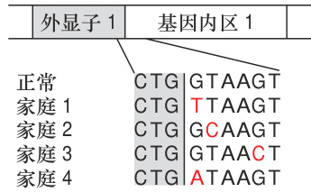  

a.在所示序列上游的外显子1中通常不存在ATG序列。皮肤特异性mRNA的哪一部分对应于外显子1?b.基因表达的哪些方面可能最直接受到这些突变的影响？c.这些突变更可能导致功能丧失还是功能获得？  

46.一种叫做SCN9A的人类基因中极其罕见的突变的纯合子，对疼痛完全不敏感（先天性疼痛不敏感或CPA）和完全缺乏嗅觉（嗅觉丧失）。SCN9A基因编码一种钠通道蛋白，该蛋白是将身体中特定神经的电信号传递到大脑所需的。感觉不到疼痛是一种危险的情况，因为人们无法感觉到受伤。  

SCN9A基因有26个外显子，编码1977个氨基酸的多肽，在3个不同的系谱中进行血缘交配，导致个体出现CPA嗅觉丧失。在家族1中，外显子15中G到A的转变产生了898个氨基酸的截短蛋白质；在家族2中，单个碱基的缺失导致766个氨基酸的多肽;而在家族3中，外显子10的C到G颠换产生458个氨基酸的蛋白质。  

a.假设三种SCN9A突变中的每一种是如何影响基因结构的：为什么每种情况下都会产生截断的蛋白质？  

b.这些突变等位基因是如何导致功能丧失或功能获得的，它们是无定形的、超形态的、亚效的、新形态的，还是反效的？  
c.用分子术语解释为什么CPA嗅觉丧失是一种隐性病症？  

47.在第7章的习题21中了解到，神经退行性疾病ALS可能是由称为C9ORF72的基因的可读框（但在第一个内含子内）之外的六核苷酸重复区（ $5^{\prime}.$ GGGGCC- $.3^{\prime}$ 的扩增引起的。虽然正常的C9ORF72等位基因有2个C23拷贝的六核苷酸重复单位，但显性致病等位基因有数百甚至数千个拷贝。  

研究人员观察到，C9ORF72致病等位基因的第一个内含子不仅从DNA的正常模板链转录，而且也从非模板链转录。更不寻常的是，这两种类型的重复区转录物在所有6个阅读框中以一种不依赖AUG的方式被翻译，这一过程称为重复相关的非ATG翻译，或RAN翻译。这些发现导致了这样的假设：由重复序列产生的蛋白质可能对ALS有贡献。  

a.什么多肽是由重复区转录物制成的？  
b.根据RAN翻译假说，为什么致病的C9ORF72等位基因对正常等位基因为显性？  
c.如果它们是无定形的、亚形态的、超形态的、新形态的或反形态的，你将如何分类它们导致功能丧失或功能增益的突变等位基因（注意：可能有多个答案）。  

48.当携带met营养缺陷型突变的单倍体酵母培养物的100万个细胞铺在缺乏甲硫氨酸（met）的培养皿上时，有5个菌落生长。你可以预期，在缺乏甲硫氨酸的培养基上，原来的met突变被逆转（通过碱基改变回到原来的序列）的细胞会生长，但其中一些明显的逆转可能是由于不同基因中的突变以某种方式抑制了原来的met突变。你如何能够确定你的5个菌落中的突变是由于原始met突变的精确回复，还是由于另一个染色体上的基因产生了抑制突变?  

49.为什么Tyr tRNA合成酶的无义抑制因子tRNA带有酪氨酸，尽管它有一个突变的不能识别酪氨酸密码子的反密码子？（提示：参见图8.19）  

50.突变的B.adonis细菌具有插人谷氨酰胺（Gln）以匹配UAG（但不是其他无义）密码子的无义抑制因子tRNA。该物种不会将摆动位置C残基修饰为 $\operatorname{k}^{2}\mathbf{C}$ 也没有tRNAP（见习题57）。  

基因的模板链的序列被改变以产生抑制子？c.野生型B.adonis细胞中可能存在的tRNAG"基因的最小数目是多少？描述相应的反密码子。  

51.你正在研究一种细菌基因的突变，该基因编码一种其氨基酸序列已知的酶，在野生型蛋白中，脯氨酸是来自氨基末端的第5个氨基酸。在一个非功能性酶的突变体中，你在第5位发现了一个丝氨酸。你对这个突变体进行进一步的诱变并回收三种不同的菌株。菌株A在第5位具有脯氨酸，其作用与野生型菌株相似。菌株B在第5位具有色氨酸，并且也像野生型一样起作用。菌株C在任何温度下都没有可检测到的酶功能，你不能回收任何类似酶的蛋白质。诱变菌株C并回收一株具有酶功能的菌株（C-1）。C-1中负责酶功能恢复的第二个突变不在酶基因座上。  

a.在这个位置野生型基因的两条链的核苷酸序列是什么？  
b.为什么菌株B具有野生型表型？为什么5位的丝氨酸的原始突变体缺乏功能？  
c.C株突变的性质是什么？  
d.C-1中出现的第二个突变是什么？  

52.另一类抑制突变（本章没有描述）是抑制错义突变的突变。  

a.为什么携带这种错义抑制突变的细菌菌株通常比携带无义抑制突变的菌株生长得更慢？  
b.在编码基因表达所需的成分的基因中，你能想象出什么其他类型的突变，使这些基因会抑制蛋白质编码基因中的错义突变？  

53.本章没有描述的另一类抑制突变是tRNA基因中的突变，可以抑制移码突变。对于能够抑制涉及插人单个碱基对的移码突变的tRNA来说，这是真的吗？  

54.已知至少有一种无义抑制因子tRNA可以抑制多种类型的无义密码子。  

a.这种抑制性tRNA的反密码子是什么?  
b.它会抑制哪些终止密码子?  
c.这种tRNA是否也可能起到错义突变抑制因子的作用？  

55.一位研究者想要研究细菌中的UAG无义抑制突变。在一种细菌中，她能够选择两种不同的这种类型的突变体，一种在tRNA"基因中，另一种在 $t R N A^{G l n}$ 基因中，但是在另一种细菌中，即使经过非常广泛的努力，她也无法获得任何这样的无义抑制突变。什么可以解释这两个物种之间的区别？  

56.图8.8中描述的Brenner的 $m$ 突变噬菌体（ $m^{1}{\sim}m^{6}$ )在抑制子（ $s u^{-}$ ）突变细菌中生长时被抑制；它们产生了像野生型M蛋白一样发挥功能的全长M蛋白。a.你认为什么基因是su细菌中的突变体?b.当 $m^{-}$ 噬菌体在 $s\bar{u}^{-}$ 细菌菌株中繁殖时，并非所有由突变 $m$ 等位基因产生的蛋白质都与野生型M蛋白相同。它们有何不同？  

57.在某些细菌种类中，有时称为氨基酸22的吡咯赖氨酸（Pyl）通过不寻常的遗传密码的使用而被整合到多肽中：Pyl由某些稀有基因的可读框中间的UAG三联体指定。这些细菌具有吡咯赖氨酸tRNA合成酶，其将Pyl连接至具有反密码子 $\cdot5^{\prime}$ CUA $3^{\prime}$ 的tRNA（见附图）。为了将Pyl掺人到蛋白质中，负责Pyl的tR-NA必须在翻译终止前到达核糖体。  

a.解释Pyl规范的机制与硒代半胱氨酸（Sec）掺人的机制不同的两种方式。  

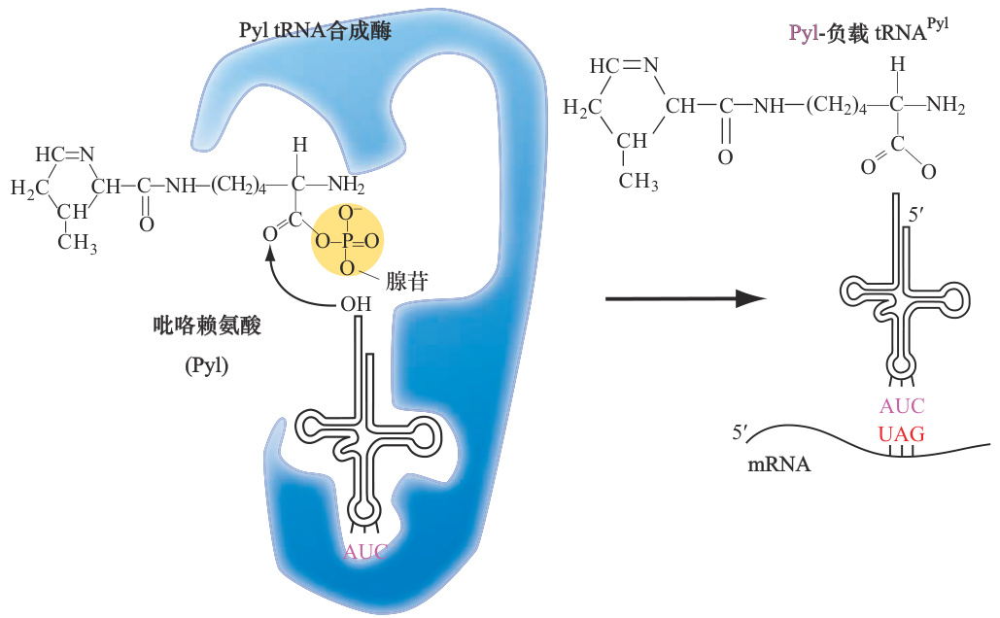  
习题57的图  

b.Pyl规范的机制如何类似于无意义抑制？（见图8.34）  

58.刀豆氨酸是一种类似于精氨酸的氨基酸（见附图），一般由一些植物合成。通常，在不产生刀豆氨酸、精氨酸氨酰tRNA合成酶的植物或动物中不能区分刀豆氨酸和精氨酸，所以tRNA^r能够识别负载刀豆氨酸。在蛋白质中掺人刀豆氨酸代替精氨酸会引起错误折叠，破坏蛋白质的结构和功能。  

a.你能想到为什么植物会进化出制造刀豆氨酸的能力吗？  

b.你认为植物如何使刀豆氨酸消除其毒性?  

c.一种特殊的藤蔓豆科植物Dioclea megacarpa,能够制造刀豆氨酸，但仍然有单一的昆虫捕食者—甲虫Caryedes brasiliensis。甲虫将卵放在藤蔓成熟的果实上，孵化后，甲虫幼虫在果实中生活，直至成熟为成虫。你认为甲虫是如何逃避刀豆氨酸的毒性的？  

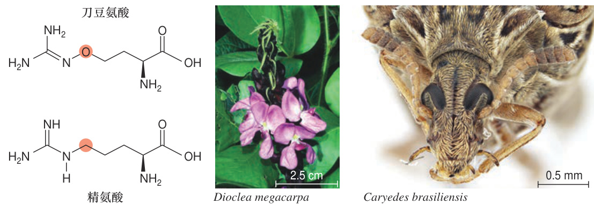  
(中） $\copyright$ Mark W. Skinner, hosted by the USDA-NRCS PLANTS Database; (右 ）来源: Sarah McCaffrey/Museum Victoria, http://www.padil.gov.au/ pests-and-diseases/pest/main/142145/41386 CC-BY  