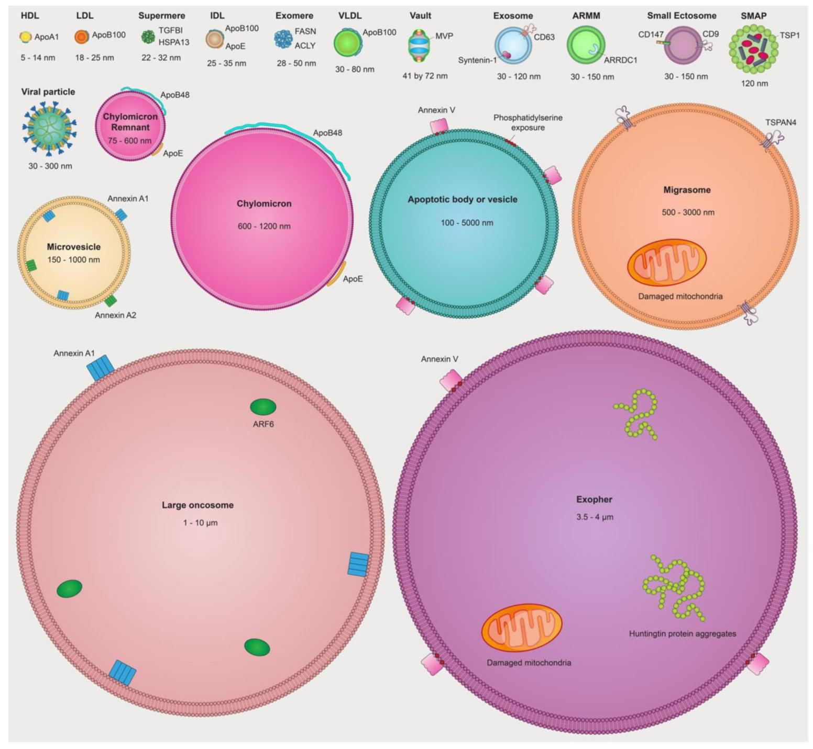

## 细胞外囊泡类型与生物发生

根据起源和生物发生机制，不同类型的 EVs 已被分类（图 2）。

已知至少存在三种主要的生物发生模式：
- 凋亡 EVs（称为凋亡小体和凋亡囊泡）由凋亡细胞的碎片化产生；
- 胞外体（ectosomes）通过质膜直接向外出芽形成；
- 外泌体（exosomes）则通过内体区室的向内出芽形成，并最终与质膜融合释放。

鉴于 EV 类型的多样性以及许多情况下其生物发生机制的不确定性，国际细胞外囊泡协会（MISEV）采取了一种实用的分类方法，将 EVs 分为 “大 EVs”（>200 nm）和 “小 EVs”（<200 nm）然而，提醒研究界关注不同类型的 EVs 和非囊泡细胞外纳米颗粒（NVEPs）以及这些细胞外颗粒的最新研究进展，不仅有用且十分及时。

### 外泌体

外泌体的形成始于内体，晚期内体的限制膜向内出芽，在**多泡内体（multivesicular endosome, MVE）** 内生成**腔内囊泡（intraluminal vesicles, ILVs）**。这种向内出芽的过程导致内吞的跨膜蛋白重新定向 —— 其胞外结构域朝外（具备信号传导能力），而胞内尾部则朝向 ILV 内部及其包裹的货物。当 MVE 与质膜融合时，ILVs 作为 30-150 nm 的外泌体释放到细胞外空间 。**内体分选转运复合体（endosomal sorting complex required for transport, ESCRT）** 机制在 MVE 中将蛋白质分选到 ILVs 的过程中至关重要，因此是外泌体形成的关键。然而，ESCRT 及其辅助蛋白（如 TSG101、ALIX 和 VPS4）也参与质膜的向外出芽过程，包括**囊泡释放**和**病毒释放** 。

另一种参与外泌体形成和蛋白质装载的蛋白 Syntenin-1 ，在小 EV 样本中高度富集，但在大 EV 样本中也可能存在。同样，尽管 CD63、CD81 和 CD9 等四跨膜蛋白（tetraspanin, TSPAN）在外泌体中显著富集 ，并长期被用作外泌体的标记蛋白，但越来越多的研究表明，含 TSPAN 的小 EV 可能直接从质膜出芽，根据其生物发生机制应归类为胞外体 / 微泡（ectosomes/microvesicles）。