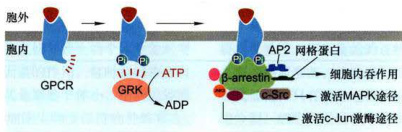

# 细胞信号转导  

## 第一节细胞通信与信号转导  

细胞通信（cell communication）是指细胞产生的胞外信号与靶细胞表面相应的受体结合，引发受体构象改变而激活，进而导致细胞内信号转导通路的建立，最终调解靶细胞的代谢、结构功能或基因表达，并表现为靶细胞整体的生物学效应。细胞信号转导（signal transduction）是实现细胞间通信的关键过程，它是协调细胞功能，控制细胞生长和分裂、组织发生与形态建成所必需的，也是细胞感知并应对外界环境刺激而进行生理学反应的基础。细胞内信号通路在演化上是高度保守的。  
### 一、细胞通信  

细胞通信可概括为三种类型： (1) 信号细胞通过分泌==**胞外化学信号**==进行细胞间通信，这是多细胞生物普遍采用的通信方式； (2) ==**细胞间接触**==依赖性通信（contact-dependentsignaling），细胞直接接触，通过信号细胞跨膜信号分子（配体）与相邻靶细胞表面受体相互作用；(3) 动物相邻细胞间形成==**间隙连接**==（gapjunction）、植物细胞间通过胞间连丝（plasmodesma）使细胞间相互沟通，通过交换小分子来实现代谢偶联或电偶联，从而实现功能调控。  

信号细胞分泌胞外信号，按其对靶细胞发挥效应的空间距离和作用方式，又可分为： 
- **(1) 内分泌（endocrine）**，在动物中由内分泌细胞分泌胞外信号分子（如激素），通过血液或其他细胞外液运送到体内各相应组织，作用于靶细胞而发挥作用（图11-1A）。 
- **(2)旁分泌（paracrine）**，细胞通过分泌局部化学介质到细胞外液中，经过局部扩散作用于邻近靶细胞而发挥作用（图11-1B），在多细胞生物中调节发育的许多生长因子往往是通过短距离而起作用的；旁分泌方式对创伤或感染组织刺激细胞增殖以恢复功能也具有重要意义。
- **(3)自分泌（autocrine）**，释放信号分子的细胞也是发挥效应的靶细胞，即对自身分泌的信号分子产生反应（图11-1C）。自分泌信号常存在于病理条件下，如肿瘤细胞合成并释放生长因子刺激细胞自身，导致肿瘤细胞的增殖；此外，通过分泌信息素（pheromone）传递信息也属于通过化学信号进行细胞间通信，作用于同类的其他个体。
- **(4)突触信号传递（synapticsignaling）**，通过化学突触传递神经信号（图11-1D），从作用范围来讲，也当属短距离局部作用，当神经细胞接受刺激后，神经信号以动作电位的形式沿轴突快速（ $100~\mathrm{{m/s}}^{\prime}$ 传递至神经末梢，电压门控的 $\mathrm{Ca}^{2*}$ 通道将电信号转换为化学信号，即刺激突触前化学信号（神经递质或神经肽）小泡的分泌，在不到 $1\mathrm{ms}$ 的时间内化学信号通过扩散经过相距不足$100~\mathrm{{nm}}$ 的突触间隙到达突触后膜，再通过后膜上配体门控通道将化学信号转换回电信号，实现电信号一化学信号一电信号的快速转导。  

细胞间另一种通信方式是接触依赖性通信，细胞直接接触而无需信号分子的释放，通过信号细胞质膜上的信号分子与靶细胞质膜上的受体分子相互作用来介导细胞间的通信（图11-1E）。这种通信方式包括细胞-细胞黏着、细胞-基质黏着等，这种接触依赖性通信在胚胎发育过程中对组织内相邻细胞的分化命运具有决定性影响。在胚胎发育过程中，部分胚胎上皮细胞层将发育成神经组织。最初相邻的上皮细胞是彼此相同的，但在发育过程中，某些单个上皮细胞通过独立分化成为神经细胞，而与其相邻的周边细胞则受到抑制保持非神经细胞状态。这是因为预分化形成神经细胞的细胞通过膜结合的抑制性信号分子（称为Delta）与其相接触的周边细胞的膜受体（Notch，见Notch信号通路）相互作用，阻止它们也分化为神经细胞。控制这一过程的信号是通过细胞间接触而传递的。这类膜表面的信号分子与受体基本类似，它们所介导的信号转导机制也基本相同。在接触依赖性通信缺陷的突变体中，有些细胞类型（如神经细胞）会过量发生。    

  

  

>图11-1不同类型的细胞间通信方式 ;A.内分泌：由内分泌腺产生的激素，分泌进入血液循环，作用于相应的靶器官。B.旁分泌：信号细胞分泌局部化学介质释放到细胞外液中，作用于邻近的靶细胞，其作用距离只有几微米。C.自分泌：细胞对其自身分泌的信号分子起反应。D.突触信号传递：神经细胞与靶细胞之间的化学突触通信，突触结构电镜照片来自人脑杏仁体（李伯勤惠赠）。E.细胞间接触依赖性通信：信号细胞质膜上结合蛋白（信号分子）直接与相邻靶细胞的表面受体相互作用。细胞间接触依赖性的信号传递需要细胞质膜与细胞质膜之间彼此直接接触。  

### 二、细胞的信号分子与受体  

#### （一）细胞的信号分子  
信号分子（signalmolecule）是细胞的信息载体，种类繁多，包括化学信号诸如各类激素、局部介质（localmediator）和神经递质（neurotransmitter）等，以及物理信号诸如声、光、电和温度变化等。各种化学信号根据其性质通常可分为四类：
- **(1)气体性信号分子（gaseoussignalmolecule）**，包括NO、CO，可以自由扩散，进入细胞直接激活效应酶（鸟苷酸环化酶）产生第二信使（cGMP），参与体内众多的生理过程，影响细胞行为。
- **(2)疏水性信号分子**，主要是留类激素和甲状腺素，是血液中长效信号（longlastingsignal），这类亲脂性分子小、疏水性强，可穿过细胞质膜进入细胞，与细胞内核受体（nuclearreceptor）结合形成激素一受体复合体，调节基因表达。
- **(3)亲水性信号分子**，包括神经递质、局部介质和大多数蛋白质类激素，它们不能透过靶细胞质膜，只能通过与靶细胞表面受体结合，经信号转换机制，在细胞内产生第二信使或激活蛋白激酶或蛋白磷酸酶的活性，引起细胞的应答反应。 
- **(4)膜结合信号分子**，表达在细胞质膜上的信号分子，通过与靶细胞质膜上的受体分子相互作用，引起细胞应答。表11-1列出了一些激素、局部介质、神经递质和接触依赖性信号分子（膜结合信号分子）。  

表11-1信号分子举例  
<html><body><table><tr><td>信号分子</td><td>合成/分泌位点</td><td>化学性质</td><td>生理功能</td></tr><tr><td colspan="4">激素：</td></tr><tr><td>肾上腺素</td><td>肾上腺</td><td>酪氨酸的衍生物</td><td>升高血压、加快心律和增加代谢</td></tr><tr><td>皮质醇</td><td>肾上腺</td><td>类固醇（胆固醇衍生物）</td><td>影响多数组织中蛋白质、糖类和脂质代谢</td></tr><tr><td>雌二醇</td><td>卵巢</td><td>类固醇（胆固醇衍生物）</td><td>诱导和维持雌性第二性征</td></tr><tr><td>胰高血糖素</td><td>胰岛α细胞</td><td>肽</td><td>刺激葡萄糖合成、糖原降解和脂肪分解（如肝细胞和脂 肪细胞）</td></tr><tr><td>胰岛素</td><td>胰岛β细胞</td><td>蛋白质</td><td>刺激肝细胞葡萄糖摄取、蛋白质合成和脂质合成</td></tr><tr><td>睾丸酮</td><td>睾丸</td><td>类固醇（胆固醇衍生物）</td><td>诱导和维持雄性第二性征</td></tr><tr><td>甲状腺素</td><td>甲状腺</td><td>酪氨酸的衍生物</td><td>刺激多种细胞的代谢</td></tr><tr><td colspan="4">局部介质：</td></tr><tr><td>表皮生长因子（EGF）</td><td>多种细胞</td><td>蛋白质</td><td>刺激上皮细胞等多种细胞的增殖</td></tr><tr><td>血小板衍生生长因子 (PDEF)</td><td>多种细胞（包括血小板）</td><td>蛋白质</td><td>刺激多种细胞的增殖</td></tr><tr><td>神经生长因子（NGF）</td><td>各种神经支配的组织</td><td>蛋白质</td><td>促进某类神经细胞的存活：促进神经细胞轴突的生长</td></tr><tr><td>组胺</td><td>肥大细胞</td><td>组氨酸衍生物</td><td>扩张血管、增加渗透，有助发炎</td></tr><tr><td>一氧化氨（NO）</td><td>神经细胞、血管内皮细胞</td><td>可溶性气体</td><td>引起平滑肌细胞松弛：调节神经细胞活性</td></tr><tr><td colspan="4">神经递质：</td></tr><tr><td>乙酰胆碱</td><td>神经末梢</td><td>胆碱衍生物</td><td>在许多神经-肌肉突触和中枢神经系统中存在的兴奋</td></tr><tr><td>Y-氨基丁酸（GABA）神经末梢</td><td></td><td>谷氨酸衍生物</td><td>性神经递质 中枢神经系统中存在的抑制性神经递质</td></tr><tr><td colspan="4">接触依赖性信号：</td></tr><tr><td>Delta</td><td>预定神经细胞、其他胚胎细胞</td><td>跨膜蛋白</td><td>抑制相邻细胞以与信号细胞相同的方式分化</td></tr></table></body></html>  

#### （二）受体  

受体（receptor）是一类能够识别和选择性结合某种配体（信号分子）的分子，**已经鉴定的绝大多数受体都是蛋白质且多为糖蛋白，少数受体是糖脂**（如霍乱毒素受体和百日咳毒素受体），**有的受体是糖蛋白和糖脂组成的复合物**（如促甲状腺素受体）。

根据靶细胞上受体存在的部位，可将受体区分为细胞内受体（intracellularrecepor）和细胞表面受体（cell-surfacereceptor）。细胞内受体位于细胞质基质或核基质中，主要识别和结合小的脂溶性信号分子，如留类激素、甲状腺素、维生素D和视黄酸（retinoicacid），以及细胞或病原微生物的代谢产物、结构分子或者核酸物质；细胞表面受体主要识别和结合亲水性信号分子，包括分泌型信号分子（如神经递质、多肽类激素、生长因子）或膜结合型信号分子（细胞表面抗原、细胞表面黏着分子等）。

根据信号转导机制和受体蛋白类型的不同，细胞表面受体又分属三大家族（图11-2）：  
- （1）离子通道偶联受体（ionchannel-coupledreceptor），是指受体本身既有信号（配体）结合位点，又是离子通道，其跨膜信号转导无需中间步骤，又称配体门控通道（ligand-gatedchannel）或递质门控通道(transmitter-gated channel)。  
- （2）G蛋白偶联受体（G-protein-coupledreceptor,GPCR)，是细胞表面受体中最大的家族，普遍存在于各类真核细胞表面，根据其偶联效应蛋白的不同，介导不同的信号通路。  
- （3）酶联受体（enzyme-linkedreceptor），一类是受体胞内结构域具有潜在酶活性，另一类是受体本身不具酶活性，而是受体胞内段与酶相联系。  

  
==受体至少有结合域和功能域==
不管哪种类型的受体，一般至少有两个功能域，结合配体的功能域及产生效应的功能域，分别具有结合特异性和效应特异性。细胞信号转导始于胞外信号分子与靶细胞表面受体的结合，受体结合特异性配体后而被激活，通过信号转导途径将胞外信号转换为胞内信号，结果诱发两类基本的细胞应答反应：一是改变细胞内特殊的酶类和其他蛋白质的活性或功能，进而影响细胞代谢功能或细胞运动等；二是通过修饰细胞内转录因子刺激或阻遇特异靶基因的表达，从而改变细胞特异性蛋白的表达量。一般而言，前一类应答反应比后一类反应发生得更快些。故前者称为快反应（短期反应），后者称为慢反应（长期反应）（图11-3）。  

对多细胞生物而言，一个细胞经常暴露于以不同状态存在的上百种不同信号分子的环境中，靶细胞对外界特殊信号分子的特异反应取决于细胞具有的相应受体。细胞对外界信号分子的敏感性既取决于细胞表面受体的数量，也取决于受体对配体的亲和性（affinity）。通常，用受体与配体的结合试验来检测和决定其亲和性和特异性。对于完整细胞或细胞片段，受体的检测和估量通常根据它与放射性或荧光标记的配体的结合来进行。受体与配体是通过非共价键结合的，因此受体与配体的结合可以描述为可逆性的双分子相互作用的热动力学平衡反应，以R和[R]分别表示自由受体及其浓度，以L和[L]分别表示自由配体及其浓度，以RL和分别表示受体-配体复合物及其浓度，则解离常数 $K_{\phi}$ 值表示受体与配体的结合亲和性高低，以下列公式表述：  

A.离子通道偶联受体。B.G蛋白偶联受体。C.酶联受体。  

  

  

图11-2三种类型的细胞表面受体  

  

  

图11-3通过细胞表面受体转导胞外信号诱发两类基本细胞应答反应—快反应和慢反应  

分子浓度。 $K_{\phi}$ 值低代表受体与配体的结合亲和性高，$K_{d}$ 值高代表受体与配体的结合亲和性低。例如有两个受体：对受体1而言， $K_{d}=10^{-7}$ mol/L，对受体2而言，$K_{d}{=}10^{-9}\mathrm{\mol{L}},$ 则同样配体对受体2比受体1具有较高的亲和性。  

受体与信号分子空间结构的互补性是二者特异性结合的主要因素，但并不意味受体与配体之间是简单的一对一关系。不同细胞对同一种化学信号分子可能具有不同的受体，因此，不同的靶细胞以不同的方式应答于相同的化学信号：例如同为乙酰胆碱，作用于骨骼肌细胞引起收缩，作用于心肌细胞却降低收缩频率，作用于唾腺细胞则引起分泌。另外也有不同的细胞具有相同的受体，当与同一种信号分子结合时，不同细胞对同一信号产生不同的反应，或同一细胞不同的受体应答于不同的胞外信号产生相同的效应；如肝细胞肾上腺素或胰高血糖素受体在结合各自配体被激活后，都能促进糖原降解而升高血糖。绝大多数细胞同时具有多种类型的受体，应答多种不同的胞外信号从而启动不同的生物学效应，如存活、分裂、分化或死亡。由此可见，靶细胞一是通过受体对信号结合的特异性，二是通过细胞本身固有的特征对外界信号产生反应。  

#### （三）第二信使与分子开关  
20世纪50年代，Sutherland通过体外实验证明，向肝组织切片加入肾上腺素时，可明显导致糖原磷酸化酶活性增加，并促进糖原分解为葡萄糖，从而导致cAMP的发现。70年代初提出激素作用的第二信使学说（secondmessengertheory），即胞外化学信号（第一信使）不能进入细胞，它作用于细胞表面受体，导致产生胞内信号（第二信使），从而引发靶细胞内一系列生化反应，最后产生一定的生理效应。第二信使的降解使其信号作用终止。Sutherland正是通过阐明cAMP的功能并提出第二信使学说而获得1971年诺贝尔生理学或医学奖。他的研究结果一直作为基本模式指导着细胞信号系统的研究，并不断发展完善。第二信使（secondmessenger）是指在胞内产生的非蛋白类小分子，其浓度变化（增加或减少）应答胞外信号与细胞表面受体的结合，调节细胞内酶和非酶蛋白质的活性，从而在细胞信号转导途径中行使携带和放大信号的功能。

目前公认的第二信使包括cAMP、cGMP、Ca²、二酰甘油（1，2-diacylglycerol,DAG）和1，4，5-三磷酸肌醇（1，4，5-inositol trisphosphate, $\Pi_{3},$ 等（图11-4）。1987年，以色列科学家M.Benziman发现细菌可将两分子的GTP通过3', $5\%$ 磷酸二酯键连接而成第二信使c-di-GMP，在细菌纤维素的合成中起重要调节作用。此后，c-di-GMP和c-di-AMP也被发现在细菌中起重要的第二信使作用。2012年，在霍乱弧菌中发现环化GMP-AMP（cGAMP，此为3，3'-cGAMP）对于调节细菌的趋化性及毒性有重要作用。2013年，我国科学家陈志坚发现哺乳动物细胞也能够生成cGAMP（此为2 $3^{\prime}.$ cGAMP），并作为第二信使激活天然免疫反应。  

在细胞信号转导过程中，除细胞表面受体和第二信使分子以外，还有两类在演化上保守的胞内蛋白，其功能作用依赖于细胞外信号的刺激，这两类蛋白在引发信号转导级联反应中起分子开关（molecular switch）的作用。  

  

（1）GTP酶分子开关调控蛋白GTP酶分子开关调控蛋白构成细胞内GTP酶超家族，包括三聚体GTP结合蛋白和如Ras和类Ras蛋白的单体GTP结合蛋白。所有GTP酶开关蛋白都有两种状态：一是与GTP结合呈活化（开启）状态，进而改变特殊靶蛋白的活性；二是与GDP结合，处于失活（关闭）状态。GTP酶开关蛋白通过两种状态的转换控制下游靶蛋白的活性。信号诱导的开关调控蛋白从失活态向活化态的转换，由鸟苷酸交换因子（guaninenucleotide-exchangefactor,GEF）所介导，GEF引起GDP从开关蛋白释放，继而结合GTP并引发开关调控蛋白（G蛋白）构象改变使其活化；随着结合的GTP的水解形成GDP和Pi，开关调控蛋白又恢复成失活的关闭状态：GTP的水解速率又被GTP酶促进蛋白（GTPase-acceleratingprotein，GAP）和G蛋白信号调节子（regulator ofGprotein-signaling,RGS）所促进，被鸟苷酸解离抑制物（guaninenucleotidedissociation inhibitor，GDI）所抑制（图11-5）。  

  

  

图11-44种常见的细胞内第二信使

  

（2）蛋白激酶/蛋白磷酸酶另一类最普遍存在的分子开关机制是通过蛋白激酶（proteinkinase）使靶蛋白磷酸化，通过蛋白磷酸酶（proteinphosphatase）使靶蛋白去磷酸化，从而调节靶蛋白的活性，E.G.Krebs和E.H.Fischer因为发现蛋白质磷酸化与去磷酸化作为一种生物学调节机制而获得1992年诺贝尔生理学或医学奖。虽然这两种反应基本上是不可逆的，但综合蛋白激酶和蛋白磷酸酶的活性，蛋白质磷酸化和去磷酸化可为细胞提供一种“开关”机制，使各种靶蛋白处于“开启”或“关闭”的状态（图11-6）。蛋白质磷酸化和去磷酸化可以改变蛋白质的电荷并改变蛋白质构象，从而导致该蛋白质活性的增强或降低，是细胞内普遍存在的一种调节机制，蛋白激酶和蛋白磷酸酶在几乎所有的信号通路中被普遍使用。在代谢调节、基因表达、周期调控中具有重要作用。据最近统计，人类基因组大约编码蛋白激酶560种，编码不同的蛋白磷酸酶有100种。在不同的细胞类型中，每种蛋白激酶在一套靶蛋白中磷酸化特殊的氨基酸残基，在动物细胞中有两种类型的蛋白激酶—一类是将磷酸基团加在酪氨酸残基的羟基上，称为酪氨酸激酶，另一类是将磷酸基团加在靶蛋白丝氨酸或/和苏氨酸残基的羟基上，称为丝/苏氨酸激酶；并且所有蛋白激酶还结合磷酸化残基周围的特异性氨基酸序列。这两种酶的靶蛋白的活性变化都是通  

  

  

图11-5GTP酶开关调控蛋白活化（开）与失活（关）的转换通过结合的GTP的水解，GTP酶开关蛋白由活化态转换为失活态，该过程受GAP和RGS的促进，受GDI的抑制：GTP酶开关蛋白的再活化被GEF的促进。  

  

  

图11-6靶蛋白磷酸化和去磷酸化是细胞调节靶蛋白活性的一个普遍机制  

  
在该图例中，当靶蛋白被磷酸化时活化，去磷酸化时失活，有些靶蛋白具有相反的变化模式。  

  

过蛋白激酶/蛋白磷酸酶开关调节的，并且具有靶蛋白特异性。  

  

(3）钙调蛋白 $\mathrm{Ca^{2*}}$ 作为胞内第二信使，在调控细胞对多种信号的应答反应中发挥基本作用，许多GPCR和其他类型的受体是通过影响细胞质 $\mathrm{Ca^{2+}}$ 浓度而发挥作用的。在细胞处于静息状态下，细胞质中游离${\mathrm{C}}{\mathrm{a}}^{2+}$ 浓度维持在亚微摩尔每升水平（约 $0.2~\upmu\mathrm{mol/L})$ .这是靠ATP驱动的钙泵持续工作的结果，即将游离$\mathrm{{Ca^{2*}}}$ 不断运出胞外和运进内质网和其他膜胞腔内；若细胞质中游离 $\mathrm{Ca^{2+}}$ 浓度的小量升高，便会诱发各类细胞反应，包括内分泌细胞激素的分泌、胰腺外分泌细胞消化酶的分泌和肌肉的收缩等。钙调蛋白（calmodulin，CaM）是细胞质中普遍存在的小分子蛋白，有148个氨基酸残基，每个CaM分子具有4个 ${\mathrm{Ca}}^{2*}$ 结合位点，它作为行使多种功能的分子开关蛋白介导多种 $\mathrm{Ca^{2+}}$ 的细胞效应，CaM可通过与 $\mathrm{{Ca^{2*}}}$ 的结合或解离而分别处于活化或失活的“开启”或“关闭”状态。形成的 $\mathrm{Ca^{2+}{-}C a M}$ 复合物可结合多种酶及其他靶蛋白，并修饰其活性。  

  

### 三、信号转导系统及其特性  

### （一）信号转导系统的基本组成及信号蛋白的相互作用  

  

通过细胞表面受体介导的信号通路通常由下列5个步骤组成（图11-7）： $\textcircled{1}$ 细胞表面受体特异性识别并结合胞外信号分子（配体），形成受体-配体复合物，导致受体激活。 $\textcircled{2}$ 由于激活受体构象改变，导致信号初级跨膜转导，靶细胞内产生第二信使或活化的信号蛋白。 $\textcircled{3}$ 通过胞内第二信使或细胞内信号蛋白复合物的装配，起始胞内信号放大的级联反应（signalingcascade)。 $\textcircled{4}$ 细胞应答反应。这种级联反应如果是通过酶的逐级激活，其结果可能改变细胞代谢活性；如果是通过表达基因调控蛋白，其结果可能影响发育：如果是通过细胞骨架蛋白的修饰，其结果则改变细胞形状或运动。 $\textcircled{5}$ 由于受体的脱敏（desensitization）或受体下调（down-regulation），终止或降低细胞反应。  

  

细胞信号转导系统是由细胞内多种行使不同功能的信号蛋白所组成的信号传递链。受体通过细胞内信号蛋白的相互作用而传播信号，这必然涉及信号蛋白之间靠何种机制保障彼此的精确联系。细胞内信号蛋白的相互作用是靠蛋白质模式结合域（modularbindingdomain）  

  

ShcA（C端具SH2结构域，N端具PTB结构域）、胰岛素受体底物（IRS）等： $\circledast$ 接头蛋白（adaptor），含单个SH2和多个SH3结构域，如哺乳类的生长素受体结合蛋白2（Grb2）等； $\textcircled{5}$ 调节蛋白（regulator），许多SH2蛋白家族成员具有调节功能，如STAT介导的细胞因子信号通路； $\textcircled{6}$ 转录因子。此外，人类基因组还大约编码253个SH3结构，结合富含脯氨酸序列（PXXP）。由于技术的进步和方法的完善，现在已有多种手段研究细胞内蛋白质-蛋白质之间的互作，为研究细胞内大分子互作及其复合物的组成提供了有力的工具，特别是包括人类在内的动物基因组序列的发现为研究细胞内分子间相互作用提供了条件。现在需要解决的问题是要利用计算学和统计学的原理来归纳已知的分子间相互作用信息，并且利用他们来推测未知分子间的相互作用，从而更深入地研究细胞的生命活动。此外还陆续发现许多其他蛋白质模式结构域及其结合基序的特异性（表11-2，图11-8）。  

  

  

图11-7细胞表面受体介导的细胞信号转导系统的组成  

  

所特异性介导的，多种模式结合域经多重相互作用极大地拓展了细胞内信号网络的多样性。这些模式结合域通常由 $40-120$ 个氨基酸残基组成，一侧有较浅凹陷的球形结构域、不具酶活性、但能识别特定基序或蛋白质上特定修饰位点、它们与识别对象的亲和性较弱，因而有利于快速和反复进行精细的组合式网络调控。SH2（Srchomology2domain）是研究蛋白质互作的原型模式结构域，由约100个氨基酸残基组成，其定义源于逆转录病毒癌蛋白（oncoprotein） $\mathrm{v}$ -Eps。具有SH2结构域的蛋白质家族，具有相似的三维结构，但每一成员可特异性结合围绕磷酸酪氨酸残基的氨基酸序列（图11-8）。  

  

1991年，进一步阐明了SH2结构域的基本功能，人类基因组大约编码115种SH2结构域，该蛋白质家族包括多种功能性成员： $\textcircled{1}$ 酶，含有一或两个与催化序列相联系的SH2结构域，如蛋白激酶或蛋白磷酸酶结构域、磷脂酶C、RasGAP结构域、Rho家族GEF结构域； $\textcircled{2}$ 癌蛋白和致病性互作（oncogenicproteinandpathogenicinteraction），如人慢性粒细胞白血病Bcr-Abl癌蛋白； $\textcircled{3}$ 锚定蛋白（dockingprotein），如哺乳类  

  

### （二）细胞内信号蛋白复合物的装配  

  

细胞内信号蛋白复合物的形成是信号蛋白间相互作用的结果，是实现细胞表面受体所介导的各种细胞内信号通路的重要结构基础。从细胞接受信号刺激到产生应答反应的过程中，信号蛋白复合物的形成有其重要生物学意义，即在时空上增强细胞应答反应的速度、效率和反应的特异性。概括起来，细胞内信号蛋白复合物的装配可能有三种不同策略：  

  

  

图11-8细胞内信号蛋白之间的相互作用是靠蛋白质模式结合域所特异性介导的示意图  

  

图中具有SH2结构域的蛋白质具有相似的三维结构，每一成员可特异性结合围绕磷酸酪氨酸残基的氨基酸序列。IRS为胰岛素受体底物。  

  

表11-2蛋白质模式结构域及其结合基序特异性  

  
  

<html><body><table><tr><td>结构域</td><td>结合基序特征</td><td>举例</td></tr><tr><td>SH2结构域</td><td>特异性结合磷酸酪氨酸残基（p-Tyr）</td><td>Src、Grb2、Shc、STAT</td></tr><tr><td>SH3结构域</td><td>结合富含脯氨酸序列（PXXP）和RXXK</td><td>Src、Nck</td></tr><tr><td>PTB结构域</td><td>结合NPXY基序</td><td>Shc、IRS1</td></tr><tr><td>PDZ结构域</td><td>识别膜蛋白C端4~5个氨基酸残基组成的短肽基序（通常最末端为 Val-COOH)</td><td>Dishevelled、FAP</td></tr><tr><td>WW结构域</td><td>结合富含脯氨酸基序（XPPXY）</td><td>Nedd4（E3泛素连接酶）、Smurf、Dystrophin</td></tr><tr><td>PH结构域</td><td>与肌醇磷脂结合，将蛋白质靶向质膜（PI（3,4）P、PI4，5）P、Pl（3,4,5）P）</td><td>Akt、Sos</td></tr><tr><td>FYVE结构域</td><td>与肌醇磷脂结合，将蛋白质靶向内体</td><td>EEA1、SARA (PI3P)</td></tr><tr><td>LIM结构域</td><td>识别基于转角的蛋白质基序</td><td></td></tr><tr><td>死亡结构域</td><td></td><td>Fas</td></tr></table></body></html>  

  

（1）细胞表面受体和某些细胞内信号蛋白通过与大的支架蛋白结合预先形成细胞内信号复合物，当受体结合胞外信号被激活后，再依次激活细胞内信号蛋白并向下游传递（图11-9A）。  

  

（2）依赖激活的细胞表面受体装配细胞内信号蛋白复合物，即表面受体结合胞外信号被激活后，受体胞内段多个氨基酸残基位点发生自磷酸化（autophosphorylation）作用，从而为细胞内不同的信号蛋白提供锚定位点，形成短暂的信号转导复合物分别介导下游事件（图11-9B）。  

  

（3）受体结合胞外信号被激活后，在邻近质膜上形成修饰的肌醇磷脂分子，从而募集具有PH结构域的信号蛋白，装配形成信号复合物（图11-9C）。  

  

### （三）信号转导系统的主要特性  

  

（1）特异性（specificity）细胞受体与胞外配体通过结构互补以非共价键结合，形成受体-配体复合物，简称具有“结合”特异性（bindingspecificity），受体因结合配体而改变构象被激活，介导特定的细胞反应，从而又表现出“效应器”特异性（effectorspecificity）。此外，受体与配体的结合具有饱和性和可逆性的特征。  

  

  

图11-9细胞内信号蛋白复合物装配的三种类型  

  

（2）放大效应（amplification）胞外信号分子（通常称为第一信使）与细胞表面受体结合，导致细胞内某些低分子量细胞内信号分子（称为第二信使）浓度的增加或减少（如 $\mathrm{Ca^{2*}}$ cAMP），例如肾上腺素在血液的浓度约 $10^{-10}\mathrm{mol/L}$ ，当与细胞表面受体（GPCR）结合，激活胞内效应酶（腺苷酸环化酶）产生第二信使cAMP，其浓度可以快速升高 $10\:000$ 倍达到 $10^{-6}\mathrm{mol/L}$ 转而与下游酶或其他蛋白质结合，修饰它们的活性，引发细胞内信号放大的级联反应，如果级联反应主要是通过酶的逐级激活，结果将改变细胞代谢活性。最常见的级联放大作用是通过蛋白质磷酸化实现的。  

  

（3）网络化与反馈（feedback）调节机制每一个细胞都处于错综复杂的信号环境之中，包括各种激素、生长因子、相邻细胞的表面蛋白，甚至危险信号等。这些信号分子相互作用，构成细胞信号的网络，激活不同的转录因子并调节不同的蛋白质表达，最终使细胞产生一种有条理的生物学反应。细胞信号网络中的不同信号通路之间的相互作用，主要通过一系列正反馈（positivefeedback）和负反馈（negativefeedback）来校正反应的速率和强度，把外界纷繁复杂的，甚至相互矛盾的信号进行归纳整理。细胞信号系统网络化及反馈调节是细胞生命活动的重要特征。  

  

（4）整合作用（integration）多细胞生物的每个细胞都处于细胞“社会”环境之中，大量的信息以不同组合的方式调节细胞的行为。因此，细胞必须整合不同的信息，对细胞外信号分子的特异性组合作出程序性反应，甚至作出生死扶择，这样才能维持生命活动的有序性。  

  

## 第二节G蛋白偶联受体及其介导的信号转导  

  

G蛋白偶联受体（GPCR）是细胞表面受体中最大的家族。统计表明，在人类基因组中有总数大约900个成员，其中有一半的基因被认为主要是编码嗅觉受体，尽管许多天然相关配体尚未被鉴定。现有超过 $30\%$ 的临床处方药物是针对GPCR所介导信号通路为靶点研制和开发的，可见它与人类的健康密切相关。  

  

### 一、G蛋白偶联受体的结构与作用机制  

G蛋白是三聚体GTP结合调节蛋白（trimericGTP-bindingregulatoryprotein）的简称，位于质膜内胞浆一侧，由α、β、三个亚基组成， $\upbeta$ 和亚基以异二聚体形式存在，α和py亚基分别通过共价结合的脂分子锚定在质膜上。  

  

GPCR所介导的信号转导通路均具有如下共同元件：  

  

（1）所有GPCR均具有7次跨膜的 $\mathrm{a}$ 螺旋结构，即都含有7个疏水肽段形成的跨膜 $\upalpha$ 螺旋区和相似的三维结构，N端在细胞外侧，C端在细胞胞质侧。每个跨膜 $\mathfrak{a}$ 螺旋由 $22-24$ 个氨基酸残基组成疏水核心区，其中螺旋5和6之间的胞内环状结构域C3和C4（C末端），对于受体与G蛋白之间的相互作用具有重要作用（图11-10）。推测配体与受体的结合会引起H5和H6螺旋的彼此相对移动，结果导致C3环构象改变使之容许结合并激活G蛋白 $\mathfrak{a}$ 亚基。  

  

GPCR介导很多胞外信号的细胞应答，GPCR家族包括多种对蛋白或肽类激素、局部介质、神经递质和氨基酸或脂肪酸衍生物等配体识别与结合的受体，以及哺乳类嗅觉、味觉受体和视觉的光激活受体（视紫红质）。在线虫基因组 $19000$ 个基因中大约编码 $1\ 000$ 种不同的GPCR。尽管与这类受体相互作用的信号分子多种多样，受体的氨基酸序列也千差万别，但从已分析过的GPCR的结果表明，所有真核生物从单细胞酵母到人类都具有相似的七次跨膜结构。许多GPCR的亚族的这种结构特征，在演化上是高度保守的；同时，不同的GPCR亚型也可以结合相同的激素，产生不同的的细胞效应。  

  

（2）均偶联一个三聚体G蛋白，其功能是作为分子开关，以促成该蛋白在“活化”与“失活”两种状态之间转换。三聚体G蛋白 $\upalpha$ 亚基本身具有GTP酶活性，是分子开关蛋白。当配体与受体结合，三聚体G蛋白解离，并发生GDP与GTP交换，游离的 $\mathrm{Ga}$ GTP处于活化的开启状态，导致结合并激活效应器蛋白，从而传递信号：当 ${\mathrm{G}}\alpha$ -GTP水解形成Gα-GDP时，则处于失活的关闭状态，终止信号传递并导致三聚体G蛋白的重新装配，恢复系统进人静息状态（图1-11）。有些信号途径，效应器蛋白是离子通道，其活性受游离的Gβy亚基调节并激活。由于阐明了胞外信号如何转换为胞内信号的机制，对G蛋白发现作出重要贡献的A.G.  

  

  

图11-10G蛋白偶联受体的结构图  

  

A.GPCR的结构模式图。所有这类受体在膜上都具有相同的取向，并含有7次跨膜α螺旋区（左至右依次为H1一H7），4个细胞外肽段（左至右依次为E1-E4）：4个细胞内肽段（左至右依次为C1-C4），E4环结合胞外信号（配体），C3环结构域和有些受体的C2环，是与G蛋白相互作用的位点，配体的结合引起受体胞内域活化G蛋白。B.人β肾上腺素GPCR晶体结构（基于PDB数据库2RH1结构绘制）。  

  

Gilman和M.Rodbell，因此荣获1994年诺贝尔生理学或医学奖。  

  

表11-3列出了哺乳类三聚体G蛋白的主要种类及其效应器。  

  

（3）均具有与质膜结合的效应器蛋白（effectorprotein），细胞表面通过G蛋白偶联的受体有多种效应器蛋白，包括离子通道蛋白、腺苷酸环化酶（adenylylcyclase）和磷脂酶C（phospholipaseC，PLC）等。不同的G蛋白被不同的GPCR激活，继而调控不同的效应器蛋白，分别产生不同的细胞效应。包括Gy激活$\mathrm{K}^{*}$ 通道效应器，改变膜电位；激活或抑制腺苷酸环化酶，改变cAMP第二信使的浓度；激活磷脂酶C，产生由膜脂（磷脂酰肌醇）衍生而来的1，4，5-三磷酸肌醇（inositol1，4，5-trisphosphate, $\mathrm{IP}_{3}$ 和二酰甘油（1，  

  

  

  

图11-11与G蛋白偶联受体相联系的效应蛋白的激活普遍机制  

  

三聚体G蛋白解离活化的步骤如下：1.配体（激素）结合诱发受体构象改变：2.活化受体与Gα结合：3.活化的受体引发Gα构象改变，致使GDP与G蛋白解离；4.GTP与Gα结合，引发Gα与受体和Gβy解离：5.配体-受体复合物解离，Gα结合并激活效应蛋白：6.GTP水解成GDP，引发Gα与效应蛋白解离并重新与Gβy结合，恢复到三聚体G蛋白的静息状态。  

  

表11-3哺乳类三聚体G蛋白的主要种类及其效应器  

  
  

<html><body><table><tr><td>Ga类型</td><td>结合的效应器</td><td>第二信使</td><td>受体举例</td></tr><tr><td>Ga</td><td>腺苷酸环化酶</td><td>CAMP（升高）</td><td>β肾上腺受体，高血糖素受体，血中复合胺受体，后叶加压素受体</td></tr><tr><td>Ga</td><td>腺苷酸环化酶</td><td>CAMP（降低）</td><td>α肾上腺受体</td></tr><tr><td></td><td>K通道（Gβy激活效应器）</td><td>膜电位改变</td><td>M型乙酰胆碱受体</td></tr><tr><td>Gaa</td><td>腺苷酸环化酶</td><td>CAMP（升高）</td><td>噢觉受体（鼻腔）</td></tr><tr><td>Gα</td><td>磷脂酶C</td><td>IP,DAG（升高）</td><td>α肾上腺受体</td></tr><tr><td>Gα</td><td>磷脂酶C</td><td>IP，DAG（升高）</td><td>乙酰胆碱受体（内皮细胞）</td></tr><tr><td>Ga</td><td>CGMP磷酸二脂酶</td><td>CGMP（降低）</td><td>视杆细胞中视紫红质（光受体）</td></tr></table></body></html>  

  

2-diacylglycerol，DAG）两种关键第二信使。  

  

（4）在信号通路中均具有参与反馈调节或导致受体脱敏的蛋白。细胞对外界信号作出适度的反应既涉及信号的有效刺激和信号转导的启动，也依赖于信号的解除与细胞反应的终止，特别值得注意的是信号的解除与终止和信号的刺激与启动对于确保靶细胞对信号的适度反应来说同等重要。解除与终止信号的重要方式是在信号浓度过高或细胞长时间暴露某一种信号刺激的情况下，细胞会以不同的机制使受体脱敏，这种现象又称之为适应（adaptation），这是一种负反馈调控机制。  

  

### 二、G蛋白偶联受体所介导的细胞信号通路  

  

由GPCR所介导的细胞信号通路按其效应器蛋白的不同，可区分为三类： $\textcircled{1}$ 激活离子通道的GPCR；$\textcircled{2}$ 激活或抑制腺苷酸环化酶，以cAMP为第二信使的GPCR; $\textcircled{3}$ 激活磷脂酶C，以 $^{1,4,5-}$ 三磷酸肌醇和二酰基甘油作为双信使的GPCR。该类信号通路由于配体的多样性，效应蛋白及其第二信使的不同，所介导细胞反应也是多方面的，既包括调控离子通道开启而影响膜电位的变化，又包括改变酶类或其他蛋白质活性而调控细胞代谢，还参与对某些基因表达的调控。  
#### （一）激活离子通道的G蛋白偶联受体所介导的信号通路  
当受体与配体结合被激活后，通过偶联G蛋白的分子开关作用，调控跨膜离子通道的开启与关闭，进而调节靶细胞的活性，这是最简单的细胞对信号做出的应答反应，也是神经冲动传导最基本的反应。如心肌细胞的M型乙酰胆碱受体和视杆细胞的光敏感受体，都属于这类调节离子通道的GPCR。  
##### 1.心肌细胞上M型乙酰胆碱受体激活G蛋白开启K通道  

  

M型乙酰胆碱受体（muscarinic acetylcholinereceptor）在心肌细胞膜上与 $\mathrm{G}_{\mathrm{i}}$ 蛋白偶联，乙酰胆碱配体与受体结合使受体活化，导致 $\mathrm{G}_{i}\mathrm{a}$ 结合的GDP被GTP取代，引发三聚体G蛋白解离，使亚基得以释放，进而直接诱发心肌细胞质膜上相关的效应器 $\mathrm{K}^{*}$ 通道开启，随即引发细胞内 $\mathrm{K}^{\ast}$ 外流，从而导致细胞膜超极化(hyperpolarization），减缓心肌细胞的收缩频率（图-12）。该结果已被体外膜片钳（patch-clamping）实验所证实。许多神经递质受体是GPCR，有些效应器蛋白是$\mathrm{Na}^{*}$ 或 $\mathrm{K}^{+}$ 通道。神经递质与受体结合引发G蛋白偶联的离子通道的开放或关闭，进而导致膜电位的改变。  

##### 2.激活G蛋白偶联的光敏感受体诱发cGMP门控阳离子通道的关闭  

人类视网膜含有两类光受体（photoreceptor），负责视觉刺激的初级感受。视锥细胞的光受体与色彩感受相关，视杆细胞的光受体接受弱光刺激。视紫红质（rhodopsin）是视杆细胞G蛋白偶联的光受体，定位在视杆细胞外段上千个扁平膜盘上，三聚体 $\mathrm{G}_{\iota}$ 蛋白与视紫红质偶联，通常称之为传导素（transducin，简称$\mathrm{G}_{\imath})$ 。人类视杆细胞含有大约 $4\times10^{7}$ 个视紫红质分子。视紫红质分子即光敏感的GPCR，具有7次跨膜的典型结构，视紫红质组成视蛋白（opsin），并与光吸收色素（11-顺式视黄醛）共价连接。吸收光子后，转换为全反式视黄醛，从而引发视蛋白构象改变。  

如图11-13所示，在暗适应状态下的视杆细胞，高水平的第二信使cGMP保持cGMP门控非选择性阳离子通道的开放，光的吸收产生激活的视蛋白0（步骤1）：活化的视蛋白与无活性的GDP-G，三聚体蛋白结合并引发GDP被GTP置换（步骤2）： $\mathrm{G}_{\imath}$ 三聚体蛋白解离形成游离的 $\mathrm{G}_{t}\mathrm{\alpha}$ ，通过与cGMP磷酸二酯酶（PDE）抑制性 $\boldsymbol{\check{\upgamma}}$ 亚基结合导致PDE活化（步骤3）；同时引起亚基与催化性 $\upalpha$ 和 $\upbeta$ 亚基解离，由于抑制的解除，催化性α和β亚基使cGMP转换成GMP（步骤4）；由于胞质中cGMP水平降低导致cGMP从质膜cGMP门控阳离子通道上解离下来并致使阳离子通道关闭（步骤5），然后，膜瞬间超极化。  

  

图11-12心肌细胞上M型乙酰胆碱受体的活化与效应器 $\mathsf{K}^{*}$ 通道的开启的工作模型  

  

  

这类受体通过三聚体G蛋白与 $\kappa^{*}$ 通道相联系，乙酰胆碱的结合以常见的方式引发Gα亚基活化并与Gβy解离。在本例中，释放的Gβy亚基（而不是Ga-GTP）结合并打开 $\kappa^{*}$ 通道， $\mathsf{K}^{*}$ 通透性增加，使膜超极化，降低心肌细胞收缩频率。当与Gα结合的GTP水解形成GDP时，Gα-GDP重新与Gβy结合（图中未表示）。  

图11-13视杆细胞中G蛋白偶联的光受体（视紫红质）诱导的阳离子通道的关闭  

A.视杆细胞结构模式图。B.G蛋白偶联的光受体介导的信号反应：在盘膜上活化的单分子视蛋白可以活化500个Gα分子，每个Gα分子又活化cGMP磷酸二脂酶（PDE），这是视觉系统中信号放大的初级阶段：然后光诱导的cGMP的减少导致非选择性阳离子通道的关闭，当光刺激停止，cGMP又逐渐恢复到原来水平。  

#### （二）激活或抑制腺苷酸环化酶的G蛋白偶联受体  
在绝大多数哺乳类细胞，GPCR介导的信号通路遵循如图11-12所示的普遍机制。在该信号通路中，Gα的首要效应酶是腺苷酸环化酶，通过腺苷酸环化酶活性的变化调节靶细胞内第二信使cAMP的水平，进而影响信号通路的下游事件。这是真核细胞应答激素反应的主要机制之一。  

不同的受体-配体复合物或者刺激或者抑制腺苷酸环化酶活性，这类调控系统主要涉及5种蛋白质组分（图11-14）： $\textcircled{1}$ 刺激型激素的受体（receptorforsitimulatory hormone,R,)， $\textcircled{2}$ 抑制型激素的受体（receptorfor inhibitoryhormone,R,)， $\textcircled{3}$ 刺激型G蛋白(sitimulatoryG-protein, $\mathrm{G}_{s}$ ， $\textcircled{4}$ 抑制型G蛋白（inhibitoryG-protein，G）， $\textcircled{5}$ 腺苷酸环化酶。  

R和R均为7次跨膜的GPCR，但与之结合的胞外配体不同。已知R有几十种，包括肾上腺素β型受体、胰高血糖素受体、后叶加压素受体、促黄体生成素受体、促卵泡激素受体、促甲状腺素受体、促肾上腺皮质激素受体和肠促胰酶激素受体等；R有肾上腺素 $\alpha_{2}$ 型受体、阿片肽受体、乙酰胆碱M型受体和生长素释放抑制因子受体等。  

刺激型激素与相应受体R结合，偶联G（具刺激型α亚基，即 $\mathrm{G}_{s}\mathrm{\alpha}\mathrm{\alpha} $ ，刺激腺苷酸环化酶活性，提高靶细胞cAMP水平：抑制型激素与相应受体 $\mathbb{R}_{i}$ 结合，偶联 $\mathrm{G}_{i}$ （具抑制型 $\mathfrak{a}$ 亚基，即 $\mathrm{G}_{i}\mathrm{\alpha}_{a}$ ，但和 $\mathrm{G}_{\ast}$ 含相同的βy亚基），结果抑制腺苷酸环化酶活性，降低靶细胞cAMP水平。  

腺苷酸环化酶是分子质量为 $150\mathrm{~kDa}$ 的12次跨膜蛋白，胞质侧具有两个大而相似的催化结构域，跨膜区有两个整合结构域，每个含6个跨膜 $\mathfrak{a}$ 螺旋；人工制备包含 $\mathrm{G}_{\mathrm{s}}\mathrm{\alpha}_{\mathrm{~}}$ 、腺苷酸环化酶催化结构域的两个蛋白质片段的 $\mathrm{\boldsymbol{x}}$ 射线晶体学分析，已获得三维结构证明（图-15）。腺苷酸环化酶在 $\mathrm{Mg}^{2*}$ 或 $\mathrm{M}\mathfrak{n}^{2*}$ 存在条件下，催化ATP生成cAMP。在正常情况下细胞内cAMP的浓度小于 $\cdot10^{-6}\mathrm{mol/L}$ ，当腺苷酸环化酶被激活后，cAMP水平急剧增加，使靶细胞产生快速应答；在细胞内还有另一种酶即cAMP磷酸二酯酶，可降解cAMP生成 $5^{\prime}{\cdot}$ AMP,导致细胞内cAMP水平下降，而终止信号反应。cAMP浓度在细胞内的迅速调节是细胞快速应答胞外信号的重要基础。  

在多细胞动物各种以cAMP为第二信使的信号通路，主要是通过cAMP激活的蛋白激酶A（proteinkinaseA，PKA）所介导的。无活性的PKA是2个调节亚基（regulatorysubunit，R）和2个催化亚基（catalyticsubunit，C）组成的四聚体，在每个R亚基上有2个cAMP的结合位点，cAMP与R亚基结合是以协同方式（cooperativefashion）发生的，即第一个cAMP的结合会降低第二个cAMP结合的解离常数 $K_{d}$ 因此胞内cAMP水平的很小变化就能导致PKA释放C亚基并快速使激酶活化（图11-16）。通过激素引发的某些抑制物的解离导致酶的迅速活化是各种信号通路的普遍特征。绝大多数哺乳类细胞表达GPCR。虽然许多激素刺激这些受体导致PKA的激活，但是细胞应答反应可能只依赖于细胞表达的特殊PKA异构体和PKA底物。例如，肾上腺素对糖原代谢的细胞效应是通过cAMP和不同的激素-受体复合体，偶联不同的G蛋白G和G，含相同的βy亚基但不同的α亚基（Gα和Gα）]，导致Gα-GTP激活腺苷酸环化酶，而Gα-GTP抑制腺苷酸环化酶的活性。  

  

图11-14在脂肪细胞受激素诱导的腺苷酸环化酶的激活与抑制  

  

  

  

图11-15哺乳类腺苷酸环化酶的结构与该酶同Gα-GTP的相互作用  

A.哺乳类腺苷酸环化酶的结构示意图：12次跨膜蛋白，含2个胞质侧催化结构域，2个膜整合结构域（每个含6个跨膜α螺旋）。B.包含牛Gα、狗的V型腺苷酸环化酶和鼠的I型腺苷酸环化酶催化结构域的重组三维结构（基于PDB数据库1CJT结构绘制）。  

  

  

图11-16CAMP特异性地活化CAMP依赖的PKA，释放其催化亚基  

  

PKA所介导的，但主要限于肝细胞和肌细胞，它们表达与糖原合成和降解有关的酶。在脂肪细胞，肾上腺素诱导的PKA的激活促进磷脂酶的磷酸化和活性。磷脂酶的作用是催化三酰甘油水解生成脂肪酸和甘油。释放的脂肪酸进入血液并被其他组织（如肾、心和肌肉）细胞用作能源。然而，卵巢细胞（ovariancell）GPCR在某些垂体激素刺激下导致PKA活化，转而促进两种类固醇激素（雌激素和孕酮）的合成，这对雌性性征发育至关重要。虽然PKA在不同类型的细胞作用于不同底物，但PKA总是磷酸化相同序列的基序X-Arg-（Arg/Lys）-X-（Ser/Thr）-Φ中（X代表任意氨基酸，$\Phi$ 代表疏水氨基酸）的丝氨酸（Ser）和苏氨酸（Thr）残基，其他的Ser/Thr激酶磷酸化不同序列基序中的靶残基。  

  

##### 1.CAMP-PKA信号通路对肝细胞和肌细胞糖原代谢的调节  

  

糖原代谢是由激素诱导的PKA的活化所调节的。正常人体维持血糖水平的稳态，需要神经系统、激素及组织器官的协同调节。肝和肌肉是调节血糖浓度的主要组织。脑组织活动对葡萄糖是高度依赖的，因而在应答胞外信号的反应中，cAMP水平会发生快速变化，几乎在 $20\mathrm{~s~}$ 内cAMP水平会从 $5\times10^{-8}\mathrm{mol/L}$ 上升到 $10^{-6}\mathrm{mol/L}$ 水平。细胞表面GPCR应答多种激素信号对血糖浓度进行调节。以肝细胞和骨骼肌细胞为例，cAMP-PKA信号对细胞内糖原代谢起关键调控作用，这是一种短期的快速应答反应。当细胞内cAMP水平增加时，cAMP依赖的PKA被活化，活化的PKA首先磷酸化糖原磷酸化酶激酶（GPK），使其激活，继而使糖原磷酸化酶（GP）被磷酸化而激活，活化的GP刺激糖原的降解，生成1-磷酸葡糖；另一方面活化的PKA使糖原合酶（GS）磷酸化，抑制糖原的合成。此外，活化的PKA还可以使磷蛋白磷酸酶抑制蛋白（IP）磷酸化而被激活，活化的IP与磷蛋白磷酸酶（PP）结合并使其磷酸化而失活（图11-17A）：当细胞内cAMP水平降低时，cAMP依赖的PKA活性下降，致使IP磷酸化过程逆转，导致PP被活化。活化PP使糖原代谢中GPK和GP去磷酸化，从而降低其活性，导致糖原降解的抑制，活化PP还促使GS去磷酸化，结果GS活性增高，从而促进糖原的合成（图11-17B）。  

  

在激活GPCR—腺苷酸环化酶—cAMP-PKA的信号通路中，信号依赖第二信使和激酶级联反应被逐级放大。在GPCR介导的信号转导系统中，又有多种机制使受体功能被下调：一是当 $\mathrm{G},\alpha$ 伴随释放GTP而结合GDP时，受体对相应配体的亲和性下降；二是当 $\mathrm{G}_{s}\mathrm{\alpha}\mathrm{\alpha} $ 与腺苷酸环化酶结合时， $\mathrm{G}_{s}\mathrm{\alpha}\mathrm{\alpha} $ 潜在的GTP酶活性被激活，使GTP水解为GDP：三是cAMP在磷酸二酯酶作用下使cAMP水解形成 ${\boldsymbol{5}}^{\prime}$ AMP，终止细胞反应。  

  

  

图11-17CAMP-PKA信号通路对肝细胞和肌细胞糖原代谢的调节PKA：蛋白激酶A；PP：磷蛋白磷酸酶；GPK：糖原磷酸化酶激酶：GP：糖原磷酸化酶：GS：糖原合酶；IP：磷蛋白磷酸酶抑制蛋白；G1P:1-磷酸葡糖。  

  

##### 2.cAMP-PKA信号通路对真核细胞基因表达的 调控  

  

cAMP-PKA信号通路对细胞基因表达的调节是一类细胞应答胞外信号缓慢的反应过程，因为这一过程涉及细胞核机制，所以需要几分钟乃至几小时。这一信号通路控制多种细胞内的许多过程，从内分泌细胞的激素合成到脑细胞有关长期记忆所需蛋白质的产生。该信号途径涉及的反应链可表示为：激素→GPCR一G蛋白→腺苷酸环化酶→cAMP→cAMP依赖的PKA→基因调控蛋白（CREB）→基因转录。  

  

信号分子与受体结合通过Gα激活腺苷酸环化酶，导致细胞内cAMP浓度增高，cAMP与PKA调节亚基结合，导致催化亚基释放，被活化的PKA的催化亚基转位进入细胞核，使基因调控蛋白（cAMP应答元件结合蛋白，CREB）磷酸化，磷酸化的CREB与核内CREB结合蛋白（CBP）特异结合形成复合物，复合物与靶基因调控序列（cAMP-responseelement，CRE）结合，激活靶基因的转录（图11-18）。  

  

在讨论GPCR介导的信号通路时，我们不禁要问：为什么不同的信号（配体）通过类似的机制会引发多种不同的细胞反应？这主要取决于GPCR的特异性。首先，对某一特定的配体其受体可以几种不同的异构体形式存在，并对该配体和特定G蛋白有不同的亲和性。现已知肾上腺素受体有9种不同的异构体，5-羟色胺的受体有15种不同的异构体：其次，现已知人类基因组由16个基因至少编码21种不同的Gα，6种不同的 $\mathrm{G}\boldsymbol{\upbeta}$ 和12种不同的 $\mathrm{G}\ast\mathrm{\Sigma}$ 还有9种不同的腺苷酸环化酶。不同的受体，G蛋白不同的亚基组合的多样性以及不同的效应酶，决定了众多不同的细胞反应。  

  

  

图11-18cAMP-PKA信号通路对基因转录的激活活化的PKA磷酸化基因调控蛋白，进而激活靶基因转录。  

  

有些细菌毒素（toxin）含有一个跨细胞质膜的亚基，能催化 $\mathrm{G}_{s}\mathrm{\alpha}_{a}$ -GTP的化学修饰，从而防止结合的GTP水解成GDP，结果 $\mathrm{G}_{s}\alpha$ 持续维持在活化状态，在缺乏激素刺激的情况下也会不断地激活酰苷酸环化酶，产生第二信使，向下游传递信号。霍乱毒素（choleratoxin）具有ADP-核糖转移酶活性，进入细胞催化胞内的NAD的ADP核糖基共价结合 $\mathrm{G}_{s}\mathrm{\alpha}\mathrm{\alpha} $ 上，致使 $\mathrm{G}_{\alpha}\mathrm{,}\alpha$ 丧失GTP酶活性，与 $\mathrm{G}_{s}\mathrm{\alpha}_{s}$ 结合的GTP不能水解成GDP，结果GTP永久结合在 $\mathrm{G}_{\mathrm{s}}\mathrm{\alpha}\mathrm{~d~}$ 上，处于持续活化状态并不断地激活腺苷酸环化酶，使腺苷酸环化酶被“锁定”在活化状态。霍乱病患者的症状是严重腹泻，其主要原因就是霍乱毒素催化 $\mathrm{G}_{s}\mathrm{\alpha}\mathrm{\alpha} $ ADP-核糖基化，致使小肠上皮细胞中cAMP水平增加100倍以上，导致细胞大量Na和水分子持续外流，产生严重腹泻而脱水。百日咳博德特菌（Bordetellapertussis）产生百日咳毒素（pertussistoxin）催化 $\mathrm{G}_{i}\alpha$ ADP-核糖基化，阻止了 $\mathrm{G}_{i}\mathrm{a}$ 上GDP的释放，使 $\mathrm{G}_{i}\mathrm{a}$ 被“锁定”在非活化状态， $\mathrm{G}_{i}\mathrm{a}$ 的失活导致气管上皮细胞内cAMP水平增高，促使液体、电解质和黏液分泌减少。  

  

#### （三）激活磷脂酶C和以 ${\mathsf{I P}}_{3}$ 和DAG作为双信使的GPCR介导的信号通路  

  

通过GPCR介导的另一条信号通路是磷脂酰肌醇信号通路，其信号转导是通过效应酶磷脂酶C完成的。  

  

细胞肌醇磷脂代谢途径如图11-19所示，双信使$\mathrm{IP}_{3}$ 和DAG的合成来自膜结合的磷脂酰肌醇（PI）。细胞膜结合的PI激酶将肌醇环上特定的羟基磷酸化，形成4-磷酸磷脂酰肌醇（PIP）和4，5-二磷酸磷脂酰肌醇 $\left(\mathsf{P I P}_{2}\right)$ ，胞外信号分子与 $\mathrm{G}_{\mathrm{o}}$ 或 $\mathrm{G}_{\mathfrak{q}}$ 蛋白偶联的受体结合，通过如前所述的G蛋白开关机制引起质膜上磷脂酶C的 $\upbeta$ 异构体（PLCβ）的活化，致使质膜上 $\mathsf{P I P}_{2}$ 被水解生成 $\mathrm{IP}_{3}$ 和DAG两个第二信使。 $\vert{\mathrm{P}}_{3}\vert$ 在细胞质中扩散，DAG是亲脂性分子联系在膜上。  

  

  

图11-19肌醇磷脂代谢途径：1.4.5-三磷酸肌醇（ $|{\mathsf{P}}_{3}^{\phantom{\dagger}}|$ 和二酰甘油（DAG）的合成来自膜结合的磷脂酰肌醇（PI）  

  

$\mathrm{IP}_{3}$ 刺激细胞内质网释放 $\mathrm{{Ca^{2*}}}$ 进入细胞质基质，使胞内 ${\mathrm{Ca}}^{2*}$ 浓度升高，DAG激活蛋白激酶C（PKC），活化的PKC进一步使底物蛋白磷酸化，并可活化Na/H交换引起细胞内pH升高。以磷脂酰肌醇代谢为基础的信号通路的最大特点是胞外信号被膜受体接受后，同时产生两个胞内信使，分别激活两种不同的信号通路，即$\mathrm{{IP_{3}/C a^{2*}}}$ 和DAG/PKC途径（图11-20），实现细胞对外界信号的应答，因此把这种信号系统又称之为“双信使系统”（double messenger system）。  

  

##### 1. $|{\mathsf{P}}_{3}^{\phantom{-}}|$ -Ca2信号通路  

  

胞外信号分子与GPCR结合，活化G蛋白 $(\mathrm{G}_{\alpha}\mathrm{\alpha}_{0})$ 或 $\mathrm{G}_{\mathrm{q}}\mathrm{\alpha}\mathrm{_{\mathrm{q}}})$ ，进而激活磷脂酶C，催化 $\mathrm{PIP}_{z}$ 水解生成 ${\bf I P}_{3}$ 和DAG两个第二信使。 $\mathrm{IP}_{3}$ 通过细胞内扩散，结合并开启内质网膜上 $\mathrm{IP}_{3}$ 敏感的 $\mathrm{Ca}^{2+}$ 通道，引起 $\mathrm{Ca^{2+}}$ 顺电化学梯度从内质网钙库释放进入细胞质基质。所以， $\mathbb{P}_{3}$ 的主要功能是引发贮存在内质网中的 $\mathrm{Ca}^{2*}$ 转移到细胞质基质中，使胞质中游离 $\mathrm{Ca^{2*}}$ 浓度提高。依靠内质网膜上的$\mathrm{IP}_{3}$ 门控 $\mathrm{Ca}^{2*}$ 通道 ${\bf\ddot{I P}}_{3}$ gated $\mathrm{Ca^{2*}}$ channel），将储存的${\mathrm{Ca}}^{2*}$ 释放到细胞质基质中是儿乎所有真核细胞内 ${\mathrm{Ca}}^{2*}$ 动员的主要途径。 ${\bf l P}_{3}$ 门控 $\mathrm{Ca^{2*}}$ 通道由4个亚基组成，每个亚基在N端胞质结构域有一个 ${\bf l P}_{3}$ 结合位点， $\scriptstyle\mathrm{IP}_{3}$ 的结合导致通道开放， $\mathrm{Ca^{2*}}$ 从内质网腔释放到细胞质基质中（图11-21）。  

  

在细胞中发现的各种磷酸肌醇加到内质网膜泡的制备物中，只有 $\mathrm{IP}_{3}$ 能引起 $\mathrm{Ca}^{2*}$ 的释放，表明 $\vert{\mathsf P}_{3}$ 具有效应特异性。 $\mathrm{IP}_{3}$ 介导的 $\mathrm{{Ca^{2*}}}$ 水平升高只是瞬时的，不仅是因为质膜和内质网膜上 ${\bf C}{\bf a}^{2+}$ 泵的启动会分别将 $\mathrm{Ca^{2*}}$ 泵出细胞和泵进内质网腔，而且是由于细胞质基质中的$\mathrm{Ca^{2*}}$ 对 $\mathrm{IP}_{3}$ 门控 $\mathrm{Ca^{2*}}$ 通道进行双向调控。一方面， ${\mathrm{Ca}}^{2*}$ 会增加通道的开启，结果引发储存 $\mathrm{Ca^{2+}}$ 的更多释放。另一方面，细胞质基质中 $\mathrm{Ca^{2*}}$ 浓度的进一步升高，又会导致通道失活，中止 ${\bf l P}_{3}$ 诱导的胞内储存 $\mathrm{Ca^{2*}}$ 的释放。当细胞中 $\ensuremath{\mathbb{P}}_{3}$ 通路受到刺激时，这种由细胞质基质中 ${\mathrm{Ca}}^{2*}$ 对内质网膜上 $\mathrm{IP}_{3}$ 门控 ${\mathrm{Ca}}^{2*}$ 通道的复杂调控会导致细胞质基质中 ${\mathrm{Ca}}^{2*}$ 水平的快速振荡（oscillation）。例如垂体中激素分泌细胞受到黄体生成素释放激素（LHRH）的刺激，引发细胞质基质中 $\mathrm{Ca^{2+}}$ 水平产生快速而重复的脉冲，每个脉冲又都与LH分泌的高潮相吻合。  

  

在细胞信号转导过程的研究中，人们对信号分子与受体的相互作用及其最终的生物学效应已经有了比较多的了解。但是信息是如何在细胞中传递的细节却知之甚少。借助于能与 ${\mathrm{Ca}}^{2*}$ 特异结合的荧光试剂如Fura-2和Fluo-3的发明和激光共聚焦显微镜的使用，人们得以在活细胞中实时观察和记录细胞中 $\mathrm{Ca^{2+}}$ 浓度的微弱变化（图11-22A），从而揭示了作为第二信使的钙信号在细胞中传递的机制。  

  

1993年以来，钙火花 $\mathrm{{Ca^{2*}}}$ spark）等一系列微区钙信号传导单元的发现，显示出钙信号转导过程中，在时间、空间和幅度上形成多尺度、多层次的精细结构。  

  

  

图11-20IP/Ca²\*和DAG/PKC双信使信号途径  

  

  

图11-21细胞内Ca水平调控示意图 ;在内质网膜上有两类Ca通道：1.IP受体，即IP门控Ca通道：2.雷诺丁受体（RyR），主要存在于可兴奋细胞（如心肌细胞）中，咖啡因的作用之一就是增强雷诺丁受体对 $\mathsf{C a}^{\mathrm{{a}^{\mathrm{{3*}}}}}$ 的敏感性，因而增加这些离子通道被CICR开通的可能性，使细胞更容易兴奋。PLCβ：磷脂酶β亚基：PLCy：磷脂酶 $\boldsymbol{\mathsf{y}}$ 亚基。  

  

>图11-22钙火花;A.Fluo-3染色心肌细胞的共聚焦线扫描显微图像，示钙火花的时间-空间特征。B.钙火花的立体图，高度代表Fluo-3荧光强度。钙星由细胞质膜上钙通道的钙内流形成，通过CICR触发钙火花。（程和平博士惠赠）  

钙火花的直径约 $2\upmu\mathrm{m}$ 体积 $8~\mathrm{fL}$ 。在短短的 $10~\mathrm{{ms}}$ 内，细胞中某一微区 $\mathrm{Ca^{2*}}$ 探针Fluo-3的荧光强度骤升一倍，随后又在 $20~\mathrm{ms}$ 内消失，故称钙火花（图11-22B）。钙火花的发生是一个“扩散一反应”的过程，即 $\mathrm{Ca^{2+}}$ 从一簇雷诺丁受体（ryanodinereceptor）构成的发放源放出，向周围扩散，并通过不同的分子机制回收或清除，以恢复细胞质中正常的静息 ${\mathrm{Ca}}^{2*}$ 浓度。在单个心肌细胞中，每次收缩可形成大约 $10^{+}$ 个钙火花，它们在时间和空间上的叠加形成了细胞水平的钙振荡，驱动心肌细胞收缩。此外，细胞微区钙信号的存在，也大大丰富了 ${\mathrm{Ca}}^{2*}$ 编码生物信息的能力。在平滑肌细胞膜周的钙火花，却可选择性地影响膜上离子通道，导致细胞膜超极化和细胞外钙内流下降，最终引发平滑肌舒张。  

钙信号基本单元钙火花的研究，将钙信号作用原理的单一性与其调控和功能的复杂性统一起来。快速变化的钙信号与肌肉收缩、神经递质传递、激素分泌等生理过程直接相关，而不同的钙信号的组合在长时程的生物学过程，如基因表达、细胞调亡以及受精作用中都发挥重要的作用。因此，对钙火花等微区钙信号激活机制、协同机制和终止机制等方面的研究具有非常重要的生理与病理意义。  

一般情况 $\mathrm{{Ca^{2*}}}$ 不直接作用于靶蛋白，而是通过$\mathrm{Ca^{2+}}$ 应答蛋白间接发挥作用。钙调蛋白（calmodulin，CaM）是真核细胞中普遍存在的 $\mathrm{{Ca^{2+}}}$ 应答蛋白，分子质量为 $16.7\mathrm{{kDa}}$ ，由148个氨基酸残基组成，含4个结构域，每个结构域可结合一个 ${\mathrm{Ca}}^{2*}$ 。首先 $\mathrm{Ca^{2*}}$ 与CaM结合形成活化态的 $\mathrm{Ca^{2*}{\mathrm{-}}C a M}$ 复合体，然后再与靶酶结合将其活化（表11-4），这是一个受 $\mathrm{Ca^{2*}}$ 浓度控制的可逆反应。钙调蛋白本身无活性，但由于 $\mathrm{Ca^{2*}}$ 与CaM结合的协调作用，细胞质中微小的 $\mathrm{Ca^{2*}}$ 浓度变化即可导致活化 $\mathrm{CaM}$ 水平的很大变化。钙调蛋白激酶（CaMkinase）是特别重要的一类靶酶，在动物细胞许多功能活动中是由钙调蛋白激酶所介导的。如细胞内 $\mathrm{Ca^{2*}{\mathrm{-}}C a M}$ 复合物水平的升高有利于启动受精后胚胎发育，兴奋肌肉细胞的收缩，刺激内分泌细胞和神经细胞的分泌。在哺乳类脑神经元突触处一种特殊的钙调蛋白激酶十分丰富，是构成记忆通路的组分，失去这种钙调蛋白激酶的突变小鼠表现出明显的记忆无能。依细胞类型不同， ${\mathrm{Ca}}^{2*}$ 可激活或抑制各种靶酶和运输系统，改变膜的离子通透性，诱导膜的融合或者改变细胞骨架的结构与功能。  

表11-4受钙调蛋白调节的酶  
<html><body><table><tr><td>酶</td><td>细胞功能</td><td>酶</td><td>细胞功能</td></tr><tr><td>腺苷酸环化酶</td><td>合成cAMP</td><td>磷酸化酶</td><td>糖原降解</td></tr><tr><td>鸟苷酸环化酶</td><td>合成cGMP</td><td>肌球蛋白轻链激酶</td><td>平滑肌收缩运动</td></tr><tr><td>钙依赖性磷酸二酯酶</td><td>水解cAMP和cGMP</td><td>钙调蛋白激酶</td><td>神经递质分泌和再合成，分子记忆</td></tr><tr><td>Ca"-ATP酶</td><td>Ca泵</td><td>钙依赖性蛋白磷酸酶</td><td>各种蛋白质的去磷酸化</td></tr><tr><td>NAD激酶</td><td>合成NADP</td><td>转谷氨酰胺酶</td><td>蛋白质交联</td></tr></table></body></html>  

  

##### 2.Ca-NO-cGMP-活化的蛋白激酶G信号途径  

血管平滑肌细胞的舒张是由该信号通路所诱导的。早在认识NO作为气体信号分子之前，科学家有两个重要发现：20世纪80年代发现在培养条件下巨噬细胞的杀菌活性依赖于培养基中精氨酸的存在，而精氨酸是NO合酶（nitricoxidesynthase，NOS）的底物，提示NO是一种重要的生物功能分子：此外，多年前人们就知道乙酰胆碱（acetylcholine）通过引起平滑肌松弛而舒张血管。1980年R.Furchgott提出血管舒张是因为血管内皮细胞产生一种信号分子引起血管平滑肌松弛所致。随后在1986年Furchgott和L.Ignarro的研究证实，NO作为气体信号分子引起血管平滑肌舒张。正是这些研究贡献使Furchgott等三位美国科学家获得1998年诺贝尔生理学或医学奖。

NO是一种具有自由基性质的脂溶性气体分子，可透过细胞膜快速扩散，作用邻近靶细胞发挥作用。由于体内存在氧及其他与NO发生反应的化合物（如超氧离子、血红蛋白等），因而NO在细胞外极不稳定，其半衰期只有 $2\sim30\mathrm{~s~}$ 只能在组织中局部扩散，被氧化后以硝酸根 $(\mathsf{N O}_{3}^{-})$ 或亚硝酸根 $(\mathrm{NO}_{2}^{-})$ 的形式存在于细胞内外液中。血管内皮细胞和神经细胞是NO的生成细胞，NO的生成需要NOS的催化，以L-精氨酸为底物，以还原型辅酶ⅡI（NADPH）作为电子供体，等当量地生成NO和L-瓜氨酸。**NO没有专门的储存及释放调节机制，作用于靶细胞的NO的多少直接与NO的合成有关**。

NO这种可溶性气体，作为局部介质在许多组织中发挥作用，NO发挥作用的主要机制是**激活靶细胞内具有鸟苷酸环化酶（guanylatecyclase，GC）活性的NO受体**。内源性NO由NOS催化合成后，扩散到邻近细胞，与鸟苷酸环化酶活性中心的 $\mathrm{Fe}^{2+}$ 结合，改变酶的构象，导致酶活性增强和**cGMP水平增高**。cGMP的作用是通过cGMP依赖的蛋白激酶G（PKG）活化，抑制肌动-肌球蛋白复合物信号通路，导致血管平滑肌舒张（图11-23）。此外，**心房钠尿肽（atrialnatriureticpeptide，ANP）和某些多肽类激素**与血管平滑肌细胞表面受体的结合，也会引发血管平滑肌舒张，这些细胞表面受体的胞质结构域也具有内源性鸟苷酸环化酶活性，通过类似的机制调节心肌的活动。NO对血管的影响可以解释为什么硝酸甘油（nitroglycerin）能用于治疗心绞痛病人，硝酸甘油在体内转化为NO，可舒张血管，从而减轻心脏负荷和心肌的需氧量。  

  

>图11-23 $\mathsf{C a}^{2*}$ -NO-cGMP-活化的蛋白激酶G信号途径 ; 作为血管内皮细胞应答乙酰胆碱GPCR的激活，激活磷脂酶C通过IP-Ca²/CaM激活NO合酶，在血管内皮细胞生成NO，扩散至血管平滑肌细胞激活鸟苷酸环化酶，生成cGMP并作用于PKG，导致血管平滑肌舒张。

##### 3.DAG-PKC信号途径  

作为双信使之一的二酰甘油（DAG）结合在质膜  上，可活化与质膜结合的蛋白激酶C（PKC）。PKC有两个功能区，一个是亲水的催化活性中心，另一个是疏水的膜结合区。在静息的细胞中，PKC以非活性形式分布于细胞质中，当细胞接受外界信号刺激时， $\mathsf{P I P}_{2}$ 水解，质膜上DAG瞬间积累，由于细胞质中 $\mathrm{Ca^{2*}}$ 浓度升高，导致细胞质基质中PKC与 $\mathrm{Ca^{2*}}$ 结合并转位到质膜内表面，被DAG活化，进而使不同类型细胞中不同底物蛋白的丝氨酸和苏氨酸残基磷酸化。PKC是 ${\mathrm{Ca}}^{2*}$ 和磷脂酰丝氨酸依赖性的丝氨酸／苏氨酸蛋白激酶，具有广泛的作用底物，参与众多生理过程，既涉及许多细胞“短期生理效应”如细胞分泌、肌肉收缩等，又涉及细胞增殖、分化等“长期生理效应”。DAG只是 $\mathsf{P I P}_{z}$ 水解形成的暂时性产物，DAG通过两种途径终止其信使作用：一是被DAG激酶磷酸化形成磷脂酸，进入肌醇磷脂代谢途径（图11-19）；二是被DAG脂酶水解成单脂酰甘油。由于DAG代谢周期很短，不可能长期维持PKC活性，而细胞增殖或分化行为的变化又要求PKC长期所产生的效应。现发现另一种DAG生成途径，即由磷脂酶催化质膜上的磷脂酰胆碱断裂产生的DAG，用来维持PKC的长期效应。在许多细胞中，PKC的活化可增强特殊基因的转录。已知至少有两条途径：一是PKC激活一条蛋白激酶的级联反应，导致与DNA特异序列结合的基因调控蛋白的磷酸化和激活，进而增强特殊基因的转录；二是PKC的活化，导致一种抑制蛋白的磷酸化，从而使细胞质中基因调控蛋白摆脱抑制状态释放出来，进入细胞核，刺激特殊基因的转录（图11-24）。  

  

  

图11-24活化的PKC激活基因转录的两条细胞内途径  

一条是PKC激活一系列磷酸化级联反应，导致MAP激酶的磷酸化并使之活化，MAP激酶磷酸化并活化基因调控蛋白EIk1。EIk1与另一种DNA结合蛋白血清应答因子（SRF）共同结合在基因上短的DNA调控序列（血清应答元件，SRE）上。EIK1的磷酸化和活化，即可调节基因转录。另一条途径是PKC的活化导致IKB磷酸化，使基因调控蛋白NFkB与IxB解离并进入细胞核，与相应的基因调控序列结合激活基因转录。  

## 第三节介导并调控细胞基因表达的受体及其信号通路  
在细胞表面受体中，G蛋白偶联受体作为最大的多样性家族，其主要生物学效应是通过修饰细胞内酶类和其它蛋白质的活性来调控细胞的代谢反应（短期效应）；这一节重点介绍以调控细胞基因表达（长期效应）为主要生物学效应的酶联受体（受体酪氨酸激酶、细胞因子受体等）所介导信号通路及其他调控基因表达的重要信号通路。在真核细胞中，大约有12类高度保守的细胞表面受体，激活几类高度保守的细胞内信号转导途径，调控多种细胞基因的表达。某些哺乳类细胞表达上百种不同类型的细胞表面受体，每种受体又可结合不同的配体。任何一个基因的表达既受多种转录因子的调节，也受多种细胞外信号的调控，这是一种多级可控的复杂过程。  

### 一、酶联受体及其介导的细胞信号转导通路  
#### （一）受体酪氨酸激酶和细胞因子受体的结构特征与作用机制  
在人类基因组中，大约有90种蛋白质磷酸激酶受体，分属两大类催化型酶联受体（enzyme-linkedreceptor），即受体酪氨酸激酶（receptortyrosinekinase,RTK）和细胞因子受体（cytokinereceptor）。再进一步细分至少包括5类： (1)受体酪氨酸激酶； (2) 受体丝氨酸/苏氨酸激酶； (3) 受体酪氨酸磷酸酯酶： (4) 受体鸟苷酸环化酶； $\textcircled{5}$ 酪氨酸蛋白激酶偶联的受体。  

目前已知受体酪氨酸激酶（RTK）和细胞因子受体这两类受体家族具有类似的结构特征和作用机制：  
（1）具有类似的结构，绝大多数是单次跨膜蛋白，其 ${\bf N}$ 端位于细胞外，是配体结合域，C端位于胞内，中间是疏水的跨膜 $\upalpha$ 螺旋。不同的是RTK胞内段自身含酪氨酸蛋白激酶结构域，具有酪氨酸激酶活性，并具有不同的酪氨酸残基自磷酸化位点，迄今已鉴定该家族类受体有50余种，包括7个亚族（图11-25）。细胞因子受体其胞内段结构域本身不具有激酶活性，但具有与胞质酪氨酸激酶（Jakkinase）的结合位点，是细胞表面一类与酪氨酸激酶偶联的受体（tyrosinekinase-linkedreceptor）。这两类催化性受体被激活后，均磷酸化靶蛋白特异的酪氨酸残基。磷酸化的靶蛋白可以激活一个或多个信号通路，而这些信号通路主要是调节细胞增殖、分化、存活以及代谢诸多方面。  
（2）这两类受体具有基本相同的活化机制，二聚化是单次跨膜的酶联受体被激活的普遍机制。当胞外信号（配体）与受体结合时，即引起受体构象变化，但单次跨膜 $\mathrm{\alpha}_{\mathrm{~d~}}$ 螺旋无法传递这种构象变化，因此配体的结合导致受体二聚化（dimerization）形成同源或异源功能性二聚体（图11-26），功能二聚体的形成几乎是所有酶联受体被激活的必须步骤。  
（3）受体胞内段的激酶活性或胞内段结合激酶的活性被激活后，在二聚体内特定的酪氨酸残基位点发生彼此交叉磷酸化（cross-phosphorylation），又称之受体的自磷酸化（autophosphorylation）（图11-26）。受体酪氨酸残基磷酸化，进一步引发构象改变，或者有利于ATP的结合（如胰岛素受体），或者有利于结合其他蛋白质底物（如FGF）。在激活的RTK内，许多磷酸酪氨酸残基可被含有SH2结构域的胞内信号蛋白所识别，作为多种下游信号蛋白的锚定位点（dockingsite），启动细胞内信号传导。许多情况下，这两类受体所介导的信号通路是类似或重叠的。图11-27是两类酶联受体所介导的信号转导通路的示意性概括。  

#### （二）受体酪氨酸激酶介导的RaS-MAK激酶信号通路  
几乎所有RTK和细胞因子受体都能介导Ras-MAK激酶信号通路。  
##### 1.胞外信号分子与接头蛋白  

激活RTK的胞外信号分子是可溶性或膜结合的多肽或蛋白类激素，包括多种生长因子、胰岛素（insulin）和胰岛素样生长因子等。许多RTK和它们的配体，在研究人类癌症过程中已被鉴定，因为一些癌症的发生与生长因子受体的突变相关，受体突变即使在缺乏生长因子的情况下也会刺激细胞增殖，或者说这类受体始终处于组成型活化状态。其他一些RTK在分析线虫、果蝇和小鼠的发育突变中也被发现，因为这类突变导致阻断某些细胞类型的分化。  

  

  

图11-25受体酪氨酸激酶的7个亚族  

每个亚族只标示了1\~2个成员：表皮生长因子（EGF）受体、胰岛素和胰岛素样生长因子1（IGF1）受体、神经生长因子（NGF）受体、血小板衍生生长因子（PDGF）和巨噬细胞集落刺激因子（M-CSF）受体、成纤维细胞生长因子（FGF）受体、血管内皮生长因子（VEGF）受体和肝配蛋白Eph受体亚族。肝配蛋白（Ephrin，Eph）受体亚族是一大类与膜结合配体相互作用的受体，人类基因组中已鉴定8个成员，主要功能是刺激血管发生、指导细胞和轴突迁移。在一些亚族中酪氨酸蛋白激酶的结构域被激酶插入区所中断。关于富含半胱氨酸和类免疫球蛋白结构域的功能意义尚不清楚。  

  

>图11-26配体结合所诱导的受体酪氨酸激酶的二聚化与自磷酸化图解；1.当细胞处于“静息”状态（没有结合配体），RTK固有的激酶活性很低，激酶结构域柔韧的活化唇（activationip）未被磷酸化而呈现阻断激酶活性的构象：2.配体结合，引发构象改变，促进受体二聚化，活化唇部位特定的酪氨酸残基被交叉磷酸化，解除激酶活性的阻断状态3.受体胞内段其他酪氨酸残基被进一步交叉磷酸化，结果促进蛋白激酶被激活，并提供下游信号蛋白的锚定位点。  

  

  

>图11-27两类酶联受体通过活化酪氨酸蛋白激酶所介导的信号转导通路示意图 ;RTK和细胞因子受体激活多种信号转导途径，最终调控基因转录。1.主要由细胞因子受体介导的最直接的信号通路：一种STAT转录因子与活化受体结合并被磷酸化，进入核内直接激活转录。2.一类接头蛋白（Grb2或Shc）与活化受体结合，导致激活Ras-MAP激酶信号途径。3，4.通过募集磷脂酶 $\mathsf{c}_{\mathsf{Y}}$ （PLC）和磷脂酰肌醇3激酶（PI3K）到质膜上引发两种肌醇磷脂途径：通过升高 $\mathsf{C a^{2*}}$ 和激活蛋白激酶B（PKB）调解转录因子以及胞质蛋白活性，从而致使转录激活或阻遇以及修饰其他蛋白影响细胞代谢或细胞运动或细胞形状。  

如前所述，活化的RTK通过磷酸化受体胞内段特定的酪氨酸残基，作为锚定位点可以结合多种细胞质中带有SH2结构域的蛋白。其中一类是接头蛋白（adapterprotein），如生长因子受体结合蛋白2（Grb2），其作用是偶联活化的RTK受体与其他胞内信号蛋白，参与构成细胞内信号转导复合物，但它本身不具酶活性，也没有传递信号的性质；另一类是在信号通路中有关的酶，如GTP酶活化蛋白（GTPase activatingprotein，GAP）、肌醇磷脂代谢有关的酶（磷脂酶 $c_{Y}$ 3-磷脂酰肌醇激酶）、蛋白磷酸酯酶（SyP）以及Src类的非受体酪氨酸蛋白激酶等。这两类RTK结合蛋白的结构和功能不同，但它们都具有两个高度保守而无催化活性的模式结合域即SH2和SH3。因为这两种结构域首先在Src蛋白中发现，所以称作Src同源区（Srchomologregion2and3，SH2和SH3）。这两种结构域，SH2选择性结合不同位点的磷酸酪氨酸残基，SH3选择性结合不同的富含脯氨酸的序列。  
##### 2.Ras蛋白  
在许多真核细胞中，Ras蛋白在RTK介导的信号通路中也是一种关键组分。Ras蛋白（分子质量 21$\mathrm{kDa})$ 是Ras基因表达产物，是由190个氨基酸残基组成的小分子单体GTP结合蛋白，具有GTP酶活性，分布于质膜胞质一侧，结合GTP时呈活化态，而结合GDP时呈失活态，所以Ras蛋白也是GTP酶开关蛋白。在细胞中，Ras蛋白的活性受GAP的调节，它能刺激Ras蛋白GTP酶活性增高10万倍；此外Ras蛋白从失活态到活化态的转变，先要GDP释放才有GTP的结合，GDP的释放需要GEF参与；Ras蛋白从活化态到失活态的转变，则要GAP的促进；所以GEF和GAP都与Ras蛋白GTP-GDP转换相关（图11-28）。  

  

  

图11-28RaS蛋白GTP-GDP转换与机制  

  

具有鸟苷酸交换因子活性的Sos蛋白（Ras-GEF，来自son-of-sevenless缩写，Sos）与Ras结合引发导致Ras活化的构象改变，使非活性的Ras-GDP转换成有活性的Ras-GTP。对线虫和果蝇发育的特定分化阶段的突变遗传分析发现，也证实上述两种胞质蛋白在联系RTK与Ras蛋白的活化之间具有关键作用。  

在酶联受体介导的信号通路中，Ras蛋白是活化受体RTK下游的重要功能蛋白。二者之间通过接头蛋白和Ras蛋白-鸟苷酸交换因子（Ras-GEF）起重要联系作用。实验证明，用PDGF和EGF混合物处理培养的成纤维细胞诱导细胞增殖，如果这些细胞显微注射抗Ras抗体则阻断细胞增殖；反之，如果注射Ras（一种组成型活化的突变Ras蛋白），它不能有效地水解GTP并维持细胞持续的活化状态，结果诱发细胞在缺少生长因子的情况下进行增殖。如图11-29所示，两种胞质蛋白提供了关键性联系：一个是生长因子受体结合蛋白Grb2，具有SH2结构域可直接与活化受体特异性磷酸酪氨酸残基结合，Grb2还具有两个SH3结构域能结合并激活另一种胞质蛋白Sos，即Grb2作为一种接头蛋白既与活化受体上特异磷酸酪氨酸残基结合又与胞质蛋白鸟苷酸交换因子Sos结合，促进在膜上形成胞内信号转导复合物，复合物的形成又有利于在Sos作用下促进Ras蛋白结合的GDP/GTP交换而被激活。  

Ras蛋白的活化是通过配体与RTK的结合而诱导的，而Ras蛋白的活化对诱导不同类型细胞的分化或增殖又是必要而充分的，然而在有些突变细胞中组成型地活化Ras蛋白，即使在缺少信号刺激情况下，细胞也会发生应答反应。已有大量研究表明，约 $30\%$ 的人类恶性肿瘤与Ras基因突变有关，因为突变的Ras蛋白能够与GTP结合，但不能将其水解成GDP，所以这种突变的Ras蛋白被“锁定”在开启状态，结果引起赘生性细胞增生。由RTK介导的信号通路具有广泛的功能，包括调节细胞的增殖与分化，促进细胞存活，以及细胞代谢的调节与校正作用（adjustment）。各种不同的生长因子与RTK结合，有时往往引起细胞内产生多向性的效应（pleiotropiceffect），包括早期和晚期基因表达。这种多向性效应是在配体作用下，产生多种信号调节的结果。  

  

  

图11-29伴随配体与RTK（或细胞因子受体）结合，Ras蛋白的活化  ；1.配体与受体结合导致二聚化和受体激活，形成磷酸酪氨酸残基特异性锚定位点：2.胞质Grb2接头蛋白与活化受体特异性磷酸酪氨酸残基和胞质Sos蛋白结合，在质膜胞质面形成细胞内信号转导复合物：3.鸟苷酸交换因子Sos的活性促进GDP-GTP转换，形成活化的Ras-GTP。  

##### 3.Ras-MAPK磷酸化级联反应  
Ras-MAPK磷酸化级联反应，是细胞如何克服Ras活化所能维持的时间较短、不足以保障细胞增殖与分化所需持续性信号刺激的重要机制。Ras-MAPK磷酸化级联反应始于质膜下活化的Ras蛋白（Ras-GTP），终止于促分裂原活化的蛋白激酶（MAPK）。在酵母、线虫、果蝇和哺乳类的生化及遗传研究中，已经揭示Ras的下游通路是高度保守的三种激酶的级联反应，在MAPK终结（图11-30）。这一保守信号通路参与调控细胞生长、发育、分化、凋亡等多种生理过程。  

多种信号蛋白如Ras、酪氨酸激酶Src、蛋白激酶C、蛋白激酶B等都可通过激活不同的Raf激活下游通路，Raf是已知处在丝氨酸/苏氨酸（Ser/Thr）蛋白激酶最上一级的激酶（促分裂原活化的蛋白激酶激酶激酶，MAPKKK），其中Ras蛋白激活Raf是最具代表性的。Ras-MAPK磷酸化级联反应的基本步骤如下：  

  

  

图11-30活化的Ras蛋白激活的MAPK磷酸化级联反应  

  

活化的、结合GTP的Ras蛋白，募集、结合并激活Raf蛋白（丝氨酸/苏氨酸蛋白激酶），起始三种蛋白激酶的磷酸化级联反应，增强和放大信号，级联反应的最后，才能磷酸化修饰一些基因调控蛋白，改变基因表达模式。这是最终导致细胞行为改变的关键。MAP：促分裂原活化蛋白质：Erk $\mathrm{\sigma}=\mathrm{\sigma}$ MAPK：促分裂原活化的蛋白激酶：Mek=MAPKK：促分裂原活化的蛋白激酶激酶：Raf $\mathrm{\sigma}=\mathrm{\sigma}$ MAPKKK：促分裂原活化的蛋白激酶激酶激酶。  

  

（1）活化的Ras蛋白与Raf的N端调控结构域结合并使其激活，它使靶蛋白上的丝氨酸/苏氨酸残基磷酸化：丝氨酸/苏氨酸残基磷酸化的蛋白质代谢周转比酪氨酸残基磷酸化的蛋白质慢，这有利于使短寿命的Ras-GTP信号事件转变为长寿命的信号事件。  

  

（2）活化的Raf结合并磷酸化另一种蛋白激酶Mek（促分裂原活化的蛋白激酶激酶，MAPKK），使其丝氨酸/苏氨酸残基磷酸化导致MAPKK的活化。  

  

（3）MAPKK是一种双重特异的蛋白激酶，它能磷酸化其唯一底物MAPK的苏氨酸和酪氨酸残基使之激活。  

  

（4）MAPK在该信号通路的蛋白激酶磷酸化级联反应中是一种特别重要的组分，中文译名为促分裂原活化的蛋白激酶（mitogen-activatedproteinkinase,MAPK），活化的MAPK进入细胞核，可使许多底物蛋白质的丝氨酸/苏氨酸残基磷酸化，包括调节细胞周期和细胞分化的特异性蛋白表达的转录因子，从而修饰它们的活性。  

  

#### （三）细胞质因子受体与JAK/STAT信号通路  

  

细胞因子（cytokine）是由细胞分泌的影响和调控多种类型细胞增殖、分化与成熟的活性因子，包括白细胞介素（interleukin，IL）、干扰素（interferon，IFN）、集落刺激因子（colony-stimulatingfactor，CSF）、促红细胞生成素（erythropoietin，Epo）和某些激素（如生长激素和催乳素）等，它们组成一个信号分子家族，其成员分子量相对较小，通常由约160个氨基酸组成。细胞因子对多种细胞类型的发育，特别是在造血细胞和免疫细胞的生长、分化与成熟中起重要调控作用。  

  

细胞因子受体是细胞表面一类与酪氨酸激酶偶联的受体。这类受体的结构与活化机制和RTK非常相似，受体所介导的胞内信号通路也多与RTK介导的胞内信号通路相似或重叠。细胞因子受体本身不具有酶活性，但它的胞内段具有与胞质酪氨酸激酶（Janus激酶）的结合位点，也就是说受体活性依赖于非受体酪氨酸激酶(nonreceptor tyrosine kinase)。  

  

细胞因子与受体结合激活一类Janus激酶（Januskinase，Jak）家族，其成员包括Jak1、Jak2、Jak3和Tyk2。Jak的N端结构域与受体结合，C端为酪氨酸激酶结构域。每种激酶成员与特异的细胞因子受体结合。研究Epo受体所介导的信号转导通路时，在激酶的直接底物中发现一类新的衔接子蛋白是基因转录调节因子，称为信号转导子和转录激活子（signaltransducerand activator oftranscription，STAT），STAT蛋白N端具有SH2结构域和核定位信号（NLS），中间为DNA结合域，C端有一个保守的酪氨酸残基，对其活化至关重要。目前已发现的STAT家族成员有7个，分别命名为STAT1至STAT6，其中STAT5又分为STAT5A和STAT5B两个成员，具有信号转导和转录激活的双重功能，因此细胞因子受体介导的信号通路又称为Jak-STAT信号通路（图11-31）。  

  

该信号通路是人们在研究干扰素诱导培养细胞特定基因转录的调控作用时发现的，继后发现该通路对细胞增殖、分化、迁移和凋亡等生物学过程都具有重要的调节作用。目前已在人类肿瘤中发现了STAT3信号的异常持续活化，同时在对基因敲除小鼠表型的研究中，也显示Jak-STAT信号通路与某些疾病的发生，如心血管疾病、肥胖症、糖尿病以及支气管哮喘等可能起关键的调控作用。  

  

Jak-STAT信号通路的基本步骤：  

  

（1）细胞因子与细胞因子受体特异性结合，引发受体构象及紧密结合的Jak构象改变并形成同源二聚体。受体二聚化有助于各自结合的Jak相互靠近，使彼此酪氨酸残基发生交叉磷酸化，从而完全激活Jak的活性。  

  

（2）活化的Jak继而磷酸化受体胞内段特异性酪氨酸残基，使活化受体上磷酸酪氨酸残基成为具有SH2结构域的STAT或具有PTB结构域的其他胞质蛋白的锚定位点。  

  

(3）STAT通过SH2结构域与受体磷酸化的酪氨酸残基结合，继而STAT的C端酪氨酸残基被Jak磷酸化。磷酸化的STAT分子即从受体上解离下来。  

  

（4）两个磷酸化的STAT分子依靠各自的SH2结构域结合形成同源或异源二聚体，从而暴露其核定位信号NLS。二聚化的STAT转位到细胞核内与特异基因的调控序列结合，调节相关基因的表达。  

  

细胞因子受体与STAT的结合具有特异选择性，这基于受体胞内段不同位点的磷酸酪氨酸残基结合不同的STAT分子，例如，干扰素α受体识别STAT1和STAT2，而干扰素 $\upbeta$ 受体只识别STAT1，Epo受体却识别STAT5。不同的STAT在不同的细胞内调节不同的基因转录。在红细胞分化与成熟过程中，Epo激活STAT5继而诱导Bcl-xL活化，从而防止前体细胞的凋亡，这对红细胞分化与成熟至关重要。EpoR基因敲除实验表明，在小鼠胚胎发育至13天时会因为缺少编码Epc受体的功能基因导致小鼠因为不能产生正常红细胞而死亡。  

  

细胞因子（Epo）除通过Jak-STAT通路调控基因转录外，还有其他信号转导途径调控基因的转录（图11-32）  

  

#### （四）PI3K-PKB（AKt）信号通路  

  

##### 1.PI3K-PKB（Akt）信号通路及其组成  

  

PI3K-PKB（Akt）信号通路始于RTK和细胞因子受体的活化，产生磷酸化的酪氨酸残基，从而为募集PI3K向膜上转位提供锚定位点。  

  

磷脂酰肌醇3激酶（PI3K）最初是在多瘤病毒（polyoma，一种DNA病毒）研究中被鉴定的。迄今发现在人类基因组中PI3K家族有9种同源基因编码，  

  

  

图11-31Jak-STAT信号通路  

  

在没有结合配体时，细胞因子受体的胞质结构域与一类Jak紧密而不可逆地结合。虽然受体已二聚化形成同源二聚体，但Jak只有很低的活性。特异性细胞因子与受体结合后，引发Jak构象改变和酪氨酸残基被交叉磷酸化，继而受体的酪氨酸残基也被活化激酶交叉磷酸化，产生具有SH2结构域的STAT的锚定位点。两个磷酸化的STAT分子从受体上解离下来，靠各自的SH2结构域结合形成同源二聚体，并借助其核定位信号NLS转位至核内，调控基因表达。  

  

  

图11-32促红细胞生成素（Epo）及其受体所介导的信号转导途径概观  

  

PI3K既具有Ser/Thr激酶活性，又具有磷脂酰肌醇激酶的活性。PI3K由两个亚基组成：一个pl10催化亚基；一个p85调节亚基，具有SH2结构域，可结合活化的RTK和多种细胞因子受体胞内段磷酸酪氨酸残基，从而被募集到质膜，使其催化亚基靠近质膜内的磷脂酰肌醇。在膜脂代谢中，具有磷脂酰肌醇激酶活性的PI3K催化PI4P生成 $\ensuremath{\operatorname{PI}}(3,4)\ensuremath{\operatorname{P}}_{2}$ ，进一步催化 $\mathsf{P I}(4,5)\mathsf{P}_{:}$ 生成 $\ensuremath{\operatorname{PI}}(3,4,5)\ensuremath{\operatorname{P}}_{3\circ}$ 这些与膜结合的PI3P为多种信号转导蛋白提供了锚定位点，进而介导多种下游信号通路。因此，PI3K-PKB信号途径可视为细胞内另一条与磷脂酰肌醇有关的信号通路，也是RTK介导的衍生信号通路。  

  

许多蛋白激酶都是通过与质膜上PI3P锚定位点的结合而被激活的，这些激酶再影响细胞内许多靶蛋白的活性。蛋白激酶B（PKB）是一种分子质量约 $60\ensuremath{\mathrm{\kDa}}$ 的Ser/Thr蛋白激酶，与PKA和PKC均有很高的相似性，故又称为PKA与PKC的相关激酶（relatedtotheAandCkinase，RAC-PK），该激酶被证明是反转录病毒癌基因 $\nu{-}A k t$ 的编码产物，故又称Akt。PKB/Akt由480个氨基酸残基组成，除中间激酶结构域外，其N端还含有一个PH结构域，能紧密结合 $\mathrm{PI}(3,4)\mathrm{P}_{2}$ 和$\mathsf{P I}(3,4,5)\mathsf{P}_{3}$ 分子的3位磷酸基团。在静息状态下，两种磷脂酰肌醇组分均处于低水平，PKB以非活性状态存在于细胞质基质中，在生长因子等激素刺激下，PI3P水平升高，PKB凭借PH结构域与3位磷酸基因结合而转位到质膜上，同时PKB被PH结构域掩盖而抑制的催化位点的活性得以释放。PKB转位到细胞膜上对其部分活化是必需的，是其活化的第一步：而PKB的完全活化还需要另外两种Ser/Thr蛋白激酶，一个是PDK1(3-phosphoinsitidedependentkinase1）借助其PH结构域转位到膜上并使PKB活性位点上的关键苏氨酸残基磷酸化，另一个是PDK2（通常是mTOR）则磷酸化PKB上丝氨酸残基，上述两个位点被磷酸化后，PKB才完全活化（图11-33）。完全活化的PKB从质膜上解离下来，进入细胞质基质和细胞核，进而磷酸化多种相应的靶蛋白，产生影响细胞行为的广泛效应，诸如促进细胞存活、改变细胞代谢、致使细胞骨架重组等。  

  

##### 2.PI3K-PKB信号通路的生物学作用  

  

PI3K-PKB信号通路参与多种生长因子、细胞因子和细胞外基质等的信号转导，具有广泛的生物学效应，特别在防止细胞凋亡，促进细胞存活以及影响细胞糖代谢等方面具有重要作用。  

  

（1）PI3K-PKB信号通路对细胞生存的促进作用是活化的PKB所诱发的诸多细胞反应中最值得关注的事件。虽然活化PKB仅需 $5\sim10\ \mathrm{min}$ ，但它的效应却可持续至少几个小时。在很多细胞中，活化的PKB可以直接使促凋亡蛋白（如Bad）磷酸化并产生短期效应，以防止细胞凋亡。对许多培养细胞，活化的PKB也可以产生长期效应，即通过磷酸化FOXO转录因子家族成员FOXO3A多个Ser/Thr残基，使其与细胞质中磷酸丝氨酸结合蛋白14-3-3结合而滞留在细胞质中，因而不能进入核内使凋亡基因转录，减低细胞凋亡效应而促进细胞存活。在哺乳动物和人体中，FOXO家族有4种不同的转录因子，其作用既可激活基因表达，也可抑制基因表达，受不同成员调控的基因参与诸如细胞凋亡、肝糖异生、细胞周期和细胞应激反应等多种生理过程。  

  

(2）PI3K-PKB信号通路的另一个重要生物学作用是促进胰岛素刺激的葡萄糖摄取与储存。在没有胰岛素存在的情况下，细胞内糖原合酶激酶3（GSK3）是活化的，可将糖原合酶（GS）磷酸化致使失去活性；在有胰岛素刺激的情况下，也可启动PI3K-PKB信号途径，结果活化的PKB使GSK3的N端一个Ser残基磷酸化而变成无活性形式，从而解除对GS的抑制，促进糖原的合成。此外，在肌细胞和脂肪细胞，活化的PKB还  

  

  

图11-33PI3K-PKB信号通路  

  

作为RTK介导的衍生信号通路，第一步是具有SH2结构域的PI3K被募集到质膜，催化膜脂代谢：第二步是PKB凭借PH结构域与3位磷酸基团结合而转位到质膜上，使PKB被自身PH结构域抑制的催化位点的活性得以释放；第三步是在两种Ser/Thr蛋白激酶（PDK1和PDK2通常是mTOR）进一步磷酸化PKB活性位点上的关键苏氨酸残基和丝氨酶残基，致使PKB完全活化：并在细胞质内或转位到核内通过修饰下游靶蛋白影响，产生影响细胞行为的广泛效应。  

  

能诱发胰岛素依赖性葡糖转运蛋白4（glucosetransporter4，Glut4）从细胞内膜转移到细胞表面，促进细胞对葡萄糖的摄取。通过增强糖原合成和促进葡萄糖摄取而使血糖降低。  

  

此外，越来越多的证据表明，在细胞内蛋白质分选或内吞/内化过程中，PI3K是重要的调节因子。活化的PI3K可导致高尔基体TGN或质膜局部区域产生高水平的 $\mathsf{P I}(3,4,5)\mathsf{P}_{3}$ ，从而接头蛋白（AP1或AP2）能在这里与膜蛋白中的内吞信号（YXX基序）发生相互作用，进而结合网格蛋白形成包被膜泡，然后发生特定的蛋白质分选或内吞作用。  

  

#### （五）TGFβ受体及其TGFβ-Smad信号通路  

  

转化生长因子 $\upbeta$ (transforming growth factor β,TGFB）是由多种动物细胞合成与分泌，以非活性形式储存在细胞胞外基质中的信号分子超家族，编码基因于1985年克隆。无活性的分泌前体需经蛋白酶水解作用形成以二硫键连接的同源或异源二聚体，即成熟的活化形式。人类TGFβ超家族由TGFβ1、TGFβ2、TGFβ3三种异构体组成，已发现近40种。TGFβ超家族是一类作用广泛、具有多种功能的生长因子，不同的细胞类型或同一细胞处于不同状态也会引起不同的细胞反应。TGFβ不仅会影响细胞的增殖、分化，而且在创伤愈合、细胞外基质的形成、胚胎发育、组织分化、骨的重建、免疫调节以及神经系统的发育中都有重要作用。  

  

TGFβ超家族成员都是通过细胞表面酶联受体而发挥作用的。根据 ${}^{125}\mathrm{I}$ 标记的TGFβ与细胞表面受体结合复合物的电泳检测分析，发现三种分子质量分别为55、85和 $280\ensuremath{\mathrm{\kDa}}$ 的多肽，分别称之RI、RIⅡ和RⅢ受体。其中最为丰富RⅢ受体是质膜上的蛋白聚糖(proteoglycan，也称 $\upbeta$ glycan），负责结合并富集成熟的$\mathrm{TGF}\upbeta$ ，对信号传递起促进作用；RI和RⅡI受体是二聚体跨膜蛋白，直接参与信号传递，其胞质侧结构域具有丝氨酸/苏氨酸蛋白激酶活性，所以TGFβ受体在本质上是受体Ser/Thr激酶。RⅡI是组成型活化激酶，在没有TGFβ结合情况下也可催化自身磷酸化Ser/Thr残基。当细胞外TGFβ与RⅢI受体结合后（图11-34，1a），RⅢ将TGFβ递交给RⅡI受体；在另些细胞，TGFβ可以与RⅡI受体直接结合（图11-34，1b）。与TGFβ结合的RⅡ受体募集并磷酸化RI受体胞内段Ser/Thr残基，从而解除其激酶活性的抑制状态，使RI受体被激活。  

  

尽管TGFβ可以诱发复杂而多样的细胞反应，但TGFβ受体所介导的信号转导通路却又相对简单而且基本相同，即一旦受体与配体结合形成复合物后便被激活，那么受体的激酶活性就能在细胞质内直接磷酸化并激活特殊类型的转录因子Smad，进入核内调节基因表达，故称 $^{*}\mathrm{TGF}\beta$ -Smad信号通路”（图11-34）。  

  

在TGFβ-Smad信号通路中，Smad蛋白最初在线虫和果蝇发现，分别是Sma和Mad，而后在爪蟾、小  

  

  

图11-34TGFβ-Smad信号通路  

  

1a.某些细胞中，TGFβ与RⅢ受体结合，并由R将信号分子传递给RII受体（具有组成型激酶活性）：1b.有些细胞中，信号分子直接与RII受体结合。2.结合配体的RII受体募集并磷酸化RI受体（RI受体不直接结合配体），RI受体激酶活性的抑制被释放。3.活化的RI受体磷酸化Smad或另外R-Smad，引起构象改变，解除NLS的掩蔽。4.两分子磷酸化的R-Smad（Smad3）与未磷酸化的co-Smad（Smad4）以及importin $B$ 相结合，形成大的细胞质复合物。5，6.复合物转位到核内，Ran-GTP使importin-β与NLS解离。7.核内转录因子（TEF3）与Smad3/Smad4复合物结合，形成活化型复合物，调节特定靶基因的转录。  

  

鼠和人类中又发现其相关蛋白质，故以Sma和Mad的缩写Smad家族命名这类基因转录调控蛋白。现已知有三种Smad转录因子起调控作用，包括受体调节的R-Smad（Smad2、Smad3）、辅助性Smad（co-Smad,Smad4）和抑制性或拮抗性I-Smad（importin $\cdot\{\beta$ ，三种Smad在信号通路中分别发挥不同作用。R-Smad是RI受体激酶的直接作用底物，含有MH1和MH2两个结构域，中间为可弯曲的连接区，位于N端的MH1结构域含有特异性DNA结合区，同时也包含核定位信号（NLS）序列，MH2结构域与活化受体结合、R-Smad蛋白磷酸化以及R-Smad蛋白分子的寡聚化有关，并具有潜在转录激活功能。当R-Smad未被磷酸化而处于非活化状态时，NLS被掩盖，此时MH1和MH2结构域便不能与DNA或co-Smad（Smad4）相结合。当RI受体被激活后，将R-Smad近C端的丝氨酸残基磷酸化并导致构象改变使NLS暴露，两个磷酸化的R-Smad与co-Smad和importin $\mathrm{\beta}\cdot\mathrm{\beta}^{\mathrm{~}}$ 结合形成大的细胞质复合物（其中importin $\cdot\beta$ 与NLS结合），并引导进入细胞核。在核内Ran-GTP作用下importin $\cdot\{\beta$ 与NLS解离，Smad2/Smad4或Smad3/Smad4复合物再与其他核内转录因子（TFE3）结合，激活特定靶基因的转录。例如，经TGFβ-Smad信号通路激活的pl5蛋白的表达，可在$\mathrm{G}_{1}$ 期阻断细胞周期，从而抑制细胞增殖。又如Smad2/Smad4或Smad3/Smad4复合物也可阻遇 $\mathrm{\Psi}_{c-M y c}$ 基因的转录，从而减少许多受Myc转录因子调控的促进细胞增殖基因的表达，对细胞增殖起负调控作用。因而TGFβ信号的缺失会导致细胞的异常增殖和癌变。现已发现，许多人类肿瘤或者含有TGFβ受体的失活突变，或者Smad蛋白的突变，因而对TGFβ引起的生长抑制是拮抗的。  

  

在核内R-Smad发生去磷酸化，结果R-Smad/co-Smad复合物解离，又从核内输出进入细胞质。由于Smad持续的核-质穿梭，所以细胞核中活化的Smad浓度可以很好地反映细胞表面活化的TGFβ受体的水平。  

  

### 二、其他调控基因表达的细胞表面受体及其介导的信号转导通路  

  

按其信号通路的组成和调控机制不同，可将这类受体分作两类：一类是Wnt受体和Hedgehog受体介导的信号通路：另一类是 $\mathrm{NF}\kappa\mathrm{B}$ 和Notch两种信号通路涉及到抑制物或受体本身的蛋白切割作用，从而释放活化的转录因子，再转位到核内调控基因表达。  

  

#### （一）Wnt受体和Hedgehog受体介导的信号通路  

  

Wnt受体和Hedgehog受体具有与7次跨膜与GPCR相似的结构，但并不激活G蛋白；两种受体在细胞处于“静息”状态下，两条相关的信号通路中其关键转录因子被泛素化修饰，进而被蛋白酶体识别和切割降解，表现为失活状态；信号通路的激活涉及大的胞质蛋白复合物的解体（去装配）、泛素化的抑制和活性转录因子的释放，再转位到核内调控基因表达。  

  

##### 1.Wnt-β-catenin（β-联蛋白）信号通路  

  

Wnt是一组富含半胱氨酸的分泌性糖蛋白，作为局域性信号分子，广泛存在于各种动物多种组织中。小鼠Wntl基因是最先发现的脊椎动物Wnt基因，由于某些乳腺癌的发生与它的过度表达有关，所以Wnt基因倍受关注，仅在人类中所发现的Wnt蛋白家族成员已多达19个。Wnt来源于wingless和 $i n t$ 的融合词，wingless是果蝇中与蝇翅发育缺陷相关的基因，int是小鼠中反转录病毒的整合位点。 $\upbeta$ -catenin是哺乳类中与果蝇Arm蛋白同源的转录调控蛋白，它在胞质中的稳定及其在核内的累积是Wnt信号通路中的关键事件，起中心作用。由于Wnt信号可以引发转录因子 $\upbeta$ -catenin从胞质蛋白复合物中释放出来，调控基因表达，所以Wnt信号通路又称Wnt- $\cdot\upbeta$ -catenin信号通路，该信号转导通路十分保守，从低等生物线虫到高等生物哺乳类，其组成具有同源性。  

  

该信号通路的膜受体，Frzzled（Fz）是与GPCR相似的7次跨膜细胞表面受体，直接与Wnt结合；另一个辅助性受体（co-receptor）LRP5/6（LDL-receptor-relatedprotein，LRP)，一次跨膜，以 $\mathrm{wnt}$ 信号依赖的方式与Frzzled结合。编码Wnt、Fz或LRP的基因的突变都会影响胚胎的发育。  

  

在细胞内Wnt信号转导中，多功能的 $\upbeta$ catenin起核心作用，它既是转录激活蛋白，又是膜骨架连接蛋白。此外，还有其他胞质调节蛋白参与其中，包括：糖原合酶激酶3（GSK3）、Dishevelled（Dsh）、APC(adenomatouspolyposiscoli，人类重要的抑癌基因产物）、支架蛋白（Axin）、T细胞因子（Tcellfactor，TCF）等。  

  

Wnt- $\upbeta$ catenin信号通路如图11-35所示：在细胞缺乏Wnt信号时， $\upbeta$ catenin结合在由Axin介导形成的胞质复合物上，并被复合物中GSK3磷酸化，磷酸化的$\upbeta$ -catenin发生泛素化后被蛋白酶体识别和降解，因而细胞质中 $\upbeta$ -catenin的水平很低，核内受Wnt信号调控的靶基因处于转录的抑制状态。在细胞外存在较高水平的Wnt信号时，支架蛋白Axin与辅助受体LRP的胞质结构域结合，导致含有GSK3和 $\upbeta$ catenin的胞质蛋白复合物解离，从而防止 $\upbeta$ -catenin被GSK3磷酸化，使${\mathfrak{\beta}}$ catenin在细胞质中维持稳定。在细胞质中维持由Wnt诱导的 $\upbeta$ catenin的稳定还需要与受体 $\mathrm{Fz}$ 胞质结构域结合的Dsh蛋白。自由的 $\upbeta$ -catenin转位到核内，与核内转录因子TCF结合，调控特殊靶基因的表达。  

  

Wnt- $\cdot\{\beta$ -catenin信号通路是胚胎发育中最重要的调控途径之一，对多细胞生物体轴的形成和分化、组织器官建成、组织干细胞的更新与分化等至关重要。Wnt信号通路的异常活化导致或参与多种人类疾病的发生发展，如肿瘤发生、神经系统退行性疾病（如阿尔茨海默病）等。  

  

##### 2.Hedgehog受体介导的信号通路  

  

Hedgehog（Hh）是一种由信号细胞所分泌的局域性蛋白质信号分子，作用范围很小，一般不超过20个  

  

  

图11-35Wnt-β-catenin信号通路  

  

A.缺乏Wnt信号，β-catenin与Axin介导的胞质蛋白复合物结合，利于 $\beta$ -catenin被GSK3磷酸化，磷酸化的 $B$ -catenin泛素化后被蛋白酶体识别和降解，转录因子TCF与抑制因子结合在核内作为阻遏物抑制靶基因转录。B.Wnt信号与受体Fz结合，引发LRP被GSK3和其他激酶磷酸化，从而使Axin与LRP结合，致使Axin/APC/GSK3/β-catenin复合物解离，防止β-catenin被GSK3磷酸化而免于降解并在细胞中富集，转位到核内与TCF结合，激活靶基因转录。  

  

细胞。Hedgehog信号通路，在脊椎和无脊椎动物的诸多发育过程中，控制细胞命运、增殖与分化，该信号通路被异常激活时，会引起肿瘤的发生与发展。该信号蛋白诱导不同的细胞命运依赖于Hh信号分子的浓度。和其他形态生成素（morphogen）一样，它的产生在时间与空间上受到严格控制。Hedgehog在细胞内是以前体（precursor）形式合成与分泌的，在细胞外发生自我催化性降解，然后在N端不同氨基酸残基位点发生胆固醇化和软脂酰化（palmitoylation）修饰，从而制约其扩散并增加其与质膜的亲和性。  

  

Hedgehog受体有三种跨膜蛋白：Patched（Ptc）、Smoothened（Smo）和iHog，介导细胞对Hh信号的应答反应。Ptc和Smo具有接受和转导Hh信号的功能，膜蛋白iHog可能作为辅助性受体参与Ptc与Hh信号的结合。在缺乏Hh信号情况下，Ptc主要存在于质膜上，以尚未明确的机制，保持 $\scriptstyle\mathrm{Smo}$ 处于失活状态并使之隔离在细胞内膜泡上。在有Hh信号存在的情况下，iHog蛋白辅助Hh信号与Ptc结合，抑制Ptc的活性并诱发其内吞作用被溶酶体消化，同时 $\scriptstyle\mathrm{Smo}$ 受体蛋白被磷酸化并转位到细胞表面，向下游传递信号。和 $\mathrm{wnt}$ 信号一样，Hedgehog信号通路也涉及在胞质中多种调节蛋白复合物的装配及复合物的解离，从而释放转录因子。这些调节蛋白包括：丝氨酸/苏氨酸激酶Fused（Fu）、驱动蛋白相关的马达蛋白Costal-2（Cos2）、转录因子Ci（Cubitis interruptus，锌指蛋白）以及有关激酶—蛋白激酶A（PKA）、糖原合酶激酶3（GSK3）、酪蛋白激酶1(casein kinase 1,CK1)。  

  

基于在果蝇中大量的研究，Hedgehog信号通路的基本模型如图11-36所示：在缺乏Hh信号情况下（图11-36A），受体Ptc蛋白抑制胞内膜泡上的Smo蛋白，胞质调节蛋白形成复合物并与微管结合，在复合物中关键的转录因子Ci被各种激酶磷酸化，磷酸化的Ci在泛素/蛋白酶体相关的F-box蛋白Slimb的作用下水解形成Ci75片段，作为Hh应答基因的阻遇物发挥作用，进入核内抑制靶基因表达。在有Hh存在情况下（图11-36B），Hh与Ptc结合抑制Ptc活性，引发Ptc内化并被消化，从而解除对 $\mathrm{Smo}$ 的抑制，然后 $\mathrm{Smo}$ 通过膜泡融合移位到质膜，并被CK1和PKA两种激酶磷酸化，与  

  

  

图11-36Hedgehog信号通路示意图  

  

Hedgehog受体有三种跨膜蛋白：Ptc跨膜12次，Smo跨膜7次，iHog蛋白单次跨膜但胞外段具有类免疫球蛋白（lg）和类型纤连蛋白（FN）结构域。A.缺乏Hh信号情况下，受体Ptc蛋白抑制胞内膜泡上的Smo蛋白，细胞内形成胞质调节蛋白复合物并与微管结合，在复合物中关键的转录因子Ci被各种激酶磷酸化，磷酸化的Ci作为靶标由泛素/蛋白酶体相关蛋白（Simb）的作用下水解形成Ci75片段，此片段作为Hh应答基因的阻退物发挥作用，进入核内抑制靶基因表达。B.在有Hh存在情况下，Hh与Ptc结合抑制Ptc活性，引发Ptc被内吞、消化，从而解除对Smo的抑制，然后Smo通过膜泡融合移位到质膜，并被CK1和PKA两种激酶磷酸化，与Smo结合的Cos2和Fu蛋白超磷酸化，致使Fu/Cos2/Ci复合物从微管上解离下来并去装配，从而形成稳定形式的Ci，进入核内并与CREB结合蛋白（CBP）结合，作为靶基因的转录激活子而发挥作用。  

  

Smo结合的Cos2和Fu蛋白超磷酸化，致使Fu/Cos2/Ci复合物从微管上解离下来，从而形成稳定形式的Ci，进入核内并与CREB结合蛋白（CBP）结合，作为靶基因的转录激活子而发挥作用。  

  

#### （二）NFkB和Notch信号通路  

  

按其信号通路的组成和调控机制， $\mathrm{NF}_{\l\l\l\l\l}\mathrm{\timesB}$ 和Notch两种信号通路虽然在生物学功能上也是以调控基因表达，影响细胞长时程（慢反应）活动诸如细胞命运、增殖与分化等方面；但在信号转导机制上涉及到 $\mathrm{NF}\kappa\mathrm{B}$ 的抑制物（IB）或受体本身（Notch受体）的蛋白质切割降解作用，从而释放活化的转录因子，再转位到核内调控基因表达，因此信号调节通路是不可逆的过程。  

  

##### 1.NFB信号通路  

  

NFkB最初是R.Sen和D.Baltimore于1986年在B细胞中发现的一种核转录因子，能特异性结合免疫球蛋白K轻链基因的上游增强子序列并激活基因转录。此后发现它广泛存在于几乎所有真核细胞，故而命名。NFkB信号通路可调控多种参与炎症反应的细胞因子（如IL1、IL6、TNFα）、黏附因子和蛋白酶类基因的转录过程，以应答细胞对多种胞外信号刺激，包括病毒侵染、细菌和真菌感染、肿瘤坏死因子、白细胞介素等细胞因子，甚至离子辐射，产生的免疫、炎症和应激反应，并影响细胞增殖、分化及发育。  

  

NFkB蛋白家族包括五个含有Relhomologydomain（RHD）的蛋白，即RelA、RelB、c-Rel、p50和p52，它们之间分别形成同源或异源二聚体，在“静息”状态下存在于细胞质中，在N端共享一个同源区，以确保其二聚化并与DNA结合，核定位信号（NLS）也位于此同源区。  

  

如图11-37所示，在细胞处于“静息”状态下，NFkB在细胞质中与一种抑制物 $\mathrm{I}\kappa\mathrm{B}\alpha$ 结合，处于非活化状态，同源区的NLS也因抑制物的结合被掩盖。当细胞受到外界信号刺激时，胞质中 $\mathrm{I}_{\mathsf{K}}\mathrm{B}$ 激酶复合物(IkBkinase $\omega/\beta/\gamma i$ 被激活并磷酸化 $\mathsf{I}_{\mathsf{K B}}$ 抑制物N端两个丝氨酸残基（步骤1、2）。E3泛素连接酶快速识别$\mathsf{I}_{\mathsf{K B}}$ 的磷酸化丝氨酸残基并使 $\mathsf{I}_{\mathsf{K B}}$ 发生多聚泛素化，进而导致 $\mathsf{I}\kappa\mathsf{B}$ 被泛素依赖性蛋白酶体降解（步骤3、4）。$\mathrm{l}\kappa\mathrm{B}$ 的降解使 $\mathrm{NF}\kappa\mathrm{B}$ 解除束缚并暴露NLS，然后 $\mathrm{NF}\kappa\mathrm{B}$ 转位进入核内激活靶基因的转录（步骤5、6）。  

  

在多种免疫系统细胞中，受NFkB激活转录的基因有150多种，包括编码细胞因子和趋化因子（chemokine）的基因，在炎症反应中 $\mathrm{NF}\kappa\mathrm{B}$ 能促进中性粒细胞受体蛋白的表达以利细胞迁移，以及在应对细菌感染时刺激可诱导的一氧化氮合酶（NOS）的表达。$\mathrm{{NF}\times B}$ 信号通路除了在免疫和炎症反应中的作用之外，在哺乳动物的发育中也起关键作用，NFkB对发育中的肝细胞的存活是必须的。实验表明，如果小鼠胚胎不能表达IKB激酶的一种亚基，那么在妊娠中期即发生天折，原因是发育中的肝细胞过度凋亡。  

  

  

图11-37NFB信号通路图解（步骤见正文）  

  

NFKB信号的终止是负向调节的关键，其中活化的NFKB除激活靶基因转录外，还能激活 $\mathrm{I}\ltimes\mathrm{B}$ 基因的表达，新合成的 $\mathrm{I}\kappa\mathrm{B}$ 与核中 $\mathrm{NF}\kappa\mathrm{B}$ 结合，然后NFKB/IkB复合物返回细胞质，抑制NFKB的活性。  

  

##### 2.Notch信号通路  

  

Notch信号通路是一种细胞间接触依赖性的通信方式。信号分子及其受体均是膜整合蛋白。信号转导的启动依赖于信号细胞的信号蛋白与相邻应答细胞的受体蛋白的相互作用，信号激活的受体发生两次切割，释放转录因子，调节应答细胞的分化方向，决定细胞的发育命运。  

  

Notch受体蛋白是由Notch基因编码的膜蛋白受体家族，从无脊椎动物到人类广泛表达，在结构上具有高度保守性。Notch受体蛋白的胞外区包含多个EGF样的重复序列及其与配体的结合位点；胞内区含多种功能序列，是Notch受体蛋白完成信号转导的关键区域。Notch的配体又称DSL（其名源于果蝇Notch配体Delta、Serrate和线虫Lag2的首字母缩写）。  

  

如图11-38所示，Notch蛋白首先以单体膜蛋白形式在内质网合成，然后转运至高尔基体，在反面网状区被蛋白酶切割，产生一个胞外亚基和一个跨膜-胞质亚基；在没有与其他细胞的配体相互作用时，两个亚基彼此以非共价键结合（步骤1）。随着与相邻信号细胞的配体（Delta）的结合，应答细胞的Notch蛋白便发生两次蛋白切割过程：Notch蛋白首先被结合在膜上的基质金属蛋白酶（matrixmetalloprotease）ADAM（源于adisintegrinandmetalloprotese首字母缩写）切割，然后释放出Notch的胞外片段（步骤2）；第二次切割发生在Notch蛋白疏水的跨膜区，由4个蛋白亚基组成的跨膜复合物Y分泌酶（-secretase）负责催化完成，切割后释放Notch蛋白的胞质片段（步骤3）；该胞质片段是Notch的活性形式，它立即转位到核内与其他转录因子协同作用，调节靶基因的表达，从而影响发育过程中细胞命运的决定（步骤4）。  

  

  

图11-38Notch/Delta信号通路图解（步骤见正文）  

  

## 第四节细胞信号转导的整合与控制  

  

细胞的信号转导是多通路、多环节、多层次和高度复杂的可控过程。在许多情况下，细胞的适当反应依赖于接收信号的靶细胞对多种信号的整合以及对信号有效性的控制。  

  

### 一、细胞对信号的应答反应具有发散性或收敛性特征  

  

对特定胞外信号产生多样性细胞反应的机制通常有三种情况：  

  

（1）细胞外信号的强度或持续时间的不同控制反应的性质。例如，在体外培养条件下，神经生长因子(NGF）诱导PCI2细胞分化为神经细胞；而上皮生长因子（EGF）则诱导PCI2细胞分化为脂肪细胞。通过延长生长因子刺激时间来强化EGF信号强度，则又转而引起神经细胞分化。虽然两种生长因子NGF和EGF都是RTK的配体，但与EGF相比，NGF是Ras-MAPK信号转导通路更强的激活子（activator），而EGF受体只有延长刺激时间才可能激活这条信号通路。  

  

（2）在不同细胞中，具有同样受体，但因不同的胞内信号蛋白，可引发不同的下游通路。在线虫（C.elegans）研究中已经证明，RTK受体介导的下游通路具有细胞类型特异性。EGF信号在不同的细胞类型中至少可诱发5种不同的反应，其中4种反应是由共同的Ras-MAPK信号通路介导的，而第5种反应涉及雌雄同体的排卵作用，则是利用一种不同的下游途径，该途径产生第二信使 $\mathrm{IP}_{3}$ ，与内质网膜上 ${\mathrm{IP}}_{3}$ 受体（IPR）结合，动员 $\mathrm{Ca^{2*}}$ 释放，细胞质中 $\mathrm{Ca^{2*}}$ 水平升高，引发排卵。  

  

（3）细胞通过整合不同通路的输入信号调节细胞对信号的反应。不同类型的受体特异性识别并结合各自配体，这些信号通过两条或多条信号途径，在向下游传递时经整联蛋白（integratorprotein）在细胞内汇聚、收敛（convergence）去激活一个共同的效应器（如Ras或Raf蛋白），从而引起细胞生理、生化反应和细胞行为的改变（图11-39）；来自细胞表面同一类受体（如Epo受体）激活Jak也可引发多种信号途径，导致信号传播的发散（divergence），调节不同的基因表达，产生不同生理效应（见图11-32）。  

  

  

图11-39细胞应答信号反应的收敛性特征来自细胞表面GPCR、整联蛋白和受体酪氨酸激酶所转导的信号都收敛到Ras蛋白，然后沿MAPK级联反应途径向下传递。  

  

### 二、蛋白激酶的网络整合信息  

  

细胞各种不同的信号通路，主要提供了信号途径本身的线性特征，然而细胞需要对多种信号进行整合和精确控制，最后作出适宜的应答。细胞信号转导最重要的特征之一是构成复杂的信号网络系统（signalnetworksystem），它具有高度的非线性特点。人们对信号网络系统中各种信号通路之间的交互关系，形象地称之为“交叉对话”（crosstalk）。或许可以把细胞信号转导比喻为电脑的工作，细胞接受的外界信号如同键盘输入的不同的字母或符号，细胞内各种信号通路及其组分如同电脑线路中的各种集成块，信号在这些集成块中流动，经分析、整合，最后将结果显示在荧光屏上。在细胞中，这些经信号网络系统分析、整合后的信号最终表现为特定的生理学功能。但是最复杂的电脑恐怕也无法和最简单的细胞相比，电脑作为无生命的机械装置，简单的操作失误或线路故障，都可导致整个系统的瘫痪；而细胞则有一定的自我修复和补偿能力。  

  

虽然我们对细胞信号系统的研究有了长足进展，但对其复杂关系的了解仍然是初步的。细胞信号系统的网络化相互作用是细胞生命活动的重大特征，也是细胞生命活动的基本保障之一。今后对以调节基因表达为主线的信号网络研究，将会愈来愈受到重视。根据已有事实发现，通过蛋白激酶的网络整合信息调控复杂的细胞行为是不同信号通路之间实现“交叉对话”的一种重要方式（图11-40）。  

  

图11-40概括了从细胞表面到细胞内的主要信号通路，从5条平行信号途径的比较不难发现：磷脂酶C既是GPCR信号途径的效应酶，又是RTK信号途径的效应酶，在两条信号通路中都起中介作用：尽管4条信号通路彼此不同，但在信号转导机制上又具有相似性，最终都是激活蛋白激酶，由蛋白激酶形成的整合信息网络原则上可调节细胞任何特定的过程。据最近统计，人类基因组编码蛋白激酶多达560种。因此不难理解蛋白激酶的网络整合信息是不同信号通路之间实现“交叉对话”的一种重要方式。  

  

事实上，细胞信号网络的复杂性远比我们所了解的多。首先，还有许多信号途径不为人们所了解；其次，对主要途径的相互作用，我们只涉及了蛋白激酶，其他的正负调控及“交叉对话”却没有述及。对细胞信号转导过程中这些内容的研究和对信号传递过程非线性内涵的认识，将对我们深入了解多基因表达调控机制、发育机理、病理过程及疾病控制等方面产生  

  

重要的影响。  

  

### 三、信号的控制：受体的脱敏与下调  

  

典型哺乳类细胞针对某种特殊配体的细胞表面受体，只占质膜总蛋白的 $0.1\%\sim5.0\%$ ，但是靶细胞对信号分子的最大细胞反应通常并不需要所有受体都被激活，细胞对胞外信号的敏感性既取决于表面受体的数量，又取决于受体与它们配体的亲和性（affinity）。受体与配体的亲和性常常用受体-配体复合物的解离常数$(K_{d})$ 来估量， $K_{\mathfrak{a}}$ 值代表细胞表面受体达到 $50\%$ 被占据时所需的配体分子浓度。因此 $K_{\phi}$ 值越大，表明亲和性越小；相反， $K_{d}$ 值越小，则表明亲和性越大。  

  

细胞对外界信号作出适度的反应既涉及到信号的有效刺激和启动，也依赖于信号的解除与细胞的反应终止，特别值得注意的是信号的解除与终止和信号的刺激与启动对于确保靶细胞对信号的适度反应来说同等重要。解除与终止信号的重要方式是在信号浓度过高或细胞长时间暴露某一种信号刺激的情况下，细胞会以不同的方式致使受体脱敏（desensitization），这种现象又称之为适应（adaptation），这是一种负反馈调控机制。以视杆细胞对周围光强度变化的适应为例，由光激活的视蛋白（opsin，O）是视紫红质激酶（rhodopsinkinase）的底物，活化的视蛋白其胞质面三个丝氨酸残基恰是视紫红质激酶的磷酸化位点，视蛋白的磷酸化一方面显著降低 $\boldsymbol{\mathrm{o^{*}}}$ 分子激活 ${\bf G}_{t}\mathrm{a}$ 的能力，另一方面视蛋白胞质面磷酸丝氨酸位点又为胞质抑制蛋白 $\upbeta$ arrestin的结合提供了锚定位点， $\upbeta$ -arrestin的结合完全阻断 $\mathrm{G}_{t}\mathrm{a}$ 与磷酸化0的相互作用，由于阻断 $\mathrm{G}_{t}\mathrm{\upalpha}$ -GTP复合物的形成，从而关闭所有视杆细胞的活性。这种引发靶细胞对信号刺激的脱敏（适应）机制也是其他GPCR在高配体水平条件下引发脱敏反应的普遍机制，导致受体磷酸化的激酶包括PKA、PKC或G蛋白偶联受体激酶（GRK）家族（包括视紫红质激酶）。GRK只是结合已被激活的受体，使其C端胞质域特定氨基酸（丝氨酸/苏氨酸）残基磷酸化，从而为结合 $\upbeta$ -arrestin提供锚定位点，这是GPCR脱敏的重要方式之一（图11-41）。随后的研究发现， $\upbeta$ -arrestin不仅与磷酸化的受体结合，而且作为接头蛋白与两种包被蛋白组分—网格蛋白和AP2蛋白结合，介导细胞内吞作用；另外还通过结合并激活几种胞质蛋白激酶参与信号转导功能。  

  

  

图11-40由两类受体介导的细胞内平行的信号通路与它们之间的网络关系  

  

细胞可以适应刺激强度或刺激时间的变化，正是因为细胞可以校正对信号的敏感性。概括起来，靶细胞对信号分子的脱敏机制有如下5种方式：  

  

（1）受体没收（receptorsequestration）细胞通过配体依赖性的受体介导的内吞作用（receptor-mediatedendocytosis）减少细胞表面可利用受体的数目，以网格蛋白/AP包被小泡形式摄入细胞，内吞泡脱包被形成无包被的早期内体，受体被暂时扣留，受pH降低的影响$\mathrm{(pH~5.0)}$ ，受体-配体复合物在晚期内体解离，扣留的受体可返回质膜再利用（如LDL受体），配体进入溶酶体被消化。这是细胞对多种肽类或其他激素受体发生脱敏反应的一种基本途径。有时即使缺乏配体结合的情况下，细胞通过批量膜流（bulkmembraneflow）也会使细胞表面受体以相对较低的速率被内化（intermalization），然后再循环利用，从而减少细胞表面可利用受体的数目。  

  

（2）受体下调（receptordown-regulation）通过受体介导的内吞作用，受体-配体复合物转移至胞内溶酶体被消化降解而不能重新利用，因此细胞通过表面自由受体数目减少和配体的清除导致细胞对信号敏感性下调。受体-激素复合物的内吞作用和它们在溶酶体内被消化，是细胞表面减少RTK和细胞因子受体一种最基本的方式，从而降低细胞对胞外多肽类激素的敏感性。  

  

（3）受体失活（receptorinactivation）如前所述，GRK使结合配体的受体丝氨酸/苏氨酸残基磷酸化，再通过与胞质抑制蛋白 $\upbeta$ arrestin结合而阻断与G蛋白的偶联作用，这是一种快速使受体脱敏的机制。  

  

（4）信号蛋白失活（inactivation of signaling protein）致使细胞对信号反应脱敏的原因不在于受体本身，而在于细胞内信号蛋白发生改变，如去磷酸化或者泛素化并降解，从而使信号级联反应受阻，不能诱导正常的细胞反应。  

  

（5）抑制型蛋白质产生（productionofinhibitoryprotein）受体结合配体而被激活后，在下游反应中（如对基因表达的调控）产生抑制型蛋白质并形成负反馈环从而降低或阻断信号转导途径。  

  

  

图11-41β-arrestin在GPCR脱敏和信号转导中的作用  

  

GPCR在GRK作用下发生丝氨酸/苏氨酸残基磷酸化，为β-arrestin抑制蛋白的结合提供锚定位点， $\beta$ -arrestin与受体结合，导致GPCR脱敏。β-arestin作为接头蛋白与两种包被蛋白组分网格蛋白和AP2蛋白结合，介导和促进受体的细胞内吞作用，从而降低表面受体的数量。此外，β-arrestin在信号转导中通过结合并激活几种胞质蛋白激酶而传递来自活化受体的信号，如c-Src激活MAPK途径，导致某些关键转录因子的磷酸化，或与三种其他蛋白相互作用，包括c-JunN端激酶（JNK3），结果磷酸化并激活其他转录因子。  

  

# 思考题  

  

1.何谓信号转导中的分子开关机制？请举例说明。  

2.如何理解细胞信号系统及其功能？  

3.试比较G蛋白偶联受体介导的信号通路（效应蛋白、第二信使、生物学功能）。  

4.概述受体酪氨酸激酶介导的信号通路的组成、特点及其主要功能。  

5. 概述细胞表面受体的分类（配体、受体、信号转导机制）。  

6.图解细胞表面受体调节基因表达的信号通路。  

7.概述细胞信号的整合方式与控制机制。  

  

# 参考文献  

  

1.Cantley LC.The phosphoinositide 3-kinase pathway.Science,2002,296(5573）:1655-1657.  

2.Cheng H,Lederer WJ，Calcium sparks.PhysiologicalReviews,2008,88（4）：1491-1545.  

3.Cheng HLederer WJCannellMB.Calciumsparks:lemetaryeentsunderlyingexciaicotractioncouling in heartmuscle,Science,1993,262(5134):740-744.  

4.GordonMssRWtnligtltleculeccsf BiologicalChemistry,2006,281:22429-22433.  

5.HammHEHowactivatedreceptorscoupletoG-proteinsProceedingsoftheNationalAcademyofSciencesoftheUnited States ofAmerica,2001,98(9）:4819-4821.  

6.HeldinCLandstromMMoustakasAMchanismofGFβsignaling togrothaestapooisandielimesenchymal transition.CurrentOpinion in CellBiology,2009,21（2）：166-176.  

7.HubbardSRMillerWTReceptortyosinekinasesmechanismsofactiationandsignalingCurrentOpinioninCell Biology,2007,19（2）:117-123.  

8.ItohStenDkePegaivegulafβcpadglactCuenpiiCellogy00 19(2):176-184.  

9.LeonardWRoleofJakkinasesandSATsincokinesignaltranductiInteationalounalofHematolog00 73(3):271-277.  

10.PierceKLRizRJembneecsRevileclarCelgy0 3（9）:639-652.  

11.SoulardAallNigisiCelgy1（6）：6  

12.TaylorSSKiCVigilDetal.ymicsfsigligbyPKAocmicaetyicaAca（BBA）-od Proteomics,2005,1754(1-2）:25-37.  

13.YamYRBsuftdicac） 72-79.