# 细胞周期与细胞分裂  

细胞增殖（cell proliferation）是细胞生命活动的重要特征之一。细胞增殖最直观的表现是细胞分裂（cell division），即由原来的一个亲代细胞（mother cell）变为两个子代细胞（daughter cell），使细胞的数量增加。各种细胞在分裂之前，必须进行一定的物质准备，不然细胞便不能分裂。物质准备和细胞分裂是一个高度受控的相互连续的过程。这一相互连续的过程即为细胞增殖。新形成的子代细胞再经过物质准备和细胞分裂，又会产生下一代的子细胞。这样周而复始，使细胞的数量不断增加。因而，细胞增殖过程也称为细胞周期（cell cycle)，或称为细胞分裂周期（cell division cycle）。也有人将细胞增殖过程称为细胞生活周期（cell life cycle）或细胞繁殖周期（cell reproductive cycle）。  
## 第一节细胞周期  

### 一、细胞周期概述  
如前所述，细胞周期是一个由物质准备到细胞分裂高度受控、周而复始的连续过程。在细胞周期中至少涉及三个需要解决的根本问题：一是细胞分裂前遗传物质DNA精确的复制；二是完整复制的DNA如何在细胞分裂过程中确保准确分配到两个子细胞；三是物质准备与细胞分裂是如何调控的。这三个问题的任何环节的错误都可能影响细胞的生死存亡，或导致细胞周期调控紊乱，诸如细胞恶性增殖和肿瘤发生。  

人们最初从细胞形态变化考虑，将一个细胞周期简单地划分为两个相互延续的时期，即细胞有丝分裂期（mitosis，简称M期）和居于两次分裂期之间的分裂间期（interphase）。分裂间期是细胞增殖的物质准备和积累阶段，分裂期则是细胞增殖的实施过程。细胞经过细胞分裂间期和细胞分裂期，完成一个细胞周期，细胞数量也相应地增加一倍。后来的工作发现，在细胞分裂期，也有一些物质准备，主要用于调控细胞分裂进程。  

20世纪50年代初，人们用 $^{32}\mathrm{P}$ 标记蚕豆根尖细胞并作放射自显影实验，发现DNA合成是在分裂间期中的某个特定时期进行的。这一特定时期称为DNA合成期（DNAsynthesisphase，简称S期）。进一步研究发现，S期不在分裂间期的开始，也不在分裂间期的末尾，而是在其中间某个时期。因而，从上次细胞分裂结束至S期DNA复制之前必然存在一个时间间隔（gap）。人们称这一时间间隔为第一间隔期，简称为 $\mathrm{G}_{\imath}$ 期；在S期DNA复制完成至细胞分裂之前，也必然存在一个时间间隔。人们将这一时间间隔期称为第二间隔期，简称为 $\mathrm{G}_{2}$ 期。由此可见，一个细胞周期可以人为地划分为先后连续的4个时相，即 $\mathrm{G}_{1}$ 期、S期、 $\mathrm{G}_{2}$ 期和M期。绝大多数真核细胞的细胞周期都包含这4个时相，只是时间长短有所不同。因而，通常将含有这4个不同时相的细胞周期称为标准的细胞周期（standardcellcycle）（图12-1）。  

同种细胞之间，细胞周期时间长短相似或相同；不同细胞种类之间，细胞周期时间长短差别很大。自然界细胞种类繁多，有的细胞每增殖一次仅需几十分钟（如细菌和蛙胚细胞），有的需要十几小时或几十小时（如小肠上皮细胞），有的长达一年至数年（如高等动物体内的某些组织细胞）。就高等生物体的细胞而言，细胞周期时间长短主要差别取决于 $\mathrm{G}_{1}$ 期，而S期、 $\mathrm{G}_{2}$ 期和M期的总时间相对恒定。尤其是 $\mathsf{M}$ 期持续的时间更为恒定，常常仅持续半小时左右。  

多细胞生物，尤其是高等生物，可以看做是由一个受精卵经过许多次分裂、分化所形成的细胞社会。在这个细胞社会中，可将细胞群体分为三类：
**（1）周期中细胞（cyclingcell）**，这类细胞可能会持续分裂，即细胞周期持续运转。如上皮组织的基底层细胞，通过持续不断的分裂，增加细胞数量，弥补上皮组织表层细胞死亡脱落所造成的细胞数量损失。 
**（2） $\mathrm{G}_{0}$ 期细胞**，也称**静止期细胞（quiescent cell）**，这类细胞会暂时脱离细胞周期，停止细胞分裂，但仍然活跃地进行代谢活动，执行特定的生物学功能（图12-2）。周期中细胞转化为 $\mathrm{G}_{0}$ 期细胞多发生在 $\mathrm{G}_{1}$ 期。 $\mathrm{G}_{0}$ 期细胞只是暂时脱离细胞周期，一旦得到信号指使，会快速返回细胞周期，分裂增殖，如结缔组织中的成纤维细胞，平时并不分裂，一旦所在的组织部位受到伤害，它们会马上返回细胞周期，分裂产生大量的成纤维细胞，分布于伤口部位，促使伤口愈合。体外培养的细胞，在某些营养物质缺乏时，也可以进入 $\mathrm{G}_{0}$ 期。此时的细胞仅可以生存，但不能进行分裂。一旦得到营养物质补充， $\mathrm{G}_{0}$ 期细胞很快会重返细胞周期，开始细胞分裂。对 $\mathrm{G}_{0}$ 期细胞的产生和它们重返细胞周期机理的研究，已越来越受到人们的重视，这不仅涉及对细胞分化和细胞增殖调控过程的探讨，而且对生物医学如肿瘤发生和治疗、药物设计和药物筛选等，都具有重要的指导意义。
**(3) 终末分化细胞（terminally differentiated cell）**，在机体内另有一类细胞，由于分化程度很高，一旦特化定型后，执行特定功能，则终生不再分裂。如大量的横纹肌细胞，血液多形核白细胞，某些生物的有核红细胞等。 $\mathrm{G}_{0}$ 期细胞和终末分化细胞的界限有时难以划分，有的细胞过去认为属于终末分化细胞，目前可能又被认为是 $\mathrm{G}_{0}$ 期细胞。   

  

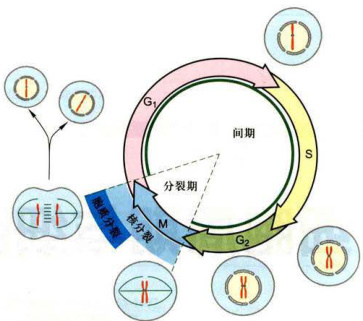  

图12-1标准的细胞周期 ；一个标准的细胞周期一般包括4个时相：DNA合成期（S）、细胞分裂期（M）以及介于二者之间的G，期和 $\mathsf{G}_{\tau}$ 期。细胞周期从 $\mathsf{G}_{1}$ 期开始，经S期和G期，到M期结束。  

### 二、细胞周期中各不同时相及其主要事件 

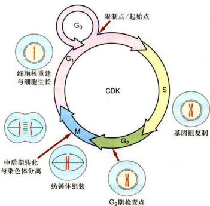  

图12-2细胞周期检查点及其主要事件  

在组成细胞周期的4个不同时相里，要发生许多不同的事件。人们对这些事件已有不同程度的认识，有的已有所了解，有的已比较深入，有的可能还不为人知。在这里我们仅对其中的一些主要事件做一概括介绍（图12-2）。  

$\mathrm{G}_{1}$ 期是一个细胞周期的第一阶段。上一次细胞分裂之后，产生两个子代细胞，标志着 $\mathrm{G}_{1}$ 期的开始。新生成的子代细胞立即进入一个细胞生长期，开始合成细胞生长所需要的各种蛋白质、糖类、脂质等，但不合成细胞核DNA。在 $\mathrm{G}_{1}$ 期的晚期阶段有一个特定时期。如果细胞继续走向分裂，则可以通过这个特定时期，进入S期，开始细胞核DNA合成，并继续运行，直到完成细胞分裂。在芽殖酵母中，这个特定时期被称为起始点（start）。起始点过后，细胞开始出芽，DNA也开始复制。起始点最初的概念是指细胞出芽的开始，但事实上控制着新一轮细胞周期的运转。在其他真核细胞中，这一特定时期称为限制点（restrictionpoint，R点），或检查点（checkpoint）。  

起始点被认为是 $\mathrm{G}_{1}$ 期晚期的一个基本事件。细胞只有在内、外因素共同作用下才能完成这一基本事件，顺利通过 $\mathrm{G}_{\iota}$ 期，进入S期并合成DNA。任何因素影响到这一基本事件的完成，都将严重影响细胞从 $\mathrm{G}_{1}$ 期向S期转换。影响这一事件的外在因素主要包括营养供给和相关的激素刺激等，而内在因素则主要是一些与细胞分裂周期相关基因（celldivisioncyclegene，CDC基因）调控过程相关的因素。CDC基因的产物是一些蛋白激酶、蛋白磷酸水解酶等。这些酶活性的变化将直接影响到细胞周期的变化。而这些酶活性变化本身在时间和空间上又受到内在和外在因素的调节。  

限制点的概念多用于高等真核细胞，尤其是哺乳动物细胞。其实质尚不完全清楚，已发现与酵母中的起始点在形式上有许多共同之处，但也有明显不同，可能比后者更为复杂。实验发现，绝大多数细胞若在限制点前进行无生长因子培养（growth factor starvation），细胞会很快进入休眠期，不能复制DNA，也不能进行细胞分裂。若在限制点之后进行无生长因子培养，细胞则可以进入S期，复制DNA。  

检查点是目前细胞周期研究领域中用得较多的一个术语。这一术语的出现可能源于早期对大肠杆菌DNA复制调控的研究。当大肠杆菌DNA受到损伤，或DNA复制受到抑制时，会激活RecA蛋白，酶解LexA抑制子，诱导Sos基因的大量表达。有些Sos基因产物参与受损DNA的修复，有些则参与阻止细胞分裂。这种细胞周期进程被抑制的原因并不是由于DNA损伤或DNA复制尚未完成本身所引起的，而是由于细胞内存在一系列监控机制（surveillancemechanism）。这些特异的监控机制可以鉴别细胞周期进程中的错误，并诱导产生特异的抑制因子，阻止细胞周期进一步运行。在真核细胞中也发现多种监控机制，即指细胞周期的某些关键时刻，存在一套监控机制，以调控周期各时相有序而适时地进行更选，并使周期序列过程中后一个事件的开始依赖于前一个事件的完成，从而保证周期事件高度有序地完成。进一步研究发现，**检查点不仅存在于 $\mathrm{G}_{1}$ 期，也存在于其他时相，如S期检查点、 $\mathrm{G}_{2}$ 期检查点、纺锤体组装检查点等**。从分子水平看，检查点是作用于细胞周期转换时序的调控信号通路，其监控作用在于保证基因和基因组的稳定性，而不是细胞分裂的基本条件。  

**==S期即DNA合成期==**。细胞经过 $\mathrm{G}_{1}$ 期，为DNA复制的起始做好了各方面的准备。进入S期后，细胞立即开始合成DNA。DNA复制的起始和复制过程受到多种细胞周期调节因子的严密调控。同时，DNA复制与细胞核结构如核骨架、核纤层、核膜等密切相关。目前已经知道，真核细胞DNA的复制和原核生物一样，是严格按照半保留复制的方式进行的。真核细胞新合成的DNA立即与组蛋白结合，共同组成核小体串珠结构。新的组蛋白也是在S期合成的。关于真核细胞DNA复制的起始、复制过程及其调控机制等，目前已取得了许多突破性进展；DNA复制与细胞核结构的关系等，也在积极研究之中。  

DNA复制完成以后，细胞即进入 $\mathrm{G}_{2}$ 期。此时细胞核内DNA的含量已经增加一倍，即每条染色体含有2个拷贝的DNA，由 $\mathrm{G}_{\mathfrak{r}}$ 期细胞的染色体倍性（2n）变成了 ${\bf G}_{z}$ 期的染色体倍性 $(4n)$ 。其他结构物质和相关的亚细胞结构也已完成进入 $\mathsf{\Pi}_{\mathsf{M}}$ 期的必要准备。通过 ${\bf G}_{2}$ 期后，细胞即进入M期。但细胞能否顺利地进人M期，要受到 $\mathrm{G}_{2}$ 期检查点的控制。 $\mathrm{G}_{2}$ 期检查点要检查DNA是否完成复制，细胞是否已生长到合适大小，环境因素是否利于细胞分裂等。只有当所有利于细胞分裂的因素得到满足以后，细胞才能顺利实现从 ${\bf G}_{2}$ 期向M期的转化。  

**==M期即细胞分裂期==**。真核细胞的细胞分裂主要包括两种方式，即有丝分裂（mitosis）和减数分裂（meiosis）。体细胞一股进行有丝分裂；成熟过程中的生殖细胞进行减数分裂，也称为成熟分裂。减数分裂是有丝分裂的特殊形式。细胞经过分裂，将其经过S期复制的染色体（DNA）平均分配到两个子细胞中。关于细胞分裂过程，下面将详细介绍。  

==周期蛋白依赖性激酶复合物CDKs通过调控细胞周期==
细胞周期中各个时相的有序更选和整个细胞周期的运行，需要“引擎”分子的驱动，即是在**周期蛋白依赖性激酶复合物（cyclin-dependent kinase complex,CDK）** 统一调控下进行的。CDK通过调节靶蛋白磷酸化而调控细胞周期的运转。与CDK相对应的是**蛋白磷酸水解酶**，促进已磷酸化的靶蛋白去磷酸化。已知的CDK已有十来种，在不同的时期有不同的CDK起调控作用。参与调控细胞周期的蛋白磷酸水解酶也有多种。此外，还有不少其他因素，通过调控CDK和蛋白磷酸水解酶的活性或其他相关反应，从而参与调控细胞周期。下文还将进一步介绍细胞周期调控的机制。  

==细胞周期长短随细胞种类和外界环境不同而不同==
细胞种类众多，繁殖速度有快有慢，细胞周期长短差别很大。单细胞生物如此，多细胞生物也是如此。就人体细胞而言，如神经细胞、肌细胞、血细胞、肝细胞、小肠上皮细胞等，其生长繁殖速度差异很大。体外培养的细胞也是如此，细胞来源不同，其细胞周期时间长短各异。细胞周期长短与细胞所处的外界环境也有密切关系。就环境温度而言，在一定范围之内，温度高，细胞分裂繁殖速度加快，温度低，则分裂繁殖速度减慢。  

==细胞周期时间的测定方法==
在某些工作中，常常会涉及细胞周期时间长短的测定。测定方法也多种多样，如脉冲标记DNA复制和细胞分裂指数观察测定法、流式细胞仪测定法等。若仅需要测定细胞周期总时间，只要通过在不同时间里对细胞群体进行计数，就可以推算出细胞群体的倍增时间，即细胞周期总时间。或者应用缩时摄像技术，不仅可以测定准确的细胞周期时间，还可以测定分裂间期和分裂期的准确时间。  

### 三、细胞周期同步化  

在同种细胞组成的细胞群体中，不同的细胞可能处于细胞周期的不同时相，为了某种目的，人们常常需要整个细胞群体处于细胞周期的同一个时相。事实上，在自然界中已经存在一些细胞群体处于细胞周期的同一时相的例子。例如有一种黏菌（Physarumpolycephalum）的变形体plasmodia，只进行核分裂而不进行细胞质分裂，结果形成多核原生质体结构。所有细胞核在同一细胞质中进行同步分裂，细胞核数目可多达 $10^{8}$ 个，多核原生质体（细胞）直径可达 $5\sim6~\mathrm{cm}$ 。又如，大多数无脊椎动物和个别脊椎动物的早期胚胎细胞，可同步化卵裂数次甚至十多次，形成数量可观的同步化细胞群体。**这种自然界存在的细胞周期同步化过程，称为天然同步化（natural synchronization）**。  

细胞周期同步化也可以进行人工选择或人工诱导，统称为**人工同步化**（artificialsynchronization）。人工选择同步化是指人为地将处于周期不同时相的细胞分离开来，从而获得不同时相的细胞群体。

==震荡分离分裂期细胞==
例如，处于对数生长期的单层培养细胞，细胞分裂活跃，大量处于分裂期的细胞变圆，从培养瓶（皿）壁上隆起，与培养瓶（皿）壁的附着力减弱。若轻轻振荡培养瓶（皿），**处于分裂期的细胞即会从瓶（皿）壁上脱落**，悬浮到培养液中。收集培养液，通过离心，即可获得一定数量的分裂期细胞（图12-3）。将这些分裂期细胞重新悬浮于一定体积的培养液中培养，细胞即开始分裂，进行细胞周期同步运转，由此可以获得不同时相的细胞。这种人工选择同步化方法目前仍被**广泛采用**。其优点是，**细胞未经任何药物处理和伤害，能够真实反映细胞周期状况，且细胞同步化效率较高**。但此方法也有不理想之处，即**分离的细胞数量少**。要获得足够数量的细胞，其成本大大高于采用其他方法。

==密度梯度离心分离分裂期细胞==
人工选择同步化的另一个方法是密度梯度离心法。**有些种类的细胞，如裂殖酵母，不同时期的细胞在体积和质量上差别显著**，可以采用密度梯度离心方法分离出处于不同时相的细胞。这种方法简单省时、效率高、成本低，但缺点是，**对大多数种类的细胞并不适用**。  

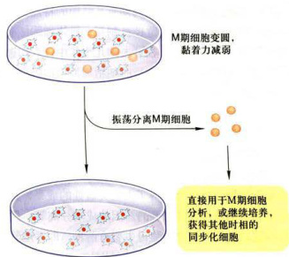  

图12-3从培养细胞中收集M期细胞的同步化方法  

==药物诱导同步化==
细胞同步化可以通过人工诱导而获得，即通过药物诱导，使细胞同步化在细胞周期的某个特定时相。目前应用较广泛的诱导同步化方法主要有两种，即DNA合成阻断法和分裂中期阻断法。  
#### 1.DNA合成阻断法  
DNA合成阻断法是一种采用低毒或无毒的DNA合成抑制剂特异地抑制DNA合成，而不影响处于其他时相的细胞进行细胞周期运转，从而将被抑制的细胞抑制在DNA合成期的实验方法。

目前采用最多的DNA合成抑制剂为**胸腺嘧啶脱氧核苷（TdR）** 或**羟基脲（hydroxyurea，HU）**。采用两次DNA合成抑制剂处理，将细胞最终抑制在 $\mathrm{G}_{1}/\mathrm{S}$ 期交界处狭窄的时间区段。抑制剂去除后，细胞即可以进行同步细胞周期运转（图12-4）。此方法的优点是**同步化效率高，几乎适合于所有体外培养的细胞体系**。这种方法目前被广泛采用。  
#### 2.分裂中期阻断法  
某些药物，如**秋水仙碱**、**秋水仙酰胺**和**诺考达唑**等，可以抑制微管聚合，因而能有效地**抑制细胞纺锤体的形成，将细胞阻断在细胞分裂中期**。处于间期的细胞，受药物的影响相对较弱，常可以继续运转到M期。药物持续存在的情况下，处于M期的细胞数量会逐渐累加。通过轻微振荡，将变圆的M期细胞摇脱，经过离心，可以得到大量的分裂中期细胞。将分裂中期细胞悬浮于新鲜培养液中继续培养，它们可以继续分裂并沿细胞周期同步运转，从而获得 $\mathrm{G}_{1}$ 期不同阶段的细胞。此方法的优点是**操作简便，效率高**；缺点是这些**药物毒性相对较大，若处理的时间过长，所得到的细胞常常不能恢复正常的细胞周期运转**。  

  

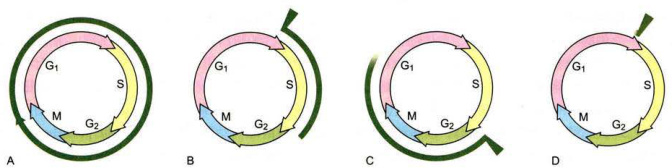  

>图12-4应用过量的TdR阻断法进行细胞周期同步化 ；A.处于对数生长期的细胞。B.第一次加入TdR，所有处于S期的细胞立即被抑制，其他细胞运行到G/S期交界处被抑制。C.将TdR洗脱，解除抑制，被抑制的细胞沿细胞周期运行。D.在解除抑制的细胞到达G期终点前，第二次加入TdR并继续培养，所有的细胞被抑制在G/S期交界处。  

**在实际工作中，人们常将几种方法并用，以获得数量多、同步化效率高的细胞。我们曾用低温、TdR和诺考达唑综合处理法获取大量的分裂中期细胞**，将这些中期细胞匀浆用来进行非细胞体系细胞核重建实验，获得了体外重建的细胞核，不仅实现了细胞同步化，而且证明这些同步化的M期细胞仍可以进行正常的细胞周期运转。  

目前，人们已经分离了许多与细胞周期调控有关的条件依赖性突变株。将这些突变株转移到限定条件下培养，所有细胞便被同步化在细胞周期中某一特定时相。  
### 四、特殊的细胞周期  

特殊的细胞周期是指那些特殊的细胞所具有的与标准的细胞周期相比有着鲜明特点的细胞周期。应用这些细胞所进行的细胞周期研究，不仅大大简化了实验条件，获得了许多重要结果，加深了人们对细胞周期的认识，而且这些研究仍在向深入发展。  
#### （一）早期胚胎细胞的细胞周期  

早期胚胎细胞的细胞周期主要指受精卵在卵裂过程中的细胞周期。它与一般体细胞的细胞周期明显不同，尤其是两栖类、海洋无脊椎类以及昆虫类的早期胚胎细胞等。最显著的特点是，卵细胞在成熟过程中已经积累了大量的物质基础，基本可以满足早期胚胎发育的物质需要，其细胞体积也显著增加；当受精以后，受精卵便开始迅速卵裂，卵裂球数量增加，但其总体积并不增加，因而，卵裂球体积将越分越小。每次卵裂所持续的时间，即一个细胞周期所持续的时间，与体细胞周期相比，周期时间大大缩短。**早期胚胎细胞周期的 $\mathrm{G}_{1}$ 期和$\mathrm{G}_{2}$ 期非常短，以至于被误认为早期胚胎细胞周期仅含有S期和M期**，即一次卵裂后，新的卵裂球迅速开始DNA合成，然后立即开始下一轮卵裂。

以非洲爪蟾早期胚胎为例，当卵细胞受精以后，第1个细胞周期，即第1次卵裂，持续时间约 $75~\mathrm{{min}}$ 。从第2个细胞周期到第12个细胞周期，即从第2次卵裂到第12次卵裂，每个细胞周期持续 $30~\mathrm{min}$ 左右。12个细胞周期共需要8个多小时。而一个非洲爪蟾体细胞的细胞周期持续时间约 $24\mathrm{~h~}_{\circ}$ 虽然早期胚胎细胞周期有其鲜明的特点，但细胞周期的基本调控因子和监控机制与一般体细胞标准的细胞周期基本是一致的。
#### （二）酵母细胞的细胞周期  

利用酵母细胞所从事的细胞周期研究，在整个细胞周期研究领域中占有重要位置。几十年来，用酵母细胞进行细胞周期调控研究取得了大量突破性的成果，如许多与细胞周期调控直接相关的基因的成功分离等。用于进行细胞周期调控研究的酵母主要有两种，即芽殖酵母和裂殖酵母。  

酵母细胞的细胞周期与标准的细胞周期相比有许多相同之处。首先，酵母细胞周期运转过程也包括 $\mathrm{G}_{1}$ 期、S期、 $\mathrm{G}_{2}$ 期和M期4个时相。更基本的是酵母细胞周期调控过程与标准的细胞周期非常相似，许多参与调控细胞周期的基因与高等生物的也基本相同。  

酵母细胞周期也有其明显的特点。首先，酵母细胞周期持续时间较短，大约为 $90~\mathrm{{min}}$ 和许多其他单细胞生物一样，细胞分裂过程属于封闭式，即在细胞分裂时，细胞核核膜不解聚。与细胞核分裂直接相关的纺锤体不是在细胞质中，而是位于细胞核内。此外，还有其他一些特点。例如，和其他真菌相似，酵母在一定环境因素作用下，也进行有性繁殖。  

芽殖酵母和裂殖酵母虽同称为酵母，但二者之间的亲缘关系甚远，分属于两个属，据rRNA序列分析，二者在两亿年前即已开始分歧演化。芽殖酵母和裂殖酵母在细胞结构和生命过程方面也有明显差别。  

芽殖酵母以出芽方式进行分裂，因而很容易在生活状态下观察细胞周期进程。如图12-5所示，芽殖酵母细胞在 $\mathrm{G}_{1}$ 期呈卵圆形，含有一个细胞核，基因组为单倍体。细胞周期起始点位于 $\mathrm{G}_{1}$ 期的后期阶段。起始点过后，细胞马上开始出芽。根据芽体的大小比例可以粗略估计细胞所处的时期。细胞出芽后，很快便进入S期，开始DNA复制，同时，纺锤体开始组装。纺锤体的两端为纺锤体极体（spindlepolarbody）。另一个与标准的细胞周期显著不同的是，酵母的纺锤体组装与S期DNA复制同时进行，而不是在DNA复制之后。S期过后，经过短暂的 $\mathrm{G}_{2}$ 期，染色质开始凝集，纺锤体逐渐延长，细胞逐步向M期推进。随着时间延长，芽体也不断增长，细胞核一分为二，分别分配到母体细胞和子细胞芽体中。再经过胞质分裂，形成相互独立的两个细胞。芽殖酵母细胞分裂为不等分裂，即生成的两个细胞体积大小不等，以芽体逐渐形成的子细胞体积较小。  

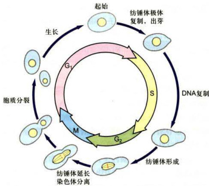  

图12-5芽殖酵母的细胞周期  

  

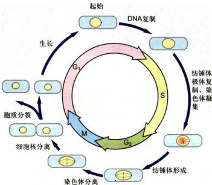  

图12-6裂殖酵母的细胞周期  

  

芽殖酵母子细胞形成后，如果环境因素适宜，它们可以继续进行下一轮细胞周期。如果环境因素不适宜，如营养物质缺乏等，它们或者直接进入 $\mathrm{G}_{0}$ 期状态，或者改变生活周期，由通过有丝分裂方式转化为减数分裂方式进行有性生殖。两个雌雄单倍体细胞会发生接合，细胞质相互融合，细胞核也随之融合，形成一个二倍体细胞。该二倍体细胞再经过起始点、一轮DNA复制、减数分裂等，最终形成4个单倍体孢子。一旦环境因素适应，单倍体孢子又可以萌发，回到无性生殖状态。  

裂殖酵母形态呈棒状。其细胞周期与芽殖酵母有不少相似之处，也有显著不同（图12-6）。 $\mathrm{G}_{1}$ 期裂殖酵母细胞为短棒状。经过一段时间的生长，细胞增加到一定长度，到达起始点。和芽殖酵母相似，经过起始点后，细胞很快进入S期，开始复制DNA，同时继续生长。S期过后，细胞进入 ${\bf G}_{2}$ 期，并将继续生长一定时间，待细胞达到一定体积后，方能启动M期。经染色体凝集、纺锤体极体复制、纺锤体在细胞核内组装井逐渐延长、细胞核拉长等一系列变化，分裂成两个细胞核。再经胞质分裂，形成两个大小相同的子细胞。裂殖酵母在环境因素不利时，也会由有丝分裂生殖转化为减数分裂生殖。但与芽殖酵母细胞不同，两个不同性别的单倍体裂殖酵母细胞可以直接接合，通过减数分裂，形成4个单倍体孢子。此外，裂殖酵母的起始点无明显的形态学标志。因而难以像芽殖酵母那样，可以通过观察芽体的大小来估计细胞所在的细胞周期位置。但裂殖酵母有两个鲜明的特点：一是细胞分裂为均等分裂，即分裂后生成的两个子细胞大小相等：二是细胞生长仅是细胞长度的增加，细胞直径保持不变。根据这两个特点，可以通过测定细胞长度，比较容易地确定细胞周期变化。  

#### （三）植物细胞的细胞周期  

植物细胞的细胞周期与动物细胞的标准细胞周期非常相似，也含有 $\mathrm{G}_{\iota}$ 期、S期、 $\mathrm{G}_{2}$ 期和M期4个时相。但植物细胞的细胞周期至少含有两个突出特点（图12-7）：第一，高等植物细胞不含中心体，但在细胞分裂时可以正常组装纺锤体。在动物细胞，中心体被认为是微管组织中心，是纺锤体组装所必需的。在缺乏中心体的情况下，是什么因素控制纺锤体组装，长期以来一直是植物细胞周期研究领域中的重要课题之一。第二，植物细胞分裂是在成膜体指导下，以形成细胞板（中间板）的形式完成胞质分裂。研究植物细胞胞质分裂的调控过程，也是探讨细胞周期调控中的重要课题之一。  

#### （四）细菌的细胞周期  
近些年来，研究细菌细胞周期也成为细胞周期调控  研究中重要课题之一。但细菌种类繁多，细胞周期变化很大。在这里仅以大肠杆菌为例，简单介绍其细胞周期过程，以获得对细菌细胞周期的一般认识。  

与所有其他细胞相似，DNA复制是细菌细胞周期中的重要事件之一（图12-8）。细菌DNA为一环形分子，含有一个复制起始点（origin）。细菌生长缓慢的情况下，在DNA复制之前，一般要经过一个临界时间（threshold），调节DNA复制的起始。在DNA复制之后和细胞分裂之前，也有一个临界时间。只有通过这个临界时间，细胞才能开始分裂。从这种慢生长情况来看，细菌细胞周期过程与真核细胞周期过程有一定相似之处。其DNA复制之前的准备时间与 $\mathrm{G}_{\iota}$ 期类似。分裂之前的准备时间与 $\mathrm{G}_{\tau}$ 期类似。再加上S期和M期，细菌的细胞周期也基本具备4个时相（图12-8A）。但是，细菌在快生长情况下，细胞周期过程发生较大变化。最主要的变化在于细胞如何协调快速分裂和最基本的DNA复制速度之间的矛盾。在快生长情况下，细菌细胞每分裂一次（即一个细胞周期时间）仅需要 $35~\mathrm{min}$ ·而完成一次DNA复制却需要 $40~\mathrm{min}$ 。而且，在DNA复制之前，需要 $10~\mathrm{min}$ 的复制起始准备，在DNA复制之后还需要 $20~\mathrm{min}$ 的染色体分离和细胞分裂。由此可见，真正完成一轮DNA复制实际需要 $70~\mathrm{min}$ 。细菌细胞是如何来协调快速分裂和慢速的DNA复制之间的矛盾呢？原来，如图12-8B所示，在上一次细胞分裂结束时，细胞内的DNA已经复制到一半路程。细胞分裂后，立即开始新一轮的DNA复制。 $10~\mathrm{{min}}$ 后，DNA复制起始，复制的起点不是在一个DNA分子上，而是在两个正在形成中的DNA分子上同时开始。随着上次DNA复制的结束，染色体开始分裂，细胞也随之分裂。到两个细胞完全形成时，刚才开始的DNA复制又已经走过一半路程。前后时间持续 $35\ \mathrm{min}$ 。新的细胞又开始下一轮的DNA复制准备。可以看出，快生长时，在一个细胞周期中每个DNA分子复制仅能完成一半，但DNA复制是在两个正在形成中的DNA分子上同时进行的。结果，经过 $70~\mathrm{min}$ ，两个DNA分子完成复制，得到4个DNA拷贝，细胞完成两轮细胞周期，产生4个细胞。  

  

细菌在一定环境条件下，其慢生长和快生长可以相互转化。若慢生长转化为快生长，在第一次DNA复制起始之后立即开始新一轮的DNA复制起始，使两个DNA分子同时复制，细胞分裂后，形成两个各含DNA复制完成一半路程的子细胞。若快生长转化为慢生长，在细胞分裂之后仅开始新一轮的细胞周期，而不起始新的DNA复制，结果生成两个各含一个DNA分子的子细胞。  

  

关于细菌细胞DNA复制起始调控和染色体分离及细胞分裂调控等方面的研究，已经获得了许多成果，目前仍在深入进行中。  

  

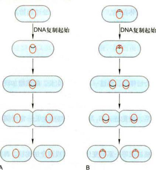  

图12-8细菌的细胞周期A.慢生长。B.快生长。  

  

## 第二节细胞分裂  

  

### 一、有丝分裂  
在细胞周期的M期时相包括核分裂与胞质分裂两个相互联系的过程。细胞有丝分裂即指核分裂，根据细胞分裂期核膜、染色体、纺锤体装配及核仁等形态结构的规律性变化，传统上人们将有丝分裂过程又人为地划分为前期、前中期、中期、后期和末期。胞质分裂（cytokinesis）相对独立，一般开始于细胞有丝分裂后期，完成于细胞有丝分裂末期。通过核分裂与胞质分裂，使已经复制好的染色体DNA平均分配到两个子细胞中。在整个细胞分裂过程中，细胞骨架系统是核分裂与胞质分裂的主要执行者。图12-9中的照片摄自经抗微管抗体和DNA染料双重荧光染色的动物细胞。在细胞间期，细胞核结构清晰，微管以一个中心体为核心向四周辐射装配。随着细胞进入分裂期，细胞核结构和微管排列方式等将发生一系列有序的变化。

#### （一）有丝分裂各期的重要事件及其结构装置  

##### 1.前期  
前期（prophase）是有丝分裂过程的开始阶段。在前期主要发生两个事件：  
（1）染色体凝缩（chromatincondensation）染色体凝缩是指由间期细长、弥漫样分布的线型染色质，经过进一步螺旋化、折叠和包装（packing）等过程，逐渐变短变粗，形成光镜下可辨的早期染色体结构。已复制的染色体的两个姐妹染色单体间彼此黏着和凝缩是有丝分裂和减数分裂期间基因组准确分离的先决条件。

不同水平染色体高级结构的组织是依赖于不同的SMC(structural maintenance of chromosome）蛋白复合物来维持的。两类结构上相关的蛋白复合物分别是**黏连蛋白（cohesin）** 和**凝缩蛋白（condensin）**，二者均是由多个亚基构成的。**黏连蛋白介导姐妹染色单体的黏着**，**凝缩蛋白介导染色体凝缩**。它们的核心组分为具有ATP酶活性的Smc家族成员，从细菌到高等生物，在演化上高度保守，在染色体高级结构组织、包装和配对等方面行使关键作用。

典型真核生物的SMC复合物由两个SMC蛋白异二聚体和两个或多个非SMC蛋白亚基组成。黏连蛋白由Smcl/3异二聚体以及非Smc蛋白如Mcd1（Sccl或Rad21）和Scc3亚基组成；凝缩蛋白最初在爪蟾卵细胞抽提物中被纯化，**除Smc2/4异二聚体外，还有其他三种非SMC蛋白（CAP-H，-G和-D2）参与复合物的组成**。每个异二聚体被中间铰链区分为两个卷曲螺旋臂，每个臂的末端是球形类ATP结合盒（ATP-bindingcassette，ABC），这种结构特点使得SMC复合物可以利用水解ATP释放的能量保持高度动态性和可塑性，以确保分子间或分子内的相互作用。在其他非SMC蛋白亚基参与下，黏连蛋白通过臂端类ABC结构域与DNA结合，将两条姐妹染色单体黏着在一起（分子间交联），直至有丝分裂中一后期转换时染色单体彻底分离。染色单体间除通过黏连蛋白而交联外，**在主痕（着丝粒）区两侧还组装形成一种蛋白质复合物结构，称为动粒（详见第九章第四节）：凝缩蛋白介导染色体DNA分子内交联，利用水解ATP释放的能量，促进染 色体凝缩（图12-10）**。  

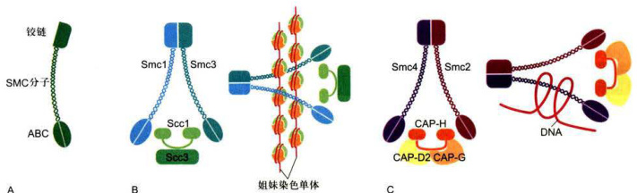  

图12-10SMC蛋白（A）及其黏连蛋白（Smc1/3）（B）、凝缩蛋白（Smc2/4）（C）异二聚体的作用  

（2）细胞分裂极的确立和纺锤体的装配不管是细胞常规的有丝分裂，还是像酵母那样的核内有丝分裂，在起始阶段，分裂极的确立至关重要。动物细胞分裂极的确立，与中心体的复制、分离和有星纺锤体的装配密切相关。中心体建立两极纺锤体，确保细胞分裂过程的对称性和双极性，而这一功能对染色体的精确分离是必需的。高等植物细胞没有中心体，但有丝分裂时也要装配形成无星纺锤体，其分裂极的确立机制尚不清楚。动物细胞中心体被称为微管组织中心（MTOC），中心体内含有一对桶状的中心粒，它们彼此垂直分布，外面被无定形的中心粒外周物质所包围（参见图8-22）。

  

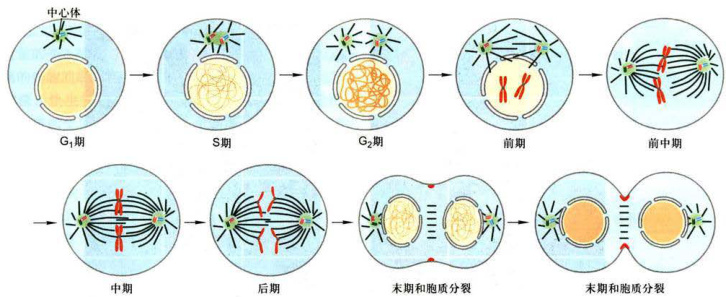  

图12-11动物细胞中心体的复制与细胞周期的关系  

在细胞周期过程中中心体的周期变化如图12-11所示。  在每个细胞周期中，中心体进行一次半保留复制。在有丝分裂末期，每个子代细胞继承一个中心体，而在下次有丝分裂开始之前，它又包含两个中心体。  

在分裂间期，中心体精确的复制周期为有丝分裂做前期准备，这一过程被称之为中心体复制。在 $\mathrm{G}_{1}$ 期晚期垂直分布的母中心粒和子中心粒分离，这是中心体复制开始的征兆，现普遍认为，中心体在 $\mathrm{G}_{\parallel}$ 期末开始复制，在S期完成复制，随着中心体复制完成，在 $\mathrm{G}_{2}$ 期分离，半保留复制的中心粒进入子代中心体。细胞进入有丝分裂前期，复制并分离后的两个子中心体作为微管组织中心，开始放射状微管装配，中心体及其周围微管形成两个星体（aster），这便是分裂极的确立和纺锤体装配的起始。根据中心体生化分析，中心体长驻蛋白包括 $\alpha/\beta/\gamma/\delta/\varepsilon$ 微管蛋白、中心体蛋白（centrin）、中心粒周蛋白（pericentrin）等。许多研究结果表明，微管蛋白是微管组织中心的组成成分，最初发现于一种真菌中，后来证实它普遍存在于其他真核生物中，是一种非常保守的蛋白质，而且可能也由多基因编码， $\gamma$ 微管蛋白连接微管和中心体。尽管它在细胞中含量很少，但对微管的装配、微管的取向等起着很重要的调节作用。中心体蛋白是分子质量为 $20\ensuremath{\mathrm{\kDa}}$ 的一个钙结合蛋白家族，主要定位于中心体及其同源结构中。目前已鉴别出4种中心体蛋白（centrin-1p,2p，3p,4p）。centrin-2p和centrin-3p普遍表达于哺乳动物细胞中，两种蛋白质主要位于中心粒的远端。研究表明在HeLa细胞中，如果centrin-2p的表达被干扰RNA灭活，中心粒的复制将被抑制并导致细胞周期连续性的缺损。研究发现，中心体蛋白在中心体的复制和分离中发挥重要作用，在哺乳动物细胞中，中心体蛋白的定位具有细胞周期依赖性的特点，推测中心体蛋白参与了有丝分裂过程。中心粒周蛋白是中心粒周围物质的组成成分，它参与组织中心体的结构。现已有实验证据表明，中心体复制的起始需要多种调节因子介入，在 $\mathrm{G}_{1}/\mathrm{S}$ 期限制点，需要cyclinE-Cdk2（参见本章第一节）参与，为中心体复制签发通行证；中心体复制由钙调蛋白依赖激酶ⅡI（CaMKII）触发，细胞内自由钙离子浓度增加使CaMKⅡ激活，CaMKⅡ激活触发中心体复制的开始，在S期中心体复制依靠cyclinA-CDK2复合物。  

动物细胞有丝分裂前期纺锤体的装配起始于两个星体的形成，它们并排于核膜附近。典型的有星纺锤体由星体微管、极间微管和染色体动粒微管排列组成。有丝分裂前期，星体微管和极间微管通过向其远离中心体的一端（正极端）加人 $\alpha\beta$ 微管蛋白二聚体而不断延长，在基于微管的马达蛋白的介导下推动中心体向细胞两极移动。  

如果中心体复制异常，或细胞未能协调好中心体复制和DNA复制的关系，将不可避免地导致形成单极或多极纺锤体，而单极或多极纺锤体将驱使染色体异常分离，最终导致染色体倍性的改变。早在20世纪初期，Boveri就提出恶性肿瘤细胞极性的改变和染色体分裂异常（非整倍体）可能是由于中心体功能缺陷引起的。事实上，染色体组型的改变在癌细胞中非常普遍，现在已经有越来越多的研究结果证实了这一观点。如今人们已经认识到，中心体复制功能障碍可能是引起染色体分裂异常的重要原因，并且最终导致癌的形成。  

  

##### 2.前中期  

  

前中期（prometaphase）的标志性事件之一是核膜崩解。核纤层蛋白形成骨架结构支撑于核被膜的内侧，得以使细胞核维持正常的形状与大小。在细胞有丝分裂中核被膜经历有规律地解体与重建过程（图12-12）。  

  

核膜的崩解与核纤层的解体是相互偶联的事件。细胞分裂过程中核纤层的解体和重新组装与核纤层蛋白的磷酸化水平相关。核纤层蛋白的磷酸化与去磷酸化可能是有丝分裂过程中核纤层结构动态变化的调控因素。一些研究结果表明，核纤层蛋白是有丝分裂促进因子（MPF）的直接作用底物。MPF具蛋白激酶活性，有丝分裂前期，MPF可以使核纤层蛋白22位和392位丝氨酸磷酸化，结果导致这两个与核纤层组装直接相关的结构域发生构象变化，从而导致核纤层蛋白四聚体解聚和核纤层解聚。解聚的核纤层蛋白A以可溶性单体形式弥散在细胞中，而核纤层蛋白B则与核膜解体后形成的核膜小泡保持结合状态。在分裂末期，结合有核纤层蛋白B的核膜小泡在染色质周围聚集，并渐渐融合形成新的核膜，而核纤层蛋白则在核膜的内侧组装成子细胞的核纤层。  

  

前中期标志性事件之二是完成纺锤体装配，形成有丝分裂器（mitoticapparatus）。在前期，两个星体的形成和向两极的运动，事实上标志着纺锤体组装的开始。有丝分裂进入前中期，随着核膜的解体，由纺锤体两极发出的一些星体微管可进入“核”内，通过其正极端迅速捕获染色体，并分别与染色体两侧的动粒结合，形成动粒微管（kinetochoremicrotubule）。至此，由微管及其结合蛋白组成的纺锤体基本完成组装，由星体微管、染色体动粒微管和极间微管及其结合蛋白构成有星纺锤体，即动物细胞的有丝分裂器（图12-13）。此时的纺锤体赤道直径相对较大，两极直径的距离也相对较短。与同一条染色体的两个动粒相连接的两极动粒微管并不等长。因而染色体并不完全分布于赤道板，相互排列貌似杂乱无章。  

  

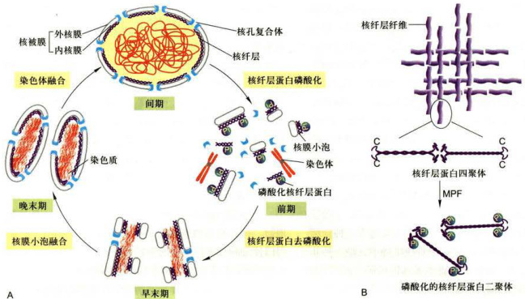  

图12-12细胞分裂过程中核被膜和核纤层的动态变化 A.核被膜在细胞有丝分裂中有规律地解体与重建。B.核纤层解聚。  

  

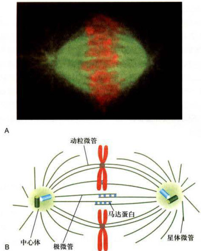  

图12-13高等动物细胞纺锤体结构A.DNA荧光染料染色（红色）和抗微管蛋白抗体免疫荧光染色（绿色）。B.染色体和纺锤体结构模式图。（A图由罗佳博士和张传茂博士提供）  

  

纺锤体（spindle）是细胞分裂过程中的一种与染色体分离直接相关的细胞器。植物细胞不含中心体，但能形成无星纺锤体介导植物细胞的核分裂。  

  

纺锤体组装是一个十分复杂的过程。首先要涉及微管在中心体周围组装和已经完成复制的中心体的分离。如前所述，中心体的复制和周围微管的组装需要许多调节因素的参与，如 $\boldsymbol{\gamma}$ 微管蛋白、中心体蛋白、中心粒周蛋白等。中心体的分离需要驱动蛋白相关蛋白（kinesin-relatedprotein，KRP；参见表8-1驱动蛋白家族成员介绍）和细胞质动力蛋白等的作用（图12-14）。KRP主要为一些向微管正极运动（正向运动）的蛋白质，而细胞质动力蛋白主要是向微管负极运动（负向运动）的蛋白质。中心体分离时，负向运动的马达蛋白在来自姐妹中心体的微管之间搭桥，通过向负极运动，将被结合的微管牵拉在一起，组成纺锤体微管，中心体也自然形成了纺锤体的两极。这一过程称为中心体列队（centrosomealignment），即分裂极的确立（图12-14A、B）。然后，正向运动的马达蛋白在纺锤体微管之间搭桥，借助向微管正极运动，将纺锤体拉长，中心体之间的距离逐渐加大（图12-14C）。当纺锤体拉长到一定程度后，负向运  

  

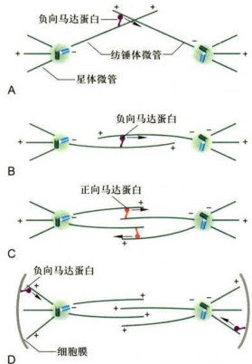  

图12-14纺锤体组装过程  

  

A.中心体分离，负向运动马达蛋白与来自姐妹中心体的纺锤体微管结合。B.借助马达蛋白向微管负极运动，将纺锤体微管牵拉在一起，形成早期纺锤体。C.正向运动马达蛋白在纺锤体微管之间搭桥，借助正向运动，将纺锤体拉长。D.负向运动的马达蛋白在细胞膜和星体微管之间搭桥，借助负向运动，将中心体进一步拉近两极的细胞膜，纺锤体进一步被拉长。  

  

动的马达蛋白在细胞膜和星体微管之间搭桥，借助负向运动，将星体向两极细胞膜拉近，纺锤体也进一步被拉  

  

长（图12-14D)。  

  

前中期标志性事件之三是染色体整列（chromosomealignment）。由纺锤体极体发出的微管捕捉染色体动粒，形成染色体动粒微管，这是染色体整列的必要前提。没有动粒的染色体不能与纺锤体微管结合并向两极运动，同样，染色体动粒如果未被纺锤体微管捕获，也不能和其他染色体一起向两极运动。着丝粒和动粒是染色体结构的重要组分，由于着丝粒和动粒联系紧密，结构成分相互穿插，在功能方面又密切相关，因此二者常被合称为着丝粒一动粒复合体（centromere-kinetochorecomplex），这是一种高度有序的整合结构。在电镜下，动粒为一个圆盘状结构，分内、中、外三层。动粒的外侧主要用于纺锤体微管附着，内侧与着丝粒相互交织（图12-15）。每条中期染色体上含有两个动粒，分别位于着丝粒的两侧。细胞分裂后，两个动粒分别被分配到两个子细胞中。当细胞再次进入S期后，动粒又会重新复制。用抗动粒蛋白的抗体作免疫荧光染色，可以清楚地识别动粒所在位置。  

  

着丝粒DNA主要由α卫星DNA构成。着丝粒DNA片段大小由芽殖酵母的一百多kb、裂殖酵母的100kb到人类的几千kb不等。大的着丝粒DNA片段则主要由一些特殊序列重复排列构成。着丝粒DNA也伸入到动粒的内层，成为动粒内层的组成成分。目前已经分离了几种着丝粒动粒蛋白质成分，如哺乳类的CENP-A、CENP-B、CENP-C、CENP-E、CENP-F、INCENP、Hec1等。CENP-A的分子质量约为 $1.7\mathrm{kDa}$ ，是一种组蛋白H3类的蛋白质，与组蛋白H3在C端有 $62\%$ 的同源序列。  

  

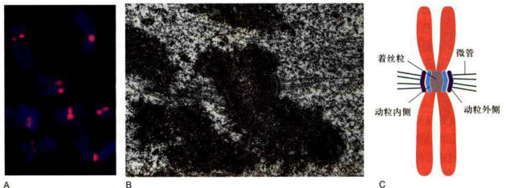  

图12-15应用免疫荧光技术和电镜技术显示动粒位置和结构  

  

A.双重荧光染料染色，显示染色体DNA（蓝色）和动粒蛋白Hec1（红色）。B.透射电镜技术显示染色单体上的动粒结构及其与动粒微管的连接。C.动粒结构及动粒-微管相互连接示意图。（A、B图由付文祥博士、吕全龙博士和张传茂博士提供）  

  

免疫标记技术证实CENP-A定位于动粒的内层。CENP-B分子质量约为 $80\ensuremath{\mathrm{kDa}}$ ，主要定位于动粒内层内侧的着丝粒上。CENP-C的分子质量约为 $140\mathrm{\kDa}$ ，定位于动粒的内层。CENP-E分子质量约 $312\mathrm{{kDa}}$ ，是一种驱动蛋白，定位于动粒外层表面的冠上，被认为在促使染色体与来自两极的微管相联结过程中起重要作用。CENP-E在前中期与微管结合，以后逐渐转移到动粒上；到分裂后期，CENP-E离开动粒，转移到纺锤体的中间区。CENP-F分子质量约为 $330\mathrm{\kDa_{\circ}}$ CENP-F在间期是一种核骨架蛋白；在分裂前期，转移到动粒上；到分裂后期，再转移到纺锤体的中间区域：到末期，再度转移到中体（midbody）上。在酵母细胞中也已分离到了在结构和功能上与此类同的蛋白质。Hecl是定位于动粒外板的结构蛋白，分子质量约为 $76\ensuremath{\mathrm{kDa}}$ 至于着丝粒染色质是如何组装的，着丝粒形成后又是如何引导动粒在其附近装配的，以及动粒的分子结构至今并不十分清楚。  

  

长期以来染色体整列问题一直困扰着有关生物学家。直到最近，这一研究领域才终于取得了突破性进展。近期的研究发现，至少有数种蛋白质参与染色体整列事件，其中首要的两组蛋白质称为Mad和Bub蛋白。Mad和Bub可以使动粒敏化，促使微管与动粒接触。免疫荧光染色发现，Mad2和Bub1位于前期和前中期染色体的动粒上。如果染色体被纺锤体微管捕获，Mad2和Bub1很快会从动粒上消失。一侧的动粒被微管捕捉，一侧的Mad2和Bub1消失；两侧的动粒被微管捕捉，两侧的Mad2和Bub1消失；如果染色体不被微管捕捉，则Mad2和Bub1不从动粒上消失。因而认为Mad2和Bub1与染色体组装入纺锤体有关。进一步研究发现，由于某些染色体不能被微管及时捕捉而滞后，Mad2和Bub1不能从这些染色体的动粒上消失，后期则不能启动，染色单体不能相互分离。只有等到这些染色体也被微管捕捉并排列到赤道板上，Mad2和Bubl从动粒上消失，后期才能开始启动（图12-16）。  

  

##### 3.中期  

  

细胞有丝分裂进入中期（metaphase）的主要标志是染色体整列完成并且所有染色体排列到赤道面上，纺锤体结构呈现典型的纺锤样。当染色体上的两个动粒被微管捕获后，细胞通过什么机制将染色体排列到赤道面上呢？目前对此解释流行两种学说，即牵拉（pull）假说和外推（push）假说（图12-17）。牵拉假说认为，染色体向赤道面方向运动，是由于动粒微管牵拉的结果。动粒微管越长，拉力越大，当来自两极的动粒微管的拉  

  

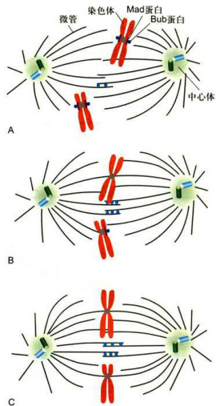  

图12-16染色体整列  

  

A.细胞分裂前期和前中期，Mad和Bub蛋白在染色体的动粒上聚集。B.微管与动粒联结后，Mad和Bub蛋白消失，某些染色体滞后，未与微管联结的动粒依然含有Mad和Bub蛋白。C.所有染色体的动粒均与微管联结，Mad和Bub蛋白消失，染色体列队到赤道板。  

  

力相等时，染色体即被稳定在赤道面上。外推假说认为，染色体向赤道方向移动，是由于星体的排斥力将染色体外推的结果。染色体距离中心体越近，星体对染色体的外推力越强，当来自于两极的推力达到平衡时，染色体即被稳定在赤道面上。这两种假说也许并不相互排斥，有可能同时发挥作用，或有其他机制共同参与。  

  

染色体向赤道面运动的过程称为染色体整列或染色体中板聚合（congression）。当染色体完成在赤道面整列之后，两侧的动粒微管长度相等，作用力均衡。除动粒微管外，许多极微管在赤道区域也相互搭桥，形成貌似连续微管结构。整个纺锤体微管数量，在不同物种之间变化很大，少则十来根，多的数千根甚至上万根。如真菌Phycomyces仅有10根纺锤体微管，产于澳大利亚的一种小袋鼠（ratkangaroo），其纺锤体微管约有1500根，而网球花属植物（Haemanthus）的纺锤体微管约有 $10\ 000$ 根。染色体整列的运动速度非常快，一般为$0.05\sim1~{\upmu\mathrm{m}}/{\upepsilon}_{\mathrm{o}}$ 染色体排列到赤道面上以后，其两个动粒分别面向纺锤体的两极，在每一个动粒上结合的动粒微管可以多达几十根。  

  

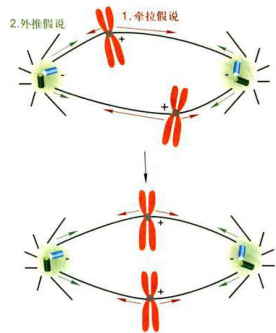  

图12-17解释染色体在赤道面整列的两种假说  

  

##### 4.后期  

  

后期（anaphase）发生的标志性事件是中期整列的染色体的两条姐妹染色单体分离，分别向两极运动。当染色体在赤道面上完成整列后，在各种调节因素的共同作用下，细胞有丝分裂由中期向后期转换，姐妹染色单体分离并逐渐向两极移动。后期大致可以划分为连续的两个阶段，即后期A和后期B。在后期A，动粒微管变短，牵动染色体向两极运动；在后期B，极微管长度增加，两极之间的距离逐渐拉长。整个后期阶段约持续数分钟。染色体运动的速度为 $1-2\upmu\mathrm{m}/\mathrm{min}_{\circ}$  

  

染色体向两极的运动依靠纺锤体微管的作用。用破坏微管的药物如秋水酰胺、秋水仙素或诺考达唑等处理，染色体的运动会立即停止。去除这些药物，染色体并不能立即恢复运动，而是要等到纺锤体重新装配后才能恢复。可见染色单体与纺锤体微管的联系也是染色体向极部运动所必需的。用实验方法破坏这种联系，染色单体运动停止，直到这种联系恢复，染色体的运动才能恢复。  

  

曾有多种假说解释后期染色单体分离和向两极移动的运动机制。目前比较广泛支持的假说是后期A和后期B两个阶段假说。在后期A，动粒微管变短，将染色体逐渐拉向两极。一般认为，动粒微管变短是由于其动粒端解聚所造成的；而这种解聚又是由于动力蛋白沿动粒微管向极部运动的结果。如图12-18所示，微管马达蛋白首先结合到动粒上，在ATP分解提供能量的情况下，沿动粒微管向极部运动，并带动动粒和染色体向极部运动。动粒微管的末端随之解聚成微管蛋白二聚体，动粒微管变短，动粒和染色单体与两极之间的距离逐渐拉近。当染色单体接近两极，后期A结束，转向后期B。在后期B，极微管游离端（正极）在ATP提供能量的情况下与微管蛋白聚合，使极微管加长，形成较宽的极微管重叠区。KRP与极微管重叠区的微管结合并在来自两极的极微管之间搭桥。KRP向微管正极行走，使来自两极的极微管在重叠区相互滑动（如双极四聚体  

  

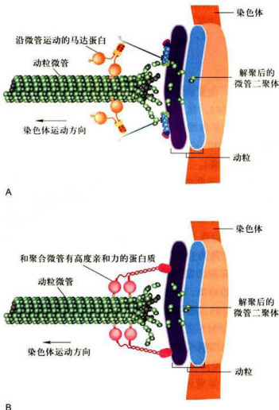  

图12-18细胞有丝分裂后期由ATP驱动的马达蛋白沿微管向极部运动使染色体分开  

  

A.ATP驱动的染色体运动促使微管解聚。B.微管解聚促使染色体运动。  

  

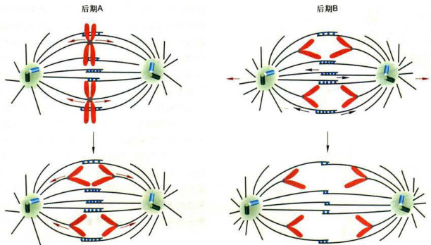  

图12-19细胞分裂后期A和后期B产生染色体向极部运动的示意图  

后期A：动粒微管在两端解聚缩短，致使姐妹染色单体向两极运动。后期B：通过星体微管牵拉和极微管重叠区滑动，使纺锤体两极和染色体进一步分开。  

  

kinesin-5），使重叠区逐渐变得狭窄，两极之间的距离逐渐变长。同时，胞质动力蛋白在星体微管和细胞膜之间搭桥，并向星体微管负极运动，进一步将两极之间的距离拉长（图12-19）。  

  

研究发现，在姐妹染色单体分离之前，彼此间通过黏连蛋白相互黏着在一起（图12-10）。黏连蛋白至少含有4种亚基，即Smcl、Smc3、Sccl/Mcdl和Scc3。只有该复合体解聚的情况下，姐妹染色单体才能分离。进一步研究发现，在姐妹染色单体分离过程中，黏连蛋白是被一种称为分离酶（separase）的蛋白酶所降解的。分离酶主要剪切黏连蛋白的Sccl亚基，结果导致姐妹染色单体的分离。分离酶剪切Sccl的过程是在严格的调控下进行的。通常情况下，分离酶与一种抑制性蛋白securin结合而不表现出蛋白酶活性。Cdk1也通过磷酸化分离酶而抑制其活性。当后期开始时，后期促进复合物（anaphase-promoting complex，APC）介导securin的降解，解除其对分离酶的抑制作用：APC也通过介导cyclinB降解，使Cdk1活性丧失，失去对分离酶的磷酸化作用，促进分离酶活化。活化的分离酶剪切Scc1，导致姐妹染色单体分离（图12-20）。  

  

在所有染色体排列到赤道板上之前，为什么后期不能启动呢？有人认为，动粒在与微管联结之前，会发出抑制信号，抑制细胞周期向下一个阶段运转。另一些科学家为了验证这一观点，用激光特异地破坏滞后染色体尚未与微管联结的动粒，发现尽管染色体依然滞后，细胞周期却可以随之向下一阶段转化，提示未与微管联结的动粒确实可以发出抑制信号，抑制细胞周期向下一阶段运转。更为直接的证据显示，Mad2可以与APC及其他相关物质结合，抑制APC的活性，阻止细胞周期向下一个阶段发展。  

  

微管与动粒联结后，抑制后期启动的信号又是如何解除的呢？有人认为CENP-E和Bub蛋白在这一过程中起了重要作用。当微管与动粒联结后，CENP-E分子的结构和位置将发生变化，这些变化进一步影响到Bubl的活性。Bub1活性变化，又进一步影响到Mad2的稳定性和与其他有关物质的结合，最终导致Mad2对APC抑制的解除。  

  

##### 5.末期  

  

姐妹染色单体分离到达两极，有丝分裂即进入末期（telophase）。动粒微管消失，极微管继续加长，较多地分布于两组染色单体之间。到达两极的染色单体开始去浓缩，在每一个染色单体的周围，伴随核纤层蛋白去磷酸化，核纤层与核膜重新组装，分别形成两个子代细胞核。在核膜形成的过程中，核孔复合体同时在核膜上装配。随着染色单体的去浓缩，核仁也开始重新组装，RNA合成功能逐渐恢复。  

  

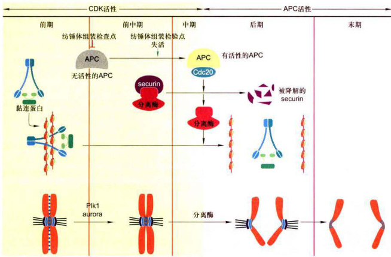  

图12-20有丝分裂中后期转换有丝分裂中-后期转换是由活化APC启动的，抑制物seCurin的降解导致分离酶活化，进而黏连蛋白被切割，致使姐妹染色单体分离。  

  

##### 6.胞质分裂  

  

胞质分裂与核分裂（有丝分裂）是相关的事件。胞质分裂一般开始于细胞分裂后期，完成于细胞分裂末期；而有丝分裂即使在没有胞质分裂的情况下也要发生。胞质分裂开始时，在赤道板周围细胞表面下陷，形成环形溢缩，称为分裂沟（furrow）。随着细胞由后期向末期转化，分裂沟逐渐加深，直至两个子代细胞完全分开。分裂沟的形成靠多种因素的相互作用。实验证明，肌动蛋白和肌球蛋白Ⅱ参与了分裂沟的形成和整个胞质分裂过程。在分裂沟的下方，除肌动蛋白之外，还有微管、核膜小泡等物质聚集，共同构成一个环形致密层，称为中体（midbody）。随着胞质分裂，中体将一直持续到两个子细胞完全分离。胞质分裂开始时，大量的肌动蛋白和肌球蛋白Ⅱ在中体处组装成反向排列的微丝束，环绕细胞，称为收缩环（contractilering）。收缩环收缩，分裂沟逐渐加深，细胞形状也由原来的圆形逐渐变为椭圆形、哑铃形，直到两个子细胞相互分离。用抗肌动蛋白和抗肌球蛋白的抗体作免疫荧光染色，可见随分裂沟的形成，其下面的荧光亮度逐渐增强，并明显高于其他部位。在电镜下，可见大量的微丝结构分布于分裂沟下。用抗肌动蛋白、抗肌球蛋白或特异性破坏微丝的药物如细胞松弛素B处理处于分裂期的活细胞，收缩环的收缩活动停止，分裂沟逐渐消失。胞质分裂整个过程可以简单地归纳为4个步骤，即分裂沟位置的确立、肌动蛋白聚集和收缩环形成、收缩环收缩、收缩环处细胞膜融合并形成两个子细胞（图12-21）。  

  

分裂沟的定位与纺锤体的位置明显相关。人为地改变纺锤体的位置可以使分裂沟的位置改变。对分裂沟定位的分子作用机制目前尚不清楚，但在动物细胞分裂时，越来越多的证据显示，中央纺锤体和星体微管共同决定了分裂沟形成的位置，星体微管参与了分裂沟的形成（图12-22）。有实验显示，在培养细胞分裂中期，人为干扰中央纺锤体发出的信号（图12-22A），将会阻止分裂沟的形成。在末期开始时，星体微管加长直到与细胞膜下的皮层接触。微管末端对细胞皮层刺激，促使分裂沟形成（图12-22B）。也有实验显示，在（Dictyostelium）中发现Ras基因家族中的RacE基因产物在收缩环收缩和细胞膜融合过程中起重要作用。RacE基因产物是一个小分子量的GTP酶。另外两组科学家则发现，两种参与调节小分子GTP酶活性的蛋白GapA和RgaA/DPAP1也参与收缩环收缩和细胞膜融合过程。目前已知有二十多种调节因子参与了分裂沟的定位、收缩环的形成和胞质分裂。这些调节因子主要包括：微管结合蛋白PRC1、Kif4、Aurora-B激酶及其结合蛋白、RhoA信号通络的各成员以及与膜融合相关的调节因子等。  

  

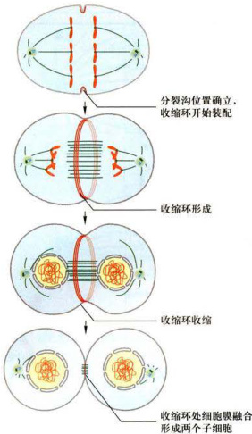  

图12-21动物细胞胞质分裂示意图  

  

也有实验证明，钙离子浓度的变化也会影响分裂沟的形成。将荧光标记的钙离子指示剂注入细胞，发现在分裂沟下钙离子浓度上升。将钙离子直接注射到蛙卵细胞膜下，可以刺激分裂沟形成。  

  

### 二、减数分裂  

  

减数分裂是一种特殊的有丝分裂形式，仅发生于有性生殖细胞形成过程中的某个阶段。按照真核生物减数分裂所发生的阶段不同，可将减数分裂区分为三种类型（图12-23）： $\textcircled{1}$ 配子减数分裂，又称终末减数分裂（gametic/terminalmeiosis），发生在所有多细胞动物和许多原生生物配子形成阶段： $\textcircled{2}$ 孢子减数分裂，又称居间型减数分裂（sporic/intermediatemeiosis），所有高等植物和某些藻类减数分裂发生阶段既与配子形成无关，又与受精作用无关，发生在孢子体某一阶段； $\textcircled{3}$ 合子减数分裂，又称起始减数分裂（zygotic/initialmeiosis），某些原生生物、真菌和少数藻类，在有性生活史起始，即受精后便发生减数分裂，形成单倍体孢子。  

  

远离分裂沟的端部，星体微管可能发出抑制细胞皮层收缩的信号，促使该处细胞膜松弛，加速分裂沟的形成（图12-22C）。目前，对肌动蛋白与肌球蛋白Ⅱ的聚集和收缩环的形成也不完全了解。对于收缩环收缩和收缩环处细胞膜融合两个步骤的研究，已取得较大进展。1996—1997年，M.R.Larochelle等在网柄菌属减数分裂与有丝分裂相比，其主要不同列于表  

  

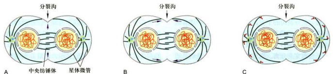  

图12-22中央纺锤体和星体微管作用于细胞皮层并诱导分裂沟形成  

  

A.中央纺锤体发出的信号决定分裂沟的定位。B.接近分裂沟位置的纺锤体微管发出信号，促进分裂沟的形成。C.远离分裂沟位置的星体微管发出抑制性信号（T形箭头），抑制远离分裂沟端 的细胞皮层收缩，间接促进分裂沟的形成。  

  

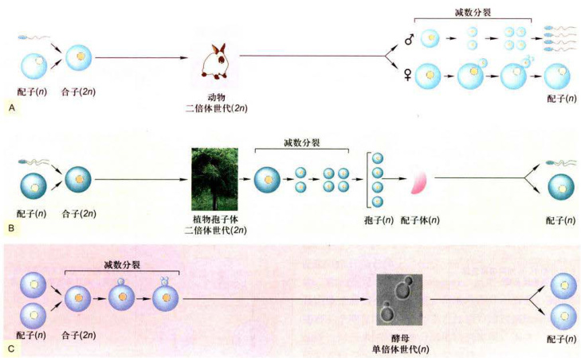  

图12-23真核生物减数分裂的三种类型  

A.配子减数分裂。B.孢子减数分裂。C.合子减数分裂。  

  

12-1中。减数分裂最主要特征是，细胞仅进行一次DNA复制，随后细胞连续两次分裂。两次分裂分别称为减数分裂I和减数分裂Ⅱ。在两次分裂之间，还有一个短暂的分裂间期。减数分裂的结果，子细胞各自的染色体数目减半。再经过受精，形成合子，染色体数恢复到体细胞的染色体数目。减数分裂的意义在于，既有效地获得双亲的遗传物质，保持后代的遗传稳定性，又可以增加更多的变异，确保生物的多样性，增强生物适应环境变化的能力。相反，假如在有性生殖过程中没有减数分裂，生殖细胞染色体数不能减半，经过受精，其染色体数必将倍增。细胞体积也会相应增加，生物个体体积也会增大。代代相传，其生命活动将无法适应环境变化，终将会被自然淘汰。因而，减数分裂是生物有性生殖的基础，是生物遗传、演化和生物多样性的重要保证。  

  

与有丝分裂相似，在减数分裂之前的间期阶段，也可以人为地划分为 $\mathrm{G}_{1}$ 期、S期、 ${\bf G}_{2}$ 期三个时相。但此间期阶段也有其鲜明的特殊性。为区别于一般的细胞间期，常把减数分裂前的细胞间期称为减数分裂前间期(premeiotic interphase)。  

  

#### （一）减数分裂前间期  

  

减数分裂前间期的最大特点在于其S期持续时间较长，同时也发生一系列与减数分裂相关的特殊事件。例如，蝶（Triturus）体细胞有丝分裂前S期约为 $^{12\mathrm{~h~}}$ 而减数分裂前S期则可持续10天。小鼠有丝分裂前S期为 $s\sim6\mathrm{~h~}$ ，而其减数分裂前S期约为 $^{14\mathrm{~h~}}$ 另一个重要特点是，在网球花属植物中发现，其减数分裂前间期的S期仅复制其DNA总量的 $99.7\%\sim99.9\%$ 而剩下的 $0.1\%\sim0.3\%$ 要等到减数分裂前期阶段才进行复制。科学家发现，这些推迟复制的DNA被分割为$5~000-10~000$ 个小片段，分布于整个基因组中，每个小片段长 $1\ 000\sim5\ 000$ 个碱基对。另外还发现，有一种蛋白质，称为L蛋白，在减数分裂前间期与上述DNA小片段结合，阻止其复制。这些DNA小片段被认为与减数分裂前期I染色体配对和基因重组有关。  

  

大多数生物，减数分裂前间期的细胞核大于其体细胞核。染色质也多凝集成异染色质。这种变化的意义虽不明了，但一般认为与染色体配对和基因重组有关。另外，根据生物种类不同，减数分裂前间期的 $\mathrm{G}_{2}$ 期的长短变化较大。有的 $\mathrm{G}_{\imath}$ 期短，有的则和有丝分裂前间期的 $\mathrm{G}_{2}$ 期长短相当，也有的可以在 ${\bf G}_{2}$ 期停滞较长一段时间，直到受到新的刺激来打破这种停滞。  

  

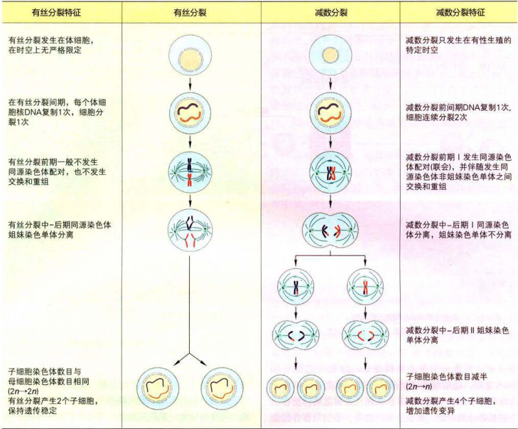  

  

#### （二）减数分裂过程  

  

由减数分裂前 $\mathrm{G}_{2}$ 期细胞进入两次有序的细胞分裂，即减数第一次分裂和减数第二次分裂。两次减数分裂之间的间期或长或短，但无DNA合成。减数分裂过程见图12-24。  

  

##### 1.减数分裂I

  

减数分裂I（meiosisI）与体细胞有丝分裂有许多相似之处，其过程也可以人为地划分为前期I、前中期 $1.$  

  

中期I、后期I、末期I和胞质分裂I6个阶段。但减数分裂I又有其鲜明的特点，其主要表现是分裂前期I的同源染色体配对和基因重组以及其后的染色体分离方式等。  

  

（1）前期I前期I（prophaseI）持续时间较长。在高等生物，其时间可持续数周、数月、数年，甚至数十年。在低等生物，其时间虽相对较短，但也比有丝分裂前期持续的时间长得多。在这漫长的时间过程中，要进行同源染色体配对和基因重组。此外，也要合成一定量的RNA和蛋白质。根据细胞染色体形态变化，又可以将前期I人为地划分为细线期、偶线期、粗线期、双线期和终变期5个阶段。  

  

细线期（leptotene，leptonema）：为前期I的开始阶段。首先发生染色质凝缩，染色质纤维逐渐螺旋化、折叠，包装成在显微镜下可以看到的细纤维样染色体结构。因而，有人将细线期也称为凝缩期（condensationstage）。细线期与有丝分裂前期起始阶段既有相似特点，如减数分裂前期I每个同源染色体的两条姐妹染色单体在黏连蛋白介导下被紧密约束在一起而不分离，待同源染色体配对时，黏连蛋白则参与联会复合体的装配；与有丝分裂前期也有明显不同，在细线期染色质在凝集前已复制，但仍呈单条细线状，看不到成双的染色体。但在电子显微镜下，可观察到此期的染色体是由两条染色单体构成的。不过，由于DNA复制在减数分裂前间期（S期）尚未全部完成，因而未被复制的DNA片段可能是将两条姐妹染色单体紧密联系在一起的可能因素之一（图12-25）。此期另外一个明显不同点是，在细纤维样染色体上，出现一系列大小不同的颗粒状结构，称为染色粒（chromomere）。虽然已经知道染色粒是由染色质紧密包装而成，但其功能并不清楚。细线期还有一个明显的特点，即染色体端粒通过接触斑与核膜相连。对玉米细胞减数分裂的研究发现，玉米细线染色体的端粒开始是分布在整个细胞核中，在邻近细线期结束时，端粒定位到核膜的内侧。由于很多细线染色体的端粒与核膜结合，使染色体装配成花束状，所以细线期又称花束期。  

  

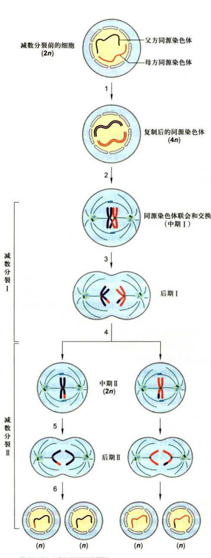  

图12-24减数分裂过程图解  

  

偶线期（zygotene，zygonema）：主要发生同源染色体配对（pairing），即来自父母双方的同源染色体逐渐靠近，沿其长轴相互紧密结合在一起。因而，偶线期又称为配对期（pairingstage）。配对过程是专一性的，仅发生于同源染色体之间，非同源染色体之间不进行配对。关于同源染色体之间相互识别的机制，目前尚不清楚。配对以后，两条同源染色体紧密结合在一起所形成的复合结构，称为二价体（bivalent）。由于每个二价体由两条同源染色体构成，共含有4条染色单体，因而又称为四分体（tetrad）。但此时的四分体结构并不清晰可见。同源染色体配对的过程称为联会（synapsis）。联会初期，同源染色体端粒与核膜相连的接触斑相互靠近并结合。从端粒处开始，这种结合不断向其他部位伸延，直到整对同源染色体的侧面紧密联会。联会也可以同时发生在同源染色体的其他位点上。在联会的部位形成一种特殊的复合结构，称为联会复合体（synaptonemalcomplex）。联会复合体沿同源染色体长轴分布，在电镜下可以清楚地显示其细微结构（图12-26）。联会复合体被认为与同源染色体联会和基因重组有关。在偶线期发生的另一个重要事件是合成在S期未合成的约 $0.3\%$ 的DNA（偶线期DNA，即zygDNA）。若用DNA合成抑制剂抑制zygDNA合成，联会复合体的形成将受到抑制。zygDNA在偶线期转录活跃。转录的RNA被称为zygRNA。zygDNA转录也被认为与同源染色体配对有关。  

  

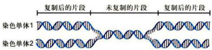  

图12-25偶线期DNA在减数分裂前期1才进行复制示意图可能是由于此种未复制的DNA片段的存在，导致两条姐妹染色单体紧密联系在一起。  

  

粗线期（pachytene，pachynema）：开始于同源染色体配对完成之后。这一过程可以持续几天至几个星期。在此过程中，染色体进一步凝缩，变粗变短，并与核膜继续保持接触。同源染色体仍紧密结合，并发生等位基因之间部分DNA片段的交换和重组，产生新的等位基因的组合。此时在联会复合体部位的中间，出现一个新的结构即重组节（combinationnodule）。重组节是同源染色体配对联会复合体中的球形、椭圆形或棒状的结节，直径约为 $90~\mathrm{{nm}},$ 是由蛋白质装配成的小体，结构不清楚（图12-26）。重组节中含有催化遗传重组的酶类，因此推测某些重组节与染色体重组有关。交叉与重组节在总的数量上是相等的，而在联会染色体上的分布方式两者也极为相似，果蝇的某些突变引起了交叉分布的异常，重组频率因此降低，此时，可发现重组节不仅数量减少，分布也发生了变化，这也从另一个角度证明重组节与染色体交换的发生有关。在粗线期，也合成一小部分尚未合成的DNA，称为P-DNA。P-DNA大小为$100-1~000$ bp，编码一些与DNA剪切（nicking）和修复（repairing）有关的酶类。  

  

粗线期另一个重要的生化活动是，合成减数分裂期专有的组蛋白，并将体细胞类型的组蛋白部分或全部地置换下来。这种置换也许在一定程度上参与了基因重组过程，或反映出减数分裂前期染色体结构的变化。  

  

在许多动物的卵母细胞发育过程中，粗线期还要发生rDNA扩增。即编码rRNA的DNA片段从染色体上释放出来，形成环形的染色体外DNA，游离于核质中，并进行大量复制，形成数千个拷贝的rDNA。如在非洲爪蟾卵母细胞中，经过rDNA扩增，可以产生大约  

  

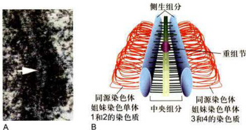  

图12-26电镜下见到的联会复合体和重组节结构（A）及其图解（B）  

  

A.照片显示联会复合体和重组节（箭头所指）。B.图解显示侧生组分、中央组分、重组节和同源染色体的姐妹染色单体。（A图由马红博士惠赠）  

  

2500个拷贝的rDNA。这些rDNA将参与形成附加的核仁，进行rRNA转录。  

  

双线期（diplotene，diplonema）：重组阶段结束，同源染色体相互分离，仅留几处相互联系。同源染色体的四分体结构变得清晰可见。同源染色体仍然相联系的部位称为交叉（chiasma）。交叉的数量变化不定，但一般认为“交叉”是遗传学“交换”（crossover）的细胞学基础。即使在同种物种的不同细胞之间，交叉的数量也不相同（图12-27）。在电镜下可见交叉部位含有残留的联会复合体结构。  

  

许多动物在双线期阶段，同源染色体或多或少地要发生去凝集，RNA转录活跃。关于染色体去凝集的程度，有的种类低到不易觉察，有的种类则高到几乎与一般间期细胞相似。在许多动物，尤其是鱼类、两栖类、爬行类和鸟类的雌性动物，染色体去凝集形成一种特殊的巨大染色体结构，形似灯刷，故称灯刷染色体（lampbrushchromosome）。在灯刷染色体上有许多侧环结构，是进行RNA活跃转录的部位。RNA转录、蛋白质翻译以及其他物质的合成等，是双线期卵母细胞体积  

  

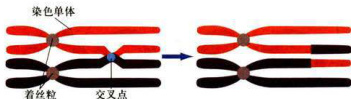  

图12-27双线期二价染色体图解  

  

可见4条染色单体，1个交叉，两个同源染色体各自的两个姐妹着丝粒并排存在。  

  

增长所必需的（见本书第九章）。  

  

目前比较清楚的是，在灯刷染色体侧环上合成的RNA主要为前体mRNA。前体mRNA合成以后，很快被剪辑为mRNA。有些种类的mRNA，如编码组蛋白、核糖体蛋白和卵黄蛋白的mRNA很快会在细胞质中翻译为蛋白质。许多其他种类的mRNA则和蛋白质结合，以非活跃形式储备在卵母细胞质中。直到卵细胞成熟并受精以后，这些储备的mRNA才能转变为活跃状态，进行蛋白质翻译。在灯刷染色体一定的侧环上，也可以检测到tRNA和5SrRNA的转录。  

  

双线期持续时间一般较长，其长短变化很大。两栖类卵母细胞的双线期可持续将近一年；而人类的卵母细胞双线期从胚胎期的第五个月开始，短者可持续十几年，到性成熟期开始，长者可达四五十年，到生育期结束。  

  

终变期（diakinesis）：染色体重新开始凝集，形成短棒状结构。如果有灯刷染色体存在，其侧环回缩，RNA转录停止，核仁消失，四分体较均匀地分布在细胞核中。同时，交叉向染色体臂的端部移行。此移行过程称为端化（terminalization）。到达终变期末，同源染色体之间仅在其端部和着丝粒处相互联结。终变期的结束标志着前期I的完成。  

  

（2）中期I前期I结束，细胞逐渐转入减数分裂中期I（metaphaseI）。在此过程中，要进行纺锤体组装。纺锤体结构和形成过程与一般有丝分裂过程中的相类似。核膜破裂标志着中期I的开始。纺锤体微管侵入核区，捕获分散于核中的四分体。四分体逐渐向赤道方向移动，最终排列在赤道面上。和有丝分裂不同的是，每个四分体含有四个动粒。其中一条同源染色体的两个动粒位于一侧，另一条同源染色体的两个动粒位于另一侧。从纺锤体一极发出的微管只与一个同源染色体的两个动粒相连，从另一极发出的微管也只与另一个同源染色体的两个动粒相连（图12-28）。  

  

（3）后期I同源染色体对分离并向两极移动，标志着后期I（anaphaseI）的开始。移向两极的每个同源染色体均含有两条姐妹染色单体。其结果，到达每一极的染色体DNA含量由 $4n$ 变为 $2n_{\circ}$ 以减数分裂前间期细胞复制后的染色体数目为基数，减数分裂的第一次分裂后的染色体数减半。另外，两套同源染色体在功能上是等价的，解除配对的同源染色体向两极移动是一个随机分配、自由组合的过程，因而到达两极的染色体会出现众多的组合方式。如人类细胞有23对染色体，从  

  

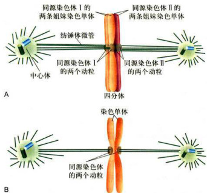  

图12-28减数分裂中期1（A）与减数分裂中期（B）动粒百纺锤体的联系示意图  

  

在减数分裂中期1，四分体中同源染色体的两个动粒位于同侧，只与从同一极发出的纺锤体微管相联结：减数分裂中期Ⅱ与一般有丝分裂中期相似，每个染色体的两个动粒分别位于染色体的两侧，分别与从两极发出的纺锤体微管相联结。  

  

理论上讲将会产生 $2^{23}$ 种不同的排列方式。如此庞大的排列方式，即使不发生基因重组，得到遗传上完全相同的配子概率也只有八百四十万分之一。再加上基因重组和精子与卵子的随机结合，要获得遗传上完全相同的子代个体几乎是不可能的，除非是同卵双生个体，其遗传性状可能相同。  

  

（4）末期I、胞质分裂I和减数分裂间期经过后期I后，细胞进一步的变化主要有两种类型：第一种类型，染色体到达两极，并逐渐进行去凝集。在染色体的周围，核被膜重新组装，形成两个子细胞核。同时，随着染色体分离并向两极移动，细胞质也开始分裂，形成两个间期子细胞。此时的间期细胞虽具有一般间期细胞的基本结构特征，但又有着重要区别，即它们不再进行DNA复制，也没有 $\mathrm{G}_{1}$ 期、S期和 ${\bf G}_{2}$ 期时相之分。间期持续时间一般较短，有的仅作短暂停留。为区别于一般细胞间期，特将其称为减数分裂间期（interkinesis）。第二种类型，即细胞进入末期后，不是完全回复到间期阶段，而是立即准备进行减数第二次分裂，即减数分裂IⅡ。  

  

##### 2.减数分裂Ⅱ  

  

减数分裂Ⅱ过程与有丝分裂过程非常相似，即经过分裂前期Ⅱ、中期Ⅱ、后期Ⅱ、末期Ⅱ和胞质分裂Ⅱ等几个过程。每个过程中细胞形态变化也与有丝分裂过程相似。对于上述第二种类型，染色体到达两极后，减数分裂I的纺锤体去组装，两极的中心粒和星体此时一分为二，重新组装成两个纺锤体。染色体在原来两极的位置重新排列，形成新的赤道板。此时即为中期Ⅱ。此后的发展则与一般有丝分裂相似。  

  

经过减数分裂Ⅱ，共形成4个子细胞。但它们以后的命运随生物种类不同而不同。在雄性动物中，4个细胞大小相似，称为精细胞，经变态进一步发育成4个精子。在雌性动物中，减数分裂I为不等分裂，即第一次分裂后产生一个大的卵母细胞和一个小的极体，称为第一极体。第一极体将很快死亡解体，有时也会进一步分裂为两个小细胞，但没有功能。卵母细胞将继续进行减数分裂Ⅱ，也为不等分裂。其结果是产生一个卵细胞和一个第二极体。第二极体也没有功能，很快解体。因此，雌性动物减数分裂仅形成一个有功能的卵细胞。高等植物减数分裂与动物减数分裂类似，即雄性产生4个有功能活性的精子，而雌性仅产生一个有功能活性的卵细胞。  

  

#### （三）减数分裂过程的特殊结构及其变化  

  

##### 1.性染色体的分离  

  

在染色体组型中与性别决定有关的染色体称性染色体。XY型性别决定是所有哺乳类动物、多数雌雄异株植物、部分昆虫、某些鱼类和两栖类动物的性别决定方式。不同性别之间，其性染色体构成不同。性染色体组成为XX的个体是雌性，性染色体组成为XY或XO（即无Y染色体）的个体是雄性。另一种为ZW型性别决定，刚好与XY型相反，雌性个体的性染色体组成为ZW，雄性个体的性染色体组成为ZZ。ZW型性别决定方式普遍存在于鸟类、鳞翅目昆虫、某些两栖类和爬行类之中。对于含有XX性染色体的细胞，两条X染色体像常染色体一样进行正常配对、交换和分离。而含有XY性染色体的细胞，两条性染色体的形态结构不同，基因含量也不同。在前期I，二者是如何配对和分离的呢？一般讲，有些物种的XY染色体间可能会含有一些同源区段，有的可能不含任何同源区段。对于含有同源区段的XY染色体，如人类的XY染色体，在前期I可以进行配对。不管XY染色体配对与否，二者都将和常染色体一样，在分裂中期I排列到赤道面上。其后，随常染色体分离而相互分离，并各自移向两极。到减数分裂Ⅱ，XY染色体和常染色体一样，其两条染色单体再进行分离。偶尔也可出现XY染色体的染色单体在减数分裂I时就相互分离的现象，致使产生的两个细胞各含有一个X染色单体和一个Y染色单体。到第二次减数分裂时，每个细胞的 $\mathrm{x}$ 和Y染色单体再分配到两个细胞中。  

  

对于XO物种（主要是昆虫），在第一次减数分裂时，X染色体移向一极。结果将产生一个含X染色体的细胞和一个不含性染色体的细胞。到第二次减数分裂，含X染色体的细胞分裂为两个含X染色单体的细胞；不含性染色体的细胞也一分为二，形成两个不含性染色体的细胞。偶尔也可以看到X染色体的两个染色单体在第一次减数分裂时即相互分离，产生两个各含一个X染色单体的细胞。到第二次减数分裂时，X染色单体仅分配到一个细胞中。最终结果是，一个XO细胞经过减数分裂，产生两个含 $x$ 染色体的细胞和两个无性染色体的细胞。  

  

##### 2.联会复合体和基因重组  

  

联会复合体是减数分裂期间（前期I）在两个同源染色体之间形成的一种临时性蛋白质梯状结构。这种结构是M.J.Moses于1956年用电镜观察卵母细胞时发现的。随后证实，联会复合体在动物和植物减数分裂过程中广泛存在，主要功能是介导同源染色体之间配对（联会）和遗传重组（交换）。现在也有证据表明，联会复合体对于遗传重组不是必需的，因为不仅发现重组可以发生在联会复合体装配之前，而且发现突变的酵母细胞即使不能形成联会复合体，也能实现遗传信息的交换。所以近来又认为联会复合体的主要功能是为相互作用的染色单体之间完成交换提供一种结构框架。联会复合体在同源染色体联会处沿同源染色体长轴分布，由位于中间的中央组分和位于两侧的侧生组分共同构成。侧生组分的外侧则为配对的同源染色体（图12-29）。联会复合体中央组分宽约 $100~\mathrm{{nm}}$ 侧生组分宽 $20{\sim}40~\mathrm{nm},$ ，从两侧的侧生组分向中央组分方向发出横向纤维（transversefiber），交会于中央组分的中间部位。  

  

蛋白质是联会复合体的主要组成成分之一。用胰蛋白酶、链霉蛋白酶等处理联会复合体，其中央组分、侧生组分以及横向纤维等结构消失。现已鉴定出联会复合体3种特异性蛋白：SCprotein-1（SYCP1）、SCprotein-2（SYCP2）和SCprotein-3（SYCP3），并已在人类中确定其编码基因的染色体定位。SYCP3和SYCP2参与侧生组分组成，SYCP1参与中央组分组成，也是横向纤维的  

  

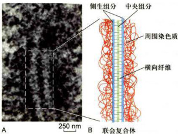  

图12-29粗线期的联会复合体A联会复合体电镜照片。B.联会复合体图解。（A图由马红博士惠赠）  

  

主要成分。  

  

P.B.Moens实验室等曾经分离出几种联会复合体结构蛋白，并用其制备了特异抗体。用免疫电镜方法证实，其中有两种小分子蛋白质位于侧生组分，两者的分子质量分别为30和 $33\mathrm{\kDa},$ 第三种蛋白质分子质量为 $125\mathrm{{kDa}}$ ，位于中央组分。第四种蛋白质的分子质量约为 $190\ensuremath{\mathrm{kDa}}$ 既分布于侧生组分，也分布于中央组分。这些蛋白质分子的功能尚不清楚。另外，用同样方法也证明，DNA拓扑酶Ⅱ存在于侧生组分和其周围的染色质中。  

  

DNA片段也是联会复合体的组成成分之一。这些DNA片段长度多在 $50\sim550$ bp之间。它们很可能是挂在或包含于侧生组分的染色体纤维的部分DNA片段。Moens等用DNA酶消化分离多线染色体，发现这些DNA片段被联会复合体保护而免遭DNA酶消化。序列分析显示，这些DNA片段中并无特殊的DNA序列。不同细胞之间，这些DNA片段的大小和碱基的序列会有明显差别。这些结果提示，DNA与联会复合体结合不需要特殊的DNA序列；染色体的任何部分都可能与联会复合体的侧生组分结合。这些DNA片段很可能完全穿越侧生组分而进入中央组分，在此处参与同源染色体的基因重组。  

  

在中央组分和侧生组分中还发现有RNA。因此，联会复合体可能含有核糖核蛋白复合物。  

  

联会复合体被认为从细线期开始组装，经过偶线期至粗线期形成典型的联会复合体结构，同时在粗线期重组节开始组装。双线期联会复合体开始去装配，终变期时完全消失。  

  

# 思考题  

  

1.什么是细胞周期？细胞周期各时相的主要变化是什么？  

2.不同物种之间的细胞周期有何异同？  

3.试比较有丝分裂与减数分裂的异同点。  

4.细胞通过什么机制将染色体排列到赤道板上？有何生物学意义？  

5.说明细胞分裂后期染色单体分离和向两极移动的运动机制。  

6.试述动粒的结构及功能。  

7.说明细胞分裂过程中核膜破裂和重装配的调节机制。  

  

# 参考文献  

  

1.ArchambaultVloverDMolo-likekinasesseratianddivergenceintheirfunctinsandregulatiae ReviewsMolecularCellBiology,2009,10（4）:265-275.  

2.BeckMHurtE.Thenuclearporecomplex:understanding itsfunctionthroughstructuralinsightNatureReviews MolecularCellBiology,2017,18(2）:73-89.  

3.ClarkePRZhang C.Spatialandtemporalcoordinationofmitosis byRanGTPaseNatureReviewsMolecularCell Biology,2008,9（6):464-477.  

4.GuiingerSauellEKutayUrchestratinguclearnvloedisasmblyandassmblyuringiisaue ReviewsMolecular CellBiology,2009,10(3）:178-191.  

5.HaraMFukagaaTKinochoeassemblyanddisassemblyuringitoticentryandexitCurentOpiniiCell Biology,2018,52:73-81.  

6.LaJoieDUlnKSCodsofassblyupiniCelogy6:9-45.  

7.NiggEARaffJWCntrilescntosmesandcliainhealthanddisase.Cell99（4）:66-678.  

8.Lara-GozalezPWestopeFGayloSS.The spindleasmblycheckpntCurrntBogy22（2） R966-R980.  

9.WalczakCECiSojaAMchasofhrooomebhaviruringiosisaueReviesMoleclaCell Biology,2010,11(2):91-102.  

10.WangGingQZhangC.Theroleofiticinasesinuplingctroscycleiththeaseblyofthic spindle.JournalofCellScience,2014,127（19):411142.