# 蛋白质分选与膜泡运输  

## 第一节 细胞内蛋白质的分选  

在真核细胞中，除少量蛋白质在线粒体和叶绿体内合成外，绝大多数蛋白质都是由核基因编码，或在游离的核糖体上合成，或在糙面内质网膜结合的核糖体上合成。然而，蛋白质合成以后必须转运到达特定的部位才能参与组装细胞结构，发挥其生物学功能，这一过程称为蛋白质靶向转运（protein targeting）或蛋白质分选（protein sorting）。

### 一、信号假说与蛋白质分选信号
==信号假说==
Palade发现，在细胞质的游离核糖体上合成的是非分泌蛋白，而在内质网附着核糖体上能合成分泌蛋白。但细胞学家们并没有发现能够解释游离核糖体和附着核糖体功能差异的原因。Palade的学生G.Blobel假设该差异应存在于蛋白质本身。他和同事D.Sabatini推测分泌蛋白可能在N端携带有短的信号序列。一旦该序列从核糖体翻译合成，结合因子便与该序列结合，指导其转移到内质网膜，后续翻译过程将在内质网膜上进行。这就是1975年Blobel和Sabatini提出的信号假说（signal hypothesis）。

==无细胞翻译系统与细胞翻译系统的对比==
后来，P.Leder及其同 $215$ 构建的无细胞翻译系统合成了比正常分泌抗体长 ${6-8}$ 个氨基酸的轻链，其他研究者也获得了相似的结果。在对Blobel和Sabatini的假说不知情的情况下，剑桥大学的Milstein基于他的体外无细胞系统提出了相似假设，但当研究人员检查微粒体的蛋白质时，发现只存在正常长度的蛋白质，他们假设这多余氨基酸序列在指导蛋白质转运至内质网上有重要作用。尽管一些人质疑多出的一段肽链是体外翻译和分离的错误，但Blobel等人设计了一种蛋白质体外翻译-转运系统，获得了一系列信号假说的证据，如利用鼠的mRNA、兔的核糖体和狗的内质网（胰腺微粒体）组建的翻译-转运系统可能是一个通用系统。探究细胞内蛋白质转运机制的诸多细节花费了20多年时间，其中洛克菲勒大学的Blobel在1999年因此获诺贝尔生理学或医学奖。  

==蛋白质分选的决定因素==
已知指导分泌蛋白在糙面内质网上合成的决定因素包括：蛋白质N端的信号肽（signalsequence或signalpeptide）、信号识别颗粒（signalrecognitionparticle,SRP）和内质网膜上信号识别颗粒的受体（又称停泊蛋白，dockingprotein，DP）等因子共同协助完成的。  

**信号肽位于蛋白质的N端**，一般由 $16\sim26$ 个氨基酸残基组成，其中包括**疏水核心区、信号肽的C端和N 端等三部分**（图6-1）：原核细胞某些分泌蛋白的N端也具有信号序列。**信号肽似乎没有严格的专一性**，如大鼠的胰岛素原蛋白接上真核或原核细胞的信号肽，均可通过大肠杆菌的细胞质膜分泌到细胞外。  

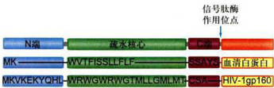  
>图6-1信号肽的一级结构序列 ；以血清白蛋白和HIV-1型病毒的糖蛋白gp160信号肽为例，显示出两者信号肽一级序列分别由疏水核心、C端和N端三个区域构成。  

==SRP是一个含7sRNA的核糖核蛋白的复合体==
**信号识别颗粒（SRP）** 是一种**核糖核蛋白复合体**（图6-2），由6种不同的蛋白质和一条长度约为300个核苷酸的7SRNA组成，SRP通常存在于细胞质基质中，等待信号肽从多聚核糖体上延伸暴露出来，SRP既可与新生肽信号序列和核糖体大亚基结合，又可与内质网膜上SRP受体结合。SRP受体是内质网膜上的整合蛋白，由 $\mathfrak{a}$ 和 $\upbeta$ 亚基组成，可特异地与SRP结合。当SRP的p54亚基和SRP受体的 $\mathfrak{a}$ 亚基与GTP结合时，会增进SRP/新生肽/核糖体复合物与SRP受体结合的强度。  

应用体外无细胞系统（cellfreesystem）进行蛋白质合成实验，证实分泌蛋白向rER腔内的转运是同蛋白质翻译过程偶联进行的，这种**分泌蛋白在信号肽引导下边翻译边跨膜转运的过程称为共翻译转运(cotranslational translocation)。**  

SRP含有两个结构域，**p54蛋白**是一种包含成簇甲硫氨酸残基的**GTP酶**，甲硫氨酸侧链与信号肽的疏水核心结合：当SRP与信号肽结合后，SRP的p9和p14蛋白复合体阻断新生肽链的翻译。  

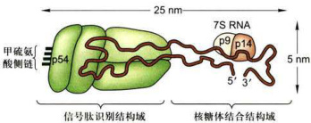  

图6-2信号识别颗粒（SRP）的结构示意图  

根据已有研究资料和证据，对表6-1中的结果及分泌蛋白在内质网上合成的共翻译转运过程可概括为如图6-3所示。  

蛋白质首先在细胞质基质游离核糖体上起始合成，当多肽链延伸至约80个氨基酸残基时，N端的内质网信号序列暴露出核糖体并与SRP结合，导致肽链延伸暂时停止，防止新生肽N端损伤和成熟前折叠（图6-3步骤1和2），直至SRP与内质网膜上的SRP受体结合，将核糖体-新生肽复合物附着到内质网膜上（图6-3步骤3），当2分子GTP分别与SRP-p54亚基和SRP受体 $\scriptstyle{\mathfrak{a}}$ 亚基结合时，这种结合复合物的相互作用被强化。核糖体-新生肽复合物与内质网膜的移位子（translocon）结合，SRP脱离了信号序列和核糖体，返回细胞质基质中重复使用，肽链又开始延伸。以环化构象存在的信号肽与移位子组分结合并使孔道打开，信号肽穿入内质网膜并引导肽链以裆环的形式进入内质网腔中，这是一个耗能过程（图6-3步骤4）。与此同时，腔面上的信号肽酶切除信号肽并快速使之降解（图6-3步骤5）。肽链继续延伸，直至完成整个多肽链的合成（图6-3步骤6），蛋白质进入腔内并折叠，核糖体释放，移位子关闭（图6-3步骤7和8）。  

引导新生肽链穿过移位子的信号肽可视为**起始转移序列（starttransfersequence）**。肽链中还可能存在某些内在序列与内质网膜有很强的亲和力从而使之结合在脂双层之中，这段序列不再转入内质网腔中，称之为**内在停止转移锚定序列（internalstop-transferanchorsequence，STA）** 和**内在信号锚定序列（internalsignal-anchorsequence，SA）**。如果一种多肽只有N端信号序列而没有停止转移锚定序列，那么这种多肽合成后一般进入内质网腔中，如果一种多肽的停止转移锚定序列位于多肽的内部，那么这种多肽最终会成为内质网的膜蛋白。含有多个起始转移序列和多个停止转移锚定序列的多肽将成为多次跨膜的膜蛋白。

<html><body><table><tr><td>实验组别</td><td>含有编码信号序列的mRNA</td><td>SRP</td><td>DP</td><td>微粒体</td><td>结果</td></tr><tr><td>1</td><td>+</td><td></td><td></td><td></td><td>产生含信号肽的完整多肽</td></tr><tr><td>2</td><td>+</td><td>+</td><td>一</td><td>一</td><td>合成70~100个氨基酸残基后，肽链停止延伸</td></tr><tr><td>3</td><td>+</td><td>+</td><td>+</td><td>一</td><td>产生含信号肽的完整多肽</td></tr><tr><td>4</td><td>+</td><td>+</td><td>+</td><td>+</td><td>信号肽切除，多肽链进入微粒体中</td></tr></table></body></html>
>表6-1在无细胞系统中蛋白质的翻译过程与SRP、DP和微粒体的关系  
+和“-”分别代表反应混合物中存在 $(+)$ 或不存在 $(-)$ 该物质。  

跨膜蛋白的拓扑学结构可能就是由这些蛋白质一级结构中的起始和停止转移序列共同决定的。在rER合成的整合膜蛋白根据拓扑学特征大体上可分为4类（图6-4），它们的共同点是多肽链的 $20-25$ 个疏水氨基酸残基形成跨膜 $\upalpha$ 螺旋，不同点在于是否有N端可切割的ER信号序列，定位方向或跨膜次数也会有所不同，其中单次跨膜蛋白多肽链内在 停止转移序列和信号锚定序列决定其拓扑学特征。至于新生肽链的跨膜取向主要受到跨膜片段侧翼氨基酸残基的电荷分布的影响，一般而言，带正电荷氨基酸残基一侧朝向细胞质基质一侧。   

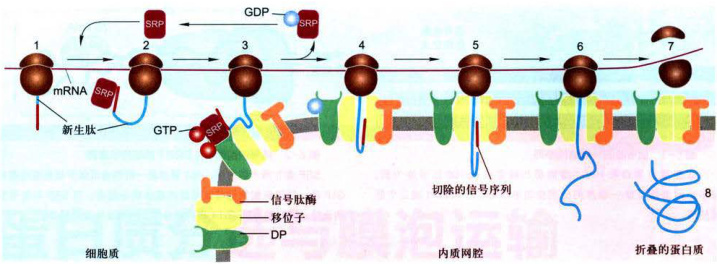  
>图6-3分泌蛋白的合成与共翻译转运过程图解;图示信号序列、SRP、SRP受体及移位子之间的相互作用。1一2.分泌蛋白合成起始，内质网靶向信号序列合成，并被游离的SRP识别：3.SRP与内质网膜上的受体结合，引导核糖体-新生肽复合物附着到内质网膜上：4.核糖体/新生肽与内质网膜的移位子结合，伴随GTP水解，SRP与相应受体解离，返回细胞质基质中重复使用， 肽链又开始延伸，通过移位子以祥环的形式进入内质网腔：5.新生肽链的信号序列被信号肽酶切除：6.新生肽链继续延伸，直至多肽链的合成结束；7一8.蛋白质进入腔内并折叠。  

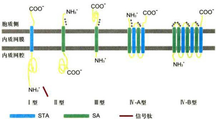  

>图6-4内质网膜整合蛋白的拓扑学类型 ；STA:内在停止转移错定序列：SA：内在信号锚定序列。这样的序列在多次跨膜蛋白中会有变化。I、Ⅱ、Ⅲ型均为一次跨膜α螺旋，I型蛋白含有一个被切割的N端内质网信号序列，通过STA锚定在膜上，N端亲水区位于内质网腔面，C端亲水区位于细胞质基质面，如LDL受体、流感HA、胰岛素受体、生长素受体：Ⅱ型蛋白不含有可切割的内质网信号序列，N端亲水区位于细胞质基质侧，C端亲水区位于内质网腔面，如无唾液酸糖蛋白受体、转铁蛋白受体、高尔基半乳糖苷转移酶、高尔基唾液酸转移酶：Ⅲ型蛋白含有一个疏水的跨膜片段，邻近N端亲水区，与I型蛋白有相同方向但不含可切割的信号序列，如细胞色素P450：V型蛋白含有2个或多个跨膜片段，又称多次跨膜蛋白，例如G蛋白偶联受体、葡糖转运蛋白、电压门控Ca通道、ABC小分子泵、CFTR（Cr）通道、Sec61蛋白。  

线粒体、叶绿体中绝大多数蛋白质以及过氧化物酶体中的蛋白质也是在某种信号序列的指导下进入这些细胞器中。为了研究方便，有人将这种信号序列称之为导肽（leaderpeptide），其基本特征是蛋白质在细胞质基质中合成以后再转移到这些细胞器中，因此称这种翻译-转运方式为**翻译后转运（post-translationaltranslocation）**。

这种转运方式在蛋白质跨膜过程中不仅**需要消耗ATP**使多肽去折叠，而且还**需要一些分子伴侣蛋白**的协助（如热激蛋白Hsp70）以帮助这类转运蛋白正确折叠形成有功能的蛋白质。

继发现信号肽序列之后，人们又相继发现一系列蛋白质分选信号序列（表6-2），统称**信号序列（signalsequence）**。有些信号序列还可形成三维结构的**信号斑（signalpatch）**，指导蛋白质转运至细胞的特定部位。  

<html><body><table><tr><td>靶细胞器</td><td>蛋白质中信号 序列的定位</td><td>信号序列 是否切除</td><td>信号序列性质</td></tr><tr><td>内质网（腔）</td><td>N端</td><td>切除</td><td>6~12个疏水氨基酸核心，前面常有一个或多个碱性氨基酸（Arg、Lys）</td></tr><tr><td>线粒体（基质）</td><td>N端</td><td>切除</td><td>两亲螺旋，长度20~50个氨基酸残基，一侧具有Arg和Lys残基，另一 侧是疏水残基</td></tr><tr><td>叶绿体（基质）</td><td>N端</td><td>切除</td><td>没有共同基序，常富含Ser、Thr和少数疏水残基，罕见Glu和Asp</td></tr><tr><td>过氧化物酶体</td><td>大多在C端， 少数在N端</td><td>不被切除</td><td>PTS1信号（Ser-Lys-Leu）在C端，PTS2信号在N端</td></tr><tr><td>细胞核</td><td>变化的</td><td>不被切除</td><td>多种类型，共同基序含有短的富含Lys和Arg残基序列</td></tr></table></body></html>
>表6-2指导蛋白质从细胞质基质转运到细胞器的靶向序列的主要特征  
\*注：靶向细胞器的膜或其他亚区间的蛋白质有不同或附加的信号序列。  

### 二、蛋白质分选转运的基本途径与类型  

==核基因编码的蛋白质的分选大体可分两条途径：==  
**（1）翻译后转运途径**：即在细胞质基质游离核糖体上完成多肽链的合成，然后转运至膜围绕的细胞器，如线粒体、叶绿体、过氧化物酶体及细胞核，或者成为细胞质基质中的可溶性驻留蛋白和骨架蛋白（图6-5右侧）。人们最近在酵母细胞中也发现有些分泌蛋白不像大多数真核细胞那样，边合成边跨膜转运，而是由结合ATP的分子伴侣BiP蛋白（BiP-ATP）与膜整合蛋白Sec63复合物相互作用，水解ATP提供动力驱动翻译后转运途径，即分泌蛋白在细胞质基质游离核糖体上合成，然后再转运至内质网中。  
**(2）共翻译转运途径**：即蛋白质合成在游离核糖体上起始之后，由信号肽及其与之结合的SRP（信号肽-SRP）引导转移至糙面内质网，然后新生肽边合成边转人糙面内质网腔或定位在ER膜上，经转运膜泡运至高尔基体加工包装再分选至溶酶体、细胞质膜或分泌到细胞外，内质网与高尔基体本身的蛋白质分选也是通过这一途径完成的（图6-5左侧）。  

  

==根据蛋白质分选的转运方式或机制不同，又可将蛋白质转运分为四类：==  
**（1）蛋白质的跨膜转运**（transmembrane transport）主要是指共翻译转运途径中，在细胞质基质中起始合成的蛋白质，在信号肽-SRP介导下与内质网膜上SRP受体结合转移到内质网，然后边合成边转运，或进人内质网腔或插入内质网膜；此外是指翻译后转运途径中，在细胞质基质核糖体上完成合成的多肽链在不同靶向信号序列指导下，依不同的机制转运到线粒体、叶绿体和过氧化物酶体等细胞器。  
**（2）膜泡运输**（vesicular transport）蛋白质通过不同类型的转运膜泡从糙面内质网合成部位转运至高尔基体进而分选转运至细胞的不同部位。膜泡运输涉及供体膜出芽形成不同的转运膜泡、依赖细胞骨架和分子马达的膜泡运输以及膜泡与靶膜的融合等过程。  
**（3）选择性的门控转运**（gated transport）在细胞质基质中合成的蛋白质通过核孔复合体在核-质间双向选择性地完成核输入或核输出，参见第九章第一节关于核孔复合体的选择性运输。  
（4）细胞质基质中蛋白质的转运上述几种分选类型也涉及蛋白质在细胞质基质中的转运，这一过程显然与细胞骨架系统密切相关，但由于细胞质基质的组织结构尚不清楚，因此对其中的蛋白质转运特别是信号转导途径中蛋白质分子的转运方式了解甚少。  

  

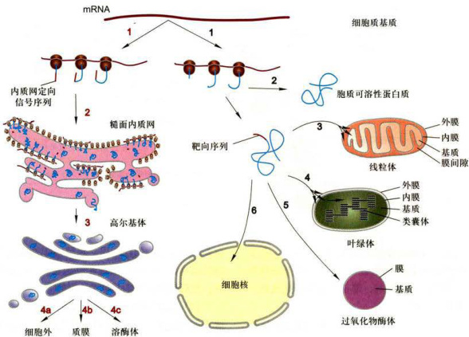  

>图6-5真核细胞蛋白质分选的主要途径与类型；图右侧（黑色序号）代表翻译后转运的非分泌途径：1.核基因编码的mRNA在细胞质基质游离核糖体上完成多肽链的合成；2.合成的蛋白质不含信号序列，并驻留在细胞质基质中；3、4、5.依据不同的细胞器特异性的靶向序列，首先释放到细胞质基质，然后通过跨膜运输方式转运至线粒体、叶绿体和过氧化物酶体；6.通过核孔复合体门控运输方式转运至细胞核。图左侧（红色序号）代表共翻译转运的蛋白质分泌途径：1.核基因编码的mRNA在细胞质基质游离核糖体上起始合成，然后在信号肽及其结合的SRP引导下与内质网膜结合并完成蛋白质合成：2.在rER完成蛋白质合成；3.以膜泡运输方式转运至高尔基体：4a、4b、4c.以膜泡运输方式分选至细胞外、质膜和溶酶体。  

### 三、蛋白质向线粒体和叶绿体的分选  

与共翻译转运途径中依赖N端信号肽序列靶向内质网的过程不同，翻译后转运途径中要进入到线粒体（图6-6）、叶绿体（图6-7）和过氧化物酶体等细胞器的蛋白质的分选是由多个步骤组成的过程，并需要多个不同的靶向序列（targetingsequence）。**定位到叶绿体的前体蛋白的 $\mathbf{N}$ 端具有 $40\sim50$ 个氨基酸组成的转运肽（transitpeptide）**，用以指引多肽定位到叶绿体并进一步穿过叶绿体被膜进入基质或类囊体中。转运到线粒体和过氧化物酶体的蛋白质与此类似，但靠的是不同的引导序列，即线粒体蛋白 ${\textrm{N}}$ 端的导肽或过氧化物酶体蛋白 ${\textrm{C}}$ 端的内在靶向序列（见表6-2）。至于这些细胞器蛋白最终是定位在不同的膜上还是不同的基质空间，除不同转运肽之外，还需要其他参与空间定位的信号序列。此外，通过翻译后转运途径进入线粒体、叶绿体和过氧化物酶体等细胞器的蛋白质，也必须在分子伴侣的帮助下解折叠或维持非折叠状态，以顺利通过膜上的输入装置。蛋白质输入这些细胞器通常是需要能量的过程。  

#### 1.蛋白质从细胞质基质到线粒体的转运  

大部分线粒体蛋白是由核基因编码的，这些蛋白质在细胞质基质游离核糖体上合成后被转运到线粒体发挥功能。  

（1）蛋白质从细胞质基质输入到线粒体基质所有线粒体基质蛋白的N端靶向信号序列虽然不尽相同，但共享相似的基序（motif），由 $20\sim50$ 个氨基酸残基组成，富含疏水氨基酸，带正电荷的碱性氨基酸（Arg、Lys）和羟基氨基酸（Ser、Thr），缺少带负电荷的氨基酸（Asp、Glu）。

这样的氨基酸残基组成有利于基质蛋白的靶向信号序列形成两亲的 $\mathfrak{a}$ 螺旋构象，并且实验表明，两亲的N端靶向信号序列对于指导蛋白质输入线粒体基质是至关重要的。蛋白质从细胞质基质输入到线粒体基质的基本步骤如图6-6A所示：在游离核糖体上合成的前体蛋白，与分子伴侣Hsp70结合，并使其保持未折叠或部分折叠状态。

其N端具有线粒体基质靶向序列（步骤1），前体蛋白与内外膜接触点附近的输入受体（Tom20/22）结合（步骤2），被引进输入孔（步骤3），输入的蛋白质进而通过内外膜接触点的输入通道（外膜为Tom40，内膜为Tim23/17，步骤4、5），线粒体基质分子伴侣Hsp70与输入的蛋白质结合并水解ATP以驱动基质蛋白的输入。输入蛋白的基质靶向序列在基质蛋白酶作用下被切除，同时Hsp70也从新输入的基质蛋白上释放下来（步骤6），折叠成活性形式（步骤7）。  

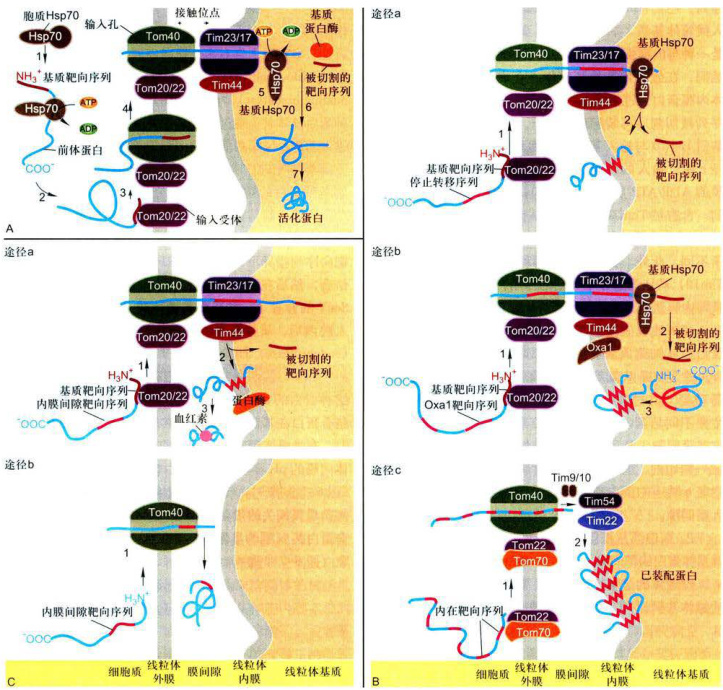  

图6-6通过翻译后转运途径，核基因编码的线粒体蛋白的转运  ；A.蛋白质从细胞质基质输入到线粒体基质。B.线粒体蛋白通过三种途径从细胞质基质输入到线粒体内膜。C.线粒体蛋白通过两种途径从细胞质基质输入到线粒体膜间隙。TOM/TIM：translocaseofouterinermitochondriamembranecomplex，线粒体外/内膜移位酶复合物。  

**（2）线粒体内膜蛋白的输入**如图6-6B所示，途径a和途径b输入的线粒体蛋白其 $\mathbf{N}$ 端都有基质靶向序列，在线粒体外膜上都利用 $\mathrm{Tom}40$ 为输入孔道，外膜上Tom22/20作为识别N端基质靶向序列的输入受体，内膜转运蛋白都是 $\mathrm{Tim}23/17$ ，但通过途径b输入的内膜蛋白（如ATP合酶亚基9）不但具有N端基质靶向序列，还具有内在的疏水结构域，前者引导前体蛋白进入线粒体基质，后者可被内膜蛋白Oxal所识别，Oxal是一种与内膜蛋白插入相关的蛋白质，由线粒体基因组编码，在线粒体基质核糖体上合成。因此，这类线粒体内膜蛋白通过途径b，其前体先进入基质，基质靶向序列被切割后再装配到内膜上。在a和b两种途径中，基质Hsp70与输入基质可溶性蛋白起相同作用。在途径c中，输入的内膜蛋白是多次跨膜蛋白（如6次跨膜的ADP/ATP反向交换蛋白），缺少N端基质靶向序列，含有被 $\mathrm{Tom}70/\mathrm{Tom}22$ 输入受体识别的多个内在靶向序列，内膜的转运通道 $\mathrm{Tim}22/54$ 也与a、b途径有所不同。此外，在途径c中两种膜间空间蛋白（Tim9/Tim10）被认为起分子伴侣的作用，协助输入蛋白在外膜与内膜通道之间的转运。  

**（3）线粒体膜间隙蛋白的输入**如图6-6C所示，蛋白质从细胞质基质输入到线粒体膜间隙的途径有两种：途径a是从细胞质基质输入到线粒体膜间隙的主要途径，其过程与内膜蛋白途径a类似（图6-6B），主要不同是蛋白质（如细胞色素b2）内在靶向序列定位在膜间隙，并且在转运过程中被内膜上蛋白酶于膜间隙一侧切割，然后释放的蛋白质折叠并与血红素结合；途径b转运的蛋白质通过外膜 $\mathtt{T o m40}$ 输入孔，直接进入膜间隙。  

#### 2.蛋白质从细胞质基质向叶绿体的分选：基质与类囊体蛋白的靶向输入  

叶绿体的结构比线粒体还要复杂，除外膜、内膜、叶绿体基质以外，还有相对独立的类囊体，由核基因编码的叶绿体基质蛋白包括所有卡尔文循环有关的酶和1，5-二磷酸核酮糖羧基歧化酶（Rubisco）的小亚基都是在细胞质基质合成后输入到叶绿体基质的。**这些前体蛋白均具有N端基质输入序列（stromal-importsequence）**，与线粒体基质蛋白的输入过程基本相似，前体蛋白以非折叠形式输入，并有赖于基质Hsp70的作用和ATP提供能量；**与线粒体不同的是，叶绿体不产生跨内膜的电化学梯度，因此ATP水解供能几乎是唯一动力来源。**  

定位在类囊体膜和类囊体腔的许多蛋白质与光合作用相关，其中大多数是在细胞质基质中以前体形式合成的，多肽链上含有多个靶向序列。以质体蓝素蛋白前体（plastocyaninprecursor）和金属结合蛋白前体（metal-bindingprecursor）为例，如图6-7所示，尚未折叠的两种蛋白前体首先通过外膜上相同的转运基质蛋白的通道进入基质，N端基质靶向序列被基质蛋白酶切除，从而使类囊体靶向序列暴露（图6-7步骤1）：进入基质后这两种蛋白的转运途径产生分歧，一个是SRP依赖途径：质体蓝素及类似的蛋白质在基质空间保持非折叠状态，这需要一组分子伴侣参与（图中未示），在类囊体靶向序列指导下与叶绿体SRP（和细菌SRP密切相关）结合，然后在类囊体膜上叶绿体SRP受体在转运蛋白SecY的介导下，转运到类囊体腔（图6-7步骤2）；进入腔内后，质体蓝素的类囊体靶向序列被内切蛋白酶（endoprotease）切除，蛋白质折叠产生成熟构象（图6-7步骤3）。另一种是pH依赖的途径：非折叠的金属结合蛋白的N端基质靶向序列首先被切除，然后金属结合蛋白在基质中折叠并与其辅因子结合（图6-7步骤2），在类囊体靶向序列N端的两个精氨酸残基和跨叶绿体内膜的pH梯度是折叠蛋白输入到类囊体腔所必需的（图6-7步骤3）：类囊体膜上的转运蛋白至少由4种与细菌质膜相关的蛋白质组成，输入到类囊体腔的金属结合蛋白其N端的类囊体靶向序列被切除，产生成熟的构象（图6-7步骤4）。  

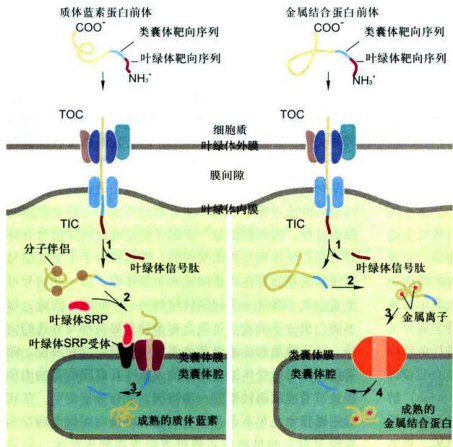  

图6-7通过后翻译转运途径，叶绿体蛋白从细胞质基质输入到类囊体腔 TOC/TiC:translocase of the outer/inner chloroplastmembranecomplex，叶绿体外/内膜 移位酶复合物。  

## 第二节 细胞内膜泡运输  

### 一、膜泡运输概述  

在高度区室化的真核细胞中，细胞生命活动有赖于细胞内部各结构组分之间的协同作用。由内膜系统构成的各区室之间物质的输送通常是靠膜泡的方式进行，如内质网、高尔基体和溶酶体等细胞器之间蛋白质的转运，细胞分泌物的释放和内吞物向溶酶体的转运也是通过膜泡进行的。膜泡运输，是指从细胞内膜系统的某个细胞器（包括内体）表面出芽形成的囊泡，或者是由细胞膜内陷形成的内吞泡在分子马达的介导下沿微管或微丝（相关内容见第八章）转运到目的地，并与靶细胞器或细胞膜融合的过程。通过这一过程将一个细胞器中的物质转运到另一个细胞器中，或分泌到细胞外。膜泡运输是真核细胞内一种最重要的运输系统。例如，对控制血糖具有重要作用的胰岛素，正是借助膜泡进行精确传递并最终释放在血液中。2013年两位美国科学家J.E.Rothman和R.W.Schekman和一位德国科学家T.C.Sudhof因为解答了细胞如何组织其内部的运输系统—囊泡运输系统的奥秘而获得诺贝尔生理学或医学奖。这三位科学家中，美国加州大学伯克利分校的Schekman以酵母温度敏感突变株为材料发现了能控制细胞运输系统不同方面的三类基因，从基因层面上为了解细胞中囊泡运输的严格管理机制提供了新线索；耶鲁大学的Rothman在20世纪90年代发现了SNARE蛋白复合体介导膜的融合；基于前两位美国科学家的研究，德国科学家Sudhof在研究突触信息传递中，发现并解释了膜泡如何在神经指令下由 $\mathbf{Ca}^{2+}$ 触发并精确地释放出内部的神经递质。若膜泡运输系统发生病变，细胞运输机制随即不能正常运转，可能导致神经系统病变、糖尿病以及免疫紊乱等严重后果，正如诺贝尔奖评选委员会在声明中所说，“没有膜泡运输的精确组织，细胞将陷入混乱状态”。因此，细胞必须依赖有效而精密的机制，确保在糙面内质网合成的各种蛋白质，加工后在高尔基体TGN区通过形成不同的转运膜泡以不同的途径被分选、运输，各就各位，在特定时间和位点发挥其特定功能。膜泡运输是蛋白质分选的一种特有的方式，普遍存在于真核细胞中。在转运过程中不仅涉及蛋白质本身的修饰、加工和组装，还涉及多种不同膜泡靶向运输及其复杂的调控过程。在细胞分泌与胞吞过程中，以膜泡运输方式介导蛋白质分选途径形成细胞内复杂的膜流（membraneflow）（图6-8），这种膜流具有高度组织性、方向性并维持其动态平衡。  

在细胞内膜系统中，糙面内质网相当于蛋白质合成工厂，而高尔基体是重要的枢纽和集散中心。由于内质网的驻留蛋白具有回收信号，即使有的蛋白质发生逃逸，也会被回收回来，所以有人将内质网比喻成“开放的监狱”（openprison）。既然高尔基体在细胞的膜泡运输及其随之而形成的膜流中起枢纽作用，那么高尔基体在细胞中的位置如何确定，高尔基体本身的特定成分又是如何保持的呢？对高尔基体特征性蛋白质进行免疫标记，可观察到高尔基体聚集在微管组织中心（MTOC）附近。在有丝分裂过程中用秋水仙素（colchicine）解聚微管后，高尔基体也裂解成若干小囊泡分散在细胞质中。当微管再装配时，囊泡又沿微管移向MTOC，重新形成高尔基体，这种运动方式与内质网相反，推测在高尔基体膜囊上结合有类似动力蛋白的马达蛋白，从而使高尔基体靠近中心体，并维持其极性。高尔基体不同的膜囊具有各自不同的成分。同样，内质网、溶酶体、分泌泡和细胞质膜及内体也都具有各自相对稳定的特异性成分，这是行使复杂膜泡运输功能的物质基础。例如，SRP受体仅存在于内质网膜上，而特定的糖苷转移酶和寡糖加工酶仅存在于一定的高尔基体膜囊上。然而由内质网合成的蛋白质，其中包括膜蛋白在通过高尔基体的转运与分选过程中经历了多次囊泡形成和与特定靶膜的融合过程，因而推测每一步都可能是通过特异信号介导并与相应受体相互作用实现的。蛋白质分子上某些信号可使其长期驻留在内质网或高尔基体中。另一些信号可使蛋白质不断从一个间隔转移到另一个间隔。因此，很多蛋白质分子的表面可能含有多种介导转移与分选的信号。转运膜泡形成或出芽主要发生在膜的特异部位，即蛋白质信号与受体结合的部位。某些有囊膜病毒的出芽释放可看成膜泡转移的一种特例，成分分析表明，在病毒的囊膜中几乎不含有宿主细胞的膜蛋白而仅含病毒的囊膜蛋白。如果把病毒囊膜蛋白看成膜上受体，似乎  

 图6-8蛋白质的分泌与胞吞途径概观  

1.在rER合成的蛋白质，通过共翻译转运途径跨膜运输：2.内质网出芽，形成转运泡并与高尔基体融合，形成高尔基体顺面网状结构：3.从高尔基体顺面膜囊和顺面网状结构到rER的逆向运输：4.高尔基体膜囊顺面→反面成熟递进（非膜泡过程）：5.高尔基体后期膜囊→早期膜囊的逆向运输：6.组成型分泌：7.调节型分泌；8.分选到溶酶体：9.胞吞途径。  

  

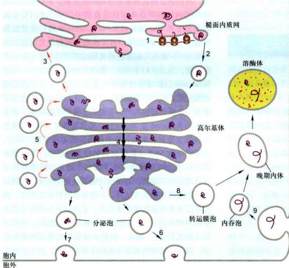  

  

表6-3蛋白质转运中涉及的三种包被膜泡的特征比较  

  
  

<html><body><table><tr><td>膜泡类型</td><td>介导的转运途径</td><td>包被蛋白</td><td>结合的GTP酶</td></tr><tr><td>COPI包被膜泡</td><td>ER→高尔基体顺面膜囊</td><td>Sec23/Sec24和Sec13/Sec31复合体，Sec16</td><td>Sar1</td></tr><tr><td>COPI包被膜泡</td><td>高尔基体顺面膜囊→ER， 晚期高尔基扁平囊→早期扁平囊</td><td>包含7种不同COP亚基的包被蛋白</td><td>ARF</td></tr><tr><td rowspan="5">网格蛋白/接头蛋白包被膜泡</td><td>高尔基体反面膜囊→内体</td><td>clathrin/AP1</td><td>ARF</td></tr><tr><td>高尔基体反面膜囊→内体</td><td>clathrin/GGA</td><td>ARF</td></tr><tr><td>细胞膜→内体</td><td>clathrin/AP2</td><td>证据表明不需ARF</td></tr><tr><td>高尔基体→溶酶体，</td><td>AP3复合物”</td><td></td></tr><tr><td>黑（色）素体或血小板囊泡</td><td></td><td>ARF</td></tr></table></body></html>

  

·新近证据表明，在胞吞作用过程中，不需要ARF参与。每种类型AP复合物由4种不同亚基组成。AP3复合物包被蛋白是否含有网格蛋白未知。  

  

正是病毒核衣壳上的信号与受体的相互作用，排除了细胞质膜上的其他多种膜蛋白。在细胞内的出芽、胞吞和膜融合过程中，除受体外究竟有多少膜蛋白会从一个细胞间隔进入另一个细胞间隔，目前还不清楚。但实验表明，受体蛋白可以返回原来的膜结构中，如从高尔基体的顺面膜囊返回内质网，从溶酶体返回至高尔基体的TGN以及从受体介导的胞吞泡返回到细胞质膜上。显然这有利于维持特定膜成分的相对稳定。  

  

细胞内膜泡运输需要多种转运膜泡参与，根据转运膜泡表面包被蛋白的不同，目前发现有三种不同类型：COPⅡI（coatproteinI）包被膜泡、COPI（coatproteinI）包被膜泡和网格蛋白/接头蛋白（clathrin/adaptorprotein）包被膜泡，它们分别介导不同的膜泡转运途径（表6-3，图6-9）。  

  

### 二、COPⅡI包被膜泡的装配及运输  

  

COPII介导细胞内顺向运输（anterogradetransport）过程中从内质网出芽的小泡的形成。COPⅡI由小分子GTP结合蛋白Sar1、Sec23/Sec24复合物、Sec13/Sec31  

  

 图6-9在细胞合成-分泌与内吞途径中三种主要膜泡类型的运方式    

各区室之间货物的转运通过囊泡进行。囊泡转运的不同步骤使用不同的包被蛋白。这些包被蛋白选择不同的货物并形成分泌和内吞途径各步骤的运输小泡。如COPII介导从内质网至高尔基体转运货物时膜泡的形成，COPI介导从高尔基体回收货物转运至内质网的膜泡形成，也在高尔基体膜囊之间相关修饰酶类的回收利用中发挥作用，网格蛋白/接头蛋白介导高尔基体反面管网区分泌泡的形成，也参与部分内吞泡的形成。  

  

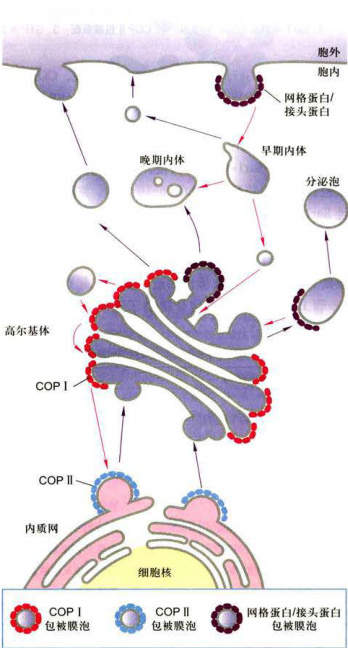  

  

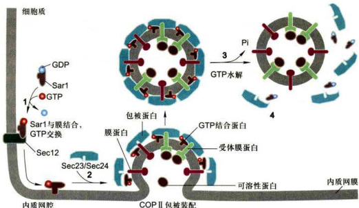  

图6-10Sar1蛋白在COPI包被膜泡装配与去装配中作用模型1.Sar1与膜结合，GTP交换：2.COPII包被装配：3.GTP水解：4.COPI包被去装配。  

  

复合物以及大的纤维蛋白Secl6等结构组成。COPⅡ包被膜泡是通过胞质可溶性COPⅡI在供体膜（ER膜）出芽时聚合形成的，包被装配的聚合过程受小分子GTP结合蛋白Sarl调控，Sarl隶属GTP酶超家族成员，通过Sarl-GDP/Sarl-GTP的转换，起分子开关调控作用。该包被膜泡的装配过程如图6-10所示：细胞质中可溶性Sarl-GDP与ER膜蛋白Sec12（鸟苷酸交换因子）相互作用，催化GTP置换GDP形成Sarl-GTP，GTP的结合引发Sarl构象改变暴露出疏水N端并插入ER膜，膜结合的Sarl对包被蛋白的进一步装配起募集者作用（步骤1），Sar1与膜的结合提供了随后Sec23/Sec24复合物的结合位点，从而在ER膜出芽区形成三重复合物Sar1-GTP/Sec23/Sec24（步骤2），随后，Sec13/Sec31复合物与三重复合物结合（图中未显示）。因为纯化的Sec13和Sec31蛋白具有自组装形成网格结构的特点，因而发挥COPⅡI包被骨架的作用。最后，大的纤维蛋白Sec16结合在ER膜的胞质表面，一方面与已装配的复合物相互作用，另一方面组织其他包被蛋白的结合，从而增加包被蛋白的聚合效率。当包被组装完成以后，Sec23亚基促进GTP被Sar1水解（步骤3），Sar1-GDP从膜泡上释放，引发包被去装配而解聚（步骤4）。  

  

膜泡运输既能转运膜蛋白，又能通过膜受体识别并  

  

表6-4指导蛋白质包装到特异性转运膜泡的分选信号  

  
  

<html><body><table><tr><td>信号序列</td><td>具有信号的蛋白</td><td>信号受体</td><td>转运膜泡类型</td></tr><tr><td>腔内分选信号</td><td></td><td></td><td></td></tr><tr><td>Lys-Asp-Glu-Leu（KDEL）</td><td>驻留在ER的可溶性蛋白</td><td>高尔基体顺面膜囊KDEL受体</td><td>COPI</td></tr><tr><td>6-磷酸甘露糖（M6P）</td><td>可溶性溶酶体酶</td><td>高尔基体反面膜囊M6P受体</td><td>clathrin/AP1</td></tr><tr><td></td><td>分泌的溶酶体酶</td><td>质膜上M6P受体</td><td>clathrin/AP2</td></tr><tr><td>膜蛋白分选信号</td><td></td><td></td><td></td></tr><tr><td>Lys-Lys-X-X（KKXX）</td><td>驻留在ER的膜蛋白</td><td>COP|α和β亚基</td><td>COPI</td></tr><tr><td>二酸（例如Asp-X-Glu）</td><td>ER-高尔基体转运膜蛋白</td><td>COPISec24亚基</td><td>COPII</td></tr><tr><td>Asn-Pro-X-Tyr(NPXY)</td><td>质膜上LDL受体</td><td>AP2复合物</td><td>clathrin/AP2</td></tr><tr><td>Tyr-X-X-（YXx）</td><td>高尔基体反面膜囊蛋白</td><td>AP1（μ1亚基）</td><td>clathrin/AP1</td></tr><tr><td></td><td>质膜膜蛋白</td><td>AP2（μ2亚基）</td><td>clathrin/AP2</td></tr><tr><td>Leu-Leu（LL）</td><td>质膜膜蛋白</td><td>AP2复合物</td><td>clathrin/AP2</td></tr></table></body></html>

  

注：X-任意氨基酸： $\Phi=$ 疏水氨基酸。括号内为单字母氨基酸缩写。  

  

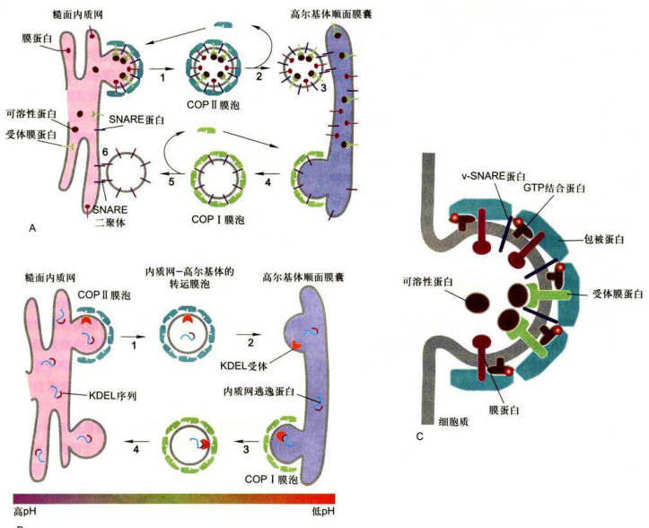  

图6-11不同类型的膜泡及其运输方式  

  

A.内质网与高尔基体之间，分别由COPⅡ和COPI包被膜泡介导蛋白质顺向和逆向转运。 $1-3.$ 由COPI包被膜泡介导的顺向运输，从内质网膜出芽，可溶性包被蛋白复合物聚合形成膜泡包被，V-SNARE和其他被转运的膜蛋白和可溶性蛋白（与膜泡膜上受体结合），通过与包被蛋白的相互作用被包装在膜泡内，v-SNARE蛋白在脱包被膜泡表面得以暴露，以利于同靶膜的融合；4一6.由COPI包被膜泡介导的反向运输，膜脂双分子层、某些蛋白质如v-SNARE和错误分选的内质网驻留蛋白，从高尔基体顺面网状区转运到内质网。B.KDEL受体在从高尔基体回收内质网腔驻留蛋白。1-2.内质网腔中存在的C端具有KDEL信号的蛋白质被包装到COPI包被膜泡，并转运到高尔基体；3-4.内质网透逸蛋白通过COPI膜泡介导的反向运输得以回收。注意，COPI、COPI和高尔基体顺面网状区膜上均有识别与结合KDEL信号的受体，信号与受体的亲和力受到pH高低的影响，低pH促进结合，高pH有利于释放。C.在供体膜内质网出芽及其转运蛋白的包装示意图。通过募集小分子GTP结合蛋白，引发供体膜出芽，然后，胞质中的包被蛋白复合物与被转运的膜蛋白胞质结构域结合，其中有些膜蛋白也作为腔内可溶性蛋白的受体。  

  

转运可溶性蛋白，其包装特异性取决于被转运蛋白的靶向分选序列（表6-4），借以区分哪些膜蛋白或可溶性蛋白将被进一步包装转运，哪些将作为滞留蛋白而被排除在外，从而膜泡包被直接选择靶向序列或分选信号。例如内质网被转运的膜蛋白具有二酸（如：Asp-X-Glu）分选信号，Sec24亚基是识别并结合该信号的受体，最终通过 $\operatorname{cop}\mathbb{I}$ 包被膜泡从内质网转运到高尔基体（图6-11）。  

  

### 三、COPI包被膜泡的装配与运输  

  

COPI介导细胞内膜泡逆向运输（retrogradetransport）过程中从高尔基体反面膜囊到高尔基体顺面膜囊以及从高尔基体顺面网状区到内质网的货物转运膜泡的形成，包括再循环的膜脂双层、内质网驻留的可溶性蛋白和膜蛋白，是内质网回收错误分选的逃逸蛋白(escapedprotein）的重要途径。  

  

COPI包被膜泡首先被分离鉴定，用不能被水解的GTP类似物（GTPanalogue）处理细胞，将引起COPI包被膜泡在细胞内聚集，并通过密度梯度离心法可将其从细胞匀浆中分离出来，分析发现COPI包被含有7种不同的蛋白质亚基和一种调节膜泡转运的GTP结合蛋白ARF。和Sar1一样，ARF也是一种结合GDP/GTP的分子开关调控蛋白，包被蛋白复合物（coatomer）的装配与去装配依赖于ARF所结合的核苷酸交换与水解过程；此外，ARF也参与网格蛋白包被膜泡的装配调节。  

  

是什么因素决定一种特异蛋白是被保留在内质网还是进入高尔基体？已有研究证据显示，细胞器中的蛋白质是通过两种机制保留及回收来维持的：一是转运膜泡将驻留蛋白有效排斥在外，例如，有些驻留蛋白参与形成大的复合物，因而不能被包装在出芽形成的转运膜泡中，结果被保留下来；二是对逃逸蛋白的回收机制，使之返回它们正常驻留的部位。回收逃逸的内质网蛋白是通过回收信号介导的特异性受体完成的。现已发现，内质网的正常驻留蛋白，不管在腔内还是在膜上，它们在C端含有一段回收信号序列（retrievalsignal），如果它们意外地被包装进入转运膜泡从内质网逃逸到高尔基体CGN，则CGN区的膜结合受体蛋白将识别并结合这些逃逸蛋白的回收信号，形成COPI包被膜泡将它们回收到内质网（图6-11B）。如表6-4所示，内质网腔中的可溶性蛋白，如蛋白二硫键异构酶和协助折叠的分子伴侣，均具有典型的KDEL回收信号。如果一个内质网蛋白缺乏KDEL序列，那么这种蛋白质将不能返回内质网，而是被转运膜泡带到质膜。相反，如果通过基因重组方法使表达的溶酶体蛋白或分泌蛋白在C端含有一段附加的KDEL序列，那么这种蛋白质将返回内质网，而不是被转运至溶酶体或分泌泡。内质网的膜蛋白如SRP受体，在C端有一个不同的回收信号，通常是KKXX（K：赖氨酸，X：任意氨基酸），识别并结合该信号的受体是COPI的 $\mathbf{a}$ 和 $\upbeta$ 亚基，从而促进它们返回到ER。  

  

在ER膜上整合蛋白v-SNARE（供体膜受体蛋白，见下文膜融合）和其他被转运蛋白是通过与包被蛋白的相互作用被包装到转运膜泡的，可溶性转运蛋白通过与出芽膜泡上相应受体的结合而被募集，包被膜泡脱去包被复合物，包被蛋白可再循环利用，而v-SNARE暴露在小泡膜表面。膜泡脱被后，在小分子GTP结合蛋白Sarl蛋白参与下，脱包被的膜泡留在高尔基体顺面膜囊，暴露的内质网膜蛋白V-SNARE与高尔基体顺面膜囊上同类蛋白t-SNARE（靶膜受体蛋白，见下文膜融合）相互配对，介导膜泡与靶膜融合，内含物释放进入高尔基体顺面膜囊。内质网腔中的蛋白质（特别是高浓度存在的腔内蛋白质）在出芽过程中可以被动掺入到COPIⅡ包被膜泡并转运到高尔基体。许多这类蛋白质带有C端KDEL序列，KDEL的受体主要定位在高尔基体TGN区、COPⅡI和COPI包被膜泡的膜上，它们能识别并结合KDEL分选信号，二者的亲和性对pH变化非常敏感，内质网和高尔基体之间微小的pH差异都有利于携带KDEL序列的蛋白质与高尔基体衍生膜泡上的受体结合，并有助于这些蛋白质从内质网释放。如果在内质网发生错误包装和转运，由于COPI包被膜泡上也有KDEL受体，所以也能保证逃逸蛋白被内质网回收。  

  

这种通过回收信号所介导的回收机制有利于防止内质网腔蛋白（如用于新合成分泌蛋白正确折叠所需要的分子伴侣）的损失。在生物合成途径中，每种膜组分也许都具有它自身独特的回收信号，所以任凭转运膜泡在特定空间不断运动，但每种细胞器仍可保持它独特的蛋白质组分。  

  

### 四、网格蛋白/接头蛋白包被膜泡的装配与运输  

  

网格蛋白/接头蛋白包被膜泡介导分泌泡和内吞泡的形成，如从高尔基体TGN向细胞膜及内体或向溶酶体、黑（色）素体、血小板囊泡和植物细胞液泡的货物转运过程中膜泡的形成（表6-3）。另外，在受体介导的内吞途径中，网格蛋白还参与内吞泡的形成。高尔基体的TGN区是网格蛋白/接头蛋白包被膜泡形成的发源地，在功能上既是细胞分泌途径中物质转运的主要分选位点，又是网格蛋白包被膜泡的组装位点。典型的网格蛋白/接头蛋白包被膜泡是一类双层包被的膜泡，外层由网格蛋白组成，内层由接头蛋白复合物组成。纯化的网格蛋白分子呈三腿结构（triskelion），每个分支含一条重链和一条轻链。与COPⅡ的Sec13/Sec31复合物一样，网格蛋白也有自组装形成多角型网格的特性（图6-12），当网格蛋白在供体膜上聚合，便募集接头蛋白复合物到供体膜的胞质面并与其结合，接头蛋白复合物一方面将网格蛋白网格包被连接到质膜上，另一方面又能特异性地促使一些膜结合蛋白富集到形成包被的膜区。现已发现有三种接头蛋白复合物（AP1、AP2和AP3），每种接头蛋白复合物含有4种接头蛋白亚基的一个拷贝，形成异四聚体。接头蛋白复合物的一个亚基与网格蛋白重链远端的球形结构域特异性结合，一方面促进三腿网格蛋白与接头蛋白复合物的联合装配，同时也增加已装配包被的稳定性。正如小分子GTP结合蛋白ARF参与启动COPI包被装配一样，ARF也参与网格蛋白/接头蛋白包被的起始装配。除三种接头蛋白复合物之外，还发现另一类接头蛋白GGA，由单一多肽链组成。接头蛋白复合物或GGA在膜泡的胞质面与转运的膜蛋白或膜受体（结合腔内可溶性蛋白）特异性结合，决定哪些蛋白将被包装转运或哪些蛋白将被排除在外。这种特异性是由转运蛋白的分选信号决定的（表  

  

6-4）。网格蛋白/接头蛋白包被膜泡形成的首要步骤是供体膜出芽和包被的装配，芽体如何缩并与供体膜断裂是网格蛋白/接头蛋白包被膜泡形成的关键，发动蛋白（dynamin）具有GTP酶活性，它所介导的网格蛋白包被膜泡的组装模式见图6-12C。在供体膜上网格蛋白/接头蛋白包被小泡出芽形成后，发动蛋白围绕颈部聚合，然后催化GTP水解，所释放的能量驱动发动蛋白构象改变，导致网格蛋白/接头蛋白包被膜泡从供体膜断裂并释放。如果人为使细胞表达突变型的发动蛋白，其将不能结合GTP并使之水解，也不形成独立的网格蛋白/接头蛋白包被膜泡，而是产生发动蛋白聚合包绕具有较长颈部的膜泡芽体。现在尚未发现GTP酶也参与COPI和COPⅡI包被膜泡芽体从供体膜的断裂，更不清楚不同类型的包被膜泡断裂会有如此差异。但与COPI和COPⅡ包被膜泡一样，通常情况下网格蛋白/接头蛋白包被膜泡形成后不久便脱去包被，网格蛋白/接头蛋白包被的解聚一方面涉及ARF开关蛋白从结合GTP状态转变为结合GDP状态，另一方面也可能涉及ATP水解提供的能量，鉴于胞质内Hsp70蛋白是所有真核细胞中普遍存在的组成型分子伴侣，因而认为Hsp70致使ATP水解释放的能量用于驱动网格蛋白/接头蛋白包被的去组装过程。脱包被的结果不仅释放三腿网格蛋白被循环再利用，而且由于包被去组装也会使V-SNARE得以暴露，利于膜泡与靶膜的融合。  

  

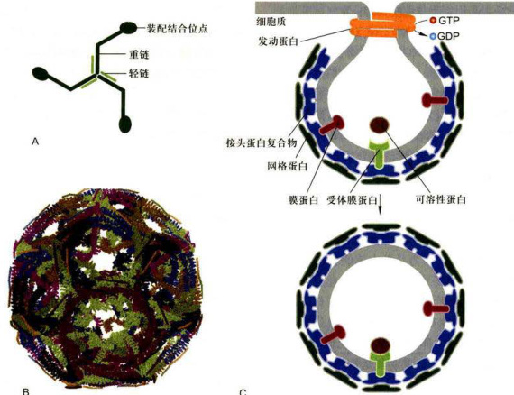  

图6-12网格蛋白、多角形网格包被结构及发动蛋白介导的网格蛋白/接头蛋白包被膜泡的形成示意图A.三腿网格蛋白分子，3条重链，3条轻链。B.在体外缺乏膜泡的情况下自组装的网格蛋白网格包被。C.发动蛋白介导的网格蛋白/接头蛋白包被膜泡的形成示意图。（B图基于PDB数据库1XI4结构绘制）  

  

### 五、转运膜泡与靶膜的锚定和融合  

  

膜泡转运是十分复杂的过程，在酵母基因组中至少发现25种以上与膜泡转运有关的基因。膜泡运输的关键步骤至少涉及如下过程： $\textcircled{1}$ 供体膜的出芽、装配和断裂，形成不同的包被转运膜泡，该过程已在前面述及（图6-11C和图6-12B）； $\textcircled{2}$ 在细胞内由马达蛋白驱动、以微管为轨道的膜泡运输（参见第八章第二节）； $\textcircled{3}$ 转运膜泡与特定靶膜的锚定和融合。现已知，在膜泡靶向转运过程中，有另一类小分子GTP结合蛋白，即Rab蛋白的参与。和Sarl与ARF蛋白一样，Rab蛋白也属于开关调控蛋白GTP酶超家族成员，在特异性鸟苷酸交换因子（GEF）催化下，胞质中Rab-GDP转换为Rab-GTP，引发Rab构象改变致使其与特定转运膜泡的表面蛋白相互作用，并通过类异戊二烯（isoprenoid）基团插入转运膜泡内。一旦Rab-GTP被结合在膜泡表面，便与靶膜上称作Rab效应器（Rabeffector）的结合蛋白相互作用，从而使转运膜泡被锚定在适当的靶膜上（图6-13步骤1）。在膜泡融合发生以后，与Rab蛋白结合的GTP被水解成GDP，随即引发Rab-GDP释放，然后再被用于进行GDP—GTP交换、结合及水解的下一个周期。有些证据表明，在膜泡融合事件中涉及特异性Rab蛋白的参与，如酵母中Sec4基因编码一种Rab蛋白，如果酵母细胞表达突变的Sec4蛋白，则细胞内将导致分泌泡的积累，而不能与质膜融合。在哺乳类细胞中，Rab5蛋白被定位在作为早期内体的脱被内吞泡上，在无细胞系统实验体系中，早期内体彼此融合需要Rab5的存在。此外，在无细胞提取物中加入GTP，则会促进内体彼此融合的速率。在早期内体膜上发现还存在一种长的卷曲蛋白，称之早期内体抗原1（earlyendosomeantigen1，EEAl），其功能是作为Rab5效应器而存在，这样，一种内吞泡膜上的Rab5-GTP与另一种内吞泡膜上的EEA1特异性结合为膜泡间彼此融合提供了保障机制。  

  

转运膜泡的形成、运输及其与靶膜的融合是一个耗能的特异性过程，涉及多种蛋白质间识别、组装、去组装的复杂调控，膜泡与靶膜的选择性融合是保证细胞内定向膜流的重要因素之一。如果说小分子GTP结合蛋白Rab主要是控制转运膜泡与相应靶膜的锚定，那么，介导转运膜泡与靶膜融合的主要机制是v-SNARE/t-SNARE蛋白的配对。有些与融合相关的蛋白质已被分离，特别是从神经细胞中分离出参与特异性的膜泡锚定和融合的蛋白质组分，如神经元突触前膜含有一种突触融合蛋白（syntaxin），能与突触小泡膜上的膜蛋白VAMP(vesicle-associated membrane protein）特异性地结合，这两种蛋白质的相互作用介导膜的融合和神经递质的释放。尽管酵母与哺乳类在演化上已有10亿年的分歧，而且酵母细胞也没有任何突触传递的功能活性，但却具有编码与突触融合蛋白和VAMP相似蛋白质的基因家族，现已知酵母细胞表达20种以上不同的相关v-SNARE和t-SNARE蛋白，在对每一种编码SNARE基因进行突变缺陷分析后，证实了每种SNARE蛋白所参与的特异性膜融合事件。考察所有融合事件表明，SNARE形成四螺旋束复合体，与1个VAMP/1个syntaxin/2个SNAP25组成的复合体一样（图6-13），其功能都是介导分泌泡与质膜融合，在其他类型的膜泡融合事件中，如COPⅡ包被膜泡与高尔基体顺面网状结构的融合，SNARE复合体四螺旋束的组成（1个V-SNARE/3个t-SNARE）有所不同。应用体外脂质体融合实验，研究者可以检验各种V-SNARE和t-SNARE蛋白组合对供体膜与靶膜之间融合的介导能力，发现只有少数组合可以有效介导膜的融合，说明膜的融合是有选择性的。动物细胞膜泡融合需要一种可溶性的胞质融合蛋白N-乙基马来酰亚胺敏感因子（N-ethylmaleimide-sensitivefactor，NSF）和几种可溶性NSF结合蛋白(soluble NSF attachment protein,SNAP)，NSF 和 SNAP负责介导不同类型膜泡的融合，没有明显特异性。提供特异性保障的是SNAP受体（SNAPreceptor，又称SNARE)，每种转运膜泡都有特异的v-SNARE（vesicle-SNAPreceptor)，能识别并与靶膜上t-SNARE（target-SNAPreceptor）彼此配对，形成稳定的卷曲SNARE复合体，因此正是通过v-SNARE与t-SNARE两类蛋白间的互补和相互作用，决定了供体膜泡与靶膜的融合（图6-13)。SNARE复合体的稳定性是靠蛋白质分子间大量非共价键来维系的，因此融合完成后，SNARE复合体必须消耗ATP水解能量而解离，释放的单一SNARE蛋白亚基再用于另外的融合事件。  

  

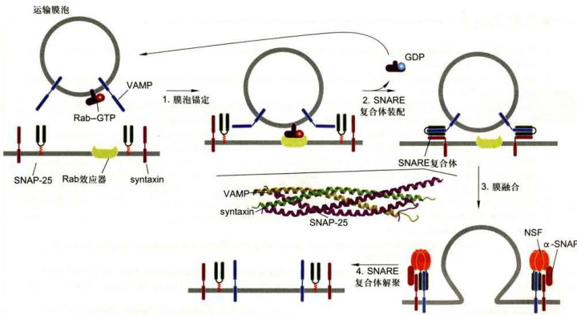  

图6-13在供体膜和靶膜之间膜泡的锚定与融合模式图解（图中卷曲SNARE复合体由孔祥鹏博士惠赠）  

  

在供体膜上的GEF识别并结合特异性Rab蛋白，诱发GTP置换GDP，鸟苷酸交换引发Rab蛋白构象改变并暴露其共价结合的脂质基团，从而帮助Rab-GTP蛋白锚定在供体膜上，并随膜泡转移，在靶膜上Rab-GTP与Rab效应器结合，这种结合有助于膜泡锚定和V-SNARE与t-SNARE的配对（步骤1）：V-SNARE蛋白（图中VAMP）与同类t-SNARE（图中syntaxin和SNAP25）胞质结构域相互作用，形成稳定的卷曲SNARE复合体，将膜泡与靶膜紧密束缚在一起（步骤  

  

2）：伴随SNARE复合体形成后，供体膜泡与靶膜随即融合（步骤3）：两膜融合后，NSF联合 $\mathbf{\alpha}_{\mathrm{~d~}}$ SNAP蛋白随即与SNARE复合体结合，然后NSF催化ATP水解，驱动SNARE复合体解离，游离的SNARE蛋白再用于其他膜泡的融合（步骤4）。具有GTP酶活性的Rab蛋白水解与之结合的GTP，释放可溶性的Rab-GDP进入细胞质。在细胞质中Rab-GDP与GDP解离抑制物（GDI）结合，从而防止Rab蛋白从Rab-GDP复合物中释放出来，直至与GEF发生相互作用。  

  

# 思考题  

  

1.何谓分泌性蛋白合成的信号肽学说，涉及的主要组分如何协同作用？  

2.试述分泌蛋白的合成、加工及转运途径。  

3.试述细胞内膜泡运输的概况、类型及其各自主要功能。  

4.简述COP1和COPI包被膜泡形成的机制以及在维持细胞结构稳定方面的作用。  

  

# 参考文献  

  

1.DolezalPLikicchezaEiofeeclarciesfoeinptithoac 2006,313(5785):314-318.  

2.EdelingMAmithCwenDLifeofacahrintnsighsfclahrinndAPtctuesaureRevewolecar Cell Biology,2006,7:32-44.  

3.GevorkyAaZoayK-elekticDealteactofwithmiessntialfi translocation bythemitochondrialTM23complex.JournalofBiochemistry2009,284(8）:4865-4872.  

4.GrossanOrtiickRabdheiccgscitbffcofth NationalAcademyofSciencesoftheUnitedStatesofAmerica200603(32）:821-87.  

5.GuirkanCtaggSintePeal.hePagenfingicplesofsiclesmblyaRevies MolecularCellBiology,2006,7:727-738.  

6.Jahn R,LangT,Sudhof TC.Membrane fusion.Cell,2003,112（4）:519-533.  

7.JahnRchellrRHREsngiforbafuauReileclarCelgy4  

8.KaiserCASchekmanRDistictSetsofSECgensgovetransptesiclefomatindfusionarlyinthec pathway.Cell,1990,61（4):723-733.  

9.MartensSMcMahonHTMechanismsofmembranefusiondisparateplayersandcommonprinciplesNatureReviews MolecularCell Biology,2008,9:543-556.  

10.MoknjacutWinitriamiclcit（）  

11.NeupertWernManloiofistocdriaAnReviofcmisty749.  

12.SollJSchleiffEroinimpttocoolastsNauRevesMoleclarCellogy5-08.  

13.SollnerTenttiartSlAiblsblyhynia sequentialstepsof syapticesicleckingactivaonandfusion.Cell993,75（3）：18.  

14.SudhofTCAmoleclarmachineforurotransmitereleasesyapotagminandbeyondNatureMedicine19 1227-1231.  

15.WicknerWcekmnRinnlocssbgicalembnesnce573）：-1456.  

  

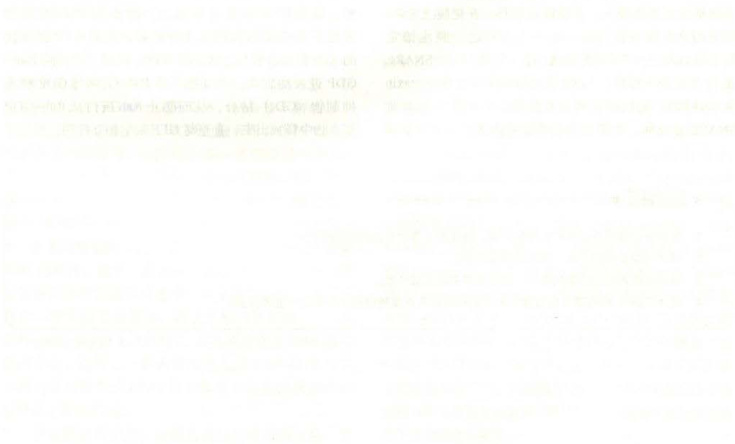