# 细胞骨架  
真核细胞是一个高度动态的结构，其外部形态和内部结构可因周围环境的变化而不断调整，而这些过程都依赖于细胞信号转导和由此引起的细胞骨架的动态变化。**细胞骨架(cytoskeleton**）主要包括**微丝（microfilament,MF）**、**微管（microtubule，MT）** 和**中间丝（intermediatefilament，IF）** 三种结构组分，它们分别由相应的蛋白质亚基组装而成。

在细胞周期的不同阶段，细胞骨架具有完全不同的分布状态；在各种不同分化状态的细胞中，细胞骨架的分布模式也有很大的差异，甚至连构成骨架的蛋白质种类也不尽相同。细胞骨架与数目众多的结合蛋白的相互作用是细胞结构与功能相统一的分子基础。细胞骨架结合蛋白不仅对骨架的网络结构进行调节，还在骨架与其他细胞结构之间建立了广泛的连接，对细胞的结构和功能发挥组织作用，并进一步影响细胞的形态、运动以及相邻的细胞和环境。  

## 第一节微丝与细胞运动  

微丝又称肌动蛋白丝（actin filament），或纤维状肌动蛋白（fibrous actin，F-actin），这种直径为 $7\mathrm{nm}$ 的纤维**存在于所有真核细胞**中。微丝网络的空间结构与功能取决于与之相结合的微丝结合蛋白（micro filament binding protein）。

在不同类型的细胞内，甚至是在同一细胞的不同区域，不同的微丝结合蛋白赋予了微丝网络不同的结构特征和功能。如小肠上皮细胞微绒毛内部的微丝束及细胞皮层的微丝网络，与黏着斑相连的应力纤维，迁移中的成纤维细胞前缘的片足和丝足中临时性的微丝结构，胞质分裂环，以及存在于肌细胞中的细肌丝。

微丝网络结构的动态变化与多种细胞生命活动过程相关，如细胞突起（微绒毛、伪足）的形成及对细胞微环境的感知和调节、细胞质分裂、吞噬作用、细胞迁移。作为肌球蛋白运动的轨道，微丝还在细胞收缩（如肌细胞）和物质运输等过程中发挥重要作用。  

### 一、微丝的组成及其组装  

#### （一） 结构与成分  
微丝的主要结构成分是肌动蛋白（actin）。**在大多数真核细胞中，肌动蛋白是含量最丰富的蛋白质之一**。在肌细胞中，肌动蛋白占细胞总蛋白质量的 $10\%$ 以上；  即使在非肌细胞中，也占细胞总蛋白质量的 $1\%\sim5\%$ 。

肌动蛋白在细胞内有两种存在形式，即肌动蛋白单体（又称球状肌动蛋白，G-actin）和由单体组装而成的纤维状肌动蛋白。肌动蛋白的电镜图像呈球状，但经X射线衍射得到的三维结构显示该分子上有一条裂缝将其分成两瓣，其底部有两段肽链相连。在裂缝内部有一个核苷酸（ATP或ADP）结合位点和一个二价阳离子$\left(\mathbf{M}\mathbf{g}^{2+}\right.$ 或 ${\bf C}{\bf a}^{2+}$ 结合位点（图8-2A）。与肌动蛋白结合的核苷酸可以自由地与周围介质中游离的核苷酸交换，但由于ATP与肌动蛋白的结合力更强，所以游离的肌动蛋白通常是带有ATP的。另外，由于细胞质中游离$\mathbf{Mg}^{2+}$ 的浓度远高于 $\mathbf{Ca}^{2+}$的浓度，所以肌动蛋白的二价阳离子结合位点也被 $\mathbf{Mg}^{2+}$ 占据。  

**肌动蛋白在生物演化过程中是高度保守的**。在哺乳动物和鸟类细胞中至少已分离到6种肌动蛋白，4种为 $a-$ 肌动蛋白，分别为横纹肌、心肌、血管平滑肌和肠道平滑肌所特有，它们与肌球蛋白等结构组分一起组装成细胞的收缩性装置；另外2种为 $\beta-$ 肌动蛋白和-肌动蛋白，存在于所有的细胞中。其中**β-肌动蛋白通 常定位于细胞的边缘，而 $\gamma-$ 肌动蛋白是应力纤维的组成成分**。

不同类型的 $a-$ 肌动蛋白分子的一级结构（约400个氨基酸残基）仅有4~6个氨基酸残基不同，β-肌动蛋白或 $\gamma-$ 肌动蛋白与 $a-$ 肌动蛋白（来自横纹肌）也仅相差约25个氨基酸残基。显然这些肌动蛋白基因是从同一个祖先基因演化而来。多数简单的真核生物，如酵母和黏菌，仅含单个肌动蛋白基因。然而大多数多细胞真核生物含有多个编码肌动蛋白的基因，如海胆有11个，网柄菌属（Dictyostelium）有17个，在某些种类的植物基因组中肌动蛋白基因的数目多达60个。  

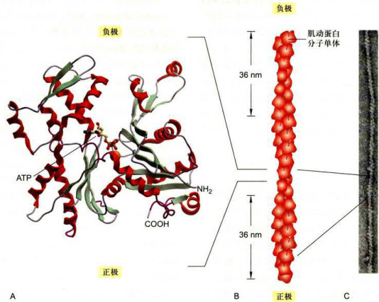  

图8-2肌动蛋白和微丝的结构  A.肌动蛋白的三维结构（5.5nm×5.5nmx3.5nm），1分子ATP和1个Mg结合于肌动蛋白分子中间的裂缝中。B.微丝的结构模型其中每一个肌动蛋白亚基与4个相邻的亚基相互作用（上下各1个，侧面2个）。C.微丝负染后的电镜图像。

**尽管不同生物的肌动蛋白具有很高的相似性，但微小的差异可能会导致功能上的变化**。如在果蝇细胞中表达酵母的肌动蛋白基因，将导致果蝇飞翔障碍。另外，在一些原核生物如杆状和螺旋状的细菌中也存在一些肌动蛋白类似物，如MreB和Mbl。这些蛋白质也能组装成与微丝相似的结构，并调控细胞的形态和染色体的分离。MreB突变的大肠杆菌菌体呈球状，而一些球菌的基因组内没有发现编码该蛋白的基因。显然，MreB与细菌的形态相关。  

电镜图像显示微丝是一条直径约为 $7\:\mathrm{nm}$ 的扭链（图8-2C），整根微丝在外观上类似于由两股肌动蛋白纤维呈右手螺旋盘绕而成，螺距为 $36~\mathrm{{nm}}$ （图8-2B）。在纤维内部，每个肌动蛋白亚基周围都有4个单体，上、下各一个，另外两个位于一侧。肌动蛋白分子上的裂缝使得该蛋白本身在结构上具有不对称性。在组装成微丝之后，每一个肌动蛋白亚基的裂缝都朝向微丝的同一端，从而使微丝在结构上具有极性。**在结构上，具有裂缝的一端为负极（-），而另一端为正极 $(+)$** 。在细胞内，多种微丝结合蛋白与微丝的表面相互作用，调节微丝的结构和功能。  

#### （二）微丝的组装及其动力学特性  

有关肌动蛋白组装的信息大多来源于体外实验的结果。在试管中，微丝的组装/解聚与溶液中所含肌动蛋白的状态（结合ATP或ADP）、离子的种类及浓度等参数有关。通常，只有结合ATP的肌动蛋白才能参与微丝的组装。

==离子浓度影响微丝单体蛋白的组装==
当溶液中含有适当浓度的 $\mathrm{Ca^{2+}}$ 而$\mathrm{Na}^{+}$、$\mathrm{K}^{+}$ 的浓度很低时，微丝趋向于解聚；而当溶液中含有ATP、 $\mathrm{Mg}^{2+}$ 以及较高浓度的 $\mathrm{Na}^{+}$、$\mathrm{K}^{+}$ 时，溶液中的G-actin则趋向于组装成F-actin，即新的G-actin加到微丝末端，使微丝延伸。  

==微丝组装的步骤（成核、延长、平衡）==
肌动蛋白组装成微丝的过程大体上可以分为几个阶段：首先是成核反应（nucleation）。当聚合作用在只含有G-actin，而没有F-actin的试管中进行时，组装的起始过程相当缓慢。**G-actin必须先形成一个具有2～3个亚基的低聚物**，即所谓的成核过程。该过程是G-actin组装的**限速步骤**，称为延迟期。跟随着延迟期的是一个纤维**快速延长的过程**。当体系中肌动蛋白-ATP的浓度较高时，微丝的组装会在两极同时发生，但由于微丝的两端存在结构上的差异，导致肌动蛋白亚基组装的速度也不同，通常是肌动蛋白在微丝正端加入的速度比负端快5～10倍。随着组装过程的进行，系统中肌动蛋白单体浓度逐渐降低，组装的速度会逐步减慢。最后，系统（如果ATP足够多的话）会到达一个稳定状态，即纤维正极端组装的速度与负极端解聚的速度相同，纤维的长度保持不变。此时，体系中肌动蛋白单体的浓度称为临界浓度 $(C_{\epsilon})$ ，在数值上等于解聚速度常数和组装速度常数的比值，即 $C_{c}=K_{\mathrm{eff}}/K_{\mathrm{ono}}$ 微丝末端的延长或解聚取决于增加亚基时体系中自由能（△G）的变化，当体系中游离的肌动蛋白的浓度高于 $C_{\epsilon}$ 时，△G小于零，微丝的末端会继续组装。相反，当游离的肌动蛋白浓度低于 $C_{\epsilon}$ 时，△G大于零，微丝将自发解聚。  

==肌动蛋白相关蛋白参与成核过程==
在细胞内，微丝的成核过程需要**肌动蛋白相关蛋白（actin-relatedprotein，ARP）** Arp2/3复合物的参与，在该复合物由Arp2、Arp3及其他5种蛋白质组成，可以与微丝或其他细胞结构结合，并以此作为微丝组装的起点。肌动蛋白单体与Arp2/3复合物结合而使纤维延长。肌动蛋白在参与微丝的组装前通常先与ATP结合，而肌动蛋白亚基组装到微丝的末端以后，构象发生变化，具有了ATP酶的活性，能将本身结合的ATP水解成ADP，并释放磷酸基。当微丝的组装速度快于肌动蛋白水解ATP的速度时，处于微丝末端的一些肌动蛋白亚基所携带的是ATP，相当于在微丝的末端有一个由肌动蛋白-ATP亚基所构成的帽，带有这种结构的微丝比较稳定，可以持续组装。相反，当微丝末端的组装速度较肌动蛋白亚基水解ATP的速度慢，肌动蛋白亚基所结合的ATP都被水解成ADP时，这段微丝就比较容易解聚。由于微丝两端在结构上存在差异，而且负极端往往与 $\mathrm{Arp}2/3$ 复合物及细胞结构结合，所以新的肌动蛋白亚基通常是在正极端加入，而很少在负极端加入。细胞内微丝的稳定性受多种结合蛋白的调控，其动态性比体外组装更为复杂。待微丝组装到一定长度时，其正极端有可能与微丝结合蛋白或其他细胞结构相结合而使其处于稳定状态，也可能是两端都发生解聚。  

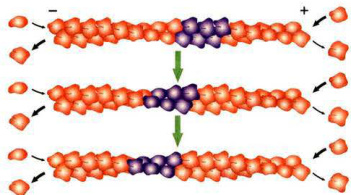  

图8-3肌动蛋白组装过程中发生的踏车行为  

当体系中肌动蛋白的浓度处于临界浓度时，由于微丝两端结构上的差异，其正端随肌动蛋白亚基的不断加入而延伸，负端则因为解聚而缩短。在统计学意义上，正极端延长，负极端缩短，但长度几乎不变。 
  
相比之下，负极端更容易与帮助微丝解聚的蛋白质相互作用，这样就使得微丝正极端不断组装，而负极端不断解聚，如细胞迁移时片足内部微丝结构的变化就是如此。在体外组装过程中有时也可以见到微丝的正极端由于肌动蛋白亚基的不断添加而延长，而负极端则由于解离而缩短，这一现象称为踏车行为（treadmilling）（图8-3）。  

#### （三）影响微丝组装的特异性药物  

一些药物可以影响肌动蛋白的聚合或解离，从而影响细胞内微丝网络的结构。

**细胞松弛素（cytochalasin）** 是一类真菌的代谢产物，**可与微丝结合并将其切断**。细胞松弛素结合在微丝末端后还可阻止肌动蛋白在该部位的聚合，但对微丝的解聚没有明显影响，因而用细胞松弛素处理细胞可以破坏微丝的网络结构，并阻止细胞的运动。

**鬼笔环肽（phalloidin）** 是一种由毒覃（Amanitaphallodies）产生的双环杆肽，与微丝表面有强亲和力，但**不与游离的肌动蛋白单体结合**，因此，用荧光标记的鬼笔环肽染色可清晰地显示微丝在细胞中的分布。鬼笔环肽与微丝结合后能阻止微丝的解聚，使其保持稳定状态；而且，将鬼笔环肽注射到细胞内同样能阻止细胞运动。可见细胞内微丝的功能依赖于其组装和解聚的动态过程。  

### 二、微丝网络结构的调节与细胞运动  
#### （一）非肌细胞内的微丝结合蛋白  
细胞内肌动蛋白的组装受到可溶性肌动蛋白的存在状态和微丝结合蛋白的种类两个不同层次的调节。  

**微丝网络的组织形式和功能通常取决于与之结合的微丝结合蛋白，而不是微丝本身**。由于微丝结合蛋白的种类及存在状态的差异，不同区域的微丝网络的结构有可能完全不同。微丝结合蛋白通过影响微丝的组装与解聚，介导微丝与其他细胞结构之间的相互作用来决定微丝的组织行为。此外，微丝还可以通过和肌球蛋白之间的相互作用来转运生物大分子复合物及多种细胞器，并对细胞的形态结构和蛋白质的定位起组织作用，进而调节细胞的行为。

目前，人们已经从各种组织细胞中分离到100多种不同的微丝结合蛋白，根据其作用方式的不同，可以分成如下几种类型。  
##### 1.肌动蛋白单体结合蛋白  
**==游离态肌动蛋白被肌动蛋白单体结合蛋白螯合==**
**在细胞内，可溶性的肌动蛋白和纤维状肌动蛋白的比例大体是1：1**。也就是说，**细胞内游离态肌动蛋白的浓度远远高于肌动蛋白组装所需的临界浓度**，但由于**游离态肌动蛋白常与肌动蛋白单体结合蛋白（如胸腺素和前纤维蛋白）结合在一起**，从而使肌动蛋白组装成微丝的过程受到必要的调控，储存在细胞内的肌动蛋白只有在相关信号的刺激下才会被释放，成为真正的游离状态参与微丝的组装。  
- 胸腺素是由43个氨基酸残基组成的小肽，能与游离的肌动蛋白结合，并封闭肌动蛋白聚合的位点，从而阻止肌动蛋白组装到微丝的末端。
- 前纤维蛋白（profilin）又名抑制蛋白，该蛋白与肌动蛋白的底部（正极端）结合，从而阻碍了前纤维蛋白一肌动蛋白复合体在微丝负极端的聚合，但这并不影响该复合体在微丝正极端的组装。

  

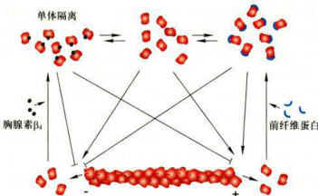  

图8-4肌动蛋白结合蛋白调节微丝的组装 ；在合适的条件下，结合ATP的肌动蛋白可以参与微丝的组装。胸腺素β与肌动蛋白结合以后抑制微丝的组装。前纤维蛋白与肌动蛋白单体的底部结合，促进了微丝正极端的组装，但阻断了负极端的组装
##### 2.成核蛋白  
细胞内肌动蛋白的组装受外部信号、Arp2/3复合物及形成蛋白（formin）等因素的调控，以实现细胞形态和行为的快速变化。  

Arp2/3复合物由Arp2、Arp3和其他5种蛋白质组成，其中Arp2、Arp3与肌动蛋白的相似性达 $45\%$ 但其本身不能组装成纤维。在该复合物中，Arp2和Arp3形成类似于微丝正极端肌动蛋白两个亚基的结构，从而可以启动肌动蛋白的成核过程。在外来信号的作用下，活化的Arp2/3复合物与细胞膜或其他适当的细胞结构结合，并为肌动蛋白提供组装的起始点。新的肌动蛋白亚基在正极端加入，而 $\mathrm{Arp}2/3$ 复合物则位于纤维的负端（图8-5）。 $\mathrm{Arp}2/3$ 复合物也可以结合在已有的微丝上，启动微丝分支的组装。在这种情况下，新组装的侧支与原有的微丝呈 $70^{\circ}$ 夹角。多个侧支的组装可使微丝连接成一个树状网络。由于 $\mathrm{Arp}2/3$ 复合物与携带ATP的肌动蛋白亚基的亲和力远大于带有ADP的肌动蛋白亚基，因此微丝的分支往往在新组装的一端产生。随着结合在肌动蛋白亚基内部的ATP的水解和Pi的释放，Arp2/3复合物有可能从微丝上解离，导致分支的脱落。  

形成蛋白家族的成员在结构上很保守，在微丝的延长过程中形成蛋白始终与其正极端结合，通过与前纤维蛋白相互作用而提高微丝的组装速度，还可保护正极端免受加帽蛋白的干扰。  

##### 3.加帽蛋白  
细胞内微丝的组装一旦停止，其末端的肌动蛋白亚基所带的ATP很可能因为水解而使得整个纤维处于不稳定状态，而微丝的过度组装也会影响细胞的结构和功能。加帽蛋白（cappingprotein）是指一类可与微丝的末端结合，从而阻止微丝解聚或过度组装的微丝结合蛋白。这些与微丝末端相互作用的蛋白质在调节微丝的动力学性质方面发挥作用。在细胞运动过程中，对微丝加帽和脱帽的调控显得非常重要，这些过程受细胞膜上的G蛋白偶联受体及下游的4，5-二磷酸磷脂酰肌醇 $\mathrm{PIP}_{2}^{\prime}$ 的调节。  

##### 4.交联蛋白 

  

微丝的排列方式主要由微丝交联蛋白的种类决定。成束蛋白（bundlingprotein）将相邻的微丝交联成相互平行的束状结构，而凝胶形成蛋白（gel-formingprotein）将微丝连接成网状。微丝交联蛋白都有一个或两个相似的微丝结合位点，能够单独或者以二聚体的形式将相邻的微丝交联在一起。多肽链或二聚体上两个微  

  

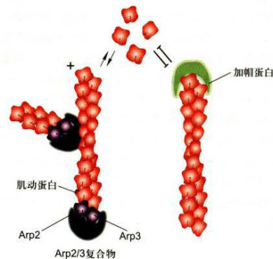  

图8-5微丝的成核与加帽  

  

Arp2/3复合物参与肌动蛋白的成核，并可与微丝结合启动侧支的组装。微丝加帽蛋白可以结合在微丝的正极端或负极端，使末端处于稳定状态。  

  

丝结合位点之间的距离决定了它们所交联形成的微丝束或网络的松紧程度。  

  

丝束（毛缘）蛋白（fimbrin）是分布很广的微丝成束蛋白，由于分子较小，肽链上两个微丝结合位点靠得很近，并分别结合到相邻的微丝上，多个丝束蛋白分子与微丝结合可形成排列紧密的微丝束（图8-6A）。在细胞前缘丝足中的微丝束就是这种类型，由于微丝的排列很紧密，肌球蛋白分子很难进入相邻的微丝之间，因此丝足中的微丝束没有收缩能力。绒毛蛋白（villin）是一种与丝束蛋白相似的微丝成束蛋白，主要存在于微绒毛和细胞表面的指状突起中，也可将微丝交联成紧密排列的束状结构。微绒毛中的核心微丝束可通过肌球蛋白I与微绒毛膜相连。 $a-$ 辅肌动蛋白（α-actinin）只有一个微丝结合位点，但该蛋白可形成反向平行的二聚体，位于二聚体两端的两个微丝结合位点相距较远，因此，由$a-$ 辅肌动蛋白交联形成的微丝束（如应力纤维）中微丝的排列相对宽松（图8-6B）。肌球蛋白Ⅱ可以进入相邻的微丝之间，并依靠其马达结构域与微丝相互作用，所以应力纤维具有收缩能力。  

  

成束蛋白的两个肌动蛋白结合位点之间的区域都是僵直的，而另外一些微丝交联蛋白，如细丝蛋白（filamin）和血影蛋白（见第四章），它们的两个肌动蛋白结合位点之间的区域是柔软的，或者本身就是弯曲的。当微丝与这些交联蛋白相互作用时就会形成网状或凝胶样的结构。两个细丝蛋白的一端相互作用形成二聚体，另两个末端将两根微丝以 $90^{\circ}$ 的夹角交联，使微丝形成松散的网络结构（图8-6C）。这种凝胶样的结构存在于片足中，能帮助细胞在基质表面爬行。血影蛋白是四条多肽链（两条 $\upalpha$ 链和两条β链）组成的细长而容易弯曲的蛋白质分子，在细胞膜的内侧将微丝交联成二维网络，并将这个网络与细胞质膜相连，形成一个结实而富有弹性的细胞皮层，对细胞质膜有机械支撑作用。  

  

##### 5.割断及解聚蛋白  

在细胞迁移或其他运动过程中，细胞需要将特定区域的微丝快速解聚，或者是形成大量的末端以加速组装。凝溶胶蛋白（gelsolin）在高 $\ensuremath{\mathrm{Ca}}^{2*}$ 浓度（大于 $1\ \upmu\mathrm{mol{L}}$ 情况下能将较长微丝切断，使肌动蛋白由凝胶态转化成溶胶态。微丝被切断后产生许多游离的正端和负端，在某些条件下可以加速微丝的解聚，而在另外一些条件下可以形成大量新的组装位点，促进微丝在短时间内快速组装。丝切蛋白/肌动蛋白解聚因子（cofilin/actindepolymerizingfactor,cofilin/ADF）能与游离的肌动蛋白或微丝结合，提高微丝的解聚速度。  

  

#### （二）细胞皮层  

  

免疫荧光染色的结果显示，细胞内大部分微丝都集中在紧贴细胞质膜的细胞质区域，并由微丝结合蛋白交联成凝胶态三维网络结构，该区域通常称为细胞皮层（cellcortex）。皮层内一些微丝还与细胞质膜上的蛋白质结合，使膜蛋白的流动性受到某种程度的限制。皮层内密布的微丝网络可以为细胞质膜提供强度和韧性，有助于维持细胞形状。细胞的多种生理活动，如胞质环流（cyclosis）、阿米巴运动（ameboidmovement）、变皱膜运动（ruffledmembranelocomotion）、吞噬（phagocytosis）以及膜蛋白的定位等都与皮层内微丝网络的溶胶态-凝胶态转化相关。  

  

####  （三）应力纤维  

体外培养的细胞在基质表面铺展时，常在细胞质膜  

  

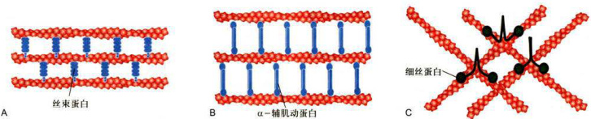  

图8-6微丝交联蛋白与微丝的相互作用  

A.成束蛋白将相邻的微丝交联成束状结构。丝束蛋白和绒毛蛋白等交联而成的微丝束为紧密包装型。B.由 $a-$ 辅肌动蛋白交联形成的微丝束内部相邻的纤维之间比较宽松。C.细丝蛋白将微丝交联成网状结构。  

  

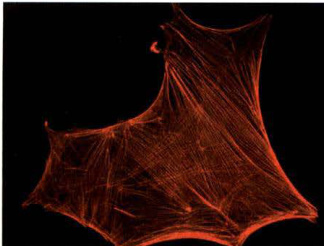  

图8-7应力纤维  

  

体外培养的星形胶质细胞用罗丹明（Rhodamine）标记的鬼笔环肽染色，显示在细胞内应力纤维和黏着斑的分布。（李慧惠博士提供）  

  

的特定区域与基质之间形成紧密黏附的黏着斑。在紧贴黏着斑的细胞质膜内侧有大量成束状排列的微丝，这种连接相邻的黏着斑或特定的细胞结构的微丝束称为应力纤维（stressfiber）（图8-7）。应力纤维的结构与骨骼肌细胞中的肌原纤维非常相似，其结构组分除微丝外，还含有肌球蛋白Ⅱ、原肌球蛋白、细丝蛋白和 $a-$ 辅肌动蛋白等。  

  

应力纤维是真核细胞内广泛存在的微丝结构。用肌球蛋白重链的S1片段标记应力纤维微丝的极性，结果显示应力纤维中相邻的微丝呈反向平行排列，而非肌动蛋白组分则表现不连续的周期性分布。应力纤维通过黏着斑与细胞外基质相连，可能在细胞形态发生、细胞分化和组织结构的维持等方面发挥作用。从应力纤维的蛋白组分来看，它应当可以产生张力。当细胞受到外界刺激开始运动时，细胞内的应力纤维将发生变化或消失。  

  

#### （四）细胞伪足的形成与细胞迁移  

  

体外培养的细胞常常会在基质表面迁移。这种现象也发生在动物体内，如在神经系统发育过程中，神经细胞从神经管向外迁移；在发生炎症反应时，中性粒细胞向炎症组织迁移：神经元的轴突顺基质上的化学信号向靶标生长。细胞的这些运动过程主要是通过微丝的组装/解聚，以及与其他细胞结构的相互作用来实现的。  

  

以成纤维细胞为例，细胞在基质或相邻细胞表面的迁移过程通常包含以下几个步骤：首先，细胞在它运动方向的前端伸出突起；接着，突起与基质之间形成新的锚定位点（如黏着斑），使突起附着在基质表面；然后，细胞以附着点为支点向前移动；最后，位于细胞后部的附着点与基质脱离，细胞的尾部前移。在迁移过程中，位于细胞前缘的肌动蛋白聚合使细胞伸出宽而扁平的片足（lamellipodium），在伪足内部微丝的正极端位于细胞的前缘，存在于该部位的WASP蛋白家族的成员能够激活 $\mathbf{Arp}2/3$ 复合物，导致肌动蛋白的聚合及树枝状微丝网络的形成。片足常呈波形运动，在其前端还有一些比较纤细的突起，称为丝足（filopodium）（图8-8）。  

  

片足和丝足的形成依赖于肌动蛋白的聚合，并由此导致细胞形态的变化。当细胞受到外来信号的刺激时，位于细胞质膜附近的WASP蛋白将Arp2/3复合物激活，并使之成为微丝组装的成核位点，启动微丝的组装。前纤维蛋白可以促进结合ATP的肌动蛋白单体在微丝正极端聚合，使其向前延伸，并推动细胞膜向外形成突起。待微丝延伸到一定程度后，Arp2/3复合物结合到微丝侧面，在此启动新微丝的组装，形成分支。游离的肌动蛋白不断在正极端加入而使侧支向细胞质膜处延伸，Arp2/3复合物结合在侧支上面再形成新的分支，并继续延伸。持续延伸的肌动蛋白网络推动细胞质膜向信号源方向伸出，形成伪足。  

  

神经元生长锥的生长方式与成纤维细胞迁移时片足的动态行为非常相似。生长锥位于神经突起的顶端，前面有一个宽大扁平的伪足。突起生长时伪足起伏波  

  

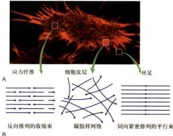  

图8-8动物细胞边缘的伪足及其微丝的排列方式  

  

A.用荧光标记的鬼笔环肽染色显示体外培养细胞内微丝的分布以及细胞周缘伸出的伪足。B.应力纤维、细胞皮层和丝足内部微丝的排列方式示意图。  

  

动，并不停地伸出丝足勘探周围的环境信号，而微丝及其结合蛋白在片足和丝足的形成和运动过程中发挥主导作用。当某个丝足获得向前生长的信号时，微丝向前组装，突起生长，而其他方向的突起由于内部微丝的解聚而缩回。  

  

#### （五）微绒毛  

  

在小肠上皮细胞的游离面有大量的微绒毛（microvilli），其轴心是一束平行排列的微丝，对微绒毛的形态起支撑作用，其下端终止于端网结构（terminalweb）。微丝结合蛋白如绒毛蛋白、丝束蛋白、胞衬蛋白（fodrin）等在微丝束的形成、维持及其与细胞质膜的连接中发挥作用。将肌球蛋白的S1片段与微绒毛内的微丝结合，然后用快速冷冻-深度蚀刻电镜技术可显示微绒毛内部微丝的极性，其正极端在微绒毛的顶部，在微绒毛的基部微丝束与细胞质中间丝相连（图8-9）。  

  

#### （六）胞质分裂环  

  

胞质分裂环（收缩环）是有丝分裂末期在两个即将分裂的子细胞之间形成的一个起收缩作用的环型结构（图8-10）。收缩环的主体结构由大量反向平行的微丝组装而成。胞质分裂的动力来源于结合在收缩环上的肌球蛋白所介导的极性相反的微丝之间的滑动。随着收缩环的收缩，两子细胞被缩分开。收缩环是  

  

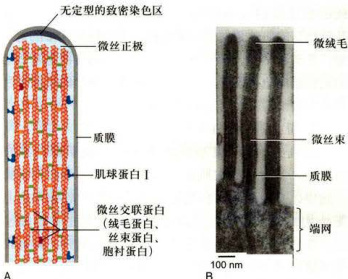  

图8-9微绒毛中的微丝和微丝结合蛋白  

  

A.微绒毛内部微丝及其结合蛋白排列结构模式图。B.小肠上皮细胞表面微绒毛（纵切面）的电镜图像（BecharaKachar博士惠赠）。  

  

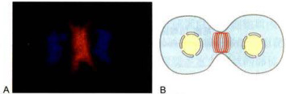  

图8-10胞质分裂环  

  

A.罗丹明标记的鬼笔环肽染色显示星形胶质细胞的胞质分裂过程中微丝的分布。染色质由DAPI染色显示。B.胞质分裂环模式图。（A图由李慧惠博士提供）  

  

非肌细胞中具有收缩功能的微丝束的典型代表，能在很短的时间内迅速组装与解聚以完成胞质分裂过程。  

  

### 三、肌球蛋白：依赖于微丝的分子马达  

  

在细胞内参与物质运输的马达蛋白（motorprotein）可以分为三类：沿微丝运动的肌球蛋白（myosin）、沿微管运动的驱动蛋白（kinesin）和动力蛋白（dynein）。这些蛋白既有与微丝或微管结合的马达结构域，又有与膜性细胞器或大分子复合物特异结合的“货物”结合结构域，利用水解ATP所提供的能量沿微管或微丝运动。  

  

#### （一）肌球蛋白的种类  

  

有关肌球蛋白最初的信息来自对骨骼肌细胞的研究，发现多个Ⅱ型肌球蛋白分子（图8-11）组装成肌原纤维的粗肌丝，并被相关的细胞结构约束在一定的区域，肌球蛋白的头部和组成微丝的肌动蛋白亚基之间的相互作用导致粗肌丝与细肌丝之间的滑动。随后，人们又陆续发现了多种不同类型的肌球蛋白分子。马达结构域是肌球蛋白超家族成员最保守的部位，是肌球蛋白定性和分类的依据，而这些肌球蛋白分子的C端和N端扩展部分则变化很大（图8-12）。基于马达结构域多肽链一级结构的相似性，至少可以将肌球蛋白超家族的成员分成18个家族，一些类群还可以进一步分成多个亚家族。不同生物细胞所表达的肌球蛋白的种类具有较大的差别，如芽殖酵母表达的5种肌球蛋白分属3个不同的家族，而人类细胞表达40多种肌球蛋白，它们分别属于12个不同的肌球蛋白家族。  

  

在生物演化过程中，不同类型肌球蛋白成员逐步适应于特殊的细胞功能。如Ⅱ型肌球蛋白的成员在心肌、  

  

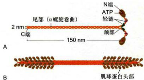  

图8-11I型肌球蛋白分子和粗肌丝的结构示意图  

  

A.I型肌球蛋白分子由2条具有马达结构域的重链（黄色）和4条起调节作用的轻链构成。B.由I型肌球蛋白的尾部结构域相互作用而组装成的粗肌丝。  

  

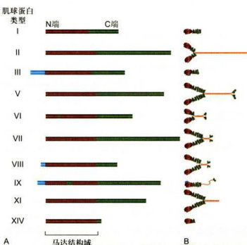  

图8-12部分肌球蛋白超家族成员的结构示意图  

  

A.部分肌球蛋白分子重链的一级结构，棕色部分示马达结构域在多肽链中的位置。B.一些肌球蛋白超家族成员分子的结构比较。所有的肌球蛋白分子都具有相似的马达结构域，但它们C端和某些成员的N端扩展部分变化很大。  

  

骨骼肌和平滑肌细胞中与肌动蛋白纤维组装在一起能产生强大的收缩力，也在收缩环、应力纤维等具有收缩能力的细胞结构中发挥作用；V型肌球蛋白与细胞内膜泡和其他细胞器的运输相关，I、V、IX和X型肌球蛋白的一些成员参与了细胞内吞作用以及吞噬泡的运输，另一些肌球蛋白家族的成员在细胞形态和极性化细胞结构的建立及维持过程中发挥功能，如I型肌球蛋白家族的成员将膜脂和微丝结构相连接，参与细胞突起的形成，一些Ⅱ型肌球蛋白的成员与应力纤维及细胞皮层的微丝相互作用，V型肌球蛋白参与黏着斑的动态变化，还有一些肌球蛋白参与了细胞感知系统及信号转导过程，如某些I型肌球蛋白分子对钙通道的活性具有调控作用，Ⅲ型肌球蛋白的成员与光感受器的信号分子相互作用，V、VI和XV型肌球蛋白的一些成员与耳朵感觉细胞中的微丝结构相关，如果编码这些蛋白质的基因发生突变有可能造成听力障碍。  

  

#### （二）肌球蛋白的结构  

  

肌球蛋白是沿微丝运动的马达分子，该蛋白通常含有三个功能结构域。它们是与运动相关的马达结构域，位于马达结构域后部的调节结构域，以及参与肌球蛋白复合体的组装并选择性地与所运输的“货物”结合的尾部结构域。马达结构域位于肌球蛋白的头部，包含一个肌动蛋白亚基的结合位点和一个具有ATP酶活性的ATP结合位点，负责将ATP水解所释放的化学能转变成机械能。ATP的水解及磷酸基团的释放等会改变马达结构域和调控结构域的构象。当ATP与肌球蛋白结合时，马达结构域与微丝的亲和力降低。调节结构域是连接马达结构域和尾部杆状区的一段 $\mathfrak{a}$ 螺旋，也是肌球蛋白轻链的结合部位，它在肌球蛋白分子上发挥杠杆作用。肌球蛋白的轻链大多是钙调蛋白家族的成员，不同的轻链结合特定的肌球蛋白分子，而且这种搭配也随生物体的发育阶段而有所变化。  

  

人们习惯上将Ⅱ型肌球蛋白称为传统的肌球蛋白（conventionalmyosin），而将其他的各种类型称为非传统的肌球蛋白（unconventionalmyosin）。图8-12显示几种类型的肌球蛋白的分子结构，其中研究较多的是I型、Ⅱ型和V型。除V型肌球蛋白的运动方向是从微丝的正极端向负极端移动以外，其他各种类型的肌球蛋白都是向微丝的正极端运动的。  

  

##### 1.Ⅱ型肌球蛋白  

  

在肌细胞中，Ⅱ型肌球蛋白组装成肌原纤维的粗肌丝，其含量约占肌细胞总蛋白量的一半。在非肌细胞中，Ⅱ型肌球蛋白是胞质分裂过程中收缩环的主要结构组分，并通过与微丝的相互作用主导收缩过程。Ⅱ型肌球蛋白也是应力纤维的结构组分。典型的Ⅱ型肌球蛋白分子包含2条重链和4条轻链，形成一个高度不对称的分子结构（图8-11A）。两条重链的尾部卷曲盘绕形成直径 $2\ \mathrm{nm}$ 长约 $150~\mathrm{{nm}}$ 的双股 $\mathfrak{a}$ 螺旋。用胰蛋白酶处理肌球蛋白分子，可产生轻酶解肌  

  

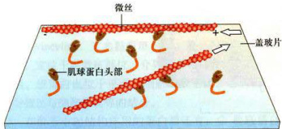  

图8-13肌球蛋白的体外运动实验模式图  

  

纯化的肌球蛋白S1片段被固定在盖玻片上，然后在体系中加入用荧光标记的微丝。当在体系中加入ATP时，在荧光显微镜下可观察到微丝在盖玻片表面滑动。  

  

球蛋白（lightmeromyosin，LMM）和重酶解肌球蛋白（heavymeromyosin，HMM）。重酶解肌球蛋白经木瓜蛋白酶处理，形成肌球蛋白头部（HMM-S1）和杆部（HMM-S2）。当反应体系中有ATP存在时，固定在盖玻片上的S1片段可以驱动微丝位移（图8-13）。  

  

Ⅱ型肌球蛋白分子的尾部主要起结构作用。双极肌球蛋白纤维组装时其尾部位于纤维的中央，而头部朝向两侧（图8-11B）。在骨骼肌细胞中，由肌球蛋白尾部构成的肌原纤维的粗肌丝是高度稳定的，而在胞质分裂时的收缩环中则是一个临时性结构，在胞质分裂结束后便解体。  

  

##### 2.其他类型的肌球蛋白  
I型肌球蛋白分子于1973年由T.Pollard和E.Kom从原生动物Acanthamoeba中分离得到。与传统的Ⅱ型肌球蛋白分子不同，该蛋白分子只有一个头部（马达结构域）和一个尾部，长度为 $70~\mathrm{{nm}}$ （图8-12），在体外也不能组装成纤维。其头部结构域能在ATP存在时沿微丝运动，尾部结构域在不同种类的I型肌球蛋白中各不相同，这可能与它们所运输“货物”的种类有关。有些I型肌球蛋白的尾部可以和膜泡结合，也有一些是和细胞质膜结合，牵引质膜和皮层的微丝作相对运动，从而改变细胞的形状。  

V型肌球蛋白分子是由两条肽链组装而成的二聚体，具有两个头部。其颈部的长度大约是Ⅱ型肌球蛋白颈部的3倍，达 $23~\mathrm{{nm}}$ （图8-12）。在运动过程中，V型肌球蛋白的步幅正好是微丝上由13个肌动蛋白亚基所组成的重复结构的长度。该蛋白的两个头部交替与微丝结合可以确保马达分子以及所运载的“货物”始终与微丝相连。  

细胞中的有些膜泡表面既有依赖微管的马达分子，也有依赖微丝的非传统类型的肌球蛋白。在细胞质内，一些膜性细胞器作长距离转运时通常依赖于微管，而在细胞皮层以及神经细胞生长锥前端等富含微丝的部位，货物的“运输”则依赖微丝进行。然而，在花粉管中的物质运输似乎主要依赖于微丝。  
### 四、肌细胞的收缩运动  

高等动物的个体运动有赖于骨骼肌的收缩。肌细胞是高度有序的收缩装置，使人们能从分子水平直至器官水平对其功能进行详细了解。  
#### （一）肌纤维的结构  

骨骼肌细胞又称肌纤维，是在胚胎期由单核成肌细胞融合而成，但细胞核仍保留在肌纤维内。用电镜观察肌纤维的纵切面，可见肌纤维是由数百条更细的肌原纤维（myofibril）组成的集束（图8-14）。  

每根肌原纤维由称为肌节（sarcomere）的收缩单元呈线性重复排列而成。每个肌节都表现出特征性的带型。肌原纤维的带状条纹由粗肌丝和细肌丝的纤维有序组装而成。粗肌丝由肌球蛋白组装而成，细肌丝的主要成分是肌动蛋白，辅以原肌球蛋白和肌钙蛋白。肌球蛋白的头部突出于粗肌丝的表面，并可与细肌丝上肌动蛋白亚基结合，构成粗肌丝与细肌丝之间的横桥（图8-15）。  

原肌球蛋白（tropomyosin，Tm）分子的长度为$40~\mathrm{{nm}}$ ，由两条平行的多肽链形成螺旋构型。 $\mathrm{Tm}$ 位于肌动蛋白丝的螺旋状沟槽内，一个Tm的长度相当于7个肌动蛋白单体（图8-16），对肌动蛋白与肌球蛋白头部的结合行使调节功能。  

肌钙蛋白（troponin，Tn）含3个亚基，其中肌钙蛋白C（Tn-C）能与 $\mathbf{Ca^{2*}}$ 结合，肌钙蛋白T（Tn-T）与原肌球蛋白有高亲和力，肌钙蛋白I（Tn-I）能抑制肌球蛋白马达结构域的ATP酶活性。细肌丝中每隔$40~\mathrm{{nm}}$ 有一个肌钙蛋白复合体结合到原肌球蛋白上（图8-16)。    

除上述分子外，肌肉收缩系统中还有多种蛋白质组分。将细肌丝锚定于Z盘或质膜上的蛋白质有：$\textcircled{1}$ CapZ，由两个亚基构成，定位于Z盘，与肌动蛋白丝正极端结合，使肌动蛋白丝保持稳定。 $\textcircled{2}\ a-$ 辅肌动蛋白，在细胞内组装成反向平行的二聚体，是骨骼肌Z  

  

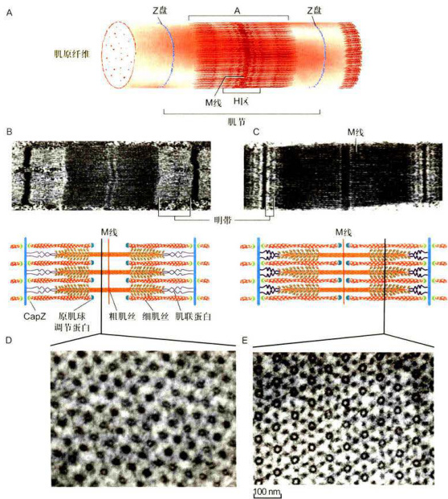  

图8-14骨骼肌及肌纤维的结构  

  

A.肌纤维的三维结构模式图。B和C.肌细胞纵切面，低倍电镜图像显示处于松弛（B上）和收缩（C上）状态下肌小节中明带和暗带有规律地排列，下面的是根据电镜照片所画的当肌肉处于松弛和收缩状态下粗肌丝和细肌丝的结构模式图。D.肌原纤维的横切面，显示暗带中粗肌丝排列状态。E.肌原纤维暗带中相肌丝和细肌丝交汇处的横切面，显示六根细肌丝围绕一根相肌丝成六角形排列。（电镜图像由洪健惠赠）  

  

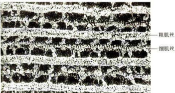  

图8-15快速冷冻-深度蚀刻电镜图像显示骨骼肌细胞中粗肌丝与细肌丝间的横桥（JohnHeuser博士惠赠）  

  

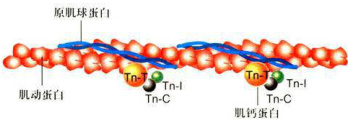  

图8-16细肌丝的分子结构示意图  

  

显示原肌球蛋白和肌钙蛋白沿肌动蛋白丝的分布状况，每个原肌球蛋白分子镶嵌在肌动蛋白丝的沟槽内，前后与7个肌动蛋白单体相互作用。  

  

盘、平滑肌的电子致密部区（致密斑和致密体）及心肌润盘的主要成分之一，可将微丝横向连接成束。 $\textcircled{3}$ 纽蛋白（vinculin），又名黏着斑蛋白，是一种细胞膜骨架蛋白，定位于黏着斑部位，介导整联蛋白和微丝之间的联系。纽蛋白也位于平滑肌细胞的致密区、心肌闰盘，介导微丝与细胞质膜等的结合。  

  

在肌节中起结构作用的蛋白质还有： $\textcircled{1}$ 肌联蛋白（connectin），长度达 $1~{\upmu\mathrm{m}}$ 具有弹性，连接乙盘与肌球蛋白纤维，在肌肉收缩或舒张时将粗肌丝定位于肌节中央。 $\textcircled{2}$ 伴肌动蛋白（nebulin），从Z盘伸出，与肌动蛋白丝伴行，可能参与调节肌动蛋白丝的组装。 $\textcircled{3}$ 肌营养不良蛋白（dystrophin），可能参与微丝与质膜的锚定作用，对防止肌纤维退化也很重要。  

  

#### （二）肌肉收缩的滑动模型  

  

H.E.Huxley和J.Hanxon（1954）在观察肌肉收缩时发现肌节缩短只是由神经冲动引发的细肌丝与粗肌丝之间的相对滑动所致，在肌节内并无粗/细肌丝的长度变化，这就是肌肉收缩的滑行学说（slidingthcory）。在此之后，人们对肌肉收缩的分子机制又有了更为明晰的认识，其基本过程如下：  

  

##### 1.动作电位的产生  

  

来自脊髓运动神经元的神经冲动经轴突传到运动终板（神经-肌肉接点），使肌细胞质膜去极化，并经T小管传至肌质网。  

  

##### 2.Ca²的释放  

  

肌质网去极化后释放 $\mathrm{Ca}^{2*}$ 至肌浆中，使 ${\mathrm{Ca}}^{2*}$ 浓度升高至收缩期的 ${\mathbf{C}}{\mathbf{a}}^{2*}$ 阔浓度（约为 $10^{-6}\mathrm{mol/L}$ 。。  

  

#####  3.原肌球蛋白位移  

  

${\mathrm{Ca}}^{2*}$ 与Tn-C结合，引起肌钙蛋白构象变化，Tn-C与Tn-I、Tn-T结合力增强，导致 $\mathrm{Tn-I}$ 与肌动蛋白结合力削弱，使两者脱离；同时，Tn-T使原肌球蛋白移位到肌动蛋白双螺旋沟槽的深处，暴露出细肌丝肌动蛋白与肌球蛋白头部的结合位点，解除了肌动蛋白与肌球蛋白结合的障碍。  

  

#####  4.细肌丝与粗肌丝之间的相对滑动  

  

肌球蛋白将ATP中储存的化学能转化成肌丝滑动的机械能，导致细肌丝和粗肌丝之间发生相对方向的滑动。肌球蛋白的头部结构域与肌动蛋白丝之间的每一个机械运动周期消耗一分子ATP。根据滑动模型（图8-17），当肌球蛋白头部（马达）结构域没有与ATP结合时，突出于粗肌丝表面的头部结构域与细肌丝上的  

  

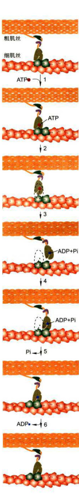  

图8-17肌肉收缩过程图解  

  

在初始状态，组成粗肌丝的肌球动蛋白的马达结构域上没有ATP时，该马达结构域与细肌丝结合，并呈僵直状态。1-2.ATP结合到马达结构域导致其与细肌丝的结合力下降，肌球蛋白与肌动蛋白分开。3.ATP水解，但ADP+Pi仍与肌球蛋白结合，获能的肌球蛋白头部发生旋转，向细肌丝的正极端（Z盘一侧）抬升。4.在 $\mathsf{C a}^{2*}$ 存在的条件下，肌球蛋白头部与靠近细肌丝正极端的一个肌动蛋白亚基结合。5.Pi释放，肌球蛋白颈部结构域发生构象变化，导致马达结构域与细肌丝的角度发生变化，拉动细肌丝导致细肌丝与粗肌丝做相对滑动。6.ADP释放，肌球蛋白的马达结构域与细肌丝之间又回到僵直状态。  

  

肌动蛋白单体处于紧密结合状态。当ATP结合到肌球蛋白的头部，引起头部结构域与细肌丝的分离（步骤1、2）：同时头部结构域的ATP酶被激活，将ATP水解，由此释放的能量被被肌球蛋白吸收，导致进一步的构象变化，头部结构域向前抬升，并结合到靠近细肌丝正极端的一个肌动蛋白亚基上（步骤3、4）；随着Pi和能量的释放，肌球蛋白颈部结构域发生构象变化，由此产生的力改变了头部结构域与细肌丝的角度，拉动肌动蛋白丝产生相对于肌球蛋白丝的滑动（步骤5）：接着是ADP的释放，肌球蛋白的头部结构域与细肌丝之间又回到僵直状态（步骤6）。如果体系中仍有高浓度的$\mathbf{Ca^{2*}}$ 存在，肌球蛋白将继续进行下一个周期沿肌动蛋白丝的滑动。到达肌细胞的冲动一旦停止，肌质网就通过钙泵将 $\mathbf{Ca^{2+}}$ 回收，使胞质中钙浓度降低，于是收缩周期停止。  

  

## 第二节微管及其功能  

  

微管的电镜图像呈中空的管状结构，其外径为$24~\mathrm{nm}$ ，内径为 $15\ \mathrm{nm}$ 。微管存在于所有真核细胞中，但大部分微管在细胞质内形成暂时性的结构，如间期细胞内的微管、分裂期细胞的纺锤体微管，这些微管对细胞内各种细胞器和生物大分子的非平衡态分布起重要的组织作用。另外一些微管形成相对稳定的“永久性”结构，如存在于纤毛或鞭毛内的轴丝微管、神经元突起内部的微管束结构等。  

  

### 一、微管的结构组分与极性  

  

对多种真核生物基因组进行分析的结果表明，微管蛋白是多基因编码的。根据各微管蛋白在一级结构上的相似性，大致可以分为α、β、 $\gamma,~8.$ 8和6个不同的微管蛋白亚家族，它们在细胞内具有不同的定位和功能。在人体基因组中，有23个编码微管蛋白的基因和至少48个假基因。此外，在细菌和古菌中也找到了在序列和功能上与微管蛋白相似的蛋白质种类，如FtsZ和TubZ等。通常情况下，微管由 $a^{-}$ 微管蛋白和 $\beta-$ 微管蛋白亚基组装而成。不同基因编码的 $\scriptstyle{\alpha-{\frac{\d}{\d}}}$ 微管蛋白和$\beta-$ 微管蛋白在序列和结构上都非常相似，并且在试管中能混合组装成微管，但在生物体内的表达却有一定的组织特异性，如在神经细胞内表达的 $\beta-$ 微管蛋白是β3，而在一些人皮肤鳞癌细胞（如A431细胞）中表达的则是β2。  

  

$a-$ 微管蛋白和 $\upbeta-$ 微管蛋白翻译后即组装成 $\scriptstyle{\alpha/\beta-}$ 微管蛋白二聚体，这种二聚体是细胞质内游离态微管蛋白的主要存在形式，也是微管组装的基本结构单位（图8-18)。 $a-$ 微管蛋白含450个氨基酸残基， $\beta-$ 微管蛋白含455个氨基酸残基。两者的C端均富含酸性氨基酸，并有多个翻译后修饰位点，使组装后的微管表面带有较强的负电荷。大多数微管结合蛋白的微管结合结构域都带正电荷，它们靠分子间正负电荷的相互作用而结合在微管表面。 $\gamma-$ 微管蛋白存在于中心体等具有微管组织功能的细胞结构上，在微管组装的成核过程中发挥主要作用。作为微管组装的起始位点， $\gamma-$ 微管蛋白与微管蛋白二聚体中的 $a-$ 微管蛋白结合，从而确定了微管的极性。$^{\delta-}$ 和8-微管蛋白主要定位于中心粒和纤毛的基体等部位，与三联体微管中B管和C管的组装相关。-微管蛋白目前仅在动质体目的原生动物中发现。FtsZ在细菌细胞分裂时形成环状结构，类似于动物细胞分裂时由肌动蛋白/肌球蛋白形成的收缩环，促进细菌细胞的分裂。  

  

从低等的单细胞真核生物到高等哺乳动物，微管蛋白可能是最保守的蛋白质分子之一。在 $a-$ 微管蛋白和β-微管蛋白上都有一个GTP结合位点。可能是由于构象上的原因，结合在 $a-$ 微管蛋白上的GTP通常不会被水解，因而该结合位点被称为不可交换位点（nonexchangeablesite，N位点）。结合在β-微管蛋白上的GTP在微管蛋白二聚体组装到微管的末端后即被水解成GDP。当微管解聚后， $\beta-$ 微管蛋白上的GDP可以被GTP所替换，然后再参与微管的组装。所以 $\beta-$ 微管蛋白上的GTP结合位点是可交换位点（exchangeablesite，E位点）。此外，每个微管蛋白上还有二价阳离子$(\mathbf{Mg}^{2*})$ 结合位点，以及一些小分子化合物如秋水仙素和长春花碱的结合位点。  

  

电镜图像显示微管横截面上有13个球形蛋白亚基，应用负染或原子力显微镜等方法观察到的图像也显示微管管壁是由 $\alpha/\beta-$ 微管蛋白纵向排列而成的原纤丝（protofilament）构成，13根原纤丝合拢后构成微管的管壁。由于相邻的原纤丝之间在排列上存在 $1\ \mathrm{nm}$ 左右的交错，以致微管蛋白沿微管的圆周呈螺旋状排列，在微管合拢的位置微管蛋白构成的螺旋被终止，出现 $a-$ 微  

  

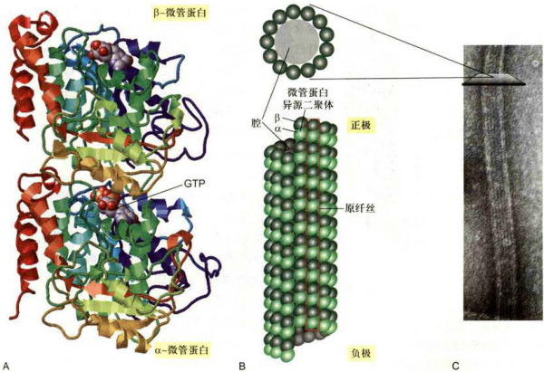  

图8-18微管和微管蛋白  

  

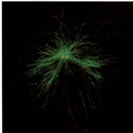  

  

A.微管蛋白二聚体的三维结构模型。α-微管蛋白和β-微管蛋白各结合1分子的GTP，它们在相互作用的界面上呈互补关系。B.微管的结构模式图。上面为微管的横切面，显示由13个微管蛋白亚基组成的环状结构，下面为一段微管的侧面观，显示13根原纤丝合拢成微管时的位置关系。C.微管经负染后的电镜图像，显示微管蛋白亚基和原纤丝的排列方式。D.免疫荧光染色显示HeLa细胞中的微管（绿色）网络结构，大部分微管源自中心体（黄色），也有一部分微管并不与中心体相连。（C图由UeliAebi博士惠赠：D图由黄宁博士提供）  

  

管蛋白和 $\beta-$ 微管蛋白之间的横向结合，并产生纵贯微管长轴的“接缝”。微管组装的基本结构单位是由 $\alpha/\beta-$ 微管蛋白组成的二聚体，每一根原纤丝都是由这些二聚体有规律地排列而成，所以每一根原纤丝的两端都是不对称的，它们的一端都是 $a^{-}$ 微管蛋白，而在另一端都是β-微管蛋白，从而使整根微管在结构上呈极性状态（图8-18，图8-19）。  

  

从结构上看，细胞内的微管有三种类型，它们分别是单管（如细胞质微管或纺锤体微管）、二联管（纤毛或鞭毛中的轴丝微管）和三联管（中心体或基体的微管）。微管结合蛋白的微管结合结构域与微管表面结合，而其他的结构域突出于微管表面，与相邻的微管或其他细胞结构相连。马达蛋白利用水解ATP产生的能量携带所运输的“货物”沿微管运动。这些蛋白质与微管网络的空间分布及功能密切相关。  

  

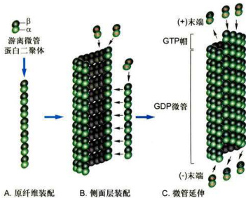  

图8-19微管组装的过程与踏车行为  

  

A.α/β-微管蛋白首先组装成原纤丝。B.原纤丝侧向相互作用形成片层。C.由13根原纤丝合拢形成的微管，α/β-微管蛋白从两端加入（或解聚）使微管延长（或缩短）。当体系中α/β-微管蛋白的浓度处于临界浓度时，微管蛋白在微管的正极端组装的速度与在负极端去组装的速度相等，微管的长度可保持不变。  

  

### 二、微管的组装与解聚  

  

#### （一）微管的体外组装与踏车行为  

  

由于细胞内部结构及蛋白组分相当复杂，因此有关微管组装方面的资料主要来源于体外试验的结果。首次在试管内成功进行微管组装试验的是Temple大学R.Weisenberg的研究室。他们以动物脑组织的匀浆物为材料，并加入适当浓度的 $\ensuremath{\mathbf{M}}\ensuremath{\mathbf{g}}^{2*}$ 、GTP和EDTA，利用大部分微管具有在低温下解聚而在37℃时可以重新组装的特点，成功地实现了微管的体外组装。通过调节实验系统的温度和缓冲液的组分，经过组装/解聚和差速离心等多轮循环，再结合层析技术可以得到较纯的微管蛋白或组装好的微管。然而，在用电子显微镜观察体外组装的微管时，发现它们的粗细并不均一。一些微管的横断面上并不是人们在细胞内所见到的有13个微管蛋白亚基，有的才11个或更少，也有些具有15个亚基。这些结果提示，微管在体外组装时，似乎缺乏某种机制来控制微管横断面上微管蛋白亚基的数目。  

  

微管在体外的组装过程可以分为成核（nucleation）和延伸（elongation）两个阶段。在体外条件下由于缺乏-微管蛋白环状复合物，微管的成核过程有别于体内。首先是微管蛋白纵向聚合形成一段短的原纤丝，即所谓的成核反应，然后是 $\alpha/\beta-$ 微管蛋白在两端及侧面聚合而扩展成片状，当片状聚合物加宽到大致13根原纤丝时，即合拢成为一段微管。新的微管蛋白不断地组装到这段微管的两端，使之延长（图8-19）。由于微管的一端是 $a-$ 微管蛋白，而另一端是 $\beta-$ 微管蛋白，这种结构上的差异导致 $\scriptstyle\alpha\mid\beta-$ 微管蛋白在两端进行装配时的平衡常数和组装速度都不相同。通常持有 $a-$ 微管蛋白的一端（负极）组装较慢，而持有 $\beta-$ 微管蛋白的一端（正极）组装较快。  

  

与其他所有的生化反应过程一样，微管的组装速度同样与其底物（携带GTP的 $\alpha/\beta-$ 微管蛋白）的浓度呈正相关。微管蛋白组装到微管的末端后， $\beta-$ 微管蛋白发挥GTP酶活性，将所结合的GTP水解为GDP，由于高能磷酸键断裂所释放的能量储存于微管结构中，这使得末端带有GDP帽（GDP-cap，D型）的微管解聚所产生的自由能的变化（△G）高于末端带有GTP帽（GTP-cap，T型）的微管。同样，前者解聚的平衡常数$K_{\mathrm{p}}$ 5 $(K_{\mathrm{D}}{=}K_{\mathrm{off}}/K_{\mathrm{on}})$ 大于后者，即微管末端带GDP帽的组装所需的临界浓度 $C_{\epsilon}(\mathbf{D})$ 要大于带GTP帽的临界浓度 $[C_{\epsilon}(\Upsilon)$ ]。当体系中微管蛋白的浓度介于这两个临界浓度之间时，末端为GDP帽的微管解聚，而带GTP帽的微管因组装而延长。末端β-微管蛋白上GTP的水解导致自由能和微管蛋白构象发生变化，使微管原纤丝的末端发生弯曲，这种状态使微管蛋白二聚体之间的结合力下降，更容易发生解聚（图8-20）。用电镜观察正在解聚的微管，可以在末端观察到这种弯曲的原纤丝，而正在组装过程中的微管末端亚基带的核苷酸是GTP，其原纤丝是伸直的。当组装体系中结合GTP的微管蛋白的浓度较高，微管末端的组装速度大于GTP的水解速度时，可以在微管的末端形成一个结合GTP的帽子，从而使微管稳定地延伸。反之，底物的浓度随着微管的组装而下降时，微管的组装速度下降。当微管组装的速度小于 $\beta-$ 微管蛋白上GTP水解的速度时，末端暴露出结合GDP的微管蛋白，导致微管结构上的不稳定，从而表现出动力学不稳定性。由于微管两端存在结构上的差异，微管组装时两端所需的临界浓度也不一样，当组装体系中底物的浓度接近微管正极组装所需的临界浓度时，负极端已在临界浓度之下。此时，可以检测到在同一根微管上其正极端因组装而延长，而负极端则因解聚而缩短。当一端组装的速度和另一端解聚的速度相同时，微管的长度保持稳定，即所谓的“踏车行为”。  

  

细胞内游离态的微管蛋白的浓度远高于微管组装  

  

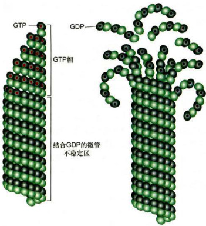  

图8-20微管的动态不稳定性依赖于微管末端β-微管蛋白上 GTP的水解与否  

  

当体系中α/β-微管蛋白的浓度高于临界浓度时，微管组装的速度大于GTP水解的速度，在微管末端部位的β-微管蛋白上带有GTP（左侧）。而体系中游离微管蛋白的浓度等于或低于临界浓度时，微管末端的β-微管蛋白上GTP水解的速度可能会高于微管组装的速度，GTP的水解导致微管蛋白聚合物构象的变化，原纤丝发生弯曲，微管倾向于解聚（右侧）  

  

所需的临界浓度。而这些微管蛋白中的大部分都与存在于细胞内的一种分子质量为 $19\ensuremath{\mathrm{\kDa}}$ 的磷蛋白—抑微管装配蛋白（stathmin）相结合（一个抑微管装配蛋白结合两个 $\alpha/\beta-$ 微管蛋白），从而阻碍了它们参与微管的组装。抑微管装配蛋白与微管蛋白的结合受其本身磷酸化状态的调控。磷酸化的抑微管装配蛋白释放出微管蛋白，使细胞内能用于组装的微管蛋白的有效浓度提高，从而加快了微管的组装速度，降低了微管的动态不稳定性；相反，抑微管装配蛋白的去磷酸化将降低微管蛋白的有效浓度，使微管组装速度降低。细胞可以通过调节局部抑微管装配蛋白的磷酸化状态来调控微管的组装及其分布。  

  

在有丝分裂期，微管的组装受到一些因子的调控，使微管网络的组织结构发生显著变化。在有丝分裂前期，细胞质微管解聚，游离的微管蛋白被用于组装纺锤体微管；在末期，这一过程发生逆转。正如荧光显微镜观察体外培养的细胞时所见到的那样，细胞内的微管组装通常都起源于某些特殊位点，如细胞质微管（图8-18D）和纺锤体微管大多起源于中心体（centrosome），纤毛内部的微管起源于基体（basalbody）。在间期细胞或终末分化细胞内，微管的组装通常从中心体部位开始，并随着微管蛋白的不断加入而得以延伸，但并非所有的微管都能持续不断地进行组装。在同一细胞内总能见到一些微管在延伸，而另一些微管在缩短甚至全部解聚。刚刚从一根微管解聚下来的微管蛋白将（β-微管蛋白上的）GDP换成GTP后又被组装到另一根微管的游离端。这种快速组装和解聚的行为对于微管的功能极为重要。有时微管的游离端会与某些蛋白或细胞结构结合而不再进行组装或解聚，使该微管处于相对稳定状态。  

  

#### （二）作用于微管的特异性药物  

  

一些药物如秋水仙碱（colchicine）、诺考达唑（nocodazole）和紫杉醇（taxol）等可与游离的微管蛋白或组装好的微管结合，从而影响微管的组装或解聚。秋水仙素可以与游离的微管蛋白结合，当这种带有秋水仙素的微管蛋白组装到微管末端后，其他的微管蛋白就很难再装配上去，但这并不影响该微管的解聚，因此，用秋水仙素处理细胞可使微管网络解体。紫杉醇的作用与秋水仙素相反，当紫杉醇与微管结合后可以阻止微管的解聚，但不影响微管蛋白在微管的末端继续组装。结果是微管不停地组装，而不会解聚，这同样影响细胞周期的运行。临床上将一些影响微管组装/解聚的药物用于肿瘤的治疗就是基于这种机制。  

  

微管组装和解聚还与温度有关。在其他条件合适情况下，当环境温度高于 $20\mathrm{{C}}$ 时游离的微管蛋白可组装成微管，而当温度较低时微管会解聚。但也有一些微管在低温状态下仍然保持稳定，这些微管被称为冷稳定性微管。  

  

### 三、微管组织中心  

  

在动物细胞的细胞核附近都有一个中心体，大部分微管也都在中心体处成核并锚定于此，呈发散状向细胞的边缘延伸，因此，中心体通常被称作微管组织中心（microtubuleorganizingcenter，MTOC）。微管与中心体相连的一端为负极，另一端为正极。除中心体以外，细胞内起微管组织中心作用的类似结构还有位于纤毛和鞭毛基部的基体等细胞器，以及上皮细胞顶端面和高尔基体的反面网状结构等。  

  

#### （一）中心体  

  

当用低温或秋水仙素、诺考达唑等药物处理体外培养的动物细胞时，可导致微管结构的解体，但当更换了不含药物的培养液，或将温度恢复到正常以后，微管就能从中心体上重新组装，并渐渐向细胞的边缘延伸（图8-21）。  

  

中心体是由蛋白质组装而成的细胞器，包含一对中心粒，它们彼此呈近乎垂直状态分布，围绕在中心粒周围的蛋白质被称为中心粒外周物质。中心粒是一个直径大约 $0.25~\mathrm{nm}$ 、长度为 $150\sim500~\mathrm{nm}$ 的桶状结构。每个中心粒含有9组等间距的三联体微管。在每组三联体微管中，只有一根微管在结构上是完整的，管壁由13根原纤丝组装而成，称为A管，另外的两根微管为不完整微管，依次称为B管和C管。用电子显微镜观察中心粒外围的致密物质，发现微管并不是直接起源于中心粒，而是在中心粒的亚远端附属结构和外周物质区域（图8-22）。参与中心粒组装的微管蛋白除了 $\alpha/\beta-$ 微管蛋白以外，还有 $\delta/\mathrm{{\varepsilon}}-$ 微管蛋白。目前还不知道 $\delta/\mathrm{{\varepsilon}}-$ 微管蛋白是如何组装到中心粒结构上，也不知道这两种微管蛋白发挥何种功能，但是 $\delta{\iota_{E}}-$ 微管蛋白的缺失将导致中心体结构的变化。  

  

细胞内的微管并不都与中心体相连，如在神经细胞轴突内，尽管微管的正极都指向轴突的顶端，但大部分微管的另一端也在轴突内部。在树突内约有 $50\%$ 的微管的正极指向胞体，它们显然也不可能与中心体相连。另外一个特殊的例子是小鼠的卵母细胞，该细胞内似乎并没有中心体，但仍然能组织像减数分裂纺锤体那样复杂的微管结构。高等植物细胞内没有中心粒。在某些植物的间期细胞内，与微管组织中心相关的物质似乎存在于细胞核的周围，如在植物的胚乳细胞中，微管好像是起源于核膜的外表面。植物细胞有丝分裂纺锤体的微管从细胞的两极开始组装，然而，那里也没有中心体存在。  

  

$\gamma-$ 微管蛋白是在酵母的温度敏感突变体内发现的。该蛋白在细胞内的含量极微，定位于细胞中心体的致密外周物质中。免疫电镜观察结果显示， $\gamma-$ 微管蛋白在中心体上形成直径为 $24~\mathrm{nm}$ 的环状结构。该环状结构在体外可以作为微管组装的起始点。据此，人们提出了微管在中心体部位的成核模型（图8-22D）。该模型认为13个 $\gamma-$ 微管蛋白在中心体的周物质中呈螺旋状排列形成一个开放的环状复合物。微管组装时，游离的 $\alpha/\beta-$ 微  

  

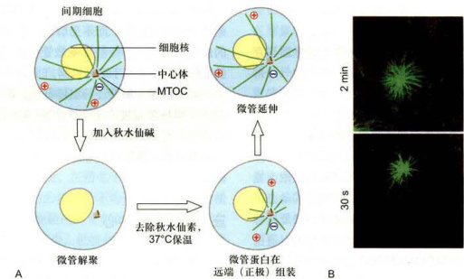  

图8-21中心体的微管成核作用  

  

A.中心体微管解聚与重新组装模式图。向细胞培养液中加入秋水仙素，或者放在冰上处理一段时间，使细胞内的微管解聚。当除去药物，并再放回37℃培养时可以诱导微管重新组装。B.体外培养的成纤维细胞用0.5ug/mL乙酰甲基秋水仙素处理1h，使细胞内的微管解聚，然后在正常培养液内生长30s或更长时间，用特异性识别微管蛋白的抗体标记，显示从中心体重新组装的微管向各个方向生长。（B图由伍启熹博士和何润生博士惠赠）  

  

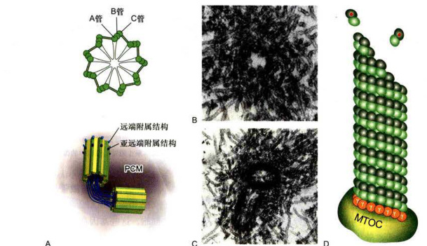  

图8-22中心体的结构及微管的成核  

A.中心体结构示意图，显示成对的中心粒以及外周物质（PCM）。B.中心粒横切面的电镜照片，显示9组微管三联体结构呈风车状排列。C.显示一对垂直分布的中心粒及其起源于外周物质的微管。D.大部分中心体微管的组装起始于PCM上的 $\ y-$ 微管蛋白环状复合物。（B、C图由伍启熹博士和滕俊琳博士惠赠）。  

  

管蛋白有序地加到 $\gamma-$ 微管蛋白构成的环上，而且 $\gamma-$ 微管蛋白只与二聚体中的 $a-$ 微管蛋白结合。这样组装起来的微管在靠近中心体的一端为负极端，而位于正极端的一定是β-微管蛋白。  

  

#### （二）基体和其他微管组织中心  

  

鞭毛和纤毛内部的微管起源于其基部称为基体的结构。基体（参见图8-32）在结构上与中心粒（图8-22）基本一致，其外围由9组三联体微管构成，A管为完全微管，B管和C管为不完全微管。A管和B管跨过纤毛板与纤毛轴丝中相应的亚纤维相连，C管终止于纤毛板或基板附近。中心粒和基体是同源的，在某些时候可以相互转变。例如，当细胞进入 ${\bf G}_{0}$ 期时，中心粒转变成纤毛的基体，当细胞重新进入有丝分裂周期时，纤毛解体，基体转变成中心粒。中心粒和基体都具有自我复制的性质，一般情况下，新的中心粒是在细胞周期的S期、在原来已经存在的中心粒的近端复制而来。在某些细胞中，中心粒能从无到有（denovo）进行组装。  

  

最近的一些文献显示，高尔基体的反面膜囊区域和上皮细胞的顶端面也有组织微管组装的能力。在一些细胞中似乎存在一种机制，可以从微管的末端切下一小段，这种被切下来的小段微管的命运并不清楚，有可能作为新的微管的生长点。  

  

### 四、微管的动力学性质  

  

微管的稳定性与其所结合的细胞结构组分以及细胞的生理状态相关。对微管动力学特征的研究通常在体外培养细胞上进行。当细胞处于正常的生长状态时，微管的组装和解聚并不是同步进行的。在同一时刻，往往可以观察到一部分微管正在组装延伸，而另一部分正在解聚。有时整根微管解聚后又重新组装，甚至在同一根微管的末端，其组装和解聚也可以反复进行。微管所表现的这种动力学不稳定性通常都发生在正极端（图8-23）。当微管的末端与某些细胞结构结合后整根微管就会变得相对稳定。  

  

不同状态的微管其稳定性差异很大。间期细胞中源于中心体的微管和有丝分裂期的纺锤体微管大多处于组装和解聚的动态平衡中，对各种理化因素如温度、流体压力、 $\mathbf{Ca}^{2*}$ 浓度等的变化，以及一些化学药物如秋水仙素、长春花碱等都相当敏感。中心粒微管、轴突微管以及纤毛或鞭毛内部的轴丝微管则相当稳定，推测可能与其 $a-$ 微管蛋白的第40位赖氨酸残基往往发生了乙酰化有关。由于这种乙酰化修饰仅仅发生在已经组装好的微管上，而且 $\scriptstyle\alpha-$ 微管蛋白的第40位氨基酸残基位于微管的管腔内，所以，微管乙酰化修饰的速度相对较慢，只有存在时间较长，或者说较稳定的微管才能被乙酰化，但乙酰化是否使微管更加稳定还不得而知。  

  

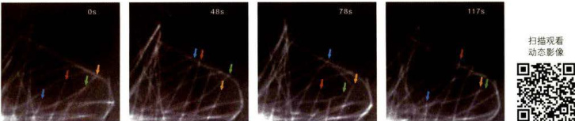  

图8-23细胞内微管的动态不稳定性  

将GFP-α-tubulin转染S2细胞，该融合蛋白表达后可参与微管的组装。图像显示在细胞边缘的微管交替地缩短和伸长。从左到右示每张截图上的微管在不同时间的动态行为，不同颜色的箭号示所指微管随时间的变化而组装（伸长）或解聚（缩短）过程中的微管。（欧光朔博士惠赠）  

  

### 五、微管结合蛋白对微管网络结构的调节  

  

如前所述，利用微管结构对温度的敏感性，再结合差速离心技术可以将微管蛋白纯化。但即使是进行多次组装/解聚的循环，仍然有一些蛋白质始终伴随着微管的组装而存在于体系中，这类蛋白质被称为微管结合蛋白（microtubule-associatedprotein，MAP）。根据MAP在电泳时所显示分子量的不同，依次命名为MAP1、MAP2、MAP3、MAP4、tau蛋白等。由于类似的研究大多以神经组织为对象，因此在已经鉴定的MAP中，有相当部分仅在神经系统中表达。微管结合蛋白分子通常都具有数个带正电荷的微管结合结构域（microtubulebindingdomain），该结构域与带负电荷的微管表面相互作用。一个MAP分子上成线性排列的微管结合结构域可以将微管表面原纤丝上相邻的微管蛋白亚基交联起来，以增加微管的稳定性。微管结合蛋白其余的结构域突出于微管表面与相邻的微管或细胞结构相作用，调节微管网络的结构和功能。  

  

在神经细胞中，MAP2、tau和MAPIB是研究得较为清楚的组分。MAP2存在于神经元的胞体和树突，而tau则存在于轴突。在MAP2和tau的C端均有3\~4个由18个氨基酸残基构成的微管结合结构域。与微管结合后，其N端突出于微管表面，并在相邻的微管之间形成横桥（图8-24）。  

  

为了探讨微管结合蛋白与微管网络结构的关系，J.Chen等（1992）用编码MAP2和tau的cDNA转染体外培养的Sf9细胞，这些基因在Sf9细胞内表达后，原本呈圆形的细胞长出了与神经元的树突（MAP2）和轴突（tau）类似的细胞突起。电镜图像显示，在MAP诱导产生的突起内部具有规则排列的微管束。由MAP2诱导产生的微管束内相邻微管间的距离与树突内部微管束的结构相似，而由tau诱导产生的微管束内相邻微管间的距离与轴突内部微管束的结构相似。MAP2和tau的分子结构基本相似，其C端都有3～4个微管结合结构域，所不同的是N端突出区域，MAP2有 $1820$ 个氨基酸残基，而tau只含有380个氨基酸残基。正是由于MAP2和tau蛋白的N端的差异分别决定了树突和轴突内微管束内相邻微管间的距离的不同（图8-24）。MAP2或tau基因剔除小鼠的树突或轴突内部相邻微管间的横桥明显减少，虽然对神经元突起生长的影响并不是很大，但MAPIB/MAP2或MAPIB/tau的双基因剔除小鼠的神经突起的生长明显受阻，表明在轴突和树突中都有定位的MAPIB与MAP2/tau蛋白之间在功能上存在互补作用。  

  

### 六、微管对细胞结构的组织作用  

  

真核细胞内部是高度区室化的结构，各种生物大分子和细胞器等都分布在特定的空间。用秋水仙素等药物处理体外培养细胞，导致微管解聚，细胞变圆。与此相应的变化是内质网缩回到细胞核周围，高尔基体分散成小泡，细胞内依赖于微管的物质运输系统全面瘫痪，那些处于分裂期的细胞停止分裂。一旦阻止微管组装的药物被除去，微管又从中心体等部位重新组装，并向细胞周缘的伸展，内质网也随之向外侧铺展，高尔基体重  

  

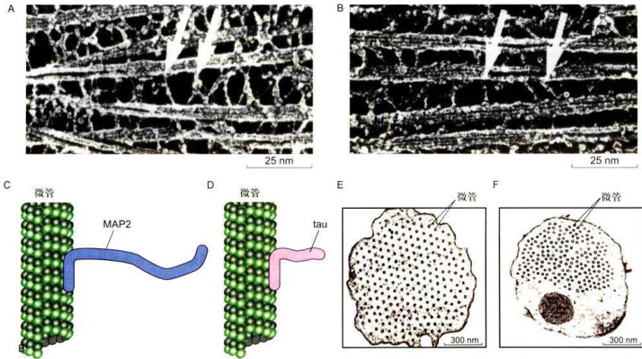  

图8-24MAP2和tau蛋白诱导产生的微管束的结构  

  

A.B.将MAP2和tau分别转染Sf9细胞，在诱导产生的微管束中相邻微管之间由MAP2和tau的N端突出结构域形成横桥。C.D.MAP2和tau的C端微管结合结构域可与微管表面结合 其N端突出于微管表面 由MAP2诱导产生的细胞突起内的微管束结构，相邻微管之间的距离为 $60-70~\mathrm{nm}$ 与树突内微管束的结构相似 田 蛋白诱导产 生的细胞突起内的微管束结构，相邻微管之间的距离为20\~30nm，与轴突内微管束的结构相似。（照片由陈建国博士提供）  

  

新组装。对于体外培养的神经元，微管的解体将导致正在延伸中的神经突起停止生长，甚至缩回胞体。显然微管与细胞器的分布以及细胞的形态发生与维持等有很大的关系。  

  

在神经元这样的终末分化细胞中，有大量的MAP与微管表面结合，将相邻的微管交联在一起成束状排列。相对于处于分裂周期中的细胞来说，神经突起内的微管要稳定得多。在阿尔茨海默病患者的脑神经元内，tau蛋白的过度磷酸化使其很容易从微管上解离下来形成神经原纤维缠结，并导致微管的稳定性降低，结构素乱，依赖于微管的物质运输系统受损，最终导致神经元的死亡。  

  

神经元是一个高度极性化的细胞，一些蛋白质在轴突和树突部位的不对称分布导致这些神经突起在功能上的特化，从而保证了信号传递过程的正常进行。像这种极性化细胞结构的形成有赖于基于微管的物质运输，分子马达将胞体中合成的蛋白质定向转运到树突或者是轴突发挥功能。一些细胞器，如线粒体等也是沿着微管转运到轴突内。上皮细胞也是典型的极性化细胞的代表，在细胞的基底部和顶端，细胞器和蛋白质组分有着完全不同的分布方式。依赖微管的物质定向转运为细胞内各种细胞器和生物大分子的不对称分布提供了可能。  

  

### 七、细胞内依赖于微管的物质运输  

  

真核细胞内一些生物大分子的合成部位与行使功能部位往往是不同的，因此必然存在精细的物质转运和分选系统。应用快速冷冻-深度蚀刻技术观察轴突内部的结构时，在微管和一些膜性细胞器之间常常会看到一些横桥样结构（图8-25）。在光学显微镜下观察活细胞，可以看到许多细胞器或膜泡在细胞质（图8-26）或轴突内部沿微管作定向运动。甚至在同一根微管上可以观察到一些膜性细胞器向微管的一端运动，而另一些则向相反的方向移动。如果用破坏微管或抑制ATP酶活性的药物处理细胞，可以使这些膜泡停止转运。依赖微管的马达蛋白主要有驱动蛋白（kinesin）和细胞质动力蛋白（cytoplasmicdynein），它们能将储存于ATP中的化学能转化成机械能，沿微管运输货物。  

  

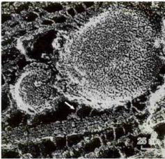  

图8-25快速冷冻-深度蚀刻电镜图像显示在轴突内部的微管和膜性细胞器之间有马达蛋白构成的横桥相连（箭号）（Hirokawa博士惠赠）  

  

#### （一）驱动蛋白  

  

##### 1.驱动蛋白的分子结构及其功能  

  

驱动蛋白是R.D.Vale等从鱿鱼巨大的轴突内分离到的、能沿微管移动，但不同于肌球蛋白和动力蛋白的马达分子（即kinesin-1）。该蛋白能运载膜性细胞器沿着微管向轴突的末梢移动。驱动蛋白在结构上与Ⅱ型肌球蛋白相似，由两条具有马达结构域的重链（kinesinheavychain，KHC）和两条与重链的尾部结合、具有货物结合功能的轻链（kinesinlightchain，KLC）组成。用低角度旋转投影（lowanglerotaryshadowing）电子显微镜观察的结果显示，驱动蛋白分子是一条长 $80~\mathrm{{nm}}$ 的杆状结构，头部一端有两个呈球状的马达结构域，直径约 $10~\mathrm{{nm}}$ ，另一端是重链和轻链组成的扇形尾部，中间是重链杆状区（图8-27）。球状的头部具有ATP结合位点和微管结合位点。随后，在其他多种生物如酵母、曲霉、昆虫以及小鼠和人的细胞中也陆续发现了编码类似驱动蛋白的基因及其表达产物。人类基因组中共有45个不同的驱动蛋白基因，马达结构域是该家族成员中非常保守的一个共有元件。  

  

根据驱动蛋白马达结构域系统演化方面的信息和功能特征，驱动蛋白超家族（kinesinsuperfamilyprotein，KIF）的成员被分成14个蛋白家族和一个暂时未分组的“orphankinesin”，用阿拉伯数字1—14标记各个蛋白家族，各个蛋白家族中的亚族则用附加的大写英文字母表示，如kinesin-14A（表8-1）。  

  

驱动蛋白的行为与其马达结构域在多肽链中的位置有关，大部分驱动蛋白家族成员的马达结构域在肽链的N端（N-驱动蛋白），如kinesin-1至kinesin-12，它们能从微管的负极向正极移动。另外一些的马达结构域位于多肽链的中部（M-驱动蛋白），如kinesin-13的3个成员，他们结合在微管的正极端或负极端，使微管处于不稳定状态，如有丝分裂时动粒微管两端的解聚就与该蛋白相关。还有一些的马达结构域位于肽链的C端（C-驱动蛋白），如kinesin-14的3个成员，这类驱动蛋白的运动方向与 $N-$ 驱动蛋白相反，它们从微管的正极向负极移动（图8-28）。kinesin-8和kinesin-14家族的成员既能向微管的正极端移动，还具有调节微管解聚的能力。大部分驱动蛋白可通过多肽链中部的一段卷曲螺旋相互作用而形成同源二聚体（如kinesin-4、6、7、8、10、12、13和14家族）。kinesin-1除了有两条重  

  

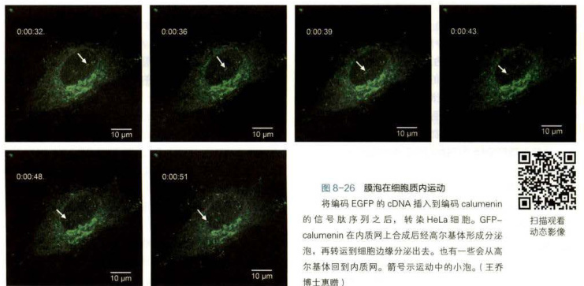  

  

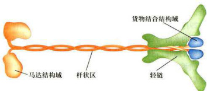  

图8-27驱动蛋白分子重链和轻链结构模式图  

  

驱动蛋白是由两条重链和两条轻链构成的异源四聚体。球状的马达结构域位于左侧（重链的N端），从左向右分别是与微管相互作用的马达结构域、杆状区和与转运的“货物”相互作用的C端及轻链构成的扇形尾部。  

  

链（KHC）以外，在C端还有两条轻链（KLC）共同构成货物结合结构域。kinesin-2家族的Kif3的两个成员可与一个结合蛋白一起构成异三聚体（Kif3A-Kif3B-Kap3）。kinesin-3家族的成员以单体或同源二聚体的形成存在。kinesin-5家族的成员可以通过其杆状区形成反向四聚体，在极性相反的两根相邻的微管（如纺锤体极微管）之间滑动介导中心体向两极移动。kinesin-1至kinesin-3家族的成员主要与膜性细胞器和大分子复合物  

  

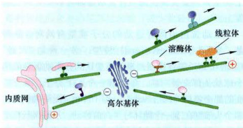  

图8-28细胞内依赖于微管的物质运输系统  

  

胞质动力蛋白介导内质网至高尔基体之间、细胞胞吞泡至细胞内部的膜泡运输，而驱动蛋白家族的成员介导从高尔基体反面膜囊出芽小泡的运输。  

  

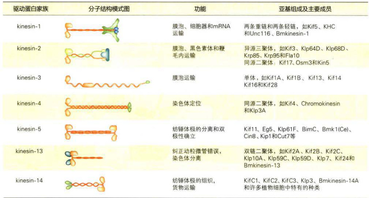  

  

的运输相关，而其它家族的成员主要作用在于调节微管的动态不稳定性以及微管网络的结构。  

  

##### 2.驱动蛋白沿微管运动的分子机制  

  

在驱动蛋白的马达结构域上有两个重要的功能位点：ATP结合位点和微管结合位点。与肌球蛋白的马达结构域（850个氨基酸残基）相比，驱动蛋白的马达结构域（350个氨基酸残基）显得很小巧。虽然两者在氨基酸序列上没有同源性，但它们的ATP结合位点的结构非常相似，两种马达结构域在大小和功能上的差异主要表现在细胞骨架结合部位和动力转换装置上。  

  

驱动蛋白沿微管运动的分子模型有两种：一种是“步行”（handoverhand）模型，另一种是“尺”（inchworm）爬行模型。步行模型认为：驱动蛋白的两个球状头部交替向前，每水解一个ATP分子，落在后面的那个将移动两倍的步距，即 $16~\mathrm{{nm}}$ 而原来领先的那个头部则在下一个循环时再向前移动。尺爬行模型认为：驱动蛋白两个头部中的一个始终在前，另一个永远在后，每步移动 $8\ \mathrm{nm}$ 。在这个领域，尽管已经积累了大量的实验证据，特别是近年来发展起来的单分子行为分析，为研究驱动蛋白两个马达结构域是怎样协调向前运动的问题提供了有效的方法，但实验结果很不一致，有些结果支持步行模型，但也不乏与尺爬行模型相吻合的结果。这里以传统的驱动蛋白为例，着重介绍被大多数学者承认的步行模型。  

  

驱动蛋白的运动主要涉及发生在两个马达结构域上的ATP的结合、水解和ADP的释放，以及与自身构象变化相偶联等机械化学循环过程。在这一过程中，驱动蛋白的两个头部交替与微管相结合，以确保在移动过程中不会从微管上掉下来。每水解一个ATP分子，整个分子就向前移动一步（两个微管蛋白亚基的长度，约$8~\mathrm{{nm}}$ 。当驱动蛋白沿微管行走时，两个马达结构域中位于前面的那个（L）与ATP结合时导致驱动蛋白发生构象变化，该结构域与微管紧密结合，并使后面的马达结构域（T）向前移动，越过原来位于前面的那个马达结构域（L）至微管正极一侧的另一个新的结合位点（共移动了 $16~\mathrm{{nm}}$ 。此时，处于前面的马达结构域（T）释放ADP，处于后面的那个（L）水解ATP，使得驱动蛋白处于开始时的状态，但两个头部互换了位置，整个分子则向微管的正极端移动了一步。在这一循环的运行过程中，驱动蛋白的两个马达结构域与微管之间交替结合，每个都有一半以上的时间与微管处于结合状态（图8-29）。相比之下，Ⅱ型肌球蛋白沿微丝移动时，同样是ATP的水解与马达结构域的构象变化相偶联，但在每个循环开始时，不带ATP的肌球蛋白的头部以僵直的构象与微丝紧密结合，当ATP与肌球蛋白头部结合时，马上引起肌球蛋白构象的变化，使头部与微丝的亲和力降低。但头部脱离微丝时，ATP水解，引发较大的构象变化，使肌球蛋白头部的构象几乎处于竖直状态。肌球蛋白头部和微丝上新的肌动蛋白亚基的微弱结合导致无机磷酸的释放，这一过程使头部恢复原来的构象，ADP被释放，头部与肌动蛋白紧密结合，从而回到初始状态。新的一轮ATP与肌球蛋白头部的结合导致下一个循环的开始。在这个循环中，肌球蛋白的头部与微丝结合的时间仅占循环所需总时间的 $5\%$  

  

引发驱动蛋白沿微管持续移动的原因有两个：第一，在每个驱动蛋白分子中，两个马达结构域的化学一机械循环是互相协调的，在一个马达结构域还没有与微管结合之前，另一个马达结构域不会从微管上掉下来，从而保证了步行的连续性，即马达分子和所运送的  

  

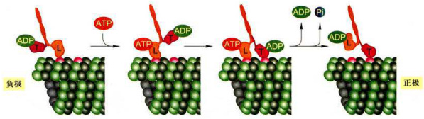  

图8-29驱动蛋白沿微管运动的步行模型  

  

kinesin-1有两条重链，其头部的马达结构域（用L和T表示它们开始时所处的位置）伴随着ATP的结合、水解以及Pi与ADP的释放而在微管表面行走。在整个过程中，两个头部结构域至少有一个与微管处于结合状态。  

  

“货物”或细胞器不会脱离微管。第二，驱动蛋白的马达结构域在ATP循环的大部分时间里都与微管紧密结合。  

  

肌球蛋白不具备沿微丝持续向前运动的能力，但多个肌球蛋白组装而成的巨大复合物（如粗肌丝）的协同作用却能提高其整体移动的速度。如在骨骼肌细胞中，大量规则排列的肌球蛋白头部与同一根微丝相互作用，复合物中肌球蛋白头部的协同作用使得在单一循环时间内，它们能将微丝移动相当20步的总距离，而驱动蛋白只能沿微管移动2步。这样，即便是两者在水解ATP的速度和分子步距上相当，肌球蛋白却能以比驱动蛋白更快的速度沿细胞骨架移动。  

  

#### （二）胞质动力蛋白及其功能  

  

动力蛋白超家族由两组蛋白质组成：细胞质动力蛋白和轴丝动力蛋白（axonemaldynein）。后者也称为纤毛或鞭毛动力蛋白。动力蛋白的重链同样含有ATP结合部位和微管结合部位，利用水解ATP产生的能量沿微管运动。动力蛋白是已知马达蛋白中最大、移动速度最快的成员。细胞质动力蛋白是一个分子质量接近$1~500~\mathrm{kDa}$ 的蛋白复合体，含多个亚基：2条具有ATP酶活性的、使其沿微管移动的重链，2条中间链，4条中间轻链和一些轻链（图8-30，图8-31）。细胞质动力蛋白与被称为动力蛋白激活蛋白（dynactin）的蛋白复合体（含 $\mathbf{p}150^{\mathrm{cibs}4}$ p62、dynamitin、Arpl、CapZa、CapZb、p27和p24）密切相关。动力蛋白激活蛋白调节动力蛋白的活性和动力蛋白与其货物的结合能力。与驱动蛋白和肌球蛋白超家族的多样性相比，细胞质动力蛋白的重链家族只有两个成员—Dynclh1和Dynclh2。Dynclh1主要担负向微管的负极端转运货物的功能，Dynclh2主要在鞭毛内的反向转运中起作用。Dynclh1可直接结合货物，或通过选择性组装的动力蛋白亚基（包括多条中间轻链、中间链和轻链）来与多种货物相连，而驱动蛋白和肌球蛋白则演化出大量的家族成员，并利用他们自身的尾部结构域（或少数轻链）识别并结合货物。  

  

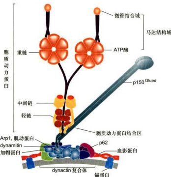  

图8-30细胞质动力蛋白结构示意图  

  

轴丝动力蛋白的种类远多于细胞质动力蛋白，结构和组成成分也相当复杂。根据动力蛋白在轴丝上的位置，可以将其分为内侧动力蛋白臂（innerdyneinarm）和外侧动力蛋白臂（outerdyneinarm）。不同类型的轴丝动力蛋白所含的重链（马达结构域）数量也不同，构成外侧臂的动力蛋白具有2个或3个马达结构域（图8-31），而在7个已知的内侧臂动力蛋白成员中，有1个含有2个马达结构域，其他 $6$ 个只有1个马达结构域。  

  

细胞质动力蛋白被认为与内体/溶酶体、高尔基体及其他一些膜泡的运输，动粒和有丝分裂纺锤体的定位，以及细胞分裂后期染色体的分离等事件密切相关。将抗动力蛋白的抗体注入有丝分裂期的细胞，可诱导纺锤体结构的解体。敲除细胞质动力蛋白重链基因的小鼠（cDHC）在胚胎早期便死亡。因此，可以认为cDHC是高等真核生物生长和发育所必需的。cDHC胚泡细胞内高尔基体膜囊片段化，并均匀分散在整个细胞质中，而不像正常细胞内那样聚集在细胞核周围。在cDHC细胞中，dynactin复合体中的Arpl和pl50Glued以及内体/溶酶体等细胞器都分散在整个细胞质中，表明cDHC是高尔基复合体的形成和正常定位所必需的。有趣的是在cDHC细胞中“片段化”的高尔基体膜囊以及溶酶体仍附着在微管上。显然除cDHC外，还存在其他的蛋白质分子参与高尔基体、溶酶体等细胞器与微管的相互作用。  

  

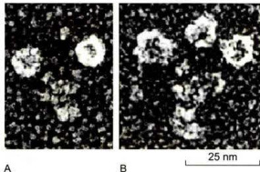  

图8-31胞质动力蛋白（2个头部）和轴丝动力蛋白（3个头部）分子的马达结构域（JohnHeuser博士惠赠）  

  

### 八、纤毛和鞭毛的结构与功能  

  

纤毛（cilia）和鞭毛（flagella）是突出于细胞表面的、高度特化的细胞结构。精子和原生动物通过鞭毛的波状摆动使细胞在液体介质中游动。纤毛与鞭毛的结构相似，但较鞭毛短。纤毛是一些原生动物（如草履虫）的运动装置。在一些高等动物体内，纤毛存在于多种组织（如输卵管、呼吸道上皮组织）的细胞表面。相邻的纤毛可以几乎同步运动，使组织表面的液体定向流动。在人体呼吸道，数目众多的纤毛可以清除进入气管的异物，输卵管中的纤毛可以使卵细胞向子宫方向移动。近年来，随着鞭毛内转运机制的发现以及一些纤毛相关蛋白缺失后引起的一系列在细胞水平、组织水平乃至个体水平上的表型变化，使人们认识到这种细胞结构还与细胞信号转导、细胞增殖与分化、组织与个体的发育等过程密切相关。  

  

#### （一）纤毛的结构及组装  

  

##### 1.纤毛的结构  

  

纤毛的外部是由细胞质膜特化而成的纤毛膜，内部是由微管及其附属蛋白组装而成的轴丝。轴丝是由250多种不同的蛋白质组装而成的高度有序的结构，这一结构从位于细胞皮层的基体发出，直达纤毛顶端。轴丝微管排列方式主要有3种模式：（1） $\cdot9+2^{n}$ 型：轴丝的外围是9组二联体微管，中间是2根由中央鞘所包围的中央微管。（2） ${}^{\mathfrak{s}_{9+0}\mathfrak{n}}$ 型：外周与 $9+2^{n}$ 型相同，但缺乏中央微管。（3） $^{\cdot\circ}9{+}4^{\circ}$ 型：极少数的纤毛属于这一类型，轴丝中央含有4根单体微管。 ${^{\ast}9}\mathrm{+}\mathrm{0}^{\ast}$ 型纤毛一般是不动纤毛，而 $^{\ast}9+2^{\ast}$ 型纤毛则大多为动纤毛（kinocilium）。但这种分类不是绝对的，如斑马鱼的脊髓中央管中就存在 $^{*}9{+}0^{*}$ 型的运动性室管膜纤毛，而蛙嗅觉上皮细胞上“9+2”型纤毛却是不动纤毛。缺乏运动能力的 ${}^{\mathsf{s}}\mathsf{g}_{+}\mathsf{0}^{\mathsf{w}}$ 型纤毛是构成各种感受器的基础（如化学感受器和本体感受器）。这些存在于感受器细胞上的不动纤毛通常被称为原生纤毛（primarycilium）。  

  

轴丝微管的正极端都指向纤毛或鞭毛的顶端。外围的二联体微管由A管和B管组成，其中A管为完全微管，由13个亚基环绕而成，B管为不完全微管，仅由10个亚基构成，另3个亚基与A管共用。中央微管均为完全微管（图8-32）。中央鞘和外周9组二联体微管  

  

A.四膜虫纤毛横切面的电镜图像。B.轴丝微管及其附属结构示意图。1.轴丝的横切面，其外围是9组相互联系的微管二联体，中央是由中央鞘包围的两根微管。2.基体横切面，其外围是9组相互联系的微管三联体。（A图由丁明孝提供）  

  

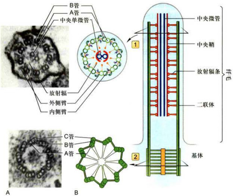  

图8-32基体及轴丝的结构和示意图  

  

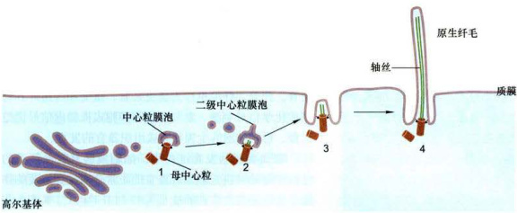  

图8-33原生纤毛的形成过程  

  

的A管之间由放射辐（radialspoke）相连。相邻的二联体之间通过连接蛋白（nexin）相连，还有2个动力蛋白臂从A管伸出，它们分别位于轴丝的内侧和外侧，其马达结构域沿相邻二联体微管的B管滑动使纤毛产生局部弯曲（图8-32）。  

  

位于纤毛基部的基体在结构上与中心粒类似。基体外围含有9组三联体微管，没有中央微管，呈“9+0”排列。其中A管为完全微管，而B管和C管则是不完全微管。基体中的A管和B管向外延伸而成为纤毛或鞭毛中的二联体微管（图8-32）。  

  

##### 2.纤毛的组装（发生）  

  

纤毛起始于位于细胞膜内侧的基体。在细胞周期运行过程中，基体和中心粒的主体结构是可以通用的，变换过程中仅需要更换一些蛋白质组分。纤毛在细胞进入 $\mathbf{G}_{\parallel}$ 期或 $\mathbf{G}_{0}$ 期时开始形成，进入S期前解体。利用电子显微镜观察培养的成纤维细胞，可见原生纤毛的形成分为4个阶段（图8-33）。 $\textcircled{1}$ 来自高尔基体的膜泡被母中心粒远端附属结构招募，包裹在母中心粒的顶端，形成中心粒膜泡（centriolarvesicle，CV），一些中心体蛋白如Cep97和CP110等从母中心粒的顶端移除。$\textcircled{2}$ 母中心粒微管开始延伸并获取成为基体所需的附属结构，初生轴丝开始显现。随着新的膜泡的加人，CV慢慢变大，最终成为次级中心粒膜泡（secondarycentriolarvesicle,SCV）。 $\textcircled{3}$ 母中心粒随同SCV向质膜迁移，当其锚定在质膜内侧的纤毛组装位点时，SCV与质膜融合形成一个杯状结构，称为纤毛项链。 $\textcircled{4}$ 在鞭毛内运输(intraflagellartransport，IFT）复合体的介导下，原生鞭毛进一步装配并延长。  

  

纤毛的延伸和维持依赖于鞭毛内运输。IFT是位于二联体微管和纤毛膜之间的双向运输系统。kinesin-2将  

  

IFT复合体B（含纤毛组装所需的轴丝前体组分）从纤毛基部运送到顶部，IFT复合体A（需要回收的物质）由dynein-2运回胞体。IFT复合体A包含6种纤毛组分，而复合体B包含10种纤毛组分（图8-34）。这些编码IFT组分的基因在真核生物中高度保守，几乎对于所有真核细胞的纤毛或鞭毛的组装都是必需的。  

  

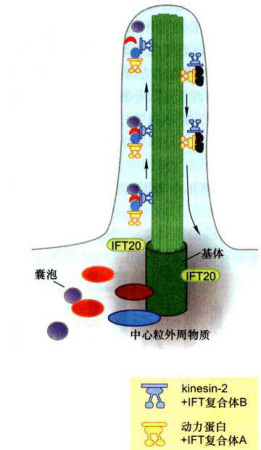  

图8-34膜泡运输和鞭毛内运输kinesin-2自鞭毛或纤毛的基部运送IFT复合体B至顶端，动力蛋白将IFT复合体A自鞭毛的顶端运向基部。  

  

#### （二）纤毛或鞭毛的运动机制  

  

纤毛运动的本质是由轴丝动力蛋白所介导的相邻二联体微管之间的滑动。在实验过程中改变环境的pH可使细胞表面的鞭毛脱落。收集鞭毛，再用去垢剂除去其表面的膜结构，并用蛋白酶作轻微的处理以打断在微管二联体之间起连接作用的连接蛋白，使相邻的二联体微管仅靠动力蛋白彼此联系，而失去其他蛋白质的束缚。如果此时加入ATP，从一个外周二联体微管的A管伸出的动力蛋白的马达结构域会利用水解ATP产生的能量在相邻的二联体的B管上“行走”，从而导致二联体之间产生滑动（图8-35A）。然而，在完整的纤毛或鞭毛内部，组成轴丝的9组二联体微管之间，外周微管与中央鞘之间都有许多辅助蛋白将微管横向连成一个整体，相邻二联体微管之间的滑动受到“整体性”的阻碍，于是纤毛动力蛋白“行走”时所产生的力便会使纤毛的局部弯曲（图8-35B）。  

  

纤毛或鞭毛的弯曲首先发生在其基部，因为这里的动力蛋白首先被活化。随着轴丝上的动力蛋白依次被特异地活化或者失活，这种弯曲有规律地沿着轴丝向顶端传播。动力蛋白的活化受中央微管和放射辐的调控，缺少这些结构的突变体纤毛没有运动能力。在纤毛或鞭毛的运动过程中，内侧的动力蛋白臂主要与纤毛弯曲有关，决定纤毛弯曲波形的大小和形态，外侧的动力蛋白臂则与拍打的力量和频率有关。  

  

#### （三）纤毛的功能  

  

对于单细胞原生生物而言，纤毛或鞭毛是其主要的运动装置，可以推动细胞在液体介质中向一定方向运动，实现觅食或应答环境的变化。一些动物细胞也带有纤毛，纤毛的运动可以推动组织表面的液体做定向流动，从而传输某些信号分子，影响靶细胞的定向分化与发育。此外，纤毛也作为感受装置，接受和传递外界物理或化学信号刺激，参与一系列细胞或机体内信号调控过程，影响细胞的生理状态或组织器管的发育。  

  

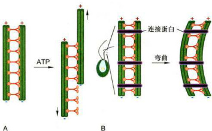  

图8-35纤毛或鞭毛的运动过程中相邻二联体微管的滑动模型A.在分离的微管中：动力蛋白导致微管滑动。B.在普通的鞭毛中：动力蛋白导致微管弯曲。  

  

在动物胚胎发育过程中，细胞或器官表面纤毛的结构和运动对决定躯体各器官的正常分布发挥重要的作用，如驱动蛋白家族的成员Kif3与IFT相关。Kif3A和Kif3B的基因剔除小鼠表现为发育过程中左右体轴形成不全。究其原因，是由于小鼠胚胎发育过程中胚胎结细胞所具有的单纤毛（monocilia）结构发育不全。Kif3A和Kif3B的基因剔除小鼠胚胎结细胞的纤毛（nodalcilia）中微管的排列方式与野生型小鼠 $"9+2"$ 排列模式不同，呈不能运动的 ${^{\circ}}9\substack{+0^{\circ}}$ 结构。野生型小鼠胚胎结细胞的纤毛呈涡旋运动，产生一个左旋的液流，从而打破了小鼠胚胎发育过程中的对称性，为左右体轴的形成提供了可能。而在Kif3A或Kif3B的基因剔除小鼠胚胎结细胞由于纤毛发育不全，致使胚胎结处的左旋液流的形成受阻，最终导致左右体轴形成障碍。在一些频发内脏易位的小鼠品系中，往往可见到胚胎结细胞的纤毛异常。  

  

存在于肾上皮细胞的原生纤毛是突出于细胞表面的物理感受器（mechanosensor），它通过感受液体的流动来起始细胞内的钙信号通路。polycystin-1、polycystin-2和polyductin/fibrocystin这3个定位于纤毛膜上的蛋白质是构成物理感受器的重要组分，如果这些蛋白质缺失，那么就算纤毛结构完整，钙信号通路仍然无法启动，最终导致多囊肾的发生。  

  

一些特化的纤毛还行使化学感受器的功能，它对于生物体的光感受和臭觉是不可或缺的。例如，在哺乳动物的视网膜上视锥细胞和视杆细胞利用特化的纤毛来感受光信号，并将信息传递给下游的双极神经元和水平细胞。感光细胞包括由纤毛连接的外段和内段，外段是高度动态的结构，而动态的维持则依赖于IFT。如果IFT缺失，外段结构会解体，从而导致失明。  

  

哺乳动物的嗅觉神经元利用球状树突末端的15\~20根纤毛来感受气味。纤毛缺陷的小鼠和患巴尔德-别德尔（Bardet-Biedl）综合征的患者，会出现嗅觉丧失症状。  

  

此外纤毛参与了发育过程中的两类重要的信号通路—Hedgchog（Hh）信号通路和Wingless（Wnt）信号通路。如果纤毛缺失，通路就无法对外源信号做出应答，从而会造成神经管无法闭合、脑形态异常、多指、左右体轴异常和肾囊肿等发育缺陷。  

  

### 九、纺锤体和染色体运动  

  

当细胞从间期进入有丝分裂期，间期细胞的微管网络解聚为游离的微管蛋白，然后组装形纺锤体微管，介导染色体的运动；分裂末期，纺锤体微管解聚，又组装形成细胞质微管网络。  

  

纺锤体微管包括动粒微管、极微管和星体微管。动粒微管连接染色体动粒与位于两极的中心体。极微管从两极发出，在纺锤体中部赤道区相互交错重叠。星体微管从中心体向周围呈辐射状分布。  

  

有丝分裂过程中染色体的运动有赖于纺锤体微管的组装和解离。在这一过程中动粒微管与动粒之间的滑动主要是靠结合在动粒部位的kinesin-13家族的成员和细胞质动力蛋白沿微管的运动来完成。极微管在纺锤体的中部交错重叠，分布在该区域的kinesin-5家族的成员如Cik1和Cin1等为双极马达蛋白，其中一端的两个马达结构域沿一条微管运动，另一端的两个马达结构域沿来自另外一极的微管运动。由于重叠的两条微管的极性相反，故当双极驱动蛋白四聚体沿微管向正极运动时，纺锤体二极间的距离延长，这是有丝分裂后期发生的重要事件（详见第十二章）。  

  

## 第三节中间丝  

  

中间丝又称中间纤维（intermediatefilament，IF），最初是在平滑肌细胞内发现的直径为 $10~\mathrm{{nm}}$ 的绳索状结构。因其粗细介于肌细胞的粗肌丝和细肌丝之间，故命名为中间丝（图8-36）。中间丝存在于绝大多数动物细胞内。细胞质中间丝通常是围绕细胞核开始组装，并伸展到细胞边缘与细胞质膜上的细胞连接如桥粒、半桥粒等结构相连。通过细胞连接，中间丝将相邻的细胞连成一体。在核膜的内侧，由核纤层蛋白（lamin）组装而成的纤维以正交网状形式排列构成核纤层，并通过位于内层核膜上的核纤层蛋白B受体与核膜相连。中间丝结  

  

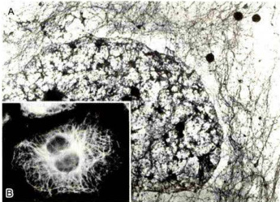  

图8-36HeLa细胞内的中间丝  

  

A.经非离子去垢剂处理和高盐缓冲液抽提后的细胞质中间丝网络的电镜照片。B.免疫荧光染色显示细胞质中间丝的分布。（翟中和和蔡树涛博士惠赠）  

  

构较微管和微丝稳定得多，用高盐溶液和非离子去垢剂处理细胞时，构成细胞骨架的微管和微丝，以及其他细胞结构基本上都被除去，但中间丝因有很强的抗抽提能力而被保存下来。  

  

与微管和微丝不同，中间丝并不是所有真核细胞所必需的结构组分。这类蛋白质在高等脊椎动物中最为复杂，而在植物基因组内尚未发现编码中间丝蛋白的基因，在酵母的核膜内侧也不存在核纤层结构。在线虫细胞中表达的某些中间丝蛋白与角蛋白有较高的相似性，但具有外骨骼的动物，如果蝇仅仅表达两种类型的核纤层蛋白，却没有细胞质中间丝。在人类基因组中共有70个编码中间丝蛋白的基因，其中大部分是在上皮细胞中表达的角蛋白基因（54种）。在人体中也有一些组织细胞，如神经系统的少突胶质细胞，它们的细胞质部分形成包绕神经轴突的髓鞘，也没有观察到细胞质内有中间丝结构。  

  

### 一、中间丝的主要类型和组成成分  

  

中间丝的组成成分比微丝和微管要复杂得多，不同组织来源的细胞表达不同类型的中间丝蛋白（表8-2）。根据中间丝蛋白的氨基酸序列、基因结构、组装特性以及在发育过程的组织特异性表达模式等，可将中间丝分为6种主要类型。I型（酸性）和Ⅱ型（中性和碱性）角蛋白（keratin）在上皮细胞内以异源二聚体的形式参与中间丝的组装；而Ⅲ型中间丝，如波形蛋白（vimentin）、结蛋白（desmin）、微管成束蛋白（syncoilin）、胶质丝酸性蛋白（glialfilamentacidicprotein，GFAP）与外周蛋白（peripherin），则通常组装成同源多聚体。波形蛋白在源于中胚层的细胞和发育早期的一些外胚层细胞中表达，且常在结蛋白、GFAP和神经丝蛋白等一些有分化特异性的中间丝蛋白表达之前形成网络。IV型中间丝蛋白包括3种神经丝蛋白亚基(NF-L、NF-M和NF-H)， $a-$ 丝联蛋白（α-internexin），神经上皮干细胞蛋白（nestin），联丝蛋白α（synemin-α）和desmuslin等成员，他们大部分在神经系统中表达，其中神经上皮干细胞蛋白是神经干细胞的标志蛋白，而联丝蛋白α和desmuslin在肌细胞中表达。核纤层蛋白A/C与核纤层蛋白BI和B2同属于V型中间丝蛋白，其中核纤层蛋白B在人体所有细胞中均表达，而核纤层蛋白A只在原肠胚形成后分化的细胞中表达。CP49和晶状体丝蛋白（filensin）/CP115是在眼睛的晶状体中表达的两个中间丝蛋白，它们拥有中间丝蛋白所共有的一些结构特征，但由于螺旋终止序列等结构域上存在明显的差异，使这两个蛋白共组装成“念珠状纤维”，在电镜下呈波浪形的外观。由此，将这两个成员归人V型中间丝蛋白家族（表8-2）。这种结构可能与晶状体必须具有足够的刚性和弹性，以及尽量地透明等特性有关。改变这两种蛋白的表达将损害晶状体的功能，CP49突变将导致家族性白内障。在人类基因组中至少包含70种不同的中间丝蛋白基因，组成了人类基因组中最大的基因家族之一。这种中间丝蛋白的多样性与人体内200多种细胞类型相关，这些细胞所表现的不同功能和机械性能又与其特殊的细胞骨架成分密切相关，因此，中间丝蛋白被认为是区分细胞类型的身份证。中间丝为多种细胞类型提供了独特的细胞骨架网络结构，在其N端和C端序列上的差异为不同的细胞类型提供了独特的细胞质环境，而核纤层蛋白则在核膜内侧形成纤维网络。  

  

表8-2中间丝蛋白的类型和组织分布  

  
  

<html><body><table><tr><td>型别</td><td>中间丝种类</td><td>组装伴侣</td><td>组织分布</td></tr><tr><td>型</td><td>型角蛋白（酸性），28种</td><td>特定的I型角蛋白</td><td>上皮细胞</td></tr><tr><td>I型</td><td>型角蛋白（中性-碱性），26种</td><td>特定的|型角蛋白</td><td>上皮细胞</td></tr><tr><td>型</td><td>波形蛋白</td><td>自身</td><td>多种中胚层来源的细胞</td></tr><tr><td></td><td>结蛋白</td><td>自身</td><td>所有肌肉细胞</td></tr><tr><td></td><td>胶质纤维酸性蛋白</td><td>自身或波形蛋白</td><td>星形胶质细胞</td></tr><tr><td></td><td>外周蛋白</td><td>自身或NF-L</td><td>外周神经系统神经元、某些CNS、受损轴突</td></tr><tr><td></td><td>微管成束蛋白</td><td>川型或IV型中间丝蛋白</td><td>肌细胞</td></tr><tr><td>IV型</td><td>神经丝蛋白三组分（NF-L，M,H）</td><td>NF-L</td><td>神经元</td></tr><tr><td></td><td>α-丝联蛋白</td><td>自身或NF-L</td><td>神经元</td></tr><tr><td></td><td>神经上皮干细胞蛋白</td><td>I型中间丝蛋白</td><td>在神经上皮干细胞、胶质细胞和肌肉中广泛表达</td></tr><tr><td></td><td>联丝蛋白α</td><td>I型中间丝蛋白</td><td>肌细胞</td></tr><tr><td></td><td>联丝蛋白β</td><td>I型中间丝蛋白</td><td></td></tr><tr><td>V型</td><td>核纤层蛋白A/C</td><td>核纤层蛋白AC</td><td>细胞核</td></tr><tr><td></td><td>核纤层蛋白B1</td><td>核纤层蛋白B</td><td>细胞核</td></tr><tr><td></td><td>核纤层蛋白B2</td><td>核纤层蛋白B</td><td>细胞核</td></tr><tr><td>VI型</td><td>晶状体丝蛋白/CP115</td><td>CP49</td><td>晶状体</td></tr><tr><td></td><td>CP49/晶状体蛋白</td><td>晶状体丝蛋白</td><td>晶状体</td></tr></table></body></html>  

  

不同种类的中间丝蛋白有非常相似的二级结构。作为中间丝蛋白的重要结构特征，细胞质中间丝蛋白的中部都有一段由约310个氨基酸残基组成的高度保守的杆状区，其两侧是变化很大的头部和尾部。中间丝蛋白杆状区长度约 $47~\mathrm{{nm}}$ ，该区域被插入了3个 $\upbeta$ 片层结构，将4段卷曲螺旋（coiled-coil）结构域分隔开。其中L12将整个杆状区分成螺旋1和螺旋2。螺旋1和螺旋2的  

  

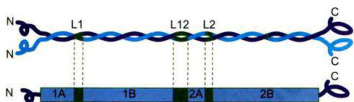  

图8-37中间丝蛋白分子结构模式图  

  

中间丝蛋白的中部是由大约310个氨基酸残基组成的杆状区，两侧是呈球状的N端头部和C端尾部。杆状区是中间丝蛋白最保守的区域，该区域被一段β片层结构L12分隔成螺旋1和螺旋2，螺旋1和螺旋2又分别被两段β片层结构L1和L2分隔。两个中间丝蛋白分子的杆状区相互作用形成双股螺旋的二聚体结构。  

  

长度各约 $22~\mathrm{{nm}}$ ，螺旋1和螺旋2又分别被L1和L2隔为A、B两个亚区，4个卷曲螺旋区间分别被称为1A与1B和2A与2B（图8-37）。每段螺旋区的氨基酸序列严格按照每7个氨基酸（a-g）一组重复排列，其中a和d为亲水性氨基酸。这样形成的 $\upalpha$ 螺旋结构的表面有一个疏水性的沟槽，供二聚体组装时发挥作用。V型中间丝蛋白在其1B区增加了6组（42个）氨基酸残基的重复，其杆状区的长度为352个氨基酸残基。  

  

中间丝的核心部分直径为 $10~\mathrm{{nm}}$ 左右，主要由中间丝蛋白的杆状区构成。中间丝蛋白的头部和尾部结构域参与中间丝的组装，较长的尾部结构域大多突出于中间丝的核心纤维之外，中间丝 $22~\mathrm{{nm}}$ 或 $48~\mathrm{nm}$ 的纵向周期与末端区域形成的突出有关。由中间丝伸出的末端区域可能和中间丝与细胞结构的相互作用有关。不同类型的中间丝的末端结构域变化较大。在电镜下观察到的波形纤维是表面比较光滑的丝状结构，而神经丝在神经突起内部平行排列成束状结构，NF-M和NF-H的C端突出于神经丝的表面，并在相邻的神经丝之间，神经丝和微管等其他细胞结构之间形成横桥，将神经突起内的微管和中间丝网络连成一体。  

  

### 二、中间丝的组装与表达  

  

与微管和微丝的组装过程不同，中间丝蛋白在合适的缓冲体系中能自组装成 $10~\mathrm{{nm}}$ 的丝状结构。中间丝的组装首先是两个单体的杆状区以平行排列的方式形成双股螺旋的二聚体。该二聚体可以是同型二聚体（homodimer），如波形蛋白、GFAP等，但如果是角蛋白，则肯定是一条I型角蛋白和另一条Ⅱ型角蛋白构成异型二聚体（heterodimer）。二聚体的长度约 $50~\mathrm{{nm}}$ 然后是两个二聚体以反向平行和半分子交错的形式组装成四聚体（tetramer）。四聚体可能是中间丝组装的最小结构单位。由于四聚体是由两个二聚体以反向平行的方式组装而成，因此没有极性。作为中间丝组装的基本结构单位，四聚体之间在纵向（首尾）和侧向相互作用，最终组装成横截面为32个中间丝蛋白分子、长度不等的中间丝。中间丝的主干主要是由中间丝蛋白的杆状区构成，其N端和C端结构域除了在中间丝的组装过程中发挥作用之外，还是与细胞的其他结构组分相互作用的主要位点（图8-38）。  

  

中间丝的装配与解聚和微丝与微管的动态特征有所不同，并不表现为典型的踏车行为，也不需要ATP或GTP参与。  

  

向细胞内注射荧光标记的中间丝蛋白，然后观察中间丝的组装过程，结果显示新加入的中间丝蛋白可以在已经存在的中间丝的多个位点加入，而不是像微管和微丝那样仅仅在末端加入。随着时间的延长，整个中间丝上都显示荧光标记。可见中间丝的组装模式与微管和微丝完全不同，在细胞内新的中间丝蛋白可以通过交换的方式掺人到原有的纤维中去。用胰蛋白酶处理体外培养的成纤维细胞，在细胞变圆的同时，细胞内的中间丝网络解聚。在除去胰蛋白酶以后，新的中间丝似乎从细胞核的周围开始组装，并向细胞边缘延伸，这时的中间丝好像是从头开始组装，新的中间丝蛋白会加到纤维的末端使纤维延长。  

  

在细胞周期的运行过程中，细胞质中间丝网络在细胞分裂前解体，分裂结束后又重新组装。中间丝的解聚和重新组装过程与中间丝蛋白亚基的磷酸化和去磷酸化有关。有丝分裂前即将去组装的中间丝被磷酸化，然后中间丝上被磷酸化的蛋白亚基与14-3-3蛋白结合，导致中间丝网络解体。分裂结束后，中间丝蛋白的可溶性组分发生去磷酸化，14-3-3蛋白从中间丝蛋白亚基上脱落，中间丝蛋白重新参与中间丝网络的组装。  

  

在细胞分化过程中，中间丝的类型随着细胞的分化过程而发生变化。如在小鼠胚胎发育过程中，最初胚胎细胞中表达的中间丝蛋白是角蛋白，待胚胎发育到第8～9天，在将要发育为间叶组织的细胞中，角蛋白表达量下降直至停止表达，取而代之的是波形蛋白的表达。类似的表达谱变化还见于神经外胚层的发育中，首先表达的是角蛋白，第11天左右，角蛋白停止表达，波形蛋白出现，随后是神经上皮干细胞蛋白表达。当神  

  

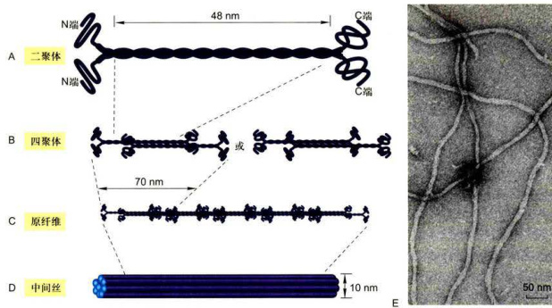  

图8-38中间丝的组装模型  

  

A.由两个中间丝蛋白亚基平行排列组装而成双股螺旋的二聚体。B.两个二聚体按反向平行，半分子交叠的方式组装成中间丝组装的基本结构单位—四聚体。C.四聚体首尾相连形成原纤维。D.8根原纤维构成圆柱状的 $10n m$ 中间丝。E.中间丝负染色的电子显微镜图像。（E图由UeliAebi博士惠赠）  

  

经干细胞最终分化成神经元和神经胶质细胞时，神经前体细胞内波形蛋白和神经上皮干细胞蛋白停止表达，改为表达神经丝蛋白。作为中枢神经系统中数量众多的星形胶质细胞通常同时表达波形蛋白和胶质纤维酸性蛋白，它们可以共同组装成中间丝，而在一些有丝分裂失控的胶质细胞瘤细胞内可以重新检测到神经上皮干细胞蛋白的表达。由此可见，胚胎细胞能根据其发育方向调节中间丝蛋白基因的表达。在一种类型的中间丝蛋白向另一种类型的中间丝蛋白转变的过程中，新的蛋白似乎是通过交换的方式掺入到原来的中间丝网络中去。  

  

### 三、中间丝与其他细胞结构的联系  

  

电镜观察所得到的图像信息显示，中间丝在胞质中组装成发达的网络结构，并与细胞质膜上特定的部位（如桥粒）连接，然后通过一些跨膜蛋白（如钙黏蛋白和整联蛋白）与细胞外基质，甚至是相邻细胞的中间丝间接相连。在细胞的内部，许多细胞质中间丝源自细胞核的周缘，并且与核膜有联系。由V型中间丝蛋白组装而成的核纤层在核膜的内侧呈正交网状结构（图8-39）。核纤层与内层核膜上的核纤层蛋白受体相连，从而成为核膜的重要支撑结构。此外，核纤层还是染色质的重要锚定位点。  

  

在细胞分裂前期，核纤层结构解聚，核膜也随之解体，核纤层蛋白A以可溶性单体形式弥散在细胞中：而核纤层蛋白B则与核膜解体后形成的核膜小泡保持结合状态。分裂末期，结合有核纤层蛋白B的核膜小泡在染色质周围聚集，并渐渐融合形成新的核膜，而核纤层蛋白则在核膜的内侧组装成子细胞的核纤层。这一过程有赖于核纤层蛋白与染色质之间的相互作用。细胞分裂过程中核纤层的解体和重新组装与核纤层蛋白的磷酸化水平相关，提示有丝分裂促进因子（MPF）的 $\mathbf{p}34^{\mathrm{c},\mathrm{de}2}$ 是核纤层蛋白B的激酶。在有丝分裂前期，MPF可以使核纤层蛋白B的Ser22和Ser392磷酸化，这两个丝氨酸残基分别位于其头部和尾部结构域，磷酸化导致这两个与中间丝组装直接相关的结构域的构象发生变化，从而导致核纤层解聚。采用点突变方法改变这些磷酸化位点可干扰核纤层及核膜结构的解体。在有丝分裂的末期，结合在核膜小泡上的核纤层蛋白B的磷酸基被磷酸酶去除，小泡在染色质周围聚集并融合，去磷酸化后的核纤层蛋白B的头部和尾部的构象回复到能发生自组装的状态。可见，核纤层蛋白的磷酸化与去磷酸化可能是有丝分裂过程中核纤层结构动态变化的调控因素。  

  

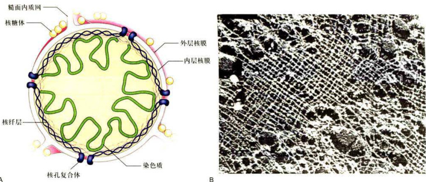  

图8-39核纤层的结构A.核纤层结构示意图。B.非洲爪蟾卵细胞核膜经TritonX-100处理去膜，电镜金属投影技术显示核纤层纤维网络。（B图由UeliAebi博士惠赠）  

  

核纤层蛋白的缺失或突变与多种人类遗传性疾病相关。A型核纤层蛋白的突变引起脂肪代谢障碍，外周神经退化，并出现早衰症状。在所有的哺乳动物细胞中都有B型核纤层蛋白的表达，尽管没有在人体细胞中发现该蛋白的突变体，但在小鼠体内表达核纤层蛋白B1的缺失突变体会引起胚胎发育异常，并且在出生后死亡。因此，B型核纤层蛋白基因的突变很可能是胚胎致死的。在体外培养的细胞中去除核纤层蛋白，会影响核膜的结构，使其很容易在机械力的作用下破裂。然而，由核纤层蛋白基因变异所导致的疾病似乎并不全与机械力的作用相关，还有许多未知的因素。  

  

细胞质中间丝在那些受机械应力作用的组织细胞中特别丰富。处于不同分化阶段的上皮细胞表达不同类型的1型及Ⅱ型角蛋白，不同种类的角蛋白具有不同的头部和尾部。可见不同的上皮细胞在表达的角蛋白种类上的差异与细胞所担负的使命相关。上皮细胞中的中间丝往往贯穿整个细胞，其末端与细胞质膜上特定的区域，特别是桥粒和半桥粒结构相连，而暴露在中间丝表面的角蛋白的头部和尾部结构域则与细胞质中的其他组分相结合。中间丝通过桥粒将上皮组织中的各个细胞连成一体，以分散皮肤所受外力的作用。有关基因的突变将干扰中间丝的组装，影响细胞之间的相互作用，如单纯大疱性表皮松解症与编码角蛋白5和14的基因突变有关，思者的皮肤只要受到轻微的外力作用就会发生破裂，出现水泡。桥粒结构的受损或编码相关蛋白的基因突变同样会导致上皮组织结构的严重破坏。  

  

中间丝除了与桥粒等细胞结构相互作用外，还有一些中间丝结合蛋白如网蛋白（plectin），能将相邻的中间丝组织成束，还能将中间丝与细胞内的微丝、微管以及其他的细胞结构相连接，从而发挥作用。网蛋白基因的变异同样引起上皮组织及神经系统等多种人类疾病。网蛋白基因敲除小鼠在出生后数天死亡。  

  

在神经元内，NF-M和NF-H的尾部结构域突出于神经丝的表面，在与之相邻的神经丝、微管以及一些膜性结构之间形成横桥，将轴突内部的细胞骨架等结构连成一体，为这个细长的细胞突起提供必要的内部支撑。波形蛋白和胶质纤维酸性蛋白是星形胶质细胞中间丝的主要成分，敲除编码这两种蛋白的基因，将导致星形胶质细胞的一些功能如细胞的迁移能力和脑受伤后形成胶质疤痕的能力受损。可见中间丝与细胞其他结构组分的相互作用对于维持组织的整体功能是非常重要的。  

  

## 思考题  

  

1.通过这一章的学习，你对生命体的自组装原则有何认识？  

2.除支持作用和运动功能外，细胞骨架还有什么功能？怎样理解“骨架”的概念？  

3.细胞中同时存在几种骨架体系有什么意义？是否是物质和能量的一种浪费？  

4.为什么说细胞骨架是细胞结构和功能的组织者？细胞内一些细胞器和生物大分子的不对称分布有什么意义？  

5.如何理解细胞骨架的动态不稳定性？这一现象与细胞生命活动过程有什么关系？  

  

## 参考文献  

  

1.陈哗光，张传茂，陈全.分子细胞生物学.3版.北京：高等教育出版社，2019. 2.Bettencourt-Dias MGloverDM.Centrosomebiogenesisandfunction:centrosomicsbringsnewunderstandingNaure Reviews Molecular CellBiology,2007,8:451-463.  

3.ChenJKaniYowanNJetalrectisofAandtaudtiespacingstweencbulesin dendrites and axons.Nature,1992,360(6405):674-677.  

4.CooperJASchaferDACotrolofactinassmblyanddisassemblyfilamentends.CurrentOpinioninCelliology 2000,12:97-103. 5.Hirokaklill Molecular Cell Biology,2009,10:682-696. 6.HolmesKCPoppDGebardWetalAomicmdeloftheactinflamnt.aure99347（6288）:44-49. 7.HowardJ.Molecularmotors:structuraladaptationstocellularfunctions.Nature99789(6651):6-67. 8.HsuVV Lee SYYang J.The evolvingunderstanding ofCOPI vesicle formation.Nature Reviews Molecular Cell Biology,2009,10:360-364 9.JankeCBulinskiCPost-translationalregulationofthemicroubulectoskeleto:mechansmsandfunctionsNaue ReviewsMolecular CellBiology,20ll,12:786.  

10.NingiYhanglblyflebtgiigi CCDC120 and CCDC68.NatureCommunications,2017,8:15057.  

11.NoakakYdalzffgtyuoofligd flow of extraembryonic fluid in mice lacking KIF3B motor protein.Cell,1998,95(6）:829-837.  

12.PaavilainenVOerlingEFalckSetalegulatofcyskelealdmicsbyctioidigin Trends inCellBiology,2004,14（7）:386-394.  

13.ValeRD.The molecular motor toolboxfor intracellular transport.Cell,2003,112(4）:467-480.