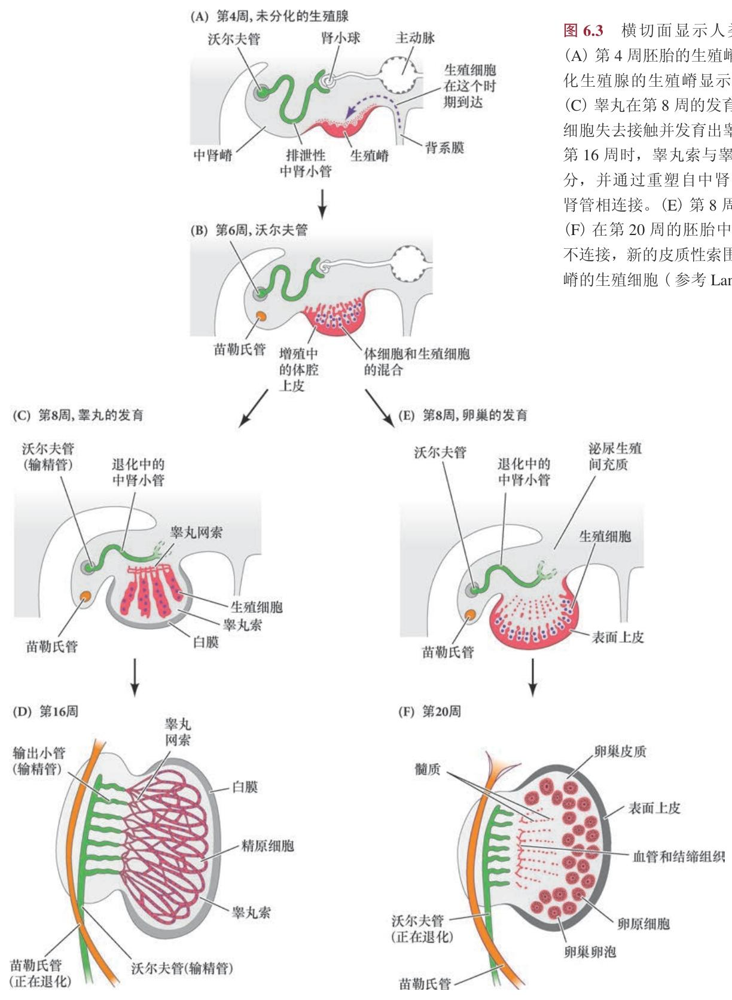
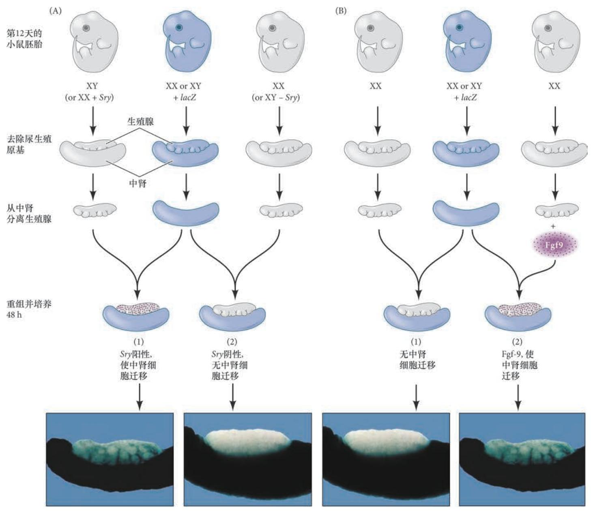
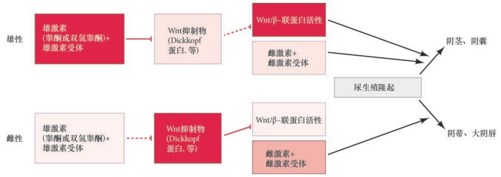
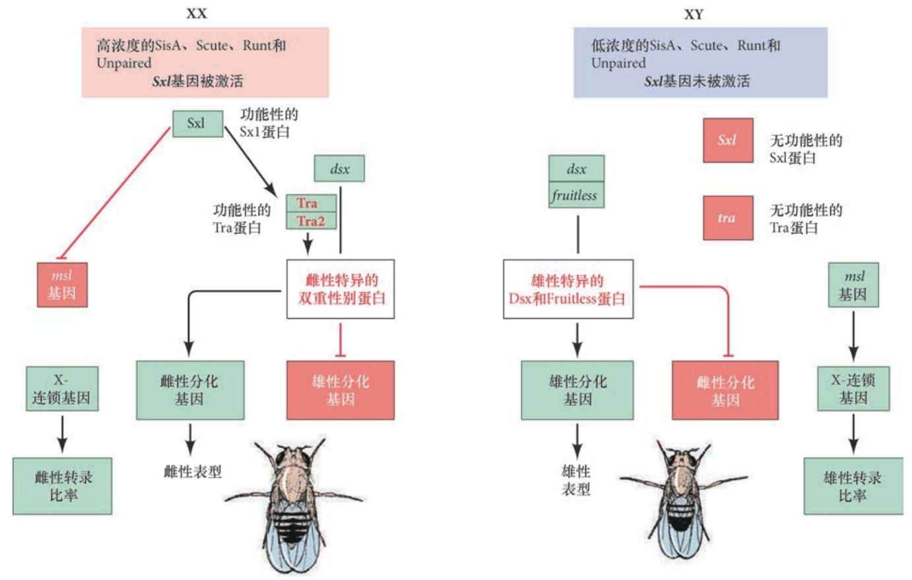
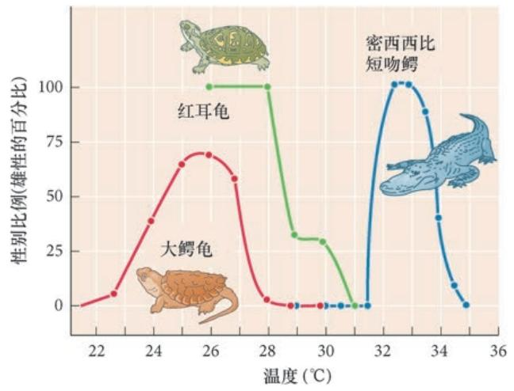
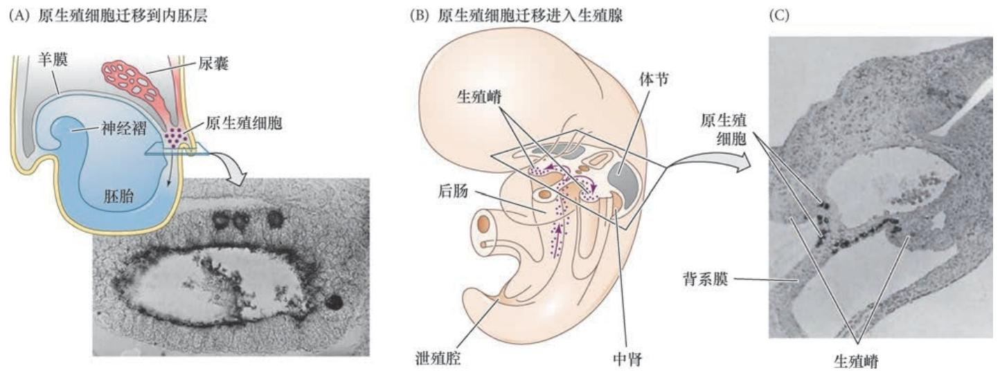

## 要点

在脊椎动物和节肢动物,性别由染色体决定｡
- 在哺乳动物,Y 染色体上的**Sry(Y 染色体性别决定区)** 基因将双潜能的生殖腺转变成睾丸( 并阻止卵巢发育),而两条X 染色体的继承能激活**β-联蛋白(β-catenin)**,将双潜能的生殖腺转变成卵巢( 并防止睾丸形成)｡
- 在果蝇,**X 染色体的数目调节Sxl( 性别致死) 基因**,使得特定核RNA 被差异性地剪接成雄性或 雌性特异的mRNA｡

在哺乳动物,睾丸分泌一些激素,如**睾酮**和**抗苗勒氏管激素**｡第一种激素建立雄性表型,第二种激素阻断雌性表型｡ 卵巢合成一些建立雌性表型的雌激素;它们也分泌孕酮以维持妊娠｡

在所有物种中,**生殖腺能指令配子发生**,即生殖细胞的发育｡进入卵巢的哺乳动物生殖细胞还处在胚胎时就起始减数分裂并变成卵母细胞｡ 进入哺乳动物睾丸的生殖细胞被阻止进入减数分裂,但它们分裂产生一个干细胞群体,在青春期将形成精子｡

还有一些动物的性别受一些**环境因素( 如温度)** 决定｡

## 一、染色体性别决定方式
这一部分后面参考遗传学

## 二、哺乳动物的性别决定图式
哺乳动物的性别决定受控于**生殖腺形成基因**和**生殖腺分泌的激素**｡
- 初级性别决定(primary sex determination) 是生殖腺的决定,即形成卵子的卵巢或形成精子的睾丸｡
- 次级性别决定(secondary sex determination) 是生殖腺产生的激素对雄性或雌性表型的决定｡
卵巢和睾丸的形成是一个活跃的基因引导过程｡**雄性和雌性的生殖腺来自共同的前体**( 图6.1),即**双潜能生殖腺(bipotential gonad)**,有时称为**未分化生殖腺(indifferent gonad)**｡

==**有Y染色体就是雄性——必要性**==
Y 染色体携带一个编码**睾丸决定因子(testis-determining factor)** 的基因,这个因子将双潜能的生殖腺组织成睾丸｡这在1959 年被证明,核型分析显示XXY 个体( 一种称为克兰费尔特综合征或细精管发 育障碍的状态) 是雄性( 尽管有两条X 染色体),而仅有一条X 染色体(XO,有时称为特纳综合征或先 天性卵巢发育不全) 的个体是雌性(Ford et al. 1959;Jacobs and Strong 1959)｡XXY 男性具有功能性的睾丸｡具有单条X 染色体的女性最初能形成卵巢,但是因为没有第二条X 染色体,卵泡不能得以维持｡因此, 第二条X 染色体使卵巢完成发育,而一条Y 染色体( 即使同时存在多条X 染色体) 就能起始睾丸的发育｡
## 三、哺乳动物的初级性别决定
==**哺乳动物的生殖腺具有双重发育潜能**==
哺乳动物的生殖腺表现出独特的胚胎学状态｡所有其他器官原基通常只能分化为一种类型的器官, 一个肺原基只能变成肺､一个肝原基只能发育成肝｡然而,生殖腺原基有两个选择:发育成一个卵巢或 者一个睾丸,这两个器官具有非常不同的组织结构｡生殖腺原基所采用的分化途径受控于基因型,并决 定生物体未来的性别发育(Lillie 1917)｡但在做出这一决定之前,哺乳动物的生殖腺首先经过一个双潜能或未分化的时期,在此期间它既没有雌性也没有雄性特征( 见图6.1)｡
### 3.1 发育中的生殖腺
在人类,两个生殖腺原基在第4 周出现,并且直到第7 周仍旧保持性别未分化状态｡这些生殖腺前 体是中胚层的成对区域,邻近正在发育的肾｡**生殖细胞 (germ cell)**,即精子或卵子的前体,在**第6 周迁移到生殖腺中并被中胚层细胞包围**｡

==**XY胎儿生殖腺发育**==
如果胎儿是XY,中胚层细胞继续增殖至第8 周,这时,其中的一部分开始向**支持细胞(Sertoli cell)** 分化｡在胚胎发育过程中,发育中的支持细胞分泌阻止雌性导管发育的抗苗勒氏管激素｡这些相同的支 持上皮细胞也将形成生精小管,在雄性哺乳动物的整个生命过程中维持精子的发育｡

在第8周期间,发育中的支持细胞环绕进入其中的生殖细胞并将自身组织成**睾丸索(testis cord)**｡ 这些索在发育中的睾丸中心区域形成一些环,并且在发育中的肾管附近连接到称为**睾丸网(rete testis)** 的细管网络( 图6.3C,D)｡因此,当生殖细胞进入雄性生殖腺时,它们将在睾丸索内发育,位于器官的内部｡ 在发育的后期( 在人类是青春期;在生殖更快的小鼠是出生后不久),睾丸索开始成熟以形成**生精小管(seminiferous tubule)**｡生殖细胞迁移到这些小管的外围,在那里它们建立精原干细胞群体,在雄性 的整个生命过程中产生精子( 见图6.21)｡在成熟的生精小管中,精子通过睾丸网从睾丸内被转运出来, 而睾丸网与输出小管(efferent duct) 相连接｡输出小管是肾发育过程中的重塑小管｡在雄性发育过程中, **沃尔夫管分化成位于睾丸附近的附睾(epididymis) 和输精管(vas deferens),精子通过这个管进入尿道并排出体外**｡因此,精子和尿液都将使用尿道离开身体｡

同时,另一组中胚层细胞( 那些不形成支持上皮的细胞) 分化为间充质细胞类型,即分泌睾酮的**间质细胞(Leydig cell)**｡因此,完全发育的睾丸将具有支持细胞形成的包裹生殖细胞的上皮管,以及分泌睾 酮的间充质细胞群体,即间质细胞｡每个初期的睾丸被一个**厚的细胞外基质( 称为白膜)** 所包围,这对睾丸具有保护作用｡

==**XY胎儿生殖腺发育**==
如果胎儿是XX,位于发育的生殖腺中心的性索退化,而生殖腺表面( 皮质) 的性索仍被保留下来｡ 每个生殖细胞被一簇性索上皮细胞包裹( 图6.3E,F)｡生殖细胞将变成**卵细胞(ovum) 或卵子**,周围的皮质上皮细胞将分化成卵泡细胞,或称为**颗粒细胞(granulosa cell)**｡发育的卵巢中其余的间质细胞分化 成卵泡膜细胞(thecal cell)｡总的来说,这些卵泡膜细胞和卵泡细胞形成**卵泡(follicle)**,包围生殖细胞并 分泌类固醇激素,如雌激素和( 妊娠时) 孕酮｡每个卵泡都含有一个生殖细胞,即**卵原细胞(oogonium) 或卵子前体**,这个细胞此时将进入减数分裂

>横切面显示人类生殖腺的分化。  
(A) 第 4 周胚胎的生殖嵴。
(B) 第 6 周未分化生殖腺的生殖嵴显示扩张的上皮细胞。  
(C) 睾丸在第 8 周的发育。性索与皮质上皮细胞失去接触并发育出睾丸网。
(D) 发育到第 16 周时，睾丸索与睾丸网变成连续的部分，并通过重塑自中肾管的输出小管与中肾相连接。
(E) 第 8 周胚胎的卵巢发育。  
(F) 在第 20 周的胚胎中，卵巢与沃尔夫管不连接，新的皮质性索围绕已经迁移到生殖嵴的生殖细胞

==**生殖细胞和体细胞的互作**==
生殖腺中生殖细胞和体细胞之间有一个互作的关系｡生殖细胞最初是双潜能的,能变成精子或卵子｡ 然而,一旦进入雄性或雌性的性索,它们就受到指令,要么开始减数分裂并变成卵子,或者保持减数分 裂的休眠状态而变成精原细胞｡在**XX 生殖腺中,生殖细胞对卵巢卵泡的维持是必不可少的**｡如果没有生殖细胞,卵泡将退化成索状的结构并表达雄性特异的标记物｡ 在XY 生殖腺中,**生殖细胞有助于支持细胞的分化**,在没有生殖细胞时睾丸索仍将形成,但形成的时间较 晚(McLaren 1991)｡当卵巢正在形成时,苗勒氏管保持完整( 没有受到抗苗勒氏管激素的破坏),并且分化成输卵管､子宫､子宫颈和阴道上部｡在没有足够睾酮的情况下,沃尔夫管退化( 见图6.1 和图6.2)｡

### 3.2 初级性别决定的遗传机制:决策
性别决定基因突变的表 型通常是不育的,临床不育的研究有助于鉴别那些在决定人类是否变成男性或者女性时具有活性的基因｡验证这些基因功能的一些实验操作可以在小鼠中进行｡

这个故事从尚未朝雄性或雌性方向定型的双潜能生殖腺开始｡**转录因子Wt1､Lhx9､GATA4 和Sf1 的基因在这时表达**,任何一个基因的功能缺失将阻止雄性或雌性生殖腺的正常发育｡然后就做出了这样 的决策:
- 如果没有Y 染色体,这些转录和旁分泌因子被认为能激活**Wnt4 蛋白**( 在生殖上皮中已经以低水平表达) 和**R-spondin1(Rspo1)** 这个小的可溶性蛋白的进一步表达｡Rspo1 与它的细胞膜受体结合 后进一步刺激Wnt 途径中的**Dishevelled 蛋白**,使得Wnt 途径更有效地产生β- 联蛋白转录调节物｡ 在生殖腺细胞中β- 联蛋白的多种功能之一是**进一步激活Rspo1 和Wnt4** 的基因,从而在这两种蛋 白质之间建立一个**正反馈**回路｡β- 联蛋白的第二个作用是通过**激活参与卵泡细胞分化**的基因来启动卵巢发育途径｡它的第三个作用是**防止Sox9 的表达**,而Sox9 是一个对睾丸决定有关键作 用的蛋白质｡
- 如果有一条Y 染色体,双潜能生殖腺中相同的一组因子将激活Y 染色体上的**Sry 基因**｡Sry 蛋白结**合Sox9 基因的增强子**,增高这一关键基因在睾丸决定途径中的表达｡**Sox9 和Sry 也可能通过抑制β- 联蛋白来阻断卵巢形成途径**｡

图6.4 显示初级性别决定如何能够被启动的一个可能模型｡在这里我们看到动物发育的一个重要规 则:一个细胞特化途径通常有两个组成部分,一个分支说“制造A”,另一个分支说“…不要制造B”｡ 对于生殖腺而言,雄性途径说“生成睾丸,不要形成卵巢”,而雌性途径却说“生成卵巢,不要形成睾丸”｡

### 3.3 卵巢途径:Wnt4 和R-spondin1
==**旁分泌因子Wnt4是卵巢发育的重要因子**==
在小鼠中,旁分泌因子Wnt4 在双潜能的生殖腺中表达,但是在变成睾丸的XY 生殖腺中不再表达, 而它的表达却一直维持在开始形成卵巢的XX 生殖腺｡在缺失Wnt4 基因的XX 小鼠中,卵巢不能正确形成,细胞过渡性地表达睾丸特异性标志物,包括Sox9､睾酮形成酶和抗苗勒氏激素｡因此,**Wnt4 似乎是卵巢形成的重要因子,虽然不是唯一的决定因子**｡

==**Rspo-1与Wnt4协同促进下游β- catenin**==
R-spondin1(Rspo1) 对卵巢的形成有关键的作用,因为在人类病例的研究中,一些携带RSPO1 基因 突变的XX 个体表现为雄性表型(Parma et al. 2006)｡**Rspo1 与Wnt4 协同作用,产生β- 联蛋白**,而β- 联蛋白似乎对激活卵巢的进一步发育和阻断睾丸决定因子Sox9 的合成有关键的作用｡

==**WNT4 和RSPO1的重复通过上调β- 联蛋白逆雄为雌**==
在一些XY 个体中, 1 号染色体上的**一个重复区域含有WNT4 和RSPO1 基因**,这使产生β- 联蛋白的途径超越雄性途径,**导致雄性向雌性的性逆转**｡类似地,如果在XY 小鼠的生殖腺原基中高表达β- 联蛋白,它们将形成 卵巢而不是睾丸。

==**β- 联蛋白跨物种保守性**==
**β-联蛋白在所有脊椎动物类群中似乎是关键的“促卵 巢/ 抗睾丸”信号分子**,这在鸟类､哺乳动物和海龟的雌性( 而不是雄性) 的生殖腺中都得到了证明｡这**三个种群具有非常不同的性别决定方式,但它们的卵巢都合 成Rspo1 和β- 联蛋白**( 图6.5)｡

**一些被 β 联蛋白激活的转录因子的基因仅在卵巢表达**｡ β 联蛋白的一个可能靶点是编码**TAFII-105 蛋白**的基因 ｡这个转录因子亚基 ( 帮助RNA 聚合酶与启动子结合) 仅表 达在卵泡细胞｡缺失这个亚基的雌性小 鼠具有较小的卵巢,只有极少( 如果有 的话) 成熟的卵泡｡**转录因子Foxl**2 是在卵巢中显著上调的另一个蛋白质,Foxl2 等位基因的纯合突变体XX 小鼠发育出雄性样的生殖腺结构,并上调Sox9 基因 的表达及睾酮的产生｡**Foxl2 和 β 联蛋 白对激活促卵泡激素抑释素的基因都有 关键的作用**｡作为转化生长因子-β 家族 旁分泌因子的抑制物,促卵泡激素抑释素被认为是一个参与将卵巢的上皮组织成卵泡细胞的蛋白质｡发育的生殖腺中缺失促卵泡激素抑释素的XX 小鼠发生部分性逆转,形成睾丸样的结构｡
### 3.4 睾丸途径:Sry 和Sox9

==**SRY:Y 染色体性别决定基因**== 
在人类,睾丸决定的主要基因位于Y 染色体的短臂上｡通过分析罕 见的XX 雄性和XY 雌性( 即基因型是一种性别但表型是另一种性别的个体) 的DNA,睾丸决定基因的 位置被缩小到Y 染色体上靠近短臂末端的35 000 个碱基对区域｡在这个区域,Sinclair 及其同事(1990) 发现了一个雄性特异的DNA序列,编码含有223 个氨基酸的蛋白质｡

**Sry 存在于正常的XY 雄性及罕见的XX 雄性**,正常的XX 雌性和许多XY 雌性没有这个基因｡大约 15% 的人类XY 雌性有SRY 基因,但是这些雌性的SRY 基因拷贝含有点突变或移码突变,阻止了Sry 蛋 白结合DNA｡如果SRY 基因的确编码主要的睾丸决定因子,那 么就可以预测它在睾丸分化之前或分化过程中作用于未分化的生殖腺｡在针对小鼠同源基因的研究中证 明了这一推测｡小鼠的Sry 基因也与睾丸的出现相关;它存在于XX 雄性,但不存在于XY 雌性(Gubbay et al. 1990)｡Sry 表达在XY 小鼠双潜能生殖腺中的体细胞,在这些细胞分化成支持细胞之前;随后,Sry 变不再表达(Koopman et al. 1990;Hacker et al. 1995;Sekido et al. 2004)｡

==**转Sry基因小鼠发育出雄性器官——哺乳动物中Sry/SRY 是Y 染色体上睾丸决定的主要基因**==
Sry 作为睾丸决定因子基因最引人注目的证据来自转基因小鼠｡如果Sry 诱导睾丸形成,那么将Sry 的DNA 插入到正常XX 小鼠的合子基因组将会使XX 小鼠形成睾丸｡Koopman 及其同事(1991) 将包含 Sry 基因( 可能还有它的一些调控元件) 的14 kb DNA 区域显微注射到小鼠受精卵的原核｡在一些情况下, 注射了该序列的XX 胚胎发育出睾丸､雄性附属器官和一个阴茎 2( 图6.6)｡

==**Sox9:一个常染色体睾丸决定基因**== 
尽管对性别决定具有作用,Sry 基因在小鼠生殖腺发育过程中的活性可能只持续几个小时｡在这段时间内,它**合成了Sry 转录因子,其主要作用似乎是激活Sox9 基因**｡

**Sox9 是一个常染色体基因**,参与多个发育过程,最主要的是**骨形成**｡然而,在**生殖腺原基中Sox9 诱导睾丸形成**｡携带一个额外 的SOX9 拷贝的XX 人即使没有SRY 基因也能发育为雄性,而且Sox9 转基因的XX 小鼠也发育出睾丸 ( 图6.7A ~D;Huang et al. 1999;Qin and Bishop 2005)｡在XY 小鼠的生殖腺中敲除Sox9 基因导致完全 的性逆转(Barrionuevo et al. 2006)｡因此,即使有 \(Sry\) 基因,但如果没有Sox9 基因,小鼠的生殖腺也不 能形成睾丸,所以在睾丸形成中,Sox9 似乎能够替代Sry｡这并不令人特别惊讶;尽管Sry 基因只特异地 存在于哺乳动物,但Sox9 却存在于整个脊椎动物门｡

==**Sox9 似乎是脊椎动物中最古老和更关键的性别决定基因**==
**在哺乳动物, 它被Sry 蛋白激活;在鸟类､蛙类和鱼类,它似乎被转录因子Dmrt1 的剂量所激活**;而在那些性别决定 依赖于温度的脊椎动物中,它**通常被产生雄性的温度直接或间接地激活**｡

Sox9 基因的表达特异地受到Sry 和Sf1 蛋白在支持细胞前体中的组合表达所上调( 图6.7E ~H;)｡ 因此,Sry 可能只是作为一个“开关”,在非常短的时间内激活Sox9 基因,而Sox9 蛋白可能启动保守的进化途径,使睾丸形成｡所以,借用Eric Idle 的一句话,Sekido 和Lovell-Badge(2009) 提出, Sry 通过“一个眼色和一个轻触”来启动睾丸形成｡

==**旁分泌分子Fgf9对睾丸发育至关重要**==
Sox9 促进编码成纤维细胞生长因子-9(Fgf9) 基因的表达,这是一个对睾丸发育至关重要的旁分泌因子｡**Fgf9 对于维持Sox9 基因的转录也是必要的**,从而建立一个**驱动雄性途径的正反馈回路**｡成纤维细胞生长因子-9 在小鼠中敲除成纤维细胞生长因子-9(Fgf9) 的基因时,纯合突变体几乎全 部是雌性｡

Fgf9 蛋白的表达依赖于Sox9,在睾丸形成中具有多种作用｡
- 1. Fgf9 引起支持细胞前体的增殖并刺激它们的分化(Schmahl et al. 2004;Willerton et al. 2004)｡
- 2. 它激活血管细胞从相邻的肾管迁移到XY 生殖腺｡虽然在正常情况下这是一个雄性特异的过程, 但在Fgf9 中培育XX 生殖腺导致内皮细胞迁移到其中( 图6.8)｡这些血管细胞形成睾丸的主要动 脉,并且在诱导支持细胞前体形成睾丸索时发挥一个指令性的作用;如果没有这些血管,睾丸索 便不能形成(Brennan et al. 2002;Combes et al. 2009)｡
- 3. 它对维持预定支持细胞中Sox9 基因的表达是必需的,并且能引导支持细胞形成小管｡此外,由 于它既可以作为自分泌因子也能作为旁分泌因子,Fgf9 通过在组织的所有细胞中增强Sox9 的表 达来协调支持细胞的发育(Hiramatsu et al. 2009)｡这种“群体效应”在完成睾丸小管的整合组装 中可能有重要的作用(Palmer and Burgoyne 1991;Cool and Capel 2009)｡
- 4. 它抑制Wnt4 信号,否则Wnt4 将引导卵巢的发育(Maatouk et al. 2008;Jameson et al. 2012)｡
- 5. Fgf9 似乎能帮助协调生殖腺与生殖细胞的决定｡正如我们将在本章后面看到的那样,那些注定成 为卵子的哺乳动物生殖细胞在进入生殖腺时迅速进行减数分裂,而注定成为精子的生殖细胞将它 们进入减数分裂的时间延迟到青春期｡Fgf9 是阻止生殖细胞立即进入减数分裂的因子之一,从而 将它们置于精子形成的途径(Barrios et al. 2010;Bowles et al. 2010)｡

==**类固醇生成因子-1（Sf1）**==
Sry 与雄性发育途径之间的关键环节 转录因子类固醇生成因子-1(Sf1) 对产生 双潜能生殖腺是必要的｡但是,尽管在XX 小鼠胚胎生殖嵴中Sf1 的水平降低,发育的睾丸中仍然维持 很高水平的Sf1｡Sry 被认为能直接或间接地维持Sf1 基因的表达｡Sf1 蛋白似乎在雄性化睾丸间质细胞和 支持细胞中具有活性｡在支持细胞中,Sf1 与Sry 共同激活Sox9(Sekido and Lovell-Badge 2008),然后与 Sox9 一起升高抗苗勒氏管激素的转录水平(Shen et al. 1994;Arango et al. 1999)｡在间质细胞中,Sf1 激 活一些编码睾酮生成酶的基因｡

### 3.5 正确的时间和正确的位置
==**基因必须在正确的时空表达才能确保器官的发育**==
具有正确的基因不一定意味着你会得到你所期望的器官｡在小鼠中的研究表明,一些小鼠品系中的 Sry 基因被繁殖到不同的遗传背景时不能产生睾丸(Eicher and Washburn 1983;Washburn and Eicher 1989; Eicher et al. 1996)｡这个结果或者是由于Sry 表达的延迟,或者是由于Sry 蛋白不能积累到触发Sox9 表达 和启动雄性途径所需的临界阈值水平｡当Sox9 在后来表达时,那已经太晚,生殖腺已经在变成卵巢的路 径上走了很远(Bullejos and Koopman 2005;Wilhelm et al. 2009)｡

时间的重要性被Hiramatsu 及其合作者(2009) 证实｡他们将小鼠的Sry 基因连接到热敏感基因的调 控序列上,这样,通过升高胚胎的温度就能在小鼠发育的任何时间激活Sry｡他们仅将Sry 的激活延迟6 h, 睾丸便不能形成,而卵巢开始发育( 图6.9)｡因此,看似存在一个睾丸形成基因能够发挥功能的短暂窗口,如果错过这个最佳时机,卵巢形成途径就会被激活｡

**雌雄同体(hermaphrodite)** 是既具有卵巢也存在睾丸组织的个体,它们或者具有卵睾( 生殖腺含有 卵巢和睾丸组织),或者一侧具有卵巢而另一侧具有睾丸 3｡如图6.9 所示,卵睾能够在Sry 基因晚于正 常情况激活时而形成｡雌雄同体也会在极其罕见的一条Y 染色体易位到一条X 染色体时出现｡在易位的 Y 染色体位于具有活性的一条X 染色体的组织中,Y 染色体也将具有活性,因此SRY 基因将会被转录; 在Y 染色体位于无活性的X 染色体的细胞中,Y 染色体也会被失活(Berkovitz et al. 1992;Margarit et al. 2000)｡这种用于表达SRY 的生殖腺镶嵌现象能引起睾丸､卵巢或卵睾的形成,取决于支持细胞前体中表 达SRY 的细胞的比例( 见Brennan and Capel 2004;Kashimada and Koopman 2010)｡

像Foxl2 基因在整个生命过程中对于维持卵巢的生殖腺功能具有关键作用一样,Dmrt1 基因对维持 睾丸结构是必需的｡在成体小鼠中Dmrt1 的缺失使支持细胞转变为卵巢卵泡细胞｡而且,在雌性小鼠卵 巢中高表达Dmrt1 能将卵巢组织重编程为类似支持细胞的细胞(Lindeman et al. 2015;Zhao et al. 2015)｡ Dmrt1 蛋白可能是整个动物界中主要的雄性性别诱导物,存在于蝇类､刺胞动物､鱼类､爬行动物和鸟类 (Murphy et al. 2015;Picard et al. 2015)｡在哺乳动物,SRY 接管了这个功能｡然而,即使在哺乳动物,最 近的结果表明Dmrt1 仍然在雄性性别决定中起重要作用｡
## 四、哺乳动物的次级性别决定
初级性别决定,也就是从双潜能的生殖腺形成卵巢或睾丸,并不能产生完整的性别表型｡在哺乳动物, 次级性别决定是**应答卵巢和睾丸分泌的激素时雌性和雄性表型的发育**｡雌性和雄性的次级性别决定都有
两个主要的时间段｡第一阶段出现在**器官发生过程**中;第二阶段发生在**青春期**｡

在胚胎发育过程中,一些激素和旁分泌信号协调生殖腺与次级性别器官的发育｡在雌性中,**苗勒氏管在雌激素的作用下被保留下来**,分化变成子宫､子宫颈､输卵管和阴道上部( 见图6.2)｡生殖结节 (genital tubercle) 分化为阴蒂,而阴唇阴囊皱褶(labioscrotal fold) 变成大阴唇｡**沃尔夫管需要睾酮的维持, 因此它们在雌性中萎缩**｡在雌性中,没有变成膀胱和尿道的尿生殖窦(urogenital sinus) 分化成Skene 腺, 这一对器官产生的分泌物与前列腺的分泌物类似｡

**雄性表型的协调涉及两种睾丸因子的分泌**｡第一个是**抗苗勒氏管激素**,是支持细胞分泌的类似于骨 形态发生蛋白的旁分泌因子,能引起苗勒氏管的退化｡第二个是**类固醇激素睾酮**,是胎儿间质细胞分泌 的雄激素(androgen),即雄性化物质｡睾酮使沃尔夫管分化成运输精子的导管( 附睾和输精管) 及精囊 ( 由输精管外突而形成),它也使生殖结节( 外生殖器的前体) 发育成阴茎,以及使阴唇阴囊皱褶发育成 阴囊｡在雄性中,尿生殖窦除了形成膀胱和尿道之外,还形成前列腺｡

**睾酮( 及其衍生物) 使生殖结节雄性化**的机制可能是它**与Wnt 途径的相互作用**( 图6.10)｡在双潜能的生殖腺中激活雌性路线的Wnt 途径能在生殖结节中激活雄性发育(Mazahery et al. 2013)｡Wnt 拮抗剂Dickkopf 在尿生殖隆起中表达,并且能被睾酮下调和被抗雄 激素上调｡这个发现引出了一个模型,其中,XX 个体的尿生殖隆起表达Dickkopf,从而阻止Wnt 途径 在间充质中的活性,这样就会阻断雌激素引起的生殖结节的进一步生长和生殖结节的雌性化(Holderegger and Keefer 1986;Miyagawa et al. 2009)｡因此,雌性中的生殖结节变成阴蒂,阴唇阴囊褶皱变成大阴唇｡ 但是,在雄性中,睾酮和双氢睾酮结合间充质中的雄激素( 睾酮) 受体,并阻止Wnt 抑制物的表达( 从 而使Wnt 在间充质中表达)｡在这些Wnt 的影响下,雄性的尿生殖隆起被转变成阴茎和阴囊｡

### 4.1 次级性别决定的遗传分析
**独立和不相关的抗苗勒氏激素和睾酮途径都能引起雄性化**这一现象在雄激素不敏感综合征(androgen insensitivity syndrome) 的人中被证实｡这些XY 个体在染色体水平上是雄性,具有SRY 基因,因此具有 产生睾酮和抗苗勒氏管的睾丸｡但是在这些个体中,编码结合睾酮并将其带入细胞核的雄激素受体蛋白的基因出现了一个突变｡因此,他们不能应答自身睾丸产生的睾酮 (Meyer et al. 1975;Jääskeluäinen2012)｡然而,他们能应答他们的 肾上腺所产生的雌激素( 这对于XX 和XY 个体都是正常的情况), 所以他们发育出雌性的外部性征( 图6.11)｡尽管他们具有明显的 雌性外观,但这些XY 个体都有睾丸,即使他们不能应答睾酮,他 们却能产生并应答抗苗勒氏管激素｡因此,他们的苗勒氏管退化｡ 具有雄激素不敏感综合征的人发育成看似正常但是不育的女性,缺 少子宫和输卵管,在腹内有睾丸｡

尽管在大多数人中,遗传和解剖学性别表型之间具有很高的相关性,但有0.4% ~1.7% 的人口偏离了严格的二态性状态｡在同一个体呈现雄性和雌性性状的表型称为雌雄间性(intersex) 状态 4｡ **雄激素不敏感综合征**是其中一种在传统上被标记为**假两性畸形 (pseudoher maphroditism) 的雌雄间性状态**｡在假两性畸形中,**只有一种类型的生殖腺**( 与具有两性生殖腺的真正雌雄同体相反), 但**第二性征却与生殖腺性别所预期的不同**｡在人类,雄性假两性畸形( 具有雄性生殖腺性别和雌性第二性征) 能被雄激素( 睾酮) 受 体或影响睾酮合成的一些突变所导致(Geissler et al. 1994)｡

雌性假两性畸形的生殖腺性别是雌性,但外观上是雄性,这能被卵巢或肾上腺产生过量的雄激素所导致｡后一种状态的最常见 原因是先天性肾上腺皮质增生(congenital adrenal hyperplasia), 其中,在肾上腺内代谢皮质醇的一个酶出现遗传缺陷｡在缺失 这种酶的情况下,睾酮样的类固醇开始积累并且能结合雄激素受体,从而使胎儿雄性化(Migeon and Wisniewski 2000;Merke et al. 2002)｡

### 4.2 次级性别决定相关激素
==**睾酮和双氢睾酮**== 
虽然睾酮是两个主要的雄性化因子之一,但有证据表明它在某些组织中不是具有 活性的雄性化激素｡尽管睾酮参与促进雄性结构( 发育自沃尔夫管原基) 的形成,但它并不直接使尿道､ 前列腺､阴茎或阴囊雄性化｡这些后期的功能由5α- 双氢睾酮(5α-dihydrotestosterone,DHT) 所调控 ( 图6.12)｡Siiteri 和Wilson(1974) 证明,睾酮在尿生殖窦和尿生殖隆起中,而不是在沃尔夫管中被转变 成双氢睾酮｡双氢睾酮似乎是一个比睾酮更有效的激素,它在出生前和童年早期的活性最高 5｡

Imperato-McGinley 和她的同事(1974) 在多米尼加共和国一个小群体的几个居民中研究一种表型显著 的综合征时,证明了双氢睾酮对雄性生殖腺早期发育的重要性｡患有这种综合征的个体缺少一个编码5α酮类固醇还原酶-2 的功能性基因,而这个酶能将睾酮转变成双氢睾酮(Andersson et al. 1991;Thigpen et al. 1992)｡具有这种综合征并且染色体为XY 的儿童虽然有功能性的睾丸,但这些睾丸一直位于腹内,在 出生前也不下降｡这些儿童的外观像女孩,并且也被当成女孩抚养｡然而,他们的内部解剖结构是雄性: 表现出沃尔夫管的发育和苗勒氏管的退化,并具有功能性的睾丸｡在青春期,当睾丸产生高水平的睾丸 激素时( 这似乎能补偿双氢睾酮的缺失),他们的外生殖器能够对激素做出应答并开始分化｡这时,阴茎增大,阴囊下降,最初被看作是一个女孩的人却成为一个年幼的男性｡对这种状态的研究产生了目前的 观点,即外生殖器的形成受控于双氢睾酮,而沃尔夫管的分化受睾酮本身的调控｡

==**抗苗勒氏管激素**== 
抗苗勒氏管激素是转化生长因子-β 家族的生长和分化因子成员,由胎儿的支持细 胞分泌并导致苗勒氏管退化(Tran et al. 1977;Cate et al. 1986)｡抗苗勒氏管激素被认为能结合苗勒氏管周 围的间充质细胞,使这些细胞分泌一些引起导管上皮细胞凋亡并分解导管周围基底膜的因子(Trelstad et al. 1982;Roberts et al. 1999,2002)｡

==**雌激素**== 
类固醇激素雌激素对**苗勒氏管和沃尔夫管完成出生后的发育**是必需的,它们对于**雄性和雌性的生育力**也是必要的｡在雌性中,雌激素诱导苗勒氏管分化成子宫､输卵管､子宫颈和阴道上部｡在 雌激素受体基因被敲除的雌性小鼠中,生殖细胞在成年期死亡,包裹它们的卵泡细胞开始发育成支持细 胞样的细胞(Couse et al. 1999)｡**雌激素受体的基因被敲除的雄性小鼠产生很少的精子**｡雄性输出小管细 胞( 将精子从生精小泡带入附睾) 的功能之一是从睾丸索的腔中吸收大部分水｡这种由雌激素调节的吸 收能浓缩精子,使精子具有更长的寿命,并且为每次射精提供更多的精子｡如果雄性小鼠缺失雌激素或 其受体,那么水就不能被吸收,小鼠也因此不育(Hess et al. 1997)｡**虽然雌性的雌激素在血液中的浓度通 常高于雄性,但睾丸网中雌激素的浓度高于雌性血液中的浓度**｡

### 4.3 小结
总之,哺乳动物中的初级性别决定是由染色体调节的,这使XY 个体产生睾丸,而XX 个体产生卵巢｡ 这类性别决定好像是一种“数字化”( 任一/ 或者) 现象｡在染色体性别建立之后,生殖腺便产生一些激素, 协调身体不同部位发育出雄性或雌性表型｡这种次级性别决定更接近于“类似物”,其中不同的激素水 平和对激素的应答能产生不同的表型｡因此,次级性别决定通常但并不总是与初级性别决定相协调｡

## 五、果蝇中的染色体性别决定
在果蝇,Y 染色体不参与性别决定｡ 相反,在一些蝇类,Y 染色体上似乎含有一些在成体时参与精子形成的基因,而不是性别决定｡

果蝇的性别主要由**每个细胞中X 染色体的数目决定**｡如果在二倍体细胞中只有一条X 染色体,那么果蝇就是雄性｡如果二倍体细胞中有两条X 染色体,那么果蝇是雌性｡如果一只果蝇有两条X 染色体和 三套常染色体,它就是一个嵌合体(mosaic),其中一些细胞是雄性,另一些细胞是雌性｡因此,虽然**XO 哺乳动物是不育的雌性**( 没有Y 染色体,因此没有Sry 基因),而**XO果蝇是不育的雄性**( 每套二倍体中 有一条X 染色体)｡

==**果蝇中每个细胞可独立进行性别决定，进而形成雌雄嵌合体**==
**在果蝇中,并且从总体来说在昆虫中,都可以观察到雌雄嵌合体**,其中动物身体的某些区域是雄 性,而其他区域是雌性( 图6.13)｡一条X 染色体从一个胚胎细胞的核中丢失时会产生雌雄嵌合体的果蝇｡来自这个胚胎细胞的后代细胞是XO 型( 雄性),而不是XX 型( 雌性)｡XO 细胞显示雄性特征, 而XX 细胞呈现雌性特征,这表明**在果蝇中,每个细胞都能做出自身的性别“决定”**｡
### 5.1 性别致死基因

尽管长期以来人们一直认为**果蝇的性别受X染色体与常染色体(X:A) 的比例所决定**,但这种看法主要是基于染色体数目异常的果蝇｡最近的分子分析表明,**X 染色体数目本身就是正常二倍体昆虫的性别决定因素**｡X 染色体含有编码一些转录因子的基因, 这些转录因子在果蝇性别决定中激活一个关键的基因,即**X 连锁的基因座性别致死基因(sex-lethal, Sxl)**｡

==**性别致死蛋白决定特异转录因子产生，影响下游雌雄特异表型基因的表达**==
性别致死蛋白是一个剪接因子,能起始一个级联的RNA 加工事件,最终产生雄性和雌性特异的转录因子( 图6.14)｡这些转录因子( 双重性别蛋白) 转而差异性地激活产生雄性表型( 睾丸､性梳､色素 沉着) 或雌性表型( 卵巢､卵黄蛋白､色素沉着) 的基因｡

==**激活性别致死基因在蛋白因子的作用下通过早期启动子被激活**==
**X 染色体的数目似乎只有一个单一的功能:激活( 或不激活) 性别致死基因的早期表达**｡性别致死基因编码一个将会调节生殖腺发育和X 染色体上基因表达量的**RNA 剪接因子**｡ 这个基因有两个启动子｡早期启动子仅在XX 细胞中有活性;晚期启动子在XX 和XY 细胞中均有活性｡ 

X 染色体似乎编码**四个激活性别致死基因早期启动子的蛋白因子**｡其中三个是转录因子:SisA､Scute 和Runt｡它们结合早期启动子以激活转录｡第四个蛋白——Unpaired,是通过JAK-STAT 途径增强前三 种蛋白质的分泌因子｡如果这些因子的**表达量积累到高于某 个阈值**时,性别致死基因就会通过早期启动子被激活｡其结果是性别致死基因在合胞体胚盘时期的XX 胚胎中早期转录｡

==**性别致死蛋白具备活性与否跟前体RNA的剪切方式有关**==
从XX 胚胎的早期启动子转录的性别致死基因的前体RNA 缺少含有终止密码子的第3 外显子｡因此, **早期合成的性别致死蛋白来自以第3 外显子缺失的方式被剪接的RNA**,所以早期的XX 胚胎具有完整和 功能性的性别致死蛋白( 图6.15)｡在XY 胚胎中,性别致死基因的早期启动子没有活性,因此没有功能 性的性别致死蛋白｡然而,在发育后期,随着细胞化的发生,晚期启动子变得活跃,性别致死基因在雄 性和雌性中都被转录｡在XX细胞中,来自早期启动子的性别致死蛋白能结合其自身的前体RNA并沿着“雌 性”的方向将其剪接｡在这种情况下,性别致死蛋白结合并阻断第3 外显子上的剪接复合物｡结果是第3 外显子被跳过,没有被包括在性别致死基因的mRNA 中｡因此,早期的剪接产物能保证在XX 细胞中合成全长的(354 个氨基酸) 功能性性别致死蛋白｡然而,在XY 细胞中,早期启动子没有活性( 因为X 染色体编码的转录因子尚未达到激活这个启动子的阈值),因此没有早期的性别致死蛋白｡所以,XY 细胞中性别致死基因的前体RNA以包含第3 外显子及其终止密码子的方式被剪接｡这时,蛋白质的合成终止于第3 外显子( 第48 个氨基酸之后), 产生无功能的性别致死蛋白｡

## 六、环境性别决定
在许多生物体中,性别由环境因素如温度､位置和同一物种中其他成员的存在与否所决定｡第25 章 将讨论环境因素对正常发育的重要性;在这里我们将讨论这些体系之一,海龟中温度依赖的性别决定｡

尽管**多数蛇和蜥蜴的性别在==受精时==受性染色体决定**,但**多数海龟和所有鳄鱼类的性别在==受精后==由胚胎的环境所决定**｡对于这些爬行动物,发育时期卵的温度是决定性别的关键因素,温度的轻微变化会导 致性别比例的显著变化｡通常,在低温下孵育的卵产生一种性别,而在较高温 度下孵育的卵产生另一种性别｡只有一个小的温度范围能使同窝的卵孵化出雄性和雌性｡

上图显示陡峭温度变化在红耳龟中诱导的性别比例变化｡如果一窝卵在低于28℃的条件下孵育, 所有孵化出来的龟将都是雄性｡如果高于31℃,每个卵都会产生一个雌性｡在这两个温度之间,同窝的 卵能产生两种性别的个体｡这个规律中也存在一些差异｡例如,大鳄龟(Macroclemys) 的卵在较低(22℃ 或更低) 或较高(28℃或更高) 的温度条件下都变成雌性;在这两个极端温度之间,雄性占大多数｡

研究最多的爬行动物之一是欧洲池龟(Emys orbicularis)｡在实验室进行的一些研究中,欧洲池龟 的卵被孵育在温度高于30℃的条件下将全部产生 雌性,而在温度低于25℃的条件下孵育的同窝全 部产生雄性｡这里的阈值温度( 性别比例均匀) 是 28.5℃｡ 在欧洲池龟中,发育过程的中间1/3 段似乎对性别决 定最为关键,一般认为海龟在这段时间后不能逆转它 们的性别｡

性别决定基因( 雄性中的Sox9 和Y 染色体性别决定区;雌性中的β- 联蛋白) 的表达与产生雄性或雌性的温度相关｡然而,目前尚不清楚这些基因是否代 表性别决定的温度敏感成分｡最近,对于温度诱导的 性别决定的敏感性的遗传研究指出,**CIRBP( 冷诱导RNA 结合蛋白)** 是一个应答温度差异的介导物(Schroeder et al. 2016)｡CIRBP 的基因在大鳄龟的性别决 定时表达,不同等位基因产生不同的性别比例偏差｡这个蛋白质可能在某些温度下抑制一些信使的剪接 或翻译｡另一个可能调节性别决定的**温度敏感蛋白是TRPV4**,这是一个钙离子通道,其活性与激活睾丸 形成基因相关(Yatsui et al. 2015)｡环境诱导的性别决定的机制还有待于进一步研究｡

Dmrt-1 KDM6B

## 七、哺乳动物的配子发生

### 7.1 原生殖细胞的发育
性别决定中最重要的事件之一是对生殖细胞进行配子发生(gametogenesis) 的决定,即配子( 精子和 卵子) 的形成｡就像在生殖嵴中的情况一样,**哺乳动物的原生殖细胞(primordial germ cell,PGC) 具有双潜能性,可以变成精子或卵子**;如果它们驻留在卵巢中就会形成卵子,而如果它们驻留在睾丸中则会 变成精子｡所有这些决策都受发育中的生殖腺产生的一些因子所协调｡

首先并且重要的是,**产生精子或卵子的细胞最初并不是在生殖腺内形成**;相反,它们**在胚胎的后部形成后再迁移到生殖腺**｡这种图式在整个 动物界都很常见:生殖细胞从胚胎的其余部分被“搁置起来”,在它们从外围的一些位置迁移进入胚胎 和生殖腺时,细胞的转录和翻译被关闭｡仿佛生殖细胞是一个独立的实体,专为下一代而保留,而且, 对基因表达的抑制使它们对发生在周围的细胞间互作不敏感｡

虽然用于**特化生殖细胞的机制在动物界存在很大的差异**,但生殖细胞表达的一些蛋白质**对基因表达的抑制却非常保守**｡这些蛋白质包括Vasa､Nanos､Tudor 和Piwi 家族蛋白,在刺胞动物､果蝇和哺乳动物的生殖细胞中都表达(Ewen-Campen et al. 2010;Leclére et al. 2012)｡
- **Vasa 蛋白在几乎所有研究的动物中对生殖细胞都是必需的**｡它们参与结合RNA,并且很可能激活生殖细胞特异的一些信使｡在鸡中,通 过实验诱导Vasa 的表达能将胚胎干细胞引导向生殖细胞的命运(Lavial et al. 2009)｡
- **Nanos 蛋白与它们的作用蛋白Pumilio 相结合**,形成一个有效的**抑制性二聚体**｡Nanos 蛋白阻断RNA 翻译,而Pumilio 结合特 定mRNA 的3′ 非翻译区｡在果蝇中,Nanos 和Pumilio 抑制众多mRNA 的翻译,这样,它们:
	- （1）阻止细 胞变成任何胚层的一部分;
	- （2）阻止细胞周期的继续进行;
	- （3）阻止细胞凋亡(Kobayashi et al. 1996;AsaokaTaguchi et al. 1999;Hayashi et al. 2004)｡
- Tudor 蛋白是在果蝇中发现的,**携带Tudor基因的雌性没有生育能力 ,也不形成极细胞**｡Tudor 蛋白似乎能与Piwi 蛋白相作用,而**Piwi 蛋白参与基因组的转录沉默**,特别是活跃的转座子｡

==**原生殖细胞的迁移过程**==
新形成的原生殖细胞首先进入后肠( 图6.18A),最终向前迁移进入双潜能的生殖腺,并在迁移过程 中不断增多｡从它们的特化开始直到它们进入生殖嵴,原生殖细胞被分泌干细胞因子(SCF) 的细胞所包围｡ 干细胞因子对原生殖细胞的运动性和存活是必要的｡而且,一簇分泌干细胞因子的细胞似乎与原生殖细 胞一起迁移,形成一个支持原生殖细胞存留､分裂和运动的“旅行巢”(Gu et al. 2009)｡

>图6.18 小鼠中原生殖细胞的迁移｡(A) 在胚胎的第8天,位于后部上胚层的原生殖细胞迁移到胚胎的定型内胚层｡照 片显示小鼠胚胎后肠中的四个大的原生殖细胞( 碱性磷酸酶染色)｡(B) 原生殖细胞通过肠迁移,从背侧进入生殖嵴｡ (C) 被碱性磷酸酶染色的细胞也在胚胎的第11 天左右进入生殖嵴(A 图来自Heath 1978;C 图来自Mintz 1957,由作者 提供)｡

==**生殖腺信号决定原生殖细胞发育方向**==
迁移到生殖腺的原生殖细胞不能自行决定变成精子或卵子｡这个决定由它们所驻留的生殖腺所决定; 来自生殖腺的一些信号在精子发生和卵子发生之间产生显著的差异( 表6.1)｡最根本的差异之一就是减 数分裂的时间｡在雌性,减数分裂在胚胎的生殖腺中起始｡在雄性,减数分裂直到青春期才启动｡减数 分裂的“门卫”是Stra8 转录因子,它在生殖细胞中促进一轮新的DNA 合成和减数分裂的启动｡在发育中的卵巢,Stra8 被相邻的肾产生的两个因子(Wnt4 和视黄酸) 所上调(Baltus et al. 2006;Bowles et al. 2006;Naillat et al. 2010;Chassot et al. 2011)｡然而,在发育中的睾丸,Stra8 被成纤维细胞生长因子-9 所 下调,并且中肾产生的视黄酸被睾丸分泌的视黄酸降解酶Cyp26b1 所降解( 图6.19;Bowles et al.2006; Koubova et al. 2006)｡但是,在雄性的青春期,视黄酸在支持细胞中合成,并在精子干细胞中诱导Stra8｡ 一旦Stra8 表达,精子干细胞就被定型进行减数分裂(Anderson et al.2008;Mark et al. 2008)｡因此,视黄 酸合成的时间似乎控制Stra8,而Stra8 使生殖细胞进行减数分裂｡下调Stra8 的成纤维细胞生长因子-9 似 乎能将雄性生殖细胞维持在一个干细胞样的状态(Bowles et al. 2010)｡

==**生殖腺结构维持配子发育微环境**==
哺乳动物生殖腺的结构也起关键作用｡支持细胞､间质细胞和生精小管的血管构成了一个干细胞微 环境(Hara et al. 2014;Manku and Culty 2015)｡进入发育中睾丸的原生殖细胞将被维持在一个干细胞样的 状态,使它们能够进行有丝分裂以产生精子前体｡然而,卵巢的卵泡细胞不能组成一个干细胞微环境｡相反, 每个原生殖细胞将被一些卵泡细胞包围,通常每个卵泡中只有一个卵子成熟｡

### 7.2 减数分裂

### 7.3 哺乳动物的精子发生

### 7.4 哺乳动物的卵子发生

