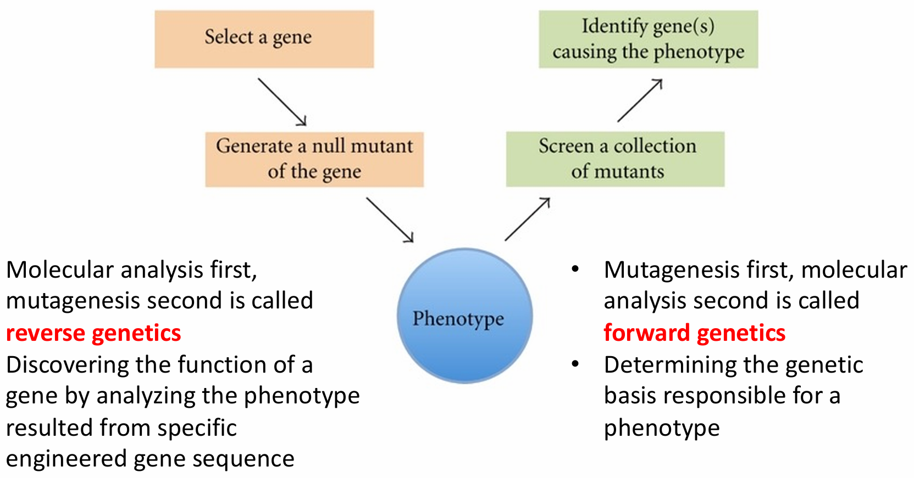

## 一、发育生物学研究的意义

### 联系人类发病机制

出生缺陷：由突变（如斑驳病，KIT基因突变导致不育、贫血、皮肤毛发色素沉着不足、肠道神经元和耳部发育缺陷）和环境干扰（如沙利度胺致海豹肢症，影响胎儿肢体正常发育）引发。

其他疾病：通过果蝇等模式生物研究疾病机制，像研究Hedgehog信号通路与多指畸形、颅面发育异常的关系；利用果蝇研究脂质代谢，探究饮食对非酒精性脂肪肝（NAFLD）发病的影响 。

### 推进生命科学前沿课题

- 表观遗传学与疾病：如孕期饮食影响子代表观遗传，进而影响肥胖等表型；小鼠早期养育环境影响成年行为，体现跨代表观遗传效应。
- 类器官研究：诱导多能干细胞（iPS）和成年干细胞衍生的类器官，如脑、肠、脂肪肝类器官，用于研究器官发育和疾病。
- 衰老与再生：研究线虫长寿基因（如age - 1、daf - 2突变体寿命延长）；多种生物（如水螅、墨西哥蝾螈、涡虫等）的再生模型，探究再生机制。
- 社会行为研究：以果蝇为模型，研究进食与求偶的分子调控开关、社会隔离对健康的影响。

### 探索生物演化现象

- 基因变化与形态演化：蛇化小鼠肢体特异性shh增强子17bp缺失，影响肢体发育，揭示基因变化在生物演化中的作用。
- 同源异型基因：决定生物身体结构和器官位置，其研究成果获1995年诺贝尔生理学或医学奖，为理解生物演化过程中身体结构的变化提供依据。

## 二、发育生物学的基本研究策略

### 研究目标：

在时间和空间尺度上揭示个体发育的遗传程序与调控机制，主要借助模式生物的发育进程研究达成。

### 研究策略

​​

- 反向遗传学：先进行分子分析，根据特定设计的基因序列产生突变体，筛选突变体表型，确定导致特定表型的基因。
- 正向遗传学：先进行诱变，产生大量突变体，再通过分析突变体表型，确定导致表型的基因，进而研究基因功能和遗传基础。

## 三、发育生物学研究的核心问题及其解析

发育——遗传程序（蓝图）+基因调控（指令）

发育生物学的核心问题：  
I. 如何确保细胞的多样性，并使各种细胞的分化和行使功能在 个体内有严格的时间 和空间的次序性？  
II. 如何保证世代的交替和生命的延续性？  
解析遗传信息以何种方式编码在基因组上，基因组上的信息又是如何调控生物体的三维形态结构的构建，从而延续⽣命现象的发展

从以下七个问题进行解析

1. 细胞如何分化：  
    受精卵能产生约个细胞、250种类型，但受精卵、胚胎和成体细胞基因组相同，探究相同遗传指令产生不同细胞命运的机制是关键。
2. 有序形态如何构建：  
    分化的细胞并不是随机的分布与组合，⽽是通过⼀系列精密的 调控来形成复杂的组织和器官。形态发⽣：有序形态的构建  
    细胞的分裂（卵裂）、迁移、死亡；组织的折叠和汇聚延展  
    分化细胞经精密调控形成组织和器官，如爪蟾胚胎卵裂、果蝇胚胎原肠胚形成、指（趾）间细胞凋亡等过程，细胞凋亡受中胚层信号（如BMP）和遗传（如线虫ced - 3、ced - 4基因）调控 。
3. 细胞如何增殖：  
    细胞增殖受细胞周期蛋白（Cyclin）和细胞周期蛋白依赖性激酶（CDK）等调控，细胞需准确判断增殖和停止分裂的时机，相关研究获2001年诺贝尔生理学或医学奖。
4. 个体如何繁衍：  
    涉及特化生殖细胞和体细胞，生殖细胞负责传递遗传信息，细胞质与细胞核的机制及相互作用影响繁衍过程。
5. 个体如何再生：  
    部分物种能再生整个个体（如涡虫），有些物种组织器官可再生，且再生能力在不同发育阶段有差异。
6. 发育机制如何演化：  
    以加拉帕戈斯雀和东非丽鱼为例，基因表达和调控变化促使形态改变，研究演化过程中基因表达变化与新结构产生、遗传变化可能性的关系。
7. 环境如何影响个体发育：  
    生物个体发育需与环境协调，某些化学物质（如环杷明，影响刺猬信号通路，导致独眼畸形）会改变发育进程。