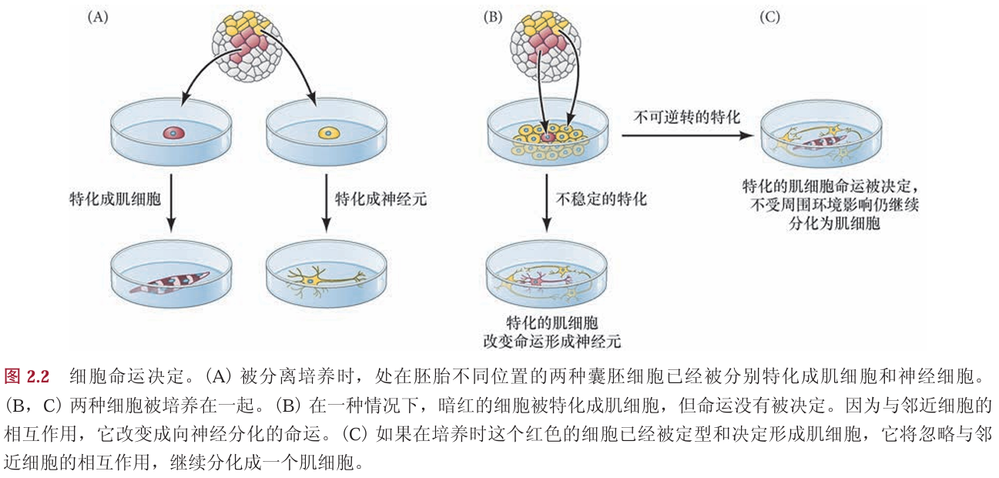
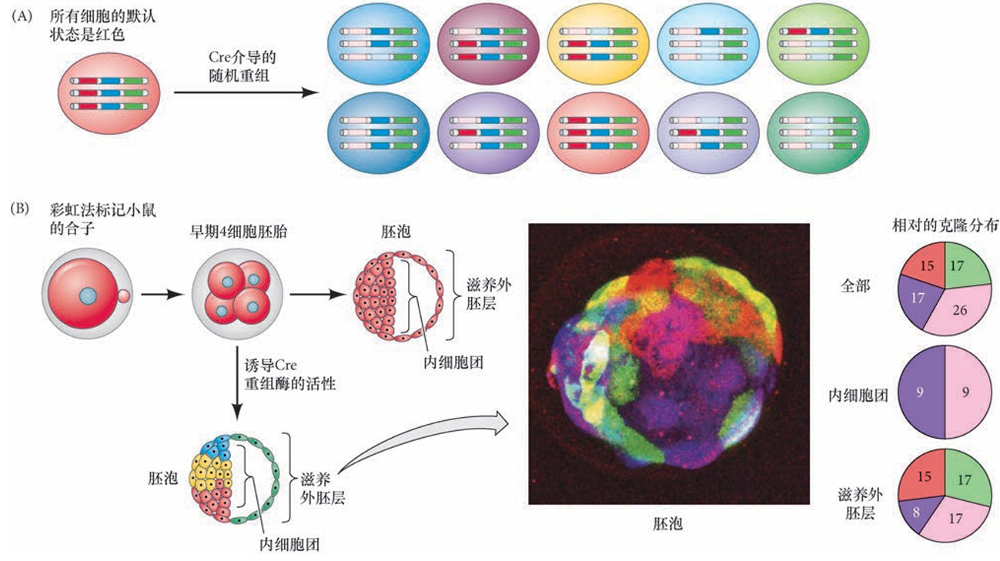

# 导航

- [1.生物个体有序的结构是通过五个最基本的发育过程来形成](#1.%E7%94%9F%E7%89%A9%E4%B8%AA%E4%BD%93%E6%9C%89%E5%BA%8F%E7%9A%84%E7%BB%93%E6%9E%84%E6%98%AF%E9%80%9A%E8%BF%87%E4%BA%94%E4%B8%AA%E6%9C%80%E5%9F%BA%E6%9C%AC%E7%9A%84%E5%8F%91%E8%82%B2%E8%BF%87%E7%A8%8B%E6%9D%A5%E5%BD%A2%E6%88%90)
	- [1）卵裂](#1%EF%BC%89%E5%8D%B5%E8%A3%82)
	- [2）图示形成](#2%EF%BC%89%E5%9B%BE%E7%A4%BA%E5%BD%A2%E6%88%90)
	- [3）形态建成](#3%EF%BC%89%E5%BD%A2%E6%80%81%E5%BB%BA%E6%88%90)
	- [4）细胞分化](#4%EF%BC%89%E7%BB%86%E8%83%9E%E5%88%86%E5%8C%96)
	- [5）生长](#5%EF%BC%89%E7%94%9F%E9%95%BF)
- [2.基因在发育过程中的功能是通过调控细胞的行为来体现的](#2.%E5%9F%BA%E5%9B%A0%E5%9C%A8%E5%8F%91%E8%82%B2%E8%BF%87%E7%A8%8B%E4%B8%AD%E7%9A%84%E5%8A%9F%E8%83%BD%E6%98%AF%E9%80%9A%E8%BF%87%E8%B0%83%E6%8E%A7%E7%BB%86%E8%83%9E%E7%9A%84%E8%A1%8C%E4%B8%BA%E6%9D%A5%E4%BD%93%E7%8E%B0%E7%9A%84)
- [3.基因组通过调控蛋白质的时空表达来决定细胞行为](#3.%E5%9F%BA%E5%9B%A0%E7%BB%84%E9%80%9A%E8%BF%87%E8%B0%83%E6%8E%A7%E8%9B%8B%E7%99%BD%E8%B4%A8%E7%9A%84%E6%97%B6%E7%A9%BA%E8%A1%A8%E8%BE%BE%E6%9D%A5%E5%86%B3%E5%AE%9A%E7%BB%86%E8%83%9E%E8%A1%8C%E4%B8%BA)
- [4.发育基因的表达是受严格时空调控的](#4.%E5%8F%91%E8%82%B2%E5%9F%BA%E5%9B%A0%E7%9A%84%E8%A1%A8%E8%BE%BE%E6%98%AF%E5%8F%97%E4%B8%A5%E6%A0%BC%E6%97%B6%E7%A9%BA%E8%B0%83%E6%8E%A7%E7%9A%84)
- [5.发育是一个渐进的过程，细胞的命运在不同发育阶段决定](#5.%E5%8F%91%E8%82%B2%E6%98%AF%E4%B8%80%E4%B8%AA%E6%B8%90%E8%BF%9B%E7%9A%84%E8%BF%87%E7%A8%8B%EF%BC%8C%E7%BB%86%E8%83%9E%E7%9A%84%E5%91%BD%E8%BF%90%E5%9C%A8%E4%B8%8D%E5%90%8C%E5%8F%91%E8%82%B2%E9%98%B6%E6%AE%B5%E5%86%B3%E5%AE%9A)
	- [命运定型的层次](#%E5%91%BD%E8%BF%90%E5%AE%9A%E5%9E%8B%E7%9A%84%E5%B1%82%E6%AC%A1)
	- [细胞特化的三种策略](#%E7%BB%86%E8%83%9E%E7%89%B9%E5%8C%96%E7%9A%84%E4%B8%89%E7%A7%8D%E7%AD%96%E7%95%A5)
	- [彩虹般的细胞特征](#%E5%BD%A9%E8%99%B9%E8%88%AC%E7%9A%84%E7%BB%86%E8%83%9E%E7%89%B9%E5%BE%81)
- [6.诱导使细胞产生不同的命运](#6.%E8%AF%B1%E5%AF%BC%E4%BD%BF%E7%BB%86%E8%83%9E%E4%BA%A7%E7%94%9F%E4%B8%8D%E5%90%8C%E7%9A%84%E5%91%BD%E8%BF%90)
- [7.细胞对其所在位置信息的阐释导致图式的形成](#7.%E7%BB%86%E8%83%9E%E5%AF%B9%E5%85%B6%E6%89%80%E5%9C%A8%E4%BD%8D%E7%BD%AE%E4%BF%A1%E6%81%AF%E7%9A%84%E9%98%90%E9%87%8A%E5%AF%BC%E8%87%B4%E5%9B%BE%E5%BC%8F%E7%9A%84%E5%BD%A2%E6%88%90)
- [8.细胞质决定因子的差异性定位和不对称细胞分裂使细胞彼此产生差异](#8.%E7%BB%86%E8%83%9E%E8%B4%A8%E5%86%B3%E5%AE%9A%E5%9B%A0%E5%AD%90%E7%9A%84%E5%B7%AE%E5%BC%82%E6%80%A7%E5%AE%9A%E4%BD%8D%E5%92%8C%E4%B8%8D%E5%AF%B9%E7%A7%B0%E7%BB%86%E8%83%9E%E5%88%86%E8%A3%82%E4%BD%BF%E7%BB%86%E8%83%9E%E5%BD%BC%E6%AD%A4%E4%BA%A7%E7%94%9F%E5%B7%AE%E5%BC%82)
- [9.旁侧抑制可以产生间距图案](#9.%E6%97%81%E4%BE%A7%E6%8A%91%E5%88%B6%E5%8F%AF%E4%BB%A5%E4%BA%A7%E7%94%9F%E9%97%B4%E8%B7%9D%E5%9B%BE%E6%A1%88)
- [10.发育的精准性是通过各种手段实现](#10.%E5%8F%91%E8%82%B2%E7%9A%84%E7%B2%BE%E5%87%86%E6%80%A7%E6%98%AF%E9%80%9A%E8%BF%87%E5%90%84%E7%A7%8D%E6%89%8B%E6%AE%B5%E5%AE%9E%E7%8E%B0)

## 1.生物个体有序的结构是通过五个最基本的发育过程来形成

发育的本质是由**卵裂、图式形成、形态建成、细胞分化、生长**这五个基本过程组成。这些过程相互关联，共同塑造了生物个体的形态和功能。
### 1）卵裂
受精卵通过不断分裂，形成许多更小的细胞，即卵裂球。以蛙胚为例，从2细胞期到囊胚期（1.5 - 7 hpf），卵裂过程迅速。其特点是在此期间无细胞的生长，主要进行DNA复制以及有丝分裂/细胞分裂，卵裂周期通常为10 - 60分钟，与体细胞周期（大于16小时）有明显差异。

### 2）图示形成

卵裂产生的细胞在特定的时间和空间内相互作用，进而产生有序的结构。不同生物有多种机制参与这一过程，例如果蝇胚胎前后轴的确立，是通过多种基因（如BICOID、OSKAR、VASA等）的作用来实现的。这些基因在胚胎中的特定位置表达，为胚胎的发育奠定了基础。

### 3）形态建成
涉及胚胎在三维空间结构上的变化，原肠胚形成是胚胎发育过程中最重要的阶段。在这个阶段，通过细胞迁移和重组，形成原肠胚，奠定胚胎的三胚层结构，包括外胚层、中胚层和内胚层。神经嵴细胞的迁移是形态建成中的重要事件，它起源于胚胎最背部的神经板（外胚层），在BMP信号等的作用下，迁移并分化形成部分神经系统（包括肠道神经系统）、部分心脏组织、生殖系统以及色素细胞、脸部的大多数结构。像斑驳病就是由于KIT（CD117）基因突变，影响了神经嵴细胞的增殖和迁移而导致的。此外，形态建成还包括胚层的形成、细胞命运的特化以及组织、器官的形成。原肠形成对于胚胎发育极为关键，Lewis Wolpert曾形象地描述：“真正对你的生命至关重要的时刻，不是出生、结婚或死亡，而是原肠胚形成。”

### 4）细胞分化

细胞在结构和功能上逐渐产生区分，从而形成不同的细胞类型，这是一个渐进的过程。人的受精卵能够产生至少250种清晰可辨的细胞类型。图示形成和细胞分化密切相关，同源器官（如人的腿与手臂）由相同的细胞组成，但细胞排列方式明显不同，这体现了图示形成在物种区分中的重要作用。

### 5）生长

表现为生物个体体积的增大。在早期胚胎发育中，受精卵快速分裂，虽然细胞体积少有变化，但这种分裂方式有利于图示的形成和形态的建成。

生长的方式包括细胞增殖、增加细胞体积（如脂肪细胞）、细胞外基质的沉积（如骨骼的形成和钙化）以及形态相对比例的变化（生长速率） 。
## 2.基因在发育过程中的功能是通过调控细胞的行为来体现的
基因在发育过程中的功能是通过调控细胞的行为来体现的，主要包括以下几个方面：
#### 时空特异的基因表达和动态的蛋白质表达谱
在早期发育过程中，基因表达模式的改变对于图示形成至关重要。基因的表达不是随机的，而是在特定的时间和空间进行，从而确保细胞能够按照预定的程序进行分化和发育。

#### 细胞间通讯（信号转导）、细胞运动、细胞分化、细胞形态、细胞增殖和细胞死亡：

以中胚层内陷为例，这一过程是由于细胞形状的改变所导致的，而这种改变受到基因的严格调控。像twist和snail基因，对于腹侧沟和管的形成是必需的。Snail基因能够启动顶端收缩，Twist基因则起到稳定收缩的作用。此外，在这一过程中，细胞还会发生从表达E - cadherin到N - cadherin的转变，使得中胚层细胞不再与外胚层细胞粘连，进而发生上皮 - 间质转化（EMT），这一系列变化都体现了基因对细胞行为的精确调控。
## 3.基因组通过调控蛋白质的时空表达来决定细胞行为

## 4.发育基因的表达是受严格时空调控的
## 5.发育是一个渐进的过程，细胞的命运在不同发育阶段决定
未分化的细胞经历一个成熟的过程，起始于它们被**定型**成一个特定的细胞谱系，然后经过一个细胞命运被决定成一种特定细胞类型的时期， 最终进入分化状态，这时的细胞获得了具有该细胞类型特征的基因表达图式。

在一些生物中，细胞命运在很早期就被一些细胞质中的特分子所决定，这些分子随着受精卵的卵裂被分配到每个细胞中。在另一些生物中，**细胞命运在早期胚胎中保持可塑性或者可以被改变**，然后通过细胞之间不断的相互作用受到限制。在一些物种中(尤其是果蝇)，最初只有细胞核分裂，产生一个在单一未分裂的细胞质中有很多核的合胞体。在这些胚胎中，在细胞核分离变成独立细胞时，细胞质信息分子的前后梯度决定它们要表达的基因。

应用新的高端成像技术， 如**脑彩虹法**，研究人员现在能把单个细胞的命运从合子追踪到成体。
### 命运定型的层次
#### 细胞分化
特定细胞类型的产生称为**分化(differentiation)**，这是一个细胞停止分裂，发育成特定结构基础和明 显功能特性的过程。然而，**分化只是胚胎的一个未分化细胞被定型变成一个特殊细胞类型这个过程中所发生的一系列事件的最后和最明显的时期**。很明显，一个红细胞的蛋白质成分和细胞结构在根本上不同于眼的一个晶状体细胞和脑中的一个神经元。但是，在**这些细胞产生生化和功能上的差异之前却有一个使细胞定型成特定命运的过程**。一个细胞在命运**定型(commitment)** 期间与胚胎中最邻近或最远 端的细胞看起来没有区别，也显示不出来任何可见的分化标记，但其发育命运却受到了限制。

#### 命运定型
命运定型的过程可以被分成两个时期(Harrison 1933；Slack 1991)。

第一个时期是**特化(specification)**。 如果一个细胞或组织被放置在中性的发育途径的环境中，如培养皿或试管，仍能自主地(通过自身)进 行分化，它的命运就被特化(图2.2A)。在特化时期，细胞命运的定型仍不稳定(即可以被改变)。如果 一个特化的细胞被移植到与其特化方向不同的一组细胞中，移植细胞的命运就会通过与相邻细胞的相互 作用而被改变(图2.2B)。你们当中有很多人在步入发育生物学教室时可能仍然喜欢化学，但当你们体验 到发育生物学的魅力后，就会受到影响而改变想法，成为一个发育生物学家。这也不是不可能的。 
命运定型的第二个时期是**命运决定(determination)**。如果一个细胞或组织即便是被置入胚胎的 其他位置，或在培养皿中与一簇特化方向不同的细胞混合后仍能自主地进行分化，它的命运就被决定 ( 图2.2C)。在这样的情况下，如果一个细胞或组织仍能按照它特化的命运进行分化，这时就可以假设它 的命运定型是不可逆转的。我们还可以引用前面的例子，不管发育生物学课多么令人惊叹，你们还是不可动摇地决定成为一个化学家。

在胚胎发生过程中，一个未分化的细胞在经历特定的时期后成熟，这些时期逐渐将其定 型成一个特定命运：首先是命运特化，然后是命运决定，最后是细胞分化。胚胎会使用三个主要的策略 使细胞特化：自主性、条件性和合胞体性。不同物种的胚胎会采取这些策略的不同组合。

### 细胞特化的三种策略

**自主性特化** 
* 在大多数无脊椎动物中占主导地位 
* 卵中一些**细胞质分子的差异性分配使细胞特化** 
* 物种中每个胚胎不变式的卵裂产生一些相同的谱系，卵裂球的命运一般不变 
* 细胞类型的特化发生在任何大规模的细胞迁移之前 导致“嵌合性”发育，如果一个卵裂球丢失，其他细胞不能改变命运 

**条件性特化** 
* 在脊椎动物和少数无脊椎动物中占主导地位 
* 通过细胞之间的相互作用进行特化，**细胞之间的相对位置很重要** 
* 可变式卵裂，细胞没有被赋予不可变的命运 
* 大规模的细胞重排和迁移发生在特化之前或伴随着特化 “调节性”发育的能力使细胞通过与邻近细胞的相互作用获得不同的功能 

**合胞体性特化** 
* 在多数昆虫纲中占主导地位 
* 在胚盘细胞化之前，**细胞质区域的相互作用特化躯体部分** 
* 可变式卵裂对特定的细胞核产生可变更的细胞命运 
* **细胞化后，既有自主性特化，也有条件性特化**

### 彩虹般的细胞特征
“细胞类型”并不是鉴别一个细胞的最准确方式，为了更准确地追踪细胞的命运，目前有了很多研究细胞命运的标记技术。细胞命运标记技术在整个发育过程中使用可追踪的染料来标记细胞，从而确定细胞的命运，这个技术可以用来 在一个组织中甚至是在一个整体胚胎中鉴别每个独立的细胞(Livet et al. 2007)。这个方法被称为**脑彩虹法 (Brainbow)**，因为最早的研究主要是描述了发育过程中的小鼠脑细胞。但它可以用于任何生物，只是名称有所不同。

脑彩虹法体系**激发不同组合和不同强度的各种荧光蛋白的表达**(绿色、红色、蓝色等；见Weissman and Pan 2015)，因此产生出荧光蛋白组合的随机分布，使每个细胞呈现出不同的颜色，并且能稳定地被其后代细胞所继承。每个荧光蛋白的基因以无活性的状态被转入目的生物的基因组，但当接触到Cre重组酶时，荧光蛋白基因之间的随机重组使它们变得有活性(图2.13A)。基于每个细胞中活性荧光蛋白的不同组合所产生的色彩，不同的细胞就可以被区分出来。

脑彩虹法使研究人员能够在任何时期的任何组织中研究细胞的形态及它们之间的相互作用，使我们能够绘制早期胚胎中一个独立细胞的发育谱系，从其子代细胞直到最后终点。例如，Kevin Eggan的研究组使用“彩虹法”体系标记小鼠胚胎的早期卵裂细胞来回答以下问题(Tabansky et al. 2013)：变成胚胎本体的细胞或胚外的细胞的最初谱系选择是一个随机性的还是一个调节性的过程？他们发现这是非随机性的 ( 图2.13B)。上述例子充分显示出这个创新性技术有多么强大，它能为我们在整体胚胎水平上对细胞群体中一个独立细胞的生命史提供新认知。

## 6.诱导使细胞产生不同的命运

**诱导(induction)**：一组细胞可以向相邻的一组细胞发出信号，影响它们的发育。组织器的感应原理在胚胎发育过程中发生变化

**诱导信号**(Induction signals)
* 分泌分子(Secreted molecules)：Hh ， Wnt
* 跨膜配体(transmembrane ligands)：Notch signaling
* 转录因子(Transcripiton factors): 果蝇囊胚的形成过程中
细胞表面介导的细胞间信息传递主要有三种：细胞黏附、细胞形态、细胞信号传递

**感应能力(Competency)**:反应细胞能够对诱导信号做出反应。不同细胞对诱导信号的感受能力不同，所以后续的命运不同。
* 适当的受体和传导机制
* 存在基因激活所需的特定转录因子
* 感受到诱导信号的时间非常重要

**诱导区域的特异性**：感受信号的区域实际上是十分精巧的，大多数图案是在涉及数十个细胞和 100-500 微米距离的尺度上确定的。

**每一种诱导性互作中至少有两个组分**。第一个是**诱导物(inducer)**，这是 一个组织能产生一种(或几种)改变另一个组织的细胞行为的信号。这种信号通常是一个称为旁分泌因子的分泌性蛋白。旁分泌因子(paracrine factor)是一个细胞或一组细胞分泌的蛋白质，具有改变邻近细胞的行为或分化的能力。不像内分泌因子(激素)那样能通过血液循环在远距离的细胞或组织中发挥作用，旁分泌因子被分泌到细胞外，只影响近邻的细胞。第二个组分是**应答物(responder)**，代表受诱导的细胞或组织。应答组织的细胞必须具有诱导因子的受体蛋白和应答这个诱导信号的能力。应答特定诱导信号的能力称为**反应能力(competence)**，也称为**感受态**(Waddington 1940)。通常，**一种诱导将赋予一个组织应答另一个诱导物的反应能力。**

Howard Holtzer(1968)区分出两种主要的诱导互作方式
* **指令性相互作用(instructive interaction)**：来自诱导性细胞的一个信号对应答细胞启动新的基因表达是必要的。没有这个诱导，应答细胞就不能向特定的方向分化
* **容许性相互作用(permissive interaction)**：应答组织早已被特化，只需要一个能使它呈现特征的环境。

## 7.细胞对其所在位置信息的阐释导致图式的形成

- ​**位置信息（Positional Information）​**：细胞通过感知自身在胚胎或组织中的空间位置，获得特定的发育指令
- ​**图式形成（Pattern Formation）​**：细胞根据位置信息进行差异化发育，最终形成有序的空间组织结构

杜里舒(Hans Dreisch)的海胆胚胎发育实验证明：
- 一个卵裂球 被分离后的分化潜能(即它有可能形成的细胞类型)比它在胚胎中的预定命运(在正常发育过程中它将 产生的细胞类型)要大得多
- 胚胎中所有可能的独立部分通过相互作用来形成一个生物体
- 一个细胞核的命运取决于它在胚胎中的位置。细胞间的相 互作用决定了细胞的命运

事实上，海胆和蛙同样都以自主性和条件性特化的方式来决 定早期胚胎细胞的命运。而且，这两个动物类群在发育过程中使用类似的策略，甚至是类似的分子。在 16 细胞期的海胆胚胎中，一组称为小卵裂球的细胞从卵细胞质中继承了一套转录因子。这些转录因子使 小卵裂球自主地发育成幼体的骨骼，但相同的转录因子也激活一些编码旁分泌和近分泌信号的基因，它 们从小分裂球中分泌出来，条件性地特化周围的细胞。

## 8.细胞质决定因子的差异性定位和不对称细胞分裂使细胞彼此产生差异

- ​**细胞质决定因子（Cytoplasmic Determinants）​**：存在于细胞质中的特定分子（如mRNA、蛋白质等），能够影响细胞命运
- ​**不对称细胞分裂（Asymmetric Cell Division）​**：细胞分裂时，细胞质决定因子不均匀分配，导致子细胞获得不同的发育潜能

## 9.旁侧抑制可以产生间距图案

## 10.发育的精准性是通过各种手段实现