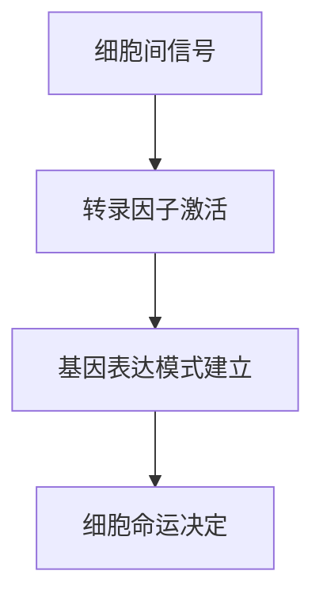
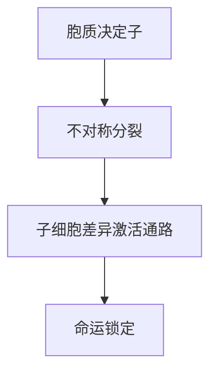

## 细胞命运的决定
### 一、发育概述
所有不同的生物都有一个共同的发展规划
```plaintext
卵裂期(Cleavage) 
  ↓ 
囊胚期(Blastulation)
  ↓  
原肠胚期(Gastrulation)
  ↓ 
神经胚期(Neurulation)
```

但是发育过程中具有不同的发育策略
- 海胆、果蝇和小鼠：细胞命运的指定涉及细胞-细胞相互作用——调整型发育
- 秀丽隐杆线虫：细胞命运基于定位的细胞质因子及其在不对称细胞分裂中的分布——嵌合型发育

### 二、调整型发育 (Regulative Development)

#### 1. 核心定义
• **细胞命运决定机制**：通过细胞间信号交互动态决定
• **可塑性**：胚胎部分被移除后，剩余细胞可调整发育为完整个体
• **发育策略**：细胞具有等效性，命运由位置信号决定

#### 2. 关键机制



• **信号类型**：
  • Notch信号
  • Wnt信号
  • BMP信号
• **分子特征**：
  • 母源mRNA均匀分布
  • 信号通路组分动态响应

### 3. 代表生物与实验证据
| 生物   | 经典实验     | 发现者/年份          | 关键结论        |
| ---- | -------- | --------------- | ----------- |
| 海胆   | 2细胞期分离实验 | Driesch, 1892   | 单个细胞发育为完整幼虫 |
| 哺乳动物 | 胚胎分割实验   | Willadsen, 1981 | 产生同卵双胞胎     |
| 果蝇   | 细胞移植实验   | Technau, 1987   | 细胞命运由位置信号决定 |

### 4. 发育特点
• **优势**：适应环境变化，修复损伤
• **局限**：依赖细胞间通讯网络
• **调控层级**：
  1. 母源因子建立初始极性
  2. 细胞信号网络动态调控
  3. 表观遗传修饰稳定命运
  4. 
### 三、嵌合型发育 (Mosaic Development)

#### 1. 核心定义
• **细胞命运决定机制**：通过胞质决定子(cell-autonomous determinants)不对称分配
• **预定性**：细胞命运在分裂时即被"硬编码"
• **发育策略**：细胞谱系严格固定

#### 2. 关键机制


• **分子特征**：
  • PAR蛋白极性分布（PAR-3/PAR-6 vs PAR-1/PAR-2）
  • P颗粒相分离（germline specification）
  • MEX-5/6梯度（体细胞决定子）

#### 3. 线虫(C. elegans)模型证据
| 现象                 | 实验方法                     | 关键发现                     |
|----------------------|------------------------------|------------------------------|
| P颗粒定位            | GFP标记追踪                 | 严格遵循分裂模式传递         |
| par基因突变          | 温度敏感突变体              | 导致对称分裂和命运混乱       |
| 细胞谱系不变性       | 四维显微成像                | 959个体细胞谱系完全可预测    |
| 程序性细胞死亡       | ced基因突变分析             | 131个细胞凋亡程序严格保守    |

#### 4. 分子调控网络
```plaintext
精子进入点
  ↓ 
RhoGEF激活 → 肌动球蛋白收缩
  ↓ 
PAR蛋白极性分布（前部:PAR-3/6/aPKC；后部:PAR-1/2）
  ↓ 
胞质决定子不对称分配（PIE-1在后部，MEX-5/6在前部）
  ↓ 
转录程序差异激活（体细胞vs生殖细胞）
```


### 四、模式比较表
| 特征                | 调整型发育                   | 嵌合型发育                   |
|---------------------|------------------------------|------------------------------|
| 细胞等效性          | 有                           | 无                           |
| 命运决定时间        | 渐进式                       | 分裂时即决定                 |
| 可塑性              | 高                           | 低                           |
| 信号依赖            | 细胞间信号                   | 自主决定子                   |
| 典型生物            | 脊椎动物、海胆               | 线虫、被囊动物               |
| 进化意义            | 适应复杂环境                 | 快速稳定发育                 |
| 实验干扰结果        | 细胞可重编程                 | 产生缺陷无法补偿             |
| 关键调控分子        | Wnt/Notch/BMP               | PAR/P颗粒/SKN-1              |
| 时空协调机制        | 形态发生梯度                 | 分裂平面控制                 |
| 表观遗传修饰        | 动态重编程                   | 早期锁定                     |


### 五、历史里程碑
```plaintext
1. 1888 Roux蛙胚针刺实验 → 嵌合型概念雏形
2. 1892 Driesch海胆分离实验 → 调整型证据
3. 1903 Boveri被囊动物实验 → 严格镶嵌发育
4. 1963 Sydney Brenner选定线虫 → 模式建立
5. 1983 Sulston完成完整细胞谱系图谱
6. 2002 诺贝尔奖确认发育模式理论框架
```

## 线虫发育过程

### 线虫的研究优势
### 线虫研究里程碑

## 程序性细胞死亡

## 关键性的技术突破


