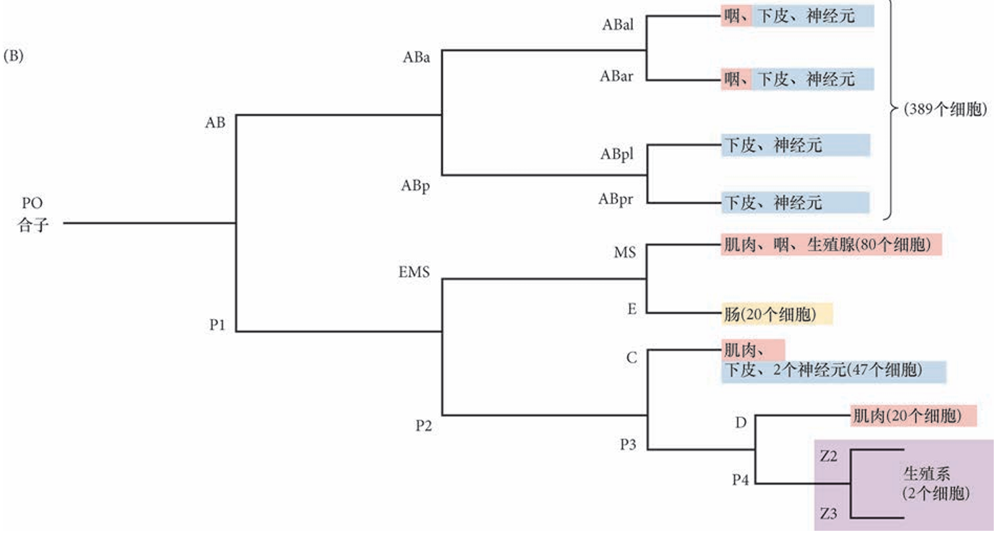

## 不变的细胞谱系

>秀丽隐杆线虫不变的细胞谱系

秀丽隐杆线虫 具有所谓的恒定细胞谱系(invariant cell lineage)，这意味着在所有的胚胎中，每个细胞所产生的细胞数 量和类型都是相同的。这能使人们了解哪些细胞具有相同的祖细胞。因此，对于每个胚胎中的细胞，我 们都可以知道它来自哪里(也就是在早期胚胎中哪个细胞是它的祖细胞)，以及将来形成哪种组织。此外， 与脊椎动物的细胞谱系不同，秀丽隐杆线虫的谱系从一个个体到另一个个体几乎完全不变，几乎没有随机性

>简略细胞谱系图。生殖系 分离到最后端细胞(P)的后部分。最初的三次细胞分裂产生AB、 C、MS和E谱系。括号内的细胞数代表新孵化幼体中的558个细胞，其中一些细胞继续分裂以产生成体的959个细胞

秀丽隐杆线虫的基因组是第一个从多细胞生物 体中获得的完整序列(C. elegans Sequencing Consortium 1999)。尽管它的基因数量与人类大致相同(线虫有18 000 ～20 000 个基因，人类有20 000～25 000个基因)，但线虫基因组中碱基的数量大约仅是人类 的3%。

秀丽隐杆线虫具备几乎所有主要躯体结构体系的原基(摄食、神经、繁殖等，尽管它不具有骨骼， 并且它在死亡之前显现出衰老的表型。神经生物学家因为秀丽隐杆线虫仅有一个极小的神经系统(302 个神经元)而感到振奋，并且所有7600个突触(神经元的连接结构)都被已被鉴别出来。此外，秀丽隐杆线虫对分子生物学家尤为方便。注射进线虫细胞的DNA很容 易与细胞核整合，而且线虫可以从其培养基中摄取反义RNA。

## 卵裂与胚轴的确立
## 受精与前后轴极性
## 第一次卵裂与前后轴的建立
## 第一次卵裂与P细胞谱系
## 第二次卵裂与背腹轴的建立

## EMS 细胞命运决定

## 第三次卵裂与左右轴的建立

## 卵裂与胚轴的建立

## 细胞凋亡

## RNA干扰
## 绿色荧光蛋白GFP

