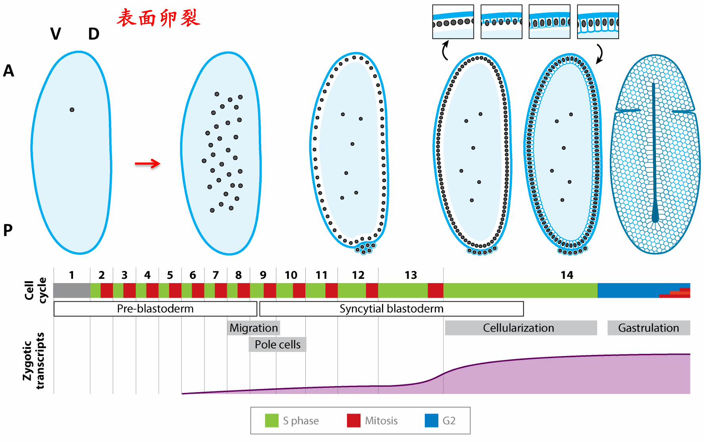
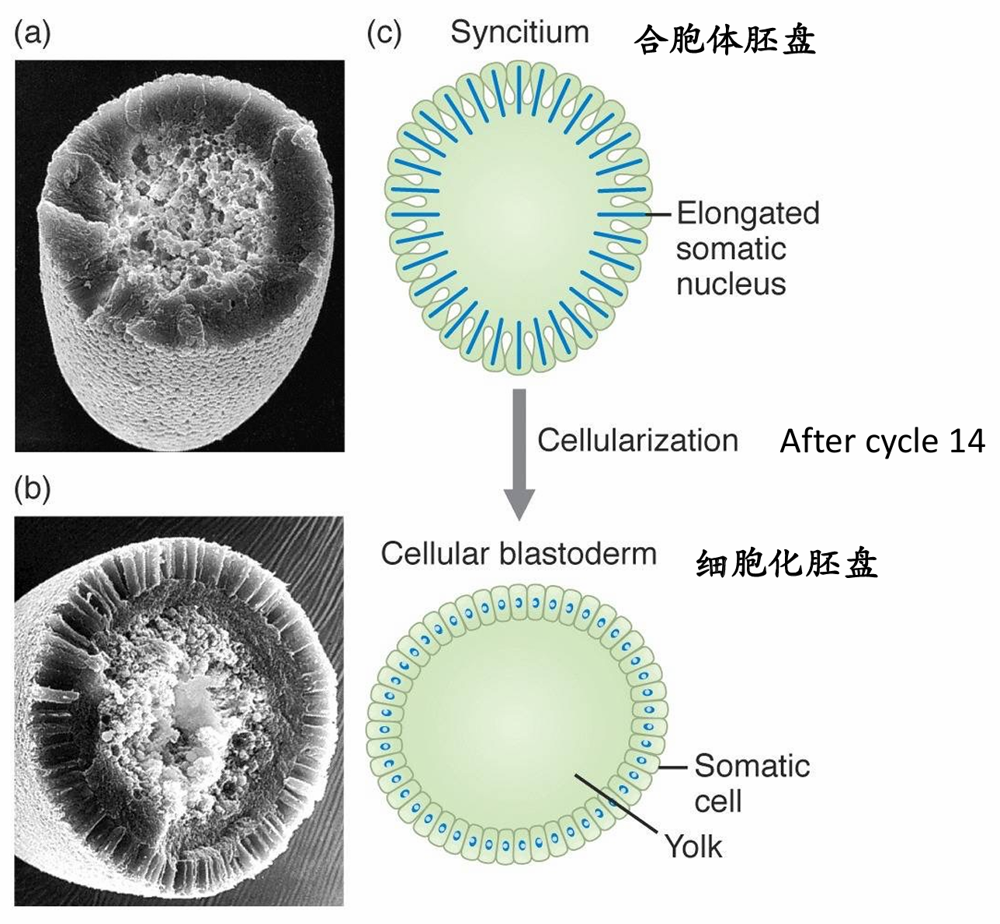
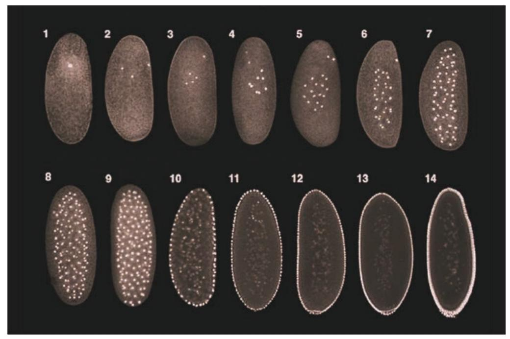
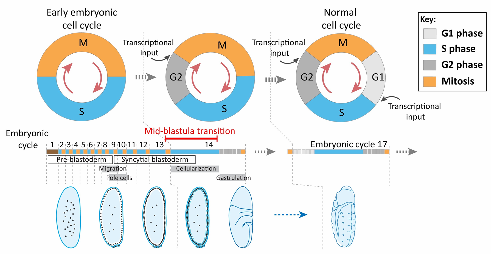
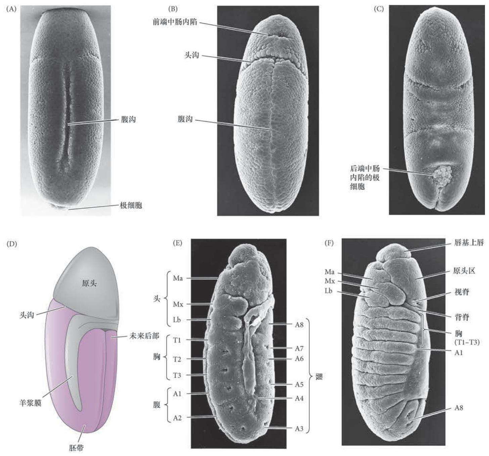
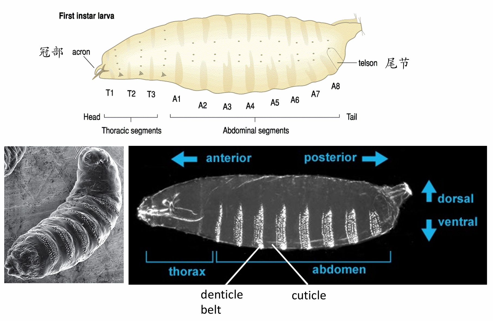
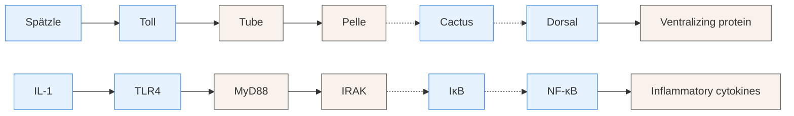

## 一、果蝇对现代生物学的贡献

果蝇作为模式生物，对现代生物学尤其是遗传学和发育生物学的发展起到了关键的推动作用。其研究历史可以追溯到20世纪初，当时托马斯·亨特·摩尔根及其学生在哥伦比亚大学的果蝇实验室中，通过果蝇的遗传学研究，揭示了许多遗传学的基本原理，如性连锁、基因的线性排列等，并引入了“基因”这一概念，为现代遗传学奠定了基础。此后，果蝇研究不断取得突破，六次获得诺贝尔奖，彰显了其在科学界的重要地位。

### 果蝇与遗传

果蝇与遗传学的渊源深厚，其研究为遗传学的发展做出了巨大贡献。

人们通过果蝇发现了性染色体的存在，提出了性连锁的概念：果蝇白眼基因的性连锁，雄蝇是异配的。在哥伦比亚大学的果蝇实验室中，摩尔根团队通过观察果蝇的自发突变，提出了基因位于染色体上的理论，并引入了“基因”这一术语，还提出了基因在线性排列的理论，单位相对距离被称为“centiMorgan”。此外，他们还发现X射线照射可以诱导果蝇及其他物种发生突变，这一发现极大地推动了遗传学研究的进程。

### 果蝇研究的贡献

果蝇研究的贡献不仅限于遗传学领域，还广泛涉及发育生物学、神经生物学、细胞生物学和免疫学等多个学科。
- 发育生物学方面，果蝇是研究胚胎发育、体节形成和器官形成的经典模型，许多关键的发育信号系统如Notch、Hedgehog、Wingless/Wnt等都是通过果蝇的遗传学研究首次发现的。
- 神经生物学领域，果蝇的嗅觉、节律等研究为理解神经系统的功能和机制提供了重要线索。
- 此外，果蝇研究还通过遗传学手段推动了细胞生物学和免疫学的发展，例如在天然免疫方面的研究。

这些跨学科的贡献使得果蝇成为现代生物学研究中不可或缺的模式生物，为科学家们提供了丰富的研究工具和理论基础，促进了整个生物学领域的进步。

### 为什么研究果蝇

研究果蝇具有多方面的优势和重要意义
- 果蝇具有短生命周期，**从受精卵到成虫仅需约两周**时间，这使得研究人员能够在较短时间内观察到完整的发育过程和遗传变异。
- 果蝇的**胚胎发育过程在24小时内**即可完成，且**早期胚胎为多核合胞体**，这些特点使果蝇胚胎发育过程**易于观察和操作**，便于研究人员进行详细的细胞和分子层面的研究。
- 果蝇的**基因组相对简单**，仅有**4条染色体**，且与人类基因组有**超过60%的相似性**，约77%导致人类疾病基因在果蝇中存在同源基因，这为研究人类疾病的发生机制和寻找治疗方法提供了便利。
- 果蝇的**突变体资源丰富**，拥有大量巧妙的遗传技巧和全基因组筛选方法，这些资源为深入研究基因功能和遗传网络提供了有力支持。
- 果蝇**研究成本较低**，**饲养容易**。

## 二、果蝇的胚胎发育
### 受精

果蝇的受精是一系列不同寻常的事件，与我们之前所描述的受精过程有很大的不同。
- 精子进入一个已经激活的卵。果蝇卵的激活在产卵时就已经完成，也就是在受精开始前几分钟。在果蝇的卵母细胞经过一个狭小的孔隙被挤出来的时候，钙通道开放并且钙离子流入。然后卵母细胞核重启减数分裂，细胞质中的一些 mRNA 在没有受精的情况下开始翻译。
- 只存在一个精子入卵的位置。这就是**精孔(micropyle)**，一个位于胚胎未来背前部区域卵壳上的通道。精孔一次仅允许一个精子通过，可能是为了防止发生多精入卵。尽管可以观察到皮质变化，但没有防止多精入卵的皮质颗粒。
- 精子与卵细胞膜不融合。相反，精子完整地进入卵。雌、雄原核的 DNA 在原核融合之前复制。在原核融合之后，直到第一次有丝分裂结束，母本和父本的染色体保持分离。
一个果蝇的卵只能在将来变成胚胎前部的卵母细胞区域受精。此外，精子的尾部似乎保留在这个位置。
### 表面卵裂：合胞体胚盘到细胞化胚盘

>表面卵裂的示意图

大部分昆虫的卵进行**表面卵裂(superficial cleavage)**，大量的中央卵黄将卵裂局限在卵的细胞质边缘 。这种卵裂方式是直到**细胞核分裂几次之后细胞才得以形成**。在果蝇的卵中， 核分裂并不伴随着细胞质分裂(细胞分裂)，这样就形成一个**合胞体(syncytium)**，即多核共享同一细胞质的单一细胞。

合子细胞核在卵的中心区域进行几次核分裂；连续的8次细胞核分裂(平均每8 min 一次)产生了256个细胞核。这一快速分裂过程由没有间期(G)的多轮细胞分裂周期交替来完成。在第9个分裂周期，大约5个细胞核到达胚胎后极的表面。这些核被细胞膜包裹，形成了产生成体配子的**极细胞(pole cell)**。在第10个分裂周期，其他细胞核迁移至**卵皮质(周缘)**，继续进行有丝分裂，但分裂速度逐渐减慢（分裂后期的细胞核平行于皮质进行分裂，使细胞核维持在细胞周缘）。 在这些时期的细胞核分裂过程中，除了卵本身的细胞膜之外没有新的细胞膜形成，因此这时的胚胎被称为**合胞体胚盘(syncytial blastoderm)**。 

>”合胞体胚盘——>细胞化胚盘“示意图

尽管细胞核在共享的细胞质中分裂，但细胞质本身却很不均一。合胞体 胚盘中的每个细胞核都被容纳在自身的细胞骨架蛋白所形成的微小区域内。在第10个分裂周期过程中， 细胞核迁移到卵的周缘，每个细胞核都被微管和微丝所包围。细胞核以及与之相关的细胞质岛被称为**活质体(energid)**。在第13个分裂周期之后，细胞膜(覆盖整个卵)在细胞核之间向内发生褶皱，最终将每个活质体分割成单个细胞。这一过程形成了**细胞胚盘(cellular blastoderm)**，其中所有的细胞排列组成 一个单细胞层，覆盖在卵的多卵黄核心周围。 

细胞胚盘的形成涉及微管和微丝之间的一系列精细相互作用，膜的运动、核的延伸、肌动蛋白的聚合似乎都受微管的协调。胚盘细胞化的第一阶段是以**细胞核之间的细胞膜内陷而形成沟道**为特征。这一过程能被阻断微管的药物所抑制。在沟道通过细胞核的水平之后，开始发生细胞化的第二阶段，内陷速度加快，肌动蛋白-膜复合物在将要成为细胞基端的位置开始收缩。果蝇的细胞胚盘由大约6000个细胞组成，在受精后4 h内形成。

>胚胎上方是将来的前端；数字代表核分裂周期。早期的核分裂发生在合胞体中央。后来，细胞核与其周围的细胞质岛(活质体)迁移到细胞周缘，形成合胞体胚盘。在第13个分裂周期后，细胞膜 在细胞核之间内移，从而形成细胞胚盘。极细胞(生殖细胞 前体)在后部形成.
### 囊期中期转换：母源-合子基因组转换

>囊胚中期转换（Mid-blastula transition ,MBT）示意图

当细胞核到达外围之后，在随后的四次分裂中每次分裂完成的时间逐渐变长。从第1到第10个分裂 周期的平均周期时间是8 min。第13个周期，也就是合胞体胚盘的最后一个周期，需要25 min才能完成。 果蝇胚胎形成细胞的**第14个周期(即第13个周期之后)的分裂变得不同步**。一些细胞完成这一周期需要75 min，另一些则需要175 min。 在这一时间点，细胞核基因开始变得活跃。在这之前，卵子发生过程中储存在卵中的一些蛋白质和 mRNA引导早期发育。它们是母体基因的产物，而不是胚胎自身细胞核中的基因产物。在母体中具有活性的基因产生一些用于后代早期发育的产物，这些基因通常被称为**母体效应基因(maternal effect gene)**。

在卵母细胞中的mRNA通常被称为**母体信使(maternal message)**。合子基因的转录(也就是胚胎自身基因的激活)大概**起始于第11个分裂周期**，并在第14个周期时大幅度增强。这样一个细胞核分裂减缓、 细胞化和伴随着新RNA转录升高的过程通常被称为**中囊胚期转换(mid-blastula transition)**。在这一时期， **母体提供的mRNA被降解，对发育的调控被转交到合子自身的基因组**。在众多的脊椎和无脊椎动物门中都可以见到这种母体到合子的转换。

**注意：母体效应基因在异步分裂发生之前就已经开始被激活**；

**果蝇的中囊胚期转换机制** 中囊胚期转换和母体到合子转换的协调受几个因素控制，包括：
- ①染色质与细胞质的比率；
	- 母系单倍体（蛋白酶）或父系单倍体（端粒封顶蛋白）胚胎在细胞化之前多进行第 14 次 DNA 分裂（DNA 较少）。
	- 提供更多精子或 DNA 会导致 MZT 过早出现（更多 DNA）。
- ②Smaug蛋白；
	- 由母体 mRNA 编码，针对母体 mRNA 进行破坏的 RNA 结合蛋白，在第 11 周期达到峰值。
- ③转录因子Zelda
	- 由母体 mRNA 编码，与许多最早转录的合子基因中的 CAGGTAG 矩阵结合：性别决定、卵母细胞的 A/P 和 D/V 极性。

### 原肠运动（胚胎延伸与回缩）

果蝇胚胎、幼体和成体呈现出相同的基本躯体图式：都具有明显的头部和尾部，以及位于中间的重 复性体节单元。在这些体节中，3个形成胸部，其他8个形成腹部。成体果蝇的每个体节都具有自身的特征。例如，第一胸节只有腿，第二胸节具有腿和翅，而第三胸节具有腿和平衡棒(平衡器官)。

在中囊胚期转换后不久便发生**原肠胚形成**。果蝇原肠胚形成过程中**最先开始的细胞运动将预定中胚 层、内胚层和外胚层分隔开来**。预定中胚层由位于胚胎腹部中线的大约1000个细胞组成，这些细胞向内发生褶皱而形成**腹沟(ventral furrow)**。腹沟最终从腹部表面脱离，**在胚胎内变成腹管**。预定内胚层在腹沟的前后两端处内陷形成两个凹窝。**极细胞与内胚层一起内部化**。此时，胚胎发生弯曲，形成**头沟(cephalic furrow)**。 

胚胎表面的外胚层细胞及中胚层进行集中和延伸，向腹部中线迁移，形成**胚带(germ band)**，这是 一些沿腹部中线分布的细胞，包括那些将要形成胚胎躯干部的所有细胞。可能是由于卵鞘的原因，胚带向后延伸，包裹在胚胎的上部(背部)表面。因此，当胚带形成结束时，注定形成大部分后部幼体结构的细胞紧邻未来头部区域之后。此时，体节开始出现，将外胚层和中胚层分成区段。 而后，**胚带回缩，将预定后部体节置于胚胎的后端**。在背部表面，两侧的表皮在一个称为**背向闭合(dorsal closure)** 的过程中汇合在一起。羊浆膜(围绕胚胎的胚外层)是最背部的结构，与表皮细胞 相互作用，促进它们的迁移。

当胚带处在延伸的位置时，出现几个关键的形态发生过程：**器官形成**、**分节**、**成虫盘的分离**。**神经系统形成于两个腹部外胚层区域**。成神经细胞(即神经祖细胞)从成神经外胚层分化产生， 并向内迁移至每个体节的内部(**成神经细胞也来自头部外胚层的不分节区域**)。因此，在像果蝇这样的昆虫中，神经系统位于腹部，而不是像在脊椎动物中那样源于背部神经管)。

>图9.5 果蝇的原肠胚形成｡胚胎的前端朝上｡(A) 沿腹部中线两侧的细胞内陷,开始形成腹沟｡(B) 腹 沟闭合,中胚层细胞位于内部,表面外胚层位于腹部中线两侧｡(C) 稍后时期的 胚胎背部观,显示极细胞和后部内胚层陷入胚胎｡(D) 一个胚胎在分节之前胚带 已经完全延伸的背侧面观示意图｡头沟将未来头部( 原头) 与将要形成胸腹部的 胚带分开｡(E) 侧面观,显示胚带的完全延伸和分节的起始｡轻微的凹陷标志沿 胚带形成的新生体节｡Ma､Mx 和Lb 对应于大颚､下颚和唇部的头节;T1 ~T3 是胸节;A1 ~A8 是腹节｡(F) 胚带方向逆转｡现在可见真正的体节,以及头部 背侧的其他一些区域,如唇基上唇､原头区､视脊和背脊｡(G) 刚孵化的一龄幼体
### 体节形成、器官形成

## 三、果蝇幼虫变态发育

>果蝇幼虫的变态发育

幼虫能在几天内通过进食从卵体大小（0.5毫米）长到正常形态大小（2.5毫米）。其间蜕皮两次，所以可以将它的幼体发育分成三个阶段。晚期三龄幼虫从食物中爬出，寻找合适的位置并化蛹。幼虫身体缩短，角质层与表皮逐渐分离成为蛹壳，经过五天的变态发育，最后破蛹而出，成为成虫。蛹壳半透明，呈黄褐色，或深黄褐色，长椭圆形。蛹的前端有一呼吸管伸出。
## 四、卵母细胞极性的建立
卵母细胞极性和两轴的确立
- 在卵子生成过程（oogenesis）中部分形成
- 在合胞胚胎(syncyial blastoderm)中完成，从而将转录因子的浓度梯度解释成位置信息
- 两个轴各自以独特的机制同时建立

#### 卵巢管(ovariole)的组成
果蝇的卵巢管（ovariole）是卵子发生的主要场所，其结构和功能对于卵母细胞的发育和极性建立具有重要意义。卵巢管由多个部分组成，包括生殖干细胞、成囊细胞、卵母细胞以及周围的卵泡细胞等。这些细胞类型在卵巢管中有序排列，共同协作完成卵母细胞的生长、分化和成熟。

生殖干细胞位于卵巢管的前端，它们具有自我更新和分化的潜能。这些干细胞不断分裂，产生新的细胞，这些细胞将进一步分化为卵母细胞或成囊细胞。成囊细胞则负责形成卵母细胞周围的囊状结构，为卵母细胞提供保护和营养支持。同时，成囊细胞还参与调节卵母细胞的极性建立和发育进程。
#### 生殖干细胞和成囊细胞
生殖干细胞是卵巢管中最具活力和潜力的细胞类型之一。它们通过不对称分裂的方式，一方面保持自身干细胞的特性，另一方面产生具有分化潜能的子代细胞。这些子代细胞在信号分子和细胞间相互作用的引导下，逐渐向卵巢管的后端移动，开始分化为卵母细胞。

成囊细胞则在卵母细胞的发育过程中扮演着重要的角色。它们不仅为卵母细胞提供物理支持和保护，还通过分泌各种生长因子和信号分子，调节卵母细胞的生长和极性建立。成囊细胞与卵母细胞之间的紧密联系和相互作用，确保了卵母细胞在发育过程中的正常形态和功能形成。
#### 卵母细胞的前后极性建立

**Gurken和Torpedo的相互作用使卵泡细胞 "后发"**
- 由滋卵细胞（Nurse cells）产生的gurkenmRNA 被运送到卵母细胞的细胞质中，定位在卵母细胞的核和细胞膜之间， 在后端翻译成Gurken蛋白（EGF homolog）
- Gurken蛋白只在短距离扩散，与终端滤泡细胞（terminalfollicle cell）膜上的Torpedo（EGFR homolog，Gurken受体）结合，使这些滤泡细胞成为后轴滤泡细胞（posteriorfolliclecell）

**卵母细胞微管的重新定向和母体RNA的定位**
- 后轴滤泡细胞向卵母细胞发送⼀个未知的信号，激活protein kinase A(脂激酶)
- PKA 磷酸化Par1，重组卵母细胞的微管，使其⽣长端（＋end）朝向后部
- 不同的微管马达蛋白沿不同方向运输mRNA或蛋白载荷，因此微管的方向是关键的。驱动蛋白将物质输送到微管正端，动力蛋白是将物质输送到微管负端
- 驱动蛋白沿微管向卵母细胞后端输送oskar信使RNA，在到达后部皮质时被翻译成蛋白质。Oskar蛋白招募更多的Par-1蛋白，以此稳定微管的定向，并使更多物质被招募到卵母细胞的后极

卵母细胞中的细胞骨架重排伴随着细胞体积的增加，这是由于抚育细胞的细胞质组分输入的结果。 这些组分包括一些母体信使RNA，如bicoid和nanos。

**母源bicoid和nanosRNA 通过马达蛋白运输到卵母细胞的特定部位，启动前-后轴的形成。**
- bicoid 信使位于靠近受精卵的前部末端，而nanos信使则位于后部末端。这种分布是卵母细胞发育过程中 微管网络迅速极化的结果。
- 这两种 mRNA 一直处在休眠状态，只有在产卵和受精时它们才会被翻译
- bicoid和nanos被翻译成蛋白质后，在合胞体胚盘中扩散，形成了产生前-后轴所必需的梯度
- 当细胞核分裂时， 每个细胞核都会通过这两个蛋白质的比例而被赋予位置信息。 形成这些梯度的蛋白质激活一些赋予幼体和成体果蝇分节特征 的基因

**特异性翻译抑制物梯度**
- 母体mRNA，hunchback(hb)和caudal(cad)，分别对前部和后部区域的图式化形成至关重要
- 这两个mRNA均匀分布于整个合胞体胚盘，但hb和cad的翻译分别被Nanos和Bicoid 蛋白的扩散梯度所抑制，
#### 卵母细胞背腹轴极性的建立
Gurken/Torpedo 相互作用使卵泡细胞 "背化"
- 卵母细胞核连同gurkenmRNA 由微管运送到背前部
- GurkenmRNA 和蛋白形成⼀个沿着卵母细胞的背面由前到后的浓 度梯度。Gurken蛋白与背前部的滤泡细胞膜上Torpedo结合，使这 些滤泡细胞成为背轴滤泡细胞(dorsalfolliclecells)

### 边缘细胞和极体

边缘细胞迁移
-  来自 650 个卵泡细胞的 4-8 个边界细胞和 2 个极性细胞
-  最终形成卵孔
-  用于精子进入和 A/P 模式信号的表达
## 五、胚胎背腹轴的确立（天然免疫）

**背腹轴是由Toll调控的Dorsal浓度梯度决定的**
-  Toll 蛋白（跨膜受体）被其配体 Spätzle 激活，形成 Toll活性梯度，从腹侧到背侧
- 受精后 90 分钟，Dorsal mRNA被翻译；均匀表达并与Cactus结合：无核定位
- Dorsal蛋白通过 Toll 激活信号进入细胞核
-  核Dorsal蛋白梯度的形成建立 D-V 轴

**Toll pathway and innate immunity**
- Toll/Dorsal 调节也在果蝇的先天免疫中发挥作用
-  脊椎动物同源物： 作为 LPS（内毒素）受体的 TLR4（Toll 样受体 4）
- 

**细胞核内Dorsal 浓度梯度决定合⼦基因在背腹轴表达**

## 六、胚胎前后轴的建立（信号转导）

为什么小小的果蝇使用如此复杂的调控机制？

使用了非常复杂的顺势调控元件进行调控

增强子捕获