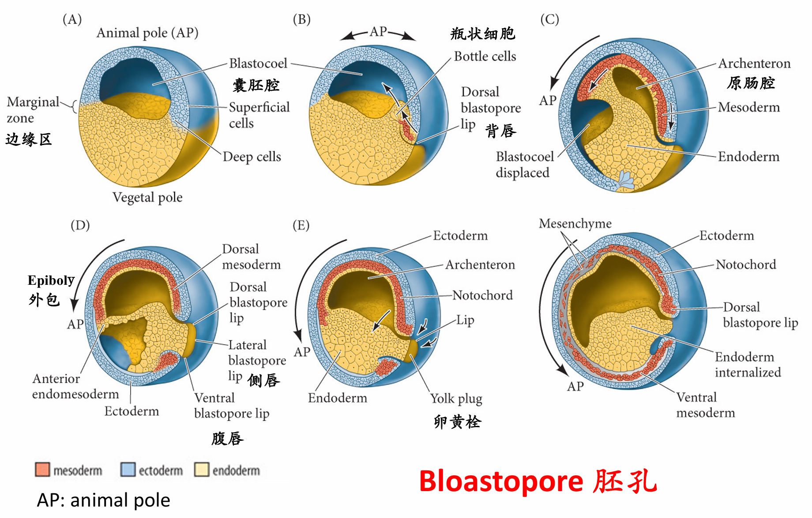
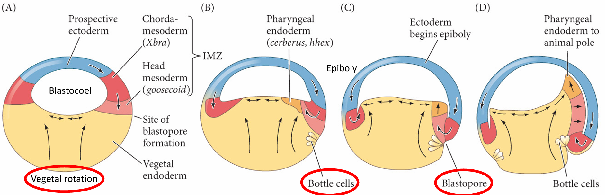
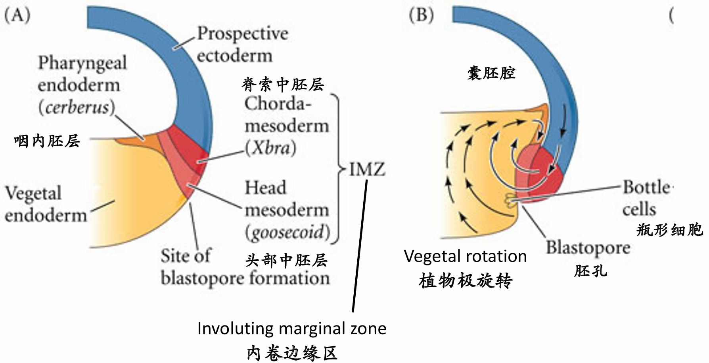
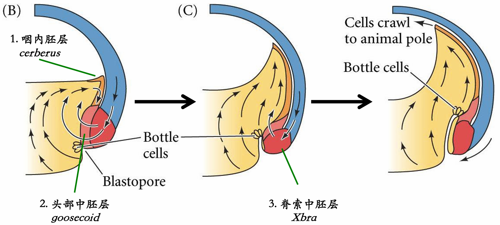
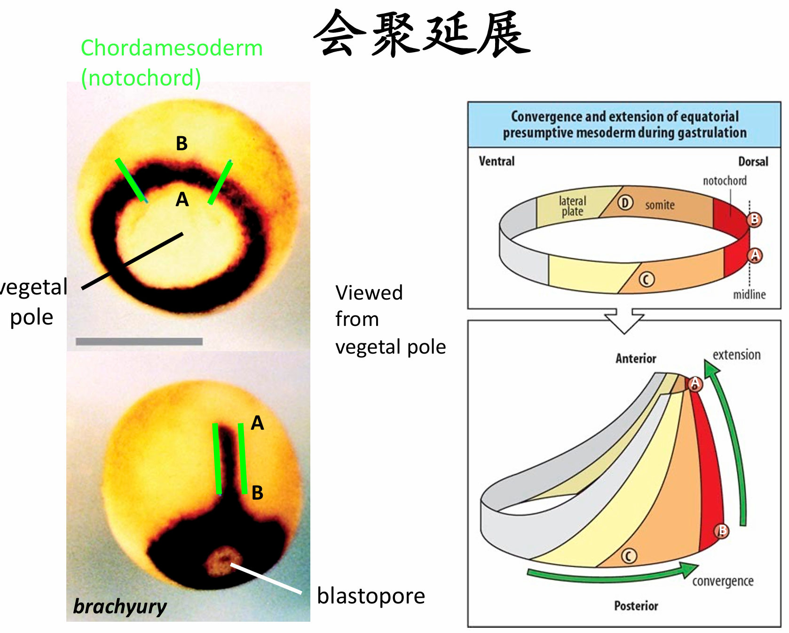
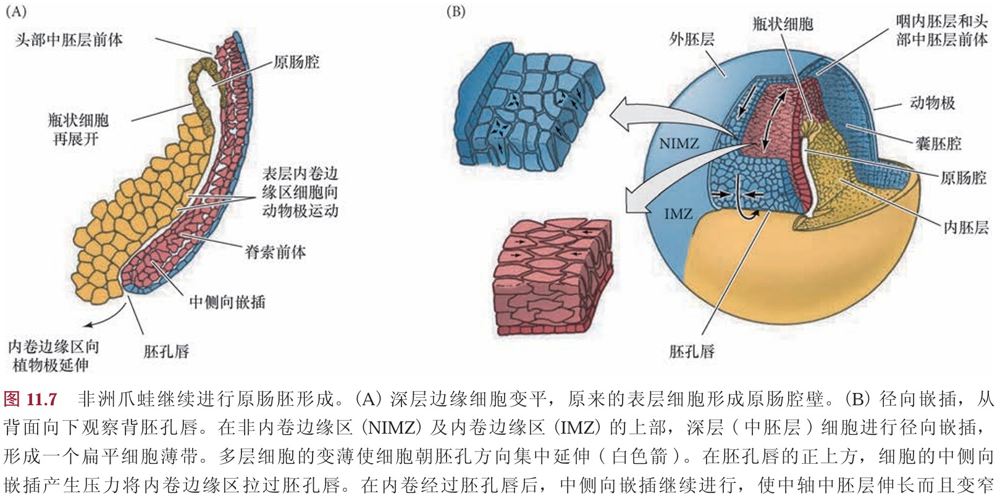
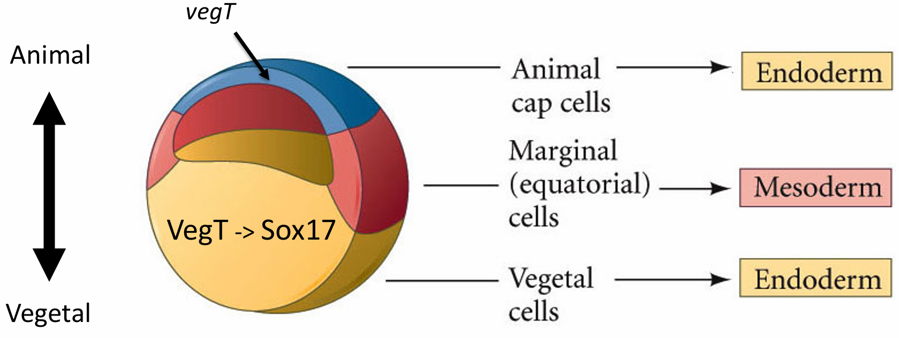
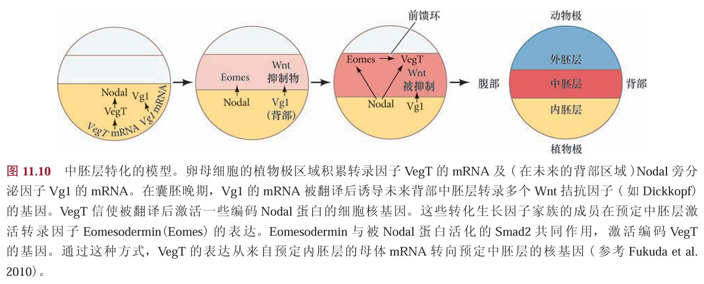
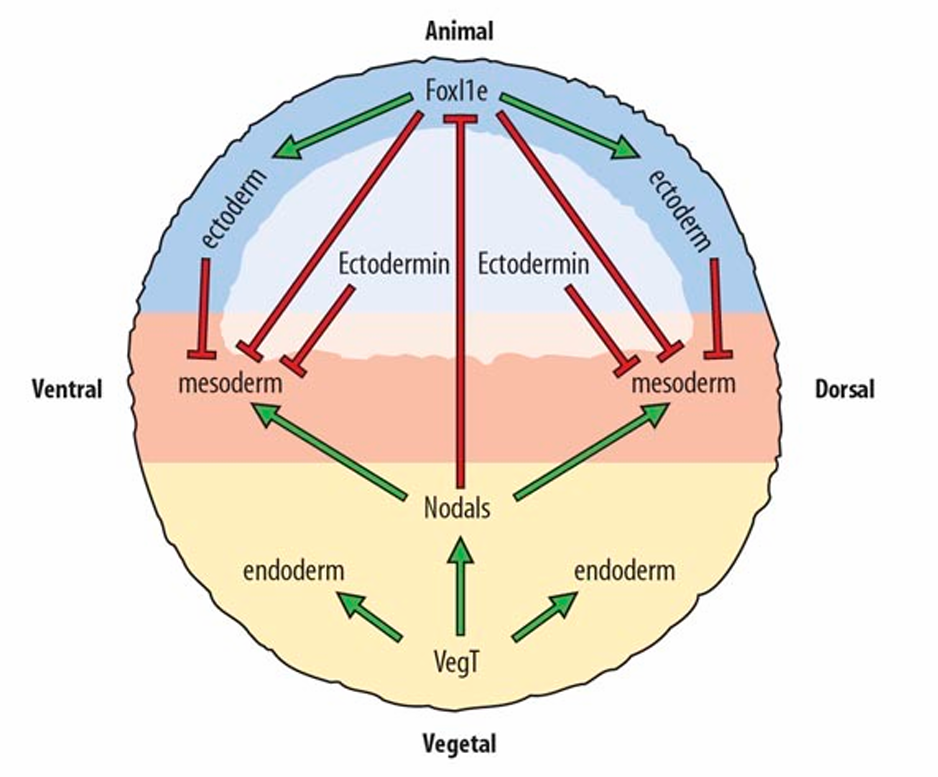
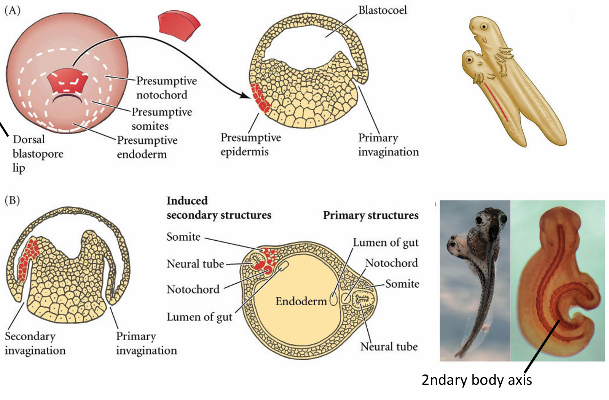

# 两栖动物

- [两栖动物作为模式生物](#%E4%B8%A4%E6%A0%96%E5%8A%A8%E7%89%A9%E4%BD%9C%E4%B8%BA%E6%A8%A1%E5%BC%8F%E7%94%9F%E7%89%A9)
- [一、受精、皮质旋转、卵裂](#%E4%B8%80%E3%80%81%E5%8F%97%E7%B2%BE%E3%80%81%E7%9A%AE%E8%B4%A8%E6%97%8B%E8%BD%AC%E3%80%81%E5%8D%B5%E8%A3%82)
	- [不均等辐射完全卵裂](#%E4%B8%8D%E5%9D%87%E7%AD%89%E8%BE%90%E5%B0%84%E5%AE%8C%E5%85%A8%E5%8D%B5%E8%A3%82)
- [二、中囊胚过渡](#%E4%BA%8C%E3%80%81%E4%B8%AD%E5%9B%8A%E8%83%9A%E8%BF%87%E6%B8%A1)
- [三、原肠胚的形成](#%E4%B8%89%E3%80%81%E5%8E%9F%E8%82%A0%E8%83%9A%E7%9A%84%E5%BD%A2%E6%88%90)
	- [植物极细胞旋转](#%E6%A4%8D%E7%89%A9%E6%9E%81%E7%BB%86%E8%83%9E%E6%97%8B%E8%BD%AC)
	- [瓶状细胞的内陷](#%E7%93%B6%E7%8A%B6%E7%BB%86%E8%83%9E%E7%9A%84%E5%86%85%E9%99%B7)
	- [胚孔背唇形成](#%E8%83%9A%E5%AD%94%E8%83%8C%E5%94%87%E5%BD%A2%E6%88%90)
	- [会聚延展](#%E4%BC%9A%E8%81%9A%E5%BB%B6%E5%B1%95)
	- [外胚层的外包](#%E5%A4%96%E8%83%9A%E5%B1%82%E7%9A%84%E5%A4%96%E5%8C%85)
- [四、胚层的特化](#%E5%9B%9B%E3%80%81%E8%83%9A%E5%B1%82%E7%9A%84%E7%89%B9%E5%8C%96)
	- [内胚层的特化](#%E5%86%85%E8%83%9A%E5%B1%82%E7%9A%84%E7%89%B9%E5%8C%96)
	- [中胚层的诱导](#%E4%B8%AD%E8%83%9A%E5%B1%82%E7%9A%84%E8%AF%B1%E5%AF%BC)
	- [外胚层的特化](#%E5%A4%96%E8%83%9A%E5%B1%82%E7%9A%84%E7%89%B9%E5%8C%96)
- [五、体轴的确立](#%E4%BA%94%E3%80%81%E4%BD%93%E8%BD%B4%E7%9A%84%E7%A1%AE%E7%AB%8B)
	- [组织者的确立和功能](#%E7%BB%84%E7%BB%87%E8%80%85%E7%9A%84%E7%A1%AE%E7%AB%8B%E5%92%8C%E5%8A%9F%E8%83%BD)
	- [神经外胚层的诱导](#%E7%A5%9E%E7%BB%8F%E5%A4%96%E8%83%9A%E5%B1%82%E7%9A%84%E8%AF%B1%E5%AF%BC)
	- [背腹轴的建立](#%E8%83%8C%E8%85%B9%E8%BD%B4%E7%9A%84%E5%BB%BA%E7%AB%8B)
	- [左右轴的建立](#%E5%B7%A6%E5%8F%B3%E8%BD%B4%E7%9A%84%E5%BB%BA%E7%AB%8B)

## 两栖动物作为模式生物

## 一、受精、皮质旋转、卵裂

大多数蛙进行体外受精，当雌蛙产卵时，雄蛙为卵受精。即使在受精前，蛙卵已经具有极性，因为 密度高的卵黄处在植物极(底部)，而卵的动物极部分(上半部)基本不含卵黄。如我们将要看到的那样， 一些蛋白质和mRNA在未受精的卵中已呈现出特定的区域性分布。 

两栖类卵的**受精可以发生在动物半球的任何位置**。精子入卵的位点对决定背-腹极性有重要的作用。 精子的入卵点标志胚胎的腹侧，而相对于精子入卵点180°的位置标志胚胎的背部。精子的中心粒随精子 细胞核进入卵，在植物极细胞质中将卵的微管组织成平行的轨道，并将外侧的皮质细胞质与内部富含卵 黄的细胞质分开(图11.2A，B)。这些微管轨道使皮质细胞质相对于内部细胞质旋转。的确，在紧接旋转 开始之前就可以最先观察到这些平行排列的微管，但它们在旋转结束时消失(Elinson and Rowning 1988； Houliston and Elinson 1991)。 在合子中，皮质细胞质相对于内部细胞质大约旋转30°的角度(图11.2C)。在有些情况下，这显示 出一个灰色的内部细胞质区域，正好与精子的入卵点相对(图11.2D；Roux 1887；Ancel and Vintenberger 1948)。这一区域，称为==**灰色新月(gray crescent)**==，是==**原肠胚形成的起始位置**==。即便在没有灰色新月的 非洲爪蛙卵中，也发生皮质旋转，而且可以观察到细胞质的运动(Manes and Elinson 1980；Vincent et al. 1986)。**原肠胚形成起始于精子入卵点的相对位置，这一区域将成为胚胎的背部**。在受精时，精子的中心 粒所组织的微管排列为启动这些运动发挥了很大的作用。因此，幼体背-腹轴的形成可以追溯至精子入卵 的位点
### 不均等辐射完全卵裂

大多数蛙和蝾螈的胚胎是==**辐射对称的完全卵裂**== ，像棘皮动物的卵裂一样。然而，两栖类的卵比棘皮 动物的卵要大得多，并且含有更多的卵黄。这些卵黄在植物半球富集，对卵裂是一个阻碍。因此，第一 次卵裂从动物极开始，并逐渐向植物极区域延伸(图11.3A)。在那些具有灰色新月的物种中(尤其是蝾螈和Rana属的蛙类)，第一次卵裂通常将灰色新月均分成两部分(见图11.2D)。 

在**第一次卵裂沟还在分割植物半球富含卵黄的细胞质**时，第二次卵裂就已经**从动物极开始**。这一次 的卵裂面与第一次卵裂面垂直，而且也是经向分裂。第三次卵裂是赤道分裂。然而，由于植物极富含卵黄， **第三次卵裂沟并不是在赤道，而是偏向动物极**，将两栖类胚胎分成四个小的动物极卵 裂球(小分裂球)和四个大的植物极卵裂球(大分裂球)。尽管它们**大小不等**，但卵裂球继续以**相等的速 度分裂**，直到第12个分裂周期(植物极分裂稍有延迟)。当卵裂继续进行时，动物极区域堆积了大量的 小细胞，而植物极具有数量较少、充满卵黄的大分裂球。一个具有16～64个细胞的两栖类胚胎常被称 为桑椹胚。在128 细胞期，囊胚腔已经很明显，这时的胚胎变成一个囊胚(图11.3B)。 

有大量的细胞黏附分子将分裂中的卵裂球维持在一起。一个最重要的分子是**表皮钙黏着蛋白(EP cadherin)**。编码这一蛋白质的mRNA来源于卵母细胞的细胞质。如果用反义寡核苷酸破坏这个mRNA， 使它不能合成表皮钙黏着蛋白，卵裂球之间的黏附便急剧下降，导致囊胚腔消失b)。膜黏附可能有进一步的作用；细胞分裂的协调有可能受膜收缩波的介导。 

尽管两栖类的发育在物种之间有区别，但一般是动物半球的细胞形成外胚层、植物极的细胞形成内胚层，而位于囊胚腔之下的细胞变成中胚层(图11.3C)。与精子入 卵点相对的细胞将变成神经外胚层、脊索中胚层和咽(头)内胚层。

两栖类的囊胚腔具有两个主要功能。第一，它**能够改变形状**，使原肠胚形成过程中细胞能够进行迁移； 第二，它**阻止其下部的细胞过早地与上部的细胞发生相互作用**。当Nieuwkoop(1973)从蝾螈胚胎动物半 球的囊胚腔顶部一个常被称为动物帽(animal cap)的区域取出一些细胞，然后将它们与来自囊胚腔底部 富含卵黄的植物极细胞放在一起时，动物帽细胞分化成中胚层组织而不是外胚层。因此，==**囊胚腔阻止植物极细胞与动物极细胞提前接触，使动物帽细胞维持未分化的状态**==。

==**囊胚腔的作用**==
- 形成一道屏障，防止其下方的细胞与上方的细胞过早发生相互作用
- 使细胞在胚胎形成过程中迁移
	- 将注定成为内胚层器官的细胞带入胚胎内部
	- 用能形成外胚层的细胞包围胚胎
	- 将中胚层细胞置于外胚层和内胚层之间的适当位置

## 二、中囊胚过渡

原肠胚形成的一个重要前提条件是合子基因组的激活。在非洲 爪蛙中，似乎只有少数几个基因在早期卵裂过程中被转录。对于大部分核基因来说，直到**第12个细胞 周期的后期才被激活。在这一时间点，胚胎进行中囊胚期转换(mid-blastula transition，MBT)**，因为不同的基因开始在不同的细胞中转录，细胞周期出现了间期，卵裂球也获得了运动能力。据认为，卵中的一些因子可能被新产生的染色质所吸收，因为(像在 果蝇中一样)这一转换的时间能通过变换细胞中染色质和细胞质的比例而被实验性地改变。

启动中囊胚期转换的一些事件涉及染色质修饰。首先，有些启动子会被脱甲基化，使这些基因得以 转录。在囊胚晚期，一些在中囊胚期转换时被激活的基因的启动子上出现甲基化的丢失。而在中囊胚期 转换时不被激活的那些基因的启动子上则没有这种脱甲基化的现象，在中囊胚期转换时被激活的基因的 编码区也没有这一现象。在中囊胚期转换时，位于许多基因的5′端的组蛋白H3上第4位赖氨酸(产生 一个与活跃转录相关的三甲基化赖氨酸)发生甲基化。因此，一些启动子及其联结的核小体的修饰在中 囊胚期转换时对调节基因表达的时间似乎起关键作用。

据认为，一旦启动子区域的染色质被重塑，各种转录因子(如VegT蛋白，由定位的母体mRNA在 植物极细胞质产生)结合一些启动子并起始新的转录。例如，植物极细胞(在VegT蛋白的引导下)变成 内胚层细胞，并开始分泌一些能诱导其上部细胞变成中胚层的因子(见图11.10)。

==**中期囊胚转换发生的变化**==
- 前 12 个周期由母体因素控制。12 次分裂后间隙期增加，同步性丧失（不同细胞具有不同的 MPF）
- 子代 mRNA 在母细胞中期转变（MBT）时转录，由染色质重塑触发
	- 子代基因启动子去甲基化（即去抑制）；允许母体沉积的 TFs（VegT）在植物细胞质中启动子代转录
	- 胚胎发育控制
- 如果没有子代转录，细胞周期正常进行，但不启动胃形成
## 三、原肠胚的形成
==**无脊椎动物囊胚面对的任务**==
- 内胚层区域进入胚胎内部
- 外胚层区域包裹胚胎
- 中胚层区域迁移到合适的位置

### 瓶状细胞的内陷
==**植物极旋转使得边缘区细胞抵达胚赤道，开始原肠胚起始**==
完成这些任务的**原肠胚形成细胞运动**起始于胚胎的未来背部，正好位于**赤道下部的灰色新月区**(也就是精子入卵点的相对区域)。在此处细胞开始内陷，形成缝隙状的胚孔。这些瓶状细胞(bottle cell)急剧改变形状。每个细胞的主体部分向胚胎内部移动，同时通过一个细长的颈部与外表面保持接触。与海胆中的情况一样，瓶状细胞将起始原肠腔(原始消化道)的形成1。 然而，与海胆不同，**蛙的原肠胚形成不是从最植物极的区域开始，而是起始于边缘区(marginal zone)**。 这一区域环围囊胚的赤道，是动物半球和植物半球的交界处(图11.4A，B)。这个位置的内胚层细胞不像 最植物极的细胞那样大和富含卵黄。

### 植物极细胞旋转
细胞内卷不是一个被动的事件。在瓶状细胞形成前至少2 h，内部细胞的重排将**囊胚腔背部底板的细胞向动物帽推动**。这一**植物极旋转(vegetal rotation)使预定咽内胚层细胞靠近囊胚腔**，紧位于内卷中胚层的上方(见图11.5D)。而后，这些细胞沿囊胚腔顶的基部表面迁移，向胚胎的未来前部运动 ( 图11.4C ～E)。边缘细胞的表层被拉向内部，形成原肠腔的内胚层衬里，这只是因为这层细胞与活跃迁移的深层 细胞相连接。尽管通过实验的方法将瓶状细胞去除后不影响深层或者表层边缘细胞向胚胎内卷，但**去除深层的内卷边缘区(involuting marginal zone，IMZ) 细胞则会终止原肠腔的形成**。 
### 胚孔背唇形成
胚孔唇位置的内卷瓶状细胞使内卷边缘区与囊胚腔壁接触之后，**内卷边缘区细胞内卷进入胚胎**。 当迁移的边缘细胞到达胚孔唇时，它们转向内部，并沿着动物半球细胞(也就是囊胚腔顶部)的内部表 面运动(图11.4D～F)。细胞向胚胎内运动的顺序受植物极旋转所决定，而**植物极旋转使预定咽内胚层 紧靠动物帽组织的内部**。同时，动物极细胞进行外包运动，产生一个细胞流， 在背部胚孔处汇聚并变成背胚孔唇(dorsal blastopore lip)。**背部胚孔处汇聚并变成背胚孔唇(dorsal blastopore lip)**

（1）组成背胚孔唇并最早进入胚胎的细胞是预定前肠的==**咽内胚层细胞**==(图11.5)。这些细胞在囊胚腔的表面外胚层之下向前部迁移。这些前部内胚层细胞转录hhex基因，这个基因编码一个对头部和心脏形成至关重要的转录因子。

（2）当这些最早内卷的细胞进入胚胎后，背胚孔唇就开始由内卷进入胚胎变成索前板(prechordal plate)的细胞组成。索前板是==**头部中胚层**==的前体，这些细胞表达**goosecoid 基因**，其产物是一个转录因子，激活调控头部形成的许多基因。它通过**抑制那些抑制头部形成的基因 ( 如Wnt8)**，间接地激活这些基因。这一现象，即通过抑制阻遏物的方式激活基因，是动物发育的一个主 要特征，就像我们在双负阀特化海胆小分裂球时看到的那样。
（goosecoid抑制wnt，wnt抑制头部形成=goosecoid激活头部形成）

（3）接下来经过背胚孔唇进行内卷的细胞是==**脊索中胚层**==(chordamesoderm)。这些细胞将形成脊索 (notochord)——一个临时性的中胚层棒状结构，在神经系统的诱导和图式形成中具有重要作用。脊索中胚层表达**Xbra(brachyury) 基因**，其产物(如前一章所述)是一个脊索形成的关键转录因子。因此，随着最初 的细胞迁移进入胚胎并被一些向下、向内和向上迁移的细胞所替代，组成背胚孔唇的细胞一直在发生变化。 

（4）随着新的细胞进入胚胎，囊胚腔被移动到背唇的相对一侧。同时，随着围绕胚孔的瓶状细胞的不断 形成和内卷的进行，胚孔唇向两侧及腹侧扩展。不断变宽的胚孔“新月”形成侧唇并最终形成一个==**腹唇**==， 这是其他中胚层和内胚层前体细胞迁移经过的位置(图11.6)。这些细胞包括心脏和肾的前体。**随着腹唇的形成，胚孔围绕内胚层细胞形成一个环**，围绕着仍然暴露在植物极表面的大体积内胚层细胞。

（5）剩余的内胚层块称为==**卵黄栓(yolk plug)**==，它最终也将被内部化(在肛门的位置)。这时，所有内胚层的前体都 已经被带到胚胎内部，外胚层已经包裹胚胎表面，而中胚层被带到它们中间。最先进入胚孔的细胞位于最前部。

### 会聚延展
内卷边缘区最初有几层细胞的厚度。在它们经过胚孔唇进行内卷之前不久，这几层深层的**内卷边缘区细胞进行径向嵌插以形成一个薄而宽的细胞层**。这种嵌插进而使内卷边缘区向植物极延伸(图11.7A)。同时，通过分裂和变平，表层细胞伸展铺开。当深层细胞到达胚孔时，它们向胚胎内卷并起始第二种类型的嵌插。这种嵌插导致**中侧轴方向的集中延伸**，将几 组中胚层流整合在一起而形成一个狭长的条带(图11.7B)。这个条带的前部向动物帽迁移。因此，中**胚层流继续向动物极迁移，而其上的表面细胞(包括瓶状细胞)被动地向动物极运动，由此形成了原肠 腔的内胚层顶板**(见图11.4和图11.7)。深层细胞的径向和中侧向嵌插似乎参与中胚层向胚胎内的继续 运动

集中延伸运动驱动力
- （1）第一种是**极化的细胞黏聚力**，内卷的中胚层细胞形成突出，彼此接触。这些“伸手”不是随机的，而是朝向胚胎的中线，并且需要细胞外纤连蛋白基质。这些相互嵌插，包括径向和中侧向，被Wnt信号启动的平面细胞极性 (PCP) 信号途径所稳定。
- （2）第二种是 **差异性的细胞黏聚力**。在原肠胚形成过程中，编码轴旁原钙黏着蛋白(paraxial protocadherin)和中轴原钙黏着蛋白(axial protocadherin) 的基因开始分别特异地表达在轴旁中胚层和脊索中胚层。中轴原钙黏着蛋白的一个显性失活形式阻止未来脊索细胞从轴旁中胚层中分选出来， 并抑制体轴的正常形成。而轴旁原钙黏着蛋白的显性失活形式(被分泌而不是与细胞膜绑定)阻止集中延伸运动。此外，轴旁原钙黏着蛋白的表达区域呈现躯干中胚层细 胞的特征，这些细胞进行集中延伸运动，使它们有别于不进行集中延伸运动的头部中胚层细胞。
- （3）第三种调控因素是**钙离子流**。Wallingford及其同事(2001)发现，钙离子(Ca2+)在进行集中延伸 运动的背部组织中急剧波动，引起组织内的波动性收缩。钙离子从细胞内的储存中被释放出来，对集中延伸运动是必需的。如果阻止钙离子释放，正常的细胞特化依然发生，但背部中胚层既不集中也不延伸。 
这些发现支持集中延伸的一个模式，其中一些调节蛋白引起组织外表面变化并产生抑制或促进细胞迁移 的机械牵引力。 

这些经过背胚孔唇进入胚胎的中胚层细胞形成中央背部中胚层(脊索和体节)，躯体中胚层的其余部 分(将形成心脏、肾、骨及部分其他器官)经过胚孔的腹唇和侧唇进入胚胎后形成**中胚层套**(mesodermal mantle)。

内胚层源自形成原肠腔顶部衬里的内卷边缘区的表层细胞，以及形成原肠腔底板的胚孔下部植物极细胞(Keller 1986)。胚孔的剩余部分，即内胚层和外胚层的接触处，变成肛门。

原肠胚形成的研究专家Ray Keller 有一句名言，“原肠胚形成是一个脊椎动物使它的头离开它的肛门的时候”。
### 外胚层的外包
在原肠胚形成过程中，动物帽和非内卷边缘区(NIMZ)细胞通过外包而扩展，包裹整个胚胎(见图 11.7B)。这些细胞将形成表面外胚层。在非洲爪蛙的原肠胚形成过程中，外包的一个重要机制似乎是细胞 数量的增加(通过分裂)，以及同时发生的几个深层细胞层被整合成一层(图11.8)。非洲爪蛙进行外包的第二个机制是在囊胚腔顶 将纤连蛋白组装成纤丝。这一纤丝状的纤连蛋白对动物帽细胞向植物极迁移和包裹胚胎有关键的作用 (Rozario et al. 2009)。在非洲爪蛙和许多其他两栖类中，内卷中胚层前体细胞好像在囊胚腔顶部预定外胚 层细胞分泌的纤连蛋白所组成的一个细胞外网格上向动物极迁移(图11.9A，B)。 纤连蛋白对内卷中胚层的重要性被一些利用化学合成的多肽片段与纤连蛋白在胚胎中竞争结合位 点的实验所验证(Boucaut et al. 1984)。如果纤连蛋白对细胞迁移是必需的，那么细胞与这些多肽片段 结合后就不能再与纤连蛋白结合，因此它们就会停止迁移。如果无法找到它们的“道路”，这些预定中 胚层细胞应该停止内卷。实际情况也恰好如此，中胚层前体停留在胚胎外部，形成一个卷绕的细胞团 ( 图11.9C，D)。因此，含有纤连蛋白的细胞外基质既提供了黏着的基质，也提供了细胞迁移方向的线索。

## 四、胚层的特化

**两栖类未受精的卵沿动-植物极轴呈现出极性，甚至在受精前就可以将胚 层映射到卵母细胞**。动物半球的卵裂球将变成外胚层(皮肤和神经)的细胞；植物半球的细胞变成肠及相关器官(内胚层)的细胞；而赤道区的细胞形成中胚层(骨骼、肌肉、心脏)。==**这个大致的命运图谱被认为是植物极细胞施加于胚胎的**==。**植物极细胞具有两个主要功能：(1)分化成内胚层；(2)将紧邻其上部的细胞诱导成中胚层。** 

### 内胚层的特化

1. Differentiation into endoderm • Maternal VegT activates Sox17 prior to mid-blastula transition, which is important for endodermal specification • Injecting vegT mRNA into animal cap cells à endodermal-specific genes • Injecting VegT antisense RNA into vegetal cells àLow dose: loss of endoderm àHigh does: ectoderm throughou

蛙胚胎的这种“自下而上”的特化机制与定位在植物极皮质的一组mRNA有关，其中包括在卵裂期间被分配在植物极细胞的**转录因子VegT的mRNA**。VegT对内胚层和中胚层谱系的形成至关重要。 如果VegT的转录物被反义寡核苷酸破坏，整个胚胎都变成表皮，没有中胚层和内胚层成分。VegT 的 mRNA 在受精后不久便被翻译。它的产物在中囊胚期转换之前激活一组基因。其中一个基因编码**转录因子Sox17**，而Sox17又激活一些特化内胚层的基因。因此，植物极细胞的命运是成为内胚层。 
### 中胚层的诱导

另一组被VegT激活的早期基因编码一些**Nodal旁分泌因子**，它们指令**上部的细胞层变成中胚层** 。植物极内胚层细胞分泌的Nodal 向上部的细胞发送信号，使它们积累磷酸化的 Smad2。在这些细胞中，磷酸化的Smad2激活eomesodermin和Brachyury(Xbra)基因，将细胞特化为中胚层。 Eomesodermin 和 Smad2 的共同作用又能激活VegT的合子基因，因此形成一个前馈环，对维持中胚层有 关键的作用(图11.10)。在没有这种诱导的情况下，细胞变成外胚层。 

另外，存储在植物极细胞质的**Vg1的mRNA**也被翻译。它的产物(另一个与Nodal相似的蛋白质)参与激活背部中胚层的其他基因。如果抑制Nodal信号途径或阻断Vg1信号途径，胚胎就不能或者基本不能形成中胚层。

因此，到了囊胚晚期， 重要的三个胚层就都已经被特化。
- 植物极细胞被一些转录因子(如Sox17)特化成内胚层
- 赤道区的细胞被另一些转录因子(如Eomesodermin)特化成中胚层
- 尚未接收信号的动物帽则被特化成外胚层
### 外胚层的特化

- 动物极的母体外胚层蛋白（E3 连接酶）通过抵消中胚层诱导蛋白，向 Smad 蛋白添加 Ub（中胚层诱导 Nodal 信号），指定（启动）外胚层 
- 子代 Fox11e 保持外胚层特征
- 内胚层 ——>中胚层 ——> 神经外胚层
## 五、体轴的确立
### 背唇移植实验

![[images/image-20250520195939.png]]

### 组织者的确立和功能

#### 组织者的确立
组织者由两个信号指定，这两个信号汇聚在精子进入点的两侧
精子进入点的两侧
 - b-catenin 是背侧信号
 - 植物节点相关蛋白（Xnr）（TGF-b）是背侧信号
中胚层诱导信号

#### 组织者的功能
背唇组织器的功能：
 - 自我分化：
	 - 自我分化为背中胚层（头部中胚层和脊髓中胚层）
 - 感应信号：
	 - 使周围的中胚层背侧化为轴旁中胚层
	 - 背化覆盖的外胚层并诱导神经管形成（外胚层起源）
 - 形态发生：
	- 启动胃形成运动
	 - 有序内卷和收敛伸展，建立神经管D-V轴和A-P轴

### 神经外胚层的诱导
### 背腹轴的建立

### 左右轴的建立

# 鱼类动物