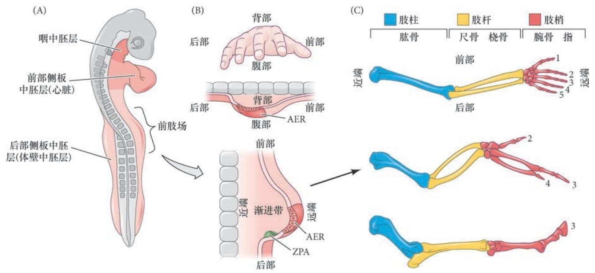
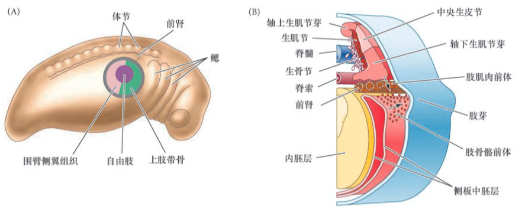
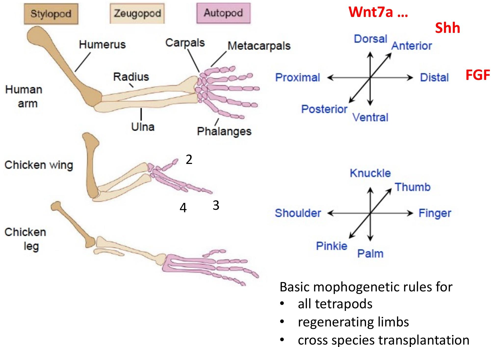
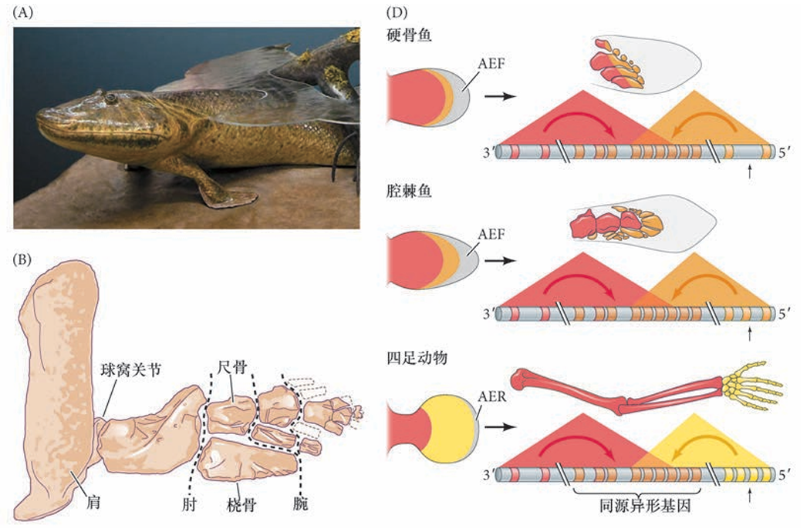
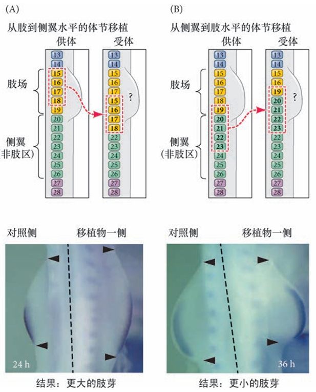
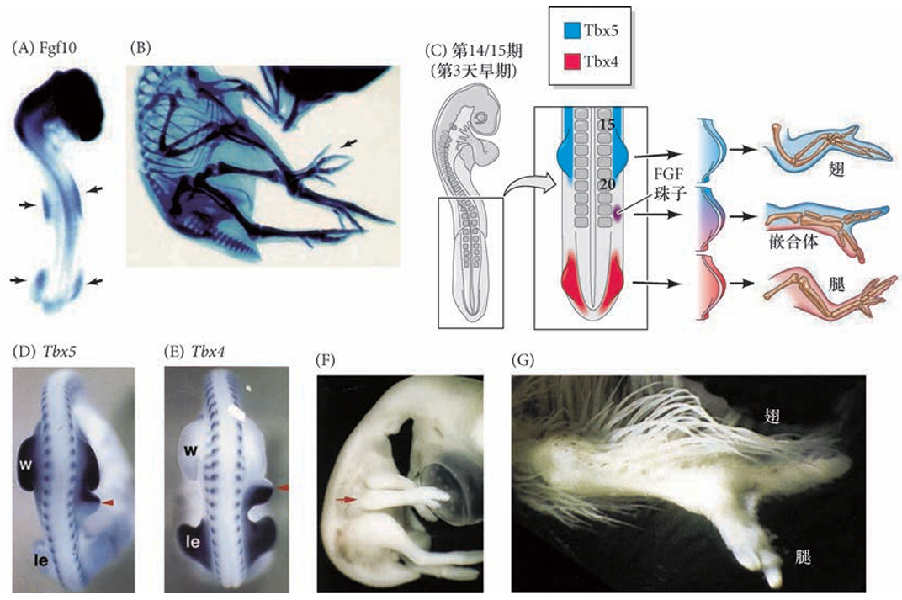
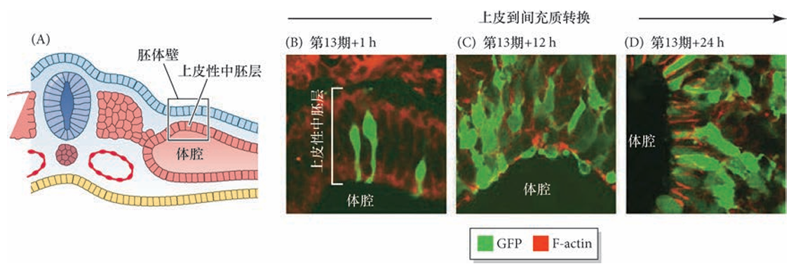
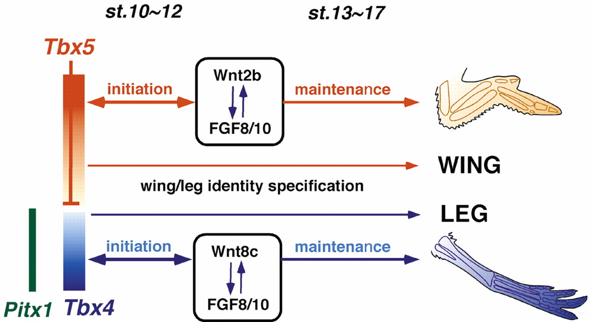

## 脊椎动物的早期发育
## 器官发生

## 四肢发育
### 肢场（Limb field）的发现

### 肢芽（Limb bud）
### 肢芽位置的确定
### 远近轴的确立
### 前后轴的确立

## 一、肢的解剖结构与发育基础

### 1.1 肢的解剖结构

四足动物（两栖类、爬行类、鸟类、哺乳类）的肢在解剖结构上具有高度保守的**三维模块化图式**，由近端到远端依次分为三个主要区域，每个区域对应特定的骨骼结构：
1.**肢柱（Stylopod）**
- **位置**：紧邻体壁的近端区域。
- **骨骼**：前肢为肱骨，后肢为股骨。
- **词源**：希腊语 “stylos” 意为 “柱子”，指其支撑作用。
 2.**肢杆（Zeugopod）**
- **位置**：中部区域。
- **骨骼**：前肢为桡骨（外侧）和尺骨（内侧），后肢为胫骨（内侧）和腓骨（外侧）。
- **词源**：希腊语 “zeugos” 意为 “连接”，因连接近端肢柱与远端肢梢得名。
3.**肢梢（Autopod）**
- **位置**：远端区域。
- **骨骼**：腕骨（前肢）/ 跗骨（后肢）、指骨 / 趾骨（统称 “指 / 趾”）。
- **词源**：希腊语 “autos”（自身）+“podos”（足），指末端独立的足部结构。

肢的发育和结构由**三个正交轴**决定，形成精确的空间定位系统
- **近 - 远轴**：从体壁到肢末端（如肩→手指、臀→足趾）;骨骼通过软骨内成骨形成，早期形成肢柱（软骨→骨），晚期形成肢梢（指 / 趾）。**FGF（外胚层顶嵴）与视黄酸（侧翼组织）的拮抗**；
- **前 - 后轴**：从拇指（大足趾）到小指（小趾），后端为小指 / 小趾，前端为拇指 / 大足趾。**极性活性区（ZPA）的 Sonic hedgehog（Shh）信号**。
- **背 - 腹轴**：从指关节（背面）到手掌 / 足垫（腹面）。背侧外胚层的 Wnt7a 与腹侧的骨形态发生蛋白（BMP）信号。

### 1.2 肢芽和肢场

肢发育的首个可见迹象是在**预定前肢和后肢的位置形成两侧隆起**( 图19.2A),称为**肢芽(limb bud)**｡Ross Granville Harrison 实验室对蝾螈命运图谱的先驱研究表明,侧板中 胚层体壁区域的这一圆盘中央的细胞通常形成肢本体｡相邻的细胞将形成围臂( 肢周围) 的侧翼组织和 上肢带骨｡但是,如果把所有这些细胞从胚胎中去除,肢仍然能从环围这个区域但在正常情况下不形成 肢的另外一个细胞环中形成( 虽然会晚一些)｡如果将这个周围的细胞环一同去除,肢将不能发育｡这个大的区域,代表**这个区域内能够自身形成一个肢的所有细胞**,称为**肢场(limb field)**｡

组成肢芽的细胞来自后部侧板中胚层､邻近的体节及肢芽的上部外胚层｡侧板中胚层的间充质细胞 迁移进肢场,形成肢的骨骼前体细胞,而位于相同水平的体节间充质细胞迁移到肢场,形成肢的肌肉前体细胞｡这个逐渐积累的异质性间充质细胞群体在外胚层组织的下方增殖,建立肢芽｡

早期的肢芽具有自身的组织化，使得生长的主要方向沿近-远轴(体节到外胚层)进行， 而沿背-腹轴和前-后轴方向只有较少的生长(见图19.1B)。肢芽被进一步区域化，形成三个不同功能的 区域。 
1. 促进肢芽生长的高度增殖性间充质被称为**渐进带(progress zone，PZ)**间充质(也被称为未分 化区)。 
2. 渐进带最后部区域的细胞组成**极性活性区(zone of polarizing activity，ZPA)**，因它沿前-后轴方 向图式化细胞命运。 
3. **外胚层顶嵴(apical ectodermal ridge，AER)** 是位于发育的肢芽顶端的外胚层增厚(图19.2D)

## 二、基因对肢发育的调控

### 四肢的发育图示

### 2.1 同源异形基因对肢骨骼特征的特化

同源异形框转录因子,或同源异形基因,对特化一个特定的间充质细胞是否变成肢柱､肢杆或肢梢 有关键作用｡

#### 2.1.1 近端到远端:肢中的同源异形基因

==**同源异形基因参与特化一个肢区域的特征**==
Hoxa 和Hoxd 基因复合体的5′ 端(AbdB 样) 部分(9 ~13 旁系同源基因) 似乎在小鼠肢芽中有活性｡ 基于这些基因的表达图式,以及自然发生和基因敲除的突变,Mario Capecchi 实验室(Davis et al. 1995) 提出了一个模型,认为这些同源异形基因特化一个肢区域的特征( 图19.3A,B)｡**Hox9 和Hox10 旁系同源基因特化肢柱**､**Hox11 旁系同源基因特化肢杆**､**Hox12 和Hox13 旁系同源基因特化肢梢**｡这种情况 已经被很多实验所证实｡

![[images/image-20250422195121.png]]

>图19.3 旁系同源异形基因的缺失导致肢骨骼成分的缺失｡(A)5′ 端同源异形基因对前肢的图式化｡Hox9 和Hox10 旁系 同源基因特化肱骨( 肢柱)｡Hox10 旁系同源基因在桡骨和尺骨( 肢杆) 的表达水平较低｡Hox11 旁系同源基因主要参与 肢杆的图式化｡Hox12 和Hox13 旁系同源基因在肢梢中起作用,其中Hox12 旁系同源基因主要在腕中发挥功能,在指中的 作用较小｡(B) 类似但略有不同的图式也见于后肢｡(C) 野生型小鼠( 左) 和缺失Hoxa11 及Hoxd11 基因的双突变体小鼠 ( 右) 的前肢｡突变体小鼠的尺骨和桡骨严重变小或者缺失｡(D) 人的多指并指综合征是HOXD13 基 因座的纯合突变所导致｡
#### 2.1.2 从鳍到手指:同源异形基因与肢的进化

**==鱼鳍与四足动物的四肢的形成都涉及同源异形基因调控==**
泥盆纪化石提塔利克鱼Tiktaalik roseae( 一个“具有指的鱼”) 的发现揭示了关节发育在肢进化中的重要性｡鱼鳍, 包括一些最原始物种的鱼鳍,与四足动物形成它们的肢时一样,使用相同的三个同源异形基因表达阶段来调控其发育｡关节有可能使得鳍骨独立演化成肢骨｡提塔利克鱼胸鳍的关节与两栖类的关节十分相似,这表明提塔利克鱼具有可动的腕,以及一个使肘和肩能够弯曲的基质支撑姿势｡另外,腕样结构的存在和这些区域中 真皮鳞的丢失说明这种泥盆纪的鱼能在潮湿的基质上自行驱动｡所以,提塔利克鱼被认为是鱼类和两栖 类之间的一个过渡,是一种“可以做俯卧撑”的“鱼足动物”

**==鱼鳍和四肢的近端发育相近、远端发育相异==**
沿不同分支发生了什么类型的分子和形态学变化使得一方面产生了条鳍鱼,而另一方面产生了陆生四足动物?在那些最接近四足动物的鱼类( 肉鳍鱼类,如腔棘鱼和肺鱼),**胸鳍的更近端骨与四足动物前肢的肢柱段是同源的,同样用于肩带或肩的衔接**｡但是,条鳍鱼的鳍在形态上发生了偏离,这在更远端的元件中最为明显,特别是肢梢( 指)｡条鳍鱼没有与肢梢联结的内骨骼,而肉鳍进化枝( 肉鳍鱼) 的祖先鱼在它们的鳍中有扩张的软骨内骨骼( 与提塔利克鱼一样)｡因此,**针对控制更远端肢骨骼的发育机制的适应是肢进化的主要基础**｡

==**鱼的鳍芽与肢芽是同源的，远端结构的发育调控决定不同**==
**鱼的鳍芽与肢芽是同源的**,同样**具有渐进带间充质和上方的外胚层顶嵴**｡但是,在肢柱的近端图式化之后,**鳍芽的外胚层顶嵴变成外胚层顶褶(apical ectodermal fold,AEF),促进鳍条的发育而不是指的发育**( 图19.4D)｡有一种假设认为,外胚层顶嵴到外胚层顶褶过渡的潜在发育延迟将会使组织更长时间地接触外胚层顶嵴的远端信号,使得渐进带间充质更容易变成肢梢的命运( 指)｡

此外,**远端同源异形基因时空图式的变化可能参与四足动物的手从古老肉鳍鱼的远端鳍区域的进化**｡与Hoxa/d 基因簇相关的顺式调控增强子数量的增加可能 为肢梢的遗传适应提供了一种机制( 见图19.4D)｡这个模型有进一步的支持证据,研究人员已经鉴定出 保守的增强子(“整体控制区域GCR”和CsB),以及与早期( 近端) 和晚期( 远端) 同源异形基因表达 相关的四足动物特异增强子(CsS)｡事实上,小鼠的四足动物特异增强子能在转基因斑马鱼胚胎中功能性 地驱动报道基因表达在最远端的间充质( 图19.5)｡

总之,从鱼的鳍到人的手,对四足动物肢进化的简要考证已经明确地显示了肢发育过程中同源异形基因调控的重要性｡同源异形基因沿着肢的每个轴对细胞命运的特化至关重要,并且它们的表达受到来自侧翼( 近端) 和外胚层顶嵴( 远端) 及其他区域的信号的影响｡这些信号是什么,它们怎样起作用:①决定肢形成的位置;②促进肢芽的外向生长和图式化;③沿前后- 轴和背- 腹轴特化细胞命运｡
## 三、肢的生长与轴的特化
### 3.1 决定肢形成的类型和位置
**==肢形成的发生规则似乎在四足动物中相同==**
与心脏和脑不同,因为肢对胚胎和胎儿的生命并不是必需的,所以人们可以通过实验的方法去除或 移植发育过程中肢的一些部分或者建立肢特异突变体,而不干扰生物体的重要发育过程｡这些实验表明, 形成肢的某些基本“形态发生规则”似乎在所有四足动物中都相同｡爬行动物或哺乳动物的移植块能引导鸡的肢形成,从蛙的肢芽中取出的区域能引导蝾螈肢的图式形成｡此外,再生中的蝾螈肢似乎遵循许多与发育的肢中所使用的相同规则
![[images/image-20250422210348.png]]
::: info 这是一个信息demo
我想尝试一下
:::

#### 3.1.1 特化肢场
肢不会沿体轴的任意位置形成;相反,它们在一些离散的位置形成｡鸡的早期命运图谱和移植研究 证明,体节和侧板中胚层的两个特定区域( 或场),在翅或腿出现任何可见的迹象之前就被决定将要形成肢｡

形成脊椎动物肢的中胚层细胞被以下实验手段鉴定出来:
①移除某些细胞,这些细胞的缺失使肢无 法形成(“失去它”,见Detwiler 1918;Harrison 1918),
②将一些细胞移植到一个新的位置,它们能在 新的位置形成肢(“移动它”,见Hertwig 1925);
③用染料或放射性前体标记细胞,这些细胞的后代参 与肢的形成(“发现它”;Rosenquist 1971)｡

==**脊椎动物的肢芽称对称分布**==
脊椎动物的每个胚胎最多只有四个肢芽,并且这些肢芽总是成对地处在中线的两侧｡尽管不同脊椎动 物的**肢相对于体节水平出现在不同的位置**,但**相对于前- 后体轴方向上同源异形基因的表达层次,它们的 位置却是恒定的**( 见第9 章)｡例如,在鱼类( 其中胸鳍和腹鳍分别对应于前肢和后肢)､两栖类､鸟类和 哺乳类,前肢芽位于Hoxc6 表达区域的最前端,即第一胸椎的位置 3｡这有可能是**同源异形基因表达区域的位置信息使肢形成区域的轴旁中胚层不同于所有其他轴旁中胚层**｡一些将不同位置的轴旁中胚层( 体节) 置入侧翼侧板邻近位置的移植实验显示,肢形成区 域的轴旁中胚层能促进肢芽形成,而无肢侧翼的轴旁中胚层活跃抑制肢的形成( 图19.6)｡

>将前体节中胚层的不同区域移植到肢场后改变肢 的大小。

==**在刚形成时,肢场就具有对丢失或添加部分的调节能力**==
在黄斑点蝾螈(Ambystoma maculatum) 的 尾芽期,肢盘的任何一半被移植到新的位置时都能产生一个完整的肢｡这种潜能也可以 通过将肢盘垂直分割成两个或更多的片段,并在不同片段之间放置薄的障碍物以阻止它们重新合并而予 以证明｡这样,每一段都能发育成一个完整的肢｡因此,就像早期的海胆胚胎一样,肢场代表一种“协调的均等体系”,在这个体系中,一个细胞能被指令形成肢的任何部分｡肢芽的调节能力最近被自然界 中一个非凡的实验进一步显现出来｡在美国的很多池塘中发现了一些多腿的蛙和蝾螈( 图19.7)｡这些额外附属肢体的出现与幼体腹部的寄生性吸虫包侵染有关｡这些吸虫的卵在多个位置明显地分割了发育的 蝌蚪肢芽,这些肢芽片段发育成多个肢｡

#### 3.1.2 早期肢芽的诱导

在躯干部沿前- 后轴方向的差异性同源异形基因表达建立了一个组织特征的预图式,其中包括肢场 位置,但什么机制被随后激活以起始形成肢芽?这个过程可以分为四个阶段:①使中胚层具有形成肢的 容许性;②特化前肢和后肢;③诱导上皮到间充质转换;④为肢芽的形成建立两个正反馈环｡

早期肢芽的诱导是四足动物肢发育的关键起始阶段，涉及中胚层容许性建立、前后肢特征特化、细胞形态转换及信号反馈环形成等核心步骤，具体可分为以下四个阶段：
##### 视黄酸与 FGF-8 的拮抗赋予中胚层形成前肢的容许性
视黄酸（RA）抑制 FGF-8 在前肢场的表达，其视黄酸作为转录因子配体，直接抑制成纤维细胞生长因子 - 8（FGF-8）基因的转录，限制其在前肢场的表达范围。视黄酸合成缺陷（如敲除 Rdh10 基因）会导致 FGF-8 表达扩张、前肢场标记基因 Tbx5 表达降低，最终前肢芽无法形成。RA与FGF-8对前肢起始和早期体节发生必需，但但视黄酸对于后肢的发育在很大程度上却不是必 需的如小鼠后肢在视黄酸缺失时仍正常发育）。

##### 转录因子的区域化表达特化前后肢特征
Tbx5 和Islet1 分别特化前肢和后肢 前肢和后肢特征的早期特化在肢芽形成之前起始于肢场,受 特定转录因子表达的调节 ｡在小鼠中,编码Tbx5 的基因在 前肢场转录,而编码Islet1､Tbx4 和Pitx1 的基因在预定后肢表达 ｡这些转录因子的下游是成纤维细胞生长因子-10, 它为肢芽的外向生长起始细胞的形态变化和增殖,是肢芽形成的主要诱导物,我们将在下面予以论述 ( 图19.9B,C)｡

Tbx5 在前肢场的侧板中胚层特异性表达，是前肢芽起始和特化的关键因子。Tbx5 功能缺失会导致前肢完全缺失（包括肩带结构）；过表达 Tbx5 可诱导异位前肢形成（如鸡胚胎侧翼组织发育出翅结构）。

Tbx4、Islet1 和 Pitx1 参与后肢特化的过程：Tbx4在鸡后肢场必需，缺失会抑制腿的起始；但在小鼠中主要维持后肢生长，而非初始形成；Islet1小鼠后肢诱导的核心因子，缺失会导致后肢完全不发育，通过上调 FGF-10 和 Tbx4 表达启动后肢芽形成；Pitx1特化后肢肌肉、骨骼等组织，其突变会导致人类 “马蹄内翻足” 表型。

##### TBX5 对上皮到间充质转换的诱导启动肢芽形态
组成早期胚体壁中胚层的上皮细胞特异性地 在肢场中经历上皮到间充质转换，并且是在侧翼区域中胚层出现这种细胞行为的任何迹象之前。早期胚体壁的侧板中胚层呈上皮样结构，在肢场区域经历 EMT，转化为间充质细胞，形成肢芽的主体组织（渐进带间充质）。在前肢场中，Tbx5 是 EMT 的主要调节物，敲除 Tbx5 会导致肢芽间充质显著缺失。后肢 EMT的机制尚不明确，可能依赖 Islet1、FGF-10 或其他后肢特异性因子（如 Tbx4、Pitx1）。

>肢芽形成过程中胚体壁的上皮性中胚层的上皮到间充质转换
##### FGF-Wnt为肢芽形成建立两个正反馈环维持肢芽生长

**第一反馈环：中胚层 - 外胚层初始互作**
- **启动信号**：肢场间充质分泌 FGF-10，诱导背腹外胚层边界处的外胚层细胞增厚，形成**外胚层顶嵴（AER）**。
- **信号接力**：FGF-10 激活外胚层中的 Wnt 信号（鸡为 Wnt3a，小鼠 / 人为 Wnt3），进而诱导 AER 分泌 FGF-8。
- **反馈维持**：FGF-8 反向作用于中胚层，维持 FGF-10 和 Tbx5（前肢）/Islet1（后肢）的表达，形成 “FGF-10→Wnt→FGF-8→FGF-10” 的正反馈，促进肢芽向外生长。

**第二反馈环：AER 与间充质的持续互作**
- **AER 的核心功能**：FGF-8 维持下方渐进带间充质的增殖和未分化状态，阻止软骨过早形成。
- **物种保守性**：不同物种（如鸡、小鼠）中，FGF-Wnt 反馈环高度保守，异位表达 FGF-10 可在非肢区诱导额外肢芽（如鸡胚胎侧翼形成异位肢）。

## 细胞死亡与肢的塑造

