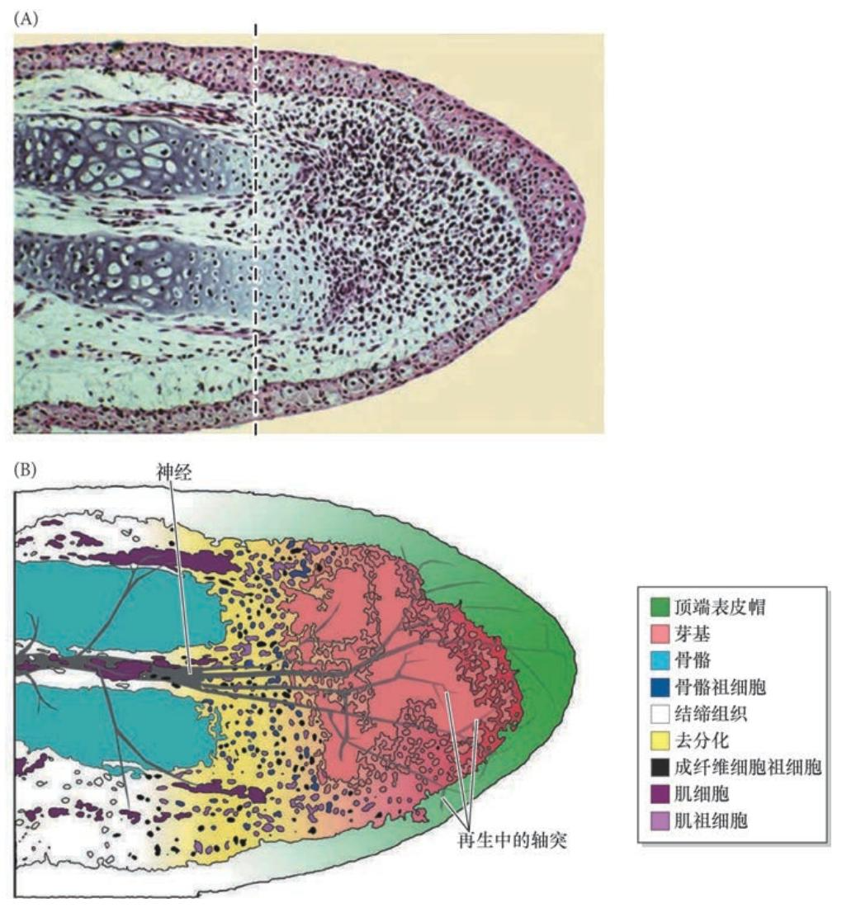
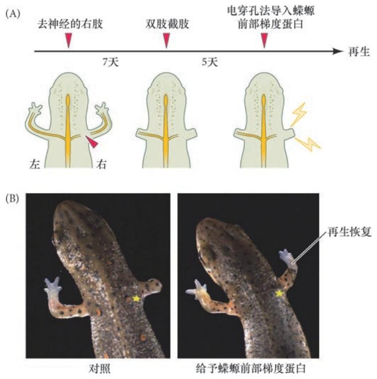
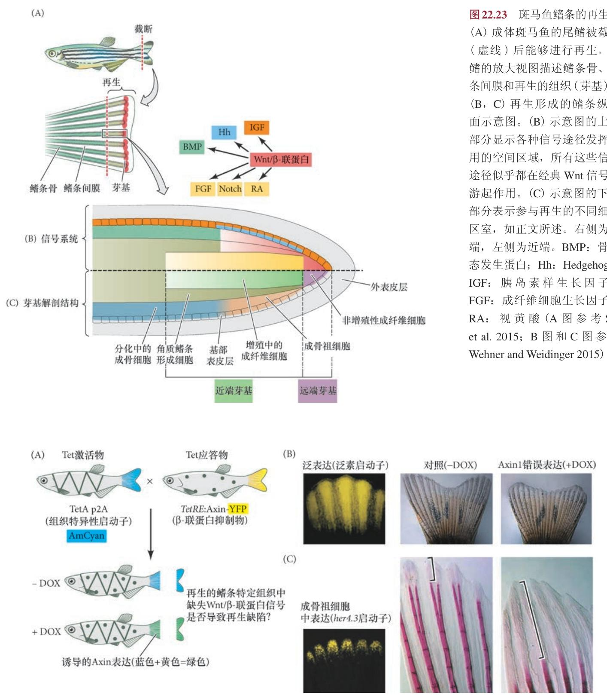
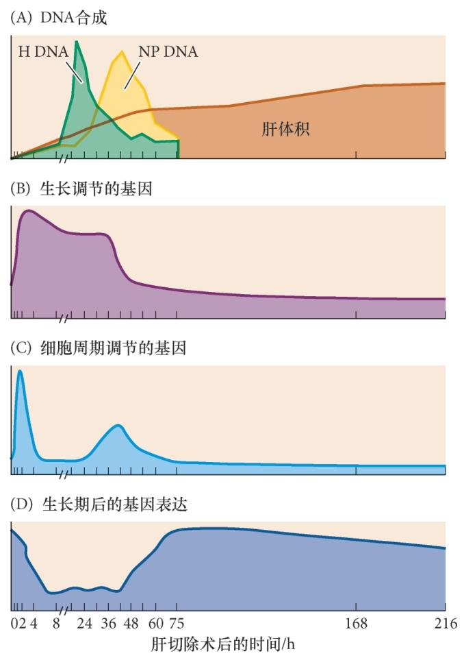

## 一、再生的多种形式

再生是在我们熟悉的胚胎发育程序下运作的胚胎后事件｡再生组织的能力存在物种差异
- 水螅和涡虫几乎具有完全再生的能力
- 蝾螈和鱼类能够替代一些复杂的结构
- 哺乳动物为生长和维持而添加及替代细胞的能力有限｡

在再生过程中,局部的细胞增殖或细胞迁移至创伤处 建立一个未分化的芽基,它能够生长和分化以替代损伤组织｡一个芽基能够通过多能干细胞而建立( 如涡虫),或者通过来自去分化的谱系 限制性祖细胞而建立( 如蝾螈的肢)｡再生也可以通过分化细胞的补偿 性增殖或转分化而对已有组织进行重塑来实现,斑马鱼心脏的再生就 是这样的例子｡哺乳动物的肝不能完全再生,但是当这个器官的一叶受损或被切除时,剩余的肝块则会生长以补偿损失｡

几乎每一个发育途径都在再生中起作用，最常见的是Wnt/β- 联蛋白途径｡除了再生潜能的差异之外,每一个模式体系都是四种再生方式中的一种或多种方式的示例 ( 图22.2)｡
1. **干细胞介导的再生**｡干细胞使生物体重新生长一些缺失的器官或组织;这样的例子包括毛干从毛 发隆突中毛囊干细胞的重新生长,以及血细胞被骨髓造血干细胞不断替代｡
2. **新建再生**｡在某些物种,成体结构经历去分化以形成相对未分化的一团细胞(芽基),然后再分化形成新的结构｡这是两栖类肢再生过程的特征｡
3. **变形再生**｡这种形式的再生是通过重新图式化已有的组织( 转分化) 而实现的,仅有极少的新生长｡这种再生形式见于水螅｡
4. **补偿性再生**｡已经分化的细胞进行 分裂,但保持原来的分化功能｡新 的细胞既不来自干细胞,也不来自 成体细胞的去分化｡每个细胞产生 类似于自身的细胞;没有未分化组 织块的形成｡这种类型的再生是哺 乳动物肝的特征｡

## 二、水螅:干细胞介导的再生､变形再生､新建再生

## 三、扁形动物中干细胞介导的再生

## 四、蝾螈:肢的新建再生

蝾螈通过细胞去分化而形成一个**再生芽基(regeneration blastema)** 来完成**新建再生**,在这种情况下, 来自初始分化组织的一团相对未分化细胞进行增殖,重新分化成新的肢部分( 图22.17)｡紧位于截肢部位下方的骨骼､真皮､软骨, 以及来自邻近肌细胞的卫星细胞都参与再生芽基的形成｡因此,不同于扁形动物利用成体多能干细胞形成再生芽基,蝾螈肢的**大部分再生芽基似乎来自成体细胞的去分化**,这些细胞进行分裂和再分化而返回到它们的初始细胞类型

### 4.1 顶端表皮帽和再生芽基的形成

蝾螈被截肢后会形成一个血浆凝块｡在6 ~12 h 内, 表皮细胞从残余部分迁移,包裹伤口表面,形成**创伤表皮 (wound epidermis)**｡与哺乳动物伤口愈合不同,**蝾螈不形成瘢痕**,真皮也不随表皮细胞一起运动而覆盖截断部位｡支配肢的神经在离截断面近端的短距离内退化｡

在接下来的4 天内,创伤表皮下部组织的细胞外基质被蛋白酶降解,释放出一些经历显著去分化的单个细胞:骨细胞､软骨细胞､成纤维细胞和肌细胞都**失去了它们的分化特征**｡在分化组织中表达的基因( 如肌细胞表达的肌调节 因子-4 和成肌因子-5 的基因) 都受到下调,而与胚胎肢中增殖性渐进带间充质相关的一些基因( 如msx1) 的表达则显著上调｡这个细胞团就是**再生芽基**, 这些细胞将继续增殖并最终进行再分化而形成肢新的结构 ( 图22.18)｡而且,在此期间,创伤表皮增厚 ( 见图22.17B),形成**顶端表皮帽(apical epidermal cap,AEC)**,它与肢正常发育过程中的外胚层顶嵴有类似的作用(见第19 章)｡因此,在残余部分的切缘位置,之前具有完整结构的肢区域形成一个没有明显特征的细胞所组成的 增殖性团块,紧位于顶端表皮帽的下部｡

==**新细胞来自旧细胞**==
芽基并不是一组均质和完全去分化的细胞｡相反,在墨西哥蝾螈的再生肢中,新的肌细胞仅来自旧的肌细胞､新的真皮细胞仅来自旧的真皮细胞､新的软骨只能由旧的软骨或旧的真皮细 胞形成｡因此,**芽基并不是一组未特化的局限性多能祖细胞**｡相反,这些细胞**保留了它们的特化**,芽基是一些**受限的祖细胞所组成的一个异质性混合体**｡

Kragl 及其同事(2009) 将表达绿色荧光蛋白的蝾螈肢组织移植到不具有绿色荧光蛋白转基因的野生 型蝾螈肢的不同区域( 图22.19)｡如果表达绿色荧光蛋白的蝾螈肢软骨被移植到不具有绿色荧光蛋白转 基因的蝾螈肢,表达绿色荧光蛋白的软骨将正常地整合到肢骨骼｡之后,他们在含有绿色荧光蛋白标记 的软骨细胞区域进行截肢｡在这种情况下,芽基含有表达绿色荧光蛋白的细胞,并且在芽基分化时,只 有肢软骨含有表达绿色荧光蛋白的细胞｡类似地,**在再生的肢中,绿色荧光蛋白标记的肌细胞只形成肌 细胞,而绿色荧光蛋白标记的表皮细胞仅形成表皮**｡

#### 4.2 芽基细胞的增殖:对神经和顶端表皮帽的需求

==**顶端表皮帽和神经对再生生长是必要的**==
再生芽基的生长依赖于顶端表皮帽和神经｡顶端表皮帽通过分泌成纤维细胞生长因子-8 而刺激芽基的生长( 与外胚层顶嵴对肢的正常发育一样),但顶端表皮帽只有在神经存在的情况下才能发挥作用 ｡感觉轴突和运动轴突都支配芽基,感觉轴突与顶端表皮帽直接接触,而运动轴突则终止于芽基间充质( 见图22.17B)｡

**==神经和表皮的信号共同作用确保再生==**
Singer 及他人证明,必须有一定数量的感觉或运动神经纤维才能使再生得以进行｡最重要的是,**进行再生的神经对芽基的增殖和外向生长是必需的**｡如果肢首先被去神经､然后被截肢,再生将不会发生 ( 图22.20)｡如果伤口位于肢近端的表皮,然 后将神经转向伤口区域,一个芽基样的芽将会 形成,但不会产生一个完全再生的肢｡如果要诱导出完整的异位肢,**不仅需要将神经转向伤口区域,也需要将来自对侧肢( 从后到前的位置) 的表皮移植物置入伤口位置附近**｡这些结果表明,在肢的正常再生过程中,进行再生的神经向顶端表皮帽传递一些重要的信号｡但是,这些结果也 说明**来自神经的信号不足以促使异位的肢生长**; 这种生长**需要来自表皮的一些位置信息**,而这些位置信息不同于伤口部位自身的位置信息｡

==**神经对再生的作用不在于神经信号的激活，而在于一些细胞因子的分泌**==
靶细胞的神经活动对突触成熟和神经元存活是必需的｡因此,最初有假设认为,神经活动可能是肢再生的必要刺激物｡然而,一些实验表明,**神经传导(动作电位和乙酰胆碱的释放)对促使肢再生不是必需的**｡如果神经活动不是必需的,那么再生中的轴突为肢的芽基提供了什么?**这些神经元被认为能释放一些对芽基细胞增殖所需的因子**｡ 有很多候选物能作为来自神经的芽基有丝分裂原,但最可能的候选物是**蝾螈前部梯度蛋白(newt anterior gradient protein,nAG)**｡这个蛋白质能使体外培养的芽基细胞进行增殖,还能使去神经的肢进行正常再 生( 见图22.20)｡如果用电穿孔法将活化的蝾螈前部梯度蛋白的基因导入去神经的截 断肢的去分化组织,肢便能够再生｡如果不给予蝾螈前部梯度蛋白,肢便仍是一个残余部分｡此外,**蝾螈前部梯度蛋白在正常的肢中仅有微弱表达,但是在截肢的5 天内,它在进行再生的轴突周围的施万细胞中受到诱导**｡

对蝾螈前部梯度蛋白所具有的刺激性作用的进一步支持来自无神经肢的研究｡在这个实验中,两个蝾螈胚胎以联体的方式被联结在一起,使它们在相似的条件下存活｡然后将其中一个蝾螈的神经管去除｡ 两个蝾螈都存活下来,并长出所有的肢,但缺失神经管的蝾螈肢中不具有神经,完全没有神经支配｡基于之前对于去神经的肢不能再生的发现,人们可以推测这些无神经的肢在被截肢后同样不能再生｡但引人注目的是,这些**无神经的肢的确能够再生**｡当研究人员在正常的肢､去神经的肢及这些无神经的肢中 比较蝾螈前部梯度蛋白的表达时,他们发现,**在无神经的肢中,只有表皮具有高水平的蝾螈前部梯度蛋白**( 图22.22A)｡此外,在截肢时,蝾螈前部梯度蛋白的水平首先在正常肢的神经鞘 中升高,但在无神经的肢中分布在整个芽基( 图22.22B)｡这些结果表明,蝾螈前部梯度蛋白是参与神经 依赖性再生的主要有丝分裂原｡蝾螈前部梯度蛋白的受体——Prod1,已经被鉴别出来,它在蝾螈肢中以近- 远端梯度的方式表达｡这种配体-受体关系在具有再生能 力的蝾螈物种中似乎都是保守的｡

**==蝾螈肢沿前- 后轴再生的规则似乎与正常发育过程中形成肢的规则相似==**
参与肢发育的**反向视黄酸- 成纤维细胞生长因子梯度**最初被推测沿着这个轴参与肢结构的再生｡再生形成的肢在大小和图式上都取决于截肢的近- 远端位置,这使得肢只能再生出截断处远端的组织,以正确的图式对缺失的部分进行替代｡除了视黄酸和成纤维细胞生长因子之外,还有哪些因子参与调控这种图式的形成?很多不同的信号分子也参与肢的再生,包括Wnt､骨形态发生蛋白､ Hedgehog 和Notch｡目前尚不清楚这些分子的作用｡一些分子会产生奇怪的再生图式｡例如,再生中的蝾螈肢受视黄酸处理时,无论在哪个位置截肢,芽基都会重编程以形成一个具有所有近- 远端结构的完整肢｡另外,如果将含有骨形态发生蛋白或骨形态发生蛋白与成纤维细胞生长因子组合的珠子置入蝾螈肢的伤口位置, 这样就会形成一个额外的肢｡

## 五、斑马鱼的再生
### 5.1 斑马鱼的再生过程
再生过程中的鳍可被分成四个基本部分( 图22.23):
①非增殖性成纤维细胞组成的远端芽基; 
②增殖性近端芽基组成去分化间充质的主要部分;
③分化中的近端芽基在外向生长中将分化细胞添加到 已有的和新形成的组织;
④侧围的表皮层在整个再生过程中作为复杂的信号中心｡

**代表鳍再生特征的远端外向生长几乎涉及所有已知在胚胎发育过程中起作用的信号途径，Wnt/β- 联蛋白信号途径似乎是众多信号通路的起点。**

### 5.2 Wnt/β- 联蛋白途径的作用
Wnt/β- 联蛋白途径在远端芽基和近端增殖性芽基的最外侧部分具有活性,而近端增殖性芽基建立成骨细胞的祖细胞和角质鳍条｡Wnt/β- 联蛋白信号的功能缺失和获得分别导致芽基增殖及再生速度的降低和增加｡

Weidinger 的实验室证明, 在整个鳍芽基或只在侧部祖细胞区错误表达 β 联蛋白的抑制物——Axin1,导致鳍条数量的明显减少 及鳍条的骨化缺陷( 图22.24)｡然而,Wnt/β- 联蛋白似乎通过调节其他促有丝分裂 调节物而间接地发挥作用,如Hedgehog 蛋白(Sonic hedgehog 和Indian hedgehog)､成纤维细胞生长因 子-8､视黄酸和胰岛素样生长因子( 见图22.23B)｡

==**新建再生､补偿和转分化**== 
斑马鱼具有一个相对简单的管状心脏｡静脉血液进入静脉窦,前往单心房,被泵入单心室,并通过动脉球流出心脏｡**多种不同的损伤模型,包括手术切除部分心肌､ 冷冻损伤和遗传诱导的组织特异性去除,已被用于研究斑马鱼心脏组织的再生**(Shi et al. 2015 综述)｡斑马鱼的心脏在整个生命中都保留了再生能力,部分原因是组成心脏主要组织的**心肌细胞( 肌肉细胞) 具有持续的有丝分裂能力**(Poss et al. 2002)｡已有的心肌细胞对成体心脏的再生有主要作用｡使用斑马荧光彩虹法转基因系统在心脏特异性启动子的控制下追踪细胞谱系,证明了**已经分化的心肌细胞能产生一些克隆的再生细胞**｡

**==成体斑马鱼依赖于新建再生==**
很多实验室的工作表明,成体斑马鱼的心脏再生主要来源于**已有心肌细胞的去分化**( 新建再生),通过局部增殖和迁移在伤口部位建立芽基,最终芽基细胞进行再分化以修复心脏｡此外,有研究显示,远离 急性损伤位置的健康心室组织也能通过加速增殖( 增生) 而应答损伤,这是一种再生的补偿性机制｡补偿性再生通常伴随肥大性生长( 即细胞体积的增加), 但这尚未在斑马鱼心脏再生中予以证明｡

**==发育中的斑马鱼心脏在再生过程中似乎也能够进行变形再生或转分化==**
使用斑马鱼幼体的研究人员通过引起心室心肌细胞的凋亡而使幼体心室组织严重损伤｡他们使用心室肌球蛋白重链启动子在心室心肌细胞中靶向表达硝基还原酶,并通过添加与硝基还原酶发生反应的细胞毒性前药来诱导细胞死亡｡这个过程严重损伤幼体鱼心脏的心室组织｡接下来发生的事情非常引人注目｡邻近位置已分化的心房心肌细胞做出损伤应答,迁移到受损的心室组织,并上调心室特异基因的表达,如心室肌球蛋白重链 ( 图22.27A)｡几个月后,这些迁移的心房心肌细胞的命运图谱显示它们保留在心室壁,参与形成再生 完全和具有功能的心室及心脏( 图22.27B)｡

==**Notch通路中参与心房介导的心室修复**==
Zhang 及其同事进一步证明**Notch-Delta 信号**在心房的心肌中高度上调,并且对心房介导的心室损伤修复是必需的( 图22.27C)｡如果在心室组织切除过程中使用 γ- 分泌酶抑制物(3,5- 二氟苯乙酰基) 对Notch 信号进行药物性抑制,这样就会严重影响心脏的再生 ( 图22.27D)｡这些结果表明,至少在幼体发育过程中,心肌细胞能够进行转分化以支 持心脏的再生｡

==**斑马鱼心脏的细胞似乎采用多种机制来促使其再生:芽基形成的新建再生､补偿性增殖､Notch 信号介导的转分化｡**==

## 六、哺乳动物的再生

### 6.1 手指和心脏的有限再生

像啮齿类和人类这样的哺乳动物,如果生物体**足够年幼,它们被证明能够再生指( 趾) 的顶端**。指（趾）顶端截断后，祖细胞在伤口处形成再生芽基，外胚层局限性祖细胞分化为新的表皮，成骨细胞祖细胞形成新的骨骼，不涉及远端结构的重新特化（如不会再生出完整的肢）与蝾螈肢再生类似，依赖祖细胞增殖分化，但再生能力局限于顶端结构，无复杂图式重建。

出生一周内的新生小鼠心脏具有再生能力，可修复部分切除或损伤的心肌组织，成年后可能因心肌细胞退出细胞周期而丧失此能力。成年哺乳动物心肌细胞在心力衰竭等损伤刺激下，可重新进入细胞周期并增殖，参与轻度修复，但再生能力极弱，无法恢复完整结构。

### 6.2 哺乳动物肝的补偿性再生

现今,肝再生的标准检测方法是肝的部分切除术,将 一部分肝叶去除,而使其他肝叶保持完整｡**虽然被切除的肝叶不能生长出来,但剩余的肝叶能增大以补偿丢失的组织**｡再生的肝体 积与切除的肝体积等同｡这种**补偿性再生(compensatory regeneration)**,即**分化的细胞通过分裂以恢复受 器官的结构和功能**,已经在上述斑马鱼的心脏和哺乳动物的肝中得到证明｡

人的肝通过已有组织的增殖而再生｡令人惊讶的是,**再生过程中的肝细胞在重新进入细胞周期时并不完全去分化**｡再生时也**不形成再生芽基**｡相反,哺乳动物的肝再生似乎有另外两种方式｡第一种是正常和成熟的成体肝细胞｡这些成熟细胞在正常情况下并不分裂,但在肝损伤时它们被指令重新进入细胞周期和进行增殖,直到完全补偿缺失的部分｡第二种方式( 将在下面讨论) 是肝祖细胞群体,它们在正常情况下处于休眠状态,但在损伤严重和衰老､酗酒或疾病等原因使成体肝细胞不能完全再生时被激活｡

==**多细胞参与肝再生，并保留自生特征**==
在肝的正常再生中,五种类型的肝细胞,包括**肝细胞**､**导管细胞**､**储脂细胞**､**内皮细胞**和**Kupffer 巨噬细胞**,都开始分裂以增加自身的数量｡每种类型都保留其细胞特征,而且即便是肝在再生自身时,也保持合成肝特异酶的能力,这些酶对葡萄糖调节､毒素 降解､胆汁合成､白蛋白生成,以及其他肝功能都是必需的｡

==**可能有多个冗余的信号途径参与启动肝细胞的增殖和再生**==
全基因表达 谱分析显示,这些途径的最终结果是下调( 但不是完全阻断) 那些参与肝细胞分化功能的基因,同时激活 那些使细胞进行有丝分裂的基因｡ 肝的移除或损伤可以通过血流被感知:一些肝特异因 子丢失,而另外一些因子( 如胆汁酸和肠脂多糖) 升高｡这些脂多糖激活非肝细胞分泌一些促使剩余的肝细胞重新进入细胞周期的旁分泌因子｡Kupffer 细胞 分泌白细胞介素-6 和肿瘤坏死因子-α( 它通常参与激 活成体免疫系统);卫星细胞分泌旁分泌因子肝细胞 生长因子(hepatocyte growth factor,HGF) 或称为分 散因子(scatter factor),以及转化生长因子-β｡肝的 特殊血管也分泌肝细胞生长因子以及Wnt2｡

**==仍然相互连接成上皮的肝细胞不能对肝细胞生长因子产生应答==**
在部分肝切除术1 h 内,肝细胞激活肝细胞生长因子的受体cMet,阻断cMet( 通过RNA 干扰或敲除) 后肝将完全不能再生｡来自肝切除术的创伤可能激活一些金属蛋白酶,降解细 胞外基质,使肝细胞分离和增殖｡这些酶也可能将肝 细胞生长因子切割成活化状态｡**内皮细胞､Kupffer 细胞和卫星细胞产生的一些因子通过阻止细胞凋亡､激活细胞周期蛋白( 细胞周期蛋白 D 和细胞周期蛋白E)､抑制细胞周期蛋白抑制物( 如p27),共同促进肝细胞分裂｡**

==**功能优先于结构重建**==
达到恰当的体积时,肝就会停止生长,这种调节机制尚不清楚｡但其中一个线索来自一些联体实验, 也就是通过手术将两只大鼠的循环系统连接在一起｡在其中一只联体的大鼠中进行部分肝切除术能引起 另一只大鼠的肝变大｡因此,这说明血液中的某种或某些因子似乎建立肝的大 小｡Huang 及其同事(2006) 提出,这些因子是肝分泌的胆汁酸,能正调节肝细胞生长｡部分肝切除术刺 激胆汁酸进入血液｡这些胆汁酸被肝细胞接收并激活促进细胞分裂的胆汁酸受体(Fxr) 转录因子｡缺失功 能性胆汁酸受体蛋白的小鼠肝不能再生它们的肝｡因此,**胆汁酸( 含量相对较低的肝分泌产物) 似乎调节肝的大小,使其保持一个特定体积的细胞**｡但是,这些因子相互作用的分子机制,以及肝在最初被指 令开始再生和达到适当体积后停止再生的分子机制仍有待进一步研究｡

**==肝移植后可以修复==**
因为人的肝具有再生能力,所以来自活体供体的兼容性肝可被用来替代患者的病变肝( 通常是遗传上的近亲,供体的肝能够恢复)｡与小鼠的肝相比,人的肝再生较慢,但功能却迅速恢复｡

==**肝再生的储备机制**==
此外,哺乳动物的肝具有“第二线”再生能力｡如果肝细胞在一定时间内不能 充分再生肝,那么肝卵圆细胞(oval cell) 就会分裂形成新的肝细胞｡肝卵圆细胞是一组能够产生肝细胞和胆管细胞的祖细胞｡它们可能被作为储备,只有在肝细胞试图使肝恢复正常之后才被使用｡

