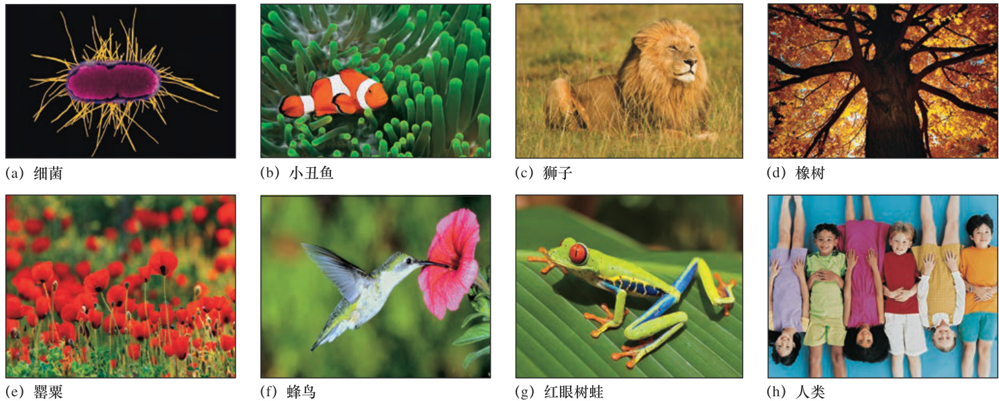

# 导言 21世纪的遗传学  

## 第 1 章 遗传学：生物信息的研究  

  

遗传学，是遗传的科学，其核心是研究生物信息。所有的生物以书中的字母和单词以及 DNA 分子中的核苷酸序列展示。  

$\copyright$ James Strachan/Getty Images  

## 章 节 大 纲  

1.1 DNA：生命的基本信息分子  
1.2 子蛋白质：生命过程的功能分子  
1.3 所有生命形式的分子相似性  
1.4 基因组的模块化构建  
1.5 现代遗传学技术  
1.6 人类遗传学与社会  

遗传学作为研究生物遗传的学科，是生物信息研究的核心。所有生物——从单细胞细菌和原生动物到多细胞植物和动物——都必须储存和使用大量的信息，以便在它们的环境中发展、生存和繁殖（图1.1）。遗传学家研究生物体在其一生中如何利用生物信息并将其信息传递给后代。  

本书向您介绍了在21世纪早期的主要遗传学领域。几个广泛的主题在整个演讲中反复出现。首先，我们知道生物信息是在DNA中编码的，负责生物体许多功能的蛋白质就是从这个编码中构建的。其次，我们发现所有的生命形式在分子水平上是相关的。借助高速计算机和其他技术，我们现在可以在DNA序列水平上研究基因组。这些新方法揭示了基因组具有模块化结构，使得复杂性得以快速进化。最后，本书的重点是人类遗传学和遗传学研究在人类问题研究中的应用。  

  
图1.1 DNA中的生物信息产生了巨大的生物多样性。  

## 1.1 DNA：生命的基本信息分子  

### 学习目标 

1. 把DNA的结构与其功能联系起来。  
2. 区分染色体、DNA、基因、碱基对和蛋白质。  

进化的过程——生物体群体特征随时间的变化—经历了近40亿年的时间来完成惊人的储存、复制、表达和多样化生物信息过程，现在地球上的生物体能体现整个过程。线性DNA分子以核苷酸为单位存储生物信息。在每个DNA分子中，G、C、A和T这四个字母的序列决定了机体将产生哪些蛋白质，以及蛋白质合成将在何时、何地发生。这些字母指的是碱基——鸟嘌呤、胞嘧啶、腺嘌呤和胸腺嘧啶，它们是构成DNA的组成部分。DNA分子本身是携带G-C或A-T碱基对的双链核苷酸（图1.2）。这些合成的互补碱基对通过氢键结合在一起。双链DNA的分子互补性是其最重要的性质，也是理解DNA功能的关键。  

  
图1.2 互补碱基对是DNA分子的一个关键特征。单链DNA由核苷酸亚基组成，每个核苷酸亚基由脱氧核糖（白色五边形）、磷酸盐（黄色圆圈）和四种含氮碱基之一——腺嘌呤、胸腺嘧啶、胞嘧啶或鸟嘌呤（图中为淡紫色或绿色的A、T、C或G）组成。氢键（虚线）使A与T紧密结合，C与G紧密结合，因此两条链是互补的。标记为 $5^{\prime}{\rightarrow}3^{\prime}$ 的箭头表示这些线的方向相反。

虽然DNA分子是三维的，但它的大部分信息是一维的和数字化的。信息是一维的，因为它被编码为沿着分子长度的特定字母序列。信息是数字化的，因为每一个信息单元（DNA字母表的四个字母之一）都是离散的。由于遗传信息是数字化的，它可以像存储在DNA分子中一样容易地存储在计算机内存中。事实上，DNA测序仪、计算机和DNA合成器的综合能力使得以电子方式将基因信息从一个地方存储、解释、复制和传输到地球上的任何地方成为可能。  

编码蛋白质的DNA区域称为基因。正如在字母表中字母的有限数量不限制一个人所能讲述的故事一样，在遗传密码子表中密码子的有限数量也不限制蛋白质的种类，从而也不限制生物体基因信息所能定义的种类。  

在生物体的细胞内，携带基因的DNA分子被组装成染色体——包含DNA和蛋白质的有机结构，它们对DNA的储存、复制、表达和进化进行包装及管理（图1.3）。生物体每个细胞中染色体的全部聚合体中的DNA就是它的基因组。例如，人类细胞包含24种不同的染色体，携带大约 $3\times{10}^{9}.$ 碱基对和大约27 000个基因。在这个大小的基因组中可以编码的信息量相当于600万页的文本，其中每页包含250个单词，每个字母对应一个碱基对。  

  
图1.3 人类染色体。每条染色体包含数百到数千个基因。©Biophoto Associates/Science Source  

要追溯从计算机磁盘上容易储存的有限数量的遗传信息到一个能应用于人类的产品的漫长历程，我们接下来必须研究蛋白质，这是决定细胞、组织和有机体的复杂系统如何运作的主要分子。  

### 基本概念

●  DNA是由四个核苷酸组成的双链大分子，是遗传信息的宝库。  

●  DNA组成染色体（人类有24个不同类型），共同构成生物体的基因组。

●  人类基因组包含约2.7万个基因，其中大部分编码蛋白质。  

## 1.2 蛋白质：生命过程的功能分子  

### 学习目标 

1. 比较DNA和蛋白质的化学结构。  
2. 区分DNA和蛋白质的功能。  

虽然没有一个单一的特征能把生命体与无生命的物质区分开来，但是我们不难确定一组物体中哪些是生命体。随着时间的推移，这些受物理和化学定律及遗传程序控制的生命体将能够自我繁殖。大多数生命体也会有一个精细复杂的结构，而且随着时间的推移会发生变化——有时是剧烈的变化，就像昆虫的幼虫蜕变成成虫一样。生命体的一个特征是具有行动的能力：动物会游泳、飞翔、行走或奔跑，而植物则朝着或远离光生长。生命体还有一个特点是有选择性地适应环境的能力。最后，生命体的一个关键特征是利用能量和物质来生长的能力，也就是说，把外来物质转化成它们自己身体部分的能力。进行这些转换的化学和物理反应称为新陈代谢。  

生命体的大多数特性最终都来自于蛋白质分子，蛋白质是由数百到数千个氨基酸亚基串成长链组成的大分子多聚体。每个链折叠成一个由其氨基酸序列组成的特定三维构象（图1.4）。大多数蛋白质由20种不同的氨基酸组成。基因DNA中的信息通过遗传密码决定蛋白质分子中氨基酸的顺序。    

  

图1.4 蛋白质是三维折叠的氨基酸多聚体。（a）两种氨基酸：丙氨酸和酪氨酸的结构式。所有氨基酸都有一个基本的氨基末端 $(\mathrm{-}\mathrm{NH}_{2}$ ；绿色）和羧基末端（—COOH；蓝色）。特殊侧链（红色）决定了氨基酸的化学性质。（b）两种不同人类蛋白质的氨基酸序列：血红蛋白β链（绿色），乳酸脱氢酶（紫色）。（c）这些蛋白质的不同氨基酸序列决定了不同的三维形状。氨基酸链中的特定序列决定了蛋白质的精确三维形状。  

你可以把蛋白质想象成由20种不同颜色和形状的弹珠组成。如果你要把珠子按任何顺序排列，每串都要有上千颗珠子，然后根据珠子的顺序把链折成各种形状，你就能做出无数种不同的三维形状。三维蛋白质结构惊人的多样性产生了不同寻常的蛋白质功能，这是每个生物体复杂和适应行为的基础［图1.4（b）和（c）］。例如，血红蛋白的结构和形状允许它在血液中运输氧气并将其释放到组织中。相比之下，乳酸脱氢酶是一种将乳酸转化为丙酮酸的酶，是产生细胞能量的重要步骤。大多数与生命有关的特性都来自于生物体合成的蛋白质分子群，这些蛋白质分子符合生物体DNA中所包含的指令。  

### 基本概念

● 蛋白质负责细胞和有机体的大部分生物学功能。  
● 蛋白质是由氨基酸按线性顺序连接而成的大分子。  
● 蛋白质中的氨基酸序列由DNA中的基因编码。  

## 1.3 所有生命形式的分子相似性  

### 学习目标 

总结了生物共同起源的分子证据。  

生物信息的进化是一个跨越地球40亿年历史的迷人故事。许多生物学家认为RNA是第一个出现的信息处理分子。与DNA非常相似，RNA分子也由四个亚单位组成：碱基G、C、A和U（代表尿嘧啶，它取代了DNA的T）。与DNA一样，RNA具有存储、复制和表达信息的能力；像蛋白质一样，RNA可以折叠成三种二聚体，产生能够催化生命化学反应的分子。事实上，你会了解到一些基因的最终功能是编码RNA分子而不是前体。然而，RNA分子本质上是不稳定的。因此，更稳定的DNA很可能取代了RNA的线性信息存储和复制功能，而蛋白质则以其强大的功能多样性，在很大程度上取代了RNA的三维折叠功能。通过这种分工，RNA主要成为将DNA中的信息转化为蛋白质中的氨基酸序列的中介［图1.5（a）］。把信息储存在DNA中与生物功能主要集中在蛋白质上的分离是如此的成功，以至于今天所有已知生物的起源都源于这种分子机制。  

所有生命形式共同起源的证据都存在于它们的DNA序列中。所有生物体都使用基本相同的遗传密码，其中DNA和RNA字母表中四个字母的不同三重组合编码氨基酸字母表的20个字母［图1.5（b）］。  

所有生物体之间的亲缘关系也很明显，这是通过比较功能相似的基因在完全不同的生物体中的表现而得出的。在细菌、酵母、植物、线虫、果蝇、小鼠和人类的图1.5　RNA是DNA信息通过遗传密码子转化为蛋白质的中介。（a）DNA的线性碱基通过分子互补复制到RNA的线性碱基中。RNA的碱基一次读取三个（也就是三个一组）来编码蛋白质的氨基酸亚基。（b）《遗传密码字典》详细说明了RNA三联体与蛋白质的氨基酸亚单位之间的关系。  

  

<html><body><table><tr><td colspan="2"></td><td colspan="2">U C</td><td colspan="2">A</td><td colspan="2">G</td><td>U</td></tr><tr><td>U</td><td>UUU UUC UUA UUG</td><td>Phe Leu</td><td>UCU UCC UCA UCG</td><td>Ser</td><td>UAU UAC UAA UAG</td><td>Tyr Stop Stop</td><td>UGU UGC UGA UGG</td><td>Cys Stop Trp</td><td>A G</td></tr><tr><td rowspan="3">母 字 第</td><td>CUU CUC CUA CUG</td><td>Leu</td><td>CCU CCC CCA CCG</td><td>Pro</td><td>CAU CAC CAA CAG</td><td>His Gln</td><td>CGU CGC CGA CGG</td><td>Arg</td><td>C A 第 G 111</td></tr><tr><td>AUU AUC A AUA AUG</td><td>Ile Met</td><td>ACU ACC ACA ACG</td><td>Thr</td><td>AAU AAC AAA AAG</td><td>Asn Lys</td><td>AGU AGC AGA AGG</td><td>Ser Arg</td><td>U 舟 C A G</td></tr><tr><td>GUU GUC G GUA GUG</td><td>Val</td><td></td><td>GCU GCC Ala GCA GCG</td><td>GAU GAC GAA GAG</td><td>Asp Glu</td><td>GGU GGC GGA GGG</td><td>Gly</td><td>U C A G</td></tr></table></body></html>  

许多对应蛋白质的基因之间存在着惊人的相似性。例如，不同物种的细胞色素c蛋白中的大部分氨基酸都是相同的（图1.6），表明这些蛋白质都来自于一个共同的祖先蛋白。值得注意的是，这些细胞色素c蛋白中的一些氨基酸是不同的。原因是不同的突变，也就是说，当基因从有机体的一代传递到下一代时，核苷酸对会发生变化。这些突变在基因组中的积累是进化的主要驱动力。  

尽管会发生DNA的突变并由此导致蛋白质序列的改变，但将一个生物体的基因植入另一个完全不同生物体的基因组中后，会发现它在新环境中能够正常工作。例如，帮助调节细胞分裂的人类基因可以取代酵母中的相关基因，使酵母细胞能够正常工作。  

图1.6　不同物种基因产物的比较为生物体的亲缘关系提供了证据。这张图显示了6个物种中细胞色素c蛋白相同部分的氨基酸序列：酿酒酵母（酵母）、拟南芥（草本状开花植物）、秀丽隐杆线虫（线虫）、黑腹果蝇（果蝇）、小鼠（鼠）和智人（人类）。有关氨基酸名称的关键，请参阅图1.4（b）。  

<html><body><table><tr><td>酿酒酵母 拟南芥 秀丽隐杆线虫 黑腹果蝇 小鼠</td><td>GPNLHGIFGRHSGQVKGYSYTDANINKNVKW GPELHGLFGRKTGSVAGYSYTDANKQKGIEW GPTLHGVIGRTSGTVSGFDYSAANKNKGVVW GPNLHGLIGRKTGQAAGFAYTDANKAKGITW GPNLHGLFGRKTGQAAGFSYTDANKNKGITW</td></tr><tr><td>智人 *米 *** * 米</td><td>GPNLHGLFGRKTGQAPGYSYTAANKNKGIIW * 米 米 *</td></tr><tr><td>酿酒酵母</td><td>DEDSMSEYLTNPKKYIPGTKMAFAGLKKEKDR</td></tr><tr><td>拟南芥</td><td>KDDTLFEYLENPKKYIPGTKMAFGGLKKPKDR TKETLFEYLLNPKKYIPGTKMVFAGLKKADER</td></tr><tr><td>秀丽隐杆线虫</td><td>NEDTLFEYLENPKKYIPGTKMIFAGLKKPNER</td></tr><tr><td>黑腹果蝇 小鼠</td><td>GEDTLMEYLENPKKYIPGTKMIFAGIKKKGER</td></tr><tr><td></td><td></td></tr><tr><td>智人</td><td>GEDTLMEYLENPKKYIPGTKMIFVGIKKKEER **米 米*米****米**米 米 * 米</td></tr></table></body></html>

\*       .  

在观察眼睛发育的研究中，科学家发现了在这一生物信息水平上最显著的关联实例之一。昆虫和脊椎动物（包括人类）都有眼睛，但它们是完全不同的类型（图1.7）。生物学家长期以来一直认为眼睛的进化是独立发生的，在许多进化论教科书中，眼睛被作为趋同进化的一个例子，在这种进化中，由于自然选择的结果，不同物种中出现了结构上不相关但功能上类似的器官。直到科学家后来对一种名为Pax6的基因进行研究后才颠覆了这一观点。  

Pax6基因的突变导致人类和小鼠眼睛的发育失败，分子研究表明，Pax6可能在所有脊椎动物眼睛发育的启动过程中发挥核心作用。值得注意的是，当人类Pax6基因在果蝇身体表面的细胞中表达时，会诱导大量的小眼睛在那里发育。结果表明，果蝇也有一种特殊的蛋白基因，其氨基酸序列与人类Pax6所指定的蛋白质序列虽然距离较远，但明显相关；此外，果蝇基因的某些突变会导致动物失明。综上所述，这些结果表明，在6亿年的进化过程中，一个祖先基因作为启动眼睛发育的主要控制开关，虽然Pax6基因在人类和果蝇的谱系中积累了不同的突变，但在这两个不同的物种中仍然发挥着相同的功能。  

  

图1.7　昆虫的眼睛与人类有着共同的祖先。（a）蝇类眼睛；（b）人类眼睛。  （a）： $\copyright$ Science Source；（b）： $\copyright$ Nick Koudis/Getty Images \RF

从生物信息学的不同角度来讲，亲缘性和统一性的作用怎么强调也不过分。这意味着，在许多情况下，对被称为模式生物体的生物实验研究同样可以揭示人类的基因功能。也就是说，如果类似于人类基因功能的基因在果蝇或细菌等简单的模式生物中发挥作用，科学家就可以通过对这些可实验操作的生物模型的研究来揭示此基因在人体中发挥作用的过程。  

### 基本概念

●  在分子水平上，生物体利用DNA和RNA制造蛋白质的方式表现出明显的相似性。●  某些基因在许多物种的进化过程中一直存在。  

## 1.4 基因组的模块化构建  

### 学习目标 

1. 描述新基因产生的机制。  
2. 解释基因表达调控如何改变基因功能。  

我们已经得知大约有27 000个基因参与人类的生存和进化。这么复杂的现象是如何产生的？当今的技术进步使研究人员能够完成许多生物体整个基因组的结构分析。所获得的信息表明，基因家族是通过原始基因的复制而产生的；复制过程中的突变可能导致两个拷贝体彼此分离（图1.8）。例如，在人类和黑猩猩中，四个不同的基因产生不同的视紫红质蛋白，这些蛋白质分别在不同视网膜细胞的感光细胞中表达。每一种蛋白质的功能都略有不同，四种视网膜细胞对不同波长和强度的光分别有反应，从而产生色觉。但这四个视紫红质基因是由一个单一的原始基因经多次重复产生的，随后在结构上表现出差异。  

  
图1.8　基因如何由复制和分化产生。祖先基因A包含外显子（绿色、红色和紫色），由蓝色内含子分隔。基因A被复制，产生两个原本相同的副本，但其中一个或两个（其他颜色）的突变会导致副本分离。更多的重复和分化产生了一系列相关的基因。  

  
表1.1　生命进化的一些主要阶段的化石证据  
原核生物： $\copyright$ J.W. Schopf；真核生物： $\copyright$ Prof. Andrew Knoll；三叶虫： $\copyright$ Brand X Pictures/PunchStock RF；海绵： $\copyright$ Alan Sirulnikoff/Science Source  

突变分离后的复制是具有新功能的新基因进化的基础。这一原理似乎适用于所有多细胞生物的基因组结构。大多数基因的蛋白质编码区域被细分为多达10个或更多的小片段（称为外显子），由不能进行蛋白质编码的DNA片段（称为内含子）分隔开，如图1.8所示。这种分子结构有助于不同的基因重组出不同的蛋白质，从而在进化过程中产生新的功能结构。这种重组的过程很可能在大约5.7亿年前促进了生命形式的快速多样化演化（见图1.8）。  

遗传信息片段的复制和分化的巨大优势在生命进化史上是显而易见的（表1.1）。像细菌这样没有膜状细胞核的原核细胞大约是在37亿年前进化而来的；藻类等有一个膜状细胞核的真核细胞大约出现在20亿年前；多细胞真核生物出现在7亿 ${\sim}6\cdot$ 亿年前。之后，大约在5.7亿年前，经历了2000万 $\sim\!5000$ 万年这一相对较短的进化时间的寒武纪大爆发，多细胞生物分化成一系列令人眼花缭乱的有机体，其中包括原始脊椎动物。  

有趣的是，多细胞生物如何能在短短2000万 $\mathord{\sim}5000$ 万年间实现如此巨大的多样性？一部分原因是由于进行染色体信息编码的层级结构。外显子被排列成基因；基因复制和分化产生基因家族；基因家族有时会迅速扩展到包含数百个相关基因的基因超家族。例如，在小鼠和人类成年人中，免疫系统都是由一个基因超家族编码的，该家族由数百个密切相关但略有差异的基因组成。随着每一个较大的信息单元的相继出现，通过多个单基因的遗传进化获得了复制复杂信息结构的能力。  

对于复杂的进化来说，更重要的可能是调控网络的快速变化，这些调控网络指定了基因在发育过程中的行为方式（即基因在何时、何地、表达到何种程度）。例如，双翅果蝇从一个四翅的祖先进化而来，不是因为基因编码结构蛋白的变化，而是因为调控网络的重新连接，将一对翅膀转换成两个被称为halteres的小型平衡器官（图1.9）。  

  
图1.9　两翅和四翅果蝇。遗传学家把当代正常的双翅果蝇变成了四翅昆虫，类似于果蝇的进化前体。他们通过改变果蝇调控网络中的一个关键元素来实现这一目标。注意果蝇翅膀  

### 基本概念

●  基因分化之后的复制是对新功能如何进化的一种解释。  
●  外显子在真核生物中的再融合为基因组的快速分化提供了另一种机制。  
●  影响基因调控的DNA变化（基因表达的地点、时间和程度）也会导致演化。  

## 1.5 现代遗传学技术  

### 学习目标 

1. 解释技术进步如何加速基因组分析。  
2. 比较从基因解剖和基因组测序中获得的知识。  
3. 讨论基因组序列信息如何用于治疗或治愈疾病。  

经过40多亿年的时间，通过基因信息的不断放大和细化，生物系统变得日益复杂。最简单的细菌细胞包含大约1000个基因，它们在复杂的网络中相互作用。酵母细胞是最简单的真核细胞，含有约5800个基因。线虫（蛔虫）含有大约20 000个基因，果蝇含有大约13 000个基因。人类含有大约27 000个基因；令人惊讶的是，开花植物拟南芥的基因数量和斑马鱼（D. rerio）的基因数量一样多，甚至会更多（图1.10）。每一种生物都为生物学研究提供了有价值的线索，使我们了解到在生物物种中存在着物种特异性。  

### 1.5.1 生物模型的遗传研究揭示了生物过程  

模式生物包括细菌、酵母、线虫、果蝇、拟南芥、斑马鱼和小鼠，对研究人员来说非常有价值，他们可以利用这些生物来分析基因组的复杂性。在遗传研究中使用的逻辑很简单：使模式生物中的基因失活，然后观察结果。  

例如，视觉色素基因的缺失导致果蝇的眼睛是白色的，而不是正常的红色。因此，我们可以得出结论，该基因的蛋白产物在眼睛色素沉着中起着关键作用。遗传学家从他们对模式生物体的研究中总结出了关于生命系统复杂性的详细过程。  

### 1.5.2 全基因组测序可以识别导致疾病的突变基因  

研究生物体遗传复杂性的另一种补充方法是，不要一次只研究一个基因，而是要观察整个基因组。基因组学的新工具，特别是高通量DNA测序仪，基本具备了测定任何生物的基因组的能力。事实上，上述模型物种和人类的代表性基因组的完整核苷酸序列都已确定。  

2001年，人类基因组计划公布了人类基因组序列的第一份草稿，这是一项耗资30亿美元、耗时10多年才完成的伟大工程。从那时起，基因组测序技术的快速发展使得到2016年仅用几天时间就能确定一个人的基因组序列，且仅花费约1000美元。随着DNA测序技术的进步，分析序列数据的计算机算法也得到了发展，并建立了在线数据库，对个体基因组序列的差异进行分类。  

没有一个例子比基因组测序技术在识别导致人类遗传疾病的基因突变方面的应用更能说明基因组测序技术的威力。对于由单个基因突变引起的疾病，通常可以通过测定少数人甚至单个人的基因组序列来确定相关基因。  

在图1.11（a）所示的病例中，遗传学家分析了整个基因组序列，以发现一种名为小头畸形的罕见脑畸形疾病的基因突变。观察到的小头畸形的遗传模式表明，这是一种所谓的隐性疾病，也就是说，患者同时继承了两个突变基因副本，分别来自正常的父母。父母分别有一个正常的基因副本和一个突变副本，这就解释了为什么父母的大脑没有这种畸形。对来自同一家族的两名小头症儿童的基因组进行测序和分析后发现，这两名小头症儿童都存在一个罕见的基因突变，即WDR62基因中的四个碱基对缺失［图1.11（b）］。每个亲本都有一个正常的WDR62拷贝和一个碱基对缺失的拷贝［图1.11（b）］。随后，研究人员发现不同的小头症患儿家庭在同一基因上  

  
图1.10　作为人类基因组计划的一部分，对7个模式生物的基因组进行测序。该图表以百万基因对（Mb）为单位表示基因组大小。最下面一行显示了每种生物体的大约基因数量。大肠杆菌： $\copyright$ David M. Phillips/Science Source；酿酒酵母： $\copyright$ CMSP/Getty Images；秀丽隐杆线虫： $\copyright$ Sinclair Stammers/Science Source；拟南芥：来源：Courtesy USDA/Peggy Greb拍摄；黑腹果蝇： $\copyright$ Hemis.fr/SuperStock；斑马鱼： $\copyright$ A Hartl/Blickwinkel/agefotostock；小鼠： $\copyright$ imageBROKER/SuperStock RF  

  
(a)   
(b)                 WDR62   
(c)           WDR62  

  

图1.11　经基因组测序鉴定的导致小头畸形的基因。（a）正常人和小头畸形患者大脑的磁共振图像。（b）WDR62基因正常和突变副本的序列分析。该突变是四种核苷酸TGCC（绿色）的缺失，导致该基因蛋白产物的氨基酸序列发生重大变化。每个三重序列上面的字母表示编码的氨基酸。（c）显示了五种不同家族中WDR62基因的不同突变。其中四种突变反映了该基因编码的蛋白质中单个氨基酸的特性。例如，W224S表示第224个氨基酸通常是W（色氨酸），但突变后变成了S（丝氨酸）。箭头指示的位置TGCC缺失突变如（b）所示。  

（a）来源：Images produced by the Yale University School of Medicine. M. Bakircioglu, et al., “The Essential Role of Centrosomal NDE1 in Human Cerebral Cortex Neurogenesis,” The American Journal of Human Genetics, 88(5): 523–535, Fig. 2C, 13 May 2011. Copyright $\copyright$ Elsevier Inc. http://www.cell.com/action/show ImagesData?pii=S0002-9297%2811%2900135-2. CC-BY  

存在不同的突变［图1.11（c）］，从而证实WDR62是小头症的致病基因。  

### 1.5.3 基因疗法可能有助于治疗遗传性疾病  

全基因组测序技术通过快速发现疾病基因给医学带来了革命性的变化。医生通过对疾病基因的检测可以告诉父母，他们的孩子是否可能患上小头症等严重损害身体健康的疾病，从而让父母考虑如何避免或为这种结果做好准备。此外，疾病基因的鉴定提供了有关该基因编码的蛋白质的信息，有时可以指导设计治疗该疾病的有效疗法。虽然这一策略还没有在小头畸形的治疗中应用，但它已经在开发治疗包括某些癌症在内的其他遗传疾病的药物方面发挥了巨大的价值。  

过去几年取得的巨大进展让医学科学家们看到了希望，终有一天会实现通过修改受该疾病综合征影响的体细胞的基因来治疗遗传性疾病。其中有一种目前正在开发的方法叫做基因疗法，即科学家将正常的基因拷贝导入人体细胞，在那里，基因可以被表达，并替换基因组中突变的、无功能的对应基因。另一种非常新的基因治疗方法是基因编辑，研究人员将突变基因的碱基对序列修改为正常基因的碱基对序列。基因治疗和基因编辑已被用于模式生物，例如，在小鼠的研究中，科学家可以恢复基因的功能，甚至可以逆转疾病的过程，但这些技术在人体的应用仍处于非常早期的阶段。  

### 基本概念

●  科学家通过分析模式生物的基因突变了解多种生物学过程的分子基础。  
●  自动化测序和计算机分析已使快速测定基因组中的DNA序列成为可能，从而使研究人员能够分析导致遗传疾病的基因。  
●  对疾病基因的了解，可以有助于父母做出明智的生育决定、允许制药公司设计有效的药物，并在未来使医学研究人员能够操纵体细胞基因来逆转疾病的发生。  

# 1.6 人类遗传学与社会  

### 学习目标 

1. 描述可以从个体基因组序列中获得的信息类型。  
2. 讨论应用个体基因组序列引发的社会问题。  

在未来的25年里，遗传学家将鉴定出数百种基因的变异，这些变异导致人们容易罹患多种疾病：心血管疾病、癌症、免疫疾病、精神疾病和代谢疾病。一些突变会导致疾病的发生，就像刚才讨论的小头畸形的例子；还有一些基因突变只是会增加患病的风险。例如，改变$\beta$ -globin基因的一个特定碱基对就会导致镰状细胞性贫血的发生，引起严重贫血，给患者带来痛苦。相比之下，乳腺癌1（BRCA1）基因的突变使携带该突变副本的女性患乳腺癌的风险增加到 $40\%\!\sim\!80\%$ 。这种状态的出现是因为BRCA1基因与环境因素相互作用，环境因素会影响激活癌变状态的可能性，因为其他基因可以修改BRCA1基因的突变。  

医生们能够使用DNA诊断技术（一套描述基因特征的技术）来分析个体的DNA，找出易患某些疾病的基因。有了这种基因图，医生就可以根据某些疾病的可能性写出一份可预测的健康史。  

### 1.6.1 许多社会问题需要解决  

虽然从严格的技术角度来看，生物信息与其他类型的信息相似，但在其意义和对个人以及对整个人类社会的影响方面，它是完全不同的。不同之处在于，每个人从出生起就具有独特的遗传特征。在每个个体的基因组中都储存着复杂的信息，这些信息或多或少地提供了对多种疾病的易感性或抵抗力，提供了表达许多生理和神经特性的潜力，这些特性使人们彼此区别开来。到目前为止，人们还没有发现这些信息。但如果研究继续以目前的速度进行，不到十年就有可能掌握一个人的基因组信息，而随着这些信息的出现，将会实现对未来的可能性和风险做出预测。  

正如你将在本书的许多“遗传学和社会”方框中看到的，社会不仅可以使用遗传信息来帮助人们，而且可以限制人们的生活（例如，通过拒绝保险或就业）。而且，就像我们的社会尊重个人在其他领域的隐私权一样，它也应该尊重个人基因档案的隐私权，并反对所有可能的歧视。事实上，2008年美国联邦政府已经通过了《基因信息反歧视法》，禁止保险公司和雇主基于基因测试进行歧视。  

人们针对详细基因图提出的另一个问题是对该信息的解释或误解。没有准确的解释，这些信息往好里说是无用的，往坏里说是有害的。正确解释遗传信息需要对诸如风险和概率等统计概念有一定的理解。例如，发现有上述BRCA1突变的妇女需要权衡预防性治疗（如乳房切除）的可能风险和益处，以及她们罹患乳腺癌的统计概率。为了帮助人们理解这些概念，在这一领域进行广泛的教育是必不可少的。  

对许多人来说，新遗传学最可怕的潜力是基因治疗技术的发展，它可以改变或增加人类胚胎生殖细胞系（生殖细胞前体）内的基因。与之前描述的利用基因工程治疗非遗传性体细胞疾病不同，以这些方式被操纵的生殖系细胞可以在几代人之间遗传，因此有可能影响我们物种的进化。  

一些人警告说，开发改变人类基因组的技术是不应该触碰的领域，他们认为，如果基因信息和技术被滥用，其后果是非常可怕的。为实现某种社会目的而使用遗传信息学的现象在20世纪初曾很流行，例如，对被认为是劣等的个体进行绝育，限制异族通婚，禁止某些种族移民。这些举措的依据是不科学的，而且是完全不可信的。  

一些人认为我们不能重复过去的错误，但是如果新技术可以帮助儿童和成人过上更健康、更快乐的生活，我们就不能禁止这些技术的应用。大多数人都同意，我们正在经历的生物革命对人类社会的影响将超过过去任何一场技术革命，而教育和公开讨论是为这场革命的结果做好准备的关键。  

本书对人类遗传学的关注展望了生物学和遗传学分析的新时代。这些新的可能性提出了严肃的道德和伦理问题。这本书的目的是希望教育年轻人正确地迎接即将面临的道德和伦理挑战。  

### 基本概念

●  基因组序列不仅可以识别导致疾病的基因，还可以识别致使个体易于患病的基因。  
●  对于社会，我们必须确保基因知识得到正确推广、个人隐私得到保护。  

## 接下来的内容  

遗传学是一门研究生物信息的学科，也是一门研究DNA和RNA分子的学科，这些分子通过储存、复制、传输、表达和进化信息来构建蛋白质。在分子水平上，所有的生物都是紧密相关的，因此，对模型生物的观察，如对比酵母和小鼠的不同，可以提供针对一般生物学原理以及人类生物学研究的依据。  

值得注意的是，在DNA被发现的75年前，奥古斯汀修道士格雷戈尔·孟德尔（Gregor Mendel）在不了解遗传分子基础的情况下，描绘了基因遗传的基本规律。他通过观察几代豌豆（Pisum sativum）一些简单的性状，如花或种子的颜色实现了这一点。如今发现，他的结论适用于所有有性繁殖的生物体。第2章描述了孟德尔的研究和见解，奠定了遗传学领域的基础。  

## 习题  

### 词汇  

1. 在右列中选择与左列中的术语最匹配的短语。  

a. 互补 1.  氨基酸的线性多聚体，可折叠成特定形状  
b. 核苷酸 2.  不包含蛋白质编码信息的基因的一部分  
c. 染色体 3.  一种核苷酸多聚体，在从DNA指令合成蛋白质的过程中起中介作用  
d. 蛋白质 4.  G-C和A-T碱基通过氢键在DNA中配对  
e. 基因组 5. DNA序列的改变  
f. 基因 6.  含有蛋白质编码信息的基因的一部分  
g. 尿嘧啶 7. 包含基因的DNA/蛋白质结构  
h. 外显子 8.  用于单个功能的DNA信息，如蛋白质的产生  
i. 基因内区 9.  有机体遗传信息的全部  
j. DNA 10.  一种由核苷酸组成的双链多聚体，储存生物体的遗传蓝图  
k. RNA 11. DNA大分子的亚单位  
l. 突变 12.  RNA中的四个碱基中唯一一个不在DNA中  

### 1.1节  

2.  如果一个D N A 分子的一条链的碱基序列是 $5\;^{\prime}$ -AGCATTAAGCT- $3^{\prime}$ ，那么另一条互补链的碱基序列是什么？  

3.  人类全基因组的大小约为30亿个碱基对，它包含约27 000个基因组构成的23条染色体。a.  人类染色体大小不一。你能预测染色体的平均大小是多少吗？b.  假设基因在染色体间均匀分布，那么平均一个人类染色体包含多少个基因？c.  染色体中大约有一半的DNA含有基因。人类的基因平均有多大（碱基对）？  

### 1.2节  

4.  指出下列每个单词或短语是适用于蛋白质、DNA，还是两者兼有。a. 由一系列子单元组成的高分子b. 双链c. 4个不同的子单元d. 20个不同的子单元e. 由氨基酸组成的f. 由核苷酸组成的g. 包含用于生成其他大分子的代码h. 进行化学反应  

5. a.  可能存在多少种由100个核苷酸组成的不同的DNA链？  

b.  可能存在多少种由100个氨基酸组成的不同的蛋白质？  

### 1.3节  

6.  RNA与蛋白质具有折叠成复杂三维形状的能力。因此，RNA分子可以像蛋白质分子一样催化生化反应（也就是说，这两种分子都可以作为酶或生物催化剂）。这些说法并不适用于DNA。为什么有些RNA分子能起酶的作用而DNA分子不能呢？（提示：大多数RNA分子由单股核苷酸组成，而大多数DNA分子是由两股核苷酸组成的双螺旋）  

7.  图1.4所示的人蛋白乳酸脱氢酶含有332个氨基酸。使用遗传密码编码这种蛋白质的基因部分的最小可能组合大小是多少？  

8. a. 图1.5（b）所示的遗传密码表中是DNA还是RNA？b.  两种氨基酸分别都是由三个字母组成的。通过对应的字母来识别这两种氨基酸。c.  如果你知道蛋白质中氨基酸的序列，那么利用遗传密码表能推断出该蛋白质的基因中碱基对的序列吗？  

9.  为什么科学家认为，地球上的所有生命形式都有一个共同的起源？  

10.  为什么遗传学家通过研究酵母细胞、果蝇或者小鼠，能够了解人类基因和人类遗传学呢？  

11.  科学家如何辨别细菌中的蛋白质和果蝇中的蛋白质是否有共同的来源？科学家如何确定这两种蛋白质具有共同起源？  

12.  图1.6显示了几种不同生物体细胞色素c蛋白部分氨基酸序列。其中一些氨基酸用深橙色标出，一些用浅橙色标出，还有一些则完全没有标出。这三种氨基酸中哪一种对细胞色素c蛋白的生化功能最重要？  

### 1.4节  

13.  为什么科学家们认为新基因是由原始基因的复制和变异而产生的？  

15.  改变基因表达模式（基因产物产生的时间和细胞类型）的基因突变被认为是不同生物体进化的一个主要因素。你希望同样的蛋白质在两种不同类型的细胞（例如，眼睛视网膜细胞和肌肉细胞中的细胞）中以同样的方式工作吗？即使蛋白质的基本机制始终保持不变，同样的蛋白质是否可能在眼细胞和肌肉细胞的不同生化途径中发挥作用？  

### 1.5节  

16.  单个斑马鱼基因由于突变失去功能，而具有这种突变的斑马鱼没有任何正常的水平条纹。对于下列每一项陈述，请指出该陈述是否一定正确、是否一定不正确，或者是否没有足够的信息来决定。a. 斑马鱼的生存需要正常的基因功能。b. 条纹的形成需要正常的基因功能。c. 色素沉积在条纹中需要正常的基因功能d. 斑马鱼只有在条纹形成时才需要这种基因  

17.  在许多小头症患者的基因组中发现了WDR62基因的不同突变，进而使基因功能失活。这些信息为WDR62基因突变导致小头畸形提供了有力的支持。a.  人类基因组测序确定WDR62是人类基因组中大约27 000个基因中的一个。你认为关于WDR62功能的哪些信息最初是从正常人类基因组的DNA序列中获得的？b.  鉴定WDR62为小头症基因提供了哪些额外信息？  

c.  小鼠基因组中含有一种类似于人类WDR62的基因。在小鼠身上的实验表明，这种基因在小鼠大脑中表达。现在有一种技术可以让科学家们实现在小鼠身上制造出WDR62基因的两个正常拷贝被非功能性基因的突变拷贝所取代。为什么科学家想要研究小鼠的WDR62突变呢？  

18.  研究人员已经成功地利用基因疗法来改善一些人类遗传疾病，方法是将一个正常的基因副本添加到细胞中，这些细胞的基因组最初只有该基因的非功能性突变副本。例如，由于缺乏一种称为RPE65的单一蛋白质而导致的失明，通过将一种正常的RPE65基因导入成人视网膜细胞，就能使这种失明得到逆转。a.  这种基因治疗方法的成功为我们了解RPE65蛋白在视网膜中的作用提供了线索。你认为RPE65是人类眼睛正常发育所必需的吗？b.  你能预料到将这种基因疗法应用于小头症等疾病治疗的潜在困难吗？  

### 1.6节  

19.  到这本书出版的时候，你很有可能花费正常的成本就能获得自己的基因组序列。你想要这个信息吗？解释影响你决定的因素（在你读完这本书之前，你可能无法回答这个问题）。  