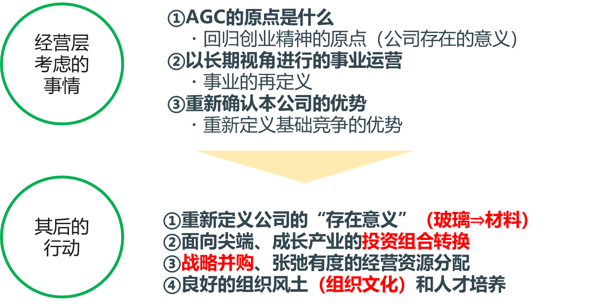
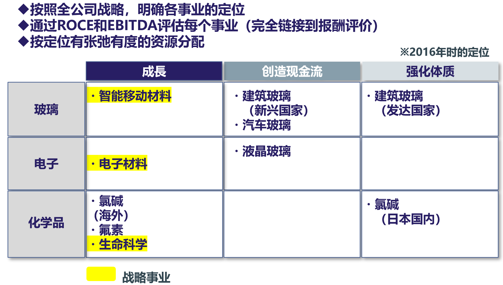

尽管近年来有关日本企业的负面消息较多，但是2022年的GDP组成显示日本制造业仍然是日本经济的重要支撑。

材料业占据了制造业的三成，是重要的组成部分

材料不仅影响产品的性能，更是推动社会变革的重要因素

日本材料产业在全球的占有率任然名列前茅
## 从AGC的改名历史看B2C的转型
这篇来自经济观察网的文章主要讲述了日本百年企业AGC集团（前旭硝子株式会社）在中国市场的品牌重塑战略，核心内容包括：

1. ​**​品牌更名背景​**​
    - 2018年首次从"旭硝子"更名为"AGC株式会社"，因原日文名称中的"硝子"（玻璃）已无法涵盖其多元化的电子、化学、工业陶瓷等业务。
    - 2019年二次启用中文名"艾杰旭"，旨在通过本土化名称拉近与中国消费者距离，寓意"超越旭硝子，成为杰出存在"。
2. ​**​战略转型：从B2B到触达C端​**​
    - AGC长期以B2B业务为主（汽车玻璃、电子材料、建筑涂层等），但意识到终端消费者认知薄弱影响市场渗透。
    - 案例：**手机盖板玻璃、快餐包装纸等产品虽被广泛应用，但因保密协议或缺乏标识导致品牌露出不足**。
    - 计划通过广告投放（如进博会期间的地铁、机场广告）、社交媒体/KOL推广提升大众认知。
3. ​**​适应中国市场的挑战​**​
    - 品牌知名度低：2017年新任中国总代表上田敏裕指出需突破政府/行业认知，转向消费者层面。
    - 速度差异：**日本"工匠精神"与中国市场对快速产品化的需求矛盾**，通过与中国初创企业合作、建立本土研发中心（侧重应用开发）实现"开放式创新"。
4. ​**​中国市场的重要性​**​
    - 中国是AGC全球核心市场，业务布局从沿海向内陆延伸（如四川、重庆）。
    - 借力中国新兴产业（半导体、生物技术、智能移动等）寻求增长，通过《跨国公司投资中国40年报告》被列为典型案例。
​**​核心结论​**​：AGC通过更名本土化、营销策略转型及研发本土化，试图解决在华品牌认知度不足的问题，以应对中国消费市场快速变化的需求，巩固其"玻璃大王"地位并拓展多元业务影响力。

## 二元化经营

### 二元化经营的问题意识

简单来说二元化经营就是在同一公司中，同时追求现在的既有事业和将来的探索事业的经营
同时具备深挖现有事业的能力（Exploit）和探索新事业机会的能力（Explore）。
- 在“现在的市场”和“未来的市场”竞争。（O’Reilly教授）
- “玩两个不同的游戏”（O’Reilly教授）
- 建立“防守经营”和“进攻经营”的平衡。

**“战略论”ד组织论”＝“组织经营论”**

### AGC践行“二元化经营”的背景

2015年以来　在收益连续下降的情况下

如何建立组织文化
- 培养年轻的新秀，咨询他们的有关公司未来的蓝图设想
- 组织了很多场由高层主持的、气氛融洽的座谈会。硬件和软件（思想）不断变化，直至顺理成章地成功。

### 事业投资组合变革的方向性
通过推进二元化的经营，旨在构建可灵活应对市场
### 投资组合转换
**有前景的提前布局，保留优势赚取现金，没有用的直接丢弃**

## 日本企业成功的秘诀
- 从长期视角出发，追求可持续发展的同时，根据环境变化改变使命。
- 重视基础研究，持续长期研发。
- 改变投资组合。
- 和客户建立长期信赖关系，客户有困难和挑战时，会第一时间和AGC交流。
- 重视现场，重视安全。
- 管理层与现场的距离很近，还可以提高现场员工的士气。

