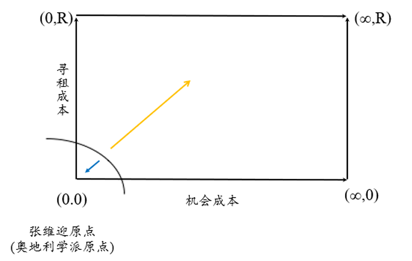
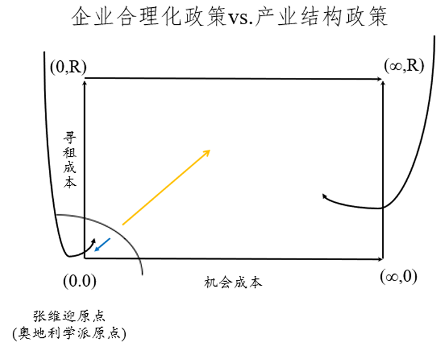
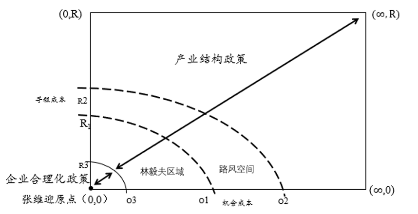
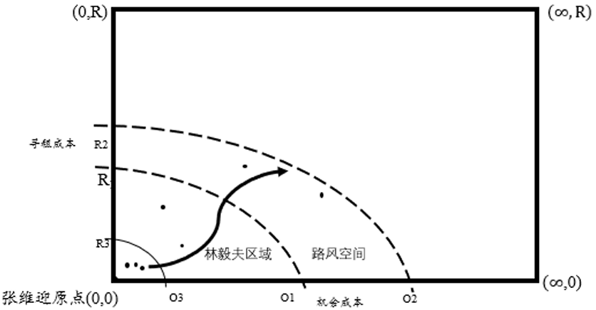

==市场、行政与社会机制如何在行业发展中协调？==

## 导论（一）：谁应该是企业大型投资项目的决策者？

**1980年代中期西方某大国的调查：**

（1）政府决定或政府与企业共同决定：2/3

（2）市场或企业单独决策：1/3

↑法国：行政介入的传统非常强

今天所要讲的：日本经济发展中政府的作用
实际上，在所有国家的发展过程中，政府都具有重要的地位和作用。

## 导论（二）：经济发展中的市场、政府和社会

**1917年，俄国爆发“十月革命”，列宁的演讲图片，旁边站了两个人**

其中一个人是托洛斯基——托派领袖

十月革命中，列宁的作用非常重要。而在十月革命前，列宁被放逐至瑞士，并不在俄国国内，此时在国内贡献更多的是托洛斯基。当时，托洛斯基为军事委员会主席，不过托洛斯基也有不在国内的时候，就有卡米涅夫以及“卡米涅夫们”主政。因此，**十月革命是三种政治人物结合的成果：列宁、托洛斯基和卡米涅夫们。**

一个正常的社会发展过程，也是三种力量相互交叉的逻辑，即国家、市场、社会相互支撑。1949年新中国成立后，**到改革开放之前，我国都只有国家/行政（缺乏市场和社会）**。1978年后，引进市场当然是对的，但我国改革后好像国家该做的就不做了。例如，90年代中后期，我国因市场化出现大规模的下岗潮。这一时期，我国也不存在社会，但社会组织也应当在行业中发挥作用。

**“正如斯密高估了市场的自然性，韦伯高估了官僚制的不可避免。”**

↑一般认为，斯密理解的市场是自发形成的市场（看不见的手），但实际上市场不是自发形成的。而韦伯关于官僚制的研究中，认为官僚制非常重要。但二者不是全部，除此之外的社会机制也会发生作用。

不过，本讲暂时只关注国家和市场的作用。

## 前置问题：第四单元在本课之中的位置

在本课之中理解政策和政治，需要建立在前讲内容的基础上。首先看政府和外围三种市场（第二单元）的关系，同时政府也指向企业（制造业拆分为技术能力和组织形态）。

l  **关于工业战略的三个研究方向：**
（1）政府与三种市场中的制度；
（2）政府与企业创新；
（3）经济发展中的市场、政府与社会

## 一、林张之争和日本实践——政府在战后日本经济发展中的作用

### （一）林毅夫VS张维迎：一场产业政策的“世纪之辩”

老师认为，张维迎的表现更好，逻辑更自洽。

这场争辩其实就是市场和政府（计划）的辩论。

#### 1.观察林张之争：三个学科的视角

**（1）经济学：难以结束的论战**

①林：修正主义的新古典经济学（稍微强调国家一些）

②张：奥地利学派经济学（最自由主义的经济学）

新古典虽然还算自由，但仍然承认市场失败，奥地利是完全不承认市场失败的。两派观点在经济学上是不可能有调和的结论的，底层逻辑是经济哲学的不同，所以没有办法结束。

例如，张维迎认为，美国2009年的经济危机是利率定错了，仍然不是市场失败。

**（2）政治学：被忽视的背景**

今日美国和中国，也上升到了政策的层面。

**（3）管理学：被悬置的要点**

当政府介入成为给定的存在，即介入与否不是问题后，重要的是如何介入，包括企业管理和公共管理。

#### **2.林张之争的本质：修正主义的新古典经济学VS****奥地利学派**

l  **【市场与政府的关系：张维迎的逻辑】学术界质疑产业政策的两个要点：**

张维迎派认为：政府不行↓

（1）对于行政机制的怀疑：寻租成本

>“李斯特正确地指出了市场失灵的可能性、即在具有很强的不确定性和外部性的动态过程中、尤其是在发展的初期，新产业中的长期投资往往低于最优水平。然而，他是否认识到政府为保护幼稚产业而对市场进行干预可能会产生比市场失灵更为严重的政府失灵是令人怀疑的。这个危险可以叫做李斯特陷阱”                                                                       ——速水佑次郎、神门善久,2009: 214,23

例1：人为制造稀缺，导致出租车牌照非常值钱，请别人吃饭就可以拿到牌照，请吃饭的支出就是寻租成本。假设理性计算，“政策成本的完全消化”是指吃饭的支出和能够发放的牌照价值是相等的。
例2：进口配额由官员判断，导致对稀缺性的人为创造。

==张维迎认为，**寻租成本会完全等于租金**，导致租金被完全消耗。==这不是简单的腐败问题，而是企业将生产性支出消耗到非生产性事项上。

（2）对于市场机制的肯定（无限信任）：机会成本

==资源，一定存在潜在的、复数的、竞争性的使用途径。给这个用，没给那个用，（收益）就是机会成本。潜在使用用途越多，机会成本越高；同时，一个市场越发达，潜在的使用用途就越多，给定资源的机会成本就越高。==

政策介入一定伴随着资金进入，如财政补贴、低息贷款，由此一定形成机会成本。张维迎认为市场非常完美，那么市场机制越发达，政策资金的潜在用途就越多，无限运用空间可以带来巨大收益，逻辑上100块钱也可以创造无数个比尔盖茨。

**张维迎在什么条件下才可能同意介入？**

张维迎认为政府什么也不是，张维迎想象的世界是机会成本特别高、寻租成本也特别高的。
1. 政府介入之前，企业已经开始生产（本来就是企业愿意的事情，而非政府推动企业进入行业）；
2. 政府介入的寻租成本为零；
3. 政策租金/行政资源的机会成本为零（例如出租车牌照不要钱了）。
设想的情形就是，企业已经进入市场，但可能遇到一些困难不愿意退出，就找到政府，而政府介入的寻租成本为零，政策租金的机会成本为零。

——>②和③的经济学含义：政策租金=0
两种都为零的情形非常小，因为政府存在本身都是需要成本的。

**【回到ATM】资产专用性的解决：政府介入行业**

市场机制可以解决资产专用性的问题，但需要很多时间，后来台湾政府的解决方式就是ATM，将组装厂和配件厂叫到一起，反复接触产生信任，弱化资产专用性的问题——社会机制（social networking），还是费时间。

最后登场的是地方政府的官员们，为交易背书（政府的公信力总比企业强）。

①本案中，ATM是还想干自行车，又干不下去，所以政府出面；

②企业求政府出场，谈不上寻租成本；

③机会成本：发改委在办公室坐着也是坐着。

### （二）存在不以大量资金投入为前提的产业政策吗？

l  **产业政策分为两种：被遗忘的分类方法——产业结构政策VS企业合理化政策**
所谓**产业结构政策**即**支持特定产业发展的政策**；所谓企业合理化政策则主要指**政府推动企业采用新技术、投资新设备、进行质量控制、降低成本、学习新的管理技巧和提高管理水平的政策**。企业合理化的实质是政府在微观层面采取政策措施，帮助企业提高管理水平。**所谓合理化政策就是政府将特定企业所在产业的最优管理实践向企业推广的政策**。   (Johnson, 1982: 27)

（1）产业结构政策：支持特定产业发展的政策。需要政府大量花钱，在现有产业中找几个重点产业扶持，如我国扶持半导体、芯片，而且往往指向大企业；
（2）企业合理化政策：政府推动企业采用新技术、投资新设备、推动企业进行质量控制、降低成本、学习新的管理技巧和**提高管理水平的政策**。
- 基建：如港口造陆；
- 政府推动企业改进管理水平、采用最有效的管理方法

东亚的产业政策是从日本开始的，上述两种政策在日本都有，韩国、中国大陆和中国台湾都从日本学，我国大陆和韩国更多学的是产业结构政策，而台湾两种都学，ATM就是企业合理化政策在台湾的衍生（不花钱、协调改进企业管理方法）。

l  **职业官僚们：**
（1）经济民主理念：佐桥兹
（2）国际协调派

### （三）张维迎原点、林毅夫区域和路风空间：三种产业政策论

**路风空间：寻租成本稍增一些，机会成本增的更多——演化经济学的逻辑**

虽然投入2000亿，但京东方可能形成韩国和日本没有的企业能力（进化）

**沟通张维迎原点、林毅夫区域和路风空间：演化经济学视角下的产业政策研究**

成功的产业政策可以连成一道曲线
给定条件：后进国家的发展过程中，政府一定是会做事的，也一定会有成功和失败，要追求的是尽量少失败、少损失，更重要的是把成功的逻辑画出来（成功的产业政策）

## 二、政策诱导租的分配与运用：一个分析框架（管理学）

==**介入无法回避，需要寻找的是成功的规律**==

在后进国家，产业政策客观存在。因此，后进国家是否应该推行产业政策在相当程度上是伪问题。在实践中，既存在成功的政策，也存在失败的政策。所以，如何归纳成功的政策实践的规律是关键问题。在“市场在资源配置中发挥决定性作用”的前提下，发掘日本的政策实践中既尊重市场规律，又发挥政府作用的成功案例的内在规律具有重要意义，产品建构理论是理解上述规律的途径之一。

然而，林毅夫的世界中，只有产业结构政策，没有企业合理化政策。同样，中国地方政府的政策也是这样。因此，我国没有一个产业政策是既发挥了市场的决定性作用，又发挥了政府的作用。
- 产业结构政策针对的是京东方、华为这样的大企业；
- 而企业合理化政策是针对中小企业，支持最弱势的企业，规模不同企业的平等是一种经济民主的命题。这之所以重要，是因为很多大企业，如华为，都是从小企业起来的。

### （一）关于产业政策的管理学定义【公共管理的角度】

==**产业政策是公共政策吗？如果认为企业合理化政策也是管理政策的话，这种产业政策具有公共性，也就属于公告政策。**==

**产业政策的政策过程：两阶段、双主体、两种战略，相互对接、无法切开（老师著作：****p52-53****）**

**（1）政府向特定产业分配政策诱导租：政府提供稀缺资源**

租：稀缺资源带来的收益——政府分配资源是稀缺的

政策过程的第一个过程：这里的资源不一定是钱，也有可能是市场保护，政府把资源给企业，而政府的目的不是资源的转移，而是**希望企业实现自己的政策目标，变强、交税

↑政府战略/国家战略：国家意志；产业政策的主要主体是政府

**（2）特定产业的企业通过生产活动和战略行为将政策诱导租转化为企业能力，即在市场竞争中获得熊彼特租。**

**运用资源，拿政府的钱去生产性价比更高的产品，形成他人没有的能力，**如**创新**（创新能力显然是稀缺的，这种稀缺资源带来的收益是熊彼特租，简言之就是比别人好的能力，这种稀缺性体现为企业能力上的稀缺性）

↑企业战略；产业政策主要主体是企业

### （二）上述定义的意义

（1）将公共管理和企业管理相结合

（2）明确成功的产业政策的要点：
- 租金的性质；
  租金的性质必须是开放的、竞争性的，不能说只给国有企业，不给民营企业
- 分配政策诱导租的效率（寻租成本的规模）；
- 企业运用政策诱导租的效率

l  **产业政策能否成功的关键：**
- 如果在政府配置政策诱导租的过程中出现的寻租成本过高，那么介入很难成功；
- 即使政府成功地抑制了寻租成本的规模，如果企业难以在生产过程中将政策诱导租转化为熊彼特租，那么政府的介入也是失败的。

| **政府介入产业发展的效果取决于政策诱导租转化为熊彼特租的规模与效率：**

**政府战略、政府能力与企业战略、企业能力共同决定工业战略的效率。但是，政府战略与企业战略在不同产业中的实然结合形态不同，在不同产业中的效果不同。**

政府能力：控制寻租成本————企业能力：创新

产业结构政策更多影响的是企业定位，企业合理化政策更多的影响企业竞争力。

==**↑日本是同时用这两个政策的**==

### （三）企业竞争力的源泉与政府介入：分析框架的扩张

#### 1.影响企业竞争力的因素：政策如何影响组织、技术以及组织-技术互补性

当制造业企业的组织形态和技术特征匹配时，更容易形成企业能力。

#### 2.工作假说：产业政策的路径

（1）改变企业的组织能力，影响企业的组织建构：

政府可以通过影响**企业组织形态**来推动企业能力的形成；

（2）改变政府的技术能力，影响企业的产品建构：

政府可以通过改变**产品建构**来影响企业能力的形成；

（3）在政府难以改变产品建构的情况下，改进二者的结合形态，影响组织建构和产品建构的互补性/匹配方法（不是说组织能力高、技术能力强的企业就一定能成功）

        ①产品的建构特征是影响政府能力和企业能力的互动及其效果的关键变量;

        ②政府可以推动企业以适应产品建构特征的方式发展企业能力

        ③政府可以通过改变**商业模式建构**来影响企业能力

## 三、实践之中的企业合理化政策：Swatch【失败的案例】

将分散于各个企业集团内部的技术聚拢起来，而政府需要做的就是在各个利益集团之间搭建起联系，结果变成了失败的产业结构政策，没有聚焦于行业形成竞争力的焦点上。

对比：A-Team案例就是典型的成功的企业合理化案例

关于产业政策，老师强调产业结构政策和企业合理化政策的这种分类方法：