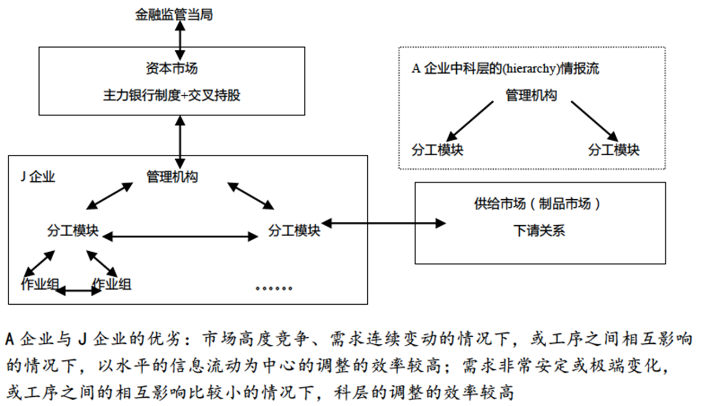

关键词：直接交易；间接交易；长期特定交易；中间组织；下请制；中间组织

按照中间商的介入程度，可以将制品市场分为两类：消费品市场与工业品市场
消费品：中间商介入程度比较大；工业品：中间商作用不太明显
两种制品市场中均存在信息不对称问题，两国对此形成完全不同的解决方案

## 导论（一）：消费品市场（消费品流通过程）的日美比较

**l  1968年，两国批发交易额与零售交易额的比例：日本-4.8:1  VS美国-1.3:1**

——日本的比例更高，消费品流通更复杂，消费中介的作用更大。

>批发额：是指售给国民经济各行业用于生产、经营用的商品金额。
>
>零售额：是指批发和零售业售予城乡居民用于生活消费和社会集团用于公共消费的商品金额。
>
>根据上述概念我们可以看出，批发额与零售额主要是按它的实际用途来区分，而不能以出售价格是批发价或零售价来区分，也不能以销售数量的多少来区分。**用于生产经营的属于商品批发，用于城乡居民和社会集团生活消费的则属于商品零售。** 例如，卖给私人用于家庭生活用的小汽车属于商品零售，而卖给出租车公司用于出租车运营的小汽车则属于商品批发；卖给个人家庭或政府机关内部食堂（无对外营业活动）的蔬菜属于商品零售，而卖给餐馆用于**加工后再出售**的蔬菜则属于商品批发。[^1]

l  **美国和日本的地方城市居民都通过媒体或代理店进行旧车交易，两国居民用哪种方式的比例更高？**
假设有一台旧车，同时存在于美国和日本，但交易方式不同：
- 美国：报纸上的旧车交易信息广告；
- 日本：二手店去买
——日本的价格会更贵，因为要支付手续费

体现出美国和日本消除信息不对称的不同思路：
- 美国：直接交易——通过信息竞争
- 日本：间接交易——以中间人的信誉为担保

l  **日美两国流通业的比较优势：**
（1）细分市场一：大商场  ——美资企业压倒性地比日资强。
（2）细分市场二：便利店  ——日资压倒性地比美资强。
在大商场中，日本根本无法和美国比；而在便利店领域，日本却显著领先于美国。

## 导论（二）：工业品市场的日美比较

l  **中美经济战略对话与日美构造协议：**
作为领先者的美国，对待中国和日本的态度是类似的。

l  **美国认为日本流通市场存在的结构性障碍：**
1. 流通市场的封闭性；
2. 下请制；——日方在面对美国强大压力时仍然觉得有道理的制度
3. 交叉持股制；
4. 劳动问题（加班时间过长）等。

l  **下请制（sub-contrast system**）与工业品市场之中的信息不对称问题：

下请制（下請け）：长期、反复交易
直接接活的公司也叫做 元請け，如果项目规模较大无法完全覆盖，可以分出一部分 下請け 给别人，收到 下請け 工作的公司可能会进一步 下請け 给其他公司

【美国的解决方案】类似于消费品市场

## 一、交易中的问题与契约的局限性

### （一）交易中存在的问题
1.信息不对称
2.holdup problem（敲竹杠）与asset specificity（资产专用性）

l  **北京京东方和绵阳电视机厂——京东方是否应在绵阳新建生产线？**
不应该；后期合作中绵阳方可能借机压价而北京方无法反制。

### （二）契约的功能与局限性
（1）契约很难穷尽所有的问题；
（2）契约的本质是用法律解决问题，但制造业企业是不爱打官司的

美国经济是契约密集型的经济；日本经济是信赖密集型的经济
## 二、日本消费品市场的交易

### （一）结构性特征：W/R比率高
日本的W/R较高，消费品市场的交易比较繁琐。

### （二）原因：为什么W/R比率高

1.消费者购买行动的特征：
（1）日本消费者小批量、多次购买，如每天去买菜；
（2）如果消费者是如上购买特征，那么销售方的进货特征也是如此。

2.流通市场中的中间商非常多：三种流通中间商共存的业态；
综合商社→批发商→中小零售企业

3.经营内容单一的大量中小零售企业存在。
（1）零售商极其专业化，对于上游依赖程度高；
（2）繁琐的流程导致过度服务（over-service）

l  **为什么中小零售企业不联合？**

历史发展：批发商承担物流、配送、金融、信息功能

### （三）直接交易与间接交易的优劣：以日美旧车市场为例

    日本流通业非常封闭，外国资本进入日本很困难，由此导致日资企业在国内被保护得太好，进入国际市场面临很多问题。

## 三、下请制（sub-contrast system）→中文：发包制

### （一）下请制的实际形态：调节阀还是助推器？

（1）调节阀：主机厂用于调节成本的调节阀，层层向下压成本，将降低成本压力转移到底层企业；
（2）助推器：长期交易对双方都有好处。

——两种评价都是对的

【助推器】油车市场，消费者比的是性价比，而非质量（不在乎钱的是一个很小的细分市场）。高级、质量好，但价格很贵，销量也不可能好。

### （二）理解下请制的要点
   
（1）信赖（对契约的信赖，对能力的信赖，对善意的信赖）；
（2）经济价值，而不是文化价值（不能什么事情都简单地用文化差异解释）

|     | 经济类型                                  | 交易模式                                                |
| --- | ------------------------------------- | --------------------------------------------------- |
| 美国  | 契约密集型（contrast-intensive transaction） | 保持距离、疏远的交易模式（Arm’s Length contractual relationship） |
| 日本  | 信任密集型（trust-intensive transaction）    | 基于义务的交易模式（Obligational contractual relationship）    |

### （三）长期交易与流动交易的优劣：以交易成本为中心的比较

交易成本：
（1）调查费用；
（2）交涉费用；
（3）库存费用；
（4）监视费用；
（5）信赖形成费用；
（6）调整费用。

l  **长期交易的优点：**
1. 能够节约调查成本、交涉成本、库存成本、监视成本；
2. 但是增加了信赖形成费用和调整费用。
   A.由于过于重视过往的交易，取得信任的过程时间很长；
   B.交易双方为了“分手”，需要经历很长时间

### （四）中间组织：在市场原理与组织原理之间

**经济学家将【下请制】称为“中间组织”，理论上可以将中间组织理解为“组织”，但其遵循市场原理和组织原理。**——市场和组织/企业是完全不同的逻辑↓
#### 1.经济发展之中的资源配置问题
（1）由市场进行的资源配置：在企业间配置资源
	市场机制就是价格机制，市场配置资源，指的就是在企业间配置资源，价高者得。

（2）由组织进行的资源配置：在企业内配置资源
	例：老板让员工加班；员工搬办公室。
	企业配置资源，是指在企业边界内配置资源。

#### 2.两套机制配置资源的原理：

（1）交易参加者的决定原则：交易参加者根据什么决定行动？
- 市场：经济学上，交易参加者采取行动取决于**价格**
- 组织：power ＆ authority

（2）交易参加者的相互关系：
- 市场：双方可以合作、可以不合作，甚至可以相互不认识；
- 组织：双方间的关系不是一次性的，而是长期持续的。

#### ||| 资源配置的原理
l  **由市场进行资源配置的原理**：M1=价格；M2=自由的参入与退出
l  **由组织进行资源配置的原理**：O1=权限；O2=固定的、持续的关系

理论上的情形：M1、M2才能同时出现；O1、O2才能同时出现
即市场原理=（M1，M2）——完全市场，组织原理=（O1，O2）——一体化企业
实际上的情形会出现以下的变形
#### 3.交易参加者的决定原则的变形：
M1+O1
- 中国——改革初期分权的计划经济；
- 日本——行政指导/窗口指导
#### 4.交易参加者的相互关系原则的变形：
M2+O2——下请制；长期交易
（1）组装厂保留解除下请关系的权利；
（2）银行与企业间的长期交易。

#### ||| **现实世界的资源分配原理 (M1, M1+O1,O1; M2, M2+O2, O2)**

**任何国家都会存在中间组织，但比重不同，日本的比重更高，浓度也更高。**

今井贤一：从交易决策的依据以及交易方式两个方面区分企业、市场和中间型组织
（1）市场是以价格为决策依据、采取自由组合交易方式的制度安排；
（2）企业则是以权限划分为决策依据、采取连续交易方式的制度安排
（3）中间性组织是介于其中的混合性制度安排，包括：
- 组织采取以价格为决策依据 和连续交易方式，如战略联盟；
- 组织采取以权限划分为决策依据，和自由组合交易方式，如非营利性组织
七十年代石油危机、二十一世纪初
### （五）日美经济中中间组织的比重

——典型：企业集团；保持长期交易的企业

· 中间组织的机能

——日本企业集团中的最终决定权：基于市场要求的组织决定

### （六）中间组织的变动方向与日本经济
（1）组织的影响增强；
（2）市场的影响增强；
（3）通过组织革新应对变化（原地深化）
- 1.应对冲击，主机厂与配件厂合作优化技术；
- 2.下请制的好处：主机厂、配件厂合作进行研发，配件厂在下请制的保障下，可以较少担心资产专用性问题，故可以配合主机厂进行研发与生产，加速产品创新

l  **1970s初期，日本中间组织受到冲击，但基本维持。近年来，日本经济的中间组织的存在遇到了前所未有的挑战，为什么？**
- 1970s：由于世界范围内出现石油危机，日本实行“减量经营”，由中间组织和主机厂共同研发，中间组织因合作深化而受到挑战；→中间组织向组织一端（O1+O2）变化
- 21世纪初期：由于行业出现分化，部分长期交易关系解体

l  **中间组织在日本经济中发挥作用的前提：**
1.经济成长；
2.连续的技术变化（类似金融市场、劳动市场长期交易得以维持的条件）

l  **能否提出关于中间组织的优劣的解释？**

## 四、汽车产业中的零件交易

### （一）下请企业的定义
（1）雇员少于300人；
（2）资本金少于1亿日元；
（3）与大企业有长期合作关系。

### （二）汽车产业的三个关键环节
（1）产品开发系统；
（2）采购系统；
（3）生产系统。

### （三）对日本零件企业的负面印象
（1）景气循环的调节器；
（2）家父长制（内部组织）。

### （四）交易长度与数量决定

### （五）下请企业的两极：承认图企业与贷与图企业
#### 1.与组装企业的关系：
（1）图纸的所有权
（2）与单一还是复数组装企业合作；
（3）设计能力(design in)；
（4）模具费的负担
#### 2.利润与技术水平成正比：
价格结构向组装厂公开的程度与价格交涉能力及技术水平成反比
#### 3.汽车产业中的零件交易的特点：
（1）长期交易；
（2）少数企业之间的有效竞争；
（3）相关业务的集中外包(bundled outsourcing)

**三者之间的互补性**

## 小结

为解决工业制品市场之中的信息不对称问题，日本企业发展出制度化的解决方案。这种制度化的解决方案在一定程度上缓解了信息不对称问题。但是，这种解决方案也引起了特殊的问题。

请问，这种问题可能是什么？
- 消费品市场——B→C：过度服务问题（中间商过多）；
- 工业制品市场——B→B：过量生产问题（overproduction），
- 高度成长的市场扩张消解了过量贷款、过量劳动、过量生产等问题

## 参考资料

[^1]: 批发额和零售额的知识 [【统计应知应会知识】之六：贸易统计](https://mp.weixin.qq.com/s/X3zTXIOFn0DBYzG687ybSg)
