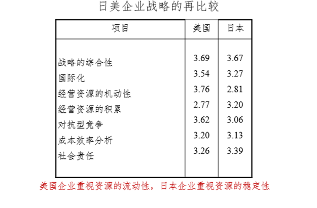

关键词：定位；能力；战略

## 第二单元与第三单元的联系

过量贷款+过度劳动+过度服务/生产=过度竞争

注：过度竞争不是经济学的概念，因为经济学认为竞争越充分越好

## 导论（一）：波特的日本经济批判

l  **关于日本经济衰退的宏观解释（前些年流行）：**

（1）工资侵蚀利润说；

（2）产业构造调整不良说：日本的平台经济发展不完善；

（3）财政政策失败说；

（4）金融缓和不足说；

（5）银行机能低下说：识别风险的能力降低。

l  **宏观解释的微观基础（宏观是微观的加总，但宏观不能替代微观解释）**

a, b与企业活动直接相关；c, d, e与企业活动间接相关

l  **波特的批判：**

（1）政商关系批评：日本的政商关系是有问题的；

（2）日本企业批判：“日本企业无战略”、日本企业的战略高度趋同（差别化才是战略的本质）

日本企业的日常工作：提高产量（为了应付过量贷款和过量雇佣）+降低成本（工具革新）+管理技术=日本企业的竞争优势

——对此，波特认为前述生产/品质管理不是战略，因为不具有差异化

## 导论（二）：斯沃琪、A-Team与苹果公司：企业、公共组织的战略协同

·斯沃琪（Swatch）是第一块非机械表，瑞士的钟表工业非常发达，与其政治有关。

## 一、企业战略的主要流派

### （一）什么是战略

**1.定义一：对企业未来的形态（规模、性质）的设想以及达成这一设想所采用的方法**

钱德勒：战略是把握现状和理想状态之间的差距，寻找一个填补差距的方法，并把方法投入管理实践再循环——这个方法就是【战略】

（以上的战略是指主观与客观相结合的）

企业战略中设想的部分与经营者的构想能力有关，而为达成这一设想所采用的方法是企业战略的主体部分。简单来说，第一个逗号之前的内容是非常主观的，而第一个逗号之后是客观的，即方法必须是靠谱的。

**2.定义二：战略是应对竞争、获取竞争优势和获取租金的方式。**

（1）应对竞争的方法；

（2）获得竞争优势的方法；

（3）获得租金的方法

**竞争优势：利润超过行业平均利润**

——那么战略就是获得超过行业平均利润的利润的方法，而“超过行业平均利润的利润”在经济学上可以粗略地称为【租金】

### （二）战略体系

**1.战略的逻辑分类：三种**

**（1）竞争战略：**只能发生在提供同一具体产品的不同企业的事业部层面

竞争战略只能发生在事业部层面，即提供产品的事业部在竞争市场上卖东西的方法，如海尔和海信在中国市场上卖冰箱的办法——围绕同一产品。

**（2）功能性战略：**横向贯穿同一企业之下的各个事业部

例：不同学院的教授基础工资是差不多的，体现了人事战略贯穿不同事业部

**（3）公司（企业）战略：**发生在总部层面

①形态一：在横轴上，协调企业内不同事业部之间的关系；

②形态二：在纵轴上，协调功能性战略的关系

**2.实践之中的战略类型：两个案例与两种类型**

（1）大和速递（YOMATO）公司战略

例：日本有一家给百货店提供物流服务的大和速递公司，生意一直很好，直至70年代实体店铺不再扩张，该公司必须寻找新市场，即个人物流（中产阶级在高度成长期后形成）。所有公司都注意到了这个新市场，但没有人敢进入，因为不能保证天天有人发速递。现在顺丰的方法是：划片管理，保证一个人负责区域的加总运输量。

（2）本田公司的战略

二战后，本田一边做汽车、一边做摩托，在50年代后成为日本第一的摩托。1959年，本田不满足于国内市场，于是进军美国，甚至挑战哈雷，当时美国摩托车市场的49%为英国企业控制。**直至1963年，本田占有美国市场的63%。**

>**BCG对本田战略的分析：定位和定价**

①定位：不同于英国的“红海战略”，本田实行“蓝海战略”；

②定价：往便宜卖，换取累计生产量上升。

**然而，有学者去采访当年的实际经营者，却得到了不同的答案**

“我的战略就是：能卖出些什么就卖什么，在此之外没有战略”

老师认为，本田在美国成功的根本原因在于，改变了中产阶级对摩托的认识，即普通人也能骑摩托。

（3）总结：

①理性规划的战略：学校是可以教的

②实践涌现的战略：只能依靠实践和经验，无非是通过不断学习上一种积累经验。

### （三）企业战略的三个层次与四个侧面

**1.****三个层次：**

事业单位战略/竞争战略、功能战略与公司战略

**2.****四个侧面：**

（1）企业；（2）环境；

（3）发生于企业外部的相互作用；（4）发生于企业内部的相互作用

**3.****企业战略的关键：匹配**

### （四）战略管理的主要流派（本节重点）

l  **两根轴：将十种战略分为四派**

例1：中国人的婚礼→企业和客户的关系：复数的企业竞争市场份额

新郎往往说“托各位领导的福才能找到这么好的人”→外部因素

   实际上可能是因为新郎自身足球踢的好，而新娘就喜欢体育好的→内部因素

例2：选餐馆：味道和服务是主要的影响因素

如果不换厨师，那味道就不会变→时间因素（静态因素or动态因素）

l  **因为企业战略可被定义为获取竞争优势的方法，所以关于战略的理论都是关于竞争优势的性质和来源展开的**

（1）纵轴：竞争优势来源于内部还是外部

（2）横轴：竞争优势有无时间性

l  **重点：**

（1）定位学派：竞争优势来源于外部；

（2）基于资源和能力的战略观：竞争优势来源于企业内部，即**核心竞争力**

（3）二者的关系：

①定位和核心能力究竟是什么意思？

②定位和核心能力的关系的全部：对立及其他

l  **【案例】西南航空的兴起与JAL****的重建：共同点何在**

老师去民航局培训的背景：海航扩张过于严重，以至于破产

**美国西南航空的战略（Southwest Airlines****：leader of LCC****，全世界最著名的廉航公司，1973****年以来连续盈利年数最长的航空公司）**

（1）战略一：低成本

①高频度班机；

②高设备利用率；

③缩短机场停留时间。

   甚至连机上清洁都由员工完成，而不外包，降低成本。

（2）战略二：员工第一、大家庭理念【团建】

   机上清洁不仅由机组人员完成，高管也要参与。

n  **日本航空JAL****（世界第三大航空公司，2010****年破产退市，两年后重新上市）的重组：大型企业如何改善业绩——稻盛和夫扭亏为盈的战略**

（1）战略一：裁减亏本航线

（2）战略二：阿米巴（Amoeba）经营

                阿米巴：生物的原生态

    ①全员参与经营，培养员工的能力；

②独立的部门核算制：根据业务和项目，将大组织分割成很多小的单元，提高效率，避免大组织沟通不畅。

**西南航空与日本航空的共同点：**

注：迈克尔·波特的中国演讲——什么是【定位】、战略的本质是什么

### （五）两种战略观的竞争与互补

**【回到定义】战略是把握现状和理想状态之间的差距。**

例：一个好的足球前锋必须结合好的脚法和跑位才能进球。

尽管【定位】和【核心能力】是对立的，即一个强调外部环境、一个着眼于企业自身内部，但实践中二者往往是结合的，即上图的两条线都结合了定位和核心能力的共同构筑（实质是完全一样的走法，只不过方法不同）。

（1）西南航空：低成本（定位）+团建（构筑内部能力）

（2）JAP：砍航线（用减法的方式定位）+阿米巴经营（构筑内部能力）

（3）共同点：都结合了两个看似矛盾的因素

>总结：理论是理论，无论理论上【定位】和【核心能力】如何独立，实践中都不可能只强调一头。

**1.注重企业环境（市场）的研究：哈佛传统与波特的战略理论**

（1）哈佛传统：SCP（市场结构决定企业行为，企业行为决定企业绩效）

——向外部寻求竞争优势的源泉

（2）波特的战略理论：通过独特的企业战略来实现**市场定位**并赢得竞争优势
* 事业单位战略（五力模型，定位）
* 公司战略（以竞争战略为基础|协同效果）
* 产业集聚（cluster）与国家竞争优势

**2.注重企业本身的研究：以资源为基础的战略理论（resource-based view：RBV）**
(1)向内部寻求竞争优势的源泉；
(2)强调组织固有的、难以被模仿的、隐性的资源以及组织；
(3)能力与企业绩效的关系。

依据RBV,企业战略行动的第一步在于寻找并积累独特的资源;

其后是依据这些选择企业在市场上的定位。

**独特的资源的特征**:
1. 竞争企业进行模仿需要成本和时间;
2. 资源的性质决定其难以被模仿 (因果关系不明确;隐性)；
3. 竞争企业由于自身原因而难以进行模仿 (与其已有的资源存在竞争关系)

### （六）回到波特的“日本企业无战略”

波特所言“日本企业无战略”，是站在【定位学派】的视角下，认为战略的本质是“差别化”，而日本企业则是趋同的。但站在【核心竞争力】的角度，日本企业对于经济学、管理学的贡献非常大，即持【核心竞争力】一派战略理论的人则会认为日本企业是有战略的。

## 二、日美企业战略比较：典型的日美企业经营目标的比较

**上世纪八九十年代，日美企业的战略目标存在结构性的不同**:

### （一）典型的日美企业经营目标的区别何在？

（1）日本企业更重视**市场份额****/****市场占有率**，而不是投资收益率，因为前者可以保雇佣；

美国企业的经营目标是让【股东高兴】，日本企业的经营目标是让【从业人员高兴】。

（2）日本企业更重视生产系统的改进。

### （二）对“日本企业无战略”的总结：

（1）现象层面：日本企业确实战略趋同，站在【定位】学派上可以认为“无战略”；

（2）但从RBV的逻辑来说，日本企业**强调资源稳定性和长期雇佣**，有可能某些情况下产生特定资源
* 站在哪个学派来看
* RBV的逻辑只在某些情况下适用，同样美国人的做法也只在某些领域适用。