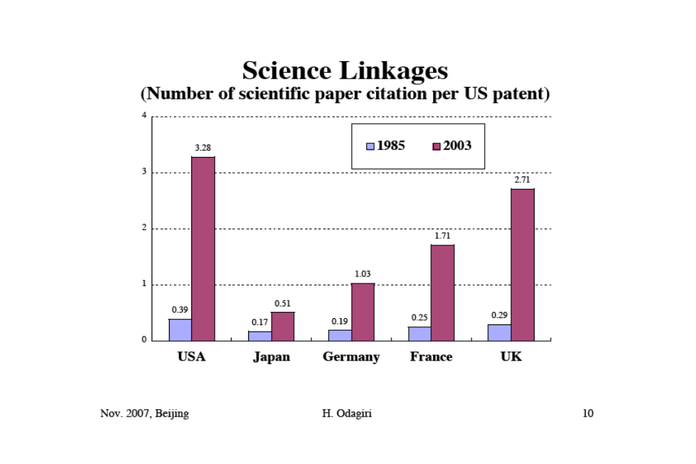
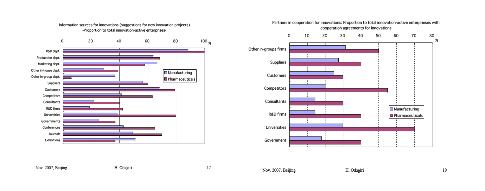

关键词：产品创新与工艺/工序创新；激进创新与渐进创新；R&D

## 关于上节课的导论的补充说明

l  **从贝米斯的四英寸立方体到中银胶囊大楼（新陈代谢学派的代表）**

l  **从双城记到兵马俑**

目的：为理解产品建构提供具体案例

（1）模块化的设计规则并不一定意味着产品低质量，而且我国大量产业是依托模块化崛起的，如我国现在新能源车的发展本质上和模块化密切相关，模块化也不意味着没有前途。

（2）德日确实是在集成化的行业中具有一定优势，但日本未必一定不擅长模块化，如中银胶囊大厦。

## 导论（一）：日本的诺贝尔奖

l  **近年来，日本在自然科学界获得诺贝尔奖的学者较多。日本诺贝尔得奖可以分为两类：**

（1）【汤川秀树】们：汤川秀树于1946年获得诺贝尔物理学奖；

西方名校背景、顶级精英路线、主流大学工作、从事纯理论研究

（2）【田中耕一】们：

本科学历、出身学校乱七八糟、在大学中没有职务、研究所的研究员、并非从事纯理论研究→偏技术性

**【结论】在日本得奖有限的情形下，得奖主偏技术的更多，暗示了日本的研发特征**

## 导论（二）：日本的原创性产品

l  **可穿戴设备（万步机→汪步机）：原本是在日本发明的，但是给狗用的**

**【特征】有创意、但没有商业化**

### （一）日本的原创性产品

早期：方便面、家庭用录像机、卡拉OK、随身听、CD播放器、蓝光播放器

近期：可穿戴设备、二维码、闪存、新能源汽车、锂离子电池、钙钛矿型太阳能电池

**问题：日本目前还是有发明能力，但几乎没有一个给日本带来获利**

### （二）创新的定义

创新的定义有很多，老师只能选几种：很短+本质（最严格+最苛刻）

1.【最苛刻的定义】Utterback：技术或商业模式的实际采用或**首次商业化**

(1) 创新是商业化行为，将创新（innovation）与发明（invention）区分开来

发明是在实验室中出现，在实验室中终结。

(2) 强调“首次”，已经有的叫模仿（imitation）

在这样的定义之下，很多企业的行为都不叫创新，如早期的腾讯、百度和阿里巴巴其实都没有创新

2.【最宽松的定义】熊彼特：生产者和生产手段的**新结合**

(1) 开发新产品；

(2) 改进产品工艺-新的生产方法；

(3) 打开新市场；

(4) 使用新原料/材料的重构；

(5) 经济部门/组织形态的重组

**注：关于创新的定义的严格程度是不同的，所以要统一在一个语境之下。**

**创新与发明一样吗？日本和美国分别更擅长发明还是创新？**

创新和发明不一样，日本更擅长创新，对原理、基础科学的贡献不大。

**创新一定伴随着技术革新吗？**

不一定，按照熊彼特的定义，组织形态的变革也叫创新。

### （三）日本式创新的特征

盆栽、插画、茶室、便当盒、卡拉OK房间、胶丸旅馆反映了日本固有的世界观之中的一个共同因素，即**在限定的空间与对象之中执着地构筑细密的事物**。

## 导论（三）：日本的创新悖论

**如果说，创新真的是经济发展的发动机，为什么在2007年的时候，日本的创新投入和强度非常大，但已经进入没落期，中国的创新投入和强度一般，但经济飞速发展？**

## 一、历史与数据

### （一）战后日本的技术发展：三个阶段

**1.阶段1：1945-1972**

通过引进技术（technology importation），实现赶超（catch-up）

**2.阶段2：1972-1990**

事实上的自主创新（indigenous innovation）

**3.阶段3：1991至今**

强化以科学为基础的创新（science-based innovations）

### （二）第一阶段：赶超

**1.活跃的技术引进**

（1）对产品进口实施规制，强迫外国企业发放技术许可；

背景：冷战，美国需要扶持日本经济崛起

（2）增加研发投资以吸收外国技术并实现创新

**2.原因：战前的教训（汽车和电子产业被外资控制）**

**3.表现：1952-1971年间，技术进口和研发置出以年均17%的速度增长**

### （三）第二阶段：事实上的自主创新

自主创新的英译：indigenous-本土的、土著的？

英语中没有对于“自主创新”非常对应的翻译，日语中也没有自主创新的准确翻译。

>**一般研究东亚经济的人会认为，日本和韩国非常强调自主创新，但日语中根本就没有自主创新这个词——这个国家一直这么干，但从来不说，为什么？**

（1）阴谋论？不太靠谱；

（2）语病：创新还有不自主的吗？

**深层的问题：日本企业无疑是自主创新，为什么没有对应的词汇？**

>**自主创新成为中国的政策语言，应当是2005年全国科技大会由胡锦涛提出，也就是说2005年我国并不重视自主创新？未必。**

1949年建国之后，我国强调“自力更生、艰苦奋斗”，这其实和“创新”没有区别。后来邓小平提出“科学技术是第一生产力”，那么理论上决定经济走向的应该是技术能力更强的，在当时即外资企业，但外资企业怎么可能把技术转移给我国？我国唯一的出路就还是自己来弄，那么邓小平强调的也是自主创新。接下来主管经济的是朱镕基，朱镕基强调要建立自主品牌，也就是说我国一直强调自主在技术领域的重要性。

但事实又是，我国确实到2005年之后才开始强调“自主创新”，其根源是：我国“从来都重视，长期解决不好”。

日本则是相反的逻辑：一直不说、一直在做

**【总结】我国和日本是完全对称的结构**

【用上节课的理论解释】日本企业崛起的时代是集成的时代，要进入某一行业必须具备基础的技术；中国企业崛起的时代是模块化的时代，即使不掌握核心技术，关键零部件已经像大宗商品一样流通，直接生产即可，但生产不形成技术。

例如，1978年之后，长春一汽和德国合作，**这种合资政策事实上改变了产品建构**，油车本来是集成化的，现在变成模块化了，德国工程师负责零部件的协调。

【政策改变产品建构的例子】秦始皇要求兵马俑设计师将兵马俑从集成化改为模块化

因此，日本一直在做自主创新，但日本不说，所以称为事实上的自主创新。

l  **2000年初，自主研发占国民生产总值的比率（R&D/GDP）变化：**

1.8（1970）→2.9%（1990）→3.4%（2004）    1978年，日本的该比率超过美国

l  **专利申请数量的增加：**

在1971-1987年间，以9%的速度增加。

l  **技术出口/技术进口比率增加：**

部分原因是日本企业在海外的分支机构向本土企业支付技术使用费，典型的是汽车产业。（90%的技术出口是对海外分支机构进行的）

 
 >**国际比较中的两个事实**

**（1）产业界积极参加研发：**日本企业研发经费占比远远超过美国

产业界：企业的钱；公共资金：政府的钱

**这种研发投资结构会引发什么问题：**

美国研发水平很高的产业的特点：周期长、研发投入大、风险高，如制药、计算机最底层的部件、生化等。这种资金和时间成本，根本不是企业可以承担的，在美国这种成本就是由公共资金承担的。

在此基础上，日本如果是政府资金比例低、产业界资金比例高，那就只能偏向技术，而非原理性的开发。

**（2）在研发中大企业发挥主导作用:**

例如，生化行业（最先进的领域）完全被大企业控制，有活力的中小企业很难出现。

>l  **美国政府在基础研发中的支出和介入比日本更高，但美国经济的自由程度不是更高吗？如何解释？**

是因为有一部分人用政府的钱解决了基础技术，形成的专利市场化程度很高。        在基础研发完成之后，美国政府迅速退出，之后就是专利的市场化。

**【典型的法案】拜杜法案**

例：苹果手机使用的十几项核心技术，没有一项是苹果自己研发的，而是美国的科学家们利用政府资金研发的。

R&D：R-研究-更接近原理，D-开发

苹果的伟大不在于R-基础研究，而是D，把研究变得好玩。

## 二、变化与问题

l  **赶超结束，到达技术前沿；**

l  **科学技术研究自身形态的变化**

### （一）科学与技术的变化

（1）知识产权的事实更为严格（IPR），相关纠纷增加；

（2）难以从海外获得技术

### （二）科学对研发的影响上升

>Science linkages：在美国申请专利时，申请材料中引用文献中硬科学的占比（the number of citations of scientific papers by US patents）

**美国更擅长开放的创新，日德更擅长封闭的创新**

主流行业中科学为基础的产业正在增加：Life science，ICT，Environmental Science，Nan'o-technology and materials

**日本作为一个后进国家，在科学基础上的薄弱使得其产业发展颓势难掩，竞争力优势丢失**

### （三）日本政府在以科学为基础的产业中采取的对策：

（1）促进产学合作：有限的资源集中在国立大学中；

（2）强化对知识产权的保护；

（3）促进新兴企业的出现。

l  **产学合作（UI collaboration）**
（1）主要渠道：学术论文

（2）更紧密的合作：大学科研成果的商业化，大学从产业界获得反馈

①大学申请专利并想产业界提供专利许可；

②大学产生的创新型企业；

③大学与企业进行联合研发；

④大学科研人员对企业研发提供建议和协助。

### （四）日本产学合作的历史

**1.早期曾经非常普遍**

（1）东芝的两位创业者之一是电子工程领域的大学教授；

（2）八幡制铁的主要生产设备是在大学教授的指导之下完成的；

（3）日本最早的制药企业的总工程师是大学教授。

**2.战后，政府对产学结合进行了规制**

（1）国立大学研究人员的公务员身份导致其很难为民间企业服务；

美国大学：私立大学主导  日本大学：国立大学主导(教官)

（2）政府不鼓励国立大学研究人员从企业申请研究经费、申请专利或花费时间为产业界提供建议；

（3）结果导致大多数产学合作以非正式的形式存在。

### （五）日本产学合作近期的改革

**1.国立大学的独立行政法人化**

**2.鼓励建立产学联盟**

国立大学参与的正式产学联盟的数量：1139（1990）→9387（2004）

**3.对建立产学联盟的企业提供税率的优惠**

**4.大学开始为产学联盟建立专门的研究机构，为联盟提供研究设施，设立推动大学向企业转让专利和技术的机构**

**5.奖励从大学出现的新兴企业**

（1）源于大学的新企业的数量：15（1995）→195（2004）；

（2）累计数量：1161（2005.8）vs 美国：4543（2004）

### （六）推动新兴企业出现的措施

**1.《促进新兴企业出现法》：1999年**

为新型中小企业提供补助金和债务担保，推动后者对新业务和新技术进行投资

**2.对“天使投资”提供税率优惠**

**3.降低成立股份公司的最低资本额**

**4.为管理者引入期权制度**

>**但是，科技型新兴企业仍然较少出现，为什么？**

**1.新兴企业面临的问题：**

（1）融资问题；（2）人员招聘问题（技术人员、非技术人员）

**2.制度化失业成本：**

跳槽：平级的公司不要你

二重结构：大企业和小企业在技术、工资水平上存在结构性差异

这样就不会有人跳槽

### （七）封闭创新VS开放创新

在这个时代，越来越多的行业从封闭走向open，例如跨国境的合作增加。

## 三、日本企业研发的特点

### （一）创新的类型与典型日美企业的创新的特点

**1.创新可分为：**
* (1)工序创新vs产品创新；
* (2)渐进创新vs激进创新；
* (3)封闭创新（使用组织内部现有资源的创新）vs开放创新（使用外部新资源的创新）
* (4)基于技术的创新vs基于科学的创新

**美国企业擅长右边的创新，这也是现在时代所需要的，而日德擅长的是左边的创新，越来越被时代所抛弃。**

**2.集成型产业群的创新VS模块型、平台型企业的创新**

### （二）创新的日本悖论

l  **为什么日本研发投资巨大，但是近年来研发投资对于经济的推动作用不明显？**
（1）政府研发资金过少，导致难以突破需要长期投入的关键技术；
（2）大企业的主导而不是中小企业主导

l  **这样的创新体系在新时期会面临什么问题？**

### 补论（一）：日本的技术传统

l  **少数派的问题意识：日本的技术都是引进的吗？**

老师认为，事实上，日本的技术积累最重要的就是引进的。
少数派意识固执地认为本国存在促进这些技术发展的文化

### 补论（二）：丰田召回事件

汽车行业的召回制度：一旦产品出现问题，就把汽车召回。汽车厂召回汽车是负责任的表现，但如果德日这种以制作精良著称的油车企业也大规模地召回汽车（上百万台），就让人质疑。

规模的增长导致管理和组织的能力不足，通过模块的方式解决——过去的零件都是特制的，但是模块后以后，发现一个零件出问题，意味着运用相同模块零件的车都会出问题

l  **如何解释：回到模块化**
（1）模块化的功：填补gap
（2）模块化的过：扩大召回规模
随着汽车行业模块化的深入，车的零部件都是通用的，一旦零部件出问题，召回的规模就会非常大。