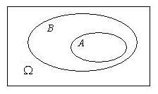
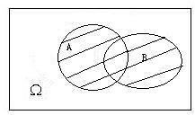
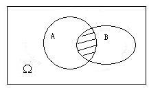
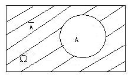
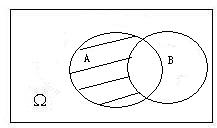
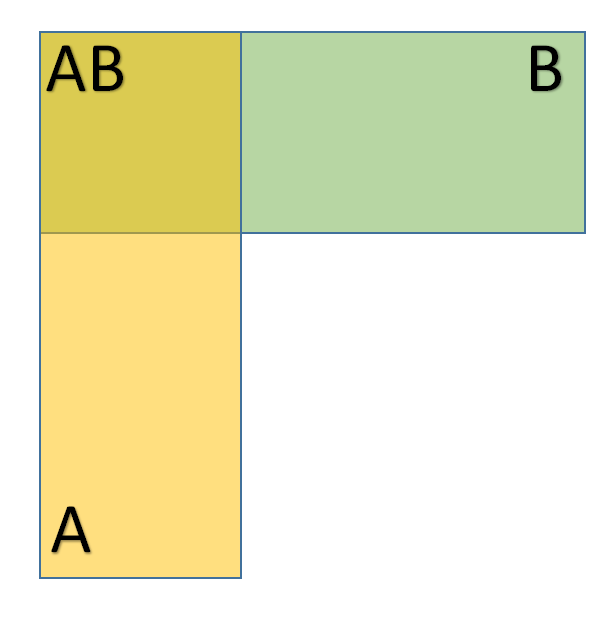
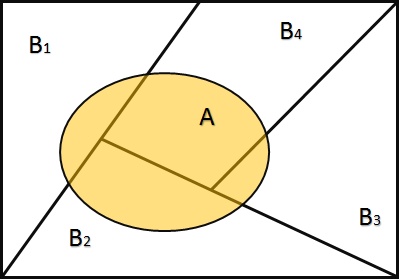

## 1.1 随机试验和随机事件

1. **随机现象：** 自然界中的客观现象，当人们观测它时，所得结果不能预先确定，而仅仅是多种可能结果之一。
2. **随机试验：** 随机现象的实现和对它某个特征的观测。
3. **基本事件：** 随机试验中的每个单一结果，犹如分子中的原子，在化学反应中不可再分。  
   e.g. 硬币抛3次，有8种结果：正正正、正正反、正反正……这8种可能结果每一个都是基本事件。
4. **随机事件：** 简称事件，在随机试验中我们所关心的可能出现的各种结果，它由一个或若干个基本事件组成。通常用英文大写字母表示或{一种叙述}来表示。
5. **样本空间：** 随机试验中所有基本事件所构成的集合，通常用$\Omega$或$S$表示。
   e.g. 掷一枚骰子，观察出现的点数，则$\Omega=\{1,2,3,4,5,6\}$.
6. **必然事件（$\Omega$）：**在试验中一定会发生的事件。
7. **不可能事件（$\phi$）：**在试验中不可能发生的事件。  

## 1.2 事件的运算

1. **子事件$A\subset B$：** 事件$A$发生蕴含时间$B$一定发生，则时间$A$成为事件$B$的子事件。若$A\subset B$，且$B\subset A$，则称时间$A$与事件$B$相等，记为$A=B$
 
2. **事件的和（$A\cup B$）：** 事件$A$和事件$B$中至少有一个发生称为事件$A$和事件$B$的和。
 
3. **事件的积（$A\cap B$）：** 事件$A$和事件$B$同时发生称为$A$和事件$B$的积。如果$A\cap B=\phi$，则称$A$和$B$不相容，即事件$A$和$B$不能同时发生。
 
4. **对立事件$A^c$（或$\overline{A}$）：**$A$不发生这一事件称为事件$A$的对立事件（或余事件）。
 
5. **事件$A$和事件$B$的差（$A-B$）：**事件$A$发生而事件$B$不发生这一事件称为事件$A$和事件$B$的差，或等价于$AB^c$.
 
6. ***De Morgan*対偶法则及其推广**
$$
\overline{A\cup B}=\overline{A}\cap \overline{B},
$$
$$
\overline{A\cap B}=\overline{A}\cup \overline{B}
$$
上式可推广到*n*个事件：
$$
\overline{\bigcup_{i=1}^{n}A_i}=\bigcap_{i=1}^{n}\overline{A_i},
$$
$$
\overline{\bigcap_{i=1}^{n}A_i}=\bigcup_{i=1}^{n}\overline{A_i},
$$
## 1.3 概率的定义

概率是随机事件发生可能性大小的数字表征，其值在0和1之间，即概率是事件的函数。概率有以下定义：
### 1.3.1 古典概率

设一个试验有*N*个等可能的结果，而事件$E$恰包含其中的$M$个结果，则事件$E$的概率，记为$P(E)$，定义为$P(E)=M/N$或$P(E)=\#(M) / \#(N),$其中，$\#(M)$为事件$M$中基本事件的个数。

古典概型有**两个条件**：
* 有限性，试验结果只有有限个（记为*n*），
* 等可能性，每个基本时间发生的可能性相同。
> **注：**古典概率可引申出“几何概率”。

### 1.3.2 概率的统计定义

古典概率的两个条件往往不能满足，但可以将事件的随机试验独立反复做*n*次（*Bernouli*试验），设事件$A$发生了$n_A$次，称比值$\frac{n_A}{n}$为事件$A$发生的频率，当*n*越来越大时，频率会在某个值*p*附近波动，且波动越来越小，这个值*p*就定义为事件$A$的概率。该学派为频率派。
> **注：**不能写为$lim_{n\rightarrow{\infty}}\frac{n_A}{n}=p$，因为$\frac{n_A}{n}$不是*n*的函数。

### 1.3.3 主观概率

主观概率可以理解为一种心态或倾向性。究其根由，大抵有二：一是根据其经验和知识，二是根据其利害关系。该学派在金融和管理有大量的应用，这一学派成为*Bayes*学派。

### 1.3.4 概率的公理化定义

对概率运算规定一些简单的基本法则：
1. 设$A$是随机事件，则$0 \leq P(A) \leq 1$,
2. 设$\Omega$为必然事件，则$P(\Omega)=1$,
3. 若事件$A$和$B$不相容，则$P(A\cup B)=P(A)+P(B)$,
   可推广至无穷：$P(\bigcup_{i=1}^{n}A_i)=\sum_{i=1}^{\infty}P(A_i)$.

> **注：**
> 1. 一般情况下，$P(A\cup B)=P(A)+P(B)-P(AB)$，$P(A\cup B \cup C)=P(A)+P(B)+P(C)-P(AB)-P(AC)-P(BC)+P(ABC)$
> 2. $P(\overline{A})=1-P(A)$
> 3. $P(A-B)=P(A)-P(AB)$

## 1.4 古典概率计算
### 1.4.1 排列组合
* **选排列：**从*n*个不同元素中取*r*个不同取法（$1\leq r\leq n$），$P^{n}_{r}=n(n-1)...(n-r+1)$.
* **重复排列：**从*n*个不同元素中可重复地取*r*个不同取法（$1\leq r\leq n$），$P^{n}_{r}=n^r$.
* **组合：**同选排列，但不考虑次序，$\binom{n}{r}=\frac{P^{n}_{r}}{r!}$.

> **注：**
> 1. 排列英文为*Permutation*，组合英文为*Combination*.
> 2. $0!$为1。当*r*不是非负整数时，记号$r!$没有意义.
> 3. 一些书中将组合写成$C_{n}^{r}$或$C_{r}^{n}$，更通用的是$\binom{n}{r}$.
### 1.4.2 其他公式
* 组合系数$\binom{n}{r}$又常称为二项式系数$(a+b)^n=\sum_{i=0}^{n}\binom{n}{r}a^i b^{n-1}$
* *n*个相异物件分成*k*堆，各堆物件数分为$r_1, ..., r_k$的方法是$n!/(r_1!...r_k!).$

  

## 1.5 条件概率、乘法公式、独立性
条件概率就是知道了**一定信息**下得到的随机事件的概率。设事件$A$和$B$是随机试验$\Omega$中的两个事件，$P(B)>0$，称
$$
P(A|B)=\frac{P(AB)}{P(B)}
$$
为事件$B$发生条件下事件$A$发生的条件概率，可用图形表示：

> **注：**事实上，我们所考虑的概率都是在一定条件下计算的，因为随机试验就是在一定条件下进行的。

### 1.5.1 条件概率性质

给定$A$发生，$P(A)>0$：
* $0 \leq P(B|A) \leq 1$
* $0 \leq P(\Omega|A) = 1$
* 若$B_1 \cap B_2 = \phi _1$，则$P(B_1 \cup B_2 | A) = P(B_1|A) + P(B_2|A)$，可推广至无穷。

### 1.5.2 乘法公式

由$P(A|B)=\frac{P(AB)}{P(B)} \Rightarrow P(AB)=P(A|B)P(B)$，可推广至
$$
P(A_1 A_2 ...A_n)=P(A_1)P(A_2|A_1)...P(A_n|A_1...A_{n-1})
$$
> **注：** 右边看似麻烦，其实容易算，左边看似简单，但是难算。

### 1.5.3 独立性

如果$P(B|A)=P(B)$,则说明在A发生条件下的B的条件概率就等于B的原概率，表示A发生并不影响B发生的概率。

**定义**：$P(AB)=P(A)P(B)$,则称两个随机事件A，B是**相互独立**的。
可以进一步推广：
	称$A_1$,$A_2$,$A_3$,...,$A_n$是相互独立的，如果对任何整数$k(2\le k \le n)$,有
	$P(A_{i_{1}}A_{i_{2}}\cdots A_{i_{k}})=P(A_{i_{1}})P(A_{i_{2}})\cdotp\cdotp\cdotp P(A_{i_{k}})$,
	其中$i_1,i_2,\cdots,i_k$,是满足下面不等式的任何$k$个正整数:$1\le i_1 < i_2 <\cdots<i_k\le n$,显然当$A_1$,$A_2$,$A_3$,...,$A_n$相互独立时，有$P(A_{1}A_{2}\cdots A_{k})=P(A_{1})P(A_{2})\cdots P(A_{k})$
## 1.6 全概公式

设$B_1,B_2,...B_n$是样本空间$\Omega$中的**两两不相容**的一组事件，即$B_i B_j=\phi$，$i\neq j$，且满足$\bigcup_{i=1}^{n}B_i=\Omega$，则称$B_1,B_2,...B_n$是样本空间$\Omega$的一个分割（又称为**完备事件群**，英文为*partition*）。

  设$\{B_1,B_2,...B_n\}$是样本空间$\Omega$的一个分割，$A$为$\Omega$的一个事件，则$P(A)=\sum_{i=1}^{n}P(A|B_i)P(B_i)$

推导：
$$

\begin{align}

P(A)&=P(A \cap \Omega)\\

&=P(A \cap \sum_{i=1}^{n}B_i)\\

&=P(\sum_{i=1}^{n}AB_i)\\

&=\sum_{i=1}^{n}P(AB_i)\\

&=\sum_{i=1}^{n}P(A|B_i)P(B_i)\\

&=\sum_{i=1}^{n}P(A|B_i)P(B_i)

\end{align}

$$

> **注：**有时不易直接计算事件$A$的概率，但是在每个$B_i$上$A$的条件概率容易求出

全概公式可以应用于赌徒输光问题、敏感问题的调查等
  
## 1.7 逆概公式(*Bayes*公式)

设$\{B_1, B_2, ...B_n\}$是样本空间的一个分割，$A$为$\Omega$中的一个事件，$P(B_i)>0$，$i=1,2,...,n$，$P(A)>0$，则
$$
P(B_i|A)=\frac{P(A|B_i)P(B_i)}{\sum_{j=1}^{n}P(A|B_j)P(B_j)}
$$
> **注：**当有因果关系互换时必须用*Bayes*公式。

贝叶斯公式在生活中的应用很多，例如疾病检测避免假阳性等
## 1.8 事件的独立性

设$A$，$B$是随机试验中的两个事件，若满足$P(AB)=P(A)P(B)$，则称事件$A$和$B$相互独立。判断事件的独立，应该是**从实际出发**，如果能够判断事件$B$的发生与否对事件$A$的发生与否不产生影响，则事件$A$，$B$即为独立。

设$\widetilde{A}$表示事件$A$发生和不发生之一，$\widetilde{B}$表示事件$B$发生和不发生之一。有独立性的定义可推至$P(\widetilde{A}\widetilde{B})=P(\widetilde{A})P(\widetilde{B})$（一共有四个等式）。可推广至：$P(\widetilde{A}_1\widetilde{A}_2...\widetilde{A}_n)=P(\widetilde{A}_1)...P(\widetilde{A}_n)$

上面有$2^n$个等式。

> **注：**独立（*independent*）和不相容（*exclusive*）是不同的两个概念，前者有公共部分，后者没有公共部分，独立一定相容。

## 1.9独立试验序列概型

**定理(独立试验序列概型计算公式)**
设单次试验中,事件A发生的概率为$p(0<p<1)$,则在n次重复试验中，
$P(A 发生k 次)=Cp'g"(q=1-p)(k-0,1,2,…，n)$

**证:**
在n次重复试验中,记B,B,,…,B为构成事件“A发生k次”的那些试验结果,于是有:
- (1)“A发生k次”=$B_1 \cup B_2 \cup \cdots  \cup B_n$  ; $B_1,B_2,\cdots,B_m$互不相容;
- (2)$P(B_1)=P(B_2)=\cdots=P(B_n)=p^k q^{n-k}$ 
- (3)$m=C^k_n$

注意,“n次重复试验”中的“重复”二字,是指这n次试验中各次试验的条件组是相同的.因此,这不仅意味着在各次试验中A发生的概率都是力(于是A发生的概率也都是q),而且还有各次试验的结果间是互相独立的含义.定理证明过程中的(2),就是基于这两个含义而得出的.在具体应用时也要注意这“重复”二字,

## 1.10 重要公式与结论
$$

\begin{align}

&(1)\ P(\overline{A})=1-P(A)\\

\\

&(2)\ P(A \cup B)=P(A)+P(B)-P(AB)\\

\\

&(3)\ P(A\cup B \cup C)=P(A)+P(B)+P(C)-P(AB)-P(AC)-P(BC)+P(ABC)\\

\\

&(4)\ P(A-B)=P(A)-P(AB)\\

\\

&(5)\ P(A\overline{B})=P(A)-P(AB),P(A)=P(AB)+P(A\overline{B}),\\

&\ \ \ \ \ \ P(A\cup B)=P(A)+P(\overline{A}B)=P(AB)+P(A\overline{B})+P(\overline{A}B)\\

\\

&(6)\ P(\overline{A}_1|B)=1-P(A_1|B),P(A_1\cup A_2|B)=P(A_1|B)+P(A_2|B)-P(A_1A_2|B)\\

&\ \ \ \ \ P(A_1A_2|B)=P(A_1|B)P(A_2|A_1B)\\

\\

&(7)\ 若A_1,A_2,...A_n相独立，则P(\bigcap_{i=1}^{n}A_i)=\prod_{i=1}^{n}P(A_i),P(\bigcup_{i=1}^{n}A_i)=\prod_{i=1}^{n}(1-P(A_i))

\end{align}

$$
