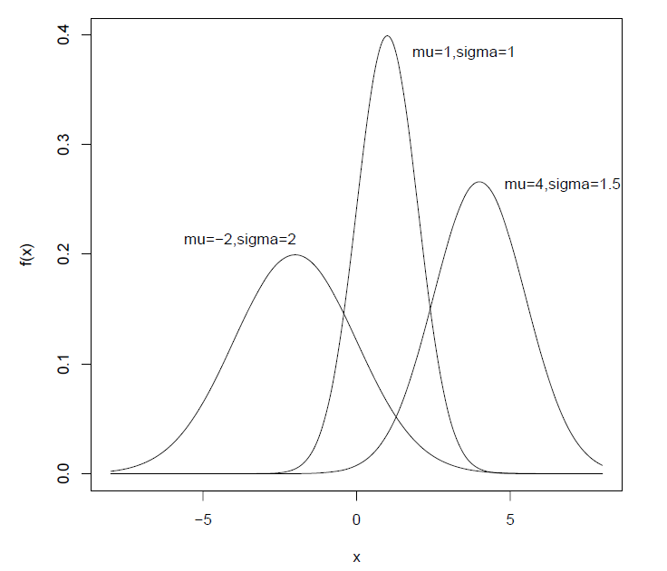
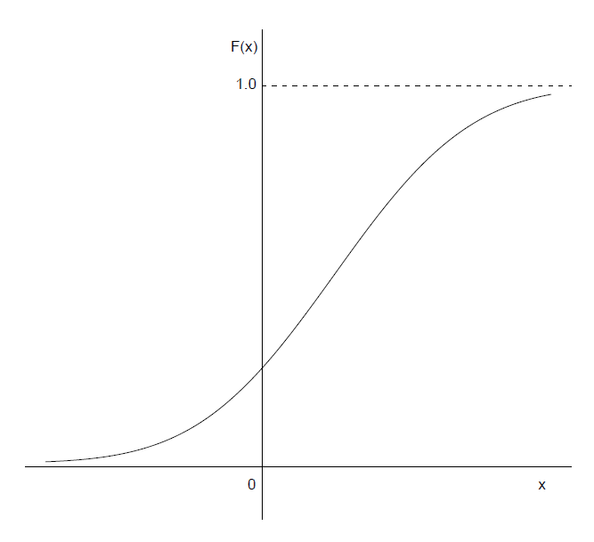
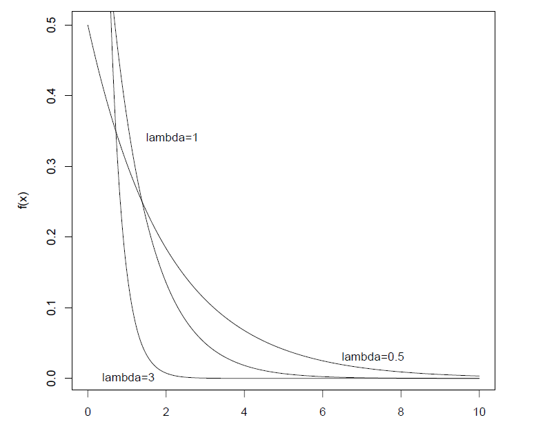
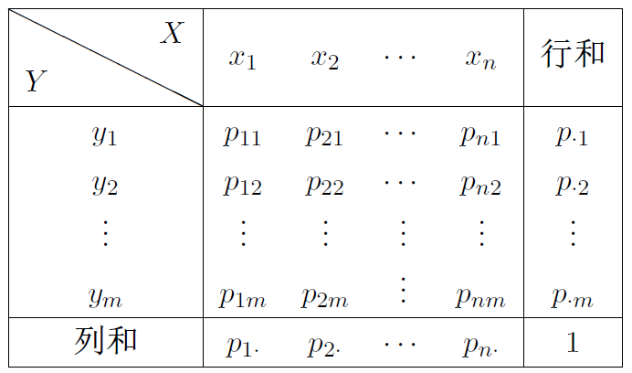
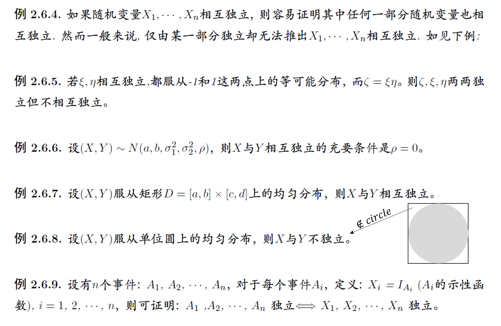

## 2.1  随机变量的概念

1. **随机变量（*Random variable*）：** 值随机会而定的变量，研究随机试验的一串事件。可按维数分为一维、二维至多维随机变量。按性质可分为**离散型随机变量**以及**连续型随机变量**。
2. **分布（*Distribution*）：**事件之间的联系，用来计算概率。
3. **示性函数（*Indication function*）：**
   
   $I_A(\omega)=\begin{cases}1& \omega \in A \\ 0& \text{ 反之}\end{cases}$，事件$A$有随机变量$I_A$表示出来，$I_A$称为事件$A$的示性函数。

## 2.2 离散型随机变量及其分布

1.**离散型随机变量**： 设$X$为一随机变量，如果$X$**只取有限个或可数个值**，则称$X$为一个（一维）离散型随机变量。
2.**概率函数**： 设$X$为一随机变量，其全部可能值为$\{a_1, a_2,...\}$，则$p_i=P(X=a_i),i=1,2,...$称为$X$的概率函数。
3.**概率分布**：
离散型随机变量的概率分布可以用分布表来表示：

| 可能值 | $a_1$ | $a_2$ | ... | $a_i$ | ... |
| --- | ----- | ----- | --- | ----- | --- |
| 概率  | $p_1$ | $p_2$ | ... | $p_i$ | ... |

4.**概率分布函数**：

**定义**:设$X$为一随机变量，则函数
$$
F(X)=P(X\leq x)\quad(-\infty<x<\infty)
$$
   称为$X$的分布函数。（**注：这里并未限定$X$为离散型的，它对任何随机变量都有定义。**）

**性质：**
$0\le F(x)\le 1 \;(-\infty \le x \le +\infty) , F(x)是x的右连续函数$
$F(x)是单调非降的：当$$x_1<x_2$时，有$F(x_1)\leq F(X_2)$.
当$x \rightarrow \infty$时，$F(x)\rightarrow1$；当$x \rightarrow-\infty$时，$F(x)\rightarrow0$.
   
**离散型随机变量分布函数：**
   
对于离散型随机变量，$F(X)=P(X\leq x)=\sum_{\{i|a_i\leq x\}}p_i, \quad p_i=P(X=i)=F(i)-F(i-1)$。

### 二项分布（*Bionomial distribution*）：

**定义**:设某事件$A$在一次试验中发生的概率为$p$，先把试验独立地重复n次，以$X$记$A$在这n次试验中发生的次数，则$X$取值$0,1,...,n$，且有
$$
P(X=k)=\binom{n}{k}p^k(1-p)^{n-k},\quad k=0,1,...,n
$$
称$X$服从二项分布，记为$X\sim B(n,p)$.

**服从二项分布的条件**:1. 各次试验的条件是稳定的，即事件$A$的概率$p$在各次试验中保持不变；2. 各次试验的独立性

### 泊松分布（*Poisson distribution*）：

**定义**：设随机变量$X$的概率分布为
$$
P(X=i)=\frac{\lambda^i}{i!}e^{-\lambda},\quad i=0,1,2,...,\quad\lambda>0
$$
则称$X$服从参数为$\lambda$的*Poisson*分布，并记$X\sim P(\lambda)$.

**特点**:：
- 描述稀有事件发生概率 
- 作为二项分布的近似。若$X\sim B(n,p)$，其中$n$很大，$p$很小，而$np=\lambda$不太大时（一般$n>30,np\leq5$），则$X$的分布接近泊松分布$P(\lambda)$.

**推导**：
若事件$A\sim B(n,p)$，且$n$很大，$p$很小，而$np=\lambda$不太大时，设$\lambda=np$，
$$
\begin{align}
P(X=i)&=\lim_{n\rightarrow \infty}\binom{n}{i}(\frac{\lambda}{n})^i(1-\frac{\lambda}{n})^{n-i}\\
&=\lambda^i\lim_{n\rightarrow \infty}\frac{\binom{n}{i}}{n^i}\lim_{n\rightarrow \infty}(1-\frac{\lambda}{n})^{n-i}\\
&=\lambda^i e^{-\lambda}\lim_{n\rightarrow \infty}\frac{n(n-1)(n-2)...(n-i+1)}{i!n^i}\\
&=\lambda^i e^{-\lambda}\lim_{n\rightarrow \infty}\frac{(1-\frac{1}{n})(1-\frac{2}{n})...(1-\frac{i-1}{n})}{i!}\\
&=\frac{\lambda^i}{i!}e^{-\lambda}
\end{align}
$$
       

## 2.3 连续型随机变量及其分布

1.**连续型随机变量**：
设$X$为一随机变量，如果$X$**不仅有无限个而且有不可数个值**，则称$X$为一个连续型随机变量。

2.**概率密度函数**：
**定义**:
- 设连续型随机变量$X$有概率分布函数$F(x)$，则$F(x)$的导数$f(x)=F'(x)$称为$X$的概率密度函数。

**性质**：
- 对于所有的$-\infty<x<+\infty$，有$f(x)\ge 0$；$\int_{-\infty}^{+\infty}f(x)dx=1$；
- 对于任意的$-\infty<a\leq b<+\infty$，有$P(a\leq X\leq b)=F(b)-F(a)=\int_{a}^{b}f(x)dx$.

**注**：
对于任意的$-\infty<x<+\infty$，有$P(X=x)=\int_{x}^{x}f(u)du=0$.
假设有总共一个单位的质量连续地分布在$a\leq x\leq b$上，那么$f(x)$表示在点$x$的质量密度且$\int_{c}^{d}f(x)dx$表示在区间$[c, d]$上的全部质量。

3.**概率分布函数**:设$X$为一连续型随机变量，则
$$
F(x)=\int_{-\infty}^xf(u)du,\quad-\infty<x<+\infty
$$

### **正态分布（*Normal distribution*）：**

**定义**:如果一个随机变量具有概率密度函数
$$
f(x)=\frac{1}{\sqrt{2\pi}\sigma}e^{-\frac{(x-\mu)^2}{2\sigma^2}},\quad -\infty<x<+\infty
$$
其中$-\infty<\mu<+\infty,\ \sigma^2>0$，则称$X$为正态随机变量，并记为$X\sim N(\mu,\sigma^2)$.特别地，$\mu=0,\sigma=1$的正态分布成为标准正态分布。用$\Phi(x)$和$\phi(x)$表示标准正态分布$N(0,1)$的分布函数和密度函数。

**性质：**
正态分布的密度函数是以$x=\mu$为对称轴的对称函数，$\mu$称为位置参数，密度函数在$x=\mu$处达到最大值，在$(-\infty,\mu)$和$(\mu,+\infty)$内严格单调。$\sigma$的大小决定了密度函数的陡峭程度，通常称$\sigma$为正态分布的形状参数。
若$X\sim N(\mu,\sigma^2)$，则$Y=(X-\mu)/\sigma\sim N(0,1)$.  $\Phi(-k)=1-\Phi(k)$

**图像（密度和分布函数图）：**

### **指数分布（*Exponential distribution*）：**

**定义** : 若随机变量$X$具有概率密度函数
$$
f(x)=
\begin{cases}
\lambda e^{-\lambda x}& x>0 \\ 
0& x\leq 0
\end{cases}
=\lambda e^{-\lambda x}I_{(0,\infty)}(x)
$$
其中$\lambda >0$为常数，则称$X$服从参数为$\lambda$的指数分布。

**概率分布函数**：
$$F(x)=\begin{cases}
 1-e^{-\lambda x}& x>0 \\ 
 0& x\leq 0
 \end{cases}=(1-e^{-\lambda x})I_{(0,\infty)}(x)$$
**性质：**

无后效性，即无老化，要来描述寿命（如元件等）的分布。

**证明：**
“无老化”就是说在时刻$x$正常工作的条件下，其失效率总保持为某个常数$\lambda>0$，与$x$无关，可表示
$$
\begin{align}
&P(x\leq X\leq x+h|X>x)/h=\lambda\quad(h\rightarrow0)\\
证：\\
&\lim_{h\rightarrow0}\frac{P(x\leq X\leq x+h|X>x)}{h}\\
=&\lim_{h\rightarrow0}\frac{P(x\leq X\leq x+h,X>x)}{P(X>x)h}\\
=&\lim_{h\rightarrow0}\frac{P(x< X\leq x+h)}{P(X>x)h}\\
=&\lim_{h\rightarrow0}\frac{-e^{-\lambda t}|^{x+h}_{x}}{-e^{-\lambda t}|^{\infty}_{x}h}\\
=&\lim_{h\rightarrow0}\frac{e^{-\lambda x}-e^{-\lambda x-\lambda h}}{e^{-\lambda x}h}\\
=&\lim_{h\rightarrow0}\frac{1-\frac{1}{e^{xh}}}{h}\\
=&\lim_{h\rightarrow0}\lambda e^{-\lambda h}\\
=&\lambda
\end{align}
$$

$\lambda$为失效率，失效率越高，平均寿命就越小。

**图像（密度函数）：**

### **均匀分布（*Uniform distribution*）：**

**定义**:设$a<b$，如果分布$F(x)$具有密度函数
$$
f(x)=
\begin{cases}
\frac{1}{b-a}& a\leq x\leq b \\ 
0& 其它
\end{cases}
=\frac{1}{b-a}I_{(a,b)}(x)
$$
则该分布为区间$[a,b]$上的均匀分布。

**概率分布函数**:
$$F(x)=\begin{cases}
0& x\leq a \\ 
\frac{x-a}{b-a}& a<x\leq b\\
1 &x>b
\end{cases}$$
**性质：**$\forall R(c,d) \subset R(a,b),\ P(c<X<d)=\frac{d-c}{b-a}$

## 2.4 多维随机变量（随机向量）

1.**随机向量**：设$X=\{X_1,...,X_n\}$.如果每个$X_i$都是一个随机变量，$i=1,...,n$，则称$X$为$n$维随机变量或者随机向量。

2.**离散型随机向量的分布**：如果每一个$X_i$都是一个离散型随机变量，$i=1,...,n$，则称$X=\{X_1,...,X_n\}$为一$n$维离散型随机变量。设$X_i$的所有可能取值为$\{a_{i1},a{i2},...\},\quad i=1,...,n$，则称
$$
p(j_1,...,j_n)=P(X_1=a_{1j_1},...,X_n=a_{nj_n}),\quad j_1,...,j_n=1,2,...
$$为$n$维随机变量$X$的概率函数，这也是其联合分布。其具有下列性质$p(j_1,...,j_n)\geq0,\quad j_i=1,2,...,\quad i=1,2,...,n;$
$\sum_{j_1,...,j_n}p(j_1,...,j_n)=1.$

   > **注：**对于高维离散型随机变量，一般不使用分布函数

3.**多项式分布**

**定义**： 设$A_1,A_2,...,A_n$是某一试验之下的完备事件群，分别以$p_1,p_2,...,p_n$记事件$A_1,A_2,...,A_n$的概率，则$p_i\geq 0,\quad p_1+...+p_n=1$.将试验独立地重复$N$次，以$X_i$记在这$N$次试验中事件$A_i$出现的次数$(i=1,...,n)$，则$X=(X_1,...,X_n)$为一个$n$维随机向量。该分布记作$M(N;p_1,...,p_n)$.

**概率分布函数：**$P(X_1=k_1,X_2=k_2,...,X_n=k_n)=\frac{N!}{k_1!k_2!...k_n!}p_1^{k_1}p_2^{k_2}....p_n^{k_n}$

4. **连续型随机向量的分布：**$X=\{X_1,...,X_n\}$为$n$维连续型随机变量，如果存在$\R^n$上的非负函数$f(x_1,...,x_n)$，使得对任意的$-\infty<a_1\leq b_1<+\infty,...,-\infty<a_n\leq b_n <+\infty $ ，有
$$
P(a_1\leq X_1 \leq b_1,...,a_n\leq X_n\leq b_n)=\int_{a_n}^{b_n} ...\int_{a_1}^{b_1}f(x_1,...,x_n)dx_1...dx_n
$$
则称为$f$为$X$的概率密度函数。有
$$
P(a_1\leq X_1 \leq b_1,...,a_n\leq X_n\leq b_n)=F(x_1,...,x_n)
$$
则称为$F$为$X$的（联合）分布函数。其中分布函数$F(X_1,...,X_n)$具有下述性质：

$F(x_1,...,x_n)$单调非降；
对任意的$1\leq j \leq n$，有$\lim_{x_j\rightarrow-\infty F(x_1,...,x_n)}=0$；
$\lim_{x_1\rightarrow\infty,...,x_n\rightarrow\infty}F(x_1,...,x_n)=1$

5. **边缘分布：**因为$X$的每个分量$X_i$都是一维随机变量，故它们都有各自的分布$F_i\ (i=1,...,n)$，这些都是一维分布，称为随机向量$X$或其分布$F$的边缘分布。

**离散型随机向量**
    
行和与列和就是边缘分布。即固定某个$x_i$，即可计算边缘分布，故有
$$ p_X(x_i)=P(X=x_i)=\sum_{j}^{m}P(X=x_i,Y=y_j)=\sum_{j}^{m}p_{ij}=p_{i\cdot},\quad i=1,2,...,n\\ p_Y(y_i)=P(Y=y_i)=\sum_{i}^{m}P(X=x_i,Y=y_j)=\sum_{i}^{m}p_{ij}=p_{j\cdot},\quad j=1,2,...,n
| $$

**连续型随机向量**

为求某分量$X_i$的概率密度函数，只需把$f(x_1,...,x_n)$中的$x_i$固定，然后对$x_1,...,x_{i-1},x_{i+1},...,x_n$在$-\infty$到$\infty$之间做定积分，如
$$
(X,Y)\sim f(x, y)\\
f_X(u)=\int^{+\infty}_{-\infty}f(u,v)dv\\
f_Y(u)=\int^{+\infty}_{-\infty}f(u,v)du\\
$$
     
> **注：**二维正态分布$N(a,b,\sigma_1^2,\sigma_2^2,\rho )$的边缘分布密度分别是一维正态分布$N(a,\sigma_1^2)$和$N(b,\sigma_2^2)$。因此联合分布可推边缘分布，而边缘分布不可推联合分布。

## 2.5 条件分布和随机变量的独立性

### 1. **离散型随机变量的条件分布：**
设$(X,Y)$为二维离散型随机变量，对于给定的事件$\{Y=y_j\}$，其概率$P(Y=y_j)>0$，则称
$$
P(X=x_i|Y=y_j)=\frac{P(X=x_i,Y=y_j)}{P(Y=y_j)}=\frac{p_{ij}}{p_{\cdot j}},\quad i=1,2,...
$$
为在给定$Y=y_j$的条件下$X$的条件分布律。类似的，称
$$
P(Y=y_i|X=x_j)=\frac{P(X=x_i,Y=y_j)}{P(X=x_j)}=\frac{p_{ij}}{p_{i\cdot}},\quad j=1,2,...
$$
为在给定$X=x_j$的条件下$Y$的条件分布律。

### 2. **连续型随机变量的条件分布：**
设$(X,Y)$为二维连续型随机变量，对于给定条件$Y=y$下的条件概率密度为
$$
f_{X|Y}(x|y)=\frac{f(x,y)}{f_Y(y)}, \quad f_Y(y)>0.\\
$$
类似的，在$X=x$下的条件概率密度为
$$
f_{Y|X}(y|x)=\frac{f(x,y)}{f_X(x)}, \quad f_X(x)>0.\\
$$

> 二维正态分布$\rho=0$时，其联合密度分布等于条件密度分布的乘积。

### 3. **随机变量的独立性**

称随机变量$X_1, ...,X_n$相互独立，

**离散型随机变量**

则联合分布律等于各自的边缘分布律的乘积，即
$$
P(X_1=x_1,...,X_n=x_n)=P(X_1=x_1)...P(X_n=x_n)
$$
其中$(x_1,...x_n)$为$(X_1,...,X_n)$的值域中的任意一点。

**连续型随机变量**

则联合密度等于各自的边缘密度的乘积，即
$$
f(x_1,...,x_n)=f_1(x_1)...f_n(x_n),\quad \forall(x_1,...,x_n)\in \mathbb{R} ^n
$$

**更具一般地**

设$X_1,...,X_n$为$n$个随机变量，如果它们的联合分布函数等于各自边缘分布函数的乘积，即
$$
F(X_1, ...,x_n)=F_1(x_1)...F_n(x_n),\quad \forall (x_1,...,x_n)\in \mathbb{R}^n
$$
则称随机变量$X_1, ...,X_n$相互独立。

**一些重要的结论**

## 2.6 随机变量函数的概率分布

最简单的情形，是由一维随机变量$X$的概率分布去求其一给定函数$Y=g(X)$的分布。较为常见的，是由$(X_1,X_2,...,X_n)$的分布去求$Y=g(X_1,X_2,...,X_n)$的分布。更一般地，由$(X_1,X_2,...,X_n)$的分布去求$(Y_1,Y_2,...,Y_m)$的分布，其中$Y_i=g_i(X_1,X_2,...,X_n),\quad i=1,2,...,m$.

1.**离散型分布的情形**： 设$X$的分布律为$P(X=x_i)=p_i,\quad i=1,2,...$

$g:R\rightarrow R$，令$Y=g(X)$，则$Y$的分布律为
$$
P(Y=y_j)=P(g(X)=y_j)=\sum_{x_i:g(x_i)=y_j}P(X=x_i)=\sum_{i:g(x_i)=y_j}p_i
$$
即把$Y=g(X_1,...,X_n)$可以取的不同值找出来，把与某个值相应的全部$(X_1,...,X_n)$值的概率加起来，即得$Y$取这个值的概率。

2.**连续型分布的情形**

**一个变量的情况**

设$X$有密度函数$f(x)$.设$Y=g(x)$，$g$是一个严格单调的函数，即当$x_1<x_2$时，必有$g(x_1)<g(x_2)$或当$x_1>x_2$时，必有$g(x_1)>g(x_2)$.又设$g$的导数$g'$存在。由于$g$的严格单调性，其反函数$X=h(Y)$存在，且$h$的导数$h'$也存在。有$g(X)$的密度函数$l(y)$为
$$
l(y)=f(h(y))|h'(y)|.
$$
$g(x)$ 严格单调是一个苛刻的条件，许多常见的函数无法满足，此时只好直接去求所要的分布函数，不要考虑反函数。

**多个变量的情形**

以两个为例，设$(X_1,X_2)$的密度函数$f(x_1,x_2)$，$Y_1,Y_2$都是$(X_1,X_2)$的函数：
$$
Y_1=g_1(X_1,X_2),\quad Y_2=g_2(X_1,X_2),
$$
要求$(Y_1,Y_2)$的概率密度函数$l(y_1,y_2)$.假定$(X_1,X_2)$到$(Y_1,Y_2)$的一一对应变换有逆变换：
$$
X_1=h_1(Y_1,Y_2),\quad X_2=h_2(Y_1,Y_2)
$$
即雅可比行列式
$$
J(y_1,y_2)=\begin{vmatrix}
\partial h_1/\partial y_1&\partial h_1/\partial y_2 \\ 
\partial h_2/\partial y_1&\partial h_2/ \partial y_2 
\end{vmatrix}
$$
不为0.在$(Y1,Y2)$的平面上任取一个区域$A$，变换后到$(X_1,X_2)$平面的区域$B$，则有
$$
P((Y_1,Y_2)\in A)=P((X_1,X_2)\in B)=\iint_Bf(x_1,x_2)dx_1dx_2\\
P((Y_1,Y_2)\in A)=\iint_Af(h_1(y_1,y_2),h_2(y_1,y_2))|J(y_1,y_2)|dy_1dy_2
$$

**随机变量和的密度函数**

设$(X_1,X_2)$的联合密度函数为$f(x_1,x_2)$，$Y=X_1+X_2$的密度函数：

一般的，$l(y)=\int_{-\infty}^\infty f(x_1,y-x_1)dx_1=\int_{-\infty}^\infty f(x,y-x)dx$.
若$X_1,X_2$独立，则$l(y)=\int_{-\infty}^\infty f_1(x)f_2(y-x)dx=\int_{-\infty}^\infty f_1(y-x)f_2(x)dx$.

> 两个独立的正态变量的和仍服从正态分布，且有关的参数相加，其逆命题也成立。

**随机变量商的密度函数**
设$(X_1,X_2)$的联合密度函数为$f(x_1,x_2)$，$Y=X_1/X_2$的密度函数：

一般的，$l(y)=\int_{0}^\infty x_1f(x_1,x_1y)dx_1$.
若$X_1,X_2$独立，则$l(y)=\int_{0}^\infty x_1f_1(x_1)f_2(x_1y)dx_1$.
     
* **统计学三大分布**
  
引入两个重要的特殊函数：
  
$\Gamma(x)=\int_0^\infty e^{-t}t^{x-1}dt\quad (x>0)$ 和 $B(x,y)=\int_0^1t^{x-1}(1-t)^{y-1}dt\quad (x>0,y>0)$

> 其中，$\Gamma(1)=1,\quad \Gamma(1/2)=\sqrt{\pi},\quad \Gamma(n)=(n-1)!$
  >
  > $B(x,y)=\Gamma(x)\Gamma(y)/\Gamma(x+y)$
  
**卡方分布，记作$\chi_n^2$**
  
**密度函数**$:k_n(x)=\frac{1}{\Gamma(\frac{n}{2}2^{n/2})}e^{-x/2}x^{(n-2)/2}I_{(0,\infty)}(x)$

**性质**:1. 设$X_1,X_2$独立，$X_1\sim\chi_m^2,X_2\sim\chi_n^2$，则$X_1+X_2\sim\chi_{m+n}^2$

​		    2. 若$X_1,...,X_n$独立，且都服从指数分布，则$X=2\lambda(X_1+...+X_n)\sim\chi_{2n}^2$
  
**$t$ 分布，记作$t_n$**
  
设$X_1，X_2$独立，$X_1\sim\chi_n^2,X_2\sim N(0,1)$，而$Y=X_2/\sqrt{X_1/n}$，则$Y\sim t_n$.

**密度函数**:$t_n(y)=\frac{\Gamma((n+1)/2)}{\sqrt{n\pi}\Gamma(n/2)}(1+\frac{y^2}{n})^{(\frac{n+1}{2})}$

**性质**:密度函数关于原点对称，其图形与正态分布$N(0,1)$的密度函数的图形相似。
  
**$F$分布，记作$F_{mn}$**
  
设$X_1,X_2$独立，$X_1\sim\chi_n^2,X_2\sim\chi_m^2$，而$Y=m^{-1}X_2/(n^{-1}X_1)$，则$Y\sim F_{mn}$

**密度函数：**$f_{mn}(y)=m^{m/2}n^{n/2}\frac{\Gamma(\frac{m+n}{2})}{\Gamma(\frac{m}{2})\Gamma(\frac{n}{2})}y^{m/2-1}(my+n)^{-(m+n)/2}\quad (y>0)$
  
**三大分布的几个重要性质**
     >
     > 1. 设$X_1,...,X_n$独立同分布，有公共的正态分布$N(\mu,\sigma^2)$.记$\bar{X}=(X_1+...+X_n),S^2=\sum_{i=1}^{n}(X_i-\bar(X))^2/(n-1)$.则$(n-1)S^2/\sigma^2=\sum_{i=1}^{n}(X_i-\bar{X})^2/\sigma^2\sim\chi_{n-1}^{2}$.
     >
     > 2. 设$X_1,...,X_n$的假定同1，则$\sqrt{n}(\bar{X}-\mu)/S\sim t_{n-1}$
     >
     > 3. 设$X_1,...,X_n,Y_1,...,Y_m$独立，$X_i$各有分布$N(\mu1,\sigma_1^2)$，$Y_j$各有分布$N(\mu_2,\sigma_2^2)$，则
     >    $$
     >    [\sum_{j=1}^m(Y_j-\bar{Y})^2/(\sigma_2^2(m-1))]/[\sum_{i=1}^n(X_i-\bar{X})^2/(\sigma_1^2(n-1))]\sim F_{m-1,n-1}
     >    $$
     >    若$\sigma_1^2=\sigma_2^2$，则
     >    $$
     >    \sqrt{\frac{nm(n+m-2)}{n+m}}[(\bar{X}-\bar{Y})-(\mu_1-\mu_2)]/[\sum_{i=1}^{n}(X_i-\bar{X})^2+\sum_{j=1}^m(Y_j-\bar{Y})^2]^{1/2}\sim t_{n+m-2}
     >    $$
     >    
