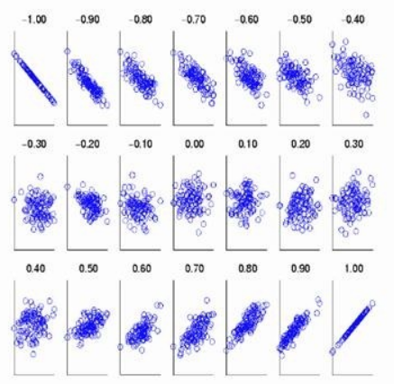

## 3.1 数学期望（均值）与中位数
### 1. 数学期望

**定义**：设随机变量$X$只取有限个可能值$a_1,...,a_m$，其概率分布为$P(X=a_i)=p_i\ (i=1,...,m)$.则$X$的数学期望记作$E(X)^*$或$E(X)$，定义为$E(X)=a_1p_1+a_2p_2+...+a_mp_m$.数学期望也常称为”均值“，即指以概率为权的加权平均。

* **离散型变量的数学期望**：$E(X)=\sum^\infty_{i=1}a_ip_i.$（当级数绝对收敛，即$\sum_{i=1}^\infty|a_i|p_i<\infty$）
* **连续型变量的数学期望**：$E(X)=\int_{-\infty}^\infty xf(x)dx$.（当$\int_{-\infty}^\infty |x|f(x)dx<\infty$）
#### 常见分布的数学期望：
* **泊松分布：**$E(X)=\lambda$.
* **二项分布：**$E(X)=np$.
* **均匀分布：**$E(X)=\frac{1}{2}(a+b)$.
* **指数分布：**$E(X)=\lambda^{-1}$.
* **正态分布：**$E(X)=\mu$.
* **卡方分布：**$E(X)=n$.
* **$t$分布：**$E(X)=0 \quad (n>1)$.
* **$F$分布：**$E(X)=n/(n-2)\quad (n>2)$.
#### 期望的简单性质
* 若干个随机变量之和的期望等于各变量的期望值和，即
$$
E(X_1+X_2+...+X_n)=E(X_1)+E(X_2)+...+E(X_n).
$$
* 若干个**独立**随机变量之积的期望等于各变量的期望之积，即
$$
E(X_1X_2...X_n)=E(X_1)E(X_2)...E(X_n).
$$
* 若$c$为常数，则$E(cX)=cE(X)$.
#### 随机变量函数的期望公式
* 设随机变量$X$为离散型，有分布$P(X=a_i)=p_i(i=1,2,...)$；或者随机变量为连续型，有概率密度函数$f(x)$.则
$$
\begin{align}
E(g(x))=\sum_ig(a_i)p_i\quad (当\sum_i|g(a_i)|p_i<\infty时) 
或\\
E(g(x))=\int_{-\infty}^\infty g(x)f(x)dx \quad (当\int_{-\infty}^{\infty}|g(x)|f(x)dx<\infty时)
\end{align}
$$

### 2. **条件数学期望**
   
**定义：** 随机变量Y的条件期望就是它在给定的某种附加条件下的数学期望。
   $$E(Y|x)=\int_{-\infty}^{\infty}yf(y|x)dy$$它反映了随着$X$取值$x$的变化$Y$的平均变化的情况如何。在统计上，常把条件期望$E(Y|x)$作为$x$的函数，称为$Y$对$X$的回归函数。
   
**性质：**
- $E(Y)=\int_{-\infty}^{\infty}E(Y|x)f_X(x)dx$.
- $E(Y)=E[E(Y|X)]$.

### 3. **中位数**
* **定义**：设连续型随机变量$X$的分布函数为$F(x)$，则满足条件$P(X\leq m)=F(m)=1/2$的数$m$称为$X$或分布$F$的中位数。即$m$这个点把$X$的分布从概率上一切两半。
* **性质**：
  与期望值相比，中位数受特大值或特小值影响很小，而期望不然。
  中位数可能不唯一，且在某些离散型情况下，中位数不能达到一分两半的效果。

## 3.2 方差与矩
### (1) 方差与标准差
**定义：** 设$X$为随机变量，分布为$F$，则$Var(X)=E(X-EX)^2$称为$X$（或分布$F$）的方差，其平方根$\sqrt{Var(X)}$（取正值）称为$X$（或分布$F$）的标准差。
   * **常见分布的方差：**
     * **泊松分布：**$Var(X)=\lambda$.
     * **二项分布：**$Var(X)=np(1-p)$.
     * **正态分布：**$Var(X)=\sigma^2$.
     * **指数分布：**$Var(X)=1/\lambda^2$.
     * **均匀分布：**$Var(X)=(b-a)^2/12$.
     * **卡方分布：**$Var(X)=2n$.
     * **$t$分布：**$Var(X)=n/(n-2)$.
     * **$F$分布：**$Var(X)=2n^2(m+n-2)/[m(n-2)^2(n-4)]\quad (n>4)$.
   * **性质：**
     * $Var(X)=E(X^2)-(EX)^2$.
     * 常数的方差为0，即$Var(c)=0$.
     * 若$c$为常数，则$Var(X+c)=Var(X)$.
     * 若$c$为常数，则$Var(cX)=c^2Var(X)$.
     * **独立**随机变量和的方差等于各变量方差和，即$Var(X_1+...+X_n)=Var(X_1)+...+Var(X_n)$.

### (2) 矩——原点矩和中心矩

**定义**：设$X$为随机变量，$c$为常数，$k$为正整数。则量$E[(X-c)^k]$称为$X$关于$c$点的$k$阶矩。特别地，有两种重要的情况：

 (1) $c=0$ .这时$a_k=E(X^k)$称为$X$的$k$阶原点矩。

 (2)$c=E(X)$.这时$\mu_k=E[(X-EX)^k]$称为$X$的$k$阶中心矩。

 一阶原点矩就是期望，一阶中心距$\mu_1=0$，二阶中心距$\mu_2$就是$X$的方差$Var(X)$.

**两种重要应用**：
     * **偏度系数：**$\beta_1=\mu_3/\mu_2^{3/2}$.衡量概率分布函数$f(x)$是否关于均值对称。如果$\beta>0$，则称分布为正偏或右偏；如果$\beta<0$，则称分布为负偏或左偏；如果$\beta=0$，则对称。（注：$\mu_2^{3/2}$为标准差的三次方，可将$\mu_3$缩放到一次因次）
     * **峰度系数：**$\beta_2=\mu_4/\mu_2^2$.衡量概率分布函数$f(x)$在均值附近的陡峭程度。若$X$有正态分布$N(\mu,\sigma^2)$，则$\beta_2=3$.(注：$\mu_2^2$为标准差的四次方，将$\mu_4$缩放到一次因次。为了迁就正态分布，也常定义$\mu_4/\mu_2^2-3$为峰度系数，以使正态分布的峰度系数为0)

## 3.3协方差与相关系数

两者都反映了随机变量之间的关系。

### (1) 协方差（*Covariance*）
**定义**：称$E[(X-m_1)(Y-m_2)]$为$X$，$Y$的协方差，并记为$Cov(X,Y)$.

**性质**：
* $Cov(X,Y)$与$X,Y$的次序无关，即$Cov(X,Y)=Cov(Y,X)$.
* $Cov(c_1X+c_2,c_3Y+c_4)=c_1c_3Cov(X,Y)$.
* $Cov(X,Y)=E(XY)-E(X)E(Y)$.
* 若$X,Y$独立，则$Cov(X,Y)=0$.
* $[Cov(X,Y)]^2\leq \sigma_1^2\sigma_2^2$.等号当且仅当$X,Y$之间有严格线性关系（$Y=a+bX$）时成立。

   > **注**：协方差的结果受随机变量量纲影响。

### (2) 相关系数（*Correlation coefficient*）

**定义**：称$Cov(X,Y)/(\sigma_1\sigma_2)$为$X,Y$的相关系数，并记为$Corr(X,Y)$.

**性质**：
     * 若$X,Y$独立，则$Corr(X,Y)=0$.
     * $-1\leq Corr(X,Y)\leq 1$，或$|Corr(X,Y)\leq 1|$，等号当且仅当$X$和$Y$有严格线性关系时达到。当$Corr(X,Y)=0$时，推出$X,Y$不线性相关。

   > **注**： 相关系数常称为“**线性相关系数**”，实际上相关系数并不是刻画了$X,Y$之间**消除量纲后**“一般”关系的程度，而只是“线性关系的程度”。即使$X$与$Y$有某种严格的函数关系但非线性关系，$|Corr(X,Y)|$不仅不必为1，还可以为0.
   
   
 
## 3.4大数定理和中心极限定理
### (1) 大数定理

   “大数”的意思，就是指涉及大量数目的观察值$X_i$，它表明这种定理中指出的现象只有在大量次数的试验和观察之下才能成立。

   * **定义**：设$X_1,X_2,...,X_n,...$是独立同分布的随机变量，记它们的公共均值为$a$.又设它们的方差存在并记为$\sigma^2$.则对任意给定的$\varepsilon >0$，有$lim_{n\rightarrow\infty}P(|\bar{X}_n-a|\geq \varepsilon )=0$.（该式表明，当$n$很大时，$\bar{X}_n$接近$a$）

### (2) 中心极限定理

   即和的分布收敛于正态分布。

   **定义**：设$X_1,X_2,...,X_n$为独立同分布的随机变量，$E(X_i)=a,Var(X_i)=\sigma^2(0<\sigma^2<\infty)$.则对任何实数$x$，有$lim_{n\rightarrow\infty}P(\frac{1}{\sqrt{n}\sigma}(X_1+...+X_n-na)\leq x)=\Phi(x)$.（$\Phi(x)$为标准正态分布$N(0,1)$的分布函数）

   **特例**：设$X_1,X_2,...,X_n$独立同分布，$X_i$分布是$P(X_i=1)=p$，$P(X_i=0)=1-p\ (0<p<1)$.则对任何实数$x$，有$lim_{n\rightarrow \infty}P(\frac{1}{\sqrt{np(1-p)}}(X_1+...+X_n-np)\leq x)=\Phi(x)$.

>**注：** 如果$t_1,t_2$是两个正整数，$t_1<t_2$.则当$n$相当大时，近似地有
> $$ 
  P(t_1\leq X_1+...+X_n\leq t_2)\approx \Phi(y_2)-\Phi(y_1),
  $$
   其中
> $$ y_i=(t_i-np)/sqrt{np(1-p)}\quad (i=1,2).$$
> 若把$y_1,y_2$修正为
> $$
  y_1=(t_1-\frac{1}{2}-np)/\sqrt{np(1-p)},\\
  y_2=(t_2-\frac{1}{2}-np)/\sqrt{np(1-p)}
  $$
> 在应用上式，则一般可提高精度。

$$
P=\frac{E \cdot \epsilon_r}{(1+v)(1-2v)}(1-v)
$$

$$
\begin{array} {l} {{{{\sigma_{r}=\frac E {( 1+\nu) ( 1-2 \nu)} \left[ ( 1-\nu) \varepsilon_{r}+\nu\varepsilon_{\theta} \right],}}}} \\ {{{{\sigma_{\theta}=\frac E {( 1+\nu) ( 1-2 \nu)} \left[ \nu\varepsilon_{r}+( 1-\nu) \varepsilon_{\theta} \right].}}}} \\ \end{array} 
$$