 

# 一、火星主要物理参数  

通过长期的观测与近50次的探测活动，人类对火星基本有了一个比较清楚的整体认识，基本确定了火星的近日距、远日距、半径、公转与自转周期、体积与重量、平均密度、逃逸速度等的主要物理参数(表2.1)。  

表2.1火星与地球的行星基本参数比较  
<html><body><table><tr><td>基本参数</td><td>火星</td><td>地球</td></tr><tr><td>近日距</td><td>204.52×10km</td><td>147.7×10km</td></tr><tr><td>远日距</td><td>246.28×10km</td><td>149.5×10km</td></tr><tr><td>轨道长半径</td><td>1.524AU</td><td>1AU</td></tr><tr><td>公转周期</td><td>687地球日（668火星日）</td><td>365.26地球日</td></tr><tr><td>自转周期</td><td>1.026天（24h37min）</td><td>0.9973天（23h56min)</td></tr><tr><td>自转轴倾角</td><td>23°59'(当前)</td><td>23°27'</td></tr><tr><td>平均轨道速度</td><td>24.13km/s</td><td>29.783km/s</td></tr><tr><td>轨道偏心率</td><td>0.093(0.0—0.14)（当前)</td><td>0.017</td></tr><tr><td>轨道倾角</td><td>1.8°</td><td>0</td></tr><tr><td>赤道半径</td><td>3398km</td><td>6378km</td></tr><tr><td>扁率</td><td>0.0052</td><td>0.00335</td></tr><tr><td>质量</td><td>0.646×1024kg</td><td>5.98x1024kg</td></tr><tr><td>与地球的质量比</td><td>0.108</td><td>1</td></tr><tr><td>与地球的体积比</td><td>0.15</td><td>1</td></tr><tr><td>平均密度</td><td>3.94g/cm³</td><td>5.5g/cm³</td></tr><tr><td>球面拟合度</td><td>0.009</td><td>0.003</td></tr><tr><td>重力加速度</td><td>3.71m/s²</td><td>9.75m/s²</td></tr><tr><td>逃逸速度</td><td>5.0km/s</td><td>11.2km/s</td></tr><tr><td>太阳常数</td><td>0.866ly</td><td>2ly</td></tr><tr><td>视太阳直径</td><td>21"</td><td>31'59"</td></tr><tr><td>反照率</td><td>0.15—0.25</td><td>0.30—0.35</td></tr><tr><td>平均温度</td><td>216K(-57℃)</td><td>286K(13℃)</td></tr><tr><td>磁场强度</td><td>3×10-8T</td><td>3.05×10-T</td></tr><tr><td>卫星数</td><td>2</td><td>1</td></tr></table></body></html>  

注：AU为天文单位，1AU为地球到太阳的距离。  

  

# 二、火星空间的太阳风  

在距日心1.52AU的火星轨道处太阳风等离子体的性质可以通过1AU处的太阳风参数外推得到。平均为 $4 0 0 \mathrm { k m / s }$ 的太阳风速度可以认为仍然保持常数。太阳风等离子体密度是以气的 $1 / \mathrm { r } ^ { 2 }$ 的规律变化的。这里假定太阳风是球形向外膨胀的。在火星轨道处，太阳风等离子体密度将降到1- $- 2 \mathrm { c m } ^ { - 3 }$ ，同时，质子的温度降低至约 $4 \times 1 0 ^ { 4 } \mathrm { K }$ 。太阳风磁场约为1—5nT，并在赤道面上与火星一太阳连线的角度约为 $5 6 ^ { \circ }$ 。  

在"火卫一2号”(Phobos2)运行期间，火星轨道处的太阳风是剧烈变化的，并带有特定的结构。太阳风流速平均为 $5 0 0 \mathrm { k m / s }$ （有时高至 $8 0 0 \mathrm { k m / s }$ ，密度为 $2 . 5 / \mathrm { c m } ^ { - 3 }$ ，太阳风动压大约为 $\mathrm { { l n P a } }$ ，磁声马赫数为6。图2.4给出了1989年3月太阳风在火星轨道处的流速。  

通过技术进步及合理的筹划，“火卫一2号”上的等离子体探测器比以往任何飞往火星及金星的探测器更适合探测被捕获的行星离子。在早期的“火星5号"(Mars5)探测器实验数据中，人们认为重离子可能出现在火星磁尾的一个边界层里。“火卫一2号”的探测证实了这些重离子出现。为了探测重离子而设计的两种实验都探测到丰富的捕获 $0 ^ { + }$ 离子通量。太阳风与火星相互作用造成行星离子的损失，以上两种实验得到的全球平均离子损失率都为约 $1 0 2 5 ~ \mathrm { i o n / s }$ 。Rosenbauer等认为离子损失主要是通过中心磁尾进行的，而Lundin等人主张离子损失是通过内磁鞘区边界层起主要作用。  

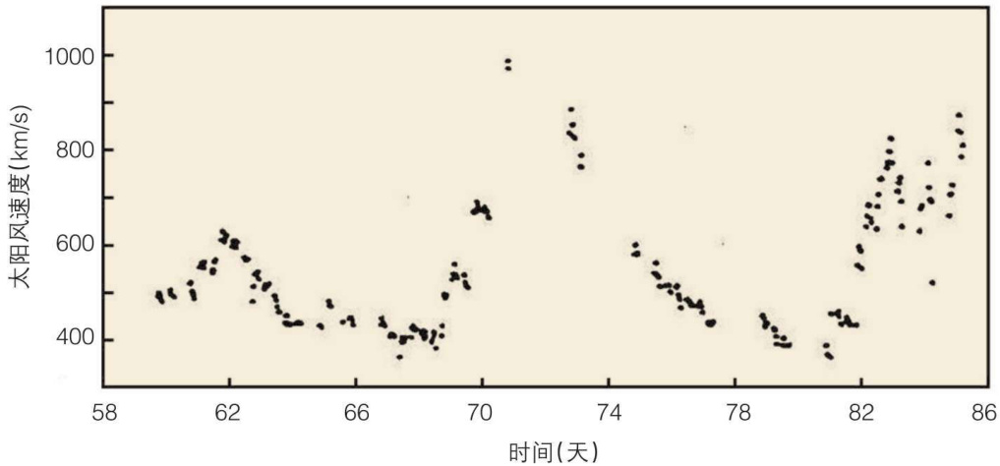  

图2.41989年3月太阳风在火星轨道处的流速。  

  

# 三、火星磁场  

火星的弓激波是引起人们对火星内在磁场有争议的主要原因。通过“火卫一2号”空间计划之前的环绕火星的"火星"系列探测器了解到，太阳活动极小时，火星弓激波距火星的位置远于金星弓激波距金星的位置。当太阳活动极大时，“火卫一2号"同样证实了以上的差别。  

1965年，“水手4号”（Mariner4)探测器到达离火星中心约 $3 . 9 R _ { \mathrm { M } }$ （ $R _ { \mathrm { M } }$ 为火星半径，$3 3 9 0 \mathrm { k m }$ )处，第一次探测到了火星磁场、等离子体和磁层顶。此后，探测火星的"水手2号”、“水手3号"和"水手5号”及“火卫一2号"等探测器都探测表明，火星磁层顶前方有一个像地球磁层顶那样的弓激波存在，在火星磁层和弓激波之间有一过渡区，其中还存在着两个边界层，在两个边界层内部，行星离子起主导作用，磁场强度达 $1 0 { - } 2 0 \mathrm { n T }$ ，且磁场有强烈的扰动。研究表明，火星的终端激波半径为 $2 . 6 5 R _ { \mathrm { { M } } }$ ，而金星的终端激波半径为$2 . 4 R _ { \mathrm { M } }$ 。  

美国的“火星全球勘测者"（MarsGlobalSurveyor，MGS)探测器1997年9月进入火星轨道，它所携带的磁强计和电子反射计(MGA/ER)对火星的磁场进行了探测。结果发现，当探测器接近火星时，首先遇到了火星的弓激波，探测器上的磁强计和电子反射计系统探测到了高能电子辐射、急剧增强的磁场以及与弓激波和磁鞘有关的磁场扰动。  

在向阳面磁鞘区观测到的扰动与“火卫一2号"的观测结果相同。等离子体能量很高，弓激波的强度达到了理论上的最大值。根据探测器进入和离开火星电离层的磁场变化看，太阳风似乎直接与火星电离层及中性大气相互作用。这属于金星型的与太阳风相互作用，电离层中磁场的减弱和低纬区探测器进入电离层时磁场的峰值正位于低电离层边界之上，表明了这种太阳风和金星相互作用的特性。火星电离层中的低磁场强度似乎排除了火星全球尺度的磁场对太阳风形成磁障碍的可能性。  

研究发现与地球弓激波不同，火星的弓激波位置与上游太阳风动压无关。由于观测资料是在接于太阳活动低年期获得的，所以弓激波的位置可能与太阳风的极紫外通量有关。但从其他探测器的观测结果看来，还没有发现太阳活动在上升期到峰年期之间对弓激波位置的影响。MGS探测器观测到的弓激波的位置也是在变化的，其均方差大约为$0 . 5 R _ { \mathrm { M } }$ 。早先的探测器在金星上观测到了类似的变化特性，两次在金星上观测到了这样的变化特性。这个变化特性应该与火星的内禀磁场有关，内禀磁场应该强得足以起阻挡太阳风的障碍作用。这样的话，弓激波的位置应该依赖于磁场强度和太阳风参数。然而，“火星全球勘测者”观测到的火星全球尺度的内禀磁场的强度还不足以形成对太阳风的障碍。  

“火卫一2号”探测器还发现，火星弓激波的位置在不断变化，其到火星中心的平均距离为 $2 . 6 R _ { \mathrm { M } }$ ，且随太阳活动有明显的变化。在太阳活动的最大年，火星日下点处的弓激波位置靠近火星，可达火心距离 $1 . 5 R _ { \mathrm { M } }$ ，火星弓激波的位置与经度无关。但与上游太阳风的压力有很弱的相关关系。  

火星磁鞘区的等离子体，主要特征为观测到的太阳风成分 $\left( \mathrm { H } ^ { + } \right)$ 向火星大气成分（主要是 $0 ^ { + }$ )过渡的变化，磁鞘区磁场增强，但也观测到了磁场减弱区。空间飞行器还观测到，火星磁层顶离火心的距离为1.1— $\cdot 1 . 4 R _ { \mathrm { M } }$ ，比地球磁层顶的地心相对距离（ $\cdot 1 0 R _ { \mathrm { E } }$ 小得多。  

“火卫一2号"探测器还首先观测到了火星环境的电子密度和电场的资料，在弓激波的上游探测到了电子等离子体震荡。  

“火卫一2号”对火星深部尾流场区磁场的探测也许是人们最普遍期待的结果。“火卫一2号"以前的其他所有飞往火星的探测器上等离子体及电磁场测量仪器都没有穿过终端激波后面磁鞘内的磁尾边界层。这些早期的探测结果可以用来推断出火星磁尾的半径，火星磁尾的半径为 $2 R _ { \mathrm { { M } } }$ ，这大于(以行星尺度)金星的磁尾半径(其为 $1 . 5 R _ { \mathrm { M } }$ 。但这些探测结果不能确切地回答人们所关心的问题：火星尾瓣中的通量管相对于行星际磁场的朝向(行星内部磁层产生的尾瓣磁场方向是连向行星本身，而不是连向IMF)。  

“火卫一2号”上磁强计探测的初步结果表明，火星磁尾是具有诱发特性的。诱发磁尾的形成是由于火星大气的粒子进入磁鞘，而且由于火星对行星际磁场流动的阻碍作用,使得磁鞘区的磁通管汇聚在行星尾流场区。一般来说，不具有内在磁场但有大量气体的星体会带有象彗星相同的磁尾。利用用局部披挂角(localdraping angle)和张开角(flaringangle)来描述火星的磁尾结构。局部披挂角定义为磁尾磁场方向与太阳风等离子体流向上方向的夹角。张开角定义为太阳风流向与磁尾表面切向之间的夹角。  

在磁化行星的情形，磁尾是由于太阳风与行星内磁层相互作用产生的切向张力而形成的。Petrinecetal.（1993)研究了近地 $- 2 2 . 5 R _ { \mathrm { E } } < \mathrm { x } < - 1 0 R _ { \mathrm { E } }$ 范围内的磁尾。他们的研究结果表明，地球磁尾张开角依赖于磁尾下游的距离，上游太阳风动压 $P { _ { \mathrm { V _ { \mathrm { S W } } } } } ^ { 2 }$ 和行星际磁场 $B z$ 分量。利用“火卫一2号"探测器在半径为 $2 . 8 R _ { \mathrm { M } }$ 环绕火星的圆形轨道上探测的等离子体和磁场数据，我们可以研究火星磁尾的性质。图2.5给出了“火卫一2号”的磁强计（MAGMA)探测到的火星磁尾X分量及磁场值随时间的变化。数据的时间分辨率为45s，这里采用的是火星太阳轨道坐标系，此坐标系与地球GSE，或太阳赤道坐标系相似。图中的虚线是火星诱导尾瓣磁场与披挂磁鞘场之间的分界面。这个火星磁尾边界是“火卫一2号”上TAUS等离子体分析器给出的。等离子体分析器的时间分辨率为 $2 \mathrm { m i n }$ 。分析器上的质子通量突然下降处则定义为火星磁尾边界。  

  

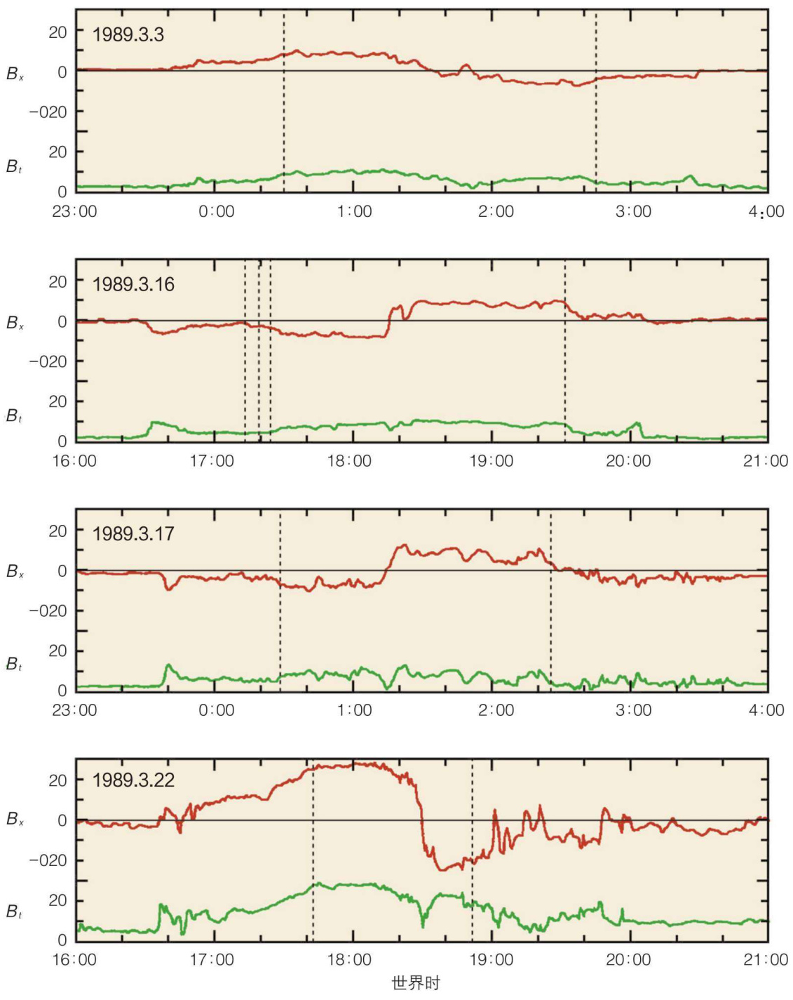  

图2.5火星磁尾×分量及磁场值随时间的变化。虚线是火星诱导尾瓣磁场与披挂磁鞘场之间的分界面。  

火星磁尾尾瓣磁场值在 $1 2 . 5 { \pm } 1 . 1 \mathrm { n T }$ 的范围内，其中误差表示均值的最大可能误差。横越火星磁尾方向的磁场是由 $\left( { B _ { y } } ^ { 2 } + { B _ { z } } ^ { 2 } \right) ^ { 1 / 2 }$ 的平均值给出的，它的取值范围为 $5 . 2 { \pm } 0 . 3 \mathrm { n T }$ 。  

图2.6给出了火星磁尾中磁力线局部披挂角依赖上游太阳风的关系。局部披挂角定义为 $\sin ^ { - 1 } [ ( B _ { y } ^ { \ 2 } + B _ { z } ^ { \ 2 } ) ^ { 1 / 2 } / \ B _ { t } ]$ ，其中 $( B _ { y } ^ { ~ 2 } + B _ { z } ^ { ~ 2 } ) ^ { 1 / 2 }$ 是轨道平均的横越磁尾方向的磁场分量， $B$ 是轨道平均的磁尾尾瓣磁场值。从图中我们可以看出，火星的披挂角是由太阳风动压所控制的。当太阳风动压较大时，火星磁尾磁场被太阳风挤压地更靠近火星。图2.7给出了火星磁尾的张开角依赖太阳风动压的关系。这里均方值是取自每11个数据的流动平均(runningaverage），图中的曲线是流动平均点的二阶多项式拟合。被选取的数据点是处于磁尾尾瓣场的极大值。在这里，我们还假设太阳风中电子的温度是离子温度的2倍。火星磁尾张开角的中值约为 $1 2 . 6 ^ { \circ }$ ，它的均值范围为 $1 3 . 6 ^ { \circ } { \pm } 0 . 6 ^ { \circ }$ 。与地球磁尾的观测相比较，火星磁尾在依赖太阳风动压方面和地球的性质是很相似的。但火星磁尾的张开角只是地球磁尾张开角的一半。  

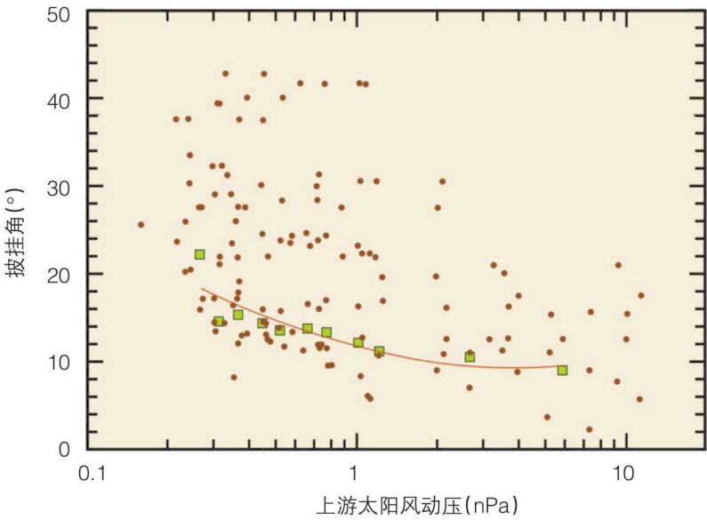  

图2.6火星磁尾中磁力线局部披挂角依赖上游太阳风的关系。  

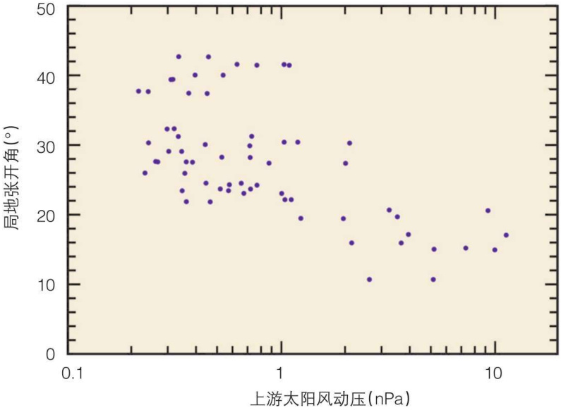  

图2.7火星磁尾的张开角依赖太阳风动压的关系。（这里均方值是取自每11个数据的流动平均，图中的曲线是流动平均点的二阶多项式拟合。）  

“火卫一2号”探测器携带的探测仪器资料分析表明，火星的磁尾有等离子体片存在，其中的等离子体主要由来自火星电离层的 $0 ^ { + }$ 离子，其能量量级为IkeV，数密度量级为 $1 \mathrm { c m } ^ { - 3 }$ 。在火星磁尾的等离子体片中，重离子的通量为 $2 . 5 { \times } 1 0 ^ { 7 } \mathrm { c m } ^ { - 2 } { \cdot } \mathrm { s } ^ { - 1 }$ $\mathrm { H ^ { + } }$ 离子和 $0 ^ { + }$ 离子都有损失。 $\mathrm { H ^ { + } }$ 离子和 $0 ^ { + }$ 离子的损失为火星大气演化的重要因素之一，这意味着水的损失，也为火星地表环境演化的主要因素。图2.8为卫星观测到的 $0 ^ { + }$ 离子通量数据资料。  

火星磁尾宽度约为$4 . 4 R _ { \mathrm { M } }$ ，其中等离子体片的宽度约为磁尾宽度的 $10 \%$ ，约$1 0 0 0 \mathrm { k m }$ 左右。  

火星有类似于地球那样的磁层顶，说明火星上存在着由星体内部结构而产生的固有磁场，“火卫一2号"探测器观测到火星磁场有8h、12h和 $2 4 \mathrm { h }$ 的周期性扰动，且这些扰动主要由太阳风与火星相互作用所产生，从而说明火星上的固有磁场是很弱的。根据"水手4号”飞行器的观测数据分析表明，火星的磁偶极矩上界为 $2 { \times } 1 0 ^ { 1 3 } \mathrm { T } { \cdot } \mathrm { m } ^ { 3 }$ ，以后“火卫一2号”、“火卫一3号”和“火卫一5号"探测器观测的磁场数据表明，对火星磁矩的估计都偏高。  

  

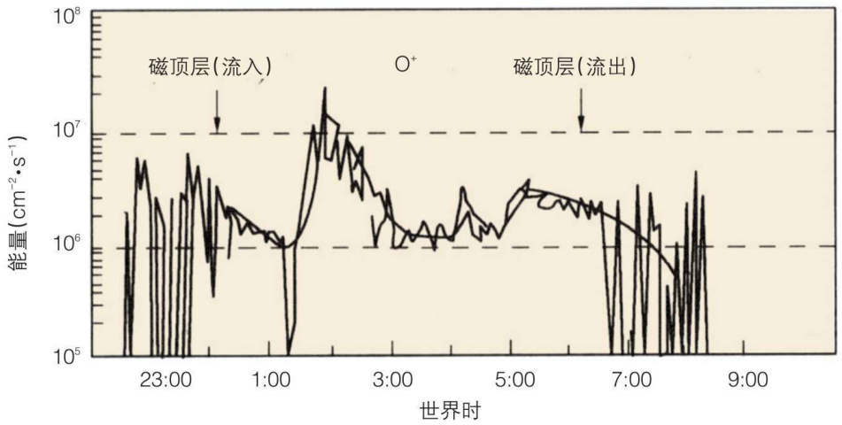  

图2.8卫星观测到的火星磁尾 $0 ^ { + }$ 离子通量  

  

  

1989年以来，根据"火卫一2号"探测器的观测数据分析表明，火星磁矩的上界约为$4 \times 1 0 ^ { 1 1 }$ T· $\mathbf { m } ^ { 3 }$ ，比地球磁矩低约3个量级。 从MGS探测器第262天的观测看来，火星周围的磁场是很弱的，强度不超过 $5 \mathrm { n T }$ □由此看来，目前观测区的磁场小于 $5 \mathrm { n T }$ 。由此推断，火星的内禀磁矩约为 $2 \times 1 0 \mathrm { n T \cdot m } ^ { 3 }$ 。也有人根据离子分布来推断火星的内禀磁矩，与MGS探测器的观测结果一致。  

目前对火星磁层的观测还仅是在某些特定情况下和特殊位置的观测。“火卫一2号”探测器还首先观测到了火星磁层中的电子密度和电场的资料，在弓激波的上游探测到了电子等离子体振荡。  
# 五、火星的电离层  

火星探测器探测结果表明，**火星上存在着电离层，但其高度较低**。

观测结果的初步研究，火星电离层不像地球那样有明显的F、E和D层。火星电离层适合查普曼型，是包括分子和离子在内的光化平衡而形成的，电子密度峰值约为 $1 0 ^ { 5 } \mathrm { c m } ^ { - 3 }$ ，峰值高度为 $1 4 0 \mathrm { k m }$ 左右，电子密度峰值及峰值出现的高度都随天顶角而变化。 ${ { \bf O } _ { 2 } } ^ { + }$ 和 $0 ^ { + }$ 在 $2 5 0 \mathrm { k m }$ 处起动力学主导作用，在 $3 0 0 \mathrm { k m }$ 处可达2500K的温度。火星夜晚侧电离层很弱，并且多变。观测还发现在火星电离层电子密度峰值以下约 $2 5 \mathrm { k m }$ 处，可能存在一个电离次层。它主要是由软X射线产生，相当于地球电离层的E层。  

由于火星磁场很弱，太阳风与火星大气相互作用，使得火星电离层结构和动力学变得十分复杂，加之现有的火星飞行器轨道位置的原因，对火星电离层的观测资料很少。目前来看，火星电离层的类型似乎位于金星型和地球型之间。火星电离层还受太阳周期性变化及火星尘暴的影响。  

人类虽然对火星进行了一些探测，取得了一些资料，并对火星的环境包括其磁层和电离层获得了一些认识，但有关火星环境的许多问题(包括火星上是否曾存在过生命，微生物是否藏在火星表面以下生活)还不清楚，需要进一步开展对火星的探测。这需要对生命存在的条件——水的存在和消失进行研究。几个火星探测器都探测到了火星表面水曾经流过的痕迹，这表明火星上曾有水存在。但是火星上是否曾存在过生命，水是如何消失的，都需要进一步研究。关于水的消失问题，需要对火星磁层区离子的逃逸过程进行研究。  

# 六、火星大气层  

火星是太阳系中与地球最为相似的行星。它们都有一个硬的壳和密度很高的核。  

但是火星的质量只有地球的1/10，所以火星重力很小，因而失去了大气中的挥发性物质。  

火星的大气很稀疏，平均表面气压仅为 $7 0 0 \mathrm { { P a } }$ ，不到地球海面气压的1/100。火星表面各处的实际气压因地而异，也随季节变化，最大气压也仅达 $1 0 0 0 \mathrm { P a }$ 。  

在火星表面，昼夜温差变化大约在 $5 0 ^ { \circ } \mathrm { C }$ ，比月球的要小得多，原因在于火星的表面存在着大气。通过“海盗号"探测器我们能够清楚地看到火星的大气(图2.9)。透过人造卫星向火星的地平线跳望，可以看到尽头的一层薄雾。  

火星着陆器通过火星大气降落过程中，直接测量了大气成分。跟金星大气类似，火星大气的主要成分是$\mathrm { C O } _ { 2 }$ （占总数目的 $9 5 . 3 \%$ ），其次是 $\mathbf { N } _ { 2 }$ （占 $2 . 7 \%$ ）等(表2.2)。但火星大气的微量成分跟金星大气不同，没有硫化物或酸，惰性气体 $^ { 4 0 } \mathrm { A r }$ （放射元素钾衰变产生)与 $^ { 3 9 } \mathrm { A r }$ 的比值大，说明这两个行星的大气化学和演化不同。  

火星大气的化学过程可分为两种  

循环反应，都是在太阳紫外辐射作用下发生的。一种是氧循环， $\mathrm { C O } _ { 2 }$ 光解为CO和O，0结合成 $\mathrm { O } _ { 2 }$ 和 $\mathrm { O } _ { 3 } , \mathrm { O } _ { 2 }$ 和 $\mathrm { O } _ { 3 }$ 都是土壤的氧化剂。另一种是氢循环，水汽光解为H和OH，氢与氧生成 $_ { \mathrm { H } _ { 2 } \mathrm { O } }$ ，这又是土壤的氧化剂。最后，CO和O结合成 $\mathrm { C O } _ { 2 }$ ，留在大气中，一些氢和氧逃逸到行星际，总的结果是火星丢失水。  

  

表2.2火星大气成分  

  
  

<html><body><table><tr><td>主要气体</td><td>含量vol(%）</td><td>微量气体</td><td>含量（ppm)</td></tr><tr><td>CO2</td><td>95.3</td><td>3Ar</td><td>5</td></tr><tr><td>N2</td><td>2.7</td><td>Ne</td><td>2.5</td></tr><tr><td>40Ar</td><td>6</td><td>Kr</td><td>3</td></tr><tr><td>02</td><td>0.13</td><td>Xe</td><td>0.08</td></tr><tr><td>Co</td><td>0.07</td><td>03</td><td>0.04—0.2</td></tr><tr><td>HO</td><td>0.03</td><td></td><td></td></tr></table></body></html>  

  

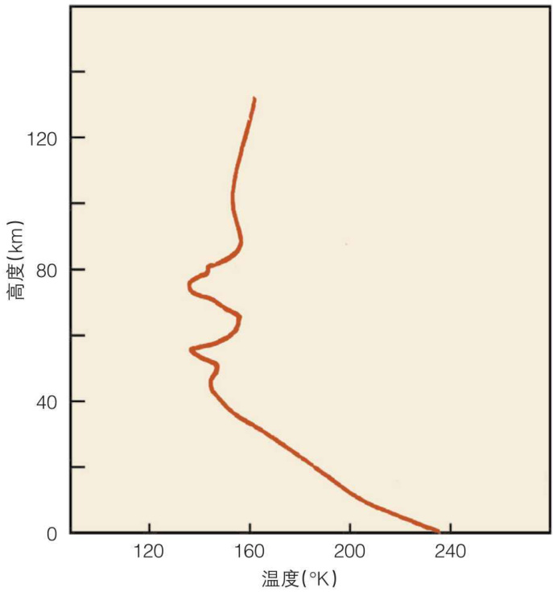  

图2.10火星大气温度的垂直分布。  

  

“海盗号”着陆器通过火星大气降落过程中，测量了大气温度的垂直分布（图2.10)。在其低层大气中，从表面向上温度随高度增加而降低，温度梯度为 $1 . 6 { - } 1 . 8 ~ \mathrm { ^ { \circ } C } /$ $\mathrm { k m }$ ，这跟地球大气对流层相似。在高度40—$8 0 \mathrm { k m }$ ，温度在 $- 7 0 \%$ 附近变化，有一系列冷暖层，跟太阳辐射加热和潮汐作用有关。甚至其对流层厚度也随地域和季节变化。  

  

火星大气没有地球大气那样的臭氧层和中层，更高层大气的温度又增加。在高度$1 3 0 ~ \mathrm { k m }$ 附近有电离层，突出的F1层， ${ { \bf O } _ { 2 } } ^ { + }$ 占$90 \%$ ， $\mathrm { C O } _ { 2 } ^ { + }$ 占 $10 \%$ ，其高度和温度有相当大的变化。尘暴时大气温度变化很大。火星大气中 $\mathrm { C O } _ { 2 }$ 也有温室效应，可使表面温度提高$5 0 ^ { \circ } \mathrm { C }$ 。  

  

氘(D)是氢(H)的同位素，它与氢有近似相同的化学性质，但两者质量不同。这一差别允许我们跟踪和检验各行星所处的演化状态。根据太阳系各行星D/H的比值估计它们与原始大气紧密相关的程度。已经知道在水合硅酸盐中的水有接近地球上的D/H比值。在有大量岩核的行星上，同位素特征将被保留下来，在某些情况下，随着行星演化，这一比值可能进一步增加。观测表明，火星的D/H比值比地球大气的D/H比值要大6倍，这就意味着火星表面约 $9 9 \%$ 的水因氢的逃逸而消失。  

  

火星的大气环流是复杂而多变的。火星的自转跟地球相似，预料火星大致有类似地球的大气环流，例如，低纬区有子午方向的哈德莱环流，一定季节在中纬出现斜压涡旋，地势高程差大（到 $2 5 \mathrm { k m }$ )的地方出现驻波等。但是，火星低层大气环流也跟地球有差别，由于火星没有海洋，表面直接被太阳晒热，夏季最热处不在赤道，而在热带或亚热带，结果是单一层次的哈德莱环流从最热处上升，分开两支流向南、北(其中一支跨过赤道)亚热带再沉降。冬季半球中纬区温度变化大，出现准周期斜压波，向上转移动量，维持季节性 $\mathrm { C O } _ { 2 }$ 极冠云边缘的东西向强急流。冬季半球高纬区， $\mathrm { C O } _ { 2 }$ 凝结，气压降低，从而导致流向极区的凝聚流，也向极区转移物质。火星上还有从太阳正射的热区上升，流向他处，而低层气流又流向照热区，形成“热潮汐”风。  

  

虽然火星的大气比地球的要稀薄，但是其浓度已足够观察的到一些如云层和旋风等与地球大气运动相似的大气活动，如龙卷风(图2.11)，图中从中间到右边的亮白云层，云层代表了有浓缩的水蒸气在大气中。在地球上，云层代表了水蒸气在大气中的浓缩。然而在火星上云层可能是水蒸气的凝聚，更通常的可能是由二氧化碳的凝聚所形成的。在极地上空的云层很可能是二氧化碳云层。在靠近赤道的纬度上，由于高温，云层也许是由水蒸发形成的。在这张图片中，请注意左上角巨大的旋涡。这是一个火星上的龙卷风。这个龙卷风的直径有大约 $2 5 0 \mathrm { k m }$ 。  

  

另一副火星龙卷风的图片(图2.12)显示其直径大约有 $6 0 0 \mathrm { k m }$ 。科学家从龙卷风的阴影在火星表面的覆盖程度判断出这些龙卷风云层位于火星表面6一 $- 7 \mathrm { k m }$ 的高空。同时可以注意到龙卷风是反时针旋转的。和地球上的情况相同，火星云层运动的动力来源于这个旋转系统中科里奥利力。科里奥利力是指一个运动物体在一个旋转系统所产生的惯性力。无论是在地球还是在火星，科里奥利力都使得在北半球的物体向右旋转，而在南半球的物体向左旋转。)由于火星的自转速度与地球的相同，所以科里奥利力能够对火星的大气产生与地球上同样的影响。  

当火星上的风速达到临界值(约50— $\mathrm { 1 0 0 m / s }$ 时， $1 0 0 \mu \mathrm { m }$ 大小的沙尘也被吹到大气中，形成区域性尘暴。除了云，沙尘暴是火星上另一个有趣的大气活动特征。每个火星年约发生上百次区域性尘暴，主要在 $\mathrm { C O } _ { 2 }$ 极冠边缘和亚热带高地。几个区域性尘暴偶然联合起来，把大量尘沙卷到 $3 0 \mathrm { k m }$ 空中，发展成全球性大尘暴，可持续几个星期。从1970年到1980年，火星发生过五次大尘暴，从地球上望远镜中都可见到。在火星过近日点期间，正是其南半球夏季，日照强，大气变得不稳定，成为尘暴发源地。火星尘暴是火星大气特有的现象。由于沙尘吸收来自太阳的辐射和来自火星表面的红外辐射，尘暴使火星大气温度增高，大气压力减小。尘暴不仅改变大气温度，而且尘沙也成为水汽和 $\mathrm { C O } _ { 2 }$ 气体的凝结核，最终沉降到极区。  

图2.13显示了一个位于火星南极附近的小型风暴。在极地疾风的作用下，地面上的尘土颗粒被扬起带入到大气中，从而产生了这个面积有几百平方千米的尘暴。大气中的尘土含量越多，大气的温度就会在白天上升的越快，从而加大了上层大气昼夜间的温差变化。温差的加大又促使了强风的产生，使得更多的尘土被掠食到大气之中并迅速蔓延整个星球。  

在“海盗号”完成任务之前，每个火星尘暴季之间被认为没有什么不同。然而情况并不是这样。“海盗号”登陆火星的当年，探测到火星上两个全球性的尘暴，但是到了第二年，尘暴开始变的很稀薄并且不再是全球性的了，整个南半球被一个向北运动的尘暴吞噬。全球性的尘暴能够持续多久？有人认为，当大气中的尘土含量增加到一定程度时会遮挡住太阳的光芒，使得地表的温度下降，导致风速下降，尘土下沉，全球性的尘暴也随之停止。而要使整个大气重新变得清澈大概需要三个月的时间。最近的火星探测器观察证实，全球性的尘暴仍然是火星上十分活跃的地质现象。  

火星大气 $\mathrm { C O } _ { 2 }$ 的主要特征是：有约占大气总质量 $2 5 \%$ 的 $\mathrm { C O } _ { 2 }$ 在极区冷凝和升华。这一冷凝、升华过程是由极区的辐射收支决定的。当太阳照射火星南极时，其温度可达300K，使干冰升华，向火星大气输送 $\mathrm { C O } _ { 2 }$ 气体；而在火星北极，其温度下降到140K，火星大气中的 $\mathrm { C O } _ { 2 }$ 气体冷凝成干冰。这种 $\mathrm { C O } _ { 2 }$ 的冷凝、升华过程，使火星大气质量产生明显的季节性变化。这一过程可产生热量、动量和微量成分的沿子午线传输，并引起火星表面大气压的巨大变化。地球上水的蒸发主要发生在亚热带地区，而降雨主要发生在赤道和中纬度地区。火星则完全不同，蒸发发生在日照的极盖区，并直接升华为水蒸气；而冷凝主要发生在背阳面的极盖区，中间的输运过程尚不清楚。火星探测器的探测表明，火星尘暴也有明显的季节性变化，而事实上，人们很早就在天文观测中发现了火星尘暴。  
# 七、火星极冠与水  
火星极区出现的白斑称作“极冠”，随火星季节变化。由于火星公转轨道是偏心率较大的椭圆，火星过远日点时恰是其南半球冬季，南极冠范围很大，可达 $6 0 ^ { \circ } \mathrm { S }$ ；火星过近日点时南半球是夏季，南极冠几乎完全消融。北半球冬季则是在火星过近日点时期，北极冠范围要小些；北半球夏季是过远日点时期，北极冠仍留下小范围未消融。  

火星极区的冬季气温降至零下 $1 2 5 \mathrm { ^ \circ C }$ 以下，大气中很大一部分(约 $30 \%$ ） $\mathrm { C O } _ { 2 }$ 凝结成为干冰降落在极区表面，形成较薄层（约 $2 2 \mathrm { c m }$ )白色极冠。到了春暖，干冰又升华，极冠消融。除了 $\mathrm { C O } _ { 2 }$ ，水汽也凝结形成水冰极冠。由于水的凝结温度较高，甚至到了夏天，水冰极冠也不会完全消融。  

火星大气中 $_ { \mathrm { H } _ { 2 } \mathrm { O } }$ 的总量不多，如果全部凝结也仅能在火星表面覆盖约0.01毫米厚的薄薄一层（与此对比，地球大气中的水汽可降为几厘米厚的一层）。可见火星世界是极其干燥的。估计火星北极冠水冰层的厚度为 $1 \mathrm { m } { - } 1 \mathrm { k m }$ ，相当于大气中水汽的万倍。假如火星的 $\mathrm { H } _ { 2 } { \bf O } / { \bf N } _ { 2 }$ 比值跟地球相同，那么火星的 $_ { \mathrm { H } _ { 2 } \mathrm { O } }$ 总量会相当于在火星整个表面都覆盖$8 0 { - } 1 6 0 ~ \mathrm { m }$ 厚的冰层。因此我们自然会问：火星上大量的 $_ { \mathrm { H } _ { 2 } \mathrm { O } }$ 到哪里去了？红外观测及着陆器表面物质分析都表明，表面物质约含 $1 \%$ 的束缚水。有人认为火星有永冻土或地下水。另一方面，火星表面有许多于涸河床，说明火星从前有过大量流水冲刷。有关火星水的问题将在后文中讨论。  
# 八、火星地形地貌  

和其他类地行星相似，火星的地貌特征与地球及其他行星有许多相似之处，同时也有自身的特点。火星上最醒目的地貌特征是密度较大的撞击坑、迄今发现的太阳系内最大的火山穹隆、巨大的峡谷、南北两极的极冠、河床、谷网、流线、岛屿和沙丘等。这些地貌特征都直接折射出火星有强烈的内外力地质作用，而且这些作用目前仍然很活跃。  

在地球上观察，火星是一颗红色的星球。是火星上所含的氧化铁给了这颗星球微红的颜色，换句话说，火星是一个“生锈”的星球。图2.14显示出火星与月球相同，也有亮色和暗色区域。在所有的轨道飞越任务完成之后，美国航空航天局(NASA)得到了较完整的火星表面资料。现在能够清楚地看到，亮色区域是由重重的多坑山地造成的，而暗色区域是由相对平坦的低地造成的。然而，火星一个显著的特点是，亮色及暗色区域呈现半球分布。如果认为高地就相当于地球上的大陆，低地相当于地球上的海床，那么火星表面一半是大陆，另一半被大洋所覆盖。这是个十分有趣的特征，根据这些特征推断，在20亿年前，地球上可能也只有一个超级大陆以及一个巨型的海洋。目前，对火星上这种明显的半球型地形分布还没有合理的解释。火星全球探测卫星于1999年通过高度测量法绘制了完整的火星地形图。  

## 8.1火星上风的力学特征  

当“水手9号"于1971年秋天第一次进入火星轨道时，见证了火星全球范围的尘暴。这次尘暴的发生较预期的时间提前了两个月，而且利用地基望远镜就可以观察到。从望远镜上观察，尘暴呈现为一个淡黄色的云团，飞速地覆盖了整个星球。尘暴是发现火星表面遭受风蚀作用最早的证据之一，也是目前火星上少数几个仍然处于活动状态的地质运动的其中一个。与地球上的相似，风蚀作用侵蚀了火星表面同时通过沉积作用产生新的地形。尽管火星表面的重力很小，但火星的大气压同样很小，因此利用高速的风力使表面的沙粒在整个星球范围内移动是十分容易的。在火星上，典型的风速一般超过$2 0 0 \mathrm { k m / h }$ 。阵风通常能够达到 $5 0 0 { \mathrm { - } } 6 0 0 \mathrm { k m / h }$ 。经过“海盗号”登陆测量，火星表面尘暴的典型风速约为 $3 0 \mathrm { m / s }$ 。这足以使尘土离开地表产生尘暴。  
## 8.2风的蚀痕  
在火星上最为显著的风蚀特征便是风的蚀痕(图2.15）。这些泪痕状的蚀痕出现在撞击坑、山脊、悬崖的后面，它们的颜色有亮有暗，主要取决于蚀痕表面的成分。这些特征都是侵蚀与沉积作用的结果。侵蚀可能发生于一些障碍物之后，强风集中于一点将细小尘土一扫而空，暴露出平原下面的熔岩，从而导致黑色的蚀痕。  

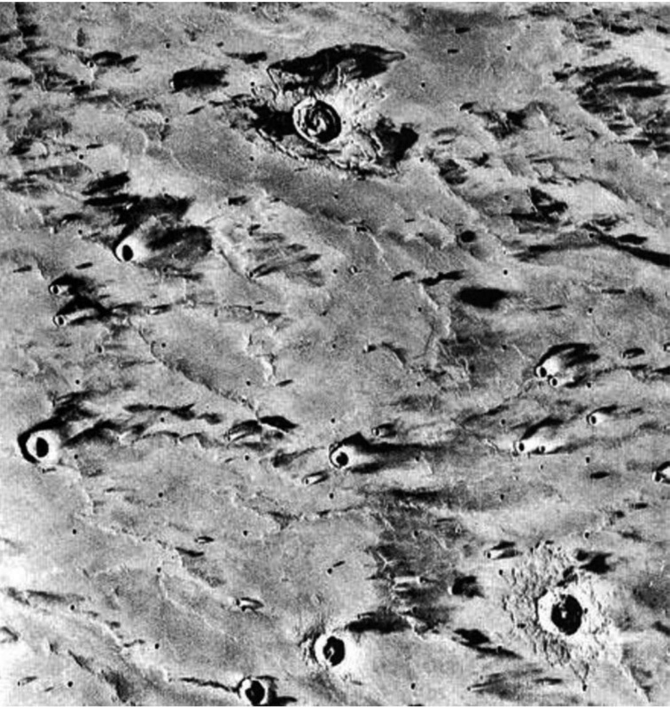  

图2.15火星风蚀作用。  
另一方面，一些障碍物可能产生一个遮风的区域使得风力逐渐消失，产生一个易于沉降悬浮颗粒的环境，因此形成亮色调的蚀痕。根据“火星全球勘测者”所提供的高分辨率图像，风蚀条痕能够在很短的一段时间内发生位置的变化，原因尚不清楚。  

## 8.3沙丘  

在火星表面，沙丘也是非常普遍的，特别是在两极冰盖的周围。沙丘能够在很小的区域内形成，例如撞击坑的内部。同时也可以注意到，火星上的撞击坑边缘不是锋利和保持原貌的。可能是受到大气中运动的悬浮颗粒侵蚀作用的影响，火星上撞击坑的边缘逐渐退化，这和月球上的不太相同。  

火星上也可以形成大范围的沙丘(横跨 $6 0 \mathrm { k m }$ )。由于照片上的没有撞击坑的痕迹，说明了沙丘的年龄相对来说是比较年轻的。在火星上同样也能发现线形的沙丘。  
## 8.4风蚀表面  

在火星南部遍布撞击坑的高地上，不断的风蚀与沉积作用产生了巨大的侵蚀景象。有时候也可以表现为一个蚀刻面。另外，风蚀所产生的平行山脊，在地球上被称为白龙堆，也同样能够在火星上发现。  

因为有了“海盗号”、“机遇号”及“勇气号”登陆器，我们能够更加仔细地观察到火星表面的风蚀过程。1976年8月“海盗1号"登陆地点的情况，在一年之后发生了明显的变化。推测认为，这些都是由火星表面上疾风所携带的沙层不断侵蚀所造成的。  

在火星表面同样也能发现风的沉降作用。“海盗2号”着陆点的岩石都被一层搀杂着冰的尘土所覆盖，这表明这些尘土是从大气中沉降下来的。当火星上的大气温度向更冷的冬季转变时，水和 $\mathrm { C O } _ { 2 }$ 开始凝聚悬浮在空气中尘土颗粒。凝聚作用增加了尘土的重量使得它们沉淀到地表。  
## 2.8.5撞击作用形貌  

撞击作用对火星表面形貌的形成起着重要的作用，产生独特岩石即撞击角砾岩（图2.16)。火星上的撞击坑形态和月球上的十分的相似：较小的撞击坑(直径小于10—$1 5 \mathrm { k m }$ )形貌比较简单，呈碗状，其底部凹陷同时边缘凸起并且还竖起陡峭的岩墙，有一些甚至有一个平坦的基底；更大一些的撞击坑其中央的山峰和阶梯状墙更大、更复杂；直径超过 $1 0 0 \mathrm { k m }$ 的撞击坑，呈多环构造，中间峰顶也呈环状。  

与月球上的撞击坑相比，火星上的撞击坑看来经历了更多的侵蚀和陵削。这些现象是在空气动力作用（也就是更强的风蚀过程)下形成的。  

与月球相比，火星上的火山喷出物覆盖层和二级撞击坑就不那么引人注目了。放射状的撞击坑更是罕见。然而，火星上火山喷发物上的撞击坑形态却是独一无二的。这些撞击坑可划分为堡垒式的撞击坑、流态化的撞击坑和飞溅式的撞击坑。尤蒂撞击坑(Yuty Crater)就是一个壮观的堡垒式的撞击坑。该撞击坑中的火山喷发物由几个相关的薄层组成流动方向而呈舌头状。从图上看起来，泥石流涌出，像一个巨大的泥制弹着点。在前端，每个喷发物的圆形突出部分都形成一个山脊。向右(或向东),喷出物看上去好像流向了一个早期形成的撞击坑的蚀化边缘。向南，有一个更小更古老的撞击坑，它被分隔成两个大的圆形凸起，但是最后被液化的碎片所充填。液态水可能已经和喷出物质合成了一体，从撞击坑中涌出，产生一个快速流动的火山喷发物泥石流。  

  

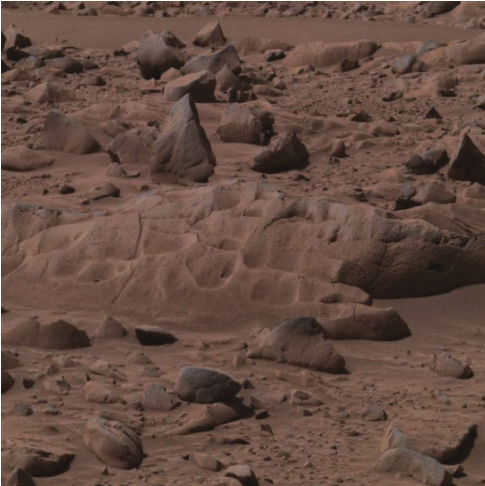  

图2.16火星上的撞击角砾岩。  

  

很明显，这些火星上的喷发物转变成了液态，使得它能够在陨石撞击之后抛离原地继续流动。直径小于 $1 5 \mathrm { k m }$ 的撞击坑一般只有单一的喷发物薄层延伸出撞击坑的范围。喷发物凸起的方向通常形成陡峭的山脊或悬崖。  

  

和其他天体上的撞击坑相同，火星上的撞击坑同样会因为撞击坑的边缘沙石的流动性（也就是山崩）后来叠加的陨石冲击、岩浆的流动以及附近火山喷出物的冲击而被陵削。另外，火星上的撞击坑也可能被水和大气所风化。阿吉尔(Argyre)盆地是一个古老的冲击型撞击坑，直径大约 $1 0 0 0 \mathrm { k m }$ 。可以注意到其撞击坑原始的边缘已经被随后发生的小型冲击事件所消减。但火星上撞击坑的密度要远远比月球上的小，这可能由以下原因造成：（1）星球离太阳越远，小行星和陨石的数量也就越少；(2）火星上随后所发生的地质作用，例如液体的流动作用、风化作用和火山作用等严重破坏了火星历史上的冲击痕迹。  

  

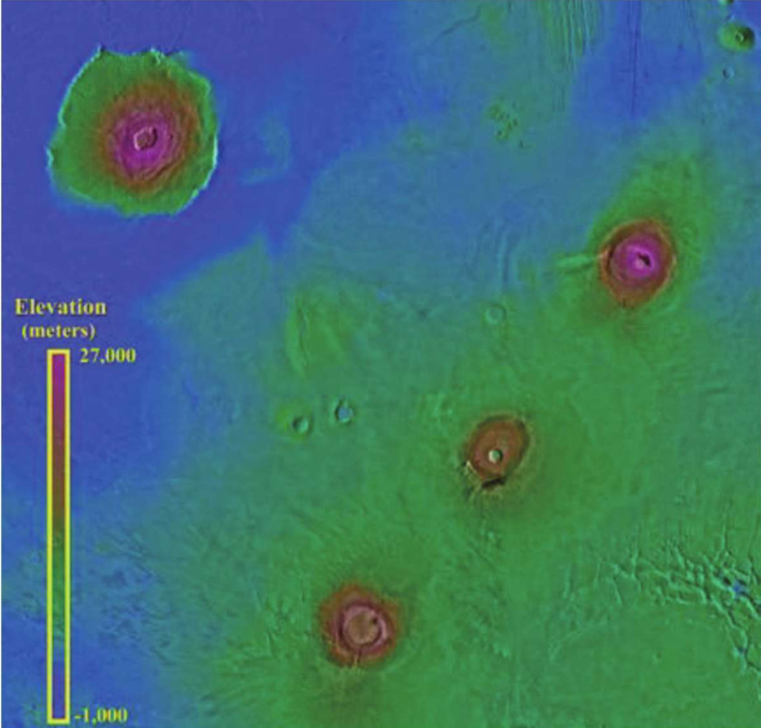  

图2.17火星上的奥林匹斯隆起。  

  

## 2.8.6火山作用形貌  

  

盾状火山是火星上最引人注目的构造之一。即使是从全球性的视角观察，火山群也是很容易被辨别出来的。火星上的萨希斯(Tharsis)火山群是由12座大型火山和许多小型的火山构成的区域。这个区域中最大的、同时也是火星上最大的火山是奥林匹斯(Olympus）隆起(图2.17）。该环形构造的直径大约 $1 5 5 0 \mathrm { k m }$ （这个单个火山的面积就能够穿越整个夏威夷火山群岛）。该火山从平原上拔地而起，高 $2 5 \mathrm { k m }$ 。垂直落差距离比从喜马拉雅山顶到马里亚纳海沟的落差都要大（后者的落差仅约 $2 2 \mathrm { k m }$ )。珠峰的海拔及金星上麦克斯韦(Maxwell)山的海拔和规模都远远小于奥林匹斯火山高地。该火山顶部形成有一个火山口，从形貌上看它是由岩浆房的岩浆喷发导致表面坍塌而形成的。与地球上所有的盾状火山相同，从重建的三维视角中观察，它有一个平缓的坡度。  

  

奥林匹斯隆起的边部形成一个几千米高的陡峭悬崖。火山早期喷发时，岩浆可能从平原上平缓的向外流出。而随之产生的滑落作用产生了悬崖，然后滑落作用使得悬崖向着顶部方向后退（如同河流地质作用的向源侵蚀过程）。  

  

火星上另一个火山群称为伊利瑟姆(Elysium)，地点靠近“海盗2号"登陆器的登陆地点。这个区域的特点在于它由三个大型火山构成。萨希斯与伊利瑟姆区域都位于地壳膨胀的顶部，这就暗示，可能是由于火星内部热力学运动导致这些区域地表的抬升并产生岩浆的喷发最后形成了这些高地。  

  

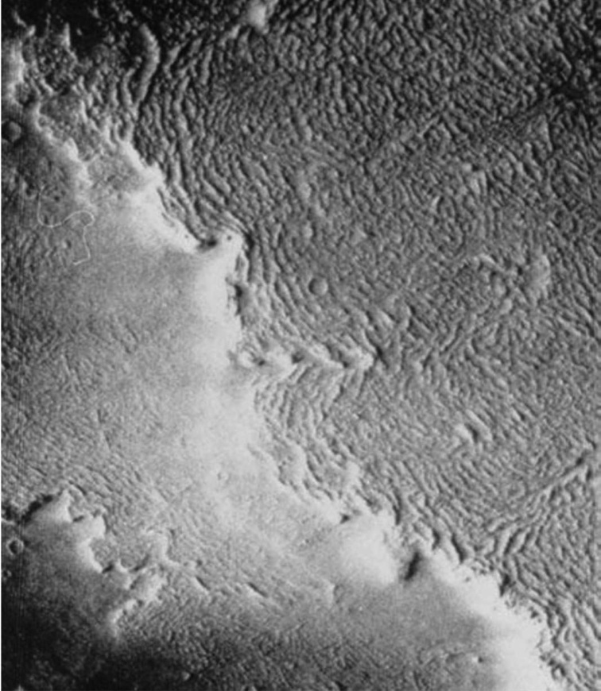  

图2.18火星岩浆流。  

地幔的上升过程可能可以合理的解释这些火山形成时的机械运动。伊利瑟姆区域大多数的火山有着与奥林匹斯隆起相似的地质形貌，只是比后者小了些。它们也是相对年轻的，因为它们的表面缺少撞击坑。年轻的奥林匹斯隆起估计大约有1亿年。如果这个估计正确的话，当奥林匹斯隆起最后喷发的时候，恐龙仍然在地球上漫游驰骋  

除了这两个大的火山区域之外，火星上还零散分布着一些小型的火山。比布利斯(Biblis)和尤利西斯(Ulysses)是其中的两个例子。它们确实是小型的盾状火山（都只有$1 0 0 \mathrm { k m }$ 宽），但相对于大型的喷火山口，有些科学家提出它们可能是被掩埋的大型盾状火山的残余部分。  

在火星上，最大的火山构造并不是盾状火山，而是一片并不引人注目的区域。该区域有一个大的喷火山口，称为环形山(Patera)区域。该区域位于奥林匹斯隆起东北方的萨希斯区域，直径大约超过了 $1 5 0 0 \mathrm { k m }$ 。该构造的中心部分被环状断裂带包围。这可能是由于一系列复杂的火山和板块运动所造成。火星上的这种构造是独一无二的，在其他星球上还没有被观察到。  

从撞击坑数量上估算，提瑞纳环形山(TyrrhenaPatera)的年龄至少有30亿年。这表明火山作用一直贯穿了整个火星历史。因为火星表面存在水(或者其他液体和固体)流动过的痕迹，所以在火星早期可能发生了很多火山喷发的事件。  

熔岩平原是指火山所喷发出来的岩浆最后形成了巨大的火山岩平原。火星上大约$6 0 \%$ 的表面被该平原所覆盖。与月球的情况不同，我们不能确切地下结论说它是火山岩平原，因为它们也可能是由水流的冲刷作用或是风蚀作用导致尘土沉积而形成的。  

图2.18显示了一股从右上方向前推进的岩浆流。图片上粗糙、平行的山脊可能是岩浆流在推进过程中上部冷却而产生的褶皱。前进的岩浆流形成了一座大约高 $3 0 \mathrm { m }$ 的悬崖。淡色的尘土颗粒在悬崖的低部积聚，从而在图片中产生了一个亮色的区域。  

另一个能够指示出平原的形成来源于火山的证据是平原上存在火山锥。顶部带有深坑的小圆锥也能在火山岩平原上找到。它们呈线性排列的原因可能与该区域的断层系统有关。但是它们确切形成的原因目前还不知道。  

  

# 九、火星上的水  

火星并不是一个干燥的星球，很多火星人造卫星照片显示的流动通道很像地球上干枯的河床，即通常所说的古河网体系（图2.19）。这些通道沿着分隔两大地形的边界线，而且很多通道最初从南部高地起源，最后消失在北方低矮的盆地之中；在南方高地上有很多小的树枝状河网，零散地分布在火星的表面。

但目前的火星表面热力学条件（也就是温度和压力）不允许有液态水的存在，即使存在水，也只能以气态或固态的形式存在；但次表层是否有水的问题，一直以来争论不休。  

上述古河网体系的体系的存在，表明火星在过去某个时间段可能经存过大量的液态水。然而，这些==**液态水在什么时间段存在、在火星表面持续了多久、最后如何以及什么时候消失的呢？**==这些都是目前困扰着科学界也激励着人类进一步探测与研究的、尚待解决的重大科学难题。  

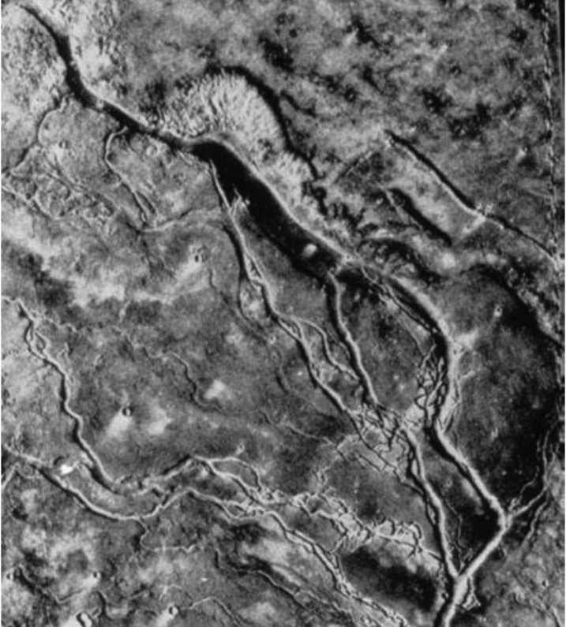  

图2.19火星上的古河道网格体系。  

## 9.1溢流河道  

在火星高地上有很多的类似地球上的河道和谷网，它们的特征与地球上树支状的排水系统很相似。单段河道的长度多数不超过 $5 0 \mathrm { k m }$ ，宽度不超过 $1 \mathrm { k m }$ 。然而，一个系统由很多次级的枝节所组成，长度可以达到 $1 0 0 0 \mathrm { k m }$ 。目前认为，这些河道主要属于溢流河道。  

溢流河道指那些解释为**灾难性洪水形成的河道，常出现在谷岭纵横的地区，靠近源头的地方常常是最宽和最深的地方，很少有支流**。以地球的标准来看，许多溢流河道都非常大，宽度常达数十甚至数百千米。除伊利瑟姆北部和亚马孙(Amazonis)平原外，大部分溢流河道都出现在克里斯(Chryse)盆地，河道分叉后变得宽而浅，并形成狭长的岛屿和纵向的凹槽。  

**与径流河道不同(它们形成的年龄很老)，溢流河道的形成年龄很分散**，在撞击高地一些大的不连续河道,如拉顿(Ladon)峡谷,可以追溯到撞击速率衰减后的39亿年前，克里斯盆地的大多数河道的撞击坑密度为2000—3000个/每百万平方千米，形成年龄约为25亿年前，而曼格拉(Mangala)河谷的撞击坑( $> 1 \mathrm { k m }$ ）密度仅为650个 $/ 1 0 ^ { 6 } \mathrm { k m } ^ { 2 }$ 。  

针对溢流河道的成因，人们提出了许多不同的模式来解释**火星表面水的大量倾泻**。
- McCauleyetal.（1972)和Masursky(1977)认为，火星上的洪水类似于冰岛的火山融冰洪流或冰川爆发，是**基底上冰盖在火山的加热下融化的结果**，水在冰盖下积聚，然后周期性地释放出来，形成洪水。在火星的地形混杂区地表热流较高，火山喷发等都可使近表面的冰融化，产生洪水。
- Clark(1978)认为，洪水可能是近地表埋藏的**含水风化壳被加热后，水周期性涌出**的结果。
- Carr(1979)认为**洪水是高压状态下含水层中的水由地下释放的结果**。在火星上厚厚的永久冻土层下在水的现象到处都存在，这些水将慢慢过滤到地势较低的地区，并慢慢建立静压头，由于火星表面地形起伏很大，压力将变得很大，以致能破坏蓄水层，使水得以到达地表。
- Nummedal(1979)认为**河道和纵横山脊都是近表面浸透水的物质流动和瓦解产生的液化疤痕**。
- 此外还有人认为火星的溢流河道是**由风或熔岩切割而成**，但赞成的人很少。  

以上假说都不是非常成熟，在不同的地区，河道的主要形成方式可能有所不同。例如，环绕克里斯的河道可能是以不同的方式形成的，甚至一条河道的形成可能是几种形成方式的综合。地表水的突发性涌出会引起含水土层的液化，将泥浆带到地表，形成洪水，但由于排泄速率下降，泥浆会被冻结，形成一条脏冰川。最后，在河道形成以后，风会对它进行改造。因此河道保留了它形成过程中各种地质作用的烙印。  

总之，河谷系统提供了火星早期历史温和气候条件的证据，当时液态水能够以相对适度的流量在火星表面流动。这种气候条件持续的时间应该相当较短或侵蚀速率非常低，因为火星上从来没有形成过成熟的排水系统。尽管大多数溢流河道的年龄都较老，但在火星的整个历史中都能形成，甚至在现在的气候条件下也有可能形成。溢流河道形成的最合理的机制是突发性的洪水。  
## 9.2洪水与沟渠  

在火星上同样能够找到发生过大型洪水的证据。图2.20是一幅卫星拍摄的名为蒂乌(Tiu)的峡谷，该峡谷有 $6 0 0 \mathrm { k m }$ 宽。洪水发源于照片的上部。在洪水的发源地，地形是无序的。在发源地的附近，河谷大约有 $2 0 0 \mathrm { k m }$ 宽。  

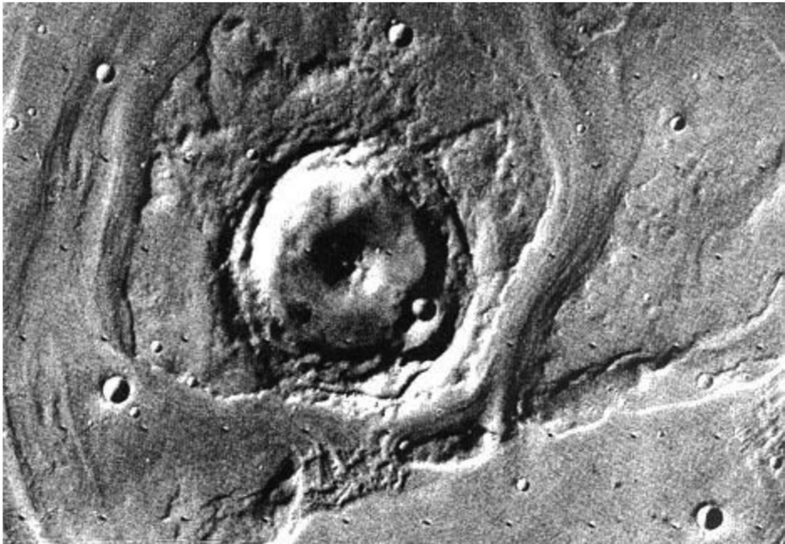  

图2.20火星上的蒂乌峡谷。  

通过最近多次的火星观测任务得到了更多清晰的照片，这些照片清楚地显示了**在撞击坑的峭壁上有沟渠的存在**。它们可能形成于**从峭壁斜坡上流下来的液态水**。有人设想水可能来源于**冻结于这些地层中的冰**。另外，高分辨率照片也显示了很多看上去很奇怪的层状地形，它们是否与地球上洋底的沉积地层和沉积湖泊等价，现在还难作最后的定论。“海盗号”和“勇气号”的登陆，让我们获得了更多精细的图片，这些近距离的观察已经充分说明火星上曾经存在海洋，并经过沉积作用形成了这些沉积地层。  
## 9.3两极的冰盖  

火星两极冰盖的存在使得它不同于月球。==**火星两极的冰盖都会随着季节的变化而增长和消退**==。季节性转变的冰盖由大面积的干冰组成，但是夏季的更引人注目的冰盖可能是由冰所形成的，至少在北半球是这样。在北极的夏天，曾经探测到北极冰盖有大量的水存在，但这时南极并不处于夏天。图2.21展示了南极的永久性冰盖。这个冰盖大约有 $1 0 0 0 \mathrm { k m }$ 宽。那些黑线很可能是流域或者是朝南方向而免于被霜冻的悬崖。导致这种布局的原因现在还不肯定，但它有可能是被从极地刮起的盘旋式疾风侵蚀所造成的。  

冰盖周围是冰土多年缓慢堆积的混合物。而引起层与层之间的差异的原因可能是沙尘暴活动不断变化的结果。这些变化会影响大气中沙土的含量及沉积物的量。因此，这些纹层记录了最近地质气候的转变。这些地层没有冲击撞击坑，说明它们的年龄相对比较年轻。  

  

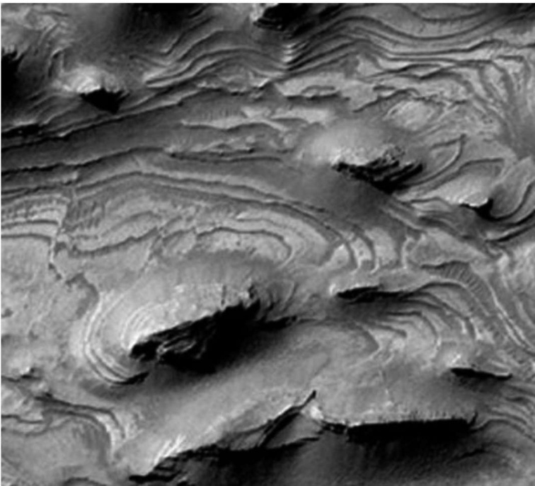  

图2.21火星南极冰盖。  

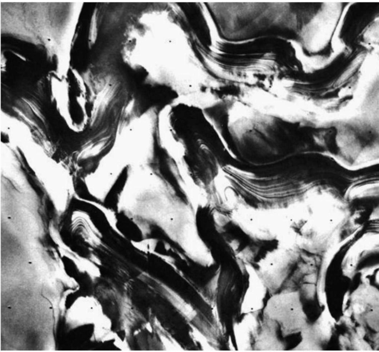  
图2.22火星上的沉积物形态。  

层状沉积物在北极总是被冰霜所覆盖。然而在南极，冰盖比北极的要小，在夏天很多的层状沉积物没有被冰霜所覆盖(图2.22)。这张照片清楚地显示了右手边下方角落的一个层状沉积物，它覆盖在一个更老的撞击坑地形上，将这个撞击坑部分覆盖了。通过比较，可以发现它表面惊人地平滑。这个层状沉积物大约有 $2 0 0 \mathrm { k m }$ 宽。  

# 十、火星表面的物质成分  

目前对火星整体性化学成分的认识主要是基于太阳系行星化学理论、部分火星化石研究结果、火星轨道遥感成分探测、火星表面着陆和巡视的就位成分探测，以及地面望远镜观测的数据的综合性分析与研究而所获得的，可以说是尚处于肤浅或轮廓性、推理性的初级阶段。  

从早期的"水手号”、“海盗号"到后来的"火星观察者”、“火星探路者"以及“火星快车”、“勇气号"和"机遇号"等火星探测器，都对火星表面的物质成分进行了探测，也获取了大量的火星表面土壤、岩石、矿物和化学元素的信息。  

“海盗1号”、“海盗2号"分别对着陆点的松散碎片物进行了X射线荧光光谱分析。发现两个着陆点的化学成分非常相似，分析的物质可能是很薄的颗粒状盖层，它可能已经**由于风暴而发生了全球性的均一化**。分析数据显示总量缺少几个百分点，因为只有原子数大于11的元素才能分析，所以像$\mathrm{H}$、 $\mathrm{C}$、$\mathrm{N}$、$\mathrm{O}$和 $\mathrm {Na}$ 等常见元素没有分析。总量的缺少可能主要是由于 $\mathrm { H } _ { 2 } \mathrm { O }$ 和 $\mathrm { C O } _ { 2 }$ ，尽管也可能存在少量的Na和硝酸盐。海盗号着陆器不能进行矿物学分析，所以分析样品的矿物成分和特征只能通过间接的推导得出。“海盗号”研究人员的解释是，细粒物质大部分由组成，并含有少量硫化物、碳酸盐和氧化物。

最初，在反射光谱线的研究中人们怀疑有黏土的存在，因为 $2 . 8 5 \mu \mathrm { m }$ 的吸收峰的存在可以解释为是结合水引起的，两个着陆点土壤中水的GCMS探测也与黏土模式一致。更进一步，有人认为富铁黏土能够促进有机化合物的合成和分解，并成功地用黏土土壤模拟出了“海盗号”的结果。对于将火星表面细粒物质解释为黏土的一个可能的异议是火星光谱中缺乏确定的 $\mathrm { F e } ^ { 3 + }$ 的吸收带，因此也有人据此认为土壤物质主要是玄武玻璃质的，玄武质玻璃的脱玻化作用是黏土的主要来源。总而言之，**火星表面的土壤物质主要是富铁的风化产物，而不是原生矿物**。 

# 十一、火星的大地构造和内部结构  

火星上最醒目的**大地构造痕迹是火星壳的隆起和巨大的峡谷**，它们的形成可能都与火星内部的构造活动有关。在火星上有两处地方经历过火星壳的隆起，它们分别是**萨希斯区域**和**伊利瑟姆区域**。萨希斯隆起大约 $4 0 0 0 \mathrm { k m }$ 宽，垂直高度超过 $6 \mathrm { k m }$ 。  

**这些大地构造痕迹有可能是在火星幔的运动下形成的**，例如固态火星幔的对流。因为萨希斯存在大范围的隆起，所以断层系统无论放射状的或者是同中心的都能在萨希斯的隆起上观察到。这是一个互相连接的网状地堑，中心位于萨希斯的非火山区域的隆起部分并与水手大峡谷（VallesMarineris)的西面的边缘相邻。可以很清楚地看到，老的南北走向的断层被新的更混乱的断裂系统所覆盖。  

**水手大峡谷的形成也可能起源于板块的运动**。然而，有一些细节还未很好地被了解。它可能形成于在响应火星幔运动而产生的水平拉伸。峡谷的存在暗示了在火星历史上的某个时期火星的表面曾经经历过大范围的伸展。但是在火星最近的几十亿年中，由于全星球的降温和收缩，星球的表面处于不断的压缩的状态。因此，可以在火星上观察到褶皱状山脊。  

总是会有人好奇地问是否在别的星球中也存在板块构造运动。火星探测器的探测结果显示了在火星上**可能存在火星壳的散布**。这是根据火星表面的地磁图所得到的证据。在南部的高地上可以探测的到一些条带状磁异常，但这些解释还需要进一步验证。  

火星的大小介于月亮和地球之间，**它的平均密度是 $3 . 9 3 \mathrm { g } / \mathrm { c m } ^ { 3 }$** ，略大于根据球粒陨石估算得到的值。**火星低洼区的温度较高原区略低**，说明现今不存在板块活动。因此早期的热散失可能也主要是通过火山活动，正如我们现在看到的大量的盾火山广泛分布在火星表面。

另外这些火山喷发的熔岩其黏度较低，因此它是**富FeO的（约占其质量的$2 5 \%$ )**。这些岩浆显然是来自地下 $2 0 0 \mathrm { k m }$ 的火星幔(可能相当于地球的软流圈地幔)。火星幔相对于火星表面可能是非常富铁的，而火星表面也非常富集铁的氧化物的。火星的表面颜色(红色)就是因为大量铁氧化物(约占地表物质质量的 $18 \%$ )的存在所导致。  

火星相对于地球，除富FeO外，其 $\mathrm{Na}$， $\mathrm{P}$， $\mathrm{K}$和 $\mathrm{Rb}$等物质也相对富集，可能说明**该火星形成时就含有丰富的挥发分，因此也更容易导致铁等金属的氧化**。  

根据已经获得的地形和垂直重力资料，发现**地形和重力梯度间没有相关性，而与火山地貌的相关性很好**，这说明**火星的刚性岩石圈厚度较大**。据估算，火星有一个低密度的壳，厚约25- ${ \cdot } 7 0 \mathrm { k m }$ 。而对火星幔和火星核的了解，目前还处于理论的推导之中。  

# 十二、火星上是否存在或曾经存在过生命物质  

20世纪60年代，人类实现了对火星的近距离观察后才发现，这是一个荒凉的红色星球，并不存在人们早先猜测的高级生命。但是这并不排除火星以前曾经存在过高级生命，也不能排除现在还存在着低级生命，或者其他与地球上不同形式的生命现象。目前对这一问题的认识不尽相同，存在着诸多争论。  

支持火星上曾经存在过生命物质的主要证据有以下几点：  
**（1）火星陨石上发现了可能是低等微生物的化石**。对1984年在南极发现的**陨石ALH84001**的研究，证实了这个陨石是来自火星岩石，岩石本身形成36亿年以前，在1600万年前，由于一个小星体撞击火星表面使这一岩石抛射而进入太空，并于13000年前落在地球上。20世纪90年代美国科学家宣布，在这块陨石中发现了**磁铁矿小球**、**细微的化石状结构**等引起了巨大反响，由此也激发了人们探测火星的热情。后来经过科学家进一步分析，特别是对这块陨石的矿物、岩石及微量元素、有机质等的深入研究，认为还不足于证实这是化石。 

**(2)火星表面存在大量的古河道体系和水流动痕迹**。火星上存在类似地球上的古河道及水流动的痕迹在很早就被望远镜观测到，但真正引起人们关注火星上存在或曾经存在过生命物质的是1996年发射的“火星全球勘测者”和"火星探路者"所获取的高精度的火星表面古河道体系和水流动痕迹照片。我们知道，生命产生与演化的必要条件之一是必须有水的存在，而火星上曾经有过大量的水体无疑给火星上曾经有过生命物质观点提供了有力的证据。  

**(3)火星表层或次表层可能存在水体**。根据“火星全球勘测者”、“火星探路者”、“深空2号”、“火星奥德塞”、“火星快车”“勇气号”和“机遇号"等探测资料的分析，一些科学家认为在火星表层或次表层可能存在着水体。

**(4)火星早期演化阶段存在过适宜生命产生、发育的条件**。根据现代太阳系演化理论，火星的演化历史的确存在过气候适宜于生命产生与生存的环境，但目前对这一时期的长度还有待于进一步研究与探讨。  

总之，有关火星存在或曾经生命物质的问题，目前可以说是众说纷紜。但有一点我们应该充分认识到：从常规理论上看，水只是生命物质存在的一个充分和必要条件，并非唯一的条件，所有的推论都将有待于最直接的证据，即火星生命物质或其化石的直接找到。  

  
